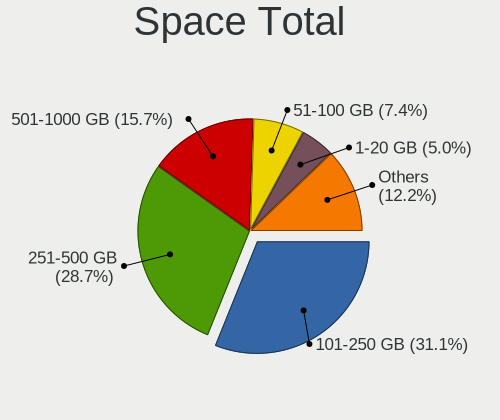
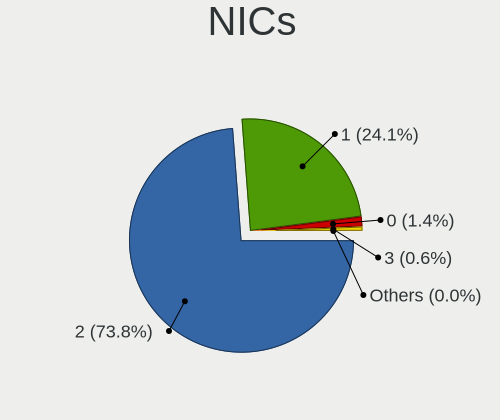
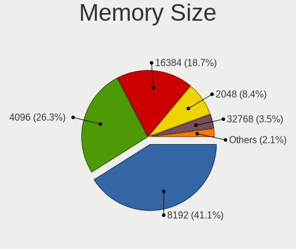

Ubuntu - Tested Hardware & Statistics (Notebooks)
-------------------------------------------------

A project to collect tested hardware configurations for Ubuntu.

Anyone can contribute to this report by the [hw-probe](https://github.com/linuxhw/hw-probe) tool:

    sudo -E hw-probe -all -upload

Please contribute! Especially if your hardware is rare.

Contents
--------

* [ Test Cases ](#test-cases)

* [ System ](#system)
  - [ OS                       ](#os)
  - [ OS Family                ](#os-family)
  - [ Kernel                   ](#kernel)
  - [ Kernel Family            ](#kernel-family)
  - [ Kernel Major Ver.        ](#kernel-major-ver)
  - [ Arch                     ](#arch)
  - [ DE                       ](#de)
  - [ Display Server           ](#display-server)
  - [ Display Manager          ](#display-manager)
  - [ OS Lang                  ](#os-lang)
  - [ Boot Mode                ](#boot-mode)
  - [ Filesystem               ](#filesystem)
  - [ Part. scheme             ](#part-scheme)
  - [ Dual Boot with Linux/BSD ](#dual-boot-with-linuxbsd)
  - [ Dual Boot (Win)          ](#dual-boot-win)

* [ Board ](#board)
  - [ Vendor                   ](#vendor)
  - [ Model                    ](#model)
  - [ Model Family             ](#model-family)
  - [ MFG Year                 ](#mfg-year)
  - [ Form Factor              ](#form-factor)
  - [ Secure Boot              ](#secure-boot)
  - [ Coreboot                 ](#coreboot)
  - [ RAM Size                 ](#ram-size)
  - [ RAM Used                 ](#ram-used)
  - [ Total Drives             ](#total-drives)
  - [ Has CD-ROM               ](#has-cd-rom)
  - [ Has Ethernet             ](#has-ethernet)
  - [ Has WiFi                 ](#has-wifi)
  - [ Has Bluetooth            ](#has-bluetooth)

* [ Location ](#location)
  - [ Country                  ](#country)
  - [ City                     ](#city)

* [ Drives ](#drives)
  - [ Drive Vendor             ](#drive-vendor)
  - [ Drive Model              ](#drive-model)
  - [ HDD Vendor               ](#hdd-vendor)
  - [ SSD Vendor               ](#ssd-vendor)
  - [ Drive Kind               ](#drive-kind)
  - [ Drive Connector          ](#drive-connector)
  - [ Drive Size               ](#drive-size)
  - [ Space Total              ](#space-total)
  - [ Space Used               ](#space-used)
  - [ Malfunc. Drives          ](#malfunc-drives)
  - [ Malfunc. Drive Vendor    ](#malfunc-drive-vendor)
  - [ Malfunc. HDD Vendor      ](#malfunc-hdd-vendor)
  - [ Malfunc. Drive Kind      ](#malfunc-drive-kind)
  - [ Failed Drives            ](#failed-drives)
  - [ Failed Drive Vendor      ](#failed-drive-vendor)
  - [ Drive Status             ](#drive-status)

* [ Storage controller ](#storage-controller)
  - [ Storage Vendor           ](#storage-vendor)
  - [ Storage Model            ](#storage-model)
  - [ Storage Kind             ](#storage-kind)

* [ Processor ](#processor)
  - [ CPU Vendor               ](#cpu-vendor)
  - [ CPU Model                ](#cpu-model)
  - [ CPU Model Family         ](#cpu-model-family)
  - [ CPU Cores                ](#cpu-cores)
  - [ CPU Sockets              ](#cpu-sockets)
  - [ CPU Threads              ](#cpu-threads)
  - [ CPU Op-Modes             ](#cpu-op-modes)
  - [ CPU Microcode            ](#cpu-microcode)
  - [ CPU Microarch            ](#cpu-microarch)

* [ Graphics ](#graphics)
  - [ GPU Vendor               ](#gpu-vendor)
  - [ GPU Model                ](#gpu-model)
  - [ GPU Combo                ](#gpu-combo)
  - [ GPU Driver               ](#gpu-driver)
  - [ GPU Memory               ](#gpu-memory)

* [ Monitor ](#monitor)
  - [ Monitor Vendor           ](#monitor-vendor)
  - [ Monitor Model            ](#monitor-model)
  - [ Monitor Resolution       ](#monitor-resolution)
  - [ Monitor Diagonal         ](#monitor-diagonal)
  - [ Monitor Width            ](#monitor-width)
  - [ Aspect Ratio             ](#aspect-ratio)
  - [ Monitor Area             ](#monitor-area)
  - [ Pixel Density            ](#pixel-density)
  - [ Multiple Monitors        ](#multiple-monitors)

* [ Network ](#network)
  - [ Net Controller Vendor    ](#net-controller-vendor)
  - [ Net Controller Model     ](#net-controller-model)
  - [ Wireless Vendor          ](#wireless-vendor)
  - [ Wireless Model           ](#wireless-model)
  - [ Ethernet Vendor          ](#ethernet-vendor)
  - [ Ethernet Model           ](#ethernet-model)
  - [ Net Controller Kind      ](#net-controller-kind)
  - [ Used Controller          ](#used-controller)
  - [ NICs                     ](#nics)
  - [ IPv6                     ](#ipv6)

* [ Bluetooth ](#bluetooth)
  - [ Bluetooth Vendor         ](#bluetooth-vendor)
  - [ Bluetooth Model          ](#bluetooth-model)

* [ Sound ](#sound)
  - [ Sound Vendor             ](#sound-vendor)
  - [ Sound Model              ](#sound-model)

* [ Memory ](#memory)
  - [ Memory Vendor            ](#memory-vendor)
  - [ Memory Model             ](#memory-model)
  - [ Memory Kind              ](#memory-kind)
  - [ Memory Form Factor       ](#memory-form-factor)
  - [ Memory Size              ](#memory-size)
  - [ Memory Speed             ](#memory-speed)

* [ Printers & scanners ](#printers--scanners)
  - [ Printer Vendor           ](#printer-vendor)
  - [ Printer Model            ](#printer-model)
  - [ Scanner Vendor           ](#scanner-vendor)
  - [ Scanner Model            ](#scanner-model)

* [ Camera ](#camera)
  - [ Camera Vendor            ](#camera-vendor)
  - [ Camera Model             ](#camera-model)

* [ Security ](#security)
  - [ Fingerprint Vendor       ](#fingerprint-vendor)
  - [ Fingerprint Model        ](#fingerprint-model)
  - [ Chipcard Vendor          ](#chipcard-vendor)
  - [ Chipcard Model           ](#chipcard-model)

* [ Unsupported ](#unsupported)
  - [ Unsupported Devices      ](#unsupported-devices)
  - [ Unsupported Device Types ](#unsupported-device-types)

Test Cases
----------

Total: 53785

| Vendor        | Model                       | Probe                                                      | Date         |
|---------------|-----------------------------|------------------------------------------------------------|--------------|
| Apple         | MacBookPro4,1               | [5d31a31783](https://linux-hardware.org/?probe=5d31a31783) | Feb 02, 2024 |
| Lenovo        | ThinkPad P1 Gen 6 21FV00... | [7b22729e20](https://linux-hardware.org/?probe=7b22729e20) | Feb 02, 2024 |
| HP            | Pavilion dm1                | [f4c8f5a8e6](https://linux-hardware.org/?probe=f4c8f5a8e6) | Feb 02, 2024 |
| Lenovo        | ThinkPad L470 W10DG 20JV... | [e05005f76b](https://linux-hardware.org/?probe=e05005f76b) | Feb 02, 2024 |
| Lenovo        | Legion Slim 5 16IRH8 83D... | [2389b9fc2f](https://linux-hardware.org/?probe=2389b9fc2f) | Feb 02, 2024 |
| Lenovo        | Legion Slim 5 16IRH8 83D... | [32facc4f9e](https://linux-hardware.org/?probe=32facc4f9e) | Feb 02, 2024 |
| Dell          | Inspiron 13-7359            | [82a1195ef5](https://linux-hardware.org/?probe=82a1195ef5) | Feb 02, 2024 |
| Dell          | Inspiron 3583               | [3c532c85ec](https://linux-hardware.org/?probe=3c532c85ec) | Feb 02, 2024 |
| Lenovo        | IdeaPad 3 17ALC6 82KV       | [3aa20161d9](https://linux-hardware.org/?probe=3aa20161d9) | Feb 02, 2024 |
| Acer          | Aspire 5741G                | [935470b35c](https://linux-hardware.org/?probe=935470b35c) | Feb 02, 2024 |
| Lenovo        | ThinkPad T14s Gen 1 20UJ... | [a64852fe4a](https://linux-hardware.org/?probe=a64852fe4a) | Feb 02, 2024 |
| Samsung       | RV410/RV510/S3510/E3510     | [1f85f107bb](https://linux-hardware.org/?probe=1f85f107bb) | Feb 02, 2024 |
| Acer          | Aspire V3-772               | [4a32c0297c](https://linux-hardware.org/?probe=4a32c0297c) | Feb 02, 2024 |
| ASUSTek       | VivoBook_ASUSLaptop M350... | [cb15afccd0](https://linux-hardware.org/?probe=cb15afccd0) | Feb 02, 2024 |
| Dell          | Precision 7550              | [c210fa0d97](https://linux-hardware.org/?probe=c210fa0d97) | Feb 02, 2024 |
| Acer          | Aspire 5741G                | [d598afdbe9](https://linux-hardware.org/?probe=d598afdbe9) | Feb 02, 2024 |
| DEXP          | Atlas M14-I5W303            | [fd14684ed2](https://linux-hardware.org/?probe=fd14684ed2) | Feb 02, 2024 |
| Lenovo        | ThinkPad E590 20NB002BRT    | [283a2fd324](https://linux-hardware.org/?probe=283a2fd324) | Feb 02, 2024 |
| HP            | ProBook 450 G8 Notebook ... | [0bbbc51a52](https://linux-hardware.org/?probe=0bbbc51a52) | Feb 02, 2024 |
| Lenovo        | ThinkBook 16p Gen 4 21J8    | [7cbebba117](https://linux-hardware.org/?probe=7cbebba117) | Feb 02, 2024 |
| Acer          | Nitro AN515-58              | [1fe97c9103](https://linux-hardware.org/?probe=1fe97c9103) | Feb 02, 2024 |
| SLIMBOOK      | HERO-S-TGL-RTX              | [1260457422](https://linux-hardware.org/?probe=1260457422) | Feb 02, 2024 |
| Apple         | MacBookAir5,1               | [e25bf95ccb](https://linux-hardware.org/?probe=e25bf95ccb) | Feb 02, 2024 |
| Apple         | MacBookAir5,1               | [058a447435](https://linux-hardware.org/?probe=058a447435) | Feb 02, 2024 |
| Dell          | Inspiron 7577               | [0155afe6f3](https://linux-hardware.org/?probe=0155afe6f3) | Feb 02, 2024 |
| Apple         | MacBookPro11,3              | [5bc93c37fa](https://linux-hardware.org/?probe=5bc93c37fa) | Feb 02, 2024 |
| Dell          | Inspiron 3542               | [176eee6b84](https://linux-hardware.org/?probe=176eee6b84) | Feb 02, 2024 |
| Dell          | Inspiron 3542               | [7f677482ef](https://linux-hardware.org/?probe=7f677482ef) | Feb 02, 2024 |
| Lenovo        | ThinkBook 14 G6 IRL 21KG    | [c01e746574](https://linux-hardware.org/?probe=c01e746574) | Feb 02, 2024 |
| ASUSTek       | ROG Strix G531GT_G531GT     | [5e505eb9f1](https://linux-hardware.org/?probe=5e505eb9f1) | Feb 02, 2024 |
| Pegatron      | Spring Peak                 | [b14f110621](https://linux-hardware.org/?probe=b14f110621) | Feb 02, 2024 |
| Lenovo        | ThinkPad E14 Gen 2 20T60... | [47431ad7d9](https://linux-hardware.org/?probe=47431ad7d9) | Feb 02, 2024 |
| ASUSTek       | N53SV                       | [ee79ea1cbb](https://linux-hardware.org/?probe=ee79ea1cbb) | Feb 01, 2024 |
| Lenovo        | ThinkPad T440 20B7A0B7MN    | [74173e2c0a](https://linux-hardware.org/?probe=74173e2c0a) | Feb 01, 2024 |
| Pegatron      | Spring Peak                 | [4404cfb5c8](https://linux-hardware.org/?probe=4404cfb5c8) | Feb 01, 2024 |
| Lenovo        | IdeaPad S340-15API 81NC     | [7340c4abd7](https://linux-hardware.org/?probe=7340c4abd7) | Feb 01, 2024 |
| ASUSTek       | Zenbook UM3402YAR_UM3402... | [f0b3157a23](https://linux-hardware.org/?probe=f0b3157a23) | Feb 01, 2024 |
| Dell          | Latitude 5420               | [9ca4bb32d7](https://linux-hardware.org/?probe=9ca4bb32d7) | Feb 01, 2024 |
| Lenovo        | Yoga Slim 7 ProX 14ARH7 ... | [58f11b08b0](https://linux-hardware.org/?probe=58f11b08b0) | Feb 01, 2024 |
| Dell          | Inspiron N5010              | [151239b938](https://linux-hardware.org/?probe=151239b938) | Feb 01, 2024 |
| Lenovo        | ThinkPad E15 Gen 4 21E60... | [fb180a9a54](https://linux-hardware.org/?probe=fb180a9a54) | Feb 01, 2024 |
| Lenovo        | ThinkPad X280 20KES4TD0T    | [4af2fc13f4](https://linux-hardware.org/?probe=4af2fc13f4) | Feb 01, 2024 |
| Dell          | Vostro 3525                 | [495877fada](https://linux-hardware.org/?probe=495877fada) | Feb 01, 2024 |
| ASUSTek       | Zenbook UM3402YAR_UM3402... | [04c6362187](https://linux-hardware.org/?probe=04c6362187) | Feb 01, 2024 |
| ASUSTek       | N53SV                       | [29807f0dfa](https://linux-hardware.org/?probe=29807f0dfa) | Feb 01, 2024 |
| AMI           | Intel                       | [6d3ac84f15](https://linux-hardware.org/?probe=6d3ac84f15) | Feb 01, 2024 |
| Lenovo        | ThinkPad X1 Carbon 6th 2... | [6acefbaadc](https://linux-hardware.org/?probe=6acefbaadc) | Feb 01, 2024 |
| Acer          | Swift SF314-512             | [28bd75703e](https://linux-hardware.org/?probe=28bd75703e) | Feb 01, 2024 |
| Lenovo        | Yoga Slim 7 ProX 14ARH7 ... | [5f2635ae3a](https://linux-hardware.org/?probe=5f2635ae3a) | Feb 01, 2024 |
| Dell          | Inspiron 7501               | [5c071c25ab](https://linux-hardware.org/?probe=5c071c25ab) | Feb 01, 2024 |
| Fujitsu       | LIFEBOOK E752               | [5bd3d39655](https://linux-hardware.org/?probe=5bd3d39655) | Feb 01, 2024 |
| Lenovo        | IdeaPad 1 15ADA7 82R1       | [aaec148c06](https://linux-hardware.org/?probe=aaec148c06) | Feb 01, 2024 |
| TrekStor      | Primebook P14               | [ffd6c873de](https://linux-hardware.org/?probe=ffd6c873de) | Feb 01, 2024 |
| Dell          | Inspiron 15 7000 Gaming     | [8689e993e3](https://linux-hardware.org/?probe=8689e993e3) | Feb 01, 2024 |
| Dell          | Inspiron 15 7000 Gaming     | [01332b7a24](https://linux-hardware.org/?probe=01332b7a24) | Feb 01, 2024 |
| Apple         | MacBookPro4,1               | [863b50ad5a](https://linux-hardware.org/?probe=863b50ad5a) | Feb 01, 2024 |
| Dell          | Inspiron 3542               | [5a7e77b4a7](https://linux-hardware.org/?probe=5a7e77b4a7) | Feb 01, 2024 |
| Dell          | Precision 5680              | [9d85b2e2ea](https://linux-hardware.org/?probe=9d85b2e2ea) | Feb 01, 2024 |
| Toshiba       | Satellite L750              | [a1e1f9075d](https://linux-hardware.org/?probe=a1e1f9075d) | Feb 01, 2024 |
| Sony          | SVE14A1V1EW                 | [0323c38fe4](https://linux-hardware.org/?probe=0323c38fe4) | Jan 31, 2024 |
| HP            | ENVY dv6                    | [a91621750a](https://linux-hardware.org/?probe=a91621750a) | Jan 31, 2024 |
| Dell          | Latitude 7480               | [268ea50333](https://linux-hardware.org/?probe=268ea50333) | Jan 31, 2024 |
| ASUSTek       | X555LD                      | [bc95890dcd](https://linux-hardware.org/?probe=bc95890dcd) | Jan 31, 2024 |
| Lenovo        | ThinkPad X1 Carbon Gen 1... | [a84c65f63e](https://linux-hardware.org/?probe=a84c65f63e) | Jan 31, 2024 |
| HUAWEI        | MCLF-XX                     | [97bfeb35bc](https://linux-hardware.org/?probe=97bfeb35bc) | Jan 31, 2024 |
| Dell          | Latitude E7250              | [24ea631399](https://linux-hardware.org/?probe=24ea631399) | Jan 31, 2024 |
| Dell          | Latitude 5501               | [7c92ef29c9](https://linux-hardware.org/?probe=7c92ef29c9) | Jan 31, 2024 |
| ASUSTek       | Zenbook UX5401ZAS_UX5401... | [36be131f18](https://linux-hardware.org/?probe=36be131f18) | Jan 31, 2024 |
| Dell          | Inspiron 5537               | [600bb8363d](https://linux-hardware.org/?probe=600bb8363d) | Jan 31, 2024 |
| ASUSTek       | X555LD                      | [e65c871d95](https://linux-hardware.org/?probe=e65c871d95) | Jan 31, 2024 |
| ASUSTek       | X555LD                      | [1433f11bba](https://linux-hardware.org/?probe=1433f11bba) | Jan 31, 2024 |
| MSI           | Modern 14 B5M               | [e41b88a884](https://linux-hardware.org/?probe=e41b88a884) | Jan 31, 2024 |
| Fujitsu       | LIFEBOOK E554               | [ce905760f2](https://linux-hardware.org/?probe=ce905760f2) | Jan 31, 2024 |
| Minix         | NEO Z83-4A                  | [a563c8089f](https://linux-hardware.org/?probe=a563c8089f) | Jan 31, 2024 |
| Lenovo        | IdeaPad 300-17ISK 80QH      | [4f9b6c7262](https://linux-hardware.org/?probe=4f9b6c7262) | Jan 31, 2024 |
| Lenovo        | IdeaPad 300-17ISK 80QH      | [0e068176e4](https://linux-hardware.org/?probe=0e068176e4) | Jan 31, 2024 |
| Apple         | MacBook8,1                  | [6ef40b726e](https://linux-hardware.org/?probe=6ef40b726e) | Jan 31, 2024 |
| Dell          | Precision 7710              | [6e600ac30e](https://linux-hardware.org/?probe=6e600ac30e) | Jan 31, 2024 |
| ASUSTek       | ROG Strix G531GT_G531GT     | [97575d7173](https://linux-hardware.org/?probe=97575d7173) | Jan 31, 2024 |
| Dell          | XPS 13 9380                 | [479853dd4c](https://linux-hardware.org/?probe=479853dd4c) | Jan 31, 2024 |
| Dell          | Latitude E6430s             | [6eacf03c08](https://linux-hardware.org/?probe=6eacf03c08) | Jan 31, 2024 |
| Acer          | Swift SF514-56T             | [14b287861f](https://linux-hardware.org/?probe=14b287861f) | Jan 31, 2024 |
| ASUSTek       | TUF Gaming FX505DT_TUF50... | [5193f57d67](https://linux-hardware.org/?probe=5193f57d67) | Jan 31, 2024 |
| Acer          | Swift SF314-42              | [32d0112bcd](https://linux-hardware.org/?probe=32d0112bcd) | Jan 30, 2024 |
| HP            | ProBook 450 G8              | [f8d060061c](https://linux-hardware.org/?probe=f8d060061c) | Jan 30, 2024 |
| HP            | ProBook 450 G8              | [4ca13b7d13](https://linux-hardware.org/?probe=4ca13b7d13) | Jan 30, 2024 |
| HP            | Pavilion dv6                | [e1e2c04f8c](https://linux-hardware.org/?probe=e1e2c04f8c) | Jan 30, 2024 |
| Alienware     | 15 R3                       | [297db64e3b](https://linux-hardware.org/?probe=297db64e3b) | Jan 30, 2024 |
| ASUSTek       | ROG Strix G814JI_G814JI     | [b51ecf60ef](https://linux-hardware.org/?probe=b51ecf60ef) | Jan 30, 2024 |
| Apple         | MacBook8,1                  | [9580d3149f](https://linux-hardware.org/?probe=9580d3149f) | Jan 30, 2024 |
| Lenovo        | Yoga S730-13IWL 81J0        | [87e2c70726](https://linux-hardware.org/?probe=87e2c70726) | Jan 30, 2024 |
| Lenovo        | ThinkPad T14 Gen 4 21K3C... | [649745f3ae](https://linux-hardware.org/?probe=649745f3ae) | Jan 30, 2024 |
| Dell          | XPS 13 9305                 | [1b2e728298](https://linux-hardware.org/?probe=1b2e728298) | Jan 30, 2024 |
| Lenovo        | ThinkPad X1 Carbon Gen 8... | [1669d54762](https://linux-hardware.org/?probe=1669d54762) | Jan 30, 2024 |
| Lenovo        | ThinkPad T510 43149TG       | [463b653f7a](https://linux-hardware.org/?probe=463b653f7a) | Jan 30, 2024 |
| Medion        | X781X                       | [3665eaa65c](https://linux-hardware.org/?probe=3665eaa65c) | Jan 30, 2024 |
| ASUSTek       | Vivobook Go E1504FA_E150... | [646a977cdd](https://linux-hardware.org/?probe=646a977cdd) | Jan 30, 2024 |
| ASUSTek       | VivoBook_ASUSLaptop K370... | [e935a209d7](https://linux-hardware.org/?probe=e935a209d7) | Jan 30, 2024 |
| ASUSTek       | VivoBook_ASUSLaptop K370... | [4a1a726464](https://linux-hardware.org/?probe=4a1a726464) | Jan 30, 2024 |
| Dell          | Latitude 7212 Rugged Ext... | [d21b8c5f4e](https://linux-hardware.org/?probe=d21b8c5f4e) | Jan 30, 2024 |
| ASUSTek       | VivoBook_ASUSLaptop K360... | [1ebab4d906](https://linux-hardware.org/?probe=1ebab4d906) | Jan 30, 2024 |
| Lenovo        | ThinkPad P1 Gen 6 21FV00... | [bf8891bdd5](https://linux-hardware.org/?probe=bf8891bdd5) | Jan 30, 2024 |
| Lenovo        | ThinkPad T410 2537AT1       | [54b5a51811](https://linux-hardware.org/?probe=54b5a51811) | Jan 30, 2024 |
| HP            | Pavilion dv7                | [8aab31766b](https://linux-hardware.org/?probe=8aab31766b) | Jan 30, 2024 |
| ASUSTek       | X540LA                      | [503b80e997](https://linux-hardware.org/?probe=503b80e997) | Jan 30, 2024 |
| ASUSTek       | UX550VD                     | [3b742650db](https://linux-hardware.org/?probe=3b742650db) | Jan 29, 2024 |
| Apple         | MacBookPro4,1               | [2e5f443b99](https://linux-hardware.org/?probe=2e5f443b99) | Jan 29, 2024 |
| Lenovo        | ThinkPad T14 Gen 3 21AH0... | [913338a499](https://linux-hardware.org/?probe=913338a499) | Jan 29, 2024 |
| Acer          | Aspire E1-522               | [1dab2e243c](https://linux-hardware.org/?probe=1dab2e243c) | Jan 29, 2024 |
| HP            | ProBook 640 G1              | [7bbe891072](https://linux-hardware.org/?probe=7bbe891072) | Jan 29, 2024 |
| Lenovo        | IdeaPad 3 15ADA05 81W1      | [dafe3d53e0](https://linux-hardware.org/?probe=dafe3d53e0) | Jan 29, 2024 |
| ASUSTek       | Vivobook Go E1404FA_E140... | [a1d3b30464](https://linux-hardware.org/?probe=a1d3b30464) | Jan 29, 2024 |
| ASUSTek       | Vivobook Go E1404FA_E140... | [ae5e53e103](https://linux-hardware.org/?probe=ae5e53e103) | Jan 29, 2024 |
| Lenovo        | ThinkPad X1 Carbon 3rd 2... | [bc4c195cfe](https://linux-hardware.org/?probe=bc4c195cfe) | Jan 29, 2024 |
| ASUSTek       | VivoBook_ASUSLaptop X150... | [3819e0c97d](https://linux-hardware.org/?probe=3819e0c97d) | Jan 29, 2024 |
| Dell          | Latitude 5430 Rugged        | [8708a1170b](https://linux-hardware.org/?probe=8708a1170b) | Jan 29, 2024 |
| Dell          | Inspiron N5110              | [eaf977415d](https://linux-hardware.org/?probe=eaf977415d) | Jan 29, 2024 |
| Dell          | Inspiron 1525               | [aeacd97c42](https://linux-hardware.org/?probe=aeacd97c42) | Jan 29, 2024 |
| Lenovo        | Legion 5 15ACH6H 82JU       | [0c4fb535dc](https://linux-hardware.org/?probe=0c4fb535dc) | Jan 29, 2024 |
| HUAWEI        | NBLB-WAX9N                  | [dc9267becb](https://linux-hardware.org/?probe=dc9267becb) | Jan 29, 2024 |
| Medion        | P15648                      | [d906da0d95](https://linux-hardware.org/?probe=d906da0d95) | Jan 29, 2024 |
| HP            | Dragonfly Pro Laptop PC     | [f7605bd832](https://linux-hardware.org/?probe=f7605bd832) | Jan 28, 2024 |
| Acer          | Nitro AN515-58              | [20b00f9064](https://linux-hardware.org/?probe=20b00f9064) | Jan 28, 2024 |
| Apple         | MacBookAir6,1               | [d508f78053](https://linux-hardware.org/?probe=d508f78053) | Jan 28, 2024 |
| HP            | Notebook                    | [d8a6181633](https://linux-hardware.org/?probe=d8a6181633) | Jan 28, 2024 |
| HP            | ProBook 4530s               | [6135fed286](https://linux-hardware.org/?probe=6135fed286) | Jan 28, 2024 |
| Lenovo        | IdeaPad S510p 20298         | [7c9fb93a37](https://linux-hardware.org/?probe=7c9fb93a37) | Jan 28, 2024 |
| Lenovo        | IdeaPad 130-15AST 81H5      | [81e9c9a499](https://linux-hardware.org/?probe=81e9c9a499) | Jan 28, 2024 |
| HP            | Pavilion dv6                | [383b87d6a5](https://linux-hardware.org/?probe=383b87d6a5) | Jan 28, 2024 |
| Toshiba       | Satellite P50-B-10Z         | [574103da6a](https://linux-hardware.org/?probe=574103da6a) | Jan 28, 2024 |
| Lenovo        | IdeaPad 3 15ADA05 81W1      | [cab252fea3](https://linux-hardware.org/?probe=cab252fea3) | Jan 28, 2024 |
| Acer          | Aspire VN7-571G             | [b5f8437f3c](https://linux-hardware.org/?probe=b5f8437f3c) | Jan 28, 2024 |
| HP            | ZBook Studio G3             | [136b9a2567](https://linux-hardware.org/?probe=136b9a2567) | Jan 28, 2024 |
| Apple         | MacBookPro14,3              | [1b5bfa9bcb](https://linux-hardware.org/?probe=1b5bfa9bcb) | Jan 28, 2024 |
| HP            | Victus by Gaming Laptop ... | [49e891b67d](https://linux-hardware.org/?probe=49e891b67d) | Jan 28, 2024 |
| HP            | ENVY Laptop 15-ep0xxx       | [c2d0dabb5e](https://linux-hardware.org/?probe=c2d0dabb5e) | Jan 28, 2024 |
| Dell          | G15 5511                    | [53225a4d52](https://linux-hardware.org/?probe=53225a4d52) | Jan 28, 2024 |
| Dell          | Inspiron 3537               | [e91c3bfd73](https://linux-hardware.org/?probe=e91c3bfd73) | Jan 28, 2024 |
| Dell          | Inspiron 3537               | [0ee7687e3f](https://linux-hardware.org/?probe=0ee7687e3f) | Jan 28, 2024 |
| Google        | Elemi                       | [f767c4fdbb](https://linux-hardware.org/?probe=f767c4fdbb) | Jan 28, 2024 |
| Lenovo        | IdeaPad 130-15AST 81H5      | [465b69ceca](https://linux-hardware.org/?probe=465b69ceca) | Jan 28, 2024 |
| Dell          | Precision M4700             | [ed04788986](https://linux-hardware.org/?probe=ed04788986) | Jan 28, 2024 |
| Acer          | Aspire A515-46              | [935246f473](https://linux-hardware.org/?probe=935246f473) | Jan 28, 2024 |
| Acer          | Aspire A515-46              | [f023bc003e](https://linux-hardware.org/?probe=f023bc003e) | Jan 27, 2024 |
| Dell          | Latitude 7490               | [8687d67e07](https://linux-hardware.org/?probe=8687d67e07) | Jan 27, 2024 |
| HP            | Notebook                    | [78ffba1358](https://linux-hardware.org/?probe=78ffba1358) | Jan 27, 2024 |
| Apple         | MacBookPro9,2               | [8bca4f366d](https://linux-hardware.org/?probe=8bca4f366d) | Jan 27, 2024 |
| ASUSTek       | Zenbook UM3402YAR_UM3402... | [ee59cf62cb](https://linux-hardware.org/?probe=ee59cf62cb) | Jan 27, 2024 |
| Dell          | Inspiron 5570               | [0fce3dbe59](https://linux-hardware.org/?probe=0fce3dbe59) | Jan 27, 2024 |
| Dell          | Latitude 5290 2-in-1        | [5f28b98de6](https://linux-hardware.org/?probe=5f28b98de6) | Jan 27, 2024 |
| Dell          | Latitude 7390 2-in-1        | [d57566edb3](https://linux-hardware.org/?probe=d57566edb3) | Jan 27, 2024 |
| Dell          | Latitude 7390 2-in-1        | [26a44b8cab](https://linux-hardware.org/?probe=26a44b8cab) | Jan 27, 2024 |
| Lenovo        | ThinkPad X230 2325BA3       | [700fc5c431](https://linux-hardware.org/?probe=700fc5c431) | Jan 27, 2024 |
| Acer          | Aspire A715-51G             | [e6b8ceb566](https://linux-hardware.org/?probe=e6b8ceb566) | Jan 27, 2024 |
| Dell          | Latitude E7450              | [d427866522](https://linux-hardware.org/?probe=d427866522) | Jan 27, 2024 |
| Dell          | XPS 9320                    | [0214714fb9](https://linux-hardware.org/?probe=0214714fb9) | Jan 27, 2024 |
| ASUSTek       | Zenbook UM3402YAR_UM3402... | [dfb6b2a1c8](https://linux-hardware.org/?probe=dfb6b2a1c8) | Jan 27, 2024 |
| HONOR         | FRI-FXX                     | [c9b0b584fc](https://linux-hardware.org/?probe=c9b0b584fc) | Jan 27, 2024 |
| Fujitsu       | FARQ10003                   | [6084280fc9](https://linux-hardware.org/?probe=6084280fc9) | Jan 27, 2024 |
| System76      | Oryx Pro                    | [faac85b51d](https://linux-hardware.org/?probe=faac85b51d) | Jan 27, 2024 |
| Dell          | Latitude E7440              | [8d31059748](https://linux-hardware.org/?probe=8d31059748) | Jan 27, 2024 |
| Dell          | Inspiron 3542               | [2a81d5f313](https://linux-hardware.org/?probe=2a81d5f313) | Jan 27, 2024 |
| ASUSTek       | K52JT                       | [dd44051584](https://linux-hardware.org/?probe=dd44051584) | Jan 27, 2024 |
| Dell          | Inspiron 13-5378            | [a742fdf96d](https://linux-hardware.org/?probe=a742fdf96d) | Jan 27, 2024 |
| Lenovo        | IdeaPad 3 15ITL6 82H8       | [5fac7fde98](https://linux-hardware.org/?probe=5fac7fde98) | Jan 27, 2024 |
| Apple         | MacBookPro9,2               | [9518bd6b03](https://linux-hardware.org/?probe=9518bd6b03) | Jan 27, 2024 |
| Dell          | Latitude E5250              | [29a9f5d01c](https://linux-hardware.org/?probe=29a9f5d01c) | Jan 26, 2024 |
| Fujitsu       | LIFEBOOK E548               | [515098ce8f](https://linux-hardware.org/?probe=515098ce8f) | Jan 26, 2024 |
| Apple         | MacBookPro9,2               | [5591f82595](https://linux-hardware.org/?probe=5591f82595) | Jan 26, 2024 |
| Dell          | Precision 5680              | [5159fe0624](https://linux-hardware.org/?probe=5159fe0624) | Jan 26, 2024 |
| Apple         | MacBookPro8,1               | [fa96de4635](https://linux-hardware.org/?probe=fa96de4635) | Jan 26, 2024 |
| Apple         | MacBookPro8,1               | [90c57cfb01](https://linux-hardware.org/?probe=90c57cfb01) | Jan 26, 2024 |
| HP            | 15 Notebook PC              | [9f12f6bda7](https://linux-hardware.org/?probe=9f12f6bda7) | Jan 26, 2024 |
| Dell          | Latitude 5521               | [0524c08c30](https://linux-hardware.org/?probe=0524c08c30) | Jan 26, 2024 |
| ASUSTek       | ZenBook UX435EG_UX435EG     | [a354ee36fe](https://linux-hardware.org/?probe=a354ee36fe) | Jan 26, 2024 |
| Apple         | MacBookPro11,3              | [5859ff1ab1](https://linux-hardware.org/?probe=5859ff1ab1) | Jan 26, 2024 |
| TUXEDO        | Aura 15 Gen1                | [27fa584690](https://linux-hardware.org/?probe=27fa584690) | Jan 26, 2024 |
| HUAWEI        | KLVL-WXX9                   | [4b630c4e1e](https://linux-hardware.org/?probe=4b630c4e1e) | Jan 26, 2024 |
| HUAWEI        | KLVL-WXX9                   | [c639997108](https://linux-hardware.org/?probe=c639997108) | Jan 26, 2024 |
| UNOWHY        | Y13G011S4EI                 | [30193a9845](https://linux-hardware.org/?probe=30193a9845) | Jan 26, 2024 |
| Lenovo        | ThinkPad T580 20LAS62M07    | [d55ac7557b](https://linux-hardware.org/?probe=d55ac7557b) | Jan 26, 2024 |
| Lenovo        | IdeaPad 3 15ADA05 81W1      | [87d6398f5b](https://linux-hardware.org/?probe=87d6398f5b) | Jan 26, 2024 |
| ASUSTek       | B400VC                      | [af39cde6d9](https://linux-hardware.org/?probe=af39cde6d9) | Jan 26, 2024 |
| HP            | 650                         | [d440902ea2](https://linux-hardware.org/?probe=d440902ea2) | Jan 26, 2024 |
| Toshiba       | Satellite C670D-12Q         | [a9a2651adc](https://linux-hardware.org/?probe=a9a2651adc) | Jan 26, 2024 |
| HUAWEI        | KLVD-WXX9                   | [42e8e68344](https://linux-hardware.org/?probe=42e8e68344) | Jan 26, 2024 |
| Dell          | XPS 9320                    | [ed6a1f51f5](https://linux-hardware.org/?probe=ed6a1f51f5) | Jan 26, 2024 |
| HP            | Pavilion 15                 | [3aed9dffe5](https://linux-hardware.org/?probe=3aed9dffe5) | Jan 26, 2024 |
| HP            | Pavilion 15                 | [5d449f9a23](https://linux-hardware.org/?probe=5d449f9a23) | Jan 26, 2024 |
| Dell          | Latitude 5490               | [f1fe39af02](https://linux-hardware.org/?probe=f1fe39af02) | Jan 26, 2024 |
| HP            | Pavilion dv6                | [9a15d7d823](https://linux-hardware.org/?probe=9a15d7d823) | Jan 26, 2024 |
| HP            | Laptop 15-bw0xx             | [6faf9b7c3a](https://linux-hardware.org/?probe=6faf9b7c3a) | Jan 26, 2024 |
| Google        | Markarth                    | [39dface7d9](https://linux-hardware.org/?probe=39dface7d9) | Jan 26, 2024 |
| Lenovo        | ThinkPad X1 Carbon 6th 2... | [565926342b](https://linux-hardware.org/?probe=565926342b) | Jan 25, 2024 |
| Dell          | Inspiron 3558               | [7972792612](https://linux-hardware.org/?probe=7972792612) | Jan 25, 2024 |
| Lenovo        | ThinkPad X230 2325BA3       | [279854db8e](https://linux-hardware.org/?probe=279854db8e) | Jan 25, 2024 |
| Toshiba       | Satellite P70-B             | [3e21232f45](https://linux-hardware.org/?probe=3e21232f45) | Jan 25, 2024 |
| Lenovo        | IdeaPad 3 15IAU7 82RK       | [8dd7c2b2aa](https://linux-hardware.org/?probe=8dd7c2b2aa) | Jan 25, 2024 |
| Apple         | MacBookPro14,1              | [41817d480d](https://linux-hardware.org/?probe=41817d480d) | Jan 25, 2024 |
| Dell          | Inspiron 3558               | [4d1b20eaa7](https://linux-hardware.org/?probe=4d1b20eaa7) | Jan 25, 2024 |
| ASUSTek       | VivoBook_ASUSLaptop X415... | [e6681b71bc](https://linux-hardware.org/?probe=e6681b71bc) | Jan 25, 2024 |
| ASUSTek       | VivoBook_ASUSLaptop X415... | [65a3715aa3](https://linux-hardware.org/?probe=65a3715aa3) | Jan 25, 2024 |
| Lenovo        | ThinkPad X1 Carbon 6th 2... | [aac76b979a](https://linux-hardware.org/?probe=aac76b979a) | Jan 25, 2024 |
| HP            | ProBook 450 G1              | [97c68df9c0](https://linux-hardware.org/?probe=97c68df9c0) | Jan 25, 2024 |
| Dell          | Inspiron 1525               | [cfa1bbba1a](https://linux-hardware.org/?probe=cfa1bbba1a) | Jan 25, 2024 |
| ASUSTek       | ASUS EXPERTBOOK B1500CBA... | [a0b0aa335e](https://linux-hardware.org/?probe=a0b0aa335e) | Jan 25, 2024 |
| Dell          | Inspiron 5521               | [18fc8668de](https://linux-hardware.org/?probe=18fc8668de) | Jan 25, 2024 |
| Acer          | Aspire A317-53              | [9b9d2bfdc3](https://linux-hardware.org/?probe=9b9d2bfdc3) | Jan 25, 2024 |
| ASUSTek       | ASUS EXPERTBOOK B1500CBA... | [2add8788ab](https://linux-hardware.org/?probe=2add8788ab) | Jan 25, 2024 |
| HP            | 2000                        | [f1e38c4df2](https://linux-hardware.org/?probe=f1e38c4df2) | Jan 25, 2024 |
| Dell          | Inspiron 3581               | [7a5cfbd8d3](https://linux-hardware.org/?probe=7a5cfbd8d3) | Jan 25, 2024 |
| HP            | EliteBook 8470p             | [b892b5b8a4](https://linux-hardware.org/?probe=b892b5b8a4) | Jan 25, 2024 |
| Dell          | Inspiron 3581               | [dbf2745f1f](https://linux-hardware.org/?probe=dbf2745f1f) | Jan 25, 2024 |
| Acer          | Nitro AN515-57              | [052f6bc120](https://linux-hardware.org/?probe=052f6bc120) | Jan 25, 2024 |
| Acer          | Swift SF314-57              | [352b6edd13](https://linux-hardware.org/?probe=352b6edd13) | Jan 25, 2024 |
| Acer          | Aspire A315-24P             | [24a5e0a03c](https://linux-hardware.org/?probe=24a5e0a03c) | Jan 25, 2024 |
| Lenovo        | ThinkPad T470 20HES18S02    | [9f18c011e4](https://linux-hardware.org/?probe=9f18c011e4) | Jan 25, 2024 |
| Samsung       | 905S3G/906S3G/915S3G/930... | [8c1fb214b8](https://linux-hardware.org/?probe=8c1fb214b8) | Jan 25, 2024 |
| HP            | ZBook 15v G5                | [8e114d2ba9](https://linux-hardware.org/?probe=8e114d2ba9) | Jan 25, 2024 |
| Dell          | Latitude E5470              | [25f5da470b](https://linux-hardware.org/?probe=25f5da470b) | Jan 24, 2024 |
| ASUSTek       | N551VW                      | [2a8f1d7cc1](https://linux-hardware.org/?probe=2a8f1d7cc1) | Jan 24, 2024 |
| Acer          | Nitro AN515-52              | [36dc15871c](https://linux-hardware.org/?probe=36dc15871c) | Jan 24, 2024 |
| Lenovo        | IdeaPad 3-15ALC6 82KU       | [c91921bbe1](https://linux-hardware.org/?probe=c91921bbe1) | Jan 24, 2024 |
| Samsung       | 905S3G/906S3G/915S3G/930... | [f3512d75e9](https://linux-hardware.org/?probe=f3512d75e9) | Jan 24, 2024 |
| HP            | 15                          | [6cd885c267](https://linux-hardware.org/?probe=6cd885c267) | Jan 24, 2024 |
| Lenovo        | ThinkPad T540p 20BFS2100... | [1bf8988f36](https://linux-hardware.org/?probe=1bf8988f36) | Jan 24, 2024 |
| Lenovo        | ThinkPad T540p 20BFS2100... | [08b929fe37](https://linux-hardware.org/?probe=08b929fe37) | Jan 24, 2024 |
| Lenovo        | IdeaPad Gaming 3 15IHU6 ... | [606adf78f9](https://linux-hardware.org/?probe=606adf78f9) | Jan 24, 2024 |
| Lenovo        | ThinkPad X1 Carbon 2nd 2... | [86ff649a4d](https://linux-hardware.org/?probe=86ff649a4d) | Jan 24, 2024 |
| Acer          | Aspire V3-331               | [002e761d1d](https://linux-hardware.org/?probe=002e761d1d) | Jan 24, 2024 |
| Acer          | Aspire V3-331               | [944c9b110c](https://linux-hardware.org/?probe=944c9b110c) | Jan 24, 2024 |
| Dell          | Latitude 7490               | [d2085f3674](https://linux-hardware.org/?probe=d2085f3674) | Jan 24, 2024 |
| ASUSTek       | X541UV                      | [7df0d2b4af](https://linux-hardware.org/?probe=7df0d2b4af) | Jan 24, 2024 |
| Google        | Markarth                    | [2258b38e4b](https://linux-hardware.org/?probe=2258b38e4b) | Jan 24, 2024 |
| HP            | Elite Dragonfly 13.5 inc... | [e78a5c9804](https://linux-hardware.org/?probe=e78a5c9804) | Jan 24, 2024 |
| Dell          | Latitude E6500              | [7c35926249](https://linux-hardware.org/?probe=7c35926249) | Jan 24, 2024 |
| ASUSTek       | VivoBook_ASUSLaptop X150... | [88f29ebedf](https://linux-hardware.org/?probe=88f29ebedf) | Jan 24, 2024 |
| Lenovo        | ThinkPad T530 24297XG       | [9b6f11b3a9](https://linux-hardware.org/?probe=9b6f11b3a9) | Jan 24, 2024 |
| HP            | Laptop 15-dy2xxx            | [dc91d2aa92](https://linux-hardware.org/?probe=dc91d2aa92) | Jan 24, 2024 |
| Acer          | Aspire A315-57G             | [ed1eb72a6d](https://linux-hardware.org/?probe=ed1eb72a6d) | Jan 24, 2024 |
| Dell          | Latitude 7410               | [cbb6638a4d](https://linux-hardware.org/?probe=cbb6638a4d) | Jan 24, 2024 |
| Fujitsu       | LIFEBOOK E736               | [7f0a2dd840](https://linux-hardware.org/?probe=7f0a2dd840) | Jan 24, 2024 |
| Acer          | Nitro AN515-45              | [decd7eb6dc](https://linux-hardware.org/?probe=decd7eb6dc) | Jan 24, 2024 |
| Dell          | Inspiron 7375               | [cd6587d15b](https://linux-hardware.org/?probe=cd6587d15b) | Jan 24, 2024 |
| ASUSTek       | G750JM                      | [82e5873786](https://linux-hardware.org/?probe=82e5873786) | Jan 24, 2024 |
| Apple         | MacBookAir6,1               | [b687521689](https://linux-hardware.org/?probe=b687521689) | Jan 24, 2024 |
| Dell          | Inspiron 5570               | [7c453fba6f](https://linux-hardware.org/?probe=7c453fba6f) | Jan 23, 2024 |
| Dell          | Precision 5570              | [e6e937745c](https://linux-hardware.org/?probe=e6e937745c) | Jan 23, 2024 |
| Dell          | Studio 1737                 | [521626cdc5](https://linux-hardware.org/?probe=521626cdc5) | Jan 23, 2024 |
| ASUSTek       | ASUS TUF Gaming F15 FX50... | [122f69f8c5](https://linux-hardware.org/?probe=122f69f8c5) | Jan 23, 2024 |
| Lenovo        | IdeaPad S145-15IWL 81MV     | [cf3c2deee4](https://linux-hardware.org/?probe=cf3c2deee4) | Jan 23, 2024 |
| Lenovo        | ThinkPad T420s 4174HR1      | [ab4b7bc31f](https://linux-hardware.org/?probe=ab4b7bc31f) | Jan 23, 2024 |
| Lenovo        | ThinkPad W541 20EGS3630P    | [1cca38d87f](https://linux-hardware.org/?probe=1cca38d87f) | Jan 23, 2024 |
| ASUSTek       | ROG Zephyrus M16 GU603ZW... | [7ea2706c0f](https://linux-hardware.org/?probe=7ea2706c0f) | Jan 23, 2024 |
| HP            | Pavilion Laptop 14-ec0xx... | [7c041036d7](https://linux-hardware.org/?probe=7c041036d7) | Jan 23, 2024 |
| Dell          | Latitude 5521               | [34567d3078](https://linux-hardware.org/?probe=34567d3078) | Jan 23, 2024 |
| Acer          | Aspire A315-58              | [286a2dcf7a](https://linux-hardware.org/?probe=286a2dcf7a) | Jan 23, 2024 |
| Lenovo        | Legion 5 17ACH6 82K0        | [5bd83d3f0c](https://linux-hardware.org/?probe=5bd83d3f0c) | Jan 23, 2024 |
| HP            | ProBook 455 G1              | [224d863e1d](https://linux-hardware.org/?probe=224d863e1d) | Jan 23, 2024 |
| Dell          | Vostro 5490                 | [ef2aff4ed1](https://linux-hardware.org/?probe=ef2aff4ed1) | Jan 23, 2024 |
| AZW           | Z83 V                       | [eed16e1e68](https://linux-hardware.org/?probe=eed16e1e68) | Jan 23, 2024 |
| Dell          | Latitude 5521               | [76aa51e658](https://linux-hardware.org/?probe=76aa51e658) | Jan 23, 2024 |
| AZW           | Z83 V                       | [b9b8c82621](https://linux-hardware.org/?probe=b9b8c82621) | Jan 23, 2024 |
| Lenovo        | IdeaPad Pro 5 16ARP8 83A... | [be74f076bd](https://linux-hardware.org/?probe=be74f076bd) | Jan 23, 2024 |
| Dell          | Precision 5540              | [604697c5db](https://linux-hardware.org/?probe=604697c5db) | Jan 23, 2024 |
| Dell          | Latitude 5480               | [45ac237d79](https://linux-hardware.org/?probe=45ac237d79) | Jan 23, 2024 |
| HP            | Laptop 15s-fq5xxx           | [c2d6eded11](https://linux-hardware.org/?probe=c2d6eded11) | Jan 23, 2024 |
| Lenovo        | ThinkPad L15 Gen 3 21C4S... | [4f812aeb52](https://linux-hardware.org/?probe=4f812aeb52) | Jan 23, 2024 |
| ASUSTek       | X556UAK                     | [bd3a035156](https://linux-hardware.org/?probe=bd3a035156) | Jan 23, 2024 |
| HP            | Laptop 15-dy2xxx            | [4e9d2ab8c6](https://linux-hardware.org/?probe=4e9d2ab8c6) | Jan 23, 2024 |
| Google        | Woomax                      | [8b76a06477](https://linux-hardware.org/?probe=8b76a06477) | Jan 23, 2024 |
| Lenovo        | Legion R9000P2021H 82JQ     | [3d55ffe30d](https://linux-hardware.org/?probe=3d55ffe30d) | Jan 23, 2024 |
| HP            | Pavilion dv5                | [6fdec1f88a](https://linux-hardware.org/?probe=6fdec1f88a) | Jan 23, 2024 |
| ASUSTek       | T100HAN                     | [66829eb63f](https://linux-hardware.org/?probe=66829eb63f) | Jan 23, 2024 |
| Acer          | Aspire A315-58              | [d5c1dc774a](https://linux-hardware.org/?probe=d5c1dc774a) | Jan 22, 2024 |
| Dell          | Inspiron 5520               | [6d64beac72](https://linux-hardware.org/?probe=6d64beac72) | Jan 22, 2024 |
| Dell          | Latitude 7430               | [668299aad7](https://linux-hardware.org/?probe=668299aad7) | Jan 22, 2024 |
| Dell          | Inspiron 5557               | [e331563298](https://linux-hardware.org/?probe=e331563298) | Jan 22, 2024 |
| Lenovo        | ThinkPad T460 20FMS0HB00    | [67c8620ffa](https://linux-hardware.org/?probe=67c8620ffa) | Jan 22, 2024 |
| Dell          | Inspiron 5570               | [9fd4f31b80](https://linux-hardware.org/?probe=9fd4f31b80) | Jan 22, 2024 |
| HP            | Elite x2 1012 G1            | [0528733539](https://linux-hardware.org/?probe=0528733539) | Jan 22, 2024 |
| HP            | Laptop 15-db0xxx            | [79cf6e6101](https://linux-hardware.org/?probe=79cf6e6101) | Jan 22, 2024 |
| Apple         | MacBookPro11,1              | [e9bc4f9199](https://linux-hardware.org/?probe=e9bc4f9199) | Jan 22, 2024 |
| Acer          | Swift SFX14-51G             | [ac8dbddf38](https://linux-hardware.org/?probe=ac8dbddf38) | Jan 22, 2024 |
| Fujitsu       | LIFEBOOK U7412              | [e5a97a5300](https://linux-hardware.org/?probe=e5a97a5300) | Jan 22, 2024 |
| Acer          | Aspire E1-570               | [bbe5568412](https://linux-hardware.org/?probe=bbe5568412) | Jan 22, 2024 |
| Dell          | Latitude 5440               | [4ac53b51b3](https://linux-hardware.org/?probe=4ac53b51b3) | Jan 22, 2024 |
| ASUSTek       | X751SA                      | [2da0669a42](https://linux-hardware.org/?probe=2da0669a42) | Jan 22, 2024 |
| HP            | Compaq CQ58                 | [e15554b4ae](https://linux-hardware.org/?probe=e15554b4ae) | Jan 22, 2024 |
| Dell          | Latitude 7280               | [21e6e4a581](https://linux-hardware.org/?probe=21e6e4a581) | Jan 22, 2024 |
| Fujitsu       | LIFEBOOK U748               | [59122c1f76](https://linux-hardware.org/?probe=59122c1f76) | Jan 22, 2024 |
| Lenovo        | Legion 5 15ACH6 82JW        | [5a444c3b35](https://linux-hardware.org/?probe=5a444c3b35) | Jan 22, 2024 |
| Lenovo        | ThinkPad E15 Gen 4 21EDC... | [c1e338d0ad](https://linux-hardware.org/?probe=c1e338d0ad) | Jan 22, 2024 |
| Apple         | MacBookPro14,1              | [99f10901cf](https://linux-hardware.org/?probe=99f10901cf) | Jan 22, 2024 |
| Lenovo        | ThinkPad X13 Gen 2i 20WL... | [abe1141b70](https://linux-hardware.org/?probe=abe1141b70) | Jan 22, 2024 |
| Samsung       | 940XGK                      | [786fb90f91](https://linux-hardware.org/?probe=786fb90f91) | Jan 22, 2024 |
| Dell          | Latitude E7470              | [1f052ca954](https://linux-hardware.org/?probe=1f052ca954) | Jan 22, 2024 |
| MSI           | GE63 Raider RGB 8RE         | [103ecfd1f4](https://linux-hardware.org/?probe=103ecfd1f4) | Jan 22, 2024 |
| ASUSTek       | ASUS TUF Gaming F17 FX70... | [318e16ffb6](https://linux-hardware.org/?probe=318e16ffb6) | Jan 22, 2024 |
| Lenovo        | ThinkPad T420 4238AC6       | [8c171e6ffa](https://linux-hardware.org/?probe=8c171e6ffa) | Jan 22, 2024 |
| HP            | Pavilion Laptop 15-cw1xx... | [5003e3366d](https://linux-hardware.org/?probe=5003e3366d) | Jan 22, 2024 |
| Toshiba       | Satellite P50t-A-11D        | [15428d1f5e](https://linux-hardware.org/?probe=15428d1f5e) | Jan 22, 2024 |
| Lenovo        | ThinkPad E15 Gen 4 21E60... | [d10912daa4](https://linux-hardware.org/?probe=d10912daa4) | Jan 21, 2024 |
| Samsung       | R530/R730/R540              | [d781965459](https://linux-hardware.org/?probe=d781965459) | Jan 21, 2024 |
| Notebook      | W65_W67RZ1                  | [3ad0a034e4](https://linux-hardware.org/?probe=3ad0a034e4) | Jan 21, 2024 |
| Dell          | Latitude 5290 2-in-1        | [a06ba088e5](https://linux-hardware.org/?probe=a06ba088e5) | Jan 21, 2024 |
| HP            | EliteBook 845 G7 Noteboo... | [bec3659c29](https://linux-hardware.org/?probe=bec3659c29) | Jan 21, 2024 |
| HP            | Pavilion dv6                | [8e6edcce2d](https://linux-hardware.org/?probe=8e6edcce2d) | Jan 21, 2024 |
| Lenovo        | IdeaPad Gaming 3 15ACH6 ... | [edfd27fb22](https://linux-hardware.org/?probe=edfd27fb22) | Jan 21, 2024 |
| Dell          | Latitude E6420              | [dff8e97b14](https://linux-hardware.org/?probe=dff8e97b14) | Jan 21, 2024 |
| HP            | EliteBook 8570w             | [bdec3958cd](https://linux-hardware.org/?probe=bdec3958cd) | Jan 21, 2024 |
| Acer          | Aspire A715-51G             | [1053d8db44](https://linux-hardware.org/?probe=1053d8db44) | Jan 21, 2024 |
| Medion        | P15648                      | [1c94d72e42](https://linux-hardware.org/?probe=1c94d72e42) | Jan 21, 2024 |
| Panasonic     | FZG1-4                      | [78a30df588](https://linux-hardware.org/?probe=78a30df588) | Jan 21, 2024 |
| Medion        | P15648                      | [17cd0e622d](https://linux-hardware.org/?probe=17cd0e622d) | Jan 21, 2024 |
| HP            | Laptop 17-by0xxx            | [2e29855bb5](https://linux-hardware.org/?probe=2e29855bb5) | Jan 21, 2024 |
| ASUSTek       | ROG Zephyrus G14 GA401QM... | [5728acca29](https://linux-hardware.org/?probe=5728acca29) | Jan 20, 2024 |
| ASUSTek       | X556UAK                     | [1399cc64e8](https://linux-hardware.org/?probe=1399cc64e8) | Jan 20, 2024 |
| Sony          | SVF1421E2EW                 | [b28682a58b](https://linux-hardware.org/?probe=b28682a58b) | Jan 20, 2024 |
| HONOR         | BMH-WDX9                    | [cc5193ad6b](https://linux-hardware.org/?probe=cc5193ad6b) | Jan 20, 2024 |
| ASUSTek       | VivoBook_ASUSLaptop X512... | [6723cbd4cd](https://linux-hardware.org/?probe=6723cbd4cd) | Jan 20, 2024 |
| Dell          | Latitude 5490               | [06fca2f5b2](https://linux-hardware.org/?probe=06fca2f5b2) | Jan 20, 2024 |
| Lenovo        | ThinkPad L15 Gen 1 20U3C... | [354671b848](https://linux-hardware.org/?probe=354671b848) | Jan 20, 2024 |
| Lenovo        | IdeaPad Slim 5 14IRL8 82... | [cf906b4574](https://linux-hardware.org/?probe=cf906b4574) | Jan 20, 2024 |
| Lenovo        | IdeaPad Slim 5 14IRL8 82... | [49a8bb87e1](https://linux-hardware.org/?probe=49a8bb87e1) | Jan 20, 2024 |
| Lenovo        | ThinkPad W550s 20E2CTO1W... | [b3466550df](https://linux-hardware.org/?probe=b3466550df) | Jan 20, 2024 |
| Toshiba       | Satellite L670D             | [4b7547d3d1](https://linux-hardware.org/?probe=4b7547d3d1) | Jan 20, 2024 |
| Lenovo        | ThinkPad L15 Gen 1 20U3C... | [3e339aec48](https://linux-hardware.org/?probe=3e339aec48) | Jan 20, 2024 |
| Toshiba       | PORTEGE R700                | [9783d3e6f7](https://linux-hardware.org/?probe=9783d3e6f7) | Jan 20, 2024 |
| HP            | Laptop 14s-fq1xxx           | [5df2f7a287](https://linux-hardware.org/?probe=5df2f7a287) | Jan 20, 2024 |
| MSI           | Prestige 16Studio A13VF     | [c345bf4b85](https://linux-hardware.org/?probe=c345bf4b85) | Jan 20, 2024 |
| Notebook      | W54_55SU1,SUW               | [c66b9a59bb](https://linux-hardware.org/?probe=c66b9a59bb) | Jan 20, 2024 |
| HONOR         | BMH-WDX9                    | [a244cafad7](https://linux-hardware.org/?probe=a244cafad7) | Jan 20, 2024 |
| HP            | ProBook 455 G3              | [d566a44f9d](https://linux-hardware.org/?probe=d566a44f9d) | Jan 20, 2024 |
| HP            | Laptop 17-by0xxx            | [bad5091b84](https://linux-hardware.org/?probe=bad5091b84) | Jan 20, 2024 |
| Lenovo        | IdeaPad Gaming 3 15ACH6 ... | [d1e6b15e7c](https://linux-hardware.org/?probe=d1e6b15e7c) | Jan 20, 2024 |
| Panasonic     | CF-52PFN32PE                | [8399ba74d7](https://linux-hardware.org/?probe=8399ba74d7) | Jan 20, 2024 |
| HP            | Pavilion Gaming Laptop 1... | [a59b13fe15](https://linux-hardware.org/?probe=a59b13fe15) | Jan 20, 2024 |
| Acer          | Nitro AN515-57              | [3aa29620a4](https://linux-hardware.org/?probe=3aa29620a4) | Jan 20, 2024 |
| Sony          | SVF1521G6EW                 | [e795184dd6](https://linux-hardware.org/?probe=e795184dd6) | Jan 20, 2024 |
| Alienware     | 14                          | [00828e630d](https://linux-hardware.org/?probe=00828e630d) | Jan 20, 2024 |
| Dell          | Latitude 7440               | [2871324f95](https://linux-hardware.org/?probe=2871324f95) | Jan 19, 2024 |
| Lenovo        | IdeaPad 5 14ALC05 82LM      | [a13a3a85d9](https://linux-hardware.org/?probe=a13a3a85d9) | Jan 19, 2024 |
| Lenovo        | ThinkBook 14-IIL 20SL       | [aa40e37f96](https://linux-hardware.org/?probe=aa40e37f96) | Jan 19, 2024 |
| Dell          | Latitude 7440               | [5ff30573ae](https://linux-hardware.org/?probe=5ff30573ae) | Jan 19, 2024 |
| Dell          | XPS 17 9700                 | [61c6fd00e2](https://linux-hardware.org/?probe=61c6fd00e2) | Jan 19, 2024 |
| ASUSTek       | ASUS EXPERTBOOK B5402CBA... | [907588dbd2](https://linux-hardware.org/?probe=907588dbd2) | Jan 19, 2024 |
| HP            | OMEN by Laptop 15-dc1xxx    | [74b90ddfac](https://linux-hardware.org/?probe=74b90ddfac) | Jan 19, 2024 |
| HP            | EliteBook 840 G3            | [ea1922427f](https://linux-hardware.org/?probe=ea1922427f) | Jan 19, 2024 |
| Dell          | Precision 7560              | [f5a631a694](https://linux-hardware.org/?probe=f5a631a694) | Jan 19, 2024 |
| Dell          | Inspiron 7520               | [5768e68147](https://linux-hardware.org/?probe=5768e68147) | Jan 19, 2024 |
| Acer          | TravelMate 5744Z            | [b03213c22c](https://linux-hardware.org/?probe=b03213c22c) | Jan 19, 2024 |
| Dell          | Precision 5680              | [0a88245ac9](https://linux-hardware.org/?probe=0a88245ac9) | Jan 19, 2024 |
| Google        | Dorp                        | [96f8cf97fb](https://linux-hardware.org/?probe=96f8cf97fb) | Jan 19, 2024 |
| Chuwi         | GemiBook Pro                | [216035484c](https://linux-hardware.org/?probe=216035484c) | Jan 19, 2024 |
| HP            | EliteBook 840 G8 Noteboo... | [7bd81f3e89](https://linux-hardware.org/?probe=7bd81f3e89) | Jan 19, 2024 |
| HP            | Pavilion Notebook           | [91f1ca34ad](https://linux-hardware.org/?probe=91f1ca34ad) | Jan 19, 2024 |
| Lenovo        | ThinkPad P16 Gen 1 21D60... | [a65c4a4db4](https://linux-hardware.org/?probe=a65c4a4db4) | Jan 19, 2024 |
| HP            | Victus by Gaming Laptop ... | [3dfc03f457](https://linux-hardware.org/?probe=3dfc03f457) | Jan 19, 2024 |
| HP            | Victus by Gaming Laptop ... | [f3ce87bc3c](https://linux-hardware.org/?probe=f3ce87bc3c) | Jan 19, 2024 |
| Acer          | Aspire F5-573               | [9a2df369e8](https://linux-hardware.org/?probe=9a2df369e8) | Jan 19, 2024 |
| Apple         | MacBookPro5,5               | [07332f19ce](https://linux-hardware.org/?probe=07332f19ce) | Jan 19, 2024 |
| Apple         | MacBookPro5,5               | [4f33e18c23](https://linux-hardware.org/?probe=4f33e18c23) | Jan 19, 2024 |
| Apple         | MacBookPro15,2              | [b36cb3cc5a](https://linux-hardware.org/?probe=b36cb3cc5a) | Jan 19, 2024 |
| ASUSTek       | X541NA                      | [21a49936f0](https://linux-hardware.org/?probe=21a49936f0) | Jan 19, 2024 |
| Acer          | Nitro AN515-58              | [e0368be539](https://linux-hardware.org/?probe=e0368be539) | Jan 19, 2024 |
| Lenovo        | IdeaPad 3 15ALC6 82MF       | [c7ab1232bb](https://linux-hardware.org/?probe=c7ab1232bb) | Jan 18, 2024 |
| Toshiba       | Satellite C70D-A            | [f71a7005de](https://linux-hardware.org/?probe=f71a7005de) | Jan 18, 2024 |
| HP            | Laptop 15-bs0xx             | [8cd9ebc60f](https://linux-hardware.org/?probe=8cd9ebc60f) | Jan 18, 2024 |
| Dell          | Inspiron 1525               | [8c923deb75](https://linux-hardware.org/?probe=8c923deb75) | Jan 18, 2024 |
| Acer          | TM6595T                     | [3183dacf91](https://linux-hardware.org/?probe=3183dacf91) | Jan 18, 2024 |
| HP            | Pavilion 17                 | [eaa179919d](https://linux-hardware.org/?probe=eaa179919d) | Jan 18, 2024 |
| Lenovo        | ThinkPad T490 20N3S8W501    | [399ba4e0e5](https://linux-hardware.org/?probe=399ba4e0e5) | Jan 18, 2024 |
| HP            | OMEN by Gaming Laptop 16... | [bf4f40eec4](https://linux-hardware.org/?probe=bf4f40eec4) | Jan 18, 2024 |
| ASUSTek       | VivoBook_ASUSLaptop K360... | [fb993819da](https://linux-hardware.org/?probe=fb993819da) | Jan 18, 2024 |
| HP            | OMEN by Gaming Laptop 16... | [459fc53c83](https://linux-hardware.org/?probe=459fc53c83) | Jan 18, 2024 |
| HP            | ProBook 6560b               | [3be633cf59](https://linux-hardware.org/?probe=3be633cf59) | Jan 18, 2024 |
| HP            | ProBook 6560b               | [4b982008b6](https://linux-hardware.org/?probe=4b982008b6) | Jan 18, 2024 |
| Lenovo        | ThinkPad E14 Gen 4 21E30... | [70a816897a](https://linux-hardware.org/?probe=70a816897a) | Jan 18, 2024 |
| Apple         | MacBookPro12,1              | [624cf621cc](https://linux-hardware.org/?probe=624cf621cc) | Jan 18, 2024 |
| Lenovo        | ThinkPad X1 Carbon Gen 1... | [50d318d640](https://linux-hardware.org/?probe=50d318d640) | Jan 18, 2024 |
| Lenovo        | ThinkPad X260 20F5S0NV00    | [cda7600532](https://linux-hardware.org/?probe=cda7600532) | Jan 18, 2024 |
| HP            | Pavilion Laptop 15-cs2xx... | [5455618460](https://linux-hardware.org/?probe=5455618460) | Jan 18, 2024 |
| HUAWEI        | MACHD-WXX9                  | [0f17e4ee65](https://linux-hardware.org/?probe=0f17e4ee65) | Jan 18, 2024 |
| Dell          | Inspiron MM061              | [6415c1e543](https://linux-hardware.org/?probe=6415c1e543) | Jan 18, 2024 |
| HP            | ProBook 650 G2              | [4374ba78cb](https://linux-hardware.org/?probe=4374ba78cb) | Jan 18, 2024 |
| AZW           | SEi                         | [b144837b91](https://linux-hardware.org/?probe=b144837b91) | Jan 18, 2024 |
| Samsung       | 940XGK                      | [90cea105a0](https://linux-hardware.org/?probe=90cea105a0) | Jan 18, 2024 |
| Lenovo        | ThinkPad X1 Carbon 6th 2... | [4fe05dec99](https://linux-hardware.org/?probe=4fe05dec99) | Jan 18, 2024 |
| Dell          | Latitude 5300               | [eeaf3326d3](https://linux-hardware.org/?probe=eeaf3326d3) | Jan 18, 2024 |
| UMAX          | VisionBook 14Wr Plus        | [7ce24a39ab](https://linux-hardware.org/?probe=7ce24a39ab) | Jan 18, 2024 |
| Apple         | MacBookPro10,2              | [a819ad5cb5](https://linux-hardware.org/?probe=a819ad5cb5) | Jan 18, 2024 |
| Lenovo        | ThinkPad E580 20KS001JGE    | [079ef185ed](https://linux-hardware.org/?probe=079ef185ed) | Jan 18, 2024 |
| MSI           | Prestige 13Evo A13M         | [3b3a0ddd43](https://linux-hardware.org/?probe=3b3a0ddd43) | Jan 18, 2024 |
| Dell          | XPS 9320                    | [eb5df7ed6d](https://linux-hardware.org/?probe=eb5df7ed6d) | Jan 18, 2024 |
| Lenovo        | ThinkPad T460 20FMS08L00    | [4533bec49f](https://linux-hardware.org/?probe=4533bec49f) | Jan 18, 2024 |
| Lenovo        | ThinkPad T450 20BV000BUS    | [22de6d6102](https://linux-hardware.org/?probe=22de6d6102) | Jan 18, 2024 |
| Acer          | Aspire A315-42G             | [5f7172f388](https://linux-hardware.org/?probe=5f7172f388) | Jan 18, 2024 |
| HP            | ZBook 14 G2                 | [e2c1850473](https://linux-hardware.org/?probe=e2c1850473) | Jan 18, 2024 |
| Toshiba       | Satellite C55-C             | [4e861cd5e4](https://linux-hardware.org/?probe=4e861cd5e4) | Jan 18, 2024 |
| Acer          | Swift SFX14-41G             | [e3c95c6c18](https://linux-hardware.org/?probe=e3c95c6c18) | Jan 17, 2024 |
| Dell          | Latitude 7212 Rugged Ext... | [d5cf900cbf](https://linux-hardware.org/?probe=d5cf900cbf) | Jan 17, 2024 |
| HP            | Laptop 15-fd0xxx            | [577019511f](https://linux-hardware.org/?probe=577019511f) | Jan 17, 2024 |
| Lenovo        | IdeaPad 5 15ITL05 Ua 82F... | [741f29036a](https://linux-hardware.org/?probe=741f29036a) | Jan 17, 2024 |
| HP            | Laptop 15-fd0xxx            | [fa7b8cb83e](https://linux-hardware.org/?probe=fa7b8cb83e) | Jan 17, 2024 |
| Lenovo        | ThinkPad X240 20AMS31700    | [d5d3c69c94](https://linux-hardware.org/?probe=d5d3c69c94) | Jan 17, 2024 |
| ASUSTek       | VivoBook_ASUSLaptop K340... | [d310294e7c](https://linux-hardware.org/?probe=d310294e7c) | Jan 17, 2024 |
| Acer          | Extensa 215-55              | [395b2c99b5](https://linux-hardware.org/?probe=395b2c99b5) | Jan 17, 2024 |
| HP            | ZBook 15u G5                | [334b143154](https://linux-hardware.org/?probe=334b143154) | Jan 17, 2024 |
| Dell          | XPS 15 7590                 | [226e37fde1](https://linux-hardware.org/?probe=226e37fde1) | Jan 17, 2024 |
| Medion        | Defender P30                | [d8f109106c](https://linux-hardware.org/?probe=d8f109106c) | Jan 17, 2024 |
| Samsung       | R780                        | [b3adbfa6ae](https://linux-hardware.org/?probe=b3adbfa6ae) | Jan 17, 2024 |
| ASUSTek       | ROG Zephyrus G14 GA402NU... | [9c805e9195](https://linux-hardware.org/?probe=9c805e9195) | Jan 17, 2024 |
| AZW           | GT-R                        | [5c0ce30435](https://linux-hardware.org/?probe=5c0ce30435) | Jan 17, 2024 |
| Sony          | VPCEB46FG                   | [0e2c2caced](https://linux-hardware.org/?probe=0e2c2caced) | Jan 17, 2024 |
| ASUSTek       | ASUS TUF Dash F15 FX517Z... | [1bb64ecbb9](https://linux-hardware.org/?probe=1bb64ecbb9) | Jan 17, 2024 |
| Dell          | XPS 9315                    | [2271aed5c7](https://linux-hardware.org/?probe=2271aed5c7) | Jan 17, 2024 |
| ASUSTek       | ASUS TUF Dash F15 FX517Z... | [42c4cf9cea](https://linux-hardware.org/?probe=42c4cf9cea) | Jan 17, 2024 |
| HP            | EliteBook 850 G4            | [df8bb12b29](https://linux-hardware.org/?probe=df8bb12b29) | Jan 17, 2024 |
| Lenovo        | ThinkPad T490 20N3S8W501    | [87e440b878](https://linux-hardware.org/?probe=87e440b878) | Jan 17, 2024 |
| Lenovo        | ThinkPad X13 Gen 1 20T3S... | [11e51bc70c](https://linux-hardware.org/?probe=11e51bc70c) | Jan 17, 2024 |
| Dell          | G3 3500                     | [0fd2b03a7c](https://linux-hardware.org/?probe=0fd2b03a7c) | Jan 17, 2024 |
| ASUSTek       | VivoBook_ASUSLaptop K340... | [2ddefbdd81](https://linux-hardware.org/?probe=2ddefbdd81) | Jan 17, 2024 |
| Lenovo        | IdeaPad 5 Pro 14ACN6 82L... | [123bf2b824](https://linux-hardware.org/?probe=123bf2b824) | Jan 17, 2024 |
| Lenovo        | ThinkBook 14 G6 IRL 21KG    | [b624f93da2](https://linux-hardware.org/?probe=b624f93da2) | Jan 17, 2024 |
| Lenovo        | Yoga 2 Pro 20266            | [77ada6bc6d](https://linux-hardware.org/?probe=77ada6bc6d) | Jan 17, 2024 |
| Lenovo        | ZHAOYANG K4e-IIL 81Y2       | [a318e3a69e](https://linux-hardware.org/?probe=a318e3a69e) | Jan 17, 2024 |
| ASUSTek       | K43E                        | [ac83dcf66b](https://linux-hardware.org/?probe=ac83dcf66b) | Jan 17, 2024 |
| Lenovo        | ThinkPad X1 Carbon 6th 2... | [de44aa3d15](https://linux-hardware.org/?probe=de44aa3d15) | Jan 17, 2024 |
| Lenovo        | ThinkPad P53 20QNS01900     | [205e74d1fe](https://linux-hardware.org/?probe=205e74d1fe) | Jan 17, 2024 |
| Dell          | Inspiron 7348               | [a3c452af85](https://linux-hardware.org/?probe=a3c452af85) | Jan 17, 2024 |
| HP            | Victus by Gaming Laptop ... | [e6e63ec982](https://linux-hardware.org/?probe=e6e63ec982) | Jan 17, 2024 |
| HP            | Pavilion 15                 | [8e7f087158](https://linux-hardware.org/?probe=8e7f087158) | Jan 17, 2024 |
| Lenovo        | IdeaPad 5 Pro 14ACN6 82L... | [3c194e897a](https://linux-hardware.org/?probe=3c194e897a) | Jan 17, 2024 |
| UNOWHY        | Y13G012S4EI                 | [4fdd521da4](https://linux-hardware.org/?probe=4fdd521da4) | Jan 17, 2024 |
| HP            | Pavilion 15                 | [0d78ac3518](https://linux-hardware.org/?probe=0d78ac3518) | Jan 16, 2024 |
| HP            | Laptop 15-db1xxx            | [27df75aa45](https://linux-hardware.org/?probe=27df75aa45) | Jan 16, 2024 |
| Acer          | Aspire A515-46              | [124e8224a6](https://linux-hardware.org/?probe=124e8224a6) | Jan 16, 2024 |
| HP            | Laptop 15-dy2xxx            | [130befb564](https://linux-hardware.org/?probe=130befb564) | Jan 16, 2024 |
| HONOR         | BMH-WDX9                    | [e793aff68b](https://linux-hardware.org/?probe=e793aff68b) | Jan 16, 2024 |
| Dell          | Vostro 16 5635              | [41feffb377](https://linux-hardware.org/?probe=41feffb377) | Jan 16, 2024 |
| Dell          | Vostro 16 5635              | [087ee82354](https://linux-hardware.org/?probe=087ee82354) | Jan 16, 2024 |
| Lenovo        | IdeaPad S145-15AST 81N3     | [8906f7de53](https://linux-hardware.org/?probe=8906f7de53) | Jan 16, 2024 |
| Dell          | XPS 13 9380                 | [15a7a78b43](https://linux-hardware.org/?probe=15a7a78b43) | Jan 16, 2024 |
| Lenovo        | ThinkBook 15 G4 IAP 21DJ    | [d2b4053179](https://linux-hardware.org/?probe=d2b4053179) | Jan 16, 2024 |
| Lenovo        | IdeaPad 3 15ITL6 82H8       | [bf8b95391b](https://linux-hardware.org/?probe=bf8b95391b) | Jan 16, 2024 |
| LG Electro... | A530-U.BE54P1               | [b396bdcd52](https://linux-hardware.org/?probe=b396bdcd52) | Jan 16, 2024 |
| Lenovo        | ThinkBook 14 G3 ACL 21A2    | [29d7b6841b](https://linux-hardware.org/?probe=29d7b6841b) | Jan 16, 2024 |
| Acer          | TravelMate P214-53          | [dbe5ed82b8](https://linux-hardware.org/?probe=dbe5ed82b8) | Jan 16, 2024 |
| ASUSTek       | Zenbook UM3402YAR_UM3402... | [dc21da33ed](https://linux-hardware.org/?probe=dc21da33ed) | Jan 16, 2024 |
| Notebook      | P15SM-A/SM1-A               | [bc817396a6](https://linux-hardware.org/?probe=bc817396a6) | Jan 16, 2024 |
| HP            | EliteBook 840 G3            | [d88b2acd84](https://linux-hardware.org/?probe=d88b2acd84) | Jan 16, 2024 |
| Acer          | Aspire F5-573G              | [6ba3da1f95](https://linux-hardware.org/?probe=6ba3da1f95) | Jan 16, 2024 |
| Dell          | Inspiron 3583               | [385ad48703](https://linux-hardware.org/?probe=385ad48703) | Jan 16, 2024 |
| ASUSTek       | VivoBook_ASUSLaptop X150... | [1284a92c36](https://linux-hardware.org/?probe=1284a92c36) | Jan 16, 2024 |
| Infinix       | INBook X1 Pro               | [8fd49f9543](https://linux-hardware.org/?probe=8fd49f9543) | Jan 16, 2024 |
| Dell          | Inspiron 5557               | [938a3ee950](https://linux-hardware.org/?probe=938a3ee950) | Jan 16, 2024 |
| Packard Be... | EasyNote TJ65               | [bcf20a0a9c](https://linux-hardware.org/?probe=bcf20a0a9c) | Jan 16, 2024 |
| Lenovo        | ThinkPad Edge 030253G       | [f5b2d04869](https://linux-hardware.org/?probe=f5b2d04869) | Jan 16, 2024 |
| HP            | 255 G7 Notebook PC          | [efd241e5b8](https://linux-hardware.org/?probe=efd241e5b8) | Jan 16, 2024 |
| Lenovo        | ThinkPad E560 20EWS0M900    | [d327440fd5](https://linux-hardware.org/?probe=d327440fd5) | Jan 16, 2024 |
| MSI           | Katana GF66 12UE            | [6864ccb2af](https://linux-hardware.org/?probe=6864ccb2af) | Jan 16, 2024 |
| Razer         | Blade 15 Base Model (Ear... | [42dd6472c7](https://linux-hardware.org/?probe=42dd6472c7) | Jan 16, 2024 |
| Lenovo        | IdeaPad 110-17ACL 80UM      | [60df96228f](https://linux-hardware.org/?probe=60df96228f) | Jan 16, 2024 |
| Acer          | Aspire A515-43              | [f91e4c897b](https://linux-hardware.org/?probe=f91e4c897b) | Jan 16, 2024 |
| Dell          | Inspiron 7570               | [bdea5ae4df](https://linux-hardware.org/?probe=bdea5ae4df) | Jan 16, 2024 |
| Lenovo        | ThinkPad T14s Gen 4 21F6... | [694f38f139](https://linux-hardware.org/?probe=694f38f139) | Jan 16, 2024 |
| HP            | ProBook 445 G7              | [a9499322c3](https://linux-hardware.org/?probe=a9499322c3) | Jan 15, 2024 |
| Medion        | E6417 MD99252               | [02157451d7](https://linux-hardware.org/?probe=02157451d7) | Jan 15, 2024 |
| Dell          | Precision 7760              | [43c2c64564](https://linux-hardware.org/?probe=43c2c64564) | Jan 15, 2024 |
| Lenovo        | ThinkPad T460p 20FXS1G70... | [519458acdc](https://linux-hardware.org/?probe=519458acdc) | Jan 15, 2024 |
| Lenovo        | ThinkPad T430 2347AF3       | [c52851e59b](https://linux-hardware.org/?probe=c52851e59b) | Jan 15, 2024 |
| Lenovo        | G770 1037                   | [8cd3704440](https://linux-hardware.org/?probe=8cd3704440) | Jan 15, 2024 |
| HP            | Pavilion Notebook           | [94858d9522](https://linux-hardware.org/?probe=94858d9522) | Jan 15, 2024 |
| MSI           | Katana GF66 12UE            | [cb2a25098e](https://linux-hardware.org/?probe=cb2a25098e) | Jan 15, 2024 |
| Unknown       | Unknown                     | [7cb9c4ae9a](https://linux-hardware.org/?probe=7cb9c4ae9a) | Jan 15, 2024 |
| Lenovo        | IdeaPad 5 14ALC05 82LM      | [2c9fe1dad7](https://linux-hardware.org/?probe=2c9fe1dad7) | Jan 15, 2024 |
| ASUSTek       | ASUS TUF Gaming A16 FA61... | [052a070a11](https://linux-hardware.org/?probe=052a070a11) | Jan 15, 2024 |
| Lenovo        | ThinkPad X270 20HMS12K00    | [246848e065](https://linux-hardware.org/?probe=246848e065) | Jan 15, 2024 |
| Dell          | Inspiron 3558               | [fc67829f54](https://linux-hardware.org/?probe=fc67829f54) | Jan 15, 2024 |
| Acer          | Nitro AN515-58              | [ed413e1907](https://linux-hardware.org/?probe=ed413e1907) | Jan 15, 2024 |
| Acer          | Aspire V5-552G              | [88a4824eac](https://linux-hardware.org/?probe=88a4824eac) | Jan 15, 2024 |
| Acer          | Aspire V5-552G              | [9b2eb6e626](https://linux-hardware.org/?probe=9b2eb6e626) | Jan 15, 2024 |
| TUXEDO        | Pulse 14 Gen3               | [f5bcb23ecb](https://linux-hardware.org/?probe=f5bcb23ecb) | Jan 15, 2024 |
| Jumper        | EZpad .A002                 | [165b30453c](https://linux-hardware.org/?probe=165b30453c) | Jan 15, 2024 |
| HP            | EliteBook 820 G2            | [913733655d](https://linux-hardware.org/?probe=913733655d) | Jan 15, 2024 |
| ASUSTek       | VivoBook_ASUSLaptop M150... | [ff290c247d](https://linux-hardware.org/?probe=ff290c247d) | Jan 15, 2024 |
| Dell          | Inspiron 3543               | [402af8548c](https://linux-hardware.org/?probe=402af8548c) | Jan 15, 2024 |
| HP            | ProBook 645 G4              | [b461dec271](https://linux-hardware.org/?probe=b461dec271) | Jan 15, 2024 |
| Acer          | Aspire A115-32              | [d00c5b13f0](https://linux-hardware.org/?probe=d00c5b13f0) | Jan 15, 2024 |
| AZW           | SEi                         | [b8f32bfbbc](https://linux-hardware.org/?probe=b8f32bfbbc) | Jan 14, 2024 |
| ASUSTek       | ROG Strix G513QC_PX513QC    | [bfecaac2ee](https://linux-hardware.org/?probe=bfecaac2ee) | Jan 14, 2024 |
| Dell          | Inspiron 3521               | [f2164243cd](https://linux-hardware.org/?probe=f2164243cd) | Jan 14, 2024 |
| Dell          | Inspiron 3521               | [8e97a40404](https://linux-hardware.org/?probe=8e97a40404) | Jan 14, 2024 |
| ASUSTek       | ASUS TUF Gaming F17 FX70... | [41c79968ee](https://linux-hardware.org/?probe=41c79968ee) | Jan 14, 2024 |
| Dell          | Inspiron 1501               | [b96b5df9e5](https://linux-hardware.org/?probe=b96b5df9e5) | Jan 14, 2024 |
| Acer          | Nitro AN515-52              | [d6885f2fa0](https://linux-hardware.org/?probe=d6885f2fa0) | Jan 14, 2024 |
| HP            | G60                         | [f9fc81d45a](https://linux-hardware.org/?probe=f9fc81d45a) | Jan 14, 2024 |
| Dell          | Inspiron 1501               | [7498db6367](https://linux-hardware.org/?probe=7498db6367) | Jan 14, 2024 |
| Unknown       | A70M                        | [b6a6c2e947](https://linux-hardware.org/?probe=b6a6c2e947) | Jan 14, 2024 |
| HP            | EliteBook 840 G3            | [7a41b077e3](https://linux-hardware.org/?probe=7a41b077e3) | Jan 14, 2024 |
| Notebook      | NH50_70_55_58_ED,EDQ        | [12af552024](https://linux-hardware.org/?probe=12af552024) | Jan 14, 2024 |
| ASUSTek       | VivoBook_ASUSLaptop X515... | [3382d92b24](https://linux-hardware.org/?probe=3382d92b24) | Jan 14, 2024 |
| ASUSTek       | VivoBook_ASUSLaptop X515... | [1d59e1c691](https://linux-hardware.org/?probe=1d59e1c691) | Jan 14, 2024 |
| Lenovo        | ThinkPad X1 Carbon 6th 2... | [1291da44c0](https://linux-hardware.org/?probe=1291da44c0) | Jan 14, 2024 |
| Fujitsu       | LIFEBOOK S762               | [857a0ea926](https://linux-hardware.org/?probe=857a0ea926) | Jan 14, 2024 |
| Toshiba       | Satellite C55-A-1H9         | [7fa6a6c318](https://linux-hardware.org/?probe=7fa6a6c318) | Jan 14, 2024 |
| Apple         | MacBookPro12,1              | [1a33b5b4c6](https://linux-hardware.org/?probe=1a33b5b4c6) | Jan 14, 2024 |
| ASUSTek       | VivoBook_ASUSLaptop X150... | [b54faba218](https://linux-hardware.org/?probe=b54faba218) | Jan 14, 2024 |
| Apple         | MacBookPro12,1              | [6e1b95e72e](https://linux-hardware.org/?probe=6e1b95e72e) | Jan 14, 2024 |
| Lenovo        | IdeaPad Slim 1-14AST-05 ... | [a4234528de](https://linux-hardware.org/?probe=a4234528de) | Jan 14, 2024 |
| Samsung       | 700Z5A                      | [847f1c355d](https://linux-hardware.org/?probe=847f1c355d) | Jan 14, 2024 |
| Dell          | Latitude E7250              | [bd9ddc2751](https://linux-hardware.org/?probe=bd9ddc2751) | Jan 14, 2024 |
| MSI           | GF63 Thin 11UC              | [e8e49c344d](https://linux-hardware.org/?probe=e8e49c344d) | Jan 14, 2024 |
| Lenovo        | ThinkPad L380 20M6S1MG0X    | [74d87d7f6f](https://linux-hardware.org/?probe=74d87d7f6f) | Jan 14, 2024 |
| Dell          | XPS 13 9370                 | [ce5a25d2a6](https://linux-hardware.org/?probe=ce5a25d2a6) | Jan 14, 2024 |
| HP            | ProBook 6470b               | [72f830ec88](https://linux-hardware.org/?probe=72f830ec88) | Jan 14, 2024 |
| Lenovo        | ThinkPad T470p 20J6001FU... | [e63baf47a1](https://linux-hardware.org/?probe=e63baf47a1) | Jan 14, 2024 |
| HP            | 15                          | [7ff82fb4d5](https://linux-hardware.org/?probe=7ff82fb4d5) | Jan 14, 2024 |
| Apple         | MacBookAir7,2               | [c5d8eebdd5](https://linux-hardware.org/?probe=c5d8eebdd5) | Jan 14, 2024 |
| ASUSTek       | VivoBook_ASUSLaptop X150... | [82f1c7e4f3](https://linux-hardware.org/?probe=82f1c7e4f3) | Jan 14, 2024 |
| Apple         | MacBookAir3,1               | [043258f53d](https://linux-hardware.org/?probe=043258f53d) | Jan 14, 2024 |
| Dell          | Vostro 5471                 | [d3ef161a9e](https://linux-hardware.org/?probe=d3ef161a9e) | Jan 14, 2024 |
| HP            | G60                         | [85a5846338](https://linux-hardware.org/?probe=85a5846338) | Jan 14, 2024 |
| AXDIA Inte... | MYBOOK 14 PRO               | [9fcc01c1e0](https://linux-hardware.org/?probe=9fcc01c1e0) | Jan 14, 2024 |
| HP            | Laptop 15-dy2xxx            | [e743e145d7](https://linux-hardware.org/?probe=e743e145d7) | Jan 13, 2024 |
| Sony          | SVF1521H2EW                 | [ef7a3ce205](https://linux-hardware.org/?probe=ef7a3ce205) | Jan 13, 2024 |
| Lenovo        | ThinkPad L380 20M6S1MG0X    | [9551a51d17](https://linux-hardware.org/?probe=9551a51d17) | Jan 13, 2024 |
| Framework     | Laptop                      | [ab77469364](https://linux-hardware.org/?probe=ab77469364) | Jan 13, 2024 |
| HP            | ProBook 430 G8 Notebook ... | [5551053ab1](https://linux-hardware.org/?probe=5551053ab1) | Jan 13, 2024 |
| ASUSTek       | VivoBook_ASUSLaptop K660... | [53a45b597e](https://linux-hardware.org/?probe=53a45b597e) | Jan 13, 2024 |
| Lenovo        | ThinkPad E580 20KS007PMB    | [7284cabc43](https://linux-hardware.org/?probe=7284cabc43) | Jan 13, 2024 |
| Lenovo        | V130-15IKB 81HN             | [89eb20dae9](https://linux-hardware.org/?probe=89eb20dae9) | Jan 13, 2024 |
| Lenovo        | Yoga 2 Pro 20266            | [177eb57417](https://linux-hardware.org/?probe=177eb57417) | Jan 13, 2024 |
| HUAWEI        | HLY-WX9XX                   | [d15fd25a80](https://linux-hardware.org/?probe=d15fd25a80) | Jan 13, 2024 |
| Dell          | Inspiron N5010              | [ab07a9741b](https://linux-hardware.org/?probe=ab07a9741b) | Jan 13, 2024 |
| Dell          | Vostro 3500                 | [a6d51704d8](https://linux-hardware.org/?probe=a6d51704d8) | Jan 13, 2024 |
| HP            | ProBook 445 14 inch G10 ... | [cc219f9e8e](https://linux-hardware.org/?probe=cc219f9e8e) | Jan 13, 2024 |
| HP            | ProBook 445 14 inch G10 ... | [5d10765449](https://linux-hardware.org/?probe=5d10765449) | Jan 13, 2024 |
| MSI           | Katana 17 B13VGK            | [b886bf650f](https://linux-hardware.org/?probe=b886bf650f) | Jan 13, 2024 |
| Samsung       | RV408/RV508                 | [05836028b1](https://linux-hardware.org/?probe=05836028b1) | Jan 13, 2024 |
| Lenovo        | ThinkPad X1 Carbon 6th 2... | [a7a7b48aa9](https://linux-hardware.org/?probe=a7a7b48aa9) | Jan 13, 2024 |
| Acer          | Aspire A515-57              | [84b8c04f42](https://linux-hardware.org/?probe=84b8c04f42) | Jan 13, 2024 |
| Lenovo        | ThinkPad T15p Gen 3 21DA... | [c0806f99f9](https://linux-hardware.org/?probe=c0806f99f9) | Jan 13, 2024 |
| HP            | Laptop 15-bs2xx             | [1589ad0d1b](https://linux-hardware.org/?probe=1589ad0d1b) | Jan 13, 2024 |
| HP            | Laptop 15-bw0xx             | [eeab0dcae1](https://linux-hardware.org/?probe=eeab0dcae1) | Jan 13, 2024 |
| MSI           | Pulse GL66 11UDK            | [fdb748bed5](https://linux-hardware.org/?probe=fdb748bed5) | Jan 13, 2024 |
| HP            | Pavilion Laptop 14-dv0xx... | [fb216e5ee6](https://linux-hardware.org/?probe=fb216e5ee6) | Jan 12, 2024 |
| HP            | EliteBook 820 G1            | [132b261039](https://linux-hardware.org/?probe=132b261039) | Jan 12, 2024 |
| Lenovo        | IdeaPad 3 17ADA05 81W2      | [7b99f5e393](https://linux-hardware.org/?probe=7b99f5e393) | Jan 12, 2024 |
| HP            | Pavilion Gaming Laptop 1... | [9bed62afaf](https://linux-hardware.org/?probe=9bed62afaf) | Jan 12, 2024 |
| ASUSTek       | ROG Strix G513QM_G513QM     | [a74400cdb0](https://linux-hardware.org/?probe=a74400cdb0) | Jan 12, 2024 |
| Acer          | Aspire V5-551G              | [699c652ddd](https://linux-hardware.org/?probe=699c652ddd) | Jan 12, 2024 |
| Lenovo        | ThinkPad T14 Gen 1 20UES... | [7dac43c256](https://linux-hardware.org/?probe=7dac43c256) | Jan 12, 2024 |
| Apple         | MacBookPro9,2               | [696f5dd9e3](https://linux-hardware.org/?probe=696f5dd9e3) | Jan 12, 2024 |
| Lenovo        | ThinkPad T530 24297XG       | [3ca4357d99](https://linux-hardware.org/?probe=3ca4357d99) | Jan 12, 2024 |
| Lenovo        | ThinkPad T14 Gen 3 21AH0... | [a7a2eedaec](https://linux-hardware.org/?probe=a7a2eedaec) | Jan 12, 2024 |
| ASUSTek       | K72F                        | [77d47cffd2](https://linux-hardware.org/?probe=77d47cffd2) | Jan 12, 2024 |
| Lenovo        | ThinkPad T440 20B7S1M20F    | [41dcda72fa](https://linux-hardware.org/?probe=41dcda72fa) | Jan 12, 2024 |
| Acer          | Aspire V5-551G              | [8c23e0fefc](https://linux-hardware.org/?probe=8c23e0fefc) | Jan 12, 2024 |
| HP            | OMEN Laptop 15-en1xxx       | [2714705590](https://linux-hardware.org/?probe=2714705590) | Jan 12, 2024 |
| ASUSTek       | Zenbook UX6404VI_UX6404V... | [61e9830d84](https://linux-hardware.org/?probe=61e9830d84) | Jan 12, 2024 |
| ASUSTek       | Zenbook UX6404VI_UX6404V... | [c74c1758a4](https://linux-hardware.org/?probe=c74c1758a4) | Jan 12, 2024 |
| HP            | Pavilion Notebook           | [a4afc8bb1f](https://linux-hardware.org/?probe=a4afc8bb1f) | Jan 12, 2024 |
| HP            | Elite Dragonfly 13.5 inc... | [1b8551739b](https://linux-hardware.org/?probe=1b8551739b) | Jan 12, 2024 |
| ASUSTek       | X510UNR                     | [6e75ef84ca](https://linux-hardware.org/?probe=6e75ef84ca) | Jan 12, 2024 |
| HP            | Stream Notebook PC 11       | [21626d192b](https://linux-hardware.org/?probe=21626d192b) | Jan 12, 2024 |
| HP            | Stream Notebook PC 11       | [d943bcc719](https://linux-hardware.org/?probe=d943bcc719) | Jan 12, 2024 |
| Toshiba       | Satellite C55-C             | [191762e8f6](https://linux-hardware.org/?probe=191762e8f6) | Jan 12, 2024 |
| HP            | 650                         | [9c5b3c57f6](https://linux-hardware.org/?probe=9c5b3c57f6) | Jan 11, 2024 |
| Dell          | XPS 15 9570                 | [3f6db7dde8](https://linux-hardware.org/?probe=3f6db7dde8) | Jan 11, 2024 |
| Apple         | MacBookPro11,4              | [7b242e0b03](https://linux-hardware.org/?probe=7b242e0b03) | Jan 11, 2024 |
| Apple         | MacBookPro11,4              | [a4cfa8b935](https://linux-hardware.org/?probe=a4cfa8b935) | Jan 11, 2024 |
| Acer          | Aspire F5-573G              | [e37a928b80](https://linux-hardware.org/?probe=e37a928b80) | Jan 11, 2024 |
| Acer          | Aspire A515-46              | [fb20414ae7](https://linux-hardware.org/?probe=fb20414ae7) | Jan 11, 2024 |
| Dell          | XPS 13 9370                 | [74e153aeed](https://linux-hardware.org/?probe=74e153aeed) | Jan 11, 2024 |
| ASUSTek       | ZenBook S UX391UA           | [bc0571ca78](https://linux-hardware.org/?probe=bc0571ca78) | Jan 11, 2024 |
| Medion        | Crawler E30e                | [2d2cd7c215](https://linux-hardware.org/?probe=2d2cd7c215) | Jan 11, 2024 |
| ASUSTek       | ZenBook S UX391UA           | [21d336676f](https://linux-hardware.org/?probe=21d336676f) | Jan 11, 2024 |
| Lenovo        | Legion Pro 7 16IRX8H 82W... | [9b78bbc950](https://linux-hardware.org/?probe=9b78bbc950) | Jan 11, 2024 |
| Acer          | Aspire 5750G                | [856385e7a2](https://linux-hardware.org/?probe=856385e7a2) | Jan 11, 2024 |
| Medion        | S17403                      | [a1baabce52](https://linux-hardware.org/?probe=a1baabce52) | Jan 11, 2024 |
| Lenovo        | G580 20150                  | [bdddc03230](https://linux-hardware.org/?probe=bdddc03230) | Jan 11, 2024 |
| HP            | Pavilion Laptop 15-cs3xx... | [3de6626132](https://linux-hardware.org/?probe=3de6626132) | Jan 11, 2024 |
| Dell          | Inspiron 5547               | [0b1f6ac0e4](https://linux-hardware.org/?probe=0b1f6ac0e4) | Jan 11, 2024 |
| Dell          | Inspiron 5547               | [453ed6cb99](https://linux-hardware.org/?probe=453ed6cb99) | Jan 11, 2024 |
| HP            | ProBook 455 15.6 inch G9... | [fb7de9b1eb](https://linux-hardware.org/?probe=fb7de9b1eb) | Jan 11, 2024 |
| HP            | EliteBook 840 G7 Noteboo... | [9b3ca5c984](https://linux-hardware.org/?probe=9b3ca5c984) | Jan 11, 2024 |
| Clevo         | W150HRM                     | [7f5df0f3b6](https://linux-hardware.org/?probe=7f5df0f3b6) | Jan 11, 2024 |
| HP            | Pavilion Laptop 14-dv0xx... | [cbce15965a](https://linux-hardware.org/?probe=cbce15965a) | Jan 11, 2024 |
| Dell          | Latitude 5511               | [a445a8c583](https://linux-hardware.org/?probe=a445a8c583) | Jan 11, 2024 |
| MSI           | Bravo 15 C7VEK              | [d759cfb72e](https://linux-hardware.org/?probe=d759cfb72e) | Jan 11, 2024 |
| Dell          | Latitude E7470              | [2d36d1a363](https://linux-hardware.org/?probe=2d36d1a363) | Jan 11, 2024 |
| Dell          | XPS 15 9530                 | [3237849878](https://linux-hardware.org/?probe=3237849878) | Jan 11, 2024 |
| Dell          | XPS 15 9530                 | [dfed5c7991](https://linux-hardware.org/?probe=dfed5c7991) | Jan 11, 2024 |
| HP            | Laptop 15s-fq5xxx           | [a25a75e986](https://linux-hardware.org/?probe=a25a75e986) | Jan 11, 2024 |
| Packard Be... | EasyNote LV44HC             | [54a820a7f0](https://linux-hardware.org/?probe=54a820a7f0) | Jan 11, 2024 |
| MSI           | Prestige 13Evo A13M         | [65eda94bdb](https://linux-hardware.org/?probe=65eda94bdb) | Jan 11, 2024 |
| Packard Be... | EasyNote LV44HC             | [35faa306c7](https://linux-hardware.org/?probe=35faa306c7) | Jan 11, 2024 |
| ASUSTek       | X756UVK                     | [c39aa3f8d9](https://linux-hardware.org/?probe=c39aa3f8d9) | Jan 11, 2024 |
| ASUSTek       | X756UVK                     | [366b092c47](https://linux-hardware.org/?probe=366b092c47) | Jan 11, 2024 |
| Medion        | Akoya P2213T                | [156c59a514](https://linux-hardware.org/?probe=156c59a514) | Jan 11, 2024 |
| HP            | Laptop 15s-fq1xxx           | [9960b657ec](https://linux-hardware.org/?probe=9960b657ec) | Jan 11, 2024 |
| HP            | Laptop 15s-fq1xxx           | [d1041fde50](https://linux-hardware.org/?probe=d1041fde50) | Jan 11, 2024 |
| Acer          | Aspire R3-131T              | [98521cc1f9](https://linux-hardware.org/?probe=98521cc1f9) | Jan 10, 2024 |
| Acer          | Aspire R3-131T              | [23b6c85a7f](https://linux-hardware.org/?probe=23b6c85a7f) | Jan 10, 2024 |
| GPU Compan... | GWTN141-10                  | [cd417ed644](https://linux-hardware.org/?probe=cd417ed644) | Jan 10, 2024 |
| Lenovo        | IdeaPad 3 15ALC6 82KU       | [54e682c32b](https://linux-hardware.org/?probe=54e682c32b) | Jan 10, 2024 |
| Dell          | Inspiron N5110              | [1665424e63](https://linux-hardware.org/?probe=1665424e63) | Jan 10, 2024 |
| HUAWEI        | NBLB-WAX9N                  | [8d8f216f10](https://linux-hardware.org/?probe=8d8f216f10) | Jan 10, 2024 |
| Lenovo        | ThinkPad T480s 20L7001HM... | [9663b055e8](https://linux-hardware.org/?probe=9663b055e8) | Jan 10, 2024 |
| Dell          | Inspiron N5110              | [5e233e08dc](https://linux-hardware.org/?probe=5e233e08dc) | Jan 10, 2024 |
| Toshiba       | PORTEGE R700                | [3322fd81c6](https://linux-hardware.org/?probe=3322fd81c6) | Jan 10, 2024 |
| Toshiba       | PORTEGE R700                | [dd25b116ff](https://linux-hardware.org/?probe=dd25b116ff) | Jan 10, 2024 |
| HP            | Pavilion Laptop 15-cd0xx    | [261ba819ea](https://linux-hardware.org/?probe=261ba819ea) | Jan 10, 2024 |
| Dell          | XPS 13 9370                 | [cb0bdcbb78](https://linux-hardware.org/?probe=cb0bdcbb78) | Jan 10, 2024 |
| Dell          | Precision 7520              | [a36b0e554a](https://linux-hardware.org/?probe=a36b0e554a) | Jan 10, 2024 |
| Dell          | Latitude 5440               | [61e99860d0](https://linux-hardware.org/?probe=61e99860d0) | Jan 10, 2024 |
| Dell          | Latitude E5570              | [8fcbbeb0f4](https://linux-hardware.org/?probe=8fcbbeb0f4) | Jan 10, 2024 |
| Fujitsu       | LIFEBOOK U748               | [2f0cf866d6](https://linux-hardware.org/?probe=2f0cf866d6) | Jan 10, 2024 |
| HP            | ZBook Firefly 14 inch G1... | [6bc95e50e2](https://linux-hardware.org/?probe=6bc95e50e2) | Jan 10, 2024 |
| HP            | EliteBook 840 G6            | [de5a655bd6](https://linux-hardware.org/?probe=de5a655bd6) | Jan 10, 2024 |
| Lenovo        | ThinkPad E15 Gen 2 20TD0... | [1ed7bf40d8](https://linux-hardware.org/?probe=1ed7bf40d8) | Jan 10, 2024 |
| Lenovo        | ThinkPad E15 Gen 2 20TD0... | [e8e7b87b69](https://linux-hardware.org/?probe=e8e7b87b69) | Jan 10, 2024 |
| HP            | Pavilion Plus Laptop 14-... | [401be0ff10](https://linux-hardware.org/?probe=401be0ff10) | Jan 10, 2024 |
| Lenovo        | ThinkPad X1 Carbon 5th 2... | [15d102aa05](https://linux-hardware.org/?probe=15d102aa05) | Jan 10, 2024 |
| TUXEDO        | InfinityBook Pro 14 Gen6    | [0e2b01b85c](https://linux-hardware.org/?probe=0e2b01b85c) | Jan 10, 2024 |
| ASUSTek       | ROG Strix G513IM_G513IM     | [d9894176d4](https://linux-hardware.org/?probe=d9894176d4) | Jan 10, 2024 |
| ASUSTek       | VivoBook_ASUSLaptop X513... | [ded91accee](https://linux-hardware.org/?probe=ded91accee) | Jan 09, 2024 |
| ASUSTek       | ROG Strix G513IM_G513IM     | [87f2d98083](https://linux-hardware.org/?probe=87f2d98083) | Jan 09, 2024 |
| Acer          | Aspire V5-552G              | [b27d99d614](https://linux-hardware.org/?probe=b27d99d614) | Jan 09, 2024 |
| ASUSTek       | VivoBook_ASUSLaptop X515... | [48f6f6e2c9](https://linux-hardware.org/?probe=48f6f6e2c9) | Jan 09, 2024 |
| HP            | Compaq nx6325 (EY361EA#A... | [7ee2a27fab](https://linux-hardware.org/?probe=7ee2a27fab) | Jan 09, 2024 |
| HP            | Compaq nx6325 (EY361EA#A... | [93476ee2ae](https://linux-hardware.org/?probe=93476ee2ae) | Jan 09, 2024 |
| Dell          | Inspiron 7773               | [b7f2f138ab](https://linux-hardware.org/?probe=b7f2f138ab) | Jan 09, 2024 |
| HP            | ZBook Fury 17.3 inch G8 ... | [7013d64a90](https://linux-hardware.org/?probe=7013d64a90) | Jan 09, 2024 |
| Toshiba       | Satellite Pro C660          | [3e32f98160](https://linux-hardware.org/?probe=3e32f98160) | Jan 09, 2024 |
| Dell          | Latitude E5450              | [a3d93478eb](https://linux-hardware.org/?probe=a3d93478eb) | Jan 09, 2024 |
| Google        | Bobba                       | [bce87285f0](https://linux-hardware.org/?probe=bce87285f0) | Jan 09, 2024 |
| Dell          | Precision M6700             | [d84fdd1c74](https://linux-hardware.org/?probe=d84fdd1c74) | Jan 09, 2024 |
| Dell          | Precision M6700             | [da01e8717e](https://linux-hardware.org/?probe=da01e8717e) | Jan 09, 2024 |
| Toshiba       | IS 1413G                    | [5fa474d76d](https://linux-hardware.org/?probe=5fa474d76d) | Jan 09, 2024 |
| Infinix       | INBOOK X3 Slim              | [a62bc72974](https://linux-hardware.org/?probe=a62bc72974) | Jan 09, 2024 |
| Lenovo        | ThinkPad P14s Gen 4 21K5... | [56da846df7](https://linux-hardware.org/?probe=56da846df7) | Jan 09, 2024 |
| Lenovo        | ThinkPad T440 20B7A0B7MN    | [70681bd4a7](https://linux-hardware.org/?probe=70681bd4a7) | Jan 09, 2024 |
| Lenovo        | ThinkPad T14 Gen 1 20UES... | [999111d4e5](https://linux-hardware.org/?probe=999111d4e5) | Jan 09, 2024 |
| HP            | ENVY Laptop 13-ah0xxx       | [8fde8d2ee6](https://linux-hardware.org/?probe=8fde8d2ee6) | Jan 09, 2024 |
| Lenovo        | ThinkPad P14s Gen 4 21K5... | [04d8d36311](https://linux-hardware.org/?probe=04d8d36311) | Jan 08, 2024 |
| Lenovo        | V15-ADA 82C7                | [6c2f581250](https://linux-hardware.org/?probe=6c2f581250) | Jan 08, 2024 |
| ASUSTek       | X542UA                      | [028b7c4d83](https://linux-hardware.org/?probe=028b7c4d83) | Jan 08, 2024 |
| Sony          | SVF1521G6EW                 | [bdf6b3c370](https://linux-hardware.org/?probe=bdf6b3c370) | Jan 08, 2024 |
| ASUSTek       | VivoBook_ASUSLaptop M650... | [a16f0bdbca](https://linux-hardware.org/?probe=a16f0bdbca) | Jan 08, 2024 |
| Lenovo        | IdeaPad 5 15ALC05 82LN      | [fff38da117](https://linux-hardware.org/?probe=fff38da117) | Jan 08, 2024 |
| Lenovo        | IdeaPad L340-15API 81LW     | [908776c42b](https://linux-hardware.org/?probe=908776c42b) | Jan 08, 2024 |
| Dell          | Precision 3571              | [9a96981f77](https://linux-hardware.org/?probe=9a96981f77) | Jan 08, 2024 |
| Positivo B... | VJFE42F11X-B2891H           | [95a3cef171](https://linux-hardware.org/?probe=95a3cef171) | Jan 08, 2024 |
| Lenovo        | ThinkPad L540 20AUA1E600    | [9d0e13031a](https://linux-hardware.org/?probe=9d0e13031a) | Jan 08, 2024 |
| Dell          | Latitude 5421               | [11ff1eb9a9](https://linux-hardware.org/?probe=11ff1eb9a9) | Jan 08, 2024 |
| Dell          | Inspiron 7773               | [8f5ff49927](https://linux-hardware.org/?probe=8f5ff49927) | Jan 08, 2024 |
| HP            | EliteBook 840 G8 Noteboo... | [d12278cd24](https://linux-hardware.org/?probe=d12278cd24) | Jan 08, 2024 |
| Lenovo        | IdeaPad 5 15ALC05 82LN      | [132e89ac42](https://linux-hardware.org/?probe=132e89ac42) | Jan 08, 2024 |
| HP            | ZBook Studio G3             | [43695f8386](https://linux-hardware.org/?probe=43695f8386) | Jan 08, 2024 |
| Toshiba       | IS 1413G                    | [714f151f30](https://linux-hardware.org/?probe=714f151f30) | Jan 08, 2024 |
| ASUSTek       | ROG Strix G713PI_G713PI     | [fbc5c2c851](https://linux-hardware.org/?probe=fbc5c2c851) | Jan 08, 2024 |
| Toshiba       | Satellite C55-C             | [5585c43e2d](https://linux-hardware.org/?probe=5585c43e2d) | Jan 08, 2024 |
| Lenovo        | ThinkPad X230 2325B14       | [335becc6b6](https://linux-hardware.org/?probe=335becc6b6) | Jan 08, 2024 |
| Dell          | Latitude 5540               | [49fa9dedaa](https://linux-hardware.org/?probe=49fa9dedaa) | Jan 08, 2024 |
| Acer          | Aspire A315-59              | [787fca142b](https://linux-hardware.org/?probe=787fca142b) | Jan 07, 2024 |
| Infinix       | INBOOK X3 Slim              | [8abae45d8f](https://linux-hardware.org/?probe=8abae45d8f) | Jan 07, 2024 |
| Dell          | Latitude D820               | [8018f1fd80](https://linux-hardware.org/?probe=8018f1fd80) | Jan 07, 2024 |
| Lenovo        | IdeaPad 5 Pro 14ACN6 82L... | [f101013f61](https://linux-hardware.org/?probe=f101013f61) | Jan 07, 2024 |
| Lenovo        | ThinkPad T440 20B7A0B7MN    | [bbe152d4f5](https://linux-hardware.org/?probe=bbe152d4f5) | Jan 07, 2024 |
| ASUSTek       | VivoBook_ASUSLaptop X571... | [1b0a755b6e](https://linux-hardware.org/?probe=1b0a755b6e) | Jan 07, 2024 |
| HP            | Laptop 14                   | [78522b0358](https://linux-hardware.org/?probe=78522b0358) | Jan 07, 2024 |
| Lenovo        | G500 20236                  | [6498b0c34f](https://linux-hardware.org/?probe=6498b0c34f) | Jan 07, 2024 |
| ASUSTek       | VivoBook_ASUSLaptop M340... | [13523b8324](https://linux-hardware.org/?probe=13523b8324) | Jan 07, 2024 |
| Lenovo        | IdeaPad 1 14ADA7 82R0       | [96d648fbd8](https://linux-hardware.org/?probe=96d648fbd8) | Jan 07, 2024 |
| Timi          | Redmi Book Pro 15 2022      | [85ffea8873](https://linux-hardware.org/?probe=85ffea8873) | Jan 07, 2024 |
| Acer          | TravelMate 5742Z            | [2fa4b837b1](https://linux-hardware.org/?probe=2fa4b837b1) | Jan 07, 2024 |
| HP            | EliteBook 840 G5            | [391ab997b5](https://linux-hardware.org/?probe=391ab997b5) | Jan 07, 2024 |
| Lenovo        | ThinkPad X220 Tablet 429... | [db24e06c04](https://linux-hardware.org/?probe=db24e06c04) | Jan 07, 2024 |
| Lenovo        | ThinkPad E14 Gen 2 20T7S... | [e26a035827](https://linux-hardware.org/?probe=e26a035827) | Jan 07, 2024 |
| Samsung       | 940XFG                      | [9f39debbee](https://linux-hardware.org/?probe=9f39debbee) | Jan 07, 2024 |
| ASUSTek       | S301LA                      | [e25de2e837](https://linux-hardware.org/?probe=e25de2e837) | Jan 07, 2024 |
| HP            | EliteBook 840 G3            | [d640505d97](https://linux-hardware.org/?probe=d640505d97) | Jan 07, 2024 |
| Dell          | Latitude 5540               | [5931c99176](https://linux-hardware.org/?probe=5931c99176) | Jan 07, 2024 |
| Toshiba       | Satellite C55-A-1H9         | [ab8c5bc566](https://linux-hardware.org/?probe=ab8c5bc566) | Jan 07, 2024 |
| Acer          | Aspire A315-24P             | [f69689a7b8](https://linux-hardware.org/?probe=f69689a7b8) | Jan 07, 2024 |
| Acer          | Aspire A715-43G             | [023677517d](https://linux-hardware.org/?probe=023677517d) | Jan 06, 2024 |
| Toshiba       | Satellite C55D-A            | [1ff1dfe793](https://linux-hardware.org/?probe=1ff1dfe793) | Jan 06, 2024 |
| Apple         | MacBookAir7,2               | [810f81c66e](https://linux-hardware.org/?probe=810f81c66e) | Jan 06, 2024 |
| AZW           | Speed S                     | [a16b812e0d](https://linux-hardware.org/?probe=a16b812e0d) | Jan 06, 2024 |
| HP            | Pavilion 13 x360 PC         | [52fea1e890](https://linux-hardware.org/?probe=52fea1e890) | Jan 06, 2024 |
| Toshiba       | Satellite L655              | [75ab5d9c47](https://linux-hardware.org/?probe=75ab5d9c47) | Jan 06, 2024 |
| ASUSTek       | UX331UN                     | [dbfb01b59d](https://linux-hardware.org/?probe=dbfb01b59d) | Jan 06, 2024 |
| Apple         | MacBookAir6,2               | [ef63e5e5dd](https://linux-hardware.org/?probe=ef63e5e5dd) | Jan 06, 2024 |
| ASUSTek       | UX330UAK                    | [8d793240be](https://linux-hardware.org/?probe=8d793240be) | Jan 06, 2024 |
| Acer          | Aspire 5755G                | [8642334cbc](https://linux-hardware.org/?probe=8642334cbc) | Jan 06, 2024 |
| ASUSTek       | ASUS Zenbook 14 UX3405MA... | [d922e42e7e](https://linux-hardware.org/?probe=d922e42e7e) | Jan 06, 2024 |
| ASUSTek       | VivoBook_ASUSLaptop M340... | [2b10c57f32](https://linux-hardware.org/?probe=2b10c57f32) | Jan 06, 2024 |
| Lenovo        | IdeaPad Gaming 3 15IHU6 ... | [62a2d8032e](https://linux-hardware.org/?probe=62a2d8032e) | Jan 06, 2024 |
| Lenovo        | IdeaPad Gaming 3 15IHU6 ... | [710f99bd78](https://linux-hardware.org/?probe=710f99bd78) | Jan 06, 2024 |
| ASUSTek       | Zenbook 15 UM3504DA_UM35... | [946a002602](https://linux-hardware.org/?probe=946a002602) | Jan 06, 2024 |
| HP            | EliteBook 8570w             | [a2f91183fc](https://linux-hardware.org/?probe=a2f91183fc) | Jan 06, 2024 |
| Dell          | Latitude E7440              | [3e3121718d](https://linux-hardware.org/?probe=3e3121718d) | Jan 06, 2024 |
| HP            | EliteBook Folio 9480m       | [6788428246](https://linux-hardware.org/?probe=6788428246) | Jan 06, 2024 |
| HP            | ZBook 14 G2                 | [a5d8d9ecc9](https://linux-hardware.org/?probe=a5d8d9ecc9) | Jan 06, 2024 |
| HP            | EliteBook 845 14 inch G9... | [a3be7307b3](https://linux-hardware.org/?probe=a3be7307b3) | Jan 06, 2024 |
| Dell          | Latitude E5530 non-vPro     | [3477d2502f](https://linux-hardware.org/?probe=3477d2502f) | Jan 06, 2024 |
| Toshiba       | Satellite C850-1MF          | [d8a8886c9e](https://linux-hardware.org/?probe=d8a8886c9e) | Jan 06, 2024 |
| HONOR         | NMH-WCX9                    | [48f7f496b7](https://linux-hardware.org/?probe=48f7f496b7) | Jan 05, 2024 |
| HP            | Pavilion Notebook           | [cb3075eea0](https://linux-hardware.org/?probe=cb3075eea0) | Jan 05, 2024 |
| Acer          | Aspire 5750G                | [f013b4abc7](https://linux-hardware.org/?probe=f013b4abc7) | Jan 05, 2024 |
| ASUSTek       | UX330UAK                    | [947a71aaeb](https://linux-hardware.org/?probe=947a71aaeb) | Jan 05, 2024 |
| Acer          | Aspire 5749                 | [6d2d40e6d7](https://linux-hardware.org/?probe=6d2d40e6d7) | Jan 05, 2024 |
| Lenovo        | IdeaPad 3 15IGL05 81WQ      | [895e4f7f36](https://linux-hardware.org/?probe=895e4f7f36) | Jan 05, 2024 |
| HP            | 655                         | [312f2b3926](https://linux-hardware.org/?probe=312f2b3926) | Jan 05, 2024 |
| Lenovo        | ThinkPad X1 Carbon 5th 2... | [4285b072d7](https://linux-hardware.org/?probe=4285b072d7) | Jan 05, 2024 |
| HP            | Laptop 14s-cf3xxx           | [416bb92e6e](https://linux-hardware.org/?probe=416bb92e6e) | Jan 05, 2024 |
| HP            | ProBook 4530s               | [0fe11a7b3d](https://linux-hardware.org/?probe=0fe11a7b3d) | Jan 05, 2024 |
| Toshiba       | Satellite L50D-B            | [7a713e9106](https://linux-hardware.org/?probe=7a713e9106) | Jan 05, 2024 |
| HUAWEI        | BoDE-WXX9                   | [19c9de230e](https://linux-hardware.org/?probe=19c9de230e) | Jan 05, 2024 |
| HUAWEI        | BoDE-WXX9                   | [37d74e549d](https://linux-hardware.org/?probe=37d74e549d) | Jan 05, 2024 |
| Dell          | Latitude 5440               | [f7bada0b7b](https://linux-hardware.org/?probe=f7bada0b7b) | Jan 05, 2024 |
| ASUSTek       | VivoBook_ASUSLaptop X150... | [3274a6e444](https://linux-hardware.org/?probe=3274a6e444) | Jan 05, 2024 |
| HP            | EliteBook 845 G8 Noteboo... | [687eb2054f](https://linux-hardware.org/?probe=687eb2054f) | Jan 05, 2024 |
| Alienware     | M14xR2                      | [191eeae180](https://linux-hardware.org/?probe=191eeae180) | Jan 05, 2024 |
| HP            | EliteBook 840 G6            | [0e3e8e1d4a](https://linux-hardware.org/?probe=0e3e8e1d4a) | Jan 05, 2024 |
| Lenovo        | ThinkPad E14 Gen 5 21JK0... | [a46e855825](https://linux-hardware.org/?probe=a46e855825) | Jan 05, 2024 |
| Toshiba       | IS 1413G                    | [5e4cd95800](https://linux-hardware.org/?probe=5e4cd95800) | Jan 05, 2024 |
| Medion        | Akoya E7222                 | [5b09c75ce1](https://linux-hardware.org/?probe=5b09c75ce1) | Jan 05, 2024 |
| Lenovo        | ThinkBook 13s G2 ITL 20V... | [329f1f3fa2](https://linux-hardware.org/?probe=329f1f3fa2) | Jan 05, 2024 |
| MECHREVO      | JiguangE Series GM5AR0E     | [dcaf044fe4](https://linux-hardware.org/?probe=dcaf044fe4) | Jan 05, 2024 |
| ASUSTek       | TP301UA                     | [0617a0e757](https://linux-hardware.org/?probe=0617a0e757) | Jan 05, 2024 |
| Dell          | Inspiron 5748               | [55730f5cf3](https://linux-hardware.org/?probe=55730f5cf3) | Jan 05, 2024 |
| ASUSTek       | X542UA                      | [5d7b076a1c](https://linux-hardware.org/?probe=5d7b076a1c) | Jan 05, 2024 |
| Dell          | Latitude 7280               | [9557a37753](https://linux-hardware.org/?probe=9557a37753) | Jan 05, 2024 |
| Lenovo        | V15 G2 ALC 82KD             | [e5a4807041](https://linux-hardware.org/?probe=e5a4807041) | Jan 05, 2024 |
| Maibenben     | MaiBook X series            | [eb4921954d](https://linux-hardware.org/?probe=eb4921954d) | Jan 05, 2024 |
| Maibenben     | MaiBook X series            | [8a3ed185f1](https://linux-hardware.org/?probe=8a3ed185f1) | Jan 05, 2024 |
| Lenovo        | ThinkPad T420s 4174HR1      | [11fc92a512](https://linux-hardware.org/?probe=11fc92a512) | Jan 04, 2024 |
| HP            | Laptop 15-ef1xxx            | [3f8d3f0aec](https://linux-hardware.org/?probe=3f8d3f0aec) | Jan 04, 2024 |
| Samsung       | 670Z5E                      | [c4bce26993](https://linux-hardware.org/?probe=c4bce26993) | Jan 04, 2024 |
| Unknown       | Unknown                     | [402ff82119](https://linux-hardware.org/?probe=402ff82119) | Jan 04, 2024 |
| Acer          | Aspire 5755G                | [4c39ad8d76](https://linux-hardware.org/?probe=4c39ad8d76) | Jan 04, 2024 |
| Dell          | Latitude E5570              | [0ea53252ce](https://linux-hardware.org/?probe=0ea53252ce) | Jan 04, 2024 |
| ASUSTek       | TUF Gaming FX505DY_FX505... | [1f5e805f6a](https://linux-hardware.org/?probe=1f5e805f6a) | Jan 04, 2024 |
| HP            | EliteBook 830 G6            | [1198f24836](https://linux-hardware.org/?probe=1198f24836) | Jan 04, 2024 |
| Dell          | XPS 9315                    | [9cfbab7e05](https://linux-hardware.org/?probe=9cfbab7e05) | Jan 04, 2024 |
| ASUSTek       | VivoBook_ASUSLaptop M160... | [26ec173956](https://linux-hardware.org/?probe=26ec173956) | Jan 04, 2024 |
| Lenovo        | Legion Pro 5 16IRX8 82WK    | [8213f6a90c](https://linux-hardware.org/?probe=8213f6a90c) | Jan 04, 2024 |
| Dell          | Inspiron N5010              | [8991ffeadc](https://linux-hardware.org/?probe=8991ffeadc) | Jan 04, 2024 |
| Dell          | Latitude E6500              | [8e718bd125](https://linux-hardware.org/?probe=8e718bd125) | Jan 04, 2024 |
| HP            | Pavilion Laptop 15-eh1xx... | [8ade7f9a3b](https://linux-hardware.org/?probe=8ade7f9a3b) | Jan 04, 2024 |
| Dell          | XPS 17 9730                 | [b8400fab0f](https://linux-hardware.org/?probe=b8400fab0f) | Jan 04, 2024 |
| Dell          | Inspiron 5749               | [de1b1d1851](https://linux-hardware.org/?probe=de1b1d1851) | Jan 04, 2024 |
| Lenovo        | ThinkPad X250 20CL001LUS    | [f0f3c9a66c](https://linux-hardware.org/?probe=f0f3c9a66c) | Jan 04, 2024 |
| HP            | Laptop 15-db1xxx            | [2247feb3c5](https://linux-hardware.org/?probe=2247feb3c5) | Jan 04, 2024 |
| Lenovo        | ThinkPad T470 W10DG 20JN... | [db656f3905](https://linux-hardware.org/?probe=db656f3905) | Jan 04, 2024 |
| HP            | EliteBook 840 G3            | [840b965b43](https://linux-hardware.org/?probe=840b965b43) | Jan 04, 2024 |
| Lenovo        | ThinkPad T440p 20AWS4EG0... | [aec8bcf4d9](https://linux-hardware.org/?probe=aec8bcf4d9) | Jan 04, 2024 |
| Lenovo        | ThinkPad T440p 20AWS4EG0... | [bd11b8119e](https://linux-hardware.org/?probe=bd11b8119e) | Jan 04, 2024 |
| ASUSTek       | VivoBook_ASUSLaptop M150... | [c085db23b6](https://linux-hardware.org/?probe=c085db23b6) | Jan 04, 2024 |
| GPU Compan... | GWTN141-10                  | [443e0e2a67](https://linux-hardware.org/?probe=443e0e2a67) | Jan 04, 2024 |
| Dell          | XPS 13 9360                 | [6d877fb5f9](https://linux-hardware.org/?probe=6d877fb5f9) | Jan 04, 2024 |
| Dell          | Inspiron 5520               | [feb29ab594](https://linux-hardware.org/?probe=feb29ab594) | Jan 04, 2024 |
| ASUSTek       | ZenBook UX533FD_UX533FD     | [a37ab2b577](https://linux-hardware.org/?probe=a37ab2b577) | Jan 04, 2024 |
| Positivo      | Q4128CI                     | [3b0b3095d2](https://linux-hardware.org/?probe=3b0b3095d2) | Jan 03, 2024 |
| Medion        | E6417 MD99252               | [6bf9ec7bff](https://linux-hardware.org/?probe=6bf9ec7bff) | Jan 03, 2024 |
| Positivo      | Q4128CI                     | [7f3766e4dc](https://linux-hardware.org/?probe=7f3766e4dc) | Jan 03, 2024 |
| Sony          | VGN-FW11E                   | [f89dcd01ec](https://linux-hardware.org/?probe=f89dcd01ec) | Jan 03, 2024 |
| Lenovo        | IdeaPad S340-15IWL 81N8     | [de57acd268](https://linux-hardware.org/?probe=de57acd268) | Jan 03, 2024 |
| Dell          | XPS 15 9530                 | [09c427f6cd](https://linux-hardware.org/?probe=09c427f6cd) | Jan 03, 2024 |
| HP            | Compaq nx6325 (EY343EA#A... | [6ac6fed2e0](https://linux-hardware.org/?probe=6ac6fed2e0) | Jan 03, 2024 |
| Lenovo        | IdeaPad Z560 20060          | [decb357ee5](https://linux-hardware.org/?probe=decb357ee5) | Jan 03, 2024 |
| Lenovo        | ThinkPad Edge 0301GBG       | [2c26de7dfa](https://linux-hardware.org/?probe=2c26de7dfa) | Jan 03, 2024 |
| Lenovo        | IdeaPad S145-15IWL 81S9     | [c278d1e669](https://linux-hardware.org/?probe=c278d1e669) | Jan 03, 2024 |
| Sony          | VPCF13E8E                   | [85fd6c4a57](https://linux-hardware.org/?probe=85fd6c4a57) | Jan 03, 2024 |
| Dell          | Inspiron 3442               | [6d9d64e6f6](https://linux-hardware.org/?probe=6d9d64e6f6) | Jan 03, 2024 |
| Timi          | Redmi Book Pro 15 2022      | [6a25b4f0dc](https://linux-hardware.org/?probe=6a25b4f0dc) | Jan 03, 2024 |
| Lenovo        | G500 20236                  | [15ae58d88c](https://linux-hardware.org/?probe=15ae58d88c) | Jan 03, 2024 |
| Dell          | Latitude E6540              | [116e5ab1bd](https://linux-hardware.org/?probe=116e5ab1bd) | Jan 03, 2024 |
| Lenovo        | G500 20236                  | [c9312cc676](https://linux-hardware.org/?probe=c9312cc676) | Jan 03, 2024 |
| Dell          | Inspiron MM061              | [34d48e27b3](https://linux-hardware.org/?probe=34d48e27b3) | Jan 03, 2024 |
| Fujitsu       | LIFEBOOK A557               | [5a96c8667a](https://linux-hardware.org/?probe=5a96c8667a) | Jan 03, 2024 |
| Fujitsu       | LIFEBOOK A557               | [e6fe224fb3](https://linux-hardware.org/?probe=e6fe224fb3) | Jan 03, 2024 |
| NEC Comput... | PC-VY10ACZ75                | [0a50a9d9ad](https://linux-hardware.org/?probe=0a50a9d9ad) | Jan 03, 2024 |
| Dell          | Precision 5510              | [762ef434f5](https://linux-hardware.org/?probe=762ef434f5) | Jan 03, 2024 |
| HP            | Laptop 15-dy5xxx            | [7f07b6deb8](https://linux-hardware.org/?probe=7f07b6deb8) | Jan 03, 2024 |
| Acer          | Nitro AN515-58              | [638b0599b5](https://linux-hardware.org/?probe=638b0599b5) | Jan 03, 2024 |
| HP            | Laptop 14z-cm000            | [15cb842288](https://linux-hardware.org/?probe=15cb842288) | Jan 03, 2024 |
| Positivo B... | VJFE42F11X-B2891H           | [47c3c6c806](https://linux-hardware.org/?probe=47c3c6c806) | Jan 03, 2024 |
| Lenovo        | Mullins-LarneML             | [6300b4535f](https://linux-hardware.org/?probe=6300b4535f) | Jan 02, 2024 |
| HP            | EliteBook 840 G1            | [1f5691daf4](https://linux-hardware.org/?probe=1f5691daf4) | Jan 02, 2024 |
| Acer          | Aspire ES1-520              | [a869979bc4](https://linux-hardware.org/?probe=a869979bc4) | Jan 02, 2024 |
| Lenovo        | IdeaPad 3 17ITL6 82H9       | [f099726157](https://linux-hardware.org/?probe=f099726157) | Jan 02, 2024 |
| HP            | OMEN Laptop 15-en0xxx       | [f095d4b2cb](https://linux-hardware.org/?probe=f095d4b2cb) | Jan 02, 2024 |
| Clevo         | W150ER                      | [c451a552db](https://linux-hardware.org/?probe=c451a552db) | Jan 02, 2024 |
| Dell          | Inspiron 5521               | [31f27ced42](https://linux-hardware.org/?probe=31f27ced42) | Jan 02, 2024 |
| Clevo         | W150ER                      | [28eb341269](https://linux-hardware.org/?probe=28eb341269) | Jan 02, 2024 |
| Acer          | Nitro AN515-47              | [b53ce5dfb5](https://linux-hardware.org/?probe=b53ce5dfb5) | Jan 02, 2024 |
| Lenovo        | ThinkPad T460s 20FAS05P0... | [f46bbf8ef3](https://linux-hardware.org/?probe=f46bbf8ef3) | Jan 02, 2024 |
| HP            | EliteBook 830 G5            | [01a010ceeb](https://linux-hardware.org/?probe=01a010ceeb) | Jan 02, 2024 |
| Samsung       | 350V5C/351V5C/3540VC/344... | [2b2856700c](https://linux-hardware.org/?probe=2b2856700c) | Jan 02, 2024 |
| Acer          | Aspire ES1-523              | [6b5ef78cce](https://linux-hardware.org/?probe=6b5ef78cce) | Jan 02, 2024 |
| Lenovo        | IdeaPad Gaming 3 15IAH7 ... | [5e72d133f1](https://linux-hardware.org/?probe=5e72d133f1) | Jan 02, 2024 |
| Toshiba       | Satellite Pro A50-C         | [2b5c053b26](https://linux-hardware.org/?probe=2b5c053b26) | Jan 02, 2024 |
| Dell          | Inspiron 5570               | [ce562f726a](https://linux-hardware.org/?probe=ce562f726a) | Jan 02, 2024 |
| MSI           | GF75 Thin 10UEK             | [046221633c](https://linux-hardware.org/?probe=046221633c) | Jan 02, 2024 |
| Dell          | Inspiron 3593               | [cb4c4f82a1](https://linux-hardware.org/?probe=cb4c4f82a1) | Jan 02, 2024 |
| Notebook      | P15SM-A/SM1-A               | [ed3bd04f1a](https://linux-hardware.org/?probe=ed3bd04f1a) | Jan 02, 2024 |
| Lenovo        | ThinkPad L15 Gen 4 21H70... | [5983998e46](https://linux-hardware.org/?probe=5983998e46) | Jan 02, 2024 |
| Notebook      | N13xWU                      | [b88a27e565](https://linux-hardware.org/?probe=b88a27e565) | Jan 02, 2024 |
| Google        | Caroline                    | [8b3ec77c48](https://linux-hardware.org/?probe=8b3ec77c48) | Jan 02, 2024 |
| System76      | Serval                      | [a0597a9161](https://linux-hardware.org/?probe=a0597a9161) | Jan 02, 2024 |
| System76      | Serval                      | [c4a91b64e5](https://linux-hardware.org/?probe=c4a91b64e5) | Jan 02, 2024 |
| ASUSTek       | VivoBook_ASUSLaptop K350... | [a9ddfb0974](https://linux-hardware.org/?probe=a9ddfb0974) | Jan 02, 2024 |
| HP            | ProBook 430 G2              | [c56ad1ad48](https://linux-hardware.org/?probe=c56ad1ad48) | Jan 02, 2024 |
| Dell          | G3 3590                     | [ae7267dd5f](https://linux-hardware.org/?probe=ae7267dd5f) | Jan 02, 2024 |
| HP            | Notebook                    | [f6e5af2da0](https://linux-hardware.org/?probe=f6e5af2da0) | Jan 02, 2024 |
| HP            | Pavilion dv3                | [351a45926e](https://linux-hardware.org/?probe=351a45926e) | Jan 02, 2024 |
| Acer          | Nitro AN515-58              | [b822b77797](https://linux-hardware.org/?probe=b822b77797) | Jan 02, 2024 |
| Sony          | VGN-AR51SU                  | [ad09db7b69](https://linux-hardware.org/?probe=ad09db7b69) | Jan 01, 2024 |
| Sony          | VGN-AR51SU                  | [01e1a67d40](https://linux-hardware.org/?probe=01e1a67d40) | Jan 01, 2024 |
| Lenovo        | ThinkPad T15 Gen 1 20S60... | [a679e6f722](https://linux-hardware.org/?probe=a679e6f722) | Jan 01, 2024 |
| Dell          | Inspiron 5537               | [d19fc7dff7](https://linux-hardware.org/?probe=d19fc7dff7) | Jan 01, 2024 |
| Acer          | Aspire ES1-523              | [65fb7df562](https://linux-hardware.org/?probe=65fb7df562) | Jan 01, 2024 |
| HP            | EliteBook 850 G4            | [bd25e4866f](https://linux-hardware.org/?probe=bd25e4866f) | Jan 01, 2024 |
| Google        | Caroline                    | [95fb0e423e](https://linux-hardware.org/?probe=95fb0e423e) | Jan 01, 2024 |
| Lenovo        | Legion Y7000P2020H 82AX     | [59d5eb147b](https://linux-hardware.org/?probe=59d5eb147b) | Jan 01, 2024 |
| Packard Be... | EasyNote LJ65               | [52bbda495f](https://linux-hardware.org/?probe=52bbda495f) | Jan 01, 2024 |
| Notebook      | N13xWU                      | [d877ecb7be](https://linux-hardware.org/?probe=d877ecb7be) | Jan 01, 2024 |
| Lenovo        | IdeaPad 3 17ITL6 82H9       | [a70caacf5a](https://linux-hardware.org/?probe=a70caacf5a) | Jan 01, 2024 |
| Toshiba       | Satellite A660              | [34dd6e3ec3](https://linux-hardware.org/?probe=34dd6e3ec3) | Jan 01, 2024 |
| Toshiba       | Satellite A660              | [4b00ffd071](https://linux-hardware.org/?probe=4b00ffd071) | Jan 01, 2024 |
| Dell          | Inspiron 3593               | [a2424d3523](https://linux-hardware.org/?probe=a2424d3523) | Jan 01, 2024 |
| Acer          | Aspire ES1-523              | [e270ce7266](https://linux-hardware.org/?probe=e270ce7266) | Jan 01, 2024 |
| HP            | ProBook 640 G1              | [a6ba47a6e6](https://linux-hardware.org/?probe=a6ba47a6e6) | Jan 01, 2024 |
| ASUSTek       | UX550VE                     | [90014cac84](https://linux-hardware.org/?probe=90014cac84) | Dec 31, 2023 |
| Google        | Caroline                    | [94a1dd78ec](https://linux-hardware.org/?probe=94a1dd78ec) | Dec 31, 2023 |
| HP            | Laptop 17-ca1xxx            | [b569c39f5a](https://linux-hardware.org/?probe=b569c39f5a) | Dec 31, 2023 |
| Google        | Caroline                    | [0d1ce09fbd](https://linux-hardware.org/?probe=0d1ce09fbd) | Dec 31, 2023 |
| Apple         | MacBookAir9,1               | [5dde4deb12](https://linux-hardware.org/?probe=5dde4deb12) | Dec 31, 2023 |
| ASUSTek       | ROG STRIX X570-F GAMING     | [ec8f742a7f](https://linux-hardware.org/?probe=ec8f742a7f) | Dec 31, 2023 |
| HP            | Elite Dragonfly 13.5 inc... | [bc788ac36f](https://linux-hardware.org/?probe=bc788ac36f) | Dec 31, 2023 |
| ASUSTek       | VivoBook E14 E402YA_R417... | [47112e4c46](https://linux-hardware.org/?probe=47112e4c46) | Dec 31, 2023 |
| HP            | Pavilion 17                 | [77a7431f73](https://linux-hardware.org/?probe=77a7431f73) | Dec 31, 2023 |
| Google        | Peppy                       | [9b8131eea3](https://linux-hardware.org/?probe=9b8131eea3) | Dec 31, 2023 |
| Unknown       | Unknown                     | [764c59c56e](https://linux-hardware.org/?probe=764c59c56e) | Dec 31, 2023 |
| ASUSTek       | X450CC                      | [0d985ff465](https://linux-hardware.org/?probe=0d985ff465) | Dec 31, 2023 |
| XIAOMI        | Redmi Book Pro 15 2023      | [9f9b454f97](https://linux-hardware.org/?probe=9f9b454f97) | Dec 31, 2023 |
| ASUSTek       | K53U                        | [84ba38c3c5](https://linux-hardware.org/?probe=84ba38c3c5) | Dec 31, 2023 |
| Lenovo        | ThinkPad T61 7662CTO        | [d38807fbbe](https://linux-hardware.org/?probe=d38807fbbe) | Dec 31, 2023 |
| Lenovo        | Legion 7 16ARHA7 82UH       | [d694f21feb](https://linux-hardware.org/?probe=d694f21feb) | Dec 31, 2023 |
| Lenovo        | ThinkPad P43s 20RHCTO1WW    | [7b1fe348e4](https://linux-hardware.org/?probe=7b1fe348e4) | Dec 31, 2023 |
| Apple         | MacBookPro9,2               | [7f113211a4](https://linux-hardware.org/?probe=7f113211a4) | Dec 31, 2023 |
| NEC Comput... | PC-VK19SGZDF                | [aa9f420488](https://linux-hardware.org/?probe=aa9f420488) | Dec 31, 2023 |
| Apple         | MacBookPro10,2              | [275f675ca4](https://linux-hardware.org/?probe=275f675ca4) | Dec 31, 2023 |
| Lenovo        | IdeaPad S340-15IWL 81N8     | [934f756965](https://linux-hardware.org/?probe=934f756965) | Dec 31, 2023 |
| Lenovo        | IdeaPad S340-15IWL 81N8     | [76869cc8d4](https://linux-hardware.org/?probe=76869cc8d4) | Dec 31, 2023 |
| Lenovo        | IdeaPad S540-14API 81NH     | [eb25c26beb](https://linux-hardware.org/?probe=eb25c26beb) | Dec 30, 2023 |
| HP            | Laptop 14s-ef1xxx           | [961d2db618](https://linux-hardware.org/?probe=961d2db618) | Dec 30, 2023 |
| HP            | 250 G6 Notebook PC          | [1a5d669774](https://linux-hardware.org/?probe=1a5d669774) | Dec 30, 2023 |
| Dell          | Precision 3551              | [38a733d0c4](https://linux-hardware.org/?probe=38a733d0c4) | Dec 30, 2023 |
| Apple         | MacBookPro11,5              | [4987fb1cb9](https://linux-hardware.org/?probe=4987fb1cb9) | Dec 30, 2023 |
| HP            | ProBook 440 G6              | [14623af544](https://linux-hardware.org/?probe=14623af544) | Dec 30, 2023 |
| Chuwi         | GemiBook                    | [3e5282eb93](https://linux-hardware.org/?probe=3e5282eb93) | Dec 30, 2023 |
| Infinix       | INBOOK X1 NEO               | [71e74b3e03](https://linux-hardware.org/?probe=71e74b3e03) | Dec 30, 2023 |
| Medion        | DEFENDER E10                | [811e5b34cd](https://linux-hardware.org/?probe=811e5b34cd) | Dec 30, 2023 |
| Lenovo        | IdeaPad Gaming 3 15IAH7 ... | [3185001cb4](https://linux-hardware.org/?probe=3185001cb4) | Dec 30, 2023 |
| Dell          | Latitude E5420              | [0bc1fb2eaf](https://linux-hardware.org/?probe=0bc1fb2eaf) | Dec 30, 2023 |
| HP            | ProBook 6450b               | [ce6d3d0e7f](https://linux-hardware.org/?probe=ce6d3d0e7f) | Dec 30, 2023 |
| HP            | ProBook 6450b               | [f2128c8e8a](https://linux-hardware.org/?probe=f2128c8e8a) | Dec 30, 2023 |
| Lenovo        | ThinkPad E15 20RD002RUS     | [221c773946](https://linux-hardware.org/?probe=221c773946) | Dec 30, 2023 |
| Medion        | DEFENDER E10                | [2e99d46be8](https://linux-hardware.org/?probe=2e99d46be8) | Dec 30, 2023 |
| Alurin        | ALU-BAR-I511-000-140        | [04ce6d9f2e](https://linux-hardware.org/?probe=04ce6d9f2e) | Dec 30, 2023 |
| Lenovo        | ThinkPad E16 Gen 1 21JNC... | [6410cef098](https://linux-hardware.org/?probe=6410cef098) | Dec 30, 2023 |
| Acer          | Aspire F5-573G              | [4744ad0a98](https://linux-hardware.org/?probe=4744ad0a98) | Dec 30, 2023 |
| Lenovo        | Yoga Slim 7 14APU8 83AA     | [8fe9261232](https://linux-hardware.org/?probe=8fe9261232) | Dec 30, 2023 |
| Lenovo        | ThinkPad T61 7662CTO        | [9e025b8cde](https://linux-hardware.org/?probe=9e025b8cde) | Dec 30, 2023 |
| Lenovo        | IdeaPad 100-15IBD 80QQ      | [01c6121d4c](https://linux-hardware.org/?probe=01c6121d4c) | Dec 29, 2023 |
| Acer          | Aspire A315-24P             | [64dddef2fa](https://linux-hardware.org/?probe=64dddef2fa) | Dec 29, 2023 |
| Dell          | Inspiron 3593               | [dc67ac3e38](https://linux-hardware.org/?probe=dc67ac3e38) | Dec 29, 2023 |
| HP            | Laptop 17t-cn200            | [4c241f7e1d](https://linux-hardware.org/?probe=4c241f7e1d) | Dec 29, 2023 |
| Dell          | XPS 15 9560                 | [aabd2af674](https://linux-hardware.org/?probe=aabd2af674) | Dec 29, 2023 |
| Apple         | MacBookPro14,3              | [83399f5e60](https://linux-hardware.org/?probe=83399f5e60) | Dec 29, 2023 |
| Toshiba       | Satellite P70-B             | [2a5acedd16](https://linux-hardware.org/?probe=2a5acedd16) | Dec 29, 2023 |
| Toshiba       | Satellite L655              | [c7e2a4aa7c](https://linux-hardware.org/?probe=c7e2a4aa7c) | Dec 29, 2023 |
| Acer          | Aspire A715-76G             | [e25984fb5e](https://linux-hardware.org/?probe=e25984fb5e) | Dec 29, 2023 |
| Alienware     | x17 R2                      | [b439c4c2a9](https://linux-hardware.org/?probe=b439c4c2a9) | Dec 29, 2023 |
| Dell          | XPS 13 9380                 | [1148fbe6b6](https://linux-hardware.org/?probe=1148fbe6b6) | Dec 29, 2023 |
| Lenovo        | ThinkPad T530 24297XG       | [f3af16ad5d](https://linux-hardware.org/?probe=f3af16ad5d) | Dec 29, 2023 |
| ASUSTek       | VivoBook 14_ASUS Laptop ... | [4ba914628d](https://linux-hardware.org/?probe=4ba914628d) | Dec 29, 2023 |
| Unknown       | M17                         | [3d6789f805](https://linux-hardware.org/?probe=3d6789f805) | Dec 29, 2023 |
| Lenovo        | IdeaPad Y700-15ISK 80NV     | [a353b43ac0](https://linux-hardware.org/?probe=a353b43ac0) | Dec 29, 2023 |
| Timi          | A34R                        | [d72018ec19](https://linux-hardware.org/?probe=d72018ec19) | Dec 29, 2023 |
| Dell          | Latitude 5424 Rugged        | [1339f0b553](https://linux-hardware.org/?probe=1339f0b553) | Dec 29, 2023 |
| ASUSTek       | VivoBook_ASUSLaptop M150... | [6a99e4eda2](https://linux-hardware.org/?probe=6a99e4eda2) | Dec 29, 2023 |
| MSI           | MS-168B                     | [cd9dc4eadd](https://linux-hardware.org/?probe=cd9dc4eadd) | Dec 29, 2023 |
| Dell          | Latitude 7300               | [926a273123](https://linux-hardware.org/?probe=926a273123) | Dec 29, 2023 |
| Acer          | Aspire 4736Z                | [ea8dffb40f](https://linux-hardware.org/?probe=ea8dffb40f) | Dec 29, 2023 |
| Dell          | Latitude 7300               | [ac9c0099fd](https://linux-hardware.org/?probe=ac9c0099fd) | Dec 29, 2023 |
| HP            | ZBook 14 G2                 | [0d092c7ece](https://linux-hardware.org/?probe=0d092c7ece) | Dec 29, 2023 |
| ASUSTek       | Zenbook UM3402YAR_UM3402... | [13ba865757](https://linux-hardware.org/?probe=13ba865757) | Dec 29, 2023 |
| Dell          | XPS 13 9370                 | [f2d5cce82a](https://linux-hardware.org/?probe=f2d5cce82a) | Dec 29, 2023 |
| Lenovo        | Unknown                     | [71b939033d](https://linux-hardware.org/?probe=71b939033d) | Dec 28, 2023 |
| Lenovo        | ThinkPad E15 20RD002RUS     | [be86cafd2e](https://linux-hardware.org/?probe=be86cafd2e) | Dec 28, 2023 |
| ASUSTek       | ROG Strix G712LV_G712LV     | [c2d6079fe7](https://linux-hardware.org/?probe=c2d6079fe7) | Dec 28, 2023 |
| Lenovo        | ThinkPad T440 20B7A0B7MN    | [e456132635](https://linux-hardware.org/?probe=e456132635) | Dec 28, 2023 |
| HUAWEI        | CREFG-XX                    | [91cc2daf14](https://linux-hardware.org/?probe=91cc2daf14) | Dec 28, 2023 |
| Framework     | Laptop 13 (AMD Ryzen 704... | [4e1a45dee6](https://linux-hardware.org/?probe=4e1a45dee6) | Dec 28, 2023 |
| Dell          | Latitude E7450              | [50b3989c19](https://linux-hardware.org/?probe=50b3989c19) | Dec 28, 2023 |
| Lenovo        | G500 20236                  | [62aa46f354](https://linux-hardware.org/?probe=62aa46f354) | Dec 28, 2023 |
| HP            | EliteBook 840 G4            | [412a23e374](https://linux-hardware.org/?probe=412a23e374) | Dec 28, 2023 |
| Lenovo        | ThinkPad T420 4180ED3       | [0c9cecfac4](https://linux-hardware.org/?probe=0c9cecfac4) | Dec 28, 2023 |
| HP            | 2000                        | [eac2251c15](https://linux-hardware.org/?probe=eac2251c15) | Dec 28, 2023 |
| ASUSTek       | VivoBook_ASUSLaptop M150... | [d6477c7999](https://linux-hardware.org/?probe=d6477c7999) | Dec 28, 2023 |
| Samsung       | 900X3C/900X3D/900X4C/900... | [e0bfd9face](https://linux-hardware.org/?probe=e0bfd9face) | Dec 28, 2023 |
| Chuwi         | GemiBook                    | [15199d7550](https://linux-hardware.org/?probe=15199d7550) | Dec 28, 2023 |
| Acer          | Aspire E5-553G              | [a21fc70e01](https://linux-hardware.org/?probe=a21fc70e01) | Dec 28, 2023 |
| HP            | ZBook 15                    | [92d7e45b22](https://linux-hardware.org/?probe=92d7e45b22) | Dec 28, 2023 |
| HP            | EliteBook 840 G3            | [ce26af0483](https://linux-hardware.org/?probe=ce26af0483) | Dec 28, 2023 |
| HP            | Pavilion Laptop 15-eg2xx... | [6abb72e809](https://linux-hardware.org/?probe=6abb72e809) | Dec 28, 2023 |
| ASUSTek       | VivoBook 14_ASUS Laptop ... | [8250429628](https://linux-hardware.org/?probe=8250429628) | Dec 28, 2023 |
| Dell          | Inspiron 3593               | [27f6eb03d0](https://linux-hardware.org/?probe=27f6eb03d0) | Dec 28, 2023 |
| GPU Compan... | GWTN141-10                  | [6e74e1b943](https://linux-hardware.org/?probe=6e74e1b943) | Dec 28, 2023 |
| HP            | ProBook 455 G1              | [d132700b11](https://linux-hardware.org/?probe=d132700b11) | Dec 28, 2023 |
| win elemen... | MoreFine S500+              | [6880205d9e](https://linux-hardware.org/?probe=6880205d9e) | Dec 28, 2023 |
| Acer          | Nitro AN515-51              | [f61d16f126](https://linux-hardware.org/?probe=f61d16f126) | Dec 28, 2023 |
| Lenovo        | ThinkPad X1 Carbon Gen 9... | [a5b16ddafb](https://linux-hardware.org/?probe=a5b16ddafb) | Dec 28, 2023 |
| Valve         | Galileo                     | [ae65838bd7](https://linux-hardware.org/?probe=ae65838bd7) | Dec 28, 2023 |
| Lenovo        | Legion 5 15ARH05H 82B1      | [52a99e896e](https://linux-hardware.org/?probe=52a99e896e) | Dec 28, 2023 |
| Acer          | Aspire E5-573G              | [323f661113](https://linux-hardware.org/?probe=323f661113) | Dec 27, 2023 |
| HP            | Laptop 14-ck0xxx            | [6be155ee0d](https://linux-hardware.org/?probe=6be155ee0d) | Dec 27, 2023 |
| MSI           | Pulse GL66 12UEK            | [4600a758fa](https://linux-hardware.org/?probe=4600a758fa) | Dec 27, 2023 |
| Dell          | G3 3500                     | [87c0216250](https://linux-hardware.org/?probe=87c0216250) | Dec 27, 2023 |
| ASUSTek       | ROG Strix G614JZ_G614JZ     | [eb40e7ad5c](https://linux-hardware.org/?probe=eb40e7ad5c) | Dec 27, 2023 |
| Lenovo        | G50-45 80E3                 | [90e55e787b](https://linux-hardware.org/?probe=90e55e787b) | Dec 27, 2023 |
| Lenovo        | IdeaPad Slim 3 15IRU8 82... | [c16f162169](https://linux-hardware.org/?probe=c16f162169) | Dec 27, 2023 |
| Dell          | Latitude 3520               | [b5802159c7](https://linux-hardware.org/?probe=b5802159c7) | Dec 27, 2023 |
| Dell          | Inspiron 5570               | [84242f4904](https://linux-hardware.org/?probe=84242f4904) | Dec 27, 2023 |
| Acer          | Nitro AN517-41              | [ab7e890030](https://linux-hardware.org/?probe=ab7e890030) | Dec 27, 2023 |
| Unknown       | Unknown                     | [0f40cd177e](https://linux-hardware.org/?probe=0f40cd177e) | Dec 27, 2023 |
| Unknown       | Unknown                     | [5965d25e5a](https://linux-hardware.org/?probe=5965d25e5a) | Dec 27, 2023 |
| HP            | Pavilion dv7                | [c84d0249b0](https://linux-hardware.org/?probe=c84d0249b0) | Dec 27, 2023 |
| HP            | Pavilion dv7                | [a5fde2f725](https://linux-hardware.org/?probe=a5fde2f725) | Dec 27, 2023 |
| Lenovo        | IdeaPad Gaming 3 15IAH7 ... | [d23b5553ca](https://linux-hardware.org/?probe=d23b5553ca) | Dec 27, 2023 |
| Lenovo        | IdeaPad 1 14IGL7 82V6       | [82dda49ee8](https://linux-hardware.org/?probe=82dda49ee8) | Dec 27, 2023 |
| Dell          | Inspiron 3583               | [de1dd08f64](https://linux-hardware.org/?probe=de1dd08f64) | Dec 27, 2023 |
| Dell          | Latitude 5420               | [07b64f5dfe](https://linux-hardware.org/?probe=07b64f5dfe) | Dec 27, 2023 |
| ASUSTek       | VivoBook_ASUSLaptop X170... | [8af95757fe](https://linux-hardware.org/?probe=8af95757fe) | Dec 27, 2023 |
| Lenovo        | ThinkPad E480 20KN0065MX    | [14018f1aec](https://linux-hardware.org/?probe=14018f1aec) | Dec 27, 2023 |
| Lenovo        | ThinkPad T480 20L6S24N3J    | [b6b0c2c889](https://linux-hardware.org/?probe=b6b0c2c889) | Dec 27, 2023 |
| HUAWEI        | NbDE-WXX9                   | [5f124e4838](https://linux-hardware.org/?probe=5f124e4838) | Dec 27, 2023 |
| ASUSTek       | ZenBook UX325EA_UX325EA     | [a8871fb21b](https://linux-hardware.org/?probe=a8871fb21b) | Dec 27, 2023 |
| Dell          | Precision M4800             | [47508330f1](https://linux-hardware.org/?probe=47508330f1) | Dec 26, 2023 |
| GITSTAR       | GDC-1461                    | [398e4f42e4](https://linux-hardware.org/?probe=398e4f42e4) | Dec 26, 2023 |
| MSI           | GS40 6QE Phantom            | [2946f9add8](https://linux-hardware.org/?probe=2946f9add8) | Dec 26, 2023 |
| Medion        | P6613                       | [1f30069d6d](https://linux-hardware.org/?probe=1f30069d6d) | Dec 26, 2023 |
| TUXEDO        | N24_25JU                    | [3c7a5feb48](https://linux-hardware.org/?probe=3c7a5feb48) | Dec 26, 2023 |
| Apple         | MacBookAir6,2               | [67979f3133](https://linux-hardware.org/?probe=67979f3133) | Dec 26, 2023 |
| HP            | Pavilion Gaming Laptop 1... | [4a481ca830](https://linux-hardware.org/?probe=4a481ca830) | Dec 26, 2023 |
| Lenovo        | IdeaPad Slim 5 14IAH8 83... | [e514863c67](https://linux-hardware.org/?probe=e514863c67) | Dec 26, 2023 |
| Dell          | Inspiron 3558               | [d5e9630425](https://linux-hardware.org/?probe=d5e9630425) | Dec 26, 2023 |
| Chuwi         | MiniBook X                  | [f55a24b036](https://linux-hardware.org/?probe=f55a24b036) | Dec 26, 2023 |
| Dell          | XPS 13 9370                 | [17304074a6](https://linux-hardware.org/?probe=17304074a6) | Dec 26, 2023 |
| ASUSTek       | ASUS TUF Gaming F15 FX50... | [3db4d71445](https://linux-hardware.org/?probe=3db4d71445) | Dec 26, 2023 |
| ASUSTek       | UX31A                       | [bb819f78ef](https://linux-hardware.org/?probe=bb819f78ef) | Dec 26, 2023 |
| HP            | Pavilion Gaming Laptop 1... | [8fae3225fd](https://linux-hardware.org/?probe=8fae3225fd) | Dec 26, 2023 |
| Dell          | Inspiron 3558               | [3015754a4f](https://linux-hardware.org/?probe=3015754a4f) | Dec 26, 2023 |
| HP            | 2000                        | [057698e1aa](https://linux-hardware.org/?probe=057698e1aa) | Dec 26, 2023 |
| Dell          | Latitude 5440               | [44e45480d1](https://linux-hardware.org/?probe=44e45480d1) | Dec 26, 2023 |
| ASUSTek       | X550DP                      | [c7758c21ce](https://linux-hardware.org/?probe=c7758c21ce) | Dec 26, 2023 |
| ASUSTek       | X550DP                      | [a456e712b7](https://linux-hardware.org/?probe=a456e712b7) | Dec 26, 2023 |
| Medion        | E6228                       | [827fcc5d4b](https://linux-hardware.org/?probe=827fcc5d4b) | Dec 26, 2023 |
| Unknown       | Unknown                     | [d382bd5980](https://linux-hardware.org/?probe=d382bd5980) | Dec 26, 2023 |
| Acer          | Nitro AN515-54              | [67492721ec](https://linux-hardware.org/?probe=67492721ec) | Dec 26, 2023 |
| Unknown       | Unknown                     | [c701a5ce22](https://linux-hardware.org/?probe=c701a5ce22) | Dec 26, 2023 |
| Unknown       | Unknown                     | [ef974b90c4](https://linux-hardware.org/?probe=ef974b90c4) | Dec 25, 2023 |
| Lenovo        | G570 20079                  | [148b2b7232](https://linux-hardware.org/?probe=148b2b7232) | Dec 25, 2023 |
| Dell          | Latitude 7490               | [3c17f0bdce](https://linux-hardware.org/?probe=3c17f0bdce) | Dec 25, 2023 |
| HP            | Pavilion Laptop 15-cs3xx... | [59e540836e](https://linux-hardware.org/?probe=59e540836e) | Dec 25, 2023 |
| Lenovo        | ThinkPad T440 20B7A0B7MN    | [fb78f052e1](https://linux-hardware.org/?probe=fb78f052e1) | Dec 25, 2023 |
| ASUSTek       | Zenbook UM3402YAR_UM3402... | [771d35e2bc](https://linux-hardware.org/?probe=771d35e2bc) | Dec 25, 2023 |
| Apple         | MacBookAir9,1               | [4997b8894d](https://linux-hardware.org/?probe=4997b8894d) | Dec 25, 2023 |
| Dell          | Latitude E6520              | [fa25376a64](https://linux-hardware.org/?probe=fa25376a64) | Dec 25, 2023 |
| HP            | 250 G8 Notebook PC          | [494c6b1fe3](https://linux-hardware.org/?probe=494c6b1fe3) | Dec 25, 2023 |
| Google        | Aleena                      | [a5a888a877](https://linux-hardware.org/?probe=a5a888a877) | Dec 25, 2023 |
| Lenovo        | IdeaPad 3 17ITL6 82H9       | [a82bef9300](https://linux-hardware.org/?probe=a82bef9300) | Dec 25, 2023 |
| HP            | 250 G8 Notebook PC          | [df812b1171](https://linux-hardware.org/?probe=df812b1171) | Dec 25, 2023 |
| Lenovo        | G50-45 80E3                 | [884a852341](https://linux-hardware.org/?probe=884a852341) | Dec 25, 2023 |
| MSI           | PS63 Modern 8M              | [3097ac02eb](https://linux-hardware.org/?probe=3097ac02eb) | Dec 25, 2023 |
| Dell          | XPS 15 7590                 | [7f06a26b50](https://linux-hardware.org/?probe=7f06a26b50) | Dec 25, 2023 |
| Lenovo        | ThinkPad X270 20HN005NMX    | [aeb2dccb91](https://linux-hardware.org/?probe=aeb2dccb91) | Dec 25, 2023 |
| HP            | Laptop 17-bs1xx             | [736cd905c8](https://linux-hardware.org/?probe=736cd905c8) | Dec 25, 2023 |
| TUXEDO        | N24_25JU                    | [26beeaeefa](https://linux-hardware.org/?probe=26beeaeefa) | Dec 25, 2023 |
| HUAWEI        | BoDE-WXX9                   | [a8acfd11f6](https://linux-hardware.org/?probe=a8acfd11f6) | Dec 25, 2023 |
| MSI           | EX610                       | [95fe9d0294](https://linux-hardware.org/?probe=95fe9d0294) | Dec 25, 2023 |
| HP            | Pavilion dv7                | [72ee76c262](https://linux-hardware.org/?probe=72ee76c262) | Dec 25, 2023 |
| HP            | EliteBook Folio 9470m       | [e1f5de21d1](https://linux-hardware.org/?probe=e1f5de21d1) | Dec 25, 2023 |
| Acer          | Aspire A515-57              | [9eccf6133e](https://linux-hardware.org/?probe=9eccf6133e) | Dec 25, 2023 |

...

See full list of test cases in the file [Test_Cases.md](</Dist/Ubuntu/Notebook/Test_Cases.md>).

System
------

OS
--

Installed operating systems

| Name            | Notebooks | Percent |
|-----------------|-----------|---------|
| Ubuntu 20.04    | 14014     | 37.43%  |
| Ubuntu 22.04    | 7864      | 21%     |
| Ubuntu 18.04    | 6972      | 18.62%  |
| Ubuntu 19.10    | 1159      | 3.1%    |
| Ubuntu 21.10    | 1125      | 3%      |
| Ubuntu 20.10    | 1093      | 2.92%   |
| Ubuntu 19.04    | 1037      | 2.77%   |
| Ubuntu 21.04    | 915       | 2.44%   |
| Ubuntu 23.04    | 904       | 2.41%   |
| Ubuntu 22.10    | 901       | 2.41%   |
| Ubuntu 23.10    | 505       | 1.35%   |
| Ubuntu 18.10    | 460       | 1.23%   |
| Ubuntu 16.04    | 345       | 0.92%   |
| Ubuntu          | 48        | 0.13%   |
| Ubuntu 17.10    | 30        | 0.08%   |
| Ubuntu Core 16  | 19        | 0.05%   |
| Ubuntu Core 18  | 15        | 0.04%   |
| Ubuntu 24.04    | 13        | 0.03%   |
| Ubuntu 14.04    | 7         | 0.02%   |
| Ubuntu Core 22  | 4         | 0.01%   |
| Ubuntu 17.04    | 3         | 0.01%   |
| Ubuntu 18.08    | 2         | 0.01%   |
| Ubuntu Core 20  | 1         | 0.003%  |
| Ubuntu 6.0      | 1         | 0.003%  |
| Ubuntu 2023.3   | 1         | 0.003%  |
| Ubuntu 19.1     | 1         | 0.003%  |
| Ubuntu 18.08.38 | 1         | 0.003%  |
| Ubuntu 18.08.36 | 1         | 0.003%  |
| Ubuntu 18.08.34 | 1         | 0.003%  |
| Ubuntu 16.10    | 1         | 0.003%  |
| Ubuntu 12.04    | 1         | 0.003%  |

OS Family
---------

OS without a version

| Name   | Notebooks | Percent |
|--------|-----------|---------|
| Ubuntu | 35575     | 100%    |

Kernel
------

Version of the Linux kernel

| Version           | Notebooks | Percent |
|-------------------|-----------|---------|
| 5.4.0-42-generic  | 1392      | 3.32%   |
| 5.4.0-29-generic  | 568       | 1.36%   |
| 5.4.0-26-generic  | 558       | 1.33%   |
| 5.4.0-48-generic  | 555       | 1.32%   |
| 5.4.0-52-generic  | 505       | 1.21%   |
| 5.15.0-56-generic | 489       | 1.17%   |
| 6.2.0-26-generic  | 478       | 1.14%   |
| 5.8.0-43-generic  | 470       | 1.12%   |
| 5.4.0-40-generic  | 463       | 1.11%   |
| 5.4.0-58-generic  | 452       | 1.08%   |
| 5.15.0-52-generic | 422       | 1.01%   |
| 5.4.0-37-generic  | 389       | 0.93%   |
| 5.11.0-27-generic | 387       | 0.92%   |
| 5.15.0-58-generic | 383       | 0.91%   |
| 5.19.0-35-generic | 373       | 0.89%   |
| 5.3.0-40-generic  | 371       | 0.89%   |
| 5.4.0-33-generic  | 366       | 0.87%   |
| 6.5.0-14-generic  | 364       | 0.87%   |
| 5.3.0-46-generic  | 353       | 0.84%   |
| 5.8.0-50-generic  | 349       | 0.83%   |
| 5.15.0-43-generic | 345       | 0.82%   |
| 5.11.0-37-generic | 338       | 0.81%   |
| 5.15.0-46-generic | 337       | 0.8%    |
| 5.15.0-48-generic | 332       | 0.79%   |
| 5.11.0-38-generic | 325       | 0.78%   |
| 5.19.0-32-generic | 324       | 0.77%   |
| 5.4.0-47-generic  | 317       | 0.76%   |
| 5.8.0-48-generic  | 314       | 0.75%   |
| 6.2.0-20-generic  | 311       | 0.74%   |
| 5.8.0-44-generic  | 310       | 0.74%   |
| 5.4.0-31-generic  | 307       | 0.73%   |
| 5.4.0-54-generic  | 305       | 0.73%   |
| 5.0.0-23-generic  | 305       | 0.73%   |
| 5.0.0-37-generic  | 303       | 0.72%   |
| 5.19.0-46-generic | 286       | 0.68%   |
| 4.18.0-15-generic | 286       | 0.68%   |
| 6.2.0-39-generic  | 284       | 0.68%   |
| 5.19.0-38-generic | 279       | 0.67%   |
| 5.3.0-28-generic  | 274       | 0.65%   |
| 5.11.0-40-generic | 270       | 0.64%   |

Kernel Family
-------------

Linux kernel without a distro release

| Version | Notebooks | Percent |
|---------|-----------|---------|
| 5.4.0   | 8326      | 21.54%  |
| 5.15.0  | 4905      | 12.69%  |
| 5.8.0   | 3552      | 9.19%   |
| 4.15.0  | 2972      | 7.69%   |
| 5.11.0  | 2876      | 7.44%   |
| 6.2.0   | 2652      | 6.86%   |
| 5.19.0  | 2592      | 6.71%   |
| 5.3.0   | 2458      | 6.36%   |
| 5.13.0  | 2321      | 6.01%   |
| 5.0.0   | 2158      | 5.58%   |
| 4.18.0  | 1468      | 3.8%    |
| 6.5.0   | 759       | 1.96%   |
| 5.14.0  | 176       | 0.46%   |
| 4.4.0   | 135       | 0.35%   |
| 5.10.0  | 90        | 0.23%   |
| 5.17.0  | 70        | 0.18%   |
| 5.6.0   | 58        | 0.15%   |
| 4.13.0  | 52        | 0.13%   |
| 6.1.0   | 48        | 0.12%   |
| 6.0.0   | 25        | 0.06%   |
| 5.9.0   | 20        | 0.05%   |
| 5.7.1   | 17        | 0.04%   |
| 4.10.0  | 16        | 0.04%   |
| 6.4.0   | 15        | 0.04%   |
| 6.0.9   | 15        | 0.04%   |
| 6.6.0   | 13        | 0.03%   |
| 5.18.0  | 13        | 0.03%   |
| 5.12.0  | 12        | 0.03%   |
| 6.2.11  | 11        | 0.03%   |
| 4.16.18 | 11        | 0.03%   |
| 5.17.1  | 10        | 0.03%   |
| 5.16.0  | 10        | 0.03%   |
| 6.3.1   | 9         | 0.02%   |
| 6.3.0   | 9         | 0.02%   |
| 5.1.0   | 9         | 0.02%   |
| 6.5.1   | 8         | 0.02%   |
| 6.2.9   | 8         | 0.02%   |
| 6.2.8   | 8         | 0.02%   |
| 5.8.1   | 8         | 0.02%   |
| 5.2.0   | 8         | 0.02%   |

Kernel Major Ver.
-----------------

Linux kernel major version

| Version | Notebooks | Percent |
|---------|-----------|---------|
| 5.4     | 8343      | 21.6%   |
| 5.15    | 4954      | 12.83%  |
| 5.8     | 3593      | 9.3%    |
| 4.15    | 2975      | 7.7%    |
| 5.11    | 2899      | 7.51%   |
| 6.2     | 2709      | 7.01%   |
| 5.19    | 2615      | 6.77%   |
| 5.3     | 2467      | 6.39%   |
| 5.13    | 2346      | 6.07%   |
| 5.0     | 2179      | 5.64%   |
| 4.18    | 1471      | 3.81%   |
| 6.5     | 787       | 2.04%   |
| 5.14    | 196       | 0.51%   |
| 5.10    | 140       | 0.36%   |
| 4.4     | 137       | 0.35%   |
| 5.17    | 104       | 0.27%   |
| 5.6     | 79        | 0.2%    |
| 6.1     | 74        | 0.19%   |
| 6.0     | 64        | 0.17%   |
| 4.13    | 52        | 0.13%   |
| 5.9     | 45        | 0.12%   |
| 5.7     | 44        | 0.11%   |
| 6.4     | 40        | 0.1%    |
| 5.18    | 34        | 0.09%   |
| 6.3     | 33        | 0.09%   |
| 5.12    | 28        | 0.07%   |
| 6.6     | 26        | 0.07%   |
| 5.5     | 26        | 0.07%   |
| 5.16    | 25        | 0.06%   |
| 5.2     | 19        | 0.05%   |
| 5.1     | 19        | 0.05%   |
| 4.19    | 18        | 0.05%   |
| 4.10    | 16        | 0.04%   |
| 4.16    | 15        | 0.04%   |
| 4.20    | 10        | 0.03%   |
| 4.17    | 9         | 0.02%   |
| 6.7     | 5         | 0.01%   |
| 4.8     | 4         | 0.01%   |
| 4.14    | 4         | 0.01%   |
| 4.12    | 3         | 0.01%   |

Arch
----

OS architecture (x86_64, i586, etc.)

| Name    | Notebooks | Percent |
|---------|-----------|---------|
| x86_64  | 34939     | 98.21%  |
| i686    | 634       | 1.78%   |
| aarch64 | 2         | 0.01%   |
| Unknown | 2         | 0.01%   |

DE
--

Desktop Environment

| Name              | Notebooks | Percent |
|-------------------|-----------|---------|
| GNOME             | 28774     | 79.39%  |
| Unknown           | 6713      | 18.52%  |
| X-Cinnamon        | 238       | 0.66%   |
| GNOME Flashback   | 231       | 0.64%   |
| Cinnamon          | 100       | 0.28%   |
| i3                | 59        | 0.16%   |
| enlightenment     | 35        | 0.1%    |
| GNOME Classic     | 23        | 0.06%   |
| awesome           | 10        | 0.03%   |
| sway              | 9         | 0.02%   |
| xubuntu           | 6         | 0.02%   |
| openbox           | 6         | 0.02%   |
| Lubuntu           | 5         | 0.01%   |
| Deepin            | 5         | 0.01%   |
| Pantheon          | 4         | 0.01%   |
| GNUstep           | 4         | 0.01%   |
| DWM               | 4         | 0.01%   |
| Yaru:ubuntu:GNOME | 2         | 0.01%   |
| ubuntu            | 2         | 0.01%   |
| Trinity           | 2         | 0.01%   |
| ICEWM             | 2         | 0.01%   |
| Cutefish          | 2         | 0.01%   |
| xsession          | 1         | 0.003%  |
| xmonad            | 1         | 0.003%  |
| wmaker-common     | 1         | 0.003%  |
| ratflow           | 1         | 0.003%  |
| fluxbox           | 1         | 0.003%  |
| DDE               | 1         | 0.003%  |
| Core              | 1         | 0.003%  |
| bspwm             | 1         | 0.003%  |

Display Server
--------------

X11 or Wayland

| Name    | Notebooks | Percent |
|---------|-----------|---------|
| X11     | 23628     | 64.03%  |
| Wayland | 8935      | 24.21%  |
| Unknown | 4176      | 11.32%  |
| Tty     | 161       | 0.44%   |

Display Manager
---------------

SDDM, LightDM, etc.

| Name    | Notebooks | Percent |
|---------|-----------|---------|
| Unknown | 18365     | 50.15%  |
| GDM3    | 12173     | 33.24%  |
| GDM     | 5546      | 15.14%  |
| LightDM | 331       | 0.9%    |
| TDM     | 130       | 0.35%   |
| SDDM    | 63        | 0.17%   |
| SLiM    | 7         | 0.02%   |
| XDM     | 3         | 0.01%   |
| NODM    | 2         | 0.01%   |
| Ly      | 1         | 0.003%  |
| GREETD  | 1         | 0.003%  |

OS Lang
-------

Language

| Lang    | Notebooks | Percent |
|---------|-----------|---------|
| en_US   | 13397     | 37.04%  |
| Unknown | 5293      | 14.64%  |
| de_DE   | 2538      | 7.02%   |
| fr_FR   | 1823      | 5.04%   |
| en_GB   | 1482      | 4.1%    |
| pt_BR   | 1460      | 4.04%   |
| en_IN   | 1247      | 3.45%   |
| it_IT   | 984       | 2.72%   |
| ru_RU   | 928       | 2.57%   |
| es_ES   | 845       | 2.34%   |
| en_CA   | 627       | 1.73%   |
| pl_PL   | 486       | 1.34%   |
| C       | 402       | 1.11%   |
| en_AU   | 389       | 1.08%   |
| nl_NL   | 290       | 0.8%    |
| es_MX   | 241       | 0.67%   |
| hu_HU   | 226       | 0.62%   |
| cs_CZ   | 226       | 0.62%   |
| zh_CN   | 186       | 0.51%   |
| en_ZA   | 181       | 0.5%    |
| tr_TR   | 170       | 0.47%   |
| pt_PT   | 165       | 0.46%   |
| es_AR   | 161       | 0.45%   |
| de_AT   | 126       | 0.35%   |
| sv_SE   | 113       | 0.31%   |
| es_CO   | 113       | 0.31%   |
| ja_JP   | 110       | 0.3%    |
| es_CL   | 107       | 0.3%    |
| fi_FI   | 101       | 0.28%   |
| en_IL   | 89        | 0.25%   |
| de_CH   | 89        | 0.25%   |
| ru_UA   | 78        | 0.22%   |
| fr_CA   | 74        | 0.2%    |
| da_DK   | 73        | 0.2%    |
| el_GR   | 72        | 0.2%    |
| en_IE   | 68        | 0.19%   |
| nb_NO   | 67        | 0.19%   |
| fr_BE   | 67        | 0.19%   |
| en_PH   | 67        | 0.19%   |
| ro_RO   | 66        | 0.18%   |

Boot Mode
---------

EFI or BIOS

| Mode | Notebooks | Percent |
|------|-----------|---------|
| EFI  | 18195     | 50.09%  |
| BIOS | 18130     | 49.91%  |

Filesystem
----------

Type of filesystem

| Type     | Notebooks | Percent |
|----------|-----------|---------|
| Ext4     | 30730     | 85%     |
| Tmpfs    | 2576      | 7.13%   |
| Overlay  | 1008      | 2.79%   |
| Unknown  | 697       | 1.93%   |
| Zfs      | 490       | 1.36%   |
| Btrfs    | 345       | 0.95%   |
| Ext2     | 154       | 0.43%   |
| Xfs      | 68        | 0.19%   |
| Ext3     | 68        | 0.19%   |
| Aufs     | 10        | 0.03%   |
| Reiserfs | 3         | 0.01%   |
| XXX4     | 1         | 0.003%  |
| Nfs      | 1         | 0.003%  |
| Jfs      | 1         | 0.003%  |
| F2fs     | 1         | 0.003%  |

Part. scheme
------------

Scheme of partitioning

| Type    | Notebooks | Percent |
|---------|-----------|---------|
| Unknown | 21325     | 58.79%  |
| GPT     | 13002     | 35.84%  |
| MBR     | 1948      | 5.37%   |

Dual Boot with Linux/BSD
------------------------

Hosting more than one Linux/BSD

| Dual boot | Notebooks | Percent |
|-----------|-----------|---------|
| No        | 32760     | 91.19%  |
| Yes       | 3166      | 8.81%   |

Dual Boot (Win)
---------------

Hosting Linux and Windows

| Dual boot | Notebooks | Percent |
|-----------|-----------|---------|
| No        | 23039     | 63.97%  |
| Yes       | 12976     | 36.03%  |

Board
-----

Vendor
------

Motherboard manufacturer

| Name                   | Notebooks | Percent |
|------------------------|-----------|---------|
| Lenovo                 | 6968      | 19.59%  |
| Hewlett-Packard        | 6859      | 19.28%  |
| Dell                   | 6819      | 19.17%  |
| ASUSTek Computer       | 3607      | 10.14%  |
| Acer                   | 3012      | 8.47%   |
| Toshiba                | 1107      | 3.11%   |
| Apple                  | 901       | 2.53%   |
| MSI                    | 721       | 2.03%   |
| Samsung Electronics    | 697       | 1.96%   |
| Sony                   | 563       | 1.58%   |
| HUAWEI                 | 453       | 1.27%   |
| Fujitsu                | 266       | 0.75%   |
| Unknown                | 225       | 0.63%   |
| Notebook               | 210       | 0.59%   |
| Medion                 | 195       | 0.55%   |
| Positivo               | 170       | 0.48%   |
| Google                 | 166       | 0.47%   |
| Packard Bell           | 162       | 0.46%   |
| Timi                   | 151       | 0.42%   |
| Alienware              | 127       | 0.36%   |
| LG Electronics         | 98        | 0.28%   |
| TUXEDO                 | 92        | 0.26%   |
| Fujitsu Siemens        | 86        | 0.24%   |
| System76               | 79        | 0.22%   |
| Gateway                | 77        | 0.22%   |
| Clevo                  | 77        | 0.22%   |
| Panasonic              | 70        | 0.2%    |
| Gigabyte Technology    | 60        | 0.17%   |
| Intel                  | 57        | 0.16%   |
| Chuwi                  | 56        | 0.16%   |
| Razer                  | 55        | 0.15%   |
| eMachines              | 40        | 0.11%   |
| PC Specialist          | 36        | 0.1%    |
| HONOR                  | 34        | 0.1%    |
| Avell High Performance | 28        | 0.08%   |
| Framework              | 26        | 0.07%   |
| AMI                    | 26        | 0.07%   |
| Teclast                | 25        | 0.07%   |
| Schenker               | 25        | 0.07%   |
| Monster                | 25        | 0.07%   |

Model
-----

Motherboard model

| Name                  | Notebooks | Percent |
|-----------------------|-----------|---------|
| Unknown               | 379       | 1.07%   |
| HP Notebook           | 277       | 0.78%   |
| HP Pavilion dv6       | 173       | 0.49%   |
| HP Pavilion g6        | 148       | 0.42%   |
| HP Pavilion dv7       | 123       | 0.35%   |
| HP Pavilion Notebook  | 117       | 0.33%   |
| HP Pavilion 15        | 106       | 0.3%    |
| Dell XPS 15 7590      | 100       | 0.28%   |
| Dell Latitude E6420   | 96        | 0.27%   |
| Dell Latitude E6410   | 95        | 0.27%   |
| Dell XPS 15 9570      | 90        | 0.25%   |
| HP EliteBook 840 G3   | 87        | 0.24%   |
| HP 15                 | 84        | 0.24%   |
| Dell Inspiron 15-3567 | 84        | 0.24%   |
| Dell Latitude E6430   | 83        | 0.23%   |
| Apple MacBookPro9,2   | 80        | 0.22%   |
| Dell XPS 13 9370      | 76        | 0.21%   |
| Dell Inspiron 5570    | 76        | 0.21%   |
| Dell XPS 13 7390      | 73        | 0.21%   |
| Dell Latitude E6400   | 73        | 0.21%   |
| HP Laptop 15-bs0xx    | 72        | 0.2%    |
| Dell XPS 15 9500      | 71        | 0.2%    |
| HP Laptop 15-db0xxx   | 70        | 0.2%    |
| Dell XPS 13 9380      | 70        | 0.2%    |
| HP EliteBook 8460p    | 66        | 0.19%   |
| HP Laptop 15-bw0xx    | 65        | 0.18%   |
| HP EliteBook 8470p    | 63        | 0.18%   |
| Dell Inspiron 1545    | 63        | 0.18%   |
| Apple MacBookPro8,1   | 63        | 0.18%   |
| HP Pavilion g7        | 62        | 0.17%   |
| HP Laptop 15-da0xxx   | 62        | 0.17%   |
| Dell XPS 13 9360      | 61        | 0.17%   |
| HUAWEI NBLK-WAX9X     | 58        | 0.16%   |
| HP EliteBook 840 G1   | 57        | 0.16%   |
| HP Pavilion 17        | 56        | 0.16%   |
| Dell Latitude 7490    | 56        | 0.16%   |
| HP EliteBook 840 G6   | 54        | 0.15%   |
| HP EliteBook 840 G2   | 54        | 0.15%   |
| Dell XPS 13 9310      | 52        | 0.15%   |
| Dell Latitude 5420    | 52        | 0.15%   |

Model Family
------------

Motherboard model prefix

| Name                  | Notebooks | Percent |
|-----------------------|-----------|---------|
| Lenovo ThinkPad       | 3561      | 10.01%  |
| Dell Latitude         | 2264      | 6.36%   |
| Acer Aspire           | 2093      | 5.88%   |
| Dell Inspiron         | 2084      | 5.86%   |
| Lenovo IdeaPad        | 1645      | 4.62%   |
| HP Pavilion           | 1509      | 4.24%   |
| HP EliteBook          | 1255      | 3.53%   |
| HP ProBook            | 974       | 2.74%   |
| Dell XPS              | 938       | 2.64%   |
| Toshiba Satellite     | 933       | 2.62%   |
| HP Laptop             | 902       | 2.54%   |
| ASUS VivoBook         | 659       | 1.85%   |
| Dell Precision        | 570       | 1.6%    |
| Dell Vostro           | 492       | 1.38%   |
| Unknown               | 379       | 1.07%   |
| Acer Swift            | 294       | 0.83%   |
| HP Notebook           | 279       | 0.78%   |
| HP ZBook              | 258       | 0.73%   |
| Lenovo Legion         | 244       | 0.69%   |
| Lenovo ThinkBook      | 237       | 0.67%   |
| ASUS ZenBook          | 237       | 0.67%   |
| Fujitsu LIFEBOOK      | 236       | 0.66%   |
| HP ENVY               | 234       | 0.66%   |
| HP Compaq             | 229       | 0.64%   |
| ASUS ROG              | 207       | 0.58%   |
| Acer Nitro            | 187       | 0.53%   |
| HP 250                | 154       | 0.43%   |
| Packard Bell EasyNote | 147       | 0.41%   |
| Acer TravelMate       | 141       | 0.4%    |
| Dell G3               | 127       | 0.36%   |
| ASUS ASUS             | 126       | 0.35%   |
| Lenovo Yoga           | 123       | 0.35%   |
| HP OMEN               | 118       | 0.33%   |
| HP 15                 | 116       | 0.33%   |
| ASUS TUF              | 116       | 0.33%   |
| Apple MacBookPro8     | 114       | 0.32%   |
| HP 255                | 108       | 0.3%    |
| Dell System           | 98        | 0.28%   |
| Apple MacBookPro9     | 88        | 0.25%   |
| Acer Extensa          | 82        | 0.23%   |

MFG Year
--------

Motherboard manufacture year

| Year    | Notebooks | Percent |
|---------|-----------|---------|
| 2019    | 3434      | 9.65%   |
| 2018    | 3174      | 8.92%   |
| 2020    | 2954      | 8.3%    |
| 2011    | 2815      | 7.91%   |
| 2012    | 2775      | 7.8%    |
| 2013    | 2508      | 7.05%   |
| 2017    | 2437      | 6.85%   |
| 2021    | 2318      | 6.52%   |
| 2014    | 2076      | 5.84%   |
| 2015    | 2041      | 5.74%   |
| 2016    | 1961      | 5.51%   |
| 2010    | 1913      | 5.38%   |
| 2008    | 1533      | 4.31%   |
| 2022    | 1106      | 3.11%   |
| 2009    | 1091      | 3.07%   |
| 2007    | 688       | 1.93%   |
| 2023    | 423       | 1.19%   |
| 2006    | 224       | 0.63%   |
| 2005    | 55        | 0.15%   |
| Unknown | 33        | 0.09%   |
| 2004    | 12        | 0.03%   |
| 2003    | 2         | 0.01%   |
| 2002    | 2         | 0.01%   |

Form Factor
-----------

Physical design of the computer

| Name     | Notebooks | Percent |
|----------|-----------|---------|
| Notebook | 35575     | 100%    |

Secure Boot
-----------

Enabled or disabled

| State    | Notebooks | Percent |
|----------|-----------|---------|
| Disabled | 30602     | 85.06%  |
| Enabled  | 5376      | 14.94%  |

Coreboot
--------

Have coreboot on board

| Used | Notebooks | Percent |
|------|-----------|---------|
| No   | 35355     | 99.38%  |
| Yes  | 220       | 0.62%   |

RAM Size
--------

Total RAM memory

| Size in GB      | Notebooks | Percent |
|-----------------|-----------|---------|
| 4.01-8.0        | 10161     | 28.25%  |
| 3.01-4.0        | 8190      | 22.77%  |
| 16.01-24.0      | 6292      | 17.49%  |
| 8.01-16.0       | 6051      | 16.82%  |
| 32.01-64.0      | 2292      | 6.37%   |
| 1.01-2.0        | 1477      | 4.11%   |
| 2.01-3.0        | 605       | 1.68%   |
| 24.01-32.0      | 378       | 1.05%   |
| 64.01-256.0     | 369       | 1.03%   |
| 0.51-1.0        | 146       | 0.41%   |
| 0.01-0.5        | 6         | 0.02%   |
| Unknown         | 2         | 0.01%   |
| More than 256.0 | 1         | 0.003%  |

RAM Used
--------

Used RAM memory

| Used GB    | Notebooks | Percent |
|------------|-----------|---------|
| 1.01-2.0   | 13806     | 35.57%  |
| 2.01-3.0   | 11399     | 29.37%  |
| 4.01-8.0   | 5473      | 14.1%   |
| 3.01-4.0   | 5302      | 13.66%  |
| 8.01-16.0  | 1477      | 3.81%   |
| 0.51-1.0   | 1013      | 2.61%   |
| 16.01-24.0 | 157       | 0.4%    |
| 0.01-0.5   | 116       | 0.3%    |
| 24.01-32.0 | 51        | 0.13%   |
| 32.01-64.0 | 11        | 0.03%   |
| Unknown    | 6         | 0.02%   |

Total Drives
------------

Number of drives on board

| Drives | Notebooks | Percent |
|--------|-----------|---------|
| 1      | 27407     | 75.68%  |
| 2      | 7479      | 20.65%  |
| 3      | 769       | 2.12%   |
| 0      | 433       | 1.2%    |
| 4      | 94        | 0.26%   |
| 5      | 20        | 0.06%   |
| 7      | 5         | 0.01%   |
| 6      | 4         | 0.01%   |
| 8      | 2         | 0.01%   |
| 10     | 1         | 0.003%  |
| 9      | 1         | 0.003%  |

Has CD-ROM
----------

Has CD-ROM on board

| Presented | Notebooks | Percent |
|-----------|-----------|---------|
| No        | 21827     | 61.06%  |
| Yes       | 13920     | 38.94%  |

Has Ethernet
------------

Has Ethernet on board

| Presented | Notebooks | Percent |
|-----------|-----------|---------|
| Yes       | 29246     | 81.95%  |
| No        | 6442      | 18.05%  |

Has WiFi
--------

Has WiFi module

| Presented | Notebooks | Percent |
|-----------|-----------|---------|
| Yes       | 34938     | 98.14%  |
| No        | 663       | 1.86%   |

Has Bluetooth
-------------

Has Bluetooth module

| Presented | Notebooks | Percent |
|-----------|-----------|---------|
| Yes       | 27393     | 76.06%  |
| No        | 8622      | 23.94%  |

Location
--------

Country
-------

Geographic location (country)

| Country      | Notebooks | Percent |
|--------------|-----------|---------|
| USA          | 5212      | 14.57%  |
| Germany      | 3654      | 10.21%  |
| Brazil       | 2424      | 6.77%   |
| France       | 2244      | 6.27%   |
| Italy        | 1565      | 4.37%   |
| India        | 1562      | 4.37%   |
| UK           | 1446      | 4.04%   |
| Russia       | 1404      | 3.92%   |
| Spain        | 1158      | 3.24%   |
| Canada       | 956       | 2.67%   |
| Poland       | 901       | 2.52%   |
| Netherlands  | 788       | 2.2%    |
| Mexico       | 510       | 1.43%   |
| Australia    | 476       | 1.33%   |
| Turkey       | 475       | 1.33%   |
| Ukraine      | 445       | 1.24%   |
| Czechia      | 431       | 1.2%    |
| Hungary      | 399       | 1.12%   |
| Sweden       | 398       | 1.11%   |
| Belgium      | 388       | 1.08%   |
| Portugal     | 369       | 1.03%   |
| Argentina    | 367       | 1.03%   |
| Switzerland  | 363       | 1.01%   |
| Romania      | 356       | 0.99%   |
| Austria      | 354       | 0.99%   |
| China        | 303       | 0.85%   |
| Indonesia    | 274       | 0.77%   |
| Finland      | 265       | 0.74%   |
| Colombia     | 253       | 0.71%   |
| Greece       | 251       | 0.7%    |
| South Africa | 230       | 0.64%   |
| Norway       | 220       | 0.61%   |
| Chile        | 219       | 0.61%   |
| Denmark      | 216       | 0.6%    |
| Iran         | 210       | 0.59%   |
| Japan        | 208       | 0.58%   |
| Bulgaria     | 202       | 0.56%   |
| Egypt        | 173       | 0.48%   |
| Israel       | 159       | 0.44%   |
| Pakistan     | 153       | 0.43%   |

City
----

Geographic location (city)

| City              | Notebooks | Percent |
|-------------------|-----------|---------|
| Moscow            | 410       | 1.08%   |
| Berlin            | 401       | 1.06%   |
| Paris             | 381       | 1%      |
| Sao Paulo         | 301       | 0.79%   |
| Warsaw            | 240       | 0.63%   |
| Rome              | 224       | 0.59%   |
| Milan             | 224       | 0.59%   |
| Vienna            | 215       | 0.57%   |
| Munich            | 196       | 0.52%   |
| Madrid            | 195       | 0.51%   |
| Budapest          | 195       | 0.51%   |
| Bengaluru         | 195       | 0.51%   |
| St Petersburg     | 189       | 0.5%    |
| Istanbul          | 185       | 0.49%   |
| Prague            | 170       | 0.45%   |
| Barcelona         | 164       | 0.43%   |
| Kyiv              | 154       | 0.41%   |
| Athens            | 136       | 0.36%   |
| Rio de Janeiro    | 135       | 0.36%   |
| Hamburg           | 134       | 0.35%   |
| Sofia             | 131       | 0.34%   |
| Helsinki          | 131       | 0.34%   |
| Melbourne         | 121       | 0.32%   |
| Amsterdam         | 121       | 0.32%   |
| Tehran            | 120       | 0.32%   |
| Bucharest         | 118       | 0.31%   |
| Chennai           | 114       | 0.3%    |
| Sydney            | 111       | 0.29%   |
| Frankfurt am Main | 111       | 0.29%   |
| Mexico City       | 109       | 0.29%   |
| Toronto           | 107       | 0.28%   |
| Montreal          | 107       | 0.28%   |
| Mumbai            | 106       | 0.28%   |
| Bogot           | 105       | 0.28%   |
| Cairo             | 103       | 0.27%   |
| Dublin            | 96        | 0.25%   |
| Delhi             | 96        | 0.25%   |
| Singapore         | 95        | 0.25%   |
| London            | 92        | 0.24%   |
| Stuttgart         | 91        | 0.24%   |

Drives
------

Drive Vendor
------------

Hard drive vendors

| Vendor                      | Notebooks | Drives | Percent |
|-----------------------------|-----------|--------|---------|
| Samsung Electronics         | 6450      | 8208   | 15.19%  |
| WDC                         | 5262      | 6448   | 12.39%  |
| Seagate                     | 5090      | 6338   | 11.99%  |
| Toshiba                     | 3949      | 4812   | 9.3%    |
| SanDisk                     | 2503      | 3139   | 5.89%   |
| Kingston                    | 2144      | 2556   | 5.05%   |
| Unknown                     | 2135      | 2731   | 5.03%   |
| SK hynix                    | 1846      | 2190   | 4.35%   |
| Hitachi                     | 1464      | 1763   | 3.45%   |
| Intel                       | 1400      | 1800   | 3.3%    |
| HGST                        | 1300      | 1590   | 3.06%   |
| Micron Technology           | 1161      | 1346   | 2.73%   |
| Crucial                     | 1155      | 1469   | 2.72%   |
| A-DATA Technology           | 518       | 609    | 1.22%   |
| KIOXIA                      | 514       | 608    | 1.21%   |
| Apple                       | 456       | 567    | 1.07%   |
| LITEON                      | 298       | 360    | 0.7%    |
| Fujitsu                     | 296       | 349    | 0.7%    |
| China                       | 269       | 341    | 0.63%   |
| Phison                      | 217       | 256    | 0.51%   |
| SPCC                        | 164       | 206    | 0.39%   |
| Intenso                     | 156       | 205    | 0.37%   |
| PNY                         | 150       | 185    | 0.35%   |
| Transcend                   | 147       | 168    | 0.35%   |
| Silicon Motion              | 147       | 184    | 0.35%   |
| LITEONIT                    | 143       | 183    | 0.34%   |
| Unknown                     | 110       | 129    | 0.26%   |
| JMicron Technology          | 106       | 118    | 0.25%   |
| Micron/Crucial Technology   | 102       | 113    | 0.24%   |
| Patriot                     | 98        | 120    | 0.23%   |
| GOODRAM                     | 92        | 105    | 0.22%   |
| OCZ                         | 90        | 102    | 0.21%   |
| Netac                       | 89        | 107    | 0.21%   |
| Phison Electronics          | 85        | 100    | 0.2%    |
| Kingston Technology Company | 77        | 93     | 0.18%   |
| ADATA Technology            | 70        | 84     | 0.16%   |
| KingSpec                    | 68        | 84     | 0.16%   |
| Hewlett-Packard             | 66        | 91     | 0.16%   |
| Team                        | 65        | 73     | 0.15%   |
| ASMT                        | 60        | 92     | 0.14%   |

Drive Model
-----------

Hard drive models

| Model                                             | Notebooks | Percent |
|---------------------------------------------------|-----------|---------|
| Seagate ST1000LM035-1RK172 1TB                    | 800       | 1.83%   |
| Toshiba MQ01ABD100 1TB                            | 635       | 1.45%   |
| Seagate ST1000LM024 HN-M101MBB 1TB                | 584       | 1.33%   |
| Unknown MMC Card  32GB                            | 455       | 1.04%   |
| Kingston SA400S37240G 240GB SSD                   | 442       | 1.01%   |
| Toshiba MQ04ABF100 1TB                            | 429       | 0.98%   |
| Toshiba MQ01ABF050 500GB                          | 388       | 0.89%   |
| Seagate ST500LT012-1DG142 500GB                   | 376       | 0.86%   |
| Samsung NVMe SSD Drive 512GB                      | 339       | 0.77%   |
| Seagate ST9500325AS 500GB                         | 329       | 0.75%   |
| HGST HTS721010A9E630 1TB                          | 324       | 0.74%   |
| Unknown MMC Card  64GB                            | 318       | 0.73%   |
| SanDisk NVMe SSD Drive 512GB                      | 313       | 0.71%   |
| Samsung PM963 2.5" NVMe PCIe SSD 256GB            | 274       | 0.63%   |
| Samsung SSD 860 EVO 500GB                         | 256       | 0.58%   |
| Kingston SA400S37480G 480GB SSD                   | 238       | 0.54%   |
| Intel NVMe SSD Drive 512GB                        | 232       | 0.53%   |
| Kingston SA400S37120G 120GB SSD                   | 220       | 0.5%    |
| HGST HTS541010A9E680 1TB                          | 216       | 0.49%   |
| HGST HTS545050A7E680 500GB                        | 209       | 0.48%   |
| Samsung SSD 850 EVO 250GB                         | 197       | 0.45%   |
| Samsung NVMe SSD Controller SM981/PM981/PM983 1TB | 191       | 0.44%   |
| SK hynix NVMe SSD Drive 512GB                     | 189       | 0.43%   |
| Samsung SSD 850 EVO 500GB                         | 186       | 0.42%   |
| SanDisk NVMe SSD Drive 256GB                      | 178       | 0.41%   |
| HGST HTS725050A7E630 500GB                        | 178       | 0.41%   |
| WDC WD10JPVX-22JC3T0 1TB                          | 177       | 0.4%    |
| Seagate ST500LM012 HN-M500MBB 500GB               | 171       | 0.39%   |
| Crucial CT500MX500SSD1 500GB                      | 169       | 0.39%   |
| Crucial CT240BX500SSD1 240GB                      | 166       | 0.38%   |
| Toshiba NVMe SSD Drive 512GB                      | 164       | 0.37%   |
| Unknown MMC Card  16GB                            | 161       | 0.37%   |
| Seagate ST2000LM007-1R8174 2TB                    | 161       | 0.37%   |
| Samsung NVMe SSD Drive 1024GB                     | 157       | 0.36%   |
| SK hynix NVMe SSD Drive 256GB                     | 153       | 0.35%   |
| Kingston SV300S37A120G 120GB SSD                  | 147       | 0.34%   |
| Unknown MMC Card  128GB                           | 146       | 0.33%   |
| Seagate ST500LT012-9WS142 500GB                   | 140       | 0.32%   |
| Toshiba NVMe SSD Drive 256GB                      | 139       | 0.32%   |
| Seagate ST1000LM049-2GH172 1TB                    | 138       | 0.31%   |

HDD Vendor
----------

Hard disk drive vendors

| Vendor              | Notebooks | Drives  | Percent |
|---------------------|-----------|---------|---------|
| Seagate             | 4992      | 6182    | 32.21%  |
| WDC                 | 3785      | 4602    | 24.42%  |
| Toshiba             | 2855      | 3437    | 18.42%  |
| Hitachi             | 1463      | 1762    | 9.44%   |
| HGST                | 1300      | 1590    | 8.39%   |
| Samsung Electronics | 385       | 456     | 2.48%   |
| Fujitsu             | 292       | 343     | 1.88%   |
| Unknown             | 124       | 150     | 0.8%    |
| JMicron Technology  | 74        | 87      | 0.48%   |
| Apple               | 60        | 68      | 0.39%   |
| External            | 28        | 43      | 0.18%   |
| Intenso             | 22        | 29      | 0.14%   |
| TO Exter            | 19        | 21      | 0.12%   |
| ASMT                | 13        | 40      | 0.08%   |
| StoreJet            | 12        | 12      | 0.08%   |
| LaCie               | 10        | 14      | 0.06%   |
| IBM/Hitachi         | 9         | 10      | 0.06%   |
| SSK                 | 6         | 6       | 0.04%   |
| HGST HTS            | 6         | 8       | 0.04%   |
| USB                 | 5         | 5       | 0.03%   |
| MARSHAL             | 5         | 5       | 0.03%   |
| SABRENT             | 4         | 5       | 0.03%   |
| USB3.0              | 3         | 3       | 0.02%   |
| KESU                | 3         | 3       | 0.02%   |
| Hewlett-Packard     | 3         | 3       | 0.02%   |
| ASMedia             | 3         | 3       | 0.02%   |
| SAGE                | 2         | 2       | 0.01%   |
| Maxone              | 2         | 2       | 0.01%   |
| Inateck             | 2         | 2       | 0.01%   |
| XrayDisk            | 1         | 1       | 0.01%   |
| SILICONMOTION       | 1         | 1       | 0.01%   |
| RSH-339             | 1         | 1       | 0.01%   |
| Phison              | 1         | 1       | 0.01%   |
| Maxtor 6            | 1         | 1       | 0.01%   |
| Initio              | 1         | 1       | 0.01%   |
| Generic-            | 1         | 1       | 0.01%   |
| Dell                | 1         | 1       | 0.01%   |
| DAS                 | 1         | 5       | 0.01%   |
| Apricorn            | 1         | 1       | 0.01%   |
| AAPL                | 1         | Unknown | 0.01%   |

SSD Vendor
----------

Solid state drive vendors

| Vendor              | Notebooks | Drives | Percent |
|---------------------|-----------|--------|---------|
| Samsung Electronics | 2931      | 3720   | 22.82%  |
| Kingston            | 1697      | 2037   | 13.21%  |
| SanDisk             | 1370      | 1735   | 10.66%  |
| Crucial             | 1057      | 1359   | 8.23%   |
| WDC                 | 710       | 888    | 5.53%   |
| Micron Technology   | 435       | 522    | 3.39%   |
| Intel               | 417       | 495    | 3.25%   |
| SK hynix            | 406       | 499    | 3.16%   |
| A-DATA Technology   | 382       | 449    | 2.97%   |
| Toshiba             | 294       | 359    | 2.29%   |
| LITEON              | 278       | 340    | 2.16%   |
| China               | 262       | 330    | 2.04%   |
| Apple               | 252       | 287    | 1.96%   |
| SPCC                | 151       | 192    | 1.18%   |
| LITEONIT            | 143       | 183    | 1.11%   |
| PNY                 | 141       | 175    | 1.1%    |
| Transcend           | 137       | 158    | 1.07%   |
| Intenso             | 102       | 131    | 0.79%   |
| Patriot             | 95        | 116    | 0.74%   |
| OCZ                 | 90        | 102    | 0.7%    |
| GOODRAM             | 88        | 101    | 0.69%   |
| Netac               | 82        | 98     | 0.64%   |
| KingSpec            | 63        | 77     | 0.49%   |
| Team                | 60        | 67     | 0.47%   |
| Hewlett-Packard     | 51        | 71     | 0.4%    |
| Apacer              | 48        | 54     | 0.37%   |
| Plextor             | 45        | 56     | 0.35%   |
| SABRENT             | 43        | 45     | 0.33%   |
| Lexar               | 43        | 50     | 0.33%   |
| Corsair             | 43        | 53     | 0.33%   |
| ASMT                | 43        | 48     | 0.33%   |
| Gigabyte Technology | 41        | 46     | 0.32%   |
| Unknown             | 40        | 44     | 0.31%   |
| Seagate             | 36        | 45     | 0.28%   |
| BHT                 | 33        | 43     | 0.26%   |
| FORESEE             | 30        | 31     | 0.23%   |
| KingDian            | 26        | 33     | 0.2%    |
| Emtec               | 20        | 24     | 0.16%   |
| Teclast             | 19        | 22     | 0.15%   |
| Dogfish             | 19        | 21     | 0.15%   |

Drive Kind
----------

HDD or SSD

| Kind    | Notebooks | Drives | Percent |
|---------|-----------|--------|---------|
| HDD     | 15039     | 18908  | 36.77%  |
| SSD     | 12102     | 15831  | 29.59%  |
| NVMe    | 11274     | 14378  | 27.57%  |
| MMC     | 1984      | 2581   | 4.85%   |
| Unknown | 497       | 613    | 1.22%   |

Drive Connector
---------------

SATA, SAS, NVMe, etc.

| Type | Notebooks | Drives | Percent |
|------|-----------|--------|---------|
| SATA | 24511     | 33711  | 62.74%  |
| NVMe | 11266     | 14344  | 28.84%  |
| MMC  | 1984      | 2581   | 5.08%   |
| SAS  | 1305      | 1675   | 3.34%   |

Drive Size
----------

Size of hard drive

| Size in TB | Notebooks | Drives | Percent |
|------------|-----------|--------|---------|
| 0.01-0.5   | 17856     | 23456  | 66.56%  |
| 0.51-1.0   | 8162      | 10207  | 30.42%  |
| 1.01-2.0   | 658       | 841    | 2.45%   |
| 4.01-10.0  | 78        | 110    | 0.29%   |
| 3.01-4.0   | 38        | 76     | 0.14%   |
| 2.01-3.0   | 28        | 42     | 0.1%    |
| 10.01-20.0 | 6         | 6      | 0.02%   |
| 0          | 1         | 1      | 0.004%  |

Space Total
-----------

Amount of disk space available on the file system

| Size in GB     | Notebooks | Percent |
|----------------|-----------|---------|
| 101-250        | 11639     | 31.56%  |
| 251-500        | 10525     | 28.54%  |
| 501-1000       | 5621      | 15.24%  |
| 51-100         | 2773      | 7.52%   |
| 1-20           | 1847      | 5.01%   |
| 21-50          | 1807      | 4.9%    |
| 1001-2000      | 1536      | 4.16%   |
| Unknown        | 413       | 1.12%   |
| 2001-3000      | 367       | 1%      |
| More than 3000 | 352       | 0.95%   |

Space Used
----------

Amount of used disk space

| Used GB        | Notebooks | Percent |
|----------------|-----------|---------|
| 1-20           | 16739     | 43.33%  |
| 21-50          | 7604      | 19.68%  |
| 101-250        | 4897      | 12.68%  |
| 51-100         | 4876      | 12.62%  |
| 251-500        | 2334      | 6.04%   |
| 501-1000       | 1203      | 3.11%   |
| Unknown        | 413       | 1.07%   |
| 1001-2000      | 371       | 0.96%   |
| More than 3000 | 102       | 0.26%   |
| 2001-3000      | 94        | 0.24%   |

Malfunc. Drives
---------------

Drive models with a malfunction

| Model                                 | Notebooks | Drives | Percent |
|---------------------------------------|-----------|--------|---------|
| Seagate ST1000LM035-1RK172 1TB        | 40        | 41     | 3.28%   |
| Seagate ST1000LM024 HN-M101MBB 1TB    | 39        | 41     | 3.2%    |
| Toshiba MQ01ABD100 1TB                | 34        | 35     | 2.79%   |
| HGST HTS541010A9E680 1TB              | 30        | 32     | 2.46%   |
| Seagate ST9500325AS 500GB             | 28        | 29     | 2.3%    |
| HGST HTS725050A7E630 500GB            | 21        | 21     | 1.72%   |
| HGST HTS721010A9E630 1TB              | 20        | 22     | 1.64%   |
| Toshiba MQ04ABF100 1TB                | 18        | 18     | 1.48%   |
| Seagate ST500LT012-1DG142 500GB       | 17        | 18     | 1.39%   |
| HGST HTS545050A7E680 500GB            | 16        | 16     | 1.31%   |
| Seagate ST500LM021-1KJ152 500GB       | 14        | 14     | 1.15%   |
| Seagate ST9500420AS 500GB             | 13        | 13     | 1.07%   |
| Seagate ST500LT012-9WS142 500GB       | 13        | 14     | 1.07%   |
| Toshiba MQ01ABF050 500GB              | 11        | 11     | 0.9%    |
| SK hynix HFS256G39TND-N210A 256GB SSD | 11        | 11     | 0.9%    |
| SK hynix BC711 HFM512GD3JX013N 512GB  | 11        | 15     | 0.9%    |
| Hitachi HTS543232A7A384 320GB         | 11        | 11     | 0.9%    |
| HGST HTS545050A7E380 500GB            | 11        | 12     | 0.9%    |
| Seagate ST1000LX015-1U7172 1TB        | 10        | 10     | 0.82%   |
| Hitachi HTS545050A7E380 500GB         | 10        | 11     | 0.82%   |
| Hitachi HTS547550A9E384 500GB         | 9         | 9      | 0.74%   |
| SK hynix HFS128G39TND-N210A 128GB SSD | 8         | 8      | 0.66%   |
| Seagate ST9320423AS 320GB             | 8         | 8      | 0.66%   |
| Seagate ST1000LM014-1EJ164 1TB        | 8         | 9      | 0.66%   |
| Hitachi HTS547575A9E384 752GB         | 8         | 9      | 0.66%   |
| Hitachi HTS547564A9E384 640GB         | 8         | 8      | 0.66%   |
| Toshiba MQ01ABD050 500GB              | 7         | 7      | 0.57%   |
| Seagate ST9320325AS 320GB             | 7         | 7      | 0.57%   |
| Seagate ST500LM012 HN-M500MBB 500GB   | 7         | 8      | 0.57%   |
| Hitachi HTS723232A7A364 320GB         | 7         | 8      | 0.57%   |
| Hitachi HTS545050B9A300 500GB         | 7         | 9      | 0.57%   |
| WDC WDS240G2G0A-00JH30 240GB SSD      | 6         | 6      | 0.49%   |
| WDC WD10JPCX-24UE4T0 1TB              | 6         | 6      | 0.49%   |
| Toshiba MQ01ABD075 752GB              | 6         | 7      | 0.49%   |
| Seagate ST320LT007-9ZV142 320GB       | 6         | 6      | 0.49%   |
| Samsung Electronics SSD 870 EVO 500GB | 6         | 6      | 0.49%   |
| HGST HTS541075A9E680 752GB            | 6         | 6      | 0.49%   |
| HGST HTS541010A7E630 1TB              | 6         | 8      | 0.49%   |
| WDC WD5000LPVX-22V0TT0 500GB          | 5         | 5      | 0.41%   |
| Toshiba MQ01ACF050 500GB              | 5         | 5      | 0.41%   |

Malfunc. Drive Vendor
---------------------

Vendors of faulty drives

| Vendor                      | Notebooks | Drives | Percent |
|-----------------------------|-----------|--------|---------|
| Seagate                     | 287       | 305    | 23.6%   |
| WDC                         | 148       | 154    | 12.17%  |
| Toshiba                     | 147       | 154    | 12.09%  |
| HGST                        | 117       | 126    | 9.62%   |
| Hitachi                     | 114       | 121    | 9.38%   |
| SK hynix                    | 77        | 83     | 6.33%   |
| Samsung Electronics         | 54        | 57     | 4.44%   |
| SanDisk                     | 45        | 53     | 3.7%    |
| Micron Technology           | 39        | 41     | 3.21%   |
| Intel                       | 38        | 38     | 3.13%   |
| Kingston                    | 29        | 37     | 2.38%   |
| A-DATA Technology           | 23        | 28     | 1.89%   |
| Crucial                     | 21        | 24     | 1.73%   |
| LITEON                      | 13        | 15     | 1.07%   |
| Fujitsu                     | 12        | 12     | 0.99%   |
| Apple                       | 7         | 8      | 0.58%   |
| LITEONIT                    | 4         | 6      | 0.33%   |
| China                       | 4         | 4      | 0.33%   |
| OCZ                         | 3         | 3      | 0.25%   |
| Unknown                     | 2         | 2      | 0.16%   |
| SSSTC                       | 2         | 2      | 0.16%   |
| Netac                       | 2         | 2      | 0.16%   |
| KingSpec                    | 2         | 2      | 0.16%   |
| Unknown                     | 2         | 2      | 0.16%   |
| Yangtze Memory Technologies | 1         | 1      | 0.08%   |
| WALRAM                      | 1         | 1      | 0.08%   |
| VISIPRO                     | 1         | 1      | 0.08%   |
| Transcend                   | 1         | 1      | 0.08%   |
| tecmiyo                     | 1         | 1      | 0.08%   |
| Team                        | 1         | 1      | 0.08%   |
| Super Talent                | 1         | 1      | 0.08%   |
| SPCC                        | 1         | 1      | 0.08%   |
| ShiJi                       | 1         | 1      | 0.08%   |
| RX7                         | 1         | 1      | 0.08%   |
| POWER                       | 1         | 1      | 0.08%   |
| Phison                      | 1         | 1      | 0.08%   |
| OWC                         | 1         | 1      | 0.08%   |
| OCZ-AGIL                    | 1         | 1      | 0.08%   |
| Lenovo                      | 1         | 1      | 0.08%   |
| JMicron Technology          | 1         | 1      | 0.08%   |

Malfunc. HDD Vendor
-------------------

Vendors of faulty HDD drives

| Vendor              | Notebooks | Drives | Percent |
|---------------------|-----------|--------|---------|
| Seagate             | 287       | 305    | 35.3%   |
| Toshiba             | 139       | 146    | 17.1%   |
| WDC                 | 122       | 126    | 15.01%  |
| HGST                | 117       | 126    | 14.39%  |
| Hitachi             | 114       | 121    | 14.02%  |
| Samsung Electronics | 15        | 16     | 1.85%   |
| Fujitsu             | 12        | 12     | 1.48%   |
| Apple               | 5         | 6      | 0.62%   |
| Unknown             | 2         | 2      | 0.25%   |

Malfunc. Drive Kind
-------------------

Kinds of faulty drives

| Kind    | Notebooks | Drives | Percent |
|---------|-----------|--------|---------|
| HDD     | 805       | 860    | 66.75%  |
| SSD     | 326       | 358    | 27.03%  |
| NVMe    | 74        | 84     | 6.14%   |
| Unknown | 1         | 1      | 0.08%   |

Failed Drives
-------------

Failed drive models

| Model                                                           | Notebooks | Drives | Percent |
|-----------------------------------------------------------------|-----------|--------|---------|
| Seagate ST500LT012-1DG142 500GB                                 | 3         | 3      | 12%     |
| HGST HTS721010A9E630 1TB                                        | 3         | 3      | 12%     |
| WDC WD7500BPVT-22HXZT1 752GB                                    | 2         | 3      | 8%      |
| WDC WD10SPZX-21Z10T0 1TB                                        | 2         | 2      | 8%      |
| WDC WD5000BEVT-22A0RT0 500GB                                    | 1         | 1      | 4%      |
| Toshiba THNSN5256GPUK NVMe 256GB                                | 1         | 1      | 4%      |
| Toshiba MQ02ABF050H 500GB                                       | 1         | 1      | 4%      |
| Toshiba MK5065GSXN 500GB                                        | 1         | 1      | 4%      |
| Toshiba MK3265GSX 320GB                                         | 1         | 1      | 4%      |
| Seagate ST9500420AS 500GB                                       | 1         | 3      | 4%      |
| Seagate ST1000LM048-2E7172 1TB                                  | 1         | 1      | 4%      |
| Samsung Electronics SSD 980 500GB                               | 1         | 1      | 4%      |
| Samsung Electronics NVMe SSD Controller SM961/PM961/SM963 256GB | 1         | 1      | 4%      |
| Samsung Electronics MZVLB1T0HALR-00000 1TB                      | 1         | 1      | 4%      |
| Intel SSDSCKGF256A5 SATA 256GB                                  | 1         | 1      | 4%      |
| Hitachi HTS545050A7E380 500GB                                   | 1         | 1      | 4%      |
| Hitachi HTS541010A9E680 1TB                                     | 1         | 1      | 4%      |
| Crucial M4-CT256M4SSD3 256GB                                    | 1         | 1      | 4%      |
| A-DATA Technology SX8200PNP 256GB                               | 1         | 1      | 4%      |

Failed Drive Vendor
-------------------

Failed drive vendors

| Vendor              | Notebooks | Drives | Percent |
|---------------------|-----------|--------|---------|
| WDC                 | 5         | 6      | 20%     |
| Seagate             | 5         | 7      | 20%     |
| Toshiba             | 4         | 4      | 16%     |
| Samsung Electronics | 3         | 3      | 12%     |
| HGST                | 3         | 3      | 12%     |
| Hitachi             | 2         | 2      | 8%      |
| Intel               | 1         | 1      | 4%      |
| Crucial             | 1         | 1      | 4%      |
| A-DATA Technology   | 1         | 1      | 4%      |

Drive Status
------------

Number of failed and malfunc. drives

| Status   | Notebooks | Drives | Percent |
|----------|-----------|--------|---------|
| Detected | 25568     | 38487  | 69.89%  |
| Works    | 9794      | 12490  | 26.77%  |
| Malfunc  | 1193      | 1303   | 3.26%   |
| Failed   | 25        | 28     | 0.07%   |
| Limited  | 2         | 2      | 0.01%   |
| Fixed    | 1         | 1      | 0.003%  |

Storage controller
------------------

Storage Vendor
--------------

Storage controller vendors

| Vendor                                  | Notebooks | Percent |
|-----------------------------------------|-----------|---------|
| Intel                                   | 25773     | 62.7%   |
| AMD                                     | 3739      | 9.1%    |
| Samsung Electronics                     | 3492      | 8.5%    |
| SanDisk                                 | 1853      | 4.51%   |
| SK hynix                                | 1398      | 3.4%    |
| Toshiba America Info Systems            | 867       | 2.11%   |
| Micron Technology                       | 727       | 1.77%   |
| KIOXIA                                  | 524       | 1.27%   |
| Kingston Technology Company             | 516       | 1.26%   |
| Phison Electronics                      | 329       | 0.8%    |
| Nvidia                                  | 302       | 0.73%   |
| ADATA Technology                        | 210       | 0.51%   |
| Micron/Crucial Technology               | 196       | 0.48%   |
| Silicon Motion                          | 195       | 0.47%   |
| Apple                                   | 142       | 0.35%   |
| Solid State Storage Technology          | 125       | 0.3%    |
| Union Memory (Shenzhen)                 | 121       | 0.29%   |
| Silicon Integrated Systems [SiS]        | 99        | 0.24%   |
| Realtek Semiconductor                   | 69        | 0.17%   |
| Lite-On Technology                      | 65        | 0.16%   |
| Marvell Technology Group                | 57        | 0.14%   |
| Lenovo                                  | 46        | 0.11%   |
| Shenzhen Longsys Electronics            | 43        | 0.1%    |
| Yangtze Memory Technologies             | 34        | 0.08%   |
| MAXIO Technology (Hangzhou)             | 30        | 0.07%   |
| VIA Technologies                        | 27        | 0.07%   |
| JMicron Technology                      | 25        | 0.06%   |
| ASMedia Technology                      | 19        | 0.05%   |
| Silicon Image                           | 14        | 0.03%   |
| Solidigm                                | 13        | 0.03%   |
| Seagate Technology                      | 10        | 0.02%   |
| Transcend                               | 7         | 0.02%   |
| Biwin Storage Technology                | 6         | 0.01%   |
| Shenzhen Unionmemory Information System | 5         | 0.01%   |
| INNOGRIT                                | 5         | 0.01%   |
| Unknown                                 | 5         | 0.01%   |
| Netac Technology                        | 4         | 0.01%   |
| Zhaoxin                                 | 3         | 0.01%   |
| Ramaxel Technology(Shenzhen) Limited    | 3         | 0.01%   |
| Shenzhen Shichuangyi Electronics        | 2         | 0.005%  |

Storage Model
-------------

Storage controller models

| Model                                                                            | Notebooks | Percent |
|----------------------------------------------------------------------------------|-----------|---------|
| AMD FCH SATA Controller [AHCI mode]                                              | 3105      | 7.05%   |
| Intel Sunrise Point-LP SATA Controller [AHCI mode]                               | 3097      | 7.04%   |
| Intel 7 Series Chipset Family 6-port SATA Controller [AHCI mode]                 | 2822      | 6.41%   |
| Intel 82801 Mobile SATA Controller [RAID mode]                                   | 2367      | 5.38%   |
| Intel 6 Series/C200 Series Chipset Family 6 port Mobile SATA AHCI Controller     | 2113      | 4.8%    |
| Samsung NVMe SSD Controller SM981/PM981/PM983                                    | 1561      | 3.55%   |
| Intel 8 Series SATA Controller 1 [AHCI mode]                                     | 1403      | 3.19%   |
| Intel 82801IBM/IEM (ICH9M/ICH9M-E) 4 port SATA Controller [AHCI mode]            | 1252      | 2.84%   |
| Intel Volume Management Device NVMe RAID Controller                              | 1153      | 2.62%   |
| Intel Wildcat Point-LP SATA Controller [AHCI Mode]                               | 1136      | 2.58%   |
| Intel Cannon Lake Mobile PCH SATA AHCI Controller                                | 1101      | 2.5%    |
| Intel 5 Series/3400 Series Chipset 4 port SATA AHCI Controller                   | 979       | 2.22%   |
| Intel 8 Series/C220 Series Chipset Family 6-port SATA Controller 1 [AHCI mode]   | 941       | 2.14%   |
| Samsung NVMe SSD Controller 980 (DRAM-less)                                      | 857       | 1.95%   |
| Intel 82801HM/HEM (ICH8M/ICH8M-E) IDE Controller                                 | 675       | 1.53%   |
| Intel HM170/QM170 Chipset SATA Controller [AHCI Mode]                            | 612       | 1.39%   |
| Intel Comet Lake SATA AHCI Controller                                            | 592       | 1.34%   |
| Intel 5 Series/3400 Series Chipset 6 port SATA AHCI Controller                   | 583       | 1.32%   |
| Intel 82801HM/HEM (ICH8M/ICH8M-E) SATA Controller [AHCI mode]                    | 560       | 1.27%   |
| Intel Cannon Point-LP SATA Controller [AHCI Mode]                                | 538       | 1.22%   |
| Intel Atom Processor E3800 Series SATA AHCI Controller                           | 459       | 1.04%   |
| SanDisk Extreme Pro / WD Black SN750 / PC SN730 / Red SN700 NVMe SSD             | 457       | 1.04%   |
| Intel Tiger Lake-LP SATA Controller                                              | 455       | 1.03%   |
| AMD SB7x0/SB8x0/SB9x0 SATA Controller [AHCI mode]                                | 437       | 0.99%   |
| SK hynix Gold P31/BC711/PC711 NVMe Solid State Drive                             | 432       | 0.98%   |
| Samsung NVMe SSD Controller PM9A1/PM9A3/980PRO                                   | 426       | 0.97%   |
| KIOXIA NVMe SSD Controller BG4 (DRAM-less)                                       | 420       | 0.95%   |
| Intel SSD 660P Series                                                            | 419       | 0.95%   |
| Intel Celeron/Pentium Silver Processor SATA Controller                           | 418       | 0.95%   |
| Samsung NVMe SSD Controller SM961/PM961/SM963                                    | 395       | 0.9%    |
| Toshiba America Info Systems XG6 NVMe SSD Controller                             | 346       | 0.79%   |
| SanDisk Ultra 3D / WD Blue SN550 NVMe SSD                                        | 343       | 0.78%   |
| Intel Atom/Celeron/Pentium Processor x5-E8000/J3xxx/N3xxx Series SATA Controller | 330       | 0.75%   |
| SanDisk WD Blue SN500 / PC SN520 x2 M.2 2280 NVMe SSD                            | 276       | 0.63%   |
| Intel Celeron N3350/Pentium N4200/Atom E3900 Series SATA AHCI Controller         | 275       | 0.62%   |
| Intel Ice Lake-LP SATA Controller [AHCI mode]                                    | 259       | 0.59%   |
| Intel 400 Series Chipset Family SATA AHCI Controller                             | 246       | 0.56%   |
| SK hynix BC501 NVMe Solid State Drive                                            | 240       | 0.55%   |
| SK hynix BC511 NVMe SSD                                                          | 226       | 0.51%   |
| Intel SSD 670p Series [Keystone Harbor]                                          | 224       | 0.51%   |

Storage Kind
------------

Kind of storage controller (IDE, SATA, NVMe, SAS, ...)

| Kind | Notebooks | Percent |
|------|-----------|---------|
| SATA | 25111     | 59.01%  |
| NVMe | 11391     | 26.77%  |
| RAID | 3707      | 8.71%   |
| IDE  | 2345      | 5.51%   |
| SAS  | 1         | 0.002%  |

Processor
---------

CPU Vendor
----------

Processor vendors

| Vendor       | Notebooks | Percent |
|--------------|-----------|---------|
| Intel        | 30209     | 84.91%  |
| AMD          | 5356      | 15.06%  |
| CentaurHauls | 8         | 0.02%   |
| Phytium      | 1         | 0.003%  |
| ARM          | 1         | 0.003%  |
| Unknown      | 1         | 0.003%  |

CPU Model
---------

Processor models

| Model                                         | Notebooks | Percent |
|-----------------------------------------------|-----------|---------|
| Intel Core i5-8250U CPU @ 1.60GHz             | 700       | 1.97%   |
| Intel Core i7-8550U CPU @ 1.80GHz             | 612       | 1.72%   |
| Intel Core i5-7200U CPU @ 2.50GHz             | 556       | 1.56%   |
| Intel Core i7-8565U CPU @ 1.80GHz             | 523       | 1.47%   |
| Intel Core i5-8265U CPU @ 1.60GHz             | 495       | 1.39%   |
| Intel 11th Gen Core i7-1165G7 @ 2.80GHz       | 495       | 1.39%   |
| Intel 11th Gen Core i5-1135G7 @ 2.40GHz       | 478       | 1.34%   |
| Intel Core i7-8750H CPU @ 2.20GHz             | 454       | 1.28%   |
| Intel Core i7-9750H CPU @ 2.60GHz             | 427       | 1.2%    |
| Intel Core i7-10510U CPU @ 1.80GHz            | 423       | 1.19%   |
| Intel Core i5-5200U CPU @ 2.20GHz             | 382       | 1.07%   |
| Intel Core i5-6200U CPU @ 2.30GHz             | 381       | 1.07%   |
| Intel Core i5-10210U CPU @ 1.60GHz            | 379       | 1.06%   |
| Intel Core i5-3210M CPU @ 2.50GHz             | 376       | 1.06%   |
| Intel Core i7-7700HQ CPU @ 2.80GHz            | 360       | 1.01%   |
| Intel Core i5-2520M CPU @ 2.50GHz             | 345       | 0.97%   |
| Intel Core i7-7500U CPU @ 2.70GHz             | 332       | 0.93%   |
| AMD Ryzen 5 3500U with Radeon Vega Mobile Gfx | 323       | 0.91%   |
| Intel Core i5-3320M CPU @ 2.60GHz             | 286       | 0.8%    |
| Intel Core i5-6300U CPU @ 2.40GHz             | 279       | 0.78%   |
| Intel Core i7-10750H CPU @ 2.60GHz            | 268       | 0.75%   |
| Intel Core i5-4210U CPU @ 1.70GHz             | 261       | 0.73%   |
| Intel Core i7-6700HQ CPU @ 2.60GHz            | 260       | 0.73%   |
| Intel Core i5-2410M CPU @ 2.30GHz             | 250       | 0.7%    |
| Intel Core i5-3230M CPU @ 2.60GHz             | 247       | 0.69%   |
| Intel Core i5-1035G1 CPU @ 1.00GHz            | 245       | 0.69%   |
| Intel Core i5-4200U CPU @ 1.60GHz             | 240       | 0.67%   |
| Intel Core i7-6500U CPU @ 2.50GHz             | 237       | 0.67%   |
| Intel Core i5-2450M CPU @ 2.50GHz             | 225       | 0.63%   |
| Intel Core i7-5500U CPU @ 2.40GHz             | 216       | 0.61%   |
| Intel Core i3-3110M CPU @ 2.40GHz             | 208       | 0.58%   |
| AMD Ryzen 5 5500U with Radeon Graphics        | 202       | 0.57%   |
| Intel Core i3-6006U CPU @ 2.00GHz             | 200       | 0.56%   |
| Intel Core i5-5300U CPU @ 2.30GHz             | 189       | 0.53%   |
| Intel Celeron CPU N3060 @ 1.60GHz             | 188       | 0.53%   |
| Intel Core i3-5005U CPU @ 2.00GHz             | 187       | 0.53%   |
| Intel Core i7-2670QM CPU @ 2.20GHz            | 186       | 0.52%   |
| Intel Core i5-2430M CPU @ 2.40GHz             | 186       | 0.52%   |
| Intel 11th Gen Core i7-11800H @ 2.30GHz       | 185       | 0.52%   |
| Intel Core i5 CPU M 520 @ 2.40GHz             | 182       | 0.51%   |

CPU Model Family
----------------

Processor model prefix

| Model                          | Notebooks | Percent |
|--------------------------------|-----------|---------|
| Intel Core i5                  | 9209      | 25.88%  |
| Intel Core i7                  | 8522      | 23.95%  |
| Intel Core i3                  | 3131      | 8.8%    |
| Other                          | 2959      | 8.31%   |
| Intel Core 2 Duo               | 1780      | 5%      |
| Intel Celeron                  | 1777      | 4.99%   |
| AMD Ryzen 5                    | 1215      | 3.41%   |
| AMD Ryzen 7                    | 941       | 2.64%   |
| Intel Pentium                  | 929       | 2.61%   |
| Intel Atom                     | 615       | 1.73%   |
| AMD A6                         | 400       | 1.12%   |
| Intel Pentium Dual-Core        | 319       | 0.9%    |
| AMD A8                         | 279       | 0.78%   |
| AMD Ryzen 3                    | 249       | 0.7%    |
| AMD A4                         | 246       | 0.69%   |
| AMD A10                        | 231       | 0.65%   |
| Intel Pentium Dual             | 207       | 0.58%   |
| AMD Ryzen 7 PRO                | 173       | 0.49%   |
| AMD E                          | 172       | 0.48%   |
| Intel Core 2                   | 169       | 0.47%   |
| Intel Core i9                  | 168       | 0.47%   |
| AMD E1                         | 162       | 0.46%   |
| AMD E2                         | 159       | 0.45%   |
| AMD Ryzen 9                    | 158       | 0.44%   |
| Intel Genuine                  | 138       | 0.39%   |
| Intel Pentium Silver           | 90        | 0.25%   |
| Intel Xeon                     | 87        | 0.24%   |
| AMD Turion 64 X2 Mobile        | 82        | 0.23%   |
| AMD Ryzen 5 PRO                | 72        | 0.2%    |
| AMD Athlon                     | 67        | 0.19%   |
| AMD Athlon II                  | 64        | 0.18%   |
| AMD A12                        | 59        | 0.17%   |
| Intel Core m3                  | 50        | 0.14%   |
| Intel Celeron M                | 49        | 0.14%   |
| Intel Celeron Dual-Core        | 46        | 0.13%   |
| Intel Pentium M                | 41        | 0.12%   |
| Intel Core M                   | 39        | 0.11%   |
| AMD FX                         | 33        | 0.09%   |
| AMD Athlon X2                  | 33        | 0.09%   |
| AMD Turion X2 Dual-Core Mobile | 31        | 0.09%   |

CPU Cores
---------

Number of processor cores

| Number  | Notebooks | Percent |
|---------|-----------|---------|
| 2       | 18753     | 52.69%  |
| 4       | 11346     | 31.88%  |
| 6       | 2280      | 6.41%   |
| 8       | 1650      | 4.64%   |
| 1       | 651       | 1.83%   |
| 14      | 331       | 0.93%   |
| 10      | 271       | 0.76%   |
| 12      | 229       | 0.64%   |
| 16      | 33        | 0.09%   |
| 24      | 23        | 0.06%   |
| 3       | 12        | 0.03%   |
| 5       | 5         | 0.01%   |
| Unknown | 2         | 0.01%   |
| 128     | 1         | 0.003%  |
| 20      | 1         | 0.003%  |
| 9       | 1         | 0.003%  |

CPU Sockets
-----------

Number of sockets

| Number  | Notebooks | Percent |
|---------|-----------|---------|
| 1       | 35572     | 99.99%  |
| 2       | 2         | 0.01%   |
| Unknown | 2         | 0.01%   |

CPU Threads
-----------

Threads per core (Hyper-Threading)

| Number  | Notebooks | Percent |
|---------|-----------|---------|
| 2       | 26803     | 75.28%  |
| 1       | 8799      | 24.71%  |
| Unknown | 2         | 0.01%   |

CPU Op-Modes
------------

CPU Operation Modes (32-bit, 64-bit)

| Op mode        | Notebooks | Percent |
|----------------|-----------|---------|
| 32-bit, 64-bit | 35247     | 99.03%  |
| 32-bit         | 236       | 0.66%   |
| Unknown        | 107       | 0.3%    |
| 64-bit         | 2         | 0.01%   |

CPU Microcode
-------------

Microcode number

| Number     | Notebooks | Percent |
|------------|-----------|---------|
| Unknown    | 10393     | 28.22%  |
| 0x206a7    | 2193      | 5.96%   |
| 0x306a9    | 2153      | 5.85%   |
| 0x806ec    | 1372      | 3.73%   |
| 0x806ea    | 1288      | 3.5%    |
| 0x40651    | 1178      | 3.2%    |
| 0x406e3    | 1032      | 2.8%    |
| 0x1067a    | 1013      | 2.75%   |
| 0x806e9    | 999       | 2.71%   |
| 0x906ea    | 997       | 2.71%   |
| 0x306d4    | 993       | 2.7%    |
| 0x806c1    | 974       | 2.64%   |
| 0x20655    | 931       | 2.53%   |
| 0x306c3    | 792       | 2.15%   |
| 0x6fd      | 502       | 1.36%   |
| 0x30678    | 428       | 1.16%   |
| 0xa0652    | 422       | 1.15%   |
| 0x906e9    | 403       | 1.09%   |
| 0x706e5    | 402       | 1.09%   |
| 0x806eb    | 381       | 1.03%   |
| 0x20652    | 349       | 0.95%   |
| 0x10676    | 344       | 0.93%   |
| 0x506e3    | 341       | 0.93%   |
| 0x406c4    | 337       | 0.92%   |
| 0x0a50000c | 311       | 0.84%   |
| 0x08108109 | 310       | 0.84%   |
| 0x08108102 | 307       | 0.83%   |
| 0x06006705 | 252       | 0.68%   |
| 0x906a3    | 246       | 0.67%   |
| 0x08600106 | 240       | 0.65%   |
| 0x806d1    | 220       | 0.6%    |
| 0x08608103 | 218       | 0.59%   |
| 0x05000119 | 216       | 0.59%   |
| 0x406c3    | 212       | 0.58%   |
| 0x07030105 | 209       | 0.57%   |
| 0x506c9    | 202       | 0.55%   |
| 0x06001119 | 187       | 0.51%   |
| 0x706a1    | 184       | 0.5%    |
| 0x906ed    | 165       | 0.45%   |
| 0x0700010f | 141       | 0.38%   |

CPU Microarch
-------------

Microarchitecture

| Name              | Notebooks | Percent |
|-------------------|-----------|---------|
| KabyLake          | 7469      | 20.97%  |
| SandyBridge       | 2860      | 8.03%   |
| IvyBridge         | 2817      | 7.91%   |
| Haswell           | 2701      | 7.58%   |
| Skylake           | 1923      | 5.4%    |
| Penryn            | 1712      | 4.81%   |
| Westmere          | 1632      | 4.58%   |
| TigerLake         | 1512      | 4.25%   |
| Silvermont        | 1337      | 3.75%   |
| Broadwell         | 1328      | 3.73%   |
| Unknown           | 1074      | 3.02%   |
| Core              | 1031      | 2.89%   |
| IceLake           | 825       | 2.32%   |
| Zen+              | 779       | 2.19%   |
| Zen 2             | 688       | 1.93%   |
| CometLake         | 656       | 1.84%   |
| Excavator         | 652       | 1.83%   |
| Alderlake Hybrid  | 618       | 1.74%   |
| Zen 3             | 585       | 1.64%   |
| Goldmont plus     | 478       | 1.34%   |
| Puma              | 368       | 1.03%   |
| Bobcat            | 334       | 0.94%   |
| Goldmont          | 290       | 0.81%   |
| Zen               | 251       | 0.7%    |
| Piledriver        | 248       | 0.7%    |
| Bonnell           | 230       | 0.65%   |
| Jaguar            | 193       | 0.54%   |
| K10               | 187       | 0.53%   |
| K8 Hammer         | 175       | 0.49%   |
| Nehalem           | 170       | 0.48%   |
| P6                | 142       | 0.4%    |
| K10 Llano         | 140       | 0.39%   |
| K8 & K10 hybrid   | 108       | 0.3%    |
| Steamroller       | 65        | 0.18%   |
| Tremont           | 26        | 0.07%   |
| NetBurst          | 10        | 0.03%   |
| Gracemont         | 3         | 0.01%   |
| Meteorlake Hybrid | 1         | 0.003%  |

Graphics
--------

GPU Vendor
----------

Vendors of graphics cards

| Vendor                           | Notebooks | Percent |
|----------------------------------|-----------|---------|
| Intel                            | 27472     | 60.29%  |
| Nvidia                           | 9996      | 21.94%  |
| AMD                              | 7968      | 17.49%  |
| Silicon Integrated Systems [SiS] | 83        | 0.18%   |
| VIA Technologies                 | 26        | 0.06%   |
| ATI Technologies                 | 8         | 0.02%   |
| Zhaoxin                          | 5         | 0.01%   |
| ASPEED Technology                | 3         | 0.01%   |
| Silicon Motion                   | 2         | 0.004%  |

GPU Model
---------

Graphics card models

| Model                                                                                    | Notebooks | Percent |
|------------------------------------------------------------------------------------------|-----------|---------|
| Intel 3rd Gen Core processor Graphics Controller                                         | 2647      | 5.65%   |
| Intel 2nd Generation Core Processor Family Integrated Graphics Controller                | 2595      | 5.54%   |
| Intel UHD Graphics 620                                                                   | 1658      | 3.54%   |
| Intel Haswell-ULT Integrated Graphics Controller                                         | 1555      | 3.32%   |
| Intel TigerLake-LP GT2 [Iris Xe Graphics]                                                | 1359      | 2.9%    |
| Intel CoffeeLake-H GT2 [UHD Graphics 630]                                                | 1323      | 2.82%   |
| Intel Skylake GT2 [HD Graphics 520]                                                      | 1296      | 2.77%   |
| Intel WhiskeyLake-U GT2 [UHD Graphics 620]                                               | 1285      | 2.74%   |
| Intel HD Graphics 620                                                                    | 1258      | 2.68%   |
| Intel Core Processor Integrated Graphics Controller                                      | 1171      | 2.5%    |
| Intel HD Graphics 5500                                                                   | 1140      | 2.43%   |
| Intel Mobile 4 Series Chipset Integrated Graphics Controller                             | 997       | 2.13%   |
| Intel 4th Gen Core Processor Integrated Graphics Controller                              | 988       | 2.11%   |
| Intel CometLake-U GT2 [UHD Graphics]                                                     | 975       | 2.08%   |
| AMD Picasso/Raven 2 [Radeon Vega Series / Radeon Vega Mobile Series]                     | 801       | 1.71%   |
| Intel Atom/Celeron/Pentium Processor x5-E8000/J3xxx/N3xxx Integrated Graphics Controller | 733       | 1.56%   |
| AMD Renoir [Radeon RX Vega 6 (Ryzen 4000/5000 Mobile Series)]                            | 661       | 1.41%   |
| Intel Atom Processor Z36xxx/Z37xxx Series Graphics & Display                             | 604       | 1.29%   |
| Nvidia TU117M [GeForce GTX 1650 Mobile / Max-Q]                                          | 539       | 1.15%   |
| Intel CometLake-H GT2 [UHD Graphics]                                                     | 536       | 1.14%   |
| Intel Mobile GM965/GL960 Integrated Graphics Controller (secondary)                      | 457       | 0.98%   |
| Intel Mobile GM965/GL960 Integrated Graphics Controller (primary)                        | 457       | 0.98%   |
| Intel HD Graphics 630                                                                    | 456       | 0.97%   |
| AMD Stoney [Radeon R2/R3/R4/R5 Graphics]                                                 | 436       | 0.93%   |
| AMD Topaz XT [Radeon R7 M260/M265 / M340/M360 / M440/M445 / 530/535 / 620/625 Mobile]    | 431       | 0.92%   |
| AMD Cezanne [Radeon Vega Series / Radeon Vega Mobile Series]                             | 422       | 0.9%    |
| Nvidia GP107M [GeForce GTX 1050 Mobile]                                                  | 415       | 0.89%   |
| Intel HD Graphics 530                                                                    | 404       | 0.86%   |
| Intel GeminiLake [UHD Graphics 600]                                                      | 403       | 0.86%   |
| Intel Alder Lake-P GT2 [Iris Xe Graphics]                                                | 401       | 0.86%   |
| AMD Lucienne                                                                             | 374       | 0.8%    |
| Nvidia GF117M [GeForce 610M/710M/810M/820M / GT 620M/625M/630M/720M]                     | 371       | 0.79%   |
| Intel Iris Plus Graphics G1 (Ice Lake)                                                   | 360       | 0.77%   |
| AMD Sun XT [Radeon HD 8670A/8670M/8690M / R5 M330 / M430 / Radeon 520 Mobile]            | 344       | 0.73%   |
| Nvidia GP108M [GeForce MX150]                                                            | 342       | 0.73%   |
| Nvidia GP107M [GeForce GTX 1050 Ti Mobile]                                               | 335       | 0.71%   |
| Intel TigerLake-H GT1 [UHD Graphics]                                                     | 332       | 0.71%   |
| AMD Seymour [Radeon HD 6400M/7400M Series]                                               | 270       | 0.58%   |
| Nvidia GA106M [GeForce RTX 3060 Mobile / Max-Q]                                          | 259       | 0.55%   |
| AMD Mullins [Radeon R4/R5 Graphics]                                                      | 253       | 0.54%   |

GPU Combo
---------

Combinations of graphics cards

| Name                     | Notebooks | Percent |
|--------------------------|-----------|---------|
| 1 x Intel                | 18057     | 50.67%  |
| Intel + Nvidia           | 7528      | 21.13%  |
| 1 x AMD                  | 4992      | 14.01%  |
| 1 x Nvidia               | 1874      | 5.26%   |
| Intel + AMD              | 1847      | 5.18%   |
| 2 x AMD                  | 569       | 1.6%    |
| AMD + Nvidia             | 569       | 1.6%    |
| 1 x SiS                  | 83        | 0.23%   |
| Other                    | 34        | 0.1%    |
| 2 x Nvidia               | 30        | 0.08%   |
| 1 x VIA                  | 26        | 0.07%   |
| 2 x Intel                | 11        | 0.03%   |
| 1 x Zhaoxin              | 5         | 0.01%   |
| Intel + 2 x Nvidia       | 3         | 0.01%   |
| 1 x Silicon Motion       | 2         | 0.01%   |
| Nvidia + ASPEED          | 2         | 0.01%   |
| Intel + AMD + 1 x Nvidia | 2         | 0.01%   |
| Intel + ASPEED           | 1         | 0.003%  |

GPU Driver
----------

Free vs proprietary

| Driver      | Notebooks | Percent |
|-------------|-----------|---------|
| Free        | 30022     | 83.43%  |
| Proprietary | 4999      | 13.89%  |
| Unknown     | 962       | 2.67%   |

GPU Memory
----------

Total video memory

| Size in GB | Notebooks | Percent |
|------------|-----------|---------|
| Unknown    | 23166     | 63.6%   |
| 1.01-2.0   | 4487      | 12.32%  |
| 0.01-0.5   | 3900      | 10.71%  |
| 3.01-4.0   | 2152      | 5.91%   |
| 0.51-1.0   | 1935      | 5.31%   |
| 5.01-6.0   | 445       | 1.22%   |
| 7.01-8.0   | 226       | 0.62%   |
| 2.01-3.0   | 93        | 0.26%   |
| 8.01-16.0  | 23        | 0.06%   |

Monitor
-------

Monitor Vendor
--------------

Monitor vendors

| Vendor                  | Notebooks | Percent |
|-------------------------|-----------|---------|
| AU Optronics            | 7719      | 19.25%  |
| LG Display              | 5964      | 14.87%  |
| Chimei Innolux          | 5278      | 13.16%  |
| BOE                     | 5172      | 12.9%   |
| Samsung Electronics     | 4281      | 10.68%  |
| Sharp                   | 1197      | 2.98%   |
| Dell                    | 1104      | 2.75%   |
| Chi Mei Optoelectronics | 1030      | 2.57%   |
| Apple                   | 884       | 2.2%    |
| Lenovo                  | 808       | 2.01%   |
| Goldstar                | 787       | 1.96%   |
| Hewlett-Packard         | 542       | 1.35%   |
| PANDA                   | 497       | 1.24%   |
| Acer                    | 374       | 0.93%   |
| InfoVision              | 349       | 0.87%   |
| LG Philips              | 337       | 0.84%   |
| AOC                     | 300       | 0.75%   |
| Philips                 | 289       | 0.72%   |
| BenQ                    | 287       | 0.72%   |
| Ancor Communications    | 213       | 0.53%   |
| Sony                    | 190       | 0.47%   |
| Iiyama                  | 189       | 0.47%   |
| CSO                     | 162       | 0.4%    |
| ASUSTek Computer        | 121       | 0.3%    |
| HannStar                | 111       | 0.28%   |
| CPT                     | 109       | 0.27%   |
| ViewSonic               | 106       | 0.26%   |
| LGD                     | 103       | 0.26%   |
| Toshiba                 | 80        | 0.2%    |
| Seiko/Epson             | 71        | 0.18%   |
| Panasonic               | 71        | 0.18%   |
| InnoLux Display         | 67        | 0.17%   |
| TMX                     | 57        | 0.14%   |
| Unknown                 | 46        | 0.11%   |
| Vizio                   | 42        | 0.1%    |
| Quanta Display          | 40        | 0.1%    |
| Vestel Elektronik       | 37        | 0.09%   |
| MSI                     | 36        | 0.09%   |
| NEC Computers           | 32        | 0.08%   |
| KDC                     | 31        | 0.08%   |

Monitor Model
-------------

Monitor models

| Model                                                                    | Notebooks | Percent |
|--------------------------------------------------------------------------|-----------|---------|
| AU Optronics LCD Monitor AUO38ED 1920x1080 344x193mm 15.5-inch           | 335       | 0.83%   |
| Samsung Electronics LCD Monitor SEC5441 1366x768 344x194mm 15.5-inch     | 305       | 0.75%   |
| Chimei Innolux LCD Monitor CMN14D4 1920x1080 309x173mm 13.9-inch         | 300       | 0.74%   |
| LG Display LCD Monitor LGD02DC 1366x768 344x194mm 15.5-inch              | 258       | 0.64%   |
| Chimei Innolux LCD Monitor CMN15DB 1366x768 344x193mm 15.5-inch          | 255       | 0.63%   |
| AU Optronics LCD Monitor AUO21ED 1920x1080 344x193mm 15.5-inch           | 233       | 0.57%   |
| Chimei Innolux LCD Monitor CMN15F5 1920x1080 344x193mm 15.5-inch         | 218       | 0.54%   |
| AU Optronics LCD Monitor AUO22EC 1366x768 344x193mm 15.5-inch            | 207       | 0.51%   |
| AU Optronics LCD Monitor AUO403D 1920x1080 309x174mm 14.0-inch           | 174       | 0.43%   |
| Chi Mei Optoelectronics LCD Monitor CMO15A7 1366x768 344x193mm 15.5-inch | 163       | 0.4%    |
| AU Optronics LCD Monitor AUO26EC 1366x768 344x193mm 15.5-inch            | 156       | 0.38%   |
| LG Display LCD Monitor LGD033A 1366x768 344x194mm 15.5-inch              | 141       | 0.35%   |
| Chimei Innolux LCD Monitor CMN15E7 1920x1080 344x193mm 15.5-inch         | 141       | 0.35%   |
| BOE LCD Monitor BOE06A4 1366x768 344x194mm 15.5-inch                     | 140       | 0.34%   |
| AU Optronics LCD Monitor AUO71EC 1366x768 344x193mm 15.5-inch            | 139       | 0.34%   |
| AU Optronics LCD Monitor AUO45EC 1366x768 340x190mm 15.3-inch            | 132       | 0.33%   |
| AU Optronics LCD Monitor AUO10EC 1366x768 344x193mm 15.5-inch            | 129       | 0.32%   |
| Chimei Innolux LCD Monitor CMN15E8 1920x1080 344x193mm 15.5-inch         | 119       | 0.29%   |
| BOE LCD Monitor BOE0687 1920x1080 344x193mm 15.5-inch                    | 112       | 0.28%   |
| Chimei Innolux LCD Monitor CMN15D5 1920x1080 344x193mm 15.5-inch         | 111       | 0.27%   |
| LG Display LCD Monitor LGD0456 1366x768 344x194mm 15.5-inch              | 109       | 0.27%   |
| Chimei Innolux LCD Monitor CMN15E6 1366x768 344x193mm 15.5-inch          | 109       | 0.27%   |
| Chimei Innolux LCD Monitor CMN15CA 1366x768 344x193mm 15.5-inch          | 107       | 0.26%   |
| BOE LCD Monitor BOE0872 1920x1080 344x194mm 15.5-inch                    | 106       | 0.26%   |
| BOE LCD Monitor BOE06A5 1366x768 344x194mm 15.5-inch                     | 105       | 0.26%   |
| Chimei Innolux LCD Monitor CMN15DC 1366x768 344x193mm 15.5-inch          | 104       | 0.26%   |
| LG Display LCD Monitor LGD046F 1920x1080 345x194mm 15.6-inch             | 102       | 0.25%   |
| AU Optronics LCD Monitor AUO70EC 1366x768 344x193mm 15.5-inch            | 100       | 0.25%   |
| AU Optronics LCD Monitor AUO313C 1366x768 309x173mm 13.9-inch            | 97        | 0.24%   |
| AU Optronics LCD Monitor AUO2E3C 1366x768 309x173mm 13.9-inch            | 97        | 0.24%   |
| AU Optronics LCD Monitor AUO106C 1366x768 276x155mm 12.5-inch            | 97        | 0.24%   |
| LG Display LCD Monitor LGD05E5 1920x1080 344x194mm 15.5-inch             | 95        | 0.23%   |
| Chimei Innolux LCD Monitor CMN1735 1920x1080 382x215mm 17.3-inch         | 95        | 0.23%   |
| Lenovo LCD Monitor LEN40BA 1920x1080 344x194mm 15.5-inch                 | 94        | 0.23%   |
| Chi Mei Optoelectronics LCD Monitor CMO1592 1366x768 344x193mm 15.5-inch | 94        | 0.23%   |
| Chimei Innolux LCD Monitor CMN14D5 1920x1080 309x173mm 13.9-inch         | 92        | 0.23%   |
| Chimei Innolux LCD Monitor CMN15C4 1920x1080 344x193mm 15.5-inch         | 91        | 0.22%   |
| AU Optronics LCD Monitor AUO139E 1600x900 382x214mm 17.2-inch            | 91        | 0.22%   |
| Samsung Electronics LCD Monitor SEC544B 1600x900 382x214mm 17.2-inch     | 90        | 0.22%   |
| Chimei Innolux LCD Monitor CMN15AB 1366x768 344x194mm 15.5-inch          | 90        | 0.22%   |

Monitor Resolution
------------------

Monitor screen resolution

| Resolution         | Notebooks | Percent |
|--------------------|-----------|---------|
| 1920x1080 (FHD)    | 15234     | 40.23%  |
| 1366x768 (WXGA)    | 12134     | 32.04%  |
| 1600x900 (HD+)     | 2255      | 5.95%   |
| 1280x800 (WXGA)    | 1475      | 3.89%   |
| 3840x2160 (4K)     | 1395      | 3.68%   |
| 2560x1440 (QHD)    | 841       | 2.22%   |
| 1920x1200 (WUXGA)  | 757       | 2%      |
| 1440x900 (WXGA+)   | 716       | 1.89%   |
| 2560x1600          | 370       | 0.98%   |
| 1680x1050 (WSXGA+) | 359       | 0.95%   |
| 2880x1800          | 240       | 0.63%   |
| 1280x1024 (SXGA)   | 225       | 0.59%   |
| 3840x2400          | 186       | 0.49%   |
| 3440x1440          | 174       | 0.46%   |
| 2560x1080          | 168       | 0.44%   |
| 1024x600           | 167       | 0.44%   |
| 3200x1800 (QHD+)   | 122       | 0.32%   |
| 1360x768           | 120       | 0.32%   |
| 2160x1440          | 118       | 0.31%   |
| Unknown            | 87        | 0.23%   |
| 1024x768 (XGA)     | 79        | 0.21%   |
| 1920x540           | 63        | 0.17%   |
| 3072x1920          | 45        | 0.12%   |
| 3000x2000          | 41        | 0.11%   |
| 2256x1504          | 37        | 0.1%    |
| 3840x1080          | 36        | 0.1%    |
| 3200x2000          | 35        | 0.09%   |
| 1680x945           | 33        | 0.09%   |
| 3456x2160          | 28        | 0.07%   |
| 1920x1280          | 26        | 0.07%   |
| 1600x1200          | 22        | 0.06%   |
| 2880x1620          | 20        | 0.05%   |
| 1400x1050          | 20        | 0.05%   |
| 2240x1400          | 18        | 0.05%   |
| 1280x720 (HD)      | 18        | 0.05%   |
| 3840x1600          | 17        | 0.04%   |
| 2520x1680          | 16        | 0.04%   |
| 2304x1440          | 16        | 0.04%   |
| 2288x1287          | 14        | 0.04%   |
| 3840x1100          | 8         | 0.02%   |

Monitor Diagonal
----------------

Diagonal size in inches

| Inches  | Notebooks | Percent |
|---------|-----------|---------|
| 15      | 16875     | 42.11%  |
| 13      | 5758      | 14.37%  |
| 14      | 4898      | 12.22%  |
| 17      | 2998      | 7.48%   |
| 24      | 1273      | 3.18%   |
| 27      | 1093      | 2.73%   |
| 23      | 925       | 2.31%   |
| 12      | 885       | 2.21%   |
| 21      | 801       | 2%      |
| Unknown | 624       | 1.56%   |
| 11      | 620       | 1.55%   |
| 16      | 506       | 1.26%   |
| 18      | 356       | 0.89%   |
| 31      | 319       | 0.8%    |
| 34      | 306       | 0.76%   |
| 19      | 236       | 0.59%   |
| 10      | 228       | 0.57%   |
| 22      | 191       | 0.48%   |
| 20      | 157       | 0.39%   |
| 84      | 118       | 0.29%   |
| 40      | 105       | 0.26%   |
| 72      | 102       | 0.25%   |
| 54      | 98        | 0.24%   |
| 32      | 86        | 0.21%   |
| 25      | 58        | 0.14%   |
| 26      | 43        | 0.11%   |
| 28      | 37        | 0.09%   |
| 52      | 34        | 0.08%   |
| 48      | 31        | 0.08%   |
| 37      | 31        | 0.08%   |
| 86      | 26        | 0.06%   |
| 8       | 25        | 0.06%   |
| 46      | 22        | 0.05%   |
| 43      | 19        | 0.05%   |
| 29      | 19        | 0.05%   |
| 49      | 17        | 0.04%   |
| 42      | 15        | 0.04%   |
| 35      | 14        | 0.03%   |
| 65      | 13        | 0.03%   |
| 38      | 11        | 0.03%   |

Monitor Width
-------------

Physical width

| Width in mm    | Notebooks | Percent |
|----------------|-----------|---------|
| 301-350        | 24764     | 62.28%  |
| 201-300        | 4370      | 10.99%  |
| 351-400        | 3647      | 9.17%   |
| 501-600        | 3071      | 7.72%   |
| 401-500        | 1614      | 4.06%   |
| Unknown        | 624       | 1.57%   |
| 601-700        | 501       | 1.26%   |
| 701-800        | 411       | 1.03%   |
| 1001-1500      | 275       | 0.69%   |
| 1501-2000      | 236       | 0.59%   |
| 801-900        | 171       | 0.43%   |
| 901-1000       | 41        | 0.1%    |
| 101-200        | 28        | 0.07%   |
| More than 2000 | 5         | 0.01%   |
| 1-100          | 4         | 0.01%   |

Aspect Ratio
------------

Proportional relationship between the width and the height

| Ratio   | Notebooks | Percent |
|---------|-----------|---------|
| 16/9    | 29654     | 83.49%  |
| 16/10   | 4156      | 11.7%   |
| Unknown | 489       | 1.38%   |
| 21/9    | 361       | 1.02%   |
| 3/2     | 348       | 0.98%   |
| 5/4     | 219       | 0.62%   |
| 4/3     | 157       | 0.44%   |
| 32/9    | 36        | 0.1%    |
| 0.56    | 27        | 0.08%   |
| 6/5     | 20        | 0.06%   |
| 0.62    | 11        | 0.03%   |
| 3.40    | 8         | 0.02%   |
| 1.96    | 8         | 0.02%   |
| 1.00    | 6         | 0.02%   |
| 3.73    | 5         | 0.01%   |
| 3.20    | 2         | 0.01%   |
| 0.89    | 2         | 0.01%   |
| 3.33    | 1         | 0.003%  |
| 2.50    | 1         | 0.003%  |
| 2.12    | 1         | 0.003%  |
| 2.01    | 1         | 0.003%  |
| 2.00    | 1         | 0.003%  |
| 0.67    | 1         | 0.003%  |
| 0.65    | 1         | 0.003%  |
| 0.00    | 1         | 0.003%  |

Monitor Area
------------

Area in inch

| Area in inch | Notebooks | Percent |
|----------------|-----------|---------|
| 101-110        | 16809     | 42.02%  |
| 81-90          | 8553      | 21.38%  |
| 201-250        | 2616      | 6.54%   |
| 121-130        | 2488      | 6.22%   |
| 71-80          | 2064      | 5.16%   |
| 301-350        | 1131      | 2.83%   |
| 61-70          | 848       | 2.12%   |
| 351-500        | 760       | 1.9%    |
| 51-60          | 634       | 1.58%   |
| Unknown        | 625       | 1.56%   |
| 151-200        | 598       | 1.49%   |
| 111-120        | 467       | 1.17%   |
| More than 1000 | 461       | 1.15%   |
| 131-140        | 447       | 1.12%   |
| 141-150        | 430       | 1.07%   |
| 251-300        | 415       | 1.04%   |
| 501-1000       | 259       | 0.65%   |
| 41-50          | 222       | 0.55%   |
| 91-100         | 146       | 0.36%   |
| 1-40           | 30        | 0.07%   |

Pixel Density
-------------

Pixels per inch

| Density       | Notebooks | Percent |
|---------------|-----------|---------|
| 121-160       | 14697     | 37.43%  |
| 101-120       | 13475     | 34.32%  |
| 51-100        | 6288      | 16.02%  |
| 161-240       | 2521      | 6.42%   |
| More than 240 | 1211      | 3.08%   |
| Unknown       | 624       | 1.59%   |
| 1-50          | 447       | 1.14%   |

Multiple Monitors
-----------------

Total monitors connected

| Total | Notebooks | Percent |
|-------|-----------|---------|
| 1     | 29015     | 79.67%  |
| 2     | 5610      | 15.4%   |
| 0     | 1111      | 3.05%   |
| 3     | 641       | 1.76%   |
| 4     | 37        | 0.1%    |
| 5     | 5         | 0.01%   |
| 6     | 1         | 0.003%  |

Network
-------

Net Controller Vendor
---------------------

Controller vendors

| Vendor                            | Notebooks | Percent |
|-----------------------------------|-----------|---------|
| Realtek Semiconductor             | 18802     | 33.01%  |
| Intel                             | 18524     | 32.52%  |
| Qualcomm Atheros                  | 8524      | 14.96%  |
| Broadcom                          | 3925      | 6.89%   |
| Broadcom Limited                  | 907       | 1.59%   |
| MediaTek                          | 712       | 1.25%   |
| Marvell Technology Group          | 666       | 1.17%   |
| Ralink                            | 571       | 1%      |
| TP-Link                           | 311       | 0.55%   |
| ASIX Electronics                  | 297       | 0.52%   |
| Ralink Technology                 | 283       | 0.5%    |
| Dell                              | 279       | 0.49%   |
| Samsung Electronics               | 236       | 0.41%   |
| DisplayLink                       | 231       | 0.41%   |
| Nvidia                            | 219       | 0.38%   |
| Ericsson Business Mobile Networks | 209       | 0.37%   |
| Sierra Wireless                   | 195       | 0.34%   |
| Hewlett-Packard                   | 184       | 0.32%   |
| Lenovo                            | 158       | 0.28%   |
| JMicron Technology                | 155       | 0.27%   |
| Xiaomi                            | 153       | 0.27%   |
| Huawei Technologies               | 150       | 0.26%   |
| Qualcomm                          | 110       | 0.19%   |
| Silicon Integrated Systems [SiS]  | 90        | 0.16%   |
| Qualcomm Atheros Communications   | 74        | 0.13%   |
| NetGear                           | 74        | 0.13%   |
| Apple                             | 53        | 0.09%   |
| Fibocom                           | 52        | 0.09%   |
| D-Link                            | 52        | 0.09%   |
| ASUSTek Computer                  | 52        | 0.09%   |
| Motorola PCS                      | 42        | 0.07%   |
| Edimax Technology                 | 42        | 0.07%   |
| OPPO Electronics                  | 40        | 0.07%   |
| Google                            | 39        | 0.07%   |
| ICS Advent                        | 35        | 0.06%   |
| Arduino SA                        | 31        | 0.05%   |
| Attansic Technology               | 30        | 0.05%   |
| D-Link System                     | 26        | 0.05%   |
| VIA Technologies                  | 23        | 0.04%   |
| U-Blox                            | 22        | 0.04%   |

Net Controller Model
--------------------

Controller models

| Model                                                                  | Notebooks | Percent |
|------------------------------------------------------------------------|-----------|---------|
| Realtek RTL8111/8168/8211/8411 PCI Express Gigabit Ethernet Controller | 11186     | 16.36%  |
| Realtek RTL810xE PCI Express Fast Ethernet controller                  | 4027      | 5.89%   |
| Qualcomm Atheros QCA9377 802.11ac Wireless Network Adapter             | 1472      | 2.15%   |
| Intel Wireless 8265 / 8275                                             | 1406      | 2.06%   |
| Intel 82579LM Gigabit Network Connection (Lewisville)                  | 1387      | 2.03%   |
| Qualcomm Atheros QCA9565 / AR9565 Wireless Network Adapter             | 1376      | 2.01%   |
| Intel Wi-Fi 6 AX200                                                    | 1253      | 1.83%   |
| Qualcomm Atheros AR9485 Wireless Network Adapter                       | 1237      | 1.81%   |
| Realtek RTL8153 Gigabit Ethernet Adapter                               | 1210      | 1.77%   |
| Intel Wi-Fi 6 AX201                                                    | 1155      | 1.69%   |
| Qualcomm Atheros AR9285 Wireless Network Adapter (PCI-Express)         | 1140      | 1.67%   |
| Intel Wireless 7265                                                    | 1070      | 1.57%   |
| Intel Wireless 7260                                                    | 1052      | 1.54%   |
| Realtek RTL8821CE 802.11ac PCIe Wireless Network Adapter               | 940       | 1.37%   |
| Qualcomm Atheros QCA6174 802.11ac Wireless Network Adapter             | 926       | 1.35%   |
| Intel Centrino Advanced-N 6205 [Taylor Peak]                           | 913       | 1.34%   |
| Intel Wireless 8260                                                    | 853       | 1.25%   |
| Intel Comet Lake PCH-LP CNVi WiFi                                      | 790       | 1.16%   |
| Realtek RTL8822CE 802.11ac PCIe Wireless Network Adapter               | 771       | 1.13%   |
| Broadcom BCM4313 802.11bgn Wireless Network Adapter                    | 760       | 1.11%   |
| Intel Cannon Point-LP CNVi [Wireless-AC]                               | 730       | 1.07%   |
| Intel Cannon Lake PCH CNVi WiFi                                        | 706       | 1.03%   |
| Intel Wireless 3165                                                    | 643       | 0.94%   |
| Realtek RTL8723BE PCIe Wireless Network Adapter                        | 598       | 0.87%   |
| Broadcom BCM43142 802.11b/g/n                                          | 577       | 0.84%   |
| Intel Alder Lake-P PCH CNVi WiFi                                       | 563       | 0.82%   |
| Intel Comet Lake PCH CNVi WiFi                                         | 516       | 0.75%   |
| Intel 82577LM Gigabit Network Connection                               | 486       | 0.71%   |
| Intel Wireless 3160                                                    | 477       | 0.7%    |
| Intel Ethernet Connection (4) I219-LM                                  | 470       | 0.69%   |
| Intel Ethernet Connection I219-LM                                      | 421       | 0.62%   |
| Realtek RTL8188CE 802.11b/g/n WiFi Adapter                             | 419       | 0.61%   |
| Qualcomm Atheros AR8151 v2.0 Gigabit Ethernet                          | 398       | 0.58%   |
| Intel Ethernet Connection I218-LM                                      | 398       | 0.58%   |
| Intel Dual Band Wireless-AC 3165 Plus Bluetooth                        | 392       | 0.57%   |
| Intel Centrino Ultimate-N 6300                                         | 391       | 0.57%   |
| MediaTek MT7921 802.11ax PCI Express Wireless Network Adapter          | 388       | 0.57%   |
| Intel WiFi Link 5100                                                   | 382       | 0.56%   |
| Intel Centrino Advanced-N 6200                                         | 374       | 0.55%   |
| Realtek RTL8723DE Wireless Network Adapter                             | 349       | 0.51%   |

Wireless Vendor
---------------

Wireless vendors

| Vendor                            | Notebooks | Percent |
|-----------------------------------|-----------|---------|
| Intel                             | 17671     | 48.16%  |
| Qualcomm Atheros                  | 7319      | 19.95%  |
| Realtek Semiconductor             | 5273      | 14.37%  |
| Broadcom                          | 3025      | 8.24%   |
| MediaTek                          | 675       | 1.84%   |
| Broadcom Limited                  | 607       | 1.65%   |
| Ralink                            | 571       | 1.56%   |
| Ralink Technology                 | 283       | 0.77%   |
| TP-Link                           | 240       | 0.65%   |
| Sierra Wireless                   | 195       | 0.53%   |
| Dell                              | 171       | 0.47%   |
| Qualcomm                          | 83        | 0.23%   |
| Qualcomm Atheros Communications   | 74        | 0.2%    |
| NetGear                           | 72        | 0.2%    |
| Fibocom                           | 52        | 0.14%   |
| D-Link                            | 48        | 0.13%   |
| ASUSTek Computer                  | 47        | 0.13%   |
| Edimax Technology                 | 42        | 0.11%   |
| Hewlett-Packard                   | 40        | 0.11%   |
| Ericsson Business Mobile Networks | 39        | 0.11%   |
| D-Link System                     | 26        | 0.07%   |
| Linksys                           | 20        | 0.05%   |
| Belkin Components                 | 17        | 0.05%   |
| ZyXEL Communications              | 8         | 0.02%   |
| Microsoft                         | 8         | 0.02%   |
| BUFFALO                           | 7         | 0.02%   |
| Sitecom Europe                    | 6         | 0.02%   |
| TRENDnet                          | 5         | 0.01%   |
| AVM                               | 5         | 0.01%   |
| Tenda                             | 4         | 0.01%   |
| Qualcomm Technologies             | 4         | 0.01%   |
| Micro Star International          | 4         | 0.01%   |
| Fujitsu Siemens Computers         | 4         | 0.01%   |
| ZyDAS                             | 3         | 0.01%   |
| Qcom                              | 3         | 0.01%   |
| Mercucys                          | 3         | 0.01%   |
| Marvell Technology Group          | 3         | 0.01%   |
| Guillemot                         | 3         | 0.01%   |
| Accton Technology                 | 3         | 0.01%   |
| Unknown                           | 3         | 0.01%   |

Wireless Model
--------------

Wireless models

| Model                                                                   | Notebooks | Percent |
|-------------------------------------------------------------------------|-----------|---------|
| Qualcomm Atheros QCA9377 802.11ac Wireless Network Adapter              | 1472      | 3.99%   |
| Intel Wireless 8265 / 8275                                              | 1406      | 3.81%   |
| Qualcomm Atheros QCA9565 / AR9565 Wireless Network Adapter              | 1376      | 3.73%   |
| Intel Wi-Fi 6 AX200                                                     | 1253      | 3.4%    |
| Qualcomm Atheros AR9485 Wireless Network Adapter                        | 1237      | 3.35%   |
| Intel Wi-Fi 6 AX201                                                     | 1155      | 3.13%   |
| Qualcomm Atheros AR9285 Wireless Network Adapter (PCI-Express)          | 1140      | 3.09%   |
| Intel Wireless 7265                                                     | 1070      | 2.9%    |
| Intel Wireless 7260                                                     | 1052      | 2.85%   |
| Realtek RTL8821CE 802.11ac PCIe Wireless Network Adapter                | 940       | 2.55%   |
| Qualcomm Atheros QCA6174 802.11ac Wireless Network Adapter              | 926       | 2.51%   |
| Intel Centrino Advanced-N 6205 [Taylor Peak]                            | 913       | 2.47%   |
| Intel Wireless 8260                                                     | 853       | 2.31%   |
| Intel Comet Lake PCH-LP CNVi WiFi                                       | 790       | 2.14%   |
| Realtek RTL8822CE 802.11ac PCIe Wireless Network Adapter                | 771       | 2.09%   |
| Broadcom BCM4313 802.11bgn Wireless Network Adapter                     | 760       | 2.06%   |
| Intel Cannon Point-LP CNVi [Wireless-AC]                                | 730       | 1.98%   |
| Intel Cannon Lake PCH CNVi WiFi                                         | 706       | 1.91%   |
| Intel Wireless 3165                                                     | 643       | 1.74%   |
| Realtek RTL8723BE PCIe Wireless Network Adapter                         | 598       | 1.62%   |
| Broadcom BCM43142 802.11b/g/n                                           | 577       | 1.56%   |
| Intel Alder Lake-P PCH CNVi WiFi                                        | 563       | 1.53%   |
| Intel Comet Lake PCH CNVi WiFi                                          | 516       | 1.4%    |
| Intel Wireless 3160                                                     | 477       | 1.29%   |
| Realtek RTL8188CE 802.11b/g/n WiFi Adapter                              | 419       | 1.14%   |
| Intel Dual Band Wireless-AC 3165 Plus Bluetooth                         | 392       | 1.06%   |
| Intel Centrino Ultimate-N 6300                                          | 391       | 1.06%   |
| MediaTek MT7921 802.11ax PCI Express Wireless Network Adapter           | 388       | 1.05%   |
| Intel WiFi Link 5100                                                    | 382       | 1.04%   |
| Intel Centrino Advanced-N 6200                                          | 374       | 1.01%   |
| Realtek RTL8723DE Wireless Network Adapter                              | 349       | 0.95%   |
| Intel PRO/Wireless 3945ABG [Golan] Network Connection                   | 349       | 0.95%   |
| Intel Wi-Fi 5(802.11ac) Wireless-AC 9x6x [Thunder Peak]                 | 343       | 0.93%   |
| Qualcomm Atheros AR242x / AR542x Wireless Network Adapter (PCI-Express) | 334       | 0.91%   |
| Realtek RTL8822BE 802.11a/b/g/n/ac WiFi adapter                         | 333       | 0.9%    |
| Intel Centrino Advanced-N 6235                                          | 330       | 0.89%   |
| Intel Centrino Wireless-N 2230                                          | 326       | 0.88%   |
| Intel Ice Lake-LP PCH CNVi WiFi                                         | 315       | 0.85%   |
| Qualcomm Atheros AR9462 Wireless Network Adapter                        | 292       | 0.79%   |
| Ralink RT3290 Wireless 802.11n 1T/1R PCIe                               | 291       | 0.79%   |

Ethernet Vendor
---------------

Ethernet vendors

| Vendor                                 | Notebooks | Percent |
|----------------------------------------|-----------|---------|
| Realtek Semiconductor                  | 16826     | 55.14%  |
| Intel                                  | 6854      | 22.46%  |
| Qualcomm Atheros                       | 2143      | 7.02%   |
| Broadcom                               | 1499      | 4.91%   |
| Marvell Technology Group               | 663       | 2.17%   |
| Broadcom Limited                       | 324       | 1.06%   |
| ASIX Electronics                       | 297       | 0.97%   |
| Samsung Electronics                    | 232       | 0.76%   |
| DisplayLink                            | 231       | 0.76%   |
| Nvidia                                 | 216       | 0.71%   |
| Lenovo                                 | 157       | 0.51%   |
| JMicron Technology                     | 155       | 0.51%   |
| Xiaomi                                 | 151       | 0.49%   |
| Huawei Technologies                    | 105       | 0.34%   |
| Silicon Integrated Systems [SiS]       | 89        | 0.29%   |
| TP-Link                                | 70        | 0.23%   |
| Apple                                  | 52        | 0.17%   |
| Hewlett-Packard                        | 46        | 0.15%   |
| OPPO Electronics                       | 40        | 0.13%   |
| Google                                 | 39        | 0.13%   |
| ICS Advent                             | 35        | 0.11%   |
| Motorola PCS                           | 34        | 0.11%   |
| MediaTek                               | 34        | 0.11%   |
| Attansic Technology                    | 30        | 0.1%    |
| Qualcomm                               | 27        | 0.09%   |
| VIA Technologies                       | 23        | 0.08%   |
| ZTE WCDMA Technologies MSM             | 16        | 0.05%   |
| OnePlus Technology (Shenzhen)          | 15        | 0.05%   |
| Microchip Technology                   | 10        | 0.03%   |
| HMD Global                             | 8         | 0.03%   |
| LG Electronics                         | 7         | 0.02%   |
| Aquantia                               | 7         | 0.02%   |
| Spreadtrum Communications              | 6         | 0.02%   |
| T & A Mobile Phones                    | 5         | 0.02%   |
| HTC (High Tech Computer)               | 5         | 0.02%   |
| Sony Ericsson Mobile Communications AB | 4         | 0.01%   |
| Foxconn / Hon Hai                      | 4         | 0.01%   |
| Davicom Semiconductor                  | 4         | 0.01%   |
| D-Link                                 | 4         | 0.01%   |
| ASUSTek Computer                       | 4         | 0.01%   |

Ethernet Model
--------------

Ethernet models

| Model                                                                  | Notebooks | Percent |
|------------------------------------------------------------------------|-----------|---------|
| Realtek RTL8111/8168/8211/8411 PCI Express Gigabit Ethernet Controller | 11186     | 36.32%  |
| Realtek RTL810xE PCI Express Fast Ethernet controller                  | 4027      | 13.07%  |
| Intel 82579LM Gigabit Network Connection (Lewisville)                  | 1387      | 4.5%    |
| Realtek RTL8153 Gigabit Ethernet Adapter                               | 1210      | 3.93%   |
| Intel 82577LM Gigabit Network Connection                               | 486       | 1.58%   |
| Intel Ethernet Connection (4) I219-LM                                  | 470       | 1.53%   |
| Intel Ethernet Connection I219-LM                                      | 421       | 1.37%   |
| Qualcomm Atheros AR8151 v2.0 Gigabit Ethernet                          | 398       | 1.29%   |
| Intel Ethernet Connection I218-LM                                      | 398       | 1.29%   |
| Intel Ethernet Connection I217-LM                                      | 333       | 1.08%   |
| Intel Ethernet Connection (3) I218-LM                                  | 330       | 1.07%   |
| Intel 82567LM Gigabit Network Connection                               | 309       | 1%      |
| Broadcom NetLink BCM57785 Gigabit Ethernet PCIe                        | 294       | 0.95%   |
| Intel Ethernet Connection (4) I219-V                                   | 273       | 0.89%   |
| ASIX AX88179 Gigabit Ethernet                                          | 239       | 0.78%   |
| Intel Ethernet Connection (6) I219-V                                   | 214       | 0.69%   |
| Qualcomm Atheros AR8131 Gigabit Ethernet                               | 208       | 0.68%   |
| Broadcom NetXtreme BCM57765 Gigabit Ethernet PCIe                      | 201       | 0.65%   |
| Intel Ethernet Connection (7) I219-LM                                  | 195       | 0.63%   |
| Marvell Group 88E8040 PCI-E Fast Ethernet Controller                   | 192       | 0.62%   |
| Qualcomm Atheros AR8161 Gigabit Ethernet                               | 190       | 0.62%   |
| Qualcomm Atheros AR8152 v2.0 Fast Ethernet                             | 182       | 0.59%   |
| Qualcomm Atheros QCA8171 Gigabit Ethernet                              | 180       | 0.58%   |
| Broadcom NetLink BCM57780 Gigabit Ethernet PCIe                        | 177       | 0.57%   |
| Qualcomm Atheros AR8162 Fast Ethernet                                  | 168       | 0.55%   |
| Intel 82579V Gigabit Network Connection                                | 166       | 0.54%   |
| Samsung Galaxy series, misc. (tethering mode)                          | 165       | 0.54%   |
| Intel Ethernet Connection (6) I219-LM                                  | 158       | 0.51%   |
| Qualcomm Atheros QCA8172 Fast Ethernet                                 | 154       | 0.5%    |
| Intel Ethernet Connection I219-V                                       | 149       | 0.48%   |
| Intel Ethernet Connection (2) I219-LM                                  | 144       | 0.47%   |
| Qualcomm Atheros Killer E2400 Gigabit Ethernet Controller              | 133       | 0.43%   |
| JMicron JMC250 PCI Express Gigabit Ethernet Controller                 | 132       | 0.43%   |
| Realtek RTL8125 2.5GbE Controller                                      | 131       | 0.43%   |
| Realtek RTL8152 Fast Ethernet Adapter                                  | 126       | 0.41%   |
| Realtek Killer E2600 GbE Controller                                    | 122       | 0.4%    |
| Nvidia MCP79 Ethernet                                                  | 122       | 0.4%    |
| Broadcom NetXtreme BCM5764M Gigabit Ethernet PCIe                      | 122       | 0.4%    |
| Xiaomi Mi/Redmi series (RNDIS)                                         | 119       | 0.39%   |
| Intel Ethernet Connection (10) I219-V                                  | 110       | 0.36%   |

Net Controller Kind
-------------------

Ethernet, WiFi or modem

| Kind     | Notebooks | Percent |
|----------|-----------|---------|
| WiFi     | 34943     | 53.94%  |
| Ethernet | 29178     | 45.04%  |
| Modem    | 604       | 0.93%   |
| Unknown  | 58        | 0.09%   |

Used Controller
---------------

Currently used network controller

| Kind     | Notebooks | Percent |
|----------|-----------|---------|
| WiFi     | 29612     | 78.71%  |
| Ethernet | 8006      | 21.28%  |
| Unknown  | 5         | 0.01%   |
| Modem    | 1         | 0.003%  |

NICs
----

Total network controllers on board

| Total | Notebooks | Percent |
|-------|-----------|---------|
| 2     | 26817     | 75.3%   |
| 1     | 8055      | 22.62%  |
| 0     | 523       | 1.47%   |
| 3     | 208       | 0.58%   |
| 4     | 5         | 0.01%   |
| 13    | 1         | 0.003%  |
| 10    | 1         | 0.003%  |
| 8     | 1         | 0.003%  |
| 6     | 1         | 0.003%  |
| 5     | 1         | 0.003%  |

IPv6
----

IPv6 vs IPv4

| Used    | Notebooks | Percent |
|---------|-----------|---------|
| No      | 30254     | 83.6%   |
| Yes     | 5929      | 16.38%  |
| Unknown | 5         | 0.01%   |

Bluetooth
---------

Bluetooth Vendor
----------------

Controller vendors

| Vendor                          | Notebooks | Percent |
|---------------------------------|-----------|---------|
| Intel                           | 13311     | 48.28%  |
| Qualcomm Atheros Communications | 2887      | 10.47%  |
| Realtek Semiconductor           | 2769      | 10.04%  |
| Broadcom                        | 1548      | 5.61%   |
| IMC Networks                    | 1220      | 4.43%   |
| Lite-On Technology              | 1142      | 4.14%   |
| Foxconn / Hon Hai               | 1084      | 3.93%   |
| Apple                           | 751       | 2.72%   |
| Dell                            | 559       | 2.03%   |
| Hewlett-Packard                 | 420       | 1.52%   |
| Cambridge Silicon Radio         | 347       | 1.26%   |
| Toshiba                         | 299       | 1.08%   |
| Ralink                          | 291       | 1.06%   |
| Realtek                         | 251       | 0.91%   |
| ASUSTek Computer                | 143       | 0.52%   |
| Alps Electric                   | 119       | 0.43%   |
| Foxconn International           | 95        | 0.34%   |
| Ralink Technology               | 70        | 0.25%   |
| MediaTek                        | 55        | 0.2%    |
| Askey Computer                  | 40        | 0.15%   |
| USI                             | 24        | 0.09%   |
| Chicony Electronics             | 21        | 0.08%   |
| Taiyo Yuden                     | 17        | 0.06%   |
| Opticis                         | 17        | 0.06%   |
| Smart Modular Technologies      | 16        | 0.06%   |
| Qcom                            | 9         | 0.03%   |
| Micro Star International        | 9         | 0.03%   |
| Edimax Technology               | 9         | 0.03%   |
| Integrated System Solution      | 8         | 0.03%   |
| TP-Link                         | 5         | 0.02%   |
| Fujitsu                         | 5         | 0.02%   |
| Sitecom Europe                  | 4         | 0.01%   |
| Belkin Components               | 4         | 0.01%   |
| Dynex                           | 3         | 0.01%   |
| Syntek                          | 2         | 0.01%   |
| Primax Electronics              | 2         | 0.01%   |
| Logitech                        | 2         | 0.01%   |
| Kensington                      | 2         | 0.01%   |
| SINO WEALTH                     | 1         | 0.004%  |
| Roper                           | 1         | 0.004%  |

Bluetooth Model
---------------

Controller models

| Model                                               | Notebooks | Percent |
|-----------------------------------------------------|-----------|---------|
| Intel Bluetooth wireless interface                  | 5348      | 19.39%  |
| Intel AX201 Bluetooth                               | 2518      | 9.13%   |
| Intel Bluetooth 9460/9560 Jefferson Peak (JfP)      | 2086      | 7.56%   |
| Realtek Bluetooth Radio                             | 1702      | 6.17%   |
| Qualcomm Atheros  Bluetooth Device                  | 1455      | 5.28%   |
| Intel AX200 Bluetooth                               | 1208      | 4.38%   |
| Intel Bluetooth Device                              | 804       | 2.92%   |
| Realtek  Bluetooth 4.2 Adapter                      | 794       | 2.88%   |
| Intel Centrino Bluetooth Wireless Transceiver       | 610       | 2.21%   |
| Apple Bluetooth Host Controller                     | 427       | 1.55%   |
| Qualcomm Atheros AR3012 Bluetooth 4.0               | 422       | 1.53%   |
| Foxconn / Hon Hai Bluetooth Device                  | 405       | 1.47%   |
| Lite-On Qualcomm Atheros QCA9377 Bluetooth          | 352       | 1.28%   |
| Cambridge Silicon Radio Bluetooth Dongle (HCI mode) | 347       | 1.26%   |
| IMC Networks Bluetooth Radio                        | 341       | 1.24%   |
| Qualcomm Atheros AR3011 Bluetooth                   | 337       | 1.22%   |
| IMC Networks Bluetooth Device                       | 329       | 1.19%   |
| Intel Wireless-AC 9260 Bluetooth Adapter            | 304       | 1.1%    |
| Ralink RT3290 Bluetooth                             | 291       | 1.06%   |
| Lite-On Bluetooth Device                            | 287       | 1.04%   |
| Qualcomm Atheros QCA61x4 Bluetooth 4.0              | 286       | 1.04%   |
| IMC Networks Wireless_Device                        | 285       | 1.03%   |
| Broadcom BCM2045B (BDC-2.1)                         | 267       | 0.97%   |
| Intel Wireless-AC 3168 Bluetooth                    | 264       | 0.96%   |
| Realtek Bluetooth Radio                             | 251       | 0.91%   |
| HP Broadcom 2070 Bluetooth Combo                    | 250       | 0.91%   |
| Lite-On Atheros AR3012 Bluetooth                    | 227       | 0.82%   |
| Apple Bluetooth USB Host Controller                 | 205       | 0.74%   |
| Dell DW375 Bluetooth Module                         | 190       | 0.69%   |
| Qualcomm Atheros AR9462 Bluetooth                   | 183       | 0.66%   |
| Broadcom BCM20702 Bluetooth 4.0 [ThinkPad]          | 178       | 0.65%   |
| Foxconn / Hon Hai Wireless_Device                   | 177       | 0.64%   |
| Intel AX210 Bluetooth                               | 176       | 0.64%   |
| HP Bluetooth 2.0 Interface [Broadcom BCM2045]       | 159       | 0.58%   |
| Broadcom HP Portable SoftSailing                    | 141       | 0.51%   |
| Realtek RTL8723B Bluetooth                          | 131       | 0.47%   |
| Dell BCM20702A0 Bluetooth Module                    | 130       | 0.47%   |
| IMC Networks Atheros AR3012 Bluetooth 4.0 Adapter   | 122       | 0.44%   |
| Realtek RTL8822BE Bluetooth 4.2 Adapter             | 118       | 0.43%   |
| Broadcom BCM2070 Bluetooth 2.1 + EDR                | 118       | 0.43%   |

Sound
-----

Sound Vendor
------------

Sound card vendors

| Vendor                           | Notebooks | Percent |
|----------------------------------|-----------|---------|
| Intel                            | 29434     | 68.83%  |
| AMD                              | 6234      | 14.58%  |
| Nvidia                           | 4750      | 11.11%  |
| C-Media Electronics              | 238       | 0.56%   |
| Realtek Semiconductor            | 225       | 0.53%   |
| Logitech                         | 205       | 0.48%   |
| GN Netcom                        | 177       | 0.41%   |
| Lenovo                           | 155       | 0.36%   |
| Plantronics                      | 121       | 0.28%   |
| Apple                            | 100       | 0.23%   |
| Silicon Integrated Systems [SiS] | 99        | 0.23%   |
| Hewlett-Packard                  | 84        | 0.2%    |
| JMTek                            | 73        | 0.17%   |
| Generalplus Technology           | 66        | 0.15%   |
| Texas Instruments                | 51        | 0.12%   |
| Creative Technology              | 43        | 0.1%    |
| Kingston Technology              | 40        | 0.09%   |
| Razer USA                        | 35        | 0.08%   |
| VIA Technologies                 | 30        | 0.07%   |
| Sennheiser Communications        | 29        | 0.07%   |
| Focusrite-Novation               | 29        | 0.07%   |
| SteelSeries ApS                  | 27        | 0.06%   |
| Corsair                          | 25        | 0.06%   |
| Conexant Systems                 | 23        | 0.05%   |
| Microsoft                        | 18        | 0.04%   |
| ASUSTek Computer                 | 17        | 0.04%   |
| No brand                         | 16        | 0.04%   |
| DSEA A/S                         | 16        | 0.04%   |
| Sony                             | 15        | 0.04%   |
| Samsung Electronics              | 13        | 0.03%   |
| Dell                             | 13        | 0.03%   |
| M-Audio                          | 12        | 0.03%   |
| BEHRINGER International          | 12        | 0.03%   |
| RODE Microphones                 | 11        | 0.03%   |
| KTMicro                          | 9         | 0.02%   |
| BR23                             | 9         | 0.02%   |
| Blue Microphones                 | 9         | 0.02%   |
| Samson Technologies              | 8         | 0.02%   |
| Google                           | 8         | 0.02%   |
| Tenx Technology                  | 7         | 0.02%   |

Sound Model
-----------

Sound card models

| Model                                                                                             | Notebooks | Percent |
|---------------------------------------------------------------------------------------------------|-----------|---------|
| Intel Sunrise Point-LP HD Audio                                                                   | 4494      | 8.76%   |
| Intel 7 Series/C216 Chipset Family High Definition Audio Controller                               | 3275      | 6.38%   |
| AMD Family 17h/19h HD Audio Controller                                                            | 2760      | 5.38%   |
| Intel 6 Series/C200 Series Chipset Family High Definition Audio Controller                        | 2393      | 4.66%   |
| Intel 5 Series/3400 Series Chipset High Definition Audio                                          | 1797      | 3.5%    |
| Intel 8 Series HD Audio Controller                                                                | 1575      | 3.07%   |
| Intel Haswell-ULT HD Audio Controller                                                             | 1572      | 3.06%   |
| Intel Tiger Lake-LP Smart Sound Technology Audio Controller                                       | 1512      | 2.95%   |
| Intel 82801I (ICH9 Family) HD Audio Controller                                                    | 1494      | 2.91%   |
| Intel Cannon Lake PCH cAVS                                                                        | 1471      | 2.87%   |
| AMD Renoir Radeon High Definition Audio Controller                                                | 1410      | 2.75%   |
| Intel Cannon Point-LP High Definition Audio Controller                                            | 1353      | 2.64%   |
| Intel Broadwell-U Audio Controller                                                                | 1327      | 2.59%   |
| Intel Wildcat Point-LP High Definition Audio Controller                                           | 1306      | 2.54%   |
| AMD FCH Azalia Controller                                                                         | 1154      | 2.25%   |
| Intel 8 Series/C220 Series Chipset High Definition Audio Controller                               | 1125      | 2.19%   |
| Intel Comet Lake PCH-LP cAVS                                                                      | 1054      | 2.05%   |
| AMD Raven/Raven2/Fenghuang HDMI/DP Audio Controller                                               | 961       | 1.87%   |
| Intel Xeon E3-1200 v3/4th Gen Core Processor HD Audio Controller                                  | 950       | 1.85%   |
| AMD Kabini HDMI/DP Audio                                                                          | 774       | 1.51%   |
| Intel 82801H (ICH8 Family) HD Audio Controller                                                    | 734       | 1.43%   |
| Intel Alder Lake PCH-P High Definition Audio Controller                                           | 684       | 1.33%   |
| AMD Family 15h (Models 60h-6fh) Audio Controller                                                  | 640       | 1.25%   |
| Intel Comet Lake PCH cAVS                                                                         | 593       | 1.16%   |
| Intel Ice Lake-LP Smart Sound Technology Audio Controller                                         | 551       | 1.07%   |
| Intel CM238 HD Audio Controller                                                                   | 545       | 1.06%   |
| AMD SBx00 Azalia (Intel HDA)                                                                      | 540       | 1.05%   |
| Intel Atom Processor Z36xxx/Z37xxx Series High Definition Audio Controller                        | 514       | 1%      |
| Nvidia GF108 High Definition Audio Controller                                                     | 499       | 0.97%   |
| Nvidia TU107 GeForce GTX 1650 High Definition Audio Controller                                    | 497       | 0.97%   |
| Intel NM10/ICH7 Family High Definition Audio Controller                                           | 479       | 0.93%   |
| Intel Celeron/Pentium Silver Processor High Definition Audio                                      | 479       | 0.93%   |
| Intel 100 Series/C230 Series Chipset Family HD Audio Controller                                   | 469       | 0.91%   |
| Intel Atom/Celeron/Pentium Processor x5-E8000/J3xxx/N3xxx Series High Definition Audio Controller | 449       | 0.87%   |
| AMD High Definition Audio Controller                                                              | 436       | 0.85%   |
| Nvidia GP107GL High Definition Audio Controller                                                   | 416       | 0.81%   |
| Intel Tiger Lake-H HD Audio Controller                                                            | 351       | 0.68%   |
| Nvidia TU106 High Definition Audio Controller                                                     | 317       | 0.62%   |
| Nvidia Audio device                                                                               | 316       | 0.62%   |
| Intel Celeron N3350/Pentium N4200/Atom E3900 Series Audio Cluster                                 | 289       | 0.56%   |

Memory
------

Memory Vendor
-------------

Memory module vendors

| Vendor              | Notebooks | Percent |
|---------------------|-----------|---------|
| Samsung Electronics | 5722      | 30.33%  |
| SK hynix            | 4552      | 24.13%  |
| Micron Technology   | 2477      | 13.13%  |
| Kingston            | 1536      | 8.14%   |
| Unknown             | 911       | 4.83%   |
| Crucial             | 820       | 4.35%   |
| A-DATA Technology   | 424       | 2.25%   |
| Ramaxel Technology  | 403       | 2.14%   |
| Elpida              | 279       | 1.48%   |
| Corsair             | 200       | 1.06%   |
| Nanya Technology    | 189       | 1%      |
| Unknown (ABCD)      | 174       | 0.92%   |
| Smart               | 153       | 0.81%   |
| G.Skill             | 123       | 0.65%   |
| Unknown             | 99        | 0.52%   |
| Transcend           | 71        | 0.38%   |
| Team                | 63        | 0.33%   |
| Teikon              | 49        | 0.26%   |
| Patriot             | 48        | 0.25%   |
| GOODRAM             | 47        | 0.25%   |
| Smart Brazil        | 33        | 0.17%   |
| Apacer              | 32        | 0.17%   |
| PNY                 | 21        | 0.11%   |
| ASint Technology    | 21        | 0.11%   |
| Goldkey             | 20        | 0.11%   |
| ChangXin Memory     | 20        | 0.11%   |
| High Bridge         | 17        | 0.09%   |
| Avant               | 16        | 0.08%   |
| Silicon Power       | 14        | 0.07%   |
| SHARETRONIC         | 14        | 0.07%   |
| CSX                 | 14        | 0.07%   |
| Qimonda             | 13        | 0.07%   |
| Neo Forza           | 13        | 0.07%   |
| Toshiba             | 12        | 0.06%   |
| Timetec             | 12        | 0.06%   |
| Lexar               | 10        | 0.05%   |
| AMD                 | 10        | 0.05%   |
| Wilk                | 7         | 0.04%   |
| fef5                | 7         | 0.04%   |
| 4ea5                | 7         | 0.04%   |

Memory Model
------------

Memory module models

| Model                                                               | Notebooks | Percent |
|---------------------------------------------------------------------|-----------|---------|
| SK hynix RAM HMA81GS6AFR8N-UH 8GB SODIMM DDR4 2667MT/s              | 290       | 1.46%   |
| Samsung RAM M471A1G44AB0-CWE 8GB SODIMM DDR4 3200MT/s               | 265       | 1.33%   |
| Samsung RAM M471A5244CB0-CTD 4096MB SODIMM DDR4 3266MT/s            | 226       | 1.13%   |
| SK hynix RAM HMT451S6BFR8A-PB 4GB SODIMM DDR3 1600MT/s              | 185       | 0.93%   |
| Samsung RAM M471B5173DB0-YK0 4GB SODIMM DDR3 1600MT/s               | 173       | 0.87%   |
| Samsung RAM M471A5244CB0-CRC 4GB SODIMM DDR4 2667MT/s               | 173       | 0.87%   |
| Samsung RAM M471B5273DH0-CH9 4GB SODIMM DDR3 1334MT/s               | 166       | 0.83%   |
| SK hynix RAM HMAA1GS6CJR6N-XN 8GB SODIMM DDR4 3200MT/s              | 164       | 0.82%   |
| Samsung RAM M471B5173QH0-YK0 4096MB SODIMM DDR3 1600MT/s            | 164       | 0.82%   |
| Samsung RAM M471A1K43CB1-CTD 8GB SODIMM DDR4 2667MT/s               | 160       | 0.8%    |
| Samsung RAM M471A1K43DB1-CTD 8GB SODIMM DDR4 2667MT/s               | 158       | 0.79%   |
| Unknown (ABCD) RAM 123456789012345678 2048MB SODIMM LPDDR4 2400MT/s | 157       | 0.79%   |
| Samsung RAM M471A1K43DB1-CWE 8GB SODIMM DDR4 3200MT/s               | 156       | 0.78%   |
| Samsung RAM M471A1K43CB1-CRC 8GB SODIMM DDR4 2667MT/s               | 151       | 0.76%   |
| SK hynix RAM HMT351S6CFR8C-PB 4GB SODIMM DDR3 1600MT/s              | 147       | 0.74%   |
| SK hynix RAM HMA81GS6DJR8N-XN 8GB SODIMM DDR4 3200MT/s              | 139       | 0.7%    |
| SK hynix RAM HMA81GS6CJR8N-VK 8GB SODIMM DDR4 2667MT/s              | 139       | 0.7%    |
| SK hynix RAM HMT41GS6BFR8A-PB 8GB SODIMM DDR3 1600MT/s              | 138       | 0.69%   |
| Samsung RAM M471B5273CH0-CH9 4GB SODIMM DDR3 1334MT/s               | 132       | 0.66%   |
| Samsung RAM M471B1G73DB0-YK0 8GB SODIMM DDR3 1600MT/s               | 131       | 0.66%   |
| Samsung RAM M471B5173EB0-YK0 4GB SODIMM DDR3 1600MT/s               | 126       | 0.63%   |
| Samsung RAM M471B1G73QH0-YK0 8GB SODIMM DDR3 1600MT/s               | 126       | 0.63%   |
| Samsung RAM M471A1K43EB1-CWE 8GB SODIMM DDR4 3200MT/s               | 124       | 0.62%   |
| SK hynix RAM HMA81GS6JJR8N-VK 8GB SODIMM DDR4 2667MT/s              | 123       | 0.62%   |
| Micron RAM 4ATF51264HZ-2G6E1 4GB SODIMM DDR4 2667MT/s               | 120       | 0.6%    |
| SK hynix RAM HMA851S6AFR6N-UH 4GB SODIMM DDR4 2667MT/s              | 118       | 0.59%   |
| Samsung RAM M471A2K43DB1-CWE 16GB SODIMM DDR4 3200MT/s              | 118       | 0.59%   |
| Samsung RAM M471A1K43BB1-CRC 8GB SODIMM DDR4 2667MT/s               | 113       | 0.57%   |
| Samsung RAM M471A2K43CB1-CTD 16GB SODIMM DDR4 8400MT/s              | 109       | 0.55%   |
| SK hynix RAM H9CCNNNCLGALAR-NVD 8192MB Row Of Chips LPDDR3 2133MT/s | 107       | 0.54%   |
| Samsung RAM M471A1G44BB0-CWE 8GB SODIMM DDR4 3200MT/s               | 105       | 0.53%   |
| Samsung RAM M471A5244CB0-CWE 4GB SODIMM DDR4 3200MT/s               | 104       | 0.52%   |
| Micron RAM 4ATF1G64HZ-3G2E1 8GB SODIMM DDR4 3200MT/s                | 101       | 0.51%   |
| Micron RAM 8ATF1G64HZ-2G6E1 8GB SODIMM DDR4 2667MT/s                | 100       | 0.5%    |
| Unknown                                                             | 99        | 0.5%    |
| Samsung RAM M471A2K43CB1-CRC 16GB SODIMM DDR4 2667MT/s              | 95        | 0.48%   |
| Micron RAM 8ATF1G64HZ-3G2J1 8GB SODIMM DDR4 3200MT/s                | 95        | 0.48%   |
| SK hynix RAM HMA851S6CJR6N-VK 4GB SODIMM DDR4 2667MT/s              | 92        | 0.46%   |
| SK hynix RAM HMT451S6AFR8A-PB 4GB SODIMM DDR3 1600MT/s              | 91        | 0.46%   |
| Samsung RAM M471A1G44AB0-CWE 8GB Row Of Chips DDR4 3200MT/s         | 91        | 0.46%   |

Memory Kind
-----------

Memory module kinds

| Kind    | Notebooks | Percent |
|---------|-----------|---------|
| DDR4    | 8409      | 52.53%  |
| DDR3    | 4646      | 29.02%  |
| LPDDR4  | 900       | 5.62%   |
| LPDDR3  | 693       | 4.33%   |
| DDR2    | 456       | 2.85%   |
| DDR5    | 315       | 1.97%   |
| LPDDR5  | 234       | 1.46%   |
| SDRAM   | 218       | 1.36%   |
| Unknown | 66        | 0.41%   |
| DDR     | 42        | 0.26%   |
| DRAM    | 28        | 0.17%   |

Memory Form Factor
------------------

Physical design of the memory module

| Name            | Notebooks | Percent |
|-----------------|-----------|---------|
| SODIMM          | 13897     | 86.56%  |
| Row Of Chips    | 1888      | 11.76%  |
| Chip            | 117       | 0.73%   |
| Unknown         | 85        | 0.53%   |
| DIMM            | 64        | 0.4%    |
| Proprietary Car | 4         | 0.02%   |

Memory Size
-----------

Memory module size

| Size    | Notebooks | Percent |
|---------|-----------|---------|
| 8192    | 7216      | 41.2%   |
| 4096    | 4806      | 27.44%  |
| 16384   | 3017      | 17.22%  |
| 2048    | 1589      | 9.07%   |
| 32768   | 507       | 2.89%   |
| 1024    | 337       | 1.92%   |
| 512     | 26        | 0.15%   |
| 256     | 5         | 0.03%   |
| 6144    | 4         | 0.02%   |
| 1536    | 3         | 0.02%   |
| 65536   | 2         | 0.01%   |
| 12288   | 2         | 0.01%   |
| 131072  | 1         | 0.01%   |
| Unknown | 1         | 0.01%   |

Memory Speed
------------

Memory module speed

| Speed   | Notebooks | Percent |
|---------|-----------|---------|
| 2667    | 4017      | 23.35%  |
| 3200    | 3419      | 19.87%  |
| 1600    | 3318      | 19.29%  |
| 2400    | 1245      | 7.24%   |
| 2133    | 1027      | 5.97%   |
| 1334    | 738       | 4.29%   |
| 1333    | 506       | 2.94%   |
| 4267    | 374       | 2.17%   |
| 4800    | 291       | 1.69%   |
| 1867    | 234       | 1.36%   |
| 667     | 231       | 1.34%   |
| Unknown | 230       | 1.34%   |
| 3266    | 226       | 1.31%   |
| 6400    | 221       | 1.28%   |
| 1067    | 207       | 1.2%    |
| 4199    | 132       | 0.77%   |
| 8400    | 118       | 0.69%   |
| 800     | 110       | 0.64%   |
| 4266    | 84        | 0.49%   |
| 1066    | 81        | 0.47%   |
| 3733    | 69        | 0.4%    |
| 975     | 67        | 0.39%   |
| 2048    | 63        | 0.37%   |
| 533     | 49        | 0.28%   |
| 5600    | 42        | 0.24%   |
| 2933    | 19        | 0.11%   |
| 333     | 12        | 0.07%   |
| 1866    | 10        | 0.06%   |
| 5500    | 9         | 0.05%   |
| 7467    | 6         | 0.03%   |
| 1639    | 6         | 0.03%   |
| 3000    | 5         | 0.03%   |
| 2666    | 4         | 0.02%   |
| 7500    | 3         | 0.02%   |
| 2800    | 3         | 0.02%   |
| 2267    | 3         | 0.02%   |
| 1776    | 3         | 0.02%   |
| 1200    | 3         | 0.02%   |
| 400     | 3         | 0.02%   |
| 5200    | 2         | 0.01%   |

Printers & scanners
-------------------

Printer Vendor
--------------

Printer device vendors

| Vendor                 | Notebooks | Percent |
|------------------------|-----------|---------|
| Hewlett-Packard        | 128       | 32.82%  |
| Canon                  | 66        | 16.92%  |
| Brother Industries     | 62        | 15.9%   |
| Samsung Electronics    | 50        | 12.82%  |
| Seiko Epson            | 38        | 9.74%   |
| Lexmark International  | 6         | 1.54%   |
| STMicroelectronics     | 5         | 1.28%   |
| QinHeng Electronics    | 5         | 1.28%   |
| Prolific Technology    | 5         | 1.28%   |
| Ricoh                  | 4         | 1.03%   |
| Xerox                  | 3         | 0.77%   |
| Kyocera                | 3         | 0.77%   |
| Zebra                  | 2         | 0.51%   |
| TSC Auto ID Technology | 2         | 0.51%   |
| Oki Data               | 2         | 0.51%   |
| Dell                   | 2         | 0.51%   |
| Xiaomi                 | 1         | 0.26%   |
| Pantum                 | 1         | 0.26%   |
| Panasonic (Matsushita) | 1         | 0.26%   |
| Konica Minolta         | 1         | 0.26%   |
| Dymo-CoStar            | 1         | 0.26%   |
| BIXOLON                | 1         | 0.26%   |
| Unknown                | 1         | 0.26%   |

Printer Model
-------------

Printer device models

| Model                                                     | Notebooks | Percent |
|-----------------------------------------------------------|-----------|---------|
| HP LaserJet 3050                                          | 11        | 2.8%    |
| Samsung M2020 Series                                      | 10        | 2.54%   |
| HP DeskJet 2600 series                                    | 6         | 1.53%   |
| Canon PIXMA MG2500 Series                                 | 6         | 1.53%   |
| Samsung M2070 Series                                      | 5         | 1.27%   |
| QinHeng CH340S                                            | 5         | 1.27%   |
| Prolific PL2305 Parallel Port                             | 5         | 1.27%   |
| HP LaserJet 1020                                          | 5         | 1.27%   |
| HP LaserJet 1018                                          | 5         | 1.27%   |
| HP Deskjet 2540 series                                    | 5         | 1.27%   |
| STMicroelectronics LED badge -- mini LED display -- 11x44 | 4         | 1.02%   |
| Samsung ML-216x Series Laser Printer                      | 4         | 1.02%   |
| HP OfficeJet 3830 series                                  | 4         | 1.02%   |
| HP LaserJet Professional P1102w                           | 4         | 1.02%   |
| HP DeskJet 2700 series                                    | 4         | 1.02%   |
| HP DeskJet 2300 series                                    | 4         | 1.02%   |
| HP Deskjet 1050 J410                                      | 4         | 1.02%   |
| Brother HL-2030 Laser Printer                             | 4         | 1.02%   |
| Seiko Epson L360 Series                                   | 3         | 0.76%   |
| Seiko Epson L3110 Series                                  | 3         | 0.76%   |
| HP Printing Support                                       | 3         | 0.76%   |
| HP LaserJet P1102                                         | 3         | 0.76%   |
| HP ENVY 4520 series                                       | 3         | 0.76%   |
| Canon PIXMA MG3600 Series                                 | 3         | 0.76%   |
| Canon PIXMA MG2900 Series                                 | 3         | 0.76%   |
| Brother MFC-L2710DW series                                | 3         | 0.76%   |
| TSC Auto ID Printer                                       | 2         | 0.51%   |
| Seiko Epson XP-4100 Series                                | 2         | 0.51%   |
| Seiko Epson XP-235 Series                                 | 2         | 0.51%   |
| Seiko Epson XP-200 Series                                 | 2         | 0.51%   |
| Seiko Epson L555 Series                                   | 2         | 0.51%   |
| Seiko Epson L3150 Series                                  | 2         | 0.51%   |
| Seiko Epson ET-2720 Series                                | 2         | 0.51%   |
| Seiko Epson ET-2600 Series                                | 2         | 0.51%   |
| Samsung SCX-4623 Series                                   | 2         | 0.51%   |
| Samsung SCX-4300 Series                                   | 2         | 0.51%   |
| Samsung SCX-3200 Series                                   | 2         | 0.51%   |
| Samsung M267x 287x Series                                 | 2         | 0.51%   |
| Samsung Composite Device                                  | 2         | 0.51%   |
| Oki Data USB Device                                       | 2         | 0.51%   |

Scanner Vendor
--------------

Scanner device vendors

| Vendor                                         | Notebooks | Percent |
|------------------------------------------------|-----------|---------|
| Canon                                          | 38        | 54.29%  |
| Seiko Epson                                    | 12        | 17.14%  |
| Hewlett-Packard                                | 7         | 10%     |
| Mustek Systems                                 | 5         | 7.14%   |
| Ultima Electronics                             | 2         | 2.86%   |
| Plustek                                        | 2         | 2.86%   |
| Siemens Information and Communication Products | 1         | 1.43%   |
| Microtek International                         | 1         | 1.43%   |
| KYE Systems (Mouse Systems)                    | 1         | 1.43%   |
| AGFA-Gevaert NV                                | 1         | 1.43%   |

Scanner Model
-------------

Scanner device models

| Model                                                                                 | Notebooks | Percent |
|---------------------------------------------------------------------------------------|-----------|---------|
| Canon CanoScan LiDE 110                                                               | 9         | 12.86%  |
| Canon CanoScan LIDE 25                                                                | 5         | 7.14%   |
| Canon CanoScan N670U/N676U/LiDE 20                                                    | 4         | 5.71%   |
| Canon CanoScan LiDE 220                                                               | 4         | 5.71%   |
| Seiko Epson GT-F730 [GT-S630/Perfection V33/V330 Photo]                               | 2         | 2.86%   |
| Seiko Epson GT-7300U [Perfection 1260/1260 PHOTO]                                     | 2         | 2.86%   |
| Mustek Systems SNAPSCAN e22                                                           | 2         | 2.86%   |
| Mustek Systems BearPaw 1200 CU Plus                                                   | 2         | 2.86%   |
| Canon CanoScan LiDE 60                                                                | 2         | 2.86%   |
| Canon CanoScan LiDE 210                                                               | 2         | 2.86%   |
| Canon CanoScan LiDE 100                                                               | 2         | 2.86%   |
| Ultima Artec Ultima 2000 (GT6801 based)/Lifetec LT9385/ScanMagic 1200 UB Plus Scanner | 1         | 1.43%   |
| Ultima Artec Ultima 2000                                                              | 1         | 1.43%   |
| Siemens Information and Communication Products ID-Mouse with Fingerprint Reader       | 1         | 1.43%   |
| Seiko Epson Scanner                                                                   | 1         | 1.43%   |
| Seiko Epson GT-X820 [Perfection V600 Photo]                                           | 1         | 1.43%   |
| Seiko Epson GT-X770 [Perfection V500]                                                 | 1         | 1.43%   |
| Seiko Epson GT-F720 [GT-S620/Perfection V30/V300 Photo]                               | 1         | 1.43%   |
| Seiko Epson GT-8200U/GT-8200UF [Perfection 1650/1650 PHOTO]                           | 1         | 1.43%   |
| Seiko Epson GT-7200U [Perfection 1250/1250 PHOTO]                                     | 1         | 1.43%   |
| Seiko Epson ES-D400 [GT-S80]                                                          | 1         | 1.43%   |
| Seiko Epson ES-D200 [GT-S50]                                                          | 1         | 1.43%   |
| Plustek OpticSlim 1200 Scanner                                                        | 1         | 1.43%   |
| Plustek OpticPro UT12/16/24 Scanner                                                   | 1         | 1.43%   |
| Mustek Systems BearPaw 2448 CU Pro                                                    | 1         | 1.43%   |
| Microtek International ScanMaker V6USL                                                | 1         | 1.43%   |
| KYE Systems (Mouse Systems) ColorPage-SF600                                           | 1         | 1.43%   |
| HP Scanjet G2710                                                                      | 1         | 1.43%   |
| HP scanjet 8270                                                                       | 1         | 1.43%   |
| HP ScanJet 7400c                                                                      | 1         | 1.43%   |
| HP ScanJet 4300c                                                                      | 1         | 1.43%   |
| HP ScanJet 3570c                                                                      | 1         | 1.43%   |
| HP OfficeJet 6110                                                                     | 1         | 1.43%   |
| HP HP4470C                                                                            | 1         | 1.43%   |
| Canon CanoScan N1240U/LiDE 30                                                         | 1         | 1.43%   |
| Canon CanoScan LiDE 70                                                                | 1         | 1.43%   |
| Canon CanoScan LiDE 600F                                                              | 1         | 1.43%   |
| Canon CanoScan LiDE 200                                                               | 1         | 1.43%   |
| Canon CanoScan LiDE 120                                                               | 1         | 1.43%   |
| Canon CanoScan 8800F                                                                  | 1         | 1.43%   |

Camera
------

Camera Vendor
-------------

Camera device vendors

| Vendor                                 | Notebooks | Percent |
|----------------------------------------|-----------|---------|
| Chicony Electronics                    | 7599      | 23.66%  |
| Microdia                               | 3315      | 10.32%  |
| IMC Networks                           | 3053      | 9.5%    |
| Realtek Semiconductor                  | 2934      | 9.13%   |
| Sunplus Innovation Technology          | 2028      | 6.31%   |
| Bison Electronics                      | 1654      | 5.15%   |
| Quanta                                 | 1578      | 4.91%   |
| Cheng Uei Precision Industry (Foxlink) | 1413      | 4.4%    |
| Suyin                                  | 1211      | 3.77%   |
| Acer                                   | 852       | 2.65%   |
| Lite-On Technology                     | 798       | 2.48%   |
| Apple                                  | 767       | 2.39%   |
| Syntek                                 | 710       | 2.21%   |
| Silicon Motion                         | 536       | 1.67%   |
| Luxvisions Innotech Limited            | 439       | 1.37%   |
| Alcor Micro                            | 424       | 1.32%   |
| Logitech                               | 374       | 1.16%   |
| Ricoh                                  | 367       | 1.14%   |
| Samsung Electronics                    | 249       | 0.78%   |
| Lenovo                                 | 214       | 0.67%   |
| Sonix Technology                       | 145       | 0.45%   |
| Importek                               | 139       | 0.43%   |
| Primax Electronics                     | 121       | 0.38%   |
| ALi                                    | 111       | 0.35%   |
| Z-Star Microelectronics                | 99        | 0.31%   |
| OmniVision Technologies                | 71        | 0.22%   |
| SunplusIT                              | 66        | 0.21%   |
| DigiTech                               | 58        | 0.18%   |
| USB Camera                             | 48        | 0.15%   |
| Microsoft                              | 48        | 0.15%   |
| Sunplus Technology                     | 46        | 0.14%   |
| Intel                                  | 44        | 0.14%   |
| Generalplus Technology                 | 33        | 0.1%    |
| GEMBIRD                                | 32        | 0.1%    |
| ShineTech                              | 31        | 0.1%    |
| Y Media                                | 26        | 0.08%   |
| Genesys Logic                          | 24        | 0.07%   |
| 8SSC20F27114V1SR0BK1X4S                | 24        | 0.07%   |
| Unknown                                | 21        | 0.07%   |
| Jieli Technology                       | 20        | 0.06%   |

Camera Model
------------

Camera device models

| Model                                   | Notebooks | Percent |
|-----------------------------------------|-----------|---------|
| Microdia Integrated_Webcam_HD           | 1618      | 5.02%   |
| Chicony Integrated Camera               | 1295      | 4.02%   |
| Realtek Integrated_Webcam_HD            | 1201      | 3.73%   |
| IMC Networks Integrated Camera          | 760       | 2.36%   |
| IMC Networks USB2.0 HD UVC WebCam       | 737       | 2.29%   |
| Chicony HD WebCam                       | 734       | 2.28%   |
| Sunplus Integrated_Webcam_HD            | 613       | 1.9%    |
| Bison Integrated Camera                 | 441       | 1.37%   |
| Syntek Integrated Camera                | 354       | 1.1%    |
| Realtek USB Camera                      | 353       | 1.1%    |
| IMC Networks USB2.0 VGA UVC WebCam      | 348       | 1.08%   |
| Chicony HP HD Camera                    | 343       | 1.06%   |
| Microdia Integrated Webcam              | 294       | 0.91%   |
| Sunplus HD WebCam                       | 270       | 0.84%   |
| Chicony HP Truevision HD                | 267       | 0.83%   |
| Chicony HP Truevision HD camera         | 261       | 0.81%   |
| Lite-On Integrated Camera               | 260       | 0.81%   |
| Bison Lenovo EasyCamera                 | 259       | 0.8%    |
| Chicony TOSHIBA Web Camera - HD         | 258       | 0.8%    |
| Apple iPhone 5/5C/5S/6/SE/7/8/X/XR      | 256       | 0.79%   |
| Samsung Galaxy series, misc. (MTP mode) | 248       | 0.77%   |
| Quanta HD User Facing                   | 241       | 0.75%   |
| Chicony USB2.0 HD UVC WebCam            | 239       | 0.74%   |
| Quanta HP TrueVision HD Camera          | 238       | 0.74%   |
| Chicony USB 2.0 Camera                  | 223       | 0.69%   |
| Realtek Integrated Webcam               | 211       | 0.65%   |
| Quanta HP HD Camera                     | 207       | 0.64%   |
| Chicony USB2.0 VGA UVC WebCam           | 206       | 0.64%   |
| Chicony EasyCamera                      | 205       | 0.64%   |
| Acer SunplusIT Integrated Camera        | 205       | 0.64%   |
| Lite-On HP HD Camera                    | 202       | 0.63%   |
| Chicony USB2.0 Camera                   | 197       | 0.61%   |
| Chicony Lenovo EasyCamera               | 197       | 0.61%   |
| Microdia Laptop_Integrated_Webcam_HD    | 196       | 0.61%   |
| Apple FaceTime HD Camera                | 194       | 0.6%    |
| Apple Built-in iSight                   | 190       | 0.59%   |
| Chicony HP HD Webcam                    | 186       | 0.58%   |
| Chicony Integrated Camera (1280x720@30) | 182       | 0.56%   |
| Acer Integrated Camera                  | 182       | 0.56%   |
| Alcor Micro USB 2.0 Camera              | 177       | 0.55%   |

Security
--------

Fingerprint Vendor
------------------

Fingerprint sensor vendors

| Vendor                             | Notebooks | Percent |
|------------------------------------|-----------|---------|
| Validity Sensors                   | 2550      | 36.76%  |
| Synaptics                          | 1602      | 23.09%  |
| Shenzhen Goodix Technology         | 1078      | 15.54%  |
| AuthenTec                          | 446       | 6.43%   |
| Elan Microelectronics              | 392       | 5.65%   |
| Upek                               | 385       | 5.55%   |
| LighTuning Technology              | 309       | 4.45%   |
| STMicroelectronics                 | 76        | 1.1%    |
| Realtek USB2.0 Finger Print Bridge | 38        | 0.55%   |
| Samsung Electronics                | 23        | 0.33%   |
| Focal-systems.Corp                 | 23        | 0.33%   |
| HOLTEK                             | 6         | 0.09%   |
| GDMicroelectronics                 | 3         | 0.04%   |
| DigitalPersona                     | 2         | 0.03%   |
| Microsoft                          | 1         | 0.01%   |
| Futronic Technology                | 1         | 0.01%   |
| FocalTech                          | 1         | 0.01%   |
| Dell                               | 1         | 0.01%   |

Fingerprint Model
-----------------

Fingerprint sensor models

| Model                                                                      | Notebooks | Percent |
|----------------------------------------------------------------------------|-----------|---------|
| Validity Sensors VFS495 Fingerprint Reader                                 | 662       | 9.54%   |
| Shenzhen Goodix  FingerPrint Device                                        | 638       | 9.2%    |
| Synaptics Prometheus MIS Touch Fingerprint Reader                          | 456       | 6.57%   |
| Upek Biometric Touchchip/Touchstrip Fingerprint Sensor                     | 361       | 5.2%    |
| Synaptics Metallica MIS Touch Fingerprint Reader                           | 265       | 3.82%   |
| Validity Sensors VFS5011 Fingerprint Reader                                | 255       | 3.68%   |
| Shenzhen Goodix Fingerprint Reader                                         | 236       | 3.4%    |
| Validity Sensors VFS 5011 fingerprint sensor                               | 221       | 3.19%   |
| Elan ELAN:Fingerprint                                                      | 206       | 2.97%   |
| Shenzhen Goodix FingerPrint                                                | 204       | 2.94%   |
| Validity Sensors VFS471 Fingerprint Reader                                 | 197       | 2.84%   |
| Validity Sensors VFS491                                                    | 187       | 2.7%    |
| LighTuning EgisTec Touch Fingerprint Sensor                                | 183       | 2.64%   |
| Elan ELAN:ARM-M4                                                           | 182       | 2.62%   |
| Validity Sensors Synaptics WBDI                                            | 155       | 2.23%   |
| AuthenTec AES2810                                                          | 151       | 2.18%   |
| Validity Sensors Fingerprint scanner                                       | 144       | 2.08%   |
| Validity Sensors VFS451 Fingerprint Reader                                 | 131       | 1.89%   |
| Synaptics Fingerprint reader [HP G6]                                       | 131       | 1.89%   |
| Synaptics Metallica MOH Touch Fingerprint Reader                           | 130       | 1.87%   |
| Validity Sensors Synaptics VFS7552 Touch Fingerprint Sensor with PurePrint | 129       | 1.86%   |
| Synaptics  FS7604 Touch Fingerprint Sensor with PurePrint                  | 118       | 1.7%    |
| Validity Sensors Swipe Fingerprint Sensor                                  | 113       | 1.63%   |
| Synaptics FS7604 Touch Fingerprint Sensor with PurePrint                   | 113       | 1.63%   |
| AuthenTec AES2501 Fingerprint Sensor                                       | 108       | 1.56%   |
| Validity Sensors VFS7500 Touch Fingerprint Sensor                          | 102       | 1.47%   |
| Synaptics WBDI Fingerprint Reader USB 086                                  | 94        | 1.35%   |
| LighTuning ES603 Swipe Fingerprint Sensor                                  | 84        | 1.21%   |
| Synaptics  WBDI                                                            | 76        | 1.1%    |
| STMicroelectronics Fingerprint Reader                                      | 76        | 1.1%    |
| AuthenTec Fingerprint Sensor                                               | 76        | 1.1%    |
| Validity Sensors VFS301 Fingerprint Reader                                 | 73        | 1.05%   |
| AuthenTec AES1600                                                          | 59        | 0.85%   |
| Validity Sensors VFS101 Fingerprint Reader                                 | 56        | 0.81%   |
| Synaptics WBDI                                                             | 55        | 0.79%   |
| Validity Sensors VFS Fingerprint sensor                                    | 44        | 0.63%   |
| Unknown                                                                    | 42        | 0.61%   |
| LighTuning Fingerprint Reader                                              | 39        | 0.56%   |
| Realtek USB2.0 Finger Print Bridge FocalTech Fingerprint Device            | 38        | 0.55%   |
| Validity Sensors VFS7552 Touch Fingerprint Sensor                          | 37        | 0.53%   |

Chipcard Vendor
---------------

Chipcard module vendors

| Vendor                            | Notebooks | Percent |
|-----------------------------------|-----------|---------|
| Broadcom                          | 1554      | 53.51%  |
| Alcor Micro                       | 703       | 24.21%  |
| O2 Micro                          | 218       | 7.51%   |
| Upek                              | 151       | 5.2%    |
| Lenovo                            | 149       | 5.13%   |
| Gemalto (was Gemplus)             | 39        | 1.34%   |
| SCM Microsystems                  | 15        | 0.52%   |
| Advanced Card Systems             | 10        | 0.34%   |
| Yubico.com                        | 8         | 0.28%   |
| Giesecke & Devrient               | 8         | 0.28%   |
| Cherry                            | 7         | 0.24%   |
| OmniKey                           | 6         | 0.21%   |
| Aladdin Knowledge Systems         | 6         | 0.21%   |
| Watchdata                         | 4         | 0.14%   |
| Chicony Electronics               | 4         | 0.14%   |
| VASCO Data Security International | 3         | 0.1%    |
| Bit4id                            | 3         | 0.1%    |
| Realtek Semiconductor             | 2         | 0.07%   |
| NXP Semiconductors                | 2         | 0.07%   |
| Hewlett-Packard                   | 2         | 0.07%   |
| C3PO                              | 2         | 0.07%   |
| SpringCard                        | 1         | 0.03%   |
| Reiner SCT Kartensysteme          | 1         | 0.03%   |
| Kobil Systems                     | 1         | 0.03%   |
| Integrated Technology Express     | 1         | 0.03%   |
| Fujitsu Siemens Computers         | 1         | 0.03%   |
| Clay Logic                        | 1         | 0.03%   |
| Aladdin R.D.                      | 1         | 0.03%   |
| Aktiv                             | 1         | 0.03%   |

Chipcard Model
--------------

Chipcard module models

| Model                                                                        | Notebooks | Percent |
|------------------------------------------------------------------------------|-----------|---------|
| Alcor Micro AU9540 Smartcard Reader                                          | 700       | 24.09%  |
| Broadcom BCM5880 Secure Applications Processor                               | 550       | 18.93%  |
| Broadcom 58200                                                               | 384       | 13.21%  |
| Broadcom 5880                                                                | 362       | 12.46%  |
| Broadcom BCM5880 Secure Applications Processor with fingerprint swipe sensor | 250       | 8.6%    |
| O2 Micro OZ776 CCID Smartcard Reader                                         | 193       | 6.64%   |
| Upek TouchChip Fingerprint Coprocessor (WBF advanced mode)                   | 151       | 5.2%    |
| Lenovo Integrated Smart Card Reader                                          | 148       | 5.09%   |
| O2 Micro Oz776 SmartCard Reader                                              | 25        | 0.86%   |
| Gemalto (was Gemplus) GemPC Twin SmartCard Reader                            | 20        | 0.69%   |
| Gemalto (was Gemplus) Compact Smart Card Reader Writer                       | 16        | 0.55%   |
| Broadcom BCM5880 Secure Applications Processor with fingerprint touch sensor | 10        | 0.34%   |
| Yubico.com Yubikey 4/5 U2F+CCID                                              | 8         | 0.28%   |
| SCM Microsystems SCR331-LC1 / SCR3310 SmartCard Reader                       | 6         | 0.21%   |
| Aladdin Knowledge Systems Token JC                                           | 6         | 0.21%   |
| SCM Microsystems SCR3340 - ExpressCard54 Smart Card Reader                   | 5         | 0.17%   |
| Advanced Card Systems ACR38 SmartCard Reader                                 | 5         | 0.17%   |
| Advanced Card Systems ACR122U                                                | 5         | 0.17%   |
| Watchdata USB Key                                                            | 4         | 0.14%   |
| Giesecke & Devrient StarSign CUT S                                           | 4         | 0.14%   |
| Giesecke & Devrient StarSign CUT                                             | 4         | 0.14%   |
| Chicony Electronics HP Skylab USB Smartcard Keyboard                         | 4         | 0.14%   |
| Cherry SmartCard Reader Keyboard KC 1000 SC                                  | 4         | 0.14%   |
| SCM Microsystems SCR35xx Smart Card Reader                                   | 3         | 0.1%    |
| OmniKey CardMan 4321                                                         | 3         | 0.1%    |
| Gemalto (was Gemplus) GemPC Key SmartCard Reader                             | 3         | 0.1%    |
| Cherry SmartTerminal XX1X                                                    | 3         | 0.1%    |
| Bit4id miniLector EVO                                                        | 3         | 0.1%    |
| Alcor Micro Watchdata W 1981                                                 | 3         | 0.1%    |
| VASCO Data Security International DIGIPASS 870                               | 2         | 0.07%   |
| Realtek Semiconductor Smart Card Reader Interface                            | 2         | 0.07%   |
| OmniKey 3x21 Smart Card Reader                                               | 2         | 0.07%   |
| NXP Semiconductors PR533                                                     | 2         | 0.07%   |
| Hewlett-Packard SC Keyboard - Apollo (Liteon)                                | 2         | 0.07%   |
| C3PO LTC31v2                                                                 | 2         | 0.07%   |
| VASCO Data Security International Digipass 905 SmartCard Reader              | 1         | 0.03%   |
| SpringCard Two                                                               | 1         | 0.03%   |
| SCM Microsystems SCR3311 Smart Card Reader                                   | 1         | 0.03%   |
| Reiner SCT Kartensysteme cyberJack RFID basis contactless smartcard reader   | 1         | 0.03%   |
| OmniKey CardMan 3121 (HID Technologies)                                      | 1         | 0.03%   |

Unsupported
-----------

Unsupported Devices
-------------------

Total unsupported devices on board

| Total | Notebooks | Percent |
|-------|-----------|---------|
| 0     | 21679     | 59.66%  |
| 1     | 11862     | 32.65%  |
| 2     | 2365      | 6.51%   |
| 3     | 301       | 0.83%   |
| 4     | 59        | 0.16%   |
| 5     | 28        | 0.08%   |
| 7     | 12        | 0.03%   |
| 6     | 11        | 0.03%   |
| 8     | 10        | 0.03%   |
| 9     | 6         | 0.02%   |
| 10    | 3         | 0.01%   |

Unsupported Device Types
------------------------

Types of unsupported devices

| Type                     | Notebooks | Percent |
|--------------------------|-----------|---------|
| Fingerprint reader       | 6840      | 39.11%  |
| Graphics card            | 3580      | 20.47%  |
| Chipcard                 | 2756      | 15.76%  |
| Net/wireless             | 1740      | 9.95%   |
| Camera                   | 472       | 2.7%    |
| Multimedia controller    | 463       | 2.65%   |
| Bluetooth                | 434       | 2.48%   |
| Storage                  | 358       | 2.05%   |
| Sound                    | 208       | 1.19%   |
| Communication controller | 186       | 1.06%   |
| Card reader              | 163       | 0.93%   |
| Net/ethernet             | 115       | 0.66%   |
| Modem                    | 58        | 0.33%   |
| Flash memory             | 48        | 0.27%   |
| Network                  | 35        | 0.2%    |
| Unassigned class         | 9         | 0.05%   |
| Dvb card                 | 7         | 0.04%   |
| Storage/raid             | 4         | 0.02%   |
| Storage/nvme             | 4         | 0.02%   |
| Storage/ata              | 4         | 0.02%   |
| Tv card                  | 2         | 0.01%   |
| Firewire controller      | 2         | 0.01%   |
| Wireless                 | 1         | 0.01%   |

