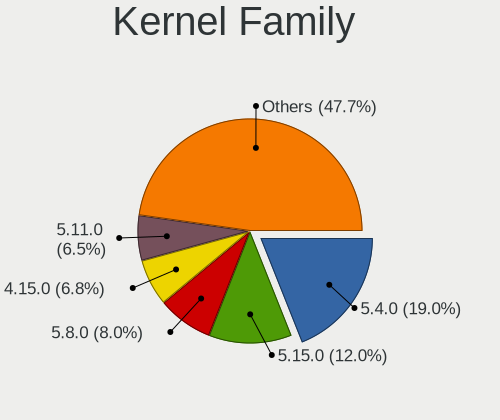
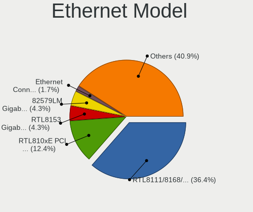
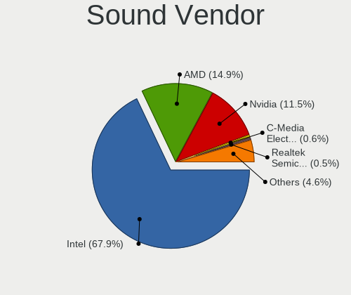

Ubuntu - Tested Hardware & Statistics (Notebooks)
-------------------------------------------------

A project to collect tested hardware configurations for Ubuntu.

Anyone can contribute to this report by the [hw-probe](https://github.com/linuxhw/hw-probe) tool:

    sudo -E hw-probe -all -upload

Please contribute! Especially if your hardware is rare.

Contents
--------

* [ Test Cases ](#test-cases)

* [ System ](#system)
  - [ OS                       ](#os)
  - [ OS Family                ](#os-family)
  - [ Kernel                   ](#kernel)
  - [ Kernel Family            ](#kernel-family)
  - [ Kernel Major Ver.        ](#kernel-major-ver)
  - [ Arch                     ](#arch)
  - [ DE                       ](#de)
  - [ Display Server           ](#display-server)
  - [ Display Manager          ](#display-manager)
  - [ OS Lang                  ](#os-lang)
  - [ Boot Mode                ](#boot-mode)
  - [ Filesystem               ](#filesystem)
  - [ Part. scheme             ](#part-scheme)
  - [ Dual Boot with Linux/BSD ](#dual-boot-with-linuxbsd)
  - [ Dual Boot (Win)          ](#dual-boot-win)

* [ Board ](#board)
  - [ Vendor                   ](#vendor)
  - [ Model                    ](#model)
  - [ Model Family             ](#model-family)
  - [ MFG Year                 ](#mfg-year)
  - [ Form Factor              ](#form-factor)
  - [ Secure Boot              ](#secure-boot)
  - [ Coreboot                 ](#coreboot)
  - [ RAM Size                 ](#ram-size)
  - [ RAM Used                 ](#ram-used)
  - [ Total Drives             ](#total-drives)
  - [ Has CD-ROM               ](#has-cd-rom)
  - [ Has Ethernet             ](#has-ethernet)
  - [ Has WiFi                 ](#has-wifi)
  - [ Has Bluetooth            ](#has-bluetooth)

* [ Location ](#location)
  - [ Country                  ](#country)
  - [ City                     ](#city)

* [ Drives ](#drives)
  - [ Drive Vendor             ](#drive-vendor)
  - [ Drive Model              ](#drive-model)
  - [ HDD Vendor               ](#hdd-vendor)
  - [ SSD Vendor               ](#ssd-vendor)
  - [ Drive Kind               ](#drive-kind)
  - [ Drive Connector          ](#drive-connector)
  - [ Drive Size               ](#drive-size)
  - [ Space Total              ](#space-total)
  - [ Space Used               ](#space-used)
  - [ Malfunc. Drives          ](#malfunc-drives)
  - [ Malfunc. Drive Vendor    ](#malfunc-drive-vendor)
  - [ Malfunc. HDD Vendor      ](#malfunc-hdd-vendor)
  - [ Malfunc. Drive Kind      ](#malfunc-drive-kind)
  - [ Failed Drives            ](#failed-drives)
  - [ Failed Drive Vendor      ](#failed-drive-vendor)
  - [ Drive Status             ](#drive-status)

* [ Storage controller ](#storage-controller)
  - [ Storage Vendor           ](#storage-vendor)
  - [ Storage Model            ](#storage-model)
  - [ Storage Kind             ](#storage-kind)

* [ Processor ](#processor)
  - [ CPU Vendor               ](#cpu-vendor)
  - [ CPU Model                ](#cpu-model)
  - [ CPU Model Family         ](#cpu-model-family)
  - [ CPU Cores                ](#cpu-cores)
  - [ CPU Sockets              ](#cpu-sockets)
  - [ CPU Threads              ](#cpu-threads)
  - [ CPU Op-Modes             ](#cpu-op-modes)
  - [ CPU Microcode            ](#cpu-microcode)
  - [ CPU Microarch            ](#cpu-microarch)

* [ Graphics ](#graphics)
  - [ GPU Vendor               ](#gpu-vendor)
  - [ GPU Model                ](#gpu-model)
  - [ GPU Combo                ](#gpu-combo)
  - [ GPU Driver               ](#gpu-driver)
  - [ GPU Memory               ](#gpu-memory)

* [ Monitor ](#monitor)
  - [ Monitor Vendor           ](#monitor-vendor)
  - [ Monitor Model            ](#monitor-model)
  - [ Monitor Resolution       ](#monitor-resolution)
  - [ Monitor Diagonal         ](#monitor-diagonal)
  - [ Monitor Width            ](#monitor-width)
  - [ Aspect Ratio             ](#aspect-ratio)
  - [ Monitor Area             ](#monitor-area)
  - [ Pixel Density            ](#pixel-density)
  - [ Multiple Monitors        ](#multiple-monitors)

* [ Network ](#network)
  - [ Net Controller Vendor    ](#net-controller-vendor)
  - [ Net Controller Model     ](#net-controller-model)
  - [ Wireless Vendor          ](#wireless-vendor)
  - [ Wireless Model           ](#wireless-model)
  - [ Ethernet Vendor          ](#ethernet-vendor)
  - [ Ethernet Model           ](#ethernet-model)
  - [ Net Controller Kind      ](#net-controller-kind)
  - [ Used Controller          ](#used-controller)
  - [ NICs                     ](#nics)
  - [ IPv6                     ](#ipv6)

* [ Bluetooth ](#bluetooth)
  - [ Bluetooth Vendor         ](#bluetooth-vendor)
  - [ Bluetooth Model          ](#bluetooth-model)

* [ Sound ](#sound)
  - [ Sound Vendor             ](#sound-vendor)
  - [ Sound Model              ](#sound-model)

* [ Memory ](#memory)
  - [ Memory Vendor            ](#memory-vendor)
  - [ Memory Model             ](#memory-model)
  - [ Memory Kind              ](#memory-kind)
  - [ Memory Form Factor       ](#memory-form-factor)
  - [ Memory Size              ](#memory-size)
  - [ Memory Speed             ](#memory-speed)

* [ Printers & scanners ](#printers--scanners)
  - [ Printer Vendor           ](#printer-vendor)
  - [ Printer Model            ](#printer-model)
  - [ Scanner Vendor           ](#scanner-vendor)
  - [ Scanner Model            ](#scanner-model)

* [ Camera ](#camera)
  - [ Camera Vendor            ](#camera-vendor)
  - [ Camera Model             ](#camera-model)

* [ Security ](#security)
  - [ Fingerprint Vendor       ](#fingerprint-vendor)
  - [ Fingerprint Model        ](#fingerprint-model)
  - [ Chipcard Vendor          ](#chipcard-vendor)
  - [ Chipcard Model           ](#chipcard-model)

* [ Unsupported ](#unsupported)
  - [ Unsupported Devices      ](#unsupported-devices)
  - [ Unsupported Device Types ](#unsupported-device-types)

Test Cases
----------

Total: 50365

| Vendor        | Model                       | Probe                                                      | Date         |
|---------------|-----------------------------|------------------------------------------------------------|--------------|
| Acer          | Predator G9-793             | [fd305490af](https://linux-hardware.org/?probe=fd305490af) | Oct 01, 2023 |
| ASUSTek       | G73Jh                       | [0b9b84be03](https://linux-hardware.org/?probe=0b9b84be03) | Oct 01, 2023 |
| OriginPC      | X170KM-G                    | [2a8752667a](https://linux-hardware.org/?probe=2a8752667a) | Oct 01, 2023 |
| Apple         | MacBookPro14,3              | [ec90ed2076](https://linux-hardware.org/?probe=ec90ed2076) | Oct 01, 2023 |
| Dell          | Inspiron 11-3168            | [967817b4f8](https://linux-hardware.org/?probe=967817b4f8) | Oct 01, 2023 |
| HP            | ProBook 650 G8 Notebook ... | [b02492c1dd](https://linux-hardware.org/?probe=b02492c1dd) | Oct 01, 2023 |
| GPU Compan... | GWTN156-4                   | [fa5491ff0c](https://linux-hardware.org/?probe=fa5491ff0c) | Oct 01, 2023 |
| ASUSTek       | X756UVK                     | [3bc56b23ef](https://linux-hardware.org/?probe=3bc56b23ef) | Sep 30, 2023 |
| ASUSTek       | Z450LA                      | [afa96a084e](https://linux-hardware.org/?probe=afa96a084e) | Sep 30, 2023 |
| HP            | EliteBook 820 G4            | [eb46d26ff8](https://linux-hardware.org/?probe=eb46d26ff8) | Sep 30, 2023 |
| ASUSTek       | F7SR                        | [b895fd8bb2](https://linux-hardware.org/?probe=b895fd8bb2) | Sep 30, 2023 |
| ASUSTek       | F7SR                        | [1b7493ae6e](https://linux-hardware.org/?probe=1b7493ae6e) | Sep 30, 2023 |
| Infinix       | INBOOK X3                   | [6b5c2647c2](https://linux-hardware.org/?probe=6b5c2647c2) | Sep 30, 2023 |
| Lenovo        | ThinkPad E15 Gen 4 21E60... | [951a03d2ad](https://linux-hardware.org/?probe=951a03d2ad) | Sep 30, 2023 |
| Fujitsu Si... | AMILO Pa 2548               | [ee2d5e25d3](https://linux-hardware.org/?probe=ee2d5e25d3) | Sep 30, 2023 |
| Entroware     | Hybris                      | [5b124e9b7f](https://linux-hardware.org/?probe=5b124e9b7f) | Sep 30, 2023 |
| UNOWHY        | Y13G012S4EI                 | [2b60435562](https://linux-hardware.org/?probe=2b60435562) | Sep 30, 2023 |
| HUAWEI        | HLYL-WXX9                   | [d39169bf21](https://linux-hardware.org/?probe=d39169bf21) | Sep 30, 2023 |
| Fujitsu Si... | AMILO Pa 2548               | [a291afc6c3](https://linux-hardware.org/?probe=a291afc6c3) | Sep 30, 2023 |
| Dell          | Latitude 5430               | [eee2a34ff5](https://linux-hardware.org/?probe=eee2a34ff5) | Sep 30, 2023 |
| Intel Clie... | LAPBC710                    | [3a29dfa2e3](https://linux-hardware.org/?probe=3a29dfa2e3) | Sep 30, 2023 |
| Lenovo        | ThinkPad X230 2325KZ5       | [7c10f1a5de](https://linux-hardware.org/?probe=7c10f1a5de) | Sep 30, 2023 |
| Dell          | Inspiron 15 3525            | [b46d569d14](https://linux-hardware.org/?probe=b46d569d14) | Sep 30, 2023 |
| Dell          | Inspiron 15 3525            | [fb52caaee9](https://linux-hardware.org/?probe=fb52caaee9) | Sep 30, 2023 |
| TECNO         | MEGABOOK T1                 | [9bba77e02b](https://linux-hardware.org/?probe=9bba77e02b) | Sep 30, 2023 |
| Samsung       | 305E4A/305E5A/305E7A        | [89d519a3f5](https://linux-hardware.org/?probe=89d519a3f5) | Sep 30, 2023 |
| Apple         | MacBookPro12,1              | [b3617a1e58](https://linux-hardware.org/?probe=b3617a1e58) | Sep 30, 2023 |
| Acer          | Aspire SW3-016              | [62c3855aa7](https://linux-hardware.org/?probe=62c3855aa7) | Sep 30, 2023 |
| HP            | Notebook                    | [873004172f](https://linux-hardware.org/?probe=873004172f) | Sep 30, 2023 |
| Sony          | VPCEG10EL                   | [8271942cc2](https://linux-hardware.org/?probe=8271942cc2) | Sep 30, 2023 |
| ASUSTek       | ASUS TUF Gaming A15 FA50... | [527c8192a9](https://linux-hardware.org/?probe=527c8192a9) | Sep 30, 2023 |
| Dell          | Inspiron 5521               | [a704dd3c01](https://linux-hardware.org/?probe=a704dd3c01) | Sep 30, 2023 |
| VALE          | Notebook Classic C140       | [5be7208021](https://linux-hardware.org/?probe=5be7208021) | Sep 30, 2023 |
| Apple         | MacBookPro5,5               | [202a977fce](https://linux-hardware.org/?probe=202a977fce) | Sep 30, 2023 |
| HP            | Pavilion dv6                | [e2560d6378](https://linux-hardware.org/?probe=e2560d6378) | Sep 30, 2023 |
| HP            | Dragonfly 13.5 inch G4 N... | [2afa933d2a](https://linux-hardware.org/?probe=2afa933d2a) | Sep 30, 2023 |
| Unknown       | Unknown                     | [56580ba351](https://linux-hardware.org/?probe=56580ba351) | Sep 30, 2023 |
| HP            | Dragonfly 13.5 inch G4 N... | [a7a8e627cb](https://linux-hardware.org/?probe=a7a8e627cb) | Sep 30, 2023 |
| ASUSTek       | ZenBook UX425QA_UM425QA     | [306bc123c4](https://linux-hardware.org/?probe=306bc123c4) | Sep 29, 2023 |
| Lenovo        | G770 1037                   | [576bbd3839](https://linux-hardware.org/?probe=576bbd3839) | Sep 29, 2023 |
| Lenovo        | ThinkPad X13 Gen 1 20UGA... | [8c1d3fc469](https://linux-hardware.org/?probe=8c1d3fc469) | Sep 29, 2023 |
| Acer          | Aspire F5-573G              | [dea46b2302](https://linux-hardware.org/?probe=dea46b2302) | Sep 29, 2023 |
| Dell          | XPS 15 9550                 | [587f9a3ff1](https://linux-hardware.org/?probe=587f9a3ff1) | Sep 29, 2023 |
| Lenovo        | ThinkPad X13 Gen 1 20UGA... | [c38ca27643](https://linux-hardware.org/?probe=c38ca27643) | Sep 29, 2023 |
| ASUSTek       | ASUS TUF Gaming A15 FA50... | [96e037afc8](https://linux-hardware.org/?probe=96e037afc8) | Sep 29, 2023 |
| Apple         | MacBookAir6,1               | [b77b45ce58](https://linux-hardware.org/?probe=b77b45ce58) | Sep 29, 2023 |
| Acer          | Aspire A517-53              | [6023cecfb1](https://linux-hardware.org/?probe=6023cecfb1) | Sep 29, 2023 |
| Acer          | Aspire 7745G                | [55ea55a771](https://linux-hardware.org/?probe=55ea55a771) | Sep 29, 2023 |
| Acer          | Nitro AN517-54              | [3e1448c388](https://linux-hardware.org/?probe=3e1448c388) | Sep 29, 2023 |
| Acer          | Aspire A517-53              | [05ff23a1a1](https://linux-hardware.org/?probe=05ff23a1a1) | Sep 29, 2023 |
| Dell          | Latitude 5500               | [ea091dbcf2](https://linux-hardware.org/?probe=ea091dbcf2) | Sep 29, 2023 |
| HP            | OMEN by Laptop 15-dc1xxx    | [2d31a3d858](https://linux-hardware.org/?probe=2d31a3d858) | Sep 29, 2023 |
| Alienware     | m16 R1 AMD                  | [710a10efce](https://linux-hardware.org/?probe=710a10efce) | Sep 29, 2023 |
| HP            | ProBook 430 G3              | [5a73271bfd](https://linux-hardware.org/?probe=5a73271bfd) | Sep 29, 2023 |
| MSI           | Prestige 15 A12SC           | [d78d241946](https://linux-hardware.org/?probe=d78d241946) | Sep 29, 2023 |
| ASUSTek       | VivoBook_ASUSLaptop X412... | [5828bffdb6](https://linux-hardware.org/?probe=5828bffdb6) | Sep 29, 2023 |
| Dell          | Inspiron 15-3552            | [8a8f11edae](https://linux-hardware.org/?probe=8a8f11edae) | Sep 29, 2023 |
| HP            | Laptop 14-fq0xxx            | [52648b0b45](https://linux-hardware.org/?probe=52648b0b45) | Sep 29, 2023 |
| Lenovo        | ThinkPad E495 20NE0001US    | [a76a94cd2f](https://linux-hardware.org/?probe=a76a94cd2f) | Sep 29, 2023 |
| Dell          | Inspiron 5437               | [c0301c2fbb](https://linux-hardware.org/?probe=c0301c2fbb) | Sep 29, 2023 |
| HP            | ENVY Laptop 13-ah0xxx       | [6f19668c91](https://linux-hardware.org/?probe=6f19668c91) | Sep 29, 2023 |
| Lenovo        | V15 G2 ITL 82KB             | [e87fdc15ed](https://linux-hardware.org/?probe=e87fdc15ed) | Sep 29, 2023 |
| Lenovo        | V15 G2 ITL 82KB             | [b1333a2976](https://linux-hardware.org/?probe=b1333a2976) | Sep 29, 2023 |
| HP            | Stream Laptop 14-ds0xxx     | [bbab7c9f89](https://linux-hardware.org/?probe=bbab7c9f89) | Sep 29, 2023 |
| HP            | Stream Laptop 14-ds0xxx     | [4f23a67b82](https://linux-hardware.org/?probe=4f23a67b82) | Sep 29, 2023 |
| Samsung       | 340XAA/350XAA/550XAA        | [ccc715eeb6](https://linux-hardware.org/?probe=ccc715eeb6) | Sep 29, 2023 |
| HP            | ZBook Studio G3             | [0005d20c0d](https://linux-hardware.org/?probe=0005d20c0d) | Sep 28, 2023 |
| Lenovo        | Yoga Slim 7 Carbon 14ACN... | [a5e7296c29](https://linux-hardware.org/?probe=a5e7296c29) | Sep 28, 2023 |
| Acer          | Aspire 7745G                | [6def421696](https://linux-hardware.org/?probe=6def421696) | Sep 28, 2023 |
| HP            | ENVY 17                     | [184a826bba](https://linux-hardware.org/?probe=184a826bba) | Sep 28, 2023 |
| I-Life Dig... | ZED AIR PRO                 | [7cb30879f6](https://linux-hardware.org/?probe=7cb30879f6) | Sep 28, 2023 |
| Dell          | Precision 3560              | [14af02a240](https://linux-hardware.org/?probe=14af02a240) | Sep 28, 2023 |
| Lenovo        | ThinkPad T14 Gen 3 21AJS... | [38e71e4fe9](https://linux-hardware.org/?probe=38e71e4fe9) | Sep 28, 2023 |
| Lenovo        | ThinkPad P15 Gen 1 20ST0... | [1492e2178d](https://linux-hardware.org/?probe=1492e2178d) | Sep 28, 2023 |
| HP            | Laptop 15-fd0xxx            | [0a548c4390](https://linux-hardware.org/?probe=0a548c4390) | Sep 28, 2023 |
| Lenovo        | ThinkPad T510 43142PU       | [30bd29e170](https://linux-hardware.org/?probe=30bd29e170) | Sep 28, 2023 |
| ASUSTek       | ROG Zephyrus G14 GA401IU... | [f86a0719d7](https://linux-hardware.org/?probe=f86a0719d7) | Sep 28, 2023 |
| Lenovo        | ThinkPad T14 Gen 2i 20W0... | [c8dfaf68d0](https://linux-hardware.org/?probe=c8dfaf68d0) | Sep 28, 2023 |
| HP            | Pavilion 11 x360 PC         | [b6316ea4df](https://linux-hardware.org/?probe=b6316ea4df) | Sep 28, 2023 |
| HUAWEI        | NBLB-WAX9N                  | [7cbed3fca6](https://linux-hardware.org/?probe=7cbed3fca6) | Sep 28, 2023 |
| HP            | Pavilion 11 x360 PC         | [f75ab187aa](https://linux-hardware.org/?probe=f75ab187aa) | Sep 28, 2023 |
| Lenovo        | ThinkPad E14 Gen 3 20Y70... | [78b1c422c7](https://linux-hardware.org/?probe=78b1c422c7) | Sep 28, 2023 |
| HP            | Notebook                    | [7d55fd8520](https://linux-hardware.org/?probe=7d55fd8520) | Sep 28, 2023 |
| Alienware     | x14                         | [048d5f6f2a](https://linux-hardware.org/?probe=048d5f6f2a) | Sep 28, 2023 |
| ASUSTek       | X550CC                      | [001231c730](https://linux-hardware.org/?probe=001231c730) | Sep 28, 2023 |
| HP            | Notebook                    | [49192b29a6](https://linux-hardware.org/?probe=49192b29a6) | Sep 28, 2023 |
| HP            | Laptop 15-da0xxx            | [3d996f9823](https://linux-hardware.org/?probe=3d996f9823) | Sep 28, 2023 |
| Acer          | Nitro AN515-52              | [e7fb14ee98](https://linux-hardware.org/?probe=e7fb14ee98) | Sep 28, 2023 |
| Acer          | Swift SF314-42              | [f436f21240](https://linux-hardware.org/?probe=f436f21240) | Sep 27, 2023 |
| Dell          | Inspiron 5515               | [5889ba673d](https://linux-hardware.org/?probe=5889ba673d) | Sep 27, 2023 |
| Lenovo        | ThinkBook 14-IIL 20SL       | [001d5aa716](https://linux-hardware.org/?probe=001d5aa716) | Sep 27, 2023 |
| HP            | Laptop 15-da0xxx            | [8fb9d5d21f](https://linux-hardware.org/?probe=8fb9d5d21f) | Sep 27, 2023 |
| Toshiba       | Satellite L550              | [d93c40647f](https://linux-hardware.org/?probe=d93c40647f) | Sep 27, 2023 |
| HP            | Laptop 17-by0xxx            | [6eefb5fdd2](https://linux-hardware.org/?probe=6eefb5fdd2) | Sep 27, 2023 |
| Lenovo        | ThinkPad X1 Carbon Gen 8... | [b5dee453a3](https://linux-hardware.org/?probe=b5dee453a3) | Sep 27, 2023 |
| Lenovo        | IdeaPad 1 14IGL7 82V6       | [707c612189](https://linux-hardware.org/?probe=707c612189) | Sep 27, 2023 |
| AMI           | Cherry Trail CR             | [41b2d006c1](https://linux-hardware.org/?probe=41b2d006c1) | Sep 27, 2023 |
| Lenovo        | ThinkPad T460s 20FAS2G90... | [50c8df3b79](https://linux-hardware.org/?probe=50c8df3b79) | Sep 27, 2023 |
| Lenovo        | ThinkPad T460s 20FAS2G90... | [6cfd6e2b34](https://linux-hardware.org/?probe=6cfd6e2b34) | Sep 27, 2023 |
| AMI           | Cherry Trail CR             | [050c423c6b](https://linux-hardware.org/?probe=050c423c6b) | Sep 27, 2023 |
| Dell          | Latitude 7390               | [93e22b6fc4](https://linux-hardware.org/?probe=93e22b6fc4) | Sep 27, 2023 |
| HP            | EliteBook 840 G8 Noteboo... | [593ddb6105](https://linux-hardware.org/?probe=593ddb6105) | Sep 27, 2023 |
| Dell          | Latitude 7390               | [a7bfa2e285](https://linux-hardware.org/?probe=a7bfa2e285) | Sep 27, 2023 |
| Dell          | Latitude 3410               | [7b326dd690](https://linux-hardware.org/?probe=7b326dd690) | Sep 27, 2023 |
| HUAWEI        | KLVL-WXX9                   | [5646b6da22](https://linux-hardware.org/?probe=5646b6da22) | Sep 27, 2023 |
| Clevo         | W240EU/W250EUQ/W270EUQ      | [cd5d2fae9e](https://linux-hardware.org/?probe=cd5d2fae9e) | Sep 27, 2023 |
| Dell          | Precision 5570              | [f00d32a04a](https://linux-hardware.org/?probe=f00d32a04a) | Sep 27, 2023 |
| Acer          | Aspire E1-531               | [6b981869d7](https://linux-hardware.org/?probe=6b981869d7) | Sep 27, 2023 |
| Dell          | XPS 15 9510                 | [72bb0c5858](https://linux-hardware.org/?probe=72bb0c5858) | Sep 27, 2023 |
| Sony          | VPCEG10EL                   | [7bfbe9b21d](https://linux-hardware.org/?probe=7bfbe9b21d) | Sep 27, 2023 |
| Dell          | System XPS L502X            | [06d6fd95d1](https://linux-hardware.org/?probe=06d6fd95d1) | Sep 27, 2023 |
| Lenovo        | IdeaPad 320-15IKB 81BG      | [17f9208e1a](https://linux-hardware.org/?probe=17f9208e1a) | Sep 27, 2023 |
| HP            | Elite Dragonfly 13.5 inc... | [7941c7c6cc](https://linux-hardware.org/?probe=7941c7c6cc) | Sep 27, 2023 |
| Acer          | Aspire E1-531               | [d47b59c89b](https://linux-hardware.org/?probe=d47b59c89b) | Sep 27, 2023 |
| HUAWEI        | BOHB-WAX9                   | [054707cbd2](https://linux-hardware.org/?probe=054707cbd2) | Sep 27, 2023 |
| Toshiba       | dynabook T350/46BW          | [26ffaa1c0f](https://linux-hardware.org/?probe=26ffaa1c0f) | Sep 27, 2023 |
| HP            | EliteBook 8470p             | [a1fa543905](https://linux-hardware.org/?probe=a1fa543905) | Sep 27, 2023 |
| Dell          | Vostro 3500                 | [fac9ee2e6e](https://linux-hardware.org/?probe=fac9ee2e6e) | Sep 27, 2023 |
| ASUSTek       | VivoBook_ASUSLaptop M350... | [0e32901b18](https://linux-hardware.org/?probe=0e32901b18) | Sep 27, 2023 |
| HUAWEI        | KLVL-WXXW                   | [4f1f07158b](https://linux-hardware.org/?probe=4f1f07158b) | Sep 26, 2023 |
| HP            | ProBook 450 G8 Notebook ... | [c0607441c1](https://linux-hardware.org/?probe=c0607441c1) | Sep 26, 2023 |
| Lenovo        | ThinkPad T590 20N5S31U02    | [d4137582b5](https://linux-hardware.org/?probe=d4137582b5) | Sep 26, 2023 |
| Google        | Phaser360                   | [95686db08c](https://linux-hardware.org/?probe=95686db08c) | Sep 26, 2023 |
| Lenovo        | ThinkPad T590 20N5S31U02    | [aa988ac4df](https://linux-hardware.org/?probe=aa988ac4df) | Sep 26, 2023 |
| HP            | Laptop 15-dy2xxx            | [8fd945e3c5](https://linux-hardware.org/?probe=8fd945e3c5) | Sep 26, 2023 |
| Dell          | Inspiron 5423               | [a6a3b2697f](https://linux-hardware.org/?probe=a6a3b2697f) | Sep 26, 2023 |
| HP            | EliteBook 840 G3            | [5ab77e3f48](https://linux-hardware.org/?probe=5ab77e3f48) | Sep 26, 2023 |
| Lenovo        | ThinkBook 15 G2 ITL 20VE    | [92eb612b66](https://linux-hardware.org/?probe=92eb612b66) | Sep 26, 2023 |
| Dell          | Latitude 7320               | [2549020a4e](https://linux-hardware.org/?probe=2549020a4e) | Sep 26, 2023 |
| PC Special... | PCX0DX                      | [935fe5ddb0](https://linux-hardware.org/?probe=935fe5ddb0) | Sep 26, 2023 |
| Lenovo        | V15 G2 ALC 82KD             | [21c3145a6a](https://linux-hardware.org/?probe=21c3145a6a) | Sep 26, 2023 |
| Acer          | Aspire E1-572G              | [45b934b885](https://linux-hardware.org/?probe=45b934b885) | Sep 26, 2023 |
| Lenovo        | ThinkPad T14 Gen 3 21AH0... | [2cf86f7f12](https://linux-hardware.org/?probe=2cf86f7f12) | Sep 26, 2023 |
| HP            | Laptop 15s-fq2xxx           | [22294a7a32](https://linux-hardware.org/?probe=22294a7a32) | Sep 26, 2023 |
| Lenovo        | ThinkPad P16s Gen 1 21BT... | [47d912c5a9](https://linux-hardware.org/?probe=47d912c5a9) | Sep 26, 2023 |
| Lenovo        | ThinkPad P16s Gen 1 21BT... | [d2a926c703](https://linux-hardware.org/?probe=d2a926c703) | Sep 26, 2023 |
| Lenovo        | Yoga Slim 7 Pro 14ACH5 8... | [b6cd63eedc](https://linux-hardware.org/?probe=b6cd63eedc) | Sep 26, 2023 |
| Samsung       | 305E4A/305E5A/305E7A        | [24a1d008e6](https://linux-hardware.org/?probe=24a1d008e6) | Sep 26, 2023 |
| Acer          | Aspire E1-570               | [98ed9bca40](https://linux-hardware.org/?probe=98ed9bca40) | Sep 26, 2023 |
| Infinix       | INBOOK Y1 PLUS NEO          | [30998449af](https://linux-hardware.org/?probe=30998449af) | Sep 26, 2023 |
| Lenovo        | IdeaPad 5 14ARE05 81YM      | [786338b217](https://linux-hardware.org/?probe=786338b217) | Sep 26, 2023 |
| HP            | Pavilion 14                 | [a7589d8c93](https://linux-hardware.org/?probe=a7589d8c93) | Sep 26, 2023 |
| Notebook      | N2x0WU                      | [49046ef274](https://linux-hardware.org/?probe=49046ef274) | Sep 26, 2023 |
| HP            | Pavilion 14                 | [1aed6aba04](https://linux-hardware.org/?probe=1aed6aba04) | Sep 26, 2023 |
| Samsung       | 340XAA/350XAA/550XAA        | [3d8dfdbf80](https://linux-hardware.org/?probe=3d8dfdbf80) | Sep 26, 2023 |
| Dell          | XPS 9315                    | [11411507e8](https://linux-hardware.org/?probe=11411507e8) | Sep 26, 2023 |
| Apple         | MacBookPro8,1               | [ee86e0d81e](https://linux-hardware.org/?probe=ee86e0d81e) | Sep 26, 2023 |
| Apple         | MacBookPro8,1               | [1630b56fe3](https://linux-hardware.org/?probe=1630b56fe3) | Sep 26, 2023 |
| HP            | G62                         | [50fef7b3fa](https://linux-hardware.org/?probe=50fef7b3fa) | Sep 26, 2023 |
| Lenovo        | IdeaPad 320-15ISK 80XH      | [6a3291f6bf](https://linux-hardware.org/?probe=6a3291f6bf) | Sep 25, 2023 |
| Lenovo        | IdeaPad 320-15ISK 80XH      | [981e7e8ec5](https://linux-hardware.org/?probe=981e7e8ec5) | Sep 25, 2023 |
| Lenovo        | Legion 5 15IMH05H 81Y6      | [c62002acdf](https://linux-hardware.org/?probe=c62002acdf) | Sep 25, 2023 |
| HP            | Laptop 15s-fq2xxx           | [0aa73d620b](https://linux-hardware.org/?probe=0aa73d620b) | Sep 25, 2023 |
| HUAWEI        | BOM-WXX9                    | [8d4ba0b939](https://linux-hardware.org/?probe=8d4ba0b939) | Sep 25, 2023 |
| HP            | Pavilion Laptop 14-ec0xx... | [6b0a58d94c](https://linux-hardware.org/?probe=6b0a58d94c) | Sep 25, 2023 |
| Dell          | Vostro 15 5510              | [b2d58819cc](https://linux-hardware.org/?probe=b2d58819cc) | Sep 25, 2023 |
| VPU Compan... | VWNC71429                   | [285eb8a521](https://linux-hardware.org/?probe=285eb8a521) | Sep 25, 2023 |
| VPU Compan... | VWNC71429                   | [ec5aecc69d](https://linux-hardware.org/?probe=ec5aecc69d) | Sep 25, 2023 |
| Lenovo        | IdeaPad 3 15IIL05 81WE      | [dbe3003db5](https://linux-hardware.org/?probe=dbe3003db5) | Sep 25, 2023 |
| Dell          | Inspiron 1545               | [96508134e8](https://linux-hardware.org/?probe=96508134e8) | Sep 25, 2023 |
| Dell          | Precision M6800             | [027ed86f53](https://linux-hardware.org/?probe=027ed86f53) | Sep 25, 2023 |
| Fujitsu       | FMVA42CW                    | [48a8e36d5f](https://linux-hardware.org/?probe=48a8e36d5f) | Sep 25, 2023 |
| Fujitsu       | FMVA42CW                    | [8427efde7d](https://linux-hardware.org/?probe=8427efde7d) | Sep 25, 2023 |
| HP            | EliteBook 745 G3            | [a814d9fa4b](https://linux-hardware.org/?probe=a814d9fa4b) | Sep 25, 2023 |
| HP            | ProBook 640 G1              | [a941b27d32](https://linux-hardware.org/?probe=a941b27d32) | Sep 25, 2023 |
| Acer          | Swift SF314-41              | [ef8b479649](https://linux-hardware.org/?probe=ef8b479649) | Sep 25, 2023 |
| Acer          | Swift SF314-44              | [6f5d49e16f](https://linux-hardware.org/?probe=6f5d49e16f) | Sep 25, 2023 |
| Acer          | Swift SF14-71T              | [10b657bd75](https://linux-hardware.org/?probe=10b657bd75) | Sep 25, 2023 |
| Acer          | Swift SF314-44              | [12f4ab85f3](https://linux-hardware.org/?probe=12f4ab85f3) | Sep 25, 2023 |
| Lenovo        | ThinkPad T450 20BUS1A100    | [f4887bacc7](https://linux-hardware.org/?probe=f4887bacc7) | Sep 25, 2023 |
| HUAWEI        | BOM-WXX9                    | [ed52653514](https://linux-hardware.org/?probe=ed52653514) | Sep 25, 2023 |
| Lenovo        | LOQ 15IRH8 82XV             | [a1e01ab80d](https://linux-hardware.org/?probe=a1e01ab80d) | Sep 25, 2023 |
| Infinix       | INBOOK X1 SLIM              | [bd6f358c7f](https://linux-hardware.org/?probe=bd6f358c7f) | Sep 25, 2023 |
| Lenovo        | Yoga 2 13 20344             | [6a06543ed3](https://linux-hardware.org/?probe=6a06543ed3) | Sep 25, 2023 |
| HP            | 255 G8 Notebook PC          | [38b5be59cc](https://linux-hardware.org/?probe=38b5be59cc) | Sep 25, 2023 |
| Acer          | Nitro AN515-54              | [6383f263a8](https://linux-hardware.org/?probe=6383f263a8) | Sep 25, 2023 |
| HP            | ProBook 450 15.6 inch G9... | [2e717c304e](https://linux-hardware.org/?probe=2e717c304e) | Sep 25, 2023 |
| ASUSTek       | ASUS TUF Gaming F15 FX50... | [b69f53c8fe](https://linux-hardware.org/?probe=b69f53c8fe) | Sep 25, 2023 |
| Dell          | Vostro 15 3510              | [e8868c236d](https://linux-hardware.org/?probe=e8868c236d) | Sep 25, 2023 |
| Dell          | Vostro 15 3510              | [eaa5061963](https://linux-hardware.org/?probe=eaa5061963) | Sep 25, 2023 |
| Acer          | Aspire V3-472P              | [b5ebe3295c](https://linux-hardware.org/?probe=b5ebe3295c) | Sep 25, 2023 |
| Apple         | MacBookPro7,1               | [677446fafa](https://linux-hardware.org/?probe=677446fafa) | Sep 25, 2023 |
| Lenovo        | ThinkPad T14 Gen 2a 20XL... | [336d5fe8c8](https://linux-hardware.org/?probe=336d5fe8c8) | Sep 25, 2023 |
| Acer          | Aspire E5-571               | [c834abf6b2](https://linux-hardware.org/?probe=c834abf6b2) | Sep 25, 2023 |
| TUXEDO        | Unknown                     | [6746de397a](https://linux-hardware.org/?probe=6746de397a) | Sep 25, 2023 |
| ASUSTek       | VivoBook_ASUSLaptop M160... | [811f1951fc](https://linux-hardware.org/?probe=811f1951fc) | Sep 25, 2023 |
| Dell          | Precision 5550              | [5a4d44b194](https://linux-hardware.org/?probe=5a4d44b194) | Sep 24, 2023 |
| ASUSTek       | X553MA                      | [b6b370953d](https://linux-hardware.org/?probe=b6b370953d) | Sep 24, 2023 |
| ASUSTek       | X553MA                      | [78977336f9](https://linux-hardware.org/?probe=78977336f9) | Sep 24, 2023 |
| Acer          | Aspire A715-42G             | [868a5abe75](https://linux-hardware.org/?probe=868a5abe75) | Sep 24, 2023 |
| ASUSTek       | N56VZ                       | [3d727dfaf6](https://linux-hardware.org/?probe=3d727dfaf6) | Sep 24, 2023 |
| Dell          | Latitude E6520              | [9fd6a2a84f](https://linux-hardware.org/?probe=9fd6a2a84f) | Sep 24, 2023 |
| HP            | Laptop 15s-fq2xxx           | [98ad01dfc0](https://linux-hardware.org/?probe=98ad01dfc0) | Sep 24, 2023 |
| Lenovo        | ThinkPad X270 20HMS0EXOO    | [0818b5e737](https://linux-hardware.org/?probe=0818b5e737) | Sep 24, 2023 |
| Lenovo        | ThinkPad E14 Gen 4 21EB0... | [e87fa96814](https://linux-hardware.org/?probe=e87fa96814) | Sep 24, 2023 |
| Lenovo        | ThinkPad E14 Gen 4 21EB0... | [29399bf284](https://linux-hardware.org/?probe=29399bf284) | Sep 24, 2023 |
| Fujitsu       | LIFEBOOK A530               | [dc76c26d4e](https://linux-hardware.org/?probe=dc76c26d4e) | Sep 24, 2023 |
| Samsung       | 550XBE/350XBE               | [cdbacef976](https://linux-hardware.org/?probe=cdbacef976) | Sep 24, 2023 |
| Acer          | Aspire A515-56              | [3d1de53032](https://linux-hardware.org/?probe=3d1de53032) | Sep 24, 2023 |
| Dell          | XPS 13 9305                 | [7c0b883934](https://linux-hardware.org/?probe=7c0b883934) | Sep 24, 2023 |
| Unknown       | X133                        | [eca7c95360](https://linux-hardware.org/?probe=eca7c95360) | Sep 24, 2023 |
| Acer          | Swift SF314-44              | [b7f58e92a0](https://linux-hardware.org/?probe=b7f58e92a0) | Sep 24, 2023 |
| Lenovo        | IdeaPad 3 14ALC6 82KT       | [eef80142a9](https://linux-hardware.org/?probe=eef80142a9) | Sep 24, 2023 |
| HP            | Laptop 15s-fq2xxx           | [747f5bd882](https://linux-hardware.org/?probe=747f5bd882) | Sep 24, 2023 |
| Lenovo        | ThinkPad P50 20EQS3FS00     | [a3ee3b9ca3](https://linux-hardware.org/?probe=a3ee3b9ca3) | Sep 24, 2023 |
| HP            | EliteBook 830 G5            | [a6ac161796](https://linux-hardware.org/?probe=a6ac161796) | Sep 24, 2023 |
| Acer          | Aspire 5520                 | [5bcc67211c](https://linux-hardware.org/?probe=5bcc67211c) | Sep 24, 2023 |
| HP            | ZBook 14 G2                 | [1f29f31860](https://linux-hardware.org/?probe=1f29f31860) | Sep 24, 2023 |
| HP            | EliteBook 8560w             | [0e7984242d](https://linux-hardware.org/?probe=0e7984242d) | Sep 24, 2023 |
| HP            | Laptop 14-cm0xxx            | [2af47d0dca](https://linux-hardware.org/?probe=2af47d0dca) | Sep 24, 2023 |
| HP            | ZBook 15v G5                | [c01fb4aeb0](https://linux-hardware.org/?probe=c01fb4aeb0) | Sep 24, 2023 |
| HP            | ZBook 15v G5                | [6495e2ad69](https://linux-hardware.org/?probe=6495e2ad69) | Sep 24, 2023 |
| Dell          | Vostro 3350                 | [8bb6c19a73](https://linux-hardware.org/?probe=8bb6c19a73) | Sep 24, 2023 |
| ASUSTek       | VivoBook 15 ASUS Laptop ... | [40e72b93b6](https://linux-hardware.org/?probe=40e72b93b6) | Sep 24, 2023 |
| Acer          | Aspire V3-771               | [8d87ce31c5](https://linux-hardware.org/?probe=8d87ce31c5) | Sep 24, 2023 |
| Acer          | Aspire V3-771               | [10dfbbd349](https://linux-hardware.org/?probe=10dfbbd349) | Sep 24, 2023 |
| UMAX          | VisionBook 14Wr             | [5e8b69ec67](https://linux-hardware.org/?probe=5e8b69ec67) | Sep 23, 2023 |
| Toshiba       | Satellite L855              | [646b34b912](https://linux-hardware.org/?probe=646b34b912) | Sep 23, 2023 |
| HP            | EliteBook 6930p (KK082AV... | [5e61b319b6](https://linux-hardware.org/?probe=5e61b319b6) | Sep 23, 2023 |
| Dell          | Latitude E7450              | [6ba017a802](https://linux-hardware.org/?probe=6ba017a802) | Sep 23, 2023 |
| Lenovo        | ThinkPad W550s 20E1S0VW0... | [e5c12ca1ce](https://linux-hardware.org/?probe=e5c12ca1ce) | Sep 23, 2023 |
| Acer          | TravelMate P215-53G         | [ddda10c87f](https://linux-hardware.org/?probe=ddda10c87f) | Sep 23, 2023 |
| Toshiba       | Satellite L855              | [8384ddec2e](https://linux-hardware.org/?probe=8384ddec2e) | Sep 23, 2023 |
| HP            | EliteBook 840 G2            | [b8d84dc938](https://linux-hardware.org/?probe=b8d84dc938) | Sep 23, 2023 |
| Lenovo        | Yoga Slim 9 14ITL5 82D1     | [05ef373ef0](https://linux-hardware.org/?probe=05ef373ef0) | Sep 23, 2023 |
| Lenovo        | Yoga Slim 9 14ITL5 82D1     | [a57b236842](https://linux-hardware.org/?probe=a57b236842) | Sep 23, 2023 |
| Lenovo        | ThinkPad X1 Carbon Gen 8... | [b5584b2b96](https://linux-hardware.org/?probe=b5584b2b96) | Sep 23, 2023 |
| ASUSTek       | VivoBook_ASUSLaptop M760... | [3b18f2e874](https://linux-hardware.org/?probe=3b18f2e874) | Sep 23, 2023 |
| Fujitsu       | LIFEBOOK T730               | [7a0f7921c4](https://linux-hardware.org/?probe=7a0f7921c4) | Sep 23, 2023 |
| Lenovo        | ThinkPad X1 Carbon 7th 2... | [d3322d740d](https://linux-hardware.org/?probe=d3322d740d) | Sep 23, 2023 |
| MSI           | MS-1651 Ver                 | [93cfb04861](https://linux-hardware.org/?probe=93cfb04861) | Sep 23, 2023 |
| MSI           | MS-1651 Ver                 | [e71155ca01](https://linux-hardware.org/?probe=e71155ca01) | Sep 23, 2023 |
| Lenovo        | G50-80 80L0                 | [f08b8528da](https://linux-hardware.org/?probe=f08b8528da) | Sep 23, 2023 |
| UNOWHY        | Y13G002S4EI                 | [c3f95beccb](https://linux-hardware.org/?probe=c3f95beccb) | Sep 23, 2023 |
| Dell          | Precision M6600             | [1cef385aec](https://linux-hardware.org/?probe=1cef385aec) | Sep 23, 2023 |
| HP            | Pavilion g6                 | [226a590989](https://linux-hardware.org/?probe=226a590989) | Sep 23, 2023 |
| Lenovo        | IdeaPad S145-15IGM 81WT     | [7022eac21d](https://linux-hardware.org/?probe=7022eac21d) | Sep 23, 2023 |
| Google        | Asuka                       | [cf59aebc4c](https://linux-hardware.org/?probe=cf59aebc4c) | Sep 23, 2023 |
| ASUSTek       | VivoBook_ASUSLaptop M350... | [c4b66b8208](https://linux-hardware.org/?probe=c4b66b8208) | Sep 23, 2023 |
| Panasonic     | FZG1-4                      | [bb4677655e](https://linux-hardware.org/?probe=bb4677655e) | Sep 23, 2023 |
| Lenovo        | ThinkPad X1 Carbon 6th 2... | [e344b05a7a](https://linux-hardware.org/?probe=e344b05a7a) | Sep 23, 2023 |
| Panasonic     | CF-31JHG8M1M                | [3dc21238c6](https://linux-hardware.org/?probe=3dc21238c6) | Sep 23, 2023 |
| HP            | Notebook                    | [0d03790c02](https://linux-hardware.org/?probe=0d03790c02) | Sep 23, 2023 |
| HP            | Notebook                    | [f9cec347c3](https://linux-hardware.org/?probe=f9cec347c3) | Sep 23, 2023 |
| VPU Compan... | VWNC71429                   | [c601e6192f](https://linux-hardware.org/?probe=c601e6192f) | Sep 23, 2023 |
| Dell          | Latitude 5480               | [30b7787143](https://linux-hardware.org/?probe=30b7787143) | Sep 23, 2023 |
| Apple         | MacBookPro10,2              | [3580b7d8d6](https://linux-hardware.org/?probe=3580b7d8d6) | Sep 22, 2023 |
| Google        | Blorb                       | [778d4cb622](https://linux-hardware.org/?probe=778d4cb622) | Sep 22, 2023 |
| Dell          | Latitude E6440              | [41269356be](https://linux-hardware.org/?probe=41269356be) | Sep 22, 2023 |
| Lenovo        | ThinkPad X220 Tablet 429... | [9323b69b4b](https://linux-hardware.org/?probe=9323b69b4b) | Sep 22, 2023 |
| Google        | Blorb                       | [3a001130af](https://linux-hardware.org/?probe=3a001130af) | Sep 22, 2023 |
| ASUSTek       | VivoBook_ASUSLaptop X321... | [d62c6d340f](https://linux-hardware.org/?probe=d62c6d340f) | Sep 22, 2023 |
| Acer          | Aspire 5520                 | [8329086779](https://linux-hardware.org/?probe=8329086779) | Sep 22, 2023 |
| ASUSTek       | ASUS TUF Gaming A15 FA50... | [3bb5a0e5a0](https://linux-hardware.org/?probe=3bb5a0e5a0) | Sep 22, 2023 |
| Lenovo        | IdeaPad 3 15ALC6 82KU       | [347b768d57](https://linux-hardware.org/?probe=347b768d57) | Sep 22, 2023 |
| Lenovo        | IdeaPad S145-15IGM 81WT     | [65a21a4968](https://linux-hardware.org/?probe=65a21a4968) | Sep 22, 2023 |
| Lenovo        | IdeaPad 3 15ALC6 82KU       | [6ae9f9d9f2](https://linux-hardware.org/?probe=6ae9f9d9f2) | Sep 22, 2023 |
| HP            | EliteBook 840 G7 Noteboo... | [e63d1ae740](https://linux-hardware.org/?probe=e63d1ae740) | Sep 22, 2023 |
| TUXEDO        | Unknown                     | [07870d9c20](https://linux-hardware.org/?probe=07870d9c20) | Sep 22, 2023 |
| Lenovo        | ThinkPad X220 4290EC5       | [3cb76d839a](https://linux-hardware.org/?probe=3cb76d839a) | Sep 22, 2023 |
| ASUSTek       | X540LA                      | [adf0d97721](https://linux-hardware.org/?probe=adf0d97721) | Sep 22, 2023 |
| Panasonic     | CF-SX1WEVHR                 | [be07169f5c](https://linux-hardware.org/?probe=be07169f5c) | Sep 22, 2023 |
| MSI           | GF65 Thin 9SEXR             | [9fbc54dcb7](https://linux-hardware.org/?probe=9fbc54dcb7) | Sep 22, 2023 |
| HP            | EliteBook 840 G8 Noteboo... | [1893bb3992](https://linux-hardware.org/?probe=1893bb3992) | Sep 22, 2023 |
| Lenovo        | ThinkPad X230 23259T0       | [20286ecb4c](https://linux-hardware.org/?probe=20286ecb4c) | Sep 22, 2023 |
| Dell          | XPS 15 7590                 | [146d33a16d](https://linux-hardware.org/?probe=146d33a16d) | Sep 22, 2023 |
| Lenovo        | ThinkBook 15-IML 20RW       | [a8c067b868](https://linux-hardware.org/?probe=a8c067b868) | Sep 22, 2023 |
| Acer          | Aspire E5-575G              | [01f346ff26](https://linux-hardware.org/?probe=01f346ff26) | Sep 22, 2023 |
| Acer          | Aspire E5-575G              | [ba1ec3eb6d](https://linux-hardware.org/?probe=ba1ec3eb6d) | Sep 22, 2023 |
| Dell          | Latitude 5290 2-in-1        | [71b5a459b2](https://linux-hardware.org/?probe=71b5a459b2) | Sep 22, 2023 |
| Dell          | Latitude 5590               | [068de61e23](https://linux-hardware.org/?probe=068de61e23) | Sep 22, 2023 |
| ASUSTek       | X551CAP                     | [b90045e0f9](https://linux-hardware.org/?probe=b90045e0f9) | Sep 22, 2023 |
| ASUSTek       | K53TK                       | [65e95a03e9](https://linux-hardware.org/?probe=65e95a03e9) | Sep 22, 2023 |
| Dell          | Latitude 5421               | [fd5892945d](https://linux-hardware.org/?probe=fd5892945d) | Sep 21, 2023 |
| ASUSTek       | K53TK                       | [34857762c0](https://linux-hardware.org/?probe=34857762c0) | Sep 21, 2023 |
| Dell          | Latitude 5421               | [50a3d79521](https://linux-hardware.org/?probe=50a3d79521) | Sep 21, 2023 |
| ASUSTek       | VivoBook_ASUSLaptop K650... | [290e0fd96b](https://linux-hardware.org/?probe=290e0fd96b) | Sep 21, 2023 |
| Toshiba       | Satellite L855              | [ee1cb0c5cc](https://linux-hardware.org/?probe=ee1cb0c5cc) | Sep 21, 2023 |
| Lenovo        | ThinkPad X1 Carbon Gen 9... | [98ab1e6859](https://linux-hardware.org/?probe=98ab1e6859) | Sep 21, 2023 |
| Acer          | Aspire 5742G                | [ee84a8d240](https://linux-hardware.org/?probe=ee84a8d240) | Sep 21, 2023 |
| Lenovo        | IdeaPad S340-15IIL 81VW     | [874c33c481](https://linux-hardware.org/?probe=874c33c481) | Sep 21, 2023 |
| HP            | ProBook 4540s               | [8c3c6c0ec2](https://linux-hardware.org/?probe=8c3c6c0ec2) | Sep 21, 2023 |
| Lenovo        | ThinkPad T14 Gen 1 20UD0... | [4ab55a6c83](https://linux-hardware.org/?probe=4ab55a6c83) | Sep 21, 2023 |
| Lenovo        | IdeaPadFlex 15D 20334       | [82b9c0d614](https://linux-hardware.org/?probe=82b9c0d614) | Sep 21, 2023 |
| Lenovo        | IdeaPad 310-15IKB 80TV      | [966f802eb6](https://linux-hardware.org/?probe=966f802eb6) | Sep 21, 2023 |
| HP            | EliteBook 845 G8 Noteboo... | [3847c20962](https://linux-hardware.org/?probe=3847c20962) | Sep 21, 2023 |
| MSI           | Katana GF66 11UC            | [20dfeb32a2](https://linux-hardware.org/?probe=20dfeb32a2) | Sep 21, 2023 |
| Lenovo        | ThinkPad T14 Gen 1 20UD0... | [a41b85a029](https://linux-hardware.org/?probe=a41b85a029) | Sep 21, 2023 |
| Acer          | Aspire R3-431T              | [510e10a692](https://linux-hardware.org/?probe=510e10a692) | Sep 21, 2023 |
| Lenovo        | ThinkPad T510 43142PU       | [527f5eb1a9](https://linux-hardware.org/?probe=527f5eb1a9) | Sep 21, 2023 |
| EUROCOM       | RAPTOR X17                  | [bbd769440e](https://linux-hardware.org/?probe=bbd769440e) | Sep 21, 2023 |
| ASUSTek       | X550CC                      | [265f8a4dcd](https://linux-hardware.org/?probe=265f8a4dcd) | Sep 21, 2023 |
| Dell          | Precision 5680              | [55deb46665](https://linux-hardware.org/?probe=55deb46665) | Sep 21, 2023 |
| Lenovo        | XiaoXin Chao7000-14IKBR ... | [454afdd117](https://linux-hardware.org/?probe=454afdd117) | Sep 21, 2023 |
| Lenovo        | IdeaPad 3 15ITL6 82MD       | [dd328a6f1f](https://linux-hardware.org/?probe=dd328a6f1f) | Sep 21, 2023 |
| Lenovo        | XiaoXin Chao7000-14IKBR ... | [a020038e27](https://linux-hardware.org/?probe=a020038e27) | Sep 21, 2023 |
| Acer          | Aspire E5-575               | [3126f2c7c6](https://linux-hardware.org/?probe=3126f2c7c6) | Sep 21, 2023 |
| Gateway       | P-7805u                     | [baae0fec2e](https://linux-hardware.org/?probe=baae0fec2e) | Sep 21, 2023 |
| Acer          | Aspire 5741G                | [b79d8aec76](https://linux-hardware.org/?probe=b79d8aec76) | Sep 21, 2023 |
| Dell          | Precision 5550              | [c5183a7443](https://linux-hardware.org/?probe=c5183a7443) | Sep 21, 2023 |
| Acer          | Aspire R3-431T              | [a406b53d93](https://linux-hardware.org/?probe=a406b53d93) | Sep 21, 2023 |
| Dell          | Precision 5550              | [3d927d3dee](https://linux-hardware.org/?probe=3d927d3dee) | Sep 21, 2023 |
| Gateway       | P-7805u                     | [edcd214333](https://linux-hardware.org/?probe=edcd214333) | Sep 21, 2023 |
| Lenovo        | ThinkPad X270 20HMS0DF00    | [276048d4f4](https://linux-hardware.org/?probe=276048d4f4) | Sep 20, 2023 |
| Dell          | Vostro 14-3468              | [bdc4389ae2](https://linux-hardware.org/?probe=bdc4389ae2) | Sep 20, 2023 |
| MSI           | Summit E13FlipEvo A12MT     | [bd096f1ae3](https://linux-hardware.org/?probe=bd096f1ae3) | Sep 20, 2023 |
| Lenovo        | ThinkPad E580 20KS001RUK    | [9882734ee2](https://linux-hardware.org/?probe=9882734ee2) | Sep 20, 2023 |
| HP            | 15 Notebook PC              | [c1abb47e39](https://linux-hardware.org/?probe=c1abb47e39) | Sep 20, 2023 |
| ASUSTek       | Zenbook UM3402YA_UM3402Y... | [4064a0898f](https://linux-hardware.org/?probe=4064a0898f) | Sep 20, 2023 |
| Lenovo        | ThinkPad L14 Gen 2 20X10... | [9879896d79](https://linux-hardware.org/?probe=9879896d79) | Sep 20, 2023 |
| Toshiba       | PORTEGE X30-E               | [2225b3687d](https://linux-hardware.org/?probe=2225b3687d) | Sep 20, 2023 |
| Apple         | MacBookPro15,1              | [b74bbced53](https://linux-hardware.org/?probe=b74bbced53) | Sep 20, 2023 |
| Acer          | Swift SF314-512             | [5c5a2a36e2](https://linux-hardware.org/?probe=5c5a2a36e2) | Sep 20, 2023 |
| Dell          | XPS 9320                    | [611c8a5cc8](https://linux-hardware.org/?probe=611c8a5cc8) | Sep 20, 2023 |
| Apple         | MacBookPro8,1               | [c5e9108ee7](https://linux-hardware.org/?probe=c5e9108ee7) | Sep 20, 2023 |
| Acer          | Aspire 7750G                | [942c136417](https://linux-hardware.org/?probe=942c136417) | Sep 20, 2023 |
| Dell          | Precision 3510              | [2a10a66b9c](https://linux-hardware.org/?probe=2a10a66b9c) | Sep 20, 2023 |
| ASUSTek       | ROG Zephyrus G15 GA503QM... | [2846c7bbed](https://linux-hardware.org/?probe=2846c7bbed) | Sep 20, 2023 |
| Medion        | E6417 MD99252               | [749d8cd6a6](https://linux-hardware.org/?probe=749d8cd6a6) | Sep 20, 2023 |
| Dell          | Inspiron 3521               | [7815e94ca7](https://linux-hardware.org/?probe=7815e94ca7) | Sep 20, 2023 |
| Dell          | Inspiron 15-7579            | [d85124e7d2](https://linux-hardware.org/?probe=d85124e7d2) | Sep 20, 2023 |
| ASUSTek       | VivoBook_ASUSLaptop X512... | [c88b7c27fc](https://linux-hardware.org/?probe=c88b7c27fc) | Sep 20, 2023 |
| Toshiba       | Satellite L550              | [f55adbf4eb](https://linux-hardware.org/?probe=f55adbf4eb) | Sep 20, 2023 |
| HP            | EliteBook 8460p             | [7a6c8c1d0a](https://linux-hardware.org/?probe=7a6c8c1d0a) | Sep 20, 2023 |
| Acer          | Aspire A517-52              | [93b7c8d721](https://linux-hardware.org/?probe=93b7c8d721) | Sep 20, 2023 |
| HP            | EliteBook 8460p             | [6f7974b0f0](https://linux-hardware.org/?probe=6f7974b0f0) | Sep 20, 2023 |
| Dell          | Vostro 15 5510              | [9c3cf02807](https://linux-hardware.org/?probe=9c3cf02807) | Sep 20, 2023 |
| Lenovo        | ThinkPad T470s 20HFCTO1W... | [f8f954cde7](https://linux-hardware.org/?probe=f8f954cde7) | Sep 20, 2023 |
| VPU Compan... | VWNC71429                   | [4dd816ef81](https://linux-hardware.org/?probe=4dd816ef81) | Sep 20, 2023 |
| Dell          | Inspiron 15 7000 Gaming     | [16b2b018c1](https://linux-hardware.org/?probe=16b2b018c1) | Sep 20, 2023 |
| Apple         | MacBookPro12,1              | [0c71c0240e](https://linux-hardware.org/?probe=0c71c0240e) | Sep 20, 2023 |
| Dell          | Latitude E6430              | [32cf98639a](https://linux-hardware.org/?probe=32cf98639a) | Sep 20, 2023 |
| Chuwi         | LapBook Pro                 | [c3ff4d2f56](https://linux-hardware.org/?probe=c3ff4d2f56) | Sep 20, 2023 |
| Lenovo        | ThinkPad P53 MFG_IN_GO     | [98a32c8241](https://linux-hardware.org/?probe=98a32c8241) | Sep 19, 2023 |
| Acer          | Aspire A517-52              | [b88d2679f2](https://linux-hardware.org/?probe=b88d2679f2) | Sep 19, 2023 |
| Dell          | Precision M6600             | [ddd4a0bdc5](https://linux-hardware.org/?probe=ddd4a0bdc5) | Sep 19, 2023 |
| Apple         | MacBookPro10,1              | [ccfc281f1a](https://linux-hardware.org/?probe=ccfc281f1a) | Sep 19, 2023 |
| Acer          | Aspire A315-34              | [16c09be7f2](https://linux-hardware.org/?probe=16c09be7f2) | Sep 19, 2023 |
| Lenovo        | IdeaPad S540-14IWL 81ND     | [d48dce11ee](https://linux-hardware.org/?probe=d48dce11ee) | Sep 19, 2023 |
| Lenovo        | ThinkPad E480 20KNS0MM00    | [ef56d33374](https://linux-hardware.org/?probe=ef56d33374) | Sep 19, 2023 |
| Acer          | Aspire E1-572G              | [139fc573bf](https://linux-hardware.org/?probe=139fc573bf) | Sep 19, 2023 |
| Dell          | XPS 15 9530                 | [908d74fdc8](https://linux-hardware.org/?probe=908d74fdc8) | Sep 19, 2023 |
| Dell          | Precision 5550              | [a1c163a7e2](https://linux-hardware.org/?probe=a1c163a7e2) | Sep 19, 2023 |
| HP            | EliteBook 840 G2            | [54aca4b27b](https://linux-hardware.org/?probe=54aca4b27b) | Sep 19, 2023 |
| Daten Tecn... | DT02-M4                     | [67c158a4f1](https://linux-hardware.org/?probe=67c158a4f1) | Sep 19, 2023 |
| Dell          | Latitude E5450              | [6f16759400](https://linux-hardware.org/?probe=6f16759400) | Sep 19, 2023 |
| Lenovo        | ThinkPad T14 Gen 1 20UES... | [16f80f70a8](https://linux-hardware.org/?probe=16f80f70a8) | Sep 19, 2023 |
| TUXEDO        | Stellaris Intel Gen5        | [fb5af8d0d8](https://linux-hardware.org/?probe=fb5af8d0d8) | Sep 19, 2023 |
| MSI           | GF65 Thin 9SEXR             | [d8166ef941](https://linux-hardware.org/?probe=d8166ef941) | Sep 19, 2023 |
| Lenovo        | G550 20023                  | [a79d31d050](https://linux-hardware.org/?probe=a79d31d050) | Sep 19, 2023 |
| Acer          | Aspire 7715Z                | [7abea387dc](https://linux-hardware.org/?probe=7abea387dc) | Sep 19, 2023 |
| TUXEDO        | Stellaris Intel Gen5        | [c75315410e](https://linux-hardware.org/?probe=c75315410e) | Sep 19, 2023 |
| Dell          | Inspiron 7537               | [f3e268a82d](https://linux-hardware.org/?probe=f3e268a82d) | Sep 19, 2023 |
| EUROCOM       | RAPTOR X17                  | [15e2ca1220](https://linux-hardware.org/?probe=15e2ca1220) | Sep 19, 2023 |
| Lenovo        | IdeaPad 110-15IBR 80T7      | [8b2701d6c7](https://linux-hardware.org/?probe=8b2701d6c7) | Sep 19, 2023 |
| Sony          | SVE15137CGW                 | [b454be55a2](https://linux-hardware.org/?probe=b454be55a2) | Sep 19, 2023 |
| Acer          | Aspire A314-35              | [5f584efb57](https://linux-hardware.org/?probe=5f584efb57) | Sep 19, 2023 |
| HP            | Notebook                    | [3c10ef5d72](https://linux-hardware.org/?probe=3c10ef5d72) | Sep 19, 2023 |
| Lenovo        | ThinkPad X13 Gen 2i 20WL... | [7360de2a44](https://linux-hardware.org/?probe=7360de2a44) | Sep 19, 2023 |
| ASUSTek       | X550CL                      | [2d5c5ab820](https://linux-hardware.org/?probe=2d5c5ab820) | Sep 19, 2023 |
| Acer          | Aspire A317-53              | [7dfeb3f7ff](https://linux-hardware.org/?probe=7dfeb3f7ff) | Sep 19, 2023 |
| ASUSTek       | VivoBook_ASUSLaptop X513... | [0ec89ecd46](https://linux-hardware.org/?probe=0ec89ecd46) | Sep 19, 2023 |
| ASUSTek       | ASUS TUF Gaming F15 FX50... | [acd1c47b9d](https://linux-hardware.org/?probe=acd1c47b9d) | Sep 19, 2023 |
| MSI           | Katana GF76 12UG            | [ee50afcf85](https://linux-hardware.org/?probe=ee50afcf85) | Sep 18, 2023 |
| HP            | Laptop 17-cp0xxx            | [e502a47266](https://linux-hardware.org/?probe=e502a47266) | Sep 18, 2023 |
| HP            | EliteBook 840 G6            | [31c7a91b87](https://linux-hardware.org/?probe=31c7a91b87) | Sep 18, 2023 |
| Lenovo        | ThinkPad W520 4284W1D       | [c634509519](https://linux-hardware.org/?probe=c634509519) | Sep 18, 2023 |
| HP            | Compaq Mini 311-1100        | [418d54b71d](https://linux-hardware.org/?probe=418d54b71d) | Sep 18, 2023 |
| Lenovo        | IdeaPad 320-15IKB 81BG      | [210a1090b3](https://linux-hardware.org/?probe=210a1090b3) | Sep 18, 2023 |
| KUU           | Andes II                    | [a104ad8142](https://linux-hardware.org/?probe=a104ad8142) | Sep 18, 2023 |
| Samsung       | 760XDA                      | [28e4f5a8f8](https://linux-hardware.org/?probe=28e4f5a8f8) | Sep 18, 2023 |
| Acer          | Aspire A315-24P             | [f9c346c325](https://linux-hardware.org/?probe=f9c346c325) | Sep 18, 2023 |
| Acer          | Aspire 7741                 | [c1324275ec](https://linux-hardware.org/?probe=c1324275ec) | Sep 18, 2023 |
| HP            | ProBook 4530s               | [251e7cc45b](https://linux-hardware.org/?probe=251e7cc45b) | Sep 18, 2023 |
| HP            | Laptop 15s-fq5xxx           | [11d6fae345](https://linux-hardware.org/?probe=11d6fae345) | Sep 18, 2023 |
| Lenovo        | ThinkPad T61 7661AU5        | [af39839071](https://linux-hardware.org/?probe=af39839071) | Sep 18, 2023 |
| ASUSTek       | Zenbook UX3404VA_UX3404V... | [432c1d0b94](https://linux-hardware.org/?probe=432c1d0b94) | Sep 18, 2023 |
| TUXEDO        | InfinityBook Pro Gen7 (M... | [c1070eb99b](https://linux-hardware.org/?probe=c1070eb99b) | Sep 18, 2023 |
| Acer          | Aspire E1-572G              | [0578825483](https://linux-hardware.org/?probe=0578825483) | Sep 18, 2023 |
| HP            | Pavilion Notebook           | [3b365e2d8e](https://linux-hardware.org/?probe=3b365e2d8e) | Sep 18, 2023 |
| HP            | Pavilion Gaming Laptop 1... | [68c0d7834d](https://linux-hardware.org/?probe=68c0d7834d) | Sep 18, 2023 |
| ASUSTek       | X450CA                      | [b43a3aa61c](https://linux-hardware.org/?probe=b43a3aa61c) | Sep 18, 2023 |
| ASUSTek       | VivoBook 15 ASUS Laptop ... | [29e5700e25](https://linux-hardware.org/?probe=29e5700e25) | Sep 18, 2023 |
| ASUSTek       | VivoBook 15 ASUS Laptop ... | [6a152b75d5](https://linux-hardware.org/?probe=6a152b75d5) | Sep 18, 2023 |
| Dell          | Latitude 7490               | [91a3ecf449](https://linux-hardware.org/?probe=91a3ecf449) | Sep 18, 2023 |
| ASUSTek       | X550LD                      | [a466adc807](https://linux-hardware.org/?probe=a466adc807) | Sep 17, 2023 |
| ASUSTek       | X510UAR                     | [1253ebfcfb](https://linux-hardware.org/?probe=1253ebfcfb) | Sep 17, 2023 |
| HUAWEI        | BOM-WXX9                    | [ce88b51f6e](https://linux-hardware.org/?probe=ce88b51f6e) | Sep 17, 2023 |
| Lenovo        | ThinkPad T410 2522AC1       | [693d503481](https://linux-hardware.org/?probe=693d503481) | Sep 17, 2023 |
| Apple         | MacBookPro16,1              | [b34574e76e](https://linux-hardware.org/?probe=b34574e76e) | Sep 17, 2023 |
| Fujitsu       | LIFEBOOK E752               | [ba8890a377](https://linux-hardware.org/?probe=ba8890a377) | Sep 17, 2023 |
| Lenovo        | ThinkPad T460 20FN003LMS    | [13de66f73a](https://linux-hardware.org/?probe=13de66f73a) | Sep 17, 2023 |
| Dell          | Latitude E5420              | [56c6b73d62](https://linux-hardware.org/?probe=56c6b73d62) | Sep 17, 2023 |
| ASUSTek       | S551LN                      | [50ad376e75](https://linux-hardware.org/?probe=50ad376e75) | Sep 17, 2023 |
| HP            | ENVY 17                     | [d8e439962f](https://linux-hardware.org/?probe=d8e439962f) | Sep 17, 2023 |
| HP            | Pavilion 15                 | [c16424732a](https://linux-hardware.org/?probe=c16424732a) | Sep 17, 2023 |
| HP            | Pavilion 15                 | [47df3b9a6e](https://linux-hardware.org/?probe=47df3b9a6e) | Sep 17, 2023 |
| Dell          | Latitude E5420              | [5931b51b00](https://linux-hardware.org/?probe=5931b51b00) | Sep 17, 2023 |
| HP            | ProBook 4540s               | [12465042c9](https://linux-hardware.org/?probe=12465042c9) | Sep 17, 2023 |
| HP            | ZBook Power 15.6 inch G8... | [79142d7f53](https://linux-hardware.org/?probe=79142d7f53) | Sep 17, 2023 |
| Acer          | Nitro AN517-52              | [5fe7196179](https://linux-hardware.org/?probe=5fe7196179) | Sep 17, 2023 |
| Lenovo        | IdeaPad Y500 20193          | [481f317cad](https://linux-hardware.org/?probe=481f317cad) | Sep 17, 2023 |
| Lenovo        | IdeaPad Y500 20193          | [83ae4c6b8e](https://linux-hardware.org/?probe=83ae4c6b8e) | Sep 17, 2023 |
| ASUSTek       | VivoBook 17_ASUS Laptop ... | [757c12636e](https://linux-hardware.org/?probe=757c12636e) | Sep 17, 2023 |
| Toshiba       | QOSMIO X770                 | [84fc7ea45e](https://linux-hardware.org/?probe=84fc7ea45e) | Sep 17, 2023 |
| Apple         | MacBookAir4,2               | [1e61961aef](https://linux-hardware.org/?probe=1e61961aef) | Sep 17, 2023 |
| Dell          | Vostro 3400                 | [faddcc51a7](https://linux-hardware.org/?probe=faddcc51a7) | Sep 17, 2023 |
| Lenovo        | IdeaPad S540-15IWL D 81N... | [0460fafb99](https://linux-hardware.org/?probe=0460fafb99) | Sep 17, 2023 |
| ASUSTek       | ROG Strix G731GT_GL731GT    | [932df74a39](https://linux-hardware.org/?probe=932df74a39) | Sep 17, 2023 |
| Dell          | Precision M6800             | [4bf05e9eae](https://linux-hardware.org/?probe=4bf05e9eae) | Sep 17, 2023 |
| Apple         | MacBookPro9,2               | [8064cec888](https://linux-hardware.org/?probe=8064cec888) | Sep 17, 2023 |
| Lenovo        | G50-45 80E3                 | [cdfa321c48](https://linux-hardware.org/?probe=cdfa321c48) | Sep 17, 2023 |
| ASUSTek       | X555QA                      | [abe8b764d9](https://linux-hardware.org/?probe=abe8b764d9) | Sep 17, 2023 |
| ASUSTek       | X555QA                      | [8d38da1df4](https://linux-hardware.org/?probe=8d38da1df4) | Sep 17, 2023 |
| Lenovo        | ThinkBook 15 G4 IAP 21DJ    | [367454b6bc](https://linux-hardware.org/?probe=367454b6bc) | Sep 16, 2023 |
| HP            | Laptop 15-fc0xxx            | [9720b79b9d](https://linux-hardware.org/?probe=9720b79b9d) | Sep 16, 2023 |
| Lenovo        | ThinkPad T470 W10DG 20JN... | [1212656ddf](https://linux-hardware.org/?probe=1212656ddf) | Sep 16, 2023 |
| Acer          | Aspire 5742G                | [fa6cd2ffd8](https://linux-hardware.org/?probe=fa6cd2ffd8) | Sep 16, 2023 |
| Lenovo        | IdeaPad 3 15ITL6 82H8       | [d37d40b74c](https://linux-hardware.org/?probe=d37d40b74c) | Sep 16, 2023 |
| ASUSTek       | X405UQ                      | [d642c4640f](https://linux-hardware.org/?probe=d642c4640f) | Sep 16, 2023 |
| Lenovo        | IdeaPad Z500 5931           | [8de8aa75cc](https://linux-hardware.org/?probe=8de8aa75cc) | Sep 16, 2023 |
| HUAWEI        | RLEF-XX                     | [1e8bb82a4a](https://linux-hardware.org/?probe=1e8bb82a4a) | Sep 16, 2023 |
| HP            | EliteBook 840 G1            | [71bcb4c527](https://linux-hardware.org/?probe=71bcb4c527) | Sep 16, 2023 |
| HP            | Laptop 15-fc0xxx            | [0f34501ff9](https://linux-hardware.org/?probe=0f34501ff9) | Sep 16, 2023 |
| Dell          | XPS 15 7590                 | [8cc60a838d](https://linux-hardware.org/?probe=8cc60a838d) | Sep 16, 2023 |
| Lenovo        | ThinkPad X201 3680W81       | [d241a0b977](https://linux-hardware.org/?probe=d241a0b977) | Sep 16, 2023 |
| ASUSTek       | K55DR                       | [f3b7f92416](https://linux-hardware.org/?probe=f3b7f92416) | Sep 16, 2023 |
| Lenovo        | IdeaPad 5 14ALC05 82LM      | [10e74a88da](https://linux-hardware.org/?probe=10e74a88da) | Sep 16, 2023 |
| Lenovo        | IdeaPad 5 14ALC05 82LM      | [bdfc48de30](https://linux-hardware.org/?probe=bdfc48de30) | Sep 16, 2023 |
| Lenovo        | G50-70 20351                | [036e59efa0](https://linux-hardware.org/?probe=036e59efa0) | Sep 16, 2023 |
| Lenovo        | Legion R9000X2021R 82K8     | [de832cd47a](https://linux-hardware.org/?probe=de832cd47a) | Sep 16, 2023 |
| Dell          | Inspiron 3501               | [c0723e7eae](https://linux-hardware.org/?probe=c0723e7eae) | Sep 16, 2023 |
| Dell          | Inspiron 1545               | [70f787247a](https://linux-hardware.org/?probe=70f787247a) | Sep 16, 2023 |
| Lenovo        | IdeaPad 320-15IAP 80XR      | [ed9e4c4c7e](https://linux-hardware.org/?probe=ed9e4c4c7e) | Sep 16, 2023 |
| HP            | 245 G8 Notebook PC          | [06e2986bbc](https://linux-hardware.org/?probe=06e2986bbc) | Sep 16, 2023 |
| Samsung       | 305E4A/305E5A/305E7A        | [c4fd2115bd](https://linux-hardware.org/?probe=c4fd2115bd) | Sep 16, 2023 |
| Dell          | Latitude E6430              | [a426075604](https://linux-hardware.org/?probe=a426075604) | Sep 16, 2023 |
| ASUSTek       | ROG Strix G531GT_G531GT     | [6ab6048e01](https://linux-hardware.org/?probe=6ab6048e01) | Sep 16, 2023 |
| Lenovo        | IdeaPad 330-15IKB 81DE      | [ea4caa0eb4](https://linux-hardware.org/?probe=ea4caa0eb4) | Sep 16, 2023 |
| System76      | Adder WS                    | [9fd6194132](https://linux-hardware.org/?probe=9fd6194132) | Sep 16, 2023 |
| Lenovo        | IdeaPad Y570 0862           | [d818257e87](https://linux-hardware.org/?probe=d818257e87) | Sep 16, 2023 |
| Apple         | MacBook5,2                  | [7cdaac7be4](https://linux-hardware.org/?probe=7cdaac7be4) | Sep 16, 2023 |
| Lenovo        | ThinkPad E14 Gen 2 20T7S... | [3e8e61353c](https://linux-hardware.org/?probe=3e8e61353c) | Sep 15, 2023 |
| Lenovo        | IdeaPad 320-15IAP 80XR      | [1ab3f86345](https://linux-hardware.org/?probe=1ab3f86345) | Sep 15, 2023 |
| Dell          | Latitude 9420               | [35feb16995](https://linux-hardware.org/?probe=35feb16995) | Sep 15, 2023 |
| ASUSTek       | VivoBook_ASUSLaptop X515... | [365a5e674f](https://linux-hardware.org/?probe=365a5e674f) | Sep 15, 2023 |
| Samsung       | 760XDA                      | [fbe630565b](https://linux-hardware.org/?probe=fbe630565b) | Sep 15, 2023 |
| Dell          | Latitude 9420               | [da407d0553](https://linux-hardware.org/?probe=da407d0553) | Sep 15, 2023 |
| HP            | Laptop 17-ak0xx             | [b6c9c0ab68](https://linux-hardware.org/?probe=b6c9c0ab68) | Sep 15, 2023 |
| Chuwi         | GemiBook Pro                | [1fcac33942](https://linux-hardware.org/?probe=1fcac33942) | Sep 15, 2023 |
| Apple         | MacBookAir7,2               | [2b5ed25fd3](https://linux-hardware.org/?probe=2b5ed25fd3) | Sep 15, 2023 |
| Apple         | MacBookAir7,2               | [5bb7230963](https://linux-hardware.org/?probe=5bb7230963) | Sep 15, 2023 |
| Lenovo        | ThinkPad T530 235927C       | [85c9a93599](https://linux-hardware.org/?probe=85c9a93599) | Sep 15, 2023 |
| ASUSTek       | VivoBook_ASUSLaptop K340... | [de94d54f00](https://linux-hardware.org/?probe=de94d54f00) | Sep 15, 2023 |
| Dell          | Latitude 7310               | [afeaddd126](https://linux-hardware.org/?probe=afeaddd126) | Sep 15, 2023 |
| Dell          | Latitude 7310               | [ab616edf3b](https://linux-hardware.org/?probe=ab616edf3b) | Sep 15, 2023 |
| HP            | EliteBook Revolve 810 G3    | [960947648b](https://linux-hardware.org/?probe=960947648b) | Sep 15, 2023 |
| Apple         | MacBookPro16,2              | [601a3eed6e](https://linux-hardware.org/?probe=601a3eed6e) | Sep 15, 2023 |
| ASUSTek       | ZenBook UX425UA_UM425UA     | [ef5ba3650e](https://linux-hardware.org/?probe=ef5ba3650e) | Sep 15, 2023 |
| Acer          | Aspire VN7-571G             | [4acb50cbaf](https://linux-hardware.org/?probe=4acb50cbaf) | Sep 15, 2023 |
| HP            | EliteBook 840 G1            | [fd6d63df98](https://linux-hardware.org/?probe=fd6d63df98) | Sep 15, 2023 |
| COM1          | NBINF-X5-9G5                | [aca0ed1105](https://linux-hardware.org/?probe=aca0ed1105) | Sep 15, 2023 |
| HP            | ENVY 15                     | [c5c9db023b](https://linux-hardware.org/?probe=c5c9db023b) | Sep 15, 2023 |
| HP            | ENVY 15                     | [9741cff4ca](https://linux-hardware.org/?probe=9741cff4ca) | Sep 15, 2023 |
| ASUSTek       | ASUS EXPERTBOOK L1500CDA... | [9d68c6c261](https://linux-hardware.org/?probe=9d68c6c261) | Sep 15, 2023 |
| ASUSTek       | G752VY                      | [7d3353b537](https://linux-hardware.org/?probe=7d3353b537) | Sep 15, 2023 |
| TECNO         | MEGABOOK T1                 | [b15d4ed6b0](https://linux-hardware.org/?probe=b15d4ed6b0) | Sep 15, 2023 |
| MSI           | Cyborg 15 A12VF             | [d1ef9fa580](https://linux-hardware.org/?probe=d1ef9fa580) | Sep 15, 2023 |
| Apple         | MacBook5,2                  | [192e02b434](https://linux-hardware.org/?probe=192e02b434) | Sep 15, 2023 |
| Acer          | Nitro AN515-57              | [953a205758](https://linux-hardware.org/?probe=953a205758) | Sep 15, 2023 |
| HP            | EliteBook 840 14 inch G9... | [9390e3d243](https://linux-hardware.org/?probe=9390e3d243) | Sep 15, 2023 |
| HP            | EliteBook 840 14 inch G9... | [9fc334d8b3](https://linux-hardware.org/?probe=9fc334d8b3) | Sep 15, 2023 |
| Dell          | Inspiron 5770               | [ca5dd06f20](https://linux-hardware.org/?probe=ca5dd06f20) | Sep 14, 2023 |
| Dell          | Inspiron 5593               | [ea3d5cffdb](https://linux-hardware.org/?probe=ea3d5cffdb) | Sep 14, 2023 |
| HP            | Pavilion Laptop 14-bf0xx    | [3b71101d09](https://linux-hardware.org/?probe=3b71101d09) | Sep 14, 2023 |
| Lenovo        | Legion 5 Pro 16ACH6H 82J... | [08e8a9a1a7](https://linux-hardware.org/?probe=08e8a9a1a7) | Sep 14, 2023 |
| Acer          | Aspire 7740                 | [4b5f0872ea](https://linux-hardware.org/?probe=4b5f0872ea) | Sep 14, 2023 |
| HP            | 255 15.6 inch G9 Noteboo... | [6d61c93aef](https://linux-hardware.org/?probe=6d61c93aef) | Sep 14, 2023 |
| ASUSTek       | ROG Strix G713IC_G713IC     | [fd2d28b8af](https://linux-hardware.org/?probe=fd2d28b8af) | Sep 14, 2023 |
| Dell          | XPS 15 7590                 | [dc3d71404d](https://linux-hardware.org/?probe=dc3d71404d) | Sep 14, 2023 |
| HP            | ENVY Laptop 17-ch0xxx       | [e7463cdeb1](https://linux-hardware.org/?probe=e7463cdeb1) | Sep 14, 2023 |
| HP            | ZBook Studio G3             | [0a5342952c](https://linux-hardware.org/?probe=0a5342952c) | Sep 14, 2023 |
| Acer          | Aspire E5-774               | [3d3f930e69](https://linux-hardware.org/?probe=3d3f930e69) | Sep 14, 2023 |
| Dell          | Latitude E6420              | [3aa2a92dbe](https://linux-hardware.org/?probe=3aa2a92dbe) | Sep 14, 2023 |
| Lenovo        | IdeaPad 1 15IGL7 82V7       | [430657ed88](https://linux-hardware.org/?probe=430657ed88) | Sep 14, 2023 |
| Lenovo        | ThinkPad T570 20H90011ZA    | [f59a257ab5](https://linux-hardware.org/?probe=f59a257ab5) | Sep 14, 2023 |
| Lenovo        | ThinkPad E15 Gen 2 20TD0... | [a9cdcdc284](https://linux-hardware.org/?probe=a9cdcdc284) | Sep 14, 2023 |
| Dell          | Precision 7530              | [035a4eb568](https://linux-hardware.org/?probe=035a4eb568) | Sep 14, 2023 |
| Medion        | Akoya E1318T                | [1572639d04](https://linux-hardware.org/?probe=1572639d04) | Sep 14, 2023 |
| Monster       | TULPAR T7 V20.4             | [d83fee9f1b](https://linux-hardware.org/?probe=d83fee9f1b) | Sep 14, 2023 |
| ASUSTek       | ROG Strix G713IC_G713IC     | [1cf96bfa0e](https://linux-hardware.org/?probe=1cf96bfa0e) | Sep 14, 2023 |
| ASUSTek       | GL552VW                     | [8e517319b7](https://linux-hardware.org/?probe=8e517319b7) | Sep 14, 2023 |
| Dell          | Latitude E6320              | [dfeb185798](https://linux-hardware.org/?probe=dfeb185798) | Sep 14, 2023 |
| Lenovo        | ThinkPad T440p 20AWS5260... | [43ff008024](https://linux-hardware.org/?probe=43ff008024) | Sep 14, 2023 |
| Dell          | Inspiron 5770               | [7056e15dc2](https://linux-hardware.org/?probe=7056e15dc2) | Sep 14, 2023 |
| Dell          | Vostro 1520                 | [5d70233702](https://linux-hardware.org/?probe=5d70233702) | Sep 14, 2023 |
| Lenovo        | ThinkPad T450s 20BWS0BU0... | [40a20d90bd](https://linux-hardware.org/?probe=40a20d90bd) | Sep 14, 2023 |
| KUU           | Andes II                    | [6270750e1e](https://linux-hardware.org/?probe=6270750e1e) | Sep 14, 2023 |
| Lenovo        | ThinkPad T14 Gen 1 20S00... | [2f2e7e3663](https://linux-hardware.org/?probe=2f2e7e3663) | Sep 14, 2023 |
| Notebook      | NJ5x_NJ7xLU                 | [7ee403f2a2](https://linux-hardware.org/?probe=7ee403f2a2) | Sep 13, 2023 |
| Lenovo        | ThinkPad E14 20RA005MMX     | [d9d0c012b3](https://linux-hardware.org/?probe=d9d0c012b3) | Sep 13, 2023 |
| Apple         | MacBookPro11,2              | [02b6e4991e](https://linux-hardware.org/?probe=02b6e4991e) | Sep 13, 2023 |
| Apple         | MacBookPro11,2              | [d4a65d06e2](https://linux-hardware.org/?probe=d4a65d06e2) | Sep 13, 2023 |
| HP            | Pavilion Laptop 15-eh0xx... | [7050f11f50](https://linux-hardware.org/?probe=7050f11f50) | Sep 13, 2023 |
| Dell          | XPS 15 9570                 | [b8932f0fbd](https://linux-hardware.org/?probe=b8932f0fbd) | Sep 13, 2023 |
| HP            | Pavilion dv6                | [2174e236d6](https://linux-hardware.org/?probe=2174e236d6) | Sep 13, 2023 |
| Dell          | Latitude 7480               | [82ba4e9fde](https://linux-hardware.org/?probe=82ba4e9fde) | Sep 13, 2023 |
| HUAWEI        | WRT-WX9                     | [6bc54e3a67](https://linux-hardware.org/?probe=6bc54e3a67) | Sep 13, 2023 |
| Apple         | MacBookPro11,2              | [e9128ceb2a](https://linux-hardware.org/?probe=e9128ceb2a) | Sep 13, 2023 |
| Lenovo        | ThinkPad E470 20H1A0A3CD    | [f71a427eaf](https://linux-hardware.org/?probe=f71a427eaf) | Sep 13, 2023 |
| ASUSTek       | K72F                        | [d2f7378a8a](https://linux-hardware.org/?probe=d2f7378a8a) | Sep 13, 2023 |
| ASUSTek       | ZenBook UX325UA_UM325UA     | [262209b6a0](https://linux-hardware.org/?probe=262209b6a0) | Sep 13, 2023 |
| HP            | ProBook 445 G7              | [5210aaa5ee](https://linux-hardware.org/?probe=5210aaa5ee) | Sep 13, 2023 |
| Acer          | TravelMate P215-53G         | [eaa5b75106](https://linux-hardware.org/?probe=eaa5b75106) | Sep 13, 2023 |
| Apple         | MacBookPro8,2               | [32b9d759b2](https://linux-hardware.org/?probe=32b9d759b2) | Sep 13, 2023 |
| ASUSTek       | N75SF                       | [cff971fa54](https://linux-hardware.org/?probe=cff971fa54) | Sep 13, 2023 |
| Dell          | Vostro 14 3435              | [edbdf685d6](https://linux-hardware.org/?probe=edbdf685d6) | Sep 13, 2023 |
| Lenovo        | ThinkPad E14 Gen 2 20T60... | [2a30486273](https://linux-hardware.org/?probe=2a30486273) | Sep 13, 2023 |
| Dell          | XPS 17 9730                 | [36dea0b716](https://linux-hardware.org/?probe=36dea0b716) | Sep 13, 2023 |
| Lenovo        | ThinkPad E470 20H1A0A3CD    | [1f5e019771](https://linux-hardware.org/?probe=1f5e019771) | Sep 13, 2023 |
| HP            | Pavilion Laptop 15-eh0xx... | [0893eb24cb](https://linux-hardware.org/?probe=0893eb24cb) | Sep 13, 2023 |
| Dell          | Inspiron N5050              | [9161134ae2](https://linux-hardware.org/?probe=9161134ae2) | Sep 13, 2023 |
| HUAWEI        | KLVL-WXXW                   | [138dfabe47](https://linux-hardware.org/?probe=138dfabe47) | Sep 13, 2023 |
| ALLDOCUBE     | i1502                       | [7315adac50](https://linux-hardware.org/?probe=7315adac50) | Sep 13, 2023 |
| Lenovo        | ThinkPad X13 Gen 1 20T3S... | [62375851b3](https://linux-hardware.org/?probe=62375851b3) | Sep 13, 2023 |
| Lenovo        | ThinkPad X13 Gen 1 20T3S... | [c87b0b463c](https://linux-hardware.org/?probe=c87b0b463c) | Sep 13, 2023 |
| Timi          | Redmi Book Pro 14S          | [261ee2ede0](https://linux-hardware.org/?probe=261ee2ede0) | Sep 13, 2023 |
| ASUSTek       | VivoBook_ASUSLaptop M160... | [744362d446](https://linux-hardware.org/?probe=744362d446) | Sep 12, 2023 |
| ASUSTek       | VivoBook_ASUSLaptop M160... | [82d4f51421](https://linux-hardware.org/?probe=82d4f51421) | Sep 12, 2023 |
| Dell          | G3 3500                     | [293bbfe2d6](https://linux-hardware.org/?probe=293bbfe2d6) | Sep 12, 2023 |
| ASUSTek       | GL552VW                     | [5ea02e4106](https://linux-hardware.org/?probe=5ea02e4106) | Sep 12, 2023 |
| Dell          | Inspiron 5537               | [4ff9edf944](https://linux-hardware.org/?probe=4ff9edf944) | Sep 12, 2023 |
| HP            | EliteBook 840 G6            | [4318e0630c](https://linux-hardware.org/?probe=4318e0630c) | Sep 12, 2023 |
| HUAWEI        | BOM-WXX9                    | [546dbbeb91](https://linux-hardware.org/?probe=546dbbeb91) | Sep 12, 2023 |
| Apple         | MacBookAir9,1               | [f6a9e9c18d](https://linux-hardware.org/?probe=f6a9e9c18d) | Sep 12, 2023 |
| Lenovo        | ThinkPad T470s 20HGS0180... | [2f123cee8b](https://linux-hardware.org/?probe=2f123cee8b) | Sep 12, 2023 |
| HP            | Laptop 15-dy2xxx            | [eb95acbf23](https://linux-hardware.org/?probe=eb95acbf23) | Sep 12, 2023 |
| HUAWEI        | NBD-WXX9                    | [663412fd9c](https://linux-hardware.org/?probe=663412fd9c) | Sep 12, 2023 |
| ASUSTek       | VivoBook_ASUSLaptop X150... | [1400ef978f](https://linux-hardware.org/?probe=1400ef978f) | Sep 12, 2023 |
| ASUSTek       | VivoBook_ASUSLaptop M150... | [9f94d7ad84](https://linux-hardware.org/?probe=9f94d7ad84) | Sep 12, 2023 |
| ASUSTek       | VivoBook_ASUSLaptop M150... | [15457ee4ca](https://linux-hardware.org/?probe=15457ee4ca) | Sep 12, 2023 |
| Lenovo        | ThinkPad E490 20N8000YUK    | [df9271331c](https://linux-hardware.org/?probe=df9271331c) | Sep 12, 2023 |
| Dell          | Inspiron 3583               | [a8dfa14f71](https://linux-hardware.org/?probe=a8dfa14f71) | Sep 12, 2023 |
| Dell          | Precision 3571              | [cf2bec0e5b](https://linux-hardware.org/?probe=cf2bec0e5b) | Sep 12, 2023 |
| MSI           | Katana GF66 12UC            | [0191ff7bb8](https://linux-hardware.org/?probe=0191ff7bb8) | Sep 12, 2023 |
| Lenovo        | ThinkPad E14 20RA002QRT     | [9aba9182e3](https://linux-hardware.org/?probe=9aba9182e3) | Sep 12, 2023 |
| Dell          | Latitude E6420              | [2a15e9a8e0](https://linux-hardware.org/?probe=2a15e9a8e0) | Sep 12, 2023 |
| Dell          | XPS 15 9530                 | [26b3fd07ae](https://linux-hardware.org/?probe=26b3fd07ae) | Sep 12, 2023 |
| HUAWEI        | NBM-WXX9                    | [74914c875f](https://linux-hardware.org/?probe=74914c875f) | Sep 12, 2023 |
| Lenovo        | Yoga Pro 14s IAH7 82TK      | [53961bd222](https://linux-hardware.org/?probe=53961bd222) | Sep 12, 2023 |
| Lenovo        | G565 20071                  | [34149789e7](https://linux-hardware.org/?probe=34149789e7) | Sep 12, 2023 |
| Razer         | Blade 15 Base Model (Ear... | [09ae29ce64](https://linux-hardware.org/?probe=09ae29ce64) | Sep 12, 2023 |
| Lenovo        | Z70-80 80FG                 | [f588051436](https://linux-hardware.org/?probe=f588051436) | Sep 11, 2023 |
| HP            | Compaq 6730b (NN204ET#AB... | [255f6ba979](https://linux-hardware.org/?probe=255f6ba979) | Sep 11, 2023 |
| Lenovo        | IdeaPad 100-15IBD 80QQ      | [8c529cfaa8](https://linux-hardware.org/?probe=8c529cfaa8) | Sep 11, 2023 |
| HP            | Unknown                     | [defc1de0cf](https://linux-hardware.org/?probe=defc1de0cf) | Sep 11, 2023 |
| Dell          | Latitude E6230              | [fa184bbd98](https://linux-hardware.org/?probe=fa184bbd98) | Sep 11, 2023 |
| Lenovo        | ThinkPad Edge E540 20C60... | [e7c59c41a6](https://linux-hardware.org/?probe=e7c59c41a6) | Sep 11, 2023 |
| MSI           | GE70 2PE                    | [335798b8c9](https://linux-hardware.org/?probe=335798b8c9) | Sep 11, 2023 |
| MSI           | Stealth GS77 12UGS          | [c83c0f03aa](https://linux-hardware.org/?probe=c83c0f03aa) | Sep 11, 2023 |
| Acer          | Aspire VX5-591G             | [70b8cb408c](https://linux-hardware.org/?probe=70b8cb408c) | Sep 11, 2023 |
| HP            | Pavilion zd8000 (EF038EA... | [f58cbb99ad](https://linux-hardware.org/?probe=f58cbb99ad) | Sep 11, 2023 |
| HP            | Pavilion zd8000 (EF038EA... | [accb107fb0](https://linux-hardware.org/?probe=accb107fb0) | Sep 11, 2023 |
| Acer          | Aspire A515-47              | [fdc2e70c28](https://linux-hardware.org/?probe=fdc2e70c28) | Sep 11, 2023 |
| Dell          | Inspiron 5570               | [005f0b4e53](https://linux-hardware.org/?probe=005f0b4e53) | Sep 11, 2023 |
| Dell          | Latitude 3410               | [8717619604](https://linux-hardware.org/?probe=8717619604) | Sep 11, 2023 |
| HP            | Pavilion Laptop 14-bf1xx    | [fe3ed738a1](https://linux-hardware.org/?probe=fe3ed738a1) | Sep 11, 2023 |
| HP            | OMEN by Transcend Gaming... | [866ab5c907](https://linux-hardware.org/?probe=866ab5c907) | Sep 11, 2023 |
| Dell          | Latitude 7280               | [99e91b57d8](https://linux-hardware.org/?probe=99e91b57d8) | Sep 11, 2023 |
| HP            | OMEN by Transcend Gaming... | [2afa6e66d2](https://linux-hardware.org/?probe=2afa6e66d2) | Sep 11, 2023 |
| Dell          | Latitude E6420              | [7e57362cdc](https://linux-hardware.org/?probe=7e57362cdc) | Sep 11, 2023 |
| Dell          | Inspiron 5570               | [bffb256730](https://linux-hardware.org/?probe=bffb256730) | Sep 11, 2023 |
| Framework     | Laptop (13th Gen Intel C... | [86d99a6202](https://linux-hardware.org/?probe=86d99a6202) | Sep 10, 2023 |
| Positivo      | C464F                       | [e8154e06d4](https://linux-hardware.org/?probe=e8154e06d4) | Sep 10, 2023 |
| realme        | RMNBXXXX                    | [93403f6054](https://linux-hardware.org/?probe=93403f6054) | Sep 10, 2023 |
| Dell          | Latitude 3410               | [c1c98adb51](https://linux-hardware.org/?probe=c1c98adb51) | Sep 10, 2023 |
| ASUSTek       | ROG Zephyrus G16 GU603ZU... | [fea8aeff9e](https://linux-hardware.org/?probe=fea8aeff9e) | Sep 10, 2023 |
| Timi          | Redmi Book Pro 15 2022      | [b5a174bf19](https://linux-hardware.org/?probe=b5a174bf19) | Sep 10, 2023 |
| Acer          | Predator PH315-51           | [80b1b18a60](https://linux-hardware.org/?probe=80b1b18a60) | Sep 10, 2023 |
| System76      | Gazelle                     | [6bf172c20e](https://linux-hardware.org/?probe=6bf172c20e) | Sep 10, 2023 |
| Dell          | Latitude 5414               | [9fff061209](https://linux-hardware.org/?probe=9fff061209) | Sep 10, 2023 |
| Lenovo        | ThinkPad X220 4290EC5       | [bf89d48687](https://linux-hardware.org/?probe=bf89d48687) | Sep 10, 2023 |
| ASUSTek       | ZenBook UX393EA_UX393EA     | [21d20fbd09](https://linux-hardware.org/?probe=21d20fbd09) | Sep 10, 2023 |
| Medion        | X781X                       | [1ce6a0aa38](https://linux-hardware.org/?probe=1ce6a0aa38) | Sep 10, 2023 |
| MSI           | Modern 14 A10M              | [978f30c076](https://linux-hardware.org/?probe=978f30c076) | Sep 10, 2023 |
| HP            | Dragonfly 13.5 inch G4 N... | [8121162f41](https://linux-hardware.org/?probe=8121162f41) | Sep 10, 2023 |
| MSI           | Modern 14 B11MOU            | [394bdfe7af](https://linux-hardware.org/?probe=394bdfe7af) | Sep 10, 2023 |
| Dell          | Latitude E6540              | [7bd2661f03](https://linux-hardware.org/?probe=7bd2661f03) | Sep 10, 2023 |
| Lenovo        | ThinkPad P16s Gen 2 21HK... | [511507697a](https://linux-hardware.org/?probe=511507697a) | Sep 10, 2023 |
| Lenovo        | ThinkPad T520 4241A39       | [f069bafbe1](https://linux-hardware.org/?probe=f069bafbe1) | Sep 10, 2023 |
| Acer          | Aspire A315-33              | [7c04fe4f52](https://linux-hardware.org/?probe=7c04fe4f52) | Sep 10, 2023 |
| Lenovo        | ThinkPad Edge E530 32597... | [192c3de0fe](https://linux-hardware.org/?probe=192c3de0fe) | Sep 10, 2023 |
| ASUSTek       | Strix GL504GM_GL504GM       | [3297d8f0aa](https://linux-hardware.org/?probe=3297d8f0aa) | Sep 10, 2023 |
| Lenovo        | Yoga S740-14IIL 81RS        | [5fc8984800](https://linux-hardware.org/?probe=5fc8984800) | Sep 10, 2023 |
| Dell          | Latitude 7280               | [fb9b253bd8](https://linux-hardware.org/?probe=fb9b253bd8) | Sep 10, 2023 |
| Dell          | Latitude 7280               | [936b42d3f3](https://linux-hardware.org/?probe=936b42d3f3) | Sep 10, 2023 |
| Acer          | Aspire E1-572G              | [9f3f71e147](https://linux-hardware.org/?probe=9f3f71e147) | Sep 10, 2023 |
| Panasonic     | CF-30KCPRQ2B                | [1ca224c858](https://linux-hardware.org/?probe=1ca224c858) | Sep 10, 2023 |
| Acer          | Aspire E1-572G              | [f56c6e875b](https://linux-hardware.org/?probe=f56c6e875b) | Sep 10, 2023 |
| Dell          | Latitude E6330              | [2a3c06d056](https://linux-hardware.org/?probe=2a3c06d056) | Sep 10, 2023 |
| Acer          | Aspire A315-35              | [9ad28d6747](https://linux-hardware.org/?probe=9ad28d6747) | Sep 09, 2023 |
| ASUSTek       | TP500LN                     | [d90f472bcf](https://linux-hardware.org/?probe=d90f472bcf) | Sep 09, 2023 |
| Lenovo        | ThinkPad W540 20BGCTO1WW    | [c0e94a1eea](https://linux-hardware.org/?probe=c0e94a1eea) | Sep 09, 2023 |
| Lenovo        | V15 G4 AMN 82YU             | [e8f4b3bf42](https://linux-hardware.org/?probe=e8f4b3bf42) | Sep 09, 2023 |
| Lenovo        | V15 G4 AMN 82YU             | [69458a43ef](https://linux-hardware.org/?probe=69458a43ef) | Sep 09, 2023 |
| Lenovo        | ThinkPad X260 20F5S7QT00    | [8475dc74df](https://linux-hardware.org/?probe=8475dc74df) | Sep 09, 2023 |
| ASUSTek       | X75A1                       | [c87f518c3f](https://linux-hardware.org/?probe=c87f518c3f) | Sep 09, 2023 |
| HP            | Laptop 15-db0xxx            | [b65fb1e357](https://linux-hardware.org/?probe=b65fb1e357) | Sep 09, 2023 |
| ASUSTek       | ZenBook UX333FA_UX333FA     | [8bbba91a69](https://linux-hardware.org/?probe=8bbba91a69) | Sep 09, 2023 |
| Dell          | G15 5511                    | [c382a29576](https://linux-hardware.org/?probe=c382a29576) | Sep 09, 2023 |
| Acer          | Aspire V5-472               | [198d33eff6](https://linux-hardware.org/?probe=198d33eff6) | Sep 09, 2023 |
| Lenovo        | ThinkPad L390 20NSS04400    | [e35abd1445](https://linux-hardware.org/?probe=e35abd1445) | Sep 09, 2023 |
| HP            | Laptop 15-dy1xxx            | [ae24b6af25](https://linux-hardware.org/?probe=ae24b6af25) | Sep 09, 2023 |
| Timi          | Redmi Book Pro 15 2022      | [d2dbf4cee7](https://linux-hardware.org/?probe=d2dbf4cee7) | Sep 09, 2023 |
| HP            | ProBook 650 G1              | [d46b2b90ec](https://linux-hardware.org/?probe=d46b2b90ec) | Sep 09, 2023 |
| Apple         | MacBookAir8,1               | [2f6a95c96b](https://linux-hardware.org/?probe=2f6a95c96b) | Sep 09, 2023 |
| Dell          | XPS 17 9730                 | [17383a4a2d](https://linux-hardware.org/?probe=17383a4a2d) | Sep 09, 2023 |
| Lenovo        | ThinkPad T520 4241A39       | [5ff8d38a75](https://linux-hardware.org/?probe=5ff8d38a75) | Sep 09, 2023 |
| Lenovo        | ThinkPad X1 Carbon 6th 2... | [0d52512217](https://linux-hardware.org/?probe=0d52512217) | Sep 09, 2023 |
| HP            | Laptop 17-ak0xx             | [d5220131ff](https://linux-hardware.org/?probe=d5220131ff) | Sep 09, 2023 |
| HP            | Pavilion Notebook           | [1eef155af0](https://linux-hardware.org/?probe=1eef155af0) | Sep 09, 2023 |
| Lenovo        | B570 HuronRiver Platform    | [bb0607322d](https://linux-hardware.org/?probe=bb0607322d) | Sep 09, 2023 |
| ASUSTek       | ROG Strix G733PY_G733PY     | [d5c5247f67](https://linux-hardware.org/?probe=d5c5247f67) | Sep 09, 2023 |
| Lenovo        | IdeaPad Gaming 3 15ACH6 ... | [0f8249e50f](https://linux-hardware.org/?probe=0f8249e50f) | Sep 09, 2023 |
| HP            | EliteBook 840 G1            | [71dad1a9b9](https://linux-hardware.org/?probe=71dad1a9b9) | Sep 09, 2023 |
| HP            | Pavilion dv9700             | [a747d33ab9](https://linux-hardware.org/?probe=a747d33ab9) | Sep 09, 2023 |
| Apple         | MacBookPro12,1              | [5e53886d9a](https://linux-hardware.org/?probe=5e53886d9a) | Sep 09, 2023 |
| Lenovo        | ThinkPad L14 Gen 1 20U10... | [2e9fbd4683](https://linux-hardware.org/?probe=2e9fbd4683) | Sep 08, 2023 |
| Sony          | SVE14123CLW                 | [2fffba7739](https://linux-hardware.org/?probe=2fffba7739) | Sep 08, 2023 |
| Acer          | Aspire A315-42              | [a0abff6d5f](https://linux-hardware.org/?probe=a0abff6d5f) | Sep 08, 2023 |
| Panasonic     | CF-53SSLZYLM                | [54ad6c4c01](https://linux-hardware.org/?probe=54ad6c4c01) | Sep 08, 2023 |
| GPU Compan... | GWTC116-2                   | [baf9de3f4c](https://linux-hardware.org/?probe=baf9de3f4c) | Sep 08, 2023 |
| Apple         | MacBookAir8,1               | [4c506d64e1](https://linux-hardware.org/?probe=4c506d64e1) | Sep 08, 2023 |
| ASUSTek       | VivoBook_ASUSLaptop X350... | [5e3574fbca](https://linux-hardware.org/?probe=5e3574fbca) | Sep 08, 2023 |
| Dell          | Latitude E5470              | [a404e86063](https://linux-hardware.org/?probe=a404e86063) | Sep 08, 2023 |
| ASUSTek       | FX503VD                     | [88ec9743f8](https://linux-hardware.org/?probe=88ec9743f8) | Sep 08, 2023 |
| System76      | Bonobo Extreme              | [5b7112b50a](https://linux-hardware.org/?probe=5b7112b50a) | Sep 08, 2023 |
| Thomson       | N14C4WH64                   | [1e817297bb](https://linux-hardware.org/?probe=1e817297bb) | Sep 08, 2023 |
| Thomson       | N14C4WH64                   | [c1dae32be6](https://linux-hardware.org/?probe=c1dae32be6) | Sep 08, 2023 |
| Panasonic     | CF-53SSLZYLM                | [073ec969bc](https://linux-hardware.org/?probe=073ec969bc) | Sep 08, 2023 |
| Dell          | Latitude E6410              | [5371b3f488](https://linux-hardware.org/?probe=5371b3f488) | Sep 08, 2023 |
| Dell          | Latitude E5570              | [9b4876f12a](https://linux-hardware.org/?probe=9b4876f12a) | Sep 08, 2023 |
| Apple         | MacBookPro5,5               | [3ab6390052](https://linux-hardware.org/?probe=3ab6390052) | Sep 08, 2023 |
| ASUSTek       | X540LA                      | [b4ef54e230](https://linux-hardware.org/?probe=b4ef54e230) | Sep 08, 2023 |
| ASUSTek       | VivoBook_ASUSLaptop X321... | [7796aa07e0](https://linux-hardware.org/?probe=7796aa07e0) | Sep 08, 2023 |
| MSI           | Prestige 14Evo A12M         | [42ba1f73b8](https://linux-hardware.org/?probe=42ba1f73b8) | Sep 08, 2023 |
| Teclast       | F15Plus 2                   | [d095cd667b](https://linux-hardware.org/?probe=d095cd667b) | Sep 08, 2023 |
| Notebook      | W65_67SC                    | [cefbf3383a](https://linux-hardware.org/?probe=cefbf3383a) | Sep 08, 2023 |
| ASUSTek       | UX430UAR                    | [dbd0ea122b](https://linux-hardware.org/?probe=dbd0ea122b) | Sep 08, 2023 |
| ASUSTek       | UX430UAR                    | [34601ced54](https://linux-hardware.org/?probe=34601ced54) | Sep 08, 2023 |
| Notebook      | W65_67SC                    | [73eae4d8a0](https://linux-hardware.org/?probe=73eae4d8a0) | Sep 08, 2023 |
| HP            | EliteBook 830 G8 Noteboo... | [4159e1ea16](https://linux-hardware.org/?probe=4159e1ea16) | Sep 08, 2023 |
| Apple         | MacBookAir8,1               | [067e3af269](https://linux-hardware.org/?probe=067e3af269) | Sep 08, 2023 |
| Apple         | MacBookAir8,1               | [fad987f28f](https://linux-hardware.org/?probe=fad987f28f) | Sep 08, 2023 |
| Lenovo        | ThinkBook 15 G2 ITL 20VE    | [d5a5bbcf72](https://linux-hardware.org/?probe=d5a5bbcf72) | Sep 08, 2023 |
| ASUSTek       | X510UQ                      | [b838a2495b](https://linux-hardware.org/?probe=b838a2495b) | Sep 08, 2023 |
| HUAWEI        | MACHC-WAX9                  | [5dde8dd026](https://linux-hardware.org/?probe=5dde8dd026) | Sep 08, 2023 |
| Lenovo        | ZhaoYangN4620Z 20A0Z037K... | [1a6a64e046](https://linux-hardware.org/?probe=1a6a64e046) | Sep 08, 2023 |
| Acer          | Swift SF514-55T             | [35816546f8](https://linux-hardware.org/?probe=35816546f8) | Sep 08, 2023 |
| ASUSTek       | X453MA                      | [b73ef6339a](https://linux-hardware.org/?probe=b73ef6339a) | Sep 08, 2023 |
| Lenovo        | IdeaPad 3 15ITL05 81X8      | [29c824f7ef](https://linux-hardware.org/?probe=29c824f7ef) | Sep 08, 2023 |
| Unknown       | Unknown                     | [08c7c3f0dc](https://linux-hardware.org/?probe=08c7c3f0dc) | Sep 08, 2023 |
| Lenovo        | IdeaPad 3 15ITL05 81X8      | [fd60499219](https://linux-hardware.org/?probe=fd60499219) | Sep 08, 2023 |
| Framework     | Laptop (13th Gen Intel C... | [6e83f27f69](https://linux-hardware.org/?probe=6e83f27f69) | Sep 08, 2023 |
| Lenovo        | V15 G2 ITL 82KB             | [a9db40cece](https://linux-hardware.org/?probe=a9db40cece) | Sep 08, 2023 |
| Lenovo        | V15 G2 ITL 82KB             | [fc63e4f764](https://linux-hardware.org/?probe=fc63e4f764) | Sep 08, 2023 |
| HONOR         | FRI-FXX                     | [6c852bb5bc](https://linux-hardware.org/?probe=6c852bb5bc) | Sep 07, 2023 |
| Digibras      | NH4CU03                     | [0d0d0bf884](https://linux-hardware.org/?probe=0d0d0bf884) | Sep 07, 2023 |
| HP            | G42                         | [b33a0d0bf6](https://linux-hardware.org/?probe=b33a0d0bf6) | Sep 07, 2023 |
| ASUSTek       | X453MA                      | [e71f333094](https://linux-hardware.org/?probe=e71f333094) | Sep 07, 2023 |
| Dell          | Inspiron 15 5510            | [c7e4b4dfc1](https://linux-hardware.org/?probe=c7e4b4dfc1) | Sep 07, 2023 |
| Acer          | Aspire E5-575G              | [8ebe24476b](https://linux-hardware.org/?probe=8ebe24476b) | Sep 07, 2023 |
| HP            | ProBook 650 G8 Notebook ... | [b11a7b69f0](https://linux-hardware.org/?probe=b11a7b69f0) | Sep 07, 2023 |
| Lenovo        | Legion Y7000P IRH8 82YA     | [9ebc45f613](https://linux-hardware.org/?probe=9ebc45f613) | Sep 07, 2023 |
| Apple         | MacBookPro8,1               | [f913de368f](https://linux-hardware.org/?probe=f913de368f) | Sep 07, 2023 |
| ASUSTek       | X453MA                      | [c48759c297](https://linux-hardware.org/?probe=c48759c297) | Sep 07, 2023 |
| Apple         | MacBookPro8,1               | [423b8d7135](https://linux-hardware.org/?probe=423b8d7135) | Sep 07, 2023 |
| Lenovo        | IdeaPad 530S-14IKB 81EU     | [0ca7d43ae9](https://linux-hardware.org/?probe=0ca7d43ae9) | Sep 07, 2023 |
| Dell          | Precision M6800             | [b50e95f460](https://linux-hardware.org/?probe=b50e95f460) | Sep 07, 2023 |
| HP            | ENVY 15                     | [996948fd3c](https://linux-hardware.org/?probe=996948fd3c) | Sep 07, 2023 |
| Lenovo        | G565 20071                  | [786aafb0e9](https://linux-hardware.org/?probe=786aafb0e9) | Sep 07, 2023 |
| Dell          | Inspiron 1525               | [6b0747dcb4](https://linux-hardware.org/?probe=6b0747dcb4) | Sep 07, 2023 |
| Dell          | Inspiron 1525               | [56a481c501](https://linux-hardware.org/?probe=56a481c501) | Sep 06, 2023 |
| ASUSTek       | ZenBook Pro Duo UX582LR_... | [b2ba03726a](https://linux-hardware.org/?probe=b2ba03726a) | Sep 06, 2023 |
| realme        | RMNBXXXX                    | [6783f1d181](https://linux-hardware.org/?probe=6783f1d181) | Sep 06, 2023 |
| Apple         | MacBookAir8,2               | [e9e8da1eea](https://linux-hardware.org/?probe=e9e8da1eea) | Sep 06, 2023 |
| Dell          | Latitude E5450              | [1478760d8c](https://linux-hardware.org/?probe=1478760d8c) | Sep 06, 2023 |
| HP            | Pavilion Notebook           | [50777cde40](https://linux-hardware.org/?probe=50777cde40) | Sep 06, 2023 |
| realme        | RMNBXXXX                    | [9370483c5f](https://linux-hardware.org/?probe=9370483c5f) | Sep 06, 2023 |
| Sony          | VGN-AW41MF_H                | [d3a3262a6e](https://linux-hardware.org/?probe=d3a3262a6e) | Sep 06, 2023 |
| Dell          | XPS 15 9550                 | [c9f30a2b26](https://linux-hardware.org/?probe=c9f30a2b26) | Sep 06, 2023 |
| Lenovo        | ThinkPad P1 20MD0014UK      | [428c816118](https://linux-hardware.org/?probe=428c816118) | Sep 06, 2023 |
| Dell          | Latitude 3520               | [0fa236983e](https://linux-hardware.org/?probe=0fa236983e) | Sep 06, 2023 |
| ASUSTek       | VivoBook_ASUSLaptop X571... | [2505f514b1](https://linux-hardware.org/?probe=2505f514b1) | Sep 06, 2023 |
| Dell          | Vostro 3580                 | [5c165fd73b](https://linux-hardware.org/?probe=5c165fd73b) | Sep 06, 2023 |
| HUAWEI        | BOHB-WAX9                   | [5d575aeb4f](https://linux-hardware.org/?probe=5d575aeb4f) | Sep 06, 2023 |
| Unknown       | TBYF-1014WIN32              | [11ef48e0c0](https://linux-hardware.org/?probe=11ef48e0c0) | Sep 06, 2023 |
| Lenovo        | ThinkPad T16 Gen 2 21HH0... | [94c99c8274](https://linux-hardware.org/?probe=94c99c8274) | Sep 06, 2023 |
| TUXEDO        | Unknown                     | [1e6c412d84](https://linux-hardware.org/?probe=1e6c412d84) | Sep 06, 2023 |
| Lenovo        | ThinkPad P1 Gen 4i 20Y30... | [b6b2af8418](https://linux-hardware.org/?probe=b6b2af8418) | Sep 06, 2023 |
| Lenovo        | ThinkPad P1 Gen 4i 20Y30... | [89767db9e4](https://linux-hardware.org/?probe=89767db9e4) | Sep 06, 2023 |
| Lenovo        | ThinkPad X1 Extreme 2nd ... | [3fe52a0e75](https://linux-hardware.org/?probe=3fe52a0e75) | Sep 06, 2023 |
| VALE          | Notebook Classic C140       | [c2e792fccf](https://linux-hardware.org/?probe=c2e792fccf) | Sep 06, 2023 |
| VALE          | Notebook Classic C140       | [fb00b74b14](https://linux-hardware.org/?probe=fb00b74b14) | Sep 06, 2023 |
| VALE          | Notebook Classic C140       | [675a9e9b79](https://linux-hardware.org/?probe=675a9e9b79) | Sep 06, 2023 |
| Dell          | Vostro 5470                 | [aa37593b87](https://linux-hardware.org/?probe=aa37593b87) | Sep 06, 2023 |
| Acer          | Aspire 5733Z                | [bc3d42d633](https://linux-hardware.org/?probe=bc3d42d633) | Sep 06, 2023 |
| Dell          | Vostro 5470                 | [230cd8c32e](https://linux-hardware.org/?probe=230cd8c32e) | Sep 06, 2023 |
| Dell          | G3 3500                     | [5da26d2241](https://linux-hardware.org/?probe=5da26d2241) | Sep 06, 2023 |
| Dell          | Precision 5570              | [9baca62616](https://linux-hardware.org/?probe=9baca62616) | Sep 06, 2023 |
| ASUSTek       | VivoBook_ASUSLaptop K650... | [f50ce96f55](https://linux-hardware.org/?probe=f50ce96f55) | Sep 06, 2023 |
| Framework     | Laptop (12th Gen Intel C... | [8d550b32d9](https://linux-hardware.org/?probe=8d550b32d9) | Sep 06, 2023 |
| Sony          | SVE1712C5E                  | [a5c77b2450](https://linux-hardware.org/?probe=a5c77b2450) | Sep 06, 2023 |
| Sony          | SVE1712C5E                  | [f864c8e44a](https://linux-hardware.org/?probe=f864c8e44a) | Sep 05, 2023 |
| ASUSTek       | ROG Strix G713PV_G713PV     | [cac93ead6f](https://linux-hardware.org/?probe=cac93ead6f) | Sep 05, 2023 |
| HP            | ZBook Studio G3             | [208f21a716](https://linux-hardware.org/?probe=208f21a716) | Sep 05, 2023 |
| Lenovo        | Legion 5 Pro 16IAH7H 82R... | [9d86c0f6e5](https://linux-hardware.org/?probe=9d86c0f6e5) | Sep 05, 2023 |
| Lenovo        | IdeaPad 310-15ISK 80SM      | [a17f1582d4](https://linux-hardware.org/?probe=a17f1582d4) | Sep 05, 2023 |
| HUAWEI        | BoDE-WXX9                   | [06a65572fe](https://linux-hardware.org/?probe=06a65572fe) | Sep 05, 2023 |
| Gateway       | NE56R                       | [be83386f4d](https://linux-hardware.org/?probe=be83386f4d) | Sep 05, 2023 |
| Dell          | Precision 7670              | [42788bf2c7](https://linux-hardware.org/?probe=42788bf2c7) | Sep 05, 2023 |
| Dell          | Precision 7740              | [392ca47879](https://linux-hardware.org/?probe=392ca47879) | Sep 05, 2023 |
| HP            | EliteBook 845 14 inch G9... | [30bf3f1f45](https://linux-hardware.org/?probe=30bf3f1f45) | Sep 05, 2023 |
| Lenovo        | IdeaPad 320-15IKB 81BG      | [5728a3a48b](https://linux-hardware.org/?probe=5728a3a48b) | Sep 05, 2023 |
| Lenovo        | IdeaPad 320-15IKB 81BG      | [fdecc11aba](https://linux-hardware.org/?probe=fdecc11aba) | Sep 05, 2023 |
| Notebook      | NL5xNU                      | [306dab3d42](https://linux-hardware.org/?probe=306dab3d42) | Sep 05, 2023 |
| Dell          | Precision 7670              | [41bb07b203](https://linux-hardware.org/?probe=41bb07b203) | Sep 05, 2023 |
| Lenovo        | Legion Y7000P IRH8 82YA     | [235e80247e](https://linux-hardware.org/?probe=235e80247e) | Sep 05, 2023 |
| Toshiba       | Satellite L455D             | [1d49ff24ad](https://linux-hardware.org/?probe=1d49ff24ad) | Sep 05, 2023 |
| Apple         | MacBookPro16,3              | [7f61d6c898](https://linux-hardware.org/?probe=7f61d6c898) | Sep 05, 2023 |
| Dell          | G5 5590                     | [40098c0a79](https://linux-hardware.org/?probe=40098c0a79) | Sep 05, 2023 |
| Dell          | G5 5590                     | [1af9fd689a](https://linux-hardware.org/?probe=1af9fd689a) | Sep 05, 2023 |
| HP            | EliteBook 845 G7 Noteboo... | [0131d0a313](https://linux-hardware.org/?probe=0131d0a313) | Sep 05, 2023 |
| HP            | EliteBook 8470p             | [a658addd87](https://linux-hardware.org/?probe=a658addd87) | Sep 05, 2023 |
| Apple         | MacBookPro16,2              | [b47ac62db2](https://linux-hardware.org/?probe=b47ac62db2) | Sep 05, 2023 |
| HP            | ProBook 6550b               | [5881531377](https://linux-hardware.org/?probe=5881531377) | Sep 05, 2023 |
| HONOR         | BRN-FXX                     | [381e87228c](https://linux-hardware.org/?probe=381e87228c) | Sep 04, 2023 |
| HP            | ZBook 15 G2                 | [18d9c74d60](https://linux-hardware.org/?probe=18d9c74d60) | Sep 04, 2023 |
| HP            | EliteBook 8470p             | [5cb02e099f](https://linux-hardware.org/?probe=5cb02e099f) | Sep 04, 2023 |
| Acer          | Aspire A315-24P             | [d082fdd668](https://linux-hardware.org/?probe=d082fdd668) | Sep 04, 2023 |
| HP            | Pavilion dv9500             | [653fbbb509](https://linux-hardware.org/?probe=653fbbb509) | Sep 04, 2023 |
| TUXEDO        | Pulse 15 Gen2               | [3dd77a8c87](https://linux-hardware.org/?probe=3dd77a8c87) | Sep 04, 2023 |
| Samsung       | 950XED                      | [3d8ba5a34c](https://linux-hardware.org/?probe=3d8ba5a34c) | Sep 04, 2023 |
| Dell          | Vostro 15 5510              | [7223b751c4](https://linux-hardware.org/?probe=7223b751c4) | Sep 04, 2023 |
| ASUSTek       | ASUS TUF Gaming F15 FX50... | [9accfe317a](https://linux-hardware.org/?probe=9accfe317a) | Sep 04, 2023 |
| Apple         | MacBook8,1                  | [88831ad48b](https://linux-hardware.org/?probe=88831ad48b) | Sep 04, 2023 |
| Lenovo        | ThinkPad X260 20F5S2WX0R    | [cb338af601](https://linux-hardware.org/?probe=cb338af601) | Sep 04, 2023 |
| Dell          | Inspiron 7537               | [036c877144](https://linux-hardware.org/?probe=036c877144) | Sep 04, 2023 |
| Dell          | Vostro 14 3435              | [d35ddd8539](https://linux-hardware.org/?probe=d35ddd8539) | Sep 04, 2023 |
| Dell          | Vostro 14 3435              | [34a27b9c29](https://linux-hardware.org/?probe=34a27b9c29) | Sep 04, 2023 |
| HP            | Compaq 6730b (NN204ET#AB... | [7165368bfe](https://linux-hardware.org/?probe=7165368bfe) | Sep 04, 2023 |
| ASUSTek       | K73SV                       | [7d3f9fa0e5](https://linux-hardware.org/?probe=7d3f9fa0e5) | Sep 04, 2023 |
| Dell          | Precision 3581              | [739b270d83](https://linux-hardware.org/?probe=739b270d83) | Sep 04, 2023 |
| HP            | 250 15.6 inch G9 Noteboo... | [5128231fd7](https://linux-hardware.org/?probe=5128231fd7) | Sep 04, 2023 |
| Lenovo        | IdeaPad 5 Pro 16ARH7 82S... | [daeb81e2f6](https://linux-hardware.org/?probe=daeb81e2f6) | Sep 04, 2023 |
| Dynabook      | G83/HS                      | [9db149b715](https://linux-hardware.org/?probe=9db149b715) | Sep 04, 2023 |
| ASUSTek       | VivoBook_ASUSLaptop M160... | [ea096b699b](https://linux-hardware.org/?probe=ea096b699b) | Sep 04, 2023 |
| Acer          | Aspire A314-35              | [6edc4e910d](https://linux-hardware.org/?probe=6edc4e910d) | Sep 04, 2023 |
| Acer          | Aspire E1-572               | [5801580f1f](https://linux-hardware.org/?probe=5801580f1f) | Sep 04, 2023 |
| MSI           | Prestige 14Evo A12M         | [68bea64ed6](https://linux-hardware.org/?probe=68bea64ed6) | Sep 04, 2023 |
| HP            | ENVY 14 SPECTRE             | [1f0a26899c](https://linux-hardware.org/?probe=1f0a26899c) | Sep 04, 2023 |
| HUAWEI        | NBLB-WAX9N                  | [b7d2eae326](https://linux-hardware.org/?probe=b7d2eae326) | Sep 04, 2023 |
| Dell          | Inspiron 5770               | [1f2c94fe31](https://linux-hardware.org/?probe=1f2c94fe31) | Sep 03, 2023 |
| Samsung       | RV415                       | [dc6aa3101f](https://linux-hardware.org/?probe=dc6aa3101f) | Sep 03, 2023 |
| HP            | 240 G3                      | [24381b91f7](https://linux-hardware.org/?probe=24381b91f7) | Sep 03, 2023 |
| HUAWEI        | BOM-WXX9                    | [6b895a5320](https://linux-hardware.org/?probe=6b895a5320) | Sep 03, 2023 |
| ASUSTek       | ASUSLaptop_Q540VJ           | [39ed316bb6](https://linux-hardware.org/?probe=39ed316bb6) | Sep 03, 2023 |
| IP3 Techno... | ARN59P                      | [493a986305](https://linux-hardware.org/?probe=493a986305) | Sep 03, 2023 |
| Dell          | Latitude E6400              | [88a04ab4b8](https://linux-hardware.org/?probe=88a04ab4b8) | Sep 03, 2023 |
| Dell          | Latitude E6400              | [56cc7d7a27](https://linux-hardware.org/?probe=56cc7d7a27) | Sep 03, 2023 |
| ASUSTek       | Zenbook UX3404VA_Q420VA     | [f9ae8ae2db](https://linux-hardware.org/?probe=f9ae8ae2db) | Sep 03, 2023 |
| HP            | OMEN by Laptop              | [a135074689](https://linux-hardware.org/?probe=a135074689) | Sep 03, 2023 |
| Samsung       | R510/P510                   | [fa457144d5](https://linux-hardware.org/?probe=fa457144d5) | Sep 03, 2023 |
| ASUSTek       | X540NA                      | [e335c8210f](https://linux-hardware.org/?probe=e335c8210f) | Sep 03, 2023 |
| ASUSTek       | X55A                        | [da721dec12](https://linux-hardware.org/?probe=da721dec12) | Sep 03, 2023 |
| Dell          | Latitude 5490               | [392d7335ed](https://linux-hardware.org/?probe=392d7335ed) | Sep 03, 2023 |
| Acer          | Swift SF314-42              | [89dcb5988f](https://linux-hardware.org/?probe=89dcb5988f) | Sep 03, 2023 |
| Lenovo        | Legion Slim 5 16APH8 82Y... | [e27673ed4c](https://linux-hardware.org/?probe=e27673ed4c) | Sep 03, 2023 |
| HP            | EliteBook 850 G3            | [0778936f6b](https://linux-hardware.org/?probe=0778936f6b) | Sep 03, 2023 |
| ASUSTek       | X550CC                      | [1468567e45](https://linux-hardware.org/?probe=1468567e45) | Sep 03, 2023 |
| Acer          | Swift SF314-42              | [8552bc9508](https://linux-hardware.org/?probe=8552bc9508) | Sep 03, 2023 |
| Apple         | MacBookPro8,1               | [6cbaac077e](https://linux-hardware.org/?probe=6cbaac077e) | Sep 03, 2023 |
| Unknown       | Unknown                     | [8585671bfb](https://linux-hardware.org/?probe=8585671bfb) | Sep 03, 2023 |
| HUAWEI        | FRD-WX9                     | [5831652a84](https://linux-hardware.org/?probe=5831652a84) | Sep 03, 2023 |
| EUROCOM       | RAPTOR X17                  | [93827ff6f1](https://linux-hardware.org/?probe=93827ff6f1) | Sep 03, 2023 |
| Unknown       | Unknown                     | [8d7616fae8](https://linux-hardware.org/?probe=8d7616fae8) | Sep 03, 2023 |
| Dell          | XPS 15 9570                 | [9607f36921](https://linux-hardware.org/?probe=9607f36921) | Sep 03, 2023 |
| Acer          | Aspire A715-75G             | [69b91f1c46](https://linux-hardware.org/?probe=69b91f1c46) | Sep 03, 2023 |
| HP            | Pavilion dv4                | [8d183fb271](https://linux-hardware.org/?probe=8d183fb271) | Sep 03, 2023 |
| Dell          | XPS 15 9570                 | [72c5c271b6](https://linux-hardware.org/?probe=72c5c271b6) | Sep 03, 2023 |
| Apple         | MacBookAir5,1               | [57bb5d91ab](https://linux-hardware.org/?probe=57bb5d91ab) | Sep 03, 2023 |
| Lenovo        | IdeaPad Gaming 3 16ARH7 ... | [13ea608a94](https://linux-hardware.org/?probe=13ea608a94) | Sep 03, 2023 |
| VENEZOLANA... | VIT P2460-02                | [9c1d875ec4](https://linux-hardware.org/?probe=9c1d875ec4) | Sep 03, 2023 |
| Lenovo        | IdeaPad 300-15ISK 80Q7      | [5f73c55303](https://linux-hardware.org/?probe=5f73c55303) | Sep 03, 2023 |
| Acer          | Aspire E1-572               | [e91fdf4fbe](https://linux-hardware.org/?probe=e91fdf4fbe) | Sep 03, 2023 |
| Lenovo        | IdeaPad Flex-14API 81SS     | [b9c93a8c15](https://linux-hardware.org/?probe=b9c93a8c15) | Sep 03, 2023 |
| Dell          | Inspiron 5770               | [1bed4ada1e](https://linux-hardware.org/?probe=1bed4ada1e) | Sep 03, 2023 |
| VALE          | Notebook Classic C140       | [05b3dfb69a](https://linux-hardware.org/?probe=05b3dfb69a) | Sep 03, 2023 |
| ASUSTek       | X55A                        | [1ba0e59208](https://linux-hardware.org/?probe=1ba0e59208) | Sep 03, 2023 |
| HP            | Pavilion Laptop 15-eh1xx... | [e04761c470](https://linux-hardware.org/?probe=e04761c470) | Sep 03, 2023 |
| ASUSTek       | ZenBook UX325EA_UX325EA     | [c5787921e3](https://linux-hardware.org/?probe=c5787921e3) | Sep 03, 2023 |
| Lenovo        | IdeaPad S540-13IML 81XA     | [246a993eb7](https://linux-hardware.org/?probe=246a993eb7) | Sep 02, 2023 |
| Unknown       | Unknown                     | [c72be678a2](https://linux-hardware.org/?probe=c72be678a2) | Sep 02, 2023 |
| HP            | Laptop 15s-eq3xxx           | [399abaa799](https://linux-hardware.org/?probe=399abaa799) | Sep 02, 2023 |
| Acer          | Aspire A517-51G             | [762498a914](https://linux-hardware.org/?probe=762498a914) | Sep 02, 2023 |
| Lenovo        | IdeaPad 3 15ADA05 81W1      | [ddae17d733](https://linux-hardware.org/?probe=ddae17d733) | Sep 02, 2023 |
| HP            | EliteBook 8460p             | [b6f6192ef9](https://linux-hardware.org/?probe=b6f6192ef9) | Sep 02, 2023 |
| Lenovo        | IdeaPad Slim 5 16IAH8 83... | [2cfbf5b20c](https://linux-hardware.org/?probe=2cfbf5b20c) | Sep 02, 2023 |
| Lenovo        | IdeaPad 3 15ADA05 81W1      | [60889fc028](https://linux-hardware.org/?probe=60889fc028) | Sep 02, 2023 |
| Dell          | Latitude 5500               | [77e18d6323](https://linux-hardware.org/?probe=77e18d6323) | Sep 02, 2023 |
| Lenovo        | ThinkPad T520 42435JG       | [aad827567e](https://linux-hardware.org/?probe=aad827567e) | Sep 02, 2023 |
| Lenovo        | V130-15IGM 81HL             | [aa1ec8baed](https://linux-hardware.org/?probe=aa1ec8baed) | Sep 02, 2023 |
| Lenovo        | V130-15IGM 81HL             | [38371fb896](https://linux-hardware.org/?probe=38371fb896) | Sep 02, 2023 |
| HP            | 245 G7 Notebook PC          | [bb268c3828](https://linux-hardware.org/?probe=bb268c3828) | Sep 02, 2023 |
| Samsung       | 530XBB                      | [30365848c4](https://linux-hardware.org/?probe=30365848c4) | Sep 02, 2023 |
| Dell          | Inspiron 5720               | [9b802cfff6](https://linux-hardware.org/?probe=9b802cfff6) | Sep 02, 2023 |
| Dell          | Latitude 7400               | [c98434cc21](https://linux-hardware.org/?probe=c98434cc21) | Sep 02, 2023 |
| Apple         | MacBookPro11,1              | [edca0e0264](https://linux-hardware.org/?probe=edca0e0264) | Sep 02, 2023 |
| Lenovo        | ThinkPad W510 438923U       | [b0648eccac](https://linux-hardware.org/?probe=b0648eccac) | Sep 02, 2023 |
| Sony          | SVE1513I4E                  | [a1009ff0be](https://linux-hardware.org/?probe=a1009ff0be) | Sep 02, 2023 |
| Toshiba       | Satellite C660              | [d3c3b72e39](https://linux-hardware.org/?probe=d3c3b72e39) | Sep 01, 2023 |
| Acer          | Aspire 7740                 | [1ab9e5eddb](https://linux-hardware.org/?probe=1ab9e5eddb) | Sep 01, 2023 |
| HP            | Compaq Presario C700        | [c0030f3b3b](https://linux-hardware.org/?probe=c0030f3b3b) | Sep 01, 2023 |
| ASUSTek       | VivoBook_ASUSLaptop X160... | [4e753f77c7](https://linux-hardware.org/?probe=4e753f77c7) | Sep 01, 2023 |
| Dell          | Inspiron 1545               | [cb4847f435](https://linux-hardware.org/?probe=cb4847f435) | Sep 01, 2023 |
| Dell          | Inspiron 15 3511            | [d2f04fdc9e](https://linux-hardware.org/?probe=d2f04fdc9e) | Sep 01, 2023 |
| Lenovo        | ThinkPad P14s Gen 2i 20V... | [aefedc3b34](https://linux-hardware.org/?probe=aefedc3b34) | Sep 01, 2023 |
| HP            | EliteBook 840 G3            | [929ae155ea](https://linux-hardware.org/?probe=929ae155ea) | Sep 01, 2023 |
| Dell          | Latitude 7480               | [41fb46fed8](https://linux-hardware.org/?probe=41fb46fed8) | Sep 01, 2023 |
| Razer         | Blade                       | [8daaeab270](https://linux-hardware.org/?probe=8daaeab270) | Sep 01, 2023 |
| HP            | EliteBook 840 G8 Noteboo... | [d4335c9520](https://linux-hardware.org/?probe=d4335c9520) | Sep 01, 2023 |
| Sony          | SVE1513I4E                  | [404c008e41](https://linux-hardware.org/?probe=404c008e41) | Sep 01, 2023 |
| Lenovo        | Legion R9000P2021H 82JQ     | [1e7179e4f0](https://linux-hardware.org/?probe=1e7179e4f0) | Sep 01, 2023 |
| Dell          | Vostro 3550                 | [c9431922ba](https://linux-hardware.org/?probe=c9431922ba) | Sep 01, 2023 |
| HP            | EliteBook Folio 1040 G1     | [1c496aba4a](https://linux-hardware.org/?probe=1c496aba4a) | Sep 01, 2023 |
| Toshiba       | Satellite P55t-C            | [3dd1896d54](https://linux-hardware.org/?probe=3dd1896d54) | Sep 01, 2023 |
| Dell          | Inspiron 5579               | [14fa68270f](https://linux-hardware.org/?probe=14fa68270f) | Sep 01, 2023 |
| Lenovo        | ThinkPad T440p 20AWS1BL0... | [f1e1512fc9](https://linux-hardware.org/?probe=f1e1512fc9) | Sep 01, 2023 |
| HP            | ZBook 15                    | [8a20670725](https://linux-hardware.org/?probe=8a20670725) | Sep 01, 2023 |
| Lenovo        | ThinkPad T580 20L9001YIV    | [dc7b90d27f](https://linux-hardware.org/?probe=dc7b90d27f) | Sep 01, 2023 |
| HUAWEI        | MACH-WX9                    | [6f761aa23b](https://linux-hardware.org/?probe=6f761aa23b) | Aug 31, 2023 |
| HP            | EliteBook 840 G2            | [53bcd4ec72](https://linux-hardware.org/?probe=53bcd4ec72) | Aug 31, 2023 |
| Acer          | Swift SF114-34              | [987f4bab43](https://linux-hardware.org/?probe=987f4bab43) | Aug 31, 2023 |
| Toshiba       | Satellite S75-B             | [2ffc319636](https://linux-hardware.org/?probe=2ffc319636) | Aug 31, 2023 |
| HP            | EliteBook 840 G3            | [3411b788bc](https://linux-hardware.org/?probe=3411b788bc) | Aug 31, 2023 |
| Dell          | Inspiron N4050              | [311af8113f](https://linux-hardware.org/?probe=311af8113f) | Aug 31, 2023 |
| Lenovo        | IdeaPad 300-15ISK 80Q7      | [b900fd0bc7](https://linux-hardware.org/?probe=b900fd0bc7) | Aug 31, 2023 |
| HP            | ProBook 4530s               | [09fddaab4d](https://linux-hardware.org/?probe=09fddaab4d) | Aug 31, 2023 |
| Dell          | Latitude 7390               | [a9c1ad1756](https://linux-hardware.org/?probe=a9c1ad1756) | Aug 31, 2023 |
| Dell          | Latitude E6410              | [c2337bbe75](https://linux-hardware.org/?probe=c2337bbe75) | Aug 31, 2023 |
| Dell          | Latitude 7340               | [d6d1df94f5](https://linux-hardware.org/?probe=d6d1df94f5) | Aug 31, 2023 |
| HUAWEI        | MACHD-WXX9                  | [2e74e88e2f](https://linux-hardware.org/?probe=2e74e88e2f) | Aug 31, 2023 |
| Lenovo        | ThinkPad X220 4290EC5       | [d75bd4dfbd](https://linux-hardware.org/?probe=d75bd4dfbd) | Aug 31, 2023 |
| HP            | 3115m                       | [85325be2ba](https://linux-hardware.org/?probe=85325be2ba) | Aug 31, 2023 |
| Lenovo        | ThinkPad T470s 20HGS0PA0... | [89caf6d252](https://linux-hardware.org/?probe=89caf6d252) | Aug 31, 2023 |
| Lenovo        | V15 G4 AMN 82YU             | [23242fe856](https://linux-hardware.org/?probe=23242fe856) | Aug 31, 2023 |
| MSI           | Thin GF63 12VE              | [0615d252af](https://linux-hardware.org/?probe=0615d252af) | Aug 31, 2023 |
| HP            | ProBook 455 15.6 inch G9... | [ae4d140b96](https://linux-hardware.org/?probe=ae4d140b96) | Aug 31, 2023 |
| Lenovo        | G50-80 80E5                 | [8adf70b56e](https://linux-hardware.org/?probe=8adf70b56e) | Aug 31, 2023 |
| Apple         | MacBookPro10,1              | [7741e9850b](https://linux-hardware.org/?probe=7741e9850b) | Aug 31, 2023 |
| ASUSTek       | ROG Strix G733PZ_G733PZ     | [33b5107930](https://linux-hardware.org/?probe=33b5107930) | Aug 31, 2023 |
| Lenovo        | ThinkPad P53 MFG_IN_GO     | [5cfa9a748f](https://linux-hardware.org/?probe=5cfa9a748f) | Aug 31, 2023 |
| Lenovo        | ThinkBook 15 G2 ITL 20VE    | [f01ca37e4c](https://linux-hardware.org/?probe=f01ca37e4c) | Aug 31, 2023 |
| Dell          | XPS 15 7590                 | [b423b914f7](https://linux-hardware.org/?probe=b423b914f7) | Aug 30, 2023 |
| Dell          | G15 5530                    | [1027c8fe19](https://linux-hardware.org/?probe=1027c8fe19) | Aug 30, 2023 |
| HUAWEI        | BOM-WXX9                    | [ea587f2b2e](https://linux-hardware.org/?probe=ea587f2b2e) | Aug 30, 2023 |
| Lenovo        | ThinkPad T440s 20AQ007SM... | [0a55847393](https://linux-hardware.org/?probe=0a55847393) | Aug 30, 2023 |
| ASUSTek       | Zenbook UX6404VV_UX6404V... | [b7be264a8d](https://linux-hardware.org/?probe=b7be264a8d) | Aug 30, 2023 |
| Dell          | Precision 7680              | [90240d0ffd](https://linux-hardware.org/?probe=90240d0ffd) | Aug 30, 2023 |
| Toshiba       | Satellite P50-B-113         | [a9f21477c8](https://linux-hardware.org/?probe=a9f21477c8) | Aug 30, 2023 |
| HP            | 250 G7 Notebook PC          | [1964cb4738](https://linux-hardware.org/?probe=1964cb4738) | Aug 30, 2023 |
| HP            | 250 G7 Notebook PC          | [7176f2933c](https://linux-hardware.org/?probe=7176f2933c) | Aug 30, 2023 |
| Dell          | Precision 7680              | [065ed91451](https://linux-hardware.org/?probe=065ed91451) | Aug 30, 2023 |
| HP            | ZBook 15 G3                 | [d88312e34b](https://linux-hardware.org/?probe=d88312e34b) | Aug 30, 2023 |
| HP            | ZBook 15 G3                 | [7943c070cc](https://linux-hardware.org/?probe=7943c070cc) | Aug 30, 2023 |
| Dell          | Vostro 3550                 | [f120556c56](https://linux-hardware.org/?probe=f120556c56) | Aug 30, 2023 |
| ASUSTek       | ROG Strix G731GT_GL731GT    | [aac7eeec4e](https://linux-hardware.org/?probe=aac7eeec4e) | Aug 30, 2023 |
| HP            | EliteBook 840 G2            | [4f3d3f12a4](https://linux-hardware.org/?probe=4f3d3f12a4) | Aug 30, 2023 |
| Lenovo        | ThinkPad X1 Extreme Gen ... | [15c048cb00](https://linux-hardware.org/?probe=15c048cb00) | Aug 30, 2023 |
| HP            | Dragonfly Pro Laptop PC     | [2b08121ea1](https://linux-hardware.org/?probe=2b08121ea1) | Aug 30, 2023 |
| Sony          | VGN-C15TP_W                 | [591d0b778e](https://linux-hardware.org/?probe=591d0b778e) | Aug 30, 2023 |
| Apple         | MacBookPro9,2               | [76805c8b77](https://linux-hardware.org/?probe=76805c8b77) | Aug 30, 2023 |
| Apple         | MacBookPro9,2               | [cc6b5178f0](https://linux-hardware.org/?probe=cc6b5178f0) | Aug 30, 2023 |
| HUAWEI        | KLVD-WXX9                   | [98262b8471](https://linux-hardware.org/?probe=98262b8471) | Aug 30, 2023 |
| HP            | Compaq Presario C700        | [bc78db6077](https://linux-hardware.org/?probe=bc78db6077) | Aug 29, 2023 |
| Lenovo        | ThinkPad W541 20EGS0N00H    | [ed94f8b9b9](https://linux-hardware.org/?probe=ed94f8b9b9) | Aug 29, 2023 |
| HP            | Stream Laptop 11-ak0xxx     | [64686e9027](https://linux-hardware.org/?probe=64686e9027) | Aug 29, 2023 |
| Notebook      | W230ST                      | [0061b93424](https://linux-hardware.org/?probe=0061b93424) | Aug 29, 2023 |
| HP            | Pavilion g6                 | [b1836fb080](https://linux-hardware.org/?probe=b1836fb080) | Aug 29, 2023 |
| HONOR         | NMH-WCX9                    | [6e4b12a41e](https://linux-hardware.org/?probe=6e4b12a41e) | Aug 29, 2023 |
| Infinix       | INBOOK X2 SLIM              | [93fd8245ab](https://linux-hardware.org/?probe=93fd8245ab) | Aug 29, 2023 |
| Lenovo        | ThinkPad E14 Gen 3 20Y70... | [8c492a4b3d](https://linux-hardware.org/?probe=8c492a4b3d) | Aug 29, 2023 |
| Infinix       | INBOOK X2 SLIM              | [fafc374d46](https://linux-hardware.org/?probe=fafc374d46) | Aug 29, 2023 |
| HP            | Laptop 14s-dy2xxx           | [8a7f22304b](https://linux-hardware.org/?probe=8a7f22304b) | Aug 29, 2023 |
| ASUSTek       | X550LD                      | [b866599fbc](https://linux-hardware.org/?probe=b866599fbc) | Aug 29, 2023 |
| HP            | Dragonfly 13.5 inch G4 N... | [9450749b35](https://linux-hardware.org/?probe=9450749b35) | Aug 29, 2023 |
| ASUSTek       | ROG Zephyrus G14 GA401IH... | [bf8f795045](https://linux-hardware.org/?probe=bf8f795045) | Aug 29, 2023 |
| Lenovo        | IdeaPad Gaming 3 15IAH7 ... | [d6bca74de6](https://linux-hardware.org/?probe=d6bca74de6) | Aug 29, 2023 |
| Clevo         | W150HRM                     | [142e1026a1](https://linux-hardware.org/?probe=142e1026a1) | Aug 29, 2023 |
| Apple         | MacBookPro11,3              | [561b652278](https://linux-hardware.org/?probe=561b652278) | Aug 29, 2023 |
| HP            | 255 G2                      | [23bf2dd515](https://linux-hardware.org/?probe=23bf2dd515) | Aug 29, 2023 |
| HP            | ZBook Studio G3             | [bdaea6156d](https://linux-hardware.org/?probe=bdaea6156d) | Aug 29, 2023 |
| Acer          | Aspire 5742                 | [9bbb56c640](https://linux-hardware.org/?probe=9bbb56c640) | Aug 29, 2023 |
| ASUSTek       | ASUS TUF Gaming F15 FX50... | [863b7d7901](https://linux-hardware.org/?probe=863b7d7901) | Aug 29, 2023 |
| Sony          | VPCEA36FX                   | [174aefbf35](https://linux-hardware.org/?probe=174aefbf35) | Aug 29, 2023 |
| HP            | Pavilion Laptop 15t-eg30... | [aa2e067c2d](https://linux-hardware.org/?probe=aa2e067c2d) | Aug 29, 2023 |
| ASUSTek       | X580VD                      | [c8bed4c7e6](https://linux-hardware.org/?probe=c8bed4c7e6) | Aug 29, 2023 |
| Lenovo        | IdeaPad Slim 3 14ABR8 82... | [4fa3f56511](https://linux-hardware.org/?probe=4fa3f56511) | Aug 29, 2023 |
| Lenovo        | IdeaPad Slim 3 14ABR8 82... | [9bf240bf4d](https://linux-hardware.org/?probe=9bf240bf4d) | Aug 29, 2023 |
| HP            | ZBook 14 G2                 | [e56fcd0532](https://linux-hardware.org/?probe=e56fcd0532) | Aug 28, 2023 |
| Packard Be... | EasyNote ENTF71BM           | [e5923577ad](https://linux-hardware.org/?probe=e5923577ad) | Aug 28, 2023 |
| Dell          | Latitude E4310              | [03b37a1c55](https://linux-hardware.org/?probe=03b37a1c55) | Aug 28, 2023 |
| Lenovo        | Legion 5 Pro 16ACH6H 82J... | [87b94b4ea0](https://linux-hardware.org/?probe=87b94b4ea0) | Aug 28, 2023 |
| Dell          | Latitude 5530               | [151de667a5](https://linux-hardware.org/?probe=151de667a5) | Aug 28, 2023 |
| MSI           | Katana GF66 12UGS           | [ca352a81f4](https://linux-hardware.org/?probe=ca352a81f4) | Aug 28, 2023 |
| HP            | Pavilion g6                 | [8d874b796c](https://linux-hardware.org/?probe=8d874b796c) | Aug 28, 2023 |
| HP            | Pavilion g6                 | [42bade556f](https://linux-hardware.org/?probe=42bade556f) | Aug 28, 2023 |
| ASUSTek       | K401UB                      | [14a7bf0f59](https://linux-hardware.org/?probe=14a7bf0f59) | Aug 28, 2023 |
| Dell          | Latitude E7240              | [1eab9b5f8d](https://linux-hardware.org/?probe=1eab9b5f8d) | Aug 28, 2023 |
| Lenovo        | Legion 5 15ACH6H 82JU       | [dfb8d0f76b](https://linux-hardware.org/?probe=dfb8d0f76b) | Aug 28, 2023 |
| HP            | 630                         | [4a94779668](https://linux-hardware.org/?probe=4a94779668) | Aug 28, 2023 |
| Dell          | XPS 15 7590                 | [9abe07288a](https://linux-hardware.org/?probe=9abe07288a) | Aug 28, 2023 |
| Dell          | XPS 15 9510                 | [63305912c4](https://linux-hardware.org/?probe=63305912c4) | Aug 28, 2023 |
| Toshiba       | Satellite Pro C70-C         | [eb9fbb104c](https://linux-hardware.org/?probe=eb9fbb104c) | Aug 28, 2023 |
| Apple         | MacBookPro16,2              | [65408b783f](https://linux-hardware.org/?probe=65408b783f) | Aug 28, 2023 |
| HP            | 15 Notebook PC              | [bb75fbb42b](https://linux-hardware.org/?probe=bb75fbb42b) | Aug 28, 2023 |
| HP            | Laptop 15-ef0xxx            | [b948af0216](https://linux-hardware.org/?probe=b948af0216) | Aug 27, 2023 |
| Lenovo        | V15 G3 IAP 82TT             | [c6e30be0e9](https://linux-hardware.org/?probe=c6e30be0e9) | Aug 27, 2023 |
| Dell          | Latitude E5470              | [582c495a92](https://linux-hardware.org/?probe=582c495a92) | Aug 27, 2023 |
| Dell          | Latitude E5470              | [63816a7b5f](https://linux-hardware.org/?probe=63816a7b5f) | Aug 27, 2023 |
| Dell          | Inspiron 5590               | [5036ce79f9](https://linux-hardware.org/?probe=5036ce79f9) | Aug 27, 2023 |
| HP            | EliteBook 840 G5            | [cd64a75511](https://linux-hardware.org/?probe=cd64a75511) | Aug 27, 2023 |
| Lenovo        | ThinkPad X270 W10DG 20K6... | [9fcb646019](https://linux-hardware.org/?probe=9fcb646019) | Aug 27, 2023 |
| HP            | Compaq nx6325 (EN188UT#A... | [4324feffa1](https://linux-hardware.org/?probe=4324feffa1) | Aug 27, 2023 |
| Lenovo        | ThinkPad X270 W10DG 20K6... | [9ce11e1efa](https://linux-hardware.org/?probe=9ce11e1efa) | Aug 27, 2023 |
| Dell          | Precision M4700             | [c65acacce9](https://linux-hardware.org/?probe=c65acacce9) | Aug 27, 2023 |
| Dell          | XPS 13 9310                 | [9dddd0c80b](https://linux-hardware.org/?probe=9dddd0c80b) | Aug 27, 2023 |
| ASUSTek       | VivoBook_ASUSLaptop M350... | [67a80738c9](https://linux-hardware.org/?probe=67a80738c9) | Aug 27, 2023 |
| Lenovo        | IdeaPad Slim 1-11AST-05 ... | [5b334ec725](https://linux-hardware.org/?probe=5b334ec725) | Aug 27, 2023 |
| HP            | Pavilion Laptop 14-ec0xx... | [be9aaf7726](https://linux-hardware.org/?probe=be9aaf7726) | Aug 27, 2023 |
| Lenovo        | ThinkPad L14 Gen 4 21H5C... | [96b559d5d6](https://linux-hardware.org/?probe=96b559d5d6) | Aug 27, 2023 |
| HP            | ProBook 440 G8 Notebook ... | [0fd39b7eb6](https://linux-hardware.org/?probe=0fd39b7eb6) | Aug 27, 2023 |
| Notebook      | NHx0EH_EJ_EK                | [a37b52dfbe](https://linux-hardware.org/?probe=a37b52dfbe) | Aug 27, 2023 |
| Lenovo        | ThinkPad X200 7459ED2       | [4885ef4597](https://linux-hardware.org/?probe=4885ef4597) | Aug 27, 2023 |
| ASUSTek       | Zenbook UM3402YAR_UM3402... | [3f7455be45](https://linux-hardware.org/?probe=3f7455be45) | Aug 27, 2023 |
| HUAWEI        | HN-WX9X                     | [d526f12390](https://linux-hardware.org/?probe=d526f12390) | Aug 27, 2023 |
| Dell          | Studio 1737                 | [8e668fe167](https://linux-hardware.org/?probe=8e668fe167) | Aug 27, 2023 |
| Apple         | MacBookPro16,2              | [f153f48649](https://linux-hardware.org/?probe=f153f48649) | Aug 27, 2023 |
| Dell          | Latitude 14 Rugged (5404... | [c96c172d03](https://linux-hardware.org/?probe=c96c172d03) | Aug 27, 2023 |
| ASUSTek       | VivoBook_ASUSLaptop X513... | [cb258d3cc3](https://linux-hardware.org/?probe=cb258d3cc3) | Aug 27, 2023 |
| ASUSTek       | Zenbook UX3402VA_UX3402V... | [173b99bf55](https://linux-hardware.org/?probe=173b99bf55) | Aug 27, 2023 |
| Lenovo        | IdeaPad 320-15IKB 81BG      | [e165507af8](https://linux-hardware.org/?probe=e165507af8) | Aug 27, 2023 |
| Lenovo        | IdeaPad 320-15IKB 81BG      | [329d960437](https://linux-hardware.org/?probe=329d960437) | Aug 27, 2023 |
| Dell          | Precision M4700             | [8f4eef8a36](https://linux-hardware.org/?probe=8f4eef8a36) | Aug 27, 2023 |
| Dell          | Latitude 7390               | [8b97344f0a](https://linux-hardware.org/?probe=8b97344f0a) | Aug 27, 2023 |
| Dell          | Inspiron 16 Plus 7620       | [4a3a5eb408](https://linux-hardware.org/?probe=4a3a5eb408) | Aug 27, 2023 |
| Google        | Nautilus                    | [3f96b35cae](https://linux-hardware.org/?probe=3f96b35cae) | Aug 26, 2023 |
| HP            | Laptop 14-em0xxx            | [b59ee89595](https://linux-hardware.org/?probe=b59ee89595) | Aug 26, 2023 |
| Lenovo        | IdeaPad Y700-15ISK 80NV     | [14605463c1](https://linux-hardware.org/?probe=14605463c1) | Aug 26, 2023 |
| Panasonic     | CF53-4                      | [6228d53ef2](https://linux-hardware.org/?probe=6228d53ef2) | Aug 26, 2023 |
| HP            | 2000                        | [a63dd6e0f1](https://linux-hardware.org/?probe=a63dd6e0f1) | Aug 26, 2023 |
| Dell          | Latitude 7380               | [396738805e](https://linux-hardware.org/?probe=396738805e) | Aug 26, 2023 |
| Dell          | Latitude 7380               | [4a0db5ad8a](https://linux-hardware.org/?probe=4a0db5ad8a) | Aug 26, 2023 |
| Positivo      | CHT14B                      | [81a8519b9e](https://linux-hardware.org/?probe=81a8519b9e) | Aug 26, 2023 |
| Acer          | Aspire V5-571               | [033994cebf](https://linux-hardware.org/?probe=033994cebf) | Aug 26, 2023 |
| Acer          | Aspire V5-471P              | [fcbacf6769](https://linux-hardware.org/?probe=fcbacf6769) | Aug 26, 2023 |
| Lenovo        | IdeaPad Y700-15ISK 80NV     | [738c091241](https://linux-hardware.org/?probe=738c091241) | Aug 26, 2023 |
| ASUSTek       | T100HAN                     | [73c5eff054](https://linux-hardware.org/?probe=73c5eff054) | Aug 26, 2023 |
| HP            | EliteBook 850 G1            | [4f74cc24e0](https://linux-hardware.org/?probe=4f74cc24e0) | Aug 26, 2023 |
| Acer          | Aspire E1-570               | [6c8db1b4dd](https://linux-hardware.org/?probe=6c8db1b4dd) | Aug 26, 2023 |
| Lenovo        | IdeaPad 100-15IBD 80QQ      | [f790775637](https://linux-hardware.org/?probe=f790775637) | Aug 26, 2023 |
| HUAWEI        | KLVL-WXXW                   | [5e7257145a](https://linux-hardware.org/?probe=5e7257145a) | Aug 26, 2023 |
| HP            | Compaq 6710b (GE822PA#AB... | [134d0685ff](https://linux-hardware.org/?probe=134d0685ff) | Aug 26, 2023 |
| Apple         | MacBookPro7,1               | [a8d794f4bb](https://linux-hardware.org/?probe=a8d794f4bb) | Aug 26, 2023 |
| HUAWEI        | BOD-WXX9                    | [8f033793a9](https://linux-hardware.org/?probe=8f033793a9) | Aug 26, 2023 |
| HUAWEI        | BOD-WXX9                    | [0e107ac9bb](https://linux-hardware.org/?probe=0e107ac9bb) | Aug 26, 2023 |
| Acer          | Aspire E1-531               | [1a1924897a](https://linux-hardware.org/?probe=1a1924897a) | Aug 26, 2023 |
| Acer          | Aspire A515-56              | [53b787dc90](https://linux-hardware.org/?probe=53b787dc90) | Aug 26, 2023 |
| ASUSTek       | VivoBook_ASUSLaptop M140... | [a305956d47](https://linux-hardware.org/?probe=a305956d47) | Aug 26, 2023 |
| Lenovo        | IdeaPad 3 15ITL6 82H8       | [0140ea0642](https://linux-hardware.org/?probe=0140ea0642) | Aug 26, 2023 |
| Lenovo        | IdeaPad L340-15IRH Gamin... | [6496a666d7](https://linux-hardware.org/?probe=6496a666d7) | Aug 26, 2023 |
| Dell          | XPS 13 9300                 | [ca90d2134f](https://linux-hardware.org/?probe=ca90d2134f) | Aug 26, 2023 |
| ASUSTek       | X550CL                      | [88ab580175](https://linux-hardware.org/?probe=88ab580175) | Aug 26, 2023 |
| ASUSTek       | X550CL                      | [c957b259a2](https://linux-hardware.org/?probe=c957b259a2) | Aug 26, 2023 |
| Samsung       | 300E5K/300E5Q               | [f0f9f25268](https://linux-hardware.org/?probe=f0f9f25268) | Aug 26, 2023 |
| Samsung       | 300E5K/300E5Q               | [95aa33fc09](https://linux-hardware.org/?probe=95aa33fc09) | Aug 26, 2023 |
| Notebook      | NL4x_NL5xLU                 | [22c5b125e0](https://linux-hardware.org/?probe=22c5b125e0) | Aug 25, 2023 |
| ASUSTek       | K53SD                       | [a8bb2fa11d](https://linux-hardware.org/?probe=a8bb2fa11d) | Aug 25, 2023 |
| HP            | Laptop 15-bs0xx             | [7a522c6b71](https://linux-hardware.org/?probe=7a522c6b71) | Aug 25, 2023 |
| Lenovo        | ThinkPad E560 20EV000UUK    | [01ae0852df](https://linux-hardware.org/?probe=01ae0852df) | Aug 25, 2023 |
| Acer          | Aspire V3-571               | [376d5e8a22](https://linux-hardware.org/?probe=376d5e8a22) | Aug 25, 2023 |
| HUAWEI        | HN-WX9X                     | [95ff13464e](https://linux-hardware.org/?probe=95ff13464e) | Aug 25, 2023 |
| Lenovo        | G50-70 20351                | [25c5011587](https://linux-hardware.org/?probe=25c5011587) | Aug 25, 2023 |
| Lenovo        | ThinkPad L580 20LXS1D100    | [f30a161506](https://linux-hardware.org/?probe=f30a161506) | Aug 25, 2023 |
| Casper        | NIRVANA NB X400             | [e8aa46ffbc](https://linux-hardware.org/?probe=e8aa46ffbc) | Aug 25, 2023 |
| Lenovo        | ThinkPad T460 20FN003LFR    | [b6a67bea6a](https://linux-hardware.org/?probe=b6a67bea6a) | Aug 25, 2023 |
| Dell          | G3 3579                     | [843084a77c](https://linux-hardware.org/?probe=843084a77c) | Aug 25, 2023 |
| Dell          | Latitude 5590               | [57e6618c1f](https://linux-hardware.org/?probe=57e6618c1f) | Aug 25, 2023 |
| Dell          | Latitude 5590               | [7e84349262](https://linux-hardware.org/?probe=7e84349262) | Aug 25, 2023 |
| HP            | Notebook                    | [6404f1dc3a](https://linux-hardware.org/?probe=6404f1dc3a) | Aug 25, 2023 |
| ASUSTek       | VivoBook_ASUSLaptop M140... | [aa3de32445](https://linux-hardware.org/?probe=aa3de32445) | Aug 25, 2023 |

...

See full list of test cases in the file [Test_Cases.md](</Dist/Ubuntu/Notebook/Test_Cases.md>).

System
------

OS
--

Installed operating systems

| Name            | Notebooks | Percent |
|-----------------|-----------|---------|
| Ubuntu 20.04    | 13858     | 39.49%  |
| Ubuntu 18.04    | 6957      | 19.83%  |
| Ubuntu 22.04    | 6371      | 18.16%  |
| Ubuntu 19.10    | 1159      | 3.3%    |
| Ubuntu 21.10    | 1121      | 3.19%   |
| Ubuntu 20.10    | 1091      | 3.11%   |
| Ubuntu 19.04    | 1037      | 2.96%   |
| Ubuntu 21.04    | 915       | 2.61%   |
| Ubuntu 22.10    | 879       | 2.5%    |
| Ubuntu 23.04    | 757       | 2.16%   |
| Ubuntu 18.10    | 460       | 1.31%   |
| Ubuntu 16.04    | 344       | 0.98%   |
| Ubuntu          | 48        | 0.14%   |
| Ubuntu 17.10    | 29        | 0.08%   |
| Ubuntu Core 16  | 19        | 0.05%   |
| Ubuntu Core 18  | 15        | 0.04%   |
| Ubuntu 23.10    | 10        | 0.03%   |
| Ubuntu 14.04    | 7         | 0.02%   |
| Ubuntu 17.04    | 3         | 0.01%   |
| Ubuntu Core 22  | 2         | 0.01%   |
| Ubuntu 18.08    | 2         | 0.01%   |
| Ubuntu Core 20  | 1         | 0.003%  |
| Ubuntu 6.0      | 1         | 0.003%  |
| Ubuntu 19.1     | 1         | 0.003%  |
| Ubuntu 18.08.38 | 1         | 0.003%  |
| Ubuntu 18.08.36 | 1         | 0.003%  |
| Ubuntu 18.08.34 | 1         | 0.003%  |
| Ubuntu 16.10    | 1         | 0.003%  |
| Ubuntu 12.04    | 1         | 0.003%  |

OS Family
---------

OS without a version

| Name   | Notebooks | Percent |
|--------|-----------|---------|
| Ubuntu | 33375     | 100%    |

Kernel
------

Version of the Linux kernel

| Version           | Notebooks | Percent |
|-------------------|-----------|---------|
| 5.4.0-42-generic  | 1392      | 3.55%   |
| 5.4.0-29-generic  | 568       | 1.45%   |
| 5.4.0-26-generic  | 558       | 1.42%   |
| 5.4.0-48-generic  | 555       | 1.42%   |
| 5.4.0-52-generic  | 505       | 1.29%   |
| 5.15.0-56-generic | 488       | 1.24%   |
| 5.8.0-43-generic  | 469       | 1.2%    |
| 5.4.0-40-generic  | 463       | 1.18%   |
| 5.4.0-58-generic  | 451       | 1.15%   |
| 5.15.0-52-generic | 421       | 1.07%   |
| 5.4.0-37-generic  | 389       | 0.99%   |
| 5.11.0-27-generic | 387       | 0.99%   |
| 5.15.0-58-generic | 383       | 0.98%   |
| 6.2.0-26-generic  | 372       | 0.95%   |
| 5.3.0-40-generic  | 371       | 0.95%   |
| 5.19.0-35-generic | 369       | 0.94%   |
| 5.4.0-33-generic  | 366       | 0.93%   |
| 5.3.0-46-generic  | 353       | 0.9%    |
| 5.8.0-50-generic  | 349       | 0.89%   |
| 5.15.0-43-generic | 339       | 0.86%   |
| 5.11.0-37-generic | 338       | 0.86%   |
| 5.15.0-46-generic | 334       | 0.85%   |
| 5.15.0-48-generic | 331       | 0.84%   |
| 5.11.0-38-generic | 325       | 0.83%   |
| 5.4.0-47-generic  | 317       | 0.81%   |
| 5.8.0-48-generic  | 314       | 0.8%    |
| 5.8.0-44-generic  | 310       | 0.79%   |
| 5.19.0-32-generic | 310       | 0.79%   |
| 5.4.0-31-generic  | 307       | 0.78%   |
| 5.4.0-54-generic  | 305       | 0.78%   |
| 5.0.0-23-generic  | 305       | 0.78%   |
| 5.0.0-37-generic  | 303       | 0.77%   |
| 6.2.0-20-generic  | 299       | 0.76%   |
| 4.18.0-15-generic | 286       | 0.73%   |
| 5.19.0-38-generic | 279       | 0.71%   |
| 5.3.0-28-generic  | 274       | 0.7%    |
| 5.19.0-46-generic | 270       | 0.69%   |
| 5.11.0-40-generic | 270       | 0.69%   |
| 5.3.0-42-generic  | 269       | 0.69%   |
| 5.0.0-13-generic  | 269       | 0.69%   |

Kernel Family
-------------

Linux kernel without a distro release

| Version | Notebooks | Percent |
|---------|-----------|---------|
| 5.4.0   | 8290      | 22.93%  |
| 5.15.0  | 4652      | 12.87%  |
| 5.8.0   | 3549      | 9.82%   |
| 4.15.0  | 2967      | 8.21%   |
| 5.11.0  | 2875      | 7.95%   |
| 5.19.0  | 2542      | 7.03%   |
| 5.3.0   | 2458      | 6.8%    |
| 5.13.0  | 2314      | 6.4%    |
| 5.0.0   | 2158      | 5.97%   |
| 4.18.0  | 1468      | 4.06%   |
| 6.2.0   | 1352      | 3.74%   |
| 5.14.0  | 170       | 0.47%   |
| 4.4.0   | 135       | 0.37%   |
| 5.10.0  | 89        | 0.25%   |
| 5.17.0  | 68        | 0.19%   |
| 5.6.0   | 58        | 0.16%   |
| 4.13.0  | 51        | 0.14%   |
| 6.1.0   | 26        | 0.07%   |
| 6.0.0   | 25        | 0.07%   |
| 5.9.0   | 20        | 0.06%   |
| 5.7.1   | 17        | 0.05%   |
| 4.10.0  | 16        | 0.04%   |
| 6.0.9   | 15        | 0.04%   |
| 6.4.0   | 13        | 0.04%   |
| 5.18.0  | 13        | 0.04%   |
| 5.12.0  | 12        | 0.03%   |
| 6.5.0   | 11        | 0.03%   |
| 6.2.11  | 11        | 0.03%   |
| 4.16.18 | 11        | 0.03%   |
| 5.17.1  | 10        | 0.03%   |
| 5.16.0  | 10        | 0.03%   |
| 6.3.1   | 9         | 0.02%   |
| 6.3.0   | 9         | 0.02%   |
| 5.1.0   | 9         | 0.02%   |
| 6.2.9   | 8         | 0.02%   |
| 6.2.8   | 8         | 0.02%   |
| 5.8.1   | 8         | 0.02%   |
| 5.2.0   | 8         | 0.02%   |
| 5.19.5  | 8         | 0.02%   |
| 5.10.2  | 8         | 0.02%   |

Kernel Major Ver.
-----------------

Linux kernel major version

| Version | Notebooks | Percent |
|---------|-----------|---------|
| 5.4     | 8307      | 23%     |
| 5.15    | 4700      | 13.01%  |
| 5.8     | 3590      | 9.94%   |
| 4.15    | 2970      | 8.22%   |
| 5.11    | 2898      | 8.02%   |
| 5.19    | 2563      | 7.1%    |
| 5.3     | 2467      | 6.83%   |
| 5.13    | 2339      | 6.48%   |
| 5.0     | 2179      | 6.03%   |
| 4.18    | 1471      | 4.07%   |
| 6.2     | 1409      | 3.9%    |
| 5.14    | 190       | 0.53%   |
| 5.10    | 139       | 0.38%   |
| 4.4     | 137       | 0.38%   |
| 5.17    | 102       | 0.28%   |
| 5.6     | 79        | 0.22%   |
| 6.0     | 64        | 0.18%   |
| 6.1     | 51        | 0.14%   |
| 4.13    | 51        | 0.14%   |
| 5.9     | 45        | 0.12%   |
| 5.7     | 44        | 0.12%   |
| 5.18    | 34        | 0.09%   |
| 6.3     | 33        | 0.09%   |
| 6.4     | 31        | 0.09%   |
| 5.12    | 28        | 0.08%   |
| 5.5     | 26        | 0.07%   |
| 5.16    | 25        | 0.07%   |
| 6.5     | 23        | 0.06%   |
| 5.2     | 19        | 0.05%   |
| 5.1     | 19        | 0.05%   |
| 4.19    | 18        | 0.05%   |
| 4.10    | 16        | 0.04%   |
| 4.16    | 15        | 0.04%   |
| 4.20    | 10        | 0.03%   |
| 4.17    | 9         | 0.02%   |
| 4.8     | 4         | 0.01%   |
| 4.14    | 4         | 0.01%   |
| 4.12    | 3         | 0.01%   |
| 3.16    | 3         | 0.01%   |
| 3.13    | 2         | 0.01%   |

Arch
----

OS architecture (x86_64, i586, etc.)

| Name    | Notebooks | Percent |
|---------|-----------|---------|
| x86_64  | 32740     | 98.09%  |
| i686    | 633       | 1.9%    |
| aarch64 | 2         | 0.01%   |
| Unknown | 2         | 0.01%   |

DE
--

Desktop Environment

| Name              | Notebooks | Percent |
|-------------------|-----------|---------|
| GNOME             | 26656     | 78.34%  |
| Unknown           | 6666      | 19.59%  |
| X-Cinnamon        | 219       | 0.64%   |
| GNOME Flashback   | 219       | 0.64%   |
| Cinnamon          | 99        | 0.29%   |
| i3                | 55        | 0.16%   |
| Enlightenment     | 28        | 0.08%   |
| GNOME Classic     | 21        | 0.06%   |
| sway              | 9         | 0.03%   |
| awesome           | 9         | 0.03%   |
| xubuntu           | 6         | 0.02%   |
| openbox           | 5         | 0.01%   |
| Deepin            | 5         | 0.01%   |
| Lubuntu           | 4         | 0.01%   |
| GNUstep           | 4         | 0.01%   |
| dwm               | 4         | 0.01%   |
| Pantheon          | 3         | 0.01%   |
| Yaru:ubuntu:GNOME | 2         | 0.01%   |
| Trinity           | 2         | 0.01%   |
| ICEWM             | 2         | 0.01%   |
| Cutefish          | 2         | 0.01%   |
| xsession          | 1         | 0.003%  |
| xmonad            | 1         | 0.003%  |
| wmaker-common     | 1         | 0.003%  |
| ubuntu            | 1         | 0.003%  |
| ratflow           | 1         | 0.003%  |
| fluxbox           | 1         | 0.003%  |
| Core              | 1         | 0.003%  |
| bspwm             | 1         | 0.003%  |

Display Server
--------------

X11 or Wayland

| Name    | Notebooks | Percent |
|---------|-----------|---------|
| X11     | 22853     | 66.04%  |
| Wayland | 7493      | 21.65%  |
| Unknown | 4120      | 11.91%  |
| Tty     | 141       | 0.41%   |

Display Manager
---------------

SDDM, LightDM, etc.

| Name    | Notebooks | Percent |
|---------|-----------|---------|
| Unknown | 18196     | 52.95%  |
| GDM3    | 10210     | 29.71%  |
| GDM     | 5466      | 15.91%  |
| LightDM | 296       | 0.86%   |
| TDM     | 130       | 0.38%   |
| SDDM    | 51        | 0.15%   |
| SLiM    | 7         | 0.02%   |
| XDM     | 2         | 0.01%   |
| NODM    | 2         | 0.01%   |
| Ly      | 1         | 0.003%  |
| GREETD  | 1         | 0.003%  |

OS Lang
-------

Language

| Lang    | Notebooks | Percent |
|---------|-----------|---------|
| en_US   | 12338     | 36.36%  |
| Unknown | 5267      | 15.52%  |
| de_DE   | 2352      | 6.93%   |
| fr_FR   | 1673      | 4.93%   |
| en_GB   | 1402      | 4.13%   |
| pt_BR   | 1396      | 4.11%   |
| en_IN   | 1191      | 3.51%   |
| it_IT   | 909       | 2.68%   |
| ru_RU   | 853       | 2.51%   |
| es_ES   | 762       | 2.25%   |
| en_CA   | 593       | 1.75%   |
| pl_PL   | 459       | 1.35%   |
| en_AU   | 372       | 1.1%    |
| C       | 346       | 1.02%   |
| nl_NL   | 273       | 0.8%    |
| es_MX   | 230       | 0.68%   |
| hu_HU   | 213       | 0.63%   |
| cs_CZ   | 211       | 0.62%   |
| en_ZA   | 176       | 0.52%   |
| zh_CN   | 175       | 0.52%   |
| tr_TR   | 158       | 0.47%   |
| es_AR   | 155       | 0.46%   |
| pt_PT   | 153       | 0.45%   |
| de_AT   | 122       | 0.36%   |
| es_CO   | 106       | 0.31%   |
| es_CL   | 106       | 0.31%   |
| ja_JP   | 105       | 0.31%   |
| sv_SE   | 103       | 0.3%    |
| fi_FI   | 91        | 0.27%   |
| en_IL   | 84        | 0.25%   |
| de_CH   | 84        | 0.25%   |
| ru_UA   | 77        | 0.23%   |
| fr_CA   | 70        | 0.21%   |
| el_GR   | 68        | 0.2%    |
| da_DK   | 68        | 0.2%    |
| en_IE   | 65        | 0.19%   |
| en_PH   | 64        | 0.19%   |
| ro_RO   | 63        | 0.19%   |
| fr_BE   | 63        | 0.19%   |
| nb_NO   | 62        | 0.18%   |

Boot Mode
---------

EFI or BIOS

| Mode | Notebooks | Percent |
|------|-----------|---------|
| EFI  | 17076     | 50.14%  |
| BIOS | 16984     | 49.86%  |

Filesystem
----------

Type of filesystem

| Type     | Notebooks | Percent |
|----------|-----------|---------|
| Ext4     | 29648     | 87.69%  |
| Tmpfs    | 1427      | 4.22%   |
| Overlay  | 943       | 2.79%   |
| Unknown  | 697       | 2.06%   |
| Zfs      | 471       | 1.39%   |
| Btrfs    | 320       | 0.95%   |
| Ext2     | 153       | 0.45%   |
| Ext3     | 68        | 0.2%    |
| Xfs      | 67        | 0.2%    |
| Aufs     | 9         | 0.03%   |
| Reiserfs | 3         | 0.01%   |
| XXX4     | 1         | 0.003%  |
| Nfs      | 1         | 0.003%  |
| Jfs      | 1         | 0.003%  |
| F2fs     | 1         | 0.003%  |

Part. scheme
------------

Scheme of partitioning

| Type    | Notebooks | Percent |
|---------|-----------|---------|
| Unknown | 21188     | 62.33%  |
| GPT     | 11023     | 32.43%  |
| MBR     | 1781      | 5.24%   |

Dual Boot with Linux/BSD
------------------------

Hosting more than one Linux/BSD

| Dual boot | Notebooks | Percent |
|-----------|-----------|---------|
| No        | 30740     | 91.22%  |
| Yes       | 2959      | 8.78%   |

Dual Boot (Win)
---------------

Hosting Linux and Windows

| Dual boot | Notebooks | Percent |
|-----------|-----------|---------|
| No        | 21559     | 63.83%  |
| Yes       | 12217     | 36.17%  |

Board
-----

Vendor
------

Motherboard manufacturer

| Name                   | Notebooks | Percent |
|------------------------|-----------|---------|
| Lenovo                 | 6535      | 19.58%  |
| Hewlett-Packard        | 6468      | 19.38%  |
| Dell                   | 6435      | 19.28%  |
| ASUSTek Computer       | 3345      | 10.02%  |
| Acer                   | 2839      | 8.51%   |
| Toshiba                | 1060      | 3.18%   |
| Apple                  | 827       | 2.48%   |
| MSI                    | 669       | 2%      |
| Samsung Electronics    | 668       | 2%      |
| Sony                   | 541       | 1.62%   |
| HUAWEI                 | 396       | 1.19%   |
| Fujitsu                | 241       | 0.72%   |
| Unknown                | 209       | 0.63%   |
| Notebook               | 197       | 0.59%   |
| Medion                 | 182       | 0.55%   |
| Positivo               | 165       | 0.49%   |
| Packard Bell           | 157       | 0.47%   |
| Timi                   | 144       | 0.43%   |
| Google                 | 138       | 0.41%   |
| Alienware              | 118       | 0.35%   |
| LG Electronics         | 90        | 0.27%   |
| TUXEDO                 | 87        | 0.26%   |
| Fujitsu Siemens        | 85        | 0.25%   |
| System76               | 76        | 0.23%   |
| Gateway                | 74        | 0.22%   |
| Clevo                  | 73        | 0.22%   |
| Panasonic              | 64        | 0.19%   |
| Gigabyte Technology    | 58        | 0.17%   |
| Intel                  | 56        | 0.17%   |
| Razer                  | 52        | 0.16%   |
| Chuwi                  | 48        | 0.14%   |
| eMachines              | 39        | 0.12%   |
| PC Specialist          | 35        | 0.1%    |
| HONOR                  | 30        | 0.09%   |
| Avell High Performance | 28        | 0.08%   |
| Schenker               | 25        | 0.07%   |
| AMI                    | 25        | 0.07%   |
| Teclast                | 23        | 0.07%   |
| Semp Toshiba           | 22        | 0.07%   |
| Monster                | 22        | 0.07%   |

Model
-----

Motherboard model

| Name                  | Notebooks | Percent |
|-----------------------|-----------|---------|
| Unknown               | 359       | 1.08%   |
| HP Notebook           | 263       | 0.79%   |
| HP Pavilion dv6       | 164       | 0.49%   |
| HP Pavilion g6        | 147       | 0.44%   |
| HP Pavilion dv7       | 118       | 0.35%   |
| HP Pavilion Notebook  | 110       | 0.33%   |
| HP Pavilion 15        | 98        | 0.29%   |
| Dell XPS 15 7590      | 97        | 0.29%   |
| Dell Latitude E6410   | 94        | 0.28%   |
| Dell Latitude E6420   | 92        | 0.28%   |
| Dell XPS 15 9570      | 88        | 0.26%   |
| Dell Inspiron 15-3567 | 83        | 0.25%   |
| HP 15                 | 80        | 0.24%   |
| Dell Latitude E6430   | 80        | 0.24%   |
| HP EliteBook 840 G3   | 79        | 0.24%   |
| Apple MacBookPro9,2   | 74        | 0.22%   |
| Dell XPS 13 7390      | 72        | 0.22%   |
| Dell Latitude E6400   | 71        | 0.21%   |
| HP Laptop 15-bs0xx    | 69        | 0.21%   |
| Dell XPS 13 9370      | 69        | 0.21%   |
| Dell Inspiron 5570    | 69        | 0.21%   |
| HP Laptop 15-db0xxx   | 68        | 0.2%    |
| Dell XPS 15 9500      | 67        | 0.2%    |
| Dell XPS 13 9380      | 66        | 0.2%    |
| HP EliteBook 8460p    | 63        | 0.19%   |
| HP Pavilion g7        | 62        | 0.19%   |
| HP EliteBook 8470p    | 62        | 0.19%   |
| Dell Inspiron 1545    | 62        | 0.19%   |
| HP Laptop 15-da0xxx   | 61        | 0.18%   |
| Apple MacBookPro8,1   | 61        | 0.18%   |
| HP Laptop 15-bw0xx    | 59        | 0.18%   |
| Dell XPS 13 9360      | 59        | 0.18%   |
| HUAWEI NBLK-WAX9X     | 57        | 0.17%   |
| HP EliteBook 840 G1   | 57        | 0.17%   |
| HP EliteBook 840 G2   | 53        | 0.16%   |
| Dell XPS 13 9310      | 51        | 0.15%   |
| HP Pavilion 17        | 50        | 0.15%   |
| Dell Latitude 7490    | 50        | 0.15%   |
| HP EliteBook 840 G6   | 48        | 0.14%   |
| Dell Latitude 5420    | 48        | 0.14%   |

Model Family
------------

Motherboard model prefix

| Name                  | Notebooks | Percent |
|-----------------------|-----------|---------|
| Lenovo ThinkPad       | 3349      | 10.03%  |
| Dell Latitude         | 2120      | 6.35%   |
| Acer Aspire           | 1991      | 5.97%   |
| Dell Inspiron         | 1971      | 5.91%   |
| Lenovo IdeaPad        | 1531      | 4.59%   |
| HP Pavilion           | 1427      | 4.28%   |
| HP EliteBook          | 1186      | 3.55%   |
| HP ProBook            | 916       | 2.74%   |
| Toshiba Satellite     | 891       | 2.67%   |
| Dell XPS              | 886       | 2.65%   |
| HP Laptop             | 839       | 2.51%   |
| ASUS VivoBook         | 570       | 1.71%   |
| Dell Precision        | 531       | 1.59%   |
| Dell Vostro           | 471       | 1.41%   |
| Unknown               | 359       | 1.08%   |
| Acer Swift            | 274       | 0.82%   |
| HP Notebook           | 265       | 0.79%   |
| HP ZBook              | 237       | 0.71%   |
| HP ENVY               | 227       | 0.68%   |
| HP Compaq             | 220       | 0.66%   |
| Lenovo Legion         | 218       | 0.65%   |
| Fujitsu LIFEBOOK      | 213       | 0.64%   |
| Lenovo ThinkBook      | 212       | 0.64%   |
| ASUS ZenBook          | 204       | 0.61%   |
| ASUS ROG              | 184       | 0.55%   |
| Acer Nitro            | 160       | 0.48%   |
| HP 250                | 144       | 0.43%   |
| Packard Bell EasyNote | 143       | 0.43%   |
| Acer TravelMate       | 132       | 0.4%    |
| Dell G3               | 124       | 0.37%   |
| HP 15                 | 112       | 0.34%   |
| Apple MacBookPro8     | 111       | 0.33%   |
| ASUS TUF              | 110       | 0.33%   |
| HP OMEN               | 109       | 0.33%   |
| Lenovo Yoga           | 108       | 0.32%   |
| HP 255                | 102       | 0.31%   |
| ASUS ASUS             | 102       | 0.31%   |
| Dell System           | 96        | 0.29%   |
| Apple MacBookPro9     | 81        | 0.24%   |
| Acer Extensa          | 78        | 0.23%   |

MFG Year
--------

Motherboard manufacture year

| Year    | Notebooks | Percent |
|---------|-----------|---------|
| 2019    | 3318      | 9.94%   |
| 2018    | 3068      | 9.19%   |
| 2020    | 2783      | 8.34%   |
| 2011    | 2721      | 8.15%   |
| 2012    | 2671      | 8%      |
| 2013    | 2363      | 7.08%   |
| 2017    | 2271      | 6.8%    |
| 2021    | 2069      | 6.2%    |
| 2015    | 1989      | 5.96%   |
| 2014    | 1965      | 5.89%   |
| 2016    | 1867      | 5.59%   |
| 2010    | 1835      | 5.5%    |
| 2008    | 1412      | 4.23%   |
| 2009    | 1066      | 3.19%   |
| 2022    | 861       | 2.58%   |
| 2007    | 623       | 1.87%   |
| 2006    | 219       | 0.66%   |
| 2023    | 171       | 0.51%   |
| 2005    | 55        | 0.16%   |
| Unknown | 33        | 0.1%    |
| 2004    | 11        | 0.03%   |
| 2003    | 2         | 0.01%   |
| 2002    | 2         | 0.01%   |

Form Factor
-----------

Physical design of the computer

| Name     | Notebooks | Percent |
|----------|-----------|---------|
| Notebook | 33375     | 100%    |

Secure Boot
-----------

Enabled or disabled

| State    | Notebooks | Percent |
|----------|-----------|---------|
| Disabled | 28686     | 85.01%  |
| Enabled  | 5058      | 14.99%  |

Coreboot
--------

Have coreboot on board

| Used | Notebooks | Percent |
|------|-----------|---------|
| No   | 33187     | 99.44%  |
| Yes  | 188       | 0.56%   |

RAM Size
--------

Total RAM memory

| Size in GB      | Notebooks | Percent |
|-----------------|-----------|---------|
| 4.01-8.0        | 9493      | 28.14%  |
| 3.01-4.0        | 7878      | 23.36%  |
| 16.01-24.0      | 5847      | 17.33%  |
| 8.01-16.0       | 5622      | 16.67%  |
| 32.01-64.0      | 2050      | 6.08%   |
| 1.01-2.0        | 1450      | 4.3%    |
| 2.01-3.0        | 584       | 1.73%   |
| 24.01-32.0      | 328       | 0.97%   |
| 64.01-256.0     | 323       | 0.96%   |
| 0.51-1.0        | 146       | 0.43%   |
| 0.01-0.5        | 6         | 0.02%   |
| Unknown         | 2         | 0.01%   |
| More than 256.0 | 1         | 0.003%  |

RAM Used
--------

Used RAM memory

| Used GB    | Notebooks | Percent |
|------------|-----------|---------|
| 1.01-2.0   | 13241     | 36.41%  |
| 2.01-3.0   | 10651     | 29.29%  |
| 4.01-8.0   | 4969      | 13.67%  |
| 3.01-4.0   | 4864      | 13.38%  |
| 8.01-16.0  | 1333      | 3.67%   |
| 0.51-1.0   | 998       | 2.74%   |
| 16.01-24.0 | 136       | 0.37%   |
| 0.01-0.5   | 114       | 0.31%   |
| 24.01-32.0 | 42        | 0.12%   |
| 32.01-64.0 | 8         | 0.02%   |
| Unknown    | 6         | 0.02%   |

Total Drives
------------

Number of drives on board

| Drives | Notebooks | Percent |
|--------|-----------|---------|
| 1      | 25689     | 75.63%  |
| 2      | 7029      | 20.69%  |
| 3      | 718       | 2.11%   |
| 0      | 416       | 1.22%   |
| 4      | 84        | 0.25%   |
| 5      | 19        | 0.06%   |
| 7      | 5         | 0.01%   |
| 6      | 4         | 0.01%   |
| 8      | 2         | 0.01%   |
| 10     | 1         | 0.003%  |
| 9      | 1         | 0.003%  |

Has CD-ROM
----------

Has CD-ROM on board

| Presented | Notebooks | Percent |
|-----------|-----------|---------|
| No        | 20187     | 60.2%   |
| Yes       | 13345     | 39.8%   |

Has Ethernet
------------

Has Ethernet on board

| Presented | Notebooks | Percent |
|-----------|-----------|---------|
| Yes       | 27619     | 82.51%  |
| No        | 5855      | 17.49%  |

Has WiFi
--------

Has WiFi module

| Presented | Notebooks | Percent |
|-----------|-----------|---------|
| Yes       | 32751     | 98.06%  |
| No        | 648       | 1.94%   |

Has Bluetooth
-------------

Has Bluetooth module

| Presented | Notebooks | Percent |
|-----------|-----------|---------|
| Yes       | 25493     | 75.44%  |
| No        | 8298      | 24.56%  |

Location
--------

Country
-------

Geographic location (country)

| Country      | Notebooks | Percent |
|--------------|-----------|---------|
| USA          | 4900      | 14.6%   |
| Germany      | 3399      | 10.13%  |
| Brazil       | 2320      | 6.91%   |
| France       | 2064      | 6.15%   |
| India        | 1482      | 4.41%   |
| Italy        | 1442      | 4.3%    |
| UK           | 1370      | 4.08%   |
| Russia       | 1290      | 3.84%   |
| Spain        | 1061      | 3.16%   |
| Canada       | 890       | 2.65%   |
| Poland       | 852       | 2.54%   |
| Netherlands  | 739       | 2.2%    |
| Mexico       | 478       | 1.42%   |
| Australia    | 455       | 1.36%   |
| Turkey       | 444       | 1.32%   |
| Ukraine      | 443       | 1.32%   |
| Czechia      | 400       | 1.19%   |
| Hungary      | 378       | 1.13%   |
| Sweden       | 372       | 1.11%   |
| Belgium      | 369       | 1.1%    |
| Argentina    | 353       | 1.05%   |
| Portugal     | 343       | 1.02%   |
| Austria      | 337       | 1%      |
| Switzerland  | 334       | 0.99%   |
| Romania      | 332       | 0.99%   |
| China        | 285       | 0.85%   |
| Indonesia    | 257       | 0.77%   |
| Finland      | 248       | 0.74%   |
| Greece       | 238       | 0.71%   |
| Colombia     | 234       | 0.7%    |
| South Africa | 221       | 0.66%   |
| Chile        | 217       | 0.65%   |
| Denmark      | 210       | 0.63%   |
| Japan        | 201       | 0.6%    |
| Iran         | 201       | 0.6%    |
| Norway       | 192       | 0.57%   |
| Bulgaria     | 188       | 0.56%   |
| Egypt        | 161       | 0.48%   |
| Israel       | 150       | 0.45%   |
| Pakistan     | 142       | 0.42%   |

City
----

Geographic location (city)

| City              | Notebooks | Percent |
|-------------------|-----------|---------|
| Moscow            | 373       | 1.05%   |
| Berlin            | 369       | 1.04%   |
| Paris             | 350       | 0.98%   |
| Sao Paulo         | 286       | 0.8%    |
| Warsaw            | 229       | 0.64%   |
| Milan             | 206       | 0.58%   |
| Vienna            | 205       | 0.58%   |
| Rome              | 205       | 0.58%   |
| Budapest          | 186       | 0.52%   |
| Madrid            | 183       | 0.51%   |
| Bengaluru         | 181       | 0.51%   |
| St Petersburg     | 178       | 0.5%    |
| Munich            | 178       | 0.5%    |
| Istanbul          | 173       | 0.49%   |
| Prague            | 154       | 0.43%   |
| Kyiv              | 153       | 0.43%   |
| Barcelona         | 153       | 0.43%   |
| Rio de Janeiro    | 129       | 0.36%   |
| Athens            | 127       | 0.36%   |
| Sofia             | 121       | 0.34%   |
| Hamburg           | 121       | 0.34%   |
| Helsinki          | 120       | 0.34%   |
| Tehran            | 115       | 0.32%   |
| Bucharest         | 112       | 0.31%   |
| Melbourne         | 111       | 0.31%   |
| Amsterdam         | 110       | 0.31%   |
| Sydney            | 106       | 0.3%    |
| Mumbai            | 104       | 0.29%   |
| Chennai           | 104       | 0.29%   |
| Mexico City       | 103       | 0.29%   |
| Frankfurt am Main | 103       | 0.29%   |
| Toronto           | 98        | 0.28%   |
| Montreal          | 98        | 0.28%   |
| Cairo             | 98        | 0.28%   |
| Bogot           | 96        | 0.27%   |
| Dublin            | 93        | 0.26%   |
| Singapore         | 92        | 0.26%   |
| London            | 89        | 0.25%   |
| Belgrade          | 89        | 0.25%   |
| Delhi             | 86        | 0.24%   |

Drives
------

Drive Vendor
------------

Hard drive vendors

| Vendor                      | Notebooks | Drives | Percent |
|-----------------------------|-----------|--------|---------|
| Samsung Electronics         | 6010      | 7622   | 15.1%   |
| WDC                         | 5050      | 6175   | 12.69%  |
| Seagate                     | 4913      | 6100   | 12.35%  |
| Toshiba                     | 3809      | 4640   | 9.57%   |
| Sandisk                     | 2309      | 2878   | 5.8%    |
| Kingston                    | 2012      | 2392   | 5.06%   |
| Unknown                     | 2001      | 2561   | 5.03%   |
| SK hynix                    | 1688      | 1998   | 4.24%   |
| Hitachi                     | 1423      | 1707   | 3.58%   |
| Intel                       | 1272      | 1631   | 3.2%    |
| HGST                        | 1253      | 1522   | 3.15%   |
| Crucial                     | 1073      | 1364   | 2.7%    |
| Micron Technology           | 1003      | 1152   | 2.52%   |
| A-DATA Technology           | 479       | 567    | 1.2%    |
| KIOXIA                      | 460       | 548    | 1.16%   |
| Apple                       | 401       | 493    | 1.01%   |
| Fujitsu                     | 289       | 341    | 0.73%   |
| LITEON                      | 284       | 343    | 0.71%   |
| China                       | 244       | 306    | 0.61%   |
| Phison                      | 201       | 236    | 0.51%   |
| SPCC                        | 155       | 196    | 0.39%   |
| Intenso                     | 141       | 184    | 0.35%   |
| PNY                         | 138       | 172    | 0.35%   |
| Transcend                   | 136       | 155    | 0.34%   |
| LITEONIT                    | 135       | 173    | 0.34%   |
| Silicon Motion              | 131       | 162    | 0.33%   |
| Unknown                     | 97        | 113    | 0.24%   |
| JMicron Technology          | 96        | 107    | 0.24%   |
| Patriot                     | 93        | 114    | 0.23%   |
| GOODRAM                     | 87        | 100    | 0.22%   |
| OCZ                         | 86        | 98     | 0.22%   |
| Micron/Crucial Technology   | 86        | 95     | 0.22%   |
| Netac                       | 77        | 91     | 0.19%   |
| KingSpec                    | 66        | 82     | 0.17%   |
| Phison Electronics          | 62        | 74     | 0.16%   |
| ADATA Technology            | 61        | 72     | 0.15%   |
| Team                        | 59        | 67     | 0.15%   |
| Kingston Technology Company | 59        | 69     | 0.15%   |
| Hewlett-Packard             | 58        | 80     | 0.15%   |
| ASMT                        | 57        | 89     | 0.14%   |

Drive Model
-----------

Hard drive models

| Model                                               | Notebooks | Percent |
|-----------------------------------------------------|-----------|---------|
| Seagate ST1000LM035-1RK172 1TB                      | 767       | 1.87%   |
| Toshiba MQ01ABD100 1TB                              | 618       | 1.51%   |
| Seagate ST1000LM024 HN-M101MBB 1TB                  | 565       | 1.38%   |
| Unknown MMC Card  32GB                              | 433       | 1.05%   |
| Kingston SA400S37240G 240GB SSD                     | 422       | 1.03%   |
| Toshiba MQ04ABF100 1TB                              | 411       | 1%      |
| Toshiba MQ01ABF050 500GB                            | 373       | 0.91%   |
| Seagate ST500LT012-1DG142 500GB                     | 360       | 0.88%   |
| Samsung NVMe SSD Drive 512GB                        | 339       | 0.83%   |
| Seagate ST9500325AS 500GB                           | 322       | 0.78%   |
| HGST HTS721010A9E630 1TB                            | 314       | 0.76%   |
| SanDisk NVMe SSD Drive 512GB                        | 294       | 0.72%   |
| Unknown MMC Card  64GB                              | 292       | 0.71%   |
| Samsung PM963 2.5" NVMe PCIe SSD 256GB              | 274       | 0.67%   |
| Samsung SSD 860 EVO 500GB                           | 250       | 0.61%   |
| Intel NVMe SSD Drive 512GB                          | 232       | 0.57%   |
| Kingston SA400S37480G 480GB SSD                     | 218       | 0.53%   |
| Kingston SA400S37120G 120GB SSD                     | 212       | 0.52%   |
| HGST HTS541010A9E680 1TB                            | 206       | 0.5%    |
| HGST HTS545050A7E680 500GB                          | 199       | 0.48%   |
| Samsung SSD 850 EVO 250GB                           | 192       | 0.47%   |
| SK hynix NVMe SSD Drive 512GB                       | 189       | 0.46%   |
| Samsung SSD 850 EVO 500GB                           | 183       | 0.45%   |
| HGST HTS725050A7E630 500GB                          | 176       | 0.43%   |
| SanDisk NVMe SSD Drive 256GB                        | 175       | 0.43%   |
| WDC WD10JPVX-22JC3T0 1TB                            | 173       | 0.42%   |
| Toshiba NVMe SSD Drive 512GB                        | 164       | 0.4%    |
| Seagate ST500LM012 HN-M500MBB 500GB                 | 163       | 0.4%    |
| Samsung NVMe SSD Controller SM981/PM981/PM983 256GB | 160       | 0.39%   |
| Crucial CT500MX500SSD1 500GB                        | 160       | 0.39%   |
| Samsung NVMe SSD Drive 1024GB                       | 157       | 0.38%   |
| SK hynix NVMe SSD Drive 256GB                       | 153       | 0.37%   |
| Crucial CT240BX500SSD1 240GB                        | 153       | 0.37%   |
| Unknown MMC Card  16GB                              | 150       | 0.37%   |
| Seagate ST2000LM007-1R8174 2TB                      | 150       | 0.37%   |
| Kingston SV300S37A120G 120GB SSD                    | 141       | 0.34%   |
| Toshiba KBG30ZMS128G 128GB NVMe SSD                 | 139       | 0.34%   |
| Seagate ST500LT012-9WS142 500GB                     | 137       | 0.33%   |
| Seagate ST1000LM049-2GH172 1TB                      | 133       | 0.32%   |
| Unknown MMC Card  128GB                             | 130       | 0.32%   |

HDD Vendor
----------

Hard disk drive vendors

| Vendor              | Notebooks | Drives  | Percent |
|---------------------|-----------|---------|---------|
| Seagate             | 4824      | 5958    | 32.3%   |
| WDC                 | 3658      | 4438    | 24.49%  |
| Toshiba             | 2764      | 3325    | 18.51%  |
| Hitachi             | 1422      | 1706    | 9.52%   |
| HGST                | 1253      | 1522    | 8.39%   |
| Samsung Electronics | 374       | 442     | 2.5%    |
| Fujitsu             | 285       | 335     | 1.91%   |
| Unknown             | 113       | 133     | 0.76%   |
| Apple               | 56        | 61      | 0.37%   |
| SABRENT             | 38        | 40      | 0.25%   |
| External            | 24        | 37      | 0.16%   |
| Intenso             | 21        | 27      | 0.14%   |
| ASMT                | 15        | 42      | 0.1%    |
| JMicron Technology  | 11        | 20      | 0.07%   |
| LaCie               | 10        | 14      | 0.07%   |
| IBM/Hitachi         | 9         | 10      | 0.06%   |
| USB3.0              | 8         | 9       | 0.05%   |
| USB                 | 6         | 6       | 0.04%   |
| HGST HTS            | 6         | 8       | 0.04%   |
| SSK                 | 5         | 5       | 0.03%   |
| ASMedia             | 5         | 6       | 0.03%   |
| StoreJet            | 4         | 4       | 0.03%   |
| MARSHAL             | 4         | 4       | 0.03%   |
| KESU                | 3         | 3       | 0.02%   |
| SAGE                | 2         | 2       | 0.01%   |
| Pioneer             | 2         | 2       | 0.01%   |
| Maxone              | 2         | 2       | 0.01%   |
| Hewlett-Packard     | 2         | 2       | 0.01%   |
| SILICONMOTION       | 1         | 1       | 0.01%   |
| RSH-339             | 1         | 1       | 0.01%   |
| Phison              | 1         | 1       | 0.01%   |
| Maxtor 6            | 1         | 1       | 0.01%   |
| Initio              | 1         | 1       | 0.01%   |
| Generic-            | 1         | 1       | 0.01%   |
| Dell                | 1         | 1       | 0.01%   |
| DAS                 | 1         | 5       | 0.01%   |
| Apricorn            | 1         | 1       | 0.01%   |
| AAPL                | 1         | Unknown | 0.01%   |

SSD Vendor
----------

Solid state drive vendors

| Vendor              | Notebooks | Drives | Percent |
|---------------------|-----------|--------|---------|
| Samsung Electronics | 2791      | 3525   | 23.09%  |
| Kingston            | 1603      | 1917   | 13.26%  |
| SanDisk             | 1303      | 1640   | 10.78%  |
| Crucial             | 991       | 1270   | 8.2%    |
| WDC                 | 681       | 845    | 5.64%   |
| Micron Technology   | 409       | 488    | 3.38%   |
| Intel               | 393       | 466    | 3.25%   |
| SK hynix            | 384       | 472    | 3.18%   |
| A-DATA Technology   | 354       | 420    | 2.93%   |
| Toshiba             | 279       | 344    | 2.31%   |
| LITEON              | 264       | 323    | 2.18%   |
| China               | 238       | 296    | 1.97%   |
| Apple               | 219       | 249    | 1.81%   |
| SPCC                | 142       | 182    | 1.18%   |
| LITEONIT            | 135       | 173    | 1.12%   |
| PNY                 | 129       | 162    | 1.07%   |
| Transcend           | 127       | 146    | 1.05%   |
| Patriot             | 91        | 111    | 0.75%   |
| Intenso             | 90        | 115    | 0.74%   |
| OCZ                 | 86        | 98     | 0.71%   |
| GOODRAM             | 84        | 97     | 0.7%    |
| Netac               | 71        | 84     | 0.59%   |
| KingSpec            | 61        | 75     | 0.5%    |
| Team                | 56        | 63     | 0.46%   |
| JMicron Technology  | 56        | 59     | 0.46%   |
| Apacer              | 46        | 51     | 0.38%   |
| Hewlett-Packard     | 45        | 62     | 0.37%   |
| Plextor             | 43        | 54     | 0.36%   |
| Corsair             | 43        | 53     | 0.36%   |
| Lexar               | 40        | 47     | 0.33%   |
| ASMT                | 39        | 44     | 0.32%   |
| Gigabyte Technology | 37        | 41     | 0.31%   |
| Seagate             | 35        | 44     | 0.29%   |
| Unknown             | 35        | 39     | 0.29%   |
| FORESEE             | 29        | 30     | 0.24%   |
| BHT                 | 29        | 39     | 0.24%   |
| KingDian            | 26        | 33     | 0.22%   |
| TO Exter            | 18        | 20     | 0.15%   |
| Emtec               | 18        | 21     | 0.15%   |
| Unknown             | 17        | 18     | 0.14%   |

Drive Kind
----------

HDD or SSD

| Kind    | Notebooks | Drives | Percent |
|---------|-----------|--------|---------|
| HDD     | 14511     | 18176  | 37.83%  |
| SSD     | 11373     | 14854  | 29.65%  |
| NVMe    | 10136     | 12866  | 26.43%  |
| MMC     | 1870      | 2434   | 4.88%   |
| Unknown | 466       | 569    | 1.21%   |

Drive Connector
---------------

SATA, SAS, NVMe, etc.

| Type | Notebooks | Drives | Percent |
|------|-----------|--------|---------|
| SATA | 23412     | 32097  | 63.96%  |
| NVMe | 10130     | 12845  | 27.68%  |
| MMC  | 1870      | 2434   | 5.11%   |
| SAS  | 1190      | 1523   | 3.25%   |

Drive Size
----------

Size of hard drive

| Size in TB | Notebooks | Drives | Percent |
|------------|-----------|--------|---------|
| 0.01-0.5   | 17054     | 22348  | 66.74%  |
| 0.51-1.0   | 7789      | 9728   | 30.48%  |
| 1.01-2.0   | 548       | 704    | 2.14%   |
| 4.01-10.0  | 69        | 98     | 0.27%   |
| 3.01-4.0   | 52        | 100    | 0.2%    |
| 2.01-3.0   | 29        | 42     | 0.11%   |
| 10.01-20.0 | 9         | 9      | 0.04%   |
| 0          | 1         | 1      | 0.004%  |

Space Total
-----------

Amount of disk space available on the file system

| Size in GB     | Notebooks | Percent |
|----------------|-----------|---------|
| 101-250        | 10946     | 31.66%  |
| 251-500        | 9841      | 28.46%  |
| 501-1000       | 5229      | 15.12%  |
| 51-100         | 2636      | 7.62%   |
| 21-50          | 1739      | 5.03%   |
| 1-20           | 1720      | 4.97%   |
| 1001-2000      | 1417      | 4.1%    |
| Unknown        | 384       | 1.11%   |
| 2001-3000      | 334       | 0.97%   |
| More than 3000 | 327       | 0.95%   |

Space Used
----------

Amount of used disk space

| Used GB        | Notebooks | Percent |
|----------------|-----------|---------|
| 1-20           | 15947     | 44.07%  |
| 21-50          | 7012      | 19.38%  |
| 51-100         | 4552      | 12.58%  |
| 101-250        | 4506      | 12.45%  |
| 251-500        | 2141      | 5.92%   |
| 501-1000       | 1121      | 3.1%    |
| Unknown        | 384       | 1.06%   |
| 1001-2000      | 341       | 0.94%   |
| More than 3000 | 94        | 0.26%   |
| 2001-3000      | 88        | 0.24%   |

Malfunc. Drives
---------------

Drive models with a malfunction

| Model                                          | Notebooks | Drives | Percent |
|------------------------------------------------|-----------|--------|---------|
| Seagate ST1000LM035-1RK172 1TB                 | 38        | 39     | 3.34%   |
| Seagate ST1000LM024 HN-M101MBB 1TB             | 35        | 37     | 3.08%   |
| Toshiba MQ01ABD100 1TB                         | 33        | 34     | 2.9%    |
| HGST HTS541010A9E680 1TB                       | 28        | 30     | 2.46%   |
| Seagate ST9500325AS 500GB                      | 27        | 28     | 2.37%   |
| HGST HTS725050A7E630 500GB                     | 20        | 20     | 1.76%   |
| HGST HTS721010A9E630 1TB                       | 20        | 22     | 1.76%   |
| Toshiba MQ04ABF100 1TB                         | 18        | 18     | 1.58%   |
| Seagate ST500LT012-1DG142 500GB                | 16        | 17     | 1.41%   |
| Seagate ST500LM021-1KJ152 500GB                | 14        | 14     | 1.23%   |
| HGST HTS545050A7E680 500GB                     | 14        | 14     | 1.23%   |
| Seagate ST9500420AS 500GB                      | 12        | 12     | 1.06%   |
| SK hynix HFS256G39TND-N210A 256GB SSD          | 11        | 11     | 0.97%   |
| Seagate ST500LT012-9WS142 500GB                | 11        | 12     | 0.97%   |
| Hitachi HTS543232A7A384 320GB                  | 11        | 11     | 0.97%   |
| Seagate ST1000LX015-1U7172 1TB                 | 10        | 10     | 0.88%   |
| Hitachi HTS545050A7E380 500GB                  | 10        | 11     | 0.88%   |
| Toshiba MQ01ABF050 500GB                       | 9         | 9      | 0.79%   |
| SK hynix BC711 HFM512GD3JX013N 512GB           | 9         | 13     | 0.79%   |
| Hitachi HTS547550A9E384 500GB                  | 9         | 9      | 0.79%   |
| HGST HTS545050A7E380 500GB                     | 9         | 10     | 0.79%   |
| Seagate ST9320423AS 320GB                      | 8         | 8      | 0.7%    |
| Seagate ST1000LM014-1EJ164 1TB                 | 8         | 9      | 0.7%    |
| Hitachi HTS547575A9E384 752GB                  | 8         | 9      | 0.7%    |
| Hitachi HTS547564A9E384 640GB                  | 8         | 8      | 0.7%    |
| Toshiba MQ01ABD050 500GB                       | 7         | 7      | 0.62%   |
| Seagate ST9320325AS 320GB                      | 7         | 7      | 0.62%   |
| Hitachi HTS723232A7A364 320GB                  | 7         | 8      | 0.62%   |
| Hitachi HTS545050B9A300 500GB                  | 7         | 9      | 0.62%   |
| WDC WDS240G2G0A-00JH30 240GB SSD               | 6         | 6      | 0.53%   |
| WDC WD10JPCX-24UE4T0 1TB                       | 6         | 6      | 0.53%   |
| Toshiba MQ01ABD075 752GB                       | 6         | 7      | 0.53%   |
| SK hynix HFS128G39TND-N210A 128GB SSD          | 6         | 6      | 0.53%   |
| Seagate ST500LM012 HN-M500MBB 500GB            | 6         | 7      | 0.53%   |
| Seagate ST320LT007-9ZV142 320GB                | 6         | 6      | 0.53%   |
| HGST HTS541010A7E630 1TB                       | 6         | 8      | 0.53%   |
| Seagate ST320LT020-9YG142 320GB                | 5         | 8      | 0.44%   |
| Seagate ST1000LM014-SSHD-8GB                   | 5         | 6      | 0.44%   |
| Micron Technology 1100_MTFDDAV256TBN 256GB SSD | 5         | 6      | 0.44%   |
| Hitachi HTS543216L9A300 160GB                  | 5         | 5      | 0.44%   |

Malfunc. Drive Vendor
---------------------

Vendors of faulty drives

| Vendor                      | Notebooks | Drives | Percent |
|-----------------------------|-----------|--------|---------|
| Seagate                     | 273       | 291    | 24.1%   |
| Toshiba                     | 139       | 146    | 12.27%  |
| WDC                         | 135       | 139    | 11.92%  |
| Hitachi                     | 113       | 120    | 9.97%   |
| HGST                        | 109       | 118    | 9.62%   |
| SK hynix                    | 65        | 69     | 5.74%   |
| Samsung Electronics         | 51        | 54     | 4.5%    |
| SanDisk                     | 43        | 49     | 3.8%    |
| Micron Technology           | 36        | 38     | 3.18%   |
| Intel                       | 35        | 35     | 3.09%   |
| Kingston                    | 26        | 34     | 2.29%   |
| A-DATA Technology           | 22        | 27     | 1.94%   |
| Crucial                     | 20        | 22     | 1.77%   |
| LITEON                      | 12        | 13     | 1.06%   |
| Fujitsu                     | 11        | 11     | 0.97%   |
| Apple                       | 6         | 7      | 0.53%   |
| LITEONIT                    | 4         | 6      | 0.35%   |
| Unknown                     | 2         | 2      | 0.18%   |
| SSSTC                       | 2         | 2      | 0.18%   |
| OCZ                         | 2         | 2      | 0.18%   |
| Netac                       | 2         | 2      | 0.18%   |
| KingSpec                    | 2         | 2      | 0.18%   |
| China                       | 2         | 2      | 0.18%   |
| Unknown                     | 2         | 2      | 0.18%   |
| Yangtze Memory Technologies | 1         | 1      | 0.09%   |
| WALRAM                      | 1         | 1      | 0.09%   |
| VISIPRO                     | 1         | 1      | 0.09%   |
| tecmiyo                     | 1         | 1      | 0.09%   |
| Team                        | 1         | 1      | 0.09%   |
| Super Talent                | 1         | 1      | 0.09%   |
| SPCC                        | 1         | 1      | 0.09%   |
| ShiJi                       | 1         | 1      | 0.09%   |
| RX7                         | 1         | 1      | 0.09%   |
| POWER                       | 1         | 1      | 0.09%   |
| OWC                         | 1         | 1      | 0.09%   |
| OCZ-AGIL                    | 1         | 1      | 0.09%   |
| JMicron Technology          | 1         | 1      | 0.09%   |
| Intenso                     | 1         | 1      | 0.09%   |
| HS-SSD-E100                 | 1         | 1      | 0.09%   |
| Corsair                     | 1         | 1      | 0.09%   |

Malfunc. HDD Vendor
-------------------

Vendors of faulty HDD drives

| Vendor              | Notebooks | Drives | Percent |
|---------------------|-----------|--------|---------|
| Seagate             | 273       | 291    | 35.36%  |
| Toshiba             | 132       | 139    | 17.1%   |
| Hitachi             | 113       | 120    | 14.64%  |
| WDC                 | 112       | 115    | 14.51%  |
| HGST                | 109       | 118    | 14.12%  |
| Samsung Electronics | 15        | 16     | 1.94%   |
| Fujitsu             | 11        | 11     | 1.42%   |
| Apple               | 5         | 6      | 0.65%   |
| Unknown             | 2         | 2      | 0.26%   |

Malfunc. Drive Kind
-------------------

Kinds of faulty drives

| Kind    | Notebooks | Drives | Percent |
|---------|-----------|--------|---------|
| HDD     | 764       | 818    | 67.97%  |
| SSD     | 298       | 323    | 26.51%  |
| NVMe    | 61        | 70     | 5.43%   |
| Unknown | 1         | 1      | 0.09%   |

Failed Drives
-------------

Failed drive models

| Model                                                           | Notebooks | Drives | Percent |
|-----------------------------------------------------------------|-----------|--------|---------|
| WDC WD7500BPVT-22HXZT1 752GB                                    | 2         | 3      | 9.09%   |
| WDC WD10SPZX-21Z10T0 1TB                                        | 2         | 2      | 9.09%   |
| Seagate ST500LT012-1DG142 500GB                                 | 2         | 2      | 9.09%   |
| HGST HTS721010A9E630 1TB                                        | 2         | 2      | 9.09%   |
| WDC WD5000BEVT-22A0RT0 500GB                                    | 1         | 1      | 4.55%   |
| Toshiba MQ02ABF050H 500GB                                       | 1         | 1      | 4.55%   |
| Toshiba MK5065GSXN 500GB                                        | 1         | 1      | 4.55%   |
| Toshiba MK3265GSX 320GB                                         | 1         | 1      | 4.55%   |
| Seagate ST9500420AS 500GB                                       | 1         | 3      | 4.55%   |
| Seagate ST1000LM048-2E7172 1TB                                  | 1         | 1      | 4.55%   |
| Samsung Electronics SSD 980 500GB                               | 1         | 1      | 4.55%   |
| Samsung Electronics NVMe SSD Controller SM961/PM961/SM963 500GB | 1         | 1      | 4.55%   |
| Samsung Electronics MZVLB1T0HALR-00000 1TB                      | 1         | 1      | 4.55%   |
| Intel SSDSCKGF256A5 SATA 256GB                                  | 1         | 1      | 4.55%   |
| Hitachi HTS545050A7E380 500GB                                   | 1         | 1      | 4.55%   |
| Hitachi HTS541010A9E680 1TB                                     | 1         | 1      | 4.55%   |
| Crucial M4-CT256M4SSD3 256GB                                    | 1         | 1      | 4.55%   |
| A-DATA Technology SX8200PNP 256GB                               | 1         | 1      | 4.55%   |

Failed Drive Vendor
-------------------

Failed drive vendors

| Vendor              | Notebooks | Drives | Percent |
|---------------------|-----------|--------|---------|
| WDC                 | 5         | 6      | 22.73%  |
| Seagate             | 4         | 6      | 18.18%  |
| Toshiba             | 3         | 3      | 13.64%  |
| Samsung Electronics | 3         | 3      | 13.64%  |
| Hitachi             | 2         | 2      | 9.09%   |
| HGST                | 2         | 2      | 9.09%   |
| Intel               | 1         | 1      | 4.55%   |
| Crucial             | 1         | 1      | 4.55%   |
| A-DATA Technology   | 1         | 1      | 4.55%   |

Drive Status
------------

Number of failed and malfunc. drives

| Status   | Notebooks | Drives | Percent |
|----------|-----------|--------|---------|
| Detected | 24297     | 36426  | 70.91%  |
| Works    | 8832      | 11233  | 25.78%  |
| Malfunc  | 1111      | 1212   | 3.24%   |
| Failed   | 22        | 25     | 0.06%   |
| Limited  | 2         | 2      | 0.01%   |
| Fixed    | 1         | 1      | 0.003%  |

Storage controller
------------------

Storage Vendor
--------------

Storage controller vendors

| Vendor                                  | Notebooks | Percent |
|-----------------------------------------|-----------|---------|
| Intel                                   | 24397     | 63.59%  |
| AMD                                     | 3507      | 9.14%   |
| Samsung Electronics                     | 3190      | 8.31%   |
| SanDisk                                 | 1668      | 4.35%   |
| SK hynix                                | 1264      | 3.29%   |
| Toshiba America Info Systems            | 827       | 2.16%   |
| Micron Technology                       | 595       | 1.55%   |
| KIOXIA                                  | 474       | 1.24%   |
| Kingston Technology Company             | 462       | 1.2%    |
| Nvidia                                  | 291       | 0.76%   |
| Phison Electronics                      | 286       | 0.75%   |
| ADATA Technology                        | 194       | 0.51%   |
| Silicon Motion                          | 174       | 0.45%   |
| Micron/Crucial Technology               | 164       | 0.43%   |
| Apple                                   | 124       | 0.32%   |
| Solid State Storage Technology          | 117       | 0.3%    |
| Union Memory (Shenzhen)                 | 109       | 0.28%   |
| Silicon Integrated Systems [SiS]        | 99        | 0.26%   |
| Lite-On Technology                      | 63        | 0.16%   |
| Realtek Semiconductor                   | 61        | 0.16%   |
| Marvell Technology Group                | 51        | 0.13%   |
| Lenovo                                  | 43        | 0.11%   |
| Yangtze Memory Technologies             | 32        | 0.08%   |
| Shenzhen Longsys Electronics            | 30        | 0.08%   |
| VIA Technologies                        | 27        | 0.07%   |
| JMicron Technology                      | 25        | 0.07%   |
| ASMedia Technology                      | 18        | 0.05%   |
| Silicon Image                           | 14        | 0.04%   |
| MAXIO Technology (Hangzhou)             | 14        | 0.04%   |
| Seagate Technology                      | 9         | 0.02%   |
| Transcend                               | 7         | 0.02%   |
| Shenzhen Unionmemory Information System | 5         | 0.01%   |
| Biwin Storage Technology                | 5         | 0.01%   |
| Unknown                                 | 5         | 0.01%   |
| Zhaoxin                                 | 3         | 0.01%   |
| Ramaxel Technology(Shenzhen) Limited    | 3         | 0.01%   |
| INNOGRIT                                | 3         | 0.01%   |
| Solidigm                                | 2         | 0.01%   |
| Netac Technology                        | 2         | 0.01%   |
| ULi Electronics                         | 1         | 0.003%  |

Storage Model
-------------

Storage controller models

| Model                                                                            | Notebooks | Percent |
|----------------------------------------------------------------------------------|-----------|---------|
| Intel Sunrise Point-LP SATA Controller [AHCI mode]                               | 2941      | 7.16%   |
| AMD FCH SATA Controller [AHCI mode]                                              | 2899      | 7.05%   |
| Intel 7 Series Chipset Family 6-port SATA Controller [AHCI mode]                 | 2700      | 6.57%   |
| Intel 82801 Mobile SATA Controller [RAID mode]                                   | 2251      | 5.48%   |
| Intel 6 Series/C200 Series Chipset Family 6 port Mobile SATA AHCI Controller     | 2030      | 4.94%   |
| Samsung NVMe SSD Controller SM981/PM981/PM983                                    | 1483      | 3.61%   |
| Intel 8 Series SATA Controller 1 [AHCI mode]                                     | 1335      | 3.25%   |
| Intel 82801IBM/IEM (ICH9M/ICH9M-E) 4 port SATA Controller [AHCI mode]            | 1218      | 2.96%   |
| Intel Wildcat Point-LP SATA Controller [AHCI Mode]                               | 1084      | 2.64%   |
| Intel Cannon Lake Mobile PCH SATA AHCI Controller                                | 1066      | 2.59%   |
| Intel Volume Management Device NVMe RAID Controller                              | 1001      | 2.44%   |
| Intel 5 Series/3400 Series Chipset 4 port SATA AHCI Controller                   | 942       | 2.29%   |
| Intel 8 Series/C220 Series Chipset Family 6-port SATA Controller 1 [AHCI mode]   | 902       | 2.19%   |
| Samsung NVMe SSD Controller 980                                                  | 770       | 1.87%   |
| Intel 82801HM/HEM (ICH8M/ICH8M-E) IDE Controller                                 | 659       | 1.6%    |
| Intel HM170/QM170 Chipset SATA Controller [AHCI Mode]                            | 577       | 1.4%    |
| Intel 5 Series/3400 Series Chipset 6 port SATA AHCI Controller                   | 562       | 1.37%   |
| Intel Comet Lake SATA AHCI Controller                                            | 549       | 1.34%   |
| Intel 82801HM/HEM (ICH8M/ICH8M-E) SATA Controller [AHCI mode]                    | 547       | 1.33%   |
| Intel Cannon Point-LP SATA Controller [AHCI Mode]                                | 507       | 1.23%   |
| Intel Atom Processor E3800 Series SATA AHCI Controller                           | 450       | 1.09%   |
| SanDisk WD Black SN750 / PC SN730 NVMe SSD                                       | 424       | 1.03%   |
| AMD SB7x0/SB8x0/SB9x0 SATA Controller [AHCI mode]                                | 417       | 1.01%   |
| Intel SSD 660P Series                                                            | 395       | 0.96%   |
| KIOXIA NVMe SSD Controller BG4 (DRAM-less)                                       | 394       | 0.96%   |
| Intel Tiger Lake-LP SATA Controller                                              | 392       | 0.95%   |
| SK hynix Gold P31/BC711/PC711 NVMe Solid State Drive                             | 386       | 0.94%   |
| Samsung NVMe SSD Controller SM961/PM961/SM963                                    | 378       | 0.92%   |
| Intel Celeron/Pentium Silver Processor SATA Controller                           | 378       | 0.92%   |
| Samsung NVMe SSD Controller PM9A1/PM9A3/980PRO                                   | 348       | 0.85%   |
| Toshiba America Info Systems XG6 NVMe SSD Controller                             | 327       | 0.8%    |
| SanDisk WD Blue SN550 NVMe SSD                                                   | 315       | 0.77%   |
| Intel Atom/Celeron/Pentium Processor x5-E8000/J3xxx/N3xxx Series SATA Controller | 315       | 0.77%   |
| Intel Celeron N3350/Pentium N4200/Atom E3900 Series SATA AHCI Controller         | 263       | 0.64%   |
| SanDisk WD Blue SN500 / PC SN520 NVMe SSD                                        | 259       | 0.63%   |
| Intel Ice Lake-LP SATA Controller [AHCI mode]                                    | 248       | 0.6%    |
| SK hynix BC501 NVMe Solid State Drive                                            | 230       | 0.56%   |
| Intel 400 Series Chipset Family SATA AHCI Controller                             | 225       | 0.55%   |
| SK hynix BC511 NVMe SSD                                                          | 212       | 0.52%   |
| Toshiba America Info Systems XG5 NVMe SSD Controller                             | 207       | 0.5%    |

Storage Kind
------------

Kind of storage controller (IDE, SATA, NVMe, SAS, ...)

| Kind | Notebooks | Percent |
|------|-----------|---------|
| SATA | 23836     | 60%     |
| NVMe | 10242     | 25.78%  |
| RAID | 3369      | 8.48%   |
| IDE  | 2279      | 5.74%   |
| SAS  | 1         | 0.003%  |

Processor
---------

CPU Vendor
----------

Processor vendors

| Vendor       | Notebooks | Percent |
|--------------|-----------|---------|
| Intel        | 28473     | 85.31%  |
| AMD          | 4893      | 14.66%  |
| CentaurHauls | 7         | 0.02%   |
| Phytium      | 1         | 0.003%  |
| ARM          | 1         | 0.003%  |
| Unknown      | 1         | 0.003%  |

CPU Model
---------

Processor models

| Model                                         | Notebooks | Percent |
|-----------------------------------------------|-----------|---------|
| Intel Core i5-8250U CPU @ 1.60GHz             | 670       | 2.01%   |
| Intel Core i7-8550U CPU @ 1.80GHz             | 587       | 1.76%   |
| Intel Core i5-7200U CPU @ 2.50GHz             | 532       | 1.59%   |
| Intel Core i7-8565U CPU @ 1.80GHz             | 504       | 1.51%   |
| Intel Core i5-8265U CPU @ 1.60GHz             | 473       | 1.42%   |
| Intel 11th Gen Core i7-1165G7 @ 2.80GHz       | 460       | 1.38%   |
| Intel Core i7-8750H CPU @ 2.20GHz             | 442       | 1.32%   |
| Intel 11th Gen Core i5-1135G7 @ 2.40GHz       | 425       | 1.27%   |
| Intel Core i7-9750H CPU @ 2.60GHz             | 411       | 1.23%   |
| Intel Core i7-10510U CPU @ 1.80GHz            | 399       | 1.19%   |
| Intel Core i5-5200U CPU @ 2.20GHz             | 371       | 1.11%   |
| Intel Core i5-6200U CPU @ 2.30GHz             | 358       | 1.07%   |
| Intel Core i5-3210M CPU @ 2.50GHz             | 358       | 1.07%   |
| Intel Core i5-10210U CPU @ 1.60GHz            | 348       | 1.04%   |
| Intel Core i7-7700HQ CPU @ 2.80GHz            | 337       | 1.01%   |
| Intel Core i5-2520M CPU @ 2.50GHz             | 335       | 1%      |
| Intel Core i7-7500U CPU @ 2.70GHz             | 319       | 0.96%   |
| AMD Ryzen 5 3500U with Radeon Vega Mobile Gfx | 308       | 0.92%   |
| Intel Core i5-3320M CPU @ 2.60GHz             | 275       | 0.82%   |
| Intel Core i5-6300U CPU @ 2.40GHz             | 255       | 0.76%   |
| Intel Core i7-10750H CPU @ 2.60GHz            | 250       | 0.75%   |
| Intel Core i5-4210U CPU @ 1.70GHz             | 248       | 0.74%   |
| Intel Core i7-6700HQ CPU @ 2.60GHz            | 244       | 0.73%   |
| Intel Core i5-2410M CPU @ 2.30GHz             | 240       | 0.72%   |
| Intel Core i5-3230M CPU @ 2.60GHz             | 237       | 0.71%   |
| Intel Core i5-1035G1 CPU @ 1.00GHz            | 230       | 0.69%   |
| Intel Core i7-6500U CPU @ 2.50GHz             | 224       | 0.67%   |
| Intel Core i5-4200U CPU @ 1.60GHz             | 223       | 0.67%   |
| Intel Core i5-2450M CPU @ 2.50GHz             | 217       | 0.65%   |
| Intel Core i7-5500U CPU @ 2.40GHz             | 210       | 0.63%   |
| Intel Core i3-3110M CPU @ 2.40GHz             | 206       | 0.62%   |
| Intel Core i3-6006U CPU @ 2.00GHz             | 197       | 0.59%   |
| Intel Celeron CPU N3060 @ 1.60GHz             | 182       | 0.54%   |
| Intel Core i7-2670QM CPU @ 2.20GHz            | 179       | 0.54%   |
| Intel Core i5-5300U CPU @ 2.30GHz             | 179       | 0.54%   |
| Intel Core i5-2430M CPU @ 2.40GHz             | 177       | 0.53%   |
| Intel Core i5 CPU M 520 @ 2.40GHz             | 175       | 0.52%   |
| Intel Core i3-5005U CPU @ 2.00GHz             | 175       | 0.52%   |
| AMD Ryzen 5 5500U with Radeon Graphics        | 174       | 0.52%   |
| Intel Core i3 CPU M 370 @ 2.40GHz             | 173       | 0.52%   |

CPU Model Family
----------------

Processor model prefix

| Model                          | Notebooks | Percent |
|--------------------------------|-----------|---------|
| Intel Core i5                  | 8734      | 26.16%  |
| Intel Core i7                  | 8116      | 24.31%  |
| Intel Core i3                  | 2996      | 8.97%   |
| Other                          | 2487      | 7.45%   |
| Intel Core 2 Duo               | 1730      | 5.18%   |
| Intel Celeron                  | 1677      | 5.02%   |
| AMD Ryzen 5                    | 1077      | 3.23%   |
| Intel Pentium                  | 892       | 2.67%   |
| AMD Ryzen 7                    | 809       | 2.42%   |
| Intel Atom                     | 599       | 1.79%   |
| AMD A6                         | 383       | 1.15%   |
| Intel Pentium Dual-Core        | 308       | 0.92%   |
| AMD A8                         | 265       | 0.79%   |
| AMD A4                         | 231       | 0.69%   |
| AMD Ryzen 3                    | 220       | 0.66%   |
| AMD A10                        | 219       | 0.66%   |
| Intel Pentium Dual             | 206       | 0.62%   |
| Intel Core 2                   | 166       | 0.5%    |
| AMD E                          | 163       | 0.49%   |
| Intel Core i9                  | 159       | 0.48%   |
| AMD Ryzen 7 PRO                | 158       | 0.47%   |
| AMD E1                         | 154       | 0.46%   |
| AMD E2                         | 152       | 0.46%   |
| AMD Ryzen 9                    | 139       | 0.42%   |
| Intel Genuine                  | 136       | 0.41%   |
| Intel Xeon                     | 84        | 0.25%   |
| Intel Pentium Silver           | 82        | 0.25%   |
| AMD Turion 64 X2 Mobile        | 78        | 0.23%   |
| AMD Ryzen 5 PRO                | 67        | 0.2%    |
| AMD Athlon                     | 63        | 0.19%   |
| AMD Athlon II                  | 59        | 0.18%   |
| AMD A12                        | 56        | 0.17%   |
| Intel Celeron M                | 48        | 0.14%   |
| Intel Core m3                  | 45        | 0.13%   |
| Intel Celeron Dual-Core        | 44        | 0.13%   |
| Intel Pentium M                | 40        | 0.12%   |
| Intel Core M                   | 34        | 0.1%    |
| AMD FX                         | 32        | 0.1%    |
| AMD Athlon X2                  | 32        | 0.1%    |
| AMD Turion X2 Dual-Core Mobile | 31        | 0.09%   |

CPU Cores
---------

Number of processor cores

| Number  | Notebooks | Percent |
|---------|-----------|---------|
| 2       | 17892     | 53.59%  |
| 4       | 10659     | 31.92%  |
| 6       | 2115      | 6.33%   |
| 8       | 1432      | 4.29%   |
| 1       | 638       | 1.91%   |
| 14      | 256       | 0.77%   |
| 12      | 172       | 0.52%   |
| 10      | 170       | 0.51%   |
| 16      | 22        | 0.07%   |
| 24      | 13        | 0.04%   |
| 3       | 12        | 0.04%   |
| 5       | 3         | 0.01%   |
| Unknown | 2         | 0.01%   |
| 128     | 1         | 0.003%  |
| 20      | 1         | 0.003%  |

CPU Sockets
-----------

Number of sockets

| Number  | Notebooks | Percent |
|---------|-----------|---------|
| 1       | 33372     | 99.99%  |
| 2       | 2         | 0.01%   |
| Unknown | 2         | 0.01%   |

CPU Threads
-----------

Threads per core (Hyper-Threading)

| Number  | Notebooks | Percent |
|---------|-----------|---------|
| 2       | 25059     | 75.03%  |
| 1       | 8338      | 24.96%  |
| Unknown | 2         | 0.01%   |

CPU Op-Modes
------------

CPU Operation Modes (32-bit, 64-bit)

| Op mode        | Notebooks | Percent |
|----------------|-----------|---------|
| 32-bit, 64-bit | 33048     | 98.97%  |
| 32-bit         | 235       | 0.7%    |
| Unknown        | 107       | 0.32%   |
| 64-bit         | 2         | 0.01%   |

CPU Microcode
-------------

Microcode number

| Number     | Notebooks | Percent |
|------------|-----------|---------|
| Unknown    | 8577      | 24.84%  |
| 0x206a7    | 2179      | 6.31%   |
| 0x306a9    | 2133      | 6.18%   |
| 0x806ec    | 1358      | 3.93%   |
| 0x806ea    | 1278      | 3.7%    |
| 0x40651    | 1171      | 3.39%   |
| 0x406e3    | 1024      | 2.97%   |
| 0x1067a    | 1009      | 2.92%   |
| 0x806e9    | 992       | 2.87%   |
| 0x906ea    | 991       | 2.87%   |
| 0x306d4    | 988       | 2.86%   |
| 0x806c1    | 961       | 2.78%   |
| 0x20655    | 923       | 2.67%   |
| 0x306c3    | 784       | 2.27%   |
| 0x6fd      | 501       | 1.45%   |
| 0x30678    | 427       | 1.24%   |
| 0xa0652    | 416       | 1.2%    |
| 0x906e9    | 402       | 1.16%   |
| 0x706e5    | 400       | 1.16%   |
| 0x806eb    | 381       | 1.1%    |
| 0x20652    | 348       | 1.01%   |
| 0x10676    | 344       | 1%      |
| 0x506e3    | 340       | 0.98%   |
| 0x406c4    | 333       | 0.96%   |
| 0x08108102 | 300       | 0.87%   |
| 0x08108109 | 292       | 0.85%   |
| 0x0a50000c | 280       | 0.81%   |
| 0x06006705 | 247       | 0.72%   |
| 0x906a3    | 241       | 0.7%    |
| 0x08600106 | 226       | 0.65%   |
| 0x05000119 | 212       | 0.61%   |
| 0x806d1    | 211       | 0.61%   |
| 0x406c3    | 211       | 0.61%   |
| 0x07030105 | 205       | 0.59%   |
| 0x506c9    | 199       | 0.58%   |
| 0x08608103 | 194       | 0.56%   |
| 0x06001119 | 184       | 0.53%   |
| 0x706a1    | 181       | 0.52%   |
| 0x906ed    | 161       | 0.47%   |
| 0x0700010f | 138       | 0.4%    |

CPU Microarch
-------------

Microarchitecture

| Name             | Notebooks | Percent |
|------------------|-----------|---------|
| KabyLake         | 7093      | 21.23%  |
| SandyBridge      | 2750      | 8.23%   |
| IvyBridge        | 2690      | 8.05%   |
| Haswell          | 2561      | 7.67%   |
| Skylake          | 1804      | 5.4%    |
| Penryn           | 1662      | 4.98%   |
| Westmere         | 1573      | 4.71%   |
| TigerLake        | 1367      | 4.09%   |
| Silvermont       | 1294      | 3.87%   |
| Broadwell        | 1258      | 3.77%   |
| Core             | 1009      | 3.02%   |
| Unknown          | 813       | 2.43%   |
| IceLake          | 768       | 2.3%    |
| Zen+             | 730       | 2.19%   |
| Zen 2            | 642       | 1.92%   |
| CometLake        | 616       | 1.84%   |
| Excavator        | 612       | 1.83%   |
| Zen 3            | 478       | 1.43%   |
| Alderlake Hybrid | 437       | 1.31%   |
| Goldmont plus    | 431       | 1.29%   |
| Puma             | 348       | 1.04%   |
| Bobcat           | 322       | 0.96%   |
| Goldmont         | 276       | 0.83%   |
| Piledriver       | 238       | 0.71%   |
| Zen              | 236       | 0.71%   |
| Bonnell          | 228       | 0.68%   |
| Jaguar           | 181       | 0.54%   |
| K10              | 178       | 0.53%   |
| K8 Hammer        | 170       | 0.51%   |
| Nehalem          | 165       | 0.49%   |
| P6               | 141       | 0.42%   |
| K10 Llano        | 136       | 0.41%   |
| K8 & K10 hybrid  | 105       | 0.31%   |
| Steamroller      | 65        | 0.19%   |
| Tremont          | 20        | 0.06%   |
| NetBurst         | 10        | 0.03%   |

Graphics
--------

GPU Vendor
----------

Vendors of graphics cards

| Vendor                           | Notebooks | Percent |
|----------------------------------|-----------|---------|
| Intel                            | 25851     | 60.41%  |
| Nvidia                           | 9402      | 21.97%  |
| AMD                              | 7415      | 17.33%  |
| Silicon Integrated Systems [SiS] | 83        | 0.19%   |
| VIA Technologies                 | 26        | 0.06%   |
| ATI Technologies                 | 8         | 0.02%   |
| Zhaoxin                          | 4         | 0.01%   |
| ASPEED Technology                | 3         | 0.01%   |
| Silicon Motion                   | 2         | 0.005%  |

GPU Model
---------

Graphics card models

| Model                                                                                    | Notebooks | Percent |
|------------------------------------------------------------------------------------------|-----------|---------|
| Intel 3rd Gen Core processor Graphics Controller                                         | 2530      | 5.74%   |
| Intel 2nd Generation Core Processor Family Integrated Graphics Controller                | 2503      | 5.68%   |
| Intel UHD Graphics 620                                                                   | 1572      | 3.57%   |
| Intel Haswell-ULT Integrated Graphics Controller                                         | 1475      | 3.35%   |
| Intel CoffeeLake-H GT2 [UHD Graphics 630]                                                | 1282      | 2.91%   |
| Intel TigerLake-LP GT2 [Iris Xe Graphics]                                                | 1236      | 2.81%   |
| Intel WhiskeyLake-U GT2 [UHD Graphics 620]                                               | 1225      | 2.78%   |
| Intel Skylake GT2 [HD Graphics 520]                                                      | 1216      | 2.76%   |
| Intel HD Graphics 620                                                                    | 1198      | 2.72%   |
| Intel Core Processor Integrated Graphics Controller                                      | 1130      | 2.57%   |
| Intel HD Graphics 5500                                                                   | 1090      | 2.47%   |
| Intel Mobile 4 Series Chipset Integrated Graphics Controller                             | 971       | 2.2%    |
| Intel 4th Gen Core Processor Integrated Graphics Controller                              | 941       | 2.14%   |
| Intel CometLake-U GT2 [UHD Graphics]                                                     | 907       | 2.06%   |
| AMD Picasso/Raven 2 [Radeon Vega Series / Radeon Vega Mobile Series]                     | 747       | 1.7%    |
| Intel Atom/Celeron/Pentium Processor x5-E8000/J3xxx/N3xxx Integrated Graphics Controller | 706       | 1.6%    |
| AMD Renoir                                                                               | 618       | 1.4%    |
| Intel Atom Processor Z36xxx/Z37xxx Series Graphics & Display                             | 588       | 1.33%   |
| Intel CometLake-H GT2 [UHD Graphics]                                                     | 503       | 1.14%   |
| Intel Mobile GM965/GL960 Integrated Graphics Controller (secondary)                      | 449       | 1.02%   |
| Intel Mobile GM965/GL960 Integrated Graphics Controller (primary)                        | 449       | 1.02%   |
| Intel HD Graphics 630                                                                    | 428       | 0.97%   |
| AMD Topaz XT [Radeon R7 M260/M265 / M340/M360 / M440/M445 / 530/535 / 620/625 Mobile]    | 412       | 0.94%   |
| AMD Stoney [Radeon R2/R3/R4/R5 Graphics]                                                 | 411       | 0.93%   |
| Nvidia GP107M [GeForce GTX 1050 Mobile]                                                  | 401       | 0.91%   |
| Intel HD Graphics 530                                                                    | 379       | 0.86%   |
| Intel Alder Lake-P Integrated Graphics Controller                                        | 374       | 0.85%   |
| AMD Cezanne [Radeon Vega Series / Radeon Vega Mobile Series]                             | 366       | 0.83%   |
| Nvidia TU117M [GeForce GTX 1650 Mobile / Max-Q]                                          | 365       | 0.83%   |
| Intel GeminiLake [UHD Graphics 600]                                                      | 360       | 0.82%   |
| Nvidia GF117M [GeForce 610M/710M/810M/820M / GT 620M/625M/630M/720M]                     | 354       | 0.8%    |
| Intel Iris Plus Graphics G1 (Ice Lake)                                                   | 340       | 0.77%   |
| AMD Sun XT [Radeon HD 8670A/8670M/8690M / R5 M330 / M430 / Radeon 520 Mobile]            | 336       | 0.76%   |
| Nvidia GP108M [GeForce MX150]                                                            | 331       | 0.75%   |
| AMD Lucienne                                                                             | 326       | 0.74%   |
| Nvidia GP107M [GeForce GTX 1050 Ti Mobile]                                               | 319       | 0.72%   |
| Intel TigerLake-H GT1 [UHD Graphics]                                                     | 295       | 0.67%   |
| AMD Seymour [Radeon HD 6400M/7400M Series]                                               | 264       | 0.6%    |
| AMD Mullins [Radeon R4/R5 Graphics]                                                      | 240       | 0.54%   |
| Intel Mobile 945GM/GMS/GME, 943/940GML Express Integrated Graphics Controller            | 231       | 0.52%   |

GPU Combo
---------

Combinations of graphics cards

| Name                     | Notebooks | Percent |
|--------------------------|-----------|---------|
| 1 x Intel                | 16929     | 50.64%  |
| Intel + Nvidia           | 7110      | 21.27%  |
| 1 x AMD                  | 4616      | 13.81%  |
| Intel + AMD              | 1781      | 5.33%   |
| 1 x Nvidia               | 1780      | 5.32%   |
| 2 x AMD                  | 539       | 1.61%   |
| AMD + Nvidia             | 488       | 1.46%   |
| 1 x SiS                  | 83        | 0.25%   |
| Other                    | 30        | 0.09%   |
| 2 x Nvidia               | 29        | 0.09%   |
| 1 x VIA                  | 26        | 0.08%   |
| 2 x Intel                | 8         | 0.02%   |
| 1 x Zhaoxin              | 4         | 0.01%   |
| 1 x Silicon Motion       | 2         | 0.01%   |
| Nvidia + ASPEED          | 2         | 0.01%   |
| Intel + 2 x Nvidia       | 2         | 0.01%   |
| Intel + AMD + 1 x Nvidia | 2         | 0.01%   |
| Intel + ASPEED           | 1         | 0.003%  |

GPU Driver
----------

Free vs proprietary

| Driver      | Notebooks | Percent |
|-------------|-----------|---------|
| Free        | 28196     | 83.51%  |
| Proprietary | 4666      | 13.82%  |
| Unknown     | 902       | 2.67%   |

GPU Memory
----------

Total video memory

| Size in GB | Notebooks | Percent |
|------------|-----------|---------|
| Unknown    | 21318     | 62.38%  |
| 1.01-2.0   | 4401      | 12.88%  |
| 0.01-0.5   | 3730      | 10.91%  |
| 3.01-4.0   | 2096      | 6.13%   |
| 0.51-1.0   | 1870      | 5.47%   |
| 5.01-6.0   | 430       | 1.26%   |
| 7.01-8.0   | 220       | 0.64%   |
| 2.01-3.0   | 89        | 0.26%   |
| 8.01-16.0  | 23        | 0.07%   |

Monitor
-------

Monitor Vendor
--------------

Monitor vendors

| Vendor                  | Notebooks | Percent |
|-------------------------|-----------|---------|
| AU Optronics            | 7259      | 19.37%  |
| LG Display              | 5680      | 15.16%  |
| Chimei Innolux          | 4877      | 13.01%  |
| BOE                     | 4768      | 12.72%  |
| Samsung Electronics     | 4012      | 10.71%  |
| Sharp                   | 1133      | 3.02%   |
| Dell                    | 1008      | 2.69%   |
| Chi Mei Optoelectronics | 988       | 2.64%   |
| Apple                   | 812       | 2.17%   |
| Lenovo                  | 758       | 2.02%   |
| Goldstar                | 723       | 1.93%   |
| Hewlett-Packard         | 500       | 1.33%   |
| PANDA                   | 450       | 1.2%    |
| Acer                    | 347       | 0.93%   |
| LG Philips              | 331       | 0.88%   |
| InfoVision              | 324       | 0.86%   |
| AOC                     | 273       | 0.73%   |
| BenQ                    | 263       | 0.7%    |
| Philips                 | 261       | 0.7%    |
| Ancor Communications    | 198       | 0.53%   |
| Sony                    | 181       | 0.48%   |
| Iiyama                  | 175       | 0.47%   |
| CSO                     | 139       | 0.37%   |
| ASUSTek Computer        | 114       | 0.3%    |
| HannStar                | 110       | 0.29%   |
| CPT                     | 106       | 0.28%   |
| ViewSonic               | 100       | 0.27%   |
| LGD                     | 100       | 0.27%   |
| Toshiba                 | 76        | 0.2%    |
| Seiko/Epson             | 71        | 0.19%   |
| Panasonic               | 65        | 0.17%   |
| InnoLux Display         | 63        | 0.17%   |
| Unknown                 | 45        | 0.12%   |
| TMX                     | 45        | 0.12%   |
| Vizio                   | 41        | 0.11%   |
| Quanta Display          | 39        | 0.1%    |
| Vestel Elektronik       | 36        | 0.1%    |
| MSI                     | 32        | 0.09%   |
| Eizo                    | 31        | 0.08%   |
| NEC Computers           | 30        | 0.08%   |

Monitor Model
-------------

Monitor models

| Model                                                                    | Notebooks | Percent |
|--------------------------------------------------------------------------|-----------|---------|
| AU Optronics LCD Monitor AUO38ED 1920x1080 344x193mm 15.5-inch           | 317       | 0.84%   |
| Samsung Electronics LCD Monitor SEC5441 1366x768 344x194mm 15.5-inch     | 295       | 0.78%   |
| Chimei Innolux LCD Monitor CMN14D4 1920x1080 309x173mm 13.9-inch         | 285       | 0.75%   |
| LG Display LCD Monitor LGD02DC 1366x768 344x194mm 15.5-inch              | 249       | 0.66%   |
| Chimei Innolux LCD Monitor CMN15DB 1366x768 344x193mm 15.5-inch          | 244       | 0.64%   |
| AU Optronics LCD Monitor AUO21ED 1920x1080 344x194mm 15.5-inch           | 226       | 0.6%    |
| AU Optronics LCD Monitor AUO22EC 1366x768 344x193mm 15.5-inch            | 198       | 0.52%   |
| Chimei Innolux LCD Monitor CMN15F5 1920x1080 344x193mm 15.5-inch         | 197       | 0.52%   |
| AU Optronics LCD Monitor AUO403D 1920x1080 309x173mm 13.9-inch           | 166       | 0.44%   |
| Chi Mei Optoelectronics LCD Monitor CMO15A7 1366x768 344x193mm 15.5-inch | 159       | 0.42%   |
| AU Optronics LCD Monitor AUO26EC 1366x768 344x193mm 15.5-inch            | 151       | 0.4%    |
| LG Display LCD Monitor LGD033A 1366x768 344x194mm 15.5-inch              | 137       | 0.36%   |
| BOE LCD Monitor BOE06A4 1366x768 344x194mm 15.5-inch                     | 135       | 0.36%   |
| AU Optronics LCD Monitor AUO71EC 1366x768 344x193mm 15.5-inch            | 132       | 0.35%   |
| AU Optronics LCD Monitor AUO45EC 1366x768 344x193mm 15.5-inch            | 127       | 0.33%   |
| AU Optronics LCD Monitor AUO10EC 1366x768 344x193mm 15.5-inch            | 124       | 0.33%   |
| Chimei Innolux LCD Monitor CMN15E7 1920x1080 344x193mm 15.5-inch         | 117       | 0.31%   |
| Chimei Innolux LCD Monitor CMN15D5 1920x1080 344x193mm 15.5-inch         | 109       | 0.29%   |
| BOE LCD Monitor BOE0687 1920x1080 344x193mm 15.5-inch                    | 109       | 0.29%   |
| Chimei Innolux LCD Monitor CMN15E8 1920x1080 344x193mm 15.5-inch         | 107       | 0.28%   |
| Chimei Innolux LCD Monitor CMN15CA 1366x768 344x193mm 15.5-inch          | 106       | 0.28%   |
| LG Display LCD Monitor LGD0456 1366x768 344x194mm 15.5-inch              | 102       | 0.27%   |
| Chimei Innolux LCD Monitor CMN15E6 1366x768 344x193mm 15.5-inch          | 99        | 0.26%   |
| BOE LCD Monitor BOE06A5 1366x768 344x194mm 15.5-inch                     | 99        | 0.26%   |
| Chimei Innolux LCD Monitor CMN15DC 1366x768 344x193mm 15.5-inch          | 98        | 0.26%   |
| LG Display LCD Monitor LGD046F 1920x1080 345x194mm 15.6-inch             | 97        | 0.26%   |
| AU Optronics LCD Monitor AUO70EC 1366x768 340x190mm 15.3-inch            | 97        | 0.26%   |
| AU Optronics LCD Monitor AUO313C 1366x768 309x173mm 13.9-inch            | 93        | 0.25%   |
| Chimei Innolux LCD Monitor CMN1735 1920x1080 381x214mm 17.2-inch         | 92        | 0.24%   |
| AU Optronics LCD Monitor AUO106C 1366x768 277x156mm 12.5-inch            | 92        | 0.24%   |
| LG Display LCD Monitor LGD05E5 1920x1080 344x194mm 15.5-inch             | 91        | 0.24%   |
| BOE LCD Monitor BOE0872 1920x1080 344x194mm 15.5-inch                    | 91        | 0.24%   |
| Chi Mei Optoelectronics LCD Monitor CMO1592 1366x768 344x193mm 15.5-inch | 90        | 0.24%   |
| AU Optronics LCD Monitor AUO2E3C 1366x768 309x173mm 13.9-inch            | 90        | 0.24%   |
| LG Display LCD Monitor LGD039F 1366x768 345x194mm 15.6-inch              | 88        | 0.23%   |
| Chimei Innolux LCD Monitor CMN14D5 1920x1080 309x173mm 13.9-inch         | 88        | 0.23%   |
| Samsung Electronics LCD Monitor SEC544B 1600x900 382x215mm 17.3-inch     | 86        | 0.23%   |
| Chimei Innolux LCD Monitor CMN15C4 1920x1080 344x193mm 15.5-inch         | 86        | 0.23%   |
| AU Optronics LCD Monitor AUO139E 1600x900 382x214mm 17.2-inch            | 86        | 0.23%   |
| Lenovo LCD Monitor LEN40BA 1920x1080 344x194mm 15.5-inch                 | 85        | 0.22%   |

Monitor Resolution
------------------

Monitor screen resolution

| Resolution         | Notebooks | Percent |
|--------------------|-----------|---------|
| 1920x1080 (FHD)    | 14098     | 39.81%  |
| 1366x768 (WXGA)    | 11597     | 32.75%  |
| 1600x900 (HD+)     | 2151      | 6.07%   |
| 1280x800 (WXGA)    | 1443      | 4.07%   |
| 3840x2160 (4K)     | 1269      | 3.58%   |
| 2560x1440 (QHD)    | 764       | 2.16%   |
| 1440x900 (WXGA+)   | 694       | 1.96%   |
| 1920x1200 (WUXGA)  | 643       | 1.82%   |
| 1680x1050 (WSXGA+) | 342       | 0.97%   |
| 2560x1600          | 308       | 0.87%   |
| 1280x1024 (SXGA)   | 213       | 0.6%    |
| 2880x1800          | 195       | 0.55%   |
| 3840x2400          | 170       | 0.48%   |
| 1024x600           | 165       | 0.47%   |
| 3440x1440          | 156       | 0.44%   |
| 2560x1080          | 154       | 0.43%   |
| 1360x768           | 114       | 0.32%   |
| 3200x1800 (QHD+)   | 113       | 0.32%   |
| 2160x1440          | 101       | 0.29%   |
| Unknown            | 86        | 0.24%   |
| 1024x768 (XGA)     | 76        | 0.21%   |
| 1920x540           | 57        | 0.16%   |
| 3072x1920          | 37        | 0.1%    |
| 3000x2000          | 36        | 0.1%    |
| 3840x1080          | 32        | 0.09%   |
| 1680x945           | 31        | 0.09%   |
| 2256x1504          | 29        | 0.08%   |
| 3456x2160          | 25        | 0.07%   |
| 3200x2000          | 23        | 0.06%   |
| 1920x1280          | 22        | 0.06%   |
| 1600x1200          | 20        | 0.06%   |
| 1400x1050          | 20        | 0.06%   |
| 1280x720 (HD)      | 17        | 0.05%   |
| 3840x1600          | 16        | 0.05%   |
| 2240x1400          | 15        | 0.04%   |
| 2288x1287          | 14        | 0.04%   |
| 2520x1680          | 12        | 0.03%   |
| 2304x1440          | 12        | 0.03%   |
| 2880x1620          | 11        | 0.03%   |
| 3840x1100          | 6         | 0.02%   |

Monitor Diagonal
----------------

Diagonal size in inches

| Inches  | Notebooks | Percent |
|---------|-----------|---------|
| 15      | 15876     | 42.41%  |
| 13      | 5368      | 14.34%  |
| 14      | 4566      | 12.2%   |
| 17      | 2835      | 7.57%   |
| 24      | 1158      | 3.09%   |
| 27      | 980       | 2.62%   |
| 23      | 870       | 2.32%   |
| 12      | 848       | 2.27%   |
| 21      | 733       | 1.96%   |
| Unknown | 607       | 1.62%   |
| 11      | 580       | 1.55%   |
| 16      | 387       | 1.03%   |
| 18      | 335       | 0.89%   |
| 31      | 281       | 0.75%   |
| 34      | 276       | 0.74%   |
| 19      | 229       | 0.61%   |
| 10      | 225       | 0.6%    |
| 22      | 179       | 0.48%   |
| 20      | 147       | 0.39%   |
| 84      | 113       | 0.3%    |
| 72      | 98        | 0.26%   |
| 40      | 98        | 0.26%   |
| 54      | 89        | 0.24%   |
| 32      | 76        | 0.2%    |
| 25      | 54        | 0.14%   |
| 26      | 39        | 0.1%    |
| 52      | 33        | 0.09%   |
| 28      | 33        | 0.09%   |
| 37      | 30        | 0.08%   |
| 48      | 26        | 0.07%   |
| 86      | 24        | 0.06%   |
| 8       | 24        | 0.06%   |
| 46      | 22        | 0.06%   |
| 43      | 18        | 0.05%   |
| 49      | 16        | 0.04%   |
| 29      | 16        | 0.04%   |
| 35      | 15        | 0.04%   |
| 42      | 14        | 0.04%   |
| 65      | 13        | 0.03%   |
| 38      | 11        | 0.03%   |

Monitor Width
-------------

Physical width

| Width in mm    | Notebooks | Percent |
|----------------|-----------|---------|
| 301-350        | 23145     | 62.27%  |
| 201-300        | 4105      | 11.05%  |
| 351-400        | 3450      | 9.28%   |
| 501-600        | 2825      | 7.6%    |
| 401-500        | 1508      | 4.06%   |
| Unknown        | 607       | 1.63%   |
| 601-700        | 441       | 1.19%   |
| 701-800        | 370       | 1%      |
| 1001-1500      | 255       | 0.69%   |
| 1501-2000      | 224       | 0.6%    |
| 801-900        | 164       | 0.44%   |
| 901-1000       | 38        | 0.1%    |
| 101-200        | 27        | 0.07%   |
| More than 2000 | 5         | 0.01%   |
| 1-100          | 2         | 0.01%   |

Aspect Ratio
------------

Proportional relationship between the width and the height

| Ratio   | Notebooks | Percent |
|---------|-----------|---------|
| 16/9    | 27829     | 83.74%  |
| 16/10   | 3820      | 11.49%  |
| Unknown | 480       | 1.44%   |
| 21/9    | 329       | 0.99%   |
| 3/2     | 304       | 0.91%   |
| 5/4     | 208       | 0.63%   |
| 4/3     | 148       | 0.45%   |
| 32/9    | 27        | 0.08%   |
| 0.56    | 25        | 0.08%   |
| 6/5     | 19        | 0.06%   |
| 0.62    | 9         | 0.03%   |
| 1.96    | 7         | 0.02%   |
| 3.40    | 6         | 0.02%   |
| 1.00    | 6         | 0.02%   |
| 3.73    | 5         | 0.02%   |
| 3.20    | 2         | 0.01%   |
| 0.89    | 2         | 0.01%   |
| 3.33    | 1         | 0.003%  |
| 2.50    | 1         | 0.003%  |
| 2.12    | 1         | 0.003%  |
| 2.01    | 1         | 0.003%  |
| 2.00    | 1         | 0.003%  |
| 0.65    | 1         | 0.003%  |
| 0.00    | 1         | 0.003%  |

Monitor Area
------------

Area in inch

| Area in inch | Notebooks | Percent |
|----------------|-----------|---------|
| 101-110        | 15813     | 42.31%  |
| 81-90          | 7976      | 21.34%  |
| 201-250        | 2419      | 6.47%   |
| 121-130        | 2312      | 6.19%   |
| 71-80          | 1928      | 5.16%   |
| 301-350        | 1012      | 2.71%   |
| 61-70          | 814       | 2.18%   |
| 351-500        | 678       | 1.81%   |
| Unknown        | 608       | 1.63%   |
| 51-60          | 592       | 1.58%   |
| 151-200        | 561       | 1.5%    |
| 131-140        | 437       | 1.17%   |
| More than 1000 | 436       | 1.17%   |
| 141-150        | 402       | 1.08%   |
| 251-300        | 387       | 1.04%   |
| 111-120        | 384       | 1.03%   |
| 501-1000       | 240       | 0.64%   |
| 41-50          | 219       | 0.59%   |
| 91-100         | 127       | 0.34%   |
| 1-40           | 27        | 0.07%   |

Pixel Density
-------------

Pixels per inch

| Density       | Notebooks | Percent |
|---------------|-----------|---------|
| 121-160       | 13616     | 37.1%   |
| 101-120       | 12819     | 34.93%  |
| 51-100        | 5912      | 16.11%  |
| 161-240       | 2223      | 6.06%   |
| More than 240 | 1095      | 2.98%   |
| Unknown       | 607       | 1.65%   |
| 1-50          | 427       | 1.16%   |

Multiple Monitors
-----------------

Total monitors connected

| Total | Notebooks | Percent |
|-------|-----------|---------|
| 1     | 27287     | 79.9%   |
| 2     | 5219      | 15.28%  |
| 0     | 1035      | 3.03%   |
| 3     | 574       | 1.68%   |
| 4     | 31        | 0.09%   |
| 5     | 4         | 0.01%   |
| 6     | 1         | 0.003%  |

Network
-------

Net Controller Vendor
---------------------

Controller vendors

| Vendor                            | Notebooks | Percent |
|-----------------------------------|-----------|---------|
| Realtek Semiconductor             | 17670     | 33%     |
| Intel                             | 17335     | 32.38%  |
| Qualcomm Atheros                  | 8167      | 15.25%  |
| Broadcom                          | 3747      | 7%      |
| Broadcom Limited                  | 864       | 1.61%   |
| Marvell Technology Group          | 639       | 1.19%   |
| Ralink                            | 552       | 1.03%   |
| MediaTek                          | 543       | 1.01%   |
| TP-Link                           | 287       | 0.54%   |
| Ralink Technology                 | 271       | 0.51%   |
| Dell                              | 268       | 0.5%    |
| ASIX Electronics                  | 255       | 0.48%   |
| Samsung Electronics               | 218       | 0.41%   |
| Nvidia                            | 212       | 0.4%    |
| Ericsson Business Mobile Networks | 200       | 0.37%   |
| DisplayLink                       | 197       | 0.37%   |
| Hewlett-Packard                   | 177       | 0.33%   |
| Sierra Wireless                   | 175       | 0.33%   |
| JMicron Technology                | 151       | 0.28%   |
| Lenovo                            | 146       | 0.27%   |
| Huawei Technologies               | 144       | 0.27%   |
| Xiaomi                            | 139       | 0.26%   |
| Qualcomm                          | 94        | 0.18%   |
| Silicon Integrated Systems [SiS]  | 90        | 0.17%   |
| Qualcomm Atheros Communications   | 73        | 0.14%   |
| NetGear                           | 68        | 0.13%   |
| Fibocom                           | 48        | 0.09%   |
| D-Link                            | 48        | 0.09%   |
| Apple                             | 48        | 0.09%   |
| ASUSTek Computer                  | 47        | 0.09%   |
| Motorola PCS                      | 40        | 0.07%   |
| Edimax Technology                 | 39        | 0.07%   |
| OPPO Electronics                  | 38        | 0.07%   |
| ICS Advent                        | 32        | 0.06%   |
| Google                            | 32        | 0.06%   |
| Attansic Technology               | 30        | 0.06%   |
| Arduino SA                        | 28        | 0.05%   |
| D-Link System                     | 25        | 0.05%   |
| VIA Technologies                  | 23        | 0.04%   |
| Linksys                           | 22        | 0.04%   |

Net Controller Model
--------------------

Controller models

| Model                                                             | Notebooks | Percent |
|-------------------------------------------------------------------|-----------|---------|
| Realtek RTL8111/8168/8411 PCI Express Gigabit Ethernet Controller | 10559     | 16.43%  |
| Realtek RTL810xE PCI Express Fast Ethernet controller             | 3869      | 6.02%   |
| Qualcomm Atheros QCA9377 802.11ac Wireless Network Adapter        | 1408      | 2.19%   |
| Intel 82579LM Gigabit Network Connection (Lewisville)             | 1333      | 2.07%   |
| Qualcomm Atheros QCA9565 / AR9565 Wireless Network Adapter        | 1319      | 2.05%   |
| Intel Wireless 8265 / 8275                                        | 1303      | 2.03%   |
| Qualcomm Atheros AR9485 Wireless Network Adapter                  | 1197      | 1.86%   |
| Intel Wi-Fi 6 AX200                                               | 1191      | 1.85%   |
| Qualcomm Atheros AR9285 Wireless Network Adapter (PCI-Express)    | 1089      | 1.69%   |
| Realtek RTL8153 Gigabit Ethernet Adapter                          | 1056      | 1.64%   |
| Intel Wi-Fi 6 AX201                                               | 1050      | 1.63%   |
| Intel Wireless 7265                                               | 1004      | 1.56%   |
| Intel Wireless 7260                                               | 999       | 1.55%   |
| Qualcomm Atheros QCA6174 802.11ac Wireless Network Adapter        | 876       | 1.36%   |
| Realtek RTL8821CE 802.11ac PCIe Wireless Network Adapter          | 870       | 1.35%   |
| Intel Centrino Advanced-N 6205 [Taylor Peak]                      | 867       | 1.35%   |
| Intel Wireless 8260                                               | 789       | 1.23%   |
| Intel Comet Lake PCH-LP CNVi WiFi                                 | 735       | 1.14%   |
| Broadcom BCM4313 802.11bgn Wireless Network Adapter               | 728       | 1.13%   |
| Realtek RTL8822CE 802.11ac PCIe Wireless Network Adapter          | 697       | 1.08%   |
| Intel Cannon Point-LP CNVi [Wireless-AC]                          | 694       | 1.08%   |
| Intel Cannon Lake PCH CNVi WiFi                                   | 680       | 1.06%   |
| Intel Wireless 3165                                               | 609       | 0.95%   |
| Realtek RTL8723BE PCIe Wireless Network Adapter                   | 573       | 0.89%   |
| Broadcom BCM43142 802.11b/g/n                                     | 544       | 0.85%   |
| Intel Comet Lake PCH CNVi WiFi                                    | 486       | 0.76%   |
| Intel 82577LM Gigabit Network Connection                          | 473       | 0.74%   |
| Intel Wireless 3160                                               | 462       | 0.72%   |
| Intel Alder Lake-P PCH CNVi WiFi                                  | 447       | 0.7%    |
| Intel Ethernet Connection (4) I219-LM                             | 424       | 0.66%   |
| Realtek RTL8188CE 802.11b/g/n WiFi Adapter                        | 405       | 0.63%   |
| Intel Ethernet Connection I219-LM                                 | 390       | 0.61%   |
| Qualcomm Atheros AR8151 v2.0 Gigabit Ethernet                     | 382       | 0.59%   |
| Intel Centrino Ultimate-N 6300                                    | 380       | 0.59%   |
| Intel Ethernet Connection I218-LM                                 | 379       | 0.59%   |
| Intel Dual Band Wireless-AC 3165 Plus Bluetooth                   | 376       | 0.59%   |
| Intel WiFi Link 5100                                              | 372       | 0.58%   |
| Intel Centrino Advanced-N 6200                                    | 367       | 0.57%   |
| Intel PRO/Wireless 3945ABG [Golan] Network Connection             | 346       | 0.54%   |
| Realtek RTL8723DE Wireless Network Adapter                        | 338       | 0.53%   |

Wireless Vendor
---------------

Wireless vendors

| Vendor                          | Notebooks | Percent |
|---------------------------------|-----------|---------|
| Intel                           | 16505     | 48.05%  |
| Qualcomm Atheros                | 7010      | 20.41%  |
| Realtek Semiconductor           | 4927      | 14.34%  |
| Broadcom                        | 2874      | 8.37%   |
| Broadcom Limited                | 572       | 1.67%   |
| Ralink                          | 552       | 1.61%   |
| MediaTek                        | 507       | 1.48%   |
| Ralink Technology               | 271       | 0.79%   |
| TP-Link                         | 220       | 0.64%   |
| Sierra Wireless                 | 175       | 0.51%   |
| Dell                            | 160       | 0.47%   |
| Qualcomm Atheros Communications | 73        | 0.21%   |
| Qualcomm                        | 69        | 0.2%    |
| NetGear                         | 66        | 0.19%   |
| Fibocom                         | 48        | 0.14%   |
| D-Link                          | 44        | 0.13%   |
| ASUSTek Computer                | 43        | 0.13%   |
| Edimax Technology               | 39        | 0.11%   |
| Hewlett-Packard                 | 38        | 0.11%   |
| D-Link System                   | 25        | 0.07%   |
| Linksys                         | 20        | 0.06%   |
| Belkin Components               | 17        | 0.05%   |
| Microsoft                       | 8         | 0.02%   |
| ZyXEL Communications            | 7         | 0.02%   |
| BUFFALO                         | 7         | 0.02%   |
| Sitecom Europe                  | 6         | 0.02%   |
| TRENDnet                        | 5         | 0.01%   |
| AVM                             | 5         | 0.01%   |
| Tenda                           | 4         | 0.01%   |
| Micro Star International        | 4         | 0.01%   |
| Fujitsu Siemens Computers       | 4         | 0.01%   |
| ZyDAS                           | 3         | 0.01%   |
| Qualcomm Technologies           | 3         | 0.01%   |
| Qcom                            | 3         | 0.01%   |
| Guillemot                       | 3         | 0.01%   |
| Wacom                           | 2         | 0.01%   |
| Quectel Wireless Solutions      | 2         | 0.01%   |
| PLANEX                          | 2         | 0.01%   |
| Marvell Technology Group        | 2         | 0.01%   |
| InProComm                       | 2         | 0.01%   |

Wireless Model
--------------

Wireless models

| Model                                                                   | Notebooks | Percent |
|-------------------------------------------------------------------------|-----------|---------|
| Qualcomm Atheros QCA9377 802.11ac Wireless Network Adapter              | 1408      | 4.08%   |
| Qualcomm Atheros QCA9565 / AR9565 Wireless Network Adapter              | 1319      | 3.82%   |
| Intel Wireless 8265 / 8275                                              | 1303      | 3.77%   |
| Qualcomm Atheros AR9485 Wireless Network Adapter                        | 1197      | 3.47%   |
| Intel Wi-Fi 6 AX200                                                     | 1191      | 3.45%   |
| Qualcomm Atheros AR9285 Wireless Network Adapter (PCI-Express)          | 1089      | 3.15%   |
| Intel Wi-Fi 6 AX201                                                     | 1050      | 3.04%   |
| Intel Wireless 7265                                                     | 1004      | 2.91%   |
| Intel Wireless 7260                                                     | 999       | 2.89%   |
| Qualcomm Atheros QCA6174 802.11ac Wireless Network Adapter              | 876       | 2.54%   |
| Realtek RTL8821CE 802.11ac PCIe Wireless Network Adapter                | 870       | 2.52%   |
| Intel Centrino Advanced-N 6205 [Taylor Peak]                            | 867       | 2.51%   |
| Intel Wireless 8260                                                     | 789       | 2.28%   |
| Intel Comet Lake PCH-LP CNVi WiFi                                       | 735       | 2.13%   |
| Broadcom BCM4313 802.11bgn Wireless Network Adapter                     | 728       | 2.11%   |
| Realtek RTL8822CE 802.11ac PCIe Wireless Network Adapter                | 697       | 2.02%   |
| Intel Cannon Point-LP CNVi [Wireless-AC]                                | 694       | 2.01%   |
| Intel Cannon Lake PCH CNVi WiFi                                         | 680       | 1.97%   |
| Intel Wireless 3165                                                     | 609       | 1.76%   |
| Realtek RTL8723BE PCIe Wireless Network Adapter                         | 573       | 1.66%   |
| Broadcom BCM43142 802.11b/g/n                                           | 544       | 1.58%   |
| Intel Comet Lake PCH CNVi WiFi                                          | 486       | 1.41%   |
| Intel Wireless 3160                                                     | 462       | 1.34%   |
| Intel Alder Lake-P PCH CNVi WiFi                                        | 435       | 1.26%   |
| Realtek RTL8188CE 802.11b/g/n WiFi Adapter                              | 405       | 1.17%   |
| Intel Centrino Ultimate-N 6300                                          | 380       | 1.1%    |
| Intel Dual Band Wireless-AC 3165 Plus Bluetooth                         | 376       | 1.09%   |
| Intel WiFi Link 5100                                                    | 372       | 1.08%   |
| Intel Centrino Advanced-N 6200                                          | 367       | 1.06%   |
| Intel PRO/Wireless 3945ABG [Golan] Network Connection                   | 346       | 1%      |
| Realtek RTL8723DE Wireless Network Adapter                              | 338       | 0.98%   |
| Intel Wireless-AC 9260                                                  | 329       | 0.95%   |
| Qualcomm Atheros AR242x / AR542x Wireless Network Adapter (PCI-Express) | 324       | 0.94%   |
| Realtek RTL8822BE 802.11a/b/g/n/ac WiFi adapter                         | 321       | 0.93%   |
| MediaTek MT7921 802.11ax PCI Express Wireless Network Adapter           | 317       | 0.92%   |
| Intel Centrino Advanced-N 6235                                          | 313       | 0.91%   |
| Intel Centrino Wireless-N 2230                                          | 308       | 0.89%   |
| Intel Ice Lake-LP PCH CNVi WiFi                                         | 296       | 0.86%   |
| Qualcomm Atheros AR9462 Wireless Network Adapter                        | 280       | 0.81%   |
| Ralink RT3290 Wireless 802.11n 1T/1R PCIe                               | 278       | 0.8%    |

Ethernet Vendor
---------------

Ethernet vendors

| Vendor                           | Notebooks | Percent |
|----------------------------------|-----------|---------|
| Realtek Semiconductor            | 15861     | 55.07%  |
| Intel                            | 6454      | 22.41%  |
| Qualcomm Atheros                 | 2052      | 7.12%   |
| Broadcom                         | 1445      | 5.02%   |
| Marvell Technology Group         | 637       | 2.21%   |
| Broadcom Limited                 | 316       | 1.1%    |
| ASIX Electronics                 | 255       | 0.89%   |
| Samsung Electronics              | 214       | 0.74%   |
| Nvidia                           | 209       | 0.73%   |
| DisplayLink                      | 197       | 0.68%   |
| JMicron Technology               | 151       | 0.52%   |
| Lenovo                           | 146       | 0.51%   |
| Xiaomi                           | 138       | 0.48%   |
| Huawei Technologies              | 101       | 0.35%   |
| Silicon Integrated Systems [SiS] | 89        | 0.31%   |
| TP-Link                          | 66        | 0.23%   |
| Apple                            | 47        | 0.16%   |
| Hewlett-Packard                  | 42        | 0.15%   |
| OPPO Electronics                 | 38        | 0.13%   |
| Motorola PCS                     | 32        | 0.11%   |
| MediaTek                         | 32        | 0.11%   |
| ICS Advent                       | 32        | 0.11%   |
| Google                           | 32        | 0.11%   |
| Attansic Technology              | 30        | 0.1%    |
| Qualcomm                         | 25        | 0.09%   |
| VIA Technologies                 | 23        | 0.08%   |
| ZTE WCDMA Technologies MSM       | 16        | 0.06%   |
| OnePlus Technology (Shenzhen)    | 14        | 0.05%   |
| Microchip Technology             | 8         | 0.03%   |
| HMD Global                       | 8         | 0.03%   |
| LG Electronics                   | 7         | 0.02%   |
| Aquantia                         | 7         | 0.02%   |
| Spreadtrum Communications        | 6         | 0.02%   |
| T & A Mobile Phones              | 5         | 0.02%   |
| HTC (High Tech Computer)         | 5         | 0.02%   |
| Foxconn / Hon Hai                | 4         | 0.01%   |
| Davicom Semiconductor            | 4         | 0.01%   |
| D-Link                           | 4         | 0.01%   |
| ADMtek                           | 4         | 0.01%   |
| Vimtron Electronics              | 3         | 0.01%   |

Ethernet Model
--------------

Ethernet models

| Model                                                             | Notebooks | Percent |
|-------------------------------------------------------------------|-----------|---------|
| Realtek RTL8111/8168/8411 PCI Express Gigabit Ethernet Controller | 10559     | 36.34%  |
| Realtek RTL810xE PCI Express Fast Ethernet controller             | 3869      | 13.32%  |
| Intel 82579LM Gigabit Network Connection (Lewisville)             | 1333      | 4.59%   |
| Realtek RTL8153 Gigabit Ethernet Adapter                          | 1056      | 3.63%   |
| Intel 82577LM Gigabit Network Connection                          | 473       | 1.63%   |
| Intel Ethernet Connection (4) I219-LM                             | 424       | 1.46%   |
| Intel Ethernet Connection I219-LM                                 | 390       | 1.34%   |
| Qualcomm Atheros AR8151 v2.0 Gigabit Ethernet                     | 382       | 1.31%   |
| Intel Ethernet Connection I218-LM                                 | 379       | 1.3%    |
| Intel Ethernet Connection I217-LM                                 | 314       | 1.08%   |
| Intel Ethernet Connection (3) I218-LM                             | 313       | 1.08%   |
| Intel 82567LM Gigabit Network Connection                          | 303       | 1.04%   |
| Broadcom NetLink BCM57785 Gigabit Ethernet PCIe                   | 282       | 0.97%   |
| Intel Ethernet Connection (4) I219-V                              | 262       | 0.9%    |
| Intel Ethernet Connection (6) I219-V                              | 206       | 0.71%   |
| ASIX AX88179 Gigabit Ethernet                                     | 206       | 0.71%   |
| Qualcomm Atheros AR8131 Gigabit Ethernet                          | 202       | 0.7%    |
| Broadcom NetXtreme BCM57765 Gigabit Ethernet PCIe                 | 191       | 0.66%   |
| Intel Ethernet Connection (7) I219-LM                             | 190       | 0.65%   |
| Marvell Group 88E8040 PCI-E Fast Ethernet Controller              | 184       | 0.63%   |
| Qualcomm Atheros AR8161 Gigabit Ethernet                          | 183       | 0.63%   |
| Broadcom NetLink BCM57780 Gigabit Ethernet PCIe                   | 172       | 0.59%   |
| Qualcomm Atheros AR8152 v2.0 Fast Ethernet                        | 171       | 0.59%   |
| Qualcomm Atheros QCA8171 Gigabit Ethernet                         | 170       | 0.59%   |
| Qualcomm Atheros AR8162 Fast Ethernet                             | 159       | 0.55%   |
| Intel 82579V Gigabit Network Connection                           | 158       | 0.54%   |
| Samsung Galaxy series, misc. (tethering mode)                     | 151       | 0.52%   |
| Qualcomm Atheros QCA8172 Fast Ethernet                            | 151       | 0.52%   |
| Intel Ethernet Connection (6) I219-LM                             | 142       | 0.49%   |
| Intel Ethernet Connection I219-V                                  | 139       | 0.48%   |
| Intel Ethernet Connection (2) I219-LM                             | 137       | 0.47%   |
| JMicron JMC250 PCI Express Gigabit Ethernet Controller            | 129       | 0.44%   |
| Qualcomm Atheros Killer E2400 Gigabit Ethernet Controller         | 127       | 0.44%   |
| Realtek RTL8125 2.5GbE Controller                                 | 121       | 0.42%   |
| Broadcom NetXtreme BCM5764M Gigabit Ethernet PCIe                 | 119       | 0.41%   |
| Nvidia MCP79 Ethernet                                             | 117       | 0.4%    |
| Realtek RTL8152 Fast Ethernet Adapter                             | 116       | 0.4%    |
| Xiaomi Mi/Redmi series (RNDIS)                                    | 108       | 0.37%   |
| Broadcom NetLink BCM5784M Gigabit Ethernet PCIe                   | 105       | 0.36%   |
| Qualcomm Atheros AR8132 Fast Ethernet                             | 103       | 0.35%   |

Net Controller Kind
-------------------

Ethernet, WiFi or modem

| Kind     | Notebooks | Percent |
|----------|-----------|---------|
| WiFi     | 32755     | 53.7%   |
| Ethernet | 27564     | 45.19%  |
| Modem    | 615       | 1.01%   |
| Unknown  | 57        | 0.09%   |

Used Controller
---------------

Currently used network controller

| Kind     | Notebooks | Percent |
|----------|-----------|---------|
| WiFi     | 27754     | 78.71%  |
| Ethernet | 7503      | 21.28%  |
| Unknown  | 5         | 0.01%   |
| Modem    | 1         | 0.003%  |

NICs
----

Total network controllers on board

| Total | Notebooks | Percent |
|-------|-----------|---------|
| 2     | 25427     | 76.11%  |
| 1     | 7291      | 21.82%  |
| 0     | 490       | 1.47%   |
| 3     | 191       | 0.57%   |
| 4     | 5         | 0.01%   |
| 13    | 1         | 0.003%  |
| 10    | 1         | 0.003%  |
| 8     | 1         | 0.003%  |
| 6     | 1         | 0.003%  |
| 5     | 1         | 0.003%  |

IPv6
----

IPv6 vs IPv4

| Used    | Notebooks | Percent |
|---------|-----------|---------|
| No      | 28768     | 84.82%  |
| Yes     | 5144      | 15.17%  |
| Unknown | 5         | 0.01%   |

Bluetooth
---------

Bluetooth Vendor
----------------

Controller vendors

| Vendor                          | Notebooks | Percent |
|---------------------------------|-----------|---------|
| Intel                           | 12318     | 48.01%  |
| Qualcomm Atheros Communications | 2757      | 10.75%  |
| Realtek Semiconductor           | 2567      | 10%     |
| Broadcom                        | 1477      | 5.76%   |
| IMC Networks                    | 1091      | 4.25%   |
| Lite-On Technology              | 1070      | 4.17%   |
| Foxconn / Hon Hai               | 988       | 3.85%   |
| Apple                           | 693       | 2.7%    |
| Dell                            | 542       | 2.11%   |
| Hewlett-Packard                 | 401       | 1.56%   |
| Cambridge Silicon Radio         | 330       | 1.29%   |
| Toshiba                         | 283       | 1.1%    |
| Ralink                          | 278       | 1.08%   |
| Realtek                         | 226       | 0.88%   |
| ASUSTek Computer                | 136       | 0.53%   |
| Alps Electric                   | 114       | 0.44%   |
| Foxconn International           | 94        | 0.37%   |
| Ralink Technology               | 68        | 0.27%   |
| Askey Computer                  | 38        | 0.15%   |
| MediaTek                        | 34        | 0.13%   |
| Chicony Electronics             | 19        | 0.07%   |
| USI                             | 17        | 0.07%   |
| Taiyo Yuden                     | 16        | 0.06%   |
| Smart Modular Technologies      | 15        | 0.06%   |
| Opticis                         | 14        | 0.05%   |
| Qcom                            | 9         | 0.04%   |
| Micro Star International        | 9         | 0.04%   |
| Integrated System Solution      | 8         | 0.03%   |
| Edimax Technology               | 8         | 0.03%   |
| Fujitsu                         | 5         | 0.02%   |
| Sitecom Europe                  | 4         | 0.02%   |
| Belkin Components               | 4         | 0.02%   |
| TP-Link                         | 3         | 0.01%   |
| Dynex                           | 3         | 0.01%   |
| Syntek                          | 2         | 0.01%   |
| Primax Electronics              | 2         | 0.01%   |
| Logitech                        | 2         | 0.01%   |
| Kensington                      | 2         | 0.01%   |
| ISSC                            | 2         | 0.01%   |
| SINO WEALTH                     | 1         | 0.004%  |

Bluetooth Model
---------------

Controller models

| Model                                               | Notebooks | Percent |
|-----------------------------------------------------|-----------|---------|
| Intel Bluetooth wireless interface                  | 5030      | 19.6%   |
| Intel AX201 Bluetooth                               | 2272      | 8.85%   |
| Intel Bluetooth 9460/9560 Jefferson Peak (JfP)      | 1959      | 7.63%   |
| Realtek Bluetooth Radio                             | 1455      | 5.67%   |
| Qualcomm Atheros  Bluetooth Device                  | 1398      | 5.45%   |
| Intel AX200 Bluetooth                               | 1147      | 4.47%   |
| Realtek  Bluetooth 4.2 Adapter                      | 766       | 2.98%   |
| Intel Centrino Bluetooth Wireless Transceiver       | 583       | 2.27%   |
| Qualcomm Atheros AR3012 Bluetooth 4.0               | 410       | 1.6%    |
| Apple Bluetooth Host Controller                     | 396       | 1.54%   |
| Intel Bluetooth Device                              | 389       | 1.52%   |
| Foxconn / Hon Hai Bluetooth Device                  | 380       | 1.48%   |
| Lite-On Qualcomm Atheros QCA9377 Bluetooth          | 334       | 1.3%    |
| Cambridge Silicon Radio Bluetooth Dongle (HCI mode) | 330       | 1.29%   |
| Qualcomm Atheros AR3011 Bluetooth                   | 317       | 1.24%   |
| IMC Networks Bluetooth Radio                        | 317       | 1.24%   |
| IMC Networks Bluetooth Device                       | 316       | 1.23%   |
| Intel Wireless-AC 9260 Bluetooth Adapter            | 291       | 1.13%   |
| Ralink RT3290 Bluetooth                             | 278       | 1.08%   |
| Lite-On Bluetooth Device                            | 268       | 1.04%   |
| Qualcomm Atheros QCA61x4 Bluetooth 4.0              | 266       | 1.04%   |
| Broadcom BCM2045B (BDC-2.1)                         | 256       | 1%      |
| Intel Wireless-AC 3168 Bluetooth                    | 251       | 0.98%   |
| Intel Centrino Advanced-N 6230 Bluetooth adapter    | 245       | 0.95%   |
| HP Broadcom 2070 Bluetooth Combo                    | 237       | 0.92%   |
| Realtek Bluetooth Radio                             | 226       | 0.88%   |
| Lite-On Atheros AR3012 Bluetooth                    | 222       | 0.86%   |
| IMC Networks Wireless_Device                        | 206       | 0.8%    |
| Dell DW375 Bluetooth Module                         | 187       | 0.73%   |
| Apple Bluetooth USB Host Controller                 | 183       | 0.71%   |
| Qualcomm Atheros AR9462 Bluetooth                   | 172       | 0.67%   |
| Broadcom BCM20702 Bluetooth 4.0 [ThinkPad]          | 170       | 0.66%   |
| Intel AX210 Bluetooth                               | 157       | 0.61%   |
| HP Bluetooth 2.0 Interface [Broadcom BCM2045]       | 153       | 0.6%    |
| Broadcom HP Portable SoftSailing                    | 138       | 0.54%   |
| Dell BCM20702A0 Bluetooth Module                    | 126       | 0.49%   |
| Realtek RTL8723B Bluetooth                          | 124       | 0.48%   |
| IMC Networks Atheros AR3012 Bluetooth 4.0 Adapter   | 118       | 0.46%   |
| Realtek RTL8822BE Bluetooth 4.2 Adapter             | 111       | 0.43%   |
| Broadcom BCM2070 Bluetooth 2.1 + EDR                | 111       | 0.43%   |

Sound
-----

Sound Vendor
------------

Sound card vendors

| Vendor                           | Notebooks | Percent |
|----------------------------------|-----------|---------|
| Intel                            | 27723     | 69.25%  |
| AMD                              | 5733      | 14.32%  |
| Nvidia                           | 4410      | 11.02%  |
| C-Media Electronics              | 222       | 0.55%   |
| Realtek Semiconductor            | 205       | 0.51%   |
| Logitech                         | 188       | 0.47%   |
| GN Netcom                        | 160       | 0.4%    |
| Lenovo                           | 140       | 0.35%   |
| Plantronics                      | 114       | 0.28%   |
| Silicon Integrated Systems [SiS] | 99        | 0.25%   |
| Apple                            | 92        | 0.23%   |
| Hewlett-Packard                  | 73        | 0.18%   |
| JMTek                            | 66        | 0.16%   |
| Generalplus Technology           | 61        | 0.15%   |
| Texas Instruments                | 44        | 0.11%   |
| Creative Technology              | 43        | 0.11%   |
| Kingston Technology              | 35        | 0.09%   |
| Razer USA                        | 32        | 0.08%   |
| VIA Technologies                 | 30        | 0.07%   |
| Focusrite-Novation               | 28        | 0.07%   |
| SteelSeries ApS                  | 26        | 0.06%   |
| Sennheiser Communications        | 26        | 0.06%   |
| Corsair                          | 23        | 0.06%   |
| Conexant Systems                 | 22        | 0.05%   |
| No brand                         | 16        | 0.04%   |
| Microsoft                        | 16        | 0.04%   |
| Sony                             | 14        | 0.03%   |
| ASUSTek Computer                 | 14        | 0.03%   |
| Samsung Electronics              | 13        | 0.03%   |
| DSEA A/S                         | 13        | 0.03%   |
| Dell                             | 13        | 0.03%   |
| M-Audio                          | 12        | 0.03%   |
| RODE Microphones                 | 11        | 0.03%   |
| BEHRINGER International          | 11        | 0.03%   |
| Samson Technologies              | 8         | 0.02%   |
| DCMT Technology                  | 8         | 0.02%   |
| Blue Microphones                 | 8         | 0.02%   |
| Google                           | 7         | 0.02%   |
| Cambridge Silicon Radio          | 7         | 0.02%   |
| BR23                             | 7         | 0.02%   |

Sound Model
-----------

Sound card models

| Model                                                                                             | Notebooks | Percent |
|---------------------------------------------------------------------------------------------------|-----------|---------|
| Intel Sunrise Point-LP HD Audio                                                                   | 4251      | 8.86%   |
| Intel 7 Series/C216 Chipset Family High Definition Audio Controller                               | 3130      | 6.52%   |
| AMD Family 17h/19h HD Audio Controller                                                            | 2433      | 5.07%   |
| Intel 6 Series/C200 Series Chipset Family High Definition Audio Controller                        | 2301      | 4.79%   |
| Intel 5 Series/3400 Series Chipset High Definition Audio                                          | 1733      | 3.61%   |
| Intel 8 Series HD Audio Controller                                                                | 1494      | 3.11%   |
| Intel Haswell-ULT HD Audio Controller                                                             | 1492      | 3.11%   |
| Intel 82801I (ICH9 Family) HD Audio Controller                                                    | 1453      | 3.03%   |
| Intel Cannon Lake PCH cAVS                                                                        | 1426      | 2.97%   |
| Intel Tiger Lake-LP Smart Sound Technology Audio Controller                                       | 1367      | 2.85%   |
| Intel Cannon Point-LP High Definition Audio Controller                                            | 1287      | 2.68%   |
| Intel Broadwell-U Audio Controller                                                                | 1257      | 2.62%   |
| AMD Renoir Radeon High Definition Audio Controller                                                | 1244      | 2.59%   |
| Intel Wildcat Point-LP High Definition Audio Controller                                           | 1237      | 2.58%   |
| AMD FCH Azalia Controller                                                                         | 1105      | 2.3%    |
| Intel 8 Series/C220 Series Chipset High Definition Audio Controller                               | 1066      | 2.22%   |
| Intel Comet Lake PCH-LP cAVS                                                                      | 981       | 2.04%   |
| Intel Xeon E3-1200 v3/4th Gen Core Processor HD Audio Controller                                  | 904       | 1.88%   |
| AMD Raven/Raven2/Fenghuang HDMI/DP Audio Controller                                               | 904       | 1.88%   |
| AMD Kabini HDMI/DP Audio                                                                          | 727       | 1.51%   |
| Intel 82801H (ICH8 Family) HD Audio Controller                                                    | 716       | 1.49%   |
| AMD Family 15h (Models 60h-6fh) Audio Controller                                                  | 602       | 1.25%   |
| Intel Comet Lake PCH cAVS                                                                         | 556       | 1.16%   |
| Intel Alder Lake PCH-P High Definition Audio Controller                                           | 538       | 1.12%   |
| Intel Ice Lake-LP Smart Sound Technology Audio Controller                                         | 520       | 1.08%   |
| AMD SBx00 Azalia (Intel HDA)                                                                      | 518       | 1.08%   |
| Intel CM238 HD Audio Controller                                                                   | 507       | 1.06%   |
| Intel Atom Processor Z36xxx/Z37xxx Series High Definition Audio Controller                        | 501       | 1.04%   |
| Nvidia GF108 High Definition Audio Controller                                                     | 479       | 1%      |
| Intel NM10/ICH7 Family High Definition Audio Controller                                           | 473       | 0.99%   |
| Nvidia TU107 GeForce GTX 1650 High Definition Audio Controller                                    | 461       | 0.96%   |
| Intel 100 Series/C230 Series Chipset Family HD Audio Controller                                   | 441       | 0.92%   |
| Intel Atom/Celeron/Pentium Processor x5-E8000/J3xxx/N3xxx Series High Definition Audio Controller | 432       | 0.9%    |
| Intel Celeron/Pentium Silver Processor High Definition Audio                                      | 431       | 0.9%    |
| AMD High Definition Audio Controller                                                              | 411       | 0.86%   |
| Nvidia GP107GL High Definition Audio Controller                                                   | 400       | 0.83%   |
| Intel Tiger Lake-H HD Audio Controller                                                            | 314       | 0.65%   |
| Nvidia TU106 High Definition Audio Controller                                                     | 296       | 0.62%   |
| Intel Celeron N3350/Pentium N4200/Atom E3900 Series Audio Cluster                                 | 275       | 0.57%   |
| AMD Wrestler HDMI Audio                                                                           | 252       | 0.53%   |

Memory
------

Memory Vendor
-------------

Memory module vendors

| Vendor              | Notebooks | Percent |
|---------------------|-----------|---------|
| Samsung Electronics | 5263      | 30.34%  |
| SK hynix            | 4185      | 24.13%  |
| Micron Technology   | 2252      | 12.98%  |
| Kingston            | 1439      | 8.3%    |
| Unknown             | 856       | 4.94%   |
| Crucial             | 746       | 4.3%    |
| A-DATA Technology   | 393       | 2.27%   |
| Ramaxel Technology  | 382       | 2.2%    |
| Elpida              | 260       | 1.5%    |
| Corsair             | 183       | 1.06%   |
| Nanya Technology    | 176       | 1.01%   |
| Unknown (ABCD)      | 156       | 0.9%    |
| Smart               | 145       | 0.84%   |
| G.Skill             | 112       | 0.65%   |
| Unknown             | 75        | 0.43%   |
| Transcend           | 66        | 0.38%   |
| Team                | 57        | 0.33%   |
| Teikon              | 46        | 0.27%   |
| GOODRAM             | 45        | 0.26%   |
| Patriot             | 40        | 0.23%   |
| Smart Brazil        | 32        | 0.18%   |
| Apacer              | 27        | 0.16%   |
| ASint Technology    | 21        | 0.12%   |
| Goldkey             | 20        | 0.12%   |
| PNY                 | 18        | 0.1%    |
| High Bridge         | 17        | 0.1%    |
| ChangXin Memory     | 16        | 0.09%   |
| Avant               | 16        | 0.09%   |
| CSX                 | 14        | 0.08%   |
| Silicon Power       | 13        | 0.07%   |
| SHARETRONIC         | 13        | 0.07%   |
| Qimonda             | 13        | 0.07%   |
| Neo Forza           | 13        | 0.07%   |
| Toshiba             | 12        | 0.07%   |
| AMD                 | 10        | 0.06%   |
| Lexar               | 9         | 0.05%   |
| Timetec             | 8         | 0.05%   |
| Wilk                | 7         | 0.04%   |
| Multilaser          | 6         | 0.03%   |
| Kllisre             | 6         | 0.03%   |

Memory Model
------------

Memory module models

| Model                                                            | Notebooks | Percent |
|------------------------------------------------------------------|-----------|---------|
| SK hynix RAM HMA81GS6AFR8N-UH 8GB SODIMM DDR4 2667MT/s           | 271       | 1.48%   |
| Samsung RAM M471A1G44AB0-CWE 8GB SODIMM DDR4 3200MT/s            | 245       | 1.34%   |
| Samsung RAM M471A5244CB0-CTD 4GB SODIMM DDR4 3266MT/s            | 216       | 1.18%   |
| Samsung RAM M471B5173DB0-YK0 4GB SODIMM DDR3 1600MT/s            | 165       | 0.9%    |
| Samsung RAM M471A5244CB0-CRC 4GB SODIMM DDR4 2667MT/s            | 164       | 0.89%   |
| Samsung RAM M471B5273DH0-CH9 4GB SODIMM DDR3 1334MT/s            | 156       | 0.85%   |
| Samsung RAM M471B5173QH0-YK0 4GB SODIMM DDR3 1600MT/s            | 154       | 0.84%   |
| Samsung RAM M471A1K43CB1-CTD 8GB SODIMM DDR4 2667MT/s            | 154       | 0.84%   |
| Samsung RAM M471A1K43DB1-CTD 8GB SODIMM DDR4 2667MT/s            | 151       | 0.82%   |
| Samsung RAM M471A1K43CB1-CRC 8GB SODIMM DDR4 2667MT/s            | 143       | 0.78%   |
| SK hynix RAM HMT451S6BFR8A-PB 4GB SODIMM DDR3 1600MT/s           | 142       | 0.77%   |
| SK hynix RAM HMT351S6CFR8C-PB 4GB SODIMM DDR3 1600MT/s           | 142       | 0.77%   |
| SK hynix RAM HMAA1GS6CJR6N-XN 8GB SODIMM DDR4 3200MT/s           | 142       | 0.77%   |
| Samsung RAM M471A1K43DB1-CWE 8GB SODIMM DDR4 3200MT/s            | 141       | 0.77%   |
| Unknown (ABCD) RAM 123456789012345678 1GB SODIMM LPDDR4 2400MT/s | 140       | 0.76%   |
| SK hynix RAM HMA81GS6CJR8N-VK 8GB SODIMM DDR4 2667MT/s           | 134       | 0.73%   |
| SK hynix RAM HMT41GS6BFR8A-PB 8GB SODIMM DDR3 1600MT/s           | 127       | 0.69%   |
| Samsung RAM M471B1G73DB0-YK0 8GB SODIMM DDR3 1600MT/s            | 126       | 0.69%   |
| Samsung RAM M471B5273CH0-CH9 4GB SODIMM DDR3 1334MT/s            | 123       | 0.67%   |
| SK hynix RAM HMA81GS6JJR8N-VK 8GB SODIMM DDR4 2667MT/s           | 120       | 0.65%   |
| Samsung RAM M471B5173EB0-YK0 4GB SODIMM DDR3 1600MT/s            | 120       | 0.65%   |
| Samsung RAM M471B1G73QH0-YK0 8GB SODIMM DDR3 1867MT/s            | 118       | 0.64%   |
| Samsung RAM M471A2K43DB1-CWE 16384MB SODIMM DDR4 3200MT/s        | 114       | 0.62%   |
| SK hynix RAM HMA851S6AFR6N-UH 4GB SODIMM DDR4 2667MT/s           | 113       | 0.62%   |
| Micron RAM 4ATF51264HZ-2G6E1 4GB SODIMM DDR4 2667MT/s            | 113       | 0.62%   |
| Samsung RAM M471A1K43BB1-CRC 8GB SODIMM DDR4 2667MT/s            | 107       | 0.58%   |
| Samsung RAM M471A2K43CB1-CTD 16GB SODIMM DDR4 8400MT/s           | 105       | 0.57%   |
| SK hynix RAM H9CCNNNCLGALAR-NVD 8GB Row Of Chips LPDDR3 2133MT/s | 102       | 0.56%   |
| Micron RAM 4ATF1G64HZ-3G2E1 8GB SODIMM DDR4 3200MT/s             | 99        | 0.54%   |
| Samsung RAM M471A5244CB0-CWE 4GB SODIMM DDR4 3200MT/s            | 96        | 0.52%   |
| Micron RAM 8ATF1G64HZ-2G6E1 8GB SODIMM DDR4 2667MT/s             | 96        | 0.52%   |
| SK hynix RAM HMA81GS6DJR8N-XN 8192MB SODIMM DDR4 3200MT/s        | 92        | 0.5%    |
| Samsung RAM M471A2K43CB1-CRC 16GB SODIMM DDR4 2667MT/s           | 90        | 0.49%   |
| Samsung RAM M471A1K43EB1-CWE 8GB SODIMM DDR4 3200MT/s            | 88        | 0.48%   |
| Micron RAM 8ATF1G64HZ-3G2J1 8GB SODIMM DDR4 3200MT/s             | 88        | 0.48%   |
| SK hynix RAM HMA41GS6AFR8N-TF 8GB SODIMM DDR4 2667MT/s           | 85        | 0.46%   |
| Samsung RAM M471B1G73EB0-YK0 8GB SODIMM DDR3 1600MT/s            | 84        | 0.46%   |
| SK hynix RAM HMT451S6AFR8A-PB 4GB SODIMM DDR3 1600MT/s           | 83        | 0.45%   |
| Samsung RAM M471A1G44AB0-CWE 8GB Row Of Chips DDR4 3200MT/s      | 82        | 0.45%   |
| SK hynix RAM HMA82GS6JJR8N-VK 16GB SODIMM DDR4 2667MT/s          | 80        | 0.44%   |

Memory Kind
-----------

Memory module kinds

| Kind    | Notebooks | Percent |
|---------|-----------|---------|
| DDR4    | 7722      | 52.48%  |
| DDR3    | 4384      | 29.79%  |
| LPDDR4  | 804       | 5.46%   |
| LPDDR3  | 647       | 4.4%    |
| DDR2    | 442       | 3%      |
| DDR5    | 231       | 1.57%   |
| SDRAM   | 214       | 1.45%   |
| LPDDR5  | 144       | 0.98%   |
| Unknown | 56        | 0.38%   |
| DDR     | 42        | 0.29%   |
| DRAM    | 28        | 0.19%   |

Memory Form Factor
------------------

Physical design of the memory module

| Name            | Notebooks | Percent |
|-----------------|-----------|---------|
| SODIMM          | 12831     | 87.01%  |
| Row Of Chips    | 1669      | 11.32%  |
| Chip            | 110       | 0.75%   |
| Unknown         | 71        | 0.48%   |
| DIMM            | 63        | 0.43%   |
| Proprietary Car | 3         | 0.02%   |

Memory Size
-----------

Memory module size

| Size    | Notebooks | Percent |
|---------|-----------|---------|
| 8192    | 6638      | 41.22%  |
| 4096    | 4487      | 27.86%  |
| 16384   | 2684      | 16.67%  |
| 2048    | 1495      | 9.28%   |
| 32768   | 436       | 2.71%   |
| 1024    | 322       | 2%      |
| 512     | 26        | 0.16%   |
| 256     | 5         | 0.03%   |
| 6144    | 3         | 0.02%   |
| 1536    | 3         | 0.02%   |
| 131072  | 1         | 0.01%   |
| 65536   | 1         | 0.01%   |
| 12288   | 1         | 0.01%   |
| Unknown | 1         | 0.01%   |

Memory Speed
------------

Memory module speed

| Speed   | Notebooks | Percent |
|---------|-----------|---------|
| 2667    | 3793      | 23.97%  |
| 1600    | 3137      | 19.82%  |
| 3200    | 2973      | 18.78%  |
| 2400    | 1169      | 7.39%   |
| 2133    | 962       | 6.08%   |
| 1334    | 695       | 4.39%   |
| 1333    | 486       | 3.07%   |
| 4267    | 339       | 2.14%   |
| 4800    | 229       | 1.45%   |
| 667     | 227       | 1.43%   |
| Unknown | 218       | 1.38%   |
| 3266    | 216       | 1.36%   |
| 1867    | 212       | 1.34%   |
| 1067    | 195       | 1.23%   |
| 6400    | 150       | 0.95%   |
| 4199    | 129       | 0.82%   |
| 8400    | 114       | 0.72%   |
| 800     | 99        | 0.63%   |
| 1066    | 80        | 0.51%   |
| 4266    | 67        | 0.42%   |
| 975     | 63        | 0.4%    |
| 3733    | 62        | 0.39%   |
| 2048    | 62        | 0.39%   |
| 533     | 48        | 0.3%    |
| 2933    | 17        | 0.11%   |
| 5600    | 15        | 0.09%   |
| 333     | 11        | 0.07%   |
| 1866    | 10        | 0.06%   |
| 1639    | 6         | 0.04%   |
| 3000    | 5         | 0.03%   |
| 1777    | 5         | 0.03%   |
| 2666    | 4         | 0.03%   |
| 5500    | 3         | 0.02%   |
| 2800    | 3         | 0.02%   |
| 2267    | 3         | 0.02%   |
| 1776    | 3         | 0.02%   |
| 1200    | 3         | 0.02%   |
| 400     | 3         | 0.02%   |
| 5200    | 2         | 0.01%   |
| 933     | 2         | 0.01%   |

Printers & scanners
-------------------

Printer Vendor
--------------

Printer device vendors

| Vendor                 | Notebooks | Percent |
|------------------------|-----------|---------|
| Hewlett-Packard        | 125       | 33.6%   |
| Canon                  | 63        | 16.94%  |
| Brother Industries     | 58        | 15.59%  |
| Samsung Electronics    | 47        | 12.63%  |
| Seiko Epson            | 34        | 9.14%   |
| Lexmark International  | 6         | 1.61%   |
| STMicroelectronics     | 5         | 1.34%   |
| QinHeng Electronics    | 5         | 1.34%   |
| Prolific Technology    | 5         | 1.34%   |
| Ricoh                  | 4         | 1.08%   |
| Xerox                  | 3         | 0.81%   |
| Kyocera                | 3         | 0.81%   |
| Zebra                  | 2         | 0.54%   |
| TSC Auto ID Technology | 2         | 0.54%   |
| Oki Data               | 2         | 0.54%   |
| Dell                   | 2         | 0.54%   |
| Xiaomi                 | 1         | 0.27%   |
| Pantum                 | 1         | 0.27%   |
| Panasonic (Matsushita) | 1         | 0.27%   |
| Konica Minolta         | 1         | 0.27%   |
| BIXOLON                | 1         | 0.27%   |
| Unknown                | 1         | 0.27%   |

Printer Model
-------------

Printer device models

| Model                                                     | Notebooks | Percent |
|-----------------------------------------------------------|-----------|---------|
| HP LaserJet 3050                                          | 11        | 2.93%   |
| Samsung M2020 Series                                      | 10        | 2.67%   |
| HP DeskJet 2600 series                                    | 6         | 1.6%    |
| Samsung M2070 Series                                      | 5         | 1.33%   |
| QinHeng CH340S                                            | 5         | 1.33%   |
| Prolific PL2305 Parallel Port                             | 5         | 1.33%   |
| HP LaserJet 1020                                          | 5         | 1.33%   |
| HP LaserJet 1018                                          | 5         | 1.33%   |
| HP Deskjet 2540 series                                    | 5         | 1.33%   |
| Canon PIXMA MG2500 Series                                 | 5         | 1.33%   |
| STMicroelectronics LED badge -- mini LED display -- 11x44 | 4         | 1.07%   |
| Samsung ML-216x Series Laser Printer                      | 4         | 1.07%   |
| HP OfficeJet 3830 series                                  | 4         | 1.07%   |
| HP LaserJet Professional P1102w                           | 4         | 1.07%   |
| HP DeskJet 2700 series                                    | 4         | 1.07%   |
| HP DeskJet 2300 series                                    | 4         | 1.07%   |
| HP Deskjet 1050 J410                                      | 4         | 1.07%   |
| Seiko Epson L360 Series                                   | 3         | 0.8%    |
| HP Printing Support                                       | 3         | 0.8%    |
| HP LaserJet P1102                                         | 3         | 0.8%    |
| HP ENVY 4520 series                                       | 3         | 0.8%    |
| Canon PIXMA MG3600 Series                                 | 3         | 0.8%    |
| Canon PIXMA MG2900 Series                                 | 3         | 0.8%    |
| Brother MFC-L2710DW series                                | 3         | 0.8%    |
| Brother HL-2030 Laser Printer                             | 3         | 0.8%    |
| TSC Auto ID Printer                                       | 2         | 0.53%   |
| Seiko Epson XP-4100 Series                                | 2         | 0.53%   |
| Seiko Epson XP-230 Series                                 | 2         | 0.53%   |
| Seiko Epson XP-200 Series                                 | 2         | 0.53%   |
| Seiko Epson L555 Series                                   | 2         | 0.53%   |
| Seiko Epson L3110 Series                                  | 2         | 0.53%   |
| Seiko Epson ET-2720 Series                                | 2         | 0.53%   |
| Seiko Epson ET-2710 Series                                | 2         | 0.53%   |
| Samsung SCX-4623 Series                                   | 2         | 0.53%   |
| Samsung SCX-4300 Series                                   | 2         | 0.53%   |
| Samsung SCX-3200 Series                                   | 2         | 0.53%   |
| Samsung Composite Device                                  | 2         | 0.53%   |
| Oki Data USB Device                                       | 2         | 0.53%   |
| Lexmark International InkJet Color Printer                | 2         | 0.53%   |
| HP OfficeJet 5600 (USBHUB)                                | 2         | 0.53%   |

Scanner Vendor
--------------

Scanner device vendors

| Vendor                                         | Notebooks | Percent |
|------------------------------------------------|-----------|---------|
| Canon                                          | 38        | 55.07%  |
| Seiko Epson                                    | 12        | 17.39%  |
| Hewlett-Packard                                | 6         | 8.7%    |
| Mustek Systems                                 | 5         | 7.25%   |
| Ultima Electronics                             | 2         | 2.9%    |
| Plustek                                        | 2         | 2.9%    |
| Siemens Information and Communication Products | 1         | 1.45%   |
| Microtek International                         | 1         | 1.45%   |
| KYE Systems (Mouse Systems)                    | 1         | 1.45%   |
| AGFA-Gevaert NV                                | 1         | 1.45%   |

Scanner Model
-------------

Scanner device models

| Model                                                                                 | Notebooks | Percent |
|---------------------------------------------------------------------------------------|-----------|---------|
| Canon CanoScan LiDE 110                                                               | 9         | 13.04%  |
| Canon CanoScan LIDE 25                                                                | 5         | 7.25%   |
| Canon CanoScan N670U/N676U/LiDE 20                                                    | 4         | 5.8%    |
| Canon CanoScan LiDE 220                                                               | 4         | 5.8%    |
| Seiko Epson GT-F730 [GT-S630/Perfection V33/V330 Photo]                               | 2         | 2.9%    |
| Seiko Epson GT-7300U [Perfection 1260/1260 PHOTO]                                     | 2         | 2.9%    |
| Mustek Systems SNAPSCAN e22                                                           | 2         | 2.9%    |
| Mustek Systems BearPaw 1200 CU Plus                                                   | 2         | 2.9%    |
| Canon CanoScan LiDE 60                                                                | 2         | 2.9%    |
| Canon CanoScan LiDE 210                                                               | 2         | 2.9%    |
| Canon CanoScan LiDE 100                                                               | 2         | 2.9%    |
| Ultima Artec Ultima 2000 (GT6801 based)/Lifetec LT9385/ScanMagic 1200 UB Plus Scanner | 1         | 1.45%   |
| Ultima Artec Ultima 2000                                                              | 1         | 1.45%   |
| Siemens Information and Communication Products ID-Mouse with Fingerprint Reader       | 1         | 1.45%   |
| Seiko Epson Scanner                                                                   | 1         | 1.45%   |
| Seiko Epson GT-X820 [Perfection V600 Photo]                                           | 1         | 1.45%   |
| Seiko Epson GT-X770 [Perfection V500]                                                 | 1         | 1.45%   |
| Seiko Epson GT-F720 [GT-S620/Perfection V30/V300 Photo]                               | 1         | 1.45%   |
| Seiko Epson GT-8200U/GT-8200UF [Perfection 1650/1650 PHOTO]                           | 1         | 1.45%   |
| Seiko Epson GT-7200U [Perfection 1250/1250 PHOTO]                                     | 1         | 1.45%   |
| Seiko Epson ES-D400 [GT-S80]                                                          | 1         | 1.45%   |
| Seiko Epson ES-D200 [GT-S50]                                                          | 1         | 1.45%   |
| Plustek OpticSlim 1200 Scanner                                                        | 1         | 1.45%   |
| Plustek OpticPro UT12/16/24 Scanner                                                   | 1         | 1.45%   |
| Mustek Systems BearPaw 2448 CU Pro                                                    | 1         | 1.45%   |
| Microtek International ScanMaker V6USL                                                | 1         | 1.45%   |
| KYE Systems (Mouse Systems) ColorPage-SF600                                           | 1         | 1.45%   |
| HP Scanjet G2710                                                                      | 1         | 1.45%   |
| HP scanjet 8270                                                                       | 1         | 1.45%   |
| HP ScanJet 4300c                                                                      | 1         | 1.45%   |
| HP ScanJet 3570c                                                                      | 1         | 1.45%   |
| HP OfficeJet 6110                                                                     | 1         | 1.45%   |
| HP HP4470C                                                                            | 1         | 1.45%   |
| Canon CanoScan N1240U/LiDE 30                                                         | 1         | 1.45%   |
| Canon CanoScan LiDE 70                                                                | 1         | 1.45%   |
| Canon CanoScan LiDE 600F                                                              | 1         | 1.45%   |
| Canon CanoScan LiDE 200                                                               | 1         | 1.45%   |
| Canon CanoScan LiDE 120                                                               | 1         | 1.45%   |
| Canon CanoScan 8800F                                                                  | 1         | 1.45%   |
| Canon CanoScan 5600F                                                                  | 1         | 1.45%   |

Camera
------

Camera Vendor
-------------

Camera device vendors

| Vendor                                 | Notebooks | Percent |
|----------------------------------------|-----------|---------|
| Chicony Electronics                    | 7172      | 23.84%  |
| Microdia                               | 3115      | 10.36%  |
| IMC Networks                           | 2840      | 9.44%   |
| Realtek Semiconductor                  | 2759      | 9.17%   |
| Sunplus Innovation Technology          | 1924      | 6.4%    |
| Bison Electronics                      | 1614      | 5.37%   |
| Quanta                                 | 1433      | 4.76%   |
| Cheng Uei Precision Industry (Foxlink) | 1327      | 4.41%   |
| Suyin                                  | 1166      | 3.88%   |
| Lite-On Technology                     | 756       | 2.51%   |
| Acer                                   | 730       | 2.43%   |
| Apple                                  | 719       | 2.39%   |
| Syntek                                 | 656       | 2.18%   |
| Silicon Motion                         | 519       | 1.73%   |
| Alcor Micro                            | 406       | 1.35%   |
| Luxvisions Innotech Limited            | 400       | 1.33%   |
| Ricoh                                  | 354       | 1.18%   |
| Logitech                               | 342       | 1.14%   |
| Samsung Electronics                    | 241       | 0.8%    |
| Lenovo                                 | 208       | 0.69%   |
| Importek                               | 129       | 0.43%   |
| ALi                                    | 104       | 0.35%   |
| Primax Electronics                     | 101       | 0.34%   |
| Sonix Technology                       | 99        | 0.33%   |
| Z-Star Microelectronics                | 94        | 0.31%   |
| OmniVision Technologies                | 69        | 0.23%   |
| SunplusIT                              | 57        | 0.19%   |
| DigiTech                               | 54        | 0.18%   |
| Sunplus Technology                     | 44        | 0.15%   |
| Microsoft                              | 43        | 0.14%   |
| Intel                                  | 42        | 0.14%   |
| icSpring                               | 42        | 0.14%   |
| Generalplus Technology                 | 32        | 0.11%   |
| GEMBIRD                                | 32        | 0.11%   |
| Y Media                                | 24        | 0.08%   |
| Genesys Logic                          | 22        | 0.07%   |
| Unknown                                | 20        | 0.07%   |
| Jieli Technology                       | 19        | 0.06%   |
| Shenzhen Kingcome Optoelectronic       | 16        | 0.05%   |
| Pixart Imaging                         | 16        | 0.05%   |

Camera Model
------------

Camera device models

| Model                                                   | Notebooks | Percent |
|---------------------------------------------------------|-----------|---------|
| Microdia Integrated_Webcam_HD                           | 1511      | 5%      |
| Chicony Integrated Camera                               | 1194      | 3.95%   |
| Realtek Integrated_Webcam_HD                            | 1068      | 3.54%   |
| IMC Networks Integrated Camera                          | 708       | 2.34%   |
| IMC Networks USB2.0 HD UVC WebCam                       | 663       | 2.2%    |
| Sunplus Integrated_Webcam_HD                            | 655       | 2.17%   |
| Chicony HD WebCam                                       | 602       | 1.99%   |
| Bison Integrated Camera                                 | 415       | 1.37%   |
| IMC Networks USB2.0 VGA UVC WebCam                      | 327       | 1.08%   |
| Chicony HP HD Camera                                    | 314       | 1.04%   |
| Syntek Integrated Camera                                | 311       | 1.03%   |
| Sunplus HD WebCam                                       | 291       | 0.96%   |
| Microdia Integrated Webcam                              | 282       | 0.93%   |
| Chicony HP TrueVision HD                                | 257       | 0.85%   |
| Lite-On Integrated Camera                               | 245       | 0.81%   |
| Chicony HP TrueVision HD Camera                         | 242       | 0.8%    |
| Samsung Galaxy series, misc. (MTP mode)                 | 240       | 0.79%   |
| Apple iPhone 5/5C/5S/6/SE/7/8/X/XR                      | 236       | 0.78%   |
| Realtek USB Camera                                      | 231       | 0.77%   |
| Quanta HD User Facing                                   | 223       | 0.74%   |
| Chicony USB2.0 HD UVC WebCam                            | 222       | 0.74%   |
| Quanta HP TrueVision HD Camera                          | 220       | 0.73%   |
| Chicony USB 2.0 Camera                                  | 214       | 0.71%   |
| Realtek Integrated Webcam                               | 208       | 0.69%   |
| Chicony USB2.0 Camera                                   | 203       | 0.67%   |
| Chicony EasyCamera                                      | 200       | 0.66%   |
| Bison SunplusIT Integrated Camera                       | 197       | 0.65%   |
| Chicony USB2.0 VGA UVC WebCam                           | 195       | 0.65%   |
| Chicony Lenovo EasyCamera                               | 192       | 0.64%   |
| Lite-On HP HD Camera                                    | 191       | 0.63%   |
| Quanta HP HD Camera                                     | 185       | 0.61%   |
| Apple FaceTime HD Camera                                | 184       | 0.61%   |
| Apple Built-in iSight                                   | 181       | 0.6%    |
| Chicony HP HD Webcam                                    | 179       | 0.59%   |
| Bison HD Webcam                                         | 176       | 0.58%   |
| Bison Lenovo EasyCamera                                 | 174       | 0.58%   |
| Chicony Integrated Camera (1280x720@30)                 | 170       | 0.56%   |
| Chicony VGA WebCam                                      | 163       | 0.54%   |
| Cheng Uei Precision Industry (Foxlink) HP Truevision HD | 163       | 0.54%   |
| Acer Integrated Camera                                  | 163       | 0.54%   |

Security
--------

Fingerprint Vendor
------------------

Fingerprint sensor vendors

| Vendor                             | Notebooks | Percent |
|------------------------------------|-----------|---------|
| Validity Sensors                   | 2436      | 37.08%  |
| Synaptics                          | 1517      | 23.09%  |
| Shenzhen Goodix Technology         | 996       | 15.16%  |
| AuthenTec                          | 435       | 6.62%   |
| Upek                               | 377       | 5.74%   |
| Elan Microelectronics              | 359       | 5.47%   |
| LighTuning Technology              | 293       | 4.46%   |
| STMicroelectronics                 | 74        | 1.13%   |
| Realtek USB2.0 Finger Print Bridge | 27        | 0.41%   |
| Samsung Electronics                | 22        | 0.33%   |
| Focal-systems.Corp                 | 20        | 0.3%    |
| HOLTEK                             | 6         | 0.09%   |
| GDMicroelectronics                 | 2         | 0.03%   |
| DigitalPersona                     | 2         | 0.03%   |
| Microsoft                          | 1         | 0.02%   |
| Futronic Technology                | 1         | 0.02%   |
| Dell                               | 1         | 0.02%   |

Fingerprint Model
-----------------

Fingerprint sensor models

| Model                                                                      | Notebooks | Percent |
|----------------------------------------------------------------------------|-----------|---------|
| Validity Sensors VFS495 Fingerprint Reader                                 | 633       | 9.64%   |
| Shenzhen Goodix  FingerPrint Device                                        | 578       | 8.8%    |
| Synaptics Prometheus MIS Touch Fingerprint Reader                          | 442       | 6.73%   |
| Upek Biometric Touchchip/Touchstrip Fingerprint Sensor                     | 353       | 5.37%   |
| Synaptics Metallica MIS Touch Fingerprint Reader                           | 251       | 3.82%   |
| Validity Sensors VFS5011 Fingerprint Reader                                | 247       | 3.76%   |
| Shenzhen Goodix Fingerprint Reader                                         | 223       | 3.39%   |
| Validity Sensors VFS 5011 fingerprint sensor                               | 211       | 3.21%   |
| Shenzhen Goodix FingerPrint                                                | 195       | 2.97%   |
| Validity Sensors VFS471 Fingerprint Reader                                 | 186       | 2.83%   |
| Validity Sensors VFS491                                                    | 183       | 2.79%   |
| LighTuning EgisTec Touch Fingerprint Sensor                                | 173       | 2.63%   |
| Elan ELAN:ARM-M4                                                           | 161       | 2.45%   |
| Elan ELAN:Fingerprint                                                      | 153       | 2.33%   |
| AuthenTec AES2810                                                          | 150       | 2.28%   |
| Validity Sensors Synaptics WBDI                                            | 140       | 2.13%   |
| Validity Sensors Fingerprint scanner                                       | 135       | 2.06%   |
| Validity Sensors VFS451 Fingerprint Reader                                 | 129       | 1.96%   |
| Validity Sensors Synaptics VFS7552 Touch Fingerprint Sensor with PurePrint | 124       | 1.89%   |
| Synaptics Fingerprint reader [HP G6]                                       | 123       | 1.87%   |
| Synaptics Metallica MOH Touch Fingerprint Reader                           | 121       | 1.84%   |
| Synaptics  FS7604 Touch Fingerprint Sensor with PurePrint                  | 113       | 1.72%   |
| Validity Sensors Swipe Fingerprint Sensor                                  | 110       | 1.67%   |
| AuthenTec AES2501 Fingerprint Sensor                                       | 104       | 1.58%   |
| Validity Sensors VFS7500 Touch Fingerprint Sensor                          | 96        | 1.46%   |
| Synaptics FS7604 Touch Fingerprint Sensor with PurePrint                   | 91        | 1.39%   |
| Synaptics WBDI Fingerprint Reader USB 086                                  | 90        | 1.37%   |
| LighTuning ES603 Swipe Fingerprint Sensor                                  | 79        | 1.2%    |
| Synaptics  WBDI                                                            | 76        | 1.16%   |
| STMicroelectronics Fingerprint Reader                                      | 74        | 1.13%   |
| AuthenTec Fingerprint Sensor                                               | 72        | 1.1%    |
| Validity Sensors VFS301 Fingerprint Reader                                 | 67        | 1.02%   |
| AuthenTec AES1600                                                          | 59        | 0.9%    |
| Validity Sensors VFS101 Fingerprint Reader                                 | 54        | 0.82%   |
| Synaptics WBDI                                                             | 51        | 0.78%   |
| Synaptics UWP WBDI                                                         | 49        | 0.75%   |
| Validity Sensors VFS Fingerprint sensor                                    | 42        | 0.64%   |
| Unknown                                                                    | 42        | 0.64%   |
| Elan WBF Fingerprint Sensor                                                | 41        | 0.62%   |
| LighTuning Fingerprint Reader                                              | 38        | 0.58%   |

Chipcard Vendor
---------------

Chipcard module vendors

| Vendor                            | Notebooks | Percent |
|-----------------------------------|-----------|---------|
| Broadcom                          | 1468      | 53.58%  |
| Alcor Micro                       | 653       | 23.83%  |
| O2 Micro                          | 209       | 7.63%   |
| Upek                              | 146       | 5.33%   |
| Lenovo                            | 145       | 5.29%   |
| Gemalto (was Gemplus)             | 37        | 1.35%   |
| SCM Microsystems                  | 14        | 0.51%   |
| Advanced Card Systems             | 9         | 0.33%   |
| Yubico.com                        | 7         | 0.26%   |
| Cherry                            | 7         | 0.26%   |
| Giesecke & Devrient               | 6         | 0.22%   |
| OmniKey                           | 5         | 0.18%   |
| Aladdin Knowledge Systems         | 5         | 0.18%   |
| Watchdata                         | 4         | 0.15%   |
| Chicony Electronics               | 4         | 0.15%   |
| VASCO Data Security International | 3         | 0.11%   |
| BIT4ID                            | 3         | 0.11%   |
| NXP Semiconductors                | 2         | 0.07%   |
| Hewlett-Packard                   | 2         | 0.07%   |
| C3PO                              | 2         | 0.07%   |
| SpringCard                        | 1         | 0.04%   |
| Reiner SCT Kartensysteme          | 1         | 0.04%   |
| Realtek Semiconductor             | 1         | 0.04%   |
| Kobil Systems                     | 1         | 0.04%   |
| Integrated Technology Express     | 1         | 0.04%   |
| Fujitsu Siemens Computers         | 1         | 0.04%   |
| Clay Logic                        | 1         | 0.04%   |
| Aladdin R.D.                      | 1         | 0.04%   |
| Aktiv                             | 1         | 0.04%   |

Chipcard Model
--------------

Chipcard module models

| Model                                                                        | Notebooks | Percent |
|------------------------------------------------------------------------------|-----------|---------|
| Alcor Micro AU9540 Smartcard Reader                                          | 650       | 23.71%  |
| Broadcom BCM5880 Secure Applications Processor                               | 533       | 19.44%  |
| Broadcom 58200                                                               | 352       | 12.84%  |
| Broadcom 5880                                                                | 332       | 12.11%  |
| Broadcom BCM5880 Secure Applications Processor with fingerprint swipe sensor | 244       | 8.9%    |
| O2 Micro OZ776 CCID Smartcard Reader                                         | 185       | 6.75%   |
| Upek TouchChip Fingerprint Coprocessor (WBF advanced mode)                   | 146       | 5.32%   |
| Lenovo Integrated Smart Card Reader                                          | 145       | 5.29%   |
| O2 Micro Oz776 SmartCard Reader                                              | 24        | 0.88%   |
| Gemalto (was Gemplus) GemPC Twin SmartCard Reader                            | 18        | 0.66%   |
| Gemalto (was Gemplus) Compact Smart Card Reader Writer                       | 16        | 0.58%   |
| Broadcom BCM5880 Secure Applications Processor with fingerprint touch sensor | 9         | 0.33%   |
| Yubico.com Yubikey 4/5 U2F+CCID                                              | 7         | 0.26%   |
| SCM Microsystems SCR3340 - ExpressCard54 Smart Card Reader                   | 5         | 0.18%   |
| SCM Microsystems SCR331-LC1 / SCR3310 SmartCard Reader                       | 5         | 0.18%   |
| Aladdin Knowledge Systems Token JC                                           | 5         | 0.18%   |
| Advanced Card Systems ACR38 SmartCard Reader                                 | 5         | 0.18%   |
| Watchdata USB Key                                                            | 4         | 0.15%   |
| Chicony Electronics HP Skylab USB Smartcard Keyboard                         | 4         | 0.15%   |
| Cherry SmartCard Reader Keyboard KC 1000 SC                                  | 4         | 0.15%   |
| Advanced Card Systems ACR122U                                                | 4         | 0.15%   |
| SCM Microsystems SCR35xx Smart Card Reader                                   | 3         | 0.11%   |
| OmniKey CardMan 4321                                                         | 3         | 0.11%   |
| Giesecke & Devrient StarSign CUT S                                           | 3         | 0.11%   |
| Giesecke & Devrient StarSign CUT                                             | 3         | 0.11%   |
| Gemalto (was Gemplus) GemPC Key SmartCard Reader                             | 3         | 0.11%   |
| Cherry SmartTerminal XX1X                                                    | 3         | 0.11%   |
| BIT4ID miniLector EVO                                                        | 3         | 0.11%   |
| Alcor Micro Watchdata W 1981                                                 | 3         | 0.11%   |
| VASCO Data Security International DIGIPASS 870                               | 2         | 0.07%   |
| NXP Semiconductors PR533                                                     | 2         | 0.07%   |
| Hewlett-Packard SC Keyboard - Apollo (Liteon)                                | 2         | 0.07%   |
| C3PO LTC31v2                                                                 | 2         | 0.07%   |
| VASCO Data Security International Digipass 905 SmartCard Reader              | 1         | 0.04%   |
| SpringCard Two                                                               | 1         | 0.04%   |
| SCM Microsystems SCR3311 Smart Card Reader                                   | 1         | 0.04%   |
| Reiner SCT Kartensysteme cyberJack RFID basis contactless smartcard reader   | 1         | 0.04%   |
| Realtek Semiconductor Smart Card Reader Interface                            | 1         | 0.04%   |
| OmniKey CardMan 3121 (HID Technologies)                                      | 1         | 0.04%   |
| OmniKey 3x21 Smart Card Reader                                               | 1         | 0.04%   |

Unsupported
-----------

Unsupported Devices
-------------------

Total unsupported devices on board

| Total | Notebooks | Percent |
|-------|-----------|---------|
| 0     | 20345     | 59.7%   |
| 1     | 10955     | 32.15%  |
| 2     | 2357      | 6.92%   |
| 3     | 300       | 0.88%   |
| 4     | 54        | 0.16%   |
| 5     | 26        | 0.08%   |
| 7     | 11        | 0.03%   |
| 8     | 10        | 0.03%   |
| 6     | 10        | 0.03%   |
| 9     | 5         | 0.01%   |
| 10    | 3         | 0.01%   |

Unsupported Device Types
------------------------

Types of unsupported devices

| Type                     | Notebooks | Percent |
|--------------------------|-----------|---------|
| Fingerprint reader       | 6481      | 39.14%  |
| Graphics card            | 3486      | 21.05%  |
| Chipcard                 | 2603      | 15.72%  |
| Net/wireless             | 1633      | 9.86%   |
| Bluetooth                | 411       | 2.48%   |
| Camera                   | 406       | 2.45%   |
| Multimedia controller    | 398       | 2.4%    |
| Storage                  | 348       | 2.1%    |
| Sound                    | 190       | 1.15%   |
| Communication controller | 178       | 1.08%   |
| Card reader              | 148       | 0.89%   |
| Net/ethernet             | 106       | 0.64%   |
| Modem                    | 56        | 0.34%   |
| Flash memory             | 48        | 0.29%   |
| Network                  | 33        | 0.2%    |
| Unassigned class         | 9         | 0.05%   |
| Dvb card                 | 7         | 0.04%   |
| Storage/raid             | 4         | 0.02%   |
| Storage/nvme             | 4         | 0.02%   |
| Storage/ata              | 4         | 0.02%   |
| Tv card                  | 2         | 0.01%   |
| Firewire controller      | 2         | 0.01%   |
| Wireless                 | 1         | 0.01%   |

