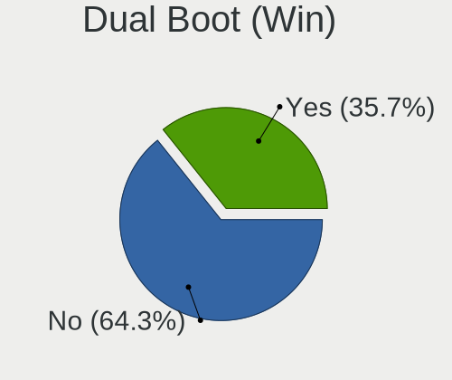
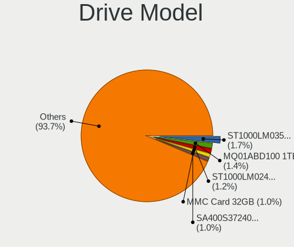
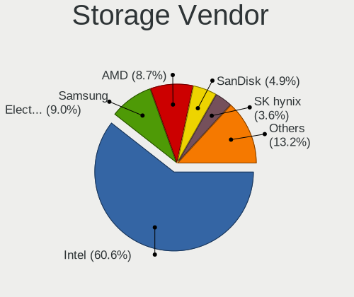
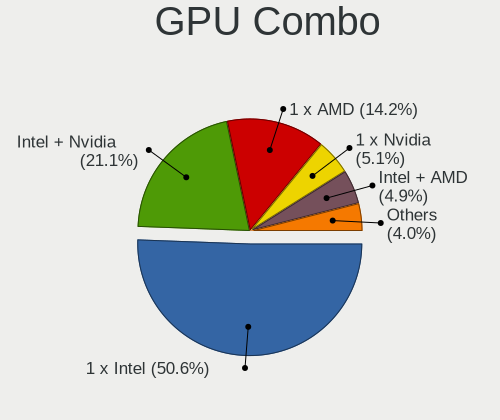
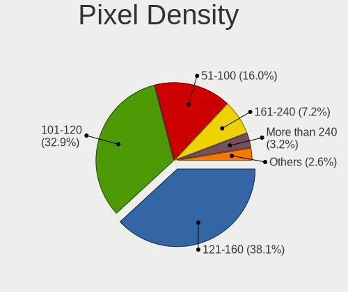

Ubuntu - Tested Hardware & Statistics (Notebooks)
-------------------------------------------------

A project to collect tested hardware configurations for Ubuntu.

Anyone can contribute to this report by the [hw-probe](https://github.com/linuxhw/hw-probe) tool:

    sudo -E hw-probe -all -upload

Please contribute! Especially if your hardware is rare.

Contents
--------

* [ Test Cases ](#test-cases)

* [ System ](#system)
  - [ OS                       ](#os)
  - [ OS Family                ](#os-family)
  - [ Kernel                   ](#kernel)
  - [ Kernel Family            ](#kernel-family)
  - [ Kernel Major Ver.        ](#kernel-major-ver)
  - [ Arch                     ](#arch)
  - [ DE                       ](#de)
  - [ Display Server           ](#display-server)
  - [ Display Manager          ](#display-manager)
  - [ OS Lang                  ](#os-lang)
  - [ Boot Mode                ](#boot-mode)
  - [ Filesystem               ](#filesystem)
  - [ Part. scheme             ](#part-scheme)
  - [ Dual Boot with Linux/BSD ](#dual-boot-with-linuxbsd)
  - [ Dual Boot (Win)          ](#dual-boot-win)

* [ Board ](#board)
  - [ Vendor                   ](#vendor)
  - [ Model                    ](#model)
  - [ Model Family             ](#model-family)
  - [ MFG Year                 ](#mfg-year)
  - [ Form Factor              ](#form-factor)
  - [ Secure Boot              ](#secure-boot)
  - [ Coreboot                 ](#coreboot)
  - [ RAM Size                 ](#ram-size)
  - [ RAM Used                 ](#ram-used)
  - [ Total Drives             ](#total-drives)
  - [ Has CD-ROM               ](#has-cd-rom)
  - [ Has Ethernet             ](#has-ethernet)
  - [ Has WiFi                 ](#has-wifi)
  - [ Has Bluetooth            ](#has-bluetooth)

* [ Location ](#location)
  - [ Country                  ](#country)
  - [ City                     ](#city)

* [ Drives ](#drives)
  - [ Drive Vendor             ](#drive-vendor)
  - [ Drive Model              ](#drive-model)
  - [ HDD Vendor               ](#hdd-vendor)
  - [ SSD Vendor               ](#ssd-vendor)
  - [ Drive Kind               ](#drive-kind)
  - [ Drive Connector          ](#drive-connector)
  - [ Drive Size               ](#drive-size)
  - [ Space Total              ](#space-total)
  - [ Space Used               ](#space-used)
  - [ Malfunc. Drives          ](#malfunc-drives)
  - [ Malfunc. Drive Vendor    ](#malfunc-drive-vendor)
  - [ Malfunc. HDD Vendor      ](#malfunc-hdd-vendor)
  - [ Malfunc. Drive Kind      ](#malfunc-drive-kind)
  - [ Failed Drives            ](#failed-drives)
  - [ Failed Drive Vendor      ](#failed-drive-vendor)
  - [ Drive Status             ](#drive-status)

* [ Storage controller ](#storage-controller)
  - [ Storage Vendor           ](#storage-vendor)
  - [ Storage Model            ](#storage-model)
  - [ Storage Kind             ](#storage-kind)

* [ Processor ](#processor)
  - [ CPU Vendor               ](#cpu-vendor)
  - [ CPU Model                ](#cpu-model)
  - [ CPU Model Family         ](#cpu-model-family)
  - [ CPU Cores                ](#cpu-cores)
  - [ CPU Sockets              ](#cpu-sockets)
  - [ CPU Threads              ](#cpu-threads)
  - [ CPU Op-Modes             ](#cpu-op-modes)
  - [ CPU Microcode            ](#cpu-microcode)
  - [ CPU Microarch            ](#cpu-microarch)

* [ Graphics ](#graphics)
  - [ GPU Vendor               ](#gpu-vendor)
  - [ GPU Model                ](#gpu-model)
  - [ GPU Combo                ](#gpu-combo)
  - [ GPU Driver               ](#gpu-driver)
  - [ GPU Memory               ](#gpu-memory)

* [ Monitor ](#monitor)
  - [ Monitor Vendor           ](#monitor-vendor)
  - [ Monitor Model            ](#monitor-model)
  - [ Monitor Resolution       ](#monitor-resolution)
  - [ Monitor Diagonal         ](#monitor-diagonal)
  - [ Monitor Width            ](#monitor-width)
  - [ Aspect Ratio             ](#aspect-ratio)
  - [ Monitor Area             ](#monitor-area)
  - [ Pixel Density            ](#pixel-density)
  - [ Multiple Monitors        ](#multiple-monitors)

* [ Network ](#network)
  - [ Net Controller Vendor    ](#net-controller-vendor)
  - [ Net Controller Model     ](#net-controller-model)
  - [ Wireless Vendor          ](#wireless-vendor)
  - [ Wireless Model           ](#wireless-model)
  - [ Ethernet Vendor          ](#ethernet-vendor)
  - [ Ethernet Model           ](#ethernet-model)
  - [ Net Controller Kind      ](#net-controller-kind)
  - [ Used Controller          ](#used-controller)
  - [ NICs                     ](#nics)
  - [ IPv6                     ](#ipv6)

* [ Bluetooth ](#bluetooth)
  - [ Bluetooth Vendor         ](#bluetooth-vendor)
  - [ Bluetooth Model          ](#bluetooth-model)

* [ Sound ](#sound)
  - [ Sound Vendor             ](#sound-vendor)
  - [ Sound Model              ](#sound-model)

* [ Memory ](#memory)
  - [ Memory Vendor            ](#memory-vendor)
  - [ Memory Model             ](#memory-model)
  - [ Memory Kind              ](#memory-kind)
  - [ Memory Form Factor       ](#memory-form-factor)
  - [ Memory Size              ](#memory-size)
  - [ Memory Speed             ](#memory-speed)

* [ Printers & scanners ](#printers--scanners)
  - [ Printer Vendor           ](#printer-vendor)
  - [ Printer Model            ](#printer-model)
  - [ Scanner Vendor           ](#scanner-vendor)
  - [ Scanner Model            ](#scanner-model)

* [ Camera ](#camera)
  - [ Camera Vendor            ](#camera-vendor)
  - [ Camera Model             ](#camera-model)

* [ Security ](#security)
  - [ Fingerprint Vendor       ](#fingerprint-vendor)
  - [ Fingerprint Model        ](#fingerprint-model)
  - [ Chipcard Vendor          ](#chipcard-vendor)
  - [ Chipcard Model           ](#chipcard-model)

* [ Unsupported ](#unsupported)
  - [ Unsupported Devices      ](#unsupported-devices)
  - [ Unsupported Device Types ](#unsupported-device-types)

Test Cases
----------

Total: 47511

| Vendor        | Model                       | Probe                                                      | Date         |
|---------------|-----------------------------|------------------------------------------------------------|--------------|
| Lenovo        | ThinkPad T480 20L50010US    | [aa44c2c8b9](https://linux-hardware.org/?probe=aa44c2c8b9) | Jun 10, 2023 |
| Acer          | Aspire E5-574G              | [8ca78da386](https://linux-hardware.org/?probe=8ca78da386) | Jun 10, 2023 |
| Beelink       | Gemini X                    | [adcb5e774d](https://linux-hardware.org/?probe=adcb5e774d) | Jun 10, 2023 |
| HUAWEI        | HVY-WXX9                    | [d6be89e452](https://linux-hardware.org/?probe=d6be89e452) | Jun 10, 2023 |
| Lenovo        | ThinkPad T480 20L50010US    | [398d708c85](https://linux-hardware.org/?probe=398d708c85) | Jun 10, 2023 |
| HP            | EliteBook 1040 G4           | [98aa06475b](https://linux-hardware.org/?probe=98aa06475b) | Jun 10, 2023 |
| Lenovo        | ThinkPad X240 20AMS5XY00    | [3b98c592e0](https://linux-hardware.org/?probe=3b98c592e0) | Jun 10, 2023 |
| HP            | Laptop 17-by3xxx            | [421ff52b0b](https://linux-hardware.org/?probe=421ff52b0b) | Jun 10, 2023 |
| Lenovo        | ThinkPad T550 20CJS1XB00    | [3d3375df75](https://linux-hardware.org/?probe=3d3375df75) | Jun 10, 2023 |
| Lenovo        | ThinkPad P1 Gen 3 20TH00... | [65a47406b0](https://linux-hardware.org/?probe=65a47406b0) | Jun 10, 2023 |
| Lenovo        | ThinkPad T470p 20J7S0XV0... | [b2f7d876c7](https://linux-hardware.org/?probe=b2f7d876c7) | Jun 10, 2023 |
| MSI           | Prestige 13Evo A13M         | [3feb3bce01](https://linux-hardware.org/?probe=3feb3bce01) | Jun 10, 2023 |
| Lenovo        | ThinkPad W500 4058CTO       | [4b6aa9a912](https://linux-hardware.org/?probe=4b6aa9a912) | Jun 10, 2023 |
| Apple         | MacBookAir5,2               | [6adee93e47](https://linux-hardware.org/?probe=6adee93e47) | Jun 10, 2023 |
| HP            | Pavilion Gaming Laptop 1... | [7c9662b5eb](https://linux-hardware.org/?probe=7c9662b5eb) | Jun 10, 2023 |
| Dell          | Vostro 3560                 | [86f646e00f](https://linux-hardware.org/?probe=86f646e00f) | Jun 10, 2023 |
| Dell          | Vostro 3560                 | [1bb9178df2](https://linux-hardware.org/?probe=1bb9178df2) | Jun 10, 2023 |
| Dell          | Latitude E5500              | [41ad12c465](https://linux-hardware.org/?probe=41ad12c465) | Jun 10, 2023 |
| Exo           | Smart Serie LT              | [bbecad1cea](https://linux-hardware.org/?probe=bbecad1cea) | Jun 10, 2023 |
| Apple         | MacBookPro9,2               | [f502f89e9d](https://linux-hardware.org/?probe=f502f89e9d) | Jun 10, 2023 |
| Lenovo        | ThinkPad P16 Gen 1 21D7S... | [246facab73](https://linux-hardware.org/?probe=246facab73) | Jun 10, 2023 |
| Sony          | VPCF120FD                   | [47f02bd498](https://linux-hardware.org/?probe=47f02bd498) | Jun 10, 2023 |
| HP            | ProBook 6360b               | [cdef37cb2d](https://linux-hardware.org/?probe=cdef37cb2d) | Jun 09, 2023 |
| Lenovo        | ThinkPad P16 Gen 1 21D7S... | [233dac6c68](https://linux-hardware.org/?probe=233dac6c68) | Jun 09, 2023 |
| Dell          | Vostro 3500                 | [3d694e1b9a](https://linux-hardware.org/?probe=3d694e1b9a) | Jun 09, 2023 |
| Dell          | Vostro 3558                 | [15185698e7](https://linux-hardware.org/?probe=15185698e7) | Jun 09, 2023 |
| HUAWEI        | MACHC-WAX9                  | [6f26f51ef6](https://linux-hardware.org/?probe=6f26f51ef6) | Jun 09, 2023 |
| HP            | Victus by Laptop 16-e0xx... | [9cb24f9445](https://linux-hardware.org/?probe=9cb24f9445) | Jun 09, 2023 |
| HP            | Stream Laptop 14-ds0xxx     | [fb9e2f9fc8](https://linux-hardware.org/?probe=fb9e2f9fc8) | Jun 09, 2023 |
| HP            | ProBook 4510s               | [43a29ea83e](https://linux-hardware.org/?probe=43a29ea83e) | Jun 09, 2023 |
| HP            | Laptop 17-bs0xx             | [c93d52343c](https://linux-hardware.org/?probe=c93d52343c) | Jun 09, 2023 |
| Google        | Akali 360                   | [1f7d5f8bc5](https://linux-hardware.org/?probe=1f7d5f8bc5) | Jun 09, 2023 |
| Dell          | Latitude E7470              | [c5457da74f](https://linux-hardware.org/?probe=c5457da74f) | Jun 09, 2023 |
| Dell          | Inspiron 3583               | [adcb3b193a](https://linux-hardware.org/?probe=adcb3b193a) | Jun 09, 2023 |
| Dell          | XPS 9320                    | [c9f26e18c2](https://linux-hardware.org/?probe=c9f26e18c2) | Jun 09, 2023 |
| HUAWEI        | BOHB-WAX9                   | [aa0b439e8d](https://linux-hardware.org/?probe=aa0b439e8d) | Jun 09, 2023 |
| Lenovo        | ThinkPad T460s 20FAS11X0... | [23568da401](https://linux-hardware.org/?probe=23568da401) | Jun 09, 2023 |
| Apple         | MacBookPro5,5               | [09344fa63e](https://linux-hardware.org/?probe=09344fa63e) | Jun 09, 2023 |
| Dell          | Inspiron 15-5568            | [19b686b7d7](https://linux-hardware.org/?probe=19b686b7d7) | Jun 09, 2023 |
| Dell          | Latitude E7240              | [1d8eb4fce4](https://linux-hardware.org/?probe=1d8eb4fce4) | Jun 09, 2023 |
| Dell          | Latitude E7240              | [da22551dca](https://linux-hardware.org/?probe=da22551dca) | Jun 09, 2023 |
| Lenovo        | ThinkPad X1 Carbon Gen 8... | [531e3f124d](https://linux-hardware.org/?probe=531e3f124d) | Jun 09, 2023 |
| HP            | ZBook Studio G3             | [4fb38ec480](https://linux-hardware.org/?probe=4fb38ec480) | Jun 08, 2023 |
| HP            | ZBook Studio G3             | [09260f0742](https://linux-hardware.org/?probe=09260f0742) | Jun 08, 2023 |
| HP            | Laptop 15s-fq2xxx           | [09ba95bf3b](https://linux-hardware.org/?probe=09ba95bf3b) | Jun 08, 2023 |
| HP            | ENVY 15                     | [3776ac93b3](https://linux-hardware.org/?probe=3776ac93b3) | Jun 08, 2023 |
| Samsung       | 910S3L                      | [f8e59b4c0f](https://linux-hardware.org/?probe=f8e59b4c0f) | Jun 08, 2023 |
| Lenovo        | Legion Y740-17IRHg 81UJ     | [c98ac6e82c](https://linux-hardware.org/?probe=c98ac6e82c) | Jun 08, 2023 |
| HUAWEI        | HKD-WXX                     | [d6a8e02362](https://linux-hardware.org/?probe=d6a8e02362) | Jun 08, 2023 |
| ASUSTek       | X455LA                      | [583596672d](https://linux-hardware.org/?probe=583596672d) | Jun 08, 2023 |
| MSI           | GE66 Raider 10UE            | [38a5122d9c](https://linux-hardware.org/?probe=38a5122d9c) | Jun 08, 2023 |
| Lenovo        | ThinkPad T490 20N2CTO1WW    | [8fa2e2acc9](https://linux-hardware.org/?probe=8fa2e2acc9) | Jun 08, 2023 |
| HUAWEI        | HKD-WXX                     | [fdb80f6e89](https://linux-hardware.org/?probe=fdb80f6e89) | Jun 08, 2023 |
| Lenovo        | ThinkPad X1 Carbon 3444C... | [4e5e1d4052](https://linux-hardware.org/?probe=4e5e1d4052) | Jun 08, 2023 |
| Lenovo        | Legion Y740-17IRHg 81UJ     | [7879db73f8](https://linux-hardware.org/?probe=7879db73f8) | Jun 08, 2023 |
| Acer          | Aspire ES1-711              | [79bb8d8e39](https://linux-hardware.org/?probe=79bb8d8e39) | Jun 08, 2023 |
| Dell          | Inspiron 5379               | [b161b2177a](https://linux-hardware.org/?probe=b161b2177a) | Jun 08, 2023 |
| HONOR         | NBR-WAX9                    | [697f2b18e8](https://linux-hardware.org/?probe=697f2b18e8) | Jun 08, 2023 |
| Gigabyte      | P2542                       | [12a2415432](https://linux-hardware.org/?probe=12a2415432) | Jun 08, 2023 |
| Lenovo        | IdeaPad 5 Pro 14ACN6 82L... | [292625f2da](https://linux-hardware.org/?probe=292625f2da) | Jun 08, 2023 |
| HP            | 2000                        | [4ae1384345](https://linux-hardware.org/?probe=4ae1384345) | Jun 07, 2023 |
| Beelink       | Gemini X                    | [49aca69972](https://linux-hardware.org/?probe=49aca69972) | Jun 07, 2023 |
| Dell          | Latitude E6420              | [011dadb850](https://linux-hardware.org/?probe=011dadb850) | Jun 07, 2023 |
| Dell          | Latitude E6420              | [a1c7c69a05](https://linux-hardware.org/?probe=a1c7c69a05) | Jun 07, 2023 |
| Lenovo        | ThinkPad X220 Tablet 429... | [ea8584cbda](https://linux-hardware.org/?probe=ea8584cbda) | Jun 07, 2023 |
| Acer          | Aspire E5-553               | [76ca69b8cc](https://linux-hardware.org/?probe=76ca69b8cc) | Jun 07, 2023 |
| Dell          | Latitude 3350               | [ef85473c50](https://linux-hardware.org/?probe=ef85473c50) | Jun 07, 2023 |
| Acer          | Aspire E5-553               | [3932ac5190](https://linux-hardware.org/?probe=3932ac5190) | Jun 07, 2023 |
| MSI           | Stealth 15M B12UE           | [ff2ebbb0ae](https://linux-hardware.org/?probe=ff2ebbb0ae) | Jun 07, 2023 |
| Dell          | XPS 9320                    | [ff5fc17acc](https://linux-hardware.org/?probe=ff5fc17acc) | Jun 07, 2023 |
| Lenovo        | ThinkPad X201 3680Y4F       | [7823148e7d](https://linux-hardware.org/?probe=7823148e7d) | Jun 07, 2023 |
| Dell          | XPS 13 9370                 | [f70195a177](https://linux-hardware.org/?probe=f70195a177) | Jun 07, 2023 |
| Onda TLC      | ONDA Oliver                 | [bbfcf4a3be](https://linux-hardware.org/?probe=bbfcf4a3be) | Jun 07, 2023 |
| Lenovo        | Yoga Slim 7 Pro 16ARH7 8... | [265c19be27](https://linux-hardware.org/?probe=265c19be27) | Jun 07, 2023 |
| Apple         | MacBookPro14,1              | [b0435761df](https://linux-hardware.org/?probe=b0435761df) | Jun 07, 2023 |
| Apple         | MacBookPro14,1              | [a76212cc40](https://linux-hardware.org/?probe=a76212cc40) | Jun 07, 2023 |
| HP            | EliteBook 2560p             | [1b491bcfeb](https://linux-hardware.org/?probe=1b491bcfeb) | Jun 07, 2023 |
| HP            | EliteBook 2560p             | [f1060e2b5d](https://linux-hardware.org/?probe=f1060e2b5d) | Jun 07, 2023 |
| Acer          | Nitro AN515-55              | [99b42755e8](https://linux-hardware.org/?probe=99b42755e8) | Jun 07, 2023 |
| Dell          | Inspiron 5547               | [7775c4c871](https://linux-hardware.org/?probe=7775c4c871) | Jun 07, 2023 |
| Dell          | Inspiron 5547               | [3a43778152](https://linux-hardware.org/?probe=3a43778152) | Jun 07, 2023 |
| Dell          | Latitude E7250              | [a80182e728](https://linux-hardware.org/?probe=a80182e728) | Jun 06, 2023 |
| HP            | Laptop 15s-fq2xxx           | [9d0aa12b81](https://linux-hardware.org/?probe=9d0aa12b81) | Jun 06, 2023 |
| Sony          | VPCEH3N6E                   | [788ddd35a8](https://linux-hardware.org/?probe=788ddd35a8) | Jun 06, 2023 |
| Acer          | Aspire A715-51G             | [dbde8636bb](https://linux-hardware.org/?probe=dbde8636bb) | Jun 06, 2023 |
| Acer          | Aspire A315-31              | [d5da1b4b30](https://linux-hardware.org/?probe=d5da1b4b30) | Jun 06, 2023 |
| ASUSTek       | VivoBook_ASUSLaptop M160... | [e4335c33f6](https://linux-hardware.org/?probe=e4335c33f6) | Jun 06, 2023 |
| ASUSTek       | VivoBook_ASUSLaptop M350... | [bf403bb6d8](https://linux-hardware.org/?probe=bf403bb6d8) | Jun 06, 2023 |
| HUAWEI        | NBLB-WAX9N                  | [e56988bf8e](https://linux-hardware.org/?probe=e56988bf8e) | Jun 06, 2023 |
| Samsung       | 910S3L                      | [2db0ae25d8](https://linux-hardware.org/?probe=2db0ae25d8) | Jun 06, 2023 |
| Lenovo        | ThinkPad T590 20N5000AMH    | [91c0d99427](https://linux-hardware.org/?probe=91c0d99427) | Jun 06, 2023 |
| Dell          | Latitude 7400               | [9968377d89](https://linux-hardware.org/?probe=9968377d89) | Jun 06, 2023 |
| Dell          | XPS 13 9370                 | [82aba8957b](https://linux-hardware.org/?probe=82aba8957b) | Jun 06, 2023 |
| Dell          | Latitude 7480               | [61c800a3b4](https://linux-hardware.org/?probe=61c800a3b4) | Jun 06, 2023 |
| HP            | EliteBook 840 G3            | [18eeac2fc1](https://linux-hardware.org/?probe=18eeac2fc1) | Jun 06, 2023 |
| Dell          | Latitude E6400              | [ced90af89e](https://linux-hardware.org/?probe=ced90af89e) | Jun 06, 2023 |
| ASUSTek       | ROG Strix G531GT_G531GT     | [503bc1f4cc](https://linux-hardware.org/?probe=503bc1f4cc) | Jun 06, 2023 |
| ASUSTek       | ROG Strix G531GT_G531GT     | [31a814cd0e](https://linux-hardware.org/?probe=31a814cd0e) | Jun 06, 2023 |
| Lenovo        | IdeaPad 3 14ITL6 82H7       | [5159be9e2b](https://linux-hardware.org/?probe=5159be9e2b) | Jun 06, 2023 |
| HP            | Laptop 14s-dq1xxx           | [8f99826bf1](https://linux-hardware.org/?probe=8f99826bf1) | Jun 06, 2023 |
| Notebook      | P65xHP                      | [bf35e218d7](https://linux-hardware.org/?probe=bf35e218d7) | Jun 06, 2023 |
| ASUSTek       | TUF Gaming FX505DT_FX505... | [fc49284b9f](https://linux-hardware.org/?probe=fc49284b9f) | Jun 06, 2023 |
| Lenovo        | IdeaPad 5 14ALC05 82LM      | [53cb8df21f](https://linux-hardware.org/?probe=53cb8df21f) | Jun 06, 2023 |
| Toshiba       | PORTEGE X30-D               | [262ee566e1](https://linux-hardware.org/?probe=262ee566e1) | Jun 06, 2023 |
| Dell          | Precision 3571              | [35f408bce4](https://linux-hardware.org/?probe=35f408bce4) | Jun 06, 2023 |
| HP            | EliteBook 840 G6            | [0763f751ac](https://linux-hardware.org/?probe=0763f751ac) | Jun 05, 2023 |
| Notebook      | P65xHP                      | [51834b893c](https://linux-hardware.org/?probe=51834b893c) | Jun 05, 2023 |
| HP            | ZBook Studio G3             | [09f2ec5511](https://linux-hardware.org/?probe=09f2ec5511) | Jun 05, 2023 |
| Dell          | Latitude 5530               | [a302ecd3cd](https://linux-hardware.org/?probe=a302ecd3cd) | Jun 05, 2023 |
| Lenovo        | ThinkPad X250 20CLS02K00    | [fc306205a7](https://linux-hardware.org/?probe=fc306205a7) | Jun 05, 2023 |
| Dell          | XPS 13 9305                 | [450d20f29d](https://linux-hardware.org/?probe=450d20f29d) | Jun 05, 2023 |
| ASUSTek       | VivoBook_ASUSLaptop X515... | [a06e6ab7ad](https://linux-hardware.org/?probe=a06e6ab7ad) | Jun 05, 2023 |
| HP            | Pavilion Laptop 15-eh1xx... | [c8ca6e8787](https://linux-hardware.org/?probe=c8ca6e8787) | Jun 05, 2023 |
| ASUSTek       | G750JM                      | [cdb3539c93](https://linux-hardware.org/?probe=cdb3539c93) | Jun 05, 2023 |
| HP            | ENVY m6 Notebook            | [5bc28b7062](https://linux-hardware.org/?probe=5bc28b7062) | Jun 05, 2023 |
| HP            | ENVY m6 Notebook            | [aff6da41b8](https://linux-hardware.org/?probe=aff6da41b8) | Jun 05, 2023 |
| HP            | Pavilion Laptop 15-eh0xx... | [b969b91080](https://linux-hardware.org/?probe=b969b91080) | Jun 05, 2023 |
| Lenovo        | ThinkPad E14 Gen 4 21E3S... | [6528b4bffe](https://linux-hardware.org/?probe=6528b4bffe) | Jun 05, 2023 |
| HP            | Notebook                    | [1605419ae0](https://linux-hardware.org/?probe=1605419ae0) | Jun 05, 2023 |
| Dell          | Latitude 3460               | [1a92cd0779](https://linux-hardware.org/?probe=1a92cd0779) | Jun 05, 2023 |
| Lenovo        | ThinkPad E14 Gen 4 21E3S... | [dbc9b8df0b](https://linux-hardware.org/?probe=dbc9b8df0b) | Jun 05, 2023 |
| Lenovo        | IdeaPad 3 14ITL6 82H7       | [ceab55a00c](https://linux-hardware.org/?probe=ceab55a00c) | Jun 05, 2023 |
| HP            | Laptop 14-fq0xxx            | [02614f184c](https://linux-hardware.org/?probe=02614f184c) | Jun 05, 2023 |
| Infinix       | INBOOK X2                   | [0a82b1aed3](https://linux-hardware.org/?probe=0a82b1aed3) | Jun 05, 2023 |
| Lenovo        | Legion 5 15ACH6H 82JU       | [ea07821e39](https://linux-hardware.org/?probe=ea07821e39) | Jun 05, 2023 |
| Lenovo        | ThinkPad T480 20L5S1RY00    | [56c173d205](https://linux-hardware.org/?probe=56c173d205) | Jun 05, 2023 |
| HP            | Pavilion dm4                | [63bd248ea6](https://linux-hardware.org/?probe=63bd248ea6) | Jun 05, 2023 |
| Lenovo        | IdeaPad 100-15IBD 80QQ      | [c3892d9477](https://linux-hardware.org/?probe=c3892d9477) | Jun 05, 2023 |
| Toshiba       | Satellite Pro C70-B         | [d4bc6d6c8c](https://linux-hardware.org/?probe=d4bc6d6c8c) | Jun 04, 2023 |
| Sony          | VPCEH2H4E                   | [793e883d0c](https://linux-hardware.org/?probe=793e883d0c) | Jun 04, 2023 |
| Lenovo        | ThinkPad T460p 20FXS0DR0... | [6fad1535c3](https://linux-hardware.org/?probe=6fad1535c3) | Jun 04, 2023 |
| Toshiba       | Satellite L655              | [1b9656a4a1](https://linux-hardware.org/?probe=1b9656a4a1) | Jun 04, 2023 |
| Dell          | Inspiron 3442               | [5c1f2cc0d3](https://linux-hardware.org/?probe=5c1f2cc0d3) | Jun 04, 2023 |
| Acer          | Swift SF314-43              | [969354604a](https://linux-hardware.org/?probe=969354604a) | Jun 04, 2023 |
| ASUSTek       | G750JM                      | [f492ab6829](https://linux-hardware.org/?probe=f492ab6829) | Jun 04, 2023 |
| HP            | 2000                        | [7b24eaf0d9](https://linux-hardware.org/?probe=7b24eaf0d9) | Jun 04, 2023 |
| HP            | 2000                        | [dfee85b8e7](https://linux-hardware.org/?probe=dfee85b8e7) | Jun 04, 2023 |
| Dell          | Latitude E5520              | [7e2d1fdd22](https://linux-hardware.org/?probe=7e2d1fdd22) | Jun 04, 2023 |
| Acer          | Swift SF314-512             | [f39742476c](https://linux-hardware.org/?probe=f39742476c) | Jun 04, 2023 |
| Acer          | Swift SF314-512             | [efa49bf468](https://linux-hardware.org/?probe=efa49bf468) | Jun 04, 2023 |
| IP3 Tech      | AP1                         | [d24ecf10e2](https://linux-hardware.org/?probe=d24ecf10e2) | Jun 04, 2023 |
| HUAWEI        | BOHB-WAX9                   | [8fa7afa4a1](https://linux-hardware.org/?probe=8fa7afa4a1) | Jun 04, 2023 |
| Dell          | Latitude E5510              | [353a2174af](https://linux-hardware.org/?probe=353a2174af) | Jun 04, 2023 |
| Lenovo        | ThinkPad T14 Gen 1 20S00... | [a00b8e7d13](https://linux-hardware.org/?probe=a00b8e7d13) | Jun 04, 2023 |
| Apple         | MacBookPro13,3              | [885709a33f](https://linux-hardware.org/?probe=885709a33f) | Jun 04, 2023 |
| Lenovo        | ThinkPad T450 20BU000FUS    | [a0181fbf52](https://linux-hardware.org/?probe=a0181fbf52) | Jun 04, 2023 |
| Samsung       | 950XED                      | [185834c02e](https://linux-hardware.org/?probe=185834c02e) | Jun 04, 2023 |
| Lenovo        | IdeaPad Gaming 3 16IAH7 ... | [6d8d7f6384](https://linux-hardware.org/?probe=6d8d7f6384) | Jun 04, 2023 |
| Lanix         | AL V9                       | [3bd23fdde7](https://linux-hardware.org/?probe=3bd23fdde7) | Jun 04, 2023 |
| Lenovo        | ThinkPad P72 20MBCTO1WW     | [4f62d33d84](https://linux-hardware.org/?probe=4f62d33d84) | Jun 04, 2023 |
| MSI           | Modern 14 B5M               | [da21766a5c](https://linux-hardware.org/?probe=da21766a5c) | Jun 04, 2023 |
| HP            | Pavilion 15                 | [dc8f67bb03](https://linux-hardware.org/?probe=dc8f67bb03) | Jun 03, 2023 |
| ASUSTek       | K52Je                       | [0190eef08c](https://linux-hardware.org/?probe=0190eef08c) | Jun 03, 2023 |
| Schenker      | XMG FOCUS (M22)             | [31203c3645](https://linux-hardware.org/?probe=31203c3645) | Jun 03, 2023 |
| Dell          | Inspiron 13-5368            | [33bb0f34df](https://linux-hardware.org/?probe=33bb0f34df) | Jun 03, 2023 |
| ASUSTek       | X553MA                      | [d07b3215b1](https://linux-hardware.org/?probe=d07b3215b1) | Jun 03, 2023 |
| ASUSTek       | VivoBook_ASUSLaptop X515... | [f12b791748](https://linux-hardware.org/?probe=f12b791748) | Jun 03, 2023 |
| Lenovo        | ThinkPad P16s Gen 1 21BT... | [8678eeac9b](https://linux-hardware.org/?probe=8678eeac9b) | Jun 03, 2023 |
| ASUSTek       | K52Je                       | [c6f78ba2aa](https://linux-hardware.org/?probe=c6f78ba2aa) | Jun 03, 2023 |
| Dell          | Inspiron 5559               | [9e1fe43cf9](https://linux-hardware.org/?probe=9e1fe43cf9) | Jun 03, 2023 |
| Acer          | Aspire A114-31              | [7a760e7ad6](https://linux-hardware.org/?probe=7a760e7ad6) | Jun 03, 2023 |
| Dell          | Latitude E6420              | [069b512b91](https://linux-hardware.org/?probe=069b512b91) | Jun 03, 2023 |
| Lenovo        | ThinkPad T420 4236WQD       | [69a63f31e1](https://linux-hardware.org/?probe=69a63f31e1) | Jun 03, 2023 |
| Dell          | Latitude E5430 non-vPro     | [ba2dfac7ae](https://linux-hardware.org/?probe=ba2dfac7ae) | Jun 03, 2023 |
| Dell          | Latitude E7450              | [fe7cb1e53f](https://linux-hardware.org/?probe=fe7cb1e53f) | Jun 03, 2023 |
| Lenovo        | Yoga S740-14IIL 81RS        | [1e4ffa48ce](https://linux-hardware.org/?probe=1e4ffa48ce) | Jun 03, 2023 |
| HP            | ENVY 17                     | [79fd438f05](https://linux-hardware.org/?probe=79fd438f05) | Jun 03, 2023 |
| Dell          | Inspiron 5490               | [a0cc355293](https://linux-hardware.org/?probe=a0cc355293) | Jun 03, 2023 |
| Dell          | G15 5520                    | [b77b760dfe](https://linux-hardware.org/?probe=b77b760dfe) | Jun 03, 2023 |
| Dell          | Vostro 3550                 | [3b25dd60b3](https://linux-hardware.org/?probe=3b25dd60b3) | Jun 03, 2023 |
| NCS-Tech      | B300                        | [895395765b](https://linux-hardware.org/?probe=895395765b) | Jun 03, 2023 |
| Dell          | Latitude 5491               | [6a8a7e6188](https://linux-hardware.org/?probe=6a8a7e6188) | Jun 03, 2023 |
| Toshiba       | Satellite L655              | [9b83a4575b](https://linux-hardware.org/?probe=9b83a4575b) | Jun 02, 2023 |
| HP            | Notebook                    | [9b12c54cf2](https://linux-hardware.org/?probe=9b12c54cf2) | Jun 02, 2023 |
| Acer          | Aspire 7750G                | [160d4525c6](https://linux-hardware.org/?probe=160d4525c6) | Jun 02, 2023 |
| Notebook      | NL40_50CU                   | [47b838db36](https://linux-hardware.org/?probe=47b838db36) | Jun 02, 2023 |
| ASUSTek       | TUF Gaming FX505DT_FX505... | [fa4bd41f4b](https://linux-hardware.org/?probe=fa4bd41f4b) | Jun 02, 2023 |
| Dell          | Latitude 6430U              | [3104417f5e](https://linux-hardware.org/?probe=3104417f5e) | Jun 02, 2023 |
| ASUSTek       | ASUS TUF Gaming F17 FX70... | [959b76650d](https://linux-hardware.org/?probe=959b76650d) | Jun 02, 2023 |
| ASUSTek       | VivoBook_ASUSLaptop K650... | [a6d6fdfe4f](https://linux-hardware.org/?probe=a6d6fdfe4f) | Jun 02, 2023 |
| Dell          | Inspiron 15 7000 Gaming     | [664282cc84](https://linux-hardware.org/?probe=664282cc84) | Jun 02, 2023 |
| Lenovo        | Legion 5 15ACH6H 82JU       | [4d170e024e](https://linux-hardware.org/?probe=4d170e024e) | Jun 02, 2023 |
| Acer          | Aspire ES1-523              | [a080a07f52](https://linux-hardware.org/?probe=a080a07f52) | Jun 02, 2023 |
| Acer          | Aspire 7750G                | [e94cab5008](https://linux-hardware.org/?probe=e94cab5008) | Jun 02, 2023 |
| Acer          | Aspire 7745G                | [7739f949e1](https://linux-hardware.org/?probe=7739f949e1) | Jun 02, 2023 |
| ASUSTek       | VivoBook_ASUSLaptop X513... | [109dbbfff0](https://linux-hardware.org/?probe=109dbbfff0) | Jun 02, 2023 |
| ASUSTek       | VivoBook_ASUSLaptop M350... | [1aea71b6c0](https://linux-hardware.org/?probe=1aea71b6c0) | Jun 02, 2023 |
| Lenovo        | ThinkBook 15 G3 ACL 21A4    | [b8c8f96b56](https://linux-hardware.org/?probe=b8c8f96b56) | Jun 02, 2023 |
| HUAWEI        | MACHC-WAX9                  | [c87d784c98](https://linux-hardware.org/?probe=c87d784c98) | Jun 02, 2023 |
| Lenovo        | IdeaPad 1 15IGL7 82V7       | [a7c067f896](https://linux-hardware.org/?probe=a7c067f896) | Jun 02, 2023 |
| Lenovo        | ThinkBook 15 G4 ABA 21DL    | [6b1168349b](https://linux-hardware.org/?probe=6b1168349b) | Jun 02, 2023 |
| HP            | Laptop 15s-eq2xxx           | [302ae0e2dc](https://linux-hardware.org/?probe=302ae0e2dc) | Jun 02, 2023 |
| Lenovo        | ThinkBook 15 G4 ABA 21DL    | [3da98cc9bb](https://linux-hardware.org/?probe=3da98cc9bb) | Jun 02, 2023 |
| Unknown       | Unknown                     | [655398fc94](https://linux-hardware.org/?probe=655398fc94) | Jun 02, 2023 |
| ASUSTek       | VivoBook_ASUSLaptop M350... | [1bdb74a8ba](https://linux-hardware.org/?probe=1bdb74a8ba) | Jun 02, 2023 |
| Apple         | MacBookPro5,5               | [29c4ba7312](https://linux-hardware.org/?probe=29c4ba7312) | Jun 01, 2023 |
| Unknown       | Unknown                     | [fa6344a8eb](https://linux-hardware.org/?probe=fa6344a8eb) | Jun 01, 2023 |
| Lenovo        | ThinkPad T530 2392AHG       | [05c41c8464](https://linux-hardware.org/?probe=05c41c8464) | Jun 01, 2023 |
| Lenovo        | ThinkBook 15 G4 IAP 21DJ    | [98b0b355db](https://linux-hardware.org/?probe=98b0b355db) | Jun 01, 2023 |
| Apple         | MacBookAir4,1               | [42b1507aa8](https://linux-hardware.org/?probe=42b1507aa8) | Jun 01, 2023 |
| Samsung       | 300E4C/300E5C/300E7C        | [fcc2d0ed39](https://linux-hardware.org/?probe=fcc2d0ed39) | Jun 01, 2023 |
| HP            | EliteBook 820 G2            | [c9409c532d](https://linux-hardware.org/?probe=c9409c532d) | Jun 01, 2023 |
| Lenovo        | G400s VILG1                 | [fee541ee18](https://linux-hardware.org/?probe=fee541ee18) | Jun 01, 2023 |
| Lenovo        | IdeaPad 330-15IKB 81FD      | [33e440f44f](https://linux-hardware.org/?probe=33e440f44f) | Jun 01, 2023 |
| HP            | ZBook Studio G3             | [d6d7da0907](https://linux-hardware.org/?probe=d6d7da0907) | Jun 01, 2023 |
| Dell          | Vostro 3520                 | [473145db98](https://linux-hardware.org/?probe=473145db98) | Jun 01, 2023 |
| MSI           | Prestige 15 A12UC           | [9324563727](https://linux-hardware.org/?probe=9324563727) | Jun 01, 2023 |
| MSI           | Prestige 15 A12UC           | [778e78d2a5](https://linux-hardware.org/?probe=778e78d2a5) | Jun 01, 2023 |
| HP            | ProBook 440 G4              | [af2f742bc5](https://linux-hardware.org/?probe=af2f742bc5) | Jun 01, 2023 |
| Dell          | Vostro 3520                 | [088f4d3536](https://linux-hardware.org/?probe=088f4d3536) | Jun 01, 2023 |
| HP            | EliteBook 650 15.6 inch ... | [3ca0d2f1a7](https://linux-hardware.org/?probe=3ca0d2f1a7) | Jun 01, 2023 |
| HP            | ProBook 6450b               | [d3d4e45f9d](https://linux-hardware.org/?probe=d3d4e45f9d) | Jun 01, 2023 |
| ASUSTek       | X550CA                      | [fe31674f48](https://linux-hardware.org/?probe=fe31674f48) | Jun 01, 2023 |
| ASUSTek       | VivoBook_ASUSLaptop M160... | [1334997a22](https://linux-hardware.org/?probe=1334997a22) | Jun 01, 2023 |
| ASUSTek       | VivoBook_ASUSLaptop X580... | [f66667b7fb](https://linux-hardware.org/?probe=f66667b7fb) | Jun 01, 2023 |
| ASUSTek       | ROG Strix G731GT_GL731GT    | [0afa6e53d0](https://linux-hardware.org/?probe=0afa6e53d0) | Jun 01, 2023 |
| Dell          | XPS 15 9570                 | [6d7803788d](https://linux-hardware.org/?probe=6d7803788d) | Jun 01, 2023 |
| Dell          | Vostro 15 3515              | [8a69d6c123](https://linux-hardware.org/?probe=8a69d6c123) | Jun 01, 2023 |
| Dell          | Vostro 15 3515              | [ecfe7565f4](https://linux-hardware.org/?probe=ecfe7565f4) | Jun 01, 2023 |
| HP            | EliteBook 2560p             | [e822eb4072](https://linux-hardware.org/?probe=e822eb4072) | Jun 01, 2023 |
| ASUSTek       | K53SK                       | [9b376cdd45](https://linux-hardware.org/?probe=9b376cdd45) | Jun 01, 2023 |
| Apple         | MacBook4,1                  | [996b318420](https://linux-hardware.org/?probe=996b318420) | Jun 01, 2023 |
| HP            | Pavilion Laptop 15-cc5xx    | [3e49e329d3](https://linux-hardware.org/?probe=3e49e329d3) | Jun 01, 2023 |
| Packard Be... | EasyNote LJ75               | [95c733d00f](https://linux-hardware.org/?probe=95c733d00f) | May 31, 2023 |
| HP            | Pavilion Notebook           | [3fb05bfb0b](https://linux-hardware.org/?probe=3fb05bfb0b) | May 31, 2023 |
| HP            | Pavilion Laptop 15-cw1xx... | [560680687c](https://linux-hardware.org/?probe=560680687c) | May 31, 2023 |
| Lenovo        | Yoga S740-14IIL 81RS        | [b7032438d2](https://linux-hardware.org/?probe=b7032438d2) | May 31, 2023 |
| MSI           | GE70 2QE                    | [a075b8b77d](https://linux-hardware.org/?probe=a075b8b77d) | May 31, 2023 |
| Lenovo        | ThinkPad T480 20L6S7PE0G    | [239faf8c55](https://linux-hardware.org/?probe=239faf8c55) | May 31, 2023 |
| HONOR         | BBR-WAX9                    | [8630cfad52](https://linux-hardware.org/?probe=8630cfad52) | May 31, 2023 |
| HP            | Laptop 15s-fq5xxx           | [bfcb7f950d](https://linux-hardware.org/?probe=bfcb7f950d) | May 31, 2023 |
| Lenovo        | Yoga S740-14IIL 81RS        | [2c315764a9](https://linux-hardware.org/?probe=2c315764a9) | May 31, 2023 |
| Dell          | Inspiron 3502               | [3c734d2900](https://linux-hardware.org/?probe=3c734d2900) | May 31, 2023 |
| Toshiba       | Satellite L850              | [cee0a13d3f](https://linux-hardware.org/?probe=cee0a13d3f) | May 31, 2023 |
| Acer          | Nitro AN515-54              | [7c031081c5](https://linux-hardware.org/?probe=7c031081c5) | May 31, 2023 |
| Dell          | Precision 7670              | [77b039b486](https://linux-hardware.org/?probe=77b039b486) | May 31, 2023 |
| Acer          | Swift SF314-512             | [a8c97baf10](https://linux-hardware.org/?probe=a8c97baf10) | May 31, 2023 |
| ASUSTek       | ROG Strix G513RS_G513RS     | [69b1782cce](https://linux-hardware.org/?probe=69b1782cce) | May 31, 2023 |
| AXIOO         | Mybook-14E                  | [cb04b551d8](https://linux-hardware.org/?probe=cb04b551d8) | May 31, 2023 |
| Acer          | Swift SF314-512             | [5c9a2502db](https://linux-hardware.org/?probe=5c9a2502db) | May 31, 2023 |
| Apple         | MacBookPro7,1               | [4fc174a983](https://linux-hardware.org/?probe=4fc174a983) | May 31, 2023 |
| Lenovo        | ThinkBook 15 G4 ABA 21DL    | [7210e5c07e](https://linux-hardware.org/?probe=7210e5c07e) | May 31, 2023 |
| Lenovo        | ThinkPad T14s Gen 3 21BR... | [0ead50ad49](https://linux-hardware.org/?probe=0ead50ad49) | May 31, 2023 |
| Jumper        | EZbook                      | [3ccf2e1365](https://linux-hardware.org/?probe=3ccf2e1365) | May 31, 2023 |
| Lenovo        | ThinkPad X1 Carbon 7th 2... | [742ae62ba6](https://linux-hardware.org/?probe=742ae62ba6) | May 30, 2023 |
| ASUSTek       | K53SK                       | [bfd926c8da](https://linux-hardware.org/?probe=bfd926c8da) | May 30, 2023 |
| Acer          | Aspire V3-574G              | [728459dd4a](https://linux-hardware.org/?probe=728459dd4a) | May 30, 2023 |
| VALE          | Notebook Classic C140       | [cdc6168586](https://linux-hardware.org/?probe=cdc6168586) | May 30, 2023 |
| Gigabyte      | P2542                       | [b1064cae7a](https://linux-hardware.org/?probe=b1064cae7a) | May 30, 2023 |
| Lenovo        | Legion 5 15ACH6H 82JU       | [86e04155f2](https://linux-hardware.org/?probe=86e04155f2) | May 30, 2023 |
| Dell          | Inspiron 15-3567            | [e51e0ef0da](https://linux-hardware.org/?probe=e51e0ef0da) | May 30, 2023 |
| Gigabyte      | P2542                       | [7cded000f2](https://linux-hardware.org/?probe=7cded000f2) | May 30, 2023 |
| Framework     | Laptop (12th Gen Intel C... | [ada20f1f6a](https://linux-hardware.org/?probe=ada20f1f6a) | May 30, 2023 |
| HP            | ENVY 15                     | [5acbfb03f4](https://linux-hardware.org/?probe=5acbfb03f4) | May 30, 2023 |
| Toshiba       | Satellite C665              | [c6149a6430](https://linux-hardware.org/?probe=c6149a6430) | May 30, 2023 |
| Lenovo        | IdeaPad 5 14ALC05 82LM      | [bb50e13268](https://linux-hardware.org/?probe=bb50e13268) | May 30, 2023 |
| Dell          | Vostro 3520                 | [4c50880385](https://linux-hardware.org/?probe=4c50880385) | May 30, 2023 |
| Lenovo        | ThinkPad X1 Carbon 4th 2... | [8002face48](https://linux-hardware.org/?probe=8002face48) | May 30, 2023 |
| ASUSTek       | VivoBook_ASUSLaptop M350... | [cddd43859b](https://linux-hardware.org/?probe=cddd43859b) | May 30, 2023 |
| Lenovo        | IdeaPad 5 14ALC05 82LM      | [46f455ce35](https://linux-hardware.org/?probe=46f455ce35) | May 30, 2023 |
| Apple         | MacBookPro11,1              | [b881639bef](https://linux-hardware.org/?probe=b881639bef) | May 30, 2023 |
| HP            | Pavilion 15                 | [ca18fafda8](https://linux-hardware.org/?probe=ca18fafda8) | May 29, 2023 |
| Acer          | Aspire A515-57              | [e9f91331b2](https://linux-hardware.org/?probe=e9f91331b2) | May 29, 2023 |
| HP            | Elite Dragonfly 13.5 inc... | [1e0fbe86da](https://linux-hardware.org/?probe=1e0fbe86da) | May 29, 2023 |
| ASUSTek       | VivoBook_ASUSLaptop X512... | [ea06bd5806](https://linux-hardware.org/?probe=ea06bd5806) | May 29, 2023 |
| ASUSTek       | X456URK                     | [6de2588617](https://linux-hardware.org/?probe=6de2588617) | May 29, 2023 |
| ASUSTek       | X456URK                     | [369aa4fc93](https://linux-hardware.org/?probe=369aa4fc93) | May 29, 2023 |
| ASUSTek       | VivoBook_ASUSLaptop X712... | [509bb7aae7](https://linux-hardware.org/?probe=509bb7aae7) | May 29, 2023 |
| MSI           | Katana GF76 12UD            | [b1b1816b59](https://linux-hardware.org/?probe=b1b1816b59) | May 29, 2023 |
| Alienware     | x15 R1                      | [19e9b8e338](https://linux-hardware.org/?probe=19e9b8e338) | May 29, 2023 |
| Lenovo        | ThinkPad E14 20RAS1RA00     | [087565aed3](https://linux-hardware.org/?probe=087565aed3) | May 29, 2023 |
| Notebook      | NV4XMB,ME,MZ                | [6fdc7285f2](https://linux-hardware.org/?probe=6fdc7285f2) | May 29, 2023 |
| Lenovo        | ThinkBook 16p Gen 4 21J8    | [202bf4f657](https://linux-hardware.org/?probe=202bf4f657) | May 29, 2023 |
| Lenovo        | ThinkBook 16p Gen 4 21J8    | [bb60c42e07](https://linux-hardware.org/?probe=bb60c42e07) | May 29, 2023 |
| Lenovo        | ThinkPad T480 20L6S42000    | [ea6330526c](https://linux-hardware.org/?probe=ea6330526c) | May 29, 2023 |
| Sony          | VPCEA45FG                   | [873ca04445](https://linux-hardware.org/?probe=873ca04445) | May 29, 2023 |
| MSI           | Raider GE76 12UE            | [5e8f375846](https://linux-hardware.org/?probe=5e8f375846) | May 29, 2023 |
| ASUSTek       | ROG Strix G733PY_G733PY     | [7518e057f8](https://linux-hardware.org/?probe=7518e057f8) | May 29, 2023 |
| ASUSTek       | ROG Strix G733PY_G733PY     | [6d07d843c5](https://linux-hardware.org/?probe=6d07d843c5) | May 29, 2023 |
| Dell          | Inspiron 15-7568            | [227930e25d](https://linux-hardware.org/?probe=227930e25d) | May 29, 2023 |
| Apple         | MacBookPro7,1               | [81a267d02b](https://linux-hardware.org/?probe=81a267d02b) | May 28, 2023 |
| Lenovo        | IdeaPad 320-15IAP 80XR      | [4353f50548](https://linux-hardware.org/?probe=4353f50548) | May 28, 2023 |
| Lenovo        | ThinkPad T540p 20BE00AKZ... | [f9bc4694e4](https://linux-hardware.org/?probe=f9bc4694e4) | May 28, 2023 |
| Lenovo        | IdeaPad 320-15IAP 80XR      | [d993490e5a](https://linux-hardware.org/?probe=d993490e5a) | May 28, 2023 |
| HONOR         | BBR-WAX9                    | [e57b9850f8](https://linux-hardware.org/?probe=e57b9850f8) | May 28, 2023 |
| ALLDOCUBE     | i1405C                      | [7e4475ef13](https://linux-hardware.org/?probe=7e4475ef13) | May 28, 2023 |
| Apple         | MacBookAir4,1               | [25c6965a47](https://linux-hardware.org/?probe=25c6965a47) | May 28, 2023 |
| Apple         | MacBookAir4,1               | [e950caa0ce](https://linux-hardware.org/?probe=e950caa0ce) | May 28, 2023 |
| Lenovo        | IdeaPad Gaming 3 15IMH05... | [95793a85de](https://linux-hardware.org/?probe=95793a85de) | May 28, 2023 |
| Lenovo        | IdeaPad Gaming 3 15IMH05... | [7c9addaf1c](https://linux-hardware.org/?probe=7c9addaf1c) | May 28, 2023 |
| HP            | EliteBook 850 G8 Noteboo... | [9178413d40](https://linux-hardware.org/?probe=9178413d40) | May 28, 2023 |
| Samsung       | 300E4Z/300E5Z/300E7Z        | [c5b13d6ea2](https://linux-hardware.org/?probe=c5b13d6ea2) | May 28, 2023 |
| HP            | Pavilion Gaming Laptop 1... | [960ddf4eaf](https://linux-hardware.org/?probe=960ddf4eaf) | May 28, 2023 |
| Lenovo        | V130-15IKB 81HN             | [e50700f8be](https://linux-hardware.org/?probe=e50700f8be) | May 28, 2023 |
| Lenovo        | IdeaPad 100-15IBD 80QQ      | [c2408a1885](https://linux-hardware.org/?probe=c2408a1885) | May 28, 2023 |
| Apple         | MacBookPro10,2              | [34d96aa1df](https://linux-hardware.org/?probe=34d96aa1df) | May 28, 2023 |
| HP            | EliteBook 840 G1            | [a1aa06298d](https://linux-hardware.org/?probe=a1aa06298d) | May 28, 2023 |
| HUAWEI        | BOHB-WAX9                   | [c7afdbbd76](https://linux-hardware.org/?probe=c7afdbbd76) | May 28, 2023 |
| TUXEDO        | Unknown                     | [21be23e012](https://linux-hardware.org/?probe=21be23e012) | May 28, 2023 |
| ASUSTek       | VivoBook_ASUSLaptop X415... | [86876e9715](https://linux-hardware.org/?probe=86876e9715) | May 28, 2023 |
| HUAWEI        | HVY-WXX9                    | [412b42ae92](https://linux-hardware.org/?probe=412b42ae92) | May 28, 2023 |
| AVITA         | NE14A2                      | [89c5edafbc](https://linux-hardware.org/?probe=89c5edafbc) | May 28, 2023 |
| Shuttle       | X50V5                       | [277cc7ca36](https://linux-hardware.org/?probe=277cc7ca36) | May 28, 2023 |
| Acer          | Aspire A515-56              | [4d8767d94b](https://linux-hardware.org/?probe=4d8767d94b) | May 28, 2023 |
| Lenovo        | IdeaPad Gaming 3 15IAH7 ... | [c2125f60d2](https://linux-hardware.org/?probe=c2125f60d2) | May 28, 2023 |
| Apple         | MacBookPro6,2               | [db9c87ce89](https://linux-hardware.org/?probe=db9c87ce89) | May 28, 2023 |
| Apple         | MacBookAir8,1               | [47b2ee3c0d](https://linux-hardware.org/?probe=47b2ee3c0d) | May 28, 2023 |
| Dell          | Vostro 5402                 | [41a9c1dcf2](https://linux-hardware.org/?probe=41a9c1dcf2) | May 28, 2023 |
| Lenovo        | ThinkPad T460 20FMS1JA00    | [618a907425](https://linux-hardware.org/?probe=618a907425) | May 27, 2023 |
| Dell          | Vostro 15 3515              | [2fadb86df4](https://linux-hardware.org/?probe=2fadb86df4) | May 27, 2023 |
| ASUSTek       | ROG Strix G634JY_G634JY     | [026cf06ce5](https://linux-hardware.org/?probe=026cf06ce5) | May 27, 2023 |
| Lenovo        | V130-15IGM 81HL             | [76a357994a](https://linux-hardware.org/?probe=76a357994a) | May 27, 2023 |
| HP            | Laptop 15s-fq5xxx           | [c6309fc374](https://linux-hardware.org/?probe=c6309fc374) | May 27, 2023 |
| Lenovo        | IdeaPad 5 15IIL05 81YK      | [1eecbd5808](https://linux-hardware.org/?probe=1eecbd5808) | May 27, 2023 |
| Dell          | Latitude 5440               | [9ed4f0e7ac](https://linux-hardware.org/?probe=9ed4f0e7ac) | May 27, 2023 |
| Lenovo        | G50-70 20351                | [ee0a9f666c](https://linux-hardware.org/?probe=ee0a9f666c) | May 27, 2023 |
| HUAWEI        | HVY-WXX9                    | [3f6fc3ec0c](https://linux-hardware.org/?probe=3f6fc3ec0c) | May 27, 2023 |
| HP            | Laptop 15-bs0xx             | [9605e313ac](https://linux-hardware.org/?probe=9605e313ac) | May 27, 2023 |
| HP            | Laptop 15-bs0xx             | [0a8ae92c13](https://linux-hardware.org/?probe=0a8ae92c13) | May 27, 2023 |
| HP            | ENVY TS 15                  | [15762c5ca7](https://linux-hardware.org/?probe=15762c5ca7) | May 27, 2023 |
| Apple         | MacBookPro8,1               | [f969629640](https://linux-hardware.org/?probe=f969629640) | May 27, 2023 |
| Apple         | MacBookPro8,1               | [229873404d](https://linux-hardware.org/?probe=229873404d) | May 27, 2023 |
| HP            | ProBook 650 G1              | [8b2266868a](https://linux-hardware.org/?probe=8b2266868a) | May 27, 2023 |
| Dell          | Latitude 5480               | [c7566d1ab9](https://linux-hardware.org/?probe=c7566d1ab9) | May 27, 2023 |
| Dell          | Latitude 5480               | [5327e82af6](https://linux-hardware.org/?probe=5327e82af6) | May 27, 2023 |
| Lenovo        | ThinkPad T14s Gen 3 21BR... | [57b9304725](https://linux-hardware.org/?probe=57b9304725) | May 27, 2023 |
| Dell          | Inspiron 7537               | [9433d17d5e](https://linux-hardware.org/?probe=9433d17d5e) | May 27, 2023 |
| Dell          | Inspiron 7537               | [1fce30c12e](https://linux-hardware.org/?probe=1fce30c12e) | May 27, 2023 |
| Acer          | Aspire A315-22              | [18a13174aa](https://linux-hardware.org/?probe=18a13174aa) | May 27, 2023 |
| Dell          | Latitude 7480               | [2c74ec8198](https://linux-hardware.org/?probe=2c74ec8198) | May 27, 2023 |
| Dell          | Latitude 7490               | [fbad4c1a53](https://linux-hardware.org/?probe=fbad4c1a53) | May 27, 2023 |
| Dell          | Latitude 7490               | [00c44ed00c](https://linux-hardware.org/?probe=00c44ed00c) | May 27, 2023 |
| Apple         | MacBookPro5,5               | [f1b7ea69ea](https://linux-hardware.org/?probe=f1b7ea69ea) | May 27, 2023 |
| Lenovo        | ThinkBook 15 G4 ABA 21DL    | [cc9d03264f](https://linux-hardware.org/?probe=cc9d03264f) | May 27, 2023 |
| Toshiba       | Satellite Pro C70-B         | [3058a75499](https://linux-hardware.org/?probe=3058a75499) | May 26, 2023 |
| Samsung       | 910S3G/910S3T               | [e041a5365e](https://linux-hardware.org/?probe=e041a5365e) | May 26, 2023 |
| MSI           | Raider GE76 12UE            | [25bcdc17b0](https://linux-hardware.org/?probe=25bcdc17b0) | May 26, 2023 |
| Dell          | Inspiron N4020              | [6350805cd6](https://linux-hardware.org/?probe=6350805cd6) | May 26, 2023 |
| Dell          | Inspiron N4020              | [801ec6309f](https://linux-hardware.org/?probe=801ec6309f) | May 26, 2023 |
| Acer          | Aspire A515-52G             | [433b367e58](https://linux-hardware.org/?probe=433b367e58) | May 26, 2023 |
| Acer          | Aspire A515-52G             | [ac85063e46](https://linux-hardware.org/?probe=ac85063e46) | May 26, 2023 |
| HP            | EliteBook 820 G1            | [1498cf091b](https://linux-hardware.org/?probe=1498cf091b) | May 26, 2023 |
| ASUSTek       | K52Je                       | [3b40aeae90](https://linux-hardware.org/?probe=3b40aeae90) | May 26, 2023 |
| HP            | Pavilion Notebook           | [1c67718bdb](https://linux-hardware.org/?probe=1c67718bdb) | May 26, 2023 |
| Dell          | Latitude E6330              | [e7477af1a5](https://linux-hardware.org/?probe=e7477af1a5) | May 26, 2023 |
| Lenovo        | ThinkPad T470 20HES6HC00    | [d67930c691](https://linux-hardware.org/?probe=d67930c691) | May 26, 2023 |
| HP            | ZBook Firefly 14 inch G8... | [b8bb801b93](https://linux-hardware.org/?probe=b8bb801b93) | May 26, 2023 |
| HP            | ZBook Firefly 14 inch G8... | [a8c4cf6158](https://linux-hardware.org/?probe=a8c4cf6158) | May 26, 2023 |
| Dell          | Latitude E7450              | [4a88622321](https://linux-hardware.org/?probe=4a88622321) | May 26, 2023 |
| ASUSTek       | X550CA                      | [3aebf9eb7c](https://linux-hardware.org/?probe=3aebf9eb7c) | May 26, 2023 |
| Acer          | Predator PT316-51s          | [0242988287](https://linux-hardware.org/?probe=0242988287) | May 26, 2023 |
| Lenovo        | ThinkBook 14 G4 IAP 21DH    | [98308c882b](https://linux-hardware.org/?probe=98308c882b) | May 26, 2023 |
| Toshiba       | Satellite S55-A             | [2b9beaf4a6](https://linux-hardware.org/?probe=2b9beaf4a6) | May 25, 2023 |
| Clevo         | P150HMx                     | [d6c90a2c0c](https://linux-hardware.org/?probe=d6c90a2c0c) | May 25, 2023 |
| MSI           | GE75 Raider 10SF            | [5ee0afea25](https://linux-hardware.org/?probe=5ee0afea25) | May 25, 2023 |
| HP            | ENVY Laptop 13-ah0503na     | [cdf2d7b4b4](https://linux-hardware.org/?probe=cdf2d7b4b4) | May 25, 2023 |
| Timi          | Xiaomi NoteBook Pro         | [0316f8d274](https://linux-hardware.org/?probe=0316f8d274) | May 25, 2023 |
| Lenovo        | ThinkPad T580 20LAS62M07    | [48ad025649](https://linux-hardware.org/?probe=48ad025649) | May 25, 2023 |
| ASUSTek       | N75SF                       | [38840055c8](https://linux-hardware.org/?probe=38840055c8) | May 25, 2023 |
| Dell          | Latitude 5480               | [adb6ba25f1](https://linux-hardware.org/?probe=adb6ba25f1) | May 25, 2023 |
| ASUSTek       | GL552VW                     | [0466edde83](https://linux-hardware.org/?probe=0466edde83) | May 25, 2023 |
| Google        | Akali 360                   | [2a4bbc5d81](https://linux-hardware.org/?probe=2a4bbc5d81) | May 25, 2023 |
| HP            | Pavilion Notebook           | [945b06d022](https://linux-hardware.org/?probe=945b06d022) | May 25, 2023 |
| HP            | EliteBook 820 G1            | [46a6988c7a](https://linux-hardware.org/?probe=46a6988c7a) | May 25, 2023 |
| ASUSTek       | ROG Zephyrus G15 GA503RW... | [270540781d](https://linux-hardware.org/?probe=270540781d) | May 25, 2023 |
| Dell          | G15 5510                    | [325fcf6e78](https://linux-hardware.org/?probe=325fcf6e78) | May 25, 2023 |
| Dell          | Latitude 5440               | [5a27bd40e7](https://linux-hardware.org/?probe=5a27bd40e7) | May 25, 2023 |
| Acer          | Aspire A715-51G             | [53cbfa6255](https://linux-hardware.org/?probe=53cbfa6255) | May 25, 2023 |
| Toshiba       | Satellite Pro C650          | [50fc04b16c](https://linux-hardware.org/?probe=50fc04b16c) | May 25, 2023 |
| Samsung       | 900X5T                      | [9f1d226c85](https://linux-hardware.org/?probe=9f1d226c85) | May 25, 2023 |
| Dell          | Latitude 5480               | [45b63ce664](https://linux-hardware.org/?probe=45b63ce664) | May 25, 2023 |
| Mediacom      | SMARTBOOK ONE               | [ad010a6b3e](https://linux-hardware.org/?probe=ad010a6b3e) | May 25, 2023 |
| HP            | Laptop 14-dq2xxx            | [589112cb44](https://linux-hardware.org/?probe=589112cb44) | May 25, 2023 |
| Dell          | Inspiron 15-7568            | [161ed53585](https://linux-hardware.org/?probe=161ed53585) | May 25, 2023 |
| Acer          | Aspire A514-55              | [17996395f4](https://linux-hardware.org/?probe=17996395f4) | May 25, 2023 |
| HP            | Stream Laptop 14-ds0xxx     | [5d83c85225](https://linux-hardware.org/?probe=5d83c85225) | May 25, 2023 |
| Fujitsu       | LIFEBOOK AH530              | [c885a13922](https://linux-hardware.org/?probe=c885a13922) | May 25, 2023 |
| Fujitsu       | LIFEBOOK AH530              | [897b688aba](https://linux-hardware.org/?probe=897b688aba) | May 25, 2023 |
| Dell          | Latitude 5420               | [a4690b7476](https://linux-hardware.org/?probe=a4690b7476) | May 25, 2023 |
| HP            | ZBook Studio G3             | [fadf4f9112](https://linux-hardware.org/?probe=fadf4f9112) | May 25, 2023 |
| HP            | Laptop 14-dq1xxx            | [dddde1dc45](https://linux-hardware.org/?probe=dddde1dc45) | May 25, 2023 |
| HP            | ZBook Studio G3             | [a7274d19af](https://linux-hardware.org/?probe=a7274d19af) | May 24, 2023 |
| Dell          | Latitude 7390               | [999bb94a31](https://linux-hardware.org/?probe=999bb94a31) | May 24, 2023 |
| HP            | Pavilion 17                 | [792ac6919d](https://linux-hardware.org/?probe=792ac6919d) | May 24, 2023 |
| Alienware     | 17 R3                       | [a567b379a1](https://linux-hardware.org/?probe=a567b379a1) | May 24, 2023 |
| HUAWEI        | BOD-WXX9                    | [9486b7ca4f](https://linux-hardware.org/?probe=9486b7ca4f) | May 24, 2023 |
| Apple         | MacBookPro6,2               | [6858db4f73](https://linux-hardware.org/?probe=6858db4f73) | May 24, 2023 |
| MSI           | GF63 Thin 9RC               | [aef2c48b64](https://linux-hardware.org/?probe=aef2c48b64) | May 24, 2023 |
| ASUSTek       | K55VJ                       | [2b12b33767](https://linux-hardware.org/?probe=2b12b33767) | May 24, 2023 |
| HP            | Laptop 14-dq1xxx            | [d8261039f8](https://linux-hardware.org/?probe=d8261039f8) | May 24, 2023 |
| HP            | EliteBook 840 G3            | [06333c9c97](https://linux-hardware.org/?probe=06333c9c97) | May 24, 2023 |
| HP            | EliteBook 850 G8 Noteboo... | [cb3e4d2c2b](https://linux-hardware.org/?probe=cb3e4d2c2b) | May 24, 2023 |
| HP            | Laptop 15s-fq4xxx           | [810c2ac411](https://linux-hardware.org/?probe=810c2ac411) | May 24, 2023 |
| Dell          | XPS 15 9500                 | [4c512786cc](https://linux-hardware.org/?probe=4c512786cc) | May 24, 2023 |
| Dell          | XPS 15 9500                 | [da0b980bc3](https://linux-hardware.org/?probe=da0b980bc3) | May 24, 2023 |
| Allview       | Allbook H                   | [8b0c0a3436](https://linux-hardware.org/?probe=8b0c0a3436) | May 24, 2023 |
| Dell          | Precision 3571              | [3806fcdb9c](https://linux-hardware.org/?probe=3806fcdb9c) | May 24, 2023 |
| Dell          | Precision 5520              | [a5e0cc8586](https://linux-hardware.org/?probe=a5e0cc8586) | May 24, 2023 |
| Lenovo        | ThinkPad W530 24472BG       | [6431c2bb45](https://linux-hardware.org/?probe=6431c2bb45) | May 24, 2023 |
| Dell          | G15 5510                    | [730985e467](https://linux-hardware.org/?probe=730985e467) | May 24, 2023 |
| HP            | Stream Laptop 14-ds0xxx     | [587ab1857a](https://linux-hardware.org/?probe=587ab1857a) | May 24, 2023 |
| Lenovo        | ThinkPad T480 20L50005GE    | [306ecade71](https://linux-hardware.org/?probe=306ecade71) | May 24, 2023 |
| Dell          | Inspiron 5720               | [c9eaabeb95](https://linux-hardware.org/?probe=c9eaabeb95) | May 24, 2023 |
| HP            | Pavilion dv5                | [2906e3ff3b](https://linux-hardware.org/?probe=2906e3ff3b) | May 24, 2023 |
| HP            | 15                          | [b62229cac1](https://linux-hardware.org/?probe=b62229cac1) | May 24, 2023 |
| Lenovo        | Unknown                     | [e7148e7a18](https://linux-hardware.org/?probe=e7148e7a18) | May 23, 2023 |
| Lenovo        | IdeaPad 1 15IGL7 82V7       | [0c665ebdd8](https://linux-hardware.org/?probe=0c665ebdd8) | May 23, 2023 |
| HP            | G60                         | [443fda4fac](https://linux-hardware.org/?probe=443fda4fac) | May 23, 2023 |
| Lenovo        | ThinkPad T440s 20AQ007SM... | [a81e627367](https://linux-hardware.org/?probe=a81e627367) | May 23, 2023 |
| Lenovo        | V130-15IGM 81HL             | [5a4cf4d2e3](https://linux-hardware.org/?probe=5a4cf4d2e3) | May 23, 2023 |
| HUAWEI        | KLVD-WXX9                   | [4c3c861f80](https://linux-hardware.org/?probe=4c3c861f80) | May 23, 2023 |
| Lenovo        | IdeaPad 110-15ISK 80UD      | [3e2ccc8b5e](https://linux-hardware.org/?probe=3e2ccc8b5e) | May 23, 2023 |
| ASUSTek       | VivoBook_ASUSLaptop E203... | [47c0ef11d2](https://linux-hardware.org/?probe=47c0ef11d2) | May 23, 2023 |
| ASUSTek       | VivoBook_ASUSLaptop E203... | [0f7e3e95a2](https://linux-hardware.org/?probe=0f7e3e95a2) | May 23, 2023 |
| Lenovo        | ThinkPad T470s 20HGS4RU0... | [ac8df81694](https://linux-hardware.org/?probe=ac8df81694) | May 23, 2023 |
| Lenovo        | ThinkPad Helix 36986DG      | [77f092da32](https://linux-hardware.org/?probe=77f092da32) | May 23, 2023 |
| HP            | ENVY Laptop 13-ba1xxx       | [a11fdd0361](https://linux-hardware.org/?probe=a11fdd0361) | May 23, 2023 |
| Lenovo        | IdeaPad 330S-15IKB 81F5     | [d704fd9efd](https://linux-hardware.org/?probe=d704fd9efd) | May 23, 2023 |
| Dell          | Vostro 5402                 | [e6834866ba](https://linux-hardware.org/?probe=e6834866ba) | May 23, 2023 |
| HP            | ProBook 450 G3              | [4400f1205b](https://linux-hardware.org/?probe=4400f1205b) | May 23, 2023 |
| Dell          | Inspiron 1525               | [a92437f5aa](https://linux-hardware.org/?probe=a92437f5aa) | May 23, 2023 |
| ASUSTek       | X751MA                      | [674b64f381](https://linux-hardware.org/?probe=674b64f381) | May 23, 2023 |
| HP            | Laptop 14s-fq1xxx           | [73d0ff64b6](https://linux-hardware.org/?probe=73d0ff64b6) | May 23, 2023 |
| Lenovo        | ThinkPad T14 Gen 3 21AH0... | [2fffd70abb](https://linux-hardware.org/?probe=2fffd70abb) | May 23, 2023 |
| Acer          | Aspire E5-553               | [3740264eb0](https://linux-hardware.org/?probe=3740264eb0) | May 23, 2023 |
| HP            | 250 G6 Notebook PC          | [431f2db1fc](https://linux-hardware.org/?probe=431f2db1fc) | May 23, 2023 |
| Apple         | MacBookPro13,2              | [8b87a13f50](https://linux-hardware.org/?probe=8b87a13f50) | May 23, 2023 |
| Dell          | Inspiron 5575               | [7d93944943](https://linux-hardware.org/?probe=7d93944943) | May 23, 2023 |
| Apple         | MacBookPro13,2              | [f0ef45dcf3](https://linux-hardware.org/?probe=f0ef45dcf3) | May 23, 2023 |
| Chuwi         | HeroBook Air                | [724db856f3](https://linux-hardware.org/?probe=724db856f3) | May 23, 2023 |
| ASUSTek       | VivoBook_ASUS Laptop E21... | [0197aaf79a](https://linux-hardware.org/?probe=0197aaf79a) | May 23, 2023 |
| ASUSTek       | VivoBook_ASUS Laptop E21... | [bb39617225](https://linux-hardware.org/?probe=bb39617225) | May 23, 2023 |
| Lenovo        | ThinkBook 15 G4 ABA 21DL    | [c77cb59a5c](https://linux-hardware.org/?probe=c77cb59a5c) | May 23, 2023 |
| Lenovo        | ThinkPad T540p 20BF001NU... | [2a770d2eac](https://linux-hardware.org/?probe=2a770d2eac) | May 23, 2023 |
| Dell          | Latitude E5570              | [3b1aaa683d](https://linux-hardware.org/?probe=3b1aaa683d) | May 23, 2023 |
| HP            | Laptop 14-dq2xxx            | [fe7d1e1f90](https://linux-hardware.org/?probe=fe7d1e1f90) | May 22, 2023 |
| Dell          | Inspiron 1525               | [2afda2396c](https://linux-hardware.org/?probe=2afda2396c) | May 22, 2023 |
| Acer          | Nitro AN515-46              | [702a597b36](https://linux-hardware.org/?probe=702a597b36) | May 22, 2023 |
| Lenovo        | ThinkPad T450 20BUS0100G    | [069d442d0d](https://linux-hardware.org/?probe=069d442d0d) | May 22, 2023 |
| Acer          | Aspire A715-42G             | [39bb190ac7](https://linux-hardware.org/?probe=39bb190ac7) | May 22, 2023 |
| Acer          | Swift SF514-56T             | [81a0e002b7](https://linux-hardware.org/?probe=81a0e002b7) | May 22, 2023 |
| ASUSTek       | X555LNB                     | [a1aa3cf4b2](https://linux-hardware.org/?probe=a1aa3cf4b2) | May 22, 2023 |
| HUAWEI        | KLVL-WXXW                   | [6ca579ee78](https://linux-hardware.org/?probe=6ca579ee78) | May 22, 2023 |
| Lenovo        | ThinkPad E14 20RAS1RA00     | [33773ecf4d](https://linux-hardware.org/?probe=33773ecf4d) | May 22, 2023 |
| HP            | EliteBook 850 G6            | [b38d6399b4](https://linux-hardware.org/?probe=b38d6399b4) | May 22, 2023 |
| ASUSTek       | UX301LAB                    | [69f7b4ae4f](https://linux-hardware.org/?probe=69f7b4ae4f) | May 22, 2023 |
| MSI           | Modern 14 B10MW             | [895bca272b](https://linux-hardware.org/?probe=895bca272b) | May 22, 2023 |
| Apple         | MacBookPro5,5               | [7978c97691](https://linux-hardware.org/?probe=7978c97691) | May 22, 2023 |
| HUAWEI        | NBLB-WAX9N                  | [14b20068ca](https://linux-hardware.org/?probe=14b20068ca) | May 22, 2023 |
| Dell          | Latitude 3420               | [d598f2634f](https://linux-hardware.org/?probe=d598f2634f) | May 22, 2023 |
| Apple         | MacBookPro15,1              | [f1d994fa47](https://linux-hardware.org/?probe=f1d994fa47) | May 22, 2023 |
| HP            | ZBook Fury 15.6 inch G8 ... | [117bc29848](https://linux-hardware.org/?probe=117bc29848) | May 22, 2023 |
| Lenovo        | ThinkPad T450 20BUS1GQ00    | [1ea9bac322](https://linux-hardware.org/?probe=1ea9bac322) | May 22, 2023 |
| Lenovo        | ThinkPad L13 Gen 2 20VH0... | [21f52b0bc9](https://linux-hardware.org/?probe=21f52b0bc9) | May 22, 2023 |
| Dell          | XPS 9315                    | [6c3fdbf590](https://linux-hardware.org/?probe=6c3fdbf590) | May 22, 2023 |
| HP            | ZBook Fury 15.6 inch G8 ... | [e3af81180a](https://linux-hardware.org/?probe=e3af81180a) | May 22, 2023 |
| Dell          | Inspiron 7520               | [eeca18ff12](https://linux-hardware.org/?probe=eeca18ff12) | May 22, 2023 |
| HP            | Pavilion g4                 | [3324fbbbaa](https://linux-hardware.org/?probe=3324fbbbaa) | May 22, 2023 |
| ASUSTek       | VivoBook_ASUSLaptop E410... | [dedcc1bb3f](https://linux-hardware.org/?probe=dedcc1bb3f) | May 22, 2023 |
| MSI           | Stealth 15M B12UE           | [4051f4b27d](https://linux-hardware.org/?probe=4051f4b27d) | May 22, 2023 |
| HUAWEI        | NBM-WXX9                    | [e3ea42dd02](https://linux-hardware.org/?probe=e3ea42dd02) | May 22, 2023 |
| HUAWEI        | KLVL-WXX9                   | [5cb11eee20](https://linux-hardware.org/?probe=5cb11eee20) | May 22, 2023 |
| Dell          | Inspiron 5770               | [4c16a00ef6](https://linux-hardware.org/?probe=4c16a00ef6) | May 22, 2023 |
| HUAWEI        | MACHC-WAX9                  | [536b91dce1](https://linux-hardware.org/?probe=536b91dce1) | May 21, 2023 |
| Acer          | Aspire E5-575G              | [d27d5d547e](https://linux-hardware.org/?probe=d27d5d547e) | May 21, 2023 |
| Acer          | Aspire 1410                 | [ddfda379c8](https://linux-hardware.org/?probe=ddfda379c8) | May 21, 2023 |
| Sony          | VPCF120FD                   | [a438459d06](https://linux-hardware.org/?probe=a438459d06) | May 21, 2023 |
| MSI           | PS63 Modern 8MO             | [5d6f78bfbb](https://linux-hardware.org/?probe=5d6f78bfbb) | May 21, 2023 |
| Lenovo        | ThinkPad X395 20NLCTO1WW    | [55a289b426](https://linux-hardware.org/?probe=55a289b426) | May 21, 2023 |
| Apple         | MacBookPro14,2              | [d29f7a36f9](https://linux-hardware.org/?probe=d29f7a36f9) | May 21, 2023 |
| Apple         | MacBookPro16,2              | [e4adcd71f1](https://linux-hardware.org/?probe=e4adcd71f1) | May 21, 2023 |
| Apple         | MacBookPro16,2              | [09f37f2540](https://linux-hardware.org/?probe=09f37f2540) | May 21, 2023 |
| HP            | EliteBook 640 14 inch G9... | [32e623c724](https://linux-hardware.org/?probe=32e623c724) | May 21, 2023 |
| Dell          | Latitude E6530              | [7c04efc558](https://linux-hardware.org/?probe=7c04efc558) | May 21, 2023 |
| HP            | Pavilion 15                 | [548626d011](https://linux-hardware.org/?probe=548626d011) | May 21, 2023 |
| HP            | Pavilion 15                 | [05f3c4f274](https://linux-hardware.org/?probe=05f3c4f274) | May 21, 2023 |
| HP            | Pavilion 15                 | [7afbe545bc](https://linux-hardware.org/?probe=7afbe545bc) | May 21, 2023 |
| Apple         | MacBook4,1                  | [d404dc5e03](https://linux-hardware.org/?probe=d404dc5e03) | May 21, 2023 |
| Acer          | Aspire V3-572G              | [8f1be2d961](https://linux-hardware.org/?probe=8f1be2d961) | May 21, 2023 |
| ASUSTek       | UX430UAR                    | [7815f47a45](https://linux-hardware.org/?probe=7815f47a45) | May 21, 2023 |
| ASUSTek       | K56CA                       | [6ae76c1553](https://linux-hardware.org/?probe=6ae76c1553) | May 21, 2023 |
| Lenovo        | IdeaPad 1 15IGL7 82V7       | [3a448141db](https://linux-hardware.org/?probe=3a448141db) | May 21, 2023 |
| HP            | Pavilion Laptop 15-cc5xx    | [dda7ad1c16](https://linux-hardware.org/?probe=dda7ad1c16) | May 21, 2023 |
| Toshiba       | Satellite Pro S500          | [b08ca84ea8](https://linux-hardware.org/?probe=b08ca84ea8) | May 20, 2023 |
| Unknown       | Unknown                     | [2d705adeaa](https://linux-hardware.org/?probe=2d705adeaa) | May 20, 2023 |
| Dell          | G3 3500                     | [29f1b0fbda](https://linux-hardware.org/?probe=29f1b0fbda) | May 20, 2023 |
| Acer          | Aspire E1-571               | [cce6eaa028](https://linux-hardware.org/?probe=cce6eaa028) | May 20, 2023 |
| Lenovo        | IdeaPad 1 15IGL7 82V7       | [6bce5f1ff0](https://linux-hardware.org/?probe=6bce5f1ff0) | May 20, 2023 |
| Dell          | Latitude E7450              | [51f34cd446](https://linux-hardware.org/?probe=51f34cd446) | May 20, 2023 |
| Dell          | Inspiron 3542               | [166b73ef05](https://linux-hardware.org/?probe=166b73ef05) | May 20, 2023 |
| Lenovo        | ThinkPad P14s Gen 1 20Y1... | [c5fee7bb50](https://linux-hardware.org/?probe=c5fee7bb50) | May 20, 2023 |
| Acer          | Aspire S3                   | [b6841c9aeb](https://linux-hardware.org/?probe=b6841c9aeb) | May 20, 2023 |
| Acer          | Aspire S3                   | [3fafb0df5d](https://linux-hardware.org/?probe=3fafb0df5d) | May 20, 2023 |
| HP            | Pavilion dv6                | [17ac43247a](https://linux-hardware.org/?probe=17ac43247a) | May 20, 2023 |
| Unknown       | Unknown                     | [c7157cc723](https://linux-hardware.org/?probe=c7157cc723) | May 20, 2023 |
| Lenovo        | IdeaPad 310-15ISK 80SM      | [7d4516eff2](https://linux-hardware.org/?probe=7d4516eff2) | May 20, 2023 |
| ASUSTek       | VivoBook_ASUSLaptop M350... | [de162ff16c](https://linux-hardware.org/?probe=de162ff16c) | May 20, 2023 |
| Acer          | Nitro AN517-54              | [105fb43fc1](https://linux-hardware.org/?probe=105fb43fc1) | May 20, 2023 |
| Samsung       | 300E5EV/300E4EV/270E5EV/... | [42ab4c7e67](https://linux-hardware.org/?probe=42ab4c7e67) | May 20, 2023 |
| HP            | ProBook 450 G4              | [054ec4f1cb](https://linux-hardware.org/?probe=054ec4f1cb) | May 20, 2023 |
| Dell          | Latitude 7280               | [9b98a88e3d](https://linux-hardware.org/?probe=9b98a88e3d) | May 19, 2023 |
| HP            | Laptop 15s-dr3xxx           | [4c44db2d32](https://linux-hardware.org/?probe=4c44db2d32) | May 19, 2023 |
| Dell          | Latitude E7450              | [e844aeb177](https://linux-hardware.org/?probe=e844aeb177) | May 19, 2023 |
| Lenovo        | G50-30 80G0                 | [03c6d7a815](https://linux-hardware.org/?probe=03c6d7a815) | May 19, 2023 |
| HUAWEI        | BOHB-WAX9                   | [f69b95b887](https://linux-hardware.org/?probe=f69b95b887) | May 19, 2023 |
| ASUSTek       | VivoBook_ASUSLaptop K660... | [3ad05eed61](https://linux-hardware.org/?probe=3ad05eed61) | May 19, 2023 |
| ASUSTek       | VivoBook_ASUSLaptop X512... | [73aafcfb9c](https://linux-hardware.org/?probe=73aafcfb9c) | May 19, 2023 |
| Acer          | Aspire E5-771G              | [0dadbeca5b](https://linux-hardware.org/?probe=0dadbeca5b) | May 19, 2023 |
| TUXEDO        | Pulse 15 Gen2               | [c0e3ea54c0](https://linux-hardware.org/?probe=c0e3ea54c0) | May 19, 2023 |
| Lenovo        | IdeaPad 5 15IAL7 82SF       | [b0ed659e7d](https://linux-hardware.org/?probe=b0ed659e7d) | May 19, 2023 |
| Lenovo        | ThinkPad E590 20NB0029GE    | [749d31d44a](https://linux-hardware.org/?probe=749d31d44a) | May 19, 2023 |
| Lenovo        | ThinkPad E590 20NB0029GE    | [85da505294](https://linux-hardware.org/?probe=85da505294) | May 19, 2023 |
| MSI           | GE75 Raider 10SF            | [8aaec63d14](https://linux-hardware.org/?probe=8aaec63d14) | May 19, 2023 |
| MSI           | VR601                       | [7f9381407d](https://linux-hardware.org/?probe=7f9381407d) | May 19, 2023 |
| Lenovo        | IdeaPad U530 Touch 20289    | [72e254e4ee](https://linux-hardware.org/?probe=72e254e4ee) | May 19, 2023 |
| ASUSTek       | ASUS TUF Gaming A17 FA70... | [5bac34a5f5](https://linux-hardware.org/?probe=5bac34a5f5) | May 19, 2023 |
| Dell          | Inspiron 3442               | [a8bb37c78e](https://linux-hardware.org/?probe=a8bb37c78e) | May 19, 2023 |
| MSI           | GE75 Raider 10SF            | [f3724cb7da](https://linux-hardware.org/?probe=f3724cb7da) | May 19, 2023 |
| HP            | HDX18                       | [fbfe87f9b5](https://linux-hardware.org/?probe=fbfe87f9b5) | May 19, 2023 |
| HP            | HDX18                       | [a0d050763b](https://linux-hardware.org/?probe=a0d050763b) | May 19, 2023 |
| HP            | 15                          | [a22d3981e2](https://linux-hardware.org/?probe=a22d3981e2) | May 19, 2023 |
| Samsung       | 300E5EV/300E4EV/270E5EV/... | [9475bc847b](https://linux-hardware.org/?probe=9475bc847b) | May 19, 2023 |
| HP            | ZBook Studio G3             | [17f928afe0](https://linux-hardware.org/?probe=17f928afe0) | May 19, 2023 |
| Unknown       | Unknown                     | [49c702a8c9](https://linux-hardware.org/?probe=49c702a8c9) | May 18, 2023 |
| HP            | Pavilion dv6                | [4fb1281981](https://linux-hardware.org/?probe=4fb1281981) | May 18, 2023 |
| ASUSTek       | VivoBook_ASUSLaptop M140... | [7af74c5864](https://linux-hardware.org/?probe=7af74c5864) | May 18, 2023 |
| Lenovo        | ThinkPad L14 Gen 3 21C2C... | [a0f983e519](https://linux-hardware.org/?probe=a0f983e519) | May 18, 2023 |
| Lenovo        | Legion 5 15ITH6H 82JH       | [7f35aa414f](https://linux-hardware.org/?probe=7f35aa414f) | May 18, 2023 |
| Dell          | Latitude E6500              | [27213adbe8](https://linux-hardware.org/?probe=27213adbe8) | May 18, 2023 |
| Entroware     | Kratos                      | [ecf875b8e5](https://linux-hardware.org/?probe=ecf875b8e5) | May 18, 2023 |
| Sony          | SVF1521A6EW                 | [49a9f77ea9](https://linux-hardware.org/?probe=49a9f77ea9) | May 18, 2023 |
| HP            | Laptop 15-db0xxx            | [6141537b7b](https://linux-hardware.org/?probe=6141537b7b) | May 18, 2023 |
| Dell          | Vostro 15 3510              | [e5e7213107](https://linux-hardware.org/?probe=e5e7213107) | May 18, 2023 |
| Lenovo        | IdeaPad 3 15ITL6 82H8       | [161776168b](https://linux-hardware.org/?probe=161776168b) | May 18, 2023 |
| Toshiba       | PORTEGE Z830                | [f4548ca81b](https://linux-hardware.org/?probe=f4548ca81b) | May 18, 2023 |
| HP            | 625                         | [8e34027a91](https://linux-hardware.org/?probe=8e34027a91) | May 18, 2023 |
| HUAWEI        | BOD-WXX9                    | [62e064b7d0](https://linux-hardware.org/?probe=62e064b7d0) | May 18, 2023 |
| Lenovo        | IdeaPad Slim 7 Pro 14IHU... | [e17fc662cc](https://linux-hardware.org/?probe=e17fc662cc) | May 18, 2023 |
| Acer          | Aspire 7535                 | [32b02980a7](https://linux-hardware.org/?probe=32b02980a7) | May 18, 2023 |
| Lenovo        | ThinkPad T14s Gen 3 21BR... | [b5d454d4ec](https://linux-hardware.org/?probe=b5d454d4ec) | May 18, 2023 |
| Lenovo        | ThinkPad T550 20CJS1XB00    | [d1569df0f6](https://linux-hardware.org/?probe=d1569df0f6) | May 18, 2023 |
| HP            | EliteBook 840 G8 Noteboo... | [ba813a3367](https://linux-hardware.org/?probe=ba813a3367) | May 18, 2023 |
| Sony          | VPCEB4Z1E                   | [d1cca131ad](https://linux-hardware.org/?probe=d1cca131ad) | May 18, 2023 |
| HP            | Laptop 14-dq0xxx            | [1923d74fbc](https://linux-hardware.org/?probe=1923d74fbc) | May 18, 2023 |
| Dell          | Inspiron 5567               | [45888dea42](https://linux-hardware.org/?probe=45888dea42) | May 18, 2023 |
| Clevo         | P150HMx                     | [17e11751ef](https://linux-hardware.org/?probe=17e11751ef) | May 18, 2023 |
| ASUSTek       | VivoBook_ASUSLaptop X712... | [c152120c9e](https://linux-hardware.org/?probe=c152120c9e) | May 18, 2023 |
| Clevo         | P150HMx                     | [f749300168](https://linux-hardware.org/?probe=f749300168) | May 18, 2023 |
| Dell          | Vostro V131                 | [e20ddd5bca](https://linux-hardware.org/?probe=e20ddd5bca) | May 18, 2023 |
| Lenovo        | ThinkPad T480 20L5000UUS    | [cf1d4ac757](https://linux-hardware.org/?probe=cf1d4ac757) | May 18, 2023 |
| Dell          | Precision 5570              | [c9e52e6e8c](https://linux-hardware.org/?probe=c9e52e6e8c) | May 18, 2023 |
| Dell          | Vostro V131                 | [7714e1784a](https://linux-hardware.org/?probe=7714e1784a) | May 18, 2023 |
| HP            | Laptop 15s-eq2xxx           | [a23a2d1c6c](https://linux-hardware.org/?probe=a23a2d1c6c) | May 18, 2023 |
| Lenovo        | IdeaPad 320-15IKB 80YH      | [a167afa608](https://linux-hardware.org/?probe=a167afa608) | May 17, 2023 |
| Acer          | Swift SF316-51              | [663e7fe745](https://linux-hardware.org/?probe=663e7fe745) | May 17, 2023 |
| ASUSTek       | TP300LA                     | [e2e6bc0209](https://linux-hardware.org/?probe=e2e6bc0209) | May 17, 2023 |
| Acer          | TravelMate P215-53G         | [d07aa12d74](https://linux-hardware.org/?probe=d07aa12d74) | May 17, 2023 |
| Acer          | TravelMate P215-53G         | [d2908ee6a9](https://linux-hardware.org/?probe=d2908ee6a9) | May 17, 2023 |
| Acer          | Nitro AN517-54              | [9372615767](https://linux-hardware.org/?probe=9372615767) | May 17, 2023 |
| Dell          | Inspiron 5580               | [7ced5f9473](https://linux-hardware.org/?probe=7ced5f9473) | May 17, 2023 |
| MSI           | GF63 Thin 11SC              | [89e05e4477](https://linux-hardware.org/?probe=89e05e4477) | May 17, 2023 |
| HP            | Laptop 15s-du0xxx           | [ddc3152cbc](https://linux-hardware.org/?probe=ddc3152cbc) | May 17, 2023 |
| Acer          | Nitro AN515-58              | [c9d2b44907](https://linux-hardware.org/?probe=c9d2b44907) | May 17, 2023 |
| Dell          | Vostro 15-3568              | [d80a3cd0b7](https://linux-hardware.org/?probe=d80a3cd0b7) | May 17, 2023 |
| Dell          | Vostro 15-3568              | [b4a9463feb](https://linux-hardware.org/?probe=b4a9463feb) | May 17, 2023 |
| HP            | EliteBook 8770w             | [d4884bd764](https://linux-hardware.org/?probe=d4884bd764) | May 17, 2023 |
| HP            | EliteBook 820 G1            | [386869568d](https://linux-hardware.org/?probe=386869568d) | May 17, 2023 |
| Dell          | Latitude E6530              | [e6064ac95c](https://linux-hardware.org/?probe=e6064ac95c) | May 17, 2023 |
| Acer          | Aspire 5742G                | [04a6fe63c1](https://linux-hardware.org/?probe=04a6fe63c1) | May 17, 2023 |
| Acer          | Aspire E5-571               | [76e48382f5](https://linux-hardware.org/?probe=76e48382f5) | May 17, 2023 |
| Dell          | Latitude 5290 2-in-1        | [cb196c4c37](https://linux-hardware.org/?probe=cb196c4c37) | May 17, 2023 |
| HP            | Laptop 15s-fq4xxx           | [c6d11a2f8e](https://linux-hardware.org/?probe=c6d11a2f8e) | May 17, 2023 |
| Packard Be... | EasyNote TV43CM             | [66dbc844c7](https://linux-hardware.org/?probe=66dbc844c7) | May 17, 2023 |
| Google        | Samus                       | [d627862e56](https://linux-hardware.org/?probe=d627862e56) | May 16, 2023 |
| ASUSTek       | UX305FA                     | [36cb231f34](https://linux-hardware.org/?probe=36cb231f34) | May 16, 2023 |
| HP            | Pavilion dv6                | [bc505434f7](https://linux-hardware.org/?probe=bc505434f7) | May 16, 2023 |
| Dell          | Latitude 5420               | [ddd072b69c](https://linux-hardware.org/?probe=ddd072b69c) | May 16, 2023 |
| Acer          | Aspire 5050                 | [44f9abca04](https://linux-hardware.org/?probe=44f9abca04) | May 16, 2023 |
| Lenovo        | ThinkPad X270 W10DG 20K5... | [2bfe226026](https://linux-hardware.org/?probe=2bfe226026) | May 16, 2023 |
| MSI           | GF63 Thin 9RC               | [b8f2e92853](https://linux-hardware.org/?probe=b8f2e92853) | May 16, 2023 |
| Lenovo        | ThinkPad X270 W10DG 20K5... | [c2ccca0208](https://linux-hardware.org/?probe=c2ccca0208) | May 16, 2023 |
| Toshiba       | Satellite C805D             | [21ee852978](https://linux-hardware.org/?probe=21ee852978) | May 16, 2023 |
| Dell          | Precision 5530              | [16366ef886](https://linux-hardware.org/?probe=16366ef886) | May 16, 2023 |
| HUAWEI        | NBLB-WAX9N                  | [05441101a8](https://linux-hardware.org/?probe=05441101a8) | May 16, 2023 |
| AZW           | GT-R                        | [e156c5b105](https://linux-hardware.org/?probe=e156c5b105) | May 16, 2023 |
| Acer          | Aspire E5-571               | [6094f7a191](https://linux-hardware.org/?probe=6094f7a191) | May 16, 2023 |
| ASUSTek       | X550CC                      | [cce2c46f1e](https://linux-hardware.org/?probe=cce2c46f1e) | May 16, 2023 |
| Lenovo        | ThinkPad T480 20L50005GE    | [58b895e713](https://linux-hardware.org/?probe=58b895e713) | May 16, 2023 |
| Lenovo        | ThinkPad T470s W10DG 20J... | [b2b220a903](https://linux-hardware.org/?probe=b2b220a903) | May 16, 2023 |
| HP            | ENVY 4                      | [ddc467f053](https://linux-hardware.org/?probe=ddc467f053) | May 16, 2023 |
| Toshiba       | IS 1413G                    | [df01be5efd](https://linux-hardware.org/?probe=df01be5efd) | May 16, 2023 |
| ASUSTek       | T100TA                      | [050d9ad83f](https://linux-hardware.org/?probe=050d9ad83f) | May 16, 2023 |
| Lenovo        | ThinkPad L480 20LTSAK70R    | [551d238ad3](https://linux-hardware.org/?probe=551d238ad3) | May 16, 2023 |
| HP            | Compaq Presario CQ60        | [e01dbddbd0](https://linux-hardware.org/?probe=e01dbddbd0) | May 16, 2023 |
| HP            | Compaq Presario CQ60        | [72db5ccefc](https://linux-hardware.org/?probe=72db5ccefc) | May 15, 2023 |
| Dell          | Latitude E5530 non-vPro     | [040fb99c20](https://linux-hardware.org/?probe=040fb99c20) | May 15, 2023 |
| HP            | Pavilion Laptop 15-eh0xx... | [996d19a70c](https://linux-hardware.org/?probe=996d19a70c) | May 15, 2023 |
| Lenovo        | IdeaPad L340-15IRH Gamin... | [f5ef3c16c5](https://linux-hardware.org/?probe=f5ef3c16c5) | May 15, 2023 |
| Toshiba       | Satellite L655              | [2fa63538ef](https://linux-hardware.org/?probe=2fa63538ef) | May 15, 2023 |
| ASUSTek       | X541UJ                      | [923f447e90](https://linux-hardware.org/?probe=923f447e90) | May 15, 2023 |
| HP            | Pavilion g6                 | [c94e96b76a](https://linux-hardware.org/?probe=c94e96b76a) | May 15, 2023 |
| Lenovo        | ThinkPad L512 44444WG       | [1bf9f3a0df](https://linux-hardware.org/?probe=1bf9f3a0df) | May 15, 2023 |
| Dell          | Inspiron N5110              | [4280ce2bd4](https://linux-hardware.org/?probe=4280ce2bd4) | May 15, 2023 |
| Dell          | G3 3590                     | [75a6a8a107](https://linux-hardware.org/?probe=75a6a8a107) | May 15, 2023 |
| HP            | Pavilion Gaming Laptop 1... | [33a9b42068](https://linux-hardware.org/?probe=33a9b42068) | May 15, 2023 |
| Apple         | MacBook4,1                  | [755f1920f2](https://linux-hardware.org/?probe=755f1920f2) | May 15, 2023 |
| HP            | Pavilion Laptop 15-eg2xx... | [26c3a1e5cf](https://linux-hardware.org/?probe=26c3a1e5cf) | May 15, 2023 |
| HP            | Pavilion Laptop 15-eh0xx... | [3bd39e50a8](https://linux-hardware.org/?probe=3bd39e50a8) | May 15, 2023 |
| Dell          | XPS 13 9350                 | [3e34d3a71c](https://linux-hardware.org/?probe=3e34d3a71c) | May 15, 2023 |
| Dell          | G3 3590                     | [b19462038d](https://linux-hardware.org/?probe=b19462038d) | May 15, 2023 |
| HUAWEI        | KLVD-WXX9                   | [ba609eb1e6](https://linux-hardware.org/?probe=ba609eb1e6) | May 15, 2023 |
| HP            | Laptop 14s-dk0xxx           | [000f3c2444](https://linux-hardware.org/?probe=000f3c2444) | May 15, 2023 |
| Lenovo        | ThinkPad T440p 20AN0079M... | [ec0250b092](https://linux-hardware.org/?probe=ec0250b092) | May 15, 2023 |
| ASUSTek       | VivoBook_ASUSLaptop X160... | [b4e8e5504e](https://linux-hardware.org/?probe=b4e8e5504e) | May 15, 2023 |
| HP            | 250 G8 Notebook PC          | [47430a463a](https://linux-hardware.org/?probe=47430a463a) | May 15, 2023 |
| ASUSTek       | VivoBook_ASUSLaptop N740... | [1573285475](https://linux-hardware.org/?probe=1573285475) | May 15, 2023 |
| Dell          | Inspiron 5405               | [9d3ae56a5e](https://linux-hardware.org/?probe=9d3ae56a5e) | May 15, 2023 |
| HP            | EliteBook 820 G1            | [e50adfaff9](https://linux-hardware.org/?probe=e50adfaff9) | May 15, 2023 |
| HP            | Laptop 15-db0xxx            | [61665ffc1a](https://linux-hardware.org/?probe=61665ffc1a) | May 15, 2023 |
| Lenovo        | ThinkPad E15 Gen 4 21EES... | [84526e9b64](https://linux-hardware.org/?probe=84526e9b64) | May 15, 2023 |
| Dell          | Latitude 5520               | [721000195d](https://linux-hardware.org/?probe=721000195d) | May 15, 2023 |
| Dell          | Latitude 5401               | [4304efbed6](https://linux-hardware.org/?probe=4304efbed6) | May 15, 2023 |
| Lenovo        | ThinkPad L440 20ASA09T06    | [48009f1be4](https://linux-hardware.org/?probe=48009f1be4) | May 15, 2023 |
| Lenovo        | ThinkPad L440 20ASA09T06    | [49e6d93eb1](https://linux-hardware.org/?probe=49e6d93eb1) | May 15, 2023 |
| ASUSTek       | X550CA                      | [f48f5f9eaa](https://linux-hardware.org/?probe=f48f5f9eaa) | May 15, 2023 |
| HP            | Laptop 17-cn2xxx            | [9492267a05](https://linux-hardware.org/?probe=9492267a05) | May 15, 2023 |
| HUAWEI        | KLVL-WXXW                   | [72b5dfc390](https://linux-hardware.org/?probe=72b5dfc390) | May 15, 2023 |
| HUAWEI        | KLVL-WXXW                   | [d7e4640b82](https://linux-hardware.org/?probe=d7e4640b82) | May 15, 2023 |
| HP            | ZBook Firefly 16 inch G9... | [fb4bda01b7](https://linux-hardware.org/?probe=fb4bda01b7) | May 15, 2023 |
| ASUSTek       | UX430UNR                    | [36f918cce7](https://linux-hardware.org/?probe=36f918cce7) | May 15, 2023 |
| ASUSTek       | UX430UNR                    | [1ba0adc2ba](https://linux-hardware.org/?probe=1ba0adc2ba) | May 15, 2023 |
| VALE          | Notebook Classic C140       | [656e811dfb](https://linux-hardware.org/?probe=656e811dfb) | May 14, 2023 |
| Acer          | Aspire A715-42G             | [b43ec1363a](https://linux-hardware.org/?probe=b43ec1363a) | May 14, 2023 |
| Acer          | Aspire A715-42G             | [b80a472c1a](https://linux-hardware.org/?probe=b80a472c1a) | May 14, 2023 |
| Acer          | Aspire A717-72G             | [1ab0673015](https://linux-hardware.org/?probe=1ab0673015) | May 14, 2023 |
| Acer          | Aspire A717-72G             | [62a46acc18](https://linux-hardware.org/?probe=62a46acc18) | May 14, 2023 |
| HUAWEI        | CREM-WXX9                   | [b08b887e1a](https://linux-hardware.org/?probe=b08b887e1a) | May 14, 2023 |
| Lenovo        | IdeaPad 330-15IKB 81DE      | [7ab850285a](https://linux-hardware.org/?probe=7ab850285a) | May 14, 2023 |
| Lenovo        | ThinkPad T14 Gen 3 21CFC... | [bb119829d0](https://linux-hardware.org/?probe=bb119829d0) | May 14, 2023 |
| Lenovo        | IdeaPad S540-14IWL 81ND     | [d200313f91](https://linux-hardware.org/?probe=d200313f91) | May 14, 2023 |
| HP            | EliteBook 8560w             | [d8735e3006](https://linux-hardware.org/?probe=d8735e3006) | May 14, 2023 |
| ASUSTek       | K55VJ                       | [bf3ff003f9](https://linux-hardware.org/?probe=bf3ff003f9) | May 14, 2023 |
| HP            | EliteBook 8560w             | [ffe7a5c97b](https://linux-hardware.org/?probe=ffe7a5c97b) | May 14, 2023 |
| HP            | ZBook 15u G5                | [4f1f52ce64](https://linux-hardware.org/?probe=4f1f52ce64) | May 14, 2023 |
| ASUSTek       | VivoBook_ASUSLaptop N740... | [0ea14cadea](https://linux-hardware.org/?probe=0ea14cadea) | May 14, 2023 |
| HP            | OMEN by Laptop 15-dc1xxx    | [020d4612bd](https://linux-hardware.org/?probe=020d4612bd) | May 14, 2023 |
| HP            | Notebook                    | [decd46d3ed](https://linux-hardware.org/?probe=decd46d3ed) | May 14, 2023 |
| ASUSTek       | VivoBook_ASUSLaptop X712... | [8747e49a83](https://linux-hardware.org/?probe=8747e49a83) | May 14, 2023 |
| HP            | Laptop 14-dq2xxx            | [274fbdb43e](https://linux-hardware.org/?probe=274fbdb43e) | May 14, 2023 |
| ASUSTek       | N76VZ                       | [fc6d34934a](https://linux-hardware.org/?probe=fc6d34934a) | May 14, 2023 |
| HP            | EliteBook 850 G6            | [df19e8413c](https://linux-hardware.org/?probe=df19e8413c) | May 14, 2023 |
| Toshiba       | IS 1413G                    | [821d79dc3f](https://linux-hardware.org/?probe=821d79dc3f) | May 14, 2023 |
| Dell          | System Inspiron N4120       | [c7f1c9e542](https://linux-hardware.org/?probe=c7f1c9e542) | May 14, 2023 |
| Acer          | Aspire A315-23              | [64237b5d6e](https://linux-hardware.org/?probe=64237b5d6e) | May 14, 2023 |
| MSI           | GS75 Stealth 10SFS          | [a2116b61ea](https://linux-hardware.org/?probe=a2116b61ea) | May 14, 2023 |
| Lenovo        | Slim 7 ProX 14ARH7 82V2     | [803f9dba3c](https://linux-hardware.org/?probe=803f9dba3c) | May 13, 2023 |
| HP            | Notebook                    | [c14e7a41cf](https://linux-hardware.org/?probe=c14e7a41cf) | May 13, 2023 |
| HP            | Notebook                    | [726fa4fcd1](https://linux-hardware.org/?probe=726fa4fcd1) | May 13, 2023 |
| Lenovo        | ThinkPad T14s Gen 3 21BR... | [09eb36df64](https://linux-hardware.org/?probe=09eb36df64) | May 13, 2023 |
| Lenovo        | ThinkPad X1 Carbon Gen 8... | [5ce272e9ee](https://linux-hardware.org/?probe=5ce272e9ee) | May 13, 2023 |
| Dell          | Inspiron 7520               | [d06731c12e](https://linux-hardware.org/?probe=d06731c12e) | May 13, 2023 |
| ASUSTek       | ASUS TUF Gaming A17 FA70... | [5768cd981e](https://linux-hardware.org/?probe=5768cd981e) | May 13, 2023 |
| ASUSTek       | ASUS TUF Gaming A15 FA50... | [b9c98caaf4](https://linux-hardware.org/?probe=b9c98caaf4) | May 13, 2023 |
| Apple         | MacBookPro11,2              | [a2199ee2c6](https://linux-hardware.org/?probe=a2199ee2c6) | May 13, 2023 |
| HP            | ZBook Studio G3             | [7a89bf7ba5](https://linux-hardware.org/?probe=7a89bf7ba5) | May 13, 2023 |
| HP            | ZBook Studio G3             | [98aeb529a4](https://linux-hardware.org/?probe=98aeb529a4) | May 13, 2023 |
| ASUSTek       | Zenbook UM3402YA_UM3402Y... | [ed72b68c39](https://linux-hardware.org/?probe=ed72b68c39) | May 13, 2023 |
| ASUSTek       | UX430UNR                    | [a15b90ff4b](https://linux-hardware.org/?probe=a15b90ff4b) | May 13, 2023 |
| Lenovo        | IdeaPad 1 15ADA7 82R1       | [0239277ed2](https://linux-hardware.org/?probe=0239277ed2) | May 13, 2023 |
| HP            | EliteBook 855 G8 Noteboo... | [ef37458c10](https://linux-hardware.org/?probe=ef37458c10) | May 13, 2023 |
| Lenovo        | Slim 7 ProX 14ARH7 82V2     | [66bff684b7](https://linux-hardware.org/?probe=66bff684b7) | May 13, 2023 |
| ASUSTek       | K55DR                       | [e4f7010e78](https://linux-hardware.org/?probe=e4f7010e78) | May 13, 2023 |
| ASUSTek       | K55DR                       | [0d4d8571bf](https://linux-hardware.org/?probe=0d4d8571bf) | May 13, 2023 |
| Samsung       | 550XDA                      | [5f562807be](https://linux-hardware.org/?probe=5f562807be) | May 13, 2023 |
| Samsung       | 930X2K/931X2K               | [14eae60f4f](https://linux-hardware.org/?probe=14eae60f4f) | May 13, 2023 |
| Samsung       | 930X2K/931X2K               | [7ac717a41d](https://linux-hardware.org/?probe=7ac717a41d) | May 13, 2023 |
| HP            | ENVY Laptop 14-eb0xxx       | [79db0c9b3c](https://linux-hardware.org/?probe=79db0c9b3c) | May 13, 2023 |
| HP            | Pavilion Laptop 15-cc5xx    | [6ade055af7](https://linux-hardware.org/?probe=6ade055af7) | May 13, 2023 |
| Samsung       | 960XFH                      | [6d6b4a9c5e](https://linux-hardware.org/?probe=6d6b4a9c5e) | May 12, 2023 |
| HP            | EliteBook 840 14 inch G9... | [26beee94a9](https://linux-hardware.org/?probe=26beee94a9) | May 12, 2023 |
| Dell          | Inspiron 7580               | [01d9730a88](https://linux-hardware.org/?probe=01d9730a88) | May 12, 2023 |
| MSI           | GL73 8RC                    | [4eb76264f2](https://linux-hardware.org/?probe=4eb76264f2) | May 12, 2023 |
| Digma         | EVE 15 P417 NP3158CXW01     | [29e584b980](https://linux-hardware.org/?probe=29e584b980) | May 12, 2023 |
| Lenovo        | ThinkPad T420 4238AB4       | [795e44d159](https://linux-hardware.org/?probe=795e44d159) | May 12, 2023 |
| Digma         | EVE 15 P417 NP3158CXW01     | [22673e3f0c](https://linux-hardware.org/?probe=22673e3f0c) | May 12, 2023 |
| Dell          | Precision 5550              | [f6d4846655](https://linux-hardware.org/?probe=f6d4846655) | May 12, 2023 |
| HP            | ENVY 17                     | [9f71f0b3e1](https://linux-hardware.org/?probe=9f71f0b3e1) | May 12, 2023 |
| MSI           | Stealth GS77 12UH           | [08fdf9cb20](https://linux-hardware.org/?probe=08fdf9cb20) | May 12, 2023 |
| ASUSTek       | X555LJ                      | [f39ba53533](https://linux-hardware.org/?probe=f39ba53533) | May 12, 2023 |
| HP            | Stream Notebook             | [5ed3be74da](https://linux-hardware.org/?probe=5ed3be74da) | May 12, 2023 |
| HP            | ZBook Studio G3             | [0fd69b4632](https://linux-hardware.org/?probe=0fd69b4632) | May 12, 2023 |
| ASUSTek       | X580VD                      | [971b7bfcd1](https://linux-hardware.org/?probe=971b7bfcd1) | May 12, 2023 |
| Apple         | MacBookPro11,2              | [ceea346358](https://linux-hardware.org/?probe=ceea346358) | May 12, 2023 |
| Apple         | MacBookPro11,4              | [576d66cba7](https://linux-hardware.org/?probe=576d66cba7) | May 12, 2023 |
| Panasonic     | CF-19-8                     | [1aa7d4071a](https://linux-hardware.org/?probe=1aa7d4071a) | May 12, 2023 |
| AVITA         | NS14A6                      | [253f084ba1](https://linux-hardware.org/?probe=253f084ba1) | May 12, 2023 |
| Unknown       | Unknown                     | [8375f52559](https://linux-hardware.org/?probe=8375f52559) | May 12, 2023 |
| Lenovo        | ThinkPad T490 20N2CTO1WW    | [f6c8b6c33e](https://linux-hardware.org/?probe=f6c8b6c33e) | May 12, 2023 |
| HP            | EliteBook 840 G6            | [80158c51fb](https://linux-hardware.org/?probe=80158c51fb) | May 12, 2023 |
| Lenovo        | ThinkPad T14 Gen 1 20S1S... | [46ffc7573e](https://linux-hardware.org/?probe=46ffc7573e) | May 12, 2023 |
| Lenovo        | ThinkPad E14 Gen 4 21EB0... | [b054e28875](https://linux-hardware.org/?probe=b054e28875) | May 12, 2023 |
| TUXEDO        | Pulse 15 Gen2               | [703faeb982](https://linux-hardware.org/?probe=703faeb982) | May 12, 2023 |
| Toshiba       | STI NA 1401                 | [c9aa3a7539](https://linux-hardware.org/?probe=c9aa3a7539) | May 12, 2023 |
| Samsung       | R430/R480                   | [076f13d198](https://linux-hardware.org/?probe=076f13d198) | May 12, 2023 |
| Dell          | Latitude 5300               | [917bfc93a5](https://linux-hardware.org/?probe=917bfc93a5) | May 12, 2023 |
| Gigabyte      | AORUS 17 XE4                | [19c631c67c](https://linux-hardware.org/?probe=19c631c67c) | May 12, 2023 |
| Dell          | Vostro 5301                 | [9a02994dc0](https://linux-hardware.org/?probe=9a02994dc0) | May 12, 2023 |
| Dell          | Latitude D830               | [79c9ffb643](https://linux-hardware.org/?probe=79c9ffb643) | May 12, 2023 |
| HP            | Laptop 17-cp0xxx            | [a47136c4d8](https://linux-hardware.org/?probe=a47136c4d8) | May 12, 2023 |
| Digma         | Pro Magnus M DN16R7-ADXW... | [4e4a1278e9](https://linux-hardware.org/?probe=4e4a1278e9) | May 12, 2023 |
| HP            | Pavilion g6                 | [83693568b6](https://linux-hardware.org/?probe=83693568b6) | May 12, 2023 |
| Dell          | Vostro 3500                 | [81f86e6678](https://linux-hardware.org/?probe=81f86e6678) | May 11, 2023 |
| Rombica       | myBook Zenith               | [f7438f1448](https://linux-hardware.org/?probe=f7438f1448) | May 11, 2023 |
| Apple         | MacBookPro9,2               | [ecb43775d1](https://linux-hardware.org/?probe=ecb43775d1) | May 11, 2023 |
| HP            | EliteBook 840 G8 Noteboo... | [f9c1eb381f](https://linux-hardware.org/?probe=f9c1eb381f) | May 11, 2023 |
| HP            | Pavilion Gaming Laptop 1... | [c9597b5b24](https://linux-hardware.org/?probe=c9597b5b24) | May 11, 2023 |
| Dell          | Latitude 5530               | [ade218e4fa](https://linux-hardware.org/?probe=ade218e4fa) | May 11, 2023 |
| Acer          | Aspire 5253G                | [c5cae82cf1](https://linux-hardware.org/?probe=c5cae82cf1) | May 11, 2023 |
| Acer          | Swift SFX14-51G             | [e18646482f](https://linux-hardware.org/?probe=e18646482f) | May 11, 2023 |
| Apple         | MacBookPro6,2               | [f56ecb2642](https://linux-hardware.org/?probe=f56ecb2642) | May 11, 2023 |
| Lenovo        | Slim 9 14IAP7 82T1          | [6c391cd64d](https://linux-hardware.org/?probe=6c391cd64d) | May 11, 2023 |
| AVITA         | NS14A6                      | [d2cdbff22c](https://linux-hardware.org/?probe=d2cdbff22c) | May 11, 2023 |
| HP            | Pavilion Laptop 15-eg1xx... | [9ed9aa95e8](https://linux-hardware.org/?probe=9ed9aa95e8) | May 11, 2023 |
| Lenovo        | Slim 9 14IAP7 82T1          | [4d2b811352](https://linux-hardware.org/?probe=4d2b811352) | May 11, 2023 |
| Notebook      | N14xWU                      | [0e4f386b46](https://linux-hardware.org/?probe=0e4f386b46) | May 11, 2023 |
| Chuwi         | GemiBook Pro                | [1f22322c4a](https://linux-hardware.org/?probe=1f22322c4a) | May 11, 2023 |
| Lenovo        | Legion Y530-15ICH 81FV      | [f55f75ca7d](https://linux-hardware.org/?probe=f55f75ca7d) | May 11, 2023 |
| Lenovo        | Legion Y530-15ICH 81FV      | [8c58684afd](https://linux-hardware.org/?probe=8c58684afd) | May 11, 2023 |
| TUXEDO        | Book_XA1510                 | [9aed9e823a](https://linux-hardware.org/?probe=9aed9e823a) | May 11, 2023 |
| Lenovo        | IdeaPad 1 15ADA7 82R1       | [328d899b1c](https://linux-hardware.org/?probe=328d899b1c) | May 11, 2023 |
| Unknown       | Unknown                     | [3fbabd3df0](https://linux-hardware.org/?probe=3fbabd3df0) | May 11, 2023 |
| Samsung       | RV420/RV520/RV720/E3530/... | [c26f143862](https://linux-hardware.org/?probe=c26f143862) | May 11, 2023 |
| Dell          | Latitude 5490               | [2cba18ddec](https://linux-hardware.org/?probe=2cba18ddec) | May 11, 2023 |
| Lenovo        | Yoga 7 14IRL8 82YL          | [ae2fd3b0ae](https://linux-hardware.org/?probe=ae2fd3b0ae) | May 11, 2023 |
| Digma         | EVE 11 C422 ES1068EW        | [6c6b40d9de](https://linux-hardware.org/?probe=6c6b40d9de) | May 10, 2023 |
| HP            | Pavilion g6                 | [2eaacf14f6](https://linux-hardware.org/?probe=2eaacf14f6) | May 10, 2023 |
| Alienware     | m15 R7                      | [d481f5a70d](https://linux-hardware.org/?probe=d481f5a70d) | May 10, 2023 |
| MSI           | Stealth 14Studio A13VE      | [86f43bbff1](https://linux-hardware.org/?probe=86f43bbff1) | May 10, 2023 |
| Acer          | Aspire 5810T                | [d21ea25d7a](https://linux-hardware.org/?probe=d21ea25d7a) | May 10, 2023 |
| Dell          | Inspiron 5590               | [117a2b318d](https://linux-hardware.org/?probe=117a2b318d) | May 10, 2023 |
| ASUSTek       | X550CC                      | [4d0b606423](https://linux-hardware.org/?probe=4d0b606423) | May 10, 2023 |
| Lenovo        | IdeaPad Gaming 3 15IHU6 ... | [601a09abf6](https://linux-hardware.org/?probe=601a09abf6) | May 10, 2023 |
| Toshiba       | Satellite Pro R50-C         | [66fe960f10](https://linux-hardware.org/?probe=66fe960f10) | May 10, 2023 |
| Sony          | SVE1713K1EB                 | [96244b73e7](https://linux-hardware.org/?probe=96244b73e7) | May 10, 2023 |
| Fujitsu Si... | AMILO Pa 2548               | [d5d7d8308f](https://linux-hardware.org/?probe=d5d7d8308f) | May 10, 2023 |
| HUAWEI        | MACHD-WXX9                  | [7b956abe69](https://linux-hardware.org/?probe=7b956abe69) | May 10, 2023 |
| ASUSTek       | Zenbook UM5302TA_UM5302T... | [35750a650a](https://linux-hardware.org/?probe=35750a650a) | May 10, 2023 |
| Acer          | Aspire 3935                 | [39cbd19b39](https://linux-hardware.org/?probe=39cbd19b39) | May 10, 2023 |
| HP            | EliteBook 840 G3            | [46015ea246](https://linux-hardware.org/?probe=46015ea246) | May 10, 2023 |
| Razer         | Blade 14 (2022) - RZ09-0... | [2e58ce6bd7](https://linux-hardware.org/?probe=2e58ce6bd7) | May 10, 2023 |
| HONOR         | HYM-WXX                     | [ab5b69b742](https://linux-hardware.org/?probe=ab5b69b742) | May 10, 2023 |
| Lenovo        | ThinkPad T570 W10DG 20JW... | [0308c5d0c5](https://linux-hardware.org/?probe=0308c5d0c5) | May 10, 2023 |
| eMachines     | E625                        | [1271e33078](https://linux-hardware.org/?probe=1271e33078) | May 10, 2023 |
| Dell          | Inspiron 5590               | [9c53d54cae](https://linux-hardware.org/?probe=9c53d54cae) | May 10, 2023 |
| Samsung       | RV420/RV520/RV720/E3530/... | [da9df7e3c6](https://linux-hardware.org/?probe=da9df7e3c6) | May 10, 2023 |
| HP            | EliteBook 840 G6            | [483f4bbb5d](https://linux-hardware.org/?probe=483f4bbb5d) | May 10, 2023 |
| Unknown       | Unknown                     | [87e3ae6f24](https://linux-hardware.org/?probe=87e3ae6f24) | May 10, 2023 |
| Lenovo        | ThinkPad E15 Gen 3 20YHS... | [813acd1225](https://linux-hardware.org/?probe=813acd1225) | May 10, 2023 |
| HP            | Pavilion Gaming Laptop 1... | [1bd26fc56f](https://linux-hardware.org/?probe=1bd26fc56f) | May 10, 2023 |
| Lenovo        | IdeaPad 3 15ALC6 82KU       | [afde593648](https://linux-hardware.org/?probe=afde593648) | May 10, 2023 |
| eMachines     | E625                        | [3160c872b8](https://linux-hardware.org/?probe=3160c872b8) | May 10, 2023 |
| LG Electro... | 14ZB90Q-G.AAC6U1            | [ab4050e6c1](https://linux-hardware.org/?probe=ab4050e6c1) | May 10, 2023 |
| Gateway       | P-7805u                     | [2713d979c4](https://linux-hardware.org/?probe=2713d979c4) | May 10, 2023 |
| Gateway       | P-7805u                     | [bdf7e6c628](https://linux-hardware.org/?probe=bdf7e6c628) | May 10, 2023 |
| HP            | Pavilion g6                 | [5c616bbd80](https://linux-hardware.org/?probe=5c616bbd80) | May 10, 2023 |
| Apple         | MacBook8,1                  | [89d87ca773](https://linux-hardware.org/?probe=89d87ca773) | May 09, 2023 |
| Thomson       | WWNEO14C-4BK32F             | [28a4468d2d](https://linux-hardware.org/?probe=28a4468d2d) | May 09, 2023 |
| HP            | Laptop 15s-fq5xxx           | [c61735307c](https://linux-hardware.org/?probe=c61735307c) | May 09, 2023 |
| Lenovo        | IdeaPad 5 15ARE05 81YQ      | [727163d7b9](https://linux-hardware.org/?probe=727163d7b9) | May 09, 2023 |
| Timi          | Xiaomi Book Pro 14 2022     | [d01779a93b](https://linux-hardware.org/?probe=d01779a93b) | May 09, 2023 |
| HP            | Pavilion g6                 | [fc978d0a03](https://linux-hardware.org/?probe=fc978d0a03) | May 09, 2023 |
| HP            | Pavilion Laptop 14-dv0xx... | [745096932c](https://linux-hardware.org/?probe=745096932c) | May 09, 2023 |
| Toshiba       | Satellite P500              | [16472912d5](https://linux-hardware.org/?probe=16472912d5) | May 09, 2023 |
| HUAWEI        | KLVD-WXX9                   | [3ad22447bb](https://linux-hardware.org/?probe=3ad22447bb) | May 09, 2023 |
| MSI           | Katana 17 B12UCXK           | [15b9d97c10](https://linux-hardware.org/?probe=15b9d97c10) | May 09, 2023 |
| Alienware     | m15 R7                      | [cfd5f51d93](https://linux-hardware.org/?probe=cfd5f51d93) | May 09, 2023 |
| HP            | ProBook 440 G3              | [20365b7b02](https://linux-hardware.org/?probe=20365b7b02) | May 09, 2023 |
| Lenovo        | IdeaPad 110-17ISK 80VL      | [61056ebf79](https://linux-hardware.org/?probe=61056ebf79) | May 09, 2023 |
| HP            | Pavilion Aero Laptop 13-... | [cbc45e8ffa](https://linux-hardware.org/?probe=cbc45e8ffa) | May 09, 2023 |
| HP            | ProBook 450 G8 Notebook ... | [32fba9e487](https://linux-hardware.org/?probe=32fba9e487) | May 09, 2023 |
| Dell          | G5 5590                     | [c07c29d5de](https://linux-hardware.org/?probe=c07c29d5de) | May 09, 2023 |
| Dell          | XPS 13 9380                 | [af31929040](https://linux-hardware.org/?probe=af31929040) | May 09, 2023 |
| Unknown       | Unknown                     | [0225c3c300](https://linux-hardware.org/?probe=0225c3c300) | May 09, 2023 |
| Apple         | MacBookPro5,5               | [ff3919b7f3](https://linux-hardware.org/?probe=ff3919b7f3) | May 09, 2023 |
| Apple         | MacBookPro6,2               | [db93afa653](https://linux-hardware.org/?probe=db93afa653) | May 09, 2023 |
| Lanix Amer... | A V19                       | [31e64dbd5d](https://linux-hardware.org/?probe=31e64dbd5d) | May 08, 2023 |
| Samsung       | 950XED                      | [15e2cfcac7](https://linux-hardware.org/?probe=15e2cfcac7) | May 08, 2023 |
| Medion        | E6234                       | [6c3bd7d77f](https://linux-hardware.org/?probe=6c3bd7d77f) | May 08, 2023 |
| Toshiba       | Satellite L650              | [ba32d27df1](https://linux-hardware.org/?probe=ba32d27df1) | May 08, 2023 |
| Dell          | Latitude E5440              | [6db42a9acc](https://linux-hardware.org/?probe=6db42a9acc) | May 08, 2023 |
| HP            | 625                         | [956346de67](https://linux-hardware.org/?probe=956346de67) | May 08, 2023 |
| Lenovo        | ThinkPad X1 Carbon Gen 1... | [0628913a60](https://linux-hardware.org/?probe=0628913a60) | May 08, 2023 |
| Lenovo        | ThinkPad T460 20FMS1JA00    | [db609197b4](https://linux-hardware.org/?probe=db609197b4) | May 08, 2023 |
| ASUSTek       | X200MA                      | [1f7840b315](https://linux-hardware.org/?probe=1f7840b315) | May 08, 2023 |
| Acer          | Swift SFA16-41              | [7934eebd9b](https://linux-hardware.org/?probe=7934eebd9b) | May 08, 2023 |
| HP            | Victus by Laptop 16-e0xx... | [dc97e2fc43](https://linux-hardware.org/?probe=dc97e2fc43) | May 08, 2023 |
| HP            | Laptop 17-cn2xxx            | [ddf0cb8a28](https://linux-hardware.org/?probe=ddf0cb8a28) | May 08, 2023 |
| Acer          | Aspire 7741                 | [995e6d9580](https://linux-hardware.org/?probe=995e6d9580) | May 08, 2023 |
| Avell High... | 1513                        | [6e383641d6](https://linux-hardware.org/?probe=6e383641d6) | May 08, 2023 |
| HP            | EliteBook 725 G4            | [bf3ce4741e](https://linux-hardware.org/?probe=bf3ce4741e) | May 08, 2023 |
| ASUSTek       | VivoBook_ASUS Laptop X50... | [f4d1f788e1](https://linux-hardware.org/?probe=f4d1f788e1) | May 08, 2023 |
| HP            | ZBook Studio G3             | [761b89209d](https://linux-hardware.org/?probe=761b89209d) | May 08, 2023 |
| Lenovo        | IdeaPad 320-15AST 80XV      | [f5acf4a186](https://linux-hardware.org/?probe=f5acf4a186) | May 08, 2023 |
| Dell          | Inspiron 13 5310            | [72088e58d5](https://linux-hardware.org/?probe=72088e58d5) | May 08, 2023 |
| ASUSTek       | VivoBook_ASUSLaptop X432... | [395097d3a3](https://linux-hardware.org/?probe=395097d3a3) | May 08, 2023 |
| ASUSTek       | K53TK                       | [baf643f95f](https://linux-hardware.org/?probe=baf643f95f) | May 08, 2023 |
| ASUSTek       | TUF Gaming FX505DT_FX505... | [f23fb5cca0](https://linux-hardware.org/?probe=f23fb5cca0) | May 08, 2023 |
| HP            | Meep                        | [4b99a0c5f8](https://linux-hardware.org/?probe=4b99a0c5f8) | May 08, 2023 |
| Dell          | Latitude 7390               | [dc5c96e431](https://linux-hardware.org/?probe=dc5c96e431) | May 08, 2023 |
| HP            | EliteBook 840 G5            | [48d87e5c6e](https://linux-hardware.org/?probe=48d87e5c6e) | May 08, 2023 |
| Sony          | VPCZ12C5E                   | [512da95fb0](https://linux-hardware.org/?probe=512da95fb0) | May 08, 2023 |
| Apple         | MacBookPro9,2               | [a8d45ac430](https://linux-hardware.org/?probe=a8d45ac430) | May 07, 2023 |
| Apple         | MacBookPro3,1               | [561202c004](https://linux-hardware.org/?probe=561202c004) | May 07, 2023 |
| Framework     | Laptop (12th Gen Intel C... | [78e63b3bd3](https://linux-hardware.org/?probe=78e63b3bd3) | May 07, 2023 |
| Dell          | Inspiron 13-7359            | [30bd232e19](https://linux-hardware.org/?probe=30bd232e19) | May 07, 2023 |
| Acer          | TravelMate 6592             | [d655aad3c5](https://linux-hardware.org/?probe=d655aad3c5) | May 07, 2023 |
| Dell          | Inspiron 13-7359            | [923397bc88](https://linux-hardware.org/?probe=923397bc88) | May 07, 2023 |
| Dell          | Latitude 5310               | [d72db172f0](https://linux-hardware.org/?probe=d72db172f0) | May 07, 2023 |
| Lenovo        | V110-15IKB 80TH             | [a908ca11db](https://linux-hardware.org/?probe=a908ca11db) | May 07, 2023 |
| Toshiba       | IS 1413G                    | [c437a16a33](https://linux-hardware.org/?probe=c437a16a33) | May 07, 2023 |
| Lenovo        | ThinkBook 15 G2 ARE 20VG    | [a312f0545f](https://linux-hardware.org/?probe=a312f0545f) | May 07, 2023 |
| ASUSTek       | VivoBook 15_ASUS Laptop ... | [7e003cf7a9](https://linux-hardware.org/?probe=7e003cf7a9) | May 07, 2023 |
| HP            | EliteBook 850 G3            | [9a068c66d5](https://linux-hardware.org/?probe=9a068c66d5) | May 07, 2023 |
| Medion        | E6234                       | [5afe99ed93](https://linux-hardware.org/?probe=5afe99ed93) | May 07, 2023 |
| Dell          | MXG061                      | [8ef701b61d](https://linux-hardware.org/?probe=8ef701b61d) | May 07, 2023 |
| ASUSTek       | K73SJ                       | [99ede66d8d](https://linux-hardware.org/?probe=99ede66d8d) | May 07, 2023 |
| HP            | Meep                        | [46a81f105c](https://linux-hardware.org/?probe=46a81f105c) | May 07, 2023 |
| HP            | Pavilion Laptop 15-eh1xx... | [816f9e047a](https://linux-hardware.org/?probe=816f9e047a) | May 07, 2023 |
| Dell          | XPS 13 9380                 | [b4e9bb9147](https://linux-hardware.org/?probe=b4e9bb9147) | May 07, 2023 |
| ASUSTek       | X555LJ                      | [febe8d60fc](https://linux-hardware.org/?probe=febe8d60fc) | May 07, 2023 |
| ASUSTek       | X555LJ                      | [2e25cad4b3](https://linux-hardware.org/?probe=2e25cad4b3) | May 07, 2023 |
| Lenovo        | ThinkPad L530 24812TG       | [d95ccbf97d](https://linux-hardware.org/?probe=d95ccbf97d) | May 07, 2023 |
| Razer         | Blade                       | [d90bda8f52](https://linux-hardware.org/?probe=d90bda8f52) | May 07, 2023 |
| Lenovo        | ThinkPad SL500 27464DG      | [f2bb35c6d3](https://linux-hardware.org/?probe=f2bb35c6d3) | May 07, 2023 |
| Sony          | VPCZ12C5E                   | [67e1fdf9c2](https://linux-hardware.org/?probe=67e1fdf9c2) | May 07, 2023 |
| MSI           | CR61 3M                     | [f41852fa6e](https://linux-hardware.org/?probe=f41852fa6e) | May 07, 2023 |
| MSI           | CR61 3M                     | [7b5d49d859](https://linux-hardware.org/?probe=7b5d49d859) | May 07, 2023 |
| ASUSTek       | Zenbook UM3402YAR_UM3402... | [020041a666](https://linux-hardware.org/?probe=020041a666) | May 07, 2023 |
| HP            | x2 210                      | [f7a174063f](https://linux-hardware.org/?probe=f7a174063f) | May 07, 2023 |
| Dell          | Latitude 5290               | [255da608b8](https://linux-hardware.org/?probe=255da608b8) | May 07, 2023 |
| HP            | x2 210                      | [b3c5b71d27](https://linux-hardware.org/?probe=b3c5b71d27) | May 07, 2023 |
| Dell          | XPS 13 9343                 | [5e91733408](https://linux-hardware.org/?probe=5e91733408) | May 07, 2023 |
| Medion        | E6417 MD99252               | [6c46322374](https://linux-hardware.org/?probe=6c46322374) | May 07, 2023 |
| ASUSTek       | ASUS TUF Gaming F15 FX50... | [b1b0fa7485](https://linux-hardware.org/?probe=b1b0fa7485) | May 07, 2023 |
| Acer          | Predator PH315-53           | [efb597952f](https://linux-hardware.org/?probe=efb597952f) | May 07, 2023 |
| Lenovo        | IdeaPad Gaming 3 15ARH7 ... | [9355511511](https://linux-hardware.org/?probe=9355511511) | May 07, 2023 |
| Dell          | Inspiron 5521               | [d5f70fc2eb](https://linux-hardware.org/?probe=d5f70fc2eb) | May 07, 2023 |
| Lenovo        | IdeaPad S340-14API 81NB     | [6e28d6fd76](https://linux-hardware.org/?probe=6e28d6fd76) | May 07, 2023 |
| ASUSTek       | ASUS TUF Gaming A17 FA70... | [7a1e35050d](https://linux-hardware.org/?probe=7a1e35050d) | May 07, 2023 |
| Toshiba       | Satellite C855D             | [7cdcc71b4e](https://linux-hardware.org/?probe=7cdcc71b4e) | May 07, 2023 |
| HP            | Elite Dragonfly 13.5 inc... | [50b503ae3e](https://linux-hardware.org/?probe=50b503ae3e) | May 07, 2023 |
| HP            | Elite Dragonfly 13.5 inc... | [64bbfa416b](https://linux-hardware.org/?probe=64bbfa416b) | May 07, 2023 |
| HP            | Pavilion Aero Laptop 13-... | [1dbc92c072](https://linux-hardware.org/?probe=1dbc92c072) | May 07, 2023 |
| Lenovo        | ThinkBook 14 G2 ITL Ub 2... | [845c2112be](https://linux-hardware.org/?probe=845c2112be) | May 06, 2023 |
| HP            | Stream Laptop 14-ds0xxx     | [b009a88e1b](https://linux-hardware.org/?probe=b009a88e1b) | May 06, 2023 |
| Lenovo        | ThinkBook 14 G2 ITL Ub 2... | [3569e8fb31](https://linux-hardware.org/?probe=3569e8fb31) | May 06, 2023 |
| HP            | ENVY TS 17                  | [d18f9c3e77](https://linux-hardware.org/?probe=d18f9c3e77) | May 06, 2023 |
| Quanta        | TWH                         | [724b4d7343](https://linux-hardware.org/?probe=724b4d7343) | May 06, 2023 |
| Dell          | Studio 1749                 | [43eb37cfd7](https://linux-hardware.org/?probe=43eb37cfd7) | May 06, 2023 |
| Lenovo        | ThinkBook 13s-IWL 20R9      | [abc9ce4fa4](https://linux-hardware.org/?probe=abc9ce4fa4) | May 06, 2023 |
| Dell          | Inspiron 3537               | [5b49eec8c6](https://linux-hardware.org/?probe=5b49eec8c6) | May 06, 2023 |
| HP            | Notebook                    | [cb89261339](https://linux-hardware.org/?probe=cb89261339) | May 06, 2023 |
| ASUSTek       | X202E                       | [f5ea22351c](https://linux-hardware.org/?probe=f5ea22351c) | May 06, 2023 |
| Dell          | Latitude E6410              | [535fd92f64](https://linux-hardware.org/?probe=535fd92f64) | May 06, 2023 |
| Dell          | Latitude E4200              | [af2baa1787](https://linux-hardware.org/?probe=af2baa1787) | May 06, 2023 |
| Acer          | Aspire ES1-711              | [9c88de8a31](https://linux-hardware.org/?probe=9c88de8a31) | May 06, 2023 |
| Acer          | Aspire ES1-711              | [a106dc51b2](https://linux-hardware.org/?probe=a106dc51b2) | May 06, 2023 |
| ASUSTek       | X441BA                      | [326309c1f1](https://linux-hardware.org/?probe=326309c1f1) | May 06, 2023 |
| HP            | EliteBook Folio 9470m       | [20461b100d](https://linux-hardware.org/?probe=20461b100d) | May 06, 2023 |
| HP            | Laptop 15s-eq1xxx           | [5fed0493b8](https://linux-hardware.org/?probe=5fed0493b8) | May 06, 2023 |
| ASUSTek       | X441BA                      | [dee3bc2cdb](https://linux-hardware.org/?probe=dee3bc2cdb) | May 06, 2023 |
| Google        | Samus                       | [aed9bd140f](https://linux-hardware.org/?probe=aed9bd140f) | May 06, 2023 |
| Acer          | Aspire 5810T                | [d4b401ef3f](https://linux-hardware.org/?probe=d4b401ef3f) | May 06, 2023 |
| Notebook      | N7x0WU                      | [985f971691](https://linux-hardware.org/?probe=985f971691) | May 06, 2023 |
| ASUSTek       | ZenBook UX434FL_UX434FL     | [21ef45e81c](https://linux-hardware.org/?probe=21ef45e81c) | May 06, 2023 |
| Dell          | Vostro 3360                 | [13a1e30b53](https://linux-hardware.org/?probe=13a1e30b53) | May 06, 2023 |
| HP            | 250 G5 Notebook PC          | [e12a1d28ba](https://linux-hardware.org/?probe=e12a1d28ba) | May 06, 2023 |
| Dell          | Precision 7740              | [4cd3b0701e](https://linux-hardware.org/?probe=4cd3b0701e) | May 06, 2023 |
| Dell          | Inspiron 7558               | [aab9b575d7](https://linux-hardware.org/?probe=aab9b575d7) | May 06, 2023 |
| HP            | ZBook Studio G7 Mobile W... | [b0464a0b99](https://linux-hardware.org/?probe=b0464a0b99) | May 06, 2023 |
| HP            | Pavilion dv7                | [5dd1479006](https://linux-hardware.org/?probe=5dd1479006) | May 05, 2023 |
| Acer          | Aspire 5810T                | [ecdd99c704](https://linux-hardware.org/?probe=ecdd99c704) | May 05, 2023 |
| Packard Be... | EasyNote TE69HW             | [fff5650658](https://linux-hardware.org/?probe=fff5650658) | May 05, 2023 |
| Fujitsu Si... | AMILO Pa 2548               | [449779fbe4](https://linux-hardware.org/?probe=449779fbe4) | May 05, 2023 |
| TUXEDO        | Pulse 15 Gen1               | [ec3e2f4be9](https://linux-hardware.org/?probe=ec3e2f4be9) | May 05, 2023 |
| Fujitsu Si... | AMILO Pa 2548               | [ffce6dd6d5](https://linux-hardware.org/?probe=ffce6dd6d5) | May 05, 2023 |
| HP            | Pavilion dv7                | [f01e2f6326](https://linux-hardware.org/?probe=f01e2f6326) | May 05, 2023 |
| Lenovo        | ThinkPad L512 44444WG       | [db330cab38](https://linux-hardware.org/?probe=db330cab38) | May 05, 2023 |
| HUAWEI        | BOD-WXX9                    | [1909a7f824](https://linux-hardware.org/?probe=1909a7f824) | May 05, 2023 |
| HP            | Pavilion g6                 | [9e469df99e](https://linux-hardware.org/?probe=9e469df99e) | May 05, 2023 |
| HUAWEI        | CREM-WXX9                   | [55e2b9f062](https://linux-hardware.org/?probe=55e2b9f062) | May 05, 2023 |
| Toshiba       | PORTEGE Z30t-A              | [18cc14eee0](https://linux-hardware.org/?probe=18cc14eee0) | May 05, 2023 |
| HUAWEI        | BOD-WXX9                    | [6e0d5c7f28](https://linux-hardware.org/?probe=6e0d5c7f28) | May 05, 2023 |
| HUAWEI        | CREM-WXX9                   | [70f39dc2df](https://linux-hardware.org/?probe=70f39dc2df) | May 05, 2023 |
| Acer          | Aspire A315-23              | [2e4e7c801d](https://linux-hardware.org/?probe=2e4e7c801d) | May 05, 2023 |
| Medion        | Akoya E1317T                | [e8eb05a52a](https://linux-hardware.org/?probe=e8eb05a52a) | May 05, 2023 |
| Lenovo        | ThinkPad T420s 4174W2X      | [082029ecf5](https://linux-hardware.org/?probe=082029ecf5) | May 05, 2023 |
| Lenovo        | ThinkPad T420s 4174W2X      | [e2f37d94cd](https://linux-hardware.org/?probe=e2f37d94cd) | May 05, 2023 |
| Acer          | Aspire A315-58              | [34a67ec7c4](https://linux-hardware.org/?probe=34a67ec7c4) | May 05, 2023 |
| ASUSTek       | G73Jh                       | [0485192408](https://linux-hardware.org/?probe=0485192408) | May 05, 2023 |
| Shanghai Z... | ZXE CRB                     | [d63ef842c1](https://linux-hardware.org/?probe=d63ef842c1) | May 05, 2023 |
| TUXEDO        | Polaris 15 AMD Gen1         | [d02d56f013](https://linux-hardware.org/?probe=d02d56f013) | May 05, 2023 |
| Lenovo        | ThinkPad T480 20L5000UUS    | [1dacd7233b](https://linux-hardware.org/?probe=1dacd7233b) | May 05, 2023 |
| Fujitsu       | FMVA42CW                    | [893d6b37e8](https://linux-hardware.org/?probe=893d6b37e8) | May 05, 2023 |
| HP            | EliteBook 8440p             | [1ba4a283b1](https://linux-hardware.org/?probe=1ba4a283b1) | May 05, 2023 |
| Lenovo        | ThinkPad X1 Carbon Gen 1... | [b9cfd37540](https://linux-hardware.org/?probe=b9cfd37540) | May 05, 2023 |
| HUAWEI        | BOHK-WAX9X                  | [2d8b053492](https://linux-hardware.org/?probe=2d8b053492) | May 04, 2023 |
| Dynabook      | TECRA A50-J                 | [76a87cd7fc](https://linux-hardware.org/?probe=76a87cd7fc) | May 04, 2023 |
| LG Electro... | 14ZB90Q-G.AAC6U1            | [8428fe5fd4](https://linux-hardware.org/?probe=8428fe5fd4) | May 04, 2023 |
| Dell          | Latitude 5410               | [840aaee455](https://linux-hardware.org/?probe=840aaee455) | May 04, 2023 |
| ASUSTek       | Zenbook UM3402YA_UM3402Y... | [72336867ab](https://linux-hardware.org/?probe=72336867ab) | May 04, 2023 |
| Sony          | SVE15117FNW                 | [7ec421e4a1](https://linux-hardware.org/?probe=7ec421e4a1) | May 04, 2023 |
| Dell          | Latitude 5410               | [f95e1d32bf](https://linux-hardware.org/?probe=f95e1d32bf) | May 04, 2023 |
| Dell          | Latitude E5570              | [6b532c004d](https://linux-hardware.org/?probe=6b532c004d) | May 04, 2023 |
| Dell          | Latitude 5490               | [c2d5f80f6e](https://linux-hardware.org/?probe=c2d5f80f6e) | May 04, 2023 |
| HP            | EliteBook 8440p             | [16028c4863](https://linux-hardware.org/?probe=16028c4863) | May 04, 2023 |
| Dell          | Latitude 7490               | [65d9b877b5](https://linux-hardware.org/?probe=65d9b877b5) | May 04, 2023 |
| Lenovo        | ThinkPad T495s 20QJCTO1W... | [a27c899176](https://linux-hardware.org/?probe=a27c899176) | May 04, 2023 |
| Dell          | Latitude 7490               | [383b9d3aec](https://linux-hardware.org/?probe=383b9d3aec) | May 04, 2023 |
| Lenovo        | IdeaPad 3 15IML05 81WB      | [1d74519195](https://linux-hardware.org/?probe=1d74519195) | May 04, 2023 |
| HUAWEI        | BOM-WXX9                    | [7a7021d420](https://linux-hardware.org/?probe=7a7021d420) | May 04, 2023 |
| HP            | ProBook 440 G4              | [ac499d5a17](https://linux-hardware.org/?probe=ac499d5a17) | May 04, 2023 |
| HP            | ZBook Studio G3             | [727232704c](https://linux-hardware.org/?probe=727232704c) | May 04, 2023 |
| Dell          | XPS 15 9550                 | [e31c30bd52](https://linux-hardware.org/?probe=e31c30bd52) | May 04, 2023 |
| Acer          | Nitro AN515-58              | [e788d3fee0](https://linux-hardware.org/?probe=e788d3fee0) | May 04, 2023 |
| HP            | 255 G8 Notebook PC          | [af9621c92b](https://linux-hardware.org/?probe=af9621c92b) | May 04, 2023 |
| Apple         | MacBookAir7,2               | [57ad5809ad](https://linux-hardware.org/?probe=57ad5809ad) | May 04, 2023 |
| Apple         | MacBookAir7,2               | [e69ecc7c30](https://linux-hardware.org/?probe=e69ecc7c30) | May 04, 2023 |
| HP            | Stream Laptop 14-ds0xxx     | [f8faa4eaf4](https://linux-hardware.org/?probe=f8faa4eaf4) | May 04, 2023 |
| ASUSTek       | Zenbook UM3402YA_UM3402Y... | [1c26fc22d1](https://linux-hardware.org/?probe=1c26fc22d1) | May 04, 2023 |
| Google        | Meep                        | [1e5e0e6673](https://linux-hardware.org/?probe=1e5e0e6673) | May 04, 2023 |
| Dell          | XPS 13 9300                 | [8864ce10e7](https://linux-hardware.org/?probe=8864ce10e7) | May 03, 2023 |
| Dell          | XPS 13 9300                 | [8ef1ddf82a](https://linux-hardware.org/?probe=8ef1ddf82a) | May 03, 2023 |
| Notebook      | N7x0WU                      | [b11821f4a1](https://linux-hardware.org/?probe=b11821f4a1) | May 03, 2023 |
| HP            | Laptop 15-db0xxx            | [5b2534c11a](https://linux-hardware.org/?probe=5b2534c11a) | May 03, 2023 |
| MSI           | Katana GF66 11UE            | [00cae795f4](https://linux-hardware.org/?probe=00cae795f4) | May 03, 2023 |
| ASUSTek       | X751LJ                      | [708ac49447](https://linux-hardware.org/?probe=708ac49447) | May 03, 2023 |
| HP            | Laptop 14-dq0xxx            | [62d12347ed](https://linux-hardware.org/?probe=62d12347ed) | May 03, 2023 |
| Dell          | Latitude 5580               | [e6c5e8bb0b](https://linux-hardware.org/?probe=e6c5e8bb0b) | May 03, 2023 |
| ASUSTek       | X751LJ                      | [66e45eac2c](https://linux-hardware.org/?probe=66e45eac2c) | May 03, 2023 |
| Olivetti      | OLIBOOK P35-XXXAEU          | [bb924b0c19](https://linux-hardware.org/?probe=bb924b0c19) | May 03, 2023 |
| MSI           | Katana GF66 12UE            | [799a951714](https://linux-hardware.org/?probe=799a951714) | May 03, 2023 |
| HUAWEI        | RLEF-XX                     | [b97932d8f1](https://linux-hardware.org/?probe=b97932d8f1) | May 03, 2023 |
| HP            | 250 G5 Notebook PC          | [4cb6025c16](https://linux-hardware.org/?probe=4cb6025c16) | May 03, 2023 |
| Packard Be... | EasyNote TE69BM             | [fc905a42fb](https://linux-hardware.org/?probe=fc905a42fb) | May 03, 2023 |
| Lenovo        | IdeaPad 320-15AST 80XV      | [910824ac40](https://linux-hardware.org/?probe=910824ac40) | May 03, 2023 |
| Sony          | VPCEH14FM                   | [a21be2b066](https://linux-hardware.org/?probe=a21be2b066) | May 03, 2023 |
| Lenovo        | G500s 20245                 | [560b69d616](https://linux-hardware.org/?probe=560b69d616) | May 03, 2023 |
| MSI           | GT72S 6QE                   | [bd81a36394](https://linux-hardware.org/?probe=bd81a36394) | May 03, 2023 |
| HP            | Pavilion Laptop 15-cc5xx    | [4da21d35eb](https://linux-hardware.org/?probe=4da21d35eb) | May 03, 2023 |
| Acer          | Swift SFX14-41G             | [e290126c8d](https://linux-hardware.org/?probe=e290126c8d) | May 03, 2023 |
| Lenovo        | IdeaPad Z565 4311           | [15b7663490](https://linux-hardware.org/?probe=15b7663490) | May 03, 2023 |
| Lenovo        | ThinkPad X220 4291IR6       | [56d274f769](https://linux-hardware.org/?probe=56d274f769) | May 03, 2023 |
| Toshiba       | IS 1413G                    | [81a4d2ac8b](https://linux-hardware.org/?probe=81a4d2ac8b) | May 03, 2023 |
| Dell          | Inspiron 11 - 3147          | [2e537d8cda](https://linux-hardware.org/?probe=2e537d8cda) | May 03, 2023 |
| Lenovo        | V130-15IKB 81HN             | [8c3e5e8d50](https://linux-hardware.org/?probe=8c3e5e8d50) | May 03, 2023 |
| Lenovo        | ThinkPad E15 Gen 3 20YG0... | [1e70580006](https://linux-hardware.org/?probe=1e70580006) | May 02, 2023 |
| Dell          | Inspiron 3501               | [6e70e21e58](https://linux-hardware.org/?probe=6e70e21e58) | May 02, 2023 |
| HP            | Pavilion Aero Laptop 13-... | [1704454cdb](https://linux-hardware.org/?probe=1704454cdb) | May 02, 2023 |
| Acer          | Aspire E1-571               | [46ecc78df6](https://linux-hardware.org/?probe=46ecc78df6) | May 02, 2023 |
| HP            | EliteBook Folio G1          | [a31ef5e00e](https://linux-hardware.org/?probe=a31ef5e00e) | May 02, 2023 |
| Dell          | Latitude E7470              | [b642589c50](https://linux-hardware.org/?probe=b642589c50) | May 02, 2023 |
| Lenovo        | ThinkPad P1 Gen 4i 20Y4S... | [d2f8737b9d](https://linux-hardware.org/?probe=d2f8737b9d) | May 02, 2023 |
| Acer          | Nitro AN515-54              | [c223c83063](https://linux-hardware.org/?probe=c223c83063) | May 02, 2023 |
| Lenovo        | ThinkPad T14 Gen 1 20S00... | [5101f4e19d](https://linux-hardware.org/?probe=5101f4e19d) | May 02, 2023 |
| HP            | ProBook 450 15.6 inch G9... | [3ab78594e3](https://linux-hardware.org/?probe=3ab78594e3) | May 02, 2023 |
| Sony          | VPCF11C5E                   | [77f08d3d00](https://linux-hardware.org/?probe=77f08d3d00) | May 02, 2023 |
| ASUSTek       | VivoBook_ASUSLaptop M650... | [000c0450b9](https://linux-hardware.org/?probe=000c0450b9) | May 02, 2023 |
| Quanta        | TWH                         | [e760482286](https://linux-hardware.org/?probe=e760482286) | May 02, 2023 |
| Samsung       | 550XDA                      | [4bea46787f](https://linux-hardware.org/?probe=4bea46787f) | May 02, 2023 |
| HP            | 255 G8 Notebook PC          | [249f93f7b5](https://linux-hardware.org/?probe=249f93f7b5) | May 02, 2023 |
| HP            | Notebook                    | [749fa6a38e](https://linux-hardware.org/?probe=749fa6a38e) | May 02, 2023 |
| Dell          | Latitude 5520               | [394f247286](https://linux-hardware.org/?probe=394f247286) | May 02, 2023 |
| Lenovo        | ThinkPad E560 20EV002FUS    | [5e2f76de77](https://linux-hardware.org/?probe=5e2f76de77) | May 02, 2023 |
| HP            | Laptop 15-db0xxx            | [678f7989e8](https://linux-hardware.org/?probe=678f7989e8) | May 01, 2023 |
| Acer          | Nitro AN515-44              | [e26aee893f](https://linux-hardware.org/?probe=e26aee893f) | May 01, 2023 |
| HUAWEI        | BOHB-WAX9                   | [3a9a2590e3](https://linux-hardware.org/?probe=3a9a2590e3) | May 01, 2023 |
| Timi          | Xiaomi Book Pro 14 2022     | [61ca990255](https://linux-hardware.org/?probe=61ca990255) | May 01, 2023 |
| Acer          | Aspire R5-571T              | [9d4259548f](https://linux-hardware.org/?probe=9d4259548f) | May 01, 2023 |
| Acer          | Aspire R5-571T              | [1e80e6a5fb](https://linux-hardware.org/?probe=1e80e6a5fb) | May 01, 2023 |
| HP            | ProBook 430 G4              | [3c422c5e96](https://linux-hardware.org/?probe=3c422c5e96) | May 01, 2023 |
| ASUSTek       | VivoBook 15_ASUS Laptop ... | [f3e8baa565](https://linux-hardware.org/?probe=f3e8baa565) | May 01, 2023 |
| HP            | ProBook 4730s               | [c4f4cf46cf](https://linux-hardware.org/?probe=c4f4cf46cf) | May 01, 2023 |
| HP            | ProBook 4730s               | [bd90580b35](https://linux-hardware.org/?probe=bd90580b35) | May 01, 2023 |
| Toshiba       | Satellite L755              | [9ee42c4e2e](https://linux-hardware.org/?probe=9ee42c4e2e) | May 01, 2023 |
| Acer          | Aspire E1-571               | [7b4e78233a](https://linux-hardware.org/?probe=7b4e78233a) | May 01, 2023 |
| HP            | 240 G6 Notebook PC          | [3ca97c367a](https://linux-hardware.org/?probe=3ca97c367a) | May 01, 2023 |
| Panasonic     | CF-20-1                     | [a6ce7489e1](https://linux-hardware.org/?probe=a6ce7489e1) | May 01, 2023 |
| HP            | ENVY 15                     | [935dc183e1](https://linux-hardware.org/?probe=935dc183e1) | May 01, 2023 |
| Timi          | Xiaomi Book Pro 14 2022     | [e7398c9db0](https://linux-hardware.org/?probe=e7398c9db0) | May 01, 2023 |
| HP            | OMEN by Laptop              | [bfbda66d8b](https://linux-hardware.org/?probe=bfbda66d8b) | May 01, 2023 |
| Lenovo        | ThinkPad T470s W10DG 20J... | [0f77b52547](https://linux-hardware.org/?probe=0f77b52547) | May 01, 2023 |
| Dell          | Latitude 3420               | [cb213cd50f](https://linux-hardware.org/?probe=cb213cd50f) | May 01, 2023 |
| Dell          | Latitude 3420               | [43edcd4b2b](https://linux-hardware.org/?probe=43edcd4b2b) | May 01, 2023 |
| ASUSTek       | VivoBook_ASUSLaptop M650... | [5086f7f4a2](https://linux-hardware.org/?probe=5086f7f4a2) | May 01, 2023 |
| Lenovo        | Legion 5 15ACH6H 82JU       | [3be920565f](https://linux-hardware.org/?probe=3be920565f) | May 01, 2023 |
| Dell          | Vostro 3550                 | [a644bc676e](https://linux-hardware.org/?probe=a644bc676e) | May 01, 2023 |
| Lenovo        | ThinkPad T470s W10DG 20J... | [e3984b7285](https://linux-hardware.org/?probe=e3984b7285) | May 01, 2023 |
| HUAWEI        | BOD-WXX9                    | [136fd4098d](https://linux-hardware.org/?probe=136fd4098d) | May 01, 2023 |
| HP            | ZBook Firefly 15 inch G8... | [ea5b56dbca](https://linux-hardware.org/?probe=ea5b56dbca) | May 01, 2023 |
| ASUSTek       | VivoBook_ASUSLaptop X403... | [18de5959b7](https://linux-hardware.org/?probe=18de5959b7) | May 01, 2023 |

...

See full list of test cases in the file [Test_Cases.md](</Dist/Ubuntu/Notebook/Test_Cases.md>).

System
------

OS
--

Installed operating systems

| Name            | Notebooks | Percent |
|-----------------|-----------|---------|
| Ubuntu 20.04    | 13683     | 41.28%  |
| Ubuntu 18.04    | 6927      | 20.9%   |
| Ubuntu 22.04    | 5144      | 15.52%  |
| Ubuntu 19.10    | 1159      | 3.5%    |
| Ubuntu 21.10    | 1121      | 3.38%   |
| Ubuntu 20.10    | 1089      | 3.29%   |
| Ubuntu 19.04    | 1037      | 3.13%   |
| Ubuntu 21.04    | 910       | 2.75%   |
| Ubuntu 22.10    | 832       | 2.51%   |
| Ubuntu 18.10    | 460       | 1.39%   |
| Ubuntu 16.04    | 343       | 1.03%   |
| Ubuntu 23.04    | 307       | 0.93%   |
| Ubuntu          | 48        | 0.14%   |
| Ubuntu 17.10    | 29        | 0.09%   |
| Ubuntu Core 16  | 19        | 0.06%   |
| Ubuntu Core 18  | 15        | 0.05%   |
| Ubuntu 14.04    | 7         | 0.02%   |
| Ubuntu 17.04    | 3         | 0.01%   |
| Ubuntu 18.08    | 2         | 0.01%   |
| Ubuntu Core 20  | 1         | 0.003%  |
| Ubuntu 6.0      | 1         | 0.003%  |
| Ubuntu 23.10    | 1         | 0.003%  |
| Ubuntu 19.1     | 1         | 0.003%  |
| Ubuntu 18.08.38 | 1         | 0.003%  |
| Ubuntu 18.08.36 | 1         | 0.003%  |
| Ubuntu 18.08.34 | 1         | 0.003%  |
| Ubuntu 16.10    | 1         | 0.003%  |
| Ubuntu 12.04    | 1         | 0.003%  |

OS Family
---------

OS without a version

| Name   | Notebooks | Percent |
|--------|-----------|---------|
| Ubuntu | 31566     | 100%    |

Kernel
------

Version of the Linux kernel

| Version           | Notebooks | Percent |
|-------------------|-----------|---------|
| 5.4.0-42-generic  | 1392      | 3.76%   |
| 5.4.0-29-generic  | 568       | 1.54%   |
| 5.4.0-48-generic  | 555       | 1.5%    |
| 5.4.0-26-generic  | 555       | 1.5%    |
| 5.4.0-52-generic  | 505       | 1.37%   |
| 5.15.0-56-generic | 486       | 1.31%   |
| 5.8.0-43-generic  | 468       | 1.27%   |
| 5.4.0-40-generic  | 463       | 1.25%   |
| 5.4.0-58-generic  | 451       | 1.22%   |
| 5.15.0-52-generic | 418       | 1.13%   |
| 5.4.0-37-generic  | 388       | 1.05%   |
| 5.11.0-27-generic | 385       | 1.04%   |
| 5.15.0-58-generic | 382       | 1.03%   |
| 5.3.0-40-generic  | 371       | 1%      |
| 5.4.0-33-generic  | 366       | 0.99%   |
| 5.19.0-35-generic | 366       | 0.99%   |
| 5.3.0-46-generic  | 353       | 0.95%   |
| 5.8.0-50-generic  | 349       | 0.94%   |
| 5.11.0-37-generic | 337       | 0.91%   |
| 5.15.0-43-generic | 334       | 0.9%    |
| 5.15.0-46-generic | 332       | 0.9%    |
| 5.15.0-48-generic | 330       | 0.89%   |
| 5.11.0-38-generic | 325       | 0.88%   |
| 5.4.0-47-generic  | 317       | 0.86%   |
| 5.8.0-48-generic  | 314       | 0.85%   |
| 5.8.0-44-generic  | 310       | 0.84%   |
| 5.4.0-31-generic  | 307       | 0.83%   |
| 5.4.0-54-generic  | 305       | 0.82%   |
| 5.0.0-23-generic  | 305       | 0.82%   |
| 5.0.0-37-generic  | 303       | 0.82%   |
| 4.18.0-15-generic | 286       | 0.77%   |
| 5.19.0-38-generic | 276       | 0.75%   |
| 5.3.0-28-generic  | 274       | 0.74%   |
| 5.11.0-40-generic | 270       | 0.73%   |
| 5.3.0-42-generic  | 269       | 0.73%   |
| 5.0.0-13-generic  | 269       | 0.73%   |
| 5.19.0-32-generic | 266       | 0.72%   |
| 5.13.0-39-generic | 260       | 0.7%    |
| 5.13.0-30-generic | 258       | 0.7%    |
| 5.15.0-47-generic | 256       | 0.69%   |

Kernel Family
-------------

Linux kernel without a distro release

| Version | Notebooks | Percent |
|---------|-----------|---------|
| 5.4.0   | 8245      | 24.21%  |
| 5.15.0  | 4420      | 12.98%  |
| 5.8.0   | 3545      | 10.41%  |
| 4.15.0  | 2954      | 8.67%   |
| 5.11.0  | 2867      | 8.42%   |
| 5.3.0   | 2457      | 7.21%   |
| 5.13.0  | 2309      | 6.78%   |
| 5.0.0   | 2158      | 6.34%   |
| 5.19.0  | 1964      | 5.77%   |
| 4.18.0  | 1468      | 4.31%   |
| 6.2.0   | 261       | 0.77%   |
| 5.14.0  | 160       | 0.47%   |
| 4.4.0   | 135       | 0.4%    |
| 5.10.0  | 89        | 0.26%   |
| 5.17.0  | 62        | 0.18%   |
| 5.6.0   | 58        | 0.17%   |
| 4.13.0  | 51        | 0.15%   |
| 6.0.0   | 20        | 0.06%   |
| 5.9.0   | 20        | 0.06%   |
| 6.1.0   | 18        | 0.05%   |
| 5.7.1   | 17        | 0.05%   |
| 4.10.0  | 16        | 0.05%   |
| 6.0.9   | 15        | 0.04%   |
| 5.18.0  | 13        | 0.04%   |
| 5.12.0  | 12        | 0.04%   |
| 4.16.18 | 11        | 0.03%   |
| 6.2.11  | 10        | 0.03%   |
| 5.17.1  | 10        | 0.03%   |
| 5.16.0  | 10        | 0.03%   |
| 5.1.0   | 9         | 0.03%   |
| 6.3.1   | 8         | 0.02%   |
| 6.2.9   | 8         | 0.02%   |
| 6.2.8   | 8         | 0.02%   |
| 5.8.1   | 8         | 0.02%   |
| 5.2.0   | 8         | 0.02%   |
| 5.19.5  | 8         | 0.02%   |
| 5.10.2  | 8         | 0.02%   |
| 4.19.0  | 8         | 0.02%   |
| 6.2.2   | 7         | 0.02%   |
| 5.8.18  | 7         | 0.02%   |

Kernel Major Ver.
-----------------

Linux kernel major version

| Version | Notebooks | Percent |
|---------|-----------|---------|
| 5.4     | 8262      | 24.27%  |
| 5.15    | 4465      | 13.12%  |
| 5.8     | 3586      | 10.54%  |
| 4.15    | 2957      | 8.69%   |
| 5.11    | 2890      | 8.49%   |
| 5.3     | 2466      | 7.25%   |
| 5.13    | 2334      | 6.86%   |
| 5.0     | 2179      | 6.4%    |
| 5.19    | 1984      | 5.83%   |
| 4.18    | 1471      | 4.32%   |
| 6.2     | 312       | 0.92%   |
| 5.14    | 180       | 0.53%   |
| 5.10    | 139       | 0.41%   |
| 4.4     | 137       | 0.4%    |
| 5.17    | 95        | 0.28%   |
| 5.6     | 79        | 0.23%   |
| 6.0     | 58        | 0.17%   |
| 4.13    | 51        | 0.15%   |
| 5.9     | 45        | 0.13%   |
| 5.7     | 44        | 0.13%   |
| 6.1     | 39        | 0.11%   |
| 5.18    | 34        | 0.1%    |
| 5.12    | 28        | 0.08%   |
| 5.5     | 26        | 0.08%   |
| 5.16    | 25        | 0.07%   |
| 6.3     | 23        | 0.07%   |
| 5.2     | 19        | 0.06%   |
| 5.1     | 19        | 0.06%   |
| 4.19    | 18        | 0.05%   |
| 4.10    | 16        | 0.05%   |
| 4.16    | 15        | 0.04%   |
| 4.20    | 10        | 0.03%   |
| 4.17    | 9         | 0.03%   |
| 4.8     | 4         | 0.01%   |
| 4.14    | 4         | 0.01%   |
| 4.12    | 3         | 0.01%   |
| 3.16    | 3         | 0.01%   |
| 3.13    | 2         | 0.01%   |
| Unknown | 2         | 0.01%   |
| 6       | 1         | 0.003%  |

Arch
----

OS architecture (x86_64, i586, etc.)

| Name    | Notebooks | Percent |
|---------|-----------|---------|
| x86_64  | 30939     | 98.01%  |
| i686    | 625       | 1.98%   |
| aarch64 | 2         | 0.01%   |
| Unknown | 2         | 0.01%   |

DE
--

Desktop Environment

| Name              | Notebooks | Percent |
|-------------------|-----------|---------|
| GNOME             | 24912     | 77.35%  |
| Unknown           | 6630      | 20.58%  |
| GNOME Flashback   | 215       | 0.67%   |
| X-Cinnamon        | 200       | 0.62%   |
| Cinnamon          | 97        | 0.3%    |
| i3                | 51        | 0.16%   |
| Enlightenment     | 23        | 0.07%   |
| GNOME Classic     | 19        | 0.06%   |
| awesome           | 8         | 0.02%   |
| sway              | 7         | 0.02%   |
| xubuntu           | 6         | 0.02%   |
| openbox           | 5         | 0.02%   |
| Deepin            | 5         | 0.02%   |
| GNUstep           | 4         | 0.01%   |
| DWM               | 4         | 0.01%   |
| Pantheon          | 3         | 0.01%   |
| Lubuntu           | 3         | 0.01%   |
| Yaru:ubuntu:GNOME | 2         | 0.01%   |
| Trinity           | 2         | 0.01%   |
| ICEWM             | 2         | 0.01%   |
| Cutefish          | 2         | 0.01%   |
| xsession          | 1         | 0.003%  |
| xmonad            | 1         | 0.003%  |
| wmaker-common     | 1         | 0.003%  |
| ubuntu            | 1         | 0.003%  |
| ratflow           | 1         | 0.003%  |
| fluxbox           | 1         | 0.003%  |
| Core              | 1         | 0.003%  |
| bspwm             | 1         | 0.003%  |

Display Server
--------------

X11 or Wayland

| Name    | Notebooks | Percent |
|---------|-----------|---------|
| X11     | 22170     | 67.81%  |
| Wayland | 6303      | 19.28%  |
| Unknown | 4091      | 12.51%  |
| Tty     | 129       | 0.39%   |

Display Manager
---------------

SDDM, LightDM, etc.

| Name    | Notebooks | Percent |
|---------|-----------|---------|
| Unknown | 18055     | 55.57%  |
| GDM3    | 8613      | 26.51%  |
| GDM     | 5374      | 16.54%  |
| LightDM | 259       | 0.8%    |
| TDM     | 130       | 0.4%    |
| SDDM    | 46        | 0.14%   |
| SLiM    | 6         | 0.02%   |
| XDM     | 2         | 0.01%   |
| NODM    | 2         | 0.01%   |
| Ly      | 1         | 0.003%  |
| GREETD  | 1         | 0.003%  |

OS Lang
-------

Language

| Lang    | Notebooks | Percent |
|---------|-----------|---------|
| en_US   | 11478     | 35.75%  |
| Unknown | 5250      | 16.35%  |
| de_DE   | 2225      | 6.93%   |
| fr_FR   | 1546      | 4.82%   |
| en_GB   | 1336      | 4.16%   |
| pt_BR   | 1318      | 4.11%   |
| en_IN   | 1117      | 3.48%   |
| it_IT   | 863       | 2.69%   |
| ru_RU   | 783       | 2.44%   |
| es_ES   | 705       | 2.2%    |
| en_CA   | 564       | 1.76%   |
| pl_PL   | 437       | 1.36%   |
| en_AU   | 346       | 1.08%   |
| C       | 324       | 1.01%   |
| nl_NL   | 260       | 0.81%   |
| es_MX   | 215       | 0.67%   |
| hu_HU   | 206       | 0.64%   |
| cs_CZ   | 204       | 0.64%   |
| en_ZA   | 168       | 0.52%   |
| zh_CN   | 155       | 0.48%   |
| pt_PT   | 146       | 0.45%   |
| tr_TR   | 145       | 0.45%   |
| es_AR   | 145       | 0.45%   |
| de_AT   | 118       | 0.37%   |
| es_CL   | 103       | 0.32%   |
| es_CO   | 100       | 0.31%   |
| ja_JP   | 98        | 0.31%   |
| sv_SE   | 96        | 0.3%    |
| fi_FI   | 86        | 0.27%   |
| de_CH   | 84        | 0.26%   |
| ru_UA   | 77        | 0.24%   |
| en_IL   | 76        | 0.24%   |
| da_DK   | 66        | 0.21%   |
| fr_CA   | 64        | 0.2%    |
| el_GR   | 64        | 0.2%    |
| ro_RO   | 63        | 0.2%    |
| en_IE   | 63        | 0.2%    |
| nb_NO   | 59        | 0.18%   |
| fr_BE   | 59        | 0.18%   |
| en_PH   | 57        | 0.18%   |

Boot Mode
---------

EFI or BIOS

| Mode | Notebooks | Percent |
|------|-----------|---------|
| EFI  | 16189     | 50.29%  |
| BIOS | 16001     | 49.71%  |

Filesystem
----------

Type of filesystem

| Type     | Notebooks | Percent |
|----------|-----------|---------|
| Ext4     | 28772     | 90.42%  |
| Overlay  | 900       | 2.83%   |
| Unknown  | 697       | 2.19%   |
| Zfs      | 449       | 1.41%   |
| Tmpfs    | 425       | 1.34%   |
| Btrfs    | 276       | 0.87%   |
| Ext2     | 153       | 0.48%   |
| Ext3     | 68        | 0.21%   |
| Xfs      | 65        | 0.2%    |
| Aufs     | 9         | 0.03%   |
| Reiserfs | 3         | 0.01%   |
| XXX4     | 1         | 0.003%  |
| Nfs      | 1         | 0.003%  |
| Jfs      | 1         | 0.003%  |
| F2fs     | 1         | 0.003%  |

Part. scheme
------------

Scheme of partitioning

| Type    | Notebooks | Percent |
|---------|-----------|---------|
| Unknown | 21052     | 65.61%  |
| GPT     | 9449      | 29.45%  |
| MBR     | 1588      | 4.95%   |

Dual Boot with Linux/BSD
------------------------

Hosting more than one Linux/BSD

| Dual boot | Notebooks | Percent |
|-----------|-----------|---------|
| No        | 29042     | 91.14%  |
| Yes       | 2823      | 8.86%   |

Dual Boot (Win)
---------------

Hosting Linux and Windows

| Dual boot | Notebooks | Percent |
|-----------|-----------|---------|
| No        | 20373     | 63.8%   |
| Yes       | 11560     | 36.2%   |

Board
-----

Vendor
------

Motherboard manufacturer

| Name                   | Notebooks | Percent |
|------------------------|-----------|---------|
| Lenovo                 | 6168      | 19.54%  |
| Hewlett-Packard        | 6158      | 19.51%  |
| Dell                   | 6118      | 19.38%  |
| ASUSTek Computer       | 3141      | 9.95%   |
| Acer                   | 2684      | 8.5%    |
| Toshiba                | 1027      | 3.25%   |
| Apple                  | 753       | 2.39%   |
| Samsung Electronics    | 641       | 2.03%   |
| MSI                    | 627       | 1.99%   |
| Sony                   | 525       | 1.66%   |
| HUAWEI                 | 350       | 1.11%   |
| Fujitsu                | 230       | 0.73%   |
| Unknown                | 197       | 0.62%   |
| Notebook               | 179       | 0.57%   |
| Medion                 | 173       | 0.55%   |
| Positivo               | 158       | 0.5%    |
| Packard Bell           | 152       | 0.48%   |
| Timi                   | 130       | 0.41%   |
| Google                 | 121       | 0.38%   |
| Alienware              | 112       | 0.35%   |
| LG Electronics         | 88        | 0.28%   |
| Fujitsu Siemens        | 85        | 0.27%   |
| TUXEDO                 | 82        | 0.26%   |
| System76               | 72        | 0.23%   |
| Gateway                | 71        | 0.22%   |
| Clevo                  | 70        | 0.22%   |
| Panasonic              | 56        | 0.18%   |
| Gigabyte Technology    | 55        | 0.17%   |
| Intel                  | 53        | 0.17%   |
| Razer                  | 47        | 0.15%   |
| Chuwi                  | 45        | 0.14%   |
| eMachines              | 38        | 0.12%   |
| PC Specialist          | 35        | 0.11%   |
| HONOR                  | 27        | 0.09%   |
| Avell High Performance | 26        | 0.08%   |
| Schenker               | 24        | 0.08%   |
| AMI                    | 24        | 0.08%   |
| Teclast                | 22        | 0.07%   |
| Semp Toshiba           | 22        | 0.07%   |
| Monster                | 21        | 0.07%   |

Model
-----

Motherboard model

| Name                          | Notebooks | Percent |
|-------------------------------|-----------|---------|
| Unknown                       | 343       | 1.09%   |
| HP Notebook                   | 253       | 0.8%    |
| HP Pavilion dv6               | 157       | 0.5%    |
| HP Pavilion g6                | 141       | 0.45%   |
| HP Pavilion dv7               | 117       | 0.37%   |
| HP Pavilion Notebook          | 104       | 0.33%   |
| HP Pavilion 15                | 95        | 0.3%    |
| Dell XPS 15 7590              | 90        | 0.29%   |
| Dell Latitude E6420           | 87        | 0.28%   |
| Dell Latitude E6410           | 87        | 0.28%   |
| Dell XPS 15 9570              | 83        | 0.26%   |
| Dell Inspiron 15-3567         | 83        | 0.26%   |
| HP 15                         | 78        | 0.25%   |
| Dell Latitude E6430           | 77        | 0.24%   |
| HP EliteBook 840 G3           | 74        | 0.23%   |
| Dell XPS 13 7390              | 71        | 0.22%   |
| Apple MacBookPro9,2           | 70        | 0.22%   |
| Dell Latitude E6400           | 69        | 0.22%   |
| HP Laptop 15-bs0xx            | 68        | 0.22%   |
| Dell XPS 13 9370              | 68        | 0.22%   |
| Dell Inspiron 5570            | 67        | 0.21%   |
| HP Laptop 15-db0xxx           | 65        | 0.21%   |
| Dell XPS 13 9380              | 65        | 0.21%   |
| Dell XPS 15 9500              | 62        | 0.2%    |
| HP Pavilion g7                | 61        | 0.19%   |
| HP EliteBook 8460p            | 61        | 0.19%   |
| HP EliteBook 8470p            | 60        | 0.19%   |
| HP Laptop 15-bw0xx            | 59        | 0.19%   |
| Dell XPS 13 9360              | 59        | 0.19%   |
| Dell Inspiron 1545            | 59        | 0.19%   |
| HP Laptop 15-da0xxx           | 58        | 0.18%   |
| HUAWEI NBLK-WAX9X             | 56        | 0.18%   |
| Apple MacBookPro8,1           | 55        | 0.17%   |
| HP EliteBook 840 G1           | 54        | 0.17%   |
| HP EliteBook 840 G2           | 51        | 0.16%   |
| Dell XPS 13 9310              | 49        | 0.16%   |
| Dell Latitude 7490            | 49        | 0.16%   |
| HP Pavilion 17                | 48        | 0.15%   |
| Lenovo IdeaPad 330-15IKB 81DE | 46        | 0.15%   |
| Dell XPS 15 9560              | 46        | 0.15%   |

Model Family
------------

Motherboard model prefix

| Name                  | Notebooks | Percent |
|-----------------------|-----------|---------|
| Lenovo ThinkPad       | 3152      | 9.99%   |
| Dell Latitude         | 2002      | 6.34%   |
| Dell Inspiron         | 1901      | 6.02%   |
| Acer Aspire           | 1884      | 5.97%   |
| Lenovo IdeaPad        | 1444      | 4.57%   |
| HP Pavilion           | 1366      | 4.33%   |
| HP EliteBook          | 1118      | 3.54%   |
| HP ProBook            | 877       | 2.78%   |
| Toshiba Satellite     | 866       | 2.74%   |
| Dell XPS              | 838       | 2.65%   |
| HP Laptop             | 793       | 2.51%   |
| ASUS VivoBook         | 508       | 1.61%   |
| Dell Precision        | 483       | 1.53%   |
| Dell Vostro           | 459       | 1.45%   |
| Unknown               | 343       | 1.09%   |
| Acer Swift            | 261       | 0.83%   |
| HP Notebook           | 255       | 0.81%   |
| HP ZBook              | 224       | 0.71%   |
| HP ENVY               | 216       | 0.68%   |
| HP Compaq             | 212       | 0.67%   |
| Fujitsu LIFEBOOK      | 204       | 0.65%   |
| Lenovo ThinkBook      | 198       | 0.63%   |
| Lenovo Legion         | 194       | 0.61%   |
| ASUS ZenBook          | 175       | 0.55%   |
| ASUS ROG              | 159       | 0.5%    |
| Acer Nitro            | 141       | 0.45%   |
| Packard Bell EasyNote | 139       | 0.44%   |
| HP 250                | 138       | 0.44%   |
| Acer TravelMate       | 128       | 0.41%   |
| Dell G3               | 119       | 0.38%   |
| HP 15                 | 110       | 0.35%   |
| ASUS TUF              | 108       | 0.34%   |
| HP OMEN               | 101       | 0.32%   |
| Lenovo Yoga           | 100       | 0.32%   |
| Apple MacBookPro8     | 100       | 0.32%   |
| Dell System           | 94        | 0.3%    |
| HP 255                | 92        | 0.29%   |
| ASUS ASUS             | 87        | 0.28%   |
| Apple MacBookPro9     | 76        | 0.24%   |
| Acer Extensa          | 75        | 0.24%   |

MFG Year
--------

Motherboard manufacture year

| Year    | Notebooks | Percent |
|---------|-----------|---------|
| 2019    | 3183      | 10.08%  |
| 2018    | 2969      | 9.41%   |
| 2011    | 2626      | 8.32%   |
| 2020    | 2608      | 8.26%   |
| 2012    | 2534      | 8.03%   |
| 2013    | 2252      | 7.13%   |
| 2017    | 2175      | 6.89%   |
| 2015    | 1955      | 6.19%   |
| 2021    | 1841      | 5.83%   |
| 2014    | 1818      | 5.76%   |
| 2016    | 1815      | 5.75%   |
| 2010    | 1771      | 5.61%   |
| 2008    | 1377      | 4.36%   |
| 2009    | 1024      | 3.24%   |
| 2022    | 658       | 2.08%   |
| 2007    | 610       | 1.93%   |
| 2006    | 215       | 0.68%   |
| 2005    | 54        | 0.17%   |
| 2023    | 35        | 0.11%   |
| Unknown | 31        | 0.1%    |
| 2004    | 11        | 0.03%   |
| 2003    | 2         | 0.01%   |
| 2002    | 2         | 0.01%   |

Form Factor
-----------

Physical design of the computer

| Name     | Notebooks | Percent |
|----------|-----------|---------|
| Notebook | 31566     | 100%    |

Secure Boot
-----------

Enabled or disabled

| State    | Notebooks | Percent |
|----------|-----------|---------|
| Disabled | 27106     | 84.96%  |
| Enabled  | 4798      | 15.04%  |

Coreboot
--------

Have coreboot on board

| Used | Notebooks | Percent |
|------|-----------|---------|
| No   | 31399     | 99.47%  |
| Yes  | 167       | 0.53%   |

RAM Size
--------

Total RAM memory

| Size in GB  | Notebooks | Percent |
|-------------|-----------|---------|
| 4.01-8.0    | 8986      | 28.19%  |
| 3.01-4.0    | 7606      | 23.86%  |
| 16.01-24.0  | 5463      | 17.14%  |
| 8.01-16.0   | 5252      | 16.47%  |
| 32.01-64.0  | 1848      | 5.8%    |
| 1.01-2.0    | 1425      | 4.47%   |
| 2.01-3.0    | 562       | 1.76%   |
| 24.01-32.0  | 294       | 0.92%   |
| 64.01-256.0 | 292       | 0.92%   |
| 0.51-1.0    | 146       | 0.46%   |
| 0.01-0.5    | 5         | 0.02%   |
| Unknown     | 2         | 0.01%   |

RAM Used
--------

Used RAM memory

| Used GB    | Notebooks | Percent |
|------------|-----------|---------|
| 1.01-2.0   | 12757     | 37.13%  |
| 2.01-3.0   | 10051     | 29.25%  |
| 4.01-8.0   | 4581      | 13.33%  |
| 3.01-4.0   | 4483      | 13.05%  |
| 8.01-16.0  | 1223      | 3.56%   |
| 0.51-1.0   | 979       | 2.85%   |
| 16.01-24.0 | 124       | 0.36%   |
| 0.01-0.5   | 111       | 0.32%   |
| 24.01-32.0 | 37        | 0.11%   |
| 32.01-64.0 | 6         | 0.02%   |
| Unknown    | 5         | 0.01%   |

Total Drives
------------

Number of drives on board

| Drives | Notebooks | Percent |
|--------|-----------|---------|
| 1      | 24250     | 75.51%  |
| 2      | 6666      | 20.76%  |
| 3      | 684       | 2.13%   |
| 0      | 406       | 1.26%   |
| 4      | 80        | 0.25%   |
| 5      | 18        | 0.06%   |
| 7      | 5         | 0.02%   |
| 6      | 4         | 0.01%   |
| 8      | 2         | 0.01%   |
| 10     | 1         | 0.003%  |
| 9      | 1         | 0.003%  |

Has CD-ROM
----------

Has CD-ROM on board

| Presented | Notebooks | Percent |
|-----------|-----------|---------|
| No        | 18838     | 59.4%   |
| Yes       | 12874     | 40.6%   |

Has Ethernet
------------

Has Ethernet on board

| Presented | Notebooks | Percent |
|-----------|-----------|---------|
| Yes       | 26250     | 82.94%  |
| No        | 5400      | 17.06%  |

Has WiFi
--------

Has WiFi module

| Presented | Notebooks | Percent |
|-----------|-----------|---------|
| Yes       | 30983     | 98.08%  |
| No        | 606       | 1.92%   |

Has Bluetooth
-------------

Has Bluetooth module

| Presented | Notebooks | Percent |
|-----------|-----------|---------|
| Yes       | 23952     | 74.95%  |
| No        | 8007      | 25.05%  |

Location
--------

Country
-------

Geographic location (country)

| Country      | Notebooks | Percent |
|--------------|-----------|---------|
| USA          | 4621      | 14.56%  |
| Germany      | 3240      | 10.21%  |
| Brazil       | 2221      | 7%      |
| France       | 1916      | 6.04%   |
| India        | 1392      | 4.38%   |
| Italy        | 1377      | 4.34%   |
| UK           | 1315      | 4.14%   |
| Russia       | 1205      | 3.8%    |
| Spain        | 997       | 3.14%   |
| Canada       | 836       | 2.63%   |
| Poland       | 813       | 2.56%   |
| Netherlands  | 700       | 2.21%   |
| Mexico       | 447       | 1.41%   |
| Ukraine      | 437       | 1.38%   |
| Australia    | 425       | 1.34%   |
| Turkey       | 415       | 1.31%   |
| Czechia      | 382       | 1.2%    |
| Hungary      | 363       | 1.14%   |
| Sweden       | 352       | 1.11%   |
| Belgium      | 352       | 1.11%   |
| Argentina    | 330       | 1.04%   |
| Austria      | 326       | 1.03%   |
| Portugal     | 325       | 1.02%   |
| Switzerland  | 324       | 1.02%   |
| Romania      | 319       | 1%      |
| China        | 258       | 0.81%   |
| Indonesia    | 242       | 0.76%   |
| Finland      | 234       | 0.74%   |
| Greece       | 225       | 0.71%   |
| Colombia     | 218       | 0.69%   |
| South Africa | 210       | 0.66%   |
| Chile        | 207       | 0.65%   |
| Denmark      | 202       | 0.64%   |
| Iran         | 194       | 0.61%   |
| Japan        | 188       | 0.59%   |
| Norway       | 175       | 0.55%   |
| Bulgaria     | 175       | 0.55%   |
| Egypt        | 152       | 0.48%   |
| Israel       | 139       | 0.44%   |
| Pakistan     | 130       | 0.41%   |

City
----

Geographic location (city)

| City              | Notebooks | Percent |
|-------------------|-----------|---------|
| Berlin            | 355       | 1.06%   |
| Moscow            | 347       | 1.03%   |
| Paris             | 329       | 0.98%   |
| Sao Paulo         | 270       | 0.8%    |
| Warsaw            | 216       | 0.64%   |
| Vienna            | 196       | 0.58%   |
| Rome              | 196       | 0.58%   |
| Milan             | 194       | 0.58%   |
| Budapest          | 179       | 0.53%   |
| Madrid            | 172       | 0.51%   |
| Munich            | 170       | 0.51%   |
| Bengaluru         | 170       | 0.51%   |
| St Petersburg     | 166       | 0.49%   |
| Istanbul          | 163       | 0.48%   |
| Kyiv              | 149       | 0.44%   |
| Prague            | 148       | 0.44%   |
| Barcelona         | 141       | 0.42%   |
| Rio de Janeiro    | 126       | 0.37%   |
| Athens            | 120       | 0.36%   |
| Helsinki          | 113       | 0.34%   |
| Hamburg           | 112       | 0.33%   |
| Tehran            | 111       | 0.33%   |
| Sofia             | 111       | 0.33%   |
| Bucharest         | 109       | 0.32%   |
| Amsterdam         | 102       | 0.3%    |
| Melbourne         | 101       | 0.3%    |
| Frankfurt am Main | 101       | 0.3%    |
| Mexico City       | 100       | 0.3%    |
| Sydney            | 99        | 0.29%   |
| Mumbai            | 99        | 0.29%   |
| Chennai           | 97        | 0.29%   |
| Cairo             | 94        | 0.28%   |
| Bogot           | 92        | 0.27%   |
| Montreal          | 91        | 0.27%   |
| Dublin            | 87        | 0.26%   |
| Toronto           | 85        | 0.25%   |
| Singapore         | 84        | 0.25%   |
| London            | 83        | 0.25%   |
| Belgrade          | 82        | 0.24%   |
| Buenos Aires      | 79        | 0.23%   |

Drives
------

Drive Vendor
------------

Hard drive vendors

| Vendor                    | Notebooks | Drives | Percent |
|---------------------------|-----------|--------|---------|
| Samsung Electronics       | 5652      | 7141   | 15.03%  |
| WDC                       | 4868      | 5941   | 12.94%  |
| Seagate                   | 4757      | 5896   | 12.65%  |
| Toshiba                   | 3687      | 4478   | 9.8%    |
| SanDisk                   | 2151      | 2675   | 5.72%   |
| Unknown                   | 1902      | 2432   | 5.06%   |
| Kingston                  | 1902      | 2264   | 5.06%   |
| SK hynix                  | 1551      | 1830   | 4.12%   |
| Hitachi                   | 1378      | 1645   | 3.66%   |
| HGST                      | 1221      | 1474   | 3.25%   |
| Intel                     | 1181      | 1501   | 3.14%   |
| Crucial                   | 1004      | 1272   | 2.67%   |
| Micron Technology         | 901       | 1029   | 2.4%    |
| A-DATA Technology         | 459       | 541    | 1.22%   |
| KIOXIA                    | 399       | 477    | 1.06%   |
| Apple                     | 359       | 441    | 0.95%   |
| Fujitsu                   | 284       | 333    | 0.76%   |
| LITEON                    | 271       | 327    | 0.72%   |
| China                     | 225       | 280    | 0.6%    |
| Phison                    | 186       | 217    | 0.49%   |
| SPCC                      | 142       | 183    | 0.38%   |
| Intenso                   | 133       | 175    | 0.35%   |
| LITEONIT                  | 130       | 167    | 0.35%   |
| Transcend                 | 128       | 145    | 0.34%   |
| PNY                       | 124       | 155    | 0.33%   |
| Silicon Motion            | 107       | 134    | 0.28%   |
| Patriot                   | 87        | 108    | 0.23%   |
| JMicron Technology        | 87        | 98     | 0.23%   |
| OCZ                       | 86        | 98     | 0.23%   |
| Unknown                   | 81        | 93     | 0.22%   |
| GOODRAM                   | 80        | 92     | 0.21%   |
| Micron/Crucial Technology | 76        | 84     | 0.2%    |
| Netac                     | 66        | 77     | 0.18%   |
| KingSpec                  | 64        | 80     | 0.17%   |
| Hewlett-Packard           | 57        | 79     | 0.15%   |
| Team                      | 55        | 62     | 0.15%   |
| ASMT                      | 55        | 87     | 0.15%   |
| Corsair                   | 50        | 61     | 0.13%   |
| Lenovo                    | 49        | 59     | 0.13%   |
| Phison Electronics        | 48        | 55     | 0.13%   |

Drive Model
-----------

Hard drive models

| Model                               | Notebooks | Percent |
|-------------------------------------|-----------|---------|
| Seagate ST1000LM035-1RK172 1TB      | 740       | 1.91%   |
| Toshiba MQ01ABD100 1TB              | 610       | 1.57%   |
| Seagate ST1000LM024 HN-M101MBB 1TB  | 547       | 1.41%   |
| Unknown MMC Card  32GB              | 415       | 1.07%   |
| Toshiba MQ04ABF100 1TB              | 393       | 1.01%   |
| Kingston SA400S37240G 240GB SSD     | 392       | 1.01%   |
| Toshiba MQ01ABF050 500GB            | 367       | 0.95%   |
| Seagate ST500LT012-1DG142 500GB     | 348       | 0.9%    |
| Samsung NVMe SSD Drive 512GB        | 339       | 0.87%   |
| Seagate ST9500325AS 500GB           | 313       | 0.81%   |
| HGST HTS721010A9E630 1TB            | 306       | 0.79%   |
| SanDisk NVMe SSD Drive 512GB        | 281       | 0.72%   |
| Samsung NVMe SSD Drive 256GB        | 274       | 0.71%   |
| Unknown MMC Card  64GB              | 268       | 0.69%   |
| Samsung SSD 860 EVO 500GB           | 240       | 0.62%   |
| Intel NVMe SSD Drive 512GB          | 231       | 0.6%    |
| Kingston SA400S37480G 480GB SSD     | 208       | 0.54%   |
| Kingston SA400S37120G 120GB SSD     | 205       | 0.53%   |
| HGST HTS541010A9E680 1TB            | 200       | 0.52%   |
| HGST HTS545050A7E680 500GB          | 190       | 0.49%   |
| SK hynix NVMe SSD Drive 512GB       | 189       | 0.49%   |
| Samsung SSD 850 EVO 250GB           | 186       | 0.48%   |
| Samsung SSD 850 EVO 500GB           | 178       | 0.46%   |
| SanDisk NVMe SSD Drive 256GB        | 175       | 0.45%   |
| HGST HTS725050A7E630 500GB          | 171       | 0.44%   |
| WDC WD10JPVX-22JC3T0 1TB            | 170       | 0.44%   |
| Toshiba NVMe SSD Drive 512GB        | 164       | 0.42%   |
| Seagate ST500LM012 HN-M500MBB 500GB | 160       | 0.41%   |
| Samsung NVMe SSD Drive 1024GB       | 157       | 0.4%    |
| SK hynix NVMe SSD Drive 256GB       | 153       | 0.39%   |
| Crucial CT500MX500SSD1 500GB        | 151       | 0.39%   |
| Unknown MMC Card  16GB              | 146       | 0.38%   |
| Seagate ST2000LM007-1R8174 2TB      | 145       | 0.37%   |
| Crucial CT240BX500SSD1 240GB        | 145       | 0.37%   |
| Toshiba NVMe SSD Drive 256GB        | 139       | 0.36%   |
| Kingston SV300S37A120G 120GB SSD    | 137       | 0.35%   |
| Seagate ST500LT012-9WS142 500GB     | 134       | 0.35%   |
| Seagate ST1000LM049-2GH172 1TB      | 127       | 0.33%   |
| WDC WDS240G2G0A-00JH30 240GB SSD    | 123       | 0.32%   |
| WDC WD10SPZX-21Z10T0 1TB            | 123       | 0.32%   |

HDD Vendor
----------

Hard disk drive vendors

| Vendor              | Notebooks | Drives  | Percent |
|---------------------|-----------|---------|---------|
| Seagate             | 4674      | 5760    | 32.28%  |
| WDC                 | 3551      | 4301    | 24.53%  |
| Toshiba             | 2687      | 3221    | 18.56%  |
| Hitachi             | 1377      | 1644    | 9.51%   |
| HGST                | 1221      | 1474    | 8.43%   |
| Samsung Electronics | 368       | 432     | 2.54%   |
| Fujitsu             | 280       | 327     | 1.93%   |
| Unknown             | 104       | 123     | 0.72%   |
| Apple               | 55        | 60      | 0.38%   |
| External            | 23        | 32      | 0.16%   |
| Intenso             | 21        | 27      | 0.15%   |
| ASMT                | 21        | 49      | 0.15%   |
| JMicron Technology  | 11        | 20      | 0.08%   |
| LaCie               | 10        | 14      | 0.07%   |
| IBM/Hitachi         | 9         | 10      | 0.06%   |
| ASMedia             | 9         | 10      | 0.06%   |
| USB3.0              | 8         | 9       | 0.06%   |
| SSK                 | 5         | 5       | 0.03%   |
| HGST HTS            | 5         | 7       | 0.03%   |
| USB                 | 4         | 4       | 0.03%   |
| StoreJet            | 4         | 4       | 0.03%   |
| PHD 3.0             | 4         | 4       | 0.03%   |
| MARSHAL             | 4         | 4       | 0.03%   |
| KESU                | 3         | 3       | 0.02%   |
| SABRENT             | 2         | 3       | 0.01%   |
| Pioneer             | 2         | 2       | 0.01%   |
| Maxone              | 2         | 2       | 0.01%   |
| Inateck             | 2         | 2       | 0.01%   |
| Hewlett-Packard     | 2         | 2       | 0.01%   |
| Super Talent        | 1         | 1       | 0.01%   |
| SILICONMOTION       | 1         | 1       | 0.01%   |
| SAGE                | 1         | 1       | 0.01%   |
| RSH-339             | 1         | 1       | 0.01%   |
| Phison              | 1         | 1       | 0.01%   |
| Maxtor 6            | 1         | 1       | 0.01%   |
| Generic-            | 1         | 1       | 0.01%   |
| Dell                | 1         | 1       | 0.01%   |
| DAS                 | 1         | 5       | 0.01%   |
| Apricorn            | 1         | 1       | 0.01%   |
| AAPL                | 1         | Unknown | 0.01%   |

SSD Vendor
----------

Solid state drive vendors

| Vendor              | Notebooks | Drives | Percent |
|---------------------|-----------|--------|---------|
| Samsung Electronics | 2669      | 3355   | 23.27%  |
| Kingston            | 1525      | 1827   | 13.3%   |
| SanDisk             | 1243      | 1556   | 10.84%  |
| Crucial             | 933       | 1190   | 8.13%   |
| WDC                 | 656       | 804    | 5.72%   |
| Micron Technology   | 397       | 474    | 3.46%   |
| Intel               | 378       | 447    | 3.3%    |
| SK hynix            | 358       | 441    | 3.12%   |
| A-DATA Technology   | 346       | 408    | 3.02%   |
| Toshiba             | 263       | 324    | 2.29%   |
| LITEON              | 251       | 307    | 2.19%   |
| China               | 219       | 271    | 1.91%   |
| Apple               | 197       | 224    | 1.72%   |
| SPCC                | 131       | 171    | 1.14%   |
| LITEONIT            | 130       | 167    | 1.13%   |
| Transcend           | 121       | 138    | 1.06%   |
| PNY                 | 116       | 146    | 1.01%   |
| OCZ                 | 86        | 98     | 0.75%   |
| Patriot             | 85        | 105    | 0.74%   |
| Intenso             | 85        | 109    | 0.74%   |
| GOODRAM             | 78        | 90     | 0.68%   |
| Netac               | 61        | 71     | 0.53%   |
| KingSpec            | 59        | 73     | 0.51%   |
| Team                | 52        | 58     | 0.45%   |
| JMicron Technology  | 48        | 51     | 0.42%   |
| Hewlett-Packard     | 44        | 61     | 0.38%   |
| Corsair             | 43        | 53     | 0.37%   |
| Apacer              | 42        | 47     | 0.37%   |
| Plextor             | 41        | 52     | 0.36%   |
| SABRENT             | 34        | 35     | 0.3%    |
| Lexar               | 34        | 40     | 0.3%    |
| Seagate             | 33        | 42     | 0.29%   |
| Gigabyte Technology | 32        | 36     | 0.28%   |
| ASMT                | 31        | 35     | 0.27%   |
| BHT                 | 29        | 38     | 0.25%   |
| FORESEE             | 28        | 29     | 0.24%   |
| Unknown             | 27        | 31     | 0.24%   |
| KingDian            | 26        | 32     | 0.23%   |
| TO Exter            | 18        | 20     | 0.16%   |
| Unknown             | 17        | 18     | 0.15%   |

Drive Kind
----------

HDD or SSD

| Kind    | Notebooks | Drives | Percent |
|---------|-----------|--------|---------|
| HDD     | 14074     | 17569  | 38.78%  |
| SSD     | 10797     | 14058  | 29.75%  |
| NVMe    | 9203      | 11629  | 25.36%  |
| MMC     | 1776      | 2310   | 4.89%   |
| Unknown | 443       | 537    | 1.22%   |

Drive Connector
---------------

SATA, SAS, NVMe, etc.

| Type | Notebooks | Drives | Percent |
|------|-----------|--------|---------|
| SATA | 22512     | 30752  | 65.05%  |
| NVMe | 9198      | 11612  | 26.58%  |
| MMC  | 1776      | 2310   | 5.13%   |
| SAS  | 1122      | 1429   | 3.24%   |

Drive Size
----------

Size of hard drive

| Size in TB | Notebooks | Drives | Percent |
|------------|-----------|--------|---------|
| 0.01-0.5   | 16370     | 21365  | 66.66%  |
| 0.51-1.0   | 7478      | 9325   | 30.45%  |
| 1.01-2.0   | 545       | 701    | 2.22%   |
| 4.01-10.0  | 69        | 85     | 0.28%   |
| 3.01-4.0   | 49        | 96     | 0.2%    |
| 10.01-20.0 | 36        | 37     | 0.15%   |
| 2.01-3.0   | 10        | 17     | 0.04%   |
| 0          | 1         | 1      | 0.004%  |

Space Total
-----------

Amount of disk space available on the file system

| Size in GB     | Notebooks | Percent |
|----------------|-----------|---------|
| 101-250        | 10383     | 31.79%  |
| 251-500        | 9230      | 28.26%  |
| 501-1000       | 4917      | 15.05%  |
| 51-100         | 2505      | 7.67%   |
| 21-50          | 1681      | 5.15%   |
| 1-20           | 1632      | 5%      |
| 1001-2000      | 1333      | 4.08%   |
| Unknown        | 368       | 1.13%   |
| 2001-3000      | 313       | 0.96%   |
| More than 3000 | 303       | 0.93%   |

Space Used
----------

Amount of used disk space

| Used GB        | Notebooks | Percent |
|----------------|-----------|---------|
| 1-20           | 15298     | 44.76%  |
| 21-50          | 6516      | 19.07%  |
| 51-100         | 4248      | 12.43%  |
| 101-250        | 4226      | 12.37%  |
| 251-500        | 1980      | 5.79%   |
| 501-1000       | 1052      | 3.08%   |
| Unknown        | 368       | 1.08%   |
| 1001-2000      | 322       | 0.94%   |
| More than 3000 | 89        | 0.26%   |
| 2001-3000      | 78        | 0.23%   |

Malfunc. Drives
---------------

Drive models with a malfunction

| Model                                          | Notebooks | Drives | Percent |
|------------------------------------------------|-----------|--------|---------|
| Seagate ST1000LM035-1RK172 1TB                 | 36        | 37     | 3.39%   |
| Seagate ST1000LM024 HN-M101MBB 1TB             | 34        | 36     | 3.2%    |
| Toshiba MQ01ABD100 1TB                         | 29        | 30     | 2.73%   |
| Seagate ST9500325AS 500GB                      | 25        | 26     | 2.35%   |
| HGST HTS541010A9E680 1TB                       | 25        | 27     | 2.35%   |
| HGST HTS725050A7E630 500GB                     | 19        | 19     | 1.79%   |
| HGST HTS721010A9E630 1TB                       | 19        | 20     | 1.79%   |
| Toshiba MQ04ABF100 1TB                         | 16        | 16     | 1.51%   |
| Seagate ST500LT012-1DG142 500GB                | 16        | 17     | 1.51%   |
| HGST HTS545050A7E680 500GB                     | 14        | 14     | 1.32%   |
| Seagate ST500LM021-1KJ152 500GB                | 13        | 13     | 1.22%   |
| Seagate ST9500420AS 500GB                      | 12        | 12     | 1.13%   |
| Hitachi HTS543232A7A384 320GB                  | 11        | 11     | 1.03%   |
| SK hynix HFS256G39TND-N210A 256GB SSD          | 10        | 10     | 0.94%   |
| Seagate ST500LT012-9WS142 500GB                | 10        | 11     | 0.94%   |
| Seagate ST1000LX015-1U7172 1TB                 | 10        | 10     | 0.94%   |
| Hitachi HTS545050A7E380 500GB                  | 10        | 11     | 0.94%   |
| Toshiba MQ01ABF050 500GB                       | 9         | 9      | 0.85%   |
| SK hynix BC711 HFM512GD3JX013N 512GB           | 9         | 13     | 0.85%   |
| HGST HTS545050A7E380 500GB                     | 9         | 10     | 0.85%   |
| Seagate ST9320423AS 320GB                      | 8         | 8      | 0.75%   |
| Seagate ST1000LM014-1EJ164 1TB                 | 8         | 9      | 0.75%   |
| Hitachi HTS547575A9E384 752GB                  | 8         | 9      | 0.75%   |
| Hitachi HTS547550A9E384 500GB                  | 8         | 8      | 0.75%   |
| Seagate ST9320325AS 320GB                      | 7         | 7      | 0.66%   |
| Hitachi HTS547564A9E384 640GB                  | 7         | 7      | 0.66%   |
| Hitachi HTS545050B9A300 500GB                  | 7         | 9      | 0.66%   |
| WDC WDS240G2G0A-00JH30 240GB SSD               | 6         | 6      | 0.56%   |
| Toshiba MQ01ABD075 752GB                       | 6         | 7      | 0.56%   |
| Toshiba MQ01ABD050 500GB                       | 6         | 6      | 0.56%   |
| SK hynix HFS128G39TND-N210A 128GB SSD          | 6         | 6      | 0.56%   |
| Seagate ST500LM012 HN-M500MBB 500GB            | 6         | 7      | 0.56%   |
| Seagate ST320LT007-9ZV142 320GB                | 6         | 6      | 0.56%   |
| Hitachi HTS723232A7A364 320GB                  | 6         | 7      | 0.56%   |
| HGST HTS541010A7E630 1TB                       | 6         | 7      | 0.56%   |
| WDC WD10JPCX-24UE4T0 1TB                       | 5         | 5      | 0.47%   |
| Seagate ST320LT020-9YG142 320GB                | 5         | 8      | 0.47%   |
| Micron Technology 1100_MTFDDAV256TBN 256GB SSD | 5         | 6      | 0.47%   |
| Hitachi HTS543216L9A300 160GB                  | 5         | 5      | 0.47%   |
| HGST HTS541075A9E680 752GB                     | 5         | 5      | 0.47%   |

Malfunc. Drive Vendor
---------------------

Vendors of faulty drives

| Vendor                      | Notebooks | Drives | Percent |
|-----------------------------|-----------|--------|---------|
| Seagate                     | 262       | 280    | 24.74%  |
| Toshiba                     | 127       | 134    | 11.99%  |
| WDC                         | 124       | 127    | 11.71%  |
| Hitachi                     | 106       | 112    | 10.01%  |
| HGST                        | 104       | 111    | 9.82%   |
| SK hynix                    | 60        | 64     | 5.67%   |
| Samsung Electronics         | 47        | 50     | 4.44%   |
| SanDisk                     | 38        | 42     | 3.59%   |
| Micron Technology           | 33        | 35     | 3.12%   |
| Intel                       | 32        | 32     | 3.02%   |
| Kingston                    | 26        | 34     | 2.46%   |
| A-DATA Technology           | 22        | 26     | 2.08%   |
| Crucial                     | 17        | 19     | 1.61%   |
| LITEON                      | 12        | 13     | 1.13%   |
| Fujitsu                     | 11        | 11     | 1.04%   |
| Apple                       | 5         | 6      | 0.47%   |
| Unknown                     | 2         | 2      | 0.19%   |
| OCZ                         | 2         | 2      | 0.19%   |
| Netac                       | 2         | 2      | 0.19%   |
| LITEONIT                    | 2         | 4      | 0.19%   |
| KingSpec                    | 2         | 2      | 0.19%   |
| China                       | 2         | 2      | 0.19%   |
| Unknown                     | 2         | 2      | 0.19%   |
| Yangtze Memory Technologies | 1         | 1      | 0.09%   |
| WALRAM                      | 1         | 1      | 0.09%   |
| VISIPRO                     | 1         | 1      | 0.09%   |
| tecmiyo                     | 1         | 1      | 0.09%   |
| Team                        | 1         | 1      | 0.09%   |
| Super Talent                | 1         | 1      | 0.09%   |
| SSSTC                       | 1         | 1      | 0.09%   |
| SPCC                        | 1         | 1      | 0.09%   |
| ShiJi                       | 1         | 1      | 0.09%   |
| RX7                         | 1         | 1      | 0.09%   |
| OWC                         | 1         | 1      | 0.09%   |
| OCZ-AGIL                    | 1         | 1      | 0.09%   |
| JMicron Technology          | 1         | 1      | 0.09%   |
| Intenso                     | 1         | 1      | 0.09%   |
| HS-SSD-E100                 | 1         | 1      | 0.09%   |
| Corsair                     | 1         | 1      | 0.09%   |
| ASMT                        | 1         | 1      | 0.09%   |

Malfunc. HDD Vendor
-------------------

Vendors of faulty HDD drives

| Vendor              | Notebooks | Drives | Percent |
|---------------------|-----------|--------|---------|
| Seagate             | 262       | 280    | 35.89%  |
| Toshiba             | 121       | 128    | 16.58%  |
| Hitachi             | 106       | 112    | 14.52%  |
| HGST                | 104       | 111    | 14.25%  |
| WDC                 | 103       | 106    | 14.11%  |
| Samsung Electronics | 15        | 16     | 2.05%   |
| Fujitsu             | 11        | 11     | 1.51%   |
| Apple               | 5         | 6      | 0.68%   |
| Unknown             | 2         | 2      | 0.27%   |
| ASMedia             | 1         | 1      | 0.14%   |

Malfunc. Drive Kind
-------------------

Kinds of faulty drives

| Kind    | Notebooks | Drives | Percent |
|---------|-----------|--------|---------|
| HDD     | 723       | 773    | 68.79%  |
| SSD     | 270       | 292    | 25.69%  |
| NVMe    | 57        | 65     | 5.42%   |
| Unknown | 1         | 1      | 0.1%    |

Failed Drives
-------------

Failed drive models

| Model                                                           | Notebooks | Drives | Percent |
|-----------------------------------------------------------------|-----------|--------|---------|
| WDC WD7500BPVT-22HXZT1 752GB                                    | 2         | 3      | 10%     |
| WDC WD10SPZX-21Z10T0 1TB                                        | 2         | 2      | 10%     |
| Seagate ST500LT012-1DG142 500GB                                 | 2         | 2      | 10%     |
| HGST HTS721010A9E630 1TB                                        | 2         | 2      | 10%     |
| WDC WD5000BEVT-22A0RT0 500GB                                    | 1         | 1      | 5%      |
| Toshiba MQ02ABF050H 500GB                                       | 1         | 1      | 5%      |
| Toshiba MK5065GSXN 500GB                                        | 1         | 1      | 5%      |
| Toshiba MK3265GSX 320GB                                         | 1         | 1      | 5%      |
| Seagate ST9500420AS 500GB                                       | 1         | 3      | 5%      |
| Seagate ST1000LM048-2E7172 1TB                                  | 1         | 1      | 5%      |
| Samsung Electronics NVMe SSD Controller SM961/PM961/SM963 256GB | 1         | 1      | 5%      |
| Samsung Electronics MZVLB1T0HALR-00000 1TB                      | 1         | 1      | 5%      |
| Intel SSDSCKGF256A5 SATA 256GB                                  | 1         | 1      | 5%      |
| Hitachi HTS545050A7E380 500GB                                   | 1         | 1      | 5%      |
| Hitachi HTS541010A9E680 1TB                                     | 1         | 1      | 5%      |
| Crucial M4-CT256M4SSD3 256GB                                    | 1         | 1      | 5%      |

Failed Drive Vendor
-------------------

Failed drive vendors

| Vendor              | Notebooks | Drives | Percent |
|---------------------|-----------|--------|---------|
| WDC                 | 5         | 6      | 25%     |
| Seagate             | 4         | 6      | 20%     |
| Toshiba             | 3         | 3      | 15%     |
| Samsung Electronics | 2         | 2      | 10%     |
| Hitachi             | 2         | 2      | 10%     |
| HGST                | 2         | 2      | 10%     |
| Intel               | 1         | 1      | 5%      |
| Crucial             | 1         | 1      | 5%      |

Drive Status
------------

Number of failed and malfunc. drives

| Status   | Notebooks | Drives | Percent |
|----------|-----------|--------|---------|
| Detected | 23233     | 34716  | 71.8%   |
| Works    | 8064      | 10230  | 24.92%  |
| Malfunc  | 1039      | 1131   | 3.21%   |
| Failed   | 20        | 23     | 0.06%   |
| Limited  | 2         | 2      | 0.01%   |
| Fixed    | 1         | 1      | 0.003%  |

Storage controller
------------------

Storage Vendor
--------------

Storage controller vendors

| Vendor                                  | Notebooks | Percent |
|-----------------------------------------|-----------|---------|
| Intel                                   | 23240     | 64.36%  |
| AMD                                     | 3360      | 9.3%    |
| Samsung Electronics                     | 2944      | 8.15%   |
| SanDisk                                 | 1524      | 4.22%   |
| SK hynix                                | 1154      | 3.2%    |
| Toshiba America Info Systems            | 794       | 2.2%    |
| Micron Technology                       | 505       | 1.4%    |
| KIOXIA                                  | 414       | 1.15%   |
| Kingston Technology Company             | 406       | 1.12%   |
| Nvidia                                  | 275       | 0.76%   |
| Phison Electronics                      | 252       | 0.7%    |
| ADATA Technology                        | 171       | 0.47%   |
| Silicon Motion                          | 145       | 0.4%    |
| Micron/Crucial Technology               | 143       | 0.4%    |
| Solid State Storage Technology          | 106       | 0.29%   |
| Apple                                   | 105       | 0.29%   |
| Union Memory (Shenzhen)                 | 98        | 0.27%   |
| Silicon Integrated Systems [SiS]        | 98        | 0.27%   |
| Lite-On Technology                      | 61        | 0.17%   |
| Realtek Semiconductor                   | 58        | 0.16%   |
| Marvell Technology Group                | 44        | 0.12%   |
| Lenovo                                  | 42        | 0.12%   |
| Yangtze Memory Technologies             | 30        | 0.08%   |
| VIA Technologies                        | 26        | 0.07%   |
| JMicron Technology                      | 25        | 0.07%   |
| ASMedia Technology                      | 18        | 0.05%   |
| Shenzhen Longsys Electronics            | 15        | 0.04%   |
| Silicon Image                           | 13        | 0.04%   |
| Seagate Technology                      | 9         | 0.02%   |
| MAXIO Technology (Hangzhou)             | 8         | 0.02%   |
| Biwin Storage Technology                | 5         | 0.01%   |
| Unknown                                 | 5         | 0.01%   |
| Transcend                               | 4         | 0.01%   |
| Zhaoxin                                 | 3         | 0.01%   |
| Ramaxel Technology(Shenzhen) Limited    | 3         | 0.01%   |
| INNOGRIT                                | 3         | 0.01%   |
| Netac Technology                        | 2         | 0.01%   |
| ULi Electronics                         | 1         | 0.003%  |
| Shenzhen Unionmemory Information System | 1         | 0.003%  |
| Shenzhen Shichuangyi Electronics        | 1         | 0.003%  |

Storage Model
-------------

Storage controller models

| Model                                                                            | Notebooks | Percent |
|----------------------------------------------------------------------------------|-----------|---------|
| Intel Sunrise Point-LP SATA Controller [AHCI mode]                               | 2814      | 7.27%   |
| AMD FCH SATA Controller [AHCI mode]                                              | 2764      | 7.14%   |
| Intel 7 Series Chipset Family 6-port SATA Controller [AHCI mode]                 | 2584      | 6.68%   |
| Intel 82801 Mobile SATA Controller [RAID mode]                                   | 2147      | 5.55%   |
| Intel 6 Series/C200 Series Chipset Family 6 port Mobile SATA AHCI Controller     | 1955      | 5.05%   |
| Samsung NVMe SSD Controller SM981/PM981/PM983                                    | 1392      | 3.6%    |
| Intel 8 Series SATA Controller 1 [AHCI mode]                                     | 1278      | 3.3%    |
| Intel 82801IBM/IEM (ICH9M/ICH9M-E) 4 port SATA Controller [AHCI mode]            | 1185      | 3.06%   |
| Intel Wildcat Point-LP SATA Controller [AHCI Mode]                               | 1047      | 2.7%    |
| Intel Cannon Lake Mobile PCH SATA AHCI Controller                                | 1021      | 2.64%   |
| Intel 5 Series/3400 Series Chipset 4 port SATA AHCI Controller                   | 910       | 2.35%   |
| Intel Volume Management Device NVMe RAID Controller                              | 871       | 2.25%   |
| Intel 8 Series/C220 Series Chipset Family 6-port SATA Controller 1 [AHCI mode]   | 869       | 2.24%   |
| Samsung NVMe SSD Controller 980                                                  | 713       | 1.84%   |
| Intel 82801HM/HEM (ICH8M/ICH8M-E) IDE Controller                                 | 645       | 1.67%   |
| Intel HM170/QM170 Chipset SATA Controller [AHCI Mode]                            | 558       | 1.44%   |
| Intel 5 Series/3400 Series Chipset 6 port SATA AHCI Controller                   | 541       | 1.4%    |
| Intel 82801HM/HEM (ICH8M/ICH8M-E) SATA Controller [AHCI mode]                    | 534       | 1.38%   |
| Intel Comet Lake SATA AHCI Controller                                            | 515       | 1.33%   |
| Micron NVMe Storage Controller                                                   | 500       | 1.29%   |
| Intel Cannon Point-LP SATA Controller [AHCI Mode]                                | 486       | 1.26%   |
| Intel Atom Processor E3800 Series SATA AHCI Controller                           | 435       | 1.12%   |
| AMD SB7x0/SB8x0/SB9x0 SATA Controller [AHCI mode]                                | 410       | 1.06%   |
| SanDisk WD Black SN750 / PC SN730 NVMe SSD                                       | 402       | 1.04%   |
| Intel SSD 660P Series                                                            | 374       | 0.97%   |
| Samsung NVMe SSD Controller SM961/PM961/SM963                                    | 367       | 0.95%   |
| KIOXIA NVMe SSD Controller BG4                                                   | 361       | 0.93%   |
| Intel Celeron/Pentium Silver Processor SATA Controller                           | 349       | 0.9%    |
| Intel Tiger Lake-LP SATA Controller                                              | 348       | 0.9%    |
| SK hynix Gold P31/PC711 NVMe Solid State Drive                                   | 337       | 0.87%   |
| Toshiba America Info Systems XG6 NVMe SSD Controller                             | 313       | 0.81%   |
| Intel Atom/Celeron/Pentium Processor x5-E8000/J3xxx/N3xxx Series SATA Controller | 310       | 0.8%    |
| Samsung NVMe SSD Controller PM9A1/PM9A3/980PRO                                   | 296       | 0.76%   |
| SanDisk WD Blue SN550 NVMe SSD                                                   | 289       | 0.75%   |
| Intel Celeron N3350/Pentium N4200/Atom E3900 Series SATA AHCI Controller         | 251       | 0.65%   |
| SanDisk WD Blue SN500 / PC SN520 NVMe SSD                                        | 246       | 0.64%   |
| SK hynix Non-Volatile memory controller                                          | 230       | 0.59%   |
| Intel Ice Lake-LP SATA Controller [AHCI mode]                                    | 230       | 0.59%   |
| SK hynix BC501 NVMe Solid State Drive                                            | 224       | 0.58%   |
| Intel 400 Series Chipset Family SATA AHCI Controller                             | 210       | 0.54%   |

Storage Kind
------------

Kind of storage controller (IDE, SATA, NVMe, SAS, ...)

| Kind | Notebooks | Percent |
|------|-----------|---------|
| SATA | 22764     | 60.82%  |
| NVMe | 9324      | 24.91%  |
| RAID | 3118      | 8.33%   |
| IDE  | 2224      | 5.94%   |

Processor
---------

CPU Vendor
----------

Processor vendors

| Vendor       | Notebooks | Percent |
|--------------|-----------|---------|
| Intel        | 26999     | 85.53%  |
| AMD          | 4558      | 14.44%  |
| CentaurHauls | 6         | 0.02%   |
| Phytium      | 1         | 0.003%  |
| ARM          | 1         | 0.003%  |
| Unknown      | 1         | 0.003%  |

CPU Model
---------

Processor models

| Model                                         | Notebooks | Percent |
|-----------------------------------------------|-----------|---------|
| Intel Core i5-8250U CPU @ 1.60GHz             | 651       | 2.06%   |
| Intel Core i7-8550U CPU @ 1.80GHz             | 563       | 1.78%   |
| Intel Core i5-7200U CPU @ 2.50GHz             | 513       | 1.62%   |
| Intel Core i7-8565U CPU @ 1.80GHz             | 494       | 1.56%   |
| Intel Core i5-8265U CPU @ 1.60GHz             | 452       | 1.43%   |
| Intel Core i7-8750H CPU @ 2.20GHz             | 429       | 1.36%   |
| Intel 11th Gen Core i7-1165G7 @ 2.80GHz       | 419       | 1.33%   |
| Intel 11th Gen Core i5-1135G7 @ 2.40GHz       | 392       | 1.24%   |
| Intel Core i7-9750H CPU @ 2.60GHz             | 390       | 1.23%   |
| Intel Core i7-10510U CPU @ 1.80GHz            | 375       | 1.19%   |
| Intel Core i5-5200U CPU @ 2.20GHz             | 359       | 1.14%   |
| Intel Core i5-3210M CPU @ 2.50GHz             | 339       | 1.07%   |
| Intel Core i5-6200U CPU @ 2.30GHz             | 338       | 1.07%   |
| Intel Core i5-10210U CPU @ 1.60GHz            | 331       | 1.05%   |
| Intel Core i7-7700HQ CPU @ 2.80GHz            | 325       | 1.03%   |
| Intel Core i5-2520M CPU @ 2.50GHz             | 324       | 1.03%   |
| Intel Core i7-7500U CPU @ 2.70GHz             | 307       | 0.97%   |
| AMD Ryzen 5 3500U with Radeon Vega Mobile Gfx | 296       | 0.94%   |
| Intel Core i5-3320M CPU @ 2.60GHz             | 265       | 0.84%   |
| Intel Core i5-4210U CPU @ 1.70GHz             | 237       | 0.75%   |
| Intel Core i5-6300U CPU @ 2.40GHz             | 234       | 0.74%   |
| Intel Core i7-6700HQ CPU @ 2.60GHz            | 233       | 0.74%   |
| Intel Core i7-10750H CPU @ 2.60GHz            | 231       | 0.73%   |
| Intel Core i5-2410M CPU @ 2.30GHz             | 231       | 0.73%   |
| Intel Core i5-3230M CPU @ 2.60GHz             | 227       | 0.72%   |
| Intel Core i5-4200U CPU @ 1.60GHz             | 217       | 0.69%   |
| Intel Core i5-1035G1 CPU @ 1.00GHz            | 216       | 0.68%   |
| Intel Core i7-6500U CPU @ 2.50GHz             | 215       | 0.68%   |
| Intel Core i5-2450M CPU @ 2.50GHz             | 209       | 0.66%   |
| Intel Core i7-5500U CPU @ 2.40GHz             | 205       | 0.65%   |
| Intel Core i3-3110M CPU @ 2.40GHz             | 197       | 0.62%   |
| Intel Core i3-6006U CPU @ 2.00GHz             | 193       | 0.61%   |
| Intel Celeron CPU N3060 @ 1.60GHz             | 179       | 0.57%   |
| Intel Core i7-2670QM CPU @ 2.20GHz            | 172       | 0.54%   |
| Intel Core i5-2430M CPU @ 2.40GHz             | 172       | 0.54%   |
| Intel Core i3-5005U CPU @ 2.00GHz             | 171       | 0.54%   |
| Intel Core i5-5300U CPU @ 2.30GHz             | 167       | 0.53%   |
| Intel Celeron CPU N3350 @ 1.10GHz             | 167       | 0.53%   |
| Intel Core i5 CPU M 520 @ 2.40GHz             | 166       | 0.53%   |
| Intel Core i3 CPU M 370 @ 2.40GHz             | 165       | 0.52%   |

CPU Model Family
----------------

Processor model prefix

| Model                          | Notebooks | Percent |
|--------------------------------|-----------|---------|
| Intel Core i5                  | 8328      | 26.37%  |
| Intel Core i7                  | 7763      | 24.59%  |
| Intel Core i3                  | 2869      | 9.09%   |
| Other                          | 2105      | 6.67%   |
| Intel Core 2 Duo               | 1677      | 5.31%   |
| Intel Celeron                  | 1590      | 5.04%   |
| AMD Ryzen 5                    | 985       | 3.12%   |
| Intel Pentium                  | 870       | 2.76%   |
| AMD Ryzen 7                    | 701       | 2.22%   |
| Intel Atom                     | 585       | 1.85%   |
| AMD A6                         | 372       | 1.18%   |
| Intel Pentium Dual-Core        | 303       | 0.96%   |
| AMD A8                         | 256       | 0.81%   |
| AMD A4                         | 221       | 0.7%    |
| AMD A10                        | 214       | 0.68%   |
| AMD Ryzen 3                    | 205       | 0.65%   |
| Intel Pentium Dual             | 201       | 0.64%   |
| Intel Core 2                   | 162       | 0.51%   |
| AMD E                          | 158       | 0.5%    |
| Intel Core i9                  | 155       | 0.49%   |
| AMD E2                         | 148       | 0.47%   |
| AMD E1                         | 146       | 0.46%   |
| AMD Ryzen 7 PRO                | 143       | 0.45%   |
| Intel Genuine                  | 133       | 0.42%   |
| AMD Ryzen 9                    | 122       | 0.39%   |
| Intel Xeon                     | 79        | 0.25%   |
| Intel Pentium Silver           | 77        | 0.24%   |
| AMD Turion 64 X2 Mobile        | 74        | 0.23%   |
| AMD Athlon                     | 60        | 0.19%   |
| AMD Athlon II                  | 57        | 0.18%   |
| AMD Ryzen 5 PRO                | 56        | 0.18%   |
| AMD A12                        | 55        | 0.17%   |
| Intel Celeron M                | 47        | 0.15%   |
| Intel Core m3                  | 43        | 0.14%   |
| Intel Celeron Dual-Core        | 43        | 0.14%   |
| Intel Pentium M                | 40        | 0.13%   |
| Intel Core M                   | 33        | 0.1%    |
| AMD FX                         | 32        | 0.1%    |
| AMD Athlon X2                  | 32        | 0.1%    |
| AMD Turion X2 Dual-Core Mobile | 30        | 0.1%    |

CPU Cores
---------

Number of processor cores

| Number  | Notebooks | Percent |
|---------|-----------|---------|
| 2       | 17158     | 54.34%  |
| 4       | 10123     | 32.06%  |
| 6       | 1961      | 6.21%   |
| 8       | 1259      | 3.99%   |
| 1       | 626       | 1.98%   |
| 14      | 179       | 0.57%   |
| 12      | 131       | 0.41%   |
| 10      | 110       | 0.35%   |
| 16      | 11        | 0.03%   |
| 3       | 11        | 0.03%   |
| 24      | 3         | 0.01%   |
| 5       | 3         | 0.01%   |
| Unknown | 2         | 0.01%   |

CPU Sockets
-----------

Number of sockets

| Number  | Notebooks | Percent |
|---------|-----------|---------|
| 1       | 31563     | 99.99%  |
| Unknown | 2         | 0.01%   |
| 2       | 1         | 0.003%  |

CPU Threads
-----------

Threads per core (Hyper-Threading)

| Number  | Notebooks | Percent |
|---------|-----------|---------|
| 2       | 23613     | 74.76%  |
| 1       | 7970      | 25.23%  |
| Unknown | 2         | 0.01%   |

CPU Op-Modes
------------

CPU Operation Modes (32-bit, 64-bit)

| Op mode        | Notebooks | Percent |
|----------------|-----------|---------|
| 32-bit, 64-bit | 31241     | 98.92%  |
| 32-bit         | 233       | 0.74%   |
| Unknown        | 107       | 0.34%   |
| 64-bit         | 2         | 0.01%   |

CPU Microcode
-------------

Microcode number

| Number     | Notebooks | Percent |
|------------|-----------|---------|
| Unknown    | 7261      | 22.27%  |
| 0x206a7    | 2153      | 6.6%    |
| 0x306a9    | 2109      | 6.47%   |
| 0x806ec    | 1328      | 4.07%   |
| 0x806ea    | 1266      | 3.88%   |
| 0x40651    | 1158      | 3.55%   |
| 0x406e3    | 1006      | 3.09%   |
| 0x1067a    | 994       | 3.05%   |
| 0x806e9    | 977       | 3%      |
| 0x306d4    | 977       | 3%      |
| 0x906ea    | 976       | 2.99%   |
| 0x806c1    | 922       | 2.83%   |
| 0x20655    | 911       | 2.79%   |
| 0x306c3    | 771       | 2.36%   |
| 0x6fd      | 497       | 1.52%   |
| 0x30678    | 421       | 1.29%   |
| 0xa0652    | 408       | 1.25%   |
| 0x906e9    | 397       | 1.22%   |
| 0x706e5    | 389       | 1.19%   |
| 0x806eb    | 376       | 1.15%   |
| 0x20652    | 344       | 1.06%   |
| 0x10676    | 343       | 1.05%   |
| 0x506e3    | 335       | 1.03%   |
| 0x406c4    | 330       | 1.01%   |
| 0x08108102 | 294       | 0.9%    |
| 0x08108109 | 280       | 0.86%   |
| 0x0a50000c | 250       | 0.77%   |
| 0x06006705 | 242       | 0.74%   |
| 0x906a3    | 215       | 0.66%   |
| 0x05000119 | 211       | 0.65%   |
| 0x406c3    | 210       | 0.64%   |
| 0x08600106 | 205       | 0.63%   |
| 0x07030105 | 200       | 0.61%   |
| 0x806d1    | 197       | 0.6%    |
| 0x506c9    | 196       | 0.6%    |
| 0x06001119 | 183       | 0.56%   |
| 0x706a1    | 180       | 0.55%   |
| 0x08608103 | 162       | 0.5%    |
| 0x906ed    | 158       | 0.48%   |
| 0x106e5    | 135       | 0.41%   |

CPU Microarch
-------------

Microarchitecture

| Name             | Notebooks | Percent |
|------------------|-----------|---------|
| KabyLake         | 6780      | 21.47%  |
| SandyBridge      | 2642      | 8.36%   |
| IvyBridge        | 2578      | 8.16%   |
| Haswell          | 2446      | 7.74%   |
| Skylake          | 1709      | 5.41%   |
| Penryn           | 1615      | 5.11%   |
| Westmere         | 1519      | 4.81%   |
| Silvermont       | 1262      | 4%      |
| TigerLake        | 1232      | 3.9%    |
| Broadwell        | 1208      | 3.82%   |
| Core             | 984       | 3.12%   |
| IceLake          | 704       | 2.23%   |
| Zen+             | 697       | 2.21%   |
| Unknown          | 608       | 1.93%   |
| Zen 2            | 599       | 1.9%    |
| Excavator        | 592       | 1.87%   |
| CometLake        | 578       | 1.83%   |
| Zen 3            | 400       | 1.27%   |
| Goldmont plus    | 395       | 1.25%   |
| Puma             | 335       | 1.06%   |
| Bobcat           | 315       | 1%      |
| Alderlake Hybrid | 302       | 0.96%   |
| Goldmont         | 263       | 0.83%   |
| Zen              | 232       | 0.73%   |
| Piledriver       | 230       | 0.73%   |
| Bonnell          | 225       | 0.71%   |
| K10              | 175       | 0.55%   |
| Jaguar           | 173       | 0.55%   |
| K8 Hammer        | 164       | 0.52%   |
| Nehalem          | 157       | 0.5%    |
| P6               | 141       | 0.45%   |
| K10 Llano        | 133       | 0.42%   |
| K8 & K10 hybrid  | 102       | 0.32%   |
| Steamroller      | 64        | 0.2%    |
| Tremont          | 16        | 0.05%   |
| NetBurst         | 9         | 0.03%   |

Graphics
--------

GPU Vendor
----------

Vendors of graphics cards

| Vendor                           | Notebooks | Percent |
|----------------------------------|-----------|---------|
| Intel                            | 24482     | 60.53%  |
| Nvidia                           | 8862      | 21.91%  |
| AMD                              | 6983      | 17.26%  |
| Silicon Integrated Systems [SiS] | 83        | 0.21%   |
| VIA Technologies                 | 25        | 0.06%   |
| ATI Technologies                 | 8         | 0.02%   |
| Zhaoxin                          | 3         | 0.01%   |
| ASPEED Technology                | 2         | 0.005%  |
| Silicon Motion                   | 1         | 0.002%  |

GPU Model
---------

Graphics card models

| Model                                                                                    | Notebooks | Percent |
|------------------------------------------------------------------------------------------|-----------|---------|
| Intel 3rd Gen Core processor Graphics Controller                                         | 2429      | 5.83%   |
| Intel 2nd Generation Core Processor Family Integrated Graphics Controller                | 2401      | 5.76%   |
| Intel UHD Graphics 620                                                                   | 1505      | 3.61%   |
| Intel Haswell-ULT Integrated Graphics Controller                                         | 1404      | 3.37%   |
| Intel CoffeeLake-H GT2 [UHD Graphics 630]                                                | 1228      | 2.95%   |
| Intel WhiskeyLake-U GT2 [UHD Graphics 620]                                               | 1179      | 2.83%   |
| Intel Skylake GT2 [HD Graphics 520]                                                      | 1151      | 2.76%   |
| Intel HD Graphics 620                                                                    | 1146      | 2.75%   |
| Intel TigerLake-LP GT2 [Iris Xe Graphics]                                                | 1130      | 2.71%   |
| Intel Core Processor Integrated Graphics Controller                                      | 1094      | 2.63%   |
| Intel HD Graphics 5500                                                                   | 1053      | 2.53%   |
| Intel Mobile 4 Series Chipset Integrated Graphics Controller                             | 946       | 2.27%   |
| Intel 4th Gen Core Processor Integrated Graphics Controller                              | 905       | 2.17%   |
| Intel CometLake-U GT2 [UHD Graphics]                                                     | 854       | 2.05%   |
| AMD Picasso/Raven 2 [Radeon Vega Series / Radeon Vega Mobile Series]                     | 713       | 1.71%   |
| Intel Atom/Celeron/Pentium Processor x5-E8000/J3xxx/N3xxx Integrated Graphics Controller | 694       | 1.67%   |
| AMD Renoir                                                                               | 577       | 1.38%   |
| Intel Atom Processor Z36xxx/Z37xxx Series Graphics & Display                             | 568       | 1.36%   |
| Intel CometLake-H GT2 [UHD Graphics]                                                     | 472       | 1.13%   |
| Intel Mobile GM965/GL960 Integrated Graphics Controller (secondary)                      | 439       | 1.05%   |
| Intel Mobile GM965/GL960 Integrated Graphics Controller (primary)                        | 439       | 1.05%   |
| Intel HD Graphics 630                                                                    | 417       | 1%      |
| AMD Topaz XT [Radeon R7 M260/M265 / M340/M360 / M440/M445 / 530/535 / 620/625 Mobile]    | 400       | 0.96%   |
| AMD Stoney [Radeon R2/R3/R4/R5 Graphics]                                                 | 397       | 0.95%   |
| Nvidia GP107M [GeForce GTX 1050 Mobile]                                                  | 390       | 0.94%   |
| Intel HD Graphics 530                                                                    | 360       | 0.86%   |
| Nvidia GF117M [GeForce 610M/710M/810M/820M / GT 620M/625M/630M/720M]                     | 342       | 0.82%   |
| Nvidia TU117M [GeForce GTX 1650 Mobile / Max-Q]                                          | 336       | 0.81%   |
| AMD Cezanne [Radeon Vega Series / Radeon Vega Mobile Series]                             | 328       | 0.79%   |
| Intel GeminiLake [UHD Graphics 600]                                                      | 326       | 0.78%   |
| AMD Sun XT [Radeon HD 8670A/8670M/8690M / R5 M330 / M430 / Radeon 520 Mobile]            | 324       | 0.78%   |
| Nvidia GP108M [GeForce MX150]                                                            | 321       | 0.77%   |
| Intel Iris Plus Graphics G1 (Ice Lake)                                                   | 319       | 0.77%   |
| Nvidia GP107M [GeForce GTX 1050 Ti Mobile]                                               | 310       | 0.74%   |
| Intel Alder Lake-P Integrated Graphics Controller                                        | 294       | 0.71%   |
| AMD Lucienne                                                                             | 275       | 0.66%   |
| Intel TigerLake-H GT1 [UHD Graphics]                                                     | 262       | 0.63%   |
| AMD Seymour [Radeon HD 6400M/7400M Series]                                               | 254       | 0.61%   |
| AMD Mullins [Radeon R4/R5 Graphics]                                                      | 231       | 0.55%   |
| Intel Mobile 945GM/GMS/GME, 943/940GML Express Integrated Graphics Controller            | 227       | 0.54%   |

GPU Combo
---------

Combinations of graphics cards

| Name                     | Notebooks | Percent |
|--------------------------|-----------|---------|
| 1 x Intel                | 16040     | 50.73%  |
| Intel + Nvidia           | 6706      | 21.21%  |
| 1 x AMD                  | 4327      | 13.69%  |
| Intel + AMD              | 1712      | 5.41%   |
| 1 x Nvidia               | 1704      | 5.39%   |
| 2 x AMD                  | 522       | 1.65%   |
| AMD + Nvidia             | 430       | 1.36%   |
| 1 x SiS                  | 83        | 0.26%   |
| 2 x Nvidia               | 28        | 0.09%   |
| Other                    | 25        | 0.08%   |
| 1 x VIA                  | 25        | 0.08%   |
| 2 x Intel                | 4         | 0.01%   |
| 1 x Zhaoxin              | 3         | 0.01%   |
| Intel + 2 x Nvidia       | 2         | 0.01%   |
| Intel + AMD + 1 x Nvidia | 2         | 0.01%   |
| 1 x Silicon Motion       | 1         | 0.003%  |
| Nvidia + ASPEED          | 1         | 0.003%  |
| Intel + ASPEED           | 1         | 0.003%  |

GPU Driver
----------

Free vs proprietary

| Driver      | Notebooks | Percent |
|-------------|-----------|---------|
| Free        | 26702     | 83.65%  |
| Proprietary | 4369      | 13.69%  |
| Unknown     | 852       | 2.67%   |

GPU Memory
----------

Total video memory

| Size in GB | Notebooks | Percent |
|------------|-----------|---------|
| Unknown    | 19826     | 61.33%  |
| 1.01-2.0   | 4308      | 13.33%  |
| 0.01-0.5   | 3588      | 11.1%   |
| 3.01-4.0   | 2050      | 6.34%   |
| 0.51-1.0   | 1820      | 5.63%   |
| 5.01-6.0   | 416       | 1.29%   |
| 7.01-8.0   | 212       | 0.66%   |
| 2.01-3.0   | 86        | 0.27%   |
| 8.01-16.0  | 21        | 0.06%   |

Monitor
-------

Monitor Vendor
--------------

Monitor vendors

| Vendor                  | Notebooks | Percent |
|-------------------------|-----------|---------|
| AU Optronics            | 6861      | 19.41%  |
| LG Display              | 5437      | 15.38%  |
| Chimei Innolux          | 4587      | 12.98%  |
| BOE                     | 4425      | 12.52%  |
| Samsung Electronics     | 3799      | 10.75%  |
| Sharp                   | 1070      | 3.03%   |
| Chi Mei Optoelectronics | 962       | 2.72%   |
| Dell                    | 947       | 2.68%   |
| Apple                   | 738       | 2.09%   |
| Lenovo                  | 729       | 2.06%   |
| Goldstar                | 677       | 1.92%   |
| Hewlett-Packard         | 470       | 1.33%   |
| PANDA                   | 414       | 1.17%   |
| Acer                    | 324       | 0.92%   |
| LG Philips              | 323       | 0.91%   |
| InfoVision              | 295       | 0.83%   |
| AOC                     | 256       | 0.72%   |
| Philips                 | 254       | 0.72%   |
| BenQ                    | 245       | 0.69%   |
| Ancor Communications    | 186       | 0.53%   |
| Sony                    | 172       | 0.49%   |
| Iiyama                  | 158       | 0.45%   |
| CSO                     | 118       | 0.33%   |
| HannStar                | 107       | 0.3%    |
| CPT                     | 104       | 0.29%   |
| ASUSTek Computer        | 101       | 0.29%   |
| LGD                     | 98        | 0.28%   |
| ViewSonic               | 94        | 0.27%   |
| Toshiba                 | 72        | 0.2%    |
| Seiko/Epson             | 71        | 0.2%    |
| Panasonic               | 62        | 0.18%   |
| InnoLux Display         | 61        | 0.17%   |
| Unknown                 | 43        | 0.12%   |
| Vizio                   | 40        | 0.11%   |
| Quanta Display          | 37        | 0.1%    |
| TMX                     | 36        | 0.1%    |
| Vestel Elektronik       | 32        | 0.09%   |
| MSI                     | 30        | 0.08%   |
| Eizo                    | 30        | 0.08%   |
| NEC Computers           | 29        | 0.08%   |

Monitor Model
-------------

Monitor models

| Model                                                                    | Notebooks | Percent |
|--------------------------------------------------------------------------|-----------|---------|
| AU Optronics LCD Monitor AUO38ED 1920x1080 344x193mm 15.5-inch           | 307       | 0.86%   |
| Samsung Electronics LCD Monitor SEC5441 1280x800 331x207mm 15.4-inch     | 289       | 0.81%   |
| Chimei Innolux LCD Monitor CMN14D4 1920x1080 309x173mm 13.9-inch         | 263       | 0.74%   |
| LG Display LCD Monitor LGD02DC 1366x768 344x194mm 15.5-inch              | 243       | 0.68%   |
| Chimei Innolux LCD Monitor CMN15DB 1366x768 344x193mm 15.5-inch          | 236       | 0.66%   |
| AU Optronics LCD Monitor AUO21ED 1920x1080 344x194mm 15.5-inch           | 219       | 0.61%   |
| AU Optronics LCD Monitor AUO22EC 1366x768 344x193mm 15.5-inch            | 185       | 0.52%   |
| Chimei Innolux LCD Monitor CMN15F5 1920x1080 344x193mm 15.5-inch         | 184       | 0.51%   |
| AU Optronics LCD Monitor AUO403D 1920x1080 309x173mm 13.9-inch           | 156       | 0.44%   |
| Chi Mei Optoelectronics LCD Monitor CMO15A7 1366x768 344x193mm 15.5-inch | 153       | 0.43%   |
| AU Optronics LCD Monitor AUO26EC 1366x768 344x193mm 15.5-inch            | 145       | 0.41%   |
| LG Display LCD Monitor LGD033A 1366x768 344x194mm 15.5-inch              | 135       | 0.38%   |
| BOE LCD Monitor BOE06A4 1366x768 344x194mm 15.5-inch                     | 131       | 0.37%   |
| AU Optronics LCD Monitor AUO71EC 1366x768 344x193mm 15.5-inch            | 127       | 0.36%   |
| AU Optronics LCD Monitor AUO45EC 1366x768 344x193mm 15.5-inch            | 120       | 0.34%   |
| AU Optronics LCD Monitor AUO10EC 1366x768 344x193mm 15.5-inch            | 117       | 0.33%   |
| Chimei Innolux LCD Monitor CMN15D5 1920x1080 344x193mm 15.5-inch         | 107       | 0.3%    |
| BOE LCD Monitor BOE0687 1920x1080 344x193mm 15.5-inch                    | 107       | 0.3%    |
| Chimei Innolux LCD Monitor CMN15CA 1366x768 344x193mm 15.5-inch          | 103       | 0.29%   |
| Chimei Innolux LCD Monitor CMN15E7 1920x1080 344x193mm 15.5-inch         | 101       | 0.28%   |
| LG Display LCD Monitor LGD0456 1366x768 344x194mm 15.5-inch              | 100       | 0.28%   |
| Chimei Innolux LCD Monitor CMN15E8 1920x1080 344x193mm 15.5-inch         | 98        | 0.27%   |
| BOE LCD Monitor BOE06A5 1366x768 344x194mm 15.5-inch                     | 97        | 0.27%   |
| AU Optronics LCD Monitor AUO70EC 1366x768 344x193mm 15.5-inch            | 97        | 0.27%   |
| Chimei Innolux LCD Monitor CMN15DC 1366x768 344x193mm 15.5-inch          | 95        | 0.27%   |
| LG Display LCD Monitor LGD046F 1920x1080 345x194mm 15.6-inch             | 94        | 0.26%   |
| Chimei Innolux LCD Monitor CMN15E6 1366x768 344x193mm 15.5-inch          | 92        | 0.26%   |
| Chimei Innolux LCD Monitor CMN1735 1920x1080 382x215mm 17.3-inch         | 90        | 0.25%   |
| AU Optronics LCD Monitor AUO313C 1366x768 309x173mm 13.9-inch            | 90        | 0.25%   |
| LG Display LCD Monitor LGD05E5 1920x1080 344x194mm 15.5-inch             | 89        | 0.25%   |
| AU Optronics LCD Monitor AUO2E3C 1366x768 309x173mm 13.9-inch            | 87        | 0.24%   |
| LG Display LCD Monitor LGD039F 1366x768 345x194mm 15.6-inch              | 85        | 0.24%   |
| Chi Mei Optoelectronics LCD Monitor CMO1592 1366x768 344x193mm 15.5-inch | 85        | 0.24%   |
| Samsung Electronics LCD Monitor SEC544B 1600x900 310x174mm 14.0-inch     | 84        | 0.23%   |
| Chimei Innolux LCD Monitor CMN15C4 1920x1080 344x193mm 15.5-inch         | 84        | 0.23%   |
| AU Optronics LCD Monitor AUO106C 1366x768 276x155mm 12.5-inch            | 84        | 0.23%   |
| Lenovo LCD Monitor LEN40BA 1920x1080 344x194mm 15.5-inch                 | 82        | 0.23%   |
| Chimei Innolux LCD Monitor CMN14C3 1366x768 309x173mm 13.9-inch          | 82        | 0.23%   |
| AU Optronics LCD Monitor AUO5B2D 1920x1080 293x162mm 13.2-inch           | 82        | 0.23%   |
| AU Optronics LCD Monitor AUO139E 1600x900 382x214mm 17.2-inch            | 82        | 0.23%   |

Monitor Resolution
------------------

Monitor screen resolution

| Resolution         | Notebooks | Percent |
|--------------------|-----------|---------|
| 1920x1080 (FHD)    | 13222     | 39.54%  |
| 1366x768 (WXGA)    | 11147     | 33.33%  |
| 1600x900 (HD+)     | 2066      | 6.18%   |
| 1280x800 (WXGA)    | 1390      | 4.16%   |
| 3840x2160 (4K)     | 1154      | 3.45%   |
| 2560x1440 (QHD)    | 706       | 2.11%   |
| 1440x900 (WXGA+)   | 662       | 1.98%   |
| 1920x1200 (WUXGA)  | 560       | 1.67%   |
| 1680x1050 (WSXGA+) | 326       | 0.97%   |
| 2560x1600          | 245       | 0.73%   |
| 1280x1024 (SXGA)   | 228       | 0.68%   |
| 1024x600           | 163       | 0.49%   |
| 2880x1800          | 158       | 0.47%   |
| 3840x2400          | 149       | 0.45%   |
| 2560x1080          | 142       | 0.42%   |
| 3440x1440          | 140       | 0.42%   |
| 1360x768           | 111       | 0.33%   |
| 3200x1800 (QHD+)   | 110       | 0.33%   |
| 2160x1440          | 92        | 0.28%   |
| Unknown            | 86        | 0.26%   |
| 1024x768 (XGA)     | 73        | 0.22%   |
| 1920x540           | 54        | 0.16%   |
| 3072x1920          | 33        | 0.1%    |
| 3000x2000          | 32        | 0.1%    |
| 3840x1080          | 30        | 0.09%   |
| 1680x945           | 30        | 0.09%   |
| 2256x1504          | 26        | 0.08%   |
| 3456x2160          | 21        | 0.06%   |
| 3200x2000          | 20        | 0.06%   |
| 1600x1200          | 20        | 0.06%   |
| 1400x1050          | 20        | 0.06%   |
| 1280x720 (HD)      | 16        | 0.05%   |
| 1920x1280          | 15        | 0.04%   |
| 2288x1287          | 14        | 0.04%   |
| 3840x1600          | 13        | 0.04%   |
| 2520x1680          | 11        | 0.03%   |
| 2304x1440          | 11        | 0.03%   |
| 2240x1400          | 11        | 0.03%   |
| 2880x1620          | 6         | 0.02%   |
| 1280x960           | 6         | 0.02%   |

Monitor Diagonal
----------------

Diagonal size in inches

| Inches  | Notebooks | Percent |
|---------|-----------|---------|
| 15      | 15041     | 42.61%  |
| 13      | 5081      | 14.4%   |
| 14      | 4284      | 12.14%  |
| 17      | 2687      | 7.61%   |
| 24      | 1071      | 3.03%   |
| 27      | 897       | 2.54%   |
| 23      | 817       | 2.31%   |
| 12      | 805       | 2.28%   |
| 21      | 703       | 1.99%   |
| Unknown | 595       | 1.69%   |
| 11      | 548       | 1.55%   |
| 18      | 325       | 0.92%   |
| 16      | 319       | 0.9%    |
| 31      | 259       | 0.73%   |
| 34      | 252       | 0.71%   |
| 19      | 221       | 0.63%   |
| 10      | 219       | 0.62%   |
| 22      | 168       | 0.48%   |
| 20      | 139       | 0.39%   |
| 84      | 104       | 0.29%   |
| 72      | 91        | 0.26%   |
| 40      | 90        | 0.25%   |
| 54      | 75        | 0.21%   |
| 32      | 72        | 0.2%    |
| 25      | 51        | 0.14%   |
| 26      | 43        | 0.12%   |
| 52      | 30        | 0.08%   |
| 28      | 28        | 0.08%   |
| 37      | 25        | 0.07%   |
| 48      | 24        | 0.07%   |
| 8       | 23        | 0.07%   |
| 46      | 20        | 0.06%   |
| 43      | 17        | 0.05%   |
| 47      | 16        | 0.05%   |
| 49      | 15        | 0.04%   |
| 65      | 13        | 0.04%   |
| 29      | 13        | 0.04%   |
| 42      | 12        | 0.03%   |
| 35      | 12        | 0.03%   |
| 38      | 11        | 0.03%   |

Monitor Width
-------------

Physical width

| Width in mm    | Notebooks | Percent |
|----------------|-----------|---------|
| 301-350        | 21841     | 62.31%  |
| 201-300        | 3880      | 11.07%  |
| 351-400        | 3281      | 9.36%   |
| 501-600        | 2624      | 7.49%   |
| 401-500        | 1447      | 4.13%   |
| Unknown        | 595       | 1.7%    |
| 601-700        | 401       | 1.14%   |
| 701-800        | 342       | 0.98%   |
| 1001-1500      | 219       | 0.62%   |
| 1501-2000      | 206       | 0.59%   |
| 801-900        | 147       | 0.42%   |
| 901-1000       | 35        | 0.1%    |
| 101-200        | 26        | 0.07%   |
| More than 2000 | 5         | 0.01%   |
| 1-100          | 2         | 0.01%   |

Aspect Ratio
------------

Proportional relationship between the width and the height

| Ratio   | Notebooks | Percent |
|---------|-----------|---------|
| 16/9    | 26386     | 84.08%  |
| 16/10   | 3497      | 11.14%  |
| Unknown | 475       | 1.51%   |
| 21/9    | 296       | 0.94%   |
| 3/2     | 275       | 0.88%   |
| 5/4     | 200       | 0.64%   |
| 4/3     | 165       | 0.53%   |
| 32/9    | 24        | 0.08%   |
| 6/5     | 19        | 0.06%   |
| 0.62    | 9         | 0.03%   |
| 1.96    | 7         | 0.02%   |
| 1.00    | 6         | 0.02%   |
| 3.73    | 5         | 0.02%   |
| 3.40    | 4         | 0.01%   |
| 3.20    | 2         | 0.01%   |
| 0.89    | 2         | 0.01%   |
| 0.56    | 2         | 0.01%   |
| 3.33    | 1         | 0.003%  |
| 2.50    | 1         | 0.003%  |
| 2.12    | 1         | 0.003%  |
| 2.01    | 1         | 0.003%  |
| 2.00    | 1         | 0.003%  |
| 0.65    | 1         | 0.003%  |
| 0.00    | 1         | 0.003%  |

Monitor Area
------------

Area in inch

| Area in inch | Notebooks | Percent |
|----------------|-----------|---------|
| 101-110        | 14984     | 42.52%  |
| 81-90          | 7504      | 21.29%  |
| 201-250        | 2272      | 6.45%   |
| 121-130        | 2186      | 6.2%    |
| 71-80          | 1838      | 5.22%   |
| 301-350        | 929       | 2.64%   |
| 61-70          | 774       | 2.2%    |
| 351-500        | 619       | 1.76%   |
| Unknown        | 596       | 1.69%   |
| 51-60          | 558       | 1.58%   |
| 151-200        | 544       | 1.54%   |
| 131-140        | 419       | 1.19%   |
| 141-150        | 390       | 1.11%   |
| More than 1000 | 376       | 1.07%   |
| 251-300        | 357       | 1.01%   |
| 111-120        | 313       | 0.89%   |
| 501-1000       | 230       | 0.65%   |
| 41-50          | 213       | 0.6%    |
| 91-100         | 115       | 0.33%   |
| 1-40           | 26        | 0.07%   |

Pixel Density
-------------

Pixels per inch

| Density       | Notebooks | Percent |
|---------------|-----------|---------|
| 121-160       | 12730     | 36.78%  |
| 101-120       | 12303     | 35.54%  |
| 51-100        | 5612      | 16.21%  |
| 161-240       | 1980      | 5.72%   |
| More than 240 | 1011      | 2.92%   |
| Unknown       | 595       | 1.72%   |
| 1-50          | 382       | 1.1%    |

Multiple Monitors
-----------------

Total monitors connected

| Total | Notebooks | Percent |
|-------|-----------|---------|
| 1     | 25880     | 80.15%  |
| 2     | 4886      | 15.13%  |
| 0     | 962       | 2.98%   |
| 3     | 529       | 1.64%   |
| 4     | 29        | 0.09%   |
| 5     | 3         | 0.01%   |
| 6     | 1         | 0.003%  |

Network
-------

Net Controller Vendor
---------------------

Controller vendors

| Vendor                            | Notebooks | Percent |
|-----------------------------------|-----------|---------|
| Realtek Semiconductor             | 16766     | 33.06%  |
| Intel                             | 16330     | 32.2%   |
| Qualcomm Atheros                  | 7878      | 15.53%  |
| Broadcom                          | 3580      | 7.06%   |
| Broadcom Limited                  | 822       | 1.62%   |
| Marvell Technology Group          | 617       | 1.22%   |
| Ralink                            | 535       | 1.05%   |
| MediaTek                          | 431       | 0.85%   |
| Ralink Technology                 | 264       | 0.52%   |
| TP-Link                           | 261       | 0.51%   |
| Dell                              | 257       | 0.51%   |
| ASIX Electronics                  | 215       | 0.42%   |
| Samsung Electronics               | 205       | 0.4%    |
| Nvidia                            | 201       | 0.4%    |
| Ericsson Business Mobile Networks | 196       | 0.39%   |
| DisplayLink                       | 183       | 0.36%   |
| Hewlett-Packard                   | 169       | 0.33%   |
| Sierra Wireless                   | 156       | 0.31%   |
| JMicron Technology                | 148       | 0.29%   |
| Lenovo                            | 138       | 0.27%   |
| Huawei Technologies               | 138       | 0.27%   |
| Xiaomi                            | 127       | 0.25%   |
| Silicon Integrated Systems [SiS]  | 89        | 0.18%   |
| Qualcomm                          | 78        | 0.15%   |
| Qualcomm Atheros Communications   | 71        | 0.14%   |
| NetGear                           | 65        | 0.13%   |
| D-Link                            | 47        | 0.09%   |
| Fibocom                           | 46        | 0.09%   |
| ASUSTek Computer                  | 44        | 0.09%   |
| Apple                             | 40        | 0.08%   |
| Motorola PCS                      | 38        | 0.07%   |
| Edimax Technology                 | 36        | 0.07%   |
| OPPO Electronics                  | 32        | 0.06%   |
| Attansic Technology               | 29        | 0.06%   |
| ICS Advent                        | 28        | 0.06%   |
| Arduino SA                        | 28        | 0.06%   |
| Google                            | 25        | 0.05%   |
| D-Link System                     | 23        | 0.05%   |
| VIA Technologies                  | 22        | 0.04%   |
| U-Blox                            | 20        | 0.04%   |

Net Controller Model
--------------------

Controller models

| Model                                                             | Notebooks | Percent |
|-------------------------------------------------------------------|-----------|---------|
| Realtek RTL8111/8168/8411 PCI Express Gigabit Ethernet Controller | 10034     | 16.48%  |
| Realtek RTL810xE PCI Express Fast Ethernet controller             | 3749      | 6.16%   |
| Qualcomm Atheros QCA9377 802.11ac Wireless Network Adapter        | 1362      | 2.24%   |
| Intel 82579LM Gigabit Network Connection (Lewisville)             | 1283      | 2.11%   |
| Qualcomm Atheros QCA9565 / AR9565 Wireless Network Adapter        | 1272      | 2.09%   |
| Intel Wireless 8265 / 8275                                        | 1224      | 2.01%   |
| Qualcomm Atheros AR9485 Wireless Network Adapter                  | 1152      | 1.89%   |
| Intel Wi-Fi 6 AX200                                               | 1135      | 1.86%   |
| Qualcomm Atheros AR9285 Wireless Network Adapter (PCI-Express)    | 1058      | 1.74%   |
| Intel Wireless 7260                                               | 968       | 1.59%   |
| Realtek RTL8153 Gigabit Ethernet Adapter                          | 967       | 1.59%   |
| Intel Wireless 7265                                               | 960       | 1.58%   |
| Intel Wi-Fi 6 AX201                                               | 949       | 1.56%   |
| Intel Centrino Advanced-N 6205 [Taylor Peak]                      | 832       | 1.37%   |
| Qualcomm Atheros QCA6174 802.11ac Wireless Network Adapter        | 831       | 1.36%   |
| Realtek RTL8821CE 802.11ac PCIe Wireless Network Adapter          | 824       | 1.35%   |
| Intel Wireless 8260                                               | 744       | 1.22%   |
| Broadcom BCM4313 802.11bgn Wireless Network Adapter               | 705       | 1.16%   |
| Intel Comet Lake PCH-LP CNVi WiFi                                 | 688       | 1.13%   |
| Intel Cannon Point-LP CNVi [Wireless-AC]                          | 670       | 1.1%    |
| Intel Cannon Lake PCH CNVi WiFi                                   | 659       | 1.08%   |
| Realtek RTL8822CE 802.11ac PCIe Wireless Network Adapter          | 632       | 1.04%   |
| Intel Wireless 3165                                               | 585       | 0.96%   |
| Realtek RTL8723BE PCIe Wireless Network Adapter                   | 550       | 0.9%    |
| Broadcom BCM43142 802.11b/g/n                                     | 526       | 0.86%   |
| Intel Comet Lake PCH CNVi WiFi                                    | 453       | 0.74%   |
| Intel 82577LM Gigabit Network Connection                          | 452       | 0.74%   |
| Intel Wireless 3160                                               | 449       | 0.74%   |
| Realtek RTL8188CE 802.11b/g/n WiFi Adapter                        | 395       | 0.65%   |
| Intel Ethernet Connection (4) I219-LM                             | 388       | 0.64%   |
| Intel Centrino Ultimate-N 6300                                    | 369       | 0.61%   |
| Qualcomm Atheros AR8151 v2.0 Gigabit Ethernet                     | 368       | 0.6%    |
| Intel WiFi Link 5100                                              | 367       | 0.6%    |
| Intel Ethernet Connection I218-LM                                 | 365       | 0.6%    |
| Intel Ethernet Connection I219-LM                                 | 363       | 0.6%    |
| Intel Dual Band Wireless-AC 3165 Plus Bluetooth                   | 361       | 0.59%   |
| Intel Centrino Advanced-N 6200                                    | 351       | 0.58%   |
| Intel PRO/Wireless 3945ABG [Golan] Network Connection             | 342       | 0.56%   |
| Intel Alder Lake-P PCH CNVi WiFi                                  | 335       | 0.55%   |
| Realtek RTL8723DE Wireless Network Adapter                        | 328       | 0.54%   |

Wireless Vendor
---------------

Wireless vendors

| Vendor                          | Notebooks | Percent |
|---------------------------------|-----------|---------|
| Intel                           | 15562     | 47.93%  |
| Qualcomm Atheros                | 6752      | 20.8%   |
| Realtek Semiconductor           | 4642      | 14.3%   |
| Broadcom                        | 2741      | 8.44%   |
| Broadcom Limited                | 539       | 1.66%   |
| Ralink                          | 535       | 1.65%   |
| MediaTek                        | 400       | 1.23%   |
| Ralink Technology               | 264       | 0.81%   |
| TP-Link                         | 187       | 0.58%   |
| Sierra Wireless                 | 156       | 0.48%   |
| Dell                            | 152       | 0.47%   |
| Qualcomm Atheros Communications | 71        | 0.22%   |
| NetGear                         | 63        | 0.19%   |
| Qualcomm                        | 58        | 0.18%   |
| Fibocom                         | 46        | 0.14%   |
| D-Link                          | 43        | 0.13%   |
| ASUSTek Computer                | 40        | 0.12%   |
| Edimax Technology               | 36        | 0.11%   |
| Hewlett-Packard                 | 35        | 0.11%   |
| D-Link System                   | 23        | 0.07%   |
| Linksys                         | 18        | 0.06%   |
| Belkin Components               | 15        | 0.05%   |
| Microsoft                       | 8         | 0.02%   |
| ZyXEL Communications            | 7         | 0.02%   |
| BUFFALO                         | 7         | 0.02%   |
| Sitecom Europe                  | 6         | 0.02%   |
| AVM                             | 5         | 0.02%   |
| TRENDnet                        | 4         | 0.01%   |
| Micro Star International        | 4         | 0.01%   |
| Fujitsu Siemens Computers       | 4         | 0.01%   |
| ZyDAS                           | 3         | 0.01%   |
| Realtek                         | 3         | 0.01%   |
| Qcom                            | 3         | 0.01%   |
| Wacom                           | 2         | 0.01%   |
| Quectel Wireless Solutions      | 2         | 0.01%   |
| PLANEX                          | 2         | 0.01%   |
| Marvell Technology Group        | 2         | 0.01%   |
| InProComm                       | 2         | 0.01%   |
| IMC Networks                    | 2         | 0.01%   |
| Guillemot                       | 2         | 0.01%   |

Wireless Model
--------------

Wireless models

| Model                                                                   | Notebooks | Percent |
|-------------------------------------------------------------------------|-----------|---------|
| Qualcomm Atheros QCA9377 802.11ac Wireless Network Adapter              | 1362      | 4.17%   |
| Qualcomm Atheros QCA9565 / AR9565 Wireless Network Adapter              | 1272      | 3.9%    |
| Intel Wireless 8265 / 8275                                              | 1224      | 3.75%   |
| Qualcomm Atheros AR9485 Wireless Network Adapter                        | 1152      | 3.53%   |
| Intel Wi-Fi 6 AX200                                                     | 1135      | 3.48%   |
| Qualcomm Atheros AR9285 Wireless Network Adapter (PCI-Express)          | 1058      | 3.24%   |
| Intel Wireless 7260                                                     | 968       | 2.96%   |
| Intel Wireless 7265                                                     | 960       | 2.94%   |
| Intel Wi-Fi 6 AX201                                                     | 949       | 2.91%   |
| Intel Centrino Advanced-N 6205 [Taylor Peak]                            | 832       | 2.55%   |
| Qualcomm Atheros QCA6174 802.11ac Wireless Network Adapter              | 831       | 2.55%   |
| Realtek RTL8821CE 802.11ac PCIe Wireless Network Adapter                | 824       | 2.52%   |
| Intel Wireless 8260                                                     | 744       | 2.28%   |
| Broadcom BCM4313 802.11bgn Wireless Network Adapter                     | 705       | 2.16%   |
| Intel Comet Lake PCH-LP CNVi WiFi                                       | 688       | 2.11%   |
| Intel Cannon Point-LP CNVi [Wireless-AC]                                | 670       | 2.05%   |
| Intel Cannon Lake PCH CNVi WiFi                                         | 659       | 2.02%   |
| Realtek RTL8822CE 802.11ac PCIe Wireless Network Adapter                | 632       | 1.94%   |
| Intel Wireless 3165                                                     | 585       | 1.79%   |
| Realtek RTL8723BE PCIe Wireless Network Adapter                         | 550       | 1.68%   |
| Broadcom BCM43142 802.11b/g/n                                           | 526       | 1.61%   |
| Intel Comet Lake PCH CNVi WiFi                                          | 453       | 1.39%   |
| Intel Wireless 3160                                                     | 449       | 1.38%   |
| Realtek RTL8188CE 802.11b/g/n WiFi Adapter                              | 395       | 1.21%   |
| Intel Centrino Ultimate-N 6300                                          | 369       | 1.13%   |
| Intel WiFi Link 5100                                                    | 367       | 1.12%   |
| Intel Dual Band Wireless-AC 3165 Plus Bluetooth                         | 361       | 1.11%   |
| Intel Centrino Advanced-N 6200                                          | 351       | 1.08%   |
| Intel PRO/Wireless 3945ABG [Golan] Network Connection                   | 342       | 1.05%   |
| Intel Alder Lake-P PCH CNVi WiFi                                        | 335       | 1.03%   |
| Realtek RTL8723DE Wireless Network Adapter                              | 328       | 1%      |
| Qualcomm Atheros AR242x / AR542x Wireless Network Adapter (PCI-Express) | 318       | 0.97%   |
| Intel Wireless-AC 9260                                                  | 315       | 0.96%   |
| Realtek RTL8822BE 802.11a/b/g/n/ac WiFi adapter                         | 309       | 0.95%   |
| Intel Centrino Wireless-N 2230                                          | 299       | 0.92%   |
| Intel Centrino Advanced-N 6235                                          | 298       | 0.91%   |
| Intel Ice Lake-LP PCH CNVi WiFi                                         | 277       | 0.85%   |
| Ralink RT3290 Wireless 802.11n 1T/1R PCIe                               | 268       | 0.82%   |
| MediaTek MT7921 802.11ax PCI Express Wireless Network Adapter           | 266       | 0.81%   |
| Qualcomm Atheros AR9462 Wireless Network Adapter                        | 259       | 0.79%   |

Ethernet Vendor
---------------

Ethernet vendors

| Vendor                           | Notebooks | Percent |
|----------------------------------|-----------|---------|
| Realtek Semiconductor            | 15090     | 55.28%  |
| Intel                            | 6076      | 22.26%  |
| Qualcomm Atheros                 | 1991      | 7.29%   |
| Broadcom                         | 1382      | 5.06%   |
| Marvell Technology Group         | 615       | 2.25%   |
| Broadcom Limited                 | 306       | 1.12%   |
| ASIX Electronics                 | 215       | 0.79%   |
| Nvidia                           | 198       | 0.73%   |
| DisplayLink                      | 183       | 0.67%   |
| JMicron Technology               | 148       | 0.54%   |
| Samsung Electronics              | 146       | 0.53%   |
| Lenovo                           | 138       | 0.51%   |
| Xiaomi                           | 126       | 0.46%   |
| Huawei Technologies              | 97        | 0.36%   |
| Silicon Integrated Systems [SiS] | 88        | 0.32%   |
| TP-Link                          | 75        | 0.27%   |
| Hewlett-Packard                  | 40        | 0.15%   |
| Apple                            | 39        | 0.14%   |
| OPPO Electronics                 | 32        | 0.12%   |
| Motorola PCS                     | 30        | 0.11%   |
| Attansic Technology              | 29        | 0.11%   |
| ICS Advent                       | 28        | 0.1%    |
| MediaTek                         | 27        | 0.1%    |
| Google                           | 25        | 0.09%   |
| VIA Technologies                 | 22        | 0.08%   |
| Qualcomm                         | 20        | 0.07%   |
| ZTE WCDMA Technologies MSM       | 14        | 0.05%   |
| OnePlus Technology (Shenzhen)    | 14        | 0.05%   |
| HMD Global                       | 8         | 0.03%   |
| Microchip Technology             | 7         | 0.03%   |
| LG Electronics                   | 7         | 0.03%   |
| Aquantia                         | 7         | 0.03%   |
| T & A Mobile Phones              | 5         | 0.02%   |
| Spreadtrum Communications        | 5         | 0.02%   |
| HTC (High Tech Computer)         | 5         | 0.02%   |
| Foxconn / Hon Hai                | 4         | 0.01%   |
| Davicom Semiconductor            | 4         | 0.01%   |
| D-Link                           | 4         | 0.01%   |
| ADMtek                           | 4         | 0.01%   |
| Vimtron Electronics              | 3         | 0.01%   |

Ethernet Model
--------------

Ethernet models

| Model                                                             | Notebooks | Percent |
|-------------------------------------------------------------------|-----------|---------|
| Realtek RTL8111/8168/8411 PCI Express Gigabit Ethernet Controller | 10034     | 36.46%  |
| Realtek RTL810xE PCI Express Fast Ethernet controller             | 3749      | 13.62%  |
| Intel 82579LM Gigabit Network Connection (Lewisville)             | 1283      | 4.66%   |
| Realtek RTL8153 Gigabit Ethernet Adapter                          | 967       | 3.51%   |
| Intel 82577LM Gigabit Network Connection                          | 452       | 1.64%   |
| Intel Ethernet Connection (4) I219-LM                             | 388       | 1.41%   |
| Qualcomm Atheros AR8151 v2.0 Gigabit Ethernet                     | 368       | 1.34%   |
| Intel Ethernet Connection I218-LM                                 | 365       | 1.33%   |
| Intel Ethernet Connection I219-LM                                 | 363       | 1.32%   |
| Intel Ethernet Connection (3) I218-LM                             | 297       | 1.08%   |
| Intel Ethernet Connection I217-LM                                 | 294       | 1.07%   |
| Intel 82567LM Gigabit Network Connection                          | 293       | 1.06%   |
| Broadcom NetLink BCM57785 Gigabit Ethernet PCIe                   | 270       | 0.98%   |
| Intel Ethernet Connection (4) I219-V                              | 247       | 0.9%    |
| Qualcomm Atheros AR8131 Gigabit Ethernet                          | 200       | 0.73%   |
| Intel Ethernet Connection (6) I219-V                              | 196       | 0.71%   |
| Intel Ethernet Connection (7) I219-LM                             | 183       | 0.66%   |
| Marvell Group 88E8040 PCI-E Fast Ethernet Controller              | 175       | 0.64%   |
| Broadcom NetXtreme BCM57765 Gigabit Ethernet PCIe                 | 175       | 0.64%   |
| Qualcomm Atheros AR8161 Gigabit Ethernet                          | 174       | 0.63%   |
| ASIX AX88179 Gigabit Ethernet                                     | 167       | 0.61%   |
| Qualcomm Atheros QCA8171 Gigabit Ethernet                         | 166       | 0.6%    |
| Qualcomm Atheros AR8152 v2.0 Fast Ethernet                        | 165       | 0.6%    |
| Broadcom NetLink BCM57780 Gigabit Ethernet PCIe                   | 165       | 0.6%    |
| Qualcomm Atheros AR8162 Fast Ethernet                             | 156       | 0.57%   |
| Intel 82579V Gigabit Network Connection                           | 152       | 0.55%   |
| Qualcomm Atheros QCA8172 Fast Ethernet                            | 149       | 0.54%   |
| Samsung Galaxy series, misc. (tethering mode)                     | 141       | 0.51%   |
| Intel Ethernet Connection (6) I219-LM                             | 131       | 0.48%   |
| Intel Ethernet Connection (2) I219-LM                             | 129       | 0.47%   |
| Intel Ethernet Connection I219-V                                  | 128       | 0.47%   |
| JMicron JMC250 PCI Express Gigabit Ethernet Controller            | 126       | 0.46%   |
| Qualcomm Atheros Killer E2400 Gigabit Ethernet Controller         | 120       | 0.44%   |
| Broadcom NetXtreme BCM5764M Gigabit Ethernet PCIe                 | 113       | 0.41%   |
| Nvidia MCP79 Ethernet                                             | 110       | 0.4%    |
| Realtek RTL8152 Fast Ethernet Adapter                             | 106       | 0.39%   |
| Broadcom NetLink BCM5784M Gigabit Ethernet PCIe                   | 103       | 0.37%   |
| Realtek RTL8125 2.5GbE Controller                                 | 102       | 0.37%   |
| Qualcomm Atheros AR8132 Fast Ethernet                             | 102       | 0.37%   |
| Qualcomm Atheros Killer E2500 Gigabit Ethernet Controller         | 99        | 0.36%   |

Net Controller Kind
-------------------

Ethernet, WiFi or modem

| Kind     | Notebooks | Percent |
|----------|-----------|---------|
| WiFi     | 30989     | 53.53%  |
| Ethernet | 26199     | 45.26%  |
| Modem    | 652       | 1.13%   |
| Unknown  | 46        | 0.08%   |

Used Controller
---------------

Currently used network controller

| Kind     | Notebooks | Percent |
|----------|-----------|---------|
| WiFi     | 26256     | 78.74%  |
| Ethernet | 7080      | 21.23%  |
| Modem    | 5         | 0.01%   |
| Unknown  | 5         | 0.01%   |

NICs
----

Total network controllers on board

| Total | Notebooks | Percent |
|-------|-----------|---------|
| 2     | 24241     | 76.72%  |
| 1     | 6694      | 21.19%  |
| 0     | 473       | 1.5%    |
| 3     | 180       | 0.57%   |
| 4     | 5         | 0.02%   |
| 10    | 1         | 0.003%  |
| 8     | 1         | 0.003%  |
| 6     | 1         | 0.003%  |
| 5     | 1         | 0.003%  |

IPv6
----

IPv6 vs IPv4

| Used    | Notebooks | Percent |
|---------|-----------|---------|
| No      | 27519     | 85.84%  |
| Yes     | 4535      | 14.15%  |
| Unknown | 5         | 0.02%   |

Bluetooth
---------

Bluetooth Vendor
----------------

Controller vendors

| Vendor                          | Notebooks | Percent |
|---------------------------------|-----------|---------|
| Intel                           | 11508     | 47.74%  |
| Qualcomm Atheros Communications | 2655      | 11.01%  |
| Realtek Semiconductor           | 2393      | 9.93%   |
| Broadcom                        | 1429      | 5.93%   |
| IMC Networks                    | 1015      | 4.21%   |
| Lite-On Technology              | 1009      | 4.19%   |
| Foxconn / Hon Hai               | 903       | 3.75%   |
| Apple                           | 637       | 2.64%   |
| Dell                            | 520       | 2.16%   |
| Hewlett-Packard                 | 383       | 1.59%   |
| Cambridge Silicon Radio         | 314       | 1.3%    |
| Toshiba                         | 273       | 1.13%   |
| Ralink                          | 268       | 1.11%   |
| Realtek                         | 205       | 0.85%   |
| ASUSTek Computer                | 130       | 0.54%   |
| Alps Electric                   | 107       | 0.44%   |
| Foxconn International           | 92        | 0.38%   |
| Ralink Technology               | 66        | 0.27%   |
| Askey Computer                  | 36        | 0.15%   |
| MediaTek                        | 28        | 0.12%   |
| Chicony Electronics             | 17        | 0.07%   |
| Taiyo Yuden                     | 15        | 0.06%   |
| USI                             | 14        | 0.06%   |
| Smart Modular Technologies      | 14        | 0.06%   |
| Opticis                         | 10        | 0.04%   |
| Qcom                            | 9         | 0.04%   |
| Micro Star International        | 8         | 0.03%   |
| Integrated System Solution      | 7         | 0.03%   |
| Edimax Technology               | 7         | 0.03%   |
| Sitecom Europe                  | 4         | 0.02%   |
| Fujitsu                         | 4         | 0.02%   |
| Belkin Components               | 4         | 0.02%   |
| Syntek                          | 2         | 0.01%   |
| Primax Electronics              | 2         | 0.01%   |
| Logitech                        | 2         | 0.01%   |
| Kensington                      | 2         | 0.01%   |
| ISSC                            | 2         | 0.01%   |
| Dynex                           | 2         | 0.01%   |
| TP-Link                         | 1         | 0.004%  |
| SINO WEALTH                     | 1         | 0.004%  |

Bluetooth Model
---------------

Controller models

| Model                                               | Notebooks | Percent |
|-----------------------------------------------------|-----------|---------|
| Intel Bluetooth wireless interface                  | 4800      | 19.91%  |
| Intel AX201 Bluetooth                               | 2058      | 8.53%   |
| Intel Bluetooth 9460/9560 Jefferson Peak (JfP)      | 1844      | 7.65%   |
| Qualcomm Atheros  Bluetooth Device                  | 1338      | 5.55%   |
| Realtek Bluetooth Radio                             | 1315      | 5.45%   |
| Intel AX200 Bluetooth                               | 1093      | 4.53%   |
| Realtek  Bluetooth 4.2 Adapter                      | 741       | 3.07%   |
| Intel Centrino Bluetooth Wireless Transceiver       | 558       | 2.31%   |
| Intel Bluetooth Device                              | 503       | 2.09%   |
| Qualcomm Atheros AR3012 Bluetooth 4.0               | 401       | 1.66%   |
| Apple Bluetooth Host Controller                     | 359       | 1.49%   |
| Foxconn / Hon Hai Bluetooth Device                  | 358       | 1.48%   |
| Lite-On Qualcomm Atheros QCA9377 Bluetooth          | 321       | 1.33%   |
| Cambridge Silicon Radio Bluetooth Dongle (HCI mode) | 314       | 1.3%    |
| IMC Networks Bluetooth Device                       | 309       | 1.28%   |
| Qualcomm Atheros AR3011 Bluetooth                   | 308       | 1.28%   |
| IMC Networks Bluetooth Radio                        | 293       | 1.22%   |
| Intel Wireless-AC 9260 Bluetooth Adapter            | 280       | 1.16%   |
| Ralink RT3290 Bluetooth                             | 268       | 1.11%   |
| Lite-On Bluetooth Device                            | 254       | 1.05%   |
| Qualcomm Atheros QCA61x4 Bluetooth 4.0              | 253       | 1.05%   |
| Broadcom BCM2045B (BDC-2.1)                         | 247       | 1.02%   |
| Intel Wireless-AC 3168 Bluetooth                    | 244       | 1.01%   |
| HP Broadcom 2070 Bluetooth Combo                    | 227       | 0.94%   |
| Lite-On Atheros AR3012 Bluetooth                    | 210       | 0.87%   |
| Realtek Bluetooth Radio                             | 205       | 0.85%   |
| Dell DW375 Bluetooth Module                         | 177       | 0.73%   |
| IMC Networks Wireless_Device                        | 169       | 0.7%    |
| Apple Bluetooth USB Host Controller                 | 167       | 0.69%   |
| Qualcomm Atheros AR9462 Bluetooth                   | 166       | 0.69%   |
| Broadcom BCM20702 Bluetooth 4.0 [ThinkPad]          | 165       | 0.68%   |
| HP Bluetooth 2.0 Interface [Broadcom BCM2045]       | 147       | 0.61%   |
| Intel AX210 Bluetooth                               | 133       | 0.55%   |
| Broadcom HP Portable SoftSailing                    | 132       | 0.55%   |
| Dell BCM20702A0 Bluetooth Module                    | 122       | 0.51%   |
| Realtek RTL8723B Bluetooth                          | 120       | 0.5%    |
| IMC Networks Atheros AR3012 Bluetooth 4.0 Adapter   | 113       | 0.47%   |
| Realtek RTL8822BE Bluetooth 4.2 Adapter             | 109       | 0.45%   |
| Broadcom BCM2070 Bluetooth 2.1 + EDR                | 109       | 0.45%   |
| Broadcom BCM43142A0 Bluetooth 4.0                   | 104       | 0.43%   |

Sound
-----

Sound Vendor
------------

Sound card vendors

| Vendor                           | Notebooks | Percent |
|----------------------------------|-----------|---------|
| Intel                            | 26279     | 69.62%  |
| AMD                              | 5363      | 14.21%  |
| Nvidia                           | 4102      | 10.87%  |
| C-Media Electronics              | 211       | 0.56%   |
| Realtek Semiconductor            | 194       | 0.51%   |
| Logitech                         | 176       | 0.47%   |
| GN Netcom                        | 151       | 0.4%    |
| Lenovo                           | 129       | 0.34%   |
| Plantronics                      | 110       | 0.29%   |
| Silicon Integrated Systems [SiS] | 98        | 0.26%   |
| Apple                            | 77        | 0.2%    |
| Hewlett-Packard                  | 63        | 0.17%   |
| JMTek                            | 61        | 0.16%   |
| Generalplus Technology           | 52        | 0.14%   |
| Texas Instruments                | 40        | 0.11%   |
| Creative Technology              | 40        | 0.11%   |
| Kingston Technology              | 31        | 0.08%   |
| Razer USA                        | 29        | 0.08%   |
| VIA Technologies                 | 28        | 0.07%   |
| Focusrite-Novation               | 25        | 0.07%   |
| SteelSeries ApS                  | 24        | 0.06%   |
| DSEA A/S                         | 21        | 0.06%   |
| Corsair                          | 21        | 0.06%   |
| Conexant Systems                 | 20        | 0.05%   |
| No brand                         | 16        | 0.04%   |
| Microsoft                        | 15        | 0.04%   |
| Sennheiser Communications        | 14        | 0.04%   |
| Sony                             | 12        | 0.03%   |
| M-Audio                          | 12        | 0.03%   |
| Dell                             | 12        | 0.03%   |
| ASUSTek Computer                 | 12        | 0.03%   |
| Samsung Electronics              | 11        | 0.03%   |
| RODE Microphones                 | 11        | 0.03%   |
| BEHRINGER International          | 10        | 0.03%   |
| Samson Technologies              | 8         | 0.02%   |
| Cambridge Silicon Radio          | 7         | 0.02%   |
| BR23                             | 7         | 0.02%   |
| Blue Microphones                 | 7         | 0.02%   |
| Tenx Technology                  | 6         | 0.02%   |
| JBL                              | 6         | 0.02%   |

Sound Model
-----------

Sound card models

| Model                                                                                             | Notebooks | Percent |
|---------------------------------------------------------------------------------------------------|-----------|---------|
| Intel Sunrise Point-LP HD Audio                                                                   | 4049      | 8.94%   |
| Intel 7 Series/C216 Chipset Family High Definition Audio Controller                               | 2999      | 6.62%   |
| Intel 6 Series/C200 Series Chipset Family High Definition Audio Controller                        | 2213      | 4.89%   |
| AMD Family 17h/19h HD Audio Controller                                                            | 2187      | 4.83%   |
| Intel 5 Series/3400 Series Chipset High Definition Audio                                          | 1672      | 3.69%   |
| Intel 8 Series HD Audio Controller                                                                | 1423      | 3.14%   |
| Intel Haswell-ULT HD Audio Controller                                                             | 1421      | 3.14%   |
| Intel 82801I (ICH9 Family) HD Audio Controller                                                    | 1414      | 3.12%   |
| Intel Cannon Lake PCH cAVS                                                                        | 1369      | 3.02%   |
| Intel Cannon Point-LP High Definition Audio Controller                                            | 1236      | 2.73%   |
| Intel Tiger Lake-LP Smart Sound Technology Audio Controller                                       | 1232      | 2.72%   |
| Intel Broadwell-U Audio Controller                                                                | 1207      | 2.67%   |
| Intel Wildcat Point-LP High Definition Audio Controller                                           | 1188      | 2.62%   |
| AMD Renoir Radeon High Definition Audio Controller                                                | 1091      | 2.41%   |
| AMD FCH Azalia Controller                                                                         | 1069      | 2.36%   |
| Intel 8 Series/C220 Series Chipset High Definition Audio Controller                               | 1021      | 2.26%   |
| Intel Comet Lake PCH-LP cAVS                                                                      | 926       | 2.05%   |
| Intel Xeon E3-1200 v3/4th Gen Core Processor HD Audio Controller                                  | 869       | 1.92%   |
| AMD Raven/Raven2/Fenghuang HDMI/DP Audio Controller                                               | 866       | 1.91%   |
| Intel 82801H (ICH8 Family) HD Audio Controller                                                    | 701       | 1.55%   |
| AMD Kabini HDMI/DP Audio                                                                          | 700       | 1.55%   |
| AMD Family 15h (Models 60h-6fh) Audio Controller                                                  | 584       | 1.29%   |
| Intel Comet Lake PCH cAVS                                                                         | 519       | 1.15%   |
| AMD SBx00 Azalia (Intel HDA)                                                                      | 507       | 1.12%   |
| Intel Ice Lake-LP Smart Sound Technology Audio Controller                                         | 490       | 1.08%   |
| Intel CM238 HD Audio Controller                                                                   | 489       | 1.08%   |
| Intel Atom Processor Z36xxx/Z37xxx Series High Definition Audio Controller                        | 484       | 1.07%   |
| Intel NM10/ICH7 Family High Definition Audio Controller                                           | 466       | 1.03%   |
| Nvidia GF108 High Definition Audio Controller                                                     | 456       | 1.01%   |
| Nvidia TU107 GeForce GTX 1650 High Definition Audio Controller                                    | 433       | 0.96%   |
| Intel Atom/Celeron/Pentium Processor x5-E8000/J3xxx/N3xxx Series High Definition Audio Controller | 427       | 0.94%   |
| Intel 100 Series/C230 Series Chipset Family HD Audio Controller                                   | 418       | 0.92%   |
| Intel Alder Lake PCH-P High Definition Audio Controller                                           | 412       | 0.91%   |
| AMD High Definition Audio Controller                                                              | 397       | 0.88%   |
| Intel Celeron/Pentium Silver Processor High Definition Audio                                      | 395       | 0.87%   |
| Nvidia GP107GL High Definition Audio Controller                                                   | 384       | 0.85%   |
| Nvidia TU106 High Definition Audio Controller                                                     | 283       | 0.63%   |
| Intel Tiger Lake-H HD Audio Controller                                                            | 278       | 0.61%   |
| Intel Celeron N3350/Pentium N4200/Atom E3900 Series Audio Cluster                                 | 262       | 0.58%   |
| AMD Wrestler HDMI Audio                                                                           | 246       | 0.54%   |

Memory
------

Memory Vendor
-------------

Memory module vendors

| Vendor              | Notebooks | Percent |
|---------------------|-----------|---------|
| Samsung Electronics | 4888      | 30.38%  |
| SK hynix            | 3918      | 24.35%  |
| Micron Technology   | 2054      | 12.76%  |
| Kingston            | 1332      | 8.28%   |
| Unknown             | 815       | 5.06%   |
| Crucial             | 691       | 4.29%   |
| Ramaxel Technology  | 363       | 2.26%   |
| A-DATA Technology   | 356       | 2.21%   |
| Elpida              | 247       | 1.53%   |
| Corsair             | 174       | 1.08%   |
| Nanya Technology    | 167       | 1.04%   |
| Unknown (ABCD)      | 142       | 0.88%   |
| Smart               | 138       | 0.86%   |
| G.Skill             | 101       | 0.63%   |
| Transcend           | 62        | 0.39%   |
| Team                | 51        | 0.32%   |
| Unknown             | 50        | 0.31%   |
| Teikon              | 44        | 0.27%   |
| GOODRAM             | 39        | 0.24%   |
| Patriot             | 38        | 0.24%   |
| Smart Brazil        | 30        | 0.19%   |
| Apacer              | 25        | 0.16%   |
| Goldkey             | 19        | 0.12%   |
| ASint Technology    | 19        | 0.12%   |
| High Bridge         | 17        | 0.11%   |
| PNY                 | 15        | 0.09%   |
| CSX                 | 14        | 0.09%   |
| SHARETRONIC         | 13        | 0.08%   |
| Qimonda             | 13        | 0.08%   |
| Avant               | 13        | 0.08%   |
| Toshiba             | 12        | 0.07%   |
| Silicon Power       | 12        | 0.07%   |
| Neo Forza           | 11        | 0.07%   |
| ChangXin Memory     | 10        | 0.06%   |
| Lexar               | 9         | 0.06%   |
| AMD                 | 9         | 0.06%   |
| Wilk                | 7         | 0.04%   |
| Multilaser          | 6         | 0.04%   |
| Kllisre             | 6         | 0.04%   |
| V-GeN               | 5         | 0.03%   |

Memory Model
------------

Memory module models

| Model                                                            | Notebooks | Percent |
|------------------------------------------------------------------|-----------|---------|
| SK hynix RAM HMA81GS6AFR8N-UH 8GB SODIMM DDR4 2667MT/s           | 262       | 1.54%   |
| Samsung RAM M471A1G44AB0-CWE 8GB SODIMM DDR4 3200MT/s            | 220       | 1.29%   |
| Samsung RAM M471A5244CB0-CTD 4GB SODIMM DDR4 3266MT/s            | 210       | 1.23%   |
| Samsung RAM M471A5244CB0-CRC 4GB SODIMM DDR4 2667MT/s            | 161       | 0.95%   |
| SK hynix RAM HMT451S6BFR8A-PB 4GB SODIMM DDR3 1600MT/s           | 159       | 0.93%   |
| Samsung RAM M471B5173DB0-YK0 4GB SODIMM DDR3 1600MT/s            | 159       | 0.93%   |
| Samsung RAM M471B5273DH0-CH9 4GB SODIMM DDR3 1334MT/s            | 150       | 0.88%   |
| Samsung RAM M471A1K43CB1-CTD 8GB SODIMM DDR4 2667MT/s            | 149       | 0.88%   |
| Samsung RAM M471B5173QH0-YK0 4GB SODIMM DDR3 1600MT/s            | 148       | 0.87%   |
| Samsung RAM M471A1K43DB1-CTD 8GB SODIMM DDR4 2667MT/s            | 141       | 0.83%   |
| Samsung RAM M471A1K43DB1-CWE 8GB SODIMM DDR4 3200MT/s            | 136       | 0.8%    |
| Samsung RAM M471A1K43CB1-CRC 8GB SODIMM DDR4 2667MT/s            | 136       | 0.8%    |
| SK hynix RAM HMT351S6CFR8C-PB 4GB SODIMM DDR3 1600MT/s           | 134       | 0.79%   |
| SK hynix RAM HMA81GS6CJR8N-VK 8GB SODIMM DDR4 2667MT/s           | 131       | 0.77%   |
| Unknown (ABCD) RAM 123456789012345678 2GB SODIMM LPDDR4 2400MT/s | 130       | 0.76%   |
| Samsung RAM M471B1G73DB0-YK0 8GB SODIMM DDR3 1600MT/s            | 120       | 0.71%   |
| SK hynix RAM HMT41GS6BFR8A-PB 8GB SODIMM DDR3 1600MT/s           | 119       | 0.7%    |
| SK hynix RAM HMA81GS6DJR8N-XN 8GB SODIMM DDR4 3200MT/s           | 119       | 0.7%    |
| Samsung RAM M471B5273CH0-CH9 4GB SODIMM DDR3 1334MT/s            | 115       | 0.68%   |
| SK hynix RAM HMA81GS6JJR8N-VK 8GB SODIMM DDR4 2667MT/s           | 114       | 0.67%   |
| Samsung RAM M471B5173EB0-YK0 4GB SODIMM DDR3 1600MT/s            | 114       | 0.67%   |
| Samsung RAM M471B1G73QH0-YK0 8GB SODIMM DDR3 1867MT/s            | 109       | 0.64%   |
| Samsung RAM M471A2K43DB1-CWE 16GB SODIMM DDR4 3200MT/s           | 108       | 0.63%   |
| Micron RAM 4ATF51264HZ-2G6E1 4GB SODIMM DDR4 2667MT/s            | 108       | 0.63%   |
| SK hynix RAM HMA851S6AFR6N-UH 4GB SODIMM DDR4 2667MT/s           | 106       | 0.62%   |
| Samsung RAM M471A2K43CB1-CTD 16GB SODIMM DDR4 8400MT/s           | 102       | 0.6%    |
| Samsung RAM M471A1K43BB1-CRC 8GB SODIMM DDR4 2667MT/s            | 101       | 0.59%   |
| SK hynix RAM H9CCNNNCLGALAR-NVD 8GB Row Of Chips LPDDR3 2133MT/s | 100       | 0.59%   |
| Micron RAM 8ATF1G64HZ-2G6E1 8GB SODIMM DDR4 2667MT/s             | 92        | 0.54%   |
| Micron RAM 4ATF1G64HZ-3G2E1 8GB SODIMM DDR4 3200MT/s             | 89        | 0.52%   |
| Samsung RAM M471A2K43CB1-CRC 16GB SODIMM DDR4 2667MT/s           | 88        | 0.52%   |
| SK hynix RAM HMA41GS6AFR8N-TF 8GB SODIMM DDR4 2667MT/s           | 85        | 0.5%    |
| SK hynix RAM HMT351S6EFR8A-PB 4GB SODIMM DDR3 1600MT/s           | 83        | 0.49%   |
| Samsung RAM M471A5244CB0-CWE 4GB SODIMM DDR4 3200MT/s            | 83        | 0.49%   |
| Micron RAM 8ATF1G64HZ-3G2J1 8GB SODIMM DDR4 3200MT/s             | 83        | 0.49%   |
| SK hynix RAM HMAA1GS6CJR6N-XN 8192MB SODIMM DDR4 3200MT/s        | 82        | 0.48%   |
| SK hynix RAM HMA851S6CJR6N-VK 4GB SODIMM DDR4 2667MT/s           | 82        | 0.48%   |
| SK hynix RAM HMT451S6AFR8A-PB 4GB SODIMM DDR3 1600MT/s           | 80        | 0.47%   |
| SK hynix RAM HMA82GS6JJR8N-VK 16GB SODIMM DDR4 2667MT/s          | 79        | 0.46%   |
| Samsung RAM M471B1G73EB0-YK0 8GB SODIMM DDR3 1600MT/s            | 76        | 0.45%   |

Memory Kind
-----------

Memory module kinds

| Kind    | Notebooks | Percent |
|---------|-----------|---------|
| DDR4    | 7174      | 52.5%   |
| DDR3    | 4162      | 30.46%  |
| LPDDR4  | 722       | 5.28%   |
| LPDDR3  | 618       | 4.52%   |
| DDR2    | 425       | 3.11%   |
| SDRAM   | 203       | 1.49%   |
| DDR5    | 162       | 1.19%   |
| LPDDR5  | 84        | 0.61%   |
| Unknown | 47        | 0.34%   |
| DDR     | 40        | 0.29%   |
| DRAM    | 28        | 0.2%    |

Memory Form Factor
------------------

Physical design of the memory module

| Name            | Notebooks | Percent |
|-----------------|-----------|---------|
| SODIMM          | 11975     | 87.48%  |
| Row Of Chips    | 1493      | 10.91%  |
| Chip            | 105       | 0.77%   |
| DIMM            | 57        | 0.42%   |
| Unknown         | 57        | 0.42%   |
| Proprietary Car | 2         | 0.01%   |

Memory Size
-----------

Memory module size

| Size    | Notebooks | Percent |
|---------|-----------|---------|
| 8192    | 5960      | 40.02%  |
| 4096    | 4376      | 29.38%  |
| 16384   | 2449      | 16.44%  |
| 2048    | 1426      | 9.57%   |
| 32768   | 345       | 2.32%   |
| 1024    | 299       | 2.01%   |
| 512     | 26        | 0.17%   |
| 256     | 5         | 0.03%   |
| 1536    | 3         | 0.02%   |
| 6144    | 2         | 0.01%   |
| 131072  | 1         | 0.01%   |
| 65536   | 1         | 0.01%   |
| Unknown | 1         | 0.01%   |

Memory Speed
------------

Memory module speed

| Speed   | Notebooks | Percent |
|---------|-----------|---------|
| 2667    | 3613      | 24.56%  |
| 1600    | 2971      | 20.19%  |
| 3200    | 2592      | 17.62%  |
| 2400    | 1135      | 7.71%   |
| 2133    | 918       | 6.24%   |
| 1334    | 662       | 4.5%    |
| 1333    | 465       | 3.16%   |
| 4267    | 306       | 2.08%   |
| 667     | 217       | 1.47%   |
| Unknown | 212       | 1.44%   |
| 3266    | 210       | 1.43%   |
| 1867    | 203       | 1.38%   |
| 1067    | 188       | 1.28%   |
| 4800    | 169       | 1.15%   |
| 4199    | 122       | 0.83%   |
| 8400    | 111       | 0.75%   |
| 800     | 93        | 0.63%   |
| 6400    | 90        | 0.61%   |
| 1066    | 79        | 0.54%   |
| 4266    | 60        | 0.41%   |
| 975     | 60        | 0.41%   |
| 2048    | 59        | 0.4%    |
| 3733    | 51        | 0.35%   |
| 533     | 48        | 0.33%   |
| 2933    | 16        | 0.11%   |
| 333     | 11        | 0.07%   |
| 1866    | 8         | 0.05%   |
| 1639    | 5         | 0.03%   |
| 3000    | 4         | 0.03%   |
| 2666    | 4         | 0.03%   |
| 1777    | 4         | 0.03%   |
| 1200    | 4         | 0.03%   |
| 5600    | 3         | 0.02%   |
| 2800    | 3         | 0.02%   |
| 2267    | 3         | 0.02%   |
| 400     | 3         | 0.02%   |
| 1776    | 2         | 0.01%   |
| 933     | 2         | 0.01%   |
| 31582   | 1         | 0.01%   |
| 5200    | 1         | 0.01%   |

Printers & scanners
-------------------

Printer Vendor
--------------

Printer device vendors

| Vendor                 | Notebooks | Percent |
|------------------------|-----------|---------|
| Hewlett-Packard        | 118       | 33.33%  |
| Canon                  | 58        | 16.38%  |
| Brother Industries     | 54        | 15.25%  |
| Samsung Electronics    | 47        | 13.28%  |
| Seiko Epson            | 33        | 9.32%   |
| Lexmark International  | 6         | 1.69%   |
| STMicroelectronics     | 5         | 1.41%   |
| QinHeng Electronics    | 5         | 1.41%   |
| Prolific Technology    | 5         | 1.41%   |
| Ricoh                  | 4         | 1.13%   |
| Xerox                  | 3         | 0.85%   |
| Kyocera                | 3         | 0.85%   |
| Zebra                  | 2         | 0.56%   |
| TSC Auto ID Technology | 2         | 0.56%   |
| Oki Data               | 2         | 0.56%   |
| Xiaomi                 | 1         | 0.28%   |
| Pantum                 | 1         | 0.28%   |
| Panasonic (Matsushita) | 1         | 0.28%   |
| Konica Minolta         | 1         | 0.28%   |
| Dell                   | 1         | 0.28%   |
| BIXOLON                | 1         | 0.28%   |
| Unknown                | 1         | 0.28%   |

Printer Model
-------------

Printer device models

| Model                                                     | Notebooks | Percent |
|-----------------------------------------------------------|-----------|---------|
| HP LaserJet 3050                                          | 11        | 3.08%   |
| Samsung M2020 Series                                      | 10        | 2.8%    |
| HP DeskJet 2600 series                                    | 6         | 1.68%   |
| Samsung M2070 Series                                      | 5         | 1.4%    |
| QinHeng CH340S                                            | 5         | 1.4%    |
| Prolific PL2305 Parallel Port                             | 5         | 1.4%    |
| HP LaserJet 1018                                          | 5         | 1.4%    |
| Canon PIXMA MG2500 Series                                 | 5         | 1.4%    |
| STMicroelectronics LED badge -- mini LED display -- 11x44 | 4         | 1.12%   |
| Samsung ML-216x Series Laser Printer                      | 4         | 1.12%   |
| HP OfficeJet 3830 series                                  | 4         | 1.12%   |
| HP LaserJet Professional P1102w                           | 4         | 1.12%   |
| HP LaserJet 1020                                          | 4         | 1.12%   |
| HP DeskJet 2700 series                                    | 4         | 1.12%   |
| HP Deskjet 2540 series                                    | 4         | 1.12%   |
| HP DeskJet 2300 series                                    | 4         | 1.12%   |
| HP Deskjet 1050 J410                                      | 4         | 1.12%   |
| HP Printing Support                                       | 3         | 0.84%   |
| HP ENVY 4520 series                                       | 3         | 0.84%   |
| Canon PIXMA MG2900 Series                                 | 3         | 0.84%   |
| Brother MFC-L2710DW series                                | 3         | 0.84%   |
| Brother HL-2030 Laser Printer                             | 3         | 0.84%   |
| TSC Auto ID Printer                                       | 2         | 0.56%   |
| Seiko Epson XP-4100 Series                                | 2         | 0.56%   |
| Seiko Epson XP-230 Series                                 | 2         | 0.56%   |
| Seiko Epson XP-200 Series                                 | 2         | 0.56%   |
| Seiko Epson L555 Series                                   | 2         | 0.56%   |
| Seiko Epson L3110 Series                                  | 2         | 0.56%   |
| Seiko Epson L220 Series                                   | 2         | 0.56%   |
| Seiko Epson ET-2720 Series                                | 2         | 0.56%   |
| Seiko Epson ET-2710 Series                                | 2         | 0.56%   |
| Samsung SCX-4623 Series                                   | 2         | 0.56%   |
| Samsung SCX-4300 Series                                   | 2         | 0.56%   |
| Samsung SCX-3200 Series                                   | 2         | 0.56%   |
| Samsung Composite Device                                  | 2         | 0.56%   |
| Oki Data USB Device                                       | 2         | 0.56%   |
| Lexmark International InkJet Color Printer                | 2         | 0.56%   |
| HP OfficeJet 5600 (USBHUB)                                | 2         | 0.56%   |
| HP Officejet 4630 series                                  | 2         | 0.56%   |
| HP Officejet 2620 series                                  | 2         | 0.56%   |

Scanner Vendor
--------------

Scanner device vendors

| Vendor                                         | Notebooks | Percent |
|------------------------------------------------|-----------|---------|
| Canon                                          | 37        | 56.92%  |
| Seiko Epson                                    | 12        | 18.46%  |
| Hewlett-Packard                                | 6         | 9.23%   |
| Mustek Systems                                 | 4         | 6.15%   |
| Ultima Electronics                             | 2         | 3.08%   |
| Plustek                                        | 2         | 3.08%   |
| Siemens Information and Communication Products | 1         | 1.54%   |
| Microtek International                         | 1         | 1.54%   |

Scanner Model
-------------

Scanner device models

| Model                                                                                 | Notebooks | Percent |
|---------------------------------------------------------------------------------------|-----------|---------|
| Canon CanoScan LiDE 110                                                               | 9         | 13.85%  |
| Canon CanoScan LIDE 25                                                                | 5         | 7.69%   |
| Canon CanoScan N670U/N676U/LiDE 20                                                    | 4         | 6.15%   |
| Canon CanoScan LiDE 220                                                               | 4         | 6.15%   |
| Seiko Epson GT-F730 [GT-S630/Perfection V33/V330 Photo]                               | 2         | 3.08%   |
| Seiko Epson GT-7300U [Perfection 1260/1260 PHOTO]                                     | 2         | 3.08%   |
| Mustek Systems SNAPSCAN e22                                                           | 2         | 3.08%   |
| Mustek Systems BearPaw 1200 CU Plus                                                   | 2         | 3.08%   |
| Canon CanoScan LiDE 60                                                                | 2         | 3.08%   |
| Canon CanoScan LiDE 210                                                               | 2         | 3.08%   |
| Canon CanoScan LiDE 100                                                               | 2         | 3.08%   |
| Ultima Artec Ultima 2000 (GT6801 based)/Lifetec LT9385/ScanMagic 1200 UB Plus Scanner | 1         | 1.54%   |
| Ultima Artec Ultima 2000                                                              | 1         | 1.54%   |
| Siemens Information and Communication Products ID-Mouse with Fingerprint Reader       | 1         | 1.54%   |
| Seiko Epson Scanner                                                                   | 1         | 1.54%   |
| Seiko Epson GT-X820 [Perfection V600 Photo]                                           | 1         | 1.54%   |
| Seiko Epson GT-X770 [Perfection V500]                                                 | 1         | 1.54%   |
| Seiko Epson GT-F720 [GT-S620/Perfection V30/V300 Photo]                               | 1         | 1.54%   |
| Seiko Epson GT-8200U/GT-8200UF [Perfection 1650/1650 PHOTO]                           | 1         | 1.54%   |
| Seiko Epson GT-7200U [Perfection 1250/1250 PHOTO]                                     | 1         | 1.54%   |
| Seiko Epson ES-D400 [GT-S80]                                                          | 1         | 1.54%   |
| Seiko Epson ES-D200 [GT-S50]                                                          | 1         | 1.54%   |
| Plustek OpticSlim 1200 Scanner                                                        | 1         | 1.54%   |
| Plustek OpticPro UT12/16/24 Scanner                                                   | 1         | 1.54%   |
| Microtek International ScanMaker V6USL                                                | 1         | 1.54%   |
| HP Scanjet G2710                                                                      | 1         | 1.54%   |
| HP scanjet 8270                                                                       | 1         | 1.54%   |
| HP ScanJet 4300c                                                                      | 1         | 1.54%   |
| HP ScanJet 3570c                                                                      | 1         | 1.54%   |
| HP OfficeJet 6110                                                                     | 1         | 1.54%   |
| HP HP4470C                                                                            | 1         | 1.54%   |
| Canon CanoScan N1240U/LiDE 30                                                         | 1         | 1.54%   |
| Canon CanoScan LiDE 70                                                                | 1         | 1.54%   |
| Canon CanoScan LiDE 600F                                                              | 1         | 1.54%   |
| Canon CanoScan LiDE 200                                                               | 1         | 1.54%   |
| Canon CanoScan LiDE 120                                                               | 1         | 1.54%   |
| Canon CanoScan 5600F                                                                  | 1         | 1.54%   |
| Canon CanoScan 4400F                                                                  | 1         | 1.54%   |
| Canon CanoScan 4200F                                                                  | 1         | 1.54%   |
| Canon CanoScan 3200F                                                                  | 1         | 1.54%   |

Camera
------

Camera Vendor
-------------

Camera device vendors

| Vendor                                 | Notebooks | Percent |
|----------------------------------------|-----------|---------|
| Chicony Electronics                    | 6820      | 24%     |
| Microdia                               | 2944      | 10.36%  |
| IMC Networks                           | 2662      | 9.37%   |
| Realtek Semiconductor                  | 2646      | 9.31%   |
| Sunplus Innovation Technology          | 1831      | 6.44%   |
| Quanta                                 | 1304      | 4.59%   |
| Bison Electronics                      | 1299      | 4.57%   |
| Cheng Uei Precision Industry (Foxlink) | 1266      | 4.46%   |
| Suyin                                  | 1132      | 3.98%   |
| Acer                                   | 915       | 3.22%   |
| Lite-On Technology                     | 722       | 2.54%   |
| Apple                                  | 671       | 2.36%   |
| Syntek                                 | 613       | 2.16%   |
| Silicon Motion                         | 500       | 1.76%   |
| Alcor Micro                            | 395       | 1.39%   |
| Luxvisions Innotech Limited            | 351       | 1.24%   |
| Ricoh                                  | 342       | 1.2%    |
| Logitech                               | 312       | 1.1%    |
| Samsung Electronics                    | 223       | 0.78%   |
| Lenovo                                 | 204       | 0.72%   |
| Importek                               | 122       | 0.43%   |
| Primax Electronics                     | 114       | 0.4%    |
| ALi                                    | 99        | 0.35%   |
| Z-Star Microelectronics                | 92        | 0.32%   |
| Sonix Technology                       | 72        | 0.25%   |
| OmniVision Technologies                | 66        | 0.23%   |
| DigiTech                               | 49        | 0.17%   |
| Sunplus Technology                     | 40        | 0.14%   |
| Intel                                  | 40        | 0.14%   |
| Microsoft                              | 39        | 0.14%   |
| SunplusIT                              | 37        | 0.13%   |
| icSpring                               | 37        | 0.13%   |
| Generalplus Technology                 | 32        | 0.11%   |
| GEMBIRD                                | 31        | 0.11%   |
| Y Media                                | 22        | 0.08%   |
| Genesys Logic                          | 22        | 0.08%   |
| Unknown                                | 20        | 0.07%   |
| Jieli Technology                       | 18        | 0.06%   |
| Pixart Imaging                         | 16        | 0.06%   |
| LG Electronics                         | 15        | 0.05%   |

Camera Model
------------

Camera device models

| Model                                                   | Notebooks | Percent |
|---------------------------------------------------------|-----------|---------|
| Microdia Integrated_Webcam_HD                           | 1417      | 4.97%   |
| Chicony Integrated Camera                               | 1111      | 3.9%    |
| Realtek Integrated_Webcam_HD                            | 1023      | 3.59%   |
| IMC Networks Integrated Camera                          | 660       | 2.32%   |
| Chicony HD WebCam                                       | 648       | 2.27%   |
| IMC Networks USB2.0 HD UVC WebCam                       | 592       | 2.08%   |
| Sunplus Integrated_Webcam_HD                            | 558       | 1.96%   |
| Bison Integrated Camera                                 | 319       | 1.12%   |
| IMC Networks USB2.0 VGA UVC WebCam                      | 314       | 1.1%    |
| Chicony HP HD Camera                                    | 292       | 1.02%   |
| Syntek Integrated Camera                                | 280       | 0.98%   |
| Microdia Integrated Webcam                              | 270       | 0.95%   |
| Sunplus HD WebCam                                       | 254       | 0.89%   |
| Realtek USB Camera                                      | 248       | 0.87%   |
| Chicony HP Truevision HD                                | 244       | 0.86%   |
| Lite-On Integrated Camera                               | 230       | 0.81%   |
| Chicony TOSHIBA Web Camera - HD                         | 230       | 0.81%   |
| Chicony HP TrueVision HD Camera                         | 223       | 0.78%   |
| Samsung Galaxy series, misc. (MTP mode)                 | 222       | 0.78%   |
| Apple iPhone 5/5C/5S/6/SE/7/8/X                         | 222       | 0.78%   |
| Acer Integrated Camera                                  | 218       | 0.76%   |
| Lite-On HP HD Camera                                    | 211       | 0.74%   |
| Chicony USB2.0 HD UVC WebCam                            | 209       | 0.73%   |
| Quanta HP TrueVision HD Camera                          | 205       | 0.72%   |
| Quanta HD User Facing                                   | 204       | 0.72%   |
| Realtek Integrated Webcam                               | 200       | 0.7%    |
| Chicony USB 2.0 Camera                                  | 199       | 0.7%    |
| Chicony EasyCamera                                      | 195       | 0.68%   |
| Chicony USB2.0 VGA UVC WebCam                           | 191       | 0.67%   |
| Chicony USB2.0 Camera                                   | 190       | 0.67%   |
| Bison SunplusIT Integrated Camera                       | 189       | 0.66%   |
| Chicony Lenovo EasyCamera                               | 187       | 0.66%   |
| Bison Lenovo EasyCamera                                 | 179       | 0.63%   |
| Chicony HP HD Webcam                                    | 173       | 0.61%   |
| Quanta HP HD Camera                                     | 172       | 0.6%    |
| Apple Built-in iSight                                   | 172       | 0.6%    |
| Apple FaceTime HD Camera                                | 168       | 0.59%   |
| Chicony Integrated Camera (1280x720@30)                 | 164       | 0.58%   |
| Chicony VGA Webcam                                      | 155       | 0.54%   |
| Cheng Uei Precision Industry (Foxlink) HP Truevision HD | 155       | 0.54%   |

Security
--------

Fingerprint Vendor
------------------

Fingerprint sensor vendors

| Vendor                             | Notebooks | Percent |
|------------------------------------|-----------|---------|
| Validity Sensors                   | 2329      | 37.38%  |
| Synaptics                          | 1426      | 22.89%  |
| Shenzhen Goodix Technology         | 929       | 14.91%  |
| AuthenTec                          | 418       | 6.71%   |
| Upek                               | 369       | 5.92%   |
| Elan Microelectronics              | 338       | 5.42%   |
| LighTuning Technology              | 289       | 4.64%   |
| STMicroelectronics                 | 71        | 1.14%   |
| Samsung Electronics                | 19        | 0.3%    |
| Focal-systems.Corp                 | 17        | 0.27%   |
| Realtek USB2.0 Finger Print Bridge | 16        | 0.26%   |
| HOLTEK                             | 5         | 0.08%   |
| DigitalPersona                     | 2         | 0.03%   |
| Microsoft                          | 1         | 0.02%   |
| Futronic Technology                | 1         | 0.02%   |
| Dell                               | 1         | 0.02%   |

Fingerprint Model
-----------------

Fingerprint sensor models

| Model                                                                      | Notebooks | Percent |
|----------------------------------------------------------------------------|-----------|---------|
| Validity Sensors VFS495 Fingerprint Reader                                 | 603       | 9.68%   |
| Shenzhen Goodix  Fingerprint Device                                        | 530       | 8.51%   |
| Synaptics Prometheus MIS Touch Fingerprint Reader                          | 413       | 6.63%   |
| Upek Biometric Touchchip/Touchstrip Fingerprint Sensor                     | 345       | 5.54%   |
| Synaptics Metallica MIS Touch Fingerprint Reader                           | 245       | 3.93%   |
| Validity Sensors VFS5011 Fingerprint Reader                                | 240       | 3.85%   |
| Shenzhen Goodix Fingerprint Reader                                         | 214       | 3.43%   |
| Validity Sensors VFS 5011 fingerprint sensor                               | 198       | 3.18%   |
| Shenzhen Goodix FingerPrint                                                | 185       | 2.97%   |
| Elan ELAN:Fingerprint                                                      | 185       | 2.97%   |
| Validity Sensors VFS471 Fingerprint Reader                                 | 181       | 2.9%    |
| Validity Sensors VFS491                                                    | 177       | 2.84%   |
| LighTuning EgisTec Touch Fingerprint Sensor                                | 171       | 2.74%   |
| Elan ELAN:ARM-M4                                                           | 149       | 2.39%   |
| AuthenTec AES2810                                                          | 144       | 2.31%   |
| Validity Sensors Fingerprint scanner                                       | 132       | 2.12%   |
| Validity Sensors Synaptics WBDI                                            | 131       | 2.1%    |
| Validity Sensors VFS451 Fingerprint Reader                                 | 120       | 1.93%   |
| Validity Sensors Synaptics VFS7552 Touch Fingerprint Sensor with PurePrint | 118       | 1.89%   |
| Synaptics  VFS7552 Touch Fingerprint Sensor with PurePrint                 | 118       | 1.89%   |
| Synaptics Metallica MOH Touch Fingerprint Reader                           | 115       | 1.85%   |
| Synaptics  FS7604 Touch Fingerprint Sensor with PurePrint                  | 107       | 1.72%   |
| Validity Sensors Swipe Fingerprint Sensor                                  | 103       | 1.65%   |
| AuthenTec AES2501 Fingerprint Sensor                                       | 101       | 1.62%   |
| Validity Sensors VFS7500 Touch Fingerprint Sensor                          | 89        | 1.43%   |
| Synaptics WBDI Fingerprint Reader USB 086                                  | 87        | 1.4%    |
| LighTuning ES603 Swipe Fingerprint Sensor                                  | 78        | 1.25%   |
| Synaptics  WBDI                                                            | 74        | 1.19%   |
| Synaptics FS7604 Touch Fingerprint Sensor with PurePrint                   | 74        | 1.19%   |
| STMicroelectronics Fingerprint Reader                                      | 71        | 1.14%   |
| AuthenTec Fingerprint Sensor                                               | 69        | 1.11%   |
| Validity Sensors VFS301 Fingerprint Reader                                 | 64        | 1.03%   |
| AuthenTec AES1600                                                          | 58        | 0.93%   |
| Validity Sensors VFS101 Fingerprint Reader                                 | 53        | 0.85%   |
| Synaptics WBDI                                                             | 48        | 0.77%   |
| Synaptics UWP WBDI                                                         | 46        | 0.74%   |
| Validity Sensors VFS Fingerprint sensor                                    | 42        | 0.67%   |
| Unknown                                                                    | 40        | 0.64%   |
| Validity Sensors VFS7552 Touch Fingerprint Sensor                          | 37        | 0.59%   |
| LighTuning Fingerprint Reader                                              | 37        | 0.59%   |

Chipcard Vendor
---------------

Chipcard module vendors

| Vendor                            | Notebooks | Percent |
|-----------------------------------|-----------|---------|
| Broadcom                          | 1379      | 53.02%  |
| Alcor Micro                       | 619       | 23.8%   |
| O2 Micro                          | 206       | 7.92%   |
| Lenovo                            | 142       | 5.46%   |
| Upek                              | 141       | 5.42%   |
| Gemalto (was Gemplus)             | 36        | 1.38%   |
| SCM Microsystems                  | 12        | 0.46%   |
| Advanced Card Systems             | 8         | 0.31%   |
| Yubico.com                        | 7         | 0.27%   |
| Giesecke & Devrient               | 6         | 0.23%   |
| Cherry                            | 6         | 0.23%   |
| OmniKey                           | 5         | 0.19%   |
| Aladdin Knowledge Systems         | 5         | 0.19%   |
| Watchdata                         | 4         | 0.15%   |
| Chicony Electronics               | 4         | 0.15%   |
| VASCO Data Security International | 3         | 0.12%   |
| BIT4ID                            | 3         | 0.12%   |
| NXP Semiconductors                | 2         | 0.08%   |
| Hewlett-Packard                   | 2         | 0.08%   |
| C3PO                              | 2         | 0.08%   |
| SpringCard                        | 1         | 0.04%   |
| Reiner SCT Kartensysteme          | 1         | 0.04%   |
| Realtek Semiconductor             | 1         | 0.04%   |
| Kobil Systems                     | 1         | 0.04%   |
| Integrated Technology Express     | 1         | 0.04%   |
| Fujitsu Siemens Computers         | 1         | 0.04%   |
| Clay Logic                        | 1         | 0.04%   |
| Aladdin R.D.                      | 1         | 0.04%   |
| Aktiv                             | 1         | 0.04%   |

Chipcard Model
--------------

Chipcard module models

| Model                                                                        | Notebooks | Percent |
|------------------------------------------------------------------------------|-----------|---------|
| Alcor Micro AU9540 Smartcard Reader                                          | 616       | 23.67%  |
| Broadcom BCM5880 Secure Applications Processor                               | 506       | 19.44%  |
| Broadcom 58200                                                               | 331       | 12.72%  |
| Broadcom 5880                                                                | 307       | 11.79%  |
| Broadcom BCM5880 Secure Applications Processor with fingerprint swipe sensor | 228       | 8.76%   |
| O2 Micro OZ776 CCID Smartcard Reader                                         | 183       | 7.03%   |
| Lenovo Integrated Smart Card Reader                                          | 142       | 5.46%   |
| Upek TouchChip Fingerprint Coprocessor (WBF advanced mode)                   | 141       | 5.42%   |
| O2 Micro Oz776 SmartCard Reader                                              | 23        | 0.88%   |
| Gemalto (was Gemplus) GemPC Twin SmartCard Reader                            | 18        | 0.69%   |
| Gemalto (was Gemplus) Compact Smart Card Reader Writer                       | 15        | 0.58%   |
| Broadcom BCM5880 Secure Applications Processor with fingerprint touch sensor | 9         | 0.35%   |
| Yubico.com Yubikey 4/5 U2F+CCID                                              | 7         | 0.27%   |
| Aladdin Knowledge Systems Token JC                                           | 5         | 0.19%   |
| Advanced Card Systems ACR38 SmartCard Reader                                 | 5         | 0.19%   |
| Watchdata USB Key                                                            | 4         | 0.15%   |
| SCM Microsystems SCR3340 - ExpressCard54 Smart Card Reader                   | 4         | 0.15%   |
| SCM Microsystems SCR331-LC1 / SCR3310 SmartCard Reader                       | 4         | 0.15%   |
| Chicony Electronics HP Skylab USB Smartcard Keyboard                         | 4         | 0.15%   |
| SCM Microsystems SCR35xx Smart Card Reader                                   | 3         | 0.12%   |
| OmniKey CardMan 4321                                                         | 3         | 0.12%   |
| Giesecke & Devrient StarSign CUT S                                           | 3         | 0.12%   |
| Giesecke & Devrient StarSign CUT                                             | 3         | 0.12%   |
| Gemalto (was Gemplus) GemPC Key SmartCard Reader                             | 3         | 0.12%   |
| Cherry SmartTerminal XX1X                                                    | 3         | 0.12%   |
| Cherry SmartCard Reader Keyboard KC 1000 SC                                  | 3         | 0.12%   |
| BIT4ID miniLector EVO                                                        | 3         | 0.12%   |
| Alcor Micro Watchdata W 1981                                                 | 3         | 0.12%   |
| Advanced Card Systems ACR122U                                                | 3         | 0.12%   |
| VASCO Data Security International DIGIPASS 870                               | 2         | 0.08%   |
| NXP Semiconductors PR533                                                     | 2         | 0.08%   |
| Hewlett-Packard SC Keyboard - Apollo (Liteon)                                | 2         | 0.08%   |
| C3PO LTC31v2                                                                 | 2         | 0.08%   |
| VASCO Data Security International Digipass 905 SmartCard Reader              | 1         | 0.04%   |
| SpringCard Two                                                               | 1         | 0.04%   |
| SCM Microsystems SCR3311 Smart Card Reader                                   | 1         | 0.04%   |
| Reiner SCT Kartensysteme cyberJack RFID basis contactless smartcard reader   | 1         | 0.04%   |
| Realtek Semiconductor Smart Card Reader Interface                            | 1         | 0.04%   |
| OmniKey CardMan 3121 (HID Technologies)                                      | 1         | 0.04%   |
| OmniKey 3x21 Smart Card Reader                                               | 1         | 0.04%   |

Unsupported
-----------

Unsupported Devices
-------------------

Total unsupported devices on board

| Total | Notebooks | Percent |
|-------|-----------|---------|
| 0     | 19366     | 60.12%  |
| 1     | 10366     | 32.18%  |
| 2     | 2108      | 6.54%   |
| 3     | 264       | 0.82%   |
| 4     | 47        | 0.15%   |
| 5     | 23        | 0.07%   |
| 8     | 10        | 0.03%   |
| 7     | 10        | 0.03%   |
| 6     | 10        | 0.03%   |
| 9     | 4         | 0.01%   |
| 10    | 2         | 0.01%   |

Unsupported Device Types
------------------------

Types of unsupported devices

| Type                     | Notebooks | Percent |
|--------------------------|-----------|---------|
| Fingerprint reader       | 6148      | 40.06%  |
| Graphics card            | 3032      | 19.76%  |
| Chipcard                 | 2468      | 16.08%  |
| Net/wireless             | 1550      | 10.1%   |
| Bluetooth                | 391       | 2.55%   |
| Multimedia controller    | 345       | 2.25%   |
| Camera                   | 344       | 2.24%   |
| Storage                  | 329       | 2.14%   |
| Sound                    | 170       | 1.11%   |
| Communication controller | 167       | 1.09%   |
| Card reader              | 142       | 0.93%   |
| Net/ethernet             | 99        | 0.65%   |
| Modem                    | 55        | 0.36%   |
| Flash memory             | 47        | 0.31%   |
| Network                  | 29        | 0.19%   |
| Unassigned class         | 8         | 0.05%   |
| Dvb card                 | 7         | 0.05%   |
| Storage/nvme             | 4         | 0.03%   |
| Storage/raid             | 3         | 0.02%   |
| Storage/ata              | 3         | 0.02%   |
| Tv card                  | 2         | 0.01%   |
| Firewire controller      | 2         | 0.01%   |
| Wireless                 | 1         | 0.01%   |

