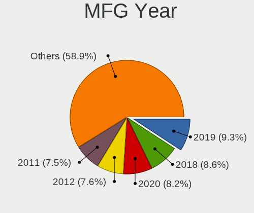
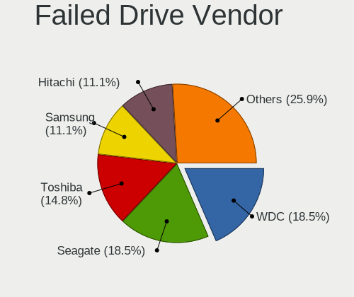
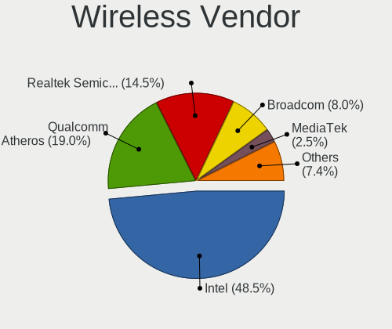
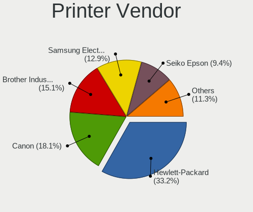

Ubuntu - Tested Hardware & Statistics (Notebooks)
-------------------------------------------------

A project to collect tested hardware configurations for Ubuntu.

Anyone can contribute to this report by the [hw-probe](https://github.com/linuxhw/hw-probe) tool:

    sudo -E hw-probe -all -upload

Please contribute! Especially if your hardware is rare.

Contents
--------

* [ Test Cases ](#test-cases)

* [ System ](#system)
  - [ OS                       ](#os)
  - [ OS Family                ](#os-family)
  - [ Kernel                   ](#kernel)
  - [ Kernel Family            ](#kernel-family)
  - [ Kernel Major Ver.        ](#kernel-major-ver)
  - [ Arch                     ](#arch)
  - [ DE                       ](#de)
  - [ Display Server           ](#display-server)
  - [ Display Manager          ](#display-manager)
  - [ OS Lang                  ](#os-lang)
  - [ Boot Mode                ](#boot-mode)
  - [ Filesystem               ](#filesystem)
  - [ Part. scheme             ](#part-scheme)
  - [ Dual Boot with Linux/BSD ](#dual-boot-with-linuxbsd)
  - [ Dual Boot (Win)          ](#dual-boot-win)

* [ Board ](#board)
  - [ Vendor                   ](#vendor)
  - [ Model                    ](#model)
  - [ Model Family             ](#model-family)
  - [ MFG Year                 ](#mfg-year)
  - [ Form Factor              ](#form-factor)
  - [ Secure Boot              ](#secure-boot)
  - [ Coreboot                 ](#coreboot)
  - [ RAM Size                 ](#ram-size)
  - [ RAM Used                 ](#ram-used)
  - [ Total Drives             ](#total-drives)
  - [ Has CD-ROM               ](#has-cd-rom)
  - [ Has Ethernet             ](#has-ethernet)
  - [ Has WiFi                 ](#has-wifi)
  - [ Has Bluetooth            ](#has-bluetooth)

* [ Location ](#location)
  - [ Country                  ](#country)
  - [ City                     ](#city)

* [ Drives ](#drives)
  - [ Drive Vendor             ](#drive-vendor)
  - [ Drive Model              ](#drive-model)
  - [ HDD Vendor               ](#hdd-vendor)
  - [ SSD Vendor               ](#ssd-vendor)
  - [ Drive Kind               ](#drive-kind)
  - [ Drive Connector          ](#drive-connector)
  - [ Drive Size               ](#drive-size)
  - [ Space Total              ](#space-total)
  - [ Space Used               ](#space-used)
  - [ Malfunc. Drives          ](#malfunc-drives)
  - [ Malfunc. Drive Vendor    ](#malfunc-drive-vendor)
  - [ Malfunc. HDD Vendor      ](#malfunc-hdd-vendor)
  - [ Malfunc. Drive Kind      ](#malfunc-drive-kind)
  - [ Failed Drives            ](#failed-drives)
  - [ Failed Drive Vendor      ](#failed-drive-vendor)
  - [ Drive Status             ](#drive-status)

* [ Storage controller ](#storage-controller)
  - [ Storage Vendor           ](#storage-vendor)
  - [ Storage Model            ](#storage-model)
  - [ Storage Kind             ](#storage-kind)

* [ Processor ](#processor)
  - [ CPU Vendor               ](#cpu-vendor)
  - [ CPU Model                ](#cpu-model)
  - [ CPU Model Family         ](#cpu-model-family)
  - [ CPU Cores                ](#cpu-cores)
  - [ CPU Sockets              ](#cpu-sockets)
  - [ CPU Threads              ](#cpu-threads)
  - [ CPU Op-Modes             ](#cpu-op-modes)
  - [ CPU Microcode            ](#cpu-microcode)
  - [ CPU Microarch            ](#cpu-microarch)

* [ Graphics ](#graphics)
  - [ GPU Vendor               ](#gpu-vendor)
  - [ GPU Model                ](#gpu-model)
  - [ GPU Combo                ](#gpu-combo)
  - [ GPU Driver               ](#gpu-driver)
  - [ GPU Memory               ](#gpu-memory)

* [ Monitor ](#monitor)
  - [ Monitor Vendor           ](#monitor-vendor)
  - [ Monitor Model            ](#monitor-model)
  - [ Monitor Resolution       ](#monitor-resolution)
  - [ Monitor Diagonal         ](#monitor-diagonal)
  - [ Monitor Width            ](#monitor-width)
  - [ Aspect Ratio             ](#aspect-ratio)
  - [ Monitor Area             ](#monitor-area)
  - [ Pixel Density            ](#pixel-density)
  - [ Multiple Monitors        ](#multiple-monitors)

* [ Network ](#network)
  - [ Net Controller Vendor    ](#net-controller-vendor)
  - [ Net Controller Model     ](#net-controller-model)
  - [ Wireless Vendor          ](#wireless-vendor)
  - [ Wireless Model           ](#wireless-model)
  - [ Ethernet Vendor          ](#ethernet-vendor)
  - [ Ethernet Model           ](#ethernet-model)
  - [ Net Controller Kind      ](#net-controller-kind)
  - [ Used Controller          ](#used-controller)
  - [ NICs                     ](#nics)
  - [ IPv6                     ](#ipv6)

* [ Bluetooth ](#bluetooth)
  - [ Bluetooth Vendor         ](#bluetooth-vendor)
  - [ Bluetooth Model          ](#bluetooth-model)

* [ Sound ](#sound)
  - [ Sound Vendor             ](#sound-vendor)
  - [ Sound Model              ](#sound-model)

* [ Memory ](#memory)
  - [ Memory Vendor            ](#memory-vendor)
  - [ Memory Model             ](#memory-model)
  - [ Memory Kind              ](#memory-kind)
  - [ Memory Form Factor       ](#memory-form-factor)
  - [ Memory Size              ](#memory-size)
  - [ Memory Speed             ](#memory-speed)

* [ Printers & scanners ](#printers--scanners)
  - [ Printer Vendor           ](#printer-vendor)
  - [ Printer Model            ](#printer-model)
  - [ Scanner Vendor           ](#scanner-vendor)
  - [ Scanner Model            ](#scanner-model)

* [ Camera ](#camera)
  - [ Camera Vendor            ](#camera-vendor)
  - [ Camera Model             ](#camera-model)

* [ Security ](#security)
  - [ Fingerprint Vendor       ](#fingerprint-vendor)
  - [ Fingerprint Model        ](#fingerprint-model)
  - [ Chipcard Vendor          ](#chipcard-vendor)
  - [ Chipcard Model           ](#chipcard-model)

* [ Unsupported ](#unsupported)
  - [ Unsupported Devices      ](#unsupported-devices)
  - [ Unsupported Device Types ](#unsupported-device-types)

Test Cases
----------

Total: 43942

| Vendor        | Model                       | Probe                                                      | Date         |
|---------------|-----------------------------|------------------------------------------------------------|--------------|
| Dell          | Inspiron 5566               | [b2dd8d93c7](https://linux-hardware.org/?probe=b2dd8d93c7) | Feb 01, 2023 |
| Dell          | Latitude 7420               | [f0b8816283](https://linux-hardware.org/?probe=f0b8816283) | Feb 01, 2023 |
| Lenovo        | ThinkPad T470s 20HF0000U... | [d7a5b537d9](https://linux-hardware.org/?probe=d7a5b537d9) | Feb 01, 2023 |
| Dell          | Latitude 5430               | [2afa57d0fa](https://linux-hardware.org/?probe=2afa57d0fa) | Feb 01, 2023 |
| Lenovo        | ThinkPad X220 4286CTO       | [465114aa14](https://linux-hardware.org/?probe=465114aa14) | Feb 01, 2023 |
| Dell          | Vostro 3500                 | [fa4104f438](https://linux-hardware.org/?probe=fa4104f438) | Feb 01, 2023 |
| HP            | EliteBook 8570p             | [2f7f3a5b93](https://linux-hardware.org/?probe=2f7f3a5b93) | Feb 01, 2023 |
| Lenovo        | ThinkPad T520 4243WRK       | [924a321452](https://linux-hardware.org/?probe=924a321452) | Feb 01, 2023 |
| Lenovo        | ThinkPad E14 20RAS1RA00     | [8360c9e13f](https://linux-hardware.org/?probe=8360c9e13f) | Feb 01, 2023 |
| Dell          | Vostro 3500                 | [ec80fcb8a5](https://linux-hardware.org/?probe=ec80fcb8a5) | Feb 01, 2023 |
| Lenovo        | ThinkPad E520 1143JYG       | [87735dd3b0](https://linux-hardware.org/?probe=87735dd3b0) | Feb 01, 2023 |
| HUAWEI        | BOHK-WAX9X                  | [07b498f669](https://linux-hardware.org/?probe=07b498f669) | Feb 01, 2023 |
| Dell          | Inspiron 15-3567            | [2f6f4bc8c7](https://linux-hardware.org/?probe=2f6f4bc8c7) | Feb 01, 2023 |
| Lenovo        | ThinkPad X270 20HMS0T000    | [e9854b7cf8](https://linux-hardware.org/?probe=e9854b7cf8) | Feb 01, 2023 |
| Apple         | MacBookPro11,1              | [44f90bc9ab](https://linux-hardware.org/?probe=44f90bc9ab) | Feb 01, 2023 |
| HP            | Presario CQ57               | [0e34caefa3](https://linux-hardware.org/?probe=0e34caefa3) | Feb 01, 2023 |
| Schenker      | VISION 16 Pro (L22)         | [0979a6ca2a](https://linux-hardware.org/?probe=0979a6ca2a) | Jan 31, 2023 |
| Lenovo        | Legion 5 17ACH6H 82JY       | [62f941075c](https://linux-hardware.org/?probe=62f941075c) | Jan 31, 2023 |
| Acer          | Aspire E1-522               | [af61a3d9c8](https://linux-hardware.org/?probe=af61a3d9c8) | Jan 31, 2023 |
| Dell          | Inspiron 15-7579            | [b5bd231bf3](https://linux-hardware.org/?probe=b5bd231bf3) | Jan 31, 2023 |
| ASUSTek       | VivoBook_ASUSLaptop X150... | [e2ad5b033f](https://linux-hardware.org/?probe=e2ad5b033f) | Jan 31, 2023 |
| Dell          | G3 3500                     | [4b519ab8a8](https://linux-hardware.org/?probe=4b519ab8a8) | Jan 31, 2023 |
| Timi          | TM1701                      | [a474c92380](https://linux-hardware.org/?probe=a474c92380) | Jan 31, 2023 |
| Dell          | XPS 13 7390                 | [5479d8c85b](https://linux-hardware.org/?probe=5479d8c85b) | Jan 31, 2023 |
| HP            | Laptop 15-bw0xx             | [b7fce61d74](https://linux-hardware.org/?probe=b7fce61d74) | Jan 31, 2023 |
| Dell          | XPS 13 9370                 | [cd12cbdc16](https://linux-hardware.org/?probe=cd12cbdc16) | Jan 31, 2023 |
| HUAWEI        | KLVL-WXXW                   | [4c8bff0f95](https://linux-hardware.org/?probe=4c8bff0f95) | Jan 31, 2023 |
| Lenovo        | ThinkPad E15 Gen 2 20T9S... | [51d249d102](https://linux-hardware.org/?probe=51d249d102) | Jan 31, 2023 |
| ASUSTek       | VivoBook_ASUSLaptop M340... | [cd9b7d5796](https://linux-hardware.org/?probe=cd9b7d5796) | Jan 31, 2023 |
| Dell          | Latitude 7420               | [55f81648a1](https://linux-hardware.org/?probe=55f81648a1) | Jan 31, 2023 |
| Dell          | XPS 15 9570                 | [896d7f2fbd](https://linux-hardware.org/?probe=896d7f2fbd) | Jan 31, 2023 |
| Timi          | A34R                        | [18ab422614](https://linux-hardware.org/?probe=18ab422614) | Jan 31, 2023 |
| HP            | EliteBook 840 G2            | [bf4741c8ad](https://linux-hardware.org/?probe=bf4741c8ad) | Jan 31, 2023 |
| Dell          | Latitude 5410               | [717012530d](https://linux-hardware.org/?probe=717012530d) | Jan 31, 2023 |
| Dell          | Latitude 7410               | [fd07971a70](https://linux-hardware.org/?probe=fd07971a70) | Jan 31, 2023 |
| Lenovo        | ThinkPad P15 Gen 2i 20YQ... | [ea48b6870c](https://linux-hardware.org/?probe=ea48b6870c) | Jan 31, 2023 |
| Google        | Casta                       | [db372f6a5f](https://linux-hardware.org/?probe=db372f6a5f) | Jan 31, 2023 |
| Lenovo        | ThinkPad T410 2518BPG       | [011f53deaa](https://linux-hardware.org/?probe=011f53deaa) | Jan 31, 2023 |
| Lenovo        | ThinkBook 13s G2 ITL 20V... | [74bf135ed9](https://linux-hardware.org/?probe=74bf135ed9) | Jan 31, 2023 |
| Lenovo        | ThinkBook 13s G2 ITL 20V... | [e0c723e305](https://linux-hardware.org/?probe=e0c723e305) | Jan 31, 2023 |
| System76      | Lemur                       | [6dac0a5b94](https://linux-hardware.org/?probe=6dac0a5b94) | Jan 31, 2023 |
| Dell          | Latitude D630               | [ff0aa8c4ed](https://linux-hardware.org/?probe=ff0aa8c4ed) | Jan 31, 2023 |
| Dell          | XPS 13 9360                 | [3aa64bf1ec](https://linux-hardware.org/?probe=3aa64bf1ec) | Jan 31, 2023 |
| Acer          | Aspire E5-571               | [615ee3d3fd](https://linux-hardware.org/?probe=615ee3d3fd) | Jan 31, 2023 |
| Lenovo        | ThinkPad P51 20HJS0BR00     | [6c05048c9d](https://linux-hardware.org/?probe=6c05048c9d) | Jan 31, 2023 |
| Acer          | Aspire E5-571               | [6498b44bcc](https://linux-hardware.org/?probe=6498b44bcc) | Jan 31, 2023 |
| Lenovo        | ThinkPad T430 2349A44       | [9f8528c5da](https://linux-hardware.org/?probe=9f8528c5da) | Jan 31, 2023 |
| Lenovo        | ThinkPad L540 20AVCTO1WW    | [d08beb0c26](https://linux-hardware.org/?probe=d08beb0c26) | Jan 31, 2023 |
| HP            | ENVY dv6                    | [4d8c55a82f](https://linux-hardware.org/?probe=4d8c55a82f) | Jan 31, 2023 |
| Apple         | MacBookPro8,1               | [0eac708be5](https://linux-hardware.org/?probe=0eac708be5) | Jan 31, 2023 |
| Acer          | Swift SF114-32              | [8e8ae85d60](https://linux-hardware.org/?probe=8e8ae85d60) | Jan 31, 2023 |
| Apple         | MacBookPro14,2              | [ff0dfe765e](https://linux-hardware.org/?probe=ff0dfe765e) | Jan 31, 2023 |
| Toshiba       | Satellite U845W             | [6735a45763](https://linux-hardware.org/?probe=6735a45763) | Jan 30, 2023 |
| Lenovo        | ThinkPad P50 20EN0013US     | [d3bf9fe9e3](https://linux-hardware.org/?probe=d3bf9fe9e3) | Jan 30, 2023 |
| Acer          | Predator PH315-52           | [457b7cf5f0](https://linux-hardware.org/?probe=457b7cf5f0) | Jan 30, 2023 |
| HP            | Notebook                    | [fc93f8e357](https://linux-hardware.org/?probe=fc93f8e357) | Jan 30, 2023 |
| Acer          | Aspire V3-772G              | [fce1ba6f6b](https://linux-hardware.org/?probe=fce1ba6f6b) | Jan 30, 2023 |
| Sony          | VPCCB16FG                   | [837588c9eb](https://linux-hardware.org/?probe=837588c9eb) | Jan 30, 2023 |
| HP            | ProBook 4720s               | [b6edbaeae1](https://linux-hardware.org/?probe=b6edbaeae1) | Jan 30, 2023 |
| Acer          | Aspire M5-581TG             | [970a402846](https://linux-hardware.org/?probe=970a402846) | Jan 30, 2023 |
| Acer          | Aspire M5-581TG             | [c2d425d254](https://linux-hardware.org/?probe=c2d425d254) | Jan 30, 2023 |
| HP            | ProBook 6465b               | [de7999a824](https://linux-hardware.org/?probe=de7999a824) | Jan 30, 2023 |
| HUAWEI        | BOHB-WAX9                   | [f4916a0bd5](https://linux-hardware.org/?probe=f4916a0bd5) | Jan 30, 2023 |
| Dell          | Precision 3560              | [3d5432deef](https://linux-hardware.org/?probe=3d5432deef) | Jan 30, 2023 |
| Dell          | Precision 3560              | [c250c935bd](https://linux-hardware.org/?probe=c250c935bd) | Jan 30, 2023 |
| Dell          | Precision 3571              | [55f371f4ef](https://linux-hardware.org/?probe=55f371f4ef) | Jan 30, 2023 |
| Dell          | Latitude 5480               | [ee87ac218f](https://linux-hardware.org/?probe=ee87ac218f) | Jan 30, 2023 |
| Dell          | Latitude 5480               | [3cbac640e1](https://linux-hardware.org/?probe=3cbac640e1) | Jan 30, 2023 |
| ASUSTek       | Zenbook UM3402YA_UM3402Y... | [9b17a7541e](https://linux-hardware.org/?probe=9b17a7541e) | Jan 30, 2023 |
| HP            | Compaq CQ58                 | [63dfd6ca48](https://linux-hardware.org/?probe=63dfd6ca48) | Jan 30, 2023 |
| Fujitsu       | LIFEBOOK A530               | [0698054de0](https://linux-hardware.org/?probe=0698054de0) | Jan 30, 2023 |
| Toshiba       | PORTEGE X30-E               | [01f74415b0](https://linux-hardware.org/?probe=01f74415b0) | Jan 30, 2023 |
| Fujitsu       | LIFEBOOK A530               | [122005ade3](https://linux-hardware.org/?probe=122005ade3) | Jan 30, 2023 |
| HP            | 15                          | [409a15bdf3](https://linux-hardware.org/?probe=409a15bdf3) | Jan 30, 2023 |
| Dell          | Latitude 7390               | [b154892be4](https://linux-hardware.org/?probe=b154892be4) | Jan 30, 2023 |
| HP            | ENVY Laptop 13-ah1xxx       | [360756b46a](https://linux-hardware.org/?probe=360756b46a) | Jan 30, 2023 |
| Lenovo        | IdeaPad 310-15ABR 80ST      | [2469884587](https://linux-hardware.org/?probe=2469884587) | Jan 30, 2023 |
| Dell          | Precision 5560              | [c994bfa3a7](https://linux-hardware.org/?probe=c994bfa3a7) | Jan 30, 2023 |
| TUXEDO        | Unknown                     | [81566e6fc9](https://linux-hardware.org/?probe=81566e6fc9) | Jan 30, 2023 |
| Acer          | Swift SF314-71              | [41c052436a](https://linux-hardware.org/?probe=41c052436a) | Jan 30, 2023 |
| Dell          | Latitude E6520              | [81717ed3df](https://linux-hardware.org/?probe=81717ed3df) | Jan 30, 2023 |
| Lenovo        | ThinkPad T480 20L5001KAU    | [4b7046e26c](https://linux-hardware.org/?probe=4b7046e26c) | Jan 30, 2023 |
| Dell          | XPS 13 9380                 | [ec00530842](https://linux-hardware.org/?probe=ec00530842) | Jan 30, 2023 |
| Acer          | Aspire A715-75G             | [59a0c6f08f](https://linux-hardware.org/?probe=59a0c6f08f) | Jan 30, 2023 |
| Lenovo        | ThinkPad T480 20L5000UUS    | [d356c9846a](https://linux-hardware.org/?probe=d356c9846a) | Jan 30, 2023 |
| HP            | G62                         | [166ddbe627](https://linux-hardware.org/?probe=166ddbe627) | Jan 29, 2023 |
| Lenovo        | IdeaPad S145-15IWL 81S9     | [1c62beb905](https://linux-hardware.org/?probe=1c62beb905) | Jan 29, 2023 |
| Lenovo        | IdeaPad 320-15ISK 80XH      | [7bc88d72f0](https://linux-hardware.org/?probe=7bc88d72f0) | Jan 29, 2023 |
| HP            | Laptop 15-dy2xxx            | [97e6b9cb60](https://linux-hardware.org/?probe=97e6b9cb60) | Jan 29, 2023 |
| HP            | Laptop 15-dy2xxx            | [e5e795e7a2](https://linux-hardware.org/?probe=e5e795e7a2) | Jan 29, 2023 |
| Sony          | VPCCB16FG                   | [7307480466](https://linux-hardware.org/?probe=7307480466) | Jan 29, 2023 |
| Google        | Lillipup                    | [194cec66f5](https://linux-hardware.org/?probe=194cec66f5) | Jan 29, 2023 |
| Lenovo        | ThinkPad T420 4236PN3       | [3b5c51e8b8](https://linux-hardware.org/?probe=3b5c51e8b8) | Jan 29, 2023 |
| Lenovo        | IdeaPad 5 15ITL05 82FG      | [4b8206c892](https://linux-hardware.org/?probe=4b8206c892) | Jan 29, 2023 |
| HUAWEI        | BOHB-WAX9                   | [ee6b0e54f7](https://linux-hardware.org/?probe=ee6b0e54f7) | Jan 29, 2023 |
| Dell          | Inspiron 3501               | [7bb7fe1a4f](https://linux-hardware.org/?probe=7bb7fe1a4f) | Jan 29, 2023 |
| HP            | ZBook 14 G2                 | [4b1e1bc7e1](https://linux-hardware.org/?probe=4b1e1bc7e1) | Jan 29, 2023 |
| Apple         | MacBookPro5,5               | [678b6fa5f6](https://linux-hardware.org/?probe=678b6fa5f6) | Jan 29, 2023 |
| Lenovo        | IdeaPad 510-15ISK 80SR      | [debdb8208f](https://linux-hardware.org/?probe=debdb8208f) | Jan 29, 2023 |
| Lenovo        | ThinkPad T14 Gen 2i 20W1... | [5122097b1e](https://linux-hardware.org/?probe=5122097b1e) | Jan 29, 2023 |
| Lenovo        | IdeaPad 100-15IBD 80QQ      | [84c2710911](https://linux-hardware.org/?probe=84c2710911) | Jan 29, 2023 |
| HP            | ProBook 4520s               | [6a16110b08](https://linux-hardware.org/?probe=6a16110b08) | Jan 29, 2023 |
| HP            | ProBook 4520s               | [e973aeb114](https://linux-hardware.org/?probe=e973aeb114) | Jan 29, 2023 |
| HP            | Pavilion Sleekbook 15       | [d17dc00a8a](https://linux-hardware.org/?probe=d17dc00a8a) | Jan 29, 2023 |
| ASUSTek       | ASUS TUF Gaming F15 FX50... | [90644628b4](https://linux-hardware.org/?probe=90644628b4) | Jan 29, 2023 |
| HP            | Laptop 14-fq0xxx            | [0b7bcda17a](https://linux-hardware.org/?probe=0b7bcda17a) | Jan 29, 2023 |
| Timi          | RedmiBook Pro 15S           | [21cf912e1c](https://linux-hardware.org/?probe=21cf912e1c) | Jan 29, 2023 |
| Dell          | Inspiron 5520               | [c869e74605](https://linux-hardware.org/?probe=c869e74605) | Jan 29, 2023 |
| HP            | EliteBook 8460p             | [caedc4c130](https://linux-hardware.org/?probe=caedc4c130) | Jan 29, 2023 |
| HP            | Pavilion dv6                | [1e739ddc0d](https://linux-hardware.org/?probe=1e739ddc0d) | Jan 29, 2023 |
| Motion Com... | C5t                         | [200be33adc](https://linux-hardware.org/?probe=200be33adc) | Jan 29, 2023 |
| Acer          | Aspire A315-41              | [f8ef554d85](https://linux-hardware.org/?probe=f8ef554d85) | Jan 29, 2023 |
| HP            | Laptop 15-da0xxx            | [959a9a17dd](https://linux-hardware.org/?probe=959a9a17dd) | Jan 29, 2023 |
| System76      | Lemur                       | [a6fc9167f7](https://linux-hardware.org/?probe=a6fc9167f7) | Jan 29, 2023 |
| Acer          | E1-510                      | [659bb96537](https://linux-hardware.org/?probe=659bb96537) | Jan 29, 2023 |
| Apple         | MacBookPro7,1               | [615e9f22e4](https://linux-hardware.org/?probe=615e9f22e4) | Jan 29, 2023 |
| Alienware     | x15 R2                      | [51bb7a8c39](https://linux-hardware.org/?probe=51bb7a8c39) | Jan 29, 2023 |
| System76      | Darter Pro                  | [5d97ec522f](https://linux-hardware.org/?probe=5d97ec522f) | Jan 29, 2023 |
| Dell          | Precision 7510              | [4f56174991](https://linux-hardware.org/?probe=4f56174991) | Jan 29, 2023 |
| Lenovo        | ThinkPad E14 Gen 3 20Y7C... | [4b4d53bcc1](https://linux-hardware.org/?probe=4b4d53bcc1) | Jan 29, 2023 |
| Gateway       | NV570P                      | [f7d900c26c](https://linux-hardware.org/?probe=f7d900c26c) | Jan 29, 2023 |
| AXDIA Inte... | WINPAD V10                  | [c5f4838490](https://linux-hardware.org/?probe=c5f4838490) | Jan 29, 2023 |
| Timi          | TM1703                      | [6bb85263a7](https://linux-hardware.org/?probe=6bb85263a7) | Jan 29, 2023 |
| ASUSTek       | X550LB                      | [9590dd2f30](https://linux-hardware.org/?probe=9590dd2f30) | Jan 28, 2023 |
| ASUSTek       | X555LD                      | [3a3e1fafdf](https://linux-hardware.org/?probe=3a3e1fafdf) | Jan 28, 2023 |
| Lenovo        | G550 2958                   | [8bee986aca](https://linux-hardware.org/?probe=8bee986aca) | Jan 28, 2023 |
| Dell          | XPS 13 9380                 | [ed99ed692d](https://linux-hardware.org/?probe=ed99ed692d) | Jan 28, 2023 |
| Dell          | Latitude 7280               | [358f4c431f](https://linux-hardware.org/?probe=358f4c431f) | Jan 28, 2023 |
| ASUSTek       | ROG Strix G733QS_G733QS     | [e789456756](https://linux-hardware.org/?probe=e789456756) | Jan 28, 2023 |
| Dell          | Latitude 7280               | [903e0489c4](https://linux-hardware.org/?probe=903e0489c4) | Jan 28, 2023 |
| ASUSTek       | ProArt StudioBook H7600H... | [8e9b78c0e8](https://linux-hardware.org/?probe=8e9b78c0e8) | Jan 28, 2023 |
| Dell          | Inspiron 14-3452            | [baf61affa2](https://linux-hardware.org/?probe=baf61affa2) | Jan 28, 2023 |
| HP            | Pavilion dv6                | [ce950f0a28](https://linux-hardware.org/?probe=ce950f0a28) | Jan 28, 2023 |
| Dell          | Inspiron 5570               | [17a8246044](https://linux-hardware.org/?probe=17a8246044) | Jan 28, 2023 |
| Lenovo        | ThinkPad T480 20L6SF8C00    | [4ab453f835](https://linux-hardware.org/?probe=4ab453f835) | Jan 28, 2023 |
| Acer          | Aspire A315-41              | [bbe5b30c42](https://linux-hardware.org/?probe=bbe5b30c42) | Jan 28, 2023 |
| ASUSTek       | X555QA                      | [8eec8468fb](https://linux-hardware.org/?probe=8eec8468fb) | Jan 28, 2023 |
| HP            | EliteBook 845 G7 Noteboo... | [c4877a8bc3](https://linux-hardware.org/?probe=c4877a8bc3) | Jan 28, 2023 |
| Dell          | Inspiron 1521               | [8fcde91462](https://linux-hardware.org/?probe=8fcde91462) | Jan 28, 2023 |
| HP            | Pavilion Laptop 15-eh1xx... | [6f94175d8c](https://linux-hardware.org/?probe=6f94175d8c) | Jan 28, 2023 |
| ASUSTek       | X751LB                      | [54094ae0a7](https://linux-hardware.org/?probe=54094ae0a7) | Jan 28, 2023 |
| Dell          | Precision 5540              | [de6a1c523e](https://linux-hardware.org/?probe=de6a1c523e) | Jan 28, 2023 |
| Lenovo        | G550 2958                   | [a50b0e3645](https://linux-hardware.org/?probe=a50b0e3645) | Jan 28, 2023 |
| Acer          | Aspire 5738                 | [2aa7e026c4](https://linux-hardware.org/?probe=2aa7e026c4) | Jan 28, 2023 |
| HP            | EliteBook 840 G3            | [f9446c0c08](https://linux-hardware.org/?probe=f9446c0c08) | Jan 28, 2023 |
| Google        | Celes                       | [c132165ea7](https://linux-hardware.org/?probe=c132165ea7) | Jan 28, 2023 |
| Lenovo        | IdeaPad Flex-14API 81SS     | [d99ff3dbe8](https://linux-hardware.org/?probe=d99ff3dbe8) | Jan 28, 2023 |
| Lenovo        | ThinkBook 14 G2 ITL 20VD    | [b33f2d5606](https://linux-hardware.org/?probe=b33f2d5606) | Jan 28, 2023 |
| Toshiba       | Satellite C870-17H          | [8fe4718795](https://linux-hardware.org/?probe=8fe4718795) | Jan 28, 2023 |
| Lenovo        | ThinkPad X1 Carbon 3rd 2... | [f6d7ba9d48](https://linux-hardware.org/?probe=f6d7ba9d48) | Jan 27, 2023 |
| Apple         | MacBookPro8,2               | [add8440e16](https://linux-hardware.org/?probe=add8440e16) | Jan 27, 2023 |
| Notebook      | N13_N140ZU                  | [94396ecebc](https://linux-hardware.org/?probe=94396ecebc) | Jan 27, 2023 |
| Lenovo        | ThinkPad P15 Gen 1 20SUS... | [c74ea31148](https://linux-hardware.org/?probe=c74ea31148) | Jan 27, 2023 |
| Unknown       | Unknown                     | [b4270378b4](https://linux-hardware.org/?probe=b4270378b4) | Jan 27, 2023 |
| Acer          | Aspire 7741                 | [79d4beeb12](https://linux-hardware.org/?probe=79d4beeb12) | Jan 27, 2023 |
| HP            | EliteBook 8530w             | [f395c475c9](https://linux-hardware.org/?probe=f395c475c9) | Jan 27, 2023 |
| Sony          | SVE1512H1EB                 | [9f9b853849](https://linux-hardware.org/?probe=9f9b853849) | Jan 27, 2023 |
| Sony          | SVE1512H1EB                 | [a1f75687bc](https://linux-hardware.org/?probe=a1f75687bc) | Jan 27, 2023 |
| MSI           | Prestige 14Evo A12M         | [17f4098b36](https://linux-hardware.org/?probe=17f4098b36) | Jan 27, 2023 |
| ASUSTek       | K73E                        | [66e0036452](https://linux-hardware.org/?probe=66e0036452) | Jan 27, 2023 |
| ASUSTek       | K73E                        | [91f049a01d](https://linux-hardware.org/?probe=91f049a01d) | Jan 27, 2023 |
| HP            | Pavilion Laptop 15-eh2xx... | [ee769c62bf](https://linux-hardware.org/?probe=ee769c62bf) | Jan 27, 2023 |
| HP            | ProBook 445 G7              | [d0b5bf560a](https://linux-hardware.org/?probe=d0b5bf560a) | Jan 27, 2023 |
| ASUSTek       | ROG Strix G733CX_G733CX     | [a0c1ab03da](https://linux-hardware.org/?probe=a0c1ab03da) | Jan 27, 2023 |
| Dell          | Latitude E6430              | [ac467a864d](https://linux-hardware.org/?probe=ac467a864d) | Jan 27, 2023 |
| HP            | Laptop 14-bp0xx             | [68d8a60823](https://linux-hardware.org/?probe=68d8a60823) | Jan 27, 2023 |
| ASUSTek       | VivoBook_ASUSLaptop K340... | [37059de5b7](https://linux-hardware.org/?probe=37059de5b7) | Jan 27, 2023 |
| Acer          | Aspire ES1-571              | [c35f2771dc](https://linux-hardware.org/?probe=c35f2771dc) | Jan 27, 2023 |
| Lenovo        | ThinkBook 14 G3 ACL 21A2    | [77a6b88d58](https://linux-hardware.org/?probe=77a6b88d58) | Jan 27, 2023 |
| Dell          | Latitude E7470              | [42ace80c0b](https://linux-hardware.org/?probe=42ace80c0b) | Jan 27, 2023 |
| Samsung       | 750XDA                      | [747e2b49d4](https://linux-hardware.org/?probe=747e2b49d4) | Jan 27, 2023 |
| Lenovo        | ThinkPad E590 20NB001AMX    | [4bf7b18ab1](https://linux-hardware.org/?probe=4bf7b18ab1) | Jan 27, 2023 |
| Samsung       | 750XDA                      | [18fe906041](https://linux-hardware.org/?probe=18fe906041) | Jan 27, 2023 |
| Acer          | Aspire A515-57G             | [f5492fbdaa](https://linux-hardware.org/?probe=f5492fbdaa) | Jan 27, 2023 |
| HP            | ProBook 450 G7              | [4582f041bc](https://linux-hardware.org/?probe=4582f041bc) | Jan 27, 2023 |
| HP            | EliteBook 850 G1            | [e457d836c7](https://linux-hardware.org/?probe=e457d836c7) | Jan 27, 2023 |
| Acer          | Aspire E5-571               | [cef03beca8](https://linux-hardware.org/?probe=cef03beca8) | Jan 27, 2023 |
| HP            | Laptop 17-cp0xxx            | [55477da159](https://linux-hardware.org/?probe=55477da159) | Jan 27, 2023 |
| HP            | ENVY Laptop 13-ba0xxx       | [e4544fb59a](https://linux-hardware.org/?probe=e4544fb59a) | Jan 27, 2023 |
| Gateway       | T-1620                      | [595ce5493d](https://linux-hardware.org/?probe=595ce5493d) | Jan 27, 2023 |
| Compaq        | 430                         | [069fa715b9](https://linux-hardware.org/?probe=069fa715b9) | Jan 27, 2023 |
| Dell          | XPS 13 9305                 | [c0468fe8fd](https://linux-hardware.org/?probe=c0468fe8fd) | Jan 27, 2023 |
| MSI           | Prestige 14Evo A12M         | [3638a1774c](https://linux-hardware.org/?probe=3638a1774c) | Jan 27, 2023 |
| Lenovo        | IdeaPad S145-15IIL 82DJ     | [0697311f5f](https://linux-hardware.org/?probe=0697311f5f) | Jan 27, 2023 |
| ASUSTek       | ZenBook UX425UA_UM425UA     | [af3748a4f0](https://linux-hardware.org/?probe=af3748a4f0) | Jan 26, 2023 |
| Dell          | XPS 17 9700                 | [72161736bf](https://linux-hardware.org/?probe=72161736bf) | Jan 26, 2023 |
| Dell          | Latitude E6420              | [9837928212](https://linux-hardware.org/?probe=9837928212) | Jan 26, 2023 |
| HP            | 255 G8 Notebook PC          | [fdcee64754](https://linux-hardware.org/?probe=fdcee64754) | Jan 26, 2023 |
| HP            | 255 G8 Notebook PC          | [814fe54dc5](https://linux-hardware.org/?probe=814fe54dc5) | Jan 26, 2023 |
| ASUSTek       | Zenbook UX5401ZAS_UX5401... | [de8222900d](https://linux-hardware.org/?probe=de8222900d) | Jan 26, 2023 |
| Gigabyte      | Sabre 15                    | [3ad57e9198](https://linux-hardware.org/?probe=3ad57e9198) | Jan 26, 2023 |
| Fujitsu       | LIFEBOOK E752               | [2fc97553ae](https://linux-hardware.org/?probe=2fc97553ae) | Jan 26, 2023 |
| Lenovo        | ThinkPad E495 20NEA00ACD    | [70dad952b2](https://linux-hardware.org/?probe=70dad952b2) | Jan 26, 2023 |
| Lenovo        | ThinkPad L490 20Q5002GPG    | [a9567dc72b](https://linux-hardware.org/?probe=a9567dc72b) | Jan 26, 2023 |
| Packard Be... | EasyNote TS44HR             | [2902a743da](https://linux-hardware.org/?probe=2902a743da) | Jan 26, 2023 |
| HP            | ProBook 440 G5              | [af59cf3cd3](https://linux-hardware.org/?probe=af59cf3cd3) | Jan 26, 2023 |
| ASUSTek       | VivoBook_ASUSLaptop E210... | [c89c0bb61f](https://linux-hardware.org/?probe=c89c0bb61f) | Jan 26, 2023 |
| Dell          | Inspiron 15 5510            | [babedb5bbc](https://linux-hardware.org/?probe=babedb5bbc) | Jan 26, 2023 |
| Apple         | MacBook5,1                  | [b7759508d9](https://linux-hardware.org/?probe=b7759508d9) | Jan 26, 2023 |
| Apple         | MacBook5,1                  | [72f2c3fddc](https://linux-hardware.org/?probe=72f2c3fddc) | Jan 26, 2023 |
| HP            | Laptop 17-by2xxx            | [556e92dc41](https://linux-hardware.org/?probe=556e92dc41) | Jan 26, 2023 |
| Lenovo        | ThinkPad T16 Gen 1 21BVC... | [912583a548](https://linux-hardware.org/?probe=912583a548) | Jan 26, 2023 |
| Dell          | Precision 7510              | [6323693228](https://linux-hardware.org/?probe=6323693228) | Jan 26, 2023 |
| ASUSTek       | X550CL                      | [e98a955b1a](https://linux-hardware.org/?probe=e98a955b1a) | Jan 26, 2023 |
| Lenovo        | ThinkPad E15 Gen 2 20TDC... | [5cee302318](https://linux-hardware.org/?probe=5cee302318) | Jan 25, 2023 |
| Sony          | SVJ2022M1EWI                | [c4c9254e6d](https://linux-hardware.org/?probe=c4c9254e6d) | Jan 25, 2023 |
| Dell          | Inspiron 7577               | [4dded574d3](https://linux-hardware.org/?probe=4dded574d3) | Jan 25, 2023 |
| ASUSTek       | VivoBook_ASUSLaptop X350... | [baae797a05](https://linux-hardware.org/?probe=baae797a05) | Jan 25, 2023 |
| ASUSTek       | VivoBook_ASUSLaptop X350... | [427a7fa0cb](https://linux-hardware.org/?probe=427a7fa0cb) | Jan 25, 2023 |
| HP            | 250 15.6 inch G9 Noteboo... | [e030231e2c](https://linux-hardware.org/?probe=e030231e2c) | Jan 25, 2023 |
| Lenovo        | IdeaPad 320-15AST 80XV      | [7fcc3fb992](https://linux-hardware.org/?probe=7fcc3fb992) | Jan 25, 2023 |
| HP            | Laptop 14-dq2xxx            | [f308688189](https://linux-hardware.org/?probe=f308688189) | Jan 25, 2023 |
| Timi          | Redmi Book Pro 15 2022      | [b89ee82de7](https://linux-hardware.org/?probe=b89ee82de7) | Jan 25, 2023 |
| ASUSTek       | VivoBook_ASUSLaptop X540... | [ef947d32a1](https://linux-hardware.org/?probe=ef947d32a1) | Jan 25, 2023 |
| ASUSTek       | VivoBook_ASUSLaptop X540... | [d0a3780add](https://linux-hardware.org/?probe=d0a3780add) | Jan 25, 2023 |
| HP            | G60                         | [8fe616c588](https://linux-hardware.org/?probe=8fe616c588) | Jan 25, 2023 |
| Chuwi         | GemiBook Pro                | [bea1d8a9ce](https://linux-hardware.org/?probe=bea1d8a9ce) | Jan 25, 2023 |
| Lenovo        | IdeaPad 5 15ARE05 81YQ      | [293a308d86](https://linux-hardware.org/?probe=293a308d86) | Jan 25, 2023 |
| Lenovo        | ThinkPad E14 Gen 2 20TA0... | [1b719bc69c](https://linux-hardware.org/?probe=1b719bc69c) | Jan 25, 2023 |
| HP            | ProBook 6460b               | [81a1748477](https://linux-hardware.org/?probe=81a1748477) | Jan 25, 2023 |
| ASUSTek       | GL503VM                     | [d1a3ab57bd](https://linux-hardware.org/?probe=d1a3ab57bd) | Jan 25, 2023 |
| Toshiba       | Satellite C55D-B            | [76bb416217](https://linux-hardware.org/?probe=76bb416217) | Jan 25, 2023 |
| HP            | Pavilion Laptop 15-eh1xx... | [f4e06ff0b2](https://linux-hardware.org/?probe=f4e06ff0b2) | Jan 25, 2023 |
| Lenovo        | IdeaPad Z500 20202          | [e589b4bd78](https://linux-hardware.org/?probe=e589b4bd78) | Jan 25, 2023 |
| ASUSTek       | TUF Gaming FX505DY_FX505... | [148b797f1a](https://linux-hardware.org/?probe=148b797f1a) | Jan 25, 2023 |
| ASUSTek       | X301A1                      | [f9ea8894f0](https://linux-hardware.org/?probe=f9ea8894f0) | Jan 25, 2023 |
| Apple         | MacBookPro8,1               | [a4bcc57b9e](https://linux-hardware.org/?probe=a4bcc57b9e) | Jan 25, 2023 |
| ASUSTek       | TUF Gaming FX505DT_FX505... | [bd58d910f7](https://linux-hardware.org/?probe=bd58d910f7) | Jan 25, 2023 |
| HP            | Pavilion g7                 | [e96f30194b](https://linux-hardware.org/?probe=e96f30194b) | Jan 25, 2023 |
| HP            | Pavilion Gaming Laptop 1... | [30b373aafe](https://linux-hardware.org/?probe=30b373aafe) | Jan 25, 2023 |
| TUXEDO        | Unknown                     | [ebdbb886bc](https://linux-hardware.org/?probe=ebdbb886bc) | Jan 25, 2023 |
| Lenovo        | IdeaPad 3 15ITL6 82H8       | [07d5199d1c](https://linux-hardware.org/?probe=07d5199d1c) | Jan 25, 2023 |
| Acer          | Aspire A515-57G             | [2b83e8779f](https://linux-hardware.org/?probe=2b83e8779f) | Jan 25, 2023 |
| Dell          | Latitude E6520              | [baf618d1a1](https://linux-hardware.org/?probe=baf618d1a1) | Jan 25, 2023 |
| Acer          | Aspire A515-57G             | [cc3599afd2](https://linux-hardware.org/?probe=cc3599afd2) | Jan 24, 2023 |
| Dell          | Latitude 5480               | [0e21cc929a](https://linux-hardware.org/?probe=0e21cc929a) | Jan 24, 2023 |
| Dell          | Latitude E6520              | [615879d5e9](https://linux-hardware.org/?probe=615879d5e9) | Jan 24, 2023 |
| MSI           | CX700ND/CX70 0NF/CX70 0N... | [dad68fd07f](https://linux-hardware.org/?probe=dad68fd07f) | Jan 24, 2023 |
| Apple         | MacBookPro5,4               | [4bdccd0680](https://linux-hardware.org/?probe=4bdccd0680) | Jan 24, 2023 |
| MSI           | CX700ND/CX70 0NF/CX70 0N... | [b61b0f981e](https://linux-hardware.org/?probe=b61b0f981e) | Jan 24, 2023 |
| MSI           | GP66 Leopard 11UG           | [4e628cc332](https://linux-hardware.org/?probe=4e628cc332) | Jan 24, 2023 |
| Apple         | MacBookAir2,1               | [5be88e4512](https://linux-hardware.org/?probe=5be88e4512) | Jan 24, 2023 |
| Dell          | Precision 5570              | [2bde8abafe](https://linux-hardware.org/?probe=2bde8abafe) | Jan 24, 2023 |
| HP            | ZBook Studio G3             | [5e1a47f01a](https://linux-hardware.org/?probe=5e1a47f01a) | Jan 24, 2023 |
| ASUSTek       | A9T                         | [3e313bb71a](https://linux-hardware.org/?probe=3e313bb71a) | Jan 24, 2023 |
| ASUSTek       | A9T                         | [8ed103fd24](https://linux-hardware.org/?probe=8ed103fd24) | Jan 24, 2023 |
| Lenovo        | IdeaPad S340-15IWL 81N8     | [5df97c3eb1](https://linux-hardware.org/?probe=5df97c3eb1) | Jan 24, 2023 |
| HP            | ProBook 650 G1              | [f9882955cb](https://linux-hardware.org/?probe=f9882955cb) | Jan 24, 2023 |
| Acer          | Aspire A715-51G             | [75362fb07d](https://linux-hardware.org/?probe=75362fb07d) | Jan 24, 2023 |
| ASUSTek       | X555QA                      | [f981af502a](https://linux-hardware.org/?probe=f981af502a) | Jan 24, 2023 |
| HUAWEI        | BDZ-WXX9                    | [21f0949826](https://linux-hardware.org/?probe=21f0949826) | Jan 24, 2023 |
| MSI           | GF63 Thin 9SCXR             | [edbaabb13a](https://linux-hardware.org/?probe=edbaabb13a) | Jan 24, 2023 |
| ASUSTek       | ASUS BR1100CKA BR1100CKA... | [b46dcc4bfe](https://linux-hardware.org/?probe=b46dcc4bfe) | Jan 24, 2023 |
| Lenovo        | Legion 5 Pro 16ACH6H 82J... | [055d033d99](https://linux-hardware.org/?probe=055d033d99) | Jan 24, 2023 |
| Dell          | Latitude 5580               | [34ebeee5d4](https://linux-hardware.org/?probe=34ebeee5d4) | Jan 24, 2023 |
| HP            | Laptop 14-dq2xxx            | [9a930173a0](https://linux-hardware.org/?probe=9a930173a0) | Jan 24, 2023 |
| ASUSTek       | TUF Gaming FX505DT_FX505... | [65b6391803](https://linux-hardware.org/?probe=65b6391803) | Jan 24, 2023 |
| Acer          | Aspire V5-431               | [abf4a51513](https://linux-hardware.org/?probe=abf4a51513) | Jan 24, 2023 |
| Dell          | Precision 7510              | [bf8b996b99](https://linux-hardware.org/?probe=bf8b996b99) | Jan 24, 2023 |
| HP            | EliteBook 840 G1            | [08d8bb84c4](https://linux-hardware.org/?probe=08d8bb84c4) | Jan 24, 2023 |
| Dell          | Inspiron 3541               | [c5c3e94a19](https://linux-hardware.org/?probe=c5c3e94a19) | Jan 24, 2023 |
| Acer          | Aspire V5-431               | [3da8ac521c](https://linux-hardware.org/?probe=3da8ac521c) | Jan 23, 2023 |
| Lenovo        | ThinkPad T540p 20BE00AKZ... | [c4a4bd6895](https://linux-hardware.org/?probe=c4a4bd6895) | Jan 23, 2023 |
| Lenovo        | IdeaPad Y510P 20217         | [97ca64cad1](https://linux-hardware.org/?probe=97ca64cad1) | Jan 23, 2023 |
| HP            | ENVY 15                     | [c1b400b6e6](https://linux-hardware.org/?probe=c1b400b6e6) | Jan 23, 2023 |
| Dell          | Inspiron 5558               | [bf87467519](https://linux-hardware.org/?probe=bf87467519) | Jan 23, 2023 |
| ASUSTek       | K46CB                       | [62aa75f57a](https://linux-hardware.org/?probe=62aa75f57a) | Jan 23, 2023 |
| Dell          | Inspiron 3542               | [0eb0b40b2b](https://linux-hardware.org/?probe=0eb0b40b2b) | Jan 23, 2023 |
| MSI           | Stealth GS66 12UH           | [9e79dca70b](https://linux-hardware.org/?probe=9e79dca70b) | Jan 23, 2023 |
| Lenovo        | Legion Y540-15IRH 81SX      | [96a5ca6b92](https://linux-hardware.org/?probe=96a5ca6b92) | Jan 23, 2023 |
| Dell          | Inspiron 7537               | [9181895f24](https://linux-hardware.org/?probe=9181895f24) | Jan 23, 2023 |
| HP            | OMEN by Laptop 16-b0xxx     | [e1eeca8eab](https://linux-hardware.org/?probe=e1eeca8eab) | Jan 23, 2023 |
| Dell          | Latitude E4310              | [c32e006e62](https://linux-hardware.org/?probe=c32e006e62) | Jan 23, 2023 |
| Dell          | Latitude E4310              | [5045d5e911](https://linux-hardware.org/?probe=5045d5e911) | Jan 23, 2023 |
| HP            | Pavilion Laptop 14-dv1xx... | [2194886c52](https://linux-hardware.org/?probe=2194886c52) | Jan 23, 2023 |
| HP            | EliteBook 840 G4            | [459ab8ae3d](https://linux-hardware.org/?probe=459ab8ae3d) | Jan 23, 2023 |
| Lenovo        | ThinkPad E15 Gen 2 20TD0... | [d6243ec239](https://linux-hardware.org/?probe=d6243ec239) | Jan 23, 2023 |
| Dell          | Latitude 7420               | [dc99eb6c92](https://linux-hardware.org/?probe=dc99eb6c92) | Jan 23, 2023 |
| Alienware     | 15 R4                       | [8833335118](https://linux-hardware.org/?probe=8833335118) | Jan 23, 2023 |
| Acer          | AO722                       | [85f48171a2](https://linux-hardware.org/?probe=85f48171a2) | Jan 23, 2023 |
| Acer          | Aspire E5-576               | [df3e660090](https://linux-hardware.org/?probe=df3e660090) | Jan 23, 2023 |
| HP            | Pavilion Laptop 15-eg2xx... | [adcd91409c](https://linux-hardware.org/?probe=adcd91409c) | Jan 23, 2023 |
| Alienware     | m15 R7                      | [e57302bf60](https://linux-hardware.org/?probe=e57302bf60) | Jan 23, 2023 |
| Dell          | G15 5511                    | [cea8996d31](https://linux-hardware.org/?probe=cea8996d31) | Jan 23, 2023 |
| HP            | Pavilion Laptop 15-eg2xx... | [e2fd85407d](https://linux-hardware.org/?probe=e2fd85407d) | Jan 23, 2023 |
| Dell          | Latitude 3340               | [cfb81c9c4b](https://linux-hardware.org/?probe=cfb81c9c4b) | Jan 23, 2023 |
| HP            | Laptop 15-dw0xxx            | [8460e3552a](https://linux-hardware.org/?probe=8460e3552a) | Jan 22, 2023 |
| HP            | Laptop 14-dk1xxx            | [8761a4096a](https://linux-hardware.org/?probe=8761a4096a) | Jan 22, 2023 |
| HP            | Laptop 14-dk1xxx            | [7099ccff2f](https://linux-hardware.org/?probe=7099ccff2f) | Jan 22, 2023 |
| HONOR         | NBR-WAX9                    | [cee0f1ccd5](https://linux-hardware.org/?probe=cee0f1ccd5) | Jan 22, 2023 |
| HP            | EliteBook 840 G5            | [5ad0221a16](https://linux-hardware.org/?probe=5ad0221a16) | Jan 22, 2023 |
| Acer          | Aspire A515-51              | [5195423178](https://linux-hardware.org/?probe=5195423178) | Jan 22, 2023 |
| HUAWEI        | HVY-WXX9                    | [e0b75953b9](https://linux-hardware.org/?probe=e0b75953b9) | Jan 22, 2023 |
| Acer          | Aspire E1-570               | [30b3f2f346](https://linux-hardware.org/?probe=30b3f2f346) | Jan 22, 2023 |
| Lenovo        | IdeaPad 700-15ISK 80RU      | [b37f2fcaba](https://linux-hardware.org/?probe=b37f2fcaba) | Jan 22, 2023 |
| HP            | 625                         | [33f03142db](https://linux-hardware.org/?probe=33f03142db) | Jan 22, 2023 |
| Lenovo        | IdeaPad 700-15ISK 80RU      | [0e29c1dd04](https://linux-hardware.org/?probe=0e29c1dd04) | Jan 22, 2023 |
| HP            | ProBook 430 G2              | [24a0f33638](https://linux-hardware.org/?probe=24a0f33638) | Jan 22, 2023 |
| Dell          | Latitude 5520               | [a3541758f7](https://linux-hardware.org/?probe=a3541758f7) | Jan 22, 2023 |
| Lenovo        | ThinkPad E580 20KTS0TF00    | [395d565464](https://linux-hardware.org/?probe=395d565464) | Jan 22, 2023 |
| Dell          | Inspiron 3521               | [2189958490](https://linux-hardware.org/?probe=2189958490) | Jan 22, 2023 |
| Dell          | XPS 15 9520                 | [893ebdd842](https://linux-hardware.org/?probe=893ebdd842) | Jan 22, 2023 |
| Lenovo        | ThinkPad X220 4291CZ6       | [44370bfe99](https://linux-hardware.org/?probe=44370bfe99) | Jan 22, 2023 |
| Acer          | Aspire A515-55G             | [7a4e781669](https://linux-hardware.org/?probe=7a4e781669) | Jan 22, 2023 |
| ASUSTek       | X540UA                      | [39f992a141](https://linux-hardware.org/?probe=39f992a141) | Jan 22, 2023 |
| Toshiba       | Satellite Pro C660          | [f1c0237cc0](https://linux-hardware.org/?probe=f1c0237cc0) | Jan 22, 2023 |
| Apple         | MacBookPro9,2               | [ffa1f65eeb](https://linux-hardware.org/?probe=ffa1f65eeb) | Jan 22, 2023 |
| HP            | EliteBook 8470p             | [601dd342aa](https://linux-hardware.org/?probe=601dd342aa) | Jan 22, 2023 |
| HP            | Laptop 17-cp0xxx            | [7e1fa9aaf3](https://linux-hardware.org/?probe=7e1fa9aaf3) | Jan 22, 2023 |
| ASUSTek       | G750JM                      | [8cb76e0d6d](https://linux-hardware.org/?probe=8cb76e0d6d) | Jan 22, 2023 |
| Lenovo        | IdeaPad 3 14IGL05 81WH      | [0667ad7cee](https://linux-hardware.org/?probe=0667ad7cee) | Jan 22, 2023 |
| Dell          | Latitude 5400               | [97ee7b50ee](https://linux-hardware.org/?probe=97ee7b50ee) | Jan 22, 2023 |
| Dell          | G15 5510                    | [7cee6347e3](https://linux-hardware.org/?probe=7cee6347e3) | Jan 22, 2023 |
| Lenovo        | IdeaPad 3 15ALC6 82MF       | [697fbcd8d1](https://linux-hardware.org/?probe=697fbcd8d1) | Jan 22, 2023 |
| Dell          | G3 3500                     | [941c11250c](https://linux-hardware.org/?probe=941c11250c) | Jan 21, 2023 |
| ASUSTek       | UX303LN                     | [60f8946cdf](https://linux-hardware.org/?probe=60f8946cdf) | Jan 21, 2023 |
| Acer          | Aspire E1-570               | [9a0a65b69a](https://linux-hardware.org/?probe=9a0a65b69a) | Jan 21, 2023 |
| Lenovo        | Yoga 700-14ISK 80QD         | [4e07ace043](https://linux-hardware.org/?probe=4e07ace043) | Jan 21, 2023 |
| ASUSTek       | UX303LN                     | [846e3df466](https://linux-hardware.org/?probe=846e3df466) | Jan 21, 2023 |
| Dell          | Latitude E5570              | [565e8c64f1](https://linux-hardware.org/?probe=565e8c64f1) | Jan 21, 2023 |
| Lenovo        | IdeaPad 1 14ADA05 82GW      | [d971cd0912](https://linux-hardware.org/?probe=d971cd0912) | Jan 21, 2023 |
| Toshiba       | Satellite Pro C850-10L      | [c1de4d0e2b](https://linux-hardware.org/?probe=c1de4d0e2b) | Jan 21, 2023 |
| Acer          | Swift SF314-57G             | [ae9de10584](https://linux-hardware.org/?probe=ae9de10584) | Jan 21, 2023 |
| Apple         | MacBookPro8,1               | [fa1f3d8e3b](https://linux-hardware.org/?probe=fa1f3d8e3b) | Jan 21, 2023 |
| Dell          | Inspiron N4050              | [6ddc2793d7](https://linux-hardware.org/?probe=6ddc2793d7) | Jan 21, 2023 |
| Dell          | Inspiron N4050              | [ae4c9eaa9c](https://linux-hardware.org/?probe=ae4c9eaa9c) | Jan 21, 2023 |
| Acer          | Aspire E5-575G              | [d020dd93e4](https://linux-hardware.org/?probe=d020dd93e4) | Jan 21, 2023 |
| HP            | Laptop 17-cp0xxx            | [1ada8c14a9](https://linux-hardware.org/?probe=1ada8c14a9) | Jan 21, 2023 |
| Samsung       | 3570R/370R/470R/450R/510... | [8c4a855d8e](https://linux-hardware.org/?probe=8c4a855d8e) | Jan 21, 2023 |
| Wortmann      | 1220583_1470086             | [10016e75a1](https://linux-hardware.org/?probe=10016e75a1) | Jan 21, 2023 |
| Lenovo        | IdeaPad 5 15ARE05 81YQ      | [fe4b24bf26](https://linux-hardware.org/?probe=fe4b24bf26) | Jan 21, 2023 |
| HP            | Laptop 15s-eq3xxx           | [d2d30c8d6f](https://linux-hardware.org/?probe=d2d30c8d6f) | Jan 21, 2023 |
| Dell          | XPS 15 9520                 | [330a3844cb](https://linux-hardware.org/?probe=330a3844cb) | Jan 21, 2023 |
| Lenovo        | IdeaPad Z400 20201          | [9e49dc44eb](https://linux-hardware.org/?probe=9e49dc44eb) | Jan 21, 2023 |
| Dell          | Inspiron 5502               | [aa324e02b1](https://linux-hardware.org/?probe=aa324e02b1) | Jan 21, 2023 |
| Dell          | Inspiron 3442               | [bb63f70764](https://linux-hardware.org/?probe=bb63f70764) | Jan 21, 2023 |
| Dell          | Inspiron 3442               | [5973a7db86](https://linux-hardware.org/?probe=5973a7db86) | Jan 21, 2023 |
| Dell          | Latitude 5501               | [72581be7e7](https://linux-hardware.org/?probe=72581be7e7) | Jan 21, 2023 |
| Lenovo        | ThinkPad P52s 20LBCTO1WW    | [e0b197c0c4](https://linux-hardware.org/?probe=e0b197c0c4) | Jan 21, 2023 |
| ASUSTek       | GL553VD                     | [eeea0542b8](https://linux-hardware.org/?probe=eeea0542b8) | Jan 21, 2023 |
| Acer          | Aspire 1640                 | [5b271fa3eb](https://linux-hardware.org/?probe=5b271fa3eb) | Jan 21, 2023 |
| Dell          | XPS 13 9310                 | [5d606f2c60](https://linux-hardware.org/?probe=5d606f2c60) | Jan 21, 2023 |
| HP            | ENVY Laptop 13-ba0xxx       | [cb34b6dd34](https://linux-hardware.org/?probe=cb34b6dd34) | Jan 21, 2023 |
| ASUSTek       | Zenbook UM3402YA_UM3402Y... | [1d10977303](https://linux-hardware.org/?probe=1d10977303) | Jan 21, 2023 |
| ASUSTek       | Zenbook UM3402YA_UM3402Y... | [fdbbb4a832](https://linux-hardware.org/?probe=fdbbb4a832) | Jan 21, 2023 |
| Lenovo        | IdeaPad Slim 7 14ITL05 8... | [25f8f9b164](https://linux-hardware.org/?probe=25f8f9b164) | Jan 21, 2023 |
| Lenovo        | IdeaPad 3 14ITL6 82H7       | [940d192ea9](https://linux-hardware.org/?probe=940d192ea9) | Jan 20, 2023 |
| Dell          | XPS 13 7390                 | [97b14c6835](https://linux-hardware.org/?probe=97b14c6835) | Jan 20, 2023 |
| Dell          | XPS 13 9380                 | [0192877edc](https://linux-hardware.org/?probe=0192877edc) | Jan 20, 2023 |
| Dell          | Inspiron 13-5368            | [4e74651840](https://linux-hardware.org/?probe=4e74651840) | Jan 20, 2023 |
| Acer          | Aspire A114-31              | [b341182acd](https://linux-hardware.org/?probe=b341182acd) | Jan 20, 2023 |
| Dell          | Inspiron 5770               | [93932bdc92](https://linux-hardware.org/?probe=93932bdc92) | Jan 20, 2023 |
| ASUSTek       | ROG Zephyrus G14 GA401IV... | [1332c6c11a](https://linux-hardware.org/?probe=1332c6c11a) | Jan 20, 2023 |
| ASUSTek       | X556UQK                     | [54cf7414fd](https://linux-hardware.org/?probe=54cf7414fd) | Jan 20, 2023 |
| MSI           | CR650                       | [3d3a46f5c6](https://linux-hardware.org/?probe=3d3a46f5c6) | Jan 20, 2023 |
| Lenovo        | ThinkPad T510 43494JG       | [0d71ec1156](https://linux-hardware.org/?probe=0d71ec1156) | Jan 20, 2023 |
| MSI           | CR650                       | [7d3b1f25c4](https://linux-hardware.org/?probe=7d3b1f25c4) | Jan 20, 2023 |
| Acer          | Swift SF314-71              | [9cee6edc8e](https://linux-hardware.org/?probe=9cee6edc8e) | Jan 20, 2023 |
| HONOR         | NBR-WAX9                    | [ca0282295b](https://linux-hardware.org/?probe=ca0282295b) | Jan 20, 2023 |
| Dell          | Latitude 7410               | [488f794ad5](https://linux-hardware.org/?probe=488f794ad5) | Jan 20, 2023 |
| Google        | Pantheon                    | [adc7bcf716](https://linux-hardware.org/?probe=adc7bcf716) | Jan 20, 2023 |
| Dell          | Vostro 3400                 | [c158cd6095](https://linux-hardware.org/?probe=c158cd6095) | Jan 20, 2023 |
| Dell          | Latitude 5320               | [35074b5a19](https://linux-hardware.org/?probe=35074b5a19) | Jan 20, 2023 |
| Dell          | Inspiron 14 5410            | [beaa2fdddb](https://linux-hardware.org/?probe=beaa2fdddb) | Jan 20, 2023 |
| HUAWEI        | BOM-WXX9                    | [77ac7a6fc3](https://linux-hardware.org/?probe=77ac7a6fc3) | Jan 20, 2023 |
| Samsung       | 350V5C/351V5C/3540VC/344... | [9cb7b18b35](https://linux-hardware.org/?probe=9cb7b18b35) | Jan 20, 2023 |
| Samsung       | 350V5C/351V5C/3540VC/344... | [95e7b7d833](https://linux-hardware.org/?probe=95e7b7d833) | Jan 20, 2023 |
| Samsung       | 3570R/370R/470R/450R/510... | [0ea26f4af6](https://linux-hardware.org/?probe=0ea26f4af6) | Jan 20, 2023 |
| HP            | Laptop 15s-eq3xxx           | [07cf342b4f](https://linux-hardware.org/?probe=07cf342b4f) | Jan 20, 2023 |
| Timi          | TM1613                      | [dc9bf9e792](https://linux-hardware.org/?probe=dc9bf9e792) | Jan 20, 2023 |
| Lenovo        | ThinkBook 15 G2 ITL 20VE    | [ccf1934924](https://linux-hardware.org/?probe=ccf1934924) | Jan 20, 2023 |
| ASUSTek       | X555QA                      | [cd42f89819](https://linux-hardware.org/?probe=cd42f89819) | Jan 20, 2023 |
| HP            | Laptop 15s-eq3xxx           | [78791e5b9e](https://linux-hardware.org/?probe=78791e5b9e) | Jan 20, 2023 |
| Acer          | Predator PH315-55           | [b628a46957](https://linux-hardware.org/?probe=b628a46957) | Jan 20, 2023 |
| ASUSTek       | ROG Strix G533QS_G533QS     | [105b2daa8e](https://linux-hardware.org/?probe=105b2daa8e) | Jan 20, 2023 |
| Lenovo        | ThinkPad Edge E530 32597... | [2187c4b76b](https://linux-hardware.org/?probe=2187c4b76b) | Jan 20, 2023 |
| HP            | Pavilion dv7                | [e6f0a4a3a2](https://linux-hardware.org/?probe=e6f0a4a3a2) | Jan 20, 2023 |
| Apple         | MacBookAir5,2               | [03e73c44b7](https://linux-hardware.org/?probe=03e73c44b7) | Jan 20, 2023 |
| Lenovo        | ThinkPad T480 20L5000UUS    | [d3e44e2970](https://linux-hardware.org/?probe=d3e44e2970) | Jan 20, 2023 |
| Dell          | Latitude E5570              | [6e05683356](https://linux-hardware.org/?probe=6e05683356) | Jan 20, 2023 |
| Dell          | Latitude E7450              | [c5ae2acc97](https://linux-hardware.org/?probe=c5ae2acc97) | Jan 20, 2023 |
| Acer          | Aspire V3-571               | [d7e7799006](https://linux-hardware.org/?probe=d7e7799006) | Jan 20, 2023 |
| ASUSTek       | VivoBook_ASUSLaptop X740... | [e04a896c6a](https://linux-hardware.org/?probe=e04a896c6a) | Jan 20, 2023 |
| Apple         | MacBookPro5,3               | [630ed17760](https://linux-hardware.org/?probe=630ed17760) | Jan 20, 2023 |
| Lenovo        | V15-IIL 82C5                | [8fc05186e7](https://linux-hardware.org/?probe=8fc05186e7) | Jan 20, 2023 |
| Lenovo        | ThinkPad T420s 41732BU      | [fb42067a32](https://linux-hardware.org/?probe=fb42067a32) | Jan 20, 2023 |
| Dell          | Studio XPS 1647             | [4086a6120a](https://linux-hardware.org/?probe=4086a6120a) | Jan 20, 2023 |
| Acer          | Aspire A515-54              | [db5bd0e34e](https://linux-hardware.org/?probe=db5bd0e34e) | Jan 19, 2023 |
| HP            | Laptop 15-bs1xx             | [76689345ef](https://linux-hardware.org/?probe=76689345ef) | Jan 19, 2023 |
| HP            | Pavilion Laptop 15-eg0xx... | [2f712e8614](https://linux-hardware.org/?probe=2f712e8614) | Jan 19, 2023 |
| Fujitsu       | LIFEBOOK A3511              | [873a521bf5](https://linux-hardware.org/?probe=873a521bf5) | Jan 19, 2023 |
| Dell          | Inspiron 3505               | [86defcfb4f](https://linux-hardware.org/?probe=86defcfb4f) | Jan 19, 2023 |
| Schenker      | XMG PRO (Early 2021)        | [5b7b3243b0](https://linux-hardware.org/?probe=5b7b3243b0) | Jan 19, 2023 |
| MSI           | Creator Z17 A12UHST         | [1fd7f0acb7](https://linux-hardware.org/?probe=1fd7f0acb7) | Jan 19, 2023 |
| Acer          | Aspire VN7-591G             | [9476823c0b](https://linux-hardware.org/?probe=9476823c0b) | Jan 19, 2023 |
| Apple         | MacBook5,2                  | [433209f43d](https://linux-hardware.org/?probe=433209f43d) | Jan 19, 2023 |
| Lenovo        | Legion 5 Pro 16ACH6H 82J... | [16f5041f1d](https://linux-hardware.org/?probe=16f5041f1d) | Jan 19, 2023 |
| Medion        | X781X                       | [d574c9c53c](https://linux-hardware.org/?probe=d574c9c53c) | Jan 19, 2023 |
| Dell          | Latitude E6510              | [4b10c4532e](https://linux-hardware.org/?probe=4b10c4532e) | Jan 19, 2023 |
| Dell          | Latitude E6510              | [6b8112e4c1](https://linux-hardware.org/?probe=6b8112e4c1) | Jan 19, 2023 |
| Sony          | VPCCA15FX                   | [41138327da](https://linux-hardware.org/?probe=41138327da) | Jan 19, 2023 |
| Lenovo        | IdeaPad 3 15ITL6 82H8       | [f91b43d7d7](https://linux-hardware.org/?probe=f91b43d7d7) | Jan 19, 2023 |
| Apple         | MacBookPro5,2               | [8e71a8746d](https://linux-hardware.org/?probe=8e71a8746d) | Jan 19, 2023 |
| Apple         | MacBook8,1                  | [17e254a9ec](https://linux-hardware.org/?probe=17e254a9ec) | Jan 19, 2023 |
| HP            | Stream Laptop 14-ax0XX      | [8825aa1329](https://linux-hardware.org/?probe=8825aa1329) | Jan 19, 2023 |
| Apple         | MacBookPro8,1               | [997cce8284](https://linux-hardware.org/?probe=997cce8284) | Jan 19, 2023 |
| Lenovo        | ThinkPad E550 20DF0081MC    | [1b7e734f36](https://linux-hardware.org/?probe=1b7e734f36) | Jan 19, 2023 |
| Acer          | Aspire A114-31              | [30698dacda](https://linux-hardware.org/?probe=30698dacda) | Jan 19, 2023 |
| MSI           | GE76 Raider 11UE            | [09464147c8](https://linux-hardware.org/?probe=09464147c8) | Jan 18, 2023 |
| Lenovo        | IdeaPad 700-15ISK 80RU      | [993adedd8e](https://linux-hardware.org/?probe=993adedd8e) | Jan 18, 2023 |
| Samsung       | N102SP/N100SP/N101SP        | [b4d38fb35a](https://linux-hardware.org/?probe=b4d38fb35a) | Jan 18, 2023 |
| Dell          | Vostro 1720                 | [1d06cb4ad8](https://linux-hardware.org/?probe=1d06cb4ad8) | Jan 18, 2023 |
| ASUSTek       | UX32VD                      | [7851952137](https://linux-hardware.org/?probe=7851952137) | Jan 18, 2023 |
| Apple         | MacBookPro8,2               | [dcad06d796](https://linux-hardware.org/?probe=dcad06d796) | Jan 18, 2023 |
| Dell          | Latitude E6330              | [0436245c6b](https://linux-hardware.org/?probe=0436245c6b) | Jan 18, 2023 |
| Dell          | Inspiron 3442               | [04fe55a1a1](https://linux-hardware.org/?probe=04fe55a1a1) | Jan 18, 2023 |
| Gigabyte      | P15FV5                      | [5a03ba32c0](https://linux-hardware.org/?probe=5a03ba32c0) | Jan 18, 2023 |
| Notebook      | W65_67SJ                    | [8628d6f752](https://linux-hardware.org/?probe=8628d6f752) | Jan 18, 2023 |
| Dell          | Latitude 5510               | [c9738f8691](https://linux-hardware.org/?probe=c9738f8691) | Jan 18, 2023 |
| Dell          | Inspiron 7537               | [95cc108754](https://linux-hardware.org/?probe=95cc108754) | Jan 18, 2023 |
| Lenovo        | ThinkPad T470s 20HGS36U0... | [37fd07b937](https://linux-hardware.org/?probe=37fd07b937) | Jan 18, 2023 |
| HUAWEI        | BOD-WXX9                    | [0d3da58e45](https://linux-hardware.org/?probe=0d3da58e45) | Jan 18, 2023 |
| Dell          | Precision M6800             | [62d01a5b26](https://linux-hardware.org/?probe=62d01a5b26) | Jan 18, 2023 |
| HP            | Pavilion g6                 | [d1d3fadd60](https://linux-hardware.org/?probe=d1d3fadd60) | Jan 18, 2023 |
| ASUSTek       | K53TA                       | [a56a3691e9](https://linux-hardware.org/?probe=a56a3691e9) | Jan 18, 2023 |
| Lenovo        | IdeaPad 3 15ALC6 82MF       | [3f0d644eaf](https://linux-hardware.org/?probe=3f0d644eaf) | Jan 18, 2023 |
| Dell          | Precision M6800             | [09e31ee1c8](https://linux-hardware.org/?probe=09e31ee1c8) | Jan 18, 2023 |
| HP            | Pavilion Laptop 15-cc5xx    | [c52e64925e](https://linux-hardware.org/?probe=c52e64925e) | Jan 18, 2023 |
| Dell          | Precision 7510              | [112684272b](https://linux-hardware.org/?probe=112684272b) | Jan 18, 2023 |
| Dell          | Precision 5750              | [592f9624d3](https://linux-hardware.org/?probe=592f9624d3) | Jan 18, 2023 |
| MSI           | GP65 Leopard 10SFK          | [3c09479564](https://linux-hardware.org/?probe=3c09479564) | Jan 18, 2023 |
| Lenovo        | ThinkPad E560 20EV000UUK    | [2ad3913a19](https://linux-hardware.org/?probe=2ad3913a19) | Jan 18, 2023 |
| Lenovo        | ThinkPad E560 20EV000UUK    | [6f463ee96b](https://linux-hardware.org/?probe=6f463ee96b) | Jan 18, 2023 |
| ASUSTek       | S301LA                      | [c45b4758ed](https://linux-hardware.org/?probe=c45b4758ed) | Jan 18, 2023 |
| Dell          | Latitude 5530               | [f9325236bb](https://linux-hardware.org/?probe=f9325236bb) | Jan 17, 2023 |
| Dell          | Latitude 5530               | [fafa35ef88](https://linux-hardware.org/?probe=fafa35ef88) | Jan 17, 2023 |
| HP            | 255 G8 Notebook PC          | [e96d7dfab6](https://linux-hardware.org/?probe=e96d7dfab6) | Jan 17, 2023 |
| Samsung       | RV415/RV515/E3415           | [8612e64617](https://linux-hardware.org/?probe=8612e64617) | Jan 17, 2023 |
| Dell          | Latitude E6540              | [eaaf255ed2](https://linux-hardware.org/?probe=eaaf255ed2) | Jan 17, 2023 |
| Dell          | Inspiron 7560               | [fa1a881ee9](https://linux-hardware.org/?probe=fa1a881ee9) | Jan 17, 2023 |
| Notebook      | PCx0Dx                      | [658ed38b10](https://linux-hardware.org/?probe=658ed38b10) | Jan 17, 2023 |
| Notebook      | PCx0Dx                      | [44f839ccbd](https://linux-hardware.org/?probe=44f839ccbd) | Jan 17, 2023 |
| Dell          | Inspiron 7560               | [6941e3520e](https://linux-hardware.org/?probe=6941e3520e) | Jan 17, 2023 |
| Apple         | MacBookPro8,1               | [da481ceeb8](https://linux-hardware.org/?probe=da481ceeb8) | Jan 17, 2023 |
| Lenovo        | V330-14IKB 81B0             | [140f1537e2](https://linux-hardware.org/?probe=140f1537e2) | Jan 17, 2023 |
| HP            | Laptop 15s-eq1xxx           | [62fc20fe3e](https://linux-hardware.org/?probe=62fc20fe3e) | Jan 17, 2023 |
| HP            | Unknown                     | [fedf225852](https://linux-hardware.org/?probe=fedf225852) | Jan 17, 2023 |
| Dell          | Vostro 1720                 | [d02dee9ab2](https://linux-hardware.org/?probe=d02dee9ab2) | Jan 17, 2023 |
| Dell          | Latitude 5521               | [cfe9e36a5e](https://linux-hardware.org/?probe=cfe9e36a5e) | Jan 17, 2023 |
| Digibras      | NH4CU03                     | [cd9cdce064](https://linux-hardware.org/?probe=cd9cdce064) | Jan 17, 2023 |
| Samsung       | 350V5C/351V5C/3540VC/344... | [8026c0d5b2](https://linux-hardware.org/?probe=8026c0d5b2) | Jan 17, 2023 |
| Apple         | MacBookPro7,1               | [6445b08ce9](https://linux-hardware.org/?probe=6445b08ce9) | Jan 17, 2023 |
| HP            | Pavilion Laptop 15-eh1xx... | [44bf2e2ced](https://linux-hardware.org/?probe=44bf2e2ced) | Jan 17, 2023 |
| Acer          | Aspire V3-571G              | [84bce1ebbb](https://linux-hardware.org/?probe=84bce1ebbb) | Jan 17, 2023 |
| Apple         | MacBookPro7,1               | [5ff11074e0](https://linux-hardware.org/?probe=5ff11074e0) | Jan 17, 2023 |
| Dell          | Latitude 7490               | [390dc07426](https://linux-hardware.org/?probe=390dc07426) | Jan 17, 2023 |
| Dell          | XPS 9320                    | [bd7346b7c2](https://linux-hardware.org/?probe=bd7346b7c2) | Jan 17, 2023 |
| MSI           | GF63 Thin 9SCXR             | [592a29d649](https://linux-hardware.org/?probe=592a29d649) | Jan 17, 2023 |
| HP            | ZBook 14 G2                 | [d501532972](https://linux-hardware.org/?probe=d501532972) | Jan 17, 2023 |
| Google        | Galtic                      | [dc327fcb42](https://linux-hardware.org/?probe=dc327fcb42) | Jan 17, 2023 |
| ASUSTek       | ROG Zephyrus G14 GA401IV... | [a450de43e1](https://linux-hardware.org/?probe=a450de43e1) | Jan 17, 2023 |
| Dell          | Latitude E6420              | [8aba0b46b8](https://linux-hardware.org/?probe=8aba0b46b8) | Jan 17, 2023 |
| HP            | Pavilion Laptop 15-cc5xx    | [1ae3485568](https://linux-hardware.org/?probe=1ae3485568) | Jan 17, 2023 |
| HP            | Unknown                     | [8b89da1da5](https://linux-hardware.org/?probe=8b89da1da5) | Jan 17, 2023 |
| Dell          | Vostro 3405                 | [b769a91b4f](https://linux-hardware.org/?probe=b769a91b4f) | Jan 17, 2023 |
| Dell          | Inspiron 3521               | [2d46e86664](https://linux-hardware.org/?probe=2d46e86664) | Jan 17, 2023 |
| Lenovo        | ThinkPad E14 Gen 2 20T60... | [5169fb5013](https://linux-hardware.org/?probe=5169fb5013) | Jan 17, 2023 |
| HP            | Pavilion Laptop 15-eh2xx... | [856324369f](https://linux-hardware.org/?probe=856324369f) | Jan 17, 2023 |
| ASUSTek       | VivoBook_ASUSLaptop X510... | [a602bcd50a](https://linux-hardware.org/?probe=a602bcd50a) | Jan 17, 2023 |
| Dell          | Inspiron 3583               | [69e87b6d65](https://linux-hardware.org/?probe=69e87b6d65) | Jan 17, 2023 |
| HP            | Laptop 15s-eq1xxx           | [9e3506397c](https://linux-hardware.org/?probe=9e3506397c) | Jan 17, 2023 |
| Samsung       | 300E4A/300E5A/300E7A        | [13962de59b](https://linux-hardware.org/?probe=13962de59b) | Jan 16, 2023 |
| Acer          | Aspire A515-52              | [fdc8429b4f](https://linux-hardware.org/?probe=fdc8429b4f) | Jan 16, 2023 |
| Dell          | Inspiron 3521               | [da7f445f06](https://linux-hardware.org/?probe=da7f445f06) | Jan 16, 2023 |
| Samsung       | 300E4A/300E5A/300E7A        | [4db3b47f5a](https://linux-hardware.org/?probe=4db3b47f5a) | Jan 16, 2023 |
| ASUSTek       | K55VM                       | [5b8deec807](https://linux-hardware.org/?probe=5b8deec807) | Jan 16, 2023 |
| ASUSTek       | X201EP                      | [def6593908](https://linux-hardware.org/?probe=def6593908) | Jan 16, 2023 |
| Dell          | XPS 17 9720                 | [edb39e6e0f](https://linux-hardware.org/?probe=edb39e6e0f) | Jan 16, 2023 |
| System76      | Darter Pro                  | [89adb6d962](https://linux-hardware.org/?probe=89adb6d962) | Jan 16, 2023 |
| HP            | EliteBook 840 G6            | [5a622c4769](https://linux-hardware.org/?probe=5a622c4769) | Jan 16, 2023 |
| HP            | Pavilion Notebook           | [b31a0e1b3e](https://linux-hardware.org/?probe=b31a0e1b3e) | Jan 16, 2023 |
| ASUSTek       | P43E                        | [2685c35f77](https://linux-hardware.org/?probe=2685c35f77) | Jan 16, 2023 |
| HP            | ProBook 430 G3              | [a320b048f1](https://linux-hardware.org/?probe=a320b048f1) | Jan 16, 2023 |
| HUAWEI        | BOD-WXX9                    | [c854a01151](https://linux-hardware.org/?probe=c854a01151) | Jan 16, 2023 |
| HP            | ProBook 430 G3              | [68edfcd96a](https://linux-hardware.org/?probe=68edfcd96a) | Jan 16, 2023 |
| Framework     | Laptop                      | [cb22e14309](https://linux-hardware.org/?probe=cb22e14309) | Jan 16, 2023 |
| Unknown       | X133                        | [8d28e5a95e](https://linux-hardware.org/?probe=8d28e5a95e) | Jan 16, 2023 |
| Google        | Banon                       | [6bb3ed04f9](https://linux-hardware.org/?probe=6bb3ed04f9) | Jan 16, 2023 |
| Lenovo        | V14-IIL 82C4                | [1b195c04d8](https://linux-hardware.org/?probe=1b195c04d8) | Jan 16, 2023 |
| Apple         | MacBookPro9,2               | [b0abb21613](https://linux-hardware.org/?probe=b0abb21613) | Jan 16, 2023 |
| Medion        | E6226                       | [207705740c](https://linux-hardware.org/?probe=207705740c) | Jan 16, 2023 |
| Apple         | MacBookPro9,2               | [623477fd9e](https://linux-hardware.org/?probe=623477fd9e) | Jan 16, 2023 |
| HP            | Victus by Laptop 16-d0xx... | [a8ab10ee00](https://linux-hardware.org/?probe=a8ab10ee00) | Jan 16, 2023 |
| Lenovo        | ThinkPad T14 Gen 2i 20W0... | [3891575263](https://linux-hardware.org/?probe=3891575263) | Jan 16, 2023 |
| Samsung       | R530/R730/P530              | [e6752958eb](https://linux-hardware.org/?probe=e6752958eb) | Jan 16, 2023 |
| Lenovo        | ThinkPad W510 43892AG       | [b68853abf6](https://linux-hardware.org/?probe=b68853abf6) | Jan 16, 2023 |
| PC Special... | P65_P67RGRERA               | [39b18604bf](https://linux-hardware.org/?probe=39b18604bf) | Jan 16, 2023 |
| Lenovo        | ThinkPad A485 20MVS0X600    | [2c2e9caacc](https://linux-hardware.org/?probe=2c2e9caacc) | Jan 16, 2023 |
| HP            | Pavilion Laptop 15-ck0xx    | [360173820c](https://linux-hardware.org/?probe=360173820c) | Jan 16, 2023 |
| Apple         | MacBookPro15,1              | [8382d0f8eb](https://linux-hardware.org/?probe=8382d0f8eb) | Jan 16, 2023 |
| Apple         | MacBookPro15,1              | [314c5ba951](https://linux-hardware.org/?probe=314c5ba951) | Jan 16, 2023 |
| Lenovo        | G50-45 80E3                 | [24639395ef](https://linux-hardware.org/?probe=24639395ef) | Jan 16, 2023 |
| HP            | ProBook 650 G4              | [340bddf38d](https://linux-hardware.org/?probe=340bddf38d) | Jan 16, 2023 |
| Lenovo        | ThinkPad SL500 2746A18      | [5535380e6c](https://linux-hardware.org/?probe=5535380e6c) | Jan 16, 2023 |
| HP            | Laptop 17-ak0xx             | [f68cfc34ab](https://linux-hardware.org/?probe=f68cfc34ab) | Jan 15, 2023 |
| Acer          | TravelMate P253             | [8f2246679e](https://linux-hardware.org/?probe=8f2246679e) | Jan 15, 2023 |
| Lenovo        | IdeaPad 5 15ITL05 82FG      | [fb0b3500da](https://linux-hardware.org/?probe=fb0b3500da) | Jan 15, 2023 |
| Apple         | MacBookPro8,1               | [422f31719c](https://linux-hardware.org/?probe=422f31719c) | Jan 15, 2023 |
| Apple         | MacBookPro8,1               | [c16748dc74](https://linux-hardware.org/?probe=c16748dc74) | Jan 15, 2023 |
| HP            | EliteBook 8460p             | [3bc61d7363](https://linux-hardware.org/?probe=3bc61d7363) | Jan 15, 2023 |
| Toshiba       | TECRA A11                   | [3d58fc9423](https://linux-hardware.org/?probe=3d58fc9423) | Jan 15, 2023 |
| HP            | G72                         | [a185a99eee](https://linux-hardware.org/?probe=a185a99eee) | Jan 15, 2023 |
| Dell          | Latitude E5550              | [ccbb0c484f](https://linux-hardware.org/?probe=ccbb0c484f) | Jan 15, 2023 |
| Dell          | Latitude E5550              | [28471496b4](https://linux-hardware.org/?probe=28471496b4) | Jan 15, 2023 |
| Sony          | VGN-NW26M                   | [3660b874bc](https://linux-hardware.org/?probe=3660b874bc) | Jan 15, 2023 |
| Sony          | VGN-NW26M                   | [5b62bf0146](https://linux-hardware.org/?probe=5b62bf0146) | Jan 15, 2023 |
| Dell          | Latitude 5300               | [8149377926](https://linux-hardware.org/?probe=8149377926) | Jan 15, 2023 |
| HP            | Pavilion x2 Detachable      | [aa28cfacc3](https://linux-hardware.org/?probe=aa28cfacc3) | Jan 15, 2023 |
| HP            | Notebook                    | [be5a441ca6](https://linux-hardware.org/?probe=be5a441ca6) | Jan 15, 2023 |
| Lenovo        | ThinkBook 15-IIL 20SM       | [63449ba8a3](https://linux-hardware.org/?probe=63449ba8a3) | Jan 15, 2023 |
| HUAWEI        | BOHK-WAX9X                  | [847fab84ee](https://linux-hardware.org/?probe=847fab84ee) | Jan 15, 2023 |
| HP            | Pavilion x2 Detachable      | [5f9aaa4add](https://linux-hardware.org/?probe=5f9aaa4add) | Jan 15, 2023 |
| HP            | ZBook 14 G2                 | [239512c0c1](https://linux-hardware.org/?probe=239512c0c1) | Jan 15, 2023 |
| HP            | ProBook 6560b               | [ac20c40cf5](https://linux-hardware.org/?probe=ac20c40cf5) | Jan 15, 2023 |
| HP            | ProBook 6560b               | [076db0a934](https://linux-hardware.org/?probe=076db0a934) | Jan 15, 2023 |
| HP            | Laptop 17-bs0xx             | [9836c3d7c3](https://linux-hardware.org/?probe=9836c3d7c3) | Jan 15, 2023 |
| Apple         | MacBookAir5,2               | [8b9ddf331f](https://linux-hardware.org/?probe=8b9ddf331f) | Jan 15, 2023 |
| ASUSTek       | VivoBook_ASUSLaptop M340... | [bb339afa44](https://linux-hardware.org/?probe=bb339afa44) | Jan 15, 2023 |
| HP            | Pavilion dv7                | [b3cbaccd13](https://linux-hardware.org/?probe=b3cbaccd13) | Jan 15, 2023 |
| Dell          | Latitude 14 Rugged (5404... | [74bf687e30](https://linux-hardware.org/?probe=74bf687e30) | Jan 15, 2023 |
| HP            | Pavilion dv7                | [08bbff061e](https://linux-hardware.org/?probe=08bbff061e) | Jan 15, 2023 |
| Framework     | Laptop                      | [d7dd081a85](https://linux-hardware.org/?probe=d7dd081a85) | Jan 15, 2023 |
| Toshiba       | Satellite L70-B             | [8ca911b4fc](https://linux-hardware.org/?probe=8ca911b4fc) | Jan 15, 2023 |
| Dell          | XPS 13 9370                 | [5b26575c52](https://linux-hardware.org/?probe=5b26575c52) | Jan 15, 2023 |
| HP            | Laptop 17-cp0xxx            | [bdd76f68c8](https://linux-hardware.org/?probe=bdd76f68c8) | Jan 15, 2023 |
| HP            | 250 G3                      | [717fbc7972](https://linux-hardware.org/?probe=717fbc7972) | Jan 15, 2023 |
| HP            | Laptop 17-cp0xxx            | [e7ecd8c99e](https://linux-hardware.org/?probe=e7ecd8c99e) | Jan 15, 2023 |
| Lenovo        | ThinkPad T440p 20AN00DJA... | [250aa5a61b](https://linux-hardware.org/?probe=250aa5a61b) | Jan 15, 2023 |
| Samsung       | 305E4A/305E5A/305E7A        | [9527eef253](https://linux-hardware.org/?probe=9527eef253) | Jan 15, 2023 |
| Lenovo        | ThinkPad E14 Gen 2 20TB0... | [a4ec4fedeb](https://linux-hardware.org/?probe=a4ec4fedeb) | Jan 15, 2023 |
| Lenovo        | ThinkPad E14 Gen 2 20TB0... | [e7b345f3e0](https://linux-hardware.org/?probe=e7b345f3e0) | Jan 15, 2023 |
| Apple         | MacBookPro9,2               | [003c03a597](https://linux-hardware.org/?probe=003c03a597) | Jan 15, 2023 |
| Lenovo        | ThinkPad P50 20EQS1DC00     | [90d74fe43b](https://linux-hardware.org/?probe=90d74fe43b) | Jan 15, 2023 |
| Lenovo        | ThinkPad P50 20EQS1DC00     | [226733b547](https://linux-hardware.org/?probe=226733b547) | Jan 15, 2023 |
| Lenovo        | IdeaPad S145-15IIL 82DJ     | [1dab471d62](https://linux-hardware.org/?probe=1dab471d62) | Jan 15, 2023 |
| HP            | Pavilion Laptop 15-cc5xx    | [3956da48cf](https://linux-hardware.org/?probe=3956da48cf) | Jan 15, 2023 |
| ASUSTek       | VivoBook_ASUSLaptop M340... | [295ef21c8b](https://linux-hardware.org/?probe=295ef21c8b) | Jan 15, 2023 |
| HUAWEI        | EMD-WXX                     | [3709c83303](https://linux-hardware.org/?probe=3709c83303) | Jan 15, 2023 |
| HUAWEI        | EMD-WXX                     | [6eeac14bb9](https://linux-hardware.org/?probe=6eeac14bb9) | Jan 15, 2023 |
| Apple         | MacBookPro5,5               | [a4b4747500](https://linux-hardware.org/?probe=a4b4747500) | Jan 14, 2023 |
| Apple         | MacBookPro5,5               | [4340505060](https://linux-hardware.org/?probe=4340505060) | Jan 14, 2023 |
| ASUSTek       | X510UQR                     | [2fb1d0a04c](https://linux-hardware.org/?probe=2fb1d0a04c) | Jan 14, 2023 |
| Dell          | Latitude D630               | [7b24af1c91](https://linux-hardware.org/?probe=7b24af1c91) | Jan 14, 2023 |
| Acer          | Swift SFX16-52G             | [c8b31b22f8](https://linux-hardware.org/?probe=c8b31b22f8) | Jan 14, 2023 |
| Toshiba       | TECRA A11                   | [758daba5e5](https://linux-hardware.org/?probe=758daba5e5) | Jan 14, 2023 |
| Dell          | Inspiron 15 7510            | [67f4d14824](https://linux-hardware.org/?probe=67f4d14824) | Jan 14, 2023 |
| Lenovo        | ThinkPad T420 42363C4       | [089518e186](https://linux-hardware.org/?probe=089518e186) | Jan 14, 2023 |
| Apple         | MacBookPro5,5               | [77d37c245a](https://linux-hardware.org/?probe=77d37c245a) | Jan 14, 2023 |
| HP            | ZBook 15 G2                 | [cac34c1652](https://linux-hardware.org/?probe=cac34c1652) | Jan 14, 2023 |
| Acer          | Nitro AN515-55              | [58db914ce7](https://linux-hardware.org/?probe=58db914ce7) | Jan 14, 2023 |
| GMKtec        | NucBox5                     | [779fc608db](https://linux-hardware.org/?probe=779fc608db) | Jan 14, 2023 |
| Dell          | Latitude E5410              | [909ca0fd93](https://linux-hardware.org/?probe=909ca0fd93) | Jan 14, 2023 |
| HP            | Pavilion g7                 | [38bfacf170](https://linux-hardware.org/?probe=38bfacf170) | Jan 14, 2023 |
| HP            | ProBook 6560b               | [a9eba68b79](https://linux-hardware.org/?probe=a9eba68b79) | Jan 14, 2023 |
| Lenovo        | ThinkPad E15 Gen 3 20YG0... | [88a24616cc](https://linux-hardware.org/?probe=88a24616cc) | Jan 14, 2023 |
| HP            | Pavilion Laptop 14-ec0xx... | [23f6f87501](https://linux-hardware.org/?probe=23f6f87501) | Jan 14, 2023 |
| Lenovo        | ThinkPad W541 20EGS01S00    | [2ef1f3060b](https://linux-hardware.org/?probe=2ef1f3060b) | Jan 14, 2023 |
| Lenovo        | ThinkPad W541 20EGS01S00    | [218293bcd4](https://linux-hardware.org/?probe=218293bcd4) | Jan 14, 2023 |
| HP            | EliteBook 840 14 inch G9... | [1f30a57359](https://linux-hardware.org/?probe=1f30a57359) | Jan 14, 2023 |
| Acer          | Aspire 4750                 | [c05f45c326](https://linux-hardware.org/?probe=c05f45c326) | Jan 14, 2023 |
| Apple         | MacBookPro9,1               | [819ce55776](https://linux-hardware.org/?probe=819ce55776) | Jan 14, 2023 |
| Dell          | XPS 15 7590                 | [f860fd0273](https://linux-hardware.org/?probe=f860fd0273) | Jan 14, 2023 |
| Dell          | Latitude E6420              | [e7c4823aee](https://linux-hardware.org/?probe=e7c4823aee) | Jan 14, 2023 |
| Samsung       | 300E4Z/300E5Z/300E7Z        | [923d70951e](https://linux-hardware.org/?probe=923d70951e) | Jan 14, 2023 |
| HP            | Notebook                    | [e242059a08](https://linux-hardware.org/?probe=e242059a08) | Jan 14, 2023 |
| Toshiba       | Satellite C55-C             | [7846959543](https://linux-hardware.org/?probe=7846959543) | Jan 14, 2023 |
| Lenovo        | ThinkPad X1 Carbon Gen 9... | [791416d4a6](https://linux-hardware.org/?probe=791416d4a6) | Jan 14, 2023 |
| ASUSTek       | X580VD                      | [4a8060c1cc](https://linux-hardware.org/?probe=4a8060c1cc) | Jan 13, 2023 |
| ASUSTek       | VivoBook_ASUSLaptop X150... | [6f39a15710](https://linux-hardware.org/?probe=6f39a15710) | Jan 13, 2023 |
| Dell          | XPS 9320                    | [b8de11c93d](https://linux-hardware.org/?probe=b8de11c93d) | Jan 13, 2023 |
| Packard Be... | EasyNote TK87               | [f1c4c8b89e](https://linux-hardware.org/?probe=f1c4c8b89e) | Jan 13, 2023 |
| Lenovo        | ThinkPad 11e 3rd Gen 20G... | [7a5742d1f4](https://linux-hardware.org/?probe=7a5742d1f4) | Jan 13, 2023 |
| ASUSTek       | X406UAR                     | [68da6f6220](https://linux-hardware.org/?probe=68da6f6220) | Jan 13, 2023 |
| Samsung       | 530XBB                      | [99a0fe43da](https://linux-hardware.org/?probe=99a0fe43da) | Jan 13, 2023 |
| Lenovo        | ThinkPad P15v Gen 2i 21A... | [ca60f249a9](https://linux-hardware.org/?probe=ca60f249a9) | Jan 13, 2023 |
| Dell          | Vostro 3550                 | [3f68ef3681](https://linux-hardware.org/?probe=3f68ef3681) | Jan 13, 2023 |
| Acer          | Aspire A315-58              | [fc41631096](https://linux-hardware.org/?probe=fc41631096) | Jan 13, 2023 |
| Dell          | Latitude 3490               | [facb8b4852](https://linux-hardware.org/?probe=facb8b4852) | Jan 13, 2023 |
| Packard Be... | EasyNote TK85               | [363a602a73](https://linux-hardware.org/?probe=363a602a73) | Jan 13, 2023 |
| MSI           | GF63 Thin 9SCXR             | [3ba9f40d9b](https://linux-hardware.org/?probe=3ba9f40d9b) | Jan 13, 2023 |
| ASUSTek       | A7K                         | [5307ba44c0](https://linux-hardware.org/?probe=5307ba44c0) | Jan 13, 2023 |
| Acer          | Aspire 8735                 | [67d31c7012](https://linux-hardware.org/?probe=67d31c7012) | Jan 13, 2023 |
| Lenovo        | V14-IIL 82C4                | [3837db6f8a](https://linux-hardware.org/?probe=3837db6f8a) | Jan 13, 2023 |
| ASUSTek       | ASUS TUF Gaming F15 FX50... | [73ca27df51](https://linux-hardware.org/?probe=73ca27df51) | Jan 13, 2023 |
| HP            | ZBook Studio G4             | [67168cc8a9](https://linux-hardware.org/?probe=67168cc8a9) | Jan 13, 2023 |
| Lenovo        | ThinkPad T480s 20L7001VG... | [b9ba7cc580](https://linux-hardware.org/?probe=b9ba7cc580) | Jan 13, 2023 |
| Dell          | Latitude 7390               | [cc5d8632f5](https://linux-hardware.org/?probe=cc5d8632f5) | Jan 13, 2023 |
| Lenovo        | ThinkPad T16 Gen 1 21CHC... | [b3fed0d61d](https://linux-hardware.org/?probe=b3fed0d61d) | Jan 13, 2023 |
| Apple         | MacBookAir4,1               | [7b8d494edb](https://linux-hardware.org/?probe=7b8d494edb) | Jan 13, 2023 |
| Lenovo        | IdeaPad Gaming 3 16IAH7 ... | [7c116ff037](https://linux-hardware.org/?probe=7c116ff037) | Jan 13, 2023 |
| Dell          | Precision 3551              | [66d483ea58](https://linux-hardware.org/?probe=66d483ea58) | Jan 13, 2023 |
| ASUSTek       | X555LAB                     | [3485a44094](https://linux-hardware.org/?probe=3485a44094) | Jan 13, 2023 |
| Samsung       | RV410/RV510/S3510/E3510     | [22749c467f](https://linux-hardware.org/?probe=22749c467f) | Jan 13, 2023 |
| Acer          | Aspire 5810T                | [a39184ad9b](https://linux-hardware.org/?probe=a39184ad9b) | Jan 13, 2023 |
| Dell          | XPS 13 9380                 | [ece6bd7a3c](https://linux-hardware.org/?probe=ece6bd7a3c) | Jan 13, 2023 |
| Acer          | Aspire 5810T                | [ccc420a65a](https://linux-hardware.org/?probe=ccc420a65a) | Jan 13, 2023 |
| ASUSTek       | X555LAB                     | [bf37413b50](https://linux-hardware.org/?probe=bf37413b50) | Jan 13, 2023 |
| System76      | Gazelle                     | [3d2e44eb7f](https://linux-hardware.org/?probe=3d2e44eb7f) | Jan 13, 2023 |
| Dell          | Latitude 7390               | [a8ee39edc5](https://linux-hardware.org/?probe=a8ee39edc5) | Jan 13, 2023 |
| Dell          | Latitude E5540              | [471691f3fb](https://linux-hardware.org/?probe=471691f3fb) | Jan 13, 2023 |
| System76      | Gazelle                     | [e1f8706fe7](https://linux-hardware.org/?probe=e1f8706fe7) | Jan 13, 2023 |
| Acer          | Nitro AN515-55              | [85969e813b](https://linux-hardware.org/?probe=85969e813b) | Jan 13, 2023 |
| HP            | EliteBook 840 G6            | [0559975d13](https://linux-hardware.org/?probe=0559975d13) | Jan 13, 2023 |
| Sony          | VPCEH3N6E                   | [15129f4c39](https://linux-hardware.org/?probe=15129f4c39) | Jan 12, 2023 |
| HP            | ProBook 4230s               | [63a87864b9](https://linux-hardware.org/?probe=63a87864b9) | Jan 12, 2023 |
| HP            | ProBook 4230s               | [9a6505c0aa](https://linux-hardware.org/?probe=9a6505c0aa) | Jan 12, 2023 |
| ASUSTek       | X406UAR                     | [729e2e0d41](https://linux-hardware.org/?probe=729e2e0d41) | Jan 12, 2023 |
| System76      | Bonobo Extreme              | [38c8cf8148](https://linux-hardware.org/?probe=38c8cf8148) | Jan 12, 2023 |
| System76      | Bonobo Extreme              | [d2eaa6b727](https://linux-hardware.org/?probe=d2eaa6b727) | Jan 12, 2023 |
| Acer          | Swift SF314-54G             | [4272389a24](https://linux-hardware.org/?probe=4272389a24) | Jan 12, 2023 |
| Unknown       | Unknown                     | [ae506ac561](https://linux-hardware.org/?probe=ae506ac561) | Jan 12, 2023 |
| MSI           | GE70 2QD                    | [8dce1e9fdd](https://linux-hardware.org/?probe=8dce1e9fdd) | Jan 12, 2023 |
| Google        | Sasuke                      | [7241244512](https://linux-hardware.org/?probe=7241244512) | Jan 12, 2023 |
| MSI           | Raider GE66 12UHS           | [dc6fc59dfa](https://linux-hardware.org/?probe=dc6fc59dfa) | Jan 12, 2023 |
| Lenovo        | Y520-15IKBN 80WK            | [219ffa8cfd](https://linux-hardware.org/?probe=219ffa8cfd) | Jan 12, 2023 |
| Lenovo        | Y520-15IKBN 80WK            | [552d9fd542](https://linux-hardware.org/?probe=552d9fd542) | Jan 12, 2023 |
| Lenovo        | ThinkPad P16 Gen 1 21D60... | [22d0c82134](https://linux-hardware.org/?probe=22d0c82134) | Jan 12, 2023 |
| Lenovo        | G770 1037                   | [da21020be1](https://linux-hardware.org/?probe=da21020be1) | Jan 12, 2023 |
| Lenovo        | Legion 7 16ITHg6 82K6       | [22bd8d5315](https://linux-hardware.org/?probe=22bd8d5315) | Jan 12, 2023 |
| Lenovo        | ThinkBook 14 G2 ITL 20VD    | [606cb1231b](https://linux-hardware.org/?probe=606cb1231b) | Jan 12, 2023 |
| Sony          | VPCEH3N6E                   | [c10a0ccff5](https://linux-hardware.org/?probe=c10a0ccff5) | Jan 12, 2023 |
| Lenovo        | ThinkPad T440p 20AW005BG... | [4e5eb618a2](https://linux-hardware.org/?probe=4e5eb618a2) | Jan 12, 2023 |
| HP            | Pavilion Notebook           | [3553317a1f](https://linux-hardware.org/?probe=3553317a1f) | Jan 12, 2023 |
| HP            | Pavilion Notebook           | [35653911de](https://linux-hardware.org/?probe=35653911de) | Jan 12, 2023 |
| Dell          | G7 7790                     | [bdaed261a4](https://linux-hardware.org/?probe=bdaed261a4) | Jan 12, 2023 |
| ASUSTek       | X456URK                     | [09c6b0ed0a](https://linux-hardware.org/?probe=09c6b0ed0a) | Jan 12, 2023 |
| ASUSTek       | VivoBook_ASUSLaptop X521... | [ce6c1ac4ef](https://linux-hardware.org/?probe=ce6c1ac4ef) | Jan 12, 2023 |
| Dell          | XPS 17 9700                 | [09f6a754d6](https://linux-hardware.org/?probe=09f6a754d6) | Jan 12, 2023 |
| ASUSTek       | T100HAN                     | [7df180ed97](https://linux-hardware.org/?probe=7df180ed97) | Jan 12, 2023 |
| Lenovo        | ThinkPad T470s W10DG 20J... | [566725e667](https://linux-hardware.org/?probe=566725e667) | Jan 12, 2023 |
| Lenovo        | IdeaPad S145-15IIL 82DJ     | [b106ffdf11](https://linux-hardware.org/?probe=b106ffdf11) | Jan 12, 2023 |
| HP            | EliteBook 830 G5            | [6a11a77a53](https://linux-hardware.org/?probe=6a11a77a53) | Jan 12, 2023 |
| HP            | EliteBook 830 G5            | [09f51f5cd3](https://linux-hardware.org/?probe=09f51f5cd3) | Jan 12, 2023 |
| Lenovo        | Legion 7 16ACHg6 82N6       | [82ca2971d9](https://linux-hardware.org/?probe=82ca2971d9) | Jan 12, 2023 |
| HP            | EliteBook 8460p             | [00780c7a70](https://linux-hardware.org/?probe=00780c7a70) | Jan 11, 2023 |
| Dell          | Inspiron 3583               | [6081f3b43a](https://linux-hardware.org/?probe=6081f3b43a) | Jan 11, 2023 |
| Lenovo        | Legion S7 15IMH5 82BC       | [90f2f630c5](https://linux-hardware.org/?probe=90f2f630c5) | Jan 11, 2023 |
| Dell          | Inspiron 3583               | [e2c3a94f39](https://linux-hardware.org/?probe=e2c3a94f39) | Jan 11, 2023 |
| HP            | Compaq 6730b (KE718AV)      | [092992ed7e](https://linux-hardware.org/?probe=092992ed7e) | Jan 11, 2023 |
| Lenovo        | IdeaPad Gaming 3 16IAH7 ... | [4606ff1dab](https://linux-hardware.org/?probe=4606ff1dab) | Jan 11, 2023 |
| Dell          | Vostro 3550                 | [28e0a94885](https://linux-hardware.org/?probe=28e0a94885) | Jan 11, 2023 |
| Dell          | Inspiron 15-3552            | [e4ca0a9947](https://linux-hardware.org/?probe=e4ca0a9947) | Jan 11, 2023 |
| Dell          | Vostro 14 5401              | [b56e81d82d](https://linux-hardware.org/?probe=b56e81d82d) | Jan 11, 2023 |
| HP            | Notebook                    | [3ece4717c4](https://linux-hardware.org/?probe=3ece4717c4) | Jan 11, 2023 |
| Matsushita... | CF-18KH2ZXBC                | [41e8ef7b23](https://linux-hardware.org/?probe=41e8ef7b23) | Jan 11, 2023 |
| Acer          | Aspire A515-56              | [2f95543d62](https://linux-hardware.org/?probe=2f95543d62) | Jan 11, 2023 |
| HP            | ZBook Fury 15.6 inch G8 ... | [3965f2f9f4](https://linux-hardware.org/?probe=3965f2f9f4) | Jan 11, 2023 |
| ASUSTek       | N552VX                      | [7697ff8cb4](https://linux-hardware.org/?probe=7697ff8cb4) | Jan 11, 2023 |
| Lenovo        | ThinkPad X1 Extreme Gen ... | [28a397a15c](https://linux-hardware.org/?probe=28a397a15c) | Jan 11, 2023 |
| Apple         | MacBookPro11,1              | [8e901d3844](https://linux-hardware.org/?probe=8e901d3844) | Jan 11, 2023 |
| HP            | EliteBook 640 14 inch G9... | [a3dacf19d0](https://linux-hardware.org/?probe=a3dacf19d0) | Jan 11, 2023 |
| Lenovo        | ThinkPad X13 Gen 1 20T20... | [178042c9e5](https://linux-hardware.org/?probe=178042c9e5) | Jan 11, 2023 |
| HP            | Laptop 17-cp0xxx            | [cf9f6f5785](https://linux-hardware.org/?probe=cf9f6f5785) | Jan 11, 2023 |
| HP            | Laptop 17-cp0xxx            | [85090e6ae7](https://linux-hardware.org/?probe=85090e6ae7) | Jan 11, 2023 |
| System76      | Bonobo WS                   | [444dea620d](https://linux-hardware.org/?probe=444dea620d) | Jan 11, 2023 |
| Dell          | Latitude 7420               | [4ce659b05d](https://linux-hardware.org/?probe=4ce659b05d) | Jan 11, 2023 |
| Acer          | Swift SF514-54T             | [98a18475e8](https://linux-hardware.org/?probe=98a18475e8) | Jan 11, 2023 |
| Lenovo        | IdeaPad 110-15ACL 80TJ      | [e5773ce5f8](https://linux-hardware.org/?probe=e5773ce5f8) | Jan 11, 2023 |
| Acer          | Aspire 5253G                | [930e997f3a](https://linux-hardware.org/?probe=930e997f3a) | Jan 11, 2023 |
| LG Electro... | P420-G.BC44P1               | [7dd7c0d6e8](https://linux-hardware.org/?probe=7dd7c0d6e8) | Jan 11, 2023 |
| ASUSTek       | 1215N                       | [140d48870a](https://linux-hardware.org/?probe=140d48870a) | Jan 11, 2023 |
| ASUSTek       | 1215N                       | [f6588e6319](https://linux-hardware.org/?probe=f6588e6319) | Jan 11, 2023 |
| ASUSTek       | X550VX                      | [b325ae9a48](https://linux-hardware.org/?probe=b325ae9a48) | Jan 11, 2023 |
| ASUSTek       | ASUS TUF Gaming F15 FX50... | [b828defe64](https://linux-hardware.org/?probe=b828defe64) | Jan 11, 2023 |
| Lenovo        | ThinkPad X13 Gen 1 20T20... | [07cbd05482](https://linux-hardware.org/?probe=07cbd05482) | Jan 11, 2023 |
| Dell          | G7 7790                     | [84969c2c2b](https://linux-hardware.org/?probe=84969c2c2b) | Jan 11, 2023 |
| Google        | Sasuke                      | [99ba2827e0](https://linux-hardware.org/?probe=99ba2827e0) | Jan 10, 2023 |
| Toshiba       | Satellite L50D-B            | [5cfaf7d715](https://linux-hardware.org/?probe=5cfaf7d715) | Jan 10, 2023 |
| Lenovo        | G580 26896LG                | [7490bc0027](https://linux-hardware.org/?probe=7490bc0027) | Jan 10, 2023 |
| HP            | EliteBook 840 G8 Noteboo... | [28df55cca2](https://linux-hardware.org/?probe=28df55cca2) | Jan 10, 2023 |
| HP            | EliteBook 8460p             | [54eaec4178](https://linux-hardware.org/?probe=54eaec4178) | Jan 10, 2023 |
| Dell          | XPS 15 9500                 | [69b3403f94](https://linux-hardware.org/?probe=69b3403f94) | Jan 10, 2023 |
| ASUSTek       | N552VX                      | [59155b3092](https://linux-hardware.org/?probe=59155b3092) | Jan 10, 2023 |
| MSI           | GE70 2PL                    | [57907f4005](https://linux-hardware.org/?probe=57907f4005) | Jan 10, 2023 |
| HP            | EliteBook 8440p             | [5dfdb45036](https://linux-hardware.org/?probe=5dfdb45036) | Jan 10, 2023 |
| Lenovo        | ThinkPad L14 Gen 1 20U2S... | [63adbe137a](https://linux-hardware.org/?probe=63adbe137a) | Jan 10, 2023 |
| Razer         | Blade 14 (2022) - RZ09-0... | [be6a0a28e1](https://linux-hardware.org/?probe=be6a0a28e1) | Jan 10, 2023 |
| Lenovo        | ThinkPad E14 20RA0011RT     | [2f2e1a45df](https://linux-hardware.org/?probe=2f2e1a45df) | Jan 10, 2023 |
| HP            | EliteBook 840 G5            | [bcb3fca0a2](https://linux-hardware.org/?probe=bcb3fca0a2) | Jan 10, 2023 |
| MSI           | GF63 Thin 9SCXR             | [805265229e](https://linux-hardware.org/?probe=805265229e) | Jan 10, 2023 |
| HUAWEI        | KLVD-WXX9                   | [c457f69728](https://linux-hardware.org/?probe=c457f69728) | Jan 10, 2023 |
| Acer          | Aspire E5-571               | [d222f0455b](https://linux-hardware.org/?probe=d222f0455b) | Jan 10, 2023 |
| Google        | Blooglet                    | [bf644ec6f4](https://linux-hardware.org/?probe=bf644ec6f4) | Jan 10, 2023 |
| Samsung       | 760XDA                      | [06a850e558](https://linux-hardware.org/?probe=06a850e558) | Jan 10, 2023 |
| Samsung       | 760XDA                      | [180727ef64](https://linux-hardware.org/?probe=180727ef64) | Jan 10, 2023 |
| HP            | Notebook                    | [d68e4bc60c](https://linux-hardware.org/?probe=d68e4bc60c) | Jan 10, 2023 |
| HP            | ZBook Firefly 14 G7 Mobi... | [20bfe72df5](https://linux-hardware.org/?probe=20bfe72df5) | Jan 10, 2023 |
| HP            | ProBook 655 G1              | [1e3f42b7d1](https://linux-hardware.org/?probe=1e3f42b7d1) | Jan 10, 2023 |
| HP            | ProBook 640 G1              | [948821ee7e](https://linux-hardware.org/?probe=948821ee7e) | Jan 10, 2023 |
| Unknown       | Unknown                     | [cd585b620d](https://linux-hardware.org/?probe=cd585b620d) | Jan 10, 2023 |
| Unknown       | Unknown                     | [f28b2b0803](https://linux-hardware.org/?probe=f28b2b0803) | Jan 10, 2023 |
| Dell          | Latitude 5320               | [00d136f463](https://linux-hardware.org/?probe=00d136f463) | Jan 10, 2023 |
| Dell          | Precision 5510              | [22a344ddad](https://linux-hardware.org/?probe=22a344ddad) | Jan 09, 2023 |
| Dell          | XPS 13 9343                 | [ac85316fc2](https://linux-hardware.org/?probe=ac85316fc2) | Jan 09, 2023 |
| Toshiba       | Satellite S50D-B            | [507bf77aa7](https://linux-hardware.org/?probe=507bf77aa7) | Jan 09, 2023 |
| Sony          | SVE1512H1EB                 | [723e8bfbe6](https://linux-hardware.org/?probe=723e8bfbe6) | Jan 09, 2023 |
| Acer          | Aspire E5-551G              | [dc659db065](https://linux-hardware.org/?probe=dc659db065) | Jan 09, 2023 |
| ASUSTek       | ASUS TUF Dash F15 FX516P... | [9f1f002f51](https://linux-hardware.org/?probe=9f1f002f51) | Jan 09, 2023 |
| Dell          | XPS 15 9550                 | [abe344877a](https://linux-hardware.org/?probe=abe344877a) | Jan 09, 2023 |
| Apple         | MacBookPro8,2               | [b4948165a0](https://linux-hardware.org/?probe=b4948165a0) | Jan 09, 2023 |
| A-DATA Tec... | XENIAXe15TI7G11GXELX        | [6d3966411f](https://linux-hardware.org/?probe=6d3966411f) | Jan 09, 2023 |
| Dell          | XPS 15 9510                 | [297380c89a](https://linux-hardware.org/?probe=297380c89a) | Jan 09, 2023 |
| Acer          | Aspire 5732Z                | [f1edf0ce01](https://linux-hardware.org/?probe=f1edf0ce01) | Jan 09, 2023 |
| HP            | Pavilion Power Laptop 15... | [4d7677f391](https://linux-hardware.org/?probe=4d7677f391) | Jan 09, 2023 |
| A-DATA Tec... | XENIAXe15TI7G11GXELX        | [1405e2a7c8](https://linux-hardware.org/?probe=1405e2a7c8) | Jan 09, 2023 |
| Lenovo        | ThinkPad P14s Gen 2a 21A... | [4dcb7f82f6](https://linux-hardware.org/?probe=4dcb7f82f6) | Jan 09, 2023 |
| Lenovo        | ThinkPad E15 Gen 2 20TD0... | [143bdba9bc](https://linux-hardware.org/?probe=143bdba9bc) | Jan 09, 2023 |
| HP            | Pavilion dv7                | [d3177dc8b3](https://linux-hardware.org/?probe=d3177dc8b3) | Jan 09, 2023 |
| HP            | Pavilion dv7                | [77590fdff4](https://linux-hardware.org/?probe=77590fdff4) | Jan 09, 2023 |
| Dell          | XPS 9320                    | [a58b8a72b7](https://linux-hardware.org/?probe=a58b8a72b7) | Jan 09, 2023 |
| Dell          | Latitude 7420               | [cd159088a3](https://linux-hardware.org/?probe=cd159088a3) | Jan 09, 2023 |
| Lenovo        | IdeaPad 510S-14ISK 80TK     | [ff6c949737](https://linux-hardware.org/?probe=ff6c949737) | Jan 09, 2023 |
| Dell          | Precision 5560              | [cb05d14e97](https://linux-hardware.org/?probe=cb05d14e97) | Jan 09, 2023 |
| ASUSTek       | VivoBook_ASUSLaptop E410... | [bf429f2514](https://linux-hardware.org/?probe=bf429f2514) | Jan 09, 2023 |
| ASUSTek       | ROG Zephyrus G14 GA401IV... | [63c5696cbd](https://linux-hardware.org/?probe=63c5696cbd) | Jan 09, 2023 |
| Dell          | Inspiron 14 5420            | [9aaef76c2c](https://linux-hardware.org/?probe=9aaef76c2c) | Jan 09, 2023 |
| HP            | Pavilion Laptop 15-eh1xx... | [0f1543c21d](https://linux-hardware.org/?probe=0f1543c21d) | Jan 09, 2023 |
| HP            | EliteBook Folio 9470m       | [1c4f7f2f2a](https://linux-hardware.org/?probe=1c4f7f2f2a) | Jan 09, 2023 |
| Dell          | Inspiron N5010              | [25a001e082](https://linux-hardware.org/?probe=25a001e082) | Jan 09, 2023 |
| Lenovo        | IdeaPad 3 15ALC6 82KU       | [761296a973](https://linux-hardware.org/?probe=761296a973) | Jan 09, 2023 |
| Google        | Snappy                      | [a1cae33e5a](https://linux-hardware.org/?probe=a1cae33e5a) | Jan 09, 2023 |
| MSI           | Raider GE76 12UE            | [d18c7a8e11](https://linux-hardware.org/?probe=d18c7a8e11) | Jan 08, 2023 |
| Acer          | A515-44G                    | [0589eb53fa](https://linux-hardware.org/?probe=0589eb53fa) | Jan 08, 2023 |
| HP            | ProBook 640 G1              | [de1cf00225](https://linux-hardware.org/?probe=de1cf00225) | Jan 08, 2023 |
| Dell          | XPS 15 9550                 | [6a5da8e502](https://linux-hardware.org/?probe=6a5da8e502) | Jan 08, 2023 |
| HP            | EliteBook 840 G3            | [5de089f4c0](https://linux-hardware.org/?probe=5de089f4c0) | Jan 08, 2023 |
| Unknown       | Unknown                     | [ce97b4a08f](https://linux-hardware.org/?probe=ce97b4a08f) | Jan 08, 2023 |
| Dell          | Latitude 7350               | [1a4035d232](https://linux-hardware.org/?probe=1a4035d232) | Jan 08, 2023 |
| HP            | EliteBook 840 G3            | [d47b3555d6](https://linux-hardware.org/?probe=d47b3555d6) | Jan 08, 2023 |
| Dell          | Latitude E6440              | [faeb2d5372](https://linux-hardware.org/?probe=faeb2d5372) | Jan 08, 2023 |
| Jumper        | EZpad                       | [b42f4266ff](https://linux-hardware.org/?probe=b42f4266ff) | Jan 08, 2023 |
| Lenovo        | ThinkPad X1 Carbon Gen 9... | [aed0e384ae](https://linux-hardware.org/?probe=aed0e384ae) | Jan 08, 2023 |
| Lenovo        | N22 80S6                    | [cfcc0a49c6](https://linux-hardware.org/?probe=cfcc0a49c6) | Jan 08, 2023 |
| Acer          | Aspire V3-772G              | [bd0adf87e3](https://linux-hardware.org/?probe=bd0adf87e3) | Jan 08, 2023 |
| ASUSTek       | X540YA                      | [b7021632b6](https://linux-hardware.org/?probe=b7021632b6) | Jan 08, 2023 |
| Lenovo        | ThinkPad W530 2463B87       | [5ac9828d4c](https://linux-hardware.org/?probe=5ac9828d4c) | Jan 08, 2023 |
| Lenovo        | ThinkPad Edge E145 20BC0... | [8ca4d7b38b](https://linux-hardware.org/?probe=8ca4d7b38b) | Jan 08, 2023 |
| HP            | Pavilion Laptop 15-eh1xx... | [325952460c](https://linux-hardware.org/?probe=325952460c) | Jan 08, 2023 |
| Lenovo        | N22 80S6                    | [a5638d3bf2](https://linux-hardware.org/?probe=a5638d3bf2) | Jan 08, 2023 |
| Lenovo        | N22 80S6                    | [ad72a0fad1](https://linux-hardware.org/?probe=ad72a0fad1) | Jan 08, 2023 |
| Notebook      | P7xxDM3(-G)                 | [7cafa98138](https://linux-hardware.org/?probe=7cafa98138) | Jan 08, 2023 |
| ASUSTek       | N73SV                       | [4cf1c4b702](https://linux-hardware.org/?probe=4cf1c4b702) | Jan 08, 2023 |
| HP            | ProBook 640 G1              | [d483e94c8b](https://linux-hardware.org/?probe=d483e94c8b) | Jan 08, 2023 |
| Panasonic     | CF-19ADNAXDY                | [a3b2e995a5](https://linux-hardware.org/?probe=a3b2e995a5) | Jan 08, 2023 |
| Lenovo        | ThinkPad X230 2320JNG       | [29d3023af5](https://linux-hardware.org/?probe=29d3023af5) | Jan 08, 2023 |
| Lenovo        | ThinkBook 15 G2 ITL 20VE    | [69cda32447](https://linux-hardware.org/?probe=69cda32447) | Jan 08, 2023 |
| A-DATA Tec... | XENIAXe15TI7G11GXELX        | [6206409322](https://linux-hardware.org/?probe=6206409322) | Jan 08, 2023 |
| GPU Compan... | GWTN116-3                   | [57d5c29978](https://linux-hardware.org/?probe=57d5c29978) | Jan 08, 2023 |
| ASUSTek       | G750JX                      | [128fe1567d](https://linux-hardware.org/?probe=128fe1567d) | Jan 08, 2023 |
| Dell          | Inspiron N5010              | [916b46b2ee](https://linux-hardware.org/?probe=916b46b2ee) | Jan 08, 2023 |
| Alienware     | 17 R3                       | [f94b2fc95f](https://linux-hardware.org/?probe=f94b2fc95f) | Jan 08, 2023 |
| Notebook      | NL40_50CU                   | [953d771250](https://linux-hardware.org/?probe=953d771250) | Jan 08, 2023 |
| Acer          | Swift SF314-51              | [c5c6adea56](https://linux-hardware.org/?probe=c5c6adea56) | Jan 07, 2023 |
| HP            | Pavilion Laptop 15-eh1xx... | [ac63fca6cb](https://linux-hardware.org/?probe=ac63fca6cb) | Jan 07, 2023 |
| ASUSTek       | TUF Gaming FX505DT_FX505... | [f4a07abde3](https://linux-hardware.org/?probe=f4a07abde3) | Jan 07, 2023 |
| HP            | ENVY m6                     | [b5089c7b29](https://linux-hardware.org/?probe=b5089c7b29) | Jan 07, 2023 |
| Timi          | TM1701                      | [c011ef538e](https://linux-hardware.org/?probe=c011ef538e) | Jan 07, 2023 |
| Dell          | Latitude E6410              | [f664cab1c4](https://linux-hardware.org/?probe=f664cab1c4) | Jan 07, 2023 |
| ASUSTek       | X45C                        | [6366228fb2](https://linux-hardware.org/?probe=6366228fb2) | Jan 07, 2023 |
| Dell          | Latitude 7480               | [ecdf167ccc](https://linux-hardware.org/?probe=ecdf167ccc) | Jan 07, 2023 |
| MSI           | GF63 Thin 9SCXR             | [a6b7ce48a7](https://linux-hardware.org/?probe=a6b7ce48a7) | Jan 07, 2023 |
| Acer          | Aspire V3-551G              | [adfe7169cc](https://linux-hardware.org/?probe=adfe7169cc) | Jan 07, 2023 |
| HP            | Pavilion 15                 | [f946892969](https://linux-hardware.org/?probe=f946892969) | Jan 07, 2023 |
| Lenovo        | ThinkPad X270 20HMS1TJ3A    | [b8293b6fb2](https://linux-hardware.org/?probe=b8293b6fb2) | Jan 07, 2023 |
| ASUSTek       | UX31A                       | [70c0faff38](https://linux-hardware.org/?probe=70c0faff38) | Jan 07, 2023 |
| Lenovo        | ThinkPad X270 20HMS1TJ3A    | [1a2c09c2c2](https://linux-hardware.org/?probe=1a2c09c2c2) | Jan 07, 2023 |
| HP            | EliteBook 840 G3            | [dc4a4424a4](https://linux-hardware.org/?probe=dc4a4424a4) | Jan 07, 2023 |
| HP            | EliteBook 840 G3            | [25481638d5](https://linux-hardware.org/?probe=25481638d5) | Jan 07, 2023 |
| Samsung       | SBB-DA                      | [a4c6b4f454](https://linux-hardware.org/?probe=a4c6b4f454) | Jan 07, 2023 |
| Acer          | Aspire E5-553               | [e68c76cbee](https://linux-hardware.org/?probe=e68c76cbee) | Jan 07, 2023 |
| MSI           | GF63 Thin 9SCXR             | [a3cc92ede0](https://linux-hardware.org/?probe=a3cc92ede0) | Jan 07, 2023 |
| Google        | Coral                       | [63d87bed50](https://linux-hardware.org/?probe=63d87bed50) | Jan 07, 2023 |
| Apple         | MacBookPro14,2              | [9c3cb97533](https://linux-hardware.org/?probe=9c3cb97533) | Jan 07, 2023 |
| GMKtec        | NucBox5                     | [d5b755fed6](https://linux-hardware.org/?probe=d5b755fed6) | Jan 07, 2023 |
| Lenovo        | IdeaPad S300 9803           | [1f31e39066](https://linux-hardware.org/?probe=1f31e39066) | Jan 07, 2023 |
| MSI           | GF63 8RD                    | [d9fc4d53c9](https://linux-hardware.org/?probe=d9fc4d53c9) | Jan 07, 2023 |
| Acer          | Swift SF314-71              | [7fa69ddddb](https://linux-hardware.org/?probe=7fa69ddddb) | Jan 07, 2023 |
| GMKtec        | NucBox5                     | [d782b587b3](https://linux-hardware.org/?probe=d782b587b3) | Jan 07, 2023 |
| Dell          | G15 5510                    | [210d9c1c73](https://linux-hardware.org/?probe=210d9c1c73) | Jan 07, 2023 |
| Dell          | G15 5510                    | [7009360ecf](https://linux-hardware.org/?probe=7009360ecf) | Jan 07, 2023 |
| HP            | Stream Notebook PC 13       | [d39ec5e414](https://linux-hardware.org/?probe=d39ec5e414) | Jan 07, 2023 |
| LG Electro... | U460-G.BG31P1               | [dea7419ce8](https://linux-hardware.org/?probe=dea7419ce8) | Jan 07, 2023 |
| Dell          | XPS 13 9310                 | [516965be05](https://linux-hardware.org/?probe=516965be05) | Jan 06, 2023 |
| Lenovo        | ThinkPad E590 20NB001BGE    | [44d45b8178](https://linux-hardware.org/?probe=44d45b8178) | Jan 06, 2023 |
| Apple         | MacBookPro10,1              | [874b25fc88](https://linux-hardware.org/?probe=874b25fc88) | Jan 06, 2023 |
| HP            | Laptop 17-cp0xxx            | [2726ef18ab](https://linux-hardware.org/?probe=2726ef18ab) | Jan 06, 2023 |
| ASUSTek       | VivoBook_ASUSLaptop X415... | [eab4c8b296](https://linux-hardware.org/?probe=eab4c8b296) | Jan 06, 2023 |
| LG Electro... | A530-U.BE54P1               | [39c702d864](https://linux-hardware.org/?probe=39c702d864) | Jan 06, 2023 |
| HP            | Pavilion Laptop 15-eg0xx... | [41e6bde836](https://linux-hardware.org/?probe=41e6bde836) | Jan 06, 2023 |
| Dell          | Inspiron 3520               | [b10e3d0c7d](https://linux-hardware.org/?probe=b10e3d0c7d) | Jan 06, 2023 |
| Dell          | Inspiron 3520               | [8c5c03199f](https://linux-hardware.org/?probe=8c5c03199f) | Jan 06, 2023 |
| Acer          | Aspire E5-574               | [511e5df827](https://linux-hardware.org/?probe=511e5df827) | Jan 06, 2023 |
| Dell          | Vostro 15-3568              | [2dd2c1c022](https://linux-hardware.org/?probe=2dd2c1c022) | Jan 06, 2023 |
| Dell          | Vostro 15 3510              | [aaf276dad9](https://linux-hardware.org/?probe=aaf276dad9) | Jan 06, 2023 |
| Dell          | Vostro 15-3568              | [f3d1187b29](https://linux-hardware.org/?probe=f3d1187b29) | Jan 06, 2023 |
| Lenovo        | ThinkPad X200s 7469A98      | [475d16af35](https://linux-hardware.org/?probe=475d16af35) | Jan 06, 2023 |
| Acer          | Aspire E5-772G              | [4827c2c08d](https://linux-hardware.org/?probe=4827c2c08d) | Jan 06, 2023 |
| Lenovo        | ThinkPad P14s Gen 3 21AK... | [d1248a46c5](https://linux-hardware.org/?probe=d1248a46c5) | Jan 06, 2023 |
| Apple         | MacBookPro9,2               | [e0e6ab58b6](https://linux-hardware.org/?probe=e0e6ab58b6) | Jan 06, 2023 |
| HP            | Laptop 15-da0xxx            | [5905bea3a2](https://linux-hardware.org/?probe=5905bea3a2) | Jan 06, 2023 |
| Lenovo        | ThinkPad T470s 20HF0016M... | [b48981da6d](https://linux-hardware.org/?probe=b48981da6d) | Jan 06, 2023 |
| Lenovo        | ThinkPad P14s Gen 3 21AK... | [fb190bab3a](https://linux-hardware.org/?probe=fb190bab3a) | Jan 06, 2023 |
| Apple         | MacBookPro8,1               | [a62f62fe0f](https://linux-hardware.org/?probe=a62f62fe0f) | Jan 06, 2023 |
| MSI           | Creator Z17 A12UHST         | [d0299b2518](https://linux-hardware.org/?probe=d0299b2518) | Jan 06, 2023 |
| HP            | ZBook Studio G3             | [e83da22f91](https://linux-hardware.org/?probe=e83da22f91) | Jan 06, 2023 |
| Lenovo        | ThinkPad T14 Gen 1 20S1S... | [da78ec1731](https://linux-hardware.org/?probe=da78ec1731) | Jan 06, 2023 |
| Medion        | S4214                       | [58131e715e](https://linux-hardware.org/?probe=58131e715e) | Jan 06, 2023 |
| HP            | Stream Laptop 11-y0XX       | [b40a3e32e9](https://linux-hardware.org/?probe=b40a3e32e9) | Jan 06, 2023 |
| HP            | Stream Laptop 11-y0XX       | [73db1ffcf6](https://linux-hardware.org/?probe=73db1ffcf6) | Jan 06, 2023 |
| Lenovo        | ThinkPad T470s 20HGS36U0... | [cd1fc92879](https://linux-hardware.org/?probe=cd1fc92879) | Jan 06, 2023 |
| HP            | Pavilion g7                 | [9f029a8cdb](https://linux-hardware.org/?probe=9f029a8cdb) | Jan 06, 2023 |
| Lenovo        | ThinkPad T540p 20BE00B5G... | [ca159c3be1](https://linux-hardware.org/?probe=ca159c3be1) | Jan 06, 2023 |
| Acer          | Aspire V3-771               | [a48fadfcbd](https://linux-hardware.org/?probe=a48fadfcbd) | Jan 06, 2023 |
| ASUSTek       | G751JT                      | [6bd47c28bd](https://linux-hardware.org/?probe=6bd47c28bd) | Jan 05, 2023 |
| ASUSTek       | VivoBook_ASUSLaptop X415... | [cf94b53a8b](https://linux-hardware.org/?probe=cf94b53a8b) | Jan 05, 2023 |
| Compal        | QAL51                       | [a3c16a7bc3](https://linux-hardware.org/?probe=a3c16a7bc3) | Jan 05, 2023 |
| HP            | Notebook                    | [e63dc1a81a](https://linux-hardware.org/?probe=e63dc1a81a) | Jan 05, 2023 |
| HP            | Laptop 14s-dk0xxx           | [00212160f7](https://linux-hardware.org/?probe=00212160f7) | Jan 05, 2023 |
| Dell          | Latitude E6420              | [8b590c65fc](https://linux-hardware.org/?probe=8b590c65fc) | Jan 05, 2023 |
| Lenovo        | ThinkPad X1 Carbon 4th 2... | [892ada8934](https://linux-hardware.org/?probe=892ada8934) | Jan 05, 2023 |
| Acer          | NG-A715-72G-70F7            | [bbedda14e5](https://linux-hardware.org/?probe=bbedda14e5) | Jan 05, 2023 |
| Acer          | NG-A715-72G-70F7            | [d2c2a681a2](https://linux-hardware.org/?probe=d2c2a681a2) | Jan 05, 2023 |
| HP            | ZBook 15 G3                 | [ab2bf3206e](https://linux-hardware.org/?probe=ab2bf3206e) | Jan 05, 2023 |
| ASUSTek       | X555LAB                     | [3af1bc02b8](https://linux-hardware.org/?probe=3af1bc02b8) | Jan 05, 2023 |
| HP            | ProBook 450 G0              | [e7af660f1a](https://linux-hardware.org/?probe=e7af660f1a) | Jan 05, 2023 |
| ASUSTek       | X555LAB                     | [0a1360a7dc](https://linux-hardware.org/?probe=0a1360a7dc) | Jan 05, 2023 |
| Lenovo        | IdeaPadFlex 15D 20334       | [2c092397ea](https://linux-hardware.org/?probe=2c092397ea) | Jan 05, 2023 |
| HP            | ZBook Studio G3             | [82de141e3d](https://linux-hardware.org/?probe=82de141e3d) | Jan 05, 2023 |
| HP            | TouchSmart tm2              | [225a456244](https://linux-hardware.org/?probe=225a456244) | Jan 05, 2023 |
| HP            | Laptop 17-cp0xxx            | [c34caa3f7f](https://linux-hardware.org/?probe=c34caa3f7f) | Jan 05, 2023 |
| Dell          | Precision 5570              | [24a58920b7](https://linux-hardware.org/?probe=24a58920b7) | Jan 05, 2023 |
| ASUSTek       | N73SV                       | [4ed6689d7c](https://linux-hardware.org/?probe=4ed6689d7c) | Jan 05, 2023 |
| Dell          | G15 5510                    | [e0282d77f8](https://linux-hardware.org/?probe=e0282d77f8) | Jan 05, 2023 |
| Lenovo        | Legion Y7000P 2019 81Q5     | [b54f312c7d](https://linux-hardware.org/?probe=b54f312c7d) | Jan 05, 2023 |
| Lenovo        | ThinkBook 13s G2 ITL 20V... | [482205e492](https://linux-hardware.org/?probe=482205e492) | Jan 05, 2023 |
| Acer          | Aspire 5742                 | [c9fac0aa07](https://linux-hardware.org/?probe=c9fac0aa07) | Jan 05, 2023 |
| Dell          | Inspiron 7577               | [3a2d386a30](https://linux-hardware.org/?probe=3a2d386a30) | Jan 05, 2023 |
| Lenovo        | ThinkPad P1 Gen 4i 20Y30... | [25afcd3d01](https://linux-hardware.org/?probe=25afcd3d01) | Jan 05, 2023 |
| Lenovo        | ThinkPad T420 41786UU       | [a411bf80e1](https://linux-hardware.org/?probe=a411bf80e1) | Jan 04, 2023 |
| Sony          | VGN-NS10J_S                 | [3789038010](https://linux-hardware.org/?probe=3789038010) | Jan 04, 2023 |
| Neousys Te... | POC-200 Series              | [7c37ff8631](https://linux-hardware.org/?probe=7c37ff8631) | Jan 04, 2023 |
| ASUSTek       | 1005P                       | [7ccbcf9b28](https://linux-hardware.org/?probe=7ccbcf9b28) | Jan 04, 2023 |
| Acer          | Swift SFX16-52G             | [7ff6038cf3](https://linux-hardware.org/?probe=7ff6038cf3) | Jan 04, 2023 |
| ASUSTek       | Zenbook UM3402YA_UM3402Y... | [2da57c3386](https://linux-hardware.org/?probe=2da57c3386) | Jan 04, 2023 |
| Dell          | Latitude E5420              | [1e9b1cd8b7](https://linux-hardware.org/?probe=1e9b1cd8b7) | Jan 04, 2023 |
| Lenovo        | ThinkPad E15 Gen 2 20TD0... | [ea19c0ace0](https://linux-hardware.org/?probe=ea19c0ace0) | Jan 04, 2023 |
| Lenovo        | ThinkPad T15 Gen 1 20S7S... | [813e8fcfb4](https://linux-hardware.org/?probe=813e8fcfb4) | Jan 04, 2023 |
| Lenovo        | ThinkPad T15 Gen 1 20S7S... | [27b151088f](https://linux-hardware.org/?probe=27b151088f) | Jan 04, 2023 |
| Dell          | Latitude 5420               | [b7315d38e1](https://linux-hardware.org/?probe=b7315d38e1) | Jan 04, 2023 |
| HP            | OMEN by Laptop              | [e703dd0215](https://linux-hardware.org/?probe=e703dd0215) | Jan 04, 2023 |
| Lenovo        | ThinkPad T470s 20HF0015U... | [1ece644fe1](https://linux-hardware.org/?probe=1ece644fe1) | Jan 04, 2023 |
| UNOWHY        | Y13G011S4EI                 | [1e25e7059a](https://linux-hardware.org/?probe=1e25e7059a) | Jan 04, 2023 |
| ASUSTek       | N73SV                       | [2cba5c99c4](https://linux-hardware.org/?probe=2cba5c99c4) | Jan 04, 2023 |
| HP            | EliteBook 855 G8 Noteboo... | [bc17e3a0f4](https://linux-hardware.org/?probe=bc17e3a0f4) | Jan 04, 2023 |
| HP            | Pavilion Laptop 15-cc5xx    | [2073a145eb](https://linux-hardware.org/?probe=2073a145eb) | Jan 04, 2023 |
| Dell          | Precision 3560              | [8cb8a3f5cf](https://linux-hardware.org/?probe=8cb8a3f5cf) | Jan 04, 2023 |
| HP            | ProBook 650 G1              | [9aadf12194](https://linux-hardware.org/?probe=9aadf12194) | Jan 04, 2023 |
| Dell          | Latitude E6330              | [0341a89f2f](https://linux-hardware.org/?probe=0341a89f2f) | Jan 04, 2023 |
| Dell          | Latitude E5520              | [fd30377f05](https://linux-hardware.org/?probe=fd30377f05) | Jan 04, 2023 |
| Unknown       | Unknown                     | [130b8a9582](https://linux-hardware.org/?probe=130b8a9582) | Jan 04, 2023 |
| Sony          | VPCEH3N6E                   | [5253826cac](https://linux-hardware.org/?probe=5253826cac) | Jan 04, 2023 |
| Acer          | Aspire 8943G                | [adb6f678b7](https://linux-hardware.org/?probe=adb6f678b7) | Jan 04, 2023 |
| Dell          | Latitude 5530               | [2413119d35](https://linux-hardware.org/?probe=2413119d35) | Jan 04, 2023 |
| Lenovo        | Legion S7 15IMH5 82BC       | [61b2b09f73](https://linux-hardware.org/?probe=61b2b09f73) | Jan 03, 2023 |
| HP            | G42                         | [a1e6624ba4](https://linux-hardware.org/?probe=a1e6624ba4) | Jan 03, 2023 |
| HP            | EliteBook 745 G5            | [1b7c55e09c](https://linux-hardware.org/?probe=1b7c55e09c) | Jan 03, 2023 |
| Apple         | MacBookAir7,2               | [2f148d690a](https://linux-hardware.org/?probe=2f148d690a) | Jan 03, 2023 |
| HP            | ZBook Studio G3             | [cc8501270d](https://linux-hardware.org/?probe=cc8501270d) | Jan 03, 2023 |
| ASUSTek       | K93SM                       | [c0fb78e9a3](https://linux-hardware.org/?probe=c0fb78e9a3) | Jan 03, 2023 |
| Acer          | Aspire E5-774               | [96c68886cf](https://linux-hardware.org/?probe=96c68886cf) | Jan 03, 2023 |
| HP            | Notebook                    | [38360ff289](https://linux-hardware.org/?probe=38360ff289) | Jan 03, 2023 |
| HP            | ZBook 15                    | [f6d890d2bc](https://linux-hardware.org/?probe=f6d890d2bc) | Jan 03, 2023 |
| Dell          | Latitude 7410               | [028f9b0434](https://linux-hardware.org/?probe=028f9b0434) | Jan 03, 2023 |
| HUAWEI        | BOD-WXX9                    | [34ce85079c](https://linux-hardware.org/?probe=34ce85079c) | Jan 03, 2023 |
| HUAWEI        | BOD-WXX9                    | [69dd532d74](https://linux-hardware.org/?probe=69dd532d74) | Jan 03, 2023 |
| Lenovo        | IdeaPad 5 Pro 16ACH6 82L... | [5cfd5fa391](https://linux-hardware.org/?probe=5cfd5fa391) | Jan 03, 2023 |
| Fujitsu       | LIFEBOOK E752               | [1c368b283c](https://linux-hardware.org/?probe=1c368b283c) | Jan 03, 2023 |
| Lenovo        | IdeaPad 5 Pro 16ARH7 82S... | [be5212ebcc](https://linux-hardware.org/?probe=be5212ebcc) | Jan 03, 2023 |
| HP            | EliteBook 850 G8 Noteboo... | [c63daf7a09](https://linux-hardware.org/?probe=c63daf7a09) | Jan 03, 2023 |
| Packard Be... | EasyNote TE69CX             | [baa9a2163d](https://linux-hardware.org/?probe=baa9a2163d) | Jan 03, 2023 |
| ASUSTek       | K53SV                       | [9e8b708bfa](https://linux-hardware.org/?probe=9e8b708bfa) | Jan 03, 2023 |
| HP            | EliteBook 830 G5            | [a4473dafda](https://linux-hardware.org/?probe=a4473dafda) | Jan 03, 2023 |
| HP            | ENVY 14                     | [713b0fd937](https://linux-hardware.org/?probe=713b0fd937) | Jan 03, 2023 |
| Acer          | Aspire V3-772G              | [fac5053200](https://linux-hardware.org/?probe=fac5053200) | Jan 03, 2023 |
| ASUSTek       | X102BA                      | [5ccb37c1d7](https://linux-hardware.org/?probe=5ccb37c1d7) | Jan 03, 2023 |
| ASUSTek       | X102BA                      | [bd49b43116](https://linux-hardware.org/?probe=bd49b43116) | Jan 03, 2023 |
| Gigabyte      | GB-BSi5A-6200               | [73ee0ecfd6](https://linux-hardware.org/?probe=73ee0ecfd6) | Jan 02, 2023 |
| ASUSTek       | VivoBook 15_ASUS Laptop ... | [aa875f1083](https://linux-hardware.org/?probe=aa875f1083) | Jan 02, 2023 |
| ASUSTek       | VivoBook 15_ASUS Laptop ... | [9ed57548b6](https://linux-hardware.org/?probe=9ed57548b6) | Jan 02, 2023 |
| HP            | ZBook 15                    | [c759064d8a](https://linux-hardware.org/?probe=c759064d8a) | Jan 02, 2023 |
| HP            | 255 G3                      | [83ebfe5b00](https://linux-hardware.org/?probe=83ebfe5b00) | Jan 02, 2023 |
| HP            | EliteBook 8460p             | [3365055862](https://linux-hardware.org/?probe=3365055862) | Jan 02, 2023 |
| Lenovo        | ThinkPad E14 Gen 3 20Y70... | [b1d353931a](https://linux-hardware.org/?probe=b1d353931a) | Jan 02, 2023 |
| Toshiba       | Satellite C660              | [03693cd355](https://linux-hardware.org/?probe=03693cd355) | Jan 02, 2023 |
| Acer          | Swift SFX16-52G             | [bd8403001c](https://linux-hardware.org/?probe=bd8403001c) | Jan 02, 2023 |
| Samsung       | RF510/RF410/RF710           | [3da2c535f7](https://linux-hardware.org/?probe=3da2c535f7) | Jan 02, 2023 |
| Lenovo        | IdeaPad 5 15ITL05 82FG      | [66538edc62](https://linux-hardware.org/?probe=66538edc62) | Jan 02, 2023 |
| Lenovo        | ThinkPad E490 20N8S0H300    | [fb3233e525](https://linux-hardware.org/?probe=fb3233e525) | Jan 02, 2023 |
| Lenovo        | G510 20238                  | [90c0016c38](https://linux-hardware.org/?probe=90c0016c38) | Jan 02, 2023 |
| Lenovo        | B570 1068AFU                | [9095a08936](https://linux-hardware.org/?probe=9095a08936) | Jan 02, 2023 |
| ITI LIMITE... | ITI Smaash ITIB15LI3        | [6e271cd1c3](https://linux-hardware.org/?probe=6e271cd1c3) | Jan 02, 2023 |
| Lenovo        | ThinkPad T14s Gen 2i 20W... | [729d97d43a](https://linux-hardware.org/?probe=729d97d43a) | Jan 02, 2023 |
| Lenovo        | ThinkPad T14s Gen 2i 20W... | [4b951f8c2a](https://linux-hardware.org/?probe=4b951f8c2a) | Jan 02, 2023 |
| Toshiba       | Satellite C850-1GL          | [6326869c9e](https://linux-hardware.org/?probe=6326869c9e) | Jan 02, 2023 |
| Acer          | Aspire A515-57T             | [bc905f86da](https://linux-hardware.org/?probe=bc905f86da) | Jan 02, 2023 |
| HP            | EliteBook 8460p             | [45184e1f70](https://linux-hardware.org/?probe=45184e1f70) | Jan 02, 2023 |
| Acer          | Aspire A515-55              | [a42ae24d88](https://linux-hardware.org/?probe=a42ae24d88) | Jan 02, 2023 |
| LG Electro... | 14ZB90Q-G.AAC6U1            | [06239f711a](https://linux-hardware.org/?probe=06239f711a) | Jan 02, 2023 |
| Lenovo        | IdeaPad 330-14AST 81D5      | [d99426e3d5](https://linux-hardware.org/?probe=d99426e3d5) | Jan 01, 2023 |
| Advent        | Modena M201 Blue            | [abaae97a6f](https://linux-hardware.org/?probe=abaae97a6f) | Jan 01, 2023 |
| Dell          | Latitude E5540              | [dc77fda19f](https://linux-hardware.org/?probe=dc77fda19f) | Jan 01, 2023 |
| Dell          | Latitude E5570              | [fa17c3ab5d](https://linux-hardware.org/?probe=fa17c3ab5d) | Jan 01, 2023 |
| HP            | Pavilion Laptop 15-cc5xx    | [a805a62d14](https://linux-hardware.org/?probe=a805a62d14) | Jan 01, 2023 |
| HP            | EliteBook 2560p             | [c7f81ea5f8](https://linux-hardware.org/?probe=c7f81ea5f8) | Jan 01, 2023 |
| Samsung       | 350V5C/351V5C/3540VC/344... | [aba076d86d](https://linux-hardware.org/?probe=aba076d86d) | Jan 01, 2023 |
| Dell          | Latitude 7430               | [ad796336f7](https://linux-hardware.org/?probe=ad796336f7) | Jan 01, 2023 |
| Lenovo        | ThinkPad T460s 20FAS1E70... | [e8b6dd6f1f](https://linux-hardware.org/?probe=e8b6dd6f1f) | Jan 01, 2023 |
| Acer          | Aspire E1-572G              | [7adb01df02](https://linux-hardware.org/?probe=7adb01df02) | Jan 01, 2023 |
| Acer          | Aspire V3-571G              | [0e029457e7](https://linux-hardware.org/?probe=0e029457e7) | Jan 01, 2023 |
| Acer          | Nitro AN515-43              | [0e2f3fbb7c](https://linux-hardware.org/?probe=0e2f3fbb7c) | Jan 01, 2023 |
| ASUSTek       | ROG Strix G513RM_G513RM     | [113a2a45b2](https://linux-hardware.org/?probe=113a2a45b2) | Jan 01, 2023 |
| HP            | Laptop HP Laptop 14s-dr1... | [2a27236865](https://linux-hardware.org/?probe=2a27236865) | Jan 01, 2023 |
| Lenovo        | ThinkPad T460s 20FAS1E70... | [c13c5e3d0d](https://linux-hardware.org/?probe=c13c5e3d0d) | Jan 01, 2023 |
| Samsung       | RF510/RF410/RF710           | [220854be2e](https://linux-hardware.org/?probe=220854be2e) | Jan 01, 2023 |
| Lenovo        | ThinkBook 13s G4 IAP 21A... | [5ada77ec03](https://linux-hardware.org/?probe=5ada77ec03) | Jan 01, 2023 |
| Lenovo        | ThinkBook 13s G4 IAP 21A... | [817985e5bf](https://linux-hardware.org/?probe=817985e5bf) | Jan 01, 2023 |
| Dell          | XPS 9320                    | [08626b8d57](https://linux-hardware.org/?probe=08626b8d57) | Jan 01, 2023 |
| Lenovo        | ThinkPad T14 Gen 2i 20W0... | [9e535c1e8e](https://linux-hardware.org/?probe=9e535c1e8e) | Jan 01, 2023 |
| Toshiba       | dynabook T351/34CBJ         | [c331343a3f](https://linux-hardware.org/?probe=c331343a3f) | Jan 01, 2023 |
| Acer          | Nitro AN515-43              | [71665a07cf](https://linux-hardware.org/?probe=71665a07cf) | Jan 01, 2023 |
| Lenovo        | ThinkPad T470s W10DG 20J... | [60b4a8e506](https://linux-hardware.org/?probe=60b4a8e506) | Jan 01, 2023 |
| Lenovo        | IdeaPad 330-14AST 81D5      | [7e7df16316](https://linux-hardware.org/?probe=7e7df16316) | Jan 01, 2023 |
| Dell          | XPS 13 9360                 | [68ae2ea90f](https://linux-hardware.org/?probe=68ae2ea90f) | Jan 01, 2023 |
| ASUSTek       | Q502LAB                     | [3e63430550](https://linux-hardware.org/?probe=3e63430550) | Jan 01, 2023 |
| Lenovo        | IdeaPad 3 15ALC6 82MF       | [4d7f89dc6d](https://linux-hardware.org/?probe=4d7f89dc6d) | Dec 31, 2022 |
| Lenovo        | ThinkPad T410 2537DH6       | [23c0cbbe94](https://linux-hardware.org/?probe=23c0cbbe94) | Dec 31, 2022 |
| HP            | Pavilion dv6                | [30ec83dbd4](https://linux-hardware.org/?probe=30ec83dbd4) | Dec 31, 2022 |
| Lenovo        | ThinkPad T430s 235368U      | [8420930d53](https://linux-hardware.org/?probe=8420930d53) | Dec 31, 2022 |
| Notebook      | PB50_70RF,RD,RC             | [d1f655b9b1](https://linux-hardware.org/?probe=d1f655b9b1) | Dec 31, 2022 |
| Lenovo        | ThinkPad T14 Gen 2i 20W0... | [2abdc57712](https://linux-hardware.org/?probe=2abdc57712) | Dec 31, 2022 |
| Acer          | Aspire V3-571G              | [273f6722e0](https://linux-hardware.org/?probe=273f6722e0) | Dec 31, 2022 |
| Lenovo        | ThinkPad T14 Gen 2i 20W0... | [632515014d](https://linux-hardware.org/?probe=632515014d) | Dec 31, 2022 |
| Lenovo        | ThinkPad E470 20H2A02NBR    | [18827f3f77](https://linux-hardware.org/?probe=18827f3f77) | Dec 31, 2022 |
| HP            | Laptop 15-db0xxx            | [375dccca30](https://linux-hardware.org/?probe=375dccca30) | Dec 31, 2022 |
| Fujitsu       | LIFEBOOK U772               | [3ecdad230a](https://linux-hardware.org/?probe=3ecdad230a) | Dec 31, 2022 |
| HP            | Pavilion 17                 | [ce5baca257](https://linux-hardware.org/?probe=ce5baca257) | Dec 31, 2022 |
| Lenovo        | ThinkPad T430s 235368U      | [e31244bdd7](https://linux-hardware.org/?probe=e31244bdd7) | Dec 31, 2022 |
| ASUSTek       | ProArt StudioBook H5600Q... | [07ca2ed63d](https://linux-hardware.org/?probe=07ca2ed63d) | Dec 31, 2022 |
| Acer          | Aspire E5-575G              | [db40dc530a](https://linux-hardware.org/?probe=db40dc530a) | Dec 31, 2022 |
| Lenovo        | ThinkPad L470 20J5S0Y700    | [9e54ccbafa](https://linux-hardware.org/?probe=9e54ccbafa) | Dec 31, 2022 |
| Lenovo        | ThinkPad Edge E545 20B2S... | [c83f51d7d9](https://linux-hardware.org/?probe=c83f51d7d9) | Dec 31, 2022 |
| Timi          | Xiaomi NoteBook Pro         | [5d0ff5ea2d](https://linux-hardware.org/?probe=5d0ff5ea2d) | Dec 31, 2022 |
| Lenovo        | IdeaPad 5 Pro 14ACN6 82L... | [cf40d3f30c](https://linux-hardware.org/?probe=cf40d3f30c) | Dec 31, 2022 |
| Acer          | Aspire E5-521               | [d9b5e3cfc3](https://linux-hardware.org/?probe=d9b5e3cfc3) | Dec 31, 2022 |
| Lenovo        | ThinkPad T480 20L6S29E0A    | [82168627b7](https://linux-hardware.org/?probe=82168627b7) | Dec 31, 2022 |
| Apple         | MacBookAir7,2               | [8b84042dc6](https://linux-hardware.org/?probe=8b84042dc6) | Dec 30, 2022 |
| HUAWEI        | BOHK-WAX9X                  | [62b14864e1](https://linux-hardware.org/?probe=62b14864e1) | Dec 30, 2022 |
| Apple         | MacBookAir7,2               | [dae09ec15f](https://linux-hardware.org/?probe=dae09ec15f) | Dec 30, 2022 |
| Acer          | Aspire 8943G                | [dd6e590470](https://linux-hardware.org/?probe=dd6e590470) | Dec 30, 2022 |
| HP            | Laptop 17-cn1xxx            | [dde4bcd574](https://linux-hardware.org/?probe=dde4bcd574) | Dec 30, 2022 |
| Acer          | Aspire R7-371T              | [057e717cb7](https://linux-hardware.org/?probe=057e717cb7) | Dec 30, 2022 |
| Alienware     | x17 R2                      | [f213236189](https://linux-hardware.org/?probe=f213236189) | Dec 30, 2022 |
| Samsung       | 3570R/370R/470R/450R/510... | [465d2da36b](https://linux-hardware.org/?probe=465d2da36b) | Dec 30, 2022 |
| ASUSTek       | ZenBook UX425EA_UX425EA     | [4c8f1bd9d4](https://linux-hardware.org/?probe=4c8f1bd9d4) | Dec 30, 2022 |
| Unknown       | Unknown                     | [86dcc5a2ff](https://linux-hardware.org/?probe=86dcc5a2ff) | Dec 30, 2022 |
| Lenovo        | ThinkPad X1 Carbon Gen 8... | [80abf89bc6](https://linux-hardware.org/?probe=80abf89bc6) | Dec 30, 2022 |
| ASUSTek       | ASUS EXPERTBOOK B9400CEA... | [8b0b7eb91a](https://linux-hardware.org/?probe=8b0b7eb91a) | Dec 30, 2022 |
| Toshiba       | Satellite C850-1GL          | [f6f61f1841](https://linux-hardware.org/?probe=f6f61f1841) | Dec 30, 2022 |
| Toshiba       | Satellite C850-1GL          | [796edd73f6](https://linux-hardware.org/?probe=796edd73f6) | Dec 30, 2022 |
| HP            | EliteBook 840 G7 Noteboo... | [e7a5c8704b](https://linux-hardware.org/?probe=e7a5c8704b) | Dec 30, 2022 |
| HP            | EliteBook 840 G7 Noteboo... | [fa210be351](https://linux-hardware.org/?probe=fa210be351) | Dec 30, 2022 |
| HP            | EliteBook 2540p             | [279718a62f](https://linux-hardware.org/?probe=279718a62f) | Dec 30, 2022 |
| Lenovo        | IdeaPad 110-15IBR 80T7      | [ceb89aefed](https://linux-hardware.org/?probe=ceb89aefed) | Dec 30, 2022 |
| Dell          | Vostro 1015                 | [fd48487066](https://linux-hardware.org/?probe=fd48487066) | Dec 30, 2022 |
| ITI LIMITE... | ITI Smaash ITIB15LI3        | [6a08f378e2](https://linux-hardware.org/?probe=6a08f378e2) | Dec 30, 2022 |
| HP            | ZBook Studio G3             | [ca204b6900](https://linux-hardware.org/?probe=ca204b6900) | Dec 30, 2022 |
| Dell          | Latitude E7270              | [2770f493c1](https://linux-hardware.org/?probe=2770f493c1) | Dec 30, 2022 |
| ITI LIMITE... | ITI Smaash ITIB15LI3        | [282a44d1ff](https://linux-hardware.org/?probe=282a44d1ff) | Dec 30, 2022 |
| System76      | Oryx Pro                    | [dcc09f8dc5](https://linux-hardware.org/?probe=dcc09f8dc5) | Dec 30, 2022 |
| HP            | EliteBook 820 G4            | [9e794046d8](https://linux-hardware.org/?probe=9e794046d8) | Dec 30, 2022 |
| Acer          | TravelMate P214             | [436186d9e5](https://linux-hardware.org/?probe=436186d9e5) | Dec 30, 2022 |
| HP            | 431 Notebook                | [6a8d323e0c](https://linux-hardware.org/?probe=6a8d323e0c) | Dec 30, 2022 |
| Lenovo        | ThinkPad X240 20AMS1J60B    | [1d8fcd4a75](https://linux-hardware.org/?probe=1d8fcd4a75) | Dec 30, 2022 |
| HP            | Laptop 17-by0xxx            | [0da7f8e1d5](https://linux-hardware.org/?probe=0da7f8e1d5) | Dec 30, 2022 |
| HP            | EliteBook 745 G5            | [d819dbd901](https://linux-hardware.org/?probe=d819dbd901) | Dec 30, 2022 |
| Apple         | MacBookPro11,3              | [87d0f67d84](https://linux-hardware.org/?probe=87d0f67d84) | Dec 30, 2022 |
| Dell          | Latitude 9420               | [3c43afbd50](https://linux-hardware.org/?probe=3c43afbd50) | Dec 29, 2022 |
| Lenovo        | ThinkBook 14-IIL 20SL       | [8e201646a8](https://linux-hardware.org/?probe=8e201646a8) | Dec 29, 2022 |
| MSI           | Raider GE67HX 12UGS         | [28822be06e](https://linux-hardware.org/?probe=28822be06e) | Dec 29, 2022 |
| HP            | 255 G8 Notebook PC          | [05209e0503](https://linux-hardware.org/?probe=05209e0503) | Dec 29, 2022 |
| Acer          | Swift SF314-57G             | [9d71d087d8](https://linux-hardware.org/?probe=9d71d087d8) | Dec 29, 2022 |

...

See full list of test cases in the file [Test_Cases.md](</Dist/Ubuntu/Notebook/Test_Cases.md>).

System
------

OS
--

Installed operating systems

| Name            | Notebooks | Percent |
|-----------------|-----------|---------|
| Ubuntu 20.04    | 13464     | 43.85%  |
| Ubuntu 18.04    | 6895      | 22.46%  |
| Ubuntu 22.04    | 3622      | 11.8%   |
| Ubuntu 19.10    | 1159      | 3.77%   |
| Ubuntu 21.10    | 1118      | 3.64%   |
| Ubuntu 20.10    | 1086      | 3.54%   |
| Ubuntu 19.04    | 1037      | 3.38%   |
| Ubuntu 21.04    | 910       | 2.96%   |
| Ubuntu 22.10    | 475       | 1.55%   |
| Ubuntu 18.10    | 460       | 1.5%    |
| Ubuntu 16.04    | 342       | 1.11%   |
| Ubuntu          | 48        | 0.16%   |
| Ubuntu 17.10    | 29        | 0.09%   |
| Ubuntu Core 16  | 19        | 0.06%   |
| Ubuntu Core 18  | 11        | 0.04%   |
| Ubuntu 23.04    | 10        | 0.03%   |
| Ubuntu 14.04    | 7         | 0.02%   |
| Ubuntu 17.04    | 3         | 0.01%   |
| Ubuntu 18.08    | 2         | 0.01%   |
| Ubuntu Core 20  | 1         | 0.003%  |
| Ubuntu 6.0      | 1         | 0.003%  |
| Ubuntu 19.1     | 1         | 0.003%  |
| Ubuntu 18.08.38 | 1         | 0.003%  |
| Ubuntu 18.08.36 | 1         | 0.003%  |
| Ubuntu 18.08.34 | 1         | 0.003%  |
| Ubuntu 16.10    | 1         | 0.003%  |
| Ubuntu 12.04    | 1         | 0.003%  |

OS Family
---------

OS without a version

| Name   | Notebooks | Percent |
|--------|-----------|---------|
| Ubuntu | 29273     | 100%    |

Kernel
------

Version of the Linux kernel

| Version           | Notebooks | Percent |
|-------------------|-----------|---------|
| 5.4.0-42-generic  | 1391      | 4.06%   |
| 5.4.0-29-generic  | 568       | 1.66%   |
| 5.4.0-48-generic  | 555       | 1.62%   |
| 5.4.0-26-generic  | 554       | 1.62%   |
| 5.4.0-52-generic  | 505       | 1.47%   |
| 5.15.0-56-generic | 477       | 1.39%   |
| 5.8.0-43-generic  | 464       | 1.35%   |
| 5.4.0-40-generic  | 463       | 1.35%   |
| 5.4.0-58-generic  | 451       | 1.32%   |
| 5.15.0-52-generic | 413       | 1.21%   |
| 5.4.0-37-generic  | 388       | 1.13%   |
| 5.11.0-27-generic | 384       | 1.12%   |
| 5.3.0-40-generic  | 371       | 1.08%   |
| 5.4.0-33-generic  | 366       | 1.07%   |
| 5.3.0-46-generic  | 353       | 1.03%   |
| 5.8.0-50-generic  | 349       | 1.02%   |
| 5.11.0-37-generic | 337       | 0.98%   |
| 5.15.0-48-generic | 329       | 0.96%   |
| 5.15.0-46-generic | 326       | 0.95%   |
| 5.11.0-38-generic | 324       | 0.95%   |
| 5.4.0-47-generic  | 316       | 0.92%   |
| 5.8.0-48-generic  | 314       | 0.92%   |
| 5.8.0-44-generic  | 310       | 0.9%    |
| 5.4.0-31-generic  | 307       | 0.9%    |
| 5.4.0-54-generic  | 305       | 0.89%   |
| 5.15.0-43-generic | 303       | 0.88%   |
| 5.0.0-37-generic  | 303       | 0.88%   |
| 5.0.0-23-generic  | 303       | 0.88%   |
| 4.18.0-15-generic | 286       | 0.83%   |
| 5.3.0-28-generic  | 274       | 0.8%    |
| 5.3.0-42-generic  | 269       | 0.79%   |
| 5.11.0-40-generic | 269       | 0.79%   |
| 5.0.0-13-generic  | 269       | 0.79%   |
| 5.13.0-39-generic | 259       | 0.76%   |
| 5.13.0-30-generic | 256       | 0.75%   |
| 5.15.0-47-generic | 254       | 0.74%   |
| 5.8.0-59-generic  | 253       | 0.74%   |
| 4.18.0-25-generic | 249       | 0.73%   |
| 5.13.0-28-generic | 247       | 0.72%   |
| 5.15.0-58-generic | 246       | 0.72%   |

Kernel Family
-------------

Linux kernel without a distro release

| Version | Notebooks | Percent |
|---------|-----------|---------|
| 5.4.0   | 8188      | 25.99%  |
| 5.15.0  | 3888      | 12.34%  |
| 5.8.0   | 3538      | 11.23%  |
| 4.15.0  | 2941      | 9.34%   |
| 5.11.0  | 2862      | 9.08%   |
| 5.3.0   | 2457      | 7.8%    |
| 5.13.0  | 2300      | 7.3%    |
| 5.0.0   | 2156      | 6.84%   |
| 4.18.0  | 1468      | 4.66%   |
| 5.19.0  | 450       | 1.43%   |
| 5.14.0  | 138       | 0.44%   |
| 4.4.0   | 134       | 0.43%   |
| 5.10.0  | 89        | 0.28%   |
| 5.6.0   | 57        | 0.18%   |
| 5.17.0  | 54        | 0.17%   |
| 4.13.0  | 51        | 0.16%   |
| 5.9.0   | 20        | 0.06%   |
| 5.7.1   | 17        | 0.05%   |
| 4.10.0  | 16        | 0.05%   |
| 6.0.9   | 15        | 0.05%   |
| 6.0.0   | 14        | 0.04%   |
| 5.18.0  | 12        | 0.04%   |
| 5.12.0  | 12        | 0.04%   |
| 5.16.0  | 11        | 0.03%   |
| 4.16.18 | 11        | 0.03%   |
| 5.17.1  | 9         | 0.03%   |
| 5.1.0   | 9         | 0.03%   |
| 5.8.1   | 8         | 0.03%   |
| 5.2.0   | 8         | 0.03%   |
| 5.19.5  | 8         | 0.03%   |
| 5.10.2  | 8         | 0.03%   |
| 4.19.0  | 8         | 0.03%   |
| 5.8.18  | 7         | 0.02%   |
| 5.8.14  | 7         | 0.02%   |
| 5.7.0   | 7         | 0.02%   |
| 5.9.6   | 6         | 0.02%   |
| 5.15.2  | 6         | 0.02%   |
| 5.10.4  | 6         | 0.02%   |
| 6.1.0   | 5         | 0.02%   |
| 6.0.6   | 5         | 0.02%   |

Kernel Major Ver.
-----------------

Linux kernel major version

| Version | Notebooks | Percent |
|---------|-----------|---------|
| 5.4     | 8204      | 26.06%  |
| 5.15    | 3932      | 12.49%  |
| 5.8     | 3579      | 11.37%  |
| 4.15    | 2944      | 9.35%   |
| 5.11    | 2885      | 9.16%   |
| 5.3     | 2466      | 7.83%   |
| 5.13    | 2325      | 7.38%   |
| 5.0     | 2177      | 6.91%   |
| 4.18    | 1471      | 4.67%   |
| 5.19    | 467       | 1.48%   |
| 5.14    | 159       | 0.5%    |
| 5.10    | 138       | 0.44%   |
| 4.4     | 136       | 0.43%   |
| 5.17    | 85        | 0.27%   |
| 5.6     | 78        | 0.25%   |
| 4.13    | 51        | 0.16%   |
| 6.0     | 49        | 0.16%   |
| 5.9     | 45        | 0.14%   |
| 5.7     | 44        | 0.14%   |
| 5.18    | 33        | 0.1%    |
| 5.12    | 29        | 0.09%   |
| 5.5     | 26        | 0.08%   |
| 5.16    | 25        | 0.08%   |
| 5.2     | 19        | 0.06%   |
| 5.1     | 19        | 0.06%   |
| 4.19    | 18        | 0.06%   |
| 4.10    | 16        | 0.05%   |
| 4.16    | 15        | 0.05%   |
| 6.1     | 12        | 0.04%   |
| 4.20    | 10        | 0.03%   |
| 4.17    | 9         | 0.03%   |
| 4.8     | 4         | 0.01%   |
| 4.14    | 4         | 0.01%   |
| 4.12    | 3         | 0.01%   |
| 3.16    | 3         | 0.01%   |
| 3.13    | 2         | 0.01%   |
| Unknown | 2         | 0.01%   |
| 6       | 1         | 0.003%  |
| 4.9     | 1         | 0.003%  |
| 3.2     | 1         | 0.003%  |

Arch
----

OS architecture (x86_64, i586, etc.)

| Name    | Notebooks | Percent |
|---------|-----------|---------|
| x86_64  | 28652     | 97.87%  |
| i686    | 619       | 2.11%   |
| aarch64 | 2         | 0.01%   |
| Unknown | 2         | 0.01%   |

DE
--

Desktop Environment

| Name              | Notebooks | Percent |
|-------------------|-----------|---------|
| GNOME             | 22708     | 75.96%  |
| Unknown           | 6586      | 22.03%  |
| GNOME Flashback   | 193       | 0.65%   |
| X-Cinnamon        | 178       | 0.6%    |
| Cinnamon          | 96        | 0.32%   |
| i3                | 44        | 0.15%   |
| enlightenment     | 23        | 0.08%   |
| GNOME Classic     | 16        | 0.05%   |
| awesome           | 8         | 0.03%   |
| xubuntu           | 6         | 0.02%   |
| Openbox           | 5         | 0.02%   |
| Deepin            | 5         | 0.02%   |
| GNUstep           | 4         | 0.01%   |
| Lubuntu           | 3         | 0.01%   |
| dwm               | 3         | 0.01%   |
| Yaru:ubuntu:GNOME | 2         | 0.01%   |
| Trinity           | 2         | 0.01%   |
| sway              | 2         | 0.01%   |
| Pantheon          | 2         | 0.01%   |
| ICEWM             | 2         | 0.01%   |
| Cutefish          | 2         | 0.01%   |
| xmonad            | 1         | 0.003%  |
| wmaker-common     | 1         | 0.003%  |
| ubuntu            | 1         | 0.003%  |
| fluxbox           | 1         | 0.003%  |
| Core              | 1         | 0.003%  |
| bspwm             | 1         | 0.003%  |

Display Server
--------------

X11 or Wayland

| Name    | Notebooks | Percent |
|---------|-----------|---------|
| X11     | 21326     | 70.39%  |
| Wayland | 4817      | 15.9%   |
| Unknown | 4038      | 13.33%  |
| Tty     | 116       | 0.38%   |

Display Manager
---------------

SDDM, LightDM, etc.

| Name    | Notebooks | Percent |
|---------|-----------|---------|
| Unknown | 17851     | 59.28%  |
| GDM3    | 6620      | 21.98%  |
| GDM     | 5243      | 17.41%  |
| LightDM | 220       | 0.73%   |
| TDM     | 131       | 0.43%   |
| SDDM    | 41        | 0.14%   |
| SLiM    | 4         | 0.01%   |
| XDM     | 2         | 0.01%   |
| NODM    | 2         | 0.01%   |
| Ly      | 1         | 0.003%  |

OS Lang
-------

Language

| Lang    | Notebooks | Percent |
|---------|-----------|---------|
| en_US   | 10434     | 35.03%  |
| Unknown | 5218      | 17.52%  |
| de_DE   | 2019      | 6.78%   |
| fr_FR   | 1399      | 4.7%    |
| pt_BR   | 1241      | 4.17%   |
| en_GB   | 1223      | 4.11%   |
| en_IN   | 1036      | 3.48%   |
| it_IT   | 786       | 2.64%   |
| ru_RU   | 719       | 2.41%   |
| es_ES   | 643       | 2.16%   |
| en_CA   | 514       | 1.73%   |
| pl_PL   | 408       | 1.37%   |
| en_AU   | 319       | 1.07%   |
| C       | 300       | 1.01%   |
| nl_NL   | 241       | 0.81%   |
| cs_CZ   | 195       | 0.65%   |
| es_MX   | 193       | 0.65%   |
| hu_HU   | 191       | 0.64%   |
| en_ZA   | 156       | 0.52%   |
| zh_CN   | 138       | 0.46%   |
| tr_TR   | 137       | 0.46%   |
| pt_PT   | 135       | 0.45%   |
| es_AR   | 131       | 0.44%   |
| de_AT   | 110       | 0.37%   |
| es_CO   | 96        | 0.32%   |
| ja_JP   | 94        | 0.32%   |
| es_CL   | 93        | 0.31%   |
| sv_SE   | 84        | 0.28%   |
| fi_FI   | 80        | 0.27%   |
| ru_UA   | 76        | 0.26%   |
| en_IL   | 74        | 0.25%   |
| de_CH   | 73        | 0.25%   |
| da_DK   | 63        | 0.21%   |
| fr_CA   | 61        | 0.2%    |
| ro_RO   | 59        | 0.2%    |
| fr_BE   | 57        | 0.19%   |
| el_GR   | 57        | 0.19%   |
| en_IE   | 56        | 0.19%   |
| nb_NO   | 54        | 0.18%   |
| en_PH   | 53        | 0.18%   |

Boot Mode
---------

EFI or BIOS

| Mode | Notebooks | Percent |
|------|-----------|---------|
| EFI  | 15045     | 50.42%  |
| BIOS | 14795     | 49.58%  |

Filesystem
----------

Type of filesystem

| Type     | Notebooks | Percent |
|----------|-----------|---------|
| Ext4     | 26991     | 91.71%  |
| Overlay  | 842       | 2.86%   |
| Unknown  | 696       | 2.36%   |
| Zfs      | 399       | 1.36%   |
| Btrfs    | 210       | 0.71%   |
| Ext2     | 149       | 0.51%   |
| Ext3     | 67        | 0.23%   |
| Xfs      | 61        | 0.21%   |
| Aufs     | 9         | 0.03%   |
| Reiserfs | 3         | 0.01%   |
| XXX4     | 1         | 0.003%  |
| Tmpfs    | 1         | 0.003%  |
| Nfs      | 1         | 0.003%  |
| Jfs      | 1         | 0.003%  |
| F2fs     | 1         | 0.003%  |

Part. scheme
------------

Scheme of partitioning

| Type    | Notebooks | Percent |
|---------|-----------|---------|
| Unknown | 20886     | 70.4%   |
| GPT     | 7428      | 25.04%  |
| MBR     | 1352      | 4.56%   |

Dual Boot with Linux/BSD
------------------------

Hosting more than one Linux/BSD

| Dual boot | Notebooks | Percent |
|-----------|-----------|---------|
| No        | 26934     | 91.17%  |
| Yes       | 2609      | 8.83%   |

Dual Boot (Win)
---------------

Hosting Linux and Windows

| Dual boot | Notebooks | Percent |
|-----------|-----------|---------|
| No        | 18846     | 63.65%  |
| Yes       | 10761     | 36.35%  |

Board
-----

Vendor
------

Motherboard manufacturer

| Name                   | Notebooks | Percent |
|------------------------|-----------|---------|
| Dell                   | 5749      | 19.64%  |
| Hewlett-Packard        | 5740      | 19.61%  |
| Lenovo                 | 5668      | 19.36%  |
| ASUSTek Computer       | 2902      | 9.91%   |
| Acer                   | 2519      | 8.61%   |
| Toshiba                | 987       | 3.37%   |
| Apple                  | 675       | 2.31%   |
| Samsung Electronics    | 604       | 2.06%   |
| MSI                    | 553       | 1.89%   |
| Sony                   | 497       | 1.7%    |
| HUAWEI                 | 286       | 0.98%   |
| Fujitsu                | 216       | 0.74%   |
| Unknown                | 176       | 0.6%    |
| Medion                 | 164       | 0.56%   |
| Notebook               | 159       | 0.54%   |
| Positivo               | 154       | 0.53%   |
| Packard Bell           | 147       | 0.5%    |
| Timi                   | 115       | 0.39%   |
| Google                 | 105       | 0.36%   |
| Alienware              | 100       | 0.34%   |
| LG Electronics         | 85        | 0.29%   |
| Fujitsu Siemens        | 82        | 0.28%   |
| System76               | 71        | 0.24%   |
| TUXEDO                 | 69        | 0.24%   |
| Clevo                  | 67        | 0.23%   |
| Gateway                | 66        | 0.23%   |
| Panasonic              | 53        | 0.18%   |
| Intel                  | 47        | 0.16%   |
| Gigabyte Technology    | 47        | 0.16%   |
| Razer                  | 44        | 0.15%   |
| Chuwi                  | 39        | 0.13%   |
| eMachines              | 36        | 0.12%   |
| PC Specialist          | 34        | 0.12%   |
| AMI                    | 23        | 0.08%   |
| Avell High Performance | 22        | 0.08%   |
| Semp Toshiba           | 21        | 0.07%   |
| Schenker               | 21        | 0.07%   |
| Monster                | 20        | 0.07%   |
| Teclast                | 19        | 0.06%   |
| Wortmann AG            | 18        | 0.06%   |

Model
-----

Motherboard model

| Name                  | Notebooks | Percent |
|-----------------------|-----------|---------|
| Unknown               | 319       | 1.09%   |
| HP Notebook           | 236       | 0.81%   |
| HP Pavilion dv6       | 153       | 0.52%   |
| HP Pavilion g6        | 133       | 0.45%   |
| HP Pavilion dv7       | 108       | 0.37%   |
| HP Pavilion Notebook  | 100       | 0.34%   |
| HP Pavilion 15        | 89        | 0.3%    |
| Dell XPS 15 7590      | 89        | 0.3%    |
| Dell Latitude E6420   | 85        | 0.29%   |
| Dell Latitude E6410   | 85        | 0.29%   |
| Dell Inspiron 15-3567 | 80        | 0.27%   |
| Dell XPS 15 9570      | 79        | 0.27%   |
| Dell Latitude E6430   | 75        | 0.26%   |
| HP 15                 | 72        | 0.25%   |
| Dell XPS 13 7390      | 70        | 0.24%   |
| HP EliteBook 840 G3   | 68        | 0.23%   |
| Dell Latitude E6400   | 66        | 0.23%   |
| Dell Inspiron 5570    | 66        | 0.23%   |
| Dell XPS 13 9370      | 65        | 0.22%   |
| HP Laptop 15-bs0xx    | 64        | 0.22%   |
| HP Laptop 15-db0xxx   | 62        | 0.21%   |
| HP EliteBook 8460p    | 61        | 0.21%   |
| Apple MacBookPro9,2   | 61        | 0.21%   |
| HP Pavilion g7        | 59        | 0.2%    |
| HP Laptop 15-bw0xx    | 59        | 0.2%    |
| Dell XPS 13 9380      | 59        | 0.2%    |
| Dell XPS 13 9360      | 59        | 0.2%    |
| Dell Inspiron 1545    | 59        | 0.2%    |
| Dell XPS 15 9500      | 58        | 0.2%    |
| HP Laptop 15-da0xxx   | 57        | 0.19%   |
| HP EliteBook 8470p    | 57        | 0.19%   |
| HUAWEI NBLK-WAX9X     | 52        | 0.18%   |
| HP EliteBook 840 G1   | 52        | 0.18%   |
| Apple MacBookPro8,1   | 52        | 0.18%   |
| HP EliteBook 840 G2   | 49        | 0.17%   |
| Dell XPS 15 9560      | 46        | 0.16%   |
| Dell Latitude 7490    | 46        | 0.16%   |
| HP Pavilion 17        | 45        | 0.15%   |
| Dell XPS 13 9310      | 45        | 0.15%   |
| Dell Latitude D630    | 45        | 0.15%   |

Model Family
------------

Motherboard model prefix

| Name                  | Notebooks | Percent |
|-----------------------|-----------|---------|
| Lenovo ThinkPad       | 2881      | 9.84%   |
| Dell Latitude         | 1867      | 6.38%   |
| Dell Inspiron         | 1815      | 6.2%    |
| Acer Aspire           | 1776      | 6.07%   |
| Lenovo IdeaPad        | 1331      | 4.55%   |
| HP Pavilion           | 1286      | 4.39%   |
| HP EliteBook          | 1048      | 3.58%   |
| Toshiba Satellite     | 835       | 2.85%   |
| HP ProBook            | 825       | 2.82%   |
| Dell XPS              | 791       | 2.7%    |
| HP Laptop             | 726       | 2.48%   |
| Dell Precision        | 448       | 1.53%   |
| ASUS VivoBook         | 438       | 1.5%    |
| Dell Vostro           | 422       | 1.44%   |
| Unknown               | 319       | 1.09%   |
| Acer Swift            | 242       | 0.83%   |
| HP Notebook           | 238       | 0.81%   |
| HP ZBook              | 205       | 0.7%    |
| HP Compaq             | 201       | 0.69%   |
| HP ENVY               | 198       | 0.68%   |
| Fujitsu LIFEBOOK      | 192       | 0.66%   |
| Lenovo ThinkBook      | 177       | 0.6%    |
| Lenovo Legion         | 174       | 0.59%   |
| ASUS ZenBook          | 155       | 0.53%   |
| ASUS ROG              | 138       | 0.47%   |
| Packard Bell EasyNote | 135       | 0.46%   |
| HP 250                | 124       | 0.42%   |
| Acer Nitro            | 124       | 0.42%   |
| Acer TravelMate       | 119       | 0.41%   |
| Dell G3               | 115       | 0.39%   |
| HP 15                 | 102       | 0.35%   |
| ASUS TUF              | 100       | 0.34%   |
| Apple MacBookPro8     | 95        | 0.32%   |
| Dell System           | 93        | 0.32%   |
| Lenovo Yoga           | 88        | 0.3%    |
| HP OMEN               | 88        | 0.3%    |
| HP 255                | 84        | 0.29%   |
| Acer Extensa          | 71        | 0.24%   |
| HP Presario           | 67        | 0.23%   |
| HP Stream             | 66        | 0.23%   |

MFG Year
--------

Motherboard manufacture year

| Year    | Notebooks | Percent |
|---------|-----------|---------|
| 2019    | 2984      | 10.19%  |
| 2018    | 2819      | 9.63%   |
| 2011    | 2503      | 8.55%   |
| 2012    | 2399      | 8.2%    |
| 2020    | 2351      | 8.03%   |
| 2013    | 2120      | 7.24%   |
| 2017    | 2058      | 7.03%   |
| 2015    | 1825      | 6.23%   |
| 2014    | 1740      | 5.94%   |
| 2016    | 1697      | 5.8%    |
| 2010    | 1684      | 5.75%   |
| 2021    | 1493      | 5.1%    |
| 2008    | 1321      | 4.51%   |
| 2009    | 988       | 3.38%   |
| 2007    | 593       | 2.03%   |
| 2022    | 392       | 1.34%   |
| 2006    | 209       | 0.71%   |
| 2005    | 54        | 0.18%   |
| Unknown | 29        | 0.1%    |
| 2004    | 10        | 0.03%   |
| 2003    | 2         | 0.01%   |
| 2002    | 2         | 0.01%   |

Form Factor
-----------

Physical design of the computer

| Name     | Notebooks | Percent |
|----------|-----------|---------|
| Notebook | 29273     | 100%    |

Secure Boot
-----------

Enabled or disabled

| State    | Notebooks | Percent |
|----------|-----------|---------|
| Disabled | 25102     | 84.86%  |
| Enabled  | 4479      | 15.14%  |

Coreboot
--------

Have coreboot on board

| Used | Notebooks | Percent |
|------|-----------|---------|
| No   | 29127     | 99.5%   |
| Yes  | 146       | 0.5%    |

RAM Size
--------

Total RAM memory

| Size in GB  | Notebooks | Percent |
|-------------|-----------|---------|
| 4.01-8.0    | 8290      | 28.04%  |
| 3.01-4.0    | 7241      | 24.49%  |
| 16.01-24.0  | 4953      | 16.75%  |
| 8.01-16.0   | 4862      | 16.45%  |
| 32.01-64.0  | 1644      | 5.56%   |
| 1.01-2.0    | 1382      | 4.67%   |
| 2.01-3.0    | 538       | 1.82%   |
| 64.01-256.0 | 253       | 0.86%   |
| 24.01-32.0  | 249       | 0.84%   |
| 0.51-1.0    | 144       | 0.49%   |
| 0.01-0.5    | 5         | 0.02%   |
| Unknown     | 2         | 0.01%   |

RAM Used
--------

Used RAM memory

| Used GB    | Notebooks | Percent |
|------------|-----------|---------|
| 1.01-2.0   | 12112     | 38.04%  |
| 2.01-3.0   | 9283      | 29.15%  |
| 3.01-4.0   | 4081      | 12.82%  |
| 4.01-8.0   | 4072      | 12.79%  |
| 8.01-16.0  | 1079      | 3.39%   |
| 0.51-1.0   | 959       | 3.01%   |
| 0.01-0.5   | 110       | 0.35%   |
| 16.01-24.0 | 102       | 0.32%   |
| 24.01-32.0 | 33        | 0.1%    |
| 32.01-64.0 | 5         | 0.02%   |
| Unknown    | 5         | 0.02%   |

Total Drives
------------

Number of drives on board

| Drives | Notebooks | Percent |
|--------|-----------|---------|
| 1      | 22441     | 75.37%  |
| 2      | 6199      | 20.82%  |
| 3      | 642       | 2.16%   |
| 0      | 391       | 1.31%   |
| 4      | 74        | 0.25%   |
| 5      | 16        | 0.05%   |
| 7      | 4         | 0.01%   |
| 6      | 4         | 0.01%   |
| 8      | 2         | 0.01%   |
| 10     | 1         | 0.003%  |
| 9      | 1         | 0.003%  |

Has CD-ROM
----------

Has CD-ROM on board

| Presented | Notebooks | Percent |
|-----------|-----------|---------|
| No        | 17107     | 58.16%  |
| Yes       | 12308     | 41.84%  |

Has Ethernet
------------

Has Ethernet on board

| Presented | Notebooks | Percent |
|-----------|-----------|---------|
| Yes       | 24541     | 83.62%  |
| No        | 4808      | 16.38%  |

Has WiFi
--------

Has WiFi module

| Presented | Notebooks | Percent |
|-----------|-----------|---------|
| Yes       | 28732     | 98.08%  |
| No        | 561       | 1.92%   |

Has Bluetooth
-------------

Has Bluetooth module

| Presented | Notebooks | Percent |
|-----------|-----------|---------|
| Yes       | 22016     | 74.29%  |
| No        | 7618      | 25.71%  |

Location
--------

Country
-------

Geographic location (country)

| Country      | Notebooks | Percent |
|--------------|-----------|---------|
| USA          | 4310      | 14.64%  |
| Germany      | 2969      | 10.09%  |
| Brazil       | 2102      | 7.14%   |
| France       | 1735      | 5.89%   |
| India        | 1295      | 4.4%    |
| Italy        | 1273      | 4.32%   |
| UK           | 1216      | 4.13%   |
| Russia       | 1097      | 3.73%   |
| Spain        | 920       | 3.13%   |
| Canada       | 783       | 2.66%   |
| Poland       | 743       | 2.52%   |
| Netherlands  | 650       | 2.21%   |
| Ukraine      | 429       | 1.46%   |
| Mexico       | 409       | 1.39%   |
| Australia    | 396       | 1.35%   |
| Turkey       | 386       | 1.31%   |
| Czechia      | 365       | 1.24%   |
| Hungary      | 339       | 1.15%   |
| Belgium      | 328       | 1.11%   |
| Sweden       | 326       | 1.11%   |
| Austria      | 309       | 1.05%   |
| Argentina    | 307       | 1.04%   |
| Portugal     | 304       | 1.03%   |
| Romania      | 298       | 1.01%   |
| Switzerland  | 296       | 1.01%   |
| China        | 241       | 0.82%   |
| Indonesia    | 225       | 0.76%   |
| Finland      | 222       | 0.75%   |
| Greece       | 209       | 0.71%   |
| Colombia     | 205       | 0.7%    |
| South Africa | 198       | 0.67%   |
| Denmark      | 188       | 0.64%   |
| Chile        | 188       | 0.64%   |
| Iran         | 181       | 0.61%   |
| Japan        | 177       | 0.6%    |
| Norway       | 164       | 0.56%   |
| Bulgaria     | 161       | 0.55%   |
| Egypt        | 140       | 0.48%   |
| Israel       | 131       | 0.45%   |
| Serbia       | 116       | 0.39%   |

City
----

Geographic location (city)

| City              | Notebooks | Percent |
|-------------------|-----------|---------|
| Moscow            | 321       | 1.03%   |
| Berlin            | 320       | 1.03%   |
| Paris             | 291       | 0.93%   |
| Sao Paulo         | 255       | 0.82%   |
| Warsaw            | 201       | 0.65%   |
| Vienna            | 187       | 0.6%    |
| Rome              | 178       | 0.57%   |
| Milan             | 173       | 0.56%   |
| Budapest          | 168       | 0.54%   |
| Munich            | 159       | 0.51%   |
| Bengaluru         | 157       | 0.5%    |
| Istanbul          | 153       | 0.49%   |
| Madrid            | 152       | 0.49%   |
| St Petersburg     | 148       | 0.48%   |
| Kyiv              | 145       | 0.47%   |
| Prague            | 140       | 0.45%   |
| Barcelona         | 124       | 0.4%    |
| Rio de Janeiro    | 113       | 0.36%   |
| Athens            | 113       | 0.36%   |
| Bucharest         | 108       | 0.35%   |
| Sofia             | 106       | 0.34%   |
| Helsinki          | 106       | 0.34%   |
| Hamburg           | 103       | 0.33%   |
| Tehran            | 102       | 0.33%   |
| Melbourne         | 93        | 0.3%    |
| Chennai           | 93        | 0.3%    |
| Mumbai            | 92        | 0.3%    |
| Sydney            | 90        | 0.29%   |
| Mexico City       | 90        | 0.29%   |
| Amsterdam         | 90        | 0.29%   |
| Frankfurt am Main | 86        | 0.28%   |
| Montreal          | 85        | 0.27%   |
| Cairo             | 85        | 0.27%   |
| Bogot           | 85        | 0.27%   |
| Toronto           | 80        | 0.26%   |
| Singapore         | 80        | 0.26%   |
| London            | 78        | 0.25%   |
| Dublin            | 76        | 0.24%   |
| Buenos Aires      | 75        | 0.24%   |
| Belgrade          | 74        | 0.24%   |

Drives
------

Drive Vendor
------------

Hard drive vendors

| Vendor                    | Notebooks | Drives | Percent |
|---------------------------|-----------|--------|---------|
| Samsung Electronics       | 5142      | 6486   | 14.77%  |
| WDC                       | 4591      | 5600   | 13.18%  |
| Seagate                   | 4526      | 5596   | 13%     |
| Toshiba                   | 3501      | 4244   | 10.05%  |
| SanDisk                   | 1979      | 2453   | 5.68%   |
| Unknown                   | 1773      | 2269   | 5.09%   |
| Kingston                  | 1762      | 2093   | 5.06%   |
| SK hynix                  | 1421      | 1676   | 4.08%   |
| Hitachi                   | 1323      | 1571   | 3.8%    |
| HGST                      | 1166      | 1414   | 3.35%   |
| Intel                     | 1082      | 1375   | 3.11%   |
| Crucial                   | 916       | 1168   | 2.63%   |
| Micron Technology         | 768       | 883    | 2.21%   |
| A-DATA Technology         | 431       | 504    | 1.24%   |
| KIOXIA                    | 331       | 397    | 0.95%   |
| Apple                     | 313       | 383    | 0.9%    |
| Fujitsu                   | 274       | 323    | 0.79%   |
| LITEON                    | 256       | 306    | 0.74%   |
| China                     | 191       | 235    | 0.55%   |
| Phison                    | 163       | 199    | 0.47%   |
| SPCC                      | 132       | 166    | 0.38%   |
| Transcend                 | 124       | 139    | 0.36%   |
| LITEONIT                  | 122       | 150    | 0.35%   |
| Intenso                   | 119       | 157    | 0.34%   |
| PNY                       | 118       | 148    | 0.34%   |
| Silicon Motion            | 91        | 114    | 0.26%   |
| Patriot                   | 84        | 104    | 0.24%   |
| OCZ                       | 84        | 96     | 0.24%   |
| JMicron Technology        | 81        | 92     | 0.23%   |
| Goodram                   | 73        | 84     | 0.21%   |
| Unknown                   | 66        | 73     | 0.19%   |
| Micron/Crucial Technology | 64        | 72     | 0.18%   |
| KingSpec                  | 59        | 74     | 0.17%   |
| Hewlett-Packard           | 57        | 74     | 0.16%   |
| Netac                     | 56        | 64     | 0.16%   |
| ASMT                      | 52        | 84     | 0.15%   |
| Corsair                   | 48        | 59     | 0.14%   |
| Lenovo                    | 46        | 56     | 0.13%   |
| Team                      | 45        | 52     | 0.13%   |
| Plextor                   | 41        | 52     | 0.12%   |

Drive Model
-----------

Hard drive models

| Model                                  | Notebooks | Percent |
|----------------------------------------|-----------|---------|
| Seagate ST1000LM035-1RK172 1TB         | 704       | 1.96%   |
| Toshiba MQ01ABD100 1TB                 | 583       | 1.62%   |
| Seagate ST1000LM024 HN-M101MBB 1TB     | 524       | 1.46%   |
| Unknown MMC Card  32GB                 | 386       | 1.08%   |
| Toshiba MQ04ABF100 1TB                 | 371       | 1.03%   |
| Kingston SA400S37240G 240GB SSD        | 370       | 1.03%   |
| Toshiba MQ01ABF050 500GB               | 347       | 0.97%   |
| Samsung NVMe SSD Drive 512GB           | 339       | 0.94%   |
| Seagate ST500LT012-1DG142 500GB        | 329       | 0.92%   |
| Seagate ST9500325AS 500GB              | 303       | 0.84%   |
| HGST HTS721010A9E630 1TB               | 291       | 0.81%   |
| Samsung SM963 2.5" NVMe PCIe SSD 256GB | 274       | 0.76%   |
| SanDisk NVMe SSD Drive 512GB           | 268       | 0.75%   |
| Unknown MMC Card  64GB                 | 238       | 0.66%   |
| Intel NVMe SSD Drive 512GB             | 231       | 0.64%   |
| Samsung SSD 860 EVO 500GB              | 226       | 0.63%   |
| Kingston SA400S37120G 120GB SSD        | 197       | 0.55%   |
| SK hynix NVMe SSD Drive 512GB          | 189       | 0.53%   |
| HGST HTS541010A9E680 1TB               | 189       | 0.53%   |
| Kingston SA400S37480G 480GB SSD        | 188       | 0.52%   |
| HGST HTS545050A7E680 500GB             | 179       | 0.5%    |
| Samsung SSD 850 EVO 250GB              | 174       | 0.48%   |
| SanDisk NVMe SSD Drive 256GB           | 173       | 0.48%   |
| Samsung SSD 850 EVO 500GB              | 170       | 0.47%   |
| WDC WD10JPVX-22JC3T0 1TB               | 164       | 0.46%   |
| Toshiba NVMe SSD Drive 512GB           | 164       | 0.46%   |
| HGST HTS725050A7E630 500GB             | 163       | 0.45%   |
| Samsung NVMe SSD Drive 1024GB          | 157       | 0.44%   |
| SK hynix NVMe SSD Drive 256GB          | 153       | 0.43%   |
| Seagate ST500LM012 HN-M500MBB 500GB    | 152       | 0.42%   |
| Toshiba NVMe SSD Drive 256GB           | 139       | 0.39%   |
| Unknown MMC Card  16GB                 | 138       | 0.38%   |
| Crucial CT500MX500SSD1 500GB           | 138       | 0.38%   |
| Seagate ST2000LM007-1R8174 2TB         | 135       | 0.38%   |
| Crucial CT240BX500SSD1 240GB           | 135       | 0.38%   |
| Kingston SV300S37A120G 120GB SSD       | 133       | 0.37%   |
| Seagate ST500LT012-9WS142 500GB        | 131       | 0.36%   |
| WDC WD10SPZX-21Z10T0 1TB               | 122       | 0.34%   |
| Seagate ST1000LM049-2GH172 1TB         | 120       | 0.33%   |
| WDC WDS240G2G0A-00JH30 240GB SSD       | 117       | 0.33%   |

HDD Vendor
----------

Hard disk drive vendors

| Vendor              | Notebooks | Drives  | Percent |
|---------------------|-----------|---------|---------|
| Seagate             | 4450      | 5471    | 32.16%  |
| WDC                 | 3394      | 4105    | 24.53%  |
| Toshiba             | 2562      | 3065    | 18.52%  |
| Hitachi             | 1322      | 1570    | 9.56%   |
| HGST                | 1166      | 1414    | 8.43%   |
| Samsung Electronics | 351       | 413     | 2.54%   |
| Fujitsu             | 270       | 317     | 1.95%   |
| Unknown             | 92        | 110     | 0.66%   |
| Apple               | 52        | 57      | 0.38%   |
| ASMT                | 39        | 69      | 0.28%   |
| SABRENT             | 35        | 37      | 0.25%   |
| Intenso             | 19        | 25      | 0.14%   |
| JMicron Technology  | 10        | 17      | 0.07%   |
| IBM/Hitachi         | 9         | 10      | 0.07%   |
| ASMedia             | 9         | 10      | 0.07%   |
| LaCie               | 8         | 12      | 0.06%   |
| USB3.0              | 7         | 8       | 0.05%   |
| HGST HTS            | 5         | 6       | 0.04%   |
| USB                 | 4         | 4       | 0.03%   |
| StoreJet            | 4         | 4       | 0.03%   |
| MARSHAL             | 4         | 4       | 0.03%   |
| PHD 3.0             | 3         | 3       | 0.02%   |
| KESU                | 3         | 3       | 0.02%   |
| Pioneer             | 2         | 2       | 0.01%   |
| Maxone              | 2         | 2       | 0.01%   |
| Hewlett-Packard     | 2         | 2       | 0.01%   |
| SILICONMOTION       | 1         | 1       | 0.01%   |
| SAGE                | 1         | 1       | 0.01%   |
| RSH-339             | 1         | 1       | 0.01%   |
| Phison              | 1         | 1       | 0.01%   |
| Maxtor 6            | 1         | 1       | 0.01%   |
| Generic-            | 1         | 1       | 0.01%   |
| External            | 1         | 1       | 0.01%   |
| Dell                | 1         | 1       | 0.01%   |
| DAS                 | 1         | 5       | 0.01%   |
| Apricorn            | 1         | 1       | 0.01%   |
| AAPL                | 1         | Unknown | 0.01%   |

SSD Vendor
----------

Solid state drive vendors

| Vendor              | Notebooks | Drives | Percent |
|---------------------|-----------|--------|---------|
| Samsung Electronics | 2502      | 3142   | 23.52%  |
| Kingston            | 1432      | 1708   | 13.46%  |
| SanDisk             | 1175      | 1468   | 11.05%  |
| Crucial             | 858       | 1102   | 8.07%   |
| WDC                 | 617       | 752    | 5.8%    |
| Micron Technology   | 374       | 448    | 3.52%   |
| Intel               | 355       | 420    | 3.34%   |
| SK hynix            | 337       | 414    | 3.17%   |
| A-DATA Technology   | 331       | 392    | 3.11%   |
| Toshiba             | 250       | 308    | 2.35%   |
| LITEON              | 238       | 288    | 2.24%   |
| China               | 186       | 229    | 1.75%   |
| Apple               | 178       | 201    | 1.67%   |
| SPCC                | 123       | 156    | 1.16%   |
| LITEONIT            | 122       | 150    | 1.15%   |
| Transcend           | 117       | 132    | 1.1%    |
| PNY                 | 110       | 139    | 1.03%   |
| OCZ                 | 84        | 96     | 0.79%   |
| Patriot             | 82        | 101    | 0.77%   |
| Intenso             | 76        | 97     | 0.71%   |
| GOODRAM             | 73        | 84     | 0.69%   |
| Netac               | 53        | 61     | 0.5%    |
| KingSpec            | 53        | 66     | 0.5%    |
| JMicron Technology  | 44        | 47     | 0.41%   |
| Hewlett-Packard     | 44        | 56     | 0.41%   |
| Team                | 42        | 48     | 0.39%   |
| Corsair             | 41        | 51     | 0.39%   |
| Plextor             | 39        | 50     | 0.37%   |
| Apacer              | 39        | 44     | 0.37%   |
| Lexar               | 30        | 35     | 0.28%   |
| Seagate             | 29        | 36     | 0.27%   |
| KingDian            | 26        | 32     | 0.24%   |
| Gigabyte Technology | 26        | 28     | 0.24%   |
| FORESEE             | 25        | 26     | 0.24%   |
| BHT                 | 25        | 33     | 0.24%   |
| Unknown             | 25        | 29     | 0.24%   |
| Unknown             | 17        | 18     | 0.16%   |
| TO Exter            | 17        | 19     | 0.16%   |
| BIWIN               | 16        | 16     | 0.15%   |
| Emtec               | 13        | 15     | 0.12%   |

Drive Kind
----------

HDD or SSD

| Kind    | Notebooks | Drives | Percent |
|---------|-----------|--------|---------|
| HDD     | 13450     | 16754  | 39.97%  |
| SSD     | 10043     | 13016  | 29.84%  |
| NVMe    | 8088      | 10212  | 24.03%  |
| MMC     | 1652      | 2146   | 4.91%   |
| Unknown | 420       | 504    | 1.25%   |

Drive Connector
---------------

SATA, SAS, NVMe, etc.

| Type | Notebooks | Drives | Percent |
|------|-----------|--------|---------|
| SATA | 21300     | 29008  | 66.46%  |
| NVMe | 8067      | 10170  | 25.17%  |
| MMC  | 1652      | 2146   | 5.15%   |
| SAS  | 1032      | 1308   | 3.22%   |

Drive Size
----------

Size of hard drive

| Size in TB | Notebooks | Drives | Percent |
|------------|-----------|--------|---------|
| 0.01-0.5   | 15558     | 20300  | 67.14%  |
| 0.51-1.0   | 6970      | 8645   | 30.08%  |
| 1.01-2.0   | 481       | 611    | 2.08%   |
| 4.01-10.0  | 85        | 116    | 0.37%   |
| 3.01-4.0   | 66        | 81     | 0.28%   |
| 2.01-3.0   | 9         | 12     | 0.04%   |
| 10.01-20.0 | 4         | 4      | 0.02%   |
| 0          | 1         | 1      | 0.004%  |

Space Total
-----------

Amount of disk space available on the file system

| Size in GB     | Notebooks | Percent |
|----------------|-----------|---------|
| 101-250        | 9683      | 31.99%  |
| 251-500        | 8477      | 28.01%  |
| 501-1000       | 4510      | 14.9%   |
| 51-100         | 2346      | 7.75%   |
| 21-50          | 1602      | 5.29%   |
| 1-20           | 1517      | 5.01%   |
| 1001-2000      | 1238      | 4.09%   |
| Unknown        | 331       | 1.09%   |
| 2001-3000      | 290       | 0.96%   |
| More than 3000 | 275       | 0.91%   |

Space Used
----------

Amount of used disk space

| Used GB        | Notebooks | Percent |
|----------------|-----------|---------|
| 1-20           | 14461     | 45.67%  |
| 21-50          | 5923      | 18.7%   |
| 51-100         | 3896      | 12.3%   |
| 101-250        | 3867      | 12.21%  |
| 251-500        | 1779      | 5.62%   |
| 501-1000       | 961       | 3.03%   |
| Unknown        | 331       | 1.05%   |
| 1001-2000      | 299       | 0.94%   |
| More than 3000 | 81        | 0.26%   |
| 2001-3000      | 69        | 0.22%   |

Malfunc. Drives
---------------

Drive models with a malfunction

| Model                                          | Notebooks | Drives | Percent |
|------------------------------------------------|-----------|--------|---------|
| Seagate ST1000LM035-1RK172 1TB                 | 31        | 32     | 3.23%   |
| Seagate ST1000LM024 HN-M101MBB 1TB             | 31        | 33     | 3.23%   |
| Toshiba MQ01ABD100 1TB                         | 28        | 29     | 2.91%   |
| HGST HTS541010A9E680 1TB                       | 25        | 27     | 2.6%    |
| Seagate ST9500325AS 500GB                      | 23        | 23     | 2.39%   |
| HGST HTS725050A7E630 500GB                     | 19        | 19     | 1.98%   |
| HGST HTS721010A9E630 1TB                       | 17        | 18     | 1.77%   |
| Seagate ST500LT012-1DG142 500GB                | 14        | 15     | 1.46%   |
| HGST HTS545050A7E680 500GB                     | 14        | 14     | 1.46%   |
| Toshiba MQ04ABF100 1TB                         | 12        | 12     | 1.25%   |
| Seagate ST9500420AS 500GB                      | 12        | 12     | 1.25%   |
| Seagate ST500LM021-1KJ152 500GB                | 11        | 11     | 1.14%   |
| Hitachi HTS543232A7A384 320GB                  | 11        | 11     | 1.14%   |
| SK hynix BC711 HFM512GD3JX013N 512GB           | 9         | 11     | 0.94%   |
| Seagate ST500LT012-9WS142 500GB                | 9         | 10     | 0.94%   |
| Hitachi HTS545050A7E380 500GB                  | 9         | 10     | 0.94%   |
| HGST HTS545050A7E380 500GB                     | 9         | 10     | 0.94%   |
| Toshiba MQ01ABF050 500GB                       | 8         | 8      | 0.83%   |
| Seagate ST9320423AS 320GB                      | 8         | 8      | 0.83%   |
| SK hynix HFS256G39TND-N210A 256GB SSD          | 7         | 7      | 0.73%   |
| Seagate ST1000LM014-1EJ164 1TB                 | 7         | 8      | 0.73%   |
| Hitachi HTS547550A9E384 500GB                  | 7         | 7      | 0.73%   |
| Hitachi HTS545050B9A300 500GB                  | 7         | 9      | 0.73%   |
| WDC WDS240G2G0A-00JH30 240GB SSD               | 6         | 6      | 0.62%   |
| Toshiba MQ01ABD075 752GB                       | 6         | 7      | 0.62%   |
| Seagate ST320LT007-9ZV142 320GB                | 6         | 6      | 0.62%   |
| Seagate ST1000LX015-1U7172 1TB                 | 6         | 6      | 0.62%   |
| Hitachi HTS723232A7A364 320GB                  | 6         | 7      | 0.62%   |
| Hitachi HTS547575A9E384 752GB                  | 6         | 6      | 0.62%   |
| HGST HTS541010A7E630 1TB                       | 6         | 7      | 0.62%   |
| Toshiba MQ01ABD050 500GB                       | 5         | 5      | 0.52%   |
| SK hynix HFS128G39TND-N210A 128GB SSD          | 5         | 5      | 0.52%   |
| Seagate ST320LT020-9YG142 320GB                | 5         | 8      | 0.52%   |
| Micron Technology 1100_MTFDDAV256TBN 256GB SSD | 5         | 6      | 0.52%   |
| Hitachi HTS547564A9E384 640GB                  | 5         | 5      | 0.52%   |
| Hitachi HTS543216L9A300 160GB                  | 5         | 5      | 0.52%   |
| HGST HTS541075A9E680 752GB                     | 5         | 5      | 0.52%   |
| WDC WD5000LPVX-22V0TT0 500GB                   | 4         | 4      | 0.42%   |
| WDC WD10JPCX-24UE4T0 1TB                       | 4         | 4      | 0.42%   |
| Toshiba MQ01ACF050 500GB                       | 4         | 4      | 0.42%   |

Malfunc. Drive Vendor
---------------------

Vendors of faulty drives

| Vendor              | Notebooks | Drives | Percent |
|---------------------|-----------|--------|---------|
| Seagate             | 230       | 245    | 24.03%  |
| Toshiba             | 119       | 126    | 12.43%  |
| WDC                 | 111       | 114    | 11.6%   |
| HGST                | 102       | 109    | 10.66%  |
| Hitachi             | 99        | 104    | 10.34%  |
| SK hynix            | 53        | 55     | 5.54%   |
| Samsung Electronics | 42        | 45     | 4.39%   |
| SanDisk             | 35        | 39     | 3.66%   |
| Micron Technology   | 30        | 32     | 3.13%   |
| Intel               | 27        | 27     | 2.82%   |
| Kingston            | 23        | 31     | 2.4%    |
| A-DATA Technology   | 21        | 23     | 2.19%   |
| Crucial             | 16        | 17     | 1.67%   |
| LITEON              | 10        | 11     | 1.04%   |
| Fujitsu             | 9         | 9      | 0.94%   |
| Apple               | 5         | 6      | 0.52%   |
| Unknown             | 2         | 2      | 0.21%   |
| OCZ                 | 2         | 2      | 0.21%   |
| LITEONIT            | 2         | 4      | 0.21%   |
| WALRAM              | 1         | 1      | 0.1%    |
| VISIPRO             | 1         | 1      | 0.1%    |
| tecmiyo             | 1         | 1      | 0.1%    |
| Team                | 1         | 1      | 0.1%    |
| Super Talent        | 1         | 1      | 0.1%    |
| SPCC                | 1         | 1      | 0.1%    |
| ShiJi               | 1         | 1      | 0.1%    |
| RX7                 | 1         | 1      | 0.1%    |
| OWC                 | 1         | 1      | 0.1%    |
| OCZ-AGIL            | 1         | 1      | 0.1%    |
| Netac               | 1         | 1      | 0.1%    |
| KingSpec            | 1         | 1      | 0.1%    |
| JMicron Technology  | 1         | 1      | 0.1%    |
| Intenso             | 1         | 1      | 0.1%    |
| Corsair             | 1         | 1      | 0.1%    |
| ASMT                | 1         | 1      | 0.1%    |
| ASMedia             | 1         | 1      | 0.1%    |
| Apacer              | 1         | 1      | 0.1%    |
| Unknown             | 1         | 1      | 0.1%    |

Malfunc. HDD Vendor
-------------------

Vendors of faulty HDD drives

| Vendor              | Notebooks | Drives | Percent |
|---------------------|-----------|--------|---------|
| Seagate             | 230       | 245    | 34.53%  |
| Toshiba             | 113       | 120    | 16.97%  |
| HGST                | 102       | 109    | 15.32%  |
| Hitachi             | 99        | 104    | 14.86%  |
| WDC                 | 91        | 94     | 13.66%  |
| Samsung Electronics | 13        | 14     | 1.95%   |
| Fujitsu             | 9         | 9      | 1.35%   |
| Apple               | 5         | 6      | 0.75%   |
| Unknown             | 2         | 2      | 0.3%    |
| ASMT                | 1         | 1      | 0.15%   |
| ASMedia             | 1         | 1      | 0.15%   |

Malfunc. Drive Kind
-------------------

Kinds of faulty drives

| Kind    | Notebooks | Drives | Percent |
|---------|-----------|--------|---------|
| HDD     | 659       | 705    | 69.44%  |
| SSD     | 238       | 259    | 25.08%  |
| NVMe    | 51        | 55     | 5.37%   |
| Unknown | 1         | 1      | 0.11%   |

Failed Drives
-------------

Failed drive models

| Model                                                           | Notebooks | Drives | Percent |
|-----------------------------------------------------------------|-----------|--------|---------|
| WDC WD7500BPVT-22HXZT1 752GB                                    | 2         | 3      | 10.53%  |
| WDC WD10SPZX-21Z10T0 1TB                                        | 2         | 2      | 10.53%  |
| Seagate ST500LT012-1DG142 500GB                                 | 2         | 2      | 10.53%  |
| HGST HTS721010A9E630 1TB                                        | 2         | 2      | 10.53%  |
| WDC WD5000BEVT-22A0RT0 500GB                                    | 1         | 1      | 5.26%   |
| Toshiba MQ02ABF050H 500GB                                       | 1         | 1      | 5.26%   |
| Toshiba MK5065GSXN 500GB                                        | 1         | 1      | 5.26%   |
| Toshiba MK3265GSX 320GB                                         | 1         | 1      | 5.26%   |
| Seagate ST9500420AS 500GB                                       | 1         | 3      | 5.26%   |
| Seagate ST1000LM048-2E7172 1TB                                  | 1         | 1      | 5.26%   |
| Samsung Electronics NVMe SSD Controller SM961/PM961/SM963 256GB | 1         | 1      | 5.26%   |
| Samsung Electronics MZVLB1T0HALR-00000 1TB                      | 1         | 1      | 5.26%   |
| Intel SSDSCKGF256A5 SATA 256GB                                  | 1         | 1      | 5.26%   |
| Hitachi HTS545050A7E380 500GB                                   | 1         | 1      | 5.26%   |
| Hitachi HTS541010A9E680 1TB                                     | 1         | 1      | 5.26%   |

Failed Drive Vendor
-------------------

Failed drive vendors

| Vendor              | Notebooks | Drives | Percent |
|---------------------|-----------|--------|---------|
| WDC                 | 5         | 6      | 26.32%  |
| Seagate             | 4         | 6      | 21.05%  |
| Toshiba             | 3         | 3      | 15.79%  |
| Samsung Electronics | 2         | 2      | 10.53%  |
| Hitachi             | 2         | 2      | 10.53%  |
| HGST                | 2         | 2      | 10.53%  |
| Intel               | 1         | 1      | 5.26%   |

Drive Status
------------

Number of failed and malfunc. drives

| Status   | Notebooks | Drives | Percent |
|----------|-----------|--------|---------|
| Detected | 21952     | 32653  | 73.28%  |
| Works    | 7045      | 8935   | 23.52%  |
| Malfunc  | 939       | 1020   | 3.13%   |
| Failed   | 19        | 22     | 0.06%   |
| Limited  | 2         | 2      | 0.01%   |

Storage controller
------------------

Storage Vendor
--------------

Storage controller vendors

| Vendor                               | Notebooks | Percent |
|--------------------------------------|-----------|---------|
| Intel                                | 21757     | 65.43%  |
| AMD                                  | 3119      | 9.38%   |
| Samsung Electronics                  | 2595      | 7.8%    |
| SanDisk                              | 1343      | 4.04%   |
| SK hynix                             | 1049      | 3.15%   |
| Toshiba America Info Systems         | 740       | 2.23%   |
| Micron Technology                    | 395       | 1.19%   |
| KIOXIA                               | 351       | 1.06%   |
| Kingston Technology Company          | 345       | 1.04%   |
| Nvidia                               | 262       | 0.79%   |
| Phison Electronics                   | 211       | 0.63%   |
| ADATA Technology                     | 148       | 0.45%   |
| Silicon Motion                       | 125       | 0.38%   |
| Micron/Crucial Technology            | 117       | 0.35%   |
| Silicon Integrated Systems [SiS]     | 98        | 0.29%   |
| Union Memory (Shenzhen)              | 88        | 0.26%   |
| Solid State Storage Technology       | 86        | 0.26%   |
| Apple                                | 82        | 0.25%   |
| Lite-On Technology                   | 58        | 0.17%   |
| Realtek Semiconductor                | 55        | 0.17%   |
| Marvell Technology Group             | 44        | 0.13%   |
| Lenovo                               | 40        | 0.12%   |
| VIA Technologies                     | 25        | 0.08%   |
| JMicron Technology                   | 25        | 0.08%   |
| Yangtze Memory Technologies          | 20        | 0.06%   |
| ASMedia Technology                   | 17        | 0.05%   |
| Silicon Image                        | 13        | 0.04%   |
| Shenzhen Longsys Electronics         | 9         | 0.03%   |
| Seagate Technology                   | 8         | 0.02%   |
| MAXIO Technology (Hangzhou)          | 8         | 0.02%   |
| Transcend                            | 4         | 0.01%   |
| Biwin Storage Technology             | 4         | 0.01%   |
| Zhaoxin                              | 2         | 0.01%   |
| Ramaxel Technology(Shenzhen) Limited | 2         | 0.01%   |
| INNOGRIT                             | 2         | 0.01%   |
| Unknown                              | 2         | 0.01%   |
| ULi Electronics                      | 1         | 0.003%  |

Storage Model
-------------

Storage controller models

| Model                                                                            | Notebooks | Percent |
|----------------------------------------------------------------------------------|-----------|---------|
| Intel Sunrise Point-LP SATA Controller [AHCI mode]                               | 2627      | 7.37%   |
| AMD FCH SATA Controller [AHCI mode]                                              | 2550      | 7.15%   |
| Intel 7 Series Chipset Family 6-port SATA Controller [AHCI mode]                 | 2454      | 6.88%   |
| Intel 82801 Mobile SATA Controller [RAID mode]                                   | 2029      | 5.69%   |
| Intel 6 Series/C200 Series Chipset Family 6 port Mobile SATA AHCI Controller     | 1859      | 5.21%   |
| Samsung NVMe SSD Controller SM981/PM981/PM983                                    | 1285      | 3.6%    |
| Intel 8 Series SATA Controller 1 [AHCI mode]                                     | 1204      | 3.38%   |
| Intel 82801IBM/IEM (ICH9M/ICH9M-E) 4 port SATA Controller [AHCI mode]            | 1148      | 3.22%   |
| Intel Wildcat Point-LP SATA Controller [AHCI Mode]                               | 987       | 2.77%   |
| Intel Cannon Lake Mobile PCH SATA AHCI Controller                                | 962       | 2.7%    |
| Intel 5 Series/3400 Series Chipset 4 port SATA AHCI Controller                   | 868       | 2.43%   |
| Intel 8 Series/C220 Series Chipset Family 6-port SATA Controller 1 [AHCI mode]   | 824       | 2.31%   |
| Intel Volume Management Device NVMe RAID Controller                              | 712       | 2%      |
| Intel 82801HM/HEM (ICH8M/ICH8M-E) IDE Controller                                 | 615       | 1.72%   |
| Samsung NVMe SSD Controller 980                                                  | 608       | 1.7%    |
| Intel HM170/QM170 Chipset SATA Controller [AHCI Mode]                            | 537       | 1.51%   |
| Intel 5 Series/3400 Series Chipset 6 port SATA AHCI Controller                   | 514       | 1.44%   |
| Intel 82801HM/HEM (ICH8M/ICH8M-E) SATA Controller [AHCI mode]                    | 511       | 1.43%   |
| Intel Cannon Point-LP SATA Controller [AHCI Mode]                                | 463       | 1.3%    |
| Intel Comet Lake SATA AHCI Controller                                            | 457       | 1.28%   |
| Intel Atom Processor E3800 Series SATA AHCI Controller                           | 417       | 1.17%   |
| Micron Non-Volatile memory controller                                            | 395       | 1.11%   |
| AMD SB7x0/SB8x0/SB9x0 SATA Controller [AHCI mode]                                | 392       | 1.1%    |
| SanDisk WD Black SN750 / PC SN730 NVMe SSD                                       | 355       | 1%      |
| Intel SSD 660P Series                                                            | 350       | 0.98%   |
| Samsung NVMe SSD Controller SM961/PM961/SM963                                    | 336       | 0.94%   |
| KIOXIA NVMe SSD Controller BG4                                                   | 314       | 0.88%   |
| Intel Celeron/Pentium Silver Processor SATA Controller                           | 302       | 0.85%   |
| Intel Atom/Celeron/Pentium Processor x5-E8000/J3xxx/N3xxx Series SATA Controller | 293       | 0.82%   |
| Intel Tiger Lake-LP SATA Controller                                              | 284       | 0.8%    |
| Toshiba America Info Systems XG6 NVMe SSD Controller                             | 283       | 0.79%   |
| SK hynix Gold P31/PC711 NVMe Solid State Drive                                   | 280       | 0.79%   |
| SanDisk WD Blue SN550 NVMe SSD                                                   | 248       | 0.7%    |
| SanDisk WD Blue SN500 / PC SN520 NVMe SSD                                        | 234       | 0.66%   |
| SK hynix Non-Volatile memory controller                                          | 232       | 0.65%   |
| Intel Celeron N3350/Pentium N4200/Atom E3900 Series SATA AHCI Controller         | 227       | 0.64%   |
| SK hynix BC501 NVMe Solid State Drive                                            | 217       | 0.61%   |
| Intel Ice Lake-LP SATA Controller [AHCI mode]                                    | 217       | 0.61%   |
| Samsung NVMe SSD Controller PM9A1/PM9A3/980PRO                                   | 212       | 0.59%   |
| Toshiba America Info Systems XG5 NVMe SSD Controller                             | 190       | 0.53%   |

Storage Kind
------------

Kind of storage controller (IDE, SATA, NVMe, SAS, ...)

| Kind | Notebooks | Percent |
|------|-----------|---------|
| SATA | 21322     | 61.82%  |
| NVMe | 8196      | 23.76%  |
| RAID | 2826      | 8.19%   |
| IDE  | 2148      | 6.23%   |

Processor
---------

CPU Vendor
----------

Processor vendors

| Vendor       | Notebooks | Percent |
|--------------|-----------|---------|
| Intel        | 25127     | 85.84%  |
| AMD          | 4138      | 14.14%  |
| CentaurHauls | 5         | 0.02%   |
| Phytium      | 1         | 0.003%  |
| ARM          | 1         | 0.003%  |
| Unknown      | 1         | 0.003%  |

CPU Model
---------

Processor models

| Model                                         | Notebooks | Percent |
|-----------------------------------------------|-----------|---------|
| Intel Core i5-8250U CPU @ 1.60GHz             | 627       | 2.14%   |
| Intel Core i7-8550U CPU @ 1.80GHz             | 532       | 1.82%   |
| Intel Core i5-7200U CPU @ 2.50GHz             | 480       | 1.64%   |
| Intel Core i7-8565U CPU @ 1.80GHz             | 462       | 1.58%   |
| Intel Core i5-8265U CPU @ 1.60GHz             | 427       | 1.46%   |
| Intel Core i7-8750H CPU @ 2.20GHz             | 407       | 1.39%   |
| Intel 11th Gen Core i7-1165G7 @ 2.80GHz       | 371       | 1.27%   |
| Intel Core i7-9750H CPU @ 2.60GHz             | 370       | 1.26%   |
| Intel Core i7-10510U CPU @ 1.80GHz            | 352       | 1.2%    |
| Intel Core i5-5200U CPU @ 2.20GHz             | 338       | 1.15%   |
| Intel 11th Gen Core i5-1135G7 @ 2.40GHz       | 326       | 1.11%   |
| Intel Core i5-6200U CPU @ 2.30GHz             | 320       | 1.09%   |
| Intel Core i5-3210M CPU @ 2.50GHz             | 320       | 1.09%   |
| Intel Core i7-7700HQ CPU @ 2.80GHz            | 315       | 1.08%   |
| Intel Core i5-2520M CPU @ 2.50GHz             | 309       | 1.05%   |
| Intel Core i5-10210U CPU @ 1.60GHz            | 296       | 1.01%   |
| Intel Core i7-7500U CPU @ 2.70GHz             | 295       | 1.01%   |
| AMD Ryzen 5 3500U with Radeon Vega Mobile Gfx | 273       | 0.93%   |
| Intel Core i5-3320M CPU @ 2.60GHz             | 255       | 0.87%   |
| Intel Core i5-4210U CPU @ 1.70GHz             | 225       | 0.77%   |
| Intel Core i5-2410M CPU @ 2.30GHz             | 222       | 0.76%   |
| Intel Core i7-6700HQ CPU @ 2.60GHz            | 220       | 0.75%   |
| Intel Core i5-3230M CPU @ 2.60GHz             | 216       | 0.74%   |
| Intel Core i7-10750H CPU @ 2.60GHz            | 208       | 0.71%   |
| Intel Core i5-4200U CPU @ 1.60GHz             | 204       | 0.7%    |
| Intel Core i5-6300U CPU @ 2.40GHz             | 203       | 0.69%   |
| Intel Core i5-2450M CPU @ 2.50GHz             | 202       | 0.69%   |
| Intel Core i7-6500U CPU @ 2.50GHz             | 201       | 0.69%   |
| Intel Core i5-1035G1 CPU @ 1.00GHz            | 199       | 0.68%   |
| Intel Core i7-5500U CPU @ 2.40GHz             | 195       | 0.67%   |
| Intel Core i3-3110M CPU @ 2.40GHz             | 188       | 0.64%   |
| Intel Core i3-6006U CPU @ 2.00GHz             | 184       | 0.63%   |
| Intel Celeron CPU N3060 @ 1.60GHz             | 174       | 0.59%   |
| Intel Core i7-2670QM CPU @ 2.20GHz            | 166       | 0.57%   |
| Intel Core i5-2430M CPU @ 2.40GHz             | 166       | 0.57%   |
| Intel Core i3-5005U CPU @ 2.00GHz             | 162       | 0.55%   |
| Intel Core i3 CPU M 370 @ 2.40GHz             | 159       | 0.54%   |
| Intel Core 2 Duo CPU P8600 @ 2.40GHz          | 159       | 0.54%   |
| Intel Core i5 CPU M 520 @ 2.40GHz             | 157       | 0.54%   |
| Intel Core i5-5300U CPU @ 2.30GHz             | 156       | 0.53%   |

CPU Model Family
----------------

Processor model prefix

| Model                          | Notebooks | Percent |
|--------------------------------|-----------|---------|
| Intel Core i5                  | 7822      | 26.71%  |
| Intel Core i7                  | 7304      | 24.94%  |
| Intel Core i3                  | 2716      | 9.28%   |
| Other                          | 1672      | 5.71%   |
| Intel Core 2 Duo               | 1613      | 5.51%   |
| Intel Celeron                  | 1462      | 4.99%   |
| AMD Ryzen 5                    | 860       | 2.94%   |
| Intel Pentium                  | 810       | 2.77%   |
| AMD Ryzen 7                    | 585       | 2%      |
| Intel Atom                     | 566       | 1.93%   |
| AMD A6                         | 353       | 1.21%   |
| Intel Pentium Dual-Core        | 294       | 1%      |
| AMD A8                         | 238       | 0.81%   |
| AMD A4                         | 209       | 0.71%   |
| AMD A10                        | 206       | 0.7%    |
| Intel Pentium Dual             | 194       | 0.66%   |
| AMD Ryzen 3                    | 190       | 0.65%   |
| Intel Core 2                   | 160       | 0.55%   |
| AMD E                          | 151       | 0.52%   |
| Intel Core i9                  | 145       | 0.5%    |
| AMD E1                         | 140       | 0.48%   |
| AMD E2                         | 139       | 0.47%   |
| Intel Genuine                  | 131       | 0.45%   |
| AMD Ryzen 7 PRO                | 127       | 0.43%   |
| AMD Ryzen 9                    | 98        | 0.33%   |
| Intel Xeon                     | 73        | 0.25%   |
| Intel Pentium Silver           | 72        | 0.25%   |
| AMD Turion 64 X2 Mobile        | 71        | 0.24%   |
| AMD Athlon II                  | 54        | 0.18%   |
| AMD Athlon                     | 53        | 0.18%   |
| AMD A12                        | 53        | 0.18%   |
| AMD Ryzen 5 PRO                | 50        | 0.17%   |
| Intel Celeron M                | 47        | 0.16%   |
| Intel Core m3                  | 41        | 0.14%   |
| Intel Pentium M                | 40        | 0.14%   |
| Intel Celeron Dual-Core        | 39        | 0.13%   |
| AMD FX                         | 31        | 0.11%   |
| AMD Athlon X2                  | 31        | 0.11%   |
| AMD Turion X2 Dual-Core Mobile | 30        | 0.1%    |
| AMD C-60                       | 30        | 0.1%    |

CPU Cores
---------

Number of processor cores

| Number  | Notebooks | Percent |
|---------|-----------|---------|
| 2       | 16217     | 55.38%  |
| 4       | 9356      | 31.95%  |
| 6       | 1761      | 6.01%   |
| 8       | 1066      | 3.64%   |
| 1       | 614       | 2.1%    |
| 14      | 122       | 0.42%   |
| 12      | 72        | 0.25%   |
| 10      | 56        | 0.19%   |
| 3       | 10        | 0.03%   |
| 16      | 6         | 0.02%   |
| 5       | 2         | 0.01%   |
| Unknown | 2         | 0.01%   |

CPU Sockets
-----------

Number of sockets

| Number  | Notebooks | Percent |
|---------|-----------|---------|
| 1       | 29270     | 99.99%  |
| Unknown | 2         | 0.01%   |
| 2       | 1         | 0.003%  |

CPU Threads
-----------

Threads per core (Hyper-Threading)

| Number  | Notebooks | Percent |
|---------|-----------|---------|
| 2       | 21797     | 74.42%  |
| 1       | 7489      | 25.57%  |
| Unknown | 2         | 0.01%   |

CPU Op-Modes
------------

CPU Operation Modes (32-bit, 64-bit)

| Op mode        | Notebooks | Percent |
|----------------|-----------|---------|
| 32-bit, 64-bit | 28949     | 98.84%  |
| 32-bit         | 232       | 0.79%   |
| Unknown        | 107       | 0.37%   |
| 64-bit         | 2         | 0.01%   |

CPU Microcode
-------------

Microcode number

| Number     | Notebooks | Percent |
|------------|-----------|---------|
| Unknown    | 6002      | 19.88%  |
| 0x206a7    | 2112      | 7%      |
| 0x306a9    | 2054      | 6.8%    |
| 0x806ec    | 1241      | 4.11%   |
| 0x806ea    | 1217      | 4.03%   |
| 0x40651    | 1117      | 3.7%    |
| 0x1067a    | 975       | 3.23%   |
| 0x406e3    | 964       | 3.19%   |
| 0x806e9    | 954       | 3.16%   |
| 0x306d4    | 951       | 3.15%   |
| 0x906ea    | 944       | 3.13%   |
| 0x20655    | 890       | 2.95%   |
| 0x806c1    | 801       | 2.65%   |
| 0x306c3    | 753       | 2.49%   |
| 0x6fd      | 491       | 1.63%   |
| 0x30678    | 413       | 1.37%   |
| 0x906e9    | 384       | 1.27%   |
| 0xa0652    | 375       | 1.24%   |
| 0x706e5    | 365       | 1.21%   |
| 0x806eb    | 363       | 1.2%    |
| 0x20652    | 338       | 1.12%   |
| 0x10676    | 336       | 1.11%   |
| 0x406c4    | 326       | 1.08%   |
| 0x506e3    | 318       | 1.05%   |
| 0x08108102 | 285       | 0.94%   |
| 0x08108109 | 254       | 0.84%   |
| 0x06006705 | 235       | 0.78%   |
| 0x406c3    | 207       | 0.69%   |
| 0x05000119 | 206       | 0.68%   |
| 0x0a50000c | 202       | 0.67%   |
| 0x07030105 | 195       | 0.65%   |
| 0x506c9    | 186       | 0.62%   |
| 0x08600106 | 186       | 0.62%   |
| 0x06001119 | 179       | 0.59%   |
| 0x806d1    | 174       | 0.58%   |
| 0x706a1    | 174       | 0.58%   |
| 0x906a3    | 150       | 0.5%    |
| 0x906ed    | 149       | 0.49%   |
| 0x106e5    | 135       | 0.45%   |
| 0x08608103 | 131       | 0.43%   |

CPU Microarch
-------------

Microarchitecture

| Name             | Notebooks | Percent |
|------------------|-----------|---------|
| KabyLake         | 6353      | 21.69%  |
| SandyBridge      | 2517      | 8.6%    |
| IvyBridge        | 2446      | 8.35%   |
| Haswell          | 2311      | 7.89%   |
| Skylake          | 1576      | 5.38%   |
| Penryn           | 1556      | 5.31%   |
| Westmere         | 1448      | 4.94%   |
| Silvermont       | 1203      | 4.11%   |
| Broadwell        | 1137      | 3.88%   |
| TigerLake        | 1032      | 3.52%   |
| Core             | 954       | 3.26%   |
| Zen+             | 642       | 2.19%   |
| IceLake          | 638       | 2.18%   |
| Excavator        | 565       | 1.93%   |
| Zen 2            | 553       | 1.89%   |
| CometLake        | 518       | 1.77%   |
| Unknown          | 415       | 1.42%   |
| Goldmont plus    | 340       | 1.16%   |
| Puma             | 315       | 1.08%   |
| Zen 3            | 300       | 1.02%   |
| Bobcat           | 300       | 1.02%   |
| Goldmont         | 237       | 0.81%   |
| Bonnell          | 224       | 0.76%   |
| Zen              | 220       | 0.75%   |
| Piledriver       | 217       | 0.74%   |
| Alderlake Hybrid | 179       | 0.61%   |
| K10              | 168       | 0.57%   |
| Jaguar           | 164       | 0.56%   |
| K8 Hammer        | 158       | 0.54%   |
| Nehalem          | 151       | 0.52%   |
| P6               | 140       | 0.48%   |
| K10 Llano        | 128       | 0.44%   |
| K8 & K10 hybrid  | 96        | 0.33%   |
| Steamroller      | 61        | 0.21%   |
| Tremont          | 13        | 0.04%   |
| NetBurst         | 9         | 0.03%   |

Graphics
--------

GPU Vendor
----------

Vendors of graphics cards

| Vendor                           | Notebooks | Percent |
|----------------------------------|-----------|---------|
| Intel                            | 22733     | 60.66%  |
| Nvidia                           | 8174      | 21.81%  |
| AMD                              | 6452      | 17.21%  |
| Silicon Integrated Systems [SiS] | 83        | 0.22%   |
| VIA Technologies                 | 24        | 0.06%   |
| ATI Technologies                 | 8         | 0.02%   |
| Zhaoxin                          | 2         | 0.01%   |
| ASPEED Technology                | 2         | 0.01%   |
| Silicon Motion                   | 1         | 0.003%  |

GPU Model
---------

Graphics card models

| Model                                                                                    | Notebooks | Percent |
|------------------------------------------------------------------------------------------|-----------|---------|
| Intel 3rd Gen Core processor Graphics Controller                                         | 2307      | 5.97%   |
| Intel 2nd Generation Core Processor Family Integrated Graphics Controller                | 2287      | 5.92%   |
| Intel UHD Graphics 620                                                                   | 1425      | 3.69%   |
| Intel Haswell-ULT Integrated Graphics Controller                                         | 1326      | 3.43%   |
| Intel CoffeeLake-H GT2 [UHD Graphics 630]                                                | 1158      | 3%      |
| Intel WhiskeyLake-U GT2 [UHD Graphics 620]                                               | 1108      | 2.87%   |
| Intel HD Graphics 620                                                                    | 1077      | 2.79%   |
| Intel Skylake GT2 [HD Graphics 520]                                                      | 1062      | 2.75%   |
| Intel Core Processor Integrated Graphics Controller                                      | 1042      | 2.7%    |
| Intel HD Graphics 5500                                                                   | 997       | 2.58%   |
| Intel TigerLake-LP GT2 [Iris Xe Graphics]                                                | 958       | 2.48%   |
| Intel Mobile 4 Series Chipset Integrated Graphics Controller                             | 914       | 2.36%   |
| Intel 4th Gen Core Processor Integrated Graphics Controller                              | 860       | 2.22%   |
| Intel CometLake-U GT2 [UHD Graphics]                                                     | 771       | 1.99%   |
| Intel Atom/Celeron/Pentium Processor x5-E8000/J3xxx/N3xxx Integrated Graphics Controller | 660       | 1.71%   |
| AMD Picasso/Raven 2 [Radeon Vega Series / Radeon Vega Mobile Series]                     | 656       | 1.7%    |
| Intel Atom Processor Z36xxx/Z37xxx Series Graphics & Display                             | 543       | 1.4%    |
| AMD Renoir                                                                               | 533       | 1.38%   |
| Intel Mobile GM965/GL960 Integrated Graphics Controller (secondary)                      | 424       | 1.1%    |
| Intel Mobile GM965/GL960 Integrated Graphics Controller (primary)                        | 424       | 1.1%    |
| Intel CometLake-H GT2 [UHD Graphics]                                                     | 419       | 1.08%   |
| Intel HD Graphics 630                                                                    | 398       | 1.03%   |
| AMD Topaz XT [Radeon R7 M260/M265 / M340/M360 / M440/M445 / 530/535 / 620/625 Mobile]    | 387       | 1%      |
| AMD Stoney [Radeon R2/R3/R4/R5 Graphics]                                                 | 378       | 0.98%   |
| Nvidia GP107M [GeForce GTX 1050 Mobile]                                                  | 369       | 0.95%   |
| Intel HD Graphics 530                                                                    | 341       | 0.88%   |
| Nvidia GF117M [GeForce 610M/710M/810M/820M / GT 620M/625M/630M/720M]                     | 321       | 0.83%   |
| AMD Sun XT [Radeon HD 8670A/8670M/8690M / R5 M330 / M430 / Radeon 520 Mobile]            | 308       | 0.8%    |
| Nvidia GP108M [GeForce MX150]                                                            | 301       | 0.78%   |
| Nvidia TU117M [GeForce GTX 1650 Mobile / Max-Q]                                          | 300       | 0.78%   |
| Nvidia GP107M [GeForce GTX 1050 Ti Mobile]                                               | 299       | 0.77%   |
| Intel Iris Plus Graphics G1 (Ice Lake)                                                   | 292       | 0.76%   |
| Intel GeminiLake [UHD Graphics 600]                                                      | 276       | 0.71%   |
| AMD Cezanne [Radeon Vega Series / Radeon Vega Mobile Series]                             | 256       | 0.66%   |
| AMD Seymour [Radeon HD 6400M/7400M Series]                                               | 245       | 0.63%   |
| Intel Mobile 945GM/GMS/GME, 943/940GML Express Integrated Graphics Controller            | 226       | 0.58%   |
| Intel TigerLake-H GT1 [UHD Graphics]                                                     | 223       | 0.58%   |
| AMD Mullins [Radeon R4/R5 Graphics]                                                      | 217       | 0.56%   |
| AMD Lucienne                                                                             | 217       | 0.56%   |
| AMD Raven Ridge [Radeon Vega Series / Radeon Vega Mobile Series]                         | 200       | 0.52%   |

GPU Combo
---------

Combinations of graphics cards

| Name                     | Notebooks | Percent |
|--------------------------|-----------|---------|
| 1 x Intel                | 14888     | 50.78%  |
| Intel + Nvidia           | 6191      | 21.12%  |
| 1 x AMD                  | 3979      | 13.57%  |
| Intel + AMD              | 1636      | 5.58%   |
| 1 x Nvidia               | 1616      | 5.51%   |
| 2 x AMD                  | 497       | 1.7%    |
| AMD + Nvidia             | 348       | 1.19%   |
| 1 x SiS                  | 83        | 0.28%   |
| 2 x Nvidia               | 26        | 0.09%   |
| 1 x VIA                  | 24        | 0.08%   |
| Other                    | 21        | 0.07%   |
| 1 x Zhaoxin              | 2         | 0.01%   |
| Intel + 2 x Nvidia       | 2         | 0.01%   |
| Intel + AMD + 1 x Nvidia | 2         | 0.01%   |
| 2 x Intel                | 1         | 0.003%  |
| 1 x Silicon Motion       | 1         | 0.003%  |
| Nvidia + ASPEED          | 1         | 0.003%  |
| Intel + ASPEED           | 1         | 0.003%  |

GPU Driver
----------

Free vs proprietary

| Driver      | Notebooks | Percent |
|-------------|-----------|---------|
| Free        | 24804     | 83.8%   |
| Proprietary | 4000      | 13.51%  |
| Unknown     | 795       | 2.69%   |

GPU Memory
----------

Total video memory

| Size in GB | Notebooks | Percent |
|------------|-----------|---------|
| Unknown    | 17946     | 59.85%  |
| 1.01-2.0   | 4177      | 13.93%  |
| 0.01-0.5   | 3423      | 11.42%  |
| 3.01-4.0   | 1970      | 6.57%   |
| 0.51-1.0   | 1761      | 5.87%   |
| 5.01-6.0   | 400       | 1.33%   |
| 7.01-8.0   | 202       | 0.67%   |
| 2.01-3.0   | 85        | 0.28%   |
| 8.01-16.0  | 21        | 0.07%   |

Monitor
-------

Monitor Vendor
--------------

Monitor vendors

| Vendor                  | Notebooks | Percent |
|-------------------------|-----------|---------|
| AU Optronics            | 6525      | 19.86%  |
| LG Display              | 5125      | 15.6%   |
| Chimei Innolux          | 4209      | 12.81%  |
| BOE                     | 4009      | 12.2%   |
| Samsung Electronics     | 3561      | 10.84%  |
| Sharp                   | 1001      | 3.05%   |
| Chi Mei Optoelectronics | 914       | 2.78%   |
| Dell                    | 861       | 2.62%   |
| Lenovo                  | 691       | 2.1%    |
| Apple                   | 664       | 2.02%   |
| Goldstar                | 645       | 1.96%   |
| Hewlett-Packard         | 436       | 1.33%   |
| PANDA                   | 356       | 1.08%   |
| LG Philips              | 313       | 0.95%   |
| Acer                    | 292       | 0.89%   |
| InfoVision              | 270       | 0.82%   |
| Philips                 | 239       | 0.73%   |
| BenQ                    | 233       | 0.71%   |
| AOC                     | 230       | 0.7%    |
| Ancor Communications    | 170       | 0.52%   |
| Sony                    | 156       | 0.47%   |
| Iiyama                  | 147       | 0.45%   |
| HannStar                | 107       | 0.33%   |
| CPT                     | 99        | 0.3%    |
| LGD                     | 94        | 0.29%   |
| ASUSTek Computer        | 90        | 0.27%   |
| CSO                     | 81        | 0.25%   |
| ViewSonic               | 78        | 0.24%   |
| Seiko/Epson             | 71        | 0.22%   |
| Toshiba                 | 69        | 0.21%   |
| InnoLux Display         | 60        | 0.18%   |
| Panasonic               | 54        | 0.16%   |
| Unknown                 | 42        | 0.13%   |
| Vizio                   | 37        | 0.11%   |
| Quanta Display          | 35        | 0.11%   |
| Vestel Elektronik       | 30        | 0.09%   |
| Lenovo Group Limited    | 28        | 0.09%   |
| Eizo                    | 28        | 0.09%   |
| NEC Computers           | 27        | 0.08%   |
| Fujitsu Siemens         | 27        | 0.08%   |

Monitor Model
-------------

Monitor models

| Model                                                                    | Notebooks | Percent |
|--------------------------------------------------------------------------|-----------|---------|
| AU Optronics LCD Monitor AUO38ED 1920x1080 344x193mm 15.5-inch           | 295       | 0.89%   |
| Samsung Electronics LCD Monitor SEC5441 1366x768 344x194mm 15.5-inch     | 276       | 0.83%   |
| Chimei Innolux LCD Monitor CMN14D4 1920x1080 309x173mm 13.9-inch         | 247       | 0.74%   |
| LG Display LCD Monitor LGD02DC 1366x768 344x194mm 15.5-inch              | 229       | 0.69%   |
| Chimei Innolux LCD Monitor CMN15DB 1366x768 344x193mm 15.5-inch          | 221       | 0.66%   |
| AU Optronics LCD Monitor AUO21ED 1920x1080 344x194mm 15.5-inch           | 202       | 0.61%   |
| AU Optronics LCD Monitor AUO22EC 1366x768 344x193mm 15.5-inch            | 180       | 0.54%   |
| Chimei Innolux LCD Monitor CMN15F5 1920x1080 344x193mm 15.5-inch         | 162       | 0.49%   |
| Chi Mei Optoelectronics LCD Monitor CMO15A7 1366x768 344x193mm 15.5-inch | 143       | 0.43%   |
| AU Optronics LCD Monitor AUO403D 1920x1080 309x173mm 13.9-inch           | 143       | 0.43%   |
| AU Optronics LCD Monitor AUO26EC 1366x768 344x193mm 15.5-inch            | 136       | 0.41%   |
| AU Optronics LCD Monitor AUO61ED 1920x1080 344x194mm 15.5-inch           | 133       | 0.4%    |
| BOE LCD Monitor BOE06A4 1366x768 344x194mm 15.5-inch                     | 128       | 0.39%   |
| LG Display LCD Monitor LGD033A 1366x768 344x194mm 15.5-inch              | 127       | 0.38%   |
| AU Optronics LCD Monitor AUO71EC 1366x768 344x193mm 15.5-inch            | 122       | 0.37%   |
| AU Optronics LCD Monitor AUO45EC 1366x768 344x193mm 15.5-inch            | 115       | 0.35%   |
| AU Optronics LCD Monitor AUO10EC 1366x768 344x193mm 15.5-inch            | 113       | 0.34%   |
| Chimei Innolux LCD Monitor CMN15D5 1920x1080 344x193mm 15.5-inch         | 106       | 0.32%   |
| BOE LCD Monitor BOE0687 1920x1080 344x193mm 15.5-inch                    | 104       | 0.31%   |
| Chimei Innolux LCD Monitor CMN15CA 1366x768 344x193mm 15.5-inch          | 99        | 0.3%    |
| Chimei Innolux LCD Monitor CMN15E8 1920x1080 344x193mm 15.5-inch         | 96        | 0.29%   |
| LG Display LCD Monitor LGD0456 1366x768 344x194mm 15.5-inch              | 95        | 0.29%   |
| AU Optronics LCD Monitor AUO70EC 1366x768 344x193mm 15.5-inch            | 94        | 0.28%   |
| Chimei Innolux LCD Monitor CMN15DC 1366x768 344x193mm 15.5-inch          | 93        | 0.28%   |
| LG Display LCD Monitor LGD046F 1920x1080 344x194mm 15.5-inch             | 91        | 0.27%   |
| BOE LCD Monitor BOE06A5 1366x768 344x194mm 15.5-inch                     | 91        | 0.27%   |
| AU Optronics LCD Monitor AUO313C 1366x768 309x173mm 13.9-inch            | 87        | 0.26%   |
| LG Display LCD Monitor LGD05E5 1920x1080 344x194mm 15.5-inch             | 84        | 0.25%   |
| Chimei Innolux LCD Monitor CMN15E6 1366x768 344x193mm 15.5-inch          | 83        | 0.25%   |
| Chi Mei Optoelectronics LCD Monitor CMO1592 1366x768 344x193mm 15.5-inch | 83        | 0.25%   |
| Chimei Innolux LCD Monitor CMN1735 1920x1080 382x215mm 17.3-inch         | 82        | 0.25%   |
| Chimei Innolux LCD Monitor CMN15C4 1920x1080 344x193mm 15.5-inch         | 82        | 0.25%   |
| Chimei Innolux LCD Monitor CMN15E7 1920x1080 344x193mm 15.5-inch         | 81        | 0.24%   |
| Samsung Electronics LCD Monitor SEC544B 1600x900 310x174mm 14.0-inch     | 80        | 0.24%   |
| AU Optronics LCD Monitor AUO106C 1366x768 276x155mm 12.5-inch            | 79        | 0.24%   |
| LG Display LCD Monitor LGD039F 1366x768 345x194mm 15.6-inch              | 78        | 0.23%   |
| Chimei Innolux LCD Monitor CMN14C3 1366x768 309x173mm 13.9-inch          | 78        | 0.23%   |
| AU Optronics LCD Monitor AUO5B2D 1920x1080 293x162mm 13.2-inch           | 78        | 0.23%   |
| AU Optronics LCD Monitor AUO2E3C 1366x768 309x173mm 13.9-inch            | 78        | 0.23%   |
| AU Optronics LCD Monitor AUO21EC 1366x768 344x193mm 15.5-inch            | 78        | 0.23%   |

Monitor Resolution
------------------

Monitor screen resolution

| Resolution         | Notebooks | Percent |
|--------------------|-----------|---------|
| 1920x1080 (FHD)    | 12172     | 39.14%  |
| 1366x768 (WXGA)    | 10549     | 33.92%  |
| 1600x900 (HD+)     | 1953      | 6.28%   |
| 1280x800 (WXGA)    | 1335      | 4.29%   |
| 3840x2160 (4K)     | 1081      | 3.48%   |
| 1440x900 (WXGA+)   | 630       | 2.03%   |
| 2560x1440 (QHD)    | 606       | 1.95%   |
| 1920x1200 (WUXGA)  | 498       | 1.6%    |
| 1680x1050 (WSXGA+) | 305       | 0.98%   |
| 1280x1024 (SXGA)   | 221       | 0.71%   |
| 2560x1600          | 195       | 0.63%   |
| 1024x600           | 163       | 0.52%   |
| 3840x2400          | 131       | 0.42%   |
| 2560x1080          | 127       | 0.41%   |
| 3440x1440          | 122       | 0.39%   |
| 2880x1800          | 116       | 0.37%   |
| 1360x768           | 106       | 0.34%   |
| 3200x1800 (QHD+)   | 105       | 0.34%   |
| Unknown            | 82        | 0.26%   |
| 2160x1440          | 74        | 0.24%   |
| 1024x768 (XGA)     | 73        | 0.23%   |
| 1920x540           | 51        | 0.16%   |
| 3000x2000          | 30        | 0.1%    |
| 3840x1080          | 28        | 0.09%   |
| 3072x1920          | 28        | 0.09%   |
| 1680x945           | 27        | 0.09%   |
| 1600x1200          | 22        | 0.07%   |
| 2256x1504          | 20        | 0.06%   |
| 1400x1050          | 20        | 0.06%   |
| 3456x2160          | 18        | 0.06%   |
| 3200x2000          | 15        | 0.05%   |
| 1280x720 (HD)      | 15        | 0.05%   |
| 2288x1287          | 14        | 0.05%   |
| 1920x1280          | 13        | 0.04%   |
| 3840x1600          | 12        | 0.04%   |
| 2304x1440          | 10        | 0.03%   |
| 2520x1680          | 8         | 0.03%   |
| 2240x1400          | 8         | 0.03%   |
| 3840x1200          | 5         | 0.02%   |
| 2048x1152          | 5         | 0.02%   |

Monitor Diagonal
----------------

Diagonal size in inches

| Inches  | Notebooks | Percent |
|---------|-----------|---------|
| 15      | 14125     | 43.05%  |
| 13      | 4708      | 14.35%  |
| 14      | 3956      | 12.06%  |
| 17      | 2497      | 7.61%   |
| 24      | 977       | 2.98%   |
| 27      | 809       | 2.47%   |
| 23      | 755       | 2.3%    |
| 12      | 749       | 2.28%   |
| 21      | 624       | 1.9%    |
| Unknown | 570       | 1.74%   |
| 11      | 506       | 1.54%   |
| 18      | 313       | 0.95%   |
| 31      | 250       | 0.76%   |
| 16      | 244       | 0.74%   |
| 34      | 228       | 0.69%   |
| 10      | 215       | 0.66%   |
| 19      | 213       | 0.65%   |
| 22      | 155       | 0.47%   |
| 20      | 128       | 0.39%   |
| 84      | 98        | 0.3%    |
| 72      | 85        | 0.26%   |
| 40      | 83        | 0.25%   |
| 54      | 71        | 0.22%   |
| 32      | 64        | 0.2%    |
| 25      | 47        | 0.14%   |
| 26      | 39        | 0.12%   |
| 52      | 26        | 0.08%   |
| 48      | 24        | 0.07%   |
| 37      | 24        | 0.07%   |
| 28      | 24        | 0.07%   |
| 8       | 21        | 0.06%   |
| 46      | 19        | 0.06%   |
| 43      | 15        | 0.05%   |
| 47      | 14        | 0.04%   |
| 49      | 13        | 0.04%   |
| 29      | 12        | 0.04%   |
| 42      | 11        | 0.03%   |
| 65      | 10        | 0.03%   |
| 38      | 9         | 0.03%   |
| 35      | 9         | 0.03%   |

Monitor Width
-------------

Physical width

| Width in mm    | Notebooks | Percent |
|----------------|-----------|---------|
| 301-350        | 20388     | 62.59%  |
| 201-300        | 3575      | 10.98%  |
| 351-400        | 3050      | 9.36%   |
| 501-600        | 2388      | 7.33%   |
| 401-500        | 1326      | 4.07%   |
| Unknown        | 570       | 1.75%   |
| 601-700        | 383       | 1.18%   |
| 701-800        | 305       | 0.94%   |
| 1001-1500      | 200       | 0.61%   |
| 1501-2000      | 194       | 0.6%    |
| 801-900        | 134       | 0.41%   |
| 901-1000       | 31        | 0.1%    |
| 101-200        | 24        | 0.07%   |
| More than 2000 | 5         | 0.02%   |
| 1-100          | 1         | 0.003%  |

Aspect Ratio
------------

Proportional relationship between the width and the height

| Ratio   | Notebooks | Percent |
|---------|-----------|---------|
| 16/9    | 24596     | 84.26%  |
| 16/10   | 3204      | 10.98%  |
| Unknown | 458       | 1.57%   |
| 21/9    | 262       | 0.9%    |
| 3/2     | 234       | 0.8%    |
| 5/4     | 195       | 0.67%   |
| 4/3     | 160       | 0.55%   |
| 32/9    | 21        | 0.07%   |
| 6/5     | 17        | 0.06%   |
| 0.62    | 8         | 0.03%   |
| 1.96    | 7         | 0.02%   |
| 1.00    | 6         | 0.02%   |
| 3.73    | 5         | 0.02%   |
| 3.40    | 4         | 0.01%   |
| 3.20    | 2         | 0.01%   |
| 0.89    | 2         | 0.01%   |
| 0.56    | 2         | 0.01%   |
| 2.50    | 1         | 0.003%  |
| 2.12    | 1         | 0.003%  |
| 2.01    | 1         | 0.003%  |
| 2.00    | 1         | 0.003%  |
| 0.65    | 1         | 0.003%  |
| 0.00    | 1         | 0.003%  |

Monitor Area
------------

Area in inch

| Area in inch | Notebooks | Percent |
|----------------|-----------|---------|
| 101-110        | 14115     | 43.08%  |
| 81-90          | 6935      | 21.17%  |
| 201-250        | 2063      | 6.3%    |
| 121-130        | 2037      | 6.22%   |
| 71-80          | 1708      | 5.21%   |
| 301-350        | 837       | 2.55%   |
| 61-70          | 722       | 2.2%    |
| 351-500        | 576       | 1.76%   |
| Unknown        | 571       | 1.74%   |
| 51-60          | 516       | 1.57%   |
| 151-200        | 498       | 1.52%   |
| 131-140        | 377       | 1.15%   |
| 141-150        | 376       | 1.15%   |
| More than 1000 | 350       | 1.07%   |
| 251-300        | 344       | 1.05%   |
| 41-50          | 209       | 0.64%   |
| 501-1000       | 209       | 0.64%   |
| 111-120        | 196       | 0.6%    |
| 91-100         | 100       | 0.31%   |
| 1-40           | 23        | 0.07%   |

Pixel Density
-------------

Pixels per inch

| Density       | Notebooks | Percent |
|---------------|-----------|---------|
| 121-160       | 11737     | 36.48%  |
| 101-120       | 11600     | 36.05%  |
| 51-100        | 5248      | 16.31%  |
| 161-240       | 1743      | 5.42%   |
| More than 240 | 917       | 2.85%   |
| Unknown       | 570       | 1.77%   |
| 1-50          | 360       | 1.12%   |

Multiple Monitors
-----------------

Total monitors connected

| Total | Notebooks | Percent |
|-------|-----------|---------|
| 1     | 24088     | 80.44%  |
| 2     | 4470      | 14.93%  |
| 0     | 889       | 2.97%   |
| 3     | 468       | 1.56%   |
| 4     | 27        | 0.09%   |
| 6     | 1         | 0.003%  |
| 5     | 1         | 0.003%  |

Network
-------

Net Controller Vendor
---------------------

Controller vendors

| Vendor                            | Notebooks | Percent |
|-----------------------------------|-----------|---------|
| Realtek Semiconductor             | 15539     | 32.96%  |
| Intel                             | 15081     | 31.99%  |
| Qualcomm Atheros                  | 7485      | 15.88%  |
| Broadcom                          | 3373      | 7.15%   |
| Broadcom Limited                  | 785       | 1.67%   |
| Marvell Technology Group          | 588       | 1.25%   |
| Ralink                            | 516       | 1.09%   |
| MediaTek                          | 319       | 0.68%   |
| Ralink Technology                 | 248       | 0.53%   |
| Dell                              | 243       | 0.52%   |
| TP-Link                           | 241       | 0.51%   |
| Nvidia                            | 190       | 0.4%    |
| Samsung Electronics               | 183       | 0.39%   |
| Ericsson Business Mobile Networks | 181       | 0.38%   |
| ASIX Electronics                  | 181       | 0.38%   |
| Hewlett-Packard                   | 164       | 0.35%   |
| DisplayLink                       | 159       | 0.34%   |
| Sierra Wireless                   | 145       | 0.31%   |
| JMicron Technology                | 143       | 0.3%    |
| Huawei Technologies               | 130       | 0.28%   |
| Lenovo                            | 122       | 0.26%   |
| Xiaomi                            | 110       | 0.23%   |
| Silicon Integrated Systems [SiS]  | 89        | 0.19%   |
| Qualcomm Atheros Communications   | 67        | 0.14%   |
| Qualcomm                          | 65        | 0.14%   |
| NetGear                           | 63        | 0.13%   |
| Fibocom                           | 45        | 0.1%    |
| ASUSTek Computer                  | 43        | 0.09%   |
| D-Link                            | 42        | 0.09%   |
| Motorola PCS                      | 35        | 0.07%   |
| Edimax Technology                 | 35        | 0.07%   |
| Apple                             | 35        | 0.07%   |
| Attansic Technology               | 29        | 0.06%   |
| Arduino SA                        | 27        | 0.06%   |
| ICS Advent                        | 26        | 0.06%   |
| OPPO Electronics                  | 25        | 0.05%   |
| VIA Technologies                  | 21        | 0.04%   |
| Linksys                           | 21        | 0.04%   |
| Google                            | 21        | 0.04%   |
| D-Link System                     | 20        | 0.04%   |

Net Controller Model
--------------------

Controller models

| Model                                                                   | Notebooks | Percent |
|-------------------------------------------------------------------------|-----------|---------|
| Realtek RTL8111/8168/8411 PCI Express Gigabit Ethernet Controller       | 9347      | 16.51%  |
| Realtek RTL810xE PCI Express Fast Ethernet controller                   | 3584      | 6.33%   |
| Qualcomm Atheros QCA9377 802.11ac Wireless Network Adapter              | 1294      | 2.29%   |
| Intel 82579LM Gigabit Network Connection (Lewisville)                   | 1225      | 2.16%   |
| Qualcomm Atheros QCA9565 / AR9565 Wireless Network Adapter              | 1205      | 2.13%   |
| Intel Wireless 8265 / 8275                                              | 1127      | 1.99%   |
| Qualcomm Atheros AR9485 Wireless Network Adapter                        | 1092      | 1.93%   |
| Intel Wi-Fi 6 AX200                                                     | 1062      | 1.88%   |
| Qualcomm Atheros AR9285 Wireless Network Adapter (PCI-Express)          | 1016      | 1.8%    |
| Intel Wireless 7260                                                     | 926       | 1.64%   |
| Intel Wireless 7265                                                     | 907       | 1.6%    |
| Realtek RTL8153 Gigabit Ethernet Adapter                                | 855       | 1.51%   |
| Intel Wi-Fi 6 AX201                                                     | 793       | 1.4%    |
| Intel Centrino Advanced-N 6205 [Taylor Peak]                            | 786       | 1.39%   |
| Qualcomm Atheros QCA6174 802.11ac Wireless Network Adapter              | 777       | 1.37%   |
| Realtek RTL8821CE 802.11ac PCIe Wireless Network Adapter                | 750       | 1.33%   |
| Intel Wireless 8260                                                     | 680       | 1.2%    |
| Broadcom BCM4313 802.11bgn Wireless Network Adapter                     | 674       | 1.19%   |
| Intel Cannon Point-LP CNVi [Wireless-AC]                                | 629       | 1.11%   |
| Intel Cannon Lake PCH CNVi WiFi                                         | 619       | 1.09%   |
| Intel Comet Lake PCH-LP CNVi WiFi                                       | 616       | 1.09%   |
| Intel Wireless 3165                                                     | 551       | 0.97%   |
| Realtek RTL8822CE 802.11ac PCIe Wireless Network Adapter                | 531       | 0.94%   |
| Realtek RTL8723BE PCIe Wireless Network Adapter                         | 521       | 0.92%   |
| Broadcom BCM43142 802.11b/g/n                                           | 494       | 0.87%   |
| Intel 82577LM Gigabit Network Connection                                | 434       | 0.77%   |
| Intel Wireless 3160                                                     | 428       | 0.76%   |
| Intel Comet Lake PCH CNVi WiFi                                          | 403       | 0.71%   |
| Realtek RTL8188CE 802.11b/g/n WiFi Adapter                              | 373       | 0.66%   |
| Intel Centrino Ultimate-N 6300                                          | 356       | 0.63%   |
| Qualcomm Atheros AR8151 v2.0 Gigabit Ethernet                           | 355       | 0.63%   |
| Intel WiFi Link 5100                                                    | 353       | 0.62%   |
| Intel Ethernet Connection I218-LM                                       | 348       | 0.61%   |
| Intel Ethernet Connection (4) I219-LM                                   | 345       | 0.61%   |
| Intel Dual Band Wireless-AC 3165 Plus Bluetooth                         | 341       | 0.6%    |
| Intel PRO/Wireless 3945ABG [Golan] Network Connection                   | 335       | 0.59%   |
| Intel Centrino Advanced-N 6200                                          | 335       | 0.59%   |
| Intel Ethernet Connection I219-LM                                       | 321       | 0.57%   |
| Realtek RTL8723DE Wireless Network Adapter                              | 320       | 0.57%   |
| Qualcomm Atheros AR242x / AR542x Wireless Network Adapter (PCI-Express) | 308       | 0.54%   |

Wireless Vendor
---------------

Wireless vendors

| Vendor                            | Notebooks | Percent |
|-----------------------------------|-----------|---------|
| Intel                             | 14363     | 47.64%  |
| Qualcomm Atheros                  | 6419      | 21.29%  |
| Realtek Semiconductor             | 4218      | 13.99%  |
| Broadcom                          | 2573      | 8.53%   |
| Ralink                            | 516       | 1.71%   |
| Broadcom Limited                  | 515       | 1.71%   |
| MediaTek                          | 292       | 0.97%   |
| Ralink Technology                 | 248       | 0.82%   |
| TP-Link                           | 180       | 0.6%    |
| Sierra Wireless                   | 145       | 0.48%   |
| Dell                              | 142       | 0.47%   |
| Qualcomm Atheros Communications   | 67        | 0.22%   |
| NetGear                           | 61        | 0.2%    |
| Qualcomm                          | 47        | 0.16%   |
| Fibocom                           | 45        | 0.15%   |
| D-Link                            | 39        | 0.13%   |
| ASUSTek Computer                  | 39        | 0.13%   |
| Hewlett-Packard                   | 35        | 0.12%   |
| Edimax Technology                 | 35        | 0.12%   |
| Ericsson Business Mobile Networks | 32        | 0.11%   |
| D-Link System                     | 20        | 0.07%   |
| Linksys                           | 19        | 0.06%   |
| Belkin Components                 | 13        | 0.04%   |
| Microsoft                         | 8         | 0.03%   |
| ZyXEL Communications              | 7         | 0.02%   |
| BUFFALO                           | 7         | 0.02%   |
| Sitecom Europe                    | 6         | 0.02%   |
| AVM                               | 5         | 0.02%   |
| Micro Star International          | 4         | 0.01%   |
| ZyDAS                             | 3         | 0.01%   |
| TRENDnet                          | 3         | 0.01%   |
| Tenda                             | 3         | 0.01%   |
| Qcom                              | 3         | 0.01%   |
| Fujitsu Siemens Computers         | 3         | 0.01%   |
| Wacom                             | 2         | 0.01%   |
| Samsung Electronics               | 2         | 0.01%   |
| PLANEX                            | 2         | 0.01%   |
| Marvell Technology Group          | 2         | 0.01%   |
| InProComm                         | 2         | 0.01%   |
| IMC Networks                      | 2         | 0.01%   |

Wireless Model
--------------

Wireless models

| Model                                                                   | Notebooks | Percent |
|-------------------------------------------------------------------------|-----------|---------|
| Qualcomm Atheros QCA9377 802.11ac Wireless Network Adapter              | 1294      | 4.27%   |
| Qualcomm Atheros QCA9565 / AR9565 Wireless Network Adapter              | 1205      | 3.98%   |
| Intel Wireless 8265 / 8275                                              | 1127      | 3.72%   |
| Qualcomm Atheros AR9485 Wireless Network Adapter                        | 1092      | 3.6%    |
| Intel Wi-Fi 6 AX200                                                     | 1062      | 3.5%    |
| Qualcomm Atheros AR9285 Wireless Network Adapter (PCI-Express)          | 1016      | 3.35%   |
| Intel Wireless 7260                                                     | 926       | 3.06%   |
| Intel Wireless 7265                                                     | 907       | 2.99%   |
| Intel Wi-Fi 6 AX201                                                     | 793       | 2.62%   |
| Intel Centrino Advanced-N 6205 [Taylor Peak]                            | 786       | 2.59%   |
| Qualcomm Atheros QCA6174 802.11ac Wireless Network Adapter              | 777       | 2.56%   |
| Realtek RTL8821CE 802.11ac PCIe Wireless Network Adapter                | 750       | 2.47%   |
| Intel Wireless 8260                                                     | 680       | 2.24%   |
| Broadcom BCM4313 802.11bgn Wireless Network Adapter                     | 674       | 2.22%   |
| Intel Cannon Point-LP CNVi [Wireless-AC]                                | 629       | 2.08%   |
| Intel Cannon Lake PCH CNVi WiFi                                         | 619       | 2.04%   |
| Intel Comet Lake PCH-LP CNVi WiFi                                       | 616       | 2.03%   |
| Intel Wireless 3165                                                     | 551       | 1.82%   |
| Realtek RTL8822CE 802.11ac PCIe Wireless Network Adapter                | 531       | 1.75%   |
| Realtek RTL8723BE PCIe Wireless Network Adapter                         | 521       | 1.72%   |
| Broadcom BCM43142 802.11b/g/n                                           | 494       | 1.63%   |
| Intel Wireless 3160                                                     | 428       | 1.41%   |
| Intel Comet Lake PCH CNVi WiFi                                          | 403       | 1.33%   |
| Realtek RTL8188CE 802.11b/g/n WiFi Adapter                              | 373       | 1.23%   |
| Intel Centrino Ultimate-N 6300                                          | 356       | 1.17%   |
| Intel WiFi Link 5100                                                    | 353       | 1.16%   |
| Intel Dual Band Wireless-AC 3165 Plus Bluetooth                         | 341       | 1.13%   |
| Intel PRO/Wireless 3945ABG [Golan] Network Connection                   | 335       | 1.11%   |
| Intel Centrino Advanced-N 6200                                          | 335       | 1.11%   |
| Realtek RTL8723DE Wireless Network Adapter                              | 320       | 1.06%   |
| Qualcomm Atheros AR242x / AR542x Wireless Network Adapter (PCI-Express) | 308       | 1.02%   |
| Realtek RTL8822BE 802.11a/b/g/n/ac WiFi adapter                         | 297       | 0.98%   |
| Intel Wireless-AC 9260                                                  | 296       | 0.98%   |
| Intel Centrino Wireless-N 2230                                          | 287       | 0.95%   |
| Intel Centrino Advanced-N 6235                                          | 284       | 0.94%   |
| Ralink RT3290 Wireless 802.11n 1T/1R PCIe                               | 262       | 0.86%   |
| Intel Ice Lake-LP PCH CNVi WiFi                                         | 258       | 0.85%   |
| Qualcomm Atheros AR9462 Wireless Network Adapter                        | 242       | 0.8%    |
| Realtek RTL8188EE Wireless Network Adapter                              | 233       | 0.77%   |
| Intel Dual Band Wireless-AC 3168NGW [Stone Peak]                        | 231       | 0.76%   |

Ethernet Vendor
---------------

Ethernet vendors

| Vendor                                 | Notebooks | Percent |
|----------------------------------------|-----------|---------|
| Realtek Semiconductor                  | 14067     | 55.16%  |
| Intel                                  | 5656      | 22.18%  |
| Qualcomm Atheros                       | 1893      | 7.42%   |
| Broadcom                               | 1308      | 5.13%   |
| Marvell Technology Group               | 586       | 2.3%    |
| Broadcom Limited                       | 291       | 1.14%   |
| Nvidia                                 | 187       | 0.73%   |
| ASIX Electronics                       | 181       | 0.71%   |
| Samsung Electronics                    | 179       | 0.7%    |
| DisplayLink                            | 159       | 0.62%   |
| JMicron Technology                     | 143       | 0.56%   |
| Lenovo                                 | 122       | 0.48%   |
| Xiaomi                                 | 109       | 0.43%   |
| Huawei Technologies                    | 91        | 0.36%   |
| Silicon Integrated Systems [SiS]       | 88        | 0.35%   |
| TP-Link                                | 59        | 0.23%   |
| Hewlett-Packard                        | 38        | 0.15%   |
| Apple                                  | 34        | 0.13%   |
| Attansic Technology                    | 29        | 0.11%   |
| Motorola PCS                           | 28        | 0.11%   |
| ICS Advent                             | 26        | 0.1%    |
| OPPO Electronics                       | 25        | 0.1%    |
| MediaTek                               | 23        | 0.09%   |
| VIA Technologies                       | 21        | 0.08%   |
| Google                                 | 21        | 0.08%   |
| Qualcomm                               | 18        | 0.07%   |
| ZTE WCDMA Technologies MSM             | 14        | 0.05%   |
| OnePlus Technology (Shenzhen)          | 13        | 0.05%   |
| LG Electronics                         | 7         | 0.03%   |
| HMD Global                             | 7         | 0.03%   |
| Aquantia                               | 7         | 0.03%   |
| Microchip Technology                   | 6         | 0.02%   |
| T & A Mobile Phones                    | 5         | 0.02%   |
| Spreadtrum Communications              | 4         | 0.02%   |
| HTC (High Tech Computer)               | 4         | 0.02%   |
| Foxconn / Hon Hai                      | 4         | 0.02%   |
| ADMtek                                 | 4         | 0.02%   |
| Sony Ericsson Mobile Communications AB | 3         | 0.01%   |
| Davicom Semiconductor                  | 3         | 0.01%   |
| D-Link                                 | 3         | 0.01%   |

Ethernet Model
--------------

Ethernet models

| Model                                                             | Notebooks | Percent |
|-------------------------------------------------------------------|-----------|---------|
| Realtek RTL8111/8168/8411 PCI Express Gigabit Ethernet Controller | 9347      | 36.36%  |
| Realtek RTL810xE PCI Express Fast Ethernet controller             | 3584      | 13.94%  |
| Intel 82579LM Gigabit Network Connection (Lewisville)             | 1225      | 4.77%   |
| Realtek RTL8153 Gigabit Ethernet Adapter                          | 855       | 3.33%   |
| Intel 82577LM Gigabit Network Connection                          | 434       | 1.69%   |
| Qualcomm Atheros AR8151 v2.0 Gigabit Ethernet                     | 355       | 1.38%   |
| Intel Ethernet Connection I218-LM                                 | 348       | 1.35%   |
| Intel Ethernet Connection (4) I219-LM                             | 345       | 1.34%   |
| Intel Ethernet Connection I219-LM                                 | 321       | 1.25%   |
| Intel 82567LM Gigabit Network Connection                          | 284       | 1.1%    |
| Intel Ethernet Connection (3) I218-LM                             | 282       | 1.1%    |
| Intel Ethernet Connection I217-LM                                 | 280       | 1.09%   |
| Broadcom NetLink BCM57785 Gigabit Ethernet PCIe                   | 255       | 0.99%   |
| Intel Ethernet Connection (4) I219-V                              | 233       | 0.91%   |
| Qualcomm Atheros AR8131 Gigabit Ethernet                          | 194       | 0.75%   |
| Intel Ethernet Connection (6) I219-V                              | 181       | 0.7%    |
| Marvell Group 88E8040 PCI-E Fast Ethernet Controller              | 170       | 0.66%   |
| Intel Ethernet Connection (7) I219-LM                             | 168       | 0.65%   |
| Qualcomm Atheros AR8161 Gigabit Ethernet                          | 162       | 0.63%   |
| Broadcom NetLink BCM57780 Gigabit Ethernet PCIe                   | 161       | 0.63%   |
| Broadcom NetXtreme BCM57765 Gigabit Ethernet PCIe                 | 160       | 0.62%   |
| Qualcomm Atheros QCA8171 Gigabit Ethernet                         | 157       | 0.61%   |
| Qualcomm Atheros AR8152 v2.0 Fast Ethernet                        | 157       | 0.61%   |
| Qualcomm Atheros AR8162 Fast Ethernet                             | 147       | 0.57%   |
| Intel 82579V Gigabit Network Connection                           | 144       | 0.56%   |
| Qualcomm Atheros QCA8172 Fast Ethernet                            | 140       | 0.54%   |
| ASIX AX88179 Gigabit Ethernet                                     | 134       | 0.52%   |
| Samsung Galaxy series, misc. (tethering mode)                     | 125       | 0.49%   |
| JMicron JMC250 PCI Express Gigabit Ethernet Controller            | 122       | 0.47%   |
| Intel Ethernet Connection I219-V                                  | 121       | 0.47%   |
| Intel Ethernet Connection (6) I219-LM                             | 120       | 0.47%   |
| Intel Ethernet Connection (2) I219-LM                             | 117       | 0.46%   |
| Qualcomm Atheros Killer E2400 Gigabit Ethernet Controller         | 111       | 0.43%   |
| Broadcom NetXtreme BCM5764M Gigabit Ethernet PCIe                 | 104       | 0.4%    |
| Nvidia MCP79 Ethernet                                             | 102       | 0.4%    |
| Broadcom NetLink BCM5784M Gigabit Ethernet PCIe                   | 100       | 0.39%   |
| Qualcomm Atheros AR8132 Fast Ethernet                             | 98        | 0.38%   |
| Realtek RTL8152 Fast Ethernet Adapter                             | 96        | 0.37%   |
| Qualcomm Atheros Killer E2500 Gigabit Ethernet Controller         | 96        | 0.37%   |
| Marvell Group 88E8055 PCI-E Gigabit Ethernet Controller           | 93        | 0.36%   |

Net Controller Kind
-------------------

Ethernet, WiFi or modem

| Kind     | Notebooks | Percent |
|----------|-----------|---------|
| WiFi     | 28736     | 53.41%  |
| Ethernet | 24494     | 45.52%  |
| Modem    | 534       | 0.99%   |
| Unknown  | 41        | 0.08%   |

Used Controller
---------------

Currently used network controller

| Kind     | Notebooks | Percent |
|----------|-----------|---------|
| WiFi     | 24335     | 78.69%  |
| Ethernet | 6584      | 21.29%  |
| Unknown  | 5         | 0.02%   |
| Modem    | 1         | 0.003%  |

NICs
----

Total network controllers on board

| Total | Notebooks | Percent |
|-------|-----------|---------|
| 2     | 22714     | 77.52%  |
| 1     | 5986      | 20.43%  |
| 0     | 426       | 1.45%   |
| 3     | 166       | 0.57%   |
| 4     | 5         | 0.02%   |
| 10    | 1         | 0.003%  |
| 8     | 1         | 0.003%  |
| 6     | 1         | 0.003%  |
| 5     | 1         | 0.003%  |

IPv6
----

IPv6 vs IPv4

| Used    | Notebooks | Percent |
|---------|-----------|---------|
| No      | 25901     | 87.18%  |
| Yes     | 3805      | 12.81%  |
| Unknown | 5         | 0.02%   |

Bluetooth
---------

Bluetooth Vendor
----------------

Controller vendors

| Vendor                          | Notebooks | Percent |
|---------------------------------|-----------|---------|
| Intel                           | 10491     | 47.35%  |
| Qualcomm Atheros Communications | 2511      | 11.33%  |
| Realtek Semiconductor           | 2147      | 9.69%   |
| Broadcom                        | 1349      | 6.09%   |
| Lite-On Technology              | 943       | 4.26%   |
| IMC Networks                    | 915       | 4.13%   |
| Foxconn / Hon Hai               | 812       | 3.67%   |
| Apple                           | 583       | 2.63%   |
| Dell                            | 487       | 2.2%    |
| Hewlett-Packard                 | 363       | 1.64%   |
| Cambridge Silicon Radio         | 295       | 1.33%   |
| Toshiba                         | 266       | 1.2%    |
| Ralink                          | 262       | 1.18%   |
| Realtek                         | 180       | 0.81%   |
| ASUSTek Computer                | 125       | 0.56%   |
| Alps Electric                   | 101       | 0.46%   |
| Foxconn International           | 89        | 0.4%    |
| Ralink Technology               | 62        | 0.28%   |
| Askey Computer                  | 33        | 0.15%   |
| MediaTek                        | 23        | 0.1%    |
| Chicony Electronics             | 17        | 0.08%   |
| Taiyo Yuden                     | 15        | 0.07%   |
| Unknown                         | 14        | 0.06%   |
| USI                             | 9         | 0.04%   |
| Qcom                            | 8         | 0.04%   |
| Micro Star International        | 8         | 0.04%   |
| Edimax Technology               | 7         | 0.03%   |
| Opticis                         | 6         | 0.03%   |
| Integrated System Solution      | 5         | 0.02%   |
| Sitecom Europe                  | 4         | 0.02%   |
| Belkin Components               | 4         | 0.02%   |
| Syntek                          | 2         | 0.01%   |
| Primax Electronics              | 2         | 0.01%   |
| Logitech                        | 2         | 0.01%   |
| Kensington                      | 2         | 0.01%   |
| Fujitsu                         | 2         | 0.01%   |
| Dynex                           | 2         | 0.01%   |
| TP-Link                         | 1         | 0.005%  |
| SINO WEALTH                     | 1         | 0.005%  |
| Mobile Action Technology        | 1         | 0.005%  |

Bluetooth Model
---------------

Controller models

| Model                                               | Notebooks | Percent |
|-----------------------------------------------------|-----------|---------|
| Intel Bluetooth wireless interface                  | 4495      | 20.28%  |
| Intel Bluetooth Device                              | 1936      | 8.74%   |
| Intel Bluetooth 9460/9560 Jefferson Peak (JfP)      | 1679      | 7.58%   |
| Qualcomm Atheros  Bluetooth Device                  | 1266      | 5.71%   |
| Realtek Bluetooth Radio                             | 1129      | 5.09%   |
| Intel AX200 Bluetooth                               | 1022      | 4.61%   |
| Realtek  Bluetooth 4.2 Adapter                      | 707       | 3.19%   |
| Lite-On Bluetooth Device                            | 549       | 2.48%   |
| Intel Centrino Bluetooth Wireless Transceiver       | 532       | 2.4%    |
| Qualcomm Atheros AR3012 Bluetooth 4.0               | 382       | 1.72%   |
| Foxconn / Hon Hai Bluetooth Device                  | 332       | 1.5%    |
| Apple Bluetooth Host Controller                     | 325       | 1.47%   |
| Cambridge Silicon Radio Bluetooth Dongle (HCI mode) | 295       | 1.33%   |
| Qualcomm Atheros AR3011 Bluetooth                   | 293       | 1.32%   |
| IMC Networks Bluetooth Device                       | 292       | 1.32%   |
| IMC Networks Bluetooth Radio                        | 270       | 1.22%   |
| Ralink RT3290 Bluetooth                             | 262       | 1.18%   |
| Intel Wireless-AC 9260 Bluetooth Adapter            | 262       | 1.18%   |
| Qualcomm Atheros QCA61x4 Bluetooth 4.0              | 234       | 1.06%   |
| Intel Centrino Advanced-N 6230 Bluetooth adapter    | 229       | 1.03%   |
| Intel Wireless-AC 3168 Bluetooth                    | 228       | 1.03%   |
| Broadcom BCM2045B (BDC-2.1)                         | 228       | 1.03%   |
| HP Broadcom 2070 Bluetooth Combo                    | 213       | 0.96%   |
| Lite-On Atheros AR3012 Bluetooth                    | 193       | 0.87%   |
| Realtek Bluetooth Radio                             | 180       | 0.81%   |
| Dell DW375 Bluetooth Module                         | 166       | 0.75%   |
| Qualcomm Atheros AR9462 Bluetooth                   | 155       | 0.7%    |
| Broadcom BCM20702 Bluetooth 4.0 [ThinkPad]          | 155       | 0.7%    |
| Apple Bluetooth USB Host Controller                 | 154       | 0.69%   |
| HP Bluetooth 2.0 Interface [Broadcom BCM2045]       | 142       | 0.64%   |
| Broadcom HP Portable SoftSailing                    | 126       | 0.57%   |
| IMC Networks Wireless_Device                        | 120       | 0.54%   |
| Realtek RTL8723B Bluetooth                          | 115       | 0.52%   |
| Dell BCM20702A0 Bluetooth Module                    | 115       | 0.52%   |
| Intel AX210 Bluetooth                               | 113       | 0.51%   |
| IMC Networks Atheros AR3012 Bluetooth 4.0 Adapter   | 107       | 0.48%   |
| Broadcom BCM2070 Bluetooth 2.1 + EDR                | 103       | 0.46%   |
| Realtek RTL8822BE Bluetooth 4.2 Adapter             | 99        | 0.45%   |
| Broadcom BCM43142A0 Bluetooth 4.0                   | 96        | 0.43%   |
| Foxconn International BCM43142A0 Bluetooth module   | 89        | 0.4%    |

Sound
-----

Sound Vendor
------------

Sound card vendors

| Vendor                           | Notebooks | Percent |
|----------------------------------|-----------|---------|
| Intel                            | 24443     | 70.17%  |
| AMD                              | 4891      | 14.04%  |
| Nvidia                           | 3741      | 10.74%  |
| C-Media Electronics              | 183       | 0.53%   |
| Realtek Semiconductor            | 172       | 0.49%   |
| Logitech                         | 158       | 0.45%   |
| GN Netcom                        | 134       | 0.38%   |
| Lenovo                           | 110       | 0.32%   |
| Silicon Integrated Systems [SiS] | 98        | 0.28%   |
| Plantronics                      | 96        | 0.28%   |
| Apple                            | 57        | 0.16%   |
| JMTek                            | 54        | 0.16%   |
| Hewlett-Packard                  | 47        | 0.13%   |
| Generalplus Technology           | 43        | 0.12%   |
| Creative Technology              | 38        | 0.11%   |
| Texas Instruments                | 34        | 0.1%    |
| Kingston Technology              | 27        | 0.08%   |
| VIA Technologies                 | 26        | 0.07%   |
| SteelSeries ApS                  | 22        | 0.06%   |
| Razer USA                        | 22        | 0.06%   |
| Sennheiser Communications        | 21        | 0.06%   |
| Focusrite-Novation               | 20        | 0.06%   |
| Conexant Systems                 | 20        | 0.06%   |
| Corsair                          | 18        | 0.05%   |
| No brand                         | 16        | 0.05%   |
| Microsoft                        | 14        | 0.04%   |
| RODE Microphones                 | 11        | 0.03%   |
| M-Audio                          | 11        | 0.03%   |
| Dell                             | 11        | 0.03%   |
| Sony                             | 9         | 0.03%   |
| Samsung Electronics              | 9         | 0.03%   |
| BEHRINGER International          | 9         | 0.03%   |
| Samson Technologies              | 8         | 0.02%   |
| DSEA A/S                         | 8         | 0.02%   |
| ASUSTek Computer                 | 8         | 0.02%   |
| Cambridge Silicon Radio          | 7         | 0.02%   |
| Blue Microphones                 | 7         | 0.02%   |
| JBL                              | 6         | 0.02%   |
| GYROCOM C&C                      | 6         | 0.02%   |
| Google                           | 6         | 0.02%   |

Sound Model
-----------

Sound card models

| Model                                                                                             | Notebooks | Percent |
|---------------------------------------------------------------------------------------------------|-----------|---------|
| Intel Sunrise Point-LP HD Audio                                                                   | 3787      | 9.06%   |
| Intel 7 Series/C216 Chipset Family High Definition Audio Controller                               | 2848      | 6.81%   |
| Intel 6 Series/C200 Series Chipset Family High Definition Audio Controller                        | 2107      | 5.04%   |
| AMD Family 17h/19h HD Audio Controller                                                            | 1894      | 4.53%   |
| Intel 5 Series/3400 Series Chipset High Definition Audio                                          | 1595      | 3.82%   |
| Intel 82801I (ICH9 Family) HD Audio Controller                                                    | 1368      | 3.27%   |
| Intel 8 Series HD Audio Controller                                                                | 1343      | 3.21%   |
| Intel Haswell-ULT HD Audio Controller                                                             | 1341      | 3.21%   |
| Intel Cannon Lake PCH cAVS                                                                        | 1293      | 3.09%   |
| Intel Cannon Point-LP High Definition Audio Controller                                            | 1154      | 2.76%   |
| Intel Broadwell-U Audio Controller                                                                | 1136      | 2.72%   |
| Intel Wildcat Point-LP High Definition Audio Controller                                           | 1121      | 2.68%   |
| Intel Tiger Lake-LP Smart Sound Technology Audio Controller                                       | 1032      | 2.47%   |
| AMD FCH Azalia Controller                                                                         | 1013      | 2.42%   |
| Intel 8 Series/C220 Series Chipset High Definition Audio Controller                               | 966       | 2.31%   |
| AMD Renoir Radeon High Definition Audio Controller                                                | 912       | 2.18%   |
| Intel Comet Lake PCH-LP cAVS                                                                      | 842       | 2.01%   |
| Intel Xeon E3-1200 v3/4th Gen Core Processor HD Audio Controller                                  | 827       | 1.98%   |
| AMD Raven/Raven2/Fenghuang HDMI/DP Audio Controller                                               | 808       | 1.93%   |
| Intel 82801H (ICH8 Family) HD Audio Controller                                                    | 671       | 1.61%   |
| AMD Kabini HDMI/DP Audio                                                                          | 663       | 1.59%   |
| AMD Family 15h (Models 60h-6fh) Audio Controller                                                  | 557       | 1.33%   |
| AMD SBx00 Azalia (Intel HDA)                                                                      | 484       | 1.16%   |
| Intel CM238 HD Audio Controller                                                                   | 467       | 1.12%   |
| Intel Atom Processor Z36xxx/Z37xxx Series High Definition Audio Controller                        | 463       | 1.11%   |
| Intel NM10/ICH7 Family High Definition Audio Controller                                           | 462       | 1.11%   |
| Intel Comet Lake PCH cAVS                                                                         | 460       | 1.1%    |
| Intel Ice Lake-LP Smart Sound Technology Audio Controller                                         | 454       | 1.09%   |
| Nvidia GF108 High Definition Audio Controller                                                     | 436       | 1.04%   |
| Intel Atom/Celeron/Pentium Processor x5-E8000/J3xxx/N3xxx Series High Definition Audio Controller | 407       | 0.97%   |
| Intel 100 Series/C230 Series Chipset Family HD Audio Controller                                   | 391       | 0.94%   |
| AMD High Definition Audio Controller                                                              | 378       | 0.9%    |
| Nvidia TU107 GeForce GTX 1650 High Definition Audio Controller                                    | 376       | 0.9%    |
| Nvidia GP107GL High Definition Audio Controller                                                   | 362       | 0.87%   |
| Intel Celeron/Pentium Silver Processor High Definition Audio                                      | 340       | 0.81%   |
| Nvidia TU106 High Definition Audio Controller                                                     | 261       | 0.62%   |
| Intel Alder Lake PCH-P High Definition Audio Controller                                           | 247       | 0.59%   |
| Intel Celeron N3350/Pentium N4200/Atom E3900 Series Audio Cluster                                 | 236       | 0.56%   |
| Intel Tiger Lake-H HD Audio Controller                                                            | 235       | 0.56%   |
| AMD Wrestler HDMI Audio                                                                           | 235       | 0.56%   |

Memory
------

Memory Vendor
-------------

Memory module vendors

| Vendor              | Notebooks | Percent |
|---------------------|-----------|---------|
| Samsung Electronics | 4422      | 30.39%  |
| SK hynix            | 3563      | 24.49%  |
| Micron Technology   | 1802      | 12.38%  |
| Kingston            | 1231      | 8.46%   |
| Unknown             | 764       | 5.25%   |
| Crucial             | 608       | 4.18%   |
| Ramaxel Technology  | 330       | 2.27%   |
| A-DATA Technology   | 318       | 2.19%   |
| Elpida              | 228       | 1.57%   |
| Nanya Technology    | 161       | 1.11%   |
| Corsair             | 158       | 1.09%   |
| Smart               | 132       | 0.91%   |
| Unknown (ABCD)      | 111       | 0.76%   |
| G.Skill             | 97        | 0.67%   |
| Transcend           | 54        | 0.37%   |
| Team                | 43        | 0.3%    |
| Teikon              | 42        | 0.29%   |
| Unknown             | 39        | 0.27%   |
| Patriot             | 36        | 0.25%   |
| Goodram             | 34        | 0.23%   |
| Smart Brazil        | 28        | 0.19%   |
| Apacer              | 23        | 0.16%   |
| ASint Technology    | 19        | 0.13%   |
| Goldkey             | 18        | 0.12%   |
| High Bridge         | 17        | 0.12%   |
| CSX                 | 14        | 0.1%    |
| Qimonda             | 13        | 0.09%   |
| PNY                 | 13        | 0.09%   |
| Avant               | 13        | 0.09%   |
| Silicon Power       | 11        | 0.08%   |
| SHARETRONIC         | 11        | 0.08%   |
| Neo Forza           | 11        | 0.08%   |
| Toshiba             | 10        | 0.07%   |
| Lexar               | 8         | 0.05%   |
| AMD                 | 8         | 0.05%   |
| Wilk                | 7         | 0.05%   |
| Multilaser          | 6         | 0.04%   |
| Kllisre             | 6         | 0.04%   |
| ChangXin Memory     | 6         | 0.04%   |
| V-GeN               | 5         | 0.03%   |

Memory Model
------------

Memory module models

| Model                                                            | Notebooks | Percent |
|------------------------------------------------------------------|-----------|---------|
| SK hynix RAM HMA81GS6AFR8N-UH 8192MB SODIMM DDR4 2667MT/s        | 242       | 1.57%   |
| Samsung RAM M471A1G44AB0-CWE 8GB SODIMM DDR4 3200MT/s            | 199       | 1.29%   |
| Samsung RAM M471A5244CB0-CTD 4GB SODIMM DDR4 3266MT/s            | 194       | 1.26%   |
| Samsung RAM M471A5244CB0-CRC 4GB SODIMM DDR4 2667MT/s            | 154       | 1%      |
| Samsung RAM M471B5273DH0-CH9 4GB SODIMM DDR3 1334MT/s            | 144       | 0.94%   |
| Samsung RAM M471B5173QH0-YK0 4GB SODIMM DDR3 1600MT/s            | 143       | 0.93%   |
| Samsung RAM M471B5173DB0-YK0 4GB SODIMM DDR3 1600MT/s            | 143       | 0.93%   |
| Samsung RAM M471A1K43CB1-CTD 8GB SODIMM DDR4 2667MT/s            | 140       | 0.91%   |
| Samsung RAM M471A1K43DB1-CTD 8GB SODIMM DDR4 2667MT/s            | 125       | 0.81%   |
| Samsung RAM M471A1K43CB1-CRC 8GB SODIMM DDR4 2667MT/s            | 124       | 0.81%   |
| SK hynix RAM HMA81GS6CJR8N-VK 8GB SODIMM DDR4 2667MT/s           | 123       | 0.8%    |
| Samsung RAM M471A1K43DB1-CWE 8GB SODIMM DDR4 3200MT/s            | 119       | 0.77%   |
| Samsung RAM M471B1G73DB0-YK0 8GB SODIMM DDR3 1600MT/s            | 116       | 0.75%   |
| SK hynix RAM HMT351S6CFR8C-PB 4GB SODIMM DDR3 1600MT/s           | 112       | 0.73%   |
| SK hynix RAM HMT41GS6BFR8A-PB 8GB SODIMM DDR3 1600MT/s           | 111       | 0.72%   |
| Samsung RAM M471B5173EB0-YK0 4GB SODIMM DDR3 1600MT/s            | 110       | 0.71%   |
| SK hynix RAM HMA81GS6JJR8N-VK 8GB SODIMM DDR4 2667MT/s           | 106       | 0.69%   |
| Samsung RAM M471B5273CH0-CH9 4GB SODIMM DDR3 1334MT/s            | 106       | 0.69%   |
| Micron RAM 4ATF51264HZ-2G6E1 4GB SODIMM DDR4 2667MT/s            | 105       | 0.68%   |
| Samsung RAM M471A2K43DB1-CWE 16GB SODIMM DDR4 3200MT/s           | 103       | 0.67%   |
| SK hynix RAM HMA851S6AFR6N-UH 4GB SODIMM DDR4 2667MT/s           | 102       | 0.66%   |
| Samsung RAM M471B1G73QH0-YK0 8GB SODIMM DDR3 1867MT/s            | 102       | 0.66%   |
| Unknown (ABCD) RAM 123456789012345678 2GB SODIMM LPDDR4 2400MT/s | 101       | 0.66%   |
| SK hynix RAM HMAA1GS6CJR6N-XN 8GB SODIMM DDR4 3200MT/s           | 100       | 0.65%   |
| SK hynix RAM HMA81GS6DJR8N-XN 8GB SODIMM DDR4 3200MT/s           | 97        | 0.63%   |
| Samsung RAM M471A2K43CB1-CTD 16384MB SODIMM DDR4 8400MT/s        | 95        | 0.62%   |
| SK hynix RAM H9CCNNNCLGALAR-NVD 8GB Row Of Chips LPDDR3 2133MT/s | 93        | 0.6%    |
| Samsung RAM M471A1K43BB1-CRC 8GB SODIMM DDR4 2667MT/s            | 93        | 0.6%    |
| SK hynix RAM HMT451S6BFR8A-PB 4096MB SODIMM DDR3 1600MT/s        | 90        | 0.58%   |
| Samsung RAM M471A2K43CB1-CRC 16GB SODIMM DDR4 2667MT/s           | 86        | 0.56%   |
| Micron RAM 8ATF1G64HZ-2G6E1 8GB SODIMM DDR4 2667MT/s             | 85        | 0.55%   |
| SK hynix RAM HMT351S6EFR8A-PB 4GB SODIMM DDR3 1600MT/s           | 78        | 0.51%   |
| Micron RAM 4ATF1G64HZ-3G2E1 8GB SODIMM DDR4 3200MT/s             | 77        | 0.5%    |
| SK hynix RAM HMA41GS6AFR8N-TF 8GB SODIMM DDR4 2667MT/s           | 76        | 0.49%   |
| Micron RAM 8ATF1G64HZ-3G2J1 8GB SODIMM DDR4 3200MT/s             | 75        | 0.49%   |
| SK hynix RAM HMA82GS6JJR8N-VK 16GB SODIMM DDR4 2667MT/s          | 74        | 0.48%   |
| Samsung RAM M471B1G73EB0-YK0 8GB SODIMM DDR3 1600MT/s            | 72        | 0.47%   |
| SK hynix RAM HMA82GS6AFR8N-UH 16GB SODIMM DDR4 2667MT/s          | 66        | 0.43%   |
| Samsung RAM M471A5244CB0-CWE 4GB SODIMM DDR4 3200MT/s            | 65        | 0.42%   |
| Samsung RAM M471A1G44AB0-CWE 8GB Row Of Chips DDR4 3200MT/s      | 63        | 0.41%   |

Memory Kind
-----------

Memory module kinds

| Kind    | Notebooks | Percent |
|---------|-----------|---------|
| DDR4    | 6427      | 52.06%  |
| DDR3    | 3883      | 31.45%  |
| LPDDR4  | 611       | 4.95%   |
| LPDDR3  | 571       | 4.63%   |
| DDR2    | 399       | 3.23%   |
| SDRAM   | 198       | 1.6%    |
| DDR5    | 103       | 0.83%   |
| Unknown | 45        | 0.36%   |
| DDR     | 41        | 0.33%   |
| LPDDR5  | 39        | 0.32%   |
| DRAM    | 28        | 0.23%   |

Memory Form Factor
------------------

Physical design of the memory module

| Name         | Notebooks | Percent |
|--------------|-----------|---------|
| SODIMM       | 10874     | 88.1%   |
| Row Of Chips | 1278      | 10.35%  |
| Chip         | 89        | 0.72%   |
| DIMM         | 53        | 0.43%   |
| Unknown      | 49        | 0.4%    |

Memory Size
-----------

Memory module size

| Size    | Notebooks | Percent |
|---------|-----------|---------|
| 8192    | 5305      | 39.48%  |
| 4096    | 4066      | 30.26%  |
| 16384   | 2104      | 15.66%  |
| 2048    | 1348      | 10.03%  |
| 32768   | 304       | 2.26%   |
| 1024    | 276       | 2.05%   |
| 512     | 26        | 0.19%   |
| 256     | 5         | 0.04%   |
| 6144    | 2         | 0.01%   |
| 1536    | 1         | 0.01%   |
| Unknown | 1         | 0.01%   |

Memory Speed
------------

Memory module speed

| Speed   | Notebooks | Percent |
|---------|-----------|---------|
| 2667    | 3342      | 25.12%  |
| 1600    | 2756      | 20.71%  |
| 3200    | 2146      | 16.13%  |
| 2400    | 1062      | 7.98%   |
| 2133    | 841       | 6.32%   |
| 1334    | 617       | 4.64%   |
| 1333    | 450       | 3.38%   |
| 4267    | 266       | 2%      |
| Unknown | 206       | 1.55%   |
| 667     | 201       | 1.51%   |
| 3266    | 194       | 1.46%   |
| 1867    | 191       | 1.44%   |
| 1067    | 175       | 1.32%   |
| 4199    | 117       | 0.88%   |
| 4800    | 115       | 0.86%   |
| 8400    | 103       | 0.77%   |
| 800     | 89        | 0.67%   |
| 1066    | 73        | 0.55%   |
| 2048    | 59        | 0.44%   |
| 975     | 57        | 0.43%   |
| 4266    | 49        | 0.37%   |
| 533     | 47        | 0.35%   |
| 6400    | 43        | 0.32%   |
| 3733    | 38        | 0.29%   |
| 2933    | 17        | 0.13%   |
| 333     | 10        | 0.08%   |
| 1866    | 8         | 0.06%   |
| 1639    | 5         | 0.04%   |
| 1200    | 4         | 0.03%   |
| 3000    | 3         | 0.02%   |
| 2666    | 3         | 0.02%   |
| 2267    | 3         | 0.02%   |
| 400     | 3         | 0.02%   |
| 2800    | 2         | 0.02%   |
| 1776    | 2         | 0.02%   |
| 933     | 2         | 0.02%   |
| 31582   | 1         | 0.01%   |
| 3600    | 1         | 0.01%   |
| 2000    | 1         | 0.01%   |
| 1777    | 1         | 0.01%   |

Printers & scanners
-------------------

Printer Vendor
--------------

Printer device vendors

| Vendor                 | Notebooks | Percent |
|------------------------|-----------|---------|
| Hewlett-Packard        | 110       | 33.03%  |
| Canon                  | 56        | 16.82%  |
| Brother Industries     | 52        | 15.62%  |
| Samsung Electronics    | 44        | 13.21%  |
| Seiko Epson            | 30        | 9.01%   |
| Lexmark International  | 6         | 1.8%    |
| Prolific Technology    | 5         | 1.5%    |
| STMicroelectronics     | 4         | 1.2%    |
| Ricoh                  | 4         | 1.2%    |
| QinHeng Electronics    | 4         | 1.2%    |
| Xerox                  | 3         | 0.9%    |
| Kyocera                | 3         | 0.9%    |
| Zebra                  | 2         | 0.6%    |
| TSC Auto ID Technology | 2         | 0.6%    |
| Oki Data               | 2         | 0.6%    |
| Pantum                 | 1         | 0.3%    |
| Panasonic (Matsushita) | 1         | 0.3%    |
| Konica Minolta         | 1         | 0.3%    |
| Dell                   | 1         | 0.3%    |
| BIXOLON                | 1         | 0.3%    |
| Unknown                | 1         | 0.3%    |

Printer Model
-------------

Printer device models

| Model                                                     | Notebooks | Percent |
|-----------------------------------------------------------|-----------|---------|
| HP LaserJet 3050                                          | 11        | 3.28%   |
| Samsung M2020 Series                                      | 9         | 2.69%   |
| HP DeskJet 2600 series                                    | 6         | 1.79%   |
| Samsung M2070 Series                                      | 5         | 1.49%   |
| Prolific PL2305 Parallel Port                             | 5         | 1.49%   |
| HP LaserJet 1018                                          | 5         | 1.49%   |
| Canon PIXMA MG2500 Series                                 | 5         | 1.49%   |
| QinHeng CH340S                                            | 4         | 1.19%   |
| HP OfficeJet 3830 series                                  | 4         | 1.19%   |
| HP LaserJet Professional P1102w                           | 4         | 1.19%   |
| HP LaserJet 1020                                          | 4         | 1.19%   |
| HP DeskJet 2700 series                                    | 4         | 1.19%   |
| HP Deskjet 2540 series                                    | 4         | 1.19%   |
| HP Deskjet 1050 J410                                      | 4         | 1.19%   |
| STMicroelectronics LED badge -- mini LED display -- 11x44 | 3         | 0.9%    |
| Samsung ML-216x Series Laser Printer                      | 3         | 0.9%    |
| HP Printing Support                                       | 3         | 0.9%    |
| HP ENVY 4520 series                                       | 3         | 0.9%    |
| HP DeskJet 2300 series                                    | 3         | 0.9%    |
| Canon PIXMA MG2900 Series                                 | 3         | 0.9%    |
| Brother MFC-L2710DW series                                | 3         | 0.9%    |
| Brother HL-2030 Laser Printer                             | 3         | 0.9%    |
| TSC Auto ID Printer                                       | 2         | 0.6%    |
| Seiko Epson XP-4100 Series                                | 2         | 0.6%    |
| Seiko Epson XP-230 Series                                 | 2         | 0.6%    |
| Seiko Epson XP-200 Series                                 | 2         | 0.6%    |
| Seiko Epson L555 Series                                   | 2         | 0.6%    |
| Seiko Epson L3160 Series                                  | 2         | 0.6%    |
| Seiko Epson L3110 Series                                  | 2         | 0.6%    |
| Seiko Epson L220 Series                                   | 2         | 0.6%    |
| Seiko Epson ET-2710 Series                                | 2         | 0.6%    |
| Samsung SCX-4623 Series                                   | 2         | 0.6%    |
| Samsung SCX-4300 Series                                   | 2         | 0.6%    |
| Samsung SCX-3200 Series                                   | 2         | 0.6%    |
| Samsung Composite Device                                  | 2         | 0.6%    |
| Oki Data USB Device                                       | 2         | 0.6%    |
| Lexmark International InkJet Color Printer                | 2         | 0.6%    |
| HP Officejet 4630 series                                  | 2         | 0.6%    |
| HP Officejet 2620 series                                  | 2         | 0.6%    |
| HP LaserJet P1102                                         | 2         | 0.6%    |

Scanner Vendor
--------------

Scanner device vendors

| Vendor                                         | Notebooks | Percent |
|------------------------------------------------|-----------|---------|
| Canon                                          | 35        | 56.45%  |
| Seiko Epson                                    | 12        | 19.35%  |
| Hewlett-Packard                                | 6         | 9.68%   |
| Mustek Systems                                 | 4         | 6.45%   |
| Plustek                                        | 2         | 3.23%   |
| Ultima Electronics                             | 1         | 1.61%   |
| Siemens Information and Communication Products | 1         | 1.61%   |
| Microtek International                         | 1         | 1.61%   |

Scanner Model
-------------

Scanner device models

| Model                                                                           | Notebooks | Percent |
|---------------------------------------------------------------------------------|-----------|---------|
| Canon CanoScan LiDE 110                                                         | 8         | 12.9%   |
| Canon CanoScan LIDE 25                                                          | 5         | 8.06%   |
| Canon CanoScan N670U/N676U/LiDE 20                                              | 4         | 6.45%   |
| Canon CanoScan LiDE 220                                                         | 4         | 6.45%   |
| Seiko Epson GT-F730 [GT-S630/Perfection V33/V330 Photo]                         | 2         | 3.23%   |
| Seiko Epson GT-7300U [Perfection 1260/1260 PHOTO]                               | 2         | 3.23%   |
| Mustek Systems SNAPSCAN e22                                                     | 2         | 3.23%   |
| Mustek Systems BearPaw 1200 CU Plus                                             | 2         | 3.23%   |
| Canon CanoScan LiDE 60                                                          | 2         | 3.23%   |
| Canon CanoScan LiDE 210                                                         | 2         | 3.23%   |
| Ultima Artec Ultima 2000                                                        | 1         | 1.61%   |
| Siemens Information and Communication Products ID-Mouse with Fingerprint Reader | 1         | 1.61%   |
| Seiko Epson Scanner                                                             | 1         | 1.61%   |
| Seiko Epson GT-X820 [Perfection V600 Photo]                                     | 1         | 1.61%   |
| Seiko Epson GT-X770 [Perfection V500]                                           | 1         | 1.61%   |
| Seiko Epson GT-F720 [GT-S620/Perfection V30/V300 Photo]                         | 1         | 1.61%   |
| Seiko Epson GT-8200U/GT-8200UF [Perfection 1650/1650 PHOTO]                     | 1         | 1.61%   |
| Seiko Epson GT-7200U [Perfection 1250/1250 PHOTO]                               | 1         | 1.61%   |
| Seiko Epson ES-D400 [GT-S80]                                                    | 1         | 1.61%   |
| Seiko Epson ES-D200 [GT-S50]                                                    | 1         | 1.61%   |
| Plustek OpticSlim 1200 Scanner                                                  | 1         | 1.61%   |
| Plustek OpticPro UT12/16/24 Scanner                                             | 1         | 1.61%   |
| Microtek International ScanMaker V6USL                                          | 1         | 1.61%   |
| HP Scanjet G2710                                                                | 1         | 1.61%   |
| HP scanjet 8270                                                                 | 1         | 1.61%   |
| HP ScanJet 4300c                                                                | 1         | 1.61%   |
| HP ScanJet 3570c                                                                | 1         | 1.61%   |
| HP OfficeJet 6110                                                               | 1         | 1.61%   |
| HP HP4470C                                                                      | 1         | 1.61%   |
| Canon CanoScan N1240U/LiDE 30                                                   | 1         | 1.61%   |
| Canon CanoScan LiDE 70                                                          | 1         | 1.61%   |
| Canon CanoScan LiDE 600F                                                        | 1         | 1.61%   |
| Canon CanoScan LiDE 200                                                         | 1         | 1.61%   |
| Canon CanoScan LiDE 120                                                         | 1         | 1.61%   |
| Canon CanoScan LiDE 100                                                         | 1         | 1.61%   |
| Canon CanoScan 5600F                                                            | 1         | 1.61%   |
| Canon CanoScan 4400F                                                            | 1         | 1.61%   |
| Canon CanoScan 4200F                                                            | 1         | 1.61%   |
| Canon CanoScan 3200F                                                            | 1         | 1.61%   |

Camera
------

Camera Vendor
-------------

Camera device vendors

| Vendor                                 | Notebooks | Percent |
|----------------------------------------|-----------|---------|
| Chicony Electronics                    | 6384      | 24.3%   |
| Microdia                               | 2756      | 10.49%  |
| Realtek Semiconductor                  | 2474      | 9.42%   |
| IMC Networks                           | 2418      | 9.2%    |
| Acer                                   | 2022      | 7.7%    |
| Sunplus Innovation Technology          | 1704      | 6.49%   |
| Cheng Uei Precision Industry (Foxlink) | 1185      | 4.51%   |
| Quanta                                 | 1146      | 4.36%   |
| Suyin                                  | 1070      | 4.07%   |
| Lite-On Technology                     | 681       | 2.59%   |
| Apple                                  | 612       | 2.33%   |
| Syntek                                 | 563       | 2.14%   |
| Silicon Motion                         | 474       | 1.8%    |
| Alcor Micro                            | 369       | 1.4%    |
| Ricoh                                  | 326       | 1.24%   |
| Logitech                               | 275       | 1.05%   |
| Luxvisions Innotech Limited            | 273       | 1.04%   |
| Samsung Electronics                    | 208       | 0.79%   |
| Lenovo                                 | 191       | 0.73%   |
| Importek                               | 114       | 0.43%   |
| Primax Electronics                     | 107       | 0.41%   |
| ALi                                    | 98        | 0.37%   |
| Z-Star Microelectronics                | 87        | 0.33%   |
| OmniVision Technologies                | 64        | 0.24%   |
| DigiTech                               | 48        | 0.18%   |
| Sonix Technology                       | 41        | 0.16%   |
| Intel                                  | 39        | 0.15%   |
| Sunplus Technology                     | 37        | 0.14%   |
| Microsoft                              | 35        | 0.13%   |
| Unknown                                | 34        | 0.13%   |
| GEMBIRD                                | 31        | 0.12%   |
| Generalplus Technology                 | 30        | 0.11%   |
| SunplusIT                              | 26        | 0.1%    |
| icSpring                               | 25        | 0.1%    |
| Genesys Logic                          | 20        | 0.08%   |
| Jieli Technology                       | 18        | 0.07%   |
| Y Media                                | 15        | 0.06%   |
| Pixart Imaging                         | 15        | 0.06%   |
| LG Electronics                         | 15        | 0.06%   |
| Alpha Imaging Technology               | 13        | 0.05%   |

Camera Model
------------

Camera device models

| Model                                                   | Notebooks | Percent |
|---------------------------------------------------------|-----------|---------|
| Microdia Integrated_Webcam_HD                           | 1331      | 5.05%   |
| Chicony Integrated Camera                               | 1006      | 3.81%   |
| Realtek Integrated_Webcam_HD                            | 955       | 3.62%   |
| Chicony HD WebCam                                       | 644       | 2.44%   |
| IMC Networks Integrated Camera                          | 588       | 2.23%   |
| Sunplus Integrated_Webcam_HD                            | 523       | 1.98%   |
| IMC Networks USB2.0 HD UVC WebCam                       | 522       | 1.98%   |
| Acer Integrated Camera                                  | 474       | 1.8%    |
| Acer Lenovo EasyCamera                                  | 339       | 1.29%   |
| IMC Networks USB2.0 VGA UVC WebCam                      | 294       | 1.11%   |
| Realtek USB Camera                                      | 264       | 1%      |
| Microdia Integrated Webcam                              | 257       | 0.97%   |
| Chicony HP HD Camera                                    | 257       | 0.97%   |
| Syntek Integrated Camera                                | 241       | 0.91%   |
| Sunplus HD WebCam                                       | 230       | 0.87%   |
| Chicony HP TrueVision HD                                | 230       | 0.87%   |
| Lite-On Integrated Camera                               | 215       | 0.82%   |
| Samsung Galaxy A5 (MTP)                                 | 207       | 0.78%   |
| Chicony HP Truevision HD camera                         | 206       | 0.78%   |
| Apple iPhone 5/5C/5S/6/SE                               | 204       | 0.77%   |
| Chicony USB2.0 HD UVC WebCam                            | 199       | 0.75%   |
| Chicony USB 2.0 Camera                                  | 195       | 0.74%   |
| Realtek Integrated Webcam                               | 191       | 0.72%   |
| Chicony EasyCamera                                      | 185       | 0.7%    |
| Quanta HP TrueVision HD Camera                          | 182       | 0.69%   |
| Quanta HD User Facing                                   | 181       | 0.69%   |
| Chicony Lenovo EasyCamera                               | 181       | 0.69%   |
| Lite-On HP HD Camera                                    | 178       | 0.67%   |
| Chicony USB2.0 VGA UVC WebCam                           | 177       | 0.67%   |
| Acer SunplusIT Integrated Camera                        | 172       | 0.65%   |
| Chicony USB2.0 Camera                                   | 171       | 0.65%   |
| Chicony HP HD Webcam                                    | 165       | 0.63%   |
| Apple Built-in iSight                                   | 159       | 0.6%    |
| Microdia Laptop_Integrated_Webcam_HD                    | 158       | 0.6%    |
| Chicony Integrated Camera (1280x720@30)                 | 158       | 0.6%    |
| Apple FaceTime HD Camera                                | 154       | 0.58%   |
| Acer EasyCamera                                         | 153       | 0.58%   |
| Chicony VGA WebCam                                      | 149       | 0.56%   |
| Quanta HP HD Camera                                     | 147       | 0.56%   |
| Cheng Uei Precision Industry (Foxlink) HP Truevision HD | 147       | 0.56%   |

Security
--------

Fingerprint Vendor
------------------

Fingerprint sensor vendors

| Vendor                             | Notebooks | Percent |
|------------------------------------|-----------|---------|
| Validity Sensors                   | 2192      | 37.98%  |
| Synaptics                          | 1298      | 22.49%  |
| Shenzhen Goodix Technology         | 835       | 14.47%  |
| AuthenTec                          | 409       | 7.09%   |
| Upek                               | 343       | 5.94%   |
| Elan Microelectronics              | 298       | 5.16%   |
| LighTuning Technology              | 279       | 4.83%   |
| STMicroelectronics                 | 70        | 1.21%   |
| Samsung Electronics                | 17        | 0.29%   |
| Focal-systems.Corp                 | 16        | 0.28%   |
| Realtek USB2.0 Finger Print Bridge | 6         | 0.1%    |
| HOLTEK                             | 3         | 0.05%   |
| DigitalPersona                     | 2         | 0.03%   |
| Microsoft                          | 1         | 0.02%   |
| Futronic Technology                | 1         | 0.02%   |
| Dell                               | 1         | 0.02%   |

Fingerprint Model
-----------------

Fingerprint sensor models

| Model                                                                      | Notebooks | Percent |
|----------------------------------------------------------------------------|-----------|---------|
| Validity Sensors VFS495 Fingerprint Reader                                 | 571       | 9.89%   |
| Shenzhen Goodix  FingerPrint Device                                        | 456       | 7.9%    |
| Synaptics Prometheus MIS Touch Fingerprint Reader                          | 370       | 6.41%   |
| Upek Biometric Touchchip/Touchstrip Fingerprint Sensor                     | 323       | 5.6%    |
| Unknown                                                                    | 280       | 4.85%   |
| Validity Sensors VFS5011 Fingerprint Reader                                | 226       | 3.92%   |
| Synaptics Metallica MIS Touch Fingerprint Reader                           | 224       | 3.88%   |
| Shenzhen Goodix Fingerprint Reader                                         | 205       | 3.55%   |
| Validity Sensors VFS 5011 fingerprint sensor                               | 186       | 3.22%   |
| Shenzhen Goodix FingerPrint                                                | 174       | 3.02%   |
| Validity Sensors VFS471 Fingerprint Reader                                 | 173       | 3%      |
| Validity Sensors VFS491                                                    | 170       | 2.95%   |
| Elan ELAN:Fingerprint                                                      | 168       | 2.91%   |
| LighTuning EgisTec Touch Fingerprint Sensor                                | 166       | 2.88%   |
| AuthenTec AES2810                                                          | 142       | 2.46%   |
| Elan ELAN:ARM-M4                                                           | 126       | 2.18%   |
| Validity Sensors Fingerprint scanner                                       | 125       | 2.17%   |
| Validity Sensors Synaptics WBDI                                            | 120       | 2.08%   |
| Validity Sensors VFS451 Fingerprint Reader                                 | 115       | 1.99%   |
| Synaptics  VFS7552 Touch Fingerprint Sensor with PurePrint                 | 113       | 1.96%   |
| Validity Sensors Synaptics VFS7552 Touch Fingerprint Sensor with PurePrint | 109       | 1.89%   |
| Synaptics Metallica MOH Touch Fingerprint Reader                           | 106       | 1.84%   |
| Synaptics  FS7604 Touch Fingerprint Sensor with PurePrint                  | 99        | 1.72%   |
| AuthenTec AES2501 Fingerprint Sensor                                       | 98        | 1.7%    |
| Validity Sensors Swipe Fingerprint Sensor                                  | 94        | 1.63%   |
| Validity Sensors VFS7500 Touch Fingerprint Sensor                          | 78        | 1.35%   |
| LighTuning ES603 Swipe Fingerprint Sensor                                  | 75        | 1.3%    |
| Synaptics  WBDI                                                            | 72        | 1.25%   |
| STMicroelectronics Fingerprint Reader                                      | 70        | 1.21%   |
| AuthenTec Fingerprint Sensor                                               | 67        | 1.16%   |
| Validity Sensors VFS301 Fingerprint Reader                                 | 60        | 1.04%   |
| AuthenTec AES1600                                                          | 57        | 0.99%   |
| Validity Sensors VFS101 Fingerprint Reader                                 | 51        | 0.88%   |
| Validity Sensors VFS Fingerprint sensor                                    | 38        | 0.66%   |
| Validity Sensors VFS7552 Touch Fingerprint Sensor                          | 37        | 0.64%   |
| LighTuning Fingerprint Reader                                              | 35        | 0.61%   |
| Synaptics WBDI Device                                                      | 28        | 0.49%   |
| Validity Sensors Synaptics VFS7552 Touch Fingerprint Sensor                | 24        | 0.42%   |
| AuthenTec AES2550 Fingerprint Sensor                                       | 23        | 0.4%    |
| AuthenTec AES1660 Fingerprint Sensor                                       | 21        | 0.36%   |

Chipcard Vendor
---------------

Chipcard module vendors

| Vendor                            | Notebooks | Percent |
|-----------------------------------|-----------|---------|
| Broadcom                          | 1280      | 53.29%  |
| Alcor Micro                       | 562       | 23.4%   |
| O2 Micro                          | 191       | 7.95%   |
| Lenovo                            | 135       | 5.62%   |
| Upek                              | 132       | 5.5%    |
| Gemalto (was Gemplus)             | 35        | 1.46%   |
| SCM Microsystems                  | 11        | 0.46%   |
| Advanced Card Systems             | 8         | 0.33%   |
| Yubico.com                        | 5         | 0.21%   |
| Giesecke & Devrient               | 5         | 0.21%   |
| OmniKey                           | 4         | 0.17%   |
| Cherry                            | 4         | 0.17%   |
| Aladdin Knowledge Systems         | 4         | 0.17%   |
| Watchdata                         | 3         | 0.12%   |
| VASCO Data Security International | 3         | 0.12%   |
| Chicony Electronics               | 3         | 0.12%   |
| BIT4ID                            | 3         | 0.12%   |
| NXP Semiconductors                | 2         | 0.08%   |
| C3PO                              | 2         | 0.08%   |
| SpringCard                        | 1         | 0.04%   |
| Reiner SCT Kartensysteme          | 1         | 0.04%   |
| Realtek Semiconductor             | 1         | 0.04%   |
| Kobil Systems                     | 1         | 0.04%   |
| Integrated Technology Express     | 1         | 0.04%   |
| Hewlett-Packard                   | 1         | 0.04%   |
| Fujitsu Siemens Computers         | 1         | 0.04%   |
| Clay Logic                        | 1         | 0.04%   |
| Aladdin R.D.                      | 1         | 0.04%   |
| Aktiv                             | 1         | 0.04%   |

Chipcard Model
--------------

Chipcard module models

| Model                                                                        | Notebooks | Percent |
|------------------------------------------------------------------------------|-----------|---------|
| Alcor Micro AU9540 Smartcard Reader                                          | 559       | 23.25%  |
| Broadcom BCM5880 Secure Applications Processor                               | 481       | 20.01%  |
| Broadcom 58200                                                               | 292       | 12.15%  |
| Broadcom 5880                                                                | 279       | 11.61%  |
| Broadcom BCM5880 Secure Applications Processor with fingerprint swipe sensor | 221       | 9.19%   |
| O2 Micro OZ776 CCID Smartcard Reader                                         | 170       | 7.07%   |
| Lenovo Integrated Smart Card Reader                                          | 135       | 5.62%   |
| Upek TouchChip Fingerprint Coprocessor (WBF advanced mode)                   | 132       | 5.49%   |
| O2 Micro Oz776 SmartCard Reader                                              | 21        | 0.87%   |
| Gemalto (was Gemplus) GemPC Twin SmartCard Reader                            | 17        | 0.71%   |
| Gemalto (was Gemplus) Compact Smart Card Reader Writer                       | 15        | 0.62%   |
| Broadcom BCM5880 Secure Applications Processor with fingerprint touch sensor | 9         | 0.37%   |
| Yubico.com Yubikey 4/5 U2F+CCID                                              | 5         | 0.21%   |
| Advanced Card Systems ACR38 SmartCard Reader                                 | 5         | 0.21%   |
| SCM Microsystems SCR3340 - ExpressCard54 Smart Card Reader                   | 4         | 0.17%   |
| Aladdin Knowledge Systems Token JC                                           | 4         | 0.17%   |
| Watchdata USB Key                                                            | 3         | 0.12%   |
| SCM Microsystems SCR35xx Smart Card Reader                                   | 3         | 0.12%   |
| SCM Microsystems SCR331-LC1 / SCR3310 SmartCard Reader                       | 3         | 0.12%   |
| OmniKey CardMan 4321                                                         | 3         | 0.12%   |
| Giesecke & Devrient StarSign CUT S                                           | 3         | 0.12%   |
| Gemalto (was Gemplus) GemPC Key SmartCard Reader                             | 3         | 0.12%   |
| Chicony Electronics HP Skylab USB Smartcard Keyboard                         | 3         | 0.12%   |
| Cherry SmartTerminal XX1X                                                    | 3         | 0.12%   |
| BIT4ID miniLector EVO                                                        | 3         | 0.12%   |
| Alcor Micro Watchdata W 1981                                                 | 3         | 0.12%   |
| Advanced Card Systems ACR122U                                                | 3         | 0.12%   |
| VASCO Data Security International DIGIPASS 870                               | 2         | 0.08%   |
| NXP Semiconductors PR533                                                     | 2         | 0.08%   |
| Giesecke & Devrient StarSign CUT                                             | 2         | 0.08%   |
| C3PO LTC31v2                                                                 | 2         | 0.08%   |
| VASCO Data Security International Digipass 905 SmartCard Reader              | 1         | 0.04%   |
| SpringCard Two                                                               | 1         | 0.04%   |
| SCM Microsystems SCR3311 Smart Card Reader                                   | 1         | 0.04%   |
| Reiner SCT Kartensysteme cyberJack RFID basis contactless smartcard reader   | 1         | 0.04%   |
| Realtek Semiconductor Smart Card Reader Interface                            | 1         | 0.04%   |
| OmniKey 3x21 Smart Card Reader                                               | 1         | 0.04%   |
| Kobil Systems Smart Token                                                    | 1         | 0.04%   |
| Integrated Technology Express SmartCard Reader                               | 1         | 0.04%   |
| Hewlett-Packard SC Keyboard - Apollo (Liteon)                                | 1         | 0.04%   |

Unsupported
-----------

Unsupported Devices
-------------------

Total unsupported devices on board

| Total | Notebooks | Percent |
|-------|-----------|---------|
| 0     | 18054     | 60.48%  |
| 1     | 9503      | 31.83%  |
| 2     | 1963      | 6.58%   |
| 3     | 238       | 0.8%    |
| 4     | 42        | 0.14%   |
| 5     | 22        | 0.07%   |
| 7     | 10        | 0.03%   |
| 6     | 9         | 0.03%   |
| 8     | 8         | 0.03%   |
| 9     | 3         | 0.01%   |
| 10    | 1         | 0.003%  |

Unsupported Device Types
------------------------

Types of unsupported devices

| Type                     | Notebooks | Percent |
|--------------------------|-----------|---------|
| Fingerprint reader       | 5693      | 40.38%  |
| Graphics card            | 2824      | 20.03%  |
| Chipcard                 | 2286      | 16.21%  |
| Net/wireless             | 1428      | 10.13%  |
| Bluetooth                | 369       | 2.62%   |
| Storage                  | 311       | 2.21%   |
| Multimedia controller    | 293       | 2.08%   |
| Camera                   | 251       | 1.78%   |
| Communication controller | 149       | 1.06%   |
| Sound                    | 139       | 0.99%   |
| Card reader              | 125       | 0.89%   |
| Net/ethernet             | 87        | 0.62%   |
| Modem                    | 52        | 0.37%   |
| Flash memory             | 46        | 0.33%   |
| Network                  | 18        | 0.13%   |
| Unassigned class         | 8         | 0.06%   |
| Dvb card                 | 7         | 0.05%   |
| Storage/nvme             | 4         | 0.03%   |
| Storage/raid             | 3         | 0.02%   |
| Storage/ata              | 3         | 0.02%   |
| Tv card                  | 2         | 0.01%   |
| Firewire controller      | 2         | 0.01%   |

