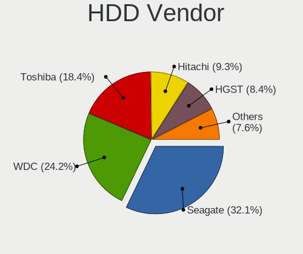
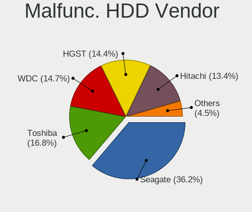
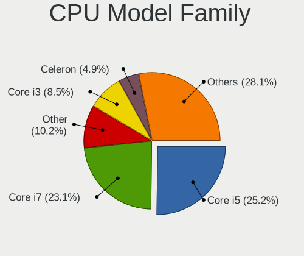
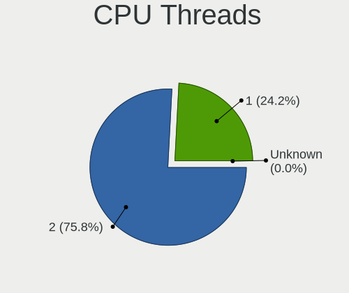
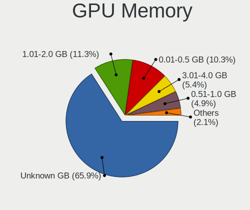
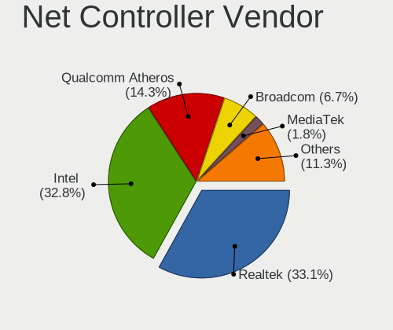
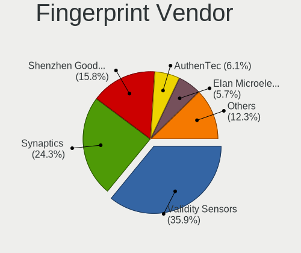
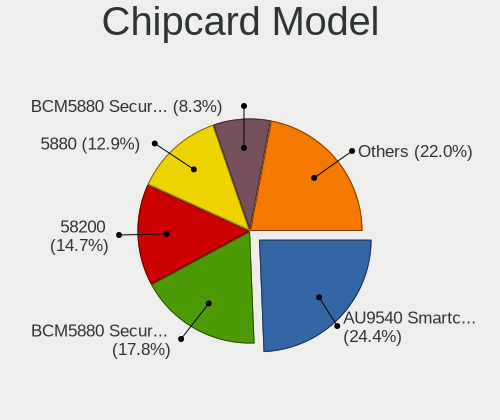

Ubuntu - Tested Hardware & Statistics (Notebooks)
-------------------------------------------------

A project to collect tested hardware configurations for Ubuntu.

Anyone can contribute to this report by the [hw-probe](https://github.com/linuxhw/hw-probe) tool:

    sudo -E hw-probe -all -upload

Please contribute! Especially if your hardware is rare.

Contents
--------

* [ Test Cases ](#test-cases)

* [ System ](#system)
  - [ OS                       ](#os)
  - [ OS Family                ](#os-family)
  - [ Kernel                   ](#kernel)
  - [ Kernel Family            ](#kernel-family)
  - [ Kernel Major Ver.        ](#kernel-major-ver)
  - [ Arch                     ](#arch)
  - [ DE                       ](#de)
  - [ Display Server           ](#display-server)
  - [ Display Manager          ](#display-manager)
  - [ OS Lang                  ](#os-lang)
  - [ Boot Mode                ](#boot-mode)
  - [ Filesystem               ](#filesystem)
  - [ Part. scheme             ](#part-scheme)
  - [ Dual Boot with Linux/BSD ](#dual-boot-with-linuxbsd)
  - [ Dual Boot (Win)          ](#dual-boot-win)

* [ Board ](#board)
  - [ Vendor                   ](#vendor)
  - [ Model                    ](#model)
  - [ Model Family             ](#model-family)
  - [ MFG Year                 ](#mfg-year)
  - [ Form Factor              ](#form-factor)
  - [ Secure Boot              ](#secure-boot)
  - [ Coreboot                 ](#coreboot)
  - [ RAM Size                 ](#ram-size)
  - [ RAM Used                 ](#ram-used)
  - [ Total Drives             ](#total-drives)
  - [ Has CD-ROM               ](#has-cd-rom)
  - [ Has Ethernet             ](#has-ethernet)
  - [ Has WiFi                 ](#has-wifi)
  - [ Has Bluetooth            ](#has-bluetooth)

* [ Location ](#location)
  - [ Country                  ](#country)
  - [ City                     ](#city)

* [ Drives ](#drives)
  - [ Drive Vendor             ](#drive-vendor)
  - [ Drive Model              ](#drive-model)
  - [ HDD Vendor               ](#hdd-vendor)
  - [ SSD Vendor               ](#ssd-vendor)
  - [ Drive Kind               ](#drive-kind)
  - [ Drive Connector          ](#drive-connector)
  - [ Drive Size               ](#drive-size)
  - [ Space Total              ](#space-total)
  - [ Space Used               ](#space-used)
  - [ Malfunc. Drives          ](#malfunc-drives)
  - [ Malfunc. Drive Vendor    ](#malfunc-drive-vendor)
  - [ Malfunc. HDD Vendor      ](#malfunc-hdd-vendor)
  - [ Malfunc. Drive Kind      ](#malfunc-drive-kind)
  - [ Failed Drives            ](#failed-drives)
  - [ Failed Drive Vendor      ](#failed-drive-vendor)
  - [ Drive Status             ](#drive-status)

* [ Storage controller ](#storage-controller)
  - [ Storage Vendor           ](#storage-vendor)
  - [ Storage Model            ](#storage-model)
  - [ Storage Kind             ](#storage-kind)

* [ Processor ](#processor)
  - [ CPU Vendor               ](#cpu-vendor)
  - [ CPU Model                ](#cpu-model)
  - [ CPU Model Family         ](#cpu-model-family)
  - [ CPU Cores                ](#cpu-cores)
  - [ CPU Sockets              ](#cpu-sockets)
  - [ CPU Threads              ](#cpu-threads)
  - [ CPU Op-Modes             ](#cpu-op-modes)
  - [ CPU Microcode            ](#cpu-microcode)
  - [ CPU Microarch            ](#cpu-microarch)

* [ Graphics ](#graphics)
  - [ GPU Vendor               ](#gpu-vendor)
  - [ GPU Model                ](#gpu-model)
  - [ GPU Combo                ](#gpu-combo)
  - [ GPU Driver               ](#gpu-driver)
  - [ GPU Memory               ](#gpu-memory)

* [ Monitor ](#monitor)
  - [ Monitor Vendor           ](#monitor-vendor)
  - [ Monitor Model            ](#monitor-model)
  - [ Monitor Resolution       ](#monitor-resolution)
  - [ Monitor Diagonal         ](#monitor-diagonal)
  - [ Monitor Width            ](#monitor-width)
  - [ Aspect Ratio             ](#aspect-ratio)
  - [ Monitor Area             ](#monitor-area)
  - [ Pixel Density            ](#pixel-density)
  - [ Multiple Monitors        ](#multiple-monitors)

* [ Network ](#network)
  - [ Net Controller Vendor    ](#net-controller-vendor)
  - [ Net Controller Model     ](#net-controller-model)
  - [ Wireless Vendor          ](#wireless-vendor)
  - [ Wireless Model           ](#wireless-model)
  - [ Ethernet Vendor          ](#ethernet-vendor)
  - [ Ethernet Model           ](#ethernet-model)
  - [ Net Controller Kind      ](#net-controller-kind)
  - [ Used Controller          ](#used-controller)
  - [ NICs                     ](#nics)
  - [ IPv6                     ](#ipv6)

* [ Bluetooth ](#bluetooth)
  - [ Bluetooth Vendor         ](#bluetooth-vendor)
  - [ Bluetooth Model          ](#bluetooth-model)

* [ Sound ](#sound)
  - [ Sound Vendor             ](#sound-vendor)
  - [ Sound Model              ](#sound-model)

* [ Memory ](#memory)
  - [ Memory Vendor            ](#memory-vendor)
  - [ Memory Model             ](#memory-model)
  - [ Memory Kind              ](#memory-kind)
  - [ Memory Form Factor       ](#memory-form-factor)
  - [ Memory Size              ](#memory-size)
  - [ Memory Speed             ](#memory-speed)

* [ Printers & scanners ](#printers--scanners)
  - [ Printer Vendor           ](#printer-vendor)
  - [ Printer Model            ](#printer-model)
  - [ Scanner Vendor           ](#scanner-vendor)
  - [ Scanner Model            ](#scanner-model)

* [ Camera ](#camera)
  - [ Camera Vendor            ](#camera-vendor)
  - [ Camera Model             ](#camera-model)

* [ Security ](#security)
  - [ Fingerprint Vendor       ](#fingerprint-vendor)
  - [ Fingerprint Model        ](#fingerprint-model)
  - [ Chipcard Vendor          ](#chipcard-vendor)
  - [ Chipcard Model           ](#chipcard-model)

* [ Unsupported ](#unsupported)
  - [ Unsupported Devices      ](#unsupported-devices)
  - [ Unsupported Device Types ](#unsupported-device-types)

Test Cases
----------

Total: 40442

| Vendor        | Model                       | Probe                                                      | Date         |
|---------------|-----------------------------|------------------------------------------------------------|--------------|
| Lenovo        | ThinkPad L540 20AUA13S00    | [04ffca5382](https://linux-hardware.org/?probe=04ffca5382) | Oct 01, 2022 |
| MSI           | GF65 Thin 9SEXR             | [537828a21f](https://linux-hardware.org/?probe=537828a21f) | Oct 01, 2022 |
| Acer          | Aspire 5920G                | [9bd67cf4f9](https://linux-hardware.org/?probe=9bd67cf4f9) | Oct 01, 2022 |
| Sony          | VPCCA15FX                   | [5063ea411b](https://linux-hardware.org/?probe=5063ea411b) | Oct 01, 2022 |
| Sony          | VPCCA15FX                   | [96eb3d8cf7](https://linux-hardware.org/?probe=96eb3d8cf7) | Oct 01, 2022 |
| ASUSTek       | ROG Zephyrus M16 GU603ZM... | [403aa5af3e](https://linux-hardware.org/?probe=403aa5af3e) | Oct 01, 2022 |
| Lenovo        | V130-15IKB 81HN             | [44a4ed90e1](https://linux-hardware.org/?probe=44a4ed90e1) | Oct 01, 2022 |
| HUAWEI        | BOHK-WAX9X                  | [6525098252](https://linux-hardware.org/?probe=6525098252) | Oct 01, 2022 |
| Lenovo        | G400s VILG1                 | [e666344187](https://linux-hardware.org/?probe=e666344187) | Oct 01, 2022 |
| Acer          | Enduro EN314-51W            | [46782cf8f5](https://linux-hardware.org/?probe=46782cf8f5) | Oct 01, 2022 |
| Dell          | Latitude E5250              | [aeb221e727](https://linux-hardware.org/?probe=aeb221e727) | Oct 01, 2022 |
| Dell          | Latitude E5250              | [43f7cf1b59](https://linux-hardware.org/?probe=43f7cf1b59) | Oct 01, 2022 |
| Lenovo        | ThinkPad SL500 27463ZG      | [34006e3b46](https://linux-hardware.org/?probe=34006e3b46) | Oct 01, 2022 |
| HP            | ProBook 430 G7              | [bf25686a1f](https://linux-hardware.org/?probe=bf25686a1f) | Oct 01, 2022 |
| Dell          | Latitude 5480               | [ec9593f051](https://linux-hardware.org/?probe=ec9593f051) | Oct 01, 2022 |
| Notebook      | W330SU2                     | [a5d5500584](https://linux-hardware.org/?probe=a5d5500584) | Oct 01, 2022 |
| Lenovo        | ThinkPad E14 Gen 3 20YES... | [1a210b9eb5](https://linux-hardware.org/?probe=1a210b9eb5) | Oct 01, 2022 |
| Apple         | MacBookPro16,2              | [8eaded9cb5](https://linux-hardware.org/?probe=8eaded9cb5) | Oct 01, 2022 |
| HP            | Pavilion 17                 | [fa2e48904a](https://linux-hardware.org/?probe=fa2e48904a) | Oct 01, 2022 |
| MSI           | Modern 14 A10M              | [571271ed93](https://linux-hardware.org/?probe=571271ed93) | Sep 30, 2022 |
| MSI           | Modern 14 A10M              | [9da1f3fe66](https://linux-hardware.org/?probe=9da1f3fe66) | Sep 30, 2022 |
| OEM           | Unknown                     | [af7df2aea6](https://linux-hardware.org/?probe=af7df2aea6) | Sep 30, 2022 |
| OEM           | Unknown                     | [1d851fe024](https://linux-hardware.org/?probe=1d851fe024) | Sep 30, 2022 |
| OEM           | Unknown                     | [4fd2ca7d03](https://linux-hardware.org/?probe=4fd2ca7d03) | Sep 30, 2022 |
| Dell          | Latitude 5530               | [43874dad6d](https://linux-hardware.org/?probe=43874dad6d) | Sep 30, 2022 |
| SANTECH       | NHx0EH_EJ_EK                | [01366bbeb7](https://linux-hardware.org/?probe=01366bbeb7) | Sep 30, 2022 |
| Dell          | Precision 3551              | [d0341acb53](https://linux-hardware.org/?probe=d0341acb53) | Sep 30, 2022 |
| HP            | Compaq CQ58                 | [28048a6d3e](https://linux-hardware.org/?probe=28048a6d3e) | Sep 30, 2022 |
| HP            | Pavilion Laptop 15-eg0xx... | [76dae4e704](https://linux-hardware.org/?probe=76dae4e704) | Sep 30, 2022 |
| Apple         | MacBookPro9,2               | [87c9436154](https://linux-hardware.org/?probe=87c9436154) | Sep 30, 2022 |
| HP            | Notebook                    | [a30c1af9a5](https://linux-hardware.org/?probe=a30c1af9a5) | Sep 30, 2022 |
| Acer          | Aspire E1-531               | [fbe026b995](https://linux-hardware.org/?probe=fbe026b995) | Sep 30, 2022 |
| HP            | Pavilion dv5                | [9fd2d2169a](https://linux-hardware.org/?probe=9fd2d2169a) | Sep 30, 2022 |
| HP            | Pavilion dv5                | [1c42236e47](https://linux-hardware.org/?probe=1c42236e47) | Sep 30, 2022 |
| SIEMENS       | SIMATIC ITP1000             | [adbd7dbca6](https://linux-hardware.org/?probe=adbd7dbca6) | Sep 30, 2022 |
| Lenovo        | IdeaPad 5 Pro 16ARH7 82S... | [6bcbc9e08c](https://linux-hardware.org/?probe=6bcbc9e08c) | Sep 30, 2022 |
| NEC Comput... | PC-VRL21FB6S3R7             | [2001e2e28e](https://linux-hardware.org/?probe=2001e2e28e) | Sep 30, 2022 |
| Dell          | Inspiron 3501               | [4684b672f6](https://linux-hardware.org/?probe=4684b672f6) | Sep 30, 2022 |
| Dell          | Inspiron 3501               | [ce2d41ee99](https://linux-hardware.org/?probe=ce2d41ee99) | Sep 30, 2022 |
| ASUSTek       | ASUS EXPERTBOOK B1400CBA    | [4cad2a770c](https://linux-hardware.org/?probe=4cad2a770c) | Sep 30, 2022 |
| Lenovo        | ThinkPad T480s 20L7001YU... | [929514123f](https://linux-hardware.org/?probe=929514123f) | Sep 30, 2022 |
| Acer          | Aspire E5-521               | [a55d68e93c](https://linux-hardware.org/?probe=a55d68e93c) | Sep 30, 2022 |
| Gigabyte      | AORUS 17 YE5                | [54b271c3fd](https://linux-hardware.org/?probe=54b271c3fd) | Sep 30, 2022 |
| Lenovo        | Yoga 300-11IBY 80M0         | [d5c0e2c5d3](https://linux-hardware.org/?probe=d5c0e2c5d3) | Sep 30, 2022 |
| Google        | Relm                        | [e440e5c1cc](https://linux-hardware.org/?probe=e440e5c1cc) | Sep 30, 2022 |
| Apple         | MacBookPro16,1              | [03f56ec19b](https://linux-hardware.org/?probe=03f56ec19b) | Sep 30, 2022 |
| Samsung       | R430/P430/R480              | [09795617ab](https://linux-hardware.org/?probe=09795617ab) | Sep 30, 2022 |
| Lenovo        | G500s 20245                 | [b9001f7817](https://linux-hardware.org/?probe=b9001f7817) | Sep 29, 2022 |
| Toshiba       | TECRA M10                   | [64ad67c8e9](https://linux-hardware.org/?probe=64ad67c8e9) | Sep 29, 2022 |
| ASUSTek       | Zenbook UM3402YA_UM3402Y... | [36ad3c69ee](https://linux-hardware.org/?probe=36ad3c69ee) | Sep 29, 2022 |
| Acer          | Aspire ES1-311              | [0f40a045a9](https://linux-hardware.org/?probe=0f40a045a9) | Sep 29, 2022 |
| ASUSTek       | TUF Gaming FX505DY_FX505... | [bd2dea6653](https://linux-hardware.org/?probe=bd2dea6653) | Sep 29, 2022 |
| HP            | ZBook Firefly 15.6 inch ... | [be74c01cca](https://linux-hardware.org/?probe=be74c01cca) | Sep 29, 2022 |
| Acer          | Aspire A715-72G             | [8b7e129d4a](https://linux-hardware.org/?probe=8b7e129d4a) | Sep 29, 2022 |
| Lenovo        | ThinkPad P53 MWS 15.6 (Q... | [8990060646](https://linux-hardware.org/?probe=8990060646) | Sep 29, 2022 |
| Apple         | MacBookPro3,1               | [00f2a6e705](https://linux-hardware.org/?probe=00f2a6e705) | Sep 29, 2022 |
| Lenovo        | ThinkPad X1 Carbon 7th 2... | [54bc787611](https://linux-hardware.org/?probe=54bc787611) | Sep 29, 2022 |
| Dell          | XPS 13 9370                 | [4e0be93d26](https://linux-hardware.org/?probe=4e0be93d26) | Sep 29, 2022 |
| ASUSTek       | Zenbook UM5401QAB_UM5401... | [3e92ba3812](https://linux-hardware.org/?probe=3e92ba3812) | Sep 29, 2022 |
| Dell          | Latitude E7250              | [bed2e025b0](https://linux-hardware.org/?probe=bed2e025b0) | Sep 29, 2022 |
| Lenovo        | IdeaPad 320-15IKB 81BG      | [82528435d8](https://linux-hardware.org/?probe=82528435d8) | Sep 29, 2022 |
| MSI           | Creator Z17 A12UHST         | [4b9249b9b0](https://linux-hardware.org/?probe=4b9249b9b0) | Sep 29, 2022 |
| HP            | ProBook 6560b               | [902ef8ef79](https://linux-hardware.org/?probe=902ef8ef79) | Sep 29, 2022 |
| Razer         | Blade                       | [63a4e5f829](https://linux-hardware.org/?probe=63a4e5f829) | Sep 29, 2022 |
| HUAWEI        | HVY-WXX9                    | [4f2655de78](https://linux-hardware.org/?probe=4f2655de78) | Sep 29, 2022 |
| Sony          | VPCEH12FX                   | [037cda52fd](https://linux-hardware.org/?probe=037cda52fd) | Sep 29, 2022 |
| MSI           | Modern 14 A10M              | [5c5666fa97](https://linux-hardware.org/?probe=5c5666fa97) | Sep 29, 2022 |
| HUAWEI        | BOHK-WAX9X                  | [65f56cc48b](https://linux-hardware.org/?probe=65f56cc48b) | Sep 29, 2022 |
| Lenovo        | ThinkPad X1C 5th W10DG 2... | [0cbacebb95](https://linux-hardware.org/?probe=0cbacebb95) | Sep 29, 2022 |
| Dell          | XPS 15 9570                 | [eb3798c367](https://linux-hardware.org/?probe=eb3798c367) | Sep 28, 2022 |
| ASUSTek       | VivoBook_ASUSLaptop X515... | [cd08dccca4](https://linux-hardware.org/?probe=cd08dccca4) | Sep 28, 2022 |
| Notebook      | PB50_70RF,RD,RC             | [d56e485c88](https://linux-hardware.org/?probe=d56e485c88) | Sep 28, 2022 |
| ASUSTek       | VivoBook 17_ASUS Laptop ... | [a3fc8eb1bc](https://linux-hardware.org/?probe=a3fc8eb1bc) | Sep 28, 2022 |
| Lenovo        | Legion S7 15IMH5 82BC       | [4ecc5d01c1](https://linux-hardware.org/?probe=4ecc5d01c1) | Sep 28, 2022 |
| Dell          | Latitude E7250              | [4bf6378dde](https://linux-hardware.org/?probe=4bf6378dde) | Sep 28, 2022 |
| Lenovo        | ThinkPad L15 Gen 1 20U4S... | [d5a4d2ae41](https://linux-hardware.org/?probe=d5a4d2ae41) | Sep 28, 2022 |
| Dell          | Latitude E5430 non-vPro     | [12e886f006](https://linux-hardware.org/?probe=12e886f006) | Sep 28, 2022 |
| Dell          | Vostro 15 3515              | [7e4413a053](https://linux-hardware.org/?probe=7e4413a053) | Sep 28, 2022 |
| Dell          | XPS 13 9350                 | [23142407b0](https://linux-hardware.org/?probe=23142407b0) | Sep 28, 2022 |
| Lenovo        | IdeaPad 3 15ALC6 82MF       | [bbd715eb5a](https://linux-hardware.org/?probe=bbd715eb5a) | Sep 28, 2022 |
| Medion        | E6234                       | [19f1d7841e](https://linux-hardware.org/?probe=19f1d7841e) | Sep 28, 2022 |
| Lenovo        | ThinkPad P15v Gen 1 20TQ... | [a64f339e70](https://linux-hardware.org/?probe=a64f339e70) | Sep 28, 2022 |
| Dell          | Latitude 3410               | [82fe1556b6](https://linux-hardware.org/?probe=82fe1556b6) | Sep 28, 2022 |
| Lenovo        | G570 4334                   | [7b96f1db41](https://linux-hardware.org/?probe=7b96f1db41) | Sep 28, 2022 |
| Lenovo        | IdeaPad Z510 20287          | [78badcba3c](https://linux-hardware.org/?probe=78badcba3c) | Sep 28, 2022 |
| Lenovo        | ThinkBook 14 G3 ACL 21A2    | [9271d6a014](https://linux-hardware.org/?probe=9271d6a014) | Sep 28, 2022 |
| Apple         | MacBookPro9,2               | [6ea648bc51](https://linux-hardware.org/?probe=6ea648bc51) | Sep 28, 2022 |
| Lenovo        | IdeaPad 500-15ISK 80NT      | [9377d23abd](https://linux-hardware.org/?probe=9377d23abd) | Sep 28, 2022 |
| HP            | ProBook 450 G5              | [c000778875](https://linux-hardware.org/?probe=c000778875) | Sep 28, 2022 |
| Acer          | Aspire E5-573               | [f7e628a5a1](https://linux-hardware.org/?probe=f7e628a5a1) | Sep 28, 2022 |
| Positivo      | S14CT01                     | [66e0c53646](https://linux-hardware.org/?probe=66e0c53646) | Sep 28, 2022 |
| Unknown       | Unknown                     | [3e450900da](https://linux-hardware.org/?probe=3e450900da) | Sep 28, 2022 |
| Apple         | MacBookPro15,2              | [2e6164b675](https://linux-hardware.org/?probe=2e6164b675) | Sep 28, 2022 |
| HP            | Pavilion Laptop 14-ce2xx... | [6eab6db53b](https://linux-hardware.org/?probe=6eab6db53b) | Sep 27, 2022 |
| Dell          | Latitude E6330              | [47b2074732](https://linux-hardware.org/?probe=47b2074732) | Sep 27, 2022 |
| Acer          | Aspire 5750G                | [f73c1084d0](https://linux-hardware.org/?probe=f73c1084d0) | Sep 27, 2022 |
| HP            | ProBook 450 G2              | [a9c7d575cd](https://linux-hardware.org/?probe=a9c7d575cd) | Sep 27, 2022 |
| ASUSTek       | VivoBook_ASUSLaptop X521... | [47acb38827](https://linux-hardware.org/?probe=47acb38827) | Sep 27, 2022 |
| Dell          | Precision 3561              | [77a4030052](https://linux-hardware.org/?probe=77a4030052) | Sep 27, 2022 |
| ASUSTek       | G73Jh                       | [e5405dd3d8](https://linux-hardware.org/?probe=e5405dd3d8) | Sep 27, 2022 |
| HUAWEI        | BOHK-WAX9X                  | [d0f8e8a0f6](https://linux-hardware.org/?probe=d0f8e8a0f6) | Sep 27, 2022 |
| Dell          | Latitude E7470              | [5bdc528b5a](https://linux-hardware.org/?probe=5bdc528b5a) | Sep 27, 2022 |
| Philco        | PNB14.1AC14S128W10          | [ee4bc98535](https://linux-hardware.org/?probe=ee4bc98535) | Sep 27, 2022 |
| HP            | Pavilion 10 TS              | [28003748e6](https://linux-hardware.org/?probe=28003748e6) | Sep 27, 2022 |
| HP            | ENVY m7 Notebook            | [c2739df54b](https://linux-hardware.org/?probe=c2739df54b) | Sep 27, 2022 |
| HP            | 635                         | [0509987782](https://linux-hardware.org/?probe=0509987782) | Sep 27, 2022 |
| Lenovo        | ThinkPad T410 2537AT9       | [553490bb4c](https://linux-hardware.org/?probe=553490bb4c) | Sep 27, 2022 |
| HP            | ProBook 450 G2              | [2935c5bedd](https://linux-hardware.org/?probe=2935c5bedd) | Sep 27, 2022 |
| Timi          | TM1701                      | [59153cc5fe](https://linux-hardware.org/?probe=59153cc5fe) | Sep 27, 2022 |
| Apple         | MacBookAir6,2               | [8c4c7f3dc1](https://linux-hardware.org/?probe=8c4c7f3dc1) | Sep 27, 2022 |
| Lenovo        | ThinkPad X270 W10DG 20K5... | [ae7c83bb37](https://linux-hardware.org/?probe=ae7c83bb37) | Sep 27, 2022 |
| Dell          | Inspiron 5570               | [3735a32f9e](https://linux-hardware.org/?probe=3735a32f9e) | Sep 27, 2022 |
| Acer          | TravelMate 5730             | [88b501ffbe](https://linux-hardware.org/?probe=88b501ffbe) | Sep 27, 2022 |
| Samsung       | R425/R525                   | [a5b0ee0a18](https://linux-hardware.org/?probe=a5b0ee0a18) | Sep 27, 2022 |
| Fujitsu       | LIFEBOOK E548               | [bf70c9dd7b](https://linux-hardware.org/?probe=bf70c9dd7b) | Sep 27, 2022 |
| Lenovo        | Legion S7 15ACH6 82K8       | [3aa314d706](https://linux-hardware.org/?probe=3aa314d706) | Sep 27, 2022 |
| HP            | Laptop 17-cp0xxx            | [895fae1f2e](https://linux-hardware.org/?probe=895fae1f2e) | Sep 27, 2022 |
| Lenovo        | ThinkPad L14 Gen 2 20X2A... | [ce132fc63e](https://linux-hardware.org/?probe=ce132fc63e) | Sep 27, 2022 |
| ASUSTek       | G73Jh                       | [ac96a56edf](https://linux-hardware.org/?probe=ac96a56edf) | Sep 27, 2022 |
| Lenovo        | ThinkPad T480s 20L8S6WP0... | [d0149ee0e2](https://linux-hardware.org/?probe=d0149ee0e2) | Sep 27, 2022 |
| Dell          | XPS 15 9500                 | [d9d87f101a](https://linux-hardware.org/?probe=d9d87f101a) | Sep 27, 2022 |
| Dell          | XPS 13 9310                 | [6f9bc0cdba](https://linux-hardware.org/?probe=6f9bc0cdba) | Sep 26, 2022 |
| Dell          | XPS 13 9310                 | [d65cd8309b](https://linux-hardware.org/?probe=d65cd8309b) | Sep 26, 2022 |
| Dell          | Latitude 5420               | [bd81c07917](https://linux-hardware.org/?probe=bd81c07917) | Sep 26, 2022 |
| Dell          | Inspiron 1525               | [42ea8221af](https://linux-hardware.org/?probe=42ea8221af) | Sep 26, 2022 |
| HUAWEI        | NBLB-WAX9N                  | [3acb168799](https://linux-hardware.org/?probe=3acb168799) | Sep 26, 2022 |
| HP            | EliteBook 850 G7 Noteboo... | [9a1514cc61](https://linux-hardware.org/?probe=9a1514cc61) | Sep 26, 2022 |
| HUAWEI        | NBLB-WAX9N                  | [fd7e096a4b](https://linux-hardware.org/?probe=fd7e096a4b) | Sep 26, 2022 |
| Dell          | System Inspiron N7110       | [90fffc8800](https://linux-hardware.org/?probe=90fffc8800) | Sep 26, 2022 |
| HP            | Unknown                     | [e8906c977c](https://linux-hardware.org/?probe=e8906c977c) | Sep 26, 2022 |
| Lenovo        | ThinkPad SL500 27463ZG      | [70860ec433](https://linux-hardware.org/?probe=70860ec433) | Sep 26, 2022 |
| ASUSTek       | X580VD                      | [378e1d3133](https://linux-hardware.org/?probe=378e1d3133) | Sep 26, 2022 |
| System76      | Lemur Pro                   | [35340e6221](https://linux-hardware.org/?probe=35340e6221) | Sep 26, 2022 |
| HP            | ProBook 650 G1              | [bdcb5090f0](https://linux-hardware.org/?probe=bdcb5090f0) | Sep 26, 2022 |
| Lenovo        | IdeaPad 3 14ADA05 81W0      | [e39766ed4d](https://linux-hardware.org/?probe=e39766ed4d) | Sep 26, 2022 |
| GIADA         | ChiefRiver Platform         | [d0f71cdc7f](https://linux-hardware.org/?probe=d0f71cdc7f) | Sep 26, 2022 |
| Lenovo        | ThinkPad X1 Carbon 6th 2... | [7c8030e423](https://linux-hardware.org/?probe=7c8030e423) | Sep 26, 2022 |
| Lenovo        | ThinkPad T480s 20L7001PI... | [31235a45b5](https://linux-hardware.org/?probe=31235a45b5) | Sep 26, 2022 |
| Lenovo        | ThinkPad T480 20L6SCWK00    | [60933ed48b](https://linux-hardware.org/?probe=60933ed48b) | Sep 26, 2022 |
| Acer          | Aspire A514-54              | [bab009e0b7](https://linux-hardware.org/?probe=bab009e0b7) | Sep 26, 2022 |
| Insyde        | WindTab89                   | [0073af9597](https://linux-hardware.org/?probe=0073af9597) | Sep 26, 2022 |
| Insyde        | WindTab89                   | [6935ebecaa](https://linux-hardware.org/?probe=6935ebecaa) | Sep 26, 2022 |
| Dell          | Latitude 7420               | [0834411088](https://linux-hardware.org/?probe=0834411088) | Sep 26, 2022 |
| Dell          | Latitude E7470              | [1dba765507](https://linux-hardware.org/?probe=1dba765507) | Sep 26, 2022 |
| Dell          | XPS 13 7390                 | [cfebe9461d](https://linux-hardware.org/?probe=cfebe9461d) | Sep 26, 2022 |
| Lenovo        | ThinkPad Edge E430 3254A... | [cb5f6f279b](https://linux-hardware.org/?probe=cb5f6f279b) | Sep 26, 2022 |
| Lenovo        | ThinkPad Edge E430 3254A... | [3f11c520e0](https://linux-hardware.org/?probe=3f11c520e0) | Sep 26, 2022 |
| ASUSTek       | K55VJ                       | [8e87d041c3](https://linux-hardware.org/?probe=8e87d041c3) | Sep 26, 2022 |
| HP            | Spectre Pro x360 G2         | [d9248f7b2e](https://linux-hardware.org/?probe=d9248f7b2e) | Sep 26, 2022 |
| Lenovo        | G570 4334                   | [601591c97e](https://linux-hardware.org/?probe=601591c97e) | Sep 26, 2022 |
| HP            | Pavilion Gaming Laptop 1... | [e02f2ceff4](https://linux-hardware.org/?probe=e02f2ceff4) | Sep 26, 2022 |
| Acer          | Aspire A515-55              | [a9ac678198](https://linux-hardware.org/?probe=a9ac678198) | Sep 26, 2022 |
| Acer          | Aspire A515-55              | [8e66a480f3](https://linux-hardware.org/?probe=8e66a480f3) | Sep 26, 2022 |
| Dell          | Inspiron 11-3168            | [6b1d418929](https://linux-hardware.org/?probe=6b1d418929) | Sep 26, 2022 |
| Lenovo        | 3000 V100 076346G           | [0575c1ea4f](https://linux-hardware.org/?probe=0575c1ea4f) | Sep 26, 2022 |
| Samsung       | 670Z5E                      | [6bce247e38](https://linux-hardware.org/?probe=6bce247e38) | Sep 26, 2022 |
| AZW           | SEi                         | [ca815a2e20](https://linux-hardware.org/?probe=ca815a2e20) | Sep 26, 2022 |
| HP            | ProBook 6560b               | [96637a94a6](https://linux-hardware.org/?probe=96637a94a6) | Sep 25, 2022 |
| Jumper        | EZbook                      | [1af58cd7e7](https://linux-hardware.org/?probe=1af58cd7e7) | Sep 25, 2022 |
| ASUSTek       | G750JX                      | [4ce2831fac](https://linux-hardware.org/?probe=4ce2831fac) | Sep 25, 2022 |
| NSX           | Celeron 14                  | [b8fdb14beb](https://linux-hardware.org/?probe=b8fdb14beb) | Sep 25, 2022 |
| Positivo      | S14SL01                     | [a6b3c260f4](https://linux-hardware.org/?probe=a6b3c260f4) | Sep 25, 2022 |
| NSX           | Celeron 14                  | [1d358a2828](https://linux-hardware.org/?probe=1d358a2828) | Sep 25, 2022 |
| Acer          | Aspire 3810T                | [de19c5a7e9](https://linux-hardware.org/?probe=de19c5a7e9) | Sep 25, 2022 |
| HP            | EliteBook 840 G3            | [2ad6238f03](https://linux-hardware.org/?probe=2ad6238f03) | Sep 25, 2022 |
| Acer          | P5WE0                       | [124f7bdd77](https://linux-hardware.org/?probe=124f7bdd77) | Sep 25, 2022 |
| Unknown       | A116C1_1                    | [470cd9917c](https://linux-hardware.org/?probe=470cd9917c) | Sep 25, 2022 |
| HP            | ZHAN 99 Mobile Workstati... | [5cff3798b0](https://linux-hardware.org/?probe=5cff3798b0) | Sep 25, 2022 |
| HONOR         | BMH-WCX9                    | [49b0161bf0](https://linux-hardware.org/?probe=49b0161bf0) | Sep 25, 2022 |
| Lenovo        | IdeaPad3-15ADA05 81W1       | [d2192ee6f0](https://linux-hardware.org/?probe=d2192ee6f0) | Sep 25, 2022 |
| Acer          | Swift SF314-71              | [3414420bc7](https://linux-hardware.org/?probe=3414420bc7) | Sep 25, 2022 |
| Positivo      | S14SL01                     | [e09fcd6e38](https://linux-hardware.org/?probe=e09fcd6e38) | Sep 25, 2022 |
| ASUSTek       | VivoBook_ASUSLaptop X515... | [3e5af3e86c](https://linux-hardware.org/?probe=3e5af3e86c) | Sep 25, 2022 |
| AMI           | Intel                       | [56de8f8b8a](https://linux-hardware.org/?probe=56de8f8b8a) | Sep 25, 2022 |
| Dell          | Latitude 13                 | [28d623103e](https://linux-hardware.org/?probe=28d623103e) | Sep 25, 2022 |
| AMI           | Intel                       | [330585dcd8](https://linux-hardware.org/?probe=330585dcd8) | Sep 25, 2022 |
| Dell          | Inspiron 5570               | [6516021810](https://linux-hardware.org/?probe=6516021810) | Sep 25, 2022 |
| Dell          | XPS 15 9500                 | [1095e2f7f0](https://linux-hardware.org/?probe=1095e2f7f0) | Sep 25, 2022 |
| HP            | ProBook 450 G5              | [262ff53f6a](https://linux-hardware.org/?probe=262ff53f6a) | Sep 25, 2022 |
| Acer          | Swift SF314-511             | [93680a7429](https://linux-hardware.org/?probe=93680a7429) | Sep 25, 2022 |
| Acer          | Swift SF314-511             | [ae5fd894b6](https://linux-hardware.org/?probe=ae5fd894b6) | Sep 25, 2022 |
| Avell High... | A70 MOB                     | [b867406b76](https://linux-hardware.org/?probe=b867406b76) | Sep 25, 2022 |
| Dell          | Inspiron 15 5510            | [cfda1aa63a](https://linux-hardware.org/?probe=cfda1aa63a) | Sep 25, 2022 |
| Lenovo        | Yoga S730-13IWL 81J0        | [fee2b2d57e](https://linux-hardware.org/?probe=fee2b2d57e) | Sep 24, 2022 |
| Acer          | Aspire E5-551               | [693dca23b3](https://linux-hardware.org/?probe=693dca23b3) | Sep 24, 2022 |
| HP            | Stream 11 Pro               | [01a4c35ec9](https://linux-hardware.org/?probe=01a4c35ec9) | Sep 24, 2022 |
| HP            | Stream 11 Pro               | [46b9ac9732](https://linux-hardware.org/?probe=46b9ac9732) | Sep 24, 2022 |
| HP            | Stream 11 Pro               | [e562c8160a](https://linux-hardware.org/?probe=e562c8160a) | Sep 24, 2022 |
| Samsung       | RV411/RV511/E3511/S3511/... | [118cf21173](https://linux-hardware.org/?probe=118cf21173) | Sep 24, 2022 |
| Dell          | Latitude 3410               | [ba10ea9fc5](https://linux-hardware.org/?probe=ba10ea9fc5) | Sep 24, 2022 |
| HP            | ProBook 440 14 inch G9 N... | [84d47822bf](https://linux-hardware.org/?probe=84d47822bf) | Sep 24, 2022 |
| HP            | ProBook 440 14 inch G9 N... | [3afd2e892b](https://linux-hardware.org/?probe=3afd2e892b) | Sep 24, 2022 |
| Lenovo        | ThinkPad E470 20H1004UIG    | [310337a455](https://linux-hardware.org/?probe=310337a455) | Sep 24, 2022 |
| Samsung       | RV411/RV511/E3511/S3511/... | [2322475867](https://linux-hardware.org/?probe=2322475867) | Sep 24, 2022 |
| Gigabyte      | AORUS 5 SE                  | [c188e2c5b5](https://linux-hardware.org/?probe=c188e2c5b5) | Sep 24, 2022 |
| ASUSTek       | X200MA                      | [753d8c4211](https://linux-hardware.org/?probe=753d8c4211) | Sep 24, 2022 |
| Dell          | G15 5515                    | [ae769dae75](https://linux-hardware.org/?probe=ae769dae75) | Sep 24, 2022 |
| Dell          | Precision 7510              | [11c98b608a](https://linux-hardware.org/?probe=11c98b608a) | Sep 24, 2022 |
| ASUSTek       | VivoBook_ASUSLaptop X421... | [8f29c3dc10](https://linux-hardware.org/?probe=8f29c3dc10) | Sep 24, 2022 |
| Dell          | Vostro V131                 | [809655978a](https://linux-hardware.org/?probe=809655978a) | Sep 24, 2022 |
| Toshiba       | Satellite A305              | [d1ed6b20cf](https://linux-hardware.org/?probe=d1ed6b20cf) | Sep 24, 2022 |
| Toshiba       | Satellite A305              | [9e04fb330b](https://linux-hardware.org/?probe=9e04fb330b) | Sep 24, 2022 |
| HP            | EliteBook 850 G8 Noteboo... | [b01a9ac97f](https://linux-hardware.org/?probe=b01a9ac97f) | Sep 24, 2022 |
| Acer          | Swift SF315-52              | [b9e88a43d8](https://linux-hardware.org/?probe=b9e88a43d8) | Sep 24, 2022 |
| Acer          | AOD257                      | [35ca1c0b33](https://linux-hardware.org/?probe=35ca1c0b33) | Sep 24, 2022 |
| HP            | Laptop 15-da0xxx            | [da14d41e78](https://linux-hardware.org/?probe=da14d41e78) | Sep 24, 2022 |
| Dell          | G15 5515                    | [893c248dec](https://linux-hardware.org/?probe=893c248dec) | Sep 24, 2022 |
| Dell          | Latitude 5420               | [170a3248f6](https://linux-hardware.org/?probe=170a3248f6) | Sep 24, 2022 |
| Lenovo        | IdeaPad 5 14IIL05 81YH      | [9fbedd972e](https://linux-hardware.org/?probe=9fbedd972e) | Sep 24, 2022 |
| Dell          | Latitude E6500              | [491ad19866](https://linux-hardware.org/?probe=491ad19866) | Sep 24, 2022 |
| MSI           | GF65 Thin 9SEXR             | [b6f7e58295](https://linux-hardware.org/?probe=b6f7e58295) | Sep 24, 2022 |
| Google        | Kip                         | [33cc473591](https://linux-hardware.org/?probe=33cc473591) | Sep 24, 2022 |
| HP            | ProBook 4530s               | [7c6fe43c69](https://linux-hardware.org/?probe=7c6fe43c69) | Sep 24, 2022 |
| Dell          | Latitude E6520              | [81612aa665](https://linux-hardware.org/?probe=81612aa665) | Sep 24, 2022 |
| Google        | Kip                         | [5fb29fbf51](https://linux-hardware.org/?probe=5fb29fbf51) | Sep 23, 2022 |
| HP            | Presario CQ56               | [ed937514cf](https://linux-hardware.org/?probe=ed937514cf) | Sep 23, 2022 |
| ASUSTek       | VivoBook_ASUSLaptop X421... | [0d4570c1d6](https://linux-hardware.org/?probe=0d4570c1d6) | Sep 23, 2022 |
| Toshiba       | Satellite C660              | [2ab739cddb](https://linux-hardware.org/?probe=2ab739cddb) | Sep 23, 2022 |
| Dell          | Latitude E6520              | [fc343204c6](https://linux-hardware.org/?probe=fc343204c6) | Sep 23, 2022 |
| Dell          | Inspiron 15 5510            | [02787c733c](https://linux-hardware.org/?probe=02787c733c) | Sep 23, 2022 |
| Lenovo        | Legion R9000K2021H 82N6     | [d739547049](https://linux-hardware.org/?probe=d739547049) | Sep 23, 2022 |
| Acer          | Aspire E5-771G              | [39dc43058e](https://linux-hardware.org/?probe=39dc43058e) | Sep 23, 2022 |
| ASUSTek       | N750JV                      | [f69fe7dacf](https://linux-hardware.org/?probe=f69fe7dacf) | Sep 23, 2022 |
| Toshiba       | Satellite P205              | [2a1450578e](https://linux-hardware.org/?probe=2a1450578e) | Sep 23, 2022 |
| Dell          | Inspiron 15 5510            | [fe7ae61ecd](https://linux-hardware.org/?probe=fe7ae61ecd) | Sep 23, 2022 |
| HP            | ProBook 4530s               | [a533c17d9f](https://linux-hardware.org/?probe=a533c17d9f) | Sep 23, 2022 |
| Dell          | Inspiron 5566               | [4ed9eae431](https://linux-hardware.org/?probe=4ed9eae431) | Sep 23, 2022 |
| Toshiba       | Satellite P205              | [98e97d946a](https://linux-hardware.org/?probe=98e97d946a) | Sep 23, 2022 |
| ASUSTek       | X556UF                      | [2f1fe986d8](https://linux-hardware.org/?probe=2f1fe986d8) | Sep 23, 2022 |
| NEC Comput... | PC-VK25LCZDM                | [97ab1f723e](https://linux-hardware.org/?probe=97ab1f723e) | Sep 23, 2022 |
| Dell          | Latitude E6330              | [5f1a272734](https://linux-hardware.org/?probe=5f1a272734) | Sep 23, 2022 |
| Dell          | Latitude E6520              | [79aa87fb47](https://linux-hardware.org/?probe=79aa87fb47) | Sep 23, 2022 |
| Toshiba       | Satellite C850-F21B         | [6d336c1e89](https://linux-hardware.org/?probe=6d336c1e89) | Sep 23, 2022 |
| Toshiba       | Satellite C850-F21B         | [dc1e853bbf](https://linux-hardware.org/?probe=dc1e853bbf) | Sep 23, 2022 |
| MECHREVO      | Jiaolong Series GM5ZG0O     | [d0dacface7](https://linux-hardware.org/?probe=d0dacface7) | Sep 23, 2022 |
| Dell          | Precision 3561              | [78b8d776ed](https://linux-hardware.org/?probe=78b8d776ed) | Sep 23, 2022 |
| HP            | EliteBook 2760p             | [7d71278ac4](https://linux-hardware.org/?probe=7d71278ac4) | Sep 23, 2022 |
| ASUSTek       | ROG Strix G513QM_G513QM     | [67ec6c656b](https://linux-hardware.org/?probe=67ec6c656b) | Sep 23, 2022 |
| HP            | EliteBook 840 G5            | [872eafe5f7](https://linux-hardware.org/?probe=872eafe5f7) | Sep 23, 2022 |
| HP            | EliteBook 840 G5            | [68338b3080](https://linux-hardware.org/?probe=68338b3080) | Sep 23, 2022 |
| Acer          | TMP645-M                    | [83b27c389c](https://linux-hardware.org/?probe=83b27c389c) | Sep 23, 2022 |
| HP            | ENVY Laptop 15-ep1xxx       | [b2768e9e6d](https://linux-hardware.org/?probe=b2768e9e6d) | Sep 23, 2022 |
| Lenovo        | G500 20236                  | [0707ef3cf0](https://linux-hardware.org/?probe=0707ef3cf0) | Sep 23, 2022 |
| Lenovo        | ThinkPad T580 20L9001YIV    | [bc43cff31b](https://linux-hardware.org/?probe=bc43cff31b) | Sep 23, 2022 |
| Lenovo        | ThinkPad T580 20L9001YIV    | [919804a54f](https://linux-hardware.org/?probe=919804a54f) | Sep 23, 2022 |
| HP            | Pavilion 10 TS              | [1186e5b5d8](https://linux-hardware.org/?probe=1186e5b5d8) | Sep 23, 2022 |
| Lenovo        | IdeaPad 330-15AST 81D6      | [3f9e2bb677](https://linux-hardware.org/?probe=3f9e2bb677) | Sep 23, 2022 |
| Lenovo        | IdeaPad 330-15AST 81D6      | [10103bf87f](https://linux-hardware.org/?probe=10103bf87f) | Sep 23, 2022 |
| Dell          | Precision 7760              | [f47fe0314b](https://linux-hardware.org/?probe=f47fe0314b) | Sep 23, 2022 |
| HP            | ENVY Notebook               | [7335c99e6a](https://linux-hardware.org/?probe=7335c99e6a) | Sep 23, 2022 |
| HP            | 15 TS                       | [6577aa9bb8](https://linux-hardware.org/?probe=6577aa9bb8) | Sep 23, 2022 |
| Lenovo        | ThinkPad X220 Tablet 429... | [845256127e](https://linux-hardware.org/?probe=845256127e) | Sep 23, 2022 |
| HP            | Laptop 17-by2xxx            | [3e71e40ba0](https://linux-hardware.org/?probe=3e71e40ba0) | Sep 22, 2022 |
| HP            | Laptop 17-by2xxx            | [4af5f4bacc](https://linux-hardware.org/?probe=4af5f4bacc) | Sep 22, 2022 |
| TUXEDO        | Pulse 15 Gen1               | [57ee917c21](https://linux-hardware.org/?probe=57ee917c21) | Sep 22, 2022 |
| Lenovo        | Yoga 13sACN 2021 82CY       | [d374a74e0d](https://linux-hardware.org/?probe=d374a74e0d) | Sep 22, 2022 |
| Acer          | Aspire A515-55              | [fb1cce613c](https://linux-hardware.org/?probe=fb1cce613c) | Sep 22, 2022 |
| Acer          | Aspire 5750Z                | [38e1cc9153](https://linux-hardware.org/?probe=38e1cc9153) | Sep 22, 2022 |
| Fusion5       | S14                         | [9b3e06c4e4](https://linux-hardware.org/?probe=9b3e06c4e4) | Sep 22, 2022 |
| Acer          | Aspire 5750Z                | [b673d5cfe9](https://linux-hardware.org/?probe=b673d5cfe9) | Sep 22, 2022 |
| HP            | 255 G4 Notebook PC          | [655e2f4cb5](https://linux-hardware.org/?probe=655e2f4cb5) | Sep 22, 2022 |
| MSI           | GL63 9SDK                   | [83a78aa62b](https://linux-hardware.org/?probe=83a78aa62b) | Sep 22, 2022 |
| MSI           | GL63 9SDK                   | [a0ba440640](https://linux-hardware.org/?probe=a0ba440640) | Sep 22, 2022 |
| Dell          | XPS 9320                    | [6866f3105c](https://linux-hardware.org/?probe=6866f3105c) | Sep 22, 2022 |
| HP            | Laptop 15-bw0xx             | [c4915d8dd2](https://linux-hardware.org/?probe=c4915d8dd2) | Sep 22, 2022 |
| HP            | ProBook 6475b               | [fd9242f579](https://linux-hardware.org/?probe=fd9242f579) | Sep 22, 2022 |
| ASUSTek       | G73Jh                       | [58b83fee74](https://linux-hardware.org/?probe=58b83fee74) | Sep 22, 2022 |
| Dell          | Latitude 5501               | [f40716377a](https://linux-hardware.org/?probe=f40716377a) | Sep 22, 2022 |
| AXIOO         | SlimBook 11                 | [c658e4f48c](https://linux-hardware.org/?probe=c658e4f48c) | Sep 22, 2022 |
| MSI           | Creator Z17 A12UHST         | [06c854fd7b](https://linux-hardware.org/?probe=06c854fd7b) | Sep 22, 2022 |
| Lenovo        | ThinkPad E595 20NFA000AU    | [a01352810a](https://linux-hardware.org/?probe=a01352810a) | Sep 22, 2022 |
| Acer          | Aspire E5-571               | [dc6bf82565](https://linux-hardware.org/?probe=dc6bf82565) | Sep 22, 2022 |
| Dell          | Latitude E5550              | [00fc7734f6](https://linux-hardware.org/?probe=00fc7734f6) | Sep 22, 2022 |
| HP            | EliteBook 8560p             | [c018c3287e](https://linux-hardware.org/?probe=c018c3287e) | Sep 22, 2022 |
| ASUSTek       | G73Jh                       | [e40a8996c4](https://linux-hardware.org/?probe=e40a8996c4) | Sep 22, 2022 |
| HP            | 15 Notebook PC              | [0643e29e9d](https://linux-hardware.org/?probe=0643e29e9d) | Sep 22, 2022 |
| HP            | Laptop 15-da0xxx            | [d889f0c2ee](https://linux-hardware.org/?probe=d889f0c2ee) | Sep 22, 2022 |
| ASUSTek       | UX510UXK                    | [baa57d8e16](https://linux-hardware.org/?probe=baa57d8e16) | Sep 21, 2022 |
| HONOR         | HLYL-WXX9                   | [1da06fd0ba](https://linux-hardware.org/?probe=1da06fd0ba) | Sep 21, 2022 |
| Lenovo        | Unknown                     | [71e2f1c31b](https://linux-hardware.org/?probe=71e2f1c31b) | Sep 21, 2022 |
| Dell          | Inspiron 5566               | [183f486a54](https://linux-hardware.org/?probe=183f486a54) | Sep 21, 2022 |
| Acer          | Aspire E5-575G              | [cbbf373937](https://linux-hardware.org/?probe=cbbf373937) | Sep 21, 2022 |
| Acer          | Aspire E1-572               | [ba47323a29](https://linux-hardware.org/?probe=ba47323a29) | Sep 21, 2022 |
| Acer          | Aspire E5-575G              | [4482b2913a](https://linux-hardware.org/?probe=4482b2913a) | Sep 21, 2022 |
| Lenovo        | IdeaPad 320-15IKB 80YH      | [74d69dbd69](https://linux-hardware.org/?probe=74d69dbd69) | Sep 21, 2022 |
| ASUSTek       | VivoBook_ASUSLaptop X350... | [7dc3fbcf76](https://linux-hardware.org/?probe=7dc3fbcf76) | Sep 21, 2022 |
| HP            | Laptop 15-da0xxx            | [e234a2b52a](https://linux-hardware.org/?probe=e234a2b52a) | Sep 21, 2022 |
| HP            | 250 G8 Notebook PC          | [17945ad430](https://linux-hardware.org/?probe=17945ad430) | Sep 21, 2022 |
| Dell          | Precision 7550              | [347372a20a](https://linux-hardware.org/?probe=347372a20a) | Sep 21, 2022 |
| HUAWEI        | BOHB-WAX9                   | [982931b71f](https://linux-hardware.org/?probe=982931b71f) | Sep 21, 2022 |
| HP            | 250 G8 Notebook PC          | [49c7f8f204](https://linux-hardware.org/?probe=49c7f8f204) | Sep 21, 2022 |
| Acer          | Aspire E5-571               | [dddf15cbf5](https://linux-hardware.org/?probe=dddf15cbf5) | Sep 21, 2022 |
| Lenovo        | IdeaPad 100-15IBD 80QQ      | [98d21fb774](https://linux-hardware.org/?probe=98d21fb774) | Sep 21, 2022 |
| Acer          | Aspire E5-571               | [21404b14d1](https://linux-hardware.org/?probe=21404b14d1) | Sep 21, 2022 |
| Lenovo        | IdeaPad 520-15IKB 81BF      | [56bff32d34](https://linux-hardware.org/?probe=56bff32d34) | Sep 21, 2022 |
| Lenovo        | ThinkPad W500 4061BC8       | [f2280ae816](https://linux-hardware.org/?probe=f2280ae816) | Sep 21, 2022 |
| Lenovo        | IdeaPad 300-15ISK 80Q7      | [c859bf5e24](https://linux-hardware.org/?probe=c859bf5e24) | Sep 21, 2022 |
| Medion        | E6220                       | [59b39f54d8](https://linux-hardware.org/?probe=59b39f54d8) | Sep 21, 2022 |
| HP            | Pavilion g7                 | [a5f3f12174](https://linux-hardware.org/?probe=a5f3f12174) | Sep 20, 2022 |
| HP            | Laptop 15-da0xxx            | [a454bf3aa7](https://linux-hardware.org/?probe=a454bf3aa7) | Sep 20, 2022 |
| HP            | EliteBook 840 G2            | [030ce84327](https://linux-hardware.org/?probe=030ce84327) | Sep 20, 2022 |
| Lenovo        | ThinkBook 15-IIL 20SM       | [824c786d4b](https://linux-hardware.org/?probe=824c786d4b) | Sep 20, 2022 |
| HP            | Pavilion Aero Laptop 13-... | [c321ff96af](https://linux-hardware.org/?probe=c321ff96af) | Sep 20, 2022 |
| ASUSTek       | ZenBook UX433FN_UX433FN     | [5d42a6abab](https://linux-hardware.org/?probe=5d42a6abab) | Sep 20, 2022 |
| Lenovo        | ThinkPad E15 Gen 2 20TD0... | [849246d9f3](https://linux-hardware.org/?probe=849246d9f3) | Sep 20, 2022 |
| HP            | ProBook 6560b               | [743f401352](https://linux-hardware.org/?probe=743f401352) | Sep 20, 2022 |
| HP            | EliteBook 840 G3            | [233ba928b8](https://linux-hardware.org/?probe=233ba928b8) | Sep 20, 2022 |
| HP            | EliteBook 830 G5            | [5d6c1cd007](https://linux-hardware.org/?probe=5d6c1cd007) | Sep 20, 2022 |
| ASUSTek       | ASUS TUF Gaming A15 FA50... | [21c74278f8](https://linux-hardware.org/?probe=21c74278f8) | Sep 20, 2022 |
| HP            | EliteBook 8760w             | [858fd4f09e](https://linux-hardware.org/?probe=858fd4f09e) | Sep 20, 2022 |
| Lenovo        | ThinkBook 15 G2 ITL 20VE    | [3e80cdec5b](https://linux-hardware.org/?probe=3e80cdec5b) | Sep 20, 2022 |
| Dell          | XPS 13 9380                 | [0c6c042af0](https://linux-hardware.org/?probe=0c6c042af0) | Sep 20, 2022 |
| Dell          | Latitude E4310              | [c77a454d4e](https://linux-hardware.org/?probe=c77a454d4e) | Sep 20, 2022 |
| Lenovo        | E50-80 80J2                 | [a399d96de2](https://linux-hardware.org/?probe=a399d96de2) | Sep 20, 2022 |
| Lenovo        | IdeaPad 5 15ARE05 81YQ      | [9d85bdedd3](https://linux-hardware.org/?probe=9d85bdedd3) | Sep 20, 2022 |
| Durabook      | R11AH                       | [73847e89cd](https://linux-hardware.org/?probe=73847e89cd) | Sep 20, 2022 |
| Lenovo        | IdeaPad 520-15IKB 81BF      | [e91328a3c2](https://linux-hardware.org/?probe=e91328a3c2) | Sep 20, 2022 |
| Sony          | VPCEH12FX                   | [1728d15dbf](https://linux-hardware.org/?probe=1728d15dbf) | Sep 20, 2022 |
| Dell          | Latitude E4310              | [4e8bf046d8](https://linux-hardware.org/?probe=4e8bf046d8) | Sep 19, 2022 |
| LG Electro... | P530-K.AE23B                | [329f95e326](https://linux-hardware.org/?probe=329f95e326) | Sep 19, 2022 |
| LG Electro... | P530-K.AE23B                | [5891712135](https://linux-hardware.org/?probe=5891712135) | Sep 19, 2022 |
| HP            | EliteBook 850 G3            | [7cfeb3607a](https://linux-hardware.org/?probe=7cfeb3607a) | Sep 19, 2022 |
| Samsung       | 300E5K/300E5Q               | [aaedf90f31](https://linux-hardware.org/?probe=aaedf90f31) | Sep 19, 2022 |
| HP            | EliteBook 850 G3            | [1b461187db](https://linux-hardware.org/?probe=1b461187db) | Sep 19, 2022 |
| Dell          | Latitude E6320              | [4995ae034f](https://linux-hardware.org/?probe=4995ae034f) | Sep 19, 2022 |
| Dell          | Latitude E6320              | [4bf59d7938](https://linux-hardware.org/?probe=4bf59d7938) | Sep 19, 2022 |
| HP            | Pavilion Laptop 14-ce3xx... | [89894daeb7](https://linux-hardware.org/?probe=89894daeb7) | Sep 19, 2022 |
| Dell          | Latitude E6540              | [d13fb4e622](https://linux-hardware.org/?probe=d13fb4e622) | Sep 19, 2022 |
| ASUSTek       | UX490UA                     | [e953c29d50](https://linux-hardware.org/?probe=e953c29d50) | Sep 19, 2022 |
| Razer         | Blade 15 Base Model (Ear... | [6b6ad790c5](https://linux-hardware.org/?probe=6b6ad790c5) | Sep 19, 2022 |
| Lenovo        | Yoga 3 14 80JH              | [7b17bd93c0](https://linux-hardware.org/?probe=7b17bd93c0) | Sep 19, 2022 |
| Lenovo        | ThinkPad X1 Carbon 4th 2... | [f24f78c803](https://linux-hardware.org/?probe=f24f78c803) | Sep 19, 2022 |
| Acer          | Aspire E5-553               | [5db637f345](https://linux-hardware.org/?probe=5db637f345) | Sep 19, 2022 |
| Acer          | Aspire E5-553               | [f0bbe89fe8](https://linux-hardware.org/?probe=f0bbe89fe8) | Sep 19, 2022 |
| HONOR         | HLYL-WXX9                   | [1f91c596f5](https://linux-hardware.org/?probe=1f91c596f5) | Sep 19, 2022 |
| HP            | 470 G7 Notebook PC          | [a9f6ad0c32](https://linux-hardware.org/?probe=a9f6ad0c32) | Sep 19, 2022 |
| Lenovo        | ThinkPad T14 Gen 3 21CF0... | [8bf0000c61](https://linux-hardware.org/?probe=8bf0000c61) | Sep 19, 2022 |
| Dell          | Latitude E6420              | [44dd859fbb](https://linux-hardware.org/?probe=44dd859fbb) | Sep 19, 2022 |
| Lenovo        | IdeaPad 320-15ISK 80XH      | [44afa82c4a](https://linux-hardware.org/?probe=44afa82c4a) | Sep 19, 2022 |
| Lenovo        | ThinkPad P14s Gen 1 20Y1... | [61cbfb879a](https://linux-hardware.org/?probe=61cbfb879a) | Sep 19, 2022 |
| Lenovo        | ThinkPad P14s Gen 1 20Y1... | [d2e3e6c9bb](https://linux-hardware.org/?probe=d2e3e6c9bb) | Sep 19, 2022 |
| Lenovo        | ThinkPad P14s Gen 1 20Y1... | [e404df9b2f](https://linux-hardware.org/?probe=e404df9b2f) | Sep 19, 2022 |
| Dell          | Inspiron 7577               | [fe5d00b2c8](https://linux-hardware.org/?probe=fe5d00b2c8) | Sep 19, 2022 |
| Lenovo        | ThinkPad E480 20KNA040CD    | [8cd233ffbb](https://linux-hardware.org/?probe=8cd233ffbb) | Sep 19, 2022 |
| Acer          | Aspire A515-55              | [c932451f8e](https://linux-hardware.org/?probe=c932451f8e) | Sep 19, 2022 |
| Lenovo        | IdeaPad 5 15IIL05 81YK      | [514dde2498](https://linux-hardware.org/?probe=514dde2498) | Sep 19, 2022 |
| Lenovo        | IdeaPad S145-15IWL 81S9     | [40629d6fbc](https://linux-hardware.org/?probe=40629d6fbc) | Sep 19, 2022 |
| Acer          | Aspire E1-571               | [b98206a5fb](https://linux-hardware.org/?probe=b98206a5fb) | Sep 19, 2022 |
| ASUSTek       | ASUS TUF Dash F15 FX516P... | [23f17e2f91](https://linux-hardware.org/?probe=23f17e2f91) | Sep 19, 2022 |
| HP            | ProBook 470 G4              | [c11b354c39](https://linux-hardware.org/?probe=c11b354c39) | Sep 18, 2022 |
| Dell          | Precision 5530              | [37520b086e](https://linux-hardware.org/?probe=37520b086e) | Sep 18, 2022 |
| HP            | EliteBook 850 G3            | [6a2f2c9841](https://linux-hardware.org/?probe=6a2f2c9841) | Sep 18, 2022 |
| Lenovo        | E50-80 80J2                 | [1a538a3132](https://linux-hardware.org/?probe=1a538a3132) | Sep 18, 2022 |
| Unknown       | Unknown                     | [fab82ec455](https://linux-hardware.org/?probe=fab82ec455) | Sep 18, 2022 |
| MSI           | Prestige 14Evo A11MO        | [9af5848173](https://linux-hardware.org/?probe=9af5848173) | Sep 18, 2022 |
| Chuwi         | GemiBook                    | [c6ec4f6320](https://linux-hardware.org/?probe=c6ec4f6320) | Sep 18, 2022 |
| Dell          | Studio 1737                 | [7218731367](https://linux-hardware.org/?probe=7218731367) | Sep 18, 2022 |
| Lenovo        | ThinkPad X1 Carbon 6th 2... | [465ce269fd](https://linux-hardware.org/?probe=465ce269fd) | Sep 18, 2022 |
| ASUSTek       | X553MA                      | [28839dfd9e](https://linux-hardware.org/?probe=28839dfd9e) | Sep 18, 2022 |
| ASUSTek       | VivoBook_ASUSLaptop X421... | [4aef09c37a](https://linux-hardware.org/?probe=4aef09c37a) | Sep 18, 2022 |
| Acer          | Aspire A315-56              | [644bb082f4](https://linux-hardware.org/?probe=644bb082f4) | Sep 18, 2022 |
| Samsung       | 670Z5E                      | [50758a53dd](https://linux-hardware.org/?probe=50758a53dd) | Sep 18, 2022 |
| MSI           | A6000                       | [b4cc9e8ecc](https://linux-hardware.org/?probe=b4cc9e8ecc) | Sep 18, 2022 |
| ASUSTek       | VivoBook_ASUSLaptop X513... | [daa76ef1c9](https://linux-hardware.org/?probe=daa76ef1c9) | Sep 18, 2022 |
| Acer          | Aspire V3-571               | [3f20a5e69d](https://linux-hardware.org/?probe=3f20a5e69d) | Sep 17, 2022 |
| ASUSTek       | VivoBook_ASUSLaptop X513... | [b0a2728114](https://linux-hardware.org/?probe=b0a2728114) | Sep 17, 2022 |
| Lenovo        | ThinkPad E490 20N8005AEQ    | [1de60a584a](https://linux-hardware.org/?probe=1de60a584a) | Sep 17, 2022 |
| Lenovo        | IdeaPad 5 14ALC05 82LM      | [8e5e19a8bd](https://linux-hardware.org/?probe=8e5e19a8bd) | Sep 17, 2022 |
| HP            | 250 G8 Notebook PC          | [6dd18a5a96](https://linux-hardware.org/?probe=6dd18a5a96) | Sep 17, 2022 |
| HP            | Pavilion Laptop 14-ec0xx... | [dd6d053ae2](https://linux-hardware.org/?probe=dd6d053ae2) | Sep 17, 2022 |
| Dell          | Latitude 5520               | [3e023f86c9](https://linux-hardware.org/?probe=3e023f86c9) | Sep 17, 2022 |
| HP            | EliteBook 850 G3            | [2eee433657](https://linux-hardware.org/?probe=2eee433657) | Sep 17, 2022 |
| ASUSTek       | UX32VD                      | [324cafa8d2](https://linux-hardware.org/?probe=324cafa8d2) | Sep 17, 2022 |
| HUAWEI        | BOM-WXX9                    | [0c3d62f1c9](https://linux-hardware.org/?probe=0c3d62f1c9) | Sep 17, 2022 |
| Acer          | Swift SF314-71              | [0c383a03ad](https://linux-hardware.org/?probe=0c383a03ad) | Sep 17, 2022 |
| Acer          | Aspire 5820TG               | [df263f4d0b](https://linux-hardware.org/?probe=df263f4d0b) | Sep 17, 2022 |
| HP            | Laptop 15-db0xxx            | [c4a7f1814f](https://linux-hardware.org/?probe=c4a7f1814f) | Sep 16, 2022 |
| Dell          | Vostro 15 3510              | [d70dc7ab47](https://linux-hardware.org/?probe=d70dc7ab47) | Sep 16, 2022 |
| Dell          | Vostro 15 3510              | [0bcb975501](https://linux-hardware.org/?probe=0bcb975501) | Sep 16, 2022 |
| ASUSTek       | Zenbook UM5302TA_UM5302T... | [5b94d00557](https://linux-hardware.org/?probe=5b94d00557) | Sep 16, 2022 |
| Dell          | XPS 17 9720                 | [88a30be903](https://linux-hardware.org/?probe=88a30be903) | Sep 16, 2022 |
| Lenovo        | ThinkPad P17 Gen 1 20SQS... | [e31f54dfa3](https://linux-hardware.org/?probe=e31f54dfa3) | Sep 16, 2022 |
| Dell          | Inspiron 15 5510            | [0f698c857c](https://linux-hardware.org/?probe=0f698c857c) | Sep 16, 2022 |
| Lenovo        | G50-80 80E5                 | [5023f912e2](https://linux-hardware.org/?probe=5023f912e2) | Sep 16, 2022 |
| HP            | EliteBook 855 G7 Noteboo... | [cf4e574788](https://linux-hardware.org/?probe=cf4e574788) | Sep 16, 2022 |
| ASUSTek       | ZenBook UX481FLY_UX481FL    | [0d2d8ca471](https://linux-hardware.org/?probe=0d2d8ca471) | Sep 16, 2022 |
| HP            | ZBook Firefly 14 inch G9... | [f543e0852f](https://linux-hardware.org/?probe=f543e0852f) | Sep 16, 2022 |
| Lenovo        | ThinkPad T440s 20ARS0CN1... | [2f9eaf5711](https://linux-hardware.org/?probe=2f9eaf5711) | Sep 16, 2022 |
| Notebook      | PD5x_7xPNP_PNN_PNT          | [a934e23e1f](https://linux-hardware.org/?probe=a934e23e1f) | Sep 16, 2022 |
| Acer          | Aspire A515-51              | [59811273b4](https://linux-hardware.org/?probe=59811273b4) | Sep 16, 2022 |
| Sony          | VPCF23EFX                   | [a1b5a72e1c](https://linux-hardware.org/?probe=a1b5a72e1c) | Sep 16, 2022 |
| Alienware     | x15 R1                      | [00e6ae566e](https://linux-hardware.org/?probe=00e6ae566e) | Sep 16, 2022 |
| System76      | Galago Pro                  | [8d6c6b18fd](https://linux-hardware.org/?probe=8d6c6b18fd) | Sep 16, 2022 |
| HP            | ProBook 4340s               | [acca12f9d4](https://linux-hardware.org/?probe=acca12f9d4) | Sep 16, 2022 |
| Unknown       | Unknown                     | [d391ace7f8](https://linux-hardware.org/?probe=d391ace7f8) | Sep 16, 2022 |
| HP            | ENVY Laptop 13-ba0xxx       | [016a874005](https://linux-hardware.org/?probe=016a874005) | Sep 16, 2022 |
| Dell          | Latitude E6520              | [df5bdafb78](https://linux-hardware.org/?probe=df5bdafb78) | Sep 15, 2022 |
| Getac         | S410G2                      | [01ef66363e](https://linux-hardware.org/?probe=01ef66363e) | Sep 15, 2022 |
| Acer          | Aspire A515-51G             | [bc275a0476](https://linux-hardware.org/?probe=bc275a0476) | Sep 15, 2022 |
| Getac         | S410G2                      | [14c74d0b7e](https://linux-hardware.org/?probe=14c74d0b7e) | Sep 15, 2022 |
| HP            | Laptop 15s-fq1xxx           | [be467d8dfe](https://linux-hardware.org/?probe=be467d8dfe) | Sep 15, 2022 |
| HP            | Pavilion dv6                | [9c9c531c6b](https://linux-hardware.org/?probe=9c9c531c6b) | Sep 15, 2022 |
| ASUSTek       | 1005PE                      | [683c42315f](https://linux-hardware.org/?probe=683c42315f) | Sep 15, 2022 |
| ASUSTek       | VivoBook E14 E402WAS        | [84dee7df6c](https://linux-hardware.org/?probe=84dee7df6c) | Sep 15, 2022 |
| Chuwi         | CoreBook X                  | [e59a625390](https://linux-hardware.org/?probe=e59a625390) | Sep 15, 2022 |
| Dell          | Latitude 7480               | [a9432965f4](https://linux-hardware.org/?probe=a9432965f4) | Sep 15, 2022 |
| Acer          | Nitro AN517-55              | [a05e721ec9](https://linux-hardware.org/?probe=a05e721ec9) | Sep 15, 2022 |
| Samsung       | 350V5C/351V5C/3540VC/344... | [a49e02ebe7](https://linux-hardware.org/?probe=a49e02ebe7) | Sep 15, 2022 |
| Lenovo        | ThinkPad T450s 20BX005GU... | [5c41d03119](https://linux-hardware.org/?probe=5c41d03119) | Sep 15, 2022 |
| ASUSTek       | ROG Zephyrus G14 GA402RJ... | [8574413795](https://linux-hardware.org/?probe=8574413795) | Sep 15, 2022 |
| HUAWEI        | HVY-WXX9                    | [000eb38ea7](https://linux-hardware.org/?probe=000eb38ea7) | Sep 15, 2022 |
| HP            | OMEN by Laptop              | [282afe0352](https://linux-hardware.org/?probe=282afe0352) | Sep 15, 2022 |
| Medion        | E6234                       | [2ea41cb7ed](https://linux-hardware.org/?probe=2ea41cb7ed) | Sep 15, 2022 |
| HP            | Laptop 14s-dr2xxx           | [39163aba8a](https://linux-hardware.org/?probe=39163aba8a) | Sep 15, 2022 |
| HP            | EliteBook 850 G3            | [f1e4aef2f2](https://linux-hardware.org/?probe=f1e4aef2f2) | Sep 15, 2022 |
| HP            | EliteBook 1040 G4           | [9b4136a781](https://linux-hardware.org/?probe=9b4136a781) | Sep 15, 2022 |
| ASUSTek       | VivoBook_ASUSLaptop X513... | [0737d49df2](https://linux-hardware.org/?probe=0737d49df2) | Sep 15, 2022 |
| Toshiba       | Satellite P50-B-11L         | [eba4212008](https://linux-hardware.org/?probe=eba4212008) | Sep 15, 2022 |
| Lenovo        | ThinkPad X1 Carbon 3460A... | [6510ff9e5c](https://linux-hardware.org/?probe=6510ff9e5c) | Sep 14, 2022 |
| HP            | Pavilion Notebook           | [578cb93789](https://linux-hardware.org/?probe=578cb93789) | Sep 14, 2022 |
| Apple         | MacBook9,1                  | [ee115a214b](https://linux-hardware.org/?probe=ee115a214b) | Sep 14, 2022 |
| HUAWEI        | CREM-WXX9                   | [3b8f2c7c86](https://linux-hardware.org/?probe=3b8f2c7c86) | Sep 14, 2022 |
| ASUSTek       | X200CA                      | [6e71dffc7b](https://linux-hardware.org/?probe=6e71dffc7b) | Sep 14, 2022 |
| Dell          | Vostro 14-3468              | [fbe4062b6e](https://linux-hardware.org/?probe=fbe4062b6e) | Sep 14, 2022 |
| Apple         | MacBookAir7,2               | [eb169c543e](https://linux-hardware.org/?probe=eb169c543e) | Sep 14, 2022 |
| Exo           | Smart XL4                   | [96f159b86f](https://linux-hardware.org/?probe=96f159b86f) | Sep 14, 2022 |
| Google        | Snappy                      | [e428dec368](https://linux-hardware.org/?probe=e428dec368) | Sep 14, 2022 |
| Acer          | Aspire A515-44              | [ac687f4dcd](https://linux-hardware.org/?probe=ac687f4dcd) | Sep 14, 2022 |
| Dell          | Precision 7550              | [f6a8b38020](https://linux-hardware.org/?probe=f6a8b38020) | Sep 14, 2022 |
| Dell          | Inspiron 15 3520            | [1d74f86789](https://linux-hardware.org/?probe=1d74f86789) | Sep 14, 2022 |
| Dell          | Inspiron N5050              | [db02122f3d](https://linux-hardware.org/?probe=db02122f3d) | Sep 14, 2022 |
| HP            | EliteBook 840 G2            | [ca96e9bf9b](https://linux-hardware.org/?probe=ca96e9bf9b) | Sep 14, 2022 |
| HP            | EliteBook 840 G3            | [be88e72feb](https://linux-hardware.org/?probe=be88e72feb) | Sep 14, 2022 |
| Dell          | Latitude E6400              | [0c6b0c35e6](https://linux-hardware.org/?probe=0c6b0c35e6) | Sep 14, 2022 |
| Dell          | Latitude E6400              | [b4c9fcf4c3](https://linux-hardware.org/?probe=b4c9fcf4c3) | Sep 14, 2022 |
| HP            | EliteBook 840 G3            | [2b1c502b28](https://linux-hardware.org/?probe=2b1c502b28) | Sep 14, 2022 |
| BESSTAR Te... | T3 MRD                      | [0b03396c93](https://linux-hardware.org/?probe=0b03396c93) | Sep 14, 2022 |
| HP            | ProBook 440 G8 Notebook ... | [81d620ed2f](https://linux-hardware.org/?probe=81d620ed2f) | Sep 14, 2022 |
| HP            | ENVY 17                     | [f6d2b13466](https://linux-hardware.org/?probe=f6d2b13466) | Sep 14, 2022 |
| HP            | Laptop 15-db0xxx            | [3e082463a9](https://linux-hardware.org/?probe=3e082463a9) | Sep 14, 2022 |
| Dell          | Latitude 7300               | [9802315270](https://linux-hardware.org/?probe=9802315270) | Sep 14, 2022 |
| Lanix         | AL V9                       | [03e7c7ece5](https://linux-hardware.org/?probe=03e7c7ece5) | Sep 14, 2022 |
| Apple         | MacBook9,1                  | [4748d72784](https://linux-hardware.org/?probe=4748d72784) | Sep 14, 2022 |
| Acer          | Aspire 7551                 | [916aa5cc5d](https://linux-hardware.org/?probe=916aa5cc5d) | Sep 14, 2022 |
| Acer          | Aspire 7551                 | [3f97043d7a](https://linux-hardware.org/?probe=3f97043d7a) | Sep 14, 2022 |
| HP            | Pavilion dv7                | [f94d6a4e8f](https://linux-hardware.org/?probe=f94d6a4e8f) | Sep 14, 2022 |
| Dell          | Latitude 7300               | [5d82c4da95](https://linux-hardware.org/?probe=5d82c4da95) | Sep 14, 2022 |
| Dell          | Inspiron 5593               | [f7b7c249be](https://linux-hardware.org/?probe=f7b7c249be) | Sep 14, 2022 |
| Chuwi         | GemiBook Pro                | [5b62dddb37](https://linux-hardware.org/?probe=5b62dddb37) | Sep 13, 2022 |
| HP            | Pavilion 17                 | [5d9be9b086](https://linux-hardware.org/?probe=5d9be9b086) | Sep 13, 2022 |
| Dell          | Latitude E5550              | [90674e3069](https://linux-hardware.org/?probe=90674e3069) | Sep 13, 2022 |
| ASUSTek       | X750JB                      | [dd6137189b](https://linux-hardware.org/?probe=dd6137189b) | Sep 13, 2022 |
| Dell          | Precision 5550              | [82eebd67fd](https://linux-hardware.org/?probe=82eebd67fd) | Sep 13, 2022 |
| Lenovo        | IdeaPad S340-14API 81NB     | [423008d102](https://linux-hardware.org/?probe=423008d102) | Sep 13, 2022 |
| Dell          | Inspiron N5050              | [c0f9d7bf4a](https://linux-hardware.org/?probe=c0f9d7bf4a) | Sep 13, 2022 |
| Sony          | SVE15127CAW                 | [3f21f2c6af](https://linux-hardware.org/?probe=3f21f2c6af) | Sep 13, 2022 |
| Dell          | Latitude 7420               | [84f0ebcfea](https://linux-hardware.org/?probe=84f0ebcfea) | Sep 13, 2022 |
| Lenovo        | ThinkBook 14 G2 ITL 20VD    | [c07c5b31f6](https://linux-hardware.org/?probe=c07c5b31f6) | Sep 13, 2022 |
| HUAWEI        | HVY-WXX9                    | [999cbe4e8f](https://linux-hardware.org/?probe=999cbe4e8f) | Sep 13, 2022 |
| HP            | Laptop 15-db0xxx            | [5240fca99f](https://linux-hardware.org/?probe=5240fca99f) | Sep 13, 2022 |
| MSI           | Prestige 14 A11SCX          | [0c0264943f](https://linux-hardware.org/?probe=0c0264943f) | Sep 13, 2022 |
| Dell          | XPS 15 9510                 | [44be9b9134](https://linux-hardware.org/?probe=44be9b9134) | Sep 13, 2022 |
| ASUSTek       | ZenBook UX425EA_UX425EA     | [b6b3f2dce1](https://linux-hardware.org/?probe=b6b3f2dce1) | Sep 13, 2022 |
| ASUSTek       | X200LA                      | [e0947fe5c7](https://linux-hardware.org/?probe=e0947fe5c7) | Sep 13, 2022 |
| HP            | EliteBook 850 G6            | [b284db5ac4](https://linux-hardware.org/?probe=b284db5ac4) | Sep 13, 2022 |
| HP            | Pavilion Laptop 14-dv0xx... | [3e5c80e004](https://linux-hardware.org/?probe=3e5c80e004) | Sep 13, 2022 |
| Acer          | Aspire ES1-311              | [ee2f9a766c](https://linux-hardware.org/?probe=ee2f9a766c) | Sep 13, 2022 |
| HP            | ProBook 440 G8 Notebook ... | [4aa1954c0c](https://linux-hardware.org/?probe=4aa1954c0c) | Sep 13, 2022 |
| ASUSTek       | VivoBook_ASUSLaptop X412... | [0e6413e94b](https://linux-hardware.org/?probe=0e6413e94b) | Sep 13, 2022 |
| Dell          | Latitude 5521               | [cb134441f2](https://linux-hardware.org/?probe=cb134441f2) | Sep 13, 2022 |
| Timi          | Mi Laptop Air 12.5          | [d666daaeb2](https://linux-hardware.org/?probe=d666daaeb2) | Sep 13, 2022 |
| Apple         | MacBookPro15,2              | [5160feeaf2](https://linux-hardware.org/?probe=5160feeaf2) | Sep 13, 2022 |
| Apple         | MacBookPro15,2              | [876e87c7b6](https://linux-hardware.org/?probe=876e87c7b6) | Sep 13, 2022 |
| HP            | ProBook 4540s               | [c1bf52b653](https://linux-hardware.org/?probe=c1bf52b653) | Sep 13, 2022 |
| HP            | ProBook 4540s               | [320e270f44](https://linux-hardware.org/?probe=320e270f44) | Sep 13, 2022 |
| Toshiba       | Satellite A500              | [0d96df6375](https://linux-hardware.org/?probe=0d96df6375) | Sep 13, 2022 |
| Acer          | Aspire 7741                 | [a1375d3bb4](https://linux-hardware.org/?probe=a1375d3bb4) | Sep 13, 2022 |
| HP            | EliteBook Folio 9470m       | [c03777782c](https://linux-hardware.org/?probe=c03777782c) | Sep 13, 2022 |
| Dell          | Latitude 7420               | [211c7ab44c](https://linux-hardware.org/?probe=211c7ab44c) | Sep 12, 2022 |
| Alienware     | M14xR1                      | [a4064c0342](https://linux-hardware.org/?probe=a4064c0342) | Sep 12, 2022 |
| Alienware     | M14xR1                      | [b8a40ec999](https://linux-hardware.org/?probe=b8a40ec999) | Sep 12, 2022 |
| Dell          | Inspiron 15-3567            | [f062dd3ff8](https://linux-hardware.org/?probe=f062dd3ff8) | Sep 12, 2022 |
| Dell          | Vostro 7620                 | [dc7d444958](https://linux-hardware.org/?probe=dc7d444958) | Sep 12, 2022 |
| Shanghai Z... | ZXE CRB                     | [9f244f4236](https://linux-hardware.org/?probe=9f244f4236) | Sep 12, 2022 |
| Dell          | XPS 9315                    | [77ecec9e58](https://linux-hardware.org/?probe=77ecec9e58) | Sep 12, 2022 |
| HP            | 470 G7 Notebook PC          | [f1c4e72e54](https://linux-hardware.org/?probe=f1c4e72e54) | Sep 12, 2022 |
| Dell          | XPS 9315                    | [cfaae58ffa](https://linux-hardware.org/?probe=cfaae58ffa) | Sep 12, 2022 |
| HP            | Compaq Presario CQ40        | [3162a68bf5](https://linux-hardware.org/?probe=3162a68bf5) | Sep 12, 2022 |
| HP            | Laptop 15-bw0xx             | [644ad9d55f](https://linux-hardware.org/?probe=644ad9d55f) | Sep 12, 2022 |
| System76      | Darter Pro                  | [d93179bdb4](https://linux-hardware.org/?probe=d93179bdb4) | Sep 12, 2022 |
| HP            | Compaq Presario CQ40        | [d764e72d74](https://linux-hardware.org/?probe=d764e72d74) | Sep 12, 2022 |
| ASUSTek       | UX32VD                      | [6a6e7e4207](https://linux-hardware.org/?probe=6a6e7e4207) | Sep 12, 2022 |
| Acer          | Aspire E5-575G              | [d5a0bdc1a9](https://linux-hardware.org/?probe=d5a0bdc1a9) | Sep 12, 2022 |
| Entroware     | Orion                       | [d96888edf9](https://linux-hardware.org/?probe=d96888edf9) | Sep 12, 2022 |
| Entroware     | Orion                       | [c06e53ad80](https://linux-hardware.org/?probe=c06e53ad80) | Sep 12, 2022 |
| Chuwi         | HeroBook Air                | [f944581a0f](https://linux-hardware.org/?probe=f944581a0f) | Sep 12, 2022 |
| Lenovo        | ThinkPad X1 Carbon 6th 2... | [efc31007ac](https://linux-hardware.org/?probe=efc31007ac) | Sep 12, 2022 |
| HP            | ENVY Laptop 13-ba1xxx       | [326ab7b00a](https://linux-hardware.org/?probe=326ab7b00a) | Sep 12, 2022 |
| Dell          | Vostro 5620                 | [6c88032385](https://linux-hardware.org/?probe=6c88032385) | Sep 12, 2022 |
| Dell          | XPS 17 9710                 | [4b728bc447](https://linux-hardware.org/?probe=4b728bc447) | Sep 12, 2022 |
| ASUSTek       | K56CB                       | [8718c2bb09](https://linux-hardware.org/?probe=8718c2bb09) | Sep 12, 2022 |
| Dell          | Precision 5560              | [3120c2b781](https://linux-hardware.org/?probe=3120c2b781) | Sep 12, 2022 |
| Avell High... | B.ON                        | [f30bca74ab](https://linux-hardware.org/?probe=f30bca74ab) | Sep 12, 2022 |
| Apple         | MacBookPro10,2              | [49a84739a7](https://linux-hardware.org/?probe=49a84739a7) | Sep 12, 2022 |
| Acer          | Aspire A515-55              | [5a114e6867](https://linux-hardware.org/?probe=5a114e6867) | Sep 12, 2022 |
| Apple         | MacBook5,1                  | [be66df4eb9](https://linux-hardware.org/?probe=be66df4eb9) | Sep 12, 2022 |
| Dell          | Inspiron N5050              | [131f5046db](https://linux-hardware.org/?probe=131f5046db) | Sep 11, 2022 |
| ASUSTek       | X553MA                      | [32c5b56788](https://linux-hardware.org/?probe=32c5b56788) | Sep 11, 2022 |
| Lenovo        | ThinkPad T440 20B7S1C600    | [88d8697b4f](https://linux-hardware.org/?probe=88d8697b4f) | Sep 11, 2022 |
| HP            | ProBook 645 G3              | [0bd9070bee](https://linux-hardware.org/?probe=0bd9070bee) | Sep 11, 2022 |
| Lenovo        | ThinkPad X1 Carbon Gen 8... | [276e6547f9](https://linux-hardware.org/?probe=276e6547f9) | Sep 11, 2022 |
| Chuwi         | CoreBook X                  | [4f29128588](https://linux-hardware.org/?probe=4f29128588) | Sep 11, 2022 |
| HP            | Presario CQ56               | [ccc7d97678](https://linux-hardware.org/?probe=ccc7d97678) | Sep 11, 2022 |
| Dell          | Latitude 7400               | [ac1b75dc80](https://linux-hardware.org/?probe=ac1b75dc80) | Sep 11, 2022 |
| Acer          | Aspire V3-771               | [044ee57b31](https://linux-hardware.org/?probe=044ee57b31) | Sep 11, 2022 |
| HP            | EliteBook 830 G6            | [697d152bcc](https://linux-hardware.org/?probe=697d152bcc) | Sep 11, 2022 |
| Lenovo        | Slim 7 ProX 14ARH7 82V2     | [d85e0f5222](https://linux-hardware.org/?probe=d85e0f5222) | Sep 11, 2022 |
| HP            | 245 G6                      | [9abb7c255d](https://linux-hardware.org/?probe=9abb7c255d) | Sep 11, 2022 |
| Samsung       | 305E4A/305E5A/305E7A        | [f8be9f1680](https://linux-hardware.org/?probe=f8be9f1680) | Sep 11, 2022 |
| HP            | EliteBook 830 G7 Noteboo... | [2933ca56f3](https://linux-hardware.org/?probe=2933ca56f3) | Sep 11, 2022 |
| HP            | Laptop 17-bs0xx             | [512a6bd927](https://linux-hardware.org/?probe=512a6bd927) | Sep 11, 2022 |
| Dell          | Latitude E6500              | [b80cc8553b](https://linux-hardware.org/?probe=b80cc8553b) | Sep 11, 2022 |
| Toshiba       | IS 1413G                    | [fab48b6c15](https://linux-hardware.org/?probe=fab48b6c15) | Sep 10, 2022 |
| Acer          | Aspire ES1-411              | [6bbebcbcb1](https://linux-hardware.org/?probe=6bbebcbcb1) | Sep 10, 2022 |
| Chuwi         | UBook XPro                  | [b695b65d86](https://linux-hardware.org/?probe=b695b65d86) | Sep 10, 2022 |
| Dell          | Latitude E7240              | [2976e9106e](https://linux-hardware.org/?probe=2976e9106e) | Sep 10, 2022 |
| Lenovo        | ThinkPad L380 20M6S48000    | [74102b95cb](https://linux-hardware.org/?probe=74102b95cb) | Sep 10, 2022 |
| Acer          | Nitro AN517-55              | [5cd8a55e0f](https://linux-hardware.org/?probe=5cd8a55e0f) | Sep 10, 2022 |
| HP            | EliteBook 840 G1            | [e72b842ab6](https://linux-hardware.org/?probe=e72b842ab6) | Sep 10, 2022 |
| Lenovo        | ThinkPad X1 Carbon Gen 1... | [ab939db2c0](https://linux-hardware.org/?probe=ab939db2c0) | Sep 10, 2022 |
| ASUSTek       | ZenBook UX533FD_UX533FD     | [f9604390e8](https://linux-hardware.org/?probe=f9604390e8) | Sep 10, 2022 |
| HP            | Unknown                     | [5cf262a728](https://linux-hardware.org/?probe=5cf262a728) | Sep 10, 2022 |
| Acer          | Aspire E3-112               | [bfa4cc7ddc](https://linux-hardware.org/?probe=bfa4cc7ddc) | Sep 10, 2022 |
| Packard Be... | EasyNote MH36               | [32025f0e69](https://linux-hardware.org/?probe=32025f0e69) | Sep 10, 2022 |
| Acer          | Nitro AN517-55              | [16fa00177a](https://linux-hardware.org/?probe=16fa00177a) | Sep 10, 2022 |
| HP            | Pavilion 15                 | [f4a4a6a12a](https://linux-hardware.org/?probe=f4a4a6a12a) | Sep 10, 2022 |
| ASUSTek       | VivoBook_ASUSLaptop X421... | [c8ffb4c23b](https://linux-hardware.org/?probe=c8ffb4c23b) | Sep 10, 2022 |
| Alienware     | M14xR1                      | [ea2adf914b](https://linux-hardware.org/?probe=ea2adf914b) | Sep 10, 2022 |
| Dell          | Latitude 5520               | [909fc06073](https://linux-hardware.org/?probe=909fc06073) | Sep 10, 2022 |
| Dell          | G7 7790                     | [abeaeaad10](https://linux-hardware.org/?probe=abeaeaad10) | Sep 10, 2022 |
| Dell          | Inspiron 5515               | [e0a7bbacb9](https://linux-hardware.org/?probe=e0a7bbacb9) | Sep 10, 2022 |
| Acer          | Aspire A314-22G             | [b6f9c0a0e7](https://linux-hardware.org/?probe=b6f9c0a0e7) | Sep 10, 2022 |
| Acer          | Aspire V3-472P              | [632117c524](https://linux-hardware.org/?probe=632117c524) | Sep 10, 2022 |
| Toshiba       | Satellite C55-C             | [c9b78bb640](https://linux-hardware.org/?probe=c9b78bb640) | Sep 10, 2022 |
| Toshiba       | Satellite C70D-A            | [41e71a8271](https://linux-hardware.org/?probe=41e71a8271) | Sep 09, 2022 |
| HP            | ProBook 640 G1              | [e6c0d3de61](https://linux-hardware.org/?probe=e6c0d3de61) | Sep 09, 2022 |
| Dell          | Inspiron 1720               | [27de3ede0c](https://linux-hardware.org/?probe=27de3ede0c) | Sep 09, 2022 |
| ASUSTek       | K53U                        | [cea2c047b6](https://linux-hardware.org/?probe=cea2c047b6) | Sep 09, 2022 |
| Gateway       | NE56R                       | [c928861fb0](https://linux-hardware.org/?probe=c928861fb0) | Sep 09, 2022 |
| Dell          | Latitude 5531               | [66eac260ef](https://linux-hardware.org/?probe=66eac260ef) | Sep 09, 2022 |
| Avell High... | A70 MOB                     | [1cc84e9a0d](https://linux-hardware.org/?probe=1cc84e9a0d) | Sep 09, 2022 |
| ASUSTek       | ZenBook UX333FN_UX333FN     | [498a2244e4](https://linux-hardware.org/?probe=498a2244e4) | Sep 09, 2022 |
| ASUSTek       | VivoBook 15_ASUS Laptop ... | [d946b5e886](https://linux-hardware.org/?probe=d946b5e886) | Sep 09, 2022 |
| Dell          | Precision 5560              | [f70da50728](https://linux-hardware.org/?probe=f70da50728) | Sep 09, 2022 |
| Acer          | Aspire V3-571G              | [33c08b8aef](https://linux-hardware.org/?probe=33c08b8aef) | Sep 09, 2022 |
| Dell          | Latitude 7490               | [189b1d9ab2](https://linux-hardware.org/?probe=189b1d9ab2) | Sep 09, 2022 |
| Fujitsu       | LIFEBOOK S760               | [d805aa67b2](https://linux-hardware.org/?probe=d805aa67b2) | Sep 09, 2022 |
| Dell          | Latitude E6230              | [30d4c452fe](https://linux-hardware.org/?probe=30d4c452fe) | Sep 09, 2022 |
| HP            | ProBook 450 G6              | [be18103b06](https://linux-hardware.org/?probe=be18103b06) | Sep 09, 2022 |
| Dell          | System XPS L702X            | [fa770ba044](https://linux-hardware.org/?probe=fa770ba044) | Sep 09, 2022 |
| Lenovo        | ThinkBook 15p 20V3          | [e42f779622](https://linux-hardware.org/?probe=e42f779622) | Sep 09, 2022 |
| Acer          | Aspire 5715Z                | [614ae0addd](https://linux-hardware.org/?probe=614ae0addd) | Sep 09, 2022 |
| Lenovo        | ThinkPad T470 20HES3370A    | [5beda28487](https://linux-hardware.org/?probe=5beda28487) | Sep 09, 2022 |
| Acer          | Aspire A315-58              | [5af4c5d3e1](https://linux-hardware.org/?probe=5af4c5d3e1) | Sep 09, 2022 |
| HP            | ProBook 445 G7              | [0bff612c28](https://linux-hardware.org/?probe=0bff612c28) | Sep 09, 2022 |
| Gateway       | NE56R                       | [3167a59b9b](https://linux-hardware.org/?probe=3167a59b9b) | Sep 09, 2022 |
| ASUSTek       | X555LAB                     | [7d108d27ee](https://linux-hardware.org/?probe=7d108d27ee) | Sep 09, 2022 |
| Dell          | Precision 5570              | [e12db7f794](https://linux-hardware.org/?probe=e12db7f794) | Sep 08, 2022 |
| HP            | ProBook 4540s               | [9769570360](https://linux-hardware.org/?probe=9769570360) | Sep 08, 2022 |
| HP            | ProBook 4540s               | [b99a74ee67](https://linux-hardware.org/?probe=b99a74ee67) | Sep 08, 2022 |
| HP            | Pavilion Laptop 15-cs0xx... | [10829f6091](https://linux-hardware.org/?probe=10829f6091) | Sep 08, 2022 |
| HP            | Pavilion 17                 | [3268c62c26](https://linux-hardware.org/?probe=3268c62c26) | Sep 08, 2022 |
| HP            | OMEN Laptop 15-en1xxx       | [02df23c9c4](https://linux-hardware.org/?probe=02df23c9c4) | Sep 08, 2022 |
| Samsung       | 300E5M/300E5L               | [1d73ebcfb8](https://linux-hardware.org/?probe=1d73ebcfb8) | Sep 08, 2022 |
| HP            | EliteBook 860 16 inch G9... | [080ffe37b9](https://linux-hardware.org/?probe=080ffe37b9) | Sep 08, 2022 |
| Lenovo        | G510 20238                  | [c99cb578f4](https://linux-hardware.org/?probe=c99cb578f4) | Sep 08, 2022 |
| Dell          | XPS 15 7590                 | [57cbaefc6e](https://linux-hardware.org/?probe=57cbaefc6e) | Sep 08, 2022 |
| Lenovo        | ThinkPad X1 Carbon 6th 2... | [4562797ebc](https://linux-hardware.org/?probe=4562797ebc) | Sep 08, 2022 |
| Acer          | Aspire 5736Z                | [820b817bff](https://linux-hardware.org/?probe=820b817bff) | Sep 08, 2022 |
| Samsung       | 300E5M/300E5L               | [de1ddd77dd](https://linux-hardware.org/?probe=de1ddd77dd) | Sep 08, 2022 |
| Dell          | XPS M1330                   | [57614a255b](https://linux-hardware.org/?probe=57614a255b) | Sep 08, 2022 |
| Dell          | Precision M6500             | [0600261684](https://linux-hardware.org/?probe=0600261684) | Sep 08, 2022 |
| Lenovo        | B570e HuronRiver Platfor... | [c803fe67f3](https://linux-hardware.org/?probe=c803fe67f3) | Sep 08, 2022 |
| HP            | ZBook 15                    | [89a1ed226b](https://linux-hardware.org/?probe=89a1ed226b) | Sep 08, 2022 |
| Acer          | Aspire 5920G                | [7dd567a644](https://linux-hardware.org/?probe=7dd567a644) | Sep 08, 2022 |
| SKIKK         | Standard                    | [3d7a0b8762](https://linux-hardware.org/?probe=3d7a0b8762) | Sep 08, 2022 |
| Notebook      | N350DW                      | [673f2961a0](https://linux-hardware.org/?probe=673f2961a0) | Sep 08, 2022 |
| Dell          | Inspiron 5537               | [871de5472c](https://linux-hardware.org/?probe=871de5472c) | Sep 08, 2022 |
| Dell          | Inspiron 5537               | [fad1689295](https://linux-hardware.org/?probe=fad1689295) | Sep 08, 2022 |
| Gigabyte      | AORUS 15G XC                | [ea131dfe2c](https://linux-hardware.org/?probe=ea131dfe2c) | Sep 08, 2022 |
| Lenovo        | ThinkBook 14-IIL 20SL       | [6812b52b92](https://linux-hardware.org/?probe=6812b52b92) | Sep 08, 2022 |
| ASUSTek       | X553MA                      | [32edc5cfad](https://linux-hardware.org/?probe=32edc5cfad) | Sep 08, 2022 |
| Dell          | Inspiron 3541               | [2cc868e8f0](https://linux-hardware.org/?probe=2cc868e8f0) | Sep 08, 2022 |
| HP            | 255 G7 Notebook PC          | [f826db042c](https://linux-hardware.org/?probe=f826db042c) | Sep 08, 2022 |
| Lenovo        | ThinkPad Edge E540 20C60... | [7cf6479781](https://linux-hardware.org/?probe=7cf6479781) | Sep 08, 2022 |
| Lenovo        | IdeaPad S540-15IWL GTX 8... | [6ee5358914](https://linux-hardware.org/?probe=6ee5358914) | Sep 08, 2022 |
| HP            | Laptop 15s-eq1xxx           | [efc8c6b2e7](https://linux-hardware.org/?probe=efc8c6b2e7) | Sep 08, 2022 |
| MSI           | GS65 Stealth 9SF            | [b7c0e9f507](https://linux-hardware.org/?probe=b7c0e9f507) | Sep 07, 2022 |
| MSI           | GS65 Stealth 9SF            | [d86e74ff07](https://linux-hardware.org/?probe=d86e74ff07) | Sep 07, 2022 |
| HP            | 15 Notebook PC              | [c67ce341c3](https://linux-hardware.org/?probe=c67ce341c3) | Sep 07, 2022 |
| HP            | 15 Notebook PC              | [bf046aa33d](https://linux-hardware.org/?probe=bf046aa33d) | Sep 07, 2022 |
| HP            | Pavilion dv6700             | [6f32b647ec](https://linux-hardware.org/?probe=6f32b647ec) | Sep 07, 2022 |
| Acer          | Aspire 5920G                | [713102f9c1](https://linux-hardware.org/?probe=713102f9c1) | Sep 07, 2022 |
| HP            | 255 G8 Notebook PC          | [fd2f08b8dd](https://linux-hardware.org/?probe=fd2f08b8dd) | Sep 07, 2022 |
| HP            | Pavilion Laptop 15-eh2xx... | [4d677cc03a](https://linux-hardware.org/?probe=4d677cc03a) | Sep 07, 2022 |
| Dell          | Vostro 7620                 | [9f745ee182](https://linux-hardware.org/?probe=9f745ee182) | Sep 07, 2022 |
| ASUSTek       | ROG Zephyrus M16 GU603HR... | [63524aa492](https://linux-hardware.org/?probe=63524aa492) | Sep 07, 2022 |
| HP            | Laptop 15-dw0xxx            | [90908282f2](https://linux-hardware.org/?probe=90908282f2) | Sep 07, 2022 |
| Lenovo        | ThinkPad T480 20L5A00PCD    | [d0ddfb5815](https://linux-hardware.org/?probe=d0ddfb5815) | Sep 07, 2022 |
| Lenovo        | ThinkBook 15-IIL 20SM       | [72ba31c33a](https://linux-hardware.org/?probe=72ba31c33a) | Sep 07, 2022 |
| Lenovo        | IdeaPad 5 Pro 16ACH6 82L... | [308047a7cb](https://linux-hardware.org/?probe=308047a7cb) | Sep 07, 2022 |
| ASUSTek       | ProArt StudioBook H7600H... | [2817268e91](https://linux-hardware.org/?probe=2817268e91) | Sep 07, 2022 |
| HP            | ProBook 430 G6              | [99de13d37c](https://linux-hardware.org/?probe=99de13d37c) | Sep 07, 2022 |
| Lenovo        | Legion 5 15ARH05 82B5       | [c98348c9a3](https://linux-hardware.org/?probe=c98348c9a3) | Sep 07, 2022 |
| ASUSTek       | Zenbook UM5302TA_UM5302T... | [65d158746d](https://linux-hardware.org/?probe=65d158746d) | Sep 07, 2022 |
| Dell          | Inspiron 15-3567            | [acb723634e](https://linux-hardware.org/?probe=acb723634e) | Sep 07, 2022 |
| HP            | 255 G7 Notebook PC          | [818e44087d](https://linux-hardware.org/?probe=818e44087d) | Sep 07, 2022 |
| Toshiba       | Satellite L635              | [6d0bbfb576](https://linux-hardware.org/?probe=6d0bbfb576) | Sep 07, 2022 |
| Positivo      | Smash                       | [0051f458c6](https://linux-hardware.org/?probe=0051f458c6) | Sep 07, 2022 |
| Alienware     | x15 R2                      | [28e491fc3f](https://linux-hardware.org/?probe=28e491fc3f) | Sep 07, 2022 |
| Alienware     | x15 R2                      | [8acf26b5a3](https://linux-hardware.org/?probe=8acf26b5a3) | Sep 06, 2022 |
| Toshiba       | Satellite NB10t-A-101       | [b824e1e3d5](https://linux-hardware.org/?probe=b824e1e3d5) | Sep 06, 2022 |
| Lenovo        | V15 G2 ALC 82KD             | [7479eb6186](https://linux-hardware.org/?probe=7479eb6186) | Sep 06, 2022 |
| Samsung       | RV420/RV520/RV720/E3530/... | [bbc86fb274](https://linux-hardware.org/?probe=bbc86fb274) | Sep 06, 2022 |
| HP            | Laptop 15-dy1xxx            | [b5aa9dbddc](https://linux-hardware.org/?probe=b5aa9dbddc) | Sep 06, 2022 |
| ASUSTek       | K53U                        | [14ba87da73](https://linux-hardware.org/?probe=14ba87da73) | Sep 06, 2022 |
| Dell          | Inspiron N5010              | [b12a6d2146](https://linux-hardware.org/?probe=b12a6d2146) | Sep 06, 2022 |
| Dell          | Latitude 3340               | [ec720c63b1](https://linux-hardware.org/?probe=ec720c63b1) | Sep 06, 2022 |
| Lenovo        | V145-15AST 81MT             | [90d59bf651](https://linux-hardware.org/?probe=90d59bf651) | Sep 06, 2022 |
| Dell          | Inspiron N5010              | [48a1236943](https://linux-hardware.org/?probe=48a1236943) | Sep 06, 2022 |
| Lenovo        | Legion 5 15ARH05H 82B1      | [4615004e85](https://linux-hardware.org/?probe=4615004e85) | Sep 06, 2022 |
| Lenovo        | ThinkPad Edge E530c 3366... | [d20b550fd6](https://linux-hardware.org/?probe=d20b550fd6) | Sep 06, 2022 |
| HP            | Pavilion Laptop 15-eg0xx... | [76c716061a](https://linux-hardware.org/?probe=76c716061a) | Sep 06, 2022 |
| HP            | EliteBook 840 G1            | [1796a51c0c](https://linux-hardware.org/?probe=1796a51c0c) | Sep 06, 2022 |
| Dell          | Inspiron 3543               | [60a94af2ef](https://linux-hardware.org/?probe=60a94af2ef) | Sep 06, 2022 |
| Dell          | XPS 15 9500                 | [0d66bc1b42](https://linux-hardware.org/?probe=0d66bc1b42) | Sep 06, 2022 |
| ASUSTek       | VivoBook_ASUSLaptop X515... | [b8200b36d4](https://linux-hardware.org/?probe=b8200b36d4) | Sep 06, 2022 |
| Toshiba       | Satellite L875D             | [3967661ea3](https://linux-hardware.org/?probe=3967661ea3) | Sep 06, 2022 |
| Acer          | Nitro AN517-55              | [a9da4ec109](https://linux-hardware.org/?probe=a9da4ec109) | Sep 06, 2022 |
| Dell          | Precision M4700             | [1762d6d7b8](https://linux-hardware.org/?probe=1762d6d7b8) | Sep 05, 2022 |
| HP            | Pavilion g6                 | [770b1a8154](https://linux-hardware.org/?probe=770b1a8154) | Sep 05, 2022 |
| Dell          | Latitude E6540              | [cdc8e8c4b1](https://linux-hardware.org/?probe=cdc8e8c4b1) | Sep 05, 2022 |
| Acer          | Swift SF314-43              | [57235f1260](https://linux-hardware.org/?probe=57235f1260) | Sep 05, 2022 |
| Acer          | Swift SF314-43              | [7d505ec2d3](https://linux-hardware.org/?probe=7d505ec2d3) | Sep 05, 2022 |
| Samsung       | RV420/RV520/RV720/E3530/... | [70081c6ec8](https://linux-hardware.org/?probe=70081c6ec8) | Sep 05, 2022 |
| HP            | ProBook 440 G8 Notebook ... | [3c578ac6c8](https://linux-hardware.org/?probe=3c578ac6c8) | Sep 05, 2022 |
| HUAWEI        | KLVL-WXXW                   | [6c104bd56f](https://linux-hardware.org/?probe=6c104bd56f) | Sep 05, 2022 |
| Lenovo        | ThinkPad X201 Tablet 298... | [cfaa6480e5](https://linux-hardware.org/?probe=cfaa6480e5) | Sep 05, 2022 |
| HP            | EliteBook 8460p             | [12abaecf7e](https://linux-hardware.org/?probe=12abaecf7e) | Sep 05, 2022 |
| Toshiba       | Satellite C50-B             | [00e103f0a0](https://linux-hardware.org/?probe=00e103f0a0) | Sep 05, 2022 |
| Dell          | Latitude 5531               | [dff44a5e24](https://linux-hardware.org/?probe=dff44a5e24) | Sep 05, 2022 |
| ASUSTek       | VivoBook_ASUSLaptop X580... | [ef9be6aaac](https://linux-hardware.org/?probe=ef9be6aaac) | Sep 05, 2022 |
| HP            | ZHAN 66 Pro A 14 G3         | [c34e343671](https://linux-hardware.org/?probe=c34e343671) | Sep 05, 2022 |
| Alienware     | m15 R7                      | [c9d5bcb40f](https://linux-hardware.org/?probe=c9d5bcb40f) | Sep 05, 2022 |
| HP            | OMEN by Laptop 15-ce0xx     | [865455aae7](https://linux-hardware.org/?probe=865455aae7) | Sep 05, 2022 |
| HP            | Laptop 15s-eq2xxx           | [92b56566ae](https://linux-hardware.org/?probe=92b56566ae) | Sep 05, 2022 |
| HP            | Laptop 15s-eq2xxx           | [11eddd9f6d](https://linux-hardware.org/?probe=11eddd9f6d) | Sep 05, 2022 |
| TrekStor      | Notebook Slim S130          | [abd3c1ccf8](https://linux-hardware.org/?probe=abd3c1ccf8) | Sep 05, 2022 |
| HUAWEI        | KLVL-WXXW                   | [093ecc4108](https://linux-hardware.org/?probe=093ecc4108) | Sep 05, 2022 |
| Dell          | Inspiron N4050              | [343b6df180](https://linux-hardware.org/?probe=343b6df180) | Sep 05, 2022 |
| Toshiba       | Satellite Pro L450          | [8cc36d7338](https://linux-hardware.org/?probe=8cc36d7338) | Sep 05, 2022 |
| HP            | 255 G7 Notebook PC          | [99be9d8928](https://linux-hardware.org/?probe=99be9d8928) | Sep 05, 2022 |
| Lenovo        | ThinkPad T470 20HES3370A    | [3a466cef0a](https://linux-hardware.org/?probe=3a466cef0a) | Sep 05, 2022 |
| HP            | Pavilion dv6500             | [c37bace401](https://linux-hardware.org/?probe=c37bace401) | Sep 05, 2022 |
| MSI           | Pulse GL66 11UGK            | [db7f9099f2](https://linux-hardware.org/?probe=db7f9099f2) | Sep 05, 2022 |
| Toshiba       | Satellite C50-B             | [a7708366c2](https://linux-hardware.org/?probe=a7708366c2) | Sep 05, 2022 |
| Dell          | Inspiron 15 3525            | [0ec2aca595](https://linux-hardware.org/?probe=0ec2aca595) | Sep 04, 2022 |
| Lenovo        | IdeaPad 1 15ALC7 82R4       | [ce623f1d8d](https://linux-hardware.org/?probe=ce623f1d8d) | Sep 04, 2022 |
| Mediacom      | GTZS                        | [d62a43f91e](https://linux-hardware.org/?probe=d62a43f91e) | Sep 04, 2022 |
| Lenovo        | IdeaPad 320-15IKB 81BG      | [d802875fec](https://linux-hardware.org/?probe=d802875fec) | Sep 04, 2022 |
| Dell          | Latitude 3150               | [6bc88c696c](https://linux-hardware.org/?probe=6bc88c696c) | Sep 04, 2022 |
| HP            | EliteBook 8440p             | [3474424d64](https://linux-hardware.org/?probe=3474424d64) | Sep 04, 2022 |
| Dell          | Inspiron 15-3573            | [47b54fb058](https://linux-hardware.org/?probe=47b54fb058) | Sep 04, 2022 |
| Lenovo        | IdeaPad 330-15AST 81D6      | [b6fb5f7cf3](https://linux-hardware.org/?probe=b6fb5f7cf3) | Sep 04, 2022 |
| ASUSTek       | X302LA                      | [bc5ccb7df4](https://linux-hardware.org/?probe=bc5ccb7df4) | Sep 04, 2022 |
| Lenovo        | IdeaPad 330-15IKB 81DE      | [68b6da5fe1](https://linux-hardware.org/?probe=68b6da5fe1) | Sep 04, 2022 |
| HP            | ProBook 455 G5              | [c8e73af546](https://linux-hardware.org/?probe=c8e73af546) | Sep 04, 2022 |
| HP            | Pavilion 15                 | [ed8a48954e](https://linux-hardware.org/?probe=ed8a48954e) | Sep 04, 2022 |
| Packard Be... | EasyNote LJ65               | [cd0ee92e1c](https://linux-hardware.org/?probe=cd0ee92e1c) | Sep 04, 2022 |
| Dell          | Latitude E7250              | [2af321a880](https://linux-hardware.org/?probe=2af321a880) | Sep 04, 2022 |
| HP            | EliteBook 840 G8 Noteboo... | [ecaa040ba1](https://linux-hardware.org/?probe=ecaa040ba1) | Sep 04, 2022 |
| Acer          | TravelMate P253             | [828da93c00](https://linux-hardware.org/?probe=828da93c00) | Sep 04, 2022 |
| Lenovo        | IdeaPad 730S-13IWL 81JB     | [6503b9f3ba](https://linux-hardware.org/?probe=6503b9f3ba) | Sep 04, 2022 |
| Lenovo        | IdeaPad 3 15ALC6 82MF       | [920bfdae34](https://linux-hardware.org/?probe=920bfdae34) | Sep 04, 2022 |
| Timi          | TM1701                      | [e766bf8915](https://linux-hardware.org/?probe=e766bf8915) | Sep 04, 2022 |
| Lenovo        | ThinkPad E14 Gen 2 20TAC... | [6bfcf13e01](https://linux-hardware.org/?probe=6bfcf13e01) | Sep 04, 2022 |
| HUAWEI        | KLVL-WXXW                   | [e47c8e6967](https://linux-hardware.org/?probe=e47c8e6967) | Sep 04, 2022 |
| HUAWEI        | KLVL-WXXW                   | [3f805d59b5](https://linux-hardware.org/?probe=3f805d59b5) | Sep 04, 2022 |
| Acer          | Aspire V3-571G              | [3f17eeffec](https://linux-hardware.org/?probe=3f17eeffec) | Sep 03, 2022 |
| Dell          | Latitude 7300               | [30994e1857](https://linux-hardware.org/?probe=30994e1857) | Sep 03, 2022 |
| Dell          | Inspiron 5558               | [5b344b7d80](https://linux-hardware.org/?probe=5b344b7d80) | Sep 03, 2022 |
| Timi          | TM1701                      | [740d59830a](https://linux-hardware.org/?probe=740d59830a) | Sep 03, 2022 |
| Acer          | Swift SF314-52              | [dfcde87ea3](https://linux-hardware.org/?probe=dfcde87ea3) | Sep 03, 2022 |
| Acer          | Aspire E5-553               | [de2cfb43d7](https://linux-hardware.org/?probe=de2cfb43d7) | Sep 03, 2022 |
| Toshiba       | Satellite C70D-A            | [32fa823faa](https://linux-hardware.org/?probe=32fa823faa) | Sep 03, 2022 |
| Apple         | MacBookPro9,2               | [c78ad07fa6](https://linux-hardware.org/?probe=c78ad07fa6) | Sep 03, 2022 |
| HP            | ProBook 455 G5              | [bb8be69e14](https://linux-hardware.org/?probe=bb8be69e14) | Sep 03, 2022 |
| Schenker      | XMG NEO (CZN/E21)           | [0b6cccf796](https://linux-hardware.org/?probe=0b6cccf796) | Sep 03, 2022 |
| BESSTAR Te... | X400                        | [8eb69c0ad6](https://linux-hardware.org/?probe=8eb69c0ad6) | Sep 03, 2022 |
| Acer          | Aspire 5750G                | [a881cc280a](https://linux-hardware.org/?probe=a881cc280a) | Sep 03, 2022 |
| Dell          | XPS 13 9350                 | [eb732461f4](https://linux-hardware.org/?probe=eb732461f4) | Sep 03, 2022 |
| Dell          | Precision M6800             | [67d98f2139](https://linux-hardware.org/?probe=67d98f2139) | Sep 03, 2022 |
| Dell          | XPS 13 9350                 | [72ae2ba843](https://linux-hardware.org/?probe=72ae2ba843) | Sep 03, 2022 |
| HP            | Laptop 15s-eq0xxx           | [85e96b2d25](https://linux-hardware.org/?probe=85e96b2d25) | Sep 03, 2022 |
| ASUSTek       | VivoBook_ASUSLaptop X415... | [6a91fe77a0](https://linux-hardware.org/?probe=6a91fe77a0) | Sep 03, 2022 |
| HP            | ProBook 6460b               | [6dead72b3a](https://linux-hardware.org/?probe=6dead72b3a) | Sep 03, 2022 |
| Dell          | Latitude E6420              | [98a628a92a](https://linux-hardware.org/?probe=98a628a92a) | Sep 03, 2022 |
| Dell          | Latitude E6420              | [e9c43bd2ab](https://linux-hardware.org/?probe=e9c43bd2ab) | Sep 03, 2022 |
| Dell          | Vostro 3480                 | [65c846d249](https://linux-hardware.org/?probe=65c846d249) | Sep 03, 2022 |
| Acer          | Aspire A315-31              | [6237e48607](https://linux-hardware.org/?probe=6237e48607) | Sep 03, 2022 |
| Dell          | G15 5510                    | [fbcdd4d274](https://linux-hardware.org/?probe=fbcdd4d274) | Sep 03, 2022 |
| Dell          | Latitude E7450              | [de66677d3d](https://linux-hardware.org/?probe=de66677d3d) | Sep 03, 2022 |
| Dell          | Inspiron 5558               | [2d4eeaf028](https://linux-hardware.org/?probe=2d4eeaf028) | Sep 03, 2022 |
| Acer          | Aspire E1-531               | [601c1eea92](https://linux-hardware.org/?probe=601c1eea92) | Sep 03, 2022 |
| ASUSTek       | X553MA                      | [9567e25730](https://linux-hardware.org/?probe=9567e25730) | Sep 03, 2022 |
| Dell          | Latitude E6540              | [76dd708578](https://linux-hardware.org/?probe=76dd708578) | Sep 03, 2022 |
| Lenovo        | ThinkPad P52 20MAS07F04     | [fe662b0bd6](https://linux-hardware.org/?probe=fe662b0bd6) | Sep 03, 2022 |
| Dell          | Latitude E6540              | [223af58b88](https://linux-hardware.org/?probe=223af58b88) | Sep 03, 2022 |
| Lenovo        | ThinkBook 15 G2 ITL 20VE    | [4c07e27fb2](https://linux-hardware.org/?probe=4c07e27fb2) | Sep 03, 2022 |
| Lenovo        | ThinkPad E15 Gen 3 20YG0... | [6669ffa68e](https://linux-hardware.org/?probe=6669ffa68e) | Sep 02, 2022 |
| Dell          | Latitude E6220              | [e249853663](https://linux-hardware.org/?probe=e249853663) | Sep 02, 2022 |
| Acer          | AOA150                      | [9b48d7a0b0](https://linux-hardware.org/?probe=9b48d7a0b0) | Sep 02, 2022 |
| Lenovo        | ThinkBook 14 G2 ARE 20VF    | [4aa935356c](https://linux-hardware.org/?probe=4aa935356c) | Sep 02, 2022 |
| HP            | Pavilion 14                 | [7a2b6c5f4b](https://linux-hardware.org/?probe=7a2b6c5f4b) | Sep 02, 2022 |
| HP            | Laptop 15s-eq0xxx           | [da3adfc2ce](https://linux-hardware.org/?probe=da3adfc2ce) | Sep 02, 2022 |
| Unknown       | Unknown                     | [44c4961820](https://linux-hardware.org/?probe=44c4961820) | Sep 02, 2022 |
| Acer          | Aspire V3-772               | [bc1bcb3b13](https://linux-hardware.org/?probe=bc1bcb3b13) | Sep 02, 2022 |
| Lenovo        | ThinkPad T410 2518F5U       | [9b61c2fbcc](https://linux-hardware.org/?probe=9b61c2fbcc) | Sep 02, 2022 |
| Dell          | Inspiron 5559               | [7da5af06fb](https://linux-hardware.org/?probe=7da5af06fb) | Sep 02, 2022 |
| Lenovo        | ThinkPad T470 20HES3370A    | [ae1d14117b](https://linux-hardware.org/?probe=ae1d14117b) | Sep 02, 2022 |
| Lenovo        | IdeaPad 130-15IKB 81H7      | [319d526423](https://linux-hardware.org/?probe=319d526423) | Sep 02, 2022 |
| MSI           | Creator Z17 A12UHST         | [3071865e76](https://linux-hardware.org/?probe=3071865e76) | Sep 02, 2022 |
| Lenovo        | IdeaPad 5 14ITL05 82FE      | [60b4add0a0](https://linux-hardware.org/?probe=60b4add0a0) | Sep 02, 2022 |
| Samsung       | 670Z5E                      | [0e65ce891e](https://linux-hardware.org/?probe=0e65ce891e) | Sep 02, 2022 |
| Samsung       | 670Z5E                      | [595f13e0b9](https://linux-hardware.org/?probe=595f13e0b9) | Sep 02, 2022 |
| Lenovo        | ThinkPad P53 MWS 15.6 (Q... | [dad5b2c8b8](https://linux-hardware.org/?probe=dad5b2c8b8) | Sep 02, 2022 |
| HP            | Pavilion Notebook           | [afb266b7e6](https://linux-hardware.org/?probe=afb266b7e6) | Sep 02, 2022 |
| ASUSTek       | X553MA                      | [18756268eb](https://linux-hardware.org/?probe=18756268eb) | Sep 02, 2022 |
| Dell          | Latitude E6220              | [99c8b865ad](https://linux-hardware.org/?probe=99c8b865ad) | Sep 02, 2022 |
| HP            | 250 G7 Notebook PC          | [45ff2a4622](https://linux-hardware.org/?probe=45ff2a4622) | Sep 02, 2022 |
| Lenovo        | ThinkPad T410 2518F5U       | [95e8dcce67](https://linux-hardware.org/?probe=95e8dcce67) | Sep 02, 2022 |
| HP            | Compaq Presario CQ60        | [a2c489f43b](https://linux-hardware.org/?probe=a2c489f43b) | Sep 02, 2022 |
| Lenovo        | ThinkPad P53 MWS 15.6 (Q... | [6946f868d5](https://linux-hardware.org/?probe=6946f868d5) | Sep 02, 2022 |
| BESSTAR Te... | X400                        | [2a6969af70](https://linux-hardware.org/?probe=2a6969af70) | Sep 02, 2022 |
| Dell          | G15 5510                    | [78f2f5c95a](https://linux-hardware.org/?probe=78f2f5c95a) | Sep 01, 2022 |
| Lenovo        | ThinkPad T14 Gen 2i 20W1... | [12abd434b5](https://linux-hardware.org/?probe=12abd434b5) | Sep 01, 2022 |
| HP            | Pavilion 14                 | [b35151af0c](https://linux-hardware.org/?probe=b35151af0c) | Sep 01, 2022 |
| Lenovo        | G50-80 80E5                 | [ec5bb450ff](https://linux-hardware.org/?probe=ec5bb450ff) | Sep 01, 2022 |
| Dell          | Latitude 5521               | [dcf7869cf6](https://linux-hardware.org/?probe=dcf7869cf6) | Sep 01, 2022 |
| Lenovo        | ThinkBook 14 G2 ITL 20VD    | [02ec70b604](https://linux-hardware.org/?probe=02ec70b604) | Sep 01, 2022 |
| HP            | Pavilion dv6                | [25e9e892e7](https://linux-hardware.org/?probe=25e9e892e7) | Sep 01, 2022 |
| Lenovo        | ThinkPad T400 6474W7T       | [f9a9b12b37](https://linux-hardware.org/?probe=f9a9b12b37) | Sep 01, 2022 |
| HP            | Laptop 15-db0xxx            | [de848d928c](https://linux-hardware.org/?probe=de848d928c) | Sep 01, 2022 |
| Lenovo        | ThinkPad P15 Gen 1 20STC... | [0a5a3fa67e](https://linux-hardware.org/?probe=0a5a3fa67e) | Sep 01, 2022 |
| HP            | Pavilion m6                 | [83b6eb0119](https://linux-hardware.org/?probe=83b6eb0119) | Sep 01, 2022 |
| Casper        | NIRVANA NOTEBOOK            | [7a5978071e](https://linux-hardware.org/?probe=7a5978071e) | Sep 01, 2022 |
| Avell High... | C62 MOB                     | [ab93c1f314](https://linux-hardware.org/?probe=ab93c1f314) | Sep 01, 2022 |
| Notebook      | NL40_50CU                   | [af0da080ec](https://linux-hardware.org/?probe=af0da080ec) | Sep 01, 2022 |
| Dell          | Latitude 3340               | [d64525742a](https://linux-hardware.org/?probe=d64525742a) | Sep 01, 2022 |
| Dell          | Latitude 3340               | [b9d472b965](https://linux-hardware.org/?probe=b9d472b965) | Sep 01, 2022 |
| ASUSTek       | ZenBook UX431DA_UM431DA     | [cc30fbdce2](https://linux-hardware.org/?probe=cc30fbdce2) | Sep 01, 2022 |
| LG Electro... | 14Z990-V.AP72B              | [8c67c188a1](https://linux-hardware.org/?probe=8c67c188a1) | Sep 01, 2022 |
| Dell          | XPS 9320                    | [525a1bd6b6](https://linux-hardware.org/?probe=525a1bd6b6) | Sep 01, 2022 |
| Lenovo        | ThinkPad T400 6474W7T       | [b52974ac00](https://linux-hardware.org/?probe=b52974ac00) | Sep 01, 2022 |
| Lenovo        | G50-45 80E3                 | [3080895149](https://linux-hardware.org/?probe=3080895149) | Sep 01, 2022 |
| Dell          | Latitude 5591               | [b860997149](https://linux-hardware.org/?probe=b860997149) | Sep 01, 2022 |
| HP            | ProBook 6460b               | [a0e3db2eed](https://linux-hardware.org/?probe=a0e3db2eed) | Sep 01, 2022 |
| Samsung       | 950XEE                      | [454b67dd88](https://linux-hardware.org/?probe=454b67dd88) | Sep 01, 2022 |
| Acer          | Aspire E5-571               | [7759e41b1d](https://linux-hardware.org/?probe=7759e41b1d) | Sep 01, 2022 |
| HP            | OMEN by Laptop 15-ce0xx     | [85d4f11486](https://linux-hardware.org/?probe=85d4f11486) | Sep 01, 2022 |
| HP            | EliteBook 840 G2            | [4da3485e34](https://linux-hardware.org/?probe=4da3485e34) | Sep 01, 2022 |
| HP            | ENVY Laptop 13-ba1xxx       | [5a4e2225a8](https://linux-hardware.org/?probe=5a4e2225a8) | Sep 01, 2022 |
| HP            | G42                         | [a79b07fcd0](https://linux-hardware.org/?probe=a79b07fcd0) | Sep 01, 2022 |
| HP            | ENVY Laptop 15-ep0xxx       | [93ff04a07b](https://linux-hardware.org/?probe=93ff04a07b) | Sep 01, 2022 |
| Dell          | Latitude 7390               | [571b195a12](https://linux-hardware.org/?probe=571b195a12) | Aug 31, 2022 |
| Dell          | Latitude 7390               | [3c3f6114f6](https://linux-hardware.org/?probe=3c3f6114f6) | Aug 31, 2022 |
| HP            | Laptop 15-db0xxx            | [42879ce5cf](https://linux-hardware.org/?probe=42879ce5cf) | Aug 31, 2022 |
| HP            | Laptop 15-db0xxx            | [3c7e97b769](https://linux-hardware.org/?probe=3c7e97b769) | Aug 31, 2022 |
| Acer          | Aspire V3-571G              | [8f4a2b603a](https://linux-hardware.org/?probe=8f4a2b603a) | Aug 31, 2022 |
| Toshiba       | Satellite Pro L500          | [7f523718cf](https://linux-hardware.org/?probe=7f523718cf) | Aug 31, 2022 |
| Dell          | Latitude 7280               | [e71e9350b4](https://linux-hardware.org/?probe=e71e9350b4) | Aug 31, 2022 |
| HP            | EliteBook 840 G8 Noteboo... | [4808984401](https://linux-hardware.org/?probe=4808984401) | Aug 31, 2022 |
| Lenovo        | ThinkPad L14 Gen 1 20U5S... | [eb79e6b28e](https://linux-hardware.org/?probe=eb79e6b28e) | Aug 31, 2022 |
| HP            | Pavilion 15                 | [19c7cae23c](https://linux-hardware.org/?probe=19c7cae23c) | Aug 31, 2022 |
| HP            | Notebook                    | [ee135c3930](https://linux-hardware.org/?probe=ee135c3930) | Aug 31, 2022 |
| HUAWEI        | HVY-WXX9                    | [193310218d](https://linux-hardware.org/?probe=193310218d) | Aug 31, 2022 |
| Samsung       | RV410/RV510/S3510/E3510     | [d36b7bb077](https://linux-hardware.org/?probe=d36b7bb077) | Aug 31, 2022 |
| HUAWEI        | CREF-XX                     | [4ea2674cd8](https://linux-hardware.org/?probe=4ea2674cd8) | Aug 31, 2022 |
| Lenovo        | ThinkPad P43s 20RJS0D100    | [afbf0f6021](https://linux-hardware.org/?probe=afbf0f6021) | Aug 31, 2022 |
| HP            | Presario F500 (GM639LA#A... | [7323caa631](https://linux-hardware.org/?probe=7323caa631) | Aug 31, 2022 |
| Dell          | Vostro 3550                 | [c26bf23cdd](https://linux-hardware.org/?probe=c26bf23cdd) | Aug 31, 2022 |
| Samsung       | 670Z5E                      | [c72797ddaa](https://linux-hardware.org/?probe=c72797ddaa) | Aug 31, 2022 |
| Dell          | Inspiron 3543               | [a557da948a](https://linux-hardware.org/?probe=a557da948a) | Aug 31, 2022 |
| Lenovo        | ThinkPad X1 Carbon Gen 8... | [646afc5f72](https://linux-hardware.org/?probe=646afc5f72) | Aug 31, 2022 |
| Dell          | Inspiron 5502               | [1bb776feab](https://linux-hardware.org/?probe=1bb776feab) | Aug 31, 2022 |
| Lenovo        | V15-IIL 82C5                | [2a9e478284](https://linux-hardware.org/?probe=2a9e478284) | Aug 30, 2022 |
| Lenovo        | ThinkPad Edge E530 62724... | [87cad1c0b0](https://linux-hardware.org/?probe=87cad1c0b0) | Aug 30, 2022 |
| Avell High... | B.ON                        | [dbc18dad43](https://linux-hardware.org/?probe=dbc18dad43) | Aug 30, 2022 |
| HP            | Pavilion Gaming Laptop 1... | [20da9d42a4](https://linux-hardware.org/?probe=20da9d42a4) | Aug 30, 2022 |
| Medion        | P7649 MD60817               | [3a703e2be0](https://linux-hardware.org/?probe=3a703e2be0) | Aug 30, 2022 |
| Lenovo        | ThinkPad L512 259756M       | [3990fcfeed](https://linux-hardware.org/?probe=3990fcfeed) | Aug 30, 2022 |
| Dell          | XPS 15 9570                 | [6c35aeda10](https://linux-hardware.org/?probe=6c35aeda10) | Aug 30, 2022 |
| Lenovo        | ThinkPad T490s 20NYS4HL0... | [273e5229a4](https://linux-hardware.org/?probe=273e5229a4) | Aug 30, 2022 |
| HP            | Pavilion Gaming Laptop 1... | [11efd3dbe0](https://linux-hardware.org/?probe=11efd3dbe0) | Aug 30, 2022 |
| HP            | EliteBook 840 G2            | [5ba91d8167](https://linux-hardware.org/?probe=5ba91d8167) | Aug 30, 2022 |
| HP            | EliteBook 840 G1            | [23d73aa95c](https://linux-hardware.org/?probe=23d73aa95c) | Aug 30, 2022 |
| ASUSTek       | ZenBook UX334FAC_UX333FA... | [ae84021e13](https://linux-hardware.org/?probe=ae84021e13) | Aug 30, 2022 |
| Lenovo        | ThinkPad L15 Gen 2a 20X8... | [df33320d10](https://linux-hardware.org/?probe=df33320d10) | Aug 30, 2022 |
| ASUSTek       | GL552JX                     | [d477c2cd47](https://linux-hardware.org/?probe=d477c2cd47) | Aug 30, 2022 |
| Toshiba       | Satellite A300              | [f90886ae85](https://linux-hardware.org/?probe=f90886ae85) | Aug 30, 2022 |
| HP            | EliteBook 840 G2            | [bed3be5142](https://linux-hardware.org/?probe=bed3be5142) | Aug 30, 2022 |
| HP            | EliteBook 840 G2            | [b588415d06](https://linux-hardware.org/?probe=b588415d06) | Aug 30, 2022 |
| Lenovo        | ThinkPad T470 20HES3370A    | [3b1630e4bc](https://linux-hardware.org/?probe=3b1630e4bc) | Aug 30, 2022 |
| Lenovo        | ThinkPad E15 Gen 3 20YG0... | [6393abc859](https://linux-hardware.org/?probe=6393abc859) | Aug 30, 2022 |
| Dell          | Latitude 5520               | [26434099b3](https://linux-hardware.org/?probe=26434099b3) | Aug 30, 2022 |
| HP            | EliteBook 830 G6            | [897046248f](https://linux-hardware.org/?probe=897046248f) | Aug 30, 2022 |
| Dell          | Inspiron 5502               | [28a1dd084e](https://linux-hardware.org/?probe=28a1dd084e) | Aug 30, 2022 |
| Dell          | Inspiron 5502               | [df0098010e](https://linux-hardware.org/?probe=df0098010e) | Aug 30, 2022 |
| Chuwi         | GemiBook                    | [abca00f582](https://linux-hardware.org/?probe=abca00f582) | Aug 30, 2022 |
| ASUSTek       | K501LX                      | [993e5d9848](https://linux-hardware.org/?probe=993e5d9848) | Aug 29, 2022 |
| HP            | EliteBook 650 15.6 inch ... | [918418e0fc](https://linux-hardware.org/?probe=918418e0fc) | Aug 29, 2022 |
| Apple         | MacBookPro7,1               | [a879fb8249](https://linux-hardware.org/?probe=a879fb8249) | Aug 29, 2022 |
| Lenovo        | ThinkPad X1 Carbon 6th 2... | [636a7f710c](https://linux-hardware.org/?probe=636a7f710c) | Aug 29, 2022 |
| ASUSTek       | ROG Zephyrus G14 GA401QE... | [4b56f15871](https://linux-hardware.org/?probe=4b56f15871) | Aug 29, 2022 |
| Dell          | Latitude E5450              | [9dad9e784f](https://linux-hardware.org/?probe=9dad9e784f) | Aug 29, 2022 |
| Lenovo        | ThinkPad P1 20MDS0FC00      | [dcdde00f17](https://linux-hardware.org/?probe=dcdde00f17) | Aug 29, 2022 |
| Dell          | G15 5515                    | [708ef41c02](https://linux-hardware.org/?probe=708ef41c02) | Aug 29, 2022 |
| Monster       | Huma H5 V3.2                | [ea050f24db](https://linux-hardware.org/?probe=ea050f24db) | Aug 29, 2022 |
| Fujitsu       | LIFEBOOK E746               | [5b0eba15c2](https://linux-hardware.org/?probe=5b0eba15c2) | Aug 29, 2022 |
| ASUSTek       | X751LJC                     | [36c35406c9](https://linux-hardware.org/?probe=36c35406c9) | Aug 29, 2022 |
| Apple         | MacBookPro11,4              | [dc1f806296](https://linux-hardware.org/?probe=dc1f806296) | Aug 29, 2022 |
| HP            | ProBook 440 14 inch G9 N... | [0a08f13779](https://linux-hardware.org/?probe=0a08f13779) | Aug 29, 2022 |
| System76      | Galago Pro                  | [df2c4ae77c](https://linux-hardware.org/?probe=df2c4ae77c) | Aug 29, 2022 |
| Samsung       | 670Z5E                      | [59959102e0](https://linux-hardware.org/?probe=59959102e0) | Aug 29, 2022 |
| ASUSTek       | X553MA                      | [108e0c7803](https://linux-hardware.org/?probe=108e0c7803) | Aug 29, 2022 |
| Sony          | VPCEB36GM                   | [4495872308](https://linux-hardware.org/?probe=4495872308) | Aug 29, 2022 |
| HP            | ZBook 15u G4                | [39f4830019](https://linux-hardware.org/?probe=39f4830019) | Aug 28, 2022 |
| Lenovo        | G50-45 80E3                 | [239e5612ee](https://linux-hardware.org/?probe=239e5612ee) | Aug 28, 2022 |
| Notebook      | NL4x_NL5xLU                 | [df4630db27](https://linux-hardware.org/?probe=df4630db27) | Aug 28, 2022 |
| Panasonic     | CF-30KTPAZAE                | [61a8f4a768](https://linux-hardware.org/?probe=61a8f4a768) | Aug 28, 2022 |
| Dell          | Inspiron N5010              | [3239a22fc0](https://linux-hardware.org/?probe=3239a22fc0) | Aug 28, 2022 |
| Lenovo        | IdeaPad 320-14ISK 80XG      | [8fac02d016](https://linux-hardware.org/?probe=8fac02d016) | Aug 28, 2022 |
| HP            | ZBook 15u G4                | [2115d02bfd](https://linux-hardware.org/?probe=2115d02bfd) | Aug 28, 2022 |
| Dell          | Inspiron N5010              | [e4cdaf6b35](https://linux-hardware.org/?probe=e4cdaf6b35) | Aug 28, 2022 |
| Lenovo        | IdeaPad 320-14ISK 80XG      | [d281087322](https://linux-hardware.org/?probe=d281087322) | Aug 28, 2022 |
| Samsung       | 670Z5E                      | [8d86f689b4](https://linux-hardware.org/?probe=8d86f689b4) | Aug 28, 2022 |
| Lenovo        | IdeaPad C340-14API 81N6     | [c8c04ce5db](https://linux-hardware.org/?probe=c8c04ce5db) | Aug 28, 2022 |
| Dell          | Latitude E7470              | [568c9bfd40](https://linux-hardware.org/?probe=568c9bfd40) | Aug 28, 2022 |
| Dell          | Inspiron 3543               | [68d1385b7e](https://linux-hardware.org/?probe=68d1385b7e) | Aug 28, 2022 |
| HP            | Pavilion Laptop 14-ec0xx... | [73db272ecb](https://linux-hardware.org/?probe=73db272ecb) | Aug 28, 2022 |
| Microtech     | CoreBook                    | [7507a104b7](https://linux-hardware.org/?probe=7507a104b7) | Aug 28, 2022 |
| Dell          | Inspiron N5010              | [1a76248bf8](https://linux-hardware.org/?probe=1a76248bf8) | Aug 28, 2022 |
| Dell          | Inspiron 5567               | [09d8066f44](https://linux-hardware.org/?probe=09d8066f44) | Aug 28, 2022 |
| IT Channel... | NH5xAx                      | [66573b4b48](https://linux-hardware.org/?probe=66573b4b48) | Aug 28, 2022 |
| Alienware     | 15                          | [f85646920a](https://linux-hardware.org/?probe=f85646920a) | Aug 28, 2022 |
| Lenovo        | ThinkPad L440 20ASS3A300    | [fbf3d4a87a](https://linux-hardware.org/?probe=fbf3d4a87a) | Aug 27, 2022 |
| Lenovo        | ThinkBook 13s-IWL 20R9      | [98bb5817f6](https://linux-hardware.org/?probe=98bb5817f6) | Aug 27, 2022 |
| HP            | Pavilion Notebook           | [0e4eab04c0](https://linux-hardware.org/?probe=0e4eab04c0) | Aug 27, 2022 |
| HP            | Pavilion Notebook           | [65e832cb2f](https://linux-hardware.org/?probe=65e832cb2f) | Aug 27, 2022 |
| ASUSTek       | VivoBook_ASUSLaptop X512... | [65f638768e](https://linux-hardware.org/?probe=65f638768e) | Aug 27, 2022 |
| Alienware     | M14xR1                      | [498d5f5254](https://linux-hardware.org/?probe=498d5f5254) | Aug 27, 2022 |
| Acer          | Nitro AN515-57              | [decd7daef2](https://linux-hardware.org/?probe=decd7daef2) | Aug 27, 2022 |
| BESSTAR Te... | X400                        | [ab70086ae7](https://linux-hardware.org/?probe=ab70086ae7) | Aug 27, 2022 |
| Dell          | Latitude E5470              | [7d49878b0d](https://linux-hardware.org/?probe=7d49878b0d) | Aug 27, 2022 |
| Lenovo        | IdeaPad 110-15ISK 80UD      | [608a16dc64](https://linux-hardware.org/?probe=608a16dc64) | Aug 27, 2022 |
| HP            | Pavilion Gaming Laptop 1... | [f4d9682f50](https://linux-hardware.org/?probe=f4d9682f50) | Aug 27, 2022 |
| BESSTAR Te... | X400                        | [f8d3611cf0](https://linux-hardware.org/?probe=f8d3611cf0) | Aug 27, 2022 |
| Acer          | Nitro AN515-54              | [975f6a801d](https://linux-hardware.org/?probe=975f6a801d) | Aug 27, 2022 |
| HP            | Unknown                     | [9b22ce41e3](https://linux-hardware.org/?probe=9b22ce41e3) | Aug 27, 2022 |
| Lenovo        | YangTian V340-15-IIL 81X... | [f26ee3814c](https://linux-hardware.org/?probe=f26ee3814c) | Aug 27, 2022 |
| Fujitsu       | LIFEBOOK A530               | [5534f20f99](https://linux-hardware.org/?probe=5534f20f99) | Aug 27, 2022 |
| Fujitsu       | LIFEBOOK A530               | [df9aa3eab2](https://linux-hardware.org/?probe=df9aa3eab2) | Aug 27, 2022 |
| Lenovo        | ThinkPad E14 Gen 4 21E4C... | [cf1b2ff13c](https://linux-hardware.org/?probe=cf1b2ff13c) | Aug 27, 2022 |
| Positivo      | C14CR01                     | [bb9a4c427a](https://linux-hardware.org/?probe=bb9a4c427a) | Aug 27, 2022 |
| speedmaste... | E131x series                | [69d287c029](https://linux-hardware.org/?probe=69d287c029) | Aug 26, 2022 |
| Dell          | Latitude E6510              | [846791d8b9](https://linux-hardware.org/?probe=846791d8b9) | Aug 26, 2022 |
| Dell          | Vostro 1520                 | [b51f7dfba6](https://linux-hardware.org/?probe=b51f7dfba6) | Aug 26, 2022 |
| HP            | Pavilion Laptop 15-cd0xx    | [62ce95ce9c](https://linux-hardware.org/?probe=62ce95ce9c) | Aug 26, 2022 |
| Lenovo        | ThinkPad T440p 20AW007QM... | [b24bbedfc1](https://linux-hardware.org/?probe=b24bbedfc1) | Aug 26, 2022 |
| Acer          | Aspire V5-531               | [75b841b0b8](https://linux-hardware.org/?probe=75b841b0b8) | Aug 26, 2022 |
| Lenovo        | IdeaPad 3 15IIL05 81WE      | [f945f778b2](https://linux-hardware.org/?probe=f945f778b2) | Aug 26, 2022 |
| Apple         | MacBookPro9,2               | [49b01e516c](https://linux-hardware.org/?probe=49b01e516c) | Aug 26, 2022 |
| ASUSTek       | S551LB                      | [efd20dadd0](https://linux-hardware.org/?probe=efd20dadd0) | Aug 26, 2022 |
| Acer          | Aspire A315-34              | [d71a1ce240](https://linux-hardware.org/?probe=d71a1ce240) | Aug 26, 2022 |
| Timi          | Redmi Book Pro 14 2022      | [3f61df6540](https://linux-hardware.org/?probe=3f61df6540) | Aug 26, 2022 |
| HP            | ENVY m7                     | [cf21038fd7](https://linux-hardware.org/?probe=cf21038fd7) | Aug 26, 2022 |
| Lenovo        | ThinkPad P14s Gen 2a 21A... | [83377b24dc](https://linux-hardware.org/?probe=83377b24dc) | Aug 25, 2022 |
| Lenovo        | IdeaPad 320-15ABR 80XS      | [34dd0d912a](https://linux-hardware.org/?probe=34dd0d912a) | Aug 25, 2022 |
| Lenovo        | ThinkPad T420s 417152U      | [73a97b425c](https://linux-hardware.org/?probe=73a97b425c) | Aug 25, 2022 |
| Lenovo        | IdeaPad 330-15IKB 81DE      | [cbae91bec7](https://linux-hardware.org/?probe=cbae91bec7) | Aug 25, 2022 |
| Gateway       | NV53A                       | [618b8506e2](https://linux-hardware.org/?probe=618b8506e2) | Aug 25, 2022 |
| Lenovo        | ThinkPad P14s Gen 2a 21A... | [d2e2d5484c](https://linux-hardware.org/?probe=d2e2d5484c) | Aug 25, 2022 |
| Google        | Kip                         | [1283f3d283](https://linux-hardware.org/?probe=1283f3d283) | Aug 25, 2022 |
| Dell          | Latitude 5511               | [22c835a93a](https://linux-hardware.org/?probe=22c835a93a) | Aug 25, 2022 |
| HUAWEI        | BOM-WXX9                    | [06ba6b75b4](https://linux-hardware.org/?probe=06ba6b75b4) | Aug 25, 2022 |
| Lenovo        | ThinkPad L490 20Q5S0LF00    | [3c1287dfd2](https://linux-hardware.org/?probe=3c1287dfd2) | Aug 25, 2022 |
| Dell          | Inspiron N5010              | [f4862a3793](https://linux-hardware.org/?probe=f4862a3793) | Aug 25, 2022 |
| Dell          | Inspiron 5459               | [398f6d4b78](https://linux-hardware.org/?probe=398f6d4b78) | Aug 25, 2022 |
| HP            | ProBook 430 G5              | [6a7db587c7](https://linux-hardware.org/?probe=6a7db587c7) | Aug 25, 2022 |
| Acer          | Aspire V5-531               | [4ae228e219](https://linux-hardware.org/?probe=4ae228e219) | Aug 25, 2022 |
| Gigabyte      | AORUS 17 YE5                | [130df57914](https://linux-hardware.org/?probe=130df57914) | Aug 25, 2022 |
| Toshiba       | PORTEGE Z10t-A              | [ba23396754](https://linux-hardware.org/?probe=ba23396754) | Aug 25, 2022 |
| Notebook      | W65_67SZ                    | [0bf839f496](https://linux-hardware.org/?probe=0bf839f496) | Aug 25, 2022 |
| Acer          | Aspire 5742G                | [dfe17e89f1](https://linux-hardware.org/?probe=dfe17e89f1) | Aug 25, 2022 |
| Dell          | XPS 15 9560                 | [28323e5398](https://linux-hardware.org/?probe=28323e5398) | Aug 25, 2022 |
| ASUSTek       | P81IJ                       | [7ab324abea](https://linux-hardware.org/?probe=7ab324abea) | Aug 25, 2022 |
| Lenovo        | ThinkPad L440 20ASS3A300    | [09feb7053d](https://linux-hardware.org/?probe=09feb7053d) | Aug 25, 2022 |
| HP            | ZBook 15u G4                | [dcdc803214](https://linux-hardware.org/?probe=dcdc803214) | Aug 24, 2022 |
| ASUSTek       | ProArt StudioBook W700G3... | [72f873111c](https://linux-hardware.org/?probe=72f873111c) | Aug 24, 2022 |
| HP            | Pavilion Notebook           | [70ca4aae12](https://linux-hardware.org/?probe=70ca4aae12) | Aug 24, 2022 |
| Dell          | Inspiron 3583               | [37c79f953b](https://linux-hardware.org/?probe=37c79f953b) | Aug 24, 2022 |
| Linx          | LINX1010B                   | [07194b77d4](https://linux-hardware.org/?probe=07194b77d4) | Aug 24, 2022 |
| Lenovo        | IdeaPad S540-15IML D 81N... | [a0c40a81ec](https://linux-hardware.org/?probe=a0c40a81ec) | Aug 24, 2022 |
| HUAWEI        | NBLB-WAX9N                  | [69281b6cc3](https://linux-hardware.org/?probe=69281b6cc3) | Aug 24, 2022 |
| Dell          | Latitude 5400               | [fce2c90c7e](https://linux-hardware.org/?probe=fce2c90c7e) | Aug 24, 2022 |
| HP            | 255 G6 Notebook PC          | [a476ba5a83](https://linux-hardware.org/?probe=a476ba5a83) | Aug 24, 2022 |
| Dell          | Inspiron 3543               | [000b034e01](https://linux-hardware.org/?probe=000b034e01) | Aug 24, 2022 |
| Lenovo        | ThinkPad E15 Gen 3 20YGC... | [d642f87765](https://linux-hardware.org/?probe=d642f87765) | Aug 24, 2022 |
| HP            | ZBook 15u G4                | [8b26a63aa2](https://linux-hardware.org/?probe=8b26a63aa2) | Aug 24, 2022 |
| Packard Be... | EasyNote LJ65               | [dcd6540e36](https://linux-hardware.org/?probe=dcd6540e36) | Aug 24, 2022 |
| Lenovo        | IdeaPad 5 14ALC05 82LM      | [421ab76c43](https://linux-hardware.org/?probe=421ab76c43) | Aug 24, 2022 |
| Lenovo        | B50-50 80S2                 | [45f5a72c59](https://linux-hardware.org/?probe=45f5a72c59) | Aug 24, 2022 |
| Lenovo        | Legion S7 15IMH5 82BC       | [594d5d4209](https://linux-hardware.org/?probe=594d5d4209) | Aug 24, 2022 |
| Lenovo        | Legion S7 15IMH5 82BC       | [f50f2a36d5](https://linux-hardware.org/?probe=f50f2a36d5) | Aug 24, 2022 |
| Dell          | Inspiron 5402               | [936ea503c8](https://linux-hardware.org/?probe=936ea503c8) | Aug 24, 2022 |
| Lenovo        | Legion Y540-15IRH-PG0 81... | [c7d603acb8](https://linux-hardware.org/?probe=c7d603acb8) | Aug 24, 2022 |
| HP            | ProBook 430 G8 Notebook ... | [17260bd4fb](https://linux-hardware.org/?probe=17260bd4fb) | Aug 24, 2022 |
| Dell          | Precision 7550              | [7a88756a0f](https://linux-hardware.org/?probe=7a88756a0f) | Aug 24, 2022 |
| Toshiba       | Satellite C55-B             | [eaabc96ff1](https://linux-hardware.org/?probe=eaabc96ff1) | Aug 24, 2022 |
| Lenovo        | V330-15IKB 81AX             | [c3ddddae2c](https://linux-hardware.org/?probe=c3ddddae2c) | Aug 24, 2022 |
| Acer          | Aspire A315-42G             | [d5b057d1c9](https://linux-hardware.org/?probe=d5b057d1c9) | Aug 23, 2022 |
| Lenovo        | ThinkPad P53 20QNCTO1WW     | [27d62fafaf](https://linux-hardware.org/?probe=27d62fafaf) | Aug 23, 2022 |
| Dell          | Inspiron 3583               | [d394d086d9](https://linux-hardware.org/?probe=d394d086d9) | Aug 23, 2022 |
| Apple         | MacBookPro16,2              | [3c6266b13d](https://linux-hardware.org/?probe=3c6266b13d) | Aug 23, 2022 |
| Packard Be... | EasyNote LJ65               | [6493743ace](https://linux-hardware.org/?probe=6493743ace) | Aug 23, 2022 |
| Dell          | Precision M4800             | [dbe7bfeb57](https://linux-hardware.org/?probe=dbe7bfeb57) | Aug 23, 2022 |
| Dell          | Inspiron 3501               | [514172ddcc](https://linux-hardware.org/?probe=514172ddcc) | Aug 23, 2022 |
| Dell          | Precision M4800             | [b8edb4a562](https://linux-hardware.org/?probe=b8edb4a562) | Aug 23, 2022 |
| HP            | Stream 11 Pro               | [de889aa178](https://linux-hardware.org/?probe=de889aa178) | Aug 23, 2022 |
| HP            | Pavilion g6                 | [ae65121050](https://linux-hardware.org/?probe=ae65121050) | Aug 23, 2022 |
| Lenovo        | ThinkPad T440s 20ARS1UTA... | [8faf9cc68b](https://linux-hardware.org/?probe=8faf9cc68b) | Aug 23, 2022 |
| Lenovo        | 14w 81MQ000JUS              | [3866b50e6e](https://linux-hardware.org/?probe=3866b50e6e) | Aug 23, 2022 |
| Lenovo        | IdeaPad 510S-14ISK 80TK     | [a48fff902b](https://linux-hardware.org/?probe=a48fff902b) | Aug 23, 2022 |
| HP            | Laptop 15s-eq0xxx           | [29db41fc1b](https://linux-hardware.org/?probe=29db41fc1b) | Aug 23, 2022 |
| Dell          | Vostro 5481                 | [749e6c3622](https://linux-hardware.org/?probe=749e6c3622) | Aug 23, 2022 |
| TEKNOSERVI... | PORTATIL TTL 15             | [054d000bb1](https://linux-hardware.org/?probe=054d000bb1) | Aug 23, 2022 |
| ASUSTek       | X556UF                      | [23316377ee](https://linux-hardware.org/?probe=23316377ee) | Aug 23, 2022 |
| HP            | EliteBook 8470p             | [0b017b90c9](https://linux-hardware.org/?probe=0b017b90c9) | Aug 23, 2022 |
| Lenovo        | Legion 5 15IMH05H 81Y6      | [62db26b1b4](https://linux-hardware.org/?probe=62db26b1b4) | Aug 23, 2022 |
| Lenovo        | IdeaPad 3 15ITL6 82H8       | [284d2fd5c1](https://linux-hardware.org/?probe=284d2fd5c1) | Aug 23, 2022 |
| Acer          | Aspire E5-571               | [659e36b0ed](https://linux-hardware.org/?probe=659e36b0ed) | Aug 23, 2022 |
| ECS           | SF20PA2                     | [67dd8af18f](https://linux-hardware.org/?probe=67dd8af18f) | Aug 23, 2022 |
| Acer          | Aspire A515-56              | [6243ea9fb0](https://linux-hardware.org/?probe=6243ea9fb0) | Aug 23, 2022 |
| Fujitsu       | FMVA42CW                    | [f50babde6a](https://linux-hardware.org/?probe=f50babde6a) | Aug 23, 2022 |
| Dell          | Latitude D630               | [be9c4025cb](https://linux-hardware.org/?probe=be9c4025cb) | Aug 23, 2022 |
| Lenovo        | Legion 5 15IMH05H 81Y6      | [b008c35b2b](https://linux-hardware.org/?probe=b008c35b2b) | Aug 23, 2022 |
| Lenovo        | G580 20150                  | [6c0183592b](https://linux-hardware.org/?probe=6c0183592b) | Aug 23, 2022 |
| ASUSTek       | VivoBook_ASUSLaptop X515... | [3c41ecc4e0](https://linux-hardware.org/?probe=3c41ecc4e0) | Aug 23, 2022 |
| Acer          | Aspire E1-571               | [b2c1a1b4ff](https://linux-hardware.org/?probe=b2c1a1b4ff) | Aug 23, 2022 |
| Samsung       | 340XAA/350XAA/550XAA        | [323faca611](https://linux-hardware.org/?probe=323faca611) | Aug 22, 2022 |
| HP            | Compaq nc6400 (EH522AV)     | [1c583ce5d2](https://linux-hardware.org/?probe=1c583ce5d2) | Aug 22, 2022 |
| Samsung       | RV411/RV511/E3511/S3511/... | [ee5962ca1e](https://linux-hardware.org/?probe=ee5962ca1e) | Aug 22, 2022 |
| Lenovo        | ThinkPad X230 23252UG       | [149419b2df](https://linux-hardware.org/?probe=149419b2df) | Aug 22, 2022 |
| Lenovo        | B570e 476022G               | [ad4a4c25d5](https://linux-hardware.org/?probe=ad4a4c25d5) | Aug 22, 2022 |
| Lenovo        | ThinkPad X230 23252UG       | [09505ab893](https://linux-hardware.org/?probe=09505ab893) | Aug 22, 2022 |
| Acer          | Aspire 5742                 | [97c61c3095](https://linux-hardware.org/?probe=97c61c3095) | Aug 22, 2022 |
| HUAWEI        | NBD-WXX9                    | [4391428197](https://linux-hardware.org/?probe=4391428197) | Aug 22, 2022 |
| Dell          | Latitude E6400              | [51f384a71c](https://linux-hardware.org/?probe=51f384a71c) | Aug 22, 2022 |
| HP            | EliteBook 840 G8 Noteboo... | [2aa681b773](https://linux-hardware.org/?probe=2aa681b773) | Aug 22, 2022 |
| HP            | EliteBook 840 G8 Noteboo... | [a51a82210b](https://linux-hardware.org/?probe=a51a82210b) | Aug 22, 2022 |
| Acer          | Aspire 5741G                | [dfa9c7ced0](https://linux-hardware.org/?probe=dfa9c7ced0) | Aug 22, 2022 |
| Dell          | Latitude E7240              | [4adf6ab444](https://linux-hardware.org/?probe=4adf6ab444) | Aug 22, 2022 |
| HP            | ProBook 440 G8 Notebook ... | [6fcc3e058d](https://linux-hardware.org/?probe=6fcc3e058d) | Aug 22, 2022 |
| HP            | EliteBook 8440p             | [f85ff90a58](https://linux-hardware.org/?probe=f85ff90a58) | Aug 22, 2022 |
| HP            | EliteBook 8440p             | [3842f0e711](https://linux-hardware.org/?probe=3842f0e711) | Aug 22, 2022 |
| Dell          | XPS 15 9560                 | [29d52f610c](https://linux-hardware.org/?probe=29d52f610c) | Aug 22, 2022 |
| Lenovo        | ThinkPad E580 20KS0009AD    | [ba4d785a29](https://linux-hardware.org/?probe=ba4d785a29) | Aug 22, 2022 |
| Toshiba       | Satellite L875D             | [45ed0eb61a](https://linux-hardware.org/?probe=45ed0eb61a) | Aug 22, 2022 |
| Acer          | Aspire E1-410               | [e7d78093ba](https://linux-hardware.org/?probe=e7d78093ba) | Aug 22, 2022 |
| Lenovo        | M30-70 80H8                 | [d254ca63b4](https://linux-hardware.org/?probe=d254ca63b4) | Aug 22, 2022 |
| Acer          | Aspire E1-410               | [d2ba4edba4](https://linux-hardware.org/?probe=d2ba4edba4) | Aug 22, 2022 |
| ASUSTek       | VivoBook_ASUSLaptop X760... | [f1fa32b507](https://linux-hardware.org/?probe=f1fa32b507) | Aug 22, 2022 |
| Dell          | Inspiron 3501               | [2f3937854b](https://linux-hardware.org/?probe=2f3937854b) | Aug 22, 2022 |
| Dell          | Latitude 7410               | [ae90ce90ed](https://linux-hardware.org/?probe=ae90ce90ed) | Aug 22, 2022 |
| Lenovo        | ThinkPad T400 6474B84       | [f8a6513790](https://linux-hardware.org/?probe=f8a6513790) | Aug 22, 2022 |
| ASUSTek       | X540NA                      | [1fa4b8b58a](https://linux-hardware.org/?probe=1fa4b8b58a) | Aug 21, 2022 |
| Dell          | Latitude 5490               | [a37eabe03f](https://linux-hardware.org/?probe=a37eabe03f) | Aug 21, 2022 |
| ASUSTek       | X540NA                      | [e9bcb08163](https://linux-hardware.org/?probe=e9bcb08163) | Aug 21, 2022 |
| Dell          | Inspiron 3583               | [d9ab8accea](https://linux-hardware.org/?probe=d9ab8accea) | Aug 21, 2022 |
| Dell          | Inspiron 3583               | [6ff066abac](https://linux-hardware.org/?probe=6ff066abac) | Aug 21, 2022 |
| MSI           | GE60 0NC/GE60 0ND           | [838dcef1f9](https://linux-hardware.org/?probe=838dcef1f9) | Aug 21, 2022 |
| HP            | Laptop 17-bs0xx             | [3dda19880c](https://linux-hardware.org/?probe=3dda19880c) | Aug 21, 2022 |
| Dell          | XPS 13 9370                 | [79d380d4af](https://linux-hardware.org/?probe=79d380d4af) | Aug 21, 2022 |
| Dell          | XPS 13 9350                 | [e663637449](https://linux-hardware.org/?probe=e663637449) | Aug 21, 2022 |
| ASUSTek       | X556UF                      | [9630e2d4f5](https://linux-hardware.org/?probe=9630e2d4f5) | Aug 21, 2022 |
| HUAWEI        | HLY-WX9XX                   | [287788013b](https://linux-hardware.org/?probe=287788013b) | Aug 21, 2022 |
| Samsung       | R519/R719                   | [c0720d7924](https://linux-hardware.org/?probe=c0720d7924) | Aug 21, 2022 |
| Dell          | G5 5587                     | [327f035c11](https://linux-hardware.org/?probe=327f035c11) | Aug 21, 2022 |
| ASUSTek       | Zenbook UM5401QA_UM5401Q... | [1380621999](https://linux-hardware.org/?probe=1380621999) | Aug 21, 2022 |
| ASUSTek       | K53SD                       | [1b2c4f25a7](https://linux-hardware.org/?probe=1b2c4f25a7) | Aug 21, 2022 |
| Samsung       | 550P5C/550P7C               | [75f94f8fa5](https://linux-hardware.org/?probe=75f94f8fa5) | Aug 21, 2022 |

...

See full list of test cases in the file [Test_Cases.md](</Dist/Ubuntu/Notebook/Test_Cases.md>).

System
------

OS
--

Installed operating systems

| Name            | Notebooks | Percent |
|-----------------|-----------|---------|
| Ubuntu 20.04    | 13142     | 46.7%   |
| Ubuntu 18.04    | 6838      | 24.3%   |
| Ubuntu 22.04    | 1922      | 6.83%   |
| Ubuntu 19.10    | 1158      | 4.12%   |
| Ubuntu 21.10    | 1111      | 3.95%   |
| Ubuntu 20.10    | 1085      | 3.86%   |
| Ubuntu 19.04    | 1036      | 3.68%   |
| Ubuntu 21.04    | 907       | 3.22%   |
| Ubuntu 18.10    | 460       | 1.63%   |
| Ubuntu 16.04    | 340       | 1.21%   |
| Ubuntu          | 48        | 0.17%   |
| Ubuntu 17.10    | 29        | 0.1%    |
| Ubuntu Core 16  | 19        | 0.07%   |
| Ubuntu 22.10    | 17        | 0.06%   |
| Ubuntu Core 18  | 9         | 0.03%   |
| Ubuntu 14.04    | 6         | 0.02%   |
| Ubuntu 17.04    | 3         | 0.01%   |
| Ubuntu 18.08    | 2         | 0.01%   |
| Ubuntu Core 20  | 1         | 0.004%  |
| Ubuntu 6.0      | 1         | 0.004%  |
| Ubuntu 19.1     | 1         | 0.004%  |
| Ubuntu 18.08.38 | 1         | 0.004%  |
| Ubuntu 18.08.36 | 1         | 0.004%  |
| Ubuntu 18.08.34 | 1         | 0.004%  |
| Ubuntu 16.10    | 1         | 0.004%  |
| Ubuntu 12.04    | 1         | 0.004%  |

OS Family
---------

OS without a version

| Name   | Notebooks | Percent |
|--------|-----------|---------|
| Ubuntu | 26910     | 100%    |

Kernel
------

Version of the Linux kernel

| Version           | Notebooks | Percent |
|-------------------|-----------|---------|
| 5.4.0-42-generic  | 1390      | 4.42%   |
| 5.4.0-29-generic  | 568       | 1.8%    |
| 5.4.0-48-generic  | 554       | 1.76%   |
| 5.4.0-26-generic  | 554       | 1.76%   |
| 5.4.0-52-generic  | 504       | 1.6%    |
| 5.4.0-40-generic  | 463       | 1.47%   |
| 5.8.0-43-generic  | 462       | 1.47%   |
| 5.4.0-58-generic  | 449       | 1.43%   |
| 5.4.0-37-generic  | 388       | 1.23%   |
| 5.11.0-27-generic | 382       | 1.21%   |
| 5.3.0-40-generic  | 371       | 1.18%   |
| 5.4.0-33-generic  | 366       | 1.16%   |
| 5.3.0-46-generic  | 353       | 1.12%   |
| 5.8.0-50-generic  | 348       | 1.11%   |
| 5.11.0-37-generic | 338       | 1.07%   |
| 5.11.0-38-generic | 323       | 1.03%   |
| 5.4.0-47-generic  | 315       | 1%      |
| 5.8.0-48-generic  | 313       | 0.99%   |
| 5.8.0-44-generic  | 310       | 0.98%   |
| 5.4.0-31-generic  | 306       | 0.97%   |
| 5.15.0-46-generic | 306       | 0.97%   |
| 5.4.0-54-generic  | 305       | 0.97%   |
| 5.0.0-37-generic  | 303       | 0.96%   |
| 5.0.0-23-generic  | 303       | 0.96%   |
| 4.18.0-15-generic | 286       | 0.91%   |
| 5.3.0-28-generic  | 274       | 0.87%   |
| 5.3.0-42-generic  | 269       | 0.85%   |
| 5.11.0-40-generic | 268       | 0.85%   |
| 5.0.0-13-generic  | 268       | 0.85%   |
| 5.13.0-39-generic | 258       | 0.82%   |
| 5.8.0-59-generic  | 253       | 0.8%    |
| 5.13.0-30-generic | 251       | 0.8%    |
| 5.15.0-47-generic | 250       | 0.79%   |
| 4.18.0-25-generic | 249       | 0.79%   |
| 5.13.0-28-generic | 246       | 0.78%   |
| 5.8.0-41-generic  | 244       | 0.78%   |
| 5.11.0-25-generic | 244       | 0.78%   |
| 5.8.0-53-generic  | 242       | 0.77%   |
| 5.15.0-41-generic | 238       | 0.76%   |
| 5.0.0-25-generic  | 238       | 0.76%   |

Kernel Family
-------------

Linux kernel without a distro release

| Version | Notebooks | Percent |
|---------|-----------|---------|
| 5.4.0   | 8099      | 28.01%  |
| 5.8.0   | 3533      | 12.22%  |
| 4.15.0  | 2922      | 10.11%  |
| 5.11.0  | 2852      | 9.87%   |
| 5.3.0   | 2455      | 8.49%   |
| 5.13.0  | 2274      | 7.87%   |
| 5.0.0   | 2155      | 7.45%   |
| 5.15.0  | 2028      | 7.01%   |
| 4.18.0  | 1468      | 5.08%   |
| 4.4.0   | 132       | 0.46%   |
| 5.14.0  | 103       | 0.36%   |
| 5.10.0  | 88        | 0.3%    |
| 5.6.0   | 57        | 0.2%    |
| 4.13.0  | 51        | 0.18%   |
| 5.17.0  | 32        | 0.11%   |
| 5.9.0   | 20        | 0.07%   |
| 5.7.1   | 17        | 0.06%   |
| 5.19.0  | 17        | 0.06%   |
| 4.10.0  | 15        | 0.05%   |
| 5.12.0  | 12        | 0.04%   |
| 5.18.0  | 11        | 0.04%   |
| 4.16.18 | 11        | 0.04%   |
| 5.16.0  | 10        | 0.03%   |
| 5.1.0   | 9         | 0.03%   |
| 5.8.1   | 8         | 0.03%   |
| 5.2.0   | 8         | 0.03%   |
| 5.10.2  | 8         | 0.03%   |
| 4.19.0  | 8         | 0.03%   |
| 5.8.18  | 7         | 0.02%   |
| 5.8.14  | 7         | 0.02%   |
| 5.7.0   | 7         | 0.02%   |
| 5.9.6   | 6         | 0.02%   |
| 5.17.1  | 6         | 0.02%   |
| 5.15.2  | 6         | 0.02%   |
| 5.10.4  | 6         | 0.02%   |
| 5.9.12  | 5         | 0.02%   |
| 5.5.13  | 5         | 0.02%   |
| 5.15.4  | 5         | 0.02%   |
| 5.0.4   | 5         | 0.02%   |
| 4.20.0  | 5         | 0.02%   |

Kernel Major Ver.
-----------------

Linux kernel major version

| Version | Notebooks | Percent |
|---------|-----------|---------|
| 5.4     | 8113      | 28.08%  |
| 5.8     | 3574      | 12.37%  |
| 4.15    | 2925      | 10.12%  |
| 5.11    | 2875      | 9.95%   |
| 5.3     | 2464      | 8.53%   |
| 5.13    | 2297      | 7.95%   |
| 5.0     | 2176      | 7.53%   |
| 5.15    | 2069      | 7.16%   |
| 4.18    | 1471      | 5.09%   |
| 5.10    | 137       | 0.47%   |
| 4.4     | 134       | 0.46%   |
| 5.14    | 123       | 0.43%   |
| 5.6     | 78        | 0.27%   |
| 5.17    | 59        | 0.2%    |
| 4.13    | 51        | 0.18%   |
| 5.9     | 45        | 0.16%   |
| 5.7     | 44        | 0.15%   |
| 5.19    | 29        | 0.1%    |
| 5.12    | 28        | 0.1%    |
| 5.18    | 26        | 0.09%   |
| 5.5     | 24        | 0.08%   |
| 5.16    | 24        | 0.08%   |
| 5.2     | 19        | 0.07%   |
| 5.1     | 19        | 0.07%   |
| 4.19    | 18        | 0.06%   |
| 4.16    | 15        | 0.05%   |
| 4.10    | 15        | 0.05%   |
| 4.20    | 10        | 0.03%   |
| 4.17    | 9         | 0.03%   |
| 6.0     | 4         | 0.01%   |
| 4.8     | 4         | 0.01%   |
| 4.14    | 4         | 0.01%   |
| 4.12    | 3         | 0.01%   |
| 3.16    | 3         | 0.01%   |
| 3.13    | 2         | 0.01%   |
| Unknown | 2         | 0.01%   |
| 4.9     | 1         | 0.003%  |
| 3.2     | 1         | 0.003%  |

Arch
----

OS architecture (x86_64, i586, etc.)

| Name    | Notebooks | Percent |
|---------|-----------|---------|
| x86_64  | 26298     | 97.72%  |
| i686    | 611       | 2.27%   |
| Unknown | 2         | 0.01%   |
| aarch64 | 1         | 0.004%  |

DE
--

Desktop Environment

| Name              | Notebooks | Percent |
|-------------------|-----------|---------|
| GNOME             | 20461     | 74.38%  |
| Unknown           | 6512      | 23.67%  |
| GNOME Flashback   | 171       | 0.62%   |
| X-Cinnamon        | 160       | 0.58%   |
| Cinnamon          | 93        | 0.34%   |
| i3                | 38        | 0.14%   |
| enlightenment     | 18        | 0.07%   |
| GNOME Classic     | 13        | 0.05%   |
| xubuntu           | 6         | 0.02%   |
| openbox           | 5         | 0.02%   |
| Deepin            | 5         | 0.02%   |
| GNUstep           | 4         | 0.01%   |
| awesome           | 4         | 0.01%   |
| Yaru:ubuntu:GNOME | 2         | 0.01%   |
| Trinity           | 2         | 0.01%   |
| Pantheon          | 2         | 0.01%   |
| Lubuntu           | 2         | 0.01%   |
| ICEWM             | 2         | 0.01%   |
| dwm               | 2         | 0.01%   |
| Cutefish          | 2         | 0.01%   |
| xmonad            | 1         | 0.004%  |
| wmaker-common     | 1         | 0.004%  |
| ubuntu            | 1         | 0.004%  |
| sway              | 1         | 0.004%  |
| Core              | 1         | 0.004%  |
| bspwm             | 1         | 0.004%  |

Display Server
--------------

X11 or Wayland

| Name    | Notebooks | Percent |
|---------|-----------|---------|
| X11     | 20407     | 73.41%  |
| Unknown | 3978      | 14.31%  |
| Wayland | 3323      | 11.95%  |
| Tty     | 92        | 0.33%   |

Display Manager
---------------

SDDM, LightDM, etc.

| Name    | Notebooks | Percent |
|---------|-----------|---------|
| Unknown | 17717     | 64.11%  |
| GDM     | 5080      | 18.38%  |
| GDM3    | 4490      | 16.25%  |
| LightDM | 176       | 0.64%   |
| TDM     | 130       | 0.47%   |
| SDDM    | 36        | 0.13%   |
| XDM     | 2         | 0.01%   |
| NODM    | 2         | 0.01%   |
| SLiM    | 1         | 0.004%  |
| Ly      | 1         | 0.004%  |

OS Lang
-------

Language

| Lang    | Notebooks | Percent |
|---------|-----------|---------|
| en_US   | 9318      | 34%     |
| Unknown | 5199      | 18.97%  |
| de_DE   | 1826      | 6.66%   |
| fr_FR   | 1246      | 4.55%   |
| pt_BR   | 1167      | 4.26%   |
| en_GB   | 1113      | 4.06%   |
| en_IN   | 968       | 3.53%   |
| it_IT   | 678       | 2.47%   |
| ru_RU   | 638       | 2.33%   |
| es_ES   | 584       | 2.13%   |
| en_CA   | 462       | 1.69%   |
| pl_PL   | 372       | 1.36%   |
| en_AU   | 298       | 1.09%   |
| C       | 285       | 1.04%   |
| nl_NL   | 216       | 0.79%   |
| es_MX   | 182       | 0.66%   |
| cs_CZ   | 180       | 0.66%   |
| hu_HU   | 173       | 0.63%   |
| en_ZA   | 140       | 0.51%   |
| pt_PT   | 132       | 0.48%   |
| tr_TR   | 129       | 0.47%   |
| es_AR   | 122       | 0.45%   |
| zh_CN   | 121       | 0.44%   |
| de_AT   | 96        | 0.35%   |
| ja_JP   | 91        | 0.33%   |
| es_CL   | 91        | 0.33%   |
| es_CO   | 83        | 0.3%    |
| sv_SE   | 80        | 0.29%   |
| fi_FI   | 79        | 0.29%   |
| ru_UA   | 75        | 0.27%   |
| en_IL   | 67        | 0.24%   |
| de_CH   | 67        | 0.24%   |
| da_DK   | 62        | 0.23%   |
| ro_RO   | 55        | 0.2%    |
| fr_CA   | 55        | 0.2%    |
| el_GR   | 53        | 0.19%   |
| en_IE   | 52        | 0.19%   |
| fr_BE   | 51        | 0.19%   |
| nb_NO   | 49        | 0.18%   |
| en_NZ   | 45        | 0.16%   |

Boot Mode
---------

EFI or BIOS

| Mode | Notebooks | Percent |
|------|-----------|---------|
| EFI  | 13886     | 50.67%  |
| BIOS | 13520     | 49.33%  |

Filesystem
----------

Type of filesystem

| Type     | Notebooks | Percent |
|----------|-----------|---------|
| Ext4     | 24822     | 91.74%  |
| Overlay  | 758       | 2.8%    |
| Unknown  | 696       | 2.57%   |
| Zfs      | 339       | 1.25%   |
| Btrfs    | 162       | 0.6%    |
| Ext2     | 146       | 0.54%   |
| Ext3     | 64        | 0.24%   |
| Xfs      | 57        | 0.21%   |
| Aufs     | 9         | 0.03%   |
| Reiserfs | 3         | 0.01%   |
| Nfs      | 1         | 0.004%  |
| Jfs      | 1         | 0.004%  |

Part. scheme
------------

Scheme of partitioning

| Type    | Notebooks | Percent |
|---------|-----------|---------|
| Unknown | 20792     | 76.81%  |
| GPT     | 5251      | 19.4%   |
| MBR     | 1028      | 3.8%    |

Dual Boot with Linux/BSD
------------------------

Hosting more than one Linux/BSD

| Dual boot | Notebooks | Percent |
|-----------|-----------|---------|
| No        | 24748     | 91.15%  |
| Yes       | 2403      | 8.85%   |

Dual Boot (Win)
---------------

Hosting Linux and Windows

| Dual boot | Notebooks | Percent |
|-----------|-----------|---------|
| No        | 17326     | 63.66%  |
| Yes       | 9890      | 36.34%  |

Board
-----

Vendor
------

Motherboard manufacturer

| Name                   | Notebooks | Percent |
|------------------------|-----------|---------|
| Hewlett-Packard        | 5311      | 19.74%  |
| Dell                   | 5302      | 19.7%   |
| Lenovo                 | 5188      | 19.28%  |
| ASUSTek Computer       | 2667      | 9.91%   |
| Acer                   | 2339      | 8.69%   |
| Toshiba                | 949       | 3.53%   |
| Apple                  | 593       | 2.2%    |
| Samsung Electronics    | 563       | 2.09%   |
| MSI                    | 492       | 1.83%   |
| Sony                   | 476       | 1.77%   |
| HUAWEI                 | 227       | 0.84%   |
| Fujitsu                | 203       | 0.75%   |
| Medion                 | 155       | 0.58%   |
| Unknown                | 155       | 0.58%   |
| Positivo               | 149       | 0.55%   |
| Notebook               | 141       | 0.52%   |
| Packard Bell           | 140       | 0.52%   |
| Timi                   | 101       | 0.38%   |
| Google                 | 85        | 0.32%   |
| Alienware              | 84        | 0.31%   |
| Fujitsu Siemens        | 81        | 0.3%    |
| LG Electronics         | 72        | 0.27%   |
| Clevo                  | 67        | 0.25%   |
| TUXEDO                 | 62        | 0.23%   |
| Gateway                | 61        | 0.23%   |
| System76               | 60        | 0.22%   |
| Panasonic              | 51        | 0.19%   |
| Intel                  | 44        | 0.16%   |
| Gigabyte Technology    | 41        | 0.15%   |
| Razer                  | 38        | 0.14%   |
| eMachines              | 35        | 0.13%   |
| Chuwi                  | 34        | 0.13%   |
| PC Specialist          | 29        | 0.11%   |
| AMI                    | 22        | 0.08%   |
| Semp Toshiba           | 20        | 0.07%   |
| Avell High Performance | 19        | 0.07%   |
| TrekStor               | 17        | 0.06%   |
| Teclast                | 17        | 0.06%   |
| Wortmann AG            | 16        | 0.06%   |
| Schenker               | 16        | 0.06%   |

Model
-----

Motherboard model

| Name                          | Notebooks | Percent |
|-------------------------------|-----------|---------|
| Unknown                       | 290       | 1.08%   |
| HP Notebook                   | 226       | 0.84%   |
| HP Pavilion dv6               | 144       | 0.54%   |
| HP Pavilion g6                | 128       | 0.48%   |
| HP Pavilion dv7               | 101       | 0.38%   |
| HP Pavilion Notebook          | 91        | 0.34%   |
| HP Pavilion 15                | 86        | 0.32%   |
| Dell XPS 15 7590              | 81        | 0.3%    |
| Dell Latitude E6410           | 81        | 0.3%    |
| Dell Latitude E6420           | 79        | 0.29%   |
| Dell Inspiron 15-3567         | 78        | 0.29%   |
| Dell XPS 15 9570              | 74        | 0.27%   |
| Dell Latitude E6430           | 71        | 0.26%   |
| HP 15                         | 68        | 0.25%   |
| Dell Latitude E6400           | 65        | 0.24%   |
| Dell XPS 13 7390              | 64        | 0.24%   |
| HP Laptop 15-bs0xx            | 63        | 0.23%   |
| Dell Inspiron 5570            | 62        | 0.23%   |
| HP Laptop 15-db0xxx           | 60        | 0.22%   |
| HP EliteBook 840 G3           | 60        | 0.22%   |
| Dell XPS 13 9370              | 60        | 0.22%   |
| Dell Inspiron 1545            | 58        | 0.22%   |
| HP Laptop 15-bw0xx            | 57        | 0.21%   |
| Dell XPS 13 9380              | 57        | 0.21%   |
| HP EliteBook 8460p            | 56        | 0.21%   |
| Dell XPS 13 9360              | 55        | 0.2%    |
| Apple MacBookPro9,2           | 55        | 0.2%    |
| HP Laptop 15-da0xxx           | 53        | 0.2%    |
| HP Pavilion g7                | 52        | 0.19%   |
| Dell XPS 15 9500              | 52        | 0.19%   |
| HP EliteBook 8470p            | 51        | 0.19%   |
| HP EliteBook 840 G1           | 50        | 0.19%   |
| HUAWEI NBLK-WAX9X             | 48        | 0.18%   |
| HP EliteBook 840 G2           | 47        | 0.17%   |
| Dell XPS 15 9560              | 44        | 0.16%   |
| Dell Latitude 7490            | 44        | 0.16%   |
| Dell Latitude D630            | 43        | 0.16%   |
| Apple MacBookPro8,1           | 43        | 0.16%   |
| Dell G3 3590                  | 42        | 0.16%   |
| Lenovo IdeaPad 330-15IKB 81DE | 41        | 0.15%   |

Model Family
------------

Motherboard model prefix

| Name                  | Notebooks | Percent |
|-----------------------|-----------|---------|
| Lenovo ThinkPad       | 2626      | 9.76%   |
| Dell Inspiron         | 1714      | 6.37%   |
| Dell Latitude         | 1702      | 6.32%   |
| Acer Aspire           | 1654      | 6.15%   |
| Lenovo IdeaPad        | 1231      | 4.57%   |
| HP Pavilion           | 1197      | 4.45%   |
| HP EliteBook          | 949       | 3.53%   |
| Toshiba Satellite     | 805       | 2.99%   |
| HP ProBook            | 775       | 2.88%   |
| Dell XPS              | 714       | 2.65%   |
| HP Laptop             | 666       | 2.47%   |
| Dell Precision        | 409       | 1.52%   |
| Dell Vostro           | 384       | 1.43%   |
| ASUS VivoBook         | 375       | 1.39%   |
| Unknown               | 290       | 1.08%   |
| HP Notebook           | 228       | 0.85%   |
| Acer Swift            | 219       | 0.81%   |
| HP Compaq             | 196       | 0.73%   |
| HP ZBook              | 187       | 0.69%   |
| Fujitsu LIFEBOOK      | 180       | 0.67%   |
| HP ENVY               | 177       | 0.66%   |
| Lenovo ThinkBook      | 151       | 0.56%   |
| Lenovo Legion         | 148       | 0.55%   |
| ASUS ZenBook          | 132       | 0.49%   |
| Packard Bell EasyNote | 128       | 0.48%   |
| ASUS ROG              | 120       | 0.45%   |
| Acer TravelMate       | 114       | 0.42%   |
| HP 250                | 113       | 0.42%   |
| Dell G3               | 111       | 0.41%   |
| Acer Nitro            | 111       | 0.41%   |
| HP 15                 | 97        | 0.36%   |
| ASUS TUF              | 96        | 0.36%   |
| Dell System           | 92        | 0.34%   |
| Lenovo Yoga           | 82        | 0.3%    |
| Apple MacBookPro8     | 82        | 0.3%    |
| HP 255                | 79        | 0.29%   |
| HP OMEN               | 76        | 0.28%   |
| Acer Extensa          | 68        | 0.25%   |
| HP Presario           | 64        | 0.24%   |
| HP Stream             | 60        | 0.22%   |

MFG Year
--------

Motherboard manufacture year

| Year    | Notebooks | Percent |
|---------|-----------|---------|
| 2019    | 2779      | 10.33%  |
| 2018    | 2671      | 9.93%   |
| 2011    | 2367      | 8.8%    |
| 2012    | 2240      | 8.32%   |
| 2020    | 2080      | 7.73%   |
| 2013    | 1981      | 7.36%   |
| 2017    | 1926      | 7.16%   |
| 2015    | 1706      | 6.34%   |
| 2014    | 1623      | 6.03%   |
| 2016    | 1597      | 5.93%   |
| 2010    | 1591      | 5.91%   |
| 2008    | 1272      | 4.73%   |
| 2021    | 1117      | 4.15%   |
| 2009    | 943       | 3.5%    |
| 2007    | 574       | 2.13%   |
| 2006    | 199       | 0.74%   |
| 2022    | 149       | 0.55%   |
| 2005    | 53        | 0.2%    |
| Unknown | 28        | 0.1%    |
| 2004    | 10        | 0.04%   |
| 2003    | 2         | 0.01%   |
| 2002    | 2         | 0.01%   |

Form Factor
-----------

Physical design of the computer

| Name     | Notebooks | Percent |
|----------|-----------|---------|
| Notebook | 26910     | 100%    |

Secure Boot
-----------

Enabled or disabled

| State    | Notebooks | Percent |
|----------|-----------|---------|
| Disabled | 23055     | 84.8%   |
| Enabled  | 4131      | 15.2%   |

Coreboot
--------

Have coreboot on board

| Used | Notebooks | Percent |
|------|-----------|---------|
| No   | 26792     | 99.56%  |
| Yes  | 118       | 0.44%   |

RAM Size
--------

Total RAM memory

| Size in GB  | Notebooks | Percent |
|-------------|-----------|---------|
| 4.01-8.0    | 7599      | 27.97%  |
| 3.01-4.0    | 6829      | 25.14%  |
| 8.01-16.0   | 4477      | 16.48%  |
| 16.01-24.0  | 4444      | 16.36%  |
| 32.01-64.0  | 1400      | 5.15%   |
| 1.01-2.0    | 1340      | 4.93%   |
| 2.01-3.0    | 513       | 1.89%   |
| 64.01-256.0 | 210       | 0.77%   |
| 24.01-32.0  | 206       | 0.76%   |
| 0.51-1.0    | 141       | 0.52%   |
| 0.01-0.5    | 5         | 0.02%   |
| Unknown     | 2         | 0.01%   |

RAM Used
--------

Used RAM memory

| Used GB    | Notebooks | Percent |
|------------|-----------|---------|
| 1.01-2.0   | 11454     | 39.12%  |
| 2.01-3.0   | 8463      | 28.9%   |
| 3.01-4.0   | 3684      | 12.58%  |
| 4.01-8.0   | 3595      | 12.28%  |
| 8.01-16.0  | 928       | 3.17%   |
| 0.51-1.0   | 927       | 3.17%   |
| 0.01-0.5   | 108       | 0.37%   |
| 16.01-24.0 | 85        | 0.29%   |
| 24.01-32.0 | 27        | 0.09%   |
| 32.01-64.0 | 5         | 0.02%   |
| Unknown    | 5         | 0.02%   |

Total Drives
------------

Number of drives on board

| Drives | Notebooks | Percent |
|--------|-----------|---------|
| 1      | 20566     | 75.15%  |
| 2      | 5731      | 20.94%  |
| 3      | 602       | 2.2%    |
| 0      | 374       | 1.37%   |
| 4      | 67        | 0.24%   |
| 5      | 16        | 0.06%   |
| 7      | 4         | 0.01%   |
| 6      | 4         | 0.01%   |
| 8      | 2         | 0.01%   |
| 10     | 1         | 0.004%  |
| 9      | 1         | 0.004%  |

Has CD-ROM
----------

Has CD-ROM on board

| Presented | Notebooks | Percent |
|-----------|-----------|---------|
| No        | 15441     | 57.12%  |
| Yes       | 11591     | 42.88%  |

Has Ethernet
------------

Has Ethernet on board

| Presented | Notebooks | Percent |
|-----------|-----------|---------|
| Yes       | 22745     | 84.31%  |
| No        | 4234      | 15.69%  |

Has WiFi
--------

Has WiFi module

| Presented | Notebooks | Percent |
|-----------|-----------|---------|
| Yes       | 26403     | 98.05%  |
| No        | 526       | 1.95%   |

Has Bluetooth
-------------

Has Bluetooth module

| Presented | Notebooks | Percent |
|-----------|-----------|---------|
| Yes       | 20059     | 73.64%  |
| No        | 7181      | 26.36%  |

Location
--------

Country
-------

Geographic location (country)

| Country      | Notebooks | Percent |
|--------------|-----------|---------|
| USA          | 3959      | 14.63%  |
| Germany      | 2715      | 10.04%  |
| Brazil       | 1993      | 7.37%   |
| France       | 1545      | 5.71%   |
| India        | 1221      | 4.51%   |
| UK           | 1134      | 4.19%   |
| Italy        | 1107      | 4.09%   |
| Russia       | 1003      | 3.71%   |
| Spain        | 842       | 3.11%   |
| Canada       | 720       | 2.66%   |
| Poland       | 671       | 2.48%   |
| Netherlands  | 587       | 2.17%   |
| Ukraine      | 420       | 1.55%   |
| Mexico       | 377       | 1.39%   |
| Australia    | 376       | 1.39%   |
| Turkey       | 356       | 1.32%   |
| Czechia      | 340       | 1.26%   |
| Hungary      | 311       | 1.15%   |
| Belgium      | 303       | 1.12%   |
| Sweden       | 299       | 1.11%   |
| Argentina    | 289       | 1.07%   |
| Portugal     | 287       | 1.06%   |
| Romania      | 276       | 1.02%   |
| Austria      | 274       | 1.01%   |
| Switzerland  | 269       | 0.99%   |
| China        | 218       | 0.81%   |
| Finland      | 212       | 0.78%   |
| Indonesia    | 201       | 0.74%   |
| Greece       | 192       | 0.71%   |
| Colombia     | 187       | 0.69%   |
| South Africa | 180       | 0.67%   |
| Chile        | 179       | 0.66%   |
| Iran         | 174       | 0.64%   |
| Denmark      | 173       | 0.64%   |
| Japan        | 167       | 0.62%   |
| Norway       | 150       | 0.55%   |
| Bulgaria     | 147       | 0.54%   |
| Egypt        | 127       | 0.47%   |
| Israel       | 123       | 0.45%   |
| Pakistan     | 112       | 0.41%   |

City
----

Geographic location (city)

| City              | Notebooks | Percent |
|-------------------|-----------|---------|
| Moscow            | 293       | 1.03%   |
| Berlin            | 293       | 1.03%   |
| Paris             | 268       | 0.94%   |
| Sao Paulo         | 246       | 0.86%   |
| Warsaw            | 185       | 0.65%   |
| Vienna            | 169       | 0.59%   |
| Rome              | 164       | 0.57%   |
| Budapest          | 153       | 0.54%   |
| Munich            | 147       | 0.51%   |
| Milan             | 146       | 0.51%   |
| Bengaluru         | 146       | 0.51%   |
| Istanbul          | 144       | 0.5%    |
| Kyiv              | 141       | 0.49%   |
| Madrid            | 134       | 0.47%   |
| St Petersburg     | 131       | 0.46%   |
| Prague            | 129       | 0.45%   |
| Barcelona         | 112       | 0.39%   |
| Rio de Janeiro    | 108       | 0.38%   |
| Athens            | 105       | 0.37%   |
| Bucharest         | 102       | 0.36%   |
| Helsinki          | 101       | 0.35%   |
| Sofia             | 97        | 0.34%   |
| Tehran            | 96        | 0.34%   |
| Hamburg           | 91        | 0.32%   |
| Mumbai            | 88        | 0.31%   |
| Melbourne         | 88        | 0.31%   |
| Chennai           | 88        | 0.31%   |
| Sydney            | 86        | 0.3%    |
| Amsterdam         | 85        | 0.3%    |
| Mexico City       | 83        | 0.29%   |
| Montreal          | 80        | 0.28%   |
| Cairo             | 78        | 0.27%   |
| Singapore         | 76        | 0.27%   |
| Frankfurt am Main | 76        | 0.27%   |
| Toronto           | 75        | 0.26%   |
| Bogot           | 75        | 0.26%   |
| Braslia         | 72        | 0.25%   |
| Dublin            | 69        | 0.24%   |
| Buenos Aires      | 69        | 0.24%   |
| Stuttgart         | 68        | 0.24%   |

Drives
------

Drive Vendor
------------

Hard drive vendors

| Vendor                    | Notebooks | Drives | Percent |
|---------------------------|-----------|--------|---------|
| Samsung Electronics       | 4621      | 5833   | 14.45%  |
| WDC                       | 4322      | 5280   | 13.52%  |
| Seagate                   | 4312      | 5324   | 13.49%  |
| Toshiba                   | 3318      | 4021   | 10.38%  |
| SanDisk                   | 1800      | 2216   | 5.63%   |
| Kingston                  | 1625      | 1940   | 5.08%   |
| Unknown                   | 1618      | 2070   | 5.06%   |
| SK hynix                  | 1268      | 1498   | 3.97%   |
| Hitachi                   | 1254      | 1492   | 3.92%   |
| HGST                      | 1107      | 1336   | 3.46%   |
| Intel                     | 968       | 1230   | 3.03%   |
| Crucial                   | 825       | 1047   | 2.58%   |
| Micron Technology         | 659       | 761    | 2.06%   |
| A-DATA Technology         | 393       | 466    | 1.23%   |
| Apple                     | 268       | 331    | 0.84%   |
| Fujitsu                   | 267       | 313    | 0.84%   |
| KIOXIA                    | 263       | 320    | 0.82%   |
| LITEON                    | 232       | 275    | 0.73%   |
| China                     | 166       | 200    | 0.52%   |
| Phison                    | 147       | 177    | 0.46%   |
| SPCC                      | 120       | 149    | 0.38%   |
| Transcend                 | 116       | 131    | 0.36%   |
| LITEONIT                  | 115       | 140    | 0.36%   |
| Intenso                   | 110       | 139    | 0.34%   |
| PNY                       | 108       | 134    | 0.34%   |
| OCZ                       | 81        | 92     | 0.25%   |
| Silicon Motion            | 75        | 95     | 0.23%   |
| Patriot                   | 74        | 92     | 0.23%   |
| JMicron Technology        | 72        | 81     | 0.23%   |
| GOODRAM                   | 69        | 78     | 0.22%   |
| KingSpec                  | 55        | 68     | 0.17%   |
| Hewlett-Packard           | 54        | 71     | 0.17%   |
| Micron/Crucial Technology | 52        | 58     | 0.16%   |
| Unknown                   | 52        | 57     | 0.16%   |
| ASMT                      | 46        | 76     | 0.14%   |
| Corsair                   | 45        | 56     | 0.14%   |
| Lenovo                    | 44        | 52     | 0.14%   |
| Netac                     | 43        | 51     | 0.13%   |
| Team                      | 41        | 46     | 0.13%   |
| Plextor                   | 40        | 51     | 0.13%   |

Drive Model
-----------

Hard drive models

| Model                               | Notebooks | Percent |
|-------------------------------------|-----------|---------|
| Seagate ST1000LM035-1RK172 1TB      | 673       | 2.04%   |
| Toshiba MQ01ABD100 1TB              | 555       | 1.69%   |
| Seagate ST1000LM024 HN-M101MBB 1TB  | 501       | 1.52%   |
| Toshiba MQ04ABF100 1TB              | 348       | 1.06%   |
| Unknown MMC Card  32GB              | 347       | 1.05%   |
| Kingston SA400S37240G 240GB SSD     | 341       | 1.04%   |
| Samsung NVMe SSD Drive 512GB        | 339       | 1.03%   |
| Toshiba MQ01ABF050 500GB            | 325       | 0.99%   |
| Seagate ST500LT012-1DG142 500GB     | 320       | 0.97%   |
| Seagate ST9500325AS 500GB           | 291       | 0.88%   |
| Samsung NVMe SSD Drive 256GB        | 274       | 0.83%   |
| HGST HTS721010A9E630 1TB            | 273       | 0.83%   |
| SanDisk NVMe SSD Drive 512GB        | 266       | 0.81%   |
| Intel NVMe SSD Drive 512GB          | 231       | 0.7%    |
| Samsung SSD 860 EVO 500GB           | 216       | 0.66%   |
| Unknown MMC Card  64GB              | 200       | 0.61%   |
| SK hynix NVMe SSD Drive 512GB       | 189       | 0.57%   |
| Kingston SA400S37120G 120GB SSD     | 188       | 0.57%   |
| HGST HTS545050A7E680 500GB          | 176       | 0.53%   |
| HGST HTS541010A9E680 1TB            | 176       | 0.53%   |
| SanDisk NVMe SSD Drive 256GB        | 171       | 0.52%   |
| Kingston SA400S37480G 480GB SSD     | 170       | 0.52%   |
| Toshiba NVMe SSD Drive 512GB        | 164       | 0.5%    |
| Samsung SSD 850 EVO 250GB           | 161       | 0.49%   |
| HGST HTS725050A7E630 500GB          | 158       | 0.48%   |
| Samsung NVMe SSD Drive 1024GB       | 157       | 0.48%   |
| Samsung SSD 850 EVO 500GB           | 154       | 0.47%   |
| SK hynix NVMe SSD Drive 256GB       | 153       | 0.46%   |
| WDC WD10JPVX-22JC3T0 1TB            | 149       | 0.45%   |
| Seagate ST500LM012 HN-M500MBB 500GB | 144       | 0.44%   |
| Toshiba NVMe SSD Drive 256GB        | 139       | 0.42%   |
| Seagate ST2000LM007-1R8174 2TB      | 128       | 0.39%   |
| Unknown MMC Card  16GB              | 125       | 0.38%   |
| Seagate ST500LT012-9WS142 500GB     | 125       | 0.38%   |
| Crucial CT500MX500SSD1 500GB        | 124       | 0.38%   |
| Kingston SV300S37A120G 120GB SSD    | 123       | 0.37%   |
| WDC WD10SPZX-21Z10T0 1TB            | 119       | 0.36%   |
| Crucial CT240BX500SSD1 240GB        | 119       | 0.36%   |
| Samsung SSD 860 EVO 250GB           | 111       | 0.34%   |
| Seagate ST1000LM048-2E7172 1TB      | 110       | 0.33%   |

HDD Vendor
----------

Hard disk drive vendors

| Vendor              | Notebooks | Drives  | Percent |
|---------------------|-----------|---------|---------|
| Seagate             | 4244      | 5212    | 32.32%  |
| WDC                 | 3244      | 3925    | 24.7%   |
| Toshiba             | 2444      | 2923    | 18.61%  |
| Hitachi             | 1253      | 1491    | 9.54%   |
| HGST                | 1107      | 1336    | 8.43%   |
| Samsung Electronics | 335       | 389     | 2.55%   |
| Fujitsu             | 263       | 307     | 2%      |
| Unknown             | 86        | 104     | 0.65%   |
| Apple               | 46        | 51      | 0.35%   |
| Intenso             | 19        | 24      | 0.14%   |
| ASMT                | 18        | 46      | 0.14%   |
| JMicron Technology  | 9         | 16      | 0.07%   |
| IBM/Hitachi         | 9         | 10      | 0.07%   |
| LaCie               | 8         | 12      | 0.06%   |
| USB3.0              | 5         | 6       | 0.04%   |
| USB                 | 4         | 4       | 0.03%   |
| StoreJet            | 4         | 4       | 0.03%   |
| ASMedia             | 4         | 5       | 0.03%   |
| PHD 3.0             | 3         | 3       | 0.02%   |
| MARSHAL             | 3         | 3       | 0.02%   |
| KESU                | 3         | 3       | 0.02%   |
| HGST HTS            | 3         | 3       | 0.02%   |
| SABRENT             | 2         | 3       | 0.02%   |
| Maxone              | 2         | 2       | 0.02%   |
| Hewlett-Packard     | 2         | 2       | 0.02%   |
| SILICONMOTION       | 1         | 1       | 0.01%   |
| SAGE                | 1         | 1       | 0.01%   |
| RSH-339             | 1         | 1       | 0.01%   |
| Maxtor 6            | 1         | 1       | 0.01%   |
| Inateck             | 1         | 1       | 0.01%   |
| Generic-            | 1         | 1       | 0.01%   |
| External            | 1         | 1       | 0.01%   |
| Dell                | 1         | 1       | 0.01%   |
| DAS                 | 1         | 5       | 0.01%   |
| Apricorn            | 1         | 1       | 0.01%   |
| AAPL                | 1         | Unknown | 0.01%   |

SSD Vendor
----------

Solid state drive vendors

| Vendor              | Notebooks | Drives | Percent |
|---------------------|-----------|--------|---------|
| Samsung Electronics | 2315      | 2915   | 23.67%  |
| Kingston            | 1333      | 1595   | 13.63%  |
| SanDisk             | 1092      | 1356   | 11.17%  |
| Crucial             | 780       | 997    | 7.98%   |
| WDC                 | 563       | 689    | 5.76%   |
| Micron Technology   | 351       | 419    | 3.59%   |
| Intel               | 338       | 397    | 3.46%   |
| A-DATA Technology   | 318       | 379    | 3.25%   |
| SK hynix            | 313       | 383    | 3.2%    |
| Toshiba             | 235       | 290    | 2.4%    |
| LITEON              | 218       | 261    | 2.23%   |
| China               | 161       | 195    | 1.65%   |
| Apple               | 153       | 174    | 1.56%   |
| LITEONIT            | 115       | 140    | 1.18%   |
| SPCC                | 112       | 140    | 1.15%   |
| Transcend           | 109       | 124    | 1.11%   |
| PNY                 | 102       | 128    | 1.04%   |
| OCZ                 | 81        | 92     | 0.83%   |
| Patriot             | 73        | 90     | 0.75%   |
| Intenso             | 73        | 92     | 0.75%   |
| GOODRAM             | 69        | 78     | 0.71%   |
| KingSpec            | 50        | 61     | 0.51%   |
| Hewlett-Packard     | 42        | 54     | 0.43%   |
| Netac               | 40        | 48     | 0.41%   |
| Team                | 39        | 44     | 0.4%    |
| Plextor             | 38        | 49     | 0.39%   |
| Corsair             | 38        | 48     | 0.39%   |
| Apacer              | 35        | 39     | 0.36%   |
| Seagate             | 27        | 32     | 0.28%   |
| Lexar               | 27        | 32     | 0.28%   |
| KingDian            | 25        | 31     | 0.26%   |
| BHT                 | 24        | 31     | 0.25%   |
| ASMT                | 24        | 26     | 0.25%   |
| Gigabyte Technology | 23        | 25     | 0.24%   |
| FORESEE             | 23        | 24     | 0.24%   |
| Unknown             | 18        | 22     | 0.18%   |
| Unknown             | 16        | 17     | 0.16%   |
| TO Exter            | 14        | 16     | 0.14%   |
| BIWIN               | 13        | 13     | 0.13%   |
| Mushkin             | 12        | 13     | 0.12%   |

Drive Kind
----------

HDD or SSD

| Kind    | Notebooks | Drives | Percent |
|---------|-----------|--------|---------|
| HDD     | 12786     | 15898  | 41.36%  |
| SSD     | 9241      | 11963  | 29.89%  |
| NVMe    | 7011      | 8885   | 22.68%  |
| MMC     | 1502      | 1951   | 4.86%   |
| Unknown | 374       | 446    | 1.21%   |

Drive Connector
---------------

SATA, SAS, NVMe, etc.

| Type | Notebooks | Drives | Percent |
|------|-----------|--------|---------|
| SATA | 20036     | 27238  | 68.12%  |
| NVMe | 6949      | 8778   | 23.63%  |
| MMC  | 1502      | 1951   | 5.11%   |
| SAS  | 926       | 1176   | 3.15%   |

Drive Size
----------

Size of hard drive

| Size in TB | Notebooks | Drives | Percent |
|------------|-----------|--------|---------|
| 0.01-0.5   | 14612     | 19008  | 67.25%  |
| 0.51-1.0   | 6539      | 8104   | 30.1%   |
| 1.01-2.0   | 491       | 633    | 2.26%   |
| 4.01-10.0  | 50        | 68     | 0.23%   |
| 3.01-4.0   | 19        | 30     | 0.09%   |
| 2.01-3.0   | 12        | 14     | 0.06%   |
| 10.01-20.0 | 4         | 4      | 0.02%   |

Space Total
-----------

Amount of disk space available on the file system

| Size in GB     | Notebooks | Percent |
|----------------|-----------|---------|
| 101-250        | 8921      | 32.08%  |
| 251-500        | 7775      | 27.96%  |
| 501-1000       | 4111      | 14.78%  |
| 51-100         | 2191      | 7.88%   |
| 21-50          | 1497      | 5.38%   |
| 1-20           | 1381      | 4.97%   |
| 1001-2000      | 1124      | 4.04%   |
| Unknown        | 304       | 1.09%   |
| 2001-3000      | 266       | 0.96%   |
| More than 3000 | 241       | 0.87%   |

Space Used
----------

Amount of used disk space

| Used GB        | Notebooks | Percent |
|----------------|-----------|---------|
| 1-20           | 13515     | 46.46%  |
| 21-50          | 5384      | 18.51%  |
| 51-100         | 3547      | 12.19%  |
| 101-250        | 3463      | 11.91%  |
| 251-500        | 1600      | 5.5%    |
| 501-1000       | 872       | 3%      |
| Unknown        | 304       | 1.05%   |
| 1001-2000      | 265       | 0.91%   |
| More than 3000 | 72        | 0.25%   |
| 2001-3000      | 65        | 0.22%   |

Malfunc. Drives
---------------

Drive models with a malfunction

| Model                                          | Notebooks | Drives | Percent |
|------------------------------------------------|-----------|--------|---------|
| Seagate ST1000LM024 HN-M101MBB 1TB             | 30        | 32     | 3.5%    |
| Seagate ST1000LM035-1RK172 1TB                 | 28        | 29     | 3.27%   |
| Toshiba MQ01ABD100 1TB                         | 25        | 26     | 2.92%   |
| Seagate ST9500325AS 500GB                      | 22        | 22     | 2.57%   |
| HGST HTS541010A9E680 1TB                       | 21        | 22     | 2.45%   |
| HGST HTS725050A7E630 500GB                     | 17        | 17     | 1.99%   |
| HGST HTS721010A9E630 1TB                       | 16        | 16     | 1.87%   |
| HGST HTS545050A7E680 500GB                     | 14        | 14     | 1.64%   |
| Seagate ST500LT012-1DG142 500GB                | 12        | 13     | 1.4%    |
| Seagate ST9500420AS 500GB                      | 11        | 11     | 1.29%   |
| Seagate ST500LM021-1KJ152 500GB                | 11        | 11     | 1.29%   |
| Toshiba MQ04ABF100 1TB                         | 10        | 10     | 1.17%   |
| Hitachi HTS543232A7A384 320GB                  | 9         | 9      | 1.05%   |
| HGST HTS545050A7E380 500GB                     | 9         | 10     | 1.05%   |
| Seagate ST500LT012-9WS142 500GB                | 8         | 9      | 0.93%   |
| Toshiba MQ01ABF050 500GB                       | 7         | 7      | 0.82%   |
| Hitachi HTS545050B9A300 500GB                  | 7         | 9      | 0.82%   |
| Hitachi HTS545050A7E380 500GB                  | 7         | 8      | 0.82%   |
| SK hynix HFS256G39TND-N210A 256GB SSD          | 6         | 6      | 0.7%    |
| Seagate ST9320423AS 320GB                      | 6         | 6      | 0.7%    |
| Seagate ST1000LX015-1U7172 1TB                 | 6         | 6      | 0.7%    |
| Seagate ST1000LM014-1EJ164 1TB                 | 6         | 6      | 0.7%    |
| Hitachi HTS723232A7A364 320GB                  | 6         | 7      | 0.7%    |
| Hitachi HTS547550A9E384 500GB                  | 6         | 6      | 0.7%    |
| WDC WDS240G2G0A-00JH30 240GB SSD               | 5         | 5      | 0.58%   |
| Toshiba MQ01ABD075 752GB                       | 5         | 6      | 0.58%   |
| SK hynix HFS128G39TND-N210A 128GB SSD          | 5         | 5      | 0.58%   |
| Seagate ST320LT020-9YG142 320GB                | 5         | 8      | 0.58%   |
| Seagate ST320LT007-9ZV142 320GB                | 5         | 5      | 0.58%   |
| Micron Technology 1100_MTFDDAV256TBN 256GB SSD | 5         | 6      | 0.58%   |
| Hitachi HTS547575A9E384 752GB                  | 5         | 5      | 0.58%   |
| Hitachi HTS547564A9E384 640GB                  | 5         | 5      | 0.58%   |
| Hitachi HTS543216L9A300 160GB                  | 5         | 5      | 0.58%   |
| HGST HTS541075A9E680 752GB                     | 5         | 5      | 0.58%   |
| WDC WD5000LPVX-22V0TT0 500GB                   | 4         | 4      | 0.47%   |
| WDC WD10JPCX-24UE4T0 1TB                       | 4         | 4      | 0.47%   |
| Toshiba MQ01ACF050 500GB                       | 4         | 4      | 0.47%   |
| Toshiba MQ01ABD050 500GB                       | 4         | 4      | 0.47%   |
| Toshiba MK3259GSXP 320GB                       | 4         | 4      | 0.47%   |
| SK hynix BC711 HFM512GD3JX013N 512GB           | 4         | 4      | 0.47%   |

Malfunc. Drive Vendor
---------------------

Vendors of faulty drives

| Vendor              | Notebooks | Drives | Percent |
|---------------------|-----------|--------|---------|
| Seagate             | 210       | 223    | 24.62%  |
| Toshiba             | 106       | 112    | 12.43%  |
| WDC                 | 103       | 106    | 12.08%  |
| HGST                | 92        | 96     | 10.79%  |
| Hitachi             | 91        | 96     | 10.67%  |
| SK hynix            | 43        | 43     | 5.04%   |
| Samsung Electronics | 33        | 36     | 3.87%   |
| SanDisk             | 31        | 33     | 3.63%   |
| Micron Technology   | 30        | 32     | 3.52%   |
| Intel               | 26        | 26     | 3.05%   |
| Kingston            | 21        | 28     | 2.46%   |
| A-DATA Technology   | 19        | 21     | 2.23%   |
| Crucial             | 13        | 14     | 1.52%   |
| LITEON              | 8         | 9      | 0.94%   |
| Fujitsu             | 8         | 8      | 0.94%   |
| Apple               | 3         | 4      | 0.35%   |
| Unknown             | 2         | 2      | 0.23%   |
| OCZ                 | 2         | 2      | 0.23%   |
| LITEONIT            | 2         | 4      | 0.23%   |
| VISIPRO             | 1         | 1      | 0.12%   |
| Team                | 1         | 1      | 0.12%   |
| OWC                 | 1         | 1      | 0.12%   |
| OCZ-AGIL            | 1         | 1      | 0.12%   |
| KingSpec            | 1         | 1      | 0.12%   |
| JMicron Technology  | 1         | 1      | 0.12%   |
| Intenso             | 1         | 1      | 0.12%   |
| ASMT                | 1         | 1      | 0.12%   |
| ASMedia             | 1         | 1      | 0.12%   |
| Apacer              | 1         | 1      | 0.12%   |

Malfunc. HDD Vendor
-------------------

Vendors of faulty HDD drives

| Vendor              | Notebooks | Drives | Percent |
|---------------------|-----------|--------|---------|
| Seagate             | 210       | 223    | 34.6%   |
| Toshiba             | 100       | 106    | 16.47%  |
| HGST                | 92        | 96     | 15.16%  |
| Hitachi             | 91        | 96     | 14.99%  |
| WDC                 | 87        | 90     | 14.33%  |
| Samsung Electronics | 13        | 14     | 2.14%   |
| Fujitsu             | 8         | 8      | 1.32%   |
| Apple               | 3         | 4      | 0.49%   |
| Unknown             | 2         | 2      | 0.33%   |
| ASMedia             | 1         | 1      | 0.16%   |

Malfunc. Drive Kind
-------------------

Kinds of faulty drives

| Kind    | Notebooks | Drives | Percent |
|---------|-----------|--------|---------|
| HDD     | 600       | 640    | 71.01%  |
| SSD     | 209       | 227    | 24.73%  |
| NVMe    | 35        | 37     | 4.14%   |
| Unknown | 1         | 1      | 0.12%   |

Failed Drives
-------------

Failed drive models

| Model                                      | Notebooks | Drives | Percent |
|--------------------------------------------|-----------|--------|---------|
| WDC WD7500BPVT-22HXZT1 752GB               | 2         | 2      | 12.5%   |
| WDC WD10SPZX-21Z10T0 1TB                   | 2         | 2      | 12.5%   |
| Seagate ST500LT012-1DG142 500GB            | 2         | 2      | 12.5%   |
| Toshiba MQ02ABF050H 500GB                  | 1         | 1      | 6.25%   |
| Toshiba MK5065GSXN 500GB                   | 1         | 1      | 6.25%   |
| Toshiba MK3265GSX 320GB                    | 1         | 1      | 6.25%   |
| Seagate ST9500420AS 500GB                  | 1         | 3      | 6.25%   |
| Seagate ST1000LM048-2E7172 1TB             | 1         | 1      | 6.25%   |
| Samsung Electronics MZVLB1T0HALR-00000 1TB | 1         | 1      | 6.25%   |
| Intel SSDSCKGF256A5 SATA 256GB             | 1         | 1      | 6.25%   |
| Hitachi HTS545050A7E380 500GB              | 1         | 1      | 6.25%   |
| Hitachi HTS541010A9E680 1TB                | 1         | 1      | 6.25%   |
| HGST HTS721010A9E630 1TB                   | 1         | 1      | 6.25%   |

Failed Drive Vendor
-------------------

Failed drive vendors

| Vendor              | Notebooks | Drives | Percent |
|---------------------|-----------|--------|---------|
| WDC                 | 4         | 4      | 25%     |
| Seagate             | 4         | 6      | 25%     |
| Toshiba             | 3         | 3      | 18.75%  |
| Hitachi             | 2         | 2      | 12.5%   |
| Samsung Electronics | 1         | 1      | 6.25%   |
| Intel               | 1         | 1      | 6.25%   |
| HGST                | 1         | 1      | 6.25%   |

Drive Status
------------

Number of failed and malfunc. drives

| Status   | Notebooks | Drives | Percent |
|----------|-----------|--------|---------|
| Detected | 20557     | 30515  | 74.83%  |
| Works    | 6062      | 7704   | 22.07%  |
| Malfunc  | 836       | 905    | 3.04%   |
| Failed   | 16        | 18     | 0.06%   |
| Limited  | 1         | 1      | 0.004%  |

Storage controller
------------------

Storage Vendor
--------------

Storage controller vendors

| Vendor                           | Notebooks | Percent |
|----------------------------------|-----------|---------|
| Intel                            | 20226     | 66.58%  |
| AMD                              | 2892      | 9.52%   |
| Samsung Electronics              | 2255      | 7.42%   |
| SanDisk                          | 1182      | 3.89%   |
| SK hynix                         | 921       | 3.03%   |
| Toshiba America Info Systems     | 687       | 2.26%   |
| Micron Technology                | 307       | 1.01%   |
| Kingston Technology Company      | 295       | 0.97%   |
| KIOXIA                           | 286       | 0.94%   |
| Nvidia                           | 240       | 0.79%   |
| Phison Electronics               | 169       | 0.56%   |
| ADATA Technology                 | 121       | 0.4%    |
| Silicon Motion                   | 103       | 0.34%   |
| Silicon Integrated Systems [SiS] | 97        | 0.32%   |
| Micron/Crucial Technology        | 92        | 0.3%    |
| Union Memory (Shenzhen)          | 77        | 0.25%   |
| Apple                            | 70        | 0.23%   |
| Solid State Storage Technology   | 60        | 0.2%    |
| Lite-On Technology               | 51        | 0.17%   |
| Realtek Semiconductor            | 45        | 0.15%   |
| Marvell Technology Group         | 39        | 0.13%   |
| Lenovo                           | 38        | 0.13%   |
| VIA Technologies                 | 25        | 0.08%   |
| JMicron Technology               | 23        | 0.08%   |
| Yangtze Memory Technologies      | 19        | 0.06%   |
| ASMedia Technology               | 17        | 0.06%   |
| Silicon Image                    | 12        | 0.04%   |
| Seagate Technology               | 8         | 0.03%   |
| Shenzhen Longsys Electronics     | 7         | 0.02%   |
| MAXIO Technology (Hangzhou)      | 6         | 0.02%   |
| Transcend                        | 3         | 0.01%   |
| Unknown                          | 2         | 0.01%   |
| Biwin Storage Technology         | 2         | 0.01%   |
| Zhaoxin                          | 1         | 0.003%  |
| ULi Electronics                  | 1         | 0.003%  |

Storage Model
-------------

Storage controller models

| Model                                                                            | Notebooks | Percent |
|----------------------------------------------------------------------------------|-----------|---------|
| Intel Sunrise Point-LP SATA Controller [AHCI mode]                               | 2465      | 7.56%   |
| AMD FCH SATA Controller [AHCI mode]                                              | 2350      | 7.21%   |
| Intel 7 Series Chipset Family 6-port SATA Controller [AHCI mode]                 | 2307      | 7.07%   |
| Intel 82801 Mobile SATA Controller [RAID mode]                                   | 1900      | 5.83%   |
| Intel 6 Series/C200 Series Chipset Family 6 port Mobile SATA AHCI Controller     | 1757      | 5.39%   |
| Samsung NVMe SSD Controller SM981/PM981/PM983                                    | 1149      | 3.52%   |
| Intel 8 Series SATA Controller 1 [AHCI mode]                                     | 1128      | 3.46%   |
| Intel 82801IBM/IEM (ICH9M/ICH9M-E) 4 port SATA Controller [AHCI mode]            | 1105      | 3.39%   |
| Intel Wildcat Point-LP SATA Controller [AHCI Mode]                               | 924       | 2.83%   |
| Intel Cannon Lake Mobile PCH SATA AHCI Controller                                | 909       | 2.79%   |
| Intel 5 Series/3400 Series Chipset 4 port SATA AHCI Controller                   | 828       | 2.54%   |
| Intel 8 Series/C220 Series Chipset Family 6-port SATA Controller 1 [AHCI mode]   | 751       | 2.3%    |
| Intel 82801HM/HEM (ICH8M/ICH8M-E) IDE Controller                                 | 602       | 1.85%   |
| Intel Volume Management Device NVMe RAID Controller                              | 531       | 1.63%   |
| Samsung NVMe SSD Controller 980                                                  | 526       | 1.61%   |
| Intel HM170/QM170 Chipset SATA Controller [AHCI Mode]                            | 504       | 1.55%   |
| Intel 82801HM/HEM (ICH8M/ICH8M-E) SATA Controller [AHCI mode]                    | 498       | 1.53%   |
| Intel 5 Series/3400 Series Chipset 6 port SATA AHCI Controller                   | 482       | 1.48%   |
| Intel Cannon Point-LP SATA Controller [AHCI Mode]                                | 435       | 1.33%   |
| Intel Comet Lake SATA AHCI Controller                                            | 417       | 1.28%   |
| Intel Atom Processor E3800 Series SATA AHCI Controller                           | 396       | 1.21%   |
| AMD SB7x0/SB8x0/SB9x0 SATA Controller [AHCI mode]                                | 378       | 1.16%   |
| Intel SSD 660P Series                                                            | 320       | 0.98%   |
| SanDisk WD Black SN750 / PC SN730 NVMe SSD                                       | 317       | 0.97%   |
| Samsung NVMe SSD Controller SM961/PM961/SM963                                    | 309       | 0.95%   |
| Micron Non-Volatile memory controller                                            | 307       | 0.94%   |
| Intel Atom/Celeron/Pentium Processor x5-E8000/J3xxx/N3xxx Series SATA Controller | 276       | 0.85%   |
| Toshiba America Info Systems XG6 NVMe SSD Controller                             | 264       | 0.81%   |
| KIOXIA NVMe SSD Controller BG4                                                   | 263       | 0.81%   |
| Intel Celeron/Pentium Silver Processor SATA Controller                           | 246       | 0.75%   |
| Intel Tiger Lake-LP SATA Controller                                              | 225       | 0.69%   |
| SanDisk WD Blue SN500 / PC SN520 NVMe SSD                                        | 221       | 0.68%   |
| SanDisk WD Blue SN550 NVMe SSD                                                   | 217       | 0.67%   |
| Intel Celeron N3350/Pentium N4200/Atom E3900 Series SATA AHCI Controller         | 217       | 0.67%   |
| SK hynix Gold P31 SSD                                                            | 215       | 0.66%   |
| SK hynix Non-Volatile memory controller                                          | 203       | 0.62%   |
| SK hynix BC501 NVMe Solid State Drive                                            | 202       | 0.62%   |
| Intel Ice Lake-LP SATA Controller [AHCI mode]                                    | 190       | 0.58%   |
| SK hynix BC511                                                                   | 178       | 0.55%   |
| Toshiba America Info Systems Toshiba America Info Non-Volatile memory controller | 175       | 0.54%   |

Storage Kind
------------

Kind of storage controller (IDE, SATA, NVMe, SAS, ...)

| Kind | Notebooks | Percent |
|------|-----------|---------|
| SATA | 19858     | 62.98%  |
| NVMe | 7081      | 22.46%  |
| RAID | 2514      | 7.97%   |
| IDE  | 2078      | 6.59%   |

Processor
---------

CPU Vendor
----------

Processor vendors

| Vendor       | Notebooks | Percent |
|--------------|-----------|---------|
| Intel        | 23159     | 86.06%  |
| AMD          | 3745      | 13.92%  |
| CentaurHauls | 4         | 0.01%   |
| ARM          | 1         | 0.004%  |
| Unknown      | 1         | 0.004%  |

CPU Model
---------

Processor models

| Model                                         | Notebooks | Percent |
|-----------------------------------------------|-----------|---------|
| Intel Core i5-8250U CPU @ 1.60GHz             | 593       | 2.2%    |
| Intel Core i7-8550U CPU @ 1.80GHz             | 501       | 1.86%   |
| Intel Core i5-7200U CPU @ 2.50GHz             | 456       | 1.69%   |
| Intel Core i7-8565U CPU @ 1.80GHz             | 433       | 1.61%   |
| Intel Core i5-8265U CPU @ 1.60GHz             | 405       | 1.5%    |
| Intel Core i7-8750H CPU @ 2.20GHz             | 387       | 1.44%   |
| Intel Core i7-9750H CPU @ 2.60GHz             | 351       | 1.3%    |
| Intel Core i7-10510U CPU @ 1.80GHz            | 328       | 1.22%   |
| Intel Core i5-5200U CPU @ 2.20GHz             | 321       | 1.19%   |
| Intel Core i5-6200U CPU @ 2.30GHz             | 300       | 1.11%   |
| Intel Core i5-3210M CPU @ 2.50GHz             | 300       | 1.11%   |
| Intel 11th Gen Core i7-1165G7 @ 2.80GHz       | 300       | 1.11%   |
| Intel Core i7-7700HQ CPU @ 2.80GHz            | 297       | 1.1%    |
| Intel Core i5-2520M CPU @ 2.50GHz             | 290       | 1.08%   |
| Intel Core i7-7500U CPU @ 2.70GHz             | 283       | 1.05%   |
| Intel Core i5-10210U CPU @ 1.60GHz            | 267       | 0.99%   |
| Intel 11th Gen Core i5-1135G7 @ 2.40GHz       | 264       | 0.98%   |
| AMD Ryzen 5 3500U with Radeon Vega Mobile Gfx | 253       | 0.94%   |
| Intel Core i5-3320M CPU @ 2.60GHz             | 239       | 0.89%   |
| Intel Core i5-2410M CPU @ 2.30GHz             | 213       | 0.79%   |
| Intel Core i5-4210U CPU @ 1.70GHz             | 209       | 0.78%   |
| Intel Core i5-3230M CPU @ 2.60GHz             | 206       | 0.77%   |
| Intel Core i7-6700HQ CPU @ 2.60GHz            | 202       | 0.75%   |
| Intel Core i5-4200U CPU @ 1.60GHz             | 197       | 0.73%   |
| Intel Core i7-6500U CPU @ 2.50GHz             | 194       | 0.72%   |
| Intel Core i5-2450M CPU @ 2.50GHz             | 192       | 0.71%   |
| Intel Core i7-10750H CPU @ 2.60GHz            | 186       | 0.69%   |
| Intel Core i5-1035G1 CPU @ 1.00GHz            | 185       | 0.69%   |
| Intel Core i7-5500U CPU @ 2.40GHz             | 181       | 0.67%   |
| Intel Core i5-6300U CPU @ 2.40GHz             | 181       | 0.67%   |
| Intel Core i3-3110M CPU @ 2.40GHz             | 179       | 0.66%   |
| Intel Core i3-6006U CPU @ 2.00GHz             | 175       | 0.65%   |
| Intel Core i7-2670QM CPU @ 2.20GHz            | 161       | 0.6%    |
| Intel Celeron CPU N3060 @ 1.60GHz             | 160       | 0.59%   |
| Intel Core i5-2430M CPU @ 2.40GHz             | 158       | 0.59%   |
| Intel Core i3-5005U CPU @ 2.00GHz             | 153       | 0.57%   |
| Intel Core i3 CPU M 370 @ 2.40GHz             | 150       | 0.56%   |
| Intel Core i5 CPU M 520 @ 2.40GHz             | 149       | 0.55%   |
| Intel Core 2 Duo CPU P8600 @ 2.40GHz          | 149       | 0.55%   |
| Intel Core i5-5300U CPU @ 2.30GHz             | 145       | 0.54%   |

CPU Model Family
----------------

Processor model prefix

| Model                          | Notebooks | Percent |
|--------------------------------|-----------|---------|
| Intel Core i5                  | 7304      | 27.13%  |
| Intel Core i7                  | 6795      | 25.24%  |
| Intel Core i3                  | 2549      | 9.47%   |
| Intel Core 2 Duo               | 1551      | 5.76%   |
| Intel Celeron                  | 1323      | 4.91%   |
| Other                          | 1226      | 4.55%   |
| Intel Pentium                  | 770       | 2.86%   |
| AMD Ryzen 5                    | 754       | 2.8%    |
| Intel Atom                     | 539       | 2%      |
| AMD Ryzen 7                    | 486       | 1.81%   |
| AMD A6                         | 336       | 1.25%   |
| Intel Pentium Dual-Core        | 279       | 1.04%   |
| AMD A8                         | 227       | 0.84%   |
| AMD A4                         | 198       | 0.74%   |
| AMD A10                        | 197       | 0.73%   |
| Intel Pentium Dual             | 188       | 0.7%    |
| AMD Ryzen 3                    | 164       | 0.61%   |
| Intel Core 2                   | 152       | 0.56%   |
| AMD E                          | 145       | 0.54%   |
| Intel Core i9                  | 131       | 0.49%   |
| AMD E2                         | 130       | 0.48%   |
| Intel Genuine                  | 128       | 0.48%   |
| AMD E1                         | 128       | 0.48%   |
| AMD Ryzen 7 PRO                | 109       | 0.4%    |
| AMD Ryzen 9                    | 76        | 0.28%   |
| AMD Turion 64 X2 Mobile        | 67        | 0.25%   |
| Intel Pentium Silver           | 66        | 0.25%   |
| Intel Xeon                     | 64        | 0.24%   |
| AMD Athlon II                  | 52        | 0.19%   |
| AMD Athlon                     | 49        | 0.18%   |
| AMD A12                        | 49        | 0.18%   |
| Intel Celeron M                | 46        | 0.17%   |
| AMD Ryzen 5 PRO                | 45        | 0.17%   |
| Intel Pentium M                | 39        | 0.14%   |
| Intel Celeron Dual-Core        | 39        | 0.14%   |
| Intel Core m3                  | 37        | 0.14%   |
| AMD Turion X2 Dual-Core Mobile | 30        | 0.11%   |
| AMD FX                         | 29        | 0.11%   |
| AMD C-60                       | 29        | 0.11%   |
| AMD Athlon X2                  | 29        | 0.11%   |

CPU Cores
---------

Number of processor cores

| Number  | Notebooks | Percent |
|---------|-----------|---------|
| 2       | 15206     | 56.48%  |
| 4       | 8558      | 31.79%  |
| 6       | 1588      | 5.9%    |
| 8       | 857       | 3.18%   |
| 1       | 598       | 2.22%   |
| 14      | 63        | 0.23%   |
| 12      | 21        | 0.08%   |
| 10      | 17        | 0.06%   |
| 3       | 9         | 0.03%   |
| Unknown | 2         | 0.01%   |
| 16      | 1         | 0.004%  |
| 5       | 1         | 0.004%  |

CPU Sockets
-----------

Number of sockets

| Number  | Notebooks | Percent |
|---------|-----------|---------|
| 1       | 26907     | 99.99%  |
| Unknown | 2         | 0.01%   |
| 2       | 1         | 0.004%  |

CPU Threads
-----------

Threads per core (Hyper-Threading)

| Number  | Notebooks | Percent |
|---------|-----------|---------|
| 2       | 19924     | 74%     |
| 1       | 6997      | 25.99%  |
| Unknown | 2         | 0.01%   |

CPU Op-Modes
------------

CPU Operation Modes (32-bit, 64-bit)

| Op mode        | Notebooks | Percent |
|----------------|-----------|---------|
| 32-bit, 64-bit | 26589     | 98.74%  |
| 32-bit         | 229       | 0.85%   |
| Unknown        | 107       | 0.4%    |
| 64-bit         | 2         | 0.01%   |

CPU Microcode
-------------

Microcode number

| Number     | Notebooks | Percent |
|------------|-----------|---------|
| Unknown    | 4834      | 17.46%  |
| 0x206a7    | 2054      | 7.42%   |
| 0x306a9    | 1992      | 7.19%   |
| 0x806ea    | 1162      | 4.2%    |
| 0x806ec    | 1159      | 4.19%   |
| 0x40651    | 1083      | 3.91%   |
| 0x1067a    | 954       | 3.45%   |
| 0x406e3    | 928       | 3.35%   |
| 0x806e9    | 910       | 3.29%   |
| 0x906ea    | 906       | 3.27%   |
| 0x306d4    | 904       | 3.26%   |
| 0x20655    | 865       | 3.12%   |
| 0x306c3    | 714       | 2.58%   |
| 0x806c1    | 661       | 2.39%   |
| 0x6fd      | 485       | 1.75%   |
| 0x30678    | 398       | 1.44%   |
| 0x906e9    | 367       | 1.33%   |
| 0x806eb    | 351       | 1.27%   |
| 0x706e5    | 339       | 1.22%   |
| 0xa0652    | 334       | 1.21%   |
| 0x20652    | 331       | 1.2%    |
| 0x10676    | 326       | 1.18%   |
| 0x406c4    | 314       | 1.13%   |
| 0x506e3    | 302       | 1.09%   |
| 0x08108102 | 278       | 1%      |
| 0x08108109 | 232       | 0.84%   |
| 0x06006705 | 228       | 0.82%   |
| 0x05000119 | 204       | 0.74%   |
| 0x406c3    | 198       | 0.72%   |
| 0x07030105 | 190       | 0.69%   |
| 0x506c9    | 178       | 0.64%   |
| 0x06001119 | 177       | 0.64%   |
| 0x08600106 | 166       | 0.6%    |
| 0x706a1    | 163       | 0.59%   |
| 0x0a50000c | 162       | 0.59%   |
| 0x906ed    | 139       | 0.5%    |
| 0x806d1    | 132       | 0.48%   |
| 0x106e5    | 126       | 0.46%   |
| 0x0700010f | 123       | 0.44%   |
| 0x0810100b | 120       | 0.43%   |

CPU Microarch
-------------

Microarchitecture

| Name             | Notebooks | Percent |
|------------------|-----------|---------|
| KabyLake         | 5920      | 21.99%  |
| SandyBridge      | 2380      | 8.84%   |
| IvyBridge        | 2294      | 8.52%   |
| Haswell          | 2137      | 7.94%   |
| Penryn           | 1489      | 5.53%   |
| Skylake          | 1465      | 5.44%   |
| Westmere         | 1373      | 5.1%    |
| Silvermont       | 1131      | 4.2%    |
| Broadwell        | 1061      | 3.94%   |
| Core             | 922       | 3.43%   |
| TigerLake        | 820       | 3.05%   |
| Zen+             | 585       | 2.17%   |
| IceLake          | 552       | 2.05%   |
| Excavator        | 534       | 1.98%   |
| Zen 2            | 502       | 1.86%   |
| CometLake        | 464       | 1.72%   |
| Puma             | 298       | 1.11%   |
| Bobcat           | 289       | 1.07%   |
| Goldmont plus    | 277       | 1.03%   |
| Unknown          | 246       | 0.91%   |
| Zen 3            | 227       | 0.84%   |
| Goldmont         | 224       | 0.83%   |
| Bonnell          | 218       | 0.81%   |
| Piledriver       | 209       | 0.78%   |
| Zen              | 204       | 0.76%   |
| K10              | 159       | 0.59%   |
| K8 Hammer        | 152       | 0.56%   |
| Jaguar           | 152       | 0.56%   |
| Nehalem          | 140       | 0.52%   |
| P6               | 138       | 0.51%   |
| K10 Llano        | 122       | 0.45%   |
| K8 & K10 hybrid  | 93        | 0.35%   |
| Alderlake Hybrid | 69        | 0.26%   |
| Steamroller      | 54        | 0.2%    |
| NetBurst         | 9         | 0.03%   |
| Tremont          | 8         | 0.03%   |

Graphics
--------

GPU Vendor
----------

Vendors of graphics cards

| Vendor                           | Notebooks | Percent |
|----------------------------------|-----------|---------|
| Intel                            | 20898     | 60.7%   |
| Nvidia                           | 7484      | 21.74%  |
| AMD                              | 5930      | 17.22%  |
| Silicon Integrated Systems [SiS] | 82        | 0.24%   |
| VIA Technologies                 | 24        | 0.07%   |
| ATI Technologies                 | 8         | 0.02%   |
| ASPEED Technology                | 2         | 0.01%   |
| Zhaoxin                          | 1         | 0.003%  |

GPU Model
---------

Graphics card models

| Model                                                                                    | Notebooks | Percent |
|------------------------------------------------------------------------------------------|-----------|---------|
| Intel 3rd Gen Core processor Graphics Controller                                         | 2168      | 6.1%    |
| Intel 2nd Generation Core Processor Family Integrated Graphics Controller                | 2158      | 6.07%   |
| Intel UHD Graphics 620                                                                   | 1332      | 3.75%   |
| Intel Haswell-ULT Integrated Graphics Controller                                         | 1240      | 3.49%   |
| Intel CoffeeLake-H GT2 [UHD Graphics 630]                                                | 1093      | 3.07%   |
| Intel WhiskeyLake-U GT2 [UHD Graphics 620]                                               | 1039      | 2.92%   |
| Intel Core Processor Integrated Graphics Controller                                      | 989       | 2.78%   |
| Intel Skylake GT2 [HD Graphics 520]                                                      | 988       | 2.78%   |
| Intel HD Graphics 620                                                                    | 971       | 2.73%   |
| Intel HD Graphics 5500                                                                   | 935       | 2.63%   |
| Intel Mobile 4 Series Chipset Integrated Graphics Controller                             | 878       | 2.47%   |
| Intel 4th Gen Core Processor Integrated Graphics Controller                              | 781       | 2.2%    |
| Intel TigerLake-LP GT2 [Iris Xe Graphics]                                                | 769       | 2.16%   |
| Intel CometLake-U GT2 [UHD Graphics]                                                     | 693       | 1.95%   |
| Intel Atom/Celeron/Pentium Processor x5-E8000/J3xxx/N3xxx Integrated Graphics Controller | 617       | 1.73%   |
| AMD Picasso/Raven 2 [Radeon Vega Series / Radeon Vega Mobile Series]                     | 596       | 1.68%   |
| Intel Atom Processor Z36xxx/Z37xxx Series Graphics & Display                             | 514       | 1.45%   |
| AMD Renoir                                                                               | 483       | 1.36%   |
| Intel Mobile GM965/GL960 Integrated Graphics Controller (secondary)                      | 414       | 1.16%   |
| Intel Mobile GM965/GL960 Integrated Graphics Controller (primary)                        | 414       | 1.16%   |
| Intel HD Graphics 630                                                                    | 374       | 1.05%   |
| Intel CometLake-H GT2 [UHD Graphics]                                                     | 374       | 1.05%   |
| AMD Topaz XT [Radeon R7 M260/M265 / M340/M360 / M440/M445 / 530/535 / 620/625 Mobile]    | 369       | 1.04%   |
| AMD Stoney [Radeon R2/R3/R4/R5 Graphics]                                                 | 357       | 1%      |
| Nvidia GP107M [GeForce GTX 1050 Mobile]                                                  | 349       | 0.98%   |
| Intel HD Graphics 530                                                                    | 315       | 0.89%   |
| Nvidia GF117M [GeForce 610M/710M/810M/820M / GT 620M/625M/630M/720M]                     | 298       | 0.84%   |
| AMD Sun XT [Radeon HD 8670A/8670M/8690M / R5 M330 / M430 / Radeon 520 Mobile]            | 297       | 0.84%   |
| Nvidia GP108M [GeForce MX150]                                                            | 287       | 0.81%   |
| Nvidia GP107M [GeForce GTX 1050 Ti Mobile]                                               | 286       | 0.8%    |
| Nvidia TU117M [GeForce GTX 1650 Mobile / Max-Q]                                          | 273       | 0.77%   |
| Intel Iris Plus Graphics G1 (Ice Lake)                                                   | 265       | 0.75%   |
| AMD Seymour [Radeon HD 6400M/7400M Series]                                               | 234       | 0.66%   |
| Intel Mobile 945GM/GMS/GME, 943/940GML Express Integrated Graphics Controller            | 221       | 0.62%   |
| Intel GeminiLake [UHD Graphics 600]                                                      | 218       | 0.61%   |
| AMD Mullins [Radeon R4/R5 Graphics]                                                      | 207       | 0.58%   |
| AMD Cezanne                                                                              | 200       | 0.56%   |
| AMD Raven Ridge [Radeon Vega Series / Radeon Vega Mobile Series]                         | 188       | 0.53%   |
| Nvidia GP106M [GeForce GTX 1060 Mobile]                                                  | 178       | 0.5%    |
| Intel HD Graphics 500                                                                    | 178       | 0.5%    |

GPU Combo
---------

Combinations of graphics cards

| Name                     | Notebooks | Percent |
|--------------------------|-----------|---------|
| 1 x Intel                | 13686     | 50.78%  |
| Intel + Nvidia           | 5652      | 20.97%  |
| 1 x AMD                  | 3627      | 13.46%  |
| Intel + AMD              | 1550      | 5.75%   |
| 1 x Nvidia               | 1521      | 5.64%   |
| 2 x AMD                  | 469       | 1.74%   |
| AMD + Nvidia             | 294       | 1.09%   |
| 1 x SiS                  | 82        | 0.3%    |
| 1 x VIA                  | 24        | 0.09%   |
| 2 x Nvidia               | 23        | 0.09%   |
| Other                    | 17        | 0.06%   |
| Intel + 2 x Nvidia       | 2         | 0.01%   |
| 1 x Zhaoxin              | 1         | 0.004%  |
| Nvidia + ASPEED          | 1         | 0.004%  |
| Intel + ASPEED           | 1         | 0.004%  |
| Intel + AMD + 1 x Nvidia | 1         | 0.004%  |

GPU Driver
----------

Free vs proprietary

| Driver      | Notebooks | Percent |
|-------------|-----------|---------|
| Free        | 22825     | 83.86%  |
| Proprietary | 3650      | 13.41%  |
| Unknown     | 742       | 2.73%   |

GPU Memory
----------

Total video memory

| Size in GB | Notebooks | Percent |
|------------|-----------|---------|
| Unknown    | 16001     | 58.08%  |
| 1.01-2.0   | 4035      | 14.65%  |
| 0.01-0.5   | 3269      | 11.87%  |
| 3.01-4.0   | 1900      | 6.9%    |
| 0.51-1.0   | 1676      | 6.08%   |
| 5.01-6.0   | 379       | 1.38%   |
| 7.01-8.0   | 188       | 0.68%   |
| 2.01-3.0   | 82        | 0.3%    |
| 8.01-16.0  | 18        | 0.07%   |

Monitor
-------

Monitor Vendor
--------------

Monitor vendors

| Vendor                  | Notebooks | Percent |
|-------------------------|-----------|---------|
| AU Optronics            | 6017      | 20.04%  |
| LG Display              | 4777      | 15.91%  |
| Chimei Innolux          | 3834      | 12.77%  |
| BOE                     | 3549      | 11.82%  |
| Samsung Electronics     | 3305      | 11.01%  |
| Sharp                   | 900       | 3%      |
| Chi Mei Optoelectronics | 868       | 2.89%   |
| Dell                    | 750       | 2.5%    |
| Lenovo                  | 631       | 2.1%    |
| Apple                   | 584       | 1.94%   |
| Goldstar                | 574       | 1.91%   |
| Hewlett-Packard         | 390       | 1.3%    |
| PANDA                   | 316       | 1.05%   |
| LG Philips              | 302       | 1.01%   |
| Acer                    | 269       | 0.9%    |
| InfoVision              | 240       | 0.8%    |
| BenQ                    | 219       | 0.73%   |
| Philips                 | 217       | 0.72%   |
| AOC                     | 206       | 0.69%   |
| Sony                    | 150       | 0.5%    |
| Ancor Communications    | 149       | 0.5%    |
| Iiyama                  | 125       | 0.42%   |
| HannStar                | 103       | 0.34%   |
| CPT                     | 95        | 0.32%   |
| LGD                     | 93        | 0.31%   |
| ASUSTek Computer        | 78        | 0.26%   |
| ViewSonic               | 70        | 0.23%   |
| Seiko/Epson             | 70        | 0.23%   |
| Toshiba                 | 65        | 0.22%   |
| InnoLux Display         | 60        | 0.2%    |
| CSO                     | 56        | 0.19%   |
| Panasonic               | 50        | 0.17%   |
| Unknown                 | 41        | 0.14%   |
| Quanta Display          | 34        | 0.11%   |
| Vizio                   | 32        | 0.11%   |
| Lenovo Group Limited    | 28        | 0.09%   |
| Vestel Elektronik       | 25        | 0.08%   |
| NEC Computers           | 25        | 0.08%   |
| Fujitsu Siemens         | 24        | 0.08%   |
| Eizo                    | 23        | 0.08%   |

Monitor Model
-------------

Monitor models

| Model                                                                    | Notebooks | Percent |
|--------------------------------------------------------------------------|-----------|---------|
| AU Optronics LCD Monitor AUO38ED 1920x1080 344x193mm 15.5-inch           | 274       | 0.9%    |
| Samsung Electronics LCD Monitor SEC5441 1366x768 353x198mm 15.9-inch     | 266       | 0.88%   |
| Chimei Innolux LCD Monitor CMN14D4 1920x1080 309x173mm 13.9-inch         | 225       | 0.74%   |
| Chimei Innolux LCD Monitor CMN15DB 1366x768 344x193mm 15.5-inch          | 216       | 0.71%   |
| LG Display LCD Monitor LGD02DC 1366x768 344x194mm 15.5-inch              | 214       | 0.7%    |
| AU Optronics LCD Monitor AUO21ED 1920x1080 344x193mm 15.5-inch           | 188       | 0.62%   |
| AU Optronics LCD Monitor AUO22EC 1366x768 344x193mm 15.5-inch            | 171       | 0.56%   |
| Chimei Innolux LCD Monitor CMN15F5 1920x1080 344x193mm 15.5-inch         | 148       | 0.49%   |
| Chi Mei Optoelectronics LCD Monitor CMO15A7 1366x768 344x193mm 15.5-inch | 137       | 0.45%   |
| AU Optronics LCD Monitor AUO26EC 1366x768 344x193mm 15.5-inch            | 131       | 0.43%   |
| AU Optronics LCD Monitor AUO403D 1920x1080 309x174mm 14.0-inch           | 130       | 0.43%   |
| BOE LCD Monitor BOE06A4 1366x768 344x194mm 15.5-inch                     | 126       | 0.41%   |
| AU Optronics LCD Monitor AUO61ED 1920x1080 344x194mm 15.5-inch           | 126       | 0.41%   |
| LG Display LCD Monitor LGD033A 1366x768 344x194mm 15.5-inch              | 121       | 0.4%    |
| AU Optronics LCD Monitor AUO71EC 1366x768 344x193mm 15.5-inch            | 112       | 0.37%   |
| AU Optronics LCD Monitor AUO45EC 1366x768 344x193mm 15.5-inch            | 112       | 0.37%   |
| AU Optronics LCD Monitor AUO10EC 1366x768 344x193mm 15.5-inch            | 106       | 0.35%   |
| Chimei Innolux LCD Monitor CMN15D5 1920x1080 344x193mm 15.5-inch         | 104       | 0.34%   |
| BOE LCD Monitor BOE0687 1920x1080 344x193mm 15.5-inch                    | 101       | 0.33%   |
| Chimei Innolux LCD Monitor CMN15CA 1366x768 344x193mm 15.5-inch          | 94        | 0.31%   |
| Chimei Innolux LCD Monitor CMN15DC 1366x768 344x193mm 15.5-inch          | 92        | 0.3%    |
| LG Display LCD Monitor LGD0456 1366x768 344x194mm 15.5-inch              | 91        | 0.3%    |
| Chimei Innolux LCD Monitor CMN15E8 1920x1080 344x193mm 15.5-inch         | 91        | 0.3%    |
| BOE LCD Monitor BOE06A5 1366x768 344x194mm 15.5-inch                     | 88        | 0.29%   |
| AU Optronics LCD Monitor AUO70EC 1366x768 344x193mm 15.5-inch            | 86        | 0.28%   |
| LG Display LCD Monitor LGD046F 1920x1080 345x194mm 15.6-inch             | 85        | 0.28%   |
| AU Optronics LCD Monitor AUO313C 1366x768 309x173mm 13.9-inch            | 81        | 0.27%   |
| Chi Mei Optoelectronics LCD Monitor CMO1592 1366x768 344x193mm 15.5-inch | 77        | 0.25%   |
| AU Optronics LCD Monitor AUO106C 1366x768 277x156mm 12.5-inch            | 77        | 0.25%   |
| Samsung Electronics LCD Monitor SEC544B 1600x900 382x215mm 17.3-inch     | 75        | 0.25%   |
| LG Display LCD Monitor LGD039F 1366x768 345x194mm 15.6-inch              | 75        | 0.25%   |
| Chimei Innolux LCD Monitor CMN15C4 1920x1080 344x193mm 15.5-inch         | 75        | 0.25%   |
| AU Optronics LCD Monitor AUO2E3C 1366x768 309x173mm 13.9-inch            | 75        | 0.25%   |
| Chimei Innolux LCD Monitor CMN1735 1920x1080 382x215mm 17.3-inch         | 74        | 0.24%   |
| Chimei Innolux LCD Monitor CMN15E6 1366x768 344x193mm 15.5-inch          | 74        | 0.24%   |
| AU Optronics LCD Monitor AUO21EC 1366x768 344x193mm 15.5-inch            | 74        | 0.24%   |
| LG Display LCD Monitor LGD05E5 1920x1080 344x194mm 15.5-inch             | 73        | 0.24%   |
| Chimei Innolux LCD Monitor CMN15AB 1366x768 344x193mm 15.5-inch          | 73        | 0.24%   |
| AU Optronics LCD Monitor AUO5B2D 1920x1080 293x162mm 13.2-inch           | 70        | 0.23%   |
| AU Optronics LCD Monitor AUO20EC 1366x768 344x193mm 15.5-inch            | 70        | 0.23%   |

Monitor Resolution
------------------

Monitor screen resolution

| Resolution         | Notebooks | Percent |
|--------------------|-----------|---------|
| 1920x1080 (FHD)    | 10961     | 38.5%   |
| 1366x768 (WXGA)    | 9942      | 34.92%  |
| 1600x900 (HD+)     | 1809      | 6.35%   |
| 1280x800 (WXGA)    | 1267      | 4.45%   |
| 3840x2160 (4K)     | 971       | 3.41%   |
| 1440x900 (WXGA+)   | 589       | 2.07%   |
| 2560x1440 (QHD)    | 504       | 1.77%   |
| 1920x1200 (WUXGA)  | 409       | 1.44%   |
| 1680x1050 (WSXGA+) | 281       | 0.99%   |
| 1280x1024 (SXGA)   | 209       | 0.73%   |
| 1024x600           | 160       | 0.56%   |
| 2560x1600          | 144       | 0.51%   |
| 2560x1080          | 110       | 0.39%   |
| 3840x2400          | 106       | 0.37%   |
| 3200x1800 (QHD+)   | 100       | 0.35%   |
| 1360x768           | 100       | 0.35%   |
| 3440x1440          | 96        | 0.34%   |
| 2880x1800          | 87        | 0.31%   |
| Unknown            | 81        | 0.28%   |
| 1024x768 (XGA)     | 68        | 0.24%   |
| 2160x1440          | 63        | 0.22%   |
| 1920x540           | 48        | 0.17%   |
| 3000x2000          | 27        | 0.09%   |
| 3840x1080          | 26        | 0.09%   |
| 1680x945           | 26        | 0.09%   |
| 3072x1920          | 25        | 0.09%   |
| 1600x1200          | 21        | 0.07%   |
| 1400x1050          | 19        | 0.07%   |
| 2256x1504          | 16        | 0.06%   |
| 1280x720 (HD)      | 15        | 0.05%   |
| 3456x2160          | 14        | 0.05%   |
| 2288x1287          | 14        | 0.05%   |
| 3200x2000          | 13        | 0.05%   |
| 1920x1280          | 12        | 0.04%   |
| 3840x1600          | 9         | 0.03%   |
| 2304x1440          | 9         | 0.03%   |
| 3840x1200          | 5         | 0.02%   |
| 2240x1400          | 5         | 0.02%   |
| 2048x1152          | 5         | 0.02%   |
| 1280x960           | 5         | 0.02%   |

Monitor Diagonal
----------------

Diagonal size in inches

| Inches  | Notebooks | Percent |
|---------|-----------|---------|
| 15      | 13054     | 43.55%  |
| 13      | 4285      | 14.3%   |
| 14      | 3600      | 12.01%  |
| 17      | 2276      | 7.59%   |
| 24      | 858       | 2.86%   |
| 27      | 716       | 2.39%   |
| 12      | 707       | 2.36%   |
| 23      | 682       | 2.28%   |
| 21      | 576       | 1.92%   |
| Unknown | 555       | 1.85%   |
| 11      | 456       | 1.52%   |
| 18      | 293       | 0.98%   |
| 31      | 214       | 0.71%   |
| 10      | 204       | 0.68%   |
| 19      | 201       | 0.67%   |
| 34      | 189       | 0.63%   |
| 16      | 169       | 0.56%   |
| 22      | 142       | 0.47%   |
| 20      | 120       | 0.4%    |
| 84      | 86        | 0.29%   |
| 72      | 80        | 0.27%   |
| 54      | 66        | 0.22%   |
| 32      | 59        | 0.2%    |
| 40      | 43        | 0.14%   |
| 25      | 41        | 0.14%   |
| 26      | 34        | 0.11%   |
| 52      | 26        | 0.09%   |
| 48      | 22        | 0.07%   |
| 46      | 22        | 0.07%   |
| 37      | 20        | 0.07%   |
| 8       | 20        | 0.07%   |
| 28      | 19        | 0.06%   |
| 47      | 14        | 0.05%   |
| 43      | 14        | 0.05%   |
| 42      | 11        | 0.04%   |
| 29      | 11        | 0.04%   |
| 49      | 10        | 0.03%   |
| 65      | 9         | 0.03%   |
| 35      | 8         | 0.03%   |
| 33      | 8         | 0.03%   |

Monitor Width
-------------

Physical width

| Width in mm    | Notebooks | Percent |
|----------------|-----------|---------|
| 301-350        | 18713     | 62.87%  |
| 201-300        | 3261      | 10.96%  |
| 351-400        | 2790      | 9.37%   |
| 501-600        | 2121      | 7.13%   |
| 401-500        | 1230      | 4.13%   |
| Unknown        | 555       | 1.86%   |
| 601-700        | 334       | 1.12%   |
| 701-800        | 260       | 0.87%   |
| 1001-1500      | 186       | 0.62%   |
| 1501-2000      | 175       | 0.59%   |
| 801-900        | 79        | 0.27%   |
| 901-1000       | 31        | 0.1%    |
| 101-200        | 22        | 0.07%   |
| More than 2000 | 5         | 0.02%   |
| 1-100          | 1         | 0.003%  |

Aspect Ratio
------------

Proportional relationship between the width and the height

| Ratio   | Notebooks | Percent |
|---------|-----------|---------|
| 16/9    | 22591     | 84.53%  |
| 16/10   | 2858      | 10.69%  |
| Unknown | 449       | 1.68%   |
| 21/9    | 215       | 0.8%    |
| 3/2     | 205       | 0.77%   |
| 5/4     | 184       | 0.69%   |
| 4/3     | 153       | 0.57%   |
| 32/9    | 19        | 0.07%   |
| 6/5     | 17        | 0.06%   |
| 1.96    | 7         | 0.03%   |
| 1.00    | 6         | 0.02%   |
| 0.62    | 6         | 0.02%   |
| 3.73    | 4         | 0.01%   |
| 3.40    | 4         | 0.01%   |
| 3.20    | 2         | 0.01%   |
| 2.50    | 1         | 0.004%  |
| 2.01    | 1         | 0.004%  |
| 0.89    | 1         | 0.004%  |
| 0.65    | 1         | 0.004%  |
| 0.00    | 1         | 0.004%  |

Monitor Area
------------

Area in inch

| Area in inch | Notebooks | Percent |
|----------------|-----------|---------|
| 101-110        | 13037     | 43.56%  |
| 81-90          | 6314      | 21.1%   |
| 201-250        | 1867      | 6.24%   |
| 121-130        | 1840      | 6.15%   |
| 71-80          | 1551      | 5.18%   |
| 301-350        | 742       | 2.48%   |
| 61-70          | 683       | 2.28%   |
| Unknown        | 556       | 1.86%   |
| 351-500        | 490       | 1.64%   |
| 151-200        | 474       | 1.58%   |
| 51-60          | 465       | 1.55%   |
| 131-140        | 356       | 1.19%   |
| 141-150        | 352       | 1.18%   |
| More than 1000 | 314       | 1.05%   |
| 251-300        | 289       | 0.97%   |
| 41-50          | 198       | 0.66%   |
| 501-1000       | 157       | 0.52%   |
| 111-120        | 134       | 0.45%   |
| 91-100         | 90        | 0.3%    |
| 1-40           | 22        | 0.07%   |

Pixel Density
-------------

Pixels per inch

| Density       | Notebooks | Percent |
|---------------|-----------|---------|
| 101-120       | 10832     | 36.83%  |
| 121-160       | 10564     | 35.92%  |
| 51-100        | 4836      | 16.44%  |
| 161-240       | 1482      | 5.04%   |
| More than 240 | 810       | 2.75%   |
| Unknown       | 555       | 1.89%   |
| 1-50          | 332       | 1.13%   |

Multiple Monitors
-----------------

Total monitors connected

| Total | Notebooks | Percent |
|-------|-----------|---------|
| 1     | 22240     | 80.82%  |
| 2     | 4023      | 14.62%  |
| 0     | 829       | 3.01%   |
| 3     | 402       | 1.46%   |
| 4     | 22        | 0.08%   |
| 5     | 1         | 0.004%  |

Network
-------

Net Controller Vendor
---------------------

Controller vendors

| Vendor                            | Notebooks | Percent |
|-----------------------------------|-----------|---------|
| Realtek Semiconductor             | 14292     | 32.9%   |
| Intel                             | 13723     | 31.59%  |
| Qualcomm Atheros                  | 7072      | 16.28%  |
| Broadcom                          | 3151      | 7.25%   |
| Broadcom Limited                  | 731       | 1.68%   |
| Marvell Technology Group          | 572       | 1.32%   |
| Ralink                            | 483       | 1.11%   |
| Ralink Technology                 | 237       | 0.55%   |
| MediaTek                          | 230       | 0.53%   |
| Dell                              | 226       | 0.52%   |
| TP-Link                           | 221       | 0.51%   |
| Nvidia                            | 174       | 0.4%    |
| Ericsson Business Mobile Networks | 170       | 0.39%   |
| Samsung Electronics               | 164       | 0.38%   |
| Hewlett-Packard                   | 152       | 0.35%   |
| ASIX Electronics                  | 147       | 0.34%   |
| JMicron Technology                | 142       | 0.33%   |
| DisplayLink                       | 142       | 0.33%   |
| Sierra Wireless                   | 134       | 0.31%   |
| Huawei Technologies               | 123       | 0.28%   |
| Lenovo                            | 107       | 0.25%   |
| Xiaomi                            | 106       | 0.24%   |
| Silicon Integrated Systems [SiS]  | 88        | 0.2%    |
| Qualcomm Atheros Communications   | 62        | 0.14%   |
| Qualcomm                          | 52        | 0.12%   |
| NetGear                           | 51        | 0.12%   |
| ASUSTek Computer                  | 43        | 0.1%    |
| FIBOCOM                           | 42        | 0.1%    |
| D-Link                            | 39        | 0.09%   |
| Motorola PCS                      | 34        | 0.08%   |
| Edimax Technology                 | 33        | 0.08%   |
| Apple                             | 31        | 0.07%   |
| Attansic Technology               | 28        | 0.06%   |
| Arduino SA                        | 25        | 0.06%   |
| ICS Advent                        | 24        | 0.06%   |
| VIA Technologies                  | 21        | 0.05%   |
| Linksys                           | 20        | 0.05%   |
| Google                            | 20        | 0.05%   |
| OPPO Electronics                  | 19        | 0.04%   |
| D-Link System                     | 19        | 0.04%   |

Net Controller Model
--------------------

Controller models

| Model                                                                   | Notebooks | Percent |
|-------------------------------------------------------------------------|-----------|---------|
| Realtek RTL8111/8168/8411 PCI Express Gigabit Ethernet Controller       | 8662      | 16.6%   |
| Realtek RTL810xE PCI Express Fast Ethernet controller                   | 3395      | 6.51%   |
| Qualcomm Atheros QCA9377 802.11ac Wireless Network Adapter              | 1208      | 2.31%   |
| Intel 82579LM Gigabit Network Connection (Lewisville)                   | 1150      | 2.2%    |
| Qualcomm Atheros QCA9565 / AR9565 Wireless Network Adapter              | 1131      | 2.17%   |
| Qualcomm Atheros AR9485 Wireless Network Adapter                        | 1034      | 1.98%   |
| Intel Wireless 8265 / 8275                                              | 1014      | 1.94%   |
| Qualcomm Atheros AR9285 Wireless Network Adapter (PCI-Express)          | 977       | 1.87%   |
| Intel Wi-Fi 6 AX200                                                     | 957       | 1.83%   |
| Intel Wireless 7260                                                     | 864       | 1.66%   |
| Intel Wireless 7265                                                     | 841       | 1.61%   |
| Intel Centrino Advanced-N 6205 [Taylor Peak]                            | 743       | 1.42%   |
| Qualcomm Atheros QCA6174 802.11ac Wireless Network Adapter              | 720       | 1.38%   |
| Realtek RTL8153 Gigabit Ethernet Adapter                                | 710       | 1.36%   |
| Realtek RTL8821CE 802.11ac PCIe Wireless Network Adapter                | 681       | 1.3%    |
| Broadcom BCM4313 802.11bgn Wireless Network Adapter                     | 638       | 1.22%   |
| Intel Wi-Fi 6 AX201                                                     | 634       | 1.21%   |
| Intel Wireless 8260                                                     | 627       | 1.2%    |
| Intel Cannon Point-LP CNVi [Wireless-AC]                                | 593       | 1.14%   |
| Intel Cannon Lake PCH CNVi WiFi                                         | 583       | 1.12%   |
| Intel Comet Lake PCH-LP CNVi WiFi                                       | 547       | 1.05%   |
| Intel Wireless 3165                                                     | 514       | 0.98%   |
| Realtek RTL8723BE PCIe Wireless Network Adapter                         | 497       | 0.95%   |
| Broadcom BCM43142 802.11b/g/n                                           | 459       | 0.88%   |
| Realtek RTL8822CE 802.11ac PCIe Wireless Network Adapter                | 457       | 0.88%   |
| Intel 82577LM Gigabit Network Connection                                | 407       | 0.78%   |
| Intel Wireless 3160                                                     | 406       | 0.78%   |
| Intel Comet Lake PCH CNVi WiFi                                          | 362       | 0.69%   |
| Realtek RTL8188CE 802.11b/g/n WiFi Adapter                              | 355       | 0.68%   |
| Intel WiFi Link 5100                                                    | 342       | 0.66%   |
| Qualcomm Atheros AR8151 v2.0 Gigabit Ethernet                           | 334       | 0.64%   |
| Intel Centrino Ultimate-N 6300                                          | 334       | 0.64%   |
| Intel Ethernet Connection I218-LM                                       | 326       | 0.62%   |
| Intel Dual Band Wireless-AC 3165 Plus Bluetooth                         | 322       | 0.62%   |
| Intel PRO/Wireless 3945ABG [Golan] Network Connection                   | 321       | 0.62%   |
| Intel Centrino Advanced-N 6200                                          | 318       | 0.61%   |
| Realtek RTL8723DE Wireless Network Adapter                              | 309       | 0.59%   |
| Qualcomm Atheros AR242x / AR542x Wireless Network Adapter (PCI-Express) | 302       | 0.58%   |
| Intel Ethernet Connection (4) I219-LM                                   | 292       | 0.56%   |
| Intel Ethernet Connection I219-LM                                       | 289       | 0.55%   |

Wireless Vendor
---------------

Wireless vendors

| Vendor                            | Notebooks | Percent |
|-----------------------------------|-----------|---------|
| Intel                             | 13061     | 47.14%  |
| Qualcomm Atheros                  | 6062      | 21.88%  |
| Realtek Semiconductor             | 3880      | 14%     |
| Broadcom                          | 2386      | 8.61%   |
| Ralink                            | 483       | 1.74%   |
| Broadcom Limited                  | 479       | 1.73%   |
| Ralink Technology                 | 237       | 0.86%   |
| MediaTek                          | 203       | 0.73%   |
| TP-Link                           | 168       | 0.61%   |
| Sierra Wireless                   | 134       | 0.48%   |
| Dell                              | 129       | 0.47%   |
| Qualcomm Atheros Communications   | 62        | 0.22%   |
| NetGear                           | 49        | 0.18%   |
| Fibocom                           | 42        | 0.15%   |
| ASUSTek Computer                  | 39        | 0.14%   |
| D-Link                            | 36        | 0.13%   |
| Qualcomm                          | 35        | 0.13%   |
| Edimax Technology                 | 33        | 0.12%   |
| Hewlett-Packard                   | 32        | 0.12%   |
| Ericsson Business Mobile Networks | 29        | 0.1%    |
| D-Link System                     | 19        | 0.07%   |
| Linksys                           | 18        | 0.06%   |
| Belkin Components                 | 12        | 0.04%   |
| ZyXEL Communications              | 7         | 0.03%   |
| Microsoft                         | 7         | 0.03%   |
| BUFFALO                           | 7         | 0.03%   |
| Sitecom Europe                    | 6         | 0.02%   |
| AVM                               | 4         | 0.01%   |
| ZyDAS                             | 3         | 0.01%   |
| TRENDnet                          | 3         | 0.01%   |
| Qcom                              | 3         | 0.01%   |
| Micro Star International          | 3         | 0.01%   |
| Fujitsu Siemens Computers         | 3         | 0.01%   |
| Wacom                             | 2         | 0.01%   |
| Tenda                             | 2         | 0.01%   |
| Samsung Electronics               | 2         | 0.01%   |
| PLANEX                            | 2         | 0.01%   |
| Marvell Technology Group          | 2         | 0.01%   |
| InProComm                         | 2         | 0.01%   |
| IMC Networks                      | 2         | 0.01%   |

Wireless Model
--------------

Wireless models

| Model                                                                   | Notebooks | Percent |
|-------------------------------------------------------------------------|-----------|---------|
| Qualcomm Atheros QCA9377 802.11ac Wireless Network Adapter              | 1208      | 4.34%   |
| Qualcomm Atheros QCA9565 / AR9565 Wireless Network Adapter              | 1131      | 4.06%   |
| Qualcomm Atheros AR9485 Wireless Network Adapter                        | 1034      | 3.71%   |
| Intel Wireless 8265 / 8275                                              | 1014      | 3.64%   |
| Qualcomm Atheros AR9285 Wireless Network Adapter (PCI-Express)          | 977       | 3.51%   |
| Intel Wi-Fi 6 AX200                                                     | 957       | 3.44%   |
| Intel Wireless 7260                                                     | 864       | 3.1%    |
| Intel Wireless 7265                                                     | 841       | 3.02%   |
| Intel Centrino Advanced-N 6205 [Taylor Peak]                            | 743       | 2.67%   |
| Qualcomm Atheros QCA6174 802.11ac Wireless Network Adapter              | 720       | 2.58%   |
| Realtek RTL8821CE 802.11ac PCIe Wireless Network Adapter                | 681       | 2.44%   |
| Broadcom BCM4313 802.11bgn Wireless Network Adapter                     | 638       | 2.29%   |
| Intel Wi-Fi 6 AX201                                                     | 634       | 2.28%   |
| Intel Wireless 8260                                                     | 627       | 2.25%   |
| Intel Cannon Point-LP CNVi [Wireless-AC]                                | 593       | 2.13%   |
| Intel Cannon Lake PCH CNVi WiFi                                         | 583       | 2.09%   |
| Intel Comet Lake PCH-LP CNVi WiFi                                       | 547       | 1.96%   |
| Intel Wireless 3165                                                     | 514       | 1.85%   |
| Realtek RTL8723BE PCIe Wireless Network Adapter                         | 497       | 1.78%   |
| Broadcom BCM43142 802.11b/g/n                                           | 459       | 1.65%   |
| Realtek RTL8822CE 802.11ac PCIe Wireless Network Adapter                | 457       | 1.64%   |
| Intel Wireless 3160                                                     | 406       | 1.46%   |
| Intel Comet Lake PCH CNVi WiFi                                          | 362       | 1.3%    |
| Realtek RTL8188CE 802.11b/g/n WiFi Adapter                              | 355       | 1.27%   |
| Intel WiFi Link 5100                                                    | 342       | 1.23%   |
| Intel Centrino Ultimate-N 6300                                          | 334       | 1.2%    |
| Intel Dual Band Wireless-AC 3165 Plus Bluetooth                         | 322       | 1.16%   |
| Intel PRO/Wireless 3945ABG [Golan] Network Connection                   | 321       | 1.15%   |
| Intel Centrino Advanced-N 6200                                          | 318       | 1.14%   |
| Realtek RTL8723DE Wireless Network Adapter                              | 309       | 1.11%   |
| Qualcomm Atheros AR242x / AR542x Wireless Network Adapter (PCI-Express) | 302       | 1.08%   |
| Realtek RTL8822BE 802.11a/b/g/n/ac WiFi adapter                         | 282       | 1.01%   |
| Intel Wireless-AC 9260                                                  | 270       | 0.97%   |
| Intel Centrino Advanced-N 6235                                          | 263       | 0.94%   |
| Intel Centrino Wireless-N 2230                                          | 262       | 0.94%   |
| Ralink RT3290 Wireless 802.11n 1T/1R PCIe                               | 246       | 0.88%   |
| Intel Ice Lake-LP PCH CNVi WiFi                                         | 233       | 0.84%   |
| Qualcomm Atheros AR9462 Wireless Network Adapter                        | 227       | 0.81%   |
| Realtek RTL8188EE Wireless Network Adapter                              | 225       | 0.81%   |
| Intel Dual Band Wireless-AC 3168NGW [Stone Peak]                        | 215       | 0.77%   |

Ethernet Vendor
---------------

Ethernet vendors

| Vendor                                 | Notebooks | Percent |
|----------------------------------------|-----------|---------|
| Realtek Semiconductor                  | 12980     | 54.97%  |
| Intel                                  | 5201      | 22.02%  |
| Qualcomm Atheros                       | 1801      | 7.63%   |
| Broadcom                               | 1234      | 5.23%   |
| Marvell Technology Group               | 570       | 2.41%   |
| Broadcom Limited                       | 273       | 1.16%   |
| Nvidia                                 | 171       | 0.72%   |
| Samsung Electronics                    | 161       | 0.68%   |
| ASIX Electronics                       | 147       | 0.62%   |
| JMicron Technology                     | 142       | 0.6%    |
| DisplayLink                            | 142       | 0.6%    |
| Lenovo                                 | 106       | 0.45%   |
| Xiaomi                                 | 105       | 0.44%   |
| Huawei Technologies                    | 88        | 0.37%   |
| Silicon Integrated Systems [SiS]       | 87        | 0.37%   |
| TP-Link                                | 51        | 0.22%   |
| Hewlett-Packard                        | 33        | 0.14%   |
| Apple                                  | 30        | 0.13%   |
| Attansic Technology                    | 28        | 0.12%   |
| Motorola PCS                           | 27        | 0.11%   |
| ICS Advent                             | 24        | 0.1%    |
| MediaTek                               | 23        | 0.1%    |
| VIA Technologies                       | 21        | 0.09%   |
| Google                                 | 20        | 0.08%   |
| OPPO Electronics                       | 19        | 0.08%   |
| Qualcomm                               | 17        | 0.07%   |
| ZTE WCDMA Technologies MSM             | 12        | 0.05%   |
| OnePlus Technology (Shenzhen)          | 12        | 0.05%   |
| HMD Global                             | 7         | 0.03%   |
| Aquantia                               | 7         | 0.03%   |
| Microchip Technology                   | 6         | 0.03%   |
| LG Electronics                         | 6         | 0.03%   |
| T & A Mobile Phones                    | 5         | 0.02%   |
| Foxconn / Hon Hai                      | 4         | 0.02%   |
| ADMtek                                 | 4         | 0.02%   |
| Sony Ericsson Mobile Communications AB | 3         | 0.01%   |
| HTC (High Tech Computer)               | 3         | 0.01%   |
| Davicom Semiconductor                  | 3         | 0.01%   |
| D-Link                                 | 3         | 0.01%   |
| ASUSTek Computer                       | 3         | 0.01%   |

Ethernet Model
--------------

Ethernet models

| Model                                                             | Notebooks | Percent |
|-------------------------------------------------------------------|-----------|---------|
| Realtek RTL8111/8168/8411 PCI Express Gigabit Ethernet Controller | 8662      | 36.42%  |
| Realtek RTL810xE PCI Express Fast Ethernet controller             | 3395      | 14.27%  |
| Intel 82579LM Gigabit Network Connection (Lewisville)             | 1150      | 4.84%   |
| Realtek RTL8153 Gigabit Ethernet Adapter                          | 710       | 2.99%   |
| Intel 82577LM Gigabit Network Connection                          | 407       | 1.71%   |
| Qualcomm Atheros AR8151 v2.0 Gigabit Ethernet                     | 334       | 1.4%    |
| Intel Ethernet Connection I218-LM                                 | 326       | 1.37%   |
| Intel Ethernet Connection (4) I219-LM                             | 292       | 1.23%   |
| Intel Ethernet Connection I219-LM                                 | 289       | 1.22%   |
| Intel 82567LM Gigabit Network Connection                          | 276       | 1.16%   |
| Intel Ethernet Connection (3) I218-LM                             | 263       | 1.11%   |
| Intel Ethernet Connection I217-LM                                 | 254       | 1.07%   |
| Broadcom NetLink BCM57785 Gigabit Ethernet PCIe                   | 246       | 1.03%   |
| Intel Ethernet Connection (4) I219-V                              | 215       | 0.9%    |
| Qualcomm Atheros AR8131 Gigabit Ethernet                          | 187       | 0.79%   |
| Intel Ethernet Connection (6) I219-V                              | 171       | 0.72%   |
| Marvell Group 88E8040 PCI-E Fast Ethernet Controller              | 167       | 0.7%    |
| Qualcomm Atheros AR8161 Gigabit Ethernet                          | 155       | 0.65%   |
| Intel Ethernet Connection (7) I219-LM                             | 155       | 0.65%   |
| Qualcomm Atheros AR8152 v2.0 Fast Ethernet                        | 150       | 0.63%   |
| Broadcom NetLink BCM57780 Gigabit Ethernet PCIe                   | 149       | 0.63%   |
| Qualcomm Atheros QCA8171 Gigabit Ethernet                         | 147       | 0.62%   |
| Qualcomm Atheros AR8162 Fast Ethernet                             | 144       | 0.61%   |
| Broadcom NetXtreme BCM57765 Gigabit Ethernet PCIe                 | 140       | 0.59%   |
| Intel 82579V Gigabit Network Connection                           | 134       | 0.56%   |
| Qualcomm Atheros QCA8172 Fast Ethernet                            | 129       | 0.54%   |
| JMicron JMC250 PCI Express Gigabit Ethernet Controller            | 121       | 0.51%   |
| Intel Ethernet Connection I219-V                                  | 114       | 0.48%   |
| Samsung Galaxy series, misc. (tethering mode)                     | 111       | 0.47%   |
| Intel Ethernet Connection (6) I219-LM                             | 110       | 0.46%   |
| Intel Ethernet Connection (2) I219-LM                             | 107       | 0.45%   |
| Qualcomm Atheros Killer E2400 Gigabit Ethernet Controller         | 106       | 0.45%   |
| ASIX AX88179 Gigabit Ethernet                                     | 103       | 0.43%   |
| Broadcom NetXtreme BCM5764M Gigabit Ethernet PCIe                 | 97        | 0.41%   |
| Broadcom NetLink BCM5784M Gigabit Ethernet PCIe                   | 96        | 0.4%    |
| Qualcomm Atheros AR8132 Fast Ethernet                             | 93        | 0.39%   |
| Marvell Group 88E8055 PCI-E Gigabit Ethernet Controller           | 91        | 0.38%   |
| Qualcomm Atheros Killer E2500 Gigabit Ethernet Controller         | 90        | 0.38%   |
| Broadcom NetLink BCM5787M Gigabit Ethernet PCI Express            | 89        | 0.37%   |
| Nvidia MCP79 Ethernet                                             | 88        | 0.37%   |

Net Controller Kind
-------------------

Ethernet, WiFi or modem

| Kind     | Notebooks | Percent |
|----------|-----------|---------|
| WiFi     | 26407     | 53.18%  |
| Ethernet | 22707     | 45.72%  |
| Modem    | 507       | 1.02%   |
| Unknown  | 39        | 0.08%   |

Used Controller
---------------

Currently used network controller

| Kind     | Notebooks | Percent |
|----------|-----------|---------|
| WiFi     | 22347     | 78.7%   |
| Ethernet | 6041      | 21.27%  |
| Unknown  | 5         | 0.02%   |
| Modem    | 2         | 0.01%   |

NICs
----

Total network controllers on board

| Total | Notebooks | Percent |
|-------|-----------|---------|
| 2     | 21148     | 78.51%  |
| 1     | 5243      | 19.46%  |
| 0     | 389       | 1.44%   |
| 3     | 147       | 0.55%   |
| 4     | 5         | 0.02%   |
| 10    | 1         | 0.004%  |
| 8     | 1         | 0.004%  |
| 6     | 1         | 0.004%  |
| 5     | 1         | 0.004%  |

IPv6
----

IPv6 vs IPv4

| Used    | Notebooks | Percent |
|---------|-----------|---------|
| No      | 24200     | 88.68%  |
| Yes     | 3084      | 11.3%   |
| Unknown | 5         | 0.02%   |

Bluetooth
---------

Bluetooth Vendor
----------------

Controller vendors

| Vendor                          | Notebooks | Percent |
|---------------------------------|-----------|---------|
| Intel                           | 9402      | 46.6%   |
| Qualcomm Atheros Communications | 2360      | 11.7%   |
| Realtek Semiconductor           | 1950      | 9.66%   |
| Broadcom                        | 1263      | 6.26%   |
| Lite-On Technology              | 870       | 4.31%   |
| IMC Networks                    | 822       | 4.07%   |
| Foxconn / Hon Hai               | 740       | 3.67%   |
| Apple                           | 515       | 2.55%   |
| Dell                            | 464       | 2.3%    |
| Hewlett-Packard                 | 343       | 1.7%    |
| Cambridge Silicon Radio         | 287       | 1.42%   |
| Toshiba                         | 255       | 1.26%   |
| Ralink                          | 246       | 1.22%   |
| Realtek                         | 155       | 0.77%   |
| ASUSTek Computer                | 115       | 0.57%   |
| Alps Electric                   | 96        | 0.48%   |
| Foxconn International           | 82        | 0.41%   |
| Ralink Technology               | 58        | 0.29%   |
| Askey Computer                  | 31        | 0.15%   |
| MediaTek                        | 19        | 0.09%   |
| Chicony Electronics             | 17        | 0.08%   |
| Taiyo Yuden                     | 15        | 0.07%   |
| Unknown                         | 14        | 0.07%   |
| Qcom                            | 8         | 0.04%   |
| Micro Star International        | 7         | 0.03%   |
| Edimax Technology               | 6         | 0.03%   |
| Integrated System Solution      | 5         | 0.02%   |
| USI                             | 4         | 0.02%   |
| Sitecom Europe                  | 4         | 0.02%   |
| Belkin Components               | 4         | 0.02%   |
| Opticis                         | 3         | 0.01%   |
| Syntek                          | 2         | 0.01%   |
| Primax Electronics              | 2         | 0.01%   |
| Logitech                        | 2         | 0.01%   |
| Kensington                      | 2         | 0.01%   |
| Fujitsu                         | 2         | 0.01%   |
| Dynex                           | 2         | 0.01%   |
| SINO WEALTH                     | 1         | 0.005%  |
| Mobile Action Technology        | 1         | 0.005%  |
| i.Tech Dynamic Limited          | 1         | 0.005%  |

Bluetooth Model
---------------

Controller models

| Model                                               | Notebooks | Percent |
|-----------------------------------------------------|-----------|---------|
| Intel Bluetooth wireless interface                  | 4157      | 20.6%   |
| Intel Bluetooth 9460/9560 Jefferson Peak (JfP)      | 1547      | 7.66%   |
| Intel AX201 Bluetooth                               | 1463      | 7.25%   |
| Qualcomm Atheros  Bluetooth Device                  | 1178      | 5.84%   |
| Realtek Bluetooth Radio                             | 1063      | 5.27%   |
| Intel AX200 Bluetooth                               | 920       | 4.56%   |
| Realtek  Bluetooth 4.2 Adapter                      | 669       | 3.31%   |
| Intel Centrino Bluetooth Wireless Transceiver       | 486       | 2.41%   |
| Qualcomm Atheros AR3012 Bluetooth 4.0               | 359       | 1.78%   |
| Foxconn / Hon Hai Bluetooth Device                  | 306       | 1.52%   |
| Cambridge Silicon Radio Bluetooth Dongle (HCI mode) | 287       | 1.42%   |
| Qualcomm Atheros AR3011 Bluetooth                   | 285       | 1.41%   |
| Apple Bluetooth Host Controller                     | 284       | 1.41%   |
| Lite-On Qualcomm Atheros QCA9377 Bluetooth          | 282       | 1.4%    |
| IMC Networks Bluetooth Device                       | 278       | 1.38%   |
| Ralink RT3290 Bluetooth                             | 246       | 1.22%   |
| IMC Networks Bluetooth Radio                        | 246       | 1.22%   |
| Intel Wireless-AC 9260 Bluetooth Adapter            | 237       | 1.17%   |
| Lite-On Bluetooth Device                            | 230       | 1.14%   |
| Intel Centrino Advanced-N 6230 Bluetooth adapter    | 222       | 1.1%    |
| Broadcom BCM2045B (BDC-2.1)                         | 218       | 1.08%   |
| Qualcomm Atheros QCA61x4 Bluetooth 4.0              | 216       | 1.07%   |
| Intel Wireless-AC 3168 Bluetooth                    | 212       | 1.05%   |
| HP Broadcom 2070 Bluetooth Combo                    | 198       | 0.98%   |
| Lite-On Atheros AR3012 Bluetooth                    | 180       | 0.89%   |
| Dell DW375 Bluetooth Module                         | 157       | 0.78%   |
| Realtek Bluetooth Radio                             | 155       | 0.77%   |
| Qualcomm Atheros AR9462 Bluetooth                   | 146       | 0.72%   |
| Broadcom BCM20702 Bluetooth 4.0 [ThinkPad]          | 146       | 0.72%   |
| HP Bluetooth 2.0 Interface [Broadcom BCM2045]       | 137       | 0.68%   |
| Apple Bluetooth USB Host Controller                 | 135       | 0.67%   |
| Broadcom HP Portable SoftSailing                    | 116       | 0.57%   |
| Dell BCM20702A0 Bluetooth Module                    | 108       | 0.54%   |
| Realtek RTL8723B Bluetooth                          | 107       | 0.53%   |
| IMC Networks Atheros AR3012 Bluetooth 4.0 Adapter   | 104       | 0.52%   |
| Broadcom BCM2070 Bluetooth 2.1 + EDR                | 99        | 0.49%   |
| Realtek RTL8822BE Bluetooth 4.2 Adapter             | 95        | 0.47%   |
| Broadcom BCM43142A0 Bluetooth 4.0                   | 90        | 0.45%   |
| Intel AX210 Bluetooth                               | 88        | 0.44%   |
| Qualcomm Atheros Bluetooth USB Host Controller      | 84        | 0.42%   |

Sound
-----

Sound Vendor
------------

Sound card vendors

| Vendor                           | Notebooks | Percent |
|----------------------------------|-----------|---------|
| Intel                            | 22520     | 70.68%  |
| AMD                              | 4444      | 13.95%  |
| Nvidia                           | 3359      | 10.54%  |
| C-Media Electronics              | 163       | 0.51%   |
| Realtek Semiconductor            | 143       | 0.45%   |
| Logitech                         | 137       | 0.43%   |
| GN Netcom                        | 113       | 0.35%   |
| Silicon Integrated Systems [SiS] | 97        | 0.3%    |
| Lenovo                           | 96        | 0.3%    |
| Plantronics                      | 85        | 0.27%   |
| Apple                            | 48        | 0.15%   |
| JMTek                            | 47        | 0.15%   |
| Hewlett-Packard                  | 38        | 0.12%   |
| Creative Technology              | 35        | 0.11%   |
| Generalplus Technology           | 34        | 0.11%   |
| Texas Instruments                | 30        | 0.09%   |
| VIA Technologies                 | 26        | 0.08%   |
| Kingston Technology              | 22        | 0.07%   |
| Razer USA                        | 21        | 0.07%   |
| SteelSeries ApS                  | 19        | 0.06%   |
| Focusrite-Novation               | 18        | 0.06%   |
| Conexant Systems                 | 18        | 0.06%   |
| Sennheiser Communications        | 16        | 0.05%   |
| No brand                         | 16        | 0.05%   |
| Corsair                          | 14        | 0.04%   |
| Microsoft                        | 12        | 0.04%   |
| M-Audio                          | 11        | 0.03%   |
| DSEA A/S                         | 11        | 0.03%   |
| Dell                             | 9         | 0.03%   |
| BEHRINGER International          | 9         | 0.03%   |
| Samsung Electronics              | 8         | 0.03%   |
| RODE Microphones                 | 8         | 0.03%   |
| Cambridge Silicon Radio          | 7         | 0.02%   |
| Blue Microphones                 | 7         | 0.02%   |
| Sony                             | 6         | 0.02%   |
| Samson Technologies              | 6         | 0.02%   |
| GYROCOM C&C                      | 6         | 0.02%   |
| Google                           | 6         | 0.02%   |
| ASUSTek Computer                 | 6         | 0.02%   |
| Tenx Technology                  | 5         | 0.02%   |

Sound Model
-----------

Sound card models

| Model                                                                                             | Notebooks | Percent |
|---------------------------------------------------------------------------------------------------|-----------|---------|
| Intel Sunrise Point-LP HD Audio                                                                   | 3530      | 9.23%   |
| Intel 7 Series/C216 Chipset Family High Definition Audio Controller                               | 2675      | 7%      |
| Intel 6 Series/C200 Series Chipset Family High Definition Audio Controller                        | 1993      | 5.21%   |
| AMD Family 17h/19h HD Audio Controller                                                            | 1631      | 4.27%   |
| Intel 5 Series/3400 Series Chipset High Definition Audio                                          | 1509      | 3.95%   |
| Intel 82801I (ICH9 Family) HD Audio Controller                                                    | 1318      | 3.45%   |
| Intel 8 Series HD Audio Controller                                                                | 1255      | 3.28%   |
| Intel Haswell-ULT HD Audio Controller                                                             | 1253      | 3.28%   |
| Intel Cannon Lake PCH cAVS                                                                        | 1221      | 3.19%   |
| Intel Cannon Point-LP High Definition Audio Controller                                            | 1079      | 2.82%   |
| Intel Broadwell-U Audio Controller                                                                | 1060      | 2.77%   |
| Intel Wildcat Point-LP High Definition Audio Controller                                           | 1047      | 2.74%   |
| AMD FCH Azalia Controller                                                                         | 958       | 2.51%   |
| Intel 8 Series/C220 Series Chipset High Definition Audio Controller                               | 879       | 2.3%    |
| Intel Tiger Lake-LP Smart Sound Technology Audio Controller                                       | 820       | 2.14%   |
| Intel Comet Lake PCH-LP cAVS                                                                      | 761       | 1.99%   |
| Intel Xeon E3-1200 v3/4th Gen Core Processor HD Audio Controller                                  | 754       | 1.97%   |
| AMD Renoir Radeon High Definition Audio Controller                                                | 745       | 1.95%   |
| AMD Raven/Raven2/Fenghuang HDMI/DP Audio Controller                                               | 738       | 1.93%   |
| Intel 82801H (ICH8 Family) HD Audio Controller                                                    | 653       | 1.71%   |
| AMD Kabini HDMI/DP Audio                                                                          | 624       | 1.63%   |
| AMD Family 15h (Models 60h-6fh) Audio Controller                                                  | 528       | 1.38%   |
| AMD SBx00 Azalia (Intel HDA)                                                                      | 462       | 1.21%   |
| Intel NM10/ICH7 Family High Definition Audio Controller                                           | 447       | 1.17%   |
| Intel CM238 HD Audio Controller                                                                   | 439       | 1.15%   |
| Intel Atom Processor Z36xxx/Z37xxx Series High Definition Audio Controller                        | 439       | 1.15%   |
| Intel Ice Lake-LP Smart Sound Technology Audio Controller                                         | 410       | 1.07%   |
| Nvidia GF108 High Definition Audio Controller                                                     | 409       | 1.07%   |
| Intel Comet Lake PCH cAVS                                                                         | 409       | 1.07%   |
| Intel Atom/Celeron/Pentium Processor x5-E8000/J3xxx/N3xxx Series High Definition Audio Controller | 379       | 0.99%   |
| Intel 100 Series/C230 Series Chipset Family HD Audio Controller                                   | 359       | 0.94%   |
| AMD High Definition Audio Controller                                                              | 357       | 0.93%   |
| Nvidia TU107 GeForce GTX 1650 High Definition Audio Controller                                    | 349       | 0.91%   |
| Nvidia GP107GL High Definition Audio Controller                                                   | 339       | 0.89%   |
| Intel Celeron/Pentium Silver Processor High Definition Audio                                      | 277       | 0.72%   |
| Nvidia TU106 High Definition Audio Controller                                                     | 231       | 0.6%    |
| AMD Wrestler HDMI Audio                                                                           | 227       | 0.59%   |
| Intel Celeron N3350/Pentium N4200/Atom E3900 Series Audio Cluster                                 | 223       | 0.58%   |
| AMD Trinity HDMI Audio Controller                                                                 | 209       | 0.55%   |
| Nvidia High Definition Audio Controller                                                           | 202       | 0.53%   |

Memory
------

Memory Vendor
-------------

Memory module vendors

| Vendor              | Notebooks | Percent |
|---------------------|-----------|---------|
| Samsung Electronics | 3911      | 30.25%  |
| SK hynix            | 3177      | 24.58%  |
| Micron Technology   | 1578      | 12.21%  |
| Kingston            | 1115      | 8.63%   |
| Unknown             | 707       | 5.47%   |
| Crucial             | 537       | 4.15%   |
| Ramaxel Technology  | 302       | 2.34%   |
| A-DATA Technology   | 293       | 2.27%   |
| Elpida              | 208       | 1.61%   |
| Corsair             | 138       | 1.07%   |
| Nanya Technology    | 135       | 1.04%   |
| Smart               | 118       | 0.91%   |
| Unknown (ABCD)      | 89        | 0.69%   |
| G.Skill             | 86        | 0.67%   |
| Transcend           | 47        | 0.36%   |
| Teikon              | 39        | 0.3%    |
| Team                | 39        | 0.3%    |
| Patriot             | 34        | 0.26%   |
| GOODRAM             | 31        | 0.24%   |
| Smart Brazil        | 23        | 0.18%   |
| Apacer              | 21        | 0.16%   |
| Unknown             | 21        | 0.16%   |
| ASint Technology    | 18        | 0.14%   |
| High Bridge         | 16        | 0.12%   |
| CSX                 | 14        | 0.11%   |
| Goldkey             | 13        | 0.1%    |
| Qimonda             | 12        | 0.09%   |
| PNY                 | 12        | 0.09%   |
| Avant               | 12        | 0.09%   |
| Toshiba             | 10        | 0.08%   |
| Silicon Power       | 10        | 0.08%   |
| SHARETRONIC         | 10        | 0.08%   |
| AMD                 | 8         | 0.06%   |
| Neo Forza           | 7         | 0.05%   |
| Lexar               | 7         | 0.05%   |
| Multilaser          | 6         | 0.05%   |
| Kllisre             | 6         | 0.05%   |
| V-GeN               | 4         | 0.03%   |
| Memox               | 4         | 0.03%   |
| HT Micron           | 4         | 0.03%   |

Memory Model
------------

Memory module models

| Model                                                            | Notebooks | Percent |
|------------------------------------------------------------------|-----------|---------|
| SK hynix RAM HMA81GS6AFR8N-UH 8192MB SODIMM DDR4 2667MT/s        | 219       | 1.6%    |
| Samsung RAM M471A5244CB0-CTD 4GB SODIMM DDR4 3266MT/s            | 178       | 1.3%    |
| Samsung RAM M471A1G44AB0-CWE 8GB SODIMM DDR4 3200MT/s            | 166       | 1.21%   |
| Samsung RAM M471A5244CB0-CRC 4GB SODIMM DDR4 2667MT/s            | 148       | 1.08%   |
| Samsung RAM M471B5173DB0-YK0 4GB SODIMM DDR3 1600MT/s            | 132       | 0.97%   |
| Samsung RAM M471A1K43CB1-CTD 8GB SODIMM DDR4 2667MT/s            | 132       | 0.97%   |
| Samsung RAM M471B5273DH0-CH9 4GB SODIMM DDR3 1334MT/s            | 129       | 0.94%   |
| Samsung RAM M471B5173QH0-YK0 4GB SODIMM DDR3 1600MT/s            | 127       | 0.93%   |
| SK hynix RAM HMT351S6CFR8C-PB 4GB SODIMM DDR3 1600MT/s           | 116       | 0.85%   |
| Samsung RAM M471A1K43CB1-CRC 8GB SODIMM DDR4 2667MT/s            | 116       | 0.85%   |
| Samsung RAM M471A1K43DB1-CTD 8GB SODIMM DDR4 2667MT/s            | 115       | 0.84%   |
| Samsung RAM M471A1K43DB1-CWE 8192MB SODIMM DDR4 3200MT/s         | 108       | 0.79%   |
| SK hynix RAM HMA81GS6CJR8N-VK 8192MB SODIMM DDR4 2667MT/s        | 103       | 0.75%   |
| Samsung RAM M471B1G73DB0-YK0 8GB SODIMM DDR3 1600MT/s            | 100       | 0.73%   |
| Micron RAM 4ATF51264HZ-2G6E1 4GB SODIMM DDR4 2667MT/s            | 96        | 0.7%    |
| SK hynix RAM HMA851S6AFR6N-UH 4GB SODIMM DDR4 2667MT/s           | 95        | 0.69%   |
| Samsung RAM M471B5273CH0-CH9 4GB SODIMM DDR3 1334MT/s            | 95        | 0.69%   |
| Samsung RAM M471B5173EB0-YK0 4GB SODIMM DDR3 1600MT/s            | 95        | 0.69%   |
| Samsung RAM M471B1G73QH0-YK0 8192MB SODIMM DDR3 1600MT/s         | 92        | 0.67%   |
| Samsung RAM M471A2K43CB1-CTD 16384MB SODIMM DDR4 8400MT/s        | 90        | 0.66%   |
| Samsung RAM M471A2K43DB1-CWE 16GB SODIMM DDR4 3200MT/s           | 88        | 0.64%   |
| SK hynix RAM HMT41GS6BFR8A-PB 8GB SODIMM DDR3 1600MT/s           | 85        | 0.62%   |
| SK hynix RAM H9CCNNNCLGALAR-NVD 8GB Row Of Chips LPDDR3 2133MT/s | 85        | 0.62%   |
| SK hynix RAM HMA81GS6JJR8N-VK 8GB SODIMM DDR4 2667MT/s           | 84        | 0.61%   |
| SK hynix RAM HMA81GS6DJR8N-XN 8GB SODIMM DDR4 3200MT/s           | 83        | 0.61%   |
| SK hynix RAM HMT451S6BFR8A-PB 4096MB SODIMM DDR3 1600MT/s        | 82        | 0.6%    |
| Samsung RAM M471A1K43BB1-CRC 8GB SODIMM DDR4 2667MT/s            | 82        | 0.6%    |
| Micron RAM 8ATF1G64HZ-2G6E1 8GB SODIMM DDR4 2667MT/s             | 81        | 0.59%   |
| Unknown (ABCD) RAM 123456789012345678 1GB SODIMM LPDDR4 2400MT/s | 79        | 0.58%   |
| SK hynix RAM HMAA1GS6CJR6N-XN 8GB SODIMM DDR4 3200MT/s           | 78        | 0.57%   |
| SK hynix RAM HMA851S6CJR6N-VK 4GB SODIMM DDR4 2667MT/s           | 77        | 0.56%   |
| Samsung RAM M471A2K43CB1-CRC 16GB SODIMM DDR4 2667MT/s           | 76        | 0.56%   |
| SK hynix RAM HMT351S6EFR8A-PB 4GB SODIMM DDR3 1600MT/s           | 73        | 0.53%   |
| SK hynix RAM HMA82GS6JJR8N-VK 16GB SODIMM DDR4 2667MT/s          | 72        | 0.53%   |
| Micron RAM 8ATF1G64HZ-3G2J1 8GB SODIMM DDR4 3200MT/s             | 71        | 0.52%   |
| SK hynix RAM HMA41GS6AFR8N-TF 8GB SODIMM DDR4 2667MT/s           | 69        | 0.5%    |
| Micron RAM 4ATF1G64HZ-3G2E1 8192MB SODIMM DDR4 3200MT/s          | 68        | 0.5%    |
| Samsung RAM M471B1G73EB0-YK0 8GB SODIMM DDR3 1600MT/s            | 63        | 0.46%   |
| SK hynix RAM HMA851S6JJR6N-VK 4GB SODIMM DDR4 2667MT/s           | 62        | 0.45%   |
| SK hynix RAM HMA82GS6AFR8N-UH 16GB SODIMM DDR4 2667MT/s          | 62        | 0.45%   |

Memory Kind
-----------

Memory module kinds

| Kind    | Notebooks | Percent |
|---------|-----------|---------|
| DDR4    | 5681      | 51.85%  |
| DDR3    | 3523      | 32.15%  |
| LPDDR3  | 522       | 4.76%   |
| LPDDR4  | 497       | 4.54%   |
| DDR2    | 384       | 3.5%    |
| SDRAM   | 183       | 1.67%   |
| Unknown | 49        | 0.45%   |
| DDR5    | 42        | 0.38%   |
| DDR     | 39        | 0.36%   |
| DRAM    | 27        | 0.25%   |
| LPDDR5  | 10        | 0.09%   |

Memory Form Factor
------------------

Physical design of the memory module

| Name         | Notebooks | Percent |
|--------------|-----------|---------|
| SODIMM       | 9705      | 88.73%  |
| Row Of Chips | 1062      | 9.71%   |
| Chip         | 81        | 0.74%   |
| DIMM         | 50        | 0.46%   |
| Unknown      | 40        | 0.37%   |

Memory Size
-----------

Memory module size

| Size    | Notebooks | Percent |
|---------|-----------|---------|
| 8192    | 4574      | 38.34%  |
| 4096    | 3761      | 31.53%  |
| 16384   | 1822      | 15.27%  |
| 2048    | 1231      | 10.32%  |
| 1024    | 256       | 2.15%   |
| 32768   | 251       | 2.1%    |
| 512     | 25        | 0.21%   |
| 256     | 5         | 0.04%   |
| 6144    | 2         | 0.02%   |
| 1536    | 1         | 0.01%   |
| Unknown | 1         | 0.01%   |

Memory Speed
------------

Memory module speed

| Speed   | Notebooks | Percent |
|---------|-----------|---------|
| 2667    | 3060      | 25.83%  |
| 1600    | 2488      | 21%     |
| 3200    | 1748      | 14.75%  |
| 2400    | 968       | 8.17%   |
| 2133    | 779       | 6.57%   |
| 1334    | 563       | 4.75%   |
| 1333    | 420       | 3.54%   |
| 4267    | 211       | 1.78%   |
| 667     | 197       | 1.66%   |
| Unknown | 192       | 1.62%   |
| 3266    | 178       | 1.5%    |
| 1867    | 172       | 1.45%   |
| 1067    | 160       | 1.35%   |
| 4199    | 107       | 0.9%    |
| 8400    | 98        | 0.83%   |
| 800     | 85        | 0.72%   |
| 1066    | 71        | 0.6%    |
| 4800    | 56        | 0.47%   |
| 2048    | 55        | 0.46%   |
| 975     | 54        | 0.46%   |
| 533     | 47        | 0.4%    |
| 4266    | 38        | 0.32%   |
| 3733    | 32        | 0.27%   |
| 6400    | 16        | 0.14%   |
| 2933    | 10        | 0.08%   |
| 333     | 8         | 0.07%   |
| 1866    | 7         | 0.06%   |
| 1639    | 4         | 0.03%   |
| 3000    | 3         | 0.03%   |
| 2267    | 3         | 0.03%   |
| 1777    | 3         | 0.03%   |
| 400     | 3         | 0.03%   |
| 2666    | 2         | 0.02%   |
| 1200    | 2         | 0.02%   |
| 31582   | 1         | 0.01%   |
| 2800    | 1         | 0.01%   |
| 2000    | 1         | 0.01%   |
| 1776    | 1         | 0.01%   |
| 933     | 1         | 0.01%   |
| 666     | 1         | 0.01%   |

Printers & scanners
-------------------

Printer Vendor
--------------

Printer device vendors

| Vendor                 | Notebooks | Percent |
|------------------------|-----------|---------|
| Hewlett-Packard        | 103       | 33.12%  |
| Canon                  | 50        | 16.08%  |
| Brother Industries     | 49        | 15.76%  |
| Samsung Electronics    | 43        | 13.83%  |
| Seiko Epson            | 30        | 9.65%   |
| Prolific Technology    | 5         | 1.61%   |
| Lexmark International  | 5         | 1.61%   |
| STMicroelectronics     | 4         | 1.29%   |
| Ricoh                  | 4         | 1.29%   |
| QinHeng Electronics    | 3         | 0.96%   |
| Zebra                  | 2         | 0.64%   |
| Xerox                  | 2         | 0.64%   |
| TSC Auto ID Technology | 2         | 0.64%   |
| Oki Data               | 2         | 0.64%   |
| Kyocera                | 2         | 0.64%   |
| Pantum                 | 1         | 0.32%   |
| Panasonic (Matsushita) | 1         | 0.32%   |
| Konica Minolta         | 1         | 0.32%   |
| Dell                   | 1         | 0.32%   |
| BIXOLON                | 1         | 0.32%   |

Printer Model
-------------

Printer device models

| Model                                                     | Notebooks | Percent |
|-----------------------------------------------------------|-----------|---------|
| HP LaserJet 3050                                          | 11        | 3.51%   |
| Samsung M2020 Series                                      | 9         | 2.88%   |
| HP DeskJet 2620 All-in-One Printer                        | 6         | 1.92%   |
| Samsung M2070 Series                                      | 5         | 1.6%    |
| Prolific PL2305 Parallel Port                             | 5         | 1.6%    |
| HP LaserJet 1018                                          | 5         | 1.6%    |
| HP OfficeJet 3830 series                                  | 4         | 1.28%   |
| HP LaserJet Professional P1102w                           | 4         | 1.28%   |
| HP Deskjet 2540 series                                    | 4         | 1.28%   |
| HP Deskjet 1050 J410                                      | 4         | 1.28%   |
| Canon PIXMA MG2500 Series                                 | 4         | 1.28%   |
| STMicroelectronics LED badge -- mini LED display -- 11x44 | 3         | 0.96%   |
| Samsung ML-216x Series Laser Printer                      | 3         | 0.96%   |
| QinHeng CH340S                                            | 3         | 0.96%   |
| HP Printing Support                                       | 3         | 0.96%   |
| HP LaserJet 1020                                          | 3         | 0.96%   |
| HP ENVY 4520 series                                       | 3         | 0.96%   |
| HP DeskJet 2700 series                                    | 3         | 0.96%   |
| Canon PIXMA MG2900 Series                                 | 3         | 0.96%   |
| Brother MFC-L2710DW series                                | 3         | 0.96%   |
| Brother HL-2030 Laser Printer                             | 3         | 0.96%   |
| TSC Auto ID Printer                                       | 2         | 0.64%   |
| Seiko Epson XP-4100 Series                                | 2         | 0.64%   |
| Seiko Epson XP-230 Series                                 | 2         | 0.64%   |
| Seiko Epson XP-202 203 206 Series                         | 2         | 0.64%   |
| Seiko Epson L555 Series                                   | 2         | 0.64%   |
| Seiko Epson L3160 Series                                  | 2         | 0.64%   |
| Seiko Epson L3110 Series                                  | 2         | 0.64%   |
| Seiko Epson L222 Series                                   | 2         | 0.64%   |
| Seiko Epson ET-2710 Series                                | 2         | 0.64%   |
| Samsung SCX-4623 Series                                   | 2         | 0.64%   |
| Samsung SCX-4300 Series                                   | 2         | 0.64%   |
| Samsung SCX-3200 Series                                   | 2         | 0.64%   |
| Samsung Composite Device                                  | 2         | 0.64%   |
| Oki Data USB Device                                       | 2         | 0.64%   |
| Lexmark International InkJet Color Printer                | 2         | 0.64%   |
| HP Officejet 4630 series                                  | 2         | 0.64%   |
| HP Officejet 2620 series                                  | 2         | 0.64%   |
| HP LaserJet P1102                                         | 2         | 0.64%   |
| HP LaserJet 1320                                          | 2         | 0.64%   |

Scanner Vendor
--------------

Scanner device vendors

| Vendor                                         | Notebooks | Percent |
|------------------------------------------------|-----------|---------|
| Canon                                          | 33        | 56.9%   |
| Seiko Epson                                    | 10        | 17.24%  |
| Hewlett-Packard                                | 6         | 10.34%  |
| Mustek Systems                                 | 4         | 6.9%    |
| Plustek                                        | 2         | 3.45%   |
| Ultima Electronics                             | 1         | 1.72%   |
| Siemens Information and Communication Products | 1         | 1.72%   |
| Microtek International                         | 1         | 1.72%   |

Scanner Model
-------------

Scanner device models

| Model                                                                           | Notebooks | Percent |
|---------------------------------------------------------------------------------|-----------|---------|
| Canon CanoScan LiDE 110                                                         | 7         | 12.07%  |
| Canon CanoScan N670U/N676U/LiDE 20                                              | 4         | 6.9%    |
| Canon CanoScan LIDE 25                                                          | 4         | 6.9%    |
| Canon CanoScan LiDE 220                                                         | 4         | 6.9%    |
| Seiko Epson GT-F730 [GT-S630/Perfection V33/V330 Photo]                         | 2         | 3.45%   |
| Mustek Systems SNAPSCAN e22                                                     | 2         | 3.45%   |
| Mustek Systems BearPaw 1200 CU Plus                                             | 2         | 3.45%   |
| Canon CanoScan LiDE 60                                                          | 2         | 3.45%   |
| Canon CanoScan LiDE 210                                                         | 2         | 3.45%   |
| Ultima Artec Ultima 2000                                                        | 1         | 1.72%   |
| Siemens Information and Communication Products ID-Mouse with Fingerprint Reader | 1         | 1.72%   |
| Seiko Epson Scanner                                                             | 1         | 1.72%   |
| Seiko Epson GT-X820 [Perfection V600 Photo]                                     | 1         | 1.72%   |
| Seiko Epson GT-X770 [Perfection V500]                                           | 1         | 1.72%   |
| Seiko Epson GT-F720 [GT-S620/Perfection V30/V300 Photo]                         | 1         | 1.72%   |
| Seiko Epson GT-8200U/GT-8200UF [Perfection 1650/1650 PHOTO]                     | 1         | 1.72%   |
| Seiko Epson GT-7300U [Perfection 1260/1260 PHOTO]                               | 1         | 1.72%   |
| Seiko Epson GT-7200U [Perfection 1250/1250 PHOTO]                               | 1         | 1.72%   |
| Seiko Epson ES-D400 [GT-S80]                                                    | 1         | 1.72%   |
| Plustek OpticSlim 1200 Scanner                                                  | 1         | 1.72%   |
| Plustek OpticPro UT12/16/24 Scanner                                             | 1         | 1.72%   |
| Microtek International ScanMaker V6USL                                          | 1         | 1.72%   |
| HP Scanjet G2710                                                                | 1         | 1.72%   |
| HP scanjet 8270                                                                 | 1         | 1.72%   |
| HP ScanJet 4300c                                                                | 1         | 1.72%   |
| HP ScanJet 3570c                                                                | 1         | 1.72%   |
| HP OfficeJet 6110                                                               | 1         | 1.72%   |
| HP HP4470C                                                                      | 1         | 1.72%   |
| Canon CanoScan N1240U/LiDE 30                                                   | 1         | 1.72%   |
| Canon CanoScan LiDE 70                                                          | 1         | 1.72%   |
| Canon CanoScan LiDE 600F                                                        | 1         | 1.72%   |
| Canon CanoScan LiDE 200                                                         | 1         | 1.72%   |
| Canon CanoScan LiDE 120                                                         | 1         | 1.72%   |
| Canon CanoScan LiDE 100                                                         | 1         | 1.72%   |
| Canon CanoScan 5600F                                                            | 1         | 1.72%   |
| Canon CanoScan 4400F                                                            | 1         | 1.72%   |
| Canon CanoScan 4200F                                                            | 1         | 1.72%   |
| Canon CanoScan 3200F                                                            | 1         | 1.72%   |

Camera
------

Camera Vendor
-------------

Camera device vendors

| Vendor                                 | Notebooks | Percent |
|----------------------------------------|-----------|---------|
| Chicony Electronics                    | 5914      | 24.55%  |
| Microdia                               | 2512      | 10.43%  |
| Realtek Semiconductor                  | 2313      | 9.6%    |
| IMC Networks                           | 2181      | 9.05%   |
| Acer                                   | 1860      | 7.72%   |
| Sunplus Innovation Technology          | 1575      | 6.54%   |
| Cheng Uei Precision Industry (Foxlink) | 1095      | 4.55%   |
| Suyin                                  | 1011      | 4.2%    |
| Quanta                                 | 1007      | 4.18%   |
| Lite-On Technology                     | 625       | 2.59%   |
| Apple                                  | 545       | 2.26%   |
| Syntek                                 | 505       | 2.1%    |
| Silicon Motion                         | 446       | 1.85%   |
| Alcor Micro                            | 350       | 1.45%   |
| Ricoh                                  | 308       | 1.28%   |
| Logitech                               | 239       | 0.99%   |
| Luxvisions Innotech Limited            | 214       | 0.89%   |
| Samsung Electronics                    | 190       | 0.79%   |
| Lenovo                                 | 178       | 0.74%   |
| Importek                               | 111       | 0.46%   |
| Primax Electronics                     | 96        | 0.4%    |
| ALi                                    | 94        | 0.39%   |
| Z-Star Microelectronics                | 79        | 0.33%   |
| OmniVision Technologies                | 63        | 0.26%   |
| DigiTech                               | 45        | 0.19%   |
| Intel                                  | 39        | 0.16%   |
| Sunplus Technology                     | 35        | 0.15%   |
| Unknown                                | 31        | 0.13%   |
| Microsoft                              | 30        | 0.12%   |
| GEMBIRD                                | 30        | 0.12%   |
| Generalplus Technology                 | 28        | 0.12%   |
| Sonix Technology                       | 27        | 0.11%   |
| Genesys Logic                          | 20        | 0.08%   |
| Jieli Technology                       | 17        | 0.07%   |
| Pixart Imaging                         | 15        | 0.06%   |
| icSpring                               | 15        | 0.06%   |
| SunplusIT                              | 14        | 0.06%   |
| LG Electronics                         | 13        | 0.05%   |
| Creative Technology                    | 11        | 0.05%   |
| ARC International                      | 11        | 0.05%   |

Camera Model
------------

Camera device models

| Model                                                   | Notebooks | Percent |
|---------------------------------------------------------|-----------|---------|
| Microdia Integrated_Webcam_HD                           | 1216      | 5.03%   |
| Chicony Integrated Camera                               | 909       | 3.76%   |
| Realtek Integrated_Webcam_HD                            | 893       | 3.69%   |
| Chicony HD WebCam                                       | 582       | 2.41%   |
| IMC Networks Integrated Camera                          | 528       | 2.18%   |
| Sunplus Integrated_Webcam_HD                            | 478       | 1.98%   |
| IMC Networks USB2.0 HD UVC WebCam                       | 450       | 1.86%   |
| Acer Integrated Camera                                  | 423       | 1.75%   |
| IMC Networks USB2.0 VGA UVC WebCam                      | 271       | 1.12%   |
| Acer Lenovo EasyCamera                                  | 263       | 1.09%   |
| Realtek USB Camera                                      | 248       | 1.03%   |
| Microdia Integrated Webcam                              | 245       | 1.01%   |
| Chicony HP HD Camera                                    | 235       | 0.97%   |
| Sunplus HD WebCam                                       | 216       | 0.89%   |
| Chicony HP Truevision HD                                | 214       | 0.88%   |
| Chicony TOSHIBA Web Camera - HD                         | 210       | 0.87%   |
| Syntek Integrated Camera                                | 198       | 0.82%   |
| Chicony USB 2.0 Camera                                  | 195       | 0.81%   |
| Lite-On Integrated Camera                               | 194       | 0.8%    |
| Samsung Galaxy A5 (MTP)                                 | 189       | 0.78%   |
| Chicony HP Truevision HD camera                         | 188       | 0.78%   |
| Chicony USB2.0 HD UVC WebCam                            | 186       | 0.77%   |
| Apple iPhone5/5C/5S/6                                   | 186       | 0.77%   |
| Realtek Integrated Webcam                               | 182       | 0.75%   |
| Chicony Lenovo EasyCamera                               | 174       | 0.72%   |
| Chicony EasyCamera                                      | 174       | 0.72%   |
| Quanta HP TrueVision HD Camera                          | 170       | 0.7%    |
| Chicony USB2.0 VGA UVC WebCam                           | 169       | 0.7%    |
| Quanta HD User Facing                                   | 162       | 0.67%   |
| Lite-On HP HD Camera                                    | 161       | 0.67%   |
| Acer SunplusIT Integrated Camera                        | 161       | 0.67%   |
| Chicony HP HD Webcam                                    | 156       | 0.65%   |
| Chicony USB2.0 Camera                                   | 152       | 0.63%   |
| Chicony Integrated Camera (1280x720@30)                 | 144       | 0.6%    |
| Acer EasyCamera                                         | 143       | 0.59%   |
| Chicony VGA WebCam                                      | 141       | 0.58%   |
| Cheng Uei Precision Industry (Foxlink) HP TrueVision HD | 139       | 0.57%   |
| Apple Built-in iSight                                   | 139       | 0.57%   |
| Microdia Laptop_Integrated_Webcam_HD                    | 137       | 0.57%   |
| Acer BisonCam, NB Pro                                   | 137       | 0.57%   |

Security
--------

Fingerprint Vendor
------------------

Fingerprint sensor vendors

| Vendor                     | Notebooks | Percent |
|----------------------------|-----------|---------|
| Validity Sensors           | 2046      | 38.78%  |
| Synaptics                  | 1160      | 21.99%  |
| Shenzhen Goodix Technology | 729       | 13.82%  |
| AuthenTec                  | 395       | 7.49%   |
| Upek                       | 323       | 6.12%   |
| LighTuning Technology      | 272       | 5.16%   |
| Elan Microelectronics      | 252       | 4.78%   |
| STMicroelectronics         | 65        | 1.23%   |
| Samsung Electronics        | 15        | 0.28%   |
| Focal-systems.Corp         | 12        | 0.23%   |
| HOLTEK                     | 2         | 0.04%   |
| DigitalPersona             | 2         | 0.04%   |
| Microsoft                  | 1         | 0.02%   |
| Futronic Technology        | 1         | 0.02%   |
| Dell                       | 1         | 0.02%   |

Fingerprint Model
-----------------

Fingerprint sensor models

| Model                                                                      | Notebooks | Percent |
|----------------------------------------------------------------------------|-----------|---------|
| Validity Sensors VFS495 Fingerprint Reader                                 | 529       | 10.03%  |
| Shenzhen Goodix  Fingerprint Device                                        | 380       | 7.2%    |
| Synaptics Prometheus MIS Touch Fingerprint Reader                          | 337       | 6.39%   |
| Upek Biometric Touchchip/Touchstrip Fingerprint Sensor                     | 304       | 5.76%   |
| Unknown                                                                    | 230       | 4.36%   |
| Validity Sensors VFS5011 Fingerprint Reader                                | 210       | 3.98%   |
| Synaptics Metallica MIS Touch Fingerprint Reader                           | 202       | 3.83%   |
| Shenzhen Goodix Fingerprint Reader                                         | 191       | 3.62%   |
| Validity Sensors VFS 5011 fingerprint sensor                               | 173       | 3.28%   |
| Validity Sensors VFS471 Fingerprint Reader                                 | 162       | 3.07%   |
| Validity Sensors VFS491                                                    | 161       | 3.05%   |
| LighTuning EgisTec Touch Fingerprint Sensor                                | 160       | 3.03%   |
| Shenzhen Goodix FingerPrint                                                | 158       | 2.99%   |
| Elan ELAN:Fingerprint                                                      | 153       | 2.9%    |
| AuthenTec AES2810                                                          | 134       | 2.54%   |
| Validity Sensors Fingerprint scanner                                       | 117       | 2.22%   |
| Validity Sensors VFS451 Fingerprint Reader                                 | 111       | 2.1%    |
| Validity Sensors Synaptics WBDI                                            | 109       | 2.07%   |
| Synaptics  VFS7552 Touch Fingerprint Sensor with PurePrint                 | 106       | 2.01%   |
| Validity Sensors Synaptics VFS7552 Touch Fingerprint Sensor with PurePrint | 99        | 1.88%   |
| Synaptics Metallica MOH Touch Fingerprint Reader                           | 98        | 1.86%   |
| AuthenTec AES2501 Fingerprint Sensor                                       | 98        | 1.86%   |
| Elan ELAN:ARM-M4                                                           | 95        | 1.8%    |
| Synaptics  FS7604 Touch Fingerprint Sensor with PurePrint                  | 87        | 1.65%   |
| Validity Sensors Swipe Fingerprint Sensor                                  | 86        | 1.63%   |
| LighTuning ES603 Swipe Fingerprint Sensor                                  | 74        | 1.4%    |
| Validity Sensors VFS7500 Touch Fingerprint Sensor                          | 72        | 1.36%   |
| Synaptics  WBDI                                                            | 68        | 1.29%   |
| STMicroelectronics Fingerprint Reader                                      | 65        | 1.23%   |
| AuthenTec Fingerprint Sensor                                               | 63        | 1.19%   |
| Validity Sensors VFS301 Fingerprint Reader                                 | 57        | 1.08%   |
| AuthenTec AES1600                                                          | 56        | 1.06%   |
| Validity Sensors VFS101 Fingerprint Reader                                 | 51        | 0.97%   |
| Validity Sensors VFS7552 Touch Fingerprint Sensor                          | 37        | 0.7%    |
| LighTuning Fingerprint Reader                                              | 35        | 0.66%   |
| Validity Sensors VFS Fingerprint sensor                                    | 34        | 0.64%   |
| Synaptics WBDI Device                                                      | 27        | 0.51%   |
| Validity Sensors Synaptics VFS7552 Touch Fingerprint Sensor                | 23        | 0.44%   |
| AuthenTec AES2550 Fingerprint Sensor                                       | 22        | 0.42%   |
| AuthenTec AES1660 Fingerprint Sensor                                       | 21        | 0.4%    |

Chipcard Vendor
---------------

Chipcard module vendors

| Vendor                            | Notebooks | Percent |
|-----------------------------------|-----------|---------|
| Broadcom                          | 1178      | 53.3%   |
| Alcor Micro                       | 508       | 22.99%  |
| O2 Micro                          | 180       | 8.14%   |
| Lenovo                            | 128       | 5.79%   |
| Upek                              | 125       | 5.66%   |
| Gemalto (was Gemplus)             | 31        | 1.4%    |
| SCM Microsystems                  | 10        | 0.45%   |
| Advanced Card Systems             | 8         | 0.36%   |
| Yubico.com                        | 5         | 0.23%   |
| Giesecke & Devrient               | 5         | 0.23%   |
| OmniKey                           | 4         | 0.18%   |
| Cherry                            | 4         | 0.18%   |
| Watchdata                         | 3         | 0.14%   |
| VASCO Data Security International | 3         | 0.14%   |
| Bit4id                            | 3         | 0.14%   |
| Aladdin Knowledge Systems         | 3         | 0.14%   |
| NXP Semiconductors                | 2         | 0.09%   |
| Chicony Electronics               | 2         | 0.09%   |
| SpringCard                        | 1         | 0.05%   |
| Realtek Semiconductor             | 1         | 0.05%   |
| Kobil Systems                     | 1         | 0.05%   |
| Integrated Technology Express     | 1         | 0.05%   |
| Hewlett-Packard                   | 1         | 0.05%   |
| Clay Logic                        | 1         | 0.05%   |
| C3PO                              | 1         | 0.05%   |
| Aladdin R.D.                      | 1         | 0.05%   |

Chipcard Model
--------------

Chipcard module models

| Model                                                                        | Notebooks | Percent |
|------------------------------------------------------------------------------|-----------|---------|
| Alcor Micro AU9540 Smartcard Reader                                          | 505       | 22.84%  |
| Broadcom BCM5880 Secure Applications Processor                               | 457       | 20.67%  |
| Broadcom 5880                                                                | 255       | 11.53%  |
| Broadcom 58200                                                               | 254       | 11.49%  |
| Broadcom BCM5880 Secure Applications Processor with fingerprint swipe sensor | 205       | 9.27%   |
| O2 Micro OZ776 CCID Smartcard Reader                                         | 161       | 7.28%   |
| Lenovo Integrated Smart Card Reader                                          | 128       | 5.79%   |
| Upek TouchChip Fingerprint Coprocessor (WBF advanced mode)                   | 125       | 5.65%   |
| O2 Micro Oz776 SmartCard Reader                                              | 19        | 0.86%   |
| Gemalto (was Gemplus) Compact Smart Card Reader Writer                       | 15        | 0.68%   |
| Gemalto (was Gemplus) GemPC Twin SmartCard Reader                            | 13        | 0.59%   |
| Broadcom BCM5880 Secure Applications Processor with fingerprint touch sensor | 8         | 0.36%   |
| Yubico.com Yubikey 4/5 U2F+CCID                                              | 5         | 0.23%   |
| Advanced Card Systems ACR38 SmartCard Reader                                 | 5         | 0.23%   |
| SCM Microsystems SCR3340 - ExpressCard54 Smart Card Reader                   | 4         | 0.18%   |
| Watchdata USB Key                                                            | 3         | 0.14%   |
| SCM Microsystems SCR35xx Smart Card Reader                                   | 3         | 0.14%   |
| OmniKey CardMan 4321                                                         | 3         | 0.14%   |
| Giesecke & Devrient StarSign CUT S                                           | 3         | 0.14%   |
| Gemalto (was Gemplus) GemPC Key SmartCard Reader                             | 3         | 0.14%   |
| Cherry SmartTerminal XX1X                                                    | 3         | 0.14%   |
| Bit4id miniLector EVO                                                        | 3         | 0.14%   |
| Alcor Micro Watchdata W 1981                                                 | 3         | 0.14%   |
| Aladdin Knowledge Systems Token JC                                           | 3         | 0.14%   |
| Advanced Card Systems ACR122U                                                | 3         | 0.14%   |
| VASCO Data Security International DIGIPASS 870                               | 2         | 0.09%   |
| SCM Microsystems SCR331-LC1 / SCR3310 SmartCard Reader                       | 2         | 0.09%   |
| NXP Semiconductors PR533                                                     | 2         | 0.09%   |
| Giesecke & Devrient StarSign CUT                                             | 2         | 0.09%   |
| Chicony Electronics HP Skylab USB Smartcard Keyboard                         | 2         | 0.09%   |
| VASCO Data Security International Digipass 905 SmartCard Reader              | 1         | 0.05%   |
| SpringCard Two                                                               | 1         | 0.05%   |
| SCM Microsystems SCR3311 Smart Card Reader                                   | 1         | 0.05%   |
| Realtek Semiconductor Smart Card Reader Interface                            | 1         | 0.05%   |
| OmniKey 3x21 Smart Card Reader                                               | 1         | 0.05%   |
| Kobil Systems Smart Token                                                    | 1         | 0.05%   |
| Integrated Technology Express SmartCard Reader                               | 1         | 0.05%   |
| Hewlett-Packard SC Keyboard - Apollo (Liteon)                                | 1         | 0.05%   |
| Clay Logic Nitrokey Pro                                                      | 1         | 0.05%   |
| Cherry SmartCard Reader Keyboard KC 1000 SC                                  | 1         | 0.05%   |

Unsupported
-----------

Unsupported Devices
-------------------

Total unsupported devices on board

| Total | Notebooks | Percent |
|-------|-----------|---------|
| 0     | 16785     | 61.19%  |
| 1     | 8719      | 31.78%  |
| 2     | 1645      | 6%      |
| 3     | 198       | 0.72%   |
| 4     | 38        | 0.14%   |
| 5     | 20        | 0.07%   |
| 7     | 11        | 0.04%   |
| 8     | 7         | 0.03%   |
| 6     | 7         | 0.03%   |
| 9     | 2         | 0.01%   |
| 10    | 1         | 0.004%  |

Unsupported Device Types
------------------------

Types of unsupported devices

| Type                     | Notebooks | Percent |
|--------------------------|-----------|---------|
| Fingerprint reader       | 5208      | 41.4%   |
| Graphics card            | 2287      | 18.18%  |
| Chipcard                 | 2105      | 16.73%  |
| Net/wireless             | 1318      | 10.48%  |
| Bluetooth                | 336       | 2.67%   |
| Storage                  | 296       | 2.35%   |
| Multimedia controller    | 250       | 1.99%   |
| Camera                   | 186       | 1.48%   |
| Communication controller | 140       | 1.11%   |
| Sound                    | 123       | 0.98%   |
| Card reader              | 113       | 0.9%    |
| Net/ethernet             | 78        | 0.62%   |
| Modem                    | 51        | 0.41%   |
| Flash memory             | 45        | 0.36%   |
| Network                  | 15        | 0.12%   |
| Unassigned class         | 8         | 0.06%   |
| Dvb card                 | 6         | 0.05%   |
| Storage/nvme             | 4         | 0.03%   |
| Storage/raid             | 3         | 0.02%   |
| Storage/ata              | 3         | 0.02%   |
| Tv card                  | 2         | 0.02%   |
| Firewire controller      | 2         | 0.02%   |

