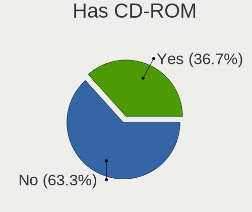
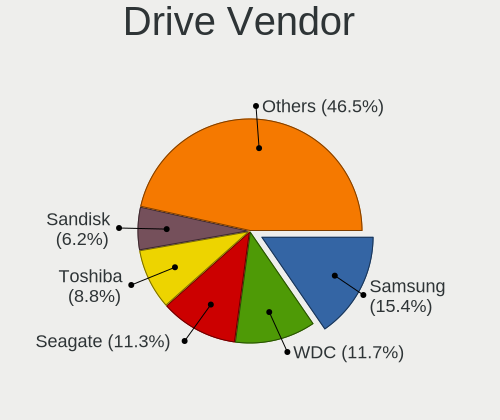

Ubuntu - Tested Hardware & Statistics (Notebooks)
-------------------------------------------------

A project to collect tested hardware configurations for Ubuntu.

Anyone can contribute to this report by the [hw-probe](https://github.com/linuxhw/hw-probe) tool:

    sudo -E hw-probe -all -upload

Please contribute! Especially if your hardware is rare.

Contents
--------

* [ Test Cases ](#test-cases)

* [ System ](#system)
  - [ OS                       ](#os)
  - [ OS Family                ](#os-family)
  - [ Kernel                   ](#kernel)
  - [ Kernel Family            ](#kernel-family)
  - [ Kernel Major Ver.        ](#kernel-major-ver)
  - [ Arch                     ](#arch)
  - [ DE                       ](#de)
  - [ Display Server           ](#display-server)
  - [ Display Manager          ](#display-manager)
  - [ OS Lang                  ](#os-lang)
  - [ Boot Mode                ](#boot-mode)
  - [ Filesystem               ](#filesystem)
  - [ Part. scheme             ](#part-scheme)
  - [ Dual Boot with Linux/BSD ](#dual-boot-with-linuxbsd)
  - [ Dual Boot (Win)          ](#dual-boot-win)

* [ Board ](#board)
  - [ Vendor                   ](#vendor)
  - [ Model                    ](#model)
  - [ Model Family             ](#model-family)
  - [ MFG Year                 ](#mfg-year)
  - [ Form Factor              ](#form-factor)
  - [ Secure Boot              ](#secure-boot)
  - [ Coreboot                 ](#coreboot)
  - [ RAM Size                 ](#ram-size)
  - [ RAM Used                 ](#ram-used)
  - [ Total Drives             ](#total-drives)
  - [ Has CD-ROM               ](#has-cd-rom)
  - [ Has Ethernet             ](#has-ethernet)
  - [ Has WiFi                 ](#has-wifi)
  - [ Has Bluetooth            ](#has-bluetooth)

* [ Location ](#location)
  - [ Country                  ](#country)
  - [ City                     ](#city)

* [ Drives ](#drives)
  - [ Drive Vendor             ](#drive-vendor)
  - [ Drive Model              ](#drive-model)
  - [ HDD Vendor               ](#hdd-vendor)
  - [ SSD Vendor               ](#ssd-vendor)
  - [ Drive Kind               ](#drive-kind)
  - [ Drive Connector          ](#drive-connector)
  - [ Drive Size               ](#drive-size)
  - [ Space Total              ](#space-total)
  - [ Space Used               ](#space-used)
  - [ Malfunc. Drives          ](#malfunc-drives)
  - [ Malfunc. Drive Vendor    ](#malfunc-drive-vendor)
  - [ Malfunc. HDD Vendor      ](#malfunc-hdd-vendor)
  - [ Malfunc. Drive Kind      ](#malfunc-drive-kind)
  - [ Failed Drives            ](#failed-drives)
  - [ Failed Drive Vendor      ](#failed-drive-vendor)
  - [ Drive Status             ](#drive-status)

* [ Storage controller ](#storage-controller)
  - [ Storage Vendor           ](#storage-vendor)
  - [ Storage Model            ](#storage-model)
  - [ Storage Kind             ](#storage-kind)

* [ Processor ](#processor)
  - [ CPU Vendor               ](#cpu-vendor)
  - [ CPU Model                ](#cpu-model)
  - [ CPU Model Family         ](#cpu-model-family)
  - [ CPU Cores                ](#cpu-cores)
  - [ CPU Sockets              ](#cpu-sockets)
  - [ CPU Threads              ](#cpu-threads)
  - [ CPU Op-Modes             ](#cpu-op-modes)
  - [ CPU Microcode            ](#cpu-microcode)
  - [ CPU Microarch            ](#cpu-microarch)

* [ Graphics ](#graphics)
  - [ GPU Vendor               ](#gpu-vendor)
  - [ GPU Model                ](#gpu-model)
  - [ GPU Combo                ](#gpu-combo)
  - [ GPU Driver               ](#gpu-driver)
  - [ GPU Memory               ](#gpu-memory)

* [ Monitor ](#monitor)
  - [ Monitor Vendor           ](#monitor-vendor)
  - [ Monitor Model            ](#monitor-model)
  - [ Monitor Resolution       ](#monitor-resolution)
  - [ Monitor Diagonal         ](#monitor-diagonal)
  - [ Monitor Width            ](#monitor-width)
  - [ Aspect Ratio             ](#aspect-ratio)
  - [ Monitor Area             ](#monitor-area)
  - [ Pixel Density            ](#pixel-density)
  - [ Multiple Monitors        ](#multiple-monitors)

* [ Network ](#network)
  - [ Net Controller Vendor    ](#net-controller-vendor)
  - [ Net Controller Model     ](#net-controller-model)
  - [ Wireless Vendor          ](#wireless-vendor)
  - [ Wireless Model           ](#wireless-model)
  - [ Ethernet Vendor          ](#ethernet-vendor)
  - [ Ethernet Model           ](#ethernet-model)
  - [ Net Controller Kind      ](#net-controller-kind)
  - [ Used Controller          ](#used-controller)
  - [ NICs                     ](#nics)
  - [ IPv6                     ](#ipv6)

* [ Bluetooth ](#bluetooth)
  - [ Bluetooth Vendor         ](#bluetooth-vendor)
  - [ Bluetooth Model          ](#bluetooth-model)

* [ Sound ](#sound)
  - [ Sound Vendor             ](#sound-vendor)
  - [ Sound Model              ](#sound-model)

* [ Memory ](#memory)
  - [ Memory Vendor            ](#memory-vendor)
  - [ Memory Model             ](#memory-model)
  - [ Memory Kind              ](#memory-kind)
  - [ Memory Form Factor       ](#memory-form-factor)
  - [ Memory Size              ](#memory-size)
  - [ Memory Speed             ](#memory-speed)

* [ Printers & scanners ](#printers--scanners)
  - [ Printer Vendor           ](#printer-vendor)
  - [ Printer Model            ](#printer-model)
  - [ Scanner Vendor           ](#scanner-vendor)
  - [ Scanner Model            ](#scanner-model)

* [ Camera ](#camera)
  - [ Camera Vendor            ](#camera-vendor)
  - [ Camera Model             ](#camera-model)

* [ Security ](#security)
  - [ Fingerprint Vendor       ](#fingerprint-vendor)
  - [ Fingerprint Model        ](#fingerprint-model)
  - [ Chipcard Vendor          ](#chipcard-vendor)
  - [ Chipcard Model           ](#chipcard-model)

* [ Unsupported ](#unsupported)
  - [ Unsupported Devices      ](#unsupported-devices)
  - [ Unsupported Device Types ](#unsupported-device-types)

Test Cases
----------

Total: 51470

| Vendor        | Model                       | Probe                                                      | Date         |
|---------------|-----------------------------|------------------------------------------------------------|--------------|
| Acer          | TMP645-M                    | [a062c55357](https://linux-hardware.org/?probe=a062c55357) | Nov 06, 2023 |
| Dell          | Latitude E6420              | [9fd076e986](https://linux-hardware.org/?probe=9fd076e986) | Nov 06, 2023 |
| Lenovo        | ThinkPad E14 20RA002UHV     | [79a037e80b](https://linux-hardware.org/?probe=79a037e80b) | Nov 06, 2023 |
| HP            | EliteBook 840 G5            | [279ac4ed92](https://linux-hardware.org/?probe=279ac4ed92) | Nov 06, 2023 |
| Lenovo        | IdeaPad 1 15ADA7 82R1       | [b88b3757af](https://linux-hardware.org/?probe=b88b3757af) | Nov 06, 2023 |
| MSI           | GL65 9SD                    | [d831c2e78e](https://linux-hardware.org/?probe=d831c2e78e) | Nov 06, 2023 |
| Lenovo        | IdeaPad 320-15ABR 80XS      | [b3e37dd334](https://linux-hardware.org/?probe=b3e37dd334) | Nov 06, 2023 |
| Lenovo        | IdeaPad 320-15ABR 80XS      | [f5a032555f](https://linux-hardware.org/?probe=f5a032555f) | Nov 06, 2023 |
| HP            | OMEN by Laptop 15-dc1xxx    | [6aaef57f51](https://linux-hardware.org/?probe=6aaef57f51) | Nov 06, 2023 |
| TUXEDO        | Pulse 15 Gen2               | [10f2785958](https://linux-hardware.org/?probe=10f2785958) | Nov 06, 2023 |
| Lenovo        | ThinkPad T440s 20ARS0HB0... | [95376bfed1](https://linux-hardware.org/?probe=95376bfed1) | Nov 06, 2023 |
| Lenovo        | ThinkPad T460s 20FAS2430... | [658d6f150e](https://linux-hardware.org/?probe=658d6f150e) | Nov 05, 2023 |
| Dell          | Latitude 5590               | [913308d97b](https://linux-hardware.org/?probe=913308d97b) | Nov 05, 2023 |
| Apple         | MacBookPro11,4              | [45dfbee68a](https://linux-hardware.org/?probe=45dfbee68a) | Nov 05, 2023 |
| Toshiba       | PORTEGE Z10t-A              | [600445b726](https://linux-hardware.org/?probe=600445b726) | Nov 05, 2023 |
| HP            | Laptop 15-db1xxx            | [3a69031984](https://linux-hardware.org/?probe=3a69031984) | Nov 05, 2023 |
| Lenovo        | IdeaPad 1 11IGL05 81VT      | [27923cd021](https://linux-hardware.org/?probe=27923cd021) | Nov 05, 2023 |
| Dell          | Inspiron 3521               | [00f864bd9e](https://linux-hardware.org/?probe=00f864bd9e) | Nov 05, 2023 |
| Acer          | Swift SF113-31              | [a6fbe4af41](https://linux-hardware.org/?probe=a6fbe4af41) | Nov 05, 2023 |
| ASUSTek       | K401UB                      | [3bc894aa34](https://linux-hardware.org/?probe=3bc894aa34) | Nov 05, 2023 |
| Acer          | Aspire A515-51              | [a0450fee29](https://linux-hardware.org/?probe=a0450fee29) | Nov 05, 2023 |
| HP            | Pavilion 17                 | [50a9cf65b3](https://linux-hardware.org/?probe=50a9cf65b3) | Nov 05, 2023 |
| Lenovo        | ThinkPad T580 20LAS62M07    | [56d9dc4a36](https://linux-hardware.org/?probe=56d9dc4a36) | Nov 05, 2023 |
| Dell          | Latitude E6400              | [c5f0762ae5](https://linux-hardware.org/?probe=c5f0762ae5) | Nov 05, 2023 |
| HP            | HPPavilionLaptop15-eh0xx... | [436064bfba](https://linux-hardware.org/?probe=436064bfba) | Nov 05, 2023 |
| HP            | ProBook 4740s               | [2efc1092dd](https://linux-hardware.org/?probe=2efc1092dd) | Nov 05, 2023 |
| HP            | ProBook 4740s               | [0351f35099](https://linux-hardware.org/?probe=0351f35099) | Nov 05, 2023 |
| HP            | Pavilion dm4                | [ed4309477f](https://linux-hardware.org/?probe=ed4309477f) | Nov 05, 2023 |
| Acer          | Aspire ES1-311              | [d06185f74c](https://linux-hardware.org/?probe=d06185f74c) | Nov 05, 2023 |
| HP            | 250 G5 Notebook PC          | [7b281cb925](https://linux-hardware.org/?probe=7b281cb925) | Nov 05, 2023 |
| Lenovo        | ThinkPad T470s W10DG 20J... | [ae9fcece31](https://linux-hardware.org/?probe=ae9fcece31) | Nov 05, 2023 |
| ASUSTek       | K55VJ                       | [47851a05e9](https://linux-hardware.org/?probe=47851a05e9) | Nov 05, 2023 |
| MSI           | Alpha 17 C7VG               | [fd9594de89](https://linux-hardware.org/?probe=fd9594de89) | Nov 05, 2023 |
| Google        | Pyro                        | [2fd8f11a53](https://linux-hardware.org/?probe=2fd8f11a53) | Nov 05, 2023 |
| ASUSTek       | X756UVK                     | [3ba2cc1e0c](https://linux-hardware.org/?probe=3ba2cc1e0c) | Nov 05, 2023 |
| Apple         | MacBookAir7,1               | [23e52fc4f5](https://linux-hardware.org/?probe=23e52fc4f5) | Nov 05, 2023 |
| ASUSTek       | VivoBook_ASUSLaptop X521... | [a3a6205085](https://linux-hardware.org/?probe=a3a6205085) | Nov 05, 2023 |
| Lenovo        | ThinkPad E580 20KS003QUS    | [6bccd355f7](https://linux-hardware.org/?probe=6bccd355f7) | Nov 05, 2023 |
| Medion        | E6417 MD99252               | [8660ae1c16](https://linux-hardware.org/?probe=8660ae1c16) | Nov 05, 2023 |
| Toshiba       | Satellite L750              | [f4cbcd5ba1](https://linux-hardware.org/?probe=f4cbcd5ba1) | Nov 05, 2023 |
| Toshiba       | Satellite L750              | [34a347877f](https://linux-hardware.org/?probe=34a347877f) | Nov 05, 2023 |
| Samsung       | 305E4A/305E5A/305E7A        | [257e40f6bd](https://linux-hardware.org/?probe=257e40f6bd) | Nov 05, 2023 |
| Acer          | Aspire E1-571G              | [fac63c4d5c](https://linux-hardware.org/?probe=fac63c4d5c) | Nov 05, 2023 |
| MSI           | Alpha 17 C7VG               | [a5a8cf5c09](https://linux-hardware.org/?probe=a5a8cf5c09) | Nov 05, 2023 |
| MSI           | Alpha 17 C7VG               | [74099b3a6e](https://linux-hardware.org/?probe=74099b3a6e) | Nov 05, 2023 |
| MSI           | Alpha 17 C7VG               | [bdad71bf99](https://linux-hardware.org/?probe=bdad71bf99) | Nov 05, 2023 |
| HUAWEI        | RLEF-XX                     | [21b415bccc](https://linux-hardware.org/?probe=21b415bccc) | Nov 05, 2023 |
| HP            | Pavilion Laptop 15-eh0xx... | [7a8597dd50](https://linux-hardware.org/?probe=7a8597dd50) | Nov 05, 2023 |
| Dell          | Inspiron 14 5401            | [124c666940](https://linux-hardware.org/?probe=124c666940) | Nov 05, 2023 |
| Dell          | Inspiron 14 5401            | [9eeeda059e](https://linux-hardware.org/?probe=9eeeda059e) | Nov 05, 2023 |
| Lenovo        | ThinkPad W541 20EGS0QG1Z    | [ae8881b2b2](https://linux-hardware.org/?probe=ae8881b2b2) | Nov 04, 2023 |
| Lenovo        | ThinkPad W541 20EGS0QG1Z    | [a3d91609e9](https://linux-hardware.org/?probe=a3d91609e9) | Nov 04, 2023 |
| Acer          | Aspire A517-51G             | [11f85eb258](https://linux-hardware.org/?probe=11f85eb258) | Nov 04, 2023 |
| Acer          | Aspire 7750G                | [ddf88ff37c](https://linux-hardware.org/?probe=ddf88ff37c) | Nov 04, 2023 |
| HP            | ProBook 430 G1              | [14dc35a1b9](https://linux-hardware.org/?probe=14dc35a1b9) | Nov 04, 2023 |
| Lenovo        | ThinkPad E15 20RD0011UK     | [dc13d6012b](https://linux-hardware.org/?probe=dc13d6012b) | Nov 04, 2023 |
| ASUSTek       | ROG Strix G733QR_G733QR     | [5b7dc65a39](https://linux-hardware.org/?probe=5b7dc65a39) | Nov 04, 2023 |
| Acer          | TravelMate B118-M           | [051346666e](https://linux-hardware.org/?probe=051346666e) | Nov 04, 2023 |
| Timi          | Redmi Book Pro 15 2022      | [2084300c18](https://linux-hardware.org/?probe=2084300c18) | Nov 04, 2023 |
| ASUSTek       | UX31A                       | [013a7815c3](https://linux-hardware.org/?probe=013a7815c3) | Nov 04, 2023 |
| Acer          | Aspire 5750                 | [3ba4126936](https://linux-hardware.org/?probe=3ba4126936) | Nov 04, 2023 |
| HUAWEI        | BOD-WXX9                    | [30a0e0602f](https://linux-hardware.org/?probe=30a0e0602f) | Nov 04, 2023 |
| Acer          | TravelMate P215-54          | [5688b7940d](https://linux-hardware.org/?probe=5688b7940d) | Nov 04, 2023 |
| Dell          | Inspiron 15 3511            | [4c97723997](https://linux-hardware.org/?probe=4c97723997) | Nov 04, 2023 |
| Lenovo        | ThinkPad T550 20CJS07P01    | [52157a4ee8](https://linux-hardware.org/?probe=52157a4ee8) | Nov 04, 2023 |
| Acer          | TravelMate P215-54          | [f051dc617c](https://linux-hardware.org/?probe=f051dc617c) | Nov 04, 2023 |
| Lenovo        | IdeaPad 320-15IKB 80XL      | [812ceefef6](https://linux-hardware.org/?probe=812ceefef6) | Nov 04, 2023 |
| ASUSTek       | VivoBook_ASUSLaptop M650... | [5e5e97717a](https://linux-hardware.org/?probe=5e5e97717a) | Nov 04, 2023 |
| Lenovo        | ThinkPad T480s 20L8S2N80... | [87abd90a63](https://linux-hardware.org/?probe=87abd90a63) | Nov 04, 2023 |
| Lenovo        | IdeaPad 3 14ABA7 82RM       | [a8bb556bfe](https://linux-hardware.org/?probe=a8bb556bfe) | Nov 04, 2023 |
| ASUSTek       | VivoBook_ASUSLaptop X415... | [aba7da7a37](https://linux-hardware.org/?probe=aba7da7a37) | Nov 04, 2023 |
| HP            | 15                          | [5d5fb36764](https://linux-hardware.org/?probe=5d5fb36764) | Nov 04, 2023 |
| Dell          | Latitude E6420              | [6bd73f2b0e](https://linux-hardware.org/?probe=6bd73f2b0e) | Nov 04, 2023 |
| HP            | EliteBook 840 G6            | [d4b22ac16a](https://linux-hardware.org/?probe=d4b22ac16a) | Nov 04, 2023 |
| HP            | Pavilion Gaming Laptop 1... | [669430e32e](https://linux-hardware.org/?probe=669430e32e) | Nov 04, 2023 |
| HP            | ZBook Studio G3             | [1fcf1ef0b5](https://linux-hardware.org/?probe=1fcf1ef0b5) | Nov 04, 2023 |
| Sony          | SVE15137CGW                 | [5d2a4746af](https://linux-hardware.org/?probe=5d2a4746af) | Nov 04, 2023 |
| AVITA         | NS14A2                      | [738e0008ce](https://linux-hardware.org/?probe=738e0008ce) | Nov 04, 2023 |
| Lenovo        | ThinkPad T61 6460D6G        | [1d51aba71e](https://linux-hardware.org/?probe=1d51aba71e) | Nov 04, 2023 |
| Lenovo        | Legion 5 15ARH05H 82B1      | [3d8056e30e](https://linux-hardware.org/?probe=3d8056e30e) | Nov 04, 2023 |
| HP            | ZBook Studio G3             | [eb90a23afa](https://linux-hardware.org/?probe=eb90a23afa) | Nov 04, 2023 |
| Lenovo        | ThinkPad T61 6460D6G        | [585906fa27](https://linux-hardware.org/?probe=585906fa27) | Nov 04, 2023 |
| American M... | A6                          | [4ff43d7d31](https://linux-hardware.org/?probe=4ff43d7d31) | Nov 04, 2023 |
| HP            | Pavilion Laptop 15-eh1xx... | [d0f3cf43b7](https://linux-hardware.org/?probe=d0f3cf43b7) | Nov 04, 2023 |
| Lenovo        | Legion 5 15ARH05H 82B1      | [546178d07d](https://linux-hardware.org/?probe=546178d07d) | Nov 04, 2023 |
| Acer          | Aspire A314-23P             | [1e3cdf0bf2](https://linux-hardware.org/?probe=1e3cdf0bf2) | Nov 04, 2023 |
| ASUSTek       | UX32VD                      | [7c4eefbe35](https://linux-hardware.org/?probe=7c4eefbe35) | Nov 04, 2023 |
| Dell          | XPS 15 7590                 | [8685e384af](https://linux-hardware.org/?probe=8685e384af) | Nov 04, 2023 |
| Dell          | Inspiron N4010              | [f8aed4abab](https://linux-hardware.org/?probe=f8aed4abab) | Nov 03, 2023 |
| Lenovo        | IdeaPad 100-15IBY 80MJ      | [abe3da8a30](https://linux-hardware.org/?probe=abe3da8a30) | Nov 03, 2023 |
| ASUSTek       | ROG Flow X13 GV301QH_GV3... | [de4c3bfe46](https://linux-hardware.org/?probe=de4c3bfe46) | Nov 03, 2023 |
| Dell          | Latitude E6420              | [1f2c5ea57b](https://linux-hardware.org/?probe=1f2c5ea57b) | Nov 03, 2023 |
| Lenovo        | IdeaPad 100-15IBY 80MJ      | [e7ccaf83d7](https://linux-hardware.org/?probe=e7ccaf83d7) | Nov 03, 2023 |
| Lenovo        | ThinkPad T460p 20FXS0960... | [10407542ab](https://linux-hardware.org/?probe=10407542ab) | Nov 03, 2023 |
| Lenovo        | ThinkPad E15 Gen 4 21EDC... | [b4d28df125](https://linux-hardware.org/?probe=b4d28df125) | Nov 03, 2023 |
| Lenovo        | B560 433028U                | [37a6693c3d](https://linux-hardware.org/?probe=37a6693c3d) | Nov 03, 2023 |
| VALE          | Notebook Classic C140       | [fd52185cf0](https://linux-hardware.org/?probe=fd52185cf0) | Nov 03, 2023 |
| HUAWEI        | MRGFG-XX                    | [5117a849b3](https://linux-hardware.org/?probe=5117a849b3) | Nov 03, 2023 |
| HUAWEI        | HLYL-WXX9                   | [993a2b9f3e](https://linux-hardware.org/?probe=993a2b9f3e) | Nov 03, 2023 |
| Medion        | ERAZER X7855 MD60892        | [b34c69b29d](https://linux-hardware.org/?probe=b34c69b29d) | Nov 03, 2023 |
| Dell          | XPS 13 9380                 | [ee12470303](https://linux-hardware.org/?probe=ee12470303) | Nov 03, 2023 |
| Acer          | Nitro AN515-54              | [ce98faee85](https://linux-hardware.org/?probe=ce98faee85) | Nov 03, 2023 |
| Dell          | Latitude E5570              | [a4617a2ea3](https://linux-hardware.org/?probe=a4617a2ea3) | Nov 03, 2023 |
| Dell          | Precision 5750              | [00e8468779](https://linux-hardware.org/?probe=00e8468779) | Nov 03, 2023 |
| Dell          | Latitude E5570              | [82d66aaaf1](https://linux-hardware.org/?probe=82d66aaaf1) | Nov 03, 2023 |
| Dell          | Inspiron 16 5625            | [157f3bd86a](https://linux-hardware.org/?probe=157f3bd86a) | Nov 03, 2023 |
| Lenovo        | ThinkPad 11e 5th Gen 20L... | [fca8401d97](https://linux-hardware.org/?probe=fca8401d97) | Nov 03, 2023 |
| HP            | EliteBook 845 14 inch G9... | [5ff77430fa](https://linux-hardware.org/?probe=5ff77430fa) | Nov 03, 2023 |
| Dell          | Vostro 3525                 | [48103e7e91](https://linux-hardware.org/?probe=48103e7e91) | Nov 03, 2023 |
| HP            | ProBook 445 G7              | [400a0e689f](https://linux-hardware.org/?probe=400a0e689f) | Nov 03, 2023 |
| HP            | ProBook 4330s               | [046f30b044](https://linux-hardware.org/?probe=046f30b044) | Nov 03, 2023 |
| Dell          | Inspiron 15-7568            | [70b564a0db](https://linux-hardware.org/?probe=70b564a0db) | Nov 03, 2023 |
| HP            | OMEN by Laptop 15-dc1xxx    | [0be20c3fe3](https://linux-hardware.org/?probe=0be20c3fe3) | Nov 03, 2023 |
| Lenovo        | ThinkPad E14 Gen 2 20TB0... | [6987861086](https://linux-hardware.org/?probe=6987861086) | Nov 03, 2023 |
| HP            | ZBook Power G7 Mobile Wo... | [044aa1f9b5](https://linux-hardware.org/?probe=044aa1f9b5) | Nov 03, 2023 |
| ASUSTek       | VivoBook_ASUSLaptop N740... | [7fd71a723a](https://linux-hardware.org/?probe=7fd71a723a) | Nov 03, 2023 |
| Acer          | Swift SF114-32              | [2314e30b70](https://linux-hardware.org/?probe=2314e30b70) | Nov 03, 2023 |
| Acer          | Swift SF114-32              | [ad12644dff](https://linux-hardware.org/?probe=ad12644dff) | Nov 03, 2023 |
| Lenovo        | IdeaPad 330-15IGM 81FN      | [5d06dbbe5f](https://linux-hardware.org/?probe=5d06dbbe5f) | Nov 03, 2023 |
| Apple         | MacBookAir7,1               | [50cb167f37](https://linux-hardware.org/?probe=50cb167f37) | Nov 03, 2023 |
| Star Labs     | StarBook                    | [288fdf6f55](https://linux-hardware.org/?probe=288fdf6f55) | Nov 02, 2023 |
| ASUSTek       | VivoBook_ASUSLaptop M150... | [4b04b9ef25](https://linux-hardware.org/?probe=4b04b9ef25) | Nov 02, 2023 |
| Lenovo        | IdeaPad 330-15IGM 81FN      | [9552d5f729](https://linux-hardware.org/?probe=9552d5f729) | Nov 02, 2023 |
| Dell          | Vostro 5590                 | [aa355fcc89](https://linux-hardware.org/?probe=aa355fcc89) | Nov 02, 2023 |
| HP            | ProBook 4330s               | [0d3ba579b4](https://linux-hardware.org/?probe=0d3ba579b4) | Nov 02, 2023 |
| Lenovo        | IdeaPad 3 15ITL6 82H8       | [b724ede64d](https://linux-hardware.org/?probe=b724ede64d) | Nov 02, 2023 |
| Lenovo        | ThinkPad L540 20AUS0YU00    | [16b302d74a](https://linux-hardware.org/?probe=16b302d74a) | Nov 02, 2023 |
| HP            | EliteBook 830 G5            | [8ab22982cc](https://linux-hardware.org/?probe=8ab22982cc) | Nov 02, 2023 |
| Dell          | Inspiron 1750               | [0250d0fe82](https://linux-hardware.org/?probe=0250d0fe82) | Nov 02, 2023 |
| Dell          | Inspiron 1750               | [39bb893e18](https://linux-hardware.org/?probe=39bb893e18) | Nov 02, 2023 |
| Dell          | Latitude E6530              | [878bc8ec66](https://linux-hardware.org/?probe=878bc8ec66) | Nov 02, 2023 |
| HP            | EliteBook 840 G5            | [a42017f05d](https://linux-hardware.org/?probe=a42017f05d) | Nov 02, 2023 |
| HP            | Laptop 15-bw0xx             | [589f0a0dfb](https://linux-hardware.org/?probe=589f0a0dfb) | Nov 02, 2023 |
| ASUSTek       | VivoBook_ASUSLaptop M140... | [f1b74562ae](https://linux-hardware.org/?probe=f1b74562ae) | Nov 02, 2023 |
| HP            | 250 G6 Notebook PC          | [7184f1aadf](https://linux-hardware.org/?probe=7184f1aadf) | Nov 02, 2023 |
| HP            | Laptop 15-dw3xxx            | [d371b7299d](https://linux-hardware.org/?probe=d371b7299d) | Nov 02, 2023 |
| Lenovo        | Legion 5 Pro 16ACH6H 82J... | [2d1120d99a](https://linux-hardware.org/?probe=2d1120d99a) | Nov 02, 2023 |
| Lenovo        | ThinkPad E14 20RAS13J00     | [ebfdc934b7](https://linux-hardware.org/?probe=ebfdc934b7) | Nov 02, 2023 |
| Dell          | XPS 13 9300                 | [9690e7a65f](https://linux-hardware.org/?probe=9690e7a65f) | Nov 02, 2023 |
| Lenovo        | ThinkPad X250 20CLS45J00    | [c03ae6e6b0](https://linux-hardware.org/?probe=c03ae6e6b0) | Nov 02, 2023 |
| Lenovo        | ThinkPad T15 Gen 2i 20W4... | [37dc32cd03](https://linux-hardware.org/?probe=37dc32cd03) | Nov 02, 2023 |
| ASUSTek       | ZenBook UX325EA_UX325EA     | [027a0a96da](https://linux-hardware.org/?probe=027a0a96da) | Nov 02, 2023 |
| ASUSTek       | ROG Strix G634JZ            | [62ed235c2f](https://linux-hardware.org/?probe=62ed235c2f) | Nov 02, 2023 |
| Apple         | MacBookPro16,1              | [9cdf3db89d](https://linux-hardware.org/?probe=9cdf3db89d) | Nov 02, 2023 |
| ASUSTek       | X555LAB                     | [b9532c1f86](https://linux-hardware.org/?probe=b9532c1f86) | Nov 02, 2023 |
| HUAWEI        | RLEF-XX                     | [e87403e608](https://linux-hardware.org/?probe=e87403e608) | Nov 02, 2023 |
| Google        | Nightfury                   | [ccee94a0ec](https://linux-hardware.org/?probe=ccee94a0ec) | Nov 02, 2023 |
| ASUSTek       | ASUS TUF Gaming A15 FA50... | [0c83d1e765](https://linux-hardware.org/?probe=0c83d1e765) | Nov 02, 2023 |
| Acer          | One S1002                   | [a00e6d78a6](https://linux-hardware.org/?probe=a00e6d78a6) | Nov 02, 2023 |
| Lenovo        | Yoga Slim 9 14IAP7 82T0     | [11e373f762](https://linux-hardware.org/?probe=11e373f762) | Nov 02, 2023 |
| Apple         | MacBookPro16,1              | [3c2964c23f](https://linux-hardware.org/?probe=3c2964c23f) | Nov 02, 2023 |
| Chuwi         | CoreBook Pro                | [ac0f4a1ea9](https://linux-hardware.org/?probe=ac0f4a1ea9) | Nov 01, 2023 |
| Lenovo        | IdeaPad 320-15IKB 81BG      | [99992393e4](https://linux-hardware.org/?probe=99992393e4) | Nov 01, 2023 |
| Novatech      | C141EK5-CI5TX               | [ee65041e06](https://linux-hardware.org/?probe=ee65041e06) | Nov 01, 2023 |
| HP            | Pavilion Gaming Laptop 1... | [54516fba78](https://linux-hardware.org/?probe=54516fba78) | Nov 01, 2023 |
| MSI           | GT73VR 6RF                  | [3930a59e72](https://linux-hardware.org/?probe=3930a59e72) | Nov 01, 2023 |
| HP            | Notebook                    | [3e766ed947](https://linux-hardware.org/?probe=3e766ed947) | Nov 01, 2023 |
| Sony          | VGN-CS21S_R                 | [a7eb8de9f5](https://linux-hardware.org/?probe=a7eb8de9f5) | Nov 01, 2023 |
| HP            | ZBook 15u G6                | [b74e35da2b](https://linux-hardware.org/?probe=b74e35da2b) | Nov 01, 2023 |
| ASUSTek       | VivoBook_ASUSLaptop M650... | [0c8b2cd660](https://linux-hardware.org/?probe=0c8b2cd660) | Nov 01, 2023 |
| HP            | Notebook                    | [47c0e83dcc](https://linux-hardware.org/?probe=47c0e83dcc) | Nov 01, 2023 |
| Dell          | Latitude 3410               | [4ffdc962bf](https://linux-hardware.org/?probe=4ffdc962bf) | Nov 01, 2023 |
| HP            | Pavilion dv6                | [e57ba14bc9](https://linux-hardware.org/?probe=e57ba14bc9) | Nov 01, 2023 |
| Apple         | MacBookPro8,1               | [f1387b3bd9](https://linux-hardware.org/?probe=f1387b3bd9) | Nov 01, 2023 |
| Lenovo        | IdeaPad S340-15API 81NC     | [af59fd3af9](https://linux-hardware.org/?probe=af59fd3af9) | Nov 01, 2023 |
| Google        | Akemi                       | [75082d5cf9](https://linux-hardware.org/?probe=75082d5cf9) | Nov 01, 2023 |
| MSI           | Titan GT77HX 13VI           | [1fb8b0ccb3](https://linux-hardware.org/?probe=1fb8b0ccb3) | Nov 01, 2023 |
| ASUSTek       | ASUS EXPERTBOOK B9450FA_... | [ed95443390](https://linux-hardware.org/?probe=ed95443390) | Nov 01, 2023 |
| ASUSTek       | G53JW                       | [fcc18f3b68](https://linux-hardware.org/?probe=fcc18f3b68) | Nov 01, 2023 |
| VALE          | Notebook Classic C140       | [5be309c18b](https://linux-hardware.org/?probe=5be309c18b) | Nov 01, 2023 |
| Samsung       | 960XFH                      | [6076e144ac](https://linux-hardware.org/?probe=6076e144ac) | Nov 01, 2023 |
| HP            | EliteBook 8470w             | [d4b6365e3f](https://linux-hardware.org/?probe=d4b6365e3f) | Nov 01, 2023 |
| HP            | ProBook 4530s               | [eac8e65d32](https://linux-hardware.org/?probe=eac8e65d32) | Nov 01, 2023 |
| Dell          | Latitude 5480               | [567a2774f8](https://linux-hardware.org/?probe=567a2774f8) | Nov 01, 2023 |
| Lenovo        | ThinkPad T14s Gen 3 21BR... | [9422d2efb5](https://linux-hardware.org/?probe=9422d2efb5) | Nov 01, 2023 |
| Lenovo        | V15-ADA 82C7                | [0c38487bcf](https://linux-hardware.org/?probe=0c38487bcf) | Nov 01, 2023 |
| Lenovo        | ThinkPad P16s Gen 1 21BT... | [5d58dd522f](https://linux-hardware.org/?probe=5d58dd522f) | Nov 01, 2023 |
| Dell          | Latitude 5421               | [670d635ddc](https://linux-hardware.org/?probe=670d635ddc) | Nov 01, 2023 |
| ASUSTek       | VivoBook_ASUSLaptop X150... | [8c2a216d7b](https://linux-hardware.org/?probe=8c2a216d7b) | Nov 01, 2023 |
| Teclast       | F6 Pro                      | [27dd740e4c](https://linux-hardware.org/?probe=27dd740e4c) | Nov 01, 2023 |
| HUAWEI        | MACH-WX9                    | [f557533925](https://linux-hardware.org/?probe=f557533925) | Nov 01, 2023 |
| Microtech     | CoreBookLite                | [1833fd5f0c](https://linux-hardware.org/?probe=1833fd5f0c) | Nov 01, 2023 |
| HUAWEI        | MACH-WX9                    | [50880de513](https://linux-hardware.org/?probe=50880de513) | Nov 01, 2023 |
| HP            | Laptop 15-dw3xxx            | [3479b99099](https://linux-hardware.org/?probe=3479b99099) | Nov 01, 2023 |
| Medion        | E6417 MD99252               | [56fcf238a1](https://linux-hardware.org/?probe=56fcf238a1) | Nov 01, 2023 |
| HP            | Pavilion dv6                | [031a3670bd](https://linux-hardware.org/?probe=031a3670bd) | Nov 01, 2023 |
| ASUSTek       | ROG Flow X13 GV301QH_GV3... | [6efacfa5c8](https://linux-hardware.org/?probe=6efacfa5c8) | Nov 01, 2023 |
| Dell          | G15 5510                    | [60ea93226d](https://linux-hardware.org/?probe=60ea93226d) | Nov 01, 2023 |
| Dell          | Inspiron 5502               | [a1d2f7988e](https://linux-hardware.org/?probe=a1d2f7988e) | Nov 01, 2023 |
| ASUSTek       | VivoBook_ASUSLaptop X512... | [3d00034c4e](https://linux-hardware.org/?probe=3d00034c4e) | Nov 01, 2023 |
| ASUSTek       | X550LD                      | [2d0fae2241](https://linux-hardware.org/?probe=2d0fae2241) | Nov 01, 2023 |
| HP            | 15                          | [9bafa55125](https://linux-hardware.org/?probe=9bafa55125) | Nov 01, 2023 |
| HP            | Pavilion Laptop 15-cw0xx... | [d7b08bbbab](https://linux-hardware.org/?probe=d7b08bbbab) | Nov 01, 2023 |
| Apple         | MacBook9,1                  | [44cec57d44](https://linux-hardware.org/?probe=44cec57d44) | Nov 01, 2023 |
| HP            | Pavilion Notebook           | [c0617fe23d](https://linux-hardware.org/?probe=c0617fe23d) | Nov 01, 2023 |
| HP            | 250 G5 Notebook PC          | [803bc8d1ed](https://linux-hardware.org/?probe=803bc8d1ed) | Oct 31, 2023 |
| Apple         | MacBookAir5,1               | [d7b563a839](https://linux-hardware.org/?probe=d7b563a839) | Oct 31, 2023 |
| Lenovo        | Unknown                     | [70268d88a4](https://linux-hardware.org/?probe=70268d88a4) | Oct 31, 2023 |
| HP            | Laptop 15s-fq5xxx           | [18398fe53c](https://linux-hardware.org/?probe=18398fe53c) | Oct 31, 2023 |
| Lenovo        | ThinkPad T530 24296JG       | [b443eebcad](https://linux-hardware.org/?probe=b443eebcad) | Oct 31, 2023 |
| ASUSTek       | VivoBook_ASUSLaptop X430... | [2e35f866e3](https://linux-hardware.org/?probe=2e35f866e3) | Oct 31, 2023 |
| HP            | ProBook 4530s               | [44160e2dc0](https://linux-hardware.org/?probe=44160e2dc0) | Oct 31, 2023 |
| ASUSTek       | G53JW                       | [6795430efa](https://linux-hardware.org/?probe=6795430efa) | Oct 31, 2023 |
| Lenovo        | ThinkPad T490 20N3000FRT    | [14710d3709](https://linux-hardware.org/?probe=14710d3709) | Oct 31, 2023 |
| Samsung       | 930XDB/931XDB/930XDY        | [421368e431](https://linux-hardware.org/?probe=421368e431) | Oct 31, 2023 |
| Fujitsu       | LIFEBOOK U7510              | [e25f9a6add](https://linux-hardware.org/?probe=e25f9a6add) | Oct 31, 2023 |
| Lenovo        | ThinkPad T480 20L6SH3L2D    | [db3f0ac717](https://linux-hardware.org/?probe=db3f0ac717) | Oct 31, 2023 |
| Dell          | Precision 5570              | [fb83199260](https://linux-hardware.org/?probe=fb83199260) | Oct 31, 2023 |
| Lenovo        | ThinkPad E14 20RAS13J00     | [91a0aacae9](https://linux-hardware.org/?probe=91a0aacae9) | Oct 31, 2023 |
| Dell          | Latitude 7430               | [3e9717ffe0](https://linux-hardware.org/?probe=3e9717ffe0) | Oct 31, 2023 |
| Google        | Candy                       | [800a001d89](https://linux-hardware.org/?probe=800a001d89) | Oct 31, 2023 |
| HP            | Laptop 15-db0xxx            | [cf7f0c142e](https://linux-hardware.org/?probe=cf7f0c142e) | Oct 31, 2023 |
| HP            | EliteBook 820 G3            | [e131dccf11](https://linux-hardware.org/?probe=e131dccf11) | Oct 31, 2023 |
| Lenovo        | ThinkBook 15p Gen 2 21B1    | [a0da22e928](https://linux-hardware.org/?probe=a0da22e928) | Oct 31, 2023 |
| Alienware     | 13 R3                       | [726415f251](https://linux-hardware.org/?probe=726415f251) | Oct 31, 2023 |
| Dell          | XPS 15 9530                 | [683545565a](https://linux-hardware.org/?probe=683545565a) | Oct 31, 2023 |
| Lenovo        | V145-15AST 81MT             | [6bd7131347](https://linux-hardware.org/?probe=6bd7131347) | Oct 31, 2023 |
| Acer          | One 14 Z8-415               | [e3b7fce5f3](https://linux-hardware.org/?probe=e3b7fce5f3) | Oct 31, 2023 |
| HP            | Pavilion Laptop 15-eh2xx... | [2a589a5505](https://linux-hardware.org/?probe=2a589a5505) | Oct 31, 2023 |
| HP            | Pavilion Laptop 15-eh2xx... | [daa299c314](https://linux-hardware.org/?probe=daa299c314) | Oct 31, 2023 |
| Dell          | Inspiron 7580               | [fc223b91ed](https://linux-hardware.org/?probe=fc223b91ed) | Oct 31, 2023 |
| Lenovo        | V15-ADA 82C7                | [e8ea93da6d](https://linux-hardware.org/?probe=e8ea93da6d) | Oct 31, 2023 |
| Dell          | Inspiron 5590               | [7634c564d0](https://linux-hardware.org/?probe=7634c564d0) | Oct 31, 2023 |
| Dell          | Precision M6800             | [72c51649f1](https://linux-hardware.org/?probe=72c51649f1) | Oct 31, 2023 |
| Dell          | Latitude E5520              | [445903fc05](https://linux-hardware.org/?probe=445903fc05) | Oct 31, 2023 |
| Dell          | Latitude 5420               | [c2f4052fb4](https://linux-hardware.org/?probe=c2f4052fb4) | Oct 31, 2023 |
| Lenovo        | Z50-70 20354                | [8d764a9632](https://linux-hardware.org/?probe=8d764a9632) | Oct 31, 2023 |
| Lenovo        | ThinkPad T16 Gen 1 21CHC... | [924f7f81ce](https://linux-hardware.org/?probe=924f7f81ce) | Oct 30, 2023 |
| Dell          | Inspiron 5590               | [d339ee4dbc](https://linux-hardware.org/?probe=d339ee4dbc) | Oct 30, 2023 |
| OFF GLOBAL    | Nokia PureBook Pro 17       | [5bc799ab5a](https://linux-hardware.org/?probe=5bc799ab5a) | Oct 30, 2023 |
| HP            | Pavilion Gaming Laptop 1... | [43772c58a4](https://linux-hardware.org/?probe=43772c58a4) | Oct 30, 2023 |
| Lenovo        | IdeaPad 5 14ALC05 82LM      | [32d642cc3b](https://linux-hardware.org/?probe=32d642cc3b) | Oct 30, 2023 |
| Lenovo        | ThinkPad L540 20AV005GIX    | [ca59c544ef](https://linux-hardware.org/?probe=ca59c544ef) | Oct 30, 2023 |
| HP            | Victus by Laptop 16-e0xx... | [309695dc7e](https://linux-hardware.org/?probe=309695dc7e) | Oct 30, 2023 |
| HP            | ZBook Studio G3             | [173639f83c](https://linux-hardware.org/?probe=173639f83c) | Oct 30, 2023 |
| Dell          | Inspiron 5559               | [5a8a67bb6b](https://linux-hardware.org/?probe=5a8a67bb6b) | Oct 30, 2023 |
| Apple         | MacBookAir6,2               | [b1a709477b](https://linux-hardware.org/?probe=b1a709477b) | Oct 30, 2023 |
| Lenovo        | ThinkPad T530 23924FJ       | [c8b87fb249](https://linux-hardware.org/?probe=c8b87fb249) | Oct 30, 2023 |
| ASUSTek       | ZenBook UX325EA_UX325EA     | [dd2e706549](https://linux-hardware.org/?probe=dd2e706549) | Oct 30, 2023 |
| Lenovo        | ThinkPad T530 23924FJ       | [b64508402a](https://linux-hardware.org/?probe=b64508402a) | Oct 30, 2023 |
| Dell          | Precision 3541              | [6857b35adc](https://linux-hardware.org/?probe=6857b35adc) | Oct 30, 2023 |
| ASUSTek       | Zenbook UX5401ZAS_UX5401... | [0e14e6c7dc](https://linux-hardware.org/?probe=0e14e6c7dc) | Oct 30, 2023 |
| HP            | EliteBook 8460p             | [7d6972297f](https://linux-hardware.org/?probe=7d6972297f) | Oct 30, 2023 |
| HP            | ProBook 450 G8 Notebook ... | [09b312b58c](https://linux-hardware.org/?probe=09b312b58c) | Oct 30, 2023 |
| Lenovo        | IdeaPad 510-15ISK 80SR      | [15573e8d54](https://linux-hardware.org/?probe=15573e8d54) | Oct 30, 2023 |
| Wortmann      | 1220766_1470449             | [a8eecd22f4](https://linux-hardware.org/?probe=a8eecd22f4) | Oct 30, 2023 |
| MSI           | GF75 Thin 10UEK             | [c9cb087088](https://linux-hardware.org/?probe=c9cb087088) | Oct 30, 2023 |
| HP            | EliteBook 830 G8 Noteboo... | [0e7bb14862](https://linux-hardware.org/?probe=0e7bb14862) | Oct 30, 2023 |
| HP            | ProBook 640 G1              | [cf78ef09d2](https://linux-hardware.org/?probe=cf78ef09d2) | Oct 30, 2023 |
| Apple         | MacBookAir6,2               | [afd23e164c](https://linux-hardware.org/?probe=afd23e164c) | Oct 30, 2023 |
| ASUSTek       | VivoBook_ASUSLaptop X521... | [6e619afdba](https://linux-hardware.org/?probe=6e619afdba) | Oct 30, 2023 |
| Dell          | Latitude 5400               | [e7f91d1c69](https://linux-hardware.org/?probe=e7f91d1c69) | Oct 30, 2023 |
| ASUSTek       | VivoBook 15_ASUS Laptop ... | [ed3aee0fd5](https://linux-hardware.org/?probe=ed3aee0fd5) | Oct 30, 2023 |
| MSI           | GF75 Thin 10UEK             | [a58fbe3576](https://linux-hardware.org/?probe=a58fbe3576) | Oct 30, 2023 |
| ASUSTek       | N53SV                       | [8d853d0cb4](https://linux-hardware.org/?probe=8d853d0cb4) | Oct 30, 2023 |
| ASUSTek       | Zenbook UM3402YA_UM3402Y... | [794edd04ea](https://linux-hardware.org/?probe=794edd04ea) | Oct 30, 2023 |
| Lenovo        | IdeaPad Gaming 3 15ARH05... | [ecab2bb9fe](https://linux-hardware.org/?probe=ecab2bb9fe) | Oct 30, 2023 |
| HP            | Laptop 15-bw0xx             | [b61ad8059a](https://linux-hardware.org/?probe=b61ad8059a) | Oct 30, 2023 |
| Dell          | XPS 15 9510                 | [ab707308db](https://linux-hardware.org/?probe=ab707308db) | Oct 30, 2023 |
| Fujitsu       | LIFEBOOK P771               | [d92d1fa97d](https://linux-hardware.org/?probe=d92d1fa97d) | Oct 30, 2023 |
| Toshiba       | Satellite A300              | [e4c2011e59](https://linux-hardware.org/?probe=e4c2011e59) | Oct 30, 2023 |
| LG Electro... | 14Z980-G.BH51P1             | [879ba00b91](https://linux-hardware.org/?probe=879ba00b91) | Oct 30, 2023 |
| Chuwi         | CoreBook                    | [71b0d03991](https://linux-hardware.org/?probe=71b0d03991) | Oct 30, 2023 |
| Lenovo        | IdeaPad 3 14ALC6 82KT       | [17f4f01635](https://linux-hardware.org/?probe=17f4f01635) | Oct 30, 2023 |
| HP            | ProBook 6570b               | [5b574791fa](https://linux-hardware.org/?probe=5b574791fa) | Oct 30, 2023 |
| HP            | G60                         | [ad911271b1](https://linux-hardware.org/?probe=ad911271b1) | Oct 30, 2023 |
| Apple         | MacBookPro14,1              | [12e8c83970](https://linux-hardware.org/?probe=12e8c83970) | Oct 30, 2023 |
| HUAWEI        | BOHB-WAX9                   | [5da6238372](https://linux-hardware.org/?probe=5da6238372) | Oct 30, 2023 |
| HUAWEI        | WRTD-WXX9                   | [ec6be29d3e](https://linux-hardware.org/?probe=ec6be29d3e) | Oct 29, 2023 |
| Sony          | VPCEH1L0E                   | [2a5fa0340e](https://linux-hardware.org/?probe=2a5fa0340e) | Oct 29, 2023 |
| Sony          | VPCEH1L0E                   | [103e485a0f](https://linux-hardware.org/?probe=103e485a0f) | Oct 29, 2023 |
| Lenovo        | ThinkPad T460s 20F90039U... | [8df2c91111](https://linux-hardware.org/?probe=8df2c91111) | Oct 29, 2023 |
| Dell          | XPS 13 9300                 | [f8df9730e1](https://linux-hardware.org/?probe=f8df9730e1) | Oct 29, 2023 |
| HUAWEI        | KLVL-WXXW                   | [672304cacd](https://linux-hardware.org/?probe=672304cacd) | Oct 29, 2023 |
| GITSTAR       | GDC-1461                    | [ece71c7e63](https://linux-hardware.org/?probe=ece71c7e63) | Oct 29, 2023 |
| Dell          | Precision 3550              | [f07af59705](https://linux-hardware.org/?probe=f07af59705) | Oct 29, 2023 |
| Acer          | Aspire 4820TG               | [a72ac510df](https://linux-hardware.org/?probe=a72ac510df) | Oct 29, 2023 |
| HP            | Pavilion 17                 | [2ef396fb9c](https://linux-hardware.org/?probe=2ef396fb9c) | Oct 29, 2023 |
| Sony          | VPCCW13FB                   | [96516448b2](https://linux-hardware.org/?probe=96516448b2) | Oct 29, 2023 |
| HP            | G62                         | [bd714e9671](https://linux-hardware.org/?probe=bd714e9671) | Oct 29, 2023 |
| Sony          | VPCCW13FB                   | [7092dfafd9](https://linux-hardware.org/?probe=7092dfafd9) | Oct 29, 2023 |
| Acer          | Extensa 5220                | [d9fbe1bc8a](https://linux-hardware.org/?probe=d9fbe1bc8a) | Oct 29, 2023 |
| ASUSTek       | VivoBook 12_ASUS Laptop ... | [7bdcd09429](https://linux-hardware.org/?probe=7bdcd09429) | Oct 29, 2023 |
| HUAWEI        | HKD-WXX                     | [101c8c676c](https://linux-hardware.org/?probe=101c8c676c) | Oct 29, 2023 |
| Lenovo        | ThinkPad T590 20N5S56P00    | [c410852108](https://linux-hardware.org/?probe=c410852108) | Oct 29, 2023 |
| Allview       | Allbook H                   | [e56046d262](https://linux-hardware.org/?probe=e56046d262) | Oct 29, 2023 |
| Allview       | Allbook H                   | [3f2fc29d49](https://linux-hardware.org/?probe=3f2fc29d49) | Oct 29, 2023 |
| Lenovo        | IdeaPad Slim 3 14AMN8 82... | [3fe09c27c2](https://linux-hardware.org/?probe=3fe09c27c2) | Oct 29, 2023 |
| Dell          | Vostro 15 3515              | [3d2fe89bc1](https://linux-hardware.org/?probe=3d2fe89bc1) | Oct 29, 2023 |
| Dell          | Latitude E5450              | [64e3601d4c](https://linux-hardware.org/?probe=64e3601d4c) | Oct 29, 2023 |
| Lenovo        | ThinkPad T450s 20BWS58K0... | [11b2f76301](https://linux-hardware.org/?probe=11b2f76301) | Oct 29, 2023 |
| Panasonic     | CF-195DCUBML                | [e9e34a8b3b](https://linux-hardware.org/?probe=e9e34a8b3b) | Oct 29, 2023 |
| Panasonic     | CF-191HA23DE                | [3ccc424983](https://linux-hardware.org/?probe=3ccc424983) | Oct 29, 2023 |
| Dell          | Latitude E5450              | [aebf2cd9fb](https://linux-hardware.org/?probe=aebf2cd9fb) | Oct 29, 2023 |
| HP            | 2000                        | [440350f9df](https://linux-hardware.org/?probe=440350f9df) | Oct 29, 2023 |
| Samsung       | 905S3G/906S3G/915S3G/930... | [bc2ed6322b](https://linux-hardware.org/?probe=bc2ed6322b) | Oct 29, 2023 |
| ASUSTek       | G56JR                       | [8e871997f7](https://linux-hardware.org/?probe=8e871997f7) | Oct 29, 2023 |
| Lenovo        | G50-70 20351                | [5d83a07987](https://linux-hardware.org/?probe=5d83a07987) | Oct 29, 2023 |
| ASUSTek       | G56JR                       | [f8e77bd53a](https://linux-hardware.org/?probe=f8e77bd53a) | Oct 28, 2023 |
| ASUSTek       | ZenBook UX431FA_UX431FA     | [8f56c1076b](https://linux-hardware.org/?probe=8f56c1076b) | Oct 28, 2023 |
| Lenovo        | ThinkPad T440s 20ARS32P0... | [58234989c1](https://linux-hardware.org/?probe=58234989c1) | Oct 28, 2023 |
| ASUSTek       | ASUS TUF Gaming F15 FX50... | [22380583c4](https://linux-hardware.org/?probe=22380583c4) | Oct 28, 2023 |
| Lenovo        | G770 20089                  | [8428ba05f5](https://linux-hardware.org/?probe=8428ba05f5) | Oct 28, 2023 |
| ASUSTek       | ASUS TUF Gaming F15 FX50... | [b83a355a39](https://linux-hardware.org/?probe=b83a355a39) | Oct 28, 2023 |
| HP            | 15                          | [cda635d432](https://linux-hardware.org/?probe=cda635d432) | Oct 28, 2023 |
| Acer          | Nitro AN515-58              | [9a879f3fbe](https://linux-hardware.org/?probe=9a879f3fbe) | Oct 28, 2023 |
| HUAWEI        | NBLB-WAX9N                  | [67a82dac1b](https://linux-hardware.org/?probe=67a82dac1b) | Oct 28, 2023 |
| Acer          | Extensa 215-55              | [d1d57049ab](https://linux-hardware.org/?probe=d1d57049ab) | Oct 28, 2023 |
| MSI           | Modern 15 A5M               | [903418110a](https://linux-hardware.org/?probe=903418110a) | Oct 28, 2023 |
| Lenovo        | ThinkPad P14s Gen 1 20Y1... | [42a94f2f97](https://linux-hardware.org/?probe=42a94f2f97) | Oct 28, 2023 |
| HP            | Pavilion dv6                | [cb8ef15ece](https://linux-hardware.org/?probe=cb8ef15ece) | Oct 28, 2023 |
| HP            | Pavilion dv6                | [88a3365d2c](https://linux-hardware.org/?probe=88a3365d2c) | Oct 28, 2023 |
| Lenovo        | IdeaPad Slim 3 14AMN8 82... | [0277411276](https://linux-hardware.org/?probe=0277411276) | Oct 28, 2023 |
| Packard Be... | EasyNote MH36               | [6d73774152](https://linux-hardware.org/?probe=6d73774152) | Oct 28, 2023 |
| Google        | Taniks                      | [c864f19e03](https://linux-hardware.org/?probe=c864f19e03) | Oct 28, 2023 |
| SLIMBOOK      | PROX14-10                   | [4ffcd3ced8](https://linux-hardware.org/?probe=4ffcd3ced8) | Oct 28, 2023 |
| HP            | 6360t                       | [d0f94e770b](https://linux-hardware.org/?probe=d0f94e770b) | Oct 28, 2023 |
| Lenovo        | IdeaPad S340-15IIL 81VW     | [4468cb093d](https://linux-hardware.org/?probe=4468cb093d) | Oct 28, 2023 |
| Acer          | Aspire E5-571               | [681e404df8](https://linux-hardware.org/?probe=681e404df8) | Oct 28, 2023 |
| Lenovo        | IdeaPad S340-15IIL 81VW     | [c0aef363fa](https://linux-hardware.org/?probe=c0aef363fa) | Oct 28, 2023 |
| Clevo         | W240EL/W250ELQ/W270ELQ      | [cb44c39574](https://linux-hardware.org/?probe=cb44c39574) | Oct 27, 2023 |
| Lenovo        | ThinkPad E14 Gen 4 21ECS... | [6fe7d8e13b](https://linux-hardware.org/?probe=6fe7d8e13b) | Oct 27, 2023 |
| HP            | Laptop 15s-fq3xxx           | [b718818efa](https://linux-hardware.org/?probe=b718818efa) | Oct 27, 2023 |
| HP            | ZBook Studio G3             | [9659254017](https://linux-hardware.org/?probe=9659254017) | Oct 27, 2023 |
| ASUSTek       | ASUS TUF Gaming A15 FA50... | [9aa7655975](https://linux-hardware.org/?probe=9aa7655975) | Oct 27, 2023 |
| Dell          | Latitude 5480               | [2d87cfcbb4](https://linux-hardware.org/?probe=2d87cfcbb4) | Oct 27, 2023 |
| HP            | Laptop 15s-fq5xxx           | [773814f03f](https://linux-hardware.org/?probe=773814f03f) | Oct 27, 2023 |
| Lenovo        | IdeaPad 3 17ITL6 82H9       | [20d212f3d4](https://linux-hardware.org/?probe=20d212f3d4) | Oct 27, 2023 |
| Lenovo        | ThinkPad E15 Gen 2 20TD0... | [181d68d988](https://linux-hardware.org/?probe=181d68d988) | Oct 27, 2023 |
| Apple         | MacBookPro7,1               | [fe15ca03f2](https://linux-hardware.org/?probe=fe15ca03f2) | Oct 27, 2023 |
| HP            | Laptop 15s-fq5xxx           | [72d2f9d210](https://linux-hardware.org/?probe=72d2f9d210) | Oct 27, 2023 |
| Notebook      | V1x0PNPx                    | [f1e27c662a](https://linux-hardware.org/?probe=f1e27c662a) | Oct 27, 2023 |
| Dell          | Inspiron MM061              | [d4b3f62ecb](https://linux-hardware.org/?probe=d4b3f62ecb) | Oct 27, 2023 |
| MSI           | Modern 15 A10M              | [79b0d0252f](https://linux-hardware.org/?probe=79b0d0252f) | Oct 27, 2023 |
| Lenovo        | ThinkBook 14-IIL 20SL       | [a3355c6898](https://linux-hardware.org/?probe=a3355c6898) | Oct 27, 2023 |
| Dell          | XPS 15 9530                 | [dbc8a87975](https://linux-hardware.org/?probe=dbc8a87975) | Oct 27, 2023 |
| Lenovo        | ThinkPad T440p 20AWS2SY0... | [ac167b7da7](https://linux-hardware.org/?probe=ac167b7da7) | Oct 27, 2023 |
| HP            | Laptop 14-ma0xxx            | [8482e4e6c2](https://linux-hardware.org/?probe=8482e4e6c2) | Oct 27, 2023 |
| Dell          | Vostro 15 5510              | [b01f7c48f6](https://linux-hardware.org/?probe=b01f7c48f6) | Oct 27, 2023 |
| Dell          | G7 7590                     | [90cbef58c2](https://linux-hardware.org/?probe=90cbef58c2) | Oct 27, 2023 |
| Dell          | Inspiron 3451               | [2c1267e536](https://linux-hardware.org/?probe=2c1267e536) | Oct 27, 2023 |
| HP            | Laptop 17-cp2xxx            | [788d8538b6](https://linux-hardware.org/?probe=788d8538b6) | Oct 27, 2023 |
| ASUSTek       | X550CL                      | [a95ddd6798](https://linux-hardware.org/?probe=a95ddd6798) | Oct 26, 2023 |
| HP            | OMEN by Laptop 16-c0xxx     | [311f057665](https://linux-hardware.org/?probe=311f057665) | Oct 26, 2023 |
| Fujitsu       | LIFEBOOK E752               | [c1078c11fb](https://linux-hardware.org/?probe=c1078c11fb) | Oct 26, 2023 |
| Dell          | Inspiron 1545               | [bb1c07781b](https://linux-hardware.org/?probe=bb1c07781b) | Oct 26, 2023 |
| MSI           | MS-1688                     | [c3689c0452](https://linux-hardware.org/?probe=c3689c0452) | Oct 26, 2023 |
| Lenovo        | IdeaPad 320-15IKB 80XL      | [acc4051b9c](https://linux-hardware.org/?probe=acc4051b9c) | Oct 26, 2023 |
| Intel         | Unknown                     | [89725d512d](https://linux-hardware.org/?probe=89725d512d) | Oct 26, 2023 |
| Unknown       | Unknown                     | [d246d98312](https://linux-hardware.org/?probe=d246d98312) | Oct 26, 2023 |
| HP            | ProBook 650 G1              | [b05283573c](https://linux-hardware.org/?probe=b05283573c) | Oct 26, 2023 |
| HUAWEI        | NBM-WXX9                    | [9444fd16a7](https://linux-hardware.org/?probe=9444fd16a7) | Oct 26, 2023 |
| Acer          | TravelMate P259-M           | [7c1c04b9b2](https://linux-hardware.org/?probe=7c1c04b9b2) | Oct 26, 2023 |
| Lenovo        | IdeaPad Gaming 3 15ACH6 ... | [2bee900f03](https://linux-hardware.org/?probe=2bee900f03) | Oct 26, 2023 |
| Acer          | TravelMate P259-M           | [670cd56ea3](https://linux-hardware.org/?probe=670cd56ea3) | Oct 26, 2023 |
| Dell          | Latitude 7430               | [8acfccfbef](https://linux-hardware.org/?probe=8acfccfbef) | Oct 26, 2023 |
| Samsung       | 900X3C/900X3D/900X3E/900... | [d7ffb73521](https://linux-hardware.org/?probe=d7ffb73521) | Oct 26, 2023 |
| Lenovo        | ThinkPad E14 Gen 4 21ECS... | [b6925d5638](https://linux-hardware.org/?probe=b6925d5638) | Oct 26, 2023 |
| HP            | ProBook 650 G1              | [5b2aac75a9](https://linux-hardware.org/?probe=5b2aac75a9) | Oct 26, 2023 |
| Acer          | Extensa 215-55              | [410da8fbb8](https://linux-hardware.org/?probe=410da8fbb8) | Oct 26, 2023 |
| Unknown       | X133                        | [c653721c37](https://linux-hardware.org/?probe=c653721c37) | Oct 26, 2023 |
| HP            | ProBook 440 G6              | [f3407cd11d](https://linux-hardware.org/?probe=f3407cd11d) | Oct 26, 2023 |
| Acer          | Swift SFG14-71              | [bba9f221f9](https://linux-hardware.org/?probe=bba9f221f9) | Oct 26, 2023 |
| Lenovo        | G570 20079                  | [37b9c54cea](https://linux-hardware.org/?probe=37b9c54cea) | Oct 26, 2023 |
| ASUSTek       | GL553VD                     | [d1e94fb70b](https://linux-hardware.org/?probe=d1e94fb70b) | Oct 26, 2023 |
| Razer         | Blade Stealth               | [0ebbfdba6a](https://linux-hardware.org/?probe=0ebbfdba6a) | Oct 26, 2023 |
| Chuwi         | GemiBook Pro                | [e2900eda68](https://linux-hardware.org/?probe=e2900eda68) | Oct 26, 2023 |
| Lenovo        | IdeaPad 3 15IAU7 82RK       | [3d4390ca08](https://linux-hardware.org/?probe=3d4390ca08) | Oct 26, 2023 |
| Dell          | XPS 13 9370                 | [0c1002fb74](https://linux-hardware.org/?probe=0c1002fb74) | Oct 26, 2023 |
| HP            | EliteBook 8560p             | [101037a3e1](https://linux-hardware.org/?probe=101037a3e1) | Oct 25, 2023 |
| Lenovo        | ThinkPad T460 20FMS3YG01    | [b23f4c86cb](https://linux-hardware.org/?probe=b23f4c86cb) | Oct 25, 2023 |
| Lenovo        | Yoga Slim 7 ProX 14ARH7 ... | [2473987add](https://linux-hardware.org/?probe=2473987add) | Oct 25, 2023 |
| Lenovo        | IdeaPad 5 15ITL05 82FG      | [c09c90cd1f](https://linux-hardware.org/?probe=c09c90cd1f) | Oct 25, 2023 |
| Acer          | Aspire 5739G                | [21f871b008](https://linux-hardware.org/?probe=21f871b008) | Oct 25, 2023 |
| Samsung       | R780                        | [c54b18ab4a](https://linux-hardware.org/?probe=c54b18ab4a) | Oct 25, 2023 |
| Sony          | SVE1712V1EB                 | [3b8803286b](https://linux-hardware.org/?probe=3b8803286b) | Oct 25, 2023 |
| XIAOMI        | Redmi Book Pro 15 2023      | [556cd62b51](https://linux-hardware.org/?probe=556cd62b51) | Oct 25, 2023 |
| HP            | 250 G4 Notebook PC          | [1f7bb1fb21](https://linux-hardware.org/?probe=1f7bb1fb21) | Oct 25, 2023 |
| Sony          | SVE1712V1EB                 | [63963cbe04](https://linux-hardware.org/?probe=63963cbe04) | Oct 25, 2023 |
| XIAOMI        | Redmi Book Pro 15 2023      | [c764389042](https://linux-hardware.org/?probe=c764389042) | Oct 25, 2023 |
| HP            | 250 G4 Notebook PC          | [8e0cdb93fe](https://linux-hardware.org/?probe=8e0cdb93fe) | Oct 25, 2023 |
| Acer          | Aspire A514-55              | [4d1e460056](https://linux-hardware.org/?probe=4d1e460056) | Oct 25, 2023 |
| ASUSTek       | Zenbook UX3402ZA            | [f321493adb](https://linux-hardware.org/?probe=f321493adb) | Oct 25, 2023 |
| Acer          | Aspire A514-55              | [3a1de9e1d1](https://linux-hardware.org/?probe=3a1de9e1d1) | Oct 25, 2023 |
| Lenovo        | Y720-15IKB 81CQ             | [7aec151a1c](https://linux-hardware.org/?probe=7aec151a1c) | Oct 25, 2023 |
| HP            | 255 15.6 inch G10 Notebo... | [6b46392321](https://linux-hardware.org/?probe=6b46392321) | Oct 25, 2023 |
| ASUSTek       | X550LD                      | [cb2e25f26f](https://linux-hardware.org/?probe=cb2e25f26f) | Oct 25, 2023 |
| Dell          | Vostro 3500                 | [d105da96dd](https://linux-hardware.org/?probe=d105da96dd) | Oct 25, 2023 |
| Dell          | Precision 7550              | [b6f0ce0285](https://linux-hardware.org/?probe=b6f0ce0285) | Oct 25, 2023 |
| Infinix       | INBOOK X2 SLIM              | [03333fbe23](https://linux-hardware.org/?probe=03333fbe23) | Oct 25, 2023 |
| GITSTAR       | GDC-1461                    | [dbde4628a1](https://linux-hardware.org/?probe=dbde4628a1) | Oct 25, 2023 |
| ASUSTek       | GL752VW                     | [a11cf1d28d](https://linux-hardware.org/?probe=a11cf1d28d) | Oct 25, 2023 |
| ASUSTek       | N53SN                       | [f3f325941b](https://linux-hardware.org/?probe=f3f325941b) | Oct 25, 2023 |
| Acer          | Aspire VN7-572G             | [979741d1d0](https://linux-hardware.org/?probe=979741d1d0) | Oct 25, 2023 |
| Acer          | Aspire A315-58              | [0d52b12158](https://linux-hardware.org/?probe=0d52b12158) | Oct 25, 2023 |
| Dell          | Inspiron One 2310           | [1a8d313e86](https://linux-hardware.org/?probe=1a8d313e86) | Oct 25, 2023 |
| Samsung       | 305E4A/305E5A/305E7A        | [3ce0f8310d](https://linux-hardware.org/?probe=3ce0f8310d) | Oct 25, 2023 |
| HP            | ProBook 450 G8 Notebook ... | [e0a819cb8d](https://linux-hardware.org/?probe=e0a819cb8d) | Oct 25, 2023 |
| Dell          | Latitude E6420              | [54c82901c0](https://linux-hardware.org/?probe=54c82901c0) | Oct 25, 2023 |
| ASUSTek       | N53SN                       | [1cc18d5c46](https://linux-hardware.org/?probe=1cc18d5c46) | Oct 25, 2023 |
| Lenovo        | ThinkPad E580 20KS003WUS    | [88bfa32381](https://linux-hardware.org/?probe=88bfa32381) | Oct 25, 2023 |
| HP            | ProBook 440 G3              | [370e86e9f6](https://linux-hardware.org/?probe=370e86e9f6) | Oct 25, 2023 |
| Acer          | Aspire ES1-311              | [c505d21099](https://linux-hardware.org/?probe=c505d21099) | Oct 25, 2023 |
| Toshiba       | Satellite E45t-A            | [b375f48ebb](https://linux-hardware.org/?probe=b375f48ebb) | Oct 25, 2023 |
| Toshiba       | Satellite E45t-A            | [a4e0c01450](https://linux-hardware.org/?probe=a4e0c01450) | Oct 25, 2023 |
| Toshiba       | Satellite E45t-A            | [34bf61c6ae](https://linux-hardware.org/?probe=34bf61c6ae) | Oct 25, 2023 |
| HP            | Pavilion Laptop 15-eh1xx... | [bd850cfed3](https://linux-hardware.org/?probe=bd850cfed3) | Oct 24, 2023 |
| Notebook      | NS5x_NS7xAU                 | [ad7033d138](https://linux-hardware.org/?probe=ad7033d138) | Oct 24, 2023 |
| HP            | Pavilion dv7                | [6c8a64fc73](https://linux-hardware.org/?probe=6c8a64fc73) | Oct 24, 2023 |
| Dell          | Vostro 3550                 | [2fb1e4bb71](https://linux-hardware.org/?probe=2fb1e4bb71) | Oct 24, 2023 |
| HP            | Victus by Gaming Laptop ... | [11f5a7aff4](https://linux-hardware.org/?probe=11f5a7aff4) | Oct 24, 2023 |
| Dell          | Latitude E7270              | [07d72d2a9d](https://linux-hardware.org/?probe=07d72d2a9d) | Oct 24, 2023 |
| HP            | Pavilion Laptop 14-ec0xx... | [2b1387ee7c](https://linux-hardware.org/?probe=2b1387ee7c) | Oct 24, 2023 |
| Lenovo        | IdeaPad MIIX 700-12ISK 8... | [0206625e43](https://linux-hardware.org/?probe=0206625e43) | Oct 24, 2023 |
| Samsung       | 670Z5E                      | [101b5bda5b](https://linux-hardware.org/?probe=101b5bda5b) | Oct 24, 2023 |
| Dell          | Inspiron 15-3567            | [879198d56a](https://linux-hardware.org/?probe=879198d56a) | Oct 24, 2023 |
| HP            | 250 G8 Notebook PC          | [410e22edf0](https://linux-hardware.org/?probe=410e22edf0) | Oct 24, 2023 |
| Dell          | Latitude 5520               | [0c8da2f95a](https://linux-hardware.org/?probe=0c8da2f95a) | Oct 24, 2023 |
| Lenovo        | ThinkPad T16 Gen 1 21BWS... | [8f20a345e3](https://linux-hardware.org/?probe=8f20a345e3) | Oct 24, 2023 |
| Dell          | Vostro 3420                 | [e51b3ff063](https://linux-hardware.org/?probe=e51b3ff063) | Oct 24, 2023 |
| Dell          | Inspiron 15-3567            | [0e451d6616](https://linux-hardware.org/?probe=0e451d6616) | Oct 24, 2023 |
| HP            | Pavilion Laptop 15-eh3xx... | [d2a1f0ba6e](https://linux-hardware.org/?probe=d2a1f0ba6e) | Oct 24, 2023 |
| Lenovo        | Y720-15IKB 81CQ             | [c0601dc338](https://linux-hardware.org/?probe=c0601dc338) | Oct 24, 2023 |
| Dell          | Latitude E6420              | [6f26cdd42a](https://linux-hardware.org/?probe=6f26cdd42a) | Oct 24, 2023 |
| ASUSTek       | X555LN                      | [783a3b6555](https://linux-hardware.org/?probe=783a3b6555) | Oct 24, 2023 |
| HP            | ZBook Fury 15.6 inch G8 ... | [05a3492143](https://linux-hardware.org/?probe=05a3492143) | Oct 24, 2023 |
| Toshiba       | Satellite Pro L770-12Q      | [3ca47e347a](https://linux-hardware.org/?probe=3ca47e347a) | Oct 24, 2023 |
| HP            | ZBook Fury 15.6 inch G8 ... | [274089a92c](https://linux-hardware.org/?probe=274089a92c) | Oct 24, 2023 |
| Samsung       | R530/R730                   | [27caa8fdbe](https://linux-hardware.org/?probe=27caa8fdbe) | Oct 24, 2023 |
| HP            | 255 15.6 inch G10 Notebo... | [bde83ce236](https://linux-hardware.org/?probe=bde83ce236) | Oct 24, 2023 |
| Dell          | Latitude E6400              | [528ac03073](https://linux-hardware.org/?probe=528ac03073) | Oct 24, 2023 |
| Dell          | Vostro 3500                 | [5a0abfcf6f](https://linux-hardware.org/?probe=5a0abfcf6f) | Oct 24, 2023 |
| HUAWEI        | CREM-WXX9                   | [ae8ca7bea2](https://linux-hardware.org/?probe=ae8ca7bea2) | Oct 24, 2023 |
| Acer          | Extensa 5220                | [eda0099ab4](https://linux-hardware.org/?probe=eda0099ab4) | Oct 24, 2023 |
| Dell          | Inspiron 14-3467            | [ea07cbb7c4](https://linux-hardware.org/?probe=ea07cbb7c4) | Oct 24, 2023 |
| Dell          | Latitude 5285               | [9af5195620](https://linux-hardware.org/?probe=9af5195620) | Oct 24, 2023 |
| HUAWEI        | NBLB-WAX9N                  | [7d30ed4803](https://linux-hardware.org/?probe=7d30ed4803) | Oct 24, 2023 |
| HP            | 15 Notebook PC              | [655051029a](https://linux-hardware.org/?probe=655051029a) | Oct 24, 2023 |
| Dell          | G5 5587                     | [57c5525fd7](https://linux-hardware.org/?probe=57c5525fd7) | Oct 24, 2023 |
| Lenovo        | IdeaPad S145-15IWL 81S9     | [744dddac21](https://linux-hardware.org/?probe=744dddac21) | Oct 24, 2023 |
| Lenovo        | ThinkPad T480 20L6S5FF0S    | [4a4fe99b2d](https://linux-hardware.org/?probe=4a4fe99b2d) | Oct 23, 2023 |
| Dell          | XPS 13 9370                 | [f45a5143fc](https://linux-hardware.org/?probe=f45a5143fc) | Oct 23, 2023 |
| Dell          | Inspiron 3542               | [1f7f9b7a99](https://linux-hardware.org/?probe=1f7f9b7a99) | Oct 23, 2023 |
| rocky         | ASUS EXPERTBOOK B1402CBA... | [e7dc573b01](https://linux-hardware.org/?probe=e7dc573b01) | Oct 23, 2023 |
| ASUSTek       | ASUS EXPERTBOOK B2502CBA... | [823dcebef0](https://linux-hardware.org/?probe=823dcebef0) | Oct 23, 2023 |
| Lenovo        | IdeaPad Gaming 3 15IHU6 ... | [da2cda923f](https://linux-hardware.org/?probe=da2cda923f) | Oct 23, 2023 |
| Lenovo        | G50-45 80E3                 | [51ad727f97](https://linux-hardware.org/?probe=51ad727f97) | Oct 23, 2023 |
| ASUSTek       | ASUS EXPERTBOOK B2502CBA... | [b7e1e895b9](https://linux-hardware.org/?probe=b7e1e895b9) | Oct 23, 2023 |
| HP            | ProBook 450 G8 Notebook ... | [b003720f21](https://linux-hardware.org/?probe=b003720f21) | Oct 23, 2023 |
| HP            | Laptop 15-da2xxx            | [6f746b3af3](https://linux-hardware.org/?probe=6f746b3af3) | Oct 23, 2023 |
| Intel Clie... | LAPAC71H                    | [257d890bfb](https://linux-hardware.org/?probe=257d890bfb) | Oct 23, 2023 |
| Fujitsu       | LIFEBOOK E754               | [17e7fcc400](https://linux-hardware.org/?probe=17e7fcc400) | Oct 23, 2023 |
| Lenovo        | Legion 5 Pro 16IAH7H 82R... | [f1e5521102](https://linux-hardware.org/?probe=f1e5521102) | Oct 23, 2023 |
| ASUSTek       | UX310UAK                    | [96f3614a9c](https://linux-hardware.org/?probe=96f3614a9c) | Oct 23, 2023 |
| HP            | Pavilion 17                 | [7e822923ca](https://linux-hardware.org/?probe=7e822923ca) | Oct 23, 2023 |
| Google        | Bobba                       | [3a660aaaef](https://linux-hardware.org/?probe=3a660aaaef) | Oct 23, 2023 |
| Lenovo        | IdeaPad 3 14ITL05 81X7      | [5b608b97fc](https://linux-hardware.org/?probe=5b608b97fc) | Oct 23, 2023 |
| Dell          | Latitude 5530               | [70ffc0b609](https://linux-hardware.org/?probe=70ffc0b609) | Oct 23, 2023 |
| Acer          | Aspire E1-572G              | [ebfb310a2d](https://linux-hardware.org/?probe=ebfb310a2d) | Oct 23, 2023 |
| AWOW          | AL34                        | [d349e3c132](https://linux-hardware.org/?probe=d349e3c132) | Oct 23, 2023 |
| HP            | Pavilion Aero Laptop 13-... | [62d0c94205](https://linux-hardware.org/?probe=62d0c94205) | Oct 23, 2023 |
| HP            | Pavilion Aero Laptop 13-... | [3de8a2af66](https://linux-hardware.org/?probe=3de8a2af66) | Oct 23, 2023 |
| HP            | Pavilion Aero Laptop 13-... | [3036944fc9](https://linux-hardware.org/?probe=3036944fc9) | Oct 23, 2023 |
| Lenovo        | ThinkBook 15 G2 ITL 20VE    | [6259de67f2](https://linux-hardware.org/?probe=6259de67f2) | Oct 23, 2023 |
| Dell          | Latitude 5285               | [9552613f54](https://linux-hardware.org/?probe=9552613f54) | Oct 23, 2023 |
| HP            | EliteBook 840 G2            | [63107ac52c](https://linux-hardware.org/?probe=63107ac52c) | Oct 23, 2023 |
| Medion        | P6613                       | [c36f8ad846](https://linux-hardware.org/?probe=c36f8ad846) | Oct 23, 2023 |
| HP            | EliteBook 850 G3            | [e3df7c7494](https://linux-hardware.org/?probe=e3df7c7494) | Oct 23, 2023 |
| Dell          | Latitude E5570              | [3c4a0eb291](https://linux-hardware.org/?probe=3c4a0eb291) | Oct 23, 2023 |
| Acer          | Aspire A317-33              | [f48b2b4e3c](https://linux-hardware.org/?probe=f48b2b4e3c) | Oct 23, 2023 |
| HP            | EliteBook 850 G3            | [0b37842809](https://linux-hardware.org/?probe=0b37842809) | Oct 23, 2023 |
| Medion        | P6613                       | [18975f3ee4](https://linux-hardware.org/?probe=18975f3ee4) | Oct 23, 2023 |
| Lenovo        | Legion Pro 7 16IRX8 82WR    | [205d62042e](https://linux-hardware.org/?probe=205d62042e) | Oct 22, 2023 |
| Lenovo        | IdeaPad Pro 5 14APH8 83A... | [081a9eb0fe](https://linux-hardware.org/?probe=081a9eb0fe) | Oct 22, 2023 |
| Lenovo        | LOQ 15IRH8 82XV             | [a368ef3766](https://linux-hardware.org/?probe=a368ef3766) | Oct 22, 2023 |
| ASUSTek       | X551CA                      | [43c37fb1fe](https://linux-hardware.org/?probe=43c37fb1fe) | Oct 22, 2023 |
| Dell          | Inspiron 3443               | [bbe3093cb4](https://linux-hardware.org/?probe=bbe3093cb4) | Oct 22, 2023 |
| ASUSTek       | GL553VE                     | [9cb6cb4f5b](https://linux-hardware.org/?probe=9cb6cb4f5b) | Oct 22, 2023 |
| ASUSTek       | X551CA                      | [e9a381c722](https://linux-hardware.org/?probe=e9a381c722) | Oct 22, 2023 |
| Lenovo        | ThinkPad L14 Gen 1 20U10... | [816fae3275](https://linux-hardware.org/?probe=816fae3275) | Oct 22, 2023 |
| Lenovo        | IdeaPad 120S-14IAP 81A5     | [9b8176e7ac](https://linux-hardware.org/?probe=9b8176e7ac) | Oct 22, 2023 |
| ASUSTek       | ZenBook UX534FTC            | [a268a7a10e](https://linux-hardware.org/?probe=a268a7a10e) | Oct 22, 2023 |
| Acer          | Swift SF314-512             | [f6831bde3b](https://linux-hardware.org/?probe=f6831bde3b) | Oct 22, 2023 |
| HP            | Compaq 6520s                | [d010b05039](https://linux-hardware.org/?probe=d010b05039) | Oct 22, 2023 |
| Lenovo        | Legion Pro 7 16IRX8 82WR    | [329228b5c7](https://linux-hardware.org/?probe=329228b5c7) | Oct 22, 2023 |
| Lenovo        | IdeaPad 5 15ITL05 Ua 82F... | [735bb309a1](https://linux-hardware.org/?probe=735bb309a1) | Oct 22, 2023 |
| Dell          | Latitude E7440              | [2bfd9a80b6](https://linux-hardware.org/?probe=2bfd9a80b6) | Oct 22, 2023 |
| Dell          | Latitude E5450              | [0f5e45f8e4](https://linux-hardware.org/?probe=0f5e45f8e4) | Oct 22, 2023 |
| Lenovo        | IdeaPad 1 15AMN7 82VG       | [9dae3fabcb](https://linux-hardware.org/?probe=9dae3fabcb) | Oct 22, 2023 |
| Dell          | Vostro 3560                 | [8f65236e52](https://linux-hardware.org/?probe=8f65236e52) | Oct 22, 2023 |
| Acer          | Aspire V3-111P              | [3c17975c8c](https://linux-hardware.org/?probe=3c17975c8c) | Oct 22, 2023 |
| Acer          | Aspire A715-76G             | [448723995f](https://linux-hardware.org/?probe=448723995f) | Oct 22, 2023 |
| Lenovo        | ThinkPad E560 20EV002FUS    | [c7c2f25977](https://linux-hardware.org/?probe=c7c2f25977) | Oct 22, 2023 |
| Lenovo        | Legion 5 17ACH6H 82JY       | [b351fc8c21](https://linux-hardware.org/?probe=b351fc8c21) | Oct 22, 2023 |
| Lenovo        | Legion 5 17ACH6H 82JY       | [a5adecbc05](https://linux-hardware.org/?probe=a5adecbc05) | Oct 22, 2023 |
| HP            | EliteBook 840 G8 Noteboo... | [b7b860ac67](https://linux-hardware.org/?probe=b7b860ac67) | Oct 22, 2023 |
| Lenovo        | IdeaPad 3 15ITL6 82H8       | [c5027da111](https://linux-hardware.org/?probe=c5027da111) | Oct 22, 2023 |
| Toshiba       | Satellite L635              | [6bc7726e0e](https://linux-hardware.org/?probe=6bc7726e0e) | Oct 22, 2023 |
| ASUSTek       | K53SV                       | [66d1164d86](https://linux-hardware.org/?probe=66d1164d86) | Oct 21, 2023 |
| HP            | Pavilion 17                 | [f72b1f8c83](https://linux-hardware.org/?probe=f72b1f8c83) | Oct 21, 2023 |
| Lenovo        | IdeaPad 1 15AMN7 82VG       | [38fcbd8bc7](https://linux-hardware.org/?probe=38fcbd8bc7) | Oct 21, 2023 |
| Dell          | Vostro 3560                 | [a523689a60](https://linux-hardware.org/?probe=a523689a60) | Oct 21, 2023 |
| Unknown       | X133                        | [a9f1936d1e](https://linux-hardware.org/?probe=a9f1936d1e) | Oct 21, 2023 |
| Dell          | Inspiron 3501               | [084dd63188](https://linux-hardware.org/?probe=084dd63188) | Oct 21, 2023 |
| HP            | 250 G6 Notebook PC          | [0ddb261c8c](https://linux-hardware.org/?probe=0ddb261c8c) | Oct 21, 2023 |
| Lenovo        | IdeaPad 5 14ALC05 82LM      | [8ceed23497](https://linux-hardware.org/?probe=8ceed23497) | Oct 21, 2023 |
| Acer          | Aspire R3-131T              | [f8d2d274e1](https://linux-hardware.org/?probe=f8d2d274e1) | Oct 21, 2023 |
| HP            | Dragonfly 13.5 inch G4 N... | [eb4d59cc70](https://linux-hardware.org/?probe=eb4d59cc70) | Oct 21, 2023 |
| LG Electro... | 17Z90R-G.AP78D              | [8d320eb314](https://linux-hardware.org/?probe=8d320eb314) | Oct 21, 2023 |
| HP            | Laptop 15s-fq5xxx           | [9610ec84cb](https://linux-hardware.org/?probe=9610ec84cb) | Oct 21, 2023 |
| Lenovo        | ThinkPad T470 20HES06G00    | [334419d1b5](https://linux-hardware.org/?probe=334419d1b5) | Oct 21, 2023 |
| Lenovo        | ThinkBook 16p Gen 3 21EK    | [f96d0ccdef](https://linux-hardware.org/?probe=f96d0ccdef) | Oct 21, 2023 |
| Getac         | S410                        | [7bfd9704f3](https://linux-hardware.org/?probe=7bfd9704f3) | Oct 21, 2023 |
| Lenovo        | ThinkBook 15 G4 IAP 21DJ    | [59d8c7186d](https://linux-hardware.org/?probe=59d8c7186d) | Oct 21, 2023 |
| Dell          | Latitude 7420               | [33e4aebc37](https://linux-hardware.org/?probe=33e4aebc37) | Oct 21, 2023 |
| ASUSTek       | Vivobook Go E1504FA_E150... | [e503ffe188](https://linux-hardware.org/?probe=e503ffe188) | Oct 21, 2023 |
| HP            | Victus by Gaming Laptop ... | [76632b6a09](https://linux-hardware.org/?probe=76632b6a09) | Oct 21, 2023 |
| HP            | Pavilion Laptop 15-cs3xx... | [f2ee678da1](https://linux-hardware.org/?probe=f2ee678da1) | Oct 21, 2023 |
| Notebook      | NJx0PU                      | [8c7eb17819](https://linux-hardware.org/?probe=8c7eb17819) | Oct 21, 2023 |
| Lenovo        | IdeaPad 3 15ITL6 82H8       | [37cdbd73b0](https://linux-hardware.org/?probe=37cdbd73b0) | Oct 21, 2023 |
| Lenovo        | ThinkPad T14 Gen 3 21AH0... | [7fd3955384](https://linux-hardware.org/?probe=7fd3955384) | Oct 21, 2023 |
| Dell          | Inspiron 3458               | [ff4adff045](https://linux-hardware.org/?probe=ff4adff045) | Oct 21, 2023 |
| HP            | Notebook                    | [e8c7b38b1b](https://linux-hardware.org/?probe=e8c7b38b1b) | Oct 21, 2023 |
| HP            | 15                          | [c85c40dbc8](https://linux-hardware.org/?probe=c85c40dbc8) | Oct 21, 2023 |
| HP            | 15                          | [95e8953601](https://linux-hardware.org/?probe=95e8953601) | Oct 21, 2023 |
| Gigabyte      | AORUS 5 SE                  | [bf6473691f](https://linux-hardware.org/?probe=bf6473691f) | Oct 21, 2023 |
| HP            | Pavilion Laptop 14-ec0xx... | [0d9d598232](https://linux-hardware.org/?probe=0d9d598232) | Oct 21, 2023 |
| Lenovo        | IdeaPad 330-15ARR 81D2      | [2bfd22515a](https://linux-hardware.org/?probe=2bfd22515a) | Oct 21, 2023 |
| ASUSTek       | GL553VD                     | [87210c3d86](https://linux-hardware.org/?probe=87210c3d86) | Oct 21, 2023 |
| Google        | Lillipup                    | [cbd229c1ae](https://linux-hardware.org/?probe=cbd229c1ae) | Oct 21, 2023 |
| MSI           | Stealth 16Studio A13VG      | [46e4f7a743](https://linux-hardware.org/?probe=46e4f7a743) | Oct 21, 2023 |
| Lenovo        | Legion 5 Pro 16ACH6H 82J... | [2fb4202e3f](https://linux-hardware.org/?probe=2fb4202e3f) | Oct 21, 2023 |
| realme        | RMNBXXXX                    | [cd819e512d](https://linux-hardware.org/?probe=cd819e512d) | Oct 20, 2023 |
| realme        | RMNBXXXX                    | [7cff25c875](https://linux-hardware.org/?probe=7cff25c875) | Oct 20, 2023 |
| HP            | EliteBook Folio 9470m       | [e2e142768b](https://linux-hardware.org/?probe=e2e142768b) | Oct 20, 2023 |
| Acer          | Swift SF315-41              | [23c9a3dea4](https://linux-hardware.org/?probe=23c9a3dea4) | Oct 20, 2023 |
| ASUSTek       | X540LJ                      | [2aea2077db](https://linux-hardware.org/?probe=2aea2077db) | Oct 20, 2023 |
| Lenovo        | IdeaPad 5 14ALC05 82LM      | [c4b4502472](https://linux-hardware.org/?probe=c4b4502472) | Oct 20, 2023 |
| Dell          | XPS 13 9310                 | [cceff4e3b1](https://linux-hardware.org/?probe=cceff4e3b1) | Oct 20, 2023 |
| Lenovo        | IdeaPad 3 15ITL6 82H8       | [56621ceace](https://linux-hardware.org/?probe=56621ceace) | Oct 20, 2023 |
| HP            | Victus by Gaming Laptop ... | [cc2f4a6fce](https://linux-hardware.org/?probe=cc2f4a6fce) | Oct 20, 2023 |
| Samsung       | 670Z5E                      | [ddc0c78bff](https://linux-hardware.org/?probe=ddc0c78bff) | Oct 20, 2023 |
| Dell          | Vostro 3400                 | [1b518a8409](https://linux-hardware.org/?probe=1b518a8409) | Oct 20, 2023 |
| Lenovo        | ThinkPad T470s W10DG 20J... | [2db6199949](https://linux-hardware.org/?probe=2db6199949) | Oct 20, 2023 |
| Acer          | Aspire S3                   | [612caa1082](https://linux-hardware.org/?probe=612caa1082) | Oct 20, 2023 |
| ASUSTek       | ASUS TUF Gaming F15 FX50... | [9deda23e14](https://linux-hardware.org/?probe=9deda23e14) | Oct 20, 2023 |
| Fujitsu       | LIFEBOOK A555               | [73592fa9fb](https://linux-hardware.org/?probe=73592fa9fb) | Oct 20, 2023 |
| Apple         | MacBookPro11,2              | [3b0a43caa8](https://linux-hardware.org/?probe=3b0a43caa8) | Oct 20, 2023 |
| HP            | Laptop 15-bs0xx             | [e07bf20a8a](https://linux-hardware.org/?probe=e07bf20a8a) | Oct 20, 2023 |
| Lenovo        | IdeaPad S340-14API 81NB     | [4e0af93a94](https://linux-hardware.org/?probe=4e0af93a94) | Oct 20, 2023 |
| Lenovo        | IdeaPad S340-14API 81NB     | [137f87e169](https://linux-hardware.org/?probe=137f87e169) | Oct 20, 2023 |
| Dell          | Vostro 3550                 | [db4e9dfc27](https://linux-hardware.org/?probe=db4e9dfc27) | Oct 20, 2023 |
| Chuwi         | GemiBook XPro               | [2a34fef14c](https://linux-hardware.org/?probe=2a34fef14c) | Oct 19, 2023 |
| Chuwi         | GemiBook XPro               | [6526948818](https://linux-hardware.org/?probe=6526948818) | Oct 19, 2023 |
| ASUSTek       | X756UVK                     | [ad9584f413](https://linux-hardware.org/?probe=ad9584f413) | Oct 19, 2023 |
| Lenovo        | IdeaPad S145-15API 81V7     | [0506dfa238](https://linux-hardware.org/?probe=0506dfa238) | Oct 19, 2023 |
| Lenovo        | LOQ 15IRH8 82XV             | [6bd80595bd](https://linux-hardware.org/?probe=6bd80595bd) | Oct 19, 2023 |
| Fujitsu       | LIFEBOOK T730               | [ec7b49e903](https://linux-hardware.org/?probe=ec7b49e903) | Oct 19, 2023 |
| TECNO         | MEGABOOK T1                 | [c6b98c8602](https://linux-hardware.org/?probe=c6b98c8602) | Oct 19, 2023 |
| Dell          | Precision 7760              | [30e33a33c3](https://linux-hardware.org/?probe=30e33a33c3) | Oct 19, 2023 |
| HUAWEI        | KLVL-WXX9                   | [ca05cc8c35](https://linux-hardware.org/?probe=ca05cc8c35) | Oct 19, 2023 |
| Dell          | Latitude 5440               | [e3760f51a8](https://linux-hardware.org/?probe=e3760f51a8) | Oct 19, 2023 |
| ASUSTek       | K46CB                       | [58573f017a](https://linux-hardware.org/?probe=58573f017a) | Oct 19, 2023 |
| Apple         | MacBookPro8,2               | [2a54f8ef57](https://linux-hardware.org/?probe=2a54f8ef57) | Oct 19, 2023 |
| Lenovo        | ThinkPad X1 Carbon Gen 1... | [0feec3b3ab](https://linux-hardware.org/?probe=0feec3b3ab) | Oct 19, 2023 |
| Dell          | Inspiron 5537               | [4cc07b1976](https://linux-hardware.org/?probe=4cc07b1976) | Oct 19, 2023 |
| Apple         | MacBookAir7,1               | [8205f4a16e](https://linux-hardware.org/?probe=8205f4a16e) | Oct 19, 2023 |
| Apple         | MacBookPro8,2               | [3c6951ecbd](https://linux-hardware.org/?probe=3c6951ecbd) | Oct 19, 2023 |
| Dell          | XPS 15 9520                 | [dd0f8dcb86](https://linux-hardware.org/?probe=dd0f8dcb86) | Oct 19, 2023 |
| Dell          | Inspiron 7773               | [b30fe0a6db](https://linux-hardware.org/?probe=b30fe0a6db) | Oct 19, 2023 |
| HUAWEI        | HN-WX9X                     | [6fc8b26d2c](https://linux-hardware.org/?probe=6fc8b26d2c) | Oct 19, 2023 |
| ASUSTek       | N501JW                      | [a61bad1bae](https://linux-hardware.org/?probe=a61bad1bae) | Oct 19, 2023 |
| HP            | Notebook                    | [3fb8313450](https://linux-hardware.org/?probe=3fb8313450) | Oct 19, 2023 |
| Acer          | Aspire A315-42G             | [36eba9683a](https://linux-hardware.org/?probe=36eba9683a) | Oct 19, 2023 |
| Samsung       | 670Z5E                      | [aeec82cef9](https://linux-hardware.org/?probe=aeec82cef9) | Oct 19, 2023 |
| ASUSTek       | TUF Gaming FX505DU_TUF50... | [96fa72e593](https://linux-hardware.org/?probe=96fa72e593) | Oct 19, 2023 |
| Dell          | Precision M4800             | [1538f5153d](https://linux-hardware.org/?probe=1538f5153d) | Oct 19, 2023 |
| Dell          | Precision M4800             | [03012f2d54](https://linux-hardware.org/?probe=03012f2d54) | Oct 19, 2023 |
| ASUSTek       | TUF Gaming FX505GE_FX505... | [c8f55c449a](https://linux-hardware.org/?probe=c8f55c449a) | Oct 19, 2023 |
| ASUSTek       | ASUS TUF Gaming F15 FX50... | [f2c63dc167](https://linux-hardware.org/?probe=f2c63dc167) | Oct 19, 2023 |
| Lenovo        | IdeaPad 1 15AMN7 82VG       | [d8335b95a8](https://linux-hardware.org/?probe=d8335b95a8) | Oct 19, 2023 |
| Lenovo        | IdeaPad Gaming 3 15ACH6 ... | [ab21923ddd](https://linux-hardware.org/?probe=ab21923ddd) | Oct 19, 2023 |
| HUAWEI        | HN-WX9X                     | [827a7bf56c](https://linux-hardware.org/?probe=827a7bf56c) | Oct 19, 2023 |
| HP            | Pavilion Laptop 15-eh1xx... | [d8c89d49c6](https://linux-hardware.org/?probe=d8c89d49c6) | Oct 18, 2023 |
| UNOWHY        | Y13G012S4EI                 | [70032c78d7](https://linux-hardware.org/?probe=70032c78d7) | Oct 18, 2023 |
| HP            | EliteBook 840 G3            | [726f0ecc0b](https://linux-hardware.org/?probe=726f0ecc0b) | Oct 18, 2023 |
| MSI           | Modern 15 A5M               | [cb9366b6ae](https://linux-hardware.org/?probe=cb9366b6ae) | Oct 18, 2023 |
| Lenovo        | Yoga Slim 7 Carbon 13ITL... | [0815767d1d](https://linux-hardware.org/?probe=0815767d1d) | Oct 18, 2023 |
| Toshiba       | Satellite S75-B             | [00119e7a1b](https://linux-hardware.org/?probe=00119e7a1b) | Oct 18, 2023 |
| Dell          | Latitude 5531               | [9721c574b5](https://linux-hardware.org/?probe=9721c574b5) | Oct 18, 2023 |
| Lenovo        | IdeaPad Gaming 3 15IMH05... | [cf6314850a](https://linux-hardware.org/?probe=cf6314850a) | Oct 18, 2023 |
| ASUSTek       | VivoBook_ASUSLaptop K350... | [e7787b05fe](https://linux-hardware.org/?probe=e7787b05fe) | Oct 18, 2023 |
| HP            | EliteBook 655 15.6 inch ... | [ebf8cac9b8](https://linux-hardware.org/?probe=ebf8cac9b8) | Oct 18, 2023 |
| HP            | EliteBook 840 G5            | [728b29b59d](https://linux-hardware.org/?probe=728b29b59d) | Oct 18, 2023 |
| ASUSTek       | Vivobook Go E1504FA_E150... | [c3a168bb6e](https://linux-hardware.org/?probe=c3a168bb6e) | Oct 18, 2023 |
| ASUSTek       | Vivobook Go E1504FA_E150... | [1054b32ffc](https://linux-hardware.org/?probe=1054b32ffc) | Oct 18, 2023 |
| Positivo      | Mobile                      | [5dedeac18e](https://linux-hardware.org/?probe=5dedeac18e) | Oct 18, 2023 |
| HP            | OMEN by Laptop 16-b0xxx     | [dae01ed766](https://linux-hardware.org/?probe=dae01ed766) | Oct 18, 2023 |
| Dell          | Latitude 5440               | [257850f5d8](https://linux-hardware.org/?probe=257850f5d8) | Oct 18, 2023 |
| HP            | 250 G3                      | [e4e0140eb3](https://linux-hardware.org/?probe=e4e0140eb3) | Oct 18, 2023 |
| ASUSTek       | Vivobook Go E1504FA_E150... | [0c5f7a1b92](https://linux-hardware.org/?probe=0c5f7a1b92) | Oct 18, 2023 |
| Lenovo        | IdeaPad 3 15ITL6 82H8       | [b99a873ab7](https://linux-hardware.org/?probe=b99a873ab7) | Oct 18, 2023 |
| Lenovo        | IdeaPad 1 15AMN7 82VG       | [417e10e47c](https://linux-hardware.org/?probe=417e10e47c) | Oct 18, 2023 |
| RM            | NOTEBOOK 320                | [f5bf65d0aa](https://linux-hardware.org/?probe=f5bf65d0aa) | Oct 18, 2023 |
| ASUSTek       | K46CB                       | [f524007ed7](https://linux-hardware.org/?probe=f524007ed7) | Oct 18, 2023 |
| HP            | EliteBook 850 G3            | [58831524ae](https://linux-hardware.org/?probe=58831524ae) | Oct 18, 2023 |
| ASUSTek       | ROG Zephyrus G14 GA401II... | [329a5f99e0](https://linux-hardware.org/?probe=329a5f99e0) | Oct 18, 2023 |
| Lenovo        | ThinkPad P14s Gen 2i 20V... | [686e5c87a9](https://linux-hardware.org/?probe=686e5c87a9) | Oct 18, 2023 |
| Maibenben     | Perfectum Series            | [be169368b9](https://linux-hardware.org/?probe=be169368b9) | Oct 18, 2023 |
| HP            | 15                          | [7767b3e03c](https://linux-hardware.org/?probe=7767b3e03c) | Oct 18, 2023 |
| Acer          | Aspire A715-51G             | [8fb05c37a8](https://linux-hardware.org/?probe=8fb05c37a8) | Oct 18, 2023 |
| Gateway       | NV59                        | [ec598a2d11](https://linux-hardware.org/?probe=ec598a2d11) | Oct 18, 2023 |
| HP            | 350 G2                      | [e89e096104](https://linux-hardware.org/?probe=e89e096104) | Oct 18, 2023 |
| MSI           | CX61 2PC                    | [67442a53f9](https://linux-hardware.org/?probe=67442a53f9) | Oct 18, 2023 |
| Lenovo        | ThinkPad X1 Carbon Gen 1... | [cdc61bc764](https://linux-hardware.org/?probe=cdc61bc764) | Oct 18, 2023 |
| Lenovo        | B330S-15IKBR 81JV           | [5df1834272](https://linux-hardware.org/?probe=5df1834272) | Oct 18, 2023 |
| HP            | ProBook 450 G8 Notebook ... | [7aded01681](https://linux-hardware.org/?probe=7aded01681) | Oct 17, 2023 |
| HP            | ProBook 450 G6              | [b3c36f8233](https://linux-hardware.org/?probe=b3c36f8233) | Oct 17, 2023 |
| HUAWEI        | NBLB-WAX9N                  | [42292e1deb](https://linux-hardware.org/?probe=42292e1deb) | Oct 17, 2023 |
| Apple         | MacBookPro12,1              | [00940af7d1](https://linux-hardware.org/?probe=00940af7d1) | Oct 17, 2023 |
| ASUSTek       | K55VJ                       | [f5cfc1c08e](https://linux-hardware.org/?probe=f5cfc1c08e) | Oct 17, 2023 |
| LG Electro... | 17Z90P-G.AA86D              | [afffdd63b5](https://linux-hardware.org/?probe=afffdd63b5) | Oct 17, 2023 |
| ASUSTek       | ROG Strix G614JU_G614JU     | [bb50abd0e6](https://linux-hardware.org/?probe=bb50abd0e6) | Oct 17, 2023 |
| Samsung       | 530U3BI/530U4BI/530U4BH     | [fcb27574dc](https://linux-hardware.org/?probe=fcb27574dc) | Oct 17, 2023 |
| Samsung       | 530U3BI/530U4BI/530U4BH     | [3ef7b0b3c7](https://linux-hardware.org/?probe=3ef7b0b3c7) | Oct 17, 2023 |
| Dell          | Inspiron 7559               | [6280e4287a](https://linux-hardware.org/?probe=6280e4287a) | Oct 17, 2023 |
| ASUSTek       | VivoBook_ASUSLaptop K340... | [9d7f8ee0f1](https://linux-hardware.org/?probe=9d7f8ee0f1) | Oct 17, 2023 |
| Dell          | XPS 15 9530                 | [96f3c530df](https://linux-hardware.org/?probe=96f3c530df) | Oct 17, 2023 |
| ASUSTek       | ASUS TUF Dash F15 FX516P... | [3bdd0db02e](https://linux-hardware.org/?probe=3bdd0db02e) | Oct 17, 2023 |
| ASUSTek       | EP121                       | [9c01d196e1](https://linux-hardware.org/?probe=9c01d196e1) | Oct 17, 2023 |
| Google        | Bobba                       | [f8cdd51f65](https://linux-hardware.org/?probe=f8cdd51f65) | Oct 17, 2023 |
| ASUSTek       | Zenbook UX5401ZAS_UX5401... | [1430f19105](https://linux-hardware.org/?probe=1430f19105) | Oct 17, 2023 |
| Dell          | XPS 15 9500                 | [7e5d5dd6dd](https://linux-hardware.org/?probe=7e5d5dd6dd) | Oct 17, 2023 |
| Lenovo        | B330S-15IKBR 81JV           | [9e1356181f](https://linux-hardware.org/?probe=9e1356181f) | Oct 17, 2023 |
| Lenovo        | ThinkPad T510 43142PU       | [84b97792e2](https://linux-hardware.org/?probe=84b97792e2) | Oct 17, 2023 |
| ASUSTek       | Vivobook Go E1504FA_E150... | [a0dc919ac2](https://linux-hardware.org/?probe=a0dc919ac2) | Oct 17, 2023 |
| Lenovo        | ThinkPad E14 20RA0016GE     | [b71d628059](https://linux-hardware.org/?probe=b71d628059) | Oct 17, 2023 |
| Lenovo        | B50-70 20384                | [91d1297632](https://linux-hardware.org/?probe=91d1297632) | Oct 17, 2023 |
| HP            | EliteBook 8760w             | [d5febd2212](https://linux-hardware.org/?probe=d5febd2212) | Oct 17, 2023 |
| Lenovo        | ThinkPad T590 20N5S56P00    | [913c616ff6](https://linux-hardware.org/?probe=913c616ff6) | Oct 17, 2023 |
| HP            | OMEN by Laptop              | [c3bd837d33](https://linux-hardware.org/?probe=c3bd837d33) | Oct 17, 2023 |
| ASUSTek       | VivoBook_ASUSLaptop K550... | [72e348d9bb](https://linux-hardware.org/?probe=72e348d9bb) | Oct 17, 2023 |
| Lenovo        | IdeaPad S540-13IML 81XA     | [d4a36e5a56](https://linux-hardware.org/?probe=d4a36e5a56) | Oct 17, 2023 |
| Dell          | Latitude 5490               | [d85f87c8b0](https://linux-hardware.org/?probe=d85f87c8b0) | Oct 17, 2023 |
| HP            | ZBook 17 G5                 | [eabded17d2](https://linux-hardware.org/?probe=eabded17d2) | Oct 17, 2023 |
| HP            | ProBook 4540s               | [74e707f771](https://linux-hardware.org/?probe=74e707f771) | Oct 17, 2023 |
| HP            | ZBook 17 G5                 | [4dde32224f](https://linux-hardware.org/?probe=4dde32224f) | Oct 17, 2023 |
| MouseCompu... | GTN83G15H19C                | [39e86c5be4](https://linux-hardware.org/?probe=39e86c5be4) | Oct 17, 2023 |
| VALE          | Notebook Classic C140       | [5f573ef544](https://linux-hardware.org/?probe=5f573ef544) | Oct 17, 2023 |
| MSI           | GT62VR 7RE                  | [612f43c2ae](https://linux-hardware.org/?probe=612f43c2ae) | Oct 17, 2023 |
| Gigabyte      | AORUS 15G XB                | [9e4c6d48d4](https://linux-hardware.org/?probe=9e4c6d48d4) | Oct 16, 2023 |
| Toshiba       | Satellite C660              | [b96d2e0be9](https://linux-hardware.org/?probe=b96d2e0be9) | Oct 16, 2023 |
| Dell          | Latitude 7440               | [513083adb4](https://linux-hardware.org/?probe=513083adb4) | Oct 16, 2023 |
| ASUSTek       | ASUS TUF Gaming F15 FX50... | [58d5c291fc](https://linux-hardware.org/?probe=58d5c291fc) | Oct 16, 2023 |
| HP            | 255 G7 Notebook PC          | [39eb0f056a](https://linux-hardware.org/?probe=39eb0f056a) | Oct 16, 2023 |
| HP            | 255 G7 Notebook PC          | [2f1a744273](https://linux-hardware.org/?probe=2f1a744273) | Oct 16, 2023 |
| Dell          | Latitude 7440               | [f8d4813ce1](https://linux-hardware.org/?probe=f8d4813ce1) | Oct 16, 2023 |
| Gigabyte      | AORUS 17 YE5                | [6da84c9795](https://linux-hardware.org/?probe=6da84c9795) | Oct 16, 2023 |
| NEC Comput... | PC-VK27MDZDN                | [052e2dbcc2](https://linux-hardware.org/?probe=052e2dbcc2) | Oct 16, 2023 |
| Allview       | Allbook H                   | [456afe3921](https://linux-hardware.org/?probe=456afe3921) | Oct 16, 2023 |
| ASUSTek       | ROG Strix G614JU_G614JU     | [ddeaca23b4](https://linux-hardware.org/?probe=ddeaca23b4) | Oct 16, 2023 |
| Lenovo        | ThinkPad P14s Gen 4 21K5... | [d5ac310d84](https://linux-hardware.org/?probe=d5ac310d84) | Oct 16, 2023 |
| HP            | Pavilion Laptop 15-eh2xx... | [cb93196af0](https://linux-hardware.org/?probe=cb93196af0) | Oct 16, 2023 |
| Apple         | MacBookPro16,1              | [6417009f82](https://linux-hardware.org/?probe=6417009f82) | Oct 16, 2023 |
| Dell          | Precision 7670              | [6993d3fcea](https://linux-hardware.org/?probe=6993d3fcea) | Oct 16, 2023 |
| Lenovo        | IdeaPad S340-15API 81NC     | [9aaa4cdee5](https://linux-hardware.org/?probe=9aaa4cdee5) | Oct 16, 2023 |
| Lenovo        | ThinkPad P16s Gen 2 21HK... | [3b0d979b69](https://linux-hardware.org/?probe=3b0d979b69) | Oct 16, 2023 |
| Positivo      | Q4128C-S                    | [ea1c91d413](https://linux-hardware.org/?probe=ea1c91d413) | Oct 16, 2023 |
| Acer          | Aspire E5-571               | [fcc76a61ae](https://linux-hardware.org/?probe=fcc76a61ae) | Oct 16, 2023 |
| ASUSTek       | VivoBook_ASUSLaptop X150... | [7f5a3b8e10](https://linux-hardware.org/?probe=7f5a3b8e10) | Oct 16, 2023 |
| ASUSTek       | VivoBook_ASUSLaptop X170... | [cfbb8e80dd](https://linux-hardware.org/?probe=cfbb8e80dd) | Oct 16, 2023 |
| Razer         | Blade                       | [94dee2f68d](https://linux-hardware.org/?probe=94dee2f68d) | Oct 16, 2023 |
| Lenovo        | IdeaPad 3 14IML05 81WA      | [cb6f45e005](https://linux-hardware.org/?probe=cb6f45e005) | Oct 16, 2023 |
| ASUSTek       | TUF Gaming FX505DU_TUF50... | [de39f3e617](https://linux-hardware.org/?probe=de39f3e617) | Oct 16, 2023 |
| HP            | Pavilion dv6                | [4faf7bb285](https://linux-hardware.org/?probe=4faf7bb285) | Oct 15, 2023 |
| Toshiba       | Satellite C670-169          | [b30404cbb6](https://linux-hardware.org/?probe=b30404cbb6) | Oct 15, 2023 |
| HP            | Pavilion Gaming Laptop 1... | [248c1c4918](https://linux-hardware.org/?probe=248c1c4918) | Oct 15, 2023 |
| Toshiba       | Satellite C670-169          | [2b13bdaf52](https://linux-hardware.org/?probe=2b13bdaf52) | Oct 15, 2023 |
| Acer          | Nitro AN515-58              | [011e35b011](https://linux-hardware.org/?probe=011e35b011) | Oct 15, 2023 |
| Toshiba       | Satellite Pro C70-A         | [dfa5ff2f64](https://linux-hardware.org/?probe=dfa5ff2f64) | Oct 15, 2023 |
| MSI           | Modern 14 A10RAS            | [571e9b4e91](https://linux-hardware.org/?probe=571e9b4e91) | Oct 15, 2023 |
| ASUSTek       | UX550VD                     | [a58d0c5f1c](https://linux-hardware.org/?probe=a58d0c5f1c) | Oct 15, 2023 |
| ASUSTek       | UX550VD                     | [c29e83963a](https://linux-hardware.org/?probe=c29e83963a) | Oct 15, 2023 |
| Lenovo        | ThinkPad T470 W10DG 20JN... | [90b07f2a8b](https://linux-hardware.org/?probe=90b07f2a8b) | Oct 15, 2023 |
| Notebook      | NS5x_NS7xAU                 | [1568dbcf9b](https://linux-hardware.org/?probe=1568dbcf9b) | Oct 15, 2023 |
| HP            | 255 G6 Notebook PC          | [5cc901b874](https://linux-hardware.org/?probe=5cc901b874) | Oct 15, 2023 |
| Teclast       | F7 Plus                     | [8c4d203e84](https://linux-hardware.org/?probe=8c4d203e84) | Oct 15, 2023 |
| GITSTAR       | GDC-1461                    | [120e7ba365](https://linux-hardware.org/?probe=120e7ba365) | Oct 15, 2023 |
| Lenovo        | G50-80 80E5                 | [3120810bcd](https://linux-hardware.org/?probe=3120810bcd) | Oct 15, 2023 |
| Lenovo        | ThinkPad T14 Gen 4 21K4S... | [a3153a725f](https://linux-hardware.org/?probe=a3153a725f) | Oct 15, 2023 |
| Lenovo        | ThinkPad X240 20AMS7X300    | [0cc0243579](https://linux-hardware.org/?probe=0cc0243579) | Oct 15, 2023 |
| Lenovo        | ThinkPad X230 23259T0       | [a9d4c1b781](https://linux-hardware.org/?probe=a9d4c1b781) | Oct 15, 2023 |
| Apple         | MacBookPro11,1              | [a5b416821a](https://linux-hardware.org/?probe=a5b416821a) | Oct 15, 2023 |
| Toshiba       | Satellite L850              | [5bd7b67574](https://linux-hardware.org/?probe=5bd7b67574) | Oct 15, 2023 |
| HP            | Pavilion dv6                | [52e554d0dc](https://linux-hardware.org/?probe=52e554d0dc) | Oct 15, 2023 |
| Google        | Dratini                     | [0c74e4ac18](https://linux-hardware.org/?probe=0c74e4ac18) | Oct 15, 2023 |
| HP            | Compaq 610                  | [78e999ba70](https://linux-hardware.org/?probe=78e999ba70) | Oct 15, 2023 |
| ASUSTek       | X550LA                      | [96d4da9e73](https://linux-hardware.org/?probe=96d4da9e73) | Oct 15, 2023 |
| Samsung       | RC530/RC730                 | [97d4006d31](https://linux-hardware.org/?probe=97d4006d31) | Oct 15, 2023 |
| Lenovo        | G50-80 80E5                 | [7f8afc8d0c](https://linux-hardware.org/?probe=7f8afc8d0c) | Oct 15, 2023 |
| ASUSTek       | X550LA                      | [7cf8d3782a](https://linux-hardware.org/?probe=7cf8d3782a) | Oct 15, 2023 |
| Lenovo        | ThinkBook 14 G2 ITL 20VD    | [a55a8998ea](https://linux-hardware.org/?probe=a55a8998ea) | Oct 15, 2023 |
| Chuwi         | GemiBook Pro                | [7bdbfccdd2](https://linux-hardware.org/?probe=7bdbfccdd2) | Oct 15, 2023 |
| Google        | Dratini                     | [bc181ae269](https://linux-hardware.org/?probe=bc181ae269) | Oct 15, 2023 |
| HP            | Compaq Presario CQ40        | [45639896bd](https://linux-hardware.org/?probe=45639896bd) | Oct 15, 2023 |
| Dell          | Latitude 5480               | [7fc7972d68](https://linux-hardware.org/?probe=7fc7972d68) | Oct 15, 2023 |
| ASUSTek       | VivoBook_ASUSLaptop X509... | [66a5a05425](https://linux-hardware.org/?probe=66a5a05425) | Oct 15, 2023 |
| Samsung       | 340XAA/350XAA/550XAA        | [079342de2b](https://linux-hardware.org/?probe=079342de2b) | Oct 15, 2023 |
| ASUSTek       | S301LA                      | [980998faad](https://linux-hardware.org/?probe=980998faad) | Oct 15, 2023 |
| HP            | Pavilion Gaming Laptop 1... | [2dcb32d334](https://linux-hardware.org/?probe=2dcb32d334) | Oct 15, 2023 |
| Dell          | XPS 15 9530                 | [6c14bb7f6c](https://linux-hardware.org/?probe=6c14bb7f6c) | Oct 15, 2023 |
| Acer          | Aspire E1-531               | [4e585c2b99](https://linux-hardware.org/?probe=4e585c2b99) | Oct 15, 2023 |
| ASUSTek       | N501VW                      | [ac284e781b](https://linux-hardware.org/?probe=ac284e781b) | Oct 15, 2023 |
| Dell          | Inspiron N5010              | [9dae04bd63](https://linux-hardware.org/?probe=9dae04bd63) | Oct 15, 2023 |
| HUAWEI        | NBLB-WAX9N                  | [c3e8cf453e](https://linux-hardware.org/?probe=c3e8cf453e) | Oct 15, 2023 |
| Acer          | Aspire A315-21              | [7476ed8679](https://linux-hardware.org/?probe=7476ed8679) | Oct 15, 2023 |
| HUAWEI        | NBLB-WAX9N                  | [46cc5e4c0a](https://linux-hardware.org/?probe=46cc5e4c0a) | Oct 15, 2023 |
| Dell          | Inspiron 5759               | [cfc646c366](https://linux-hardware.org/?probe=cfc646c366) | Oct 15, 2023 |
| Lenovo        | ThinkPad T420 4236EJ3       | [d1eebbe97a](https://linux-hardware.org/?probe=d1eebbe97a) | Oct 14, 2023 |
| Google        | Casta                       | [d36acb8d8f](https://linux-hardware.org/?probe=d36acb8d8f) | Oct 14, 2023 |
| HUAWEI        | BOHK-WAX9X                  | [d83bb1e709](https://linux-hardware.org/?probe=d83bb1e709) | Oct 14, 2023 |
| Lenovo        | G770 20089                  | [b8d4374337](https://linux-hardware.org/?probe=b8d4374337) | Oct 14, 2023 |
| Lenovo        | G770 20089                  | [eefc449148](https://linux-hardware.org/?probe=eefc449148) | Oct 14, 2023 |
| Notebook      | NP5x_NP6x_NP7xRNJ_RNH       | [ce553c925a](https://linux-hardware.org/?probe=ce553c925a) | Oct 14, 2023 |
| Lenovo        | IdeaPad 3 15ABA7 82RN       | [6d1cb1c712](https://linux-hardware.org/?probe=6d1cb1c712) | Oct 14, 2023 |
| Dell          | Inspiron 3521               | [a4ed11bb84](https://linux-hardware.org/?probe=a4ed11bb84) | Oct 14, 2023 |
| UNOWHY        | Y13G011S4EI                 | [ea84658524](https://linux-hardware.org/?probe=ea84658524) | Oct 14, 2023 |
| Dell          | Latitude E5410              | [b1559718de](https://linux-hardware.org/?probe=b1559718de) | Oct 14, 2023 |
| Lenovo        | ThinkPad W500 4063JR4       | [5b0b094b32](https://linux-hardware.org/?probe=5b0b094b32) | Oct 14, 2023 |
| Dell          | Inspiron 15-3565            | [7fd09986dd](https://linux-hardware.org/?probe=7fd09986dd) | Oct 14, 2023 |
| ASUSTek       | Zenbook UM3402YAR_UM3402... | [6c49286a6c](https://linux-hardware.org/?probe=6c49286a6c) | Oct 14, 2023 |
| HASEE Comp... | CV15S                       | [3bb0d698b5](https://linux-hardware.org/?probe=3bb0d698b5) | Oct 14, 2023 |
| ASUSTek       | X542UQ                      | [ca22dfa5cd](https://linux-hardware.org/?probe=ca22dfa5cd) | Oct 14, 2023 |
| ASUSTek       | X542UQ                      | [b795b184d0](https://linux-hardware.org/?probe=b795b184d0) | Oct 14, 2023 |
| Unknown       | Unknown                     | [6bb8ddbcda](https://linux-hardware.org/?probe=6bb8ddbcda) | Oct 14, 2023 |
| Dell          | XPS 15 9520                 | [706d524cb6](https://linux-hardware.org/?probe=706d524cb6) | Oct 14, 2023 |
| Lenovo        | IdeaPad Gaming 3 15ARH05... | [584433cc95](https://linux-hardware.org/?probe=584433cc95) | Oct 14, 2023 |
| HP            | Pavilion Laptop 14-bf0xx    | [2956823009](https://linux-hardware.org/?probe=2956823009) | Oct 14, 2023 |
| HP            | ProBook 640 G1              | [b00d98a451](https://linux-hardware.org/?probe=b00d98a451) | Oct 14, 2023 |
| HP            | ProBook 640 G1              | [15168951ed](https://linux-hardware.org/?probe=15168951ed) | Oct 13, 2023 |
| Lenovo        | IdeaPad 320-15IKB 81BG      | [d4be846a3c](https://linux-hardware.org/?probe=d4be846a3c) | Oct 13, 2023 |
| Acer          | Aspire 7750G                | [d634013b16](https://linux-hardware.org/?probe=d634013b16) | Oct 13, 2023 |
| HP            | ProBook 655 G1              | [5ad5e32b43](https://linux-hardware.org/?probe=5ad5e32b43) | Oct 13, 2023 |
| Acer          | Aspire A515-57              | [ca520343c8](https://linux-hardware.org/?probe=ca520343c8) | Oct 13, 2023 |
| Novatech      | C141EK5-CI5TX               | [798d514e79](https://linux-hardware.org/?probe=798d514e79) | Oct 13, 2023 |
| Alienware     | 14                          | [50c4d04d8b](https://linux-hardware.org/?probe=50c4d04d8b) | Oct 13, 2023 |
| Timi          | RedmiBook 13 R              | [a39c380c4f](https://linux-hardware.org/?probe=a39c380c4f) | Oct 13, 2023 |
| Acer          | Nitro AN515-52              | [6ec1b6d812](https://linux-hardware.org/?probe=6ec1b6d812) | Oct 13, 2023 |
| Acer          | Nitro AN515-52              | [25433b6adb](https://linux-hardware.org/?probe=25433b6adb) | Oct 13, 2023 |
| Dell          | Inspiron 5548               | [edb6e06451](https://linux-hardware.org/?probe=edb6e06451) | Oct 13, 2023 |
| Lenovo        | ThinkPad T480 20L6SH3L2D    | [e66ff52b09](https://linux-hardware.org/?probe=e66ff52b09) | Oct 13, 2023 |
| HP            | ProBook 450 G3              | [53c0055ced](https://linux-hardware.org/?probe=53c0055ced) | Oct 13, 2023 |
| Acer          | Aspire A715-51G             | [4ddde9e92e](https://linux-hardware.org/?probe=4ddde9e92e) | Oct 13, 2023 |
| HP            | G60                         | [3d69808afe](https://linux-hardware.org/?probe=3d69808afe) | Oct 13, 2023 |
| Lenovo        | 15ARE05 81W4                | [c0066cda83](https://linux-hardware.org/?probe=c0066cda83) | Oct 13, 2023 |
| ASUSTek       | ZenBook Pro Duo UX582HS_... | [caea5409d6](https://linux-hardware.org/?probe=caea5409d6) | Oct 13, 2023 |
| Dell          | XPS 13 9305                 | [ffadf2894f](https://linux-hardware.org/?probe=ffadf2894f) | Oct 13, 2023 |
| HP            | ZBook Studio G7 Mobile W... | [bd6f7ac948](https://linux-hardware.org/?probe=bd6f7ac948) | Oct 13, 2023 |
| Acer          | Nitro AN515-57              | [22e91a6509](https://linux-hardware.org/?probe=22e91a6509) | Oct 13, 2023 |
| Lenovo        | ThinkBook 15 G2 ITL 20VE    | [a8c11a4935](https://linux-hardware.org/?probe=a8c11a4935) | Oct 13, 2023 |
| Alienware     | 14                          | [62837bd175](https://linux-hardware.org/?probe=62837bd175) | Oct 13, 2023 |
| Lenovo        | IdeaPad 5 Pro 14ACN6 82L... | [ed963e201d](https://linux-hardware.org/?probe=ed963e201d) | Oct 13, 2023 |
| HP            | Notebook                    | [221bc048b5](https://linux-hardware.org/?probe=221bc048b5) | Oct 13, 2023 |
| Lenovo        | ThinkPad E15 Gen 2 20TD0... | [452da22731](https://linux-hardware.org/?probe=452da22731) | Oct 13, 2023 |
| HUAWEI        | BOM-WXX9                    | [7310efb29d](https://linux-hardware.org/?probe=7310efb29d) | Oct 13, 2023 |
| Digibras      | NH4CU53                     | [40f4cfc21c](https://linux-hardware.org/?probe=40f4cfc21c) | Oct 13, 2023 |
| Panasonic     | CF-C1AD06GDE                | [473265139b](https://linux-hardware.org/?probe=473265139b) | Oct 13, 2023 |
| ASUSTek       | UX430UAR                    | [e66e176aac](https://linux-hardware.org/?probe=e66e176aac) | Oct 13, 2023 |
| Dell          | Latitude E5430 vPro         | [52a684be26](https://linux-hardware.org/?probe=52a684be26) | Oct 13, 2023 |
| Acer          | Aspire A515-43              | [af573e20cd](https://linux-hardware.org/?probe=af573e20cd) | Oct 13, 2023 |
| Lenovo        | ThinkPad E14 Gen 3 20Y70... | [00d3c32a60](https://linux-hardware.org/?probe=00d3c32a60) | Oct 13, 2023 |
| Lenovo        | Yoga Pro 7 14APH8 82Y8      | [adad0100ea](https://linux-hardware.org/?probe=adad0100ea) | Oct 13, 2023 |
| ASUSTek       | GR8                         | [5b509d021c](https://linux-hardware.org/?probe=5b509d021c) | Oct 13, 2023 |
| Dell          | Inspiron 11-3168            | [538c1421e9](https://linux-hardware.org/?probe=538c1421e9) | Oct 13, 2023 |
| ASUSTek       | GR8                         | [e381fff6d8](https://linux-hardware.org/?probe=e381fff6d8) | Oct 13, 2023 |
| HUAWEI        | BOHL-WXX9                   | [85cc4b4c4a](https://linux-hardware.org/?probe=85cc4b4c4a) | Oct 12, 2023 |
| Dell          | Latitude E6510              | [e1909cd6fb](https://linux-hardware.org/?probe=e1909cd6fb) | Oct 12, 2023 |
| Dell          | Inspiron 3793               | [ef66b70c6f](https://linux-hardware.org/?probe=ef66b70c6f) | Oct 12, 2023 |
| Acer          | Aspire E5-575               | [ab55bb1001](https://linux-hardware.org/?probe=ab55bb1001) | Oct 12, 2023 |
| Notebook      | PB50_70RF,RD,RC             | [2dbab85ec9](https://linux-hardware.org/?probe=2dbab85ec9) | Oct 12, 2023 |
| Dell          | Inspiron 3793               | [ec7d122a78](https://linux-hardware.org/?probe=ec7d122a78) | Oct 12, 2023 |
| Acer          | Nitro AN515-44              | [65b1e10033](https://linux-hardware.org/?probe=65b1e10033) | Oct 12, 2023 |
| Acer          | Nitro AN515-44              | [6d2fdd060b](https://linux-hardware.org/?probe=6d2fdd060b) | Oct 12, 2023 |
| Lenovo        | IdeaPad 5 15ARE05 81YQ      | [a2d4463dfc](https://linux-hardware.org/?probe=a2d4463dfc) | Oct 12, 2023 |
| HP            | 2000                        | [96b8cf66cd](https://linux-hardware.org/?probe=96b8cf66cd) | Oct 12, 2023 |
| Lenovo        | Yoga Slim 7 Carbon 13ITL... | [7901d1df27](https://linux-hardware.org/?probe=7901d1df27) | Oct 12, 2023 |
| HP            | 250 G6 Notebook PC          | [1e08b73cc3](https://linux-hardware.org/?probe=1e08b73cc3) | Oct 12, 2023 |
| HP            | Pavilion Laptop 15-eh1xx... | [cf096a11b6](https://linux-hardware.org/?probe=cf096a11b6) | Oct 12, 2023 |
| Lenovo        | V145-15AST 81MT             | [47c6aaf7b8](https://linux-hardware.org/?probe=47c6aaf7b8) | Oct 12, 2023 |
| ASUSTek       | VivoBook_ASUSLaptop X509... | [662b033cee](https://linux-hardware.org/?probe=662b033cee) | Oct 12, 2023 |
| HP            | 15 Notebook PC              | [c06a23e4c0](https://linux-hardware.org/?probe=c06a23e4c0) | Oct 12, 2023 |
| Acer          | Predator PH317-56           | [2089e200d9](https://linux-hardware.org/?probe=2089e200d9) | Oct 12, 2023 |
| Apple         | MacBookAir6,1               | [906af55718](https://linux-hardware.org/?probe=906af55718) | Oct 12, 2023 |
| Medion        | P15645 MD61606              | [bcdde16348](https://linux-hardware.org/?probe=bcdde16348) | Oct 12, 2023 |
| HP            | ProBook 455 15.6 inch G9... | [8368fe3d29](https://linux-hardware.org/?probe=8368fe3d29) | Oct 12, 2023 |
| Apple         | MacBookPro5,4               | [f68b19bbe5](https://linux-hardware.org/?probe=f68b19bbe5) | Oct 12, 2023 |
| ASUSTek       | ROG Zephyrus G15 GA503QR... | [1c02f5d46f](https://linux-hardware.org/?probe=1c02f5d46f) | Oct 12, 2023 |
| Acer          | Swift SF315-41              | [804f28fe5b](https://linux-hardware.org/?probe=804f28fe5b) | Oct 12, 2023 |
| HP            | ProBook 455 15.6 inch G9... | [d2e39b2cdd](https://linux-hardware.org/?probe=d2e39b2cdd) | Oct 12, 2023 |
| Lenovo        | ThinkBook 14 G3 ACL 21A2    | [c221b8e1e6](https://linux-hardware.org/?probe=c221b8e1e6) | Oct 12, 2023 |
| Acer          | Aspire A315-35              | [3069c746fd](https://linux-hardware.org/?probe=3069c746fd) | Oct 12, 2023 |
| Dell          | Precision 5530              | [2c19c2e063](https://linux-hardware.org/?probe=2c19c2e063) | Oct 12, 2023 |
| MSI           | GF63 8RC                    | [6fcc7aa3b0](https://linux-hardware.org/?probe=6fcc7aa3b0) | Oct 12, 2023 |
| AMI           | Intel                       | [e60ced0b11](https://linux-hardware.org/?probe=e60ced0b11) | Oct 12, 2023 |
| AMI           | Intel                       | [4b7c1bc00c](https://linux-hardware.org/?probe=4b7c1bc00c) | Oct 12, 2023 |
| Dell          | Latitude E7470              | [7bf3b8f1ae](https://linux-hardware.org/?probe=7bf3b8f1ae) | Oct 11, 2023 |
| HUAWEI        | BOM-WXX9                    | [e9e1455443](https://linux-hardware.org/?probe=e9e1455443) | Oct 11, 2023 |
| Intel Clie... | LAPAC71H                    | [a27690b885](https://linux-hardware.org/?probe=a27690b885) | Oct 11, 2023 |
| HUAWEI        | BOM-WXX9                    | [a52015e7d5](https://linux-hardware.org/?probe=a52015e7d5) | Oct 11, 2023 |
| Lenovo        | ThinkPad E15 Gen 3 20YG0... | [86ca92698e](https://linux-hardware.org/?probe=86ca92698e) | Oct 11, 2023 |
| Dell          | XPS 15 9550                 | [4bb651a7a6](https://linux-hardware.org/?probe=4bb651a7a6) | Oct 11, 2023 |
| HP            | ProBook 650 G1              | [b506ceb439](https://linux-hardware.org/?probe=b506ceb439) | Oct 11, 2023 |
| Lenovo        | Legion 5 15ARH7 82RE        | [c83831e304](https://linux-hardware.org/?probe=c83831e304) | Oct 11, 2023 |
| Lenovo        | ThinkPad E15 Gen 3 20YG0... | [fb98eb2395](https://linux-hardware.org/?probe=fb98eb2395) | Oct 11, 2023 |
| Dell          | XPS 15 9550                 | [52bbb0243a](https://linux-hardware.org/?probe=52bbb0243a) | Oct 11, 2023 |
| Samsung       | 305E4A/305E5A/305E7A        | [cca48ceee9](https://linux-hardware.org/?probe=cca48ceee9) | Oct 11, 2023 |
| Lenovo        | IdeaPad 3 15ITL6 82H8       | [046e552e27](https://linux-hardware.org/?probe=046e552e27) | Oct 11, 2023 |
| HP            | Pavilion dv6                | [cc8161a063](https://linux-hardware.org/?probe=cc8161a063) | Oct 11, 2023 |
| Acer          | TravelMate P258-M           | [eefce4c3ad](https://linux-hardware.org/?probe=eefce4c3ad) | Oct 11, 2023 |
| Acer          | Swift SFX14-41G             | [ad1ae13902](https://linux-hardware.org/?probe=ad1ae13902) | Oct 11, 2023 |
| HP            | EliteBook 830 G5            | [9f4ab6a725](https://linux-hardware.org/?probe=9f4ab6a725) | Oct 11, 2023 |
| HP            | ZBook Firefly 14 inch G9... | [605fcbffe8](https://linux-hardware.org/?probe=605fcbffe8) | Oct 11, 2023 |
| ASUSTek       | ASUS TUF Gaming A15 FA50... | [a0e076c7f3](https://linux-hardware.org/?probe=a0e076c7f3) | Oct 11, 2023 |
| Dell          | Precision 3551              | [2f49e98390](https://linux-hardware.org/?probe=2f49e98390) | Oct 11, 2023 |
| Samsung       | 305E4A/305E5A/305E7A        | [22df79ec5d](https://linux-hardware.org/?probe=22df79ec5d) | Oct 11, 2023 |
| VALE          | Notebook Classic C140       | [b31403a384](https://linux-hardware.org/?probe=b31403a384) | Oct 11, 2023 |
| HP            | EliteBook 840 G3            | [8501062496](https://linux-hardware.org/?probe=8501062496) | Oct 11, 2023 |
| Lenovo        | IdeaPad Gaming 3 15ACH6 ... | [19f231af9a](https://linux-hardware.org/?probe=19f231af9a) | Oct 11, 2023 |
| Chuwi         | GemiBook XPro               | [b9da20666a](https://linux-hardware.org/?probe=b9da20666a) | Oct 10, 2023 |
| Clevo         | W150HRM                     | [d579315a81](https://linux-hardware.org/?probe=d579315a81) | Oct 10, 2023 |
| Dell          | Inspiron 15-7579            | [08444b33e9](https://linux-hardware.org/?probe=08444b33e9) | Oct 10, 2023 |
| Dell          | Latitude 5531               | [1a27e5ee19](https://linux-hardware.org/?probe=1a27e5ee19) | Oct 10, 2023 |
| Lenovo        | Yoga S740-15IRH 81NX        | [7108bb9955](https://linux-hardware.org/?probe=7108bb9955) | Oct 10, 2023 |
| HP            | ZBook Studio G3             | [2ed8ec821a](https://linux-hardware.org/?probe=2ed8ec821a) | Oct 10, 2023 |
| Acer          | Aspire A315-24P             | [30640ecf17](https://linux-hardware.org/?probe=30640ecf17) | Oct 10, 2023 |
| Lenovo        | Yoga S740-15IRH 81NX        | [7e264895bf](https://linux-hardware.org/?probe=7e264895bf) | Oct 10, 2023 |
| Dell          | Inspiron 15-7579            | [a58029a4f8](https://linux-hardware.org/?probe=a58029a4f8) | Oct 10, 2023 |
| Samsung       | 350V5C/351V5C/3540VC/344... | [62325b0861](https://linux-hardware.org/?probe=62325b0861) | Oct 10, 2023 |
| Dell          | XPS 15 9510                 | [89748db0f1](https://linux-hardware.org/?probe=89748db0f1) | Oct 10, 2023 |
| Apple         | MacBookPro11,3              | [2bc390851d](https://linux-hardware.org/?probe=2bc390851d) | Oct 10, 2023 |
| ASUSTek       | G750JM                      | [62af3377c2](https://linux-hardware.org/?probe=62af3377c2) | Oct 10, 2023 |
| EUROCOM       | RAPTOR X17                  | [468a885ee9](https://linux-hardware.org/?probe=468a885ee9) | Oct 10, 2023 |
| Dell          | Precision 5570              | [3b9cb31d2f](https://linux-hardware.org/?probe=3b9cb31d2f) | Oct 10, 2023 |
| HP            | ProBook 450 G7              | [01bfe733f2](https://linux-hardware.org/?probe=01bfe733f2) | Oct 10, 2023 |
| HP            | Pavilion 11 x360 PC         | [947e4c6b2f](https://linux-hardware.org/?probe=947e4c6b2f) | Oct 10, 2023 |
| Lenovo        | ThinkBook 15 G2 ITL 20VE    | [c715105687](https://linux-hardware.org/?probe=c715105687) | Oct 10, 2023 |
| ASUSTek       | VivoBook_ASUSLaptop X509... | [c0882707d4](https://linux-hardware.org/?probe=c0882707d4) | Oct 10, 2023 |
| Dell          | Inspiron 13-7359            | [64ad406dc0](https://linux-hardware.org/?probe=64ad406dc0) | Oct 10, 2023 |
| HP            | Pavilion Gaming Laptop 1... | [640744cc70](https://linux-hardware.org/?probe=640744cc70) | Oct 10, 2023 |
| Acer          | Aspire A315-22              | [837bcf58d1](https://linux-hardware.org/?probe=837bcf58d1) | Oct 10, 2023 |
| HP            | ProBook 450 G7              | [5805e4a7cb](https://linux-hardware.org/?probe=5805e4a7cb) | Oct 10, 2023 |
| ASUSTek       | VivoBook_ASUSLaptop X512... | [f56c04f3e2](https://linux-hardware.org/?probe=f56c04f3e2) | Oct 10, 2023 |
| Dell          | XPS 15 9560                 | [598f31dfeb](https://linux-hardware.org/?probe=598f31dfeb) | Oct 10, 2023 |
| Samsung       | RC530/RC730                 | [6126a55552](https://linux-hardware.org/?probe=6126a55552) | Oct 09, 2023 |
| Dell          | Inspiron 5570               | [2de48e2d74](https://linux-hardware.org/?probe=2de48e2d74) | Oct 09, 2023 |
| ASUSTek       | ASUS EXPERTBOOK B1500CEA... | [5b710d03c5](https://linux-hardware.org/?probe=5b710d03c5) | Oct 09, 2023 |
| HUAWEI        | KLVF-XX                     | [29789b465a](https://linux-hardware.org/?probe=29789b465a) | Oct 09, 2023 |
| Gateway       | NV59                        | [79392cad25](https://linux-hardware.org/?probe=79392cad25) | Oct 09, 2023 |
| Lenovo        | ThinkPad X1 Carbon Gen 9... | [8dcc2d1ec2](https://linux-hardware.org/?probe=8dcc2d1ec2) | Oct 09, 2023 |
| Dell          | Inspiron 13-5378            | [ee7086c9da](https://linux-hardware.org/?probe=ee7086c9da) | Oct 09, 2023 |
| Lenovo        | ThinkPad X1 Carbon Gen 9... | [edd7c9e07a](https://linux-hardware.org/?probe=edd7c9e07a) | Oct 09, 2023 |
| MSI           | Bravo 15 B5DD               | [b7f6af41f9](https://linux-hardware.org/?probe=b7f6af41f9) | Oct 09, 2023 |
| HP            | Pavilion Laptop 14-ec1xx... | [44aa7c21f9](https://linux-hardware.org/?probe=44aa7c21f9) | Oct 09, 2023 |
| ASUSTek       | VivoBook_ASUSLaptop X512... | [7197bfe5d6](https://linux-hardware.org/?probe=7197bfe5d6) | Oct 09, 2023 |
| HP            | ProBook 650 G1              | [33dc949dff](https://linux-hardware.org/?probe=33dc949dff) | Oct 09, 2023 |
| Lenovo        | ThinkBook 16p Gen 2 20YM    | [1e4919234b](https://linux-hardware.org/?probe=1e4919234b) | Oct 09, 2023 |
| Dell          | XPS 13 9310                 | [fc920f0b70](https://linux-hardware.org/?probe=fc920f0b70) | Oct 09, 2023 |
| HP            | EliteBook 850 G8 Noteboo... | [d6b0808093](https://linux-hardware.org/?probe=d6b0808093) | Oct 09, 2023 |
| HP            | 430                         | [e62771b9a7](https://linux-hardware.org/?probe=e62771b9a7) | Oct 09, 2023 |
| HP            | 430                         | [71211a4eda](https://linux-hardware.org/?probe=71211a4eda) | Oct 09, 2023 |
| Dell          | Vostro 3525                 | [cb78c82e7a](https://linux-hardware.org/?probe=cb78c82e7a) | Oct 09, 2023 |
| ASUSTek       | VivoBook_ASUSLaptop X515... | [f3348806a2](https://linux-hardware.org/?probe=f3348806a2) | Oct 09, 2023 |
| ASUSTek       | VivoBook_ASUSLaptop X512... | [0e27147016](https://linux-hardware.org/?probe=0e27147016) | Oct 09, 2023 |
| HP            | Notebook                    | [a0400734eb](https://linux-hardware.org/?probe=a0400734eb) | Oct 09, 2023 |
| HP            | EliteBook 2540p             | [5cc0f3a697](https://linux-hardware.org/?probe=5cc0f3a697) | Oct 09, 2023 |
| HP            | EliteBook 840 G3            | [29af84698a](https://linux-hardware.org/?probe=29af84698a) | Oct 09, 2023 |
| Dell          | Inspiron 3583               | [f2fe39dcc0](https://linux-hardware.org/?probe=f2fe39dcc0) | Oct 09, 2023 |
| Dell          | Inspiron 3583               | [f78bda610e](https://linux-hardware.org/?probe=f78bda610e) | Oct 09, 2023 |
| ASUSTek       | X756UVK                     | [8ac988c839](https://linux-hardware.org/?probe=8ac988c839) | Oct 09, 2023 |
| GPU Compan... | GWTN156-2BK                 | [f4eec82fb9](https://linux-hardware.org/?probe=f4eec82fb9) | Oct 09, 2023 |
| Acer          | Aspire A517-52              | [fbe223cc6d](https://linux-hardware.org/?probe=fbe223cc6d) | Oct 08, 2023 |
| Acer          | Aspire A517-52              | [2a51c0c510](https://linux-hardware.org/?probe=2a51c0c510) | Oct 08, 2023 |
| Apple         | MacBookPro11,5              | [98784d1e51](https://linux-hardware.org/?probe=98784d1e51) | Oct 08, 2023 |
| Lenovo        | IdeaPad 3 14ALC6 82KT       | [3dd894caee](https://linux-hardware.org/?probe=3dd894caee) | Oct 08, 2023 |
| Acer          | Aspire 5755G                | [d4efaf21cb](https://linux-hardware.org/?probe=d4efaf21cb) | Oct 08, 2023 |
| Dell          | XPS 15 9500                 | [864da49dd8](https://linux-hardware.org/?probe=864da49dd8) | Oct 08, 2023 |
| HP            | EliteBook 745 G4            | [8a9290f8a1](https://linux-hardware.org/?probe=8a9290f8a1) | Oct 08, 2023 |
| Lenovo        | IdeaPad Y700-15ISK 80NV     | [69383bf7da](https://linux-hardware.org/?probe=69383bf7da) | Oct 08, 2023 |
| Lenovo        | IdeaPad Pro 5 16ARP8 83A... | [6ffdf4867b](https://linux-hardware.org/?probe=6ffdf4867b) | Oct 08, 2023 |
| Acer          | Aspire 5755G                | [889b36122b](https://linux-hardware.org/?probe=889b36122b) | Oct 08, 2023 |
| HP            | Pavilion Notebook           | [3551e7fa6c](https://linux-hardware.org/?probe=3551e7fa6c) | Oct 08, 2023 |
| Dell          | Inspiron 3421               | [b8557f2880](https://linux-hardware.org/?probe=b8557f2880) | Oct 08, 2023 |
| HUAWEI        | KLVL-WXXW                   | [e2b2cc796b](https://linux-hardware.org/?probe=e2b2cc796b) | Oct 08, 2023 |
| Dell          | Inspiron 3576               | [7e5e46c41a](https://linux-hardware.org/?probe=7e5e46c41a) | Oct 08, 2023 |
| Apple         | MacBookPro11,1              | [dae43772d4](https://linux-hardware.org/?probe=dae43772d4) | Oct 08, 2023 |
| PC Special... | P65_P67RGRERA               | [c2779bc01c](https://linux-hardware.org/?probe=c2779bc01c) | Oct 08, 2023 |
| Acer          | Swift SF514-56T             | [0d2d2cf2ae](https://linux-hardware.org/?probe=0d2d2cf2ae) | Oct 08, 2023 |
| Samsung       | 550P5C/550P7C               | [a95183052c](https://linux-hardware.org/?probe=a95183052c) | Oct 08, 2023 |
| Lenovo        | ThinkPad T420s 4171CTO      | [334da57291](https://linux-hardware.org/?probe=334da57291) | Oct 08, 2023 |
| Apple         | MacBookPro12,1              | [1a179deb84](https://linux-hardware.org/?probe=1a179deb84) | Oct 08, 2023 |
| Dell          | Latitude 5480               | [d3ca182481](https://linux-hardware.org/?probe=d3ca182481) | Oct 08, 2023 |
| Dell          | Latitude E7440              | [40ffa6c211](https://linux-hardware.org/?probe=40ffa6c211) | Oct 08, 2023 |
| HP            | Laptop 15-bw0xx             | [d2a193b638](https://linux-hardware.org/?probe=d2a193b638) | Oct 08, 2023 |
| HP            | 14                          | [3d65da2b45](https://linux-hardware.org/?probe=3d65da2b45) | Oct 08, 2023 |
| Acer          | Aspire E5-575G              | [3d7751b41e](https://linux-hardware.org/?probe=3d7751b41e) | Oct 08, 2023 |
| Dell          | Vostro 3550                 | [b19baf2fb5](https://linux-hardware.org/?probe=b19baf2fb5) | Oct 08, 2023 |
| Dell          | System Vostro 3750          | [1cbdc082a8](https://linux-hardware.org/?probe=1cbdc082a8) | Oct 08, 2023 |
| HUAWEI        | BOHK-WAX9X                  | [effcb33ac6](https://linux-hardware.org/?probe=effcb33ac6) | Oct 08, 2023 |
| HUAWEI        | BOHK-WAX9X                  | [f007d5f436](https://linux-hardware.org/?probe=f007d5f436) | Oct 08, 2023 |
| Lenovo        | ThinkPad E14 Gen 2 20T60... | [7a11989cb0](https://linux-hardware.org/?probe=7a11989cb0) | Oct 08, 2023 |
| Lenovo        | ThinkPad E14 Gen 2 20T60... | [1ce86e7416](https://linux-hardware.org/?probe=1ce86e7416) | Oct 08, 2023 |
| Lenovo        | G570 20079                  | [9e30a64927](https://linux-hardware.org/?probe=9e30a64927) | Oct 08, 2023 |
| Acer          | Aspire A515-54              | [30b5d7d52b](https://linux-hardware.org/?probe=30b5d7d52b) | Oct 08, 2023 |
| HP            | 635                         | [ef474a26d0](https://linux-hardware.org/?probe=ef474a26d0) | Oct 07, 2023 |
| Dell          | XPS 13 9305                 | [0a86e682e1](https://linux-hardware.org/?probe=0a86e682e1) | Oct 07, 2023 |
| Acer          | Swift SF514-56T             | [9f94f8934f](https://linux-hardware.org/?probe=9f94f8934f) | Oct 07, 2023 |
| HP            | OMEN by Laptop 17-an0xx     | [d375cfe649](https://linux-hardware.org/?probe=d375cfe649) | Oct 07, 2023 |
| Dell          | Latitude 5400               | [94546cd89b](https://linux-hardware.org/?probe=94546cd89b) | Oct 07, 2023 |
| Lenovo        | ThinkPad T450 20BUS0VH08    | [584a2bec33](https://linux-hardware.org/?probe=584a2bec33) | Oct 07, 2023 |
| Lenovo        | IdeaPad 1 15AMN7 82VG       | [2e5c24d1bd](https://linux-hardware.org/?probe=2e5c24d1bd) | Oct 07, 2023 |
| HP            | ENVY 15                     | [082502c7d2](https://linux-hardware.org/?probe=082502c7d2) | Oct 07, 2023 |
| Acer          | Swift SF313-52G             | [754ae78e39](https://linux-hardware.org/?probe=754ae78e39) | Oct 07, 2023 |
| Dell          | Vostro 15 3510              | [233fe08ffd](https://linux-hardware.org/?probe=233fe08ffd) | Oct 07, 2023 |
| Dell          | Vostro 3525                 | [cad844c720](https://linux-hardware.org/?probe=cad844c720) | Oct 07, 2023 |
| HP            | Laptop 17-bs1xx             | [032d9dddac](https://linux-hardware.org/?probe=032d9dddac) | Oct 07, 2023 |
| HUAWEI        | KLVL-WXXW                   | [a08bbfa9e1](https://linux-hardware.org/?probe=a08bbfa9e1) | Oct 07, 2023 |
| Lenovo        | IdeaPad 1 15IGL7 82V7       | [2b58fa8ba6](https://linux-hardware.org/?probe=2b58fa8ba6) | Oct 06, 2023 |
| HUAWEI        | BOHK-WAX9X                  | [797b40c01f](https://linux-hardware.org/?probe=797b40c01f) | Oct 06, 2023 |
| Dell          | Inspiron 5421               | [90c1f511a6](https://linux-hardware.org/?probe=90c1f511a6) | Oct 06, 2023 |
| HP            | EliteBook 840 G5            | [3ce37336af](https://linux-hardware.org/?probe=3ce37336af) | Oct 06, 2023 |
| HP            | EliteBook 8460p             | [9b6cb6738d](https://linux-hardware.org/?probe=9b6cb6738d) | Oct 06, 2023 |
| Lenovo        | ThinkPad X270 W10DG 20K6... | [c07c01c9e6](https://linux-hardware.org/?probe=c07c01c9e6) | Oct 06, 2023 |
| VIT           | P2400                       | [1896f1962a](https://linux-hardware.org/?probe=1896f1962a) | Oct 06, 2023 |
| EUROCOM       | RAPTOR X17                  | [b720194674](https://linux-hardware.org/?probe=b720194674) | Oct 06, 2023 |
| Lenovo        | Legion 5 15ARH7H 82RD       | [4703f4b16b](https://linux-hardware.org/?probe=4703f4b16b) | Oct 06, 2023 |
| Acer          | Predator PH317-56           | [3adaae9e9e](https://linux-hardware.org/?probe=3adaae9e9e) | Oct 06, 2023 |
| HUAWEI        | KPL-W0X                     | [0a4d13a8f8](https://linux-hardware.org/?probe=0a4d13a8f8) | Oct 06, 2023 |
| Sony          | SVS1312G3EW                 | [c83adf32ea](https://linux-hardware.org/?probe=c83adf32ea) | Oct 06, 2023 |
| Dell          | Latitude 3490               | [ea449b795a](https://linux-hardware.org/?probe=ea449b795a) | Oct 06, 2023 |
| Acer          | Predator PH317-54           | [8745400c59](https://linux-hardware.org/?probe=8745400c59) | Oct 06, 2023 |
| Lenovo        | ThinkPad E585 20KV000DGE    | [2413fa05d5](https://linux-hardware.org/?probe=2413fa05d5) | Oct 06, 2023 |
| Lenovo        | ThinkBook 15 G3 ACL 21A4    | [75690ff16c](https://linux-hardware.org/?probe=75690ff16c) | Oct 06, 2023 |
| ASUSTek       | G750JH                      | [66396378dd](https://linux-hardware.org/?probe=66396378dd) | Oct 06, 2023 |
| HP            | Elite Dragonfly 13.5 inc... | [67dcd68d2b](https://linux-hardware.org/?probe=67dcd68d2b) | Oct 06, 2023 |
| Lenovo        | ThinkBook 15 G3 ACL 21A4    | [642e50dbfd](https://linux-hardware.org/?probe=642e50dbfd) | Oct 06, 2023 |
| Star Labs     | StarBook                    | [57a76a9d14](https://linux-hardware.org/?probe=57a76a9d14) | Oct 06, 2023 |
| Allview       | Allbook H                   | [9c1933c4eb](https://linux-hardware.org/?probe=9c1933c4eb) | Oct 06, 2023 |
| Lenovo        | ThinkPad T450 20BUS1A100    | [1b7097cf90](https://linux-hardware.org/?probe=1b7097cf90) | Oct 06, 2023 |
| Lenovo        | ThinkPad X1 Carbon 6th 2... | [3854d7db80](https://linux-hardware.org/?probe=3854d7db80) | Oct 06, 2023 |
| Lenovo        | ThinkPad T460 20FN003HUK    | [fd35988069](https://linux-hardware.org/?probe=fd35988069) | Oct 06, 2023 |
| HP            | Laptop 15-fd0xxx            | [cf4b63d904](https://linux-hardware.org/?probe=cf4b63d904) | Oct 06, 2023 |
| HP            | Laptop 17-bs1xx             | [5a280f7c85](https://linux-hardware.org/?probe=5a280f7c85) | Oct 06, 2023 |
| Acer          | Aspire A317-53              | [696bb7d513](https://linux-hardware.org/?probe=696bb7d513) | Oct 05, 2023 |
| HP            | Pavilion Laptop 14-ec0xx... | [08aa11c398](https://linux-hardware.org/?probe=08aa11c398) | Oct 05, 2023 |
| Apple         | MacBookPro9,2               | [21d197e617](https://linux-hardware.org/?probe=21d197e617) | Oct 05, 2023 |
| HP            | EliteBook 1040 G4           | [e483a70dc5](https://linux-hardware.org/?probe=e483a70dc5) | Oct 05, 2023 |
| Dell          | Inspiron 7577               | [ddadccf492](https://linux-hardware.org/?probe=ddadccf492) | Oct 05, 2023 |
| HP            | ZBook Studio G5             | [47a1dadfc2](https://linux-hardware.org/?probe=47a1dadfc2) | Oct 05, 2023 |
| HUAWEI        | KLVL-WXX9                   | [3b01422b2a](https://linux-hardware.org/?probe=3b01422b2a) | Oct 05, 2023 |
| HP            | Laptop 15-db0xxx            | [f05b05d4ed](https://linux-hardware.org/?probe=f05b05d4ed) | Oct 05, 2023 |
| ASUSTek       | ASUS EXPERTBOOK B1400CEA... | [26247d8807](https://linux-hardware.org/?probe=26247d8807) | Oct 05, 2023 |
| Positivo B... | VJFE55F11X-B0211H           | [8d54d8438d](https://linux-hardware.org/?probe=8d54d8438d) | Oct 05, 2023 |
| Dell          | Inspiron 5570               | [3c4e1ac4b0](https://linux-hardware.org/?probe=3c4e1ac4b0) | Oct 05, 2023 |
| Proline       | V1165C4                     | [393d14039b](https://linux-hardware.org/?probe=393d14039b) | Oct 05, 2023 |
| Dell          | Latitude 7490               | [fd6fe204ae](https://linux-hardware.org/?probe=fd6fe204ae) | Oct 05, 2023 |
| Dell          | Latitude 3420               | [c5a2d75e6c](https://linux-hardware.org/?probe=c5a2d75e6c) | Oct 05, 2023 |
| HP            | ProBook 640 G5              | [0f174cb973](https://linux-hardware.org/?probe=0f174cb973) | Oct 05, 2023 |
| HP            | ProBook 430 G3              | [ba41311f99](https://linux-hardware.org/?probe=ba41311f99) | Oct 05, 2023 |
| Lenovo        | G40-45 80E1                 | [0cf58ae6b1](https://linux-hardware.org/?probe=0cf58ae6b1) | Oct 05, 2023 |
| Lenovo        | ThinkPad X1 Carbon Gen 9... | [26c88c2851](https://linux-hardware.org/?probe=26c88c2851) | Oct 05, 2023 |
| HP            | Laptop 17-cp0xxx            | [00712632f0](https://linux-hardware.org/?probe=00712632f0) | Oct 05, 2023 |
| HUAWEI        | BOM-WXX9                    | [3a3bc85a18](https://linux-hardware.org/?probe=3a3bc85a18) | Oct 05, 2023 |
| HP            | Victus by Laptop 16-e0xx... | [204a97a06f](https://linux-hardware.org/?probe=204a97a06f) | Oct 05, 2023 |
| HP            | EliteBook 1050 G1           | [d5d3dd5136](https://linux-hardware.org/?probe=d5d3dd5136) | Oct 05, 2023 |
| HP            | Laptop 17-cp0xxx            | [7ac8335e38](https://linux-hardware.org/?probe=7ac8335e38) | Oct 05, 2023 |
| Acer          | Aspire E1-531               | [9d54872fa1](https://linux-hardware.org/?probe=9d54872fa1) | Oct 05, 2023 |
| Acer          | Aspire E1-531               | [ad0cc18353](https://linux-hardware.org/?probe=ad0cc18353) | Oct 05, 2023 |
| MSI           | GL65 9SD                    | [0e94bdcf1d](https://linux-hardware.org/?probe=0e94bdcf1d) | Oct 05, 2023 |
| Lenovo        | IdeaPad Gaming 3 15IAH7 ... | [3b55566de3](https://linux-hardware.org/?probe=3b55566de3) | Oct 05, 2023 |
| Lenovo        | ThinkPad E14 20RAS06E00     | [549cad8b4f](https://linux-hardware.org/?probe=549cad8b4f) | Oct 05, 2023 |
| MSI           | GL65 9SD                    | [32b5c9a302](https://linux-hardware.org/?probe=32b5c9a302) | Oct 05, 2023 |
| Acer          | Swift SF314-52              | [54c8de587a](https://linux-hardware.org/?probe=54c8de587a) | Oct 05, 2023 |
| Lenovo        | Z50-70 20354                | [fe4a7f68df](https://linux-hardware.org/?probe=fe4a7f68df) | Oct 05, 2023 |
| Lenovo        | ThinkPad P16 Gen 1 21D6C... | [dfb6b7140d](https://linux-hardware.org/?probe=dfb6b7140d) | Oct 05, 2023 |
| Dell          | Inspiron 5570               | [1ce23d6a49](https://linux-hardware.org/?probe=1ce23d6a49) | Oct 05, 2023 |
| HUAWEI        | NBLB-WAX9N                  | [ef041058aa](https://linux-hardware.org/?probe=ef041058aa) | Oct 05, 2023 |
| Dell          | Inspiron 15 3511            | [df8d2de325](https://linux-hardware.org/?probe=df8d2de325) | Oct 05, 2023 |
| HUAWEI        | NBLB-WAX9N                  | [75be134738](https://linux-hardware.org/?probe=75be134738) | Oct 05, 2023 |
| Dell          | G5 5590                     | [25826e46a6](https://linux-hardware.org/?probe=25826e46a6) | Oct 05, 2023 |
| Dell          | Inspiron 7591 2n1           | [00e240b6a0](https://linux-hardware.org/?probe=00e240b6a0) | Oct 04, 2023 |
| HP            | ProBook 4530s               | [605bc9fe07](https://linux-hardware.org/?probe=605bc9fe07) | Oct 04, 2023 |
| HP            | 250 G5 Notebook PC          | [4ea4c9812f](https://linux-hardware.org/?probe=4ea4c9812f) | Oct 04, 2023 |
| MSI           | Creator 15 A11UE            | [d354fc7f98](https://linux-hardware.org/?probe=d354fc7f98) | Oct 04, 2023 |
| ASUSTek       | VivoBook_ASUSLaptop M160... | [5584c834bc](https://linux-hardware.org/?probe=5584c834bc) | Oct 04, 2023 |
| Sony          | VPCEG10EL                   | [1c789caaec](https://linux-hardware.org/?probe=1c789caaec) | Oct 04, 2023 |
| MSI           | GE63 Raider RGB 9SF         | [6eaabebb19](https://linux-hardware.org/?probe=6eaabebb19) | Oct 04, 2023 |
| Dell          | Precision 5750              | [839fea4442](https://linux-hardware.org/?probe=839fea4442) | Oct 04, 2023 |
| HUAWEI        | CREM-WXX9                   | [e218a8410c](https://linux-hardware.org/?probe=e218a8410c) | Oct 04, 2023 |
| HP            | Pavilion Laptop 15-eh1xx... | [46e4809bfe](https://linux-hardware.org/?probe=46e4809bfe) | Oct 04, 2023 |
| Apple         | MacBookPro14,2              | [49a295d5f0](https://linux-hardware.org/?probe=49a295d5f0) | Oct 04, 2023 |
| ASUSTek       | S550CB                      | [9dc3e0f9f9](https://linux-hardware.org/?probe=9dc3e0f9f9) | Oct 04, 2023 |

...

See full list of test cases in the file [Test_Cases.md](</Dist/Ubuntu/Notebook/Test_Cases.md>).

System
------

OS
--

Installed operating systems

| Name            | Notebooks | Percent |
|-----------------|-----------|---------|
| Ubuntu 20.04    | 13903     | 38.76%  |
| Ubuntu 18.04    | 6964      | 19.42%  |
| Ubuntu 22.04    | 6870      | 19.15%  |
| Ubuntu 19.10    | 1159      | 3.23%   |
| Ubuntu 21.10    | 1122      | 3.13%   |
| Ubuntu 20.10    | 1092      | 3.04%   |
| Ubuntu 19.04    | 1037      | 2.89%   |
| Ubuntu 21.04    | 915       | 2.55%   |
| Ubuntu 22.10    | 887       | 2.47%   |
| Ubuntu 23.04    | 852       | 2.38%   |
| Ubuntu 18.10    | 460       | 1.28%   |
| Ubuntu 16.04    | 344       | 0.96%   |
| Ubuntu 23.10    | 129       | 0.36%   |
| Ubuntu          | 48        | 0.13%   |
| Ubuntu 17.10    | 29        | 0.08%   |
| Ubuntu Core 16  | 19        | 0.05%   |
| Ubuntu Core 18  | 15        | 0.04%   |
| Ubuntu 14.04    | 7         | 0.02%   |
| Ubuntu Core 22  | 3         | 0.01%   |
| Ubuntu 17.04    | 3         | 0.01%   |
| Ubuntu 18.08    | 2         | 0.01%   |
| Ubuntu Core 20  | 1         | 0.003%  |
| Ubuntu 6.0      | 1         | 0.003%  |
| Ubuntu 2023.3   | 1         | 0.003%  |
| Ubuntu 19.1     | 1         | 0.003%  |
| Ubuntu 18.08.38 | 1         | 0.003%  |
| Ubuntu 18.08.36 | 1         | 0.003%  |
| Ubuntu 18.08.34 | 1         | 0.003%  |
| Ubuntu 16.10    | 1         | 0.003%  |
| Ubuntu 12.04    | 1         | 0.003%  |

OS Family
---------

OS without a version

| Name   | Notebooks | Percent |
|--------|-----------|---------|
| Ubuntu | 34103     | 100%    |

Kernel
------

Version of the Linux kernel

| Version           | Notebooks | Percent |
|-------------------|-----------|---------|
| 5.4.0-42-generic  | 1392      | 3.47%   |
| 5.4.0-29-generic  | 568       | 1.42%   |
| 5.4.0-26-generic  | 558       | 1.39%   |
| 5.4.0-48-generic  | 555       | 1.38%   |
| 5.4.0-52-generic  | 505       | 1.26%   |
| 5.15.0-56-generic | 488       | 1.22%   |
| 5.8.0-43-generic  | 469       | 1.17%   |
| 5.4.0-40-generic  | 463       | 1.15%   |
| 5.4.0-58-generic  | 451       | 1.12%   |
| 5.15.0-52-generic | 422       | 1.05%   |
| 6.2.0-26-generic  | 403       | 1%      |
| 5.4.0-37-generic  | 389       | 0.97%   |
| 5.11.0-27-generic | 387       | 0.96%   |
| 5.15.0-58-generic | 383       | 0.95%   |
| 5.3.0-40-generic  | 371       | 0.93%   |
| 5.19.0-35-generic | 369       | 0.92%   |
| 5.4.0-33-generic  | 366       | 0.91%   |
| 5.3.0-46-generic  | 353       | 0.88%   |
| 5.8.0-50-generic  | 349       | 0.87%   |
| 5.15.0-43-generic | 343       | 0.86%   |
| 5.11.0-37-generic | 338       | 0.84%   |
| 5.15.0-46-generic | 335       | 0.84%   |
| 5.15.0-48-generic | 331       | 0.83%   |
| 5.11.0-38-generic | 325       | 0.81%   |
| 5.4.0-47-generic  | 317       | 0.79%   |
| 5.19.0-32-generic | 316       | 0.79%   |
| 5.8.0-48-generic  | 314       | 0.78%   |
| 5.8.0-44-generic  | 310       | 0.77%   |
| 6.2.0-20-generic  | 308       | 0.77%   |
| 5.4.0-31-generic  | 307       | 0.77%   |
| 5.4.0-54-generic  | 305       | 0.76%   |
| 5.0.0-23-generic  | 305       | 0.76%   |
| 5.0.0-37-generic  | 303       | 0.76%   |
| 4.18.0-15-generic | 286       | 0.71%   |
| 5.19.0-38-generic | 279       | 0.7%    |
| 5.19.0-46-generic | 278       | 0.69%   |
| 5.3.0-28-generic  | 274       | 0.68%   |
| 5.11.0-40-generic | 270       | 0.67%   |
| 5.3.0-42-generic  | 269       | 0.67%   |
| 5.0.0-13-generic  | 269       | 0.67%   |

Kernel Family
-------------

Linux kernel without a distro release

| Version | Notebooks | Percent |
|---------|-----------|---------|
| 5.4.0   | 8304      | 22.47%  |
| 5.15.0  | 4728      | 12.79%  |
| 5.8.0   | 3550      | 9.6%    |
| 4.15.0  | 2970      | 8.03%   |
| 5.11.0  | 2876      | 7.78%   |
| 5.19.0  | 2563      | 6.93%   |
| 5.3.0   | 2458      | 6.65%   |
| 5.13.0  | 2315      | 6.26%   |
| 5.0.0   | 2158      | 5.84%   |
| 6.2.0   | 1907      | 5.16%   |
| 4.18.0  | 1468      | 3.97%   |
| 5.14.0  | 172       | 0.47%   |
| 4.4.0   | 135       | 0.37%   |
| 6.5.0   | 128       | 0.35%   |
| 5.10.0  | 89        | 0.24%   |
| 5.17.0  | 70        | 0.19%   |
| 5.6.0   | 58        | 0.16%   |
| 4.13.0  | 51        | 0.14%   |
| 6.1.0   | 28        | 0.08%   |
| 6.0.0   | 25        | 0.07%   |
| 5.9.0   | 20        | 0.05%   |
| 5.7.1   | 17        | 0.05%   |
| 4.10.0  | 16        | 0.04%   |
| 6.0.9   | 15        | 0.04%   |
| 6.4.0   | 13        | 0.04%   |
| 5.18.0  | 13        | 0.04%   |
| 5.12.0  | 12        | 0.03%   |
| 6.2.11  | 11        | 0.03%   |
| 4.16.18 | 11        | 0.03%   |
| 5.17.1  | 10        | 0.03%   |
| 5.16.0  | 10        | 0.03%   |
| 6.3.1   | 9         | 0.02%   |
| 6.3.0   | 9         | 0.02%   |
| 5.1.0   | 9         | 0.02%   |
| 6.2.9   | 8         | 0.02%   |
| 6.2.8   | 8         | 0.02%   |
| 5.8.1   | 8         | 0.02%   |
| 5.2.0   | 8         | 0.02%   |
| 5.19.5  | 8         | 0.02%   |
| 5.10.2  | 8         | 0.02%   |

Kernel Major Ver.
-----------------

Linux kernel major version

| Version | Notebooks | Percent |
|---------|-----------|---------|
| 5.4     | 8321      | 22.53%  |
| 5.15    | 4776      | 12.93%  |
| 5.8     | 3591      | 9.72%   |
| 4.15    | 2973      | 8.05%   |
| 5.11    | 2899      | 7.85%   |
| 5.19    | 2584      | 7%      |
| 5.3     | 2467      | 6.68%   |
| 5.13    | 2340      | 6.34%   |
| 5.0     | 2179      | 5.9%    |
| 6.2     | 1964      | 5.32%   |
| 4.18    | 1471      | 3.98%   |
| 5.14    | 192       | 0.52%   |
| 6.5     | 150       | 0.41%   |
| 5.10    | 139       | 0.38%   |
| 4.4     | 137       | 0.37%   |
| 5.17    | 104       | 0.28%   |
| 5.6     | 79        | 0.21%   |
| 6.0     | 64        | 0.17%   |
| 6.1     | 53        | 0.14%   |
| 4.13    | 51        | 0.14%   |
| 5.9     | 45        | 0.12%   |
| 5.7     | 44        | 0.12%   |
| 6.4     | 36        | 0.1%    |
| 5.18    | 34        | 0.09%   |
| 6.3     | 33        | 0.09%   |
| 5.12    | 28        | 0.08%   |
| 5.5     | 26        | 0.07%   |
| 5.16    | 25        | 0.07%   |
| 5.2     | 19        | 0.05%   |
| 5.1     | 19        | 0.05%   |
| 4.19    | 18        | 0.05%   |
| 4.10    | 16        | 0.04%   |
| 4.16    | 15        | 0.04%   |
| 4.20    | 10        | 0.03%   |
| 4.17    | 9         | 0.02%   |
| 6.6     | 5         | 0.01%   |
| 4.8     | 4         | 0.01%   |
| 4.14    | 4         | 0.01%   |
| 4.12    | 3         | 0.01%   |
| 3.16    | 3         | 0.01%   |

Arch
----

OS architecture (x86_64, i586, etc.)

| Name    | Notebooks | Percent |
|---------|-----------|---------|
| x86_64  | 33467     | 98.13%  |
| i686    | 634       | 1.86%   |
| aarch64 | 2         | 0.01%   |
| Unknown | 2         | 0.01%   |

DE
--

Desktop Environment

| Name              | Notebooks | Percent |
|-------------------|-----------|---------|
| GNOME             | 27358     | 78.7%   |
| Unknown           | 6678      | 19.21%  |
| X-Cinnamon        | 227       | 0.65%   |
| GNOME Flashback   | 226       | 0.65%   |
| Cinnamon          | 99        | 0.28%   |
| i3                | 59        | 0.17%   |
| Enlightenment     | 28        | 0.08%   |
| GNOME Classic     | 23        | 0.07%   |
| sway              | 9         | 0.03%   |
| awesome           | 9         | 0.03%   |
| xubuntu           | 6         | 0.02%   |
| openbox           | 5         | 0.01%   |
| Deepin            | 5         | 0.01%   |
| Lubuntu           | 4         | 0.01%   |
| GNUstep           | 4         | 0.01%   |
| dwm               | 4         | 0.01%   |
| Pantheon          | 3         | 0.01%   |
| Yaru:ubuntu:GNOME | 2         | 0.01%   |
| Trinity           | 2         | 0.01%   |
| ICEWM             | 2         | 0.01%   |
| Cutefish          | 2         | 0.01%   |
| xsession          | 1         | 0.003%  |
| xmonad            | 1         | 0.003%  |
| wmaker-common     | 1         | 0.003%  |
| ubuntu            | 1         | 0.003%  |
| ratflow           | 1         | 0.003%  |
| fluxbox           | 1         | 0.003%  |
| DDE               | 1         | 0.003%  |
| Core              | 1         | 0.003%  |
| bspwm             | 1         | 0.003%  |

Display Server
--------------

X11 or Wayland

| Name    | Notebooks | Percent |
|---------|-----------|---------|
| X11     | 23114     | 65.35%  |
| Wayland | 7971      | 22.54%  |
| Unknown | 4138      | 11.7%   |
| Tty     | 146       | 0.41%   |

Display Manager
---------------

SDDM, LightDM, etc.

| Name    | Notebooks | Percent |
|---------|-----------|---------|
| Unknown | 18244     | 51.96%  |
| GDM3    | 10869     | 30.96%  |
| GDM     | 5490      | 15.64%  |
| LightDM | 310       | 0.88%   |
| TDM     | 130       | 0.37%   |
| SDDM    | 55        | 0.16%   |
| SLiM    | 7         | 0.02%   |
| XDM     | 2         | 0.01%   |
| NODM    | 2         | 0.01%   |
| Ly      | 1         | 0.003%  |
| GREETD  | 1         | 0.003%  |

OS Lang
-------

Language

| Lang    | Notebooks | Percent |
|---------|-----------|---------|
| en_US   | 12662     | 36.52%  |
| Unknown | 5274      | 15.21%  |
| de_DE   | 2409      | 6.95%   |
| fr_FR   | 1722      | 4.97%   |
| en_GB   | 1430      | 4.12%   |
| pt_BR   | 1418      | 4.09%   |
| en_IN   | 1212      | 3.5%    |
| it_IT   | 938       | 2.71%   |
| ru_RU   | 881       | 2.54%   |
| es_ES   | 786       | 2.27%   |
| en_CA   | 600       | 1.73%   |
| pl_PL   | 467       | 1.35%   |
| en_AU   | 380       | 1.1%    |
| C       | 373       | 1.08%   |
| nl_NL   | 281       | 0.81%   |
| es_MX   | 233       | 0.67%   |
| hu_HU   | 218       | 0.63%   |
| cs_CZ   | 216       | 0.62%   |
| zh_CN   | 180       | 0.52%   |
| en_ZA   | 180       | 0.52%   |
| tr_TR   | 161       | 0.46%   |
| pt_PT   | 158       | 0.46%   |
| es_AR   | 157       | 0.45%   |
| de_AT   | 122       | 0.35%   |
| es_CO   | 109       | 0.31%   |
| sv_SE   | 108       | 0.31%   |
| ja_JP   | 107       | 0.31%   |
| es_CL   | 106       | 0.31%   |
| fi_FI   | 94        | 0.27%   |
| de_CH   | 85        | 0.25%   |
| en_IL   | 84        | 0.24%   |
| ru_UA   | 77        | 0.22%   |
| fr_CA   | 71        | 0.2%    |
| el_GR   | 70        | 0.2%    |
| da_DK   | 70        | 0.2%    |
| en_IE   | 67        | 0.19%   |
| en_PH   | 66        | 0.19%   |
| ro_RO   | 65        | 0.19%   |
| nb_NO   | 63        | 0.18%   |
| fr_BE   | 63        | 0.18%   |

Boot Mode
---------

EFI or BIOS

| Mode | Notebooks | Percent |
|------|-----------|---------|
| EFI  | 17468     | 50.18%  |
| BIOS | 17346     | 49.82%  |

Filesystem
----------

Type of filesystem

| Type     | Notebooks | Percent |
|----------|-----------|---------|
| Ext4     | 30016     | 86.79%  |
| Tmpfs    | 1794      | 5.19%   |
| Overlay  | 965       | 2.79%   |
| Unknown  | 697       | 2.02%   |
| Zfs      | 479       | 1.39%   |
| Btrfs    | 328       | 0.95%   |
| Ext2     | 153       | 0.44%   |
| Xfs      | 68        | 0.2%    |
| Ext3     | 68        | 0.2%    |
| Aufs     | 9         | 0.03%   |
| Reiserfs | 3         | 0.01%   |
| XXX4     | 1         | 0.003%  |
| Nfs      | 1         | 0.003%  |
| Jfs      | 1         | 0.003%  |
| F2fs     | 1         | 0.003%  |

Part. scheme
------------

Scheme of partitioning

| Type    | Notebooks | Percent |
|---------|-----------|---------|
| Unknown | 21229     | 61.09%  |
| GPT     | 11692     | 33.64%  |
| MBR     | 1831      | 5.27%   |

Dual Boot with Linux/BSD
------------------------

Hosting more than one Linux/BSD

| Dual boot | Notebooks | Percent |
|-----------|-----------|---------|
| No        | 31412     | 91.22%  |
| Yes       | 3023      | 8.78%   |

Dual Boot (Win)
---------------

Hosting Linux and Windows

| Dual boot | Notebooks | Percent |
|-----------|-----------|---------|
| No        | 22026     | 63.81%  |
| Yes       | 12490     | 36.19%  |

Board
-----

Vendor
------

Motherboard manufacturer

| Name                   | Notebooks | Percent |
|------------------------|-----------|---------|
| Lenovo                 | 6669      | 19.56%  |
| Hewlett-Packard        | 6605      | 19.37%  |
| Dell                   | 6565      | 19.25%  |
| ASUSTek Computer       | 3430      | 10.06%  |
| Acer                   | 2893      | 8.48%   |
| Toshiba                | 1071      | 3.14%   |
| Apple                  | 853       | 2.5%    |
| MSI                    | 685       | 2.01%   |
| Samsung Electronics    | 677       | 1.99%   |
| Sony                   | 546       | 1.6%    |
| HUAWEI                 | 425       | 1.25%   |
| Fujitsu                | 247       | 0.72%   |
| Unknown                | 212       | 0.62%   |
| Notebook               | 202       | 0.59%   |
| Medion                 | 184       | 0.54%   |
| Positivo               | 167       | 0.49%   |
| Packard Bell           | 158       | 0.46%   |
| Google                 | 148       | 0.43%   |
| Timi                   | 146       | 0.43%   |
| Alienware              | 121       | 0.35%   |
| LG Electronics         | 93        | 0.27%   |
| TUXEDO                 | 88        | 0.26%   |
| Fujitsu Siemens        | 85        | 0.25%   |
| System76               | 77        | 0.23%   |
| Gateway                | 76        | 0.22%   |
| Clevo                  | 74        | 0.22%   |
| Panasonic              | 68        | 0.2%    |
| Gigabyte Technology    | 60        | 0.18%   |
| Intel                  | 57        | 0.17%   |
| Razer                  | 54        | 0.16%   |
| Chuwi                  | 53        | 0.16%   |
| eMachines              | 39        | 0.11%   |
| PC Specialist          | 35        | 0.1%    |
| HONOR                  | 30        | 0.09%   |
| Avell High Performance | 28        | 0.08%   |
| Teclast                | 25        | 0.07%   |
| Schenker               | 25        | 0.07%   |
| AMI                    | 25        | 0.07%   |
| Semp Toshiba           | 22        | 0.06%   |
| Monster                | 22        | 0.06%   |

Model
-----

Motherboard model

| Name                  | Notebooks | Percent |
|-----------------------|-----------|---------|
| Unknown               | 364       | 1.07%   |
| HP Notebook           | 268       | 0.79%   |
| HP Pavilion dv6       | 168       | 0.49%   |
| HP Pavilion g6        | 147       | 0.43%   |
| HP Pavilion dv7       | 119       | 0.35%   |
| HP Pavilion Notebook  | 112       | 0.33%   |
| HP Pavilion 15        | 98        | 0.29%   |
| Dell XPS 15 7590      | 98        | 0.29%   |
| Dell Latitude E6420   | 95        | 0.28%   |
| Dell Latitude E6410   | 95        | 0.28%   |
| Dell XPS 15 9570      | 88        | 0.26%   |
| Dell Inspiron 15-3567 | 84        | 0.25%   |
| HP 15                 | 83        | 0.24%   |
| HP EliteBook 840 G3   | 81        | 0.24%   |
| Dell Latitude E6430   | 80        | 0.23%   |
| Apple MacBookPro9,2   | 75        | 0.22%   |
| Dell XPS 13 7390      | 72        | 0.21%   |
| Dell Latitude E6400   | 72        | 0.21%   |
| Dell Inspiron 5570    | 72        | 0.21%   |
| Dell XPS 13 9370      | 70        | 0.21%   |
| HP Laptop 15-db0xxx   | 69        | 0.2%    |
| HP Laptop 15-bs0xx    | 69        | 0.2%    |
| Dell XPS 15 9500      | 69        | 0.2%    |
| Dell XPS 13 9380      | 66        | 0.19%   |
| HP EliteBook 8460p    | 64        | 0.19%   |
| HP Pavilion g7        | 62        | 0.18%   |
| HP EliteBook 8470p    | 62        | 0.18%   |
| Dell Inspiron 1545    | 62        | 0.18%   |
| Apple MacBookPro8,1   | 62        | 0.18%   |
| HP Laptop 15-da0xxx   | 61        | 0.18%   |
| HP Laptop 15-bw0xx    | 61        | 0.18%   |
| Dell XPS 13 9360      | 59        | 0.17%   |
| HUAWEI NBLK-WAX9X     | 57        | 0.17%   |
| HP EliteBook 840 G1   | 57        | 0.17%   |
| HP EliteBook 840 G2   | 53        | 0.16%   |
| HP Pavilion 17        | 52        | 0.15%   |
| Dell XPS 13 9310      | 52        | 0.15%   |
| Dell Latitude 7490    | 51        | 0.15%   |
| HP EliteBook 840 G6   | 49        | 0.14%   |
| HP EliteBook 840 G5   | 49        | 0.14%   |

Model Family
------------

Motherboard model prefix

| Name                  | Notebooks | Percent |
|-----------------------|-----------|---------|
| Lenovo ThinkPad       | 3406      | 9.99%   |
| Dell Latitude         | 2161      | 6.34%   |
| Acer Aspire           | 2021      | 5.93%   |
| Dell Inspiron         | 2013      | 5.9%    |
| Lenovo IdeaPad        | 1573      | 4.61%   |
| HP Pavilion           | 1454      | 4.26%   |
| HP EliteBook          | 1212      | 3.55%   |
| HP ProBook            | 938       | 2.75%   |
| Dell XPS              | 902       | 2.64%   |
| Toshiba Satellite     | 900       | 2.64%   |
| HP Laptop             | 852       | 2.5%    |
| ASUS VivoBook         | 597       | 1.75%   |
| Dell Precision        | 546       | 1.6%    |
| Dell Vostro           | 481       | 1.41%   |
| Unknown               | 364       | 1.07%   |
| Acer Swift            | 284       | 0.83%   |
| HP Notebook           | 270       | 0.79%   |
| HP ZBook              | 245       | 0.72%   |
| HP ENVY               | 229       | 0.67%   |
| Lenovo Legion         | 223       | 0.65%   |
| HP Compaq             | 223       | 0.65%   |
| Lenovo ThinkBook      | 221       | 0.65%   |
| Fujitsu LIFEBOOK      | 218       | 0.64%   |
| ASUS ZenBook          | 214       | 0.63%   |
| ASUS ROG              | 191       | 0.56%   |
| Acer Nitro            | 165       | 0.48%   |
| HP 250                | 151       | 0.44%   |
| Packard Bell EasyNote | 143       | 0.42%   |
| Acer TravelMate       | 136       | 0.4%    |
| Dell G3               | 124       | 0.36%   |
| HP 15                 | 115       | 0.34%   |
| Lenovo Yoga           | 113       | 0.33%   |
| HP OMEN               | 113       | 0.33%   |
| Apple MacBookPro8     | 113       | 0.33%   |
| ASUS TUF              | 112       | 0.33%   |
| ASUS ASUS             | 111       | 0.33%   |
| HP 255                | 104       | 0.3%    |
| Dell System           | 97        | 0.28%   |
| Apple MacBookPro9     | 82        | 0.24%   |
| Acer Extensa          | 79        | 0.23%   |

MFG Year
--------

Motherboard manufacture year

| Year    | Notebooks | Percent |
|---------|-----------|---------|
| 2019    | 3379      | 9.91%   |
| 2018    | 3111      | 9.12%   |
| 2020    | 2868      | 8.41%   |
| 2011    | 2756      | 8.08%   |
| 2012    | 2702      | 7.92%   |
| 2013    | 2401      | 7.04%   |
| 2017    | 2324      | 6.81%   |
| 2021    | 2152      | 6.31%   |
| 2015    | 2022      | 5.93%   |
| 2014    | 1997      | 5.86%   |
| 2016    | 1899      | 5.57%   |
| 2010    | 1856      | 5.44%   |
| 2008    | 1426      | 4.18%   |
| 2009    | 1074      | 3.15%   |
| 2022    | 946       | 2.77%   |
| 2007    | 625       | 1.83%   |
| 2023    | 242       | 0.71%   |
| 2006    | 219       | 0.64%   |
| 2005    | 55        | 0.16%   |
| Unknown | 33        | 0.1%    |
| 2004    | 12        | 0.04%   |
| 2003    | 2         | 0.01%   |
| 2002    | 2         | 0.01%   |

Form Factor
-----------

Physical design of the computer

| Name     | Notebooks | Percent |
|----------|-----------|---------|
| Notebook | 34103     | 100%    |

Secure Boot
-----------

Enabled or disabled

| State    | Notebooks | Percent |
|----------|-----------|---------|
| Disabled | 29322     | 85.03%  |
| Enabled  | 5163      | 14.97%  |

Coreboot
--------

Have coreboot on board

| Used | Notebooks | Percent |
|------|-----------|---------|
| No   | 33904     | 99.42%  |
| Yes  | 199       | 0.58%   |

RAM Size
--------

Total RAM memory

| Size in GB  | Notebooks | Percent |
|-------------|-----------|---------|
| 4.01-8.0    | 9725      | 28.21%  |
| 3.01-4.0    | 7976      | 23.14%  |
| 16.01-24.0  | 5990      | 17.38%  |
| 8.01-16.0   | 5768      | 16.73%  |
| 32.01-64.0  | 2124      | 6.16%   |
| 1.01-2.0    | 1457      | 4.23%   |
| 2.01-3.0    | 592       | 1.72%   |
| 24.01-32.0  | 344       | 1%      |
| 64.01-256.0 | 339       | 0.98%   |
| 0.51-1.0    | 146       | 0.42%   |
| 0.01-0.5    | 6         | 0.02%   |
| Unknown     | 2         | 0.01%   |

RAM Used
--------

Used RAM memory

| Used GB    | Notebooks | Percent |
|------------|-----------|---------|
| 1.01-2.0   | 13407     | 36.07%  |
| 2.01-3.0   | 10926     | 29.4%   |
| 4.01-8.0   | 5134      | 13.81%  |
| 3.01-4.0   | 4996      | 13.44%  |
| 8.01-16.0  | 1379      | 3.71%   |
| 0.51-1.0   | 1004      | 2.7%    |
| 16.01-24.0 | 143       | 0.38%   |
| 0.01-0.5   | 114       | 0.31%   |
| 24.01-32.0 | 47        | 0.13%   |
| 32.01-64.0 | 10        | 0.03%   |
| Unknown    | 5         | 0.01%   |

Total Drives
------------

Number of drives on board

| Drives | Notebooks | Percent |
|--------|-----------|---------|
| 1      | 26252     | 75.64%  |
| 2      | 7183      | 20.7%   |
| 3      | 733       | 2.11%   |
| 0      | 421       | 1.21%   |
| 4      | 86        | 0.25%   |
| 5      | 20        | 0.06%   |
| 7      | 5         | 0.01%   |
| 6      | 4         | 0.01%   |
| 8      | 2         | 0.01%   |
| 10     | 1         | 0.003%  |
| 9      | 1         | 0.003%  |

Has CD-ROM
----------

Has CD-ROM on board

| Presented | Notebooks | Percent |
|-----------|-----------|---------|
| No        | 20774     | 60.65%  |
| Yes       | 13481     | 39.35%  |

Has Ethernet
------------

Has Ethernet on board

| Presented | Notebooks | Percent |
|-----------|-----------|---------|
| Yes       | 28132     | 82.25%  |
| No        | 6073      | 17.75%  |

Has WiFi
--------

Has WiFi module

| Presented | Notebooks | Percent |
|-----------|-----------|---------|
| Yes       | 33478     | 98.1%   |
| No        | 649       | 1.9%    |

Has Bluetooth
-------------

Has Bluetooth module

| Presented | Notebooks | Percent |
|-----------|-----------|---------|
| Yes       | 26137     | 75.7%   |
| No        | 8391      | 24.3%   |

Location
--------

Country
-------

Geographic location (country)

| Country      | Notebooks | Percent |
|--------------|-----------|---------|
| USA          | 4986      | 14.54%  |
| Germany      | 3474      | 10.13%  |
| Brazil       | 2355      | 6.87%   |
| France       | 2119      | 6.18%   |
| India        | 1509      | 4.4%    |
| Italy        | 1496      | 4.36%   |
| UK           | 1399      | 4.08%   |
| Russia       | 1330      | 3.88%   |
| Spain        | 1092      | 3.18%   |
| Canada       | 904       | 2.64%   |
| Poland       | 871       | 2.54%   |
| Netherlands  | 757       | 2.21%   |
| Mexico       | 485       | 1.41%   |
| Australia    | 464       | 1.35%   |
| Turkey       | 454       | 1.32%   |
| Ukraine      | 444       | 1.29%   |
| Czechia      | 408       | 1.19%   |
| Hungary      | 386       | 1.13%   |
| Sweden       | 382       | 1.11%   |
| Belgium      | 375       | 1.09%   |
| Argentina    | 359       | 1.05%   |
| Portugal     | 351       | 1.02%   |
| Switzerland  | 344       | 1%      |
| Romania      | 342       | 1%      |
| Austria      | 342       | 1%      |
| China        | 292       | 0.85%   |
| Indonesia    | 266       | 0.78%   |
| Finland      | 251       | 0.73%   |
| Greece       | 243       | 0.71%   |
| Colombia     | 238       | 0.69%   |
| South Africa | 227       | 0.66%   |
| Chile        | 217       | 0.63%   |
| Denmark      | 213       | 0.62%   |
| Iran         | 206       | 0.6%    |
| Japan        | 204       | 0.59%   |
| Norway       | 200       | 0.58%   |
| Bulgaria     | 194       | 0.57%   |
| Egypt        | 168       | 0.49%   |
| Israel       | 153       | 0.45%   |
| Pakistan     | 146       | 0.43%   |

City
----

Geographic location (city)

| City              | Notebooks | Percent |
|-------------------|-----------|---------|
| Moscow            | 388       | 1.07%   |
| Berlin            | 383       | 1.05%   |
| Paris             | 356       | 0.98%   |
| Sao Paulo         | 291       | 0.8%    |
| Warsaw            | 236       | 0.65%   |
| Rome              | 214       | 0.59%   |
| Milan             | 211       | 0.58%   |
| Vienna            | 208       | 0.57%   |
| Budapest          | 189       | 0.52%   |
| Bengaluru         | 186       | 0.51%   |
| Madrid            | 184       | 0.51%   |
| St Petersburg     | 183       | 0.5%    |
| Munich            | 181       | 0.5%    |
| Istanbul          | 176       | 0.48%   |
| Barcelona         | 159       | 0.44%   |
| Prague            | 157       | 0.43%   |
| Kyiv              | 153       | 0.42%   |
| Rio de Janeiro    | 133       | 0.37%   |
| Athens            | 130       | 0.36%   |
| Sofia             | 127       | 0.35%   |
| Helsinki          | 122       | 0.34%   |
| Hamburg           | 122       | 0.34%   |
| Tehran            | 119       | 0.33%   |
| Melbourne         | 117       | 0.32%   |
| Bucharest         | 116       | 0.32%   |
| Amsterdam         | 114       | 0.31%   |
| Chennai           | 108       | 0.3%    |
| Sydney            | 107       | 0.29%   |
| Mumbai            | 104       | 0.29%   |
| Frankfurt am Main | 104       | 0.29%   |
| Mexico City       | 103       | 0.28%   |
| Toronto           | 101       | 0.28%   |
| Montreal          | 100       | 0.27%   |
| Cairo             | 100       | 0.27%   |
| Bogot           | 97        | 0.27%   |
| Dublin            | 95        | 0.26%   |
| Singapore         | 92        | 0.25%   |
| London            | 92        | 0.25%   |
| Delhi             | 92        | 0.25%   |
| Belgrade          | 89        | 0.24%   |

Drives
------

Drive Vendor
------------

Hard drive vendors

| Vendor                      | Notebooks | Drives | Percent |
|-----------------------------|-----------|--------|---------|
| Samsung Electronics         | 6157      | 7819   | 15.14%  |
| WDC                         | 5131      | 6275   | 12.61%  |
| Seagate                     | 4974      | 6180   | 12.23%  |
| Toshiba                     | 3856      | 4695   | 9.48%   |
| SanDisk                     | 2370      | 2972   | 5.83%   |
| Kingston                    | 2056      | 2441   | 5.05%   |
| Unknown                     | 2047      | 2619   | 5.03%   |
| SK hynix                    | 1754      | 2078   | 4.31%   |
| Hitachi                     | 1442      | 1731   | 3.54%   |
| Intel                       | 1314      | 1685   | 3.23%   |
| HGST                        | 1265      | 1542   | 3.11%   |
| Crucial                     | 1094      | 1394   | 2.69%   |
| Micron Technology           | 1047      | 1204   | 2.57%   |
| A-DATA Technology           | 492       | 580    | 1.21%   |
| KIOXIA                      | 471       | 562    | 1.16%   |
| Apple                       | 420       | 517    | 1.03%   |
| Fujitsu                     | 292       | 344    | 0.72%   |
| LITEON                      | 291       | 352    | 0.72%   |
| China                       | 249       | 313    | 0.61%   |
| Phison                      | 209       | 245    | 0.51%   |
| SPCC                        | 160       | 202    | 0.39%   |
| PNY                         | 144       | 178    | 0.35%   |
| Intenso                     | 143       | 189    | 0.35%   |
| Transcend                   | 137       | 156    | 0.34%   |
| LITEONIT                    | 137       | 176    | 0.34%   |
| Silicon Motion              | 135       | 167    | 0.33%   |
| Unknown                     | 101       | 118    | 0.25%   |
| JMicron Technology          | 98        | 110    | 0.24%   |
| Patriot                     | 94        | 115    | 0.23%   |
| Micron/Crucial Technology   | 90        | 100    | 0.22%   |
| GOODRAM                     | 89        | 102    | 0.22%   |
| OCZ                         | 86        | 98     | 0.21%   |
| Netac                       | 81        | 96     | 0.2%    |
| Phison Electronics          | 69        | 81     | 0.17%   |
| KingSpec                    | 67        | 83     | 0.16%   |
| Kingston Technology Company | 65        | 77     | 0.16%   |
| ADATA Technology            | 63        | 74     | 0.15%   |
| Team                        | 61        | 69     | 0.15%   |
| Hewlett-Packard             | 61        | 84     | 0.15%   |
| ASMT                        | 57        | 89     | 0.14%   |

Drive Model
-----------

Hard drive models

| Model                                             | Notebooks | Percent |
|---------------------------------------------------|-----------|---------|
| Seagate ST1000LM035-1RK172 1TB                    | 780       | 1.86%   |
| Toshiba MQ01ABD100 1TB                            | 620       | 1.48%   |
| Seagate ST1000LM024 HN-M101MBB 1TB                | 572       | 1.36%   |
| Unknown MMC Card  32GB                            | 438       | 1.04%   |
| Kingston SA400S37240G 240GB SSD                   | 428       | 1.02%   |
| Toshiba MQ04ABF100 1TB                            | 419       | 1%      |
| Toshiba MQ01ABF050 500GB                          | 379       | 0.9%    |
| Seagate ST500LT012-1DG142 500GB                   | 367       | 0.87%   |
| Samsung NVMe SSD Drive 512GB                      | 339       | 0.81%   |
| Seagate ST9500325AS 500GB                         | 324       | 0.77%   |
| HGST HTS721010A9E630 1TB                          | 316       | 0.75%   |
| Unknown MMC Card  64GB                            | 300       | 0.71%   |
| SanDisk NVMe SSD Drive 512GB                      | 297       | 0.71%   |
| Samsung PM963 2.5" NVMe PCIe SSD 256GB            | 274       | 0.65%   |
| Samsung SSD 860 EVO 500GB                         | 251       | 0.6%    |
| Intel NVMe SSD Drive 512GB                        | 232       | 0.55%   |
| Kingston SA400S37480G 480GB SSD                   | 224       | 0.53%   |
| Kingston SA400S37120G 120GB SSD                   | 215       | 0.51%   |
| HGST HTS541010A9E680 1TB                          | 208       | 0.5%    |
| HGST HTS545050A7E680 500GB                        | 203       | 0.48%   |
| Samsung SSD 850 EVO 250GB                         | 193       | 0.46%   |
| SK hynix NVMe SSD Drive 512GB                     | 189       | 0.45%   |
| Samsung SSD 850 EVO 500GB                         | 183       | 0.44%   |
| HGST HTS725050A7E630 500GB                        | 177       | 0.42%   |
| SanDisk NVMe SSD Drive 256GB                      | 175       | 0.42%   |
| WDC WD10JPVX-22JC3T0 1TB                          | 173       | 0.41%   |
| Samsung NVMe SSD Controller SM981/PM981/PM983 1TB | 171       | 0.41%   |
| Seagate ST500LM012 HN-M500MBB 500GB               | 165       | 0.39%   |
| Toshiba NVMe SSD Drive 512GB                      | 164       | 0.39%   |
| Crucial CT500MX500SSD1 500GB                      | 163       | 0.39%   |
| Samsung NVMe SSD Drive 1024GB                     | 157       | 0.37%   |
| Seagate ST2000LM007-1R8174 2TB                    | 155       | 0.37%   |
| Crucial CT240BX500SSD1 240GB                      | 155       | 0.37%   |
| Unknown MMC Card  16GB                            | 154       | 0.37%   |
| SK hynix NVMe SSD Drive 256GB                     | 153       | 0.36%   |
| Kingston SV300S37A120G 120GB SSD                  | 144       | 0.34%   |
| Toshiba NVMe SSD Drive 256GB                      | 139       | 0.33%   |
| Seagate ST500LT012-9WS142 500GB                   | 139       | 0.33%   |
| Seagate ST1000LM049-2GH172 1TB                    | 134       | 0.32%   |
| Unknown MMC Card  128GB                           | 133       | 0.32%   |

HDD Vendor
----------

Hard disk drive vendors

| Vendor              | Notebooks | Drives  | Percent |
|---------------------|-----------|---------|---------|
| Seagate             | 4882      | 6035    | 32.38%  |
| WDC                 | 3704      | 4495    | 24.56%  |
| Toshiba             | 2792      | 3359    | 18.52%  |
| Hitachi             | 1441      | 1730    | 9.56%   |
| HGST                | 1265      | 1542    | 8.39%   |
| Samsung Electronics | 377       | 445     | 2.5%    |
| Fujitsu             | 288       | 338     | 1.91%   |
| Unknown             | 120       | 142     | 0.8%    |
| Apple               | 56        | 61      | 0.37%   |
| External            | 25        | 40      | 0.17%   |
| Intenso             | 21        | 27      | 0.14%   |
| ASMT                | 15        | 42      | 0.1%    |
| JMicron Technology  | 11        | 20      | 0.07%   |
| LaCie               | 10        | 14      | 0.07%   |
| USB3.0              | 9         | 10      | 0.06%   |
| IBM/Hitachi         | 9         | 10      | 0.06%   |
| USB                 | 6         | 6       | 0.04%   |
| SSK                 | 6         | 6       | 0.04%   |
| HGST HTS            | 6         | 8       | 0.04%   |
| StoreJet            | 4         | 4       | 0.03%   |
| MARSHAL             | 4         | 4       | 0.03%   |
| SABRENT             | 3         | 4       | 0.02%   |
| KESU                | 3         | 3       | 0.02%   |
| ASMedia             | 3         | 3       | 0.02%   |
| SAGE                | 2         | 2       | 0.01%   |
| Pioneer             | 2         | 2       | 0.01%   |
| Maxone              | 2         | 2       | 0.01%   |
| Hewlett-Packard     | 2         | 2       | 0.01%   |
| SILICONMOTION       | 1         | 1       | 0.01%   |
| RSH-339             | 1         | 1       | 0.01%   |
| Phison              | 1         | 1       | 0.01%   |
| Maxtor 6            | 1         | 1       | 0.01%   |
| Initio              | 1         | 1       | 0.01%   |
| Generic-            | 1         | 1       | 0.01%   |
| Dell                | 1         | 1       | 0.01%   |
| DAS                 | 1         | 5       | 0.01%   |
| Apricorn            | 1         | 1       | 0.01%   |
| AAPL                | 1         | Unknown | 0.01%   |
| Unknown             | 1         | 1       | 0.01%   |

SSD Vendor
----------

Solid state drive vendors

| Vendor              | Notebooks | Drives | Percent |
|---------------------|-----------|--------|---------|
| Samsung Electronics | 2823      | 3574   | 22.95%  |
| Kingston            | 1634      | 1951   | 13.28%  |
| SanDisk             | 1322      | 1674   | 10.75%  |
| Crucial             | 1007      | 1295   | 8.18%   |
| WDC                 | 692       | 860    | 5.62%   |
| Micron Technology   | 415       | 497    | 3.37%   |
| Intel               | 402       | 478    | 3.27%   |
| SK hynix            | 396       | 486    | 3.22%   |
| A-DATA Technology   | 362       | 428    | 2.94%   |
| Toshiba             | 285       | 350    | 2.32%   |
| LITEON              | 271       | 332    | 2.2%    |
| China               | 242       | 302    | 1.97%   |
| Apple               | 231       | 262    | 1.88%   |
| SPCC                | 147       | 188    | 1.19%   |
| LITEONIT            | 137       | 176    | 1.11%   |
| PNY                 | 135       | 168    | 1.1%    |
| Transcend           | 128       | 147    | 1.04%   |
| Patriot             | 92        | 112    | 0.75%   |
| Intenso             | 92        | 120    | 0.75%   |
| OCZ                 | 86        | 98     | 0.7%    |
| GOODRAM             | 85        | 98     | 0.69%   |
| Netac               | 74        | 88     | 0.6%    |
| KingSpec            | 62        | 76     | 0.5%    |
| Team                | 58        | 65     | 0.47%   |
| Hewlett-Packard     | 48        | 66     | 0.39%   |
| Apacer              | 46        | 51     | 0.37%   |
| Plextor             | 44        | 55     | 0.36%   |
| Corsair             | 43        | 53     | 0.35%   |
| Lexar               | 41        | 48     | 0.33%   |
| SABRENT             | 39        | 41     | 0.32%   |
| Gigabyte Technology | 39        | 44     | 0.32%   |
| ASMT                | 39        | 44     | 0.32%   |
| Unknown             | 37        | 41     | 0.3%    |
| Seagate             | 35        | 44     | 0.28%   |
| BHT                 | 31        | 41     | 0.25%   |
| FORESEE             | 30        | 31     | 0.24%   |
| KingDian            | 26        | 33     | 0.21%   |
| Emtec               | 19        | 23     | 0.15%   |
| TO Exter            | 18        | 20     | 0.15%   |
| Teclast             | 18        | 20     | 0.15%   |

Drive Kind
----------

HDD or SSD

| Kind    | Notebooks | Drives | Percent |
|---------|-----------|--------|---------|
| HDD     | 14667     | 18370  | 37.42%  |
| SSD     | 11584     | 15146  | 29.55%  |
| NVMe    | 10565     | 13446  | 26.95%  |
| MMC     | 1906      | 2481   | 4.86%   |
| Unknown | 475       | 580    | 1.21%   |

Drive Connector
---------------

SATA, SAS, NVMe, etc.

| Type | Notebooks | Drives | Percent |
|------|-----------|--------|---------|
| SATA | 23770     | 32631  | 63.53%  |
| NVMe | 10515     | 13346  | 28.1%   |
| MMC  | 1906      | 2481   | 5.09%   |
| SAS  | 1224      | 1565   | 3.27%   |

Drive Size
----------

Size of hard drive

| Size in TB | Notebooks | Drives | Percent |
|------------|-----------|--------|---------|
| 0.01-0.5   | 17279     | 22615  | 66.59%  |
| 0.51-1.0   | 7879      | 9839   | 30.37%  |
| 1.01-2.0   | 614       | 795    | 2.37%   |
| 4.01-10.0  | 59        | 73     | 0.23%   |
| 3.01-4.0   | 55        | 103    | 0.21%   |
| 2.01-3.0   | 53        | 83     | 0.2%    |
| 10.01-20.0 | 7         | 7      | 0.03%   |
| 0          | 1         | 1      | 0.004%  |

Space Total
-----------

Amount of disk space available on the file system

| Size in GB     | Notebooks | Percent |
|----------------|-----------|---------|
| 101-250        | 11183     | 31.65%  |
| 251-500        | 10061     | 28.48%  |
| 501-1000       | 5353      | 15.15%  |
| 51-100         | 2686      | 7.6%    |
| 21-50          | 1767      | 5%      |
| 1-20           | 1758      | 4.98%   |
| 1001-2000      | 1449      | 4.1%    |
| Unknown        | 393       | 1.11%   |
| 2001-3000      | 348       | 0.99%   |
| More than 3000 | 331       | 0.94%   |

Space Used
----------

Amount of used disk space

| Used GB        | Notebooks | Percent |
|----------------|-----------|---------|
| 1-20           | 16219     | 43.85%  |
| 21-50          | 7205      | 19.48%  |
| 51-100         | 4652      | 12.58%  |
| 101-250        | 4629      | 12.51%  |
| 251-500        | 2206      | 5.96%   |
| 501-1000       | 1148      | 3.1%    |
| Unknown        | 393       | 1.06%   |
| 1001-2000      | 351       | 0.95%   |
| More than 3000 | 96        | 0.26%   |
| 2001-3000      | 89        | 0.24%   |

Malfunc. Drives
---------------

Drive models with a malfunction

| Model                                 | Notebooks | Drives | Percent |
|---------------------------------------|-----------|--------|---------|
| Seagate ST1000LM035-1RK172 1TB        | 39        | 40     | 3.34%   |
| Seagate ST1000LM024 HN-M101MBB 1TB    | 36        | 38     | 3.08%   |
| Toshiba MQ01ABD100 1TB                | 33        | 34     | 2.83%   |
| HGST HTS541010A9E680 1TB              | 29        | 31     | 2.49%   |
| Seagate ST9500325AS 500GB             | 27        | 28     | 2.31%   |
| HGST HTS725050A7E630 500GB            | 21        | 21     | 1.8%    |
| HGST HTS721010A9E630 1TB              | 20        | 22     | 1.71%   |
| Toshiba MQ04ABF100 1TB                | 18        | 18     | 1.54%   |
| Seagate ST500LT012-1DG142 500GB       | 17        | 18     | 1.46%   |
| HGST HTS545050A7E680 500GB            | 15        | 15     | 1.29%   |
| Seagate ST500LM021-1KJ152 500GB       | 14        | 14     | 1.2%    |
| Seagate ST500LT012-9WS142 500GB       | 13        | 14     | 1.11%   |
| Seagate ST9500420AS 500GB             | 12        | 12     | 1.03%   |
| SK hynix HFS256G39TND-N210A 256GB SSD | 11        | 11     | 0.94%   |
| Hitachi HTS543232A7A384 320GB         | 11        | 11     | 0.94%   |
| Toshiba MQ01ABF050 500GB              | 10        | 10     | 0.86%   |
| SK hynix BC711 HFM512GD3JX013N 512GB  | 10        | 14     | 0.86%   |
| Seagate ST1000LX015-1U7172 1TB        | 10        | 10     | 0.86%   |
| Hitachi HTS545050A7E380 500GB         | 10        | 11     | 0.86%   |
| Hitachi HTS547550A9E384 500GB         | 9         | 9      | 0.77%   |
| HGST HTS545050A7E380 500GB            | 9         | 10     | 0.77%   |
| SK hynix HFS128G39TND-N210A 128GB SSD | 8         | 8      | 0.69%   |
| Seagate ST9320423AS 320GB             | 8         | 8      | 0.69%   |
| Seagate ST1000LM014-1EJ164 1TB        | 8         | 9      | 0.69%   |
| Hitachi HTS547575A9E384 752GB         | 8         | 9      | 0.69%   |
| Hitachi HTS547564A9E384 640GB         | 8         | 8      | 0.69%   |
| Toshiba MQ01ABD050 500GB              | 7         | 7      | 0.6%    |
| Seagate ST9320325AS 320GB             | 7         | 7      | 0.6%    |
| Seagate ST500LM012 HN-M500MBB 500GB   | 7         | 8      | 0.6%    |
| Hitachi HTS723232A7A364 320GB         | 7         | 8      | 0.6%    |
| Hitachi HTS545050B9A300 500GB         | 7         | 9      | 0.6%    |
| WDC WDS240G2G0A-00JH30 240GB SSD      | 6         | 6      | 0.51%   |
| WDC WD10JPCX-24UE4T0 1TB              | 6         | 6      | 0.51%   |
| Toshiba MQ01ABD075 752GB              | 6         | 7      | 0.51%   |
| Seagate ST320LT007-9ZV142 320GB       | 6         | 6      | 0.51%   |
| Samsung Electronics SSD 870 EVO 500GB | 6         | 6      | 0.51%   |
| HGST HTS541010A7E630 1TB              | 6         | 8      | 0.51%   |
| Seagate ST320LT020-9YG142 320GB       | 5         | 8      | 0.43%   |
| Seagate ST1000LM014-SSHD-8GB          | 5         | 6      | 0.43%   |
| SanDisk SD9SN8W-128G-1006 128GB SSD   | 5         | 5      | 0.43%   |

Malfunc. Drive Vendor
---------------------

Vendors of faulty drives

| Vendor                      | Notebooks | Drives | Percent |
|-----------------------------|-----------|--------|---------|
| Seagate                     | 279       | 297    | 23.99%  |
| Toshiba                     | 141       | 148    | 12.12%  |
| WDC                         | 140       | 144    | 12.04%  |
| Hitachi                     | 113       | 120    | 9.72%   |
| HGST                        | 112       | 121    | 9.63%   |
| SK hynix                    | 70        | 74     | 6.02%   |
| Samsung Electronics         | 53        | 56     | 4.56%   |
| SanDisk                     | 44        | 52     | 3.78%   |
| Micron Technology           | 37        | 39     | 3.18%   |
| Intel                       | 36        | 36     | 3.1%    |
| Kingston                    | 26        | 34     | 2.24%   |
| A-DATA Technology           | 23        | 28     | 1.98%   |
| Crucial                     | 21        | 23     | 1.81%   |
| LITEON                      | 13        | 14     | 1.12%   |
| Fujitsu                     | 11        | 11     | 0.95%   |
| Apple                       | 6         | 7      | 0.52%   |
| LITEONIT                    | 4         | 6      | 0.34%   |
| Unknown                     | 2         | 2      | 0.17%   |
| SSSTC                       | 2         | 2      | 0.17%   |
| OCZ                         | 2         | 2      | 0.17%   |
| Netac                       | 2         | 2      | 0.17%   |
| KingSpec                    | 2         | 2      | 0.17%   |
| China                       | 2         | 2      | 0.17%   |
| Unknown                     | 2         | 2      | 0.17%   |
| Yangtze Memory Technologies | 1         | 1      | 0.09%   |
| WALRAM                      | 1         | 1      | 0.09%   |
| VISIPRO                     | 1         | 1      | 0.09%   |
| tecmiyo                     | 1         | 1      | 0.09%   |
| Team                        | 1         | 1      | 0.09%   |
| Super Talent                | 1         | 1      | 0.09%   |
| SPCC                        | 1         | 1      | 0.09%   |
| ShiJi                       | 1         | 1      | 0.09%   |
| RX7                         | 1         | 1      | 0.09%   |
| POWER                       | 1         | 1      | 0.09%   |
| Phison                      | 1         | 1      | 0.09%   |
| OWC                         | 1         | 1      | 0.09%   |
| OCZ-AGIL                    | 1         | 1      | 0.09%   |
| JMicron Technology          | 1         | 1      | 0.09%   |
| Intenso                     | 1         | 1      | 0.09%   |
| HS-SSD-E100                 | 1         | 1      | 0.09%   |

Malfunc. HDD Vendor
-------------------

Vendors of faulty HDD drives

| Vendor              | Notebooks | Drives | Percent |
|---------------------|-----------|--------|---------|
| Seagate             | 279       | 297    | 35.5%   |
| Toshiba             | 134       | 141    | 17.05%  |
| WDC                 | 115       | 118    | 14.63%  |
| Hitachi             | 113       | 120    | 14.38%  |
| HGST                | 112       | 121    | 14.25%  |
| Samsung Electronics | 15        | 16     | 1.91%   |
| Fujitsu             | 11        | 11     | 1.4%    |
| Apple               | 5         | 6      | 0.64%   |
| Unknown             | 2         | 2      | 0.25%   |

Malfunc. Drive Kind
-------------------

Kinds of faulty drives

| Kind    | Notebooks | Drives | Percent |
|---------|-----------|--------|---------|
| HDD     | 778       | 832    | 67.48%  |
| SSD     | 310       | 338    | 26.89%  |
| NVMe    | 64        | 73     | 5.55%   |
| Unknown | 1         | 1      | 0.09%   |

Failed Drives
-------------

Failed drive models

| Model                                                           | Notebooks | Drives | Percent |
|-----------------------------------------------------------------|-----------|--------|---------|
| Seagate ST500LT012-1DG142 500GB                                 | 3         | 3      | 13.04%  |
| WDC WD7500BPVT-22HXZT1 752GB                                    | 2         | 3      | 8.7%    |
| WDC WD10SPZX-21Z10T0 1TB                                        | 2         | 2      | 8.7%    |
| HGST HTS721010A9E630 1TB                                        | 2         | 2      | 8.7%    |
| WDC WD5000BEVT-22A0RT0 500GB                                    | 1         | 1      | 4.35%   |
| Toshiba MQ02ABF050H 500GB                                       | 1         | 1      | 4.35%   |
| Toshiba MK5065GSXN 500GB                                        | 1         | 1      | 4.35%   |
| Toshiba MK3265GSX 320GB                                         | 1         | 1      | 4.35%   |
| Seagate ST9500420AS 500GB                                       | 1         | 3      | 4.35%   |
| Seagate ST1000LM048-2E7172 1TB                                  | 1         | 1      | 4.35%   |
| Samsung Electronics SSD 980 500GB                               | 1         | 1      | 4.35%   |
| Samsung Electronics NVMe SSD Controller SM961/PM961/SM963 121GB | 1         | 1      | 4.35%   |
| Samsung Electronics MZVLB1T0HALR-00000 1TB                      | 1         | 1      | 4.35%   |
| Intel SSDSCKGF256A5 SATA 256GB                                  | 1         | 1      | 4.35%   |
| Hitachi HTS545050A7E380 500GB                                   | 1         | 1      | 4.35%   |
| Hitachi HTS541010A9E680 1TB                                     | 1         | 1      | 4.35%   |
| Crucial M4-CT256M4SSD3 256GB                                    | 1         | 1      | 4.35%   |
| A-DATA Technology SX8200PNP 256GB                               | 1         | 1      | 4.35%   |

Failed Drive Vendor
-------------------

Failed drive vendors

| Vendor              | Notebooks | Drives | Percent |
|---------------------|-----------|--------|---------|
| WDC                 | 5         | 6      | 21.74%  |
| Seagate             | 5         | 7      | 21.74%  |
| Toshiba             | 3         | 3      | 13.04%  |
| Samsung Electronics | 3         | 3      | 13.04%  |
| Hitachi             | 2         | 2      | 8.7%    |
| HGST                | 2         | 2      | 8.7%    |
| Intel               | 1         | 1      | 4.35%   |
| Crucial             | 1         | 1      | 4.35%   |
| A-DATA Technology   | 1         | 1      | 4.35%   |

Drive Status
------------

Number of failed and malfunc. drives

| Status   | Notebooks | Drives | Percent |
|----------|-----------|--------|---------|
| Detected | 24690     | 37076  | 70.49%  |
| Works    | 9172      | 11674  | 26.18%  |
| Malfunc  | 1140      | 1244   | 3.25%   |
| Failed   | 23        | 26     | 0.07%   |
| Limited  | 2         | 2      | 0.01%   |
| Fixed    | 1         | 1      | 0.003%  |

Storage controller
------------------

Storage Vendor
--------------

Storage controller vendors

| Vendor                                  | Notebooks | Percent |
|-----------------------------------------|-----------|---------|
| Intel                                   | 24850     | 63.27%  |
| AMD                                     | 3577      | 9.11%   |
| Samsung Electronics                     | 3295      | 8.39%   |
| SanDisk                                 | 1736      | 4.42%   |
| SK hynix                                | 1317      | 3.35%   |
| Toshiba America Info Systems            | 840       | 2.14%   |
| Micron Technology                       | 633       | 1.61%   |
| KIOXIA                                  | 485       | 1.23%   |
| Kingston Technology Company             | 482       | 1.23%   |
| Phison Electronics                      | 302       | 0.77%   |
| Nvidia                                  | 294       | 0.75%   |
| ADATA Technology                        | 199       | 0.51%   |
| Silicon Motion                          | 179       | 0.46%   |
| Micron/Crucial Technology               | 173       | 0.44%   |
| Apple                                   | 131       | 0.33%   |
| Solid State Storage Technology          | 119       | 0.3%    |
| Union Memory (Shenzhen)                 | 117       | 0.3%    |
| Silicon Integrated Systems [SiS]        | 99        | 0.25%   |
| Lite-On Technology                      | 64        | 0.16%   |
| Realtek Semiconductor                   | 63        | 0.16%   |
| Marvell Technology Group                | 53        | 0.13%   |
| Lenovo                                  | 44        | 0.11%   |
| Shenzhen Longsys Electronics            | 35        | 0.09%   |
| Yangtze Memory Technologies             | 32        | 0.08%   |
| VIA Technologies                        | 27        | 0.07%   |
| JMicron Technology                      | 25        | 0.06%   |
| MAXIO Technology (Hangzhou)             | 20        | 0.05%   |
| ASMedia Technology                      | 18        | 0.05%   |
| Silicon Image                           | 14        | 0.04%   |
| Seagate Technology                      | 9         | 0.02%   |
| Transcend                               | 7         | 0.02%   |
| Biwin Storage Technology                | 6         | 0.02%   |
| Solidigm                                | 5         | 0.01%   |
| Shenzhen Unionmemory Information System | 5         | 0.01%   |
| Unknown                                 | 5         | 0.01%   |
| Zhaoxin                                 | 3         | 0.01%   |
| Ramaxel Technology(Shenzhen) Limited    | 3         | 0.01%   |
| Netac Technology                        | 3         | 0.01%   |
| INNOGRIT                                | 3         | 0.01%   |
| ULi Electronics                         | 1         | 0.003%  |

Storage Model
-------------

Storage controller models

| Model                                                                            | Notebooks | Percent |
|----------------------------------------------------------------------------------|-----------|---------|
| Intel Sunrise Point-LP SATA Controller [AHCI mode]                               | 2999      | 7.13%   |
| AMD FCH SATA Controller [AHCI mode]                                              | 2965      | 7.05%   |
| Intel 7 Series Chipset Family 6-port SATA Controller [AHCI mode]                 | 2736      | 6.5%    |
| Intel 82801 Mobile SATA Controller [RAID mode]                                   | 2283      | 5.43%   |
| Intel 6 Series/C200 Series Chipset Family 6 port Mobile SATA AHCI Controller     | 2060      | 4.9%    |
| Samsung NVMe SSD Controller SM981/PM981/PM983                                    | 1512      | 3.59%   |
| Intel 8 Series SATA Controller 1 [AHCI mode]                                     | 1352      | 3.21%   |
| Intel 82801IBM/IEM (ICH9M/ICH9M-E) 4 port SATA Controller [AHCI mode]            | 1226      | 2.91%   |
| Intel Wildcat Point-LP SATA Controller [AHCI Mode]                               | 1099      | 2.61%   |
| Intel Cannon Lake Mobile PCH SATA AHCI Controller                                | 1083      | 2.57%   |
| Intel Volume Management Device NVMe RAID Controller                              | 1057      | 2.51%   |
| Intel 5 Series/3400 Series Chipset 4 port SATA AHCI Controller                   | 953       | 2.26%   |
| Intel 8 Series/C220 Series Chipset Family 6-port SATA Controller 1 [AHCI mode]   | 914       | 2.17%   |
| Samsung NVMe SSD Controller 980 (DRAM-less)                                      | 801       | 1.9%    |
| Intel 82801HM/HEM (ICH8M/ICH8M-E) IDE Controller                                 | 665       | 1.58%   |
| Intel HM170/QM170 Chipset SATA Controller [AHCI Mode]                            | 591       | 1.4%    |
| Intel Comet Lake SATA AHCI Controller                                            | 572       | 1.36%   |
| Intel 5 Series/3400 Series Chipset 6 port SATA AHCI Controller                   | 567       | 1.35%   |
| Intel 82801HM/HEM (ICH8M/ICH8M-E) SATA Controller [AHCI mode]                    | 552       | 1.31%   |
| Intel Cannon Point-LP SATA Controller [AHCI Mode]                                | 516       | 1.23%   |
| Intel Atom Processor E3800 Series SATA AHCI Controller                           | 454       | 1.08%   |
| SanDisk Extreme Pro / WD Black SN750 / PC SN730 / Red SN700 NVMe SSD             | 441       | 1.05%   |
| Intel Tiger Lake-LP SATA Controller                                              | 421       | 1%      |
| AMD SB7x0/SB8x0/SB9x0 SATA Controller [AHCI mode]                                | 420       | 1%      |
| SK hynix Gold P31/BC711/PC711 NVMe Solid State Drive                             | 408       | 0.97%   |
| Intel SSD 660P Series                                                            | 404       | 0.96%   |
| KIOXIA NVMe SSD Controller BG4 (DRAM-less)                                       | 401       | 0.95%   |
| Intel Celeron/Pentium Silver Processor SATA Controller                           | 391       | 0.93%   |
| Samsung NVMe SSD Controller SM961/PM961/SM963                                    | 383       | 0.91%   |
| Samsung NVMe SSD Controller PM9A1/PM9A3/980PRO                                   | 381       | 0.91%   |
| Toshiba America Info Systems XG6 NVMe SSD Controller                             | 334       | 0.79%   |
| SanDisk Ultra 3D / WD Blue SN550 NVMe SSD                                        | 329       | 0.78%   |
| Intel Atom/Celeron/Pentium Processor x5-E8000/J3xxx/N3xxx Series SATA Controller | 321       | 0.76%   |
| SanDisk WD Blue SN500 / PC SN520 x2 M.2 2280 NVMe SSD                            | 265       | 0.63%   |
| Intel Celeron N3350/Pentium N4200/Atom E3900 Series SATA AHCI Controller         | 265       | 0.63%   |
| Intel Ice Lake-LP SATA Controller [AHCI mode]                                    | 251       | 0.6%    |
| SK hynix BC501 NVMe Solid State Drive                                            | 232       | 0.55%   |
| Intel 400 Series Chipset Family SATA AHCI Controller                             | 229       | 0.54%   |
| SK hynix BC511 NVMe SSD                                                          | 218       | 0.52%   |
| Toshiba America Info Systems XG5 NVMe SSD Controller                             | 207       | 0.49%   |

Storage Kind
------------

Kind of storage controller (IDE, SATA, NVMe, SAS, ...)

| Kind | Notebooks | Percent |
|------|-----------|---------|
| SATA | 24263     | 59.66%  |
| NVMe | 10627     | 26.13%  |
| RAID | 3474      | 8.54%   |
| IDE  | 2304      | 5.67%   |

Processor
---------

CPU Vendor
----------

Processor vendors

| Vendor       | Notebooks | Percent |
|--------------|-----------|---------|
| Intel        | 29044     | 85.17%  |
| AMD          | 5048      | 14.8%   |
| CentaurHauls | 8         | 0.02%   |
| Phytium      | 1         | 0.003%  |
| ARM          | 1         | 0.003%  |
| Unknown      | 1         | 0.003%  |

CPU Model
---------

Processor models

| Model                                         | Notebooks | Percent |
|-----------------------------------------------|-----------|---------|
| Intel Core i5-8250U CPU @ 1.60GHz             | 681       | 2%      |
| Intel Core i7-8550U CPU @ 1.80GHz             | 595       | 1.74%   |
| Intel Core i5-7200U CPU @ 2.50GHz             | 542       | 1.59%   |
| Intel Core i7-8565U CPU @ 1.80GHz             | 511       | 1.5%    |
| Intel Core i5-8265U CPU @ 1.60GHz             | 478       | 1.4%    |
| Intel 11th Gen Core i7-1165G7 @ 2.80GHz       | 475       | 1.39%   |
| Intel 11th Gen Core i5-1135G7 @ 2.40GHz       | 451       | 1.32%   |
| Intel Core i7-8750H CPU @ 2.20GHz             | 449       | 1.32%   |
| Intel Core i7-9750H CPU @ 2.60GHz             | 420       | 1.23%   |
| Intel Core i7-10510U CPU @ 1.80GHz            | 410       | 1.2%    |
| Intel Core i5-5200U CPU @ 2.20GHz             | 376       | 1.1%    |
| Intel Core i5-6200U CPU @ 2.30GHz             | 367       | 1.08%   |
| Intel Core i5-3210M CPU @ 2.50GHz             | 365       | 1.07%   |
| Intel Core i5-10210U CPU @ 1.60GHz            | 363       | 1.06%   |
| Intel Core i7-7700HQ CPU @ 2.80GHz            | 346       | 1.01%   |
| Intel Core i5-2520M CPU @ 2.50GHz             | 339       | 0.99%   |
| Intel Core i7-7500U CPU @ 2.70GHz             | 321       | 0.94%   |
| AMD Ryzen 5 3500U with Radeon Vega Mobile Gfx | 313       | 0.92%   |
| Intel Core i5-3320M CPU @ 2.60GHz             | 279       | 0.82%   |
| Intel Core i5-6300U CPU @ 2.40GHz             | 267       | 0.78%   |
| Intel Core i7-10750H CPU @ 2.60GHz            | 253       | 0.74%   |
| Intel Core i5-4210U CPU @ 1.70GHz             | 253       | 0.74%   |
| Intel Core i7-6700HQ CPU @ 2.60GHz            | 249       | 0.73%   |
| Intel Core i5-2410M CPU @ 2.30GHz             | 243       | 0.71%   |
| Intel Core i5-3230M CPU @ 2.60GHz             | 241       | 0.71%   |
| Intel Core i5-1035G1 CPU @ 1.00GHz            | 232       | 0.68%   |
| Intel Core i7-6500U CPU @ 2.50GHz             | 228       | 0.67%   |
| Intel Core i5-4200U CPU @ 1.60GHz             | 228       | 0.67%   |
| Intel Core i5-2450M CPU @ 2.50GHz             | 220       | 0.64%   |
| Intel Core i7-5500U CPU @ 2.40GHz             | 211       | 0.62%   |
| Intel Core i3-3110M CPU @ 2.40GHz             | 206       | 0.6%    |
| Intel Core i3-6006U CPU @ 2.00GHz             | 197       | 0.58%   |
| Intel Celeron CPU N3060 @ 1.60GHz             | 185       | 0.54%   |
| AMD Ryzen 5 5500U with Radeon Graphics        | 185       | 0.54%   |
| Intel Core i7-2670QM CPU @ 2.20GHz            | 181       | 0.53%   |
| Intel Core i5-5300U CPU @ 2.30GHz             | 181       | 0.53%   |
| Intel Core i3-5005U CPU @ 2.00GHz             | 181       | 0.53%   |
| Intel Core i5-2430M CPU @ 2.40GHz             | 179       | 0.52%   |
| Intel Core i5 CPU M 520 @ 2.40GHz             | 176       | 0.52%   |
| Intel Core i3 CPU M 370 @ 2.40GHz             | 175       | 0.51%   |

CPU Model Family
----------------

Processor model prefix

| Model                          | Notebooks | Percent |
|--------------------------------|-----------|---------|
| Intel Core i5                  | 8897      | 26.08%  |
| Intel Core i7                  | 8257      | 24.2%   |
| Intel Core i3                  | 3034      | 8.89%   |
| Other                          | 2639      | 7.74%   |
| Intel Core 2 Duo               | 1745      | 5.12%   |
| Intel Celeron                  | 1716      | 5.03%   |
| AMD Ryzen 5                    | 1127      | 3.3%    |
| Intel Pentium                  | 899       | 2.64%   |
| AMD Ryzen 7                    | 862       | 2.53%   |
| Intel Atom                     | 603       | 1.77%   |
| AMD A6                         | 388       | 1.14%   |
| Intel Pentium Dual-Core        | 310       | 0.91%   |
| AMD A8                         | 268       | 0.79%   |
| AMD A4                         | 235       | 0.69%   |
| AMD Ryzen 3                    | 228       | 0.67%   |
| AMD A10                        | 222       | 0.65%   |
| Intel Pentium Dual             | 206       | 0.6%    |
| Intel Core 2                   | 166       | 0.49%   |
| AMD E                          | 165       | 0.48%   |
| Intel Core i9                  | 164       | 0.48%   |
| AMD Ryzen 7 PRO                | 163       | 0.48%   |
| AMD E1                         | 156       | 0.46%   |
| AMD E2                         | 155       | 0.45%   |
| AMD Ryzen 9                    | 147       | 0.43%   |
| Intel Genuine                  | 136       | 0.4%    |
| Intel Xeon                     | 84        | 0.25%   |
| Intel Pentium Silver           | 84        | 0.25%   |
| AMD Turion 64 X2 Mobile        | 78        | 0.23%   |
| AMD Ryzen 5 PRO                | 67        | 0.2%    |
| AMD Athlon                     | 65        | 0.19%   |
| AMD Athlon II                  | 59        | 0.17%   |
| AMD A12                        | 58        | 0.17%   |
| Intel Celeron M                | 48        | 0.14%   |
| Intel Core m3                  | 47        | 0.14%   |
| Intel Celeron Dual-Core        | 45        | 0.13%   |
| Intel Pentium M                | 41        | 0.12%   |
| Intel Core M                   | 35        | 0.1%    |
| AMD FX                         | 32        | 0.09%   |
| AMD Athlon X2                  | 32        | 0.09%   |
| AMD Turion X2 Dual-Core Mobile | 31        | 0.09%   |

CPU Cores
---------

Number of processor cores

| Number  | Notebooks | Percent |
|---------|-----------|---------|
| 2       | 18163     | 53.24%  |
| 4       | 10899     | 31.95%  |
| 6       | 2178      | 6.38%   |
| 8       | 1514      | 4.44%   |
| 1       | 640       | 1.88%   |
| 14      | 278       | 0.81%   |
| 10      | 197       | 0.58%   |
| 12      | 187       | 0.55%   |
| 16      | 25        | 0.07%   |
| 24      | 16        | 0.05%   |
| 3       | 12        | 0.04%   |
| 5       | 3         | 0.01%   |
| Unknown | 2         | 0.01%   |
| 20      | 1         | 0.003%  |
| 9       | 1         | 0.003%  |

CPU Sockets
-----------

Number of sockets

| Number  | Notebooks | Percent |
|---------|-----------|---------|
| 1       | 34100     | 99.99%  |
| Unknown | 2         | 0.01%   |
| 2       | 1         | 0.003%  |

CPU Threads
-----------

Threads per core (Hyper-Threading)

| Number  | Notebooks | Percent |
|---------|-----------|---------|
| 2       | 25652     | 75.16%  |
| 1       | 8474      | 24.83%  |
| Unknown | 2         | 0.01%   |

CPU Op-Modes
------------

CPU Operation Modes (32-bit, 64-bit)

| Op mode        | Notebooks | Percent |
|----------------|-----------|---------|
| 32-bit, 64-bit | 33775     | 98.99%  |
| 32-bit         | 236       | 0.69%   |
| Unknown        | 107       | 0.31%   |
| 64-bit         | 2         | 0.01%   |

CPU Microcode
-------------

Microcode number

| Number     | Notebooks | Percent |
|------------|-----------|---------|
| Unknown    | 9188      | 26.03%  |
| 0x206a7    | 2183      | 6.18%   |
| 0x306a9    | 2135      | 6.05%   |
| 0x806ec    | 1363      | 3.86%   |
| 0x806ea    | 1280      | 3.63%   |
| 0x40651    | 1173      | 3.32%   |
| 0x406e3    | 1028      | 2.91%   |
| 0x1067a    | 1011      | 2.86%   |
| 0x806e9    | 995       | 2.82%   |
| 0x906ea    | 994       | 2.82%   |
| 0x306d4    | 989       | 2.8%    |
| 0x806c1    | 969       | 2.75%   |
| 0x20655    | 923       | 2.61%   |
| 0x306c3    | 786       | 2.23%   |
| 0x6fd      | 501       | 1.42%   |
| 0x30678    | 427       | 1.21%   |
| 0xa0652    | 417       | 1.18%   |
| 0x906e9    | 402       | 1.14%   |
| 0x706e5    | 401       | 1.14%   |
| 0x806eb    | 381       | 1.08%   |
| 0x20652    | 348       | 0.99%   |
| 0x10676    | 344       | 0.97%   |
| 0x506e3    | 340       | 0.96%   |
| 0x406c4    | 335       | 0.95%   |
| 0x08108102 | 303       | 0.86%   |
| 0x08108109 | 298       | 0.84%   |
| 0x0a50000c | 292       | 0.83%   |
| 0x06006705 | 248       | 0.7%    |
| 0x906a3    | 244       | 0.69%   |
| 0x08600106 | 232       | 0.66%   |
| 0x806d1    | 213       | 0.6%    |
| 0x05000119 | 213       | 0.6%    |
| 0x406c3    | 211       | 0.6%    |
| 0x07030105 | 207       | 0.59%   |
| 0x08608103 | 206       | 0.58%   |
| 0x506c9    | 200       | 0.57%   |
| 0x06001119 | 185       | 0.52%   |
| 0x706a1    | 183       | 0.52%   |
| 0x906ed    | 162       | 0.46%   |
| 0x0700010f | 138       | 0.39%   |

CPU Microarch
-------------

Microarchitecture

| Name             | Notebooks | Percent |
|------------------|-----------|---------|
| KabyLake         | 7230      | 21.18%  |
| SandyBridge      | 2787      | 8.16%   |
| IvyBridge        | 2728      | 7.99%   |
| Haswell          | 2604      | 7.63%   |
| Skylake          | 1849      | 5.42%   |
| Penryn           | 1675      | 4.91%   |
| Westmere         | 1589      | 4.65%   |
| TigerLake        | 1425      | 4.17%   |
| Silvermont       | 1308      | 3.83%   |
| Broadwell        | 1279      | 3.75%   |
| Core             | 1014      | 2.97%   |
| Unknown          | 898       | 2.63%   |
| Icelake          | 789       | 2.31%   |
| Zen+             | 747       | 2.19%   |
| Zen 2            | 660       | 1.93%   |
| CometLake        | 629       | 1.84%   |
| Excavator        | 625       | 1.83%   |
| Zen 3            | 517       | 1.51%   |
| Alderlake Hybrid | 490       | 1.44%   |
| Goldmont plus    | 449       | 1.32%   |
| Puma             | 352       | 1.03%   |
| Bobcat           | 324       | 0.95%   |
| Goldmont         | 279       | 0.82%   |
| Zen              | 242       | 0.71%   |
| Piledriver       | 239       | 0.7%    |
| Bonnell          | 229       | 0.67%   |
| Jaguar           | 184       | 0.54%   |
| K10              | 178       | 0.52%   |
| K8 Hammer        | 170       | 0.5%    |
| Nehalem          | 167       | 0.49%   |
| P6               | 142       | 0.42%   |
| K10 Llano        | 139       | 0.41%   |
| K8 & K10 hybrid  | 107       | 0.31%   |
| Steamroller      | 65        | 0.19%   |
| Tremont          | 21        | 0.06%   |
| NetBurst         | 10        | 0.03%   |

Graphics
--------

GPU Vendor
----------

Vendors of graphics cards

| Vendor                           | Notebooks | Percent |
|----------------------------------|-----------|---------|
| Intel                            | 26381     | 60.35%  |
| Nvidia                           | 9604      | 21.97%  |
| AMD                              | 7604      | 17.39%  |
| Silicon Integrated Systems [SiS] | 83        | 0.19%   |
| VIA Technologies                 | 26        | 0.06%   |
| ATI Technologies                 | 8         | 0.02%   |
| Zhaoxin                          | 5         | 0.01%   |
| Silicon Motion                   | 2         | 0.005%  |
| ASPEED Technology                | 2         | 0.005%  |

GPU Model
---------

Graphics card models

| Model                                                                                    | Notebooks | Percent |
|------------------------------------------------------------------------------------------|-----------|---------|
| Intel 3rd Gen Core processor Graphics Controller                                         | 2565      | 5.7%    |
| Intel 2nd Generation Core Processor Family Integrated Graphics Controller                | 2531      | 5.63%   |
| Intel UHD Graphics 620                                                                   | 1597      | 3.55%   |
| Intel Haswell-ULT Integrated Graphics Controller                                         | 1498      | 3.33%   |
| Intel CoffeeLake-H GT2 [UHD Graphics 630]                                                | 1301      | 2.89%   |
| Intel TigerLake-LP GT2 [Iris Xe Graphics]                                                | 1286      | 2.86%   |
| Intel Skylake GT2 [HD Graphics 520]                                                      | 1248      | 2.77%   |
| Intel WhiskeyLake-U GT2 [UHD Graphics 620]                                               | 1242      | 2.76%   |
| Intel HD Graphics 620                                                                    | 1218      | 2.71%   |
| Intel Core Processor Integrated Graphics Controller                                      | 1143      | 2.54%   |
| Intel HD Graphics 5500                                                                   | 1105      | 2.46%   |
| Intel Mobile 4 Series Chipset Integrated Graphics Controller                             | 976       | 2.17%   |
| Intel 4th Gen Core Processor Integrated Graphics Controller                              | 956       | 2.13%   |
| Intel CometLake-U GT2 [UHD Graphics]                                                     | 939       | 2.09%   |
| AMD Picasso/Raven 2 [Radeon Vega Series / Radeon Vega Mobile Series]                     | 766       | 1.7%    |
| Intel Atom/Celeron/Pentium Processor x5-E8000/J3xxx/N3xxx Integrated Graphics Controller | 713       | 1.58%   |
| AMD Renoir [Radeon RX Vega 6 (Ryzen 4000/5000 Mobile Series)]                            | 636       | 1.41%   |
| Intel Atom Processor Z36xxx/Z37xxx Series Graphics & Display                             | 595       | 1.32%   |
| Intel CometLake-H GT2 [UHD Graphics]                                                     | 515       | 1.14%   |
| Nvidia TU117M [GeForce GTX 1650 Mobile / Max-Q]                                          | 511       | 1.14%   |
| Intel Mobile GM965/GL960 Integrated Graphics Controller (secondary)                      | 450       | 1%      |
| Intel Mobile GM965/GL960 Integrated Graphics Controller (primary)                        | 450       | 1%      |
| Intel HD Graphics 630                                                                    | 439       | 0.98%   |
| AMD Topaz XT [Radeon R7 M260/M265 / M340/M360 / M440/M445 / 530/535 / 620/625 Mobile]    | 420       | 0.93%   |
| AMD Stoney [Radeon R2/R3/R4/R5 Graphics]                                                 | 419       | 0.93%   |
| Nvidia GP107M [GeForce GTX 1050 Mobile]                                                  | 408       | 0.91%   |
| Intel HD Graphics 530                                                                    | 388       | 0.86%   |
| AMD Cezanne [Radeon Vega Series / Radeon Vega Mobile Series]                             | 385       | 0.86%   |
| Intel GeminiLake [UHD Graphics 600]                                                      | 377       | 0.84%   |
| Intel Alder Lake-P GT2 [Iris Xe Graphics]                                                | 365       | 0.81%   |
| Nvidia GF117M [GeForce 610M/710M/810M/820M / GT 620M/625M/630M/720M]                     | 360       | 0.8%    |
| Intel Iris Plus Graphics G1 (Ice Lake)                                                   | 346       | 0.77%   |
| AMD Lucienne                                                                             | 346       | 0.77%   |
| Nvidia GP108M [GeForce MX150]                                                            | 337       | 0.75%   |
| AMD Sun XT [Radeon HD 8670A/8670M/8690M / R5 M330 / M430 / Radeon 520 Mobile]            | 337       | 0.75%   |
| Nvidia GP107M [GeForce GTX 1050 Ti Mobile]                                               | 324       | 0.72%   |
| Intel TigerLake-H GT1 [UHD Graphics]                                                     | 309       | 0.69%   |
| AMD Seymour [Radeon HD 6400M/7400M Series]                                               | 266       | 0.59%   |
| AMD Mullins [Radeon R4/R5 Graphics]                                                      | 242       | 0.54%   |
| Nvidia GA106M [GeForce RTX 3060 Mobile / Max-Q]                                          | 241       | 0.54%   |

GPU Combo
---------

Combinations of graphics cards

| Name                     | Notebooks | Percent |
|--------------------------|-----------|---------|
| 1 x Intel                | 17291     | 50.62%  |
| Intel + Nvidia           | 7252      | 21.23%  |
| 1 x AMD                  | 4745      | 13.89%  |
| 1 x Nvidia               | 1812      | 5.3%    |
| Intel + AMD              | 1805      | 5.28%   |
| 2 x AMD                  | 547       | 1.6%    |
| AMD + Nvidia             | 516       | 1.51%   |
| 1 x SiS                  | 83        | 0.24%   |
| Other                    | 32        | 0.09%   |
| 2 x Nvidia               | 29        | 0.08%   |
| 1 x VIA                  | 26        | 0.08%   |
| 2 x Intel                | 8         | 0.02%   |
| 1 x Zhaoxin              | 5         | 0.01%   |
| Intel + 2 x Nvidia       | 3         | 0.01%   |
| 1 x Silicon Motion       | 2         | 0.01%   |
| Intel + AMD + 1 x Nvidia | 2         | 0.01%   |
| Nvidia + ASPEED          | 1         | 0.003%  |
| Intel + ASPEED           | 1         | 0.003%  |

GPU Driver
----------

Free vs proprietary

| Driver      | Notebooks | Percent |
|-------------|-----------|---------|
| Free        | 28790     | 83.46%  |
| Proprietary | 4784      | 13.87%  |
| Unknown     | 923       | 2.68%   |

GPU Memory
----------

Total video memory

| Size in GB | Notebooks | Percent |
|------------|-----------|---------|
| Unknown    | 21921     | 62.78%  |
| 1.01-2.0   | 4434      | 12.7%   |
| 0.01-0.5   | 3793      | 10.86%  |
| 3.01-4.0   | 2113      | 6.05%   |
| 0.51-1.0   | 1890      | 5.41%   |
| 5.01-6.0   | 434       | 1.24%   |
| 7.01-8.0   | 222       | 0.64%   |
| 2.01-3.0   | 89        | 0.25%   |
| 8.01-16.0  | 23        | 0.07%   |

Monitor
-------

Monitor Vendor
--------------

Monitor vendors

| Vendor                  | Notebooks | Percent |
|-------------------------|-----------|---------|
| AU Optronics            | 7409      | 19.32%  |
| LG Display              | 5777      | 15.07%  |
| Chimei Innolux          | 5003      | 13.05%  |
| BOE                     | 4908      | 12.8%   |
| Samsung Electronics     | 4103      | 10.7%   |
| Sharp                   | 1157      | 3.02%   |
| Dell                    | 1042      | 2.72%   |
| Chi Mei Optoelectronics | 1002      | 2.61%   |
| Apple                   | 837       | 2.18%   |
| Lenovo                  | 774       | 2.02%   |
| Goldstar                | 738       | 1.92%   |
| Hewlett-Packard         | 514       | 1.34%   |
| PANDA                   | 470       | 1.23%   |
| Acer                    | 355       | 0.93%   |
| LG Philips              | 333       | 0.87%   |
| InfoVision              | 332       | 0.87%   |
| AOC                     | 283       | 0.74%   |
| BenQ                    | 273       | 0.71%   |
| Philips                 | 266       | 0.69%   |
| Ancor Communications    | 200       | 0.52%   |
| Sony                    | 183       | 0.48%   |
| Iiyama                  | 180       | 0.47%   |
| CSO                     | 149       | 0.39%   |
| ASUSTek Computer        | 117       | 0.31%   |
| HannStar                | 110       | 0.29%   |
| CPT                     | 107       | 0.28%   |
| ViewSonic               | 103       | 0.27%   |
| LGD                     | 102       | 0.27%   |
| Toshiba                 | 76        | 0.2%    |
| Seiko/Epson             | 71        | 0.19%   |
| Panasonic               | 66        | 0.17%   |
| InnoLux Display         | 64        | 0.17%   |
| TMX                     | 49        | 0.13%   |
| Unknown                 | 46        | 0.12%   |
| Vizio                   | 41        | 0.11%   |
| Quanta Display          | 39        | 0.1%    |
| Vestel Elektronik       | 36        | 0.09%   |
| MSI                     | 32        | 0.08%   |
| NEC Computers           | 31        | 0.08%   |
| Eizo                    | 31        | 0.08%   |

Monitor Model
-------------

Monitor models

| Model                                                                    | Notebooks | Percent |
|--------------------------------------------------------------------------|-----------|---------|
| AU Optronics LCD Monitor AUO38ED 1920x1080 344x193mm 15.5-inch           | 326       | 0.84%   |
| Samsung Electronics LCD Monitor SEC5441 1366x768 309x174mm 14.0-inch     | 297       | 0.77%   |
| Chimei Innolux LCD Monitor CMN14D4 1920x1080 309x173mm 13.9-inch         | 294       | 0.76%   |
| LG Display LCD Monitor LGD02DC 1366x768 344x194mm 15.5-inch              | 251       | 0.65%   |
| Chimei Innolux LCD Monitor CMN15DB 1366x768 344x193mm 15.5-inch          | 247       | 0.64%   |
| AU Optronics LCD Monitor AUO21ED 1920x1080 344x194mm 15.5-inch           | 228       | 0.59%   |
| Chimei Innolux LCD Monitor CMN15F5 1920x1080 344x193mm 15.5-inch         | 202       | 0.52%   |
| AU Optronics LCD Monitor AUO22EC 1366x768 344x193mm 15.5-inch            | 201       | 0.52%   |
| AU Optronics LCD Monitor AUO403D 1920x1080 309x173mm 13.9-inch           | 169       | 0.44%   |
| Chi Mei Optoelectronics LCD Monitor CMO15A7 1366x768 344x193mm 15.5-inch | 161       | 0.41%   |
| AU Optronics LCD Monitor AUO26EC 1366x768 344x193mm 15.5-inch            | 152       | 0.39%   |
| LG Display LCD Monitor LGD033A 1366x768 344x194mm 15.5-inch              | 138       | 0.36%   |
| BOE LCD Monitor BOE06A4 1366x768 344x194mm 15.5-inch                     | 136       | 0.35%   |
| AU Optronics LCD Monitor AUO71EC 1366x768 344x193mm 15.5-inch            | 136       | 0.35%   |
| Chimei Innolux LCD Monitor CMN15E7 1920x1080 344x193mm 15.5-inch         | 127       | 0.33%   |
| AU Optronics LCD Monitor AUO45EC 1366x768 344x193mm 15.5-inch            | 127       | 0.33%   |
| AU Optronics LCD Monitor AUO10EC 1366x768 344x193mm 15.5-inch            | 124       | 0.32%   |
| Chimei Innolux LCD Monitor CMN15D5 1920x1080 344x193mm 15.5-inch         | 110       | 0.28%   |
| BOE LCD Monitor BOE0687 1920x1080 344x193mm 15.5-inch                    | 110       | 0.28%   |
| Chimei Innolux LCD Monitor CMN15E8 1920x1080 344x193mm 15.5-inch         | 109       | 0.28%   |
| Chimei Innolux LCD Monitor CMN15CA 1366x768 344x193mm 15.5-inch          | 106       | 0.27%   |
| LG Display LCD Monitor LGD0456 1366x768 344x194mm 15.5-inch              | 103       | 0.27%   |
| Chimei Innolux LCD Monitor CMN15E6 1366x768 344x193mm 15.5-inch          | 103       | 0.27%   |
| BOE LCD Monitor BOE06A5 1366x768 344x194mm 15.5-inch                     | 101       | 0.26%   |
| LG Display LCD Monitor LGD046F 1920x1080 345x194mm 15.6-inch             | 100       | 0.26%   |
| Chimei Innolux LCD Monitor CMN15DC 1366x768 344x193mm 15.5-inch          | 100       | 0.26%   |
| BOE LCD Monitor BOE0872 1920x1080 344x194mm 15.5-inch                    | 97        | 0.25%   |
| AU Optronics LCD Monitor AUO70EC 1366x768 344x193mm 15.5-inch            | 97        | 0.25%   |
| AU Optronics LCD Monitor AUO313C 1366x768 309x173mm 13.9-inch            | 94        | 0.24%   |
| LG Display LCD Monitor LGD05E5 1920x1080 344x194mm 15.5-inch             | 93        | 0.24%   |
| Chimei Innolux LCD Monitor CMN1735 1920x1080 381x214mm 17.2-inch         | 93        | 0.24%   |
| AU Optronics LCD Monitor AUO2E3C 1366x768 309x173mm 13.9-inch            | 92        | 0.24%   |
| AU Optronics LCD Monitor AUO106C 1366x768 276x155mm 12.5-inch            | 92        | 0.24%   |
| Chi Mei Optoelectronics LCD Monitor CMO1592 1366x768 344x193mm 15.5-inch | 90        | 0.23%   |
| Chimei Innolux LCD Monitor CMN14D5 1920x1080 309x173mm 13.9-inch         | 89        | 0.23%   |
| LG Display LCD Monitor LGD039F 1366x768 345x194mm 15.6-inch              | 88        | 0.23%   |
| AU Optronics LCD Monitor AUO139E 1600x900 382x214mm 17.2-inch            | 88        | 0.23%   |
| Samsung Electronics LCD Monitor SEC544B 1600x900 382x214mm 17.2-inch     | 87        | 0.22%   |
| Lenovo LCD Monitor LEN40BA 1920x1080 344x194mm 15.5-inch                 | 87        | 0.22%   |
| Chimei Innolux LCD Monitor CMN15AB 1366x768 344x194mm 15.5-inch          | 87        | 0.22%   |

Monitor Resolution
------------------

Monitor screen resolution

| Resolution         | Notebooks | Percent |
|--------------------|-----------|---------|
| 1920x1080 (FHD)    | 14491     | 40.01%  |
| 1366x768 (WXGA)    | 11760     | 32.47%  |
| 1600x900 (HD+)     | 2184      | 6.03%   |
| 1280x800 (WXGA)    | 1451      | 4.01%   |
| 3840x2160 (4K)     | 1311      | 3.62%   |
| 2560x1440 (QHD)    | 791       | 2.18%   |
| 1440x900 (WXGA+)   | 700       | 1.93%   |
| 1920x1200 (WUXGA)  | 672       | 1.86%   |
| 1680x1050 (WSXGA+) | 347       | 0.96%   |
| 2560x1600          | 327       | 0.9%    |
| 1280x1024 (SXGA)   | 216       | 0.6%    |
| 2880x1800          | 210       | 0.58%   |
| 3840x2400          | 179       | 0.49%   |
| 1024x600           | 166       | 0.46%   |
| 3440x1440          | 162       | 0.45%   |
| 2560x1080          | 158       | 0.44%   |
| 1360x768           | 116       | 0.32%   |
| 3200x1800 (QHD+)   | 114       | 0.31%   |
| 2160x1440          | 113       | 0.31%   |
| Unknown            | 86        | 0.24%   |
| 1024x768 (XGA)     | 76        | 0.21%   |
| 1920x540           | 58        | 0.16%   |
| 3072x1920          | 43        | 0.12%   |
| 3000x2000          | 38        | 0.1%    |
| 3840x1080          | 33        | 0.09%   |
| 1680x945           | 31        | 0.09%   |
| 2256x1504          | 30        | 0.08%   |
| 3456x2160          | 27        | 0.07%   |
| 3200x2000          | 26        | 0.07%   |
| 1920x1280          | 23        | 0.06%   |
| 1600x1200          | 20        | 0.06%   |
| 1400x1050          | 20        | 0.06%   |
| 1280x720 (HD)      | 17        | 0.05%   |
| 3840x1600          | 16        | 0.04%   |
| 2240x1400          | 15        | 0.04%   |
| 2520x1680          | 14        | 0.04%   |
| 2304x1440          | 14        | 0.04%   |
| 2288x1287          | 14        | 0.04%   |
| 2880x1620          | 13        | 0.04%   |
| 3840x1100          | 7         | 0.02%   |

Monitor Diagonal
----------------

Diagonal size in inches

| Inches  | Notebooks | Percent |
|---------|-----------|---------|
| 15      | 16201     | 42.3%   |
| 13      | 5483      | 14.32%  |
| 14      | 4680      | 12.22%  |
| 17      | 2884      | 7.53%   |
| 24      | 1193      | 3.12%   |
| 27      | 1016      | 2.65%   |
| 23      | 891       | 2.33%   |
| 12      | 859       | 2.24%   |
| 21      | 750       | 1.96%   |
| Unknown | 614       | 1.6%    |
| 11      | 599       | 1.56%   |
| 16      | 449       | 1.17%   |
| 18      | 338       | 0.88%   |
| 31      | 291       | 0.76%   |
| 34      | 284       | 0.74%   |
| 19      | 229       | 0.6%    |
| 10      | 227       | 0.59%   |
| 22      | 183       | 0.48%   |
| 20      | 150       | 0.39%   |
| 84      | 116       | 0.3%    |
| 40      | 102       | 0.27%   |
| 72      | 99        | 0.26%   |
| 54      | 93        | 0.24%   |
| 32      | 78        | 0.2%    |
| 25      | 57        | 0.15%   |
| 26      | 40        | 0.1%    |
| 52      | 34        | 0.09%   |
| 28      | 34        | 0.09%   |
| 37      | 30        | 0.08%   |
| 48      | 27        | 0.07%   |
| 8       | 25        | 0.07%   |
| 86      | 24        | 0.06%   |
| 46      | 22        | 0.06%   |
| 29      | 19        | 0.05%   |
| 43      | 18        | 0.05%   |
| 49      | 15        | 0.04%   |
| 42      | 14        | 0.04%   |
| 35      | 14        | 0.04%   |
| 65      | 13        | 0.03%   |
| 38      | 11        | 0.03%   |

Monitor Width
-------------

Physical width

| Width in mm    | Notebooks | Percent |
|----------------|-----------|---------|
| 301-350        | 23691     | 62.32%  |
| 201-300        | 4194      | 11.03%  |
| 351-400        | 3508      | 9.23%   |
| 501-600        | 2907      | 7.65%   |
| 401-500        | 1534      | 4.03%   |
| Unknown        | 614       | 1.62%   |
| 601-700        | 460       | 1.21%   |
| 701-800        | 380       | 1%      |
| 1001-1500      | 261       | 0.69%   |
| 1501-2000      | 228       | 0.6%    |
| 801-900        | 167       | 0.44%   |
| 901-1000       | 39        | 0.1%    |
| 101-200        | 28        | 0.07%   |
| More than 2000 | 5         | 0.01%   |
| 1-100          | 2         | 0.01%   |

Aspect Ratio
------------

Proportional relationship between the width and the height

| Ratio   | Notebooks | Percent |
|---------|-----------|---------|
| 16/9    | 28430     | 83.67%  |
| 16/10   | 3924      | 11.55%  |
| Unknown | 485       | 1.43%   |
| 21/9    | 338       | 0.99%   |
| 3/2     | 323       | 0.95%   |
| 5/4     | 211       | 0.62%   |
| 4/3     | 148       | 0.44%   |
| 32/9    | 29        | 0.09%   |
| 0.56    | 25        | 0.07%   |
| 6/5     | 19        | 0.06%   |
| 0.62    | 10        | 0.03%   |
| 3.40    | 7         | 0.02%   |
| 1.96    | 7         | 0.02%   |
| 1.00    | 6         | 0.02%   |
| 3.73    | 5         | 0.01%   |
| 3.20    | 2         | 0.01%   |
| 0.89    | 2         | 0.01%   |
| 3.33    | 1         | 0.003%  |
| 2.50    | 1         | 0.003%  |
| 2.12    | 1         | 0.003%  |
| 2.01    | 1         | 0.003%  |
| 2.00    | 1         | 0.003%  |
| 0.65    | 1         | 0.003%  |
| 0.00    | 1         | 0.003%  |

Monitor Area
------------

Area in inch

| Area in inch | Notebooks | Percent |
|----------------|-----------|---------|
| 101-110        | 16136     | 42.2%   |
| 81-90          | 8162      | 21.35%  |
| 201-250        | 2481      | 6.49%   |
| 121-130        | 2385      | 6.24%   |
| 71-80          | 1965      | 5.14%   |
| 301-350        | 1050      | 2.75%   |
| 61-70          | 825       | 2.16%   |
| 351-500        | 700       | 1.83%   |
| Unknown        | 615       | 1.61%   |
| 51-60          | 612       | 1.6%    |
| 151-200        | 568       | 1.49%   |
| More than 1000 | 444       | 1.16%   |
| 131-140        | 441       | 1.15%   |
| 111-120        | 413       | 1.08%   |
| 141-150        | 407       | 1.06%   |
| 251-300        | 399       | 1.04%   |
| 501-1000       | 247       | 0.65%   |
| 41-50          | 221       | 0.58%   |
| 91-100         | 136       | 0.36%   |
| 1-40           | 28        | 0.07%   |

Pixel Density
-------------

Pixels per inch

| Density       | Notebooks | Percent |
|---------------|-----------|---------|
| 121-160       | 14009     | 37.32%  |
| 101-120       | 13004     | 34.64%  |
| 51-100        | 6027      | 16.06%  |
| 161-240       | 2315      | 6.17%   |
| More than 240 | 1137      | 3.03%   |
| Unknown       | 614       | 1.64%   |
| 1-50          | 431       | 1.15%   |

Multiple Monitors
-----------------

Total monitors connected

| Total | Notebooks | Percent |
|-------|-----------|---------|
| 1     | 27875     | 79.86%  |
| 2     | 5328      | 15.26%  |
| 0     | 1061      | 3.04%   |
| 3     | 601       | 1.72%   |
| 4     | 35        | 0.1%    |
| 5     | 4         | 0.01%   |
| 6     | 1         | 0.003%  |

Network
-------

Net Controller Vendor
---------------------

Controller vendors

| Vendor                            | Notebooks | Percent |
|-----------------------------------|-----------|---------|
| Realtek Semiconductor             | 18055     | 33.04%  |
| Intel                             | 17735     | 32.46%  |
| Qualcomm Atheros                  | 8285      | 15.16%  |
| Broadcom                          | 3801      | 6.96%   |
| Broadcom Limited                  | 875       | 1.6%    |
| Marvell Technology Group          | 646       | 1.18%   |
| MediaTek                          | 584       | 1.07%   |
| Ralink                            | 558       | 1.02%   |
| TP-Link                           | 291       | 0.53%   |
| Ralink Technology                 | 273       | 0.5%    |
| ASIX Electronics                  | 270       | 0.49%   |
| Dell                              | 269       | 0.49%   |
| Samsung Electronics               | 220       | 0.4%    |
| Nvidia                            | 214       | 0.39%   |
| Ericsson Business Mobile Networks | 202       | 0.37%   |
| DisplayLink                       | 200       | 0.37%   |
| Sierra Wireless                   | 183       | 0.33%   |
| Hewlett-Packard                   | 178       | 0.33%   |
| JMicron Technology                | 151       | 0.28%   |
| Lenovo                            | 149       | 0.27%   |
| Huawei Technologies               | 148       | 0.27%   |
| Xiaomi                            | 143       | 0.26%   |
| Qualcomm                          | 101       | 0.18%   |
| Silicon Integrated Systems [SiS]  | 90        | 0.16%   |
| Qualcomm Atheros Communications   | 73        | 0.13%   |
| NetGear                           | 70        | 0.13%   |
| D-Link                            | 50        | 0.09%   |
| Fibocom                           | 49        | 0.09%   |
| Apple                             | 49        | 0.09%   |
| ASUSTek Computer                  | 47        | 0.09%   |
| Motorola PCS                      | 40        | 0.07%   |
| OPPO Electronics                  | 39        | 0.07%   |
| Edimax Technology                 | 39        | 0.07%   |
| ICS Advent                        | 33        | 0.06%   |
| Google                            | 33        | 0.06%   |
| Attansic Technology               | 30        | 0.05%   |
| Arduino SA                        | 30        | 0.05%   |
| D-Link System                     | 25        | 0.05%   |
| VIA Technologies                  | 23        | 0.04%   |
| Linksys                           | 22        | 0.04%   |

Net Controller Model
--------------------

Controller models

| Model                                                             | Notebooks | Percent |
|-------------------------------------------------------------------|-----------|---------|
| Realtek RTL8111/8168/8411 PCI Express Gigabit Ethernet Controller | 10776     | 16.43%  |
| Realtek RTL810xE PCI Express Fast Ethernet controller             | 3919      | 5.98%   |
| Qualcomm Atheros QCA9377 802.11ac Wireless Network Adapter        | 1430      | 2.18%   |
| Intel 82579LM Gigabit Network Connection (Lewisville)             | 1350      | 2.06%   |
| Qualcomm Atheros QCA9565 / AR9565 Wireless Network Adapter        | 1340      | 2.04%   |
| Intel Wireless 8265 / 8275                                        | 1331      | 2.03%   |
| Intel Wi-Fi 6 AX200                                               | 1214      | 1.85%   |
| Qualcomm Atheros AR9485 Wireless Network Adapter                  | 1213      | 1.85%   |
| Qualcomm Atheros AR9285 Wireless Network Adapter (PCI-Express)    | 1109      | 1.69%   |
| Realtek RTL8153 Gigabit Ethernet Adapter                          | 1102      | 1.68%   |
| Intel Wi-Fi 6 AX201                                               | 1093      | 1.67%   |
| Intel Wireless 7265                                               | 1024      | 1.56%   |
| Intel Wireless 7260                                               | 1013      | 1.54%   |
| Realtek RTL8821CE 802.11ac PCIe Wireless Network Adapter          | 896       | 1.37%   |
| Qualcomm Atheros QCA6174 802.11ac Wireless Network Adapter        | 896       | 1.37%   |
| Intel Centrino Advanced-N 6205 [Taylor Peak]                      | 879       | 1.34%   |
| Intel Wireless 8260                                               | 812       | 1.24%   |
| Intel Comet Lake PCH-LP CNVi WiFi                                 | 764       | 1.16%   |
| Broadcom BCM4313 802.11bgn Wireless Network Adapter               | 738       | 1.13%   |
| Realtek RTL8822CE 802.11ac PCIe Wireless Network Adapter          | 726       | 1.11%   |
| Intel Cannon Point-LP CNVi [Wireless-AC]                          | 705       | 1.07%   |
| Intel Cannon Lake PCH CNVi WiFi                                   | 692       | 1.06%   |
| Intel Wireless 3165                                               | 627       | 0.96%   |
| Realtek RTL8723BE PCIe Wireless Network Adapter                   | 579       | 0.88%   |
| Broadcom BCM43142 802.11b/g/n                                     | 551       | 0.84%   |
| Intel Comet Lake PCH CNVi WiFi                                    | 496       | 0.76%   |
| Intel Alder Lake-P PCH CNVi WiFi                                  | 487       | 0.74%   |
| Intel 82577LM Gigabit Network Connection                          | 475       | 0.72%   |
| Intel Wireless 3160                                               | 466       | 0.71%   |
| Intel Ethernet Connection (4) I219-LM                             | 439       | 0.67%   |
| Realtek RTL8188CE 802.11b/g/n WiFi Adapter                        | 410       | 0.63%   |
| Intel Ethernet Connection I219-LM                                 | 405       | 0.62%   |
| Qualcomm Atheros AR8151 v2.0 Gigabit Ethernet                     | 384       | 0.59%   |
| Intel Ethernet Connection I218-LM                                 | 384       | 0.59%   |
| Intel Centrino Ultimate-N 6300                                    | 383       | 0.58%   |
| Intel Dual Band Wireless-AC 3165 Plus Bluetooth                   | 379       | 0.58%   |
| Intel WiFi Link 5100                                              | 376       | 0.57%   |
| Intel Centrino Advanced-N 6200                                    | 369       | 0.56%   |
| Intel PRO/Wireless 3945ABG [Golan] Network Connection             | 346       | 0.53%   |
| Realtek RTL8723DE Wireless Network Adapter                        | 341       | 0.52%   |

Wireless Vendor
---------------

Wireless vendors

| Vendor                            | Notebooks | Percent |
|-----------------------------------|-----------|---------|
| Intel                             | 16899     | 48.09%  |
| Qualcomm Atheros                  | 7118      | 20.25%  |
| Realtek Semiconductor             | 5049      | 14.37%  |
| Broadcom                          | 2922      | 8.31%   |
| Broadcom Limited                  | 582       | 1.66%   |
| Ralink                            | 558       | 1.59%   |
| MediaTek                          | 548       | 1.56%   |
| Ralink Technology                 | 273       | 0.78%   |
| TP-Link                           | 224       | 0.64%   |
| Sierra Wireless                   | 183       | 0.52%   |
| Dell                              | 162       | 0.46%   |
| Qualcomm                          | 75        | 0.21%   |
| Qualcomm Atheros Communications   | 73        | 0.21%   |
| NetGear                           | 68        | 0.19%   |
| Fibocom                           | 49        | 0.14%   |
| D-Link                            | 46        | 0.13%   |
| ASUSTek Computer                  | 43        | 0.12%   |
| Hewlett-Packard                   | 39        | 0.11%   |
| Edimax Technology                 | 39        | 0.11%   |
| Ericsson Business Mobile Networks | 36        | 0.1%    |
| D-Link System                     | 25        | 0.07%   |
| Linksys                           | 20        | 0.06%   |
| Belkin Components                 | 17        | 0.05%   |
| Microsoft                         | 8         | 0.02%   |
| ZyXEL Communications              | 7         | 0.02%   |
| BUFFALO                           | 7         | 0.02%   |
| Sitecom Europe                    | 6         | 0.02%   |
| TRENDnet                          | 5         | 0.01%   |
| AVM                               | 5         | 0.01%   |
| Tenda                             | 4         | 0.01%   |
| Micro Star International          | 4         | 0.01%   |
| Fujitsu Siemens Computers         | 4         | 0.01%   |
| ZyDAS                             | 3         | 0.01%   |
| Qualcomm Technologies             | 3         | 0.01%   |
| Qcom                              | 3         | 0.01%   |
| Guillemot                         | 3         | 0.01%   |
| Wacom                             | 2         | 0.01%   |
| Quectel Wireless Solutions        | 2         | 0.01%   |
| PLANEX                            | 2         | 0.01%   |
| Mercucys                          | 2         | 0.01%   |

Wireless Model
--------------

Wireless models

| Model                                                                   | Notebooks | Percent |
|-------------------------------------------------------------------------|-----------|---------|
| Qualcomm Atheros QCA9377 802.11ac Wireless Network Adapter              | 1430      | 4.05%   |
| Qualcomm Atheros QCA9565 / AR9565 Wireless Network Adapter              | 1340      | 3.79%   |
| Intel Wireless 8265 / 8275                                              | 1331      | 3.77%   |
| Intel Wi-Fi 6 AX200                                                     | 1214      | 3.44%   |
| Qualcomm Atheros AR9485 Wireless Network Adapter                        | 1213      | 3.43%   |
| Qualcomm Atheros AR9285 Wireless Network Adapter (PCI-Express)          | 1109      | 3.14%   |
| Intel Wi-Fi 6 AX201                                                     | 1093      | 3.09%   |
| Intel Wireless 7265                                                     | 1024      | 2.9%    |
| Intel Wireless 7260                                                     | 1013      | 2.87%   |
| Realtek RTL8821CE 802.11ac PCIe Wireless Network Adapter                | 896       | 2.54%   |
| Qualcomm Atheros QCA6174 802.11ac Wireless Network Adapter              | 896       | 2.54%   |
| Intel Centrino Advanced-N 6205 [Taylor Peak]                            | 879       | 2.49%   |
| Intel Wireless 8260                                                     | 812       | 2.3%    |
| Intel Comet Lake PCH-LP CNVi WiFi                                       | 764       | 2.16%   |
| Broadcom BCM4313 802.11bgn Wireless Network Adapter                     | 738       | 2.09%   |
| Realtek RTL8822CE 802.11ac PCIe Wireless Network Adapter                | 726       | 2.05%   |
| Intel Cannon Point-LP CNVi [Wireless-AC]                                | 705       | 2%      |
| Intel Cannon Lake PCH CNVi WiFi                                         | 692       | 1.96%   |
| Intel Wireless 3165                                                     | 627       | 1.77%   |
| Realtek RTL8723BE PCIe Wireless Network Adapter                         | 579       | 1.64%   |
| Broadcom BCM43142 802.11b/g/n                                           | 551       | 1.56%   |
| Intel Comet Lake PCH CNVi WiFi                                          | 496       | 1.4%    |
| Intel Alder Lake-P PCH CNVi WiFi                                        | 475       | 1.34%   |
| Intel Wireless 3160                                                     | 466       | 1.32%   |
| Realtek RTL8188CE 802.11b/g/n WiFi Adapter                              | 410       | 1.16%   |
| Intel Centrino Ultimate-N 6300                                          | 383       | 1.08%   |
| Intel Dual Band Wireless-AC 3165 Plus Bluetooth                         | 379       | 1.07%   |
| Intel WiFi Link 5100                                                    | 376       | 1.06%   |
| Intel Centrino Advanced-N 6200                                          | 369       | 1.04%   |
| Intel PRO/Wireless 3945ABG [Golan] Network Connection                   | 346       | 0.98%   |
| Realtek RTL8723DE Wireless Network Adapter                              | 341       | 0.97%   |
| Intel Wireless-AC 9260                                                  | 337       | 0.95%   |
| MediaTek MT7921 802.11ax PCI Express Wireless Network Adapter           | 333       | 0.94%   |
| Realtek RTL8822BE 802.11a/b/g/n/ac WiFi adapter                         | 326       | 0.92%   |
| Qualcomm Atheros AR242x / AR542x Wireless Network Adapter (PCI-Express) | 326       | 0.92%   |
| Intel Centrino Advanced-N 6235                                          | 322       | 0.91%   |
| Intel Centrino Wireless-N 2230                                          | 310       | 0.88%   |
| Intel Ice Lake-LP PCH CNVi WiFi                                         | 304       | 0.86%   |
| Ralink RT3290 Wireless 802.11n 1T/1R PCIe                               | 281       | 0.8%    |
| Qualcomm Atheros AR9462 Wireless Network Adapter                        | 281       | 0.8%    |

Ethernet Vendor
---------------

Ethernet vendors

| Vendor                           | Notebooks | Percent |
|----------------------------------|-----------|---------|
| Realtek Semiconductor            | 16183     | 55.17%  |
| Intel                            | 6579      | 22.43%  |
| Qualcomm Atheros                 | 2076      | 7.08%   |
| Broadcom                         | 1458      | 4.97%   |
| Marvell Technology Group         | 644       | 2.2%    |
| Broadcom Limited                 | 317       | 1.08%   |
| ASIX Electronics                 | 270       | 0.92%   |
| Samsung Electronics              | 216       | 0.74%   |
| Nvidia                           | 211       | 0.72%   |
| DisplayLink                      | 200       | 0.68%   |
| JMicron Technology               | 151       | 0.51%   |
| Lenovo                           | 149       | 0.51%   |
| Xiaomi                           | 142       | 0.48%   |
| Huawei Technologies              | 104       | 0.35%   |
| Silicon Integrated Systems [SiS] | 89        | 0.3%    |
| TP-Link                          | 66        | 0.23%   |
| Apple                            | 48        | 0.16%   |
| Hewlett-Packard                  | 42        | 0.14%   |
| OPPO Electronics                 | 39        | 0.13%   |
| ICS Advent                       | 33        | 0.11%   |
| Google                           | 33        | 0.11%   |
| Motorola PCS                     | 32        | 0.11%   |
| MediaTek                         | 32        | 0.11%   |
| Attansic Technology              | 30        | 0.1%    |
| Qualcomm                         | 26        | 0.09%   |
| VIA Technologies                 | 23        | 0.08%   |
| ZTE WCDMA Technologies MSM       | 16        | 0.05%   |
| OnePlus Technology (Shenzhen)    | 14        | 0.05%   |
| Microchip Technology             | 10        | 0.03%   |
| HMD Global                       | 8         | 0.03%   |
| LG Electronics                   | 7         | 0.02%   |
| Aquantia                         | 7         | 0.02%   |
| Spreadtrum Communications        | 6         | 0.02%   |
| T & A Mobile Phones              | 5         | 0.02%   |
| HTC (High Tech Computer)         | 5         | 0.02%   |
| Foxconn / Hon Hai                | 4         | 0.01%   |
| Davicom Semiconductor            | 4         | 0.01%   |
| D-Link                           | 4         | 0.01%   |
| ADMtek                           | 4         | 0.01%   |
| Vimtron Electronics              | 3         | 0.01%   |

Ethernet Model
--------------

Ethernet models

| Model                                                             | Notebooks | Percent |
|-------------------------------------------------------------------|-----------|---------|
| Realtek RTL8111/8168/8411 PCI Express Gigabit Ethernet Controller | 10776     | 36.41%  |
| Realtek RTL810xE PCI Express Fast Ethernet controller             | 3919      | 13.24%  |
| Intel 82579LM Gigabit Network Connection (Lewisville)             | 1350      | 4.56%   |
| Realtek RTL8153 Gigabit Ethernet Adapter                          | 1102      | 3.72%   |
| Intel 82577LM Gigabit Network Connection                          | 475       | 1.61%   |
| Intel Ethernet Connection (4) I219-LM                             | 439       | 1.48%   |
| Intel Ethernet Connection I219-LM                                 | 405       | 1.37%   |
| Qualcomm Atheros AR8151 v2.0 Gigabit Ethernet                     | 384       | 1.3%    |
| Intel Ethernet Connection I218-LM                                 | 384       | 1.3%    |
| Intel Ethernet Connection I217-LM                                 | 319       | 1.08%   |
| Intel Ethernet Connection (3) I218-LM                             | 316       | 1.07%   |
| Intel 82567LM Gigabit Network Connection                          | 304       | 1.03%   |
| Broadcom NetLink BCM57785 Gigabit Ethernet PCIe                   | 286       | 0.97%   |
| Intel Ethernet Connection (4) I219-V                              | 264       | 0.89%   |
| ASIX AX88179 Gigabit Ethernet                                     | 217       | 0.73%   |
| Intel Ethernet Connection (6) I219-V                              | 208       | 0.7%    |
| Qualcomm Atheros AR8131 Gigabit Ethernet                          | 204       | 0.69%   |
| Broadcom NetXtreme BCM57765 Gigabit Ethernet PCIe                 | 194       | 0.66%   |
| Intel Ethernet Connection (7) I219-LM                             | 192       | 0.65%   |
| Marvell Group 88E8040 PCI-E Fast Ethernet Controller              | 186       | 0.63%   |
| Qualcomm Atheros AR8161 Gigabit Ethernet                          | 184       | 0.62%   |
| Qualcomm Atheros AR8152 v2.0 Fast Ethernet                        | 175       | 0.59%   |
| Broadcom NetLink BCM57780 Gigabit Ethernet PCIe                   | 174       | 0.59%   |
| Qualcomm Atheros QCA8171 Gigabit Ethernet                         | 173       | 0.58%   |
| Qualcomm Atheros AR8162 Fast Ethernet                             | 161       | 0.54%   |
| Intel 82579V Gigabit Network Connection                           | 161       | 0.54%   |
| Samsung Galaxy series, misc. (tethering mode)                     | 153       | 0.52%   |
| Qualcomm Atheros QCA8172 Fast Ethernet                            | 151       | 0.51%   |
| Intel Ethernet Connection (6) I219-LM                             | 146       | 0.49%   |
| Intel Ethernet Connection (2) I219-LM                             | 141       | 0.48%   |
| Intel Ethernet Connection I219-V                                  | 140       | 0.47%   |
| Qualcomm Atheros Killer E2400 Gigabit Ethernet Controller         | 129       | 0.44%   |
| JMicron JMC250 PCI Express Gigabit Ethernet Controller            | 129       | 0.44%   |
| Realtek RTL8125 2.5GbE Controller                                 | 124       | 0.42%   |
| Realtek RTL8152 Fast Ethernet Adapter                             | 122       | 0.41%   |
| Broadcom NetXtreme BCM5764M Gigabit Ethernet PCIe                 | 120       | 0.41%   |
| Nvidia MCP79 Ethernet                                             | 118       | 0.4%    |
| Xiaomi Mi/Redmi series (RNDIS)                                    | 112       | 0.38%   |
| Realtek Killer E2600 Gigabit Ethernet Controller                  | 105       | 0.35%   |
| Broadcom NetLink BCM5784M Gigabit Ethernet PCIe                   | 105       | 0.35%   |

Net Controller Kind
-------------------

Ethernet, WiFi or modem

| Kind     | Notebooks | Percent |
|----------|-----------|---------|
| WiFi     | 33482     | 53.83%  |
| Ethernet | 28073     | 45.13%  |
| Modem    | 588       | 0.95%   |
| Unknown  | 55        | 0.09%   |

Used Controller
---------------

Currently used network controller

| Kind     | Notebooks | Percent |
|----------|-----------|---------|
| WiFi     | 28379     | 78.72%  |
| Ethernet | 7665      | 21.26%  |
| Unknown  | 5         | 0.01%   |
| Modem    | 1         | 0.003%  |

NICs
----

Total network controllers on board

| Total | Notebooks | Percent |
|-------|-----------|---------|
| 2     | 25877     | 75.8%   |
| 1     | 7562      | 22.15%  |
| 0     | 496       | 1.45%   |
| 3     | 193       | 0.57%   |
| 4     | 5         | 0.01%   |
| 10    | 1         | 0.003%  |
| 8     | 1         | 0.003%  |
| 6     | 1         | 0.003%  |
| 5     | 1         | 0.003%  |

IPv6
----

IPv6 vs IPv4

| Used    | Notebooks | Percent |
|---------|-----------|---------|
| No      | 29277     | 84.46%  |
| Yes     | 5382      | 15.53%  |
| Unknown | 5         | 0.01%   |

Bluetooth
---------

Bluetooth Vendor
----------------

Controller vendors

| Vendor                          | Notebooks | Percent |
|---------------------------------|-----------|---------|
| Intel                           | 12668     | 48.16%  |
| Qualcomm Atheros Communications | 2818      | 10.71%  |
| Realtek Semiconductor           | 2633      | 10.01%  |
| Broadcom                        | 1493      | 5.68%   |
| IMC Networks                    | 1122      | 4.27%   |
| Lite-On Technology              | 1094      | 4.16%   |
| Foxconn / Hon Hai               | 1010      | 3.84%   |
| Apple                           | 713       | 2.71%   |
| Dell                            | 548       | 2.08%   |
| Hewlett-Packard                 | 404       | 1.54%   |
| Cambridge Silicon Radio         | 335       | 1.27%   |
| Toshiba                         | 289       | 1.1%    |
| Ralink                          | 281       | 1.07%   |
| Realtek                         | 242       | 0.92%   |
| ASUSTek Computer                | 138       | 0.52%   |
| Alps Electric                   | 117       | 0.44%   |
| Foxconn International           | 94        | 0.36%   |
| Ralink Technology               | 69        | 0.26%   |
| MediaTek                        | 38        | 0.14%   |
| Askey Computer                  | 38        | 0.14%   |
| USI                             | 21        | 0.08%   |
| Chicony Electronics             | 20        | 0.08%   |
| Taiyo Yuden                     | 16        | 0.06%   |
| Smart Modular Technologies      | 16        | 0.06%   |
| Opticis                         | 15        | 0.06%   |
| Qcom                            | 9         | 0.03%   |
| Micro Star International        | 9         | 0.03%   |
| Integrated System Solution      | 8         | 0.03%   |
| Edimax Technology               | 8         | 0.03%   |
| Fujitsu                         | 5         | 0.02%   |
| Sitecom Europe                  | 4         | 0.02%   |
| Belkin Components               | 4         | 0.02%   |
| TP-Link                         | 3         | 0.01%   |
| Dynex                           | 3         | 0.01%   |
| Syntek                          | 2         | 0.01%   |
| Primax Electronics              | 2         | 0.01%   |
| Logitech                        | 2         | 0.01%   |
| Kensington                      | 2         | 0.01%   |
| ISSC                            | 2         | 0.01%   |
| SINO WEALTH                     | 1         | 0.004%  |

Bluetooth Model
---------------

Controller models

| Model                                               | Notebooks | Percent |
|-----------------------------------------------------|-----------|---------|
| Intel Bluetooth wireless interface                  | 5132      | 19.5%   |
| Intel AX201 Bluetooth                               | 2360      | 8.97%   |
| Intel Bluetooth 9460/9560 Jefferson Peak (JfP)      | 2016      | 7.66%   |
| Realtek Bluetooth Radio                             | 1511      | 5.74%   |
| Qualcomm Atheros  Bluetooth Device                  | 1424      | 5.41%   |
| Intel AX200 Bluetooth                               | 1170      | 4.45%   |
| Realtek  Bluetooth 4.2 Adapter                      | 772       | 2.93%   |
| Intel Bluetooth Device                              | 690       | 2.62%   |
| Intel Centrino Bluetooth Wireless Transceiver       | 592       | 2.25%   |
| Qualcomm Atheros AR3012 Bluetooth 4.0               | 416       | 1.58%   |
| Apple Bluetooth Host Controller                     | 408       | 1.55%   |
| Foxconn / Hon Hai Bluetooth Device                  | 383       | 1.46%   |
| Lite-On Qualcomm Atheros QCA9377 Bluetooth          | 339       | 1.29%   |
| Cambridge Silicon Radio Bluetooth Dongle (HCI mode) | 335       | 1.27%   |
| Qualcomm Atheros AR3011 Bluetooth                   | 329       | 1.25%   |
| IMC Networks Bluetooth Radio                        | 325       | 1.24%   |
| IMC Networks Bluetooth Device                       | 319       | 1.21%   |
| Intel Wireless-AC 9260 Bluetooth Adapter            | 298       | 1.13%   |
| Ralink RT3290 Bluetooth                             | 281       | 1.07%   |
| Qualcomm Atheros QCA61x4 Bluetooth 4.0              | 276       | 1.05%   |
| Lite-On Bluetooth Device                            | 275       | 1.05%   |
| Broadcom BCM2045B (BDC-2.1)                         | 257       | 0.98%   |
| Intel Wireless-AC 3168 Bluetooth                    | 254       | 0.97%   |
| Realtek Bluetooth Radio                             | 242       | 0.92%   |
| HP Broadcom 2070 Bluetooth Combo                    | 240       | 0.91%   |
| Lite-On Atheros AR3012 Bluetooth                    | 224       | 0.85%   |
| IMC Networks Wireless_Device                        | 222       | 0.84%   |
| Apple Bluetooth USB Host Controller                 | 189       | 0.72%   |
| Dell DW375 Bluetooth Module                         | 188       | 0.71%   |
| Qualcomm Atheros AR9462 Bluetooth                   | 176       | 0.67%   |
| Broadcom BCM20702 Bluetooth 4.0 [ThinkPad]          | 171       | 0.65%   |
| Intel AX210 Bluetooth                               | 162       | 0.62%   |
| HP Bluetooth 2.0 Interface [Broadcom BCM2045]       | 153       | 0.58%   |
| Foxconn / Hon Hai Wireless_Device                   | 146       | 0.55%   |
| Broadcom HP Portable SoftSailing                    | 139       | 0.53%   |
| Dell BCM20702A0 Bluetooth Module                    | 127       | 0.48%   |
| Realtek RTL8723B Bluetooth                          | 124       | 0.47%   |
| IMC Networks Atheros AR3012 Bluetooth 4.0 Adapter   | 119       | 0.45%   |
| Realtek RTL8822BE Bluetooth 4.2 Adapter             | 114       | 0.43%   |
| Broadcom BCM2070 Bluetooth 2.1 + EDR                | 114       | 0.43%   |

Sound
-----

Sound Vendor
------------

Sound card vendors

| Vendor                           | Notebooks | Percent |
|----------------------------------|-----------|---------|
| Intel                            | 28286     | 69.09%  |
| AMD                              | 5905      | 14.42%  |
| Nvidia                           | 4524      | 11.05%  |
| C-Media Electronics              | 226       | 0.55%   |
| Realtek Semiconductor            | 211       | 0.52%   |
| Logitech                         | 193       | 0.47%   |
| GN Netcom                        | 165       | 0.4%    |
| Lenovo                           | 146       | 0.36%   |
| Plantronics                      | 117       | 0.29%   |
| Silicon Integrated Systems [SiS] | 99        | 0.24%   |
| Apple                            | 95        | 0.23%   |
| Hewlett-Packard                  | 79        | 0.19%   |
| JMTek                            | 67        | 0.16%   |
| Generalplus Technology           | 63        | 0.15%   |
| Texas Instruments                | 46        | 0.11%   |
| Creative Technology              | 43        | 0.11%   |
| Kingston Technology              | 37        | 0.09%   |
| Razer USA                        | 33        | 0.08%   |
| VIA Technologies                 | 30        | 0.07%   |
| Focusrite-Novation               | 28        | 0.07%   |
| Sennheiser Communications        | 27        | 0.07%   |
| SteelSeries ApS                  | 26        | 0.06%   |
| Corsair                          | 24        | 0.06%   |
| Conexant Systems                 | 22        | 0.05%   |
| Microsoft                        | 17        | 0.04%   |
| No brand                         | 16        | 0.04%   |
| Sony                             | 14        | 0.03%   |
| DSEA A/S                         | 14        | 0.03%   |
| ASUSTek Computer                 | 14        | 0.03%   |
| Samsung Electronics              | 13        | 0.03%   |
| Dell                             | 13        | 0.03%   |
| M-Audio                          | 12        | 0.03%   |
| RODE Microphones                 | 11        | 0.03%   |
| BEHRINGER International          | 11        | 0.03%   |
| Samson Technologies              | 8         | 0.02%   |
| Jieli Technology                 | 8         | 0.02%   |
| Google                           | 8         | 0.02%   |
| DCMT Technology                  | 8         | 0.02%   |
| Blue Microphones                 | 8         | 0.02%   |
| Cambridge Silicon Radio          | 7         | 0.02%   |

Sound Model
-----------

Sound card models

| Model                                                                                             | Notebooks | Percent |
|---------------------------------------------------------------------------------------------------|-----------|---------|
| Intel Sunrise Point-LP HD Audio                                                                   | 4334      | 8.83%   |
| Intel 7 Series/C216 Chipset Family High Definition Audio Controller                               | 3171      | 6.46%   |
| AMD Family 17h/19h HD Audio Controller                                                            | 2553      | 5.2%    |
| Intel 6 Series/C200 Series Chipset Family High Definition Audio Controller                        | 2335      | 4.76%   |
| Intel 5 Series/3400 Series Chipset High Definition Audio                                          | 1751      | 3.57%   |
| Intel 8 Series HD Audio Controller                                                                | 1517      | 3.09%   |
| Intel Haswell-ULT HD Audio Controller                                                             | 1515      | 3.09%   |
| Intel 82801I (ICH9 Family) HD Audio Controller                                                    | 1462      | 2.98%   |
| Intel Cannon Lake PCH cAVS                                                                        | 1448      | 2.95%   |
| Intel Tiger Lake-LP Smart Sound Technology Audio Controller                                       | 1425      | 2.9%    |
| AMD Renoir Radeon High Definition Audio Controller                                                | 1312      | 2.67%   |
| Intel Cannon Point-LP High Definition Audio Controller                                            | 1304      | 2.66%   |
| Intel Broadwell-U Audio Controller                                                                | 1278      | 2.6%    |
| Intel Wildcat Point-LP High Definition Audio Controller                                           | 1258      | 2.56%   |
| AMD FCH Azalia Controller                                                                         | 1116      | 2.27%   |
| Intel 8 Series/C220 Series Chipset High Definition Audio Controller                               | 1086      | 2.21%   |
| Intel Comet Lake PCH-LP cAVS                                                                      | 1015      | 2.07%   |
| AMD Raven/Raven2/Fenghuang HDMI/DP Audio Controller                                               | 925       | 1.88%   |
| Intel Xeon E3-1200 v3/4th Gen Core Processor HD Audio Controller                                  | 919       | 1.87%   |
| AMD Kabini HDMI/DP Audio                                                                          | 739       | 1.5%    |
| Intel 82801H (ICH8 Family) HD Audio Controller                                                    | 723       | 1.47%   |
| AMD Family 15h (Models 60h-6fh) Audio Controller                                                  | 615       | 1.25%   |
| Intel Alder Lake PCH-P High Definition Audio Controller                                           | 587       | 1.2%    |
| Intel Comet Lake PCH cAVS                                                                         | 568       | 1.16%   |
| Intel Ice Lake-LP Smart Sound Technology Audio Controller                                         | 531       | 1.08%   |
| Intel CM238 HD Audio Controller                                                                   | 521       | 1.06%   |
| AMD SBx00 Azalia (Intel HDA)                                                                      | 521       | 1.06%   |
| Intel Atom Processor Z36xxx/Z37xxx Series High Definition Audio Controller                        | 506       | 1.03%   |
| Nvidia GF108 High Definition Audio Controller                                                     | 488       | 0.99%   |
| Intel NM10/ICH7 Family High Definition Audio Controller                                           | 474       | 0.97%   |
| Nvidia TU107 GeForce GTX 1650 High Definition Audio Controller                                    | 471       | 0.96%   |
| Intel 100 Series/C230 Series Chipset Family HD Audio Controller                                   | 451       | 0.92%   |
| Intel Celeron/Pentium Silver Processor High Definition Audio                                      | 449       | 0.91%   |
| Intel Atom/Celeron/Pentium Processor x5-E8000/J3xxx/N3xxx Series High Definition Audio Controller | 438       | 0.89%   |
| AMD High Definition Audio Controller                                                              | 419       | 0.85%   |
| Nvidia GP107GL High Definition Audio Controller                                                   | 407       | 0.83%   |
| Intel Tiger Lake-H HD Audio Controller                                                            | 328       | 0.67%   |
| Nvidia TU106 High Definition Audio Controller                                                     | 303       | 0.62%   |
| Intel Celeron N3350/Pentium N4200/Atom E3900 Series Audio Cluster                                 | 278       | 0.57%   |
| AMD Wrestler HDMI Audio                                                                           | 254       | 0.52%   |

Memory
------

Memory Vendor
-------------

Memory module vendors

| Vendor              | Notebooks | Percent |
|---------------------|-----------|---------|
| Samsung Electronics | 5422      | 30.35%  |
| SK hynix            | 4321      | 24.18%  |
| Micron Technology   | 2334      | 13.06%  |
| Kingston            | 1468      | 8.22%   |
| Unknown             | 875       | 4.9%    |
| Crucial             | 770       | 4.31%   |
| A-DATA Technology   | 404       | 2.26%   |
| Ramaxel Technology  | 389       | 2.18%   |
| Elpida              | 268       | 1.5%    |
| Corsair             | 186       | 1.04%   |
| Nanya Technology    | 181       | 1.01%   |
| Unknown (ABCD)      | 162       | 0.91%   |
| Smart               | 145       | 0.81%   |
| G.Skill             | 117       | 0.65%   |
| Unknown             | 80        | 0.45%   |
| Transcend           | 67        | 0.37%   |
| Team                | 60        | 0.34%   |
| Teikon              | 47        | 0.26%   |
| GOODRAM             | 45        | 0.25%   |
| Patriot             | 41        | 0.23%   |
| Smart Brazil        | 32        | 0.18%   |
| Apacer              | 29        | 0.16%   |
| ASint Technology    | 21        | 0.12%   |
| Goldkey             | 20        | 0.11%   |
| PNY                 | 18        | 0.1%    |
| High Bridge         | 17        | 0.1%    |
| ChangXin Memory     | 17        | 0.1%    |
| Avant               | 16        | 0.09%   |
| CSX                 | 14        | 0.08%   |
| Silicon Power       | 13        | 0.07%   |
| SHARETRONIC         | 13        | 0.07%   |
| Qimonda             | 13        | 0.07%   |
| Neo Forza           | 13        | 0.07%   |
| Toshiba             | 12        | 0.07%   |
| AMD                 | 10        | 0.06%   |
| Timetec             | 9         | 0.05%   |
| Lexar               | 9         | 0.05%   |
| Wilk                | 7         | 0.04%   |
| 4ea5                | 7         | 0.04%   |
| Multilaser          | 6         | 0.03%   |

Memory Model
------------

Memory module models

| Model                                                            | Notebooks | Percent |
|------------------------------------------------------------------|-----------|---------|
| SK hynix RAM HMA81GS6AFR8N-UH 8GB SODIMM DDR4 2667MT/s           | 278       | 1.47%   |
| Samsung RAM M471A1G44AB0-CWE 8GB SODIMM DDR4 3200MT/s            | 252       | 1.33%   |
| Samsung RAM M471A5244CB0-CTD 4GB SODIMM DDR4 3266MT/s            | 221       | 1.17%   |
| Samsung RAM M471B5173DB0-YK0 4GB SODIMM DDR3 1600MT/s            | 169       | 0.9%    |
| Samsung RAM M471A5244CB0-CRC 4GB SODIMM DDR4 2667MT/s            | 167       | 0.88%   |
| Samsung RAM M471B5273DH0-CH9 4GB SODIMM DDR3 1334MT/s            | 160       | 0.85%   |
| Samsung RAM M471B5173QH0-YK0 4GB SODIMM DDR3 1600MT/s            | 155       | 0.82%   |
| Samsung RAM M471A1K43DB1-CTD 8GB SODIMM DDR4 2667MT/s            | 155       | 0.82%   |
| Samsung RAM M471A1K43CB1-CTD 8GB SODIMM DDR4 2667MT/s            | 155       | 0.82%   |
| SK hynix RAM HMAA1GS6CJR6N-XN 8GB SODIMM DDR4 3200MT/s           | 151       | 0.8%    |
| Samsung RAM M471A1K43CB1-CRC 8GB SODIMM DDR4 2667MT/s            | 147       | 0.78%   |
| Unknown (ABCD) RAM 123456789012345678 2GB SODIMM LPDDR4 2400MT/s | 146       | 0.77%   |
| Samsung RAM M471A1K43DB1-CWE 8GB SODIMM DDR4 3200MT/s            | 146       | 0.77%   |
| SK hynix RAM HMT451S6BFR8A-PB 4GB SODIMM DDR3 1600MT/s           | 145       | 0.77%   |
| SK hynix RAM HMT351S6CFR8C-PB 4GB SODIMM DDR3 1600MT/s           | 143       | 0.76%   |
| SK hynix RAM HMA81GS6CJR8N-VK 8GB SODIMM DDR4 2667MT/s           | 137       | 0.73%   |
| SK hynix RAM HMA81GS6DJR8N-XN 8GB SODIMM DDR4 3200MT/s           | 131       | 0.69%   |
| Samsung RAM M471B1G73DB0-YK0 8GB SODIMM DDR3 1600MT/s            | 129       | 0.68%   |
| Samsung RAM M471B5273CH0-CH9 4GB SODIMM DDR3 1334MT/s            | 126       | 0.67%   |
| Samsung RAM M471B5173EB0-YK0 4GB SODIMM DDR3 1600MT/s            | 122       | 0.65%   |
| SK hynix RAM HMA81GS6JJR8N-VK 8GB SODIMM DDR4 2667MT/s           | 121       | 0.64%   |
| Samsung RAM M471B1G73QH0-YK0 8GB SODIMM DDR3 1867MT/s            | 121       | 0.64%   |
| SK hynix RAM HMA851S6AFR6N-UH 4GB SODIMM DDR4 2667MT/s           | 117       | 0.62%   |
| Micron RAM 4ATF51264HZ-2G6E1 4GB SODIMM DDR4 2667MT/s            | 116       | 0.61%   |
| Samsung RAM M471A2K43DB1-CWE 16GB SODIMM DDR4 3200MT/s           | 115       | 0.61%   |
| Samsung RAM M471A2K43CB1-CTD 16GB SODIMM DDR4 8400MT/s           | 107       | 0.57%   |
| Samsung RAM M471A1K43BB1-CRC 8GB SODIMM DDR4 2667MT/s            | 107       | 0.57%   |
| SK hynix RAM H9CCNNNCLGALAR-NVD 8GB Row Of Chips LPDDR3 2133MT/s | 104       | 0.55%   |
| SK hynix RAM HMT41GS6BFR8A-PB 8192MB SODIMM DDR3 1600MT/s        | 103       | 0.55%   |
| Samsung RAM M471A5244CB0-CWE 4GB SODIMM DDR4 3200MT/s            | 100       | 0.53%   |
| Samsung RAM M471A1K43EB1-CWE 8GB SODIMM DDR4 3200MT/s            | 100       | 0.53%   |
| Micron RAM 4ATF1G64HZ-3G2E1 8GB SODIMM DDR4 3200MT/s             | 100       | 0.53%   |
| Micron RAM 8ATF1G64HZ-2G6E1 8GB SODIMM DDR4 2667MT/s             | 96        | 0.51%   |
| Samsung RAM M471A2K43CB1-CRC 16GB SODIMM DDR4 2667MT/s           | 91        | 0.48%   |
| Micron RAM 8ATF1G64HZ-3G2J1 8GB SODIMM DDR4 3200MT/s             | 90        | 0.48%   |
| SK hynix RAM HMA851S6CJR6N-VK 4GB SODIMM DDR4 2667MT/s           | 89        | 0.47%   |
| SK hynix RAM HMA41GS6AFR8N-TF 8GB SODIMM DDR4 2667MT/s           | 87        | 0.46%   |
| Samsung RAM M471A1G44AB0-CWE 8GB Row Of Chips DDR4 3200MT/s      | 86        | 0.46%   |
| Samsung RAM M471B1G73EB0-YK0 8GB SODIMM DDR3 1600MT/s            | 85        | 0.45%   |
| SK hynix RAM HMT451S6AFR8A-PB 4GB SODIMM DDR3 1600MT/s           | 83        | 0.44%   |

Memory Kind
-----------

Memory module kinds

| Kind    | Notebooks | Percent |
|---------|-----------|---------|
| DDR4    | 7966      | 52.57%  |
| DDR3    | 4475      | 29.53%  |
| LPDDR4  | 841       | 5.55%   |
| LPDDR3  | 658       | 4.34%   |
| DDR2    | 443       | 2.92%   |
| DDR5    | 250       | 1.65%   |
| SDRAM   | 217       | 1.43%   |
| LPDDR5  | 175       | 1.15%   |
| Unknown | 58        | 0.38%   |
| DDR     | 42        | 0.28%   |
| DRAM    | 28        | 0.18%   |

Memory Form Factor
------------------

Physical design of the memory module

| Name            | Notebooks | Percent |
|-----------------|-----------|---------|
| SODIMM          | 13195     | 86.81%  |
| Row Of Chips    | 1750      | 11.51%  |
| Chip            | 113       | 0.74%   |
| Unknown         | 75        | 0.49%   |
| DIMM            | 63        | 0.41%   |
| Proprietary Car | 4         | 0.03%   |

Memory Size
-----------

Memory module size

| Size    | Notebooks | Percent |
|---------|-----------|---------|
| 8192    | 6852      | 41.31%  |
| 4096    | 4599      | 27.73%  |
| 16384   | 2776      | 16.74%  |
| 2048    | 1525      | 9.19%   |
| 32768   | 464       | 2.8%    |
| 1024    | 327       | 1.97%   |
| 512     | 26        | 0.16%   |
| 256     | 5         | 0.03%   |
| 6144    | 3         | 0.02%   |
| 1536    | 3         | 0.02%   |
| 65536   | 2         | 0.01%   |
| 12288   | 2         | 0.01%   |
| 131072  | 1         | 0.01%   |
| Unknown | 1         | 0.01%   |

Memory Speed
------------

Memory module speed

| Speed   | Notebooks | Percent |
|---------|-----------|---------|
| 2667    | 3883      | 23.81%  |
| 1600    | 3200      | 19.63%  |
| 3200    | 3134      | 19.22%  |
| 2400    | 1191      | 7.3%    |
| 2133    | 986       | 6.05%   |
| 1334    | 709       | 4.35%   |
| 1333    | 493       | 3.02%   |
| 4267    | 354       | 2.17%   |
| 4800    | 247       | 1.51%   |
| 667     | 228       | 1.4%    |
| 3266    | 221       | 1.36%   |
| 1867    | 221       | 1.36%   |
| Unknown | 219       | 1.34%   |
| 1067    | 198       | 1.21%   |
| 6400    | 174       | 1.07%   |
| 4199    | 131       | 0.8%    |
| 8400    | 116       | 0.71%   |
| 800     | 100       | 0.61%   |
| 1066    | 80        | 0.49%   |
| 4266    | 71        | 0.44%   |
| 3733    | 64        | 0.39%   |
| 975     | 64        | 0.39%   |
| 2048    | 63        | 0.39%   |
| 533     | 48        | 0.29%   |
| 5600    | 19        | 0.12%   |
| 2933    | 17        | 0.1%    |
| 333     | 11        | 0.07%   |
| 1866    | 10        | 0.06%   |
| 5500    | 6         | 0.04%   |
| 1639    | 6         | 0.04%   |
| 3000    | 5         | 0.03%   |
| 2666    | 4         | 0.02%   |
| 7467    | 3         | 0.02%   |
| 2800    | 3         | 0.02%   |
| 2267    | 3         | 0.02%   |
| 1776    | 3         | 0.02%   |
| 1200    | 3         | 0.02%   |
| 400     | 3         | 0.02%   |
| 5200    | 2         | 0.01%   |
| 1777    | 2         | 0.01%   |

Printers & scanners
-------------------

Printer Vendor
--------------

Printer device vendors

| Vendor                 | Notebooks | Percent |
|------------------------|-----------|---------|
| Hewlett-Packard        | 126       | 33.16%  |
| Canon                  | 64        | 16.84%  |
| Brother Industries     | 60        | 15.79%  |
| Samsung Electronics    | 48        | 12.63%  |
| Seiko Epson            | 37        | 9.74%   |
| Lexmark International  | 6         | 1.58%   |
| STMicroelectronics     | 5         | 1.32%   |
| QinHeng Electronics    | 5         | 1.32%   |
| Prolific Technology    | 5         | 1.32%   |
| Ricoh                  | 4         | 1.05%   |
| Xerox                  | 3         | 0.79%   |
| Kyocera                | 3         | 0.79%   |
| Zebra                  | 2         | 0.53%   |
| TSC Auto ID Technology | 2         | 0.53%   |
| Oki Data               | 2         | 0.53%   |
| Dell                   | 2         | 0.53%   |
| Xiaomi                 | 1         | 0.26%   |
| Pantum                 | 1         | 0.26%   |
| Panasonic (Matsushita) | 1         | 0.26%   |
| Konica Minolta         | 1         | 0.26%   |
| BIXOLON                | 1         | 0.26%   |
| Unknown                | 1         | 0.26%   |

Printer Model
-------------

Printer device models

| Model                                                     | Notebooks | Percent |
|-----------------------------------------------------------|-----------|---------|
| HP LaserJet 3050                                          | 11        | 2.87%   |
| Samsung M2020 Series                                      | 10        | 2.61%   |
| HP DeskJet 2600 series                                    | 6         | 1.57%   |
| Canon PIXMA MG2500 Series                                 | 6         | 1.57%   |
| Samsung M2070 Series                                      | 5         | 1.31%   |
| QinHeng CH340S                                            | 5         | 1.31%   |
| Prolific PL2305 Parallel Port                             | 5         | 1.31%   |
| HP LaserJet 1020                                          | 5         | 1.31%   |
| HP LaserJet 1018                                          | 5         | 1.31%   |
| HP Deskjet 2540 series                                    | 5         | 1.31%   |
| STMicroelectronics LED badge -- mini LED display -- 11x44 | 4         | 1.04%   |
| Samsung ML-216x Series Laser Printer                      | 4         | 1.04%   |
| HP OfficeJet 3830 series                                  | 4         | 1.04%   |
| HP LaserJet Professional P1102w                           | 4         | 1.04%   |
| HP DeskJet 2700 series                                    | 4         | 1.04%   |
| HP DeskJet 2300 series                                    | 4         | 1.04%   |
| HP Deskjet 1050 J410                                      | 4         | 1.04%   |
| Seiko Epson L360 Series                                   | 3         | 0.78%   |
| Seiko Epson L3110 Series                                  | 3         | 0.78%   |
| HP Printing Support                                       | 3         | 0.78%   |
| HP LaserJet P1102                                         | 3         | 0.78%   |
| HP ENVY 4520 series                                       | 3         | 0.78%   |
| Canon PIXMA MG3600 Series                                 | 3         | 0.78%   |
| Canon PIXMA MG2900 Series                                 | 3         | 0.78%   |
| Brother MFC-L2710DW series                                | 3         | 0.78%   |
| Brother HL-2030 Laser Printer                             | 3         | 0.78%   |
| TSC Auto ID Printer                                       | 2         | 0.52%   |
| Seiko Epson XP-4100 Series                                | 2         | 0.52%   |
| Seiko Epson XP-235 Series                                 | 2         | 0.52%   |
| Seiko Epson XP-200 Series                                 | 2         | 0.52%   |
| Seiko Epson L555 Series                                   | 2         | 0.52%   |
| Seiko Epson ET-2720 Series                                | 2         | 0.52%   |
| Seiko Epson ET-2710 Series                                | 2         | 0.52%   |
| Seiko Epson ET-2600 Series                                | 2         | 0.52%   |
| Samsung SCX-4623 Series                                   | 2         | 0.52%   |
| Samsung SCX-4300 Series                                   | 2         | 0.52%   |
| Samsung SCX-3200 Series                                   | 2         | 0.52%   |
| Samsung Composite Device                                  | 2         | 0.52%   |
| Oki Data USB Device                                       | 2         | 0.52%   |
| Lexmark International InkJet Color Printer                | 2         | 0.52%   |

Scanner Vendor
--------------

Scanner device vendors

| Vendor                                         | Notebooks | Percent |
|------------------------------------------------|-----------|---------|
| Canon                                          | 38        | 55.07%  |
| Seiko Epson                                    | 12        | 17.39%  |
| Hewlett-Packard                                | 6         | 8.7%    |
| Mustek Systems                                 | 5         | 7.25%   |
| Ultima Electronics                             | 2         | 2.9%    |
| Plustek                                        | 2         | 2.9%    |
| Siemens Information and Communication Products | 1         | 1.45%   |
| Microtek International                         | 1         | 1.45%   |
| KYE Systems (Mouse Systems)                    | 1         | 1.45%   |
| AGFA-Gevaert NV                                | 1         | 1.45%   |

Scanner Model
-------------

Scanner device models

| Model                                                                                 | Notebooks | Percent |
|---------------------------------------------------------------------------------------|-----------|---------|
| Canon CanoScan LiDE 110                                                               | 9         | 13.04%  |
| Canon CanoScan LIDE 25                                                                | 5         | 7.25%   |
| Canon CanoScan N670U/N676U/LiDE 20                                                    | 4         | 5.8%    |
| Canon CanoScan LiDE 220                                                               | 4         | 5.8%    |
| Seiko Epson GT-F730 [GT-S630/Perfection V33/V330 Photo]                               | 2         | 2.9%    |
| Seiko Epson GT-7300U [Perfection 1260/1260 PHOTO]                                     | 2         | 2.9%    |
| Mustek Systems SNAPSCAN e22                                                           | 2         | 2.9%    |
| Mustek Systems BearPaw 1200 CU Plus                                                   | 2         | 2.9%    |
| Canon CanoScan LiDE 60                                                                | 2         | 2.9%    |
| Canon CanoScan LiDE 210                                                               | 2         | 2.9%    |
| Canon CanoScan LiDE 100                                                               | 2         | 2.9%    |
| Ultima Artec Ultima 2000 (GT6801 based)/Lifetec LT9385/ScanMagic 1200 UB Plus Scanner | 1         | 1.45%   |
| Ultima Artec Ultima 2000                                                              | 1         | 1.45%   |
| Siemens Information and Communication Products ID-Mouse with Fingerprint Reader       | 1         | 1.45%   |
| Seiko Epson Scanner                                                                   | 1         | 1.45%   |
| Seiko Epson GT-X820 [Perfection V600 Photo]                                           | 1         | 1.45%   |
| Seiko Epson GT-X770 [Perfection V500]                                                 | 1         | 1.45%   |
| Seiko Epson GT-F720 [GT-S620/Perfection V30/V300 Photo]                               | 1         | 1.45%   |
| Seiko Epson GT-8200U/GT-8200UF [Perfection 1650/1650 PHOTO]                           | 1         | 1.45%   |
| Seiko Epson GT-7200U [Perfection 1250/1250 PHOTO]                                     | 1         | 1.45%   |
| Seiko Epson ES-D400 [GT-S80]                                                          | 1         | 1.45%   |
| Seiko Epson ES-D200 [GT-S50]                                                          | 1         | 1.45%   |
| Plustek OpticSlim 1200 Scanner                                                        | 1         | 1.45%   |
| Plustek OpticPro UT12/16/24 Scanner                                                   | 1         | 1.45%   |
| Mustek Systems BearPaw 2448 CU Pro                                                    | 1         | 1.45%   |
| Microtek International ScanMaker V6USL                                                | 1         | 1.45%   |
| KYE Systems (Mouse Systems) ColorPage-SF600                                           | 1         | 1.45%   |
| HP Scanjet G2710                                                                      | 1         | 1.45%   |
| HP scanjet 8270                                                                       | 1         | 1.45%   |
| HP ScanJet 4300c                                                                      | 1         | 1.45%   |
| HP ScanJet 3570c                                                                      | 1         | 1.45%   |
| HP OfficeJet 6110                                                                     | 1         | 1.45%   |
| HP HP4470C                                                                            | 1         | 1.45%   |
| Canon CanoScan N1240U/LiDE 30                                                         | 1         | 1.45%   |
| Canon CanoScan LiDE 70                                                                | 1         | 1.45%   |
| Canon CanoScan LiDE 600F                                                              | 1         | 1.45%   |
| Canon CanoScan LiDE 200                                                               | 1         | 1.45%   |
| Canon CanoScan LiDE 120                                                               | 1         | 1.45%   |
| Canon CanoScan 8800F                                                                  | 1         | 1.45%   |
| Canon CanoScan 5600F                                                                  | 1         | 1.45%   |

Camera
------

Camera Vendor
-------------

Camera device vendors

| Vendor                                 | Notebooks | Percent |
|----------------------------------------|-----------|---------|
| Chicony Electronics                    | 7304      | 23.74%  |
| Microdia                               | 3185      | 10.35%  |
| IMC Networks                           | 2913      | 9.47%   |
| Realtek Semiconductor                  | 2825      | 9.18%   |
| Sunplus Innovation Technology          | 1960      | 6.37%   |
| Bison Electronics                      | 1837      | 5.97%   |
| Quanta                                 | 1472      | 4.79%   |
| Cheng Uei Precision Industry (Foxlink) | 1363      | 4.43%   |
| Suyin                                  | 1179      | 3.83%   |
| Lite-On Technology                     | 771       | 2.51%   |
| Apple                                  | 731       | 2.38%   |
| Syntek                                 | 677       | 2.2%    |
| Acer                                   | 564       | 1.83%   |
| Silicon Motion                         | 523       | 1.7%    |
| Alcor Micro                            | 409       | 1.33%   |
| Luxvisions Innotech Limited            | 393       | 1.28%   |
| Ricoh                                  | 359       | 1.17%   |
| Logitech                               | 353       | 1.15%   |
| Samsung Electronics                    | 243       | 0.79%   |
| Lenovo                                 | 208       | 0.68%   |
| Importek                               | 131       | 0.43%   |
| Primax Electronics                     | 117       | 0.38%   |
| Sonix Technology                       | 112       | 0.36%   |
| ALi                                    | 106       | 0.34%   |
| Z-Star Microelectronics                | 95        | 0.31%   |
| OmniVision Technologies                | 69        | 0.22%   |
| SunplusIT                              | 60        | 0.2%    |
| DigiTech                               | 56        | 0.18%   |
| Sunplus Technology                     | 45        | 0.15%   |
| icSpring                               | 45        | 0.15%   |
| Microsoft                              | 44        | 0.14%   |
| Intel                                  | 43        | 0.14%   |
| Generalplus Technology                 | 32        | 0.1%    |
| GEMBIRD                                | 32        | 0.1%    |
| Y Media                                | 24        | 0.08%   |
| 8SSC20F27114V1SR0BK1X4S                | 24        | 0.08%   |
| Genesys Logic                          | 22        | 0.07%   |
| Unknown                                | 21        | 0.07%   |
| Jieli Technology                       | 20        | 0.07%   |
| Shenzhen Kingcome Optoelectronic       | 17        | 0.06%   |

Camera Model
------------

Camera device models

| Model                                   | Notebooks | Percent |
|-----------------------------------------|-----------|---------|
| Microdia Integrated_Webcam_HD           | 1568      | 5.08%   |
| Chicony Integrated Camera               | 1223      | 3.96%   |
| Realtek Integrated_Webcam_HD            | 1098      | 3.56%   |
| IMC Networks Integrated Camera          | 728       | 2.36%   |
| IMC Networks USB2.0 HD UVC WebCam       | 688       | 2.23%   |
| Chicony HD Webcam                       | 645       | 2.09%   |
| Sunplus Integrated_Webcam_HD            | 591       | 1.91%   |
| Bison Integrated Camera                 | 362       | 1.17%   |
| IMC Networks USB2.0 VGA UVC WebCam      | 334       | 1.08%   |
| Syntek Integrated Camera                | 326       | 1.06%   |
| Chicony HP HD Camera                    | 326       | 1.06%   |
| Sunplus HD WebCam                       | 293       | 0.95%   |
| Microdia Integrated Webcam              | 285       | 0.92%   |
| Chicony HP Truevision HD                | 260       | 0.84%   |
| Lite-On Integrated Camera               | 250       | 0.81%   |
| Chicony HP Truevision HD camera         | 248       | 0.8%    |
| Bison Lenovo EasyCamera                 | 247       | 0.8%    |
| Chicony TOSHIBA Web Camera - HD         | 246       | 0.8%    |
| Samsung Galaxy series, misc. (MTP mode) | 242       | 0.78%   |
| Apple iPhone 5/5C/5S/6/SE/7/8/X         | 241       | 0.78%   |
| Realtek USB Camera                      | 235       | 0.76%   |
| Acer Integrated Camera                  | 235       | 0.76%   |
| Chicony USB2.0 HD UVC WebCam            | 229       | 0.74%   |
| Quanta HD User Facing                   | 227       | 0.74%   |
| Quanta HP TrueVision HD Camera          | 223       | 0.72%   |
| Realtek Integrated Webcam               | 209       | 0.68%   |
| Chicony USB2.0 Camera                   | 207       | 0.67%   |
| Chicony EasyCamera                      | 201       | 0.65%   |
| Bison SunplusIT Integrated Camera       | 199       | 0.64%   |
| Chicony USB2.0 VGA UVC WebCam           | 197       | 0.64%   |
| Quanta HP HD Camera                     | 194       | 0.63%   |
| Lite-On HP HD Camera                    | 194       | 0.63%   |
| Bison HD Webcam                         | 193       | 0.63%   |
| Chicony Lenovo EasyCamera               | 192       | 0.62%   |
| Apple FaceTime HD Camera                | 187       | 0.61%   |
| Apple Built-in iSight                   | 184       | 0.6%    |
| Chicony HP HD Webcam                    | 181       | 0.59%   |
| Chicony USB 2.0 Camera                  | 172       | 0.56%   |
| Chicony Integrated Camera (1280x720@30) | 172       | 0.56%   |
| Microdia Laptop_Integrated_Webcam_HD    | 171       | 0.55%   |

Security
--------

Fingerprint Vendor
------------------

Fingerprint sensor vendors

| Vendor                             | Notebooks | Percent |
|------------------------------------|-----------|---------|
| Validity Sensors                   | 2471      | 36.89%  |
| Synaptics                          | 1540      | 22.99%  |
| Shenzhen Goodix Technology         | 1035      | 15.45%  |
| AuthenTec                          | 436       | 6.51%   |
| Upek                               | 378       | 5.64%   |
| Elan Microelectronics              | 372       | 5.55%   |
| LighTuning Technology              | 301       | 4.49%   |
| STMicroelectronics                 | 75        | 1.12%   |
| Realtek USB2.0 Finger Print Bridge | 32        | 0.48%   |
| Focal-systems.Corp                 | 23        | 0.34%   |
| Samsung Electronics                | 22        | 0.33%   |
| HOLTEK                             | 6         | 0.09%   |
| GDMicroelectronics                 | 2         | 0.03%   |
| DigitalPersona                     | 2         | 0.03%   |
| Microsoft                          | 1         | 0.01%   |
| Futronic Technology                | 1         | 0.01%   |
| FocalTech                          | 1         | 0.01%   |
| Dell                               | 1         | 0.01%   |

Fingerprint Model
-----------------

Fingerprint sensor models

| Model                                                                      | Notebooks | Percent |
|----------------------------------------------------------------------------|-----------|---------|
| Validity Sensors VFS495 Fingerprint Reader                                 | 642       | 9.58%   |
| Shenzhen Goodix  FingerPrint Device                                        | 608       | 9.08%   |
| Synaptics Prometheus MIS Touch Fingerprint Reader                          | 445       | 6.64%   |
| Upek Biometric Touchchip/Touchstrip Fingerprint Sensor                     | 354       | 5.28%   |
| Synaptics Metallica MIS Touch Fingerprint Reader                           | 254       | 3.79%   |
| Validity Sensors VFS5011 Fingerprint Reader                                | 251       | 3.75%   |
| Shenzhen Goodix Fingerprint Reader                                         | 226       | 3.37%   |
| Validity Sensors VFS 5011 fingerprint sensor                               | 212       | 3.16%   |
| Shenzhen Goodix FingerPrint                                                | 201       | 3%      |
| Elan ELAN:Fingerprint                                                      | 196       | 2.93%   |
| Validity Sensors VFS471 Fingerprint Reader                                 | 190       | 2.84%   |
| Validity Sensors VFS491                                                    | 184       | 2.75%   |
| LighTuning EgisTec Touch Fingerprint Sensor                                | 179       | 2.67%   |
| Elan ELAN:ARM-M4                                                           | 172       | 2.57%   |
| AuthenTec AES2810                                                          | 150       | 2.24%   |
| Validity Sensors Synaptics WBDI                                            | 142       | 2.12%   |
| Validity Sensors Fingerprint scanner                                       | 138       | 2.06%   |
| Validity Sensors VFS451 Fingerprint Reader                                 | 129       | 1.93%   |
| Validity Sensors Synaptics VFS7552 Touch Fingerprint Sensor with PurePrint | 128       | 1.91%   |
| Synaptics Fingerprint reader [HP G6]                                       | 126       | 1.88%   |
| Synaptics Metallica MOH Touch Fingerprint Reader                           | 123       | 1.84%   |
| Synaptics  FS7604 Touch Fingerprint Sensor with PurePrint                  | 115       | 1.72%   |
| Validity Sensors Swipe Fingerprint Sensor                                  | 112       | 1.67%   |
| AuthenTec AES2501 Fingerprint Sensor                                       | 104       | 1.55%   |
| Validity Sensors VFS7500 Touch Fingerprint Sensor                          | 98        | 1.46%   |
| Synaptics FS7604 Touch Fingerprint Sensor with PurePrint                   | 97        | 1.45%   |
| Synaptics WBDI Fingerprint Reader USB 086                                  | 90        | 1.34%   |
| LighTuning ES603 Swipe Fingerprint Sensor                                  | 80        | 1.19%   |
| Synaptics  WBDI                                                            | 76        | 1.13%   |
| STMicroelectronics Fingerprint Reader                                      | 75        | 1.12%   |
| AuthenTec Fingerprint Sensor                                               | 73        | 1.09%   |
| Validity Sensors VFS301 Fingerprint Reader                                 | 68        | 1.02%   |
| AuthenTec AES1600                                                          | 59        | 0.88%   |
| Validity Sensors VFS101 Fingerprint Reader                                 | 54        | 0.81%   |
| Synaptics WBDI                                                             | 53        | 0.79%   |
| Validity Sensors VFS Fingerprint sensor                                    | 42        | 0.63%   |
| Unknown                                                                    | 42        | 0.63%   |
| LighTuning Fingerprint Reader                                              | 39        | 0.58%   |
| Validity Sensors VFS7552 Touch Fingerprint Sensor                          | 37        | 0.55%   |
| Synaptics UWP WBDI Device                                                  | 36        | 0.54%   |

Chipcard Vendor
---------------

Chipcard module vendors

| Vendor                            | Notebooks | Percent |
|-----------------------------------|-----------|---------|
| Broadcom                          | 1499      | 53.61%  |
| Alcor Micro                       | 670       | 23.96%  |
| O2 Micro                          | 211       | 7.55%   |
| Upek                              | 148       | 5.29%   |
| Lenovo                            | 146       | 5.22%   |
| Gemalto (was Gemplus)             | 37        | 1.32%   |
| SCM Microsystems                  | 15        | 0.54%   |
| Advanced Card Systems             | 10        | 0.36%   |
| Yubico.com                        | 7         | 0.25%   |
| Cherry                            | 7         | 0.25%   |
| Giesecke & Devrient               | 6         | 0.21%   |
| Aladdin Knowledge Systems         | 6         | 0.21%   |
| OmniKey                           | 5         | 0.18%   |
| Watchdata                         | 4         | 0.14%   |
| Chicony Electronics               | 4         | 0.14%   |
| VASCO Data Security International | 3         | 0.11%   |
| Bit4id                            | 3         | 0.11%   |
| NXP Semiconductors                | 2         | 0.07%   |
| Hewlett-Packard                   | 2         | 0.07%   |
| C3PO                              | 2         | 0.07%   |
| SpringCard                        | 1         | 0.04%   |
| Reiner SCT Kartensysteme          | 1         | 0.04%   |
| Realtek Semiconductor             | 1         | 0.04%   |
| Kobil Systems                     | 1         | 0.04%   |
| Integrated Technology Express     | 1         | 0.04%   |
| Fujitsu Siemens Computers         | 1         | 0.04%   |
| Clay Logic                        | 1         | 0.04%   |
| Aladdin R.D.                      | 1         | 0.04%   |
| Aktiv                             | 1         | 0.04%   |

Chipcard Model
--------------

Chipcard module models

| Model                                                                        | Notebooks | Percent |
|------------------------------------------------------------------------------|-----------|---------|
| Alcor Micro AU9540 Smartcard Reader                                          | 667       | 23.84%  |
| Broadcom BCM5880 Secure Applications Processor                               | 540       | 19.3%   |
| Broadcom 58200                                                               | 361       | 12.9%   |
| Broadcom 5880                                                                | 344       | 12.29%  |
| Broadcom BCM5880 Secure Applications Processor with fingerprint swipe sensor | 247       | 8.83%   |
| O2 Micro OZ776 CCID Smartcard Reader                                         | 187       | 6.68%   |
| Upek TouchChip Fingerprint Coprocessor (WBF advanced mode)                   | 148       | 5.29%   |
| Lenovo Integrated Smart Card Reader                                          | 145       | 5.18%   |
| O2 Micro Oz776 SmartCard Reader                                              | 24        | 0.86%   |
| Gemalto (was Gemplus) GemPC Twin SmartCard Reader                            | 18        | 0.64%   |
| Gemalto (was Gemplus) Compact Smart Card Reader Writer                       | 16        | 0.57%   |
| Broadcom BCM5880 Secure Applications Processor with fingerprint touch sensor | 9         | 0.32%   |
| Yubico.com Yubikey 4/5 U2F+CCID                                              | 7         | 0.25%   |
| SCM Microsystems SCR331-LC1 / SCR3310 SmartCard Reader                       | 6         | 0.21%   |
| Aladdin Knowledge Systems Token JC                                           | 6         | 0.21%   |
| SCM Microsystems SCR3340 - ExpressCard54 Smart Card Reader                   | 5         | 0.18%   |
| Advanced Card Systems ACR38 SmartCard Reader                                 | 5         | 0.18%   |
| Advanced Card Systems ACR122U                                                | 5         | 0.18%   |
| Watchdata USB Key                                                            | 4         | 0.14%   |
| Chicony Electronics HP Skylab USB Smartcard Keyboard                         | 4         | 0.14%   |
| Cherry SmartCard Reader Keyboard KC 1000 SC                                  | 4         | 0.14%   |
| SCM Microsystems SCR35xx Smart Card Reader                                   | 3         | 0.11%   |
| OmniKey CardMan 4321                                                         | 3         | 0.11%   |
| Giesecke & Devrient StarSign CUT S                                           | 3         | 0.11%   |
| Giesecke & Devrient StarSign CUT                                             | 3         | 0.11%   |
| Gemalto (was Gemplus) GemPC Key SmartCard Reader                             | 3         | 0.11%   |
| Cherry SmartTerminal XX1X                                                    | 3         | 0.11%   |
| Bit4id miniLector EVO                                                        | 3         | 0.11%   |
| Alcor Micro Watchdata W 1981                                                 | 3         | 0.11%   |
| VASCO Data Security International DIGIPASS 870                               | 2         | 0.07%   |
| NXP Semiconductors PR533                                                     | 2         | 0.07%   |
| Hewlett-Packard SC Keyboard - Apollo (Liteon)                                | 2         | 0.07%   |
| C3PO LTC31v2                                                                 | 2         | 0.07%   |
| VASCO Data Security International Digipass 905 SmartCard Reader              | 1         | 0.04%   |
| SpringCard Two                                                               | 1         | 0.04%   |
| SCM Microsystems SCR3311 Smart Card Reader                                   | 1         | 0.04%   |
| Reiner SCT Kartensysteme cyberJack RFID basis contactless smartcard reader   | 1         | 0.04%   |
| Realtek Semiconductor Smart Card Reader Interface                            | 1         | 0.04%   |
| OmniKey CardMan 3121 (HID Technologies)                                      | 1         | 0.04%   |
| OmniKey 3x21 Smart Card Reader                                               | 1         | 0.04%   |

Unsupported
-----------

Unsupported Devices
-------------------

Total unsupported devices on board

| Total | Notebooks | Percent |
|-------|-----------|---------|
| 0     | 20825     | 59.8%   |
| 1     | 11293     | 32.43%  |
| 2     | 2289      | 6.57%   |
| 3     | 295       | 0.85%   |
| 4     | 55        | 0.16%   |
| 5     | 26        | 0.07%   |
| 7     | 11        | 0.03%   |
| 6     | 11        | 0.03%   |
| 8     | 10        | 0.03%   |
| 9     | 5         | 0.01%   |
| 10    | 3         | 0.01%   |

Unsupported Device Types
------------------------

Types of unsupported devices

| Type                     | Notebooks | Percent |
|--------------------------|-----------|---------|
| Fingerprint reader       | 6607      | 39.46%  |
| Graphics card            | 3403      | 20.32%  |
| Chipcard                 | 2656      | 15.86%  |
| Net/wireless             | 1661      | 9.92%   |
| Camera                   | 428       | 2.56%   |
| Multimedia controller    | 420       | 2.51%   |
| Bluetooth                | 415       | 2.48%   |
| Storage                  | 351       | 2.1%    |
| Sound                    | 195       | 1.16%   |
| Communication controller | 178       | 1.06%   |
| Card reader              | 152       | 0.91%   |
| Net/ethernet             | 106       | 0.63%   |
| Modem                    | 58        | 0.35%   |
| Flash memory             | 48        | 0.29%   |
| Network                  | 34        | 0.2%    |
| Unassigned class         | 9         | 0.05%   |
| Dvb card                 | 7         | 0.04%   |
| Storage/raid             | 4         | 0.02%   |
| Storage/nvme             | 4         | 0.02%   |
| Storage/ata              | 3         | 0.02%   |
| Tv card                  | 2         | 0.01%   |
| Firewire controller      | 2         | 0.01%   |
| Wireless                 | 1         | 0.01%   |

