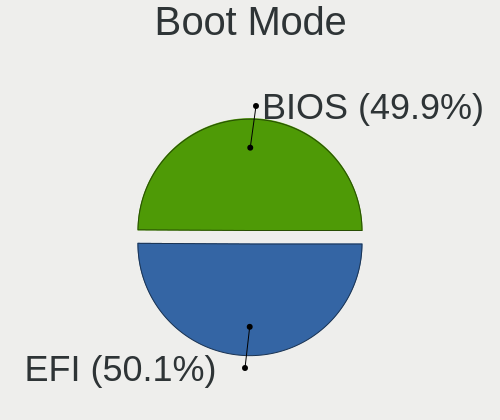
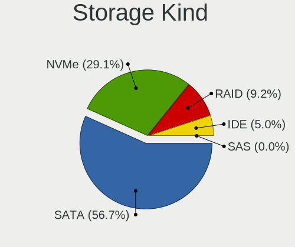
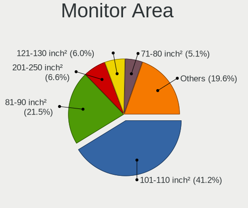
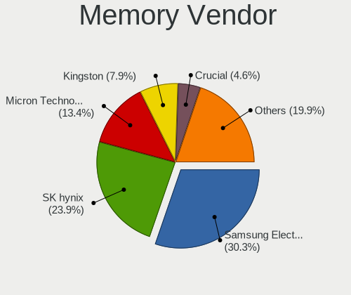

Ubuntu - Tested Hardware & Statistics (Notebooks)
-------------------------------------------------

A project to collect tested hardware configurations for Ubuntu.

Anyone can contribute to this report by the [hw-probe](https://github.com/linuxhw/hw-probe) tool:

    sudo -E hw-probe -all -upload

Please contribute! Especially if your hardware is rare.

Contents
--------

* [ Test Cases ](#test-cases)

* [ System ](#system)
  - [ OS                       ](#os)
  - [ OS Family                ](#os-family)
  - [ Kernel                   ](#kernel)
  - [ Kernel Family            ](#kernel-family)
  - [ Kernel Major Ver.        ](#kernel-major-ver)
  - [ Arch                     ](#arch)
  - [ DE                       ](#de)
  - [ Display Server           ](#display-server)
  - [ Display Manager          ](#display-manager)
  - [ OS Lang                  ](#os-lang)
  - [ Boot Mode                ](#boot-mode)
  - [ Filesystem               ](#filesystem)
  - [ Part. scheme             ](#part-scheme)
  - [ Dual Boot with Linux/BSD ](#dual-boot-with-linuxbsd)
  - [ Dual Boot (Win)          ](#dual-boot-win)

* [ Board ](#board)
  - [ Vendor                   ](#vendor)
  - [ Model                    ](#model)
  - [ Model Family             ](#model-family)
  - [ MFG Year                 ](#mfg-year)
  - [ Form Factor              ](#form-factor)
  - [ Secure Boot              ](#secure-boot)
  - [ Coreboot                 ](#coreboot)
  - [ RAM Size                 ](#ram-size)
  - [ RAM Used                 ](#ram-used)
  - [ Total Drives             ](#total-drives)
  - [ Has CD-ROM               ](#has-cd-rom)
  - [ Has Ethernet             ](#has-ethernet)
  - [ Has WiFi                 ](#has-wifi)
  - [ Has Bluetooth            ](#has-bluetooth)

* [ Location ](#location)
  - [ Country                  ](#country)
  - [ City                     ](#city)

* [ Drives ](#drives)
  - [ Drive Vendor             ](#drive-vendor)
  - [ Drive Model              ](#drive-model)
  - [ HDD Vendor               ](#hdd-vendor)
  - [ SSD Vendor               ](#ssd-vendor)
  - [ Drive Kind               ](#drive-kind)
  - [ Drive Connector          ](#drive-connector)
  - [ Drive Size               ](#drive-size)
  - [ Space Total              ](#space-total)
  - [ Space Used               ](#space-used)
  - [ Malfunc. Drives          ](#malfunc-drives)
  - [ Malfunc. Drive Vendor    ](#malfunc-drive-vendor)
  - [ Malfunc. HDD Vendor      ](#malfunc-hdd-vendor)
  - [ Malfunc. Drive Kind      ](#malfunc-drive-kind)
  - [ Failed Drives            ](#failed-drives)
  - [ Failed Drive Vendor      ](#failed-drive-vendor)
  - [ Drive Status             ](#drive-status)

* [ Storage controller ](#storage-controller)
  - [ Storage Vendor           ](#storage-vendor)
  - [ Storage Model            ](#storage-model)
  - [ Storage Kind             ](#storage-kind)

* [ Processor ](#processor)
  - [ CPU Vendor               ](#cpu-vendor)
  - [ CPU Model                ](#cpu-model)
  - [ CPU Model Family         ](#cpu-model-family)
  - [ CPU Cores                ](#cpu-cores)
  - [ CPU Sockets              ](#cpu-sockets)
  - [ CPU Threads              ](#cpu-threads)
  - [ CPU Op-Modes             ](#cpu-op-modes)
  - [ CPU Microcode            ](#cpu-microcode)
  - [ CPU Microarch            ](#cpu-microarch)

* [ Graphics ](#graphics)
  - [ GPU Vendor               ](#gpu-vendor)
  - [ GPU Model                ](#gpu-model)
  - [ GPU Combo                ](#gpu-combo)
  - [ GPU Driver               ](#gpu-driver)
  - [ GPU Memory               ](#gpu-memory)

* [ Monitor ](#monitor)
  - [ Monitor Vendor           ](#monitor-vendor)
  - [ Monitor Model            ](#monitor-model)
  - [ Monitor Resolution       ](#monitor-resolution)
  - [ Monitor Diagonal         ](#monitor-diagonal)
  - [ Monitor Width            ](#monitor-width)
  - [ Aspect Ratio             ](#aspect-ratio)
  - [ Monitor Area             ](#monitor-area)
  - [ Pixel Density            ](#pixel-density)
  - [ Multiple Monitors        ](#multiple-monitors)

* [ Network ](#network)
  - [ Net Controller Vendor    ](#net-controller-vendor)
  - [ Net Controller Model     ](#net-controller-model)
  - [ Wireless Vendor          ](#wireless-vendor)
  - [ Wireless Model           ](#wireless-model)
  - [ Ethernet Vendor          ](#ethernet-vendor)
  - [ Ethernet Model           ](#ethernet-model)
  - [ Net Controller Kind      ](#net-controller-kind)
  - [ Used Controller          ](#used-controller)
  - [ NICs                     ](#nics)
  - [ IPv6                     ](#ipv6)

* [ Bluetooth ](#bluetooth)
  - [ Bluetooth Vendor         ](#bluetooth-vendor)
  - [ Bluetooth Model          ](#bluetooth-model)

* [ Sound ](#sound)
  - [ Sound Vendor             ](#sound-vendor)
  - [ Sound Model              ](#sound-model)

* [ Memory ](#memory)
  - [ Memory Vendor            ](#memory-vendor)
  - [ Memory Model             ](#memory-model)
  - [ Memory Kind              ](#memory-kind)
  - [ Memory Form Factor       ](#memory-form-factor)
  - [ Memory Size              ](#memory-size)
  - [ Memory Speed             ](#memory-speed)

* [ Printers & scanners ](#printers--scanners)
  - [ Printer Vendor           ](#printer-vendor)
  - [ Printer Model            ](#printer-model)
  - [ Scanner Vendor           ](#scanner-vendor)
  - [ Scanner Model            ](#scanner-model)

* [ Camera ](#camera)
  - [ Camera Vendor            ](#camera-vendor)
  - [ Camera Model             ](#camera-model)

* [ Security ](#security)
  - [ Fingerprint Vendor       ](#fingerprint-vendor)
  - [ Fingerprint Model        ](#fingerprint-model)
  - [ Chipcard Vendor          ](#chipcard-vendor)
  - [ Chipcard Model           ](#chipcard-model)

* [ Unsupported ](#unsupported)
  - [ Unsupported Devices      ](#unsupported-devices)
  - [ Unsupported Device Types ](#unsupported-device-types)

Test Cases
----------

Total: 46505

| Vendor        | Model                       | Probe                                                      | Date         |
|---------------|-----------------------------|------------------------------------------------------------|--------------|
| ASUSTek       | X550CC                      | [cc784397f9](https://linux-hardware.org/?probe=cc784397f9) | May 01, 2023 |
| ASUSTek       | UX430UNR                    | [4d01364a94](https://linux-hardware.org/?probe=4d01364a94) | May 01, 2023 |
| Medion        | E16402                      | [cff2f785ad](https://linux-hardware.org/?probe=cff2f785ad) | May 01, 2023 |
| Dell          | Latitude 3420               | [327be624ce](https://linux-hardware.org/?probe=327be624ce) | May 01, 2023 |
| Toshiba       | Satellite L755              | [3bafb50baa](https://linux-hardware.org/?probe=3bafb50baa) | May 01, 2023 |
| Acer          | Aspire A715-51G             | [842333a8da](https://linux-hardware.org/?probe=842333a8da) | May 01, 2023 |
| Dell          | Latitude 3420               | [1ce0c58a17](https://linux-hardware.org/?probe=1ce0c58a17) | May 01, 2023 |
| Dell          | Latitude E6400              | [33b7764234](https://linux-hardware.org/?probe=33b7764234) | May 01, 2023 |
| Lenovo        | ThinkPad T480 20L6A0LJCL    | [f67154866c](https://linux-hardware.org/?probe=f67154866c) | May 01, 2023 |
| Acer          | Nitro AN517-54              | [593a6b247f](https://linux-hardware.org/?probe=593a6b247f) | May 01, 2023 |
| Lenovo        | ThinkPad X260 20F5002NAU    | [7fcb72c132](https://linux-hardware.org/?probe=7fcb72c132) | May 01, 2023 |
| Acer          | Aspire A715-51G             | [4f72daaab8](https://linux-hardware.org/?probe=4f72daaab8) | May 01, 2023 |
| HP            | EliteBook 8470p             | [f75b4a9457](https://linux-hardware.org/?probe=f75b4a9457) | May 01, 2023 |
| Unknown       | Unknown                     | [8978b9aa5f](https://linux-hardware.org/?probe=8978b9aa5f) | May 01, 2023 |
| HP            | EliteBook 840 G3            | [c490c44357](https://linux-hardware.org/?probe=c490c44357) | May 01, 2023 |
| Lenovo        | Legion S7 15IMH5 82BC       | [a57d01b946](https://linux-hardware.org/?probe=a57d01b946) | May 01, 2023 |
| HP            | Unknown                     | [475eb33956](https://linux-hardware.org/?probe=475eb33956) | May 01, 2023 |
| Acer          | Aspire V5-561P              | [8818106a28](https://linux-hardware.org/?probe=8818106a28) | Apr 30, 2023 |
| ASUSTek       | Zenbook UM5302TA_UM5302T... | [4bec088d90](https://linux-hardware.org/?probe=4bec088d90) | Apr 30, 2023 |
| Acer          | Aspire V5-561P              | [fe60e0412d](https://linux-hardware.org/?probe=fe60e0412d) | Apr 30, 2023 |
| Dell          | XPS 15 9500                 | [93fef964a7](https://linux-hardware.org/?probe=93fef964a7) | Apr 30, 2023 |
| Unknown       | Unknown                     | [070854df6b](https://linux-hardware.org/?probe=070854df6b) | Apr 30, 2023 |
| Lenovo        | IdeaPad 3 15ADA05 81W1      | [eb559d913e](https://linux-hardware.org/?probe=eb559d913e) | Apr 30, 2023 |
| Lenovo        | Z50-75 80EC                 | [af5d37f4f7](https://linux-hardware.org/?probe=af5d37f4f7) | Apr 30, 2023 |
| Samsung       | 950XED                      | [41f620de17](https://linux-hardware.org/?probe=41f620de17) | Apr 30, 2023 |
| ASUSTek       | VivoBook_ASUSLaptop X580... | [05251702aa](https://linux-hardware.org/?probe=05251702aa) | Apr 30, 2023 |
| Lenovo        | V15 G2 IJL 82QY             | [1714bffa0e](https://linux-hardware.org/?probe=1714bffa0e) | Apr 30, 2023 |
| Acer          | Peppy                       | [4caf11594a](https://linux-hardware.org/?probe=4caf11594a) | Apr 30, 2023 |
| Lenovo        | IdeaPad L340-17API 81LY     | [44c60dcec2](https://linux-hardware.org/?probe=44c60dcec2) | Apr 30, 2023 |
| Dell          | Vostro 3558                 | [5d77d7d922](https://linux-hardware.org/?probe=5d77d7d922) | Apr 30, 2023 |
| ASUSTek       | VivoBook_ASUSLaptop X580... | [94118ab632](https://linux-hardware.org/?probe=94118ab632) | Apr 30, 2023 |
| HP            | Pavilion Laptop 14-ec0xx... | [d4cfc1e964](https://linux-hardware.org/?probe=d4cfc1e964) | Apr 30, 2023 |
| HP            | Laptop 15s-eq2xxx           | [7a86bdd993](https://linux-hardware.org/?probe=7a86bdd993) | Apr 30, 2023 |
| Dell          | XPS 13 9350                 | [95b5e79487](https://linux-hardware.org/?probe=95b5e79487) | Apr 30, 2023 |
| HP            | Laptop 15s-eq2xxx           | [6206b317f2](https://linux-hardware.org/?probe=6206b317f2) | Apr 30, 2023 |
| Acer          | Aspire E5-551G              | [bba2f8d1ad](https://linux-hardware.org/?probe=bba2f8d1ad) | Apr 30, 2023 |
| Dell          | Vostro 5468                 | [93eb16d30d](https://linux-hardware.org/?probe=93eb16d30d) | Apr 30, 2023 |
| HP            | Pavilion Laptop 15-cc5xx    | [28b11100ac](https://linux-hardware.org/?probe=28b11100ac) | Apr 30, 2023 |
| Gateway       | P-7805u                     | [0958f250f2](https://linux-hardware.org/?probe=0958f250f2) | Apr 30, 2023 |
| Maibenben     | MaiBook X series            | [5f97e34b20](https://linux-hardware.org/?probe=5f97e34b20) | Apr 30, 2023 |
| Dell          | G15 5511                    | [7d5f166e7a](https://linux-hardware.org/?probe=7d5f166e7a) | Apr 30, 2023 |
| Dell          | XPS 13 7390                 | [c5000ec967](https://linux-hardware.org/?probe=c5000ec967) | Apr 30, 2023 |
| Lenovo        | ThinkPad E580 20KS001JUK    | [da5f050510](https://linux-hardware.org/?probe=da5f050510) | Apr 29, 2023 |
| Lenovo        | ThinkPad E580 20KS001JUK    | [1e65b46a12](https://linux-hardware.org/?probe=1e65b46a12) | Apr 29, 2023 |
| Lenovo        | V130-15IGM 81HL             | [ff24454021](https://linux-hardware.org/?probe=ff24454021) | Apr 29, 2023 |
| MSI           | GF63 Thin 9SC               | [f6a250b3e2](https://linux-hardware.org/?probe=f6a250b3e2) | Apr 29, 2023 |
| ASUSTek       | X751MA                      | [c952010dbb](https://linux-hardware.org/?probe=c952010dbb) | Apr 29, 2023 |
| ASUSTek       | VivoBook_ASUSLaptop X712... | [272103e5a7](https://linux-hardware.org/?probe=272103e5a7) | Apr 29, 2023 |
| Alienware     | x15 R1                      | [6e2d296667](https://linux-hardware.org/?probe=6e2d296667) | Apr 29, 2023 |
| Alienware     | x15 R1                      | [007beb8981](https://linux-hardware.org/?probe=007beb8981) | Apr 29, 2023 |
| Alienware     | x15 R1                      | [79c6a76fb3](https://linux-hardware.org/?probe=79c6a76fb3) | Apr 29, 2023 |
| Acer          | Aspire E5-575G              | [6a102a2c37](https://linux-hardware.org/?probe=6a102a2c37) | Apr 29, 2023 |
| ASUSTek       | G56JR                       | [b7eb868ec4](https://linux-hardware.org/?probe=b7eb868ec4) | Apr 29, 2023 |
| Dell          | Inspiron N5110              | [04da6f1db9](https://linux-hardware.org/?probe=04da6f1db9) | Apr 29, 2023 |
| ASUSTek       | VivoBook_ASUSLaptop X415... | [dca12f3f6a](https://linux-hardware.org/?probe=dca12f3f6a) | Apr 29, 2023 |
| MSI           | Modern 14 A10M              | [22ad1f6bfb](https://linux-hardware.org/?probe=22ad1f6bfb) | Apr 29, 2023 |
| Acer          | Aspire E5-553               | [ff448e32c3](https://linux-hardware.org/?probe=ff448e32c3) | Apr 29, 2023 |
| Acer          | TravelMate 5730             | [e74d115d0d](https://linux-hardware.org/?probe=e74d115d0d) | Apr 29, 2023 |
| Lenovo        | V130-15IGM 81HL             | [9081fc703d](https://linux-hardware.org/?probe=9081fc703d) | Apr 29, 2023 |
| Dell          | Inspiron 7773               | [19741ac2ea](https://linux-hardware.org/?probe=19741ac2ea) | Apr 29, 2023 |
| Acer          | Aspire A515-51G             | [bd4c84da60](https://linux-hardware.org/?probe=bd4c84da60) | Apr 29, 2023 |
| Lenovo        | ThinkPad E14 Gen 2 20TBS... | [21d008c7d8](https://linux-hardware.org/?probe=21d008c7d8) | Apr 29, 2023 |
| Lenovo        | ThinkPad E14 Gen 2 20TBS... | [49557b8214](https://linux-hardware.org/?probe=49557b8214) | Apr 29, 2023 |
| Lenovo        | ThinkPad T16 Gen 1 21CH0... | [7598c18042](https://linux-hardware.org/?probe=7598c18042) | Apr 29, 2023 |
| HUAWEI        | BOHK-WAX9X                  | [4490476bd2](https://linux-hardware.org/?probe=4490476bd2) | Apr 29, 2023 |
| Dell          | Latitude E5470              | [c6c943679f](https://linux-hardware.org/?probe=c6c943679f) | Apr 29, 2023 |
| Samsung       | 930X2K/931X2K               | [bc4f78f7e7](https://linux-hardware.org/?probe=bc4f78f7e7) | Apr 29, 2023 |
| ASUSTek       | X756UVK                     | [72ba8fbf57](https://linux-hardware.org/?probe=72ba8fbf57) | Apr 29, 2023 |
| Dell          | Latitude 3301               | [3a0aad0e75](https://linux-hardware.org/?probe=3a0aad0e75) | Apr 29, 2023 |
| Dell          | Precision M6600             | [39d9af4736](https://linux-hardware.org/?probe=39d9af4736) | Apr 28, 2023 |
| Dell          | Inspiron 3180               | [bc3400a372](https://linux-hardware.org/?probe=bc3400a372) | Apr 28, 2023 |
| Dell          | Inspiron 15-3567            | [5dcd15cacf](https://linux-hardware.org/?probe=5dcd15cacf) | Apr 28, 2023 |
| Acer          | Aspire E5-575G              | [004e0007e4](https://linux-hardware.org/?probe=004e0007e4) | Apr 28, 2023 |
| Lenovo        | ThinkPad T420 4238AB4       | [3f6a89023c](https://linux-hardware.org/?probe=3f6a89023c) | Apr 28, 2023 |
| Dell          | Latitude E5450              | [85fb3ec2fd](https://linux-hardware.org/?probe=85fb3ec2fd) | Apr 28, 2023 |
| Acer          | Aspire ES1-731              | [140e5eb8fc](https://linux-hardware.org/?probe=140e5eb8fc) | Apr 28, 2023 |
| ASUSTek       | VivoBook_ASUS Laptop E41... | [216a4b9b67](https://linux-hardware.org/?probe=216a4b9b67) | Apr 28, 2023 |
| ASUSTek       | VivoBook_ASUS Laptop E41... | [6736f3d911](https://linux-hardware.org/?probe=6736f3d911) | Apr 28, 2023 |
| Acer          | Swift SF314-57G             | [6fd79b811f](https://linux-hardware.org/?probe=6fd79b811f) | Apr 28, 2023 |
| HP            | Pavilion dv6                | [8bb5802125](https://linux-hardware.org/?probe=8bb5802125) | Apr 28, 2023 |
| HP            | Laptop 15-ef2xxx            | [f922f80a69](https://linux-hardware.org/?probe=f922f80a69) | Apr 28, 2023 |
| Pegatron      | A15                         | [e9de945dce](https://linux-hardware.org/?probe=e9de945dce) | Apr 28, 2023 |
| Lenovo        | G50-70 20351                | [a808e47839](https://linux-hardware.org/?probe=a808e47839) | Apr 28, 2023 |
| Lenovo        | G50-70 20351                | [67ae1efc54](https://linux-hardware.org/?probe=67ae1efc54) | Apr 28, 2023 |
| Lenovo        | Legion Y7000 81FW           | [b1e6130b77](https://linux-hardware.org/?probe=b1e6130b77) | Apr 28, 2023 |
| Acer          | Swift SF314-512             | [2ba1bab0fe](https://linux-hardware.org/?probe=2ba1bab0fe) | Apr 28, 2023 |
| Lenovo        | ThinkPad L480 20LTS1NK27    | [6569669912](https://linux-hardware.org/?probe=6569669912) | Apr 28, 2023 |
| Dell          | Vostro 3500                 | [450682b3fc](https://linux-hardware.org/?probe=450682b3fc) | Apr 28, 2023 |
| MSI           | Katana GF66 12UGS           | [3607ee704e](https://linux-hardware.org/?probe=3607ee704e) | Apr 28, 2023 |
| Lenovo        | V15 G2 ITL Ua 82KB          | [65f390b956](https://linux-hardware.org/?probe=65f390b956) | Apr 28, 2023 |
| HP            | Laptop 15-dy2xxx            | [210ceedb6d](https://linux-hardware.org/?probe=210ceedb6d) | Apr 28, 2023 |
| Toshiba       | TECRA Z40-C                 | [a72fdebd89](https://linux-hardware.org/?probe=a72fdebd89) | Apr 28, 2023 |
| Toshiba       | TECRA Z40-C                 | [31bdde77c9](https://linux-hardware.org/?probe=31bdde77c9) | Apr 28, 2023 |
| Toshiba       | TECRA Z40-C                 | [eb550390c1](https://linux-hardware.org/?probe=eb550390c1) | Apr 28, 2023 |
| Dell          | XPS 15 9570                 | [3479673283](https://linux-hardware.org/?probe=3479673283) | Apr 28, 2023 |
| Dell          | Latitude 3301               | [855564b077](https://linux-hardware.org/?probe=855564b077) | Apr 28, 2023 |
| ASUSTek       | T100TA                      | [7c34e35183](https://linux-hardware.org/?probe=7c34e35183) | Apr 28, 2023 |
| ASUSTek       | T100TA                      | [266477f792](https://linux-hardware.org/?probe=266477f792) | Apr 28, 2023 |
| Acer          | ConceptD CN315-71P          | [3cc902ff5c](https://linux-hardware.org/?probe=3cc902ff5c) | Apr 28, 2023 |
| Apple         | MacBookPro6,2               | [ceaa38e624](https://linux-hardware.org/?probe=ceaa38e624) | Apr 28, 2023 |
| Dell          | Latitude E5470              | [caac023f65](https://linux-hardware.org/?probe=caac023f65) | Apr 27, 2023 |
| ASUSTek       | K54C                        | [7223b97463](https://linux-hardware.org/?probe=7223b97463) | Apr 27, 2023 |
| Dell          | XPS 13 9350                 | [aea99797db](https://linux-hardware.org/?probe=aea99797db) | Apr 27, 2023 |
| Valve         | Jupiter                     | [f65ece2859](https://linux-hardware.org/?probe=f65ece2859) | Apr 27, 2023 |
| ASUSTek       | X751MA                      | [eb9967626a](https://linux-hardware.org/?probe=eb9967626a) | Apr 27, 2023 |
| ASUSTek       | ZenBook UX425IA_UM425IA     | [404ec697ac](https://linux-hardware.org/?probe=404ec697ac) | Apr 27, 2023 |
| HP            | OMEN by Laptop 16-b1xxx     | [beca0f768b](https://linux-hardware.org/?probe=beca0f768b) | Apr 27, 2023 |
| HP            | ZBook Studio G3             | [f648c14c51](https://linux-hardware.org/?probe=f648c14c51) | Apr 27, 2023 |
| Dell          | Inspiron 5567               | [012329ee1f](https://linux-hardware.org/?probe=012329ee1f) | Apr 27, 2023 |
| MSI           | PE60 6QE                    | [1a5ae975ee](https://linux-hardware.org/?probe=1a5ae975ee) | Apr 27, 2023 |
| HP            | ZBook Studio G3             | [26146530c7](https://linux-hardware.org/?probe=26146530c7) | Apr 27, 2023 |
| Gigabyte      | G5 GD                       | [d09d6fb712](https://linux-hardware.org/?probe=d09d6fb712) | Apr 27, 2023 |
| HP            | Compaq 6910p                | [049253c0c8](https://linux-hardware.org/?probe=049253c0c8) | Apr 27, 2023 |
| TUXEDO        | Unknown                     | [5108a05d49](https://linux-hardware.org/?probe=5108a05d49) | Apr 27, 2023 |
| Dell          | XPS 13 7390                 | [318ea8ad1e](https://linux-hardware.org/?probe=318ea8ad1e) | Apr 27, 2023 |
| Acer          | Aspire 5742G                | [a1391b4372](https://linux-hardware.org/?probe=a1391b4372) | Apr 27, 2023 |
| Lenovo        | ThinkPad T16 Gen 1 21CH0... | [f0a2365878](https://linux-hardware.org/?probe=f0a2365878) | Apr 27, 2023 |
| Dell          | XPS 15 9520                 | [07572e6599](https://linux-hardware.org/?probe=07572e6599) | Apr 27, 2023 |
| Lenovo        | IdeaPad 5 14ALC05 82LM      | [f428173506](https://linux-hardware.org/?probe=f428173506) | Apr 27, 2023 |
| Lenovo        | V14 G2 ITL 82NM             | [6a56164bfd](https://linux-hardware.org/?probe=6a56164bfd) | Apr 27, 2023 |
| HP            | Pavilion Laptop 15-cc5xx    | [9344f38032](https://linux-hardware.org/?probe=9344f38032) | Apr 27, 2023 |
| Lenovo        | ThinkPad X1 Carbon Gen 1... | [3f44947226](https://linux-hardware.org/?probe=3f44947226) | Apr 27, 2023 |
| Dell          | Inspiron 5558               | [9f3b8c952d](https://linux-hardware.org/?probe=9f3b8c952d) | Apr 27, 2023 |
| Acer          | Aspire E1-571               | [c95605ef8e](https://linux-hardware.org/?probe=c95605ef8e) | Apr 27, 2023 |
| ASUSTek       | ASUS TUF Dash F15 FX516P... | [d49ace71b4](https://linux-hardware.org/?probe=d49ace71b4) | Apr 27, 2023 |
| Dell          | Latitude 5520               | [bec614b168](https://linux-hardware.org/?probe=bec614b168) | Apr 26, 2023 |
| Lenovo        | IdeaPad 3 15ALC6 82MF       | [393c7b06d5](https://linux-hardware.org/?probe=393c7b06d5) | Apr 26, 2023 |
| Lenovo        | IdeaPad Y510P 20217         | [e35780d356](https://linux-hardware.org/?probe=e35780d356) | Apr 26, 2023 |
| Toshiba       | Satellite Pro S500          | [7a2503959a](https://linux-hardware.org/?probe=7a2503959a) | Apr 26, 2023 |
| Lenovo        | ThinkPad X250 20CLA003TA    | [ea8109c2a7](https://linux-hardware.org/?probe=ea8109c2a7) | Apr 26, 2023 |
| Razer         | Blade 17 (2022) - RZ09-0... | [fb624057c9](https://linux-hardware.org/?probe=fb624057c9) | Apr 26, 2023 |
| Sony          | SVD1322X2EW                 | [2574ef07fb](https://linux-hardware.org/?probe=2574ef07fb) | Apr 26, 2023 |
| TUXEDO        | InfinityBook Pro Gen7 (M... | [7274cefe89](https://linux-hardware.org/?probe=7274cefe89) | Apr 26, 2023 |
| Acer          | Aspire A515-45              | [d910b01835](https://linux-hardware.org/?probe=d910b01835) | Apr 26, 2023 |
| Lenovo        | V15 G2 IJL 82QY             | [7ca1ebbe7f](https://linux-hardware.org/?probe=7ca1ebbe7f) | Apr 26, 2023 |
| Acer          | Aspire A315-56              | [1fb0741f20](https://linux-hardware.org/?probe=1fb0741f20) | Apr 26, 2023 |
| Acer          | Aspire A315-56              | [f43777b85b](https://linux-hardware.org/?probe=f43777b85b) | Apr 26, 2023 |
| Dell          | Latitude 7420               | [513e0f8b18](https://linux-hardware.org/?probe=513e0f8b18) | Apr 26, 2023 |
| Dell          | G15 5510                    | [9dcb76f7c1](https://linux-hardware.org/?probe=9dcb76f7c1) | Apr 26, 2023 |
| Dell          | G15 5510                    | [4030b4f936](https://linux-hardware.org/?probe=4030b4f936) | Apr 26, 2023 |
| HP            | OMEN by Laptop 15-dh1xxx    | [3c104a89ef](https://linux-hardware.org/?probe=3c104a89ef) | Apr 26, 2023 |
| Dell          | Vostro 15 3510              | [81cae0ba77](https://linux-hardware.org/?probe=81cae0ba77) | Apr 26, 2023 |
| ASUSTek       | X541SA                      | [362ede5435](https://linux-hardware.org/?probe=362ede5435) | Apr 26, 2023 |
| ASUSTek       | ASUS TUF Gaming F17 FX70... | [701fb0df1b](https://linux-hardware.org/?probe=701fb0df1b) | Apr 26, 2023 |
| Dell          | XPS 15 9500                 | [e37d368767](https://linux-hardware.org/?probe=e37d368767) | Apr 26, 2023 |
| HP            | EliteBook Folio 9470m       | [e0d69966e9](https://linux-hardware.org/?probe=e0d69966e9) | Apr 26, 2023 |
| ASUSTek       | ROG Strix G731GT_GL731GT    | [940cbb6ef0](https://linux-hardware.org/?probe=940cbb6ef0) | Apr 26, 2023 |
| Lenovo        | IdeaPad 3 15IML05 81WR      | [5daf26faca](https://linux-hardware.org/?probe=5daf26faca) | Apr 26, 2023 |
| System76      | Gazelle                     | [dbf4d8b33d](https://linux-hardware.org/?probe=dbf4d8b33d) | Apr 26, 2023 |
| Dell          | Precision M6600             | [4f5cd6d28e](https://linux-hardware.org/?probe=4f5cd6d28e) | Apr 26, 2023 |
| Acer          | Nitro AN517-54              | [9fe0f33003](https://linux-hardware.org/?probe=9fe0f33003) | Apr 26, 2023 |
| Lenovo        | Y720-15IKB 80VR             | [c9ef115a29](https://linux-hardware.org/?probe=c9ef115a29) | Apr 26, 2023 |
| Acer          | Swift SF313-53              | [b487229ea2](https://linux-hardware.org/?probe=b487229ea2) | Apr 25, 2023 |
| Lenovo        | ThinkPad T430 2349UKM       | [6adb010c7a](https://linux-hardware.org/?probe=6adb010c7a) | Apr 25, 2023 |
| Acer          | Aspire E1-571               | [c6a1179816](https://linux-hardware.org/?probe=c6a1179816) | Apr 25, 2023 |
| Timi          | Mi NoteBook Ultra           | [b6b7cdfe22](https://linux-hardware.org/?probe=b6b7cdfe22) | Apr 25, 2023 |
| Acer          | Nitro AN517-42              | [5e54d08f91](https://linux-hardware.org/?probe=5e54d08f91) | Apr 25, 2023 |
| HP            | EliteBook 820 G1            | [7afd2012e8](https://linux-hardware.org/?probe=7afd2012e8) | Apr 25, 2023 |
| MSI           | Modern 14 A10M              | [dc3595e3cc](https://linux-hardware.org/?probe=dc3595e3cc) | Apr 25, 2023 |
| Avell High... | A70 HYB BS                  | [c7b5f9ef04](https://linux-hardware.org/?probe=c7b5f9ef04) | Apr 25, 2023 |
| Dell          | XPS 13 9310                 | [b9bc4703a8](https://linux-hardware.org/?probe=b9bc4703a8) | Apr 25, 2023 |
| HP            | 240 G8                      | [ab322ed08e](https://linux-hardware.org/?probe=ab322ed08e) | Apr 25, 2023 |
| HP            | 240 G8                      | [8cf9892fe9](https://linux-hardware.org/?probe=8cf9892fe9) | Apr 25, 2023 |
| Acer          | Aspire 5920G                | [c6387003fc](https://linux-hardware.org/?probe=c6387003fc) | Apr 25, 2023 |
| Dell          | Latitude 5490               | [32ddaf898c](https://linux-hardware.org/?probe=32ddaf898c) | Apr 25, 2023 |
| HP            | 255 G5 Notebook PC          | [c542c2df7e](https://linux-hardware.org/?probe=c542c2df7e) | Apr 25, 2023 |
| Lenovo        | ThinkPad E14 Gen 2 20T60... | [3a7c24a13f](https://linux-hardware.org/?probe=3a7c24a13f) | Apr 25, 2023 |
| ASUSTek       | VivoBook 15_ASUS Laptop ... | [7d5bd7e8fa](https://linux-hardware.org/?probe=7d5bd7e8fa) | Apr 25, 2023 |
| ASUSTek       | VivoBook 15_ASUS Laptop ... | [24bf298df5](https://linux-hardware.org/?probe=24bf298df5) | Apr 25, 2023 |
| Lenovo        | ThinkPad Edge E545 20B20... | [fd66f3852a](https://linux-hardware.org/?probe=fd66f3852a) | Apr 25, 2023 |
| Lenovo        | IdeaPad 5 15ARE05 81YQ      | [e7b20d71b7](https://linux-hardware.org/?probe=e7b20d71b7) | Apr 25, 2023 |
| Lenovo        | V15 G2 IJL 82QY             | [2732f4b096](https://linux-hardware.org/?probe=2732f4b096) | Apr 25, 2023 |
| ASUSTek       | VivoBook_ASUSLaptop X350... | [7d3b6ba1a3](https://linux-hardware.org/?probe=7d3b6ba1a3) | Apr 25, 2023 |
| Notebook      | W650EH                      | [8e848e589e](https://linux-hardware.org/?probe=8e848e589e) | Apr 25, 2023 |
| Lenovo        | Y720-15IKB 80VR             | [1602540ab8](https://linux-hardware.org/?probe=1602540ab8) | Apr 25, 2023 |
| ASUSTek       | ASUS TUF Gaming F17 FX70... | [5fd25f9235](https://linux-hardware.org/?probe=5fd25f9235) | Apr 25, 2023 |
| Lenovo        | Legion 5 15IMH05H 81Y6      | [93b15a590f](https://linux-hardware.org/?probe=93b15a590f) | Apr 25, 2023 |
| ASUSTek       | PRIME X670-P                | [37f98c9450](https://linux-hardware.org/?probe=37f98c9450) | Apr 25, 2023 |
| Lenovo        | ThinkPad E15 Gen 2 20TD0... | [5fb905227b](https://linux-hardware.org/?probe=5fb905227b) | Apr 25, 2023 |
| Dell          | Inspiron 3543               | [2a3020f392](https://linux-hardware.org/?probe=2a3020f392) | Apr 24, 2023 |
| Dell          | XPS 13 9310                 | [65ccee11a0](https://linux-hardware.org/?probe=65ccee11a0) | Apr 24, 2023 |
| ICL           | RAYbook Si1512              | [4e960cbe90](https://linux-hardware.org/?probe=4e960cbe90) | Apr 24, 2023 |
| ASUSTek       | GL752VW                     | [26c754e5f0](https://linux-hardware.org/?probe=26c754e5f0) | Apr 24, 2023 |
| Dell          | XPS 13 9310                 | [070d7e791f](https://linux-hardware.org/?probe=070d7e791f) | Apr 24, 2023 |
| ASUSTek       | X510UQR                     | [4a2e357ace](https://linux-hardware.org/?probe=4a2e357ace) | Apr 24, 2023 |
| Acer          | Aspire 5742G                | [84679bc442](https://linux-hardware.org/?probe=84679bc442) | Apr 24, 2023 |
| ASUSTek       | VivoBook_ASUSLaptop X515... | [9e926f5c65](https://linux-hardware.org/?probe=9e926f5c65) | Apr 24, 2023 |
| Dell          | Vostro 15 3515              | [13c75fa32e](https://linux-hardware.org/?probe=13c75fa32e) | Apr 24, 2023 |
| INSYS         | PT1-140C                    | [902536abce](https://linux-hardware.org/?probe=902536abce) | Apr 24, 2023 |
| Lenovo        | G700                        | [75ee4cf99d](https://linux-hardware.org/?probe=75ee4cf99d) | Apr 24, 2023 |
| Lenovo        | ThinkPad E15 Gen 2 20TD0... | [9649423c20](https://linux-hardware.org/?probe=9649423c20) | Apr 24, 2023 |
| Lenovo        | ThinkPad E15 Gen 2 20TD0... | [af486ae4ae](https://linux-hardware.org/?probe=af486ae4ae) | Apr 24, 2023 |
| Dell          | System XPS L502X            | [4fd4992d0f](https://linux-hardware.org/?probe=4fd4992d0f) | Apr 24, 2023 |
| ASUSTek       | ROG Strix G531GT_G531GT     | [253f35c2c3](https://linux-hardware.org/?probe=253f35c2c3) | Apr 24, 2023 |
| Dell          | Inspiron 15 5510            | [c8f22361f6](https://linux-hardware.org/?probe=c8f22361f6) | Apr 24, 2023 |
| Lenovo        | ThinkPad A285 20MXS0NJ00    | [f155ad2bf4](https://linux-hardware.org/?probe=f155ad2bf4) | Apr 24, 2023 |
| Lenovo        | IdeaPad Gaming 3 15IMH05... | [2787d97e6e](https://linux-hardware.org/?probe=2787d97e6e) | Apr 24, 2023 |
| Fujitsu       | LIFEBOOK S751               | [e01b26f35f](https://linux-hardware.org/?probe=e01b26f35f) | Apr 24, 2023 |
| HP            | Laptop 17-cp0xxx            | [288f3f709c](https://linux-hardware.org/?probe=288f3f709c) | Apr 24, 2023 |
| ASUSTek       | GL752VW                     | [216aaf8fff](https://linux-hardware.org/?probe=216aaf8fff) | Apr 24, 2023 |
| HP            | Laptop 15-db0xxx            | [2ab42d58bf](https://linux-hardware.org/?probe=2ab42d58bf) | Apr 24, 2023 |
| Gateway       | NV55C                       | [3c560a28cf](https://linux-hardware.org/?probe=3c560a28cf) | Apr 24, 2023 |
| HP            | Laptop 15-db0xxx            | [8c5aea6211](https://linux-hardware.org/?probe=8c5aea6211) | Apr 24, 2023 |
| Lenovo        | IdeaPad 3 15ALC6 82MF       | [2e7585d261](https://linux-hardware.org/?probe=2e7585d261) | Apr 24, 2023 |
| Dell          | Inspiron 3542               | [9f4ce3c5a4](https://linux-hardware.org/?probe=9f4ce3c5a4) | Apr 24, 2023 |
| Lenovo        | IdeaPad 5 Pro 14ACN6 82L... | [59c225df6e](https://linux-hardware.org/?probe=59c225df6e) | Apr 24, 2023 |
| Lenovo        | 20RD001FHV                  | [782ded0435](https://linux-hardware.org/?probe=782ded0435) | Apr 24, 2023 |
| Samsung       | 950XED                      | [6226147e11](https://linux-hardware.org/?probe=6226147e11) | Apr 24, 2023 |
| LG Electro... | 16Z90Q-G.AD78F              | [99bbc09adb](https://linux-hardware.org/?probe=99bbc09adb) | Apr 24, 2023 |
| Lenovo        | ThinkPad T15g Gen 2i 20Y... | [8bfea5add2](https://linux-hardware.org/?probe=8bfea5add2) | Apr 24, 2023 |
| Apple         | MacBookPro15,2              | [09eb88ba6c](https://linux-hardware.org/?probe=09eb88ba6c) | Apr 24, 2023 |
| Fujitsu       | LIFEBOOK S751               | [07e4819355](https://linux-hardware.org/?probe=07e4819355) | Apr 24, 2023 |
| ASUSTek       | TUF Gaming FX705GD_FX705... | [b1c3492700](https://linux-hardware.org/?probe=b1c3492700) | Apr 24, 2023 |
| Acer          | Aspire A515-47              | [35a591e26a](https://linux-hardware.org/?probe=35a591e26a) | Apr 24, 2023 |
| Apple         | MacBookPro9,2               | [c820da6570](https://linux-hardware.org/?probe=c820da6570) | Apr 24, 2023 |
| Lenovo        | Legion 5 15IMH05H 81Y6      | [e37aab534f](https://linux-hardware.org/?probe=e37aab534f) | Apr 24, 2023 |
| Shanghai Z... | ZXE CRB                     | [298d51ae78](https://linux-hardware.org/?probe=298d51ae78) | Apr 24, 2023 |
| Dell          | Latitude E5470              | [bc1dca3c78](https://linux-hardware.org/?probe=bc1dca3c78) | Apr 24, 2023 |
| HP            | ZBook 17 G5                 | [c1d71592a4](https://linux-hardware.org/?probe=c1d71592a4) | Apr 24, 2023 |
| Acer          | Aspire A317-53              | [c47ec3530e](https://linux-hardware.org/?probe=c47ec3530e) | Apr 24, 2023 |
| Lenovo        | ThinkPad T440s 20ARS16G0... | [b019f5af89](https://linux-hardware.org/?probe=b019f5af89) | Apr 24, 2023 |
| HP            | ProBook 450 G7              | [57f0ae7486](https://linux-hardware.org/?probe=57f0ae7486) | Apr 24, 2023 |
| ASUSTek       | PRIME X670-P                | [ebe7f36c99](https://linux-hardware.org/?probe=ebe7f36c99) | Apr 23, 2023 |
| Lenovo        | IdeaPad 330-15IKB 81FE      | [e562ba35c6](https://linux-hardware.org/?probe=e562ba35c6) | Apr 23, 2023 |
| Dell          | G5 5590                     | [eef3722c35](https://linux-hardware.org/?probe=eef3722c35) | Apr 23, 2023 |
| HP            | 350 G2                      | [ffa4ab3dc0](https://linux-hardware.org/?probe=ffa4ab3dc0) | Apr 23, 2023 |
| Samsung       | R510/P510                   | [4b58936ad7](https://linux-hardware.org/?probe=4b58936ad7) | Apr 23, 2023 |
| HP            | G42                         | [1d5b2eefc3](https://linux-hardware.org/?probe=1d5b2eefc3) | Apr 23, 2023 |
| Lenovo        | ThinkPad X220 4290EC5       | [f6fe80f275](https://linux-hardware.org/?probe=f6fe80f275) | Apr 23, 2023 |
| HP            | ZBook 17 G5                 | [ce9fd79431](https://linux-hardware.org/?probe=ce9fd79431) | Apr 23, 2023 |
| Dell          | Precision M4400             | [0c367cbf45](https://linux-hardware.org/?probe=0c367cbf45) | Apr 23, 2023 |
| MSI           | Bravo 15 B5DD               | [180f1dd402](https://linux-hardware.org/?probe=180f1dd402) | Apr 23, 2023 |
| Dell          | Latitude 5591               | [b4dfa57eea](https://linux-hardware.org/?probe=b4dfa57eea) | Apr 23, 2023 |
| Sony          | SVD1322X2EW                 | [1652ce4c8f](https://linux-hardware.org/?probe=1652ce4c8f) | Apr 23, 2023 |
| HP            | EliteBook 840 G8 Noteboo... | [18fc5f09ed](https://linux-hardware.org/?probe=18fc5f09ed) | Apr 23, 2023 |
| Lenovo        | ThinkPad X220 4286A44       | [6b6e909d11](https://linux-hardware.org/?probe=6b6e909d11) | Apr 23, 2023 |
| Dell          | Latitude 5591               | [1a45f96f80](https://linux-hardware.org/?probe=1a45f96f80) | Apr 23, 2023 |
| Acer          | Aspire A515-57              | [23f076b6d3](https://linux-hardware.org/?probe=23f076b6d3) | Apr 23, 2023 |
| Onda TLC      | ONDA Oliver                 | [c59dbdea18](https://linux-hardware.org/?probe=c59dbdea18) | Apr 23, 2023 |
| eMachines     | E725                        | [7f35646c99](https://linux-hardware.org/?probe=7f35646c99) | Apr 23, 2023 |
| HP            | Pavilion dv7                | [0ca422761e](https://linux-hardware.org/?probe=0ca422761e) | Apr 23, 2023 |
| Dell          | Latitude E7240              | [1b5828d441](https://linux-hardware.org/?probe=1b5828d441) | Apr 23, 2023 |
| ASUSTek       | ASUS TUF Dash F15 FX516P... | [641374c815](https://linux-hardware.org/?probe=641374c815) | Apr 23, 2023 |
| HP            | Pavilion Laptop 15-eg0xx... | [aa01246f8b](https://linux-hardware.org/?probe=aa01246f8b) | Apr 23, 2023 |
| ASUSTek       | UX310UA                     | [a7b628ab1c](https://linux-hardware.org/?probe=a7b628ab1c) | Apr 23, 2023 |
| Lenovo        | ThinkBook 14 G4 IAP 21DH    | [aa23589794](https://linux-hardware.org/?probe=aa23589794) | Apr 23, 2023 |
| Lenovo        | ThinkPad E480 20KQ000EBR    | [90b7213592](https://linux-hardware.org/?probe=90b7213592) | Apr 23, 2023 |
| Lenovo        | ThinkPad T14 Gen 1 20UES... | [620334c0fc](https://linux-hardware.org/?probe=620334c0fc) | Apr 23, 2023 |
| ASUSTek       | ROG Strix G513IM_G513IM     | [99e0054492](https://linux-hardware.org/?probe=99e0054492) | Apr 23, 2023 |
| ASUSTek       | ROG Strix G513IM_G513IM     | [86b56d3e69](https://linux-hardware.org/?probe=86b56d3e69) | Apr 23, 2023 |
| Toshiba       | Satellite Pro S500          | [fcf8a7bdb4](https://linux-hardware.org/?probe=fcf8a7bdb4) | Apr 23, 2023 |
| Sony          | VPCF13M1E                   | [023cbeeac3](https://linux-hardware.org/?probe=023cbeeac3) | Apr 23, 2023 |
| Dell          | Inspiron MP061              | [2b25a48030](https://linux-hardware.org/?probe=2b25a48030) | Apr 23, 2023 |
| Samsung       | RV411/RV511/E3511/S3511/... | [c8ec222920](https://linux-hardware.org/?probe=c8ec222920) | Apr 23, 2023 |
| Samsung       | RV411/RV511/E3511/S3511/... | [2a02b4695b](https://linux-hardware.org/?probe=2a02b4695b) | Apr 23, 2023 |
| HP            | Pavilion dv6700             | [ec38742f28](https://linux-hardware.org/?probe=ec38742f28) | Apr 23, 2023 |
| Lenovo        | ThinkPad T420 4236EJ3       | [77a309dcf1](https://linux-hardware.org/?probe=77a309dcf1) | Apr 22, 2023 |
| HUAWEI        | NBLK-WAX9X                  | [25e942e55c](https://linux-hardware.org/?probe=25e942e55c) | Apr 22, 2023 |
| Dell          | Latitude E6420              | [475a16531a](https://linux-hardware.org/?probe=475a16531a) | Apr 22, 2023 |
| Lenovo        | ThinkPad T420 4236EJ3       | [4c60675864](https://linux-hardware.org/?probe=4c60675864) | Apr 22, 2023 |
| HUAWEI        | KLVL-WXXW                   | [13b6b127e6](https://linux-hardware.org/?probe=13b6b127e6) | Apr 22, 2023 |
| ASUSTek       | Zenbook UX3402ZA_UX3402Z... | [adab9d9f6b](https://linux-hardware.org/?probe=adab9d9f6b) | Apr 22, 2023 |
| Apple         | MacBookPro11,5              | [7a873a7baa](https://linux-hardware.org/?probe=7a873a7baa) | Apr 22, 2023 |
| Dell          | Precision M4400             | [291a0de9a8](https://linux-hardware.org/?probe=291a0de9a8) | Apr 22, 2023 |
| Acer          | Nitro AN515-58              | [60251e08f5](https://linux-hardware.org/?probe=60251e08f5) | Apr 22, 2023 |
| Dell          | Inspiron M5040              | [ae29855106](https://linux-hardware.org/?probe=ae29855106) | Apr 22, 2023 |
| Dell          | Latitude E6500              | [5de8825606](https://linux-hardware.org/?probe=5de8825606) | Apr 22, 2023 |
| HP            | Pavilion g7                 | [785e97ad3d](https://linux-hardware.org/?probe=785e97ad3d) | Apr 22, 2023 |
| HP            | Pavilion g7                 | [0e6f1d6bf7](https://linux-hardware.org/?probe=0e6f1d6bf7) | Apr 22, 2023 |
| Medion        | Akoya E7416T                | [da5ea2c44b](https://linux-hardware.org/?probe=da5ea2c44b) | Apr 22, 2023 |
| Unknown       | M-140BI5                    | [32ba023e2a](https://linux-hardware.org/?probe=32ba023e2a) | Apr 22, 2023 |
| Acer          | Aspire E5-772               | [edfa9fcbef](https://linux-hardware.org/?probe=edfa9fcbef) | Apr 22, 2023 |
| Lenovo        | Z50-70 20354                | [76f54ae42f](https://linux-hardware.org/?probe=76f54ae42f) | Apr 22, 2023 |
| HP            | Notebook                    | [fdf3f7a1cf](https://linux-hardware.org/?probe=fdf3f7a1cf) | Apr 22, 2023 |
| ASUSTek       | VivoBook_ASUSLaptop X150... | [ce5e9aad85](https://linux-hardware.org/?probe=ce5e9aad85) | Apr 22, 2023 |
| HP            | EliteBook 2570p             | [a26039eb50](https://linux-hardware.org/?probe=a26039eb50) | Apr 22, 2023 |
| HP            | EliteBook 2570p             | [7e7a982c3c](https://linux-hardware.org/?probe=7e7a982c3c) | Apr 22, 2023 |
| Lenovo        | N22 80S6                    | [e915245bfd](https://linux-hardware.org/?probe=e915245bfd) | Apr 22, 2023 |
| Acer          | Aspire 7750G                | [afdab44276](https://linux-hardware.org/?probe=afdab44276) | Apr 22, 2023 |
| Acer          | Aspire 7750G                | [1f6e58080a](https://linux-hardware.org/?probe=1f6e58080a) | Apr 22, 2023 |
| HP            | ProBook 4540s               | [12ee30d786](https://linux-hardware.org/?probe=12ee30d786) | Apr 22, 2023 |
| HP            | Pavilion Laptop 15-eg2xx... | [0f5a55a8d1](https://linux-hardware.org/?probe=0f5a55a8d1) | Apr 22, 2023 |
| Fujitsu       | FMVA42CW                    | [4fb1ab7ab8](https://linux-hardware.org/?probe=4fb1ab7ab8) | Apr 22, 2023 |
| AMI           | Cherry Trail CR             | [325dfde573](https://linux-hardware.org/?probe=325dfde573) | Apr 22, 2023 |
| Lenovo        | ThinkPad E15 Gen 4 21E60... | [3056a65306](https://linux-hardware.org/?probe=3056a65306) | Apr 22, 2023 |
| HP            | Pavilion 15                 | [ac3f0ac1d5](https://linux-hardware.org/?probe=ac3f0ac1d5) | Apr 21, 2023 |
| HP            | Pavilion 15                 | [877b05303e](https://linux-hardware.org/?probe=877b05303e) | Apr 21, 2023 |
| Dell          | XPS 13 9350                 | [63cafebe06](https://linux-hardware.org/?probe=63cafebe06) | Apr 21, 2023 |
| Unknown       | Unknown                     | [69a043bc15](https://linux-hardware.org/?probe=69a043bc15) | Apr 21, 2023 |
| HP            | Pavilion Gaming Laptop 1... | [2a507e00bf](https://linux-hardware.org/?probe=2a507e00bf) | Apr 21, 2023 |
| Gigabyte      | AERO 16 KE5                 | [9e4fe316b8](https://linux-hardware.org/?probe=9e4fe316b8) | Apr 21, 2023 |
| HUAWEI        | NBLB-WAX9N                  | [0e5230d2d2](https://linux-hardware.org/?probe=0e5230d2d2) | Apr 21, 2023 |
| HP            | Compaq 6735s                | [9a23d08368](https://linux-hardware.org/?probe=9a23d08368) | Apr 21, 2023 |
| Lenovo        | IdeaPad 110-15ISK 80UD      | [52cfdbde2d](https://linux-hardware.org/?probe=52cfdbde2d) | Apr 21, 2023 |
| HP            | Compaq 6735s                | [6b255d5f07](https://linux-hardware.org/?probe=6b255d5f07) | Apr 21, 2023 |
| ASUSTek       | N53SN                       | [7c0a7d4494](https://linux-hardware.org/?probe=7c0a7d4494) | Apr 21, 2023 |
| HP            | Elite Dragonfly 13.5 inc... | [2a5d9adcd4](https://linux-hardware.org/?probe=2a5d9adcd4) | Apr 21, 2023 |
| Dell          | Precision M6600             | [6f80333ca9](https://linux-hardware.org/?probe=6f80333ca9) | Apr 21, 2023 |
| HP            | EliteBook 2540p             | [b2a6b1a66d](https://linux-hardware.org/?probe=b2a6b1a66d) | Apr 21, 2023 |
| ASUSTek       | ROG Strix G513IH_G513IH     | [af72838c03](https://linux-hardware.org/?probe=af72838c03) | Apr 21, 2023 |
| ASUSTek       | ZenBook UX333FN_RX333FN     | [8027ff2b04](https://linux-hardware.org/?probe=8027ff2b04) | Apr 21, 2023 |
| HP            | ZBook Studio G3             | [754a6bd681](https://linux-hardware.org/?probe=754a6bd681) | Apr 21, 2023 |
| Dell          | Latitude 7280               | [1359a75ba3](https://linux-hardware.org/?probe=1359a75ba3) | Apr 21, 2023 |
| Medion        | S15449                      | [c63e98624a](https://linux-hardware.org/?probe=c63e98624a) | Apr 21, 2023 |
| HP            | Pavilion Sleekbook 15       | [644ea805a9](https://linux-hardware.org/?probe=644ea805a9) | Apr 21, 2023 |
| Medion        | S15449                      | [914511ca07](https://linux-hardware.org/?probe=914511ca07) | Apr 21, 2023 |
| Dell          | Latitude E6500              | [363b443628](https://linux-hardware.org/?probe=363b443628) | Apr 21, 2023 |
| HP            | Victus by Laptop 16-e0xx... | [85fa6bf3d5](https://linux-hardware.org/?probe=85fa6bf3d5) | Apr 21, 2023 |
| Lenovo        | ThinkPad E15 Gen 3 20YG0... | [6dcb6d41ef](https://linux-hardware.org/?probe=6dcb6d41ef) | Apr 21, 2023 |
| Sony          | VGN-SZ640N                  | [659b01c666](https://linux-hardware.org/?probe=659b01c666) | Apr 21, 2023 |
| Lenovo        | IdeaPad 5 Pro 14ACN6 82L... | [6e2da1e766](https://linux-hardware.org/?probe=6e2da1e766) | Apr 21, 2023 |
| Google        | Swanky                      | [92156daf53](https://linux-hardware.org/?probe=92156daf53) | Apr 21, 2023 |
| Lenovo        | ThinkPad T490 20N2CTO1WW    | [acbe851404](https://linux-hardware.org/?probe=acbe851404) | Apr 21, 2023 |
| Lenovo        | ThinkPad W530 2436CTO       | [74d9f6c0d6](https://linux-hardware.org/?probe=74d9f6c0d6) | Apr 21, 2023 |
| HP            | EliteBook 2540p             | [be19bcd7de](https://linux-hardware.org/?probe=be19bcd7de) | Apr 21, 2023 |
| PC Special... | TN1-156M                    | [ef6b57e807](https://linux-hardware.org/?probe=ef6b57e807) | Apr 21, 2023 |
| Lenovo        | IdeaPad S530-13IWL 81J7     | [167000be9b](https://linux-hardware.org/?probe=167000be9b) | Apr 21, 2023 |
| HP            | Notebook                    | [31d24dfe38](https://linux-hardware.org/?probe=31d24dfe38) | Apr 21, 2023 |
| Dell          | Vostro 3550                 | [21111146cd](https://linux-hardware.org/?probe=21111146cd) | Apr 21, 2023 |
| Multilaser    | PC13X                       | [d1144e31a1](https://linux-hardware.org/?probe=d1144e31a1) | Apr 21, 2023 |
| MSI           | Katana GF66 12UE            | [77725a70a4](https://linux-hardware.org/?probe=77725a70a4) | Apr 21, 2023 |
| Dell          | Latitude E6420              | [5e3466ce98](https://linux-hardware.org/?probe=5e3466ce98) | Apr 21, 2023 |
| Dell          | G15 5510                    | [43d4ce3c37](https://linux-hardware.org/?probe=43d4ce3c37) | Apr 21, 2023 |
| HP            | Notebook                    | [150b1d6ae7](https://linux-hardware.org/?probe=150b1d6ae7) | Apr 21, 2023 |
| Apple         | MacBookAir7,2               | [d34d10b1ad](https://linux-hardware.org/?probe=d34d10b1ad) | Apr 20, 2023 |
| Lenovo        | ThinkPad X1 Carbon Gen 9... | [cfaa1567db](https://linux-hardware.org/?probe=cfaa1567db) | Apr 20, 2023 |
| Lenovo        | ThinkPad X1 Carbon Gen 9... | [573b371272](https://linux-hardware.org/?probe=573b371272) | Apr 20, 2023 |
| Lenovo        | ThinkPad T14 Gen 1 20S00... | [083aef9e64](https://linux-hardware.org/?probe=083aef9e64) | Apr 20, 2023 |
| HP            | Pavilion Laptop 15-eh1xx... | [05321d1ddd](https://linux-hardware.org/?probe=05321d1ddd) | Apr 20, 2023 |
| Dell          | Latitude E5510              | [7e57f9e0f0](https://linux-hardware.org/?probe=7e57f9e0f0) | Apr 20, 2023 |
| UMAX          | VisionBook 14Wa Pro         | [525241657b](https://linux-hardware.org/?probe=525241657b) | Apr 20, 2023 |
| UMAX          | VisionBook 14Wa Pro         | [07e2728dfe](https://linux-hardware.org/?probe=07e2728dfe) | Apr 20, 2023 |
| Dell          | Inspiron 3501               | [e09f00bead](https://linux-hardware.org/?probe=e09f00bead) | Apr 20, 2023 |
| Infinix       | INBOOK X2 GEN11             | [cac51ecb89](https://linux-hardware.org/?probe=cac51ecb89) | Apr 20, 2023 |
| Infinix       | INBOOK X2 GEN11             | [7fea1a73bc](https://linux-hardware.org/?probe=7fea1a73bc) | Apr 20, 2023 |
| HP            | Pavilion g4                 | [96a0210940](https://linux-hardware.org/?probe=96a0210940) | Apr 20, 2023 |
| ASUSTek       | N53SN                       | [ad32ff5e4a](https://linux-hardware.org/?probe=ad32ff5e4a) | Apr 20, 2023 |
| HP            | 250 15.6 inch G9 Noteboo... | [aace924665](https://linux-hardware.org/?probe=aace924665) | Apr 20, 2023 |
| Dell          | Latitude E6420              | [6b5cc099a0](https://linux-hardware.org/?probe=6b5cc099a0) | Apr 20, 2023 |
| MSI           | GF63 Thin 9SC               | [fbed7350fc](https://linux-hardware.org/?probe=fbed7350fc) | Apr 20, 2023 |
| Timi          | A34R                        | [310e4d7b63](https://linux-hardware.org/?probe=310e4d7b63) | Apr 20, 2023 |
| Dell          | Latitude E5510              | [08e03aa4d8](https://linux-hardware.org/?probe=08e03aa4d8) | Apr 20, 2023 |
| Dell          | Latitude E6410              | [52ada88fb1](https://linux-hardware.org/?probe=52ada88fb1) | Apr 20, 2023 |
| Dell          | Latitude E7470              | [5695d0ab66](https://linux-hardware.org/?probe=5695d0ab66) | Apr 20, 2023 |
| HP            | OMEN by Gaming Laptop 16... | [65cce76dc9](https://linux-hardware.org/?probe=65cce76dc9) | Apr 20, 2023 |
| MSI           | Creator Z17 A12UHST         | [1396746fba](https://linux-hardware.org/?probe=1396746fba) | Apr 20, 2023 |
| Lenovo        | E520-15IKB 80WA             | [abd1d98b9b](https://linux-hardware.org/?probe=abd1d98b9b) | Apr 20, 2023 |
| HP            | Notebook                    | [36788985ec](https://linux-hardware.org/?probe=36788985ec) | Apr 20, 2023 |
| Apple         | MacBookAir7,2               | [b54a612e76](https://linux-hardware.org/?probe=b54a612e76) | Apr 20, 2023 |
| ASUSTek       | K501LX                      | [00676747c4](https://linux-hardware.org/?probe=00676747c4) | Apr 19, 2023 |
| Dell          | Latitude E7440              | [c701c43108](https://linux-hardware.org/?probe=c701c43108) | Apr 19, 2023 |
| TUXEDO        | Book XUX7 Gen11             | [c92f90cd3b](https://linux-hardware.org/?probe=c92f90cd3b) | Apr 19, 2023 |
| HP            | 250 15.6 inch G9 Noteboo... | [f3e3733387](https://linux-hardware.org/?probe=f3e3733387) | Apr 19, 2023 |
| Acer          | TravelMate B115-M           | [178dbe3693](https://linux-hardware.org/?probe=178dbe3693) | Apr 19, 2023 |
| Toshiba       | Satellite C55-C             | [594ceb6023](https://linux-hardware.org/?probe=594ceb6023) | Apr 19, 2023 |
| Acer          | TravelMate B115-M           | [973070ca0e](https://linux-hardware.org/?probe=973070ca0e) | Apr 19, 2023 |
| Acer          | Aspire A315-24P             | [f48f292cd5](https://linux-hardware.org/?probe=f48f292cd5) | Apr 19, 2023 |
| HP            | Victus by Gaming Laptop ... | [986e7732bf](https://linux-hardware.org/?probe=986e7732bf) | Apr 19, 2023 |
| Dell          | Latitude E6440              | [027d51d72d](https://linux-hardware.org/?probe=027d51d72d) | Apr 19, 2023 |
| HP            | Notebook                    | [072fc2bf12](https://linux-hardware.org/?probe=072fc2bf12) | Apr 19, 2023 |
| HP            | 250 15.6 inch G9 Noteboo... | [9df9b0d25d](https://linux-hardware.org/?probe=9df9b0d25d) | Apr 19, 2023 |
| HP            | Laptop 15-dw3xxx            | [a0cf4fd00d](https://linux-hardware.org/?probe=a0cf4fd00d) | Apr 19, 2023 |
| HP            | Laptop 15-dw3xxx            | [7ce26d7fd9](https://linux-hardware.org/?probe=7ce26d7fd9) | Apr 19, 2023 |
| Lenovo        | ThinkBook 15-IML 20RW       | [b4c6c1198f](https://linux-hardware.org/?probe=b4c6c1198f) | Apr 19, 2023 |
| HP            | 250 15.6 inch G9 Noteboo... | [9db7166b25](https://linux-hardware.org/?probe=9db7166b25) | Apr 19, 2023 |
| HP            | Pavilion dv7                | [f5c84d7a1b](https://linux-hardware.org/?probe=f5c84d7a1b) | Apr 19, 2023 |
| Crusaders ... | CS14D01                     | [b25acea9f7](https://linux-hardware.org/?probe=b25acea9f7) | Apr 19, 2023 |
| ASUSTek       | UX430UNR                    | [d8ed935b86](https://linux-hardware.org/?probe=d8ed935b86) | Apr 19, 2023 |
| Dell          | Latitude 5520               | [afe27daf93](https://linux-hardware.org/?probe=afe27daf93) | Apr 19, 2023 |
| TECNO         | MEGABOOK T1                 | [733d7d5584](https://linux-hardware.org/?probe=733d7d5584) | Apr 18, 2023 |
| HP            | Compaq Presario CQ70        | [030eff02bb](https://linux-hardware.org/?probe=030eff02bb) | Apr 18, 2023 |
| Lenovo        | ThinkPad P51 20HJS0V50E     | [39e6be04eb](https://linux-hardware.org/?probe=39e6be04eb) | Apr 18, 2023 |
| MSI           | GP65 Leopard 10SEK          | [3b852bad57](https://linux-hardware.org/?probe=3b852bad57) | Apr 18, 2023 |
| ASUSTek       | ASUS EXPERTBOOK B1400CEA... | [b076a9a807](https://linux-hardware.org/?probe=b076a9a807) | Apr 18, 2023 |
| HP            | Pavilion Laptop 15-cw0xx... | [e69d8250d4](https://linux-hardware.org/?probe=e69d8250d4) | Apr 18, 2023 |
| HP            | Laptop 17-cn2xxx            | [5b77cc21f4](https://linux-hardware.org/?probe=5b77cc21f4) | Apr 18, 2023 |
| Toshiba       | Satellite L500              | [0896195ea4](https://linux-hardware.org/?probe=0896195ea4) | Apr 18, 2023 |
| Toshiba       | Satellite L500              | [7105145a87](https://linux-hardware.org/?probe=7105145a87) | Apr 18, 2023 |
| Dell          | XPS 15 9500                 | [7e8eea0944](https://linux-hardware.org/?probe=7e8eea0944) | Apr 18, 2023 |
| ASUSTek       | X751BP                      | [0bea82acba](https://linux-hardware.org/?probe=0bea82acba) | Apr 18, 2023 |
| HP            | ProBook 450 15.6 inch G9... | [ec0532e3e3](https://linux-hardware.org/?probe=ec0532e3e3) | Apr 18, 2023 |
| Apple         | MacBook4,1                  | [39057bb60a](https://linux-hardware.org/?probe=39057bb60a) | Apr 18, 2023 |
| Apple         | MacBook4,1                  | [ebfd8fec1b](https://linux-hardware.org/?probe=ebfd8fec1b) | Apr 18, 2023 |
| Acer          | Iconia                      | [1ebc88d3ab](https://linux-hardware.org/?probe=1ebc88d3ab) | Apr 18, 2023 |
| Lenovo        | Yoga Slim 7 Pro 14IHU5 8... | [0dde7d44fb](https://linux-hardware.org/?probe=0dde7d44fb) | Apr 18, 2023 |
| Dell          | XPS 15 9500                 | [470d6fd3a4](https://linux-hardware.org/?probe=470d6fd3a4) | Apr 18, 2023 |
| HP            | ProBook 440 G5              | [329811ff90](https://linux-hardware.org/?probe=329811ff90) | Apr 18, 2023 |
| Dell          | Vostro 3480                 | [f2f48756e6](https://linux-hardware.org/?probe=f2f48756e6) | Apr 18, 2023 |
| Apple         | MacBookPro12,1              | [28f6e6e6c6](https://linux-hardware.org/?probe=28f6e6e6c6) | Apr 18, 2023 |
| Sony          | VPCCW1S1E                   | [49dc80d94c](https://linux-hardware.org/?probe=49dc80d94c) | Apr 18, 2023 |
| ASUSTek       | X550LD                      | [5c07d2203c](https://linux-hardware.org/?probe=5c07d2203c) | Apr 17, 2023 |
| Lenovo        | ThinkPad T480s 20L8S6SV0... | [8f05b53b93](https://linux-hardware.org/?probe=8f05b53b93) | Apr 17, 2023 |
| Acer          | Aspire E1-571               | [4278a9f497](https://linux-hardware.org/?probe=4278a9f497) | Apr 17, 2023 |
| ASUSTek       | K55A                        | [99fe712761](https://linux-hardware.org/?probe=99fe712761) | Apr 17, 2023 |
| HP            | 240 G4 Notebook PC          | [6410232c86](https://linux-hardware.org/?probe=6410232c86) | Apr 17, 2023 |
| HP            | ProBook 4730s               | [1e951f37df](https://linux-hardware.org/?probe=1e951f37df) | Apr 17, 2023 |
| ASUSTek       | ASUS TUF Gaming F17 FX70... | [ad381ae6d8](https://linux-hardware.org/?probe=ad381ae6d8) | Apr 17, 2023 |
| HP            | EliteBook 8570w             | [317efe55c2](https://linux-hardware.org/?probe=317efe55c2) | Apr 17, 2023 |
| Dell          | Latitude E5430 non-vPro     | [961e1f1908](https://linux-hardware.org/?probe=961e1f1908) | Apr 17, 2023 |
| HP            | ProBook 445 14 inch G9 N... | [877464f534](https://linux-hardware.org/?probe=877464f534) | Apr 17, 2023 |
| HP            | ProBook 445 14 inch G9 N... | [650deb855e](https://linux-hardware.org/?probe=650deb855e) | Apr 17, 2023 |
| Sony          | SVE1711C5E                  | [e4fbd8fca9](https://linux-hardware.org/?probe=e4fbd8fca9) | Apr 17, 2023 |
| Acer          | Swift SFA16-41              | [1232f86e3e](https://linux-hardware.org/?probe=1232f86e3e) | Apr 17, 2023 |
| Dell          | Inspiron 5559               | [945c1a2fe3](https://linux-hardware.org/?probe=945c1a2fe3) | Apr 17, 2023 |
| LTD Delovo... | EVE 14 C414 ES4060EW        | [a83fb2552a](https://linux-hardware.org/?probe=a83fb2552a) | Apr 17, 2023 |
| Dell          | Inspiron 5559               | [a25bcc21e8](https://linux-hardware.org/?probe=a25bcc21e8) | Apr 17, 2023 |
| LTD Delovo... | EVE 14 C414 ES4060EW        | [a2060000b4](https://linux-hardware.org/?probe=a2060000b4) | Apr 17, 2023 |
| Lenovo        | ThinkPad P14s Gen 2a 21A... | [f3a91915df](https://linux-hardware.org/?probe=f3a91915df) | Apr 17, 2023 |
| Dell          | Latitude 7420               | [1b2360944e](https://linux-hardware.org/?probe=1b2360944e) | Apr 17, 2023 |
| Dell          | Inspiron 13-5378            | [bcb18ae818](https://linux-hardware.org/?probe=bcb18ae818) | Apr 17, 2023 |
| ASUSTek       | ASUS TUF Gaming F17 FX70... | [4644eb92ef](https://linux-hardware.org/?probe=4644eb92ef) | Apr 17, 2023 |
| ASUSTek       | ROG Strix G513QY_G513QY     | [41e83eedd0](https://linux-hardware.org/?probe=41e83eedd0) | Apr 17, 2023 |
| ASUSTek       | ROG Strix G513QY_G513QY     | [ec36fe087a](https://linux-hardware.org/?probe=ec36fe087a) | Apr 17, 2023 |
| Dell          | Inspiron 5566               | [5e9ebca163](https://linux-hardware.org/?probe=5e9ebca163) | Apr 17, 2023 |
| Lenovo        | IdeaPad 5 15ARE05 81YQ      | [4296a1241d](https://linux-hardware.org/?probe=4296a1241d) | Apr 17, 2023 |
| Dell          | Latitude E7440              | [6264046b14](https://linux-hardware.org/?probe=6264046b14) | Apr 17, 2023 |
| HP            | ENVY Laptop 17-cg1xxx       | [e4fda598c3](https://linux-hardware.org/?probe=e4fda598c3) | Apr 16, 2023 |
| Multilaser    | PC13X                       | [3b755838a2](https://linux-hardware.org/?probe=3b755838a2) | Apr 16, 2023 |
| HP            | Laptop 14-dq2xxx            | [ebfde7de62](https://linux-hardware.org/?probe=ebfde7de62) | Apr 16, 2023 |
| Acer          | Aspire V3-772               | [a44b73c5e5](https://linux-hardware.org/?probe=a44b73c5e5) | Apr 16, 2023 |
| Acer          | Aspire V3-772               | [5dec93d2ba](https://linux-hardware.org/?probe=5dec93d2ba) | Apr 16, 2023 |
| iQual         | NQ4X                        | [425ccf4057](https://linux-hardware.org/?probe=425ccf4057) | Apr 16, 2023 |
| Dell          | Latitude E6430s             | [5358f67a6d](https://linux-hardware.org/?probe=5358f67a6d) | Apr 16, 2023 |
| ASUSTek       | K53BE                       | [f21e7219ce](https://linux-hardware.org/?probe=f21e7219ce) | Apr 16, 2023 |
| Dell          | XPS 15 9500                 | [c3ac9a086e](https://linux-hardware.org/?probe=c3ac9a086e) | Apr 16, 2023 |
| HP            | ProBook 450 G1              | [000e6c6702](https://linux-hardware.org/?probe=000e6c6702) | Apr 16, 2023 |
| Apple         | MacBookPro9,2               | [a9f8183365](https://linux-hardware.org/?probe=a9f8183365) | Apr 16, 2023 |
| ASUSTek       | VivoBook_ASUSLaptop X712... | [5f4a346d92](https://linux-hardware.org/?probe=5f4a346d92) | Apr 16, 2023 |
| ASUSTek       | ASUS TUF Gaming A15 FA50... | [411186569d](https://linux-hardware.org/?probe=411186569d) | Apr 16, 2023 |
| ASUSTek       | ASUS TUF Gaming A15 FA50... | [d86218a8d1](https://linux-hardware.org/?probe=d86218a8d1) | Apr 16, 2023 |
| HP            | ProBook 4730s               | [be8f644cc3](https://linux-hardware.org/?probe=be8f644cc3) | Apr 16, 2023 |
| Dell          | Vostro 15 7510              | [d9e766f446](https://linux-hardware.org/?probe=d9e766f446) | Apr 16, 2023 |
| Lenovo        | ThinkPad E15 Gen 4 21ED0... | [62399bace9](https://linux-hardware.org/?probe=62399bace9) | Apr 16, 2023 |
| Lenovo        | ThinkPad E15 Gen 4 21ED0... | [1f3ed1329d](https://linux-hardware.org/?probe=1f3ed1329d) | Apr 16, 2023 |
| Lenovo        | IdeaPad 330-15IKB 81FE      | [f7cf140a28](https://linux-hardware.org/?probe=f7cf140a28) | Apr 16, 2023 |
| HP            | Laptop 15s-eq2xxx           | [b1b447dbbf](https://linux-hardware.org/?probe=b1b447dbbf) | Apr 16, 2023 |
| Pegatron      | A15                         | [7532cb82f5](https://linux-hardware.org/?probe=7532cb82f5) | Apr 16, 2023 |
| Dell          | Latitude E6520              | [4cce894e16](https://linux-hardware.org/?probe=4cce894e16) | Apr 16, 2023 |
| HP            | ProBook 440 G5              | [ff2ad3337b](https://linux-hardware.org/?probe=ff2ad3337b) | Apr 15, 2023 |
| HP            | Laptop 15s-eq2xxx           | [861920db51](https://linux-hardware.org/?probe=861920db51) | Apr 15, 2023 |
| Lenovo        | ThinkPad T410 2522WZN       | [0baff3522f](https://linux-hardware.org/?probe=0baff3522f) | Apr 15, 2023 |
| Lenovo        | ThinkPad P51 20HJS0V50E     | [cc5dfcd5d5](https://linux-hardware.org/?probe=cc5dfcd5d5) | Apr 15, 2023 |
| Acer          | Aspire ES1-731              | [774333b753](https://linux-hardware.org/?probe=774333b753) | Apr 15, 2023 |
| MSI           | Modern 14 B11MOU            | [fb2586255c](https://linux-hardware.org/?probe=fb2586255c) | Apr 15, 2023 |
| Lenovo        | ThinkPad X201 33233QM       | [f84da542f6](https://linux-hardware.org/?probe=f84da542f6) | Apr 15, 2023 |
| ASUSTek       | ASUS TUF Gaming A17 FA70... | [0e89a3c19b](https://linux-hardware.org/?probe=0e89a3c19b) | Apr 15, 2023 |
| Lenovo        | IdeaPad Gaming 3 16ARH7 ... | [6bb9c3439d](https://linux-hardware.org/?probe=6bb9c3439d) | Apr 15, 2023 |
| ASUSTek       | X540YA                      | [8de126d84d](https://linux-hardware.org/?probe=8de126d84d) | Apr 15, 2023 |
| Apple         | MacBookPro16,1              | [bc7d49c64c](https://linux-hardware.org/?probe=bc7d49c64c) | Apr 15, 2023 |
| MSI           | Modern 14 B11MOU            | [5be6d6af31](https://linux-hardware.org/?probe=5be6d6af31) | Apr 15, 2023 |
| HUAWEI        | MRC-WX0                     | [5b446c43f3](https://linux-hardware.org/?probe=5b446c43f3) | Apr 15, 2023 |
| Dell          | Vostro 3550                 | [e9267e66d3](https://linux-hardware.org/?probe=e9267e66d3) | Apr 15, 2023 |
| ASUSTek       | UX303LN                     | [48f04b1b6e](https://linux-hardware.org/?probe=48f04b1b6e) | Apr 15, 2023 |
| Acer          | Aspire A515-55              | [18414177a2](https://linux-hardware.org/?probe=18414177a2) | Apr 15, 2023 |
| Dell          | Inspiron 5759               | [f3bbb04052](https://linux-hardware.org/?probe=f3bbb04052) | Apr 15, 2023 |
| Toshiba       | TECRA R950                  | [8639e17658](https://linux-hardware.org/?probe=8639e17658) | Apr 14, 2023 |
| Acer          | Aspire V3-772               | [da455f59df](https://linux-hardware.org/?probe=da455f59df) | Apr 14, 2023 |
| Toshiba       | Satellite L655              | [c3c64a7016](https://linux-hardware.org/?probe=c3c64a7016) | Apr 14, 2023 |
| Apple         | MacBookAir7,2               | [ed87c59a92](https://linux-hardware.org/?probe=ed87c59a92) | Apr 14, 2023 |
| Digma         | EVE 11 C422 ES1068EW        | [a5cce02e71](https://linux-hardware.org/?probe=a5cce02e71) | Apr 14, 2023 |
| Lenovo        | ThinkBook 15 G3 ACL 21A4    | [9206720811](https://linux-hardware.org/?probe=9206720811) | Apr 14, 2023 |
| Dell          | XPS 15 7590                 | [f3248c9bca](https://linux-hardware.org/?probe=f3248c9bca) | Apr 14, 2023 |
| Lenovo        | ThinkPad Edge E135 33596... | [b87471108a](https://linux-hardware.org/?probe=b87471108a) | Apr 14, 2023 |
| Samsung       | 750XDA                      | [e447451a7a](https://linux-hardware.org/?probe=e447451a7a) | Apr 14, 2023 |
| Acer          | Aspire A515-57              | [ea0055d848](https://linux-hardware.org/?probe=ea0055d848) | Apr 14, 2023 |
| Dell          | Latitude E6420              | [7cf2e649e1](https://linux-hardware.org/?probe=7cf2e649e1) | Apr 14, 2023 |
| Notebook      | W65_67SH                    | [d84563301e](https://linux-hardware.org/?probe=d84563301e) | Apr 14, 2023 |
| Dell          | Inspiron 15 3511            | [6cfca82c2f](https://linux-hardware.org/?probe=6cfca82c2f) | Apr 14, 2023 |
| HP            | EliteBook 8440p             | [6522f4e2dc](https://linux-hardware.org/?probe=6522f4e2dc) | Apr 14, 2023 |
| Clevo         | W760T/M740T/M760T           | [0dfaa8f0e8](https://linux-hardware.org/?probe=0dfaa8f0e8) | Apr 14, 2023 |
| HUAWEI        | BOM-WXX9                    | [04eead074d](https://linux-hardware.org/?probe=04eead074d) | Apr 14, 2023 |
| HUAWEI        | HLY-WX9XX                   | [d0742654bb](https://linux-hardware.org/?probe=d0742654bb) | Apr 14, 2023 |
| HP            | EliteBook 830 G6            | [5221d5c433](https://linux-hardware.org/?probe=5221d5c433) | Apr 14, 2023 |
| HP            | Pavilion Laptop 15-eg2xx... | [df35f6916a](https://linux-hardware.org/?probe=df35f6916a) | Apr 14, 2023 |
| ASUSTek       | VivoBook_ASUSLaptop X432... | [5a17f65715](https://linux-hardware.org/?probe=5a17f65715) | Apr 14, 2023 |
| ASUSTek       | ASUS TUF Gaming A15 FA50... | [9ce743560b](https://linux-hardware.org/?probe=9ce743560b) | Apr 14, 2023 |
| ASUSTek       | ASUS TUF Gaming A15 FA50... | [91da873411](https://linux-hardware.org/?probe=91da873411) | Apr 14, 2023 |
| HUAWEI        | MRG-WXX                     | [56c255e5f0](https://linux-hardware.org/?probe=56c255e5f0) | Apr 14, 2023 |
| Lenovo        | ThinkPad T420 4236WR1       | [0c4578a674](https://linux-hardware.org/?probe=0c4578a674) | Apr 14, 2023 |
| Lenovo        | IdeaPad 3 15IGL05 81WQ      | [d4de10f812](https://linux-hardware.org/?probe=d4de10f812) | Apr 14, 2023 |
| Lenovo        | ThinkPad X1 Carbon 7th 2... | [7c862e338c](https://linux-hardware.org/?probe=7c862e338c) | Apr 14, 2023 |
| Lenovo        | ThinkPad X270 20HMS0T000    | [9e33b0dcc4](https://linux-hardware.org/?probe=9e33b0dcc4) | Apr 14, 2023 |
| Samsung       | 670Z5E                      | [96bcf536e6](https://linux-hardware.org/?probe=96bcf536e6) | Apr 14, 2023 |
| Samsung       | 670Z5E                      | [dff09c0918](https://linux-hardware.org/?probe=dff09c0918) | Apr 14, 2023 |
| Lenovo        | IdeaPad Slim 7 Pro 14IHU... | [ea21fe9a4c](https://linux-hardware.org/?probe=ea21fe9a4c) | Apr 14, 2023 |
| GPU Compan... | GWTC116-2                   | [05c4b7477b](https://linux-hardware.org/?probe=05c4b7477b) | Apr 14, 2023 |
| Lenovo        | IdeaPad 1 15ALC7 82R4       | [98121ef614](https://linux-hardware.org/?probe=98121ef614) | Apr 14, 2023 |
| Dell          | Latitude E6400              | [7497f0d27e](https://linux-hardware.org/?probe=7497f0d27e) | Apr 14, 2023 |
| Fujitsu       | LIFEBOOK U747               | [489760398d](https://linux-hardware.org/?probe=489760398d) | Apr 13, 2023 |
| Acer          | Nitro AN515-54              | [07a2ba2393](https://linux-hardware.org/?probe=07a2ba2393) | Apr 13, 2023 |
| Lenovo        | ThinkPad T430 2349UKM       | [c67f1476bc](https://linux-hardware.org/?probe=c67f1476bc) | Apr 13, 2023 |
| Lenovo        | ThinkBook 15 G3 ACL 21A4    | [9341670151](https://linux-hardware.org/?probe=9341670151) | Apr 13, 2023 |
| ASUSTek       | VivoBook_ASUSLaptop X160... | [b223f5fbf1](https://linux-hardware.org/?probe=b223f5fbf1) | Apr 13, 2023 |
| Lenovo        | ThinkPad X220 4291AY8       | [b2bc70473d](https://linux-hardware.org/?probe=b2bc70473d) | Apr 13, 2023 |
| Dell          | Inspiron 15-3567            | [c200475e1f](https://linux-hardware.org/?probe=c200475e1f) | Apr 13, 2023 |
| HUAWEI        | HN-WX9X                     | [20c6c9b49a](https://linux-hardware.org/?probe=20c6c9b49a) | Apr 13, 2023 |
| Acer          | Aspire A515-54G             | [eedb55e1ba](https://linux-hardware.org/?probe=eedb55e1ba) | Apr 13, 2023 |
| HP            | ProBook 640 G8 Notebook ... | [6b481f17c2](https://linux-hardware.org/?probe=6b481f17c2) | Apr 13, 2023 |
| ASUSTek       | Zenbook UM5401QAB_UM5401... | [fa8b03b686](https://linux-hardware.org/?probe=fa8b03b686) | Apr 13, 2023 |
| Dell          | Inspiron 15-3567            | [ae928fe177](https://linux-hardware.org/?probe=ae928fe177) | Apr 13, 2023 |
| HP            | Notebook                    | [5fc60b1d5f](https://linux-hardware.org/?probe=5fc60b1d5f) | Apr 13, 2023 |
| Acer          | Aspire A515-57G             | [42e4889a44](https://linux-hardware.org/?probe=42e4889a44) | Apr 13, 2023 |
| Acer          | Nitro AN517-55              | [82931a3c45](https://linux-hardware.org/?probe=82931a3c45) | Apr 13, 2023 |
| ASUSTek       | ROG Zephyrus M16 GU603ZM... | [a8184cfc25](https://linux-hardware.org/?probe=a8184cfc25) | Apr 13, 2023 |
| MiTAC         | Notebook PC                 | [a9b7cf3c18](https://linux-hardware.org/?probe=a9b7cf3c18) | Apr 13, 2023 |
| Dell          | XPS L322X                   | [cbf247e5a6](https://linux-hardware.org/?probe=cbf247e5a6) | Apr 13, 2023 |
| MiTAC         | Notebook PC                 | [b2259951b5](https://linux-hardware.org/?probe=b2259951b5) | Apr 13, 2023 |
| HP            | OMEN Laptop 15-en1xxx       | [0a09da06be](https://linux-hardware.org/?probe=0a09da06be) | Apr 13, 2023 |
| Lenovo        | ThinkPad E14 Gen 2 20T60... | [da97aa7885](https://linux-hardware.org/?probe=da97aa7885) | Apr 13, 2023 |
| Dell          | Vostro 3550                 | [eaade18ae0](https://linux-hardware.org/?probe=eaade18ae0) | Apr 13, 2023 |
| ASUSTek       | ROG Strix G731GT_GL731GT    | [da0c8e23ed](https://linux-hardware.org/?probe=da0c8e23ed) | Apr 13, 2023 |
| Lenovo        | ThinkPad X1 Carbon 7th 2... | [727e294903](https://linux-hardware.org/?probe=727e294903) | Apr 13, 2023 |
| Dell          | Latitude 5520               | [d3422967cd](https://linux-hardware.org/?probe=d3422967cd) | Apr 13, 2023 |
| HP            | Laptop 15-db0xxx            | [296ce6a791](https://linux-hardware.org/?probe=296ce6a791) | Apr 13, 2023 |
| Samsung       | 930X2K/931X2K               | [126c7a430c](https://linux-hardware.org/?probe=126c7a430c) | Apr 13, 2023 |
| ASUSTek       | ASUS TUF Gaming A15 FA50... | [ec49e03418](https://linux-hardware.org/?probe=ec49e03418) | Apr 13, 2023 |
| Toshiba       | Satellite Pro S500          | [44dca3cd92](https://linux-hardware.org/?probe=44dca3cd92) | Apr 13, 2023 |
| Lenovo        | ThinkPad X250 20CLS29J05    | [60c50f0a10](https://linux-hardware.org/?probe=60c50f0a10) | Apr 13, 2023 |
| Acer          | Aspire A515-57G             | [73893f31b6](https://linux-hardware.org/?probe=73893f31b6) | Apr 12, 2023 |
| Sony          | SVE1711C5E                  | [07c6f843fb](https://linux-hardware.org/?probe=07c6f843fb) | Apr 12, 2023 |
| HP            | Pavilion TS 15              | [43b322dcf3](https://linux-hardware.org/?probe=43b322dcf3) | Apr 12, 2023 |
| Apple         | MacBookAir7,2               | [0d0ff5240b](https://linux-hardware.org/?probe=0d0ff5240b) | Apr 12, 2023 |
| HP            | Pavilion Laptop 15-eg0xx... | [d809f15d99](https://linux-hardware.org/?probe=d809f15d99) | Apr 12, 2023 |
| HP            | Laptop 14-dk1xxx            | [b7e04c4c41](https://linux-hardware.org/?probe=b7e04c4c41) | Apr 12, 2023 |
| Dell          | Precision 3571              | [e6e8267b6a](https://linux-hardware.org/?probe=e6e8267b6a) | Apr 12, 2023 |
| Acer          | Aspire ES1-731              | [3ea34efd72](https://linux-hardware.org/?probe=3ea34efd72) | Apr 12, 2023 |
| ASUSTek       | ROG Zephyrus M16 GU603ZM... | [e75be02a84](https://linux-hardware.org/?probe=e75be02a84) | Apr 12, 2023 |
| MSI           | Prestige 14Evo B13M         | [8ded60277f](https://linux-hardware.org/?probe=8ded60277f) | Apr 12, 2023 |
| Dell          | Precision 7520              | [1d23894711](https://linux-hardware.org/?probe=1d23894711) | Apr 12, 2023 |
| Dell          | Latitude 3510               | [48fe09d0a3](https://linux-hardware.org/?probe=48fe09d0a3) | Apr 12, 2023 |
| Gigabyte      | G5 GD                       | [d914c2a179](https://linux-hardware.org/?probe=d914c2a179) | Apr 12, 2023 |
| Gigabyte      | G5 GD                       | [5b861c968e](https://linux-hardware.org/?probe=5b861c968e) | Apr 12, 2023 |
| HP            | ProBook 450 15.6 inch G9... | [49101ad22b](https://linux-hardware.org/?probe=49101ad22b) | Apr 12, 2023 |
| ASUSTek       | ROG Strix G733PZ_G733PZ     | [905a2aee02](https://linux-hardware.org/?probe=905a2aee02) | Apr 12, 2023 |
| Apple         | MacBookPro14,1              | [11757b2c03](https://linux-hardware.org/?probe=11757b2c03) | Apr 12, 2023 |
| Acer          | TravelMate P253             | [e07f3af414](https://linux-hardware.org/?probe=e07f3af414) | Apr 12, 2023 |
| Gateway       | NE56R                       | [39a33d998b](https://linux-hardware.org/?probe=39a33d998b) | Apr 12, 2023 |
| HP            | Meep                        | [2c0badc312](https://linux-hardware.org/?probe=2c0badc312) | Apr 12, 2023 |
| Lenovo        | ThinkPad W541 20EF000JUS    | [4fd97924f2](https://linux-hardware.org/?probe=4fd97924f2) | Apr 12, 2023 |
| Google        | Gnawty                      | [ddb0fea339](https://linux-hardware.org/?probe=ddb0fea339) | Apr 12, 2023 |
| Dell          | Latitude 3510               | [582f6705cb](https://linux-hardware.org/?probe=582f6705cb) | Apr 12, 2023 |
| Samsung       | 930X2K/931X2K               | [80d44eb98b](https://linux-hardware.org/?probe=80d44eb98b) | Apr 12, 2023 |
| Lenovo        | ThinkPad T14s Gen 2a 20X... | [9a592d3392](https://linux-hardware.org/?probe=9a592d3392) | Apr 11, 2023 |
| Lenovo        | ThinkPad T440s 20ARS16G0... | [220a0048d6](https://linux-hardware.org/?probe=220a0048d6) | Apr 11, 2023 |
| HP            | Compaq CQ58                 | [77ae8df47c](https://linux-hardware.org/?probe=77ae8df47c) | Apr 11, 2023 |
| HP            | ZBook Firefly 14 inch G9... | [e9790ea3b6](https://linux-hardware.org/?probe=e9790ea3b6) | Apr 11, 2023 |
| MSI           | GP72MVR 7RFX                | [17f60a29f5](https://linux-hardware.org/?probe=17f60a29f5) | Apr 11, 2023 |
| HP            | Laptop 17-by4xxx            | [0f08555585](https://linux-hardware.org/?probe=0f08555585) | Apr 11, 2023 |
| HP            | Compaq CQ58                 | [31975ede32](https://linux-hardware.org/?probe=31975ede32) | Apr 11, 2023 |
| HP            | Laptop 17-by4xxx            | [abb34e803c](https://linux-hardware.org/?probe=abb34e803c) | Apr 11, 2023 |
| Lenovo        | ThinkPad X1 Carbon 3460C... | [f1999ee14e](https://linux-hardware.org/?probe=f1999ee14e) | Apr 11, 2023 |
| Dell          | XPS 15 9520                 | [5b01d0eda1](https://linux-hardware.org/?probe=5b01d0eda1) | Apr 11, 2023 |
| HP            | Pavilion (EH737UA#ABA)      | [cc8ff92529](https://linux-hardware.org/?probe=cc8ff92529) | Apr 11, 2023 |
| MSI           | GF63 Thin 9SCXR             | [3225aa17d2](https://linux-hardware.org/?probe=3225aa17d2) | Apr 11, 2023 |
| Lenovo        | IdeaPad Yoga 11S 20246      | [5234925c5c](https://linux-hardware.org/?probe=5234925c5c) | Apr 11, 2023 |
| ASUSTek       | K50IJ                       | [3d7c179225](https://linux-hardware.org/?probe=3d7c179225) | Apr 11, 2023 |
| Lenovo        | ThinkPad E15 Gen 2 20TD0... | [bb2041a761](https://linux-hardware.org/?probe=bb2041a761) | Apr 11, 2023 |
| HP            | 250 G8 Notebook PC          | [a60609df80](https://linux-hardware.org/?probe=a60609df80) | Apr 11, 2023 |
| Acer          | Aspire ES1-311              | [810aed46d0](https://linux-hardware.org/?probe=810aed46d0) | Apr 11, 2023 |
| Lenovo        | ThinkPad W541 20EGS03800    | [4be9d98954](https://linux-hardware.org/?probe=4be9d98954) | Apr 11, 2023 |
| Acer          | Aspire A515-57              | [f577606375](https://linux-hardware.org/?probe=f577606375) | Apr 11, 2023 |
| Dell          | Latitude 7390               | [9361f06955](https://linux-hardware.org/?probe=9361f06955) | Apr 11, 2023 |
| Dell          | G5 5590                     | [9c1f2f432b](https://linux-hardware.org/?probe=9c1f2f432b) | Apr 11, 2023 |
| BESSTAR Te... | X400                        | [6b1587e21d](https://linux-hardware.org/?probe=6b1587e21d) | Apr 11, 2023 |
| Dell          | Inspiron 5567               | [f12e2a4eb4](https://linux-hardware.org/?probe=f12e2a4eb4) | Apr 11, 2023 |
| MSI           | Prestige 14Evo B13M         | [a3967e84ad](https://linux-hardware.org/?probe=a3967e84ad) | Apr 11, 2023 |
| Acer          | Aspire E5-471               | [dbcbf972e5](https://linux-hardware.org/?probe=dbcbf972e5) | Apr 11, 2023 |
| MSI           | Creator 15 A11UE            | [ca70d48c0e](https://linux-hardware.org/?probe=ca70d48c0e) | Apr 11, 2023 |
| ASUSTek       | VivoBook 14_ASUS Laptop ... | [7852e88a19](https://linux-hardware.org/?probe=7852e88a19) | Apr 11, 2023 |
| ASUSTek       | VivoBook_ASUSLaptop X513... | [9b57f57169](https://linux-hardware.org/?probe=9b57f57169) | Apr 11, 2023 |
| ASUSTek       | VivoBook_ASUSLaptop X513... | [1cc992c9c8](https://linux-hardware.org/?probe=1cc992c9c8) | Apr 11, 2023 |
| HUAWEI        | BOM-WXX9                    | [c56952417d](https://linux-hardware.org/?probe=c56952417d) | Apr 11, 2023 |
| Lenovo        | IdeaPad 5 14ARE05 81YM      | [40c7ac46e2](https://linux-hardware.org/?probe=40c7ac46e2) | Apr 10, 2023 |
| HP            | ProBook 655 G1              | [aaef8a36db](https://linux-hardware.org/?probe=aaef8a36db) | Apr 10, 2023 |
| Lenovo        | IdeaPad 3 15ITL6 82H8       | [b9d22dfaea](https://linux-hardware.org/?probe=b9d22dfaea) | Apr 10, 2023 |
| HP            | Pavilion dv7                | [000c77d7d5](https://linux-hardware.org/?probe=000c77d7d5) | Apr 10, 2023 |
| HP            | Pavilion dv7                | [08e5108cda](https://linux-hardware.org/?probe=08e5108cda) | Apr 10, 2023 |
| ASUSTek       | K55VD                       | [110fdee9b2](https://linux-hardware.org/?probe=110fdee9b2) | Apr 10, 2023 |
| TUXEDO        | Book XP1511                 | [5f5ee54a58](https://linux-hardware.org/?probe=5f5ee54a58) | Apr 10, 2023 |
| ASUSTek       | ZenBook S UX391UA           | [704f5bcf78](https://linux-hardware.org/?probe=704f5bcf78) | Apr 10, 2023 |
| Apple         | MacBookPro11,5              | [2e428c73dc](https://linux-hardware.org/?probe=2e428c73dc) | Apr 10, 2023 |
| HP            | Pavilion dv7                | [09416f091f](https://linux-hardware.org/?probe=09416f091f) | Apr 10, 2023 |
| HP            | ZBook Studio G3             | [6cb8dc9e9a](https://linux-hardware.org/?probe=6cb8dc9e9a) | Apr 10, 2023 |
| Apple         | MacBookPro5,3               | [7cc7bacd89](https://linux-hardware.org/?probe=7cc7bacd89) | Apr 09, 2023 |
| Lenovo        | IdeaPad 320-15IKB 80XL      | [93f3fa59af](https://linux-hardware.org/?probe=93f3fa59af) | Apr 09, 2023 |
| HP            | ZBook Studio G3             | [9a08298cbf](https://linux-hardware.org/?probe=9a08298cbf) | Apr 09, 2023 |
| HP            | Pavilion dv7                | [1e1b8b9ee8](https://linux-hardware.org/?probe=1e1b8b9ee8) | Apr 09, 2023 |
| HUAWEI        | WRTD-WXX9                   | [d478080e54](https://linux-hardware.org/?probe=d478080e54) | Apr 09, 2023 |
| HP            | Pavilion dv7                | [de8b7df38c](https://linux-hardware.org/?probe=de8b7df38c) | Apr 09, 2023 |
| ASUSTek       | ZenBook S UX391UA           | [fe939f268b](https://linux-hardware.org/?probe=fe939f268b) | Apr 09, 2023 |
| Lenovo        | IdeaPad Gaming 3 16ARH7 ... | [3ef5fb8adc](https://linux-hardware.org/?probe=3ef5fb8adc) | Apr 09, 2023 |
| Lenovo        | ThinkPad T440s 20ARS16G0... | [5e9063a3a3](https://linux-hardware.org/?probe=5e9063a3a3) | Apr 09, 2023 |
| ASUSTek       | ZenBook S UX391UA           | [955a648772](https://linux-hardware.org/?probe=955a648772) | Apr 09, 2023 |
| ASUSTek       | Zenbook UX8402ZA_UX8402Z... | [02bbb66fe9](https://linux-hardware.org/?probe=02bbb66fe9) | Apr 09, 2023 |
| Lenovo        | IdeaPad 5 Pro 16ACH6 82L... | [c82c56c81e](https://linux-hardware.org/?probe=c82c56c81e) | Apr 09, 2023 |
| Toshiba       | IS 1413G                    | [be9d1636a7](https://linux-hardware.org/?probe=be9d1636a7) | Apr 09, 2023 |
| Dell          | Latitude 7275               | [d1a55f8f55](https://linux-hardware.org/?probe=d1a55f8f55) | Apr 09, 2023 |
| Dell          | G7 7700                     | [9552c2ecc0](https://linux-hardware.org/?probe=9552c2ecc0) | Apr 09, 2023 |
| Acer          | Aspire A515-57              | [e04fc7e8e8](https://linux-hardware.org/?probe=e04fc7e8e8) | Apr 09, 2023 |
| Acer          | Aspire A317-53              | [b1c4404d58](https://linux-hardware.org/?probe=b1c4404d58) | Apr 09, 2023 |
| Lenovo        | ThinkPad E14 Gen 2 20TA0... | [ec028424ea](https://linux-hardware.org/?probe=ec028424ea) | Apr 09, 2023 |
| Lenovo        | ThinkPad T440s 20ARS16G0... | [50ecb24abc](https://linux-hardware.org/?probe=50ecb24abc) | Apr 08, 2023 |
| HONOR         | NMH-WCX9                    | [51c8f59aeb](https://linux-hardware.org/?probe=51c8f59aeb) | Apr 08, 2023 |
| Lenovo        | ThinkPad X230 2325BA3       | [37849126d4](https://linux-hardware.org/?probe=37849126d4) | Apr 08, 2023 |
| ICL           | RAYbook Si1512              | [1dd919f7ff](https://linux-hardware.org/?probe=1dd919f7ff) | Apr 08, 2023 |
| MSI           | Katana GF76 11UD            | [6f9a54256f](https://linux-hardware.org/?probe=6f9a54256f) | Apr 07, 2023 |
| HP            | EliteBook 8560p             | [2ecc0fe5bc](https://linux-hardware.org/?probe=2ecc0fe5bc) | Apr 07, 2023 |
| ASUSTek       | VivoBook_ASUSLaptop X530... | [0477a89130](https://linux-hardware.org/?probe=0477a89130) | Apr 07, 2023 |
| HP            | 255 15.6 inch G9 Noteboo... | [52a7fed8d7](https://linux-hardware.org/?probe=52a7fed8d7) | Apr 07, 2023 |
| Notebook      | N141CU                      | [8648ddb323](https://linux-hardware.org/?probe=8648ddb323) | Apr 07, 2023 |
| HUAWEI        | NBLB-WAX9N                  | [b0f67ad60e](https://linux-hardware.org/?probe=b0f67ad60e) | Apr 07, 2023 |
| Dell          | G3 3500                     | [cae0e09f03](https://linux-hardware.org/?probe=cae0e09f03) | Apr 07, 2023 |
| HUAWEI        | NBLB-WAX9N                  | [868d29e288](https://linux-hardware.org/?probe=868d29e288) | Apr 07, 2023 |
| Acer          | Swift SF314-55G             | [e15eaec4c0](https://linux-hardware.org/?probe=e15eaec4c0) | Apr 07, 2023 |
| Dell          | G3 3500                     | [9f77f9158a](https://linux-hardware.org/?probe=9f77f9158a) | Apr 07, 2023 |
| Notebook      | NL5xNU                      | [3d65b6c046](https://linux-hardware.org/?probe=3d65b6c046) | Apr 07, 2023 |
| Dell          | Latitude E5550              | [b0e2c2e0d5](https://linux-hardware.org/?probe=b0e2c2e0d5) | Apr 07, 2023 |
| HP            | ProBook 450 G6              | [08eb1670cd](https://linux-hardware.org/?probe=08eb1670cd) | Apr 07, 2023 |
| Samsung       | RV415/RV515                 | [fe77afbdfa](https://linux-hardware.org/?probe=fe77afbdfa) | Apr 07, 2023 |
| HUAWEI        | RLEF-XX                     | [802d7b7c3f](https://linux-hardware.org/?probe=802d7b7c3f) | Apr 07, 2023 |
| Dell          | Vostro 5391                 | [aaa8e31af8](https://linux-hardware.org/?probe=aaa8e31af8) | Apr 07, 2023 |
| HP            | ProBook 6360b               | [bfa6c44b14](https://linux-hardware.org/?probe=bfa6c44b14) | Apr 07, 2023 |
| Dell          | Latitude 5531               | [8d3458bff6](https://linux-hardware.org/?probe=8d3458bff6) | Apr 06, 2023 |
| Dell          | XPS 13 9380                 | [58e0aa6707](https://linux-hardware.org/?probe=58e0aa6707) | Apr 06, 2023 |
| HP            | Laptop 14-dk0xxx            | [fb1a3cbdb9](https://linux-hardware.org/?probe=fb1a3cbdb9) | Apr 06, 2023 |
| ASUSTek       | VivoBook_ASUSLaptop X509... | [9e7e969310](https://linux-hardware.org/?probe=9e7e969310) | Apr 06, 2023 |
| HUAWEI        | RLEF-XX                     | [874157891b](https://linux-hardware.org/?probe=874157891b) | Apr 06, 2023 |
| HP            | Laptop 15-da1xxx            | [84c8a107d4](https://linux-hardware.org/?probe=84c8a107d4) | Apr 06, 2023 |
| ASUSTek       | VivoBook_ASUSLaptop X515... | [b220308aa1](https://linux-hardware.org/?probe=b220308aa1) | Apr 06, 2023 |
| HP            | 250 G6 Notebook PC          | [2537675a96](https://linux-hardware.org/?probe=2537675a96) | Apr 06, 2023 |
| Lenovo        | ThinkPad T480s 20L70029U... | [dac43b8971](https://linux-hardware.org/?probe=dac43b8971) | Apr 06, 2023 |
| ASUSTek       | ZenBook UX325EA_UX325EA     | [ff65115a04](https://linux-hardware.org/?probe=ff65115a04) | Apr 06, 2023 |
| Lenovo        | ThinkBook 14 G4+ ARA 21D... | [3d59062866](https://linux-hardware.org/?probe=3d59062866) | Apr 06, 2023 |
| Dell          | Latitude 7350               | [9bdfad0684](https://linux-hardware.org/?probe=9bdfad0684) | Apr 06, 2023 |
| Dell          | XPS 15 9570                 | [3c1e15ab5c](https://linux-hardware.org/?probe=3c1e15ab5c) | Apr 06, 2023 |
| Dell          | Latitude 3580               | [dcf0bc523c](https://linux-hardware.org/?probe=dcf0bc523c) | Apr 06, 2023 |
| HP            | Pavilion dv6                | [be695e2cd4](https://linux-hardware.org/?probe=be695e2cd4) | Apr 06, 2023 |
| Notebook      | P15SM                       | [0e5e8189a3](https://linux-hardware.org/?probe=0e5e8189a3) | Apr 06, 2023 |
| Acer          | Swift SF314-59              | [d12cbc4044](https://linux-hardware.org/?probe=d12cbc4044) | Apr 06, 2023 |
| Lenovo        | IdeaPad Gaming 3 16ARH7 ... | [e9b2a1fa5d](https://linux-hardware.org/?probe=e9b2a1fa5d) | Apr 05, 2023 |
| Lenovo        | ThinkPad E15 Gen 4 21E60... | [e4f64facb0](https://linux-hardware.org/?probe=e4f64facb0) | Apr 05, 2023 |
| Lenovo        | ThinkPad Edge E135 33596... | [d9d2e73619](https://linux-hardware.org/?probe=d9d2e73619) | Apr 05, 2023 |
| HP            | EliteBook 840 G5            | [0d68e199a9](https://linux-hardware.org/?probe=0d68e199a9) | Apr 05, 2023 |
| Fujitsu       | LIFEBOOK E751               | [0bdc444de8](https://linux-hardware.org/?probe=0bdc444de8) | Apr 05, 2023 |
| MSI           | Katana GF66 12UE            | [5114a5bd7a](https://linux-hardware.org/?probe=5114a5bd7a) | Apr 05, 2023 |
| Acer          | E1-510                      | [44b40ae5ac](https://linux-hardware.org/?probe=44b40ae5ac) | Apr 05, 2023 |
| MSI           | GE66 Raider 11UE            | [6055cd8da8](https://linux-hardware.org/?probe=6055cd8da8) | Apr 05, 2023 |
| Lenovo        | ThinkPad E14 Gen 2 20TBC... | [f4dd5b1a73](https://linux-hardware.org/?probe=f4dd5b1a73) | Apr 05, 2023 |
| Dell          | Inspiron 5567               | [59e664cdc6](https://linux-hardware.org/?probe=59e664cdc6) | Apr 05, 2023 |
| HP            | 250 G6 Notebook PC          | [f3d81b9880](https://linux-hardware.org/?probe=f3d81b9880) | Apr 05, 2023 |
| Lenovo        | ThinkPad X220 429136G       | [0f4a907d19](https://linux-hardware.org/?probe=0f4a907d19) | Apr 05, 2023 |
| Lenovo        | ThinkPad X220 429136G       | [d337edfd9a](https://linux-hardware.org/?probe=d337edfd9a) | Apr 05, 2023 |
| Lenovo        | Legion 5 Pro 16ACH6H 82J... | [405f73f1fd](https://linux-hardware.org/?probe=405f73f1fd) | Apr 05, 2023 |
| HP            | Victus by Laptop 16-d1xx... | [9ddd50e0ed](https://linux-hardware.org/?probe=9ddd50e0ed) | Apr 05, 2023 |
| Dell          | Inspiron 5567               | [2e9904d939](https://linux-hardware.org/?probe=2e9904d939) | Apr 05, 2023 |
| Dell          | Latitude 5591               | [aa2f4e4208](https://linux-hardware.org/?probe=aa2f4e4208) | Apr 05, 2023 |
| Dell          | Precision 7670              | [b5e95f0d21](https://linux-hardware.org/?probe=b5e95f0d21) | Apr 05, 2023 |
| Multilaser    | PC13X                       | [85579abbc9](https://linux-hardware.org/?probe=85579abbc9) | Apr 05, 2023 |
| Lenovo        | IdeaPad 3 14IIL05 81WD      | [a7cb3cf668](https://linux-hardware.org/?probe=a7cb3cf668) | Apr 05, 2023 |
| Lenovo        | IdeaPad 3 14IIL05 81WD      | [16f81f8254](https://linux-hardware.org/?probe=16f81f8254) | Apr 05, 2023 |
| Lenovo        | V110-14IAP 80TF             | [ad6e45cead](https://linux-hardware.org/?probe=ad6e45cead) | Apr 05, 2023 |
| MSI           | Creator Z16 A12UET          | [240fb67b93](https://linux-hardware.org/?probe=240fb67b93) | Apr 05, 2023 |
| Notebook      | NP5x_NP6x_NP7xRNJ_RNH       | [29f00590fb](https://linux-hardware.org/?probe=29f00590fb) | Apr 05, 2023 |
| Dynabook      | TECRA A50-J                 | [a73b280bf3](https://linux-hardware.org/?probe=a73b280bf3) | Apr 04, 2023 |
| Acer          | Aspire A315-56              | [6099c7909b](https://linux-hardware.org/?probe=6099c7909b) | Apr 04, 2023 |
| HP            | Notebook                    | [2566e7b2a0](https://linux-hardware.org/?probe=2566e7b2a0) | Apr 04, 2023 |
| Lenovo        | ThinkPad P15 Gen 1 20ST0... | [fa9fe4337a](https://linux-hardware.org/?probe=fa9fe4337a) | Apr 04, 2023 |
| Acer          | Aspire A717-72G             | [4cb6e16d04](https://linux-hardware.org/?probe=4cb6e16d04) | Apr 04, 2023 |
| Acer          | Aspire A717-72G             | [0a4d3aa494](https://linux-hardware.org/?probe=0a4d3aa494) | Apr 04, 2023 |
| ASUSTek       | Zenbook UX3402ZA_Q409ZA     | [716fac9e9a](https://linux-hardware.org/?probe=716fac9e9a) | Apr 04, 2023 |
| MSI           | GF63 Thin 10SCXR            | [33e5d369a7](https://linux-hardware.org/?probe=33e5d369a7) | Apr 04, 2023 |
| Lenovo        | ThinkPad E14 Gen 3 20Y70... | [9f33f20fc4](https://linux-hardware.org/?probe=9f33f20fc4) | Apr 04, 2023 |
| HP            | Pavilion Laptop 15-eg2xx... | [a1dceb9ce7](https://linux-hardware.org/?probe=a1dceb9ce7) | Apr 04, 2023 |
| HUAWEI        | HVY-WXX9                    | [ec6a09a6ba](https://linux-hardware.org/?probe=ec6a09a6ba) | Apr 04, 2023 |
| Lenovo        | ThinkPad P50s 20FKS0A300    | [32f5d43e96](https://linux-hardware.org/?probe=32f5d43e96) | Apr 04, 2023 |
| Lenovo        | IdeaPad 5 14ABA7 82SE       | [81400b8912](https://linux-hardware.org/?probe=81400b8912) | Apr 04, 2023 |
| ASUSTek       | Zenbook UX3402ZA_UX3402Z... | [1dbae9d685](https://linux-hardware.org/?probe=1dbae9d685) | Apr 04, 2023 |
| Google        | Akemi                       | [14e5c7b93b](https://linux-hardware.org/?probe=14e5c7b93b) | Apr 04, 2023 |
| HP            | ZBook Studio G3             | [31d65a077f](https://linux-hardware.org/?probe=31d65a077f) | Apr 04, 2023 |
| Sony          | SVF1521A6EW                 | [af908681c7](https://linux-hardware.org/?probe=af908681c7) | Apr 04, 2023 |
| Lenovo        | IdeaPad 5 Pro 16ACH6 82L... | [550f1d522d](https://linux-hardware.org/?probe=550f1d522d) | Apr 04, 2023 |
| Lenovo        | G500 20236                  | [4bbe18183a](https://linux-hardware.org/?probe=4bbe18183a) | Apr 04, 2023 |
| Dell          | Inspiron 7537               | [2b47f61d69](https://linux-hardware.org/?probe=2b47f61d69) | Apr 04, 2023 |
| Apple         | MacBookPro8,1               | [4ef5210167](https://linux-hardware.org/?probe=4ef5210167) | Apr 04, 2023 |
| Intel         | EF20                        | [120257faca](https://linux-hardware.org/?probe=120257faca) | Apr 04, 2023 |
| HUAWEI        | HVY-WXX9                    | [9da88b2a33](https://linux-hardware.org/?probe=9da88b2a33) | Apr 04, 2023 |
| ASUSTek       | GL553VD                     | [1978d77ba2](https://linux-hardware.org/?probe=1978d77ba2) | Apr 03, 2023 |
| Lenovo        | Brazos                      | [6415cb26c2](https://linux-hardware.org/?probe=6415cb26c2) | Apr 03, 2023 |
| Apple         | MacBookPro12,1              | [a55f69e324](https://linux-hardware.org/?probe=a55f69e324) | Apr 03, 2023 |
| Dell          | Latitude 5530               | [802248e232](https://linux-hardware.org/?probe=802248e232) | Apr 03, 2023 |
| HUAWEI        | CREM-WXX9                   | [dd3c0ff2e5](https://linux-hardware.org/?probe=dd3c0ff2e5) | Apr 03, 2023 |
| Lenovo        | ThinkPad L490 20Q6S90C00    | [93fa18f474](https://linux-hardware.org/?probe=93fa18f474) | Apr 03, 2023 |
| Lenovo        | ThinkPad L490 20Q6S90C00    | [915c34d052](https://linux-hardware.org/?probe=915c34d052) | Apr 03, 2023 |
| Lenovo        | IdeaPad 110-15ISK 80UD      | [953b450863](https://linux-hardware.org/?probe=953b450863) | Apr 03, 2023 |
| HP            | Compaq CQ58                 | [f0026163c3](https://linux-hardware.org/?probe=f0026163c3) | Apr 03, 2023 |
| Lenovo        | ThinkPad E14 Gen 2 20T60... | [71a388a292](https://linux-hardware.org/?probe=71a388a292) | Apr 03, 2023 |
| HP            | Laptop 15s-eq2xxx           | [28652ebe9b](https://linux-hardware.org/?probe=28652ebe9b) | Apr 03, 2023 |
| Samsung       | 767XCL                      | [b5a44d9194](https://linux-hardware.org/?probe=b5a44d9194) | Apr 03, 2023 |
| Fujitsu       | LIFEBOOK E752               | [4c5c75cfcb](https://linux-hardware.org/?probe=4c5c75cfcb) | Apr 03, 2023 |
| Apple         | MacBookPro11,5              | [80b6ae92c9](https://linux-hardware.org/?probe=80b6ae92c9) | Apr 03, 2023 |
| Dell          | Latitude 5521               | [35be2ed98c](https://linux-hardware.org/?probe=35be2ed98c) | Apr 03, 2023 |
| Acer          | Aspire 4820TG               | [ef04e5d464](https://linux-hardware.org/?probe=ef04e5d464) | Apr 03, 2023 |
| Acer          | Aspire 4820TG               | [f9eb684250](https://linux-hardware.org/?probe=f9eb684250) | Apr 03, 2023 |
| Apple         | MacBookPro5,5               | [c674243118](https://linux-hardware.org/?probe=c674243118) | Apr 03, 2023 |
| HP            | Compaq CQ58                 | [7c4676c380](https://linux-hardware.org/?probe=7c4676c380) | Apr 03, 2023 |
| Apple         | MacBookPro5,5               | [dca6973952](https://linux-hardware.org/?probe=dca6973952) | Apr 03, 2023 |
| Lenovo        | ThinkPad X201s 5413A25      | [45e0212156](https://linux-hardware.org/?probe=45e0212156) | Apr 03, 2023 |
| HP            | Stream Notebook             | [27610e0a39](https://linux-hardware.org/?probe=27610e0a39) | Apr 03, 2023 |
| Gateway       | NE56R                       | [ffa6b1d3f3](https://linux-hardware.org/?probe=ffa6b1d3f3) | Apr 03, 2023 |
| TUXEDO        | InfinityBook Pro Gen7 (M... | [ae895f5757](https://linux-hardware.org/?probe=ae895f5757) | Apr 03, 2023 |
| HP            | OMEN by Gaming Laptop 16... | [a85a9274d5](https://linux-hardware.org/?probe=a85a9274d5) | Apr 03, 2023 |
| MSI           | GS66 Stealth 11UH           | [43a7d8f578](https://linux-hardware.org/?probe=43a7d8f578) | Apr 03, 2023 |
| HASEE Comp... | CV15S                       | [6c31986832](https://linux-hardware.org/?probe=6c31986832) | Apr 03, 2023 |
| HASEE Comp... | CV15S                       | [47c3d8f7b6](https://linux-hardware.org/?probe=47c3d8f7b6) | Apr 03, 2023 |
| ASUSTek       | VivoBook_ASUSLaptop X412... | [1c15668c5d](https://linux-hardware.org/?probe=1c15668c5d) | Apr 03, 2023 |
| Lenovo        | IdeaPad 5 Pro 16ACH6 82L... | [d57f6cb4c6](https://linux-hardware.org/?probe=d57f6cb4c6) | Apr 03, 2023 |
| Lenovo        | ThinkPad E14 20RAS1RA00     | [6ace928ea5](https://linux-hardware.org/?probe=6ace928ea5) | Apr 03, 2023 |
| Dell          | Latitude 3410               | [0b29a27e88](https://linux-hardware.org/?probe=0b29a27e88) | Apr 03, 2023 |
| Acer          | Aspire A515-47              | [d6b7e9a498](https://linux-hardware.org/?probe=d6b7e9a498) | Apr 03, 2023 |
| Acer          | Aspire A515-47              | [e9d49346e1](https://linux-hardware.org/?probe=e9d49346e1) | Apr 03, 2023 |
| Dell          | Latitude 3410               | [9c8218ebd6](https://linux-hardware.org/?probe=9c8218ebd6) | Apr 03, 2023 |
| Lenovo        | ThinkPad Edge 0578A21       | [52a6bcc2f4](https://linux-hardware.org/?probe=52a6bcc2f4) | Apr 03, 2023 |
| Lenovo        | ThinkPad E15 Gen 4 21E60... | [7355f06eb3](https://linux-hardware.org/?probe=7355f06eb3) | Apr 03, 2023 |
| Lenovo        | ThinkPad Edge 0578A21       | [26803a939c](https://linux-hardware.org/?probe=26803a939c) | Apr 03, 2023 |
| Toshiba       | Satellite L850              | [2635da1e14](https://linux-hardware.org/?probe=2635da1e14) | Apr 03, 2023 |
| ASUSTek       | TP300LJ                     | [7da5aab332](https://linux-hardware.org/?probe=7da5aab332) | Apr 02, 2023 |
| Lenovo        | ThinkPad T420 41786UU       | [cdfecff981](https://linux-hardware.org/?probe=cdfecff981) | Apr 02, 2023 |
| HUAWEI        | HVY-WXX9                    | [63d38ddebf](https://linux-hardware.org/?probe=63d38ddebf) | Apr 02, 2023 |
| Dell          | XPS 13 9360                 | [cdc6ed700d](https://linux-hardware.org/?probe=cdc6ed700d) | Apr 02, 2023 |
| Sony          | SVE1713Q1EB                 | [0ffe86aecd](https://linux-hardware.org/?probe=0ffe86aecd) | Apr 02, 2023 |
| Google        | Casta                       | [66e675a6b1](https://linux-hardware.org/?probe=66e675a6b1) | Apr 02, 2023 |
| Dell          | Inspiron 3593               | [498aad682e](https://linux-hardware.org/?probe=498aad682e) | Apr 02, 2023 |
| ASUSTek       | VivoBook_ASUSLaptop X412... | [892ffd1727](https://linux-hardware.org/?probe=892ffd1727) | Apr 02, 2023 |
| Lenovo        | ThinkPad Edge E545 20B20... | [fddacb7078](https://linux-hardware.org/?probe=fddacb7078) | Apr 02, 2023 |
| Apple         | MacBookAir4,2               | [6dafdf20a5](https://linux-hardware.org/?probe=6dafdf20a5) | Apr 02, 2023 |
| ASUSTek       | ASUS TUF Dash F15 FX516P... | [e3078a63c3](https://linux-hardware.org/?probe=e3078a63c3) | Apr 02, 2023 |
| ASUSTek       | ASUS TUF Dash F15 FX516P... | [1c8c26f5c0](https://linux-hardware.org/?probe=1c8c26f5c0) | Apr 02, 2023 |
| ASUSTek       | VivoBook_ASUSLaptop X509... | [ac5393930b](https://linux-hardware.org/?probe=ac5393930b) | Apr 02, 2023 |
| Notebook      | P15SM                       | [070f808c28](https://linux-hardware.org/?probe=070f808c28) | Apr 02, 2023 |
| Lenovo        | ThinkPad E15 Gen 4 21ED0... | [90b9eaf3fe](https://linux-hardware.org/?probe=90b9eaf3fe) | Apr 02, 2023 |
| HP            | 255 G7 Notebook PC          | [f7f0d77f00](https://linux-hardware.org/?probe=f7f0d77f00) | Apr 02, 2023 |
| Lenovo        | IdeaPad N580                | [d41c216646](https://linux-hardware.org/?probe=d41c216646) | Apr 02, 2023 |
| ASUSTek       | ROG Strix G731GT_GL731GT    | [3c3a2da37a](https://linux-hardware.org/?probe=3c3a2da37a) | Apr 02, 2023 |
| HP            | ProBook 650 G2              | [89622c73d1](https://linux-hardware.org/?probe=89622c73d1) | Apr 02, 2023 |
| GMKtec        | NucBox5                     | [ea117403fe](https://linux-hardware.org/?probe=ea117403fe) | Apr 02, 2023 |
| Lenovo        | B50-30 80ES                 | [a971008720](https://linux-hardware.org/?probe=a971008720) | Apr 02, 2023 |
| Lenovo        | ThinkPad P14s Gen 2a 21A... | [676156b5df](https://linux-hardware.org/?probe=676156b5df) | Apr 02, 2023 |
| HP            | 250 G3                      | [2030ba57b9](https://linux-hardware.org/?probe=2030ba57b9) | Apr 02, 2023 |
| Acer          | Aspire 5517                 | [a61aee0407](https://linux-hardware.org/?probe=a61aee0407) | Apr 02, 2023 |
| Alienware     | m15 R7                      | [68b2947cdb](https://linux-hardware.org/?probe=68b2947cdb) | Apr 02, 2023 |
| Timi          | TM1604                      | [48e0f0529d](https://linux-hardware.org/?probe=48e0f0529d) | Apr 02, 2023 |
| Timi          | TM1604                      | [d621eb4471](https://linux-hardware.org/?probe=d621eb4471) | Apr 02, 2023 |
| Apple         | MacBook4,1                  | [dda3791c20](https://linux-hardware.org/?probe=dda3791c20) | Apr 01, 2023 |
| Lenovo        | V15-ADA 82C7                | [eeffd94725](https://linux-hardware.org/?probe=eeffd94725) | Apr 01, 2023 |
| ASUSTek       | VivoBook_ASUSLaptop X712... | [0941828bd0](https://linux-hardware.org/?probe=0941828bd0) | Apr 01, 2023 |
| Lenovo        | ThinkPad T520 4243F38       | [3e2c564b43](https://linux-hardware.org/?probe=3e2c564b43) | Apr 01, 2023 |
| ASUSTek       | U6Sg                        | [4fc2057b02](https://linux-hardware.org/?probe=4fc2057b02) | Apr 01, 2023 |
| Dell          | Inspiron 5458               | [38b9db2538](https://linux-hardware.org/?probe=38b9db2538) | Apr 01, 2023 |
| Dell          | Latitude 7410               | [c0ff135386](https://linux-hardware.org/?probe=c0ff135386) | Apr 01, 2023 |
| Samsung       | 767XCL                      | [a3167908c0](https://linux-hardware.org/?probe=a3167908c0) | Apr 01, 2023 |
| Acer          | Swift SF314-512             | [62ff6787c6](https://linux-hardware.org/?probe=62ff6787c6) | Apr 01, 2023 |
| HUAWEI        | HKD-WXX                     | [c0827316e3](https://linux-hardware.org/?probe=c0827316e3) | Apr 01, 2023 |
| HUAWEI        | HN-WX9X                     | [0769a4d107](https://linux-hardware.org/?probe=0769a4d107) | Apr 01, 2023 |
| Lenovo        | ThinkPad L560 20F2S1AJ00    | [8987605dde](https://linux-hardware.org/?probe=8987605dde) | Apr 01, 2023 |
| Haier         | A1410EM                     | [f772f1b9eb](https://linux-hardware.org/?probe=f772f1b9eb) | Apr 01, 2023 |
| Haier         | A1410EM                     | [709a07dd3c](https://linux-hardware.org/?probe=709a07dd3c) | Apr 01, 2023 |
| HUAWEI        | MACHC-WAX9                  | [3494157f4b](https://linux-hardware.org/?probe=3494157f4b) | Apr 01, 2023 |
| Dell          | Latitude 5530               | [e4688e2ef8](https://linux-hardware.org/?probe=e4688e2ef8) | Apr 01, 2023 |
| HP            | Pavilion Laptop 14-ec0xx... | [1da5570114](https://linux-hardware.org/?probe=1da5570114) | Apr 01, 2023 |
| Lenovo        | V15 G2 IJL 82QY             | [8582f4e86e](https://linux-hardware.org/?probe=8582f4e86e) | Apr 01, 2023 |
| Lenovo        | V15 G2 IJL 82QY             | [e94e2e397e](https://linux-hardware.org/?probe=e94e2e397e) | Apr 01, 2023 |
| Lenovo        | V310-14ISK 80SX             | [cd6dee4651](https://linux-hardware.org/?probe=cd6dee4651) | Apr 01, 2023 |
| ASUSTek       | ZenBook UX325EA_UX325EA     | [4191279e7e](https://linux-hardware.org/?probe=4191279e7e) | Apr 01, 2023 |
| Apple         | MacBookPro9,2               | [111eeac3b3](https://linux-hardware.org/?probe=111eeac3b3) | Apr 01, 2023 |
| Lenovo        | V110-15ISK 80TL             | [db058df07b](https://linux-hardware.org/?probe=db058df07b) | Apr 01, 2023 |
| Apple         | MacBookPro9,2               | [2fcab6a925](https://linux-hardware.org/?probe=2fcab6a925) | Apr 01, 2023 |
| Lenovo        | V110-15ISK 80TL             | [3691be13e8](https://linux-hardware.org/?probe=3691be13e8) | Apr 01, 2023 |
| Lenovo        | ThinkPad E14 20RA004YUS     | [36b592e607](https://linux-hardware.org/?probe=36b592e607) | Apr 01, 2023 |
| Samsung       | R530/R730/R540              | [714ed0f007](https://linux-hardware.org/?probe=714ed0f007) | Apr 01, 2023 |
| Dell          | Vostro 15-3568              | [d93b1d27e1](https://linux-hardware.org/?probe=d93b1d27e1) | Apr 01, 2023 |
| Unknown       | Unknown                     | [702a241ca6](https://linux-hardware.org/?probe=702a241ca6) | Apr 01, 2023 |
| Itautec       | Infoway w7535               | [48a539f108](https://linux-hardware.org/?probe=48a539f108) | Apr 01, 2023 |
| Novatech      | NL40_50CU                   | [caaa544589](https://linux-hardware.org/?probe=caaa544589) | Apr 01, 2023 |
| HP            | Laptop 14-dq2xxx            | [c90d525ee8](https://linux-hardware.org/?probe=c90d525ee8) | Mar 31, 2023 |
| HP            | Laptop 15-bs0xx             | [a5cb1375c4](https://linux-hardware.org/?probe=a5cb1375c4) | Mar 31, 2023 |
| HP            | Laptop 15-bs0xx             | [60a6b11ce0](https://linux-hardware.org/?probe=60a6b11ce0) | Mar 31, 2023 |
| Lenovo        | ThinkPad T431s 20AA0016G... | [13e8d4f50b](https://linux-hardware.org/?probe=13e8d4f50b) | Mar 31, 2023 |
| Samsung       | 950XED                      | [c3b37a213a](https://linux-hardware.org/?probe=c3b37a213a) | Mar 31, 2023 |
| HP            | Pavilion g7                 | [3b0b792078](https://linux-hardware.org/?probe=3b0b792078) | Mar 31, 2023 |
| Acer          | Extensa 215-31              | [b1601e6747](https://linux-hardware.org/?probe=b1601e6747) | Mar 31, 2023 |
| Dell          | Vostro V131                 | [53538c2ae9](https://linux-hardware.org/?probe=53538c2ae9) | Mar 31, 2023 |
| ASUSTek       | K53SD                       | [81d03c3707](https://linux-hardware.org/?probe=81d03c3707) | Mar 31, 2023 |
| Lenovo        | ThinkPad E14 20RA0016IX     | [685f18f5b3](https://linux-hardware.org/?probe=685f18f5b3) | Mar 31, 2023 |
| MSI           | Modern 15 A5M               | [2a00bed043](https://linux-hardware.org/?probe=2a00bed043) | Mar 31, 2023 |
| HP            | OMEN by Laptop 17-cb1xxx    | [db1a67682b](https://linux-hardware.org/?probe=db1a67682b) | Mar 31, 2023 |
| HP            | Pavilion Laptop 15-eh1xx... | [b56e2a41ed](https://linux-hardware.org/?probe=b56e2a41ed) | Mar 31, 2023 |
| Lenovo        | ThinkPad Edge E545 20B20... | [c2061eeeb8](https://linux-hardware.org/?probe=c2061eeeb8) | Mar 31, 2023 |
| Lenovo        | ThinkPad Edge E545 20B20... | [9a866f03fd](https://linux-hardware.org/?probe=9a866f03fd) | Mar 31, 2023 |
| Lenovo        | ThinkPad T490 20N2CTO1WW    | [17fb0ed43a](https://linux-hardware.org/?probe=17fb0ed43a) | Mar 31, 2023 |
| HP            | Pavilion Gaming Laptop 1... | [0014e52bf3](https://linux-hardware.org/?probe=0014e52bf3) | Mar 31, 2023 |
| ASUSTek       | X751SA                      | [5d8ad91642](https://linux-hardware.org/?probe=5d8ad91642) | Mar 31, 2023 |
| Lenovo        | ThinkPad X270 20HMS0T000    | [702223a4b1](https://linux-hardware.org/?probe=702223a4b1) | Mar 31, 2023 |
| EVOO          | EVC156-1                    | [8e665ae8b2](https://linux-hardware.org/?probe=8e665ae8b2) | Mar 31, 2023 |
| ASUSTek       | VivoBook 15_ASUS Laptop ... | [03da618edb](https://linux-hardware.org/?probe=03da618edb) | Mar 31, 2023 |
| Lenovo        | IdeaPad 530S-14IKB 81EU     | [fe51f2c62f](https://linux-hardware.org/?probe=fe51f2c62f) | Mar 31, 2023 |
| ASUSTek       | ASUS BR1100CKA BR1100CKA... | [d7f3354ce9](https://linux-hardware.org/?probe=d7f3354ce9) | Mar 31, 2023 |
| Toshiba       | Satellite Pro S500          | [b2e60d9170](https://linux-hardware.org/?probe=b2e60d9170) | Mar 31, 2023 |
| HP            | Pavilion Laptop 15-cc5xx    | [c6bbbbb7d8](https://linux-hardware.org/?probe=c6bbbbb7d8) | Mar 31, 2023 |
| Lenovo        | ThinkPad T14s Gen 2a 20X... | [0ffc78eac6](https://linux-hardware.org/?probe=0ffc78eac6) | Mar 30, 2023 |
| Medion        | E15407                      | [b863362865](https://linux-hardware.org/?probe=b863362865) | Mar 30, 2023 |
| Medion        | E15407                      | [641091a85d](https://linux-hardware.org/?probe=641091a85d) | Mar 30, 2023 |
| Apple         | MacBookAir7,2               | [d9cbbe0a35](https://linux-hardware.org/?probe=d9cbbe0a35) | Mar 30, 2023 |
| Lenovo        | IdeaPad 330S-15ARR 81FB     | [1dc323a9e9](https://linux-hardware.org/?probe=1dc323a9e9) | Mar 30, 2023 |
| Lenovo        | ThinkPad E595 20NF0000GE    | [95a77f6dcc](https://linux-hardware.org/?probe=95a77f6dcc) | Mar 30, 2023 |
| ASUSTek       | X555LAB                     | [f1b87ecc62](https://linux-hardware.org/?probe=f1b87ecc62) | Mar 30, 2023 |
| Apple         | MacBookPro10,2              | [2f56ac98c1](https://linux-hardware.org/?probe=2f56ac98c1) | Mar 30, 2023 |
| Lenovo        | Legion Y530-15ICH 81FV      | [0f8c22b288](https://linux-hardware.org/?probe=0f8c22b288) | Mar 30, 2023 |
| Lenovo        | ThinkBook 15-IIL 20SM       | [31d333ecc9](https://linux-hardware.org/?probe=31d333ecc9) | Mar 30, 2023 |
| ASUSTek       | K55A                        | [cf40bdccfc](https://linux-hardware.org/?probe=cf40bdccfc) | Mar 30, 2023 |
| ASUSTek       | K55A                        | [b6c168d185](https://linux-hardware.org/?probe=b6c168d185) | Mar 30, 2023 |
| Dell          | Vostro 5402                 | [27b9c84cbe](https://linux-hardware.org/?probe=27b9c84cbe) | Mar 30, 2023 |
| Google        | Caroline                    | [8018db87e9](https://linux-hardware.org/?probe=8018db87e9) | Mar 30, 2023 |
| Dell          | Inspiron 3421               | [5418efd855](https://linux-hardware.org/?probe=5418efd855) | Mar 30, 2023 |
| Lenovo        | Yoga 510-14ISK 80UK         | [722c1e9d68](https://linux-hardware.org/?probe=722c1e9d68) | Mar 30, 2023 |
| HP            | Pavilion Gaming Laptop 1... | [252d340923](https://linux-hardware.org/?probe=252d340923) | Mar 30, 2023 |
| Dell          | Precision 5510              | [15954887b1](https://linux-hardware.org/?probe=15954887b1) | Mar 30, 2023 |
| Dell          | Precision 3560              | [f6ef5c1a2c](https://linux-hardware.org/?probe=f6ef5c1a2c) | Mar 30, 2023 |
| HP            | Pavilion 17                 | [46e0a0aed1](https://linux-hardware.org/?probe=46e0a0aed1) | Mar 30, 2023 |
| HP            | Pavilion 17                 | [3da4500905](https://linux-hardware.org/?probe=3da4500905) | Mar 30, 2023 |
| Dell          | Latitude 3490               | [16d4f0954b](https://linux-hardware.org/?probe=16d4f0954b) | Mar 30, 2023 |
| Lenovo        | IdeaPad 3 15ITL6 82H8       | [faa3d2b7ad](https://linux-hardware.org/?probe=faa3d2b7ad) | Mar 30, 2023 |
| Lenovo        | ThinkPad X220 Tablet 429... | [a2e324fd92](https://linux-hardware.org/?probe=a2e324fd92) | Mar 30, 2023 |
| HUAWEI        | RLEF-XX                     | [e9988edacd](https://linux-hardware.org/?probe=e9988edacd) | Mar 30, 2023 |
| Alienware     | m15 Ryzen Ed. R5            | [0f273e6227](https://linux-hardware.org/?probe=0f273e6227) | Mar 30, 2023 |
| Intel         | H81U                        | [43d7179dc3](https://linux-hardware.org/?probe=43d7179dc3) | Mar 30, 2023 |
| ASUSTek       | ASUS TUF Gaming F17 FX70... | [da1e07f122](https://linux-hardware.org/?probe=da1e07f122) | Mar 30, 2023 |
| ASUSTek       | ASUS TUF Gaming F17 FX70... | [492d575f31](https://linux-hardware.org/?probe=492d575f31) | Mar 30, 2023 |
| HP            | ProBook 450 G5              | [89dfecad7e](https://linux-hardware.org/?probe=89dfecad7e) | Mar 30, 2023 |
| Dell          | XPS 15 9570                 | [8d0c93e1a8](https://linux-hardware.org/?probe=8d0c93e1a8) | Mar 30, 2023 |
| Dell          | Vostro 3480                 | [83cb13ffb4](https://linux-hardware.org/?probe=83cb13ffb4) | Mar 30, 2023 |
| Lenovo        | N22 80S6                    | [c6cbeeb984](https://linux-hardware.org/?probe=c6cbeeb984) | Mar 30, 2023 |
| Acer          | Aspire A514-54              | [94da64753b](https://linux-hardware.org/?probe=94da64753b) | Mar 30, 2023 |
| Acer          | Aspire 8943G                | [e1d172011e](https://linux-hardware.org/?probe=e1d172011e) | Mar 30, 2023 |
| ASUSTek       | K53SD                       | [81710aaa51](https://linux-hardware.org/?probe=81710aaa51) | Mar 30, 2023 |
| Lenovo        | Yoga Slim 7 Pro 16ACH6 8... | [889ef05f86](https://linux-hardware.org/?probe=889ef05f86) | Mar 30, 2023 |
| Apple         | MacBookAir9,1               | [1fe20bdfcb](https://linux-hardware.org/?probe=1fe20bdfcb) | Mar 30, 2023 |
| Lenovo        | G470 20078                  | [1e510aad42](https://linux-hardware.org/?probe=1e510aad42) | Mar 30, 2023 |
| Notebook      | N650DU                      | [e8ec3c6462](https://linux-hardware.org/?probe=e8ec3c6462) | Mar 30, 2023 |
| Lenovo        | G700 20251                  | [7580b631a9](https://linux-hardware.org/?probe=7580b631a9) | Mar 29, 2023 |
| Dell          | Inspiron 5566               | [7b53b4da78](https://linux-hardware.org/?probe=7b53b4da78) | Mar 29, 2023 |
| Lenovo        | IdeaPad S130-14IGM 81J2     | [5c65763b9d](https://linux-hardware.org/?probe=5c65763b9d) | Mar 29, 2023 |
| Dell          | Latitude E6530              | [eb7392d1ae](https://linux-hardware.org/?probe=eb7392d1ae) | Mar 29, 2023 |
| MSI           | GT70 2PE                    | [493cabf3f8](https://linux-hardware.org/?probe=493cabf3f8) | Mar 29, 2023 |
| Medion        | P8614                       | [a66fe7042e](https://linux-hardware.org/?probe=a66fe7042e) | Mar 29, 2023 |
| Lenovo        | ThinkPad E14 Gen 2 20TA0... | [e9600e8bfe](https://linux-hardware.org/?probe=e9600e8bfe) | Mar 29, 2023 |
| ASUSTek       | TUF Gaming FX705DT_FX705... | [803a180064](https://linux-hardware.org/?probe=803a180064) | Mar 29, 2023 |
| Dell          | Inspiron 5767               | [1c80487906](https://linux-hardware.org/?probe=1c80487906) | Mar 29, 2023 |
| Acer          | Extensa 215-23              | [bf5730d468](https://linux-hardware.org/?probe=bf5730d468) | Mar 29, 2023 |
| ASUSTek       | X751LJ                      | [cf5d71e2b3](https://linux-hardware.org/?probe=cf5d71e2b3) | Mar 29, 2023 |
| ASUSTek       | TUF Gaming FX705DT_FX705... | [f33059ab6b](https://linux-hardware.org/?probe=f33059ab6b) | Mar 29, 2023 |
| Lenovo        | IdeaPadFlex 10 20324        | [40b3e68058](https://linux-hardware.org/?probe=40b3e68058) | Mar 29, 2023 |
| HP            | ProBook 450 G2              | [6599d32d74](https://linux-hardware.org/?probe=6599d32d74) | Mar 29, 2023 |
| HP            | ProBook 450 G2              | [64bef0aff5](https://linux-hardware.org/?probe=64bef0aff5) | Mar 29, 2023 |
| Timi          | TM1701                      | [16ca4bcb7f](https://linux-hardware.org/?probe=16ca4bcb7f) | Mar 29, 2023 |
| Sony          | VGN-AW330J                  | [f5afc7ab6f](https://linux-hardware.org/?probe=f5afc7ab6f) | Mar 29, 2023 |
| Lenovo        | ThinkPad T14 Gen 1 20UD0... | [bfa850ddad](https://linux-hardware.org/?probe=bfa850ddad) | Mar 29, 2023 |
| HUAWEI        | HVY-WXX9                    | [31d94ffb5f](https://linux-hardware.org/?probe=31d94ffb5f) | Mar 29, 2023 |
| Dell          | Vostro 15 3515              | [7b4a51d5e3](https://linux-hardware.org/?probe=7b4a51d5e3) | Mar 29, 2023 |
| Dell          | Inspiron 7520               | [8258074853](https://linux-hardware.org/?probe=8258074853) | Mar 28, 2023 |
| HP            | Compaq Presario CQ40        | [7f2e65257c](https://linux-hardware.org/?probe=7f2e65257c) | Mar 28, 2023 |
| Google        | Caroline                    | [80f01f2a87](https://linux-hardware.org/?probe=80f01f2a87) | Mar 28, 2023 |
| HP            | Compaq Presario CQ40        | [9ee954843e](https://linux-hardware.org/?probe=9ee954843e) | Mar 28, 2023 |
| HP            | 250 G7 Notebook PC          | [fcb8359930](https://linux-hardware.org/?probe=fcb8359930) | Mar 28, 2023 |
| Lenovo        | IdeaPad 510S-14ISK 80TK     | [25cc7bfca2](https://linux-hardware.org/?probe=25cc7bfca2) | Mar 28, 2023 |
| HP            | 250 G7 Notebook PC          | [2558605a4b](https://linux-hardware.org/?probe=2558605a4b) | Mar 28, 2023 |
| HP            | Pavilion g6                 | [c5b99ffdb0](https://linux-hardware.org/?probe=c5b99ffdb0) | Mar 28, 2023 |
| HP            | OMEN by Laptop 15-dc0xxx    | [b7a0579d38](https://linux-hardware.org/?probe=b7a0579d38) | Mar 28, 2023 |
| Acer          | TravelMate P215-52          | [b6184e813b](https://linux-hardware.org/?probe=b6184e813b) | Mar 28, 2023 |
| Notebook      | L140CU                      | [98b71e9790](https://linux-hardware.org/?probe=98b71e9790) | Mar 28, 2023 |
| Dell          | G15 5511                    | [7f15a1e2c7](https://linux-hardware.org/?probe=7f15a1e2c7) | Mar 28, 2023 |
| Dell          | Precision 5540              | [f9e20de07f](https://linux-hardware.org/?probe=f9e20de07f) | Mar 28, 2023 |
| Lenovo        | ThinkPad E14 20RA004YUS     | [18226d4ded](https://linux-hardware.org/?probe=18226d4ded) | Mar 28, 2023 |
| HP            | ProBook 450 G7              | [8b27d78a17](https://linux-hardware.org/?probe=8b27d78a17) | Mar 28, 2023 |
| MSI           | B450 TOMAHAWK MAX           | [856b789461](https://linux-hardware.org/?probe=856b789461) | Mar 28, 2023 |
| Lenovo        | IdeaPad 5 Pro 16ACH6 82L... | [577947c9d3](https://linux-hardware.org/?probe=577947c9d3) | Mar 28, 2023 |
| HUAWEI        | NBLB-WAX9N                  | [9fbd9476b2](https://linux-hardware.org/?probe=9fbd9476b2) | Mar 28, 2023 |
| Lenovo        | ThinkPad T540p 20BE004EU... | [988731ac8d](https://linux-hardware.org/?probe=988731ac8d) | Mar 28, 2023 |
| Lenovo        | ThinkPad T540p 20BE004EU... | [8406000835](https://linux-hardware.org/?probe=8406000835) | Mar 28, 2023 |
| HP            | Pavilion Gaming Laptop 1... | [4c2dd89a20](https://linux-hardware.org/?probe=4c2dd89a20) | Mar 28, 2023 |
| ASUSTek       | X550CA                      | [a449827256](https://linux-hardware.org/?probe=a449827256) | Mar 28, 2023 |
| Dell          | Latitude 7350               | [de44a7d43c](https://linux-hardware.org/?probe=de44a7d43c) | Mar 28, 2023 |
| HP            | Compaq 610                  | [dc9383200e](https://linux-hardware.org/?probe=dc9383200e) | Mar 28, 2023 |
| Dell          | Latitude 7350               | [8ef24a8281](https://linux-hardware.org/?probe=8ef24a8281) | Mar 28, 2023 |
| HP            | Pavilion Laptop 15-cs2xx... | [8921171c40](https://linux-hardware.org/?probe=8921171c40) | Mar 28, 2023 |
| HP            | ZBook Studio G3             | [3da1eddc9e](https://linux-hardware.org/?probe=3da1eddc9e) | Mar 28, 2023 |
| HP            | ProBook 450 G3              | [f0e6089a6e](https://linux-hardware.org/?probe=f0e6089a6e) | Mar 28, 2023 |
| ASUSTek       | N53SV                       | [77aa77b2a3](https://linux-hardware.org/?probe=77aa77b2a3) | Mar 28, 2023 |
| HP            | Pavilion Laptop 15-cc5xx    | [7a9cf507e6](https://linux-hardware.org/?probe=7a9cf507e6) | Mar 28, 2023 |
| HP            | Pavilion Laptop 14-ec0xx... | [88d5c3bb9f](https://linux-hardware.org/?probe=88d5c3bb9f) | Mar 28, 2023 |
| Unknown       | Unknown                     | [26d819f9fc](https://linux-hardware.org/?probe=26d819f9fc) | Mar 27, 2023 |
| HP            | Laptop 14s-fq2xxx           | [8b64ddb550](https://linux-hardware.org/?probe=8b64ddb550) | Mar 27, 2023 |
| Acer          | Extensa 2530                | [e39fe56d67](https://linux-hardware.org/?probe=e39fe56d67) | Mar 27, 2023 |
| Dell          | Inspiron 13-5378            | [2aff972d11](https://linux-hardware.org/?probe=2aff972d11) | Mar 27, 2023 |
| HUAWEI        | NBD-WXX9                    | [e7788fd2a4](https://linux-hardware.org/?probe=e7788fd2a4) | Mar 27, 2023 |
| HUAWEI        | NBD-WXX9                    | [d723ff0fa9](https://linux-hardware.org/?probe=d723ff0fa9) | Mar 27, 2023 |
| Lenovo        | ThinkPad T460s 20FAS1U20... | [99ea485cee](https://linux-hardware.org/?probe=99ea485cee) | Mar 27, 2023 |
| Dell          | XPS 13 9305                 | [2f96abf16a](https://linux-hardware.org/?probe=2f96abf16a) | Mar 27, 2023 |
| Dell          | XPS 13 7390                 | [e1d01990f4](https://linux-hardware.org/?probe=e1d01990f4) | Mar 27, 2023 |
| HUAWEI        | KLVD-WXX9                   | [574bb4272c](https://linux-hardware.org/?probe=574bb4272c) | Mar 27, 2023 |
| Dell          | XPS 13 9305                 | [07caea9176](https://linux-hardware.org/?probe=07caea9176) | Mar 27, 2023 |
| MSI           | GS66 Stealth 10SF           | [cb72b15b20](https://linux-hardware.org/?probe=cb72b15b20) | Mar 27, 2023 |
| HUAWEI        | BOHB-WAX9                   | [d7b0ec58d5](https://linux-hardware.org/?probe=d7b0ec58d5) | Mar 27, 2023 |
| Lenovo        | IdeaPad Gaming 3 15IMH05... | [08627c5990](https://linux-hardware.org/?probe=08627c5990) | Mar 27, 2023 |
| Dell          | Precision 7530              | [d5687ef764](https://linux-hardware.org/?probe=d5687ef764) | Mar 27, 2023 |
| Lenovo        | ThinkPad E14 Gen 4 21E3S... | [d484c5e138](https://linux-hardware.org/?probe=d484c5e138) | Mar 27, 2023 |
| Lenovo        | ThinkPad X1 Carbon Gen 9... | [bddc9116d1](https://linux-hardware.org/?probe=bddc9116d1) | Mar 27, 2023 |
| Acer          | Aspire 4820TG               | [e634227889](https://linux-hardware.org/?probe=e634227889) | Mar 27, 2023 |
| Lenovo        | IdeaPadFlex 10 20324        | [629579e7f2](https://linux-hardware.org/?probe=629579e7f2) | Mar 27, 2023 |
| Lenovo        | ThinkPad L14 Gen 3 21C10... | [6a8962feba](https://linux-hardware.org/?probe=6a8962feba) | Mar 27, 2023 |
| Dell          | Precision 7670              | [eece926391](https://linux-hardware.org/?probe=eece926391) | Mar 27, 2023 |
| HP            | EliteBook 2570p             | [d5ba09feb1](https://linux-hardware.org/?probe=d5ba09feb1) | Mar 27, 2023 |
| Dell          | Precision 7670              | [5b8f0590ec](https://linux-hardware.org/?probe=5b8f0590ec) | Mar 27, 2023 |
| Dell          | Latitude E5570              | [350e781679](https://linux-hardware.org/?probe=350e781679) | Mar 27, 2023 |
| Fujitsu       | LIFEBOOK E736               | [03df3679d3](https://linux-hardware.org/?probe=03df3679d3) | Mar 26, 2023 |
| ASUSTek       | X751SA                      | [bef27b5a10](https://linux-hardware.org/?probe=bef27b5a10) | Mar 26, 2023 |
| ASUSTek       | X751SA                      | [daac2899b2](https://linux-hardware.org/?probe=daac2899b2) | Mar 26, 2023 |
| Lenovo        | IdeaPad 320-15ISK 80XH      | [c3dbea760e](https://linux-hardware.org/?probe=c3dbea760e) | Mar 26, 2023 |
| Apple         | MacBook5,1                  | [f403538019](https://linux-hardware.org/?probe=f403538019) | Mar 26, 2023 |
| Lenovo        | ThinkPad X230 2325BA3       | [9022b333bd](https://linux-hardware.org/?probe=9022b333bd) | Mar 26, 2023 |
| Fujitsu       | LIFEBOOK E736               | [f7d3c52f58](https://linux-hardware.org/?probe=f7d3c52f58) | Mar 26, 2023 |
| HUAWEI        | RLEF-XX                     | [b860e76ead](https://linux-hardware.org/?probe=b860e76ead) | Mar 26, 2023 |
| Acer          | Aspire VN7-791              | [eb75a9c480](https://linux-hardware.org/?probe=eb75a9c480) | Mar 26, 2023 |
| Lenovo        | ThinkPad T440s 20AQ009DG... | [6f3481adc0](https://linux-hardware.org/?probe=6f3481adc0) | Mar 26, 2023 |
| Dell          | XPS 15 7590                 | [aeec5e2588](https://linux-hardware.org/?probe=aeec5e2588) | Mar 26, 2023 |
| Apple         | MacBookPro16,2              | [cf7ab8adb4](https://linux-hardware.org/?probe=cf7ab8adb4) | Mar 26, 2023 |
| HUAWEI        | KLVD-WXX9                   | [ca83615d40](https://linux-hardware.org/?probe=ca83615d40) | Mar 26, 2023 |
| HUAWEI        | KLVD-WXX9                   | [285462b197](https://linux-hardware.org/?probe=285462b197) | Mar 26, 2023 |
| HUAWEI        | KLVD-WXX9                   | [fc40632056](https://linux-hardware.org/?probe=fc40632056) | Mar 26, 2023 |
| Positivo      | Smash2                      | [b61791c478](https://linux-hardware.org/?probe=b61791c478) | Mar 26, 2023 |
| Apple         | MacBookPro11,5              | [0c2be4a34c](https://linux-hardware.org/?probe=0c2be4a34c) | Mar 26, 2023 |
| Lenovo        | ThinkPad T550 20CK000GCA    | [946f550eb7](https://linux-hardware.org/?probe=946f550eb7) | Mar 26, 2023 |
| Acer          | V5-131                      | [f35bd55401](https://linux-hardware.org/?probe=f35bd55401) | Mar 26, 2023 |
| ASUSTek       | Zephyrus M GM501GS          | [68017924d7](https://linux-hardware.org/?probe=68017924d7) | Mar 26, 2023 |
| MSI           | Creator Z16 A11UET          | [0133ab37af](https://linux-hardware.org/?probe=0133ab37af) | Mar 26, 2023 |
| Dell          | XPS 13 9305                 | [5b29fbd6ac](https://linux-hardware.org/?probe=5b29fbd6ac) | Mar 26, 2023 |
| Lenovo        | Yoga Slim 7 14ITL05 82A3    | [d7b97732fa](https://linux-hardware.org/?probe=d7b97732fa) | Mar 26, 2023 |
| Lenovo        | ThinkPad T430 4237ZC7       | [845a2ed117](https://linux-hardware.org/?probe=845a2ed117) | Mar 26, 2023 |
| MSI           | MAG Z490 TOMAHAWK           | [f9c5ae93de](https://linux-hardware.org/?probe=f9c5ae93de) | Mar 26, 2023 |
| Samsung       | 300E4C/300E5C/300E7C        | [dca4079e12](https://linux-hardware.org/?probe=dca4079e12) | Mar 26, 2023 |
| MSI           | MAG Z490 TOMAHAWK           | [414c36eb9d](https://linux-hardware.org/?probe=414c36eb9d) | Mar 26, 2023 |
| Dell          | Latitude E6430              | [912e5e8577](https://linux-hardware.org/?probe=912e5e8577) | Mar 26, 2023 |
| Dell          | Latitude E6430              | [237dabb566](https://linux-hardware.org/?probe=237dabb566) | Mar 26, 2023 |
| LG Electro... | 16Z90Q-K.AA78A1             | [009542d035](https://linux-hardware.org/?probe=009542d035) | Mar 26, 2023 |
| Sony          | SVF14215CXB                 | [624af23eb4](https://linux-hardware.org/?probe=624af23eb4) | Mar 26, 2023 |
| Lenovo        | G510 20238                  | [f406bad420](https://linux-hardware.org/?probe=f406bad420) | Mar 26, 2023 |
| Notebook      | NL40_50CU                   | [4870d52d1e](https://linux-hardware.org/?probe=4870d52d1e) | Mar 25, 2023 |
| HP            | Laptop 14-dk0xxx            | [a6d543292b](https://linux-hardware.org/?probe=a6d543292b) | Mar 25, 2023 |
| HP            | Laptop 14-dk0xxx            | [d334e1dd57](https://linux-hardware.org/?probe=d334e1dd57) | Mar 25, 2023 |
| HP            | G42                         | [f1b5695907](https://linux-hardware.org/?probe=f1b5695907) | Mar 25, 2023 |
| HP            | ZBook Studio G5             | [3e4bb7249f](https://linux-hardware.org/?probe=3e4bb7249f) | Mar 25, 2023 |
| Lenovo        | ThinkPad W520 4282PQ7       | [ff42aa158f](https://linux-hardware.org/?probe=ff42aa158f) | Mar 25, 2023 |
| Timi          | TM1701                      | [f5dfd4628e](https://linux-hardware.org/?probe=f5dfd4628e) | Mar 25, 2023 |
| HP            | ProBook 650 G1              | [d1baffa910](https://linux-hardware.org/?probe=d1baffa910) | Mar 25, 2023 |
| Acer          | Aspire ES1-731              | [927cc86995](https://linux-hardware.org/?probe=927cc86995) | Mar 25, 2023 |
| Acer          | Aspire E1-731               | [667456015e](https://linux-hardware.org/?probe=667456015e) | Mar 25, 2023 |
| Lenovo        | IdeaPad 3 15ITL6 82H8       | [05b2003fc0](https://linux-hardware.org/?probe=05b2003fc0) | Mar 25, 2023 |
| Apple         | MacBook9,1                  | [9639f02d57](https://linux-hardware.org/?probe=9639f02d57) | Mar 25, 2023 |
| Samsung       | R530/R730/R540              | [7e37be5b8c](https://linux-hardware.org/?probe=7e37be5b8c) | Mar 25, 2023 |
| Lenovo        | ThinkPad X201 3680W81       | [02821ba817](https://linux-hardware.org/?probe=02821ba817) | Mar 25, 2023 |
| Timi          | TM1701                      | [17e055a118](https://linux-hardware.org/?probe=17e055a118) | Mar 25, 2023 |
| Dell          | XPS 13 9380                 | [72bf3db096](https://linux-hardware.org/?probe=72bf3db096) | Mar 25, 2023 |
| MSI           | PE62 7RD                    | [de18d40d94](https://linux-hardware.org/?probe=de18d40d94) | Mar 25, 2023 |
| HP            | OMEN by Laptop 16-b0xxx     | [22aa7f3036](https://linux-hardware.org/?probe=22aa7f3036) | Mar 25, 2023 |
| Apple         | MacBookPro9,1               | [61948072a5](https://linux-hardware.org/?probe=61948072a5) | Mar 25, 2023 |
| Toshiba       | TECRA M10                   | [41e2f08c6b](https://linux-hardware.org/?probe=41e2f08c6b) | Mar 25, 2023 |
| Shanghai Z... | ZXE CRB                     | [aafbb2815f](https://linux-hardware.org/?probe=aafbb2815f) | Mar 25, 2023 |
| Lenovo        | G500s 20245                 | [bad00d337f](https://linux-hardware.org/?probe=bad00d337f) | Mar 25, 2023 |
| Acer          | Aspire A315-56              | [143eed380e](https://linux-hardware.org/?probe=143eed380e) | Mar 25, 2023 |
| Lenovo        | V130-15IKB 81HN             | [0bfaf1252f](https://linux-hardware.org/?probe=0bfaf1252f) | Mar 25, 2023 |
| ASUSTek       | VivoBook_ASUSLaptop X150... | [e09dc41124](https://linux-hardware.org/?probe=e09dc41124) | Mar 25, 2023 |
| HP            | 255 G7 Notebook PC          | [2097578b64](https://linux-hardware.org/?probe=2097578b64) | Mar 25, 2023 |
| Lenovo        | ThinkPad X1 Carbon 5th 2... | [4f2d3a2402](https://linux-hardware.org/?probe=4f2d3a2402) | Mar 25, 2023 |
| Insyde        | CherryTrail                 | [9e658f67a2](https://linux-hardware.org/?probe=9e658f67a2) | Mar 25, 2023 |
| Getac         | B300-H                      | [28a9b0b0c7](https://linux-hardware.org/?probe=28a9b0b0c7) | Mar 25, 2023 |
| HP            | OMEN by Laptop 17-cb1xxx    | [b1cab7b897](https://linux-hardware.org/?probe=b1cab7b897) | Mar 25, 2023 |
| Dell          | Latitude E7450              | [7154586794](https://linux-hardware.org/?probe=7154586794) | Mar 25, 2023 |
| Dell          | Inspiron N5110              | [f8fc6c74da](https://linux-hardware.org/?probe=f8fc6c74da) | Mar 25, 2023 |
| Acer          | Aspire 4740                 | [c4e47e53dc](https://linux-hardware.org/?probe=c4e47e53dc) | Mar 25, 2023 |
| TUXEDO        | InfinityBook Pro 14 v4      | [74c22c45c4](https://linux-hardware.org/?probe=74c22c45c4) | Mar 25, 2023 |
| ASUSTek       | ASUS TUF Gaming A15 FA50... | [9e45f992a1](https://linux-hardware.org/?probe=9e45f992a1) | Mar 25, 2023 |
| Dell          | Vostro 5581                 | [d2ebb46bea](https://linux-hardware.org/?probe=d2ebb46bea) | Mar 25, 2023 |
| Acer          | Swift SF113-31              | [698b73783e](https://linux-hardware.org/?probe=698b73783e) | Mar 24, 2023 |
| Apple         | MacBook4,1                  | [7ade2b1d1a](https://linux-hardware.org/?probe=7ade2b1d1a) | Mar 24, 2023 |
| Lenovo        | IdeaPad Gaming 3 15ARH05... | [548c06032b](https://linux-hardware.org/?probe=548c06032b) | Mar 24, 2023 |
| HP            | ProBook 450 G5              | [c4b7067187](https://linux-hardware.org/?probe=c4b7067187) | Mar 24, 2023 |
| Dell          | XPS 13 9350                 | [d1ba8cb8e9](https://linux-hardware.org/?probe=d1ba8cb8e9) | Mar 24, 2023 |
| Dell          | Precision 3510              | [2ea0671f5d](https://linux-hardware.org/?probe=2ea0671f5d) | Mar 24, 2023 |
| Lenovo        | QIWG5                       | [3136edbf1d](https://linux-hardware.org/?probe=3136edbf1d) | Mar 24, 2023 |
| HP            | Pavilion 11 x360 PC         | [2c3c5a65a5](https://linux-hardware.org/?probe=2c3c5a65a5) | Mar 24, 2023 |
| Lenovo        | ThinkPad T470 20HES4EG00    | [20f698f6d1](https://linux-hardware.org/?probe=20f698f6d1) | Mar 24, 2023 |
| ASUSTek       | ROG Strix G513IE_G513IE     | [bc6baa37ef](https://linux-hardware.org/?probe=bc6baa37ef) | Mar 24, 2023 |

...

See full list of test cases in the file [Test_Cases.md](</Dist/Ubuntu/Notebook/Test_Cases.md>).

System
------

OS
--

Installed operating systems

| Name            | Notebooks | Percent |
|-----------------|-----------|---------|
| Ubuntu 20.04    | 13625     | 41.98%  |
| Ubuntu 18.04    | 6919      | 21.32%  |
| Ubuntu 22.04    | 4745      | 14.62%  |
| Ubuntu 19.10    | 1159      | 3.57%   |
| Ubuntu 21.10    | 1120      | 3.45%   |
| Ubuntu 20.10    | 1088      | 3.35%   |
| Ubuntu 19.04    | 1037      | 3.2%    |
| Ubuntu 21.04    | 910       | 2.8%    |
| Ubuntu 22.10    | 798       | 2.46%   |
| Ubuntu 18.10    | 460       | 1.42%   |
| Ubuntu 16.04    | 343       | 1.06%   |
| Ubuntu 23.04    | 120       | 0.37%   |
| Ubuntu          | 48        | 0.15%   |
| Ubuntu 17.10    | 29        | 0.09%   |
| Ubuntu Core 16  | 19        | 0.06%   |
| Ubuntu Core 18  | 15        | 0.05%   |
| Ubuntu 14.04    | 7         | 0.02%   |
| Ubuntu 17.04    | 3         | 0.01%   |
| Ubuntu 18.08    | 2         | 0.01%   |
| Ubuntu Core 20  | 1         | 0.003%  |
| Ubuntu 6.0      | 1         | 0.003%  |
| Ubuntu 19.1     | 1         | 0.003%  |
| Ubuntu 18.08.38 | 1         | 0.003%  |
| Ubuntu 18.08.36 | 1         | 0.003%  |
| Ubuntu 18.08.34 | 1         | 0.003%  |
| Ubuntu 16.10    | 1         | 0.003%  |
| Ubuntu 12.04    | 1         | 0.003%  |

OS Family
---------

OS without a version

| Name   | Notebooks | Percent |
|--------|-----------|---------|
| Ubuntu | 30921     | 100%    |

Kernel
------

Version of the Linux kernel

| Version           | Notebooks | Percent |
|-------------------|-----------|---------|
| 5.4.0-42-generic  | 1392      | 3.84%   |
| 5.4.0-29-generic  | 568       | 1.57%   |
| 5.4.0-48-generic  | 555       | 1.53%   |
| 5.4.0-26-generic  | 554       | 1.53%   |
| 5.4.0-52-generic  | 505       | 1.39%   |
| 5.15.0-56-generic | 484       | 1.34%   |
| 5.8.0-43-generic  | 467       | 1.29%   |
| 5.4.0-40-generic  | 463       | 1.28%   |
| 5.4.0-58-generic  | 451       | 1.25%   |
| 5.15.0-52-generic | 418       | 1.15%   |
| 5.4.0-37-generic  | 388       | 1.07%   |
| 5.11.0-27-generic | 385       | 1.06%   |
| 5.15.0-58-generic | 382       | 1.05%   |
| 5.3.0-40-generic  | 371       | 1.02%   |
| 5.4.0-33-generic  | 366       | 1.01%   |
| 5.19.0-35-generic | 366       | 1.01%   |
| 5.3.0-46-generic  | 353       | 0.97%   |
| 5.8.0-50-generic  | 349       | 0.96%   |
| 5.11.0-37-generic | 337       | 0.93%   |
| 5.15.0-43-generic | 333       | 0.92%   |
| 5.15.0-46-generic | 331       | 0.91%   |
| 5.15.0-48-generic | 330       | 0.91%   |
| 5.11.0-38-generic | 325       | 0.9%    |
| 5.4.0-47-generic  | 316       | 0.87%   |
| 5.8.0-48-generic  | 314       | 0.87%   |
| 5.8.0-44-generic  | 310       | 0.86%   |
| 5.4.0-31-generic  | 307       | 0.85%   |
| 5.4.0-54-generic  | 305       | 0.84%   |
| 5.0.0-23-generic  | 305       | 0.84%   |
| 5.0.0-37-generic  | 303       | 0.84%   |
| 4.18.0-15-generic | 286       | 0.79%   |
| 5.3.0-28-generic  | 274       | 0.76%   |
| 5.19.0-38-generic | 273       | 0.75%   |
| 5.11.0-40-generic | 270       | 0.75%   |
| 5.3.0-42-generic  | 269       | 0.74%   |
| 5.0.0-13-generic  | 269       | 0.74%   |
| 5.13.0-39-generic | 260       | 0.72%   |
| 5.13.0-30-generic | 258       | 0.71%   |
| 5.15.0-47-generic | 255       | 0.7%    |
| 5.8.0-59-generic  | 253       | 0.7%    |

Kernel Family
-------------

Linux kernel without a distro release

| Version | Notebooks | Percent |
|---------|-----------|---------|
| 5.4.0   | 8229      | 24.68%  |
| 5.15.0  | 4341      | 13.02%  |
| 5.8.0   | 3543      | 10.63%  |
| 4.15.0  | 2949      | 8.84%   |
| 5.11.0  | 2867      | 8.6%    |
| 5.3.0   | 2457      | 7.37%   |
| 5.13.0  | 2308      | 6.92%   |
| 5.0.0   | 2158      | 6.47%   |
| 5.19.0  | 1563      | 4.69%   |
| 4.18.0  | 1468      | 4.4%    |
| 5.14.0  | 159       | 0.48%   |
| 4.4.0   | 135       | 0.4%    |
| 5.10.0  | 89        | 0.27%   |
| 6.2.0   | 84        | 0.25%   |
| 5.6.0   | 58        | 0.17%   |
| 5.17.0  | 58        | 0.17%   |
| 4.13.0  | 51        | 0.15%   |
| 6.0.0   | 20        | 0.06%   |
| 5.9.0   | 20        | 0.06%   |
| 5.7.1   | 17        | 0.05%   |
| 4.10.0  | 16        | 0.05%   |
| 6.1.0   | 15        | 0.04%   |
| 6.0.9   | 15        | 0.04%   |
| 5.18.0  | 13        | 0.04%   |
| 5.12.0  | 12        | 0.04%   |
| 4.16.18 | 11        | 0.03%   |
| 5.17.1  | 10        | 0.03%   |
| 5.16.0  | 10        | 0.03%   |
| 5.1.0   | 9         | 0.03%   |
| 6.2.8   | 8         | 0.02%   |
| 6.2.11  | 8         | 0.02%   |
| 5.8.1   | 8         | 0.02%   |
| 5.2.0   | 8         | 0.02%   |
| 5.19.5  | 8         | 0.02%   |
| 5.10.2  | 8         | 0.02%   |
| 4.19.0  | 8         | 0.02%   |
| 6.2.9   | 7         | 0.02%   |
| 6.2.2   | 7         | 0.02%   |
| 5.8.18  | 7         | 0.02%   |
| 5.8.14  | 7         | 0.02%   |

Kernel Major Ver.
-----------------

Linux kernel major version

| Version | Notebooks | Percent |
|---------|-----------|---------|
| 5.4     | 8246      | 24.75%  |
| 5.15    | 4386      | 13.16%  |
| 5.8     | 3584      | 10.76%  |
| 4.15    | 2952      | 8.86%   |
| 5.11    | 2890      | 8.67%   |
| 5.3     | 2466      | 7.4%    |
| 5.13    | 2333      | 7%      |
| 5.0     | 2179      | 6.54%   |
| 5.19    | 1583      | 4.75%   |
| 4.18    | 1471      | 4.41%   |
| 5.14    | 179       | 0.54%   |
| 5.10    | 139       | 0.42%   |
| 4.4     | 137       | 0.41%   |
| 6.2     | 129       | 0.39%   |
| 5.17    | 91        | 0.27%   |
| 5.6     | 79        | 0.24%   |
| 6.0     | 58        | 0.17%   |
| 4.13    | 51        | 0.15%   |
| 5.9     | 45        | 0.14%   |
| 5.7     | 44        | 0.13%   |
| 6.1     | 36        | 0.11%   |
| 5.18    | 34        | 0.1%    |
| 5.12    | 28        | 0.08%   |
| 5.5     | 26        | 0.08%   |
| 5.16    | 24        | 0.07%   |
| 5.2     | 19        | 0.06%   |
| 5.1     | 19        | 0.06%   |
| 4.19    | 18        | 0.05%   |
| 4.10    | 16        | 0.05%   |
| 4.16    | 15        | 0.05%   |
| 4.20    | 10        | 0.03%   |
| 4.17    | 9         | 0.03%   |
| 6.3     | 5         | 0.02%   |
| 4.8     | 4         | 0.01%   |
| 4.14    | 4         | 0.01%   |
| 4.12    | 3         | 0.01%   |
| 3.16    | 3         | 0.01%   |
| 3.13    | 2         | 0.01%   |
| Unknown | 2         | 0.01%   |
| 6       | 1         | 0.003%  |

Arch
----

OS architecture (x86_64, i586, etc.)

| Name    | Notebooks | Percent |
|---------|-----------|---------|
| x86_64  | 30297     | 97.98%  |
| i686    | 622       | 2.01%   |
| aarch64 | 2         | 0.01%   |
| Unknown | 2         | 0.01%   |

DE
--

Desktop Environment

| Name              | Notebooks | Percent |
|-------------------|-----------|---------|
| GNOME             | 24295     | 76.98%  |
| Unknown           | 6618      | 20.97%  |
| GNOME Flashback   | 207       | 0.66%   |
| X-Cinnamon        | 195       | 0.62%   |
| Cinnamon          | 97        | 0.31%   |
| i3                | 49        | 0.16%   |
| Enlightenment     | 23        | 0.07%   |
| GNOME Classic     | 18        | 0.06%   |
| awesome           | 8         | 0.03%   |
| xubuntu           | 6         | 0.02%   |
| sway              | 6         | 0.02%   |
| Openbox           | 5         | 0.02%   |
| Deepin            | 5         | 0.02%   |
| GNUstep           | 4         | 0.01%   |
| dwm               | 4         | 0.01%   |
| Pantheon          | 3         | 0.01%   |
| Lubuntu           | 3         | 0.01%   |
| Yaru:ubuntu:GNOME | 2         | 0.01%   |
| Trinity           | 2         | 0.01%   |
| ICEWM             | 2         | 0.01%   |
| Cutefish          | 2         | 0.01%   |
| xsession          | 1         | 0.003%  |
| xmonad            | 1         | 0.003%  |
| wmaker-common     | 1         | 0.003%  |
| ubuntu            | 1         | 0.003%  |
| ratflow           | 1         | 0.003%  |
| fluxbox           | 1         | 0.003%  |
| Core              | 1         | 0.003%  |
| bspwm             | 1         | 0.003%  |

Display Server
--------------

X11 or Wayland

| Name    | Notebooks | Percent |
|---------|-----------|---------|
| X11     | 21935     | 68.49%  |
| Wayland | 5887      | 18.38%  |
| Unknown | 4078      | 12.73%  |
| Tty     | 126       | 0.39%   |

Display Manager
---------------

SDDM, LightDM, etc.

| Name    | Notebooks | Percent |
|---------|-----------|---------|
| Unknown | 17988     | 56.51%  |
| GDM3    | 8061      | 25.33%  |
| GDM     | 5347      | 16.8%   |
| LightDM | 247       | 0.78%   |
| TDM     | 130       | 0.41%   |
| SDDM    | 46        | 0.14%   |
| SLiM    | 5         | 0.02%   |
| XDM     | 2         | 0.01%   |
| NODM    | 2         | 0.01%   |
| Ly      | 1         | 0.003%  |
| GREETD  | 1         | 0.003%  |

OS Lang
-------

Language

| Lang    | Notebooks | Percent |
|---------|-----------|---------|
| en_US   | 11195     | 35.59%  |
| Unknown | 5242      | 16.67%  |
| de_DE   | 2180      | 6.93%   |
| fr_FR   | 1490      | 4.74%   |
| en_GB   | 1304      | 4.15%   |
| pt_BR   | 1298      | 4.13%   |
| en_IN   | 1088      | 3.46%   |
| it_IT   | 838       | 2.66%   |
| ru_RU   | 772       | 2.45%   |
| es_ES   | 682       | 2.17%   |
| en_CA   | 550       | 1.75%   |
| pl_PL   | 428       | 1.36%   |
| en_AU   | 339       | 1.08%   |
| C       | 315       | 1%      |
| nl_NL   | 253       | 0.8%    |
| es_MX   | 208       | 0.66%   |
| cs_CZ   | 202       | 0.64%   |
| hu_HU   | 201       | 0.64%   |
| en_ZA   | 164       | 0.52%   |
| zh_CN   | 150       | 0.48%   |
| tr_TR   | 143       | 0.45%   |
| pt_PT   | 143       | 0.45%   |
| es_AR   | 141       | 0.45%   |
| de_AT   | 117       | 0.37%   |
| es_CL   | 101       | 0.32%   |
| es_CO   | 100       | 0.32%   |
| ja_JP   | 96        | 0.31%   |
| sv_SE   | 93        | 0.3%    |
| fi_FI   | 84        | 0.27%   |
| de_CH   | 83        | 0.26%   |
| ru_UA   | 77        | 0.24%   |
| en_IL   | 75        | 0.24%   |
| da_DK   | 66        | 0.21%   |
| ro_RO   | 62        | 0.2%    |
| fr_CA   | 62        | 0.2%    |
| el_GR   | 61        | 0.19%   |
| en_IE   | 60        | 0.19%   |
| fr_BE   | 59        | 0.19%   |
| nb_NO   | 58        | 0.18%   |
| en_NZ   | 57        | 0.18%   |

Boot Mode
---------

EFI or BIOS

| Mode | Notebooks | Percent |
|------|-----------|---------|
| EFI  | 15874     | 50.34%  |
| BIOS | 15661     | 49.66%  |

Filesystem
----------

Type of filesystem

| Type     | Notebooks | Percent |
|----------|-----------|---------|
| Ext4     | 28415     | 91.33%  |
| Overlay  | 885       | 2.84%   |
| Unknown  | 697       | 2.24%   |
| Zfs      | 444       | 1.43%   |
| Btrfs    | 255       | 0.82%   |
| Ext2     | 153       | 0.49%   |
| Tmpfs    | 115       | 0.37%   |
| Ext3     | 68        | 0.22%   |
| Xfs      | 64        | 0.21%   |
| Aufs     | 9         | 0.03%   |
| Reiserfs | 3         | 0.01%   |
| XXX4     | 1         | 0.003%  |
| Nfs      | 1         | 0.003%  |
| Jfs      | 1         | 0.003%  |
| F2fs     | 1         | 0.003%  |

Part. scheme
------------

Scheme of partitioning

| Type    | Notebooks | Percent |
|---------|-----------|---------|
| Unknown | 20996     | 66.83%  |
| GPT     | 8883      | 28.27%  |
| MBR     | 1540      | 4.9%    |

Dual Boot with Linux/BSD
------------------------

Hosting more than one Linux/BSD

| Dual boot | Notebooks | Percent |
|-----------|-----------|---------|
| No        | 28438     | 91.12%  |
| Yes       | 2772      | 8.88%   |

Dual Boot (Win)
---------------

Hosting Linux and Windows

| Dual boot | Notebooks | Percent |
|-----------|-----------|---------|
| No        | 19930     | 63.71%  |
| Yes       | 11350     | 36.29%  |

Board
-----

Vendor
------

Motherboard manufacturer

| Name                   | Notebooks | Percent |
|------------------------|-----------|---------|
| Lenovo                 | 6042      | 19.54%  |
| Hewlett-Packard        | 6029      | 19.5%   |
| Dell                   | 6012      | 19.44%  |
| ASUSTek Computer       | 3069      | 9.93%   |
| Acer                   | 2643      | 8.55%   |
| Toshiba                | 1014      | 3.28%   |
| Apple                  | 734       | 2.37%   |
| Samsung Electronics    | 630       | 2.04%   |
| MSI                    | 602       | 1.95%   |
| Sony                   | 515       | 1.67%   |
| HUAWEI                 | 328       | 1.06%   |
| Fujitsu                | 229       | 0.74%   |
| Unknown                | 189       | 0.61%   |
| Notebook               | 175       | 0.57%   |
| Medion                 | 170       | 0.55%   |
| Positivo               | 158       | 0.51%   |
| Packard Bell           | 148       | 0.48%   |
| Timi                   | 129       | 0.42%   |
| Google                 | 118       | 0.38%   |
| Alienware              | 110       | 0.36%   |
| LG Electronics         | 88        | 0.28%   |
| Fujitsu Siemens        | 84        | 0.27%   |
| TUXEDO                 | 79        | 0.26%   |
| System76               | 72        | 0.23%   |
| Gateway                | 71        | 0.23%   |
| Clevo                  | 69        | 0.22%   |
| Panasonic              | 54        | 0.17%   |
| Intel                  | 53        | 0.17%   |
| Gigabyte Technology    | 53        | 0.17%   |
| Razer                  | 46        | 0.15%   |
| Chuwi                  | 43        | 0.14%   |
| eMachines              | 37        | 0.12%   |
| PC Specialist          | 35        | 0.11%   |
| Avell High Performance | 26        | 0.08%   |
| AMI                    | 24        | 0.08%   |
| Schenker               | 23        | 0.07%   |
| HONOR                  | 23        | 0.07%   |
| Teclast                | 22        | 0.07%   |
| Semp Toshiba           | 21        | 0.07%   |
| Monster                | 21        | 0.07%   |

Model
-----

Motherboard model

| Name                  | Notebooks | Percent |
|-----------------------|-----------|---------|
| Unknown               | 334       | 1.08%   |
| HP Notebook           | 247       | 0.8%    |
| HP Pavilion dv6       | 156       | 0.5%    |
| HP Pavilion g6        | 136       | 0.44%   |
| HP Pavilion dv7       | 116       | 0.38%   |
| HP Pavilion Notebook  | 102       | 0.33%   |
| HP Pavilion 15        | 93        | 0.3%    |
| Dell XPS 15 7590      | 90        | 0.29%   |
| Dell Latitude E6420   | 87        | 0.28%   |
| Dell Latitude E6410   | 86        | 0.28%   |
| Dell XPS 15 9570      | 83        | 0.27%   |
| Dell Inspiron 15-3567 | 82        | 0.27%   |
| Dell Latitude E6430   | 77        | 0.25%   |
| HP 15                 | 76        | 0.25%   |
| HP EliteBook 840 G3   | 71        | 0.23%   |
| Dell XPS 13 7390      | 71        | 0.23%   |
| Apple MacBookPro9,2   | 69        | 0.22%   |
| Dell Latitude E6400   | 68        | 0.22%   |
| HP Laptop 15-bs0xx    | 67        | 0.22%   |
| Dell XPS 13 9370      | 67        | 0.22%   |
| Dell Inspiron 5570    | 67        | 0.22%   |
| HP Laptop 15-db0xxx   | 64        | 0.21%   |
| Dell XPS 13 9380      | 64        | 0.21%   |
| HP Pavilion g7        | 61        | 0.2%    |
| HP EliteBook 8460p    | 61        | 0.2%    |
| Dell XPS 15 9500      | 61        | 0.2%    |
| HP EliteBook 8470p    | 60        | 0.19%   |
| HP Laptop 15-bw0xx    | 59        | 0.19%   |
| Dell XPS 13 9360      | 59        | 0.19%   |
| Dell Inspiron 1545    | 59        | 0.19%   |
| HP Laptop 15-da0xxx   | 58        | 0.19%   |
| HUAWEI NBLK-WAX9X     | 56        | 0.18%   |
| Apple MacBookPro8,1   | 54        | 0.17%   |
| HP EliteBook 840 G1   | 53        | 0.17%   |
| HP EliteBook 840 G2   | 51        | 0.16%   |
| Dell XPS 13 9310      | 49        | 0.16%   |
| HP Pavilion 17        | 47        | 0.15%   |
| Dell Latitude 7490    | 47        | 0.15%   |
| Dell XPS 15 9560      | 46        | 0.15%   |
| Dell Latitude D630    | 46        | 0.15%   |

Model Family
------------

Motherboard model prefix

| Name                  | Notebooks | Percent |
|-----------------------|-----------|---------|
| Lenovo ThinkPad       | 3084      | 9.97%   |
| Dell Latitude         | 1959      | 6.34%   |
| Dell Inspiron         | 1871      | 6.05%   |
| Acer Aspire           | 1859      | 6.01%   |
| Lenovo IdeaPad        | 1414      | 4.57%   |
| HP Pavilion           | 1338      | 4.33%   |
| HP EliteBook          | 1093      | 3.53%   |
| HP ProBook            | 868       | 2.81%   |
| Toshiba Satellite     | 856       | 2.77%   |
| Dell XPS              | 829       | 2.68%   |
| HP Laptop             | 771       | 2.49%   |
| ASUS VivoBook         | 480       | 1.55%   |
| Dell Precision        | 476       | 1.54%   |
| Dell Vostro           | 448       | 1.45%   |
| Unknown               | 334       | 1.08%   |
| Acer Swift            | 256       | 0.83%   |
| HP Notebook           | 249       | 0.81%   |
| HP ZBook              | 217       | 0.7%    |
| HP Compaq             | 211       | 0.68%   |
| HP ENVY               | 205       | 0.66%   |
| Fujitsu LIFEBOOK      | 203       | 0.66%   |
| Lenovo ThinkBook      | 191       | 0.62%   |
| Lenovo Legion         | 187       | 0.6%    |
| ASUS ZenBook          | 171       | 0.55%   |
| ASUS ROG              | 154       | 0.5%    |
| HP 250                | 136       | 0.44%   |
| Packard Bell EasyNote | 135       | 0.44%   |
| Acer Nitro            | 133       | 0.43%   |
| Acer TravelMate       | 127       | 0.41%   |
| Dell G3               | 117       | 0.38%   |
| HP 15                 | 108       | 0.35%   |
| ASUS TUF              | 106       | 0.34%   |
| HP OMEN               | 100       | 0.32%   |
| Apple MacBookPro8     | 99        | 0.32%   |
| Lenovo Yoga           | 96        | 0.31%   |
| Dell System           | 94        | 0.3%    |
| HP 255                | 90        | 0.29%   |
| ASUS ASUS             | 83        | 0.27%   |
| Apple MacBookPro9     | 75        | 0.24%   |
| Acer Extensa          | 75        | 0.24%   |

MFG Year
--------

Motherboard manufacture year

| Year    | Notebooks | Percent |
|---------|-----------|---------|
| 2019    | 3137      | 10.15%  |
| 2018    | 2928      | 9.47%   |
| 2011    | 2592      | 8.38%   |
| 2020    | 2542      | 8.22%   |
| 2012    | 2497      | 8.08%   |
| 2013    | 2231      | 7.22%   |
| 2017    | 2135      | 6.9%    |
| 2015    | 1910      | 6.18%   |
| 2016    | 1793      | 5.8%    |
| 2014    | 1783      | 5.77%   |
| 2010    | 1740      | 5.63%   |
| 2021    | 1738      | 5.62%   |
| 2008    | 1368      | 4.42%   |
| 2009    | 1017      | 3.29%   |
| 2007    | 607       | 1.96%   |
| 2022    | 570       | 1.84%   |
| 2006    | 214       | 0.69%   |
| 2005    | 54        | 0.17%   |
| Unknown | 31        | 0.1%    |
| 2023    | 20        | 0.06%   |
| 2004    | 10        | 0.03%   |
| 2003    | 2         | 0.01%   |
| 2002    | 2         | 0.01%   |

Form Factor
-----------

Physical design of the computer

| Name     | Notebooks | Percent |
|----------|-----------|---------|
| Notebook | 30921     | 100%    |

Secure Boot
-----------

Enabled or disabled

| State    | Notebooks | Percent |
|----------|-----------|---------|
| Disabled | 26557     | 84.98%  |
| Enabled  | 4695      | 15.02%  |

Coreboot
--------

Have coreboot on board

| Used | Notebooks | Percent |
|------|-----------|---------|
| No   | 30758     | 99.47%  |
| Yes  | 163       | 0.53%   |

RAM Size
--------

Total RAM memory

| Size in GB  | Notebooks | Percent |
|-------------|-----------|---------|
| 4.01-8.0    | 8793      | 28.15%  |
| 3.01-4.0    | 7497      | 24%     |
| 16.01-24.0  | 5334      | 17.08%  |
| 8.01-16.0   | 5134      | 16.44%  |
| 32.01-64.0  | 1785      | 5.72%   |
| 1.01-2.0    | 1414      | 4.53%   |
| 2.01-3.0    | 560       | 1.79%   |
| 24.01-32.0  | 283       | 0.91%   |
| 64.01-256.0 | 278       | 0.89%   |
| 0.51-1.0    | 146       | 0.47%   |
| 0.01-0.5    | 5         | 0.02%   |
| Unknown     | 2         | 0.01%   |

RAM Used
--------

Used RAM memory

| Used GB    | Notebooks | Percent |
|------------|-----------|---------|
| 1.01-2.0   | 12594     | 37.43%  |
| 2.01-3.0   | 9834      | 29.22%  |
| 4.01-8.0   | 4427      | 13.16%  |
| 3.01-4.0   | 4354      | 12.94%  |
| 8.01-16.0  | 1194      | 3.55%   |
| 0.51-1.0   | 973       | 2.89%   |
| 16.01-24.0 | 117       | 0.35%   |
| 0.01-0.5   | 111       | 0.33%   |
| 24.01-32.0 | 36        | 0.11%   |
| 32.01-64.0 | 6         | 0.02%   |
| Unknown    | 5         | 0.01%   |

Total Drives
------------

Number of drives on board

| Drives | Notebooks | Percent |
|--------|-----------|---------|
| 1      | 23723     | 75.4%   |
| 2      | 6552      | 20.83%  |
| 3      | 675       | 2.15%   |
| 0      | 402       | 1.28%   |
| 4      | 79        | 0.25%   |
| 5      | 18        | 0.06%   |
| 7      | 4         | 0.01%   |
| 6      | 4         | 0.01%   |
| 8      | 2         | 0.01%   |
| 10     | 1         | 0.003%  |
| 9      | 1         | 0.003%  |

Has CD-ROM
----------

Has CD-ROM on board

| Presented | Notebooks | Percent |
|-----------|-----------|---------|
| No        | 18354     | 59.08%  |
| Yes       | 12712     | 40.92%  |

Has Ethernet
------------

Has Ethernet on board

| Presented | Notebooks | Percent |
|-----------|-----------|---------|
| Yes       | 25787     | 83.18%  |
| No        | 5216      | 16.82%  |

Has WiFi
--------

Has WiFi module

| Presented | Notebooks | Percent |
|-----------|-----------|---------|
| Yes       | 30349     | 98.08%  |
| No        | 594       | 1.92%   |

Has Bluetooth
-------------

Has Bluetooth module

| Presented | Notebooks | Percent |
|-----------|-----------|---------|
| Yes       | 23408     | 74.77%  |
| No        | 7900      | 25.23%  |

Location
--------

Country
-------

Geographic location (country)

| Country      | Notebooks | Percent |
|--------------|-----------|---------|
| USA          | 4531      | 14.57%  |
| Germany      | 3182      | 10.23%  |
| Brazil       | 2190      | 7.04%   |
| France       | 1858      | 5.98%   |
| India        | 1358      | 4.37%   |
| Italy        | 1342      | 4.32%   |
| UK           | 1286      | 4.14%   |
| Russia       | 1182      | 3.8%    |
| Spain        | 976       | 3.14%   |
| Canada       | 819       | 2.63%   |
| Poland       | 799       | 2.57%   |
| Netherlands  | 683       | 2.2%    |
| Ukraine      | 436       | 1.4%    |
| Mexico       | 432       | 1.39%   |
| Australia    | 415       | 1.33%   |
| Turkey       | 408       | 1.31%   |
| Czechia      | 376       | 1.21%   |
| Hungary      | 356       | 1.14%   |
| Sweden       | 345       | 1.11%   |
| Belgium      | 343       | 1.1%    |
| Argentina    | 324       | 1.04%   |
| Austria      | 322       | 1.04%   |
| Switzerland  | 317       | 1.02%   |
| Portugal     | 317       | 1.02%   |
| Romania      | 311       | 1%      |
| China        | 252       | 0.81%   |
| Indonesia    | 238       | 0.77%   |
| Finland      | 231       | 0.74%   |
| Greece       | 222       | 0.71%   |
| Colombia     | 218       | 0.7%    |
| South Africa | 206       | 0.66%   |
| Chile        | 202       | 0.65%   |
| Denmark      | 201       | 0.65%   |
| Iran         | 190       | 0.61%   |
| Japan        | 186       | 0.6%    |
| Norway       | 172       | 0.55%   |
| Bulgaria     | 171       | 0.55%   |
| Egypt        | 148       | 0.48%   |
| Israel       | 136       | 0.44%   |
| Vietnam      | 123       | 0.4%    |

City
----

Geographic location (city)

| City              | Notebooks | Percent |
|-------------------|-----------|---------|
| Berlin            | 347       | 1.05%   |
| Moscow            | 341       | 1.04%   |
| Paris             | 315       | 0.96%   |
| Sao Paulo         | 264       | 0.8%    |
| Warsaw            | 214       | 0.65%   |
| Vienna            | 192       | 0.58%   |
| Milan             | 190       | 0.58%   |
| Rome              | 187       | 0.57%   |
| Budapest          | 176       | 0.53%   |
| Munich            | 169       | 0.51%   |
| Bengaluru         | 167       | 0.51%   |
| Madrid            | 166       | 0.5%    |
| St Petersburg     | 163       | 0.5%    |
| Istanbul          | 160       | 0.49%   |
| Kyiv              | 149       | 0.45%   |
| Prague            | 143       | 0.43%   |
| Barcelona         | 137       | 0.42%   |
| Rio de Janeiro    | 120       | 0.36%   |
| Athens            | 118       | 0.36%   |
| Sofia             | 110       | 0.33%   |
| Helsinki          | 110       | 0.33%   |
| Hamburg           | 109       | 0.33%   |
| Bucharest         | 109       | 0.33%   |
| Tehran            | 108       | 0.33%   |
| Frankfurt am Main | 100       | 0.3%    |
| Sydney            | 99        | 0.3%    |
| Amsterdam         | 99        | 0.3%    |
| Melbourne         | 98        | 0.3%    |
| Mumbai            | 96        | 0.29%   |
| Chennai           | 96        | 0.29%   |
| Mexico City       | 95        | 0.29%   |
| Bogot           | 93        | 0.28%   |
| Montreal          | 89        | 0.27%   |
| London            | 89        | 0.27%   |
| Cairo             | 89        | 0.27%   |
| Dublin            | 85        | 0.26%   |
| Singapore         | 83        | 0.25%   |
| Toronto           | 82        | 0.25%   |
| Buenos Aires      | 78        | 0.24%   |
| Stuttgart         | 77        | 0.23%   |

Drives
------

Drive Vendor
------------

Hard drive vendors

| Vendor                    | Notebooks | Drives | Percent |
|---------------------------|-----------|--------|---------|
| Samsung Electronics       | 5525      | 6974   | 15%     |
| WDC                       | 4798      | 5853   | 13.02%  |
| Seagate                   | 4697      | 5820   | 12.75%  |
| Toshiba                   | 3646      | 4426   | 9.9%    |
| SanDisk                   | 2096      | 2608   | 5.69%   |
| Unknown                   | 1868      | 2389   | 5.07%   |
| Kingston                  | 1867      | 2222   | 5.07%   |
| SK hynix                  | 1513      | 1782   | 4.11%   |
| Hitachi                   | 1361      | 1625   | 3.69%   |
| HGST                      | 1201      | 1453   | 3.26%   |
| Intel                     | 1154      | 1464   | 3.13%   |
| Crucial                   | 973       | 1234   | 2.64%   |
| Micron Technology         | 855       | 977    | 2.32%   |
| A-DATA Technology         | 450       | 531    | 1.22%   |
| KIOXIA                    | 383       | 458    | 1.04%   |
| Apple                     | 347       | 422    | 0.94%   |
| Fujitsu                   | 282       | 331    | 0.77%   |
| LITEON                    | 265       | 319    | 0.72%   |
| China                     | 216       | 269    | 0.59%   |
| Phison                    | 177       | 208    | 0.48%   |
| SPCC                      | 139       | 176    | 0.38%   |
| Intenso                   | 131       | 170    | 0.36%   |
| Transcend                 | 126       | 143    | 0.34%   |
| LITEONIT                  | 126       | 159    | 0.34%   |
| PNY                       | 122       | 153    | 0.33%   |
| Silicon Motion            | 105       | 130    | 0.28%   |
| Patriot                   | 87        | 108    | 0.24%   |
| OCZ                       | 86        | 98     | 0.23%   |
| JMicron Technology        | 85        | 96     | 0.23%   |
| Unknown                   | 78        | 88     | 0.21%   |
| GOODRAM                   | 77        | 89     | 0.21%   |
| Micron/Crucial Technology | 74        | 82     | 0.2%    |
| Netac                     | 62        | 73     | 0.17%   |
| KingSpec                  | 62        | 77     | 0.17%   |
| Hewlett-Packard           | 57        | 76     | 0.15%   |
| ASMT                      | 55        | 87     | 0.15%   |
| Team                      | 51        | 58     | 0.14%   |
| Corsair                   | 50        | 61     | 0.14%   |
| Lenovo                    | 47        | 57     | 0.13%   |
| ADATA Technology          | 46        | 53     | 0.12%   |

Drive Model
-----------

Hard drive models

| Model                               | Notebooks | Percent |
|-------------------------------------|-----------|---------|
| Seagate ST1000LM035-1RK172 970GB    | 728       | 1.92%   |
| Toshiba MQ01ABD100 1TB              | 606       | 1.59%   |
| Seagate ST1000LM024 HN-M101MBB 1TB  | 540       | 1.42%   |
| Unknown MMC Card  32GB              | 406       | 1.07%   |
| Toshiba MQ04ABF100 1TB              | 388       | 1.02%   |
| Kingston SA400S37240G 240GB SSD     | 387       | 1.02%   |
| Toshiba MQ01ABF050 500GB            | 364       | 0.96%   |
| Seagate ST500LT012-1DG142 500GB     | 345       | 0.91%   |
| Samsung NVMe SSD Drive 512GB        | 339       | 0.89%   |
| Seagate ST9500325AS 500GB           | 312       | 0.82%   |
| HGST HTS721010A9E630 1TB            | 302       | 0.79%   |
| SanDisk NVMe SSD Drive 512GB        | 276       | 0.73%   |
| Samsung NVMe SSD Drive 256GB        | 274       | 0.72%   |
| Unknown MMC Card  64GB              | 260       | 0.68%   |
| Samsung SSD 860 EVO 500GB           | 239       | 0.63%   |
| Intel NVMe SSD Drive 512GB          | 231       | 0.61%   |
| Kingston SA400S37120G 120GB SSD     | 204       | 0.54%   |
| Kingston SA400S37480G 480GB SSD     | 202       | 0.53%   |
| HGST HTS541010A9E680 1TB            | 194       | 0.51%   |
| SK hynix NVMe SSD Drive 512GB       | 189       | 0.5%    |
| HGST HTS545050A7E680 500GB          | 186       | 0.49%   |
| Samsung SSD 850 EVO 250GB           | 182       | 0.48%   |
| Samsung SSD 850 EVO 500GB           | 178       | 0.47%   |
| SanDisk NVMe SSD Drive 256GB        | 174       | 0.46%   |
| WDC WD10JPVX-22JC3T0 1TB            | 168       | 0.44%   |
| HGST HTS725050A7E630 500GB          | 167       | 0.44%   |
| Toshiba NVMe SSD Drive 512GB        | 164       | 0.43%   |
| Seagate ST500LM012 HN-M500MBB 500GB | 157       | 0.41%   |
| Samsung NVMe SSD Drive 1024GB       | 157       | 0.41%   |
| SK hynix NVMe SSD Drive 256GB       | 153       | 0.4%    |
| Crucial CT500MX500SSD1 500GB        | 147       | 0.39%   |
| Crucial CT240BX500SSD1 240GB        | 143       | 0.38%   |
| Unknown MMC Card  16GB              | 142       | 0.37%   |
| Seagate ST2000LM007-1R8174 2TB      | 140       | 0.37%   |
| Toshiba NVMe SSD Drive 256GB        | 139       | 0.37%   |
| Kingston SV300S37A120G 120GB SSD    | 136       | 0.36%   |
| Seagate ST500LT012-9WS142 500GB     | 133       | 0.35%   |
| Seagate ST1000LM049-2GH172 1TB      | 124       | 0.33%   |
| WDC WD10SPZX-21Z10T0 1TB            | 123       | 0.32%   |
| WDC WDS240G2G0A-00JH30 240GB SSD    | 121       | 0.32%   |

HDD Vendor
----------

Hard disk drive vendors

| Vendor              | Notebooks | Drives  | Percent |
|---------------------|-----------|---------|---------|
| Seagate             | 4617      | 5688    | 32.22%  |
| WDC                 | 3513      | 4252    | 24.52%  |
| Toshiba             | 2661      | 3186    | 18.57%  |
| Hitachi             | 1360      | 1624    | 9.49%   |
| HGST                | 1201      | 1453    | 8.38%   |
| Samsung Electronics | 365       | 428     | 2.55%   |
| Fujitsu             | 278       | 325     | 1.94%   |
| Unknown             | 102       | 121     | 0.71%   |
| JMicron Technology  | 57        | 69      | 0.4%    |
| Apple               | 53        | 58      | 0.37%   |
| Intenso             | 21        | 27      | 0.15%   |
| ASMT                | 21        | 49      | 0.15%   |
| LaCie               | 9         | 13      | 0.06%   |
| IBM/Hitachi         | 9         | 10      | 0.06%   |
| ASMedia             | 9         | 10      | 0.06%   |
| USB3.0              | 8         | 9       | 0.06%   |
| HGST HTS            | 5         | 7       | 0.03%   |
| USB                 | 4         | 4       | 0.03%   |
| StoreJet            | 4         | 4       | 0.03%   |
| PHD 3.0             | 4         | 4       | 0.03%   |
| MARSHAL             | 4         | 4       | 0.03%   |
| KESU                | 3         | 3       | 0.02%   |
| SABRENT             | 2         | 3       | 0.01%   |
| Pioneer             | 2         | 2       | 0.01%   |
| Maxone              | 2         | 2       | 0.01%   |
| Hewlett-Packard     | 2         | 2       | 0.01%   |
| Super Talent        | 1         | 1       | 0.01%   |
| SILICONMOTION       | 1         | 1       | 0.01%   |
| SAGE                | 1         | 1       | 0.01%   |
| RSH-339             | 1         | 1       | 0.01%   |
| Phison              | 1         | 1       | 0.01%   |
| Maxtor 6            | 1         | 1       | 0.01%   |
| Inateck             | 1         | 1       | 0.01%   |
| Generic-            | 1         | 1       | 0.01%   |
| External            | 1         | 1       | 0.01%   |
| Dell                | 1         | 1       | 0.01%   |
| DAS                 | 1         | 5       | 0.01%   |
| Apricorn            | 1         | 1       | 0.01%   |
| AAPL                | 1         | Unknown | 0.01%   |

SSD Vendor
----------

Solid state drive vendors

| Vendor              | Notebooks | Drives | Percent |
|---------------------|-----------|--------|---------|
| Samsung Electronics | 2625      | 3292   | 23.45%  |
| Kingston            | 1506      | 1801   | 13.45%  |
| SanDisk             | 1225      | 1534   | 10.94%  |
| Crucial             | 908       | 1160   | 8.11%   |
| WDC                 | 644       | 787    | 5.75%   |
| Micron Technology   | 392       | 466    | 3.5%    |
| Intel               | 373       | 440    | 3.33%   |
| SK hynix            | 348       | 429    | 3.11%   |
| A-DATA Technology   | 342       | 404    | 3.06%   |
| Toshiba             | 262       | 323    | 2.34%   |
| LITEON              | 246       | 300    | 2.2%    |
| China               | 210       | 261    | 1.88%   |
| Apple               | 192       | 217    | 1.72%   |
| SPCC                | 128       | 164    | 1.14%   |
| LITEONIT            | 126       | 159    | 1.13%   |
| Transcend           | 119       | 136    | 1.06%   |
| PNY                 | 114       | 144    | 1.02%   |
| OCZ                 | 86        | 98     | 0.77%   |
| Patriot             | 85        | 105    | 0.76%   |
| Intenso             | 84        | 106    | 0.75%   |
| GOODRAM             | 76        | 88     | 0.68%   |
| Netac               | 58        | 68     | 0.52%   |
| KingSpec            | 57        | 70     | 0.51%   |
| Team                | 48        | 54     | 0.43%   |
| Hewlett-Packard     | 44        | 58     | 0.39%   |
| Corsair             | 43        | 53     | 0.38%   |
| Apacer              | 42        | 47     | 0.38%   |
| Plextor             | 39        | 50     | 0.35%   |
| Seagate             | 31        | 40     | 0.28%   |
| Lexar               | 31        | 37     | 0.28%   |
| Gigabyte Technology | 31        | 35     | 0.28%   |
| ASMT                | 31        | 35     | 0.28%   |
| BHT                 | 27        | 36     | 0.24%   |
| KingDian            | 26        | 32     | 0.23%   |
| FORESEE             | 26        | 27     | 0.23%   |
| Unknown             | 26        | 30     | 0.23%   |
| External            | 22        | 31     | 0.2%    |
| TO Exter            | 18        | 20     | 0.16%   |
| Unknown             | 17        | 18     | 0.15%   |
| Teclast             | 16        | 18     | 0.14%   |

Drive Kind
----------

HDD or SSD

| Kind    | Notebooks | Drives | Percent |
|---------|-----------|--------|---------|
| HDD     | 13926     | 17373  | 39.16%  |
| SSD     | 10559     | 13717  | 29.69%  |
| NVMe    | 8899      | 11254  | 25.02%  |
| MMC     | 1744      | 2266   | 4.9%    |
| Unknown | 438       | 528    | 1.23%   |

Drive Connector
---------------

SATA, SAS, NVMe, etc.

| Type | Notebooks | Drives | Percent |
|------|-----------|--------|---------|
| SATA | 22184     | 30278  | 65.44%  |
| NVMe | 8874      | 11199  | 26.18%  |
| MMC  | 1744      | 2266   | 5.14%   |
| SAS  | 1100      | 1395   | 3.24%   |

Drive Size
----------

Size of hard drive

| Size in TB | Notebooks | Drives | Percent |
|------------|-----------|--------|---------|
| 0.01-0.5   | 16123     | 21016  | 66.64%  |
| 0.51-1.0   | 7303      | 9090   | 30.19%  |
| 1.01-2.0   | 546       | 705    | 2.26%   |
| 3.01-4.0   | 130       | 154    | 0.54%   |
| 4.01-10.0  | 62        | 84     | 0.26%   |
| 10.01-20.0 | 19        | 23     | 0.08%   |
| 2.01-3.0   | 10        | 17     | 0.04%   |
| 0          | 1         | 1      | 0.004%  |

Space Total
-----------

Amount of disk space available on the file system

| Size in GB     | Notebooks | Percent |
|----------------|-----------|---------|
| 101-250        | 10185     | 31.84%  |
| 251-500        | 9002      | 28.14%  |
| 501-1000       | 4816      | 15.06%  |
| 51-100         | 2460      | 7.69%   |
| 21-50          | 1661      | 5.19%   |
| 1-20           | 1603      | 5.01%   |
| 1001-2000      | 1303      | 4.07%   |
| Unknown        | 359       | 1.12%   |
| 2001-3000      | 306       | 0.96%   |
| More than 3000 | 293       | 0.92%   |

Space Used
----------

Amount of used disk space

| Used GB        | Notebooks | Percent |
|----------------|-----------|---------|
| 1-20           | 15054     | 44.98%  |
| 21-50          | 6350      | 18.97%  |
| 51-100         | 4149      | 12.4%   |
| 101-250        | 4122      | 12.32%  |
| 251-500        | 1928      | 5.76%   |
| 501-1000       | 1030      | 3.08%   |
| Unknown        | 359       | 1.07%   |
| 1001-2000      | 316       | 0.94%   |
| More than 3000 | 86        | 0.26%   |
| 2001-3000      | 75        | 0.22%   |

Malfunc. Drives
---------------

Drive models with a malfunction

| Model                                          | Notebooks | Drives | Percent |
|------------------------------------------------|-----------|--------|---------|
| Seagate ST1000LM035-1RK172 970GB               | 34        | 35     | 3.28%   |
| Seagate ST1000LM024 HN-M101MBB 1TB             | 33        | 35     | 3.18%   |
| Toshiba MQ01ABD100 1TB                         | 29        | 30     | 2.8%    |
| Seagate ST9500325AS 500GB                      | 25        | 26     | 2.41%   |
| HGST HTS541010A9E680 1TB                       | 25        | 27     | 2.41%   |
| HGST HTS725050A7E630 500GB                     | 19        | 19     | 1.83%   |
| HGST HTS721010A9E630 1TB                       | 18        | 19     | 1.74%   |
| Seagate ST500LT012-1DG142 500GB                | 16        | 17     | 1.54%   |
| Toshiba MQ04ABF100 1TB                         | 15        | 15     | 1.45%   |
| HGST HTS545050A7E680 500GB                     | 14        | 14     | 1.35%   |
| Seagate ST500LM021-1KJ152 500GB                | 13        | 13     | 1.25%   |
| Seagate ST9500420AS 500GB                      | 12        | 12     | 1.16%   |
| Hitachi HTS543232A7A384 320GB                  | 11        | 11     | 1.06%   |
| Hitachi HTS545050A7E380 500GB                  | 10        | 11     | 0.96%   |
| Toshiba MQ01ABF050 500GB                       | 9         | 9      | 0.87%   |
| SK hynix HFS256G39TND-N210A 256GB SSD          | 9         | 9      | 0.87%   |
| SK hynix BC711 HFM512GD3JX013N 512GB           | 9         | 13     | 0.87%   |
| Seagate ST500LT012-9WS142 500GB                | 9         | 10     | 0.87%   |
| Seagate ST1000LX015-1U7172 1TB                 | 9         | 9      | 0.87%   |
| HGST HTS545050A7E380 500GB                     | 9         | 10     | 0.87%   |
| Seagate ST9320423AS 320GB                      | 8         | 8      | 0.77%   |
| Seagate ST1000LM014-1EJ164 1TB                 | 8         | 9      | 0.77%   |
| Seagate ST9320325AS 320GB                      | 7         | 7      | 0.68%   |
| Hitachi HTS547575A9E384 752GB                  | 7         | 8      | 0.68%   |
| Hitachi HTS547550A9E384 500GB                  | 7         | 7      | 0.68%   |
| Hitachi HTS545050B9A300 500GB                  | 7         | 9      | 0.68%   |
| WDC WDS240G2G0A-00JH30 240GB SSD               | 6         | 6      | 0.58%   |
| Toshiba MQ01ABD075 752GB                       | 6         | 7      | 0.58%   |
| Toshiba MQ01ABD050 500GB                       | 6         | 6      | 0.58%   |
| SK hynix HFS128G39TND-N210A 128GB SSD          | 6         | 6      | 0.58%   |
| Seagate ST500LM012 HN-M500MBB 500GB            | 6         | 7      | 0.58%   |
| Seagate ST320LT007-9ZV142 320GB                | 6         | 6      | 0.58%   |
| Hitachi HTS723232A7A364 320GB                  | 6         | 7      | 0.58%   |
| HGST HTS541010A7E630 1TB                       | 6         | 7      | 0.58%   |
| WDC WD10JPCX-24UE4T0 1TB                       | 5         | 5      | 0.48%   |
| Seagate ST320LT020-9YG142 320GB                | 5         | 8      | 0.48%   |
| Micron Technology 1100_MTFDDAV256TBN 256GB SSD | 5         | 6      | 0.48%   |
| Hitachi HTS547564A9E384 640GB                  | 5         | 5      | 0.48%   |
| Hitachi HTS543216L9A300 160GB                  | 5         | 5      | 0.48%   |
| HGST HTS541075A9E680 752GB                     | 5         | 5      | 0.48%   |

Malfunc. Drive Vendor
---------------------

Vendors of faulty drives

| Vendor                      | Notebooks | Drives | Percent |
|-----------------------------|-----------|--------|---------|
| Seagate                     | 256       | 274    | 24.78%  |
| Toshiba                     | 126       | 133    | 12.2%   |
| WDC                         | 122       | 125    | 11.81%  |
| HGST                        | 103       | 110    | 9.97%   |
| Hitachi                     | 101       | 107    | 9.78%   |
| SK hynix                    | 58        | 62     | 5.61%   |
| Samsung Electronics         | 47        | 50     | 4.55%   |
| SanDisk                     | 37        | 41     | 3.58%   |
| Micron Technology           | 33        | 35     | 3.19%   |
| Intel                       | 32        | 32     | 3.1%    |
| Kingston                    | 24        | 32     | 2.32%   |
| A-DATA Technology           | 22        | 25     | 2.13%   |
| Crucial                     | 17        | 19     | 1.65%   |
| LITEON                      | 10        | 11     | 0.97%   |
| Fujitsu                     | 9         | 9      | 0.87%   |
| Apple                       | 5         | 6      | 0.48%   |
| Unknown                     | 2         | 2      | 0.19%   |
| OCZ                         | 2         | 2      | 0.19%   |
| LITEONIT                    | 2         | 4      | 0.19%   |
| KingSpec                    | 2         | 2      | 0.19%   |
| China                       | 2         | 2      | 0.19%   |
| Yangtze Memory Technologies | 1         | 1      | 0.1%    |
| WALRAM                      | 1         | 1      | 0.1%    |
| VISIPRO                     | 1         | 1      | 0.1%    |
| tecmiyo                     | 1         | 1      | 0.1%    |
| Team                        | 1         | 1      | 0.1%    |
| Super Talent                | 1         | 1      | 0.1%    |
| SSSTC                       | 1         | 1      | 0.1%    |
| SPCC                        | 1         | 1      | 0.1%    |
| ShiJi                       | 1         | 1      | 0.1%    |
| RX7                         | 1         | 1      | 0.1%    |
| OWC                         | 1         | 1      | 0.1%    |
| OCZ-AGIL                    | 1         | 1      | 0.1%    |
| Netac                       | 1         | 1      | 0.1%    |
| JMicron Technology          | 1         | 1      | 0.1%    |
| Intenso                     | 1         | 1      | 0.1%    |
| HS-SSD-E100                 | 1         | 1      | 0.1%    |
| Corsair                     | 1         | 1      | 0.1%    |
| ASMT                        | 1         | 1      | 0.1%    |
| ASMedia                     | 1         | 1      | 0.1%    |

Malfunc. HDD Vendor
-------------------

Vendors of faulty HDD drives

| Vendor              | Notebooks | Drives | Percent |
|---------------------|-----------|--------|---------|
| Seagate             | 256       | 274    | 35.8%   |
| Toshiba             | 120       | 127    | 16.78%  |
| WDC                 | 103       | 106    | 14.41%  |
| HGST                | 103       | 110    | 14.41%  |
| Hitachi             | 101       | 107    | 14.13%  |
| Samsung Electronics | 15        | 16     | 2.1%    |
| Fujitsu             | 9         | 9      | 1.26%   |
| Apple               | 5         | 6      | 0.7%    |
| Unknown             | 2         | 2      | 0.28%   |
| ASMedia             | 1         | 1      | 0.14%   |

Malfunc. Drive Kind
-------------------

Kinds of faulty drives

| Kind    | Notebooks | Drives | Percent |
|---------|-----------|--------|---------|
| HDD     | 708       | 758    | 69.07%  |
| SSD     | 260       | 282    | 25.37%  |
| NVMe    | 56        | 63     | 5.46%   |
| Unknown | 1         | 1      | 0.1%    |

Failed Drives
-------------

Failed drive models

| Model                                                           | Notebooks | Drives | Percent |
|-----------------------------------------------------------------|-----------|--------|---------|
| WDC WD7500BPVT-22HXZT1 752GB                                    | 2         | 3      | 10%     |
| WDC WD10SPZX-21Z10T0 1TB                                        | 2         | 2      | 10%     |
| Seagate ST500LT012-1DG142 500GB                                 | 2         | 2      | 10%     |
| HGST HTS721010A9E630 1TB                                        | 2         | 2      | 10%     |
| WDC WD5000BEVT-22A0RT0 500GB                                    | 1         | 1      | 5%      |
| Toshiba MQ02ABF050H 500GB                                       | 1         | 1      | 5%      |
| Toshiba MK5065GSXN 500GB                                        | 1         | 1      | 5%      |
| Toshiba MK3265GSX 320GB                                         | 1         | 1      | 5%      |
| Seagate ST9500420AS 500GB                                       | 1         | 3      | 5%      |
| Seagate ST1000LM048-2E7172 1TB                                  | 1         | 1      | 5%      |
| Samsung Electronics NVMe SSD Controller SM961/PM961/SM963 500GB | 1         | 1      | 5%      |
| Samsung Electronics MZVLB1T0HALR-00000 1TB                      | 1         | 1      | 5%      |
| Intel SSDSCKGF256A5 SATA 256GB                                  | 1         | 1      | 5%      |
| Hitachi HTS545050A7E380 500GB                                   | 1         | 1      | 5%      |
| Hitachi HTS541010A9E680 1TB                                     | 1         | 1      | 5%      |
| Crucial M4-CT256M4SSD3 256GB                                    | 1         | 1      | 5%      |

Failed Drive Vendor
-------------------

Failed drive vendors

| Vendor              | Notebooks | Drives | Percent |
|---------------------|-----------|--------|---------|
| WDC                 | 5         | 6      | 25%     |
| Seagate             | 4         | 6      | 20%     |
| Toshiba             | 3         | 3      | 15%     |
| Samsung Electronics | 2         | 2      | 10%     |
| Hitachi             | 2         | 2      | 10%     |
| HGST                | 2         | 2      | 10%     |
| Intel               | 1         | 1      | 5%      |
| Crucial             | 1         | 1      | 5%      |

Drive Status
------------

Number of failed and malfunc. drives

| Status   | Notebooks | Drives | Percent |
|----------|-----------|--------|---------|
| Detected | 22867     | 34124  | 72.16%  |
| Works    | 7789      | 9885   | 24.58%  |
| Malfunc  | 1013      | 1104   | 3.2%    |
| Failed   | 20        | 23     | 0.06%   |
| Limited  | 2         | 2      | 0.01%   |

Storage controller
------------------

Storage Vendor
--------------

Storage controller vendors

| Vendor                               | Notebooks | Percent |
|--------------------------------------|-----------|---------|
| Intel                                | 22837     | 64.68%  |
| AMD                                  | 3288      | 9.31%   |
| Samsung Electronics                  | 2855      | 8.09%   |
| SanDisk                              | 1470      | 4.16%   |
| SK hynix                             | 1128      | 3.19%   |
| Toshiba America Info Systems         | 777       | 2.2%    |
| Micron Technology                    | 464       | 1.31%   |
| KIOXIA                               | 400       | 1.13%   |
| Kingston Technology Company          | 385       | 1.09%   |
| Nvidia                               | 270       | 0.76%   |
| Phison Electronics                   | 235       | 0.67%   |
| ADATA Technology                     | 163       | 0.46%   |
| Silicon Motion                       | 142       | 0.4%    |
| Micron/Crucial Technology            | 134       | 0.38%   |
| Solid State Storage Technology       | 101       | 0.29%   |
| Apple                                | 100       | 0.28%   |
| Silicon Integrated Systems [SiS]     | 98        | 0.28%   |
| Union Memory (Shenzhen)              | 95        | 0.27%   |
| Lite-On Technology                   | 60        | 0.17%   |
| Realtek Semiconductor                | 57        | 0.16%   |
| Marvell Technology Group             | 44        | 0.12%   |
| Lenovo                               | 41        | 0.12%   |
| Yangtze Memory Technologies          | 28        | 0.08%   |
| VIA Technologies                     | 26        | 0.07%   |
| JMicron Technology                   | 25        | 0.07%   |
| ASMedia Technology                   | 17        | 0.05%   |
| Silicon Image                        | 13        | 0.04%   |
| Shenzhen Longsys Electronics         | 13        | 0.04%   |
| Seagate Technology                   | 9         | 0.03%   |
| MAXIO Technology (Hangzhou)          | 8         | 0.02%   |
| Biwin Storage Technology             | 5         | 0.01%   |
| Transcend                            | 4         | 0.01%   |
| Unknown                              | 4         | 0.01%   |
| Zhaoxin                              | 3         | 0.01%   |
| INNOGRIT                             | 3         | 0.01%   |
| Ramaxel Technology(Shenzhen) Limited | 2         | 0.01%   |
| Netac Technology                     | 2         | 0.01%   |
| ULi Electronics                      | 1         | 0.003%  |
| Shenzhen Shichuangyi Electronics     | 1         | 0.003%  |

Storage Model
-------------

Storage controller models

| Model                                                                            | Notebooks | Percent |
|----------------------------------------------------------------------------------|-----------|---------|
| Intel Sunrise Point-LP SATA Controller [AHCI mode]                               | 2752      | 7.27%   |
| AMD FCH SATA Controller [AHCI mode]                                              | 2698      | 7.12%   |
| Intel 7 Series Chipset Family 6-port SATA Controller [AHCI mode]                 | 2552      | 6.74%   |
| Intel 82801 Mobile SATA Controller [RAID mode]                                   | 2120      | 5.6%    |
| Intel 6 Series/C200 Series Chipset Family 6 port Mobile SATA AHCI Controller     | 1930      | 5.1%    |
| Samsung NVMe SSD Controller SM981/PM981/PM983                                    | 1363      | 3.6%    |
| Intel 8 Series SATA Controller 1 [AHCI mode]                                     | 1257      | 3.32%   |
| Intel 82801IBM/IEM (ICH9M/ICH9M-E) 4 port SATA Controller [AHCI mode]            | 1179      | 3.11%   |
| Intel Wildcat Point-LP SATA Controller [AHCI Mode]                               | 1023      | 2.7%    |
| Intel Cannon Lake Mobile PCH SATA AHCI Controller                                | 1008      | 2.66%   |
| Intel 5 Series/3400 Series Chipset 4 port SATA AHCI Controller                   | 896       | 2.37%   |
| Intel 8 Series/C220 Series Chipset Family 6-port SATA Controller 1 [AHCI mode]   | 857       | 2.26%   |
| Intel Volume Management Device NVMe RAID Controller                              | 824       | 2.18%   |
| Samsung NVMe SSD Controller 980                                                  | 694       | 1.83%   |
| Intel 82801HM/HEM (ICH8M/ICH8M-E) IDE Controller                                 | 640       | 1.69%   |
| Intel HM170/QM170 Chipset SATA Controller [AHCI Mode]                            | 553       | 1.46%   |
| Intel 5 Series/3400 Series Chipset 6 port SATA AHCI Controller                   | 535       | 1.41%   |
| Intel 82801HM/HEM (ICH8M/ICH8M-E) SATA Controller [AHCI mode]                    | 531       | 1.4%    |
| Intel Comet Lake SATA AHCI Controller                                            | 500       | 1.32%   |
| Intel Cannon Point-LP SATA Controller [AHCI Mode]                                | 481       | 1.27%   |
| Micron NVMe Storage Controller                                                   | 463       | 1.22%   |
| Intel Atom Processor E3800 Series SATA AHCI Controller                           | 429       | 1.13%   |
| AMD SB7x0/SB8x0/SB9x0 SATA Controller [AHCI mode]                                | 407       | 1.07%   |
| SanDisk WD Black SN750 / PC SN730 NVMe SSD                                       | 385       | 1.02%   |
| Intel SSD 660P Series                                                            | 367       | 0.97%   |
| Samsung NVMe SSD Controller SM961/PM961/SM963                                    | 360       | 0.95%   |
| KIOXIA NVMe SSD Controller BG4                                                   | 354       | 0.93%   |
| Intel Tiger Lake-LP SATA Controller                                              | 335       | 0.88%   |
| Intel Celeron/Pentium Silver Processor SATA Controller                           | 333       | 0.88%   |
| SK hynix Gold P31/PC711 NVMe Solid State Drive                                   | 323       | 0.85%   |
| Intel Atom/Celeron/Pentium Processor x5-E8000/J3xxx/N3xxx Series SATA Controller | 308       | 0.81%   |
| Toshiba America Info Systems XG6 NVMe SSD Controller                             | 303       | 0.8%    |
| SanDisk WD Blue SN550 NVMe SSD                                                   | 275       | 0.73%   |
| Samsung NVMe SSD Controller PM9A1/PM9A3/980PRO                                   | 271       | 0.72%   |
| SanDisk WD Blue SN500 / PC SN520 NVMe SSD                                        | 243       | 0.64%   |
| Intel Celeron N3350/Pentium N4200/Atom E3900 Series SATA AHCI Controller         | 242       | 0.64%   |
| Intel Ice Lake-LP SATA Controller [AHCI mode]                                    | 227       | 0.6%    |
| SK hynix Non-Volatile memory controller                                          | 223       | 0.59%   |
| SK hynix BC501 NVMe Solid State Drive                                            | 223       | 0.59%   |
| Intel 400 Series Chipset Family SATA AHCI Controller                             | 203       | 0.54%   |

Storage Kind
------------

Kind of storage controller (IDE, SATA, NVMe, SAS, ...)

| Kind | Notebooks | Percent |
|------|-----------|---------|
| SATA | 22370     | 61.09%  |
| NVMe | 9002      | 24.58%  |
| RAID | 3036      | 8.29%   |
| IDE  | 2209      | 6.03%   |

Processor
---------

CPU Vendor
----------

Processor vendors

| Vendor       | Notebooks | Percent |
|--------------|-----------|---------|
| Intel        | 26478     | 85.63%  |
| AMD          | 4434      | 14.34%  |
| CentaurHauls | 6         | 0.02%   |
| Phytium      | 1         | 0.003%  |
| ARM          | 1         | 0.003%  |
| Unknown      | 1         | 0.003%  |

CPU Model
---------

Processor models

| Model                                         | Notebooks | Percent |
|-----------------------------------------------|-----------|---------|
| Intel Core i5-8250U CPU @ 1.60GHz             | 645       | 2.08%   |
| Intel Core i7-8550U CPU @ 1.80GHz             | 553       | 1.79%   |
| Intel Core i5-7200U CPU @ 2.50GHz             | 503       | 1.63%   |
| Intel Core i7-8565U CPU @ 1.80GHz             | 484       | 1.56%   |
| Intel Core i5-8265U CPU @ 1.60GHz             | 446       | 1.44%   |
| Intel Core i7-8750H CPU @ 2.20GHz             | 425       | 1.37%   |
| Intel 11th Gen Core i7-1165G7 @ 2.80GHz       | 410       | 1.33%   |
| Intel Core i7-9750H CPU @ 2.60GHz             | 386       | 1.25%   |
| Intel 11th Gen Core i5-1135G7 @ 2.40GHz       | 377       | 1.22%   |
| Intel Core i7-10510U CPU @ 1.80GHz            | 372       | 1.2%    |
| Intel Core i5-5200U CPU @ 2.20GHz             | 350       | 1.13%   |
| Intel Core i5-3210M CPU @ 2.50GHz             | 335       | 1.08%   |
| Intel Core i5-6200U CPU @ 2.30GHz             | 333       | 1.08%   |
| Intel Core i7-7700HQ CPU @ 2.80GHz            | 322       | 1.04%   |
| Intel Core i5-2520M CPU @ 2.50GHz             | 322       | 1.04%   |
| Intel Core i5-10210U CPU @ 1.60GHz            | 322       | 1.04%   |
| Intel Core i7-7500U CPU @ 2.70GHz             | 304       | 0.98%   |
| AMD Ryzen 5 3500U with Radeon Vega Mobile Gfx | 293       | 0.95%   |
| Intel Core i5-3320M CPU @ 2.60GHz             | 265       | 0.86%   |
| Intel Core i5-4210U CPU @ 1.70GHz             | 234       | 0.76%   |
| Intel Core i7-6700HQ CPU @ 2.60GHz            | 230       | 0.74%   |
| Intel Core i5-2410M CPU @ 2.30GHz             | 228       | 0.74%   |
| Intel Core i7-10750H CPU @ 2.60GHz            | 227       | 0.73%   |
| Intel Core i5-3230M CPU @ 2.60GHz             | 227       | 0.73%   |
| Intel Core i5-6300U CPU @ 2.40GHz             | 221       | 0.71%   |
| Intel Core i5-4200U CPU @ 1.60GHz             | 215       | 0.69%   |
| Intel Core i5-1035G1 CPU @ 1.00GHz            | 213       | 0.69%   |
| Intel Core i7-6500U CPU @ 2.50GHz             | 211       | 0.68%   |
| Intel Core i5-2450M CPU @ 2.50GHz             | 206       | 0.67%   |
| Intel Core i7-5500U CPU @ 2.40GHz             | 201       | 0.65%   |
| Intel Core i3-3110M CPU @ 2.40GHz             | 193       | 0.62%   |
| Intel Core i3-6006U CPU @ 2.00GHz             | 189       | 0.61%   |
| Intel Celeron CPU N3060 @ 1.60GHz             | 178       | 0.58%   |
| Intel Core i7-2670QM CPU @ 2.20GHz            | 172       | 0.56%   |
| Intel Core i5-2430M CPU @ 2.40GHz             | 170       | 0.55%   |
| Intel Core i3-5005U CPU @ 2.00GHz             | 168       | 0.54%   |
| Intel Core i5 CPU M 520 @ 2.40GHz             | 164       | 0.53%   |
| Intel Core 2 Duo CPU P8600 @ 2.40GHz          | 163       | 0.53%   |
| Intel Core i5-5300U CPU @ 2.30GHz             | 162       | 0.52%   |
| Intel Core i3 CPU M 370 @ 2.40GHz             | 162       | 0.52%   |

CPU Model Family
----------------

Processor model prefix

| Model                          | Notebooks | Percent |
|--------------------------------|-----------|---------|
| Intel Core i5                  | 8188      | 26.47%  |
| Intel Core i7                  | 7648      | 24.73%  |
| Intel Core i3                  | 2806      | 9.07%   |
| Other                          | 1981      | 6.4%    |
| Intel Core 2 Duo               | 1665      | 5.38%   |
| Intel Celeron                  | 1555      | 5.03%   |
| AMD Ryzen 5                    | 942       | 3.05%   |
| Intel Pentium                  | 855       | 2.76%   |
| AMD Ryzen 7                    | 669       | 2.16%   |
| Intel Atom                     | 582       | 1.88%   |
| AMD A6                         | 365       | 1.18%   |
| Intel Pentium Dual-Core        | 302       | 0.98%   |
| AMD A8                         | 252       | 0.81%   |
| AMD A4                         | 216       | 0.7%    |
| AMD A10                        | 212       | 0.69%   |
| AMD Ryzen 3                    | 202       | 0.65%   |
| Intel Pentium Dual             | 200       | 0.65%   |
| Intel Core 2                   | 161       | 0.52%   |
| AMD E                          | 158       | 0.51%   |
| Intel Core i9                  | 152       | 0.49%   |
| AMD E2                         | 146       | 0.47%   |
| AMD E1                         | 145       | 0.47%   |
| AMD Ryzen 7 PRO                | 141       | 0.46%   |
| Intel Genuine                  | 132       | 0.43%   |
| AMD Ryzen 9                    | 114       | 0.37%   |
| Intel Xeon                     | 77        | 0.25%   |
| Intel Pentium Silver           | 75        | 0.24%   |
| AMD Turion 64 X2 Mobile        | 73        | 0.24%   |
| AMD Ryzen 5 PRO                | 56        | 0.18%   |
| AMD Athlon II                  | 55        | 0.18%   |
| AMD Athlon                     | 55        | 0.18%   |
| AMD A12                        | 55        | 0.18%   |
| Intel Celeron M                | 47        | 0.15%   |
| Intel Core m3                  | 43        | 0.14%   |
| Intel Celeron Dual-Core        | 43        | 0.14%   |
| Intel Pentium M                | 40        | 0.13%   |
| Intel Core M                   | 32        | 0.1%    |
| AMD FX                         | 31        | 0.1%    |
| AMD Athlon X2                  | 31        | 0.1%    |
| AMD Turion X2 Dual-Core Mobile | 30        | 0.1%    |

CPU Cores
---------

Number of processor cores

| Number  | Notebooks | Percent |
|---------|-----------|---------|
| 2       | 16882     | 54.58%  |
| 4       | 9925      | 32.09%  |
| 6       | 1904      | 6.16%   |
| 8       | 1217      | 3.93%   |
| 1       | 623       | 2.01%   |
| 14      | 158       | 0.51%   |
| 12      | 110       | 0.36%   |
| 10      | 88        | 0.28%   |
| 3       | 11        | 0.04%   |
| 16      | 8         | 0.03%   |
| 5       | 3         | 0.01%   |
| Unknown | 2         | 0.01%   |
| 24      | 1         | 0.003%  |

CPU Sockets
-----------

Number of sockets

| Number  | Notebooks | Percent |
|---------|-----------|---------|
| 1       | 30918     | 99.99%  |
| Unknown | 2         | 0.01%   |
| 2       | 1         | 0.003%  |

CPU Threads
-----------

Threads per core (Hyper-Threading)

| Number  | Notebooks | Percent |
|---------|-----------|---------|
| 2       | 23097     | 74.65%  |
| 1       | 7840      | 25.34%  |
| Unknown | 2         | 0.01%   |

CPU Op-Modes
------------

CPU Operation Modes (32-bit, 64-bit)

| Op mode        | Notebooks | Percent |
|----------------|-----------|---------|
| 32-bit, 64-bit | 30596     | 98.89%  |
| 32-bit         | 233       | 0.75%   |
| Unknown        | 107       | 0.35%   |
| 64-bit         | 2         | 0.01%   |

CPU Microcode
-------------

Microcode number

| Number     | Notebooks | Percent |
|------------|-----------|---------|
| Unknown    | 6877      | 21.54%  |
| 0x206a7    | 2139      | 6.7%    |
| 0x306a9    | 2098      | 6.57%   |
| 0x806ec    | 1309      | 4.1%    |
| 0x806ea    | 1253      | 3.92%   |
| 0x40651    | 1146      | 3.59%   |
| 0x406e3    | 993       | 3.11%   |
| 0x1067a    | 991       | 3.1%    |
| 0x306d4    | 972       | 3.04%   |
| 0x906ea    | 971       | 3.04%   |
| 0x806e9    | 971       | 3.04%   |
| 0x20655    | 907       | 2.84%   |
| 0x806c1    | 894       | 2.8%    |
| 0x306c3    | 768       | 2.41%   |
| 0x6fd      | 496       | 1.55%   |
| 0x30678    | 420       | 1.32%   |
| 0xa0652    | 402       | 1.26%   |
| 0x906e9    | 395       | 1.24%   |
| 0x706e5    | 383       | 1.2%    |
| 0x806eb    | 372       | 1.17%   |
| 0x20652    | 342       | 1.07%   |
| 0x10676    | 341       | 1.07%   |
| 0x506e3    | 331       | 1.04%   |
| 0x406c4    | 329       | 1.03%   |
| 0x08108102 | 292       | 0.91%   |
| 0x08108109 | 273       | 0.86%   |
| 0x0a50000c | 243       | 0.76%   |
| 0x06006705 | 239       | 0.75%   |
| 0x406c3    | 210       | 0.66%   |
| 0x05000119 | 209       | 0.65%   |
| 0x08600106 | 200       | 0.63%   |
| 0x07030105 | 199       | 0.62%   |
| 0x906a3    | 195       | 0.61%   |
| 0x506c9    | 194       | 0.61%   |
| 0x806d1    | 193       | 0.6%    |
| 0x06001119 | 182       | 0.57%   |
| 0x706a1    | 178       | 0.56%   |
| 0x906ed    | 157       | 0.49%   |
| 0x08608103 | 152       | 0.48%   |
| 0x106e5    | 135       | 0.42%   |

CPU Microarch
-------------

Microarchitecture

| Name             | Notebooks | Percent |
|------------------|-----------|---------|
| KabyLake         | 6659      | 21.52%  |
| SandyBridge      | 2610      | 8.44%   |
| IvyBridge        | 2545      | 8.23%   |
| Haswell          | 2408      | 7.78%   |
| Skylake          | 1667      | 5.39%   |
| Penryn           | 1605      | 5.19%   |
| Westmere         | 1499      | 4.85%   |
| Silvermont       | 1249      | 4.04%   |
| TigerLake        | 1185      | 3.83%   |
| Broadwell        | 1181      | 3.82%   |
| Core             | 977       | 3.16%   |
| IceLake          | 689       | 2.23%   |
| Zen+             | 682       | 2.2%    |
| Zen 2            | 585       | 1.89%   |
| Excavator        | 581       | 1.88%   |
| CometLake        | 565       | 1.83%   |
| Unknown          | 552       | 1.78%   |
| Goldmont plus    | 376       | 1.22%   |
| Zen 3            | 371       | 1.2%    |
| Puma             | 332       | 1.07%   |
| Bobcat           | 312       | 1.01%   |
| Goldmont         | 254       | 0.82%   |
| Alderlake Hybrid | 253       | 0.82%   |
| Zen              | 229       | 0.74%   |
| Piledriver       | 227       | 0.73%   |
| Bonnell          | 225       | 0.73%   |
| K10              | 173       | 0.56%   |
| Jaguar           | 170       | 0.55%   |
| K8 Hammer        | 162       | 0.52%   |
| Nehalem          | 155       | 0.5%    |
| P6               | 141       | 0.46%   |
| K10 Llano        | 130       | 0.42%   |
| K8 & K10 hybrid  | 99        | 0.32%   |
| Steamroller      | 64        | 0.21%   |
| Tremont          | 16        | 0.05%   |
| NetBurst         | 9         | 0.03%   |

Graphics
--------

GPU Vendor
----------

Vendors of graphics cards

| Vendor                           | Notebooks | Percent |
|----------------------------------|-----------|---------|
| Intel                            | 23993     | 60.56%  |
| Nvidia                           | 8666      | 21.87%  |
| AMD                              | 6836      | 17.26%  |
| Silicon Integrated Systems [SiS] | 83        | 0.21%   |
| VIA Technologies                 | 25        | 0.06%   |
| ATI Technologies                 | 8         | 0.02%   |
| Zhaoxin                          | 3         | 0.01%   |
| ASPEED Technology                | 2         | 0.01%   |
| Silicon Motion                   | 1         | 0.003%  |

GPU Model
---------

Graphics card models

| Model                                                                                    | Notebooks | Percent |
|------------------------------------------------------------------------------------------|-----------|---------|
| Intel 3rd Gen Core processor Graphics Controller                                         | 2398      | 5.87%   |
| Intel 2nd Generation Core Processor Family Integrated Graphics Controller                | 2373      | 5.81%   |
| Intel UHD Graphics 620                                                                   | 1479      | 3.62%   |
| Intel Haswell-ULT Integrated Graphics Controller                                         | 1382      | 3.38%   |
| Intel CoffeeLake-H GT2 [UHD Graphics 630]                                                | 1213      | 2.97%   |
| Intel WhiskeyLake-U GT2 [UHD Graphics 620]                                               | 1159      | 2.84%   |
| Intel Skylake GT2 [HD Graphics 520]                                                      | 1123      | 2.75%   |
| Intel HD Graphics 620                                                                    | 1122      | 2.75%   |
| Intel TigerLake-LP GT2 [Iris Xe Graphics]                                                | 1093      | 2.68%   |
| Intel Core Processor Integrated Graphics Controller                                      | 1083      | 2.65%   |
| Intel HD Graphics 5500                                                                   | 1029      | 2.52%   |
| Intel Mobile 4 Series Chipset Integrated Graphics Controller                             | 939       | 2.3%    |
| Intel 4th Gen Core Processor Integrated Graphics Controller                              | 893       | 2.19%   |
| Intel CometLake-U GT2 [UHD Graphics]                                                     | 832       | 2.04%   |
| AMD Picasso/Raven 2 [Radeon Vega Series / Radeon Vega Mobile Series]                     | 698       | 1.71%   |
| Intel Atom/Celeron/Pentium Processor x5-E8000/J3xxx/N3xxx Integrated Graphics Controller | 689       | 1.69%   |
| AMD Renoir                                                                               | 564       | 1.38%   |
| Intel Atom Processor Z36xxx/Z37xxx Series Graphics & Display                             | 560       | 1.37%   |
| Intel CometLake-H GT2 [UHD Graphics]                                                     | 461       | 1.13%   |
| Intel Mobile GM965/GL960 Integrated Graphics Controller (secondary)                      | 436       | 1.07%   |
| Intel Mobile GM965/GL960 Integrated Graphics Controller (primary)                        | 436       | 1.07%   |
| Intel HD Graphics 630                                                                    | 412       | 1.01%   |
| AMD Topaz XT [Radeon R7 M260/M265 / M340/M360 / M440/M445 / 530/535 / 620/625 Mobile]    | 394       | 0.96%   |
| AMD Stoney [Radeon R2/R3/R4/R5 Graphics]                                                 | 390       | 0.96%   |
| Nvidia GP107M [GeForce GTX 1050 Mobile]                                                  | 384       | 0.94%   |
| Intel HD Graphics 530                                                                    | 355       | 0.87%   |
| Nvidia GF117M [GeForce 610M/710M/810M/820M / GT 620M/625M/630M/720M]                     | 334       | 0.82%   |
| Nvidia TU117M [GeForce GTX 1650 Mobile / Max-Q]                                          | 325       | 0.8%    |
| AMD Sun XT [Radeon HD 8670A/8670M/8690M / R5 M330 / M430 / Radeon 520 Mobile]            | 320       | 0.78%   |
| Nvidia GP108M [GeForce MX150]                                                            | 315       | 0.77%   |
| Intel Iris Plus Graphics G1 (Ice Lake)                                                   | 311       | 0.76%   |
| Intel GeminiLake [UHD Graphics 600]                                                      | 309       | 0.76%   |
| Nvidia GP107M [GeForce GTX 1050 Ti Mobile]                                               | 308       | 0.75%   |
| AMD Cezanne [Radeon Vega Series / Radeon Vega Mobile Series]                             | 305       | 0.75%   |
| Intel Alder Lake-P Integrated Graphics Controller                                        | 259       | 0.63%   |
| Intel TigerLake-H GT1 [UHD Graphics]                                                     | 257       | 0.63%   |
| AMD Lucienne                                                                             | 256       | 0.63%   |
| AMD Seymour [Radeon HD 6400M/7400M Series]                                               | 252       | 0.62%   |
| AMD Mullins [Radeon R4/R5 Graphics]                                                      | 228       | 0.56%   |
| Intel Mobile 945GM/GMS/GME, 943/940GML Express Integrated Graphics Controller            | 227       | 0.56%   |

GPU Combo
---------

Combinations of graphics cards

| Name                     | Notebooks | Percent |
|--------------------------|-----------|---------|
| 1 x Intel                | 15713     | 50.74%  |
| Intel + Nvidia           | 6561      | 21.19%  |
| 1 x AMD                  | 4230      | 13.66%  |
| Intel + AMD              | 1695      | 5.47%   |
| 1 x Nvidia               | 1678      | 5.42%   |
| 2 x AMD                  | 513       | 1.66%   |
| AMD + Nvidia             | 406       | 1.31%   |
| 1 x SiS                  | 83        | 0.27%   |
| 2 x Nvidia               | 28        | 0.09%   |
| 1 x VIA                  | 25        | 0.08%   |
| Other                    | 24        | 0.08%   |
| 2 x Intel                | 4         | 0.01%   |
| 1 x Zhaoxin              | 3         | 0.01%   |
| Intel + 2 x Nvidia       | 2         | 0.01%   |
| Intel + AMD + 1 x Nvidia | 2         | 0.01%   |
| 1 x Silicon Motion       | 1         | 0.003%  |
| Nvidia + ASPEED          | 1         | 0.003%  |
| Intel + ASPEED           | 1         | 0.003%  |

GPU Driver
----------

Free vs proprietary

| Driver      | Notebooks | Percent |
|-------------|-----------|---------|
| Free        | 26182     | 83.73%  |
| Proprietary | 4248      | 13.58%  |
| Unknown     | 840       | 2.69%   |

GPU Memory
----------

Total video memory

| Size in GB | Notebooks | Percent |
|------------|-----------|---------|
| Unknown    | 19289     | 60.91%  |
| 1.01-2.0   | 4279      | 13.51%  |
| 0.01-0.5   | 3529      | 11.14%  |
| 3.01-4.0   | 2029      | 6.41%   |
| 0.51-1.0   | 1809      | 5.71%   |
| 5.01-6.0   | 414       | 1.31%   |
| 7.01-8.0   | 211       | 0.67%   |
| 2.01-3.0   | 85        | 0.27%   |
| 8.01-16.0  | 21        | 0.07%   |

Monitor
-------

Monitor Vendor
--------------

Monitor vendors

| Vendor                  | Notebooks | Percent |
|-------------------------|-----------|---------|
| AU Optronics            | 6724      | 19.45%  |
| LG Display              | 5351      | 15.48%  |
| Chimei Innolux          | 4467      | 12.92%  |
| BOE                     | 4308      | 12.46%  |
| Samsung Electronics     | 3725      | 10.77%  |
| Sharp                   | 1050      | 3.04%   |
| Chi Mei Optoelectronics | 949       | 2.74%   |
| Dell                    | 919       | 2.66%   |
| Apple                   | 719       | 2.08%   |
| Lenovo                  | 717       | 2.07%   |
| Goldstar                | 660       | 1.91%   |
| Hewlett-Packard         | 462       | 1.34%   |
| PANDA                   | 403       | 1.17%   |
| LG Philips              | 322       | 0.93%   |
| Acer                    | 318       | 0.92%   |
| InfoVision              | 287       | 0.83%   |
| Philips                 | 248       | 0.72%   |
| AOC                     | 247       | 0.71%   |
| BenQ                    | 240       | 0.69%   |
| Ancor Communications    | 179       | 0.52%   |
| Sony                    | 165       | 0.48%   |
| Iiyama                  | 154       | 0.45%   |
| HannStar                | 107       | 0.31%   |
| CSO                     | 107       | 0.31%   |
| CPT                     | 103       | 0.3%    |
| ASUSTek Computer        | 99        | 0.29%   |
| LGD                     | 98        | 0.28%   |
| ViewSonic               | 92        | 0.27%   |
| Toshiba                 | 71        | 0.21%   |
| Seiko/Epson             | 71        | 0.21%   |
| InnoLux Display         | 61        | 0.18%   |
| Panasonic               | 60        | 0.17%   |
| Unknown                 | 43        | 0.12%   |
| Vizio                   | 39        | 0.11%   |
| Quanta Display          | 37        | 0.11%   |
| TMX                     | 34        | 0.1%    |
| Vestel Elektronik       | 31        | 0.09%   |
| Eizo                    | 30        | 0.09%   |
| NEC Computers           | 29        | 0.08%   |
| Lenovo Group Limited    | 29        | 0.08%   |

Monitor Model
-------------

Monitor models

| Model                                                                    | Notebooks | Percent |
|--------------------------------------------------------------------------|-----------|---------|
| AU Optronics LCD Monitor AUO38ED 1920x1080 344x193mm 15.5-inch           | 304       | 0.87%   |
| Samsung Electronics LCD Monitor SEC5441 1366x768 344x194mm 15.5-inch     | 285       | 0.81%   |
| Chimei Innolux LCD Monitor CMN14D4 1920x1080 309x173mm 13.9-inch         | 255       | 0.73%   |
| LG Display LCD Monitor LGD02DC 1366x768 344x194mm 15.5-inch              | 237       | 0.68%   |
| Chimei Innolux LCD Monitor CMN15DB 1366x768 344x193mm 15.5-inch          | 231       | 0.66%   |
| AU Optronics LCD Monitor AUO21ED 1920x1080 344x193mm 15.5-inch           | 215       | 0.61%   |
| AU Optronics LCD Monitor AUO22EC 1366x768 344x193mm 15.5-inch            | 184       | 0.53%   |
| Chimei Innolux LCD Monitor CMN15F5 1920x1080 344x193mm 15.5-inch         | 178       | 0.51%   |
| AU Optronics LCD Monitor AUO403D 1920x1080 309x174mm 14.0-inch           | 154       | 0.44%   |
| Chi Mei Optoelectronics LCD Monitor CMO15A7 1366x768 344x193mm 15.5-inch | 150       | 0.43%   |
| AU Optronics LCD Monitor AUO26EC 1366x768 344x193mm 15.5-inch            | 144       | 0.41%   |
| LG Display LCD Monitor LGD033A 1366x768 344x194mm 15.5-inch              | 133       | 0.38%   |
| BOE LCD Monitor BOE06A4 1366x768 344x194mm 15.5-inch                     | 131       | 0.37%   |
| AU Optronics LCD Monitor AUO71EC 1366x768 344x193mm 15.5-inch            | 126       | 0.36%   |
| AU Optronics LCD Monitor AUO45EC 1366x768 344x193mm 15.5-inch            | 118       | 0.34%   |
| AU Optronics LCD Monitor AUO10EC 1366x768 344x193mm 15.5-inch            | 115       | 0.33%   |
| BOE LCD Monitor BOE0687 1920x1080 344x193mm 15.5-inch                    | 107       | 0.31%   |
| Chimei Innolux LCD Monitor CMN15D5 1920x1080 344x193mm 15.5-inch         | 106       | 0.3%    |
| Chimei Innolux LCD Monitor CMN15CA 1366x768 344x193mm 15.5-inch          | 101       | 0.29%   |
| LG Display LCD Monitor LGD0456 1366x768 344x194mm 15.5-inch              | 99        | 0.28%   |
| Chimei Innolux LCD Monitor CMN15E8 1920x1080 344x193mm 15.5-inch         | 97        | 0.28%   |
| AU Optronics LCD Monitor AUO70EC 1366x768 344x193mm 15.5-inch            | 97        | 0.28%   |
| Chimei Innolux LCD Monitor CMN15DC 1366x768 344x193mm 15.5-inch          | 95        | 0.27%   |
| BOE LCD Monitor BOE06A5 1366x768 344x194mm 15.5-inch                     | 95        | 0.27%   |
| LG Display LCD Monitor LGD046F 1920x1080 345x194mm 15.6-inch             | 93        | 0.27%   |
| Chimei Innolux LCD Monitor CMN15E7 1920x1080 344x193mm 15.5-inch         | 93        | 0.27%   |
| Chimei Innolux LCD Monitor CMN15E6 1366x768 344x193mm 15.5-inch          | 90        | 0.26%   |
| AU Optronics LCD Monitor AUO313C 1366x768 309x173mm 13.9-inch            | 90        | 0.26%   |
| Chimei Innolux LCD Monitor CMN1735 1920x1080 381x214mm 17.2-inch         | 88        | 0.25%   |
| LG Display LCD Monitor LGD05E5 1920x1080 344x194mm 15.5-inch             | 87        | 0.25%   |
| AU Optronics LCD Monitor AUO2E3C 1366x768 309x173mm 13.9-inch            | 87        | 0.25%   |
| Chi Mei Optoelectronics LCD Monitor CMO1592 1366x768 344x193mm 15.5-inch | 85        | 0.24%   |
| Samsung Electronics LCD Monitor SEC544B 1600x900 310x174mm 14.0-inch     | 84        | 0.24%   |
| LG Display LCD Monitor LGD039F 1366x768 345x194mm 15.6-inch              | 84        | 0.24%   |
| Chimei Innolux LCD Monitor CMN15C4 1920x1080 344x193mm 15.5-inch         | 84        | 0.24%   |
| AU Optronics LCD Monitor AUO106C 1366x768 277x156mm 12.5-inch            | 82        | 0.23%   |
| Lenovo LCD Monitor LEN40BA 1920x1080 344x194mm 15.5-inch                 | 81        | 0.23%   |
| AU Optronics LCD Monitor AUO5B2D 1920x1080 293x162mm 13.2-inch           | 81        | 0.23%   |
| AU Optronics LCD Monitor AUO139E 1600x900 382x214mm 17.2-inch            | 81        | 0.23%   |
| Chimei Innolux LCD Monitor CMN14D5 1920x1080 309x173mm 13.9-inch         | 80        | 0.23%   |

Monitor Resolution
------------------

Monitor screen resolution

| Resolution         | Notebooks | Percent |
|--------------------|-----------|---------|
| 1920x1080 (FHD)    | 12890     | 39.4%   |
| 1366x768 (WXGA)    | 10971     | 33.53%  |
| 1600x900 (HD+)     | 2035      | 6.22%   |
| 1280x800 (WXGA)    | 1380      | 4.22%   |
| 3840x2160 (4K)     | 1124      | 3.44%   |
| 2560x1440 (QHD)    | 670       | 2.05%   |
| 1440x900 (WXGA+)   | 657       | 2.01%   |
| 1920x1200 (WUXGA)  | 536       | 1.64%   |
| 1680x1050 (WSXGA+) | 320       | 0.98%   |
| 2560x1600          | 232       | 0.71%   |
| 1280x1024 (SXGA)   | 225       | 0.69%   |
| 1024x600           | 163       | 0.5%    |
| 3840x2400          | 146       | 0.45%   |
| 2880x1800          | 143       | 0.44%   |
| 2560x1080          | 137       | 0.42%   |
| 3440x1440          | 133       | 0.41%   |
| 1360x768           | 110       | 0.34%   |
| 3200x1800 (QHD+)   | 109       | 0.33%   |
| Unknown            | 86        | 0.26%   |
| 2160x1440          | 85        | 0.26%   |
| 1024x768 (XGA)     | 73        | 0.22%   |
| 1920x540           | 53        | 0.16%   |
| 3072x1920          | 32        | 0.1%    |
| 3000x2000          | 31        | 0.09%   |
| 3840x1080          | 30        | 0.09%   |
| 1680x945           | 30        | 0.09%   |
| 2256x1504          | 23        | 0.07%   |
| 3456x2160          | 20        | 0.06%   |
| 1600x1200          | 20        | 0.06%   |
| 1400x1050          | 20        | 0.06%   |
| 3200x2000          | 18        | 0.06%   |
| 1280x720 (HD)      | 15        | 0.05%   |
| 2288x1287          | 14        | 0.04%   |
| 1920x1280          | 14        | 0.04%   |
| 3840x1600          | 12        | 0.04%   |
| 2520x1680          | 10        | 0.03%   |
| 2304x1440          | 10        | 0.03%   |
| 2240x1400          | 9         | 0.03%   |
| 1280x960           | 6         | 0.02%   |
| 3840x1200          | 5         | 0.02%   |

Monitor Diagonal
----------------

Diagonal size in inches

| Inches  | Notebooks | Percent |
|---------|-----------|---------|
| 15      | 14745     | 42.7%   |
| 13      | 4970      | 14.39%  |
| 14      | 4202      | 12.17%  |
| 17      | 2640      | 7.64%   |
| 24      | 1032      | 2.99%   |
| 27      | 865       | 2.5%    |
| 23      | 816       | 2.36%   |
| 12      | 790       | 2.29%   |
| 21      | 665       | 1.93%   |
| Unknown | 590       | 1.71%   |
| 11      | 533       | 1.54%   |
| 18      | 321       | 0.93%   |
| 16      | 296       | 0.86%   |
| 31      | 252       | 0.73%   |
| 34      | 243       | 0.7%    |
| 19      | 219       | 0.63%   |
| 10      | 216       | 0.63%   |
| 22      | 165       | 0.48%   |
| 20      | 136       | 0.39%   |
| 84      | 101       | 0.29%   |
| 72      | 90        | 0.26%   |
| 40      | 89        | 0.26%   |
| 54      | 74        | 0.21%   |
| 32      | 67        | 0.19%   |
| 25      | 50        | 0.14%   |
| 26      | 42        | 0.12%   |
| 52      | 29        | 0.08%   |
| 28      | 27        | 0.08%   |
| 48      | 24        | 0.07%   |
| 37      | 24        | 0.07%   |
| 8       | 21        | 0.06%   |
| 46      | 19        | 0.06%   |
| 43      | 16        | 0.05%   |
| 49      | 15        | 0.04%   |
| 47      | 14        | 0.04%   |
| 65      | 13        | 0.04%   |
| 29      | 13        | 0.04%   |
| 42      | 11        | 0.03%   |
| 35      | 11        | 0.03%   |
| 38      | 10        | 0.03%   |

Monitor Width
-------------

Physical width

| Width in mm    | Notebooks | Percent |
|----------------|-----------|---------|
| 301-350        | 21406     | 62.43%  |
| 201-300        | 3784      | 11.04%  |
| 351-400        | 3219      | 9.39%   |
| 501-600        | 2555      | 7.45%   |
| 401-500        | 1398      | 4.08%   |
| Unknown        | 590       | 1.72%   |
| 601-700        | 390       | 1.14%   |
| 701-800        | 328       | 0.96%   |
| 1001-1500      | 213       | 0.62%   |
| 1501-2000      | 202       | 0.59%   |
| 801-900        | 143       | 0.42%   |
| 901-1000       | 32        | 0.09%   |
| 101-200        | 24        | 0.07%   |
| More than 2000 | 5         | 0.01%   |
| 1-100          | 1         | 0.003%  |

Aspect Ratio
------------

Proportional relationship between the width and the height

| Ratio   | Notebooks | Percent |
|---------|-----------|---------|
| 16/9    | 25837     | 84.11%  |
| 16/10   | 3419      | 11.13%  |
| Unknown | 474       | 1.54%   |
| 21/9    | 283       | 0.92%   |
| 3/2     | 260       | 0.85%   |
| 5/4     | 198       | 0.64%   |
| 4/3     | 163       | 0.53%   |
| 32/9    | 23        | 0.07%   |
| 6/5     | 17        | 0.06%   |
| 0.62    | 8         | 0.03%   |
| 1.96    | 7         | 0.02%   |
| 1.00    | 6         | 0.02%   |
| 3.73    | 5         | 0.02%   |
| 3.40    | 4         | 0.01%   |
| 3.20    | 2         | 0.01%   |
| 0.89    | 2         | 0.01%   |
| 0.56    | 2         | 0.01%   |
| 3.33    | 1         | 0.003%  |
| 2.50    | 1         | 0.003%  |
| 2.12    | 1         | 0.003%  |
| 2.01    | 1         | 0.003%  |
| 2.00    | 1         | 0.003%  |
| 0.65    | 1         | 0.003%  |
| 0.00    | 1         | 0.003%  |

Monitor Area
------------

Area in inch

| Area in inch | Notebooks | Percent |
|----------------|-----------|---------|
| 101-110        | 14744     | 42.76%  |
| 81-90          | 7340      | 21.29%  |
| 201-250        | 2214      | 6.42%   |
| 121-130        | 2157      | 6.26%   |
| 71-80          | 1809      | 5.25%   |
| 301-350        | 896       | 2.6%    |
| 61-70          | 760       | 2.2%    |
| 351-500        | 598       | 1.73%   |
| Unknown        | 591       | 1.71%   |
| 51-60          | 543       | 1.57%   |
| 151-200        | 522       | 1.51%   |
| 131-140        | 399       | 1.16%   |
| 141-150        | 384       | 1.11%   |
| More than 1000 | 369       | 1.07%   |
| 251-300        | 351       | 1.02%   |
| 111-120        | 238       | 0.69%   |
| 501-1000       | 221       | 0.64%   |
| 41-50          | 210       | 0.61%   |
| 91-100         | 108       | 0.31%   |
| 1-40           | 23        | 0.07%   |

Pixel Density
-------------

Pixels per inch

| Density       | Notebooks | Percent |
|---------------|-----------|---------|
| 121-160       | 12419     | 36.68%  |
| 101-120       | 12086     | 35.7%   |
| 51-100        | 5500      | 16.24%  |
| 161-240       | 1899      | 5.61%   |
| More than 240 | 989       | 2.92%   |
| Unknown       | 590       | 1.74%   |
| 1-50          | 375       | 1.11%   |

Multiple Monitors
-----------------

Total monitors connected

| Total | Notebooks | Percent |
|-------|-----------|---------|
| 1     | 25387     | 80.25%  |
| 2     | 4761      | 15.05%  |
| 0     | 950       | 3%      |
| 3     | 507       | 1.6%    |
| 4     | 27        | 0.09%   |
| 6     | 1         | 0.003%  |
| 5     | 1         | 0.003%  |

Network
-------

Net Controller Vendor
---------------------

Controller vendors

| Vendor                            | Notebooks | Percent |
|-----------------------------------|-----------|---------|
| Realtek Semiconductor             | 16430     | 33.05%  |
| Intel                             | 15988     | 32.16%  |
| Qualcomm Atheros                  | 7760      | 15.61%  |
| Broadcom                          | 3530      | 7.1%    |
| Broadcom Limited                  | 813       | 1.64%   |
| Marvell Technology Group          | 609       | 1.22%   |
| Ralink                            | 532       | 1.07%   |
| MediaTek                          | 395       | 0.79%   |
| Ralink Technology                 | 258       | 0.52%   |
| Dell                              | 255       | 0.51%   |
| TP-Link                           | 253       | 0.51%   |
| ASIX Electronics                  | 210       | 0.42%   |
| Samsung Electronics               | 198       | 0.4%    |
| Nvidia                            | 197       | 0.4%    |
| Ericsson Business Mobile Networks | 189       | 0.38%   |
| DisplayLink                       | 169       | 0.34%   |
| Hewlett-Packard                   | 167       | 0.34%   |
| Sierra Wireless                   | 154       | 0.31%   |
| JMicron Technology                | 146       | 0.29%   |
| Huawei Technologies               | 135       | 0.27%   |
| Lenovo                            | 133       | 0.27%   |
| Xiaomi                            | 119       | 0.24%   |
| Silicon Integrated Systems [SiS]  | 89        | 0.18%   |
| Qualcomm                          | 76        | 0.15%   |
| Qualcomm Atheros Communications   | 71        | 0.14%   |
| NetGear                           | 65        | 0.13%   |
| Fibocom                           | 46        | 0.09%   |
| D-Link                            | 46        | 0.09%   |
| ASUSTek Computer                  | 44        | 0.09%   |
| Apple                             | 39        | 0.08%   |
| Motorola PCS                      | 36        | 0.07%   |
| Edimax Technology                 | 36        | 0.07%   |
| Attansic Technology               | 29        | 0.06%   |
| ICS Advent                        | 28        | 0.06%   |
| Arduino SA                        | 28        | 0.06%   |
| OPPO Electronics                  | 26        | 0.05%   |
| Google                            | 25        | 0.05%   |
| D-Link System                     | 23        | 0.05%   |
| VIA Technologies                  | 22        | 0.04%   |
| Linksys                           | 20        | 0.04%   |

Net Controller Model
--------------------

Controller models

| Model                                                                   | Notebooks | Percent |
|-------------------------------------------------------------------------|-----------|---------|
| Realtek RTL8111/8168/8411 PCI Express Gigabit Ethernet Controller       | 9857      | 16.51%  |
| Realtek RTL810xE PCI Express Fast Ethernet controller                   | 3702      | 6.2%    |
| Qualcomm Atheros QCA9377 802.11ac Wireless Network Adapter              | 1338      | 2.24%   |
| Intel 82579LM Gigabit Network Connection (Lewisville)                   | 1274      | 2.13%   |
| Qualcomm Atheros QCA9565 / AR9565 Wireless Network Adapter              | 1254      | 2.1%    |
| Intel Wireless 8265 / 8275                                              | 1192      | 2%      |
| Qualcomm Atheros AR9485 Wireless Network Adapter                        | 1132      | 1.9%    |
| Intel Wi-Fi 6 AX200                                                     | 1117      | 1.87%   |
| Qualcomm Atheros AR9285 Wireless Network Adapter (PCI-Express)          | 1047      | 1.75%   |
| Intel Wireless 7260                                                     | 959       | 1.61%   |
| Intel Wireless 7265                                                     | 946       | 1.58%   |
| Realtek RTL8153 Gigabit Ethernet Adapter                                | 941       | 1.58%   |
| Intel Wi-Fi 6 AX201                                                     | 915       | 1.53%   |
| Intel Centrino Advanced-N 6205 [Taylor Peak]                            | 825       | 1.38%   |
| Qualcomm Atheros QCA6174 802.11ac Wireless Network Adapter              | 817       | 1.37%   |
| Realtek RTL8821CE 802.11ac PCIe Wireless Network Adapter                | 803       | 1.35%   |
| Intel Wireless 8260                                                     | 725       | 1.21%   |
| Broadcom BCM4313 802.11bgn Wireless Network Adapter                     | 697       | 1.17%   |
| Intel Comet Lake PCH-LP CNVi WiFi                                       | 667       | 1.12%   |
| Intel Cannon Point-LP CNVi [Wireless-AC]                                | 659       | 1.1%    |
| Intel Cannon Lake PCH CNVi WiFi                                         | 649       | 1.09%   |
| Realtek RTL8822CE 802.11ac PCIe Wireless Network Adapter                | 604       | 1.01%   |
| Intel Wireless 3165                                                     | 576       | 0.97%   |
| Realtek RTL8723BE PCIe Wireless Network Adapter                         | 541       | 0.91%   |
| Broadcom BCM43142 802.11b/g/n                                           | 517       | 0.87%   |
| Intel 82577LM Gigabit Network Connection                                | 450       | 0.75%   |
| Intel Wireless 3160                                                     | 442       | 0.74%   |
| Intel Comet Lake PCH CNVi WiFi                                          | 442       | 0.74%   |
| Realtek RTL8188CE 802.11b/g/n WiFi Adapter                              | 388       | 0.65%   |
| Intel Ethernet Connection (4) I219-LM                                   | 370       | 0.62%   |
| Intel WiFi Link 5100                                                    | 365       | 0.61%   |
| Qualcomm Atheros AR8151 v2.0 Gigabit Ethernet                           | 364       | 0.61%   |
| Intel Centrino Ultimate-N 6300                                          | 364       | 0.61%   |
| Intel Ethernet Connection I218-LM                                       | 360       | 0.6%    |
| Intel Dual Band Wireless-AC 3165 Plus Bluetooth                         | 357       | 0.6%    |
| Intel Ethernet Connection I219-LM                                       | 348       | 0.58%   |
| Intel Centrino Advanced-N 6200                                          | 347       | 0.58%   |
| Intel PRO/Wireless 3945ABG [Golan] Network Connection                   | 342       | 0.57%   |
| Realtek RTL8723DE Wireless Network Adapter                              | 326       | 0.55%   |
| Qualcomm Atheros AR242x / AR542x Wireless Network Adapter (PCI-Express) | 314       | 0.53%   |

Wireless Vendor
---------------

Wireless vendors

| Vendor                          | Notebooks | Percent |
|---------------------------------|-----------|---------|
| Intel                           | 15239     | 47.95%  |
| Qualcomm Atheros                | 6655      | 20.94%  |
| Realtek Semiconductor           | 4510      | 14.19%  |
| Broadcom                        | 2698      | 8.49%   |
| Ralink                          | 532       | 1.67%   |
| Broadcom Limited                | 532       | 1.67%   |
| MediaTek                        | 365       | 1.15%   |
| Ralink Technology               | 258       | 0.81%   |
| TP-Link                         | 191       | 0.6%    |
| Dell                            | 151       | 0.48%   |
| Sierra Wireless                 | 121       | 0.38%   |
| Qualcomm Atheros Communications | 71        | 0.22%   |
| NetGear                         | 63        | 0.2%    |
| Qualcomm                        | 56        | 0.18%   |
| Fibocom                         | 46        | 0.14%   |
| D-Link                          | 42        | 0.13%   |
| ASUSTek Computer                | 40        | 0.13%   |
| Edimax Technology               | 36        | 0.11%   |
| Hewlett-Packard                 | 35        | 0.11%   |
| D-Link System                   | 23        | 0.07%   |
| Linksys                         | 18        | 0.06%   |
| Belkin Components               | 14        | 0.04%   |
| Microsoft                       | 8         | 0.03%   |
| ZyXEL Communications            | 7         | 0.02%   |
| BUFFALO                         | 7         | 0.02%   |
| Sitecom Europe                  | 6         | 0.02%   |
| AVM                             | 5         | 0.02%   |
| Micro Star International        | 4         | 0.01%   |
| ZyDAS                           | 3         | 0.01%   |
| TRENDnet                        | 3         | 0.01%   |
| Tenda                           | 3         | 0.01%   |
| Qcom                            | 3         | 0.01%   |
| Fujitsu Siemens Computers       | 3         | 0.01%   |
| Wacom                           | 2         | 0.01%   |
| PLANEX                          | 2         | 0.01%   |
| Marvell Technology Group        | 2         | 0.01%   |
| InProComm                       | 2         | 0.01%   |
| IMC Networks                    | 2         | 0.01%   |
| Guillemot                       | 2         | 0.01%   |
| Encore Electronics              | 2         | 0.01%   |

Wireless Model
--------------

Wireless models

| Model                                                                   | Notebooks | Percent |
|-------------------------------------------------------------------------|-----------|---------|
| Qualcomm Atheros QCA9377 802.11ac Wireless Network Adapter              | 1338      | 4.19%   |
| Qualcomm Atheros QCA9565 / AR9565 Wireless Network Adapter              | 1254      | 3.92%   |
| Intel Wireless 8265 / 8275                                              | 1192      | 3.73%   |
| Qualcomm Atheros AR9485 Wireless Network Adapter                        | 1132      | 3.54%   |
| Intel Wi-Fi 6 AX200                                                     | 1117      | 3.5%    |
| Qualcomm Atheros AR9285 Wireless Network Adapter (PCI-Express)          | 1047      | 3.28%   |
| Intel Wireless 7260                                                     | 959       | 3%      |
| Intel Wireless 7265                                                     | 946       | 2.96%   |
| Intel Wi-Fi 6 AX201                                                     | 915       | 2.86%   |
| Intel Centrino Advanced-N 6205 [Taylor Peak]                            | 825       | 2.58%   |
| Qualcomm Atheros QCA6174 802.11ac Wireless Network Adapter              | 817       | 2.56%   |
| Realtek RTL8821CE 802.11ac PCIe Wireless Network Adapter                | 803       | 2.51%   |
| Intel Wireless 8260                                                     | 725       | 2.27%   |
| Broadcom BCM4313 802.11bgn Wireless Network Adapter                     | 697       | 2.18%   |
| Intel Comet Lake PCH-LP CNVi WiFi                                       | 667       | 2.09%   |
| Intel Cannon Point-LP CNVi [Wireless-AC]                                | 659       | 2.06%   |
| Intel Cannon Lake PCH CNVi WiFi                                         | 649       | 2.03%   |
| Realtek RTL8822CE 802.11ac PCIe Wireless Network Adapter                | 604       | 1.89%   |
| Intel Wireless 3165                                                     | 576       | 1.8%    |
| Realtek RTL8723BE PCIe Wireless Network Adapter                         | 541       | 1.69%   |
| Broadcom BCM43142 802.11b/g/n                                           | 517       | 1.62%   |
| Intel Wireless 3160                                                     | 442       | 1.38%   |
| Intel Comet Lake PCH CNVi WiFi                                          | 442       | 1.38%   |
| Realtek RTL8188CE 802.11b/g/n WiFi Adapter                              | 388       | 1.21%   |
| Intel WiFi Link 5100                                                    | 365       | 1.14%   |
| Intel Centrino Ultimate-N 6300                                          | 364       | 1.14%   |
| Intel Dual Band Wireless-AC 3165 Plus Bluetooth                         | 357       | 1.12%   |
| Intel Centrino Advanced-N 6200                                          | 347       | 1.09%   |
| Intel PRO/Wireless 3945ABG [Golan] Network Connection                   | 342       | 1.07%   |
| Realtek RTL8723DE Wireless Network Adapter                              | 326       | 1.02%   |
| Qualcomm Atheros AR242x / AR542x Wireless Network Adapter (PCI-Express) | 314       | 0.98%   |
| Intel Wireless-AC 9260                                                  | 310       | 0.97%   |
| Realtek RTL8822BE 802.11a/b/g/n/ac WiFi adapter                         | 307       | 0.96%   |
| Intel Centrino Advanced-N 6235                                          | 297       | 0.93%   |
| Intel Alder Lake-P PCH CNVi WiFi                                        | 295       | 0.92%   |
| Intel Centrino Wireless-N 2230                                          | 294       | 0.92%   |
| Intel Ice Lake-LP PCH CNVi WiFi                                         | 270       | 0.84%   |
| Ralink RT3290 Wireless 802.11n 1T/1R PCIe                               | 267       | 0.84%   |
| Qualcomm Atheros AR9462 Wireless Network Adapter                        | 256       | 0.8%    |
| MediaTek MT7921 802.11ax PCI Express Wireless Network Adapter           | 245       | 0.77%   |

Ethernet Vendor
---------------

Ethernet vendors

| Vendor                           | Notebooks | Percent |
|----------------------------------|-----------|---------|
| Realtek Semiconductor            | 14826     | 55.28%  |
| Intel                            | 5957      | 22.21%  |
| Qualcomm Atheros                 | 1961      | 7.31%   |
| Broadcom                         | 1367      | 5.1%    |
| Marvell Technology Group         | 607       | 2.26%   |
| Broadcom Limited                 | 303       | 1.13%   |
| ASIX Electronics                 | 210       | 0.78%   |
| Nvidia                           | 194       | 0.72%   |
| DisplayLink                      | 169       | 0.63%   |
| JMicron Technology               | 146       | 0.54%   |
| Samsung Electronics              | 141       | 0.53%   |
| Lenovo                           | 133       | 0.5%    |
| Xiaomi                           | 118       | 0.44%   |
| Huawei Technologies              | 94        | 0.35%   |
| Silicon Integrated Systems [SiS] | 88        | 0.33%   |
| TP-Link                          | 61        | 0.23%   |
| Hewlett-Packard                  | 39        | 0.15%   |
| Apple                            | 38        | 0.14%   |
| Sierra Wireless                  | 33        | 0.12%   |
| Motorola PCS                     | 29        | 0.11%   |
| Attansic Technology              | 29        | 0.11%   |
| ICS Advent                       | 28        | 0.1%    |
| OPPO Electronics                 | 26        | 0.1%    |
| MediaTek                         | 26        | 0.1%    |
| Google                           | 25        | 0.09%   |
| VIA Technologies                 | 22        | 0.08%   |
| Qualcomm                         | 20        | 0.07%   |
| ZTE WCDMA Technologies MSM       | 14        | 0.05%   |
| OnePlus Technology (Shenzhen)    | 14        | 0.05%   |
| HMD Global                       | 8         | 0.03%   |
| Microchip Technology             | 7         | 0.03%   |
| LG Electronics                   | 7         | 0.03%   |
| Aquantia                         | 7         | 0.03%   |
| T & A Mobile Phones              | 5         | 0.02%   |
| Spreadtrum Communications        | 5         | 0.02%   |
| HTC (High Tech Computer)         | 5         | 0.02%   |
| Foxconn / Hon Hai                | 4         | 0.01%   |
| Davicom Semiconductor            | 4         | 0.01%   |
| D-Link                           | 4         | 0.01%   |
| ADMtek                           | 4         | 0.01%   |

Ethernet Model
--------------

Ethernet models

| Model                                                             | Notebooks | Percent |
|-------------------------------------------------------------------|-----------|---------|
| Realtek RTL8111/8168/8411 PCI Express Gigabit Ethernet Controller | 9857      | 36.45%  |
| Realtek RTL810xE PCI Express Fast Ethernet controller             | 3702      | 13.69%  |
| Intel 82579LM Gigabit Network Connection (Lewisville)             | 1274      | 4.71%   |
| Realtek RTL8153 Gigabit Ethernet Adapter                          | 941       | 3.48%   |
| Intel 82577LM Gigabit Network Connection                          | 450       | 1.66%   |
| Intel Ethernet Connection (4) I219-LM                             | 370       | 1.37%   |
| Qualcomm Atheros AR8151 v2.0 Gigabit Ethernet                     | 364       | 1.35%   |
| Intel Ethernet Connection I218-LM                                 | 360       | 1.33%   |
| Intel Ethernet Connection I219-LM                                 | 348       | 1.29%   |
| Intel Ethernet Connection I217-LM                                 | 292       | 1.08%   |
| Intel Ethernet Connection (3) I218-LM                             | 291       | 1.08%   |
| Intel 82567LM Gigabit Network Connection                          | 291       | 1.08%   |
| Broadcom NetLink BCM57785 Gigabit Ethernet PCIe                   | 270       | 1%      |
| Intel Ethernet Connection (4) I219-V                              | 242       | 0.89%   |
| Qualcomm Atheros AR8131 Gigabit Ethernet                          | 198       | 0.73%   |
| Intel Ethernet Connection (6) I219-V                              | 191       | 0.71%   |
| Intel Ethernet Connection (7) I219-LM                             | 180       | 0.67%   |
| Marvell Group 88E8040 PCI-E Fast Ethernet Controller              | 173       | 0.64%   |
| Broadcom NetXtreme BCM57765 Gigabit Ethernet PCIe                 | 173       | 0.64%   |
| Qualcomm Atheros AR8161 Gigabit Ethernet                          | 170       | 0.63%   |
| Broadcom NetLink BCM57780 Gigabit Ethernet PCIe                   | 164       | 0.61%   |
| ASIX AX88179 Gigabit Ethernet                                     | 163       | 0.6%    |
| Qualcomm Atheros QCA8171 Gigabit Ethernet                         | 162       | 0.6%    |
| Qualcomm Atheros AR8152 v2.0 Fast Ethernet                        | 162       | 0.6%    |
| Qualcomm Atheros AR8162 Fast Ethernet                             | 153       | 0.57%   |
| Intel 82579V Gigabit Network Connection                           | 150       | 0.55%   |
| Qualcomm Atheros QCA8172 Fast Ethernet                            | 148       | 0.55%   |
| Samsung Galaxy series, misc. (tethering mode)                     | 136       | 0.5%    |
| Intel Ethernet Connection (6) I219-LM                             | 128       | 0.47%   |
| Intel Ethernet Connection I219-V                                  | 127       | 0.47%   |
| Intel Ethernet Connection (2) I219-LM                             | 126       | 0.47%   |
| JMicron JMC250 PCI Express Gigabit Ethernet Controller            | 124       | 0.46%   |
| Qualcomm Atheros Killer E2400 Gigabit Ethernet Controller         | 118       | 0.44%   |
| Broadcom NetXtreme BCM5764M Gigabit Ethernet PCIe                 | 110       | 0.41%   |
| Nvidia MCP79 Ethernet                                             | 109       | 0.4%    |
| Realtek RTL8152 Fast Ethernet Adapter                             | 106       | 0.39%   |
| Broadcom NetLink BCM5784M Gigabit Ethernet PCIe                   | 102       | 0.38%   |
| Qualcomm Atheros AR8132 Fast Ethernet                             | 100       | 0.37%   |
| Qualcomm Atheros Killer E2500 Gigabit Ethernet Controller         | 98        | 0.36%   |
| Marvell Group 88E8055 PCI-E Gigabit Ethernet Controller           | 97        | 0.36%   |

Net Controller Kind
-------------------

Ethernet, WiFi or modem

| Kind     | Notebooks | Percent |
|----------|-----------|---------|
| WiFi     | 30355     | 53.46%  |
| Ethernet | 25738     | 45.33%  |
| Modem    | 640       | 1.13%   |
| Unknown  | 44        | 0.08%   |

Used Controller
---------------

Currently used network controller

| Kind     | Notebooks | Percent |
|----------|-----------|---------|
| WiFi     | 25714     | 78.7%   |
| Ethernet | 6950      | 21.27%  |
| Modem    | 5         | 0.02%   |
| Unknown  | 5         | 0.02%   |

NICs
----

Total network controllers on board

| Total | Notebooks | Percent |
|-------|-----------|---------|
| 2     | 23836     | 77.01%  |
| 1     | 6469      | 20.9%   |
| 0     | 460       | 1.49%   |
| 3     | 176       | 0.57%   |
| 4     | 5         | 0.02%   |
| 10    | 1         | 0.003%  |
| 8     | 1         | 0.003%  |
| 6     | 1         | 0.003%  |
| 5     | 1         | 0.003%  |

IPv6
----

IPv6 vs IPv4

| Used    | Notebooks | Percent |
|---------|-----------|---------|
| No      | 27075     | 86.24%  |
| Yes     | 4316      | 13.75%  |
| Unknown | 5         | 0.02%   |

Bluetooth
---------

Bluetooth Vendor
----------------

Controller vendors

| Vendor                          | Notebooks | Percent |
|---------------------------------|-----------|---------|
| Intel                           | 11228     | 47.67%  |
| Qualcomm Atheros Communications | 2608      | 11.07%  |
| Realtek Semiconductor           | 2315      | 9.83%   |
| Broadcom                        | 1409      | 5.98%   |
| Lite-On Technology              | 991       | 4.21%   |
| IMC Networks                    | 980       | 4.16%   |
| Foxconn / Hon Hai               | 881       | 3.74%   |
| Apple                           | 622       | 2.64%   |
| Dell                            | 511       | 2.17%   |
| Hewlett-Packard                 | 377       | 1.6%    |
| Cambridge Silicon Radio         | 311       | 1.32%   |
| Toshiba                         | 272       | 1.15%   |
| Ralink                          | 267       | 1.13%   |
| Realtek                         | 199       | 0.84%   |
| ASUSTek Computer                | 129       | 0.55%   |
| Alps Electric                   | 107       | 0.45%   |
| Foxconn International           | 92        | 0.39%   |
| Ralink Technology               | 66        | 0.28%   |
| Askey Computer                  | 35        | 0.15%   |
| MediaTek                        | 27        | 0.11%   |
| Chicony Electronics             | 17        | 0.07%   |
| Taiyo Yuden                     | 15        | 0.06%   |
| Smart Modular Technologies      | 14        | 0.06%   |
| USI                             | 13        | 0.06%   |
| Qcom                            | 9         | 0.04%   |
| Opticis                         | 9         | 0.04%   |
| Micro Star International        | 8         | 0.03%   |
| Edimax Technology               | 7         | 0.03%   |
| Integrated System Solution      | 6         | 0.03%   |
| Sitecom Europe                  | 4         | 0.02%   |
| Fujitsu                         | 4         | 0.02%   |
| Belkin Components               | 4         | 0.02%   |
| Syntek                          | 2         | 0.01%   |
| Primax Electronics              | 2         | 0.01%   |
| Logitech                        | 2         | 0.01%   |
| Kensington                      | 2         | 0.01%   |
| Dynex                           | 2         | 0.01%   |
| TP-Link                         | 1         | 0.004%  |
| SINO WEALTH                     | 1         | 0.004%  |
| Roper                           | 1         | 0.004%  |

Bluetooth Model
---------------

Controller models

| Model                                               | Notebooks | Percent |
|-----------------------------------------------------|-----------|---------|
| Intel Bluetooth wireless interface                  | 4713      | 20%     |
| Intel AX201 Bluetooth                               | 1990      | 8.45%   |
| Intel Bluetooth 9460/9560 Jefferson Peak (JfP)      | 1793      | 7.61%   |
| Qualcomm Atheros  Bluetooth Device                  | 1563      | 6.63%   |
| Realtek Bluetooth Radio                             | 1253      | 5.32%   |
| Intel AX200 Bluetooth                               | 1076      | 4.57%   |
| Realtek  Bluetooth 4.2 Adapter                      | 732       | 3.11%   |
| Intel Centrino Bluetooth Wireless Transceiver       | 551       | 2.34%   |
| Qualcomm Atheros AR3012 Bluetooth 4.0               | 395       | 1.68%   |
| Foxconn / Hon Hai Bluetooth Device                  | 355       | 1.51%   |
| Apple Bluetooth Host Controller                     | 348       | 1.48%   |
| Lite-On Qualcomm Atheros QCA9377 Bluetooth          | 315       | 1.34%   |
| Cambridge Silicon Radio Bluetooth Dongle (HCI mode) | 311       | 1.32%   |
| Qualcomm Atheros AR3011 Bluetooth                   | 302       | 1.28%   |
| IMC Networks Bluetooth Device                       | 302       | 1.28%   |
| IMC Networks Bluetooth Radio                        | 283       | 1.2%    |
| Intel Wireless-AC 9260 Bluetooth Adapter            | 275       | 1.17%   |
| Ralink RT3290 Bluetooth                             | 267       | 1.13%   |
| Lite-On Bluetooth Device                            | 252       | 1.07%   |
| Broadcom BCM2045B (BDC-2.1)                         | 243       | 1.03%   |
| Intel Wireless-AC 3168 Bluetooth                    | 239       | 1.01%   |
| Intel Centrino Advanced-N 6230 Bluetooth adapter    | 235       | 1%      |
| Intel Bluetooth Device                              | 233       | 0.99%   |
| HP Broadcom 2070 Bluetooth Combo                    | 223       | 0.95%   |
| Lite-On Atheros AR3012 Bluetooth                    | 207       | 0.88%   |
| Dell DW375 Bluetooth Module                         | 176       | 0.75%   |
| Realtek 802.11ac WLAN Adapter                       | 172       | 0.73%   |
| Apple Bluetooth USB Host Controller                 | 165       | 0.7%    |
| Broadcom BCM20702 Bluetooth 4.0 [ThinkPad]          | 164       | 0.7%    |
| Qualcomm Atheros AR9462 Bluetooth                   | 162       | 0.69%   |
| IMC Networks Wireless_Device                        | 154       | 0.65%   |
| HP Bluetooth 2.0 Interface [Broadcom BCM2045]       | 145       | 0.62%   |
| Broadcom HP Portable SoftSailing                    | 132       | 0.56%   |
| Intel AX210 Bluetooth                               | 128       | 0.54%   |
| Realtek RTL8723B Bluetooth                          | 118       | 0.5%    |
| Dell BCM20702A0 Bluetooth Module                    | 118       | 0.5%    |
| IMC Networks Atheros AR3012 Bluetooth 4.0 Adapter   | 111       | 0.47%   |
| Realtek RTL8822BE Bluetooth 4.2 Adapter             | 107       | 0.45%   |
| Broadcom BCM2070 Bluetooth 2.1 + EDR                | 107       | 0.45%   |
| Broadcom BCM43142A0 Bluetooth 4.0                   | 100       | 0.42%   |

Sound
-----

Sound Vendor
------------

Sound card vendors

| Vendor                           | Notebooks | Percent |
|----------------------------------|-----------|---------|
| Intel                            | 25764     | 69.74%  |
| AMD                              | 5230      | 14.16%  |
| Nvidia                           | 3998      | 10.82%  |
| C-Media Electronics              | 205       | 0.55%   |
| Realtek Semiconductor            | 191       | 0.52%   |
| Logitech                         | 171       | 0.46%   |
| GN Netcom                        | 147       | 0.4%    |
| Lenovo                           | 124       | 0.34%   |
| Plantronics                      | 109       | 0.3%    |
| Silicon Integrated Systems [SiS] | 98        | 0.27%   |
| Apple                            | 74        | 0.2%    |
| Hewlett-Packard                  | 60        | 0.16%   |
| JMTek                            | 58        | 0.16%   |
| Generalplus Technology           | 49        | 0.13%   |
| Creative Technology              | 40        | 0.11%   |
| Texas Instruments                | 38        | 0.1%    |
| Kingston Technology              | 30        | 0.08%   |
| VIA Technologies                 | 28        | 0.08%   |
| Razer USA                        | 27        | 0.07%   |
| SteelSeries ApS                  | 23        | 0.06%   |
| Sennheiser Communications        | 22        | 0.06%   |
| Focusrite-Novation               | 21        | 0.06%   |
| Corsair                          | 20        | 0.05%   |
| Conexant Systems                 | 20        | 0.05%   |
| No brand                         | 16        | 0.04%   |
| Microsoft                        | 14        | 0.04%   |
| Sony                             | 12        | 0.03%   |
| M-Audio                          | 12        | 0.03%   |
| DSEA A/S                         | 12        | 0.03%   |
| Dell                             | 12        | 0.03%   |
| ASUSTek Computer                 | 12        | 0.03%   |
| Samsung Electronics              | 11        | 0.03%   |
| RODE Microphones                 | 11        | 0.03%   |
| BEHRINGER International          | 10        | 0.03%   |
| Samson Technologies              | 8         | 0.02%   |
| Cambridge Silicon Radio          | 7         | 0.02%   |
| Blue Microphones                 | 7         | 0.02%   |
| Tenx Technology                  | 6         | 0.02%   |
| JBL                              | 6         | 0.02%   |
| Huawei Technologies              | 6         | 0.02%   |

Sound Model
-----------

Sound card models

| Model                                                                                             | Notebooks | Percent |
|---------------------------------------------------------------------------------------------------|-----------|---------|
| Intel Sunrise Point-LP HD Audio                                                                   | 3960      | 8.94%   |
| Intel 7 Series/C216 Chipset Family High Definition Audio Controller                               | 2962      | 6.69%   |
| Intel 6 Series/C200 Series Chipset Family High Definition Audio Controller                        | 2185      | 4.93%   |
| AMD Family 17h/19h HD Audio Controller                                                            | 2103      | 4.75%   |
| Intel 5 Series/3400 Series Chipset High Definition Audio                                          | 1650      | 3.72%   |
| Intel 82801I (ICH9 Family) HD Audio Controller                                                    | 1405      | 3.17%   |
| Intel 8 Series HD Audio Controller                                                                | 1400      | 3.16%   |
| Intel Haswell-ULT HD Audio Controller                                                             | 1398      | 3.16%   |
| Intel Cannon Lake PCH cAVS                                                                        | 1352      | 3.05%   |
| Intel Cannon Point-LP High Definition Audio Controller                                            | 1215      | 2.74%   |
| Intel Tiger Lake-LP Smart Sound Technology Audio Controller                                       | 1185      | 2.68%   |
| Intel Broadwell-U Audio Controller                                                                | 1180      | 2.66%   |
| Intel Wildcat Point-LP High Definition Audio Controller                                           | 1162      | 2.62%   |
| AMD FCH Azalia Controller                                                                         | 1055      | 2.38%   |
| AMD Renoir Radeon High Definition Audio Controller                                                | 1038      | 2.34%   |
| Intel 8 Series/C220 Series Chipset High Definition Audio Controller                               | 1006      | 2.27%   |
| Intel Comet Lake PCH-LP cAVS                                                                      | 904       | 2.04%   |
| Intel Xeon E3-1200 v3/4th Gen Core Processor HD Audio Controller                                  | 857       | 1.93%   |
| AMD Raven/Raven2/Fenghuang HDMI/DP Audio Controller                                               | 851       | 1.92%   |
| Intel 82801H (ICH8 Family) HD Audio Controller                                                    | 696       | 1.57%   |
| AMD Kabini HDMI/DP Audio                                                                          | 690       | 1.56%   |
| AMD Family 15h (Models 60h-6fh) Audio Controller                                                  | 573       | 1.29%   |
| Intel Comet Lake PCH cAVS                                                                         | 506       | 1.14%   |
| AMD SBx00 Azalia (Intel HDA)                                                                      | 502       | 1.13%   |
| Intel CM238 HD Audio Controller                                                                   | 483       | 1.09%   |
| Intel Ice Lake-LP Smart Sound Technology Audio Controller                                         | 480       | 1.08%   |
| Intel Atom Processor Z36xxx/Z37xxx Series High Definition Audio Controller                        | 477       | 1.08%   |
| Intel NM10/ICH7 Family High Definition Audio Controller                                           | 465       | 1.05%   |
| Nvidia GF108 High Definition Audio Controller                                                     | 451       | 1.02%   |
| Intel Atom/Celeron/Pentium Processor x5-E8000/J3xxx/N3xxx Series High Definition Audio Controller | 424       | 0.96%   |
| Nvidia TU107 GeForce GTX 1650 High Definition Audio Controller                                    | 417       | 0.94%   |
| Intel 100 Series/C230 Series Chipset Family HD Audio Controller                                   | 411       | 0.93%   |
| AMD High Definition Audio Controller                                                              | 390       | 0.88%   |
| Nvidia GP107GL High Definition Audio Controller                                                   | 377       | 0.85%   |
| Intel Celeron/Pentium Silver Processor High Definition Audio                                      | 376       | 0.85%   |
| Intel Alder Lake PCH-P High Definition Audio Controller                                           | 355       | 0.8%    |
| Nvidia TU106 High Definition Audio Controller                                                     | 280       | 0.63%   |
| Intel Tiger Lake-H HD Audio Controller                                                            | 271       | 0.61%   |
| Intel Celeron N3350/Pentium N4200/Atom E3900 Series Audio Cluster                                 | 253       | 0.57%   |
| AMD Wrestler HDMI Audio                                                                           | 244       | 0.55%   |

Memory
------

Memory Vendor
-------------

Memory module vendors

| Vendor              | Notebooks | Percent |
|---------------------|-----------|---------|
| Samsung Electronics | 4779      | 30.47%  |
| SK hynix            | 3819      | 24.35%  |
| Micron Technology   | 1978      | 12.61%  |
| Kingston            | 1301      | 8.29%   |
| Unknown             | 805       | 5.13%   |
| Crucial             | 668       | 4.26%   |
| Ramaxel Technology  | 356       | 2.27%   |
| A-DATA Technology   | 346       | 2.21%   |
| Elpida              | 240       | 1.53%   |
| Corsair             | 169       | 1.08%   |
| Nanya Technology    | 166       | 1.06%   |
| Smart               | 137       | 0.87%   |
| Unknown (ABCD)      | 131       | 0.84%   |
| G.Skill             | 101       | 0.64%   |
| Transcend           | 59        | 0.38%   |
| Team                | 48        | 0.31%   |
| Unknown             | 46        | 0.29%   |
| Teikon              | 44        | 0.28%   |
| Patriot             | 38        | 0.24%   |
| GOODRAM             | 38        | 0.24%   |
| Smart Brazil        | 30        | 0.19%   |
| Apacer              | 25        | 0.16%   |
| Goldkey             | 19        | 0.12%   |
| ASint Technology    | 19        | 0.12%   |
| High Bridge         | 17        | 0.11%   |
| PNY                 | 15        | 0.1%    |
| CSX                 | 14        | 0.09%   |
| Qimonda             | 13        | 0.08%   |
| Avant               | 13        | 0.08%   |
| Toshiba             | 12        | 0.08%   |
| Silicon Power       | 12        | 0.08%   |
| SHARETRONIC         | 12        | 0.08%   |
| Neo Forza           | 11        | 0.07%   |
| Lexar               | 9         | 0.06%   |
| AMD                 | 9         | 0.06%   |
| ChangXin Memory     | 8         | 0.05%   |
| Wilk                | 7         | 0.04%   |
| Multilaser          | 6         | 0.04%   |
| Kllisre             | 6         | 0.04%   |
| V-GeN               | 5         | 0.03%   |

Memory Model
------------

Memory module models

| Model                                                            | Notebooks | Percent |
|------------------------------------------------------------------|-----------|---------|
| SK hynix RAM HMA81GS6AFR8N-UH 8GB SODIMM DDR4 2667MT/s           | 255       | 1.54%   |
| Samsung RAM M471A1G44AB0-CWE 8GB SODIMM DDR4 3200MT/s            | 216       | 1.3%    |
| Samsung RAM M471A5244CB0-CTD 4GB SODIMM DDR4 3266MT/s            | 208       | 1.25%   |
| Samsung RAM M471A5244CB0-CRC 4GB SODIMM DDR4 2667MT/s            | 159       | 0.96%   |
| SK hynix RAM HMT451S6BFR8A-PB 4GB SODIMM DDR3 1600MT/s           | 155       | 0.93%   |
| Samsung RAM M471B5173DB0-YK0 4GB SODIMM DDR3 1600MT/s            | 152       | 0.92%   |
| Samsung RAM M471B5273DH0-CH9 4GB SODIMM DDR3 1334MT/s            | 148       | 0.89%   |
| Samsung RAM M471B5173QH0-YK0 4GB SODIMM DDR3 1600MT/s            | 147       | 0.89%   |
| Samsung RAM M471A1K43CB1-CTD 8GB SODIMM DDR4 2667MT/s            | 146       | 0.88%   |
| Samsung RAM M471A1K43DB1-CTD 8GB SODIMM DDR4 2667MT/s            | 140       | 0.84%   |
| Samsung RAM M471A1K43CB1-CRC 8GB SODIMM DDR4 2667MT/s            | 134       | 0.81%   |
| Samsung RAM M471A1K43DB1-CWE 8GB SODIMM DDR4 3200MT/s            | 133       | 0.8%    |
| SK hynix RAM HMT351S6CFR8C-PB 4GB SODIMM DDR3 1600MT/s           | 131       | 0.79%   |
| SK hynix RAM HMA81GS6CJR8N-VK 8GB SODIMM DDR4 2667MT/s           | 131       | 0.79%   |
| Unknown (ABCD) RAM 123456789012345678 3GB SODIMM LPDDR4 2400MT/s | 119       | 0.72%   |
| SK hynix RAM HMT41GS6BFR8A-PB 8GB SODIMM DDR3 1600MT/s           | 118       | 0.71%   |
| SK hynix RAM HMAA1GS6CJR6N-XN 8GB SODIMM DDR4 3200MT/s           | 117       | 0.71%   |
| Samsung RAM M471B1G73DB0-YK0 8GB SODIMM DDR3 1600MT/s            | 117       | 0.71%   |
| SK hynix RAM HMA81GS6DJR8N-XN 8GB SODIMM DDR4 3200MT/s           | 115       | 0.69%   |
| SK hynix RAM HMA81GS6JJR8N-VK 8GB SODIMM DDR4 2667MT/s           | 114       | 0.69%   |
| Samsung RAM M471B5273CH0-CH9 4GB SODIMM DDR3 1334MT/s            | 113       | 0.68%   |
| Samsung RAM M471B5173EB0-YK0 4GB SODIMM DDR3 1600MT/s            | 111       | 0.67%   |
| Samsung RAM M471A2K43DB1-CWE 16GB SODIMM DDR4 3200MT/s           | 108       | 0.65%   |
| Samsung RAM M471B1G73QH0-YK0 8GB SODIMM DDR3 1867MT/s            | 107       | 0.64%   |
| Micron RAM 4ATF51264HZ-2G6E1 4GB SODIMM DDR4 2667MT/s            | 107       | 0.64%   |
| SK hynix RAM HMA851S6AFR6N-UH 4GB SODIMM DDR4 2667MT/s           | 104       | 0.63%   |
| Samsung RAM M471A2K43CB1-CTD 16384MB SODIMM DDR4 8400MT/s        | 101       | 0.61%   |
| SK hynix RAM H9CCNNNCLGALAR-NVD 8GB Row Of Chips LPDDR3 2133MT/s | 100       | 0.6%    |
| Samsung RAM M471A1K43BB1-CRC 8GB SODIMM DDR4 2667MT/s            | 99        | 0.6%    |
| Micron RAM 8ATF1G64HZ-2G6E1 8GB SODIMM DDR4 2667MT/s             | 89        | 0.54%   |
| Samsung RAM M471A2K43CB1-CRC 16GB SODIMM DDR4 2667MT/s           | 87        | 0.52%   |
| Micron RAM 4ATF1G64HZ-3G2E1 8GB SODIMM DDR4 3200MT/s             | 85        | 0.51%   |
| SK hynix RAM HMA41GS6AFR8N-TF 8GB SODIMM DDR4 2667MT/s           | 83        | 0.5%    |
| SK hynix RAM HMA851S6CJR6N-VK 4GB SODIMM DDR4 2667MT/s           | 82        | 0.49%   |
| SK hynix RAM HMT351S6EFR8A-PB 4GB SODIMM DDR3 1600MT/s           | 81        | 0.49%   |
| Micron RAM 8ATF1G64HZ-3G2J1 8GB SODIMM DDR4 3200MT/s             | 81        | 0.49%   |
| SK hynix RAM HMT451S6AFR8A-PB 4GB SODIMM DDR3 1600MT/s           | 80        | 0.48%   |
| SK hynix RAM HMA82GS6JJR8N-VK 16GB SODIMM DDR4 2667MT/s          | 78        | 0.47%   |
| Samsung RAM M471B1G73EB0-YK0 8GB SODIMM DDR3 1600MT/s            | 76        | 0.46%   |
| Samsung RAM M471A5244CB0-CWE 4GB SODIMM DDR4 3200MT/s            | 76        | 0.46%   |

Memory Kind
-----------

Memory module kinds

| Kind    | Notebooks | Percent |
|---------|-----------|---------|
| DDR4    | 6982      | 52.45%  |
| DDR3    | 4084      | 30.68%  |
| LPDDR4  | 692       | 5.2%    |
| LPDDR3  | 606       | 4.55%   |
| DDR2    | 419       | 3.15%   |
| SDRAM   | 202       | 1.52%   |
| DDR5    | 144       | 1.08%   |
| LPDDR5  | 68        | 0.51%   |
| Unknown | 46        | 0.35%   |
| DDR     | 40        | 0.3%    |
| DRAM    | 28        | 0.21%   |

Memory Form Factor
------------------

Physical design of the memory module

| Name            | Notebooks | Percent |
|-----------------|-----------|---------|
| SODIMM          | 11677     | 87.6%   |
| Row Of Chips    | 1438      | 10.79%  |
| Chip            | 100       | 0.75%   |
| DIMM            | 57        | 0.43%   |
| Unknown         | 56        | 0.42%   |
| Proprietary Car | 2         | 0.02%   |

Memory Size
-----------

Memory module size

| Size    | Notebooks | Percent |
|---------|-----------|---------|
| 8192    | 5803      | 40.05%  |
| 4096    | 4318      | 29.8%   |
| 16384   | 2297      | 15.85%  |
| 2048    | 1406      | 9.7%    |
| 32768   | 331       | 2.28%   |
| 1024    | 296       | 2.04%   |
| 512     | 26        | 0.18%   |
| 256     | 5         | 0.03%   |
| 6144    | 2         | 0.01%   |
| 1536    | 2         | 0.01%   |
| 131072  | 1         | 0.01%   |
| 65536   | 1         | 0.01%   |
| Unknown | 1         | 0.01%   |

Memory Speed
------------

Memory module speed

| Speed   | Notebooks | Percent |
|---------|-----------|---------|
| 2667    | 3535      | 24.65%  |
| 1600    | 2910      | 20.3%   |
| 3200    | 2479      | 17.29%  |
| 2400    | 1125      | 7.85%   |
| 2133    | 898       | 6.26%   |
| 1334    | 645       | 4.5%    |
| 1333    | 461       | 3.22%   |
| 4267    | 298       | 2.08%   |
| 667     | 213       | 1.49%   |
| Unknown | 210       | 1.46%   |
| 3266    | 208       | 1.45%   |
| 1867    | 200       | 1.39%   |
| 1067    | 186       | 1.3%    |
| 4800    | 153       | 1.07%   |
| 4199    | 121       | 0.84%   |
| 8400    | 109       | 0.76%   |
| 800     | 93        | 0.65%   |
| 1066    | 79        | 0.55%   |
| 6400    | 73        | 0.51%   |
| 2048    | 59        | 0.41%   |
| 975     | 58        | 0.4%    |
| 4266    | 55        | 0.38%   |
| 533     | 48        | 0.33%   |
| 3733    | 47        | 0.33%   |
| 2933    | 16        | 0.11%   |
| 333     | 11        | 0.08%   |
| 1866    | 8         | 0.06%   |
| 1639    | 5         | 0.03%   |
| 3000    | 4         | 0.03%   |
| 2666    | 4         | 0.03%   |
| 1777    | 4         | 0.03%   |
| 1200    | 4         | 0.03%   |
| 2800    | 3         | 0.02%   |
| 2267    | 3         | 0.02%   |
| 400     | 3         | 0.02%   |
| 1776    | 2         | 0.01%   |
| 933     | 2         | 0.01%   |
| 31582   | 1         | 0.01%   |
| 5600    | 1         | 0.01%   |
| 2000    | 1         | 0.01%   |

Printers & scanners
-------------------

Printer Vendor
--------------

Printer device vendors

| Vendor                 | Notebooks | Percent |
|------------------------|-----------|---------|
| Hewlett-Packard        | 116       | 33.33%  |
| Canon                  | 57        | 16.38%  |
| Brother Industries     | 54        | 15.52%  |
| Samsung Electronics    | 46        | 13.22%  |
| Seiko Epson            | 33        | 9.48%   |
| Lexmark International  | 6         | 1.72%   |
| Prolific Technology    | 5         | 1.44%   |
| STMicroelectronics     | 4         | 1.15%   |
| Ricoh                  | 4         | 1.15%   |
| QinHeng Electronics    | 4         | 1.15%   |
| Xerox                  | 3         | 0.86%   |
| Kyocera                | 3         | 0.86%   |
| Zebra                  | 2         | 0.57%   |
| TSC Auto ID Technology | 2         | 0.57%   |
| Oki Data               | 2         | 0.57%   |
| Xiaomi                 | 1         | 0.29%   |
| Pantum                 | 1         | 0.29%   |
| Panasonic (Matsushita) | 1         | 0.29%   |
| Konica Minolta         | 1         | 0.29%   |
| Dell                   | 1         | 0.29%   |
| BIXOLON                | 1         | 0.29%   |
| Unknown                | 1         | 0.29%   |

Printer Model
-------------

Printer device models

| Model                                                     | Notebooks | Percent |
|-----------------------------------------------------------|-----------|---------|
| HP LaserJet 3050                                          | 11        | 3.13%   |
| Samsung M2020 Series                                      | 10        | 2.85%   |
| HP DeskJet 2620 All-in-One Printer                        | 6         | 1.71%   |
| Samsung M2070 Series                                      | 5         | 1.42%   |
| Prolific PL2305 Parallel Port                             | 5         | 1.42%   |
| HP LaserJet 1018                                          | 5         | 1.42%   |
| Canon PIXMA MG2500 Series                                 | 5         | 1.42%   |
| QinHeng CH340S                                            | 4         | 1.14%   |
| HP OfficeJet 3830 series                                  | 4         | 1.14%   |
| HP LaserJet Professional P1102w                           | 4         | 1.14%   |
| HP LaserJet 1020                                          | 4         | 1.14%   |
| HP DeskJet 2700 series                                    | 4         | 1.14%   |
| HP Deskjet 2540 series                                    | 4         | 1.14%   |
| HP DeskJet 2300 series                                    | 4         | 1.14%   |
| HP Deskjet 1050 J410                                      | 4         | 1.14%   |
| STMicroelectronics LED badge -- mini LED display -- 11x44 | 3         | 0.85%   |
| Samsung ML-216x Series Laser Printer                      | 3         | 0.85%   |
| HP Printing Support                                       | 3         | 0.85%   |
| HP ENVY 4520 series                                       | 3         | 0.85%   |
| Canon PIXMA MG2900 Series                                 | 3         | 0.85%   |
| Brother MFC-L2710DW series                                | 3         | 0.85%   |
| Brother HL-2030 Laser Printer                             | 3         | 0.85%   |
| TSC Auto ID Printer                                       | 2         | 0.57%   |
| Seiko Epson XP-4100 Series                                | 2         | 0.57%   |
| Seiko Epson XP-230 Series                                 | 2         | 0.57%   |
| Seiko Epson XP-200 Series                                 | 2         | 0.57%   |
| Seiko Epson L555 Series                                   | 2         | 0.57%   |
| Seiko Epson L3150 Series                                  | 2         | 0.57%   |
| Seiko Epson L3110 Series                                  | 2         | 0.57%   |
| Seiko Epson L222 Series                                   | 2         | 0.57%   |
| Seiko Epson ET-2720 Series                                | 2         | 0.57%   |
| Samsung SCX-4623 Series                                   | 2         | 0.57%   |
| Samsung SCX-4300 Series                                   | 2         | 0.57%   |
| Samsung SCX-3200 Series                                   | 2         | 0.57%   |
| Samsung Composite Device                                  | 2         | 0.57%   |
| Oki Data USB Device                                       | 2         | 0.57%   |
| Lexmark International InkJet Color Printer                | 2         | 0.57%   |
| HP Officejet 4630 series                                  | 2         | 0.57%   |
| HP Officejet 2620 series                                  | 2         | 0.57%   |
| HP LaserJet P1102                                         | 2         | 0.57%   |

Scanner Vendor
--------------

Scanner device vendors

| Vendor                                         | Notebooks | Percent |
|------------------------------------------------|-----------|---------|
| Canon                                          | 37        | 57.81%  |
| Seiko Epson                                    | 12        | 18.75%  |
| Hewlett-Packard                                | 6         | 9.38%   |
| Mustek Systems                                 | 4         | 6.25%   |
| Plustek                                        | 2         | 3.13%   |
| Ultima Electronics                             | 1         | 1.56%   |
| Siemens Information and Communication Products | 1         | 1.56%   |
| Microtek International                         | 1         | 1.56%   |

Scanner Model
-------------

Scanner device models

| Model                                                                           | Notebooks | Percent |
|---------------------------------------------------------------------------------|-----------|---------|
| Canon CanoScan LiDE 110                                                         | 9         | 14.06%  |
| Canon CanoScan LIDE 25                                                          | 5         | 7.81%   |
| Canon CanoScan N670U/N676U/LiDE 20                                              | 4         | 6.25%   |
| Canon CanoScan LiDE 220                                                         | 4         | 6.25%   |
| Seiko Epson GT-F730 [GT-S630/Perfection V33/V330 Photo]                         | 2         | 3.13%   |
| Seiko Epson GT-7300U [Perfection 1260/1260 PHOTO]                               | 2         | 3.13%   |
| Mustek Systems SNAPSCAN e22                                                     | 2         | 3.13%   |
| Mustek Systems BearPaw 1200 CU Plus                                             | 2         | 3.13%   |
| Canon CanoScan LiDE 60                                                          | 2         | 3.13%   |
| Canon CanoScan LiDE 210                                                         | 2         | 3.13%   |
| Canon CanoScan LiDE 100                                                         | 2         | 3.13%   |
| Ultima Artec Ultima 2000                                                        | 1         | 1.56%   |
| Siemens Information and Communication Products ID-Mouse with Fingerprint Reader | 1         | 1.56%   |
| Seiko Epson Scanner                                                             | 1         | 1.56%   |
| Seiko Epson GT-X820 [Perfection V600 Photo]                                     | 1         | 1.56%   |
| Seiko Epson GT-X770 [Perfection V500]                                           | 1         | 1.56%   |
| Seiko Epson GT-F720 [GT-S620/Perfection V30/V300 Photo]                         | 1         | 1.56%   |
| Seiko Epson GT-8200U/GT-8200UF [Perfection 1650/1650 PHOTO]                     | 1         | 1.56%   |
| Seiko Epson GT-7200U [Perfection 1250/1250 PHOTO]                               | 1         | 1.56%   |
| Seiko Epson ES-D400 [GT-S80]                                                    | 1         | 1.56%   |
| Seiko Epson ES-D200 [GT-S50]                                                    | 1         | 1.56%   |
| Plustek OpticSlim 1200 Scanner                                                  | 1         | 1.56%   |
| Plustek OpticPro UT12/16/24 Scanner                                             | 1         | 1.56%   |
| Microtek International ScanMaker V6USL                                          | 1         | 1.56%   |
| HP Scanjet G2710                                                                | 1         | 1.56%   |
| HP scanjet 8270                                                                 | 1         | 1.56%   |
| HP ScanJet 4300c                                                                | 1         | 1.56%   |
| HP ScanJet 3570c                                                                | 1         | 1.56%   |
| HP OfficeJet 6110                                                               | 1         | 1.56%   |
| HP HP4470C                                                                      | 1         | 1.56%   |
| Canon CanoScan N1240U/LiDE 30                                                   | 1         | 1.56%   |
| Canon CanoScan LiDE 70                                                          | 1         | 1.56%   |
| Canon CanoScan LiDE 600F                                                        | 1         | 1.56%   |
| Canon CanoScan LiDE 200                                                         | 1         | 1.56%   |
| Canon CanoScan LiDE 120                                                         | 1         | 1.56%   |
| Canon CanoScan 5600F                                                            | 1         | 1.56%   |
| Canon CanoScan 4400F                                                            | 1         | 1.56%   |
| Canon CanoScan 4200F                                                            | 1         | 1.56%   |
| Canon CanoScan 3200F                                                            | 1         | 1.56%   |

Camera
------

Camera Vendor
-------------

Camera device vendors

| Vendor                                 | Notebooks | Percent |
|----------------------------------------|-----------|---------|
| Chicony Electronics                    | 6715      | 24.14%  |
| Microdia                               | 2887      | 10.38%  |
| Realtek Semiconductor                  | 2593      | 9.32%   |
| IMC Networks                           | 2592      | 9.32%   |
| Sunplus Innovation Technology          | 1800      | 6.47%   |
| Quanta                                 | 1253      | 4.5%    |
| Cheng Uei Precision Industry (Foxlink) | 1244      | 4.47%   |
| Acer                                   | 1154      | 4.15%   |
| Suyin                                  | 1119      | 4.02%   |
| Bison Electronics                      | 1010      | 3.63%   |
| Lite-On Technology                     | 707       | 2.54%   |
| Apple                                  | 655       | 2.35%   |
| Syntek                                 | 604       | 2.17%   |
| Silicon Motion                         | 492       | 1.77%   |
| Alcor Micro                            | 385       | 1.38%   |
| Ricoh                                  | 340       | 1.22%   |
| Luxvisions Innotech Limited            | 323       | 1.16%   |
| Logitech                               | 302       | 1.09%   |
| Samsung Electronics                    | 220       | 0.79%   |
| Lenovo                                 | 200       | 0.72%   |
| Importek                               | 116       | 0.42%   |
| Primax Electronics                     | 113       | 0.41%   |
| ALi                                    | 99        | 0.36%   |
| Z-Star Microelectronics                | 91        | 0.33%   |
| OmniVision Technologies                | 66        | 0.24%   |
| Sonix Technology                       | 59        | 0.21%   |
| DigiTech                               | 49        | 0.18%   |
| Sunplus Technology                     | 40        | 0.14%   |
| Intel                                  | 40        | 0.14%   |
| Microsoft                              | 37        | 0.13%   |
| icSpring                               | 35        | 0.13%   |
| SunplusIT                              | 34        | 0.12%   |
| Generalplus Technology                 | 31        | 0.11%   |
| GEMBIRD                                | 31        | 0.11%   |
| Genesys Logic                          | 21        | 0.08%   |
| Unknown                                | 20        | 0.07%   |
| Y Media                                | 19        | 0.07%   |
| Jieli Technology                       | 18        | 0.06%   |
| Pixart Imaging                         | 15        | 0.05%   |
| LG Electronics                         | 15        | 0.05%   |

Camera Model
------------

Camera device models

| Model                                   | Notebooks | Percent |
|-----------------------------------------|-----------|---------|
| Microdia Integrated_Webcam_HD           | 1403      | 5.03%   |
| Chicony Integrated Camera               | 1091      | 3.91%   |
| Realtek Integrated_Webcam_HD            | 981       | 3.52%   |
| Chicony HD WebCam                       | 675       | 2.42%   |
| IMC Networks Integrated Camera          | 641       | 2.3%    |
| IMC Networks USB2.0 HD UVC WebCam       | 572       | 2.05%   |
| Sunplus Integrated_Webcam_HD            | 547       | 1.96%   |
| IMC Networks USB2.0 VGA UVC WebCam      | 308       | 1.1%    |
| Acer Integrated Camera                  | 297       | 1.06%   |
| Chicony HP HD Camera                    | 280       | 1%      |
| Syntek Integrated Camera                | 275       | 0.99%   |
| Microdia Integrated Webcam              | 267       | 0.96%   |
| Sunplus HD WebCam                       | 254       | 0.91%   |
| Chicony HP Truevision HD                | 238       | 0.85%   |
| Chicony TOSHIBA Web Camera - HD         | 228       | 0.82%   |
| Lite-On Integrated Camera               | 223       | 0.8%    |
| Samsung Galaxy series, misc. (MTP mode) | 219       | 0.78%   |
| Chicony HP TrueVision HD Camera         | 217       | 0.78%   |
| Apple iPhone 5/5C/5S/6/SE/7/8/X         | 215       | 0.77%   |
| Realtek USB Camera                      | 213       | 0.76%   |
| Acer Lenovo EasyCamera                  | 211       | 0.76%   |
| Bison Integrated Camera                 | 208       | 0.75%   |
| Chicony USB2.0 HD UVC WebCam            | 205       | 0.73%   |
| Chicony USB 2.0 Camera                  | 198       | 0.71%   |
| Quanta HP TrueVision HD Camera          | 197       | 0.71%   |
| Realtek Integrated Webcam               | 196       | 0.7%    |
| Quanta HD User Facing                   | 195       | 0.7%    |
| Chicony EasyCamera                      | 192       | 0.69%   |
| Chicony Lenovo EasyCamera               | 186       | 0.67%   |
| Chicony USB2.0 Camera                   | 185       | 0.66%   |
| Lite-On HP HD Camera                    | 184       | 0.66%   |
| Chicony USB2.0 VGA UVC WebCam           | 184       | 0.66%   |
| Bison SunplusIT Integrated Camera       | 184       | 0.66%   |
| Chicony HP HD Webcam                    | 171       | 0.61%   |
| Apple Built-in iSight                   | 168       | 0.6%    |
| Apple FaceTime HD Camera                | 166       | 0.59%   |
| Quanta HP HD Camera                     | 164       | 0.59%   |
| Chicony Integrated Camera (1280x720@30) | 164       | 0.59%   |
| Microdia Laptop_Integrated_Webcam_HD    | 162       | 0.58%   |
| Chicony VGA Webcam                      | 153       | 0.55%   |

Security
--------

Fingerprint Vendor
------------------

Fingerprint sensor vendors

| Vendor                             | Notebooks | Percent |
|------------------------------------|-----------|---------|
| Validity Sensors                   | 2288      | 37.53%  |
| Synaptics                          | 1387      | 22.75%  |
| Shenzhen Goodix Technology         | 905       | 14.85%  |
| AuthenTec                          | 418       | 6.86%   |
| Upek                               | 360       | 5.91%   |
| Elan Microelectronics              | 323       | 5.3%    |
| LighTuning Technology              | 288       | 4.72%   |
| STMicroelectronics                 | 71        | 1.16%   |
| Samsung Electronics                | 18        | 0.3%    |
| Focal-systems.Corp                 | 16        | 0.26%   |
| Realtek USB2.0 Finger Print Bridge | 12        | 0.2%    |
| HOLTEK                             | 5         | 0.08%   |
| DigitalPersona                     | 2         | 0.03%   |
| Microsoft                          | 1         | 0.02%   |
| Futronic Technology                | 1         | 0.02%   |
| Dell                               | 1         | 0.02%   |

Fingerprint Model
-----------------

Fingerprint sensor models

| Model                                                                      | Notebooks | Percent |
|----------------------------------------------------------------------------|-----------|---------|
| Validity Sensors VFS495 Fingerprint Reader                                 | 593       | 9.73%   |
| Shenzhen Goodix  FingerPrint Device                                        | 509       | 8.35%   |
| Synaptics Prometheus MIS Touch Fingerprint Reader                          | 403       | 6.61%   |
| Upek Biometric Touchchip/Touchstrip Fingerprint Sensor                     | 339       | 5.56%   |
| Synaptics Metallica MIS Touch Fingerprint Reader                           | 238       | 3.9%    |
| Validity Sensors VFS5011 Fingerprint Reader                                | 236       | 3.87%   |
| Shenzhen Goodix Fingerprint Reader                                         | 213       | 3.49%   |
| Validity Sensors VFS 5011 fingerprint sensor                               | 194       | 3.18%   |
| Shenzhen Goodix FingerPrint                                                | 183       | 3%      |
| Validity Sensors VFS471 Fingerprint Reader                                 | 180       | 2.95%   |
| Elan ELAN:Fingerprint                                                      | 180       | 2.95%   |
| Validity Sensors VFS491                                                    | 177       | 2.9%    |
| LighTuning EgisTec Touch Fingerprint Sensor                                | 171       | 2.81%   |
| AuthenTec AES2810                                                          | 144       | 2.36%   |
| Elan ELAN:ARM-M4                                                           | 139       | 2.28%   |
| Validity Sensors Fingerprint scanner                                       | 129       | 2.12%   |
| Validity Sensors Synaptics WBDI                                            | 126       | 2.07%   |
| Validity Sensors VFS451 Fingerprint Reader                                 | 119       | 1.95%   |
| Validity Sensors Synaptics VFS7552 Touch Fingerprint Sensor with PurePrint | 116       | 1.9%    |
| Synaptics  VFS7552 Touch Fingerprint Sensor with PurePrint                 | 115       | 1.89%   |
| Synaptics Metallica MOH Touch Fingerprint Reader                           | 114       | 1.87%   |
| Synaptics  FS7604 Touch Fingerprint Sensor with PurePrint                  | 105       | 1.72%   |
| AuthenTec AES2501 Fingerprint Sensor                                       | 101       | 1.66%   |
| Validity Sensors Swipe Fingerprint Sensor                                  | 98        | 1.61%   |
| Validity Sensors VFS7500 Touch Fingerprint Sensor                          | 86        | 1.41%   |
| Synaptics WBDI Fingerprint Reader USB 086                                  | 85        | 1.39%   |
| LighTuning ES603 Swipe Fingerprint Sensor                                  | 77        | 1.26%   |
| Synaptics  WBDI                                                            | 74        | 1.21%   |
| STMicroelectronics Fingerprint Reader                                      | 71        | 1.16%   |
| AuthenTec Fingerprint Sensor                                               | 69        | 1.13%   |
| Synaptics FS7604 Touch Fingerprint Sensor with PurePrint                   | 67        | 1.1%    |
| Validity Sensors VFS301 Fingerprint Reader                                 | 64        | 1.05%   |
| AuthenTec AES1600                                                          | 58        | 0.95%   |
| Validity Sensors VFS101 Fingerprint Reader                                 | 52        | 0.85%   |
| Synaptics WBDI                                                             | 47        | 0.77%   |
| Synaptics UWP WBDI                                                         | 45        | 0.74%   |
| Validity Sensors VFS Fingerprint sensor                                    | 41        | 0.67%   |
| Unknown                                                                    | 39        | 0.64%   |
| Validity Sensors VFS7552 Touch Fingerprint Sensor                          | 37        | 0.61%   |
| LighTuning Fingerprint Reader                                              | 37        | 0.61%   |

Chipcard Vendor
---------------

Chipcard module vendors

| Vendor                            | Notebooks | Percent |
|-----------------------------------|-----------|---------|
| Broadcom                          | 1357      | 53.03%  |
| Alcor Micro                       | 607       | 23.72%  |
| O2 Micro                          | 203       | 7.93%   |
| Lenovo                            | 141       | 5.51%   |
| Upek                              | 139       | 5.43%   |
| Gemalto (was Gemplus)             | 35        | 1.37%   |
| SCM Microsystems                  | 12        | 0.47%   |
| Advanced Card Systems             | 8         | 0.31%   |
| Yubico.com                        | 7         | 0.27%   |
| Giesecke & Devrient               | 6         | 0.23%   |
| Cherry                            | 6         | 0.23%   |
| OmniKey                           | 5         | 0.2%    |
| Aladdin Knowledge Systems         | 5         | 0.2%    |
| Watchdata                         | 4         | 0.16%   |
| Chicony Electronics               | 4         | 0.16%   |
| VASCO Data Security International | 3         | 0.12%   |
| Bit4id                            | 3         | 0.12%   |
| NXP Semiconductors                | 2         | 0.08%   |
| C3PO                              | 2         | 0.08%   |
| SpringCard                        | 1         | 0.04%   |
| Reiner SCT Kartensysteme          | 1         | 0.04%   |
| Realtek Semiconductor             | 1         | 0.04%   |
| Kobil Systems                     | 1         | 0.04%   |
| Integrated Technology Express     | 1         | 0.04%   |
| Hewlett-Packard                   | 1         | 0.04%   |
| Fujitsu Siemens Computers         | 1         | 0.04%   |
| Clay Logic                        | 1         | 0.04%   |
| Aladdin R.D.                      | 1         | 0.04%   |
| Aktiv                             | 1         | 0.04%   |

Chipcard Model
--------------

Chipcard module models

| Model                                                                        | Notebooks | Percent |
|------------------------------------------------------------------------------|-----------|---------|
| Alcor Micro AU9540 Smartcard Reader                                          | 604       | 23.58%  |
| Broadcom BCM5880 Secure Applications Processor                               | 503       | 19.64%  |
| Broadcom 58200                                                               | 323       | 12.61%  |
| Broadcom 5880                                                                | 297       | 11.6%   |
| Broadcom BCM5880 Secure Applications Processor with fingerprint swipe sensor | 227       | 8.86%   |
| O2 Micro OZ776 CCID Smartcard Reader                                         | 181       | 7.07%   |
| Lenovo Integrated Smart Card Reader                                          | 141       | 5.51%   |
| Upek TouchChip Fingerprint Coprocessor (WBF advanced mode)                   | 139       | 5.43%   |
| O2 Micro Oz776 SmartCard Reader                                              | 22        | 0.86%   |
| Gemalto (was Gemplus) GemPC Twin SmartCard Reader                            | 17        | 0.66%   |
| Gemalto (was Gemplus) Compact Smart Card Reader Writer                       | 15        | 0.59%   |
| Broadcom BCM5880 Secure Applications Processor with fingerprint touch sensor | 9         | 0.35%   |
| Yubico.com Yubikey 4 U2F+CCID                                                | 7         | 0.27%   |
| Aladdin Knowledge Systems Token JC                                           | 5         | 0.2%    |
| Advanced Card Systems ACR38 SmartCard Reader                                 | 5         | 0.2%    |
| Watchdata USB Key                                                            | 4         | 0.16%   |
| SCM Microsystems SCR3340 - ExpressCard54 Smart Card Reader                   | 4         | 0.16%   |
| SCM Microsystems SCR331-LC1 / SCR3310 SmartCard Reader                       | 4         | 0.16%   |
| Chicony Electronics HP Skylab USB Smartcard Keyboard                         | 4         | 0.16%   |
| SCM Microsystems SCR35xx Smart Card Reader                                   | 3         | 0.12%   |
| OmniKey CardMan 4321                                                         | 3         | 0.12%   |
| Giesecke & Devrient StarSign CUT S                                           | 3         | 0.12%   |
| Giesecke & Devrient StarSign CUT                                             | 3         | 0.12%   |
| Gemalto (was Gemplus) GemPC Key SmartCard Reader                             | 3         | 0.12%   |
| Cherry SmartTerminal XX1X                                                    | 3         | 0.12%   |
| Cherry SmartCard Reader Keyboard KC 1000 SC                                  | 3         | 0.12%   |
| Bit4id miniLector EVO                                                        | 3         | 0.12%   |
| Alcor Micro Watchdata W 1981                                                 | 3         | 0.12%   |
| Advanced Card Systems ACR122U                                                | 3         | 0.12%   |
| VASCO Data Security International DIGIPASS 870                               | 2         | 0.08%   |
| NXP Semiconductors PR533                                                     | 2         | 0.08%   |
| C3PO LTC31v2                                                                 | 2         | 0.08%   |
| VASCO Data Security International Digipass 905 SmartCard Reader              | 1         | 0.04%   |
| SpringCard Two                                                               | 1         | 0.04%   |
| SCM Microsystems SCR3311 Smart Card Reader                                   | 1         | 0.04%   |
| Reiner SCT Kartensysteme cyberJack RFID basis contactless smartcard reader   | 1         | 0.04%   |
| Realtek Semiconductor Smart Card Reader Interface                            | 1         | 0.04%   |
| OmniKey CardMan 3121 (HID Technologies)                                      | 1         | 0.04%   |
| OmniKey 3x21 Smart Card Reader                                               | 1         | 0.04%   |
| Kobil Systems Smart Token                                                    | 1         | 0.04%   |

Unsupported
-----------

Unsupported Devices
-------------------

Total unsupported devices on board

| Total | Notebooks | Percent |
|-------|-----------|---------|
| 0     | 18815     | 59.63%  |
| 1     | 10297     | 32.64%  |
| 2     | 2079      | 6.59%   |
| 3     | 259       | 0.82%   |
| 4     | 44        | 0.14%   |
| 5     | 23        | 0.07%   |
| 7     | 10        | 0.03%   |
| 8     | 9         | 0.03%   |
| 6     | 9         | 0.03%   |
| 9     | 4         | 0.01%   |
| 10    | 2         | 0.01%   |

Unsupported Device Types
------------------------

Types of unsupported devices

| Type                     | Notebooks | Percent |
|--------------------------|-----------|---------|
| Fingerprint reader       | 6013      | 39.59%  |
| Graphics card            | 3168      | 20.86%  |
| Chipcard                 | 2428      | 15.98%  |
| Net/wireless             | 1518      | 9.99%   |
| Bluetooth                | 384       | 2.53%   |
| Storage                  | 326       | 2.15%   |
| Multimedia controller    | 326       | 2.15%   |
| Camera                   | 310       | 2.04%   |
| Sound                    | 164       | 1.08%   |
| Communication controller | 162       | 1.07%   |
| Card reader              | 138       | 0.91%   |
| Net/ethernet             | 94        | 0.62%   |
| Modem                    | 55        | 0.36%   |
| Flash memory             | 47        | 0.31%   |
| Network                  | 27        | 0.18%   |
| Unassigned class         | 8         | 0.05%   |
| Dvb card                 | 7         | 0.05%   |
| Storage/nvme             | 4         | 0.03%   |
| Storage/raid             | 3         | 0.02%   |
| Storage/ata              | 3         | 0.02%   |
| Tv card                  | 2         | 0.01%   |
| Firewire controller      | 2         | 0.01%   |
| Wireless                 | 1         | 0.01%   |

