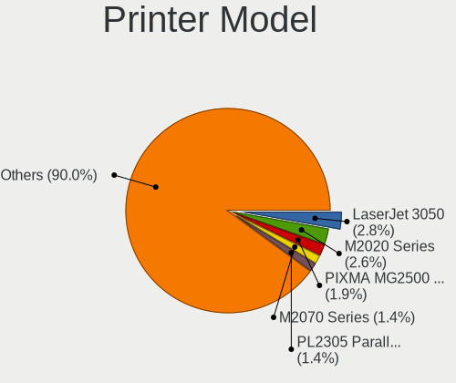

Ubuntu - Tested Hardware & Statistics (Notebooks)
-------------------------------------------------

A project to collect tested hardware configurations for Ubuntu.

Anyone can contribute to this report by the [hw-probe](https://github.com/linuxhw/hw-probe) tool:

    sudo -E hw-probe -all -upload

Please contribute! Especially if your hardware is rare.

Contents
--------

* [ Test Cases ](#test-cases)

* [ System ](#system)
  - [ OS                       ](#os)
  - [ OS Family                ](#os-family)
  - [ Kernel                   ](#kernel)
  - [ Kernel Family            ](#kernel-family)
  - [ Kernel Major Ver.        ](#kernel-major-ver)
  - [ Arch                     ](#arch)
  - [ DE                       ](#de)
  - [ Display Server           ](#display-server)
  - [ Display Manager          ](#display-manager)
  - [ OS Lang                  ](#os-lang)
  - [ Boot Mode                ](#boot-mode)
  - [ Filesystem               ](#filesystem)
  - [ Part. scheme             ](#part-scheme)
  - [ Dual Boot with Linux/BSD ](#dual-boot-with-linuxbsd)
  - [ Dual Boot (Win)          ](#dual-boot-win)

* [ Board ](#board)
  - [ Vendor                   ](#vendor)
  - [ Model                    ](#model)
  - [ Model Family             ](#model-family)
  - [ MFG Year                 ](#mfg-year)
  - [ Form Factor              ](#form-factor)
  - [ Secure Boot              ](#secure-boot)
  - [ Coreboot                 ](#coreboot)
  - [ RAM Size                 ](#ram-size)
  - [ RAM Used                 ](#ram-used)
  - [ Total Drives             ](#total-drives)
  - [ Has CD-ROM               ](#has-cd-rom)
  - [ Has Ethernet             ](#has-ethernet)
  - [ Has WiFi                 ](#has-wifi)
  - [ Has Bluetooth            ](#has-bluetooth)

* [ Location ](#location)
  - [ Country                  ](#country)
  - [ City                     ](#city)

* [ Drives ](#drives)
  - [ Drive Vendor             ](#drive-vendor)
  - [ Drive Model              ](#drive-model)
  - [ HDD Vendor               ](#hdd-vendor)
  - [ SSD Vendor               ](#ssd-vendor)
  - [ Drive Kind               ](#drive-kind)
  - [ Drive Connector          ](#drive-connector)
  - [ Drive Size               ](#drive-size)
  - [ Space Total              ](#space-total)
  - [ Space Used               ](#space-used)
  - [ Malfunc. Drives          ](#malfunc-drives)
  - [ Malfunc. Drive Vendor    ](#malfunc-drive-vendor)
  - [ Malfunc. HDD Vendor      ](#malfunc-hdd-vendor)
  - [ Malfunc. Drive Kind      ](#malfunc-drive-kind)
  - [ Failed Drives            ](#failed-drives)
  - [ Failed Drive Vendor      ](#failed-drive-vendor)
  - [ Drive Status             ](#drive-status)

* [ Storage controller ](#storage-controller)
  - [ Storage Vendor           ](#storage-vendor)
  - [ Storage Model            ](#storage-model)
  - [ Storage Kind             ](#storage-kind)

* [ Processor ](#processor)
  - [ CPU Vendor               ](#cpu-vendor)
  - [ CPU Model                ](#cpu-model)
  - [ CPU Model Family         ](#cpu-model-family)
  - [ CPU Cores                ](#cpu-cores)
  - [ CPU Sockets              ](#cpu-sockets)
  - [ CPU Threads              ](#cpu-threads)
  - [ CPU Op-Modes             ](#cpu-op-modes)
  - [ CPU Microcode            ](#cpu-microcode)
  - [ CPU Microarch            ](#cpu-microarch)

* [ Graphics ](#graphics)
  - [ GPU Vendor               ](#gpu-vendor)
  - [ GPU Model                ](#gpu-model)
  - [ GPU Combo                ](#gpu-combo)
  - [ GPU Driver               ](#gpu-driver)
  - [ GPU Memory               ](#gpu-memory)

* [ Monitor ](#monitor)
  - [ Monitor Vendor           ](#monitor-vendor)
  - [ Monitor Model            ](#monitor-model)
  - [ Monitor Resolution       ](#monitor-resolution)
  - [ Monitor Diagonal         ](#monitor-diagonal)
  - [ Monitor Width            ](#monitor-width)
  - [ Aspect Ratio             ](#aspect-ratio)
  - [ Monitor Area             ](#monitor-area)
  - [ Pixel Density            ](#pixel-density)
  - [ Multiple Monitors        ](#multiple-monitors)

* [ Network ](#network)
  - [ Net Controller Vendor    ](#net-controller-vendor)
  - [ Net Controller Model     ](#net-controller-model)
  - [ Wireless Vendor          ](#wireless-vendor)
  - [ Wireless Model           ](#wireless-model)
  - [ Ethernet Vendor          ](#ethernet-vendor)
  - [ Ethernet Model           ](#ethernet-model)
  - [ Net Controller Kind      ](#net-controller-kind)
  - [ Used Controller          ](#used-controller)
  - [ NICs                     ](#nics)
  - [ IPv6                     ](#ipv6)

* [ Bluetooth ](#bluetooth)
  - [ Bluetooth Vendor         ](#bluetooth-vendor)
  - [ Bluetooth Model          ](#bluetooth-model)

* [ Sound ](#sound)
  - [ Sound Vendor             ](#sound-vendor)
  - [ Sound Model              ](#sound-model)

* [ Memory ](#memory)
  - [ Memory Vendor            ](#memory-vendor)
  - [ Memory Model             ](#memory-model)
  - [ Memory Kind              ](#memory-kind)
  - [ Memory Form Factor       ](#memory-form-factor)
  - [ Memory Size              ](#memory-size)
  - [ Memory Speed             ](#memory-speed)

* [ Printers & scanners ](#printers--scanners)
  - [ Printer Vendor           ](#printer-vendor)
  - [ Printer Model            ](#printer-model)
  - [ Scanner Vendor           ](#scanner-vendor)
  - [ Scanner Model            ](#scanner-model)

* [ Camera ](#camera)
  - [ Camera Vendor            ](#camera-vendor)
  - [ Camera Model             ](#camera-model)

* [ Security ](#security)
  - [ Fingerprint Vendor       ](#fingerprint-vendor)
  - [ Fingerprint Model        ](#fingerprint-model)
  - [ Chipcard Vendor          ](#chipcard-vendor)
  - [ Chipcard Model           ](#chipcard-model)

* [ Unsupported ](#unsupported)
  - [ Unsupported Devices      ](#unsupported-devices)
  - [ Unsupported Device Types ](#unsupported-device-types)

Test Cases
----------

Total: 55987

| Vendor        | Model                       | Probe                                                      | Date         |
|---------------|-----------------------------|------------------------------------------------------------|--------------|
| HP            | Laptop 15-bw0xx             | [be612ae4a6](https://linux-hardware.org/?probe=be612ae4a6) | May 09, 2024 |
| SDZ           | X133                        | [442d4da2a4](https://linux-hardware.org/?probe=442d4da2a4) | May 09, 2024 |
| Fujitsu       | LIFEBOOK E754               | [1240b3da0c](https://linux-hardware.org/?probe=1240b3da0c) | May 09, 2024 |
| Lenovo        | IdeaPad S340-14API 81NB     | [6bb0aa91af](https://linux-hardware.org/?probe=6bb0aa91af) | May 09, 2024 |
| ASUSTek       | VivoBook_ASUSLaptop K370... | [57bc46051b](https://linux-hardware.org/?probe=57bc46051b) | May 08, 2024 |
| Lenovo        | Z50-75 80EC                 | [1a1e8edc3b](https://linux-hardware.org/?probe=1a1e8edc3b) | May 08, 2024 |
| MSI           | GE66 Raider 10UG            | [d19e5447f5](https://linux-hardware.org/?probe=d19e5447f5) | May 08, 2024 |
| Lenovo        | ThinkBook 15 G4 IAP 21DJ    | [259fba9825](https://linux-hardware.org/?probe=259fba9825) | May 08, 2024 |
| Apple         | MacBookPro8,2               | [2410273443](https://linux-hardware.org/?probe=2410273443) | May 08, 2024 |
| Lenovo        | ThinkPad E14 Gen 3 20YFC... | [6a43088440](https://linux-hardware.org/?probe=6a43088440) | May 08, 2024 |
| Apple         | MacBookPro11,1              | [5d23c7ed6f](https://linux-hardware.org/?probe=5d23c7ed6f) | May 08, 2024 |
| HP            | ProBook 4740s               | [7f39194517](https://linux-hardware.org/?probe=7f39194517) | May 08, 2024 |
| HP            | Laptop 15s-fq2xxx           | [31a04e0322](https://linux-hardware.org/?probe=31a04e0322) | May 08, 2024 |
| Micro Elec... | MG-VCP15I-3070              | [11e90f3f8f](https://linux-hardware.org/?probe=11e90f3f8f) | May 08, 2024 |
| Samsung       | SR700                       | [97ed5b7fc7](https://linux-hardware.org/?probe=97ed5b7fc7) | May 08, 2024 |
| HP            | ZBook Power 15.6 inch G8... | [291c23ee80](https://linux-hardware.org/?probe=291c23ee80) | May 08, 2024 |
| Lenovo        | V15 G4 AMN 82YU             | [3742af3546](https://linux-hardware.org/?probe=3742af3546) | May 08, 2024 |
| ASUSTek       | ASUS TUF Gaming A15 FA50... | [ae1ef1680a](https://linux-hardware.org/?probe=ae1ef1680a) | May 08, 2024 |
| Acer          | Swift SF314-71              | [23d1f2e74a](https://linux-hardware.org/?probe=23d1f2e74a) | May 08, 2024 |
| Lenovo        | ThinkPad P14s Gen 4 21K5... | [e00e076344](https://linux-hardware.org/?probe=e00e076344) | May 08, 2024 |
| Dell          | Latitude E5520              | [1c27a2760d](https://linux-hardware.org/?probe=1c27a2760d) | May 08, 2024 |
| HP            | ProBook 440 14 inch G9 N... | [6ac93f82e9](https://linux-hardware.org/?probe=6ac93f82e9) | May 08, 2024 |
| HP            | EliteBook 840 G8            | [6d255e156e](https://linux-hardware.org/?probe=6d255e156e) | May 08, 2024 |
| Hetrix        | Unknown                     | [72a5c6fffe](https://linux-hardware.org/?probe=72a5c6fffe) | May 08, 2024 |
| Lenovo        | V15 G4 AMN 82YU             | [29552fbf93](https://linux-hardware.org/?probe=29552fbf93) | May 08, 2024 |
| HP            | Laptop 15s-fq2xxx           | [ade9d916fe](https://linux-hardware.org/?probe=ade9d916fe) | May 08, 2024 |
| ASUSTek       | UX430UQ                     | [7b9134699a](https://linux-hardware.org/?probe=7b9134699a) | May 08, 2024 |
| ASUSTek       | Q550LF                      | [15c9500499](https://linux-hardware.org/?probe=15c9500499) | May 07, 2024 |
| ASUSTek       | Q550LF                      | [98ddf90ae6](https://linux-hardware.org/?probe=98ddf90ae6) | May 07, 2024 |
| Lenovo        | ThinkPad T490 20N2003PUS    | [7f484baa22](https://linux-hardware.org/?probe=7f484baa22) | May 07, 2024 |
| HP            | Pavilion Sleekbook 15       | [9cd7bfcd0f](https://linux-hardware.org/?probe=9cd7bfcd0f) | May 07, 2024 |
| Dell          | XPS 15 9530                 | [cdcf7e98eb](https://linux-hardware.org/?probe=cdcf7e98eb) | May 07, 2024 |
| ASUSTek       | X555LD                      | [989d24a4b7](https://linux-hardware.org/?probe=989d24a4b7) | May 07, 2024 |
| Lenovo        | ThinkPad P14s Gen 4 21HF... | [85239f7dc1](https://linux-hardware.org/?probe=85239f7dc1) | May 07, 2024 |
| Lenovo        | ThinkPad P14s Gen 1 20Y2... | [064b211de8](https://linux-hardware.org/?probe=064b211de8) | May 07, 2024 |
| Notebook      | NS50_70MU                   | [99983ceae1](https://linux-hardware.org/?probe=99983ceae1) | May 07, 2024 |
| Dell          | Latitude 7480               | [2b3aee3902](https://linux-hardware.org/?probe=2b3aee3902) | May 07, 2024 |
| MSI           | Thin GF63 12UCX             | [f253ec6e52](https://linux-hardware.org/?probe=f253ec6e52) | May 07, 2024 |
| Lenovo        | ThinkPad T480 20L5A023HK    | [ff78bb7112](https://linux-hardware.org/?probe=ff78bb7112) | May 07, 2024 |
| Dell          | Inspiron 5547               | [b8dd9a912d](https://linux-hardware.org/?probe=b8dd9a912d) | May 07, 2024 |
| Dell          | Latitude 9430               | [953be205ca](https://linux-hardware.org/?probe=953be205ca) | May 07, 2024 |
| HP            | EliteBook 840 G8            | [f60faaeec0](https://linux-hardware.org/?probe=f60faaeec0) | May 07, 2024 |
| Sony          | SVF1521E2EW                 | [2e86efc1ba](https://linux-hardware.org/?probe=2e86efc1ba) | May 07, 2024 |
| HP            | Laptop 15-bw0xx             | [f605dfd9c2](https://linux-hardware.org/?probe=f605dfd9c2) | May 07, 2024 |
| HP            | ProBook 645 G3              | [29cb5b66f8](https://linux-hardware.org/?probe=29cb5b66f8) | May 07, 2024 |
| HP            | ProBook 430 G8 Notebook ... | [be061de1c7](https://linux-hardware.org/?probe=be061de1c7) | May 07, 2024 |
| HP            | ZBook 15 G6                 | [4a401c8b15](https://linux-hardware.org/?probe=4a401c8b15) | May 06, 2024 |
| Sony          | VPCEB1S1E                   | [db144a8fd9](https://linux-hardware.org/?probe=db144a8fd9) | May 06, 2024 |
| ASUSTek       | ROG Zephyrus G14 GA401IH... | [e19fea8a49](https://linux-hardware.org/?probe=e19fea8a49) | May 06, 2024 |
| Alurin        | ALU-BAR-I511-000-140        | [04578b9c4b](https://linux-hardware.org/?probe=04578b9c4b) | May 06, 2024 |
| Medion        | E14223                      | [73ae3c5e79](https://linux-hardware.org/?probe=73ae3c5e79) | May 06, 2024 |
| Unknown       | Unknown                     | [273d6afeb5](https://linux-hardware.org/?probe=273d6afeb5) | May 06, 2024 |
| ASUSTek       | Zenbook UX5401ZA_UX5401Z... | [92089af4b7](https://linux-hardware.org/?probe=92089af4b7) | May 06, 2024 |
| MASSCOM VI... | L133                        | [12b6c6b515](https://linux-hardware.org/?probe=12b6c6b515) | May 06, 2024 |
| ASUSTek       | VivoBook_ASUSLaptop K360... | [5a788054ec](https://linux-hardware.org/?probe=5a788054ec) | May 06, 2024 |
| Apple         | MacBookPro8,1               | [2487a975e8](https://linux-hardware.org/?probe=2487a975e8) | May 06, 2024 |
| Dell          | Latitude 5440               | [f6c9287953](https://linux-hardware.org/?probe=f6c9287953) | May 06, 2024 |
| Dell          | System XPS L702X            | [fec4b7f7ff](https://linux-hardware.org/?probe=fec4b7f7ff) | May 06, 2024 |
| Dell          | Vostro 3520                 | [0b420358ac](https://linux-hardware.org/?probe=0b420358ac) | May 06, 2024 |
| HP            | Pavilion Laptop 15-eh1xx... | [d73bdd4b76](https://linux-hardware.org/?probe=d73bdd4b76) | May 06, 2024 |
| ASUSTek       | VivoBook_ASUSLaptop X513... | [d4cca237f2](https://linux-hardware.org/?probe=d4cca237f2) | May 06, 2024 |
| ASUSTek       | VivoBook_ASUSLaptop X513... | [e5685451f5](https://linux-hardware.org/?probe=e5685451f5) | May 06, 2024 |
| Sony          | VPCEB1S1E                   | [aa8d766ae4](https://linux-hardware.org/?probe=aa8d766ae4) | May 06, 2024 |
| Dell          | Inspiron 15 3520            | [c9bddc6d00](https://linux-hardware.org/?probe=c9bddc6d00) | May 06, 2024 |
| Lenovo        | ThinkPad P50 20ENCTO1WW     | [9adbb0ba2c](https://linux-hardware.org/?probe=9adbb0ba2c) | May 06, 2024 |
| Lenovo        | IdeaPad 330-15IKB 81DC      | [bc2508bd91](https://linux-hardware.org/?probe=bc2508bd91) | May 06, 2024 |
| Lenovo        | ThinkPad P50 20ENCTO1WW     | [465a5be052](https://linux-hardware.org/?probe=465a5be052) | May 06, 2024 |
| Acer          | Nitro AN515-46              | [b29aba86be](https://linux-hardware.org/?probe=b29aba86be) | May 06, 2024 |
| HP            | ZBook Studio G3             | [be52b86bc0](https://linux-hardware.org/?probe=be52b86bc0) | May 06, 2024 |
| Fujitsu       | LIFEBOOK E754               | [c201d1f500](https://linux-hardware.org/?probe=c201d1f500) | May 06, 2024 |
| ADVAN         | 1701                        | [e0928a1604](https://linux-hardware.org/?probe=e0928a1604) | May 06, 2024 |
| Lenovo        | ThinkPad P17 Gen 1 20SQS... | [8c2af338dc](https://linux-hardware.org/?probe=8c2af338dc) | May 06, 2024 |
| Dell          | Latitude 5400               | [cf78549103](https://linux-hardware.org/?probe=cf78549103) | May 06, 2024 |
| HP            | ProBook 450 G6              | [cb4f1dbbfa](https://linux-hardware.org/?probe=cb4f1dbbfa) | May 06, 2024 |
| Monster       | ABRA A7 V13.2               | [fef4f4d7d4](https://linux-hardware.org/?probe=fef4f4d7d4) | May 06, 2024 |
| Lenovo        | Unknown                     | [5087593233](https://linux-hardware.org/?probe=5087593233) | May 06, 2024 |
| Xiaomi        | Pad 5                       | [2ee74fac7d](https://linux-hardware.org/?probe=2ee74fac7d) | May 05, 2024 |
| Toshiba       | Satellite A200              | [633754915c](https://linux-hardware.org/?probe=633754915c) | May 05, 2024 |
| Lenovo        | IdeaPad Slim 5 16IRL8 82... | [2cace801f8](https://linux-hardware.org/?probe=2cace801f8) | May 05, 2024 |
| ASUSTek       | X450CC                      | [1085d5cad5](https://linux-hardware.org/?probe=1085d5cad5) | May 05, 2024 |
| Toshiba       | Satellite A200              | [ba705e9e1b](https://linux-hardware.org/?probe=ba705e9e1b) | May 05, 2024 |
| Dell          | Vostro 3405                 | [85b53deb59](https://linux-hardware.org/?probe=85b53deb59) | May 05, 2024 |
| Dell          | Vostro 3405                 | [ae06ac7700](https://linux-hardware.org/?probe=ae06ac7700) | May 05, 2024 |
| Acer          | Aspire A315-510P            | [802925480b](https://linux-hardware.org/?probe=802925480b) | May 05, 2024 |
| Dell          | Precision 3561              | [1e92742d1f](https://linux-hardware.org/?probe=1e92742d1f) | May 05, 2024 |
| Novatech      | NE14I310                    | [edf97226ed](https://linux-hardware.org/?probe=edf97226ed) | May 05, 2024 |
| Timi          | TM1701                      | [305b97ebea](https://linux-hardware.org/?probe=305b97ebea) | May 05, 2024 |
| Unknown       | Unknown                     | [8876712f97](https://linux-hardware.org/?probe=8876712f97) | May 05, 2024 |
| Unknown       | Unknown                     | [7cbaf2743a](https://linux-hardware.org/?probe=7cbaf2743a) | May 05, 2024 |
| Intel Clie... | LAPAC71H                    | [e599c3f230](https://linux-hardware.org/?probe=e599c3f230) | May 05, 2024 |
| Lenovo        | ThinkPad T440p 20AWS0HN0... | [dcdedc549d](https://linux-hardware.org/?probe=dcdedc549d) | May 05, 2024 |
| ASUSTek       | ASUS TUF Gaming A15 FA50... | [b86bb80db9](https://linux-hardware.org/?probe=b86bb80db9) | May 05, 2024 |
| Fujitsu       | CELSIUS H730                | [78e1a3550b](https://linux-hardware.org/?probe=78e1a3550b) | May 05, 2024 |
| HP            | Laptop 15s-fq2xxx           | [c9843fc5d2](https://linux-hardware.org/?probe=c9843fc5d2) | May 05, 2024 |
| Apple         | MacBookPro6,2               | [01201fa443](https://linux-hardware.org/?probe=01201fa443) | May 05, 2024 |
| Lenovo        | ThinkPad T440p 20AWS0HN0... | [68020b1c69](https://linux-hardware.org/?probe=68020b1c69) | May 05, 2024 |
| Lenovo        | ThinkPad P16 Gen 1 21D60... | [bc053b7c75](https://linux-hardware.org/?probe=bc053b7c75) | May 05, 2024 |
| MSI           | WS66 11UKT                  | [f9ab812619](https://linux-hardware.org/?probe=f9ab812619) | May 05, 2024 |
| ASUSTek       | VivoBook_ASUSLaptop M160... | [3602db941f](https://linux-hardware.org/?probe=3602db941f) | May 05, 2024 |
| Novatech      | NE14I310                    | [f2a49ce1fc](https://linux-hardware.org/?probe=f2a49ce1fc) | May 05, 2024 |
| Acer          | AOD270                      | [af6b765474](https://linux-hardware.org/?probe=af6b765474) | May 05, 2024 |
| Dell          | Precision 3510              | [c57923e0ff](https://linux-hardware.org/?probe=c57923e0ff) | May 04, 2024 |
| HP            | EliteBook 850 G5            | [997c27445a](https://linux-hardware.org/?probe=997c27445a) | May 04, 2024 |
| Samsung       | R780                        | [5a838d44cd](https://linux-hardware.org/?probe=5a838d44cd) | May 04, 2024 |
| Apple         | MacBookPro8,1               | [54ecba24d6](https://linux-hardware.org/?probe=54ecba24d6) | May 04, 2024 |
| Dell          | Precision 3510              | [0c006aad0f](https://linux-hardware.org/?probe=0c006aad0f) | May 04, 2024 |
| HP            | HPPavilionLaptop15-eh0xx... | [2d309668c0](https://linux-hardware.org/?probe=2d309668c0) | May 04, 2024 |
| HP            | ProBook 6470b               | [3865a636e2](https://linux-hardware.org/?probe=3865a636e2) | May 04, 2024 |
| Dell          | G15 5511                    | [8bb70e4a24](https://linux-hardware.org/?probe=8bb70e4a24) | May 04, 2024 |
| Lenovo        | ThinkPad T495 20NJCTO1WW    | [2dfceb527c](https://linux-hardware.org/?probe=2dfceb527c) | May 04, 2024 |
| Lenovo        | ThinkPad X270 20HMS34L00    | [dcc424b27d](https://linux-hardware.org/?probe=dcc424b27d) | May 04, 2024 |
| Apple         | MacBookAir4,1               | [f8bc0c50a5](https://linux-hardware.org/?probe=f8bc0c50a5) | May 04, 2024 |
| Acer          | Aspire A315-59              | [7e25c15f34](https://linux-hardware.org/?probe=7e25c15f34) | May 04, 2024 |
| Dell          | Latitude 7480               | [f81955d784](https://linux-hardware.org/?probe=f81955d784) | May 04, 2024 |
| Lenovo        | ThinkPad T450 20BUS2SS00    | [5d764e707b](https://linux-hardware.org/?probe=5d764e707b) | May 04, 2024 |
| Lenovo        | Legion 5 Pro 16ACH6H 82J... | [456554dd36](https://linux-hardware.org/?probe=456554dd36) | May 04, 2024 |
| Chuwi         | CoreBook X                  | [b1b4be48b3](https://linux-hardware.org/?probe=b1b4be48b3) | May 04, 2024 |
| Unknown       | Unknown                     | [ad1cee8128](https://linux-hardware.org/?probe=ad1cee8128) | May 04, 2024 |
| HP            | 15                          | [9ea6582e2f](https://linux-hardware.org/?probe=9ea6582e2f) | May 04, 2024 |
| HP            | ZBook 15 G2                 | [21c0d7fe7e](https://linux-hardware.org/?probe=21c0d7fe7e) | May 03, 2024 |
| Lenovo        | V340-17IWL 81RG             | [1584f1c1cf](https://linux-hardware.org/?probe=1584f1c1cf) | May 03, 2024 |
| Positivo      | 115T0810HN1C                | [1f932ed3b4](https://linux-hardware.org/?probe=1f932ed3b4) | May 03, 2024 |
| HP            | Laptop 15-bs0xx             | [7a34574eb1](https://linux-hardware.org/?probe=7a34574eb1) | May 03, 2024 |
| Lenovo        | ThinkPad X1 Carbon 4th 2... | [f6f74ecb12](https://linux-hardware.org/?probe=f6f74ecb12) | May 03, 2024 |
| Google        | Elemi                       | [a6ea033cf0](https://linux-hardware.org/?probe=a6ea033cf0) | May 03, 2024 |
| Lenovo        | Yoga Slim 7 14ARE05 82A2    | [c7a39f14e7](https://linux-hardware.org/?probe=c7a39f14e7) | May 03, 2024 |
| Dell          | XPS 15 9530                 | [b46ba9168c](https://linux-hardware.org/?probe=b46ba9168c) | May 03, 2024 |
| HP            | ProBook 6470b               | [152863481c](https://linux-hardware.org/?probe=152863481c) | May 03, 2024 |
| Lenovo        | G50-45 80E3                 | [ed0b78b628](https://linux-hardware.org/?probe=ed0b78b628) | May 03, 2024 |
| Lenovo        | IdeaPad Slim 5 16ABR8 82... | [d3c40c405d](https://linux-hardware.org/?probe=d3c40c405d) | May 03, 2024 |
| HP            | ProBook 430 G1              | [7aa4826b7e](https://linux-hardware.org/?probe=7aa4826b7e) | May 03, 2024 |
| Timi          | Xiaomi Book Pro 14 2022     | [30f381be91](https://linux-hardware.org/?probe=30f381be91) | May 03, 2024 |
| Lenovo        | ThinkPad T480S 20L7001PM... | [4baef88334](https://linux-hardware.org/?probe=4baef88334) | May 03, 2024 |
| ASUSTek       | Vivobook Go E1504FA_E150... | [94b445552d](https://linux-hardware.org/?probe=94b445552d) | May 03, 2024 |
| ASUSTek       | Vivobook Go E1504FA_E150... | [2cf97ed4d6](https://linux-hardware.org/?probe=2cf97ed4d6) | May 03, 2024 |
| Dell          | Latitude 7410               | [959e9d053d](https://linux-hardware.org/?probe=959e9d053d) | May 03, 2024 |
| Dell          | Latitude E7250              | [2fd31f177e](https://linux-hardware.org/?probe=2fd31f177e) | May 03, 2024 |
| Dell          | Latitude E7250              | [5c97b5c2ee](https://linux-hardware.org/?probe=5c97b5c2ee) | May 02, 2024 |
| HP            | 15                          | [6c1f8325a6](https://linux-hardware.org/?probe=6c1f8325a6) | May 02, 2024 |
| HP            | EliteBook 8470p             | [2480bab346](https://linux-hardware.org/?probe=2480bab346) | May 02, 2024 |
| HP            | OMEN by Laptop 15-dc0xxx    | [23c1b45346](https://linux-hardware.org/?probe=23c1b45346) | May 02, 2024 |
| Lenovo        | ThinkPad P72 20MCS1A400     | [2fb5a9e91b](https://linux-hardware.org/?probe=2fb5a9e91b) | May 02, 2024 |
| Dell          | XPS 15 9560                 | [023e102050](https://linux-hardware.org/?probe=023e102050) | May 02, 2024 |
| MECHREVO      | WUJIE14 PRO                 | [2004900fec](https://linux-hardware.org/?probe=2004900fec) | May 02, 2024 |
| ASUSTek       | K40IE                       | [82ddbf99c2](https://linux-hardware.org/?probe=82ddbf99c2) | May 02, 2024 |
| Apple         | MacBookAir7,2               | [2672483f38](https://linux-hardware.org/?probe=2672483f38) | May 02, 2024 |
| ASUSTek       | X553MA                      | [1aaeefe305](https://linux-hardware.org/?probe=1aaeefe305) | May 02, 2024 |
| Lenovo        | IdeaPad S540-14IML 81NF     | [614efe1b07](https://linux-hardware.org/?probe=614efe1b07) | May 02, 2024 |
| Samsung       | R530/R730                   | [bef875b7e6](https://linux-hardware.org/?probe=bef875b7e6) | May 02, 2024 |
| Google        | Delbin                      | [a0ed0beb73](https://linux-hardware.org/?probe=a0ed0beb73) | May 02, 2024 |
| HP            | ENVY Laptop 17-cr1xxx       | [f17f6e1d74](https://linux-hardware.org/?probe=f17f6e1d74) | May 02, 2024 |
| HP            | Pavilion g4                 | [d8f20744c2](https://linux-hardware.org/?probe=d8f20744c2) | May 02, 2024 |
| Dell          | Inspiron 3501               | [a2ef1e08ed](https://linux-hardware.org/?probe=a2ef1e08ed) | May 02, 2024 |
| Lenovo        | G400s VILG1                 | [f604dc3e58](https://linux-hardware.org/?probe=f604dc3e58) | May 02, 2024 |
| Dell          | Latitude 5490               | [a8db3589fb](https://linux-hardware.org/?probe=a8db3589fb) | May 02, 2024 |
| Lenovo        | ThinkPad P72 20MCS1A400     | [11cfebd1f9](https://linux-hardware.org/?probe=11cfebd1f9) | May 02, 2024 |
| Lenovo        | ThinkPad T470s 20HGS3RJ0... | [dee93d35ca](https://linux-hardware.org/?probe=dee93d35ca) | May 02, 2024 |
| Notebook      | PCx0Dx                      | [a2c29d6db0](https://linux-hardware.org/?probe=a2c29d6db0) | May 02, 2024 |
| Lenovo        | ThinkPad P14s Gen 4 21K5... | [a2d65a8e2d](https://linux-hardware.org/?probe=a2d65a8e2d) | May 02, 2024 |
| Lenovo        | ThinkPad E14 Gen 5 21JRC... | [8c996ba957](https://linux-hardware.org/?probe=8c996ba957) | May 02, 2024 |
| Lenovo        | V14-ADA 82C6                | [1e4ba01e31](https://linux-hardware.org/?probe=1e4ba01e31) | May 02, 2024 |
| ASUSTek       | GL552VW                     | [f68ba06228](https://linux-hardware.org/?probe=f68ba06228) | May 02, 2024 |
| Acer          | TravelMate P2510-G2-M       | [39c2dc876b](https://linux-hardware.org/?probe=39c2dc876b) | May 02, 2024 |
| Lenovo        | V145-15AST 81MT             | [9f845a3577](https://linux-hardware.org/?probe=9f845a3577) | May 02, 2024 |
| Alienware     | x17 R2                      | [4a80e449db](https://linux-hardware.org/?probe=4a80e449db) | May 02, 2024 |
| Dell          | Latitude 3300               | [639fb8097f](https://linux-hardware.org/?probe=639fb8097f) | May 02, 2024 |
| Lenovo        | IdeaPad Y580 20132          | [30987effea](https://linux-hardware.org/?probe=30987effea) | May 02, 2024 |
| HP            | Pavilion dv6500             | [ad0b9eaa92](https://linux-hardware.org/?probe=ad0b9eaa92) | May 02, 2024 |
| Dell          | System XPS L502X            | [ba86210a01](https://linux-hardware.org/?probe=ba86210a01) | May 02, 2024 |
| HP            | Victus by Laptop 16-d0xx... | [4192b9d9ad](https://linux-hardware.org/?probe=4192b9d9ad) | May 02, 2024 |
| Apple         | MacBookPro11,1              | [eb47dc7acd](https://linux-hardware.org/?probe=eb47dc7acd) | May 02, 2024 |
| Lenovo        | ThinkPad T470 W10DG 20JN... | [def7a0898e](https://linux-hardware.org/?probe=def7a0898e) | May 02, 2024 |
| INSYS         | GW1-W149                    | [1219dfdc44](https://linux-hardware.org/?probe=1219dfdc44) | May 02, 2024 |
| HUAWEI        | BOD-WXX9                    | [0cd46d4084](https://linux-hardware.org/?probe=0cd46d4084) | May 02, 2024 |
| Fujitsu       | CELSIUS H730                | [49cfbc7ba1](https://linux-hardware.org/?probe=49cfbc7ba1) | May 01, 2024 |
| Dell          | XPS 15 9570                 | [c5d7b3bc4e](https://linux-hardware.org/?probe=c5d7b3bc4e) | May 01, 2024 |
| Acer          | Nitro AN515-58              | [0ec502e8c7](https://linux-hardware.org/?probe=0ec502e8c7) | May 01, 2024 |
| Gigabyte      | P2542                       | [1520cc00e6](https://linux-hardware.org/?probe=1520cc00e6) | May 01, 2024 |
| HUAWEI        | CREFG-XX                    | [35fbc74ed5](https://linux-hardware.org/?probe=35fbc74ed5) | May 01, 2024 |
| Unknown       | Unknown                     | [9fb77bbafc](https://linux-hardware.org/?probe=9fb77bbafc) | May 01, 2024 |
| HP            | 250 G7 Notebook PC          | [d53b36801f](https://linux-hardware.org/?probe=d53b36801f) | May 01, 2024 |
| HP            | Pavilion Sleekbook 15       | [f61e28b31c](https://linux-hardware.org/?probe=f61e28b31c) | May 01, 2024 |
| HP            | Laptop 17-by2xxx            | [45443c04f2](https://linux-hardware.org/?probe=45443c04f2) | May 01, 2024 |
| Alienware     | x17 R2                      | [a98affb69b](https://linux-hardware.org/?probe=a98affb69b) | May 01, 2024 |
| HP            | Stream Laptop 14-cb1xxx     | [b30b733ae9](https://linux-hardware.org/?probe=b30b733ae9) | May 01, 2024 |
| ASUSTek       | ZenBook UX534FAC_UX534FA    | [d203d83db8](https://linux-hardware.org/?probe=d203d83db8) | May 01, 2024 |
| Framework     | Laptop 16 (AMD Ryzen 704... | [28e6be5f86](https://linux-hardware.org/?probe=28e6be5f86) | May 01, 2024 |
| Acer          | Swift SF514-56T             | [0d461b4a29](https://linux-hardware.org/?probe=0d461b4a29) | May 01, 2024 |
| Lenovo        | ThinkPad T480s 20L7001HR... | [f6ec4c6b31](https://linux-hardware.org/?probe=f6ec4c6b31) | May 01, 2024 |
| Lenovo        | IdeaPad 1 15ALC7 82R4       | [8d9c16f300](https://linux-hardware.org/?probe=8d9c16f300) | May 01, 2024 |
| realme        | CloudProXXXX                | [4a04219fcc](https://linux-hardware.org/?probe=4a04219fcc) | May 01, 2024 |
| HP            | Elite Dragonfly 13.5 inc... | [508451cb4c](https://linux-hardware.org/?probe=508451cb4c) | May 01, 2024 |
| Apple         | MacBookPro8,3               | [a4db0f550f](https://linux-hardware.org/?probe=a4db0f550f) | May 01, 2024 |
| Lenovo        | IdeaPad 1 15ALC7 82R4       | [f899f3dccf](https://linux-hardware.org/?probe=f899f3dccf) | May 01, 2024 |
| Acer          | Aspire A315-23              | [ee01c6ee48](https://linux-hardware.org/?probe=ee01c6ee48) | May 01, 2024 |
| Lenovo        | V15 G3 IAP 82TT             | [8e43832c47](https://linux-hardware.org/?probe=8e43832c47) | May 01, 2024 |
| Lenovo        | IdeaPad S145-15IWL 81S9     | [6c6c6b3f93](https://linux-hardware.org/?probe=6c6c6b3f93) | May 01, 2024 |
| ASUSTek       | K55VD                       | [66566dcc5c](https://linux-hardware.org/?probe=66566dcc5c) | May 01, 2024 |
| Lenovo        | Legion 5 Pro 16ITH6H 82J... | [76b1395f07](https://linux-hardware.org/?probe=76b1395f07) | May 01, 2024 |
| Dell          | Inspiron 1525               | [8e9c51790c](https://linux-hardware.org/?probe=8e9c51790c) | May 01, 2024 |
| HP            | Pavilion Laptop 15-eh2xx... | [2ad4a9fc76](https://linux-hardware.org/?probe=2ad4a9fc76) | Apr 30, 2024 |
| Dell          | Inspiron 1525               | [ca6bde2e75](https://linux-hardware.org/?probe=ca6bde2e75) | Apr 30, 2024 |
| MSI           | EX623                       | [76a2472e9d](https://linux-hardware.org/?probe=76a2472e9d) | Apr 30, 2024 |
| Acer          | Aspire V3-372T              | [888ad09735](https://linux-hardware.org/?probe=888ad09735) | Apr 30, 2024 |
| ASUSTek       | VivoBook_ASUSLaptop X160... | [06046f8679](https://linux-hardware.org/?probe=06046f8679) | Apr 30, 2024 |
| Acer          | Aspire ES1-522              | [90a2ac9af6](https://linux-hardware.org/?probe=90a2ac9af6) | Apr 30, 2024 |
| MSI           | Raider GE76 12UE            | [6c23378280](https://linux-hardware.org/?probe=6c23378280) | Apr 30, 2024 |
| Lenovo        | ThinkPad T510 43494JG       | [fe8480c6c4](https://linux-hardware.org/?probe=fe8480c6c4) | Apr 30, 2024 |
| Dell          | Latitude 3570               | [17e5cf551d](https://linux-hardware.org/?probe=17e5cf551d) | Apr 30, 2024 |
| HP            | Pavilion 15                 | [12fcb13cea](https://linux-hardware.org/?probe=12fcb13cea) | Apr 30, 2024 |
| MSI           | GS66 Stealth 10SE           | [e436c09a5c](https://linux-hardware.org/?probe=e436c09a5c) | Apr 30, 2024 |
| HP            | EliteBook 840 G8 Noteboo... | [dca5cca3c7](https://linux-hardware.org/?probe=dca5cca3c7) | Apr 30, 2024 |
| Acer          | Aspire A115-32              | [32a4949c7c](https://linux-hardware.org/?probe=32a4949c7c) | Apr 30, 2024 |
| HP            | Laptop 15-da0xxx            | [1d5c1bf00e](https://linux-hardware.org/?probe=1d5c1bf00e) | Apr 30, 2024 |
| Lenovo        | IdeaPad 320-15IKB 80YH      | [d8017ef206](https://linux-hardware.org/?probe=d8017ef206) | Apr 30, 2024 |
| Lenovo        | IdeaPad 320-15IKB 80YH      | [7cc4d5fb6b](https://linux-hardware.org/?probe=7cc4d5fb6b) | Apr 30, 2024 |
| Lenovo        | ThinkPad P1 Gen 5 21DCS0... | [4f23a4a44b](https://linux-hardware.org/?probe=4f23a4a44b) | Apr 30, 2024 |
| Dell          | XPS 9315                    | [7a8e7beaea](https://linux-hardware.org/?probe=7a8e7beaea) | Apr 30, 2024 |
| Lenovo        | Legion Slim 5 16APH8 82Y... | [c055450efc](https://linux-hardware.org/?probe=c055450efc) | Apr 30, 2024 |
| HP            | Laptop 15s-fq5xxx           | [dfeb38ca05](https://linux-hardware.org/?probe=dfeb38ca05) | Apr 30, 2024 |
| Lenovo        | IdeaPad S145-15IWL 81MV     | [274c1ee480](https://linux-hardware.org/?probe=274c1ee480) | Apr 30, 2024 |
| HP            | Laptop 15q-bu0xx            | [24bf1e456c](https://linux-hardware.org/?probe=24bf1e456c) | Apr 30, 2024 |
| Dell          | Latitude 7310               | [4379da59b1](https://linux-hardware.org/?probe=4379da59b1) | Apr 30, 2024 |
| HP            | ProBook 445 14 inch G10 ... | [944346cb24](https://linux-hardware.org/?probe=944346cb24) | Apr 30, 2024 |
| Samsung       | 550XDA                      | [6cf8613d4e](https://linux-hardware.org/?probe=6cf8613d4e) | Apr 30, 2024 |
| Apple         | MacBookAir7,2               | [1af69fe222](https://linux-hardware.org/?probe=1af69fe222) | Apr 30, 2024 |
| HP            | ProBook 4520s               | [cedd016f83](https://linux-hardware.org/?probe=cedd016f83) | Apr 30, 2024 |
| Dell          | Latitude 9520               | [25d6f4ff3b](https://linux-hardware.org/?probe=25d6f4ff3b) | Apr 29, 2024 |
| HP            | ProBook 4520s               | [7489071390](https://linux-hardware.org/?probe=7489071390) | Apr 29, 2024 |
| Apple         | MacBookPro9,1               | [ab5152538c](https://linux-hardware.org/?probe=ab5152538c) | Apr 29, 2024 |
| HP            | ProBook 650 G8 Notebook ... | [18585f423b](https://linux-hardware.org/?probe=18585f423b) | Apr 29, 2024 |
| OEM           | KabyLake                    | [0a646c116b](https://linux-hardware.org/?probe=0a646c116b) | Apr 29, 2024 |
| ASUSTek       | TUF Gaming FX705DT_FX705... | [442e237079](https://linux-hardware.org/?probe=442e237079) | Apr 29, 2024 |
| ASUSTek       | TUF Gaming FX705DT_FX705... | [c785d9440f](https://linux-hardware.org/?probe=c785d9440f) | Apr 29, 2024 |
| Dell          | Vostro 14-3468              | [4d24830aa0](https://linux-hardware.org/?probe=4d24830aa0) | Apr 29, 2024 |
| Dell          | Latitude 3520               | [29ae7a02fd](https://linux-hardware.org/?probe=29ae7a02fd) | Apr 29, 2024 |
| Dell          | Latitude 3520               | [0ce04a54b4](https://linux-hardware.org/?probe=0ce04a54b4) | Apr 29, 2024 |
| Samsung       | 535U3C                      | [8807f9f44f](https://linux-hardware.org/?probe=8807f9f44f) | Apr 29, 2024 |
| ASUSTek       | X555YA                      | [43e5d87003](https://linux-hardware.org/?probe=43e5d87003) | Apr 29, 2024 |
| Lenovo        | ThinkBook 16 G4+ IAP 21C... | [4060d6bdbe](https://linux-hardware.org/?probe=4060d6bdbe) | Apr 29, 2024 |
| Acer          | Aspire A315-32              | [452883ee31](https://linux-hardware.org/?probe=452883ee31) | Apr 29, 2024 |
| Lenovo        | ThinkBook 16 G4+ IAP 21C... | [885d49a692](https://linux-hardware.org/?probe=885d49a692) | Apr 29, 2024 |
| TUXEDO        | Pulse 14 Gen3               | [d298ae16e1](https://linux-hardware.org/?probe=d298ae16e1) | Apr 29, 2024 |
| HP            | ZBook Studio G3             | [f22beb97bc](https://linux-hardware.org/?probe=f22beb97bc) | Apr 29, 2024 |
| Samsung       | 550XDA                      | [24b83d160f](https://linux-hardware.org/?probe=24b83d160f) | Apr 29, 2024 |
| Lenovo        | IdeaPad 5 Pro 14ITL6 82L... | [80821a7004](https://linux-hardware.org/?probe=80821a7004) | Apr 29, 2024 |
| Dell          | Latitude E6420              | [ce4fbe47c7](https://linux-hardware.org/?probe=ce4fbe47c7) | Apr 29, 2024 |
| Dell          | Latitude E6420              | [b7e8d7d578](https://linux-hardware.org/?probe=b7e8d7d578) | Apr 29, 2024 |
| Acer          | Extensa 5620                | [4150199b68](https://linux-hardware.org/?probe=4150199b68) | Apr 29, 2024 |
| Acer          | Aspire A715-76G             | [067678032d](https://linux-hardware.org/?probe=067678032d) | Apr 29, 2024 |
| Dell          | Latitude E6430              | [0225857e36](https://linux-hardware.org/?probe=0225857e36) | Apr 29, 2024 |
| Dell          | Latitude E6430              | [8cafdeffed](https://linux-hardware.org/?probe=8cafdeffed) | Apr 29, 2024 |
| Lenovo        | ThinkPad E14 Gen 5 21JKS... | [a9b2e41472](https://linux-hardware.org/?probe=a9b2e41472) | Apr 29, 2024 |
| Apple         | MacBookPro14,1              | [e205d1dcf4](https://linux-hardware.org/?probe=e205d1dcf4) | Apr 29, 2024 |
| Acer          | Aspire A515-47              | [7cef016361](https://linux-hardware.org/?probe=7cef016361) | Apr 29, 2024 |
| Dell          | Latitude 5420               | [121f841401](https://linux-hardware.org/?probe=121f841401) | Apr 29, 2024 |
| Lenovo        | ThinkPad E16 Gen 1 21JNS... | [d55532cec3](https://linux-hardware.org/?probe=d55532cec3) | Apr 29, 2024 |
| Lenovo        | ThinkPad E16 Gen 1 21JNS... | [64c12d9b15](https://linux-hardware.org/?probe=64c12d9b15) | Apr 29, 2024 |
| Toshiba       | Satellite L775D             | [507b5ac196](https://linux-hardware.org/?probe=507b5ac196) | Apr 29, 2024 |
| Dell          | Latitude E6420              | [96a7d85c67](https://linux-hardware.org/?probe=96a7d85c67) | Apr 29, 2024 |
| HP            | EliteBook 840 14 inch G9... | [6d0a2c142b](https://linux-hardware.org/?probe=6d0a2c142b) | Apr 29, 2024 |
| Dell          | Latitude E6420              | [0fa22b02d0](https://linux-hardware.org/?probe=0fa22b02d0) | Apr 29, 2024 |
| Samsung       | 750XED                      | [d4c8fa3bde](https://linux-hardware.org/?probe=d4c8fa3bde) | Apr 29, 2024 |
| Samsung       | 750XED                      | [37fcaff384](https://linux-hardware.org/?probe=37fcaff384) | Apr 29, 2024 |
| HUAWEI        | NbDE-WXX9                   | [b378a91172](https://linux-hardware.org/?probe=b378a91172) | Apr 29, 2024 |
| HP            | ProBook 440 G3              | [27ac0cda6c](https://linux-hardware.org/?probe=27ac0cda6c) | Apr 29, 2024 |
| Google        | Gnawty                      | [c639a31438](https://linux-hardware.org/?probe=c639a31438) | Apr 28, 2024 |
| Google        | Gnawty                      | [c913fe837f](https://linux-hardware.org/?probe=c913fe837f) | Apr 28, 2024 |
| Minix         | Z64 V1.2                    | [7c0143f3e4](https://linux-hardware.org/?probe=7c0143f3e4) | Apr 28, 2024 |
| HUAWEI        | KPL-W0X                     | [26afcd3dda](https://linux-hardware.org/?probe=26afcd3dda) | Apr 28, 2024 |
| Lenovo        | B570 1068EMG                | [9617fb7082](https://linux-hardware.org/?probe=9617fb7082) | Apr 28, 2024 |
| Dell          | Inspiron 3721               | [6f596de759](https://linux-hardware.org/?probe=6f596de759) | Apr 28, 2024 |
| Apple         | MacBookPro11,3              | [923b49223a](https://linux-hardware.org/?probe=923b49223a) | Apr 28, 2024 |
| HUAWEI        | KPL-W0X                     | [31f15bd85c](https://linux-hardware.org/?probe=31f15bd85c) | Apr 28, 2024 |
| HP            | ProBook 650 G3              | [e2f71d285f](https://linux-hardware.org/?probe=e2f71d285f) | Apr 28, 2024 |
| Apple         | MacBookPro9,2               | [e298812f38](https://linux-hardware.org/?probe=e298812f38) | Apr 28, 2024 |
| Lenovo        | ThinkPad L13 Gen 3 21B90... | [372c9b4a75](https://linux-hardware.org/?probe=372c9b4a75) | Apr 28, 2024 |
| Fujitsu       | LIFEBOOK UH572              | [18bdace363](https://linux-hardware.org/?probe=18bdace363) | Apr 28, 2024 |
| Acer          | Swift SF114-32              | [0e6af8b6ca](https://linux-hardware.org/?probe=0e6af8b6ca) | Apr 28, 2024 |
| ASUSTek       | VivoBook_ASUSLaptop M160... | [3989576cd6](https://linux-hardware.org/?probe=3989576cd6) | Apr 28, 2024 |
| Lenovo        | ThinkPad T510 4349RW1       | [afaac362f7](https://linux-hardware.org/?probe=afaac362f7) | Apr 28, 2024 |
| ASUSTek       | VivoBook_ASUSLaptop X712... | [ea2746d610](https://linux-hardware.org/?probe=ea2746d610) | Apr 28, 2024 |
| Acer          | Aspire A315-33              | [6570c2a483](https://linux-hardware.org/?probe=6570c2a483) | Apr 28, 2024 |
| Toshiba       | Satellite P755              | [2e2a03f963](https://linux-hardware.org/?probe=2e2a03f963) | Apr 28, 2024 |
| Apple         | MacBookPro11,1              | [0a30ad8b47](https://linux-hardware.org/?probe=0a30ad8b47) | Apr 28, 2024 |
| HP            | ZBook 15 G5                 | [b34c85c82f](https://linux-hardware.org/?probe=b34c85c82f) | Apr 28, 2024 |
| HP            | 250 G3                      | [3b043693a3](https://linux-hardware.org/?probe=3b043693a3) | Apr 27, 2024 |
| Lenovo        | IdeaPad 3 15ITL6 82H8       | [ca7df399fe](https://linux-hardware.org/?probe=ca7df399fe) | Apr 27, 2024 |
| Lenovo        | ThinkPad X1 Carbon 7th 2... | [66f95f549d](https://linux-hardware.org/?probe=66f95f549d) | Apr 27, 2024 |
| HP            | Laptop 15s-fq2xxx           | [b6fc451f3c](https://linux-hardware.org/?probe=b6fc451f3c) | Apr 27, 2024 |
| Lenovo        | IdeaPadFlex 15D 20334       | [a05b704ec4](https://linux-hardware.org/?probe=a05b704ec4) | Apr 27, 2024 |
| Lenovo        | IdeaPad 320-15IKB 80XL      | [814f4429a4](https://linux-hardware.org/?probe=814f4429a4) | Apr 27, 2024 |
| Acer          | Aspire 5733                 | [f7af5c9308](https://linux-hardware.org/?probe=f7af5c9308) | Apr 27, 2024 |
| HP            | Notebook                    | [1918273411](https://linux-hardware.org/?probe=1918273411) | Apr 27, 2024 |
| HP            | Victus by Gaming Laptop ... | [8edf94f255](https://linux-hardware.org/?probe=8edf94f255) | Apr 27, 2024 |
| ASUSTek       | Zenbook UX3402VA_UX3402V... | [567613b6b6](https://linux-hardware.org/?probe=567613b6b6) | Apr 27, 2024 |
| HP            | Notebook                    | [91c53e6cc1](https://linux-hardware.org/?probe=91c53e6cc1) | Apr 27, 2024 |
| Acer          | Aspire A717-72G             | [b386005b8e](https://linux-hardware.org/?probe=b386005b8e) | Apr 27, 2024 |
| HP            | Laptop 15s-fq1xxx           | [b71d197185](https://linux-hardware.org/?probe=b71d197185) | Apr 27, 2024 |
| XIAOMI        | Redmi Book Pro 15 2023      | [e4feccc962](https://linux-hardware.org/?probe=e4feccc962) | Apr 27, 2024 |
| Lenovo        | ThinkPad X240 20AMA0SE00    | [be7a1e7b0c](https://linux-hardware.org/?probe=be7a1e7b0c) | Apr 27, 2024 |
| Toshiba       | Satellite C660              | [c2513f220d](https://linux-hardware.org/?probe=c2513f220d) | Apr 27, 2024 |
| ASUSTek       | ASUS TUF Gaming A17 FA70... | [da45f52feb](https://linux-hardware.org/?probe=da45f52feb) | Apr 27, 2024 |
| ASUSTek       | ASUS TUF Gaming A17 FA70... | [f8f255e514](https://linux-hardware.org/?probe=f8f255e514) | Apr 27, 2024 |
| ASUSTek       | X555LD                      | [95724fb189](https://linux-hardware.org/?probe=95724fb189) | Apr 27, 2024 |
| HP            | EliteBook 850 G4            | [1e562ccb80](https://linux-hardware.org/?probe=1e562ccb80) | Apr 27, 2024 |
| HUAWEI        | VGHH-XX                     | [aafd3db575](https://linux-hardware.org/?probe=aafd3db575) | Apr 27, 2024 |
| HUAWEI        | VGHH-XX                     | [15fc366121](https://linux-hardware.org/?probe=15fc366121) | Apr 27, 2024 |
| Acer          | Nitro AN517-42              | [c8d6aba6fa](https://linux-hardware.org/?probe=c8d6aba6fa) | Apr 27, 2024 |
| MSI           | Modern 15 B7M               | [a7e83932d5](https://linux-hardware.org/?probe=a7e83932d5) | Apr 27, 2024 |
| ASUSTek       | VivoBook_ASUSLaptop X512... | [ab7e7e4331](https://linux-hardware.org/?probe=ab7e7e4331) | Apr 27, 2024 |
| Alienware     | M11x R2                     | [a9c788cf5a](https://linux-hardware.org/?probe=a9c788cf5a) | Apr 27, 2024 |
| Alienware     | M11x R2                     | [c46c801bbe](https://linux-hardware.org/?probe=c46c801bbe) | Apr 27, 2024 |
| Acer          | Swift SFG14-72T             | [fcb16747e5](https://linux-hardware.org/?probe=fcb16747e5) | Apr 27, 2024 |
| HP            | ZBook 15                    | [63fe793b96](https://linux-hardware.org/?probe=63fe793b96) | Apr 27, 2024 |
| HP            | Dragonfly 13.5 inch G4 N... | [932af82a52](https://linux-hardware.org/?probe=932af82a52) | Apr 27, 2024 |
| HP            | Dragonfly 13.5 inch G4 N... | [daddd21635](https://linux-hardware.org/?probe=daddd21635) | Apr 27, 2024 |
| ASUSTek       | ZenBook UX431FAC_UX431FA    | [7c4a5dba54](https://linux-hardware.org/?probe=7c4a5dba54) | Apr 27, 2024 |
| HP            | Laptop 17t-cn200            | [d2301475ae](https://linux-hardware.org/?probe=d2301475ae) | Apr 26, 2024 |
| Monster       | ABRA A5 V16.5               | [dafa6ffefd](https://linux-hardware.org/?probe=dafa6ffefd) | Apr 26, 2024 |
| Toshiba       | Satellite A505              | [d26d7bf4ec](https://linux-hardware.org/?probe=d26d7bf4ec) | Apr 26, 2024 |
| Samsung       | 750XED                      | [dc5ed7dd87](https://linux-hardware.org/?probe=dc5ed7dd87) | Apr 26, 2024 |
| ASUSTek       | VivoBook_ASUSLaptop M760... | [936e0bf88e](https://linux-hardware.org/?probe=936e0bf88e) | Apr 26, 2024 |
| Dell          | Inspiron 15-3567            | [fcff8a4272](https://linux-hardware.org/?probe=fcff8a4272) | Apr 26, 2024 |
| Acer          | Aspire 7745G                | [2db24c493d](https://linux-hardware.org/?probe=2db24c493d) | Apr 26, 2024 |
| HP            | Pavilion Laptop 15-eh1xx... | [3358640735](https://linux-hardware.org/?probe=3358640735) | Apr 26, 2024 |
| Dell          | Latitude E5450              | [575668e003](https://linux-hardware.org/?probe=575668e003) | Apr 26, 2024 |
| HP            | EliteBook 820 G3            | [c73442e58f](https://linux-hardware.org/?probe=c73442e58f) | Apr 26, 2024 |
| Positivo      | S15SL                       | [94429966a7](https://linux-hardware.org/?probe=94429966a7) | Apr 26, 2024 |
| Medion        | Defender P30                | [12b85f5741](https://linux-hardware.org/?probe=12b85f5741) | Apr 26, 2024 |
| Dell          | XPS 14 9440                 | [9eef0b7d62](https://linux-hardware.org/?probe=9eef0b7d62) | Apr 26, 2024 |
| ASUSTek       | X55A                        | [6b6ea50d41](https://linux-hardware.org/?probe=6b6ea50d41) | Apr 26, 2024 |
| Dell          | Precision 3551              | [f5fbef6c5d](https://linux-hardware.org/?probe=f5fbef6c5d) | Apr 26, 2024 |
| HP            | ProBook 450 G0              | [5945f4d2d5](https://linux-hardware.org/?probe=5945f4d2d5) | Apr 26, 2024 |
| Samsung       | RV410/RV510/S3510/E3510     | [d62fc38125](https://linux-hardware.org/?probe=d62fc38125) | Apr 26, 2024 |
| HP            | EliteBook 840 G1            | [02246fba3e](https://linux-hardware.org/?probe=02246fba3e) | Apr 26, 2024 |
| Dell          | Latitude E4300              | [251219f28e](https://linux-hardware.org/?probe=251219f28e) | Apr 26, 2024 |
| Apple         | MacBookPro11,3              | [81b0d669d9](https://linux-hardware.org/?probe=81b0d669d9) | Apr 26, 2024 |
| ONE-NETBOO... | ONEXPLAYER X1 i             | [c68eab2b1c](https://linux-hardware.org/?probe=c68eab2b1c) | Apr 26, 2024 |
| HP            | ProBook 445 14 inch G10 ... | [63b4e0ea31](https://linux-hardware.org/?probe=63b4e0ea31) | Apr 26, 2024 |
| HP            | Pavilion Laptop 15-eh1xx... | [8c81adc916](https://linux-hardware.org/?probe=8c81adc916) | Apr 26, 2024 |
| HP            | EliteBook 850 G5            | [366a6a7aaf](https://linux-hardware.org/?probe=366a6a7aaf) | Apr 26, 2024 |
| Acer          | Aspire 5733                 | [b84cedde38](https://linux-hardware.org/?probe=b84cedde38) | Apr 26, 2024 |
| Dell          | Latitude 3420               | [c0bc583333](https://linux-hardware.org/?probe=c0bc583333) | Apr 26, 2024 |
| Dell          | Latitude 3420               | [522bdc6fd0](https://linux-hardware.org/?probe=522bdc6fd0) | Apr 26, 2024 |
| Dell          | Latitude 7480               | [7427bb7450](https://linux-hardware.org/?probe=7427bb7450) | Apr 26, 2024 |
| Acer          | Aspire AV14-51              | [de04e40a68](https://linux-hardware.org/?probe=de04e40a68) | Apr 25, 2024 |
| Lenovo        | ThinkPad P15 Gen 1 20ST0... | [ac764cfca7](https://linux-hardware.org/?probe=ac764cfca7) | Apr 25, 2024 |
| Lenovo        | IdeaPad 5 14ALC05 82LM      | [5560070361](https://linux-hardware.org/?probe=5560070361) | Apr 25, 2024 |
| Lenovo        | IdeaPad 3 15ITL6 82H8       | [25997dad2f](https://linux-hardware.org/?probe=25997dad2f) | Apr 25, 2024 |
| Dell          | Latitude 5420               | [f367471e11](https://linux-hardware.org/?probe=f367471e11) | Apr 25, 2024 |
| HP            | ProBook 430 G1              | [9230399ac5](https://linux-hardware.org/?probe=9230399ac5) | Apr 25, 2024 |
| Lenovo        | IdeaPad S145-15AST 81N3     | [68a7e21bcb](https://linux-hardware.org/?probe=68a7e21bcb) | Apr 25, 2024 |
| HP            | Laptop 15-da0xxx            | [3d96ca2745](https://linux-hardware.org/?probe=3d96ca2745) | Apr 25, 2024 |
| Lenovo        | IdeaPad 320-17ISK 80XJ      | [a0fe903a7c](https://linux-hardware.org/?probe=a0fe903a7c) | Apr 25, 2024 |
| Acer          | Aspire A315-510P            | [d30b9a7a06](https://linux-hardware.org/?probe=d30b9a7a06) | Apr 25, 2024 |
| Dell          | Precision 3551              | [4a88987cea](https://linux-hardware.org/?probe=4a88987cea) | Apr 25, 2024 |
| HP            | EliteBook 850 G5            | [4da2348bbe](https://linux-hardware.org/?probe=4da2348bbe) | Apr 25, 2024 |
| Lenovo        | IdeaPad 5 14ALC05 82LM      | [6ec3950131](https://linux-hardware.org/?probe=6ec3950131) | Apr 25, 2024 |
| Lenovo        | Legion 5 Pro 16IAH7H 82R... | [82c3a3a90b](https://linux-hardware.org/?probe=82c3a3a90b) | Apr 25, 2024 |
| HP            | 2000                        | [1314698cd1](https://linux-hardware.org/?probe=1314698cd1) | Apr 25, 2024 |
| Lenovo        | ThinkPad P43s 20RH0021MX    | [01d705d92b](https://linux-hardware.org/?probe=01d705d92b) | Apr 25, 2024 |
| ASUSTek       | VivoBook_ASUSLaptop M150... | [6230432bc4](https://linux-hardware.org/?probe=6230432bc4) | Apr 25, 2024 |
| Dell          | Inspiron 15-3567            | [28838a3b1b](https://linux-hardware.org/?probe=28838a3b1b) | Apr 25, 2024 |
| HP            | Compaq 6520s                | [235863713b](https://linux-hardware.org/?probe=235863713b) | Apr 25, 2024 |
| Dell          | Unidentified System         | [3adeaf17e6](https://linux-hardware.org/?probe=3adeaf17e6) | Apr 25, 2024 |
| Dell          | Inspiron N7010              | [adce00a04d](https://linux-hardware.org/?probe=adce00a04d) | Apr 25, 2024 |
| Dell          | Inspiron N7010              | [fa7c038b74](https://linux-hardware.org/?probe=fa7c038b74) | Apr 25, 2024 |
| HP            | EliteBook 8460p             | [d8ad825d7c](https://linux-hardware.org/?probe=d8ad825d7c) | Apr 25, 2024 |
| Dell          | Unidentified System         | [d39d12f48e](https://linux-hardware.org/?probe=d39d12f48e) | Apr 25, 2024 |
| HP            | ZBook 17 G3                 | [05ef86a1b6](https://linux-hardware.org/?probe=05ef86a1b6) | Apr 25, 2024 |
| Lenovo        | Legion S7 16ARHA7 82UG      | [5b493ea8ca](https://linux-hardware.org/?probe=5b493ea8ca) | Apr 24, 2024 |
| Lenovo        | IdeaPad 5 14IIL05 81YH      | [f537e8aab2](https://linux-hardware.org/?probe=f537e8aab2) | Apr 24, 2024 |
| HP            | EliteBook 8460p             | [7dab54dc06](https://linux-hardware.org/?probe=7dab54dc06) | Apr 24, 2024 |
| Dell          | System XPS L502X            | [1546699c7b](https://linux-hardware.org/?probe=1546699c7b) | Apr 24, 2024 |
| Lenovo        | ThinkPad P52 20MAS4W721     | [7aab14f802](https://linux-hardware.org/?probe=7aab14f802) | Apr 24, 2024 |
| Vizio         | CT14                        | [557643cae2](https://linux-hardware.org/?probe=557643cae2) | Apr 24, 2024 |
| Lenovo        | ThinkPad P16s Gen 2 21HK... | [363e170887](https://linux-hardware.org/?probe=363e170887) | Apr 24, 2024 |
| HP            | 255 G6 Notebook PC          | [8388259ad7](https://linux-hardware.org/?probe=8388259ad7) | Apr 24, 2024 |
| Toshiba       | Satellite Pro L650          | [5a4eb9f755](https://linux-hardware.org/?probe=5a4eb9f755) | Apr 24, 2024 |
| MSI           | Katana 17 B12VGK            | [9774448ac4](https://linux-hardware.org/?probe=9774448ac4) | Apr 24, 2024 |
| Dell          | Precision 3581              | [93a95856e0](https://linux-hardware.org/?probe=93a95856e0) | Apr 24, 2024 |
| Toshiba       | Satellite E45t-B            | [4abd9d698a](https://linux-hardware.org/?probe=4abd9d698a) | Apr 24, 2024 |
| ASUSTek       | ZenBook UX431FAC_UX431FA    | [cc693892db](https://linux-hardware.org/?probe=cc693892db) | Apr 24, 2024 |
| Lenovo        | Legion Pro 5 16IRX9 83DF    | [a0287fdd29](https://linux-hardware.org/?probe=a0287fdd29) | Apr 24, 2024 |
| Lenovo        | ThinkPad P16s Gen 2 21K9... | [ac5431b1ee](https://linux-hardware.org/?probe=ac5431b1ee) | Apr 24, 2024 |
| ASUSTek       | ROG Strix G513QC_G513QC     | [85b36d2613](https://linux-hardware.org/?probe=85b36d2613) | Apr 24, 2024 |
| Lenovo        | ThinkPad E14 Gen 2 20TA0... | [038bd79a48](https://linux-hardware.org/?probe=038bd79a48) | Apr 23, 2024 |
| Dell          | Latitude 5290 2-in-1        | [de4f7d0a06](https://linux-hardware.org/?probe=de4f7d0a06) | Apr 23, 2024 |
| Apple         | MacBookPro8,1               | [d8f7a5da03](https://linux-hardware.org/?probe=d8f7a5da03) | Apr 23, 2024 |
| Toshiba       | Satellite Pro A200          | [305f0f136a](https://linux-hardware.org/?probe=305f0f136a) | Apr 23, 2024 |
| Lenovo        | ThinkPad P51 20HHCTO1WW     | [152f2cedf4](https://linux-hardware.org/?probe=152f2cedf4) | Apr 23, 2024 |
| Acer          | Aspire 5739G                | [cd8bc25688](https://linux-hardware.org/?probe=cd8bc25688) | Apr 23, 2024 |
| Lenovo        | IdeaPad Pro 5 14IRH8 83A... | [8031865fea](https://linux-hardware.org/?probe=8031865fea) | Apr 23, 2024 |
| Lenovo        | IdeaPad Pro 5 14IRH8 83A... | [d53dd10be1](https://linux-hardware.org/?probe=d53dd10be1) | Apr 23, 2024 |
| Lenovo        | B50-10 80QR                 | [3ac8b8986f](https://linux-hardware.org/?probe=3ac8b8986f) | Apr 23, 2024 |
| Dell          | Vostro 15 5510              | [aedc6ae848](https://linux-hardware.org/?probe=aedc6ae848) | Apr 23, 2024 |
| Allview       | Allbook J                   | [77d90c2a69](https://linux-hardware.org/?probe=77d90c2a69) | Apr 23, 2024 |
| Lenovo        | ThinkPad E15 Gen 2 20TD0... | [303ebb0865](https://linux-hardware.org/?probe=303ebb0865) | Apr 23, 2024 |
| Unknown       | Unknown                     | [6d5a09c736](https://linux-hardware.org/?probe=6d5a09c736) | Apr 23, 2024 |
| Acer          | Aspire A315-24P             | [21c5354e14](https://linux-hardware.org/?probe=21c5354e14) | Apr 23, 2024 |
| MSI           | Katana GF66 11UE            | [8f4e6cf713](https://linux-hardware.org/?probe=8f4e6cf713) | Apr 23, 2024 |
| Toshiba       | Satellite C55-B             | [031e71aea3](https://linux-hardware.org/?probe=031e71aea3) | Apr 23, 2024 |
| THUNDEROBO... | ZERO                        | [9f1b5806e2](https://linux-hardware.org/?probe=9f1b5806e2) | Apr 23, 2024 |
| Notebook      | NP50D5                      | [5efdc99e90](https://linux-hardware.org/?probe=5efdc99e90) | Apr 23, 2024 |
| Acer          | Aspire A515-52G             | [9ee2e8d42a](https://linux-hardware.org/?probe=9ee2e8d42a) | Apr 23, 2024 |
| Acer          | Aspire A315-24P             | [fec51df86d](https://linux-hardware.org/?probe=fec51df86d) | Apr 23, 2024 |
| Dell          | XPS 15 9560                 | [b5992402c8](https://linux-hardware.org/?probe=b5992402c8) | Apr 23, 2024 |
| Lenovo        | IdeaPad 3 15ABA7 82RN       | [e99cd50084](https://linux-hardware.org/?probe=e99cd50084) | Apr 23, 2024 |
| HP            | ProBook 650 G1              | [09883eb0c7](https://linux-hardware.org/?probe=09883eb0c7) | Apr 22, 2024 |
| Lenovo        | Legion 7 16IAX7 82TD        | [7c88cac728](https://linux-hardware.org/?probe=7c88cac728) | Apr 22, 2024 |
| Lenovo        | G780 20138                  | [1863069a38](https://linux-hardware.org/?probe=1863069a38) | Apr 22, 2024 |
| Monster       | ABRA A5 V9.1                | [de1c33f8ea](https://linux-hardware.org/?probe=de1c33f8ea) | Apr 22, 2024 |
| HP            | ZBook 15 G5                 | [3d51da60b9](https://linux-hardware.org/?probe=3d51da60b9) | Apr 22, 2024 |
| Dell          | Precision 3581              | [2e60f977aa](https://linux-hardware.org/?probe=2e60f977aa) | Apr 22, 2024 |
| Lenovo        | Yoga Slim 7 14APU8 83AA     | [f586504622](https://linux-hardware.org/?probe=f586504622) | Apr 22, 2024 |
| Lenovo        | IdeaPad 320-17IKB 80XM      | [43ec460c41](https://linux-hardware.org/?probe=43ec460c41) | Apr 22, 2024 |
| Lenovo        | ThinkPad P1 Gen 4i 20Y30... | [5d84a72fcf](https://linux-hardware.org/?probe=5d84a72fcf) | Apr 22, 2024 |
| MSI           | GS65 Stealth Thin 8RE       | [8e326da202](https://linux-hardware.org/?probe=8e326da202) | Apr 22, 2024 |
| Dell          | Vostro 1220                 | [ce4128ed7b](https://linux-hardware.org/?probe=ce4128ed7b) | Apr 22, 2024 |
| Acer          | Aspire E5-773G              | [5e72cf2ad7](https://linux-hardware.org/?probe=5e72cf2ad7) | Apr 22, 2024 |
| HP            | ENVY 15                     | [1f59ab10af](https://linux-hardware.org/?probe=1f59ab10af) | Apr 22, 2024 |
| Acer          | Aspire ES1-731G             | [4f759b0a0c](https://linux-hardware.org/?probe=4f759b0a0c) | Apr 22, 2024 |
| Dell          | Latitude 3150               | [2591de095d](https://linux-hardware.org/?probe=2591de095d) | Apr 22, 2024 |
| ASUSTek       | ZenBook UX325UA_UM325UA     | [cfba8255a3](https://linux-hardware.org/?probe=cfba8255a3) | Apr 22, 2024 |
| MECHREVO      | WUJIE14XA                   | [2b34ae91ef](https://linux-hardware.org/?probe=2b34ae91ef) | Apr 22, 2024 |
| ASUSTek       | VivoBook_ASUSLaptop X740... | [7102c622a5](https://linux-hardware.org/?probe=7102c622a5) | Apr 22, 2024 |
| eMachines     | eME528                      | [026f678993](https://linux-hardware.org/?probe=026f678993) | Apr 21, 2024 |
| HP            | Laptop 15s-eq3xxx           | [63efa2e397](https://linux-hardware.org/?probe=63efa2e397) | Apr 21, 2024 |
| HP            | Pavilion dm4                | [a22add80ac](https://linux-hardware.org/?probe=a22add80ac) | Apr 21, 2024 |
| HP            | Pavilion dm4                | [5f731468da](https://linux-hardware.org/?probe=5f731468da) | Apr 21, 2024 |
| HP            | EliteBook 840 G4            | [5030d63cae](https://linux-hardware.org/?probe=5030d63cae) | Apr 21, 2024 |
| ASUSTek       | X555UF                      | [0ad869f641](https://linux-hardware.org/?probe=0ad869f641) | Apr 21, 2024 |
| HP            | Laptop 17-cn0xxx            | [739dd7b39e](https://linux-hardware.org/?probe=739dd7b39e) | Apr 21, 2024 |
| HP            | EliteBook 8460p             | [10abeed71a](https://linux-hardware.org/?probe=10abeed71a) | Apr 21, 2024 |
| Lenovo        | IdeaPad 110-15IBR 80T7      | [65f1fdc927](https://linux-hardware.org/?probe=65f1fdc927) | Apr 21, 2024 |
| HUAWEI        | BOD-WXX9                    | [661b2a53b2](https://linux-hardware.org/?probe=661b2a53b2) | Apr 21, 2024 |
| Dell          | Latitude 7490               | [46cb3d1473](https://linux-hardware.org/?probe=46cb3d1473) | Apr 21, 2024 |
| Lenovo        | ThinkPad E590 20NB0018MC    | [6b065854a6](https://linux-hardware.org/?probe=6b065854a6) | Apr 21, 2024 |
| Lenovo        | ThinkPad T440 20B7000CLM    | [49c44d3355](https://linux-hardware.org/?probe=49c44d3355) | Apr 21, 2024 |
| Apple         | MacBookPro8,2               | [86d1293b64](https://linux-hardware.org/?probe=86d1293b64) | Apr 21, 2024 |
| Lenovo        | ThinkPad T440 20B7000CLM    | [b6124fdf94](https://linux-hardware.org/?probe=b6124fdf94) | Apr 21, 2024 |
| Dell          | Inspiron N5050              | [8b501c2683](https://linux-hardware.org/?probe=8b501c2683) | Apr 21, 2024 |
| Dell          | Inspiron N5050              | [9e2e853ce7](https://linux-hardware.org/?probe=9e2e853ce7) | Apr 21, 2024 |
| RTD Embedd... | CMX34BT                     | [dbbe57d238](https://linux-hardware.org/?probe=dbbe57d238) | Apr 21, 2024 |
| Toshiba       | Satellite C850D-11C         | [5c2b50c3cc](https://linux-hardware.org/?probe=5c2b50c3cc) | Apr 21, 2024 |
| Lenovo        | Z50-75 80EC                 | [62fb9d9789](https://linux-hardware.org/?probe=62fb9d9789) | Apr 21, 2024 |
| Dell          | Latitude E6510              | [b44dd02c4f](https://linux-hardware.org/?probe=b44dd02c4f) | Apr 20, 2024 |
| Dell          | Latitude 13                 | [88b6f3f2c8](https://linux-hardware.org/?probe=88b6f3f2c8) | Apr 20, 2024 |
| Acer          | Extensa 215-55              | [2639558ab5](https://linux-hardware.org/?probe=2639558ab5) | Apr 20, 2024 |
| Apple         | MacBookPro14,1              | [bc73a30917](https://linux-hardware.org/?probe=bc73a30917) | Apr 20, 2024 |
| Apple         | MacBookAir7,1               | [71cd16b516](https://linux-hardware.org/?probe=71cd16b516) | Apr 20, 2024 |
| Lenovo        | ThinkPad X270 20HN0016MX    | [cd5fff4dcd](https://linux-hardware.org/?probe=cd5fff4dcd) | Apr 20, 2024 |
| Dell          | Studio 1537                 | [75870c0b13](https://linux-hardware.org/?probe=75870c0b13) | Apr 20, 2024 |
| Lenovo        | IdeaPad Gaming 3 15ACH6 ... | [67792de52a](https://linux-hardware.org/?probe=67792de52a) | Apr 20, 2024 |
| ASUSTek       | GL503VM                     | [fe02ba00a0](https://linux-hardware.org/?probe=fe02ba00a0) | Apr 20, 2024 |
| HP            | 2000                        | [97a00523bc](https://linux-hardware.org/?probe=97a00523bc) | Apr 20, 2024 |
| ASUSTek       | VivoBook_ASUSLaptop K660... | [38925681ab](https://linux-hardware.org/?probe=38925681ab) | Apr 20, 2024 |
| HP            | Pavilion Laptop 15-eh0xx... | [e63dbfe22c](https://linux-hardware.org/?probe=e63dbfe22c) | Apr 20, 2024 |
| Monster       | ABRA A5 V9.1                | [a438f99e4d](https://linux-hardware.org/?probe=a438f99e4d) | Apr 20, 2024 |
| HP            | Laptop 17-cn0xxx            | [75a61ca2af](https://linux-hardware.org/?probe=75a61ca2af) | Apr 20, 2024 |
| HUAWEI        | BOM-WXX9                    | [44ae5efad2](https://linux-hardware.org/?probe=44ae5efad2) | Apr 20, 2024 |
| Apple         | MacBookPro14,1              | [e215f07c2d](https://linux-hardware.org/?probe=e215f07c2d) | Apr 20, 2024 |
| ASUSTek       | ROG Strix G731GT_GL731GT    | [07ab4bf081](https://linux-hardware.org/?probe=07ab4bf081) | Apr 20, 2024 |
| HP            | Pavilion g6                 | [0f10b1616f](https://linux-hardware.org/?probe=0f10b1616f) | Apr 20, 2024 |
| HP            | Laptop 15-ef2xxx            | [276ff854fe](https://linux-hardware.org/?probe=276ff854fe) | Apr 20, 2024 |
| Lenovo        | ThinkPad T440p 20AWS4EG0... | [2496364031](https://linux-hardware.org/?probe=2496364031) | Apr 20, 2024 |
| Lenovo        | IdeaPad 300-15ISK 80Q7      | [dda75cf468](https://linux-hardware.org/?probe=dda75cf468) | Apr 20, 2024 |
| HP            | 240 G7 Notebook PC          | [831a27e202](https://linux-hardware.org/?probe=831a27e202) | Apr 19, 2024 |
| Acer          | Swift SF316-51              | [f1400c4a39](https://linux-hardware.org/?probe=f1400c4a39) | Apr 19, 2024 |
| ASUSTek       | ZenBook UX325UA_UM325UA     | [d89b09df70](https://linux-hardware.org/?probe=d89b09df70) | Apr 19, 2024 |
| Acer          | NG-F5-771G-74P9             | [efaac96b3d](https://linux-hardware.org/?probe=efaac96b3d) | Apr 19, 2024 |
| HP            | Notebook                    | [982806e31a](https://linux-hardware.org/?probe=982806e31a) | Apr 19, 2024 |
| Dell          | Latitude D620               | [9ebcfcc532](https://linux-hardware.org/?probe=9ebcfcc532) | Apr 19, 2024 |
| Lenovo        | ThinkBook 16p Gen 4 21J8    | [f15e68d490](https://linux-hardware.org/?probe=f15e68d490) | Apr 19, 2024 |
| Dell          | Latitude 7440               | [abc0600b15](https://linux-hardware.org/?probe=abc0600b15) | Apr 19, 2024 |
| Dell          | Latitude 7440               | [bc75c7249a](https://linux-hardware.org/?probe=bc75c7249a) | Apr 19, 2024 |
| Lenovo        | ThinkPad Edge E145 20BCA... | [572cb1f325](https://linux-hardware.org/?probe=572cb1f325) | Apr 19, 2024 |
| Lenovo        | G480 20149                  | [ad23e3678b](https://linux-hardware.org/?probe=ad23e3678b) | Apr 19, 2024 |
| Unknown       | Unknown                     | [7ee99946ca](https://linux-hardware.org/?probe=7ee99946ca) | Apr 19, 2024 |
| Medion        | E11202                      | [aadb8a9e0a](https://linux-hardware.org/?probe=aadb8a9e0a) | Apr 19, 2024 |
| Medion        | E11202                      | [3de0e202c9](https://linux-hardware.org/?probe=3de0e202c9) | Apr 19, 2024 |
| HP            | ProBook 640 G1              | [a5d4162d2f](https://linux-hardware.org/?probe=a5d4162d2f) | Apr 19, 2024 |
| Acer          | Aspire A314-23P             | [c4ffec3162](https://linux-hardware.org/?probe=c4ffec3162) | Apr 19, 2024 |
| Unknown       | Unknown                     | [62969495f2](https://linux-hardware.org/?probe=62969495f2) | Apr 19, 2024 |
| Acer          | Aspire A314-23P             | [28496633f1](https://linux-hardware.org/?probe=28496633f1) | Apr 19, 2024 |
| Dell          | Vostro 1220                 | [2842ff320d](https://linux-hardware.org/?probe=2842ff320d) | Apr 19, 2024 |
| Notebook      | P7xxDM2(-G)                 | [8b6528977b](https://linux-hardware.org/?probe=8b6528977b) | Apr 19, 2024 |
| Ruijie        | RG-Rain305E                 | [48f650b68e](https://linux-hardware.org/?probe=48f650b68e) | Apr 19, 2024 |
| ADVAN         | 1701                        | [a55c0ef710](https://linux-hardware.org/?probe=a55c0ef710) | Apr 19, 2024 |
| Dell          | Inspiron N4050              | [c35c8bb833](https://linux-hardware.org/?probe=c35c8bb833) | Apr 19, 2024 |
| Dell          | Inspiron N4050              | [0e75a1591d](https://linux-hardware.org/?probe=0e75a1591d) | Apr 19, 2024 |
| ASUSTek       | ASUS P1412CEA_P1412CEA      | [1cc39c7bdc](https://linux-hardware.org/?probe=1cc39c7bdc) | Apr 18, 2024 |
| Lenovo        | ThinkPad E15 Gen 2 20TES... | [06ac86f46d](https://linux-hardware.org/?probe=06ac86f46d) | Apr 18, 2024 |
| Lenovo        | ThinkPad E15 Gen 2 20TES... | [0552b58ce6](https://linux-hardware.org/?probe=0552b58ce6) | Apr 18, 2024 |
| UNOWHY        | Y13G002S4EI                 | [d5ed9a8f9c](https://linux-hardware.org/?probe=d5ed9a8f9c) | Apr 18, 2024 |
| Acer          | Swift SF314-71              | [4dbbe8a263](https://linux-hardware.org/?probe=4dbbe8a263) | Apr 18, 2024 |
| Google        | Robo360                     | [684bae9a26](https://linux-hardware.org/?probe=684bae9a26) | Apr 18, 2024 |
| Lenovo        | B570 1068EMG                | [87cf443603](https://linux-hardware.org/?probe=87cf443603) | Apr 18, 2024 |
| Lenovo        | G50-80 80E5                 | [184f2cf756](https://linux-hardware.org/?probe=184f2cf756) | Apr 18, 2024 |
| Acer          | Aspire ES1-512              | [11c23ef24d](https://linux-hardware.org/?probe=11c23ef24d) | Apr 18, 2024 |
| Acer          | Aspire ES1-512              | [6c292bf7df](https://linux-hardware.org/?probe=6c292bf7df) | Apr 18, 2024 |
| HP            | ZBook Fury 17.3 inch G8 ... | [14f65496dc](https://linux-hardware.org/?probe=14f65496dc) | Apr 18, 2024 |
| Lenovo        | ThinkPad X1 Extreme 2nd ... | [634572901c](https://linux-hardware.org/?probe=634572901c) | Apr 18, 2024 |
| Unknown       | X133                        | [b12f5e7b59](https://linux-hardware.org/?probe=b12f5e7b59) | Apr 18, 2024 |
| Packard Be... | EasyNote TK85               | [ae661b7230](https://linux-hardware.org/?probe=ae661b7230) | Apr 18, 2024 |
| HP            | ProBook 430 G3              | [aa87864d43](https://linux-hardware.org/?probe=aa87864d43) | Apr 18, 2024 |
| ASUSTek       | X55A                        | [5603d8ff5e](https://linux-hardware.org/?probe=5603d8ff5e) | Apr 18, 2024 |
| Dell          | Vostro 1540                 | [780a9675dd](https://linux-hardware.org/?probe=780a9675dd) | Apr 18, 2024 |
| Allview       | Allbook J                   | [a106195c34](https://linux-hardware.org/?probe=a106195c34) | Apr 18, 2024 |
| Lenovo        | ThinkPad P14s Gen 1 20S4... | [2af00eb282](https://linux-hardware.org/?probe=2af00eb282) | Apr 18, 2024 |
| Lenovo        | V15-IGL 82C3                | [1cc58790d6](https://linux-hardware.org/?probe=1cc58790d6) | Apr 18, 2024 |
| ASUSTek       | VivoBook_ASUSLaptop X150... | [bf5c40b060](https://linux-hardware.org/?probe=bf5c40b060) | Apr 18, 2024 |
| Framework     | Laptop 13 (AMD Ryzen 704... | [c100880ad7](https://linux-hardware.org/?probe=c100880ad7) | Apr 18, 2024 |
| Dell          | Inspiron 16 Plus 7630       | [d19befd3a4](https://linux-hardware.org/?probe=d19befd3a4) | Apr 18, 2024 |
| Dell          | Inspiron 16 Plus 7630       | [4fd0bed406](https://linux-hardware.org/?probe=4fd0bed406) | Apr 17, 2024 |
| Dell          | Latitude E5540              | [c52074d979](https://linux-hardware.org/?probe=c52074d979) | Apr 17, 2024 |
| Lenovo        | ThinkPad P14s Gen 2a 21A... | [0cd0c2f953](https://linux-hardware.org/?probe=0cd0c2f953) | Apr 17, 2024 |
| Acer          | Aspire E1-571               | [f7a83b5113](https://linux-hardware.org/?probe=f7a83b5113) | Apr 17, 2024 |
| Lenovo        | G50-80 80L0                 | [43b22a1d84](https://linux-hardware.org/?probe=43b22a1d84) | Apr 17, 2024 |
| HP            | ZBook 15 G5                 | [df2d154abb](https://linux-hardware.org/?probe=df2d154abb) | Apr 17, 2024 |
| HP            | ZBook 15u G6                | [1b1982023c](https://linux-hardware.org/?probe=1b1982023c) | Apr 17, 2024 |
| HP            | Unknown                     | [9e1527f7a4](https://linux-hardware.org/?probe=9e1527f7a4) | Apr 17, 2024 |
| HUAWEI        | KLVL-WXXW                   | [0279a4db38](https://linux-hardware.org/?probe=0279a4db38) | Apr 17, 2024 |
| Lenovo        | ThinkPad W550s 20E2CTO1W... | [121d5593e0](https://linux-hardware.org/?probe=121d5593e0) | Apr 17, 2024 |
| Medion        | E14223                      | [27971449ab](https://linux-hardware.org/?probe=27971449ab) | Apr 17, 2024 |
| HP            | Unknown                     | [3a23f043ac](https://linux-hardware.org/?probe=3a23f043ac) | Apr 17, 2024 |
| Dell          | Inspiron 7560               | [6583453d1f](https://linux-hardware.org/?probe=6583453d1f) | Apr 17, 2024 |
| Dell          | Latitude E5470              | [5d8e161314](https://linux-hardware.org/?probe=5d8e161314) | Apr 17, 2024 |
| HUAWEI        | HVY-WXX9                    | [6727adfce1](https://linux-hardware.org/?probe=6727adfce1) | Apr 17, 2024 |
| Acer          | Nitro AN515-57              | [f4cdb12814](https://linux-hardware.org/?probe=f4cdb12814) | Apr 17, 2024 |
| Lenovo        | B490 20205                  | [54d7c4ca26](https://linux-hardware.org/?probe=54d7c4ca26) | Apr 16, 2024 |
| Lenovo        | IdeaPad 3 15IML05 81WR      | [e6888546ba](https://linux-hardware.org/?probe=e6888546ba) | Apr 16, 2024 |
| Lenovo        | IdeaPad U350                | [148c50f66b](https://linux-hardware.org/?probe=148c50f66b) | Apr 16, 2024 |
| HP            | Dragonfly 13.5 inch G4 N... | [ef4af44bc8](https://linux-hardware.org/?probe=ef4af44bc8) | Apr 16, 2024 |
| ILLEGEAR      | RAVEN SE                    | [7b641eb6ba](https://linux-hardware.org/?probe=7b641eb6ba) | Apr 16, 2024 |
| Lenovo        | ThinkBook 15 G2 ITL 20VE    | [080c39059e](https://linux-hardware.org/?probe=080c39059e) | Apr 16, 2024 |
| Lenovo        | ThinkPad T470s W10DG 20J... | [58c5fd150d](https://linux-hardware.org/?probe=58c5fd150d) | Apr 16, 2024 |
| Dell          | Inspiron 15-3552            | [6d75038dbf](https://linux-hardware.org/?probe=6d75038dbf) | Apr 16, 2024 |
| Lenovo        | B590 20206                  | [be2ff40e34](https://linux-hardware.org/?probe=be2ff40e34) | Apr 16, 2024 |
| Intel         | CHERRYVIEW D1 PLATFORM      | [86ab252a30](https://linux-hardware.org/?probe=86ab252a30) | Apr 16, 2024 |
| ASUSTek       | N73SV                       | [dbf8444f39](https://linux-hardware.org/?probe=dbf8444f39) | Apr 16, 2024 |
| Apple         | MacBookAir6,2               | [22c88e1591](https://linux-hardware.org/?probe=22c88e1591) | Apr 16, 2024 |
| Apple         | MacBookPro11,1              | [ff3ba1baf8](https://linux-hardware.org/?probe=ff3ba1baf8) | Apr 16, 2024 |
| Lenovo        | B590 20206                  | [e99c52e2f5](https://linux-hardware.org/?probe=e99c52e2f5) | Apr 16, 2024 |
| ASUSTek       | ASUS Zenbook 14 UX3405MA... | [92ce992eb4](https://linux-hardware.org/?probe=92ce992eb4) | Apr 16, 2024 |
| Sony          | VPCEH3K1E                   | [79f871b092](https://linux-hardware.org/?probe=79f871b092) | Apr 16, 2024 |
| Lenovo        | ThinkPad P16s Gen 2 21K9... | [3a87512dcd](https://linux-hardware.org/?probe=3a87512dcd) | Apr 15, 2024 |
| INSYS         | GW1-W149                    | [2f53f6286d](https://linux-hardware.org/?probe=2f53f6286d) | Apr 15, 2024 |
| ASUSTek       | ZenBook UX325EA_UX325EA     | [f50417f34e](https://linux-hardware.org/?probe=f50417f34e) | Apr 15, 2024 |
| HP            | Laptop 17-cp0xxx            | [6f08b03e98](https://linux-hardware.org/?probe=6f08b03e98) | Apr 15, 2024 |
| Lenovo        | ThinkBook 15p Gen 2 21B1    | [e7a52d5a3c](https://linux-hardware.org/?probe=e7a52d5a3c) | Apr 15, 2024 |
| ASUSTek       | VivoBook_ASUSLaptop X515... | [9f9dc48ef8](https://linux-hardware.org/?probe=9f9dc48ef8) | Apr 15, 2024 |
| Packard Be... | ENNS45HR                    | [668c3b801a](https://linux-hardware.org/?probe=668c3b801a) | Apr 15, 2024 |
| Standard      | Unknown                     | [f8ecdc6095](https://linux-hardware.org/?probe=f8ecdc6095) | Apr 15, 2024 |
| Dell          | Inspiron 14 5435            | [9b225b530e](https://linux-hardware.org/?probe=9b225b530e) | Apr 15, 2024 |
| HUAWEI        | HVY-WXX9                    | [8e08ea7707](https://linux-hardware.org/?probe=8e08ea7707) | Apr 15, 2024 |
| Lenovo        | Flex 3-1470 80JK            | [3c33b5194f](https://linux-hardware.org/?probe=3c33b5194f) | Apr 15, 2024 |
| HP            | Pavilion 17                 | [ee03c38da0](https://linux-hardware.org/?probe=ee03c38da0) | Apr 15, 2024 |
| Fujitsu       | LIFEBOOK T5010              | [89bd2f34e8](https://linux-hardware.org/?probe=89bd2f34e8) | Apr 15, 2024 |
| Lenovo        | IdeaPad 1 15ALC7 82R4       | [ccbc40e1d5](https://linux-hardware.org/?probe=ccbc40e1d5) | Apr 15, 2024 |
| MSI           | GF63 Thin 9SCSR             | [f0aa2a4553](https://linux-hardware.org/?probe=f0aa2a4553) | Apr 14, 2024 |
| ASUSTek       | VivoBook_ASUSLaptop M360... | [25a93e1b63](https://linux-hardware.org/?probe=25a93e1b63) | Apr 14, 2024 |
| HP            | Laptop 15-fc0xxx            | [3e03fa9446](https://linux-hardware.org/?probe=3e03fa9446) | Apr 14, 2024 |
| HP            | ProBook 450 15.6 inch G9... | [d866d51612](https://linux-hardware.org/?probe=d866d51612) | Apr 14, 2024 |
| Apple         | MacBookPro11,3              | [9e81741e0e](https://linux-hardware.org/?probe=9e81741e0e) | Apr 14, 2024 |
| Dell          | Inspiron 14 5420            | [6ae28bdf30](https://linux-hardware.org/?probe=6ae28bdf30) | Apr 14, 2024 |
| HUAWEI        | BOD-WXX9                    | [47daf18fca](https://linux-hardware.org/?probe=47daf18fca) | Apr 14, 2024 |
| ASUSTek       | N81Vp                       | [92a6370ed9](https://linux-hardware.org/?probe=92a6370ed9) | Apr 14, 2024 |
| Infinix       | ZERO BOOK 13                | [7c89c087db](https://linux-hardware.org/?probe=7c89c087db) | Apr 14, 2024 |
| HP            | ENVY Notebook               | [2a30e00bec](https://linux-hardware.org/?probe=2a30e00bec) | Apr 14, 2024 |
| Unknown       | Unknown                     | [773a23ae2c](https://linux-hardware.org/?probe=773a23ae2c) | Apr 14, 2024 |
| HP            | Laptop 15-dy2xxx            | [0452d45604](https://linux-hardware.org/?probe=0452d45604) | Apr 14, 2024 |
| Dell          | Latitude 3540               | [fcfe26dc90](https://linux-hardware.org/?probe=fcfe26dc90) | Apr 14, 2024 |
| Dell          | G15 5530                    | [b44b0fd700](https://linux-hardware.org/?probe=b44b0fd700) | Apr 14, 2024 |
| MSI           | Modern 14 B10MW             | [7a56c3ee49](https://linux-hardware.org/?probe=7a56c3ee49) | Apr 13, 2024 |
| Panasonic ... | CFSR4-1                     | [f6dcf6b847](https://linux-hardware.org/?probe=f6dcf6b847) | Apr 13, 2024 |
| ASUSTek       | ZenBook UX325EA_UX325EA     | [8c33938518](https://linux-hardware.org/?probe=8c33938518) | Apr 13, 2024 |
| Acer          | Predator PH315-52           | [6af03923d8](https://linux-hardware.org/?probe=6af03923d8) | Apr 13, 2024 |
| Apple         | MacBookPro11,5              | [16393b1211](https://linux-hardware.org/?probe=16393b1211) | Apr 13, 2024 |
| Acer          | Extensa 2540                | [ff3d1b60d2](https://linux-hardware.org/?probe=ff3d1b60d2) | Apr 13, 2024 |
| HP            | Pavilion g6                 | [80f535a166](https://linux-hardware.org/?probe=80f535a166) | Apr 13, 2024 |
| Dell          | G5 5590                     | [100c4a112b](https://linux-hardware.org/?probe=100c4a112b) | Apr 13, 2024 |
| HP            | Pavilion 17                 | [d0e707c518](https://linux-hardware.org/?probe=d0e707c518) | Apr 13, 2024 |
| ASUSTek       | VivoBook_ASUSLaptop X140... | [b4cd318c86](https://linux-hardware.org/?probe=b4cd318c86) | Apr 13, 2024 |
| Acer          | Aspire 5733                 | [3451c7aac4](https://linux-hardware.org/?probe=3451c7aac4) | Apr 13, 2024 |
| Acer          | Nitro AN515-58              | [1da17c34a3](https://linux-hardware.org/?probe=1da17c34a3) | Apr 13, 2024 |
| HP            | EliteBook 8740w             | [39d5987bd0](https://linux-hardware.org/?probe=39d5987bd0) | Apr 13, 2024 |
| HP            | Laptop 15-fc0xxx            | [1f7e129afd](https://linux-hardware.org/?probe=1f7e129afd) | Apr 13, 2024 |
| Notebook      | W65_67SZ                    | [e5d65368f2](https://linux-hardware.org/?probe=e5d65368f2) | Apr 13, 2024 |
| Dell          | Latitude 7490               | [94c0f4c16e](https://linux-hardware.org/?probe=94c0f4c16e) | Apr 13, 2024 |
| Acer          | Aspire VN7-791              | [c8ea58dedf](https://linux-hardware.org/?probe=c8ea58dedf) | Apr 13, 2024 |
| Lenovo        | ThinkPad T440 20B7A0MN04    | [2244374672](https://linux-hardware.org/?probe=2244374672) | Apr 13, 2024 |
| Acer          | Swift SF314-512             | [7b8fbddc0d](https://linux-hardware.org/?probe=7b8fbddc0d) | Apr 13, 2024 |
| Acer          | Nitro AN515-58              | [b08b5165e8](https://linux-hardware.org/?probe=b08b5165e8) | Apr 13, 2024 |
| Apple         | MacBookPro5,5               | [f6049182e6](https://linux-hardware.org/?probe=f6049182e6) | Apr 13, 2024 |
| HP            | EliteBook 855 G8 Noteboo... | [f40332b7bb](https://linux-hardware.org/?probe=f40332b7bb) | Apr 13, 2024 |
| Dell          | G15 5530                    | [cbc77bc17c](https://linux-hardware.org/?probe=cbc77bc17c) | Apr 13, 2024 |
| ASUSTek       | VivoBook_ASUSLaptop M360... | [f6d12e0e88](https://linux-hardware.org/?probe=f6d12e0e88) | Apr 13, 2024 |
| HP            | Laptop 17-by4xxx            | [1fa13c5e79](https://linux-hardware.org/?probe=1fa13c5e79) | Apr 13, 2024 |
| HP            | Laptop 15s-fq5xxx           | [4c870a99b4](https://linux-hardware.org/?probe=4c870a99b4) | Apr 12, 2024 |
| Apple         | MacBookPro9,1               | [421b7a0e3a](https://linux-hardware.org/?probe=421b7a0e3a) | Apr 12, 2024 |
| Apple         | MacBookAir6,2               | [71158a0432](https://linux-hardware.org/?probe=71158a0432) | Apr 12, 2024 |
| Lenovo        | Yoga 510-14AST 80S9         | [19e925f1df](https://linux-hardware.org/?probe=19e925f1df) | Apr 12, 2024 |
| Lenovo        | ThinkPad T470 20HDS0C700    | [a06e4429b0](https://linux-hardware.org/?probe=a06e4429b0) | Apr 12, 2024 |
| HP            | ProBook 450 G8 Notebook ... | [1b7b943c5d](https://linux-hardware.org/?probe=1b7b943c5d) | Apr 12, 2024 |
| Acer          | Aspire A317-53              | [5b6ec1ea3e](https://linux-hardware.org/?probe=5b6ec1ea3e) | Apr 12, 2024 |
| Lenovo        | ThinkPad E15 20RD005VRI     | [d7f5702701](https://linux-hardware.org/?probe=d7f5702701) | Apr 12, 2024 |
| Lenovo        | ThinkPad E590 20NB0002FE    | [d7eb12b86f](https://linux-hardware.org/?probe=d7eb12b86f) | Apr 12, 2024 |
| ASUSTek       | X542URR                     | [e3a4e15a6e](https://linux-hardware.org/?probe=e3a4e15a6e) | Apr 12, 2024 |
| HUAWEI        | KLVL-WXX9                   | [cbeae24a2b](https://linux-hardware.org/?probe=cbeae24a2b) | Apr 12, 2024 |
| Toshiba       | Satellite L675D             | [297f2c300b](https://linux-hardware.org/?probe=297f2c300b) | Apr 12, 2024 |
| Dell          | XPS 15 9520                 | [46433bdc71](https://linux-hardware.org/?probe=46433bdc71) | Apr 12, 2024 |
| Lenovo        | ThinkPad X1 Carbon 6th 2... | [8d0c1cd8eb](https://linux-hardware.org/?probe=8d0c1cd8eb) | Apr 12, 2024 |
| HP            | EliteBook 840 G5            | [552cd13a50](https://linux-hardware.org/?probe=552cd13a50) | Apr 12, 2024 |
| Lenovo        | G510 20238                  | [db4d2ebd4f](https://linux-hardware.org/?probe=db4d2ebd4f) | Apr 12, 2024 |
| Dell          | Precision M4800             | [c134959bda](https://linux-hardware.org/?probe=c134959bda) | Apr 12, 2024 |
| HP            | Pavilion Laptop 17-ar0xx    | [905fb7ba4a](https://linux-hardware.org/?probe=905fb7ba4a) | Apr 12, 2024 |
| Lenovo        | ThinkPad E590 20NB0002FE    | [b6cecec324](https://linux-hardware.org/?probe=b6cecec324) | Apr 12, 2024 |
| Lenovo        | ThinkPad S430 336457G       | [93b1811e42](https://linux-hardware.org/?probe=93b1811e42) | Apr 12, 2024 |
| Lenovo        | ThinkPad S430 336457G       | [118beb78ac](https://linux-hardware.org/?probe=118beb78ac) | Apr 12, 2024 |
| Notebook      | NS5x_NS7xPU                 | [b97d0acf58](https://linux-hardware.org/?probe=b97d0acf58) | Apr 11, 2024 |
| HP            | ZBook 15 G6                 | [e8ad21a64f](https://linux-hardware.org/?probe=e8ad21a64f) | Apr 11, 2024 |
| Dell          | Inspiron 3576               | [bfe2a1295a](https://linux-hardware.org/?probe=bfe2a1295a) | Apr 11, 2024 |
| HP            | EliteBook 8470p             | [47a86e797f](https://linux-hardware.org/?probe=47a86e797f) | Apr 11, 2024 |
| Toshiba       | Satellite L50D-B            | [37d988b60d](https://linux-hardware.org/?probe=37d988b60d) | Apr 11, 2024 |
| Dell          | XPS 15 7590                 | [44db6be811](https://linux-hardware.org/?probe=44db6be811) | Apr 11, 2024 |
| MSI           | PRO B650-S WIFI             | [7353811789](https://linux-hardware.org/?probe=7353811789) | Apr 11, 2024 |
| MSI           | PRO B650-S WIFI             | [03c4c4cd5a](https://linux-hardware.org/?probe=03c4c4cd5a) | Apr 11, 2024 |
| ASUSTek       | G75VW                       | [21e80243e1](https://linux-hardware.org/?probe=21e80243e1) | Apr 11, 2024 |
| Lenovo        | ThinkPad X220 42913J9       | [b3eb1ea727](https://linux-hardware.org/?probe=b3eb1ea727) | Apr 11, 2024 |
| ASUSTek       | X550LA                      | [fdc043786b](https://linux-hardware.org/?probe=fdc043786b) | Apr 11, 2024 |
| HP            | Pavilion Laptop 15-eh0xx... | [9a688ec725](https://linux-hardware.org/?probe=9a688ec725) | Apr 11, 2024 |
| HUAWEI        | NbDE-WXX9                   | [ab55a720c5](https://linux-hardware.org/?probe=ab55a720c5) | Apr 11, 2024 |
| Apple         | MacBookPro11,1              | [7ef99be519](https://linux-hardware.org/?probe=7ef99be519) | Apr 11, 2024 |
| Lenovo        | Yoga Slim 7 Pro 14ACH5 8... | [2b93085de2](https://linux-hardware.org/?probe=2b93085de2) | Apr 11, 2024 |
| Jukebox       | KL8350                      | [42dce1ea91](https://linux-hardware.org/?probe=42dce1ea91) | Apr 11, 2024 |
| HP            | ZBook 15 G3                 | [f003ea5605](https://linux-hardware.org/?probe=f003ea5605) | Apr 11, 2024 |
| Dell          | G15 5520                    | [d288eb1bcb](https://linux-hardware.org/?probe=d288eb1bcb) | Apr 11, 2024 |
| ASUSTek       | TUF Gaming FX504GD_FX80G... | [fbaf67a904](https://linux-hardware.org/?probe=fbaf67a904) | Apr 11, 2024 |
| ASUSTek       | TUF Gaming FX504GD_FX80G... | [2526b63349](https://linux-hardware.org/?probe=2526b63349) | Apr 11, 2024 |
| Dell          | Latitude E5510              | [eb1e78e4d3](https://linux-hardware.org/?probe=eb1e78e4d3) | Apr 11, 2024 |
| Dell          | Inspiron 5570               | [df5df3d63f](https://linux-hardware.org/?probe=df5df3d63f) | Apr 11, 2024 |
| Samsung       | 350V5C/351V5C/3540VC/344... | [1e03070905](https://linux-hardware.org/?probe=1e03070905) | Apr 11, 2024 |
| Chuwi         | GemiBook Pro                | [1e7a6a55d7](https://linux-hardware.org/?probe=1e7a6a55d7) | Apr 11, 2024 |
| Lenovo        | ThinkPad T14 Gen 1 20S1S... | [1450416558](https://linux-hardware.org/?probe=1450416558) | Apr 11, 2024 |
| Dell          | Latitude E6510              | [0998bb8bb7](https://linux-hardware.org/?probe=0998bb8bb7) | Apr 11, 2024 |
| Dell          | Latitude E5450              | [0498f11080](https://linux-hardware.org/?probe=0498f11080) | Apr 10, 2024 |
| Dell          | Latitude E5450              | [6dce980379](https://linux-hardware.org/?probe=6dce980379) | Apr 10, 2024 |
| Dell          | Latitude E5470              | [4c1915f7c1](https://linux-hardware.org/?probe=4c1915f7c1) | Apr 10, 2024 |
| Dell          | Latitude 5310               | [531d4d9109](https://linux-hardware.org/?probe=531d4d9109) | Apr 10, 2024 |
| HP            | ENVY Laptop 15-ep0xxx       | [65d523fbeb](https://linux-hardware.org/?probe=65d523fbeb) | Apr 10, 2024 |
| ASUSTek       | EB1503                      | [21afa9fbb5](https://linux-hardware.org/?probe=21afa9fbb5) | Apr 10, 2024 |
| Dell          | Precision 7680              | [816057ca7a](https://linux-hardware.org/?probe=816057ca7a) | Apr 10, 2024 |
| Dell          | Precision 7670              | [d0d89414ce](https://linux-hardware.org/?probe=d0d89414ce) | Apr 10, 2024 |
| Dell          | XPS 9315                    | [c4879d5e8d](https://linux-hardware.org/?probe=c4879d5e8d) | Apr 10, 2024 |
| ASUSTek       | VivoBook_ASUSLaptop X150... | [df283b0cd8](https://linux-hardware.org/?probe=df283b0cd8) | Apr 10, 2024 |
| GITSTAR       | GDC-1461                    | [fcb625bfff](https://linux-hardware.org/?probe=fcb625bfff) | Apr 10, 2024 |
| Lenovo        | ThinkBook 15 G3 ACL 21A4    | [6cc6ee597b](https://linux-hardware.org/?probe=6cc6ee597b) | Apr 10, 2024 |
| ASUSTek       | ROG Zephyrus G14 GA401QH... | [f6afd2e88a](https://linux-hardware.org/?probe=f6afd2e88a) | Apr 10, 2024 |
| Dell          | Precision 5570              | [3bee2c3992](https://linux-hardware.org/?probe=3bee2c3992) | Apr 10, 2024 |
| Lenovo        | IdeaPad S145-15IIL 82DJ     | [9b695f494c](https://linux-hardware.org/?probe=9b695f494c) | Apr 10, 2024 |
| ASUSTek       | ROG Zephyrus G14 GA401QH... | [e3daecc245](https://linux-hardware.org/?probe=e3daecc245) | Apr 10, 2024 |
| Lenovo        | ThinkPad X1 Carbon 7th 2... | [638339b307](https://linux-hardware.org/?probe=638339b307) | Apr 10, 2024 |
| Dell          | Inspiron 11 - 3147          | [feac4cd679](https://linux-hardware.org/?probe=feac4cd679) | Apr 10, 2024 |
| Apple         | MacBookAir5,2               | [0ac2328adf](https://linux-hardware.org/?probe=0ac2328adf) | Apr 10, 2024 |
| ASUSTek       | ASUS Zenbook 14 UX3405MA... | [55845bc8a6](https://linux-hardware.org/?probe=55845bc8a6) | Apr 10, 2024 |
| HUAWEI        | BOHB-WAX9                   | [672d643881](https://linux-hardware.org/?probe=672d643881) | Apr 09, 2024 |
| Dell          | G5 5590                     | [0e79211d8e](https://linux-hardware.org/?probe=0e79211d8e) | Apr 09, 2024 |
| ASUSTek       | X555LF                      | [8c3943f55b](https://linux-hardware.org/?probe=8c3943f55b) | Apr 09, 2024 |
| Dell          | Inspiron 3521               | [f09f64c924](https://linux-hardware.org/?probe=f09f64c924) | Apr 09, 2024 |
| Dell          | Inspiron 3521               | [690cbe6f29](https://linux-hardware.org/?probe=690cbe6f29) | Apr 09, 2024 |
| Toshiba       | Satellite L850-B752         | [e9455429df](https://linux-hardware.org/?probe=e9455429df) | Apr 09, 2024 |
| Dell          | XPS 15 9510                 | [0a7586a4cb](https://linux-hardware.org/?probe=0a7586a4cb) | Apr 09, 2024 |
| HP            | EliteBook 2760p             | [438956801b](https://linux-hardware.org/?probe=438956801b) | Apr 09, 2024 |
| HP            | Pavilion Laptop 15-eh1xx... | [2500fb4398](https://linux-hardware.org/?probe=2500fb4398) | Apr 09, 2024 |
| Dell          | Latitude 5490               | [6083d1ad5b](https://linux-hardware.org/?probe=6083d1ad5b) | Apr 09, 2024 |
| HUAWEI        | BOHB-WAX9                   | [7497e16b5c](https://linux-hardware.org/?probe=7497e16b5c) | Apr 09, 2024 |
| Unknown       | Unknown                     | [5f24c3f8d5](https://linux-hardware.org/?probe=5f24c3f8d5) | Apr 09, 2024 |
| Unknown       | Unknown                     | [4bc1ff4841](https://linux-hardware.org/?probe=4bc1ff4841) | Apr 09, 2024 |
| ASUSTek       | N751JK                      | [1d678d0a58](https://linux-hardware.org/?probe=1d678d0a58) | Apr 09, 2024 |
| Toshiba       | Satellite L850-B752         | [00f65e52a3](https://linux-hardware.org/?probe=00f65e52a3) | Apr 09, 2024 |
| Lenovo        | ThinkPad X1 Carbon 6th 2... | [429faae4b2](https://linux-hardware.org/?probe=429faae4b2) | Apr 09, 2024 |
| MSI           | Cyborg 15 A12VF             | [7ca59cdafe](https://linux-hardware.org/?probe=7ca59cdafe) | Apr 09, 2024 |
| HP            | ZBook Firefly 14 inch G8... | [009000b54c](https://linux-hardware.org/?probe=009000b54c) | Apr 09, 2024 |
| ASUSTek       | X550LA                      | [eb0300d0da](https://linux-hardware.org/?probe=eb0300d0da) | Apr 08, 2024 |
| ASUSTek       | ASUS Zenbook 14 UX3405MA... | [e332273f42](https://linux-hardware.org/?probe=e332273f42) | Apr 08, 2024 |
| Lenovo        | ThinkPad T420s 4174HR1      | [f79b6e4265](https://linux-hardware.org/?probe=f79b6e4265) | Apr 08, 2024 |
| ASUSTek       | VivoBook_ASUSLaptop X150... | [c4f6ef29ce](https://linux-hardware.org/?probe=c4f6ef29ce) | Apr 08, 2024 |
| Acer          | Extensa 215-55              | [e24d68d574](https://linux-hardware.org/?probe=e24d68d574) | Apr 08, 2024 |
| Lenovo        | Yoga Slim 6 14APU8 82X3     | [5ec749c52a](https://linux-hardware.org/?probe=5ec749c52a) | Apr 08, 2024 |
| Lenovo        | ThinkPad X1 Carbon Gen 1... | [1db1440319](https://linux-hardware.org/?probe=1db1440319) | Apr 08, 2024 |
| Dell          | XPS 13 9380                 | [b92aa65db8](https://linux-hardware.org/?probe=b92aa65db8) | Apr 08, 2024 |
| HP            | ZBook Studio G3             | [cfa367244d](https://linux-hardware.org/?probe=cfa367244d) | Apr 08, 2024 |
| Dell          | Latitude E5470              | [5117e65d62](https://linux-hardware.org/?probe=5117e65d62) | Apr 08, 2024 |
| HUAWEI        | HVY-WXX9                    | [15856bf371](https://linux-hardware.org/?probe=15856bf371) | Apr 08, 2024 |
| HP            | ProBook 4440s               | [f0a2427210](https://linux-hardware.org/?probe=f0a2427210) | Apr 08, 2024 |
| Dell          | Latitude 9430               | [4b062024a4](https://linux-hardware.org/?probe=4b062024a4) | Apr 08, 2024 |
| Lenovo        | Legion 5 17ACH6H 82JY       | [4393607015](https://linux-hardware.org/?probe=4393607015) | Apr 08, 2024 |
| Dell          | Precision 7680              | [598c6ee3bf](https://linux-hardware.org/?probe=598c6ee3bf) | Apr 08, 2024 |
| HP            | ProBook 430 G8 Notebook ... | [b0578be1af](https://linux-hardware.org/?probe=b0578be1af) | Apr 08, 2024 |
| ASUSTek       | Zenbook UX7602ZM_UX7602Z... | [d003568e7a](https://linux-hardware.org/?probe=d003568e7a) | Apr 08, 2024 |
| HUAWEI        | KLVL-WXX9                   | [d1451542a0](https://linux-hardware.org/?probe=d1451542a0) | Apr 08, 2024 |
| HUAWEI        | HVY-WXX9                    | [9e68874b1d](https://linux-hardware.org/?probe=9e68874b1d) | Apr 08, 2024 |
| Acer          | Aspire E1-471               | [60745df0a0](https://linux-hardware.org/?probe=60745df0a0) | Apr 08, 2024 |
| HP            | Bloog                       | [c61878c201](https://linux-hardware.org/?probe=c61878c201) | Apr 08, 2024 |
| Acer          | Predator PH315-54           | [23dae5c2e2](https://linux-hardware.org/?probe=23dae5c2e2) | Apr 07, 2024 |
| ASUSTek       | K53SC                       | [9ceedcd930](https://linux-hardware.org/?probe=9ceedcd930) | Apr 07, 2024 |
| Apple         | MacBookPro13,2              | [9aa383b71b](https://linux-hardware.org/?probe=9aa383b71b) | Apr 07, 2024 |
| Acer          | Aspire A715-51G             | [a3f3c1986d](https://linux-hardware.org/?probe=a3f3c1986d) | Apr 07, 2024 |
| Lenovo        | Legion Slim 5 16APH8 82Y... | [1822926856](https://linux-hardware.org/?probe=1822926856) | Apr 07, 2024 |
| Lenovo        | IdeaPad 320-15IAP 80XR      | [e5830d8754](https://linux-hardware.org/?probe=e5830d8754) | Apr 07, 2024 |
| Acer          | Predator PH315-53           | [4c8bbd0426](https://linux-hardware.org/?probe=4c8bbd0426) | Apr 07, 2024 |
| HP            | Pavilion 15                 | [cdf0bb7376](https://linux-hardware.org/?probe=cdf0bb7376) | Apr 07, 2024 |
| Lenovo        | V15-ADA 82C7                | [48910343a8](https://linux-hardware.org/?probe=48910343a8) | Apr 07, 2024 |
| Unknown       | Unknown                     | [ab6d1d60f8](https://linux-hardware.org/?probe=ab6d1d60f8) | Apr 07, 2024 |
| ASUSTek       | K40IE                       | [152c0b8bef](https://linux-hardware.org/?probe=152c0b8bef) | Apr 07, 2024 |
| Dell          | Inspiron 5555               | [2b4b76715a](https://linux-hardware.org/?probe=2b4b76715a) | Apr 07, 2024 |
| Maibenben     | Typhoon Series              | [f2ecb7a366](https://linux-hardware.org/?probe=f2ecb7a366) | Apr 07, 2024 |
| HP            | 8950                        | [db33441ed7](https://linux-hardware.org/?probe=db33441ed7) | Apr 07, 2024 |
| HP            | 8950                        | [649afa7841](https://linux-hardware.org/?probe=649afa7841) | Apr 07, 2024 |
| HP            | Pavilion dv6                | [b2fae20d5c](https://linux-hardware.org/?probe=b2fae20d5c) | Apr 07, 2024 |
| HP            | ZBook 17 G5                 | [2b22c5c485](https://linux-hardware.org/?probe=2b22c5c485) | Apr 07, 2024 |
| Dell          | XPS 15 9530                 | [213a87b9d0](https://linux-hardware.org/?probe=213a87b9d0) | Apr 07, 2024 |
| Getac         | S410                        | [eaed5d075c](https://linux-hardware.org/?probe=eaed5d075c) | Apr 07, 2024 |
| Dell          | XPS 13 9360                 | [558fef86ba](https://linux-hardware.org/?probe=558fef86ba) | Apr 07, 2024 |
| HP            | Pavilion 15                 | [e684c0b00b](https://linux-hardware.org/?probe=e684c0b00b) | Apr 07, 2024 |
| Getac         | S410                        | [abe2ec7a25](https://linux-hardware.org/?probe=abe2ec7a25) | Apr 07, 2024 |
| Getac         | S410                        | [b8619aa32c](https://linux-hardware.org/?probe=b8619aa32c) | Apr 06, 2024 |
| ASUSTek       | Zenbook UX3402VA_UX3402V... | [7acb8cd69d](https://linux-hardware.org/?probe=7acb8cd69d) | Apr 06, 2024 |
| Acer          | Aspire E5-571G              | [566b1be599](https://linux-hardware.org/?probe=566b1be599) | Apr 06, 2024 |
| HP            | Laptop 14-bs0xx             | [36cae1df97](https://linux-hardware.org/?probe=36cae1df97) | Apr 06, 2024 |
| Lenovo        | ThinkPad L13 Gen 3 21B90... | [4c80020250](https://linux-hardware.org/?probe=4c80020250) | Apr 06, 2024 |
| Apple         | MacBookAir5,1               | [b78a1f13a5](https://linux-hardware.org/?probe=b78a1f13a5) | Apr 06, 2024 |
| Apple         | MacBookAir5,1               | [4fcbb0c76e](https://linux-hardware.org/?probe=4fcbb0c76e) | Apr 06, 2024 |
| Dell          | G15 5511                    | [3493d65893](https://linux-hardware.org/?probe=3493d65893) | Apr 06, 2024 |
| Toshiba       | Satellite C50-B             | [f5e88caf50](https://linux-hardware.org/?probe=f5e88caf50) | Apr 06, 2024 |
| HP            | Laptop 15-fc0xxx            | [40e0009de2](https://linux-hardware.org/?probe=40e0009de2) | Apr 06, 2024 |
| HP            | Pavilion dv6                | [e397c999bc](https://linux-hardware.org/?probe=e397c999bc) | Apr 06, 2024 |
| Unknown       | Unknown                     | [f99dfc4c8c](https://linux-hardware.org/?probe=f99dfc4c8c) | Apr 06, 2024 |
| HP            | ZBook Firefly 14 inch G8... | [1c39800ffb](https://linux-hardware.org/?probe=1c39800ffb) | Apr 06, 2024 |
| HP            | ZBook Firefly 14 inch G8... | [d7dbb4d491](https://linux-hardware.org/?probe=d7dbb4d491) | Apr 06, 2024 |
| Lenovo        | ThinkPad S1 Yoga 20CD20C... | [364146150a](https://linux-hardware.org/?probe=364146150a) | Apr 06, 2024 |
| Dell          | G3 3500                     | [57ecb1dc3d](https://linux-hardware.org/?probe=57ecb1dc3d) | Apr 06, 2024 |
| Razer         | Blade 15 Base Model (Ear... | [9a21465a8e](https://linux-hardware.org/?probe=9a21465a8e) | Apr 06, 2024 |
| ASUSTek       | VivoBook_ASUSLaptop X513... | [7a8e934ecc](https://linux-hardware.org/?probe=7a8e934ecc) | Apr 06, 2024 |
| Razer         | Blade 15 Base Model (Ear... | [a2838e8dc8](https://linux-hardware.org/?probe=a2838e8dc8) | Apr 06, 2024 |
| Dell          | G15 5511                    | [98ba745e2f](https://linux-hardware.org/?probe=98ba745e2f) | Apr 06, 2024 |
| ASUSTek       | VivoBook_ASUSLaptop X170... | [91f5cb01b9](https://linux-hardware.org/?probe=91f5cb01b9) | Apr 06, 2024 |
| ASUSTek       | T100HAN                     | [d726cb00ba](https://linux-hardware.org/?probe=d726cb00ba) | Apr 06, 2024 |
| Dell          | Latitude E7450              | [1a06ba1a2e](https://linux-hardware.org/?probe=1a06ba1a2e) | Apr 06, 2024 |
| Casper        | EXCALIBUR G770              | [3accfd7d7b](https://linux-hardware.org/?probe=3accfd7d7b) | Apr 05, 2024 |
| MSI           | GF63 Thin 11UC              | [4eef9d4799](https://linux-hardware.org/?probe=4eef9d4799) | Apr 05, 2024 |
| Casper        | EXCALIBUR G770              | [00d364c46f](https://linux-hardware.org/?probe=00d364c46f) | Apr 05, 2024 |
| Apple         | MacBookPro11,1              | [80d3babf0d](https://linux-hardware.org/?probe=80d3babf0d) | Apr 05, 2024 |
| Dell          | Latitude E6420              | [eca4b4100e](https://linux-hardware.org/?probe=eca4b4100e) | Apr 05, 2024 |
| Apple         | MacBookPro8,2               | [d7077a5910](https://linux-hardware.org/?probe=d7077a5910) | Apr 05, 2024 |
| Timi          | RedmiBook Pro 14S           | [fd0d32d3cb](https://linux-hardware.org/?probe=fd0d32d3cb) | Apr 05, 2024 |
| Lenovo        | LOQ 15IRH8 82XV             | [86ccf9c2ca](https://linux-hardware.org/?probe=86ccf9c2ca) | Apr 05, 2024 |
| HP            | EliteBook 8540p             | [aa42d66ce3](https://linux-hardware.org/?probe=aa42d66ce3) | Apr 05, 2024 |
| Dell          | Latitude E6500              | [c5a83aecaa](https://linux-hardware.org/?probe=c5a83aecaa) | Apr 05, 2024 |
| HP            | Laptop 15q-ds0xxx           | [83bb8b0134](https://linux-hardware.org/?probe=83bb8b0134) | Apr 05, 2024 |
| Dell          | Latitude 7490               | [4f520772ca](https://linux-hardware.org/?probe=4f520772ca) | Apr 05, 2024 |
| Intel Clie... | LAPRC710                    | [d4671cf4fb](https://linux-hardware.org/?probe=d4671cf4fb) | Apr 05, 2024 |
| Intel Clie... | LAPRC710                    | [7b1fd787e5](https://linux-hardware.org/?probe=7b1fd787e5) | Apr 05, 2024 |
| Dell          | Latitude 7400               | [063a09c041](https://linux-hardware.org/?probe=063a09c041) | Apr 05, 2024 |
| Dell          | Inspiron 5448               | [61862de5ae](https://linux-hardware.org/?probe=61862de5ae) | Apr 05, 2024 |
| Dell          | Latitude 5430               | [2dcc20f886](https://linux-hardware.org/?probe=2dcc20f886) | Apr 05, 2024 |
| Dell          | Precision 5550              | [3e0f6b8cef](https://linux-hardware.org/?probe=3e0f6b8cef) | Apr 05, 2024 |
| Google        | Nasher360                   | [a79ae301b3](https://linux-hardware.org/?probe=a79ae301b3) | Apr 05, 2024 |
| HP            | ZBook Studio G3             | [bbe0f284c9](https://linux-hardware.org/?probe=bbe0f284c9) | Apr 05, 2024 |
| Positivo      | S14CT01                     | [bccc1bda0b](https://linux-hardware.org/?probe=bccc1bda0b) | Apr 05, 2024 |
| Lenovo        | IdeaPad S410p 20296         | [285b9be78c](https://linux-hardware.org/?probe=285b9be78c) | Apr 05, 2024 |
| VALE          | Notebook Classic C151V      | [d09e06015f](https://linux-hardware.org/?probe=d09e06015f) | Apr 05, 2024 |
| MSI           | Bravo 15 C7VFK              | [e987af64b1](https://linux-hardware.org/?probe=e987af64b1) | Apr 05, 2024 |
| Acer          | Aspire 5755G                | [1d1175f274](https://linux-hardware.org/?probe=1d1175f274) | Apr 04, 2024 |
| Lenovo        | IdeaPad 330-17IKB 81DM      | [3662d6cc3b](https://linux-hardware.org/?probe=3662d6cc3b) | Apr 04, 2024 |
| Lenovo        | IdeaPad 330-17IKB 81DM      | [1d78723489](https://linux-hardware.org/?probe=1d78723489) | Apr 04, 2024 |
| Dell          | Precision 3510              | [e66cc1fb93](https://linux-hardware.org/?probe=e66cc1fb93) | Apr 04, 2024 |
| Toshiba       | Satellite C50-B             | [065f34b713](https://linux-hardware.org/?probe=065f34b713) | Apr 04, 2024 |
| HP            | EliteBook 2760p             | [9ab7018eab](https://linux-hardware.org/?probe=9ab7018eab) | Apr 04, 2024 |
| Dell          | Latitude 5480               | [26d58cfc3d](https://linux-hardware.org/?probe=26d58cfc3d) | Apr 04, 2024 |
| ASUSTek       | VivoBook_ASUSLaptop K340... | [9f95bff2eb](https://linux-hardware.org/?probe=9f95bff2eb) | Apr 04, 2024 |
| HP            | ZBook Studio 15.6 inch G... | [eb1f637530](https://linux-hardware.org/?probe=eb1f637530) | Apr 04, 2024 |
| ASUSTek       | TUF Gaming FX705DT_FX705... | [d2ba76970a](https://linux-hardware.org/?probe=d2ba76970a) | Apr 04, 2024 |
| Lenovo        | G700 20251                  | [e0f1bd8006](https://linux-hardware.org/?probe=e0f1bd8006) | Apr 04, 2024 |
| Apple         | MacBookAir6,2               | [7a303875c9](https://linux-hardware.org/?probe=7a303875c9) | Apr 04, 2024 |
| Acer          | Extensa 5630                | [c810325d19](https://linux-hardware.org/?probe=c810325d19) | Apr 04, 2024 |
| VALE          | Notebook Classic C151V      | [db85555d5c](https://linux-hardware.org/?probe=db85555d5c) | Apr 04, 2024 |
| Toshiba       | Satellite NB15t-A           | [812de2aaae](https://linux-hardware.org/?probe=812de2aaae) | Apr 04, 2024 |
| Dell          | Vostro 3559                 | [7f70f63943](https://linux-hardware.org/?probe=7f70f63943) | Apr 04, 2024 |
| Lenovo        | IdeaPad Slim 3 15ABR8 82... | [4f2f3edceb](https://linux-hardware.org/?probe=4f2f3edceb) | Apr 04, 2024 |
| Acer          | Nitro AN515-58              | [e2d921879b](https://linux-hardware.org/?probe=e2d921879b) | Apr 04, 2024 |
| ASUSTek       | K55VD                       | [6b8d31af6a](https://linux-hardware.org/?probe=6b8d31af6a) | Apr 04, 2024 |
| Google        | Woomax                      | [265e415e66](https://linux-hardware.org/?probe=265e415e66) | Apr 04, 2024 |
| Maxcom        | mBook14                     | [c336e74df3](https://linux-hardware.org/?probe=c336e74df3) | Apr 04, 2024 |
| Lenovo        | ThinkPad Twist 33474HU      | [3f73376420](https://linux-hardware.org/?probe=3f73376420) | Apr 04, 2024 |
| Maxcom        | mBook14                     | [9f682eba49](https://linux-hardware.org/?probe=9f682eba49) | Apr 04, 2024 |
| Lenovo        | IdeaPad 1 15AMN7 82VG       | [7aa8bc015c](https://linux-hardware.org/?probe=7aa8bc015c) | Apr 04, 2024 |
| ASUSTek       | TUF Gaming FX504GD_FX80G... | [becc45e734](https://linux-hardware.org/?probe=becc45e734) | Apr 04, 2024 |
| HP            | ZBook Firefly 14 inch G1... | [5158b23532](https://linux-hardware.org/?probe=5158b23532) | Apr 04, 2024 |
| Acer          | Aspire 5755G                | [779b1b8228](https://linux-hardware.org/?probe=779b1b8228) | Apr 04, 2024 |
| Apple         | MacBookAir6,1               | [46144cd13e](https://linux-hardware.org/?probe=46144cd13e) | Apr 03, 2024 |
| HP            | ProBook 440 G8 Notebook ... | [99296143a7](https://linux-hardware.org/?probe=99296143a7) | Apr 03, 2024 |
| ASUSTek       | X555LD                      | [da49e24bdb](https://linux-hardware.org/?probe=da49e24bdb) | Apr 03, 2024 |
| ASUSTek       | UX550VE                     | [dfe00d78e4](https://linux-hardware.org/?probe=dfe00d78e4) | Apr 03, 2024 |
| Apple         | MacBookAir6,2               | [b79e3516b8](https://linux-hardware.org/?probe=b79e3516b8) | Apr 03, 2024 |
| Notebook      | NL40_50CU                   | [c356d14430](https://linux-hardware.org/?probe=c356d14430) | Apr 03, 2024 |
| Positivo      | Master N8340                | [03fe191f29](https://linux-hardware.org/?probe=03fe191f29) | Apr 03, 2024 |
| HP            | Notebook                    | [3807895bea](https://linux-hardware.org/?probe=3807895bea) | Apr 03, 2024 |
| Lenovo        | IdeaPad S340-14IIL 81VV     | [6fa0021220](https://linux-hardware.org/?probe=6fa0021220) | Apr 03, 2024 |
| Lenovo        | IdeaPad S340-14IIL 81VV     | [00dbe246ec](https://linux-hardware.org/?probe=00dbe246ec) | Apr 03, 2024 |
| ASUSTek       | VivoBook_ASUSLaptop X513... | [0ded53a444](https://linux-hardware.org/?probe=0ded53a444) | Apr 03, 2024 |
| Toshiba       | Satellite CL15t-B           | [97aa93ad29](https://linux-hardware.org/?probe=97aa93ad29) | Apr 03, 2024 |
| HP            | Notebook                    | [54680ba99a](https://linux-hardware.org/?probe=54680ba99a) | Apr 03, 2024 |
| Lenovo        | IdeaPad 5 Pro 16ACH6 82L... | [d461adfb56](https://linux-hardware.org/?probe=d461adfb56) | Apr 03, 2024 |
| HP            | ProBook 650 G2              | [ff7fdcd8cd](https://linux-hardware.org/?probe=ff7fdcd8cd) | Apr 03, 2024 |
| Lenovo        | Legion Slim 7 16APH8 82Y... | [fa74b9e85f](https://linux-hardware.org/?probe=fa74b9e85f) | Apr 03, 2024 |
| HP            | ZBook Studio G3             | [99e8b4ea7b](https://linux-hardware.org/?probe=99e8b4ea7b) | Apr 03, 2024 |
| ASUSTek       | Strix 17 GL703GE            | [074f6dc47b](https://linux-hardware.org/?probe=074f6dc47b) | Apr 03, 2024 |
| Dell          | Inspiron 14 Plus 7440       | [45c26d6324](https://linux-hardware.org/?probe=45c26d6324) | Apr 03, 2024 |
| Lenovo        | ThinkPad L380 20M50013IX    | [ce306c9400](https://linux-hardware.org/?probe=ce306c9400) | Apr 03, 2024 |
| Dell          | G3 3579                     | [a59eaf07a6](https://linux-hardware.org/?probe=a59eaf07a6) | Apr 03, 2024 |
| Lenovo        | G50-80 80L0                 | [33762cfa8e](https://linux-hardware.org/?probe=33762cfa8e) | Apr 03, 2024 |
| Apple         | MacBook6,1                  | [32e57190de](https://linux-hardware.org/?probe=32e57190de) | Apr 02, 2024 |
| HUAWEI        | NBLB-WAX9N                  | [dbba317b72](https://linux-hardware.org/?probe=dbba317b72) | Apr 02, 2024 |
| Dell          | Latitude E7440              | [81be6cf5c3](https://linux-hardware.org/?probe=81be6cf5c3) | Apr 02, 2024 |
| Notebook      | NV4XMB,ME,MZ                | [cf51c238a7](https://linux-hardware.org/?probe=cf51c238a7) | Apr 02, 2024 |
| Dell          | Inspiron 3737               | [57f0d2bdd7](https://linux-hardware.org/?probe=57f0d2bdd7) | Apr 02, 2024 |
| Wings Mobi... | Wings Book 1                | [532ae4633c](https://linux-hardware.org/?probe=532ae4633c) | Apr 02, 2024 |
| Apple         | MacBookPro12,1              | [25dad77212](https://linux-hardware.org/?probe=25dad77212) | Apr 02, 2024 |
| HUAWEI        | BOM-WXX9                    | [7fdae0c660](https://linux-hardware.org/?probe=7fdae0c660) | Apr 02, 2024 |
| Dell          | Latitude 6430U              | [1f7b5d492a](https://linux-hardware.org/?probe=1f7b5d492a) | Apr 02, 2024 |
| Toshiba       | Satellite Pro C50-A-154     | [6b63313103](https://linux-hardware.org/?probe=6b63313103) | Apr 02, 2024 |
| Toshiba       | IS 1414                     | [ed4c6a96f7](https://linux-hardware.org/?probe=ed4c6a96f7) | Apr 02, 2024 |
| Alienware     | x14                         | [8ae209f28d](https://linux-hardware.org/?probe=8ae209f28d) | Apr 02, 2024 |
| ASUSTek       | VivoBook_ASUSLaptop X160... | [21c028b980](https://linux-hardware.org/?probe=21c028b980) | Apr 02, 2024 |
| Dell          | Inspiron 5537               | [011c35e7d1](https://linux-hardware.org/?probe=011c35e7d1) | Apr 02, 2024 |
| Lenovo        | ThinkBook 15 G3 ACL 21A4    | [3b12de1ede](https://linux-hardware.org/?probe=3b12de1ede) | Apr 02, 2024 |
| Lenovo        | IdeaPad 320-15IKB 80XL      | [0cad66eb7a](https://linux-hardware.org/?probe=0cad66eb7a) | Apr 02, 2024 |
| Acer          | Aspire F5-573G              | [7822798a8a](https://linux-hardware.org/?probe=7822798a8a) | Apr 02, 2024 |
| Lenovo        | IdeaPad 5 Pro 14ARH7 82S... | [2d9b875d04](https://linux-hardware.org/?probe=2d9b875d04) | Apr 02, 2024 |
| Dell          | Inspiron 3737               | [88d5ff86da](https://linux-hardware.org/?probe=88d5ff86da) | Apr 02, 2024 |
| HP            | EliteBook 850 G5            | [8f85b49c52](https://linux-hardware.org/?probe=8f85b49c52) | Apr 02, 2024 |
| HP            | Pavilion Gaming Laptop 1... | [ae3fdecd5d](https://linux-hardware.org/?probe=ae3fdecd5d) | Apr 02, 2024 |
| ASUSTek       | ASUSLaptop_Q540VJ           | [4540b8c7fe](https://linux-hardware.org/?probe=4540b8c7fe) | Apr 02, 2024 |
| ASUSTek       | ASUSLaptop_Q540VJ           | [50fcaadabb](https://linux-hardware.org/?probe=50fcaadabb) | Apr 02, 2024 |
| HP            | Pavilion m6                 | [147003c9cf](https://linux-hardware.org/?probe=147003c9cf) | Apr 02, 2024 |
| Lenovo        | ThinkPad P14s Gen 4 21K5... | [d1da279a66](https://linux-hardware.org/?probe=d1da279a66) | Apr 02, 2024 |
| HP            | Pavilion m6                 | [d4c8d5d446](https://linux-hardware.org/?probe=d4c8d5d446) | Apr 02, 2024 |
| Dell          | XPS 13 9300                 | [60d3432302](https://linux-hardware.org/?probe=60d3432302) | Apr 02, 2024 |
| Lenovo        | ThinkPad T490 20N2CTO1WW    | [d3bb728f76](https://linux-hardware.org/?probe=d3bb728f76) | Apr 02, 2024 |
| Lenovo        | Legion Slim 7 16APH8 82Y... | [9fb0717868](https://linux-hardware.org/?probe=9fb0717868) | Apr 02, 2024 |
| Fujitsu       | LIFEBOOK E746               | [14c4b1ca3a](https://linux-hardware.org/?probe=14c4b1ca3a) | Apr 02, 2024 |
| MSI           | GE66 Raider 10UG            | [5342089fd7](https://linux-hardware.org/?probe=5342089fd7) | Apr 02, 2024 |
| Framework     | Laptop 13 (AMD Ryzen 704... | [d08d8aa3c8](https://linux-hardware.org/?probe=d08d8aa3c8) | Apr 01, 2024 |
| Dell          | Vostro 3350                 | [382f6d4d58](https://linux-hardware.org/?probe=382f6d4d58) | Apr 01, 2024 |
| HP            | EliteBook 840 G7 Noteboo... | [8400311a16](https://linux-hardware.org/?probe=8400311a16) | Apr 01, 2024 |
| Lenovo        | ThinkPad P14s Gen 2a 21A... | [cdd5077ad4](https://linux-hardware.org/?probe=cdd5077ad4) | Apr 01, 2024 |
| HP            | ProBook 450 15.6 inch G9... | [dfb241ae3d](https://linux-hardware.org/?probe=dfb241ae3d) | Apr 01, 2024 |
| Lenovo        | IdeaPad 110-15ISK 80UD      | [ee9b2a1604](https://linux-hardware.org/?probe=ee9b2a1604) | Apr 01, 2024 |
| Dell          | Precision 5520              | [85e27c5258](https://linux-hardware.org/?probe=85e27c5258) | Apr 01, 2024 |
| TongFang      | Standard                    | [00c9588d75](https://linux-hardware.org/?probe=00c9588d75) | Apr 01, 2024 |
| Lenovo        | ThinkBook 15-IIL 20SM       | [0f82bff1ce](https://linux-hardware.org/?probe=0f82bff1ce) | Apr 01, 2024 |
| Apple         | MacBookPro15,2              | [fb59e4c861](https://linux-hardware.org/?probe=fb59e4c861) | Apr 01, 2024 |
| Lenovo        | IdeaPad 3 15IIL05 81WE      | [b12aee4d87](https://linux-hardware.org/?probe=b12aee4d87) | Apr 01, 2024 |
| HP            | ProBook 640 G2              | [8e30761a09](https://linux-hardware.org/?probe=8e30761a09) | Apr 01, 2024 |
| Lenovo        | ThinkPad P14s Gen 4 21K5... | [eb3dd0cff3](https://linux-hardware.org/?probe=eb3dd0cff3) | Apr 01, 2024 |
| Dell          | XPS 13 9360                 | [f6ec63e167](https://linux-hardware.org/?probe=f6ec63e167) | Apr 01, 2024 |
| Dell          | System XPS L502X            | [e176a846de](https://linux-hardware.org/?probe=e176a846de) | Apr 01, 2024 |
| HP            | Laptop 15s-eq3xxx           | [5d8d187267](https://linux-hardware.org/?probe=5d8d187267) | Apr 01, 2024 |
| Lenovo        | ThinkPad T440s 20AQ005QU... | [a0095d8427](https://linux-hardware.org/?probe=a0095d8427) | Apr 01, 2024 |
| Toshiba       | Satellite P55W-C            | [545bd0da64](https://linux-hardware.org/?probe=545bd0da64) | Apr 01, 2024 |
| MSI           | GE72 2QD                    | [f2d2aa4c21](https://linux-hardware.org/?probe=f2d2aa4c21) | Apr 01, 2024 |
| Lenovo        | IdeaPad 310-15ISK 80SM      | [b3511ccf47](https://linux-hardware.org/?probe=b3511ccf47) | Apr 01, 2024 |
| Lenovo        | IdeaPad Y510P 20217         | [b13340abe1](https://linux-hardware.org/?probe=b13340abe1) | Apr 01, 2024 |
| Lenovo        | ThinkPad T440s 20AQ007SM... | [3cd31b8ad2](https://linux-hardware.org/?probe=3cd31b8ad2) | Mar 31, 2024 |
| Dell          | Vostro 3350                 | [b886f3addc](https://linux-hardware.org/?probe=b886f3addc) | Mar 31, 2024 |
| Lunnen        | LL6FA                       | [9ac6487779](https://linux-hardware.org/?probe=9ac6487779) | Mar 31, 2024 |
| Dell          | Inspiron 5458               | [ca0954019d](https://linux-hardware.org/?probe=ca0954019d) | Mar 31, 2024 |
| Dell          | G5 5505                     | [1948ababd2](https://linux-hardware.org/?probe=1948ababd2) | Mar 31, 2024 |
| Lenovo        | IdeaPad Slim 7 Pro 14IHU... | [db9a2ef538](https://linux-hardware.org/?probe=db9a2ef538) | Mar 31, 2024 |
| ASUSTek       | VivoBook_ASUSLaptop X415... | [3bc12b2fdc](https://linux-hardware.org/?probe=3bc12b2fdc) | Mar 31, 2024 |
| MSI           | GF63 Thin 11UC              | [7019c31494](https://linux-hardware.org/?probe=7019c31494) | Mar 31, 2024 |
| Dell          | Latitude 5410               | [6916b94a45](https://linux-hardware.org/?probe=6916b94a45) | Mar 31, 2024 |
| BANGHO        | BES G0304                   | [0076ea4f99](https://linux-hardware.org/?probe=0076ea4f99) | Mar 31, 2024 |
| Lenovo        | ThinkPad T450 20BV001XMZ    | [cb709fd91f](https://linux-hardware.org/?probe=cb709fd91f) | Mar 31, 2024 |
| Apple         | MacBookPro15,2              | [72e021776a](https://linux-hardware.org/?probe=72e021776a) | Mar 31, 2024 |
| Dell          | Inspiron 3542               | [f1a4abd6dc](https://linux-hardware.org/?probe=f1a4abd6dc) | Mar 31, 2024 |
| Lenovo        | IdeaPad 3 15ALC6 82MF       | [a0a6ed01a8](https://linux-hardware.org/?probe=a0a6ed01a8) | Mar 31, 2024 |
| ASUSTek       | VivoBook_ASUSLaptop X150... | [92dd6dd367](https://linux-hardware.org/?probe=92dd6dd367) | Mar 31, 2024 |
| Lenovo        | IdeaPad 330-15IKB 81DC      | [63f04a080c](https://linux-hardware.org/?probe=63f04a080c) | Mar 31, 2024 |
| Dell          | System XPS L502X            | [ca3fdd569e](https://linux-hardware.org/?probe=ca3fdd569e) | Mar 31, 2024 |
| Fujitsu       | LIFEBOOK S761               | [e73c5851aa](https://linux-hardware.org/?probe=e73c5851aa) | Mar 30, 2024 |
| Acer          | Extensa 5220                | [5748186120](https://linux-hardware.org/?probe=5748186120) | Mar 30, 2024 |
| HP            | Laptop 14s-fq0xxx           | [a45f20b822](https://linux-hardware.org/?probe=a45f20b822) | Mar 30, 2024 |
| Lenovo        | ThinkPad L14 Gen 1 20U50... | [1ac53d0197](https://linux-hardware.org/?probe=1ac53d0197) | Mar 30, 2024 |
| Dell          | XPS 13 9380                 | [cd00da33bc](https://linux-hardware.org/?probe=cd00da33bc) | Mar 30, 2024 |
| Medion        | Unknown                     | [a0d71be7b3](https://linux-hardware.org/?probe=a0d71be7b3) | Mar 30, 2024 |
| HP            | Pavilion Laptop 15-cc5xx    | [10db2b59f9](https://linux-hardware.org/?probe=10db2b59f9) | Mar 30, 2024 |
| HUAWEI        | BDZ-WXX9                    | [565458e081](https://linux-hardware.org/?probe=565458e081) | Mar 30, 2024 |
| HP            | Pavilion Laptop 14-dv0xx... | [f685bdd027](https://linux-hardware.org/?probe=f685bdd027) | Mar 30, 2024 |
| Samsung       | 300E4C/300E5C/300E7C        | [c654a65e68](https://linux-hardware.org/?probe=c654a65e68) | Mar 30, 2024 |
| HP            | EliteBook Revolve 810 G3    | [a5130eb480](https://linux-hardware.org/?probe=a5130eb480) | Mar 30, 2024 |
| Samsung       | RV410/RV510/S3510/E3510     | [253349e4e3](https://linux-hardware.org/?probe=253349e4e3) | Mar 30, 2024 |
| Lenovo        | ThinkBook 16 G6 IRL 21KH    | [3d2abf7e0d](https://linux-hardware.org/?probe=3d2abf7e0d) | Mar 30, 2024 |
| HP            | Notebook                    | [1d62a53c3e](https://linux-hardware.org/?probe=1d62a53c3e) | Mar 30, 2024 |
| Apple         | MacBookPro15,2              | [02f30c0686](https://linux-hardware.org/?probe=02f30c0686) | Mar 30, 2024 |
| ASUSTek       | VivoBook_ASUSLaptop X515... | [edbe2be086](https://linux-hardware.org/?probe=edbe2be086) | Mar 30, 2024 |
| Dell          | Latitude 5480               | [199495c670](https://linux-hardware.org/?probe=199495c670) | Mar 30, 2024 |
| Google        | Shyvana                     | [62bb3ea760](https://linux-hardware.org/?probe=62bb3ea760) | Mar 30, 2024 |
| Acer          | Aspire A315-24PT            | [737b480c74](https://linux-hardware.org/?probe=737b480c74) | Mar 30, 2024 |
| ASUSTek       | ASUS TUF Gaming F17 FX70... | [a6e6eec43a](https://linux-hardware.org/?probe=a6e6eec43a) | Mar 30, 2024 |
| Lenovo        | IdeaPad Y510P 20217         | [0b0b2cfaba](https://linux-hardware.org/?probe=0b0b2cfaba) | Mar 30, 2024 |
| ASUSTek       | VivoBook_ASUSLaptop X160... | [f2bc58419e](https://linux-hardware.org/?probe=f2bc58419e) | Mar 30, 2024 |
| Lenovo        | IdeaPad Y510P 20217         | [640e524f35](https://linux-hardware.org/?probe=640e524f35) | Mar 30, 2024 |
| Acer          | Aspire E5-573               | [e8626b5548](https://linux-hardware.org/?probe=e8626b5548) | Mar 30, 2024 |
| Lenovo        | ThinkPad T490 20N3SEYA00    | [62aa4b3862](https://linux-hardware.org/?probe=62aa4b3862) | Mar 29, 2024 |
| Lenovo        | ThinkPad E14 Gen 4 21EB0... | [c65d395997](https://linux-hardware.org/?probe=c65d395997) | Mar 29, 2024 |
| Sony          | VPCCA2S1E                   | [ed8c829953](https://linux-hardware.org/?probe=ed8c829953) | Mar 29, 2024 |
| Dell          | Latitude E6430              | [2504800a70](https://linux-hardware.org/?probe=2504800a70) | Mar 29, 2024 |
| ASUSTek       | ROG Zephyrus G14 GA401QM... | [000b3bdea6](https://linux-hardware.org/?probe=000b3bdea6) | Mar 29, 2024 |
| ASUSTek       | N53SV                       | [bc6e236fda](https://linux-hardware.org/?probe=bc6e236fda) | Mar 29, 2024 |
| HP            | EliteBook 840 G3            | [62424edf23](https://linux-hardware.org/?probe=62424edf23) | Mar 29, 2024 |
| Lenovo        | IdeaPad Slim 5 16IAH8 83... | [58067ce226](https://linux-hardware.org/?probe=58067ce226) | Mar 29, 2024 |
| Lenovo        | ThinkPad X250 20CLS21F00    | [070fdbee15](https://linux-hardware.org/?probe=070fdbee15) | Mar 29, 2024 |
| XIAOMI        | Redmi Book Pro 16 2024      | [a8755c4714](https://linux-hardware.org/?probe=a8755c4714) | Mar 29, 2024 |
| Lenovo        | ThinkPad E16 Gen 1 21JNC... | [0a59bd119b](https://linux-hardware.org/?probe=0a59bd119b) | Mar 29, 2024 |
| Notebook      | W94_95_97JU                 | [b7c47deb98](https://linux-hardware.org/?probe=b7c47deb98) | Mar 29, 2024 |
| Acer          | Aspire 4820TG               | [1eda48cfbf](https://linux-hardware.org/?probe=1eda48cfbf) | Mar 29, 2024 |
| HUAWEI        | BOM-WXX9                    | [89c3eb85da](https://linux-hardware.org/?probe=89c3eb85da) | Mar 29, 2024 |
| Dell          | Latitude 3540               | [ddcaa79f2e](https://linux-hardware.org/?probe=ddcaa79f2e) | Mar 29, 2024 |
| Lenovo        | ThinkPad E14 Gen 4 21EB0... | [afa3325409](https://linux-hardware.org/?probe=afa3325409) | Mar 29, 2024 |
| Lenovo        | B50-70 20384                | [ce2d328e01](https://linux-hardware.org/?probe=ce2d328e01) | Mar 29, 2024 |
| ASUSTek       | K40IE                       | [2abe9e47a0](https://linux-hardware.org/?probe=2abe9e47a0) | Mar 29, 2024 |
| ASUSTek       | VivoBook_ASUSLaptop X515... | [aeb6dba24f](https://linux-hardware.org/?probe=aeb6dba24f) | Mar 28, 2024 |
| Lenovo        | ThinkPad L13 Gen 4 21FG0... | [d43e40c1a9](https://linux-hardware.org/?probe=d43e40c1a9) | Mar 28, 2024 |
| Unknown       | Unknown                     | [e296d5b81b](https://linux-hardware.org/?probe=e296d5b81b) | Mar 28, 2024 |
| Acer          | Nitro AN515-58              | [a3032a5b05](https://linux-hardware.org/?probe=a3032a5b05) | Mar 28, 2024 |
| ASUSTek       | VivoBook_ASUSLaptop X515... | [9641d580da](https://linux-hardware.org/?probe=9641d580da) | Mar 28, 2024 |
| LG Electro... | S460-G.BG41P1               | [a2a99943f1](https://linux-hardware.org/?probe=a2a99943f1) | Mar 28, 2024 |
| Dell          | Latitude 5400               | [7c41e018c9](https://linux-hardware.org/?probe=7c41e018c9) | Mar 28, 2024 |
| HP            | Pavilion Laptop 14-dv0xx... | [200883f6dc](https://linux-hardware.org/?probe=200883f6dc) | Mar 28, 2024 |
| Unknown       | sun8i                       | [ffd31fc8c2](https://linux-hardware.org/?probe=ffd31fc8c2) | Mar 28, 2024 |
| HUAWEI        | BOD-WXX9                    | [d26eb0b735](https://linux-hardware.org/?probe=d26eb0b735) | Mar 28, 2024 |
| HP            | EliteBook 845 G8 Noteboo... | [ece254a4f1](https://linux-hardware.org/?probe=ece254a4f1) | Mar 28, 2024 |
| HP            | EliteBook 2540p             | [f345a0c1ca](https://linux-hardware.org/?probe=f345a0c1ca) | Mar 28, 2024 |
| Samsung       | RV411/RV511/E3511/S3511/... | [08bb97803b](https://linux-hardware.org/?probe=08bb97803b) | Mar 27, 2024 |
| Dell          | Inspiron 3421               | [a5606e10ad](https://linux-hardware.org/?probe=a5606e10ad) | Mar 27, 2024 |
| INET          | Z156                        | [fd38934a49](https://linux-hardware.org/?probe=fd38934a49) | Mar 27, 2024 |
| TUXEDO        | N24_25JU                    | [c49066a6fc](https://linux-hardware.org/?probe=c49066a6fc) | Mar 27, 2024 |
| ASUSTek       | G53SX                       | [6d2eeefcd5](https://linux-hardware.org/?probe=6d2eeefcd5) | Mar 27, 2024 |
| HUAWEI        | BOD-WXX9                    | [831e41730c](https://linux-hardware.org/?probe=831e41730c) | Mar 27, 2024 |
| System76      | Lemur Pro                   | [df1eefee3b](https://linux-hardware.org/?probe=df1eefee3b) | Mar 27, 2024 |
| Samsung       | RV411/RV511/E3511/S3511/... | [432c806a52](https://linux-hardware.org/?probe=432c806a52) | Mar 27, 2024 |
| ASUSTek       | X555LD                      | [a9907de646](https://linux-hardware.org/?probe=a9907de646) | Mar 27, 2024 |
| Toshiba       | Satellite C70D-A            | [38fce9b527](https://linux-hardware.org/?probe=38fce9b527) | Mar 27, 2024 |
| Unknown       | Unknown                     | [3cf6533bc4](https://linux-hardware.org/?probe=3cf6533bc4) | Mar 27, 2024 |
| Lenovo        | IdeaPad 3 15ITL6 82H8       | [3992dd840f](https://linux-hardware.org/?probe=3992dd840f) | Mar 27, 2024 |
| HUAWEI        | NBLB-WAX9N                  | [de162db434](https://linux-hardware.org/?probe=de162db434) | Mar 27, 2024 |
| ASUSTek       | ROG Zephyrus G16 GU603VI... | [e7501b45b5](https://linux-hardware.org/?probe=e7501b45b5) | Mar 27, 2024 |
| HUAWEI        | MRGFG-XX                    | [84d07d9c47](https://linux-hardware.org/?probe=84d07d9c47) | Mar 27, 2024 |
| HP            | Presario V3000 (RD462PA#... | [1fbccb2f58](https://linux-hardware.org/?probe=1fbccb2f58) | Mar 27, 2024 |
| ASUSTek       | X555LNB                     | [45dec21dcc](https://linux-hardware.org/?probe=45dec21dcc) | Mar 27, 2024 |
| ASUSTek       | X555LNB                     | [cc09f69f8c](https://linux-hardware.org/?probe=cc09f69f8c) | Mar 27, 2024 |
| Lenovo        | V14-ARE 82DQ                | [f7e010a048](https://linux-hardware.org/?probe=f7e010a048) | Mar 27, 2024 |
| HP            | G42                         | [cecc4382e7](https://linux-hardware.org/?probe=cecc4382e7) | Mar 27, 2024 |
| Lenovo        | ThinkPad T14 Gen 1 20S1S... | [17ddcfee74](https://linux-hardware.org/?probe=17ddcfee74) | Mar 27, 2024 |
| Toshiba       | PORTEGE Z30-B               | [d618949360](https://linux-hardware.org/?probe=d618949360) | Mar 27, 2024 |
| Lenovo        | ThinkPad T14s Gen 3 21CQ... | [9db63891c1](https://linux-hardware.org/?probe=9db63891c1) | Mar 27, 2024 |
| HP            | Pavilion Laptop 17-ar0xx    | [1dc428b41b](https://linux-hardware.org/?probe=1dc428b41b) | Mar 26, 2024 |
| HUAWEI        | NBLB-WAX9N                  | [df9db38c8a](https://linux-hardware.org/?probe=df9db38c8a) | Mar 26, 2024 |
| Dell          | Latitude 7400               | [ccc014c5e0](https://linux-hardware.org/?probe=ccc014c5e0) | Mar 26, 2024 |
| Samsung       | RC530/RC730                 | [f0bacda01a](https://linux-hardware.org/?probe=f0bacda01a) | Mar 26, 2024 |
| Lenovo        | ThinkPad P50 20EQS6LN1P     | [6e68290d5f](https://linux-hardware.org/?probe=6e68290d5f) | Mar 26, 2024 |
| Toshiba       | Satellite C75-A             | [f153e82f42](https://linux-hardware.org/?probe=f153e82f42) | Mar 26, 2024 |
| Toshiba       | Satellite C75-A             | [1152d85ee1](https://linux-hardware.org/?probe=1152d85ee1) | Mar 26, 2024 |
| ASUSTek       | T100HAN                     | [bd3a24ab78](https://linux-hardware.org/?probe=bd3a24ab78) | Mar 26, 2024 |
| Lenovo        | IdeaPad 310-15ABR 80ST      | [bbc6487949](https://linux-hardware.org/?probe=bbc6487949) | Mar 26, 2024 |
| HP            | Laptop 15s-fq1xxx           | [ff6b0404d9](https://linux-hardware.org/?probe=ff6b0404d9) | Mar 26, 2024 |
| Lenovo        | Y50-70 20378                | [f497f8476d](https://linux-hardware.org/?probe=f497f8476d) | Mar 26, 2024 |
| HP            | Pavilion 15                 | [e4aeecb147](https://linux-hardware.org/?probe=e4aeecb147) | Mar 26, 2024 |
| Dell          | Vostro 3578                 | [0d29a06255](https://linux-hardware.org/?probe=0d29a06255) | Mar 26, 2024 |
| Toshiba       | Satellite Z830              | [ad324a7f50](https://linux-hardware.org/?probe=ad324a7f50) | Mar 26, 2024 |
| Acer          | Aspire A317-32              | [a8ba259399](https://linux-hardware.org/?probe=a8ba259399) | Mar 26, 2024 |
| Lenovo        | ThinkPad T470 20HD0001MH    | [5999aa3b46](https://linux-hardware.org/?probe=5999aa3b46) | Mar 26, 2024 |
| Lenovo        | ThinkPad L15 Gen 1 20U30... | [c3a490e0df](https://linux-hardware.org/?probe=c3a490e0df) | Mar 26, 2024 |
| Dell          | G3 3579                     | [41c8a8a488](https://linux-hardware.org/?probe=41c8a8a488) | Mar 26, 2024 |
| Dell          | G3 3579                     | [52c0370925](https://linux-hardware.org/?probe=52c0370925) | Mar 26, 2024 |
| Dell          | XPS 15 9570                 | [c08dfeebd6](https://linux-hardware.org/?probe=c08dfeebd6) | Mar 26, 2024 |
| NOBLEX        | N14WCE128                   | [7f6538d554](https://linux-hardware.org/?probe=7f6538d554) | Mar 26, 2024 |
| Hungaro Fl... | Navon Loop 360              | [25ee97fd6c](https://linux-hardware.org/?probe=25ee97fd6c) | Mar 26, 2024 |
| Lenovo        | ThinkPad X1 Carbon 6th 2... | [d4c9a016ab](https://linux-hardware.org/?probe=d4c9a016ab) | Mar 26, 2024 |
| Toshiba       | Satellite Z830              | [65016e9943](https://linux-hardware.org/?probe=65016e9943) | Mar 26, 2024 |
| DEXP          | Atlas M16-A7W303            | [ea5ae76f9e](https://linux-hardware.org/?probe=ea5ae76f9e) | Mar 26, 2024 |
| Acer          | Aspire A315-24P             | [17387e2822](https://linux-hardware.org/?probe=17387e2822) | Mar 26, 2024 |
| MSI           | GF63 Thin 9RCX              | [0f5870ca39](https://linux-hardware.org/?probe=0f5870ca39) | Mar 25, 2024 |
| ASUSTek       | VivoBook_ASUSLaptop X712... | [3bc8347b2c](https://linux-hardware.org/?probe=3bc8347b2c) | Mar 25, 2024 |
| Acer          | Aspire 5750G                | [eb093627c5](https://linux-hardware.org/?probe=eb093627c5) | Mar 25, 2024 |
| Lenovo        | ThinkPad E480 20KN0082AD    | [db9cb980a5](https://linux-hardware.org/?probe=db9cb980a5) | Mar 25, 2024 |
| ASUSTek       | VivoBook_ASUSLaptop X150... | [2086c8754a](https://linux-hardware.org/?probe=2086c8754a) | Mar 25, 2024 |

...

See full list of test cases in the file [Test_Cases.md](</Dist/Ubuntu/Notebook/Test_Cases.md>).

System
------

OS
--

Installed operating systems

| Name            | Notebooks | Percent |
|-----------------|-----------|---------|
| Ubuntu 20.04    | 14121     | 36.21%  |
| Ubuntu 22.04    | 8798      | 22.56%  |
| Ubuntu 18.04    | 6985      | 17.91%  |
| Ubuntu 19.10    | 1159      | 2.97%   |
| Ubuntu 21.10    | 1126      | 2.89%   |
| Ubuntu 20.10    | 1094      | 2.81%   |
| Ubuntu 19.04    | 1037      | 2.66%   |
| Ubuntu 23.04    | 919       | 2.36%   |
| Ubuntu 21.04    | 915       | 2.35%   |
| Ubuntu 22.10    | 913       | 2.34%   |
| Ubuntu 23.10    | 808       | 2.07%   |
| Ubuntu 18.10    | 460       | 1.18%   |
| Ubuntu 16.04    | 347       | 0.89%   |
| Ubuntu 24.04    | 173       | 0.44%   |
| Ubuntu          | 48        | 0.12%   |
| Ubuntu 17.10    | 30        | 0.08%   |
| Ubuntu Core 16  | 19        | 0.05%   |
| Ubuntu Core 18  | 15        | 0.04%   |
| Ubuntu Core 22  | 7         | 0.02%   |
| Ubuntu 14.04    | 7         | 0.02%   |
| Ubuntu 17.04    | 3         | 0.01%   |
| Ubuntu 18.08    | 2         | 0.01%   |
| Ubuntu Core 20  | 1         | 0.003%  |
| Ubuntu 6.0      | 1         | 0.003%  |
| Ubuntu 2023.3   | 1         | 0.003%  |
| Ubuntu 19.1     | 1         | 0.003%  |
| Ubuntu 18.08.38 | 1         | 0.003%  |
| Ubuntu 18.08.36 | 1         | 0.003%  |
| Ubuntu 18.08.34 | 1         | 0.003%  |
| Ubuntu 16.10    | 1         | 0.003%  |
| Ubuntu 12.04    | 1         | 0.003%  |

OS Family
---------

OS without a version

| Name   | Notebooks | Percent |
|--------|-----------|---------|
| Ubuntu | 37015     | 100%    |

Kernel
------

Version of the Linux kernel

| Version           | Notebooks | Percent |
|-------------------|-----------|---------|
| 5.4.0-42-generic  | 1393      | 3.19%   |
| 5.4.0-29-generic  | 568       | 1.3%    |
| 5.4.0-26-generic  | 557       | 1.28%   |
| 5.4.0-48-generic  | 555       | 1.27%   |
| 6.2.0-26-generic  | 510       | 1.17%   |
| 5.4.0-52-generic  | 505       | 1.16%   |
| 5.15.0-56-generic | 487       | 1.11%   |
| 5.8.0-43-generic  | 467       | 1.07%   |
| 5.4.0-40-generic  | 463       | 1.06%   |
| 5.4.0-58-generic  | 452       | 1.03%   |
| 5.15.0-52-generic | 422       | 0.97%   |
| 5.11.0-27-generic | 390       | 0.89%   |
| 5.4.0-37-generic  | 389       | 0.89%   |
| 5.15.0-58-generic | 383       | 0.88%   |
| 5.19.0-35-generic | 376       | 0.86%   |
| 6.5.0-14-generic  | 372       | 0.85%   |
| 5.3.0-40-generic  | 370       | 0.85%   |
| 5.4.0-33-generic  | 366       | 0.84%   |
| 5.3.0-46-generic  | 353       | 0.81%   |
| 5.8.0-50-generic  | 352       | 0.81%   |
| 5.15.0-43-generic | 347       | 0.79%   |
| 5.11.0-37-generic | 339       | 0.78%   |
| 5.15.0-46-generic | 337       | 0.77%   |
| 5.15.0-48-generic | 333       | 0.76%   |
| 5.19.0-32-generic | 325       | 0.74%   |
| 5.11.0-38-generic | 325       | 0.74%   |
| 5.4.0-47-generic  | 315       | 0.72%   |
| 5.8.0-48-generic  | 314       | 0.72%   |
| 5.8.0-44-generic  | 312       | 0.71%   |
| 6.2.0-39-generic  | 310       | 0.71%   |
| 6.2.0-20-generic  | 309       | 0.71%   |
| 5.4.0-31-generic  | 307       | 0.7%    |
| 5.4.0-54-generic  | 305       | 0.7%    |
| 5.0.0-23-generic  | 305       | 0.7%    |
| 5.0.0-37-generic  | 303       | 0.69%   |
| 5.19.0-46-generic | 293       | 0.67%   |
| 4.18.0-15-generic | 286       | 0.65%   |
| 5.19.0-38-generic | 278       | 0.64%   |
| 5.3.0-28-generic  | 274       | 0.63%   |
| 5.3.0-42-generic  | 270       | 0.62%   |

Kernel Family
-------------

Linux kernel without a distro release

| Version | Notebooks | Percent |
|---------|-----------|---------|
| 5.4.0   | 8340      | 20.7%   |
| 5.15.0  | 5053      | 12.54%  |
| 5.8.0   | 3552      | 8.82%   |
| 4.15.0  | 2977      | 7.39%   |
| 5.11.0  | 2879      | 7.15%   |
| 6.2.0   | 2711      | 6.73%   |
| 5.19.0  | 2604      | 6.46%   |
| 5.3.0   | 2458      | 6.1%    |
| 5.13.0  | 2324      | 5.77%   |
| 5.0.0   | 2158      | 5.36%   |
| 6.5.0   | 1926      | 4.78%   |
| 4.18.0  | 1468      | 3.64%   |
| 5.14.0  | 178       | 0.44%   |
| 6.8.0   | 154       | 0.38%   |
| 4.4.0   | 136       | 0.34%   |
| 5.10.0  | 91        | 0.23%   |
| 5.17.0  | 71        | 0.18%   |
| 5.6.0   | 58        | 0.14%   |
| 6.1.0   | 57        | 0.14%   |
| 4.13.0  | 52        | 0.13%   |
| 6.0.0   | 26        | 0.06%   |
| 5.9.0   | 20        | 0.05%   |
| 6.4.0   | 17        | 0.04%   |
| 5.7.1   | 17        | 0.04%   |
| 6.0.9   | 16        | 0.04%   |
| 4.10.0  | 16        | 0.04%   |
| 6.6.0   | 15        | 0.04%   |
| 5.12.0  | 14        | 0.03%   |
| 5.18.0  | 13        | 0.03%   |
| 6.2.11  | 12        | 0.03%   |
| 4.16.18 | 11        | 0.03%   |
| 6.3.0   | 10        | 0.02%   |
| 5.17.1  | 10        | 0.02%   |
| 5.16.0  | 10        | 0.02%   |
| 6.7.0   | 9         | 0.02%   |
| 6.3.1   | 9         | 0.02%   |
| 5.1.0   | 9         | 0.02%   |
| 6.5.7   | 8         | 0.02%   |
| 6.5.1   | 8         | 0.02%   |
| 6.2.8   | 8         | 0.02%   |

Kernel Major Ver.
-----------------

Linux kernel major version

| Version | Notebooks | Percent |
|---------|-----------|---------|
| 5.4     | 8358      | 20.76%  |
| 5.15    | 5103      | 12.68%  |
| 5.8     | 3593      | 8.93%   |
| 4.15    | 2980      | 7.4%    |
| 5.11    | 2902      | 7.21%   |
| 6.2     | 2770      | 6.88%   |
| 5.19    | 2630      | 6.53%   |
| 5.3     | 2467      | 6.13%   |
| 5.13    | 2349      | 5.84%   |
| 5.0     | 2179      | 5.41%   |
| 6.5     | 1955      | 4.86%   |
| 4.18    | 1471      | 3.65%   |
| 5.14    | 199       | 0.49%   |
| 6.8     | 166       | 0.41%   |
| 5.10    | 142       | 0.35%   |
| 4.4     | 137       | 0.34%   |
| 5.17    | 105       | 0.26%   |
| 6.1     | 85        | 0.21%   |
| 5.6     | 79        | 0.2%    |
| 6.0     | 66        | 0.16%   |
| 4.13    | 52        | 0.13%   |
| 5.9     | 45        | 0.11%   |
| 5.7     | 44        | 0.11%   |
| 6.4     | 43        | 0.11%   |
| 6.3     | 34        | 0.08%   |
| 5.18    | 34        | 0.08%   |
| 6.6     | 31        | 0.08%   |
| 5.12    | 30        | 0.07%   |
| 5.5     | 26        | 0.06%   |
| 5.16    | 26        | 0.06%   |
| 6.7     | 19        | 0.05%   |
| 5.2     | 19        | 0.05%   |
| 5.1     | 19        | 0.05%   |
| 4.19    | 18        | 0.04%   |
| 4.10    | 16        | 0.04%   |
| 4.16    | 15        | 0.04%   |
| 4.20    | 10        | 0.02%   |
| 4.17    | 9         | 0.02%   |
| 4.8     | 5         | 0.01%   |
| 4.14    | 4         | 0.01%   |

Arch
----

OS architecture (x86_64, i586, etc.)

| Name    | Notebooks | Percent |
|---------|-----------|---------|
| x86_64  | 36373     | 98.26%  |
| i686    | 637       | 1.72%   |
| aarch64 | 4         | 0.01%   |
| Unknown | 2         | 0.01%   |
| armv7l  | 1         | 0.003%  |

DE
--

Desktop Environment

| Name              | Notebooks | Percent |
|-------------------|-----------|---------|
| GNOME             | 30155     | 79.99%  |
| Unknown           | 6753      | 17.91%  |
| X-Cinnamon        | 252       | 0.67%   |
| GNOME Flashback   | 237       | 0.63%   |
| Cinnamon          | 102       | 0.27%   |
| i3                | 63        | 0.17%   |
| Enlightenment     | 37        | 0.1%    |
| GNOME Classic     | 24        | 0.06%   |
| awesome           | 10        | 0.03%   |
| sway              | 9         | 0.02%   |
| xubuntu           | 6         | 0.02%   |
| Openbox           | 6         | 0.02%   |
| Pantheon          | 5         | 0.01%   |
| Lubuntu           | 5         | 0.01%   |
| Deepin            | 5         | 0.01%   |
| GNUstep           | 4         | 0.01%   |
| dwm               | 4         | 0.01%   |
| ubuntu            | 3         | 0.01%   |
| Yaru:ubuntu:GNOME | 2         | 0.01%   |
| Trinity           | 2         | 0.01%   |
| ICEWM             | 2         | 0.01%   |
| Cutefish          | 2         | 0.01%   |
| Yoyo              | 1         | 0.003%  |
| xsession          | 1         | 0.003%  |
| xmonad            | 1         | 0.003%  |
| wmaker-common     | 1         | 0.003%  |
| ratflow           | 1         | 0.003%  |
| fluxbox           | 1         | 0.003%  |
| DDE               | 1         | 0.003%  |
| Core              | 1         | 0.003%  |
| bspwm             | 1         | 0.003%  |

Display Server
--------------

X11 or Wayland

| Name    | Notebooks | Percent |
|---------|-----------|---------|
| X11     | 24143     | 62.84%  |
| Wayland | 9874      | 25.7%   |
| Unknown | 4221      | 10.99%  |
| Tty     | 183       | 0.48%   |

Display Manager
---------------

SDDM, LightDM, etc.

| Name            | Notebooks | Percent |
|-----------------|-----------|---------|
| Unknown         | 18476     | 48.49%  |
| GDM3            | 13453     | 35.3%   |
| GDM             | 5607      | 14.71%  |
| LightDM         | 351       | 0.92%   |
| TDM             | 131       | 0.34%   |
| SDDM            | 72        | 0.19%   |
| SLiM            | 7         | 0.02%   |
| XDM             | 3         | 0.01%   |
| NODM            | 2         | 0.01%   |
| Ly              | 1         | 0.003%  |
| LXDM            | 1         | 0.003%  |
| KODI-STANDALONE | 1         | 0.003%  |
| GREETD          | 1         | 0.003%  |

OS Lang
-------

Language

| Lang    | Notebooks | Percent |
|---------|-----------|---------|
| en_US   | 14057     | 37.35%  |
| Unknown | 5314      | 14.12%  |
| de_DE   | 2641      | 7.02%   |
| fr_FR   | 1913      | 5.08%   |
| en_GB   | 1531      | 4.07%   |
| pt_BR   | 1514      | 4.02%   |
| en_IN   | 1286      | 3.42%   |
| it_IT   | 1022      | 2.72%   |
| ru_RU   | 983       | 2.61%   |
| es_ES   | 903       | 2.4%    |
| en_CA   | 657       | 1.75%   |
| pl_PL   | 506       | 1.34%   |
| C       | 440       | 1.17%   |
| en_AU   | 401       | 1.07%   |
| nl_NL   | 298       | 0.79%   |
| es_MX   | 251       | 0.67%   |
| cs_CZ   | 234       | 0.62%   |
| hu_HU   | 233       | 0.62%   |
| zh_CN   | 202       | 0.54%   |
| en_ZA   | 188       | 0.5%    |
| tr_TR   | 185       | 0.49%   |
| pt_PT   | 169       | 0.45%   |
| es_AR   | 169       | 0.45%   |
| de_AT   | 128       | 0.34%   |
| sv_SE   | 123       | 0.33%   |
| es_CO   | 118       | 0.31%   |
| ja_JP   | 114       | 0.3%    |
| es_CL   | 111       | 0.29%   |
| fi_FI   | 106       | 0.28%   |
| de_CH   | 95        | 0.25%   |
| en_IL   | 94        | 0.25%   |
| ru_UA   | 80        | 0.21%   |
| da_DK   | 78        | 0.21%   |
| el_GR   | 77        | 0.2%    |
| fr_CA   | 76        | 0.2%    |
| ro_RO   | 71        | 0.19%   |
| nb_NO   | 71        | 0.19%   |
| en_PH   | 71        | 0.19%   |
| en_IE   | 71        | 0.19%   |
| fr_BE   | 70        | 0.19%   |

Boot Mode
---------

EFI or BIOS

| Mode | Notebooks | Percent |
|------|-----------|---------|
| EFI  | 18974     | 50.19%  |
| BIOS | 18831     | 49.81%  |

Filesystem
----------

Type of filesystem

| Type     | Notebooks | Percent |
|----------|-----------|---------|
| Ext4     | 31437     | 83.44%  |
| Tmpfs    | 3319      | 8.81%   |
| Overlay  | 1043      | 2.77%   |
| Unknown  | 698       | 1.85%   |
| Zfs      | 506       | 1.34%   |
| Btrfs    | 360       | 0.96%   |
| Ext2     | 155       | 0.41%   |
| Xfs      | 71        | 0.19%   |
| Ext3     | 69        | 0.18%   |
| Aufs     | 10        | 0.03%   |
| Reiserfs | 4         | 0.01%   |
| XXX4     | 1         | 0.003%  |
| Nfs      | 1         | 0.003%  |
| Jfs      | 1         | 0.003%  |
| F2fs     | 1         | 0.003%  |

Part. scheme
------------

Scheme of partitioning

| Type    | Notebooks | Percent |
|---------|-----------|---------|
| Unknown | 21408     | 56.68%  |
| GPT     | 14313     | 37.89%  |
| MBR     | 2051      | 5.43%   |

Dual Boot with Linux/BSD
------------------------

Hosting more than one Linux/BSD

| Dual boot | Notebooks | Percent |
|-----------|-----------|---------|
| No        | 34098     | 91.2%   |
| Yes       | 3290      | 8.8%    |

Dual Boot (Win)
---------------

Hosting Linux and Windows

| Dual boot | Notebooks | Percent |
|-----------|-----------|---------|
| No        | 23990     | 64%     |
| Yes       | 13492     | 36%     |

Board
-----

Vendor
------

Motherboard manufacturer

| Name                   | Notebooks | Percent |
|------------------------|-----------|---------|
| Lenovo                 | 7298      | 19.72%  |
| Hewlett-Packard        | 7088      | 19.15%  |
| Dell                   | 7069      | 19.1%   |
| ASUSTek Computer       | 3767      | 10.18%  |
| Acer                   | 3111      | 8.4%    |
| Toshiba                | 1134      | 3.06%   |
| Apple                  | 959       | 2.59%   |
| MSI                    | 753       | 2.03%   |
| Samsung Electronics    | 711       | 1.92%   |
| Sony                   | 573       | 1.55%   |
| HUAWEI                 | 497       | 1.34%   |
| Fujitsu                | 275       | 0.74%   |
| Unknown                | 243       | 0.66%   |
| Notebook               | 218       | 0.59%   |
| Medion                 | 200       | 0.54%   |
| Google                 | 180       | 0.49%   |
| Positivo               | 176       | 0.48%   |
| Packard Bell           | 165       | 0.45%   |
| Timi                   | 156       | 0.42%   |
| Alienware              | 133       | 0.36%   |
| LG Electronics         | 101       | 0.27%   |
| TUXEDO                 | 93        | 0.25%   |
| Fujitsu Siemens        | 86        | 0.23%   |
| System76               | 81        | 0.22%   |
| Clevo                  | 78        | 0.21%   |
| Gateway                | 77        | 0.21%   |
| Panasonic              | 72        | 0.19%   |
| Gigabyte Technology    | 62        | 0.17%   |
| Intel                  | 58        | 0.16%   |
| Chuwi                  | 58        | 0.16%   |
| Razer                  | 57        | 0.15%   |
| eMachines              | 41        | 0.11%   |
| HONOR                  | 37        | 0.1%    |
| PC Specialist          | 36        | 0.1%    |
| Framework              | 32        | 0.09%   |
| Monster                | 31        | 0.08%   |
| Avell High Performance | 29        | 0.08%   |
| AMI                    | 29        | 0.08%   |
| Teclast                | 26        | 0.07%   |
| Schenker               | 25        | 0.07%   |

Model
-----

Motherboard model

| Name                  | Notebooks | Percent |
|-----------------------|-----------|---------|
| Unknown               | 402       | 1.09%   |
| HP Notebook           | 283       | 0.76%   |
| HP Pavilion dv6       | 178       | 0.48%   |
| HP Pavilion g6        | 151       | 0.41%   |
| HP Pavilion dv7       | 125       | 0.34%   |
| HP Pavilion Notebook  | 119       | 0.32%   |
| HP Pavilion 15        | 109       | 0.29%   |
| Dell XPS 15 7590      | 103       | 0.28%   |
| Dell Latitude E6420   | 99        | 0.27%   |
| Dell Latitude E6410   | 95        | 0.26%   |
| Dell XPS 15 9570      | 92        | 0.25%   |
| HP EliteBook 840 G3   | 89        | 0.24%   |
| HP 15                 | 87        | 0.24%   |
| Dell Latitude E6430   | 85        | 0.23%   |
| Dell Inspiron 15-3567 | 85        | 0.23%   |
| Apple MacBookPro9,2   | 83        | 0.22%   |
| Dell XPS 13 9370      | 79        | 0.21%   |
| Dell Inspiron 5570    | 79        | 0.21%   |
| HP Laptop 15-db0xxx   | 74        | 0.2%    |
| Dell XPS 15 9500      | 74        | 0.2%    |
| HP Laptop 15-bs0xx    | 73        | 0.2%    |
| Dell XPS 13 7390      | 73        | 0.2%    |
| Dell Latitude E6400   | 73        | 0.2%    |
| Dell XPS 13 9380      | 70        | 0.19%   |
| HP EliteBook 8460p    | 68        | 0.18%   |
| HP Laptop 15-da0xxx   | 66        | 0.18%   |
| Apple MacBookPro8,1   | 66        | 0.18%   |
| HP Pavilion g7        | 65        | 0.18%   |
| HP Laptop 15-bw0xx    | 65        | 0.18%   |
| Dell XPS 13 9360      | 65        | 0.18%   |
| HP EliteBook 8470p    | 64        | 0.17%   |
| Dell Inspiron 1545    | 63        | 0.17%   |
| HP Pavilion 17        | 59        | 0.16%   |
| Dell Latitude 7490    | 59        | 0.16%   |
| HUAWEI NBLK-WAX9X     | 58        | 0.16%   |
| HP EliteBook 840 G1   | 58        | 0.16%   |
| HP EliteBook 840 G6   | 55        | 0.15%   |
| HP EliteBook 840 G5   | 55        | 0.15%   |
| HP EliteBook 840 G2   | 55        | 0.15%   |
| Dell Latitude 5420    | 55        | 0.15%   |

Model Family
------------

Motherboard model prefix

| Name                  | Notebooks | Percent |
|-----------------------|-----------|---------|
| Lenovo ThinkPad       | 3703      | 10%     |
| Dell Latitude         | 2372      | 6.41%   |
| Acer Aspire           | 2153      | 5.82%   |
| Dell Inspiron         | 2137      | 5.77%   |
| Lenovo IdeaPad        | 1726      | 4.66%   |
| HP Pavilion           | 1555      | 4.2%    |
| HP EliteBook          | 1296      | 3.5%    |
| HP ProBook            | 1012      | 2.73%   |
| Dell XPS              | 972       | 2.63%   |
| Toshiba Satellite     | 958       | 2.59%   |
| HP Laptop             | 934       | 2.52%   |
| ASUS VivoBook         | 719       | 1.94%   |
| Dell Precision        | 591       | 1.6%    |
| Dell Vostro           | 509       | 1.38%   |
| Unknown               | 402       | 1.09%   |
| Acer Swift            | 309       | 0.83%   |
| HP Notebook           | 285       | 0.77%   |
| HP ZBook              | 277       | 0.75%   |
| Lenovo Legion         | 269       | 0.73%   |
| Lenovo ThinkBook      | 259       | 0.7%    |
| ASUS ZenBook          | 253       | 0.68%   |
| Fujitsu LIFEBOOK      | 243       | 0.66%   |
| HP ENVY               | 240       | 0.65%   |
| HP Compaq             | 234       | 0.63%   |
| ASUS ROG              | 220       | 0.59%   |
| Acer Nitro            | 196       | 0.53%   |
| HP 250                | 159       | 0.43%   |
| Packard Bell EasyNote | 149       | 0.4%    |
| Acer TravelMate       | 143       | 0.39%   |
| ASUS ASUS             | 137       | 0.37%   |
| Lenovo Yoga           | 132       | 0.36%   |
| Dell G3               | 129       | 0.35%   |
| HP OMEN               | 122       | 0.33%   |
| Apple MacBookPro8     | 121       | 0.33%   |
| HP 15                 | 119       | 0.32%   |
| ASUS TUF              | 119       | 0.32%   |
| HP 255                | 111       | 0.3%    |
| Dell System           | 98        | 0.26%   |
| Apple MacBookPro9     | 93        | 0.25%   |
| Apple MacBookPro11    | 92        | 0.25%   |

MFG Year
--------

Motherboard manufacture year

| Year    | Notebooks | Percent |
|---------|-----------|---------|
| 2019    | 3499      | 9.45%   |
| 2018    | 3267      | 8.83%   |
| 2020    | 3087      | 8.34%   |
| 2012    | 2899      | 7.83%   |
| 2011    | 2876      | 7.77%   |
| 2013    | 2602      | 7.03%   |
| 2017    | 2528      | 6.83%   |
| 2021    | 2488      | 6.72%   |
| 2014    | 2140      | 5.78%   |
| 2015    | 2087      | 5.64%   |
| 2016    | 2005      | 5.42%   |
| 2010    | 1954      | 5.28%   |
| 2008    | 1560      | 4.21%   |
| 2022    | 1245      | 3.36%   |
| 2009    | 1110      | 3%      |
| 2007    | 705       | 1.9%    |
| 2023    | 605       | 1.63%   |
| 2006    | 228       | 0.62%   |
| 2005    | 55        | 0.15%   |
| Unknown | 35        | 0.09%   |
| 2024    | 24        | 0.06%   |
| 2004    | 12        | 0.03%   |
| 2003    | 2         | 0.01%   |
| 2002    | 2         | 0.01%   |

Form Factor
-----------

Physical design of the computer

| Name     | Notebooks | Percent |
|----------|-----------|---------|
| Notebook | 37015     | 100%    |

Secure Boot
-----------

Enabled or disabled

| State    | Notebooks | Percent |
|----------|-----------|---------|
| Disabled | 31833     | 85.03%  |
| Enabled  | 5605      | 14.97%  |

Coreboot
--------

Have coreboot on board

| Used | Notebooks | Percent |
|------|-----------|---------|
| No   | 36776     | 99.35%  |
| Yes  | 239       | 0.65%   |

RAM Size
--------

Total RAM memory

| Size in GB      | Notebooks | Percent |
|-----------------|-----------|---------|
| 4.01-8.0        | 10579     | 28.25%  |
| 3.01-4.0        | 8376      | 22.37%  |
| 16.01-24.0      | 6578      | 17.57%  |
| 8.01-16.0       | 6335      | 16.92%  |
| 32.01-64.0      | 2468      | 6.59%   |
| 1.01-2.0        | 1502      | 4.01%   |
| 2.01-3.0        | 615       | 1.64%   |
| 24.01-32.0      | 420       | 1.12%   |
| 64.01-256.0     | 414       | 1.11%   |
| 0.51-1.0        | 146       | 0.39%   |
| 0.01-0.5        | 7         | 0.02%   |
| Unknown         | 2         | 0.01%   |
| More than 256.0 | 1         | 0.003%  |

RAM Used
--------

Used RAM memory

| Used GB    | Notebooks | Percent |
|------------|-----------|---------|
| 1.01-2.0   | 14148     | 35%     |
| 2.01-3.0   | 11908     | 29.46%  |
| 4.01-8.0   | 5787      | 14.32%  |
| 3.01-4.0   | 5602      | 13.86%  |
| 8.01-16.0  | 1577      | 3.9%    |
| 0.51-1.0   | 1036      | 2.56%   |
| 16.01-24.0 | 174       | 0.43%   |
| 0.01-0.5   | 117       | 0.29%   |
| 24.01-32.0 | 55        | 0.14%   |
| 32.01-64.0 | 13        | 0.03%   |
| Unknown    | 7         | 0.02%   |

Total Drives
------------

Number of drives on board

| Drives | Notebooks | Percent |
|--------|-----------|---------|
| 1      | 28556     | 75.77%  |
| 2      | 7767      | 20.61%  |
| 3      | 789       | 2.09%   |
| 0      | 443       | 1.18%   |
| 4      | 100       | 0.27%   |
| 5      | 21        | 0.06%   |
| 7      | 5         | 0.01%   |
| 6      | 4         | 0.01%   |
| 8      | 2         | 0.01%   |
| 10     | 1         | 0.003%  |
| 9      | 1         | 0.003%  |

Has CD-ROM
----------

Has CD-ROM on board

| Presented | Notebooks | Percent |
|-----------|-----------|---------|
| No        | 22969     | 61.74%  |
| Yes       | 14232     | 38.26%  |

Has Ethernet
------------

Has Ethernet on board

| Presented | Notebooks | Percent |
|-----------|-----------|---------|
| Yes       | 30268     | 81.51%  |
| No        | 6866      | 18.49%  |

Has WiFi
--------

Has WiFi module

| Presented | Notebooks | Percent |
|-----------|-----------|---------|
| Yes       | 36357     | 98.15%  |
| No        | 686       | 1.85%   |

Has Bluetooth
-------------

Has Bluetooth module

| Presented | Notebooks | Percent |
|-----------|-----------|---------|
| Yes       | 28631     | 76.41%  |
| No        | 8838      | 23.59%  |

Location
--------

Country
-------

Geographic location (country)

| Country      | Notebooks | Percent |
|--------------|-----------|---------|
| USA          | 5426      | 14.57%  |
| Germany      | 3791      | 10.18%  |
| Brazil       | 2498      | 6.71%   |
| France       | 2345      | 6.3%    |
| Italy        | 1629      | 4.37%   |
| India        | 1618      | 4.34%   |
| UK           | 1495      | 4.01%   |
| Russia       | 1475      | 3.96%   |
| Spain        | 1208      | 3.24%   |
| Canada       | 1002      | 2.69%   |
| Poland       | 941       | 2.53%   |
| Netherlands  | 814       | 2.19%   |
| Mexico       | 533       | 1.43%   |
| Turkey       | 503       | 1.35%   |
| Australia    | 492       | 1.32%   |
| Ukraine      | 446       | 1.2%    |
| Czechia      | 445       | 1.19%   |
| Sweden       | 423       | 1.14%   |
| Hungary      | 417       | 1.12%   |
| Belgium      | 401       | 1.08%   |
| Argentina    | 387       | 1.04%   |
| Switzerland  | 380       | 1.02%   |
| Portugal     | 377       | 1.01%   |
| Romania      | 374       | 1%      |
| Austria      | 367       | 0.99%   |
| China        | 324       | 0.87%   |
| Indonesia    | 285       | 0.77%   |
| Finland      | 272       | 0.73%   |
| Colombia     | 264       | 0.71%   |
| Greece       | 261       | 0.7%    |
| South Africa | 238       | 0.64%   |
| Chile        | 234       | 0.63%   |
| Norway       | 232       | 0.62%   |
| Denmark      | 229       | 0.61%   |
| Iran         | 222       | 0.6%    |
| Japan        | 215       | 0.58%   |
| Bulgaria     | 214       | 0.57%   |
| Egypt        | 184       | 0.49%   |
| Israel       | 168       | 0.45%   |
| Pakistan     | 156       | 0.42%   |

City
----

Geographic location (city)

| City              | Notebooks | Percent |
|-------------------|-----------|---------|
| Moscow            | 431       | 1.09%   |
| Berlin            | 411       | 1.04%   |
| Paris             | 395       | 1%      |
| Sao Paulo         | 312       | 0.79%   |
| Warsaw            | 249       | 0.63%   |
| Milan             | 232       | 0.59%   |
| Rome              | 231       | 0.58%   |
| Vienna            | 224       | 0.57%   |
| Budapest          | 205       | 0.52%   |
| Munich            | 202       | 0.51%   |
| Bengaluru         | 202       | 0.51%   |
| Istanbul          | 200       | 0.51%   |
| Madrid            | 198       | 0.5%    |
| St Petersburg     | 196       | 0.5%    |
| Prague            | 173       | 0.44%   |
| Barcelona         | 171       | 0.43%   |
| Kyiv              | 155       | 0.39%   |
| Rio de Janeiro    | 144       | 0.36%   |
| Athens            | 142       | 0.36%   |
| Sofia             | 137       | 0.35%   |
| Hamburg           | 137       | 0.35%   |
| Helsinki          | 133       | 0.34%   |
| Tehran            | 128       | 0.32%   |
| Melbourne         | 125       | 0.32%   |
| Amsterdam         | 125       | 0.32%   |
| Bucharest         | 123       | 0.31%   |
| Chennai           | 120       | 0.3%    |
| Toronto           | 114       | 0.29%   |
| Mexico City       | 114       | 0.29%   |
| Frankfurt am Main | 114       | 0.29%   |
| Montreal          | 113       | 0.29%   |
| Sydney            | 112       | 0.28%   |
| Bogot           | 110       | 0.28%   |
| Mumbai            | 109       | 0.28%   |
| Cairo             | 107       | 0.27%   |
| Delhi             | 101       | 0.26%   |
| Dublin            | 100       | 0.25%   |
| Stuttgart         | 95        | 0.24%   |
| Singapore         | 95        | 0.24%   |
| Belgrade          | 95        | 0.24%   |

Drives
------

Drive Vendor
------------

Hard drive vendors

| Vendor                      | Notebooks | Drives | Percent |
|-----------------------------|-----------|--------|---------|
| Samsung Electronics         | 6750      | 8617   | 15.27%  |
| WDC                         | 5383      | 6605   | 12.18%  |
| Seagate                     | 5194      | 6474   | 11.75%  |
| Toshiba                     | 4042      | 4924   | 9.15%   |
| SanDisk                     | 2640      | 3313   | 5.97%   |
| Unknown                     | 2226      | 2853   | 5.04%   |
| Kingston                    | 2216      | 2652   | 5.01%   |
| SK hynix                    | 1952      | 2318   | 4.42%   |
| Hitachi                     | 1484      | 1792   | 3.36%   |
| Intel                       | 1463      | 1887   | 3.31%   |
| HGST                        | 1329      | 1630   | 3.01%   |
| Micron Technology           | 1245      | 1445   | 2.82%   |
| Crucial                     | 1205      | 1547   | 2.73%   |
| KIOXIA                      | 564       | 670    | 1.28%   |
| A-DATA Technology           | 537       | 634    | 1.22%   |
| Apple                       | 496       | 616    | 1.12%   |
| LITEON                      | 310       | 372    | 0.7%    |
| Fujitsu                     | 300       | 356    | 0.68%   |
| China                       | 284       | 359    | 0.64%   |
| Phison                      | 228       | 267    | 0.52%   |
| SPCC                        | 168       | 214    | 0.38%   |
| Intenso                     | 164       | 217    | 0.37%   |
| Silicon Motion              | 160       | 200    | 0.36%   |
| PNY                         | 158       | 195    | 0.36%   |
| Transcend                   | 151       | 173    | 0.34%   |
| LITEONIT                    | 146       | 187    | 0.33%   |
| Unknown                     | 122       | 144    | 0.28%   |
| JMicron Technology          | 112       | 126    | 0.25%   |
| Micron/Crucial Technology   | 110       | 124    | 0.25%   |
| Phison Electronics          | 101       | 121    | 0.23%   |
| Patriot                     | 101       | 123    | 0.23%   |
| GOODRAM                     | 101       | 115    | 0.23%   |
| Netac                       | 100       | 122    | 0.23%   |
| Kingston Technology Company | 99        | 120    | 0.22%   |
| OCZ                         | 91        | 104    | 0.21%   |
| ADATA Technology            | 78        | 93     | 0.18%   |
| Hewlett-Packard             | 72        | 98     | 0.16%   |
| Team                        | 70        | 78     | 0.16%   |
| KingSpec                    | 70        | 87     | 0.16%   |
| SSSTC                       | 61        | 65     | 0.14%   |

Drive Model
-----------

Hard drive models

| Model                                             | Notebooks | Percent |
|---------------------------------------------------|-----------|---------|
| Seagate ST1000LM035-1RK172 1TB                    | 817       | 1.79%   |
| Toshiba MQ01ABD100 1TB                            | 647       | 1.42%   |
| Seagate ST1000LM024 HN-M101MBB 1TB                | 593       | 1.3%    |
| Unknown MMC Card  32GB                            | 472       | 1.04%   |
| Kingston SA400S37240G 240GB SSD                   | 454       | 1%      |
| Toshiba MQ04ABF100 1TB                            | 433       | 0.95%   |
| Toshiba MQ01ABF050 500GB                          | 403       | 0.88%   |
| Seagate ST500LT012-1DG142 500GB                   | 381       | 0.84%   |
| Samsung NVMe SSD Drive 512GB                      | 339       | 0.74%   |
| Unknown MMC Card  64GB                            | 338       | 0.74%   |
| HGST HTS721010A9E630 1TB                          | 334       | 0.73%   |
| Seagate ST9500325AS 500GB                         | 332       | 0.73%   |
| SanDisk NVMe SSD Drive 512GB                      | 327       | 0.72%   |
| Samsung PM963 2.5" NVMe PCIe SSD 256GB            | 274       | 0.6%    |
| Samsung SSD 860 EVO 500GB                         | 263       | 0.58%   |
| Kingston SA400S37480G 480GB SSD                   | 254       | 0.56%   |
| Intel NVMe SSD Drive 512GB                        | 232       | 0.51%   |
| Kingston SA400S37120G 120GB SSD                   | 226       | 0.5%    |
| Samsung NVMe SSD Controller SM981/PM981/PM983 1TB | 220       | 0.48%   |
| HGST HTS541010A9E680 1TB                          | 219       | 0.48%   |
| HGST HTS545050A7E680 500GB                        | 212       | 0.46%   |
| Samsung SSD 850 EVO 250GB                         | 203       | 0.45%   |
| Samsung SSD 850 EVO 500GB                         | 193       | 0.42%   |
| SK hynix NVMe SSD Drive 512GB                     | 189       | 0.41%   |
| HGST HTS725050A7E630 500GB                        | 182       | 0.4%    |
| WDC WD10JPVX-22JC3T0 1TB                          | 179       | 0.39%   |
| Seagate ST500LM012 HN-M500MBB 500GB               | 178       | 0.39%   |
| SanDisk NVMe SSD Drive 256GB                      | 178       | 0.39%   |
| Crucial CT500MX500SSD1 500GB                      | 174       | 0.38%   |
| Crucial CT240BX500SSD1 240GB                      | 169       | 0.37%   |
| Seagate ST2000LM007-1R8174 2TB                    | 168       | 0.37%   |
| Unknown MMC Card  16GB                            | 167       | 0.37%   |
| Toshiba NVMe SSD Drive 512GB                      | 164       | 0.36%   |
| Samsung NVMe SSD Drive 1024GB                     | 157       | 0.34%   |
| Unknown MMC Card  128GB                           | 156       | 0.34%   |
| SK hynix NVMe SSD Drive 256GB                     | 153       | 0.34%   |
| Kingston SV300S37A120G 120GB SSD                  | 149       | 0.33%   |
| Seagate ST500LT012-9WS142 500GB                   | 146       | 0.32%   |
| Seagate ST1000LM049-2GH172 1TB                    | 140       | 0.31%   |
| Toshiba NVMe SSD Drive 256GB                      | 139       | 0.3%    |

HDD Vendor
----------

Hard disk drive vendors

| Vendor              | Notebooks | Drives | Percent |
|---------------------|-----------|--------|---------|
| Seagate             | 5091      | 6311   | 32.19%  |
| WDC                 | 3855      | 4694   | 24.37%  |
| Toshiba             | 2914      | 3509   | 18.42%  |
| Hitachi             | 1483      | 1791   | 9.38%   |
| HGST                | 1329      | 1630   | 8.4%    |
| Samsung Electronics | 391       | 465    | 2.47%   |
| Fujitsu             | 296       | 350    | 1.87%   |
| Unknown             | 127       | 154    | 0.8%    |
| JMicron Technology  | 80        | 95     | 0.51%   |
| Apple               | 61        | 69     | 0.39%   |
| SABRENT             | 46        | 48     | 0.29%   |
| Intenso             | 23        | 30     | 0.15%   |
| TO Exter            | 19        | 21     | 0.12%   |
| ASMT                | 19        | 46     | 0.12%   |
| LaCie               | 11        | 15     | 0.07%   |
| ASMedia             | 10        | 13     | 0.06%   |
| IBM/Hitachi         | 9         | 10     | 0.06%   |
| StoreJet            | 6         | 6      | 0.04%   |
| HGST HTS            | 6         | 8      | 0.04%   |
| USB                 | 5         | 5      | 0.03%   |
| MARSHAL             | 5         | 5      | 0.03%   |
| USB3.0              | 3         | 3      | 0.02%   |
| KESU                | 3         | 3      | 0.02%   |
| Hewlett-Packard     | 3         | 3      | 0.02%   |
| SAGE                | 2         | 2      | 0.01%   |
| Maxone              | 2         | 2      | 0.01%   |
| Inateck             | 2         | 2      | 0.01%   |
| External            | 2         | 2      | 0.01%   |
| XrayDisk            | 1         | 1      | 0.01%   |
| STEC                | 1         | 1      | 0.01%   |
| SILICONMOTION       | 1         | 1      | 0.01%   |
| Shenzhen            | 1         | 2      | 0.01%   |
| RSH-339             | 1         | 1      | 0.01%   |
| Phison              | 1         | 1      | 0.01%   |
| Maxtor 6            | 1         | 1      | 0.01%   |
| Initio              | 1         | 1      | 0.01%   |
| Generic-            | 1         | 1      | 0.01%   |
| Dell                | 1         | 1      | 0.01%   |
| DAS                 | 1         | 5      | 0.01%   |
| Apricorn            | 1         | 1      | 0.01%   |

SSD Vendor
----------

Solid state drive vendors

| Vendor              | Notebooks | Drives | Percent |
|---------------------|-----------|--------|---------|
| Samsung Electronics | 3016      | 3846   | 22.69%  |
| Kingston            | 1750      | 2110   | 13.17%  |
| SanDisk             | 1413      | 1796   | 10.63%  |
| Crucial             | 1085      | 1410   | 8.16%   |
| WDC                 | 726       | 914    | 5.46%   |
| Micron Technology   | 449       | 538    | 3.38%   |
| Intel               | 431       | 519    | 3.24%   |
| SK hynix            | 420       | 514    | 3.16%   |
| A-DATA Technology   | 393       | 462    | 2.96%   |
| Toshiba             | 303       | 370    | 2.28%   |
| LITEON              | 289       | 351    | 2.17%   |
| Apple               | 279       | 318    | 2.1%    |
| China               | 277       | 348    | 2.08%   |
| SPCC                | 154       | 199    | 1.16%   |
| PNY                 | 148       | 184    | 1.11%   |
| LITEONIT            | 146       | 187    | 1.1%    |
| Transcend           | 139       | 160    | 1.05%   |
| Intenso             | 107       | 139    | 0.81%   |
| Patriot             | 98        | 119    | 0.74%   |
| GOODRAM             | 97        | 111    | 0.73%   |
| OCZ                 | 91        | 104    | 0.68%   |
| Netac               | 90        | 110    | 0.68%   |
| KingSpec            | 65        | 80     | 0.49%   |
| Team                | 63        | 70     | 0.47%   |
| Hewlett-Packard     | 56        | 78     | 0.42%   |
| Apacer              | 51        | 57     | 0.38%   |
| Plextor             | 45        | 56     | 0.34%   |
| Lexar               | 45        | 57     | 0.34%   |
| Corsair             | 44        | 54     | 0.33%   |
| Unknown             | 44        | 48     | 0.33%   |
| Gigabyte Technology | 41        | 46     | 0.31%   |
| Seagate             | 37        | 46     | 0.28%   |
| ASMT                | 37        | 42     | 0.28%   |
| BHT                 | 34        | 44     | 0.26%   |
| FORESEE             | 33        | 34     | 0.25%   |
| External            | 28        | 43     | 0.21%   |
| KingDian            | 26        | 33     | 0.2%    |
| Emtec               | 22        | 27     | 0.17%   |
| Teclast             | 20        | 23     | 0.15%   |
| Dogfish             | 19        | 21     | 0.14%   |

Drive Kind
----------

HDD or SSD

| Kind    | Notebooks | Drives | Percent |
|---------|-----------|--------|---------|
| HDD     | 15339     | 19310  | 36.08%  |
| SSD     | 12514     | 16458  | 29.44%  |
| NVMe    | 12065     | 15431  | 28.38%  |
| MMC     | 2067      | 2695   | 4.86%   |
| Unknown | 528       | 652    | 1.24%   |

Drive Connector
---------------

SATA, SAS, NVMe, etc.

| Type | Notebooks | Drives | Percent |
|------|-----------|--------|---------|
| SATA | 25165     | 34701  | 61.9%   |
| NVMe | 12057     | 15391  | 29.66%  |
| MMC  | 2067      | 2695   | 5.08%   |
| SAS  | 1368      | 1759   | 3.36%   |

Drive Size
----------

Size of hard drive

| Size in TB | Notebooks | Drives | Percent |
|------------|-----------|--------|---------|
| 0.01-0.5   | 18334     | 24181  | 66.52%  |
| 0.51-1.0   | 8281      | 10354  | 30.05%  |
| 1.01-2.0   | 763       | 979    | 2.77%   |
| 3.01-4.0   | 87        | 121    | 0.32%   |
| 4.01-10.0  | 56        | 80     | 0.2%    |
| 2.01-3.0   | 29        | 43     | 0.11%   |
| 10.01-20.0 | 9         | 9      | 0.03%   |
| 0          | 1         | 1      | 0.004%  |

Space Total
-----------

Amount of disk space available on the file system

| Size in GB     | Notebooks | Percent |
|----------------|-----------|---------|
| 101-250        | 12058     | 31.4%   |
| 251-500        | 10983     | 28.6%   |
| 501-1000       | 5887      | 15.33%  |
| 51-100         | 2881      | 7.5%    |
| 1-20           | 1915      | 4.99%   |
| 21-50          | 1864      | 4.85%   |
| 1001-2000      | 1626      | 4.23%   |
| Unknown        | 435       | 1.13%   |
| 2001-3000      | 377       | 0.98%   |
| More than 3000 | 372       | 0.97%   |

Space Used
----------

Amount of used disk space

| Used GB        | Notebooks | Percent |
|----------------|-----------|---------|
| 1-20           | 17251     | 42.89%  |
| 21-50          | 8008      | 19.91%  |
| 101-250        | 5142      | 12.78%  |
| 51-100         | 5094      | 12.66%  |
| 251-500        | 2455      | 6.1%    |
| 501-1000       | 1252      | 3.11%   |
| Unknown        | 435       | 1.08%   |
| 1001-2000      | 387       | 0.96%   |
| More than 3000 | 105       | 0.26%   |
| 2001-3000      | 97        | 0.24%   |

Malfunc. Drives
---------------

Drive models with a malfunction

| Model                                 | Notebooks | Drives | Percent |
|---------------------------------------|-----------|--------|---------|
| Seagate ST1000LM035-1RK172 1TB        | 43        | 44     | 3.38%   |
| Seagate ST1000LM024 HN-M101MBB 1TB    | 41        | 43     | 3.22%   |
| Toshiba MQ01ABD100 1TB                | 37        | 38     | 2.91%   |
| HGST HTS541010A9E680 1TB              | 30        | 32     | 2.36%   |
| Seagate ST9500325AS 500GB             | 28        | 29     | 2.2%    |
| HGST HTS725050A7E630 500GB            | 22        | 22     | 1.73%   |
| HGST HTS721010A9E630 1TB              | 22        | 24     | 1.73%   |
| Toshiba MQ04ABF100 1TB                | 19        | 19     | 1.49%   |
| Seagate ST500LT012-1DG142 500GB       | 17        | 18     | 1.34%   |
| HGST HTS545050A7E680 500GB            | 16        | 16     | 1.26%   |
| Seagate ST500LM021-1KJ152 500GB       | 14        | 14     | 1.1%    |
| Seagate ST9500420AS 500GB             | 13        | 13     | 1.02%   |
| Seagate ST500LT012-9WS142 500GB       | 13        | 14     | 1.02%   |
| Toshiba MQ01ABF050 500GB              | 12        | 12     | 0.94%   |
| SK hynix BC711 HFM512GD3JX013N 512GB  | 12        | 17     | 0.94%   |
| SK hynix HFS256G39TND-N210A 256GB SSD | 11        | 11     | 0.86%   |
| Hitachi HTS543232A7A384 320GB         | 11        | 11     | 0.86%   |
| HGST HTS545050A7E380 500GB            | 11        | 12     | 0.86%   |
| Seagate ST1000LX015-1U7172 1TB        | 10        | 10     | 0.79%   |
| Hitachi HTS545050A7E380 500GB         | 10        | 11     | 0.79%   |
| Seagate ST500LM012 HN-M500MBB 500GB   | 9         | 10     | 0.71%   |
| Hitachi HTS547550A9E384 500GB         | 9         | 9      | 0.71%   |
| Toshiba MQ01ABD050 500GB              | 8         | 8      | 0.63%   |
| SK hynix HFS128G39TND-N210A 128GB SSD | 8         | 8      | 0.63%   |
| Seagate ST9320423AS 320GB             | 8         | 8      | 0.63%   |
| Seagate ST9320325AS 320GB             | 8         | 8      | 0.63%   |
| Seagate ST1000LM014-1EJ164 1TB        | 8         | 9      | 0.63%   |
| Hitachi HTS547575A9E384 752GB         | 8         | 9      | 0.63%   |
| Hitachi HTS547564A9E384 640GB         | 8         | 8      | 0.63%   |
| WDC WDS240G2G0A-00JH30 240GB SSD      | 7         | 7      | 0.55%   |
| Samsung Electronics SSD 870 EVO 500GB | 7         | 7      | 0.55%   |
| Hitachi HTS723232A7A364 320GB         | 7         | 8      | 0.55%   |
| Hitachi HTS545050B9A300 500GB         | 7         | 9      | 0.55%   |
| HGST HTS541075A9E680 752GB            | 7         | 7      | 0.55%   |
| WDC WD10JPCX-24UE4T0 1TB              | 6         | 6      | 0.47%   |
| Toshiba MQ01ABD075 752GB              | 6         | 7      | 0.47%   |
| Seagate ST320LT007-9ZV142 320GB       | 6         | 6      | 0.47%   |
| Seagate ST1000LM014-SSHD-8GB          | 6         | 7      | 0.47%   |
| HGST HTS541010A7E630 1TB              | 6         | 8      | 0.47%   |
| Crucial CT525MX300SSD1 528GB          | 6         | 7      | 0.47%   |

Malfunc. Drive Vendor
---------------------

Vendors of faulty drives

| Vendor                      | Notebooks | Drives | Percent |
|-----------------------------|-----------|--------|---------|
| Seagate                     | 298       | 316    | 23.48%  |
| Toshiba                     | 153       | 160    | 12.06%  |
| WDC                         | 151       | 158    | 11.9%   |
| HGST                        | 122       | 131    | 9.61%   |
| Hitachi                     | 115       | 122    | 9.06%   |
| SK hynix                    | 80        | 87     | 6.3%    |
| Samsung Electronics         | 55        | 58     | 4.33%   |
| SanDisk                     | 47        | 55     | 3.7%    |
| Micron Technology           | 41        | 43     | 3.23%   |
| Intel                       | 41        | 41     | 3.23%   |
| Kingston                    | 32        | 40     | 2.52%   |
| A-DATA Technology           | 24        | 31     | 1.89%   |
| Crucial                     | 23        | 26     | 1.81%   |
| LITEON                      | 15        | 17     | 1.18%   |
| Fujitsu                     | 12        | 12     | 0.95%   |
| Apple                       | 7         | 8      | 0.55%   |
| LITEONIT                    | 4         | 6      | 0.32%   |
| China                       | 4         | 4      | 0.32%   |
| SSSTC                       | 3         | 3      | 0.24%   |
| OCZ                         | 3         | 3      | 0.24%   |
| Unknown                     | 3         | 3      | 0.24%   |
| Unknown                     | 2         | 2      | 0.16%   |
| Netac                       | 2         | 2      | 0.16%   |
| KingSpec                    | 2         | 2      | 0.16%   |
| JMicron Technology          | 2         | 2      | 0.16%   |
| Yangtze Memory Technologies | 1         | 1      | 0.08%   |
| WALRAM                      | 1         | 1      | 0.08%   |
| VISIPRO                     | 1         | 1      | 0.08%   |
| Transcend                   | 1         | 1      | 0.08%   |
| tecmiyo                     | 1         | 1      | 0.08%   |
| Teclast                     | 1         | 1      | 0.08%   |
| Team                        | 1         | 1      | 0.08%   |
| Super Talent                | 1         | 1      | 0.08%   |
| SPCC                        | 1         | 1      | 0.08%   |
| ShiJi                       | 1         | 1      | 0.08%   |
| SABRENT                     | 1         | 1      | 0.08%   |
| RX7                         | 1         | 1      | 0.08%   |
| POWER                       | 1         | 1      | 0.08%   |
| Phison                      | 1         | 1      | 0.08%   |
| Patriot                     | 1         | 1      | 0.08%   |

Malfunc. HDD Vendor
-------------------

Vendors of faulty HDD drives

| Vendor              | Notebooks | Drives | Percent |
|---------------------|-----------|--------|---------|
| Seagate             | 298       | 316    | 35.39%  |
| Toshiba             | 145       | 152    | 17.22%  |
| WDC                 | 125       | 130    | 14.85%  |
| HGST                | 122       | 131    | 14.49%  |
| Hitachi             | 115       | 122    | 13.66%  |
| Samsung Electronics | 15        | 16     | 1.78%   |
| Fujitsu             | 12        | 12     | 1.43%   |
| Apple               | 5         | 6      | 0.59%   |
| Unknown             | 2         | 2      | 0.24%   |
| SABRENT             | 1         | 1      | 0.12%   |
| JMicron Technology  | 1         | 1      | 0.12%   |
| ASMedia             | 1         | 1      | 0.12%   |

Malfunc. Drive Kind
-------------------

Kinds of faulty drives

| Kind    | Notebooks | Drives | Percent |
|---------|-----------|--------|---------|
| HDD     | 833       | 890    | 66.22%  |
| SSD     | 344       | 376    | 27.34%  |
| NVMe    | 80        | 93     | 6.36%   |
| Unknown | 1         | 1      | 0.08%   |

Failed Drives
-------------

Failed drive models

| Model                                                         | Notebooks | Drives | Percent |
|---------------------------------------------------------------|-----------|--------|---------|
| Seagate ST500LT012-1DG142 500GB                               | 3         | 3      | 11.54%  |
| HGST HTS721010A9E630 1TB                                      | 3         | 3      | 11.54%  |
| WDC WD7500BPVT-22HXZT1 752GB                                  | 2         | 3      | 7.69%   |
| WDC WD10SPZX-21Z10T0 1TB                                      | 2         | 2      | 7.69%   |
| WDC WD5000BEVT-22A0RT0 500GB                                  | 1         | 1      | 3.85%   |
| Toshiba THNSN5256GPUK NVMe 256GB                              | 1         | 1      | 3.85%   |
| Toshiba MQ02ABF050H 500GB                                     | 1         | 1      | 3.85%   |
| Toshiba MK5065GSXN 500GB                                      | 1         | 1      | 3.85%   |
| Toshiba MK3265GSX 320GB                                       | 1         | 1      | 3.85%   |
| Seagate ST9500420AS 500GB                                     | 1         | 3      | 3.85%   |
| Seagate ST1000LM048-2E7172 1TB                                | 1         | 1      | 3.85%   |
| Samsung Electronics SSD 980 500GB                             | 1         | 1      | 3.85%   |
| Samsung Electronics NVMe SSD Controller SM961/PM961/SM963 1TB | 1         | 1      | 3.85%   |
| Samsung Electronics MZVLB1T0HALR-00000 1TB                    | 1         | 1      | 3.85%   |
| Intel SSDSCKGF256A5 SATA 256GB                                | 1         | 1      | 3.85%   |
| Hitachi HTS727575A9E364 752GB                                 | 1         | 1      | 3.85%   |
| Hitachi HTS545050A7E380 500GB                                 | 1         | 1      | 3.85%   |
| Hitachi HTS541010A9E680 1TB                                   | 1         | 1      | 3.85%   |
| Crucial M4-CT256M4SSD3 256GB                                  | 1         | 1      | 3.85%   |
| A-DATA Technology SX8200PNP 256GB                             | 1         | 1      | 3.85%   |

Failed Drive Vendor
-------------------

Failed drive vendors

| Vendor              | Notebooks | Drives | Percent |
|---------------------|-----------|--------|---------|
| WDC                 | 5         | 6      | 19.23%  |
| Seagate             | 5         | 7      | 19.23%  |
| Toshiba             | 4         | 4      | 15.38%  |
| Samsung Electronics | 3         | 3      | 11.54%  |
| Hitachi             | 3         | 3      | 11.54%  |
| HGST                | 3         | 3      | 11.54%  |
| Intel               | 1         | 1      | 3.85%   |
| Crucial             | 1         | 1      | 3.85%   |
| A-DATA Technology   | 1         | 1      | 3.85%   |

Drive Status
------------

Number of failed and malfunc. drives

| Status   | Notebooks | Drives | Percent |
|----------|-----------|--------|---------|
| Detected | 26413     | 39882  | 69.35%  |
| Works    | 10404     | 13272  | 27.32%  |
| Malfunc  | 1241      | 1360   | 3.26%   |
| Failed   | 26        | 29     | 0.07%   |
| Limited  | 2         | 2      | 0.01%   |
| Fixed    | 1         | 1      | 0.003%  |

Storage controller
------------------

Storage Vendor
--------------

Storage controller vendors

| Vendor                                  | Notebooks | Percent |
|-----------------------------------------|-----------|---------|
| Intel                                   | 26627     | 62.06%  |
| AMD                                     | 3862      | 9%      |
| Samsung Electronics                     | 3720      | 8.67%   |
| SanDisk                                 | 1979      | 4.61%   |
| SK hynix                                | 1491      | 3.47%   |
| Toshiba America Info Systems            | 895       | 2.09%   |
| Micron Technology                       | 798       | 1.86%   |
| KIOXIA                                  | 570       | 1.33%   |
| Kingston Technology Company             | 557       | 1.3%    |
| Phison Electronics                      | 361       | 0.84%   |
| Nvidia                                  | 305       | 0.71%   |
| Micron/Crucial Technology               | 226       | 0.53%   |
| ADATA Technology                        | 225       | 0.52%   |
| Silicon Motion                          | 214       | 0.5%    |
| Apple                                   | 154       | 0.36%   |
| Solid State Storage Technology          | 132       | 0.31%   |
| Union Memory (Shenzhen)                 | 126       | 0.29%   |
| Silicon Integrated Systems [SiS]        | 100       | 0.23%   |
| Realtek Semiconductor                   | 76        | 0.18%   |
| Lite-On Technology                      | 67        | 0.16%   |
| Marvell Technology Group                | 65        | 0.15%   |
| Lenovo                                  | 52        | 0.12%   |
| Shenzhen Longsys Electronics            | 50        | 0.12%   |
| Yangtze Memory Technologies             | 44        | 0.1%    |
| MAXIO Technology (Hangzhou)             | 42        | 0.1%    |
| VIA Technologies                        | 27        | 0.06%   |
| JMicron Technology                      | 25        | 0.06%   |
| Solidigm                                | 19        | 0.04%   |
| ASMedia Technology                      | 19        | 0.04%   |
| Silicon Image                           | 14        | 0.03%   |
| Seagate Technology                      | 11        | 0.03%   |
| Transcend                               | 8         | 0.02%   |
| Biwin Storage Technology                | 8         | 0.02%   |
| Shenzhen Unionmemory Information System | 6         | 0.01%   |
| Unknown                                 | 6         | 0.01%   |
| Netac Technology                        | 5         | 0.01%   |
| INNOGRIT                                | 5         | 0.01%   |
| Ramaxel Technology(Shenzhen) Limited    | 4         | 0.01%   |
| Zhaoxin                                 | 3         | 0.01%   |
| Shenzhen Shichuangyi Electronics        | 3         | 0.01%   |

Storage Model
-------------

Storage controller models

| Model                                                                            | Notebooks | Percent |
|----------------------------------------------------------------------------------|-----------|---------|
| AMD FCH SATA Controller [AHCI mode]                                              | 3218      | 7.01%   |
| Intel Sunrise Point-LP SATA Controller [AHCI mode]                               | 3191      | 6.95%   |
| Intel 7 Series Chipset Family 6-port SATA Controller [AHCI mode]                 | 2891      | 6.3%    |
| Intel 82801 Mobile SATA Controller [RAID mode]                                   | 2434      | 5.3%    |
| Intel 6 Series/C200 Series Chipset Family 6 port Mobile SATA AHCI Controller     | 2170      | 4.73%   |
| Samsung NVMe SSD Controller SM981/PM981/PM983                                    | 1619      | 3.53%   |
| Intel 8 Series SATA Controller 1 [AHCI mode]                                     | 1436      | 3.13%   |
| Intel 82801IBM/IEM (ICH9M/ICH9M-E) 4 port SATA Controller [AHCI mode]            | 1272      | 2.77%   |
| Intel Volume Management Device NVMe RAID Controller                              | 1247      | 2.72%   |
| Intel Wildcat Point-LP SATA Controller [AHCI Mode]                               | 1168      | 2.54%   |
| Intel Cannon Lake Mobile PCH SATA AHCI Controller                                | 1131      | 2.46%   |
| Intel 5 Series/3400 Series Chipset 4 port SATA AHCI Controller                   | 1001      | 2.18%   |
| Intel 8 Series/C220 Series Chipset Family 6-port SATA Controller 1 [AHCI mode]   | 970       | 2.11%   |
| Samsung NVMe SSD Controller 980 (DRAM-less)                                      | 908       | 1.98%   |
| Intel 82801HM/HEM (ICH8M/ICH8M-E) IDE Controller                                 | 689       | 1.5%    |
| Intel HM170/QM170 Chipset SATA Controller [AHCI Mode]                            | 626       | 1.36%   |
| Intel Comet Lake SATA AHCI Controller                                            | 613       | 1.34%   |
| Intel 5 Series/3400 Series Chipset 6 port SATA AHCI Controller                   | 597       | 1.3%    |
| Intel 82801HM/HEM (ICH8M/ICH8M-E) SATA Controller [AHCI mode]                    | 571       | 1.24%   |
| Intel Cannon Point-LP SATA Controller [AHCI Mode]                                | 553       | 1.2%    |
| Samsung NVMe SSD Controller PM9A1/PM9A3/980PRO                                   | 488       | 1.06%   |
| Intel Tiger Lake-LP SATA Controller                                              | 487       | 1.06%   |
| SanDisk Extreme Pro / WD Black SN750 / PC SN730 / Red SN700 NVMe SSD             | 478       | 1.04%   |
| Intel Atom Processor E3800 Series SATA AHCI Controller                           | 470       | 1.02%   |
| SK hynix Gold P31/BC711/PC711 NVMe Solid State Drive                             | 469       | 1.02%   |
| Intel Celeron/Pentium Silver Processor SATA Controller                           | 447       | 0.97%   |
| AMD SB7x0/SB8x0/SB9x0 SATA Controller [AHCI mode]                                | 442       | 0.96%   |
| KIOXIA NVMe SSD Controller BG4 (DRAM-less)                                       | 440       | 0.96%   |
| Intel SSD 660P Series                                                            | 430       | 0.94%   |
| Samsung NVMe SSD Controller SM961/PM961/SM963                                    | 411       | 0.9%    |
| SanDisk Ultra 3D / WD Blue SN550 NVMe SSD                                        | 361       | 0.79%   |
| Toshiba America Info Systems XG6 NVMe SSD Controller                             | 360       | 0.78%   |
| Intel Atom/Celeron/Pentium Processor x5-E8000/J3xxx/N3xxx Series SATA Controller | 339       | 0.74%   |
| Intel Celeron N3350/Pentium N4200/Atom E3900 Series SATA AHCI Controller         | 282       | 0.61%   |
| SanDisk WD Blue SN500 / PC SN520 x2 M.2 2280 NVMe SSD                            | 279       | 0.61%   |
| Intel Ice Lake-LP SATA Controller [AHCI mode]                                    | 270       | 0.59%   |
| Intel 400 Series Chipset Family SATA AHCI Controller                             | 255       | 0.56%   |
| Intel SSD 670p Series [Keystone Harbor]                                          | 249       | 0.54%   |
| SK hynix BC501 NVMe Solid State Drive                                            | 244       | 0.53%   |
| SK hynix BC511 NVMe SSD                                                          | 233       | 0.51%   |

Storage Kind
------------

Kind of storage controller (IDE, SATA, NVMe, SAS, ...)

| Kind | Notebooks | Percent |
|------|-----------|---------|
| SATA | 25890     | 58.34%  |
| NVMe | 12183     | 27.45%  |
| RAID | 3918      | 8.83%   |
| IDE  | 2384      | 5.37%   |
| SAS  | 1         | 0.002%  |

Processor
---------

CPU Vendor
----------

Processor vendors

| Vendor       | Notebooks | Percent |
|--------------|-----------|---------|
| Intel        | 31360     | 84.72%  |
| AMD          | 5641      | 15.24%  |
| CentaurHauls | 9         | 0.02%   |
| Phytium      | 2         | 0.01%   |
| ARM          | 2         | 0.01%   |
| Qualcomm     | 1         | 0.003%  |
| Unknown      | 1         | 0.003%  |

CPU Model
---------

Processor models

| Model                                         | Notebooks | Percent |
|-----------------------------------------------|-----------|---------|
| Intel Core i5-8250U CPU @ 1.60GHz             | 716       | 1.93%   |
| Intel Core i7-8550U CPU @ 1.80GHz             | 631       | 1.7%    |
| Intel Core i5-7200U CPU @ 2.50GHz             | 572       | 1.54%   |
| Intel Core i7-8565U CPU @ 1.80GHz             | 528       | 1.43%   |
| Intel 11th Gen Core i5-1135G7 @ 2.40GHz       | 517       | 1.4%    |
| Intel 11th Gen Core i7-1165G7 @ 2.80GHz       | 516       | 1.39%   |
| Intel Core i5-8265U CPU @ 1.60GHz             | 500       | 1.35%   |
| Intel Core i7-8750H CPU @ 2.20GHz             | 463       | 1.25%   |
| Intel Core i7-9750H CPU @ 2.60GHz             | 440       | 1.19%   |
| Intel Core i7-10510U CPU @ 1.80GHz            | 435       | 1.17%   |
| Intel Core i5-6200U CPU @ 2.30GHz             | 395       | 1.07%   |
| Intel Core i5-10210U CPU @ 1.60GHz            | 394       | 1.06%   |
| Intel Core i5-5200U CPU @ 2.20GHz             | 391       | 1.06%   |
| Intel Core i5-3210M CPU @ 2.50GHz             | 387       | 1.04%   |
| Intel Core i7-7700HQ CPU @ 2.80GHz            | 372       | 1%      |
| Intel Core i5-2520M CPU @ 2.50GHz             | 354       | 0.96%   |
| Intel Core i7-7500U CPU @ 2.70GHz             | 342       | 0.92%   |
| AMD Ryzen 5 3500U with Radeon Vega Mobile Gfx | 330       | 0.89%   |
| Intel Core i5-6300U CPU @ 2.40GHz             | 299       | 0.81%   |
| Intel Core i5-3320M CPU @ 2.60GHz             | 291       | 0.79%   |
| Intel Core i7-10750H CPU @ 2.60GHz            | 279       | 0.75%   |
| Intel Core i7-6700HQ CPU @ 2.60GHz            | 265       | 0.72%   |
| Intel Core i5-4210U CPU @ 1.70GHz             | 264       | 0.71%   |
| Intel Core i5-2410M CPU @ 2.30GHz             | 254       | 0.69%   |
| Intel Core i5-3230M CPU @ 2.60GHz             | 252       | 0.68%   |
| Intel Core i5-1035G1 CPU @ 1.00GHz            | 251       | 0.68%   |
| Intel Core i5-4200U CPU @ 1.60GHz             | 245       | 0.66%   |
| Intel Core i7-6500U CPU @ 2.50GHz             | 242       | 0.65%   |
| Intel Core i5-2450M CPU @ 2.50GHz             | 229       | 0.62%   |
| Intel Core i7-5500U CPU @ 2.40GHz             | 224       | 0.6%    |
| AMD Ryzen 5 5500U with Radeon Graphics        | 222       | 0.6%    |
| Intel Core i3-3110M CPU @ 2.40GHz             | 213       | 0.58%   |
| Intel Core i3-6006U CPU @ 2.00GHz             | 206       | 0.56%   |
| Intel 11th Gen Core i7-11800H @ 2.30GHz       | 200       | 0.54%   |
| Intel Core i5-5300U CPU @ 2.30GHz             | 198       | 0.53%   |
| Intel Core i5-2430M CPU @ 2.40GHz             | 194       | 0.52%   |
| Intel Celeron CPU N3060 @ 1.60GHz             | 192       | 0.52%   |
| Intel Core i7-2670QM CPU @ 2.20GHz            | 191       | 0.52%   |
| Intel Core i3-5005U CPU @ 2.00GHz             | 190       | 0.51%   |
| Intel Core i5 CPU M 520 @ 2.40GHz             | 187       | 0.5%    |

CPU Model Family
----------------

Processor model prefix

| Model                   | Notebooks | Percent |
|-------------------------|-----------|---------|
| Intel Core i5           | 9499      | 25.65%  |
| Intel Core i7           | 8790      | 23.74%  |
| Other                   | 3289      | 8.88%   |
| Intel Core i3           | 3223      | 8.7%    |
| Intel Celeron           | 1847      | 4.99%   |
| Intel Core 2 Duo        | 1807      | 4.88%   |
| AMD Ryzen 5             | 1291      | 3.49%   |
| AMD Ryzen 7             | 1035      | 2.8%    |
| Intel Pentium           | 950       | 2.57%   |
| Intel Atom              | 629       | 1.7%    |
| AMD A6                  | 410       | 1.11%   |
| Intel Pentium Dual-Core | 324       | 0.88%   |
| AMD A8                  | 290       | 0.78%   |
| AMD Ryzen 3             | 263       | 0.71%   |
| AMD A4                  | 251       | 0.68%   |
| AMD A10                 | 237       | 0.64%   |
| Intel Pentium Dual      | 213       | 0.58%   |
| AMD Ryzen 7 PRO         | 188       | 0.51%   |
| Intel Core 2            | 175       | 0.47%   |
| Intel Core i9           | 173       | 0.47%   |
| AMD E                   | 173       | 0.47%   |
| AMD Ryzen 9             | 171       | 0.46%   |
| AMD E1                  | 166       | 0.45%   |
| AMD E2                  | 163       | 0.44%   |
| Intel Genuine           | 139       | 0.38%   |
| Intel Pentium Silver    | 99        | 0.27%   |
| Intel Xeon              | 90        | 0.24%   |
| AMD Turion 64 X2 Mobile | 83        | 0.22%   |
| AMD Ryzen 5 PRO         | 81        | 0.22%   |
| AMD Athlon              | 70        | 0.19%   |
| AMD Athlon II           | 64        | 0.17%   |
| AMD A12                 | 61        | 0.16%   |
| Intel Core m3           | 52        | 0.14%   |
| Intel Celeron M         | 50        | 0.14%   |
| Intel Celeron Dual-Core | 46        | 0.12%   |
| Intel Pentium M         | 41        | 0.11%   |
| Intel Core M            | 41        | 0.11%   |
| AMD Phenom II           | 34        | 0.09%   |
| AMD FX                  | 33        | 0.09%   |
| AMD Athlon X2           | 33        | 0.09%   |

CPU Cores
---------

Number of processor cores

| Number  | Notebooks | Percent |
|---------|-----------|---------|
| 2       | 19284     | 52.08%  |
| 4       | 11774     | 31.8%   |
| 6       | 2400      | 6.48%   |
| 8       | 1812      | 4.89%   |
| 1       | 659       | 1.78%   |
| 14      | 387       | 1.05%   |
| 10      | 342       | 0.92%   |
| 12      | 261       | 0.7%    |
| 16      | 49        | 0.13%   |
| 24      | 35        | 0.09%   |
| 3       | 14        | 0.04%   |
| 5       | 5         | 0.01%   |
| 20      | 3         | 0.01%   |
| Unknown | 2         | 0.01%   |
| 128     | 1         | 0.003%  |
| 9       | 1         | 0.003%  |

CPU Sockets
-----------

Number of sockets

| Number  | Notebooks | Percent |
|---------|-----------|---------|
| 1       | 37012     | 99.99%  |
| 2       | 2         | 0.01%   |
| Unknown | 2         | 0.01%   |

CPU Threads
-----------

Threads per core (Hyper-Threading)

| Number  | Notebooks | Percent |
|---------|-----------|---------|
| 2       | 27939     | 75.41%  |
| 1       | 9107      | 24.58%  |
| Unknown | 2         | 0.01%   |

CPU Op-Modes
------------

CPU Operation Modes (32-bit, 64-bit)

| Op mode        | Notebooks | Percent |
|----------------|-----------|---------|
| 32-bit, 64-bit | 36683     | 99.06%  |
| 32-bit         | 238       | 0.64%   |
| Unknown        | 108       | 0.29%   |
| 64-bit         | 3         | 0.01%   |

CPU Microcode
-------------

Microcode number

| Number     | Notebooks | Percent |
|------------|-----------|---------|
| Unknown    | 11619     | 30.32%  |
| 0x206a7    | 2200      | 5.74%   |
| 0x306a9    | 2160      | 5.64%   |
| 0x806ec    | 1378      | 3.6%    |
| 0x806ea    | 1294      | 3.38%   |
| 0x40651    | 1182      | 3.08%   |
| 0x406e3    | 1038      | 2.71%   |
| 0x1067a    | 1015      | 2.65%   |
| 0x806e9    | 1007      | 2.63%   |
| 0x906ea    | 999       | 2.61%   |
| 0x306d4    | 995       | 2.6%    |
| 0x806c1    | 984       | 2.57%   |
| 0x20655    | 934       | 2.44%   |
| 0x306c3    | 795       | 2.07%   |
| 0x6fd      | 504       | 1.32%   |
| 0x30678    | 433       | 1.13%   |
| 0xa0652    | 427       | 1.11%   |
| 0x906e9    | 405       | 1.06%   |
| 0x706e5    | 404       | 1.05%   |
| 0x806eb    | 381       | 0.99%   |
| 0x20652    | 351       | 0.92%   |
| 0x10676    | 344       | 0.9%    |
| 0x506e3    | 342       | 0.89%   |
| 0x406c4    | 338       | 0.88%   |
| 0x0a50000c | 327       | 0.85%   |
| 0x08108109 | 317       | 0.83%   |
| 0x08108102 | 308       | 0.8%    |
| 0x06006705 | 255       | 0.67%   |
| 0x08600106 | 250       | 0.65%   |
| 0x906a3    | 249       | 0.65%   |
| 0x08608103 | 234       | 0.61%   |
| 0x806d1    | 227       | 0.59%   |
| 0x05000119 | 216       | 0.56%   |
| 0x406c3    | 214       | 0.56%   |
| 0x07030105 | 212       | 0.55%   |
| 0x506c9    | 203       | 0.53%   |
| 0x06001119 | 187       | 0.49%   |
| 0x706a1    | 186       | 0.49%   |
| 0x906ed    | 165       | 0.43%   |
| 0x0700010f | 142       | 0.37%   |

CPU Microarch
-------------

Microarchitecture

| Name              | Notebooks | Percent |
|-------------------|-----------|---------|
| KabyLake          | 7712      | 20.81%  |
| SandyBridge       | 2929      | 7.9%    |
| IvyBridge         | 2890      | 7.8%    |
| Haswell           | 2792      | 7.53%   |
| Skylake           | 1995      | 5.38%   |
| Penryn            | 1735      | 4.68%   |
| Westmere          | 1670      | 4.51%   |
| TigerLake         | 1608      | 4.34%   |
| Silvermont        | 1375      | 3.71%   |
| Broadwell         | 1375      | 3.71%   |
| Unknown           | 1272      | 3.43%   |
| Core              | 1055      | 2.85%   |
| IceLake           | 863       | 2.33%   |
| Zen+              | 797       | 2.15%   |
| Alderlake Hybrid  | 739       | 1.99%   |
| Zen 2             | 722       | 1.95%   |
| CometLake         | 683       | 1.84%   |
| Excavator         | 672       | 1.81%   |
| Zen 3             | 647       | 1.75%   |
| Goldmont plus     | 511       | 1.38%   |
| Puma              | 381       | 1.03%   |
| Bobcat            | 336       | 0.91%   |
| Goldmont          | 300       | 0.81%   |
| Zen               | 260       | 0.7%    |
| Piledriver        | 255       | 0.69%   |
| Bonnell           | 233       | 0.63%   |
| Jaguar            | 197       | 0.53%   |
| K10               | 190       | 0.51%   |
| K8 Hammer         | 177       | 0.48%   |
| Nehalem           | 171       | 0.46%   |
| P6                | 143       | 0.39%   |
| K10 Llano         | 141       | 0.38%   |
| K8 & K10 hybrid   | 110       | 0.3%    |
| Steamroller       | 68        | 0.18%   |
| Tremont           | 33        | 0.09%   |
| NetBurst          | 10        | 0.03%   |
| Meteorlake Hybrid | 7         | 0.02%   |
| Gracemont         | 5         | 0.01%   |

Graphics
--------

GPU Vendor
----------

Vendors of graphics cards

| Vendor                           | Notebooks | Percent |
|----------------------------------|-----------|---------|
| Intel                            | 28548     | 60.24%  |
| Nvidia                           | 10390     | 21.93%  |
| AMD                              | 8321      | 17.56%  |
| Silicon Integrated Systems [SiS] | 83        | 0.18%   |
| VIA Technologies                 | 26        | 0.05%   |
| ATI Technologies                 | 8         | 0.02%   |
| Zhaoxin                          | 6         | 0.01%   |
| ASPEED Technology                | 3         | 0.01%   |
| Silicon Motion                   | 2         | 0.004%  |

GPU Model
---------

Graphics card models

| Model                                                                                    | Notebooks | Percent |
|------------------------------------------------------------------------------------------|-----------|---------|
| Intel 3rd Gen Core processor Graphics Controller                                         | 2714      | 5.57%   |
| Intel 2nd Generation Core Processor Family Integrated Graphics Controller                | 2658      | 5.45%   |
| Intel UHD Graphics 620                                                                   | 1711      | 3.51%   |
| Intel Haswell-ULT Integrated Graphics Controller                                         | 1602      | 3.29%   |
| Intel TigerLake-LP GT2 [Iris Xe Graphics]                                                | 1443      | 2.96%   |
| Intel CoffeeLake-H GT2 [UHD Graphics 630]                                                | 1356      | 2.78%   |
| Intel Skylake GT2 [HD Graphics 520]                                                      | 1344      | 2.76%   |
| Intel WhiskeyLake-U GT2 [UHD Graphics 620]                                               | 1309      | 2.69%   |
| Intel HD Graphics 620                                                                    | 1309      | 2.69%   |
| Intel Core Processor Integrated Graphics Controller                                      | 1194      | 2.45%   |
| Intel HD Graphics 5500                                                                   | 1176      | 2.41%   |
| Intel 4th Gen Core Processor Integrated Graphics Controller                              | 1020      | 2.09%   |
| Intel CometLake-U GT2 [UHD Graphics]                                                     | 1015      | 2.08%   |
| Intel Mobile 4 Series Chipset Integrated Graphics Controller                             | 1009      | 2.07%   |
| AMD Picasso/Raven 2 [Radeon Vega Series / Radeon Vega Mobile Series]                     | 824       | 1.69%   |
| Intel Atom/Celeron/Pentium Processor x5-E8000/J3xxx/N3xxx Integrated Graphics Controller | 752       | 1.54%   |
| AMD Renoir [Radeon RX Vega 6 (Ryzen 4000/5000 Mobile Series)]                            | 694       | 1.42%   |
| Intel Atom Processor Z36xxx/Z37xxx Series Graphics & Display                             | 623       | 1.28%   |
| Nvidia TU117M [GeForce GTX 1650 Mobile / Max-Q]                                          | 562       | 1.15%   |
| Intel CometLake-H GT2 [UHD Graphics]                                                     | 560       | 1.15%   |
| Intel HD Graphics 630                                                                    | 469       | 0.96%   |
| Intel Mobile GM965/GL960 Integrated Graphics Controller (secondary)                      | 468       | 0.96%   |
| Intel Mobile GM965/GL960 Integrated Graphics Controller (primary)                        | 468       | 0.96%   |
| AMD Cezanne [Radeon Vega Series / Radeon Vega Mobile Series]                             | 455       | 0.93%   |
| AMD Stoney [Radeon R2/R3/R4/R5 Graphics]                                                 | 449       | 0.92%   |
| AMD Topaz XT [Radeon R7 M260/M265 / M340/M360 / M440/M445 / 530/535 / 620/625 Mobile]    | 443       | 0.91%   |
| Intel Alder Lake-P GT2 [Iris Xe Graphics]                                                | 441       | 0.9%    |
| Intel GeminiLake [UHD Graphics 600]                                                      | 430       | 0.88%   |
| Nvidia GP107M [GeForce GTX 1050 Mobile]                                                  | 426       | 0.87%   |
| Intel HD Graphics 530                                                                    | 417       | 0.86%   |
| AMD Lucienne                                                                             | 410       | 0.84%   |
| Nvidia GF117M [GeForce 610M/710M/810M/820M / GT 620M/625M/630M/720M]                     | 378       | 0.78%   |
| Intel Iris Plus Graphics G1 (Ice Lake)                                                   | 371       | 0.76%   |
| Intel TigerLake-H GT1 [UHD Graphics]                                                     | 358       | 0.73%   |
| AMD Sun XT [Radeon HD 8670A/8670M/8690M / R5 M330 / M430 / Radeon 520 Mobile]            | 348       | 0.71%   |
| Nvidia GP108M [GeForce MX150]                                                            | 347       | 0.71%   |
| Nvidia GP107M [GeForce GTX 1050 Ti Mobile]                                               | 341       | 0.7%    |
| Nvidia GA106M [GeForce RTX 3060 Mobile / Max-Q]                                          | 278       | 0.57%   |
| AMD Seymour [Radeon HD 6400M/7400M Series]                                               | 277       | 0.57%   |
| AMD Mullins [Radeon R4/R5 Graphics]                                                      | 261       | 0.54%   |

GPU Combo
---------

Combinations of graphics cards

| Name                     | Notebooks | Percent |
|--------------------------|-----------|---------|
| 1 x Intel                | 18799     | 50.7%   |
| Intel + Nvidia           | 7800      | 21.04%  |
| 1 x AMD                  | 5226      | 14.1%   |
| 1 x Nvidia               | 1940      | 5.23%   |
| Intel + AMD              | 1897      | 5.12%   |
| AMD + Nvidia             | 621       | 1.67%   |
| 2 x AMD                  | 584       | 1.58%   |
| 1 x SiS                  | 83        | 0.22%   |
| Other                    | 40        | 0.11%   |
| 2 x Nvidia               | 30        | 0.08%   |
| 1 x VIA                  | 26        | 0.07%   |
| 2 x Intel                | 12        | 0.03%   |
| 1 x Zhaoxin              | 6         | 0.02%   |
| Intel + 2 x Nvidia       | 4         | 0.01%   |
| Intel + AMD + 1 x Nvidia | 3         | 0.01%   |
| 1 x Silicon Motion       | 2         | 0.01%   |
| Nvidia + ASPEED          | 2         | 0.01%   |
| Intel + ASPEED           | 1         | 0.003%  |

GPU Driver
----------

Free vs proprietary

| Driver      | Notebooks | Percent |
|-------------|-----------|---------|
| Free        | 31169     | 83.23%  |
| Proprietary | 5235      | 13.98%  |
| Unknown     | 1047      | 2.8%    |

GPU Memory
----------

Total video memory

| Size in GB | Notebooks | Percent |
|------------|-----------|---------|
| Unknown    | 24379     | 64.32%  |
| 1.01-2.0   | 4554      | 12.01%  |
| 0.01-0.5   | 4021      | 10.61%  |
| 3.01-4.0   | 2178      | 5.75%   |
| 0.51-1.0   | 1962      | 5.18%   |
| 5.01-6.0   | 454       | 1.2%    |
| 7.01-8.0   | 235       | 0.62%   |
| 2.01-3.0   | 93        | 0.25%   |
| 8.01-16.0  | 29        | 0.08%   |

Monitor
-------

Monitor Vendor
--------------

Monitor vendors

| Vendor                  | Notebooks | Percent |
|-------------------------|-----------|---------|
| AU Optronics            | 8013      | 19.18%  |
| LG Display              | 6143      | 14.7%   |
| Chimei Innolux          | 5504      | 13.17%  |
| BOE                     | 5457      | 13.06%  |
| Samsung Electronics     | 4441      | 10.63%  |
| Sharp                   | 1243      | 2.98%   |
| Dell                    | 1159      | 2.77%   |
| Chi Mei Optoelectronics | 1052      | 2.52%   |
| Apple                   | 938       | 2.25%   |
| Lenovo                  | 840       | 2.01%   |
| Goldstar                | 821       | 1.97%   |
| Hewlett-Packard         | 570       | 1.36%   |
| PANDA                   | 518       | 1.24%   |
| Acer                    | 386       | 0.92%   |
| InfoVision              | 365       | 0.87%   |
| LG Philips              | 350       | 0.84%   |
| AOC                     | 314       | 0.75%   |
| Philips                 | 300       | 0.72%   |
| BenQ                    | 297       | 0.71%   |
| Ancor Communications    | 221       | 0.53%   |
| Sony                    | 204       | 0.49%   |
| Iiyama                  | 200       | 0.48%   |
| CSO                     | 184       | 0.44%   |
| ASUSTek Computer        | 131       | 0.31%   |
| HannStar                | 112       | 0.27%   |
| CPT                     | 110       | 0.26%   |
| ViewSonic               | 106       | 0.25%   |
| LGD                     | 103       | 0.25%   |
| Toshiba                 | 85        | 0.2%    |
| Panasonic               | 75        | 0.18%   |
| Seiko/Epson             | 71        | 0.17%   |
| InnoLux Display         | 68        | 0.16%   |
| TMX                     | 64        | 0.15%   |
| Unknown                 | 47        | 0.11%   |
| Vizio                   | 43        | 0.1%    |
| Vestel Elektronik       | 41        | 0.1%    |
| Quanta Display          | 41        | 0.1%    |
| MSI                     | 39        | 0.09%   |
| HKC                     | 38        | 0.09%   |
| NEC Computers           | 34        | 0.08%   |

Monitor Model
-------------

Monitor models

| Model                                                                    | Notebooks | Percent |
|--------------------------------------------------------------------------|-----------|---------|
| AU Optronics LCD Monitor AUO38ED 1920x1080 344x193mm 15.5-inch           | 345       | 0.82%   |
| Chimei Innolux LCD Monitor CMN14D4 1920x1080 309x173mm 13.9-inch         | 312       | 0.74%   |
| Samsung Electronics LCD Monitor SEC5441 1366x768 344x194mm 15.5-inch     | 309       | 0.73%   |
| LG Display LCD Monitor LGD02DC 1366x768 344x194mm 15.5-inch              | 262       | 0.62%   |
| Chimei Innolux LCD Monitor CMN15DB 1366x768 344x193mm 15.5-inch          | 259       | 0.61%   |
| AU Optronics LCD Monitor AUO21ED 1920x1080 344x193mm 15.5-inch           | 240       | 0.57%   |
| Chimei Innolux LCD Monitor CMN15F5 1920x1080 344x193mm 15.5-inch         | 233       | 0.55%   |
| AU Optronics LCD Monitor AUO22EC 1366x768 344x193mm 15.5-inch            | 214       | 0.51%   |
| AU Optronics LCD Monitor AUO403D 1920x1080 309x174mm 14.0-inch           | 178       | 0.42%   |
| Chi Mei Optoelectronics LCD Monitor CMO15A7 1366x768 344x193mm 15.5-inch | 166       | 0.39%   |
| AU Optronics LCD Monitor AUO26EC 1366x768 344x193mm 15.5-inch            | 158       | 0.37%   |
| Chimei Innolux LCD Monitor CMN15E7 1920x1080 344x193mm 15.5-inch         | 152       | 0.36%   |
| LG Display LCD Monitor LGD033A 1366x768 344x194mm 15.5-inch              | 145       | 0.34%   |
| BOE LCD Monitor BOE06A4 1366x768 344x194mm 15.5-inch                     | 144       | 0.34%   |
| AU Optronics LCD Monitor AUO71EC 1366x768 344x193mm 15.5-inch            | 144       | 0.34%   |
| AU Optronics LCD Monitor AUO45EC 1366x768 344x193mm 15.5-inch            | 137       | 0.32%   |
| AU Optronics LCD Monitor AUO10EC 1366x768 344x193mm 15.5-inch            | 131       | 0.31%   |
| Chimei Innolux LCD Monitor CMN15E8 1920x1080 344x193mm 15.5-inch         | 124       | 0.29%   |
| BOE LCD Monitor BOE0872 1920x1080 344x194mm 15.5-inch                    | 120       | 0.28%   |
| Chimei Innolux LCD Monitor CMN15E6 1366x768 344x193mm 15.5-inch          | 115       | 0.27%   |
| BOE LCD Monitor BOE0687 1920x1080 344x193mm 15.5-inch                    | 114       | 0.27%   |
| Chimei Innolux LCD Monitor CMN15D5 1920x1080 344x193mm 15.5-inch         | 113       | 0.27%   |
| Chimei Innolux LCD Monitor CMN15DC 1366x768 344x193mm 15.5-inch          | 111       | 0.26%   |
| LG Display LCD Monitor LGD0456 1366x768 344x194mm 15.5-inch              | 109       | 0.26%   |
| Chimei Innolux LCD Monitor CMN15CA 1366x768 344x193mm 15.5-inch          | 109       | 0.26%   |
| BOE LCD Monitor BOE06A5 1366x768 344x194mm 15.5-inch                     | 107       | 0.25%   |
| LG Display LCD Monitor LGD046F 1920x1080 340x190mm 15.3-inch             | 105       | 0.25%   |
| AU Optronics LCD Monitor AUO70EC 1366x768 344x193mm 15.5-inch            | 104       | 0.25%   |
| AU Optronics LCD Monitor AUO2E3C 1366x768 309x173mm 13.9-inch            | 101       | 0.24%   |
| AU Optronics LCD Monitor AUO106C 1366x768 277x156mm 12.5-inch            | 100       | 0.24%   |
| Chimei Innolux LCD Monitor CMN1735 1920x1080 382x215mm 17.3-inch         | 99        | 0.23%   |
| AU Optronics LCD Monitor AUO313C 1366x768 309x173mm 13.9-inch            | 99        | 0.23%   |
| Samsung Electronics LCD Monitor SEC544B 1600x900 310x174mm 14.0-inch     | 97        | 0.23%   |
| LG Display LCD Monitor LGD05E5 1920x1080 344x194mm 15.5-inch             | 96        | 0.23%   |
| Chi Mei Optoelectronics LCD Monitor CMO1592 1366x768 344x193mm 15.5-inch | 96        | 0.23%   |
| Lenovo LCD Monitor LEN40BA 1920x1080 344x194mm 15.5-inch                 | 95        | 0.22%   |
| Chimei Innolux LCD Monitor CMN15C4 1920x1080 344x193mm 15.5-inch         | 95        | 0.22%   |
| Chimei Innolux LCD Monitor CMN14D5 1920x1080 309x173mm 13.9-inch         | 93        | 0.22%   |
| Chimei Innolux LCD Monitor CMN14C9 1920x1080 309x173mm 13.9-inch         | 93        | 0.22%   |
| Chimei Innolux LCD Monitor CMN15AB 1366x768 344x193mm 15.5-inch          | 92        | 0.22%   |

Monitor Resolution
------------------

Monitor screen resolution

| Resolution         | Notebooks | Percent |
|--------------------|-----------|---------|
| 1920x1080 (FHD)    | 15961     | 40.48%  |
| 1366x768 (WXGA)    | 12443     | 31.56%  |
| 1600x900 (HD+)     | 2315      | 5.87%   |
| 1280x800 (WXGA)    | 1501      | 3.81%   |
| 3840x2160 (4K)     | 1446      | 3.67%   |
| 2560x1440 (QHD)    | 904       | 2.29%   |
| 1920x1200 (WUXGA)  | 842       | 2.14%   |
| 1440x900 (WXGA+)   | 742       | 1.88%   |
| 2560x1600          | 421       | 1.07%   |
| 1680x1050 (WSXGA+) | 376       | 0.95%   |
| 2880x1800          | 274       | 0.69%   |
| 1280x1024 (SXGA)   | 232       | 0.59%   |
| 3840x2400          | 199       | 0.5%    |
| 3440x1440          | 181       | 0.46%   |
| 2560x1080          | 175       | 0.44%   |
| 1024x600           | 169       | 0.43%   |
| 3200x1800 (QHD+)   | 128       | 0.32%   |
| 2160x1440          | 125       | 0.32%   |
| 1360x768           | 124       | 0.31%   |
| Unknown            | 89        | 0.23%   |
| 1024x768 (XGA)     | 80        | 0.2%    |
| 1920x540           | 65        | 0.16%   |
| 3072x1920          | 47        | 0.12%   |
| 3000x2000          | 42        | 0.11%   |
| 2256x1504          | 42        | 0.11%   |
| 3200x2000          | 41        | 0.1%    |
| 3840x1080          | 38        | 0.1%    |
| 1680x945           | 33        | 0.08%   |
| 3456x2160          | 32        | 0.08%   |
| 1920x1280          | 31        | 0.08%   |
| 1600x1200          | 23        | 0.06%   |
| 2880x1620          | 22        | 0.06%   |
| 2240x1400          | 22        | 0.06%   |
| 2520x1680          | 20        | 0.05%   |
| 1400x1050          | 20        | 0.05%   |
| 3840x1600          | 19        | 0.05%   |
| 1280x720 (HD)      | 19        | 0.05%   |
| 2304x1440          | 18        | 0.05%   |
| 2288x1287          | 16        | 0.04%   |
| 3840x1100          | 8         | 0.02%   |

Monitor Diagonal
----------------

Diagonal size in inches

| Inches  | Notebooks | Percent |
|---------|-----------|---------|
| 15      | 17492     | 41.89%  |
| 13      | 5977      | 14.31%  |
| 14      | 5155      | 12.35%  |
| 17      | 3092      | 7.41%   |
| 24      | 1371      | 3.28%   |
| 27      | 1151      | 2.76%   |
| 23      | 945       | 2.26%   |
| 12      | 918       | 2.2%    |
| 21      | 839       | 2.01%   |
| 11      | 642       | 1.54%   |
| Unknown | 631       | 1.51%   |
| 16      | 601       | 1.44%   |
| 18      | 369       | 0.88%   |
| 31      | 342       | 0.82%   |
| 34      | 318       | 0.76%   |
| 19      | 247       | 0.59%   |
| 10      | 231       | 0.55%   |
| 22      | 196       | 0.47%   |
| 20      | 167       | 0.4%    |
| 84      | 123       | 0.29%   |
| 72      | 109       | 0.26%   |
| 40      | 108       | 0.26%   |
| 54      | 104       | 0.25%   |
| 32      | 87        | 0.21%   |
| 25      | 59        | 0.14%   |
| 26      | 44        | 0.11%   |
| 28      | 38        | 0.09%   |
| 52      | 36        | 0.09%   |
| 48      | 33        | 0.08%   |
| 37      | 33        | 0.08%   |
| 86      | 28        | 0.07%   |
| 8       | 28        | 0.07%   |
| 46      | 22        | 0.05%   |
| 29      | 20        | 0.05%   |
| 43      | 19        | 0.05%   |
| 49      | 17        | 0.04%   |
| 42      | 16        | 0.04%   |
| 35      | 14        | 0.03%   |
| 65      | 13        | 0.03%   |
| 39      | 13        | 0.03%   |

Monitor Width
-------------

Physical width

| Width in mm    | Notebooks | Percent |
|----------------|-----------|---------|
| 301-350        | 25819     | 62.32%  |
| 201-300        | 4540      | 10.96%  |
| 351-400        | 3760      | 9.08%   |
| 501-600        | 3239      | 7.82%   |
| 401-500        | 1682      | 4.06%   |
| Unknown        | 631       | 1.52%   |
| 601-700        | 530       | 1.28%   |
| 701-800        | 423       | 1.02%   |
| 1001-1500      | 292       | 0.7%    |
| 1501-2000      | 249       | 0.6%    |
| 801-900        | 178       | 0.43%   |
| 901-1000       | 44        | 0.11%   |
| 101-200        | 31        | 0.07%   |
| More than 2000 | 6         | 0.01%   |
| 1-100          | 4         | 0.01%   |

Aspect Ratio
------------

Proportional relationship between the width and the height

| Ratio   | Notebooks | Percent |
|---------|-----------|---------|
| 16/9    | 30787     | 83.25%  |
| 16/10   | 4423      | 11.96%  |
| Unknown | 493       | 1.33%   |
| 21/9    | 377       | 1.02%   |
| 3/2     | 375       | 1.01%   |
| 5/4     | 226       | 0.61%   |
| 4/3     | 160       | 0.43%   |
| 32/9    | 39        | 0.11%   |
| 0.56    | 29        | 0.08%   |
| 6/5     | 20        | 0.05%   |
| 0.62    | 14        | 0.04%   |
| 3.40    | 8         | 0.02%   |
| 1.96    | 8         | 0.02%   |
| 1.00    | 7         | 0.02%   |
| 3.73    | 5         | 0.01%   |
| 3.20    | 2         | 0.01%   |
| 0.89    | 2         | 0.01%   |
| 3.33    | 1         | 0.003%  |
| 2.50    | 1         | 0.003%  |
| 2.12    | 1         | 0.003%  |
| 2.01    | 1         | 0.003%  |
| 2.00    | 1         | 0.003%  |
| 0.67    | 1         | 0.003%  |
| 0.65    | 1         | 0.003%  |
| 0.00    | 1         | 0.003%  |

Monitor Area
------------

Area in inch

| Area in inch | Notebooks | Percent |
|----------------|-----------|---------|
| 101-110        | 17428     | 41.81%  |
| 81-90          | 8943      | 21.46%  |
| 201-250        | 2728      | 6.55%   |
| 121-130        | 2570      | 6.17%   |
| 71-80          | 2143      | 5.14%   |
| 301-350        | 1189      | 2.85%   |
| 61-70          | 877       | 2.1%    |
| 351-500        | 797       | 1.91%   |
| 51-60          | 656       | 1.57%   |
| Unknown        | 632       | 1.52%   |
| 151-200        | 628       | 1.51%   |
| 111-120        | 558       | 1.34%   |
| More than 1000 | 488       | 1.17%   |
| 131-140        | 459       | 1.1%    |
| 251-300        | 453       | 1.09%   |
| 141-150        | 444       | 1.07%   |
| 501-1000       | 272       | 0.65%   |
| 41-50          | 225       | 0.54%   |
| 91-100         | 156       | 0.37%   |
| 1-40           | 33        | 0.08%   |

Pixel Density
-------------

Pixels per inch

| Density       | Notebooks | Percent |
|---------------|-----------|---------|
| 121-160       | 15435     | 37.73%  |
| 101-120       | 13855     | 33.87%  |
| 51-100        | 6529      | 15.96%  |
| 161-240       | 2705      | 6.61%   |
| More than 240 | 1284      | 3.14%   |
| Unknown       | 631       | 1.54%   |
| 1-50          | 472       | 1.15%   |

Multiple Monitors
-----------------

Total monitors connected

| Total | Notebooks | Percent |
|-------|-----------|---------|
| 1     | 30151     | 79.53%  |
| 2     | 5868      | 15.48%  |
| 0     | 1170      | 3.09%   |
| 3     | 676       | 1.78%   |
| 4     | 41        | 0.11%   |
| 5     | 6         | 0.02%   |
| 6     | 1         | 0.003%  |

Network
-------

Net Controller Vendor
---------------------

Controller vendors

| Vendor                            | Notebooks | Percent |
|-----------------------------------|-----------|---------|
| Realtek Semiconductor             | 19537     | 33.02%  |
| Intel                             | 19309     | 32.63%  |
| Qualcomm Atheros                  | 8742      | 14.78%  |
| Broadcom                          | 4040      | 6.83%   |
| Broadcom Limited                  | 940       | 1.59%   |
| MediaTek                          | 827       | 1.4%    |
| Marvell Technology Group          | 680       | 1.15%   |
| Ralink                            | 586       | 0.99%   |
| TP-Link                           | 328       | 0.55%   |
| ASIX Electronics                  | 316       | 0.53%   |
| Ralink Technology                 | 295       | 0.5%    |
| Dell                              | 284       | 0.48%   |
| Samsung Electronics               | 243       | 0.41%   |
| DisplayLink                       | 240       | 0.41%   |
| Nvidia                            | 222       | 0.38%   |
| Sierra Wireless                   | 212       | 0.36%   |
| Ericsson Business Mobile Networks | 210       | 0.35%   |
| Hewlett-Packard                   | 192       | 0.32%   |
| Lenovo                            | 163       | 0.28%   |
| Xiaomi                            | 160       | 0.27%   |
| JMicron Technology                | 158       | 0.27%   |
| Huawei Technologies               | 153       | 0.26%   |
| Qualcomm                          | 121       | 0.2%    |
| Silicon Integrated Systems [SiS]  | 91        | 0.15%   |
| NetGear                           | 77        | 0.13%   |
| Qualcomm Atheros Communications   | 74        | 0.13%   |
| Apple                             | 56        | 0.09%   |
| D-Link                            | 55        | 0.09%   |
| ASUSTek Computer                  | 54        | 0.09%   |
| FIBOCOM                           | 53        | 0.09%   |
| Motorola PCS                      | 44        | 0.07%   |
| OPPO Electronics                  | 43        | 0.07%   |
| Edimax Technology                 | 43        | 0.07%   |
| Google                            | 42        | 0.07%   |
| ICS Advent                        | 38        | 0.06%   |
| Arduino SA                        | 31        | 0.05%   |
| Attansic Technology               | 30        | 0.05%   |
| D-Link System                     | 26        | 0.04%   |
| U-Blox                            | 25        | 0.04%   |
| VIA Technologies                  | 23        | 0.04%   |

Net Controller Model
--------------------

Controller models

| Model                                                                  | Notebooks | Percent |
|------------------------------------------------------------------------|-----------|---------|
| Realtek RTL8111/8168/8211/8411 PCI Express Gigabit Ethernet Controller | 11578     | 16.31%  |
| Realtek RTL810xE PCI Express Fast Ethernet controller                  | 4110      | 5.79%   |
| Qualcomm Atheros QCA9377 802.11ac Wireless Network Adapter             | 1511      | 2.13%   |
| Intel Wireless 8265 / 8275                                             | 1473      | 2.07%   |
| Intel 82579LM Gigabit Network Connection (Lewisville)                  | 1415      | 1.99%   |
| Qualcomm Atheros QCA9565 / AR9565 Wireless Network Adapter             | 1412      | 1.99%   |
| Realtek RTL8153 Gigabit Ethernet Adapter                               | 1300      | 1.83%   |
| Intel Wi-Fi 6 AX200                                                    | 1288      | 1.81%   |
| Qualcomm Atheros AR9485 Wireless Network Adapter                       | 1265      | 1.78%   |
| Intel Wi-Fi 6 AX201                                                    | 1230      | 1.73%   |
| Qualcomm Atheros AR9285 Wireless Network Adapter (PCI-Express)         | 1162      | 1.64%   |
| Intel Wireless 7265                                                    | 1111      | 1.56%   |
| Intel Wireless 7260                                                    | 1080      | 1.52%   |
| Realtek RTL8821CE 802.11ac PCIe Wireless Network Adapter               | 993       | 1.4%    |
| Qualcomm Atheros QCA6174 802.11ac Wireless Network Adapter             | 954       | 1.34%   |
| Intel Centrino Advanced-N 6205 [Taylor Peak]                           | 929       | 1.31%   |
| Intel Wireless 8260                                                    | 896       | 1.26%   |
| Intel Comet Lake PCH-LP CNVi WiFi                                      | 828       | 1.17%   |
| Realtek RTL8822CE 802.11ac PCIe Wireless Network Adapter               | 822       | 1.16%   |
| Broadcom BCM4313 802.11bgn Wireless Network Adapter                    | 774       | 1.09%   |
| Intel Cannon Point-LP CNVi [Wireless-AC]                               | 745       | 1.05%   |
| Intel Cannon Lake PCH CNVi WiFi                                        | 732       | 1.03%   |
| Intel Wireless 3165                                                    | 660       | 0.93%   |
| Intel Alder Lake-P PCH CNVi WiFi                                       | 644       | 0.91%   |
| Realtek RTL8723BE PCIe Wireless Network Adapter                        | 614       | 0.86%   |
| Broadcom BCM43142 802.11b/g/n                                          | 596       | 0.84%   |
| Intel Comet Lake PCH CNVi WiFi                                         | 540       | 0.76%   |
| Intel Ethernet Connection (4) I219-LM                                  | 504       | 0.71%   |
| Intel 82577LM Gigabit Network Connection                               | 496       | 0.7%    |
| Intel Wireless 3160                                                    | 495       | 0.7%    |
| Intel Ethernet Connection I219-LM                                      | 444       | 0.63%   |
| MediaTek MT7921 802.11ax PCI Express Wireless Network Adapter          | 431       | 0.61%   |
| Realtek RTL8188CE 802.11b/g/n WiFi Adapter                             | 427       | 0.6%    |
| Intel Centrino Ultimate-N 6300                                         | 408       | 0.57%   |
| Qualcomm Atheros AR8151 v2.0 Gigabit Ethernet                          | 407       | 0.57%   |
| Intel Ethernet Connection I218-LM                                      | 406       | 0.57%   |
| Intel Dual Band Wireless-AC 3165 Plus Bluetooth                        | 399       | 0.56%   |
| Intel WiFi Link 5100                                                   | 387       | 0.55%   |
| Intel Centrino Advanced-N 6200                                         | 377       | 0.53%   |
| Intel PRO/Wireless 3945ABG [Golan] Network Connection                  | 356       | 0.5%    |

Wireless Vendor
---------------

Wireless vendors

| Vendor                          | Notebooks | Percent |
|---------------------------------|-----------|---------|
| Intel                           | 18426     | 48.29%  |
| Qualcomm Atheros                | 7504      | 19.67%  |
| Realtek Semiconductor           | 5510      | 14.44%  |
| Broadcom                        | 3116      | 8.17%   |
| MediaTek                        | 789       | 2.07%   |
| Broadcom Limited                | 637       | 1.67%   |
| Ralink                          | 586       | 1.54%   |
| Ralink Technology               | 295       | 0.77%   |
| TP-Link                         | 254       | 0.67%   |
| Sierra Wireless                 | 212       | 0.56%   |
| Dell                            | 174       | 0.46%   |
| Qualcomm                        | 93        | 0.24%   |
| NetGear                         | 75        | 0.2%    |
| Qualcomm Atheros Communications | 74        | 0.19%   |
| FIBOCOM                         | 53        | 0.14%   |
| D-Link                          | 51        | 0.13%   |
| ASUSTek Computer                | 48        | 0.13%   |
| Edimax Technology               | 43        | 0.11%   |
| Hewlett-Packard                 | 42        | 0.11%   |
| D-Link System                   | 26        | 0.07%   |
| Linksys                         | 21        | 0.06%   |
| Belkin Components               | 17        | 0.04%   |
| Microsoft                       | 9         | 0.02%   |
| ZyXEL Communications            | 8         | 0.02%   |
| BUFFALO                         | 7         | 0.02%   |
| Sitecom Europe                  | 6         | 0.02%   |
| Qualcomm Technologies           | 6         | 0.02%   |
| AVM                             | 6         | 0.02%   |
| TRENDnet                        | 5         | 0.01%   |
| Tenda                           | 4         | 0.01%   |
| Qcom                            | 4         | 0.01%   |
| Micro Star International        | 4         | 0.01%   |
| Fujitsu Siemens Computers       | 4         | 0.01%   |
| Unknown                         | 4         | 0.01%   |
| ZyDAS                           | 3         | 0.01%   |
| Mercucys                        | 3         | 0.01%   |
| Marvell Technology Group        | 3         | 0.01%   |
| Guillemot                       | 3         | 0.01%   |
| Accton Technology               | 3         | 0.01%   |
| Xiaomi                          | 2         | 0.01%   |

Wireless Model
--------------

Wireless models

| Model                                                                   | Notebooks | Percent |
|-------------------------------------------------------------------------|-----------|---------|
| Qualcomm Atheros QCA9377 802.11ac Wireless Network Adapter              | 1511      | 3.94%   |
| Intel Wireless 8265 / 8275                                              | 1473      | 3.84%   |
| Qualcomm Atheros QCA9565 / AR9565 Wireless Network Adapter              | 1412      | 3.68%   |
| Intel Wi-Fi 6 AX200                                                     | 1288      | 3.36%   |
| Qualcomm Atheros AR9485 Wireless Network Adapter                        | 1265      | 3.3%    |
| Intel Wi-Fi 6 AX201                                                     | 1230      | 3.21%   |
| Qualcomm Atheros AR9285 Wireless Network Adapter (PCI-Express)          | 1162      | 3.03%   |
| Intel Wireless 7265                                                     | 1111      | 2.9%    |
| Intel Wireless 7260                                                     | 1080      | 2.82%   |
| Realtek RTL8821CE 802.11ac PCIe Wireless Network Adapter                | 993       | 2.59%   |
| Qualcomm Atheros QCA6174 802.11ac Wireless Network Adapter              | 954       | 2.49%   |
| Intel Centrino Advanced-N 6205 [Taylor Peak]                            | 929       | 2.42%   |
| Intel Wireless 8260                                                     | 896       | 2.34%   |
| Intel Comet Lake PCH-LP CNVi WiFi                                       | 828       | 2.16%   |
| Realtek RTL8822CE 802.11ac PCIe Wireless Network Adapter                | 822       | 2.14%   |
| Broadcom BCM4313 802.11bgn Wireless Network Adapter                     | 774       | 2.02%   |
| Intel Cannon Point-LP CNVi [Wireless-AC]                                | 745       | 1.94%   |
| Intel Cannon Lake PCH CNVi WiFi                                         | 732       | 1.91%   |
| Intel Wireless 3165                                                     | 660       | 1.72%   |
| Intel Alder Lake-P PCH CNVi WiFi                                        | 644       | 1.68%   |
| Realtek RTL8723BE PCIe Wireless Network Adapter                         | 614       | 1.6%    |
| Broadcom BCM43142 802.11b/g/n                                           | 596       | 1.55%   |
| Intel Comet Lake PCH CNVi WiFi                                          | 540       | 1.41%   |
| Intel Wireless 3160                                                     | 495       | 1.29%   |
| MediaTek MT7921 802.11ax PCI Express Wireless Network Adapter           | 431       | 1.12%   |
| Realtek RTL8188CE 802.11b/g/n WiFi Adapter                              | 427       | 1.11%   |
| Intel Centrino Ultimate-N 6300                                          | 408       | 1.06%   |
| Intel Dual Band Wireless-AC 3165 Plus Bluetooth                         | 399       | 1.04%   |
| Intel WiFi Link 5100                                                    | 387       | 1.01%   |
| Intel Centrino Advanced-N 6200                                          | 377       | 0.98%   |
| Intel PRO/Wireless 3945ABG [Golan] Network Connection                   | 356       | 0.93%   |
| Realtek RTL8723DE Wireless Network Adapter                              | 353       | 0.92%   |
| Intel Wi-Fi 5(802.11ac) Wireless-AC 9x6x [Thunder Peak]                 | 347       | 0.9%    |
| Qualcomm Atheros AR242x / AR542x Wireless Network Adapter (PCI-Express) | 340       | 0.89%   |
| Realtek RTL8822BE 802.11a/b/g/n/ac WiFi adapter                         | 339       | 0.88%   |
| Intel Centrino Advanced-N 6235                                          | 337       | 0.88%   |
| Intel Centrino Wireless-N 2230                                          | 332       | 0.87%   |
| Intel Ice Lake-LP PCH CNVi WiFi                                         | 327       | 0.85%   |
| Qualcomm Atheros AR9462 Wireless Network Adapter                        | 303       | 0.79%   |
| Ralink RT3290 Wireless 802.11n 1T/1R PCIe                               | 300       | 0.78%   |

Ethernet Vendor
---------------

Ethernet vendors

| Vendor                                 | Notebooks | Percent |
|----------------------------------------|-----------|---------|
| Realtek Semiconductor                  | 17429     | 55.16%  |
| Intel                                  | 7130      | 22.56%  |
| Qualcomm Atheros                       | 2196      | 6.95%   |
| Broadcom                               | 1545      | 4.89%   |
| Marvell Technology Group               | 677       | 2.14%   |
| Broadcom Limited                       | 327       | 1.03%   |
| ASIX Electronics                       | 316       | 1%      |
| DisplayLink                            | 240       | 0.76%   |
| Samsung Electronics                    | 239       | 0.76%   |
| Nvidia                                 | 220       | 0.7%    |
| Lenovo                                 | 162       | 0.51%   |
| Xiaomi                                 | 158       | 0.5%    |
| JMicron Technology                     | 158       | 0.5%    |
| Huawei Technologies                    | 107       | 0.34%   |
| Silicon Integrated Systems [SiS]       | 90        | 0.28%   |
| TP-Link                                | 73        | 0.23%   |
| Apple                                  | 55        | 0.17%   |
| Hewlett-Packard                        | 50        | 0.16%   |
| OPPO Electronics                       | 43        | 0.14%   |
| Google                                 | 42        | 0.13%   |
| ICS Advent                             | 38        | 0.12%   |
| Motorola PCS                           | 35        | 0.11%   |
| MediaTek                               | 35        | 0.11%   |
| Attansic Technology                    | 30        | 0.09%   |
| Qualcomm                               | 28        | 0.09%   |
| VIA Technologies                       | 23        | 0.07%   |
| ZTE WCDMA Technologies MSM             | 16        | 0.05%   |
| OnePlus Technology (Shenzhen)          | 15        | 0.05%   |
| Microchip Technology                   | 10        | 0.03%   |
| HMD Global                             | 8         | 0.03%   |
| Aquantia                               | 8         | 0.03%   |
| LG Electronics                         | 7         | 0.02%   |
| Spreadtrum Communications              | 6         | 0.02%   |
| T & A Mobile Phones                    | 5         | 0.02%   |
| HTC (High Tech Computer)               | 5         | 0.02%   |
| ASUSTek Computer                       | 5         | 0.02%   |
| Sony Ericsson Mobile Communications AB | 4         | 0.01%   |
| Foxconn / Hon Hai                      | 4         | 0.01%   |
| Davicom Semiconductor                  | 4         | 0.01%   |
| D-Link                                 | 4         | 0.01%   |

Ethernet Model
--------------

Ethernet models

| Model                                                                  | Notebooks | Percent |
|------------------------------------------------------------------------|-----------|---------|
| Realtek RTL8111/8168/8211/8411 PCI Express Gigabit Ethernet Controller | 11578     | 36.3%   |
| Realtek RTL810xE PCI Express Fast Ethernet controller                  | 4110      | 12.89%  |
| Intel 82579LM Gigabit Network Connection (Lewisville)                  | 1415      | 4.44%   |
| Realtek RTL8153 Gigabit Ethernet Adapter                               | 1300      | 4.08%   |
| Intel Ethernet Connection (4) I219-LM                                  | 504       | 1.58%   |
| Intel 82577LM Gigabit Network Connection                               | 496       | 1.56%   |
| Intel Ethernet Connection I219-LM                                      | 444       | 1.39%   |
| Qualcomm Atheros AR8151 v2.0 Gigabit Ethernet                          | 407       | 1.28%   |
| Intel Ethernet Connection I218-LM                                      | 406       | 1.27%   |
| Intel Ethernet Connection I217-LM                                      | 344       | 1.08%   |
| Intel Ethernet Connection (3) I218-LM                                  | 343       | 1.08%   |
| Intel 82567LM Gigabit Network Connection                               | 313       | 0.98%   |
| Broadcom NetLink BCM57785 Gigabit Ethernet PCIe                        | 297       | 0.93%   |
| Intel Ethernet Connection (4) I219-V                                   | 286       | 0.9%    |
| ASIX AX88179 Gigabit Ethernet                                          | 255       | 0.8%    |
| Intel Ethernet Connection (6) I219-V                                   | 216       | 0.68%   |
| Broadcom NetXtreme BCM57765 Gigabit Ethernet PCIe                      | 213       | 0.67%   |
| Qualcomm Atheros AR8131 Gigabit Ethernet                               | 211       | 0.66%   |
| Intel Ethernet Connection (7) I219-LM                                  | 204       | 0.64%   |
| Qualcomm Atheros AR8161 Gigabit Ethernet                               | 196       | 0.61%   |
| Marvell Group 88E8040 PCI-E Fast Ethernet Controller                   | 196       | 0.61%   |
| Qualcomm Atheros QCA8171 Gigabit Ethernet                              | 187       | 0.59%   |
| Broadcom NetLink BCM57780 Gigabit Ethernet PCIe                        | 187       | 0.59%   |
| Qualcomm Atheros AR8152 v2.0 Fast Ethernet                             | 185       | 0.58%   |
| Qualcomm Atheros AR8162 Fast Ethernet                                  | 175       | 0.55%   |
| Samsung Galaxy series, misc. (tethering mode)                          | 170       | 0.53%   |
| Intel 82579V Gigabit Network Connection                                | 168       | 0.53%   |
| Intel Ethernet Connection (6) I219-LM                                  | 167       | 0.52%   |
| Qualcomm Atheros QCA8172 Fast Ethernet                                 | 159       | 0.5%    |
| Intel Ethernet Connection (2) I219-LM                                  | 156       | 0.49%   |
| Intel Ethernet Connection I219-V                                       | 155       | 0.49%   |
| Realtek RTL8125 2.5GbE Controller                                      | 145       | 0.45%   |
| Realtek RTL8152 Fast Ethernet Adapter                                  | 139       | 0.44%   |
| Qualcomm Atheros Killer E2400 Gigabit Ethernet Controller              | 135       | 0.42%   |
| JMicron JMC250 PCI Express Gigabit Ethernet Controller                 | 135       | 0.42%   |
| Realtek Killer E2600 GbE Controller                                    | 134       | 0.42%   |
| Broadcom NetXtreme BCM5764M Gigabit Ethernet PCIe                      | 124       | 0.39%   |
| Xiaomi Mi/Redmi series (RNDIS)                                         | 123       | 0.39%   |
| Nvidia MCP79 Ethernet                                                  | 122       | 0.38%   |
| Intel Ethernet Connection (10) I219-V                                  | 115       | 0.36%   |

Net Controller Kind
-------------------

Ethernet, WiFi or modem

| Kind     | Notebooks | Percent |
|----------|-----------|---------|
| WiFi     | 36363     | 54.05%  |
| Ethernet | 30193     | 44.88%  |
| Modem    | 659       | 0.98%   |
| Unknown  | 58        | 0.09%   |

Used Controller
---------------

Currently used network controller

| Kind     | Notebooks | Percent |
|----------|-----------|---------|
| WiFi     | 30826     | 78.75%  |
| Ethernet | 8313      | 21.24%  |
| Unknown  | 5         | 0.01%   |
| Modem    | 2         | 0.01%   |

NICs
----

Total network controllers on board

| Total | Notebooks | Percent |
|-------|-----------|---------|
| 2     | 27695     | 74.74%  |
| 1     | 8583      | 23.16%  |
| 0     | 547       | 1.48%   |
| 3     | 222       | 0.6%    |
| 4     | 5         | 0.01%   |
| 13    | 1         | 0.003%  |
| 10    | 1         | 0.003%  |
| 8     | 1         | 0.003%  |
| 6     | 1         | 0.003%  |
| 5     | 1         | 0.003%  |

IPv6
----

IPv6 vs IPv4

| Used    | Notebooks | Percent |
|---------|-----------|---------|
| No      | 31276     | 83.03%  |
| Yes     | 6386      | 16.95%  |
| Unknown | 5         | 0.01%   |

Bluetooth
---------

Bluetooth Vendor
----------------

Controller vendors

| Vendor                          | Notebooks | Percent |
|---------------------------------|-----------|---------|
| Intel                           | 13968     | 48.46%  |
| Qualcomm Atheros Communications | 2974      | 10.32%  |
| Realtek Semiconductor           | 2914      | 10.11%  |
| Broadcom                        | 1574      | 5.46%   |
| IMC Networks                    | 1303      | 4.52%   |
| Lite-On Technology              | 1180      | 4.09%   |
| Foxconn / Hon Hai               | 1150      | 3.99%   |
| Apple                           | 797       | 2.77%   |
| Dell                            | 574       | 1.99%   |
| Hewlett-Packard                 | 431       | 1.5%    |
| Cambridge Silicon Radio         | 359       | 1.25%   |
| Toshiba                         | 306       | 1.06%   |
| Ralink                          | 300       | 1.04%   |
| Realtek                         | 266       | 0.92%   |
| ASUSTek Computer                | 146       | 0.51%   |
| Alps Electric                   | 119       | 0.41%   |
| Foxconn International           | 98        | 0.34%   |
| Ralink Technology               | 72        | 0.25%   |
| MediaTek                        | 68        | 0.24%   |
| Askey Computer                  | 40        | 0.14%   |
| USI                             | 32        | 0.11%   |
| Chicony Electronics             | 22        | 0.08%   |
| Taiyo Yuden                     | 18        | 0.06%   |
| Opticis                         | 17        | 0.06%   |
| Smart Modular Technologies      | 16        | 0.06%   |
| Edimax Technology               | 10        | 0.03%   |
| Qcom                            | 9         | 0.03%   |
| Micro Star International        | 9         | 0.03%   |
| TP-Link                         | 8         | 0.03%   |
| Integrated System Solution      | 8         | 0.03%   |
| Fujitsu                         | 5         | 0.02%   |
| Sitecom Europe                  | 4         | 0.01%   |
| Belkin Components               | 4         | 0.01%   |
| Dynex                           | 3         | 0.01%   |
| Syntek                          | 2         | 0.01%   |
| SiW                             | 2         | 0.01%   |
| Primax Electronics              | 2         | 0.01%   |
| Logitech                        | 2         | 0.01%   |
| Kensington                      | 2         | 0.01%   |
| SINO WEALTH                     | 1         | 0.003%  |

Bluetooth Model
---------------

Controller models

| Model                                               | Notebooks | Percent |
|-----------------------------------------------------|-----------|---------|
| Intel Bluetooth wireless interface                  | 3451      | 11.97%  |
| Intel AX201 Bluetooth                               | 2690      | 9.33%   |
| Intel Bluetooth 9460/9560 Jefferson Peak (JfP)      | 2175      | 7.54%   |
| Intel Bluetooth Device                              | 2102      | 7.29%   |
| Realtek Bluetooth Radio                             | 1598      | 5.54%   |
| Qualcomm Atheros  Bluetooth Device                  | 1496      | 5.19%   |
| Intel AX200 Bluetooth                               | 1243      | 4.31%   |
| Realtek  Bluetooth 4.2 Adapter                      | 682       | 2.37%   |
| Intel AX211 Bluetooth                               | 668       | 2.32%   |
| Intel Centrino Bluetooth Wireless Transceiver       | 622       | 2.16%   |
| Apple Bluetooth Host Controller                     | 450       | 1.56%   |
| Qualcomm Atheros AR3012 Bluetooth 4.0               | 433       | 1.5%    |
| Foxconn / Hon Hai Bluetooth Device                  | 415       | 1.44%   |
| Lite-On Qualcomm Atheros QCA9377 Bluetooth          | 365       | 1.27%   |
| Cambridge Silicon Radio Bluetooth Dongle (HCI mode) | 359       | 1.24%   |
| IMC Networks Bluetooth Radio                        | 358       | 1.24%   |
| Qualcomm Atheros AR3011 Bluetooth                   | 349       | 1.21%   |
| IMC Networks Wireless_Device                        | 337       | 1.17%   |
| IMC Networks Bluetooth Device                       | 335       | 1.16%   |
| Intel Wireless-AC 9260 Bluetooth Adapter            | 309       | 1.07%   |
| Ralink RT3290 Bluetooth                             | 300       | 1.04%   |
| Qualcomm Atheros QCA61x4 Bluetooth 4.0              | 297       | 1.03%   |
| Lite-On Bluetooth Device                            | 293       | 1.02%   |
| Broadcom BCM2045B (BDC-2.1)                         | 273       | 0.95%   |
| Intel Wireless-AC 3168 Bluetooth                    | 271       | 0.94%   |
| Realtek Bluetooth Radio                             | 266       | 0.92%   |
| Realtek 802.11ac WLAN Adapter                       | 259       | 0.9%    |
| Intel Centrino Advanced-N 6230 Bluetooth adapter    | 257       | 0.89%   |
| HP Broadcom 2070 Bluetooth Combo                    | 257       | 0.89%   |
| Lite-On Atheros AR3012 Bluetooth                    | 230       | 0.8%    |
| Apple Bluetooth USB Host Controller                 | 226       | 0.78%   |
| Dell DW375 Bluetooth Module                         | 196       | 0.68%   |
| Qualcomm Atheros AR9462 Bluetooth                   | 189       | 0.66%   |
| Intel AX210 Bluetooth                               | 189       | 0.66%   |
| Broadcom BCM20702 Bluetooth 4.0 [ThinkPad]          | 180       | 0.62%   |
| HP Bluetooth 2.0 Interface [Broadcom BCM2045]       | 163       | 0.57%   |
| Broadcom HP Portable SoftSailing                    | 144       | 0.5%    |
| Dell BCM20702A0 Bluetooth Module                    | 135       | 0.47%   |
| Realtek RTL8723B Bluetooth                          | 132       | 0.46%   |
| IMC Networks Atheros AR3012 Bluetooth 4.0 Adapter   | 123       | 0.43%   |

Sound
-----

Sound Vendor
------------

Sound card vendors

| Vendor                           | Notebooks | Percent |
|----------------------------------|-----------|---------|
| Intel                            | 30571     | 68.55%  |
| AMD                              | 6545      | 14.68%  |
| Nvidia                           | 5001      | 11.21%  |
| C-Media Electronics              | 247       | 0.55%   |
| Realtek Semiconductor            | 230       | 0.52%   |
| Logitech                         | 217       | 0.49%   |
| GN Netcom                        | 191       | 0.43%   |
| Lenovo                           | 164       | 0.37%   |
| Plantronics                      | 128       | 0.29%   |
| Apple                            | 108       | 0.24%   |
| Silicon Integrated Systems [SiS] | 100       | 0.22%   |
| Hewlett-Packard                  | 96        | 0.22%   |
| JMTek                            | 76        | 0.17%   |
| Generalplus Technology           | 67        | 0.15%   |
| Texas Instruments                | 55        | 0.12%   |
| Creative Technology              | 48        | 0.11%   |
| Kingston Technology              | 42        | 0.09%   |
| Razer USA                        | 38        | 0.09%   |
| DSEA A/S                         | 32        | 0.07%   |
| VIA Technologies                 | 30        | 0.07%   |
| SteelSeries ApS                  | 29        | 0.07%   |
| Focusrite-Novation               | 29        | 0.07%   |
| Corsair                          | 27        | 0.06%   |
| Conexant Systems                 | 23        | 0.05%   |
| Sony                             | 19        | 0.04%   |
| ASUSTek Computer                 | 19        | 0.04%   |
| Microsoft                        | 18        | 0.04%   |
| Dell                             | 17        | 0.04%   |
| No brand                         | 16        | 0.04%   |
| Sennheiser Communications        | 15        | 0.03%   |
| Samsung Electronics              | 14        | 0.03%   |
| BEHRINGER International          | 13        | 0.03%   |
| RODE Microphones                 | 12        | 0.03%   |
| M-Audio                          | 12        | 0.03%   |
| DCMT Technology                  | 9         | 0.02%   |
| BR25                             | 9         | 0.02%   |
| Blue Microphones                 | 9         | 0.02%   |
| Tenx Technology                  | 8         | 0.02%   |
| Samson Technologies              | 8         | 0.02%   |
| Google                           | 8         | 0.02%   |

Sound Model
-----------

Sound card models

| Model                                                                                             | Notebooks | Percent |
|---------------------------------------------------------------------------------------------------|-----------|---------|
| Intel Sunrise Point-LP HD Audio                                                                   | 4665      | 8.71%   |
| Intel 7 Series/C216 Chipset Family High Definition Audio Controller                               | 3355      | 6.27%   |
| AMD Family 17h/19h HD Audio Controller                                                            | 2974      | 5.55%   |
| Intel 6 Series/C200 Series Chipset Family High Definition Audio Controller                        | 2456      | 4.59%   |
| Intel 5 Series/3400 Series Chipset High Definition Audio                                          | 1836      | 3.43%   |
| Intel 8 Series HD Audio Controller                                                                | 1622      | 3.03%   |
| Intel Haswell-ULT HD Audio Controller                                                             | 1618      | 3.02%   |
| Intel Tiger Lake-LP Smart Sound Technology Audio Controller                                       | 1608      | 3%      |
| AMD Renoir Radeon High Definition Audio Controller                                                | 1530      | 2.86%   |
| Intel 82801I (ICH9 Family) HD Audio Controller                                                    | 1516      | 2.83%   |
| Intel Cannon Lake PCH cAVS                                                                        | 1511      | 2.82%   |
| Intel Cannon Point-LP High Definition Audio Controller                                            | 1381      | 2.58%   |
| Intel Broadwell-U Audio Controller                                                                | 1374      | 2.57%   |
| Intel Wildcat Point-LP High Definition Audio Controller                                           | 1351      | 2.52%   |
| AMD FCH Azalia Controller                                                                         | 1183      | 2.21%   |
| Intel 8 Series/C220 Series Chipset High Definition Audio Controller                               | 1170      | 2.19%   |
| Intel Comet Lake PCH-LP cAVS                                                                      | 1096      | 2.05%   |
| AMD Raven/Raven2/Fenghuang HDMI/DP Audio Controller                                               | 986       | 1.84%   |
| Intel Xeon E3-1200 v3/4th Gen Core Processor HD Audio Controller                                  | 979       | 1.83%   |
| AMD Kabini HDMI/DP Audio                                                                          | 798       | 1.49%   |
| Intel Alder Lake PCH-P High Definition Audio Controller                                           | 782       | 1.46%   |
| Intel 82801H (ICH8 Family) HD Audio Controller                                                    | 750       | 1.4%    |
| AMD Family 15h (Models 60h-6fh) Audio Controller                                                  | 660       | 1.23%   |
| Intel Comet Lake PCH cAVS                                                                         | 618       | 1.15%   |
| Intel Ice Lake-LP Smart Sound Technology Audio Controller                                         | 570       | 1.06%   |
| Intel CM238 HD Audio Controller                                                                   | 560       | 1.05%   |
| AMD SBx00 Azalia (Intel HDA)                                                                      | 546       | 1.02%   |
| Intel Atom Processor Z36xxx/Z37xxx Series High Definition Audio Controller                        | 530       | 0.99%   |
| Nvidia TU107 GeForce GTX 1650 High Definition Audio Controller                                    | 518       | 0.97%   |
| Nvidia GF108 High Definition Audio Controller                                                     | 515       | 0.96%   |
| Intel Celeron/Pentium Silver Processor High Definition Audio                                      | 512       | 0.96%   |
| Intel NM10/ICH7 Family High Definition Audio Controller                                           | 489       | 0.91%   |
| Intel 100 Series/C230 Series Chipset Family HD Audio Controller                                   | 487       | 0.91%   |
| Intel Atom/Celeron/Pentium Processor x5-E8000/J3xxx/N3xxx Series High Definition Audio Controller | 461       | 0.86%   |
| AMD High Definition Audio Controller                                                              | 448       | 0.84%   |
| Nvidia GP107GL High Definition Audio Controller                                                   | 429       | 0.8%    |
| Nvidia Audio device                                                                               | 384       | 0.72%   |
| Intel Tiger Lake-H HD Audio Controller                                                            | 379       | 0.71%   |
| Nvidia TU106 High Definition Audio Controller                                                     | 332       | 0.62%   |
| Intel Celeron N3350/Pentium N4200/Atom E3900 Series Audio Cluster                                 | 299       | 0.56%   |

Memory
------

Memory Vendor
-------------

Memory module vendors

| Vendor              | Notebooks | Percent |
|---------------------|-----------|---------|
| Samsung Electronics | 6041      | 30.4%   |
| SK hynix            | 4771      | 24.01%  |
| Micron Technology   | 2623      | 13.2%   |
| Kingston            | 1603      | 8.07%   |
| Unknown             | 935       | 4.7%    |
| Crucial             | 877       | 4.41%   |
| A-DATA Technology   | 447       | 2.25%   |
| Ramaxel Technology  | 419       | 2.11%   |
| Elpida              | 291       | 1.46%   |
| Corsair             | 209       | 1.05%   |
| Nanya Technology    | 196       | 0.99%   |
| Unknown (ABCD)      | 195       | 0.98%   |
| Smart               | 157       | 0.79%   |
| G.Skill             | 127       | 0.64%   |
| Unknown             | 126       | 0.63%   |
| Transcend           | 76        | 0.38%   |
| Team                | 66        | 0.33%   |
| Teikon              | 53        | 0.27%   |
| Patriot             | 50        | 0.25%   |
| GOODRAM             | 48        | 0.24%   |
| Smart Brazil        | 35        | 0.18%   |
| Apacer              | 32        | 0.16%   |
| PNY                 | 22        | 0.11%   |
| ChangXin Memory     | 22        | 0.11%   |
| ASint Technology    | 22        | 0.11%   |
| Goldkey             | 20        | 0.1%    |
| High Bridge         | 17        | 0.09%   |
| Avant               | 17        | 0.09%   |
| Timetec             | 14        | 0.07%   |
| Silicon Power       | 14        | 0.07%   |
| SHARETRONIC         | 14        | 0.07%   |
| Neo Forza           | 14        | 0.07%   |
| CSX                 | 14        | 0.07%   |
| Qimonda             | 13        | 0.07%   |
| AMD                 | 13        | 0.07%   |
| Toshiba             | 12        | 0.06%   |
| Lexar               | 11        | 0.06%   |
| Wilk                | 7         | 0.04%   |
| Kllisre             | 7         | 0.04%   |
| fef5                | 7         | 0.04%   |

Memory Model
------------

Memory module models

| Model                                                            | Notebooks | Percent |
|------------------------------------------------------------------|-----------|---------|
| SK hynix RAM HMA81GS6AFR8N-UH 8GB SODIMM DDR4 2667MT/s           | 296       | 1.41%   |
| Samsung RAM M471A1G44AB0-CWE 8192MB SODIMM DDR4 3200MT/s         | 284       | 1.35%   |
| Samsung RAM M471A5244CB0-CTD 4GB SODIMM DDR4 3266MT/s            | 229       | 1.09%   |
| SK hynix RAM HMT451S6BFR8A-PB 4GB SODIMM DDR3 1600MT/s           | 191       | 0.91%   |
| Samsung RAM M471A5244CB0-CRC 4GB SODIMM DDR4 2667MT/s            | 180       | 0.86%   |
| Samsung RAM M471B5173DB0-YK0 4GB SODIMM DDR3 1600MT/s            | 179       | 0.85%   |
| Unknown (ABCD) RAM 123456789012345678 2GB SODIMM LPDDR4 2400MT/s | 176       | 0.84%   |
| SK hynix RAM HMAA1GS6CJR6N-XN 8GB SODIMM DDR4 3200MT/s           | 174       | 0.83%   |
| Samsung RAM M471B5273DH0-CH9 4GB SODIMM DDR3 1334MT/s            | 170       | 0.81%   |
| Samsung RAM M471B5173QH0-YK0 4GB SODIMM DDR3 1600MT/s            | 168       | 0.8%    |
| Samsung RAM M471A1K43DB1-CWE 8GB SODIMM DDR4 3200MT/s            | 166       | 0.79%   |
| Samsung RAM M471A1K43CB1-CTD 8GB SODIMM DDR4 2667MT/s            | 164       | 0.78%   |
| Samsung RAM M471A1K43DB1-CTD 8GB SODIMM DDR4 2667MT/s            | 162       | 0.77%   |
| Samsung RAM M471A1K43CB1-CRC 8GB SODIMM DDR4 2667MT/s            | 155       | 0.74%   |
| SK hynix RAM HMT351S6CFR8C-PB 4GB SODIMM DDR3 1600MT/s           | 150       | 0.72%   |
| SK hynix RAM HMT41GS6BFR8A-PB 8GB SODIMM DDR3 1600MT/s           | 146       | 0.7%    |
| Samsung RAM M471A1K43EB1-CWE 8GB SODIMM DDR4 3200MT/s            | 141       | 0.67%   |
| SK hynix RAM HMA81GS6CJR8N-VK 8GB SODIMM DDR4 2667MT/s           | 140       | 0.67%   |
| Samsung RAM M471B5273CH0-CH9 4GB SODIMM DDR3 1334MT/s            | 138       | 0.66%   |
| Samsung RAM M471B1G73DB0-YK0 8GB SODIMM DDR3 1600MT/s            | 135       | 0.64%   |
| Samsung RAM M471B5173EB0-YK0 4GB SODIMM DDR3 1600MT/s            | 132       | 0.63%   |
| Samsung RAM M471B1G73QH0-YK0 8GB SODIMM DDR3 1600MT/s            | 132       | 0.63%   |
| SK hynix RAM HMA81GS6JJR8N-VK 8GB SODIMM DDR4 2667MT/s           | 131       | 0.62%   |
| Samsung RAM M471A1G44BB0-CWE 8GB SODIMM DDR4 3200MT/s            | 126       | 0.6%    |
| Unknown                                                          | 126       | 0.6%    |
| SK hynix RAM HMA851S6AFR6N-UH 4GB SODIMM DDR4 2667MT/s           | 122       | 0.58%   |
| Samsung RAM M471A2K43DB1-CWE 16GB SODIMM DDR4 3200MT/s           | 122       | 0.58%   |
| Micron RAM 4ATF51264HZ-2G6E1 4GB SODIMM DDR4 2667MT/s            | 122       | 0.58%   |
| Samsung RAM M471A1K43BB1-CRC 8192MB SODIMM DDR4 2667MT/s         | 117       | 0.56%   |
| SK hynix RAM H9CCNNNCLGALAR-NVD 8GB Row Of Chips LPDDR3 2133MT/s | 112       | 0.53%   |
| Samsung RAM M471A2K43CB1-CTD 16GB SODIMM DDR4 8400MT/s           | 111       | 0.53%   |
| Samsung RAM M471A5244CB0-CWE 4GB SODIMM DDR4 3200MT/s            | 109       | 0.52%   |
| Micron RAM 4ATF1G64HZ-3G2E1 8GB SODIMM DDR4 3200MT/s             | 109       | 0.52%   |
| Samsung RAM M471A1G44AB0-CWE 8GB Row Of Chips DDR4 3200MT/s      | 105       | 0.5%    |
| SK hynix RAM HMA81GS6DJR8N-XN 8192MB SODIMM DDR4 3200MT/s        | 104       | 0.5%    |
| Micron RAM 8ATF1G64HZ-2G6E1 8GB SODIMM DDR4 2667MT/s             | 101       | 0.48%   |
| Samsung RAM M471A2K43CB1-CRC 16GB SODIMM DDR4 2667MT/s           | 97        | 0.46%   |
| Micron RAM 8ATF1G64HZ-3G2J1 8GB SODIMM DDR4 3200MT/s             | 97        | 0.46%   |
| Micron RAM 4ATF1G64HZ-3G2E1 8GB Row Of Chips DDR4 3200MT/s       | 90        | 0.43%   |
| SK hynix RAM HMA41GS6AFR8N-TF 8GB SODIMM DDR4 2667MT/s           | 89        | 0.42%   |

Memory Kind
-----------

Memory module kinds

| Kind    | Notebooks | Percent |
|---------|-----------|---------|
| DDR4    | 8847      | 52.49%  |
| DDR3    | 4806      | 28.51%  |
| LPDDR4  | 966       | 5.73%   |
| LPDDR3  | 723       | 4.29%   |
| DDR2    | 463       | 2.75%   |
| DDR5    | 379       | 2.25%   |
| LPDDR5  | 308       | 1.83%   |
| SDRAM   | 222       | 1.32%   |
| Unknown | 70        | 0.42%   |
| DDR     | 43        | 0.26%   |
| DRAM    | 28        | 0.17%   |

Memory Form Factor
------------------

Physical design of the memory module

| Name            | Notebooks | Percent |
|-----------------|-----------|---------|
| SODIMM          | 14576     | 86.12%  |
| Row Of Chips    | 2065      | 12.2%   |
| Chip            | 121       | 0.71%   |
| Unknown         | 91        | 0.54%   |
| DIMM            | 68        | 0.4%    |
| Proprietary Car | 5         | 0.03%   |

Memory Size
-----------

Memory module size

| Size    | Notebooks | Percent |
|---------|-----------|---------|
| 8192    | 7628      | 41.33%  |
| 4096    | 5000      | 27.09%  |
| 16384   | 3211      | 17.4%   |
| 2048    | 1651      | 8.95%   |
| 32768   | 571       | 3.09%   |
| 1024    | 348       | 1.89%   |
| 512     | 27        | 0.15%   |
| 256     | 5         | 0.03%   |
| 6144    | 4         | 0.02%   |
| 1536    | 3         | 0.02%   |
| 65536   | 2         | 0.01%   |
| 12288   | 2         | 0.01%   |
| 131072  | 1         | 0.01%   |
| 3072    | 1         | 0.01%   |
| Unknown | 1         | 0.01%   |

Memory Speed
------------

Memory module speed

| Speed   | Notebooks | Percent |
|---------|-----------|---------|
| 2667    | 4144      | 22.89%  |
| 3200    | 3699      | 20.43%  |
| 1600    | 3439      | 19%     |
| 2400    | 1310      | 7.24%   |
| 2133    | 1077      | 5.95%   |
| 1334    | 765       | 4.23%   |
| 1333    | 519       | 2.87%   |
| 4267    | 401       | 2.22%   |
| 4800    | 328       | 1.81%   |
| 6400    | 274       | 1.51%   |
| 1867    | 240       | 1.33%   |
| Unknown | 235       | 1.3%    |
| 667     | 233       | 1.29%   |
| 3266    | 229       | 1.27%   |
| 1067    | 212       | 1.17%   |
| 4199    | 135       | 0.75%   |
| 8400    | 120       | 0.66%   |
| 800     | 111       | 0.61%   |
| 4266    | 91        | 0.5%    |
| 1066    | 82        | 0.45%   |
| 5600    | 72        | 0.4%    |
| 3733    | 71        | 0.39%   |
| 975     | 69        | 0.38%   |
| 2048    | 63        | 0.35%   |
| 533     | 51        | 0.28%   |
| 2933    | 23        | 0.13%   |
| 7467    | 14        | 0.08%   |
| 5500    | 14        | 0.08%   |
| 333     | 13        | 0.07%   |
| 7500    | 11        | 0.06%   |
| 1866    | 10        | 0.06%   |
| 1639    | 6         | 0.03%   |
| 3000    | 5         | 0.03%   |
| 2666    | 4         | 0.02%   |
| 2800    | 3         | 0.02%   |
| 2267    | 3         | 0.02%   |
| 1776    | 3         | 0.02%   |
| 1200    | 3         | 0.02%   |
| 400     | 3         | 0.02%   |
| 8600    | 2         | 0.01%   |

Printers & scanners
-------------------

Printer Vendor
--------------

Printer device vendors

| Vendor                 | Notebooks | Percent |
|------------------------|-----------|---------|
| Hewlett-Packard        | 134       | 33.42%  |
| Canon                  | 68        | 16.96%  |
| Brother Industries     | 62        | 15.46%  |
| Samsung Electronics    | 52        | 12.97%  |
| Seiko Epson            | 39        | 9.73%   |
| Lexmark International  | 6         | 1.5%    |
| STMicroelectronics     | 5         | 1.25%   |
| QinHeng Electronics    | 5         | 1.25%   |
| Prolific Technology    | 5         | 1.25%   |
| Ricoh                  | 4         | 1%      |
| Xerox                  | 3         | 0.75%   |
| Kyocera                | 3         | 0.75%   |
| Zebra                  | 2         | 0.5%    |
| TSC Auto ID Technology | 2         | 0.5%    |
| Oki Data               | 2         | 0.5%    |
| Dell                   | 2         | 0.5%    |
| Xiaomi                 | 1         | 0.25%   |
| Pantum                 | 1         | 0.25%   |
| Panasonic (Matsushita) | 1         | 0.25%   |
| Konica Minolta         | 1         | 0.25%   |
| Dymo-CoStar            | 1         | 0.25%   |
| BIXOLON                | 1         | 0.25%   |
| Unknown                | 1         | 0.25%   |

Printer Model
-------------

Printer device models

| Model                                                     | Notebooks | Percent |
|-----------------------------------------------------------|-----------|---------|
| HP LaserJet 3050                                          | 11        | 2.72%   |
| Samsung M2020 Series                                      | 10        | 2.48%   |
| Samsung M2070 Series                                      | 6         | 1.49%   |
| HP LaserJet 1018                                          | 6         | 1.49%   |
| HP DeskJet 2600 series                                    | 6         | 1.49%   |
| Canon PIXMA MG2500 Series                                 | 6         | 1.49%   |
| QinHeng CH340S                                            | 5         | 1.24%   |
| Prolific PL2305 Parallel Port                             | 5         | 1.24%   |
| HP LaserJet 1020                                          | 5         | 1.24%   |
| HP Deskjet 2540 series                                    | 5         | 1.24%   |
| STMicroelectronics LED badge -- mini LED display -- 11x44 | 4         | 0.99%   |
| Samsung ML-216x Series Laser Printer                      | 4         | 0.99%   |
| HP Printing Support                                       | 4         | 0.99%   |
| HP OfficeJet 3830 series                                  | 4         | 0.99%   |
| HP LaserJet Professional P1102w                           | 4         | 0.99%   |
| HP DeskJet 2700 series                                    | 4         | 0.99%   |
| HP DeskJet 2300 series                                    | 4         | 0.99%   |
| HP Deskjet 1050 J410                                      | 4         | 0.99%   |
| Brother HL-2030 Laser Printer                             | 4         | 0.99%   |
| Seiko Epson L360 Series                                   | 3         | 0.74%   |
| Seiko Epson L3110 Series                                  | 3         | 0.74%   |
| HP LaserJet P1102                                         | 3         | 0.74%   |
| HP ENVY 4520 series                                       | 3         | 0.74%   |
| Canon TS3100 series                                       | 3         | 0.74%   |
| Canon PIXMA MG3600 Series                                 | 3         | 0.74%   |
| Canon PIXMA MG2900 Series                                 | 3         | 0.74%   |
| Brother MFC-L2710DW series                                | 3         | 0.74%   |
| TSC Auto ID Printer                                       | 2         | 0.5%    |
| Seiko Epson XP-4100 Series                                | 2         | 0.5%    |
| Seiko Epson XP-235 Series                                 | 2         | 0.5%    |
| Seiko Epson XP-205 207 Series                             | 2         | 0.5%    |
| Seiko Epson L555 Series                                   | 2         | 0.5%    |
| Seiko Epson L395 Series                                   | 2         | 0.5%    |
| Seiko Epson ET-2720 Series                                | 2         | 0.5%    |
| Seiko Epson ET-2710 Series                                | 2         | 0.5%    |
| Samsung SCX-4623 Series                                   | 2         | 0.5%    |
| Samsung SCX-4300 Series                                   | 2         | 0.5%    |
| Samsung SCX-3200 Series                                   | 2         | 0.5%    |
| Samsung M267x 287x Series                                 | 2         | 0.5%    |
| Samsung Composite Device                                  | 2         | 0.5%    |

Scanner Vendor
--------------

Scanner device vendors

| Vendor                                         | Notebooks | Percent |
|------------------------------------------------|-----------|---------|
| Canon                                          | 38        | 53.52%  |
| Seiko Epson                                    | 12        | 16.9%   |
| Hewlett-Packard                                | 8         | 11.27%  |
| Mustek Systems                                 | 5         | 7.04%   |
| Ultima Electronics                             | 2         | 2.82%   |
| Plustek                                        | 2         | 2.82%   |
| Siemens Information and Communication Products | 1         | 1.41%   |
| Microtek International                         | 1         | 1.41%   |
| KYE Systems (Mouse Systems)                    | 1         | 1.41%   |
| AGFA-Gevaert NV                                | 1         | 1.41%   |

Scanner Model
-------------

Scanner device models

| Model                                                                                 | Notebooks | Percent |
|---------------------------------------------------------------------------------------|-----------|---------|
| Canon CanoScan LiDE 110                                                               | 9         | 12.68%  |
| Canon CanoScan LIDE 25                                                                | 5         | 7.04%   |
| Canon CanoScan N670U/N676U/LiDE 20                                                    | 4         | 5.63%   |
| Canon CanoScan LiDE 220                                                               | 4         | 5.63%   |
| Seiko Epson GT-F730 [GT-S630/Perfection V33/V330 Photo]                               | 2         | 2.82%   |
| Seiko Epson GT-7300U [Perfection 1260/1260 PHOTO]                                     | 2         | 2.82%   |
| Mustek Systems SNAPSCAN e22                                                           | 2         | 2.82%   |
| Mustek Systems BearPaw 1200 CU Plus                                                   | 2         | 2.82%   |
| Canon CanoScan LiDE 60                                                                | 2         | 2.82%   |
| Canon CanoScan LiDE 210                                                               | 2         | 2.82%   |
| Canon CanoScan LiDE 100                                                               | 2         | 2.82%   |
| Ultima Artec Ultima 2000 (GT6801 based)/Lifetec LT9385/ScanMagic 1200 UB Plus Scanner | 1         | 1.41%   |
| Ultima Artec Ultima 2000                                                              | 1         | 1.41%   |
| Siemens Information and Communication Products ID-Mouse with Fingerprint Reader       | 1         | 1.41%   |
| Seiko Epson Scanner                                                                   | 1         | 1.41%   |
| Seiko Epson GT-X820 [Perfection V600 Photo]                                           | 1         | 1.41%   |
| Seiko Epson GT-X770 [Perfection V500]                                                 | 1         | 1.41%   |
| Seiko Epson GT-F720 [GT-S620/Perfection V30/V300 Photo]                               | 1         | 1.41%   |
| Seiko Epson GT-8200U/GT-8200UF [Perfection 1650/1650 PHOTO]                           | 1         | 1.41%   |
| Seiko Epson GT-7200U [Perfection 1250/1250 PHOTO]                                     | 1         | 1.41%   |
| Seiko Epson ES-D400 [GT-S80]                                                          | 1         | 1.41%   |
| Seiko Epson ES-D200 [GT-S50]                                                          | 1         | 1.41%   |
| Plustek OpticSlim 1200 Scanner                                                        | 1         | 1.41%   |
| Plustek OpticPro UT12/16/24 Scanner                                                   | 1         | 1.41%   |
| Mustek Systems BearPaw 2448 CU Pro                                                    | 1         | 1.41%   |
| Microtek International ScanMaker V6USL                                                | 1         | 1.41%   |
| KYE Systems (Mouse Systems) ColorPage-SF600                                           | 1         | 1.41%   |
| HP Scanjet Professional 1000 Mobile Scanner                                           | 1         | 1.41%   |
| HP Scanjet G2710                                                                      | 1         | 1.41%   |
| HP scanjet 8270                                                                       | 1         | 1.41%   |
| HP ScanJet 7400c                                                                      | 1         | 1.41%   |
| HP ScanJet 4300c                                                                      | 1         | 1.41%   |
| HP ScanJet 3570c                                                                      | 1         | 1.41%   |
| HP OfficeJet 6110                                                                     | 1         | 1.41%   |
| HP HP4470C                                                                            | 1         | 1.41%   |
| Canon CanoScan N1240U/LiDE 30                                                         | 1         | 1.41%   |
| Canon CanoScan LiDE 70                                                                | 1         | 1.41%   |
| Canon CanoScan LiDE 600F                                                              | 1         | 1.41%   |
| Canon CanoScan LiDE 200                                                               | 1         | 1.41%   |
| Canon CanoScan LiDE 120                                                               | 1         | 1.41%   |

Camera
------

Camera Vendor
-------------

Camera device vendors

| Vendor                                 | Notebooks | Percent |
|----------------------------------------|-----------|---------|
| Chicony Electronics                    | 7891      | 23.6%   |
| Microdia                               | 3438      | 10.28%  |
| IMC Networks                           | 3174      | 9.49%   |
| Realtek Semiconductor                  | 3027      | 9.05%   |
| Sunplus Innovation Technology          | 2100      | 6.28%   |
| Bison Electronics                      | 1718      | 5.14%   |
| Quanta                                 | 1657      | 4.96%   |
| Cheng Uei Precision Industry (Foxlink) | 1460      | 4.37%   |
| Suyin                                  | 1241      | 3.71%   |
| Acer                                   | 882       | 2.64%   |
| Lite-On Technology                     | 827       | 2.47%   |
| Apple                                  | 799       | 2.39%   |
| Syntek                                 | 744       | 2.22%   |
| Luxvisions Innotech Limited            | 553       | 1.65%   |
| Silicon Motion                         | 542       | 1.62%   |
| Alcor Micro                            | 439       | 1.31%   |
| Logitech                               | 401       | 1.2%    |
| Ricoh                                  | 375       | 1.12%   |
| Samsung Electronics                    | 257       | 0.77%   |
| Lenovo                                 | 218       | 0.65%   |
| Sonix Technology                       | 173       | 0.52%   |
| Importek                               | 143       | 0.43%   |
| Primax Electronics                     | 126       | 0.38%   |
| ALi                                    | 117       | 0.35%   |
| Z-Star Microelectronics                | 101       | 0.3%    |
| SunplusIT                              | 79        | 0.24%   |
| OmniVision Technologies                | 73        | 0.22%   |
| DigiTech                               | 60        | 0.18%   |
| icSpring                               | 58        | 0.17%   |
| Microsoft                              | 50        | 0.15%   |
| ShineTech                              | 49        | 0.15%   |
| Sunplus Technology                     | 47        | 0.14%   |
| Intel                                  | 44        | 0.13%   |
| Generalplus Technology                 | 35        | 0.1%    |
| GEMBIRD                                | 33        | 0.1%    |
| Y Media                                | 28        | 0.08%   |
| Genesys Logic                          | 24        | 0.07%   |
| Unknown                                | 21        | 0.06%   |
| Jieli Technology                       | 20        | 0.06%   |
| Shenzhen Kingcome Optoelectronic       | 18        | 0.05%   |

Camera Model
------------

Camera device models

| Model                                                   | Notebooks | Percent |
|---------------------------------------------------------|-----------|---------|
| Microdia Integrated_Webcam_HD                           | 1683      | 5.01%   |
| Chicony Integrated Camera                               | 1379      | 4.11%   |
| Realtek Integrated_Webcam_HD                            | 1167      | 3.48%   |
| IMC Networks Integrated Camera                          | 792       | 2.36%   |
| IMC Networks USB2.0 HD UVC WebCam                       | 776       | 2.31%   |
| Chicony HD WebCam                                       | 715       | 2.13%   |
| Sunplus Integrated_Webcam_HD                            | 635       | 1.89%   |
| Bison Integrated Camera                                 | 468       | 1.39%   |
| Syntek Integrated Camera                                | 378       | 1.13%   |
| Realtek USB Camera                                      | 362       | 1.08%   |
| Chicony HP HD Camera                                    | 361       | 1.08%   |
| IMC Networks USB2.0 VGA UVC WebCam                      | 353       | 1.05%   |
| Microdia Integrated Webcam                              | 301       | 0.9%    |
| Sunplus HD WebCam                                       | 275       | 0.82%   |
| Chicony HP Truevision HD                                | 272       | 0.81%   |
| Apple iPhone 5/5C/5S/6/SE/7/8/X                         | 271       | 0.81%   |
| Chicony HP TrueVision HD Camera                         | 270       | 0.8%    |
| Lite-On Integrated Camera                               | 267       | 0.8%    |
| Chicony TOSHIBA Web Camera - HD                         | 266       | 0.79%   |
| Samsung Galaxy series, misc. (MTP mode)                 | 256       | 0.76%   |
| Quanta HD User Facing                                   | 248       | 0.74%   |
| Chicony USB2.0 HD UVC WebCam                            | 247       | 0.74%   |
| Quanta HP TrueVision HD Camera                          | 244       | 0.73%   |
| Acer Integrated Camera                                  | 238       | 0.71%   |
| Realtek Integrated Webcam                               | 219       | 0.65%   |
| Chicony EasyCamera                                      | 214       | 0.64%   |
| Quanta HP HD Camera                                     | 213       | 0.63%   |
| Chicony USB2.0 VGA UVC WebCam                           | 212       | 0.63%   |
| Bison HD Webcam                                         | 212       | 0.63%   |
| Bison SunplusIT Integrated Camera                       | 211       | 0.63%   |
| Lite-On HP HD Camera                                    | 210       | 0.63%   |
| Apple FaceTime HD Camera                                | 206       | 0.61%   |
| Chicony USB2.0 Camera                                   | 205       | 0.61%   |
| Chicony Lenovo EasyCamera                               | 205       | 0.61%   |
| Microdia Laptop_Integrated_Webcam_HD                    | 204       | 0.61%   |
| Apple Built-in iSight                                   | 192       | 0.57%   |
| Chicony Integrated Camera (1280x720@30)                 | 191       | 0.57%   |
| Chicony HP HD Webcam                                    | 189       | 0.56%   |
| Cheng Uei Precision Industry (Foxlink) HP Truevision HD | 178       | 0.53%   |
| Chicony VGA WebCam                                      | 176       | 0.52%   |

Security
--------

Fingerprint Vendor
------------------

Fingerprint sensor vendors

| Vendor                             | Notebooks | Percent |
|------------------------------------|-----------|---------|
| Validity Sensors                   | 2635      | 36.62%  |
| Synaptics                          | 1663      | 23.11%  |
| Shenzhen Goodix Technology         | 1132      | 15.73%  |
| AuthenTec                          | 455       | 6.32%   |
| Elan Microelectronics              | 410       | 5.7%    |
| Upek                               | 394       | 5.48%   |
| LighTuning Technology              | 317       | 4.41%   |
| STMicroelectronics                 | 78        | 1.08%   |
| Realtek USB2.0 Finger Print Bridge | 42        | 0.58%   |
| Focal-systems.Corp                 | 26        | 0.36%   |
| Samsung Electronics                | 23        | 0.32%   |
| HOLTEK                             | 6         | 0.08%   |
| FocalTech                          | 6         | 0.08%   |
| GDMicroelectronics                 | 3         | 0.04%   |
| DigitalPersona                     | 2         | 0.03%   |
| Next Biometrics                    | 1         | 0.01%   |
| Microsoft                          | 1         | 0.01%   |
| Futronic Technology                | 1         | 0.01%   |
| Dell                               | 1         | 0.01%   |

Fingerprint Model
-----------------

Fingerprint sensor models

| Model                                                                      | Notebooks | Percent |
|----------------------------------------------------------------------------|-----------|---------|
| Validity Sensors VFS495 Fingerprint Reader                                 | 684       | 9.5%    |
| Shenzhen Goodix  FingerPrint Device                                        | 681       | 9.46%   |
| Synaptics Prometheus MIS Touch Fingerprint Reader                          | 471       | 6.54%   |
| Upek Biometric Touchchip/Touchstrip Fingerprint Sensor                     | 370       | 5.14%   |
| Synaptics Metallica MIS Touch Fingerprint Reader                           | 277       | 3.85%   |
| Validity Sensors VFS5011 Fingerprint Reader                                | 262       | 3.64%   |
| Shenzhen Goodix Fingerprint Reader                                         | 241       | 3.35%   |
| Validity Sensors VFS 5011 fingerprint sensor                               | 230       | 3.2%    |
| Elan ELAN:Fingerprint                                                      | 214       | 2.97%   |
| Shenzhen Goodix FingerPrint                                                | 210       | 2.92%   |
| Validity Sensors VFS471 Fingerprint Reader                                 | 201       | 2.79%   |
| Validity Sensors VFS491                                                    | 193       | 2.68%   |
| Elan ELAN:ARM-M4                                                           | 192       | 2.67%   |
| LighTuning EgisTec Touch Fingerprint Sensor                                | 186       | 2.58%   |
| Validity Sensors Synaptics WBDI                                            | 166       | 2.31%   |
| AuthenTec AES2810                                                          | 155       | 2.15%   |
| Validity Sensors Fingerprint scanner                                       | 148       | 2.06%   |
| Validity Sensors Synaptics VFS7552 Touch Fingerprint Sensor with PurePrint | 138       | 1.92%   |
| Validity Sensors VFS451 Fingerprint Reader                                 | 134       | 1.86%   |
| Synaptics Metallica MOH Touch Fingerprint Reader                           | 133       | 1.85%   |
| Synaptics Fingerprint reader [HP G6]                                       | 132       | 1.83%   |
| Synaptics FS7604 Touch Fingerprint Sensor with PurePrint                   | 127       | 1.76%   |
| Synaptics  FS7604 Touch Fingerprint Sensor with PurePrint                  | 119       | 1.65%   |
| Validity Sensors Swipe Fingerprint Sensor                                  | 116       | 1.61%   |
| AuthenTec AES2501 Fingerprint Sensor                                       | 111       | 1.54%   |
| Validity Sensors VFS7500 Touch Fingerprint Sensor                          | 105       | 1.46%   |
| Synaptics WBDI Fingerprint Reader USB 086                                  | 95        | 1.32%   |
| LighTuning ES603 Swipe Fingerprint Sensor                                  | 88        | 1.22%   |
| STMicroelectronics Fingerprint Reader                                      | 78        | 1.08%   |
| Synaptics  WBDI                                                            | 77        | 1.07%   |
| AuthenTec Fingerprint Sensor                                               | 76        | 1.06%   |
| Validity Sensors VFS301 Fingerprint Reader                                 | 74        | 1.03%   |
| AuthenTec AES1600                                                          | 61        | 0.85%   |
| Synaptics WBDI                                                             | 58        | 0.81%   |
| Validity Sensors VFS101 Fingerprint Reader                                 | 57        | 0.79%   |
| Validity Sensors VFS Fingerprint sensor                                    | 45        | 0.63%   |
| Synaptics UWP WBDI Device                                                  | 43        | 0.6%    |
| Unknown                                                                    | 43        | 0.6%    |
| Realtek USB2.0 Finger Print Bridge FocalTech Fingerprint Device            | 42        | 0.58%   |
| LighTuning Fingerprint Reader                                              | 40        | 0.56%   |

Chipcard Vendor
---------------

Chipcard module vendors

| Vendor                            | Notebooks | Percent |
|-----------------------------------|-----------|---------|
| Broadcom                          | 1621      | 53.6%   |
| Alcor Micro                       | 737       | 24.37%  |
| O2 Micro                          | 225       | 7.44%   |
| Lenovo                            | 154       | 5.09%   |
| Upek                              | 153       | 5.06%   |
| Gemalto (was Gemplus)             | 39        | 1.29%   |
| SCM Microsystems                  | 16        | 0.53%   |
| Advanced Card Systems             | 10        | 0.33%   |
| Yubico.com                        | 9         | 0.3%    |
| Giesecke & Devrient               | 8         | 0.26%   |
| CHERRY                            | 7         | 0.23%   |
| Aladdin Knowledge Systems         | 7         | 0.23%   |
| OmniKey                           | 6         | 0.2%    |
| Chicony Electronics               | 5         | 0.17%   |
| Watchdata                         | 4         | 0.13%   |
| VASCO Data Security International | 3         | 0.1%    |
| Bit4id                            | 3         | 0.1%    |
| Realtek Semiconductor             | 2         | 0.07%   |
| NXP Semiconductors                | 2         | 0.07%   |
| Hewlett-Packard                   | 2         | 0.07%   |
| C3PO                              | 2         | 0.07%   |
| Aktiv                             | 2         | 0.07%   |
| SpringCard                        | 1         | 0.03%   |
| Reiner SCT Kartensysteme          | 1         | 0.03%   |
| Kobil Systems                     | 1         | 0.03%   |
| Integrated Technology Express     | 1         | 0.03%   |
| Fujitsu Siemens Computers         | 1         | 0.03%   |
| Clay Logic                        | 1         | 0.03%   |
| Aladdin R.D.                      | 1         | 0.03%   |

Chipcard Model
--------------

Chipcard module models

| Model                                                                        | Notebooks | Percent |
|------------------------------------------------------------------------------|-----------|---------|
| Alcor Micro AU9540 Smartcard Reader                                          | 734       | 24.26%  |
| Broadcom BCM5880 Secure Applications Processor                               | 560       | 18.51%  |
| Broadcom 58200                                                               | 416       | 13.75%  |
| Broadcom 5880                                                                | 378       | 12.49%  |
| Broadcom BCM5880 Secure Applications Processor with fingerprint swipe sensor | 259       | 8.56%   |
| O2 Micro OZ776 CCID Smartcard Reader                                         | 198       | 6.54%   |
| Upek TouchChip Fingerprint Coprocessor (WBF advanced mode)                   | 153       | 5.06%   |
| Lenovo Integrated Smart Card Reader                                          | 153       | 5.06%   |
| O2 Micro Oz776 SmartCard Reader                                              | 27        | 0.89%   |
| Gemalto (was Gemplus) GemPC Twin SmartCard Reader                            | 20        | 0.66%   |
| Gemalto (was Gemplus) Compact Smart Card Reader Writer                       | 16        | 0.53%   |
| Broadcom BCM5880 Secure Applications Processor with fingerprint touch sensor | 10        | 0.33%   |
| Yubico.com Yubikey 4/5 U2F+CCID                                              | 9         | 0.3%    |
| Aladdin Knowledge Systems Token JC                                           | 7         | 0.23%   |
| SCM Microsystems SCR331-LC1 / SCR3310 SmartCard Reader                       | 6         | 0.2%    |
| SCM Microsystems SCR3340 - ExpressCard54 Smart Card Reader                   | 5         | 0.17%   |
| Chicony Electronics HP Skylab USB Smartcard Keyboard                         | 5         | 0.17%   |
| Advanced Card Systems ACR38 SmartCard Reader                                 | 5         | 0.17%   |
| Advanced Card Systems ACR122U                                                | 5         | 0.17%   |
| Watchdata USB Key                                                            | 4         | 0.13%   |
| Giesecke & Devrient StarSign CUT S                                           | 4         | 0.13%   |
| Giesecke & Devrient StarSign CUT                                             | 4         | 0.13%   |
| CHERRY SmartCard Reader Keyboard KC 1000 SC                                  | 4         | 0.13%   |
| SCM Microsystems SCR35xx Smart Card Reader                                   | 3         | 0.1%    |
| OmniKey CardMan 4321                                                         | 3         | 0.1%    |
| Gemalto (was Gemplus) GemPC Key SmartCard Reader                             | 3         | 0.1%    |
| Cherry SmartTerminal XX1X                                                    | 3         | 0.1%    |
| Bit4id miniLector EVO                                                        | 3         | 0.1%    |
| Alcor Micro Watchdata W 1981                                                 | 3         | 0.1%    |
| VASCO Data Security International DIGIPASS 870                               | 2         | 0.07%   |
| Realtek Semiconductor Smart Card Reader Interface                            | 2         | 0.07%   |
| OmniKey 3x21 Smart Card Reader                                               | 2         | 0.07%   |
| NXP Semiconductors PR533                                                     | 2         | 0.07%   |
| Hewlett-Packard SC Keyboard - Apollo (Liteon)                                | 2         | 0.07%   |
| C3PO LTC31v2                                                                 | 2         | 0.07%   |
| Aktiv Rutoken lite                                                           | 2         | 0.07%   |
| VASCO Data Security International Digipass 905 SmartCard Reader              | 1         | 0.03%   |
| SpringCard Two                                                               | 1         | 0.03%   |
| SCM Microsystems uTrust FIDO2 Security Key                                   | 1         | 0.03%   |
| SCM Microsystems SCR3311 Smart Card Reader                                   | 1         | 0.03%   |

Unsupported
-----------

Unsupported Devices
-------------------

Total unsupported devices on board

| Total | Notebooks | Percent |
|-------|-----------|---------|
| 0     | 22566     | 59.67%  |
| 1     | 12280     | 32.47%  |
| 2     | 2514      | 6.65%   |
| 3     | 325       | 0.86%   |
| 4     | 63        | 0.17%   |
| 5     | 27        | 0.07%   |
| 7     | 12        | 0.03%   |
| 8     | 11        | 0.03%   |
| 6     | 11        | 0.03%   |
| 9     | 8         | 0.02%   |
| 10    | 3         | 0.01%   |

Unsupported Device Types
------------------------

Types of unsupported devices

| Type                     | Notebooks | Percent |
|--------------------------|-----------|---------|
| Fingerprint reader       | 7094      | 38.83%  |
| Graphics card            | 3769      | 20.63%  |
| Chipcard                 | 2866      | 15.69%  |
| Net/wireless             | 1809      | 9.9%    |
| Camera                   | 519       | 2.84%   |
| Multimedia controller    | 516       | 2.82%   |
| Bluetooth                | 453       | 2.48%   |
| Storage                  | 368       | 2.01%   |
| Sound                    | 220       | 1.2%    |
| Communication controller | 192       | 1.05%   |
| Card reader              | 170       | 0.93%   |
| Net/ethernet             | 117       | 0.64%   |
| Modem                    | 58        | 0.32%   |
| Flash memory             | 48        | 0.26%   |
| Network                  | 38        | 0.21%   |
| Unassigned class         | 9         | 0.05%   |
| Dvb card                 | 7         | 0.04%   |
| Storage/raid             | 4         | 0.02%   |
| Storage/nvme             | 4         | 0.02%   |
| Storage/ata              | 4         | 0.02%   |
| Wireless                 | 2         | 0.01%   |
| Tv card                  | 2         | 0.01%   |
| Firewire controller      | 2         | 0.01%   |

