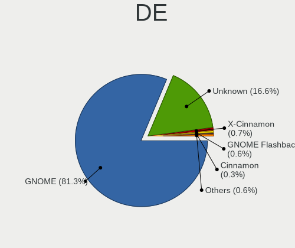
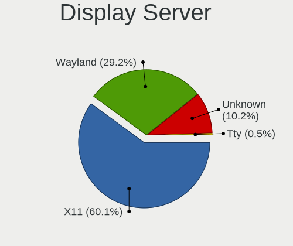
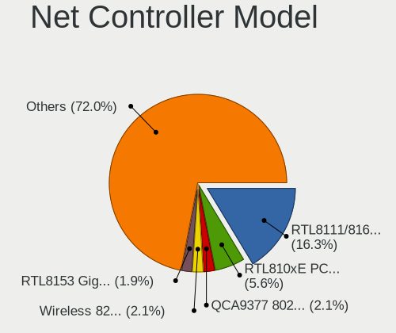
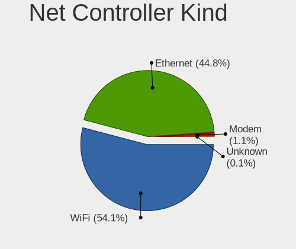

Ubuntu - Tested Hardware & Statistics (Notebooks)
-------------------------------------------------

A project to collect tested hardware configurations for Ubuntu.

Anyone can contribute to this report by the [hw-probe](https://github.com/linuxhw/hw-probe) tool:

    sudo -E hw-probe -all -upload

Please contribute! Especially if your hardware is rare.

Contents
--------

* [ Test Cases ](#test-cases)

* [ System ](#system)
  - [ OS                       ](#os)
  - [ OS Family                ](#os-family)
  - [ Kernel                   ](#kernel)
  - [ Kernel Family            ](#kernel-family)
  - [ Kernel Major Ver.        ](#kernel-major-ver)
  - [ Arch                     ](#arch)
  - [ DE                       ](#de)
  - [ Display Server           ](#display-server)
  - [ Display Manager          ](#display-manager)
  - [ OS Lang                  ](#os-lang)
  - [ Boot Mode                ](#boot-mode)
  - [ Filesystem               ](#filesystem)
  - [ Part. scheme             ](#part-scheme)
  - [ Dual Boot with Linux/BSD ](#dual-boot-with-linuxbsd)
  - [ Dual Boot (Win)          ](#dual-boot-win)

* [ Board ](#board)
  - [ Vendor                   ](#vendor)
  - [ Model                    ](#model)
  - [ Model Family             ](#model-family)
  - [ MFG Year                 ](#mfg-year)
  - [ Form Factor              ](#form-factor)
  - [ Secure Boot              ](#secure-boot)
  - [ Coreboot                 ](#coreboot)
  - [ RAM Size                 ](#ram-size)
  - [ RAM Used                 ](#ram-used)
  - [ Total Drives             ](#total-drives)
  - [ Has CD-ROM               ](#has-cd-rom)
  - [ Has Ethernet             ](#has-ethernet)
  - [ Has WiFi                 ](#has-wifi)
  - [ Has Bluetooth            ](#has-bluetooth)

* [ Location ](#location)
  - [ Country                  ](#country)
  - [ City                     ](#city)

* [ Drives ](#drives)
  - [ Drive Vendor             ](#drive-vendor)
  - [ Drive Model              ](#drive-model)
  - [ HDD Vendor               ](#hdd-vendor)
  - [ SSD Vendor               ](#ssd-vendor)
  - [ Drive Kind               ](#drive-kind)
  - [ Drive Connector          ](#drive-connector)
  - [ Drive Size               ](#drive-size)
  - [ Space Total              ](#space-total)
  - [ Space Used               ](#space-used)
  - [ Malfunc. Drives          ](#malfunc-drives)
  - [ Malfunc. Drive Vendor    ](#malfunc-drive-vendor)
  - [ Malfunc. HDD Vendor      ](#malfunc-hdd-vendor)
  - [ Malfunc. Drive Kind      ](#malfunc-drive-kind)
  - [ Failed Drives            ](#failed-drives)
  - [ Failed Drive Vendor      ](#failed-drive-vendor)
  - [ Drive Status             ](#drive-status)

* [ Storage controller ](#storage-controller)
  - [ Storage Vendor           ](#storage-vendor)
  - [ Storage Model            ](#storage-model)
  - [ Storage Kind             ](#storage-kind)

* [ Processor ](#processor)
  - [ CPU Vendor               ](#cpu-vendor)
  - [ CPU Model                ](#cpu-model)
  - [ CPU Model Family         ](#cpu-model-family)
  - [ CPU Cores                ](#cpu-cores)
  - [ CPU Sockets              ](#cpu-sockets)
  - [ CPU Threads              ](#cpu-threads)
  - [ CPU Op-Modes             ](#cpu-op-modes)
  - [ CPU Microcode            ](#cpu-microcode)
  - [ CPU Microarch            ](#cpu-microarch)

* [ Graphics ](#graphics)
  - [ GPU Vendor               ](#gpu-vendor)
  - [ GPU Model                ](#gpu-model)
  - [ GPU Combo                ](#gpu-combo)
  - [ GPU Driver               ](#gpu-driver)
  - [ GPU Memory               ](#gpu-memory)

* [ Monitor ](#monitor)
  - [ Monitor Vendor           ](#monitor-vendor)
  - [ Monitor Model            ](#monitor-model)
  - [ Monitor Resolution       ](#monitor-resolution)
  - [ Monitor Diagonal         ](#monitor-diagonal)
  - [ Monitor Width            ](#monitor-width)
  - [ Aspect Ratio             ](#aspect-ratio)
  - [ Monitor Area             ](#monitor-area)
  - [ Pixel Density            ](#pixel-density)
  - [ Multiple Monitors        ](#multiple-monitors)

* [ Network ](#network)
  - [ Net Controller Vendor    ](#net-controller-vendor)
  - [ Net Controller Model     ](#net-controller-model)
  - [ Wireless Vendor          ](#wireless-vendor)
  - [ Wireless Model           ](#wireless-model)
  - [ Ethernet Vendor          ](#ethernet-vendor)
  - [ Ethernet Model           ](#ethernet-model)
  - [ Net Controller Kind      ](#net-controller-kind)
  - [ Used Controller          ](#used-controller)
  - [ NICs                     ](#nics)
  - [ IPv6                     ](#ipv6)

* [ Bluetooth ](#bluetooth)
  - [ Bluetooth Vendor         ](#bluetooth-vendor)
  - [ Bluetooth Model          ](#bluetooth-model)

* [ Sound ](#sound)
  - [ Sound Vendor             ](#sound-vendor)
  - [ Sound Model              ](#sound-model)

* [ Memory ](#memory)
  - [ Memory Vendor            ](#memory-vendor)
  - [ Memory Model             ](#memory-model)
  - [ Memory Kind              ](#memory-kind)
  - [ Memory Form Factor       ](#memory-form-factor)
  - [ Memory Size              ](#memory-size)
  - [ Memory Speed             ](#memory-speed)

* [ Printers & scanners ](#printers--scanners)
  - [ Printer Vendor           ](#printer-vendor)
  - [ Printer Model            ](#printer-model)
  - [ Scanner Vendor           ](#scanner-vendor)
  - [ Scanner Model            ](#scanner-model)

* [ Camera ](#camera)
  - [ Camera Vendor            ](#camera-vendor)
  - [ Camera Model             ](#camera-model)

* [ Security ](#security)
  - [ Fingerprint Vendor       ](#fingerprint-vendor)
  - [ Fingerprint Model        ](#fingerprint-model)
  - [ Chipcard Vendor          ](#chipcard-vendor)
  - [ Chipcard Model           ](#chipcard-model)

* [ Unsupported ](#unsupported)
  - [ Unsupported Devices      ](#unsupported-devices)
  - [ Unsupported Device Types ](#unsupported-device-types)

Test Cases
----------

Total: 41273

| Vendor        | Model                       | Probe                                                      | Date         |
|---------------|-----------------------------|------------------------------------------------------------|--------------|
| Lenovo        | G50-45 80E3                 | [d4f08c71a6](https://linux-hardware.org/?probe=d4f08c71a6) | Nov 02, 2022 |
| HP            | Pavilion Gaming Laptop      | [695b3d82a7](https://linux-hardware.org/?probe=695b3d82a7) | Nov 02, 2022 |
| HP            | Pavilion Gaming Laptop      | [9b9e55c471](https://linux-hardware.org/?probe=9b9e55c471) | Nov 02, 2022 |
| HP            | EliteBook 8460p             | [565ad502cc](https://linux-hardware.org/?probe=565ad502cc) | Nov 02, 2022 |
| Lenovo        | E41-25 81FS                 | [5d9743e91d](https://linux-hardware.org/?probe=5d9743e91d) | Nov 02, 2022 |
| Toshiba       | Satellite C70D-A            | [7a421ed810](https://linux-hardware.org/?probe=7a421ed810) | Nov 02, 2022 |
| Toshiba       | Satellite C70D-A            | [d82227846b](https://linux-hardware.org/?probe=d82227846b) | Nov 02, 2022 |
| Acer          | Aspire E5-522               | [32f73c64a6](https://linux-hardware.org/?probe=32f73c64a6) | Nov 02, 2022 |
| Acer          | Aspire E5-522               | [412b8c701e](https://linux-hardware.org/?probe=412b8c701e) | Nov 02, 2022 |
| Daten Tecn... | DT02-M4                     | [cdd5c3cca0](https://linux-hardware.org/?probe=cdd5c3cca0) | Nov 02, 2022 |
| Dell          | Latitude E5450              | [b39c12a9a4](https://linux-hardware.org/?probe=b39c12a9a4) | Nov 02, 2022 |
| Daten Tecn... | DT02-M4                     | [7d43f3c00b](https://linux-hardware.org/?probe=7d43f3c00b) | Nov 02, 2022 |
| Shanghai Z... | ZXE CRB                     | [a0029fb797](https://linux-hardware.org/?probe=a0029fb797) | Nov 02, 2022 |
| HP            | EliteBook 845 G7 Noteboo... | [c693004e08](https://linux-hardware.org/?probe=c693004e08) | Nov 02, 2022 |
| ASUSTek       | VivoBook_ASUSLaptop X705... | [4a158afdfd](https://linux-hardware.org/?probe=4a158afdfd) | Nov 02, 2022 |
| Dell          | Latitude 5420               | [679fbcb14f](https://linux-hardware.org/?probe=679fbcb14f) | Nov 02, 2022 |
| HP            | ProBook 450 G8 Notebook ... | [44e281e52c](https://linux-hardware.org/?probe=44e281e52c) | Nov 02, 2022 |
| Acer          | Aspire A514-55              | [391048b46f](https://linux-hardware.org/?probe=391048b46f) | Nov 02, 2022 |
| Dell          | Latitude E6420              | [032920f109](https://linux-hardware.org/?probe=032920f109) | Nov 02, 2022 |
| Jumper        | EZbook                      | [08ec434199](https://linux-hardware.org/?probe=08ec434199) | Nov 02, 2022 |
| HP            | Pavilion dv8                | [21af5313f0](https://linux-hardware.org/?probe=21af5313f0) | Nov 02, 2022 |
| Cube          | i18-BL                      | [725100a829](https://linux-hardware.org/?probe=725100a829) | Nov 02, 2022 |
| Lenovo        | Legion 5 Pro 16ITH6 82JF    | [09c2704bb0](https://linux-hardware.org/?probe=09c2704bb0) | Nov 02, 2022 |
| HP            | 625                         | [830c5c0d14](https://linux-hardware.org/?probe=830c5c0d14) | Nov 02, 2022 |
| HP            | 625                         | [4c627cab51](https://linux-hardware.org/?probe=4c627cab51) | Nov 02, 2022 |
| HP            | Pavilion x2 Detachable P... | [b4d63f4835](https://linux-hardware.org/?probe=b4d63f4835) | Nov 02, 2022 |
| Acer          | Aspire A315-54              | [1421a5a4e9](https://linux-hardware.org/?probe=1421a5a4e9) | Nov 02, 2022 |
| HUAWEI        | HVY-WXX9                    | [87ab6daba5](https://linux-hardware.org/?probe=87ab6daba5) | Nov 02, 2022 |
| Dell          | Vostro 15 3515              | [59c101934c](https://linux-hardware.org/?probe=59c101934c) | Nov 02, 2022 |
| Apple         | MacBookPro11,5              | [f22ebdf694](https://linux-hardware.org/?probe=f22ebdf694) | Nov 01, 2022 |
| Apple         | MacBookPro11,5              | [a27142d25c](https://linux-hardware.org/?probe=a27142d25c) | Nov 01, 2022 |
| HP            | Pavilion Notebook           | [95d825cd94](https://linux-hardware.org/?probe=95d825cd94) | Nov 01, 2022 |
| Dell          | Precision 5520              | [e1a819ec3e](https://linux-hardware.org/?probe=e1a819ec3e) | Nov 01, 2022 |
| Acer          | Swift SF314-42              | [6a0d7d5f39](https://linux-hardware.org/?probe=6a0d7d5f39) | Nov 01, 2022 |
| Lenovo        | ThinkPad L590 20Q7001KIX    | [c8e545615f](https://linux-hardware.org/?probe=c8e545615f) | Nov 01, 2022 |
| Acer          | Swift SF314-41              | [921b1a7ebf](https://linux-hardware.org/?probe=921b1a7ebf) | Nov 01, 2022 |
| ASUSTek       | VivoBook_ASUSLaptop M760... | [49d6eb853f](https://linux-hardware.org/?probe=49d6eb853f) | Nov 01, 2022 |
| ASUSTek       | VivoBook_ASUSLaptop M760... | [5de7efb403](https://linux-hardware.org/?probe=5de7efb403) | Nov 01, 2022 |
| Acer          | Aspire V3-571G              | [990a38ea87](https://linux-hardware.org/?probe=990a38ea87) | Nov 01, 2022 |
| ASUSTek       | X501A                       | [d5a34df414](https://linux-hardware.org/?probe=d5a34df414) | Nov 01, 2022 |
| ASUSTek       | VivoBook 15_ASUS Laptop ... | [6323d7e1b3](https://linux-hardware.org/?probe=6323d7e1b3) | Nov 01, 2022 |
| Dell          | Inspiron 15 3511            | [85c215eebf](https://linux-hardware.org/?probe=85c215eebf) | Nov 01, 2022 |
| ASUSTek       | ProArt StudioBook H7600H... | [3db734a533](https://linux-hardware.org/?probe=3db734a533) | Nov 01, 2022 |
| Apple         | MacBookAir7,2               | [2532d13f74](https://linux-hardware.org/?probe=2532d13f74) | Nov 01, 2022 |
| Timi          | TM1701                      | [84a5a6ce39](https://linux-hardware.org/?probe=84a5a6ce39) | Nov 01, 2022 |
| Lenovo        | ThinkPad L14 Gen 2 20X2S... | [36d7199821](https://linux-hardware.org/?probe=36d7199821) | Nov 01, 2022 |
| Lenovo        | G710 20252                  | [834e3f17aa](https://linux-hardware.org/?probe=834e3f17aa) | Oct 31, 2022 |
| Lenovo        | G710 20252                  | [acc007bae4](https://linux-hardware.org/?probe=acc007bae4) | Oct 31, 2022 |
| Packard Be... | EasyNote TK85               | [a233571587](https://linux-hardware.org/?probe=a233571587) | Oct 31, 2022 |
| Sony          | VPCZ12C5E                   | [b1e6524541](https://linux-hardware.org/?probe=b1e6524541) | Oct 31, 2022 |
| Lenovo        | IdeaPad S145-15API 81V7     | [973fc77891](https://linux-hardware.org/?probe=973fc77891) | Oct 31, 2022 |
| Dell          | Latitude E6330              | [51ded2feb1](https://linux-hardware.org/?probe=51ded2feb1) | Oct 31, 2022 |
| Dell          | Inspiron 3542               | [dcccad24af](https://linux-hardware.org/?probe=dcccad24af) | Oct 31, 2022 |
| Dell          | Vostro 7620                 | [2ccd56ee29](https://linux-hardware.org/?probe=2ccd56ee29) | Oct 31, 2022 |
| HP            | EliteBook 745 G2            | [0786ded6c8](https://linux-hardware.org/?probe=0786ded6c8) | Oct 31, 2022 |
| Unknown       | Unknown                     | [77bdbb310f](https://linux-hardware.org/?probe=77bdbb310f) | Oct 31, 2022 |
| TUXEDO        | InfinityBook S 15 Gen6      | [92e9764aa0](https://linux-hardware.org/?probe=92e9764aa0) | Oct 31, 2022 |
| Acer          | Swift SF314-512             | [d6bf187cc9](https://linux-hardware.org/?probe=d6bf187cc9) | Oct 31, 2022 |
| Sony          | VPCZ12C5E                   | [85803f499a](https://linux-hardware.org/?probe=85803f499a) | Oct 31, 2022 |
| Lenovo        | ThinkPad T16 Gen 1 21BVC... | [ce59648f62](https://linux-hardware.org/?probe=ce59648f62) | Oct 31, 2022 |
| ASUSTek       | ProArt StudioBook W700GV... | [bf22c22bb4](https://linux-hardware.org/?probe=bf22c22bb4) | Oct 31, 2022 |
| Adlinktech    | SB-MLC                      | [203d95e012](https://linux-hardware.org/?probe=203d95e012) | Oct 31, 2022 |
| Acer          | Aspire A514-55              | [142e1c0695](https://linux-hardware.org/?probe=142e1c0695) | Oct 31, 2022 |
| Lenovo        | ThinkBook 15 G2 ITL 20VE    | [451acdb910](https://linux-hardware.org/?probe=451acdb910) | Oct 31, 2022 |
| Valve         | Jupiter                     | [38d0d0e32a](https://linux-hardware.org/?probe=38d0d0e32a) | Oct 31, 2022 |
| Acer          | Aspire A514-55              | [87f4a137dc](https://linux-hardware.org/?probe=87f4a137dc) | Oct 31, 2022 |
| Sony          | SVT13118FXS                 | [13b4af9ec3](https://linux-hardware.org/?probe=13b4af9ec3) | Oct 31, 2022 |
| Dell          | Vostro 7620                 | [7f41a14301](https://linux-hardware.org/?probe=7f41a14301) | Oct 31, 2022 |
| ASUSTek       | VivoBook_ASUSLaptop X515... | [deac1b706f](https://linux-hardware.org/?probe=deac1b706f) | Oct 31, 2022 |
| Dell          | Vostro 7620                 | [00dae3fbc5](https://linux-hardware.org/?probe=00dae3fbc5) | Oct 31, 2022 |
| ASUSTek       | VivoBook_ASUSLaptop M340... | [dea1724953](https://linux-hardware.org/?probe=dea1724953) | Oct 31, 2022 |
| Lenovo        | ThinkPad Edge E530 3259M... | [aa1f78db58](https://linux-hardware.org/?probe=aa1f78db58) | Oct 31, 2022 |
| Lenovo        | ThinkPad Edge E530 3259M... | [26b5f59993](https://linux-hardware.org/?probe=26b5f59993) | Oct 31, 2022 |
| HP            | 14                          | [7611c14813](https://linux-hardware.org/?probe=7611c14813) | Oct 31, 2022 |
| Toshiba       | Satellite A200              | [296d9a0f38](https://linux-hardware.org/?probe=296d9a0f38) | Oct 31, 2022 |
| Toshiba       | Satellite A200              | [07a165b373](https://linux-hardware.org/?probe=07a165b373) | Oct 31, 2022 |
| Lenovo        | IdeaPad S145-15IWL 81S9     | [c8970ae94a](https://linux-hardware.org/?probe=c8970ae94a) | Oct 31, 2022 |
| Acer          | Nitro AN517-55              | [9653f093e1](https://linux-hardware.org/?probe=9653f093e1) | Oct 31, 2022 |
| Panasonic     | CF-19RDRCHH7                | [99e94a7708](https://linux-hardware.org/?probe=99e94a7708) | Oct 31, 2022 |
| Lenovo        | IdeaPad 720S-13IKB 81A8     | [85efda7536](https://linux-hardware.org/?probe=85efda7536) | Oct 31, 2022 |
| ASUSTek       | K73SV                       | [d505f0c0d0](https://linux-hardware.org/?probe=d505f0c0d0) | Oct 30, 2022 |
| Lenovo        | ThinkPad X270 20HN0014FR    | [d6fc7c48a1](https://linux-hardware.org/?probe=d6fc7c48a1) | Oct 30, 2022 |
| Lenovo        | ThinkPad T440 20B7S18Y0Y    | [9cf3beb13f](https://linux-hardware.org/?probe=9cf3beb13f) | Oct 30, 2022 |
| Lenovo        | ThinkPad T440 20B7S18Y0Y    | [36b3303b35](https://linux-hardware.org/?probe=36b3303b35) | Oct 30, 2022 |
| Acer          | Swift SFX14-51G             | [6812d7cf22](https://linux-hardware.org/?probe=6812d7cf22) | Oct 30, 2022 |
| HP            | Laptop 15-da0xxx            | [b903c0e375](https://linux-hardware.org/?probe=b903c0e375) | Oct 30, 2022 |
| Lenovo        | IdeaPad 100S-14IBR 80R9     | [91d1732515](https://linux-hardware.org/?probe=91d1732515) | Oct 30, 2022 |
| HP            | Pavilion 15                 | [f1eac2c0c3](https://linux-hardware.org/?probe=f1eac2c0c3) | Oct 30, 2022 |
| Samsung       | RV410/RV510/S3510/E3510     | [d4552d84d5](https://linux-hardware.org/?probe=d4552d84d5) | Oct 30, 2022 |
| Lenovo        | ThinkPad T510 4384WKU       | [86fee6e260](https://linux-hardware.org/?probe=86fee6e260) | Oct 30, 2022 |
| Lenovo        | Yoga Slim 7 14ITL05 82A3    | [150c8ac0ac](https://linux-hardware.org/?probe=150c8ac0ac) | Oct 30, 2022 |
| Lenovo        | ThinkPad P1 Gen 5 21DC00... | [910b452558](https://linux-hardware.org/?probe=910b452558) | Oct 30, 2022 |
| ASUSTek       | VivoBook_ASUS Laptop E40... | [cbdfd56f05](https://linux-hardware.org/?probe=cbdfd56f05) | Oct 30, 2022 |
| HP            | Laptop 15s-gr0xxx           | [02d23cb1b9](https://linux-hardware.org/?probe=02d23cb1b9) | Oct 30, 2022 |
| HP            | ProBook 650 G1              | [54c64976ee](https://linux-hardware.org/?probe=54c64976ee) | Oct 30, 2022 |
| MSI           | Stealth GS77 12UHS          | [8a1d96274e](https://linux-hardware.org/?probe=8a1d96274e) | Oct 30, 2022 |
| Acer          | Swift SF314-42              | [6873e5b579](https://linux-hardware.org/?probe=6873e5b579) | Oct 30, 2022 |
| LG Electro... | 15Z980-HA76K                | [914156672d](https://linux-hardware.org/?probe=914156672d) | Oct 30, 2022 |
| Lenovo        | ThinkBook 15p 20V3          | [8dfb7265a9](https://linux-hardware.org/?probe=8dfb7265a9) | Oct 30, 2022 |
| ASUSTek       | VivoBook_ASUS Laptop E40... | [031a5998a5](https://linux-hardware.org/?probe=031a5998a5) | Oct 30, 2022 |
| Acer          | Swift SF314-42              | [da1b668449](https://linux-hardware.org/?probe=da1b668449) | Oct 30, 2022 |
| Dell          | Latitude E6510              | [84a61bf436](https://linux-hardware.org/?probe=84a61bf436) | Oct 30, 2022 |
| HUAWEI        | KLVL-WXX9                   | [4e4e0ac802](https://linux-hardware.org/?probe=4e4e0ac802) | Oct 30, 2022 |
| HUAWEI        | KLVL-WXX9                   | [8887bce606](https://linux-hardware.org/?probe=8887bce606) | Oct 30, 2022 |
| GEO           | GeoBook3                    | [133a4460f6](https://linux-hardware.org/?probe=133a4460f6) | Oct 29, 2022 |
| Lenovo        | ThinkPad E14 Gen 3 20Y70... | [97425e2f52](https://linux-hardware.org/?probe=97425e2f52) | Oct 29, 2022 |
| ASUSTek       | ZenBook UX325EA_UX325EA     | [69198e503e](https://linux-hardware.org/?probe=69198e503e) | Oct 29, 2022 |
| Lenovo        | G710 20252                  | [f700e495ba](https://linux-hardware.org/?probe=f700e495ba) | Oct 29, 2022 |
| HP            | Laptop 15-dw0xxx            | [f6b00cb10f](https://linux-hardware.org/?probe=f6b00cb10f) | Oct 29, 2022 |
| Dell          | Vostro 3500                 | [53754d84e7](https://linux-hardware.org/?probe=53754d84e7) | Oct 29, 2022 |
| Toshiba       | Satellite L50-A-1D6         | [77f308d89c](https://linux-hardware.org/?probe=77f308d89c) | Oct 29, 2022 |
| Lenovo        | ThinkPad T510 43145GG       | [d1e2bf7f33](https://linux-hardware.org/?probe=d1e2bf7f33) | Oct 29, 2022 |
| Dell          | Latitude E6510              | [b346d71347](https://linux-hardware.org/?probe=b346d71347) | Oct 29, 2022 |
| ASUSTek       | ASUS TUF Gaming F15 FX50... | [b8cfddfcbf](https://linux-hardware.org/?probe=b8cfddfcbf) | Oct 29, 2022 |
| HP            | Victus by Laptop 16-d1xx... | [c2d1799732](https://linux-hardware.org/?probe=c2d1799732) | Oct 29, 2022 |
| Dell          | Precision 3570              | [fb016d8d01](https://linux-hardware.org/?probe=fb016d8d01) | Oct 29, 2022 |
| HP            | EliteBook 830 G7 Noteboo... | [063675c104](https://linux-hardware.org/?probe=063675c104) | Oct 29, 2022 |
| HP            | OMEN by Laptop 15-dc1xxx    | [20d95ce78c](https://linux-hardware.org/?probe=20d95ce78c) | Oct 29, 2022 |
| HP            | EliteBook 820 G4            | [c41402e832](https://linux-hardware.org/?probe=c41402e832) | Oct 29, 2022 |
| Lenovo        | ThinkPad T480s 20L8S4PR1... | [d99f500b00](https://linux-hardware.org/?probe=d99f500b00) | Oct 29, 2022 |
| Dell          | Inspiron 5570               | [6555e01443](https://linux-hardware.org/?probe=6555e01443) | Oct 29, 2022 |
| HP            | Laptop 15s-eq2xxx           | [dbd930e552](https://linux-hardware.org/?probe=dbd930e552) | Oct 29, 2022 |
| Lenovo        | IdeaPad 3 15IIL05 81WE      | [d152b0a56c](https://linux-hardware.org/?probe=d152b0a56c) | Oct 29, 2022 |
| Lenovo        | Legion Y740-17ICHg 81HH     | [ea1c9e069e](https://linux-hardware.org/?probe=ea1c9e069e) | Oct 29, 2022 |
| HUAWEI        | VLT-WX0                     | [e3662dc3bd](https://linux-hardware.org/?probe=e3662dc3bd) | Oct 29, 2022 |
| Lenovo        | IdeaPad 3 15ITL6 82H8       | [27dfa8687b](https://linux-hardware.org/?probe=27dfa8687b) | Oct 29, 2022 |
| AXIOO         | Mybook 14H                  | [f8a7c19640](https://linux-hardware.org/?probe=f8a7c19640) | Oct 29, 2022 |
| HP            | Pavilion dv6                | [6406b8b769](https://linux-hardware.org/?probe=6406b8b769) | Oct 29, 2022 |
| HP            | Pavilion dv6                | [7873dfb4cf](https://linux-hardware.org/?probe=7873dfb4cf) | Oct 29, 2022 |
| HP            | OMEN Laptop 15-en0xxx       | [c3ea4065c4](https://linux-hardware.org/?probe=c3ea4065c4) | Oct 29, 2022 |
| Medion        | X682X                       | [f05dd25a08](https://linux-hardware.org/?probe=f05dd25a08) | Oct 29, 2022 |
| HP            | ProBook 450 G6              | [1b3bb91776](https://linux-hardware.org/?probe=1b3bb91776) | Oct 29, 2022 |
| Dell          | Precision 5750              | [9b9addd3b7](https://linux-hardware.org/?probe=9b9addd3b7) | Oct 29, 2022 |
| Lenovo        | ThinkPad X1 Carbon 7th 2... | [2ceb11d7b3](https://linux-hardware.org/?probe=2ceb11d7b3) | Oct 29, 2022 |
| Lenovo        | ThinkPad X1 Carbon 7th 2... | [5c3d640129](https://linux-hardware.org/?probe=5c3d640129) | Oct 29, 2022 |
| HP            | Laptop 15-dw3xxx            | [99ac55823d](https://linux-hardware.org/?probe=99ac55823d) | Oct 29, 2022 |
| HUAWEI        | BOD-WXX9                    | [880d3ba9c9](https://linux-hardware.org/?probe=880d3ba9c9) | Oct 29, 2022 |
| Dell          | Latitude 5531               | [cdea65fd5c](https://linux-hardware.org/?probe=cdea65fd5c) | Oct 29, 2022 |
| ASUSTek       | K53SV                       | [4ead64f80f](https://linux-hardware.org/?probe=4ead64f80f) | Oct 28, 2022 |
| ASUSTek       | K53SV                       | [d3043c50ae](https://linux-hardware.org/?probe=d3043c50ae) | Oct 28, 2022 |
| HP            | 255 G8 Notebook PC          | [7e9c19c994](https://linux-hardware.org/?probe=7e9c19c994) | Oct 28, 2022 |
| Dell          | Latitude 3590               | [d1b6c7cd85](https://linux-hardware.org/?probe=d1b6c7cd85) | Oct 28, 2022 |
| IP3 Tech      | AP1                         | [0562a6a46d](https://linux-hardware.org/?probe=0562a6a46d) | Oct 28, 2022 |
| Lenovo        | IdeaPad 500-15ACZ 80K4      | [c079764998](https://linux-hardware.org/?probe=c079764998) | Oct 28, 2022 |
| Lenovo        | IdeaPad 500-15ACZ 80K4      | [5ef9b4213f](https://linux-hardware.org/?probe=5ef9b4213f) | Oct 28, 2022 |
| Apple         | MacBookPro16,1              | [eba036175b](https://linux-hardware.org/?probe=eba036175b) | Oct 28, 2022 |
| HP            | Laptop 15s-gr0xxx           | [f7155fd671](https://linux-hardware.org/?probe=f7155fd671) | Oct 28, 2022 |
| Dell          | XPS 13 9310                 | [7205cfe7b4](https://linux-hardware.org/?probe=7205cfe7b4) | Oct 28, 2022 |
| Toshiba       | Satellite C75D-B            | [4f644b7d3b](https://linux-hardware.org/?probe=4f644b7d3b) | Oct 28, 2022 |
| HP            | Pavilion Laptop 15-eh2xx... | [f9238c2035](https://linux-hardware.org/?probe=f9238c2035) | Oct 28, 2022 |
| Lenovo        | ThinkPad T420 4236NUG       | [d0e3fa9699](https://linux-hardware.org/?probe=d0e3fa9699) | Oct 28, 2022 |
| IP3 Tech      | AP1                         | [2a9c0ff1c5](https://linux-hardware.org/?probe=2a9c0ff1c5) | Oct 28, 2022 |
| Dell          | Latitude E6440              | [73072d8574](https://linux-hardware.org/?probe=73072d8574) | Oct 28, 2022 |
| Tactus        | GeoBook 110                 | [aad56b27f0](https://linux-hardware.org/?probe=aad56b27f0) | Oct 28, 2022 |
| HP            | EliteBook 840 G6            | [89cc00ef58](https://linux-hardware.org/?probe=89cc00ef58) | Oct 28, 2022 |
| Lenovo        | ThinkPad T560 20FHCTO1WW    | [05ff2d32fa](https://linux-hardware.org/?probe=05ff2d32fa) | Oct 28, 2022 |
| Lenovo        | ThinkPad T560 20FHCTO1WW    | [403a99d8b2](https://linux-hardware.org/?probe=403a99d8b2) | Oct 28, 2022 |
| Acer          | Aspire A315-58              | [7870d9b047](https://linux-hardware.org/?probe=7870d9b047) | Oct 28, 2022 |
| HUAWEI        | BOM-WXX9                    | [203ac0880d](https://linux-hardware.org/?probe=203ac0880d) | Oct 28, 2022 |
| MSI           | GF63 Thin 11UD              | [e2a6e0f610](https://linux-hardware.org/?probe=e2a6e0f610) | Oct 28, 2022 |
| MSI           | Stealth GS66 12UGS          | [98b47019d1](https://linux-hardware.org/?probe=98b47019d1) | Oct 28, 2022 |
| MSI           | GF63 Thin 11UD              | [0084d271e4](https://linux-hardware.org/?probe=0084d271e4) | Oct 28, 2022 |
| ASUSTek       | ROG Zephyrus M16 GU603HM... | [3b67700f14](https://linux-hardware.org/?probe=3b67700f14) | Oct 28, 2022 |
| MSI           | Modern 14 B10RBSW           | [9c3c17a82e](https://linux-hardware.org/?probe=9c3c17a82e) | Oct 28, 2022 |
| Lenovo        | IdeaPad 3 15IIL05 81WE      | [4bf648c91f](https://linux-hardware.org/?probe=4bf648c91f) | Oct 28, 2022 |
| Compaq        | Presario 21 VerX            | [97ee92b9d1](https://linux-hardware.org/?probe=97ee92b9d1) | Oct 28, 2022 |
| Dell          | Inspiron 15 3511            | [7cc13c49e2](https://linux-hardware.org/?probe=7cc13c49e2) | Oct 28, 2022 |
| HP            | 250 G5 Notebook PC          | [da6915a49b](https://linux-hardware.org/?probe=da6915a49b) | Oct 28, 2022 |
| Dell          | XPS 13 9305                 | [20bf043d6f](https://linux-hardware.org/?probe=20bf043d6f) | Oct 28, 2022 |
| MSI           | Summit E13FlipEvo A12MT     | [8575548418](https://linux-hardware.org/?probe=8575548418) | Oct 28, 2022 |
| Apple         | MacBookPro11,5              | [fc35e765fd](https://linux-hardware.org/?probe=fc35e765fd) | Oct 28, 2022 |
| MSI           | Katana GF66 11UC            | [83088617d3](https://linux-hardware.org/?probe=83088617d3) | Oct 28, 2022 |
| Gateway       | P-7805u                     | [7597071801](https://linux-hardware.org/?probe=7597071801) | Oct 28, 2022 |
| HUAWEI        | KLVL-WXX9                   | [176fa68922](https://linux-hardware.org/?probe=176fa68922) | Oct 28, 2022 |
| ASUSTek       | S551LN                      | [30d97ad99e](https://linux-hardware.org/?probe=30d97ad99e) | Oct 27, 2022 |
| Dell          | Inspiron 3542               | [6c979bdf58](https://linux-hardware.org/?probe=6c979bdf58) | Oct 27, 2022 |
| HP            | 255 G7 Notebook PC          | [8cf00ceef5](https://linux-hardware.org/?probe=8cf00ceef5) | Oct 27, 2022 |
| Dell          | Inspiron 3558               | [3eeb2624bf](https://linux-hardware.org/?probe=3eeb2624bf) | Oct 27, 2022 |
| HP            | ENVY Laptop 13-ba0xxx       | [920b0eaa44](https://linux-hardware.org/?probe=920b0eaa44) | Oct 27, 2022 |
| Dell          | Latitude E6530              | [71b2df6eff](https://linux-hardware.org/?probe=71b2df6eff) | Oct 27, 2022 |
| Toshiba       | Satellite L300              | [60618ba137](https://linux-hardware.org/?probe=60618ba137) | Oct 27, 2022 |
| PC Special... | Recoil II                   | [9ec5a6ef20](https://linux-hardware.org/?probe=9ec5a6ef20) | Oct 27, 2022 |
| Lenovo        | G710 20252                  | [d15bee47c4](https://linux-hardware.org/?probe=d15bee47c4) | Oct 27, 2022 |
| PC Special... | Recoil II                   | [38ec5a7708](https://linux-hardware.org/?probe=38ec5a7708) | Oct 27, 2022 |
| Lenovo        | IdeaPad 320-14IKB 80YF      | [fe1166a134](https://linux-hardware.org/?probe=fe1166a134) | Oct 27, 2022 |
| Lenovo        | ThinkPad P14s Gen 2a 21A... | [75c2ee69ac](https://linux-hardware.org/?probe=75c2ee69ac) | Oct 27, 2022 |
| Lenovo        | IdeaPad 320-14IKB 80YF      | [b35b1298a8](https://linux-hardware.org/?probe=b35b1298a8) | Oct 27, 2022 |
| HP            | Laptop 15-da0xxx            | [efdb76f667](https://linux-hardware.org/?probe=efdb76f667) | Oct 27, 2022 |
| ASUSTek       | UL50VT                      | [e156a74255](https://linux-hardware.org/?probe=e156a74255) | Oct 27, 2022 |
| Dell          | Inspiron 5585               | [9f487c505e](https://linux-hardware.org/?probe=9f487c505e) | Oct 27, 2022 |
| K.A.Techno... | TM1                         | [5054686900](https://linux-hardware.org/?probe=5054686900) | Oct 27, 2022 |
| ASUSTek       | VivoBook_ASUSLaptop M140... | [0a0922ed82](https://linux-hardware.org/?probe=0a0922ed82) | Oct 27, 2022 |
| HP            | Pavilion dv6                | [1e14922876](https://linux-hardware.org/?probe=1e14922876) | Oct 27, 2022 |
| HUAWEI        | BOHK-WAX9X                  | [0c037323d9](https://linux-hardware.org/?probe=0c037323d9) | Oct 27, 2022 |
| MSI           | GE66 Raider 10UE            | [334d883dd3](https://linux-hardware.org/?probe=334d883dd3) | Oct 27, 2022 |
| Alienware     | m17 R4                      | [14770101cf](https://linux-hardware.org/?probe=14770101cf) | Oct 27, 2022 |
| Acer          | Aspire A114-32              | [4261d8dd66](https://linux-hardware.org/?probe=4261d8dd66) | Oct 27, 2022 |
| Acer          | Aspire A114-32              | [216730dba7](https://linux-hardware.org/?probe=216730dba7) | Oct 27, 2022 |
| CTRONIQ       | N14B                        | [ec7142092f](https://linux-hardware.org/?probe=ec7142092f) | Oct 27, 2022 |
| CTRONIQ       | N14B                        | [c8f874642f](https://linux-hardware.org/?probe=c8f874642f) | Oct 27, 2022 |
| Acer          | Swift SF314-42              | [8c9d6eb128](https://linux-hardware.org/?probe=8c9d6eb128) | Oct 27, 2022 |
| Dell          | Latitude 5310               | [10b8371dbd](https://linux-hardware.org/?probe=10b8371dbd) | Oct 27, 2022 |
| Acer          | Swift SF314-42              | [6aaeaf667c](https://linux-hardware.org/?probe=6aaeaf667c) | Oct 27, 2022 |
| Fujitsu       | LIFEBOOK AH530              | [a3f55b1301](https://linux-hardware.org/?probe=a3f55b1301) | Oct 27, 2022 |
| HP            | ZBook Fury 15.6 inch G8 ... | [f95081e76e](https://linux-hardware.org/?probe=f95081e76e) | Oct 27, 2022 |
| Fujitsu       | LIFEBOOK AH530              | [285a7d17e3](https://linux-hardware.org/?probe=285a7d17e3) | Oct 27, 2022 |
| HP            | EliteBook 830 G7 Noteboo... | [0fcfd33f95](https://linux-hardware.org/?probe=0fcfd33f95) | Oct 27, 2022 |
| Lenovo        | ThinkPad L590 20Q7001HGE    | [187544b911](https://linux-hardware.org/?probe=187544b911) | Oct 27, 2022 |
| ASUSTek       | ASUS EXPERTBOOK B1400CEP... | [9564d50ef8](https://linux-hardware.org/?probe=9564d50ef8) | Oct 27, 2022 |
| Acer          | Aspire 5750G                | [b51a20d480](https://linux-hardware.org/?probe=b51a20d480) | Oct 27, 2022 |
| HP            | EliteBook 840 G3            | [fdfd74a1ac](https://linux-hardware.org/?probe=fdfd74a1ac) | Oct 27, 2022 |
| MSI           | GL75 Leopard 10SFK          | [c05a05a275](https://linux-hardware.org/?probe=c05a05a275) | Oct 27, 2022 |
| HP            | ProBook 450 G6              | [ced3daa1b6](https://linux-hardware.org/?probe=ced3daa1b6) | Oct 27, 2022 |
| Lenovo        | B590 20206                  | [8a8967999b](https://linux-hardware.org/?probe=8a8967999b) | Oct 27, 2022 |
| Lenovo        | ThinkPad E15 Gen 2 20TD0... | [4386ec3fb8](https://linux-hardware.org/?probe=4386ec3fb8) | Oct 27, 2022 |
| HP            | Pavilion Laptop 15-eh1xx... | [0d705b0971](https://linux-hardware.org/?probe=0d705b0971) | Oct 26, 2022 |
| Avell High... | A60 MUV                     | [ccdf105523](https://linux-hardware.org/?probe=ccdf105523) | Oct 26, 2022 |
| Dell          | Latitude E6530              | [c271a351aa](https://linux-hardware.org/?probe=c271a351aa) | Oct 26, 2022 |
| ASUSTek       | X555LAB                     | [44d47f5024](https://linux-hardware.org/?probe=44d47f5024) | Oct 26, 2022 |
| Dell          | Inspiron 7773               | [34d97b7ea2](https://linux-hardware.org/?probe=34d97b7ea2) | Oct 26, 2022 |
| Lenovo        | Legion S7 15IMH5 82BC       | [7654e5f9c4](https://linux-hardware.org/?probe=7654e5f9c4) | Oct 26, 2022 |
| Dell          | Inspiron 7773               | [c2cff54e7c](https://linux-hardware.org/?probe=c2cff54e7c) | Oct 26, 2022 |
| HP            | 240 G8 Notebook PC          | [25765f4a76](https://linux-hardware.org/?probe=25765f4a76) | Oct 26, 2022 |
| Dell          | Vostro 7620                 | [90f96ae099](https://linux-hardware.org/?probe=90f96ae099) | Oct 26, 2022 |
| ASUSTek       | X510UQ                      | [8907b3e019](https://linux-hardware.org/?probe=8907b3e019) | Oct 26, 2022 |
| HUAWEI        | HKD-WXX                     | [2ff7652d3a](https://linux-hardware.org/?probe=2ff7652d3a) | Oct 26, 2022 |
| Dell          | Latitude E6440              | [81a4c0f5d5](https://linux-hardware.org/?probe=81a4c0f5d5) | Oct 26, 2022 |
| HP            | Laptop 15-da0xxx            | [ed1b801fcd](https://linux-hardware.org/?probe=ed1b801fcd) | Oct 26, 2022 |
| Dell          | Latitude 7320               | [f249267def](https://linux-hardware.org/?probe=f249267def) | Oct 26, 2022 |
| Dell          | XPS 13 9360                 | [e0c3407d30](https://linux-hardware.org/?probe=e0c3407d30) | Oct 26, 2022 |
| Dell          | Precision 5570              | [3d5a222867](https://linux-hardware.org/?probe=3d5a222867) | Oct 26, 2022 |
| HP            | Laptop 17-cp0xxx            | [60d57edbfb](https://linux-hardware.org/?probe=60d57edbfb) | Oct 26, 2022 |
| HUAWEI        | CREM-WXX9                   | [1c1356d6d5](https://linux-hardware.org/?probe=1c1356d6d5) | Oct 26, 2022 |
| Lenovo        | ThinkPad T450 20BUS0S902    | [1115da2433](https://linux-hardware.org/?probe=1115da2433) | Oct 26, 2022 |
| K.A.Techno... | TM1                         | [33a34aceaf](https://linux-hardware.org/?probe=33a34aceaf) | Oct 26, 2022 |
| MSI           | Stealth GS66 12UH           | [3c985bb814](https://linux-hardware.org/?probe=3c985bb814) | Oct 26, 2022 |
| MSI           | Stealth GS66 12UH           | [336132b016](https://linux-hardware.org/?probe=336132b016) | Oct 26, 2022 |
| Dell          | Latitude 7480               | [ec106dc62b](https://linux-hardware.org/?probe=ec106dc62b) | Oct 26, 2022 |
| Lenovo        | ThinkPad E15 Gen 4 21E60... | [81231e9517](https://linux-hardware.org/?probe=81231e9517) | Oct 26, 2022 |
| Lenovo        | 100w Gen 3 82J0             | [2554c81cce](https://linux-hardware.org/?probe=2554c81cce) | Oct 26, 2022 |
| Dell          | XPS 13 9305                 | [6062baa35c](https://linux-hardware.org/?probe=6062baa35c) | Oct 26, 2022 |
| HP            | ProBook 650 G2              | [7848c6d520](https://linux-hardware.org/?probe=7848c6d520) | Oct 26, 2022 |
| HP            | 250 G5 Notebook PC          | [3f112eb783](https://linux-hardware.org/?probe=3f112eb783) | Oct 26, 2022 |
| Lenovo        | IdeaPad 3 15ADA05 81W1      | [34be38a48b](https://linux-hardware.org/?probe=34be38a48b) | Oct 26, 2022 |
| Dell          | XPS 15 7590                 | [5265f4d89f](https://linux-hardware.org/?probe=5265f4d89f) | Oct 26, 2022 |
| Lenovo        | Legion S7 15ACH6 82K8       | [082e572642](https://linux-hardware.org/?probe=082e572642) | Oct 26, 2022 |
| HP            | 250 G5 Notebook PC          | [282a978812](https://linux-hardware.org/?probe=282a978812) | Oct 26, 2022 |
| Lenovo        | ThinkPad T490s 20NX002QU... | [6ba1aaf015](https://linux-hardware.org/?probe=6ba1aaf015) | Oct 26, 2022 |
| Lenovo        | ThinkPad T490s 20NX002QU... | [062d1d3b82](https://linux-hardware.org/?probe=062d1d3b82) | Oct 26, 2022 |
| HP            | Pavilion Laptop 15-cc1xx    | [a977f9c3e9](https://linux-hardware.org/?probe=a977f9c3e9) | Oct 26, 2022 |
| ASUSTek       | T100TA                      | [947259d1f6](https://linux-hardware.org/?probe=947259d1f6) | Oct 26, 2022 |
| HP            | Laptop 17t-cn200            | [179c1e53a9](https://linux-hardware.org/?probe=179c1e53a9) | Oct 26, 2022 |
| Lenovo        | ThinkPad E15 20RD001QFE     | [cc9f8c3aad](https://linux-hardware.org/?probe=cc9f8c3aad) | Oct 26, 2022 |
| Samsung       | 870Z5E/880Z5E/680Z5E        | [8ebb941ac6](https://linux-hardware.org/?probe=8ebb941ac6) | Oct 26, 2022 |
| HP            | Setzer                      | [a1039409cd](https://linux-hardware.org/?probe=a1039409cd) | Oct 26, 2022 |
| HP            | Setzer                      | [3945fea013](https://linux-hardware.org/?probe=3945fea013) | Oct 25, 2022 |
| ASUSTek       | GL753VD                     | [08b067d2cf](https://linux-hardware.org/?probe=08b067d2cf) | Oct 25, 2022 |
| Apple         | MacBook5,1                  | [a7fa475b56](https://linux-hardware.org/?probe=a7fa475b56) | Oct 25, 2022 |
| HUAWEI        | BOM-WXX9                    | [bd0f4d864e](https://linux-hardware.org/?probe=bd0f4d864e) | Oct 25, 2022 |
| HP            | Laptop 14s-dq2xxx           | [6af4891e58](https://linux-hardware.org/?probe=6af4891e58) | Oct 25, 2022 |
| Samsung       | 340XAA/350XAA/550XAA        | [562c9438d1](https://linux-hardware.org/?probe=562c9438d1) | Oct 25, 2022 |
| ASUSTek       | ROG Zephyrus G14 GA401QC... | [ae3d3abdf0](https://linux-hardware.org/?probe=ae3d3abdf0) | Oct 25, 2022 |
| ASUSTek       | ZenBook UX333FN_UX333FN     | [a128f79c0a](https://linux-hardware.org/?probe=a128f79c0a) | Oct 25, 2022 |
| ASUSTek       | K55VJ                       | [eac363d110](https://linux-hardware.org/?probe=eac363d110) | Oct 25, 2022 |
| ASUSTek       | VivoBook E14 E402WAS        | [eadb224c05](https://linux-hardware.org/?probe=eadb224c05) | Oct 25, 2022 |
| Apple         | MacBook5,1                  | [da04330684](https://linux-hardware.org/?probe=da04330684) | Oct 25, 2022 |
| Lenovo        | V15-IGL 82C3                | [264fcfd9f1](https://linux-hardware.org/?probe=264fcfd9f1) | Oct 25, 2022 |
| Dell          | Precision M6800             | [6c15780d7a](https://linux-hardware.org/?probe=6c15780d7a) | Oct 25, 2022 |
| K.A.Techno... | TM1                         | [3962bdc51d](https://linux-hardware.org/?probe=3962bdc51d) | Oct 25, 2022 |
| HP            | ENVY 15                     | [faf3ff2256](https://linux-hardware.org/?probe=faf3ff2256) | Oct 25, 2022 |
| Dell          | XPS 15 9500                 | [8260478f31](https://linux-hardware.org/?probe=8260478f31) | Oct 25, 2022 |
| ALLDOCUBE     | i1402A                      | [22c255e8cd](https://linux-hardware.org/?probe=22c255e8cd) | Oct 25, 2022 |
| HP            | ZBook 15 G5                 | [0cb3fb3efc](https://linux-hardware.org/?probe=0cb3fb3efc) | Oct 25, 2022 |
| Lenovo        | ThinkPad T490 20N2001YUS    | [61b5a3092b](https://linux-hardware.org/?probe=61b5a3092b) | Oct 25, 2022 |
| Lenovo        | ThinkBook 15 G3 ACL 21A4    | [8f246bccb1](https://linux-hardware.org/?probe=8f246bccb1) | Oct 25, 2022 |
| ASUSTek       | ASUS TUF Gaming A15 FA50... | [09d3217ce4](https://linux-hardware.org/?probe=09d3217ce4) | Oct 25, 2022 |
| HP            | Laptop 15s-fq1xxx           | [badb0d5aee](https://linux-hardware.org/?probe=badb0d5aee) | Oct 25, 2022 |
| HP            | Laptop 15s-fq1xxx           | [f4174b55a2](https://linux-hardware.org/?probe=f4174b55a2) | Oct 25, 2022 |
| LG Electro... | 17Z90N-V.AA55D              | [bf40de3f5a](https://linux-hardware.org/?probe=bf40de3f5a) | Oct 25, 2022 |
| ASUSTek       | UX430UAR                    | [07d56a833e](https://linux-hardware.org/?probe=07d56a833e) | Oct 25, 2022 |
| Lenovo        | ThinkBook 15 G3 ACL 21A4    | [bc5adf7f4b](https://linux-hardware.org/?probe=bc5adf7f4b) | Oct 25, 2022 |
| Acer          | Enduro EUN314-51W           | [2655b43e2b](https://linux-hardware.org/?probe=2655b43e2b) | Oct 25, 2022 |
| MSI           | Creator Z17 A12UHST         | [18df556ca1](https://linux-hardware.org/?probe=18df556ca1) | Oct 25, 2022 |
| Lenovo        | ThinkPad X1 Nano Gen 1 2... | [491477817a](https://linux-hardware.org/?probe=491477817a) | Oct 25, 2022 |
| Dell          | Precision 3530              | [8d806f9e53](https://linux-hardware.org/?probe=8d806f9e53) | Oct 25, 2022 |
| Lenovo        | IdeaPad S340-15API 81NC     | [f8aa3a7277](https://linux-hardware.org/?probe=f8aa3a7277) | Oct 25, 2022 |
| Lenovo        | ThinkPad P1 20MD000NGE      | [561f09ba0f](https://linux-hardware.org/?probe=561f09ba0f) | Oct 25, 2022 |
| Lenovo        | IdeaPad S340-15API 81NC     | [86b8ce83b2](https://linux-hardware.org/?probe=86b8ce83b2) | Oct 25, 2022 |
| ASUSTek       | ZenBook UX333FN_UX333FN     | [ec7f3834d1](https://linux-hardware.org/?probe=ec7f3834d1) | Oct 25, 2022 |
| Dell          | XPS 15 7590                 | [811985183a](https://linux-hardware.org/?probe=811985183a) | Oct 25, 2022 |
| Unknown       | Unknown                     | [6702cb2ca7](https://linux-hardware.org/?probe=6702cb2ca7) | Oct 25, 2022 |
| Lenovo        | ThinkPad X1 Extreme 2nd ... | [28c38a498d](https://linux-hardware.org/?probe=28c38a498d) | Oct 25, 2022 |
| Lenovo        | ThinkPad T490s 20NYS6FL0... | [ef0cad4118](https://linux-hardware.org/?probe=ef0cad4118) | Oct 25, 2022 |
| HP            | Laptop 15-dw0xxx            | [4e87fd9438](https://linux-hardware.org/?probe=4e87fd9438) | Oct 25, 2022 |
| Google        | Relm                        | [837a90164b](https://linux-hardware.org/?probe=837a90164b) | Oct 25, 2022 |
| HUAWEI        | KLVD-WXX9                   | [e9ce57f1c1](https://linux-hardware.org/?probe=e9ce57f1c1) | Oct 25, 2022 |
| HP            | Laptop 17-ak0xx             | [09e77bbc9a](https://linux-hardware.org/?probe=09e77bbc9a) | Oct 25, 2022 |
| Lenovo        | ThinkPad T60 1952F75        | [a6f536ca3d](https://linux-hardware.org/?probe=a6f536ca3d) | Oct 25, 2022 |
| Lenovo        | ThinkPad T60 1952F75        | [813bd112f8](https://linux-hardware.org/?probe=813bd112f8) | Oct 25, 2022 |
| Dell          | XPS 15 9500                 | [f827f47265](https://linux-hardware.org/?probe=f827f47265) | Oct 25, 2022 |
| HP            | OMEN by Laptop 15-ce0xx     | [0c60239460](https://linux-hardware.org/?probe=0c60239460) | Oct 25, 2022 |
| Dell          | XPS 9315                    | [c18dd688a1](https://linux-hardware.org/?probe=c18dd688a1) | Oct 25, 2022 |
| Lenovo        | G50-45 80MQ                 | [1c6d041ce2](https://linux-hardware.org/?probe=1c6d041ce2) | Oct 25, 2022 |
| ASUSTek       | X555LI                      | [fe6b4aa2a6](https://linux-hardware.org/?probe=fe6b4aa2a6) | Oct 25, 2022 |
| Dell          | Latitude 5480               | [0b8576ce3b](https://linux-hardware.org/?probe=0b8576ce3b) | Oct 25, 2022 |
| HUAWEI        | HVY-WXX9                    | [60c3fde90a](https://linux-hardware.org/?probe=60c3fde90a) | Oct 25, 2022 |
| ASUSTek       | VivoBook_ASUSLaptop X515... | [dc70e52da3](https://linux-hardware.org/?probe=dc70e52da3) | Oct 25, 2022 |
| Lenovo        | ThinkPad X1 Carbon Gen 9... | [c3bbb31b04](https://linux-hardware.org/?probe=c3bbb31b04) | Oct 24, 2022 |
| HP            | G60                         | [ec1164f001](https://linux-hardware.org/?probe=ec1164f001) | Oct 24, 2022 |
| HUAWEI        | KLVD-WXX9                   | [1bbbcd4843](https://linux-hardware.org/?probe=1bbbcd4843) | Oct 24, 2022 |
| Dell          | Inspiron 16 7610            | [96ae3c2941](https://linux-hardware.org/?probe=96ae3c2941) | Oct 24, 2022 |
| Lenovo        | ThinkPad P14s Gen 1 20Y1... | [c6134bcca2](https://linux-hardware.org/?probe=c6134bcca2) | Oct 24, 2022 |
| ASUSTek       | GL553VD                     | [a9235eda91](https://linux-hardware.org/?probe=a9235eda91) | Oct 24, 2022 |
| MSI           | GE63 Raider RGB 8RE         | [0b3580c5fe](https://linux-hardware.org/?probe=0b3580c5fe) | Oct 24, 2022 |
| Dell          | Inspiron 5570               | [aeae483e35](https://linux-hardware.org/?probe=aeae483e35) | Oct 24, 2022 |
| Notebook      | PCX0DX                      | [e29790dc3c](https://linux-hardware.org/?probe=e29790dc3c) | Oct 24, 2022 |
| ASUSTek       | N750JK                      | [849800f3f3](https://linux-hardware.org/?probe=849800f3f3) | Oct 24, 2022 |
| ASUSTek       | VivoBook_ASUS Laptop E21... | [9b7ac9b23e](https://linux-hardware.org/?probe=9b7ac9b23e) | Oct 24, 2022 |
| Dell          | Latitude 9420               | [ab37e0d841](https://linux-hardware.org/?probe=ab37e0d841) | Oct 24, 2022 |
| HP            | Pavilion Notebook           | [d953ededc3](https://linux-hardware.org/?probe=d953ededc3) | Oct 24, 2022 |
| HP            | Laptop 17-ak0xx             | [88796bbb2b](https://linux-hardware.org/?probe=88796bbb2b) | Oct 24, 2022 |
| Dell          | Vostro 3501                 | [df16ec68c3](https://linux-hardware.org/?probe=df16ec68c3) | Oct 24, 2022 |
| ASUSTek       | X555LAB                     | [506468af47](https://linux-hardware.org/?probe=506468af47) | Oct 24, 2022 |
| ASUSTek       | X555LAB                     | [a1e654c422](https://linux-hardware.org/?probe=a1e654c422) | Oct 24, 2022 |
| HP            | EliteBook 8440p             | [0ffbef18a5](https://linux-hardware.org/?probe=0ffbef18a5) | Oct 24, 2022 |
| MSI           | Stealth 15M B12UE           | [a6190e6271](https://linux-hardware.org/?probe=a6190e6271) | Oct 24, 2022 |
| HUAWEI        | NBLK-WAX9X                  | [22a138a507](https://linux-hardware.org/?probe=22a138a507) | Oct 24, 2022 |
| HUAWEI        | MateBook D                  | [b219f88756](https://linux-hardware.org/?probe=b219f88756) | Oct 24, 2022 |
| Dell          | Latitude 7490               | [96759bdb49](https://linux-hardware.org/?probe=96759bdb49) | Oct 24, 2022 |
| Monster       | TULPAR T7                   | [5d01101cee](https://linux-hardware.org/?probe=5d01101cee) | Oct 24, 2022 |
| Dell          | Vostro 3501                 | [996a5a3b8d](https://linux-hardware.org/?probe=996a5a3b8d) | Oct 24, 2022 |
| Acer          | Nitro AN515-43              | [9a9880cc6a](https://linux-hardware.org/?probe=9a9880cc6a) | Oct 24, 2022 |
| Lenovo        | ThinkPad X1 Carbon 7th 2... | [5eeed3a9f0](https://linux-hardware.org/?probe=5eeed3a9f0) | Oct 24, 2022 |
| TUXEDO        | Pulse 14 Gen1               | [0e12d15b78](https://linux-hardware.org/?probe=0e12d15b78) | Oct 24, 2022 |
| Dell          | XPS 15 9500                 | [ebe6337ddc](https://linux-hardware.org/?probe=ebe6337ddc) | Oct 24, 2022 |
| LG Electro... | 15Z90N-HA76K                | [7805c272fb](https://linux-hardware.org/?probe=7805c272fb) | Oct 24, 2022 |
| Dell          | Inspiron 3505               | [891f846aac](https://linux-hardware.org/?probe=891f846aac) | Oct 24, 2022 |
| Samsung       | 300E4A/300E5A/300E7A        | [ade038c388](https://linux-hardware.org/?probe=ade038c388) | Oct 24, 2022 |
| Dell          | Latitude 7490               | [63d27972e4](https://linux-hardware.org/?probe=63d27972e4) | Oct 24, 2022 |
| Monster       | ABRA A5 V15.2               | [cb1a5559dc](https://linux-hardware.org/?probe=cb1a5559dc) | Oct 24, 2022 |
| Toshiba       | Satellite C875              | [cf74a87a61](https://linux-hardware.org/?probe=cf74a87a61) | Oct 23, 2022 |
| Dell          | XPS 15 9500                 | [5fc8ebf31f](https://linux-hardware.org/?probe=5fc8ebf31f) | Oct 23, 2022 |
| K.A.Techno... | TM1                         | [48166b8360](https://linux-hardware.org/?probe=48166b8360) | Oct 23, 2022 |
| Toshiba       | Satellite C50-B             | [a9041efc75](https://linux-hardware.org/?probe=a9041efc75) | Oct 23, 2022 |
| Sony          | VGN-SZ3XP_C                 | [72f83141a0](https://linux-hardware.org/?probe=72f83141a0) | Oct 23, 2022 |
| Dell          | Latitude 7390               | [f282e79ccb](https://linux-hardware.org/?probe=f282e79ccb) | Oct 23, 2022 |
| Dell          | Latitude 7390               | [ec27a5efb5](https://linux-hardware.org/?probe=ec27a5efb5) | Oct 23, 2022 |
| Lenovo        | ThinkPad E15 Gen 4 21EES... | [7f98afbe41](https://linux-hardware.org/?probe=7f98afbe41) | Oct 23, 2022 |
| Lenovo        | ThinkPad L15 Gen 1 20U70... | [b5315c133f](https://linux-hardware.org/?probe=b5315c133f) | Oct 23, 2022 |
| Mustek        | Z140C                       | [9188dbd3a5](https://linux-hardware.org/?probe=9188dbd3a5) | Oct 23, 2022 |
| Samsung       | R59P/R60P/R61P              | [0465cb7dee](https://linux-hardware.org/?probe=0465cb7dee) | Oct 23, 2022 |
| Chuwi         | CoreBook X                  | [bc31018b26](https://linux-hardware.org/?probe=bc31018b26) | Oct 23, 2022 |
| Lenovo        | IdeaPad 110-15ACL 80TJ      | [e2e9f1a6e7](https://linux-hardware.org/?probe=e2e9f1a6e7) | Oct 23, 2022 |
| ASUSTek       | VivoBook_ASUSLaptop X513... | [9a104497e3](https://linux-hardware.org/?probe=9a104497e3) | Oct 23, 2022 |
| ASUSTek       | VivoBook_ASUSLaptop X513... | [bea9c6b47b](https://linux-hardware.org/?probe=bea9c6b47b) | Oct 23, 2022 |
| HP            | Laptop 15-da0xxx            | [4e299308f5](https://linux-hardware.org/?probe=4e299308f5) | Oct 23, 2022 |
| Lenovo        | G505s 20255                 | [cff2326042](https://linux-hardware.org/?probe=cff2326042) | Oct 23, 2022 |
| Dell          | XPS 13 9350                 | [140dd1070e](https://linux-hardware.org/?probe=140dd1070e) | Oct 23, 2022 |
| Dell          | XPS 9320                    | [a70940af34](https://linux-hardware.org/?probe=a70940af34) | Oct 23, 2022 |
| HP            | Laptop 15s-fr2xxx           | [e4b4b41d04](https://linux-hardware.org/?probe=e4b4b41d04) | Oct 23, 2022 |
| Notebook      | W650EH                      | [6bb1a8b1f1](https://linux-hardware.org/?probe=6bb1a8b1f1) | Oct 23, 2022 |
| Unknown       | Unknown                     | [05da6717ed](https://linux-hardware.org/?probe=05da6717ed) | Oct 23, 2022 |
| HP            | OMEN by Laptop 17-ck0xxx    | [34f4204ae8](https://linux-hardware.org/?probe=34f4204ae8) | Oct 23, 2022 |
| Dell          | Latitude E6320              | [d1d5d25693](https://linux-hardware.org/?probe=d1d5d25693) | Oct 23, 2022 |
| GEO           | GeoBook 140                 | [e97f8024f4](https://linux-hardware.org/?probe=e97f8024f4) | Oct 22, 2022 |
| Acer          | Aspire A315-58              | [e5b07599e3](https://linux-hardware.org/?probe=e5b07599e3) | Oct 22, 2022 |
| Acer          | Aspire V3-772G              | [7361aed7f9](https://linux-hardware.org/?probe=7361aed7f9) | Oct 22, 2022 |
| HP            | Laptop 14-dk1xxx            | [65efc061c0](https://linux-hardware.org/?probe=65efc061c0) | Oct 22, 2022 |
| Acer          | Aspire 5733                 | [ef561df926](https://linux-hardware.org/?probe=ef561df926) | Oct 22, 2022 |
| Samsung       | 305E4A/305E5A/305E7A        | [77bbf74390](https://linux-hardware.org/?probe=77bbf74390) | Oct 22, 2022 |
| Samsung       | 305E4A/305E5A/305E7A        | [acbf2e94c1](https://linux-hardware.org/?probe=acbf2e94c1) | Oct 22, 2022 |
| Acer          | Aspire VN7-792G             | [2c1e50d1a2](https://linux-hardware.org/?probe=2c1e50d1a2) | Oct 22, 2022 |
| Apple         | MacBookPro3,1               | [64087e63a2](https://linux-hardware.org/?probe=64087e63a2) | Oct 22, 2022 |
| Dell          | Latitude E6440              | [030896045a](https://linux-hardware.org/?probe=030896045a) | Oct 22, 2022 |
| HP            | Pavilion g6                 | [55a5d78e1c](https://linux-hardware.org/?probe=55a5d78e1c) | Oct 22, 2022 |
| Lenovo        | ThinkPad E14 20RAS1RA00     | [d37b700ffb](https://linux-hardware.org/?probe=d37b700ffb) | Oct 22, 2022 |
| HP            | EliteBook 8540w             | [093b0de584](https://linux-hardware.org/?probe=093b0de584) | Oct 22, 2022 |
| Dell          | Latitude E6510              | [73cd1082f8](https://linux-hardware.org/?probe=73cd1082f8) | Oct 22, 2022 |
| Lenovo        | ThinkPad L470 W10DG 20JV... | [f460f8dc4e](https://linux-hardware.org/?probe=f460f8dc4e) | Oct 22, 2022 |
| GEO           | GeoBook 140                 | [bbbe5e0fca](https://linux-hardware.org/?probe=bbbe5e0fca) | Oct 22, 2022 |
| Dell          | Latitude 5420               | [dd9b95a216](https://linux-hardware.org/?probe=dd9b95a216) | Oct 22, 2022 |
| Dell          | Precision 3561              | [dcf74e5715](https://linux-hardware.org/?probe=dcf74e5715) | Oct 22, 2022 |
| Acer          | Aspire E5-521               | [a7bffc7d13](https://linux-hardware.org/?probe=a7bffc7d13) | Oct 22, 2022 |
| Lenovo        | ThinkPad X200 7459J74       | [7ca95da1a5](https://linux-hardware.org/?probe=7ca95da1a5) | Oct 22, 2022 |
| ASUSTek       | X705UAP                     | [97de42a1ec](https://linux-hardware.org/?probe=97de42a1ec) | Oct 22, 2022 |
| HP            | Laptop 17-cp0xxx            | [d0a1d2c4f5](https://linux-hardware.org/?probe=d0a1d2c4f5) | Oct 22, 2022 |
| ASUSTek       | ZenBook UX534FAC_UX534FA    | [928997f65c](https://linux-hardware.org/?probe=928997f65c) | Oct 22, 2022 |
| Samsung       | R519/R719                   | [da6668197e](https://linux-hardware.org/?probe=da6668197e) | Oct 22, 2022 |
| Lenovo        | ThinkPad L580 20LW0010GE    | [99da3e6f09](https://linux-hardware.org/?probe=99da3e6f09) | Oct 22, 2022 |
| Lenovo        | IdeaPad 3 15ALC6 82KU       | [57bfd1e0e9](https://linux-hardware.org/?probe=57bfd1e0e9) | Oct 22, 2022 |
| Lenovo        | ThinkPad P52 20M90017MX     | [8f3fdb4d9c](https://linux-hardware.org/?probe=8f3fdb4d9c) | Oct 22, 2022 |
| Lenovo        | IdeaPad 5 15ALC05 82LN      | [66fae864f2](https://linux-hardware.org/?probe=66fae864f2) | Oct 22, 2022 |
| Apple         | MacBookPro14,1              | [2a02bdc30d](https://linux-hardware.org/?probe=2a02bdc30d) | Oct 22, 2022 |
| HP            | ENVY m6                     | [815a490c76](https://linux-hardware.org/?probe=815a490c76) | Oct 22, 2022 |
| Lenovo        | ThinkPad X270 W10DG 20K6... | [c097316857](https://linux-hardware.org/?probe=c097316857) | Oct 22, 2022 |
| Lenovo        | IdeaPad 5 15ALC05 82LN      | [eaff8befe8](https://linux-hardware.org/?probe=eaff8befe8) | Oct 22, 2022 |
| Lenovo        | ThinkPad SL500 27463ZG      | [88a93e44f9](https://linux-hardware.org/?probe=88a93e44f9) | Oct 22, 2022 |
| Unknown       | Unknown                     | [51af31314f](https://linux-hardware.org/?probe=51af31314f) | Oct 22, 2022 |
| Lenovo        | ThinkPad P1 20MES03F00      | [73a14e1079](https://linux-hardware.org/?probe=73a14e1079) | Oct 22, 2022 |
| Lenovo        | ThinkPad T430 2347BT4       | [c3576df0c7](https://linux-hardware.org/?probe=c3576df0c7) | Oct 22, 2022 |
| Lenovo        | ThinkPad T480s 20L7CTO1W... | [df42ee1916](https://linux-hardware.org/?probe=df42ee1916) | Oct 22, 2022 |
| Lenovo        | ThinkPad E14 Gen 2 20T7S... | [4a17b0a89d](https://linux-hardware.org/?probe=4a17b0a89d) | Oct 22, 2022 |
| HP            | 2000                        | [0aa2a7b078](https://linux-hardware.org/?probe=0aa2a7b078) | Oct 22, 2022 |
| Avell High... | C62 MOB                     | [3baeb7ee26](https://linux-hardware.org/?probe=3baeb7ee26) | Oct 22, 2022 |
| Dell          | Precision 3561              | [f514228295](https://linux-hardware.org/?probe=f514228295) | Oct 22, 2022 |
| Sony          | VPCEH3QFX                   | [def39e1ddd](https://linux-hardware.org/?probe=def39e1ddd) | Oct 21, 2022 |
| Lenovo        | ThinkPad E15 Gen 3 20YG0... | [8eebebb58f](https://linux-hardware.org/?probe=8eebebb58f) | Oct 21, 2022 |
| Acer          | Aspire A715-41G             | [afb2836a23](https://linux-hardware.org/?probe=afb2836a23) | Oct 21, 2022 |
| HP            | 15                          | [937cf874b0](https://linux-hardware.org/?probe=937cf874b0) | Oct 21, 2022 |
| HP            | Pavilion Notebook           | [2900a3fd5d](https://linux-hardware.org/?probe=2900a3fd5d) | Oct 21, 2022 |
| Lenovo        | Legion 5 15ACH6 82JW        | [f5af95bb9a](https://linux-hardware.org/?probe=f5af95bb9a) | Oct 21, 2022 |
| Lenovo        | Legion 5 15ACH6 82JW        | [5def3f5324](https://linux-hardware.org/?probe=5def3f5324) | Oct 21, 2022 |
| Radxa         | ROCK Pi X v1.4              | [133d713246](https://linux-hardware.org/?probe=133d713246) | Oct 21, 2022 |
| Lenovo        | Legion 5 Pro 16IAH7H 82R... | [1ab0245c57](https://linux-hardware.org/?probe=1ab0245c57) | Oct 21, 2022 |
| Lenovo        | Legion 5 Pro 16IAH7H 82R... | [1c9e2ec0c2](https://linux-hardware.org/?probe=1c9e2ec0c2) | Oct 21, 2022 |
| Lenovo        | IdeaPad 5 15ALC05 82LN      | [bfdfd5d11e](https://linux-hardware.org/?probe=bfdfd5d11e) | Oct 21, 2022 |
| Lenovo        | ThinkPad X1 Carbon 6th 2... | [98928036d5](https://linux-hardware.org/?probe=98928036d5) | Oct 21, 2022 |
| HP            | EliteBook 830 G8 Noteboo... | [47ca27793e](https://linux-hardware.org/?probe=47ca27793e) | Oct 21, 2022 |
| Unknown       | CZ-17                       | [37035fb17f](https://linux-hardware.org/?probe=37035fb17f) | Oct 21, 2022 |
| Avell High... | B.ON                        | [17ce0979b3](https://linux-hardware.org/?probe=17ce0979b3) | Oct 21, 2022 |
| HP            | EliteBook 845 G7 Noteboo... | [7406489511](https://linux-hardware.org/?probe=7406489511) | Oct 21, 2022 |
| Acer          | Extensa 215-52              | [aaf7209d03](https://linux-hardware.org/?probe=aaf7209d03) | Oct 21, 2022 |
| HP            | ENVY m6                     | [d11f002c16](https://linux-hardware.org/?probe=d11f002c16) | Oct 21, 2022 |
| Dell          | Latitude 7480               | [2b377dce0a](https://linux-hardware.org/?probe=2b377dce0a) | Oct 21, 2022 |
| HP            | Laptop 15-da0xxx            | [f4510d3faa](https://linux-hardware.org/?probe=f4510d3faa) | Oct 21, 2022 |
| HP            | ProBook 450 15.6 inch G9... | [d5b2d74cd8](https://linux-hardware.org/?probe=d5b2d74cd8) | Oct 21, 2022 |
| Dell          | Studio 1558                 | [b31ff30942](https://linux-hardware.org/?probe=b31ff30942) | Oct 21, 2022 |
| System76      | Galago Pro                  | [459c28f149](https://linux-hardware.org/?probe=459c28f149) | Oct 21, 2022 |
| Dell          | XPS 15 9570                 | [85dd4861a0](https://linux-hardware.org/?probe=85dd4861a0) | Oct 21, 2022 |
| HP            | OMEN by Laptop 17-ck0xxx    | [0ed2f15c34](https://linux-hardware.org/?probe=0ed2f15c34) | Oct 21, 2022 |
| HP            | 2000                        | [6bb35d5fe9](https://linux-hardware.org/?probe=6bb35d5fe9) | Oct 21, 2022 |
| Dell          | Latitude E5470              | [11ad7cd084](https://linux-hardware.org/?probe=11ad7cd084) | Oct 20, 2022 |
| ASUSTek       | N750JK                      | [341d4b53b1](https://linux-hardware.org/?probe=341d4b53b1) | Oct 20, 2022 |
| HP            | EliteBook 850 G7 Noteboo... | [accf56cedc](https://linux-hardware.org/?probe=accf56cedc) | Oct 20, 2022 |
| Lenovo        | V110-15IAP 80TG             | [68a04f2544](https://linux-hardware.org/?probe=68a04f2544) | Oct 20, 2022 |
| HP            | Pavilion Gaming Laptop 1... | [f07691d6b1](https://linux-hardware.org/?probe=f07691d6b1) | Oct 20, 2022 |
| Dell          | Latitude 5520               | [0455df4135](https://linux-hardware.org/?probe=0455df4135) | Oct 20, 2022 |
| Dell          | XPS 13 9343                 | [1ce3fc664e](https://linux-hardware.org/?probe=1ce3fc664e) | Oct 20, 2022 |
| ASUSTek       | VivoBook_ASUSLaptop X509... | [7c284b1dfd](https://linux-hardware.org/?probe=7c284b1dfd) | Oct 20, 2022 |
| Dell          | Latitude E6500              | [1f99367f55](https://linux-hardware.org/?probe=1f99367f55) | Oct 20, 2022 |
| HP            | Laptop 15-db0xxx            | [c9962923a9](https://linux-hardware.org/?probe=c9962923a9) | Oct 20, 2022 |
| Alienware     | x15 R2                      | [39d9f7988a](https://linux-hardware.org/?probe=39d9f7988a) | Oct 20, 2022 |
| HP            | ENVY TS 15                  | [b27ee147cf](https://linux-hardware.org/?probe=b27ee147cf) | Oct 20, 2022 |
| HP            | Laptop 15-dw2xxx            | [66b04ff6f8](https://linux-hardware.org/?probe=66b04ff6f8) | Oct 20, 2022 |
| Apple         | MacBookPro15,2              | [dac94a562a](https://linux-hardware.org/?probe=dac94a562a) | Oct 20, 2022 |
| HP            | ENVY Notebook               | [162bd58a21](https://linux-hardware.org/?probe=162bd58a21) | Oct 20, 2022 |
| HP            | Unknown                     | [3b5effbcc5](https://linux-hardware.org/?probe=3b5effbcc5) | Oct 20, 2022 |
| Positivo      | C4120F                      | [92338290da](https://linux-hardware.org/?probe=92338290da) | Oct 20, 2022 |
| HP            | Laptop 14-dk1xxx            | [cac272451b](https://linux-hardware.org/?probe=cac272451b) | Oct 20, 2022 |
| A-DATA Tec... | XENIA 14                    | [c8a0b8e94f](https://linux-hardware.org/?probe=c8a0b8e94f) | Oct 20, 2022 |
| Dell          | Precision 7520              | [366eed3b66](https://linux-hardware.org/?probe=366eed3b66) | Oct 20, 2022 |
| Dell          | Latitude 5420               | [a6ef44d08a](https://linux-hardware.org/?probe=a6ef44d08a) | Oct 20, 2022 |
| Lenovo        | ThinkPad E590 20NB002BMB    | [4b272ef951](https://linux-hardware.org/?probe=4b272ef951) | Oct 20, 2022 |
| ASUSTek       | K54C                        | [124cad3faf](https://linux-hardware.org/?probe=124cad3faf) | Oct 20, 2022 |
| Razer x La... | TensorBook (late 2021)      | [fef9e26716](https://linux-hardware.org/?probe=fef9e26716) | Oct 20, 2022 |
| Lenovo        | ThinkPad E14 Gen 2 20TA0... | [238c40d2e4](https://linux-hardware.org/?probe=238c40d2e4) | Oct 19, 2022 |
| DTRI          | DT313TT                     | [e4089d89b4](https://linux-hardware.org/?probe=e4089d89b4) | Oct 19, 2022 |
| Acer          | Swift SFX14-41G             | [7c689396eb](https://linux-hardware.org/?probe=7c689396eb) | Oct 19, 2022 |
| Acer          | Swift SFX14-41G             | [357ad9257d](https://linux-hardware.org/?probe=357ad9257d) | Oct 19, 2022 |
| ASUSTek       | X555LF                      | [76a0525b50](https://linux-hardware.org/?probe=76a0525b50) | Oct 19, 2022 |
| Dell          | Latitude 7300               | [5674456b5d](https://linux-hardware.org/?probe=5674456b5d) | Oct 19, 2022 |
| Dell          | Precision 7520              | [8c2829bbb2](https://linux-hardware.org/?probe=8c2829bbb2) | Oct 19, 2022 |
| HUAWEI        | NDZ-WXX9                    | [85574757af](https://linux-hardware.org/?probe=85574757af) | Oct 19, 2022 |
| Toshiba       | Satellite L300              | [ccd5c1a1d7](https://linux-hardware.org/?probe=ccd5c1a1d7) | Oct 19, 2022 |
| Lenovo        | ThinkPad E15 Gen 2 20TD0... | [9aea214116](https://linux-hardware.org/?probe=9aea214116) | Oct 19, 2022 |
| HP            | 620                         | [263e2a0ba9](https://linux-hardware.org/?probe=263e2a0ba9) | Oct 19, 2022 |
| Dell          | Latitude 5520               | [fc014585a8](https://linux-hardware.org/?probe=fc014585a8) | Oct 19, 2022 |
| Dell          | Latitude 5520               | [3589f77c74](https://linux-hardware.org/?probe=3589f77c74) | Oct 19, 2022 |
| MSI           | Creator Z17 A12UHST         | [5d65b94f2b](https://linux-hardware.org/?probe=5d65b94f2b) | Oct 19, 2022 |
| ASUSTek       | VivoBook_ASUSLaptop X421... | [3b87b259c8](https://linux-hardware.org/?probe=3b87b259c8) | Oct 19, 2022 |
| ASUSTek       | VivoBook_ASUSLaptop X421... | [e438393dca](https://linux-hardware.org/?probe=e438393dca) | Oct 19, 2022 |
| HP            | ENVY Notebook               | [5f45a29925](https://linux-hardware.org/?probe=5f45a29925) | Oct 19, 2022 |
| HP            | ProBook 440 G2              | [9f40520008](https://linux-hardware.org/?probe=9f40520008) | Oct 19, 2022 |
| Toshiba       | Satellite C55-B             | [22d1900d19](https://linux-hardware.org/?probe=22d1900d19) | Oct 19, 2022 |
| Acer          | Aspire V3-772G              | [b901145ed0](https://linux-hardware.org/?probe=b901145ed0) | Oct 19, 2022 |
| Notebook      | NS50_70MU                   | [2df95e6892](https://linux-hardware.org/?probe=2df95e6892) | Oct 19, 2022 |
| Lenovo        | G450 2949                   | [13c0232085](https://linux-hardware.org/?probe=13c0232085) | Oct 19, 2022 |
| Acer          | Aspire A315-21              | [3b8ac4e243](https://linux-hardware.org/?probe=3b8ac4e243) | Oct 19, 2022 |
| Acer          | Aspire V5-132P              | [420ad7ac8c](https://linux-hardware.org/?probe=420ad7ac8c) | Oct 19, 2022 |
| Lenovo        | G450 2949                   | [1e5a91a31d](https://linux-hardware.org/?probe=1e5a91a31d) | Oct 18, 2022 |
| HP            | Pavilion Laptop 15-eh2xx... | [127f1add13](https://linux-hardware.org/?probe=127f1add13) | Oct 18, 2022 |
| HP            | 620                         | [ad17206515](https://linux-hardware.org/?probe=ad17206515) | Oct 18, 2022 |
| Dell          | Inspiron 3520               | [a6631e1118](https://linux-hardware.org/?probe=a6631e1118) | Oct 18, 2022 |
| HUAWEI        | NBM-WXX9                    | [fec0dd03d5](https://linux-hardware.org/?probe=fec0dd03d5) | Oct 18, 2022 |
| MSI           | Katana GF66 11UE            | [0e2d9432e1](https://linux-hardware.org/?probe=0e2d9432e1) | Oct 18, 2022 |
| Dell          | Precision 7750              | [93dcf0527b](https://linux-hardware.org/?probe=93dcf0527b) | Oct 18, 2022 |
| Dell          | Precision 7750              | [d32782f149](https://linux-hardware.org/?probe=d32782f149) | Oct 18, 2022 |
| Lenovo        | ThinkPad E14 20RAS1RA00     | [96a36651bf](https://linux-hardware.org/?probe=96a36651bf) | Oct 18, 2022 |
| HP            | EliteBook 850 G2            | [79a8b3d707](https://linux-hardware.org/?probe=79a8b3d707) | Oct 18, 2022 |
| Toshiba       | Satellite L300              | [5c7a54a7ad](https://linux-hardware.org/?probe=5c7a54a7ad) | Oct 18, 2022 |
| Insyde        | WindTab89                   | [8eb81874bb](https://linux-hardware.org/?probe=8eb81874bb) | Oct 18, 2022 |
| Dell          | Precision 5530              | [9b344fe820](https://linux-hardware.org/?probe=9b344fe820) | Oct 18, 2022 |
| Dell          | Latitude 7300               | [c9bc03da26](https://linux-hardware.org/?probe=c9bc03da26) | Oct 18, 2022 |
| HP            | ZBook 14 G2                 | [fde830d956](https://linux-hardware.org/?probe=fde830d956) | Oct 18, 2022 |
| Acer          | Aspire V3-772G              | [8231c6e6ef](https://linux-hardware.org/?probe=8231c6e6ef) | Oct 18, 2022 |
| Lenovo        | ThinkPad T490 20N2S29E00    | [dd61a6ea26](https://linux-hardware.org/?probe=dd61a6ea26) | Oct 18, 2022 |
| HP            | Pavilion Notebook           | [462a0f1d13](https://linux-hardware.org/?probe=462a0f1d13) | Oct 18, 2022 |
| HP            | Pavilion Laptop 15-eg0xx... | [2c47736da1](https://linux-hardware.org/?probe=2c47736da1) | Oct 18, 2022 |
| Dell          | Latitude 7480               | [7919e68317](https://linux-hardware.org/?probe=7919e68317) | Oct 18, 2022 |
| Toshiba       | Satellite L775-125          | [fbe4f1922c](https://linux-hardware.org/?probe=fbe4f1922c) | Oct 18, 2022 |
| Dell          | Latitude E6540              | [8ba8f257d2](https://linux-hardware.org/?probe=8ba8f257d2) | Oct 18, 2022 |
| Lenovo        | ThinkPad T14 Gen 2a 20XK... | [f5eec71426](https://linux-hardware.org/?probe=f5eec71426) | Oct 18, 2022 |
| EVOO          | EV-C-116-7                  | [ff4216edcd](https://linux-hardware.org/?probe=ff4216edcd) | Oct 18, 2022 |
| HP            | Pavilion dv7                | [bb650e8400](https://linux-hardware.org/?probe=bb650e8400) | Oct 18, 2022 |
| HP            | Pavilion dv7                | [4c6edfec3e](https://linux-hardware.org/?probe=4c6edfec3e) | Oct 18, 2022 |
| HP            | Pavilion dv7                | [22031176a8](https://linux-hardware.org/?probe=22031176a8) | Oct 18, 2022 |
| Dell          | Latitude 5421               | [77cbc2b788](https://linux-hardware.org/?probe=77cbc2b788) | Oct 18, 2022 |
| Lenovo        | ThinkPad T480s 20L7CTO1W... | [9f41760316](https://linux-hardware.org/?probe=9f41760316) | Oct 18, 2022 |
| Dell          | Latitude 7430               | [d4d6f89390](https://linux-hardware.org/?probe=d4d6f89390) | Oct 18, 2022 |
| HP            | Pavilion g7                 | [fd7f103176](https://linux-hardware.org/?probe=fd7f103176) | Oct 17, 2022 |
| HP            | 250 G5 Notebook PC          | [e8e0acd06e](https://linux-hardware.org/?probe=e8e0acd06e) | Oct 17, 2022 |
| Dell          | Vostro 14-3468              | [c0958ba47f](https://linux-hardware.org/?probe=c0958ba47f) | Oct 17, 2022 |
| Dell          | Inspiron 1545               | [2f82a1bbaa](https://linux-hardware.org/?probe=2f82a1bbaa) | Oct 17, 2022 |
| ASUSTek       | ZenBook 13 UX331FAL_UX33... | [3e8ca06ac6](https://linux-hardware.org/?probe=3e8ca06ac6) | Oct 17, 2022 |
| Dell          | Latitude 7212 Rugged Ext... | [0a38646448](https://linux-hardware.org/?probe=0a38646448) | Oct 17, 2022 |
| Lenovo        | G500 20236                  | [e38bd0cb56](https://linux-hardware.org/?probe=e38bd0cb56) | Oct 17, 2022 |
| Lenovo        | ThinkBook 15 G2 ITL 20VE    | [bbff53957f](https://linux-hardware.org/?probe=bbff53957f) | Oct 17, 2022 |
| Lenovo        | ThinkPad T480 20L5004HUS    | [0e51f4fd22](https://linux-hardware.org/?probe=0e51f4fd22) | Oct 17, 2022 |
| Dell          | Inspiron 7720               | [1117fe6b9e](https://linux-hardware.org/?probe=1117fe6b9e) | Oct 17, 2022 |
| GEO           | GeoBook 120                 | [fe063a61a7](https://linux-hardware.org/?probe=fe063a61a7) | Oct 17, 2022 |
| ASUSTek       | VivoBook_ASUSLaptop X415... | [18893915f3](https://linux-hardware.org/?probe=18893915f3) | Oct 17, 2022 |
| HP            | EliteBook 845 G7 Noteboo... | [0a8148f3b5](https://linux-hardware.org/?probe=0a8148f3b5) | Oct 17, 2022 |
| Shanghai Z... | ZXE CRB                     | [8ce5134a88](https://linux-hardware.org/?probe=8ce5134a88) | Oct 17, 2022 |
| Dell          | Latitude 7480               | [8d55df4648](https://linux-hardware.org/?probe=8d55df4648) | Oct 17, 2022 |
| HP            | 255 G3                      | [a6ef9f4649](https://linux-hardware.org/?probe=a6ef9f4649) | Oct 17, 2022 |
| Dell          | Latitude E7250              | [f7089d8635](https://linux-hardware.org/?probe=f7089d8635) | Oct 17, 2022 |
| HP            | Pavilion g6                 | [c19a6241e1](https://linux-hardware.org/?probe=c19a6241e1) | Oct 17, 2022 |
| HP            | EliteBook 840 G7 Noteboo... | [b8dbd1daf9](https://linux-hardware.org/?probe=b8dbd1daf9) | Oct 17, 2022 |
| HP            | ZBook 15                    | [6926e1a3c0](https://linux-hardware.org/?probe=6926e1a3c0) | Oct 17, 2022 |
| HP            | Pavilion Gaming Laptop 1... | [8ebbbf93e4](https://linux-hardware.org/?probe=8ebbbf93e4) | Oct 17, 2022 |
| ASUSTek       | GL552VW                     | [a49ebeea02](https://linux-hardware.org/?probe=a49ebeea02) | Oct 17, 2022 |
| Dell          | Vostro 2520                 | [16239dbee4](https://linux-hardware.org/?probe=16239dbee4) | Oct 17, 2022 |
| Lenovo        | ThinkPad T14s Gen 1 20UH... | [d49a7e728d](https://linux-hardware.org/?probe=d49a7e728d) | Oct 17, 2022 |
| Lenovo        | ThinkPad X240 20AMS4AW00    | [b3de6f312b](https://linux-hardware.org/?probe=b3de6f312b) | Oct 17, 2022 |
| Dell          | Inspiron 3541               | [858e5b974b](https://linux-hardware.org/?probe=858e5b974b) | Oct 17, 2022 |
| HP            | ProBook 440 G6              | [def45e1980](https://linux-hardware.org/?probe=def45e1980) | Oct 17, 2022 |
| Lenovo        | ThinkPad L15 Gen 2a 20X7... | [98238459e4](https://linux-hardware.org/?probe=98238459e4) | Oct 17, 2022 |
| Lenovo        | ThinkPad L470 20J5S0Y700    | [7b08bd64bd](https://linux-hardware.org/?probe=7b08bd64bd) | Oct 17, 2022 |
| Samsung       | R430/P430/R480              | [c2f91318fe](https://linux-hardware.org/?probe=c2f91318fe) | Oct 17, 2022 |
| Google        | Robo                        | [5f400d272d](https://linux-hardware.org/?probe=5f400d272d) | Oct 16, 2022 |
| HP            | Laptop 15-ef2xxx            | [d8372069b0](https://linux-hardware.org/?probe=d8372069b0) | Oct 16, 2022 |
| Lenovo        | IdeaPad S145-15IGM 81WT     | [81cec7c137](https://linux-hardware.org/?probe=81cec7c137) | Oct 16, 2022 |
| HP            | ENVY dv6                    | [7fdc87c798](https://linux-hardware.org/?probe=7fdc87c798) | Oct 16, 2022 |
| Lenovo        | IdeaPad S145-15IGM 81WT     | [2d843ba905](https://linux-hardware.org/?probe=2d843ba905) | Oct 16, 2022 |
| HP            | ENVY dv6                    | [db457a0ffc](https://linux-hardware.org/?probe=db457a0ffc) | Oct 16, 2022 |
| Positivo      | AT300i                      | [02190f570b](https://linux-hardware.org/?probe=02190f570b) | Oct 16, 2022 |
| Sony          | SVE1712C1EW                 | [d4f9a0d03b](https://linux-hardware.org/?probe=d4f9a0d03b) | Oct 16, 2022 |
| Dell          | Inspiron 13-7359            | [11b411f3c5](https://linux-hardware.org/?probe=11b411f3c5) | Oct 16, 2022 |
| HUAWEI        | BOD-WXX9                    | [cf556bb7f7](https://linux-hardware.org/?probe=cf556bb7f7) | Oct 16, 2022 |
| Apple         | MacBookAir6,1               | [2438851671](https://linux-hardware.org/?probe=2438851671) | Oct 16, 2022 |
| HUAWEI        | BOD-WXX9                    | [a8a52af0f4](https://linux-hardware.org/?probe=a8a52af0f4) | Oct 16, 2022 |
| HP            | EliteBook 8460p             | [62291b3c66](https://linux-hardware.org/?probe=62291b3c66) | Oct 16, 2022 |
| Lenovo        | Legion S7 16ARHA7 82UG      | [5c38639fff](https://linux-hardware.org/?probe=5c38639fff) | Oct 16, 2022 |
| ASUSTek       | VivoBook_ASUSLaptop K340... | [82ab4c516a](https://linux-hardware.org/?probe=82ab4c516a) | Oct 16, 2022 |
| Lenovo        | Legion S7 16ARHA7 82UG      | [eae5ab7d9c](https://linux-hardware.org/?probe=eae5ab7d9c) | Oct 16, 2022 |
| MSI           | Stealth GS66 12UGS          | [10f52ac957](https://linux-hardware.org/?probe=10f52ac957) | Oct 16, 2022 |
| Acer          | Aspire E5-575G              | [4aff854065](https://linux-hardware.org/?probe=4aff854065) | Oct 16, 2022 |
| Timi          | Mi NoteBook Pro             | [dbdd6179c7](https://linux-hardware.org/?probe=dbdd6179c7) | Oct 16, 2022 |
| Dell          | Latitude 3520               | [f556b42181](https://linux-hardware.org/?probe=f556b42181) | Oct 16, 2022 |
| Lenovo        | ThinkPad T510 43495KG       | [4668319862](https://linux-hardware.org/?probe=4668319862) | Oct 16, 2022 |
| Mustek        | Z140C                       | [02a81c2c1f](https://linux-hardware.org/?probe=02a81c2c1f) | Oct 16, 2022 |
| UNOWHY        | Y13G011S4EI                 | [c210cda35b](https://linux-hardware.org/?probe=c210cda35b) | Oct 16, 2022 |
| Dell          | Inspiron N4010              | [742bc1f2eb](https://linux-hardware.org/?probe=742bc1f2eb) | Oct 16, 2022 |
| MSI           | Modern 15 A5M               | [6459e3fedb](https://linux-hardware.org/?probe=6459e3fedb) | Oct 16, 2022 |
| A-DATA Tec... | XENIAXe15TI7G11GXELX        | [87cf4b398b](https://linux-hardware.org/?probe=87cf4b398b) | Oct 16, 2022 |
| Lenovo        | ThinkPad 11e 20ED001HUS     | [3c26d95ed7](https://linux-hardware.org/?probe=3c26d95ed7) | Oct 16, 2022 |
| HP            | Laptop 15-db0xxx            | [2880d58cb7](https://linux-hardware.org/?probe=2880d58cb7) | Oct 16, 2022 |
| MSI           | Modern 15 A5M               | [5192a80499](https://linux-hardware.org/?probe=5192a80499) | Oct 16, 2022 |
| Dell          | Latitude E6430              | [3119285bf0](https://linux-hardware.org/?probe=3119285bf0) | Oct 16, 2022 |
| LG Electro... | 17Z95P-K.ADE9U1             | [6a926f9477](https://linux-hardware.org/?probe=6a926f9477) | Oct 15, 2022 |
| Samsung       | 700T1C                      | [b0b2e6712c](https://linux-hardware.org/?probe=b0b2e6712c) | Oct 15, 2022 |
| ASUSTek       | VivoBook_ASUSLaptop X415... | [a318dbfcc9](https://linux-hardware.org/?probe=a318dbfcc9) | Oct 15, 2022 |
| Dell          | Latitude 5400               | [645c7a01da](https://linux-hardware.org/?probe=645c7a01da) | Oct 15, 2022 |
| ASUSTek       | X580VD                      | [59ecc7da84](https://linux-hardware.org/?probe=59ecc7da84) | Oct 15, 2022 |
| Lenovo        | IdeaPad 110-15IBR 80T7      | [ee67e90b5f](https://linux-hardware.org/?probe=ee67e90b5f) | Oct 15, 2022 |
| ASUSTek       | X540LA                      | [1680f919c8](https://linux-hardware.org/?probe=1680f919c8) | Oct 15, 2022 |
| Intel Clie... | LAPRC710                    | [4a1e71b56a](https://linux-hardware.org/?probe=4a1e71b56a) | Oct 15, 2022 |
| Acer          | AOD257                      | [41a717913c](https://linux-hardware.org/?probe=41a717913c) | Oct 15, 2022 |
| Lenovo        | ThinkPad X230 2325CF6       | [622d37f892](https://linux-hardware.org/?probe=622d37f892) | Oct 15, 2022 |
| Lenovo        | Yoga Slim 7 14ARE05 82A2    | [cce0f23c1a](https://linux-hardware.org/?probe=cce0f23c1a) | Oct 15, 2022 |
| TUXEDO        | InfinityBook_Pro13_14_v4    | [ba752883e7](https://linux-hardware.org/?probe=ba752883e7) | Oct 15, 2022 |
| HP            | ZBook Fury 15 G7 Mobile ... | [689281cab0](https://linux-hardware.org/?probe=689281cab0) | Oct 15, 2022 |
| Fujitsu       | LIFEBOOK E754               | [4a2e6b2db6](https://linux-hardware.org/?probe=4a2e6b2db6) | Oct 15, 2022 |
| Acer          | Aspire 7740                 | [a68780a6fd](https://linux-hardware.org/?probe=a68780a6fd) | Oct 15, 2022 |
| Acer          | Nitro AN515-44              | [8e16d67f02](https://linux-hardware.org/?probe=8e16d67f02) | Oct 15, 2022 |
| A-DATA Tec... | XENIA 14                    | [85f4236c50](https://linux-hardware.org/?probe=85f4236c50) | Oct 15, 2022 |
| ASUSTek       | VivoBook 15_ASUS Laptop ... | [a360479032](https://linux-hardware.org/?probe=a360479032) | Oct 15, 2022 |
| HUAWEI        | CREM-WXX9                   | [3edd19f985](https://linux-hardware.org/?probe=3edd19f985) | Oct 15, 2022 |
| Intel         | SandyBridge Platform        | [3cc3d23297](https://linux-hardware.org/?probe=3cc3d23297) | Oct 14, 2022 |
| Acer          | Aspire A315-59              | [bf2667eaa7](https://linux-hardware.org/?probe=bf2667eaa7) | Oct 14, 2022 |
| ASUSTek       | X555UA                      | [f0adae0aba](https://linux-hardware.org/?probe=f0adae0aba) | Oct 14, 2022 |
| Lenovo        | IdeaPad S145-15IWL 81S9     | [19d249aa9c](https://linux-hardware.org/?probe=19d249aa9c) | Oct 14, 2022 |
| Dell          | Latitude E4310              | [318726cca9](https://linux-hardware.org/?probe=318726cca9) | Oct 14, 2022 |
| HP            | EliteBook 840 G1            | [06cda048c3](https://linux-hardware.org/?probe=06cda048c3) | Oct 14, 2022 |
| ASUSTek       | X550VX                      | [adbd1fa089](https://linux-hardware.org/?probe=adbd1fa089) | Oct 14, 2022 |
| HP            | EliteBook 840 G3            | [5e4c8b36d2](https://linux-hardware.org/?probe=5e4c8b36d2) | Oct 14, 2022 |
| Lenovo        | Legion 5 15ACH6H 82JU       | [b5cfcb5d6c](https://linux-hardware.org/?probe=b5cfcb5d6c) | Oct 14, 2022 |
| TUXEDO        | Pulse 15 Gen1               | [e93bd87f1b](https://linux-hardware.org/?probe=e93bd87f1b) | Oct 14, 2022 |
| Lenovo        | Legion 5 15ACH6H 82JU       | [a65b043bb7](https://linux-hardware.org/?probe=a65b043bb7) | Oct 14, 2022 |
| Toshiba       | Satellite C70-B             | [610178423d](https://linux-hardware.org/?probe=610178423d) | Oct 14, 2022 |
| MSI           | GE63 Raider RGB 8RE         | [094801b1ee](https://linux-hardware.org/?probe=094801b1ee) | Oct 14, 2022 |
| Lenovo        | B40-70 80F3                 | [491ba5984a](https://linux-hardware.org/?probe=491ba5984a) | Oct 14, 2022 |
| Acer          | Aspire A515-45              | [f5f09c5dd6](https://linux-hardware.org/?probe=f5f09c5dd6) | Oct 14, 2022 |
| Acer          | Aspire A515-45              | [8b3d048a4b](https://linux-hardware.org/?probe=8b3d048a4b) | Oct 14, 2022 |
| Lenovo        | B40-70 80F3                 | [d22d4118a7](https://linux-hardware.org/?probe=d22d4118a7) | Oct 14, 2022 |
| HP            | ENVY 15                     | [09bfbadebe](https://linux-hardware.org/?probe=09bfbadebe) | Oct 14, 2022 |
| Acer          | Aspire 5820TG               | [21ed56e447](https://linux-hardware.org/?probe=21ed56e447) | Oct 14, 2022 |
| Lenovo        | Z50-75 80EC                 | [b36e579d37](https://linux-hardware.org/?probe=b36e579d37) | Oct 14, 2022 |
| Dell          | XPS 13 9305                 | [0bc0bf85be](https://linux-hardware.org/?probe=0bc0bf85be) | Oct 14, 2022 |
| Dell          | Latitude 5420               | [6621462af3](https://linux-hardware.org/?probe=6621462af3) | Oct 14, 2022 |
| Lenovo        | IdeaPad Slim 1-14AST-05 ... | [a64b309cc1](https://linux-hardware.org/?probe=a64b309cc1) | Oct 14, 2022 |
| Lenovo        | IdeaPad Slim 1-14AST-05 ... | [aa84357510](https://linux-hardware.org/?probe=aa84357510) | Oct 14, 2022 |
| ASUSTek       | N750JK                      | [cfa8b0a147](https://linux-hardware.org/?probe=cfa8b0a147) | Oct 14, 2022 |
| Lenovo        | IdeaPad 3 17ITL6 82H9       | [82bb539c72](https://linux-hardware.org/?probe=82bb539c72) | Oct 14, 2022 |
| HP            | Pavilion dv6000 (RG266UA... | [1601ca9a83](https://linux-hardware.org/?probe=1601ca9a83) | Oct 14, 2022 |
| MSI           | GV72 7RE                    | [84941aaa84](https://linux-hardware.org/?probe=84941aaa84) | Oct 14, 2022 |
| Dell          | Inspiron 3543               | [25556b5183](https://linux-hardware.org/?probe=25556b5183) | Oct 14, 2022 |
| Lenovo        | ThinkPad Edge E530 32597... | [eac31aa954](https://linux-hardware.org/?probe=eac31aa954) | Oct 14, 2022 |
| Dell          | XPS 15 9570                 | [07b0072cfb](https://linux-hardware.org/?probe=07b0072cfb) | Oct 14, 2022 |
| Lenovo        | Yoga Slim 7 14ITL05 82A3    | [f785339c71](https://linux-hardware.org/?probe=f785339c71) | Oct 14, 2022 |
| Dell          | Latitude E6330              | [009302e426](https://linux-hardware.org/?probe=009302e426) | Oct 14, 2022 |
| Dell          | Latitude E6400              | [3516901ea0](https://linux-hardware.org/?probe=3516901ea0) | Oct 14, 2022 |
| ASUSTek       | N53Jf                       | [a6a5cdbf04](https://linux-hardware.org/?probe=a6a5cdbf04) | Oct 13, 2022 |
| Lenovo        | G500s 20245                 | [61539bde5e](https://linux-hardware.org/?probe=61539bde5e) | Oct 13, 2022 |
| ASUSTek       | VivoBook_ASUSLaptop X340... | [144c6cf207](https://linux-hardware.org/?probe=144c6cf207) | Oct 13, 2022 |
| HP            | Pavilion dv7                | [ff54530690](https://linux-hardware.org/?probe=ff54530690) | Oct 13, 2022 |
| Lenovo        | ThinkPad E14 Gen 4 21EB0... | [77adb778b6](https://linux-hardware.org/?probe=77adb778b6) | Oct 13, 2022 |
| ASUSTek       | VivoBook 15_ASUS Laptop ... | [72e2c65863](https://linux-hardware.org/?probe=72e2c65863) | Oct 13, 2022 |
| HP            | Laptop 15s-eq2xxx           | [9e4ddfc113](https://linux-hardware.org/?probe=9e4ddfc113) | Oct 13, 2022 |
| ASUSTek       | VivoBook_ASUSLaptop X340... | [61c8063781](https://linux-hardware.org/?probe=61c8063781) | Oct 13, 2022 |
| Dell          | XPS 15 9550                 | [00d5f7c4b1](https://linux-hardware.org/?probe=00d5f7c4b1) | Oct 13, 2022 |
| Unknown       | Unknown                     | [2fa12ac832](https://linux-hardware.org/?probe=2fa12ac832) | Oct 13, 2022 |
| Lenovo        | ThinkPad X1 Carbon 4th 2... | [d1c1c4adea](https://linux-hardware.org/?probe=d1c1c4adea) | Oct 13, 2022 |
| Fujitsu       | LIFEBOOK E752               | [b4b93e4c15](https://linux-hardware.org/?probe=b4b93e4c15) | Oct 13, 2022 |
| Samsung       | 300E5M/300E5L               | [f8eae084ac](https://linux-hardware.org/?probe=f8eae084ac) | Oct 13, 2022 |
| Dell          | Precision 5550              | [c98624cbd4](https://linux-hardware.org/?probe=c98624cbd4) | Oct 13, 2022 |
| Dell          | Inspiron 5567               | [754608b701](https://linux-hardware.org/?probe=754608b701) | Oct 13, 2022 |
| Dell          | Latitude 5300               | [30d4b7fb75](https://linux-hardware.org/?probe=30d4b7fb75) | Oct 13, 2022 |
| Dell          | Inspiron 3505               | [04147466b3](https://linux-hardware.org/?probe=04147466b3) | Oct 13, 2022 |
| Lenovo        | ThinkPad X1 Carbon 6th 2... | [b604d02690](https://linux-hardware.org/?probe=b604d02690) | Oct 13, 2022 |
| Apple         | MacBookPro15,2              | [0efd118ac1](https://linux-hardware.org/?probe=0efd118ac1) | Oct 13, 2022 |
| Apple         | MacBookPro15,2              | [375ecae8fb](https://linux-hardware.org/?probe=375ecae8fb) | Oct 13, 2022 |
| VANT          | MOOVE3-15                   | [ed3f1f2728](https://linux-hardware.org/?probe=ed3f1f2728) | Oct 13, 2022 |
| Acer          | Aspire A315-53              | [3c99de982b](https://linux-hardware.org/?probe=3c99de982b) | Oct 13, 2022 |
| HP            | Laptop 14s-ef1xxx           | [4a38e7efc3](https://linux-hardware.org/?probe=4a38e7efc3) | Oct 13, 2022 |
| Apple         | MacBookPro15,2              | [705e4f406a](https://linux-hardware.org/?probe=705e4f406a) | Oct 13, 2022 |
| Acer          | Aspire E5-575G              | [ccb288d56f](https://linux-hardware.org/?probe=ccb288d56f) | Oct 13, 2022 |
| Alienware     | M15x                        | [c97318d8ee](https://linux-hardware.org/?probe=c97318d8ee) | Oct 13, 2022 |
| Dell          | Latitude 7400               | [3b340aa7d4](https://linux-hardware.org/?probe=3b340aa7d4) | Oct 12, 2022 |
| HP            | EliteBook 8540p             | [cd65876f22](https://linux-hardware.org/?probe=cd65876f22) | Oct 12, 2022 |
| Dell          | Latitude 7400               | [159021ed29](https://linux-hardware.org/?probe=159021ed29) | Oct 12, 2022 |
| Lenovo        | ThinkPad T540p 20BE00AKZ... | [2a1c89201f](https://linux-hardware.org/?probe=2a1c89201f) | Oct 12, 2022 |
| Lenovo        | ThinkPad T540p 20BE00AKZ... | [e952835a2f](https://linux-hardware.org/?probe=e952835a2f) | Oct 12, 2022 |
| ASUSTek       | N550JK                      | [457bef52a9](https://linux-hardware.org/?probe=457bef52a9) | Oct 12, 2022 |
| Lenovo        | Y310                        | [0fe2ca4221](https://linux-hardware.org/?probe=0fe2ca4221) | Oct 12, 2022 |
| Acer          | Aspire A515-45              | [3ba623cebe](https://linux-hardware.org/?probe=3ba623cebe) | Oct 12, 2022 |
| ASUSTek       | VivoBook_ASUSLaptop X509... | [adfbedf6ef](https://linux-hardware.org/?probe=adfbedf6ef) | Oct 12, 2022 |
| Dell          | Inspiron 7520               | [df55c5c266](https://linux-hardware.org/?probe=df55c5c266) | Oct 12, 2022 |
| ASUSTek       | X550VX                      | [c0fefb30fe](https://linux-hardware.org/?probe=c0fefb30fe) | Oct 12, 2022 |
| Lenovo        | Z50-75 80EC                 | [7dbdbc1de9](https://linux-hardware.org/?probe=7dbdbc1de9) | Oct 12, 2022 |
| HP            | ProBook 650 G2              | [43ce2df718](https://linux-hardware.org/?probe=43ce2df718) | Oct 12, 2022 |
| Lenovo        | ThinkPad T480 20L6S1U700    | [df4489e9fb](https://linux-hardware.org/?probe=df4489e9fb) | Oct 12, 2022 |
| HP            | ENVY Laptop 17-cr0xxx       | [67532c45cb](https://linux-hardware.org/?probe=67532c45cb) | Oct 12, 2022 |
| HP            | EliteBook 840 G2            | [d83c027361](https://linux-hardware.org/?probe=d83c027361) | Oct 12, 2022 |
| HP            | x2 210                      | [8b73f83532](https://linux-hardware.org/?probe=8b73f83532) | Oct 12, 2022 |
| Dell          | Latitude 5530               | [9453558076](https://linux-hardware.org/?probe=9453558076) | Oct 12, 2022 |
| HP            | x2 210                      | [981b59c927](https://linux-hardware.org/?probe=981b59c927) | Oct 12, 2022 |
| Lenovo        | ThinkPad T440s 20AQ007SM... | [682dcf0b87](https://linux-hardware.org/?probe=682dcf0b87) | Oct 12, 2022 |
| HP            | ZBook Fury 15 G7 Mobile ... | [10ea852e71](https://linux-hardware.org/?probe=10ea852e71) | Oct 12, 2022 |
| ASUSTek       | X756UVK                     | [8d2e9a5e1e](https://linux-hardware.org/?probe=8d2e9a5e1e) | Oct 12, 2022 |
| Lenovo        | ThinkPad S1 Yoga 12 20DK... | [5112d236ce](https://linux-hardware.org/?probe=5112d236ce) | Oct 12, 2022 |
| Lenovo        | ThinkPad T510 43495KG       | [dbe29306f4](https://linux-hardware.org/?probe=dbe29306f4) | Oct 12, 2022 |
| Acer          | Aspire ES1-572              | [7741ed43d0](https://linux-hardware.org/?probe=7741ed43d0) | Oct 12, 2022 |
| Dell          | Precision M4800             | [9c9ad77c56](https://linux-hardware.org/?probe=9c9ad77c56) | Oct 12, 2022 |
| HUAWEI        | BOHK-WAX9X                  | [bf2c25a350](https://linux-hardware.org/?probe=bf2c25a350) | Oct 12, 2022 |
| Acer          | Aspire A514-54              | [b566c0179a](https://linux-hardware.org/?probe=b566c0179a) | Oct 12, 2022 |
| HP            | ProBook 440 G2              | [f3f47fa6af](https://linux-hardware.org/?probe=f3f47fa6af) | Oct 12, 2022 |
| HP            | Laptop 14-dk1xxx            | [c596f161bc](https://linux-hardware.org/?probe=c596f161bc) | Oct 12, 2022 |
| Acer          | Aspire 8943G                | [b2db9705c1](https://linux-hardware.org/?probe=b2db9705c1) | Oct 12, 2022 |
| Lenovo        | ThinkPad T530 24297TG       | [d6dec1ab6d](https://linux-hardware.org/?probe=d6dec1ab6d) | Oct 12, 2022 |
| ASUSTek       | K53E                        | [ee3acd2da1](https://linux-hardware.org/?probe=ee3acd2da1) | Oct 11, 2022 |
| ASUSTek       | K53E                        | [8a8058467a](https://linux-hardware.org/?probe=8a8058467a) | Oct 11, 2022 |
| SmbiosType... | SmbiosType1_SystemProduc... | [d105b4c1f7](https://linux-hardware.org/?probe=d105b4c1f7) | Oct 11, 2022 |
| Dell          | XPS 15 9520                 | [338466b00c](https://linux-hardware.org/?probe=338466b00c) | Oct 11, 2022 |
| Lenovo        | ThinkPad T460s 20FAS2K13... | [36abc6f39f](https://linux-hardware.org/?probe=36abc6f39f) | Oct 11, 2022 |
| HP            | Laptop 17-cn2xxx            | [55bdfc4aef](https://linux-hardware.org/?probe=55bdfc4aef) | Oct 11, 2022 |
| HP            | ProBook 4530s               | [62540370d6](https://linux-hardware.org/?probe=62540370d6) | Oct 11, 2022 |
| HP            | ProBook 4530s               | [a829511328](https://linux-hardware.org/?probe=a829511328) | Oct 11, 2022 |
| ASUSTek       | G750JW                      | [251f32c620](https://linux-hardware.org/?probe=251f32c620) | Oct 11, 2022 |
| Dell          | Latitude 5410               | [e468acae5c](https://linux-hardware.org/?probe=e468acae5c) | Oct 11, 2022 |
| Dell          | XPS 15 9560                 | [ef1a363500](https://linux-hardware.org/?probe=ef1a363500) | Oct 11, 2022 |
| Acer          | Aspire 7750G                | [4eacf977db](https://linux-hardware.org/?probe=4eacf977db) | Oct 11, 2022 |
| HP            | Laptop 15-da0xxx            | [739b145e6e](https://linux-hardware.org/?probe=739b145e6e) | Oct 11, 2022 |
| Dell          | Inspiron 5584               | [0800772df3](https://linux-hardware.org/?probe=0800772df3) | Oct 11, 2022 |
| Dell          | G3 3579                     | [2191706dd0](https://linux-hardware.org/?probe=2191706dd0) | Oct 11, 2022 |
| HP            | EliteBook 865 16 inch G9... | [b4a34edd03](https://linux-hardware.org/?probe=b4a34edd03) | Oct 11, 2022 |
| Lenovo        | ThinkPad X1 Carbon Gen 8... | [e060b11754](https://linux-hardware.org/?probe=e060b11754) | Oct 11, 2022 |
| Toshiba       | PORTEGE R830                | [ffda659565](https://linux-hardware.org/?probe=ffda659565) | Oct 11, 2022 |
| ASUSTek       | VivoBook_ASUSLaptop X415... | [4ca8fc6d34](https://linux-hardware.org/?probe=4ca8fc6d34) | Oct 11, 2022 |
| Toshiba       | TECRA Z50-C                 | [fc6e63a30a](https://linux-hardware.org/?probe=fc6e63a30a) | Oct 11, 2022 |
| LG Electro... | 17Z95P-K.ADE9U1             | [6f4dcc0770](https://linux-hardware.org/?probe=6f4dcc0770) | Oct 11, 2022 |
| Alienware     | M14xR2                      | [0c892d2ce0](https://linux-hardware.org/?probe=0c892d2ce0) | Oct 11, 2022 |
| Dell          | Precision 5530              | [cb79b7a190](https://linux-hardware.org/?probe=cb79b7a190) | Oct 11, 2022 |
| Dell          | Precision 5530              | [a3cdb3d17b](https://linux-hardware.org/?probe=a3cdb3d17b) | Oct 11, 2022 |
| Lenovo        | ThinkPad X200s 7470A98      | [2aea48a0f2](https://linux-hardware.org/?probe=2aea48a0f2) | Oct 11, 2022 |
| Lenovo        | ThinkPad X200s 7470A98      | [10d90de300](https://linux-hardware.org/?probe=10d90de300) | Oct 11, 2022 |
| Dell          | G3 3579                     | [7f20851840](https://linux-hardware.org/?probe=7f20851840) | Oct 10, 2022 |
| Lenovo        | Legion Y530-15ICH 81FV      | [09225a1f01](https://linux-hardware.org/?probe=09225a1f01) | Oct 10, 2022 |
| Lenovo        | Yoga 300-11IBY 80M0         | [3c02b5a75c](https://linux-hardware.org/?probe=3c02b5a75c) | Oct 10, 2022 |
| Acer          | Aspire E5-575G              | [cc03ef8c66](https://linux-hardware.org/?probe=cc03ef8c66) | Oct 10, 2022 |
| HP            | Pavilion Notebook           | [65ec5b04bb](https://linux-hardware.org/?probe=65ec5b04bb) | Oct 10, 2022 |
| ASUSTek       | ZenBook UX325EA_UX325EA     | [7dcd7050ae](https://linux-hardware.org/?probe=7dcd7050ae) | Oct 10, 2022 |
| Apple         | MacBookAir7,2               | [703ab6caa2](https://linux-hardware.org/?probe=703ab6caa2) | Oct 10, 2022 |
| Lenovo        | G50-30 80G0                 | [f96c4889db](https://linux-hardware.org/?probe=f96c4889db) | Oct 10, 2022 |
| Apple         | MacBookAir7,2               | [29f7444a6e](https://linux-hardware.org/?probe=29f7444a6e) | Oct 10, 2022 |
| Dell          | Inspiron 7520               | [aa8415aa98](https://linux-hardware.org/?probe=aa8415aa98) | Oct 10, 2022 |
| Lenovo        | ThinkPad SL500 27463ZG      | [4c575be5d7](https://linux-hardware.org/?probe=4c575be5d7) | Oct 10, 2022 |
| Dell          | Latitude 5410               | [c69cc79a8e](https://linux-hardware.org/?probe=c69cc79a8e) | Oct 10, 2022 |
| HP            | Berknip                     | [016d401f29](https://linux-hardware.org/?probe=016d401f29) | Oct 10, 2022 |
| Samsung       | 300E4A/300E5A/300E7A        | [a281cc47e5](https://linux-hardware.org/?probe=a281cc47e5) | Oct 10, 2022 |
| ASUSTek       | N53SV                       | [2460d79ba8](https://linux-hardware.org/?probe=2460d79ba8) | Oct 10, 2022 |
| Dell          | Latitude 5400               | [ff8eb160c9](https://linux-hardware.org/?probe=ff8eb160c9) | Oct 10, 2022 |
| HUAWEI        | BOM-WXX9                    | [6540f46a13](https://linux-hardware.org/?probe=6540f46a13) | Oct 10, 2022 |
| HP            | ENVY Sleekbook 4            | [c14c5b1ee3](https://linux-hardware.org/?probe=c14c5b1ee3) | Oct 10, 2022 |
| HUAWEI        | BOM-WXX9                    | [3a10829c41](https://linux-hardware.org/?probe=3a10829c41) | Oct 10, 2022 |
| Acer          | Enduro EUN314-51W           | [14741407aa](https://linux-hardware.org/?probe=14741407aa) | Oct 10, 2022 |
| Acer          | Aspire A317-53              | [dadf436fd1](https://linux-hardware.org/?probe=dadf436fd1) | Oct 10, 2022 |
| Lenovo        | ThinkPad X270 20HMS04P00    | [ef19243b89](https://linux-hardware.org/?probe=ef19243b89) | Oct 10, 2022 |
| Dell          | Inspiron 5558               | [61f05a7c32](https://linux-hardware.org/?probe=61f05a7c32) | Oct 10, 2022 |
| HP            | Pavilion 17                 | [eb542a9cf9](https://linux-hardware.org/?probe=eb542a9cf9) | Oct 10, 2022 |
| Apple         | MacBookPro6,2               | [8315e5ed7d](https://linux-hardware.org/?probe=8315e5ed7d) | Oct 10, 2022 |
| HP            | EliteBook 8460p             | [639306ec8a](https://linux-hardware.org/?probe=639306ec8a) | Oct 10, 2022 |
| Dell          | Latitude 7300               | [a461f5a749](https://linux-hardware.org/?probe=a461f5a749) | Oct 10, 2022 |
| MSI           | EX610                       | [60ac12983f](https://linux-hardware.org/?probe=60ac12983f) | Oct 10, 2022 |
| HP            | ProBook 470 G5              | [a7b96649da](https://linux-hardware.org/?probe=a7b96649da) | Oct 09, 2022 |
| HP            | Laptop 14-dk1xxx            | [16ce1ec6e1](https://linux-hardware.org/?probe=16ce1ec6e1) | Oct 09, 2022 |
| Lenovo        | ThinkPad T480 20L5004HUS    | [a1bcaf6dc6](https://linux-hardware.org/?probe=a1bcaf6dc6) | Oct 09, 2022 |
| Lenovo        | ThinkPad T480 20L5004HUS    | [e3be008f4d](https://linux-hardware.org/?probe=e3be008f4d) | Oct 09, 2022 |
| ASUSTek       | ASUS TUF Gaming A15 FA50... | [abb2efd530](https://linux-hardware.org/?probe=abb2efd530) | Oct 09, 2022 |
| Acer          | Acadia V1.45                | [c33c96e412](https://linux-hardware.org/?probe=c33c96e412) | Oct 09, 2022 |
| Notebook      | N13xWU                      | [b9d5ec8b96](https://linux-hardware.org/?probe=b9d5ec8b96) | Oct 09, 2022 |
| Positivo      | AT300i                      | [62b9d61028](https://linux-hardware.org/?probe=62b9d61028) | Oct 09, 2022 |
| Dell          | Studio 1745                 | [0a38385b3c](https://linux-hardware.org/?probe=0a38385b3c) | Oct 09, 2022 |
| Acer          | Nitro AN515-44              | [be45a704e2](https://linux-hardware.org/?probe=be45a704e2) | Oct 09, 2022 |
| Notebook      | NLx0MU                      | [900e75392f](https://linux-hardware.org/?probe=900e75392f) | Oct 09, 2022 |
| ASUSTek       | P552LA                      | [6985e4f01e](https://linux-hardware.org/?probe=6985e4f01e) | Oct 09, 2022 |
| HUAWEI        | KLVL-WXX9                   | [fda26adf83](https://linux-hardware.org/?probe=fda26adf83) | Oct 09, 2022 |
| HUAWEI        | KLVL-WXX9                   | [a5511bd426](https://linux-hardware.org/?probe=a5511bd426) | Oct 09, 2022 |
| HP            | EliteBook 8460p             | [c49812c597](https://linux-hardware.org/?probe=c49812c597) | Oct 09, 2022 |
| Dell          | Latitude 3410               | [e32ea6d41b](https://linux-hardware.org/?probe=e32ea6d41b) | Oct 09, 2022 |
| HP            | EliteBook 8460p             | [0a13b34320](https://linux-hardware.org/?probe=0a13b34320) | Oct 09, 2022 |
| Dell          | Latitude 3410               | [3ceebebf71](https://linux-hardware.org/?probe=3ceebebf71) | Oct 09, 2022 |
| HP            | ProBook 6475b               | [e44eda5619](https://linux-hardware.org/?probe=e44eda5619) | Oct 09, 2022 |
| Gigabyte      | AERO 16 XE5                 | [d15dc371f4](https://linux-hardware.org/?probe=d15dc371f4) | Oct 09, 2022 |
| Positivo      | AT300i                      | [8bbd312832](https://linux-hardware.org/?probe=8bbd312832) | Oct 09, 2022 |
| ASUSTek       | Zenbook UM5302TA_UM5302T... | [8ddfbe22bc](https://linux-hardware.org/?probe=8ddfbe22bc) | Oct 09, 2022 |
| HP            | Laptop 14-dq1xxx            | [61b68ac399](https://linux-hardware.org/?probe=61b68ac399) | Oct 09, 2022 |
| Lenovo        | IdeaPad 3 15ITL05 81X8      | [24d18c0f7f](https://linux-hardware.org/?probe=24d18c0f7f) | Oct 09, 2022 |
| Toshiba       | Satellite L750              | [9998a32d98](https://linux-hardware.org/?probe=9998a32d98) | Oct 09, 2022 |
| HP            | EliteBook 8470p             | [98149f60bb](https://linux-hardware.org/?probe=98149f60bb) | Oct 09, 2022 |
| HP            | EliteBook 8470p             | [78a84e1cfe](https://linux-hardware.org/?probe=78a84e1cfe) | Oct 09, 2022 |
| Dell          | Inspiron 16 7610            | [fddf8f17bd](https://linux-hardware.org/?probe=fddf8f17bd) | Oct 08, 2022 |
| Dell          | Precision M4800             | [be05dcbe15](https://linux-hardware.org/?probe=be05dcbe15) | Oct 08, 2022 |
| Lenovo        | ThinkPad E14 Gen 4 21ECS... | [f28b3e73c0](https://linux-hardware.org/?probe=f28b3e73c0) | Oct 08, 2022 |
| Dell          | Studio 1745                 | [35a2b9314f](https://linux-hardware.org/?probe=35a2b9314f) | Oct 08, 2022 |
| Lenovo        | IdeaPad Gaming 3 15ACH6 ... | [184ecb5e76](https://linux-hardware.org/?probe=184ecb5e76) | Oct 08, 2022 |
| Packard Be... | EasyNote LE69KB             | [8858f6d8f3](https://linux-hardware.org/?probe=8858f6d8f3) | Oct 08, 2022 |
| Acer          | Aspire 5742G                | [0272592d8e](https://linux-hardware.org/?probe=0272592d8e) | Oct 08, 2022 |
| Toshiba       | Satellite C55D-B            | [46dd70675e](https://linux-hardware.org/?probe=46dd70675e) | Oct 08, 2022 |
| HP            | EliteBook 840 G3            | [f8bf937f1e](https://linux-hardware.org/?probe=f8bf937f1e) | Oct 08, 2022 |
| Lenovo        | ThinkPad L470 20J5S0Y700    | [ac0e8ecee0](https://linux-hardware.org/?probe=ac0e8ecee0) | Oct 08, 2022 |
| Lenovo        | IdeaPad S540-15IML D 81N... | [f7d3139c23](https://linux-hardware.org/?probe=f7d3139c23) | Oct 08, 2022 |
| Acer          | Aspire one 1-431            | [4677d9fd76](https://linux-hardware.org/?probe=4677d9fd76) | Oct 08, 2022 |
| Acer          | Aspire A315-53              | [cdd4dd4637](https://linux-hardware.org/?probe=cdd4dd4637) | Oct 08, 2022 |
| Packard Be... | EasyNote LS11HR             | [f606170c85](https://linux-hardware.org/?probe=f606170c85) | Oct 08, 2022 |
| HP            | ProBook 470 G1              | [8572d5cbb6](https://linux-hardware.org/?probe=8572d5cbb6) | Oct 08, 2022 |
| Lenovo        | Z50-75 80EC                 | [e3f9c7a4f1](https://linux-hardware.org/?probe=e3f9c7a4f1) | Oct 07, 2022 |
| AZW           | GT-R                        | [d6abb5cc99](https://linux-hardware.org/?probe=d6abb5cc99) | Oct 07, 2022 |
| Toshiba       | Satellite Pro P200          | [1ca9c6c574](https://linux-hardware.org/?probe=1ca9c6c574) | Oct 07, 2022 |
| HP            | Victus by Laptop 16-e1xx... | [e2b4876c6e](https://linux-hardware.org/?probe=e2b4876c6e) | Oct 07, 2022 |
| ASUSTek       | VivoBook_ASUSLaptop M350... | [04e29685a6](https://linux-hardware.org/?probe=04e29685a6) | Oct 07, 2022 |
| Dell          | Vostro 3578                 | [4fa0e607b7](https://linux-hardware.org/?probe=4fa0e607b7) | Oct 07, 2022 |
| ASUSTek       | VivoBook_ASUSLaptop M350... | [2a8fd02f04](https://linux-hardware.org/?probe=2a8fd02f04) | Oct 07, 2022 |
| Dell          | Latitude E7250              | [5ecb7bbb6c](https://linux-hardware.org/?probe=5ecb7bbb6c) | Oct 07, 2022 |
| MSI           | GL62 6QD                    | [d97ad417e9](https://linux-hardware.org/?probe=d97ad417e9) | Oct 07, 2022 |
| Clevo         | W150HRM                     | [0aa2ea3e92](https://linux-hardware.org/?probe=0aa2ea3e92) | Oct 07, 2022 |
| Dell          | Latitude E6510              | [67f07a2413](https://linux-hardware.org/?probe=67f07a2413) | Oct 07, 2022 |
| Dell          | Precision 7530              | [7f71730e68](https://linux-hardware.org/?probe=7f71730e68) | Oct 07, 2022 |
| Acer          | Swift SF314-42              | [b20fc20189](https://linux-hardware.org/?probe=b20fc20189) | Oct 07, 2022 |
| HP            | Compaq 6530b (GW688AV)      | [4f99aa083c](https://linux-hardware.org/?probe=4f99aa083c) | Oct 07, 2022 |
| Notebook      | W65_67SZ                    | [a3a056691b](https://linux-hardware.org/?probe=a3a056691b) | Oct 07, 2022 |
| Lenovo        | ThinkPad L440 20ASS1Y400    | [4d5edb9c62](https://linux-hardware.org/?probe=4d5edb9c62) | Oct 07, 2022 |
| Clevo         | W2xxHSQ                     | [3a05b61e0b](https://linux-hardware.org/?probe=3a05b61e0b) | Oct 07, 2022 |
| ASUSTek       | ROG Zephyrus G15 GA503QM... | [7f186dfabd](https://linux-hardware.org/?probe=7f186dfabd) | Oct 07, 2022 |
| ASUSTek       | ROG Zephyrus G15 GA503QM... | [6bae0e4f18](https://linux-hardware.org/?probe=6bae0e4f18) | Oct 07, 2022 |
| Acer          | Aspire E1-571               | [fe1e7b060c](https://linux-hardware.org/?probe=fe1e7b060c) | Oct 07, 2022 |
| HP            | Pavilion Laptop 15-eg0xx... | [9e3105f47c](https://linux-hardware.org/?probe=9e3105f47c) | Oct 07, 2022 |
| Lenovo        | IdeaPad 3 15ITL6 82H8       | [97bceacb53](https://linux-hardware.org/?probe=97bceacb53) | Oct 07, 2022 |
| HUAWEI        | BOHB-WAX9                   | [6fec6456bc](https://linux-hardware.org/?probe=6fec6456bc) | Oct 07, 2022 |
| HUAWEI        | BOHB-WAX9                   | [fb954f84b4](https://linux-hardware.org/?probe=fb954f84b4) | Oct 07, 2022 |
| HUAWEI        | BOHB-WAX9                   | [d56cf9868c](https://linux-hardware.org/?probe=d56cf9868c) | Oct 07, 2022 |
| Lenovo        | 100w Gen 3 82J0             | [a399d3ed8f](https://linux-hardware.org/?probe=a399d3ed8f) | Oct 07, 2022 |
| Samsung       | 530U4E/540U4E               | [11ed7b9f37](https://linux-hardware.org/?probe=11ed7b9f37) | Oct 07, 2022 |
| Lenovo        | IdeaPad S145-15AST 81N3     | [167321509c](https://linux-hardware.org/?probe=167321509c) | Oct 07, 2022 |
| ASUSTek       | VivoBook_ASUSLaptop X760... | [afeba82ecf](https://linux-hardware.org/?probe=afeba82ecf) | Oct 07, 2022 |
| Toshiba       | Satellite L655              | [3f310e92ed](https://linux-hardware.org/?probe=3f310e92ed) | Oct 07, 2022 |
| Positivo B... | VJC141F11X-B0111L           | [6f08bf3d68](https://linux-hardware.org/?probe=6f08bf3d68) | Oct 07, 2022 |
| Lenovo        | ThinkPad W510 4391B76       | [1c7ffe7f28](https://linux-hardware.org/?probe=1c7ffe7f28) | Oct 07, 2022 |
| HP            | Compaq 6530b (GW688AV)      | [805c7c3031](https://linux-hardware.org/?probe=805c7c3031) | Oct 06, 2022 |
| Acer          | Aspire E5-551               | [8d8a6c5632](https://linux-hardware.org/?probe=8d8a6c5632) | Oct 06, 2022 |
| Medion        | P6618                       | [58fc953d6c](https://linux-hardware.org/?probe=58fc953d6c) | Oct 06, 2022 |
| HP            | ProBook 650 G1              | [e31d2052e5](https://linux-hardware.org/?probe=e31d2052e5) | Oct 06, 2022 |
| MSI           | Modern 14 A10M              | [ae56e506c3](https://linux-hardware.org/?probe=ae56e506c3) | Oct 06, 2022 |
| Apple         | MacBookAir7,2               | [7d65aefb93](https://linux-hardware.org/?probe=7d65aefb93) | Oct 06, 2022 |
| HP            | ProBook 650 G1              | [1bcfb0642f](https://linux-hardware.org/?probe=1bcfb0642f) | Oct 06, 2022 |
| Lenovo        | ThinkPad E14 Gen 4 21EB0... | [b5d789a7f9](https://linux-hardware.org/?probe=b5d789a7f9) | Oct 06, 2022 |
| HP            | Pavilion Laptop 14-ec0xx... | [f7bb87986f](https://linux-hardware.org/?probe=f7bb87986f) | Oct 06, 2022 |
| Dell          | Precision M6800             | [802d1dbfcd](https://linux-hardware.org/?probe=802d1dbfcd) | Oct 06, 2022 |
| Dell          | Latitude 7480               | [ad29ce89eb](https://linux-hardware.org/?probe=ad29ce89eb) | Oct 06, 2022 |
| Dell          | Latitude 7300               | [3eb18574b3](https://linux-hardware.org/?probe=3eb18574b3) | Oct 06, 2022 |
| Apple         | MacBookAir7,2               | [719ac47bc6](https://linux-hardware.org/?probe=719ac47bc6) | Oct 06, 2022 |
| Lenovo        | Legion Y530-15ICH 81FV      | [2109e3f7b1](https://linux-hardware.org/?probe=2109e3f7b1) | Oct 06, 2022 |
| HP            | ProBook 440 G7              | [46e7baeae1](https://linux-hardware.org/?probe=46e7baeae1) | Oct 06, 2022 |
| Dell          | Latitude 7480               | [aa3f8d08a6](https://linux-hardware.org/?probe=aa3f8d08a6) | Oct 06, 2022 |
| Gigabyte      | Spring Peak                 | [45794008e2](https://linux-hardware.org/?probe=45794008e2) | Oct 06, 2022 |
| Dell          | Inspiron 5555               | [9a6455f4f1](https://linux-hardware.org/?probe=9a6455f4f1) | Oct 06, 2022 |
| Dell          | Inspiron 7591 2n1           | [73d3c99c4d](https://linux-hardware.org/?probe=73d3c99c4d) | Oct 06, 2022 |
| ASUSTek       | VivoBook_ASUS Laptop E51... | [448fa6d328](https://linux-hardware.org/?probe=448fa6d328) | Oct 06, 2022 |
| ASUSTek       | VivoBook_ASUS Laptop E51... | [a07640b51c](https://linux-hardware.org/?probe=a07640b51c) | Oct 06, 2022 |
| Dell          | XPS 13 7390                 | [c52e60caae](https://linux-hardware.org/?probe=c52e60caae) | Oct 06, 2022 |
| Dell          | Precision M4500             | [e29243de7f](https://linux-hardware.org/?probe=e29243de7f) | Oct 06, 2022 |
| PC Special... | PCX0DX                      | [35e44699ff](https://linux-hardware.org/?probe=35e44699ff) | Oct 06, 2022 |
| HP            | Laptop 15-da0xxx            | [e6c8649fc8](https://linux-hardware.org/?probe=e6c8649fc8) | Oct 06, 2022 |
| Lenovo        | ThinkPad E15 Gen 2 20TD0... | [03a74f0a7b](https://linux-hardware.org/?probe=03a74f0a7b) | Oct 06, 2022 |
| HP            | ZHAN 99 Mobile Workstati... | [8a49ad19f4](https://linux-hardware.org/?probe=8a49ad19f4) | Oct 06, 2022 |
| HP            | Pavilion g7                 | [cc745de07f](https://linux-hardware.org/?probe=cc745de07f) | Oct 06, 2022 |
| MSI           | Creator Z16 A11UE           | [ad24aa79d7](https://linux-hardware.org/?probe=ad24aa79d7) | Oct 06, 2022 |
| HP            | ElitePad 1000 G2            | [5794de3528](https://linux-hardware.org/?probe=5794de3528) | Oct 06, 2022 |
| Dell          | Precision M4800             | [27c7c49be6](https://linux-hardware.org/?probe=27c7c49be6) | Oct 06, 2022 |
| Lenovo        | G510 20238                  | [18a7e32e6d](https://linux-hardware.org/?probe=18a7e32e6d) | Oct 06, 2022 |
| HP            | ElitePad 1000 G2            | [ed89b0d272](https://linux-hardware.org/?probe=ed89b0d272) | Oct 05, 2022 |
| MSI           | Katana GF66 11UE            | [e95b16017c](https://linux-hardware.org/?probe=e95b16017c) | Oct 05, 2022 |
| HP            | 250 G5 Notebook PC          | [614d8b9df8](https://linux-hardware.org/?probe=614d8b9df8) | Oct 05, 2022 |
| ASUSTek       | VivoBook_ASUSLaptop X340... | [cb5b4abce0](https://linux-hardware.org/?probe=cb5b4abce0) | Oct 05, 2022 |
| Sony          | VGN-SZ3XP_C                 | [f4fd751216](https://linux-hardware.org/?probe=f4fd751216) | Oct 05, 2022 |
| Acer          | Aspire A115-32              | [928b074a2a](https://linux-hardware.org/?probe=928b074a2a) | Oct 05, 2022 |
| Dell          | Inspiron 5537               | [75f96017fd](https://linux-hardware.org/?probe=75f96017fd) | Oct 05, 2022 |
| MSI           | Modern 14 B11M              | [e0391b5084](https://linux-hardware.org/?probe=e0391b5084) | Oct 05, 2022 |
| HP            | ProBook 6560b               | [c66d244ff2](https://linux-hardware.org/?probe=c66d244ff2) | Oct 05, 2022 |
| HP            | ProBook 6560b               | [ed2bd7adce](https://linux-hardware.org/?probe=ed2bd7adce) | Oct 05, 2022 |
| Dell          | Latitude E6410              | [f7baa71813](https://linux-hardware.org/?probe=f7baa71813) | Oct 05, 2022 |
| Dell          | Latitude 7300               | [a57bc6e1a5](https://linux-hardware.org/?probe=a57bc6e1a5) | Oct 05, 2022 |
| HP            | Pavilion Laptop 14-ec0xx... | [a3d3100ffa](https://linux-hardware.org/?probe=a3d3100ffa) | Oct 05, 2022 |
| Acer          | Aspire ES1-520              | [b50cfdccab](https://linux-hardware.org/?probe=b50cfdccab) | Oct 05, 2022 |
| Lenovo        | G510 20238                  | [700e1adbbb](https://linux-hardware.org/?probe=700e1adbbb) | Oct 05, 2022 |
| Dell          | Inspiron 5593               | [33e28ce993](https://linux-hardware.org/?probe=33e28ce993) | Oct 05, 2022 |
| HP            | ZHAN 99 Mobile Workstati... | [27d780177e](https://linux-hardware.org/?probe=27d780177e) | Oct 05, 2022 |
| HP            | EliteBook 8470p             | [1a9f9eed66](https://linux-hardware.org/?probe=1a9f9eed66) | Oct 05, 2022 |
| HP            | Pavilion Notebook           | [17c8e22c3b](https://linux-hardware.org/?probe=17c8e22c3b) | Oct 05, 2022 |
| Lenovo        | ThinkPad 11e 20ED001HUS     | [8e23fa0da2](https://linux-hardware.org/?probe=8e23fa0da2) | Oct 05, 2022 |
| Lenovo        | G50-45 80E3                 | [6cc574060e](https://linux-hardware.org/?probe=6cc574060e) | Oct 05, 2022 |
| ASUSTek       | S551LN                      | [bdb441bda7](https://linux-hardware.org/?probe=bdb441bda7) | Oct 04, 2022 |
| HP            | Pavilion dv6                | [2830144a8a](https://linux-hardware.org/?probe=2830144a8a) | Oct 04, 2022 |
| ASUSTek       | S551LN                      | [b56c08cbcf](https://linux-hardware.org/?probe=b56c08cbcf) | Oct 04, 2022 |
| Acer          | Aspire 7741                 | [55afdd2a98](https://linux-hardware.org/?probe=55afdd2a98) | Oct 04, 2022 |
| Unknown       | Unknown                     | [23c45d949c](https://linux-hardware.org/?probe=23c45d949c) | Oct 04, 2022 |
| HUAWEI        | NBLK-WAX9X                  | [cc9d8d4d30](https://linux-hardware.org/?probe=cc9d8d4d30) | Oct 04, 2022 |
| HP            | Pavilion Laptop 13-an1xx... | [9d9b963cd4](https://linux-hardware.org/?probe=9d9b963cd4) | Oct 04, 2022 |
| HP            | Pavilion Laptop 14-ec0xx... | [ed4fe6487a](https://linux-hardware.org/?probe=ed4fe6487a) | Oct 04, 2022 |
| MSI           | GF63 Thin 11UD              | [25077cf5e8](https://linux-hardware.org/?probe=25077cf5e8) | Oct 04, 2022 |
| Lenovo        | ThinkPad E570 20H500B4GE    | [46e06a46c3](https://linux-hardware.org/?probe=46e06a46c3) | Oct 04, 2022 |
| Lenovo        | IdeaPad 330-15IKB 81DE      | [a174e09687](https://linux-hardware.org/?probe=a174e09687) | Oct 04, 2022 |
| AZW           | GT-R                        | [781d42cdb2](https://linux-hardware.org/?probe=781d42cdb2) | Oct 04, 2022 |
| Lenovo        | ThinkPad E14 Gen 4 21EB0... | [891c122bbe](https://linux-hardware.org/?probe=891c122bbe) | Oct 04, 2022 |
| MSI           | GP66 Leopard 11UG           | [6ad64f985d](https://linux-hardware.org/?probe=6ad64f985d) | Oct 04, 2022 |
| HP            | ZBook 14u G6                | [87437a85a7](https://linux-hardware.org/?probe=87437a85a7) | Oct 04, 2022 |
| HP            | ZHAN 66 Pro A 14 inch G5... | [c5587dbec5](https://linux-hardware.org/?probe=c5587dbec5) | Oct 04, 2022 |
| HP            | Laptop 15-da0xxx            | [5a43681142](https://linux-hardware.org/?probe=5a43681142) | Oct 04, 2022 |
| Lenovo        | ThinkPad X1 Carbon 3rd 2... | [5037913bd4](https://linux-hardware.org/?probe=5037913bd4) | Oct 04, 2022 |
| Dell          | Latitude E6230              | [a4af37beac](https://linux-hardware.org/?probe=a4af37beac) | Oct 04, 2022 |
| Notebook      | W54_55SU1,SUW               | [54083a4f07](https://linux-hardware.org/?probe=54083a4f07) | Oct 04, 2022 |
| Dell          | Latitude E7440              | [8dda778da4](https://linux-hardware.org/?probe=8dda778da4) | Oct 04, 2022 |
| HP            | ENVY Sleekbook 4            | [0b820a1c7e](https://linux-hardware.org/?probe=0b820a1c7e) | Oct 04, 2022 |
| Lenovo        | ThinkPad W520 4284AV9       | [732ad5b2fb](https://linux-hardware.org/?probe=732ad5b2fb) | Oct 04, 2022 |
| Lenovo        | ThinkPad T430s 2356B46      | [defefb2514](https://linux-hardware.org/?probe=defefb2514) | Oct 04, 2022 |
| Lenovo        | IdeaPad 3 15IGL05 82BU      | [a9281e38d4](https://linux-hardware.org/?probe=a9281e38d4) | Oct 04, 2022 |
| Packard Be... | EasyNote TS11HR             | [34c6b23624](https://linux-hardware.org/?probe=34c6b23624) | Oct 04, 2022 |
| Apple         | MacBookPro9,2               | [bdc21c1bad](https://linux-hardware.org/?probe=bdc21c1bad) | Oct 04, 2022 |
| Apple         | MacBookPro9,2               | [50e50f0533](https://linux-hardware.org/?probe=50e50f0533) | Oct 04, 2022 |
| Acer          | Aspire 5253G                | [6bd00aec7a](https://linux-hardware.org/?probe=6bd00aec7a) | Oct 04, 2022 |
| HP            | Victus by Laptop 16-e0xx... | [84fbbaf62c](https://linux-hardware.org/?probe=84fbbaf62c) | Oct 04, 2022 |
| Apple         | MacBookPro5,5               | [5a5aada87f](https://linux-hardware.org/?probe=5a5aada87f) | Oct 03, 2022 |
| HP            | ProBook 4540s               | [ef3e02b39c](https://linux-hardware.org/?probe=ef3e02b39c) | Oct 03, 2022 |
| Lenovo        | IdeaPad 330-15IKB 81DE      | [6c821c0c08](https://linux-hardware.org/?probe=6c821c0c08) | Oct 03, 2022 |
| HP            | EliteBook 840 G5            | [5d6a3f11e7](https://linux-hardware.org/?probe=5d6a3f11e7) | Oct 03, 2022 |
| Toshiba       | Satellite Pro P200          | [d08fe22261](https://linux-hardware.org/?probe=d08fe22261) | Oct 03, 2022 |
| ASUSTek       | ASUS TUF Gaming F15 FX50... | [d9474bd3b9](https://linux-hardware.org/?probe=d9474bd3b9) | Oct 03, 2022 |
| MSI           | Katana GF66 11UE            | [cef4eb985c](https://linux-hardware.org/?probe=cef4eb985c) | Oct 03, 2022 |
| Lenovo        | ThinkPad E15 Gen 2 20TD0... | [4d7411d37a](https://linux-hardware.org/?probe=4d7411d37a) | Oct 03, 2022 |
| Sony          | VPCCA15FX                   | [c6c2a651b9](https://linux-hardware.org/?probe=c6c2a651b9) | Oct 03, 2022 |
| HP            | EliteBook 845 G7 Noteboo... | [b1590cf8fa](https://linux-hardware.org/?probe=b1590cf8fa) | Oct 03, 2022 |
| Samsung       | 550XED                      | [f2e8965164](https://linux-hardware.org/?probe=f2e8965164) | Oct 03, 2022 |
| Sony          | VPCSB1S1E                   | [b85b92339b](https://linux-hardware.org/?probe=b85b92339b) | Oct 03, 2022 |
| Lanix         | Neuron V                    | [6bd3c14cc9](https://linux-hardware.org/?probe=6bd3c14cc9) | Oct 03, 2022 |
| Medion        | E6220                       | [51ae620c3d](https://linux-hardware.org/?probe=51ae620c3d) | Oct 03, 2022 |
| Dell          | Inspiron 5590               | [bdb7d444f0](https://linux-hardware.org/?probe=bdb7d444f0) | Oct 03, 2022 |
| Lenovo        | IdeaPad 5 14ALC05 82LM      | [45557ec6e6](https://linux-hardware.org/?probe=45557ec6e6) | Oct 03, 2022 |
| Dell          | Latitude E6410              | [7f89aefd99](https://linux-hardware.org/?probe=7f89aefd99) | Oct 02, 2022 |
| Unknown       | Unknown                     | [adbf8a4c0b](https://linux-hardware.org/?probe=adbf8a4c0b) | Oct 02, 2022 |
| Lenovo        | ThinkPad R500 27148UG       | [1c968e44cb](https://linux-hardware.org/?probe=1c968e44cb) | Oct 02, 2022 |
| HP            | 245 G7 Notebook PC          | [7b92fcd976](https://linux-hardware.org/?probe=7b92fcd976) | Oct 02, 2022 |
| HP            | 245 G7 Notebook PC          | [de8eb62c07](https://linux-hardware.org/?probe=de8eb62c07) | Oct 02, 2022 |
| Lenovo        | B50-45 20388                | [c5f81be3fd](https://linux-hardware.org/?probe=c5f81be3fd) | Oct 02, 2022 |
| Lenovo        | ThinkPad Yoga 11e 20D900... | [96d3345186](https://linux-hardware.org/?probe=96d3345186) | Oct 02, 2022 |
| Lenovo        | ThinkPad E15 Gen 2 20TD0... | [9d1b373e90](https://linux-hardware.org/?probe=9d1b373e90) | Oct 02, 2022 |
| Dell          | Latitude E4310              | [30e28f8806](https://linux-hardware.org/?probe=30e28f8806) | Oct 02, 2022 |
| Medion        | Akoya P2214T                | [428205d2a5](https://linux-hardware.org/?probe=428205d2a5) | Oct 02, 2022 |
| Apple         | MacBookPro11,3              | [cdcd2cf0e6](https://linux-hardware.org/?probe=cdcd2cf0e6) | Oct 02, 2022 |
| ASUSTek       | VivoBook_ASUSLaptop X512... | [d9a196cd8e](https://linux-hardware.org/?probe=d9a196cd8e) | Oct 02, 2022 |
| Dell          | XPS L421X                   | [dc90cf9dbf](https://linux-hardware.org/?probe=dc90cf9dbf) | Oct 02, 2022 |
| Samsung       | N248P/N143P                 | [56e4d025af](https://linux-hardware.org/?probe=56e4d025af) | Oct 02, 2022 |
| Lenovo        | ThinkPad Edge E330 3354E... | [b8d2c9adc6](https://linux-hardware.org/?probe=b8d2c9adc6) | Oct 02, 2022 |
| Dell          | Latitude E6510              | [71b8d3743e](https://linux-hardware.org/?probe=71b8d3743e) | Oct 02, 2022 |
| Acer          | Swift SF114-34              | [5283dee456](https://linux-hardware.org/?probe=5283dee456) | Oct 02, 2022 |
| HP            | ZBook 14 G2                 | [d0a30f35b6](https://linux-hardware.org/?probe=d0a30f35b6) | Oct 02, 2022 |
| HP            | ZBook 14 G2                 | [e192869dc8](https://linux-hardware.org/?probe=e192869dc8) | Oct 02, 2022 |
| Lenovo        | Legion 5 Pro 16ACH6H 82J... | [4cff6af25b](https://linux-hardware.org/?probe=4cff6af25b) | Oct 02, 2022 |
| eMachines     | E525                        | [1467bc71f7](https://linux-hardware.org/?probe=1467bc71f7) | Oct 02, 2022 |
| Dell          | Latitude E6320              | [69290cc372](https://linux-hardware.org/?probe=69290cc372) | Oct 02, 2022 |
| Acer          | Aspire V3-772G              | [16789117f4](https://linux-hardware.org/?probe=16789117f4) | Oct 02, 2022 |
| Lenovo        | ThinkPad P52s 20LB0021US    | [0bf0592f93](https://linux-hardware.org/?probe=0bf0592f93) | Oct 02, 2022 |
| Lenovo        | ThinkPad P52s 20LB0021US    | [67a8bb9eca](https://linux-hardware.org/?probe=67a8bb9eca) | Oct 02, 2022 |
| Unknown       | Unknown                     | [7e59447ab7](https://linux-hardware.org/?probe=7e59447ab7) | Oct 02, 2022 |
| Avell High... | B.ON                        | [240b350525](https://linux-hardware.org/?probe=240b350525) | Oct 02, 2022 |
| OEM           | Unknown                     | [1fd130f9bf](https://linux-hardware.org/?probe=1fd130f9bf) | Oct 02, 2022 |
| HP            | Pavilion dv7                | [2da8f083a7](https://linux-hardware.org/?probe=2da8f083a7) | Oct 01, 2022 |
| Lenovo        | ThinkPad L540 20AUA13S00    | [04ffca5382](https://linux-hardware.org/?probe=04ffca5382) | Oct 01, 2022 |
| MSI           | GF65 Thin 9SEXR             | [537828a21f](https://linux-hardware.org/?probe=537828a21f) | Oct 01, 2022 |
| Acer          | Aspire 5920G                | [9bd67cf4f9](https://linux-hardware.org/?probe=9bd67cf4f9) | Oct 01, 2022 |
| Sony          | VPCCA15FX                   | [96eb3d8cf7](https://linux-hardware.org/?probe=96eb3d8cf7) | Oct 01, 2022 |
| ASUSTek       | ROG Zephyrus M16 GU603ZM... | [403aa5af3e](https://linux-hardware.org/?probe=403aa5af3e) | Oct 01, 2022 |
| Lenovo        | V130-15IKB 81HN             | [44a4ed90e1](https://linux-hardware.org/?probe=44a4ed90e1) | Oct 01, 2022 |
| HUAWEI        | BOHK-WAX9X                  | [6525098252](https://linux-hardware.org/?probe=6525098252) | Oct 01, 2022 |
| Lenovo        | G400s VILG1                 | [e666344187](https://linux-hardware.org/?probe=e666344187) | Oct 01, 2022 |
| Acer          | Enduro EN314-51W            | [46782cf8f5](https://linux-hardware.org/?probe=46782cf8f5) | Oct 01, 2022 |
| Dell          | Latitude E5250              | [aeb221e727](https://linux-hardware.org/?probe=aeb221e727) | Oct 01, 2022 |
| Dell          | Latitude E5250              | [43f7cf1b59](https://linux-hardware.org/?probe=43f7cf1b59) | Oct 01, 2022 |
| Lenovo        | ThinkPad SL500 27463ZG      | [34006e3b46](https://linux-hardware.org/?probe=34006e3b46) | Oct 01, 2022 |
| HP            | ProBook 430 G7              | [bf25686a1f](https://linux-hardware.org/?probe=bf25686a1f) | Oct 01, 2022 |
| Dell          | Latitude 5480               | [ec9593f051](https://linux-hardware.org/?probe=ec9593f051) | Oct 01, 2022 |
| Notebook      | W330SU2                     | [a5d5500584](https://linux-hardware.org/?probe=a5d5500584) | Oct 01, 2022 |
| Lenovo        | ThinkPad E14 Gen 3 20YES... | [1a210b9eb5](https://linux-hardware.org/?probe=1a210b9eb5) | Oct 01, 2022 |
| Apple         | MacBookPro16,2              | [8eaded9cb5](https://linux-hardware.org/?probe=8eaded9cb5) | Oct 01, 2022 |
| HP            | Pavilion 17                 | [fa2e48904a](https://linux-hardware.org/?probe=fa2e48904a) | Oct 01, 2022 |
| MSI           | Modern 14 A10M              | [571271ed93](https://linux-hardware.org/?probe=571271ed93) | Sep 30, 2022 |
| MSI           | Modern 14 A10M              | [9da1f3fe66](https://linux-hardware.org/?probe=9da1f3fe66) | Sep 30, 2022 |
| OEM           | Unknown                     | [af7df2aea6](https://linux-hardware.org/?probe=af7df2aea6) | Sep 30, 2022 |
| OEM           | Unknown                     | [4fd2ca7d03](https://linux-hardware.org/?probe=4fd2ca7d03) | Sep 30, 2022 |
| Dell          | Latitude 5530               | [43874dad6d](https://linux-hardware.org/?probe=43874dad6d) | Sep 30, 2022 |
| SANTECH       | NHx0EH_EJ_EK                | [01366bbeb7](https://linux-hardware.org/?probe=01366bbeb7) | Sep 30, 2022 |
| Dell          | Precision 3551              | [d0341acb53](https://linux-hardware.org/?probe=d0341acb53) | Sep 30, 2022 |
| HP            | Compaq CQ58                 | [28048a6d3e](https://linux-hardware.org/?probe=28048a6d3e) | Sep 30, 2022 |
| Apple         | MacBookPro9,2               | [87c9436154](https://linux-hardware.org/?probe=87c9436154) | Sep 30, 2022 |
| HP            | Notebook                    | [a30c1af9a5](https://linux-hardware.org/?probe=a30c1af9a5) | Sep 30, 2022 |
| Acer          | Aspire E1-531               | [fbe026b995](https://linux-hardware.org/?probe=fbe026b995) | Sep 30, 2022 |
| HP            | Pavilion dv5                | [9fd2d2169a](https://linux-hardware.org/?probe=9fd2d2169a) | Sep 30, 2022 |
| HP            | Pavilion dv5                | [1c42236e47](https://linux-hardware.org/?probe=1c42236e47) | Sep 30, 2022 |
| SIEMENS       | SIMATIC ITP1000             | [adbd7dbca6](https://linux-hardware.org/?probe=adbd7dbca6) | Sep 30, 2022 |
| Lenovo        | IdeaPad 5 Pro 16ARH7 82S... | [6bcbc9e08c](https://linux-hardware.org/?probe=6bcbc9e08c) | Sep 30, 2022 |
| NEC Comput... | PC-VRL21FB6S3R7             | [2001e2e28e](https://linux-hardware.org/?probe=2001e2e28e) | Sep 30, 2022 |
| Dell          | Inspiron 3501               | [4684b672f6](https://linux-hardware.org/?probe=4684b672f6) | Sep 30, 2022 |
| Dell          | Inspiron 3501               | [ce2d41ee99](https://linux-hardware.org/?probe=ce2d41ee99) | Sep 30, 2022 |
| ASUSTek       | ASUS EXPERTBOOK B1400CBA    | [4cad2a770c](https://linux-hardware.org/?probe=4cad2a770c) | Sep 30, 2022 |
| Lenovo        | ThinkPad T480s 20L7001YU... | [929514123f](https://linux-hardware.org/?probe=929514123f) | Sep 30, 2022 |
| Acer          | Aspire E5-521               | [a55d68e93c](https://linux-hardware.org/?probe=a55d68e93c) | Sep 30, 2022 |
| Gigabyte      | AORUS 17 YE5                | [54b271c3fd](https://linux-hardware.org/?probe=54b271c3fd) | Sep 30, 2022 |
| Lenovo        | Yoga 300-11IBY 80M0         | [d5c0e2c5d3](https://linux-hardware.org/?probe=d5c0e2c5d3) | Sep 30, 2022 |
| Google        | Relm                        | [e440e5c1cc](https://linux-hardware.org/?probe=e440e5c1cc) | Sep 30, 2022 |
| Apple         | MacBookPro16,1              | [03f56ec19b](https://linux-hardware.org/?probe=03f56ec19b) | Sep 30, 2022 |
| Samsung       | R430/P430/R480              | [09795617ab](https://linux-hardware.org/?probe=09795617ab) | Sep 30, 2022 |
| Lenovo        | G500s 20245                 | [b9001f7817](https://linux-hardware.org/?probe=b9001f7817) | Sep 29, 2022 |
| Toshiba       | TECRA M10                   | [64ad67c8e9](https://linux-hardware.org/?probe=64ad67c8e9) | Sep 29, 2022 |
| ASUSTek       | Zenbook UM3402YA_UM3402Y... | [36ad3c69ee](https://linux-hardware.org/?probe=36ad3c69ee) | Sep 29, 2022 |
| Acer          | Aspire ES1-311              | [0f40a045a9](https://linux-hardware.org/?probe=0f40a045a9) | Sep 29, 2022 |
| ASUSTek       | TUF Gaming FX505DY_FX505... | [bd2dea6653](https://linux-hardware.org/?probe=bd2dea6653) | Sep 29, 2022 |
| HP            | ZBook Firefly 15.6 inch ... | [be74c01cca](https://linux-hardware.org/?probe=be74c01cca) | Sep 29, 2022 |
| Acer          | Aspire A715-72G             | [8b7e129d4a](https://linux-hardware.org/?probe=8b7e129d4a) | Sep 29, 2022 |
| Lenovo        | ThinkPad P53 MWS 15.6 (Q... | [8990060646](https://linux-hardware.org/?probe=8990060646) | Sep 29, 2022 |
| Apple         | MacBookPro3,1               | [00f2a6e705](https://linux-hardware.org/?probe=00f2a6e705) | Sep 29, 2022 |
| Lenovo        | ThinkPad X1 Carbon 7th 2... | [54bc787611](https://linux-hardware.org/?probe=54bc787611) | Sep 29, 2022 |
| Dell          | XPS 13 9370                 | [4e0be93d26](https://linux-hardware.org/?probe=4e0be93d26) | Sep 29, 2022 |
| ASUSTek       | Zenbook UM5401QAB_UM5401... | [3e92ba3812](https://linux-hardware.org/?probe=3e92ba3812) | Sep 29, 2022 |
| Dell          | Latitude E7250              | [bed2e025b0](https://linux-hardware.org/?probe=bed2e025b0) | Sep 29, 2022 |
| Lenovo        | IdeaPad 320-15IKB 81BG      | [82528435d8](https://linux-hardware.org/?probe=82528435d8) | Sep 29, 2022 |
| MSI           | Creator Z17 A12UHST         | [4b9249b9b0](https://linux-hardware.org/?probe=4b9249b9b0) | Sep 29, 2022 |
| HP            | ProBook 6560b               | [902ef8ef79](https://linux-hardware.org/?probe=902ef8ef79) | Sep 29, 2022 |
| Razer         | Blade                       | [63a4e5f829](https://linux-hardware.org/?probe=63a4e5f829) | Sep 29, 2022 |
| HUAWEI        | HVY-WXX9                    | [4f2655de78](https://linux-hardware.org/?probe=4f2655de78) | Sep 29, 2022 |
| Sony          | VPCEH12FX                   | [037cda52fd](https://linux-hardware.org/?probe=037cda52fd) | Sep 29, 2022 |
| MSI           | Modern 14 A10M              | [5c5666fa97](https://linux-hardware.org/?probe=5c5666fa97) | Sep 29, 2022 |
| HUAWEI        | BOHK-WAX9X                  | [65f56cc48b](https://linux-hardware.org/?probe=65f56cc48b) | Sep 29, 2022 |

...

See full list of test cases in the file [Test_Cases.md](</Dist/Ubuntu/Notebook/Test_Cases.md>).

System
------

OS
--

Installed operating systems

| Name            | Notebooks | Percent |
|-----------------|-----------|---------|
| Ubuntu 20.04    | 13227     | 45.9%   |
| Ubuntu 18.04    | 6856      | 23.79%  |
| Ubuntu 22.04    | 2409      | 8.36%   |
| Ubuntu 19.10    | 1158      | 4.02%   |
| Ubuntu 21.10    | 1115      | 3.87%   |
| Ubuntu 20.10    | 1086      | 3.77%   |
| Ubuntu 19.04    | 1037      | 3.6%    |
| Ubuntu 21.04    | 907       | 3.15%   |
| Ubuntu 18.10    | 460       | 1.6%    |
| Ubuntu 16.04    | 341       | 1.18%   |
| Ubuntu 22.10    | 98        | 0.34%   |
| Ubuntu          | 48        | 0.17%   |
| Ubuntu 17.10    | 29        | 0.1%    |
| Ubuntu Core 16  | 19        | 0.07%   |
| Ubuntu Core 18  | 9         | 0.03%   |
| Ubuntu 14.04    | 6         | 0.02%   |
| Ubuntu 17.04    | 3         | 0.01%   |
| Ubuntu 18.08    | 2         | 0.01%   |
| Ubuntu Core 20  | 1         | 0.003%  |
| Ubuntu 6.0      | 1         | 0.003%  |
| Ubuntu 19.1     | 1         | 0.003%  |
| Ubuntu 18.08.38 | 1         | 0.003%  |
| Ubuntu 18.08.36 | 1         | 0.003%  |
| Ubuntu 18.08.34 | 1         | 0.003%  |
| Ubuntu 16.10    | 1         | 0.003%  |
| Ubuntu 12.04    | 1         | 0.003%  |

OS Family
---------

OS without a version

| Name   | Notebooks | Percent |
|--------|-----------|---------|
| Ubuntu | 27532     | 100%    |

Kernel
------

Version of the Linux kernel

| Version           | Notebooks | Percent |
|-------------------|-----------|---------|
| 5.4.0-42-generic  | 1391      | 4.32%   |
| 5.4.0-29-generic  | 568       | 1.76%   |
| 5.4.0-48-generic  | 554       | 1.72%   |
| 5.4.0-26-generic  | 554       | 1.72%   |
| 5.4.0-52-generic  | 504       | 1.57%   |
| 5.4.0-40-generic  | 463       | 1.44%   |
| 5.8.0-43-generic  | 462       | 1.43%   |
| 5.4.0-58-generic  | 449       | 1.39%   |
| 5.4.0-37-generic  | 388       | 1.21%   |
| 5.11.0-27-generic | 382       | 1.19%   |
| 5.3.0-40-generic  | 371       | 1.15%   |
| 5.4.0-33-generic  | 366       | 1.14%   |
| 5.3.0-46-generic  | 353       | 1.1%    |
| 5.8.0-50-generic  | 348       | 1.08%   |
| 5.11.0-37-generic | 337       | 1.05%   |
| 5.11.0-38-generic | 324       | 1.01%   |
| 5.15.0-48-generic | 319       | 0.99%   |
| 5.15.0-46-generic | 317       | 0.98%   |
| 5.4.0-47-generic  | 316       | 0.98%   |
| 5.8.0-48-generic  | 313       | 0.97%   |
| 5.8.0-44-generic  | 310       | 0.96%   |
| 5.4.0-31-generic  | 307       | 0.95%   |
| 5.4.0-54-generic  | 305       | 0.95%   |
| 5.0.0-37-generic  | 303       | 0.94%   |
| 5.0.0-23-generic  | 303       | 0.94%   |
| 4.18.0-15-generic | 286       | 0.89%   |
| 5.3.0-28-generic  | 274       | 0.85%   |
| 5.3.0-42-generic  | 269       | 0.84%   |
| 5.0.0-13-generic  | 269       | 0.84%   |
| 5.11.0-40-generic | 268       | 0.83%   |
| 5.13.0-39-generic | 259       | 0.8%    |
| 5.8.0-59-generic  | 253       | 0.79%   |
| 5.15.0-47-generic | 253       | 0.79%   |
| 5.13.0-30-generic | 252       | 0.78%   |
| 4.18.0-25-generic | 249       | 0.77%   |
| 5.13.0-28-generic | 246       | 0.76%   |
| 5.8.0-41-generic  | 244       | 0.76%   |
| 5.11.0-25-generic | 244       | 0.76%   |
| 5.8.0-53-generic  | 242       | 0.75%   |
| 5.15.0-41-generic | 242       | 0.75%   |

Kernel Family
-------------

Linux kernel without a distro release

| Version | Notebooks | Percent |
|---------|-----------|---------|
| 5.4.0   | 8120      | 27.44%  |
| 5.8.0   | 3533      | 11.94%  |
| 4.15.0  | 2928      | 9.89%   |
| 5.11.0  | 2854      | 9.64%   |
| 5.15.0  | 2564      | 8.66%   |
| 5.3.0   | 2455      | 8.3%    |
| 5.13.0  | 2281      | 7.71%   |
| 5.0.0   | 2156      | 7.29%   |
| 4.18.0  | 1468      | 4.96%   |
| 4.4.0   | 133       | 0.45%   |
| 5.14.0  | 112       | 0.38%   |
| 5.19.0  | 90        | 0.3%    |
| 5.10.0  | 88        | 0.3%    |
| 5.6.0   | 57        | 0.19%   |
| 4.13.0  | 51        | 0.17%   |
| 5.17.0  | 37        | 0.13%   |
| 5.9.0   | 20        | 0.07%   |
| 5.7.1   | 17        | 0.06%   |
| 4.10.0  | 15        | 0.05%   |
| 5.18.0  | 12        | 0.04%   |
| 5.12.0  | 12        | 0.04%   |
| 6.0.0   | 11        | 0.04%   |
| 4.16.18 | 11        | 0.04%   |
| 5.16.0  | 10        | 0.03%   |
| 5.1.0   | 9         | 0.03%   |
| 5.8.1   | 8         | 0.03%   |
| 5.2.0   | 8         | 0.03%   |
| 5.17.1  | 8         | 0.03%   |
| 5.10.2  | 8         | 0.03%   |
| 4.19.0  | 8         | 0.03%   |
| 5.8.18  | 7         | 0.02%   |
| 5.8.14  | 7         | 0.02%   |
| 5.7.0   | 7         | 0.02%   |
| 5.9.6   | 6         | 0.02%   |
| 5.15.2  | 6         | 0.02%   |
| 5.10.4  | 6         | 0.02%   |
| 5.9.12  | 5         | 0.02%   |
| 5.5.13  | 5         | 0.02%   |
| 5.19.5  | 5         | 0.02%   |
| 5.15.4  | 5         | 0.02%   |

Kernel Major Ver.
-----------------

Linux kernel major version

| Version | Notebooks | Percent |
|---------|-----------|---------|
| 5.4     | 8136      | 27.51%  |
| 5.8     | 3574      | 12.08%  |
| 4.15    | 2931      | 9.91%   |
| 5.11    | 2877      | 9.73%   |
| 5.15    | 2608      | 8.82%   |
| 5.3     | 2464      | 8.33%   |
| 5.13    | 2304      | 7.79%   |
| 5.0     | 2177      | 7.36%   |
| 4.18    | 1471      | 4.97%   |
| 5.10    | 137       | 0.46%   |
| 4.4     | 135       | 0.46%   |
| 5.14    | 132       | 0.45%   |
| 5.19    | 104       | 0.35%   |
| 5.6     | 78        | 0.26%   |
| 5.17    | 66        | 0.22%   |
| 4.13    | 51        | 0.17%   |
| 5.9     | 45        | 0.15%   |
| 5.7     | 44        | 0.15%   |
| 5.12    | 28        | 0.09%   |
| 5.18    | 27        | 0.09%   |
| 5.5     | 24        | 0.08%   |
| 5.16    | 24        | 0.08%   |
| 5.2     | 19        | 0.06%   |
| 5.1     | 19        | 0.06%   |
| 4.19    | 18        | 0.06%   |
| 6.0     | 16        | 0.05%   |
| 4.16    | 15        | 0.05%   |
| 4.10    | 15        | 0.05%   |
| 4.20    | 10        | 0.03%   |
| 4.17    | 9         | 0.03%   |
| 4.8     | 4         | 0.01%   |
| 4.14    | 4         | 0.01%   |
| 4.12    | 3         | 0.01%   |
| 3.16    | 3         | 0.01%   |
| 3.13    | 2         | 0.01%   |
| Unknown | 2         | 0.01%   |
| 6       | 1         | 0.003%  |
| 4.9     | 1         | 0.003%  |
| 3.2     | 1         | 0.003%  |

Arch
----

OS architecture (x86_64, i586, etc.)

| Name    | Notebooks | Percent |
|---------|-----------|---------|
| x86_64  | 26919     | 97.77%  |
| i686    | 612       | 2.22%   |
| Unknown | 2         | 0.01%   |
| aarch64 | 1         | 0.004%  |

DE
--

Desktop Environment

| Name              | Notebooks | Percent |
|-------------------|-----------|---------|
| GNOME             | 21046     | 74.79%  |
| Unknown           | 6536      | 23.23%  |
| GNOME Flashback   | 182       | 0.65%   |
| X-Cinnamon        | 166       | 0.59%   |
| Cinnamon          | 93        | 0.33%   |
| i3                | 40        | 0.14%   |
| Enlightenment     | 18        | 0.06%   |
| GNOME Classic     | 13        | 0.05%   |
| xubuntu           | 6         | 0.02%   |
| awesome           | 6         | 0.02%   |
| openbox           | 5         | 0.02%   |
| Deepin            | 5         | 0.02%   |
| GNUstep           | 4         | 0.01%   |
| Yaru:ubuntu:GNOME | 2         | 0.01%   |
| Trinity           | 2         | 0.01%   |
| Pantheon          | 2         | 0.01%   |
| Lubuntu           | 2         | 0.01%   |
| ICEWM             | 2         | 0.01%   |
| dwm               | 2         | 0.01%   |
| Cutefish          | 2         | 0.01%   |
| xmonad            | 1         | 0.004%  |
| wmaker-common     | 1         | 0.004%  |
| ubuntu            | 1         | 0.004%  |
| sway              | 1         | 0.004%  |
| Core              | 1         | 0.004%  |
| bspwm             | 1         | 0.004%  |

Display Server
--------------

X11 or Wayland

| Name    | Notebooks | Percent |
|---------|-----------|---------|
| X11     | 20663     | 72.6%   |
| Unknown | 3994      | 14.03%  |
| Wayland | 3705      | 13.02%  |
| Tty     | 98        | 0.34%   |

Display Manager
---------------

SDDM, LightDM, etc.

| Name    | Notebooks | Percent |
|---------|-----------|---------|
| Unknown | 17753     | 62.77%  |
| GDM     | 5126      | 18.12%  |
| GDM3    | 5042      | 17.83%  |
| LightDM | 188       | 0.66%   |
| TDM     | 130       | 0.46%   |
| SDDM    | 37        | 0.13%   |
| XDM     | 2         | 0.01%   |
| SLiM    | 2         | 0.01%   |
| NODM    | 2         | 0.01%   |
| Ly      | 1         | 0.004%  |

OS Lang
-------

Language

| Lang    | Notebooks | Percent |
|---------|-----------|---------|
| en_US   | 9594      | 34.23%  |
| Unknown | 5204      | 18.57%  |
| de_DE   | 1879      | 6.7%    |
| fr_FR   | 1284      | 4.58%   |
| pt_BR   | 1180      | 4.21%   |
| en_GB   | 1141      | 4.07%   |
| en_IN   | 988       | 3.53%   |
| it_IT   | 724       | 2.58%   |
| ru_RU   | 658       | 2.35%   |
| es_ES   | 600       | 2.14%   |
| en_CA   | 474       | 1.69%   |
| pl_PL   | 383       | 1.37%   |
| en_AU   | 304       | 1.08%   |
| C       | 285       | 1.02%   |
| nl_NL   | 222       | 0.79%   |
| es_MX   | 185       | 0.66%   |
| cs_CZ   | 182       | 0.65%   |
| hu_HU   | 179       | 0.64%   |
| en_ZA   | 145       | 0.52%   |
| tr_TR   | 134       | 0.48%   |
| pt_PT   | 134       | 0.48%   |
| es_AR   | 127       | 0.45%   |
| zh_CN   | 125       | 0.45%   |
| de_AT   | 100       | 0.36%   |
| es_CL   | 92        | 0.33%   |
| ja_JP   | 91        | 0.32%   |
| es_CO   | 89        | 0.32%   |
| sv_SE   | 80        | 0.29%   |
| fi_FI   | 80        | 0.29%   |
| ru_UA   | 75        | 0.27%   |
| en_IL   | 68        | 0.24%   |
| de_CH   | 68        | 0.24%   |
| da_DK   | 62        | 0.22%   |
| ro_RO   | 56        | 0.2%    |
| fr_CA   | 55        | 0.2%    |
| fr_BE   | 55        | 0.2%    |
| el_GR   | 55        | 0.2%    |
| en_IE   | 54        | 0.19%   |
| nb_NO   | 51        | 0.18%   |
| en_PH   | 47        | 0.17%   |

Boot Mode
---------

EFI or BIOS

| Mode | Notebooks | Percent |
|------|-----------|---------|
| EFI  | 14182     | 50.57%  |
| BIOS | 13861     | 49.43%  |

Filesystem
----------

Type of filesystem

| Type     | Notebooks | Percent |
|----------|-----------|---------|
| Ext4     | 25389     | 91.71%  |
| Overlay  | 789       | 2.85%   |
| Unknown  | 696       | 2.51%   |
| Zfs      | 357       | 1.29%   |
| Btrfs    | 168       | 0.61%   |
| Ext2     | 147       | 0.53%   |
| Ext3     | 64        | 0.23%   |
| Xfs      | 59        | 0.21%   |
| Aufs     | 9         | 0.03%   |
| Reiserfs | 3         | 0.01%   |
| XXX4     | 1         | 0.004%  |
| Nfs      | 1         | 0.004%  |
| Jfs      | 1         | 0.004%  |

Part. scheme
------------

Scheme of partitioning

| Type    | Notebooks | Percent |
|---------|-----------|---------|
| Unknown | 20804     | 74.91%  |
| GPT     | 5836      | 21.01%  |
| MBR     | 1131      | 4.07%   |

Dual Boot with Linux/BSD
------------------------

Hosting more than one Linux/BSD

| Dual boot | Notebooks | Percent |
|-----------|-----------|---------|
| No        | 25334     | 91.19%  |
| Yes       | 2447      | 8.81%   |

Dual Boot (Win)
---------------

Hosting Linux and Windows

| Dual boot | Notebooks | Percent |
|-----------|-----------|---------|
| No        | 17714     | 63.62%  |
| Yes       | 10129     | 36.38%  |

Board
-----

Vendor
------

Motherboard manufacturer

| Name                   | Notebooks | Percent |
|------------------------|-----------|---------|
| Hewlett-Packard        | 5429      | 19.72%  |
| Dell                   | 5422      | 19.69%  |
| Lenovo                 | 5318      | 19.32%  |
| ASUSTek Computer       | 2728      | 9.91%   |
| Acer                   | 2380      | 8.64%   |
| Toshiba                | 962       | 3.49%   |
| Apple                  | 610       | 2.22%   |
| Samsung Electronics    | 571       | 2.07%   |
| MSI                    | 514       | 1.87%   |
| Sony                   | 482       | 1.75%   |
| HUAWEI                 | 245       | 0.89%   |
| Fujitsu                | 204       | 0.74%   |
| Unknown                | 160       | 0.58%   |
| Medion                 | 158       | 0.57%   |
| Positivo               | 151       | 0.55%   |
| Notebook               | 146       | 0.53%   |
| Packard Bell           | 142       | 0.52%   |
| Timi                   | 103       | 0.37%   |
| Alienware              | 88        | 0.32%   |
| Google                 | 87        | 0.32%   |
| Fujitsu Siemens        | 81        | 0.29%   |
| LG Electronics         | 76        | 0.28%   |
| Clevo                  | 67        | 0.24%   |
| TUXEDO                 | 65        | 0.24%   |
| Gateway                | 62        | 0.23%   |
| System76               | 61        | 0.22%   |
| Panasonic              | 51        | 0.19%   |
| Intel                  | 45        | 0.16%   |
| Gigabyte Technology    | 42        | 0.15%   |
| Razer                  | 38        | 0.14%   |
| eMachines              | 36        | 0.13%   |
| Chuwi                  | 35        | 0.13%   |
| PC Specialist          | 31        | 0.11%   |
| AMI                    | 22        | 0.08%   |
| Avell High Performance | 21        | 0.08%   |
| Semp Toshiba           | 20        | 0.07%   |
| TrekStor               | 17        | 0.06%   |
| Teclast                | 17        | 0.06%   |
| Monster                | 17        | 0.06%   |
| Wortmann AG            | 16        | 0.06%   |

Model
-----

Motherboard model

| Name                          | Notebooks | Percent |
|-------------------------------|-----------|---------|
| Unknown                       | 296       | 1.08%   |
| HP Notebook                   | 226       | 0.82%   |
| HP Pavilion dv6               | 147       | 0.53%   |
| HP Pavilion g6                | 130       | 0.47%   |
| HP Pavilion dv7               | 104       | 0.38%   |
| HP Pavilion Notebook          | 96        | 0.35%   |
| HP Pavilion 15                | 86        | 0.31%   |
| Dell XPS 15 7590              | 83        | 0.3%    |
| Dell Latitude E6410           | 83        | 0.3%    |
| Dell Latitude E6420           | 80        | 0.29%   |
| Dell Inspiron 15-3567         | 78        | 0.28%   |
| Dell XPS 15 9570              | 76        | 0.28%   |
| Dell Latitude E6430           | 72        | 0.26%   |
| HP 15                         | 69        | 0.25%   |
| Dell Latitude E6400           | 66        | 0.24%   |
| Dell XPS 13 7390              | 65        | 0.24%   |
| Dell Inspiron 5570            | 64        | 0.23%   |
| HP Laptop 15-bs0xx            | 63        | 0.23%   |
| HP EliteBook 840 G3           | 62        | 0.23%   |
| HP Laptop 15-db0xxx           | 61        | 0.22%   |
| Dell XPS 13 9370              | 60        | 0.22%   |
| Dell Inspiron 1545            | 59        | 0.21%   |
| HP EliteBook 8460p            | 58        | 0.21%   |
| HP Laptop 15-bw0xx            | 57        | 0.21%   |
| Dell XPS 13 9380              | 57        | 0.21%   |
| Dell XPS 13 9360              | 56        | 0.2%    |
| Apple MacBookPro9,2           | 56        | 0.2%    |
| Dell XPS 15 9500              | 55        | 0.2%    |
| HP Pavilion g7                | 54        | 0.2%    |
| HP Laptop 15-da0xxx           | 54        | 0.2%    |
| HP EliteBook 8470p            | 52        | 0.19%   |
| HP EliteBook 840 G1           | 51        | 0.19%   |
| HUAWEI NBLK-WAX9X             | 49        | 0.18%   |
| HP EliteBook 840 G2           | 48        | 0.17%   |
| Dell XPS 15 9560              | 45        | 0.16%   |
| Dell Latitude 7490            | 45        | 0.16%   |
| Lenovo IdeaPad 330-15IKB 81DE | 43        | 0.16%   |
| Dell Latitude D630            | 43        | 0.16%   |
| Apple MacBookPro8,1           | 43        | 0.16%   |
| Dell XPS 13 9310              | 42        | 0.15%   |

Model Family
------------

Motherboard model prefix

| Name                  | Notebooks | Percent |
|-----------------------|-----------|---------|
| Lenovo ThinkPad       | 2698      | 9.8%    |
| Dell Latitude         | 1754      | 6.37%   |
| Dell Inspiron         | 1740      | 6.32%   |
| Acer Aspire           | 1683      | 6.11%   |
| Lenovo IdeaPad        | 1253      | 4.55%   |
| HP Pavilion           | 1224      | 4.45%   |
| HP EliteBook          | 970       | 3.52%   |
| Toshiba Satellite     | 817       | 2.97%   |
| HP ProBook            | 788       | 2.86%   |
| Dell XPS              | 734       | 2.67%   |
| HP Laptop             | 686       | 2.49%   |
| Dell Precision        | 424       | 1.54%   |
| ASUS VivoBook         | 397       | 1.44%   |
| Dell Vostro           | 390       | 1.42%   |
| Unknown               | 296       | 1.08%   |
| HP Notebook           | 228       | 0.83%   |
| Acer Swift            | 225       | 0.82%   |
| HP Compaq             | 197       | 0.72%   |
| HP ZBook              | 191       | 0.69%   |
| HP ENVY               | 186       | 0.68%   |
| Fujitsu LIFEBOOK      | 181       | 0.66%   |
| Lenovo Legion         | 158       | 0.57%   |
| Lenovo ThinkBook      | 155       | 0.56%   |
| ASUS ZenBook          | 137       | 0.5%    |
| Packard Bell EasyNote | 130       | 0.47%   |
| ASUS ROG              | 123       | 0.45%   |
| HP 250                | 116       | 0.42%   |
| Acer TravelMate       | 114       | 0.41%   |
| Acer Nitro            | 114       | 0.41%   |
| Dell G3               | 111       | 0.4%    |
| HP 15                 | 98        | 0.36%   |
| ASUS TUF              | 96        | 0.35%   |
| Dell System           | 92        | 0.33%   |
| Lenovo Yoga           | 84        | 0.31%   |
| Apple MacBookPro8     | 82        | 0.3%    |
| HP 255                | 80        | 0.29%   |
| HP OMEN               | 79        | 0.29%   |
| Acer Extensa          | 69        | 0.25%   |
| HP Presario           | 64        | 0.23%   |
| HP Stream             | 60        | 0.22%   |

MFG Year
--------

Motherboard manufacture year

| Year    | Notebooks | Percent |
|---------|-----------|---------|
| 2019    | 2837      | 10.3%   |
| 2018    | 2706      | 9.83%   |
| 2011    | 2396      | 8.7%    |
| 2012    | 2268      | 8.24%   |
| 2020    | 2161      | 7.85%   |
| 2013    | 2021      | 7.34%   |
| 2017    | 1963      | 7.13%   |
| 2015    | 1739      | 6.32%   |
| 2014    | 1657      | 6.02%   |
| 2016    | 1622      | 5.89%   |
| 2010    | 1618      | 5.88%   |
| 2008    | 1292      | 4.69%   |
| 2021    | 1229      | 4.46%   |
| 2009    | 953       | 3.46%   |
| 2007    | 576       | 2.09%   |
| 2006    | 201       | 0.73%   |
| 2022    | 197       | 0.72%   |
| 2005    | 53        | 0.19%   |
| Unknown | 29        | 0.11%   |
| 2004    | 10        | 0.04%   |
| 2003    | 2         | 0.01%   |
| 2002    | 2         | 0.01%   |

Form Factor
-----------

Physical design of the computer

| Name     | Notebooks | Percent |
|----------|-----------|---------|
| Notebook | 27532     | 100%    |

Secure Boot
-----------

Enabled or disabled

| State    | Notebooks | Percent |
|----------|-----------|---------|
| Disabled | 23592     | 84.82%  |
| Enabled  | 4221      | 15.18%  |

Coreboot
--------

Have coreboot on board

| Used | Notebooks | Percent |
|------|-----------|---------|
| No   | 27409     | 99.55%  |
| Yes  | 123       | 0.45%   |

RAM Size
--------

Total RAM memory

| Size in GB  | Notebooks | Percent |
|-------------|-----------|---------|
| 4.01-8.0    | 7780      | 27.99%  |
| 3.01-4.0    | 6929      | 24.93%  |
| 8.01-16.0   | 4586      | 16.5%   |
| 16.01-24.0  | 4577      | 16.46%  |
| 32.01-64.0  | 1464      | 5.27%   |
| 1.01-2.0    | 1358      | 4.89%   |
| 2.01-3.0    | 518       | 1.86%   |
| 24.01-32.0  | 220       | 0.79%   |
| 64.01-256.0 | 218       | 0.78%   |
| 0.51-1.0    | 142       | 0.51%   |
| 0.01-0.5    | 5         | 0.02%   |
| Unknown     | 2         | 0.01%   |

RAM Used
--------

Used RAM memory

| Used GB    | Notebooks | Percent |
|------------|-----------|---------|
| 1.01-2.0   | 11615     | 38.8%   |
| 2.01-3.0   | 8674      | 28.97%  |
| 3.01-4.0   | 3788      | 12.65%  |
| 4.01-8.0   | 3722      | 12.43%  |
| 8.01-16.0  | 970       | 3.24%   |
| 0.51-1.0   | 932       | 3.11%   |
| 0.01-0.5   | 108       | 0.36%   |
| 16.01-24.0 | 91        | 0.3%    |
| 24.01-32.0 | 29        | 0.1%    |
| 32.01-64.0 | 5         | 0.02%   |
| Unknown    | 5         | 0.02%   |

Total Drives
------------

Number of drives on board

| Drives | Notebooks | Percent |
|--------|-----------|---------|
| 1      | 21061     | 75.22%  |
| 2      | 5852      | 20.9%   |
| 3      | 609       | 2.18%   |
| 0      | 378       | 1.35%   |
| 4      | 70        | 0.25%   |
| 5      | 16        | 0.06%   |
| 7      | 4         | 0.01%   |
| 6      | 4         | 0.01%   |
| 8      | 2         | 0.01%   |
| 10     | 1         | 0.004%  |
| 9      | 1         | 0.004%  |

Has CD-ROM
----------

Has CD-ROM on board

| Presented | Notebooks | Percent |
|-----------|-----------|---------|
| No        | 15852     | 57.29%  |
| Yes       | 11816     | 42.71%  |

Has Ethernet
------------

Has Ethernet on board

| Presented | Notebooks | Percent |
|-----------|-----------|---------|
| Yes       | 23203     | 84.06%  |
| No        | 4399      | 15.94%  |

Has WiFi
--------

Has WiFi module

| Presented | Notebooks | Percent |
|-----------|-----------|---------|
| Yes       | 27012     | 98.04%  |
| No        | 539       | 1.96%   |

Has Bluetooth
-------------

Has Bluetooth module

| Presented | Notebooks | Percent |
|-----------|-----------|---------|
| Yes       | 20577     | 73.83%  |
| No        | 7294      | 26.17%  |

Location
--------

Country
-------

Geographic location (country)

| Country      | Notebooks | Percent |
|--------------|-----------|---------|
| USA          | 4039      | 14.59%  |
| Germany      | 2779      | 10.04%  |
| Brazil       | 2016      | 7.28%   |
| France       | 1591      | 5.75%   |
| India        | 1243      | 4.49%   |
| Italy        | 1181      | 4.27%   |
| UK           | 1156      | 4.18%   |
| Russia       | 1025      | 3.7%    |
| Spain        | 860       | 3.11%   |
| Canada       | 731       | 2.64%   |
| Poland       | 690       | 2.49%   |
| Netherlands  | 606       | 2.19%   |
| Ukraine      | 421       | 1.52%   |
| Mexico       | 384       | 1.39%   |
| Australia    | 381       | 1.38%   |
| Turkey       | 364       | 1.32%   |
| Czechia      | 344       | 1.24%   |
| Hungary      | 322       | 1.16%   |
| Belgium      | 310       | 1.12%   |
| Sweden       | 306       | 1.11%   |
| Argentina    | 298       | 1.08%   |
| Portugal     | 294       | 1.06%   |
| Austria      | 285       | 1.03%   |
| Romania      | 282       | 1.02%   |
| Switzerland  | 277       | 1%      |
| China        | 222       | 0.8%    |
| Finland      | 215       | 0.78%   |
| Indonesia    | 207       | 0.75%   |
| Greece       | 195       | 0.7%    |
| Colombia     | 195       | 0.7%    |
| South Africa | 186       | 0.67%   |
| Chile        | 182       | 0.66%   |
| Iran         | 175       | 0.63%   |
| Denmark      | 174       | 0.63%   |
| Japan        | 167       | 0.6%    |
| Norway       | 155       | 0.56%   |
| Bulgaria     | 151       | 0.55%   |
| Egypt        | 129       | 0.47%   |
| Israel       | 124       | 0.45%   |
| Pakistan     | 113       | 0.41%   |

City
----

Geographic location (city)

| City              | Notebooks | Percent |
|-------------------|-----------|---------|
| Berlin            | 302       | 1.03%   |
| Moscow            | 300       | 1.03%   |
| Paris             | 270       | 0.92%   |
| Sao Paulo         | 250       | 0.85%   |
| Warsaw            | 190       | 0.65%   |
| Vienna            | 174       | 0.59%   |
| Rome              | 167       | 0.57%   |
| Budapest          | 160       | 0.55%   |
| Milan             | 159       | 0.54%   |
| Bengaluru         | 150       | 0.51%   |
| Munich            | 149       | 0.51%   |
| Istanbul          | 146       | 0.5%    |
| Kyiv              | 141       | 0.48%   |
| Madrid            | 137       | 0.47%   |
| St Petersburg     | 133       | 0.45%   |
| Prague            | 132       | 0.45%   |
| Barcelona         | 116       | 0.4%    |
| Rio de Janeiro    | 110       | 0.38%   |
| Athens            | 105       | 0.36%   |
| Helsinki          | 102       | 0.35%   |
| Bucharest         | 102       | 0.35%   |
| Sofia             | 99        | 0.34%   |
| Tehran            | 96        | 0.33%   |
| Hamburg           | 93        | 0.32%   |
| Melbourne         | 91        | 0.31%   |
| Chennai           | 91        | 0.31%   |
| Mumbai            | 89        | 0.3%    |
| Mexico City       | 87        | 0.3%    |
| Amsterdam         | 87        | 0.3%    |
| Sydney            | 86        | 0.29%   |
| Montreal          | 81        | 0.28%   |
| Frankfurt am Main | 80        | 0.27%   |
| Bogot           | 79        | 0.27%   |
| Singapore         | 78        | 0.27%   |
| Cairo             | 78        | 0.27%   |
| Toronto           | 76        | 0.26%   |
| Buenos Aires      | 73        | 0.25%   |
| Braslia         | 72        | 0.25%   |
| Dublin            | 70        | 0.24%   |
| Curitiba          | 70        | 0.24%   |

Drives
------

Drive Vendor
------------

Hard drive vendors

| Vendor                    | Notebooks | Drives | Percent |
|---------------------------|-----------|--------|---------|
| Samsung Electronics       | 4745      | 5988   | 14.5%   |
| WDC                       | 4386      | 5358   | 13.4%   |
| Seagate                   | 4366      | 5386   | 13.34%  |
| Toshiba                   | 3367      | 4080   | 10.29%  |
| SanDisk                   | 1856      | 2286   | 5.67%   |
| Unknown                   | 1669      | 2136   | 5.1%    |
| Kingston                  | 1658      | 1979   | 5.07%   |
| SK hynix                  | 1310      | 1547   | 4%      |
| Hitachi                   | 1272      | 1512   | 3.89%   |
| HGST                      | 1122      | 1356   | 3.43%   |
| Intel                     | 993       | 1259   | 3.03%   |
| Crucial                   | 858       | 1081   | 2.62%   |
| Micron Technology         | 688       | 794    | 2.1%    |
| A-DATA Technology         | 405       | 478    | 1.24%   |
| Apple                     | 281       | 345    | 0.86%   |
| KIOXIA                    | 280       | 340    | 0.86%   |
| Fujitsu                   | 270       | 318    | 0.83%   |
| LITEON                    | 234       | 277    | 0.72%   |
| China                     | 170       | 207    | 0.52%   |
| Phison                    | 150       | 180    | 0.46%   |
| SPCC                      | 123       | 153    | 0.38%   |
| LITEONIT                  | 119       | 146    | 0.36%   |
| Transcend                 | 118       | 133    | 0.36%   |
| Intenso                   | 112       | 146    | 0.34%   |
| PNY                       | 110       | 136    | 0.34%   |
| OCZ                       | 81        | 92     | 0.25%   |
| Patriot                   | 79        | 97     | 0.24%   |
| Silicon Motion            | 78        | 97     | 0.24%   |
| JMicron Technology        | 75        | 85     | 0.23%   |
| GOODRAM                   | 71        | 81     | 0.22%   |
| Micron/Crucial Technology | 58        | 64     | 0.18%   |
| KingSpec                  | 56        | 69     | 0.17%   |
| Unknown                   | 56        | 61     | 0.17%   |
| Hewlett-Packard           | 54        | 71     | 0.17%   |
| ASMT                      | 48        | 78     | 0.15%   |
| Netac                     | 46        | 54     | 0.14%   |
| Corsair                   | 46        | 57     | 0.14%   |
| Lenovo                    | 45        | 54     | 0.14%   |
| Team                      | 41        | 47     | 0.13%   |
| Plextor                   | 40        | 51     | 0.12%   |

Drive Model
-----------

Hard drive models

| Model                                  | Notebooks | Percent |
|----------------------------------------|-----------|---------|
| Seagate ST1000LM035-1RK172 1TB         | 683       | 2.03%   |
| Toshiba MQ01ABD100 1TB                 | 560       | 1.66%   |
| Seagate ST1000LM024 HN-M101MBB 1TB     | 507       | 1.5%    |
| Unknown MMC Card  32GB                 | 363       | 1.08%   |
| Toshiba MQ04ABF100 1TB                 | 355       | 1.05%   |
| Kingston SA400S37240G 240GB SSD        | 350       | 1.04%   |
| Samsung NVMe SSD Drive 512GB           | 339       | 1.01%   |
| Toshiba MQ01ABF050 500GB               | 333       | 0.99%   |
| Seagate ST500LT012-1DG142 500GB        | 321       | 0.95%   |
| Seagate ST9500325AS 500GB              | 293       | 0.87%   |
| HGST HTS721010A9E630 1TB               | 277       | 0.82%   |
| Samsung SM963 2.5" NVMe PCIe SSD 256GB | 274       | 0.81%   |
| SanDisk NVMe SSD Drive 512GB           | 266       | 0.79%   |
| Intel NVMe SSD Drive 512GB             | 231       | 0.69%   |
| Samsung SSD 860 EVO 500GB              | 220       | 0.65%   |
| Unknown MMC Card  64GB                 | 208       | 0.62%   |
| Kingston SA400S37120G 120GB SSD        | 190       | 0.56%   |
| SK hynix NVMe SSD Drive 512GB          | 189       | 0.56%   |
| HGST HTS541010A9E680 1TB               | 179       | 0.53%   |
| HGST HTS545050A7E680 500GB             | 177       | 0.52%   |
| Kingston SA400S37480G 480GB SSD        | 174       | 0.52%   |
| SanDisk NVMe SSD Drive 256GB           | 171       | 0.51%   |
| Toshiba NVMe SSD Drive 512GB           | 164       | 0.49%   |
| Samsung SSD 850 EVO 250GB              | 164       | 0.49%   |
| HGST HTS725050A7E630 500GB             | 159       | 0.47%   |
| Samsung SSD 850 EVO 500GB              | 158       | 0.47%   |
| Samsung NVMe SSD Drive 1024GB          | 157       | 0.47%   |
| WDC WD10JPVX-22JC3T0 1TB               | 153       | 0.45%   |
| SK hynix NVMe SSD Drive 256GB          | 153       | 0.45%   |
| Seagate ST500LM012 HN-M500MBB 500GB    | 145       | 0.43%   |
| Toshiba NVMe SSD Drive 256GB           | 139       | 0.41%   |
| Unknown MMC Card  16GB                 | 131       | 0.39%   |
| Crucial CT500MX500SSD1 500GB           | 131       | 0.39%   |
| Seagate ST2000LM007-1R8174 2TB         | 129       | 0.38%   |
| Seagate ST500LT012-9WS142 500GB        | 126       | 0.37%   |
| Kingston SV300S37A120G 120GB SSD       | 126       | 0.37%   |
| Crucial CT240BX500SSD1 240GB           | 125       | 0.37%   |
| WDC WD10SPZX-21Z10T0 1TB               | 120       | 0.36%   |
| Seagate ST1000LM049-2GH172 1TB         | 114       | 0.34%   |
| Seagate ST1000LM048-2E7172 1TB         | 111       | 0.33%   |

HDD Vendor
----------

Hard disk drive vendors

| Vendor              | Notebooks | Drives  | Percent |
|---------------------|-----------|---------|---------|
| Seagate             | 4298      | 5273    | 32.27%  |
| WDC                 | 3280      | 3969    | 24.63%  |
| Toshiba             | 2471      | 2952    | 18.56%  |
| Hitachi             | 1271      | 1511    | 9.54%   |
| HGST                | 1122      | 1356    | 8.43%   |
| Samsung Electronics | 341       | 397     | 2.56%   |
| Fujitsu             | 266       | 312     | 2%      |
| Unknown             | 88        | 106     | 0.66%   |
| Apple               | 47        | 52      | 0.35%   |
| SABRENT             | 31        | 33      | 0.23%   |
| Intenso             | 19        | 24      | 0.14%   |
| ASMT                | 10        | 37      | 0.08%   |
| JMicron Technology  | 9         | 16      | 0.07%   |
| IBM/Hitachi         | 9         | 10      | 0.07%   |
| LaCie               | 8         | 12      | 0.06%   |
| USB3.0              | 7         | 8       | 0.05%   |
| USB                 | 4         | 4       | 0.03%   |
| StoreJet            | 4         | 4       | 0.03%   |
| HGST HTS            | 4         | 4       | 0.03%   |
| ASMedia             | 4         | 5       | 0.03%   |
| PHD 3.0             | 3         | 3       | 0.02%   |
| MARSHAL             | 3         | 3       | 0.02%   |
| KESU                | 3         | 3       | 0.02%   |
| Maxone              | 2         | 2       | 0.02%   |
| Hewlett-Packard     | 2         | 2       | 0.02%   |
| SILICONMOTION       | 1         | 1       | 0.01%   |
| SAGE                | 1         | 1       | 0.01%   |
| RSH-339             | 1         | 1       | 0.01%   |
| Maxtor 6            | 1         | 1       | 0.01%   |
| Inateck             | 1         | 1       | 0.01%   |
| Generic-            | 1         | 1       | 0.01%   |
| External            | 1         | 1       | 0.01%   |
| Dell                | 1         | 1       | 0.01%   |
| DAS                 | 1         | 5       | 0.01%   |
| Apricorn            | 1         | 1       | 0.01%   |
| AAPL                | 1         | Unknown | 0.01%   |

SSD Vendor
----------

Solid state drive vendors

| Vendor              | Notebooks | Drives | Percent |
|---------------------|-----------|--------|---------|
| Samsung Electronics | 2360      | 2971   | 23.58%  |
| Kingston            | 1357      | 1626   | 13.56%  |
| SanDisk             | 1118      | 1385   | 11.17%  |
| Crucial             | 813       | 1031   | 8.12%   |
| WDC                 | 573       | 702    | 5.73%   |
| Micron Technology   | 357       | 428    | 3.57%   |
| Intel               | 341       | 400    | 3.41%   |
| A-DATA Technology   | 323       | 384    | 3.23%   |
| SK hynix            | 320       | 392    | 3.2%    |
| Toshiba             | 238       | 295    | 2.38%   |
| LITEON              | 218       | 261    | 2.18%   |
| China               | 165       | 202    | 1.65%   |
| Apple               | 160       | 181    | 1.6%    |
| LITEONIT            | 119       | 146    | 1.19%   |
| SPCC                | 114       | 143    | 1.14%   |
| Transcend           | 111       | 126    | 1.11%   |
| PNY                 | 104       | 130    | 1.04%   |
| OCZ                 | 81        | 92     | 0.81%   |
| Patriot             | 78        | 95     | 0.78%   |
| Intenso             | 73        | 94     | 0.73%   |
| GOODRAM             | 71        | 81     | 0.71%   |
| KingSpec            | 51        | 62     | 0.51%   |
| Netac               | 43        | 51     | 0.43%   |
| Hewlett-Packard     | 42        | 54     | 0.42%   |
| Team                | 39        | 45     | 0.39%   |
| Corsair             | 39        | 49     | 0.39%   |
| Plextor             | 38        | 49     | 0.38%   |
| ASMT                | 35        | 38     | 0.35%   |
| Apacer              | 35        | 39     | 0.35%   |
| Seagate             | 27        | 32     | 0.27%   |
| Lexar               | 27        | 32     | 0.27%   |
| KingDian            | 25        | 31     | 0.25%   |
| Gigabyte Technology | 24        | 26     | 0.24%   |
| FORESEE             | 24        | 25     | 0.24%   |
| BHT                 | 24        | 32     | 0.24%   |
| Unknown             | 20        | 24     | 0.2%    |
| Unknown             | 16        | 17     | 0.16%   |
| TO Exter            | 14        | 16     | 0.14%   |
| BIWIN               | 14        | 14     | 0.14%   |
| Mushkin             | 12        | 13     | 0.12%   |

Drive Kind
----------

HDD or SSD

| Kind    | Notebooks | Drives | Percent |
|---------|-----------|--------|---------|
| HDD     | 12962     | 16112  | 40.96%  |
| SSD     | 9454      | 12238  | 29.88%  |
| NVMe    | 7292      | 9216   | 23.04%  |
| MMC     | 1551      | 2016   | 4.9%    |
| Unknown | 386       | 460    | 1.22%   |

Drive Connector
---------------

SATA, SAS, NVMe, etc.

| Type | Notebooks | Drives | Percent |
|------|-----------|--------|---------|
| SATA | 20358     | 27678  | 67.61%  |
| NVMe | 7244      | 9135   | 24.06%  |
| MMC  | 1551      | 2016   | 5.15%   |
| SAS  | 957       | 1213   | 3.18%   |

Drive Size
----------

Size of hard drive

| Size in TB | Notebooks | Drives | Percent |
|------------|-----------|--------|---------|
| 0.01-0.5   | 14803     | 19198  | 66.81%  |
| 0.51-1.0   | 6664      | 8268   | 30.08%  |
| 1.01-2.0   | 583       | 735    | 2.63%   |
| 3.01-4.0   | 49        | 70     | 0.22%   |
| 4.01-10.0  | 45        | 64     | 0.2%    |
| 2.01-3.0   | 8         | 11     | 0.04%   |
| 10.01-20.0 | 4         | 4      | 0.02%   |

Space Total
-----------

Amount of disk space available on the file system

| Size in GB     | Notebooks | Percent |
|----------------|-----------|---------|
| 101-250        | 9112      | 32.02%  |
| 251-500        | 7960      | 27.97%  |
| 501-1000       | 4203      | 14.77%  |
| 51-100         | 2235      | 7.85%   |
| 21-50          | 1531      | 5.38%   |
| 1-20           | 1427      | 5.01%   |
| 1001-2000      | 1149      | 4.04%   |
| Unknown        | 311       | 1.09%   |
| 2001-3000      | 276       | 0.97%   |
| More than 3000 | 253       | 0.89%   |

Space Used
----------

Amount of used disk space

| Used GB        | Notebooks | Percent |
|----------------|-----------|---------|
| 1-20           | 13762     | 46.24%  |
| 21-50          | 5509      | 18.51%  |
| 51-100         | 3648      | 12.26%  |
| 101-250        | 3575      | 12.01%  |
| 251-500        | 1649      | 5.54%   |
| 501-1000       | 890       | 2.99%   |
| Unknown        | 311       | 1.05%   |
| 1001-2000      | 273       | 0.92%   |
| More than 3000 | 75        | 0.25%   |
| 2001-3000      | 67        | 0.23%   |

Malfunc. Drives
---------------

Drive models with a malfunction

| Model                                          | Notebooks | Drives | Percent |
|------------------------------------------------|-----------|--------|---------|
| Seagate ST1000LM035-1RK172 1TB                 | 30        | 31     | 3.39%   |
| Seagate ST1000LM024 HN-M101MBB 1TB             | 30        | 32     | 3.39%   |
| Toshiba MQ01ABD100 1TB                         | 25        | 26     | 2.82%   |
| Seagate ST9500325AS 500GB                      | 22        | 22     | 2.49%   |
| HGST HTS541010A9E680 1TB                       | 22        | 23     | 2.49%   |
| HGST HTS725050A7E630 500GB                     | 18        | 18     | 2.03%   |
| HGST HTS721010A9E630 1TB                       | 17        | 17     | 1.92%   |
| HGST HTS545050A7E680 500GB                     | 14        | 14     | 1.58%   |
| Seagate ST9500420AS 500GB                      | 12        | 12     | 1.36%   |
| Seagate ST500LT012-1DG142 500GB                | 12        | 13     | 1.36%   |
| Toshiba MQ04ABF100 1TB                         | 11        | 11     | 1.24%   |
| Seagate ST500LM021-1KJ152 500GB                | 11        | 11     | 1.24%   |
| Hitachi HTS543232A7A384 320GB                  | 9         | 9      | 1.02%   |
| HGST HTS545050A7E380 500GB                     | 9         | 10     | 1.02%   |
| Toshiba MQ01ABF050 500GB                       | 8         | 8      | 0.9%    |
| Seagate ST500LT012-9WS142 500GB                | 8         | 9      | 0.9%    |
| Hitachi HTS545050A7E380 500GB                  | 8         | 9      | 0.9%    |
| Seagate ST9320423AS 320GB                      | 7         | 7      | 0.79%   |
| Hitachi HTS545050B9A300 500GB                  | 7         | 9      | 0.79%   |
| SK hynix HFS256G39TND-N210A 256GB SSD          | 6         | 6      | 0.68%   |
| SK hynix BC711 HFM512GD3JX013N 512GB           | 6         | 6      | 0.68%   |
| Seagate ST1000LX015-1U7172 1TB                 | 6         | 6      | 0.68%   |
| Seagate ST1000LM014-1EJ164 1TB                 | 6         | 7      | 0.68%   |
| Hitachi HTS723232A7A364 320GB                  | 6         | 7      | 0.68%   |
| Hitachi HTS547550A9E384 500GB                  | 6         | 6      | 0.68%   |
| WDC WDS240G2G0A-00JH30 240GB SSD               | 5         | 5      | 0.56%   |
| Toshiba MQ01ABD075 752GB                       | 5         | 6      | 0.56%   |
| SK hynix HFS128G39TND-N210A 128GB SSD          | 5         | 5      | 0.56%   |
| Seagate ST320LT020-9YG142 320GB                | 5         | 8      | 0.56%   |
| Seagate ST320LT007-9ZV142 320GB                | 5         | 5      | 0.56%   |
| Micron Technology 1100_MTFDDAV256TBN 256GB SSD | 5         | 6      | 0.56%   |
| Hitachi HTS547575A9E384 752GB                  | 5         | 5      | 0.56%   |
| Hitachi HTS547564A9E384 640GB                  | 5         | 5      | 0.56%   |
| Hitachi HTS543216L9A300 160GB                  | 5         | 5      | 0.56%   |
| HGST HTS541075A9E680 752GB                     | 5         | 5      | 0.56%   |
| WDC WD5000LPVX-22V0TT0 500GB                   | 4         | 4      | 0.45%   |
| WDC WD10JPCX-24UE4T0 1TB                       | 4         | 4      | 0.45%   |
| Toshiba MQ01ACF050 500GB                       | 4         | 4      | 0.45%   |
| Toshiba MQ01ABD050 500GB                       | 4         | 4      | 0.45%   |
| Toshiba MK3259GSXP 320GB                       | 4         | 4      | 0.45%   |

Malfunc. Drive Vendor
---------------------

Vendors of faulty drives

| Vendor              | Notebooks | Drives | Percent |
|---------------------|-----------|--------|---------|
| Seagate             | 216       | 230    | 24.49%  |
| Toshiba             | 108       | 114    | 12.24%  |
| WDC                 | 104       | 107    | 11.79%  |
| HGST                | 95        | 99     | 10.77%  |
| Hitachi             | 94        | 99     | 10.66%  |
| SK hynix            | 46        | 46     | 5.22%   |
| Samsung Electronics | 35        | 38     | 3.97%   |
| SanDisk             | 31        | 33     | 3.51%   |
| Micron Technology   | 30        | 32     | 3.4%    |
| Intel               | 27        | 27     | 3.06%   |
| Kingston            | 23        | 31     | 2.61%   |
| A-DATA Technology   | 19        | 21     | 2.15%   |
| Crucial             | 15        | 16     | 1.7%    |
| Fujitsu             | 9         | 9      | 1.02%   |
| LITEON              | 8         | 9      | 0.91%   |
| Apple               | 3         | 4      | 0.34%   |
| Unknown             | 2         | 2      | 0.23%   |
| OCZ                 | 2         | 2      | 0.23%   |
| LITEONIT            | 2         | 4      | 0.23%   |
| VISIPRO             | 1         | 1      | 0.11%   |
| tecmiyo             | 1         | 1      | 0.11%   |
| Team                | 1         | 1      | 0.11%   |
| SPCC                | 1         | 1      | 0.11%   |
| OWC                 | 1         | 1      | 0.11%   |
| OCZ-AGIL            | 1         | 1      | 0.11%   |
| KingSpec            | 1         | 1      | 0.11%   |
| JMicron Technology  | 1         | 1      | 0.11%   |
| Intenso             | 1         | 1      | 0.11%   |
| Corsair             | 1         | 1      | 0.11%   |
| ASMT                | 1         | 1      | 0.11%   |
| ASMedia             | 1         | 1      | 0.11%   |
| Apacer              | 1         | 1      | 0.11%   |

Malfunc. HDD Vendor
-------------------

Vendors of faulty HDD drives

| Vendor              | Notebooks | Drives | Percent |
|---------------------|-----------|--------|---------|
| Seagate             | 216       | 230    | 34.67%  |
| Toshiba             | 102       | 108    | 16.37%  |
| HGST                | 95        | 99     | 15.25%  |
| Hitachi             | 94        | 99     | 15.09%  |
| WDC                 | 88        | 91     | 14.13%  |
| Samsung Electronics | 13        | 14     | 2.09%   |
| Fujitsu             | 9         | 9      | 1.44%   |
| Apple               | 3         | 4      | 0.48%   |
| Unknown             | 2         | 2      | 0.32%   |
| ASMedia             | 1         | 1      | 0.16%   |

Malfunc. Drive Kind
-------------------

Kinds of faulty drives

| Kind    | Notebooks | Drives | Percent |
|---------|-----------|--------|---------|
| HDD     | 616       | 657    | 70.48%  |
| SSD     | 218       | 237    | 24.94%  |
| NVMe    | 39        | 41     | 4.46%   |
| Unknown | 1         | 1      | 0.11%   |

Failed Drives
-------------

Failed drive models

| Model                                      | Notebooks | Drives | Percent |
|--------------------------------------------|-----------|--------|---------|
| WDC WD7500BPVT-22HXZT1 752GB               | 2         | 2      | 12.5%   |
| WDC WD10SPZX-21Z10T0 1TB                   | 2         | 2      | 12.5%   |
| Seagate ST500LT012-1DG142 500GB            | 2         | 2      | 12.5%   |
| Toshiba MQ02ABF050H 500GB                  | 1         | 1      | 6.25%   |
| Toshiba MK5065GSXN 500GB                   | 1         | 1      | 6.25%   |
| Toshiba MK3265GSX 320GB                    | 1         | 1      | 6.25%   |
| Seagate ST9500420AS 500GB                  | 1         | 3      | 6.25%   |
| Seagate ST1000LM048-2E7172 1TB             | 1         | 1      | 6.25%   |
| Samsung Electronics MZVLB1T0HALR-00000 1TB | 1         | 1      | 6.25%   |
| Intel SSDSCKGF256A5 SATA 256GB             | 1         | 1      | 6.25%   |
| Hitachi HTS545050A7E380 500GB              | 1         | 1      | 6.25%   |
| Hitachi HTS541010A9E680 1TB                | 1         | 1      | 6.25%   |
| HGST HTS721010A9E630 1TB                   | 1         | 1      | 6.25%   |

Failed Drive Vendor
-------------------

Failed drive vendors

| Vendor              | Notebooks | Drives | Percent |
|---------------------|-----------|--------|---------|
| WDC                 | 4         | 4      | 25%     |
| Seagate             | 4         | 6      | 25%     |
| Toshiba             | 3         | 3      | 18.75%  |
| Hitachi             | 2         | 2      | 12.5%   |
| Samsung Electronics | 1         | 1      | 6.25%   |
| Intel               | 1         | 1      | 6.25%   |
| HGST                | 1         | 1      | 6.25%   |

Drive Status
------------

Number of failed and malfunc. drives

| Status   | Notebooks | Drives | Percent |
|----------|-----------|--------|---------|
| Detected | 20926     | 31072  | 74.4%   |
| Works    | 6317      | 8015   | 22.46%  |
| Malfunc  | 865       | 936    | 3.08%   |
| Failed   | 16        | 18     | 0.06%   |
| Limited  | 1         | 1      | 0.004%  |

Storage controller
------------------

Storage Vendor
--------------

Storage controller vendors

| Vendor                               | Notebooks | Percent |
|--------------------------------------|-----------|---------|
| Intel                                | 20614     | 66.23%  |
| AMD                                  | 2955      | 9.49%   |
| Samsung Electronics                  | 2334      | 7.5%    |
| SanDisk                              | 1230      | 3.95%   |
| SK hynix                             | 956       | 3.07%   |
| Toshiba America Info Systems         | 707       | 2.27%   |
| Micron Technology                    | 330       | 1.06%   |
| Kingston Technology Company          | 306       | 0.98%   |
| KIOXIA                               | 302       | 0.97%   |
| Nvidia                               | 244       | 0.78%   |
| Phison Electronics                   | 182       | 0.58%   |
| ADATA Technology                     | 129       | 0.41%   |
| Silicon Motion                       | 106       | 0.34%   |
| Micron/Crucial Technology            | 98        | 0.31%   |
| Silicon Integrated Systems [SiS]     | 97        | 0.31%   |
| Union Memory (Shenzhen)              | 81        | 0.26%   |
| Apple                                | 75        | 0.24%   |
| Solid State Storage Technology       | 65        | 0.21%   |
| Lite-On Technology                   | 54        | 0.17%   |
| Realtek Semiconductor                | 49        | 0.16%   |
| Marvell Technology Group             | 40        | 0.13%   |
| Lenovo                               | 39        | 0.13%   |
| VIA Technologies                     | 25        | 0.08%   |
| JMicron Technology                   | 23        | 0.07%   |
| Yangtze Memory Technologies          | 19        | 0.06%   |
| ASMedia Technology                   | 17        | 0.05%   |
| Silicon Image                        | 12        | 0.04%   |
| Seagate Technology                   | 8         | 0.03%   |
| Shenzhen Longsys Electronics         | 7         | 0.02%   |
| MAXIO Technology (Hangzhou)          | 7         | 0.02%   |
| Transcend                            | 3         | 0.01%   |
| Biwin Storage Technology             | 3         | 0.01%   |
| Unknown                              | 2         | 0.01%   |
| Unknown                              | 2         | 0.01%   |
| Zhaoxin                              | 1         | 0.003%  |
| ULi Electronics                      | 1         | 0.003%  |
| Ramaxel Technology(Shenzhen) Limited | 1         | 0.003%  |

Storage Model
-------------

Storage controller models

| Model                                                                            | Notebooks | Percent |
|----------------------------------------------------------------------------------|-----------|---------|
| Intel Sunrise Point-LP SATA Controller [AHCI mode]                               | 2510      | 7.51%   |
| AMD FCH SATA Controller [AHCI mode]                                              | 2406      | 7.2%    |
| Intel 7 Series Chipset Family 6-port SATA Controller [AHCI mode]                 | 2339      | 7%      |
| Intel 82801 Mobile SATA Controller [RAID mode]                                   | 1944      | 5.82%   |
| Intel 6 Series/C200 Series Chipset Family 6 port Mobile SATA AHCI Controller     | 1775      | 5.31%   |
| Samsung NVMe SSD Controller SM981/PM981/PM983                                    | 1183      | 3.54%   |
| Intel 8 Series SATA Controller 1 [AHCI mode]                                     | 1143      | 3.42%   |
| Intel 82801IBM/IEM (ICH9M/ICH9M-E) 4 port SATA Controller [AHCI mode]            | 1118      | 3.35%   |
| Intel Wildcat Point-LP SATA Controller [AHCI Mode]                               | 941       | 2.82%   |
| Intel Cannon Lake Mobile PCH SATA AHCI Controller                                | 926       | 2.77%   |
| Intel 5 Series/3400 Series Chipset 4 port SATA AHCI Controller                   | 837       | 2.51%   |
| Intel 8 Series/C220 Series Chipset Family 6-port SATA Controller 1 [AHCI mode]   | 775       | 2.32%   |
| Intel 82801HM/HEM (ICH8M/ICH8M-E) IDE Controller                                 | 604       | 1.81%   |
| Intel Volume Management Device NVMe RAID Controller                              | 578       | 1.73%   |
| Samsung NVMe SSD Controller 980                                                  | 547       | 1.64%   |
| Intel HM170/QM170 Chipset SATA Controller [AHCI Mode]                            | 512       | 1.53%   |
| Intel 82801HM/HEM (ICH8M/ICH8M-E) SATA Controller [AHCI mode]                    | 501       | 1.5%    |
| Intel 5 Series/3400 Series Chipset 6 port SATA AHCI Controller                   | 494       | 1.48%   |
| Intel Cannon Point-LP SATA Controller [AHCI Mode]                                | 441       | 1.32%   |
| Intel Comet Lake SATA AHCI Controller                                            | 425       | 1.27%   |
| Intel Atom Processor E3800 Series SATA AHCI Controller                           | 398       | 1.19%   |
| AMD SB7x0/SB8x0/SB9x0 SATA Controller [AHCI mode]                                | 381       | 1.14%   |
| Micron Non-Volatile memory controller                                            | 330       | 0.99%   |
| Intel SSD 660P Series                                                            | 328       | 0.98%   |
| SanDisk WD Black SN750 / PC SN730 NVMe SSD                                       | 327       | 0.98%   |
| Samsung NVMe SSD Controller SM961/PM961/SM963                                    | 315       | 0.94%   |
| Intel Atom/Celeron/Pentium Processor x5-E8000/J3xxx/N3xxx Series SATA Controller | 279       | 0.84%   |
| KIOXIA NVMe SSD Controller BG4                                                   | 277       | 0.83%   |
| Toshiba America Info Systems XG6 NVMe SSD Controller                             | 272       | 0.81%   |
| Intel Celeron/Pentium Silver Processor SATA Controller                           | 268       | 0.8%    |
| Intel Tiger Lake-LP SATA Controller                                              | 241       | 0.72%   |
| SK hynix Gold P31 SSD                                                            | 232       | 0.69%   |
| SanDisk WD Blue SN550 NVMe SSD                                                   | 231       | 0.69%   |
| SanDisk WD Blue SN500 / PC SN520 NVMe SSD                                        | 226       | 0.68%   |
| Intel Celeron N3350/Pentium N4200/Atom E3900 Series SATA AHCI Controller         | 218       | 0.65%   |
| SK hynix Non-Volatile memory controller                                          | 214       | 0.64%   |
| SK hynix BC501 NVMe Solid State Drive                                            | 205       | 0.61%   |
| Intel Ice Lake-LP SATA Controller [AHCI mode]                                    | 194       | 0.58%   |
| Toshiba America Info Systems Toshiba America Info Non-Volatile memory controller | 182       | 0.54%   |
| SK hynix BC511                                                                   | 180       | 0.54%   |

Storage Kind
------------

Kind of storage controller (IDE, SATA, NVMe, SAS, ...)

| Kind | Notebooks | Percent |
|------|-----------|---------|
| SATA | 20231     | 62.63%  |
| NVMe | 7375      | 22.83%  |
| RAID | 2606      | 8.07%   |
| IDE  | 2092      | 6.48%   |

Processor
---------

CPU Vendor
----------

Processor vendors

| Vendor       | Notebooks | Percent |
|--------------|-----------|---------|
| Intel        | 23671     | 85.98%  |
| AMD          | 3855      | 14%     |
| CentaurHauls | 4         | 0.01%   |
| ARM          | 1         | 0.004%  |
| Unknown      | 1         | 0.004%  |

CPU Model
---------

Processor models

| Model                                         | Notebooks | Percent |
|-----------------------------------------------|-----------|---------|
| Intel Core i5-8250U CPU @ 1.60GHz             | 602       | 2.19%   |
| Intel Core i7-8550U CPU @ 1.80GHz             | 511       | 1.85%   |
| Intel Core i5-7200U CPU @ 2.50GHz             | 463       | 1.68%   |
| Intel Core i7-8565U CPU @ 1.80GHz             | 443       | 1.61%   |
| Intel Core i5-8265U CPU @ 1.60GHz             | 414       | 1.5%    |
| Intel Core i7-8750H CPU @ 2.20GHz             | 394       | 1.43%   |
| Intel Core i7-9750H CPU @ 2.60GHz             | 355       | 1.29%   |
| Intel Core i7-10510U CPU @ 1.80GHz            | 332       | 1.21%   |
| Intel Core i5-5200U CPU @ 2.20GHz             | 326       | 1.18%   |
| Intel 11th Gen Core i7-1165G7 @ 2.80GHz       | 315       | 1.14%   |
| Intel Core i5-6200U CPU @ 2.30GHz             | 306       | 1.11%   |
| Intel Core i5-3210M CPU @ 2.50GHz             | 306       | 1.11%   |
| Intel Core i7-7700HQ CPU @ 2.80GHz            | 302       | 1.1%    |
| Intel Core i5-2520M CPU @ 2.50GHz             | 294       | 1.07%   |
| Intel Core i7-7500U CPU @ 2.70GHz             | 286       | 1.04%   |
| Intel 11th Gen Core i5-1135G7 @ 2.40GHz       | 281       | 1.02%   |
| Intel Core i5-10210U CPU @ 1.60GHz            | 276       | 1%      |
| AMD Ryzen 5 3500U with Radeon Vega Mobile Gfx | 259       | 0.94%   |
| Intel Core i5-3320M CPU @ 2.60GHz             | 241       | 0.87%   |
| Intel Core i5-2410M CPU @ 2.30GHz             | 218       | 0.79%   |
| Intel Core i5-4210U CPU @ 1.70GHz             | 211       | 0.77%   |
| Intel Core i5-3230M CPU @ 2.60GHz             | 208       | 0.75%   |
| Intel Core i7-6700HQ CPU @ 2.60GHz            | 205       | 0.74%   |
| Intel Core i5-4200U CPU @ 1.60GHz             | 198       | 0.72%   |
| Intel Core i7-6500U CPU @ 2.50GHz             | 195       | 0.71%   |
| Intel Core i5-2450M CPU @ 2.50GHz             | 193       | 0.7%    |
| Intel Core i7-10750H CPU @ 2.60GHz            | 191       | 0.69%   |
| Intel Core i5-1035G1 CPU @ 1.00GHz            | 188       | 0.68%   |
| Intel Core i5-6300U CPU @ 2.40GHz             | 187       | 0.68%   |
| Intel Core i7-5500U CPU @ 2.40GHz             | 183       | 0.66%   |
| Intel Core i3-3110M CPU @ 2.40GHz             | 182       | 0.66%   |
| Intel Core i3-6006U CPU @ 2.00GHz             | 178       | 0.65%   |
| Intel Celeron CPU N3060 @ 1.60GHz             | 166       | 0.6%    |
| Intel Core i7-2670QM CPU @ 2.20GHz            | 162       | 0.59%   |
| Intel Core i5-2430M CPU @ 2.40GHz             | 161       | 0.58%   |
| Intel Core i3-5005U CPU @ 2.00GHz             | 158       | 0.57%   |
| Intel Core 2 Duo CPU P8600 @ 2.40GHz          | 152       | 0.55%   |
| Intel Core i5 CPU M 520 @ 2.40GHz             | 151       | 0.55%   |
| Intel Core i3 CPU M 370 @ 2.40GHz             | 150       | 0.54%   |
| Intel Core i5-5300U CPU @ 2.30GHz             | 148       | 0.54%   |

CPU Model Family
----------------

Processor model prefix

| Model                          | Notebooks | Percent |
|--------------------------------|-----------|---------|
| Intel Core i5                  | 7437      | 27%     |
| Intel Core i7                  | 6941      | 25.2%   |
| Intel Core i3                  | 2583      | 9.38%   |
| Intel Core 2 Duo               | 1565      | 5.68%   |
| Intel Celeron                  | 1363      | 4.95%   |
| Other                          | 1336      | 4.85%   |
| AMD Ryzen 5                    | 780       | 2.83%   |
| Intel Pentium                  | 777       | 2.82%   |
| Intel Atom                     | 549       | 1.99%   |
| AMD Ryzen 7                    | 518       | 1.88%   |
| AMD A6                         | 341       | 1.24%   |
| Intel Pentium Dual-Core        | 282       | 1.02%   |
| AMD A8                         | 233       | 0.85%   |
| AMD A4                         | 200       | 0.73%   |
| AMD A10                        | 199       | 0.72%   |
| Intel Pentium Dual             | 191       | 0.69%   |
| AMD Ryzen 3                    | 171       | 0.62%   |
| Intel Core 2                   | 154       | 0.56%   |
| AMD E                          | 146       | 0.53%   |
| Intel Core i9                  | 136       | 0.49%   |
| AMD E1                         | 132       | 0.48%   |
| AMD E2                         | 131       | 0.48%   |
| Intel Genuine                  | 129       | 0.47%   |
| AMD Ryzen 7 PRO                | 112       | 0.41%   |
| AMD Ryzen 9                    | 82        | 0.3%    |
| AMD Turion 64 X2 Mobile        | 69        | 0.25%   |
| Intel Xeon                     | 68        | 0.25%   |
| Intel Pentium Silver           | 68        | 0.25%   |
| AMD Athlon II                  | 52        | 0.19%   |
| AMD Athlon                     | 50        | 0.18%   |
| AMD A12                        | 49        | 0.18%   |
| AMD Ryzen 5 PRO                | 47        | 0.17%   |
| Intel Celeron M                | 46        | 0.17%   |
| Intel Pentium M                | 39        | 0.14%   |
| Intel Celeron Dual-Core        | 39        | 0.14%   |
| Intel Core m3                  | 38        | 0.14%   |
| AMD FX                         | 31        | 0.11%   |
| AMD Turion X2 Dual-Core Mobile | 30        | 0.11%   |
| AMD C-60                       | 29        | 0.11%   |
| AMD Athlon X2                  | 29        | 0.11%   |

CPU Cores
---------

Number of processor cores

| Number  | Notebooks | Percent |
|---------|-----------|---------|
| 2       | 15459     | 56.13%  |
| 4       | 8780      | 31.88%  |
| 6       | 1638      | 5.95%   |
| 8       | 915       | 3.32%   |
| 1       | 602       | 2.19%   |
| 14      | 77        | 0.28%   |
| 12      | 31        | 0.11%   |
| 10      | 27        | 0.1%    |
| 3       | 10        | 0.04%   |
| Unknown | 2         | 0.01%   |
| 16      | 1         | 0.004%  |
| 5       | 1         | 0.004%  |

CPU Sockets
-----------

Number of sockets

| Number  | Notebooks | Percent |
|---------|-----------|---------|
| 1       | 27529     | 99.99%  |
| Unknown | 2         | 0.01%   |
| 2       | 1         | 0.004%  |

CPU Threads
-----------

Threads per core (Hyper-Threading)

| Number  | Notebooks | Percent |
|---------|-----------|---------|
| 2       | 20417     | 74.12%  |
| 1       | 7126      | 25.87%  |
| Unknown | 2         | 0.01%   |

CPU Op-Modes
------------

CPU Operation Modes (32-bit, 64-bit)

| Op mode        | Notebooks | Percent |
|----------------|-----------|---------|
| 32-bit, 64-bit | 27211     | 98.77%  |
| 32-bit         | 229       | 0.83%   |
| Unknown        | 107       | 0.39%   |
| 64-bit         | 2         | 0.01%   |

CPU Microcode
-------------

Microcode number

| Number     | Notebooks | Percent |
|------------|-----------|---------|
| Unknown    | 5129      | 18.1%   |
| 0x206a7    | 2063      | 7.28%   |
| 0x306a9    | 2005      | 7.07%   |
| 0x806ec    | 1185      | 4.18%   |
| 0x806ea    | 1180      | 4.16%   |
| 0x40651    | 1090      | 3.85%   |
| 0x1067a    | 958       | 3.38%   |
| 0x406e3    | 938       | 3.31%   |
| 0x806e9    | 921       | 3.25%   |
| 0x906ea    | 919       | 3.24%   |
| 0x306d4    | 918       | 3.24%   |
| 0x20655    | 875       | 3.09%   |
| 0x306c3    | 726       | 2.56%   |
| 0x806c1    | 699       | 2.47%   |
| 0x6fd      | 485       | 1.71%   |
| 0x30678    | 400       | 1.41%   |
| 0x906e9    | 373       | 1.32%   |
| 0x806eb    | 355       | 1.25%   |
| 0x706e5    | 347       | 1.22%   |
| 0xa0652    | 342       | 1.21%   |
| 0x20652    | 334       | 1.18%   |
| 0x10676    | 329       | 1.16%   |
| 0x406c4    | 318       | 1.12%   |
| 0x506e3    | 302       | 1.07%   |
| 0x08108102 | 280       | 0.99%   |
| 0x08108109 | 241       | 0.85%   |
| 0x06006705 | 231       | 0.82%   |
| 0x05000119 | 204       | 0.72%   |
| 0x406c3    | 198       | 0.7%    |
| 0x07030105 | 191       | 0.67%   |
| 0x506c9    | 180       | 0.64%   |
| 0x06001119 | 177       | 0.62%   |
| 0x0a50000c | 176       | 0.62%   |
| 0x08600106 | 169       | 0.6%    |
| 0x706a1    | 168       | 0.59%   |
| 0x906ed    | 141       | 0.5%    |
| 0x806d1    | 141       | 0.5%    |
| 0x106e5    | 131       | 0.46%   |
| 0x0700010f | 126       | 0.44%   |
| 0x0810100b | 120       | 0.42%   |

CPU Microarch
-------------

Microarchitecture

| Name             | Notebooks | Percent |
|------------------|-----------|---------|
| KabyLake         | 6045      | 21.95%  |
| SandyBridge      | 2403      | 8.73%   |
| IvyBridge        | 2330      | 8.46%   |
| Haswell          | 2184      | 7.93%   |
| Penryn           | 1507      | 5.47%   |
| Skylake          | 1490      | 5.41%   |
| Westmere         | 1396      | 5.07%   |
| Silvermont       | 1149      | 4.17%   |
| Broadwell        | 1083      | 3.93%   |
| Core             | 930       | 3.38%   |
| TigerLake        | 876       | 3.18%   |
| Zen+             | 603       | 2.19%   |
| IceLake          | 573       | 2.08%   |
| Excavator        | 541       | 1.96%   |
| Zen 2            | 517       | 1.88%   |
| CometLake        | 478       | 1.74%   |
| Puma             | 305       | 1.11%   |
| Goldmont plus    | 299       | 1.09%   |
| Bobcat           | 290       | 1.05%   |
| Unknown          | 286       | 1.04%   |
| Zen 3            | 249       | 0.9%    |
| Goldmont         | 226       | 0.82%   |
| Bonnell          | 220       | 0.8%    |
| Piledriver       | 211       | 0.77%   |
| Zen              | 205       | 0.74%   |
| K10              | 162       | 0.59%   |
| Jaguar           | 157       | 0.57%   |
| K8 Hammer        | 154       | 0.56%   |
| Nehalem          | 146       | 0.53%   |
| P6               | 138       | 0.5%    |
| K10 Llano        | 123       | 0.45%   |
| Alderlake Hybrid | 96        | 0.35%   |
| K8 & K10 hybrid  | 93        | 0.34%   |
| Steamroller      | 57        | 0.21%   |
| Tremont          | 10        | 0.04%   |
| NetBurst         | 9         | 0.03%   |

Graphics
--------

GPU Vendor
----------

Vendors of graphics cards

| Vendor                           | Notebooks | Percent |
|----------------------------------|-----------|---------|
| Intel                            | 21375     | 60.67%  |
| Nvidia                           | 7665      | 21.76%  |
| AMD                              | 6074      | 17.24%  |
| Silicon Integrated Systems [SiS] | 82        | 0.23%   |
| VIA Technologies                 | 24        | 0.07%   |
| ATI Technologies                 | 8         | 0.02%   |
| ASPEED Technology                | 2         | 0.01%   |
| Zhaoxin                          | 1         | 0.003%  |

GPU Model
---------

Graphics card models

| Model                                                                                    | Notebooks | Percent |
|------------------------------------------------------------------------------------------|-----------|---------|
| Intel 3rd Gen Core processor Graphics Controller                                         | 2202      | 6.05%   |
| Intel 2nd Generation Core Processor Family Integrated Graphics Controller                | 2179      | 5.99%   |
| Intel UHD Graphics 620                                                                   | 1358      | 3.73%   |
| Intel Haswell-ULT Integrated Graphics Controller                                         | 1257      | 3.46%   |
| Intel CoffeeLake-H GT2 [UHD Graphics 630]                                                | 1113      | 3.06%   |
| Intel WhiskeyLake-U GT2 [UHD Graphics 620]                                               | 1065      | 2.93%   |
| Intel Skylake GT2 [HD Graphics 520]                                                      | 1006      | 2.77%   |
| Intel Core Processor Integrated Graphics Controller                                      | 1003      | 2.76%   |
| Intel HD Graphics 620                                                                    | 987       | 2.71%   |
| Intel HD Graphics 5500                                                                   | 953       | 2.62%   |
| Intel Mobile 4 Series Chipset Integrated Graphics Controller                             | 890       | 2.45%   |
| Intel TigerLake-LP GT2 [Iris Xe Graphics]                                                | 816       | 2.24%   |
| Intel 4th Gen Core Processor Integrated Graphics Controller                              | 810       | 2.23%   |
| Intel CometLake-U GT2 [UHD Graphics]                                                     | 711       | 1.95%   |
| Intel Atom/Celeron/Pentium Processor x5-E8000/J3xxx/N3xxx Integrated Graphics Controller | 628       | 1.73%   |
| AMD Picasso/Raven 2 [Radeon Vega Series / Radeon Vega Mobile Series]                     | 615       | 1.69%   |
| Intel Atom Processor Z36xxx/Z37xxx Series Graphics & Display                             | 521       | 1.43%   |
| AMD Renoir                                                                               | 498       | 1.37%   |
| Intel Mobile GM965/GL960 Integrated Graphics Controller (secondary)                      | 416       | 1.14%   |
| Intel Mobile GM965/GL960 Integrated Graphics Controller (primary)                        | 416       | 1.14%   |
| Intel CometLake-H GT2 [UHD Graphics]                                                     | 385       | 1.06%   |
| Intel HD Graphics 630                                                                    | 379       | 1.04%   |
| AMD Topaz XT [Radeon R7 M260/M265 / M340/M360 / M440/M445 / 530/535 / 620/625 Mobile]    | 374       | 1.03%   |
| AMD Stoney [Radeon R2/R3/R4/R5 Graphics]                                                 | 363       | 1%      |
| Nvidia GP107M [GeForce GTX 1050 Mobile]                                                  | 357       | 0.98%   |
| Intel HD Graphics 530                                                                    | 319       | 0.88%   |
| Nvidia GF117M [GeForce 610M/710M/810M/820M / GT 620M/625M/630M/720M]                     | 302       | 0.83%   |
| AMD Sun XT [Radeon HD 8670A/8670M/8690M / R5 M330 / M430 / Radeon 520 Mobile]            | 300       | 0.82%   |
| Nvidia GP108M [GeForce MX150]                                                            | 290       | 0.8%    |
| Nvidia GP107M [GeForce GTX 1050 Ti Mobile]                                               | 290       | 0.8%    |
| Nvidia TU117M [GeForce GTX 1650 Mobile / Max-Q]                                          | 277       | 0.76%   |
| Intel Iris Plus Graphics G1 (Ice Lake)                                                   | 272       | 0.75%   |
| Intel GeminiLake [UHD Graphics 600]                                                      | 238       | 0.65%   |
| AMD Seymour [Radeon HD 6400M/7400M Series]                                               | 236       | 0.65%   |
| Intel Mobile 945GM/GMS/GME, 943/940GML Express Integrated Graphics Controller            | 223       | 0.61%   |
| AMD Cezanne                                                                              | 217       | 0.6%    |
| AMD Mullins [Radeon R4/R5 Graphics]                                                      | 212       | 0.58%   |
| AMD Raven Ridge [Radeon Vega Series / Radeon Vega Mobile Series]                         | 188       | 0.52%   |
| Nvidia GP106M [GeForce GTX 1060 Mobile]                                                  | 180       | 0.49%   |
| Intel HD Graphics 500                                                                    | 180       | 0.49%   |

GPU Combo
---------

Combinations of graphics cards

| Name                     | Notebooks | Percent |
|--------------------------|-----------|---------|
| 1 x Intel                | 13999     | 50.77%  |
| Intel + Nvidia           | 5792      | 21%     |
| 1 x AMD                  | 3726      | 13.51%  |
| Intel + AMD              | 1572      | 5.7%    |
| 1 x Nvidia               | 1547      | 5.61%   |
| 2 x AMD                  | 476       | 1.73%   |
| AMD + Nvidia             | 310       | 1.12%   |
| 1 x SiS                  | 82        | 0.3%    |
| 1 x VIA                  | 24        | 0.09%   |
| 2 x Nvidia               | 23        | 0.08%   |
| Other                    | 18        | 0.07%   |
| Intel + 2 x Nvidia       | 2         | 0.01%   |
| 1 x Zhaoxin              | 1         | 0.004%  |
| Nvidia + ASPEED          | 1         | 0.004%  |
| Intel + ASPEED           | 1         | 0.004%  |
| Intel + AMD + 1 x Nvidia | 1         | 0.004%  |

GPU Driver
----------

Free vs proprietary

| Driver      | Notebooks | Percent |
|-------------|-----------|---------|
| Free        | 23345     | 83.85%  |
| Proprietary | 3740      | 13.43%  |
| Unknown     | 758       | 2.72%   |

GPU Memory
----------

Total video memory

| Size in GB | Notebooks | Percent |
|------------|-----------|---------|
| Unknown    | 16513     | 58.57%  |
| 1.01-2.0   | 4068      | 14.43%  |
| 0.01-0.5   | 3311      | 11.74%  |
| 3.01-4.0   | 1922      | 6.82%   |
| 0.51-1.0   | 1706      | 6.05%   |
| 5.01-6.0   | 383       | 1.36%   |
| 7.01-8.0   | 190       | 0.67%   |
| 2.01-3.0   | 82        | 0.29%   |
| 8.01-16.0  | 18        | 0.06%   |

Monitor
-------

Monitor Vendor
--------------

Monitor vendors

| Vendor                  | Notebooks | Percent |
|-------------------------|-----------|---------|
| AU Optronics            | 6157      | 20%     |
| LG Display              | 4860      | 15.79%  |
| Chimei Innolux          | 3929      | 12.76%  |
| BOE                     | 3676      | 11.94%  |
| Samsung Electronics     | 3376      | 10.97%  |
| Sharp                   | 927       | 3.01%   |
| Chi Mei Optoelectronics | 879       | 2.86%   |
| Dell                    | 778       | 2.53%   |
| Lenovo                  | 655       | 2.13%   |
| Apple                   | 601       | 1.95%   |
| Goldstar                | 593       | 1.93%   |
| Hewlett-Packard         | 403       | 1.31%   |
| PANDA                   | 325       | 1.06%   |
| LG Philips              | 305       | 0.99%   |
| Acer                    | 280       | 0.91%   |
| InfoVision              | 246       | 0.8%    |
| Philips                 | 225       | 0.73%   |
| BenQ                    | 224       | 0.73%   |
| AOC                     | 214       | 0.7%    |
| Sony                    | 152       | 0.49%   |
| Ancor Communications    | 152       | 0.49%   |
| Iiyama                  | 129       | 0.42%   |
| HannStar                | 105       | 0.34%   |
| CPT                     | 95        | 0.31%   |
| LGD                     | 94        | 0.31%   |
| ASUSTek Computer        | 80        | 0.26%   |
| ViewSonic               | 71        | 0.23%   |
| Seiko/Epson             | 70        | 0.23%   |
| Toshiba                 | 68        | 0.22%   |
| CSO                     | 63        | 0.2%    |
| InnoLux Display         | 60        | 0.19%   |
| Panasonic               | 50        | 0.16%   |
| Unknown                 | 41        | 0.13%   |
| Quanta Display          | 34        | 0.11%   |
| Vizio                   | 33        | 0.11%   |
| Lenovo Group Limited    | 28        | 0.09%   |
| Vestel Elektronik       | 26        | 0.08%   |
| NEC Computers           | 25        | 0.08%   |
| Fujitsu Siemens         | 24        | 0.08%   |
| Eizo                    | 24        | 0.08%   |

Monitor Model
-------------

Monitor models

| Model                                                                    | Notebooks | Percent |
|--------------------------------------------------------------------------|-----------|---------|
| AU Optronics LCD Monitor AUO38ED 1920x1080 344x193mm 15.5-inch           | 280       | 0.9%    |
| Samsung Electronics LCD Monitor SEC5441 1366x768 344x194mm 15.5-inch     | 271       | 0.87%   |
| Chimei Innolux LCD Monitor CMN14D4 1920x1080 309x173mm 13.9-inch         | 230       | 0.74%   |
| LG Display LCD Monitor LGD02DC 1366x768 344x194mm 15.5-inch              | 220       | 0.71%   |
| Chimei Innolux LCD Monitor CMN15DB 1366x768 344x193mm 15.5-inch          | 218       | 0.7%    |
| AU Optronics LCD Monitor AUO21ED 1920x1080 344x193mm 15.5-inch           | 192       | 0.62%   |
| AU Optronics LCD Monitor AUO22EC 1366x768 344x193mm 15.5-inch            | 172       | 0.55%   |
| Chimei Innolux LCD Monitor CMN15F5 1920x1080 344x193mm 15.5-inch         | 150       | 0.48%   |
| Chi Mei Optoelectronics LCD Monitor CMO15A7 1366x768 344x193mm 15.5-inch | 140       | 0.45%   |
| AU Optronics LCD Monitor AUO403D 1920x1080 309x173mm 13.9-inch           | 133       | 0.43%   |
| AU Optronics LCD Monitor AUO26EC 1366x768 344x193mm 15.5-inch            | 132       | 0.42%   |
| AU Optronics LCD Monitor AUO61ED 1920x1080 344x194mm 15.5-inch           | 129       | 0.41%   |
| BOE LCD Monitor BOE06A4 1366x768 344x194mm 15.5-inch                     | 127       | 0.41%   |
| LG Display LCD Monitor LGD033A 1366x768 344x194mm 15.5-inch              | 123       | 0.4%    |
| AU Optronics LCD Monitor AUO71EC 1366x768 344x193mm 15.5-inch            | 113       | 0.36%   |
| AU Optronics LCD Monitor AUO45EC 1366x768 344x193mm 15.5-inch            | 113       | 0.36%   |
| AU Optronics LCD Monitor AUO10EC 1366x768 344x193mm 15.5-inch            | 109       | 0.35%   |
| Chimei Innolux LCD Monitor CMN15D5 1920x1080 344x193mm 15.5-inch         | 104       | 0.33%   |
| BOE LCD Monitor BOE0687 1920x1080 344x193mm 15.5-inch                    | 101       | 0.32%   |
| Chimei Innolux LCD Monitor CMN15CA 1366x768 344x193mm 15.5-inch          | 95        | 0.31%   |
| Chimei Innolux LCD Monitor CMN15E8 1920x1080 344x193mm 15.5-inch         | 92        | 0.3%    |
| Chimei Innolux LCD Monitor CMN15DC 1366x768 344x193mm 15.5-inch          | 92        | 0.3%    |
| LG Display LCD Monitor LGD0456 1366x768 344x194mm 15.5-inch              | 91        | 0.29%   |
| BOE LCD Monitor BOE06A5 1366x768 344x194mm 15.5-inch                     | 90        | 0.29%   |
| AU Optronics LCD Monitor AUO70EC 1366x768 344x193mm 15.5-inch            | 89        | 0.29%   |
| AU Optronics LCD Monitor AUO313C 1366x768 309x173mm 13.9-inch            | 86        | 0.28%   |
| LG Display LCD Monitor LGD046F 1920x1080 345x194mm 15.6-inch             | 85        | 0.27%   |
| Chimei Innolux LCD Monitor CMN1735 1920x1080 382x215mm 17.3-inch         | 78        | 0.25%   |
| Chi Mei Optoelectronics LCD Monitor CMO1592 1366x768 344x193mm 15.5-inch | 78        | 0.25%   |
| Samsung Electronics LCD Monitor SEC544B 1600x900 344x194mm 15.5-inch     | 77        | 0.25%   |
| LG Display LCD Monitor LGD039F 1366x768 345x194mm 15.6-inch              | 77        | 0.25%   |
| Chimei Innolux LCD Monitor CMN15E6 1366x768 344x193mm 15.5-inch          | 77        | 0.25%   |
| Chimei Innolux LCD Monitor CMN15C4 1920x1080 344x193mm 15.5-inch         | 77        | 0.25%   |
| AU Optronics LCD Monitor AUO2E3C 1366x768 309x173mm 13.9-inch            | 77        | 0.25%   |
| AU Optronics LCD Monitor AUO106C 1366x768 276x155mm 12.5-inch            | 77        | 0.25%   |
| LG Display LCD Monitor LGD05E5 1920x1080 344x194mm 15.5-inch             | 76        | 0.24%   |
| AU Optronics LCD Monitor AUO21EC 1366x768 344x193mm 15.5-inch            | 75        | 0.24%   |
| AU Optronics LCD Monitor AUO5B2D 1920x1080 293x162mm 13.2-inch           | 74        | 0.24%   |
| Chimei Innolux LCD Monitor CMN15AB 1366x768 344x194mm 15.5-inch          | 73        | 0.23%   |
| Chimei Innolux LCD Monitor CMN14C3 1366x768 309x173mm 13.9-inch          | 71        | 0.23%   |

Monitor Resolution
------------------

Monitor screen resolution

| Resolution         | Notebooks | Percent |
|--------------------|-----------|---------|
| 1920x1080 (FHD)    | 11293     | 38.74%  |
| 1366x768 (WXGA)    | 10093     | 34.62%  |
| 1600x900 (HD+)     | 1851      | 6.35%   |
| 1280x800 (WXGA)    | 1284      | 4.4%    |
| 3840x2160 (4K)     | 999       | 3.43%   |
| 1440x900 (WXGA+)   | 596       | 2.04%   |
| 2560x1440 (QHD)    | 530       | 1.82%   |
| 1920x1200 (WUXGA)  | 431       | 1.48%   |
| 1680x1050 (WSXGA+) | 282       | 0.97%   |
| 1280x1024 (SXGA)   | 212       | 0.73%   |
| 1024x600           | 161       | 0.55%   |
| 2560x1600          | 158       | 0.54%   |
| 2560x1080          | 114       | 0.39%   |
| 3840x2400          | 111       | 0.38%   |
| 3440x1440          | 101       | 0.35%   |
| 1360x768           | 101       | 0.35%   |
| 3200x1800 (QHD+)   | 100       | 0.34%   |
| 2880x1800          | 94        | 0.32%   |
| Unknown            | 81        | 0.28%   |
| 1024x768 (XGA)     | 69        | 0.24%   |
| 2160x1440          | 67        | 0.23%   |
| 1920x540           | 50        | 0.17%   |
| 3072x1920          | 28        | 0.1%    |
| 3840x1080          | 27        | 0.09%   |
| 3000x2000          | 27        | 0.09%   |
| 1680x945           | 26        | 0.09%   |
| 1600x1200          | 22        | 0.08%   |
| 1400x1050          | 20        | 0.07%   |
| 2256x1504          | 16        | 0.05%   |
| 3456x2160          | 15        | 0.05%   |
| 1280x720 (HD)      | 15        | 0.05%   |
| 2288x1287          | 14        | 0.05%   |
| 3200x2000          | 13        | 0.04%   |
| 1920x1280          | 12        | 0.04%   |
| 3840x1600          | 10        | 0.03%   |
| 2304x1440          | 9         | 0.03%   |
| 2240x1400          | 6         | 0.02%   |
| 3840x1200          | 5         | 0.02%   |
| 2520x1680          | 5         | 0.02%   |
| 2048x1152          | 5         | 0.02%   |

Monitor Diagonal
----------------

Diagonal size in inches

| Inches  | Notebooks | Percent |
|---------|-----------|---------|
| 15      | 13346     | 43.44%  |
| 13      | 4390      | 14.29%  |
| 14      | 3686      | 12%     |
| 17      | 2334      | 7.6%    |
| 24      | 894       | 2.91%   |
| 27      | 752       | 2.45%   |
| 12      | 718       | 2.34%   |
| 23      | 713       | 2.32%   |
| 21      | 588       | 1.91%   |
| Unknown | 559       | 1.82%   |
| 11      | 470       | 1.53%   |
| 18      | 296       | 0.96%   |
| 31      | 223       | 0.73%   |
| 10      | 207       | 0.67%   |
| 19      | 203       | 0.66%   |
| 34      | 197       | 0.64%   |
| 16      | 189       | 0.62%   |
| 22      | 142       | 0.46%   |
| 20      | 122       | 0.4%    |
| 84      | 87        | 0.28%   |
| 72      | 82        | 0.27%   |
| 54      | 67        | 0.22%   |
| 32      | 61        | 0.2%    |
| 40      | 45        | 0.15%   |
| 25      | 41        | 0.13%   |
| 26      | 36        | 0.12%   |
| 52      | 26        | 0.08%   |
| 48      | 23        | 0.07%   |
| 46      | 22        | 0.07%   |
| 37      | 21        | 0.07%   |
| 28      | 21        | 0.07%   |
| 8       | 20        | 0.07%   |
| 43      | 15        | 0.05%   |
| 47      | 14        | 0.05%   |
| 49      | 11        | 0.04%   |
| 42      | 11        | 0.04%   |
| 29      | 11        | 0.04%   |
| 65      | 10        | 0.03%   |
| 74      | 8         | 0.03%   |
| 35      | 8         | 0.03%   |

Monitor Width
-------------

Physical width

| Width in mm    | Notebooks | Percent |
|----------------|-----------|---------|
| 301-350        | 19152     | 62.78%  |
| 201-300        | 3342      | 10.96%  |
| 351-400        | 2859      | 9.37%   |
| 501-600        | 2215      | 7.26%   |
| 401-500        | 1247      | 4.09%   |
| Unknown        | 559       | 1.83%   |
| 601-700        | 349       | 1.14%   |
| 701-800        | 269       | 0.88%   |
| 1001-1500      | 190       | 0.62%   |
| 1501-2000      | 180       | 0.59%   |
| 801-900        | 83        | 0.27%   |
| 901-1000       | 32        | 0.1%    |
| 101-200        | 22        | 0.07%   |
| More than 2000 | 5         | 0.02%   |
| 1-100          | 1         | 0.003%  |

Aspect Ratio
------------

Proportional relationship between the width and the height

| Ratio   | Notebooks | Percent |
|---------|-----------|---------|
| 16/9    | 23121     | 84.49%  |
| 16/10   | 2940      | 10.74%  |
| Unknown | 452       | 1.65%   |
| 21/9    | 225       | 0.82%   |
| 3/2     | 210       | 0.77%   |
| 5/4     | 186       | 0.68%   |
| 4/3     | 157       | 0.57%   |
| 32/9    | 20        | 0.07%   |
| 6/5     | 17        | 0.06%   |
| 1.96    | 7         | 0.03%   |
| 0.62    | 7         | 0.03%   |
| 1.00    | 6         | 0.02%   |
| 3.73    | 4         | 0.01%   |
| 3.40    | 4         | 0.01%   |
| 3.20    | 2         | 0.01%   |
| 2.50    | 1         | 0.004%  |
| 2.12    | 1         | 0.004%  |
| 2.01    | 1         | 0.004%  |
| 0.89    | 1         | 0.004%  |
| 0.65    | 1         | 0.004%  |
| 0.00    | 1         | 0.004%  |

Monitor Area
------------

Area in inch

| Area in inch | Notebooks | Percent |
|----------------|-----------|---------|
| 101-110        | 13330     | 43.45%  |
| 81-90          | 6464      | 21.07%  |
| 201-250        | 1929      | 6.29%   |
| 121-130        | 1893      | 6.17%   |
| 71-80          | 1591      | 5.19%   |
| 301-350        | 779       | 2.54%   |
| 61-70          | 693       | 2.26%   |
| Unknown        | 560       | 1.83%   |
| 351-500        | 511       | 1.67%   |
| 51-60          | 479       | 1.56%   |
| 151-200        | 479       | 1.56%   |
| 131-140        | 361       | 1.18%   |
| 141-150        | 356       | 1.16%   |
| More than 1000 | 322       | 1.05%   |
| 251-300        | 305       | 0.99%   |
| 41-50          | 201       | 0.66%   |
| 501-1000       | 161       | 0.52%   |
| 111-120        | 151       | 0.49%   |
| 91-100         | 94        | 0.31%   |
| 1-40           | 22        | 0.07%   |

Pixel Density
-------------

Pixels per inch

| Density       | Notebooks | Percent |
|---------------|-----------|---------|
| 101-120       | 11024     | 36.57%  |
| 121-160       | 10876     | 36.08%  |
| 51-100        | 4957      | 16.44%  |
| 161-240       | 1560      | 5.18%   |
| More than 240 | 828       | 2.75%   |
| Unknown       | 559       | 1.85%   |
| 1-50          | 340       | 1.13%   |

Multiple Monitors
-----------------

Total monitors connected

| Total | Notebooks | Percent |
|-------|-----------|---------|
| 1     | 22722     | 80.69%  |
| 2     | 4145      | 14.72%  |
| 0     | 847       | 3.01%   |
| 3     | 418       | 1.48%   |
| 4     | 25        | 0.09%   |
| 5     | 1         | 0.004%  |

Network
-------

Net Controller Vendor
---------------------

Controller vendors

| Vendor                            | Notebooks | Percent |
|-----------------------------------|-----------|---------|
| Realtek Semiconductor             | 14610     | 32.92%  |
| Intel                             | 14077     | 31.72%  |
| Qualcomm Atheros                  | 7171      | 16.16%  |
| Broadcom                          | 3205      | 7.22%   |
| Broadcom Limited                  | 746       | 1.68%   |
| Marvell Technology Group          | 577       | 1.3%    |
| Ralink                            | 489       | 1.1%    |
| MediaTek                          | 250       | 0.56%   |
| Ralink Technology                 | 241       | 0.54%   |
| Dell                              | 233       | 0.53%   |
| TP-Link                           | 225       | 0.51%   |
| Nvidia                            | 178       | 0.4%    |
| Ericsson Business Mobile Networks | 171       | 0.39%   |
| Samsung Electronics               | 168       | 0.38%   |
| Hewlett-Packard                   | 155       | 0.35%   |
| ASIX Electronics                  | 155       | 0.35%   |
| DisplayLink                       | 148       | 0.33%   |
| JMicron Technology                | 142       | 0.32%   |
| Sierra Wireless                   | 136       | 0.31%   |
| Huawei Technologies               | 125       | 0.28%   |
| Lenovo                            | 110       | 0.25%   |
| Xiaomi                            | 106       | 0.24%   |
| Silicon Integrated Systems [SiS]  | 88        | 0.2%    |
| Qualcomm Atheros Communications   | 63        | 0.14%   |
| Qualcomm                          | 55        | 0.12%   |
| NetGear                           | 54        | 0.12%   |
| FIBOCOM                           | 44        | 0.1%    |
| ASUSTek Computer                  | 43        | 0.1%    |
| D-Link                            | 40        | 0.09%   |
| Motorola PCS                      | 34        | 0.08%   |
| Edimax Technology                 | 33        | 0.07%   |
| Apple                             | 32        | 0.07%   |
| Attansic Technology               | 28        | 0.06%   |
| Arduino SA                        | 26        | 0.06%   |
| ICS Advent                        | 24        | 0.05%   |
| OPPO Electronics                  | 22        | 0.05%   |
| VIA Technologies                  | 21        | 0.05%   |
| Linksys                           | 20        | 0.05%   |
| Google                            | 20        | 0.05%   |
| D-Link System                     | 20        | 0.05%   |

Net Controller Model
--------------------

Controller models

| Model                                                                   | Notebooks | Percent |
|-------------------------------------------------------------------------|-----------|---------|
| Realtek RTL8111/8168/8411 PCI Express Gigabit Ethernet Controller       | 8841      | 16.58%  |
| Realtek RTL810xE PCI Express Fast Ethernet controller                   | 3437      | 6.44%   |
| Qualcomm Atheros QCA9377 802.11ac Wireless Network Adapter              | 1234      | 2.31%   |
| Intel 82579LM Gigabit Network Connection (Lewisville)                   | 1165      | 2.18%   |
| Qualcomm Atheros QCA9565 / AR9565 Wireless Network Adapter              | 1149      | 2.15%   |
| Qualcomm Atheros AR9485 Wireless Network Adapter                        | 1047      | 1.96%   |
| Intel Wireless 8265 / 8275                                              | 1044      | 1.96%   |
| Intel Wi-Fi 6 AX200                                                     | 993       | 1.86%   |
| Qualcomm Atheros AR9285 Wireless Network Adapter (PCI-Express)          | 988       | 1.85%   |
| Intel Wireless 7260                                                     | 873       | 1.64%   |
| Intel Wireless 7265                                                     | 854       | 1.6%    |
| Realtek RTL8153 Gigabit Ethernet Adapter                                | 751       | 1.41%   |
| Intel Centrino Advanced-N 6205 [Taylor Peak]                            | 751       | 1.41%   |
| Qualcomm Atheros QCA6174 802.11ac Wireless Network Adapter              | 730       | 1.37%   |
| Realtek RTL8821CE 802.11ac PCIe Wireless Network Adapter                | 708       | 1.33%   |
| Intel Wi-Fi 6 AX201                                                     | 673       | 1.26%   |
| Broadcom BCM4313 802.11bgn Wireless Network Adapter                     | 645       | 1.21%   |
| Intel Wireless 8260                                                     | 635       | 1.19%   |
| Intel Cannon Point-LP CNVi [Wireless-AC]                                | 609       | 1.14%   |
| Intel Cannon Lake PCH CNVi WiFi                                         | 592       | 1.11%   |
| Intel Comet Lake PCH-LP CNVi WiFi                                       | 565       | 1.06%   |
| Intel Wireless 3165                                                     | 527       | 0.99%   |
| Realtek RTL8723BE PCIe Wireless Network Adapter                         | 505       | 0.95%   |
| Realtek RTL8822CE 802.11ac PCIe Wireless Network Adapter                | 479       | 0.9%    |
| Broadcom BCM43142 802.11b/g/n                                           | 469       | 0.88%   |
| Intel 82577LM Gigabit Network Connection                                | 422       | 0.79%   |
| Intel Wireless 3160                                                     | 415       | 0.78%   |
| Intel Comet Lake PCH CNVi WiFi                                          | 371       | 0.7%    |
| Realtek RTL8188CE 802.11b/g/n WiFi Adapter                              | 359       | 0.67%   |
| Intel WiFi Link 5100                                                    | 346       | 0.65%   |
| Intel Centrino Ultimate-N 6300                                          | 342       | 0.64%   |
| Qualcomm Atheros AR8151 v2.0 Gigabit Ethernet                           | 337       | 0.63%   |
| Intel Ethernet Connection I218-LM                                       | 329       | 0.62%   |
| Intel Dual Band Wireless-AC 3165 Plus Bluetooth                         | 326       | 0.61%   |
| Intel Centrino Advanced-N 6200                                          | 326       | 0.61%   |
| Intel PRO/Wireless 3945ABG [Golan] Network Connection                   | 324       | 0.61%   |
| Realtek RTL8723DE Wireless Network Adapter                              | 311       | 0.58%   |
| Qualcomm Atheros AR242x / AR542x Wireless Network Adapter (PCI-Express) | 306       | 0.57%   |
| Intel Ethernet Connection (4) I219-LM                                   | 306       | 0.57%   |
| Intel Ethernet Connection I219-LM                                       | 295       | 0.55%   |

Wireless Vendor
---------------

Wireless vendors

| Vendor                          | Notebooks | Percent |
|---------------------------------|-----------|---------|
| Intel                           | 13397     | 47.31%  |
| Qualcomm Atheros                | 6152      | 21.73%  |
| Realtek Semiconductor           | 3983      | 14.07%  |
| Broadcom                        | 2431      | 8.59%   |
| Broadcom Limited                | 491       | 1.73%   |
| Ralink                          | 489       | 1.73%   |
| Ralink Technology               | 241       | 0.85%   |
| MediaTek                        | 223       | 0.79%   |
| TP-Link                         | 172       | 0.61%   |
| Sierra Wireless                 | 136       | 0.48%   |
| Dell                            | 134       | 0.47%   |
| Qualcomm Atheros Communications | 63        | 0.22%   |
| NetGear                         | 52        | 0.18%   |
| FIBOCOM                         | 44        | 0.16%   |
| ASUSTek Computer                | 39        | 0.14%   |
| Qualcomm                        | 38        | 0.13%   |
| D-Link                          | 37        | 0.13%   |
| Hewlett-Packard                 | 33        | 0.12%   |
| Edimax Technology               | 33        | 0.12%   |
| D-Link System                   | 20        | 0.07%   |
| Linksys                         | 18        | 0.06%   |
| Belkin Components               | 12        | 0.04%   |
| ZyXEL Communications            | 7         | 0.02%   |
| Microsoft                       | 7         | 0.02%   |
| BUFFALO                         | 7         | 0.02%   |
| Sitecom Europe                  | 6         | 0.02%   |
| AVM                             | 4         | 0.01%   |
| ZyDAS                           | 3         | 0.01%   |
| TRENDnet                        | 3         | 0.01%   |
| Qcom                            | 3         | 0.01%   |
| Micro Star International        | 3         | 0.01%   |
| Fujitsu Siemens Computers       | 3         | 0.01%   |
| Wacom                           | 2         | 0.01%   |
| Tenda                           | 2         | 0.01%   |
| Samsung Electronics             | 2         | 0.01%   |
| PLANEX                          | 2         | 0.01%   |
| Marvell Technology Group        | 2         | 0.01%   |
| InProComm                       | 2         | 0.01%   |
| IMC Networks                    | 2         | 0.01%   |
| Guillemot                       | 2         | 0.01%   |

Wireless Model
--------------

Wireless models

| Model                                                                   | Notebooks | Percent |
|-------------------------------------------------------------------------|-----------|---------|
| Qualcomm Atheros QCA9377 802.11ac Wireless Network Adapter              | 1234      | 4.33%   |
| Qualcomm Atheros QCA9565 / AR9565 Wireless Network Adapter              | 1149      | 4.04%   |
| Qualcomm Atheros AR9485 Wireless Network Adapter                        | 1047      | 3.68%   |
| Intel Wireless 8265 / 8275                                              | 1044      | 3.67%   |
| Intel Wi-Fi 6 AX200                                                     | 993       | 3.49%   |
| Qualcomm Atheros AR9285 Wireless Network Adapter (PCI-Express)          | 988       | 3.47%   |
| Intel Wireless 7260                                                     | 873       | 3.07%   |
| Intel Wireless 7265                                                     | 854       | 3%      |
| Intel Centrino Advanced-N 6205 [Taylor Peak]                            | 751       | 2.64%   |
| Qualcomm Atheros QCA6174 802.11ac Wireless Network Adapter              | 730       | 2.56%   |
| Realtek RTL8821CE 802.11ac PCIe Wireless Network Adapter                | 708       | 2.49%   |
| Intel Wi-Fi 6 AX201                                                     | 673       | 2.36%   |
| Broadcom BCM4313 802.11bgn Wireless Network Adapter                     | 645       | 2.27%   |
| Intel Wireless 8260                                                     | 635       | 2.23%   |
| Intel Cannon Point-LP CNVi [Wireless-AC]                                | 609       | 2.14%   |
| Intel Cannon Lake PCH CNVi WiFi                                         | 592       | 2.08%   |
| Intel Comet Lake PCH-LP CNVi WiFi                                       | 565       | 1.98%   |
| Intel Wireless 3165                                                     | 527       | 1.85%   |
| Realtek RTL8723BE PCIe Wireless Network Adapter                         | 505       | 1.77%   |
| Realtek RTL8822CE 802.11ac PCIe Wireless Network Adapter                | 479       | 1.68%   |
| Broadcom BCM43142 802.11b/g/n                                           | 469       | 1.65%   |
| Intel Wireless 3160                                                     | 415       | 1.46%   |
| Intel Comet Lake PCH CNVi WiFi                                          | 371       | 1.3%    |
| Realtek RTL8188CE 802.11b/g/n WiFi Adapter                              | 359       | 1.26%   |
| Intel WiFi Link 5100                                                    | 346       | 1.22%   |
| Intel Centrino Ultimate-N 6300                                          | 342       | 1.2%    |
| Intel Dual Band Wireless-AC 3165 Plus Bluetooth                         | 326       | 1.15%   |
| Intel Centrino Advanced-N 6200                                          | 326       | 1.15%   |
| Intel PRO/Wireless 3945ABG [Golan] Network Connection                   | 324       | 1.14%   |
| Realtek RTL8723DE Wireless Network Adapter                              | 311       | 1.09%   |
| Qualcomm Atheros AR242x / AR542x Wireless Network Adapter (PCI-Express) | 306       | 1.07%   |
| Realtek RTL8822BE 802.11a/b/g/n/ac WiFi adapter                         | 288       | 1.01%   |
| Intel Wireless-AC 9260                                                  | 279       | 0.98%   |
| Intel Centrino Advanced-N 6235                                          | 271       | 0.95%   |
| Intel Centrino Wireless-N 2230                                          | 268       | 0.94%   |
| Ralink RT3290 Wireless 802.11n 1T/1R PCIe                               | 249       | 0.87%   |
| Intel Ice Lake-LP PCH CNVi WiFi                                         | 239       | 0.84%   |
| Qualcomm Atheros AR9462 Wireless Network Adapter                        | 231       | 0.81%   |
| Realtek RTL8188EE Wireless Network Adapter                              | 226       | 0.79%   |
| Intel Dual Band Wireless-AC 3168NGW [Stone Peak]                        | 219       | 0.77%   |

Ethernet Vendor
---------------

Ethernet vendors

| Vendor                                 | Notebooks | Percent |
|----------------------------------------|-----------|---------|
| Realtek Semiconductor                  | 13254     | 55.01%  |
| Intel                                  | 5330      | 22.12%  |
| Qualcomm Atheros                       | 1822      | 7.56%   |
| Broadcom                               | 1247      | 5.18%   |
| Marvell Technology Group               | 575       | 2.39%   |
| Broadcom Limited                       | 276       | 1.15%   |
| Nvidia                                 | 175       | 0.73%   |
| Samsung Electronics                    | 165       | 0.68%   |
| ASIX Electronics                       | 155       | 0.64%   |
| DisplayLink                            | 148       | 0.61%   |
| JMicron Technology                     | 142       | 0.59%   |
| Lenovo                                 | 109       | 0.45%   |
| Xiaomi                                 | 105       | 0.44%   |
| Huawei Technologies                    | 89        | 0.37%   |
| Silicon Integrated Systems [SiS]       | 87        | 0.36%   |
| TP-Link                                | 51        | 0.21%   |
| Hewlett-Packard                        | 34        | 0.14%   |
| Apple                                  | 31        | 0.13%   |
| Attansic Technology                    | 28        | 0.12%   |
| Motorola PCS                           | 27        | 0.11%   |
| ICS Advent                             | 24        | 0.1%    |
| MediaTek                               | 23        | 0.1%    |
| OPPO Electronics                       | 22        | 0.09%   |
| VIA Technologies                       | 21        | 0.09%   |
| Google                                 | 20        | 0.08%   |
| Qualcomm                               | 17        | 0.07%   |
| ZTE WCDMA Technologies MSM             | 13        | 0.05%   |
| OnePlus                                | 12        | 0.05%   |
| HMD Global                             | 7         | 0.03%   |
| Aquantia                               | 7         | 0.03%   |
| Microchip Technology                   | 6         | 0.02%   |
| LG Electronics                         | 6         | 0.02%   |
| T & A Mobile Phones                    | 5         | 0.02%   |
| Foxconn / Hon Hai                      | 4         | 0.02%   |
| ADMtek                                 | 4         | 0.02%   |
| Sony Ericsson Mobile Communications AB | 3         | 0.01%   |
| HTC (High Tech Computer)               | 3         | 0.01%   |
| Davicom Semiconductor                  | 3         | 0.01%   |
| D-Link                                 | 3         | 0.01%   |
| ASUSTek Computer                       | 3         | 0.01%   |

Ethernet Model
--------------

Ethernet models

| Model                                                             | Notebooks | Percent |
|-------------------------------------------------------------------|-----------|---------|
| Realtek RTL8111/8168/8411 PCI Express Gigabit Ethernet Controller | 8841      | 36.43%  |
| Realtek RTL810xE PCI Express Fast Ethernet controller             | 3437      | 14.16%  |
| Intel 82579LM Gigabit Network Connection (Lewisville)             | 1165      | 4.8%    |
| Realtek RTL8153 Gigabit Ethernet Adapter                          | 751       | 3.09%   |
| Intel 82577LM Gigabit Network Connection                          | 422       | 1.74%   |
| Qualcomm Atheros AR8151 v2.0 Gigabit Ethernet                     | 337       | 1.39%   |
| Intel Ethernet Connection I218-LM                                 | 329       | 1.36%   |
| Intel Ethernet Connection (4) I219-LM                             | 306       | 1.26%   |
| Intel Ethernet Connection I219-LM                                 | 295       | 1.22%   |
| Intel 82567LM Gigabit Network Connection                          | 278       | 1.15%   |
| Intel Ethernet Connection (3) I218-LM                             | 267       | 1.1%    |
| Intel Ethernet Connection I217-LM                                 | 264       | 1.09%   |
| Broadcom NetLink BCM57785 Gigabit Ethernet PCIe                   | 250       | 1.03%   |
| Intel Ethernet Connection (4) I219-V                              | 220       | 0.91%   |
| Qualcomm Atheros AR8131 Gigabit Ethernet                          | 189       | 0.78%   |
| Intel Ethernet Connection (6) I219-V                              | 179       | 0.74%   |
| Marvell Group 88E8040 PCI-E Fast Ethernet Controller              | 169       | 0.7%    |
| Intel Ethernet Connection (7) I219-LM                             | 161       | 0.66%   |
| Qualcomm Atheros AR8161 Gigabit Ethernet                          | 155       | 0.64%   |
| Broadcom NetLink BCM57780 Gigabit Ethernet PCIe                   | 153       | 0.63%   |
| Qualcomm Atheros AR8152 v2.0 Fast Ethernet                        | 151       | 0.62%   |
| Qualcomm Atheros QCA8171 Gigabit Ethernet                         | 150       | 0.62%   |
| Qualcomm Atheros AR8162 Fast Ethernet                             | 145       | 0.6%    |
| Broadcom NetXtreme BCM57765 Gigabit Ethernet PCIe                 | 141       | 0.58%   |
| Qualcomm Atheros QCA8172 Fast Ethernet                            | 135       | 0.56%   |
| Intel 82579V Gigabit Network Connection                           | 135       | 0.56%   |
| JMicron JMC250 PCI Express Gigabit Ethernet Controller            | 121       | 0.5%    |
| Intel Ethernet Connection I219-V                                  | 116       | 0.48%   |
| Samsung Galaxy series, misc. (tethering mode)                     | 114       | 0.47%   |
| Intel Ethernet Connection (6) I219-LM                             | 113       | 0.47%   |
| ASIX AX88179 Gigabit Ethernet                                     | 110       | 0.45%   |
| Intel Ethernet Connection (2) I219-LM                             | 107       | 0.44%   |
| Qualcomm Atheros Killer E2400 Gigabit Ethernet Controller         | 106       | 0.44%   |
| Broadcom NetXtreme BCM5764M Gigabit Ethernet PCIe                 | 98        | 0.4%    |
| Broadcom NetLink BCM5784M Gigabit Ethernet PCIe                   | 96        | 0.4%    |
| Qualcomm Atheros AR8132 Fast Ethernet                             | 94        | 0.39%   |
| Qualcomm Atheros Killer E2500 Gigabit Ethernet Controller         | 91        | 0.37%   |
| Nvidia MCP79 Ethernet                                             | 91        | 0.37%   |
| Marvell Group 88E8055 PCI-E Gigabit Ethernet Controller           | 91        | 0.37%   |
| Broadcom NetLink BCM5787M Gigabit Ethernet PCI Express            | 90        | 0.37%   |

Net Controller Kind
-------------------

Ethernet, WiFi or modem

| Kind     | Notebooks | Percent |
|----------|-----------|---------|
| WiFi     | 27016     | 53.22%  |
| Ethernet | 23162     | 45.63%  |
| Modem    | 542       | 1.07%   |
| Unknown  | 40        | 0.08%   |

Used Controller
---------------

Currently used network controller

| Kind     | Notebooks | Percent |
|----------|-----------|---------|
| WiFi     | 22876     | 78.73%  |
| Ethernet | 6173      | 21.25%  |
| Unknown  | 5         | 0.02%   |
| Modem    | 2         | 0.01%   |

NICs
----

Total network controllers on board

| Total | Notebooks | Percent |
|-------|-----------|---------|
| 2     | 21546     | 78.18%  |
| 1     | 5448      | 19.77%  |
| 0     | 404       | 1.47%   |
| 3     | 151       | 0.55%   |
| 4     | 5         | 0.02%   |
| 10    | 1         | 0.004%  |
| 8     | 1         | 0.004%  |
| 6     | 1         | 0.004%  |
| 5     | 1         | 0.004%  |

IPv6
----

IPv6 vs IPv4

| Used    | Notebooks | Percent |
|---------|-----------|---------|
| No      | 24650     | 88.28%  |
| Yes     | 3269      | 11.71%  |
| Unknown | 5         | 0.02%   |

Bluetooth
---------

Bluetooth Vendor
----------------

Controller vendors

| Vendor                          | Notebooks | Percent |
|---------------------------------|-----------|---------|
| Intel                           | 9687      | 46.79%  |
| Qualcomm Atheros Communications | 2397      | 11.58%  |
| Realtek Semiconductor           | 2012      | 9.72%   |
| Broadcom                        | 1291      | 6.24%   |
| Lite-On Technology              | 888       | 4.29%   |
| IMC Networks                    | 844       | 4.08%   |
| Foxconn / Hon Hai               | 758       | 3.66%   |
| Apple                           | 526       | 2.54%   |
| Dell                            | 475       | 2.29%   |
| Hewlett-Packard                 | 346       | 1.67%   |
| Cambridge Silicon Radio         | 289       | 1.4%    |
| Toshiba                         | 260       | 1.26%   |
| Ralink                          | 249       | 1.2%    |
| Realtek                         | 165       | 0.8%    |
| ASUSTek Computer                | 117       | 0.57%   |
| Alps Electric                   | 97        | 0.47%   |
| Foxconn International           | 84        | 0.41%   |
| Ralink Technology               | 59        | 0.29%   |
| Askey Computer                  | 32        | 0.15%   |
| MediaTek                        | 20        | 0.1%    |
| Chicony Electronics             | 17        | 0.08%   |
| Taiyo Yuden                     | 15        | 0.07%   |
| Unknown                         | 14        | 0.07%   |
| Qcom                            | 8         | 0.04%   |
| Micro Star International        | 7         | 0.03%   |
| Edimax Technology               | 6         | 0.03%   |
| Integrated System Solution      | 5         | 0.02%   |
| USI                             | 4         | 0.02%   |
| Sitecom Europe                  | 4         | 0.02%   |
| Belkin Components               | 4         | 0.02%   |
| Opticis                         | 3         | 0.01%   |
| Syntek                          | 2         | 0.01%   |
| Primax Electronics              | 2         | 0.01%   |
| Logitech                        | 2         | 0.01%   |
| Kensington                      | 2         | 0.01%   |
| Fujitsu                         | 2         | 0.01%   |
| Dynex                           | 2         | 0.01%   |
| SINO WEALTH                     | 1         | 0.005%  |
| Mobile Action Technology        | 1         | 0.005%  |
| i.Tech Dynamic Limited          | 1         | 0.005%  |

Bluetooth Model
---------------

Controller models

| Model                                               | Notebooks | Percent |
|-----------------------------------------------------|-----------|---------|
| Intel Bluetooth wireless interface                  | 4240      | 20.48%  |
| Intel Bluetooth 9460/9560 Jefferson Peak (JfP)      | 1583      | 7.64%   |
| Intel AX201 Bluetooth                               | 1536      | 7.42%   |
| Qualcomm Atheros  Bluetooth Device                  | 1201      | 5.8%    |
| Realtek Bluetooth Radio                             | 1031      | 4.98%   |
| Intel AX200 Bluetooth                               | 956       | 4.62%   |
| Realtek  Bluetooth 4.2 Adapter                      | 680       | 3.28%   |
| Intel Centrino Bluetooth Wireless Transceiver       | 500       | 2.41%   |
| Qualcomm Atheros AR3012 Bluetooth 4.0               | 365       | 1.76%   |
| Foxconn / Hon Hai Bluetooth Device                  | 311       | 1.5%    |
| Apple Bluetooth Host Controller                     | 290       | 1.4%    |
| Cambridge Silicon Radio Bluetooth Dongle (HCI mode) | 289       | 1.4%    |
| Lite-On Qualcomm Atheros QCA9377 Bluetooth          | 288       | 1.39%   |
| Qualcomm Atheros AR3011 Bluetooth                   | 286       | 1.38%   |
| IMC Networks Bluetooth Device                       | 282       | 1.36%   |
| IMC Networks Bluetooth Radio                        | 254       | 1.23%   |
| Ralink RT3290 Bluetooth                             | 249       | 1.2%    |
| Intel Wireless-AC 9260 Bluetooth Adapter            | 245       | 1.18%   |
| Lite-On Bluetooth Device                            | 233       | 1.13%   |
| Broadcom BCM2045B (BDC-2.1)                         | 223       | 1.08%   |
| Intel Centrino Advanced-N 6230 Bluetooth adapter    | 222       | 1.07%   |
| Qualcomm Atheros QCA61x4 Bluetooth 4.0              | 219       | 1.06%   |
| Intel Wireless-AC 3168 Bluetooth                    | 217       | 1.05%   |
| HP Broadcom 2070 Bluetooth Combo                    | 201       | 0.97%   |
| Lite-On Atheros AR3012 Bluetooth                    | 182       | 0.88%   |
| Realtek Bluetooth Radio                             | 165       | 0.8%    |
| Dell DW375 Bluetooth Module                         | 161       | 0.78%   |
| Qualcomm Atheros AR9462 Bluetooth                   | 149       | 0.72%   |
| Broadcom BCM20702 Bluetooth 4.0 [ThinkPad]          | 149       | 0.72%   |
| Apple Bluetooth USB Host Controller                 | 140       | 0.68%   |
| HP Bluetooth 2.0 Interface [Broadcom BCM2045]       | 137       | 0.66%   |
| Broadcom HP Portable SoftSailing                    | 117       | 0.56%   |
| Realtek RTL8723B Bluetooth                          | 111       | 0.54%   |
| Dell BCM20702A0 Bluetooth Module                    | 110       | 0.53%   |
| IMC Networks Atheros AR3012 Bluetooth 4.0 Adapter   | 105       | 0.51%   |
| Broadcom BCM2070 Bluetooth 2.1 + EDR                | 101       | 0.49%   |
| Intel Bluetooth Device                              | 98        | 0.47%   |
| Realtek RTL8822BE Bluetooth 4.2 Adapter             | 96        | 0.46%   |
| Intel AX210 Bluetooth                               | 95        | 0.46%   |
| Broadcom BCM43142A0 Bluetooth 4.0                   | 92        | 0.44%   |

Sound
-----

Sound Vendor
------------

Sound card vendors

| Vendor                           | Notebooks | Percent |
|----------------------------------|-----------|---------|
| Intel                            | 23018     | 70.51%  |
| AMD                              | 4568      | 13.99%  |
| Nvidia                           | 3459      | 10.6%   |
| C-Media Electronics              | 171       | 0.52%   |
| Realtek Semiconductor            | 151       | 0.46%   |
| Logitech                         | 142       | 0.44%   |
| GN Netcom                        | 118       | 0.36%   |
| Lenovo                           | 99        | 0.3%    |
| Silicon Integrated Systems [SiS] | 97        | 0.3%    |
| Plantronics                      | 87        | 0.27%   |
| Apple                            | 52        | 0.16%   |
| JMTek                            | 48        | 0.15%   |
| Hewlett-Packard                  | 41        | 0.13%   |
| Generalplus Technology           | 36        | 0.11%   |
| Creative Technology              | 35        | 0.11%   |
| Texas Instruments                | 30        | 0.09%   |
| VIA Technologies                 | 26        | 0.08%   |
| Kingston Technology              | 22        | 0.07%   |
| Sennheiser Communications        | 21        | 0.06%   |
| Razer USA                        | 21        | 0.06%   |
| SteelSeries ApS                  | 20        | 0.06%   |
| Conexant Systems                 | 20        | 0.06%   |
| Focusrite-Novation               | 19        | 0.06%   |
| No brand                         | 16        | 0.05%   |
| Corsair                          | 15        | 0.05%   |
| Microsoft                        | 12        | 0.04%   |
| M-Audio                          | 11        | 0.03%   |
| Dell                             | 10        | 0.03%   |
| BEHRINGER International          | 9         | 0.03%   |
| Samsung Electronics              | 8         | 0.02%   |
| RODE Microphones                 | 8         | 0.02%   |
| Sony                             | 7         | 0.02%   |
| Samson Technologies              | 7         | 0.02%   |
| Cambridge Silicon Radio          | 7         | 0.02%   |
| Blue Microphones                 | 7         | 0.02%   |
| GYROCOM C&C                      | 6         | 0.02%   |
| Google                           | 6         | 0.02%   |
| DSEA A/S                         | 6         | 0.02%   |
| ASUSTek Computer                 | 6         | 0.02%   |
| Tenx Technology                  | 5         | 0.02%   |

Sound Model
-----------

Sound card models

| Model                                                                                             | Notebooks | Percent |
|---------------------------------------------------------------------------------------------------|-----------|---------|
| Intel Sunrise Point-LP HD Audio                                                                   | 3597      | 9.18%   |
| Intel 7 Series/C216 Chipset Family High Definition Audio Controller                               | 2713      | 6.92%   |
| Intel 6 Series/C200 Series Chipset Family High Definition Audio Controller                        | 2013      | 5.14%   |
| AMD Family 17h/19h HD Audio Controller                                                            | 1703      | 4.35%   |
| Intel 5 Series/3400 Series Chipset High Definition Audio                                          | 1538      | 3.92%   |
| Intel 82801I (ICH9 Family) HD Audio Controller                                                    | 1333      | 3.4%    |
| Intel 8 Series HD Audio Controller                                                                | 1272      | 3.25%   |
| Intel Haswell-ULT HD Audio Controller                                                             | 1270      | 3.24%   |
| Intel Cannon Lake PCH cAVS                                                                        | 1245      | 3.18%   |
| Intel Cannon Point-LP High Definition Audio Controller                                            | 1108      | 2.83%   |
| Intel Broadwell-U Audio Controller                                                                | 1082      | 2.76%   |
| Intel Wildcat Point-LP High Definition Audio Controller                                           | 1068      | 2.73%   |
| AMD FCH Azalia Controller                                                                         | 976       | 2.49%   |
| Intel 8 Series/C220 Series Chipset High Definition Audio Controller                               | 910       | 2.32%   |
| Intel Tiger Lake-LP Smart Sound Technology Audio Controller                                       | 876       | 2.24%   |
| AMD Renoir Radeon High Definition Audio Controller                                                | 793       | 2.02%   |
| Intel Xeon E3-1200 v3/4th Gen Core Processor HD Audio Controller                                  | 782       | 2%      |
| Intel Comet Lake PCH-LP cAVS                                                                      | 780       | 1.99%   |
| AMD Raven/Raven2/Fenghuang HDMI/DP Audio Controller                                               | 757       | 1.93%   |
| Intel 82801H (ICH8 Family) HD Audio Controller                                                    | 657       | 1.68%   |
| AMD Kabini HDMI/DP Audio                                                                          | 637       | 1.63%   |
| AMD Family 15h (Models 60h-6fh) Audio Controller                                                  | 535       | 1.37%   |
| AMD SBx00 Azalia (Intel HDA)                                                                      | 468       | 1.19%   |
| Intel NM10/ICH7 Family High Definition Audio Controller                                           | 451       | 1.15%   |
| Intel CM238 HD Audio Controller                                                                   | 446       | 1.14%   |
| Intel Atom Processor Z36xxx/Z37xxx Series High Definition Audio Controller                        | 443       | 1.13%   |
| Intel Ice Lake-LP Smart Sound Technology Audio Controller                                         | 422       | 1.08%   |
| Intel Comet Lake PCH cAVS                                                                         | 422       | 1.08%   |
| Nvidia GF108 High Definition Audio Controller                                                     | 419       | 1.07%   |
| Intel Atom/Celeron/Pentium Processor x5-E8000/J3xxx/N3xxx Series High Definition Audio Controller | 385       | 0.98%   |
| Intel 100 Series/C230 Series Chipset Family HD Audio Controller                                   | 363       | 0.93%   |
| AMD High Definition Audio Controller                                                              | 363       | 0.93%   |
| Nvidia TU107 GeForce GTX 1650 High Definition Audio Controller                                    | 356       | 0.91%   |
| Nvidia GP107GL High Definition Audio Controller                                                   | 349       | 0.89%   |
| Intel Celeron/Pentium Silver Processor High Definition Audio                                      | 299       | 0.76%   |
| Nvidia TU106 High Definition Audio Controller                                                     | 239       | 0.61%   |
| AMD Wrestler HDMI Audio                                                                           | 228       | 0.58%   |
| Intel Celeron N3350/Pentium N4200/Atom E3900 Series Audio Cluster                                 | 225       | 0.57%   |
| AMD Trinity HDMI Audio Controller                                                                 | 211       | 0.54%   |
| Nvidia High Definition Audio Controller                                                           | 209       | 0.53%   |

Memory
------

Memory Vendor
-------------

Memory module vendors

| Vendor              | Notebooks | Percent |
|---------------------|-----------|---------|
| Samsung Electronics | 4047      | 30.26%  |
| SK hynix            | 3294      | 24.63%  |
| Micron Technology   | 1631      | 12.19%  |
| Kingston            | 1146      | 8.57%   |
| Unknown             | 720       | 5.38%   |
| Crucial             | 558       | 4.17%   |
| Ramaxel Technology  | 315       | 2.35%   |
| A-DATA Technology   | 301       | 2.25%   |
| Elpida              | 212       | 1.58%   |
| Corsair             | 145       | 1.08%   |
| Nanya Technology    | 143       | 1.07%   |
| Smart               | 122       | 0.91%   |
| Unknown (ABCD)      | 98        | 0.73%   |
| G.Skill             | 88        | 0.66%   |
| Transcend           | 51        | 0.38%   |
| Team                | 41        | 0.31%   |
| Teikon              | 40        | 0.3%    |
| Patriot             | 35        | 0.26%   |
| Goodram             | 31        | 0.23%   |
| Smart Brazil        | 24        | 0.18%   |
| Unknown             | 24        | 0.18%   |
| Apacer              | 22        | 0.16%   |
| ASint Technology    | 18        | 0.13%   |
| High Bridge         | 16        | 0.12%   |
| Goldkey             | 14        | 0.1%    |
| CSX                 | 14        | 0.1%    |
| Avant               | 13        | 0.1%    |
| Qimonda             | 12        | 0.09%   |
| PNY                 | 12        | 0.09%   |
| SHARETRONIC         | 11        | 0.08%   |
| Toshiba             | 10        | 0.07%   |
| Silicon Power       | 10        | 0.07%   |
| AMD                 | 8         | 0.06%   |
| Neo Forza           | 7         | 0.05%   |
| Lexar               | 7         | 0.05%   |
| Multilaser          | 6         | 0.04%   |
| Kllisre             | 6         | 0.04%   |
| Wilk                | 4         | 0.03%   |
| V-GeN               | 4         | 0.03%   |
| Timetec             | 4         | 0.03%   |

Memory Model
------------

Memory module models

| Model                                                               | Notebooks | Percent |
|---------------------------------------------------------------------|-----------|---------|
| SK hynix RAM HMA81GS6AFR8N-UH 8GB SODIMM DDR4 2667MT/s              | 230       | 1.63%   |
| Samsung RAM M471A5244CB0-CTD 4GB SODIMM DDR4 3266MT/s               | 182       | 1.29%   |
| Samsung RAM M471A1G44AB0-CWE 8GB SODIMM DDR4 3200MT/s               | 176       | 1.24%   |
| Samsung RAM M471A5244CB0-CRC 4GB SODIMM DDR4 2667MT/s               | 149       | 1.05%   |
| Samsung RAM M471B5173DB0-YK0 4GB SODIMM DDR3 1600MT/s               | 136       | 0.96%   |
| Samsung RAM M471A1K43CB1-CTD 8GB SODIMM DDR4 2667MT/s               | 135       | 0.95%   |
| Samsung RAM M471B5273DH0-CH9 4GB SODIMM DDR3 1334MT/s               | 131       | 0.93%   |
| Samsung RAM M471B5173QH0-YK0 4GB SODIMM DDR3 1600MT/s               | 131       | 0.93%   |
| Samsung RAM M471A1K43CB1-CRC 8GB SODIMM DDR4 2667MT/s               | 122       | 0.86%   |
| Samsung RAM M471A1K43DB1-CTD 8GB SODIMM DDR4 2667MT/s               | 118       | 0.83%   |
| SK hynix RAM HMT351S6CFR8C-PB 4GB SODIMM DDR3 1600MT/s              | 116       | 0.82%   |
| SK hynix RAM HMA81GS6CJR8N-VK 8GB SODIMM DDR4 2667MT/s              | 116       | 0.82%   |
| SK hynix RAM HMT451S6BFR8A-PB 4GB SODIMM DDR3 1600MT/s              | 113       | 0.8%    |
| Samsung RAM M471A1K43DB1-CWE 8GB SODIMM DDR4 3200MT/s               | 112       | 0.79%   |
| SK hynix RAM HMT41GS6BFR8A-PB 8GB SODIMM DDR3 1600MT/s              | 108       | 0.76%   |
| Samsung RAM M471B1G73DB0-YK0 8GB SODIMM DDR3 1600MT/s               | 103       | 0.73%   |
| SK hynix RAM HMA81GS6JJR8N-VK 8GB SODIMM DDR4 2667MT/s              | 101       | 0.71%   |
| Samsung RAM M471B5173EB0-YK0 4GB SODIMM DDR3 1600MT/s               | 99        | 0.7%    |
| SK hynix RAM HMA851S6AFR6N-UH 4GB SODIMM DDR4 2667MT/s              | 97        | 0.69%   |
| Samsung RAM M471B5273CH0-CH9 4GB SODIMM DDR3 1334MT/s               | 97        | 0.69%   |
| Micron RAM 4ATF51264HZ-2G6E1 4GB SODIMM DDR4 2667MT/s               | 97        | 0.69%   |
| Samsung RAM M471B1G73QH0-YK0 8GB SODIMM DDR3 1600MT/s               | 96        | 0.68%   |
| Samsung RAM M471A2K43DB1-CWE 16GB SODIMM DDR4 3200MT/s              | 94        | 0.66%   |
| Samsung RAM M471A2K43CB1-CTD 16GB SODIMM DDR4 8400MT/s              | 91        | 0.64%   |
| Unknown (ABCD) RAM 123456789012345678 2GB SODIMM LPDDR4 2400MT/s    | 88        | 0.62%   |
| SK hynix RAM H9CCNNNCLGALAR-NVD 8192MB Row Of Chips LPDDR3 2133MT/s | 88        | 0.62%   |
| SK hynix RAM HMA81GS6DJR8N-XN 8GB SODIMM DDR4 3200MT/s              | 87        | 0.61%   |
| Samsung RAM M471A1K43BB1-CRC 8GB SODIMM DDR4 2667MT/s               | 87        | 0.61%   |
| Micron RAM 8ATF1G64HZ-2G6E1 8GB SODIMM DDR4 2667MT/s                | 83        | 0.59%   |
| SK hynix RAM HMA851S6CJR6N-VK 4GB SODIMM DDR4 2667MT/s              | 78        | 0.55%   |
| Samsung RAM M471A2K43CB1-CRC 16GB SODIMM DDR4 2667MT/s              | 78        | 0.55%   |
| SK hynix RAM HMT351S6EFR8A-PB 4GB SODIMM DDR3 1600MT/s              | 76        | 0.54%   |
| SK hynix RAM HMA82GS6JJR8N-VK 16GB SODIMM DDR4 2667MT/s             | 73        | 0.52%   |
| Micron RAM 8ATF1G64HZ-3G2J1 8GB SODIMM DDR4 3200MT/s                | 71        | 0.5%    |
| Micron RAM 4ATF1G64HZ-3G2E1 8GB SODIMM DDR4 3200MT/s                | 71        | 0.5%    |
| SK hynix RAM HMA41GS6AFR8N-TF 8192MB SODIMM DDR4 2667MT/s           | 69        | 0.49%   |
| Samsung RAM M471B1G73EB0-YK0 8GB SODIMM DDR3 1600MT/s               | 66        | 0.47%   |
| SK hynix RAM HMA82GS6AFR8N-UH 16GB SODIMM DDR4 2667MT/s             | 63        | 0.45%   |
| SK hynix RAM HMA851S6JJR6N-VK 4GB SODIMM DDR4 2667MT/s              | 62        | 0.44%   |
| Samsung RAM M471A2K43DB1-CTD 16GB SODIMM DDR4 2667MT/s              | 60        | 0.42%   |

Memory Kind
-----------

Memory module kinds

| Kind    | Notebooks | Percent |
|---------|-----------|---------|
| DDR4    | 5891      | 51.97%  |
| DDR3    | 3623      | 31.96%  |
| LPDDR3  | 537       | 4.74%   |
| LPDDR4  | 527       | 4.65%   |
| DDR2    | 386       | 3.41%   |
| SDRAM   | 186       | 1.64%   |
| DDR5    | 58        | 0.51%   |
| Unknown | 47        | 0.41%   |
| DDR     | 40        | 0.35%   |
| DRAM    | 27        | 0.24%   |
| LPDDR5  | 14        | 0.12%   |

Memory Form Factor
------------------

Physical design of the memory module

| Name         | Notebooks | Percent |
|--------------|-----------|---------|
| SODIMM       | 10026     | 88.58%  |
| Row Of Chips | 1116      | 9.86%   |
| Chip         | 85        | 0.75%   |
| DIMM         | 50        | 0.44%   |
| Unknown      | 41        | 0.36%   |

Memory Size
-----------

Memory module size

| Size    | Notebooks | Percent |
|---------|-----------|---------|
| 8192    | 4737      | 38.4%   |
| 4096    | 3877      | 31.43%  |
| 16384   | 1904      | 15.43%  |
| 2048    | 1260      | 10.21%  |
| 32768   | 264       | 2.14%   |
| 1024    | 261       | 2.12%   |
| 512     | 25        | 0.2%    |
| 256     | 5         | 0.04%   |
| 6144    | 2         | 0.02%   |
| 1536    | 1         | 0.01%   |
| Unknown | 1         | 0.01%   |

Memory Speed
------------

Memory module speed

| Speed   | Notebooks | Percent |
|---------|-----------|---------|
| 2667    | 3158      | 25.78%  |
| 1600    | 2557      | 20.87%  |
| 3200    | 1853      | 15.13%  |
| 2400    | 995       | 8.12%   |
| 2133    | 795       | 6.49%   |
| 1334    | 578       | 4.72%   |
| 1333    | 428       | 3.49%   |
| 4267    | 225       | 1.84%   |
| 667     | 198       | 1.62%   |
| Unknown | 195       | 1.59%   |
| 3266    | 182       | 1.49%   |
| 1867    | 176       | 1.44%   |
| 1067    | 166       | 1.36%   |
| 4199    | 110       | 0.9%    |
| 8400    | 99        | 0.81%   |
| 800     | 86        | 0.7%    |
| 1066    | 73        | 0.6%    |
| 4800    | 69        | 0.56%   |
| 2048    | 55        | 0.45%   |
| 975     | 54        | 0.44%   |
| 533     | 47        | 0.38%   |
| 4266    | 41        | 0.33%   |
| 3733    | 33        | 0.27%   |
| 6400    | 20        | 0.16%   |
| 2933    | 11        | 0.09%   |
| 333     | 9         | 0.07%   |
| 1866    | 7         | 0.06%   |
| 1639    | 4         | 0.03%   |
| 3000    | 3         | 0.02%   |
| 2267    | 3         | 0.02%   |
| 1777    | 3         | 0.02%   |
| 400     | 3         | 0.02%   |
| 2800    | 2         | 0.02%   |
| 2666    | 2         | 0.02%   |
| 1776    | 2         | 0.02%   |
| 1200    | 2         | 0.02%   |
| 31582   | 1         | 0.01%   |
| 2000    | 1         | 0.01%   |
| 933     | 1         | 0.01%   |
| 666     | 1         | 0.01%   |

Printers & scanners
-------------------

Printer Vendor
--------------

Printer device vendors

| Vendor                 | Notebooks | Percent |
|------------------------|-----------|---------|
| Hewlett-Packard        | 104       | 33.12%  |
| Canon                  | 52        | 16.56%  |
| Brother Industries     | 49        | 15.61%  |
| Samsung Electronics    | 43        | 13.69%  |
| Seiko Epson            | 30        | 9.55%   |
| Prolific Technology    | 5         | 1.59%   |
| Lexmark International  | 5         | 1.59%   |
| STMicroelectronics     | 4         | 1.27%   |
| Ricoh                  | 4         | 1.27%   |
| QinHeng Electronics    | 3         | 0.96%   |
| Zebra                  | 2         | 0.64%   |
| Xerox                  | 2         | 0.64%   |
| TSC Auto ID Technology | 2         | 0.64%   |
| Oki Data               | 2         | 0.64%   |
| Kyocera                | 2         | 0.64%   |
| Pantum                 | 1         | 0.32%   |
| Panasonic (Matsushita) | 1         | 0.32%   |
| Konica Minolta         | 1         | 0.32%   |
| Dell                   | 1         | 0.32%   |
| BIXOLON                | 1         | 0.32%   |

Printer Model
-------------

Printer device models

| Model                                                     | Notebooks | Percent |
|-----------------------------------------------------------|-----------|---------|
| HP LaserJet 3050                                          | 11        | 3.48%   |
| Samsung M2020 Series                                      | 9         | 2.85%   |
| HP DeskJet 2620 All-in-One Printer                        | 6         | 1.9%    |
| Samsung M2070 Series                                      | 5         | 1.58%   |
| Prolific PL2305 Parallel Port                             | 5         | 1.58%   |
| HP LaserJet 1018                                          | 5         | 1.58%   |
| HP OfficeJet 3830 series                                  | 4         | 1.27%   |
| HP LaserJet Professional P1102w                           | 4         | 1.27%   |
| HP Deskjet 2540 series                                    | 4         | 1.27%   |
| HP Deskjet 1050 J410                                      | 4         | 1.27%   |
| Canon PIXMA MG2500 Series                                 | 4         | 1.27%   |
| STMicroelectronics LED badge -- mini LED display -- 11x44 | 3         | 0.95%   |
| Samsung ML-216x Series Laser Printer                      | 3         | 0.95%   |
| QinHeng CH340S                                            | 3         | 0.95%   |
| HP Printing Support                                       | 3         | 0.95%   |
| HP LaserJet 1020                                          | 3         | 0.95%   |
| HP ENVY 4520 series                                       | 3         | 0.95%   |
| HP DeskJet 2700 series                                    | 3         | 0.95%   |
| Canon PIXMA MG2900 Series                                 | 3         | 0.95%   |
| Brother MFC-L2710DW series                                | 3         | 0.95%   |
| Brother HL-2030 Laser Printer                             | 3         | 0.95%   |
| TSC Auto ID Printer                                       | 2         | 0.63%   |
| Seiko Epson XP-4100 Series                                | 2         | 0.63%   |
| Seiko Epson XP-230 Series                                 | 2         | 0.63%   |
| Seiko Epson XP-202 203 206 Series                         | 2         | 0.63%   |
| Seiko Epson L555 Series                                   | 2         | 0.63%   |
| Seiko Epson L3160 Series                                  | 2         | 0.63%   |
| Seiko Epson L3110 Series                                  | 2         | 0.63%   |
| Seiko Epson L222 Series                                   | 2         | 0.63%   |
| Seiko Epson ET-2710 Series                                | 2         | 0.63%   |
| Samsung SCX-4623 Series                                   | 2         | 0.63%   |
| Samsung SCX-4300 Series                                   | 2         | 0.63%   |
| Samsung SCX-3200 Series                                   | 2         | 0.63%   |
| Samsung Composite Device                                  | 2         | 0.63%   |
| Oki Data USB Device                                       | 2         | 0.63%   |
| Lexmark International InkJet Color Printer                | 2         | 0.63%   |
| HP Officejet 4630 series                                  | 2         | 0.63%   |
| HP Officejet 2620 series                                  | 2         | 0.63%   |
| HP LaserJet P1102                                         | 2         | 0.63%   |
| HP LaserJet 1320                                          | 2         | 0.63%   |

Scanner Vendor
--------------

Scanner device vendors

| Vendor                                         | Notebooks | Percent |
|------------------------------------------------|-----------|---------|
| Canon                                          | 33        | 56.9%   |
| Seiko Epson                                    | 10        | 17.24%  |
| Hewlett-Packard                                | 6         | 10.34%  |
| Mustek Systems                                 | 4         | 6.9%    |
| Plustek                                        | 2         | 3.45%   |
| Ultima Electronics                             | 1         | 1.72%   |
| Siemens Information and Communication Products | 1         | 1.72%   |
| Microtek International                         | 1         | 1.72%   |

Scanner Model
-------------

Scanner device models

| Model                                                                           | Notebooks | Percent |
|---------------------------------------------------------------------------------|-----------|---------|
| Canon CanoScan LiDE 110                                                         | 7         | 12.07%  |
| Canon CanoScan N670U/N676U/LiDE 20                                              | 4         | 6.9%    |
| Canon CanoScan LIDE 25                                                          | 4         | 6.9%    |
| Canon CanoScan LiDE 220                                                         | 4         | 6.9%    |
| Seiko Epson GT-F730 [GT-S630/Perfection V33/V330 Photo]                         | 2         | 3.45%   |
| Mustek Systems SNAPSCAN e22                                                     | 2         | 3.45%   |
| Mustek Systems BearPaw 1200 CU Plus                                             | 2         | 3.45%   |
| Canon CanoScan LiDE 60                                                          | 2         | 3.45%   |
| Canon CanoScan LiDE 210                                                         | 2         | 3.45%   |
| Ultima Artec Ultima 2000                                                        | 1         | 1.72%   |
| Siemens Information and Communication Products ID-Mouse with Fingerprint Reader | 1         | 1.72%   |
| Seiko Epson Scanner                                                             | 1         | 1.72%   |
| Seiko Epson GT-X820 [Perfection V600 Photo]                                     | 1         | 1.72%   |
| Seiko Epson GT-X770 [Perfection V500]                                           | 1         | 1.72%   |
| Seiko Epson GT-F720 [GT-S620/Perfection V30/V300 Photo]                         | 1         | 1.72%   |
| Seiko Epson GT-8200U/GT-8200UF [Perfection 1650/1650 PHOTO]                     | 1         | 1.72%   |
| Seiko Epson GT-7300U [Perfection 1260/1260 PHOTO]                               | 1         | 1.72%   |
| Seiko Epson GT-7200U [Perfection 1250/1250 PHOTO]                               | 1         | 1.72%   |
| Seiko Epson ES-D400 [GT-S80]                                                    | 1         | 1.72%   |
| Plustek OpticSlim 1200 Scanner                                                  | 1         | 1.72%   |
| Plustek OpticPro UT12/16/24 Scanner                                             | 1         | 1.72%   |
| Microtek International ScanMaker V6USL                                          | 1         | 1.72%   |
| HP Scanjet G2710                                                                | 1         | 1.72%   |
| HP scanjet 8270                                                                 | 1         | 1.72%   |
| HP ScanJet 4300c                                                                | 1         | 1.72%   |
| HP ScanJet 3570c                                                                | 1         | 1.72%   |
| HP OfficeJet 6110                                                               | 1         | 1.72%   |
| HP HP4470C                                                                      | 1         | 1.72%   |
| Canon CanoScan N1240U/LiDE 30                                                   | 1         | 1.72%   |
| Canon CanoScan LiDE 70                                                          | 1         | 1.72%   |
| Canon CanoScan LiDE 600F                                                        | 1         | 1.72%   |
| Canon CanoScan LiDE 200                                                         | 1         | 1.72%   |
| Canon CanoScan LiDE 120                                                         | 1         | 1.72%   |
| Canon CanoScan LiDE 100                                                         | 1         | 1.72%   |
| Canon CanoScan 5600F                                                            | 1         | 1.72%   |
| Canon CanoScan 4400F                                                            | 1         | 1.72%   |
| Canon CanoScan 4200F                                                            | 1         | 1.72%   |
| Canon CanoScan 3200F                                                            | 1         | 1.72%   |

Camera
------

Camera Vendor
-------------

Camera device vendors

| Vendor                                 | Notebooks | Percent |
|----------------------------------------|-----------|---------|
| Chicony Electronics                    | 6033      | 24.47%  |
| Microdia                               | 2572      | 10.43%  |
| Realtek Semiconductor                  | 2364      | 9.59%   |
| IMC Networks                           | 2241      | 9.09%   |
| Acer                                   | 1911      | 7.75%   |
| Sunplus Innovation Technology          | 1610      | 6.53%   |
| Cheng Uei Precision Industry (Foxlink) | 1119      | 4.54%   |
| Quanta                                 | 1048      | 4.25%   |
| Suyin                                  | 1027      | 4.16%   |
| Lite-On Technology                     | 633       | 2.57%   |
| Apple                                  | 558       | 2.26%   |
| Syntek                                 | 519       | 2.1%    |
| Silicon Motion                         | 452       | 1.83%   |
| Alcor Micro                            | 353       | 1.43%   |
| Ricoh                                  | 316       | 1.28%   |
| Logitech                               | 247       | 1%      |
| Luxvisions Innotech Limited            | 228       | 0.92%   |
| Samsung Electronics                    | 195       | 0.79%   |
| Lenovo                                 | 185       | 0.75%   |
| Importek                               | 112       | 0.45%   |
| Primax Electronics                     | 99        | 0.4%    |
| ALi                                    | 96        | 0.39%   |
| Z-Star Microelectronics                | 82        | 0.33%   |
| OmniVision Technologies                | 63        | 0.26%   |
| DigiTech                               | 46        | 0.19%   |
| Intel                                  | 39        | 0.16%   |
| Sunplus Technology                     | 36        | 0.15%   |
| Unknown                                | 31        | 0.13%   |
| GEMBIRD                                | 31        | 0.13%   |
| Microsoft                              | 30        | 0.12%   |
| Sonix Technology                       | 28        | 0.11%   |
| Generalplus Technology                 | 28        | 0.11%   |
| Genesys Logic                          | 20        | 0.08%   |
| SunplusIT                              | 19        | 0.08%   |
| Jieli Technology                       | 17        | 0.07%   |
| Pixart Imaging                         | 15        | 0.06%   |
| icSpring                               | 15        | 0.06%   |
| LG Electronics                         | 14        | 0.06%   |
| Y Media                                | 13        | 0.05%   |
| Creative Technology                    | 11        | 0.04%   |

Camera Model
------------

Camera device models

| Model                                                   | Notebooks | Percent |
|---------------------------------------------------------|-----------|---------|
| Microdia Integrated_Webcam_HD                           | 1206      | 4.87%   |
| Chicony Integrated Camera                               | 936       | 3.78%   |
| Realtek Integrated_Webcam_HD                            | 914       | 3.69%   |
| Chicony HD WebCam                                       | 592       | 2.39%   |
| IMC Networks Integrated Camera                          | 542       | 2.19%   |
| Sunplus Integrated_Webcam_HD                            | 491       | 1.98%   |
| IMC Networks USB2.0 HD UVC WebCam                       | 467       | 1.89%   |
| Acer Integrated Camera                                  | 435       | 1.76%   |
| IMC Networks USB2.0 VGA UVC WebCam                      | 281       | 1.13%   |
| Acer Lenovo EasyCamera                                  | 268       | 1.08%   |
| Microdia Integrated Webcam                              | 248       | 1%      |
| Chicony HP HD Camera                                    | 241       | 0.97%   |
| Sunplus HD WebCam                                       | 221       | 0.89%   |
| Chicony HP Truevision HD                                | 218       | 0.88%   |
| Chicony TOSHIBA Web Camera - HD                         | 213       | 0.86%   |
| Syntek Integrated Camera                                | 210       | 0.85%   |
| Realtek USB Camera                                      | 201       | 0.81%   |
| Chicony USB 2.0 Camera                                  | 197       | 0.8%    |
| Lite-On Integrated Camera                               | 196       | 0.79%   |
| Samsung Galaxy series, misc. (MTP mode)                 | 194       | 0.78%   |
| Chicony HP Truevision HD camera                         | 194       | 0.78%   |
| Apple iPhone 5/5C/5S/6/SE                               | 193       | 0.78%   |
| Chicony USB2.0 HD UVC WebCam                            | 190       | 0.77%   |
| Realtek Integrated Webcam                               | 185       | 0.75%   |
| Chicony EasyCamera                                      | 178       | 0.72%   |
| Quanta HP TrueVision HD Camera                          | 175       | 0.71%   |
| Chicony Lenovo EasyCamera                               | 175       | 0.71%   |
| Quanta HD User Facing                                   | 170       | 0.69%   |
| Chicony USB2.0 VGA UVC WebCam                           | 170       | 0.69%   |
| Microdia Laptop_Integrated_Webcam_HD                    | 165       | 0.67%   |
| Acer SunplusIT Integrated Camera                        | 164       | 0.66%   |
| Lite-On HP HD Camera                                    | 162       | 0.65%   |
| Chicony HP HD Webcam                                    | 158       | 0.64%   |
| Chicony USB2.0 Camera                                   | 156       | 0.63%   |
| Chicony Integrated Camera (1280x720@30)                 | 148       | 0.6%    |
| Acer EasyCamera                                         | 145       | 0.59%   |
| Chicony VGA WebCam                                      | 143       | 0.58%   |
| Apple Built-in iSight                                   | 143       | 0.58%   |
| Cheng Uei Precision Industry (Foxlink) HP Truevision HD | 142       | 0.57%   |
| Acer BisonCam, NB Pro                                   | 138       | 0.56%   |

Security
--------

Fingerprint Vendor
------------------

Fingerprint sensor vendors

| Vendor                             | Notebooks | Percent |
|------------------------------------|-----------|---------|
| Validity Sensors                   | 2082      | 38.51%  |
| Synaptics                          | 1198      | 22.16%  |
| Shenzhen Goodix Technology         | 760       | 14.06%  |
| AuthenTec                          | 398       | 7.36%   |
| Upek                               | 330       | 6.1%    |
| LighTuning Technology              | 272       | 5.03%   |
| Elan Microelectronics              | 265       | 4.9%    |
| STMicroelectronics                 | 66        | 1.22%   |
| Samsung Electronics                | 15        | 0.28%   |
| Focal-systems.Corp                 | 12        | 0.22%   |
| HOLTEK                             | 2         | 0.04%   |
| DigitalPersona                     | 2         | 0.04%   |
| Realtek USB2.0 Finger Print Bridge | 1         | 0.02%   |
| Microsoft                          | 1         | 0.02%   |
| Futronic Technology                | 1         | 0.02%   |
| Dell                               | 1         | 0.02%   |

Fingerprint Model
-----------------

Fingerprint sensor models

| Model                                                                      | Notebooks | Percent |
|----------------------------------------------------------------------------|-----------|---------|
| Validity Sensors VFS495 Fingerprint Reader                                 | 538       | 9.95%   |
| Shenzhen Goodix  Fingerprint Device                                        | 403       | 7.45%   |
| Synaptics Prometheus MIS Touch Fingerprint Reader                          | 349       | 6.46%   |
| Upek Biometric Touchchip/Touchstrip Fingerprint Sensor                     | 310       | 5.73%   |
| Unknown                                                                    | 241       | 4.46%   |
| Validity Sensors VFS5011 Fingerprint Reader                                | 214       | 3.96%   |
| Synaptics Metallica MIS Touch Fingerprint Reader                           | 210       | 3.88%   |
| Shenzhen Goodix Fingerprint Reader                                         | 194       | 3.59%   |
| Validity Sensors VFS 5011 fingerprint sensor                               | 177       | 3.27%   |
| Validity Sensors VFS471 Fingerprint Reader                                 | 164       | 3.03%   |
| Validity Sensors VFS491                                                    | 163       | 3.02%   |
| Shenzhen Goodix FingerPrint                                                | 163       | 3.02%   |
| LighTuning EgisTec Touch Fingerprint Sensor                                | 160       | 2.96%   |
| Elan ELAN:Fingerprint                                                      | 157       | 2.9%    |
| AuthenTec AES2810                                                          | 137       | 2.53%   |
| Validity Sensors Fingerprint scanner                                       | 119       | 2.2%    |
| Validity Sensors VFS451 Fingerprint Reader                                 | 112       | 2.07%   |
| Validity Sensors Synaptics WBDI                                            | 111       | 2.05%   |
| Synaptics  VFS7552 Touch Fingerprint Sensor with PurePrint                 | 106       | 1.96%   |
| Elan ELAN:ARM-M4                                                           | 104       | 1.92%   |
| Validity Sensors Synaptics VFS7552 Touch Fingerprint Sensor with PurePrint | 99        | 1.83%   |
| Synaptics Metallica MOH Touch Fingerprint Reader                           | 99        | 1.83%   |
| AuthenTec AES2501 Fingerprint Sensor                                       | 98        | 1.81%   |
| Synaptics  FS7604 Touch Fingerprint Sensor with PurePrint                  | 92        | 1.7%    |
| Validity Sensors Swipe Fingerprint Sensor                                  | 90        | 1.66%   |
| LighTuning EgisTec_ES603                                                   | 74        | 1.37%   |
| Validity Sensors VFS7500 Touch Fingerprint Sensor                          | 73        | 1.35%   |
| Synaptics  WBDI                                                            | 69        | 1.28%   |
| STMicroelectronics Fingerprint Reader                                      | 66        | 1.22%   |
| AuthenTec Fingerprint Sensor                                               | 63        | 1.17%   |
| Validity Sensors VFS301 Fingerprint Reader                                 | 59        | 1.09%   |
| AuthenTec AES1600                                                          | 56        | 1.04%   |
| Validity Sensors VFS101 Fingerprint Reader                                 | 51        | 0.94%   |
| Validity Sensors VFS7552 Touch Fingerprint Sensor                          | 37        | 0.68%   |
| Validity Sensors VFS Fingerprint sensor                                    | 36        | 0.67%   |
| LighTuning Fingerprint Reader                                              | 35        | 0.65%   |
| Synaptics WBDI Device                                                      | 27        | 0.5%    |
| Validity Sensors Synaptics VFS7552 Touch Fingerprint Sensor                | 24        | 0.44%   |
| AuthenTec AES2550 Fingerprint Sensor                                       | 22        | 0.41%   |
| AuthenTec AES1660 Fingerprint Sensor                                       | 21        | 0.39%   |

Chipcard Vendor
---------------

Chipcard module vendors

| Vendor                            | Notebooks | Percent |
|-----------------------------------|-----------|---------|
| Broadcom                          | 1216      | 53.38%  |
| Alcor Micro                       | 528       | 23.18%  |
| O2 Micro                          | 181       | 7.95%   |
| Lenovo                            | 129       | 5.66%   |
| Upek                              | 128       | 5.62%   |
| Gemalto (was Gemplus)             | 33        | 1.45%   |
| SCM Microsystems                  | 10        | 0.44%   |
| Advanced Card Systems             | 8         | 0.35%   |
| Yubico.com                        | 5         | 0.22%   |
| Giesecke & Devrient               | 5         | 0.22%   |
| OmniKey                           | 4         | 0.18%   |
| Cherry                            | 4         | 0.18%   |
| Watchdata                         | 3         | 0.13%   |
| VASCO Data Security International | 3         | 0.13%   |
| BIT4ID                            | 3         | 0.13%   |
| Aladdin Knowledge Systems         | 3         | 0.13%   |
| NXP Semiconductors                | 2         | 0.09%   |
| Chicony Electronics               | 2         | 0.09%   |
| C3PO                              | 2         | 0.09%   |
| SpringCard                        | 1         | 0.04%   |
| Reiner SCT Kartensysteme          | 1         | 0.04%   |
| Realtek Semiconductor             | 1         | 0.04%   |
| Kobil Systems                     | 1         | 0.04%   |
| Integrated Technology Express     | 1         | 0.04%   |
| Hewlett-Packard                   | 1         | 0.04%   |
| Clay Logic                        | 1         | 0.04%   |
| Aladdin R.D.                      | 1         | 0.04%   |
| Aktiv                             | 1         | 0.04%   |

Chipcard Model
--------------

Chipcard module models

| Model                                                                        | Notebooks | Percent |
|------------------------------------------------------------------------------|-----------|---------|
| Alcor Micro AU9540 Smartcard Reader                                          | 525       | 23.04%  |
| Broadcom BCM5880 Secure Applications Processor                               | 469       | 20.58%  |
| Broadcom 58200                                                               | 268       | 11.76%  |
| Broadcom 5880                                                                | 262       | 11.5%   |
| Broadcom BCM5880 Secure Applications Processor with fingerprint swipe sensor | 210       | 9.21%   |
| O2 Micro OZ776 CCID Smartcard Reader                                         | 162       | 7.11%   |
| Lenovo Integrated Smart Card Reader                                          | 129       | 5.66%   |
| Upek TouchChip Fingerprint Coprocessor (WBF advanced mode)                   | 128       | 5.62%   |
| O2 Micro Oz776 SmartCard Reader                                              | 19        | 0.83%   |
| Gemalto (was Gemplus) GemPC Twin SmartCard Reader                            | 15        | 0.66%   |
| Gemalto (was Gemplus) Compact Smart Card Reader Writer                       | 15        | 0.66%   |
| Broadcom BCM5880 Secure Applications Processor with fingerprint touch sensor | 8         | 0.35%   |
| Yubico.com Yubikey 4/5 U2F+CCID                                              | 5         | 0.22%   |
| Advanced Card Systems ACR38 SmartCard Reader                                 | 5         | 0.22%   |
| SCM Microsystems SCR3340 - ExpressCard54 Smart Card Reader                   | 4         | 0.18%   |
| Watchdata USB Key                                                            | 3         | 0.13%   |
| SCM Microsystems SCR35xx Smart Card Reader                                   | 3         | 0.13%   |
| OmniKey CardMan 4321                                                         | 3         | 0.13%   |
| Giesecke & Devrient StarSign CUT S                                           | 3         | 0.13%   |
| Gemalto (was Gemplus) GemPC Key SmartCard Reader                             | 3         | 0.13%   |
| Cherry SmartTerminal XX1X                                                    | 3         | 0.13%   |
| BIT4ID miniLector EVO                                                        | 3         | 0.13%   |
| Alcor Micro Watchdata W 1981                                                 | 3         | 0.13%   |
| Aladdin Knowledge Systems Token JC                                           | 3         | 0.13%   |
| Advanced Card Systems ACR122U                                                | 3         | 0.13%   |
| VASCO Data Security International DIGIPASS 870                               | 2         | 0.09%   |
| SCM Microsystems SCR331-LC1 / SCR3310 SmartCard Reader                       | 2         | 0.09%   |
| NXP Semiconductors PR533                                                     | 2         | 0.09%   |
| Giesecke & Devrient StarSign CUT                                             | 2         | 0.09%   |
| Chicony Electronics HP Skylab USB Smartcard Keyboard                         | 2         | 0.09%   |
| C3PO LTC31v2                                                                 | 2         | 0.09%   |
| VASCO Data Security International Digipass 905 SmartCard Reader              | 1         | 0.04%   |
| SpringCard Two                                                               | 1         | 0.04%   |
| SCM Microsystems SCR3311 Smart Card Reader                                   | 1         | 0.04%   |
| Reiner SCT Kartensysteme cyberJack RFID basis contactless smartcard reader   | 1         | 0.04%   |
| Realtek Semiconductor Smart Card Reader Interface                            | 1         | 0.04%   |
| OmniKey 3x21 Smart Card Reader                                               | 1         | 0.04%   |
| Kobil Systems Smart Token                                                    | 1         | 0.04%   |
| Integrated Technology Express SmartCard Reader                               | 1         | 0.04%   |
| Hewlett-Packard SC Keyboard - Apollo (Liteon)                                | 1         | 0.04%   |

Unsupported
-----------

Unsupported Devices
-------------------

Total unsupported devices on board

| Total | Notebooks | Percent |
|-------|-----------|---------|
| 0     | 17134     | 61.04%  |
| 1     | 8942      | 31.86%  |
| 2     | 1700      | 6.06%   |
| 3     | 205       | 0.73%   |
| 4     | 39        | 0.14%   |
| 5     | 21        | 0.07%   |
| 7     | 11        | 0.04%   |
| 8     | 7         | 0.02%   |
| 6     | 7         | 0.02%   |
| 9     | 2         | 0.01%   |
| 10    | 1         | 0.004%  |

Unsupported Device Types
------------------------

Types of unsupported devices

| Type                     | Notebooks | Percent |
|--------------------------|-----------|---------|
| Fingerprint reader       | 5334      | 41.27%  |
| Graphics card            | 2364      | 18.29%  |
| Chipcard                 | 2169      | 16.78%  |
| Net/wireless             | 1354      | 10.48%  |
| Bluetooth                | 343       | 2.65%   |
| Storage                  | 298       | 2.31%   |
| Multimedia controller    | 261       | 2.02%   |
| Camera                   | 201       | 1.56%   |
| Communication controller | 141       | 1.09%   |
| Sound                    | 126       | 0.97%   |
| Card reader              | 113       | 0.87%   |
| Net/ethernet             | 82        | 0.63%   |
| Modem                    | 51        | 0.39%   |
| Flash memory             | 45        | 0.35%   |
| Network                  | 15        | 0.12%   |
| Unassigned class         | 8         | 0.06%   |
| Dvb card                 | 6         | 0.05%   |
| Storage/nvme             | 4         | 0.03%   |
| Storage/raid             | 3         | 0.02%   |
| Storage/ata              | 3         | 0.02%   |
| Tv card                  | 2         | 0.02%   |
| Firewire controller      | 2         | 0.02%   |

