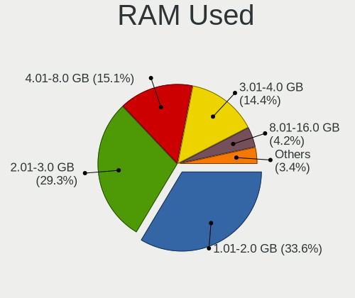
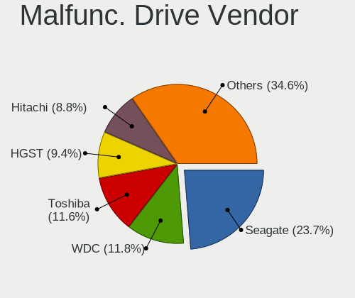
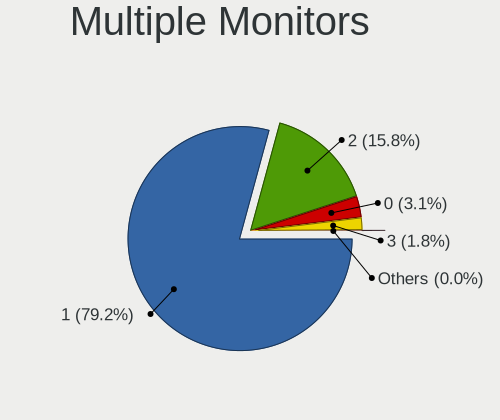
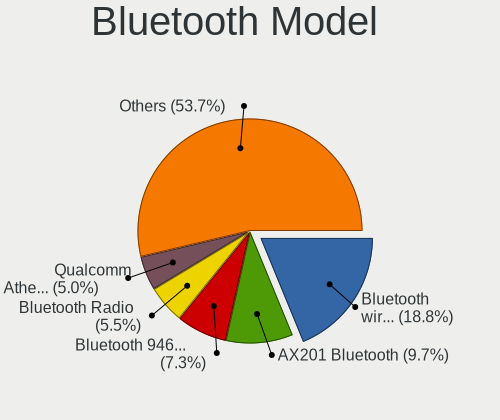

Ubuntu - Tested Hardware & Statistics (Notebooks)
-------------------------------------------------

A project to collect tested hardware configurations for Ubuntu.

Anyone can contribute to this report by the [hw-probe](https://github.com/linuxhw/hw-probe) tool:

    sudo -E hw-probe -all -upload

Please contribute! Especially if your hardware is rare.

Contents
--------

* [ Test Cases ](#test-cases)

* [ System ](#system)
  - [ OS                       ](#os)
  - [ OS Family                ](#os-family)
  - [ Kernel                   ](#kernel)
  - [ Kernel Family            ](#kernel-family)
  - [ Kernel Major Ver.        ](#kernel-major-ver)
  - [ Arch                     ](#arch)
  - [ DE                       ](#de)
  - [ Display Server           ](#display-server)
  - [ Display Manager          ](#display-manager)
  - [ OS Lang                  ](#os-lang)
  - [ Boot Mode                ](#boot-mode)
  - [ Filesystem               ](#filesystem)
  - [ Part. scheme             ](#part-scheme)
  - [ Dual Boot with Linux/BSD ](#dual-boot-with-linuxbsd)
  - [ Dual Boot (Win)          ](#dual-boot-win)

* [ Board ](#board)
  - [ Vendor                   ](#vendor)
  - [ Model                    ](#model)
  - [ Model Family             ](#model-family)
  - [ MFG Year                 ](#mfg-year)
  - [ Form Factor              ](#form-factor)
  - [ Secure Boot              ](#secure-boot)
  - [ Coreboot                 ](#coreboot)
  - [ RAM Size                 ](#ram-size)
  - [ RAM Used                 ](#ram-used)
  - [ Total Drives             ](#total-drives)
  - [ Has CD-ROM               ](#has-cd-rom)
  - [ Has Ethernet             ](#has-ethernet)
  - [ Has WiFi                 ](#has-wifi)
  - [ Has Bluetooth            ](#has-bluetooth)

* [ Location ](#location)
  - [ Country                  ](#country)
  - [ City                     ](#city)

* [ Drives ](#drives)
  - [ Drive Vendor             ](#drive-vendor)
  - [ Drive Model              ](#drive-model)
  - [ HDD Vendor               ](#hdd-vendor)
  - [ SSD Vendor               ](#ssd-vendor)
  - [ Drive Kind               ](#drive-kind)
  - [ Drive Connector          ](#drive-connector)
  - [ Drive Size               ](#drive-size)
  - [ Space Total              ](#space-total)
  - [ Space Used               ](#space-used)
  - [ Malfunc. Drives          ](#malfunc-drives)
  - [ Malfunc. Drive Vendor    ](#malfunc-drive-vendor)
  - [ Malfunc. HDD Vendor      ](#malfunc-hdd-vendor)
  - [ Malfunc. Drive Kind      ](#malfunc-drive-kind)
  - [ Failed Drives            ](#failed-drives)
  - [ Failed Drive Vendor      ](#failed-drive-vendor)
  - [ Drive Status             ](#drive-status)

* [ Storage controller ](#storage-controller)
  - [ Storage Vendor           ](#storage-vendor)
  - [ Storage Model            ](#storage-model)
  - [ Storage Kind             ](#storage-kind)

* [ Processor ](#processor)
  - [ CPU Vendor               ](#cpu-vendor)
  - [ CPU Model                ](#cpu-model)
  - [ CPU Model Family         ](#cpu-model-family)
  - [ CPU Cores                ](#cpu-cores)
  - [ CPU Sockets              ](#cpu-sockets)
  - [ CPU Threads              ](#cpu-threads)
  - [ CPU Op-Modes             ](#cpu-op-modes)
  - [ CPU Microcode            ](#cpu-microcode)
  - [ CPU Microarch            ](#cpu-microarch)

* [ Graphics ](#graphics)
  - [ GPU Vendor               ](#gpu-vendor)
  - [ GPU Model                ](#gpu-model)
  - [ GPU Combo                ](#gpu-combo)
  - [ GPU Driver               ](#gpu-driver)
  - [ GPU Memory               ](#gpu-memory)

* [ Monitor ](#monitor)
  - [ Monitor Vendor           ](#monitor-vendor)
  - [ Monitor Model            ](#monitor-model)
  - [ Monitor Resolution       ](#monitor-resolution)
  - [ Monitor Diagonal         ](#monitor-diagonal)
  - [ Monitor Width            ](#monitor-width)
  - [ Aspect Ratio             ](#aspect-ratio)
  - [ Monitor Area             ](#monitor-area)
  - [ Pixel Density            ](#pixel-density)
  - [ Multiple Monitors        ](#multiple-monitors)

* [ Network ](#network)
  - [ Net Controller Vendor    ](#net-controller-vendor)
  - [ Net Controller Model     ](#net-controller-model)
  - [ Wireless Vendor          ](#wireless-vendor)
  - [ Wireless Model           ](#wireless-model)
  - [ Ethernet Vendor          ](#ethernet-vendor)
  - [ Ethernet Model           ](#ethernet-model)
  - [ Net Controller Kind      ](#net-controller-kind)
  - [ Used Controller          ](#used-controller)
  - [ NICs                     ](#nics)
  - [ IPv6                     ](#ipv6)

* [ Bluetooth ](#bluetooth)
  - [ Bluetooth Vendor         ](#bluetooth-vendor)
  - [ Bluetooth Model          ](#bluetooth-model)

* [ Sound ](#sound)
  - [ Sound Vendor             ](#sound-vendor)
  - [ Sound Model              ](#sound-model)

* [ Memory ](#memory)
  - [ Memory Vendor            ](#memory-vendor)
  - [ Memory Model             ](#memory-model)
  - [ Memory Kind              ](#memory-kind)
  - [ Memory Form Factor       ](#memory-form-factor)
  - [ Memory Size              ](#memory-size)
  - [ Memory Speed             ](#memory-speed)

* [ Printers & scanners ](#printers--scanners)
  - [ Printer Vendor           ](#printer-vendor)
  - [ Printer Model            ](#printer-model)
  - [ Scanner Vendor           ](#scanner-vendor)
  - [ Scanner Model            ](#scanner-model)

* [ Camera ](#camera)
  - [ Camera Vendor            ](#camera-vendor)
  - [ Camera Model             ](#camera-model)

* [ Security ](#security)
  - [ Fingerprint Vendor       ](#fingerprint-vendor)
  - [ Fingerprint Model        ](#fingerprint-model)
  - [ Chipcard Vendor          ](#chipcard-vendor)
  - [ Chipcard Model           ](#chipcard-model)

* [ Unsupported ](#unsupported)
  - [ Unsupported Devices      ](#unsupported-devices)
  - [ Unsupported Device Types ](#unsupported-device-types)

Test Cases
----------

Total: 49691

| Vendor        | Model                       | Probe                                                      | Date         |
|---------------|-----------------------------|------------------------------------------------------------|--------------|
| HP            | ProBook 650 G8 Notebook ... | [b11a7b69f0](https://linux-hardware.org/?probe=b11a7b69f0) | Sep 07, 2023 |
| Lenovo        | Legion Y7000P IRH8 82YA     | [9ebc45f613](https://linux-hardware.org/?probe=9ebc45f613) | Sep 07, 2023 |
| Apple         | MacBookPro8,1               | [f913de368f](https://linux-hardware.org/?probe=f913de368f) | Sep 07, 2023 |
| ASUSTek       | X453MA                      | [c48759c297](https://linux-hardware.org/?probe=c48759c297) | Sep 07, 2023 |
| Apple         | MacBookPro8,1               | [423b8d7135](https://linux-hardware.org/?probe=423b8d7135) | Sep 07, 2023 |
| Lenovo        | IdeaPad 530S-14IKB 81EU     | [0ca7d43ae9](https://linux-hardware.org/?probe=0ca7d43ae9) | Sep 07, 2023 |
| Dell          | Precision M6800             | [b50e95f460](https://linux-hardware.org/?probe=b50e95f460) | Sep 07, 2023 |
| HP            | ENVY 15                     | [996948fd3c](https://linux-hardware.org/?probe=996948fd3c) | Sep 07, 2023 |
| Lenovo        | G565 20071                  | [786aafb0e9](https://linux-hardware.org/?probe=786aafb0e9) | Sep 07, 2023 |
| Dell          | Inspiron 1525               | [6b0747dcb4](https://linux-hardware.org/?probe=6b0747dcb4) | Sep 07, 2023 |
| Dell          | Inspiron 1525               | [56a481c501](https://linux-hardware.org/?probe=56a481c501) | Sep 06, 2023 |
| ASUSTek       | ZenBook Pro Duo UX582LR_... | [b2ba03726a](https://linux-hardware.org/?probe=b2ba03726a) | Sep 06, 2023 |
| realme        | RMNBXXXX                    | [6783f1d181](https://linux-hardware.org/?probe=6783f1d181) | Sep 06, 2023 |
| Apple         | MacBookAir8,2               | [e9e8da1eea](https://linux-hardware.org/?probe=e9e8da1eea) | Sep 06, 2023 |
| Dell          | Latitude E5450              | [1478760d8c](https://linux-hardware.org/?probe=1478760d8c) | Sep 06, 2023 |
| HP            | Pavilion Notebook           | [50777cde40](https://linux-hardware.org/?probe=50777cde40) | Sep 06, 2023 |
| realme        | RMNBXXXX                    | [9370483c5f](https://linux-hardware.org/?probe=9370483c5f) | Sep 06, 2023 |
| Sony          | VGN-AW41MF_H                | [d3a3262a6e](https://linux-hardware.org/?probe=d3a3262a6e) | Sep 06, 2023 |
| Dell          | XPS 15 9550                 | [c9f30a2b26](https://linux-hardware.org/?probe=c9f30a2b26) | Sep 06, 2023 |
| Lenovo        | ThinkPad P1 20MD0014UK      | [428c816118](https://linux-hardware.org/?probe=428c816118) | Sep 06, 2023 |
| Dell          | Latitude 3520               | [0fa236983e](https://linux-hardware.org/?probe=0fa236983e) | Sep 06, 2023 |
| ASUSTek       | VivoBook_ASUSLaptop X571... | [2505f514b1](https://linux-hardware.org/?probe=2505f514b1) | Sep 06, 2023 |
| Dell          | Vostro 3580                 | [5c165fd73b](https://linux-hardware.org/?probe=5c165fd73b) | Sep 06, 2023 |
| HUAWEI        | BOHB-WAX9                   | [5d575aeb4f](https://linux-hardware.org/?probe=5d575aeb4f) | Sep 06, 2023 |
| Unknown       | TBYF-1014WIN32              | [11ef48e0c0](https://linux-hardware.org/?probe=11ef48e0c0) | Sep 06, 2023 |
| Lenovo        | ThinkPad T16 Gen 2 21HH0... | [94c99c8274](https://linux-hardware.org/?probe=94c99c8274) | Sep 06, 2023 |
| TUXEDO        | Unknown                     | [1e6c412d84](https://linux-hardware.org/?probe=1e6c412d84) | Sep 06, 2023 |
| Lenovo        | ThinkPad P1 Gen 4i 20Y30... | [b6b2af8418](https://linux-hardware.org/?probe=b6b2af8418) | Sep 06, 2023 |
| Lenovo        | ThinkPad P1 Gen 4i 20Y30... | [89767db9e4](https://linux-hardware.org/?probe=89767db9e4) | Sep 06, 2023 |
| Lenovo        | ThinkPad X1 Extreme 2nd ... | [3fe52a0e75](https://linux-hardware.org/?probe=3fe52a0e75) | Sep 06, 2023 |
| VALE          | Notebook Classic C140       | [c2e792fccf](https://linux-hardware.org/?probe=c2e792fccf) | Sep 06, 2023 |
| VALE          | Notebook Classic C140       | [fb00b74b14](https://linux-hardware.org/?probe=fb00b74b14) | Sep 06, 2023 |
| VALE          | Notebook Classic C140       | [675a9e9b79](https://linux-hardware.org/?probe=675a9e9b79) | Sep 06, 2023 |
| Dell          | Vostro 5470                 | [aa37593b87](https://linux-hardware.org/?probe=aa37593b87) | Sep 06, 2023 |
| Acer          | Aspire 5733Z                | [bc3d42d633](https://linux-hardware.org/?probe=bc3d42d633) | Sep 06, 2023 |
| Dell          | Vostro 5470                 | [230cd8c32e](https://linux-hardware.org/?probe=230cd8c32e) | Sep 06, 2023 |
| Dell          | G3 3500                     | [5da26d2241](https://linux-hardware.org/?probe=5da26d2241) | Sep 06, 2023 |
| Dell          | Precision 5570              | [9baca62616](https://linux-hardware.org/?probe=9baca62616) | Sep 06, 2023 |
| ASUSTek       | VivoBook_ASUSLaptop K650... | [f50ce96f55](https://linux-hardware.org/?probe=f50ce96f55) | Sep 06, 2023 |
| Framework     | Laptop (12th Gen Intel C... | [8d550b32d9](https://linux-hardware.org/?probe=8d550b32d9) | Sep 06, 2023 |
| Sony          | SVE1712C5E                  | [a5c77b2450](https://linux-hardware.org/?probe=a5c77b2450) | Sep 06, 2023 |
| Sony          | SVE1712C5E                  | [f864c8e44a](https://linux-hardware.org/?probe=f864c8e44a) | Sep 05, 2023 |
| ASUSTek       | ROG Strix G713PV_G713PV     | [cac93ead6f](https://linux-hardware.org/?probe=cac93ead6f) | Sep 05, 2023 |
| HP            | ZBook Studio G3             | [208f21a716](https://linux-hardware.org/?probe=208f21a716) | Sep 05, 2023 |
| Lenovo        | Legion 5 Pro 16IAH7H 82R... | [9d86c0f6e5](https://linux-hardware.org/?probe=9d86c0f6e5) | Sep 05, 2023 |
| Lenovo        | IdeaPad 310-15ISK 80SM      | [a17f1582d4](https://linux-hardware.org/?probe=a17f1582d4) | Sep 05, 2023 |
| HUAWEI        | BoDE-WXX9                   | [06a65572fe](https://linux-hardware.org/?probe=06a65572fe) | Sep 05, 2023 |
| Gateway       | NE56R                       | [be83386f4d](https://linux-hardware.org/?probe=be83386f4d) | Sep 05, 2023 |
| Dell          | Precision 7670              | [42788bf2c7](https://linux-hardware.org/?probe=42788bf2c7) | Sep 05, 2023 |
| Dell          | Precision 7740              | [392ca47879](https://linux-hardware.org/?probe=392ca47879) | Sep 05, 2023 |
| HP            | EliteBook 845 14 inch G9... | [30bf3f1f45](https://linux-hardware.org/?probe=30bf3f1f45) | Sep 05, 2023 |
| Lenovo        | IdeaPad 320-15IKB 81BG      | [5728a3a48b](https://linux-hardware.org/?probe=5728a3a48b) | Sep 05, 2023 |
| Lenovo        | IdeaPad 320-15IKB 81BG      | [fdecc11aba](https://linux-hardware.org/?probe=fdecc11aba) | Sep 05, 2023 |
| Notebook      | NL5xNU                      | [306dab3d42](https://linux-hardware.org/?probe=306dab3d42) | Sep 05, 2023 |
| Dell          | Precision 7670              | [41bb07b203](https://linux-hardware.org/?probe=41bb07b203) | Sep 05, 2023 |
| Lenovo        | Legion Y7000P IRH8 82YA     | [235e80247e](https://linux-hardware.org/?probe=235e80247e) | Sep 05, 2023 |
| Toshiba       | Satellite L455D             | [1d49ff24ad](https://linux-hardware.org/?probe=1d49ff24ad) | Sep 05, 2023 |
| Apple         | MacBookPro16,3              | [7f61d6c898](https://linux-hardware.org/?probe=7f61d6c898) | Sep 05, 2023 |
| Dell          | G5 5590                     | [40098c0a79](https://linux-hardware.org/?probe=40098c0a79) | Sep 05, 2023 |
| Dell          | G5 5590                     | [1af9fd689a](https://linux-hardware.org/?probe=1af9fd689a) | Sep 05, 2023 |
| HP            | EliteBook 845 G7 Noteboo... | [0131d0a313](https://linux-hardware.org/?probe=0131d0a313) | Sep 05, 2023 |
| HP            | EliteBook 8470p             | [a658addd87](https://linux-hardware.org/?probe=a658addd87) | Sep 05, 2023 |
| Apple         | MacBookPro16,2              | [b47ac62db2](https://linux-hardware.org/?probe=b47ac62db2) | Sep 05, 2023 |
| HP            | ProBook 6550b               | [5881531377](https://linux-hardware.org/?probe=5881531377) | Sep 05, 2023 |
| HONOR         | BRN-FXX                     | [381e87228c](https://linux-hardware.org/?probe=381e87228c) | Sep 04, 2023 |
| HP            | ZBook 15 G2                 | [18d9c74d60](https://linux-hardware.org/?probe=18d9c74d60) | Sep 04, 2023 |
| HP            | EliteBook 8470p             | [5cb02e099f](https://linux-hardware.org/?probe=5cb02e099f) | Sep 04, 2023 |
| Acer          | Aspire A315-24P             | [d082fdd668](https://linux-hardware.org/?probe=d082fdd668) | Sep 04, 2023 |
| HP            | Pavilion dv9500             | [653fbbb509](https://linux-hardware.org/?probe=653fbbb509) | Sep 04, 2023 |
| TUXEDO        | Pulse 15 Gen2               | [3dd77a8c87](https://linux-hardware.org/?probe=3dd77a8c87) | Sep 04, 2023 |
| Samsung       | 950XED                      | [3d8ba5a34c](https://linux-hardware.org/?probe=3d8ba5a34c) | Sep 04, 2023 |
| Dell          | Vostro 15 5510              | [7223b751c4](https://linux-hardware.org/?probe=7223b751c4) | Sep 04, 2023 |
| ASUSTek       | ASUS TUF Gaming F15 FX50... | [9accfe317a](https://linux-hardware.org/?probe=9accfe317a) | Sep 04, 2023 |
| Apple         | MacBook8,1                  | [88831ad48b](https://linux-hardware.org/?probe=88831ad48b) | Sep 04, 2023 |
| Lenovo        | ThinkPad X260 20F5S2WX0R    | [cb338af601](https://linux-hardware.org/?probe=cb338af601) | Sep 04, 2023 |
| Dell          | Inspiron 7537               | [036c877144](https://linux-hardware.org/?probe=036c877144) | Sep 04, 2023 |
| Dell          | Vostro 14 3435              | [d35ddd8539](https://linux-hardware.org/?probe=d35ddd8539) | Sep 04, 2023 |
| Dell          | Vostro 14 3435              | [34a27b9c29](https://linux-hardware.org/?probe=34a27b9c29) | Sep 04, 2023 |
| HP            | Compaq 6730b (NN204ET#AB... | [7165368bfe](https://linux-hardware.org/?probe=7165368bfe) | Sep 04, 2023 |
| ASUSTek       | K73SV                       | [7d3f9fa0e5](https://linux-hardware.org/?probe=7d3f9fa0e5) | Sep 04, 2023 |
| Dell          | Precision 3581              | [739b270d83](https://linux-hardware.org/?probe=739b270d83) | Sep 04, 2023 |
| HP            | 250 15.6 inch G9 Noteboo... | [5128231fd7](https://linux-hardware.org/?probe=5128231fd7) | Sep 04, 2023 |
| Lenovo        | IdeaPad 5 Pro 16ARH7 82S... | [daeb81e2f6](https://linux-hardware.org/?probe=daeb81e2f6) | Sep 04, 2023 |
| Dynabook      | G83/HS                      | [9db149b715](https://linux-hardware.org/?probe=9db149b715) | Sep 04, 2023 |
| ASUSTek       | VivoBook_ASUSLaptop M160... | [ea096b699b](https://linux-hardware.org/?probe=ea096b699b) | Sep 04, 2023 |
| Acer          | Aspire A314-35              | [6edc4e910d](https://linux-hardware.org/?probe=6edc4e910d) | Sep 04, 2023 |
| Acer          | Aspire E1-572               | [5801580f1f](https://linux-hardware.org/?probe=5801580f1f) | Sep 04, 2023 |
| MSI           | Prestige 14Evo A12M         | [68bea64ed6](https://linux-hardware.org/?probe=68bea64ed6) | Sep 04, 2023 |
| HP            | ENVY 14 SPECTRE             | [1f0a26899c](https://linux-hardware.org/?probe=1f0a26899c) | Sep 04, 2023 |
| HUAWEI        | NBLB-WAX9N                  | [b7d2eae326](https://linux-hardware.org/?probe=b7d2eae326) | Sep 04, 2023 |
| Dell          | Inspiron 5770               | [1f2c94fe31](https://linux-hardware.org/?probe=1f2c94fe31) | Sep 03, 2023 |
| Samsung       | RV415                       | [dc6aa3101f](https://linux-hardware.org/?probe=dc6aa3101f) | Sep 03, 2023 |
| HP            | 240 G3                      | [24381b91f7](https://linux-hardware.org/?probe=24381b91f7) | Sep 03, 2023 |
| HUAWEI        | BOM-WXX9                    | [6b895a5320](https://linux-hardware.org/?probe=6b895a5320) | Sep 03, 2023 |
| ASUSTek       | ASUSLaptop_Q540VJ           | [39ed316bb6](https://linux-hardware.org/?probe=39ed316bb6) | Sep 03, 2023 |
| IP3 Techno... | ARN59P                      | [493a986305](https://linux-hardware.org/?probe=493a986305) | Sep 03, 2023 |
| Dell          | Latitude E6400              | [88a04ab4b8](https://linux-hardware.org/?probe=88a04ab4b8) | Sep 03, 2023 |
| Dell          | Latitude E6400              | [56cc7d7a27](https://linux-hardware.org/?probe=56cc7d7a27) | Sep 03, 2023 |
| ASUSTek       | Zenbook UX3404VA_Q420VA     | [f9ae8ae2db](https://linux-hardware.org/?probe=f9ae8ae2db) | Sep 03, 2023 |
| HP            | OMEN by Laptop              | [a135074689](https://linux-hardware.org/?probe=a135074689) | Sep 03, 2023 |
| Samsung       | R510/P510                   | [fa457144d5](https://linux-hardware.org/?probe=fa457144d5) | Sep 03, 2023 |
| ASUSTek       | X540NA                      | [e335c8210f](https://linux-hardware.org/?probe=e335c8210f) | Sep 03, 2023 |
| ASUSTek       | X55A                        | [da721dec12](https://linux-hardware.org/?probe=da721dec12) | Sep 03, 2023 |
| Dell          | Latitude 5490               | [392d7335ed](https://linux-hardware.org/?probe=392d7335ed) | Sep 03, 2023 |
| Acer          | Swift SF314-42              | [89dcb5988f](https://linux-hardware.org/?probe=89dcb5988f) | Sep 03, 2023 |
| Lenovo        | Legion Slim 5 16APH8 82Y... | [e27673ed4c](https://linux-hardware.org/?probe=e27673ed4c) | Sep 03, 2023 |
| HP            | EliteBook 850 G3            | [0778936f6b](https://linux-hardware.org/?probe=0778936f6b) | Sep 03, 2023 |
| ASUSTek       | X550CC                      | [1468567e45](https://linux-hardware.org/?probe=1468567e45) | Sep 03, 2023 |
| Acer          | Swift SF314-42              | [8552bc9508](https://linux-hardware.org/?probe=8552bc9508) | Sep 03, 2023 |
| Apple         | MacBookPro8,1               | [6cbaac077e](https://linux-hardware.org/?probe=6cbaac077e) | Sep 03, 2023 |
| Unknown       | Unknown                     | [8585671bfb](https://linux-hardware.org/?probe=8585671bfb) | Sep 03, 2023 |
| HUAWEI        | FRD-WX9                     | [5831652a84](https://linux-hardware.org/?probe=5831652a84) | Sep 03, 2023 |
| EUROCOM       | RAPTOR X17                  | [93827ff6f1](https://linux-hardware.org/?probe=93827ff6f1) | Sep 03, 2023 |
| Unknown       | Unknown                     | [8d7616fae8](https://linux-hardware.org/?probe=8d7616fae8) | Sep 03, 2023 |
| Dell          | XPS 15 9570                 | [9607f36921](https://linux-hardware.org/?probe=9607f36921) | Sep 03, 2023 |
| Acer          | Aspire A715-75G             | [69b91f1c46](https://linux-hardware.org/?probe=69b91f1c46) | Sep 03, 2023 |
| HP            | Pavilion dv4                | [8d183fb271](https://linux-hardware.org/?probe=8d183fb271) | Sep 03, 2023 |
| Dell          | XPS 15 9570                 | [72c5c271b6](https://linux-hardware.org/?probe=72c5c271b6) | Sep 03, 2023 |
| Apple         | MacBookAir5,1               | [57bb5d91ab](https://linux-hardware.org/?probe=57bb5d91ab) | Sep 03, 2023 |
| Lenovo        | IdeaPad Gaming 3 16ARH7 ... | [13ea608a94](https://linux-hardware.org/?probe=13ea608a94) | Sep 03, 2023 |
| VENEZOLANA... | VIT P2460-02                | [9c1d875ec4](https://linux-hardware.org/?probe=9c1d875ec4) | Sep 03, 2023 |
| Lenovo        | IdeaPad 300-15ISK 80Q7      | [5f73c55303](https://linux-hardware.org/?probe=5f73c55303) | Sep 03, 2023 |
| Acer          | Aspire E1-572               | [e91fdf4fbe](https://linux-hardware.org/?probe=e91fdf4fbe) | Sep 03, 2023 |
| Lenovo        | IdeaPad Flex-14API 81SS     | [b9c93a8c15](https://linux-hardware.org/?probe=b9c93a8c15) | Sep 03, 2023 |
| Dell          | Inspiron 5770               | [1bed4ada1e](https://linux-hardware.org/?probe=1bed4ada1e) | Sep 03, 2023 |
| VALE          | Notebook Classic C140       | [05b3dfb69a](https://linux-hardware.org/?probe=05b3dfb69a) | Sep 03, 2023 |
| ASUSTek       | X55A                        | [1ba0e59208](https://linux-hardware.org/?probe=1ba0e59208) | Sep 03, 2023 |
| HP            | Pavilion Laptop 15-eh1xx... | [e04761c470](https://linux-hardware.org/?probe=e04761c470) | Sep 03, 2023 |
| ASUSTek       | ZenBook UX325EA_UX325EA     | [c5787921e3](https://linux-hardware.org/?probe=c5787921e3) | Sep 03, 2023 |
| Lenovo        | IdeaPad S540-13IML 81XA     | [246a993eb7](https://linux-hardware.org/?probe=246a993eb7) | Sep 02, 2023 |
| Unknown       | Unknown                     | [c72be678a2](https://linux-hardware.org/?probe=c72be678a2) | Sep 02, 2023 |
| HP            | Laptop 15s-eq3xxx           | [399abaa799](https://linux-hardware.org/?probe=399abaa799) | Sep 02, 2023 |
| Acer          | Aspire A517-51G             | [762498a914](https://linux-hardware.org/?probe=762498a914) | Sep 02, 2023 |
| Lenovo        | IdeaPad 3 15ADA05 81W1      | [ddae17d733](https://linux-hardware.org/?probe=ddae17d733) | Sep 02, 2023 |
| HP            | EliteBook 8460p             | [b6f6192ef9](https://linux-hardware.org/?probe=b6f6192ef9) | Sep 02, 2023 |
| Lenovo        | IdeaPad Slim 5 16IAH8 83... | [2cfbf5b20c](https://linux-hardware.org/?probe=2cfbf5b20c) | Sep 02, 2023 |
| Lenovo        | IdeaPad 3 15ADA05 81W1      | [60889fc028](https://linux-hardware.org/?probe=60889fc028) | Sep 02, 2023 |
| Dell          | Latitude 5500               | [77e18d6323](https://linux-hardware.org/?probe=77e18d6323) | Sep 02, 2023 |
| Lenovo        | ThinkPad T520 42435JG       | [aad827567e](https://linux-hardware.org/?probe=aad827567e) | Sep 02, 2023 |
| Lenovo        | V130-15IGM 81HL             | [aa1ec8baed](https://linux-hardware.org/?probe=aa1ec8baed) | Sep 02, 2023 |
| Lenovo        | V130-15IGM 81HL             | [38371fb896](https://linux-hardware.org/?probe=38371fb896) | Sep 02, 2023 |
| HP            | 245 G7 Notebook PC          | [bb268c3828](https://linux-hardware.org/?probe=bb268c3828) | Sep 02, 2023 |
| Samsung       | 530XBB                      | [30365848c4](https://linux-hardware.org/?probe=30365848c4) | Sep 02, 2023 |
| Dell          | Inspiron 5720               | [9b802cfff6](https://linux-hardware.org/?probe=9b802cfff6) | Sep 02, 2023 |
| Dell          | Latitude 7400               | [c98434cc21](https://linux-hardware.org/?probe=c98434cc21) | Sep 02, 2023 |
| Apple         | MacBookPro11,1              | [edca0e0264](https://linux-hardware.org/?probe=edca0e0264) | Sep 02, 2023 |
| Lenovo        | ThinkPad W510 438923U       | [b0648eccac](https://linux-hardware.org/?probe=b0648eccac) | Sep 02, 2023 |
| Sony          | SVE1513I4E                  | [a1009ff0be](https://linux-hardware.org/?probe=a1009ff0be) | Sep 02, 2023 |
| Toshiba       | Satellite C660              | [d3c3b72e39](https://linux-hardware.org/?probe=d3c3b72e39) | Sep 01, 2023 |
| Acer          | Aspire 7740                 | [1ab9e5eddb](https://linux-hardware.org/?probe=1ab9e5eddb) | Sep 01, 2023 |
| HP            | Compaq Presario C700        | [c0030f3b3b](https://linux-hardware.org/?probe=c0030f3b3b) | Sep 01, 2023 |
| ASUSTek       | VivoBook_ASUSLaptop X160... | [4e753f77c7](https://linux-hardware.org/?probe=4e753f77c7) | Sep 01, 2023 |
| Dell          | Inspiron 1545               | [cb4847f435](https://linux-hardware.org/?probe=cb4847f435) | Sep 01, 2023 |
| Dell          | Inspiron 15 3511            | [d2f04fdc9e](https://linux-hardware.org/?probe=d2f04fdc9e) | Sep 01, 2023 |
| Lenovo        | ThinkPad P14s Gen 2i 20V... | [aefedc3b34](https://linux-hardware.org/?probe=aefedc3b34) | Sep 01, 2023 |
| HP            | EliteBook 840 G3            | [929ae155ea](https://linux-hardware.org/?probe=929ae155ea) | Sep 01, 2023 |
| Dell          | Latitude 7480               | [41fb46fed8](https://linux-hardware.org/?probe=41fb46fed8) | Sep 01, 2023 |
| Razer         | Blade                       | [8daaeab270](https://linux-hardware.org/?probe=8daaeab270) | Sep 01, 2023 |
| HP            | EliteBook 840 G8 Noteboo... | [d4335c9520](https://linux-hardware.org/?probe=d4335c9520) | Sep 01, 2023 |
| Sony          | SVE1513I4E                  | [404c008e41](https://linux-hardware.org/?probe=404c008e41) | Sep 01, 2023 |
| Lenovo        | Legion R9000P2021H 82JQ     | [1e7179e4f0](https://linux-hardware.org/?probe=1e7179e4f0) | Sep 01, 2023 |
| Dell          | Vostro 3550                 | [c9431922ba](https://linux-hardware.org/?probe=c9431922ba) | Sep 01, 2023 |
| HP            | EliteBook Folio 1040 G1     | [1c496aba4a](https://linux-hardware.org/?probe=1c496aba4a) | Sep 01, 2023 |
| Toshiba       | Satellite P55t-C            | [3dd1896d54](https://linux-hardware.org/?probe=3dd1896d54) | Sep 01, 2023 |
| Dell          | Inspiron 5579               | [14fa68270f](https://linux-hardware.org/?probe=14fa68270f) | Sep 01, 2023 |
| Lenovo        | ThinkPad T440p 20AWS1BL0... | [f1e1512fc9](https://linux-hardware.org/?probe=f1e1512fc9) | Sep 01, 2023 |
| HP            | ZBook 15                    | [8a20670725](https://linux-hardware.org/?probe=8a20670725) | Sep 01, 2023 |
| Lenovo        | ThinkPad T580 20L9001YIV    | [dc7b90d27f](https://linux-hardware.org/?probe=dc7b90d27f) | Sep 01, 2023 |
| HUAWEI        | MACH-WX9                    | [6f761aa23b](https://linux-hardware.org/?probe=6f761aa23b) | Aug 31, 2023 |
| HP            | EliteBook 840 G2            | [53bcd4ec72](https://linux-hardware.org/?probe=53bcd4ec72) | Aug 31, 2023 |
| Acer          | Swift SF114-34              | [987f4bab43](https://linux-hardware.org/?probe=987f4bab43) | Aug 31, 2023 |
| Toshiba       | Satellite S75-B             | [2ffc319636](https://linux-hardware.org/?probe=2ffc319636) | Aug 31, 2023 |
| HP            | EliteBook 840 G3            | [3411b788bc](https://linux-hardware.org/?probe=3411b788bc) | Aug 31, 2023 |
| Dell          | Inspiron N4050              | [311af8113f](https://linux-hardware.org/?probe=311af8113f) | Aug 31, 2023 |
| Lenovo        | IdeaPad 300-15ISK 80Q7      | [b900fd0bc7](https://linux-hardware.org/?probe=b900fd0bc7) | Aug 31, 2023 |
| HP            | ProBook 4530s               | [09fddaab4d](https://linux-hardware.org/?probe=09fddaab4d) | Aug 31, 2023 |
| Dell          | Latitude 7390               | [a9c1ad1756](https://linux-hardware.org/?probe=a9c1ad1756) | Aug 31, 2023 |
| Dell          | Latitude E6410              | [c2337bbe75](https://linux-hardware.org/?probe=c2337bbe75) | Aug 31, 2023 |
| Dell          | Latitude 7340               | [d6d1df94f5](https://linux-hardware.org/?probe=d6d1df94f5) | Aug 31, 2023 |
| HUAWEI        | MACHD-WXX9                  | [2e74e88e2f](https://linux-hardware.org/?probe=2e74e88e2f) | Aug 31, 2023 |
| Lenovo        | ThinkPad X220 4290EC5       | [d75bd4dfbd](https://linux-hardware.org/?probe=d75bd4dfbd) | Aug 31, 2023 |
| HP            | 3115m                       | [85325be2ba](https://linux-hardware.org/?probe=85325be2ba) | Aug 31, 2023 |
| Lenovo        | ThinkPad T470s 20HGS0PA0... | [89caf6d252](https://linux-hardware.org/?probe=89caf6d252) | Aug 31, 2023 |
| Lenovo        | V15 G4 AMN 82YU             | [23242fe856](https://linux-hardware.org/?probe=23242fe856) | Aug 31, 2023 |
| MSI           | Thin GF63 12VE              | [0615d252af](https://linux-hardware.org/?probe=0615d252af) | Aug 31, 2023 |
| HP            | ProBook 455 15.6 inch G9... | [ae4d140b96](https://linux-hardware.org/?probe=ae4d140b96) | Aug 31, 2023 |
| Lenovo        | G50-80 80E5                 | [8adf70b56e](https://linux-hardware.org/?probe=8adf70b56e) | Aug 31, 2023 |
| Apple         | MacBookPro10,1              | [7741e9850b](https://linux-hardware.org/?probe=7741e9850b) | Aug 31, 2023 |
| ASUSTek       | ROG Strix G733PZ_G733PZ     | [33b5107930](https://linux-hardware.org/?probe=33b5107930) | Aug 31, 2023 |
| Lenovo        | ThinkPad P53 MFG_IN_GO     | [5cfa9a748f](https://linux-hardware.org/?probe=5cfa9a748f) | Aug 31, 2023 |
| Lenovo        | ThinkBook 15 G2 ITL 20VE    | [f01ca37e4c](https://linux-hardware.org/?probe=f01ca37e4c) | Aug 31, 2023 |
| Dell          | XPS 15 7590                 | [b423b914f7](https://linux-hardware.org/?probe=b423b914f7) | Aug 30, 2023 |
| Dell          | G15 5530                    | [1027c8fe19](https://linux-hardware.org/?probe=1027c8fe19) | Aug 30, 2023 |
| HUAWEI        | BOM-WXX9                    | [ea587f2b2e](https://linux-hardware.org/?probe=ea587f2b2e) | Aug 30, 2023 |
| Lenovo        | ThinkPad T440s 20AQ007SM... | [0a55847393](https://linux-hardware.org/?probe=0a55847393) | Aug 30, 2023 |
| ASUSTek       | Zenbook UX6404VV_UX6404V... | [b7be264a8d](https://linux-hardware.org/?probe=b7be264a8d) | Aug 30, 2023 |
| Dell          | Precision 7680              | [90240d0ffd](https://linux-hardware.org/?probe=90240d0ffd) | Aug 30, 2023 |
| Toshiba       | Satellite P50-B-113         | [a9f21477c8](https://linux-hardware.org/?probe=a9f21477c8) | Aug 30, 2023 |
| HP            | 250 G7 Notebook PC          | [1964cb4738](https://linux-hardware.org/?probe=1964cb4738) | Aug 30, 2023 |
| HP            | 250 G7 Notebook PC          | [7176f2933c](https://linux-hardware.org/?probe=7176f2933c) | Aug 30, 2023 |
| Dell          | Precision 7680              | [065ed91451](https://linux-hardware.org/?probe=065ed91451) | Aug 30, 2023 |
| HP            | ZBook 15 G3                 | [d88312e34b](https://linux-hardware.org/?probe=d88312e34b) | Aug 30, 2023 |
| HP            | ZBook 15 G3                 | [7943c070cc](https://linux-hardware.org/?probe=7943c070cc) | Aug 30, 2023 |
| Dell          | Vostro 3550                 | [f120556c56](https://linux-hardware.org/?probe=f120556c56) | Aug 30, 2023 |
| ASUSTek       | ROG Strix G731GT_GL731GT    | [aac7eeec4e](https://linux-hardware.org/?probe=aac7eeec4e) | Aug 30, 2023 |
| HP            | EliteBook 840 G2            | [4f3d3f12a4](https://linux-hardware.org/?probe=4f3d3f12a4) | Aug 30, 2023 |
| Lenovo        | ThinkPad X1 Extreme Gen ... | [15c048cb00](https://linux-hardware.org/?probe=15c048cb00) | Aug 30, 2023 |
| HP            | Dragonfly Pro Laptop PC     | [2b08121ea1](https://linux-hardware.org/?probe=2b08121ea1) | Aug 30, 2023 |
| Sony          | VGN-C15TP_W                 | [591d0b778e](https://linux-hardware.org/?probe=591d0b778e) | Aug 30, 2023 |
| Apple         | MacBookPro9,2               | [76805c8b77](https://linux-hardware.org/?probe=76805c8b77) | Aug 30, 2023 |
| Apple         | MacBookPro9,2               | [cc6b5178f0](https://linux-hardware.org/?probe=cc6b5178f0) | Aug 30, 2023 |
| HUAWEI        | KLVD-WXX9                   | [98262b8471](https://linux-hardware.org/?probe=98262b8471) | Aug 30, 2023 |
| HP            | Compaq Presario C700        | [bc78db6077](https://linux-hardware.org/?probe=bc78db6077) | Aug 29, 2023 |
| Lenovo        | ThinkPad W541 20EGS0N00H    | [ed94f8b9b9](https://linux-hardware.org/?probe=ed94f8b9b9) | Aug 29, 2023 |
| HP            | Stream Laptop 11-ak0xxx     | [64686e9027](https://linux-hardware.org/?probe=64686e9027) | Aug 29, 2023 |
| Notebook      | W230ST                      | [0061b93424](https://linux-hardware.org/?probe=0061b93424) | Aug 29, 2023 |
| HP            | Pavilion g6                 | [b1836fb080](https://linux-hardware.org/?probe=b1836fb080) | Aug 29, 2023 |
| HONOR         | NMH-WCX9                    | [6e4b12a41e](https://linux-hardware.org/?probe=6e4b12a41e) | Aug 29, 2023 |
| Infinix       | INBOOK X2 SLIM              | [93fd8245ab](https://linux-hardware.org/?probe=93fd8245ab) | Aug 29, 2023 |
| Lenovo        | ThinkPad E14 Gen 3 20Y70... | [8c492a4b3d](https://linux-hardware.org/?probe=8c492a4b3d) | Aug 29, 2023 |
| Infinix       | INBOOK X2 SLIM              | [fafc374d46](https://linux-hardware.org/?probe=fafc374d46) | Aug 29, 2023 |
| HP            | Laptop 14s-dy2xxx           | [8a7f22304b](https://linux-hardware.org/?probe=8a7f22304b) | Aug 29, 2023 |
| ASUSTek       | X550LD                      | [b866599fbc](https://linux-hardware.org/?probe=b866599fbc) | Aug 29, 2023 |
| HP            | Dragonfly 13.5 inch G4 N... | [9450749b35](https://linux-hardware.org/?probe=9450749b35) | Aug 29, 2023 |
| ASUSTek       | ROG Zephyrus G14 GA401IH... | [bf8f795045](https://linux-hardware.org/?probe=bf8f795045) | Aug 29, 2023 |
| Lenovo        | IdeaPad Gaming 3 15IAH7 ... | [d6bca74de6](https://linux-hardware.org/?probe=d6bca74de6) | Aug 29, 2023 |
| Clevo         | W150HRM                     | [142e1026a1](https://linux-hardware.org/?probe=142e1026a1) | Aug 29, 2023 |
| Apple         | MacBookPro11,3              | [561b652278](https://linux-hardware.org/?probe=561b652278) | Aug 29, 2023 |
| HP            | 255 G2                      | [23bf2dd515](https://linux-hardware.org/?probe=23bf2dd515) | Aug 29, 2023 |
| HP            | ZBook Studio G3             | [bdaea6156d](https://linux-hardware.org/?probe=bdaea6156d) | Aug 29, 2023 |
| Acer          | Aspire 5742                 | [9bbb56c640](https://linux-hardware.org/?probe=9bbb56c640) | Aug 29, 2023 |
| ASUSTek       | ASUS TUF Gaming F15 FX50... | [863b7d7901](https://linux-hardware.org/?probe=863b7d7901) | Aug 29, 2023 |
| Sony          | VPCEA36FX                   | [174aefbf35](https://linux-hardware.org/?probe=174aefbf35) | Aug 29, 2023 |
| HP            | Pavilion Laptop 15t-eg30... | [aa2e067c2d](https://linux-hardware.org/?probe=aa2e067c2d) | Aug 29, 2023 |
| ASUSTek       | X580VD                      | [c8bed4c7e6](https://linux-hardware.org/?probe=c8bed4c7e6) | Aug 29, 2023 |
| Lenovo        | IdeaPad Slim 3 14ABR8 82... | [4fa3f56511](https://linux-hardware.org/?probe=4fa3f56511) | Aug 29, 2023 |
| Lenovo        | IdeaPad Slim 3 14ABR8 82... | [9bf240bf4d](https://linux-hardware.org/?probe=9bf240bf4d) | Aug 29, 2023 |
| HP            | ZBook 14 G2                 | [e56fcd0532](https://linux-hardware.org/?probe=e56fcd0532) | Aug 28, 2023 |
| Packard Be... | EasyNote ENTF71BM           | [e5923577ad](https://linux-hardware.org/?probe=e5923577ad) | Aug 28, 2023 |
| Dell          | Latitude E4310              | [03b37a1c55](https://linux-hardware.org/?probe=03b37a1c55) | Aug 28, 2023 |
| Lenovo        | Legion 5 Pro 16ACH6H 82J... | [87b94b4ea0](https://linux-hardware.org/?probe=87b94b4ea0) | Aug 28, 2023 |
| Dell          | Latitude 5530               | [151de667a5](https://linux-hardware.org/?probe=151de667a5) | Aug 28, 2023 |
| MSI           | Katana GF66 12UGS           | [ca352a81f4](https://linux-hardware.org/?probe=ca352a81f4) | Aug 28, 2023 |
| HP            | Pavilion g6                 | [8d874b796c](https://linux-hardware.org/?probe=8d874b796c) | Aug 28, 2023 |
| HP            | Pavilion g6                 | [42bade556f](https://linux-hardware.org/?probe=42bade556f) | Aug 28, 2023 |
| ASUSTek       | K401UB                      | [14a7bf0f59](https://linux-hardware.org/?probe=14a7bf0f59) | Aug 28, 2023 |
| Dell          | Latitude E7240              | [1eab9b5f8d](https://linux-hardware.org/?probe=1eab9b5f8d) | Aug 28, 2023 |
| Lenovo        | Legion 5 15ACH6H 82JU       | [dfb8d0f76b](https://linux-hardware.org/?probe=dfb8d0f76b) | Aug 28, 2023 |
| HP            | 630                         | [4a94779668](https://linux-hardware.org/?probe=4a94779668) | Aug 28, 2023 |
| Dell          | XPS 15 7590                 | [9abe07288a](https://linux-hardware.org/?probe=9abe07288a) | Aug 28, 2023 |
| Dell          | XPS 15 9510                 | [63305912c4](https://linux-hardware.org/?probe=63305912c4) | Aug 28, 2023 |
| Toshiba       | Satellite Pro C70-C         | [eb9fbb104c](https://linux-hardware.org/?probe=eb9fbb104c) | Aug 28, 2023 |
| Apple         | MacBookPro16,2              | [65408b783f](https://linux-hardware.org/?probe=65408b783f) | Aug 28, 2023 |
| HP            | 15 Notebook PC              | [bb75fbb42b](https://linux-hardware.org/?probe=bb75fbb42b) | Aug 28, 2023 |
| HP            | Laptop 15-ef0xxx            | [b948af0216](https://linux-hardware.org/?probe=b948af0216) | Aug 27, 2023 |
| Lenovo        | V15 G3 IAP 82TT             | [c6e30be0e9](https://linux-hardware.org/?probe=c6e30be0e9) | Aug 27, 2023 |
| Dell          | Latitude E5470              | [582c495a92](https://linux-hardware.org/?probe=582c495a92) | Aug 27, 2023 |
| Dell          | Latitude E5470              | [63816a7b5f](https://linux-hardware.org/?probe=63816a7b5f) | Aug 27, 2023 |
| Dell          | Inspiron 5590               | [5036ce79f9](https://linux-hardware.org/?probe=5036ce79f9) | Aug 27, 2023 |
| HP            | EliteBook 840 G5            | [cd64a75511](https://linux-hardware.org/?probe=cd64a75511) | Aug 27, 2023 |
| Lenovo        | ThinkPad X270 W10DG 20K6... | [9fcb646019](https://linux-hardware.org/?probe=9fcb646019) | Aug 27, 2023 |
| HP            | Compaq nx6325 (EN188UT#A... | [4324feffa1](https://linux-hardware.org/?probe=4324feffa1) | Aug 27, 2023 |
| Lenovo        | ThinkPad X270 W10DG 20K6... | [9ce11e1efa](https://linux-hardware.org/?probe=9ce11e1efa) | Aug 27, 2023 |
| Dell          | Precision M4700             | [c65acacce9](https://linux-hardware.org/?probe=c65acacce9) | Aug 27, 2023 |
| Dell          | XPS 13 9310                 | [9dddd0c80b](https://linux-hardware.org/?probe=9dddd0c80b) | Aug 27, 2023 |
| ASUSTek       | VivoBook_ASUSLaptop M350... | [67a80738c9](https://linux-hardware.org/?probe=67a80738c9) | Aug 27, 2023 |
| Lenovo        | IdeaPad Slim 1-11AST-05 ... | [5b334ec725](https://linux-hardware.org/?probe=5b334ec725) | Aug 27, 2023 |
| HP            | Pavilion Laptop 14-ec0xx... | [be9aaf7726](https://linux-hardware.org/?probe=be9aaf7726) | Aug 27, 2023 |
| Lenovo        | ThinkPad L14 Gen 4 21H5C... | [96b559d5d6](https://linux-hardware.org/?probe=96b559d5d6) | Aug 27, 2023 |
| HP            | ProBook 440 G8 Notebook ... | [0fd39b7eb6](https://linux-hardware.org/?probe=0fd39b7eb6) | Aug 27, 2023 |
| Notebook      | NHx0EH_EJ_EK                | [a37b52dfbe](https://linux-hardware.org/?probe=a37b52dfbe) | Aug 27, 2023 |
| Lenovo        | ThinkPad X200 7459ED2       | [4885ef4597](https://linux-hardware.org/?probe=4885ef4597) | Aug 27, 2023 |
| ASUSTek       | Zenbook UM3402YAR_UM3402... | [3f7455be45](https://linux-hardware.org/?probe=3f7455be45) | Aug 27, 2023 |
| HUAWEI        | HN-WX9X                     | [d526f12390](https://linux-hardware.org/?probe=d526f12390) | Aug 27, 2023 |
| Dell          | Studio 1737                 | [8e668fe167](https://linux-hardware.org/?probe=8e668fe167) | Aug 27, 2023 |
| Apple         | MacBookPro16,2              | [f153f48649](https://linux-hardware.org/?probe=f153f48649) | Aug 27, 2023 |
| Dell          | Latitude 14 Rugged (5404... | [c96c172d03](https://linux-hardware.org/?probe=c96c172d03) | Aug 27, 2023 |
| ASUSTek       | VivoBook_ASUSLaptop X513... | [cb258d3cc3](https://linux-hardware.org/?probe=cb258d3cc3) | Aug 27, 2023 |
| ASUSTek       | Zenbook UX3402VA_UX3402V... | [173b99bf55](https://linux-hardware.org/?probe=173b99bf55) | Aug 27, 2023 |
| Lenovo        | IdeaPad 320-15IKB 81BG      | [e165507af8](https://linux-hardware.org/?probe=e165507af8) | Aug 27, 2023 |
| Lenovo        | IdeaPad 320-15IKB 81BG      | [329d960437](https://linux-hardware.org/?probe=329d960437) | Aug 27, 2023 |
| Dell          | Precision M4700             | [8f4eef8a36](https://linux-hardware.org/?probe=8f4eef8a36) | Aug 27, 2023 |
| Dell          | Latitude 7390               | [8b97344f0a](https://linux-hardware.org/?probe=8b97344f0a) | Aug 27, 2023 |
| Dell          | Inspiron 16 Plus 7620       | [4a3a5eb408](https://linux-hardware.org/?probe=4a3a5eb408) | Aug 27, 2023 |
| Google        | Nautilus                    | [3f96b35cae](https://linux-hardware.org/?probe=3f96b35cae) | Aug 26, 2023 |
| HP            | Laptop 14-em0xxx            | [b59ee89595](https://linux-hardware.org/?probe=b59ee89595) | Aug 26, 2023 |
| Lenovo        | IdeaPad Y700-15ISK 80NV     | [14605463c1](https://linux-hardware.org/?probe=14605463c1) | Aug 26, 2023 |
| Panasonic     | CF53-4                      | [6228d53ef2](https://linux-hardware.org/?probe=6228d53ef2) | Aug 26, 2023 |
| HP            | 2000                        | [a63dd6e0f1](https://linux-hardware.org/?probe=a63dd6e0f1) | Aug 26, 2023 |
| Dell          | Latitude 7380               | [396738805e](https://linux-hardware.org/?probe=396738805e) | Aug 26, 2023 |
| Dell          | Latitude 7380               | [4a0db5ad8a](https://linux-hardware.org/?probe=4a0db5ad8a) | Aug 26, 2023 |
| Positivo      | CHT14B                      | [81a8519b9e](https://linux-hardware.org/?probe=81a8519b9e) | Aug 26, 2023 |
| Acer          | Aspire V5-571               | [033994cebf](https://linux-hardware.org/?probe=033994cebf) | Aug 26, 2023 |
| Acer          | Aspire V5-471P              | [fcbacf6769](https://linux-hardware.org/?probe=fcbacf6769) | Aug 26, 2023 |
| Lenovo        | IdeaPad Y700-15ISK 80NV     | [738c091241](https://linux-hardware.org/?probe=738c091241) | Aug 26, 2023 |
| ASUSTek       | T100HAN                     | [73c5eff054](https://linux-hardware.org/?probe=73c5eff054) | Aug 26, 2023 |
| HP            | EliteBook 850 G1            | [4f74cc24e0](https://linux-hardware.org/?probe=4f74cc24e0) | Aug 26, 2023 |
| Acer          | Aspire E1-570               | [6c8db1b4dd](https://linux-hardware.org/?probe=6c8db1b4dd) | Aug 26, 2023 |
| Lenovo        | IdeaPad 100-15IBD 80QQ      | [f790775637](https://linux-hardware.org/?probe=f790775637) | Aug 26, 2023 |
| HUAWEI        | KLVL-WXXW                   | [5e7257145a](https://linux-hardware.org/?probe=5e7257145a) | Aug 26, 2023 |
| HP            | Compaq 6710b (GE822PA#AB... | [134d0685ff](https://linux-hardware.org/?probe=134d0685ff) | Aug 26, 2023 |
| Apple         | MacBookPro7,1               | [a8d794f4bb](https://linux-hardware.org/?probe=a8d794f4bb) | Aug 26, 2023 |
| HUAWEI        | BOD-WXX9                    | [8f033793a9](https://linux-hardware.org/?probe=8f033793a9) | Aug 26, 2023 |
| HUAWEI        | BOD-WXX9                    | [0e107ac9bb](https://linux-hardware.org/?probe=0e107ac9bb) | Aug 26, 2023 |
| Acer          | Aspire E1-531               | [1a1924897a](https://linux-hardware.org/?probe=1a1924897a) | Aug 26, 2023 |
| Acer          | Aspire A515-56              | [53b787dc90](https://linux-hardware.org/?probe=53b787dc90) | Aug 26, 2023 |
| ASUSTek       | VivoBook_ASUSLaptop M140... | [a305956d47](https://linux-hardware.org/?probe=a305956d47) | Aug 26, 2023 |
| Lenovo        | IdeaPad 3 15ITL6 82H8       | [0140ea0642](https://linux-hardware.org/?probe=0140ea0642) | Aug 26, 2023 |
| Lenovo        | IdeaPad L340-15IRH Gamin... | [6496a666d7](https://linux-hardware.org/?probe=6496a666d7) | Aug 26, 2023 |
| Dell          | XPS 13 9300                 | [ca90d2134f](https://linux-hardware.org/?probe=ca90d2134f) | Aug 26, 2023 |
| ASUSTek       | X550CL                      | [88ab580175](https://linux-hardware.org/?probe=88ab580175) | Aug 26, 2023 |
| ASUSTek       | X550CL                      | [c957b259a2](https://linux-hardware.org/?probe=c957b259a2) | Aug 26, 2023 |
| Samsung       | 300E5K/300E5Q               | [f0f9f25268](https://linux-hardware.org/?probe=f0f9f25268) | Aug 26, 2023 |
| Samsung       | 300E5K/300E5Q               | [95aa33fc09](https://linux-hardware.org/?probe=95aa33fc09) | Aug 26, 2023 |
| Notebook      | NL4x_NL5xLU                 | [22c5b125e0](https://linux-hardware.org/?probe=22c5b125e0) | Aug 25, 2023 |
| ASUSTek       | K53SD                       | [a8bb2fa11d](https://linux-hardware.org/?probe=a8bb2fa11d) | Aug 25, 2023 |
| HP            | Laptop 15-bs0xx             | [7a522c6b71](https://linux-hardware.org/?probe=7a522c6b71) | Aug 25, 2023 |
| Lenovo        | ThinkPad E560 20EV000UUK    | [01ae0852df](https://linux-hardware.org/?probe=01ae0852df) | Aug 25, 2023 |
| Acer          | Aspire V3-571               | [376d5e8a22](https://linux-hardware.org/?probe=376d5e8a22) | Aug 25, 2023 |
| HUAWEI        | HN-WX9X                     | [95ff13464e](https://linux-hardware.org/?probe=95ff13464e) | Aug 25, 2023 |
| Lenovo        | G50-70 20351                | [25c5011587](https://linux-hardware.org/?probe=25c5011587) | Aug 25, 2023 |
| Lenovo        | ThinkPad L580 20LXS1D100    | [f30a161506](https://linux-hardware.org/?probe=f30a161506) | Aug 25, 2023 |
| Casper        | NIRVANA NB X400             | [e8aa46ffbc](https://linux-hardware.org/?probe=e8aa46ffbc) | Aug 25, 2023 |
| Lenovo        | ThinkPad T460 20FN003LFR    | [b6a67bea6a](https://linux-hardware.org/?probe=b6a67bea6a) | Aug 25, 2023 |
| Dell          | G3 3579                     | [843084a77c](https://linux-hardware.org/?probe=843084a77c) | Aug 25, 2023 |
| Dell          | Latitude 5590               | [57e6618c1f](https://linux-hardware.org/?probe=57e6618c1f) | Aug 25, 2023 |
| Dell          | Latitude 5590               | [7e84349262](https://linux-hardware.org/?probe=7e84349262) | Aug 25, 2023 |
| HP            | Notebook                    | [6404f1dc3a](https://linux-hardware.org/?probe=6404f1dc3a) | Aug 25, 2023 |
| ASUSTek       | VivoBook_ASUSLaptop M140... | [aa3de32445](https://linux-hardware.org/?probe=aa3de32445) | Aug 25, 2023 |
| Dell          | Precision 5480              | [c4f1e9b39b](https://linux-hardware.org/?probe=c4f1e9b39b) | Aug 25, 2023 |
| Lenovo        | V15-IIL 82C5                | [cee65701f2](https://linux-hardware.org/?probe=cee65701f2) | Aug 25, 2023 |
| Timi          | A34R                        | [f2998bab84](https://linux-hardware.org/?probe=f2998bab84) | Aug 25, 2023 |
| Acer          | Nitro AN515-45              | [de7752b138](https://linux-hardware.org/?probe=de7752b138) | Aug 25, 2023 |
| HP            | Notebook                    | [c3ae6b2ed1](https://linux-hardware.org/?probe=c3ae6b2ed1) | Aug 25, 2023 |
| HP            | Laptop 15s-fq4xxx           | [e2c530b9fd](https://linux-hardware.org/?probe=e2c530b9fd) | Aug 25, 2023 |
| Dell          | XPS 17 9700                 | [93fec269da](https://linux-hardware.org/?probe=93fec269da) | Aug 25, 2023 |
| Notebook      | NL5xNU                      | [116561b889](https://linux-hardware.org/?probe=116561b889) | Aug 25, 2023 |
| ASUSTek       | VivoBook_ASUSLaptop M140... | [3ce0d3817d](https://linux-hardware.org/?probe=3ce0d3817d) | Aug 25, 2023 |
| HP            | Pavilion Laptop 15-cc5xx    | [1bdd23422a](https://linux-hardware.org/?probe=1bdd23422a) | Aug 25, 2023 |
| Lenovo        | ThinkPad L15 Gen 1 20U8S... | [bb854d7896](https://linux-hardware.org/?probe=bb854d7896) | Aug 25, 2023 |
| Sony          | VPCCW23FX                   | [e58afa3312](https://linux-hardware.org/?probe=e58afa3312) | Aug 25, 2023 |
| Lenovo        | ThinkPad T460s 20F90039U... | [e632335144](https://linux-hardware.org/?probe=e632335144) | Aug 25, 2023 |
| Dell          | XPS 15 9520                 | [16aa1ac3af](https://linux-hardware.org/?probe=16aa1ac3af) | Aug 25, 2023 |
| Dell          | Vostro 5470                 | [2e62ce7973](https://linux-hardware.org/?probe=2e62ce7973) | Aug 25, 2023 |
| Sony          | VGN-C15TP_W                 | [a63433e04d](https://linux-hardware.org/?probe=a63433e04d) | Aug 25, 2023 |
| Lenovo        | ThinkPad W530 2447GW3       | [3438523e90](https://linux-hardware.org/?probe=3438523e90) | Aug 25, 2023 |
| Acer          | Aspire 5742                 | [7d896ad750](https://linux-hardware.org/?probe=7d896ad750) | Aug 24, 2023 |
| Dell          | Latitude E5570              | [2694b6c409](https://linux-hardware.org/?probe=2694b6c409) | Aug 24, 2023 |
| Lenovo        | ThinkPad W530 2447GW3       | [72d1d1be0b](https://linux-hardware.org/?probe=72d1d1be0b) | Aug 24, 2023 |
| ASUSTek       | TUF Gaming FX505DY_FX505... | [0b3afd5dce](https://linux-hardware.org/?probe=0b3afd5dce) | Aug 24, 2023 |
| ASUSTek       | ZenBook Pro Duo UX582HM_... | [2281d96afb](https://linux-hardware.org/?probe=2281d96afb) | Aug 24, 2023 |
| Dell          | Inspiron 5770               | [caecc0c140](https://linux-hardware.org/?probe=caecc0c140) | Aug 24, 2023 |
| Dell          | Inspiron 5770               | [0aaf8b7985](https://linux-hardware.org/?probe=0aaf8b7985) | Aug 24, 2023 |
| Dell          | Inspiron 7572               | [84f4498af0](https://linux-hardware.org/?probe=84f4498af0) | Aug 24, 2023 |
| HP            | ENVY 15                     | [6367186102](https://linux-hardware.org/?probe=6367186102) | Aug 24, 2023 |
| Mediacom      | GTZS                        | [8b40b2b9fc](https://linux-hardware.org/?probe=8b40b2b9fc) | Aug 24, 2023 |
| HP            | ZBook Fury 15 G7 Mobile ... | [a2b21f0903](https://linux-hardware.org/?probe=a2b21f0903) | Aug 24, 2023 |
| Apple         | MacBookAir8,1               | [a1a9178606](https://linux-hardware.org/?probe=a1a9178606) | Aug 24, 2023 |
| HP            | ZBook 14 G2                 | [d3efd68f2f](https://linux-hardware.org/?probe=d3efd68f2f) | Aug 24, 2023 |
| Lenovo        | ThinkPad T16 Gen 1 21BV0... | [3d7ba31c2a](https://linux-hardware.org/?probe=3d7ba31c2a) | Aug 24, 2023 |
| Dell          | Latitude 3520               | [92ef936c86](https://linux-hardware.org/?probe=92ef936c86) | Aug 24, 2023 |
| Lenovo        | ThinkPad T430 2347DS4       | [cbaaad3882](https://linux-hardware.org/?probe=cbaaad3882) | Aug 24, 2023 |
| Acer          | Aspire 5750G                | [b7ab89701b](https://linux-hardware.org/?probe=b7ab89701b) | Aug 24, 2023 |
| ASUSTek       | K73SV                       | [d366a928cc](https://linux-hardware.org/?probe=d366a928cc) | Aug 24, 2023 |
| Lenovo        | Legion Y7000P IRH8 82YA     | [4b21c7c00f](https://linux-hardware.org/?probe=4b21c7c00f) | Aug 24, 2023 |
| HP            | EliteBook 840 G1            | [1bae9647d1](https://linux-hardware.org/?probe=1bae9647d1) | Aug 24, 2023 |
| Dell          | Inspiron 5748               | [ea2d298b05](https://linux-hardware.org/?probe=ea2d298b05) | Aug 24, 2023 |
| Dell          | Precision 5680              | [3ef7298733](https://linux-hardware.org/?probe=3ef7298733) | Aug 24, 2023 |
| HP            | Notebook                    | [1d3025a033](https://linux-hardware.org/?probe=1d3025a033) | Aug 24, 2023 |
| Dell          | Precision 3561              | [610fa14d3a](https://linux-hardware.org/?probe=610fa14d3a) | Aug 24, 2023 |
| Dell          | System XPS L502X            | [a5357a41b4](https://linux-hardware.org/?probe=a5357a41b4) | Aug 23, 2023 |
| Lenovo        | IdeaPad 320-15ISK 80XH      | [5bddf6d37d](https://linux-hardware.org/?probe=5bddf6d37d) | Aug 23, 2023 |
| HUAWEI        | BOM-WXX9                    | [061ecf9479](https://linux-hardware.org/?probe=061ecf9479) | Aug 23, 2023 |
| MSI           | GP72 6QF                    | [3afc91a639](https://linux-hardware.org/?probe=3afc91a639) | Aug 23, 2023 |
| TUXEDO        | Pulse 15 Gen2               | [da78ac9e8e](https://linux-hardware.org/?probe=da78ac9e8e) | Aug 23, 2023 |
| HP            | EliteBook 8440p             | [89e74082d8](https://linux-hardware.org/?probe=89e74082d8) | Aug 23, 2023 |
| HP            | Laptop 17-cp2xxx            | [e2a5a3b1d0](https://linux-hardware.org/?probe=e2a5a3b1d0) | Aug 23, 2023 |
| Acer          | Aspire A314-35              | [c9896d5610](https://linux-hardware.org/?probe=c9896d5610) | Aug 23, 2023 |
| Dell          | Inspiron 1525               | [6c4e1108c1](https://linux-hardware.org/?probe=6c4e1108c1) | Aug 23, 2023 |
| ASUSTek       | ROG Strix G814JV_G814JV     | [3c811f59ba](https://linux-hardware.org/?probe=3c811f59ba) | Aug 23, 2023 |
| HP            | Pavilion x2 Detachable      | [a8fb075a9a](https://linux-hardware.org/?probe=a8fb075a9a) | Aug 23, 2023 |
| Acer          | TravelMate 7730G            | [e286f4c997](https://linux-hardware.org/?probe=e286f4c997) | Aug 23, 2023 |
| ASUSTek       | ROG Zephyrus G14 GA401IH... | [df9818b791](https://linux-hardware.org/?probe=df9818b791) | Aug 23, 2023 |
| ASUSTek       | GL502VMZ                    | [65952bbced](https://linux-hardware.org/?probe=65952bbced) | Aug 23, 2023 |
| HP            | Pavilion Gaming Laptop 1... | [1d0505af7f](https://linux-hardware.org/?probe=1d0505af7f) | Aug 23, 2023 |
| LG Electro... | 15Z990-VA5WK                | [51c419c795](https://linux-hardware.org/?probe=51c419c795) | Aug 23, 2023 |
| ASUSTek       | ROG Strix G814JV_G814JV     | [df8b84163a](https://linux-hardware.org/?probe=df8b84163a) | Aug 23, 2023 |
| Yadro Clie... | KVADRA LE15T                | [985b61f2b2](https://linux-hardware.org/?probe=985b61f2b2) | Aug 23, 2023 |
| HP            | EliteBook 2540p             | [62f32fc664](https://linux-hardware.org/?probe=62f32fc664) | Aug 22, 2023 |
| Medion        | E6417 MD99252               | [029d764eeb](https://linux-hardware.org/?probe=029d764eeb) | Aug 22, 2023 |
| HP            | Pavilion dm4                | [36ad86af35](https://linux-hardware.org/?probe=36ad86af35) | Aug 22, 2023 |
| Dell          | Inspiron N4050              | [7d5c45785c](https://linux-hardware.org/?probe=7d5c45785c) | Aug 22, 2023 |
| HP            | Laptop 17-cp3xxx            | [d5c63b82fb](https://linux-hardware.org/?probe=d5c63b82fb) | Aug 22, 2023 |
| Dell          | XPS 15 9500                 | [23474c1faa](https://linux-hardware.org/?probe=23474c1faa) | Aug 22, 2023 |
| Infinix       | INBOOK X2                   | [297d07a2e3](https://linux-hardware.org/?probe=297d07a2e3) | Aug 22, 2023 |
| COLORFUL      | X15 XS 22                   | [2e8aa13f76](https://linux-hardware.org/?probe=2e8aa13f76) | Aug 22, 2023 |
| Lenovo        | ThinkPad E15 Gen 2 20TD0... | [f56ee94116](https://linux-hardware.org/?probe=f56ee94116) | Aug 22, 2023 |
| Apple         | MacBookAir6,2               | [ec3c1320fd](https://linux-hardware.org/?probe=ec3c1320fd) | Aug 22, 2023 |
| Acer          | Swift SF314-512             | [fce52ede18](https://linux-hardware.org/?probe=fce52ede18) | Aug 22, 2023 |
| HUAWEI        | BoDE-WXX9                   | [d23fefd908](https://linux-hardware.org/?probe=d23fefd908) | Aug 22, 2023 |
| Dell          | Latitude E6430              | [8125ef4bf1](https://linux-hardware.org/?probe=8125ef4bf1) | Aug 22, 2023 |
| HUAWEI        | BOD-WXX9                    | [a1d2ccf421](https://linux-hardware.org/?probe=a1d2ccf421) | Aug 22, 2023 |
| Lenovo        | ThinkPad T470s 20HGS09L2... | [55974065ac](https://linux-hardware.org/?probe=55974065ac) | Aug 22, 2023 |
| Acer          | Aspire E1-531               | [ca5348bd31](https://linux-hardware.org/?probe=ca5348bd31) | Aug 22, 2023 |
| Dell          | Precision M4800             | [195210825b](https://linux-hardware.org/?probe=195210825b) | Aug 22, 2023 |
| HP            | 530                         | [2b631777d9](https://linux-hardware.org/?probe=2b631777d9) | Aug 22, 2023 |
| Intel         | HuronRiver Platform         | [7cf233eb4d](https://linux-hardware.org/?probe=7cf233eb4d) | Aug 22, 2023 |
| HP            | ZBook Studio G3             | [cc07dc8140](https://linux-hardware.org/?probe=cc07dc8140) | Aug 22, 2023 |
| Lenovo        | ThinkPad E490 20N8001BUS    | [85d80ec89f](https://linux-hardware.org/?probe=85d80ec89f) | Aug 22, 2023 |
| Apple         | MacBookPro11,4              | [11416c14af](https://linux-hardware.org/?probe=11416c14af) | Aug 22, 2023 |
| Dynabook      | Satellite Pro C50-E-11F     | [b8955c7cf1](https://linux-hardware.org/?probe=b8955c7cf1) | Aug 22, 2023 |
| Lenovo        | ThinkPad T460s 20F90036U... | [f30e9be6d0](https://linux-hardware.org/?probe=f30e9be6d0) | Aug 22, 2023 |
| Dell          | Latitude E7270              | [9eaaeb2503](https://linux-hardware.org/?probe=9eaaeb2503) | Aug 22, 2023 |
| HP            | Pavilion Gaming Laptop 1... | [c080c15699](https://linux-hardware.org/?probe=c080c15699) | Aug 22, 2023 |
| HP            | Pavilion Gaming Laptop 1... | [1b985f59a1](https://linux-hardware.org/?probe=1b985f59a1) | Aug 21, 2023 |
| HP            | Pavilion 15                 | [383fdac352](https://linux-hardware.org/?probe=383fdac352) | Aug 21, 2023 |
| Lenovo        | ThinkPad T580 20L9001YIV    | [3b1c4bacb9](https://linux-hardware.org/?probe=3b1c4bacb9) | Aug 21, 2023 |
| HP            | Pavilion dv9500             | [d5cc7639c3](https://linux-hardware.org/?probe=d5cc7639c3) | Aug 21, 2023 |
| Medion        | Akoya P7818                 | [770447675e](https://linux-hardware.org/?probe=770447675e) | Aug 21, 2023 |
| ASUSTek       | ZenBook UX325EA_UX325EA     | [210e9d3b38](https://linux-hardware.org/?probe=210e9d3b38) | Aug 21, 2023 |
| Acer          | TravelMate P215-52G         | [e8673e8d9c](https://linux-hardware.org/?probe=e8673e8d9c) | Aug 21, 2023 |
| HP            | EliteBook 845 14 inch G9... | [75776f43bf](https://linux-hardware.org/?probe=75776f43bf) | Aug 21, 2023 |
| Lenovo        | ThinkBook 15 G3 ACL 21A4    | [7975d95ea8](https://linux-hardware.org/?probe=7975d95ea8) | Aug 21, 2023 |
| Timi          | TM1703                      | [cf53d04c5f](https://linux-hardware.org/?probe=cf53d04c5f) | Aug 21, 2023 |
| Dell          | Latitude 7310               | [f32da77ac4](https://linux-hardware.org/?probe=f32da77ac4) | Aug 21, 2023 |
| Acer          | Swift SF314-512             | [9cd3fa37a0](https://linux-hardware.org/?probe=9cd3fa37a0) | Aug 21, 2023 |
| Acer          | Aspire 5755G                | [e1a9713e26](https://linux-hardware.org/?probe=e1a9713e26) | Aug 21, 2023 |
| Dell          | Latitude E6330              | [cd36022d48](https://linux-hardware.org/?probe=cd36022d48) | Aug 21, 2023 |
| Lenovo        | IdeaPad 510-15ISK 80SR      | [81bc5661ca](https://linux-hardware.org/?probe=81bc5661ca) | Aug 21, 2023 |
| Dell          | Inspiron 16 Plus 7620       | [b15b51b481](https://linux-hardware.org/?probe=b15b51b481) | Aug 21, 2023 |
| HP            | EliteBook 840 G3            | [87c6b8d057](https://linux-hardware.org/?probe=87c6b8d057) | Aug 21, 2023 |
| Dell          | Inspiron 5720               | [c2ca279bdd](https://linux-hardware.org/?probe=c2ca279bdd) | Aug 21, 2023 |
| Medion        | Akoya THE TOUCH 10          | [c121ae9a76](https://linux-hardware.org/?probe=c121ae9a76) | Aug 21, 2023 |
| Lenovo        | ThinkPad T430 2349UKM       | [ad27162219](https://linux-hardware.org/?probe=ad27162219) | Aug 21, 2023 |
| Medion        | WIM2210                     | [5ef8675128](https://linux-hardware.org/?probe=5ef8675128) | Aug 21, 2023 |
| Dell          | Latitude E7440              | [edae1bc7d3](https://linux-hardware.org/?probe=edae1bc7d3) | Aug 21, 2023 |
| Google        | Shyvana                     | [eb07bd67db](https://linux-hardware.org/?probe=eb07bd67db) | Aug 21, 2023 |
| Acer          | Aspire A515-56              | [4253b4a27e](https://linux-hardware.org/?probe=4253b4a27e) | Aug 21, 2023 |
| HP            | Pavilion Laptop 15-cc5xx    | [d39c6a5d81](https://linux-hardware.org/?probe=d39c6a5d81) | Aug 21, 2023 |
| Lenovo        | ThinkPad X220 42902WU       | [9fd887dc27](https://linux-hardware.org/?probe=9fd887dc27) | Aug 21, 2023 |
| Lenovo        | ThinkPad X230 23243VG       | [be77bad24e](https://linux-hardware.org/?probe=be77bad24e) | Aug 21, 2023 |
| Acer          | Aspire 7750G                | [0bf0d8e338](https://linux-hardware.org/?probe=0bf0d8e338) | Aug 21, 2023 |
| ASUSTek       | ASUSLaptop_Q540VJ           | [3e90075bb2](https://linux-hardware.org/?probe=3e90075bb2) | Aug 20, 2023 |
| Acer          | Aspire E1-570               | [8cdca3eca4](https://linux-hardware.org/?probe=8cdca3eca4) | Aug 20, 2023 |
| Pegatron      | A15                         | [624757036f](https://linux-hardware.org/?probe=624757036f) | Aug 20, 2023 |
| HP            | EliteBook 835 13 inch G9... | [f973c9678d](https://linux-hardware.org/?probe=f973c9678d) | Aug 20, 2023 |
| ASUSTek       | X555YI                      | [76b5b9e85d](https://linux-hardware.org/?probe=76b5b9e85d) | Aug 20, 2023 |
| Dell          | Inspiron 15 3520            | [bd2639e592](https://linux-hardware.org/?probe=bd2639e592) | Aug 20, 2023 |
| Apple         | MacBookPro13,3              | [7b2cc4a14c](https://linux-hardware.org/?probe=7b2cc4a14c) | Aug 20, 2023 |
| HP            | 250 G8 Notebook PC          | [41462b9338](https://linux-hardware.org/?probe=41462b9338) | Aug 20, 2023 |
| Lenovo        | Legion R9000P2021H 82JQ     | [30f233a018](https://linux-hardware.org/?probe=30f233a018) | Aug 20, 2023 |
| HP            | Pavilion g6                 | [45830a7769](https://linux-hardware.org/?probe=45830a7769) | Aug 20, 2023 |
| Acer          | Aspire V3-771               | [ccbacb7123](https://linux-hardware.org/?probe=ccbacb7123) | Aug 20, 2023 |
| HP            | Victus by Gaming Laptop ... | [872053c50b](https://linux-hardware.org/?probe=872053c50b) | Aug 20, 2023 |
| Dell          | Vostro 15 5510              | [10dca460fd](https://linux-hardware.org/?probe=10dca460fd) | Aug 20, 2023 |
| HP            | Pavilion g6                 | [d4ba2c046d](https://linux-hardware.org/?probe=d4ba2c046d) | Aug 20, 2023 |
| ASUSTek       | ROG Strix G712LU            | [7fd51c6d4d](https://linux-hardware.org/?probe=7fd51c6d4d) | Aug 20, 2023 |
| HUAWEI        | BOD-WXX9                    | [a3dc3ffc3b](https://linux-hardware.org/?probe=a3dc3ffc3b) | Aug 20, 2023 |
| Lenovo        | IdeaPad 3 15ABA7 82RN       | [8838204e5f](https://linux-hardware.org/?probe=8838204e5f) | Aug 20, 2023 |
| ASUSTek       | ZenBook UX425UAZ_UM425UA... | [681310709d](https://linux-hardware.org/?probe=681310709d) | Aug 19, 2023 |
| ASUSTek       | 1015PX                      | [9917375ef0](https://linux-hardware.org/?probe=9917375ef0) | Aug 19, 2023 |
| HUAWEI        | BOD-WXX9                    | [dc1060bc0d](https://linux-hardware.org/?probe=dc1060bc0d) | Aug 19, 2023 |
| HUAWEI        | BOD-WXX9                    | [74c4c66eba](https://linux-hardware.org/?probe=74c4c66eba) | Aug 19, 2023 |
| Lenovo        | ThinkPad P16s Gen 1 21CK... | [a11383f5b3](https://linux-hardware.org/?probe=a11383f5b3) | Aug 19, 2023 |
| ASUSTek       | X510UQ                      | [169472a4fa](https://linux-hardware.org/?probe=169472a4fa) | Aug 19, 2023 |
| ASUSTek       | X450CC                      | [21750fb927](https://linux-hardware.org/?probe=21750fb927) | Aug 19, 2023 |
| Toshiba       | Satellite Pro A50-C         | [ed71bba366](https://linux-hardware.org/?probe=ed71bba366) | Aug 19, 2023 |
| Lenovo        | ThinkPad E470 20H2S0XB00    | [517d8c57d2](https://linux-hardware.org/?probe=517d8c57d2) | Aug 19, 2023 |
| HP            | Pavilion Gaming Laptop 1... | [a665e45380](https://linux-hardware.org/?probe=a665e45380) | Aug 19, 2023 |
| Dell          | Precision 7740              | [e386da5d08](https://linux-hardware.org/?probe=e386da5d08) | Aug 19, 2023 |
| Lenovo        | Legion Y7000P IRH8 82YA     | [70062471e2](https://linux-hardware.org/?probe=70062471e2) | Aug 19, 2023 |
| Dell          | Inspiron 5447               | [07a24f8880](https://linux-hardware.org/?probe=07a24f8880) | Aug 19, 2023 |
| HUAWEI        | BoDE-WXX9                   | [0a747fe196](https://linux-hardware.org/?probe=0a747fe196) | Aug 19, 2023 |
| Acer          | Aspire A715-51G             | [19ecc69fc4](https://linux-hardware.org/?probe=19ecc69fc4) | Aug 19, 2023 |
| HP            | 255 G8 Notebook PC          | [79af5911ee](https://linux-hardware.org/?probe=79af5911ee) | Aug 19, 2023 |
| ASUSTek       | VivoBook_ASUSLaptop M160... | [1f1ce97787](https://linux-hardware.org/?probe=1f1ce97787) | Aug 19, 2023 |
| Apple         | MacBookAir6,2               | [d172fc10d8](https://linux-hardware.org/?probe=d172fc10d8) | Aug 19, 2023 |
| Lenovo        | IdeaPad Z500 20202          | [d93165e8a9](https://linux-hardware.org/?probe=d93165e8a9) | Aug 19, 2023 |
| Lenovo        | ThinkPad T420 4177Q5U       | [28a17aaa12](https://linux-hardware.org/?probe=28a17aaa12) | Aug 19, 2023 |
| Acer          | Aspire A515-56              | [97a87f1178](https://linux-hardware.org/?probe=97a87f1178) | Aug 19, 2023 |
| Lenovo        | V320-17ISK 81B6             | [cc96bcc8d9](https://linux-hardware.org/?probe=cc96bcc8d9) | Aug 19, 2023 |
| Dell          | Latitude E6330              | [7e196f2365](https://linux-hardware.org/?probe=7e196f2365) | Aug 19, 2023 |
| HP            | 2000                        | [650a9a885c](https://linux-hardware.org/?probe=650a9a885c) | Aug 19, 2023 |
| Samsung       | 300E5M/300E5L               | [e625280525](https://linux-hardware.org/?probe=e625280525) | Aug 19, 2023 |
| HUAWEI        | FRD-WX9                     | [678a3a9328](https://linux-hardware.org/?probe=678a3a9328) | Aug 19, 2023 |
| Lenovo        | ThinkPad T450 20BUS5W000    | [cb1eebf517](https://linux-hardware.org/?probe=cb1eebf517) | Aug 19, 2023 |
| Lenovo        | ThinkPad T450 20BUS5W000    | [87d16e9431](https://linux-hardware.org/?probe=87d16e9431) | Aug 19, 2023 |
| HP            | EliteBook Folio 1040 G3     | [9e646b0d93](https://linux-hardware.org/?probe=9e646b0d93) | Aug 19, 2023 |
| HP            | 255 G4 Notebook PC          | [fddebe6ccb](https://linux-hardware.org/?probe=fddebe6ccb) | Aug 19, 2023 |
| Lenovo        | Legion Y530-15ICH 81FV      | [f5751cb101](https://linux-hardware.org/?probe=f5751cb101) | Aug 19, 2023 |
| Lenovo        | Legion Y530-15ICH 81FV      | [800ad97443](https://linux-hardware.org/?probe=800ad97443) | Aug 19, 2023 |
| Dell          | XPS 15 7590                 | [b7347b4f7c](https://linux-hardware.org/?probe=b7347b4f7c) | Aug 19, 2023 |
| Toshiba       | Satellite C870-19R          | [f351a7a707](https://linux-hardware.org/?probe=f351a7a707) | Aug 19, 2023 |
| HP            | EliteBook Folio 1040 G3     | [095285718d](https://linux-hardware.org/?probe=095285718d) | Aug 18, 2023 |
| HP            | Laptop 14-fq0xxx            | [950ffc31ff](https://linux-hardware.org/?probe=950ffc31ff) | Aug 18, 2023 |
| Timi          | RedmiBook Pro 14S           | [323664ecb8](https://linux-hardware.org/?probe=323664ecb8) | Aug 18, 2023 |
| Samsung       | 350V5C/351V5C/3540VC/344... | [fdc761a52c](https://linux-hardware.org/?probe=fdc761a52c) | Aug 18, 2023 |
| Lenovo        | ThinkPad P1 Gen 2 20QTCT... | [0c47627604](https://linux-hardware.org/?probe=0c47627604) | Aug 18, 2023 |
| Dell          | Precision M4700             | [50cb31f3c0](https://linux-hardware.org/?probe=50cb31f3c0) | Aug 18, 2023 |
| Dell          | Inspiron 5570               | [ba1391d85a](https://linux-hardware.org/?probe=ba1391d85a) | Aug 18, 2023 |
| Dell          | Latitude 5420               | [6a758f4880](https://linux-hardware.org/?probe=6a758f4880) | Aug 18, 2023 |
| Dell          | Latitude 7300               | [607cb8c677](https://linux-hardware.org/?probe=607cb8c677) | Aug 18, 2023 |
| Infinix       | INBOOK X1 NEO               | [bb08f7158b](https://linux-hardware.org/?probe=bb08f7158b) | Aug 18, 2023 |
| Apple         | MacBookAir7,2               | [e37325dbc2](https://linux-hardware.org/?probe=e37325dbc2) | Aug 18, 2023 |
| Toshiba       | Satellite C870-19R          | [f906e0ccdb](https://linux-hardware.org/?probe=f906e0ccdb) | Aug 18, 2023 |
| HP            | 255 G7 Notebook PC          | [79d5cb1a00](https://linux-hardware.org/?probe=79d5cb1a00) | Aug 18, 2023 |
| HP            | EliteBook 2540p             | [dc150253e5](https://linux-hardware.org/?probe=dc150253e5) | Aug 18, 2023 |
| HUAWEI        | NBLB-WAX9N                  | [6fb9870620](https://linux-hardware.org/?probe=6fb9870620) | Aug 18, 2023 |
| MSI           | Katana GF76 11UD            | [17bc04111e](https://linux-hardware.org/?probe=17bc04111e) | Aug 17, 2023 |
| HP            | 255 15.6 inch G9 Noteboo... | [fb2095ddea](https://linux-hardware.org/?probe=fb2095ddea) | Aug 17, 2023 |
| Dell          | Inspiron 5402               | [ee0c7892ba](https://linux-hardware.org/?probe=ee0c7892ba) | Aug 17, 2023 |
| HP            | EliteBook 8540p             | [ab0d47228c](https://linux-hardware.org/?probe=ab0d47228c) | Aug 17, 2023 |
| ASUSTek       | X75VD                       | [b07665aa45](https://linux-hardware.org/?probe=b07665aa45) | Aug 17, 2023 |
| Apple         | MacBookAir6,1               | [ed669d11d8](https://linux-hardware.org/?probe=ed669d11d8) | Aug 17, 2023 |
| Dell          | Latitude 5420               | [4656cc9656](https://linux-hardware.org/?probe=4656cc9656) | Aug 17, 2023 |
| ASUSTek       | ROG Zephyrus M16 GU603HM... | [d3eadf71c1](https://linux-hardware.org/?probe=d3eadf71c1) | Aug 17, 2023 |
| Lenovo        | ThinkPad E14 Gen 2 20TAS... | [78d5f440ff](https://linux-hardware.org/?probe=78d5f440ff) | Aug 17, 2023 |
| Lenovo        | ThinkPad T490 20N3S79M38    | [cb5346a558](https://linux-hardware.org/?probe=cb5346a558) | Aug 17, 2023 |
| Lenovo        | ThinkPad T490 20N3S79M38    | [4bfb2c68ca](https://linux-hardware.org/?probe=4bfb2c68ca) | Aug 17, 2023 |
| MSI           | Cyborg 15 A12VF             | [b80142953c](https://linux-hardware.org/?probe=b80142953c) | Aug 17, 2023 |
| MSI           | Cyborg 15 A12VF             | [1ba4da3bec](https://linux-hardware.org/?probe=1ba4da3bec) | Aug 17, 2023 |
| Schenker      | XMG CORE 15(M20, RTX 206... | [81dcd4b2dd](https://linux-hardware.org/?probe=81dcd4b2dd) | Aug 17, 2023 |
| Lenovo        | IdeaPad 110-15ACL 80TJ      | [dbee57dbed](https://linux-hardware.org/?probe=dbee57dbed) | Aug 17, 2023 |
| Dell          | XPS 15 9570                 | [91b8c2a5eb](https://linux-hardware.org/?probe=91b8c2a5eb) | Aug 17, 2023 |
| HP            | Pavilion Gaming Laptop 1... | [b65293c5a8](https://linux-hardware.org/?probe=b65293c5a8) | Aug 17, 2023 |
| Acer          | Aspire E5-571               | [8a924c30e6](https://linux-hardware.org/?probe=8a924c30e6) | Aug 17, 2023 |
| HP            | Laptop 15-dw3xxx            | [e3cff96263](https://linux-hardware.org/?probe=e3cff96263) | Aug 17, 2023 |
| Intel         | SandyBridge Platform        | [0e1961a9b3](https://linux-hardware.org/?probe=0e1961a9b3) | Aug 17, 2023 |
| Dell          | Inspiron 1545               | [c758f82cd9](https://linux-hardware.org/?probe=c758f82cd9) | Aug 16, 2023 |
| ASUSTek       | VivoBook_ASUSLaptop K350... | [145e7ceb96](https://linux-hardware.org/?probe=145e7ceb96) | Aug 16, 2023 |
| Acer          | Swift SF314-510G            | [11a4bc0bac](https://linux-hardware.org/?probe=11a4bc0bac) | Aug 16, 2023 |
| HP            | Notebook                    | [dd8c90afbe](https://linux-hardware.org/?probe=dd8c90afbe) | Aug 16, 2023 |
| ASUSTek       | UX331UA                     | [b48511c64c](https://linux-hardware.org/?probe=b48511c64c) | Aug 16, 2023 |
| Dell          | Precision 7530              | [dfaa8829e1](https://linux-hardware.org/?probe=dfaa8829e1) | Aug 16, 2023 |
| HP            | Pavilion g7                 | [403fee3152](https://linux-hardware.org/?probe=403fee3152) | Aug 16, 2023 |
| Lenovo        | ThinkBook 14-IIL 20SL       | [3a916bde7d](https://linux-hardware.org/?probe=3a916bde7d) | Aug 16, 2023 |
| Acer          | Aspire A315-33              | [a1db467e0a](https://linux-hardware.org/?probe=a1db467e0a) | Aug 16, 2023 |
| ASUSTek       | X55A                        | [03099661ec](https://linux-hardware.org/?probe=03099661ec) | Aug 16, 2023 |
| Toshiba       | Satellite C660              | [8bc67959d1](https://linux-hardware.org/?probe=8bc67959d1) | Aug 16, 2023 |
| Dell          | XPS 9320                    | [f9d12ed2ff](https://linux-hardware.org/?probe=f9d12ed2ff) | Aug 16, 2023 |
| HP            | Pavilion dv6                | [ee8c1f96e8](https://linux-hardware.org/?probe=ee8c1f96e8) | Aug 16, 2023 |
| Dell          | Latitude 7300               | [07c0414596](https://linux-hardware.org/?probe=07c0414596) | Aug 16, 2023 |
| Dell          | Latitude 3520               | [33d3220fa3](https://linux-hardware.org/?probe=33d3220fa3) | Aug 16, 2023 |
| MSI           | Katana GF66 11UC            | [927eacb30f](https://linux-hardware.org/?probe=927eacb30f) | Aug 16, 2023 |
| HP            | Notebook                    | [bc495ab997](https://linux-hardware.org/?probe=bc495ab997) | Aug 16, 2023 |
| Lenovo        | ThinkPad X395 20NL000HGE    | [3dacfd8a02](https://linux-hardware.org/?probe=3dacfd8a02) | Aug 16, 2023 |
| Lenovo        | ThinkPad E14 Gen 2 20TA0... | [4c4e9222ce](https://linux-hardware.org/?probe=4c4e9222ce) | Aug 16, 2023 |
| HP            | EliteBook 830 G5            | [9dee158ae4](https://linux-hardware.org/?probe=9dee158ae4) | Aug 16, 2023 |
| Shuttle       | NC03U                       | [91097c1ebf](https://linux-hardware.org/?probe=91097c1ebf) | Aug 16, 2023 |
| Dell          | XPS 13 9370                 | [987d48d494](https://linux-hardware.org/?probe=987d48d494) | Aug 16, 2023 |
| Schenker      | XMG CORE 15(M20, RTX 206... | [ca4998e0fe](https://linux-hardware.org/?probe=ca4998e0fe) | Aug 16, 2023 |
| ASUSTek       | ZenBook Pro Duo UX582ZM_... | [b3f31fbc53](https://linux-hardware.org/?probe=b3f31fbc53) | Aug 16, 2023 |
| Lenovo        | IdeaPad Y510P 20217         | [859e36f237](https://linux-hardware.org/?probe=859e36f237) | Aug 16, 2023 |
| Dell          | Precision 5520              | [0516c33229](https://linux-hardware.org/?probe=0516c33229) | Aug 16, 2023 |
| Dell          | Precision 5520              | [b9a35fa791](https://linux-hardware.org/?probe=b9a35fa791) | Aug 16, 2023 |
| Lenovo        | ThinkPad T495s 20QJ001MG... | [3ac30cf2d0](https://linux-hardware.org/?probe=3ac30cf2d0) | Aug 16, 2023 |
| Samsung       | RC530/RC730                 | [f9ce7b0ef5](https://linux-hardware.org/?probe=f9ce7b0ef5) | Aug 15, 2023 |
| Acer          | Aspire V5-571               | [bb39a5a125](https://linux-hardware.org/?probe=bb39a5a125) | Aug 15, 2023 |
| Dell          | Latitude 7390               | [1eb393619c](https://linux-hardware.org/?probe=1eb393619c) | Aug 15, 2023 |
| Samsung       | RC530/RC730                 | [86f3ddda0c](https://linux-hardware.org/?probe=86f3ddda0c) | Aug 15, 2023 |
| HP            | 15                          | [c4b30192fa](https://linux-hardware.org/?probe=c4b30192fa) | Aug 15, 2023 |
| Notebook      | W230ST                      | [2f56cbf689](https://linux-hardware.org/?probe=2f56cbf689) | Aug 15, 2023 |
| HP            | Laptop 15-da0xxx            | [9ec3d164a6](https://linux-hardware.org/?probe=9ec3d164a6) | Aug 15, 2023 |
| HP            | Laptop 15-da0xxx            | [7f32d40a19](https://linux-hardware.org/?probe=7f32d40a19) | Aug 15, 2023 |
| HP            | OMEN by Gaming Laptop 16... | [253750d7f8](https://linux-hardware.org/?probe=253750d7f8) | Aug 15, 2023 |
| Lenovo        | IdeaPad 520S-14IKB 81BL     | [a69ad2f7b8](https://linux-hardware.org/?probe=a69ad2f7b8) | Aug 15, 2023 |
| Lenovo        | G50-70 20351                | [ea9845e55b](https://linux-hardware.org/?probe=ea9845e55b) | Aug 15, 2023 |
| Panasonic     | CF-31BAAAZ2M                | [cb0bd3b9b9](https://linux-hardware.org/?probe=cb0bd3b9b9) | Aug 15, 2023 |
| Sony          | VPCEH3N6E                   | [884688ddbf](https://linux-hardware.org/?probe=884688ddbf) | Aug 15, 2023 |
| Lenovo        | ThinkPad T14s Gen 3 21BS... | [ac119d72bb](https://linux-hardware.org/?probe=ac119d72bb) | Aug 15, 2023 |
| MSI           | Katana GF76 11UD            | [31beedbfba](https://linux-hardware.org/?probe=31beedbfba) | Aug 15, 2023 |
| Lenovo        | Legion Y740-15IRH 81UF      | [2b0ec42ffb](https://linux-hardware.org/?probe=2b0ec42ffb) | Aug 15, 2023 |
| HP            | Pavilion Laptop 15-eh1xx... | [dd9b3b469e](https://linux-hardware.org/?probe=dd9b3b469e) | Aug 15, 2023 |
| HP            | Pavilion Laptop 15-cc5xx    | [7aac45ad2d](https://linux-hardware.org/?probe=7aac45ad2d) | Aug 15, 2023 |
| Lenovo        | Yoga 700-14ISK 80QD         | [71360c6f07](https://linux-hardware.org/?probe=71360c6f07) | Aug 15, 2023 |
| Acer          | Aspire A315-33              | [19221dff96](https://linux-hardware.org/?probe=19221dff96) | Aug 15, 2023 |
| HP            | ENVY 15                     | [caa5e1d37a](https://linux-hardware.org/?probe=caa5e1d37a) | Aug 14, 2023 |
| Apple         | MacBookAir6,2               | [18060bdbd7](https://linux-hardware.org/?probe=18060bdbd7) | Aug 14, 2023 |
| Medion        | E6417 MD99252               | [893816496c](https://linux-hardware.org/?probe=893816496c) | Aug 14, 2023 |
| Acer          | Aspire V5-573G              | [14f2f36171](https://linux-hardware.org/?probe=14f2f36171) | Aug 14, 2023 |
| Acer          | Aspire V5-573G              | [f60ead2e9c](https://linux-hardware.org/?probe=f60ead2e9c) | Aug 14, 2023 |
| Acer          | Aspire A515-57G             | [5a2c741f84](https://linux-hardware.org/?probe=5a2c741f84) | Aug 14, 2023 |
| Dell          | XPS 13 9343                 | [41bbf2a956](https://linux-hardware.org/?probe=41bbf2a956) | Aug 14, 2023 |
| Lenovo        | ThinkPad E15 Gen 4 21ED0... | [8a3dc0d427](https://linux-hardware.org/?probe=8a3dc0d427) | Aug 14, 2023 |
| Lenovo        | ThinkPad X1 Carbon Gen 8... | [c7669273cb](https://linux-hardware.org/?probe=c7669273cb) | Aug 14, 2023 |
| Lenovo        | ThinkPad E15 Gen 3 20YGS... | [52f2042a47](https://linux-hardware.org/?probe=52f2042a47) | Aug 14, 2023 |
| MSI           | Stealth 14Studio A13VG      | [a8035775f2](https://linux-hardware.org/?probe=a8035775f2) | Aug 14, 2023 |
| ASUSTek       | TUF Gaming FX705DY_FX705... | [4062060fba](https://linux-hardware.org/?probe=4062060fba) | Aug 14, 2023 |
| Positivo      | N1250                       | [8c1d1f89f7](https://linux-hardware.org/?probe=8c1d1f89f7) | Aug 14, 2023 |
| Positivo      | N1250                       | [17ce4f01a7](https://linux-hardware.org/?probe=17ce4f01a7) | Aug 14, 2023 |
| Panasonic     | CF-SX1WEVHR                 | [9a680df78d](https://linux-hardware.org/?probe=9a680df78d) | Aug 14, 2023 |
| Dell          | Latitude E5570              | [46b35ff7e0](https://linux-hardware.org/?probe=46b35ff7e0) | Aug 14, 2023 |
| ASUSTek       | VivoBook_ASUSLaptop X515... | [15b52f0cde](https://linux-hardware.org/?probe=15b52f0cde) | Aug 14, 2023 |
| Dell          | Inspiron 15-7568            | [f9341607f1](https://linux-hardware.org/?probe=f9341607f1) | Aug 14, 2023 |
| Alienware     | m15 R7                      | [a501a43d37](https://linux-hardware.org/?probe=a501a43d37) | Aug 14, 2023 |
| Acer          | Nitro AN515-58              | [871c589fb9](https://linux-hardware.org/?probe=871c589fb9) | Aug 13, 2023 |
| Acer          | Aspire E1-571               | [0afd683e48](https://linux-hardware.org/?probe=0afd683e48) | Aug 13, 2023 |
| Tactus        | GeoBook 110                 | [b6897622f2](https://linux-hardware.org/?probe=b6897622f2) | Aug 13, 2023 |
| Dell          | Latitude E6520              | [4dea72e249](https://linux-hardware.org/?probe=4dea72e249) | Aug 13, 2023 |
| Dell          | Inspiron 3593               | [2b41347ea6](https://linux-hardware.org/?probe=2b41347ea6) | Aug 13, 2023 |
| MSI           | Summit E16Flip A13VET       | [c8d4dbcf88](https://linux-hardware.org/?probe=c8d4dbcf88) | Aug 13, 2023 |
| Dell          | XPS 13 7390                 | [f4e6886bd8](https://linux-hardware.org/?probe=f4e6886bd8) | Aug 13, 2023 |
| HP            | ZBook 17 G3                 | [d1cd4f43fc](https://linux-hardware.org/?probe=d1cd4f43fc) | Aug 13, 2023 |
| HP            | Pavilion Laptop 15-cc5xx    | [49d9838f26](https://linux-hardware.org/?probe=49d9838f26) | Aug 13, 2023 |
| Dell          | Latitude E7450              | [9d787db93a](https://linux-hardware.org/?probe=9d787db93a) | Aug 13, 2023 |
| Acer          | Aspire A317-33              | [e069c1f3d5](https://linux-hardware.org/?probe=e069c1f3d5) | Aug 13, 2023 |
| Allview       | Allbook H                   | [1a8e5e7f8f](https://linux-hardware.org/?probe=1a8e5e7f8f) | Aug 13, 2023 |
| Acer          | Aspire A315-51              | [c94361f09d](https://linux-hardware.org/?probe=c94361f09d) | Aug 13, 2023 |
| Acer          | Extensa 5220                | [fb3e613b5c](https://linux-hardware.org/?probe=fb3e613b5c) | Aug 13, 2023 |
| Novatech      | 15.6 nSpire Laptop          | [cd8b4a2836](https://linux-hardware.org/?probe=cd8b4a2836) | Aug 13, 2023 |
| Acer          | Predator G5-793             | [bb25759563](https://linux-hardware.org/?probe=bb25759563) | Aug 13, 2023 |
| HP            | EliteBook 840 G6            | [bcf7b9bd8f](https://linux-hardware.org/?probe=bcf7b9bd8f) | Aug 13, 2023 |
| Medion        | Akoya THE TOUCH 10          | [488c1edd8d](https://linux-hardware.org/?probe=488c1edd8d) | Aug 13, 2023 |
| MSI           | GF63 Thin 10SC              | [f98e22f722](https://linux-hardware.org/?probe=f98e22f722) | Aug 13, 2023 |
| Acer          | Aspire 7560G                | [a4a5ddf1b0](https://linux-hardware.org/?probe=a4a5ddf1b0) | Aug 13, 2023 |
| MSI           | Katana GF66 11UD            | [e7e9bfd605](https://linux-hardware.org/?probe=e7e9bfd605) | Aug 13, 2023 |
| Lenovo        | V130-15IKB 81HN             | [ca2c61168c](https://linux-hardware.org/?probe=ca2c61168c) | Aug 13, 2023 |
| Lenovo        | IdeaPad 1 14ALC7 82R3       | [0766dc4b96](https://linux-hardware.org/?probe=0766dc4b96) | Aug 13, 2023 |
| Lenovo        | IdeaPad 1 14ALC7 82R3       | [6480e1b649](https://linux-hardware.org/?probe=6480e1b649) | Aug 13, 2023 |
| Dell          | XPS M1530                   | [f2cc56bc67](https://linux-hardware.org/?probe=f2cc56bc67) | Aug 13, 2023 |
| Dell          | Inspiron 5537               | [d978d063e8](https://linux-hardware.org/?probe=d978d063e8) | Aug 13, 2023 |
| HP            | EliteBook 8560w             | [dfdde7225d](https://linux-hardware.org/?probe=dfdde7225d) | Aug 13, 2023 |
| Lenovo        | ThinkBook 14 G3 ACL 21A2    | [fee93b31f5](https://linux-hardware.org/?probe=fee93b31f5) | Aug 13, 2023 |
| Acer          | Aspire 5750G                | [009242b925](https://linux-hardware.org/?probe=009242b925) | Aug 13, 2023 |
| Acer          | Aspire 7520                 | [7e84fe60a8](https://linux-hardware.org/?probe=7e84fe60a8) | Aug 13, 2023 |
| Lenovo        | G505s 20255                 | [9e0052d329](https://linux-hardware.org/?probe=9e0052d329) | Aug 12, 2023 |
| Lenovo        | IdeaPad S540-14API 81NH     | [4d954b8546](https://linux-hardware.org/?probe=4d954b8546) | Aug 12, 2023 |
| HP            | OMEN by Laptop 15-dc1xxx    | [bb650e1dd2](https://linux-hardware.org/?probe=bb650e1dd2) | Aug 12, 2023 |
| ASUSTek       | ASUS TUF Gaming F15 FX50... | [7d7349fef7](https://linux-hardware.org/?probe=7d7349fef7) | Aug 12, 2023 |
| Lenovo        | ThinkPad T490 20N3S8FN0F    | [cff61d75ae](https://linux-hardware.org/?probe=cff61d75ae) | Aug 12, 2023 |
| Toshiba       | Satellite C50D-B            | [61f00a0418](https://linux-hardware.org/?probe=61f00a0418) | Aug 12, 2023 |
| ASUSTek       | ROG Strix G512LW_G512LW     | [4ba417ade2](https://linux-hardware.org/?probe=4ba417ade2) | Aug 12, 2023 |
| BANGHO        | BES T5                      | [9631e13d8b](https://linux-hardware.org/?probe=9631e13d8b) | Aug 12, 2023 |
| HP            | Pavilion Gaming Laptop 1... | [4404dc3287](https://linux-hardware.org/?probe=4404dc3287) | Aug 12, 2023 |
| Fujitsu       | FMVA42CW                    | [453329dbff](https://linux-hardware.org/?probe=453329dbff) | Aug 12, 2023 |
| Alienware     | x16 R1                      | [889b7e32ff](https://linux-hardware.org/?probe=889b7e32ff) | Aug 12, 2023 |
| HP            | ProBook 6560b               | [01c0e5d78c](https://linux-hardware.org/?probe=01c0e5d78c) | Aug 12, 2023 |
| HP            | OMEN by Laptop 15-dc1xxx    | [fb024a9374](https://linux-hardware.org/?probe=fb024a9374) | Aug 12, 2023 |
| HP            | OMEN by Laptop 15-dc1xxx    | [398f85e94a](https://linux-hardware.org/?probe=398f85e94a) | Aug 12, 2023 |
| Toshiba       | Satellite C50D-A-13G        | [e1a3542078](https://linux-hardware.org/?probe=e1a3542078) | Aug 12, 2023 |
| Dell          | Inspiron 13 5310            | [d42fa686e5](https://linux-hardware.org/?probe=d42fa686e5) | Aug 12, 2023 |
| Dell          | Inspiron 13 5310            | [45509c2727](https://linux-hardware.org/?probe=45509c2727) | Aug 12, 2023 |
| Dell          | XPS 15 9560                 | [756901f27f](https://linux-hardware.org/?probe=756901f27f) | Aug 12, 2023 |
| Panasonic     | CF-SX1WEVHR                 | [8abafe1b65](https://linux-hardware.org/?probe=8abafe1b65) | Aug 12, 2023 |
| Lenovo        | ThinkBook 14 G3 ACL 21A2    | [5892469c5b](https://linux-hardware.org/?probe=5892469c5b) | Aug 12, 2023 |
| Lenovo        | ThinkPad T14 Gen 1 20S00... | [53196a01fa](https://linux-hardware.org/?probe=53196a01fa) | Aug 12, 2023 |
| Dell          | G3 3579                     | [09ba53e3c1](https://linux-hardware.org/?probe=09ba53e3c1) | Aug 12, 2023 |
| HP            | Pavilion g7                 | [325b804863](https://linux-hardware.org/?probe=325b804863) | Aug 12, 2023 |
| ASUSTek       | T200TA                      | [24d6504b2c](https://linux-hardware.org/?probe=24d6504b2c) | Aug 12, 2023 |
| HP            | Laptop 15-dy2xxx            | [bc66f59ac5](https://linux-hardware.org/?probe=bc66f59ac5) | Aug 12, 2023 |
| Lenovo        | ThinkPad W500 4063JR4       | [f8c24a1b02](https://linux-hardware.org/?probe=f8c24a1b02) | Aug 11, 2023 |
| ASUSTek       | K55A                        | [bf260cea2c](https://linux-hardware.org/?probe=bf260cea2c) | Aug 11, 2023 |
| Jumper        | EZpad                       | [5fa2e934c3](https://linux-hardware.org/?probe=5fa2e934c3) | Aug 11, 2023 |
| HP            | EliteBook 840 14 inch G1... | [73b7fc1fc9](https://linux-hardware.org/?probe=73b7fc1fc9) | Aug 11, 2023 |
| Acer          | Aspire F5-573G              | [019f3a6d1f](https://linux-hardware.org/?probe=019f3a6d1f) | Aug 11, 2023 |
| Acer          | Extensa 215-55              | [aea9ada5e8](https://linux-hardware.org/?probe=aea9ada5e8) | Aug 11, 2023 |
| Lenovo        | IdeaPad 320-15AST 80XV      | [359d84713c](https://linux-hardware.org/?probe=359d84713c) | Aug 11, 2023 |
| Dell          | Latitude E6430              | [79f523548b](https://linux-hardware.org/?probe=79f523548b) | Aug 11, 2023 |
| Dell          | Latitude E6330              | [b3081e041e](https://linux-hardware.org/?probe=b3081e041e) | Aug 11, 2023 |
| Dell          | Latitude E6430              | [fd3c9b15f8](https://linux-hardware.org/?probe=fd3c9b15f8) | Aug 11, 2023 |
| Lenovo        | ThinkPad L520 5017BW5       | [1a9bbdc058](https://linux-hardware.org/?probe=1a9bbdc058) | Aug 11, 2023 |
| Dell          | G15 5520                    | [3bec284af8](https://linux-hardware.org/?probe=3bec284af8) | Aug 11, 2023 |
| Sony          | SVE1513I4E                  | [6b8cb6d520](https://linux-hardware.org/?probe=6b8cb6d520) | Aug 11, 2023 |
| ASUSTek       | VivoBook_ASUSLaptop M140... | [a4a009cd79](https://linux-hardware.org/?probe=a4a009cd79) | Aug 11, 2023 |
| HUAWEI        | BOD-WXX9                    | [b21e9793a5](https://linux-hardware.org/?probe=b21e9793a5) | Aug 11, 2023 |
| Acer          | Extensa 215-55              | [036866525c](https://linux-hardware.org/?probe=036866525c) | Aug 11, 2023 |
| HP            | Pavilion Laptop 14-ec0xx... | [fadee3e38d](https://linux-hardware.org/?probe=fadee3e38d) | Aug 11, 2023 |
| Acer          | Aspire ES1-111M             | [3c7140c389](https://linux-hardware.org/?probe=3c7140c389) | Aug 11, 2023 |
| Intel Clie... | LAPQC71A                    | [c87bff1d43](https://linux-hardware.org/?probe=c87bff1d43) | Aug 11, 2023 |
| Fujitsu       | LIFEBOOK S762               | [1ced8ae4d0](https://linux-hardware.org/?probe=1ced8ae4d0) | Aug 11, 2023 |
| Fujitsu       | LIFEBOOK S762               | [cb0b5cbd5d](https://linux-hardware.org/?probe=cb0b5cbd5d) | Aug 11, 2023 |
| MSI           | Creator Z16 A11UET          | [7883e9a69d](https://linux-hardware.org/?probe=7883e9a69d) | Aug 11, 2023 |
| HP            | ZBook Studio G7 Mobile W... | [836fcda626](https://linux-hardware.org/?probe=836fcda626) | Aug 11, 2023 |
| HP            | ZBook Studio G7 Mobile W... | [3e208faa6e](https://linux-hardware.org/?probe=3e208faa6e) | Aug 11, 2023 |
| Lenovo        | B50-70 20384                | [607103b8f5](https://linux-hardware.org/?probe=607103b8f5) | Aug 11, 2023 |
| Lenovo        | ThinkPad X1 Carbon 2nd 2... | [97e0c46487](https://linux-hardware.org/?probe=97e0c46487) | Aug 11, 2023 |
| Dell          | Precision 5530              | [f74dac5dcf](https://linux-hardware.org/?probe=f74dac5dcf) | Aug 11, 2023 |
| Google        | Bobba360                    | [128700115a](https://linux-hardware.org/?probe=128700115a) | Aug 10, 2023 |
| Dell          | Latitude 5400               | [1ec248c607](https://linux-hardware.org/?probe=1ec248c607) | Aug 10, 2023 |
| Lenovo        | ThinkPad Edge 03193VG       | [abb370836a](https://linux-hardware.org/?probe=abb370836a) | Aug 10, 2023 |
| Lenovo        | G40-45 80E1                 | [d6f18c79f6](https://linux-hardware.org/?probe=d6f18c79f6) | Aug 10, 2023 |
| HUAWEI        | KLVD-WXX9                   | [19cadaab1b](https://linux-hardware.org/?probe=19cadaab1b) | Aug 10, 2023 |
| Lenovo        | ThinkPad E14 20RA0076US     | [ab98272b50](https://linux-hardware.org/?probe=ab98272b50) | Aug 10, 2023 |
| Gateway       | MD7309U                     | [18dbacfdab](https://linux-hardware.org/?probe=18dbacfdab) | Aug 10, 2023 |
| HP            | OMEN by Laptop 15-dc1xxx    | [9627b6d632](https://linux-hardware.org/?probe=9627b6d632) | Aug 10, 2023 |
| ASUSTek       | VivoBook_ASUSLaptop M350... | [ffa9b97bf7](https://linux-hardware.org/?probe=ffa9b97bf7) | Aug 10, 2023 |
| HP            | OMEN by Laptop 15-dc1xxx    | [099d1ac0de](https://linux-hardware.org/?probe=099d1ac0de) | Aug 10, 2023 |
| BANGHO        | MAX L5                      | [4661b7a0f7](https://linux-hardware.org/?probe=4661b7a0f7) | Aug 10, 2023 |
| Avell High... | A70 HYB                     | [9b03ae1cd3](https://linux-hardware.org/?probe=9b03ae1cd3) | Aug 10, 2023 |
| Avell         | A70 ION                     | [6ab02a34e4](https://linux-hardware.org/?probe=6ab02a34e4) | Aug 10, 2023 |
| Fujitsu       | FMVA42CW                    | [ffb5c4343b](https://linux-hardware.org/?probe=ffb5c4343b) | Aug 10, 2023 |
| HP            | Pavilion Laptop 14-dv2xx... | [479f066821](https://linux-hardware.org/?probe=479f066821) | Aug 10, 2023 |
| Dell          | Latitude E6400              | [f28a234c30](https://linux-hardware.org/?probe=f28a234c30) | Aug 10, 2023 |
| Lenovo        | ThinkPad E15 Gen 4 21ED0... | [89e3ef8e6c](https://linux-hardware.org/?probe=89e3ef8e6c) | Aug 10, 2023 |
| Avell         | A70 ION                     | [b71c176ce3](https://linux-hardware.org/?probe=b71c176ce3) | Aug 10, 2023 |
| Lenovo        | ThinkBook 14-IIL 20SL       | [e323e9cd7e](https://linux-hardware.org/?probe=e323e9cd7e) | Aug 10, 2023 |
| Dell          | XPS L421X                   | [ba412a439b](https://linux-hardware.org/?probe=ba412a439b) | Aug 10, 2023 |
| Lenovo        | ThinkPad T420 4180X06       | [77e54b4b97](https://linux-hardware.org/?probe=77e54b4b97) | Aug 10, 2023 |
| Google        | Kindred                     | [a45439e295](https://linux-hardware.org/?probe=a45439e295) | Aug 10, 2023 |
| Acer          | Nitro AN517-51              | [bd3b7989f0](https://linux-hardware.org/?probe=bd3b7989f0) | Aug 10, 2023 |
| NEC Comput... | PC-GN246W3A5                | [2f37664ebd](https://linux-hardware.org/?probe=2f37664ebd) | Aug 10, 2023 |
| HP            | Pavilion Laptop 14-dv1xx... | [385c88301b](https://linux-hardware.org/?probe=385c88301b) | Aug 10, 2023 |
| Dell          | Vostro 3501                 | [d606f83745](https://linux-hardware.org/?probe=d606f83745) | Aug 10, 2023 |
| Lenovo        | ThinkPad T420 4180X06       | [ba950eb9e1](https://linux-hardware.org/?probe=ba950eb9e1) | Aug 10, 2023 |
| Google        | Snappy                      | [73ecdd5048](https://linux-hardware.org/?probe=73ecdd5048) | Aug 10, 2023 |
| Gateway       | NV57H                       | [826aaf5dd8](https://linux-hardware.org/?probe=826aaf5dd8) | Aug 10, 2023 |
| Lenovo        | ThinkPad E15 20RD0086UE     | [cb8ad3e0fc](https://linux-hardware.org/?probe=cb8ad3e0fc) | Aug 10, 2023 |
| Acer          | Aspire V3-571G              | [6c4354fa1c](https://linux-hardware.org/?probe=6c4354fa1c) | Aug 10, 2023 |
| ASUSTek       | ROG Strix G713PI_G713PI     | [92fda27219](https://linux-hardware.org/?probe=92fda27219) | Aug 10, 2023 |
| ASUSTek       | ROG Strix G713PI_G713PI     | [3bd085d1a5](https://linux-hardware.org/?probe=3bd085d1a5) | Aug 10, 2023 |
| Siragon       | MN-50                       | [8eafa43cb5](https://linux-hardware.org/?probe=8eafa43cb5) | Aug 09, 2023 |
| ASUSTek       | VivoBook_ASUSLaptop X321... | [204b2fa0a0](https://linux-hardware.org/?probe=204b2fa0a0) | Aug 09, 2023 |
| Lenovo        | V145-15AST 81MT             | [304b175b3c](https://linux-hardware.org/?probe=304b175b3c) | Aug 09, 2023 |
| Dell          | Latitude E6420              | [1aaa4997d4](https://linux-hardware.org/?probe=1aaa4997d4) | Aug 09, 2023 |
| Lenovo        | ThinkPad T430 2347AT2       | [a874870955](https://linux-hardware.org/?probe=a874870955) | Aug 09, 2023 |
| Toshiba       | Satellite C70D-B            | [ac775a3228](https://linux-hardware.org/?probe=ac775a3228) | Aug 09, 2023 |
| Dell          | Inspiron 15 3520            | [7723e84488](https://linux-hardware.org/?probe=7723e84488) | Aug 09, 2023 |
| ASUSTek       | ASUS TUF Gaming F17 FX70... | [bf81bbf7b4](https://linux-hardware.org/?probe=bf81bbf7b4) | Aug 09, 2023 |
| Acer          | Aspire A317-53              | [de8d362cb8](https://linux-hardware.org/?probe=de8d362cb8) | Aug 09, 2023 |
| Lenovo        | ThinkPad E15 Gen 2 20TD0... | [194ec12831](https://linux-hardware.org/?probe=194ec12831) | Aug 09, 2023 |
| Google        | Bobba360                    | [fa4a78b024](https://linux-hardware.org/?probe=fa4a78b024) | Aug 09, 2023 |
| Dell          | Latitude E6520              | [cb79d1e17c](https://linux-hardware.org/?probe=cb79d1e17c) | Aug 09, 2023 |
| Dell          | Latitude E6520              | [4516b9b475](https://linux-hardware.org/?probe=4516b9b475) | Aug 09, 2023 |
| Medion        | Akoya THE TOUCH 10          | [d45603bb4e](https://linux-hardware.org/?probe=d45603bb4e) | Aug 09, 2023 |
| Toshiba       | Satellite L745D             | [9576dab2b0](https://linux-hardware.org/?probe=9576dab2b0) | Aug 09, 2023 |
| Lenovo        | Legion 5 15ACH6 82JW        | [5bd12768fa](https://linux-hardware.org/?probe=5bd12768fa) | Aug 09, 2023 |
| Toshiba       | Satellite C70D-B            | [e3f3b2fcfb](https://linux-hardware.org/?probe=e3f3b2fcfb) | Aug 09, 2023 |
| ASUSTek       | X510URR                     | [abf7479cb8](https://linux-hardware.org/?probe=abf7479cb8) | Aug 09, 2023 |
| Acer          | Aspire V3-112P              | [e6305472c5](https://linux-hardware.org/?probe=e6305472c5) | Aug 09, 2023 |
| HP            | EliteBook 830 G8 Noteboo... | [5e79da69ed](https://linux-hardware.org/?probe=5e79da69ed) | Aug 09, 2023 |
| Dell          | Latitude 5520               | [478f0a6a07](https://linux-hardware.org/?probe=478f0a6a07) | Aug 09, 2023 |
| HP            | EliteBook 830 G8 Noteboo... | [c761edfea1](https://linux-hardware.org/?probe=c761edfea1) | Aug 09, 2023 |
| Dell          | XPS 15 9520                 | [0620b6b11a](https://linux-hardware.org/?probe=0620b6b11a) | Aug 09, 2023 |
| HP            | EliteBook 8470p             | [16acf13ed8](https://linux-hardware.org/?probe=16acf13ed8) | Aug 09, 2023 |
| Dell          | Latitude 3350               | [77100b2ef6](https://linux-hardware.org/?probe=77100b2ef6) | Aug 09, 2023 |
| HP            | EliteBook 2540p             | [2a02492c01](https://linux-hardware.org/?probe=2a02492c01) | Aug 09, 2023 |
| Dell          | Precision 3551              | [a9b776ade0](https://linux-hardware.org/?probe=a9b776ade0) | Aug 09, 2023 |
| HP            | EliteBook 2540p             | [509b979b88](https://linux-hardware.org/?probe=509b979b88) | Aug 09, 2023 |
| HP            | EliteBook 8560w             | [ea34946fbd](https://linux-hardware.org/?probe=ea34946fbd) | Aug 09, 2023 |
| Toshiba       | Satellite C55-C             | [199924c140](https://linux-hardware.org/?probe=199924c140) | Aug 09, 2023 |
| HP            | ENVY Laptop 17-ch0xxx       | [01fe285324](https://linux-hardware.org/?probe=01fe285324) | Aug 09, 2023 |
| Dell          | Latitude 5400               | [773e9320a8](https://linux-hardware.org/?probe=773e9320a8) | Aug 09, 2023 |
| Toshiba       | Satellite C55-C             | [324b952d6b](https://linux-hardware.org/?probe=324b952d6b) | Aug 09, 2023 |
| ASUSTek       | X510URR                     | [f3ee04187f](https://linux-hardware.org/?probe=f3ee04187f) | Aug 09, 2023 |
| Fujitsu       | FMVA42CW                    | [83d5950b7a](https://linux-hardware.org/?probe=83d5950b7a) | Aug 08, 2023 |
| HP            | OMEN by Laptop              | [b15a5e767a](https://linux-hardware.org/?probe=b15a5e767a) | Aug 08, 2023 |
| ASUSTek       | N56VJ                       | [d552e1a450](https://linux-hardware.org/?probe=d552e1a450) | Aug 08, 2023 |
| BANGHO        | MAX L5                      | [b21781af81](https://linux-hardware.org/?probe=b21781af81) | Aug 08, 2023 |
| Dell          | Inspiron 15 3511            | [13cec81a99](https://linux-hardware.org/?probe=13cec81a99) | Aug 08, 2023 |
| HP            | EliteBook 820 G1            | [62889fd683](https://linux-hardware.org/?probe=62889fd683) | Aug 08, 2023 |
| Dell          | Latitude 7310               | [19646f8e46](https://linux-hardware.org/?probe=19646f8e46) | Aug 08, 2023 |
| Lenovo        | ThinkPad P50 20EQS0T800     | [8316628b28](https://linux-hardware.org/?probe=8316628b28) | Aug 08, 2023 |
| Lenovo        | ThinkPad P50 20EQS0T800     | [05d33f11b5](https://linux-hardware.org/?probe=05d33f11b5) | Aug 08, 2023 |
| Notebook      | W65_W67RZ1                  | [ab4b3c8f47](https://linux-hardware.org/?probe=ab4b3c8f47) | Aug 08, 2023 |
| HP            | EliteBook 840 G3            | [bf56c08196](https://linux-hardware.org/?probe=bf56c08196) | Aug 08, 2023 |
| HP            | ZBook 14 G2                 | [c52b1e963f](https://linux-hardware.org/?probe=c52b1e963f) | Aug 08, 2023 |
| HP            | ProBook 445 G8 Notebook ... | [f69459e15a](https://linux-hardware.org/?probe=f69459e15a) | Aug 08, 2023 |
| Dell          | Latitude 7440               | [0cfa45fbd8](https://linux-hardware.org/?probe=0cfa45fbd8) | Aug 08, 2023 |
| Lenovo        | ThinkPad X1 Carbon Gen 8... | [5aa44fc15a](https://linux-hardware.org/?probe=5aa44fc15a) | Aug 08, 2023 |
| Lenovo        | ThinkPad T14 Gen 2a 20XL... | [4148b505d6](https://linux-hardware.org/?probe=4148b505d6) | Aug 08, 2023 |
| Dell          | Latitude 7440               | [e476a3e532](https://linux-hardware.org/?probe=e476a3e532) | Aug 08, 2023 |
| Dell          | Latitude E7450              | [a426887b24](https://linux-hardware.org/?probe=a426887b24) | Aug 08, 2023 |
| HP            | ZBook 14 G2                 | [211978450c](https://linux-hardware.org/?probe=211978450c) | Aug 08, 2023 |
| HP            | EliteBook 840 G3            | [132603d7e2](https://linux-hardware.org/?probe=132603d7e2) | Aug 08, 2023 |
| Dell          | Latitude 7310               | [baab866835](https://linux-hardware.org/?probe=baab866835) | Aug 08, 2023 |
| HP            | ZBook 14 G2                 | [23dd3e572c](https://linux-hardware.org/?probe=23dd3e572c) | Aug 08, 2023 |
| Acer          | Aspire 4820TG               | [49a63e5cc4](https://linux-hardware.org/?probe=49a63e5cc4) | Aug 08, 2023 |
| HP            | ProBook 650 G1              | [b176d8959a](https://linux-hardware.org/?probe=b176d8959a) | Aug 08, 2023 |
| HP            | EliteBook 845 G7 Noteboo... | [6738a625d8](https://linux-hardware.org/?probe=6738a625d8) | Aug 08, 2023 |
| Dell          | Latitude 5540               | [08c875f58b](https://linux-hardware.org/?probe=08c875f58b) | Aug 08, 2023 |
| HP            | EliteBook 840 G6            | [60a28c22c7](https://linux-hardware.org/?probe=60a28c22c7) | Aug 08, 2023 |
| MSI           | Creator Z16 A11UET          | [ea05388cf5](https://linux-hardware.org/?probe=ea05388cf5) | Aug 08, 2023 |
| ASUSTek       | VivoBook_ASUS Laptop X50... | [58446ba97c](https://linux-hardware.org/?probe=58446ba97c) | Aug 08, 2023 |
| HP            | EliteBook 840 G6            | [9f044dbe9e](https://linux-hardware.org/?probe=9f044dbe9e) | Aug 08, 2023 |
| HP            | EliteBook 845 G7 Noteboo... | [66488bdd81](https://linux-hardware.org/?probe=66488bdd81) | Aug 08, 2023 |
| Dell          | Inspiron 5402               | [9004ee7aa2](https://linux-hardware.org/?probe=9004ee7aa2) | Aug 08, 2023 |
| ASUSTek       | ROG Strix G513IH_G513IH     | [b065632006](https://linux-hardware.org/?probe=b065632006) | Aug 08, 2023 |
| Lenovo        | B40-80 80LS                 | [2865a9d402](https://linux-hardware.org/?probe=2865a9d402) | Aug 08, 2023 |
| Lenovo        | Legion 5 15ARH7H 82RD       | [1e2412e487](https://linux-hardware.org/?probe=1e2412e487) | Aug 08, 2023 |
| Dell          | Latitude E6430              | [313d3616c4](https://linux-hardware.org/?probe=313d3616c4) | Aug 08, 2023 |
| Google        | Parrot                      | [a0820a5e0c](https://linux-hardware.org/?probe=a0820a5e0c) | Aug 07, 2023 |
| Google        | Parrot                      | [f03c4efc0b](https://linux-hardware.org/?probe=f03c4efc0b) | Aug 07, 2023 |
| Lenovo        | ThinkPad T15 Gen 2i 20W4... | [ce593ff6c7](https://linux-hardware.org/?probe=ce593ff6c7) | Aug 07, 2023 |
| Acer          | Aspire A515-56              | [84b0c88b0a](https://linux-hardware.org/?probe=84b0c88b0a) | Aug 07, 2023 |
| HP            | ProBook 455 G7              | [bd9f67ee72](https://linux-hardware.org/?probe=bd9f67ee72) | Aug 07, 2023 |
| MSI           | GL63 8RC                    | [d91d6193e6](https://linux-hardware.org/?probe=d91d6193e6) | Aug 07, 2023 |
| System76      | Serval WS                   | [3cd45493ee](https://linux-hardware.org/?probe=3cd45493ee) | Aug 07, 2023 |
| HP            | Notebook                    | [02ceb78a4f](https://linux-hardware.org/?probe=02ceb78a4f) | Aug 07, 2023 |
| Dell          | Inspiron 5721               | [99042a3573](https://linux-hardware.org/?probe=99042a3573) | Aug 07, 2023 |
| HP            | Pavilion Gaming Laptop 1... | [3ec4223487](https://linux-hardware.org/?probe=3ec4223487) | Aug 07, 2023 |
| Lenovo        | B40-70 20392                | [ebf45c27f4](https://linux-hardware.org/?probe=ebf45c27f4) | Aug 07, 2023 |
| Dell          | Precision M6500             | [054f8ba242](https://linux-hardware.org/?probe=054f8ba242) | Aug 07, 2023 |
| Dell          | Latitude 7300               | [932f04033c](https://linux-hardware.org/?probe=932f04033c) | Aug 07, 2023 |
| SGIN          | laptop                      | [d80389ea87](https://linux-hardware.org/?probe=d80389ea87) | Aug 07, 2023 |
| Acer          | Swift SF514-53T             | [30d8fefda4](https://linux-hardware.org/?probe=30d8fefda4) | Aug 07, 2023 |
| Dell          | XPS 15 9500                 | [dbefafc94d](https://linux-hardware.org/?probe=dbefafc94d) | Aug 07, 2023 |
| Acer          | Swift SF514-53T             | [f1cef350fb](https://linux-hardware.org/?probe=f1cef350fb) | Aug 07, 2023 |
| ASUSTek       | ROG Strix G513RC_G513RC     | [77840c201a](https://linux-hardware.org/?probe=77840c201a) | Aug 07, 2023 |
| Lenovo        | ThinkPad E15 Gen 2 20TD0... | [ab45ffe407](https://linux-hardware.org/?probe=ab45ffe407) | Aug 07, 2023 |
| HP            | EliteBook 850 G8 Noteboo... | [ce02da2586](https://linux-hardware.org/?probe=ce02da2586) | Aug 07, 2023 |
| Lenovo        | ThinkPad E14 Gen 5 21JRS... | [ebcf58253e](https://linux-hardware.org/?probe=ebcf58253e) | Aug 07, 2023 |
| Lenovo        | ThinkPad X1 Carbon Gen 1... | [a3dd4fadf3](https://linux-hardware.org/?probe=a3dd4fadf3) | Aug 07, 2023 |
| Acer          | Nitro AN517-52              | [d24385ceb8](https://linux-hardware.org/?probe=d24385ceb8) | Aug 07, 2023 |
| Dell          | XPS 13 9350                 | [fb1aaeae43](https://linux-hardware.org/?probe=fb1aaeae43) | Aug 07, 2023 |
| Lenovo        | ThinkPad X200 74595FG       | [fe977cc0fe](https://linux-hardware.org/?probe=fe977cc0fe) | Aug 07, 2023 |
| HP            | Laptop 17-ak0xx             | [67749cdc51](https://linux-hardware.org/?probe=67749cdc51) | Aug 07, 2023 |
| Notebook      | NHxxRZQ                     | [0cd17c8b5c](https://linux-hardware.org/?probe=0cd17c8b5c) | Aug 07, 2023 |
| Fujitsu       | LIFEBOOK A359               | [60a09f6ca3](https://linux-hardware.org/?probe=60a09f6ca3) | Aug 07, 2023 |
| Dell          | XPS 15 9500                 | [309b546405](https://linux-hardware.org/?probe=309b546405) | Aug 07, 2023 |
| HP            | Pavilion 15                 | [227895bca8](https://linux-hardware.org/?probe=227895bca8) | Aug 07, 2023 |
| ASUSTek       | ROG Zephyrus G14 GA401IH... | [0b3bf57b84](https://linux-hardware.org/?probe=0b3bf57b84) | Aug 07, 2023 |
| HP            | ProBook 650 G1              | [b02660749d](https://linux-hardware.org/?probe=b02660749d) | Aug 07, 2023 |
| MSI           | GL65 9SD                    | [b3ef4f1363](https://linux-hardware.org/?probe=b3ef4f1363) | Aug 07, 2023 |
| Lenovo        | B40-80 80LS                 | [bfb069ff41](https://linux-hardware.org/?probe=bfb069ff41) | Aug 07, 2023 |
| HP            | EliteBook 840 G3            | [2e239a5f09](https://linux-hardware.org/?probe=2e239a5f09) | Aug 07, 2023 |
| Lenovo        | ThinkPad T480 20L6S42000    | [3e9ce860b6](https://linux-hardware.org/?probe=3e9ce860b6) | Aug 07, 2023 |
| Acer          | Aspire 4750                 | [8491f5fc3b](https://linux-hardware.org/?probe=8491f5fc3b) | Aug 07, 2023 |
| Timi          | TM1607                      | [c545853106](https://linux-hardware.org/?probe=c545853106) | Aug 07, 2023 |
| HP            | EliteBook 840 G6            | [9f230de889](https://linux-hardware.org/?probe=9f230de889) | Aug 07, 2023 |
| HP            | ProBook 450 G2              | [de0ce7c424](https://linux-hardware.org/?probe=de0ce7c424) | Aug 06, 2023 |
| HP            | ProBook 640 G2              | [8dae611904](https://linux-hardware.org/?probe=8dae611904) | Aug 06, 2023 |
| Apple         | MacBookAir6,1               | [acf60b5aa8](https://linux-hardware.org/?probe=acf60b5aa8) | Aug 06, 2023 |
| HP            | OMEN Laptop 15-en0xxx       | [32c2f39f3a](https://linux-hardware.org/?probe=32c2f39f3a) | Aug 06, 2023 |
| Acer          | E1-510                      | [2d6776c4fe](https://linux-hardware.org/?probe=2d6776c4fe) | Aug 06, 2023 |
| Notebook      | NS5x_NS7xPU                 | [d71ac9524e](https://linux-hardware.org/?probe=d71ac9524e) | Aug 06, 2023 |
| Dell          | Latitude 5290 2-in-1        | [62e2743cda](https://linux-hardware.org/?probe=62e2743cda) | Aug 06, 2023 |
| HP            | EliteBook 8540p             | [4709894444](https://linux-hardware.org/?probe=4709894444) | Aug 06, 2023 |
| Dell          | Latitude E5540              | [928c427cbc](https://linux-hardware.org/?probe=928c427cbc) | Aug 06, 2023 |
| ASUSTek       | UX32VD                      | [298a3261a0](https://linux-hardware.org/?probe=298a3261a0) | Aug 06, 2023 |
| Lenovo        | B40-70 20392                | [221f9de00a](https://linux-hardware.org/?probe=221f9de00a) | Aug 06, 2023 |
| MSI           | GL65 9SD                    | [2539f4ad7a](https://linux-hardware.org/?probe=2539f4ad7a) | Aug 06, 2023 |
| HP            | EliteBook 840 G4            | [44d851d327](https://linux-hardware.org/?probe=44d851d327) | Aug 06, 2023 |
| HP            | ZBook Firefly 15.6 inch ... | [a3c7d29211](https://linux-hardware.org/?probe=a3c7d29211) | Aug 06, 2023 |
| HP            | EliteBook 840 G5            | [9688966097](https://linux-hardware.org/?probe=9688966097) | Aug 06, 2023 |
| ASUSTek       | K54L                        | [3ce0c0b7b2](https://linux-hardware.org/?probe=3ce0c0b7b2) | Aug 06, 2023 |
| HP            | EliteBook 840 G1            | [8a0a837f0b](https://linux-hardware.org/?probe=8a0a837f0b) | Aug 06, 2023 |
| ASUSTek       | K54L                        | [b28f27325f](https://linux-hardware.org/?probe=b28f27325f) | Aug 06, 2023 |
| HP            | Laptop 15-db0xxx            | [51442067d5](https://linux-hardware.org/?probe=51442067d5) | Aug 06, 2023 |
| Acer          | Aspire A515-56              | [dfe905b869](https://linux-hardware.org/?probe=dfe905b869) | Aug 06, 2023 |
| Chuwi         | GemiBook Pro                | [2726702c6a](https://linux-hardware.org/?probe=2726702c6a) | Aug 06, 2023 |
| Panasonic     | CF-SX1WEVHR                 | [4bd753037a](https://linux-hardware.org/?probe=4bd753037a) | Aug 06, 2023 |
| Dell          | Inspiron 15 5510            | [88f7813621](https://linux-hardware.org/?probe=88f7813621) | Aug 06, 2023 |
| Lenovo        | B570e HuronRiver Platfor... | [270c9a3ea0](https://linux-hardware.org/?probe=270c9a3ea0) | Aug 06, 2023 |
| Dell          | Inspiron 7572               | [2509709a1e](https://linux-hardware.org/?probe=2509709a1e) | Aug 06, 2023 |
| HP            | Pavilion TS Sleekbook 15    | [8360dc045f](https://linux-hardware.org/?probe=8360dc045f) | Aug 06, 2023 |
| HP            | Pavilion TS Sleekbook 15    | [cad443cf78](https://linux-hardware.org/?probe=cad443cf78) | Aug 06, 2023 |
| HUAWEI        | HVY-WXX9                    | [0c8aef568d](https://linux-hardware.org/?probe=0c8aef568d) | Aug 06, 2023 |
| Dell          | Precision 3571              | [fdbbd33ee6](https://linux-hardware.org/?probe=fdbbd33ee6) | Aug 06, 2023 |
| HUAWEI        | HVY-WXX9                    | [597f8ddaf2](https://linux-hardware.org/?probe=597f8ddaf2) | Aug 06, 2023 |
| Dell          | Precision 3571              | [76de48bd02](https://linux-hardware.org/?probe=76de48bd02) | Aug 06, 2023 |
| Acer          | Aspire 5750G                | [3b589d53bc](https://linux-hardware.org/?probe=3b589d53bc) | Aug 06, 2023 |
| Lenovo        | B570e HuronRiver Platfor... | [db5a797fc0](https://linux-hardware.org/?probe=db5a797fc0) | Aug 06, 2023 |
| HP            | EliteBook 840 G1            | [cc48d8c23e](https://linux-hardware.org/?probe=cc48d8c23e) | Aug 06, 2023 |
| Acer          | Nitro AN515-57              | [dbb09ef76f](https://linux-hardware.org/?probe=dbb09ef76f) | Aug 06, 2023 |
| Acer          | Nitro AN515-57              | [0aa699dc73](https://linux-hardware.org/?probe=0aa699dc73) | Aug 06, 2023 |
| Lenovo        | ThinkPad T430 2342CTO       | [96dae933b5](https://linux-hardware.org/?probe=96dae933b5) | Aug 06, 2023 |
| Dell          | Latitude 7480               | [eeb7f6e8fe](https://linux-hardware.org/?probe=eeb7f6e8fe) | Aug 06, 2023 |
| Lenovo        | IdeaPad 3 15IGL05 82BU      | [52b9918d42](https://linux-hardware.org/?probe=52b9918d42) | Aug 06, 2023 |
| HP            | EliteBook 845 G7 Noteboo... | [d00f65f7f0](https://linux-hardware.org/?probe=d00f65f7f0) | Aug 06, 2023 |
| HP            | Laptop 15-db0xxx            | [5889bc8dc7](https://linux-hardware.org/?probe=5889bc8dc7) | Aug 06, 2023 |
| Acer          | Aspire 5551                 | [4db1866796](https://linux-hardware.org/?probe=4db1866796) | Aug 06, 2023 |
| HP            | EliteBook 845 G7 Noteboo... | [1b7eaa2e00](https://linux-hardware.org/?probe=1b7eaa2e00) | Aug 06, 2023 |
| HP            | EliteBook 8560w             | [b2177d3c55](https://linux-hardware.org/?probe=b2177d3c55) | Aug 06, 2023 |
| Unknown       | Unknown                     | [9431f6f4e8](https://linux-hardware.org/?probe=9431f6f4e8) | Aug 06, 2023 |
| Dell          | Latitude 5590               | [83d389e795](https://linux-hardware.org/?probe=83d389e795) | Aug 06, 2023 |
| HP            | Pavilion Laptop 15-cc5xx    | [8baf99b470](https://linux-hardware.org/?probe=8baf99b470) | Aug 05, 2023 |
| ASUSTek       | VivoBook_ASUSLaptop M350... | [c8d1e98a60](https://linux-hardware.org/?probe=c8d1e98a60) | Aug 05, 2023 |
| Lenovo        | IdeaPad S145-15IWL 81S9     | [6de5534e97](https://linux-hardware.org/?probe=6de5534e97) | Aug 05, 2023 |
| Acer          | Aspire ES1-531              | [a03544ae5a](https://linux-hardware.org/?probe=a03544ae5a) | Aug 05, 2023 |
| Dell          | Latitude 5410               | [2838e5d74c](https://linux-hardware.org/?probe=2838e5d74c) | Aug 05, 2023 |
| HP            | 15                          | [77ae1d8e7e](https://linux-hardware.org/?probe=77ae1d8e7e) | Aug 05, 2023 |
| Dell          | Inspiron 15 5510            | [6d78d72399](https://linux-hardware.org/?probe=6d78d72399) | Aug 05, 2023 |
| Dell          | Latitude 5400               | [e788e3a534](https://linux-hardware.org/?probe=e788e3a534) | Aug 05, 2023 |
| Toshiba       | Satellite C670D-11P         | [a5c49672d6](https://linux-hardware.org/?probe=a5c49672d6) | Aug 05, 2023 |
| Dell          | Latitude E6420              | [3636e69adb](https://linux-hardware.org/?probe=3636e69adb) | Aug 05, 2023 |
| Apple         | MacBookPro14,1              | [d3630fa2ed](https://linux-hardware.org/?probe=d3630fa2ed) | Aug 05, 2023 |
| ASUSTek       | K52Je                       | [34fa8887dd](https://linux-hardware.org/?probe=34fa8887dd) | Aug 05, 2023 |
| ASUSTek       | VivoBook_ASUSLaptop M140... | [5f516e849d](https://linux-hardware.org/?probe=5f516e849d) | Aug 05, 2023 |
| Lenovo        | IdeaPad 5 15ARE05 81YQ      | [24dc4f34a2](https://linux-hardware.org/?probe=24dc4f34a2) | Aug 05, 2023 |
| Chuwi         | CoreBook XPro               | [776bcc618a](https://linux-hardware.org/?probe=776bcc618a) | Aug 05, 2023 |
| HP            | Notebook                    | [d86cc7b5ba](https://linux-hardware.org/?probe=d86cc7b5ba) | Aug 05, 2023 |
| ASUSTek       | ASUS TUF Gaming A16 FA61... | [779c23fe06](https://linux-hardware.org/?probe=779c23fe06) | Aug 05, 2023 |
| Dell          | Inspiron 5521               | [21063bc0bb](https://linux-hardware.org/?probe=21063bc0bb) | Aug 05, 2023 |
| Lenovo        | ThinkPad X131e 33671S2      | [3f83b5efac](https://linux-hardware.org/?probe=3f83b5efac) | Aug 05, 2023 |
| MSI           | GF75 Thin 10SCXR            | [21d2f0b558](https://linux-hardware.org/?probe=21d2f0b558) | Aug 05, 2023 |
| Lenovo        | ThinkPad T15 Gen 2i 20W5... | [e2dee68ce7](https://linux-hardware.org/?probe=e2dee68ce7) | Aug 05, 2023 |
| ASUSTek       | VivoBook_ASUSLaptop X350... | [364aa911cf](https://linux-hardware.org/?probe=364aa911cf) | Aug 05, 2023 |
| Apple         | MacBookPro14,1              | [08f78bf99a](https://linux-hardware.org/?probe=08f78bf99a) | Aug 05, 2023 |
| ALLDOCUBE     | i1502                       | [1ccf0b8f71](https://linux-hardware.org/?probe=1ccf0b8f71) | Aug 05, 2023 |
| HP            | EliteBook 8740w             | [b30001b3fe](https://linux-hardware.org/?probe=b30001b3fe) | Aug 05, 2023 |
| HP            | ProBook 450 G5              | [0482630783](https://linux-hardware.org/?probe=0482630783) | Aug 05, 2023 |
| Dell          | Latitude 5421               | [d01013b679](https://linux-hardware.org/?probe=d01013b679) | Aug 05, 2023 |
| Dell          | Latitude 5421               | [5dfde4e6ac](https://linux-hardware.org/?probe=5dfde4e6ac) | Aug 05, 2023 |
| ASUSTek       | VivoBook_ASUSLaptop X512... | [8292d9f518](https://linux-hardware.org/?probe=8292d9f518) | Aug 04, 2023 |
| Dell          | Latitude E6330              | [c4b0f9dfd2](https://linux-hardware.org/?probe=c4b0f9dfd2) | Aug 04, 2023 |
| Lenovo        | ThinkPad 13 2nd Gen 20J2... | [ff55512c0e](https://linux-hardware.org/?probe=ff55512c0e) | Aug 04, 2023 |
| Dell          | Latitude E6330              | [3c74e4818b](https://linux-hardware.org/?probe=3c74e4818b) | Aug 04, 2023 |
| Dell          | Latitude E6420              | [4f67a219dc](https://linux-hardware.org/?probe=4f67a219dc) | Aug 04, 2023 |
| HP            | ProBook 450 G8 Notebook ... | [9eac356b0a](https://linux-hardware.org/?probe=9eac356b0a) | Aug 04, 2023 |
| Acer          | Predator PH315-53           | [6c13f7a1f0](https://linux-hardware.org/?probe=6c13f7a1f0) | Aug 04, 2023 |
| Dell          | Latitude 5430 Rugged        | [11a8ce4fba](https://linux-hardware.org/?probe=11a8ce4fba) | Aug 04, 2023 |
| HP            | ZHAN 99 Mobile Workstati... | [b3422c4e37](https://linux-hardware.org/?probe=b3422c4e37) | Aug 04, 2023 |
| ASUSTek       | VivoBook_ASUSLaptop M650... | [db2732f0e8](https://linux-hardware.org/?probe=db2732f0e8) | Aug 04, 2023 |
| HP            | ZBook Studio G3             | [3f7f45a94e](https://linux-hardware.org/?probe=3f7f45a94e) | Aug 04, 2023 |
| Lenovo        | IdeaPad 5 Pro 14ACN6 82L... | [f7354ee466](https://linux-hardware.org/?probe=f7354ee466) | Aug 04, 2023 |
| Dell          | Latitude 5430 Rugged        | [4bf16cb575](https://linux-hardware.org/?probe=4bf16cb575) | Aug 04, 2023 |
| Lenovo        | ThinkPad X1 Carbon Gen 1... | [7abc08a315](https://linux-hardware.org/?probe=7abc08a315) | Aug 04, 2023 |
| Apple         | MacBookAir7,2               | [e21469f818](https://linux-hardware.org/?probe=e21469f818) | Aug 04, 2023 |
| ASUSTek       | VivoBook_ASUSLaptop X509... | [87febc0242](https://linux-hardware.org/?probe=87febc0242) | Aug 04, 2023 |
| Lenovo        | IdeaPad 3 15IML05 81WB      | [2825bbd67b](https://linux-hardware.org/?probe=2825bbd67b) | Aug 04, 2023 |
| Dell          | Vostro 5515                 | [bd17eec0e3](https://linux-hardware.org/?probe=bd17eec0e3) | Aug 04, 2023 |
| ASUSTek       | VivoBook_ASUSLaptop X412... | [d8caf086ad](https://linux-hardware.org/?probe=d8caf086ad) | Aug 04, 2023 |
| Dell          | G3 3590                     | [56d5cdc390](https://linux-hardware.org/?probe=56d5cdc390) | Aug 04, 2023 |
| Dell          | Vostro 15 3510              | [bd994e4cc6](https://linux-hardware.org/?probe=bd994e4cc6) | Aug 04, 2023 |
| Apple         | MacBookPro8,2               | [44f5a672b7](https://linux-hardware.org/?probe=44f5a672b7) | Aug 04, 2023 |
| Medion        | Erazer X7841 MD99556        | [c9f4247fc1](https://linux-hardware.org/?probe=c9f4247fc1) | Aug 04, 2023 |
| Dell          | Vostro 15 3510              | [ab2f3b8c7b](https://linux-hardware.org/?probe=ab2f3b8c7b) | Aug 04, 2023 |
| Lenovo        | ThinkPad T480s 20L8S84H0... | [d64e9809fa](https://linux-hardware.org/?probe=d64e9809fa) | Aug 04, 2023 |
| Apple         | MacBookPro8,2               | [a8de87477f](https://linux-hardware.org/?probe=a8de87477f) | Aug 04, 2023 |
| HP            | EliteBook 840 G3            | [9c96e1e114](https://linux-hardware.org/?probe=9c96e1e114) | Aug 04, 2023 |
| ASUSTek       | Zenbook UX3402ZA_Q409ZA     | [8a2dafef83](https://linux-hardware.org/?probe=8a2dafef83) | Aug 04, 2023 |
| Apple         | MacBookPro9,2               | [cf25fc0b62](https://linux-hardware.org/?probe=cf25fc0b62) | Aug 04, 2023 |
| HP            | 255 G3                      | [c8b3db6b0b](https://linux-hardware.org/?probe=c8b3db6b0b) | Aug 03, 2023 |
| HP            | EliteBook Folio G1          | [b9bb38ddd4](https://linux-hardware.org/?probe=b9bb38ddd4) | Aug 03, 2023 |
| HP            | Laptop 14s-dq2xxx           | [8aad3290a7](https://linux-hardware.org/?probe=8aad3290a7) | Aug 03, 2023 |
| Sony          | VGN-NS38E_S                 | [a21051f2a8](https://linux-hardware.org/?probe=a21051f2a8) | Aug 03, 2023 |
| Lenovo        | ThinkPad X280 20KES3D900    | [865dbfa247](https://linux-hardware.org/?probe=865dbfa247) | Aug 03, 2023 |
| Apple         | MacBookAir7,2               | [89c0c5c135](https://linux-hardware.org/?probe=89c0c5c135) | Aug 03, 2023 |
| HP            | ZBook Studio G3             | [69b35fdf25](https://linux-hardware.org/?probe=69b35fdf25) | Aug 03, 2023 |
| Shanghai Z... | ZXE CRB                     | [2d4fc6f4ce](https://linux-hardware.org/?probe=2d4fc6f4ce) | Aug 03, 2023 |
| Dell          | Latitude 5490               | [e93c786075](https://linux-hardware.org/?probe=e93c786075) | Aug 03, 2023 |
| Acer          | Aspire 7750G                | [71f5ef03f9](https://linux-hardware.org/?probe=71f5ef03f9) | Aug 03, 2023 |
| Notebook      | NP5x_NP6x_NP7xPNP           | [508c18e563](https://linux-hardware.org/?probe=508c18e563) | Aug 03, 2023 |
| Dell          | Latitude E6400              | [9f3cef93ed](https://linux-hardware.org/?probe=9f3cef93ed) | Aug 03, 2023 |
| Acer          | Aspire A515-57              | [87c4730d07](https://linux-hardware.org/?probe=87c4730d07) | Aug 03, 2023 |
| GIADA         | Unknown                     | [cd8b23468a](https://linux-hardware.org/?probe=cd8b23468a) | Aug 03, 2023 |
| Lenovo        | IdeaPad S130-11IGM 81J1     | [e5be227d11](https://linux-hardware.org/?probe=e5be227d11) | Aug 03, 2023 |
| Dell          | Latitude E6440              | [c00884f2cd](https://linux-hardware.org/?probe=c00884f2cd) | Aug 03, 2023 |
| Lenovo        | ThinkPad P14s Gen 3 21AK... | [deeafc23f9](https://linux-hardware.org/?probe=deeafc23f9) | Aug 03, 2023 |
| Lenovo        | V510-15IKB 80WQ             | [a3ff56579a](https://linux-hardware.org/?probe=a3ff56579a) | Aug 03, 2023 |
| Notebook      | N9x0TD_TF                   | [033c07e1d3](https://linux-hardware.org/?probe=033c07e1d3) | Aug 03, 2023 |
| Notebook      | N9x0TD_TF                   | [3ab98d3af1](https://linux-hardware.org/?probe=3ab98d3af1) | Aug 03, 2023 |
| Acer          | Aspire ES1-520              | [437e15fae7](https://linux-hardware.org/?probe=437e15fae7) | Aug 03, 2023 |
| Acer          | Nitro AN515-44              | [38f33f3878](https://linux-hardware.org/?probe=38f33f3878) | Aug 03, 2023 |
| Dell          | Latitude 5420               | [491cea9604](https://linux-hardware.org/?probe=491cea9604) | Aug 03, 2023 |
| MSI           | Prestige 14Evo A12M         | [c9e4b6dd90](https://linux-hardware.org/?probe=c9e4b6dd90) | Aug 03, 2023 |
| HP            | EliteBook 8570p             | [9b2c783e20](https://linux-hardware.org/?probe=9b2c783e20) | Aug 03, 2023 |
| Samsung       | 930X2K/931X2K               | [5985901bef](https://linux-hardware.org/?probe=5985901bef) | Aug 03, 2023 |
| HP            | EliteBook 8740w             | [49a27fb8fb](https://linux-hardware.org/?probe=49a27fb8fb) | Aug 03, 2023 |
| HP            | EliteBook 8740w             | [e2d58e4a51](https://linux-hardware.org/?probe=e2d58e4a51) | Aug 03, 2023 |
| Dell          | Latitude 5440               | [5791d15bc8](https://linux-hardware.org/?probe=5791d15bc8) | Aug 02, 2023 |
| HP            | Notebook                    | [0e8585ef71](https://linux-hardware.org/?probe=0e8585ef71) | Aug 02, 2023 |
| Acer          | Aspire A515-56              | [8b2ffc9837](https://linux-hardware.org/?probe=8b2ffc9837) | Aug 02, 2023 |
| HUAWEI        | HVY-WXX9                    | [906ab3334f](https://linux-hardware.org/?probe=906ab3334f) | Aug 02, 2023 |
| Dell          | Latitude 5540               | [e521b93e2f](https://linux-hardware.org/?probe=e521b93e2f) | Aug 02, 2023 |
| Notebook      | PB50_70RF,RD,RC             | [deb7c70ef0](https://linux-hardware.org/?probe=deb7c70ef0) | Aug 02, 2023 |
| Dell          | Latitude 5440               | [5b0eb512d1](https://linux-hardware.org/?probe=5b0eb512d1) | Aug 02, 2023 |
| Acer          | Aspire ES1-520              | [1cf260b959](https://linux-hardware.org/?probe=1cf260b959) | Aug 02, 2023 |
| HP            | 255 G8 Notebook PC          | [d0e963d600](https://linux-hardware.org/?probe=d0e963d600) | Aug 02, 2023 |
| HUAWEI        | NBLB-WAX9N                  | [28ff7ce482](https://linux-hardware.org/?probe=28ff7ce482) | Aug 02, 2023 |
| Lenovo        | IdeaPad 3 15ALC6 82KU       | [502969280a](https://linux-hardware.org/?probe=502969280a) | Aug 02, 2023 |
| ASUSTek       | X540NA                      | [c7724d9c7c](https://linux-hardware.org/?probe=c7724d9c7c) | Aug 02, 2023 |
| Lenovo        | IdeaPad 3 15ITL6 82H8       | [34ef2db095](https://linux-hardware.org/?probe=34ef2db095) | Aug 02, 2023 |
| Lenovo        | ThinkPad T440p 20AN0079M... | [5bbbd1f3d4](https://linux-hardware.org/?probe=5bbbd1f3d4) | Aug 02, 2023 |
| Lenovo        | Legion 5 Pro 16ACH6H 82J... | [8767df67f4](https://linux-hardware.org/?probe=8767df67f4) | Aug 02, 2023 |
| Samsung       | 950XCJ/951XCJ/950XCR        | [dd11fc89fe](https://linux-hardware.org/?probe=dd11fc89fe) | Aug 02, 2023 |
| ASUSTek       | VivoBook_ASUSLaptop M350... | [5f2529e42b](https://linux-hardware.org/?probe=5f2529e42b) | Aug 02, 2023 |
| Panasonic     | CF-31Q2A731M                | [28a7b62627](https://linux-hardware.org/?probe=28a7b62627) | Aug 02, 2023 |
| Panasonic     | CF-SX1WEVHR                 | [4d0d3b78e7](https://linux-hardware.org/?probe=4d0d3b78e7) | Aug 02, 2023 |
| HP            | ENVY Laptop 13-aq0xxx       | [6fe0b53a1b](https://linux-hardware.org/?probe=6fe0b53a1b) | Aug 02, 2023 |
| Acer          | Aspire E1-572               | [af04d8d764](https://linux-hardware.org/?probe=af04d8d764) | Aug 02, 2023 |
| Unknown       | Unknown                     | [41ff18df05](https://linux-hardware.org/?probe=41ff18df05) | Aug 02, 2023 |
| Unknown       | Unknown                     | [eb3d428d41](https://linux-hardware.org/?probe=eb3d428d41) | Aug 02, 2023 |
| Lenovo        | ThinkPad T470s W10DG 20J... | [74f1782ead](https://linux-hardware.org/?probe=74f1782ead) | Aug 02, 2023 |
| ASUSTek       | UX430UNR                    | [89c8324528](https://linux-hardware.org/?probe=89c8324528) | Aug 01, 2023 |
| ASUSTek       | VivoBook_ASUSLaptop X415... | [cbc721a89f](https://linux-hardware.org/?probe=cbc721a89f) | Aug 01, 2023 |
| Lenovo        | IdeaPad Gaming 3 15ACH6 ... | [d9db031e65](https://linux-hardware.org/?probe=d9db031e65) | Aug 01, 2023 |
| Dell          | Inspiron 5567               | [6f220fcf23](https://linux-hardware.org/?probe=6f220fcf23) | Aug 01, 2023 |
| HP            | OMEN by Laptop 16-c0xxx     | [8e7e80c44e](https://linux-hardware.org/?probe=8e7e80c44e) | Aug 01, 2023 |
| HP            | Unknown                     | [f7ffb3c085](https://linux-hardware.org/?probe=f7ffb3c085) | Aug 01, 2023 |
| Lenovo        | IdeaPad Gaming 3 15ACH6 ... | [7ed6a80c20](https://linux-hardware.org/?probe=7ed6a80c20) | Aug 01, 2023 |
| Lenovo        | IdeaPad Gaming 3 15ACH6 ... | [bbf2e1b3b3](https://linux-hardware.org/?probe=bbf2e1b3b3) | Aug 01, 2023 |
| Lenovo        | ThinkPad X250 20CL0007SG    | [f30d61c851](https://linux-hardware.org/?probe=f30d61c851) | Aug 01, 2023 |
| Acer          | Aspire A315-23              | [ef1917aa93](https://linux-hardware.org/?probe=ef1917aa93) | Aug 01, 2023 |
| Acer          | Aspire A315-23              | [9164151f28](https://linux-hardware.org/?probe=9164151f28) | Aug 01, 2023 |
| Dell          | Latitude E6220              | [5b4b97df21](https://linux-hardware.org/?probe=5b4b97df21) | Aug 01, 2023 |
| Toshiba       | Satellite C850-F74T         | [7756db419e](https://linux-hardware.org/?probe=7756db419e) | Aug 01, 2023 |
| Dell          | Inspiron 5567               | [d6c2eae395](https://linux-hardware.org/?probe=d6c2eae395) | Aug 01, 2023 |
| Dell          | Latitude E7470              | [d377538364](https://linux-hardware.org/?probe=d377538364) | Aug 01, 2023 |
| ASUSTek       | X751LA                      | [928a69b9af](https://linux-hardware.org/?probe=928a69b9af) | Aug 01, 2023 |
| ASUSTek       | VivoBook_ASUS Laptop E41... | [2dcefa3349](https://linux-hardware.org/?probe=2dcefa3349) | Aug 01, 2023 |
| HP            | Pavilion Laptop 15-cc5xx    | [d1af2e2c9f](https://linux-hardware.org/?probe=d1af2e2c9f) | Jul 31, 2023 |
| HP            | 355 G2                      | [db5f6adcd7](https://linux-hardware.org/?probe=db5f6adcd7) | Jul 31, 2023 |
| ASUSTek       | VivoBook_ASUSLaptop M650... | [5650f66cd4](https://linux-hardware.org/?probe=5650f66cd4) | Jul 31, 2023 |
| HP            | EliteBook 860 16 inch G1... | [9ce45f234a](https://linux-hardware.org/?probe=9ce45f234a) | Jul 31, 2023 |
| Dell          | Inspiron 7520               | [b87690f890](https://linux-hardware.org/?probe=b87690f890) | Jul 31, 2023 |
| Google        | Woomax                      | [da717e8156](https://linux-hardware.org/?probe=da717e8156) | Jul 31, 2023 |
| VPU Compan... | VWNC71429-S                 | [2a21ab7b53](https://linux-hardware.org/?probe=2a21ab7b53) | Jul 31, 2023 |
| TUXEDO        | InfinityBook Pro Gen7 (M... | [00c9fab30f](https://linux-hardware.org/?probe=00c9fab30f) | Jul 31, 2023 |
| Lenovo        | ThinkPad E15 Gen 3 20YG0... | [762d07665a](https://linux-hardware.org/?probe=762d07665a) | Jul 31, 2023 |
| ASUSTek       | ROG Strix G513RM_G513RM     | [c42c13e7be](https://linux-hardware.org/?probe=c42c13e7be) | Jul 31, 2023 |

...

See full list of test cases in the file [Test_Cases.md](</Dist/Ubuntu/Notebook/Test_Cases.md>).

System
------

OS
--

Installed operating systems

| Name            | Notebooks | Percent |
|-----------------|-----------|---------|
| Ubuntu 20.04    | 13816     | 39.9%   |
| Ubuntu 18.04    | 6952      | 20.08%  |
| Ubuntu 22.04    | 6065      | 17.52%  |
| Ubuntu 19.10    | 1159      | 3.35%   |
| Ubuntu 21.10    | 1121      | 3.24%   |
| Ubuntu 20.10    | 1090      | 3.15%   |
| Ubuntu 19.04    | 1037      | 2.99%   |
| Ubuntu 21.04    | 912       | 2.63%   |
| Ubuntu 22.10    | 874       | 2.52%   |
| Ubuntu 23.04    | 660       | 1.91%   |
| Ubuntu 18.10    | 460       | 1.33%   |
| Ubuntu 16.04    | 343       | 0.99%   |
| Ubuntu          | 48        | 0.14%   |
| Ubuntu 17.10    | 29        | 0.08%   |
| Ubuntu Core 16  | 19        | 0.05%   |
| Ubuntu Core 18  | 15        | 0.04%   |
| Ubuntu 14.04    | 7         | 0.02%   |
| Ubuntu 23.10    | 5         | 0.01%   |
| Ubuntu 17.04    | 3         | 0.01%   |
| Ubuntu Core 22  | 2         | 0.01%   |
| Ubuntu 18.08    | 2         | 0.01%   |
| Ubuntu Core 20  | 1         | 0.003%  |
| Ubuntu 6.0      | 1         | 0.003%  |
| Ubuntu 19.1     | 1         | 0.003%  |
| Ubuntu 18.08.38 | 1         | 0.003%  |
| Ubuntu 18.08.36 | 1         | 0.003%  |
| Ubuntu 18.08.34 | 1         | 0.003%  |
| Ubuntu 16.10    | 1         | 0.003%  |
| Ubuntu 12.04    | 1         | 0.003%  |

OS Family
---------

OS without a version

| Name   | Notebooks | Percent |
|--------|-----------|---------|
| Ubuntu | 32949     | 100%    |

Kernel
------

Version of the Linux kernel

| Version           | Notebooks | Percent |
|-------------------|-----------|---------|
| 5.4.0-42-generic  | 1392      | 3.6%    |
| 5.4.0-29-generic  | 568       | 1.47%   |
| 5.4.0-26-generic  | 557       | 1.44%   |
| 5.4.0-48-generic  | 555       | 1.43%   |
| 5.4.0-52-generic  | 505       | 1.3%    |
| 5.15.0-56-generic | 488       | 1.26%   |
| 5.8.0-43-generic  | 469       | 1.21%   |
| 5.4.0-40-generic  | 463       | 1.2%    |
| 5.4.0-58-generic  | 451       | 1.17%   |
| 5.15.0-52-generic | 421       | 1.09%   |
| 5.4.0-37-generic  | 389       | 1.01%   |
| 5.11.0-27-generic | 387       | 1%      |
| 5.15.0-58-generic | 382       | 0.99%   |
| 5.3.0-40-generic  | 371       | 0.96%   |
| 5.19.0-35-generic | 369       | 0.95%   |
| 5.4.0-33-generic  | 366       | 0.95%   |
| 5.3.0-46-generic  | 353       | 0.91%   |
| 6.2.0-26-generic  | 350       | 0.9%    |
| 5.8.0-50-generic  | 349       | 0.9%    |
| 5.15.0-43-generic | 338       | 0.87%   |
| 5.11.0-37-generic | 338       | 0.87%   |
| 5.15.0-46-generic | 334       | 0.86%   |
| 5.15.0-48-generic | 331       | 0.86%   |
| 5.11.0-38-generic | 325       | 0.84%   |
| 5.4.0-47-generic  | 317       | 0.82%   |
| 5.8.0-48-generic  | 314       | 0.81%   |
| 5.8.0-44-generic  | 310       | 0.8%    |
| 5.4.0-31-generic  | 307       | 0.79%   |
| 5.19.0-32-generic | 306       | 0.79%   |
| 5.4.0-54-generic  | 305       | 0.79%   |
| 5.0.0-23-generic  | 305       | 0.79%   |
| 5.0.0-37-generic  | 303       | 0.78%   |
| 6.2.0-20-generic  | 293       | 0.76%   |
| 4.18.0-15-generic | 286       | 0.74%   |
| 5.19.0-38-generic | 279       | 0.72%   |
| 5.3.0-28-generic  | 274       | 0.71%   |
| 5.11.0-40-generic | 270       | 0.7%    |
| 5.3.0-42-generic  | 269       | 0.7%    |
| 5.0.0-13-generic  | 269       | 0.7%    |
| 5.19.0-46-generic | 264       | 0.68%   |

Kernel Family
-------------

Linux kernel without a distro release

| Version | Notebooks | Percent |
|---------|-----------|---------|
| 5.4.0   | 8275      | 23.21%  |
| 5.15.0  | 4604      | 12.91%  |
| 5.8.0   | 3548      | 9.95%   |
| 4.15.0  | 2966      | 8.32%   |
| 5.11.0  | 2872      | 8.06%   |
| 5.19.0  | 2528      | 7.09%   |
| 5.3.0   | 2458      | 6.9%    |
| 5.13.0  | 2313      | 6.49%   |
| 5.0.0   | 2158      | 6.05%   |
| 4.18.0  | 1468      | 4.12%   |
| 6.2.0   | 968       | 2.72%   |
| 5.14.0  | 167       | 0.47%   |
| 4.4.0   | 135       | 0.38%   |
| 5.10.0  | 89        | 0.25%   |
| 5.17.0  | 65        | 0.18%   |
| 5.6.0   | 58        | 0.16%   |
| 4.13.0  | 51        | 0.14%   |
| 6.1.0   | 25        | 0.07%   |
| 6.0.0   | 25        | 0.07%   |
| 5.9.0   | 20        | 0.06%   |
| 5.7.1   | 17        | 0.05%   |
| 4.10.0  | 16        | 0.04%   |
| 6.0.9   | 15        | 0.04%   |
| 6.4.0   | 13        | 0.04%   |
| 5.18.0  | 13        | 0.04%   |
| 5.12.0  | 12        | 0.03%   |
| 6.2.11  | 11        | 0.03%   |
| 4.16.18 | 11        | 0.03%   |
| 5.17.1  | 10        | 0.03%   |
| 5.16.0  | 10        | 0.03%   |
| 6.3.1   | 9         | 0.03%   |
| 6.3.0   | 9         | 0.03%   |
| 5.1.0   | 9         | 0.03%   |
| 6.2.9   | 8         | 0.02%   |
| 6.2.8   | 8         | 0.02%   |
| 5.8.1   | 8         | 0.02%   |
| 5.2.0   | 8         | 0.02%   |
| 5.19.5  | 8         | 0.02%   |
| 5.10.2  | 8         | 0.02%   |
| 4.19.0  | 8         | 0.02%   |

Kernel Major Ver.
-----------------

Linux kernel major version

| Version | Notebooks | Percent |
|---------|-----------|---------|
| 5.4     | 8292      | 23.28%  |
| 5.15    | 4652      | 13.06%  |
| 5.8     | 3589      | 10.07%  |
| 4.15    | 2969      | 8.33%   |
| 5.11    | 2895      | 8.13%   |
| 5.19    | 2548      | 7.15%   |
| 5.3     | 2467      | 6.93%   |
| 5.13    | 2338      | 6.56%   |
| 5.0     | 2179      | 6.12%   |
| 4.18    | 1471      | 4.13%   |
| 6.2     | 1024      | 2.87%   |
| 5.14    | 187       | 0.52%   |
| 5.10    | 139       | 0.39%   |
| 4.4     | 137       | 0.38%   |
| 5.17    | 99        | 0.28%   |
| 5.6     | 79        | 0.22%   |
| 6.0     | 64        | 0.18%   |
| 4.13    | 51        | 0.14%   |
| 6.1     | 49        | 0.14%   |
| 5.9     | 45        | 0.13%   |
| 5.7     | 44        | 0.12%   |
| 5.18    | 34        | 0.1%    |
| 6.3     | 32        | 0.09%   |
| 6.4     | 28        | 0.08%   |
| 5.12    | 28        | 0.08%   |
| 5.5     | 26        | 0.07%   |
| 5.16    | 25        | 0.07%   |
| 5.2     | 19        | 0.05%   |
| 5.1     | 19        | 0.05%   |
| 4.19    | 18        | 0.05%   |
| 4.10    | 16        | 0.04%   |
| 4.16    | 15        | 0.04%   |
| 4.20    | 10        | 0.03%   |
| 4.17    | 9         | 0.03%   |
| 6.5     | 6         | 0.02%   |
| 4.8     | 4         | 0.01%   |
| 4.14    | 4         | 0.01%   |
| 4.12    | 3         | 0.01%   |
| 3.16    | 3         | 0.01%   |
| 3.13    | 2         | 0.01%   |

Arch
----

OS architecture (x86_64, i586, etc.)

| Name    | Notebooks | Percent |
|---------|-----------|---------|
| x86_64  | 32315     | 98.07%  |
| i686    | 632       | 1.92%   |
| aarch64 | 2         | 0.01%   |
| Unknown | 2         | 0.01%   |

DE
--

Desktop Environment

| Name              | Notebooks | Percent |
|-------------------|-----------|---------|
| GNOME             | 26249     | 78.13%  |
| Unknown           | 6656      | 19.81%  |
| GNOME Flashback   | 216       | 0.64%   |
| X-Cinnamon        | 213       | 0.63%   |
| Cinnamon          | 99        | 0.29%   |
| i3                | 53        | 0.16%   |
| Enlightenment     | 27        | 0.08%   |
| GNOME Classic     | 21        | 0.06%   |
| sway              | 9         | 0.03%   |
| awesome           | 8         | 0.02%   |
| xubuntu           | 6         | 0.02%   |
| openbox           | 5         | 0.01%   |
| Deepin            | 5         | 0.01%   |
| Lubuntu           | 4         | 0.01%   |
| GNUstep           | 4         | 0.01%   |
| dwm               | 4         | 0.01%   |
| Pantheon          | 3         | 0.01%   |
| Yaru:ubuntu:GNOME | 2         | 0.01%   |
| Trinity           | 2         | 0.01%   |
| ICEWM             | 2         | 0.01%   |
| Cutefish          | 2         | 0.01%   |
| xsession          | 1         | 0.003%  |
| xmonad            | 1         | 0.003%  |
| wmaker-common     | 1         | 0.003%  |
| ubuntu            | 1         | 0.003%  |
| ratflow           | 1         | 0.003%  |
| fluxbox           | 1         | 0.003%  |
| Core              | 1         | 0.003%  |
| bspwm             | 1         | 0.003%  |

Display Server
--------------

X11 or Wayland

| Name    | Notebooks | Percent |
|---------|-----------|---------|
| X11     | 22700     | 66.45%  |
| Wayland | 7210      | 21.11%  |
| Unknown | 4112      | 12.04%  |
| Tty     | 139       | 0.41%   |

Display Manager
---------------

SDDM, LightDM, etc.

| Name    | Notebooks | Percent |
|---------|-----------|---------|
| Unknown | 18172     | 53.58%  |
| GDM3    | 9813      | 28.93%  |
| GDM     | 5449      | 16.07%  |
| LightDM | 291       | 0.86%   |
| TDM     | 130       | 0.38%   |
| SDDM    | 50        | 0.15%   |
| SLiM    | 7         | 0.02%   |
| XDM     | 2         | 0.01%   |
| NODM    | 2         | 0.01%   |
| Ly      | 1         | 0.003%  |
| GREETD  | 1         | 0.003%  |

OS Lang
-------

Language

| Lang    | Notebooks | Percent |
|---------|-----------|---------|
| en_US   | 12139     | 36.23%  |
| Unknown | 5263      | 15.71%  |
| de_DE   | 2318      | 6.92%   |
| fr_FR   | 1633      | 4.87%   |
| en_GB   | 1382      | 4.13%   |
| pt_BR   | 1380      | 4.12%   |
| en_IN   | 1181      | 3.53%   |
| it_IT   | 893       | 2.67%   |
| ru_RU   | 835       | 2.49%   |
| es_ES   | 751       | 2.24%   |
| en_CA   | 584       | 1.74%   |
| pl_PL   | 454       | 1.36%   |
| en_AU   | 365       | 1.09%   |
| C       | 343       | 1.02%   |
| nl_NL   | 272       | 0.81%   |
| es_MX   | 227       | 0.68%   |
| hu_HU   | 211       | 0.63%   |
| cs_CZ   | 210       | 0.63%   |
| en_ZA   | 175       | 0.52%   |
| zh_CN   | 170       | 0.51%   |
| es_AR   | 154       | 0.46%   |
| tr_TR   | 152       | 0.45%   |
| pt_PT   | 151       | 0.45%   |
| de_AT   | 122       | 0.36%   |
| es_CO   | 106       | 0.32%   |
| es_CL   | 106       | 0.32%   |
| sv_SE   | 103       | 0.31%   |
| ja_JP   | 102       | 0.3%    |
| fi_FI   | 88        | 0.26%   |
| en_IL   | 84        | 0.25%   |
| de_CH   | 84        | 0.25%   |
| ru_UA   | 77        | 0.23%   |
| fr_CA   | 70        | 0.21%   |
| da_DK   | 68        | 0.2%    |
| el_GR   | 67        | 0.2%    |
| en_IE   | 65        | 0.19%   |
| ro_RO   | 63        | 0.19%   |
| nb_NO   | 62        | 0.19%   |
| en_PH   | 62        | 0.19%   |
| fr_BE   | 60        | 0.18%   |

Boot Mode
---------

EFI or BIOS

| Mode | Notebooks | Percent |
|------|-----------|---------|
| EFI  | 16855     | 50.14%  |
| BIOS | 16764     | 49.86%  |

Filesystem
----------

Type of filesystem

| Type     | Notebooks | Percent |
|----------|-----------|---------|
| Ext4     | 29435     | 88.27%  |
| Tmpfs    | 1204      | 3.61%   |
| Overlay  | 930       | 2.79%   |
| Unknown  | 697       | 2.09%   |
| Zfs      | 463       | 1.39%   |
| Btrfs    | 315       | 0.94%   |
| Ext2     | 153       | 0.46%   |
| Ext3     | 68        | 0.2%    |
| Xfs      | 66        | 0.2%    |
| Aufs     | 9         | 0.03%   |
| Reiserfs | 3         | 0.01%   |
| XXX4     | 1         | 0.003%  |
| Nfs      | 1         | 0.003%  |
| Jfs      | 1         | 0.003%  |
| F2fs     | 1         | 0.003%  |

Part. scheme
------------

Scheme of partitioning

| Type    | Notebooks | Percent |
|---------|-----------|---------|
| Unknown | 21162     | 63.08%  |
| GPT     | 10646     | 31.73%  |
| MBR     | 1741      | 5.19%   |

Dual Boot with Linux/BSD
------------------------

Hosting more than one Linux/BSD

| Dual boot | Notebooks | Percent |
|-----------|-----------|---------|
| No        | 30333     | 91.18%  |
| Yes       | 2933      | 8.82%   |

Dual Boot (Win)
---------------

Hosting Linux and Windows

| Dual boot | Notebooks | Percent |
|-----------|-----------|---------|
| No        | 21278     | 63.82%  |
| Yes       | 12065     | 36.18%  |

Board
-----

Vendor
------

Motherboard manufacturer

| Name                   | Notebooks | Percent |
|------------------------|-----------|---------|
| Lenovo                 | 6442      | 19.55%  |
| Hewlett-Packard        | 6401      | 19.43%  |
| Dell                   | 6367      | 19.32%  |
| ASUSTek Computer       | 3291      | 9.99%   |
| Acer                   | 2801      | 8.5%    |
| Toshiba                | 1055      | 3.2%    |
| Apple                  | 806       | 2.45%   |
| Samsung Electronics    | 664       | 2.02%   |
| MSI                    | 657       | 1.99%   |
| Sony                   | 538       | 1.63%   |
| HUAWEI                 | 386       | 1.17%   |
| Fujitsu                | 238       | 0.72%   |
| Unknown                | 206       | 0.63%   |
| Notebook               | 194       | 0.59%   |
| Medion                 | 181       | 0.55%   |
| Positivo               | 164       | 0.5%    |
| Packard Bell           | 157       | 0.48%   |
| Timi                   | 142       | 0.43%   |
| Google                 | 135       | 0.41%   |
| Alienware              | 116       | 0.35%   |
| LG Electronics         | 90        | 0.27%   |
| TUXEDO                 | 85        | 0.26%   |
| Fujitsu Siemens        | 85        | 0.26%   |
| System76               | 75        | 0.23%   |
| Gateway                | 74        | 0.22%   |
| Clevo                  | 72        | 0.22%   |
| Panasonic              | 60        | 0.18%   |
| Gigabyte Technology    | 58        | 0.18%   |
| Intel                  | 56        | 0.17%   |
| Razer                  | 51        | 0.15%   |
| Chuwi                  | 47        | 0.14%   |
| eMachines              | 39        | 0.12%   |
| PC Specialist          | 35        | 0.11%   |
| HONOR                  | 29        | 0.09%   |
| Avell High Performance | 28        | 0.08%   |
| Schenker               | 25        | 0.08%   |
| AMI                    | 24        | 0.07%   |
| Teclast                | 22        | 0.07%   |
| Semp Toshiba           | 22        | 0.07%   |
| Monster                | 21        | 0.06%   |

Model
-----

Motherboard model

| Name                  | Notebooks | Percent |
|-----------------------|-----------|---------|
| Unknown               | 356       | 1.08%   |
| HP Notebook           | 259       | 0.79%   |
| HP Pavilion dv6       | 163       | 0.49%   |
| HP Pavilion g6        | 146       | 0.44%   |
| HP Pavilion dv7       | 118       | 0.36%   |
| HP Pavilion Notebook  | 109       | 0.33%   |
| HP Pavilion 15        | 97        | 0.29%   |
| Dell XPS 15 7590      | 94        | 0.29%   |
| Dell Latitude E6410   | 93        | 0.28%   |
| Dell Latitude E6420   | 90        | 0.27%   |
| Dell XPS 15 9570      | 87        | 0.26%   |
| Dell Inspiron 15-3567 | 83        | 0.25%   |
| HP 15                 | 80        | 0.24%   |
| HP EliteBook 840 G3   | 78        | 0.24%   |
| Dell Latitude E6430   | 78        | 0.24%   |
| Apple MacBookPro9,2   | 73        | 0.22%   |
| Dell XPS 13 7390      | 72        | 0.22%   |
| Dell Latitude E6400   | 71        | 0.22%   |
| HP Laptop 15-bs0xx    | 69        | 0.21%   |
| Dell XPS 13 9370      | 69        | 0.21%   |
| Dell Inspiron 5570    | 68        | 0.21%   |
| HP Laptop 15-db0xxx   | 67        | 0.2%    |
| Dell XPS 15 9500      | 67        | 0.2%    |
| Dell XPS 13 9380      | 66        | 0.2%    |
| HP Pavilion g7        | 62        | 0.19%   |
| HP EliteBook 8460p    | 62        | 0.19%   |
| HP EliteBook 8470p    | 61        | 0.19%   |
| Dell Inspiron 1545    | 61        | 0.19%   |
| HP Laptop 15-da0xxx   | 60        | 0.18%   |
| HP Laptop 15-bw0xx    | 59        | 0.18%   |
| Dell XPS 13 9360      | 59        | 0.18%   |
| Apple MacBookPro8,1   | 59        | 0.18%   |
| HUAWEI NBLK-WAX9X     | 57        | 0.17%   |
| HP EliteBook 840 G1   | 57        | 0.17%   |
| HP EliteBook 840 G2   | 52        | 0.16%   |
| Dell XPS 13 9310      | 51        | 0.15%   |
| HP Pavilion 17        | 50        | 0.15%   |
| Dell Latitude 7490    | 49        | 0.15%   |
| Dell Latitude 5420    | 48        | 0.15%   |
| Dell XPS 15 9560      | 47        | 0.14%   |

Model Family
------------

Motherboard model prefix

| Name                  | Notebooks | Percent |
|-----------------------|-----------|---------|
| Lenovo ThinkPad       | 3302      | 10.02%  |
| Dell Latitude         | 2093      | 6.35%   |
| Acer Aspire           | 1964      | 5.96%   |
| Dell Inspiron         | 1958      | 5.94%   |
| Lenovo IdeaPad        | 1509      | 4.58%   |
| HP Pavilion           | 1415      | 4.29%   |
| HP EliteBook          | 1169      | 3.55%   |
| HP ProBook            | 909       | 2.76%   |
| Toshiba Satellite     | 888       | 2.7%    |
| Dell XPS              | 876       | 2.66%   |
| HP Laptop             | 828       | 2.51%   |
| ASUS VivoBook         | 556       | 1.69%   |
| Dell Precision        | 519       | 1.58%   |
| Dell Vostro           | 468       | 1.42%   |
| Unknown               | 356       | 1.08%   |
| Acer Swift            | 269       | 0.82%   |
| HP Notebook           | 261       | 0.79%   |
| HP ZBook              | 235       | 0.71%   |
| HP ENVY               | 223       | 0.68%   |
| HP Compaq             | 219       | 0.66%   |
| Lenovo Legion         | 215       | 0.65%   |
| Fujitsu LIFEBOOK      | 210       | 0.64%   |
| Lenovo ThinkBook      | 207       | 0.63%   |
| ASUS ZenBook          | 197       | 0.6%    |
| ASUS ROG              | 179       | 0.54%   |
| Acer Nitro            | 156       | 0.47%   |
| HP 250                | 144       | 0.44%   |
| Packard Bell EasyNote | 143       | 0.43%   |
| Acer TravelMate       | 132       | 0.4%    |
| Dell G3               | 123       | 0.37%   |
| HP 15                 | 112       | 0.34%   |
| ASUS TUF              | 110       | 0.33%   |
| Apple MacBookPro8     | 108       | 0.33%   |
| HP OMEN               | 107       | 0.32%   |
| Lenovo Yoga           | 102       | 0.31%   |
| HP 255                | 100       | 0.3%    |
| ASUS ASUS             | 98        | 0.3%    |
| Dell System           | 95        | 0.29%   |
| Apple MacBookPro9     | 80        | 0.24%   |
| Acer Extensa          | 78        | 0.24%   |

MFG Year
--------

Motherboard manufacture year

| Year    | Notebooks | Percent |
|---------|-----------|---------|
| 2019    | 3284      | 9.97%   |
| 2018    | 3051      | 9.26%   |
| 2020    | 2736      | 8.3%    |
| 2011    | 2693      | 8.17%   |
| 2012    | 2631      | 7.99%   |
| 2013    | 2328      | 7.07%   |
| 2017    | 2241      | 6.8%    |
| 2021    | 2025      | 6.15%   |
| 2015    | 1998      | 6.06%   |
| 2014    | 1920      | 5.83%   |
| 2016    | 1858      | 5.64%   |
| 2010    | 1823      | 5.53%   |
| 2008    | 1410      | 4.28%   |
| 2009    | 1054      | 3.2%    |
| 2022    | 818       | 2.48%   |
| 2007    | 620       | 1.88%   |
| 2006    | 219       | 0.66%   |
| 2023    | 139       | 0.42%   |
| 2005    | 54        | 0.16%   |
| Unknown | 32        | 0.1%    |
| 2004    | 11        | 0.03%   |
| 2003    | 2         | 0.01%   |
| 2002    | 2         | 0.01%   |

Form Factor
-----------

Physical design of the computer

| Name     | Notebooks | Percent |
|----------|-----------|---------|
| Notebook | 32949     | 100%    |

Secure Boot
-----------

Enabled or disabled

| State    | Notebooks | Percent |
|----------|-----------|---------|
| Disabled | 28311     | 84.99%  |
| Enabled  | 5000      | 15.01%  |

Coreboot
--------

Have coreboot on board

| Used | Notebooks | Percent |
|------|-----------|---------|
| No   | 32765     | 99.44%  |
| Yes  | 184       | 0.56%   |

RAM Size
--------

Total RAM memory

| Size in GB  | Notebooks | Percent |
|-------------|-----------|---------|
| 4.01-8.0    | 9377      | 28.17%  |
| 3.01-4.0    | 7814      | 23.47%  |
| 16.01-24.0  | 5751      | 17.27%  |
| 8.01-16.0   | 5537      | 16.63%  |
| 32.01-64.0  | 2005      | 6.02%   |
| 1.01-2.0    | 1444      | 4.34%   |
| 2.01-3.0    | 578       | 1.74%   |
| 24.01-32.0  | 319       | 0.96%   |
| 64.01-256.0 | 313       | 0.94%   |
| 0.51-1.0    | 146       | 0.44%   |
| 0.01-0.5    | 6         | 0.02%   |
| Unknown     | 2         | 0.01%   |

RAM Used
--------

Used RAM memory

| Used GB    | Notebooks | Percent |
|------------|-----------|---------|
| 1.01-2.0   | 13117     | 36.55%  |
| 2.01-3.0   | 10516     | 29.3%   |
| 4.01-8.0   | 4884      | 13.61%  |
| 3.01-4.0   | 4778      | 13.31%  |
| 8.01-16.0  | 1303      | 3.63%   |
| 0.51-1.0   | 991       | 2.76%   |
| 16.01-24.0 | 130       | 0.36%   |
| 0.01-0.5   | 114       | 0.32%   |
| 24.01-32.0 | 41        | 0.11%   |
| 32.01-64.0 | 8         | 0.02%   |
| Unknown    | 5         | 0.01%   |

Total Drives
------------

Number of drives on board

| Drives | Notebooks | Percent |
|--------|-----------|---------|
| 1      | 25347     | 75.59%  |
| 2      | 6942      | 20.7%   |
| 3      | 711       | 2.12%   |
| 0      | 415       | 1.24%   |
| 4      | 83        | 0.25%   |
| 5      | 19        | 0.06%   |
| 7      | 5         | 0.01%   |
| 6      | 4         | 0.01%   |
| 8      | 2         | 0.01%   |
| 10     | 1         | 0.003%  |
| 9      | 1         | 0.003%  |

Has CD-ROM
----------

Has CD-ROM on board

| Presented | Notebooks | Percent |
|-----------|-----------|---------|
| No        | 19869     | 60.02%  |
| Yes       | 13236     | 39.98%  |

Has Ethernet
------------

Has Ethernet on board

| Presented | Notebooks | Percent |
|-----------|-----------|---------|
| Yes       | 27305     | 82.64%  |
| No        | 5737      | 17.36%  |

Has WiFi
--------

Has WiFi module

| Presented | Notebooks | Percent |
|-----------|-----------|---------|
| Yes       | 32346     | 98.1%   |
| No        | 627       | 1.9%    |

Has Bluetooth
-------------

Has Bluetooth module

| Presented | Notebooks | Percent |
|-----------|-----------|---------|
| Yes       | 25128     | 75.33%  |
| No        | 8231      | 24.67%  |

Location
--------

Country
-------

Geographic location (country)

| Country      | Notebooks | Percent |
|--------------|-----------|---------|
| USA          | 4834      | 14.59%  |
| Germany      | 3359      | 10.14%  |
| Brazil       | 2300      | 6.94%   |
| France       | 2023      | 6.1%    |
| India        | 1469      | 4.43%   |
| Italy        | 1420      | 4.29%   |
| UK           | 1356      | 4.09%   |
| Russia       | 1266      | 3.82%   |
| Spain        | 1045      | 3.15%   |
| Canada       | 876       | 2.64%   |
| Poland       | 841       | 2.54%   |
| Netherlands  | 736       | 2.22%   |
| Mexico       | 472       | 1.42%   |
| Australia    | 447       | 1.35%   |
| Ukraine      | 441       | 1.33%   |
| Turkey       | 434       | 1.31%   |
| Czechia      | 397       | 1.2%    |
| Hungary      | 373       | 1.13%   |
| Sweden       | 370       | 1.12%   |
| Belgium      | 365       | 1.1%    |
| Argentina    | 348       | 1.05%   |
| Portugal     | 341       | 1.03%   |
| Austria      | 334       | 1.01%   |
| Switzerland  | 333       | 1%      |
| Romania      | 329       | 0.99%   |
| China        | 275       | 0.83%   |
| Indonesia    | 256       | 0.77%   |
| Finland      | 241       | 0.73%   |
| Greece       | 236       | 0.71%   |
| Colombia     | 233       | 0.7%    |
| South Africa | 219       | 0.66%   |
| Chile        | 214       | 0.65%   |
| Denmark      | 209       | 0.63%   |
| Iran         | 200       | 0.6%    |
| Japan        | 198       | 0.6%    |
| Norway       | 187       | 0.56%   |
| Bulgaria     | 186       | 0.56%   |
| Egypt        | 158       | 0.48%   |
| Israel       | 150       | 0.45%   |
| Pakistan     | 138       | 0.42%   |

City
----

Geographic location (city)

| City              | Notebooks | Percent |
|-------------------|-----------|---------|
| Berlin            | 365       | 1.04%   |
| Moscow            | 362       | 1.03%   |
| Paris             | 345       | 0.98%   |
| Sao Paulo         | 280       | 0.8%    |
| Warsaw            | 224       | 0.64%   |
| Rome              | 203       | 0.58%   |
| Milan             | 203       | 0.58%   |
| Vienna            | 202       | 0.57%   |
| Madrid            | 182       | 0.52%   |
| Budapest          | 182       | 0.52%   |
| Bengaluru         | 180       | 0.51%   |
| Munich            | 178       | 0.51%   |
| St Petersburg     | 175       | 0.5%    |
| Istanbul          | 169       | 0.48%   |
| Prague            | 153       | 0.44%   |
| Kyiv              | 152       | 0.43%   |
| Barcelona         | 150       | 0.43%   |
| Rio de Janeiro    | 128       | 0.36%   |
| Athens            | 126       | 0.36%   |
| Hamburg           | 120       | 0.34%   |
| Sofia             | 119       | 0.34%   |
| Helsinki          | 116       | 0.33%   |
| Tehran            | 115       | 0.33%   |
| Bucharest         | 111       | 0.32%   |
| Melbourne         | 110       | 0.31%   |
| Amsterdam         | 109       | 0.31%   |
| Sydney            | 105       | 0.3%    |
| Mumbai            | 104       | 0.3%    |
| Chennai           | 103       | 0.29%   |
| Mexico City       | 102       | 0.29%   |
| Frankfurt am Main | 102       | 0.29%   |
| Cairo             | 98        | 0.28%   |
| Toronto           | 96        | 0.27%   |
| Montreal          | 96        | 0.27%   |
| Bogot           | 96        | 0.27%   |
| Dublin            | 91        | 0.26%   |
| Singapore         | 90        | 0.26%   |
| Belgrade          | 88        | 0.25%   |
| London            | 86        | 0.24%   |
| Delhi             | 83        | 0.24%   |

Drives
------

Drive Vendor
------------

Hard drive vendors

| Vendor                      | Notebooks | Drives | Percent |
|-----------------------------|-----------|--------|---------|
| Samsung Electronics         | 5928      | 7510   | 15.09%  |
| WDC                         | 5009      | 6125   | 12.75%  |
| Seagate                     | 4865      | 6041   | 12.39%  |
| Toshiba                     | 3781      | 4605   | 9.63%   |
| SanDisk                     | 2273      | 2834   | 5.79%   |
| Kingston                    | 1991      | 2370   | 5.07%   |
| Unknown                     | 1978      | 2530   | 5.04%   |
| SK hynix                    | 1654      | 1958   | 4.21%   |
| Hitachi                     | 1411      | 1693   | 3.59%   |
| Intel                       | 1253      | 1604   | 3.19%   |
| HGST                        | 1245      | 1511   | 3.17%   |
| Crucial                     | 1053      | 1342   | 2.68%   |
| Micron Technology           | 977       | 1121   | 2.49%   |
| A-DATA Technology           | 476       | 562    | 1.21%   |
| KIOXIA                      | 448       | 534    | 1.14%   |
| Apple                       | 389       | 480    | 0.99%   |
| Fujitsu                     | 289       | 341    | 0.74%   |
| LITEON                      | 278       | 337    | 0.71%   |
| China                       | 238       | 299    | 0.61%   |
| Phison                      | 196       | 229    | 0.5%    |
| SPCC                        | 153       | 194    | 0.39%   |
| Intenso                     | 139       | 182    | 0.35%   |
| PNY                         | 137       | 170    | 0.35%   |
| Transcend                   | 135       | 153    | 0.34%   |
| LITEONIT                    | 135       | 173    | 0.34%   |
| Silicon Motion              | 126       | 156    | 0.32%   |
| Unknown                     | 95        | 111    | 0.24%   |
| JMicron Technology          | 93        | 104    | 0.24%   |
| Patriot                     | 91        | 112    | 0.23%   |
| OCZ                         | 86        | 98     | 0.22%   |
| Micron/Crucial Technology   | 86        | 95     | 0.22%   |
| GOODRAM                     | 86        | 99     | 0.22%   |
| Netac                       | 75        | 88     | 0.19%   |
| KingSpec                    | 65        | 81     | 0.17%   |
| Phison Electronics          | 62        | 73     | 0.16%   |
| Team                        | 58        | 66     | 0.15%   |
| Hewlett-Packard             | 57        | 79     | 0.15%   |
| ASMT                        | 56        | 88     | 0.14%   |
| ADATA Technology            | 56        | 65     | 0.14%   |
| Kingston Technology Company | 54        | 61     | 0.14%   |

Drive Model
-----------

Hard drive models

| Model                                               | Notebooks | Percent |
|-----------------------------------------------------|-----------|---------|
| Seagate ST1000LM035-1RK172 1TB                      | 758       | 1.87%   |
| Toshiba MQ01ABD100 1TB                              | 617       | 1.52%   |
| Seagate ST1000LM024 HN-M101MBB 1TB                  | 561       | 1.38%   |
| Unknown MMC Card  32GB                              | 429       | 1.06%   |
| Kingston SA400S37240G 240GB SSD                     | 420       | 1.04%   |
| Toshiba MQ04ABF100 1TB                              | 404       | 1%      |
| Toshiba MQ01ABF050 500GB                            | 373       | 0.92%   |
| Seagate ST500LT012-1DG142 500GB                     | 357       | 0.88%   |
| Samsung NVMe SSD Drive 512GB                        | 339       | 0.84%   |
| Seagate ST9500325AS 500GB                           | 317       | 0.78%   |
| HGST HTS721010A9E630 1TB                            | 312       | 0.77%   |
| SanDisk NVMe SSD Drive 512GB                        | 292       | 0.72%   |
| Unknown MMC Card  64GB                              | 286       | 0.71%   |
| Samsung PM963 2.5" NVMe PCIe SSD 256GB              | 274       | 0.68%   |
| Samsung SSD 860 EVO 500GB                           | 247       | 0.61%   |
| Intel NVMe SSD Drive 512GB                          | 232       | 0.57%   |
| Kingston SA400S37480G 480GB SSD                     | 216       | 0.53%   |
| Kingston SA400S37120G 120GB SSD                     | 211       | 0.52%   |
| HGST HTS541010A9E680 1TB                            | 205       | 0.51%   |
| HGST HTS545050A7E680 500GB                          | 197       | 0.49%   |
| Samsung SSD 850 EVO 250GB                           | 190       | 0.47%   |
| SK hynix NVMe SSD Drive 512GB                       | 189       | 0.47%   |
| Samsung SSD 850 EVO 500GB                           | 182       | 0.45%   |
| SanDisk NVMe SSD Drive 256GB                        | 175       | 0.43%   |
| WDC WD10JPVX-22JC3T0 1TB                            | 173       | 0.43%   |
| HGST HTS725050A7E630 500GB                          | 173       | 0.43%   |
| Toshiba NVMe SSD Drive 512GB                        | 164       | 0.4%    |
| Seagate ST500LM012 HN-M500MBB 500GB                 | 161       | 0.4%    |
| Samsung NVMe SSD Drive 1024GB                       | 157       | 0.39%   |
| Crucial CT500MX500SSD1 500GB                        | 157       | 0.39%   |
| SK hynix NVMe SSD Drive 256GB                       | 153       | 0.38%   |
| Unknown MMC Card  16GB                              | 150       | 0.37%   |
| Seagate ST2000LM007-1R8174 2TB                      | 149       | 0.37%   |
| Crucial CT240BX500SSD1 240GB                        | 149       | 0.37%   |
| Samsung NVMe SSD Controller SM981/PM981/PM983 500GB | 147       | 0.36%   |
| Kingston SV300S37A120G 120GB SSD                    | 141       | 0.35%   |
| Toshiba KBG30ZMS128G 128GB NVMe SSD                 | 139       | 0.34%   |
| Seagate ST500LT012-9WS142 500GB                     | 134       | 0.33%   |
| Seagate ST1000LM049-2GH172 1TB                      | 131       | 0.32%   |
| WDC WD10SPZX-21Z10T0 1TB                            | 127       | 0.31%   |

HDD Vendor
----------

Hard disk drive vendors

| Vendor              | Notebooks | Drives  | Percent |
|---------------------|-----------|---------|---------|
| Seagate             | 4777      | 5900    | 32.2%   |
| WDC                 | 3636      | 4412    | 24.51%  |
| Toshiba             | 2743      | 3299    | 18.49%  |
| Hitachi             | 1410      | 1692    | 9.5%    |
| HGST                | 1245      | 1511    | 8.39%   |
| Samsung Electronics | 374       | 442     | 2.52%   |
| Fujitsu             | 285       | 335     | 1.92%   |
| Unknown             | 112       | 131     | 0.75%   |
| Apple               | 56        | 61      | 0.38%   |
| SABRENT             | 37        | 39      | 0.25%   |
| External            | 24        | 37      | 0.16%   |
| ASMT                | 22        | 50      | 0.15%   |
| Intenso             | 21        | 27      | 0.14%   |
| JMicron Technology  | 11        | 20      | 0.07%   |
| LaCie               | 10        | 14      | 0.07%   |
| IBM/Hitachi         | 9         | 10      | 0.06%   |
| USB3.0              | 8         | 9       | 0.05%   |
| USB                 | 6         | 6       | 0.04%   |
| HGST HTS            | 6         | 8       | 0.04%   |
| SSK                 | 5         | 5       | 0.03%   |
| ASMedia             | 5         | 6       | 0.03%   |
| StoreJet            | 4         | 4       | 0.03%   |
| PHD 3.0             | 4         | 4       | 0.03%   |
| MARSHAL             | 4         | 4       | 0.03%   |
| KESU                | 3         | 3       | 0.02%   |
| SAGE                | 2         | 2       | 0.01%   |
| Pioneer             | 2         | 2       | 0.01%   |
| Maxone              | 2         | 2       | 0.01%   |
| Inateck             | 2         | 2       | 0.01%   |
| Hewlett-Packard     | 2         | 2       | 0.01%   |
| SILICONMOTION       | 1         | 1       | 0.01%   |
| RSH-339             | 1         | 1       | 0.01%   |
| Phison              | 1         | 1       | 0.01%   |
| Maxtor 6            | 1         | 1       | 0.01%   |
| Initio              | 1         | 1       | 0.01%   |
| Generic-            | 1         | 1       | 0.01%   |
| Dell                | 1         | 1       | 0.01%   |
| DAS                 | 1         | 5       | 0.01%   |
| Apricorn            | 1         | 1       | 0.01%   |
| AAPL                | 1         | Unknown | 0.01%   |

SSD Vendor
----------

Solid state drive vendors

| Vendor              | Notebooks | Drives | Percent |
|---------------------|-----------|--------|---------|
| Samsung Electronics | 2765      | 3490   | 23.2%   |
| Kingston            | 1590      | 1903   | 13.34%  |
| SanDisk             | 1287      | 1618   | 10.8%   |
| Crucial             | 973       | 1250   | 8.16%   |
| WDC                 | 676       | 836    | 5.67%   |
| Micron Technology   | 405       | 484    | 3.4%    |
| Intel               | 391       | 463    | 3.28%   |
| SK hynix            | 378       | 466    | 3.17%   |
| A-DATA Technology   | 354       | 418    | 2.97%   |
| Toshiba             | 274       | 339    | 2.3%    |
| LITEON              | 258       | 317    | 2.16%   |
| China               | 232       | 289    | 1.95%   |
| Apple               | 211       | 241    | 1.77%   |
| SPCC                | 141       | 181    | 1.18%   |
| LITEONIT            | 135       | 173    | 1.13%   |
| PNY                 | 128       | 160    | 1.07%   |
| Transcend           | 126       | 144    | 1.06%   |
| Patriot             | 89        | 109    | 0.75%   |
| Intenso             | 89        | 114    | 0.75%   |
| OCZ                 | 86        | 98     | 0.72%   |
| GOODRAM             | 83        | 96     | 0.7%    |
| Netac               | 69        | 81     | 0.58%   |
| KingSpec            | 60        | 74     | 0.5%    |
| Team                | 55        | 62     | 0.46%   |
| JMicron Technology  | 53        | 56     | 0.44%   |
| Apacer              | 45        | 50     | 0.38%   |
| Hewlett-Packard     | 44        | 61     | 0.37%   |
| Plextor             | 43        | 54     | 0.36%   |
| Corsair             | 43        | 53     | 0.36%   |
| Lexar               | 37        | 44     | 0.31%   |
| Gigabyte Technology | 36        | 40     | 0.3%    |
| Seagate             | 35        | 44     | 0.29%   |
| Unknown             | 35        | 39     | 0.29%   |
| ASMT                | 31        | 35     | 0.26%   |
| FORESEE             | 29        | 30     | 0.24%   |
| BHT                 | 29        | 38     | 0.24%   |
| KingDian            | 26        | 33     | 0.22%   |
| TO Exter            | 18        | 20     | 0.15%   |
| Emtec               | 18        | 21     | 0.15%   |
| Unknown             | 17        | 18     | 0.14%   |

Drive Kind
----------

HDD or SSD

| Kind    | Notebooks | Drives | Percent |
|---------|-----------|--------|---------|
| HDD     | 14409     | 18052  | 38.05%  |
| SSD     | 11228     | 14656  | 29.65%  |
| NVMe    | 9928      | 12583  | 26.22%  |
| MMC     | 1847      | 2404   | 4.88%   |
| Unknown | 458       | 559    | 1.21%   |

Drive Connector
---------------

SATA, SAS, NVMe, etc.

| Type | Notebooks | Drives | Percent |
|------|-----------|--------|---------|
| SATA | 23196     | 31787  | 64.18%  |
| NVMe | 9922      | 12562  | 27.45%  |
| MMC  | 1847      | 2404   | 5.11%   |
| SAS  | 1175      | 1501   | 3.25%   |

Drive Size
----------

Size of hard drive

| Size in TB | Notebooks | Drives | Percent |
|------------|-----------|--------|---------|
| 0.01-0.5   | 16867     | 22056  | 66.51%  |
| 0.51-1.0   | 7691      | 9598   | 30.33%  |
| 1.01-2.0   | 681       | 869    | 2.69%   |
| 4.01-10.0  | 60        | 74     | 0.24%   |
| 3.01-4.0   | 46        | 90     | 0.18%   |
| 2.01-3.0   | 10        | 17     | 0.04%   |
| 10.01-20.0 | 3         | 3      | 0.01%   |
| 0          | 1         | 1      | 0.004%  |

Space Total
-----------

Amount of disk space available on the file system

| Size in GB     | Notebooks | Percent |
|----------------|-----------|---------|
| 101-250        | 10815     | 31.7%   |
| 251-500        | 9697      | 28.42%  |
| 501-1000       | 5153      | 15.1%   |
| 51-100         | 2600      | 7.62%   |
| 21-50          | 1727      | 5.06%   |
| 1-20           | 1696      | 4.97%   |
| 1001-2000      | 1400      | 4.1%    |
| Unknown        | 380       | 1.11%   |
| 2001-3000      | 328       | 0.96%   |
| More than 3000 | 322       | 0.94%   |

Space Used
----------

Amount of used disk space

| Used GB        | Notebooks | Percent |
|----------------|-----------|---------|
| 1-20           | 15787     | 44.2%   |
| 21-50          | 6897      | 19.31%  |
| 51-100         | 4483      | 12.55%  |
| 101-250        | 4444      | 12.44%  |
| 251-500        | 2101      | 5.88%   |
| 501-1000       | 1108      | 3.1%    |
| Unknown        | 380       | 1.06%   |
| 1001-2000      | 337       | 0.94%   |
| More than 3000 | 93        | 0.26%   |
| 2001-3000      | 84        | 0.24%   |

Malfunc. Drives
---------------

Drive models with a malfunction

| Model                                          | Notebooks | Drives | Percent |
|------------------------------------------------|-----------|--------|---------|
| Seagate ST1000LM035-1RK172 1TB                 | 38        | 39     | 3.4%    |
| Seagate ST1000LM024 HN-M101MBB 1TB             | 35        | 37     | 3.13%   |
| Toshiba MQ01ABD100 1TB                         | 33        | 34     | 2.95%   |
| HGST HTS541010A9E680 1TB                       | 28        | 30     | 2.5%    |
| Seagate ST9500325AS 500GB                      | 26        | 27     | 2.32%   |
| HGST HTS721010A9E630 1TB                       | 20        | 22     | 1.79%   |
| HGST HTS725050A7E630 500GB                     | 19        | 19     | 1.7%    |
| Toshiba MQ04ABF100 1TB                         | 16        | 16     | 1.43%   |
| Seagate ST500LT012-1DG142 500GB                | 16        | 17     | 1.43%   |
| Seagate ST500LM021-1KJ152 500GB                | 14        | 14     | 1.25%   |
| HGST HTS545050A7E680 500GB                     | 14        | 14     | 1.25%   |
| Seagate ST9500420AS 500GB                      | 12        | 12     | 1.07%   |
| Hitachi HTS543232A7A384 320GB                  | 11        | 11     | 0.98%   |
| SK hynix HFS256G39TND-N210A 256GB SSD          | 10        | 10     | 0.89%   |
| Seagate ST500LT012-9WS142 500GB                | 10        | 11     | 0.89%   |
| Seagate ST1000LX015-1U7172 1TB                 | 10        | 10     | 0.89%   |
| Hitachi HTS545050A7E380 500GB                  | 10        | 11     | 0.89%   |
| Toshiba MQ01ABF050 500GB                       | 9         | 9      | 0.8%    |
| SK hynix BC711 HFM512GD3JX013N 512GB           | 9         | 13     | 0.8%    |
| Hitachi HTS547550A9E384 500GB                  | 9         | 9      | 0.8%    |
| HGST HTS545050A7E380 500GB                     | 9         | 10     | 0.8%    |
| Seagate ST9320423AS 320GB                      | 8         | 8      | 0.71%   |
| Seagate ST1000LM014-1EJ164 1TB                 | 8         | 9      | 0.71%   |
| Hitachi HTS547575A9E384 752GB                  | 8         | 9      | 0.71%   |
| Hitachi HTS547564A9E384 640GB                  | 8         | 8      | 0.71%   |
| Seagate ST9320325AS 320GB                      | 7         | 7      | 0.63%   |
| Hitachi HTS723232A7A364 320GB                  | 7         | 8      | 0.63%   |
| Hitachi HTS545050B9A300 500GB                  | 7         | 9      | 0.63%   |
| WDC WDS240G2G0A-00JH30 240GB SSD               | 6         | 6      | 0.54%   |
| WDC WD10JPCX-24UE4T0 1TB                       | 6         | 6      | 0.54%   |
| Toshiba MQ01ABD075 752GB                       | 6         | 7      | 0.54%   |
| Toshiba MQ01ABD050 500GB                       | 6         | 6      | 0.54%   |
| SK hynix HFS128G39TND-N210A 128GB SSD          | 6         | 6      | 0.54%   |
| Seagate ST500LM012 HN-M500MBB 500GB            | 6         | 7      | 0.54%   |
| Seagate ST320LT007-9ZV142 320GB                | 6         | 6      | 0.54%   |
| HGST HTS541010A7E630 1TB                       | 6         | 8      | 0.54%   |
| Seagate ST320LT020-9YG142 320GB                | 5         | 8      | 0.45%   |
| Micron Technology 1100_MTFDDAV256TBN 256GB SSD | 5         | 6      | 0.45%   |
| Hitachi HTS543216L9A300 160GB                  | 5         | 5      | 0.45%   |
| HGST HTS541075A9E680 752GB                     | 5         | 5      | 0.45%   |

Malfunc. Drive Vendor
---------------------

Vendors of faulty drives

| Vendor                      | Notebooks | Drives | Percent |
|-----------------------------|-----------|--------|---------|
| Seagate                     | 269       | 287    | 24.13%  |
| Toshiba                     | 135       | 142    | 12.11%  |
| WDC                         | 131       | 134    | 11.75%  |
| Hitachi                     | 112       | 118    | 10.04%  |
| HGST                        | 108       | 117    | 9.69%   |
| SK hynix                    | 64        | 68     | 5.74%   |
| Samsung Electronics         | 51        | 54     | 4.57%   |
| SanDisk                     | 42        | 48     | 3.77%   |
| Micron Technology           | 35        | 37     | 3.14%   |
| Intel                       | 35        | 35     | 3.14%   |
| Kingston                    | 26        | 34     | 2.33%   |
| A-DATA Technology           | 22        | 27     | 1.97%   |
| Crucial                     | 19        | 21     | 1.7%    |
| LITEON                      | 12        | 13     | 1.08%   |
| Fujitsu                     | 11        | 11     | 0.99%   |
| Apple                       | 6         | 7      | 0.54%   |
| LITEONIT                    | 4         | 6      | 0.36%   |
| Unknown                     | 2         | 2      | 0.18%   |
| SSSTC                       | 2         | 2      | 0.18%   |
| OCZ                         | 2         | 2      | 0.18%   |
| Netac                       | 2         | 2      | 0.18%   |
| KingSpec                    | 2         | 2      | 0.18%   |
| China                       | 2         | 2      | 0.18%   |
| Unknown                     | 2         | 2      | 0.18%   |
| Yangtze Memory Technologies | 1         | 1      | 0.09%   |
| WALRAM                      | 1         | 1      | 0.09%   |
| VISIPRO                     | 1         | 1      | 0.09%   |
| tecmiyo                     | 1         | 1      | 0.09%   |
| Team                        | 1         | 1      | 0.09%   |
| Super Talent                | 1         | 1      | 0.09%   |
| SPCC                        | 1         | 1      | 0.09%   |
| ShiJi                       | 1         | 1      | 0.09%   |
| RX7                         | 1         | 1      | 0.09%   |
| POWER                       | 1         | 1      | 0.09%   |
| OWC                         | 1         | 1      | 0.09%   |
| OCZ-AGIL                    | 1         | 1      | 0.09%   |
| JMicron Technology          | 1         | 1      | 0.09%   |
| Intenso                     | 1         | 1      | 0.09%   |
| HS-SSD-E100                 | 1         | 1      | 0.09%   |
| Corsair                     | 1         | 1      | 0.09%   |

Malfunc. HDD Vendor
-------------------

Vendors of faulty HDD drives

| Vendor              | Notebooks | Drives | Percent |
|---------------------|-----------|--------|---------|
| Seagate             | 269       | 287    | 35.44%  |
| Toshiba             | 128       | 135    | 16.86%  |
| Hitachi             | 112       | 118    | 14.76%  |
| WDC                 | 109       | 112    | 14.36%  |
| HGST                | 108       | 117    | 14.23%  |
| Samsung Electronics | 15        | 16     | 1.98%   |
| Fujitsu             | 11        | 11     | 1.45%   |
| Apple               | 5         | 6      | 0.66%   |
| Unknown             | 2         | 2      | 0.26%   |

Malfunc. Drive Kind
-------------------

Kinds of faulty drives

| Kind    | Notebooks | Drives | Percent |
|---------|-----------|--------|---------|
| HDD     | 751       | 804    | 67.9%   |
| SSD     | 293       | 317    | 26.49%  |
| NVMe    | 61        | 70     | 5.52%   |
| Unknown | 1         | 1      | 0.09%   |

Failed Drives
-------------

Failed drive models

| Model                                                            | Notebooks | Drives | Percent |
|------------------------------------------------------------------|-----------|--------|---------|
| WDC WD7500BPVT-22HXZT1 752GB                                     | 2         | 3      | 10%     |
| WDC WD10SPZX-21Z10T0 1TB                                         | 2         | 2      | 10%     |
| Seagate ST500LT012-1DG142 500GB                                  | 2         | 2      | 10%     |
| HGST HTS721010A9E630 1TB                                         | 2         | 2      | 10%     |
| WDC WD5000BEVT-22A0RT0 500GB                                     | 1         | 1      | 5%      |
| Toshiba MQ02ABF050H 500GB                                        | 1         | 1      | 5%      |
| Toshiba MK5065GSXN 500GB                                         | 1         | 1      | 5%      |
| Toshiba MK3265GSX 320GB                                          | 1         | 1      | 5%      |
| Seagate ST9500420AS 500GB                                        | 1         | 3      | 5%      |
| Seagate ST1000LM048-2E7172 1TB                                   | 1         | 1      | 5%      |
| Samsung Electronics NVMe SSD Controller SM961/PM961/SM963 1024GB | 1         | 1      | 5%      |
| Samsung Electronics MZVLB1T0HALR-00000 1TB                       | 1         | 1      | 5%      |
| Intel SSDSCKGF256A5 SATA 256GB                                   | 1         | 1      | 5%      |
| Hitachi HTS545050A7E380 500GB                                    | 1         | 1      | 5%      |
| Hitachi HTS541010A9E680 1TB                                      | 1         | 1      | 5%      |
| Crucial M4-CT256M4SSD3 256GB                                     | 1         | 1      | 5%      |

Failed Drive Vendor
-------------------

Failed drive vendors

| Vendor              | Notebooks | Drives | Percent |
|---------------------|-----------|--------|---------|
| WDC                 | 5         | 6      | 25%     |
| Seagate             | 4         | 6      | 20%     |
| Toshiba             | 3         | 3      | 15%     |
| Samsung Electronics | 2         | 2      | 10%     |
| Hitachi             | 2         | 2      | 10%     |
| HGST                | 2         | 2      | 10%     |
| Intel               | 1         | 1      | 5%      |
| Crucial             | 1         | 1      | 5%      |

Drive Status
------------

Number of failed and malfunc. drives

| Status   | Notebooks | Drives | Percent |
|----------|-----------|--------|---------|
| Detected | 24058     | 36059  | 71.15%  |
| Works    | 8639      | 10977  | 25.55%  |
| Malfunc  | 1093      | 1192   | 3.23%   |
| Failed   | 20        | 23     | 0.06%   |
| Limited  | 2         | 2      | 0.01%   |
| Fixed    | 1         | 1      | 0.003%  |

Storage controller
------------------

Storage Vendor
--------------

Storage controller vendors

| Vendor                                  | Notebooks | Percent |
|-----------------------------------------|-----------|---------|
| Intel                                   | 24120     | 63.74%  |
| AMD                                     | 3477      | 9.19%   |
| Samsung Electronics                     | 3129      | 8.27%   |
| SanDisk                                 | 1636      | 4.32%   |
| SK hynix                                | 1236      | 3.27%   |
| Toshiba America Info Systems            | 823       | 2.17%   |
| Micron Technology                       | 573       | 1.51%   |
| KIOXIA                                  | 462       | 1.22%   |
| Kingston Technology Company             | 450       | 1.19%   |
| Nvidia                                  | 286       | 0.76%   |
| Phison Electronics                      | 279       | 0.74%   |
| ADATA Technology                        | 187       | 0.49%   |
| Silicon Motion                          | 167       | 0.44%   |
| Micron/Crucial Technology               | 162       | 0.43%   |
| Apple                                   | 120       | 0.32%   |
| Solid State Storage Technology          | 116       | 0.31%   |
| Union Memory (Shenzhen)                 | 106       | 0.28%   |
| Silicon Integrated Systems [SiS]        | 99        | 0.26%   |
| Lite-On Technology                      | 63        | 0.17%   |
| Realtek Semiconductor                   | 61        | 0.16%   |
| Marvell Technology Group                | 49        | 0.13%   |
| Lenovo                                  | 43        | 0.11%   |
| Yangtze Memory Technologies             | 31        | 0.08%   |
| VIA Technologies                        | 27        | 0.07%   |
| JMicron Technology                      | 25        | 0.07%   |
| Shenzhen Longsys Electronics            | 24        | 0.06%   |
| ASMedia Technology                      | 18        | 0.05%   |
| Silicon Image                           | 14        | 0.04%   |
| MAXIO Technology (Hangzhou)             | 13        | 0.03%   |
| Seagate Technology                      | 9         | 0.02%   |
| Transcend                               | 7         | 0.02%   |
| Shenzhen Unionmemory Information System | 5         | 0.01%   |
| Biwin Storage Technology                | 5         | 0.01%   |
| Unknown                                 | 5         | 0.01%   |
| Zhaoxin                                 | 3         | 0.01%   |
| Ramaxel Technology(Shenzhen) Limited    | 3         | 0.01%   |
| INNOGRIT                                | 3         | 0.01%   |
| Netac Technology                        | 2         | 0.01%   |
| ULi Electronics                         | 1         | 0.003%  |
| Solidigm                                | 1         | 0.003%  |

Storage Model
-------------

Storage controller models

| Model                                                                            | Notebooks | Percent |
|----------------------------------------------------------------------------------|-----------|---------|
| Intel Sunrise Point-LP SATA Controller [AHCI mode]                               | 2912      | 7.18%   |
| AMD FCH SATA Controller [AHCI mode]                                              | 2869      | 7.08%   |
| Intel 7 Series Chipset Family 6-port SATA Controller [AHCI mode]                 | 2672      | 6.59%   |
| Intel 82801 Mobile SATA Controller [RAID mode]                                   | 2223      | 5.48%   |
| Intel 6 Series/C200 Series Chipset Family 6 port Mobile SATA AHCI Controller     | 2011      | 4.96%   |
| Samsung NVMe SSD Controller SM981/PM981/PM983                                    | 1455      | 3.59%   |
| Intel 8 Series SATA Controller 1 [AHCI mode]                                     | 1322      | 3.26%   |
| Intel 82801IBM/IEM (ICH9M/ICH9M-E) 4 port SATA Controller [AHCI mode]            | 1212      | 2.99%   |
| Intel Wildcat Point-LP SATA Controller [AHCI Mode]                               | 1072      | 2.64%   |
| Intel Cannon Lake Mobile PCH SATA AHCI Controller                                | 1054      | 2.6%    |
| Intel Volume Management Device NVMe RAID Controller                              | 972       | 2.4%    |
| Intel 5 Series/3400 Series Chipset 4 port SATA AHCI Controller                   | 933       | 2.3%    |
| Intel 8 Series/C220 Series Chipset Family 6-port SATA Controller 1 [AHCI mode]   | 892       | 2.2%    |
| Samsung NVMe SSD Controller 980                                                  | 763       | 1.88%   |
| Intel 82801HM/HEM (ICH8M/ICH8M-E) IDE Controller                                 | 657       | 1.62%   |
| Intel HM170/QM170 Chipset SATA Controller [AHCI Mode]                            | 573       | 1.41%   |
| Intel 5 Series/3400 Series Chipset 6 port SATA AHCI Controller                   | 559       | 1.38%   |
| Intel 82801HM/HEM (ICH8M/ICH8M-E) SATA Controller [AHCI mode]                    | 545       | 1.34%   |
| Intel Comet Lake SATA AHCI Controller                                            | 542       | 1.34%   |
| Intel Cannon Point-LP SATA Controller [AHCI Mode]                                | 501       | 1.24%   |
| Intel Atom Processor E3800 Series SATA AHCI Controller                           | 448       | 1.1%    |
| SanDisk WD Black SN750 / PC SN730 NVMe SSD                                       | 420       | 1.04%   |
| AMD SB7x0/SB8x0/SB9x0 SATA Controller [AHCI mode]                                | 417       | 1.03%   |
| Intel SSD 660P Series                                                            | 389       | 0.96%   |
| KIOXIA NVMe SSD Controller BG4 (DRAM-less)                                       | 387       | 0.95%   |
| Intel Tiger Lake-LP SATA Controller                                              | 382       | 0.94%   |
| Samsung NVMe SSD Controller SM961/PM961/SM963                                    | 375       | 0.92%   |
| SK hynix Gold P31/BC711/PC711 NVMe Solid State Drive                             | 372       | 0.92%   |
| Intel Celeron/Pentium Silver Processor SATA Controller                           | 366       | 0.9%    |
| Samsung NVMe SSD Controller PM9A1/PM9A3/980PRO                                   | 332       | 0.82%   |
| Toshiba America Info Systems XG6 NVMe SSD Controller                             | 326       | 0.8%    |
| Intel Atom/Celeron/Pentium Processor x5-E8000/J3xxx/N3xxx Series SATA Controller | 314       | 0.77%   |
| SanDisk WD Blue SN550 NVMe SSD                                                   | 308       | 0.76%   |
| Intel Celeron N3350/Pentium N4200/Atom E3900 Series SATA AHCI Controller         | 259       | 0.64%   |
| SanDisk WD Blue SN500 / PC SN520 NVMe SSD                                        | 258       | 0.64%   |
| Intel Ice Lake-LP SATA Controller [AHCI mode]                                    | 243       | 0.6%    |
| SK hynix BC501 NVMe Solid State Drive                                            | 227       | 0.56%   |
| Intel 400 Series Chipset Family SATA AHCI Controller                             | 223       | 0.55%   |
| SK hynix BC511 NVMe SSD                                                          | 208       | 0.51%   |
| Toshiba America Info Systems XG5 NVMe SSD Controller                             | 206       | 0.51%   |

Storage Kind
------------

Kind of storage controller (IDE, SATA, NVMe, SAS, ...)

| Kind | Notebooks | Percent |
|------|-----------|---------|
| SATA | 23581     | 60.15%  |
| NVMe | 10046     | 25.63%  |
| RAID | 3307      | 8.44%   |
| IDE  | 2268      | 5.79%   |

Processor
---------

CPU Vendor
----------

Processor vendors

| Vendor       | Notebooks | Percent |
|--------------|-----------|---------|
| Intel        | 28117     | 85.33%  |
| AMD          | 4823      | 14.64%  |
| CentaurHauls | 6         | 0.02%   |
| Phytium      | 1         | 0.003%  |
| ARM          | 1         | 0.003%  |
| Unknown      | 1         | 0.003%  |

CPU Model
---------

Processor models

| Model                                         | Notebooks | Percent |
|-----------------------------------------------|-----------|---------|
| Intel Core i5-8250U CPU @ 1.60GHz             | 663       | 2.01%   |
| Intel Core i7-8550U CPU @ 1.80GHz             | 582       | 1.77%   |
| Intel Core i5-7200U CPU @ 2.50GHz             | 527       | 1.6%    |
| Intel Core i7-8565U CPU @ 1.80GHz             | 501       | 1.52%   |
| Intel Core i5-8265U CPU @ 1.60GHz             | 469       | 1.42%   |
| Intel 11th Gen Core i7-1165G7 @ 2.80GHz       | 446       | 1.35%   |
| Intel Core i7-8750H CPU @ 2.20GHz             | 439       | 1.33%   |
| Intel 11th Gen Core i5-1135G7 @ 2.40GHz       | 419       | 1.27%   |
| Intel Core i7-9750H CPU @ 2.60GHz             | 404       | 1.23%   |
| Intel Core i7-10510U CPU @ 1.80GHz            | 392       | 1.19%   |
| Intel Core i5-5200U CPU @ 2.20GHz             | 369       | 1.12%   |
| Intel Core i5-3210M CPU @ 2.50GHz             | 355       | 1.08%   |
| Intel Core i5-6200U CPU @ 2.30GHz             | 351       | 1.06%   |
| Intel Core i5-10210U CPU @ 1.60GHz            | 344       | 1.04%   |
| Intel Core i7-7700HQ CPU @ 2.80GHz            | 335       | 1.02%   |
| Intel Core i5-2520M CPU @ 2.50GHz             | 330       | 1%      |
| Intel Core i7-7500U CPU @ 2.70GHz             | 315       | 0.96%   |
| AMD Ryzen 5 3500U with Radeon Vega Mobile Gfx | 306       | 0.93%   |
| Intel Core i5-3320M CPU @ 2.60GHz             | 273       | 0.83%   |
| Intel Core i5-6300U CPU @ 2.40GHz             | 252       | 0.76%   |
| Intel Core i5-4210U CPU @ 1.70GHz             | 247       | 0.75%   |
| Intel Core i7-10750H CPU @ 2.60GHz            | 245       | 0.74%   |
| Intel Core i7-6700HQ CPU @ 2.60GHz            | 241       | 0.73%   |
| Intel Core i5-2410M CPU @ 2.30GHz             | 239       | 0.72%   |
| Intel Core i5-3230M CPU @ 2.60GHz             | 235       | 0.71%   |
| Intel Core i5-1035G1 CPU @ 1.00GHz            | 228       | 0.69%   |
| Intel Core i7-6500U CPU @ 2.50GHz             | 223       | 0.68%   |
| Intel Core i5-4200U CPU @ 1.60GHz             | 221       | 0.67%   |
| Intel Core i5-2450M CPU @ 2.50GHz             | 216       | 0.66%   |
| Intel Core i7-5500U CPU @ 2.40GHz             | 209       | 0.63%   |
| Intel Core i3-3110M CPU @ 2.40GHz             | 205       | 0.62%   |
| Intel Core i3-6006U CPU @ 2.00GHz             | 196       | 0.59%   |
| Intel Celeron CPU N3060 @ 1.60GHz             | 181       | 0.55%   |
| Intel Core i7-2670QM CPU @ 2.20GHz            | 177       | 0.54%   |
| Intel Core i5-5300U CPU @ 2.30GHz             | 175       | 0.53%   |
| Intel Core i5-2430M CPU @ 2.40GHz             | 175       | 0.53%   |
| Intel Core i5 CPU M 520 @ 2.40GHz             | 173       | 0.52%   |
| Intel Core i3-5005U CPU @ 2.00GHz             | 173       | 0.52%   |
| Intel Core i3 CPU M 370 @ 2.40GHz             | 171       | 0.52%   |
| Intel Core 2 Duo CPU P8600 @ 2.40GHz          | 170       | 0.52%   |

CPU Model Family
----------------

Processor model prefix

| Model                          | Notebooks | Percent |
|--------------------------------|-----------|---------|
| Intel Core i5                  | 8637      | 26.21%  |
| Intel Core i7                  | 8026      | 24.35%  |
| Intel Core i3                  | 2961      | 8.98%   |
| Other                          | 2402      | 7.29%   |
| Intel Core 2 Duo               | 1720      | 5.22%   |
| Intel Celeron                  | 1651      | 5.01%   |
| AMD Ryzen 5                    | 1057      | 3.21%   |
| Intel Pentium                  | 887       | 2.69%   |
| AMD Ryzen 7                    | 785       | 2.38%   |
| Intel Atom                     | 595       | 1.81%   |
| AMD A6                         | 380       | 1.15%   |
| Intel Pentium Dual-Core        | 306       | 0.93%   |
| AMD A8                         | 264       | 0.8%    |
| AMD A4                         | 229       | 0.69%   |
| AMD A10                        | 218       | 0.66%   |
| AMD Ryzen 3                    | 215       | 0.65%   |
| Intel Pentium Dual             | 206       | 0.63%   |
| Intel Core 2                   | 166       | 0.5%    |
| AMD E                          | 163       | 0.49%   |
| Intel Core i9                  | 159       | 0.48%   |
| AMD Ryzen 7 PRO                | 156       | 0.47%   |
| AMD E1                         | 154       | 0.47%   |
| AMD E2                         | 151       | 0.46%   |
| Intel Genuine                  | 136       | 0.41%   |
| AMD Ryzen 9                    | 134       | 0.41%   |
| Intel Xeon                     | 83        | 0.25%   |
| Intel Pentium Silver           | 80        | 0.24%   |
| AMD Turion 64 X2 Mobile        | 77        | 0.23%   |
| AMD Ryzen 5 PRO                | 66        | 0.2%    |
| AMD Athlon                     | 63        | 0.19%   |
| AMD Athlon II                  | 59        | 0.18%   |
| AMD A12                        | 55        | 0.17%   |
| Intel Celeron M                | 48        | 0.15%   |
| Intel Core m3                  | 45        | 0.14%   |
| Intel Celeron Dual-Core        | 44        | 0.13%   |
| Intel Pentium M                | 40        | 0.12%   |
| Intel Core M                   | 34        | 0.1%    |
| AMD FX                         | 32        | 0.1%    |
| AMD Athlon X2                  | 32        | 0.1%    |
| AMD Turion X2 Dual-Core Mobile | 31        | 0.09%   |

CPU Cores
---------

Number of processor cores

| Number  | Notebooks | Percent |
|---------|-----------|---------|
| 2       | 17720     | 53.76%  |
| 4       | 10525     | 31.93%  |
| 6       | 2077      | 6.3%    |
| 8       | 1397      | 4.24%   |
| 1       | 635       | 1.93%   |
| 14      | 237       | 0.72%   |
| 12      | 166       | 0.5%    |
| 10      | 156       | 0.47%   |
| 16      | 20        | 0.06%   |
| 3       | 12        | 0.04%   |
| 24      | 10        | 0.03%   |
| 5       | 3         | 0.01%   |
| Unknown | 2         | 0.01%   |
| 20      | 1         | 0.003%  |

CPU Sockets
-----------

Number of sockets

| Number  | Notebooks | Percent |
|---------|-----------|---------|
| 1       | 32946     | 99.99%  |
| Unknown | 2         | 0.01%   |
| 2       | 1         | 0.003%  |

CPU Threads
-----------

Threads per core (Hyper-Threading)

| Number  | Notebooks | Percent |
|---------|-----------|---------|
| 2       | 24717     | 74.97%  |
| 1       | 8252      | 25.03%  |
| Unknown | 2         | 0.01%   |

CPU Op-Modes
------------

CPU Operation Modes (32-bit, 64-bit)

| Op mode        | Notebooks | Percent |
|----------------|-----------|---------|
| 32-bit, 64-bit | 32623     | 98.96%  |
| 32-bit         | 234       | 0.71%   |
| Unknown        | 107       | 0.32%   |
| 64-bit         | 2         | 0.01%   |

CPU Microcode
-------------

Microcode number

| Number     | Notebooks | Percent |
|------------|-----------|---------|
| Unknown    | 8231      | 24.16%  |
| 0x206a7    | 2171      | 6.37%   |
| 0x306a9    | 2130      | 6.25%   |
| 0x806ec    | 1355      | 3.98%   |
| 0x806ea    | 1276      | 3.74%   |
| 0x40651    | 1169      | 3.43%   |
| 0x406e3    | 1021      | 3%      |
| 0x1067a    | 1007      | 2.96%   |
| 0x806e9    | 991       | 2.91%   |
| 0x906ea    | 989       | 2.9%    |
| 0x306d4    | 987       | 2.9%    |
| 0x806c1    | 958       | 2.81%   |
| 0x20655    | 921       | 2.7%    |
| 0x306c3    | 780       | 2.29%   |
| 0x6fd      | 501       | 1.47%   |
| 0x30678    | 426       | 1.25%   |
| 0xa0652    | 413       | 1.21%   |
| 0x906e9    | 402       | 1.18%   |
| 0x706e5    | 399       | 1.17%   |
| 0x806eb    | 379       | 1.11%   |
| 0x20652    | 347       | 1.02%   |
| 0x10676    | 344       | 1.01%   |
| 0x506e3    | 339       | 0.99%   |
| 0x406c4    | 332       | 0.97%   |
| 0x08108102 | 299       | 0.88%   |
| 0x08108109 | 289       | 0.85%   |
| 0x0a50000c | 269       | 0.79%   |
| 0x06006705 | 246       | 0.72%   |
| 0x906a3    | 240       | 0.7%    |
| 0x08600106 | 220       | 0.65%   |
| 0x05000119 | 212       | 0.62%   |
| 0x806d1    | 211       | 0.62%   |
| 0x406c3    | 211       | 0.62%   |
| 0x07030105 | 205       | 0.6%    |
| 0x506c9    | 198       | 0.58%   |
| 0x08608103 | 186       | 0.55%   |
| 0x06001119 | 184       | 0.54%   |
| 0x706a1    | 181       | 0.53%   |
| 0x906ed    | 161       | 0.47%   |
| 0x0700010f | 138       | 0.4%    |

CPU Microarch
-------------

Microarchitecture

| Name             | Notebooks | Percent |
|------------------|-----------|---------|
| KabyLake         | 7015      | 21.27%  |
| SandyBridge      | 2718      | 8.24%   |
| IvyBridge        | 2664      | 8.08%   |
| Haswell          | 2533      | 7.68%   |
| Skylake          | 1784      | 5.41%   |
| Penryn           | 1652      | 5.01%   |
| Westmere         | 1560      | 4.73%   |
| TigerLake        | 1335      | 4.05%   |
| Silvermont       | 1288      | 3.91%   |
| Broadwell        | 1241      | 3.76%   |
| Core             | 1007      | 3.05%   |
| Unknown          | 772       | 2.34%   |
| Icelake          | 752       | 2.28%   |
| Zen+             | 723       | 2.19%   |
| Zen 2            | 630       | 1.91%   |
| CometLake        | 609       | 1.85%   |
| Excavator        | 606       | 1.84%   |
| Zen 3            | 459       | 1.39%   |
| Goldmont plus    | 417       | 1.26%   |
| Alderlake Hybrid | 403       | 1.22%   |
| Puma             | 347       | 1.05%   |
| Bobcat           | 322       | 0.98%   |
| Goldmont         | 272       | 0.82%   |
| Piledriver       | 237       | 0.72%   |
| Zen              | 236       | 0.72%   |
| Bonnell          | 227       | 0.69%   |
| Jaguar           | 180       | 0.55%   |
| K10              | 178       | 0.54%   |
| K8 Hammer        | 169       | 0.51%   |
| Nehalem          | 165       | 0.5%    |
| P6               | 141       | 0.43%   |
| K10 Llano        | 134       | 0.41%   |
| K8 & K10 hybrid  | 105       | 0.32%   |
| Steamroller      | 65        | 0.2%    |
| Tremont          | 19        | 0.06%   |
| NetBurst         | 9         | 0.03%   |

Graphics
--------

GPU Vendor
----------

Vendors of graphics cards

| Vendor                           | Notebooks | Percent |
|----------------------------------|-----------|---------|
| Intel                            | 25518     | 60.41%  |
| Nvidia                           | 9276      | 21.96%  |
| AMD                              | 7320      | 17.33%  |
| Silicon Integrated Systems [SiS] | 83        | 0.2%    |
| VIA Technologies                 | 26        | 0.06%   |
| ATI Technologies                 | 8         | 0.02%   |
| Zhaoxin                          | 3         | 0.01%   |
| Silicon Motion                   | 2         | 0.005%  |
| ASPEED Technology                | 2         | 0.005%  |

GPU Model
---------

Graphics card models

| Model                                                                                    | Notebooks | Percent |
|------------------------------------------------------------------------------------------|-----------|---------|
| Intel 3rd Gen Core processor Graphics Controller                                         | 2506      | 5.76%   |
| Intel 2nd Generation Core Processor Family Integrated Graphics Controller                | 2474      | 5.69%   |
| Intel UHD Graphics 620                                                                   | 1553      | 3.57%   |
| Intel Haswell-ULT Integrated Graphics Controller                                         | 1461      | 3.36%   |
| Intel CoffeeLake-H GT2 [UHD Graphics 630]                                                | 1268      | 2.92%   |
| Intel WhiskeyLake-U GT2 [UHD Graphics 620]                                               | 1213      | 2.79%   |
| Intel TigerLake-LP GT2 [Iris Xe Graphics]                                                | 1211      | 2.78%   |
| Intel Skylake GT2 [HD Graphics 520]                                                      | 1205      | 2.77%   |
| Intel HD Graphics 620                                                                    | 1185      | 2.72%   |
| Intel Core Processor Integrated Graphics Controller                                      | 1122      | 2.58%   |
| Intel HD Graphics 5500                                                                   | 1078      | 2.48%   |
| Intel Mobile 4 Series Chipset Integrated Graphics Controller                             | 965       | 2.22%   |
| Intel 4th Gen Core Processor Integrated Graphics Controller                              | 929       | 2.14%   |
| Intel CometLake-U GT2 [UHD Graphics]                                                     | 893       | 2.05%   |
| AMD Picasso/Raven 2 [Radeon Vega Series / Radeon Vega Mobile Series]                     | 740       | 1.7%    |
| Intel Atom/Celeron/Pentium Processor x5-E8000/J3xxx/N3xxx Integrated Graphics Controller | 702       | 1.61%   |
| AMD Renoir                                                                               | 607       | 1.4%    |
| Intel Atom Processor Z36xxx/Z37xxx Series Graphics & Display                             | 586       | 1.35%   |
| Intel CometLake-H GT2 [UHD Graphics]                                                     | 498       | 1.14%   |
| Intel Mobile GM965/GL960 Integrated Graphics Controller (secondary)                      | 448       | 1.03%   |
| Intel Mobile GM965/GL960 Integrated Graphics Controller (primary)                        | 448       | 1.03%   |
| Intel HD Graphics 630                                                                    | 425       | 0.98%   |
| AMD Topaz XT [Radeon R7 M260/M265 / M340/M360 / M440/M445 / 530/535 / 620/625 Mobile]    | 409       | 0.94%   |
| AMD Stoney [Radeon R2/R3/R4/R5 Graphics]                                                 | 408       | 0.94%   |
| Nvidia GP107M [GeForce GTX 1050 Mobile]                                                  | 397       | 0.91%   |
| Intel HD Graphics 530                                                                    | 374       | 0.86%   |
| Nvidia TU117M [GeForce GTX 1650 Mobile / Max-Q]                                          | 358       | 0.82%   |
| Intel Alder Lake-P Integrated Graphics Controller                                        | 358       | 0.82%   |
| AMD Cezanne [Radeon Vega Series / Radeon Vega Mobile Series]                             | 357       | 0.82%   |
| Nvidia GF117M [GeForce 610M/710M/810M/820M / GT 620M/625M/630M/720M]                     | 351       | 0.81%   |
| Intel GeminiLake [UHD Graphics 600]                                                      | 347       | 0.8%    |
| Intel Iris Plus Graphics G1 (Ice Lake)                                                   | 334       | 0.77%   |
| AMD Sun XT [Radeon HD 8670A/8670M/8690M / R5 M330 / M430 / Radeon 520 Mobile]            | 332       | 0.76%   |
| Nvidia GP108M [GeForce MX150]                                                            | 331       | 0.76%   |
| Nvidia GP107M [GeForce GTX 1050 Ti Mobile]                                               | 318       | 0.73%   |
| AMD Lucienne                                                                             | 313       | 0.72%   |
| Intel TigerLake-H GT1 [UHD Graphics]                                                     | 289       | 0.66%   |
| AMD Seymour [Radeon HD 6400M/7400M Series]                                               | 261       | 0.6%    |
| AMD Mullins [Radeon R4/R5 Graphics]                                                      | 239       | 0.55%   |
| Intel Mobile 945GM/GMS/GME, 943/940GML Express Integrated Graphics Controller            | 231       | 0.53%   |

GPU Combo
---------

Combinations of graphics cards

| Name                     | Notebooks | Percent |
|--------------------------|-----------|---------|
| 1 x Intel                | 16716     | 50.65%  |
| Intel + Nvidia           | 7012      | 21.25%  |
| 1 x AMD                  | 4552      | 13.79%  |
| 1 x Nvidia               | 1764      | 5.34%   |
| Intel + AMD              | 1763      | 5.34%   |
| 2 x AMD                  | 537       | 1.63%   |
| AMD + Nvidia             | 477       | 1.45%   |
| 1 x SiS                  | 83        | 0.25%   |
| 2 x Nvidia               | 29        | 0.09%   |
| Other                    | 28        | 0.08%   |
| 1 x VIA                  | 26        | 0.08%   |
| 2 x Intel                | 7         | 0.02%   |
| 1 x Zhaoxin              | 3         | 0.01%   |
| 1 x Silicon Motion       | 2         | 0.01%   |
| Intel + 2 x Nvidia       | 2         | 0.01%   |
| Intel + AMD + 1 x Nvidia | 2         | 0.01%   |
| Nvidia + ASPEED          | 1         | 0.003%  |
| Intel + ASPEED           | 1         | 0.003%  |

GPU Driver
----------

Free vs proprietary

| Driver      | Notebooks | Percent |
|-------------|-----------|---------|
| Free        | 27850     | 83.56%  |
| Proprietary | 4590      | 13.77%  |
| Unknown     | 890       | 2.67%   |

GPU Memory
----------

Total video memory

| Size in GB | Notebooks | Percent |
|------------|-----------|---------|
| Unknown    | 20968     | 62.14%  |
| 1.01-2.0   | 4378      | 12.97%  |
| 0.01-0.5   | 3693      | 10.94%  |
| 3.01-4.0   | 2084      | 6.18%   |
| 0.51-1.0   | 1865      | 5.53%   |
| 5.01-6.0   | 426       | 1.26%   |
| 7.01-8.0   | 219       | 0.65%   |
| 2.01-3.0   | 89        | 0.26%   |
| 8.01-16.0  | 23        | 0.07%   |

Monitor
-------

Monitor Vendor
--------------

Monitor vendors

| Vendor                  | Notebooks | Percent |
|-------------------------|-----------|---------|
| AU Optronics            | 7163      | 19.38%  |
| LG Display              | 5624      | 15.21%  |
| Chimei Innolux          | 4802      | 12.99%  |
| BOE                     | 4691      | 12.69%  |
| Samsung Electronics     | 3961      | 10.71%  |
| Sharp                   | 1118      | 3.02%   |
| Dell                    | 992       | 2.68%   |
| Chi Mei Optoelectronics | 979       | 2.65%   |
| Apple                   | 792       | 2.14%   |
| Lenovo                  | 750       | 2.03%   |
| Goldstar                | 714       | 1.93%   |
| Hewlett-Packard         | 495       | 1.34%   |
| PANDA                   | 441       | 1.19%   |
| Acer                    | 345       | 0.93%   |
| LG Philips              | 331       | 0.9%    |
| InfoVision              | 316       | 0.85%   |
| AOC                     | 269       | 0.73%   |
| BenQ                    | 260       | 0.7%    |
| Philips                 | 258       | 0.7%    |
| Ancor Communications    | 195       | 0.53%   |
| Sony                    | 180       | 0.49%   |
| Iiyama                  | 170       | 0.46%   |
| CSO                     | 134       | 0.36%   |
| ASUSTek Computer        | 112       | 0.3%    |
| HannStar                | 109       | 0.29%   |
| CPT                     | 106       | 0.29%   |
| LGD                     | 100       | 0.27%   |
| ViewSonic               | 99        | 0.27%   |
| Toshiba                 | 75        | 0.2%    |
| Seiko/Epson             | 71        | 0.19%   |
| Panasonic               | 63        | 0.17%   |
| InnoLux Display         | 63        | 0.17%   |
| Unknown                 | 45        | 0.12%   |
| TMX                     | 44        | 0.12%   |
| Vizio                   | 40        | 0.11%   |
| Quanta Display          | 39        | 0.11%   |
| Vestel Elektronik       | 36        | 0.1%    |
| MSI                     | 32        | 0.09%   |
| Eizo                    | 31        | 0.08%   |
| NEC Computers           | 30        | 0.08%   |

Monitor Model
-------------

Monitor models

| Model                                                                    | Notebooks | Percent |
|--------------------------------------------------------------------------|-----------|---------|
| AU Optronics LCD Monitor AUO38ED 1920x1080 344x193mm 15.5-inch           | 311       | 0.83%   |
| Samsung Electronics LCD Monitor SEC5441 1280x800 331x207mm 15.4-inch     | 293       | 0.78%   |
| Chimei Innolux LCD Monitor CMN14D4 1920x1080 309x173mm 13.9-inch         | 278       | 0.74%   |
| LG Display LCD Monitor LGD02DC 1366x768 344x194mm 15.5-inch              | 249       | 0.67%   |
| Chimei Innolux LCD Monitor CMN15DB 1366x768 344x193mm 15.5-inch          | 242       | 0.65%   |
| AU Optronics LCD Monitor AUO21ED 1920x1080 344x193mm 15.5-inch           | 225       | 0.6%    |
| Chimei Innolux LCD Monitor CMN15F5 1920x1080 344x193mm 15.5-inch         | 193       | 0.52%   |
| AU Optronics LCD Monitor AUO22EC 1366x768 344x193mm 15.5-inch            | 193       | 0.52%   |
| AU Optronics LCD Monitor AUO403D 1920x1080 309x173mm 13.9-inch           | 163       | 0.44%   |
| Chi Mei Optoelectronics LCD Monitor CMO15A7 1366x768 344x193mm 15.5-inch | 156       | 0.42%   |
| AU Optronics LCD Monitor AUO26EC 1366x768 344x193mm 15.5-inch            | 151       | 0.4%    |
| LG Display LCD Monitor LGD033A 1366x768 344x194mm 15.5-inch              | 137       | 0.37%   |
| BOE LCD Monitor BOE06A4 1366x768 344x194mm 15.5-inch                     | 135       | 0.36%   |
| AU Optronics LCD Monitor AUO71EC 1366x768 344x193mm 15.5-inch            | 130       | 0.35%   |
| AU Optronics LCD Monitor AUO45EC 1366x768 344x193mm 15.5-inch            | 126       | 0.34%   |
| AU Optronics LCD Monitor AUO10EC 1366x768 344x193mm 15.5-inch            | 122       | 0.33%   |
| Chimei Innolux LCD Monitor CMN15E7 1920x1080 344x193mm 15.5-inch         | 114       | 0.3%    |
| Chimei Innolux LCD Monitor CMN15D5 1920x1080 344x193mm 15.5-inch         | 109       | 0.29%   |
| BOE LCD Monitor BOE0687 1920x1080 344x193mm 15.5-inch                    | 108       | 0.29%   |
| Chimei Innolux LCD Monitor CMN15E8 1920x1080 344x193mm 15.5-inch         | 104       | 0.28%   |
| Chimei Innolux LCD Monitor CMN15CA 1366x768 344x193mm 15.5-inch          | 104       | 0.28%   |
| LG Display LCD Monitor LGD0456 1366x768 344x194mm 15.5-inch              | 102       | 0.27%   |
| Chimei Innolux LCD Monitor CMN15E6 1366x768 344x193mm 15.5-inch          | 99        | 0.26%   |
| BOE LCD Monitor BOE06A5 1366x768 344x194mm 15.5-inch                     | 99        | 0.26%   |
| Chimei Innolux LCD Monitor CMN15DC 1366x768 344x193mm 15.5-inch          | 97        | 0.26%   |
| AU Optronics LCD Monitor AUO70EC 1366x768 344x193mm 15.5-inch            | 97        | 0.26%   |
| LG Display LCD Monitor LGD046F 1920x1080 345x194mm 15.6-inch             | 96        | 0.26%   |
| Chimei Innolux LCD Monitor CMN1735 1920x1080 382x215mm 17.3-inch         | 92        | 0.25%   |
| AU Optronics LCD Monitor AUO313C 1366x768 309x173mm 13.9-inch            | 92        | 0.25%   |
| LG Display LCD Monitor LGD05E5 1920x1080 344x194mm 15.5-inch             | 90        | 0.24%   |
| AU Optronics LCD Monitor AUO106C 1366x768 276x155mm 12.5-inch            | 90        | 0.24%   |
| Chi Mei Optoelectronics LCD Monitor CMO1592 1366x768 344x193mm 15.5-inch | 89        | 0.24%   |
| AU Optronics LCD Monitor AUO2E3C 1366x768 309x173mm 13.9-inch            | 89        | 0.24%   |
| LG Display LCD Monitor LGD039F 1366x768 345x194mm 15.6-inch              | 88        | 0.24%   |
| BOE LCD Monitor BOE0872 1920x1080 344x194mm 15.5-inch                    | 88        | 0.24%   |
| Chimei Innolux LCD Monitor CMN15C4 1920x1080 344x193mm 15.5-inch         | 86        | 0.23%   |
| Samsung Electronics LCD Monitor SEC544B 1600x900 382x214mm 17.2-inch     | 85        | 0.23%   |
| Lenovo LCD Monitor LEN40BA 1920x1080 344x194mm 15.5-inch                 | 85        | 0.23%   |
| AU Optronics LCD Monitor AUO21EC 1366x768 344x193mm 15.5-inch            | 85        | 0.23%   |
| Chimei Innolux LCD Monitor CMN14D5 1920x1080 309x173mm 13.9-inch         | 84        | 0.22%   |

Monitor Resolution
------------------

Monitor screen resolution

| Resolution         | Notebooks | Percent |
|--------------------|-----------|---------|
| 1920x1080 (FHD)    | 13884     | 39.73%  |
| 1366x768 (WXGA)    | 11493     | 32.89%  |
| 1600x900 (HD+)     | 2130      | 6.1%    |
| 1280x800 (WXGA)    | 1432      | 4.1%    |
| 3840x2160 (4K)     | 1241      | 3.55%   |
| 2560x1440 (QHD)    | 749       | 2.14%   |
| 1440x900 (WXGA+)   | 689       | 1.97%   |
| 1920x1200 (WUXGA)  | 625       | 1.79%   |
| 1680x1050 (WSXGA+) | 337       | 0.96%   |
| 2560x1600          | 298       | 0.85%   |
| 1280x1024 (SXGA)   | 210       | 0.6%    |
| 2880x1800          | 185       | 0.53%   |
| 3840x2400          | 166       | 0.48%   |
| 1024x600           | 165       | 0.47%   |
| 3440x1440          | 154       | 0.44%   |
| 2560x1080          | 153       | 0.44%   |
| 1360x768           | 113       | 0.32%   |
| 3200x1800 (QHD+)   | 112       | 0.32%   |
| 2160x1440          | 98        | 0.28%   |
| Unknown            | 86        | 0.25%   |
| 1024x768 (XGA)     | 75        | 0.21%   |
| 1920x540           | 57        | 0.16%   |
| 3072x1920          | 35        | 0.1%    |
| 3000x2000          | 35        | 0.1%    |
| 3840x1080          | 31        | 0.09%   |
| 1680x945           | 31        | 0.09%   |
| 2256x1504          | 28        | 0.08%   |
| 3456x2160          | 24        | 0.07%   |
| 3200x2000          | 22        | 0.06%   |
| 1600x1200          | 20        | 0.06%   |
| 1400x1050          | 20        | 0.06%   |
| 1920x1280          | 19        | 0.05%   |
| 1280x720 (HD)      | 17        | 0.05%   |
| 3840x1600          | 16        | 0.05%   |
| 2240x1400          | 15        | 0.04%   |
| 2288x1287          | 14        | 0.04%   |
| 2520x1680          | 12        | 0.03%   |
| 2304x1440          | 12        | 0.03%   |
| 2880x1620          | 11        | 0.03%   |
| 3840x1100          | 6         | 0.02%   |

Monitor Diagonal
----------------

Diagonal size in inches

| Inches  | Notebooks | Percent |
|---------|-----------|---------|
| 15      | 15699     | 42.51%  |
| 13      | 5287      | 14.32%  |
| 14      | 4489      | 12.16%  |
| 17      | 2792      | 7.56%   |
| 24      | 1134      | 3.07%   |
| 27      | 957       | 2.59%   |
| 23      | 862       | 2.33%   |
| 12      | 840       | 2.27%   |
| 21      | 727       | 1.97%   |
| Unknown | 605       | 1.64%   |
| 11      | 574       | 1.55%   |
| 16      | 374       | 1.01%   |
| 18      | 335       | 0.91%   |
| 34      | 273       | 0.74%   |
| 31      | 273       | 0.74%   |
| 19      | 227       | 0.61%   |
| 10      | 223       | 0.6%    |
| 22      | 175       | 0.47%   |
| 20      | 146       | 0.4%    |
| 84      | 109       | 0.3%    |
| 72      | 97        | 0.26%   |
| 40      | 96        | 0.26%   |
| 54      | 88        | 0.24%   |
| 32      | 76        | 0.21%   |
| 26      | 62        | 0.17%   |
| 25      | 53        | 0.14%   |
| 52      | 33        | 0.09%   |
| 28      | 32        | 0.09%   |
| 37      | 29        | 0.08%   |
| 48      | 24        | 0.06%   |
| 8       | 24        | 0.06%   |
| 46      | 22        | 0.06%   |
| 43      | 18        | 0.05%   |
| 49      | 16        | 0.04%   |
| 29      | 16        | 0.04%   |
| 35      | 15        | 0.04%   |
| 42      | 14        | 0.04%   |
| 65      | 13        | 0.04%   |
| 38      | 11        | 0.03%   |
| 39      | 9         | 0.02%   |

Monitor Width
-------------

Physical width

| Width in mm    | Notebooks | Percent |
|----------------|-----------|---------|
| 301-350        | 22842     | 62.29%  |
| 201-300        | 4049      | 11.04%  |
| 351-400        | 3403      | 9.28%   |
| 501-600        | 2797      | 7.63%   |
| 401-500        | 1497      | 4.08%   |
| Unknown        | 605       | 1.65%   |
| 601-700        | 428       | 1.17%   |
| 701-800        | 367       | 1%      |
| 1001-1500      | 230       | 0.63%   |
| 1501-2000      | 218       | 0.59%   |
| 801-900        | 161       | 0.44%   |
| 901-1000       | 38        | 0.1%    |
| 101-200        | 27        | 0.07%   |
| More than 2000 | 5         | 0.01%   |
| 1-100          | 2         | 0.01%   |

Aspect Ratio
------------

Proportional relationship between the width and the height

| Ratio   | Notebooks | Percent |
|---------|-----------|---------|
| 16/9    | 27483     | 83.79%  |
| 16/10   | 3751      | 11.44%  |
| Unknown | 480       | 1.46%   |
| 21/9    | 326       | 0.99%   |
| 3/2     | 295       | 0.9%    |
| 5/4     | 205       | 0.62%   |
| 4/3     | 170       | 0.52%   |
| 32/9    | 26        | 0.08%   |
| 6/5     | 19        | 0.06%   |
| 0.62    | 9         | 0.03%   |
| 1.96    | 7         | 0.02%   |
| 3.40    | 6         | 0.02%   |
| 1.00    | 6         | 0.02%   |
| 3.73    | 5         | 0.02%   |
| 3.20    | 2         | 0.01%   |
| 0.89    | 2         | 0.01%   |
| 0.56    | 2         | 0.01%   |
| 3.33    | 1         | 0.003%  |
| 2.50    | 1         | 0.003%  |
| 2.12    | 1         | 0.003%  |
| 2.01    | 1         | 0.003%  |
| 2.00    | 1         | 0.003%  |
| 0.65    | 1         | 0.003%  |
| 0.00    | 1         | 0.003%  |

Monitor Area
------------

Area in inch

| Area in inch | Notebooks | Percent |
|----------------|-----------|---------|
| 101-110        | 15638     | 42.41%  |
| 81-90          | 7843      | 21.27%  |
| 201-250        | 2385      | 6.47%   |
| 121-130        | 2272      | 6.16%   |
| 71-80          | 1905      | 5.17%   |
| 301-350        | 1010      | 2.74%   |
| 61-70          | 806       | 2.19%   |
| 351-500        | 666       | 1.81%   |
| Unknown        | 606       | 1.64%   |
| 51-60          | 586       | 1.59%   |
| 151-200        | 558       | 1.51%   |
| 131-140        | 436       | 1.18%   |
| More than 1000 | 406       | 1.1%    |
| 141-150        | 400       | 1.08%   |
| 251-300        | 382       | 1.04%   |
| 111-120        | 370       | 1%      |
| 501-1000       | 235       | 0.64%   |
| 41-50          | 217       | 0.59%   |
| 91-100         | 123       | 0.33%   |
| 1-40           | 27        | 0.07%   |

Pixel Density
-------------

Pixels per inch

| Density       | Notebooks | Percent |
|---------------|-----------|---------|
| 121-160       | 13406     | 37.02%  |
| 101-120       | 12706     | 35.09%  |
| 51-100        | 5863      | 16.19%  |
| 161-240       | 2159      | 5.96%   |
| More than 240 | 1077      | 2.97%   |
| Unknown       | 605       | 1.67%   |
| 1-50          | 398       | 1.1%    |

Multiple Monitors
-----------------

Total monitors connected

| Total | Notebooks | Percent |
|-------|-----------|---------|
| 1     | 26949     | 79.94%  |
| 2     | 5146      | 15.26%  |
| 0     | 1020      | 3.03%   |
| 3     | 561       | 1.66%   |
| 4     | 31        | 0.09%   |
| 5     | 4         | 0.01%   |
| 6     | 1         | 0.003%  |

Network
-------

Net Controller Vendor
---------------------

Controller vendors

| Vendor                            | Notebooks | Percent |
|-----------------------------------|-----------|---------|
| Realtek Semiconductor             | 17453     | 33%     |
| Intel                             | 17100     | 32.34%  |
| Qualcomm Atheros                  | 8097      | 15.31%  |
| Broadcom                          | 3709      | 7.01%   |
| Broadcom Limited                  | 856       | 1.62%   |
| Marvell Technology Group          | 638       | 1.21%   |
| Ralink                            | 548       | 1.04%   |
| MediaTek                          | 522       | 0.99%   |
| TP-Link                           | 279       | 0.53%   |
| Ralink Technology                 | 268       | 0.51%   |
| Dell                              | 264       | 0.5%    |
| ASIX Electronics                  | 244       | 0.46%   |
| Samsung Electronics               | 213       | 0.4%    |
| Nvidia                            | 208       | 0.39%   |
| Ericsson Business Mobile Networks | 199       | 0.38%   |
| DisplayLink                       | 195       | 0.37%   |
| Hewlett-Packard                   | 175       | 0.33%   |
| Sierra Wireless                   | 172       | 0.33%   |
| JMicron Technology                | 151       | 0.29%   |
| Lenovo                            | 145       | 0.27%   |
| Huawei Technologies               | 142       | 0.27%   |
| Xiaomi                            | 136       | 0.26%   |
| Qualcomm                          | 94        | 0.18%   |
| Silicon Integrated Systems [SiS]  | 90        | 0.17%   |
| Qualcomm Atheros Communications   | 72        | 0.14%   |
| NetGear                           | 68        | 0.13%   |
| Fibocom                           | 48        | 0.09%   |
| D-Link                            | 47        | 0.09%   |
| Apple                             | 47        | 0.09%   |
| ASUSTek Computer                  | 45        | 0.09%   |
| Motorola PCS                      | 40        | 0.08%   |
| Edimax Technology                 | 39        | 0.07%   |
| OPPO Electronics                  | 36        | 0.07%   |
| ICS Advent                        | 31        | 0.06%   |
| Google                            | 30        | 0.06%   |
| Attansic Technology               | 30        | 0.06%   |
| Arduino SA                        | 28        | 0.05%   |
| VIA Technologies                  | 23        | 0.04%   |
| D-Link System                     | 23        | 0.04%   |
| Linksys                           | 22        | 0.04%   |

Net Controller Model
--------------------

Controller models

| Model                                                             | Notebooks | Percent |
|-------------------------------------------------------------------|-----------|---------|
| Realtek RTL8111/8168/8411 PCI Express Gigabit Ethernet Controller | 10441     | 16.45%  |
| Realtek RTL810xE PCI Express Fast Ethernet controller             | 3841      | 6.05%   |
| Qualcomm Atheros QCA9377 802.11ac Wireless Network Adapter        | 1397      | 2.2%    |
| Intel 82579LM Gigabit Network Connection (Lewisville)             | 1317      | 2.08%   |
| Qualcomm Atheros QCA9565 / AR9565 Wireless Network Adapter        | 1311      | 2.07%   |
| Intel Wireless 8265 / 8275                                        | 1282      | 2.02%   |
| Qualcomm Atheros AR9485 Wireless Network Adapter                  | 1182      | 1.86%   |
| Intel Wi-Fi 6 AX200                                               | 1179      | 1.86%   |
| Qualcomm Atheros AR9285 Wireless Network Adapter (PCI-Express)    | 1083      | 1.71%   |
| Realtek RTL8153 Gigabit Ethernet Adapter                          | 1027      | 1.62%   |
| Intel Wi-Fi 6 AX201                                               | 1027      | 1.62%   |
| Intel Wireless 7265                                               | 992       | 1.56%   |
| Intel Wireless 7260                                               | 992       | 1.56%   |
| Qualcomm Atheros QCA6174 802.11ac Wireless Network Adapter        | 863       | 1.36%   |
| Realtek RTL8821CE 802.11ac PCIe Wireless Network Adapter          | 861       | 1.36%   |
| Intel Centrino Advanced-N 6205 [Taylor Peak]                      | 861       | 1.36%   |
| Intel Wireless 8260                                               | 780       | 1.23%   |
| Intel Comet Lake PCH-LP CNVi WiFi                                 | 724       | 1.14%   |
| Broadcom BCM4313 802.11bgn Wireless Network Adapter               | 723       | 1.14%   |
| Intel Cannon Point-LP CNVi [Wireless-AC]                          | 689       | 1.09%   |
| Realtek RTL8822CE 802.11ac PCIe Wireless Network Adapter          | 682       | 1.07%   |
| Intel Cannon Lake PCH CNVi WiFi                                   | 672       | 1.06%   |
| Intel Wireless 3165                                               | 604       | 0.95%   |
| Realtek RTL8723BE PCIe Wireless Network Adapter                   | 566       | 0.89%   |
| Broadcom BCM43142 802.11b/g/n                                     | 541       | 0.85%   |
| Intel Comet Lake PCH CNVi WiFi                                    | 479       | 0.75%   |
| Intel 82577LM Gigabit Network Connection                          | 470       | 0.74%   |
| Intel Wireless 3160                                               | 458       | 0.72%   |
| Intel Alder Lake-P PCH CNVi WiFi                                  | 422       | 0.66%   |
| Intel Ethernet Connection (4) I219-LM                             | 414       | 0.65%   |
| Realtek RTL8188CE 802.11b/g/n WiFi Adapter                        | 401       | 0.63%   |
| Intel Ethernet Connection I219-LM                                 | 387       | 0.61%   |
| Qualcomm Atheros AR8151 v2.0 Gigabit Ethernet                     | 379       | 0.6%    |
| Intel Ethernet Connection I218-LM                                 | 379       | 0.6%    |
| Intel Centrino Ultimate-N 6300                                    | 374       | 0.59%   |
| Intel Dual Band Wireless-AC 3165 Plus Bluetooth                   | 372       | 0.59%   |
| Intel WiFi Link 5100                                              | 370       | 0.58%   |
| Intel Centrino Advanced-N 6200                                    | 366       | 0.58%   |
| Intel PRO/Wireless 3945ABG [Golan] Network Connection             | 346       | 0.55%   |
| Realtek RTL8723DE Wireless Network Adapter                        | 333       | 0.52%   |

Wireless Vendor
---------------

Wireless vendors

| Vendor                            | Notebooks | Percent |
|-----------------------------------|-----------|---------|
| Intel                             | 16298     | 48%     |
| Qualcomm Atheros                  | 6948      | 20.46%  |
| Realtek Semiconductor             | 4852      | 14.29%  |
| Broadcom                          | 2843      | 8.37%   |
| Broadcom Limited                  | 566       | 1.67%   |
| Ralink                            | 548       | 1.61%   |
| MediaTek                          | 487       | 1.43%   |
| Ralink Technology                 | 268       | 0.79%   |
| TP-Link                           | 213       | 0.63%   |
| Sierra Wireless                   | 172       | 0.51%   |
| Dell                              | 156       | 0.46%   |
| Qualcomm Atheros Communications   | 72        | 0.21%   |
| Qualcomm                          | 69        | 0.2%    |
| NetGear                           | 66        | 0.19%   |
| Fibocom                           | 48        | 0.14%   |
| D-Link                            | 43        | 0.13%   |
| ASUSTek Computer                  | 41        | 0.12%   |
| Edimax Technology                 | 39        | 0.11%   |
| Hewlett-Packard                   | 37        | 0.11%   |
| Ericsson Business Mobile Networks | 35        | 0.1%    |
| D-Link System                     | 23        | 0.07%   |
| Linksys                           | 20        | 0.06%   |
| Belkin Components                 | 16        | 0.05%   |
| Microsoft                         | 8         | 0.02%   |
| ZyXEL Communications              | 7         | 0.02%   |
| BUFFALO                           | 7         | 0.02%   |
| Sitecom Europe                    | 6         | 0.02%   |
| TRENDnet                          | 5         | 0.01%   |
| AVM                               | 5         | 0.01%   |
| Tenda                             | 4         | 0.01%   |
| Micro Star International          | 4         | 0.01%   |
| Fujitsu Siemens Computers         | 4         | 0.01%   |
| ZyDAS                             | 3         | 0.01%   |
| Qcom                              | 3         | 0.01%   |
| Guillemot                         | 3         | 0.01%   |
| Wacom                             | 2         | 0.01%   |
| Quectel Wireless Solutions        | 2         | 0.01%   |
| Qualcomm Technologies             | 2         | 0.01%   |
| PLANEX                            | 2         | 0.01%   |
| Marvell Technology Group          | 2         | 0.01%   |

Wireless Model
--------------

Wireless models

| Model                                                                   | Notebooks | Percent |
|-------------------------------------------------------------------------|-----------|---------|
| Qualcomm Atheros QCA9377 802.11ac Wireless Network Adapter              | 1397      | 4.09%   |
| Qualcomm Atheros QCA9565 / AR9565 Wireless Network Adapter              | 1311      | 3.84%   |
| Intel Wireless 8265 / 8275                                              | 1282      | 3.76%   |
| Qualcomm Atheros AR9485 Wireless Network Adapter                        | 1182      | 3.46%   |
| Intel Wi-Fi 6 AX200                                                     | 1179      | 3.45%   |
| Qualcomm Atheros AR9285 Wireless Network Adapter (PCI-Express)          | 1083      | 3.17%   |
| Intel Wi-Fi 6 AX201                                                     | 1027      | 3.01%   |
| Intel Wireless 7265                                                     | 992       | 2.91%   |
| Intel Wireless 7260                                                     | 992       | 2.91%   |
| Qualcomm Atheros QCA6174 802.11ac Wireless Network Adapter              | 863       | 2.53%   |
| Realtek RTL8821CE 802.11ac PCIe Wireless Network Adapter                | 861       | 2.52%   |
| Intel Centrino Advanced-N 6205 [Taylor Peak]                            | 861       | 2.52%   |
| Intel Wireless 8260                                                     | 780       | 2.28%   |
| Intel Comet Lake PCH-LP CNVi WiFi                                       | 724       | 2.12%   |
| Broadcom BCM4313 802.11bgn Wireless Network Adapter                     | 723       | 2.12%   |
| Intel Cannon Point-LP CNVi [Wireless-AC]                                | 689       | 2.02%   |
| Realtek RTL8822CE 802.11ac PCIe Wireless Network Adapter                | 682       | 2%      |
| Intel Cannon Lake PCH CNVi WiFi                                         | 672       | 1.97%   |
| Intel Wireless 3165                                                     | 604       | 1.77%   |
| Realtek RTL8723BE PCIe Wireless Network Adapter                         | 566       | 1.66%   |
| Broadcom BCM43142 802.11b/g/n                                           | 541       | 1.58%   |
| Intel Comet Lake PCH CNVi WiFi                                          | 479       | 1.4%    |
| Intel Wireless 3160                                                     | 458       | 1.34%   |
| Intel Alder Lake-P PCH CNVi WiFi                                        | 422       | 1.24%   |
| Realtek RTL8188CE 802.11b/g/n WiFi Adapter                              | 401       | 1.17%   |
| Intel Centrino Ultimate-N 6300                                          | 374       | 1.1%    |
| Intel Dual Band Wireless-AC 3165 Plus Bluetooth                         | 372       | 1.09%   |
| Intel WiFi Link 5100                                                    | 370       | 1.08%   |
| Intel Centrino Advanced-N 6200                                          | 366       | 1.07%   |
| Intel PRO/Wireless 3945ABG [Golan] Network Connection                   | 346       | 1.01%   |
| Realtek RTL8723DE Wireless Network Adapter                              | 333       | 0.98%   |
| Intel Wireless-AC 9260                                                  | 325       | 0.95%   |
| Qualcomm Atheros AR242x / AR542x Wireless Network Adapter (PCI-Express) | 323       | 0.95%   |
| Realtek RTL8822BE 802.11a/b/g/n/ac WiFi adapter                         | 316       | 0.93%   |
| Intel Centrino Advanced-N 6235                                          | 310       | 0.91%   |
| MediaTek MT7921 802.11ax PCI Express Wireless Network Adapter           | 306       | 0.9%    |
| Intel Centrino Wireless-N 2230                                          | 306       | 0.9%    |
| Intel Ice Lake-LP PCH CNVi WiFi                                         | 290       | 0.85%   |
| Qualcomm Atheros AR9462 Wireless Network Adapter                        | 277       | 0.81%   |
| Ralink RT3290 Wireless 802.11n 1T/1R PCIe                               | 276       | 0.81%   |

Ethernet Vendor
---------------

Ethernet vendors

| Vendor                           | Notebooks | Percent |
|----------------------------------|-----------|---------|
| Realtek Semiconductor            | 15682     | 55.13%  |
| Intel                            | 6349      | 22.32%  |
| Qualcomm Atheros                 | 2036      | 7.16%   |
| Broadcom                         | 1430      | 5.03%   |
| Marvell Technology Group         | 636       | 2.24%   |
| Broadcom Limited                 | 314       | 1.1%    |
| ASIX Electronics                 | 244       | 0.86%   |
| Samsung Electronics              | 209       | 0.73%   |
| Nvidia                           | 205       | 0.72%   |
| DisplayLink                      | 195       | 0.69%   |
| JMicron Technology               | 151       | 0.53%   |
| Lenovo                           | 145       | 0.51%   |
| Xiaomi                           | 135       | 0.47%   |
| Huawei Technologies              | 99        | 0.35%   |
| Silicon Integrated Systems [SiS] | 89        | 0.31%   |
| TP-Link                          | 65        | 0.23%   |
| Apple                            | 46        | 0.16%   |
| Hewlett-Packard                  | 42        | 0.15%   |
| OPPO Electronics                 | 36        | 0.13%   |
| Motorola PCS                     | 32        | 0.11%   |
| MediaTek                         | 31        | 0.11%   |
| ICS Advent                       | 31        | 0.11%   |
| Google                           | 30        | 0.11%   |
| Attansic Technology              | 30        | 0.11%   |
| Qualcomm                         | 25        | 0.09%   |
| VIA Technologies                 | 23        | 0.08%   |
| ZTE WCDMA Technologies MSM       | 16        | 0.06%   |
| OnePlus Technology (Shenzhen)    | 14        | 0.05%   |
| Microchip Technology             | 8         | 0.03%   |
| HMD Global                       | 8         | 0.03%   |
| LG Electronics                   | 7         | 0.02%   |
| Aquantia                         | 7         | 0.02%   |
| T & A Mobile Phones              | 5         | 0.02%   |
| Spreadtrum Communications        | 5         | 0.02%   |
| HTC (High Tech Computer)         | 5         | 0.02%   |
| Foxconn / Hon Hai                | 4         | 0.01%   |
| Davicom Semiconductor            | 4         | 0.01%   |
| D-Link                           | 4         | 0.01%   |
| ADMtek                           | 4         | 0.01%   |
| Vimtron Electronics              | 3         | 0.01%   |

Ethernet Model
--------------

Ethernet models

| Model                                                             | Notebooks | Percent |
|-------------------------------------------------------------------|-----------|---------|
| Realtek RTL8111/8168/8411 PCI Express Gigabit Ethernet Controller | 10441     | 36.4%   |
| Realtek RTL810xE PCI Express Fast Ethernet controller             | 3841      | 13.39%  |
| Intel 82579LM Gigabit Network Connection (Lewisville)             | 1317      | 4.59%   |
| Realtek RTL8153 Gigabit Ethernet Adapter                          | 1027      | 3.58%   |
| Intel 82577LM Gigabit Network Connection                          | 470       | 1.64%   |
| Intel Ethernet Connection (4) I219-LM                             | 414       | 1.44%   |
| Intel Ethernet Connection I219-LM                                 | 387       | 1.35%   |
| Qualcomm Atheros AR8151 v2.0 Gigabit Ethernet                     | 379       | 1.32%   |
| Intel Ethernet Connection I218-LM                                 | 379       | 1.32%   |
| Intel Ethernet Connection I217-LM                                 | 308       | 1.07%   |
| Intel Ethernet Connection (3) I218-LM                             | 307       | 1.07%   |
| Intel 82567LM Gigabit Network Connection                          | 301       | 1.05%   |
| Broadcom NetLink BCM57785 Gigabit Ethernet PCIe                   | 282       | 0.98%   |
| Intel Ethernet Connection (4) I219-V                              | 258       | 0.9%    |
| Intel Ethernet Connection (6) I219-V                              | 206       | 0.72%   |
| Qualcomm Atheros AR8131 Gigabit Ethernet                          | 202       | 0.7%    |
| ASIX AX88179 Gigabit Ethernet                                     | 195       | 0.68%   |
| Intel Ethernet Connection (7) I219-LM                             | 188       | 0.66%   |
| Broadcom NetXtreme BCM57765 Gigabit Ethernet PCIe                 | 187       | 0.65%   |
| Marvell Group 88E8040 PCI-E Fast Ethernet Controller              | 183       | 0.64%   |
| Qualcomm Atheros AR8161 Gigabit Ethernet                          | 179       | 0.62%   |
| Qualcomm Atheros QCA8171 Gigabit Ethernet                         | 170       | 0.59%   |
| Qualcomm Atheros AR8152 v2.0 Fast Ethernet                        | 170       | 0.59%   |
| Broadcom NetLink BCM57780 Gigabit Ethernet PCIe                   | 168       | 0.59%   |
| Qualcomm Atheros AR8162 Fast Ethernet                             | 157       | 0.55%   |
| Intel 82579V Gigabit Network Connection                           | 157       | 0.55%   |
| Qualcomm Atheros QCA8172 Fast Ethernet                            | 151       | 0.53%   |
| Samsung Galaxy series, misc. (tethering mode)                     | 149       | 0.52%   |
| Intel Ethernet Connection (6) I219-LM                             | 137       | 0.48%   |
| Intel Ethernet Connection I219-V                                  | 136       | 0.47%   |
| Intel Ethernet Connection (2) I219-LM                             | 135       | 0.47%   |
| JMicron JMC250 PCI Express Gigabit Ethernet Controller            | 129       | 0.45%   |
| Qualcomm Atheros Killer E2400 Gigabit Ethernet Controller         | 126       | 0.44%   |
| Broadcom NetXtreme BCM5764M Gigabit Ethernet PCIe                 | 118       | 0.41%   |
| Realtek RTL8125 2.5GbE Controller                                 | 117       | 0.41%   |
| Realtek RTL8152 Fast Ethernet Adapter                             | 114       | 0.4%    |
| Nvidia MCP79 Ethernet                                             | 114       | 0.4%    |
| Xiaomi Mi/Redmi series (RNDIS)                                    | 105       | 0.37%   |
| Broadcom NetLink BCM5784M Gigabit Ethernet PCIe                   | 105       | 0.37%   |
| Qualcomm Atheros AR8132 Fast Ethernet                             | 102       | 0.36%   |

Net Controller Kind
-------------------

Ethernet, WiFi or modem

| Kind     | Notebooks | Percent |
|----------|-----------|---------|
| WiFi     | 32350     | 53.71%  |
| Ethernet | 27252     | 45.25%  |
| Modem    | 576       | 0.96%   |
| Unknown  | 54        | 0.09%   |

Used Controller
---------------

Currently used network controller

| Kind     | Notebooks | Percent |
|----------|-----------|---------|
| WiFi     | 27398     | 78.7%   |
| Ethernet | 7411      | 21.29%  |
| Unknown  | 5         | 0.01%   |
| Modem    | 1         | 0.003%  |

NICs
----

Total network controllers on board

| Total | Notebooks | Percent |
|-------|-----------|---------|
| 2     | 25153     | 76.27%  |
| 1     | 7147      | 21.67%  |
| 0     | 483       | 1.46%   |
| 3     | 189       | 0.57%   |
| 4     | 5         | 0.02%   |
| 10    | 1         | 0.003%  |
| 8     | 1         | 0.003%  |
| 6     | 1         | 0.003%  |
| 5     | 1         | 0.003%  |

IPv6
----

IPv6 vs IPv4

| Used    | Notebooks | Percent |
|---------|-----------|---------|
| No      | 28472     | 85.04%  |
| Yes     | 5005      | 14.95%  |
| Unknown | 5         | 0.01%   |

Bluetooth
---------

Bluetooth Vendor
----------------

Controller vendors

| Vendor                          | Notebooks | Percent |
|---------------------------------|-----------|---------|
| Intel                           | 12135     | 47.99%  |
| Qualcomm Atheros Communications | 2730      | 10.8%   |
| Realtek Semiconductor           | 2520      | 9.96%   |
| Broadcom                        | 1470      | 5.81%   |
| IMC Networks                    | 1071      | 4.24%   |
| Lite-On Technology              | 1059      | 4.19%   |
| Foxconn / Hon Hai               | 969       | 3.83%   |
| Apple                           | 675       | 2.67%   |
| Dell                            | 533       | 2.11%   |
| Hewlett-Packard                 | 396       | 1.57%   |
| Cambridge Silicon Radio         | 327       | 1.29%   |
| Toshiba                         | 282       | 1.12%   |
| Ralink                          | 276       | 1.09%   |
| Realtek                         | 220       | 0.87%   |
| ASUSTek Computer                | 135       | 0.53%   |
| Alps Electric                   | 112       | 0.44%   |
| Foxconn International           | 94        | 0.37%   |
| Ralink Technology               | 68        | 0.27%   |
| Askey Computer                  | 36        | 0.14%   |
| MediaTek                        | 33        | 0.13%   |
| Chicony Electronics             | 19        | 0.08%   |
| USI                             | 17        | 0.07%   |
| Taiyo Yuden                     | 16        | 0.06%   |
| Smart Modular Technologies      | 15        | 0.06%   |
| Opticis                         | 12        | 0.05%   |
| Qcom                            | 9         | 0.04%   |
| Micro Star International        | 8         | 0.03%   |
| Edimax Technology               | 8         | 0.03%   |
| Integrated System Solution      | 7         | 0.03%   |
| Fujitsu                         | 5         | 0.02%   |
| Sitecom Europe                  | 4         | 0.02%   |
| Belkin Components               | 4         | 0.02%   |
| Dynex                           | 3         | 0.01%   |
| TP-Link                         | 2         | 0.01%   |
| Syntek                          | 2         | 0.01%   |
| Primax Electronics              | 2         | 0.01%   |
| Logitech                        | 2         | 0.01%   |
| Kensington                      | 2         | 0.01%   |
| ISSC                            | 2         | 0.01%   |
| SINO WEALTH                     | 1         | 0.004%  |

Bluetooth Model
---------------

Controller models

| Model                                               | Notebooks | Percent |
|-----------------------------------------------------|-----------|---------|
| Intel Bluetooth wireless interface                  | 4976      | 19.67%  |
| Intel AX201 Bluetooth                               | 2227      | 8.8%    |
| Intel Bluetooth 9460/9560 Jefferson Peak (JfP)      | 1929      | 7.63%   |
| Realtek Bluetooth Radio                             | 1539      | 6.08%   |
| Qualcomm Atheros  Bluetooth Device                  | 1385      | 5.47%   |
| Intel AX200 Bluetooth                               | 1136      | 4.49%   |
| Realtek  Bluetooth 4.2 Adapter                      | 759       | 3%      |
| Intel Bluetooth Device                              | 609       | 2.41%   |
| Intel Centrino Bluetooth Wireless Transceiver       | 578       | 2.28%   |
| Qualcomm Atheros AR3012 Bluetooth 4.0               | 408       | 1.61%   |
| Apple Bluetooth Host Controller                     | 383       | 1.51%   |
| Foxconn / Hon Hai Bluetooth Device                  | 375       | 1.48%   |
| Lite-On Qualcomm Atheros QCA9377 Bluetooth          | 333       | 1.32%   |
| Cambridge Silicon Radio Bluetooth Dongle (HCI mode) | 327       | 1.29%   |
| Qualcomm Atheros AR3011 Bluetooth                   | 314       | 1.24%   |
| IMC Networks Bluetooth Device                       | 312       | 1.23%   |
| IMC Networks Bluetooth Radio                        | 309       | 1.22%   |
| Intel Wireless-AC 9260 Bluetooth Adapter            | 289       | 1.14%   |
| Ralink RT3290 Bluetooth                             | 276       | 1.09%   |
| Lite-On Bluetooth Device                            | 266       | 1.05%   |
| Qualcomm Atheros QCA61x4 Bluetooth 4.0              | 262       | 1.04%   |
| Broadcom BCM2045B (BDC-2.1)                         | 255       | 1.01%   |
| Intel Centrino Advanced-N 6230 Bluetooth adapter    | 244       | 0.96%   |
| HP Broadcom 2070 Bluetooth Combo                    | 234       | 0.92%   |
| Lite-On Atheros AR3012 Bluetooth                    | 218       | 0.86%   |
| IMC Networks Wireless_Device                        | 199       | 0.79%   |
| Realtek 802.11ac WLAN Adapter                       | 191       | 0.76%   |
| Dell DW375 Bluetooth Module                         | 181       | 0.72%   |
| Apple Bluetooth USB Host Controller                 | 180       | 0.71%   |
| Qualcomm Atheros AR9462 Bluetooth                   | 171       | 0.68%   |
| Broadcom BCM20702 Bluetooth 4.0 [ThinkPad]          | 169       | 0.67%   |
| Intel AX210 Bluetooth                               | 153       | 0.6%    |
| HP Bluetooth 2.0 Interface [Broadcom BCM2045]       | 152       | 0.6%    |
| Broadcom HP Portable SoftSailing                    | 136       | 0.54%   |
| Dell BCM20702A0 Bluetooth Module                    | 123       | 0.49%   |
| IMC Networks Atheros AR3012 Bluetooth 4.0 Adapter   | 117       | 0.46%   |
| Broadcom BCM2070 Bluetooth 2.1 + EDR                | 111       | 0.44%   |
| Realtek RTL8822BE Bluetooth 4.2 Adapter             | 110       | 0.43%   |
| Broadcom BCM43142A0 Bluetooth 4.0                   | 108       | 0.43%   |
| Foxconn / Hon Hai BCM20702A0                        | 95        | 0.38%   |

Sound
-----

Sound Vendor
------------

Sound card vendors

| Vendor                           | Notebooks | Percent |
|----------------------------------|-----------|---------|
| Intel                            | 27376     | 69.3%   |
| AMD                              | 5653      | 14.31%  |
| Nvidia                           | 4344      | 11%     |
| C-Media Electronics              | 220       | 0.56%   |
| Realtek Semiconductor            | 202       | 0.51%   |
| Logitech                         | 184       | 0.47%   |
| GN Netcom                        | 157       | 0.4%    |
| Lenovo                           | 138       | 0.35%   |
| Plantronics                      | 114       | 0.29%   |
| Silicon Integrated Systems [SiS] | 99        | 0.25%   |
| Apple                            | 88        | 0.22%   |
| Hewlett-Packard                  | 69        | 0.17%   |
| JMTek                            | 66        | 0.17%   |
| Generalplus Technology           | 59        | 0.15%   |
| Texas Instruments                | 43        | 0.11%   |
| Creative Technology              | 43        | 0.11%   |
| Kingston Technology              | 34        | 0.09%   |
| Razer USA                        | 32        | 0.08%   |
| VIA Technologies                 | 30        | 0.08%   |
| Focusrite-Novation               | 27        | 0.07%   |
| SteelSeries ApS                  | 25        | 0.06%   |
| Sennheiser Communications        | 25        | 0.06%   |
| Corsair                          | 23        | 0.06%   |
| Conexant Systems                 | 22        | 0.06%   |
| No brand                         | 16        | 0.04%   |
| Microsoft                        | 16        | 0.04%   |
| Sony                             | 14        | 0.04%   |
| Samsung Electronics              | 13        | 0.03%   |
| DSEA A/S                         | 13        | 0.03%   |
| Dell                             | 13        | 0.03%   |
| ASUSTek Computer                 | 13        | 0.03%   |
| M-Audio                          | 12        | 0.03%   |
| RODE Microphones                 | 11        | 0.03%   |
| BEHRINGER International          | 11        | 0.03%   |
| Samson Technologies              | 8         | 0.02%   |
| Blue Microphones                 | 8         | 0.02%   |
| Jieli Technology                 | 7         | 0.02%   |
| Google                           | 7         | 0.02%   |
| DCMT Technology                  | 7         | 0.02%   |
| Cambridge Silicon Radio          | 7         | 0.02%   |

Sound Model
-----------

Sound card models

| Model                                                                                             | Notebooks | Percent |
|---------------------------------------------------------------------------------------------------|-----------|---------|
| Intel Sunrise Point-LP HD Audio                                                                   | 4205      | 8.88%   |
| Intel 7 Series/C216 Chipset Family High Definition Audio Controller                               | 3098      | 6.54%   |
| AMD Family 17h/19h HD Audio Controller                                                            | 2380      | 5.02%   |
| Intel 6 Series/C200 Series Chipset Family High Definition Audio Controller                        | 2275      | 4.8%    |
| Intel 5 Series/3400 Series Chipset High Definition Audio                                          | 1720      | 3.63%   |
| Intel 8 Series HD Audio Controller                                                                | 1480      | 3.12%   |
| Intel Haswell-ULT HD Audio Controller                                                             | 1478      | 3.12%   |
| Intel 82801I (ICH9 Family) HD Audio Controller                                                    | 1446      | 3.05%   |
| Intel Cannon Lake PCH cAVS                                                                        | 1412      | 2.98%   |
| Intel Tiger Lake-LP Smart Sound Technology Audio Controller                                       | 1335      | 2.82%   |
| Intel Cannon Point-LP High Definition Audio Controller                                            | 1275      | 2.69%   |
| Intel Broadwell-U Audio Controller                                                                | 1240      | 2.62%   |
| Intel Wildcat Point-LP High Definition Audio Controller                                           | 1220      | 2.58%   |
| AMD Renoir Radeon High Definition Audio Controller                                                | 1203      | 2.54%   |
| AMD FCH Azalia Controller                                                                         | 1100      | 2.32%   |
| Intel 8 Series/C220 Series Chipset High Definition Audio Controller                               | 1052      | 2.22%   |
| Intel Comet Lake PCH-LP cAVS                                                                      | 967       | 2.04%   |
| AMD Raven/Raven2/Fenghuang HDMI/DP Audio Controller                                               | 897       | 1.89%   |
| Intel Xeon E3-1200 v3/4th Gen Core Processor HD Audio Controller                                  | 892       | 1.88%   |
| AMD Kabini HDMI/DP Audio                                                                          | 722       | 1.52%   |
| Intel 82801H (ICH8 Family) HD Audio Controller                                                    | 714       | 1.51%   |
| AMD Family 15h (Models 60h-6fh) Audio Controller                                                  | 596       | 1.26%   |
| Intel Comet Lake PCH cAVS                                                                         | 549       | 1.16%   |
| AMD SBx00 Azalia (Intel HDA)                                                                      | 518       | 1.09%   |
| Intel Alder Lake PCH-P High Definition Audio Controller                                           | 512       | 1.08%   |
| Intel Ice Lake-LP Smart Sound Technology Audio Controller                                         | 511       | 1.08%   |
| Intel CM238 HD Audio Controller                                                                   | 504       | 1.06%   |
| Intel Atom Processor Z36xxx/Z37xxx Series High Definition Audio Controller                        | 499       | 1.05%   |
| Nvidia GF108 High Definition Audio Controller                                                     | 473       | 1%      |
| Intel NM10/ICH7 Family High Definition Audio Controller                                           | 473       | 1%      |
| Nvidia TU107 GeForce GTX 1650 High Definition Audio Controller                                    | 457       | 0.96%   |
| Intel 100 Series/C230 Series Chipset Family HD Audio Controller                                   | 434       | 0.92%   |
| Intel Atom/Celeron/Pentium Processor x5-E8000/J3xxx/N3xxx Series High Definition Audio Controller | 431       | 0.91%   |
| Intel Celeron/Pentium Silver Processor High Definition Audio                                      | 417       | 0.88%   |
| AMD High Definition Audio Controller                                                              | 408       | 0.86%   |
| Nvidia GP107GL High Definition Audio Controller                                                   | 396       | 0.84%   |
| Intel Tiger Lake-H HD Audio Controller                                                            | 307       | 0.65%   |
| Nvidia TU106 High Definition Audio Controller                                                     | 294       | 0.62%   |
| Intel Celeron N3350/Pentium N4200/Atom E3900 Series Audio Cluster                                 | 271       | 0.57%   |
| AMD Wrestler HDMI Audio                                                                           | 252       | 0.53%   |

Memory
------

Memory Vendor
-------------

Memory module vendors

| Vendor              | Notebooks | Percent |
|---------------------|-----------|---------|
| Samsung Electronics | 5167      | 30.37%  |
| SK hynix            | 4107      | 24.14%  |
| Micron Technology   | 2200      | 12.93%  |
| Kingston            | 1413      | 8.3%    |
| Unknown             | 847       | 4.98%   |
| Crucial             | 731       | 4.3%    |
| A-DATA Technology   | 386       | 2.27%   |
| Ramaxel Technology  | 377       | 2.22%   |
| Elpida              | 256       | 1.5%    |
| Corsair             | 181       | 1.06%   |
| Nanya Technology    | 175       | 1.03%   |
| Unknown (ABCD)      | 147       | 0.86%   |
| Smart               | 144       | 0.85%   |
| G.Skill             | 109       | 0.64%   |
| Unknown             | 73        | 0.43%   |
| Transcend           | 64        | 0.38%   |
| Team                | 54        | 0.32%   |
| Teikon              | 46        | 0.27%   |
| GOODRAM             | 44        | 0.26%   |
| Patriot             | 40        | 0.24%   |
| Smart Brazil        | 32        | 0.19%   |
| Apacer              | 26        | 0.15%   |
| ASint Technology    | 21        | 0.12%   |
| Goldkey             | 19        | 0.11%   |
| PNY                 | 18        | 0.11%   |
| High Bridge         | 17        | 0.1%    |
| ChangXin Memory     | 15        | 0.09%   |
| Avant               | 15        | 0.09%   |
| CSX                 | 14        | 0.08%   |
| SHARETRONIC         | 13        | 0.08%   |
| Qimonda             | 13        | 0.08%   |
| Neo Forza           | 13        | 0.08%   |
| Toshiba             | 12        | 0.07%   |
| Silicon Power       | 12        | 0.07%   |
| AMD                 | 10        | 0.06%   |
| Lexar               | 9         | 0.05%   |
| Timetec             | 8         | 0.05%   |
| Wilk                | 7         | 0.04%   |
| Multilaser          | 6         | 0.04%   |
| Kllisre             | 6         | 0.04%   |

Memory Model
------------

Memory module models

| Model                                                            | Notebooks | Percent |
|------------------------------------------------------------------|-----------|---------|
| SK hynix RAM HMA81GS6AFR8N-UH 8GB SODIMM DDR4 2667MT/s           | 268       | 1.49%   |
| Samsung RAM M471A1G44AB0-CWE 8GB SODIMM DDR4 3200MT/s            | 238       | 1.32%   |
| Samsung RAM M471A5244CB0-CTD 4GB SODIMM DDR4 3266MT/s            | 215       | 1.2%    |
| SK hynix RAM HMT451S6BFR8A-PB 4GB SODIMM DDR3 1600MT/s           | 170       | 0.95%   |
| Samsung RAM M471B5173DB0-YK0 4GB SODIMM DDR3 1600MT/s            | 164       | 0.91%   |
| Samsung RAM M471A5244CB0-CRC 4GB SODIMM DDR4 2667MT/s            | 163       | 0.91%   |
| Samsung RAM M471A1K43CB1-CTD 8GB SODIMM DDR4 2667MT/s            | 154       | 0.86%   |
| Samsung RAM M471B5273DH0-CH9 4GB SODIMM DDR3 1334MT/s            | 153       | 0.85%   |
| Samsung RAM M471B5173QH0-YK0 4GB SODIMM DDR3 1600MT/s            | 152       | 0.85%   |
| Samsung RAM M471A1K43DB1-CTD 8GB SODIMM DDR4 2667MT/s            | 148       | 0.82%   |
| Samsung RAM M471A1K43DB1-CWE 8GB SODIMM DDR4 3200MT/s            | 140       | 0.78%   |
| Samsung RAM M471A1K43CB1-CRC 8GB SODIMM DDR4 2667MT/s            | 140       | 0.78%   |
| SK hynix RAM HMT351S6CFR8C-PB 4GB SODIMM DDR3 1600MT/s           | 138       | 0.77%   |
| SK hynix RAM HMAA1GS6CJR6N-XN 8GB SODIMM DDR4 3200MT/s           | 138       | 0.77%   |
| Unknown (ABCD) RAM 123456789012345678 4GB SODIMM LPDDR4 2400MT/s | 133       | 0.74%   |
| SK hynix RAM HMA81GS6CJR8N-VK 8GB SODIMM DDR4 2667MT/s           | 131       | 0.73%   |
| SK hynix RAM HMA81GS6DJR8N-XN 8GB SODIMM DDR4 3200MT/s           | 127       | 0.71%   |
| Samsung RAM M471B1G73DB0-YK0 8GB SODIMM DDR3 1600MT/s            | 125       | 0.7%    |
| Samsung RAM M471B5273CH0-CH9 4GB SODIMM DDR3 1334MT/s            | 122       | 0.68%   |
| SK hynix RAM HMA81GS6JJR8N-VK 8GB SODIMM DDR4 2667MT/s           | 118       | 0.66%   |
| Samsung RAM M471B5173EB0-YK0 4GB SODIMM DDR3 1600MT/s            | 118       | 0.66%   |
| Samsung RAM M471B1G73QH0-YK0 8GB SODIMM DDR3 1867MT/s            | 115       | 0.64%   |
| Samsung RAM M471A2K43DB1-CWE 16GB SODIMM DDR4 3200MT/s           | 113       | 0.63%   |
| Micron RAM 4ATF51264HZ-2G6E1 4GB SODIMM DDR4 2667MT/s            | 112       | 0.62%   |
| SK hynix RAM HMA851S6AFR6N-UH 4GB SODIMM DDR4 2667MT/s           | 110       | 0.61%   |
| Samsung RAM M471A1K43BB1-CRC 8GB SODIMM DDR4 2667MT/s            | 107       | 0.6%    |
| Samsung RAM M471A2K43CB1-CTD 16GB SODIMM DDR4 8400MT/s           | 104       | 0.58%   |
| SK hynix RAM H9CCNNNCLGALAR-NVD 8GB Row Of Chips LPDDR3 2133MT/s | 102       | 0.57%   |
| Micron RAM 4ATF1G64HZ-3G2E1 8GB SODIMM DDR4 3200MT/s             | 96        | 0.53%   |
| Micron RAM 8ATF1G64HZ-2G6E1 8GB SODIMM DDR4 2667MT/s             | 95        | 0.53%   |
| Samsung RAM M471A5244CB0-CWE 4GB SODIMM DDR4 3200MT/s            | 93        | 0.52%   |
| Samsung RAM M471A2K43CB1-CRC 16GB SODIMM DDR4 2667MT/s           | 89        | 0.49%   |
| SK hynix RAM HMT41GS6BFR8A-PB 8192MB SODIMM DDR3 1600MT/s        | 86        | 0.48%   |
| SK hynix RAM HMA851S6CJR6N-VK 4GB SODIMM DDR4 2667MT/s           | 86        | 0.48%   |
| SK hynix RAM HMA41GS6AFR8N-TF 8GB SODIMM DDR4 2667MT/s           | 85        | 0.47%   |
| Samsung RAM M471A1K43EB1-CWE 8GB SODIMM DDR4 3200MT/s            | 85        | 0.47%   |
| Micron RAM 8ATF1G64HZ-3G2J1 8GB SODIMM DDR4 3200MT/s             | 85        | 0.47%   |
| SK hynix RAM HMT451S6AFR8A-PB 4GB SODIMM DDR3 1600MT/s           | 83        | 0.46%   |
| Samsung RAM M471B1G73EB0-YK0 8GB SODIMM DDR3 1600MT/s            | 81        | 0.45%   |
| SK hynix RAM HMA82GS6JJR8N-VK 16GB SODIMM DDR4 2667MT/s          | 80        | 0.44%   |

Memory Kind
-----------

Memory module kinds

| Kind    | Notebooks | Percent |
|---------|-----------|---------|
| DDR4    | 7584      | 52.5%   |
| DDR3    | 4325      | 29.94%  |
| LPDDR4  | 770       | 5.33%   |
| LPDDR3  | 642       | 4.44%   |
| DDR2    | 437       | 3.03%   |
| DDR5    | 216       | 1.5%    |
| SDRAM   | 214       | 1.48%   |
| LPDDR5  | 134       | 0.93%   |
| Unknown | 53        | 0.37%   |
| DDR     | 42        | 0.29%   |
| DRAM    | 28        | 0.19%   |

Memory Form Factor
------------------

Physical design of the memory module

| Name            | Notebooks | Percent |
|-----------------|-----------|---------|
| SODIMM          | 12609     | 87.13%  |
| Row Of Chips    | 1621      | 11.2%   |
| Chip            | 110       | 0.76%   |
| Unknown         | 68        | 0.47%   |
| DIMM            | 61        | 0.42%   |
| Proprietary Car | 3         | 0.02%   |

Memory Size
-----------

Memory module size

| Size    | Notebooks | Percent |
|---------|-----------|---------|
| 8192    | 6500      | 41.13%  |
| 4096    | 4424      | 27.99%  |
| 16384   | 2629      | 16.63%  |
| 2048    | 1476      | 9.34%   |
| 32768   | 420       | 2.66%   |
| 1024    | 315       | 1.99%   |
| 512     | 26        | 0.16%   |
| 256     | 5         | 0.03%   |
| 6144    | 3         | 0.02%   |
| 1536    | 3         | 0.02%   |
| 131072  | 1         | 0.01%   |
| 65536   | 1         | 0.01%   |
| 12288   | 1         | 0.01%   |
| Unknown | 1         | 0.01%   |

Memory Speed
------------

Memory module speed

| Speed   | Notebooks | Percent |
|---------|-----------|---------|
| 2667    | 3743      | 24.09%  |
| 1600    | 3089      | 19.88%  |
| 3200    | 2889      | 18.59%  |
| 2400    | 1147      | 7.38%   |
| 2133    | 950       | 6.11%   |
| 1334    | 685       | 4.41%   |
| 1333    | 482       | 3.1%    |
| 4267    | 327       | 2.1%    |
| 667     | 224       | 1.44%   |
| Unknown | 218       | 1.4%    |
| 4800    | 217       | 1.4%    |
| 3266    | 215       | 1.38%   |
| 1867    | 210       | 1.35%   |
| 1067    | 194       | 1.25%   |
| 6400    | 138       | 0.89%   |
| 4199    | 129       | 0.83%   |
| 8400    | 113       | 0.73%   |
| 800     | 97        | 0.62%   |
| 1066    | 80        | 0.51%   |
| 4266    | 63        | 0.41%   |
| 2048    | 62        | 0.4%    |
| 975     | 62        | 0.4%    |
| 3733    | 60        | 0.39%   |
| 533     | 48        | 0.31%   |
| 2933    | 16        | 0.1%    |
| 5600    | 12        | 0.08%   |
| 333     | 11        | 0.07%   |
| 1866    | 9         | 0.06%   |
| 1639    | 6         | 0.04%   |
| 3000    | 5         | 0.03%   |
| 1777    | 5         | 0.03%   |
| 2666    | 4         | 0.03%   |
| 1200    | 4         | 0.03%   |
| 5500    | 3         | 0.02%   |
| 2800    | 3         | 0.02%   |
| 2267    | 3         | 0.02%   |
| 400     | 3         | 0.02%   |
| 5200    | 2         | 0.01%   |
| 1776    | 2         | 0.01%   |
| 933     | 2         | 0.01%   |

Printers & scanners
-------------------

Printer Vendor
--------------

Printer device vendors

| Vendor                 | Notebooks | Percent |
|------------------------|-----------|---------|
| Hewlett-Packard        | 124       | 33.51%  |
| Canon                  | 64        | 17.3%   |
| Brother Industries     | 56        | 15.14%  |
| Samsung Electronics    | 47        | 12.7%   |
| Seiko Epson            | 34        | 9.19%   |
| Lexmark International  | 6         | 1.62%   |
| STMicroelectronics     | 5         | 1.35%   |
| QinHeng Electronics    | 5         | 1.35%   |
| Prolific Technology    | 5         | 1.35%   |
| Ricoh                  | 4         | 1.08%   |
| Xerox                  | 3         | 0.81%   |
| Kyocera                | 3         | 0.81%   |
| Zebra                  | 2         | 0.54%   |
| TSC Auto ID Technology | 2         | 0.54%   |
| Oki Data               | 2         | 0.54%   |
| Dell                   | 2         | 0.54%   |
| Xiaomi                 | 1         | 0.27%   |
| Pantum                 | 1         | 0.27%   |
| Panasonic (Matsushita) | 1         | 0.27%   |
| Konica Minolta         | 1         | 0.27%   |
| BIXOLON                | 1         | 0.27%   |
| Unknown                | 1         | 0.27%   |

Printer Model
-------------

Printer device models

| Model                                                     | Notebooks | Percent |
|-----------------------------------------------------------|-----------|---------|
| HP LaserJet 3050                                          | 11        | 2.95%   |
| Samsung M2020 Series                                      | 10        | 2.68%   |
| HP DeskJet 2600 series                                    | 6         | 1.61%   |
| Samsung M2070 Series                                      | 5         | 1.34%   |
| QinHeng CH340S                                            | 5         | 1.34%   |
| Prolific PL2305 Parallel Port                             | 5         | 1.34%   |
| HP LaserJet 1020                                          | 5         | 1.34%   |
| HP LaserJet 1018                                          | 5         | 1.34%   |
| HP Deskjet 2540 series                                    | 5         | 1.34%   |
| Canon PIXMA MG2500 Series                                 | 5         | 1.34%   |
| STMicroelectronics LED badge -- mini LED display -- 11x44 | 4         | 1.07%   |
| Samsung ML-216x Series Laser Printer                      | 4         | 1.07%   |
| HP OfficeJet 3830 series                                  | 4         | 1.07%   |
| HP LaserJet Professional P1102w                           | 4         | 1.07%   |
| HP DeskJet 2700 series                                    | 4         | 1.07%   |
| HP DeskJet 2300 series                                    | 4         | 1.07%   |
| HP Deskjet 1050 J410                                      | 4         | 1.07%   |
| Seiko Epson L360 Series                                   | 3         | 0.8%    |
| HP Printing Support                                       | 3         | 0.8%    |
| HP LaserJet P1102                                         | 3         | 0.8%    |
| HP ENVY 4520 series                                       | 3         | 0.8%    |
| Canon PIXMA MG3600 Series                                 | 3         | 0.8%    |
| Canon PIXMA MG2900 Series                                 | 3         | 0.8%    |
| Brother MFC-L2710DW series                                | 3         | 0.8%    |
| Brother HL-2030 Laser Printer                             | 3         | 0.8%    |
| TSC Auto ID Printer                                       | 2         | 0.54%   |
| Seiko Epson XP-4100 Series                                | 2         | 0.54%   |
| Seiko Epson XP-230 Series                                 | 2         | 0.54%   |
| Seiko Epson XP-200 Series                                 | 2         | 0.54%   |
| Seiko Epson L555 Series                                   | 2         | 0.54%   |
| Seiko Epson L3110 Series                                  | 2         | 0.54%   |
| Seiko Epson ET-2720 Series                                | 2         | 0.54%   |
| Seiko Epson ET-2710 Series                                | 2         | 0.54%   |
| Samsung SCX-4623 Series                                   | 2         | 0.54%   |
| Samsung SCX-4300 Series                                   | 2         | 0.54%   |
| Samsung SCX-3200 Series                                   | 2         | 0.54%   |
| Samsung Composite Device                                  | 2         | 0.54%   |
| Oki Data USB Device                                       | 2         | 0.54%   |
| Lexmark International InkJet Color Printer                | 2         | 0.54%   |
| HP OfficeJet 5600 (USBHUB)                                | 2         | 0.54%   |

Scanner Vendor
--------------

Scanner device vendors

| Vendor                                         | Notebooks | Percent |
|------------------------------------------------|-----------|---------|
| Canon                                          | 38        | 55.07%  |
| Seiko Epson                                    | 12        | 17.39%  |
| Hewlett-Packard                                | 6         | 8.7%    |
| Mustek Systems                                 | 5         | 7.25%   |
| Ultima Electronics                             | 2         | 2.9%    |
| Plustek                                        | 2         | 2.9%    |
| Siemens Information and Communication Products | 1         | 1.45%   |
| Microtek International                         | 1         | 1.45%   |
| KYE Systems (Mouse Systems)                    | 1         | 1.45%   |
| AGFA-Gevaert NV                                | 1         | 1.45%   |

Scanner Model
-------------

Scanner device models

| Model                                                                                 | Notebooks | Percent |
|---------------------------------------------------------------------------------------|-----------|---------|
| Canon CanoScan LiDE 110                                                               | 9         | 13.04%  |
| Canon CanoScan LIDE 25                                                                | 5         | 7.25%   |
| Canon CanoScan N670U/N676U/LiDE 20                                                    | 4         | 5.8%    |
| Canon CanoScan LiDE 220                                                               | 4         | 5.8%    |
| Seiko Epson GT-F730 [GT-S630/Perfection V33/V330 Photo]                               | 2         | 2.9%    |
| Seiko Epson GT-7300U [Perfection 1260/1260 PHOTO]                                     | 2         | 2.9%    |
| Mustek Systems SNAPSCAN e22                                                           | 2         | 2.9%    |
| Mustek Systems BearPaw 1200 CU Plus                                                   | 2         | 2.9%    |
| Canon CanoScan LiDE 60                                                                | 2         | 2.9%    |
| Canon CanoScan LiDE 210                                                               | 2         | 2.9%    |
| Canon CanoScan LiDE 100                                                               | 2         | 2.9%    |
| Ultima Artec Ultima 2000 (GT6801 based)/Lifetec LT9385/ScanMagic 1200 UB Plus Scanner | 1         | 1.45%   |
| Ultima Artec Ultima 2000                                                              | 1         | 1.45%   |
| Siemens Information and Communication Products ID-Mouse with Fingerprint Reader       | 1         | 1.45%   |
| Seiko Epson Scanner                                                                   | 1         | 1.45%   |
| Seiko Epson GT-X820 [Perfection V600 Photo]                                           | 1         | 1.45%   |
| Seiko Epson GT-X770 [Perfection V500]                                                 | 1         | 1.45%   |
| Seiko Epson GT-F720 [GT-S620/Perfection V30/V300 Photo]                               | 1         | 1.45%   |
| Seiko Epson GT-8200U/GT-8200UF [Perfection 1650/1650 PHOTO]                           | 1         | 1.45%   |
| Seiko Epson GT-7200U [Perfection 1250/1250 PHOTO]                                     | 1         | 1.45%   |
| Seiko Epson ES-D400 [GT-S80]                                                          | 1         | 1.45%   |
| Seiko Epson ES-D200 [GT-S50]                                                          | 1         | 1.45%   |
| Plustek OpticSlim 1200 Scanner                                                        | 1         | 1.45%   |
| Plustek OpticPro UT12/16/24 Scanner                                                   | 1         | 1.45%   |
| Mustek Systems BearPaw 2448 CU Pro                                                    | 1         | 1.45%   |
| Microtek International ScanMaker V6USL                                                | 1         | 1.45%   |
| KYE Systems (Mouse Systems) ColorPage-SF600                                           | 1         | 1.45%   |
| HP Scanjet G2710                                                                      | 1         | 1.45%   |
| HP scanjet 8270                                                                       | 1         | 1.45%   |
| HP ScanJet 4300c                                                                      | 1         | 1.45%   |
| HP ScanJet 3570c                                                                      | 1         | 1.45%   |
| HP OfficeJet 6110                                                                     | 1         | 1.45%   |
| HP HP4470C                                                                            | 1         | 1.45%   |
| Canon CanoScan N1240U/LiDE 30                                                         | 1         | 1.45%   |
| Canon CanoScan LiDE 70                                                                | 1         | 1.45%   |
| Canon CanoScan LiDE 600F                                                              | 1         | 1.45%   |
| Canon CanoScan LiDE 200                                                               | 1         | 1.45%   |
| Canon CanoScan LiDE 120                                                               | 1         | 1.45%   |
| Canon CanoScan 8800F                                                                  | 1         | 1.45%   |
| Canon CanoScan 5600F                                                                  | 1         | 1.45%   |

Camera
------

Camera Vendor
-------------

Camera device vendors

| Vendor                                 | Notebooks | Percent |
|----------------------------------------|-----------|---------|
| Chicony Electronics                    | 7086      | 23.87%  |
| Microdia                               | 3074      | 10.36%  |
| IMC Networks                           | 2798      | 9.43%   |
| Realtek Semiconductor                  | 2731      | 9.2%    |
| Sunplus Innovation Technology          | 1906      | 6.42%   |
| Bison Electronics                      | 1810      | 6.1%    |
| Quanta                                 | 1406      | 4.74%   |
| Cheng Uei Precision Industry (Foxlink) | 1315      | 4.43%   |
| Suyin                                  | 1160      | 3.91%   |
| Lite-On Technology                     | 745       | 2.51%   |
| Apple                                  | 706       | 2.38%   |
| Syntek                                 | 646       | 2.18%   |
| Silicon Motion                         | 513       | 1.73%   |
| Acer                                   | 497       | 1.67%   |
| Alcor Micro                            | 402       | 1.35%   |
| Luxvisions Innotech Limited            | 397       | 1.34%   |
| Ricoh                                  | 349       | 1.18%   |
| Logitech                               | 333       | 1.12%   |
| Samsung Electronics                    | 237       | 0.8%    |
| Lenovo                                 | 207       | 0.7%    |
| Importek                               | 127       | 0.43%   |
| Primax Electronics                     | 115       | 0.39%   |
| ALi                                    | 102       | 0.34%   |
| Sonix Technology                       | 95        | 0.32%   |
| Z-Star Microelectronics                | 93        | 0.31%   |
| OmniVision Technologies                | 69        | 0.23%   |
| DigiTech                               | 54        | 0.18%   |
| SunplusIT                              | 52        | 0.18%   |
| Sunplus Technology                     | 44        | 0.15%   |
| Microsoft                              | 43        | 0.14%   |
| Intel                                  | 42        | 0.14%   |
| icSpring                               | 40        | 0.13%   |
| Generalplus Technology                 | 32        | 0.11%   |
| GEMBIRD                                | 32        | 0.11%   |
| Y Media                                | 24        | 0.08%   |
| Genesys Logic                          | 22        | 0.07%   |
| Unknown                                | 20        | 0.07%   |
| Jieli Technology                       | 18        | 0.06%   |
| Shenzhen Kingcome Optoelectronic       | 16        | 0.05%   |
| Pixart Imaging                         | 16        | 0.05%   |

Camera Model
------------

Camera device models

| Model                                                   | Notebooks | Percent |
|---------------------------------------------------------|-----------|---------|
| Microdia Integrated_Webcam_HD                           | 1492      | 5.01%   |
| Chicony Integrated Camera                               | 1173      | 3.94%   |
| Realtek Integrated_Webcam_HD                            | 1059      | 3.55%   |
| IMC Networks Integrated Camera                          | 696       | 2.34%   |
| IMC Networks USB2.0 HD UVC WebCam                       | 646       | 2.17%   |
| Chicony HD WebCam                                       | 605       | 2.03%   |
| Sunplus Integrated_Webcam_HD                            | 573       | 1.92%   |
| Bison Integrated Camera                                 | 496       | 1.66%   |
| IMC Networks USB2.0 VGA UVC WebCam                      | 324       | 1.09%   |
| Chicony HP HD Camera                                    | 311       | 1.04%   |
| Syntek Integrated Camera                                | 305       | 1.02%   |
| Sunplus HD WebCam                                       | 291       | 0.98%   |
| Microdia Integrated Webcam                              | 280       | 0.94%   |
| Chicony HP Truevision HD                                | 255       | 0.86%   |
| Chicony TOSHIBA Web Camera - HD                         | 242       | 0.81%   |
| Lite-On Integrated Camera                               | 240       | 0.81%   |
| Samsung Galaxy series, misc. (MTP mode)                 | 236       | 0.79%   |
| Chicony HP TrueVision HD Camera                         | 235       | 0.79%   |
| Apple iPhone 5/5C/5S/6/SE/7/8/X                         | 233       | 0.78%   |
| Realtek USB Camera                                      | 227       | 0.76%   |
| Quanta HP TrueVision HD Camera                          | 218       | 0.73%   |
| Quanta HD User Facing                                   | 218       | 0.73%   |
| Chicony USB2.0 HD UVC WebCam                            | 217       | 0.73%   |
| Realtek Integrated Webcam                               | 206       | 0.69%   |
| Chicony USB 2.0 Camera                                  | 201       | 0.67%   |
| Chicony USB2.0 Camera                                   | 200       | 0.67%   |
| Chicony EasyCamera                                      | 200       | 0.67%   |
| Chicony USB2.0 VGA UVC WebCam                           | 192       | 0.64%   |
| Bison SunplusIT Integrated Camera                       | 192       | 0.64%   |
| Lite-On HP HD Camera                                    | 190       | 0.64%   |
| Chicony Lenovo EasyCamera                               | 189       | 0.63%   |
| Quanta HP HD Camera                                     | 183       | 0.61%   |
| Apple FaceTime HD Camera                                | 180       | 0.6%    |
| Apple Built-in iSight                                   | 179       | 0.6%    |
| Chicony HP HD Webcam                                    | 177       | 0.59%   |
| Bison HD Webcam                                         | 171       | 0.57%   |
| Chicony Integrated Camera (1280x720@30)                 | 170       | 0.57%   |
| Chicony VGA Webcam                                      | 163       | 0.55%   |
| Cheng Uei Precision Industry (Foxlink) HP Truevision HD | 163       | 0.55%   |
| Suyin HP Truevision HD                                  | 158       | 0.53%   |

Security
--------

Fingerprint Vendor
------------------

Fingerprint sensor vendors

| Vendor                             | Notebooks | Percent |
|------------------------------------|-----------|---------|
| Validity Sensors                   | 2417      | 37.2%   |
| Synaptics                          | 1493      | 22.98%  |
| Shenzhen Goodix Technology         | 982       | 15.11%  |
| AuthenTec                          | 433       | 6.66%   |
| Upek                               | 376       | 5.79%   |
| Elan Microelectronics              | 354       | 5.45%   |
| LighTuning Technology              | 291       | 4.48%   |
| STMicroelectronics                 | 74        | 1.14%   |
| Realtek USB2.0 Finger Print Bridge | 25        | 0.38%   |
| Samsung Electronics                | 22        | 0.34%   |
| Focal-systems.Corp                 | 19        | 0.29%   |
| HOLTEK                             | 5         | 0.08%   |
| GDMicroelectronics                 | 2         | 0.03%   |
| DigitalPersona                     | 2         | 0.03%   |
| Microsoft                          | 1         | 0.02%   |
| Futronic Technology                | 1         | 0.02%   |
| Dell                               | 1         | 0.02%   |

Fingerprint Model
-----------------

Fingerprint sensor models

| Model                                                                      | Notebooks | Percent |
|----------------------------------------------------------------------------|-----------|---------|
| Validity Sensors VFS495 Fingerprint Reader                                 | 630       | 9.7%    |
| Shenzhen Goodix  Fingerprint Device                                        | 569       | 8.76%   |
| Synaptics Prometheus MIS Touch Fingerprint Reader                          | 436       | 6.71%   |
| Upek Biometric Touchchip/Touchstrip Fingerprint Sensor                     | 352       | 5.42%   |
| Synaptics Metallica MIS Touch Fingerprint Reader                           | 250       | 3.85%   |
| Validity Sensors VFS5011 Fingerprint Reader                                | 246       | 3.79%   |
| Shenzhen Goodix Fingerprint Reader                                         | 220       | 3.39%   |
| Validity Sensors VFS 5011 fingerprint sensor                               | 206       | 3.17%   |
| Shenzhen Goodix FingerPrint                                                | 193       | 2.97%   |
| Validity Sensors VFS471 Fingerprint Reader                                 | 184       | 2.83%   |
| Validity Sensors VFS491                                                    | 180       | 2.77%   |
| LighTuning EgisTec Touch Fingerprint Sensor                                | 172       | 2.65%   |
| Elan ELAN:ARM-M4                                                           | 159       | 2.45%   |
| Elan ELAN:Fingerprint                                                      | 150       | 2.31%   |
| AuthenTec AES2810                                                          | 149       | 2.29%   |
| Validity Sensors Synaptics WBDI                                            | 139       | 2.14%   |
| Validity Sensors Fingerprint scanner                                       | 135       | 2.08%   |
| Validity Sensors VFS451 Fingerprint Reader                                 | 129       | 1.99%   |
| Validity Sensors Synaptics VFS7552 Touch Fingerprint Sensor with PurePrint | 124       | 1.91%   |
| Synaptics Fingerprint reader [HP G6]                                       | 123       | 1.89%   |
| Synaptics Metallica MOH Touch Fingerprint Reader                           | 118       | 1.82%   |
| Synaptics  FS7604 Touch Fingerprint Sensor with PurePrint                  | 112       | 1.72%   |
| Validity Sensors Swipe Fingerprint Sensor                                  | 108       | 1.66%   |
| AuthenTec AES2501 Fingerprint Sensor                                       | 104       | 1.6%    |
| Validity Sensors VFS7500 Touch Fingerprint Sensor                          | 95        | 1.46%   |
| Synaptics WBDI Fingerprint Reader USB 086                                  | 88        | 1.35%   |
| Synaptics FS7604 Touch Fingerprint Sensor with PurePrint                   | 85        | 1.31%   |
| LighTuning ES603 Swipe Fingerprint Sensor                                  | 78        | 1.2%    |
| Synaptics  WBDI                                                            | 76        | 1.17%   |
| STMicroelectronics Fingerprint Reader                                      | 74        | 1.14%   |
| AuthenTec Fingerprint Sensor                                               | 72        | 1.11%   |
| Validity Sensors VFS301 Fingerprint Reader                                 | 66        | 1.02%   |
| AuthenTec AES1600                                                          | 59        | 0.91%   |
| Validity Sensors VFS101 Fingerprint Reader                                 | 54        | 0.83%   |
| Synaptics WBDI                                                             | 49        | 0.75%   |
| Synaptics UWP WBDI                                                         | 49        | 0.75%   |
| Validity Sensors VFS Fingerprint sensor                                    | 42        | 0.65%   |
| Elan WBF Fingerprint Sensor                                                | 41        | 0.63%   |
| Unknown                                                                    | 41        | 0.63%   |
| LighTuning Fingerprint Reader                                              | 38        | 0.58%   |

Chipcard Vendor
---------------

Chipcard module vendors

| Vendor                            | Notebooks | Percent |
|-----------------------------------|-----------|---------|
| Broadcom                          | 1446      | 53.52%  |
| Alcor Micro                       | 641       | 23.72%  |
| O2 Micro                          | 208       | 7.7%    |
| Upek                              | 145       | 5.37%   |
| Lenovo                            | 144       | 5.33%   |
| Gemalto (was Gemplus)             | 36        | 1.33%   |
| SCM Microsystems                  | 14        | 0.52%   |
| Advanced Card Systems             | 9         | 0.33%   |
| Yubico.com                        | 7         | 0.26%   |
| Cherry                            | 7         | 0.26%   |
| Giesecke & Devrient               | 6         | 0.22%   |
| OmniKey                           | 5         | 0.19%   |
| Aladdin Knowledge Systems         | 5         | 0.19%   |
| Watchdata                         | 4         | 0.15%   |
| Chicony Electronics               | 4         | 0.15%   |
| VASCO Data Security International | 3         | 0.11%   |
| BIT4ID                            | 3         | 0.11%   |
| NXP Semiconductors                | 2         | 0.07%   |
| Hewlett-Packard                   | 2         | 0.07%   |
| C3PO                              | 2         | 0.07%   |
| SpringCard                        | 1         | 0.04%   |
| Reiner SCT Kartensysteme          | 1         | 0.04%   |
| Realtek Semiconductor             | 1         | 0.04%   |
| Kobil Systems                     | 1         | 0.04%   |
| Integrated Technology Express     | 1         | 0.04%   |
| Fujitsu Siemens Computers         | 1         | 0.04%   |
| Clay Logic                        | 1         | 0.04%   |
| Aladdin R.D.                      | 1         | 0.04%   |
| Aktiv                             | 1         | 0.04%   |

Chipcard Model
--------------

Chipcard module models

| Model                                                                        | Notebooks | Percent |
|------------------------------------------------------------------------------|-----------|---------|
| Alcor Micro AU9540 Smartcard Reader                                          | 638       | 23.59%  |
| Broadcom BCM5880 Secure Applications Processor                               | 525       | 19.42%  |
| Broadcom 58200                                                               | 351       | 12.98%  |
| Broadcom 5880                                                                | 324       | 11.98%  |
| Broadcom BCM5880 Secure Applications Processor with fingerprint swipe sensor | 239       | 8.84%   |
| O2 Micro OZ776 CCID Smartcard Reader                                         | 184       | 6.8%    |
| Upek TouchChip Fingerprint Coprocessor (WBF advanced mode)                   | 145       | 5.36%   |
| Lenovo Integrated Smart Card Reader                                          | 144       | 5.33%   |
| O2 Micro Oz776 SmartCard Reader                                              | 24        | 0.89%   |
| Gemalto (was Gemplus) GemPC Twin SmartCard Reader                            | 18        | 0.67%   |
| Gemalto (was Gemplus) Compact Smart Card Reader Writer                       | 15        | 0.55%   |
| Broadcom BCM5880 Secure Applications Processor with fingerprint touch sensor | 9         | 0.33%   |
| Yubico.com Yubikey 4/5 U2F+CCID                                              | 7         | 0.26%   |
| SCM Microsystems SCR3340 - ExpressCard54 Smart Card Reader                   | 5         | 0.18%   |
| SCM Microsystems SCR331-LC1 / SCR3310 SmartCard Reader                       | 5         | 0.18%   |
| Aladdin Knowledge Systems Token JC                                           | 5         | 0.18%   |
| Advanced Card Systems ACR38 SmartCard Reader                                 | 5         | 0.18%   |
| Watchdata USB Key                                                            | 4         | 0.15%   |
| Chicony Electronics HP Skylab USB Smartcard Keyboard                         | 4         | 0.15%   |
| Cherry SmartCard Reader Keyboard KC 1000 SC                                  | 4         | 0.15%   |
| Advanced Card Systems ACR122U                                                | 4         | 0.15%   |
| SCM Microsystems SCR35xx Smart Card Reader                                   | 3         | 0.11%   |
| OmniKey CardMan 4321                                                         | 3         | 0.11%   |
| Giesecke & Devrient StarSign CUT S                                           | 3         | 0.11%   |
| Giesecke & Devrient StarSign CUT                                             | 3         | 0.11%   |
| Gemalto (was Gemplus) GemPC Key SmartCard Reader                             | 3         | 0.11%   |
| Cherry SmartTerminal XX1X                                                    | 3         | 0.11%   |
| BIT4ID miniLector EVO                                                        | 3         | 0.11%   |
| Alcor Micro Watchdata W 1981                                                 | 3         | 0.11%   |
| VASCO Data Security International DIGIPASS 870                               | 2         | 0.07%   |
| NXP Semiconductors PR533                                                     | 2         | 0.07%   |
| Hewlett-Packard SC Keyboard - Apollo (Liteon)                                | 2         | 0.07%   |
| C3PO LTC31v2                                                                 | 2         | 0.07%   |
| VASCO Data Security International Digipass 905 SmartCard Reader              | 1         | 0.04%   |
| SpringCard Two                                                               | 1         | 0.04%   |
| SCM Microsystems SCR3311 Smart Card Reader                                   | 1         | 0.04%   |
| Reiner SCT Kartensysteme cyberJack RFID basis contactless smartcard reader   | 1         | 0.04%   |
| Realtek Semiconductor Smart Card Reader Interface                            | 1         | 0.04%   |
| OmniKey CardMan 3121 (HID Technologies)                                      | 1         | 0.04%   |
| OmniKey 3x21 Smart Card Reader                                               | 1         | 0.04%   |

Unsupported
-----------

Unsupported Devices
-------------------

Total unsupported devices on board

| Total | Notebooks | Percent |
|-------|-----------|---------|
| 0     | 20056     | 59.63%  |
| 1     | 10871     | 32.32%  |
| 2     | 2295      | 6.82%   |
| 3     | 297       | 0.88%   |
| 4     | 52        | 0.15%   |
| 5     | 26        | 0.08%   |
| 8     | 11        | 0.03%   |
| 7     | 10        | 0.03%   |
| 6     | 10        | 0.03%   |
| 9     | 4         | 0.01%   |
| 10    | 3         | 0.01%   |

Unsupported Device Types
------------------------

Types of unsupported devices

| Type                     | Notebooks | Percent |
|--------------------------|-----------|---------|
| Fingerprint reader       | 6411      | 39.25%  |
| Graphics card            | 3437      | 21.04%  |
| Chipcard                 | 2567      | 15.71%  |
| Net/wireless             | 1618      | 9.91%   |
| Bluetooth                | 406       | 2.49%   |
| Camera                   | 395       | 2.42%   |
| Multimedia controller    | 386       | 2.36%   |
| Storage                  | 339       | 2.08%   |
| Sound                    | 184       | 1.13%   |
| Communication controller | 173       | 1.06%   |
| Card reader              | 147       | 0.9%    |
| Net/ethernet             | 104       | 0.64%   |
| Modem                    | 55        | 0.34%   |
| Flash memory             | 48        | 0.29%   |
| Network                  | 33        | 0.2%    |
| Unassigned class         | 9         | 0.06%   |
| Dvb card                 | 7         | 0.04%   |
| Storage/raid             | 4         | 0.02%   |
| Storage/nvme             | 4         | 0.02%   |
| Storage/ata              | 3         | 0.02%   |
| Tv card                  | 2         | 0.01%   |
| Firewire controller      | 2         | 0.01%   |
| Wireless                 | 1         | 0.01%   |

