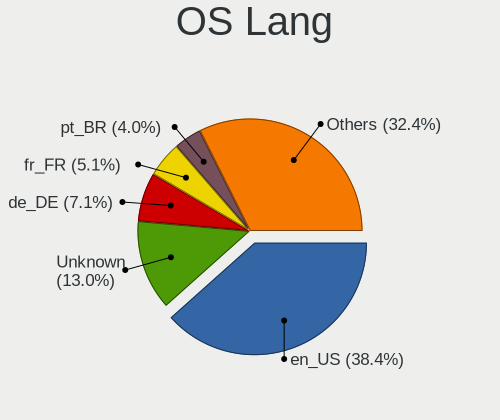
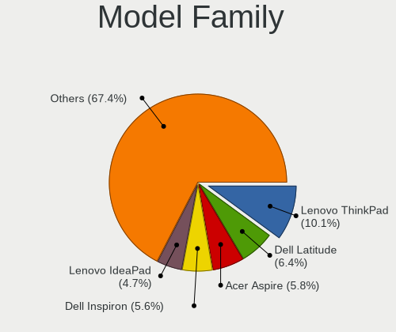
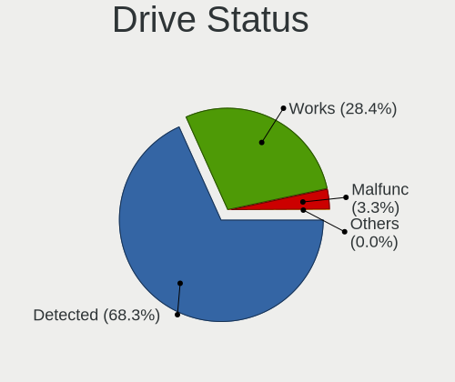
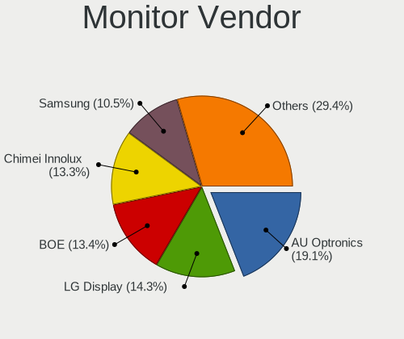

Ubuntu - Tested Hardware & Statistics (Notebooks)
-------------------------------------------------

A project to collect tested hardware configurations for Ubuntu.

Anyone can contribute to this report by the [hw-probe](https://github.com/linuxhw/hw-probe) tool:

    sudo -E hw-probe -all -upload

Please contribute! Especially if your hardware is rare.

Contents
--------

* [ Test Cases ](#test-cases)

* [ System ](#system)
  - [ OS                       ](#os)
  - [ OS Family                ](#os-family)
  - [ Kernel                   ](#kernel)
  - [ Kernel Family            ](#kernel-family)
  - [ Kernel Major Ver.        ](#kernel-major-ver)
  - [ Arch                     ](#arch)
  - [ DE                       ](#de)
  - [ Display Server           ](#display-server)
  - [ Display Manager          ](#display-manager)
  - [ OS Lang                  ](#os-lang)
  - [ Boot Mode                ](#boot-mode)
  - [ Filesystem               ](#filesystem)
  - [ Part. scheme             ](#part-scheme)
  - [ Dual Boot with Linux/BSD ](#dual-boot-with-linuxbsd)
  - [ Dual Boot (Win)          ](#dual-boot-win)

* [ Board ](#board)
  - [ Vendor                   ](#vendor)
  - [ Model                    ](#model)
  - [ Model Family             ](#model-family)
  - [ MFG Year                 ](#mfg-year)
  - [ Form Factor              ](#form-factor)
  - [ Secure Boot              ](#secure-boot)
  - [ Coreboot                 ](#coreboot)
  - [ RAM Size                 ](#ram-size)
  - [ RAM Used                 ](#ram-used)
  - [ Total Drives             ](#total-drives)
  - [ Has CD-ROM               ](#has-cd-rom)
  - [ Has Ethernet             ](#has-ethernet)
  - [ Has WiFi                 ](#has-wifi)
  - [ Has Bluetooth            ](#has-bluetooth)

* [ Location ](#location)
  - [ Country                  ](#country)
  - [ City                     ](#city)

* [ Drives ](#drives)
  - [ Drive Vendor             ](#drive-vendor)
  - [ Drive Model              ](#drive-model)
  - [ HDD Vendor               ](#hdd-vendor)
  - [ SSD Vendor               ](#ssd-vendor)
  - [ Drive Kind               ](#drive-kind)
  - [ Drive Connector          ](#drive-connector)
  - [ Drive Size               ](#drive-size)
  - [ Space Total              ](#space-total)
  - [ Space Used               ](#space-used)
  - [ Malfunc. Drives          ](#malfunc-drives)
  - [ Malfunc. Drive Vendor    ](#malfunc-drive-vendor)
  - [ Malfunc. HDD Vendor      ](#malfunc-hdd-vendor)
  - [ Malfunc. Drive Kind      ](#malfunc-drive-kind)
  - [ Failed Drives            ](#failed-drives)
  - [ Failed Drive Vendor      ](#failed-drive-vendor)
  - [ Drive Status             ](#drive-status)

* [ Storage controller ](#storage-controller)
  - [ Storage Vendor           ](#storage-vendor)
  - [ Storage Model            ](#storage-model)
  - [ Storage Kind             ](#storage-kind)

* [ Processor ](#processor)
  - [ CPU Vendor               ](#cpu-vendor)
  - [ CPU Model                ](#cpu-model)
  - [ CPU Model Family         ](#cpu-model-family)
  - [ CPU Cores                ](#cpu-cores)
  - [ CPU Sockets              ](#cpu-sockets)
  - [ CPU Threads              ](#cpu-threads)
  - [ CPU Op-Modes             ](#cpu-op-modes)
  - [ CPU Microcode            ](#cpu-microcode)
  - [ CPU Microarch            ](#cpu-microarch)

* [ Graphics ](#graphics)
  - [ GPU Vendor               ](#gpu-vendor)
  - [ GPU Model                ](#gpu-model)
  - [ GPU Combo                ](#gpu-combo)
  - [ GPU Driver               ](#gpu-driver)
  - [ GPU Memory               ](#gpu-memory)

* [ Monitor ](#monitor)
  - [ Monitor Vendor           ](#monitor-vendor)
  - [ Monitor Model            ](#monitor-model)
  - [ Monitor Resolution       ](#monitor-resolution)
  - [ Monitor Diagonal         ](#monitor-diagonal)
  - [ Monitor Width            ](#monitor-width)
  - [ Aspect Ratio             ](#aspect-ratio)
  - [ Monitor Area             ](#monitor-area)
  - [ Pixel Density            ](#pixel-density)
  - [ Multiple Monitors        ](#multiple-monitors)

* [ Network ](#network)
  - [ Net Controller Vendor    ](#net-controller-vendor)
  - [ Net Controller Model     ](#net-controller-model)
  - [ Wireless Vendor          ](#wireless-vendor)
  - [ Wireless Model           ](#wireless-model)
  - [ Ethernet Vendor          ](#ethernet-vendor)
  - [ Ethernet Model           ](#ethernet-model)
  - [ Net Controller Kind      ](#net-controller-kind)
  - [ Used Controller          ](#used-controller)
  - [ NICs                     ](#nics)
  - [ IPv6                     ](#ipv6)

* [ Bluetooth ](#bluetooth)
  - [ Bluetooth Vendor         ](#bluetooth-vendor)
  - [ Bluetooth Model          ](#bluetooth-model)

* [ Sound ](#sound)
  - [ Sound Vendor             ](#sound-vendor)
  - [ Sound Model              ](#sound-model)

* [ Memory ](#memory)
  - [ Memory Vendor            ](#memory-vendor)
  - [ Memory Model             ](#memory-model)
  - [ Memory Kind              ](#memory-kind)
  - [ Memory Form Factor       ](#memory-form-factor)
  - [ Memory Size              ](#memory-size)
  - [ Memory Speed             ](#memory-speed)

* [ Printers & scanners ](#printers--scanners)
  - [ Printer Vendor           ](#printer-vendor)
  - [ Printer Model            ](#printer-model)
  - [ Scanner Vendor           ](#scanner-vendor)
  - [ Scanner Model            ](#scanner-model)

* [ Camera ](#camera)
  - [ Camera Vendor            ](#camera-vendor)
  - [ Camera Model             ](#camera-model)

* [ Security ](#security)
  - [ Fingerprint Vendor       ](#fingerprint-vendor)
  - [ Fingerprint Model        ](#fingerprint-model)
  - [ Chipcard Vendor          ](#chipcard-vendor)
  - [ Chipcard Model           ](#chipcard-model)

* [ Unsupported ](#unsupported)
  - [ Unsupported Devices      ](#unsupported-devices)
  - [ Unsupported Device Types ](#unsupported-device-types)

Test Cases
----------

Total: 61337

| Vendor        | Model                       | Probe                                                      | Date         |
|---------------|-----------------------------|------------------------------------------------------------|--------------|
| Acer          | Aspire E5-575               | [8a7b632b3f](https://linux-hardware.org/?probe=8a7b632b3f) | Jan 06, 2025 |
| Medion        | Akoya E6240T                | [bb72b25bf7](https://linux-hardware.org/?probe=bb72b25bf7) | Jan 06, 2025 |
| Lenovo        | G40-30 80FY                 | [398cb6b840](https://linux-hardware.org/?probe=398cb6b840) | Jan 06, 2025 |
| Acer          | Swift SFG14-72              | [d07bf77aa4](https://linux-hardware.org/?probe=d07bf77aa4) | Jan 06, 2025 |
| Lenovo        | ThinkPad P51 20HJS0D201     | [f43357e57a](https://linux-hardware.org/?probe=f43357e57a) | Jan 06, 2025 |
| Dell          | XPS 13 9305                 | [77f98c4014](https://linux-hardware.org/?probe=77f98c4014) | Jan 06, 2025 |
| Dell          | Precision M6800             | [01d1dcb2d8](https://linux-hardware.org/?probe=01d1dcb2d8) | Jan 06, 2025 |
| Alienware     | m18 R2                      | [6277d13cf5](https://linux-hardware.org/?probe=6277d13cf5) | Jan 06, 2025 |
| Dell          | Precision 3571              | [95b1b27d71](https://linux-hardware.org/?probe=95b1b27d71) | Jan 06, 2025 |
| HP            | Pavilion Notebook           | [eb8cc11cc5](https://linux-hardware.org/?probe=eb8cc11cc5) | Jan 05, 2025 |
| Lenovo        | IdeaPad Slim 5 16IRU9 83... | [916567f213](https://linux-hardware.org/?probe=916567f213) | Jan 05, 2025 |
| Dell          | Latitude E6230              | [638ece1f17](https://linux-hardware.org/?probe=638ece1f17) | Jan 05, 2025 |
| Lenovo        | ThinkPad X13 Gen 3 21BQA... | [ec40ca9885](https://linux-hardware.org/?probe=ec40ca9885) | Jan 05, 2025 |
| Dell          | Latitude 3340               | [083c2f79ec](https://linux-hardware.org/?probe=083c2f79ec) | Jan 05, 2025 |
| ASUSTek       | VivoBook_ASUSLaptop X150... | [5e3d055319](https://linux-hardware.org/?probe=5e3d055319) | Jan 05, 2025 |
| Toshiba       | Satellite C670-14M          | [9e54cf257c](https://linux-hardware.org/?probe=9e54cf257c) | Jan 05, 2025 |
| HP            | Pavilion dv8                | [ab69193742](https://linux-hardware.org/?probe=ab69193742) | Jan 05, 2025 |
| Acer          | Aspire A514-53              | [88e5da8b9d](https://linux-hardware.org/?probe=88e5da8b9d) | Jan 05, 2025 |
| Acer          | Aspire A514-53              | [a4dc1a43a2](https://linux-hardware.org/?probe=a4dc1a43a2) | Jan 05, 2025 |
| Chuwi         | GemiBook Pro                | [cb3ae7cb2a](https://linux-hardware.org/?probe=cb3ae7cb2a) | Jan 05, 2025 |
| Lenovo        | ThinkPad W530 2441AG6       | [20e239cb8a](https://linux-hardware.org/?probe=20e239cb8a) | Jan 05, 2025 |
| Chuwi         | GemiBook Pro                | [9518969af8](https://linux-hardware.org/?probe=9518969af8) | Jan 05, 2025 |
| HP            | Notebook                    | [077f55a6c7](https://linux-hardware.org/?probe=077f55a6c7) | Jan 05, 2025 |
| Acer          | Aspire A315-24PT            | [e800b5fdb7](https://linux-hardware.org/?probe=e800b5fdb7) | Jan 05, 2025 |
| Sony          | SVD112290S                  | [a9400fd190](https://linux-hardware.org/?probe=a9400fd190) | Jan 05, 2025 |
| Lenovo        | ThinkBook 14 G2 ITL 20VD    | [6a8e47f57b](https://linux-hardware.org/?probe=6a8e47f57b) | Jan 05, 2025 |
| Acer          | Aspire A115-32              | [2c6043fd56](https://linux-hardware.org/?probe=2c6043fd56) | Jan 05, 2025 |
| Acer          | Aspire A315-24PT            | [cea7933cc6](https://linux-hardware.org/?probe=cea7933cc6) | Jan 05, 2025 |
| Dell          | G3 3500                     | [5c6b757b24](https://linux-hardware.org/?probe=5c6b757b24) | Jan 05, 2025 |
| Medion        | P15648                      | [e4b0850870](https://linux-hardware.org/?probe=e4b0850870) | Jan 05, 2025 |
| HP            | Compaq Presario CQ56        | [3365fbb5bc](https://linux-hardware.org/?probe=3365fbb5bc) | Jan 04, 2025 |
| Framework     | Laptop 16 (AMD Ryzen 704... | [0bff2b1d13](https://linux-hardware.org/?probe=0bff2b1d13) | Jan 04, 2025 |
| HP            | ProBook 430 G7              | [f1b89f85cf](https://linux-hardware.org/?probe=f1b89f85cf) | Jan 04, 2025 |
| HP            | ZBook 15 G3                 | [548eae93b9](https://linux-hardware.org/?probe=548eae93b9) | Jan 04, 2025 |
| Lenovo        | IdeaPad Slim 5 14IMH9 83... | [455af071a7](https://linux-hardware.org/?probe=455af071a7) | Jan 04, 2025 |
| ASUSTek       | ASUS Zenbook S 14 UX5406... | [3497123a57](https://linux-hardware.org/?probe=3497123a57) | Jan 04, 2025 |
| MSI           | Katana GF66 11UC            | [aca2d91d26](https://linux-hardware.org/?probe=aca2d91d26) | Jan 04, 2025 |
| Lenovo        | IdeaPad Slim 5 16IRL8 82... | [c7c71ab41b](https://linux-hardware.org/?probe=c7c71ab41b) | Jan 04, 2025 |
| Lenovo        | G50-70 20351                | [666751867c](https://linux-hardware.org/?probe=666751867c) | Jan 04, 2025 |
| Dell          | Inspiron 3541               | [206872a37f](https://linux-hardware.org/?probe=206872a37f) | Jan 04, 2025 |
| ASUSTek       | ROG Strix G713RC_G713RC     | [721dbc3f65](https://linux-hardware.org/?probe=721dbc3f65) | Jan 04, 2025 |
| ASUSTek       | ROG Strix G713RC_G713RC     | [e6b0e5183e](https://linux-hardware.org/?probe=e6b0e5183e) | Jan 04, 2025 |
| HP            | Laptop 15-bw0xx             | [43b69637a0](https://linux-hardware.org/?probe=43b69637a0) | Jan 04, 2025 |
| Lenovo        | IdeaPad S145-15IIL 81W8     | [96316f7cee](https://linux-hardware.org/?probe=96316f7cee) | Jan 04, 2025 |
| Dell          | Inspiron 5480               | [23f4e47841](https://linux-hardware.org/?probe=23f4e47841) | Jan 04, 2025 |
| ASUSTek       | VivoBook_ASUSLaptop K360... | [adec02cbc1](https://linux-hardware.org/?probe=adec02cbc1) | Jan 04, 2025 |
| ASUSTek       | G75VW                       | [ff570669d5](https://linux-hardware.org/?probe=ff570669d5) | Jan 04, 2025 |
| Apple         | MacBookPro9,2               | [cfa406503c](https://linux-hardware.org/?probe=cfa406503c) | Jan 04, 2025 |
| Dell          | Vostro 15 3530              | [20a13b2865](https://linux-hardware.org/?probe=20a13b2865) | Jan 04, 2025 |
| HP            | Laptop 15-db0xxx            | [15039e5101](https://linux-hardware.org/?probe=15039e5101) | Jan 04, 2025 |
| ASUSTek       | VivoBook_ASUSLaptop X415... | [28e55a6043](https://linux-hardware.org/?probe=28e55a6043) | Jan 03, 2025 |
| HP            | Pavilion Notebook           | [41e590e617](https://linux-hardware.org/?probe=41e590e617) | Jan 03, 2025 |
| MSI           | MS-16Y1                     | [7125d07ec2](https://linux-hardware.org/?probe=7125d07ec2) | Jan 03, 2025 |
| Acer          | Aspire E5-576G              | [9f344c14d4](https://linux-hardware.org/?probe=9f344c14d4) | Jan 03, 2025 |
| HP            | 250 G7 Notebook PC          | [6bf480c75a](https://linux-hardware.org/?probe=6bf480c75a) | Jan 03, 2025 |
| ASUSTek       | VivoBook_ASUSLaptop X515... | [ac0b2b8219](https://linux-hardware.org/?probe=ac0b2b8219) | Jan 03, 2025 |
| HP            | 15                          | [8542f54ea5](https://linux-hardware.org/?probe=8542f54ea5) | Jan 03, 2025 |
| Acer          | Aspire A115-32              | [c3f625776f](https://linux-hardware.org/?probe=c3f625776f) | Jan 03, 2025 |
| Lenovo        | ThinkPad T540p 20BE00B2M... | [d3fdfbc445](https://linux-hardware.org/?probe=d3fdfbc445) | Jan 03, 2025 |
| Unknown       | Unknown                     | [4a568ea48d](https://linux-hardware.org/?probe=4a568ea48d) | Jan 03, 2025 |
| HP            | EliteBook 840 G2            | [54ab368174](https://linux-hardware.org/?probe=54ab368174) | Jan 03, 2025 |
| Acer          | Extensa 215-55              | [fc29d8c8b1](https://linux-hardware.org/?probe=fc29d8c8b1) | Jan 03, 2025 |
| Dell          | G16 7630                    | [f98a9a65e0](https://linux-hardware.org/?probe=f98a9a65e0) | Jan 03, 2025 |
| Dell          | G16 7630                    | [11b2b5a832](https://linux-hardware.org/?probe=11b2b5a832) | Jan 03, 2025 |
| HP            | EliteBook 840 G5            | [ec0eaf35ef](https://linux-hardware.org/?probe=ec0eaf35ef) | Jan 03, 2025 |
| Acer          | Aspire V5-591G              | [fba09b3376](https://linux-hardware.org/?probe=fba09b3376) | Jan 03, 2025 |
| Dell          | XPS 15 9560                 | [924d90cdcc](https://linux-hardware.org/?probe=924d90cdcc) | Jan 03, 2025 |
| Dell          | XPS 15 9560                 | [5a9c188db1](https://linux-hardware.org/?probe=5a9c188db1) | Jan 03, 2025 |
| Apple         | MacBookPro12,1              | [c226449ca2](https://linux-hardware.org/?probe=c226449ca2) | Jan 03, 2025 |
| HP            | ProBook 650 G2              | [b2fc855e3e](https://linux-hardware.org/?probe=b2fc855e3e) | Jan 03, 2025 |
| HP            | EliteBook 840 G6            | [6781e260b0](https://linux-hardware.org/?probe=6781e260b0) | Jan 03, 2025 |
| HP            | EliteBook 840 G6            | [fd2f975353](https://linux-hardware.org/?probe=fd2f975353) | Jan 03, 2025 |
| Lenovo        | IdeaPad 3 15ITL6 82H8       | [58e41b0f0f](https://linux-hardware.org/?probe=58e41b0f0f) | Jan 03, 2025 |
| ASUSTek       | UL50Vg                      | [6305475a87](https://linux-hardware.org/?probe=6305475a87) | Jan 03, 2025 |
| Acer          | Aspire A515-52              | [4b5bf879c2](https://linux-hardware.org/?probe=4b5bf879c2) | Jan 03, 2025 |
| Positivo B... | VJFE52F11X-B2511H           | [4ee757e2c0](https://linux-hardware.org/?probe=4ee757e2c0) | Jan 03, 2025 |
| Lenovo        | Slim Pro 7 14ARP8 83AX      | [9acb68fefa](https://linux-hardware.org/?probe=9acb68fefa) | Jan 03, 2025 |
| Alienware     | m18 R2                      | [48bc0a64c1](https://linux-hardware.org/?probe=48bc0a64c1) | Jan 02, 2025 |
| Lenovo        | Unknown                     | [a18bd92542](https://linux-hardware.org/?probe=a18bd92542) | Jan 02, 2025 |
| Dell          | XPS 13 9380                 | [063a26fa4d](https://linux-hardware.org/?probe=063a26fa4d) | Jan 02, 2025 |
| Dell          | Precision M6800             | [460842482c](https://linux-hardware.org/?probe=460842482c) | Jan 02, 2025 |
| Fujitsu       | LIFEBOOK UH572              | [5625a23ef5](https://linux-hardware.org/?probe=5625a23ef5) | Jan 02, 2025 |
| ASUSTek       | Vivobook Go E1504FA         | [8e5f1ab7d6](https://linux-hardware.org/?probe=8e5f1ab7d6) | Jan 02, 2025 |
| Dell          | Latitude E6430              | [0baf769dd2](https://linux-hardware.org/?probe=0baf769dd2) | Jan 02, 2025 |
| Lenovo        | ThinkPad X250 20CLS45J00    | [23c3a522f9](https://linux-hardware.org/?probe=23c3a522f9) | Jan 02, 2025 |
| Acer          | Aspire E5-575G              | [bea4bbd29a](https://linux-hardware.org/?probe=bea4bbd29a) | Jan 02, 2025 |
| System76      | Lemur Pro                   | [6eae77b375](https://linux-hardware.org/?probe=6eae77b375) | Jan 02, 2025 |
| Unknown       | Unknown                     | [267152ac45](https://linux-hardware.org/?probe=267152ac45) | Jan 02, 2025 |
| ASUSTek       | ROG Zephyrus G14 GA401QM... | [47b95e50dc](https://linux-hardware.org/?probe=47b95e50dc) | Jan 02, 2025 |
| Lenovo        | Yoga Pro 7 14IMH9 83E2      | [ea461f99c2](https://linux-hardware.org/?probe=ea461f99c2) | Jan 02, 2025 |
| Lenovo        | IdeaPad 320-15IKB 80XL      | [b90f085315](https://linux-hardware.org/?probe=b90f085315) | Jan 02, 2025 |
| Lenovo        | IdeaPad Slim 5 16ABR8 82... | [a03031641a](https://linux-hardware.org/?probe=a03031641a) | Jan 02, 2025 |
| HP            | ProBook 440 G7              | [b1f0f9f971](https://linux-hardware.org/?probe=b1f0f9f971) | Jan 02, 2025 |
| Lenovo        | ThinkPad T460s 20FAS14F0... | [f72b380ee6](https://linux-hardware.org/?probe=f72b380ee6) | Jan 02, 2025 |
| ASUSTek       | ASUS TUF Gaming F15 FX50... | [745341e7fa](https://linux-hardware.org/?probe=745341e7fa) | Jan 02, 2025 |
| Packard Be... | EasyNote TK87               | [468680be46](https://linux-hardware.org/?probe=468680be46) | Jan 02, 2025 |
| Packard Be... | EasyNote TK87               | [d0bb5660e7](https://linux-hardware.org/?probe=d0bb5660e7) | Jan 02, 2025 |
| Sony          | SVF1521G6EW                 | [a9d8497c8d](https://linux-hardware.org/?probe=a9d8497c8d) | Jan 02, 2025 |
| Dell          | XPS 13 9380                 | [fd629307a9](https://linux-hardware.org/?probe=fd629307a9) | Jan 02, 2025 |
| HP            | ZBook 15u G3                | [da5c26013c](https://linux-hardware.org/?probe=da5c26013c) | Jan 02, 2025 |
| Lenovo        | G50-70 20351                | [9043dbb9a9](https://linux-hardware.org/?probe=9043dbb9a9) | Jan 01, 2025 |
| Dell          | Latitude E6230              | [8611ea969f](https://linux-hardware.org/?probe=8611ea969f) | Jan 01, 2025 |
| ASUSTek       | ZenBook UX482EG_UX482EG     | [708ed8d150](https://linux-hardware.org/?probe=708ed8d150) | Jan 01, 2025 |
| ASUSTek       | ASUS TUF Gaming A14 FA40... | [97c438ca9c](https://linux-hardware.org/?probe=97c438ca9c) | Jan 01, 2025 |
| Acer          | Aspire E5-575G              | [131ac42ca5](https://linux-hardware.org/?probe=131ac42ca5) | Jan 01, 2025 |
| Dell          | Latitude E5420              | [e1a5c8fd29](https://linux-hardware.org/?probe=e1a5c8fd29) | Jan 01, 2025 |
| Acer          | Swift SF314-52G             | [77f207d738](https://linux-hardware.org/?probe=77f207d738) | Jan 01, 2025 |
| ASUSTek       | K93SM                       | [de80ff2a02](https://linux-hardware.org/?probe=de80ff2a02) | Jan 01, 2025 |
| Lenovo        | ThinkPad X220 4291QZ1       | [ffd4949fc5](https://linux-hardware.org/?probe=ffd4949fc5) | Jan 01, 2025 |
| Lenovo        | ThinkPad X220 4291QZ1       | [68cf73b7b3](https://linux-hardware.org/?probe=68cf73b7b3) | Jan 01, 2025 |
| Lenovo        | G50-30 80G0                 | [f9d8f3d7a1](https://linux-hardware.org/?probe=f9d8f3d7a1) | Jan 01, 2025 |
| Apple         | MacBookPro12,1              | [1340d405bf](https://linux-hardware.org/?probe=1340d405bf) | Jan 01, 2025 |
| Apple         | MacBookPro9,2               | [319272bf03](https://linux-hardware.org/?probe=319272bf03) | Jan 01, 2025 |
| HP            | Laptop 15-dy2xxx            | [c1ed1a0524](https://linux-hardware.org/?probe=c1ed1a0524) | Jan 01, 2025 |
| Lenovo        | ThinkPad T14s Gen 6 21N1... | [afb68eacd9](https://linux-hardware.org/?probe=afb68eacd9) | Jan 01, 2025 |
| Apple         | MacBookPro14,3              | [b1813c3452](https://linux-hardware.org/?probe=b1813c3452) | Jan 01, 2025 |
| Apple         | MacBookPro14,3              | [d3cba6d56e](https://linux-hardware.org/?probe=d3cba6d56e) | Jan 01, 2025 |
| Lenovo        | V155-15API 81V5             | [145938b91b](https://linux-hardware.org/?probe=145938b91b) | Dec 31, 2024 |
| Apple         | MacBookAir7,2               | [0b5dbc9283](https://linux-hardware.org/?probe=0b5dbc9283) | Dec 31, 2024 |
| Apple         | MacBookAir7,2               | [531feb4d85](https://linux-hardware.org/?probe=531feb4d85) | Dec 31, 2024 |
| Samsung       | 550XDA                      | [f23c082843](https://linux-hardware.org/?probe=f23c082843) | Dec 31, 2024 |
| Samsung       | 370E4K                      | [ba2171b4e3](https://linux-hardware.org/?probe=ba2171b4e3) | Dec 31, 2024 |
| HP            | Pavilion dv7                | [80ac393681](https://linux-hardware.org/?probe=80ac393681) | Dec 31, 2024 |
| Dell          | Precision 5520              | [88832dcaf1](https://linux-hardware.org/?probe=88832dcaf1) | Dec 31, 2024 |
| Dell          | Vostro 13 5310              | [b7f2eb4035](https://linux-hardware.org/?probe=b7f2eb4035) | Dec 31, 2024 |
| Acer          | Nitro ANV15-41              | [00953a17b5](https://linux-hardware.org/?probe=00953a17b5) | Dec 31, 2024 |
| BOSGAME       | DNB20 series                | [7c23d0edba](https://linux-hardware.org/?probe=7c23d0edba) | Dec 31, 2024 |
| HP            | Victus by Gaming Laptop ... | [779320377b](https://linux-hardware.org/?probe=779320377b) | Dec 31, 2024 |
| Acer          | Aspire E1-531               | [dcd279939a](https://linux-hardware.org/?probe=dcd279939a) | Dec 31, 2024 |
| ASUSTek       | Zenbook UM3402YA_UM3402Y... | [cc9cdf2e68](https://linux-hardware.org/?probe=cc9cdf2e68) | Dec 31, 2024 |
| ASUSTek       | Zenbook UM3402YA_UM3402Y... | [fae705de3f](https://linux-hardware.org/?probe=fae705de3f) | Dec 31, 2024 |
| Apple         | MacBook5,2                  | [3e1d6ce785](https://linux-hardware.org/?probe=3e1d6ce785) | Dec 31, 2024 |
| Lenovo        | ThinkPad T470p 20J6CTO1W... | [b255d3c686](https://linux-hardware.org/?probe=b255d3c686) | Dec 31, 2024 |
| Framework     | Laptop 13 (AMD Ryzen 704... | [8b846a3158](https://linux-hardware.org/?probe=8b846a3158) | Dec 31, 2024 |
| Framework     | Laptop 13 (AMD Ryzen 704... | [23175f9255](https://linux-hardware.org/?probe=23175f9255) | Dec 31, 2024 |
| Lenovo        | IdeaPad S540-14IWL 81ND     | [a1dfd54db3](https://linux-hardware.org/?probe=a1dfd54db3) | Dec 31, 2024 |
| HP            | Pavilion Laptop 15-eg2xx... | [51986f627d](https://linux-hardware.org/?probe=51986f627d) | Dec 31, 2024 |
| ASUSTek       | ROG Zephyrus M16 GU603HM... | [783dddde17](https://linux-hardware.org/?probe=783dddde17) | Dec 31, 2024 |
| Packard Be... | EasyNote LS11HR             | [2ac39a88cd](https://linux-hardware.org/?probe=2ac39a88cd) | Dec 30, 2024 |
| HP            | Laptop 15-fd0xxx            | [f48e15c91b](https://linux-hardware.org/?probe=f48e15c91b) | Dec 30, 2024 |
| ASUSTek       | VivoBook_ASUSLaptop M160... | [0de62191fb](https://linux-hardware.org/?probe=0de62191fb) | Dec 30, 2024 |
| Lenovo        | IdeaPad 1 15ALC7 82R4       | [4eccb193ff](https://linux-hardware.org/?probe=4eccb193ff) | Dec 30, 2024 |
| Apple         | MacBookPro5,5               | [80bf9a388e](https://linux-hardware.org/?probe=80bf9a388e) | Dec 30, 2024 |
| Apple         | MacBookPro5,5               | [8e4e44db83](https://linux-hardware.org/?probe=8e4e44db83) | Dec 30, 2024 |
| HP            | EliteBook Folio 1040 G1     | [55d6518fd1](https://linux-hardware.org/?probe=55d6518fd1) | Dec 30, 2024 |
| Lenovo        | ThinkPad T470s W10DG 20J... | [0d96f203f5](https://linux-hardware.org/?probe=0d96f203f5) | Dec 30, 2024 |
| Lenovo        | G585 20137                  | [cfbfe12819](https://linux-hardware.org/?probe=cfbfe12819) | Dec 30, 2024 |
| HP            | Notebook                    | [2df48c8eb2](https://linux-hardware.org/?probe=2df48c8eb2) | Dec 30, 2024 |
| Lenovo        | ThinkPad X220 4290EC5       | [0a01dc8cd8](https://linux-hardware.org/?probe=0a01dc8cd8) | Dec 30, 2024 |
| Acer          | Aspire A515-56              | [88b474acac](https://linux-hardware.org/?probe=88b474acac) | Dec 30, 2024 |
| Acer          | Aspire A315-21              | [48fa2fd34a](https://linux-hardware.org/?probe=48fa2fd34a) | Dec 30, 2024 |
| ASUSTek       | GL703VM                     | [1121e5f4ca](https://linux-hardware.org/?probe=1121e5f4ca) | Dec 30, 2024 |
| Lenovo        | ThinkPad X201 3680X08       | [29505fa5be](https://linux-hardware.org/?probe=29505fa5be) | Dec 30, 2024 |
| HP            | ENVY 17                     | [99fa04f0ca](https://linux-hardware.org/?probe=99fa04f0ca) | Dec 30, 2024 |
| Lenovo        | ThinkPad P50 20EQS12Q06     | [794c492899](https://linux-hardware.org/?probe=794c492899) | Dec 30, 2024 |
| ASUSTek       | ASUS BR1100CKA BR1100CKA... | [27dd012145](https://linux-hardware.org/?probe=27dd012145) | Dec 30, 2024 |
| HP            | Pavilion g6                 | [ea52acdc1b](https://linux-hardware.org/?probe=ea52acdc1b) | Dec 30, 2024 |
| HP            | Laptop 15-bw0xx             | [d9da8c385d](https://linux-hardware.org/?probe=d9da8c385d) | Dec 30, 2024 |
| ASUSTek       | VivoBook_ASUSLaptop K360... | [3865b761f5](https://linux-hardware.org/?probe=3865b761f5) | Dec 30, 2024 |
| ASUSTek       | VivoBook_ASUSLaptop X170... | [cba1e94ceb](https://linux-hardware.org/?probe=cba1e94ceb) | Dec 30, 2024 |
| Unknown       | Unknown                     | [03c104eecb](https://linux-hardware.org/?probe=03c104eecb) | Dec 30, 2024 |
| HP            | 255 G7 Notebook PC          | [14817c7822](https://linux-hardware.org/?probe=14817c7822) | Dec 30, 2024 |
| HP            | EliteBook 840 G6            | [5c7d77f22a](https://linux-hardware.org/?probe=5c7d77f22a) | Dec 30, 2024 |
| HUAWEI        | FLMH-XX                     | [00d586da79](https://linux-hardware.org/?probe=00d586da79) | Dec 30, 2024 |
| Notebook      | NH5XHPI                     | [fec43dc843](https://linux-hardware.org/?probe=fec43dc843) | Dec 29, 2024 |
| ASUSTek       | Vivobook Go E1504FA_E150... | [928c92d817](https://linux-hardware.org/?probe=928c92d817) | Dec 29, 2024 |
| Lenovo        | ThinkBook 14 G2 ITL 20VD    | [64c5deb6a7](https://linux-hardware.org/?probe=64c5deb6a7) | Dec 29, 2024 |
| HP            | Laptop 17-cp0xxx            | [d87a6139f6](https://linux-hardware.org/?probe=d87a6139f6) | Dec 29, 2024 |
| HP            | Laptop 17-cp0xxx            | [0f9af93612](https://linux-hardware.org/?probe=0f9af93612) | Dec 29, 2024 |
| Dell          | G16 7630                    | [e7329668b8](https://linux-hardware.org/?probe=e7329668b8) | Dec 29, 2024 |
| HP            | ZBook Power 15.6 inch G8... | [f521839f9a](https://linux-hardware.org/?probe=f521839f9a) | Dec 29, 2024 |
| Dell          | XPS 15 9570                 | [ec780ef825](https://linux-hardware.org/?probe=ec780ef825) | Dec 29, 2024 |
| Lenovo        | G50-70 20351                | [493dd462e8](https://linux-hardware.org/?probe=493dd462e8) | Dec 29, 2024 |
| ASUSTek       | VivoBook_ASUSLaptop X160... | [8343da96e4](https://linux-hardware.org/?probe=8343da96e4) | Dec 29, 2024 |
| ASUSTek       | VivoBook_ASUSLaptop X515... | [53cd73700d](https://linux-hardware.org/?probe=53cd73700d) | Dec 29, 2024 |
| Dell          | XPS 13 9370                 | [6b3d0134ab](https://linux-hardware.org/?probe=6b3d0134ab) | Dec 29, 2024 |
| HP            | Laptop 14-bp0xx             | [cb99b9c4f9](https://linux-hardware.org/?probe=cb99b9c4f9) | Dec 29, 2024 |
| HP            | EliteBook 865 16 inch G1... | [7770de23f8](https://linux-hardware.org/?probe=7770de23f8) | Dec 29, 2024 |
| HUAWEI        | BOD-WXX9                    | [94c62e3b8b](https://linux-hardware.org/?probe=94c62e3b8b) | Dec 29, 2024 |
| Samsung       | 960XGK                      | [da507c038f](https://linux-hardware.org/?probe=da507c038f) | Dec 29, 2024 |
| Samsung       | 960XGK                      | [feec3e592b](https://linux-hardware.org/?probe=feec3e592b) | Dec 29, 2024 |
| Sony          | VPCEB24FX                   | [b2006d7959](https://linux-hardware.org/?probe=b2006d7959) | Dec 29, 2024 |
| Lenovo        | ThinkPad L412 0585AY7       | [5b7ad96e97](https://linux-hardware.org/?probe=5b7ad96e97) | Dec 29, 2024 |
| ASUSTek       | K501UB                      | [2654326cc1](https://linux-hardware.org/?probe=2654326cc1) | Dec 29, 2024 |
| HP            | EliteBook 8440p             | [ff3d8f0e0e](https://linux-hardware.org/?probe=ff3d8f0e0e) | Dec 28, 2024 |
| HP            | 250 15.6 inch G10 Notebo... | [c4a512bb62](https://linux-hardware.org/?probe=c4a512bb62) | Dec 28, 2024 |
| HUAWEI        | KLVL-WXXW                   | [2ce7175d0a](https://linux-hardware.org/?probe=2ce7175d0a) | Dec 28, 2024 |
| HP            | EliteBook 830 G8 Noteboo... | [837d43eb63](https://linux-hardware.org/?probe=837d43eb63) | Dec 28, 2024 |
| HP            | EliteBook 830 G8 Noteboo... | [13704e02a4](https://linux-hardware.org/?probe=13704e02a4) | Dec 28, 2024 |
| Lenovo        | IdeaPad L340-15API 81LW     | [fe8d690d1d](https://linux-hardware.org/?probe=fe8d690d1d) | Dec 28, 2024 |
| Lenovo        | IdeaPad L340-15API 81LW     | [40921a0302](https://linux-hardware.org/?probe=40921a0302) | Dec 28, 2024 |
| Lenovo        | ThinkPad E15 Gen 4 21E7S... | [ce166a3364](https://linux-hardware.org/?probe=ce166a3364) | Dec 28, 2024 |
| HONOR         | HYM-WXX                     | [6b719e5c5d](https://linux-hardware.org/?probe=6b719e5c5d) | Dec 28, 2024 |
| Dell          | Precision 7540              | [314c747e45](https://linux-hardware.org/?probe=314c747e45) | Dec 28, 2024 |
| Dell          | Precision 7540              | [4535a9d79b](https://linux-hardware.org/?probe=4535a9d79b) | Dec 28, 2024 |
| HP            | Pavilion Gaming Notebook    | [0afcb0e788](https://linux-hardware.org/?probe=0afcb0e788) | Dec 28, 2024 |
| ASUSTek       | ASUS EXPERTBOOK B3302CEA    | [4e8ff6d2b4](https://linux-hardware.org/?probe=4e8ff6d2b4) | Dec 28, 2024 |
| Apple         | MacBookAir7,2               | [fcda8f7b53](https://linux-hardware.org/?probe=fcda8f7b53) | Dec 28, 2024 |
| Apple         | MacBookAir7,2               | [218f4af079](https://linux-hardware.org/?probe=218f4af079) | Dec 28, 2024 |
| ASUSTek       | U36SG                       | [cce3aeb970](https://linux-hardware.org/?probe=cce3aeb970) | Dec 28, 2024 |
| Lenovo        | ThinkPad E16 Gen 1 21JTS... | [7366a0d1fd](https://linux-hardware.org/?probe=7366a0d1fd) | Dec 28, 2024 |
| Dell          | Precision 5680              | [16be64b31c](https://linux-hardware.org/?probe=16be64b31c) | Dec 28, 2024 |
| ASUSTek       | VivoBook_ASUSLaptop X160... | [ed184eaff9](https://linux-hardware.org/?probe=ed184eaff9) | Dec 28, 2024 |
| Sony          | VPCSB3V9R                   | [c0950c9d66](https://linux-hardware.org/?probe=c0950c9d66) | Dec 27, 2024 |
| HUAWEI        | FLMH-XX                     | [c469820693](https://linux-hardware.org/?probe=c469820693) | Dec 27, 2024 |
| HUAWEI        | KLVF-XX                     | [647fb3b2cf](https://linux-hardware.org/?probe=647fb3b2cf) | Dec 27, 2024 |
| Lenovo        | ThinkPad T420 4236N36       | [fbc061a72a](https://linux-hardware.org/?probe=fbc061a72a) | Dec 27, 2024 |
| Acer          | Predator PT516-51s          | [ba15b5dd07](https://linux-hardware.org/?probe=ba15b5dd07) | Dec 27, 2024 |
| Lenovo        | ThinkPad E460 20ET0014US    | [9ee6c676eb](https://linux-hardware.org/?probe=9ee6c676eb) | Dec 27, 2024 |
| Dell          | Inspiron 5570               | [ce371a4f66](https://linux-hardware.org/?probe=ce371a4f66) | Dec 27, 2024 |
| ASUSTek       | S551LB                      | [a6d62182b2](https://linux-hardware.org/?probe=a6d62182b2) | Dec 27, 2024 |
| Dell          | Vostro 15 3510              | [318022f8d5](https://linux-hardware.org/?probe=318022f8d5) | Dec 27, 2024 |
| Lenovo        | ThinkPad X1 Carbon Gen 9... | [a9e7731362](https://linux-hardware.org/?probe=a9e7731362) | Dec 27, 2024 |
| Lenovo        | ThinkPad T14 Gen 2i 20W0... | [118daf4ced](https://linux-hardware.org/?probe=118daf4ced) | Dec 27, 2024 |
| Lenovo        | ThinkPad T440p 20AN0069U... | [0574e44035](https://linux-hardware.org/?probe=0574e44035) | Dec 27, 2024 |
| Lenovo        | Slim Pro 7 14ARP8 83AX      | [d688d8a5e0](https://linux-hardware.org/?probe=d688d8a5e0) | Dec 27, 2024 |
| Lenovo        | ThinkPad X1 Carbon Gen 1... | [47b5606cc6](https://linux-hardware.org/?probe=47b5606cc6) | Dec 27, 2024 |
| Positivo B... | VJFE52F11X-XXXXXX           | [83dc0c4a71](https://linux-hardware.org/?probe=83dc0c4a71) | Dec 27, 2024 |
| Lenovo        | ThinkPad E14 20RA004WUS     | [a88f8bddf3](https://linux-hardware.org/?probe=a88f8bddf3) | Dec 27, 2024 |
| Apple         | MacBook5,1                  | [c3f162d658](https://linux-hardware.org/?probe=c3f162d658) | Dec 27, 2024 |
| MSI           | MS-16Y1                     | [4083d820ac](https://linux-hardware.org/?probe=4083d820ac) | Dec 27, 2024 |
| ASUSTek       | ASUS TUF Gaming A15 FA50... | [71d10a1993](https://linux-hardware.org/?probe=71d10a1993) | Dec 26, 2024 |
| Dell          | Latitude E6230              | [cd5bf9b8fb](https://linux-hardware.org/?probe=cd5bf9b8fb) | Dec 26, 2024 |
| Lenovo        | IdeaPad 3 15ITL6 82H8       | [2a99f4c635](https://linux-hardware.org/?probe=2a99f4c635) | Dec 26, 2024 |
| ASUSTek       | ROG Zephyrus G14 GA402RJ    | [39f2b622bf](https://linux-hardware.org/?probe=39f2b622bf) | Dec 26, 2024 |
| Lenovo        | IdeaPad 3 15ITL6 82H8       | [0b609d2a62](https://linux-hardware.org/?probe=0b609d2a62) | Dec 26, 2024 |
| ASUSTek       | N53SV                       | [af2f1ee4b9](https://linux-hardware.org/?probe=af2f1ee4b9) | Dec 26, 2024 |
| Apple         | MacBookPro9,2               | [c7b700cc18](https://linux-hardware.org/?probe=c7b700cc18) | Dec 26, 2024 |
| Dell          | Latitude 5550               | [ee6572422c](https://linux-hardware.org/?probe=ee6572422c) | Dec 26, 2024 |
| Lenovo        | Yoga Pro 7 14APH8 82Y8      | [26b3de30ce](https://linux-hardware.org/?probe=26b3de30ce) | Dec 26, 2024 |
| ASUSTek       | VivoBook_ASUSLaptop K360... | [e26f1dfa00](https://linux-hardware.org/?probe=e26f1dfa00) | Dec 26, 2024 |
| Apple         | MacBookPro13,2              | [126e6ce8f9](https://linux-hardware.org/?probe=126e6ce8f9) | Dec 26, 2024 |
| Dell          | XPS 13 9305                 | [3bdc4d61ed](https://linux-hardware.org/?probe=3bdc4d61ed) | Dec 26, 2024 |
| Dell          | Latitude XT3                | [515fa3507a](https://linux-hardware.org/?probe=515fa3507a) | Dec 26, 2024 |
| Lenovo        | ThinkPad T14s Gen 6 21N1... | [fa72d20c3c](https://linux-hardware.org/?probe=fa72d20c3c) | Dec 26, 2024 |
| BOSGAME       | DNB20 series                | [ce3d8499eb](https://linux-hardware.org/?probe=ce3d8499eb) | Dec 26, 2024 |
| Dell          | XPS 15 9500                 | [985a70079c](https://linux-hardware.org/?probe=985a70079c) | Dec 26, 2024 |
| Lenovo        | IdeaPad 5 15ALC05 82LN      | [38333ea200](https://linux-hardware.org/?probe=38333ea200) | Dec 26, 2024 |
| Lenovo        | IdeaPad 5 15ALC05 82LN      | [3619de98bb](https://linux-hardware.org/?probe=3619de98bb) | Dec 26, 2024 |
| ASUSTek       | T100TAF                     | [1611168448](https://linux-hardware.org/?probe=1611168448) | Dec 25, 2024 |
| Dell          | XPS 15 9500                 | [6beec071ad](https://linux-hardware.org/?probe=6beec071ad) | Dec 25, 2024 |
| ASUSTek       | VivoBook_ASUSLaptop K550... | [09c6b6944f](https://linux-hardware.org/?probe=09c6b6944f) | Dec 25, 2024 |
| ASUSTek       | K53SD                       | [ae48bfb917](https://linux-hardware.org/?probe=ae48bfb917) | Dec 25, 2024 |
| Lenovo        | V15 G4 AMN 82YU             | [8fa9064e33](https://linux-hardware.org/?probe=8fa9064e33) | Dec 25, 2024 |
| ASUSTek       | K53SD                       | [f20d270b1c](https://linux-hardware.org/?probe=f20d270b1c) | Dec 25, 2024 |
| Toshiba       | Satellite C655              | [5a536d713d](https://linux-hardware.org/?probe=5a536d713d) | Dec 25, 2024 |
| ASUSTek       | UX305CA                     | [73bb2289d6](https://linux-hardware.org/?probe=73bb2289d6) | Dec 25, 2024 |
| Monster       | ABRA A7 V11.2               | [762b2b2071](https://linux-hardware.org/?probe=762b2b2071) | Dec 25, 2024 |
| HP            | Pavilion Laptop 15-eh2xx... | [f4697e3485](https://linux-hardware.org/?probe=f4697e3485) | Dec 25, 2024 |
| HUAWEI        | BOM-WXX9                    | [030b263131](https://linux-hardware.org/?probe=030b263131) | Dec 25, 2024 |
| Hampoo        | C3W6_AP108_4GB Reserved     | [0b30ad312b](https://linux-hardware.org/?probe=0b30ad312b) | Dec 25, 2024 |
| Acer          | Extensa 215-55              | [b6002937c1](https://linux-hardware.org/?probe=b6002937c1) | Dec 25, 2024 |
| HP            | Laptop 15-db1xxx            | [7215777564](https://linux-hardware.org/?probe=7215777564) | Dec 25, 2024 |
| ASUSTek       | ASUS TUF Gaming A15 FA50... | [4505762848](https://linux-hardware.org/?probe=4505762848) | Dec 25, 2024 |
| Acer          | Aspire ES1-531              | [c09e9c415c](https://linux-hardware.org/?probe=c09e9c415c) | Dec 25, 2024 |
| Lenovo        | IdeaPad 1 15ALC7 82R4       | [c499200c01](https://linux-hardware.org/?probe=c499200c01) | Dec 25, 2024 |
| Lenovo        | ThinkPad T470 W10DG 20JN... | [7e06f1b7f3](https://linux-hardware.org/?probe=7e06f1b7f3) | Dec 25, 2024 |
| ASUSTek       | VivoBook_ASUSLaptop X513... | [c551a96671](https://linux-hardware.org/?probe=c551a96671) | Dec 25, 2024 |
| Lenovo        | V15-IGL 82C3                | [2d1b592d60](https://linux-hardware.org/?probe=2d1b592d60) | Dec 25, 2024 |
| ASUSTek       | G771JM                      | [47eab19f76](https://linux-hardware.org/?probe=47eab19f76) | Dec 25, 2024 |
| ASUSTek       | G771JM                      | [0e03d4ac45](https://linux-hardware.org/?probe=0e03d4ac45) | Dec 25, 2024 |
| ASUSTek       | UX305CA                     | [88a69fd398](https://linux-hardware.org/?probe=88a69fd398) | Dec 24, 2024 |
| Dell          | Inspiron 15 3535            | [188c0c8aeb](https://linux-hardware.org/?probe=188c0c8aeb) | Dec 24, 2024 |
| HP            | Laptop 15-db1xxx            | [f570b2eb57](https://linux-hardware.org/?probe=f570b2eb57) | Dec 24, 2024 |
| Lenovo        | ThinkBook 16 G6 IRL 21KH    | [48353373ae](https://linux-hardware.org/?probe=48353373ae) | Dec 24, 2024 |
| ASUSTek       | M51Sn                       | [3292249251](https://linux-hardware.org/?probe=3292249251) | Dec 24, 2024 |
| Lenovo        | G585 2181                   | [0004a20215](https://linux-hardware.org/?probe=0004a20215) | Dec 24, 2024 |
| HP            | 15                          | [20c4cf47f9](https://linux-hardware.org/?probe=20c4cf47f9) | Dec 24, 2024 |
| HP            | 15                          | [0508591afc](https://linux-hardware.org/?probe=0508591afc) | Dec 24, 2024 |
| Apple         | MacBookPro8,1               | [22add9e52c](https://linux-hardware.org/?probe=22add9e52c) | Dec 24, 2024 |
| ASUSTek       | N56JN                       | [952d22573d](https://linux-hardware.org/?probe=952d22573d) | Dec 24, 2024 |
| Apple         | MacBook9,1                  | [ebdeaba538](https://linux-hardware.org/?probe=ebdeaba538) | Dec 24, 2024 |
| MSI           | Creator 15 A11UE            | [c6e4f39a97](https://linux-hardware.org/?probe=c6e4f39a97) | Dec 24, 2024 |
| Apple         | MacBookPro8,1               | [4d3d45eab1](https://linux-hardware.org/?probe=4d3d45eab1) | Dec 24, 2024 |
| Lenovo        | ThinkPad E14 Gen 5 21JSS... | [5308ff08f7](https://linux-hardware.org/?probe=5308ff08f7) | Dec 24, 2024 |
| SLIMBOOK      | EVO14-A8                    | [d6d1869563](https://linux-hardware.org/?probe=d6d1869563) | Dec 23, 2024 |
| Dell          | G15 5530                    | [69f5776150](https://linux-hardware.org/?probe=69f5776150) | Dec 23, 2024 |
| Lenovo        | V330-15IKB 81AX             | [1b1e58284a](https://linux-hardware.org/?probe=1b1e58284a) | Dec 23, 2024 |
| Acer          | Swift SF314-58              | [35ca0e4138](https://linux-hardware.org/?probe=35ca0e4138) | Dec 23, 2024 |
| HUAWEI        | NBLB-WAX9N                  | [6524a2db9e](https://linux-hardware.org/?probe=6524a2db9e) | Dec 23, 2024 |
| MSI           | Katana GF66 11UC            | [c287ca2189](https://linux-hardware.org/?probe=c287ca2189) | Dec 23, 2024 |
| Sony          | SVP1321C5E                  | [7dfbac17e9](https://linux-hardware.org/?probe=7dfbac17e9) | Dec 23, 2024 |
| Lenovo        | ThinkPad T14s Gen 4 21F8... | [d076330974](https://linux-hardware.org/?probe=d076330974) | Dec 23, 2024 |
| HP            | ZBook 15 G4                 | [a83dd50631](https://linux-hardware.org/?probe=a83dd50631) | Dec 23, 2024 |
| Dell          | Latitude 5510               | [fefb1eb9c3](https://linux-hardware.org/?probe=fefb1eb9c3) | Dec 23, 2024 |
| HP            | Pavilion dv7                | [c4f13a383d](https://linux-hardware.org/?probe=c4f13a383d) | Dec 23, 2024 |
| Acer          | Aspire A315-24P             | [653f633b8c](https://linux-hardware.org/?probe=653f633b8c) | Dec 23, 2024 |
| HP            | Laptop 15-dy2xxx            | [a0aae5b95d](https://linux-hardware.org/?probe=a0aae5b95d) | Dec 23, 2024 |
| ASUSTek       | ASUS Zenbook 14 UM3406HA... | [15acffc895](https://linux-hardware.org/?probe=15acffc895) | Dec 23, 2024 |
| Lenovo        | Y50-70 Touch 20349          | [f897b9115c](https://linux-hardware.org/?probe=f897b9115c) | Dec 23, 2024 |
| ASUSTek       | VivoBook 14_ASUS Laptop ... | [8e7f60e511](https://linux-hardware.org/?probe=8e7f60e511) | Dec 23, 2024 |
| ASUSTek       | VivoBook 14_ASUS Laptop ... | [b7da8ab4d5](https://linux-hardware.org/?probe=b7da8ab4d5) | Dec 23, 2024 |
| Dell          | G3 3579                     | [1d4bdd5b06](https://linux-hardware.org/?probe=1d4bdd5b06) | Dec 23, 2024 |
| Samsung       | 370E4K                      | [b2200db0dc](https://linux-hardware.org/?probe=b2200db0dc) | Dec 23, 2024 |
| HP            | ProBook 4730s               | [0b185e0e1f](https://linux-hardware.org/?probe=0b185e0e1f) | Dec 23, 2024 |
| Samsung       | 370E4K                      | [6c1eff379e](https://linux-hardware.org/?probe=6c1eff379e) | Dec 23, 2024 |
| ASUSTek       | ROG Strix G733PZV_G733PZ... | [266a009703](https://linux-hardware.org/?probe=266a009703) | Dec 23, 2024 |
| Lenovo        | IdeaPad S340-15IWL 81N8     | [c57720c15f](https://linux-hardware.org/?probe=c57720c15f) | Dec 23, 2024 |
| Lenovo        | Legion Slim 5 16APH8 82Y... | [26b810b462](https://linux-hardware.org/?probe=26b810b462) | Dec 22, 2024 |
| HP            | ProBook 4730s               | [03483a3212](https://linux-hardware.org/?probe=03483a3212) | Dec 22, 2024 |
| Apple         | MacBookPro16,1              | [29e232bc14](https://linux-hardware.org/?probe=29e232bc14) | Dec 22, 2024 |
| MSI           | GF63 Thin 10SCSR            | [c0a219ed53](https://linux-hardware.org/?probe=c0a219ed53) | Dec 22, 2024 |
| Acer          | Aspire A315-510P            | [e373d8aef5](https://linux-hardware.org/?probe=e373d8aef5) | Dec 22, 2024 |
| ASUSTek       | ASUS Zenbook 14 UM3406HA... | [da553fd756](https://linux-hardware.org/?probe=da553fd756) | Dec 22, 2024 |
| HP            | EliteBook 650 15.6 inch ... | [2c77e00968](https://linux-hardware.org/?probe=2c77e00968) | Dec 22, 2024 |
| Fujitsu       | LIFEBOOK E734               | [2009db3bc5](https://linux-hardware.org/?probe=2009db3bc5) | Dec 22, 2024 |
| Lenovo        | ThinkPad T440 20B6009EMN    | [cc41649abd](https://linux-hardware.org/?probe=cc41649abd) | Dec 22, 2024 |
| Dell          | Studio 1537                 | [fcd0982e88](https://linux-hardware.org/?probe=fcd0982e88) | Dec 22, 2024 |
| Lenovo        | ThinkPad A285 20MXS0AE00    | [ab309a9eb4](https://linux-hardware.org/?probe=ab309a9eb4) | Dec 22, 2024 |
| Dell          | Inspiron 7591               | [640a616ad8](https://linux-hardware.org/?probe=640a616ad8) | Dec 22, 2024 |
| Lenovo        | IdeaPad 3 14ALC6 82KT       | [83a0db5938](https://linux-hardware.org/?probe=83a0db5938) | Dec 22, 2024 |
| Apple         | MacBookPro14,1              | [fcae87fa0c](https://linux-hardware.org/?probe=fcae87fa0c) | Dec 22, 2024 |
| Dell          | Latitude 5530               | [a8ef875c26](https://linux-hardware.org/?probe=a8ef875c26) | Dec 22, 2024 |
| Dell          | Latitude 5530               | [d2d239c4f7](https://linux-hardware.org/?probe=d2d239c4f7) | Dec 22, 2024 |
| Lenovo        | ThinkPad T14 Gen 1 20UES... | [5d3fd9ff71](https://linux-hardware.org/?probe=5d3fd9ff71) | Dec 22, 2024 |
| Lenovo        | ThinkPad T14s 20UJS1RG00    | [71a8fc50f2](https://linux-hardware.org/?probe=71a8fc50f2) | Dec 22, 2024 |
| HP            | Pavilion Laptop 14-ce1xx... | [8b6523038d](https://linux-hardware.org/?probe=8b6523038d) | Dec 22, 2024 |
| HP            | EliteBook 8440p             | [3f3a213537](https://linux-hardware.org/?probe=3f3a213537) | Dec 22, 2024 |
| Dell          | Inspiron 13-7359            | [8981c66ad0](https://linux-hardware.org/?probe=8981c66ad0) | Dec 22, 2024 |
| TUXEDO        | Sirius 16 Gen2              | [97191ccd49](https://linux-hardware.org/?probe=97191ccd49) | Dec 21, 2024 |
| System76      | Darter Pro                  | [1e6e93d88b](https://linux-hardware.org/?probe=1e6e93d88b) | Dec 21, 2024 |
| ASUSTek       | ASUS TUF Gaming A16 FA61... | [537e296cf8](https://linux-hardware.org/?probe=537e296cf8) | Dec 21, 2024 |
| Acer          | Swift SFX14-41G             | [e3fb9af71c](https://linux-hardware.org/?probe=e3fb9af71c) | Dec 21, 2024 |
| TUXEDO        | Sirius 16 Gen2              | [db603109a0](https://linux-hardware.org/?probe=db603109a0) | Dec 21, 2024 |
| ASUSTek       | Zenbook UX8402ZA_UX8402Z... | [4043d79598](https://linux-hardware.org/?probe=4043d79598) | Dec 21, 2024 |
| Lenovo        | ThinkPad T410 2518R8G       | [03e23c615f](https://linux-hardware.org/?probe=03e23c615f) | Dec 21, 2024 |
| TUXEDO        | Sirius 16 Gen2              | [142da0d66b](https://linux-hardware.org/?probe=142da0d66b) | Dec 21, 2024 |
| Acer          | Aspire A315-59              | [0b5921ac5c](https://linux-hardware.org/?probe=0b5921ac5c) | Dec 21, 2024 |
| Acer          | Aspire A315-59              | [be2a0dc527](https://linux-hardware.org/?probe=be2a0dc527) | Dec 21, 2024 |
| Dell          | Latitude E6520              | [bee80d736b](https://linux-hardware.org/?probe=bee80d736b) | Dec 21, 2024 |
| Maibenben     | MaiBook M                   | [5cb09d638e](https://linux-hardware.org/?probe=5cb09d638e) | Dec 21, 2024 |
| Dell          | XPS 17 9700                 | [a9eb169ad3](https://linux-hardware.org/?probe=a9eb169ad3) | Dec 21, 2024 |
| Lenovo        | ThinkPad T420s 417152U      | [40ecec91ca](https://linux-hardware.org/?probe=40ecec91ca) | Dec 21, 2024 |
| Lenovo        | IdeaPad Slim 3 15IAN8 82... | [d62b664adb](https://linux-hardware.org/?probe=d62b664adb) | Dec 21, 2024 |
| HP            | EliteBook 8460p             | [e6b69d0a95](https://linux-hardware.org/?probe=e6b69d0a95) | Dec 21, 2024 |
| Acer          | Aspire A315-59              | [f43ee3c3f3](https://linux-hardware.org/?probe=f43ee3c3f3) | Dec 20, 2024 |
| Lenovo        | G500 20236                  | [f41f8ad808](https://linux-hardware.org/?probe=f41f8ad808) | Dec 20, 2024 |
| ASUSTek       | ASUS Vivobook S 14 M5406... | [5245e69e47](https://linux-hardware.org/?probe=5245e69e47) | Dec 20, 2024 |
| ASUSTek       | ROG Strix G512LU_G512LU     | [914e64e86c](https://linux-hardware.org/?probe=914e64e86c) | Dec 20, 2024 |
| Dell          | G5 5590                     | [798f7076ab](https://linux-hardware.org/?probe=798f7076ab) | Dec 20, 2024 |
| HP            | EliteBook 850 G7 Noteboo... | [626607be57](https://linux-hardware.org/?probe=626607be57) | Dec 20, 2024 |
| Dell          | Inspiron 3442               | [cfc2614cfb](https://linux-hardware.org/?probe=cfc2614cfb) | Dec 20, 2024 |
| Lenovo        | ThinkPad P14s Gen 5 21G2... | [ef39d4ca28](https://linux-hardware.org/?probe=ef39d4ca28) | Dec 20, 2024 |
| Lenovo        | ThinkPad T14 Gen 1 20S1S... | [540a0a503c](https://linux-hardware.org/?probe=540a0a503c) | Dec 20, 2024 |
| Lenovo        | ThinkPad P43s 20RHS00100    | [2b6e5dda32](https://linux-hardware.org/?probe=2b6e5dda32) | Dec 20, 2024 |
| Notebook      | W65_67SH                    | [a04f4e7b2a](https://linux-hardware.org/?probe=a04f4e7b2a) | Dec 20, 2024 |
| Acer          | Aspire A315-44P             | [290b9ea737](https://linux-hardware.org/?probe=290b9ea737) | Dec 20, 2024 |
| ASUSTek       | ROG Strix G731GT_GL731GT    | [5b4fa92a70](https://linux-hardware.org/?probe=5b4fa92a70) | Dec 20, 2024 |
| Lenovo        | IdeaPad Slim 3 15IAN8 82... | [43576aa7ef](https://linux-hardware.org/?probe=43576aa7ef) | Dec 20, 2024 |
| Timi          | RedmiBook Pro 14            | [e53024745e](https://linux-hardware.org/?probe=e53024745e) | Dec 20, 2024 |
| Fujitsu       | LIFEBOOK E752               | [6299219a54](https://linux-hardware.org/?probe=6299219a54) | Dec 20, 2024 |
| Lenovo        | ThinkPad T440p 20AWS2G90... | [d2137239af](https://linux-hardware.org/?probe=d2137239af) | Dec 19, 2024 |
| Lenovo        | ThinkPad T440p 20AWS2G90... | [559aebb775](https://linux-hardware.org/?probe=559aebb775) | Dec 19, 2024 |
| Lenovo        | V15 G3 IAP CTO 83C4         | [7be6eacddb](https://linux-hardware.org/?probe=7be6eacddb) | Dec 19, 2024 |
| Dell          | Inspiron 7773               | [d3a47ddb07](https://linux-hardware.org/?probe=d3a47ddb07) | Dec 19, 2024 |
| HP            | Laptop 14-dk1xxx            | [e723e253d2](https://linux-hardware.org/?probe=e723e253d2) | Dec 19, 2024 |
| Dell          | Latitude 7450               | [5198f3d928](https://linux-hardware.org/?probe=5198f3d928) | Dec 19, 2024 |
| Dell          | Vostro 15 3530              | [efe67ce19b](https://linux-hardware.org/?probe=efe67ce19b) | Dec 19, 2024 |
| Acer          | Aspire 4820TG               | [d8ed5c82aa](https://linux-hardware.org/?probe=d8ed5c82aa) | Dec 19, 2024 |
| Apple         | MacBookPro11,2              | [b1e311ffdf](https://linux-hardware.org/?probe=b1e311ffdf) | Dec 19, 2024 |
| Dell          | Inspiron 7773               | [a6993bc0ed](https://linux-hardware.org/?probe=a6993bc0ed) | Dec 19, 2024 |
| Lenovo        | ThinkPad L15 Gen 2a 20X7... | [2d8b5119a7](https://linux-hardware.org/?probe=2d8b5119a7) | Dec 19, 2024 |
| Samsung       | 960XGL                      | [020d5b8c25](https://linux-hardware.org/?probe=020d5b8c25) | Dec 19, 2024 |
| Samsung       | 960XGL                      | [e6a4a30978](https://linux-hardware.org/?probe=e6a4a30978) | Dec 19, 2024 |
| Dell          | Precision 5690              | [df5aa6cbe1](https://linux-hardware.org/?probe=df5aa6cbe1) | Dec 19, 2024 |
| Lenovo        | IdeaPad 1 15AMN7 82X5       | [cbf8e95fa9](https://linux-hardware.org/?probe=cbf8e95fa9) | Dec 19, 2024 |
| BOSGAME       | DNB20 series                | [113645b0bb](https://linux-hardware.org/?probe=113645b0bb) | Dec 19, 2024 |
| Samsung       | 300E4C/300E5C/300E7C        | [00d3503d79](https://linux-hardware.org/?probe=00d3503d79) | Dec 18, 2024 |
| Dell          | Latitude E6320              | [86e4bd031d](https://linux-hardware.org/?probe=86e4bd031d) | Dec 18, 2024 |
| Samsung       | 300E4C/300E5C/300E7C        | [45dea0b50b](https://linux-hardware.org/?probe=45dea0b50b) | Dec 18, 2024 |
| HP            | EliteBook 840 G6            | [59d4ff9442](https://linux-hardware.org/?probe=59d4ff9442) | Dec 18, 2024 |
| Lenovo        | Legion 5 15ARH05H 82B1      | [c5df6b1606](https://linux-hardware.org/?probe=c5df6b1606) | Dec 18, 2024 |
| Dell          | Latitude E6420              | [61b47c3fd3](https://linux-hardware.org/?probe=61b47c3fd3) | Dec 18, 2024 |
| Lenovo        | ThinkBook 16 G7 IML 21MS    | [79b9b179ef](https://linux-hardware.org/?probe=79b9b179ef) | Dec 18, 2024 |
| Dell          | Precision 3540              | [a4da59e831](https://linux-hardware.org/?probe=a4da59e831) | Dec 18, 2024 |
| ASUSTek       | X555LB                      | [ff9a109d64](https://linux-hardware.org/?probe=ff9a109d64) | Dec 18, 2024 |
| Lenovo        | Z50-70 20354                | [8f484e94de](https://linux-hardware.org/?probe=8f484e94de) | Dec 18, 2024 |
| Lenovo        | IdeaPad 3 15ADA05 81W1      | [c3479fc1e6](https://linux-hardware.org/?probe=c3479fc1e6) | Dec 18, 2024 |
| Lenovo        | ThinkPad X230 23068CC       | [27151c5a7d](https://linux-hardware.org/?probe=27151c5a7d) | Dec 18, 2024 |
| Lenovo        | ThinkPad X230 23068CC       | [bf9dda300e](https://linux-hardware.org/?probe=bf9dda300e) | Dec 18, 2024 |
| Lenovo        | ThinkPad P14s Gen 2a 21A... | [0bb2fa170c](https://linux-hardware.org/?probe=0bb2fa170c) | Dec 18, 2024 |
| HP            | EliteBook 820 G4            | [3f127bb0d5](https://linux-hardware.org/?probe=3f127bb0d5) | Dec 18, 2024 |
| Acer          | Swift SF314-512             | [769de92915](https://linux-hardware.org/?probe=769de92915) | Dec 18, 2024 |
| HP            | OMEN by Laptop 16-c0xxx     | [446fc9469f](https://linux-hardware.org/?probe=446fc9469f) | Dec 17, 2024 |
| HP            | ProBook 635 Aero G8 Note... | [7201dc1c2a](https://linux-hardware.org/?probe=7201dc1c2a) | Dec 17, 2024 |
| Lenovo        | V15 G3 IAP CTO 83C4         | [3948c22f86](https://linux-hardware.org/?probe=3948c22f86) | Dec 17, 2024 |
| Acer          | Aspire 5750G                | [f4a8bd7c14](https://linux-hardware.org/?probe=f4a8bd7c14) | Dec 17, 2024 |
| Lenovo        | ThinkPad X13 Gen 4 21J3C... | [d2c83af14f](https://linux-hardware.org/?probe=d2c83af14f) | Dec 17, 2024 |
| HP            | Compaq Presario CQ60        | [1cf492f425](https://linux-hardware.org/?probe=1cf492f425) | Dec 17, 2024 |
| HP            | 550                         | [c401aa1e31](https://linux-hardware.org/?probe=c401aa1e31) | Dec 17, 2024 |
| Samsung       | 940XGK                      | [9e997ae718](https://linux-hardware.org/?probe=9e997ae718) | Dec 17, 2024 |
| Samsung       | 940XGK                      | [9cb3541052](https://linux-hardware.org/?probe=9cb3541052) | Dec 17, 2024 |
| Lenovo        | ThinkPad X220 4290EC5       | [2226f6a8b2](https://linux-hardware.org/?probe=2226f6a8b2) | Dec 17, 2024 |
| HP            | Compaq Presario CQ60        | [ec93e32825](https://linux-hardware.org/?probe=ec93e32825) | Dec 17, 2024 |
| Acer          | Aspire AV15-53P             | [c0fd375335](https://linux-hardware.org/?probe=c0fd375335) | Dec 17, 2024 |
| Acer          | Aspire A315-59              | [3b299a7625](https://linux-hardware.org/?probe=3b299a7625) | Dec 17, 2024 |
| Dell          | XPS 13 9340                 | [914be0c9e8](https://linux-hardware.org/?probe=914be0c9e8) | Dec 17, 2024 |
| Acer          | Aspire A515-57              | [c09f54f867](https://linux-hardware.org/?probe=c09f54f867) | Dec 17, 2024 |
| HP            | Laptop 15q-bu0xx            | [4d69567892](https://linux-hardware.org/?probe=4d69567892) | Dec 17, 2024 |
| Acer          | Aspire A515-57G             | [58f51347f5](https://linux-hardware.org/?probe=58f51347f5) | Dec 17, 2024 |
| Google        | Snappy                      | [c6c182d293](https://linux-hardware.org/?probe=c6c182d293) | Dec 17, 2024 |
| Lenovo        | Legion 5 Pro 16ACH6H 82J... | [1db1f1c585](https://linux-hardware.org/?probe=1db1f1c585) | Dec 17, 2024 |
| Dell          | G15 5515                    | [7e4b127e3e](https://linux-hardware.org/?probe=7e4b127e3e) | Dec 17, 2024 |
| Lenovo        | ThinkPad T440p 20AWS2G90... | [58411691ad](https://linux-hardware.org/?probe=58411691ad) | Dec 17, 2024 |
| Lenovo        | LOQ 15APH8 82XT             | [428715e96d](https://linux-hardware.org/?probe=428715e96d) | Dec 17, 2024 |
| Lenovo        | LOQ 15APH8 82XT             | [46f8c1934d](https://linux-hardware.org/?probe=46f8c1934d) | Dec 17, 2024 |
| Dell          | Inspiron 5567               | [89c0c2e050](https://linux-hardware.org/?probe=89c0c2e050) | Dec 17, 2024 |
| ASUSTek       | ZenBook UX325EA_UX325EA     | [12be2072af](https://linux-hardware.org/?probe=12be2072af) | Dec 16, 2024 |
| Dell          | Vostro 1510                 | [e65fd8a402](https://linux-hardware.org/?probe=e65fd8a402) | Dec 16, 2024 |
| Dell          | G15 5530                    | [348b21d35f](https://linux-hardware.org/?probe=348b21d35f) | Dec 16, 2024 |
| HP            | 550                         | [4890cb5e06](https://linux-hardware.org/?probe=4890cb5e06) | Dec 16, 2024 |
| HP            | Compaq Presario CQ71        | [beb3a237e8](https://linux-hardware.org/?probe=beb3a237e8) | Dec 16, 2024 |
| ASUSTek       | ZenBook UX435EA_UX435EA     | [55b8b860be](https://linux-hardware.org/?probe=55b8b860be) | Dec 16, 2024 |
| ASUSTek       | N551JQ                      | [2a60939d27](https://linux-hardware.org/?probe=2a60939d27) | Dec 16, 2024 |
| Dell          | Precision 3570              | [f7ddcad19a](https://linux-hardware.org/?probe=f7ddcad19a) | Dec 16, 2024 |
| Lenovo        | IdeaPad 3 15ITL6 82H8       | [8bef0b6a5c](https://linux-hardware.org/?probe=8bef0b6a5c) | Dec 16, 2024 |
| HP            | Laptop 15-fd0xxx            | [c4d820bd6f](https://linux-hardware.org/?probe=c4d820bd6f) | Dec 16, 2024 |
| ASUSTek       | ROG Zephyrus G14 GA403UI... | [47735961f4](https://linux-hardware.org/?probe=47735961f4) | Dec 16, 2024 |
| HP            | ProBook 450 15.6 inch G9... | [8f16da3f2f](https://linux-hardware.org/?probe=8f16da3f2f) | Dec 16, 2024 |
| Lenovo        | IdeaPad3 81WE               | [413261ffa3](https://linux-hardware.org/?probe=413261ffa3) | Dec 16, 2024 |
| Lenovo        | ThinkPad P14s Gen 1 20S4... | [6f50478831](https://linux-hardware.org/?probe=6f50478831) | Dec 16, 2024 |
| HP            | EliteBook 845 G8 Noteboo... | [6e8d4af36b](https://linux-hardware.org/?probe=6e8d4af36b) | Dec 16, 2024 |
| Dell          | Inspiron 15 3520            | [42e7404664](https://linux-hardware.org/?probe=42e7404664) | Dec 16, 2024 |
| Dell          | Vostro 15 3530              | [4c4dc318a7](https://linux-hardware.org/?probe=4c4dc318a7) | Dec 16, 2024 |
| Apple         | MacBookPro12,1              | [097b2599f4](https://linux-hardware.org/?probe=097b2599f4) | Dec 16, 2024 |
| Acer          | TravelMate P653-M           | [433663f1d2](https://linux-hardware.org/?probe=433663f1d2) | Dec 16, 2024 |
| Dell          | Latitude E7450              | [18a5e779b9](https://linux-hardware.org/?probe=18a5e779b9) | Dec 16, 2024 |
| Fujitsu       | LIFEBOOK E734               | [1fe6aaa34e](https://linux-hardware.org/?probe=1fe6aaa34e) | Dec 16, 2024 |
| ASUSTek       | GL552VW                     | [baff3ba8b4](https://linux-hardware.org/?probe=baff3ba8b4) | Dec 16, 2024 |
| ASUSTek       | GL552VW                     | [f8f78759d9](https://linux-hardware.org/?probe=f8f78759d9) | Dec 16, 2024 |
| ASUSTek       | ASUS TUF Gaming A15 FA50... | [65556a9424](https://linux-hardware.org/?probe=65556a9424) | Dec 15, 2024 |
| Dell          | Vostro 2520                 | [807a813a68](https://linux-hardware.org/?probe=807a813a68) | Dec 15, 2024 |
| Lenovo        | ThinkPad P1 Gen 7 21KVCT... | [729d84aff8](https://linux-hardware.org/?probe=729d84aff8) | Dec 15, 2024 |
| Sony          | SVF1521A1EW                 | [7ffea3b7db](https://linux-hardware.org/?probe=7ffea3b7db) | Dec 15, 2024 |
| Lenovo        | ThinkPad T520 42435JG       | [0069219ace](https://linux-hardware.org/?probe=0069219ace) | Dec 15, 2024 |
| Lenovo        | IdeaPad 110-17IKB 80VK      | [49514aa9cc](https://linux-hardware.org/?probe=49514aa9cc) | Dec 15, 2024 |
| Acer          | Aspire A315-24P             | [0b3d428148](https://linux-hardware.org/?probe=0b3d428148) | Dec 15, 2024 |
| HP            | Pavilion Laptop 15-eh3xx... | [f9611c9af0](https://linux-hardware.org/?probe=f9611c9af0) | Dec 15, 2024 |
| HP            | Victus by Gaming Laptop ... | [3f73630b78](https://linux-hardware.org/?probe=3f73630b78) | Dec 15, 2024 |
| HP            | Notebook                    | [c84a2c0827](https://linux-hardware.org/?probe=c84a2c0827) | Dec 15, 2024 |
| HP            | Pavilion dv6500             | [0e780e73a8](https://linux-hardware.org/?probe=0e780e73a8) | Dec 15, 2024 |
| Lenovo        | ThinkPad L412 0585AY7       | [57d97282aa](https://linux-hardware.org/?probe=57d97282aa) | Dec 15, 2024 |
| HONOR         | HGE-WX6                     | [3db59feef3](https://linux-hardware.org/?probe=3db59feef3) | Dec 15, 2024 |
| ASUSTek       | N73SV                       | [633d0b0190](https://linux-hardware.org/?probe=633d0b0190) | Dec 15, 2024 |
| Google        | Gimble                      | [ac440bed9b](https://linux-hardware.org/?probe=ac440bed9b) | Dec 15, 2024 |
| Apple         | MacBook8,1                  | [5e742838ad](https://linux-hardware.org/?probe=5e742838ad) | Dec 15, 2024 |
| ASUSTek       | X750LA                      | [5ba1e9f88d](https://linux-hardware.org/?probe=5ba1e9f88d) | Dec 15, 2024 |
| Unknown       | Unknown                     | [67fdb1458c](https://linux-hardware.org/?probe=67fdb1458c) | Dec 15, 2024 |
| Lenovo        | ThinkPad X1 Carbon Gen 1... | [433dcf01d3](https://linux-hardware.org/?probe=433dcf01d3) | Dec 15, 2024 |
| Apple         | MacBookPro9,2               | [ac5dad0554](https://linux-hardware.org/?probe=ac5dad0554) | Dec 15, 2024 |
| Lenovo        | ThinkPad E580 20KS003NUS    | [91c13c46a5](https://linux-hardware.org/?probe=91c13c46a5) | Dec 15, 2024 |
| HP            | ZBook 15 G3                 | [bcc57fd377](https://linux-hardware.org/?probe=bcc57fd377) | Dec 15, 2024 |
| Lenovo        | ThinkPad T16 Gen 2 21K8S... | [a684b650ea](https://linux-hardware.org/?probe=a684b650ea) | Dec 15, 2024 |
| HP            | ZBook 15 G3                 | [e39b57f5ee](https://linux-hardware.org/?probe=e39b57f5ee) | Dec 15, 2024 |
| Dell          | Latitude 7440               | [54c2b1737c](https://linux-hardware.org/?probe=54c2b1737c) | Dec 15, 2024 |
| Dell          | Inspiron 5565               | [a7b0d7e13d](https://linux-hardware.org/?probe=a7b0d7e13d) | Dec 15, 2024 |
| Lenovo        | ThinkPad E580 20KS003NUS    | [24c4028783](https://linux-hardware.org/?probe=24c4028783) | Dec 14, 2024 |
| Lenovo        | ThinkPad T420 4180AP3       | [dc05445866](https://linux-hardware.org/?probe=dc05445866) | Dec 14, 2024 |
| Motion Com... | F5te                        | [d02f8aafaa](https://linux-hardware.org/?probe=d02f8aafaa) | Dec 14, 2024 |
| Dell          | Latitude 7280               | [8ed58033ee](https://linux-hardware.org/?probe=8ed58033ee) | Dec 14, 2024 |
| Exo           | Smart E18                   | [5b02114290](https://linux-hardware.org/?probe=5b02114290) | Dec 14, 2024 |
| Dell          | Inspiron 15 3520            | [ef79faf01a](https://linux-hardware.org/?probe=ef79faf01a) | Dec 14, 2024 |
| Kelyx Arge... | Kelyx KL3450                | [b6f256e9a7](https://linux-hardware.org/?probe=b6f256e9a7) | Dec 14, 2024 |
| ASUSTek       | ASUS Vivobook S 16 M5606... | [7babd755f8](https://linux-hardware.org/?probe=7babd755f8) | Dec 14, 2024 |
| Dell          | Inspiron 5566               | [05c31ee89d](https://linux-hardware.org/?probe=05c31ee89d) | Dec 14, 2024 |
| Acer          | Aspire A515-57              | [6f894427d4](https://linux-hardware.org/?probe=6f894427d4) | Dec 14, 2024 |
| Dell          | Inspiron 5566               | [f5a22b54ca](https://linux-hardware.org/?probe=f5a22b54ca) | Dec 14, 2024 |
| Acer          | Extensa 215-55              | [7d41f440e2](https://linux-hardware.org/?probe=7d41f440e2) | Dec 14, 2024 |
| Acer          | Aspire A315-44P             | [f9db13ebf7](https://linux-hardware.org/?probe=f9db13ebf7) | Dec 14, 2024 |
| Lenovo        | ThinkPad E16 Gen 1 21JN0... | [d557fc1733](https://linux-hardware.org/?probe=d557fc1733) | Dec 14, 2024 |
| Lenovo        | ThinkPad L490 20Q6S1VS00    | [065746dd51](https://linux-hardware.org/?probe=065746dd51) | Dec 14, 2024 |
| Acer          | Aspire A315-44P             | [6f14280852](https://linux-hardware.org/?probe=6f14280852) | Dec 14, 2024 |
| Lenovo        | IdeaPad Slim 5 16AHP9 83... | [0e2857b70e](https://linux-hardware.org/?probe=0e2857b70e) | Dec 14, 2024 |
| HP            | ProBook 440 14 inch G11 ... | [48e186d227](https://linux-hardware.org/?probe=48e186d227) | Dec 14, 2024 |
| Apple         | MacBookPro15,3              | [aae0b87eac](https://linux-hardware.org/?probe=aae0b87eac) | Dec 14, 2024 |
| Acer          | Aspire 5750                 | [758d403ee9](https://linux-hardware.org/?probe=758d403ee9) | Dec 14, 2024 |
| Lenovo        | Legion S7 15IMH5 82BC       | [4a38241f5d](https://linux-hardware.org/?probe=4a38241f5d) | Dec 13, 2024 |
| Toshiba       | Satellite C50D-A-12M        | [e2983df3e5](https://linux-hardware.org/?probe=e2983df3e5) | Dec 13, 2024 |
| HUAWEI        | RLEF-XX                     | [21f24f2e24](https://linux-hardware.org/?probe=21f24f2e24) | Dec 13, 2024 |
| Acer          | Aspire A517-52              | [8f9faa4e94](https://linux-hardware.org/?probe=8f9faa4e94) | Dec 13, 2024 |
| HP            | EliteBook 850 G6            | [69220eb1a5](https://linux-hardware.org/?probe=69220eb1a5) | Dec 13, 2024 |
| Lenovo        | V15 G2 ALC 82KD             | [6a496d56c9](https://linux-hardware.org/?probe=6a496d56c9) | Dec 13, 2024 |
| HUAWEI        | KLVF-XX                     | [9ff1a2c47a](https://linux-hardware.org/?probe=9ff1a2c47a) | Dec 13, 2024 |
| Google        | Snappy                      | [98f1035abc](https://linux-hardware.org/?probe=98f1035abc) | Dec 13, 2024 |
| Lenovo        | ThinkBook 15p Gen 2 21B1    | [495b663c63](https://linux-hardware.org/?probe=495b663c63) | Dec 13, 2024 |
| Chuwi         | MiniBook X                  | [f873ac8b18](https://linux-hardware.org/?probe=f873ac8b18) | Dec 13, 2024 |
| Toshiba       | Satellite C50D-A-12M        | [2d76f9c438](https://linux-hardware.org/?probe=2d76f9c438) | Dec 13, 2024 |
| Lenovo        | ThinkPad W530 2441AG6       | [1cae0ac2bd](https://linux-hardware.org/?probe=1cae0ac2bd) | Dec 13, 2024 |
| Dell          | Vostro 3360                 | [e31bd273ad](https://linux-hardware.org/?probe=e31bd273ad) | Dec 13, 2024 |
| Dell          | Precision 7520              | [a60bea8ae3](https://linux-hardware.org/?probe=a60bea8ae3) | Dec 13, 2024 |
| Dell          | Inspiron 15-3567            | [e1b919328b](https://linux-hardware.org/?probe=e1b919328b) | Dec 13, 2024 |
| HP            | EliteBook 840 G1            | [bd27b16177](https://linux-hardware.org/?probe=bd27b16177) | Dec 13, 2024 |
| HP            | Pavilion dm4                | [74c6e0eb54](https://linux-hardware.org/?probe=74c6e0eb54) | Dec 12, 2024 |
| Dell          | Latitude 7490               | [14889ddf55](https://linux-hardware.org/?probe=14889ddf55) | Dec 12, 2024 |
| Dell          | Inspiron 15-3567            | [618266a26d](https://linux-hardware.org/?probe=618266a26d) | Dec 12, 2024 |
| ASUSTek       | ASUS Vivobook S 16 M5606... | [87a62f7ab4](https://linux-hardware.org/?probe=87a62f7ab4) | Dec 12, 2024 |
| HP            | Pavilion Notebook           | [3db7006e49](https://linux-hardware.org/?probe=3db7006e49) | Dec 12, 2024 |
| Dell          | Inspiron 5737               | [fd6db1f48f](https://linux-hardware.org/?probe=fd6db1f48f) | Dec 12, 2024 |
| HP            | ENVY 15                     | [bf3def9537](https://linux-hardware.org/?probe=bf3def9537) | Dec 12, 2024 |
| HP            | ENVY 15                     | [3f3b8dc457](https://linux-hardware.org/?probe=3f3b8dc457) | Dec 12, 2024 |
| ASUSTek       | Vivobook Go E1504FA_E150... | [66470f4176](https://linux-hardware.org/?probe=66470f4176) | Dec 12, 2024 |
| Dell          | Latitude E6320              | [5dbc4a89ec](https://linux-hardware.org/?probe=5dbc4a89ec) | Dec 12, 2024 |
| ASUSTek       | ASUS Vivobook S 16 M5606... | [b3ea15c92e](https://linux-hardware.org/?probe=b3ea15c92e) | Dec 12, 2024 |
| Fujitsu       | CELSIUS H760                | [a25c3d32d9](https://linux-hardware.org/?probe=a25c3d32d9) | Dec 12, 2024 |
| Dell          | Latitude E5520              | [b4afdedcdf](https://linux-hardware.org/?probe=b4afdedcdf) | Dec 12, 2024 |
| Lenovo        | ThinkPad X1 Carbon Gen 1... | [b6f97da286](https://linux-hardware.org/?probe=b6f97da286) | Dec 12, 2024 |
| Dell          | Latitude 5480               | [e487f79948](https://linux-hardware.org/?probe=e487f79948) | Dec 12, 2024 |
| HP            | ZBook Studio x360 G5        | [51ce69f56e](https://linux-hardware.org/?probe=51ce69f56e) | Dec 12, 2024 |
| Dell          | Latitude E6510              | [532afb1e7d](https://linux-hardware.org/?probe=532afb1e7d) | Dec 12, 2024 |
| Lenovo        | ThinkPad L470 20J40010GE    | [f3330394f3](https://linux-hardware.org/?probe=f3330394f3) | Dec 12, 2024 |
| Lenovo        | V15 G4 AMN 82YU             | [445c6e4b69](https://linux-hardware.org/?probe=445c6e4b69) | Dec 11, 2024 |
| Acer          | Aspire A515-57              | [e547c8159c](https://linux-hardware.org/?probe=e547c8159c) | Dec 11, 2024 |
| Acer          | Aspire A515-57              | [42a073359e](https://linux-hardware.org/?probe=42a073359e) | Dec 11, 2024 |
| Lenovo        | Unknown                     | [a52e424be1](https://linux-hardware.org/?probe=a52e424be1) | Dec 11, 2024 |
| Dell          | Precision 5560              | [35e91c27b7](https://linux-hardware.org/?probe=35e91c27b7) | Dec 11, 2024 |
| ASUSTek       | ROG Strix G513QY_G513QY     | [c5db58454d](https://linux-hardware.org/?probe=c5db58454d) | Dec 11, 2024 |
| Dell          | Vostro 15-3568              | [15e5f0c8f1](https://linux-hardware.org/?probe=15e5f0c8f1) | Dec 11, 2024 |
| Lenovo        | ThinkBook 14 G2 ITL 20VD    | [e74d77dcbe](https://linux-hardware.org/?probe=e74d77dcbe) | Dec 11, 2024 |
| ASUSTek       | VivoBook_ASUSLaptop M150... | [6aae952521](https://linux-hardware.org/?probe=6aae952521) | Dec 11, 2024 |
| Notebook      | NL40_50CU                   | [17bfb4311c](https://linux-hardware.org/?probe=17bfb4311c) | Dec 11, 2024 |
| Dell          | Latitude E6320              | [e20a408e20](https://linux-hardware.org/?probe=e20a408e20) | Dec 11, 2024 |
| Dell          | Vostro 1320                 | [af0ef0c04a](https://linux-hardware.org/?probe=af0ef0c04a) | Dec 11, 2024 |
| HP            | Pavilion Gaming Laptop 1... | [96f76dd016](https://linux-hardware.org/?probe=96f76dd016) | Dec 11, 2024 |
| HP            | ProBook 440 14 inch G11 ... | [15602ddcf4](https://linux-hardware.org/?probe=15602ddcf4) | Dec 11, 2024 |
| ASUSTek       | VivoBook S15 X510UF         | [dcf3e70ee3](https://linux-hardware.org/?probe=dcf3e70ee3) | Dec 10, 2024 |
| Dell          | Latitude D830               | [899fae0d1b](https://linux-hardware.org/?probe=899fae0d1b) | Dec 10, 2024 |
| Dell          | G15 5530                    | [f2e8fbbc50](https://linux-hardware.org/?probe=f2e8fbbc50) | Dec 10, 2024 |
| Lenovo        | ThinkPad P1 Gen 7 21KVS0... | [4bf04dd3d9](https://linux-hardware.org/?probe=4bf04dd3d9) | Dec 10, 2024 |
| ADVAN         | 1405                        | [0c35574db2](https://linux-hardware.org/?probe=0c35574db2) | Dec 10, 2024 |
| Lenovo        | ThinkPad X1 Extreme Gen2... | [280acb4797](https://linux-hardware.org/?probe=280acb4797) | Dec 10, 2024 |
| HP            | Folio 13 - 2000             | [267f773f15](https://linux-hardware.org/?probe=267f773f15) | Dec 10, 2024 |
| Fujitsu       | LIFEBOOK E5412              | [5d7f3ba890](https://linux-hardware.org/?probe=5d7f3ba890) | Dec 10, 2024 |
| ASUSTek       | Zenbook UX3402VA_UX3402V... | [73bacd909a](https://linux-hardware.org/?probe=73bacd909a) | Dec 10, 2024 |
| Lenovo        | G700 20251                  | [86190f176c](https://linux-hardware.org/?probe=86190f176c) | Dec 10, 2024 |
| Lenovo        | ThinkPad T420 4180ED3       | [d095b2a3c6](https://linux-hardware.org/?probe=d095b2a3c6) | Dec 10, 2024 |
| ASUSTek       | VivoBook_ASUSLaptop X160... | [5f0ca4ab5c](https://linux-hardware.org/?probe=5f0ca4ab5c) | Dec 10, 2024 |
| HP            | EliteBook 855 G8 Noteboo... | [598e26cb7c](https://linux-hardware.org/?probe=598e26cb7c) | Dec 10, 2024 |
| ASUSTek       | K46CM                       | [5bf8998b5c](https://linux-hardware.org/?probe=5bf8998b5c) | Dec 10, 2024 |
| Dell          | Latitude E6330              | [aff00f3865](https://linux-hardware.org/?probe=aff00f3865) | Dec 10, 2024 |
| Acer          | Aspire A514-54              | [cbe3998f44](https://linux-hardware.org/?probe=cbe3998f44) | Dec 10, 2024 |
| ASUSTek       | VivoBook_ASUSLaptop X140... | [d4d9e3c008](https://linux-hardware.org/?probe=d4d9e3c008) | Dec 10, 2024 |
| Lenovo        | E41-25 81FS                 | [95f7d93b0e](https://linux-hardware.org/?probe=95f7d93b0e) | Dec 10, 2024 |
| Lenovo        | ThinkPad T14s Gen 4 21F8... | [c21e962ea0](https://linux-hardware.org/?probe=c21e962ea0) | Dec 10, 2024 |
| Acer          | Aspire A515-57              | [83049f4c76](https://linux-hardware.org/?probe=83049f4c76) | Dec 09, 2024 |
| ASUSTek       | K56CB                       | [7bf07316a0](https://linux-hardware.org/?probe=7bf07316a0) | Dec 09, 2024 |
| Toshiba       | Satellite L50-C             | [7665f15e95](https://linux-hardware.org/?probe=7665f15e95) | Dec 09, 2024 |
| HONOR         | MRA-XXX                     | [2003a8387f](https://linux-hardware.org/?probe=2003a8387f) | Dec 09, 2024 |
| HP            | Pavilion Gaming Laptop 1... | [125266fa30](https://linux-hardware.org/?probe=125266fa30) | Dec 09, 2024 |
| ASUSTek       | VivoBook_ASUSLaptop K360... | [8169d4ab51](https://linux-hardware.org/?probe=8169d4ab51) | Dec 09, 2024 |
| Apple         | MacBook5,1                  | [69acdd8a14](https://linux-hardware.org/?probe=69acdd8a14) | Dec 09, 2024 |
| Dell          | Latitude E6330              | [7f633e8b4d](https://linux-hardware.org/?probe=7f633e8b4d) | Dec 09, 2024 |
| Lenovo        | IdeaPad S415 Touch 20319    | [540cf65f0b](https://linux-hardware.org/?probe=540cf65f0b) | Dec 09, 2024 |
| HP            | Victus by Gaming Laptop ... | [bfb9f81e1e](https://linux-hardware.org/?probe=bfb9f81e1e) | Dec 09, 2024 |
| Toshiba       | Satellite L15W-B            | [5af999f4c9](https://linux-hardware.org/?probe=5af999f4c9) | Dec 09, 2024 |
| Lenovo        | ThinkPad X1 Carbon 2nd 2... | [7a02bde1aa](https://linux-hardware.org/?probe=7a02bde1aa) | Dec 09, 2024 |
| ASUSTek       | ASUS TUF Gaming A17 FA70... | [8806a6c676](https://linux-hardware.org/?probe=8806a6c676) | Dec 09, 2024 |
| ASUSTek       | ASUS TUF Gaming A17 FA70... | [17a39eaa2f](https://linux-hardware.org/?probe=17a39eaa2f) | Dec 09, 2024 |
| ASUSTek       | K53TA                       | [e8861978d8](https://linux-hardware.org/?probe=e8861978d8) | Dec 09, 2024 |
| HP            | Pavilion dv6                | [92fe6246ab](https://linux-hardware.org/?probe=92fe6246ab) | Dec 09, 2024 |
| Apple         | MacBook5,1                  | [0089011766](https://linux-hardware.org/?probe=0089011766) | Dec 08, 2024 |
| Acer          | Aspire E5-573G              | [d463b256b9](https://linux-hardware.org/?probe=d463b256b9) | Dec 08, 2024 |
| Dell          | Latitude 7280               | [7b850c81c1](https://linux-hardware.org/?probe=7b850c81c1) | Dec 08, 2024 |
| MSI           | Katana GF76 11UE            | [96e708290f](https://linux-hardware.org/?probe=96e708290f) | Dec 08, 2024 |
| Dell          | G15 5515                    | [c8e7750350](https://linux-hardware.org/?probe=c8e7750350) | Dec 08, 2024 |
| Lenovo        | ThinkBook 14 G3 ACL 21A2    | [536b6cfa12](https://linux-hardware.org/?probe=536b6cfa12) | Dec 08, 2024 |
| Acer          | Aspire A315-24PT            | [095eabca76](https://linux-hardware.org/?probe=095eabca76) | Dec 08, 2024 |
| HP            | ProBook 4720s               | [9c2ccd6664](https://linux-hardware.org/?probe=9c2ccd6664) | Dec 08, 2024 |
| HP            | ProBook 4720s               | [108d0cdec6](https://linux-hardware.org/?probe=108d0cdec6) | Dec 08, 2024 |
| ASUSTek       | ASUS Zenbook S 14 UX5406... | [a92beb8e79](https://linux-hardware.org/?probe=a92beb8e79) | Dec 08, 2024 |
| Lenovo        | LOQ 15IRX9 83DV             | [c6e0329105](https://linux-hardware.org/?probe=c6e0329105) | Dec 08, 2024 |
| HP            | Notebook                    | [77999cdfef](https://linux-hardware.org/?probe=77999cdfef) | Dec 08, 2024 |
| HP            | Victus by Gaming Laptop ... | [0b67578406](https://linux-hardware.org/?probe=0b67578406) | Dec 08, 2024 |
| Acer          | Aspire A315-54K             | [fa1d301771](https://linux-hardware.org/?probe=fa1d301771) | Dec 08, 2024 |
| HP            | EliteBook 865 16 inch G1... | [a59dbe7ef0](https://linux-hardware.org/?probe=a59dbe7ef0) | Dec 08, 2024 |
| Dell          | Latitude 5530               | [227f39046c](https://linux-hardware.org/?probe=227f39046c) | Dec 08, 2024 |
| ASUSTek       | K53SC                       | [3e7484539c](https://linux-hardware.org/?probe=3e7484539c) | Dec 08, 2024 |
| HP            | ENVY Laptop 16-h0xxx        | [876b9eb39e](https://linux-hardware.org/?probe=876b9eb39e) | Dec 08, 2024 |
| ASUSTek       | ASUS Zenbook 14 UX3405MA... | [1a7bbb4067](https://linux-hardware.org/?probe=1a7bbb4067) | Dec 08, 2024 |
| Medion        | E6228                       | [3d18a067ce](https://linux-hardware.org/?probe=3d18a067ce) | Dec 08, 2024 |
| Medion        | E6228                       | [9a195f327a](https://linux-hardware.org/?probe=9a195f327a) | Dec 08, 2024 |
| HP            | ProBook 440 G6              | [38431440fa](https://linux-hardware.org/?probe=38431440fa) | Dec 08, 2024 |
| Positivo B... | VJFE52F11X-B2511H           | [3bba6aad86](https://linux-hardware.org/?probe=3bba6aad86) | Dec 08, 2024 |
| Apple         | MacBookPro7,1               | [f5bed7f7d1](https://linux-hardware.org/?probe=f5bed7f7d1) | Dec 08, 2024 |
| Dell          | Latitude 5530               | [85b8689d79](https://linux-hardware.org/?probe=85b8689d79) | Dec 08, 2024 |
| HP            | Laptop 17z-cp300            | [af630a7da9](https://linux-hardware.org/?probe=af630a7da9) | Dec 08, 2024 |
| ASUSTek       | VivoBook_ASUSLaptop X140... | [56eed3f4a9](https://linux-hardware.org/?probe=56eed3f4a9) | Dec 08, 2024 |
| HP            | ENVY 17 Notebook PC         | [9eb44139b9](https://linux-hardware.org/?probe=9eb44139b9) | Dec 07, 2024 |
| Dell          | Latitude E5430 non-vPro     | [3d4c7936cc](https://linux-hardware.org/?probe=3d4c7936cc) | Dec 07, 2024 |
| ASUSTek       | VivoBook_ASUSLaptop X140... | [8a324d4fb8](https://linux-hardware.org/?probe=8a324d4fb8) | Dec 07, 2024 |
| COMEXR        | GM5IX7A                     | [7d0becefc6](https://linux-hardware.org/?probe=7d0becefc6) | Dec 07, 2024 |
| Dell          | Precision 7530              | [0548741152](https://linux-hardware.org/?probe=0548741152) | Dec 07, 2024 |
| Wortmann      | 1220622_1470142             | [73c08fe7e7](https://linux-hardware.org/?probe=73c08fe7e7) | Dec 07, 2024 |
| HP            | Laptop 14s-dq3xxx           | [dd50a8ad3b](https://linux-hardware.org/?probe=dd50a8ad3b) | Dec 07, 2024 |
| HP            | Laptop 14s-dq3xxx           | [3b9ccf4f6d](https://linux-hardware.org/?probe=3b9ccf4f6d) | Dec 07, 2024 |
| Packard Be... | EasyNote TS11HR             | [9be4f893aa](https://linux-hardware.org/?probe=9be4f893aa) | Dec 07, 2024 |
| Acer          | Nitro AN17-41               | [20286b99a0](https://linux-hardware.org/?probe=20286b99a0) | Dec 07, 2024 |
| ICL           | P1711 G1                    | [779d7fc292](https://linux-hardware.org/?probe=779d7fc292) | Dec 07, 2024 |
| Notebook      | NS5x_NS7xAU                 | [dd558adef8](https://linux-hardware.org/?probe=dd558adef8) | Dec 07, 2024 |
| ASUSTek       | N551JQ                      | [75779b5443](https://linux-hardware.org/?probe=75779b5443) | Dec 07, 2024 |
| Lenovo        | ThinkPad X240 20AL00EUGE    | [8212419b13](https://linux-hardware.org/?probe=8212419b13) | Dec 07, 2024 |
| Acer          | Nitro AN515-43              | [18c949e03e](https://linux-hardware.org/?probe=18c949e03e) | Dec 07, 2024 |
| HP            | ZBook 14u G6                | [99a4cf3fda](https://linux-hardware.org/?probe=99a4cf3fda) | Dec 07, 2024 |
| Medion        | Crawler E30e                | [58ff5ef538](https://linux-hardware.org/?probe=58ff5ef538) | Dec 07, 2024 |
| ASUSTek       | K42Jc                       | [b7afb0a6f2](https://linux-hardware.org/?probe=b7afb0a6f2) | Dec 07, 2024 |
| HP            | ProBook 440 G8 Notebook ... | [2646530c8b](https://linux-hardware.org/?probe=2646530c8b) | Dec 07, 2024 |
| HP            | ProBook 440 G8 Notebook ... | [1c12d211a2](https://linux-hardware.org/?probe=1c12d211a2) | Dec 07, 2024 |
| Compal        | PBL2021                     | [666f4c8979](https://linux-hardware.org/?probe=666f4c8979) | Dec 07, 2024 |
| Lenovo        | ThinkPad X220 4291QZ1       | [3b883f2bc2](https://linux-hardware.org/?probe=3b883f2bc2) | Dec 07, 2024 |
| Positivo B... | VJFE52F11X-B2511H           | [749e89dab5](https://linux-hardware.org/?probe=749e89dab5) | Dec 07, 2024 |
| Lenovo        | Yoga Slim 6 14IRH8 83E0     | [04288afd41](https://linux-hardware.org/?probe=04288afd41) | Dec 07, 2024 |
| Acer          | Nitro ANV15-41              | [5da1501a91](https://linux-hardware.org/?probe=5da1501a91) | Dec 07, 2024 |
| HP            | ProBook 440 G8 Notebook ... | [fdfd2985ff](https://linux-hardware.org/?probe=fdfd2985ff) | Dec 07, 2024 |
| Lenovo        | Yoga Slim 6 14IRH8 83E0     | [15a58c5a9c](https://linux-hardware.org/?probe=15a58c5a9c) | Dec 07, 2024 |
| Lenovo        | IdeaPad Gaming 3 15ARH05... | [9d798bd59a](https://linux-hardware.org/?probe=9d798bd59a) | Dec 07, 2024 |
| Lenovo        | ThinkPad E450 20DC007SMC    | [a6df288487](https://linux-hardware.org/?probe=a6df288487) | Dec 07, 2024 |
| ASUSTek       | S550CA                      | [82763191e1](https://linux-hardware.org/?probe=82763191e1) | Dec 06, 2024 |
| Lenovo        | Slim Pro 7 14ARP8 83AX      | [5c9015da5d](https://linux-hardware.org/?probe=5c9015da5d) | Dec 06, 2024 |
| OEGStone      | T5110                       | [c72ef8fd6c](https://linux-hardware.org/?probe=c72ef8fd6c) | Dec 06, 2024 |
| Dell          | Latitude 3520               | [cffdf7964b](https://linux-hardware.org/?probe=cffdf7964b) | Dec 06, 2024 |
| HP            | Pavilion dv6                | [a042be6097](https://linux-hardware.org/?probe=a042be6097) | Dec 06, 2024 |
| ASUSTek       | ASUS Vivobook S 16 M5606... | [8ab8ddf97e](https://linux-hardware.org/?probe=8ab8ddf97e) | Dec 06, 2024 |
| Acer          | Aspire ES1-311              | [e5308635b1](https://linux-hardware.org/?probe=e5308635b1) | Dec 06, 2024 |
| Lenovo        | ThinkPad E16 Gen 1 21JT0... | [662c1cc2bb](https://linux-hardware.org/?probe=662c1cc2bb) | Dec 06, 2024 |
| Lenovo        | ThinkBook 16 G6 ABP 21KK    | [5a22a76102](https://linux-hardware.org/?probe=5a22a76102) | Dec 06, 2024 |
| ICL           | NLx0MU                      | [6c372ca44a](https://linux-hardware.org/?probe=6c372ca44a) | Dec 06, 2024 |
| HP            | ENVY 17 Notebook PC         | [12bc630175](https://linux-hardware.org/?probe=12bc630175) | Dec 06, 2024 |
| Gateway       | NV79C                       | [5995d6bf0f](https://linux-hardware.org/?probe=5995d6bf0f) | Dec 06, 2024 |
| ASUSTek       | S550CA                      | [4092156aab](https://linux-hardware.org/?probe=4092156aab) | Dec 06, 2024 |
| HP            | EliteBook 640 14 inch G1... | [56139d2a69](https://linux-hardware.org/?probe=56139d2a69) | Dec 06, 2024 |
| Dell          | Vostro 3525                 | [ca69855de4](https://linux-hardware.org/?probe=ca69855de4) | Dec 06, 2024 |
| Dell          | Latitude D830               | [137bc0a643](https://linux-hardware.org/?probe=137bc0a643) | Dec 06, 2024 |
| Dell          | Inspiron 7773               | [b2bf3b5b8a](https://linux-hardware.org/?probe=b2bf3b5b8a) | Dec 06, 2024 |
| ASUSTek       | VivoBook_ASUSLaptop X512... | [d80d3ac983](https://linux-hardware.org/?probe=d80d3ac983) | Dec 05, 2024 |
| ASUSTek       | VivoBook_ASUSLaptop X512... | [7b16195c49](https://linux-hardware.org/?probe=7b16195c49) | Dec 05, 2024 |
| Packard Be... | EasyNote LS11HR             | [37f71f1c45](https://linux-hardware.org/?probe=37f71f1c45) | Dec 05, 2024 |
| Dell          | Precision 7520              | [ed3cbb674f](https://linux-hardware.org/?probe=ed3cbb674f) | Dec 05, 2024 |
| Samsung       | 930X5J/910S5J/940X5J        | [0ac516c429](https://linux-hardware.org/?probe=0ac516c429) | Dec 05, 2024 |
| Avell         | B.ON                        | [257abe1dc4](https://linux-hardware.org/?probe=257abe1dc4) | Dec 05, 2024 |
| Lenovo        | XiaoXinAir-14API 2019 81... | [5804fcefee](https://linux-hardware.org/?probe=5804fcefee) | Dec 05, 2024 |
| HP            | ZBook Power 16 inch G11 ... | [73a6ded96b](https://linux-hardware.org/?probe=73a6ded96b) | Dec 05, 2024 |
| HP            | Pavilion Laptop 15-eg0xx... | [ee7e95092d](https://linux-hardware.org/?probe=ee7e95092d) | Dec 05, 2024 |
| Dell          | Inspiron 3537               | [2d71a66a13](https://linux-hardware.org/?probe=2d71a66a13) | Dec 05, 2024 |
| Lenovo        | ThinkPad P51 20HJS02H00     | [2839330374](https://linux-hardware.org/?probe=2839330374) | Dec 05, 2024 |
| Lenovo        | ThinkPad L480 20LTA02MJP    | [5816a82f83](https://linux-hardware.org/?probe=5816a82f83) | Dec 05, 2024 |
| Vizio         | CT14                        | [629c233739](https://linux-hardware.org/?probe=629c233739) | Dec 05, 2024 |
| Lenovo        | ThinkBook 16 G6 IRL 21KH    | [6f2a2ee5c7](https://linux-hardware.org/?probe=6f2a2ee5c7) | Dec 05, 2024 |
| Lenovo        | ThinkPad E480 20KQA01PBR    | [f38bbbfa9a](https://linux-hardware.org/?probe=f38bbbfa9a) | Dec 05, 2024 |
| Dell          | Latitude 5420               | [1d2ec04557](https://linux-hardware.org/?probe=1d2ec04557) | Dec 05, 2024 |
| Dell          | XPS 9320                    | [811e6628a8](https://linux-hardware.org/?probe=811e6628a8) | Dec 05, 2024 |
| Acer          | Aspire E1-572G              | [4d6e972194](https://linux-hardware.org/?probe=4d6e972194) | Dec 05, 2024 |
| AXIOO         | EduBook Air                 | [54b6286adc](https://linux-hardware.org/?probe=54b6286adc) | Dec 05, 2024 |
| AXIOO         | EduBook Air                 | [f71d5640ed](https://linux-hardware.org/?probe=f71d5640ed) | Dec 05, 2024 |
| Lenovo        | ThinkPad L14 Gen 3 21C10... | [71efab9b03](https://linux-hardware.org/?probe=71efab9b03) | Dec 05, 2024 |
| Samsung       | 530U3C/530U4C/532U3C        | [aaecf0d069](https://linux-hardware.org/?probe=aaecf0d069) | Dec 05, 2024 |
| Dell          | Latitude 5400               | [7d361e2f95](https://linux-hardware.org/?probe=7d361e2f95) | Dec 04, 2024 |
| Dell          | Latitude E6330              | [1ce6512fc8](https://linux-hardware.org/?probe=1ce6512fc8) | Dec 04, 2024 |
| Acer          | Aspire 5730                 | [3dcb19f95a](https://linux-hardware.org/?probe=3dcb19f95a) | Dec 04, 2024 |
| Dell          | Latitude 5550               | [fad4dc7200](https://linux-hardware.org/?probe=fad4dc7200) | Dec 04, 2024 |
| HP            | ProBook 440 14 inch G10 ... | [d0e114834e](https://linux-hardware.org/?probe=d0e114834e) | Dec 04, 2024 |
| Dell          | Latitude 5550               | [d7ffe92c8c](https://linux-hardware.org/?probe=d7ffe92c8c) | Dec 04, 2024 |
| ASUSTek       | VivoBook_ASUSLaptop M360... | [f48a60ebd3](https://linux-hardware.org/?probe=f48a60ebd3) | Dec 04, 2024 |
| ASUSTek       | ASUS Zenbook S 14 UX5406... | [624864b56b](https://linux-hardware.org/?probe=624864b56b) | Dec 04, 2024 |
| ASUSTek       | VivoBook_ASUSLaptop X512... | [d455f5fa7a](https://linux-hardware.org/?probe=d455f5fa7a) | Dec 04, 2024 |
| HP            | Notebook                    | [0171dcd515](https://linux-hardware.org/?probe=0171dcd515) | Dec 04, 2024 |
| HP            | Notebook                    | [b9a4b1639e](https://linux-hardware.org/?probe=b9a4b1639e) | Dec 04, 2024 |
| Dell          | Latitude E6440              | [595f6a32d7](https://linux-hardware.org/?probe=595f6a32d7) | Dec 04, 2024 |
| Lenovo        | Legion Slim 5 16APH8 82Y... | [6d37f99660](https://linux-hardware.org/?probe=6d37f99660) | Dec 04, 2024 |
| Toshiba       | Satellite L840              | [74842d7201](https://linux-hardware.org/?probe=74842d7201) | Dec 04, 2024 |
| HP            | Pavilion g7                 | [83ce2912da](https://linux-hardware.org/?probe=83ce2912da) | Dec 04, 2024 |
| HP            | Pavilion g7                 | [1dd4ae741d](https://linux-hardware.org/?probe=1dd4ae741d) | Dec 04, 2024 |
| ASUSTek       | ROG Zephyrus G16 GU605MY... | [7de0648074](https://linux-hardware.org/?probe=7de0648074) | Dec 04, 2024 |
| Lenovo        | IdeaPad 320-15IAP 80XR      | [27ffa8dde9](https://linux-hardware.org/?probe=27ffa8dde9) | Dec 04, 2024 |
| ASUSTek       | VivoBook_ASUSLaptop X512... | [1728511572](https://linux-hardware.org/?probe=1728511572) | Dec 04, 2024 |
| ASUSTek       | N56JN                       | [d5bb347a9c](https://linux-hardware.org/?probe=d5bb347a9c) | Dec 04, 2024 |
| Lenovo        | B560 43308VG                | [dc77ba16df](https://linux-hardware.org/?probe=dc77ba16df) | Dec 04, 2024 |
| Positivo B... | VJFE59F11X-B1811H           | [606d4eb856](https://linux-hardware.org/?probe=606d4eb856) | Dec 03, 2024 |
| HP            | Laptop 15-fc0xxx            | [02e6943db4](https://linux-hardware.org/?probe=02e6943db4) | Dec 03, 2024 |
| HP            | Pavilion Laptop 15t-eg30... | [eea03d6bb5](https://linux-hardware.org/?probe=eea03d6bb5) | Dec 03, 2024 |
| Framework     | Laptop 13 (AMD Ryzen 704... | [c12683833e](https://linux-hardware.org/?probe=c12683833e) | Dec 03, 2024 |
| Dell          | Precision 5490              | [39951259df](https://linux-hardware.org/?probe=39951259df) | Dec 03, 2024 |
| Lenovo        | ThinkPad T450 20BUS0EJ10    | [8f280e1d31](https://linux-hardware.org/?probe=8f280e1d31) | Dec 03, 2024 |
| Lenovo        | V130-15IKB 81HN             | [2a83832477](https://linux-hardware.org/?probe=2a83832477) | Dec 03, 2024 |
| HP            | ProBook 650 G1              | [b09432c24e](https://linux-hardware.org/?probe=b09432c24e) | Dec 03, 2024 |
| HP            | ProBook 650 G1              | [95feb133ba](https://linux-hardware.org/?probe=95feb133ba) | Dec 03, 2024 |
| Gigabyte      | G5 KF5                      | [e80cdb16ef](https://linux-hardware.org/?probe=e80cdb16ef) | Dec 03, 2024 |
| HP            | EliteBook 720 G1            | [4f5cb056d0](https://linux-hardware.org/?probe=4f5cb056d0) | Dec 03, 2024 |
| Dell          | Vostro 1500                 | [2b6441b829](https://linux-hardware.org/?probe=2b6441b829) | Dec 03, 2024 |
| Dell          | Precision 5540              | [9e16a34662](https://linux-hardware.org/?probe=9e16a34662) | Dec 03, 2024 |
| HP            | EliteBook 835 13 inch G9... | [bb0d4e7b0e](https://linux-hardware.org/?probe=bb0d4e7b0e) | Dec 03, 2024 |
| Lenovo        | IdeaPad Gaming 3 15ACH6 ... | [a62f87fac8](https://linux-hardware.org/?probe=a62f87fac8) | Dec 03, 2024 |
| Samsung       | 550XDA                      | [f698576590](https://linux-hardware.org/?probe=f698576590) | Dec 03, 2024 |
| Lenovo        | ThinkBook 14-IIL 20SL       | [c6443bd0c5](https://linux-hardware.org/?probe=c6443bd0c5) | Dec 03, 2024 |
| HP            | Victus by Gaming Laptop ... | [ba7f5c098d](https://linux-hardware.org/?probe=ba7f5c098d) | Dec 03, 2024 |
| Dell          | Inspiron N4050              | [e313259fca](https://linux-hardware.org/?probe=e313259fca) | Dec 03, 2024 |
| Dell          | Latitude 5400               | [95b7f131c3](https://linux-hardware.org/?probe=95b7f131c3) | Dec 03, 2024 |
| SKIKK         | Midgard                     | [f38ad9c736](https://linux-hardware.org/?probe=f38ad9c736) | Dec 03, 2024 |
| Acer          | Aspire A515-51G             | [04c3702ac7](https://linux-hardware.org/?probe=04c3702ac7) | Dec 02, 2024 |
| Lenovo        | IdeaPad Slim 5 14IMH9 83... | [07d1866bcc](https://linux-hardware.org/?probe=07d1866bcc) | Dec 02, 2024 |
| Acer          | Aspire VN7-792G             | [3b6cf51a19](https://linux-hardware.org/?probe=3b6cf51a19) | Dec 02, 2024 |
| Lenovo        | IdeaPad Slim 5 14AHP9 83... | [3a866971df](https://linux-hardware.org/?probe=3a866971df) | Dec 02, 2024 |
| Acer          | Aspire A515-51G             | [9946eff4a3](https://linux-hardware.org/?probe=9946eff4a3) | Dec 02, 2024 |
| HP            | ProBook 4320s               | [9bfc564078](https://linux-hardware.org/?probe=9bfc564078) | Dec 02, 2024 |
| Dell          | Inspiron 15 3520            | [b7df1128f3](https://linux-hardware.org/?probe=b7df1128f3) | Dec 02, 2024 |
| Dell          | Inspiron 5379               | [af4a4fb389](https://linux-hardware.org/?probe=af4a4fb389) | Dec 02, 2024 |
| Dell          | Latitude 5420               | [1d2ce28415](https://linux-hardware.org/?probe=1d2ce28415) | Dec 02, 2024 |
| HP            | Spectre Pro x360 G1         | [b6686c286b](https://linux-hardware.org/?probe=b6686c286b) | Dec 02, 2024 |
| HP            | Pavilion 15                 | [08872063ba](https://linux-hardware.org/?probe=08872063ba) | Dec 02, 2024 |
| Lenovo        | ThinkPad X220 4286AC9       | [d19e70af90](https://linux-hardware.org/?probe=d19e70af90) | Dec 02, 2024 |
| Dell          | Latitude 5540               | [671915a3df](https://linux-hardware.org/?probe=671915a3df) | Dec 02, 2024 |
| Dell          | Precision 3551              | [d04bd63889](https://linux-hardware.org/?probe=d04bd63889) | Dec 02, 2024 |
| ASUSTek       | VivoBook_ASUSLaptop X150... | [b83929cc27](https://linux-hardware.org/?probe=b83929cc27) | Dec 02, 2024 |
| HP            | ENVY Sleekbook 6 PC         | [1eac6be9e8](https://linux-hardware.org/?probe=1eac6be9e8) | Dec 02, 2024 |
| Clevo         | W270HU                      | [ea4b13cd90](https://linux-hardware.org/?probe=ea4b13cd90) | Dec 02, 2024 |
| Dell          | Latitude E7250              | [a02e607413](https://linux-hardware.org/?probe=a02e607413) | Dec 02, 2024 |
| Razer         | Blade 17 (2022) - RZ09-0... | [84343acca8](https://linux-hardware.org/?probe=84343acca8) | Dec 02, 2024 |
| Dell          | Precision 5690              | [e52f8d92d4](https://linux-hardware.org/?probe=e52f8d92d4) | Dec 02, 2024 |
| HP            | OMEN by Transcend Gaming... | [c7669bf99a](https://linux-hardware.org/?probe=c7669bf99a) | Dec 02, 2024 |
| HP            | EliteBook 840 G1            | [cf93e45cdf](https://linux-hardware.org/?probe=cf93e45cdf) | Dec 02, 2024 |
| HP            | EliteBook 840 G1            | [c791f3500c](https://linux-hardware.org/?probe=c791f3500c) | Dec 02, 2024 |
| HP            | Laptop 15-da0xxx            | [c352e2fd24](https://linux-hardware.org/?probe=c352e2fd24) | Dec 02, 2024 |
| HP            | ProBook 430 G1              | [d2da1e52a6](https://linux-hardware.org/?probe=d2da1e52a6) | Dec 02, 2024 |
| HP            | Laptop 15s-eq2xxx           | [4b0b11b247](https://linux-hardware.org/?probe=4b0b11b247) | Dec 02, 2024 |
| HP            | Pavilion Laptop 15-eg2xx... | [5a58c16bba](https://linux-hardware.org/?probe=5a58c16bba) | Dec 02, 2024 |
| TUXEDO        | InfinityBook Pro Gen7 (M... | [0e4d48294c](https://linux-hardware.org/?probe=0e4d48294c) | Dec 02, 2024 |
| Lenovo        | IdeaPad 100-14IBY 80MH      | [ded958606e](https://linux-hardware.org/?probe=ded958606e) | Dec 02, 2024 |
| Dell          | Inspiron 15-3567            | [fffcdca9f4](https://linux-hardware.org/?probe=fffcdca9f4) | Dec 01, 2024 |
| Dell          | Latitude 5420               | [397c049a0c](https://linux-hardware.org/?probe=397c049a0c) | Dec 01, 2024 |
| Lenovo        | ThinkPad X240 20AL00EUGE    | [26e474f55c](https://linux-hardware.org/?probe=26e474f55c) | Dec 01, 2024 |
| Lenovo        | Z50-70 20354                | [18d0728c77](https://linux-hardware.org/?probe=18d0728c77) | Dec 01, 2024 |
| ASUSTek       | X751MD                      | [c659c9a57c](https://linux-hardware.org/?probe=c659c9a57c) | Dec 01, 2024 |
| ASUSTek       | VivoBook 15_ASUS Laptop ... | [7d876055af](https://linux-hardware.org/?probe=7d876055af) | Dec 01, 2024 |
| Apple         | MacBookPro9,2               | [8018299f0e](https://linux-hardware.org/?probe=8018299f0e) | Dec 01, 2024 |
| HP            | 240 G6 Notebook PC          | [1cffd55e50](https://linux-hardware.org/?probe=1cffd55e50) | Dec 01, 2024 |
| Lenovo        | IdeaPad 3 15ADA05 81W1      | [5b0a65bb7c](https://linux-hardware.org/?probe=5b0a65bb7c) | Dec 01, 2024 |
| Maibenben     | Perfectum Series            | [778e90ae95](https://linux-hardware.org/?probe=778e90ae95) | Dec 01, 2024 |
| MSI           | GE70 2OC\2OD\2OE            | [cd6ee890c8](https://linux-hardware.org/?probe=cd6ee890c8) | Dec 01, 2024 |
| Dell          | Inspiron 5570               | [26e2050716](https://linux-hardware.org/?probe=26e2050716) | Dec 01, 2024 |
| Lenovo        | ThinkPad T420 4236QE0       | [a54ec09f06](https://linux-hardware.org/?probe=a54ec09f06) | Dec 01, 2024 |
| Lenovo        | G50-70 20351                | [a00b1c7b63](https://linux-hardware.org/?probe=a00b1c7b63) | Dec 01, 2024 |
| LG Electro... | 14Z980-G.BH51P1             | [c7c214def1](https://linux-hardware.org/?probe=c7c214def1) | Dec 01, 2024 |
| Dell          | Latitude 5520               | [4a8883bf6a](https://linux-hardware.org/?probe=4a8883bf6a) | Dec 01, 2024 |
| Acer          | Aspire V5-573PG             | [29a555e909](https://linux-hardware.org/?probe=29a555e909) | Dec 01, 2024 |
| TUXEDO        | Aura 15 Gen1                | [b66ce33bf3](https://linux-hardware.org/?probe=b66ce33bf3) | Nov 30, 2024 |
| HP            | 250 G6 Notebook PC          | [77fc07b269](https://linux-hardware.org/?probe=77fc07b269) | Nov 30, 2024 |
| Lenovo        | LOQ 15APH8 82XT             | [6b97a4fbe3](https://linux-hardware.org/?probe=6b97a4fbe3) | Nov 30, 2024 |
| Dell          | Latitude E7470              | [ac991cd0b2](https://linux-hardware.org/?probe=ac991cd0b2) | Nov 30, 2024 |
| Dell          | Inspiron 5759               | [0b81892652](https://linux-hardware.org/?probe=0b81892652) | Nov 30, 2024 |
| Google        | Magolor                     | [d0f836378d](https://linux-hardware.org/?probe=d0f836378d) | Nov 30, 2024 |
| Lenovo        | ThinkBook 15 20VE           | [c33fad56a0](https://linux-hardware.org/?probe=c33fad56a0) | Nov 30, 2024 |
| Lenovo        | ThinkPad P53 20QN001FUS     | [7638dfbea7](https://linux-hardware.org/?probe=7638dfbea7) | Nov 30, 2024 |
| Apple         | MacBookPro7,1               | [c174289e6e](https://linux-hardware.org/?probe=c174289e6e) | Nov 30, 2024 |
| Lenovo        | Legion Y530-15ICH 81FV      | [458a67a9e4](https://linux-hardware.org/?probe=458a67a9e4) | Nov 30, 2024 |
| Google        | Magolor                     | [e021b0b08c](https://linux-hardware.org/?probe=e021b0b08c) | Nov 30, 2024 |
| Lenovo        | ThinkPad X220 4286AC9       | [c4bb97c903](https://linux-hardware.org/?probe=c4bb97c903) | Nov 30, 2024 |
| HP            | Pavilion Laptop 15-cs3xx... | [e395b7e749](https://linux-hardware.org/?probe=e395b7e749) | Nov 30, 2024 |
| Lenovo        | IdeaPad 100-15IBD 80QQ      | [d8fbae0839](https://linux-hardware.org/?probe=d8fbae0839) | Nov 30, 2024 |
| ASUSTek       | ASUS Zenbook S 16 UM5606... | [f58545f3eb](https://linux-hardware.org/?probe=f58545f3eb) | Nov 30, 2024 |
| Lenovo        | IdeaPad 1 15AMN7 82X5       | [ef069e335b](https://linux-hardware.org/?probe=ef069e335b) | Nov 29, 2024 |
| ASUSTek       | VivoBook_ASUSLaptop M160... | [82cdcbb4ca](https://linux-hardware.org/?probe=82cdcbb4ca) | Nov 29, 2024 |
| HP            | Pavilion dv6                | [639f2d6bf0](https://linux-hardware.org/?probe=639f2d6bf0) | Nov 29, 2024 |
| Acer          | Nitro AN515-57              | [5b6dffaf30](https://linux-hardware.org/?probe=5b6dffaf30) | Nov 29, 2024 |
| Timi          | RedmiBook Pro 14S           | [6512821d69](https://linux-hardware.org/?probe=6512821d69) | Nov 29, 2024 |
| HP            | Laptop 15s-fq0xxx           | [b9916368be](https://linux-hardware.org/?probe=b9916368be) | Nov 29, 2024 |
| Apple         | MacBookPro15,4              | [0d07341af3](https://linux-hardware.org/?probe=0d07341af3) | Nov 29, 2024 |
| Unknown       | Unknown                     | [5b5b439904](https://linux-hardware.org/?probe=5b5b439904) | Nov 29, 2024 |
| Lenovo        | ThinkPad Edge E430 62714... | [ba6c592b90](https://linux-hardware.org/?probe=ba6c592b90) | Nov 29, 2024 |
| Lenovo        | ThinkPad Edge E430 62714... | [60ad106738](https://linux-hardware.org/?probe=60ad106738) | Nov 29, 2024 |
| Dell          | Latitude E5440              | [0177ef8c95](https://linux-hardware.org/?probe=0177ef8c95) | Nov 29, 2024 |
| Timi          | Mi NoteBook Pro             | [f7b3a69ddf](https://linux-hardware.org/?probe=f7b3a69ddf) | Nov 29, 2024 |
| Dell          | XPS 15 7590                 | [5e7894e7b3](https://linux-hardware.org/?probe=5e7894e7b3) | Nov 29, 2024 |
| ASUSTek       | VivoBook_ASUSLaptop S540... | [d10b86c991](https://linux-hardware.org/?probe=d10b86c991) | Nov 29, 2024 |
| Apple         | MacBookAir5,2               | [40d7f2dd6a](https://linux-hardware.org/?probe=40d7f2dd6a) | Nov 29, 2024 |
| HP            | Pavilion Laptop 15-eg2xx... | [38d2a6bb11](https://linux-hardware.org/?probe=38d2a6bb11) | Nov 29, 2024 |
| Lenovo        | ThinkBook 15 G2 ITL 20VE    | [ee4dd3336d](https://linux-hardware.org/?probe=ee4dd3336d) | Nov 29, 2024 |
| HP            | Pavilion Notebook           | [5730e14b3f](https://linux-hardware.org/?probe=5730e14b3f) | Nov 28, 2024 |
| Acer          | Aspire A315-24PT            | [eea6a7d739](https://linux-hardware.org/?probe=eea6a7d739) | Nov 28, 2024 |
| Apple         | MacBookPro11,3              | [3d753784a0](https://linux-hardware.org/?probe=3d753784a0) | Nov 28, 2024 |
| Lenovo        | Y720-15IKB 80VR             | [df16ad7471](https://linux-hardware.org/?probe=df16ad7471) | Nov 28, 2024 |
| Lenovo        | IdeaPad 1 15AMN7 82VG       | [1335a900cb](https://linux-hardware.org/?probe=1335a900cb) | Nov 28, 2024 |
| Toshiba       | Satellite L650              | [46de3b0fa4](https://linux-hardware.org/?probe=46de3b0fa4) | Nov 28, 2024 |
| Medion        | P6624                       | [e2a4657505](https://linux-hardware.org/?probe=e2a4657505) | Nov 28, 2024 |
| Lenovo        | Legion Slim 5 16IRH8 82Y... | [3e09b39c66](https://linux-hardware.org/?probe=3e09b39c66) | Nov 28, 2024 |
| Medion        | P6624                       | [6ef254e780](https://linux-hardware.org/?probe=6ef254e780) | Nov 28, 2024 |
| HUAWEI        | BOHK-WAX9X                  | [af19194ca0](https://linux-hardware.org/?probe=af19194ca0) | Nov 28, 2024 |
| Dell          | Latitude 3190               | [adeae90473](https://linux-hardware.org/?probe=adeae90473) | Nov 28, 2024 |
| Dell          | Latitude E6320              | [1fbfc5b7ac](https://linux-hardware.org/?probe=1fbfc5b7ac) | Nov 28, 2024 |
| ASUSTek       | VivoBook_ASUSLaptop M350... | [acc5619ba9](https://linux-hardware.org/?probe=acc5619ba9) | Nov 28, 2024 |
| ASUSTek       | VivoBook_ASUSLaptop K370... | [d78e3a7f88](https://linux-hardware.org/?probe=d78e3a7f88) | Nov 28, 2024 |
| Dell          | Precision 5560              | [1699989ef7](https://linux-hardware.org/?probe=1699989ef7) | Nov 28, 2024 |
| Alienware     | 17                          | [8f4d5d8d8f](https://linux-hardware.org/?probe=8f4d5d8d8f) | Nov 28, 2024 |
| Dell          | Inspiron 15-3567            | [76523f65f3](https://linux-hardware.org/?probe=76523f65f3) | Nov 28, 2024 |
| Google        | Relm                        | [069eb7a418](https://linux-hardware.org/?probe=069eb7a418) | Nov 28, 2024 |
| ASUSTek       | K55VD                       | [39ddd87283](https://linux-hardware.org/?probe=39ddd87283) | Nov 28, 2024 |
| HP            | ProBook 450 G2              | [72abd853a1](https://linux-hardware.org/?probe=72abd853a1) | Nov 28, 2024 |
| Lenovo        | IdeaPad Gaming 3 15IMH05... | [85f38c21b8](https://linux-hardware.org/?probe=85f38c21b8) | Nov 28, 2024 |
| Lenovo        | LOQ 15IRH8 82XV             | [3ab6a03116](https://linux-hardware.org/?probe=3ab6a03116) | Nov 27, 2024 |
| HP            | ProBook 430 G8 Notebook ... | [4be4c4776e](https://linux-hardware.org/?probe=4be4c4776e) | Nov 27, 2024 |
| Dell          | Vostro 3400                 | [1a8b5606a7](https://linux-hardware.org/?probe=1a8b5606a7) | Nov 27, 2024 |
| HP            | EliteBook 860 16 inch G1... | [2449152a7d](https://linux-hardware.org/?probe=2449152a7d) | Nov 27, 2024 |
| Lenovo        | ThinkPad T490 20N3S02J00    | [084fc000bb](https://linux-hardware.org/?probe=084fc000bb) | Nov 27, 2024 |
| Dell          | Inspiron 7580               | [8d6ab843cc](https://linux-hardware.org/?probe=8d6ab843cc) | Nov 27, 2024 |
| Acer          | Aspire E5-576G              | [66f3dc8d70](https://linux-hardware.org/?probe=66f3dc8d70) | Nov 27, 2024 |
| HP            | Laptop 15-bs0xx             | [f7d2817b20](https://linux-hardware.org/?probe=f7d2817b20) | Nov 27, 2024 |
| HP            | Presario CQ57               | [bf744465ef](https://linux-hardware.org/?probe=bf744465ef) | Nov 27, 2024 |
| ASUSTek       | K54L                        | [be228218d5](https://linux-hardware.org/?probe=be228218d5) | Nov 27, 2024 |
| HUAWEI        | VGHH-XX                     | [8e99440e77](https://linux-hardware.org/?probe=8e99440e77) | Nov 27, 2024 |
| Dell          | G16 7630                    | [c5c762f132](https://linux-hardware.org/?probe=c5c762f132) | Nov 27, 2024 |
| Panasonic     | CF-31SBLAX1M                | [5b857b4bf0](https://linux-hardware.org/?probe=5b857b4bf0) | Nov 27, 2024 |
| ASUSTek       | VivoBook_ASUSLaptop K360... | [68e95f2aff](https://linux-hardware.org/?probe=68e95f2aff) | Nov 27, 2024 |
| HP            | Laptop 15g-br1xx            | [046384f425](https://linux-hardware.org/?probe=046384f425) | Nov 27, 2024 |
| Samsung       | 350V5C/350V5X/350V4C/350... | [8aeea5fc7c](https://linux-hardware.org/?probe=8aeea5fc7c) | Nov 27, 2024 |
| Dell          | Latitude 5320               | [6bc9613175](https://linux-hardware.org/?probe=6bc9613175) | Nov 27, 2024 |
| HP            | 255 15.6 inch G10 Notebo... | [941bd5d7bc](https://linux-hardware.org/?probe=941bd5d7bc) | Nov 27, 2024 |
| Positivo      | R516256AI-15                | [f5ea887fec](https://linux-hardware.org/?probe=f5ea887fec) | Nov 27, 2024 |
| Lenovo        | ThinkPad E14 20RAS22300     | [908173e37d](https://linux-hardware.org/?probe=908173e37d) | Nov 27, 2024 |
| Dell          | Latitude 5320               | [02848a96c6](https://linux-hardware.org/?probe=02848a96c6) | Nov 27, 2024 |
| Dell          | Latitude E6420              | [f38a40bedf](https://linux-hardware.org/?probe=f38a40bedf) | Nov 27, 2024 |
| HP            | EliteBook 840 G4            | [801af34dc8](https://linux-hardware.org/?probe=801af34dc8) | Nov 27, 2024 |
| MSI           | GT72 2QE                    | [29da42dafe](https://linux-hardware.org/?probe=29da42dafe) | Nov 27, 2024 |
| Lenovo        | Yoga Slim 6 14IRH8 83E0     | [818cb12ef6](https://linux-hardware.org/?probe=818cb12ef6) | Nov 27, 2024 |
| ASUSTek       | X705UA                      | [8fb1e3980c](https://linux-hardware.org/?probe=8fb1e3980c) | Nov 27, 2024 |
| Lenovo        | ThinkPad P16 Gen 2 21FA0... | [a2afd1ee93](https://linux-hardware.org/?probe=a2afd1ee93) | Nov 27, 2024 |
| ASUSTek       | ASUS TUF Gaming F15 FX50... | [097217bba2](https://linux-hardware.org/?probe=097217bba2) | Nov 26, 2024 |
| ASUSTek       | VivoBook 15_ASUS Laptop ... | [ead7164820](https://linux-hardware.org/?probe=ead7164820) | Nov 26, 2024 |
| HP            | Pavilion dv7                | [da8b60f935](https://linux-hardware.org/?probe=da8b60f935) | Nov 26, 2024 |
| HONOR         | BRI-XX                      | [2c9acc0634](https://linux-hardware.org/?probe=2c9acc0634) | Nov 26, 2024 |
| HP            | ZBook 17 G2                 | [b070660f33](https://linux-hardware.org/?probe=b070660f33) | Nov 26, 2024 |
| Lenovo        | IdeaPad 3 15ITL05 81X8      | [43e8620ad6](https://linux-hardware.org/?probe=43e8620ad6) | Nov 26, 2024 |
| HP            | ZBook Fury 15 G7 Mobile ... | [526766dcd4](https://linux-hardware.org/?probe=526766dcd4) | Nov 26, 2024 |
| HP            | EliteBook 840 G6            | [942a83432e](https://linux-hardware.org/?probe=942a83432e) | Nov 26, 2024 |
| ASUSTek       | K52F                        | [f32ec5742c](https://linux-hardware.org/?probe=f32ec5742c) | Nov 26, 2024 |
| HP            | Laptop 17-cp1xxx            | [2ec416b07f](https://linux-hardware.org/?probe=2ec416b07f) | Nov 26, 2024 |
| Dell          | Latitude 7300               | [0b6efce6e2](https://linux-hardware.org/?probe=0b6efce6e2) | Nov 26, 2024 |
| HP            | Pavilion 17                 | [16a7e6215b](https://linux-hardware.org/?probe=16a7e6215b) | Nov 26, 2024 |
| ASUSTek       | VivoBook_ASUSLaptop K660... | [e825f5d121](https://linux-hardware.org/?probe=e825f5d121) | Nov 26, 2024 |
| ASUSTek       | VivoBook_ASUSLaptop K660... | [fd9da86dfc](https://linux-hardware.org/?probe=fd9da86dfc) | Nov 26, 2024 |
| Dell          | Precision 3591              | [71c9c95f67](https://linux-hardware.org/?probe=71c9c95f67) | Nov 26, 2024 |
| Acer          | Nitro AN515-58              | [6220b5b948](https://linux-hardware.org/?probe=6220b5b948) | Nov 26, 2024 |
| Lenovo        | ThinkPad X1 Carbon Gen 9... | [7d10950e55](https://linux-hardware.org/?probe=7d10950e55) | Nov 26, 2024 |
| Dell          | Inspiron 1545               | [0c95fbc1c3](https://linux-hardware.org/?probe=0c95fbc1c3) | Nov 26, 2024 |
| ASUSTek       | K52F                        | [b9f07ee539](https://linux-hardware.org/?probe=b9f07ee539) | Nov 26, 2024 |
| HP            | ENVY Laptop 13-ba1xxx       | [3931bdd4b4](https://linux-hardware.org/?probe=3931bdd4b4) | Nov 25, 2024 |
| HP            | Pavilion dv7                | [bc3b82dc2d](https://linux-hardware.org/?probe=bc3b82dc2d) | Nov 25, 2024 |
| Lenovo        | IdeaPad 3 15ITL05 81X8      | [6cf4118337](https://linux-hardware.org/?probe=6cf4118337) | Nov 25, 2024 |
| Acer          | Aspire 5739G                | [3e6fa419ef](https://linux-hardware.org/?probe=3e6fa419ef) | Nov 25, 2024 |
| Apple         | MacBookPro15,3              | [b2950a6acc](https://linux-hardware.org/?probe=b2950a6acc) | Nov 25, 2024 |
| Apple         | MacBookPro15,3              | [35e53fb246](https://linux-hardware.org/?probe=35e53fb246) | Nov 25, 2024 |
| HP            | EliteBook 845 G7 Noteboo... | [22c1f82554](https://linux-hardware.org/?probe=22c1f82554) | Nov 25, 2024 |
| Dell          | Precision 5560              | [383d4900bf](https://linux-hardware.org/?probe=383d4900bf) | Nov 25, 2024 |
| HP            | EliteBook 845 G7 Noteboo... | [288c8caa64](https://linux-hardware.org/?probe=288c8caa64) | Nov 25, 2024 |
| Dell          | Inspiron N5050              | [4adbbb662c](https://linux-hardware.org/?probe=4adbbb662c) | Nov 25, 2024 |
| Acer          | Swift SFG14-41              | [60a881fd19](https://linux-hardware.org/?probe=60a881fd19) | Nov 25, 2024 |
| Apple         | MacBookPro10,1              | [f7e30f0833](https://linux-hardware.org/?probe=f7e30f0833) | Nov 25, 2024 |
| ASUSTek       | UX32VD                      | [84ed5ccaa6](https://linux-hardware.org/?probe=84ed5ccaa6) | Nov 25, 2024 |
| Lenovo        | ThinkPad P50 20EQA0HFJP     | [c9a5d2852f](https://linux-hardware.org/?probe=c9a5d2852f) | Nov 25, 2024 |
| HP            | EliteBook 745 G3            | [e013f2d637](https://linux-hardware.org/?probe=e013f2d637) | Nov 25, 2024 |
| AXIOO         | Hype 5 G12                  | [c05b80051b](https://linux-hardware.org/?probe=c05b80051b) | Nov 25, 2024 |
| HP            | EliteBook 745 G3            | [7b42cdd403](https://linux-hardware.org/?probe=7b42cdd403) | Nov 25, 2024 |
| HP            | ProBook 445 14 inch G9 N... | [5cb01fc1b2](https://linux-hardware.org/?probe=5cb01fc1b2) | Nov 25, 2024 |
| Samsung       | 550XDA                      | [ff7f8d5657](https://linux-hardware.org/?probe=ff7f8d5657) | Nov 25, 2024 |
| Acer          | Nitro AN515-58              | [3b7b2ec509](https://linux-hardware.org/?probe=3b7b2ec509) | Nov 25, 2024 |
| Acer          | Nitro AN515-58              | [8f728a5e97](https://linux-hardware.org/?probe=8f728a5e97) | Nov 25, 2024 |
| HP            | Laptop 17-by0xxx            | [31c88ef831](https://linux-hardware.org/?probe=31c88ef831) | Nov 25, 2024 |
| Acer          | Aspire A315-24PT            | [717f64a028](https://linux-hardware.org/?probe=717f64a028) | Nov 25, 2024 |
| HP            | Laptop 15-da1xxx            | [1e42ebb662](https://linux-hardware.org/?probe=1e42ebb662) | Nov 24, 2024 |
| Sony          | SVF1521C6EW                 | [d418b4706d](https://linux-hardware.org/?probe=d418b4706d) | Nov 24, 2024 |
| Dell          | Latitude 3500               | [a5237bb18a](https://linux-hardware.org/?probe=a5237bb18a) | Nov 24, 2024 |
| HP            | Notebook                    | [e71f1da2fc](https://linux-hardware.org/?probe=e71f1da2fc) | Nov 24, 2024 |
| HP            | Notebook                    | [5bd2f46ff0](https://linux-hardware.org/?probe=5bd2f46ff0) | Nov 24, 2024 |
| Dell          | Latitude 3470               | [4f50b50441](https://linux-hardware.org/?probe=4f50b50441) | Nov 24, 2024 |
| Lenovo        | ThinkPad X301 2776LFG       | [5f56e20d73](https://linux-hardware.org/?probe=5f56e20d73) | Nov 24, 2024 |
| Lenovo        | ThinkPad X1 Carbon Gen 8... | [e08841e045](https://linux-hardware.org/?probe=e08841e045) | Nov 24, 2024 |
| Sony          | VPCEH3N6E                   | [4c6362e74d](https://linux-hardware.org/?probe=4c6362e74d) | Nov 24, 2024 |
| Acer          | Aspire VN7-593G             | [ad4e2f6625](https://linux-hardware.org/?probe=ad4e2f6625) | Nov 24, 2024 |
| Toshiba       | TECRA A11                   | [374cd7a534](https://linux-hardware.org/?probe=374cd7a534) | Nov 24, 2024 |
| HP            | Notebook                    | [f69f443717](https://linux-hardware.org/?probe=f69f443717) | Nov 24, 2024 |
| HP            | Dragonfly Pro               | [f960fc9da6](https://linux-hardware.org/?probe=f960fc9da6) | Nov 24, 2024 |
| HONOR         | NMH-WDX9                    | [28cfd23293](https://linux-hardware.org/?probe=28cfd23293) | Nov 24, 2024 |
| Samsung       | 350V5C/350V5X/350V4C/350... | [4f167ce54b](https://linux-hardware.org/?probe=4f167ce54b) | Nov 24, 2024 |
| Dell          | Precision 5560              | [6befdbeabf](https://linux-hardware.org/?probe=6befdbeabf) | Nov 24, 2024 |
| Dell          | Latitude 5420               | [a06210958b](https://linux-hardware.org/?probe=a06210958b) | Nov 24, 2024 |
| HP            | Laptop 15-bs0xx             | [a3855fbdfb](https://linux-hardware.org/?probe=a3855fbdfb) | Nov 23, 2024 |
| HP            | Laptop 15-bs0xx             | [7db016c5fb](https://linux-hardware.org/?probe=7db016c5fb) | Nov 23, 2024 |
| HP            | Pavilion Laptop 14-ce0xx... | [82c29653d5](https://linux-hardware.org/?probe=82c29653d5) | Nov 23, 2024 |
| HP            | Notebook                    | [4ea62f895f](https://linux-hardware.org/?probe=4ea62f895f) | Nov 23, 2024 |
| Acer          | Aspire VN7-593G             | [bec6c0b737](https://linux-hardware.org/?probe=bec6c0b737) | Nov 23, 2024 |
| Acer          | Nitro AN515-58              | [1bf36f7ef2](https://linux-hardware.org/?probe=1bf36f7ef2) | Nov 23, 2024 |
| HP            | Laptop 14-dq1xxx            | [a949f1c4ec](https://linux-hardware.org/?probe=a949f1c4ec) | Nov 23, 2024 |
| Dell          | G3 3590                     | [06181baaa8](https://linux-hardware.org/?probe=06181baaa8) | Nov 23, 2024 |
| Notebook      | W65_67SC                    | [310f0e36ad](https://linux-hardware.org/?probe=310f0e36ad) | Nov 23, 2024 |
| Entroware     | Hybris                      | [7efe43ff53](https://linux-hardware.org/?probe=7efe43ff53) | Nov 23, 2024 |
| Lenovo        | ThinkPad E590 20NCA005GI    | [e6e49dc8df](https://linux-hardware.org/?probe=e6e49dc8df) | Nov 23, 2024 |
| Acer          | TravelMate P446-M           | [37578d27ba](https://linux-hardware.org/?probe=37578d27ba) | Nov 23, 2024 |
| Acer          | Aspire E1-572               | [9b7ef062c2](https://linux-hardware.org/?probe=9b7ef062c2) | Nov 23, 2024 |
| Lenovo        | ThinkBook 13x G4 IMH 21K... | [e237cb84ed](https://linux-hardware.org/?probe=e237cb84ed) | Nov 23, 2024 |
| ASUSTek       | UX310UQK                    | [e3564fdb23](https://linux-hardware.org/?probe=e3564fdb23) | Nov 23, 2024 |
| HP            | Notebook                    | [d7db4f31e7](https://linux-hardware.org/?probe=d7db4f31e7) | Nov 23, 2024 |
| ASUSTek       | ASUS Vivobook S 14 M5406... | [6e57336944](https://linux-hardware.org/?probe=6e57336944) | Nov 23, 2024 |
| Lenovo        | IdeaPad 720S-13IKB 81A8     | [c2678e2d05](https://linux-hardware.org/?probe=c2678e2d05) | Nov 23, 2024 |
| Dell          | Inspiron 3505               | [f3dfa693d9](https://linux-hardware.org/?probe=f3dfa693d9) | Nov 23, 2024 |
| LG Electro... | 16Z90P-G.AA75A              | [c441597519](https://linux-hardware.org/?probe=c441597519) | Nov 23, 2024 |
| Alienware     | M11xR3                      | [a2b355d751](https://linux-hardware.org/?probe=a2b355d751) | Nov 23, 2024 |
| Acer          | Aspire A115-32              | [fbfb9310ce](https://linux-hardware.org/?probe=fbfb9310ce) | Nov 23, 2024 |
| Alienware     | m15 R6                      | [fe900ab805](https://linux-hardware.org/?probe=fe900ab805) | Nov 22, 2024 |
| Lenovo        | ThinkPad T510 4349AF2       | [5e045876f3](https://linux-hardware.org/?probe=5e045876f3) | Nov 22, 2024 |
| ASUSTek       | ASUS Vivobook S 14 M5406... | [8d53651748](https://linux-hardware.org/?probe=8d53651748) | Nov 22, 2024 |
| HP            | ZBook Firefly 14 inch G1... | [eae74be3bd](https://linux-hardware.org/?probe=eae74be3bd) | Nov 22, 2024 |
| Acer          | Aspire VX5-591G             | [fd85882a7c](https://linux-hardware.org/?probe=fd85882a7c) | Nov 22, 2024 |
| ASUSTek       | VivoBook_ASUSLaptop S560... | [c80e9bcd59](https://linux-hardware.org/?probe=c80e9bcd59) | Nov 22, 2024 |
| Dell          | Latitude 5290 2-in-1        | [6c79aa8e1c](https://linux-hardware.org/?probe=6c79aa8e1c) | Nov 22, 2024 |
| HP            | ZBook 14 G2                 | [82774b98d1](https://linux-hardware.org/?probe=82774b98d1) | Nov 22, 2024 |
| Lenovo        | ThinkPad T480 20L6S3JG00    | [2936f6558e](https://linux-hardware.org/?probe=2936f6558e) | Nov 22, 2024 |
| Acer          | Aspire A515-45              | [2a8023af67](https://linux-hardware.org/?probe=2a8023af67) | Nov 22, 2024 |
| ASUSTek       | VivoBook_ASUSLaptop X150... | [e2e36578a2](https://linux-hardware.org/?probe=e2e36578a2) | Nov 22, 2024 |
| ASUSTek       | ASUS TUF Gaming A15 FA50... | [e26ba621b4](https://linux-hardware.org/?probe=e26ba621b4) | Nov 22, 2024 |
| HP            | Laptop 15s-fr2xxx           | [012b4023c2](https://linux-hardware.org/?probe=012b4023c2) | Nov 22, 2024 |
| HUAWEI        | KLVL-WXX9                   | [1bf31c491c](https://linux-hardware.org/?probe=1bf31c491c) | Nov 22, 2024 |
| Toshiba       | Satellite P70-B             | [7eb6f441c8](https://linux-hardware.org/?probe=7eb6f441c8) | Nov 22, 2024 |
| Samsung       | 350V5C/350V5X/350V4C/350... | [acc6910742](https://linux-hardware.org/?probe=acc6910742) | Nov 22, 2024 |
| Lenovo        | ThinkPad E14 20RAS0KX00     | [75382d8ea9](https://linux-hardware.org/?probe=75382d8ea9) | Nov 22, 2024 |
| Lenovo        | ThinkPad E16 Gen 2 21M5C... | [07a826ec9b](https://linux-hardware.org/?probe=07a826ec9b) | Nov 22, 2024 |
| Medion        | E7220                       | [108ce3e7b5](https://linux-hardware.org/?probe=108ce3e7b5) | Nov 22, 2024 |
| HP            | Notebook                    | [6b81faa162](https://linux-hardware.org/?probe=6b81faa162) | Nov 22, 2024 |
| HP            | EliteBook 850 G3            | [d12508a985](https://linux-hardware.org/?probe=d12508a985) | Nov 22, 2024 |
| Samsung       | 550XBE/350XBE               | [99c04f555b](https://linux-hardware.org/?probe=99c04f555b) | Nov 22, 2024 |
| Samsung       | 550XBE/350XBE               | [036cea56a5](https://linux-hardware.org/?probe=036cea56a5) | Nov 22, 2024 |
| Lenovo        | ThinkPad E16 Gen 2 21M5C... | [da6f85c9fb](https://linux-hardware.org/?probe=da6f85c9fb) | Nov 22, 2024 |
| ASUSTek       | N56JN                       | [e8cb7952c8](https://linux-hardware.org/?probe=e8cb7952c8) | Nov 22, 2024 |
| Medion        | E7220                       | [d6f741bd3d](https://linux-hardware.org/?probe=d6f741bd3d) | Nov 21, 2024 |
| Lenovo        | IdeaPad L340-15IRH Gamin... | [e3df5957f6](https://linux-hardware.org/?probe=e3df5957f6) | Nov 21, 2024 |
| Lenovo        | IdeaPad L340-15IRH Gamin... | [9f5168096d](https://linux-hardware.org/?probe=9f5168096d) | Nov 21, 2024 |
| HP            | Notebook                    | [dc1055fc34](https://linux-hardware.org/?probe=dc1055fc34) | Nov 21, 2024 |
| Lenovo        | ThinkPad T480 20L6S3JG00    | [3d39119429](https://linux-hardware.org/?probe=3d39119429) | Nov 21, 2024 |
| Laptopgale... | yaya one                    | [d1b73bcb10](https://linux-hardware.org/?probe=d1b73bcb10) | Nov 21, 2024 |
| HP            | ENVY 17                     | [e060858940](https://linux-hardware.org/?probe=e060858940) | Nov 21, 2024 |
| Dell          | Latitude 7490               | [51f1937c76](https://linux-hardware.org/?probe=51f1937c76) | Nov 21, 2024 |
| Acer          | Aspire A514-52              | [e2eb8e7408](https://linux-hardware.org/?probe=e2eb8e7408) | Nov 21, 2024 |
| Dell          | Inspiron 5737               | [19e8258c90](https://linux-hardware.org/?probe=19e8258c90) | Nov 21, 2024 |
| Lenovo        | ThinkPad T590 20N5S0ST00    | [3198465e3d](https://linux-hardware.org/?probe=3198465e3d) | Nov 21, 2024 |
| ASUSTek       | ASUS TUF Gaming A15 FA50... | [38a3d9518c](https://linux-hardware.org/?probe=38a3d9518c) | Nov 21, 2024 |
| Dell          | Latitude 5521               | [f892afbbbb](https://linux-hardware.org/?probe=f892afbbbb) | Nov 21, 2024 |
| Lenovo        | ThinkPad T480 20L5A023HK    | [c52db1921e](https://linux-hardware.org/?probe=c52db1921e) | Nov 21, 2024 |
| Dell          | Inspiron 5770               | [e0781253b5](https://linux-hardware.org/?probe=e0781253b5) | Nov 21, 2024 |
| Alienware     | 17                          | [f50282b636](https://linux-hardware.org/?probe=f50282b636) | Nov 21, 2024 |
| Lenovo        | IdeaPad Slim 7 Pro 14IHU... | [270f3de40e](https://linux-hardware.org/?probe=270f3de40e) | Nov 21, 2024 |
| Dell          | Latitude 5420               | [8646861463](https://linux-hardware.org/?probe=8646861463) | Nov 21, 2024 |
| HP            | EliteBook 8470p             | [c9f78cd582](https://linux-hardware.org/?probe=c9f78cd582) | Nov 21, 2024 |
| Lenovo        | IdeaPad Gaming 3 15ACH6 ... | [c5c68ba8ee](https://linux-hardware.org/?probe=c5c68ba8ee) | Nov 21, 2024 |
| HP            | Notebook                    | [d653d80d03](https://linux-hardware.org/?probe=d653d80d03) | Nov 21, 2024 |
| Lenovo        | G575 20081                  | [7b80d78f81](https://linux-hardware.org/?probe=7b80d78f81) | Nov 21, 2024 |
| Dell          | Precision 7720              | [6b0883ea70](https://linux-hardware.org/?probe=6b0883ea70) | Nov 21, 2024 |
| ASUSTek       | ASUS Vivobook Pro 15 N65... | [1d15b7382a](https://linux-hardware.org/?probe=1d15b7382a) | Nov 21, 2024 |
| Dell          | Latitude E7470              | [cd9674e3ee](https://linux-hardware.org/?probe=cd9674e3ee) | Nov 21, 2024 |
| Dell          | Latitude E7470              | [ddce26d0f0](https://linux-hardware.org/?probe=ddce26d0f0) | Nov 21, 2024 |
| Toshiba       | Satellite L850D-C6W         | [4324798f7b](https://linux-hardware.org/?probe=4324798f7b) | Nov 21, 2024 |
| HP            | ENVY Laptop 13-ba1xxx       | [67630b5598](https://linux-hardware.org/?probe=67630b5598) | Nov 21, 2024 |
| Dell          | Latitude 7490               | [0c7bf1cfcf](https://linux-hardware.org/?probe=0c7bf1cfcf) | Nov 21, 2024 |
| HP            | Pavilion g6                 | [36c4171d06](https://linux-hardware.org/?probe=36c4171d06) | Nov 21, 2024 |
| HP            | ZBook Firefly 16 inch G1... | [515f77bdad](https://linux-hardware.org/?probe=515f77bdad) | Nov 20, 2024 |
| Toshiba       | Satellite C50-A             | [73120a94ad](https://linux-hardware.org/?probe=73120a94ad) | Nov 20, 2024 |
| Dell          | G15 5530                    | [0b025aca7b](https://linux-hardware.org/?probe=0b025aca7b) | Nov 20, 2024 |
| Schenker      | XMG EVO (M24)               | [d99db0c7f1](https://linux-hardware.org/?probe=d99db0c7f1) | Nov 20, 2024 |
| Apple         | MacBookPro9,2               | [5137bf2d70](https://linux-hardware.org/?probe=5137bf2d70) | Nov 20, 2024 |
| Dell          | Latitude 7300               | [f4e36dc49a](https://linux-hardware.org/?probe=f4e36dc49a) | Nov 20, 2024 |
| Dell          | Latitude 7300               | [9d34bce80e](https://linux-hardware.org/?probe=9d34bce80e) | Nov 20, 2024 |
| ASUSTek       | ZenBook UX325EA_UX325EA     | [7a54d6e427](https://linux-hardware.org/?probe=7a54d6e427) | Nov 20, 2024 |
| Dell          | Latitude 3420               | [a2738a5c7c](https://linux-hardware.org/?probe=a2738a5c7c) | Nov 20, 2024 |
| Toshiba       | Satellite C50-A             | [bba10ca23c](https://linux-hardware.org/?probe=bba10ca23c) | Nov 20, 2024 |
| MSI           | GV62 8RE                    | [9953c28833](https://linux-hardware.org/?probe=9953c28833) | Nov 20, 2024 |
| HP            | Laptop 15-bw0xx             | [fa4cf0c660](https://linux-hardware.org/?probe=fa4cf0c660) | Nov 20, 2024 |
| Dell          | Inspiron 7591               | [850f3ea624](https://linux-hardware.org/?probe=850f3ea624) | Nov 20, 2024 |
| Lenovo        | ThinkPad Edge E540 20C60... | [085df103bf](https://linux-hardware.org/?probe=085df103bf) | Nov 20, 2024 |
| Lenovo        | ThinkPad Edge E540 20C60... | [729b2e6bc2](https://linux-hardware.org/?probe=729b2e6bc2) | Nov 20, 2024 |
| Lenovo        | ThinkPad P51 W10DG 20MNS... | [03998f5148](https://linux-hardware.org/?probe=03998f5148) | Nov 19, 2024 |
| Lenovo        | ThinkPad P50 20EQS3FS00     | [a4e3b80ed2](https://linux-hardware.org/?probe=a4e3b80ed2) | Nov 19, 2024 |
| eMachines     | E527                        | [8551ba8117](https://linux-hardware.org/?probe=8551ba8117) | Nov 19, 2024 |
| Lenovo        | Legion 5 16IRX9 83DG        | [8c7219412b](https://linux-hardware.org/?probe=8c7219412b) | Nov 19, 2024 |
| Olivetti      | OLIBOOK PX5-XXXAES          | [2b7a1152c0](https://linux-hardware.org/?probe=2b7a1152c0) | Nov 19, 2024 |
| Lenovo        | G510 20238                  | [3150f49961](https://linux-hardware.org/?probe=3150f49961) | Nov 19, 2024 |
| HP            | EliteBook 820 G3            | [6202fdea3a](https://linux-hardware.org/?probe=6202fdea3a) | Nov 19, 2024 |
| Clevo         | W270HU                      | [1b9d20b809](https://linux-hardware.org/?probe=1b9d20b809) | Nov 19, 2024 |
| Dell          | Precision M6800             | [c41715e12d](https://linux-hardware.org/?probe=c41715e12d) | Nov 19, 2024 |
| Dell          | Precision 7680              | [d1e6e2abb4](https://linux-hardware.org/?probe=d1e6e2abb4) | Nov 19, 2024 |
| Apple         | MacBookPro12,1              | [e0ce28917e](https://linux-hardware.org/?probe=e0ce28917e) | Nov 19, 2024 |
| Lenovo        | ThinkPad E14 20RAS13J00     | [7a8cc3c5a4](https://linux-hardware.org/?probe=7a8cc3c5a4) | Nov 19, 2024 |
| Dell          | XPS 15 9530                 | [82a3e738b1](https://linux-hardware.org/?probe=82a3e738b1) | Nov 19, 2024 |
| HP            | EliteBook 845 G7 Noteboo... | [518ed99475](https://linux-hardware.org/?probe=518ed99475) | Nov 19, 2024 |
| Google        | Kasumi                      | [cd581f46b9](https://linux-hardware.org/?probe=cd581f46b9) | Nov 19, 2024 |
| Acer          | Aspire VN7-571G             | [093e1602db](https://linux-hardware.org/?probe=093e1602db) | Nov 19, 2024 |
| Lenovo        | G510 20238                  | [4c0d88606d](https://linux-hardware.org/?probe=4c0d88606d) | Nov 19, 2024 |
| HP            | G62                         | [04508940c2](https://linux-hardware.org/?probe=04508940c2) | Nov 19, 2024 |
| HP            | G62                         | [ab81cd1692](https://linux-hardware.org/?probe=ab81cd1692) | Nov 19, 2024 |
| Dell          | Inspiron 3558               | [bce84ba1a1](https://linux-hardware.org/?probe=bce84ba1a1) | Nov 19, 2024 |
| Lenovo        | Legion S7 16IAH7 82TF       | [ecb6e64592](https://linux-hardware.org/?probe=ecb6e64592) | Nov 19, 2024 |
| Lenovo        | Legion S7 16IAH7 82TF       | [a64ce8d6e0](https://linux-hardware.org/?probe=a64ce8d6e0) | Nov 19, 2024 |
| Samsung       | 750XFG                      | [91b2c85a75](https://linux-hardware.org/?probe=91b2c85a75) | Nov 19, 2024 |
| Unknown       | Unknown                     | [1e716f4059](https://linux-hardware.org/?probe=1e716f4059) | Nov 19, 2024 |
| Apple         | MacBookPro8,1               | [0cfe1e1b0a](https://linux-hardware.org/?probe=0cfe1e1b0a) | Nov 19, 2024 |
| Samsung       | 550XBE/350XBE               | [a59631d657](https://linux-hardware.org/?probe=a59631d657) | Nov 19, 2024 |
| Lenovo        | ThinkPad T420s 417032U      | [b6522590b6](https://linux-hardware.org/?probe=b6522590b6) | Nov 18, 2024 |
| Lenovo        | IdeaPad 1 15AMN7 82X5       | [e3e7e1634f](https://linux-hardware.org/?probe=e3e7e1634f) | Nov 18, 2024 |

...

See full list of test cases in the file [Test_Cases.md](</Dist/Ubuntu/Notebook/Test_Cases.md>).

System
------

OS
--

Installed operating systems

| Name            | Notebooks | Percent |
|-----------------|-----------|---------|
| Ubuntu 20.04    | 14299     | 33.38%  |
| Ubuntu 22.04    | 9726      | 22.71%  |
| Ubuntu 18.04    | 7019      | 16.39%  |
| Ubuntu 24.04    | 2531      | 5.91%   |
| Ubuntu 19.10    | 1161      | 2.71%   |
| Ubuntu 21.10    | 1127      | 2.63%   |
| Ubuntu 20.10    | 1096      | 2.56%   |
| Ubuntu 19.04    | 1038      | 2.42%   |
| Ubuntu 23.04    | 933       | 2.18%   |
| Ubuntu 22.10    | 926       | 2.16%   |
| Ubuntu 21.04    | 915       | 2.14%   |
| Ubuntu 23.10    | 889       | 2.08%   |
| Ubuntu 18.10    | 460       | 1.07%   |
| Ubuntu 16.04    | 347       | 0.81%   |
| Ubuntu 24.10    | 216       | 0.5%    |
| Ubuntu          | 48        | 0.11%   |
| Ubuntu 17.10    | 30        | 0.07%   |
| Ubuntu Core 16  | 19        | 0.04%   |
| Ubuntu Core 18  | 15        | 0.04%   |
| Ubuntu Core 22  | 11        | 0.03%   |
| Ubuntu 14.04    | 7         | 0.02%   |
| Ubuntu 24.0     | 3         | 0.01%   |
| Ubuntu 17.04    | 3         | 0.01%   |
| Ubuntu 18.08    | 2         | 0.005%  |
| Ubuntu Core 20  | 1         | 0.002%  |
| Ubuntu 6.0      | 1         | 0.002%  |
| Ubuntu 25.04    | 1         | 0.002%  |
| Ubuntu 21.3     | 1         | 0.002%  |
| Ubuntu 2023.3   | 1         | 0.002%  |
| Ubuntu 19.1     | 1         | 0.002%  |
| Ubuntu 18.08.38 | 1         | 0.002%  |
| Ubuntu 18.08.36 | 1         | 0.002%  |
| Ubuntu 18.08.34 | 1         | 0.002%  |
| Ubuntu 16.10    | 1         | 0.002%  |
| Ubuntu 12.04    | 1         | 0.002%  |

OS Family
---------

OS without a version

| Name   | Notebooks | Percent |
|--------|-----------|---------|
| Ubuntu | 40513     | 100%    |

Kernel
------

Version of the Linux kernel

| Version           | Notebooks | Percent |
|-------------------|-----------|---------|
| 5.4.0-42-generic  | 1393      | 2.9%    |
| 5.4.0-29-generic  | 568       | 1.18%   |
| 5.4.0-26-generic  | 557       | 1.16%   |
| 5.4.0-48-generic  | 555       | 1.16%   |
| 6.2.0-26-generic  | 527       | 1.1%    |
| 5.4.0-52-generic  | 505       | 1.05%   |
| 5.15.0-56-generic | 488       | 1.02%   |
| 5.8.0-43-generic  | 467       | 0.97%   |
| 5.4.0-40-generic  | 463       | 0.96%   |
| 5.4.0-58-generic  | 452       | 0.94%   |
| 6.8.0-31-generic  | 436       | 0.91%   |
| 6.8.0-45-generic  | 434       | 0.9%    |
| 5.15.0-52-generic | 422       | 0.88%   |
| 5.11.0-27-generic | 392       | 0.82%   |
| 5.4.0-37-generic  | 389       | 0.81%   |
| 5.15.0-58-generic | 383       | 0.8%    |
| 5.19.0-35-generic | 376       | 0.78%   |
| 6.5.0-14-generic  | 372       | 0.78%   |
| 5.3.0-40-generic  | 370       | 0.77%   |
| 5.4.0-33-generic  | 366       | 0.76%   |
| 5.3.0-46-generic  | 354       | 0.74%   |
| 5.8.0-50-generic  | 353       | 0.74%   |
| 5.15.0-43-generic | 349       | 0.73%   |
| 5.15.0-46-generic | 339       | 0.71%   |
| 5.11.0-37-generic | 339       | 0.71%   |
| 5.19.0-32-generic | 334       | 0.7%    |
| 5.15.0-48-generic | 333       | 0.69%   |
| 6.2.0-39-generic  | 330       | 0.69%   |
| 5.11.0-38-generic | 325       | 0.68%   |
| 6.8.0-41-generic  | 318       | 0.66%   |
| 5.4.0-47-generic  | 315       | 0.66%   |
| 5.8.0-48-generic  | 314       | 0.65%   |
| 6.2.0-20-generic  | 313       | 0.65%   |
| 5.8.0-44-generic  | 312       | 0.65%   |
| 5.4.0-31-generic  | 307       | 0.64%   |
| 5.4.0-54-generic  | 305       | 0.64%   |
| 5.0.0-23-generic  | 305       | 0.64%   |
| 5.0.0-37-generic  | 303       | 0.63%   |
| 5.19.0-46-generic | 298       | 0.62%   |
| 6.8.0-40-generic  | 297       | 0.62%   |

Kernel Family
-------------

Linux kernel without a distro release

| Version | Notebooks | Percent |
|---------|-----------|---------|
| 5.4.0   | 8395      | 18.97%  |
| 5.15.0  | 5303      | 11.98%  |
| 5.8.0   | 3555      | 8.03%   |
| 4.15.0  | 2989      | 6.75%   |
| 5.11.0  | 2881      | 6.51%   |
| 6.8.0   | 2851      | 6.44%   |
| 6.2.0   | 2754      | 6.22%   |
| 5.19.0  | 2628      | 5.94%   |
| 6.5.0   | 2477      | 5.6%    |
| 5.3.0   | 2461      | 5.56%   |
| 5.13.0  | 2327      | 5.26%   |
| 5.0.0   | 2159      | 4.88%   |
| 4.18.0  | 1468      | 3.32%   |
| 6.11.0  | 224       | 0.51%   |
| 5.14.0  | 188       | 0.42%   |
| 4.4.0   | 137       | 0.31%   |
| 5.10.0  | 91        | 0.21%   |
| 5.17.0  | 71        | 0.16%   |
| 6.1.0   | 60        | 0.14%   |
| 5.6.0   | 58        | 0.13%   |
| 4.13.0  | 52        | 0.12%   |
| 6.0.0   | 26        | 0.06%   |
| 5.9.0   | 20        | 0.05%   |
| 6.4.0   | 17        | 0.04%   |
| 5.7.1   | 17        | 0.04%   |
| 6.6.0   | 16        | 0.04%   |
| 6.0.9   | 16        | 0.04%   |
| 4.10.0  | 16        | 0.04%   |
| 5.12.0  | 14        | 0.03%   |
| 5.18.0  | 13        | 0.03%   |
| 6.2.11  | 12        | 0.03%   |
| 6.9.3   | 11        | 0.02%   |
| 5.17.1  | 11        | 0.02%   |
| 5.16.0  | 11        | 0.02%   |
| 4.16.18 | 11        | 0.02%   |
| 6.3.1   | 10        | 0.02%   |
| 6.3.0   | 10        | 0.02%   |
| 6.7.0   | 9         | 0.02%   |
| 6.2.8   | 9         | 0.02%   |
| 5.19.17 | 9         | 0.02%   |

Kernel Major Ver.
-----------------

Linux kernel major version

| Version | Notebooks | Percent |
|---------|-----------|---------|
| 5.4     | 8413      | 19.03%  |
| 5.15    | 5354      | 12.11%  |
| 5.8     | 3596      | 8.13%   |
| 4.15    | 2992      | 6.77%   |
| 5.11    | 2904      | 6.57%   |
| 6.8     | 2868      | 6.49%   |
| 6.2     | 2814      | 6.36%   |
| 5.19    | 2655      | 6.01%   |
| 6.5     | 2507      | 5.67%   |
| 5.3     | 2470      | 5.59%   |
| 5.13    | 2352      | 5.32%   |
| 5.0     | 2180      | 4.93%   |
| 4.18    | 1471      | 3.33%   |
| 6.11    | 228       | 0.52%   |
| 5.14    | 209       | 0.47%   |
| 5.10    | 142       | 0.32%   |
| 4.4     | 138       | 0.31%   |
| 5.17    | 106       | 0.24%   |
| 6.1     | 90        | 0.2%    |
| 5.6     | 79        | 0.18%   |
| 6.0     | 67        | 0.15%   |
| 4.13    | 52        | 0.12%   |
| 5.9     | 45        | 0.1%    |
| 5.7     | 44        | 0.1%    |
| 6.4     | 43        | 0.1%    |
| 6.3     | 35        | 0.08%   |
| 5.18    | 34        | 0.08%   |
| 6.6     | 33        | 0.07%   |
| 5.12    | 30        | 0.07%   |
| 5.16    | 27        | 0.06%   |
| 6.9     | 26        | 0.06%   |
| 5.5     | 26        | 0.06%   |
| 6.10    | 23        | 0.05%   |
| 6.7     | 19        | 0.04%   |
| 5.2     | 19        | 0.04%   |
| 5.1     | 19        | 0.04%   |
| 4.19    | 18        | 0.04%   |
| 4.10    | 16        | 0.04%   |
| 4.16    | 15        | 0.03%   |
| 4.20    | 11        | 0.02%   |

Arch
----

OS architecture (x86_64, i586, etc.)

| Name    | Notebooks | Percent |
|---------|-----------|---------|
| x86_64  | 39853     | 98.37%  |
| i686    | 649       | 1.6%    |
| aarch64 | 10        | 0.02%   |
| Unknown | 2         | 0.005%  |
| armv7l  | 1         | 0.002%  |

DE
--

Desktop Environment

| Name              | Notebooks | Percent |
|-------------------|-----------|---------|
| GNOME             | 33520     | 81.31%  |
| Unknown           | 6832      | 16.57%  |
| X-Cinnamon        | 279       | 0.68%   |
| GNOME Flashback   | 244       | 0.59%   |
| Cinnamon          | 109       | 0.26%   |
| i3                | 69        | 0.17%   |
| enlightenment     | 48        | 0.12%   |
| GNOME Classic     | 32        | 0.08%   |
| sway              | 13        | 0.03%   |
| awesome           | 11        | 0.03%   |
| openbox           | 7         | 0.02%   |
| xubuntu           | 6         | 0.01%   |
| Pantheon          | 5         | 0.01%   |
| Lubuntu           | 5         | 0.01%   |
| Hyprland          | 5         | 0.01%   |
| Deepin            | 5         | 0.01%   |
| GNUstep           | 4         | 0.01%   |
| dwm               | 4         | 0.01%   |
| xmonad            | 3         | 0.01%   |
| ubuntu            | 3         | 0.01%   |
| Yaru:ubuntu:GNOME | 2         | 0.005%  |
| Trinity           | 2         | 0.005%  |
| ICEWM             | 2         | 0.005%  |
| i3-with-shmlog    | 2         | 0.005%  |
| Cutefish          | 2         | 0.005%  |
| Yoyo              | 1         | 0.002%  |
| xsession          | 1         | 0.002%  |
| wmaker-common     | 1         | 0.002%  |
| ratflow           | 1         | 0.002%  |
| qtile             | 1         | 0.002%  |
| mwm               | 1         | 0.002%  |
| jwm               | 1         | 0.002%  |
| fluxbox           | 1         | 0.002%  |
| DDE               | 1         | 0.002%  |
| Core              | 1         | 0.002%  |
| bspwm             | 1         | 0.002%  |

Display Server
--------------

X11 or Wayland

| Name    | Notebooks | Percent |
|---------|-----------|---------|
| X11     | 25269     | 60.06%  |
| Wayland | 12278     | 29.18%  |
| Unknown | 4305      | 10.23%  |
| Tty     | 218       | 0.52%   |

Display Manager
---------------

SDDM, LightDM, etc.

| Name            | Notebooks | Percent |
|-----------------|-----------|---------|
| Unknown         | 18756     | 44.98%  |
| GDM3            | 16584     | 39.77%  |
| GDM             | 5701      | 13.67%  |
| LightDM         | 417       | 1%      |
| TDM             | 131       | 0.31%   |
| SDDM            | 91        | 0.22%   |
| SLiM            | 8         | 0.02%   |
| XDM             | 3         | 0.01%   |
| NODM            | 2         | 0.005%  |
| GREETD          | 2         | 0.005%  |
| Ly              | 1         | 0.002%  |
| LXDM            | 1         | 0.002%  |
| KODI-STANDALONE | 1         | 0.002%  |

OS Lang
-------

Language

| Lang    | Notebooks | Percent |
|---------|-----------|---------|
| en_US   | 15813     | 38.4%   |
| Unknown | 5353      | 13%     |
| de_DE   | 2916      | 7.08%   |
| fr_FR   | 2118      | 5.14%   |
| pt_BR   | 1641      | 3.99%   |
| en_GB   | 1633      | 3.97%   |
| en_IN   | 1341      | 3.26%   |
| ru_RU   | 1120      | 2.72%   |
| it_IT   | 1116      | 2.71%   |
| es_ES   | 1064      | 2.58%   |
| en_CA   | 692       | 1.68%   |
| C       | 598       | 1.45%   |
| pl_PL   | 548       | 1.33%   |
| en_AU   | 430       | 1.04%   |
| nl_NL   | 332       | 0.81%   |
| es_MX   | 260       | 0.63%   |
| hu_HU   | 259       | 0.63%   |
| cs_CZ   | 249       | 0.6%    |
| zh_CN   | 227       | 0.55%   |
| tr_TR   | 207       | 0.5%    |
| en_ZA   | 198       | 0.48%   |
| pt_PT   | 184       | 0.45%   |
| es_AR   | 181       | 0.44%   |
| de_AT   | 137       | 0.33%   |
| sv_SE   | 133       | 0.32%   |
| es_CO   | 130       | 0.32%   |
| ja_JP   | 121       | 0.29%   |
| es_CL   | 116       | 0.28%   |
| fi_FI   | 111       | 0.27%   |
| en_IL   | 102       | 0.25%   |
| de_CH   | 96        | 0.23%   |
| da_DK   | 86        | 0.21%   |
| ru_UA   | 83        | 0.2%    |
| el_GR   | 81        | 0.2%    |
| fr_CA   | 80        | 0.19%   |
| nb_NO   | 77        | 0.19%   |
| en_PH   | 75        | 0.18%   |
| ro_RO   | 74        | 0.18%   |
| en_NZ   | 74        | 0.18%   |
| en_IE   | 74        | 0.18%   |

Boot Mode
---------

EFI or BIOS

| Mode | Notebooks | Percent |
|------|-----------|---------|
| EFI  | 20741     | 50.1%   |
| BIOS | 20661     | 49.9%   |

Filesystem
----------

Type of filesystem

| Type     | Notebooks | Percent |
|----------|-----------|---------|
| Ext4     | 33168     | 80.24%  |
| Tmpfs    | 5084      | 12.3%   |
| Overlay  | 1139      | 2.76%   |
| Unknown  | 698       | 1.69%   |
| Zfs      | 540       | 1.31%   |
| Btrfs    | 386       | 0.93%   |
| Ext2     | 158       | 0.38%   |
| Xfs      | 75        | 0.18%   |
| Ext3     | 69        | 0.17%   |
| Aufs     | 10        | 0.02%   |
| Reiserfs | 4         | 0.01%   |
| XXX4     | 2         | 0.005%  |
| Nfs      | 1         | 0.002%  |
| Jfs      | 1         | 0.002%  |
| F2fs     | 1         | 0.002%  |

Part. scheme
------------

Scheme of partitioning

| Type    | Notebooks | Percent |
|---------|-----------|---------|
| Unknown | 21643     | 52.31%  |
| GPT     | 17449     | 42.17%  |
| MBR     | 2282      | 5.52%   |

Dual Boot with Linux/BSD
------------------------

Hosting more than one Linux/BSD

| Dual boot | Notebooks | Percent |
|-----------|-----------|---------|
| No        | 37353     | 91.23%  |
| Yes       | 3589      | 8.77%   |

Dual Boot (Win)
---------------

Hosting Linux and Windows

| Dual boot | Notebooks | Percent |
|-----------|-----------|---------|
| No        | 26368     | 64.27%  |
| Yes       | 14662     | 35.73%  |

Board
-----

Vendor
------

Motherboard manufacturer

| Name                   | Notebooks | Percent |
|------------------------|-----------|---------|
| Lenovo                 | 8052      | 19.88%  |
| Dell                   | 7666      | 18.92%  |
| Hewlett-Packard        | 7665      | 18.92%  |
| ASUSTek Computer       | 4251      | 10.49%  |
| Acer                   | 3404      | 8.4%    |
| Toshiba                | 1188      | 2.93%   |
| Apple                  | 1084      | 2.68%   |
| MSI                    | 816       | 2.01%   |
| Samsung Electronics    | 755       | 1.86%   |
| Sony                   | 602       | 1.49%   |
| HUAWEI                 | 568       | 1.4%    |
| Fujitsu                | 291       | 0.72%   |
| Unknown                | 271       | 0.67%   |
| Notebook               | 231       | 0.57%   |
| Medion                 | 215       | 0.53%   |
| Google                 | 208       | 0.51%   |
| Positivo               | 184       | 0.45%   |
| Packard Bell           | 178       | 0.44%   |
| Timi                   | 166       | 0.41%   |
| Alienware              | 151       | 0.37%   |
| TUXEDO                 | 108       | 0.27%   |
| LG Electronics         | 105       | 0.26%   |
| System76               | 89        | 0.22%   |
| Fujitsu Siemens        | 87        | 0.21%   |
| Clevo                  | 83        | 0.2%    |
| Panasonic              | 82        | 0.2%    |
| Gateway                | 81        | 0.2%    |
| Gigabyte Technology    | 71        | 0.18%   |
| Razer                  | 65        | 0.16%   |
| Chuwi                  | 62        | 0.15%   |
| Intel                  | 61        | 0.15%   |
| HONOR                  | 47        | 0.12%   |
| eMachines              | 43        | 0.11%   |
| Framework              | 41        | 0.1%    |
| PC Specialist          | 39        | 0.1%    |
| Schenker               | 33        | 0.08%   |
| Monster                | 33        | 0.08%   |
| Avell High Performance | 32        | 0.08%   |
| AMI                    | 31        | 0.08%   |
| Teclast                | 26        | 0.06%   |

Model
-----

Motherboard model

| Name                  | Notebooks | Percent |
|-----------------------|-----------|---------|
| Unknown               | 439       | 1.08%   |
| HP Notebook           | 309       | 0.76%   |
| HP Pavilion dv6       | 185       | 0.46%   |
| HP Pavilion g6        | 157       | 0.39%   |
| HP Pavilion dv7       | 131       | 0.32%   |
| HP Pavilion Notebook  | 125       | 0.31%   |
| HP Pavilion 15        | 113       | 0.28%   |
| Dell XPS 15 7590      | 107       | 0.26%   |
| Dell Latitude E6420   | 107       | 0.26%   |
| Dell XPS 15 9570      | 97        | 0.24%   |
| Dell Latitude E6410   | 97        | 0.24%   |
| HP EliteBook 840 G3   | 96        | 0.24%   |
| Dell Latitude E6430   | 94        | 0.23%   |
| Dell Inspiron 15-3567 | 93        | 0.23%   |
| Apple MacBookPro9,2   | 93        | 0.23%   |
| HP 15                 | 91        | 0.22%   |
| Dell XPS 13 9370      | 83        | 0.2%    |
| Dell Inspiron 5570    | 82        | 0.2%    |
| Dell XPS 15 9500      | 80        | 0.2%    |
| HP Laptop 15-db0xxx   | 79        | 0.19%   |
| HP Laptop 15-bs0xx    | 75        | 0.19%   |
| Dell XPS 13 7390      | 74        | 0.18%   |
| Dell XPS 13 9380      | 73        | 0.18%   |
| Dell Latitude E6400   | 73        | 0.18%   |
| Apple MacBookPro8,1   | 73        | 0.18%   |
| HP EliteBook 8460p    | 71        | 0.18%   |
| Dell Latitude 7490    | 71        | 0.18%   |
| HP Pavilion g7        | 70        | 0.17%   |
| HP Laptop 15-da0xxx   | 69        | 0.17%   |
| HP Laptop 15-bw0xx    | 66        | 0.16%   |
| Dell XPS 13 9360      | 66        | 0.16%   |
| Dell Latitude 5420    | 66        | 0.16%   |
| HP EliteBook 8470p    | 65        | 0.16%   |
| HP EliteBook 840 G1   | 65        | 0.16%   |
| Dell Inspiron 1545    | 65        | 0.16%   |
| HP EliteBook 840 G6   | 62        | 0.15%   |
| HP EliteBook 840 G5   | 62        | 0.15%   |
| HUAWEI NBLK-WAX9X     | 61        | 0.15%   |
| HP Pavilion 17        | 61        | 0.15%   |
| HP EliteBook 840 G2   | 58        | 0.14%   |

Model Family
------------

Motherboard model prefix

| Name                  | Notebooks | Percent |
|-----------------------|-----------|---------|
| Lenovo ThinkPad       | 4084      | 10.08%  |
| Dell Latitude         | 2608      | 6.44%   |
| Acer Aspire           | 2355      | 5.81%   |
| Dell Inspiron         | 2260      | 5.58%   |
| Lenovo IdeaPad        | 1886      | 4.66%   |
| HP Pavilion           | 1642      | 4.05%   |
| HP EliteBook          | 1415      | 3.49%   |
| HP ProBook            | 1088      | 2.69%   |
| Dell XPS              | 1057      | 2.61%   |
| HP Laptop             | 1026      | 2.53%   |
| Toshiba Satellite     | 1003      | 2.48%   |
| ASUS VivoBook         | 875       | 2.16%   |
| Dell Precision        | 664       | 1.64%   |
| Dell Vostro           | 547       | 1.35%   |
| Unknown               | 439       | 1.08%   |
| Acer Swift            | 338       | 0.83%   |
| Lenovo Legion         | 316       | 0.78%   |
| HP Notebook           | 312       | 0.77%   |
| HP ZBook              | 309       | 0.76%   |
| Lenovo ThinkBook      | 303       | 0.75%   |
| ASUS ZenBook          | 292       | 0.72%   |
| ASUS ROG              | 265       | 0.65%   |
| HP ENVY               | 261       | 0.64%   |
| Fujitsu LIFEBOOK      | 255       | 0.63%   |
| HP Compaq             | 240       | 0.59%   |
| Acer Nitro            | 222       | 0.55%   |
| ASUS ASUS             | 215       | 0.53%   |
| HP 250                | 179       | 0.44%   |
| Packard Bell EasyNote | 159       | 0.39%   |
| Acer TravelMate       | 153       | 0.38%   |
| Lenovo Yoga           | 143       | 0.35%   |
| HP OMEN               | 140       | 0.35%   |
| Dell G3               | 134       | 0.33%   |
| Apple MacBookPro8     | 133       | 0.33%   |
| ASUS TUF              | 129       | 0.32%   |
| HP 15                 | 124       | 0.31%   |
| HP 255                | 118       | 0.29%   |
| Apple MacBookPro11    | 107       | 0.26%   |
| Apple MacBookPro9     | 105       | 0.26%   |
| Dell System           | 101       | 0.25%   |

MFG Year
--------

Motherboard manufacture year

| Year    | Notebooks | Percent |
|---------|-----------|---------|
| 2019    | 3750      | 9.26%   |
| 2018    | 3467      | 8.56%   |
| 2020    | 3331      | 8.22%   |
| 2012    | 3073      | 7.59%   |
| 2011    | 3046      | 7.52%   |
| 2021    | 2851      | 7.04%   |
| 2013    | 2798      | 6.91%   |
| 2017    | 2746      | 6.78%   |
| 2014    | 2304      | 5.69%   |
| 2015    | 2199      | 5.43%   |
| 2016    | 2148      | 5.3%    |
| 2010    | 2035      | 5.02%   |
| 2022    | 1615      | 3.99%   |
| 2008    | 1602      | 3.95%   |
| 2009    | 1157      | 2.86%   |
| 2023    | 1040      | 2.57%   |
| 2007    | 732       | 1.81%   |
| 2024    | 274       | 0.68%   |
| 2006    | 235       | 0.58%   |
| 2005    | 56        | 0.14%   |
| Unknown | 38        | 0.09%   |
| 2004    | 12        | 0.03%   |
| 2003    | 2         | 0.005%  |
| 2002    | 2         | 0.005%  |

Form Factor
-----------

Physical design of the computer

| Name     | Notebooks | Percent |
|----------|-----------|---------|
| Notebook | 40513     | 100%    |

Secure Boot
-----------

Enabled or disabled

| State    | Notebooks | Percent |
|----------|-----------|---------|
| Disabled | 34894     | 85.12%  |
| Enabled  | 6101      | 14.88%  |

Coreboot
--------

Have coreboot on board

| Used | Notebooks | Percent |
|------|-----------|---------|
| No   | 40236     | 99.32%  |
| Yes  | 277       | 0.68%   |

RAM Size
--------

Total RAM memory

| Size in GB      | Notebooks | Percent |
|-----------------|-----------|---------|
| 4.01-8.0        | 11527     | 28.12%  |
| 3.01-4.0        | 8800      | 21.46%  |
| 16.01-24.0      | 7266      | 17.72%  |
| 8.01-16.0       | 7035      | 17.16%  |
| 32.01-64.0      | 2959      | 7.22%   |
| 1.01-2.0        | 1536      | 3.75%   |
| 2.01-3.0        | 637       | 1.55%   |
| 24.01-32.0      | 551       | 1.34%   |
| 64.01-256.0     | 527       | 1.29%   |
| 0.51-1.0        | 150       | 0.37%   |
| 0.01-0.5        | 7         | 0.02%   |
| Unknown         | 2         | 0.005%  |
| More than 256.0 | 1         | 0.002%  |

RAM Used
--------

Used RAM memory

| Used GB    | Notebooks | Percent |
|------------|-----------|---------|
| 1.01-2.0   | 14885     | 33.59%  |
| 2.01-3.0   | 13001     | 29.34%  |
| 4.01-8.0   | 6701      | 15.12%  |
| 3.01-4.0   | 6371      | 14.38%  |
| 8.01-16.0  | 1847      | 4.17%   |
| 0.51-1.0   | 1073      | 2.42%   |
| 16.01-24.0 | 217       | 0.49%   |
| 0.01-0.5   | 124       | 0.28%   |
| 24.01-32.0 | 65        | 0.15%   |
| 32.01-64.0 | 19        | 0.04%   |
| Unknown    | 7         | 0.02%   |

Total Drives
------------

Number of drives on board

| Drives | Notebooks | Percent |
|--------|-----------|---------|
| 1      | 31278     | 75.81%  |
| 2      | 8507      | 20.62%  |
| 3      | 856       | 2.07%   |
| 0      | 463       | 1.12%   |
| 4      | 115       | 0.28%   |
| 5      | 22        | 0.05%   |
| 7      | 6         | 0.01%   |
| 6      | 5         | 0.01%   |
| 8      | 3         | 0.01%   |
| 10     | 1         | 0.002%  |
| 9      | 1         | 0.002%  |

Has CD-ROM
----------

Has CD-ROM on board

| Presented | Notebooks | Percent |
|-----------|-----------|---------|
| No        | 25776     | 63.3%   |
| Yes       | 14945     | 36.7%   |

Has Ethernet
------------

Has Ethernet on board

| Presented | Notebooks | Percent |
|-----------|-----------|---------|
| Yes       | 32913     | 80.96%  |
| No        | 7741      | 19.04%  |

Has WiFi
--------

Has WiFi module

| Presented | Notebooks | Percent |
|-----------|-----------|---------|
| Yes       | 39627     | 97.73%  |
| No        | 919       | 2.27%   |

Has Bluetooth
-------------

Has Bluetooth module

| Presented | Notebooks | Percent |
|-----------|-----------|---------|
| Yes       | 31669     | 77.23%  |
| No        | 9336      | 22.77%  |

Location
--------

Country
-------

Geographic location (country)

| Country      | Notebooks | Percent |
|--------------|-----------|---------|
| USA          | 5974      | 14.65%  |
| Germany      | 4139      | 10.15%  |
| Brazil       | 2686      | 6.59%   |
| France       | 2597      | 6.37%   |
| India        | 1785      | 4.38%   |
| Italy        | 1769      | 4.34%   |
| Russia       | 1681      | 4.12%   |
| UK           | 1611      | 3.95%   |
| Spain        | 1309      | 3.21%   |
| Canada       | 1086      | 2.66%   |
| Poland       | 1020      | 2.5%    |
| Netherlands  | 881       | 2.16%   |
| Mexico       | 585       | 1.43%   |
| Turkey       | 571       | 1.4%    |
| Australia    | 543       | 1.33%   |
| Czechia      | 477       | 1.17%   |
| Sweden       | 461       | 1.13%   |
| Hungary      | 460       | 1.13%   |
| Ukraine      | 458       | 1.12%   |
| Argentina    | 438       | 1.07%   |
| Belgium      | 433       | 1.06%   |
| Switzerland  | 424       | 1.04%   |
| Portugal     | 415       | 1.02%   |
| Romania      | 400       | 0.98%   |
| Austria      | 394       | 0.97%   |
| China        | 359       | 0.88%   |
| Indonesia    | 312       | 0.77%   |
| Finland      | 296       | 0.73%   |
| Colombia     | 290       | 0.71%   |
| Greece       | 276       | 0.68%   |
| South Africa | 265       | 0.65%   |
| Chile        | 264       | 0.65%   |
| Norway       | 256       | 0.63%   |
| Denmark      | 254       | 0.62%   |
| Iran         | 241       | 0.59%   |
| Bulgaria     | 235       | 0.58%   |
| Japan        | 227       | 0.56%   |
| Egypt        | 200       | 0.49%   |
| Israel       | 185       | 0.45%   |
| Vietnam      | 168       | 0.41%   |

City
----

Geographic location (city)

| City              | Notebooks | Percent |
|-------------------|-----------|---------|
| Moscow            | 498       | 1.15%   |
| Berlin            | 443       | 1.02%   |
| Paris             | 439       | 1.01%   |
| Sao Paulo         | 333       | 0.77%   |
| Warsaw            | 264       | 0.61%   |
| Milan             | 256       | 0.59%   |
| Rome              | 244       | 0.56%   |
| Vienna            | 237       | 0.55%   |
| Bengaluru         | 229       | 0.53%   |
| St Petersburg     | 227       | 0.52%   |
| Budapest          | 224       | 0.52%   |
| Munich            | 223       | 0.51%   |
| Istanbul          | 222       | 0.51%   |
| Madrid            | 218       | 0.5%    |
| Prague            | 185       | 0.43%   |
| Barcelona         | 183       | 0.42%   |
| Rio de Janeiro    | 159       | 0.37%   |
| Kyiv              | 159       | 0.37%   |
| Hamburg           | 155       | 0.36%   |
| Helsinki          | 149       | 0.34%   |
| Athens            | 148       | 0.34%   |
| Amsterdam         | 146       | 0.34%   |
| Tehran            | 142       | 0.33%   |
| Sofia             | 141       | 0.32%   |
| Bucharest         | 138       | 0.32%   |
| Chennai           | 136       | 0.31%   |
| Sydney            | 135       | 0.31%   |
| Melbourne         | 134       | 0.31%   |
| Frankfurt am Main | 126       | 0.29%   |
| Bogot           | 126       | 0.29%   |
| Mumbai            | 125       | 0.29%   |
| Toronto           | 123       | 0.28%   |
| Mexico City       | 121       | 0.28%   |
| Montreal          | 120       | 0.28%   |
| Cairo             | 113       | 0.26%   |
| Dublin            | 112       | 0.26%   |
| Delhi             | 111       | 0.26%   |
| Los Angeles       | 106       | 0.24%   |
| Cologne           | 106       | 0.24%   |
| Stuttgart         | 103       | 0.24%   |

Drives
------

Drive Vendor
------------

Hard drive vendors

| Vendor                      | Notebooks | Drives | Percent |
|-----------------------------|-----------|--------|---------|
| Samsung Electronics         | 7479      | 9595   | 15.43%  |
| WDC                         | 5681      | 7023   | 11.72%  |
| Seagate                     | 5466      | 6827   | 11.28%  |
| Toshiba                     | 4275      | 5228   | 8.82%   |
| Sandisk                     | 3021      | 3798   | 6.23%   |
| Unknown                     | 2413      | 3095   | 4.98%   |
| Kingston                    | 2412      | 2894   | 4.98%   |
| SK hynix                    | 2189      | 2617   | 4.52%   |
| Intel                       | 1616      | 2088   | 3.33%   |
| Hitachi                     | 1542      | 1882   | 3.18%   |
| Micron Technology           | 1518      | 1765   | 3.13%   |
| HGST                        | 1396      | 1738   | 2.88%   |
| Crucial                     | 1316      | 1696   | 2.71%   |
| KIOXIA                      | 692       | 822    | 1.43%   |
| A-DATA Technology           | 586       | 697    | 1.21%   |
| Apple                       | 574       | 735    | 1.18%   |
| LITEON                      | 334       | 397    | 0.69%   |
| China                       | 323       | 408    | 0.67%   |
| Fujitsu                     | 306       | 364    | 0.63%   |
| Phison                      | 255       | 296    | 0.53%   |
| Silicon Motion              | 195       | 241    | 0.4%    |
| SPCC                        | 187       | 236    | 0.39%   |
| Intenso                     | 186       | 249    | 0.38%   |
| PNY                         | 177       | 220    | 0.37%   |
| Transcend                   | 163       | 190    | 0.34%   |
| Unknown                     | 159       | 196    | 0.33%   |
| LITEONIT                    | 155       | 199    | 0.32%   |
| Kingston Technology Company | 150       | 182    | 0.31%   |
| Micron/Crucial Technology   | 139       | 160    | 0.29%   |
| Phison Electronics          | 137       | 162    | 0.28%   |
| JMicron Technology          | 127       | 145    | 0.26%   |
| Netac                       | 112       | 138    | 0.23%   |
| GOODRAM                     | 108       | 124    | 0.22%   |
| Patriot                     | 106       | 129    | 0.22%   |
| ADATA Technology            | 102       | 121    | 0.21%   |
| OCZ                         | 95        | 109    | 0.2%    |
| Team                        | 82        | 96     | 0.17%   |
| Hewlett-Packard             | 78        | 106    | 0.16%   |
| KingSpec                    | 77        | 99     | 0.16%   |
| SSSTC                       | 75        | 79     | 0.15%   |

Drive Model
-----------

Hard drive models

| Model                                                | Notebooks | Percent |
|------------------------------------------------------|-----------|---------|
| Seagate ST1000LM035-1RK172 1TB                       | 861       | 1.72%   |
| Toshiba MQ01ABD100 1TB                               | 683       | 1.37%   |
| Seagate ST1000LM024 HN-M101MBB 1TB                   | 619       | 1.24%   |
| Unknown MMC Card  32GB                               | 498       | 1%      |
| Kingston SA400S37240G 240GB SSD                      | 493       | 0.99%   |
| Toshiba MQ04ABF100 1TB                               | 464       | 0.93%   |
| Toshiba MQ01ABF050 500GB                             | 424       | 0.85%   |
| Seagate ST500LT012-1DG142 500GB                      | 394       | 0.79%   |
| SanDisk NVMe SSD Drive 512GB                         | 376       | 0.75%   |
| Unknown MMC Card  64GB                               | 366       | 0.73%   |
| HGST HTS721010A9E630 1TB                             | 351       | 0.7%    |
| Seagate ST9500325AS 500GB                            | 350       | 0.7%    |
| Samsung NVMe SSD Drive 512GB                         | 340       | 0.68%   |
| Samsung SSD 860 EVO 500GB                            | 282       | 0.56%   |
| Samsung NVMe SSD Controller SM981/PM981/PM983 512GB  | 277       | 0.55%   |
| Kingston SA400S37480G 480GB SSD                      | 277       | 0.55%   |
| Samsung NVMe SSD Drive 256GB                         | 274       | 0.55%   |
| Kingston SA400S37120G 120GB SSD                      | 240       | 0.48%   |
| Intel NVMe SSD Drive 512GB                           | 232       | 0.46%   |
| HGST HTS541010A9E680 1TB                             | 229       | 0.46%   |
| HGST HTS545050A7E680 500GB                           | 222       | 0.44%   |
| Samsung SSD 850 EVO 250GB                            | 215       | 0.43%   |
| Samsung SSD 850 EVO 500GB                            | 202       | 0.4%    |
| Crucial CT500MX500SSD1 500GB                         | 191       | 0.38%   |
| WDC WD10JPVX-22JC3T0 1TB                             | 189       | 0.38%   |
| SK hynix NVMe SSD Drive 512GB                        | 189       | 0.38%   |
| HGST HTS725050A7E630 500GB                           | 189       | 0.38%   |
| Samsung NVMe SSD Controller PM9A1/PM9A3/980PRO 512GB | 187       | 0.37%   |
| Seagate ST500LM012 HN-M500MBB 500GB                  | 182       | 0.36%   |
| SanDisk NVMe SSD Drive 256GB                         | 182       | 0.36%   |
| Crucial CT240BX500SSD1 240GB                         | 182       | 0.36%   |
| Unknown MMC Card  16GB                               | 180       | 0.36%   |
| Unknown MMC Card  128GB                              | 175       | 0.35%   |
| Seagate ST2000LM007-1R8174 2TB                       | 175       | 0.35%   |
| SanDisk NVMe SSD Drive 1TB                           | 174       | 0.35%   |
| Toshiba NVMe SSD Drive 512GB                         | 164       | 0.33%   |
| Unknown                                              | 159       | 0.32%   |
| Samsung NVMe SSD Drive 1024GB                        | 157       | 0.31%   |
| SK hynix NVMe SSD Drive 256GB                        | 153       | 0.31%   |
| Kingston SV300S37A120G 120GB SSD                     | 152       | 0.3%    |

HDD Vendor
----------

Hard disk drive vendors

| Vendor              | Notebooks | Drives | Percent |
|---------------------|-----------|--------|---------|
| Seagate             | 5353      | 6650   | 32.14%  |
| WDC                 | 4038      | 4967   | 24.24%  |
| Toshiba             | 3067      | 3708   | 18.41%  |
| Hitachi             | 1541      | 1881   | 9.25%   |
| HGST                | 1395      | 1737   | 8.38%   |
| Samsung Electronics | 403       | 481    | 2.42%   |
| Fujitsu             | 302       | 358    | 1.81%   |
| Unknown             | 132       | 163    | 0.79%   |
| JMicron Technology  | 89        | 105    | 0.53%   |
| Apple               | 67        | 76     | 0.4%    |
| SABRENT             | 51        | 54     | 0.31%   |
| ASMT                | 45        | 76     | 0.27%   |
| External            | 34        | 49     | 0.2%    |
| Intenso             | 24        | 31     | 0.14%   |
| TO Exter            | 20        | 23     | 0.12%   |
| ASMedia             | 12        | 16     | 0.07%   |
| LaCie               | 11        | 15     | 0.07%   |
| USB                 | 9         | 9      | 0.05%   |
| IBM/Hitachi         | 9         | 10     | 0.05%   |
| StoreJet            | 6         | 6      | 0.04%   |
| HGST HTS            | 6         | 8      | 0.04%   |
| MARSHAL             | 5         | 5      | 0.03%   |
| Inateck             | 5         | 5      | 0.03%   |
| KESU                | 4         | 4      | 0.02%   |
| USB3.0              | 3         | 3      | 0.02%   |
| SAGE                | 3         | 3      | 0.02%   |
| Hewlett-Packard     | 3         | 3      | 0.02%   |
| Maxone              | 2         | 2      | 0.01%   |
| XrayDisk            | 1         | 1      | 0.01%   |
| USB 3.0             | 1         | 1      | 0.01%   |
| STEC                | 1         | 1      | 0.01%   |
| SILICONMOTION       | 1         | 1      | 0.01%   |
| Shenzhen            | 1         | 2      | 0.01%   |
| RSH-339             | 1         | 1      | 0.01%   |
| Phison              | 1         | 1      | 0.01%   |
| Maxtor 6            | 1         | 1      | 0.01%   |
| Initio              | 1         | 1      | 0.01%   |
| Generic-            | 1         | 1      | 0.01%   |
| EAGET               | 1         | 1      | 0.01%   |
| Dell                | 1         | 1      | 0.01%   |

SSD Vendor
----------

Solid state drive vendors

| Vendor              | Notebooks | Drives | Percent |
|---------------------|-----------|--------|---------|
| Samsung Electronics | 3223      | 4144   | 22.56%  |
| Kingston            | 1889      | 2280   | 13.22%  |
| SanDisk             | 1504      | 1919   | 10.53%  |
| Crucial             | 1164      | 1523   | 8.15%   |
| WDC                 | 766       | 963    | 5.36%   |
| Micron Technology   | 490       | 584    | 3.43%   |
| Intel               | 450       | 547    | 3.15%   |
| SK hynix            | 444       | 551    | 3.11%   |
| A-DATA Technology   | 425       | 503    | 2.97%   |
| Toshiba             | 329       | 405    | 2.3%    |
| Apple               | 319       | 367    | 2.23%   |
| China               | 316       | 396    | 2.21%   |
| LITEON              | 312       | 374    | 2.18%   |
| SPCC                | 172       | 220    | 1.2%    |
| PNY                 | 163       | 204    | 1.14%   |
| LITEONIT            | 155       | 199    | 1.08%   |
| Transcend           | 148       | 173    | 1.04%   |
| Intenso             | 123       | 161    | 0.86%   |
| GOODRAM             | 103       | 118    | 0.72%   |
| Patriot             | 102       | 124    | 0.71%   |
| Netac               | 100       | 124    | 0.7%    |
| OCZ                 | 95        | 109    | 0.66%   |
| KingSpec            | 72        | 92     | 0.5%    |
| Team                | 71        | 82     | 0.5%    |
| Hewlett-Packard     | 58        | 83     | 0.41%   |
| Unknown             | 55        | 66     | 0.38%   |
| Apacer              | 52        | 60     | 0.36%   |
| Lexar               | 51        | 67     | 0.36%   |
| Corsair             | 49        | 59     | 0.34%   |
| Plextor             | 47        | 60     | 0.33%   |
| Gigabyte Technology | 44        | 49     | 0.31%   |
| Seagate             | 38        | 47     | 0.27%   |
| BHT                 | 35        | 46     | 0.24%   |
| FORESEE             | 34        | 37     | 0.24%   |
| KingDian            | 26        | 33     | 0.18%   |
| Emtec               | 26        | 32     | 0.18%   |
| Unknown             | 25        | 26     | 0.17%   |
| Verbatim            | 21        | 22     | 0.15%   |
| Dogfish             | 21        | 23     | 0.15%   |
| Teclast             | 20        | 23     | 0.14%   |

Drive Kind
----------

HDD or SSD

| Kind    | Notebooks | Drives | Percent |
|---------|-----------|--------|---------|
| HDD     | 16131     | 20468  | 34.66%  |
| NVMe    | 14112     | 18200  | 30.33%  |
| SSD     | 13473     | 17772  | 28.95%  |
| MMC     | 2223      | 2906   | 4.78%   |
| Unknown | 596       | 744    | 1.28%   |

Drive Connector
---------------

SATA, SAS, NVMe, etc.

| Type | Notebooks | Drives | Percent |
|------|-----------|--------|---------|
| SATA | 26701     | 37077  | 59.92%  |
| NVMe | 14087     | 18115  | 31.61%  |
| MMC  | 2223      | 2906   | 4.99%   |
| SAS  | 1547      | 1992   | 3.47%   |

Drive Size
----------

Size of hard drive

| Size in TB | Notebooks | Drives | Percent |
|------------|-----------|--------|---------|
| 0.01-0.5   | 19401     | 25697  | 66.22%  |
| 0.51-1.0   | 8870      | 11216  | 30.28%  |
| 1.01-2.0   | 836       | 1073   | 2.85%   |
| 3.01-4.0   | 96        | 121    | 0.33%   |
| 4.01-10.0  | 65        | 96     | 0.22%   |
| 10.01-20.0 | 16        | 16     | 0.05%   |
| 2.01-3.0   | 13        | 20     | 0.04%   |
| 0          | 1         | 1      | 0.003%  |

Space Total
-----------

Amount of disk space available on the file system

| Size in GB     | Notebooks | Percent |
|----------------|-----------|---------|
| 101-250        | 13089     | 31.11%  |
| 251-500        | 12087     | 28.73%  |
| 501-1000       | 6594      | 15.67%  |
| 51-100         | 3095      | 7.36%   |
| 1-20           | 2086      | 4.96%   |
| 21-50          | 1972      | 4.69%   |
| 1001-2000      | 1831      | 4.35%   |
| Unknown        | 478       | 1.14%   |
| More than 3000 | 426       | 1.01%   |
| 2001-3000      | 420       | 1%      |

Space Used
----------

Amount of used disk space

| Used GB        | Notebooks | Percent |
|----------------|-----------|---------|
| 1-20           | 18591     | 42.14%  |
| 21-50          | 8811      | 19.97%  |
| 101-250        | 5736      | 13%     |
| 51-100         | 5653      | 12.82%  |
| 251-500        | 2762      | 6.26%   |
| 501-1000       | 1411      | 3.2%    |
| Unknown        | 478       | 1.08%   |
| 1001-2000      | 436       | 0.99%   |
| More than 3000 | 125       | 0.28%   |
| 2001-3000      | 109       | 0.25%   |

Malfunc. Drives
---------------

Drive models with a malfunction

| Model                                 | Notebooks | Drives | Percent |
|---------------------------------------|-----------|--------|---------|
| Seagate ST1000LM035-1RK172 1TB        | 48        | 49     | 3.42%   |
| Seagate ST1000LM024 HN-M101MBB 1TB    | 47        | 49     | 3.35%   |
| Toshiba MQ01ABD100 1TB                | 40        | 42     | 2.85%   |
| Seagate ST9500325AS 500GB             | 33        | 34     | 2.35%   |
| HGST HTS541010A9E680 1TB              | 32        | 34     | 2.28%   |
| HGST HTS721010A9E630 1TB              | 24        | 26     | 1.71%   |
| HGST HTS725050A7E630 500GB            | 23        | 24     | 1.64%   |
| Toshiba MQ04ABF100 1TB                | 19        | 19     | 1.35%   |
| Seagate ST500LT012-1DG142 500GB       | 17        | 18     | 1.21%   |
| HGST HTS545050A7E680 500GB            | 17        | 17     | 1.21%   |
| Seagate ST500LM021-1KJ152 500GB       | 16        | 16     | 1.14%   |
| Seagate ST9500420AS 500GB             | 14        | 14     | 1%      |
| Toshiba MQ01ABF050 500GB              | 13        | 13     | 0.93%   |
| SK hynix HFS256G39TND-N210A 256GB SSD | 13        | 13     | 0.93%   |
| Seagate ST500LT012-9WS142 500GB       | 13        | 14     | 0.93%   |
| HGST HTS545050A7E380 500GB            | 13        | 14     | 0.93%   |
| SK hynix BC711 HFM512GD3JX013N 512GB  | 12        | 18     | 0.85%   |
| Seagate ST1000LX015-1U7172 1TB        | 11        | 11     | 0.78%   |
| Hitachi HTS543232A7A384 320GB         | 11        | 11     | 0.78%   |
| Hitachi HTS547575A9E384 752GB         | 10        | 11     | 0.71%   |
| Hitachi HTS545050A7E380 500GB         | 10        | 11     | 0.71%   |
| Seagate ST9320423AS 320GB             | 9         | 9      | 0.64%   |
| Seagate ST9320325AS 320GB             | 9         | 9      | 0.64%   |
| Seagate ST500LM012 HN-M500MBB 500GB   | 9         | 10     | 0.64%   |
| Seagate ST1000LM014-1EJ164 1TB        | 9         | 10     | 0.64%   |
| Hitachi HTS547564A9E384 640GB         | 9         | 9      | 0.64%   |
| Hitachi HTS547550A9E384 500GB         | 9         | 9      | 0.64%   |
| Hitachi HTS545050B9A300 500GB         | 9         | 11     | 0.64%   |
| Crucial CT525MX300SSD1 528GB          | 9         | 10     | 0.64%   |
| Toshiba MQ01ABD050 500GB              | 8         | 8      | 0.57%   |
| SK hynix HFS128G39TND-N210A 128GB SSD | 8         | 8      | 0.57%   |
| Samsung Electronics SSD 870 EVO 500GB | 8         | 8      | 0.57%   |
| Hitachi HTS723232A7A364 320GB         | 8         | 9      | 0.57%   |
| WDC WDS240G2G0A-00JH30 240GB SSD      | 7         | 8      | 0.5%    |
| Toshiba MQ01ACF050 500GB              | 7         | 7      | 0.5%    |
| Seagate ST320LT007-9ZV142 320GB       | 7         | 7      | 0.5%    |
| HGST HTS541075A9E680 752GB            | 7         | 7      | 0.5%    |
| WDC WD10JPCX-24UE4T0 1TB              | 6         | 6      | 0.43%   |
| Toshiba MQ01ABD075 752GB              | 6         | 7      | 0.43%   |
| Seagate ST1000LM014-SSHD-8GB          | 6         | 7      | 0.43%   |

Malfunc. Drive Vendor
---------------------

Vendors of faulty drives

| Vendor                      | Notebooks | Drives | Percent |
|-----------------------------|-----------|--------|---------|
| Seagate                     | 332       | 350    | 23.71%  |
| WDC                         | 165       | 173    | 11.79%  |
| Toshiba                     | 163       | 172    | 11.64%  |
| HGST                        | 132       | 142    | 9.43%   |
| Hitachi                     | 123       | 130    | 8.79%   |
| SK hynix                    | 86        | 96     | 6.14%   |
| Samsung Electronics         | 67        | 73     | 4.79%   |
| SanDisk                     | 52        | 61     | 3.71%   |
| Micron Technology           | 44        | 46     | 3.14%   |
| Intel                       | 44        | 44     | 3.14%   |
| Kingston                    | 36        | 44     | 2.57%   |
| Crucial                     | 27        | 31     | 1.93%   |
| A-DATA Technology           | 26        | 33     | 1.86%   |
| LITEON                      | 15        | 18     | 1.07%   |
| Fujitsu                     | 13        | 13     | 0.93%   |
| Apple                       | 8         | 9      | 0.57%   |
| LITEONIT                    | 6         | 8      | 0.43%   |
| China                       | 6         | 6      | 0.43%   |
| SSSTC                       | 4         | 4      | 0.29%   |
| OCZ                         | 4         | 4      | 0.29%   |
| Unknown                     | 4         | 5      | 0.29%   |
| Netac                       | 3         | 3      | 0.21%   |
| Unknown                     | 2         | 2      | 0.14%   |
| Transcend                   | 2         | 3      | 0.14%   |
| SPCC                        | 2         | 2      | 0.14%   |
| KingSpec                    | 2         | 2      | 0.14%   |
| JMicron Technology          | 2         | 2      | 0.14%   |
| Corsair                     | 2         | 2      | 0.14%   |
| Yangtze Memory Technologies | 1         | 1      | 0.07%   |
| WALRAM                      | 1         | 1      | 0.07%   |
| VISIPRO                     | 1         | 1      | 0.07%   |
| tecmiyo                     | 1         | 1      | 0.07%   |
| Teclast                     | 1         | 1      | 0.07%   |
| Team                        | 1         | 1      | 0.07%   |
| Super Talent                | 1         | 1      | 0.07%   |
| ShiJi                       | 1         | 1      | 0.07%   |
| SABRENT                     | 1         | 1      | 0.07%   |
| RX7                         | 1         | 1      | 0.07%   |
| POWER                       | 1         | 1      | 0.07%   |
| Phison                      | 1         | 1      | 0.07%   |

Malfunc. HDD Vendor
-------------------

Vendors of faulty HDD drives

| Vendor              | Notebooks | Drives | Percent |
|---------------------|-----------|--------|---------|
| Seagate             | 332       | 350    | 36.21%  |
| Toshiba             | 154       | 163    | 16.79%  |
| WDC                 | 135       | 140    | 14.72%  |
| HGST                | 132       | 142    | 14.39%  |
| Hitachi             | 123       | 130    | 13.41%  |
| Samsung Electronics | 18        | 19     | 1.96%   |
| Fujitsu             | 13        | 13     | 1.42%   |
| Apple               | 5         | 6      | 0.55%   |
| Unknown             | 1         | 1      | 0.11%   |
| SABRENT             | 1         | 1      | 0.11%   |
| JMicron Technology  | 1         | 1      | 0.11%   |
| ASMT                | 1         | 1      | 0.11%   |
| ASMedia             | 1         | 1      | 0.11%   |

Malfunc. Drive Kind
-------------------

Kinds of faulty drives

| Kind    | Notebooks | Drives | Percent |
|---------|-----------|--------|---------|
| HDD     | 908       | 968    | 65.42%  |
| SSD     | 387       | 429    | 27.88%  |
| NVMe    | 92        | 110    | 6.63%   |
| Unknown | 1         | 1      | 0.07%   |

Failed Drives
-------------

Failed drive models

| Model                                                           | Notebooks | Drives | Percent |
|-----------------------------------------------------------------|-----------|--------|---------|
| Seagate ST500LT012-1DG142 500GB                                 | 3         | 3      | 11.11%  |
| HGST HTS721010A9E630 1TB                                        | 3         | 3      | 11.11%  |
| WDC WD7500BPVT-22HXZT1 752GB                                    | 2         | 4      | 7.41%   |
| WDC WD10SPZX-21Z10T0 1TB                                        | 2         | 2      | 7.41%   |
| WDC WD5000BEVT-22A0RT0 500GB                                    | 1         | 1      | 3.7%    |
| Toshiba THNSN5256GPUK NVMe 256GB                                | 1         | 1      | 3.7%    |
| Toshiba MQ02ABF050H 500GB                                       | 1         | 1      | 3.7%    |
| Toshiba MK5065GSXN 500GB                                        | 1         | 1      | 3.7%    |
| Toshiba MK3265GSX 320GB                                         | 1         | 1      | 3.7%    |
| SK hynix BC501 HFM256GDJTNG-8310A 256GB                         | 1         | 1      | 3.7%    |
| Seagate ST9500420AS 500GB                                       | 1         | 3      | 3.7%    |
| Seagate ST1000LM048-2E7172 1TB                                  | 1         | 1      | 3.7%    |
| Samsung Electronics SSD 980 500GB                               | 1         | 1      | 3.7%    |
| Samsung Electronics NVMe SSD Controller SM961/PM961/SM963 256GB | 1         | 1      | 3.7%    |
| Samsung Electronics MZVLB1T0HALR-00000 1TB                      | 1         | 1      | 3.7%    |
| Intel SSDSCKGF256A5 SATA 256GB                                  | 1         | 1      | 3.7%    |
| Hitachi HTS727575A9E364 752GB                                   | 1         | 1      | 3.7%    |
| Hitachi HTS545050A7E380 500GB                                   | 1         | 1      | 3.7%    |
| Hitachi HTS541010A9E680 1TB                                     | 1         | 1      | 3.7%    |
| Crucial M4-CT256M4SSD3 256GB                                    | 1         | 1      | 3.7%    |
| A-DATA Technology SX8200PNP 256GB                               | 1         | 1      | 3.7%    |

Failed Drive Vendor
-------------------

Failed drive vendors

| Vendor              | Notebooks | Drives | Percent |
|---------------------|-----------|--------|---------|
| WDC                 | 5         | 7      | 18.52%  |
| Seagate             | 5         | 7      | 18.52%  |
| Toshiba             | 4         | 4      | 14.81%  |
| Samsung Electronics | 3         | 3      | 11.11%  |
| Hitachi             | 3         | 3      | 11.11%  |
| HGST                | 3         | 3      | 11.11%  |
| SK hynix            | 1         | 1      | 3.7%    |
| Intel               | 1         | 1      | 3.7%    |
| Crucial             | 1         | 1      | 3.7%    |
| A-DATA Technology   | 1         | 1      | 3.7%    |

Drive Status
------------

Number of failed and malfunc. drives

| Status   | Notebooks | Drives | Percent |
|----------|-----------|--------|---------|
| Detected | 28513     | 43358  | 68.27%  |
| Works    | 11854     | 15189  | 28.38%  |
| Malfunc  | 1369      | 1508   | 3.28%   |
| Failed   | 27        | 31     | 0.06%   |
| Limited  | 3         | 3      | 0.01%   |
| Fixed    | 1         | 1      | 0.002%  |

Storage controller
------------------

Storage Vendor
--------------

Storage controller vendors

| Vendor                                  | Notebooks | Percent |
|-----------------------------------------|-----------|---------|
| Intel                                   | 28694     | 60.59%  |
| Samsung Electronics                     | 4244      | 8.96%   |
| AMD                                     | 4133      | 8.73%   |
| SanDisk                                 | 2342      | 4.95%   |
| SK hynix                                | 1702      | 3.59%   |
| Micron Technology                       | 1032      | 2.18%   |
| Toshiba America Info Systems            | 964       | 2.04%   |
| KIOXIA                                  | 687       | 1.45%   |
| Kingston Technology Company             | 662       | 1.4%    |
| Phison Electronics                      | 435       | 0.92%   |
| Nvidia                                  | 327       | 0.69%   |
| Micron/Crucial Technology               | 285       | 0.6%    |
| ADATA Technology                        | 267       | 0.56%   |
| Silicon Motion                          | 256       | 0.54%   |
| Apple                                   | 185       | 0.39%   |
| Solid State Storage Technology          | 158       | 0.33%   |
| Union Memory (Shenzhen)                 | 134       | 0.28%   |
| Silicon Integrated Systems [SiS]        | 105       | 0.22%   |
| Realtek Semiconductor                   | 90        | 0.19%   |
| Shenzhen Longsys Electronics            | 83        | 0.18%   |
| MAXIO Technology (Hangzhou)             | 79        | 0.17%   |
| Lite-On Technology                      | 72        | 0.15%   |
| Marvell Technology Group                | 70        | 0.15%   |
| Yangtze Memory Technologies             | 65        | 0.14%   |
| Lenovo                                  | 57        | 0.12%   |
| Solidigm                                | 43        | 0.09%   |
| VIA Technologies                        | 27        | 0.06%   |
| JMicron Technology                      | 25        | 0.05%   |
| ASMedia Technology                      | 20        | 0.04%   |
| Silicon Image                           | 15        | 0.03%   |
| Shenzhen Unionmemory Information System | 15        | 0.03%   |
| Seagate Technology                      | 14        | 0.03%   |
| Transcend                               | 11        | 0.02%   |
| INNOGRIT                                | 10        | 0.02%   |
| Netac Technology                        | 9         | 0.02%   |
| Biwin Storage Technology                | 9         | 0.02%   |
| Shenzhen Shichuangyi Electronics        | 6         | 0.01%   |
| Ramaxel Technology(Shenzhen) Limited    | 6         | 0.01%   |
| Unknown                                 | 6         | 0.01%   |
| Zhaoxin                                 | 3         | 0.01%   |

Storage Model
-------------

Storage controller models

| Model                                                                            | Notebooks | Percent |
|----------------------------------------------------------------------------------|-----------|---------|
| AMD FCH SATA Controller [AHCI mode]                                              | 3464      | 6.84%   |
| Intel Sunrise Point-LP SATA Controller [AHCI mode]                               | 3429      | 6.77%   |
| Intel 7 Series Chipset Family 6-port SATA Controller [AHCI mode]                 | 3062      | 6.04%   |
| Intel 82801 Mobile SATA Controller [RAID mode]                                   | 2590      | 5.11%   |
| Intel 6 Series/C200 Series Chipset Family 6 port Mobile SATA AHCI Controller     | 2290      | 4.52%   |
| Samsung NVMe SSD Controller SM981/PM981/PM983                                    | 1750      | 3.45%   |
| Intel 8 Series SATA Controller 1 [AHCI mode]                                     | 1548      | 3.06%   |
| Intel Volume Management Device NVMe RAID Controller                              | 1530      | 3.02%   |
| Intel 82801IBM/IEM (ICH9M/ICH9M-E) 4 port SATA Controller [AHCI mode]            | 1311      | 2.59%   |
| Intel Wildcat Point-LP SATA Controller [AHCI Mode]                               | 1230      | 2.43%   |
| Intel Cannon Lake Mobile PCH SATA AHCI Controller                                | 1199      | 2.37%   |
| Intel 8 Series/C220 Series Chipset Family 6-port SATA Controller 1 [AHCI mode]   | 1037      | 2.05%   |
| Intel 5 Series/3400 Series Chipset 4 port SATA AHCI Controller                   | 1036      | 2.05%   |
| Samsung NVMe SSD Controller 980 (DRAM-less)                                      | 1026      | 2.03%   |
| Intel 82801HM/HEM (ICH8M/ICH8M-E) IDE Controller                                 | 707       | 1.4%    |
| Intel Comet Lake SATA AHCI Controller                                            | 670       | 1.32%   |
| Intel HM170/QM170 Chipset SATA Controller [AHCI Mode]                            | 669       | 1.32%   |
| Intel 5 Series/3400 Series Chipset 6 port SATA AHCI Controller                   | 626       | 1.24%   |
| Intel Cannon Point-LP SATA Controller [AHCI Mode]                                | 600       | 1.18%   |
| Samsung NVMe SSD Controller PM9A1/PM9A3/980PRO                                   | 597       | 1.18%   |
| Intel 82801HM/HEM (ICH8M/ICH8M-E) SATA Controller [AHCI mode]                    | 586       | 1.16%   |
| Intel Tiger Lake-LP SATA Controller                                              | 566       | 1.12%   |
| SK hynix Gold P31/BC711/PC711 NVMe Solid State Drive                             | 528       | 1.04%   |
| SanDisk Extreme Pro / WD Black SN750 / PC SN730 / Red SN700 NVMe SSD             | 518       | 1.02%   |
| Intel Atom Processor E3800 Series SATA AHCI Controller                           | 496       | 0.98%   |
| Intel Celeron/Pentium Silver Processor SATA Controller                           | 488       | 0.96%   |
| KIOXIA NVMe SSD Controller BG4 (DRAM-less)                                       | 469       | 0.93%   |
| Intel SSD 660P Series                                                            | 469       | 0.93%   |
| AMD SB7x0/SB8x0/SB9x0 SATA Controller [AHCI mode]                                | 462       | 0.91%   |
| Samsung NVMe SSD Controller SM961/PM961/SM963                                    | 437       | 0.86%   |
| SanDisk Ultra 3D / WD PC SN530, IX SN530, Blue SN550 NVMe SSD (DRAM-less)        | 400       | 0.79%   |
| Toshiba America Info Systems XG6 NVMe SSD Controller                             | 394       | 0.78%   |
| Intel Atom/Celeron/Pentium Processor x5-E8000/J3xxx/N3xxx Series SATA Controller | 362       | 0.71%   |
| Intel SSD 670p Series [Keystone Harbor]                                          | 315       | 0.62%   |
| Intel Celeron N3350/Pentium N4200/Atom E3900 Series SATA AHCI Controller         | 305       | 0.6%    |
| SanDisk WD Blue SN500 / PC SN520 x2 M.2 2280 NVMe SSD                            | 286       | 0.56%   |
| Intel Ice Lake-LP SATA Controller [AHCI mode]                                    | 285       | 0.56%   |
| Intel 400 Series Chipset Family SATA AHCI Controller                             | 282       | 0.56%   |
| Intel Alder Lake-P SATA AHCI Controller                                          | 265       | 0.52%   |
| SK hynix BC501 NVMe Solid State Drive                                            | 262       | 0.52%   |

Storage Kind
------------

Kind of storage controller (IDE, SATA, NVMe, SAS, ...)

| Kind | Notebooks | Percent |
|------|-----------|---------|
| SATA | 27731     | 56.72%  |
| NVMe | 14207     | 29.06%  |
| RAID | 4484      | 9.17%   |
| IDE  | 2468      | 5.05%   |
| SAS  | 1         | 0.002%  |

Processor
---------

CPU Vendor
----------

Processor vendors

| Vendor       | Notebooks | Percent |
|--------------|-----------|---------|
| Intel        | 34143     | 84.27%  |
| AMD          | 6349      | 15.67%  |
| CentaurHauls | 10        | 0.02%   |
| Qualcomm     | 4         | 0.01%   |
| ARM          | 4         | 0.01%   |
| Phytium      | 2         | 0.005%  |
| Unknown      | 2         | 0.005%  |

CPU Model
---------

Processor models

| Model                                         | Notebooks | Percent |
|-----------------------------------------------|-----------|---------|
| Intel Core i5-8250U CPU @ 1.60GHz             | 765       | 1.89%   |
| Intel Core i7-8550U CPU @ 1.80GHz             | 667       | 1.65%   |
| Intel Core i5-7200U CPU @ 2.50GHz             | 607       | 1.5%    |
| Intel 11th Gen Core i5-1135G7 @ 2.40GHz       | 586       | 1.45%   |
| Intel 11th Gen Core i7-1165G7 @ 2.80GHz       | 581       | 1.43%   |
| Intel Core i7-8565U CPU @ 1.80GHz             | 552       | 1.36%   |
| Intel Core i5-8265U CPU @ 1.60GHz             | 536       | 1.32%   |
| Intel Core i7-8750H CPU @ 2.20GHz             | 486       | 1.2%    |
| Intel Core i7-9750H CPU @ 2.60GHz             | 459       | 1.13%   |
| Intel Core i7-10510U CPU @ 1.80GHz            | 453       | 1.12%   |
| Intel Core i5-10210U CPU @ 1.60GHz            | 431       | 1.06%   |
| Intel Core i5-6200U CPU @ 2.30GHz             | 427       | 1.05%   |
| Intel Core i5-3210M CPU @ 2.50GHz             | 419       | 1.03%   |
| Intel Core i5-5200U CPU @ 2.20GHz             | 415       | 1.02%   |
| Intel Core i7-7700HQ CPU @ 2.80GHz            | 394       | 0.97%   |
| Intel Core i5-2520M CPU @ 2.50GHz             | 376       | 0.93%   |
| Intel Core i7-7500U CPU @ 2.70GHz             | 366       | 0.9%    |
| AMD Ryzen 5 3500U with Radeon Vega Mobile Gfx | 356       | 0.88%   |
| Intel Core i5-6300U CPU @ 2.40GHz             | 331       | 0.82%   |
| Intel Core i7-10750H CPU @ 2.60GHz            | 303       | 0.75%   |
| Intel Core i5-3320M CPU @ 2.60GHz             | 303       | 0.75%   |
| Intel Core i7-6700HQ CPU @ 2.60GHz            | 286       | 0.71%   |
| Intel Core i5-4210U CPU @ 1.70GHz             | 286       | 0.71%   |
| Intel Core i5-2410M CPU @ 2.30GHz             | 266       | 0.66%   |
| Intel Core i5-4200U CPU @ 1.60GHz             | 264       | 0.65%   |
| Intel Core i5-1035G1 CPU @ 1.00GHz            | 264       | 0.65%   |
| Intel Core i5-3230M CPU @ 2.60GHz             | 262       | 0.65%   |
| Intel Core i7-6500U CPU @ 2.50GHz             | 260       | 0.64%   |
| AMD Ryzen 5 5500U with Radeon Graphics        | 250       | 0.62%   |
| Intel Core i5-2450M CPU @ 2.50GHz             | 241       | 0.59%   |
| Intel Core i7-5500U CPU @ 2.40GHz             | 233       | 0.57%   |
| Intel 11th Gen Core i7-11800H @ 2.30GHz       | 222       | 0.55%   |
| Intel Core i3-3110M CPU @ 2.40GHz             | 220       | 0.54%   |
| Intel Core i3-6006U CPU @ 2.00GHz             | 217       | 0.54%   |
| Intel Core i5-5300U CPU @ 2.30GHz             | 209       | 0.52%   |
| Intel Core i5-2430M CPU @ 2.40GHz             | 207       | 0.51%   |
| Intel Celeron CPU N3060 @ 1.60GHz             | 202       | 0.5%    |
| Intel Core i3-5005U CPU @ 2.00GHz             | 201       | 0.5%    |
| Intel Celeron CPU N3350 @ 1.10GHz             | 201       | 0.5%    |
| Intel Core i7-2670QM CPU @ 2.20GHz            | 200       | 0.49%   |

CPU Model Family
----------------

Processor model prefix

| Model                   | Notebooks | Percent |
|-------------------------|-----------|---------|
| Intel Core i5           | 10206     | 25.18%  |
| Intel Core i7           | 9380      | 23.15%  |
| Other                   | 4121      | 10.17%  |
| Intel Core i3           | 3431      | 8.47%   |
| Intel Celeron           | 1983      | 4.89%   |
| Intel Core 2 Duo        | 1873      | 4.62%   |
| AMD Ryzen 5             | 1477      | 3.64%   |
| AMD Ryzen 7             | 1278      | 3.15%   |
| Intel Pentium           | 1008      | 2.49%   |
| Intel Atom              | 652       | 1.61%   |
| AMD A6                  | 435       | 1.07%   |
| Intel Pentium Dual-Core | 336       | 0.83%   |
| AMD A8                  | 307       | 0.76%   |
| AMD Ryzen 3             | 291       | 0.72%   |
| AMD A4                  | 261       | 0.64%   |
| AMD A10                 | 248       | 0.61%   |
| AMD Ryzen 7 PRO         | 224       | 0.55%   |
| Intel Pentium Dual      | 216       | 0.53%   |
| AMD Ryzen 9             | 209       | 0.52%   |
| Intel Core i9           | 207       | 0.51%   |
| AMD E                   | 180       | 0.44%   |
| Intel Core 2            | 176       | 0.43%   |
| AMD E1                  | 173       | 0.43%   |
| AMD E2                  | 172       | 0.42%   |
| Intel Genuine           | 142       | 0.35%   |
| Intel Core              | 120       | 0.3%    |
| Intel Pentium Silver    | 106       | 0.26%   |
| AMD Ryzen 5 PRO         | 100       | 0.25%   |
| Intel Xeon              | 99        | 0.24%   |
| AMD Turion 64 X2 Mobile | 84        | 0.21%   |
| AMD Athlon              | 84        | 0.21%   |
| AMD Athlon II           | 71        | 0.18%   |
| AMD A12                 | 65        | 0.16%   |
| Intel Core m3           | 55        | 0.14%   |
| Intel Celeron M         | 53        | 0.13%   |
| Intel Celeron Dual-Core | 47        | 0.12%   |
| Intel Core M            | 46        | 0.11%   |
| Intel Pentium M         | 43        | 0.11%   |
| AMD Phenom II           | 35        | 0.09%   |
| AMD FX                  | 34        | 0.08%   |

CPU Cores
---------

Number of processor cores

| Number  | Notebooks | Percent |
|---------|-----------|---------|
| 2       | 20489     | 50.55%  |
| 4       | 12777     | 31.52%  |
| 6       | 2649      | 6.54%   |
| 8       | 2241      | 5.53%   |
| 1       | 680       | 1.68%   |
| 10      | 556       | 1.37%   |
| 14      | 515       | 1.27%   |
| 12      | 384       | 0.95%   |
| 16      | 132       | 0.33%   |
| 24      | 75        | 0.19%   |
| 3       | 14        | 0.03%   |
| 20      | 9         | 0.02%   |
| 5       | 6         | 0.01%   |
| Unknown | 2         | 0.005%  |
| 128     | 1         | 0.002%  |
| 9       | 1         | 0.002%  |

CPU Sockets
-----------

Number of sockets

| Number  | Notebooks | Percent |
|---------|-----------|---------|
| 1       | 40508     | 99.99%  |
| 2       | 3         | 0.01%   |
| Unknown | 2         | 0.005%  |
| 8       | 1         | 0.002%  |

CPU Threads
-----------

Threads per core (Hyper-Threading)

| Number  | Notebooks | Percent |
|---------|-----------|---------|
| 2       | 30757     | 75.83%  |
| 1       | 9801      | 24.16%  |
| Unknown | 2         | 0.005%  |

CPU Op-Modes
------------

CPU Operation Modes (32-bit, 64-bit)

| Op mode        | Notebooks | Percent |
|----------------|-----------|---------|
| 32-bit, 64-bit | 40168     | 99.11%  |
| 32-bit         | 246       | 0.61%   |
| Unknown        | 108       | 0.27%   |
| 64-bit         | 8         | 0.02%   |

CPU Microcode
-------------

Microcode number

| Number     | Notebooks | Percent |
|------------|-----------|---------|
| Unknown    | 14936     | 35.61%  |
| 0x206a7    | 2222      | 5.3%    |
| 0x306a9    | 2168      | 5.17%   |
| 0x806ec    | 1391      | 3.32%   |
| 0x806ea    | 1305      | 3.11%   |
| 0x40651    | 1192      | 2.84%   |
| 0x406e3    | 1045      | 2.49%   |
| 0x1067a    | 1023      | 2.44%   |
| 0x806e9    | 1013      | 2.42%   |
| 0x306d4    | 1004      | 2.39%   |
| 0x906ea    | 1003      | 2.39%   |
| 0x806c1    | 996       | 2.37%   |
| 0x20655    | 943       | 2.25%   |
| 0x306c3    | 801       | 1.91%   |
| 0x6fd      | 505       | 1.2%    |
| 0x30678    | 438       | 1.04%   |
| 0xa0652    | 431       | 1.03%   |
| 0x706e5    | 410       | 0.98%   |
| 0x906e9    | 406       | 0.97%   |
| 0x806eb    | 382       | 0.91%   |
| 0x20652    | 352       | 0.84%   |
| 0x10676    | 346       | 0.83%   |
| 0x506e3    | 344       | 0.82%   |
| 0x406c4    | 339       | 0.81%   |
| 0x0a50000c | 332       | 0.79%   |
| 0x08108109 | 322       | 0.77%   |
| 0x08108102 | 310       | 0.74%   |
| 0x06006705 | 260       | 0.62%   |
| 0x906a3    | 258       | 0.62%   |
| 0x08600106 | 256       | 0.61%   |
| 0x08608103 | 238       | 0.57%   |
| 0x806d1    | 232       | 0.55%   |
| 0x05000119 | 218       | 0.52%   |
| 0x406c3    | 216       | 0.52%   |
| 0x07030105 | 213       | 0.51%   |
| 0x506c9    | 203       | 0.48%   |
| 0x06001119 | 188       | 0.45%   |
| 0x706a1    | 187       | 0.45%   |
| 0x906ed    | 165       | 0.39%   |
| 0x0700010f | 142       | 0.34%   |

CPU Microarch
-------------

Microarchitecture

| Name              | Notebooks | Percent |
|-------------------|-----------|---------|
| KabyLake          | 8289      | 20.43%  |
| SandyBridge       | 3100      | 7.64%   |
| IvyBridge         | 3073      | 7.57%   |
| Haswell           | 3009      | 7.42%   |
| Skylake           | 2169      | 5.35%   |
| Unknown           | 1872      | 4.61%   |
| TigerLake         | 1825      | 4.5%    |
| Penryn            | 1802      | 4.44%   |
| Westmere          | 1736      | 4.28%   |
| Broadwell         | 1464      | 3.61%   |
| Silvermont        | 1448      | 3.57%   |
| Alderlake Hybrid  | 1081      | 2.66%   |
| Core              | 1074      | 2.65%   |
| IceLake           | 928       | 2.29%   |
| Zen+              | 871       | 2.15%   |
| Zen 3             | 792       | 1.95%   |
| Zen 2             | 777       | 1.91%   |
| CometLake         | 753       | 1.86%   |
| Excavator         | 712       | 1.75%   |
| Goldmont plus     | 560       | 1.38%   |
| Puma              | 403       | 0.99%   |
| Bobcat            | 349       | 0.86%   |
| Goldmont          | 327       | 0.81%   |
| Zen               | 280       | 0.69%   |
| Piledriver        | 264       | 0.65%   |
| Bonnell           | 242       | 0.6%    |
| Jaguar            | 206       | 0.51%   |
| K10               | 200       | 0.49%   |
| K8 Hammer         | 178       | 0.44%   |
| Nehalem           | 175       | 0.43%   |
| K10 Llano         | 151       | 0.37%   |
| P6                | 150       | 0.37%   |
| K8 & K10 hybrid   | 114       | 0.28%   |
| Steamroller       | 73        | 0.18%   |
| Meteorlake Hybrid | 68        | 0.17%   |
| Tremont           | 37        | 0.09%   |
| Gracemont         | 12        | 0.03%   |
| NetBurst          | 10        | 0.02%   |
| Lunarlake Hybrid  | 3         | 0.01%   |

Graphics
--------

GPU Vendor
----------

Vendors of graphics cards

| Vendor                           | Notebooks | Percent |
|----------------------------------|-----------|---------|
| Intel                            | 31170     | 60.06%  |
| Nvidia                           | 11442     | 22.05%  |
| AMD                              | 9154      | 17.64%  |
| Silicon Integrated Systems [SiS] | 88        | 0.17%   |
| VIA Technologies                 | 26        | 0.05%   |
| ATI Technologies                 | 8         | 0.02%   |
| Zhaoxin                          | 7         | 0.01%   |
| ASPEED Technology                | 3         | 0.01%   |
| Silicon Motion                   | 2         | 0.004%  |
| Xilinx                           | 1         | 0.002%  |

GPU Model
---------

Graphics card models

| Model                                                                                    | Notebooks | Percent |
|------------------------------------------------------------------------------------------|-----------|---------|
| Intel 3rd Gen Core processor Graphics Controller                                         | 2888      | 5.42%   |
| Intel 2nd Generation Core Processor Family Integrated Graphics Controller                | 2814      | 5.28%   |
| Intel UHD Graphics 620                                                                   | 1847      | 3.46%   |
| Intel Haswell-ULT Integrated Graphics Controller                                         | 1733      | 3.25%   |
| Intel TigerLake-LP GT2 [Iris Xe Graphics]                                                | 1635      | 3.07%   |
| Intel Skylake GT2 [HD Graphics 520]                                                      | 1461      | 2.74%   |
| Intel CoffeeLake-H GT2 [UHD Graphics 630]                                                | 1436      | 2.69%   |
| Intel HD Graphics 620                                                                    | 1408      | 2.64%   |
| Intel WhiskeyLake-U GT2 [UHD Graphics 620]                                               | 1397      | 2.62%   |
| Intel HD Graphics 5500                                                                   | 1243      | 2.33%   |
| Intel Core Processor Integrated Graphics Controller                                      | 1237      | 2.32%   |
| Intel CometLake-U GT2 [UHD Graphics]                                                     | 1100      | 2.06%   |
| Intel 4th Gen Core Processor Integrated Graphics Controller                              | 1089      | 2.04%   |
| Intel Mobile 4 Series Chipset Integrated Graphics Controller                             | 1032      | 1.94%   |
| AMD Picasso/Raven 2 [Radeon Vega Series / Radeon Vega Mobile Series]                     | 902       | 1.69%   |
| Intel Atom/Celeron/Pentium Processor x5-E8000/J3xxx/N3xxx Integrated Graphics Controller | 786       | 1.47%   |
| AMD Renoir [Radeon Vega Series / Radeon Vega Mobile Series]                              | 750       | 1.41%   |
| Intel Atom Processor Z36xxx/Z37xxx Series Graphics & Display                             | 662       | 1.24%   |
| Nvidia TU117M [GeForce GTX 1650 Mobile / Max-Q]                                          | 625       | 1.17%   |
| Intel CometLake-H GT2 [UHD Graphics]                                                     | 618       | 1.16%   |
| Intel Alder Lake-P GT2 [Iris Xe Graphics]                                                | 525       | 0.98%   |
| AMD Cezanne [Radeon Vega Series / Radeon Vega Mobile Series]                             | 524       | 0.98%   |
| Intel HD Graphics 630                                                                    | 504       | 0.95%   |
| AMD Lucienne                                                                             | 483       | 0.91%   |
| AMD Stoney [Radeon R2/R3/R4/R5 Graphics]                                                 | 477       | 0.89%   |
| Intel Mobile GM965/GL960 Integrated Graphics Controller (secondary)                      | 476       | 0.89%   |
| Intel Mobile GM965/GL960 Integrated Graphics Controller (primary)                        | 476       | 0.89%   |
| Intel GeminiLake [UHD Graphics 600]                                                      | 474       | 0.89%   |
| AMD Topaz XT [Radeon R7 M260/M265 / M340/M360 / M440/M445 / 530/535 / 620/625 Mobile]    | 463       | 0.87%   |
| Intel HD Graphics 530                                                                    | 452       | 0.85%   |
| Nvidia GP107M [GeForce GTX 1050 Mobile]                                                  | 446       | 0.84%   |
| Intel TigerLake-H GT1 [UHD Graphics]                                                     | 412       | 0.77%   |
| Nvidia GF117M [GeForce 610M/710M/810M/820M / GT 620M/625M/630M/720M]                     | 399       | 0.75%   |
| Intel Iris Plus Graphics G1 (Ice Lake)                                                   | 392       | 0.74%   |
| Nvidia GP108M [GeForce MX150]                                                            | 367       | 0.69%   |
| AMD Sun XT [Radeon HD 8670A/8670M/8690M / R5 M330 / M430 / Radeon 520 Mobile]            | 367       | 0.69%   |
| Nvidia GP107M [GeForce GTX 1050 Ti Mobile]                                               | 364       | 0.68%   |
| Intel Raptor Lake-P [Iris Xe Graphics]                                                   | 361       | 0.68%   |
| Nvidia GA106M [GeForce RTX 3060 Mobile / Max-Q]                                          | 321       | 0.6%    |
| AMD Seymour [Radeon HD 6400M/7400M Series]                                               | 291       | 0.55%   |

GPU Combo
---------

Combinations of graphics cards

| Name                     | Notebooks | Percent |
|--------------------------|-----------|---------|
| 1 x Intel                | 20528     | 50.58%  |
| Intel + Nvidia           | 8574      | 21.13%  |
| 1 x AMD                  | 5772      | 14.22%  |
| 1 x Nvidia               | 2086      | 5.14%   |
| Intel + AMD              | 2002      | 4.93%   |
| AMD + Nvidia             | 755       | 1.86%   |
| 2 x AMD                  | 632       | 1.56%   |
| 1 x SiS                  | 88        | 0.22%   |
| Other                    | 50        | 0.12%   |
| 2 x Nvidia               | 32        | 0.08%   |
| 1 x VIA                  | 26        | 0.06%   |
| 2 x Intel                | 18        | 0.04%   |
| 1 x Zhaoxin              | 7         | 0.02%   |
| Intel + 2 x Nvidia       | 4         | 0.01%   |
| Intel + AMD + 1 x Nvidia | 3         | 0.01%   |
| 1 x Silicon Motion       | 2         | 0.005%  |
| Nvidia + ASPEED          | 2         | 0.005%  |
| Intel + Xilinx           | 1         | 0.002%  |
| Intel + ASPEED           | 1         | 0.002%  |

GPU Driver
----------

Free vs proprietary

| Driver      | Notebooks | Percent |
|-------------|-----------|---------|
| Free        | 33478     | 81.56%  |
| Proprietary | 5895      | 14.36%  |
| Unknown     | 1675      | 4.08%   |

GPU Memory
----------

Total video memory

| Size in GB | Notebooks | Percent |
|------------|-----------|---------|
| Unknown    | 27341     | 65.93%  |
| 1.01-2.0   | 4690      | 11.31%  |
| 0.01-0.5   | 4272      | 10.3%   |
| 3.01-4.0   | 2250      | 5.43%   |
| 0.51-1.0   | 2044      | 4.93%   |
| 5.01-6.0   | 476       | 1.15%   |
| 7.01-8.0   | 266       | 0.64%   |
| 2.01-3.0   | 96        | 0.23%   |
| 8.01-16.0  | 36        | 0.09%   |
| 16.01-24.0 | 1         | 0.002%  |

Monitor
-------

Monitor Vendor
--------------

Monitor vendors

| Vendor                  | Notebooks | Percent |
|-------------------------|-----------|---------|
| AU Optronics            | 8756      | 19.06%  |
| LG Display              | 6577      | 14.32%  |
| BOE                     | 6159      | 13.41%  |
| Chimei Innolux          | 6112      | 13.31%  |
| Samsung Electronics     | 4805      | 10.46%  |
| Sharp                   | 1343      | 2.92%   |
| Dell                    | 1285      | 2.8%    |
| Chi Mei Optoelectronics | 1113      | 2.42%   |
| Apple                   | 1061      | 2.31%   |
| Goldstar                | 922       | 2.01%   |
| Lenovo                  | 897       | 1.95%   |
| Hewlett-Packard         | 627       | 1.36%   |
| PANDA                   | 587       | 1.28%   |
| Acer                    | 426       | 0.93%   |
| InfoVision              | 416       | 0.91%   |
| LG Philips              | 358       | 0.78%   |
| AOC                     | 350       | 0.76%   |
| Philips                 | 340       | 0.74%   |
| BenQ                    | 330       | 0.72%   |
| CSO                     | 249       | 0.54%   |
| Ancor Communications    | 246       | 0.54%   |
| Iiyama                  | 221       | 0.48%   |
| Sony                    | 208       | 0.45%   |
| ASUSTek Computer        | 157       | 0.34%   |
| CPT                     | 120       | 0.26%   |
| ViewSonic               | 117       | 0.25%   |
| HannStar                | 117       | 0.25%   |
| LGD                     | 103       | 0.22%   |
| Toshiba                 | 90        | 0.2%    |
| Panasonic               | 86        | 0.19%   |
| TMX                     | 85        | 0.19%   |
| InnoLux Display         | 76        | 0.17%   |
| Seiko/Epson             | 72        | 0.16%   |
| Unknown                 | 54        | 0.12%   |
| MSI                     | 52        | 0.11%   |
| HKC                     | 52        | 0.11%   |
| Vizio                   | 48        | 0.1%    |
| Vestel Elektronik       | 43        | 0.09%   |
| Quanta Display          | 43        | 0.09%   |
| Mi                      | 41        | 0.09%   |

Monitor Model
-------------

Monitor models

| Model                                                                    | Notebooks | Percent |
|--------------------------------------------------------------------------|-----------|---------|
| AU Optronics LCD Monitor AUO38ED 1920x1080 344x193mm 15.5-inch           | 373       | 0.8%    |
| Chimei Innolux LCD Monitor CMN14D4 1920x1080 309x173mm 13.9-inch         | 334       | 0.72%   |
| Samsung Electronics LCD Monitor SEC5441 1280x800 286x179mm 13.3-inch     | 323       | 0.69%   |
| LG Display LCD Monitor LGD02DC 1366x768 344x194mm 15.5-inch              | 274       | 0.59%   |
| Chimei Innolux LCD Monitor CMN15DB 1366x768 344x193mm 15.5-inch          | 274       | 0.59%   |
| Chimei Innolux LCD Monitor CMN15F5 1920x1080 344x193mm 15.5-inch         | 273       | 0.59%   |
| AU Optronics LCD Monitor AUO21ED 1920x1080 344x193mm 15.5-inch           | 261       | 0.56%   |
| AU Optronics LCD Monitor AUO22EC 1366x768 344x193mm 15.5-inch            | 225       | 0.48%   |
| AU Optronics LCD Monitor AUO403D 1920x1080 309x174mm 14.0-inch           | 200       | 0.43%   |
| Chimei Innolux LCD Monitor CMN15E7 1920x1080 344x193mm 15.5-inch         | 186       | 0.4%    |
| Chi Mei Optoelectronics LCD Monitor CMO15A7 1366x768 344x193mm 15.5-inch | 178       | 0.38%   |
| AU Optronics LCD Monitor AUO26EC 1366x768 344x193mm 15.5-inch            | 166       | 0.36%   |
| LG Display LCD Monitor LGD033A 1366x768 340x190mm 15.3-inch              | 159       | 0.34%   |
| AU Optronics LCD Monitor AUO71EC 1366x768 344x193mm 15.5-inch            | 153       | 0.33%   |
| BOE LCD Monitor BOE06A4 1366x768 344x194mm 15.5-inch                     | 152       | 0.33%   |
| AU Optronics LCD Monitor AUO45EC 1366x768 344x193mm 15.5-inch            | 144       | 0.31%   |
| BOE LCD Monitor BOE0872 1920x1080 344x194mm 15.5-inch                    | 141       | 0.3%    |
| AU Optronics LCD Monitor AUO10EC 1366x768 344x193mm 15.5-inch            | 136       | 0.29%   |
| Chimei Innolux LCD Monitor CMN15E8 1920x1080 344x193mm 15.5-inch         | 132       | 0.28%   |
| Chimei Innolux LCD Monitor CMN15E6 1366x768 344x193mm 15.5-inch          | 128       | 0.28%   |
| Chimei Innolux LCD Monitor CMN15CA 1366x768 344x193mm 15.5-inch          | 118       | 0.25%   |
| Chimei Innolux LCD Monitor CMN15D5 1920x1080 344x193mm 15.5-inch         | 117       | 0.25%   |
| BOE LCD Monitor BOE0687 1920x1080 344x193mm 15.5-inch                    | 117       | 0.25%   |
| Chimei Innolux LCD Monitor CMN15DC 1366x768 344x193mm 15.5-inch          | 116       | 0.25%   |
| LG Display LCD Monitor LGD0456 1366x768 344x194mm 15.5-inch              | 114       | 0.25%   |
| BOE LCD Monitor BOE06A5 1366x768 344x194mm 15.5-inch                     | 113       | 0.24%   |
| AU Optronics LCD Monitor AUO70EC 1366x768 344x193mm 15.5-inch            | 113       | 0.24%   |
| LG Display LCD Monitor LGD046F 1920x1080 344x194mm 15.5-inch             | 112       | 0.24%   |
| Chimei Innolux LCD Monitor CMN1521 1920x1080 344x193mm 15.5-inch         | 112       | 0.24%   |
| AU Optronics LCD Monitor AUO106C 1366x768 277x156mm 12.5-inch            | 112       | 0.24%   |
| AU Optronics LCD Monitor AUO2E3C 1366x768 309x173mm 13.9-inch            | 110       | 0.24%   |
| Chimei Innolux LCD Monitor CMN14C9 1920x1080 309x173mm 13.9-inch         | 106       | 0.23%   |
| LG Display LCD Monitor LGD05E5 1920x1080 344x194mm 15.5-inch             | 105       | 0.23%   |
| Chimei Innolux LCD Monitor CMN1735 1920x1080 382x215mm 17.3-inch         | 105       | 0.23%   |
| AU Optronics LCD Monitor AUO313C 1366x768 309x173mm 13.9-inch            | 105       | 0.23%   |
| Chimei Innolux LCD Monitor CMN14D5 1920x1080 309x173mm 13.9-inch         | 104       | 0.22%   |
| Chi Mei Optoelectronics LCD Monitor CMO1592 1366x768 350x190mm 15.7-inch | 104       | 0.22%   |
| Samsung Electronics LCD Monitor SEC544B 1600x900 382x215mm 17.3-inch     | 103       | 0.22%   |
| BOE LCD Monitor BOE0877 1920x1080 309x173mm 13.9-inch                    | 101       | 0.22%   |
| PANDA LCD Monitor NCP004D 1920x1080 344x194mm 15.5-inch                  | 99        | 0.21%   |

Monitor Resolution
------------------

Monitor screen resolution

| Resolution         | Notebooks | Percent |
|--------------------|-----------|---------|
| 1920x1080 (FHD)    | 17751     | 40.96%  |
| 1366x768 (WXGA)    | 13126     | 30.29%  |
| 1600x900 (HD+)     | 2450      | 5.65%   |
| 3840x2160 (4K)     | 1612      | 3.72%   |
| 1280x800 (WXGA)    | 1558      | 3.59%   |
| 1920x1200 (WUXGA)  | 1165      | 2.69%   |
| 2560x1440 (QHD)    | 1049      | 2.42%   |
| 1440x900 (WXGA+)   | 783       | 1.81%   |
| 2560x1600          | 578       | 1.33%   |
| 1680x1050 (WSXGA+) | 402       | 0.93%   |
| 2880x1800          | 389       | 0.9%    |
| 1280x1024 (SXGA)   | 246       | 0.57%   |
| 3840x2400          | 237       | 0.55%   |
| 3440x1440          | 210       | 0.48%   |
| 2560x1080          | 190       | 0.44%   |
| 1024x600           | 176       | 0.41%   |
| 2160x1440          | 147       | 0.34%   |
| 3200x1800 (QHD+)   | 129       | 0.3%    |
| 1360x768           | 125       | 0.29%   |
| Unknown            | 99        | 0.23%   |
| 1024x768 (XGA)     | 82        | 0.19%   |
| 1920x540           | 69        | 0.16%   |
| 3072x1920          | 58        | 0.13%   |
| 3200x2000          | 55        | 0.13%   |
| 2256x1504          | 51        | 0.12%   |
| 3840x1080          | 47        | 0.11%   |
| 3000x2000          | 44        | 0.1%    |
| 3456x2160          | 37        | 0.09%   |
| 2880x1620          | 35        | 0.08%   |
| 1920x1280          | 35        | 0.08%   |
| 1680x945           | 35        | 0.08%   |
| 2240x1400          | 30        | 0.07%   |
| 2520x1680          | 27        | 0.06%   |
| 2304x1440          | 25        | 0.06%   |
| 2288x1287          | 23        | 0.05%   |
| 1600x1200          | 23        | 0.05%   |
| 3840x1600          | 22        | 0.05%   |
| 1280x720 (HD)      | 21        | 0.05%   |
| 1400x1050          | 20        | 0.05%   |
| 3840x1100          | 10        | 0.02%   |

Monitor Diagonal
----------------

Diagonal size in inches

| Inches  | Notebooks | Percent |
|---------|-----------|---------|
| 15      | 18963     | 41.3%   |
| 13      | 6547      | 14.26%  |
| 14      | 5722      | 12.46%  |
| 17      | 3296      | 7.18%   |
| 24      | 1514      | 3.3%    |
| 27      | 1333      | 2.9%    |
| 23      | 1054      | 2.3%    |
| 12      | 998       | 2.17%   |
| 21      | 907       | 1.98%   |
| 16      | 861       | 1.88%   |
| 11      | 696       | 1.52%   |
| Unknown | 664       | 1.45%   |
| 31      | 510       | 1.11%   |
| 18      | 396       | 0.86%   |
| 34      | 364       | 0.79%   |
| 19      | 278       | 0.61%   |
| 10      | 245       | 0.53%   |
| 22      | 206       | 0.45%   |
| 20      | 178       | 0.39%   |
| 84      | 137       | 0.3%    |
| 40      | 122       | 0.27%   |
| 72      | 114       | 0.25%   |
| 54      | 110       | 0.24%   |
| 32      | 101       | 0.22%   |
| 25      | 63        | 0.14%   |
| 28      | 45        | 0.1%    |
| 26      | 44        | 0.1%    |
| 52      | 40        | 0.09%   |
| 48      | 40        | 0.09%   |
| 37      | 37        | 0.08%   |
| 86      | 31        | 0.07%   |
| 8       | 28        | 0.06%   |
| 46      | 25        | 0.05%   |
| 49      | 22        | 0.05%   |
| 29      | 21        | 0.05%   |
| 43      | 20        | 0.04%   |
| 42      | 16        | 0.03%   |
| 39      | 16        | 0.03%   |
| 35      | 16        | 0.03%   |
| 65      | 13        | 0.03%   |

Monitor Width
-------------

Physical width

| Width in mm    | Notebooks | Percent |
|----------------|-----------|---------|
| 301-350        | 28331     | 62.2%   |
| 201-300        | 4987      | 10.95%  |
| 351-400        | 4025      | 8.84%   |
| 501-600        | 3642      | 8%      |
| 401-500        | 1812      | 3.98%   |
| 601-700        | 716       | 1.57%   |
| Unknown        | 664       | 1.46%   |
| 701-800        | 489       | 1.07%   |
| 1001-1500      | 322       | 0.71%   |
| 1501-2000      | 270       | 0.59%   |
| 801-900        | 200       | 0.44%   |
| 901-1000       | 46        | 0.1%    |
| 101-200        | 31        | 0.07%   |
| More than 2000 | 12        | 0.03%   |
| 1-100          | 4         | 0.01%   |

Aspect Ratio
------------

Proportional relationship between the width and the height

| Ratio   | Notebooks | Percent |
|---------|-----------|---------|
| 16/9    | 33539     | 82.55%  |
| 16/10   | 5142      | 12.66%  |
| Unknown | 506       | 1.25%   |
| 21/9    | 434       | 1.07%   |
| 3/2     | 428       | 1.05%   |
| 5/4     | 240       | 0.59%   |
| 4/3     | 166       | 0.41%   |
| 32/9    | 51        | 0.13%   |
| 0.56    | 33        | 0.08%   |
| 6/5     | 21        | 0.05%   |
| 0.62    | 14        | 0.03%   |
| 1.00    | 13        | 0.03%   |
| 3.73    | 10        | 0.02%   |
| 3.40    | 10        | 0.02%   |
| 1.96    | 8         | 0.02%   |
| 3.20    | 3         | 0.01%   |
| 0.89    | 3         | 0.01%   |
| 3.33    | 1         | 0.002%  |
| 2.50    | 1         | 0.002%  |
| 2.12    | 1         | 0.002%  |
| 2.01    | 1         | 0.002%  |
| 2.00    | 1         | 0.002%  |
| 0.67    | 1         | 0.002%  |
| 0.65    | 1         | 0.002%  |
| 0.00    | 1         | 0.002%  |

Monitor Area
------------

Area in inch

| Area in inch | Notebooks | Percent |
|----------------|-----------|---------|
| 101-110        | 18897     | 41.24%  |
| 81-90          | 9873      | 21.55%  |
| 201-250        | 3003      | 6.55%   |
| 121-130        | 2741      | 5.98%   |
| 71-80          | 2327      | 5.08%   |
| 301-350        | 1372      | 2.99%   |
| 351-500        | 1032      | 2.25%   |
| 61-70          | 951       | 2.08%   |
| 111-120        | 810       | 1.77%   |
| 51-60          | 713       | 1.56%   |
| 151-200        | 687       | 1.5%    |
| Unknown        | 665       | 1.45%   |
| More than 1000 | 533       | 1.16%   |
| 131-140        | 492       | 1.07%   |
| 251-300        | 485       | 1.06%   |
| 141-150        | 475       | 1.04%   |
| 501-1000       | 309       | 0.67%   |
| 41-50          | 238       | 0.52%   |
| 91-100         | 188       | 0.41%   |
| 1-40           | 33        | 0.07%   |

Pixel Density
-------------

Pixels per inch

| Density       | Notebooks | Percent |
|---------------|-----------|---------|
| 121-160       | 17152     | 38.13%  |
| 101-120       | 14781     | 32.86%  |
| 51-100        | 7186      | 15.98%  |
| 161-240       | 3259      | 7.25%   |
| More than 240 | 1422      | 3.16%   |
| Unknown       | 664       | 1.48%   |
| 1-50          | 514       | 1.14%   |

Multiple Monitors
-----------------

Total monitors connected

| Total | Notebooks | Percent |
|-------|-----------|---------|
| 1     | 32898     | 79.23%  |
| 2     | 6541      | 15.75%  |
| 0     | 1277      | 3.08%   |
| 3     | 752       | 1.81%   |
| 4     | 49        | 0.12%   |
| 5     | 6         | 0.01%   |
| 6     | 1         | 0.002%  |

Network
-------

Net Controller Vendor
---------------------

Controller vendors

| Vendor                            | Notebooks | Percent |
|-----------------------------------|-----------|---------|
| Realtek Semiconductor             | 21367     | 33.06%  |
| Intel                             | 21179     | 32.77%  |
| Qualcomm Atheros                  | 9239      | 14.3%   |
| Broadcom                          | 4312      | 6.67%   |
| MediaTek                          | 1194      | 1.85%   |
| Broadcom Limited                  | 1002      | 1.55%   |
| Marvell Technology Group          | 692       | 1.07%   |
| Ralink                            | 619       | 0.96%   |
| TP-Link                           | 387       | 0.6%    |
| ASIX Electronics                  | 361       | 0.56%   |
| Ralink Technology                 | 318       | 0.49%   |
| Dell                              | 312       | 0.48%   |
| Samsung Electronics               | 278       | 0.43%   |
| DisplayLink                       | 267       | 0.41%   |
| Nvidia                            | 240       | 0.37%   |
| Sierra Wireless                   | 234       | 0.36%   |
| Ericsson Business Mobile Networks | 218       | 0.34%   |
| Hewlett-Packard                   | 210       | 0.32%   |
| Lenovo                            | 187       | 0.29%   |
| Xiaomi                            | 186       | 0.29%   |
| JMicron Technology                | 166       | 0.26%   |
| Huawei Technologies               | 161       | 0.25%   |
| Qualcomm                          | 153       | 0.24%   |
| Silicon Integrated Systems [SiS]  | 96        | 0.15%   |
| NetGear                           | 80        | 0.12%   |
| Qualcomm Atheros Communications   | 76        | 0.12%   |
| Apple                             | 64        | 0.1%    |
| D-Link                            | 60        | 0.09%   |
| ASUSTek Computer                  | 60        | 0.09%   |
| Fibocom                           | 56        | 0.09%   |
| OPPO Electronics                  | 54        | 0.08%   |
| Motorola PCS                      | 51        | 0.08%   |
| Edimax Technology                 | 50        | 0.08%   |
| Google                            | 46        | 0.07%   |
| ICS Advent                        | 41        | 0.06%   |
| Arduino SA                        | 33        | 0.05%   |
| U-Blox                            | 31        | 0.05%   |
| Linksys                           | 30        | 0.05%   |
| Attansic Technology               | 30        | 0.05%   |
| D-Link System                     | 26        | 0.04%   |

Net Controller Model
--------------------

Controller models

| Model                                                                  | Notebooks | Percent |
|------------------------------------------------------------------------|-----------|---------|
| Realtek RTL8111/8168/8211/8411 PCI Express Gigabit Ethernet Controller | 12673     | 16.35%  |
| Realtek RTL810xE PCI Express Fast Ethernet controller                  | 4320      | 5.57%   |
| Qualcomm Atheros QCA9377 802.11ac Wireless Network Adapter             | 1617      | 2.09%   |
| Intel Wireless 8265 / 8275                                             | 1604      | 2.07%   |
| Realtek RTL8153 Gigabit Ethernet Adapter                               | 1497      | 1.93%   |
| Intel 82579LM Gigabit Network Connection (Lewisville)                  | 1495      | 1.93%   |
| Qualcomm Atheros QCA9565 / AR9565 Wireless Network Adapter             | 1483      | 1.91%   |
| Intel Wi-Fi 6 AX200                                                    | 1398      | 1.8%    |
| Intel Wi-Fi 6 AX201                                                    | 1388      | 1.79%   |
| Qualcomm Atheros AR9485 Wireless Network Adapter                       | 1337      | 1.72%   |
| Qualcomm Atheros AR9285 Wireless Network Adapter (PCI-Express)         | 1223      | 1.58%   |
| Intel Wireless 7265                                                    | 1199      | 1.55%   |
| Intel Wireless 7260                                                    | 1160      | 1.5%    |
| Realtek RTL8821CE 802.11ac PCIe Wireless Network Adapter               | 1111      | 1.43%   |
| Qualcomm Atheros QCA6174 802.11ac Wireless Network Adapter             | 1018      | 1.31%   |
| Intel Wireless 8260                                                    | 993       | 1.28%   |
| Intel Centrino Advanced-N 6205 [Taylor Peak]                           | 985       | 1.27%   |
| Realtek RTL8822CE 802.11ac PCIe Wireless Network Adapter               | 927       | 1.2%    |
| Intel Comet Lake PCH-LP CNVi WiFi                                      | 899       | 1.16%   |
| Intel Alder Lake-P PCH CNVi WiFi                                       | 831       | 1.07%   |
| Broadcom BCM4313 802.11bgn Wireless Network Adapter                    | 807       | 1.04%   |
| Intel Cannon Point-LP CNVi [Wireless-AC]                               | 791       | 1.02%   |
| Intel Cannon Lake PCH CNVi WiFi                                        | 769       | 0.99%   |
| Intel Wireless 3165                                                    | 700       | 0.9%    |
| Realtek RTL8723BE PCIe Wireless Network Adapter                        | 662       | 0.85%   |
| Broadcom BCM43142 802.11b/g/n                                          | 634       | 0.82%   |
| Intel Comet Lake PCH CNVi WiFi                                         | 590       | 0.76%   |
| Intel Ethernet Connection (4) I219-LM                                  | 580       | 0.75%   |
| MediaTek MT7921 802.11ax PCI Express Wireless Network Adapter          | 558       | 0.72%   |
| Intel Wireless 3160                                                    | 523       | 0.67%   |
| Intel 82577LM Gigabit Network Connection                               | 513       | 0.66%   |
| Intel Ethernet Connection I219-LM                                      | 489       | 0.63%   |
| Realtek RTL8188CE 802.11b/g/n WiFi Adapter                             | 450       | 0.58%   |
| Intel Ethernet Connection I218-LM                                      | 443       | 0.57%   |
| Qualcomm Atheros AR8151 v2.0 Gigabit Ethernet                          | 438       | 0.57%   |
| Intel Centrino Ultimate-N 6300                                         | 429       | 0.55%   |
| Intel Dual Band Wireless-AC 3165 Plus Bluetooth                        | 416       | 0.54%   |
| Intel WiFi Link 5100                                                   | 396       | 0.51%   |
| Intel Centrino Advanced-N 6200                                         | 390       | 0.5%    |
| Intel Wi-Fi 5(802.11ac) Wireless-AC 9x6x [Thunder Peak]                | 369       | 0.48%   |

Wireless Vendor
---------------

Wireless vendors

| Vendor                          | Notebooks | Percent |
|---------------------------------|-----------|---------|
| Intel                           | 20203     | 48.54%  |
| Qualcomm Atheros                | 7919      | 19.03%  |
| Realtek Semiconductor           | 6018      | 14.46%  |
| Broadcom                        | 3341      | 8.03%   |
| MediaTek                        | 1051      | 2.53%   |
| Broadcom Limited                | 686       | 1.65%   |
| Ralink                          | 619       | 1.49%   |
| Ralink Technology               | 318       | 0.76%   |
| TP-Link                         | 303       | 0.73%   |
| Sierra Wireless                 | 234       | 0.56%   |
| Dell                            | 194       | 0.47%   |
| Qualcomm                        | 118       | 0.28%   |
| NetGear                         | 78        | 0.19%   |
| Qualcomm Atheros Communications | 76        | 0.18%   |
| Hewlett-Packard                 | 58        | 0.14%   |
| Fibocom                         | 56        | 0.13%   |
| D-Link                          | 56        | 0.13%   |
| ASUSTek Computer                | 51        | 0.12%   |
| Edimax Technology               | 50        | 0.12%   |
| D-Link System                   | 26        | 0.06%   |
| Linksys                         | 23        | 0.06%   |
| Belkin Components               | 18        | 0.04%   |
| Microsoft                       | 12        | 0.03%   |
| Qualcomm Technologies           | 10        | 0.02%   |
| ZyXEL Communications            | 8         | 0.02%   |
| Sitecom Europe                  | 7         | 0.02%   |
| BUFFALO                         | 7         | 0.02%   |
| AVM                             | 7         | 0.02%   |
| TRENDnet                        | 5         | 0.01%   |
| Mercucys                        | 5         | 0.01%   |
| Tenda                           | 4         | 0.01%   |
| Qcom                            | 4         | 0.01%   |
| Micro Star International        | 4         | 0.01%   |
| Fujitsu Siemens Computers       | 4         | 0.01%   |
| ZyDAS                           | 3         | 0.01%   |
| Marvell Technology Group        | 3         | 0.01%   |
| Guillemot                       | 3         | 0.01%   |
| Accton Technology               | 3         | 0.01%   |
| Xiaomi                          | 2         | 0.005%  |
| Wacom                           | 2         | 0.005%  |

Wireless Model
--------------

Wireless models

| Model                                                                   | Notebooks | Percent |
|-------------------------------------------------------------------------|-----------|---------|
| Qualcomm Atheros QCA9377 802.11ac Wireless Network Adapter              | 1617      | 3.86%   |
| Intel Wireless 8265 / 8275                                              | 1604      | 3.83%   |
| Qualcomm Atheros QCA9565 / AR9565 Wireless Network Adapter              | 1483      | 3.54%   |
| Intel Wi-Fi 6 AX200                                                     | 1398      | 3.34%   |
| Intel Wi-Fi 6 AX201                                                     | 1388      | 3.32%   |
| Qualcomm Atheros AR9485 Wireless Network Adapter                        | 1337      | 3.19%   |
| Qualcomm Atheros AR9285 Wireless Network Adapter (PCI-Express)          | 1223      | 2.92%   |
| Intel Wireless 7265                                                     | 1199      | 2.86%   |
| Intel Wireless 7260                                                     | 1160      | 2.77%   |
| Realtek RTL8821CE 802.11ac PCIe Wireless Network Adapter                | 1111      | 2.65%   |
| Qualcomm Atheros QCA6174 802.11ac Wireless Network Adapter              | 1018      | 2.43%   |
| Intel Wireless 8260                                                     | 993       | 2.37%   |
| Intel Centrino Advanced-N 6205 [Taylor Peak]                            | 985       | 2.35%   |
| Realtek RTL8822CE 802.11ac PCIe Wireless Network Adapter                | 927       | 2.21%   |
| Intel Comet Lake PCH-LP CNVi WiFi                                       | 899       | 2.15%   |
| Intel Alder Lake-P PCH CNVi WiFi                                        | 819       | 1.96%   |
| Broadcom BCM4313 802.11bgn Wireless Network Adapter                     | 807       | 1.93%   |
| Intel Cannon Point-LP CNVi [Wireless-AC]                                | 791       | 1.89%   |
| Intel Cannon Lake PCH CNVi WiFi                                         | 769       | 1.84%   |
| Intel Wireless 3165                                                     | 700       | 1.67%   |
| Realtek RTL8723BE PCIe Wireless Network Adapter                         | 662       | 1.58%   |
| Broadcom BCM43142 802.11b/g/n                                           | 634       | 1.51%   |
| Intel Comet Lake PCH CNVi WiFi                                          | 590       | 1.41%   |
| MediaTek MT7921 802.11ax PCI Express Wireless Network Adapter           | 558       | 1.33%   |
| Intel Wireless 3160                                                     | 523       | 1.25%   |
| Realtek RTL8188CE 802.11b/g/n WiFi Adapter                              | 450       | 1.08%   |
| Intel Centrino Ultimate-N 6300                                          | 429       | 1.02%   |
| Intel Dual Band Wireless-AC 3165 Plus Bluetooth                         | 416       | 0.99%   |
| Intel WiFi Link 5100                                                    | 396       | 0.95%   |
| Intel Centrino Advanced-N 6200                                          | 390       | 0.93%   |
| Intel Wi-Fi 5(802.11ac) Wireless-AC 9x6x [Thunder Peak]                 | 369       | 0.88%   |
| Realtek RTL8723DE Wireless Network Adapter                              | 368       | 0.88%   |
| Realtek RTL8822BE 802.11a/b/g/n/ac WiFi adapter                         | 363       | 0.87%   |
| Intel PRO/Wireless 3945ABG [Golan] Network Connection                   | 360       | 0.86%   |
| Intel Centrino Advanced-N 6235                                          | 353       | 0.84%   |
| Intel Ice Lake-LP PCH CNVi WiFi                                         | 347       | 0.83%   |
| Intel Centrino Wireless-N 2230                                          | 346       | 0.83%   |
| Qualcomm Atheros AR242x / AR542x Wireless Network Adapter (PCI-Express) | 344       | 0.82%   |
| Intel Raptor Lake PCH CNVi WiFi                                         | 329       | 0.79%   |
| Qualcomm Atheros AR9462 Wireless Network Adapter                        | 321       | 0.77%   |

Ethernet Vendor
---------------

Ethernet vendors

| Vendor                                 | Notebooks | Percent |
|----------------------------------------|-----------|---------|
| Realtek Semiconductor                  | 19023     | 55.26%  |
| Intel                                  | 7798      | 22.65%  |
| Qualcomm Atheros                       | 2327      | 6.76%   |
| Broadcom                               | 1633      | 4.74%   |
| Marvell Technology Group               | 689       | 2%      |
| ASIX Electronics                       | 361       | 1.05%   |
| Broadcom Limited                       | 341       | 0.99%   |
| DisplayLink                            | 267       | 0.78%   |
| Nvidia                                 | 238       | 0.69%   |
| Samsung Electronics                    | 200       | 0.58%   |
| Lenovo                                 | 185       | 0.54%   |
| Xiaomi                                 | 184       | 0.53%   |
| JMicron Technology                     | 166       | 0.48%   |
| MediaTek                               | 141       | 0.41%   |
| Huawei Technologies                    | 114       | 0.33%   |
| Silicon Integrated Systems [SiS]       | 95        | 0.28%   |
| TP-Link                                | 83        | 0.24%   |
| Apple                                  | 63        | 0.18%   |
| Hewlett-Packard                        | 56        | 0.16%   |
| OPPO Electronics                       | 54        | 0.16%   |
| Motorola PCS                           | 51        | 0.15%   |
| Google                                 | 44        | 0.13%   |
| ICS Advent                             | 41        | 0.12%   |
| Qualcomm                               | 34        | 0.1%    |
| Attansic Technology                    | 30        | 0.09%   |
| VIA Technologies                       | 23        | 0.07%   |
| OnePlus Technology (Shenzhen)          | 15        | 0.04%   |
| Microchip Technology                   | 11        | 0.03%   |
| Suzhou Motorcomm Electronic Technology | 10        | 0.03%   |
| Aquantia                               | 9         | 0.03%   |
| ZTE WCDMA Technologies MSM             | 8         | 0.02%   |
| HMD Global                             | 8         | 0.02%   |
| ASUSTek Computer                       | 8         | 0.02%   |
| Spreadtrum Communications              | 7         | 0.02%   |
| Linksys                                | 7         | 0.02%   |
| LG Electronics                         | 7         | 0.02%   |
| T & A Mobile Phones                    | 5         | 0.01%   |
| Sony Ericsson Mobile Communications AB | 5         | 0.01%   |
| HTC (High Tech Computer)               | 5         | 0.01%   |
| Unknown                                | 5         | 0.01%   |

Ethernet Model
--------------

Ethernet models

| Model                                                                  | Notebooks | Percent |
|------------------------------------------------------------------------|-----------|---------|
| Realtek RTL8111/8168/8211/8411 PCI Express Gigabit Ethernet Controller | 12673     | 36.41%  |
| Realtek RTL810xE PCI Express Fast Ethernet controller                  | 4320      | 12.41%  |
| Realtek RTL8153 Gigabit Ethernet Adapter                               | 1497      | 4.3%    |
| Intel 82579LM Gigabit Network Connection (Lewisville)                  | 1495      | 4.3%    |
| Intel Ethernet Connection (4) I219-LM                                  | 580       | 1.67%   |
| Intel 82577LM Gigabit Network Connection                               | 513       | 1.47%   |
| Intel Ethernet Connection I219-LM                                      | 489       | 1.41%   |
| Intel Ethernet Connection I218-LM                                      | 443       | 1.27%   |
| Qualcomm Atheros AR8151 v2.0 Gigabit Ethernet                          | 438       | 1.26%   |
| Intel Ethernet Connection I217-LM                                      | 366       | 1.05%   |
| Intel Ethernet Connection (3) I218-LM                                  | 360       | 1.03%   |
| Intel 82567LM Gigabit Network Connection                               | 320       | 0.92%   |
| Broadcom NetLink BCM57785 Gigabit Ethernet PCIe                        | 310       | 0.89%   |
| Intel Ethernet Connection (4) I219-V                                   | 306       | 0.88%   |
| ASIX AX88179 Gigabit Ethernet                                          | 296       | 0.85%   |
| Broadcom NetXtreme BCM57765 Gigabit Ethernet PCIe                      | 237       | 0.68%   |
| Intel Ethernet Connection (6) I219-V                                   | 234       | 0.67%   |
| Intel Ethernet Connection (7) I219-LM                                  | 222       | 0.64%   |
| Qualcomm Atheros AR8131 Gigabit Ethernet                               | 220       | 0.63%   |
| Qualcomm Atheros AR8161 Gigabit Ethernet                               | 208       | 0.6%    |
| Qualcomm Atheros QCA8171 Gigabit Ethernet                              | 203       | 0.58%   |
| Marvell Group 88E8040 PCI-E Fast Ethernet Controller                   | 202       | 0.58%   |
| Samsung Galaxy series, misc. (tethering mode)                          | 198       | 0.57%   |
| Qualcomm Atheros AR8152 v2.0 Fast Ethernet                             | 196       | 0.56%   |
| Broadcom NetLink BCM57780 Gigabit Ethernet PCIe                        | 192       | 0.55%   |
| Intel Ethernet Connection (6) I219-LM                                  | 191       | 0.55%   |
| Qualcomm Atheros AR8162 Fast Ethernet                                  | 185       | 0.53%   |
| Realtek RTL8125 2.5GbE Controller                                      | 182       | 0.52%   |
| Intel Ethernet Connection I219-V                                       | 177       | 0.51%   |
| Intel Ethernet Connection (2) I219-LM                                  | 171       | 0.49%   |
| Intel 82579V Gigabit Network Connection                                | 170       | 0.49%   |
| Qualcomm Atheros QCA8172 Fast Ethernet                                 | 167       | 0.48%   |
| Realtek RTL8152 Fast Ethernet Adapter                                  | 164       | 0.47%   |
| Realtek Killer E2600 GbE Controller                                    | 157       | 0.45%   |
| Xiaomi Mi/Redmi series (RNDIS)                                         | 145       | 0.42%   |
| JMicron JMC250 PCI Express Gigabit Ethernet Controller                 | 143       | 0.41%   |
| Qualcomm Atheros Killer E2400 Gigabit Ethernet Controller              | 141       | 0.41%   |
| Nvidia MCP79 Ethernet                                                  | 138       | 0.4%    |
| Broadcom NetXtreme BCM5764M Gigabit Ethernet PCIe                      | 129       | 0.37%   |
| Intel Ethernet Connection (13) I219-V                                  | 128       | 0.37%   |

Net Controller Kind
-------------------

Ethernet, WiFi or modem

| Kind     | Notebooks | Percent |
|----------|-----------|---------|
| WiFi     | 39631     | 54.09%  |
| Ethernet | 32801     | 44.77%  |
| Modem    | 787       | 1.07%   |
| Unknown  | 48        | 0.07%   |

Used Controller
---------------

Currently used network controller

| Kind     | Notebooks | Percent |
|----------|-----------|---------|
| WiFi     | 33598     | 78.47%  |
| Ethernet | 9204      | 21.5%   |
| Modem    | 10        | 0.02%   |
| Unknown  | 6         | 0.01%   |

NICs
----

Total network controllers on board

| Total | Notebooks | Percent |
|-------|-----------|---------|
| 2     | 29930     | 73.8%   |
| 1     | 9787      | 24.13%  |
| 0     | 581       | 1.43%   |
| 3     | 248       | 0.61%   |
| 4     | 5         | 0.01%   |
| 5     | 2         | 0.005%  |
| 13    | 1         | 0.002%  |
| 10    | 1         | 0.002%  |
| 8     | 1         | 0.002%  |
| 6     | 1         | 0.002%  |

IPv6
----

IPv6 vs IPv4

| Used    | Notebooks | Percent |
|---------|-----------|---------|
| No      | 33676     | 81.58%  |
| Yes     | 7597      | 18.4%   |
| Unknown | 5         | 0.01%   |

Bluetooth
---------

Bluetooth Vendor
----------------

Controller vendors

| Vendor                          | Notebooks | Percent |
|---------------------------------|-----------|---------|
| Intel                           | 15559     | 48.8%   |
| Realtek Semiconductor           | 3265      | 10.24%  |
| Qualcomm Atheros Communications | 3135      | 9.83%   |
| Broadcom                        | 1649      | 5.17%   |
| IMC Networks                    | 1585      | 4.97%   |
| Foxconn / Hon Hai               | 1315      | 4.12%   |
| Lite-On Technology              | 1294      | 4.06%   |
| Apple                           | 883       | 2.77%   |
| Dell                            | 617       | 1.94%   |
| Hewlett-Packard                 | 453       | 1.42%   |
| Cambridge Silicon Radio         | 387       | 1.21%   |
| Ralink                          | 319       | 1%      |
| Toshiba                         | 318       | 1%      |
| Realtek                         | 294       | 0.92%   |
| ASUSTek Computer                | 153       | 0.48%   |
| Alps Electric                   | 122       | 0.38%   |
| Foxconn International           | 105       | 0.33%   |
| MediaTek                        | 96        | 0.3%    |
| Ralink Technology               | 75        | 0.24%   |
| USI                             | 44        | 0.14%   |
| Askey Computer                  | 41        | 0.13%   |
| Chicony Electronics             | 24        | 0.08%   |
| Opticis                         | 21        | 0.07%   |
| Taiyo Yuden                     | 19        | 0.06%   |
| TP-Link                         | 17        | 0.05%   |
| Smart Modular Technologies      | 17        | 0.05%   |
| Micro Star International        | 10        | 0.03%   |
| Edimax Technology               | 10        | 0.03%   |
| Qcom                            | 9         | 0.03%   |
| Integrated System Solution      | 8         | 0.03%   |
| Dynex                           | 6         | 0.02%   |
| Fujitsu                         | 5         | 0.02%   |
| Sitecom Europe                  | 4         | 0.01%   |
| Belkin Components               | 4         | 0.01%   |
| Syntek                          | 2         | 0.01%   |
| SiW                             | 2         | 0.01%   |
| SINO WEALTH                     | 2         | 0.01%   |
| Primax Electronics              | 2         | 0.01%   |
| Logitech                        | 2         | 0.01%   |
| Kensington                      | 2         | 0.01%   |

Bluetooth Model
---------------

Controller models

| Model                                               | Notebooks | Percent |
|-----------------------------------------------------|-----------|---------|
| Intel Bluetooth wireless interface                  | 5995      | 18.79%  |
| Intel AX201 Bluetooth                               | 3091      | 9.69%   |
| Intel Bluetooth 9460/9560 Jefferson Peak (JfP)      | 2342      | 7.34%   |
| Realtek Bluetooth Radio                             | 1764      | 5.53%   |
| Qualcomm Atheros  Bluetooth Device                  | 1581      | 4.96%   |
| Intel AX200 Bluetooth                               | 1350      | 4.23%   |
| Intel AX211 Bluetooth                               | 973       | 3.05%   |
| Realtek  Bluetooth 4.2 Adapter                      | 877       | 2.75%   |
| Intel Centrino Bluetooth Wireless Transceiver       | 651       | 2.04%   |
| IMC Networks Wireless_Device                        | 525       | 1.65%   |
| Apple Bluetooth Host Controller                     | 506       | 1.59%   |
| Qualcomm Atheros AR3012 Bluetooth 4.0               | 454       | 1.42%   |
| Foxconn / Hon Hai Bluetooth Device                  | 442       | 1.39%   |
| IMC Networks Bluetooth Radio                        | 400       | 1.25%   |
| Lite-On Qualcomm Atheros QCA9377 Bluetooth          | 394       | 1.24%   |
| Cambridge Silicon Radio Bluetooth Dongle (HCI mode) | 387       | 1.21%   |
| Qualcomm Atheros AR3011 Bluetooth                   | 368       | 1.15%   |
| IMC Networks Bluetooth Device                       | 361       | 1.13%   |
| Intel Wireless-AC 9260 Bluetooth Adapter            | 330       | 1.03%   |
| Ralink RT3290 Bluetooth                             | 319       | 1%      |
| Qualcomm Atheros QCA61x4 Bluetooth 4.0              | 315       | 0.99%   |
| Lite-On Bluetooth Device                            | 314       | 0.98%   |
| Intel Wireless-AC 3168 Bluetooth                    | 296       | 0.93%   |
| Realtek Bluetooth Radio                             | 294       | 0.92%   |
| Broadcom BCM2045B (BDC-2.1)                         | 284       | 0.89%   |
| HP Broadcom 2070 Bluetooth Combo                    | 271       | 0.85%   |
| Intel Centrino Advanced-N 6230 Bluetooth adapter    | 265       | 0.83%   |
| Apple Bluetooth USB Host Controller                 | 248       | 0.78%   |
| Lite-On Atheros AR3012 Bluetooth                    | 247       | 0.77%   |
| Intel AX210 Bluetooth                               | 238       | 0.75%   |
| Realtek 802.11ac WLAN Adapter                       | 218       | 0.68%   |
| Dell DW375 Bluetooth Module                         | 208       | 0.65%   |
| Qualcomm Atheros AR9462 Bluetooth                   | 199       | 0.62%   |
| Broadcom BCM20702 Bluetooth 4.0 [ThinkPad]          | 190       | 0.6%    |
| HP Bluetooth 2.0 Interface [Broadcom BCM2045]       | 171       | 0.54%   |
| Foxconn / Hon Hai Wireless_Device                   | 170       | 0.53%   |
| Foxconn / Hon Hai MediaTek Bluetooth Adapter        | 155       | 0.49%   |
| Dell BCM20702A0 Bluetooth Module                    | 155       | 0.49%   |
| Broadcom HP Portable SoftSailing                    | 147       | 0.46%   |
| Realtek RTL8723B Bluetooth                          | 144       | 0.45%   |

Sound
-----

Sound Vendor
------------

Sound card vendors

| Vendor                           | Notebooks | Percent |
|----------------------------------|-----------|---------|
| Intel                            | 33300     | 67.94%  |
| AMD                              | 7293      | 14.88%  |
| Nvidia                           | 5635      | 11.5%   |
| C-Media Electronics              | 271       | 0.55%   |
| Realtek Semiconductor            | 255       | 0.52%   |
| Logitech                         | 233       | 0.48%   |
| GN Netcom                        | 222       | 0.45%   |
| Lenovo                           | 188       | 0.38%   |
| Plantronics                      | 135       | 0.28%   |
| Apple                            | 125       | 0.26%   |
| Hewlett-Packard                  | 115       | 0.23%   |
| Silicon Integrated Systems [SiS] | 105       | 0.21%   |
| JMTek                            | 87        | 0.18%   |
| Generalplus Technology           | 75        | 0.15%   |
| Texas Instruments                | 64        | 0.13%   |
| Creative Technology              | 55        | 0.11%   |
| Kingston Technology              | 49        | 0.1%    |
| Razer USA                        | 45        | 0.09%   |
| SteelSeries ApS                  | 36        | 0.07%   |
| Focusrite-Novation               | 36        | 0.07%   |
| DSEA A/S                         | 35        | 0.07%   |
| VIA Technologies                 | 31        | 0.06%   |
| Corsair                          | 28        | 0.06%   |
| ASUSTek Computer                 | 26        | 0.05%   |
| Conexant Systems                 | 25        | 0.05%   |
| Sony                             | 24        | 0.05%   |
| Dell                             | 22        | 0.04%   |
| Microsoft                        | 19        | 0.04%   |
| Jieli Technology                 | 17        | 0.03%   |
| Samsung Electronics              | 16        | 0.03%   |
| No brand                         | 16        | 0.03%   |
| BEHRINGER International          | 16        | 0.03%   |
| Sennheiser Communications        | 14        | 0.03%   |
| M-Audio                          | 14        | 0.03%   |
| RODE Microphones                 | 12        | 0.02%   |
| KTMicro                          | 11        | 0.02%   |
| Blue Microphones                 | 11        | 0.02%   |
| Tenx Technology                  | 10        | 0.02%   |
| Samson Technologies              | 9         | 0.02%   |
| Huawei Technologies              | 9         | 0.02%   |

Sound Model
-----------

Sound card models

| Model                                                                                             | Notebooks | Percent |
|---------------------------------------------------------------------------------------------------|-----------|---------|
| Intel Sunrise Point-LP HD Audio                                                                   | 5049      | 8.57%   |
| Intel 7 Series/C216 Chipset Family High Definition Audio Controller                               | 3560      | 6.04%   |
| AMD Family 17h/19h/1ah HD Audio Controller                                                        | 3539      | 6.01%   |
| Intel 6 Series/C200 Series Chipset Family High Definition Audio Controller                        | 2601      | 4.42%   |
| Intel 5 Series/3400 Series Chipset High Definition Audio                                          | 1905      | 3.23%   |
| Intel Tiger Lake-LP Smart Sound Technology Audio Controller                                       | 1824      | 3.1%    |
| AMD Renoir Radeon High Definition Audio Controller                                                | 1780      | 3.02%   |
| Intel 8 Series HD Audio Controller                                                                | 1755      | 2.98%   |
| Intel Haswell-ULT HD Audio Controller                                                             | 1751      | 2.97%   |
| Intel Cannon Lake PCH cAVS                                                                        | 1602      | 2.72%   |
| Intel 82801I (ICH9 Family) HD Audio Controller                                                    | 1557      | 2.64%   |
| Intel Cannon Point-LP High Definition Audio Controller                                            | 1477      | 2.51%   |
| Intel Broadwell-U Audio Controller                                                                | 1463      | 2.48%   |
| Intel Wildcat Point-LP High Definition Audio Controller                                           | 1438      | 2.44%   |
| Intel 8 Series/C220 Series Chipset High Definition Audio Controller                               | 1254      | 2.13%   |
| AMD FCH Azalia Controller                                                                         | 1243      | 2.11%   |
| Intel Comet Lake PCH-LP cAVS                                                                      | 1191      | 2.02%   |
| AMD Raven/Raven2/Fenghuang HDMI/DP Audio Controller                                               | 1075      | 1.82%   |
| Intel Xeon E3-1200 v3/4th Gen Core Processor HD Audio Controller                                  | 1046      | 1.78%   |
| Intel Alder Lake PCH-P High Definition Audio Controller                                           | 1039      | 1.76%   |
| AMD Kabini HDMI/DP Audio                                                                          | 841       | 1.43%   |
| Intel 82801H (ICH8 Family) HD Audio Controller                                                    | 770       | 1.31%   |
| AMD Family 15h (Models 60h-6fh) Audio Controller                                                  | 699       | 1.19%   |
| Intel Comet Lake PCH cAVS                                                                         | 681       | 1.16%   |
| Intel Ice Lake-LP Smart Sound Technology Audio Controller                                         | 630       | 1.07%   |
| Intel CM238 HD Audio Controller                                                                   | 604       | 1.03%   |
| Nvidia TU107 GeForce GTX 1650 High Definition Audio Controller                                    | 584       | 0.99%   |
| AMD SBx00 Azalia (Intel HDA)                                                                      | 567       | 0.96%   |
| Intel Celeron/Pentium Silver Processor High Definition Audio                                      | 561       | 0.95%   |
| Intel Atom Processor Z36xxx/Z37xxx Series High Definition Audio Controller                        | 561       | 0.95%   |
| Nvidia GF108 High Definition Audio Controller                                                     | 545       | 0.93%   |
| Intel 100 Series/C230 Series Chipset Family HD Audio Controller                                   | 525       | 0.89%   |
| Intel NM10/ICH7 Family High Definition Audio Controller                                           | 500       | 0.85%   |
| Intel Atom/Celeron/Pentium Processor x5-E8000/J3xxx/N3xxx Series High Definition Audio Controller | 491       | 0.83%   |
| AMD High Definition Audio Controller                                                              | 476       | 0.81%   |
| Nvidia GP107GL High Definition Audio Controller                                                   | 456       | 0.77%   |
| Intel Tiger Lake-H HD Audio Controller                                                            | 441       | 0.75%   |
| AMD Rembrandt Radeon High Definition Audio Controller                                             | 437       | 0.74%   |
| Intel Raptor Lake-P/U/H cAVS                                                                      | 435       | 0.74%   |
| Nvidia TU106 High Definition Audio Controller                                                     | 344       | 0.58%   |

Memory
------

Memory Vendor
-------------

Memory module vendors

| Vendor              | Notebooks | Percent |
|---------------------|-----------|---------|
| Samsung Electronics | 6746      | 30.28%  |
| SK hynix            | 5327      | 23.91%  |
| Micron Technology   | 2986      | 13.4%   |
| Kingston            | 1767      | 7.93%   |
| Crucial             | 1028      | 4.61%   |
| Unknown             | 1006      | 4.52%   |
| A-DATA Technology   | 507       | 2.28%   |
| Ramaxel Technology  | 460       | 2.06%   |
| Elpida              | 317       | 1.42%   |
| Corsair             | 223       | 1%      |
| Unknown (ABCD)      | 221       | 0.99%   |
| Nanya Technology    | 218       | 0.98%   |
| Unknown             | 199       | 0.89%   |
| Smart               | 170       | 0.76%   |
| G.Skill             | 139       | 0.62%   |
| Transcend           | 85        | 0.38%   |
| Team                | 78        | 0.35%   |
| Teikon              | 54        | 0.24%   |
| Patriot             | 53        | 0.24%   |
| GOODRAM             | 50        | 0.22%   |
| Smart Brazil        | 39        | 0.18%   |
| Apacer              | 38        | 0.17%   |
| ASint Technology    | 25        | 0.11%   |
| ChangXin Memory     | 24        | 0.11%   |
| PNY                 | 23        | 0.1%    |
| Goldkey             | 23        | 0.1%    |
| Avant               | 20        | 0.09%   |
| Timetec             | 18        | 0.08%   |
| High Bridge         | 18        | 0.08%   |
| Silicon Power       | 16        | 0.07%   |
| SHARETRONIC         | 16        | 0.07%   |
| Neo Forza           | 16        | 0.07%   |
| Lexar               | 16        | 0.07%   |
| CSX                 | 15        | 0.07%   |
| Qimonda             | 13        | 0.06%   |
| AMD                 | 13        | 0.06%   |
| Toshiba             | 12        | 0.05%   |
| Wilk                | 9         | 0.04%   |
| fef5                | 9         | 0.04%   |
| 8CFD000080AD        | 9         | 0.04%   |

Memory Model
------------

Memory module models

| Model                                                               | Notebooks | Percent |
|---------------------------------------------------------------------|-----------|---------|
| Samsung RAM M471A1G44AB0-CWE 8GB SODIMM DDR4 3200MT/s               | 321       | 1.37%   |
| SK hynix RAM HMA81GS6AFR8N-UH 8GB SODIMM DDR4 2667MT/s              | 316       | 1.35%   |
| Samsung RAM M471A5244CB0-CTD 4GB SODIMM DDR4 3266MT/s               | 249       | 1.06%   |
| SK hynix RAM HMAA1GS6CJR6N-XN 8GB SODIMM DDR4 3200MT/s              | 201       | 0.86%   |
| Unknown                                                             | 199       | 0.85%   |
| Unknown (ABCD) RAM 123456789012345678 2GB SODIMM LPDDR3 2400MT/s    | 198       | 0.84%   |
| Samsung RAM M471A5244CB0-CRC 4GB SODIMM DDR4 2667MT/s               | 192       | 0.82%   |
| Samsung RAM M471B5173DB0-YK0 4GB SODIMM DDR3 1600MT/s               | 190       | 0.81%   |
| Samsung RAM M471A1K43DB1-CWE 8GB SODIMM DDR4 3200MT/s               | 187       | 0.8%    |
| Samsung RAM M471A1K43EB1-CWE 8GB SODIMM DDR4 3200MT/s               | 183       | 0.78%   |
| Samsung RAM M471B5173QH0-YK0 4GB SODIMM DDR3 1600MT/s               | 181       | 0.77%   |
| Samsung RAM M471B5273DH0-CH9 4GB SODIMM DDR3 1334MT/s               | 179       | 0.76%   |
| Samsung RAM M471A1K43CB1-CRC 8GB SODIMM DDR4 2667MT/s               | 177       | 0.75%   |
| Samsung RAM M471A1K43CB1-CTD 8GB SODIMM DDR4 2667MT/s               | 176       | 0.75%   |
| Samsung RAM M471A1K43DB1-CTD 8GB SODIMM DDR4 2667MT/s               | 173       | 0.74%   |
| SK hynix RAM HMA81GS6DJR8N-XN 8GB SODIMM DDR4 3200MT/s              | 166       | 0.71%   |
| Samsung RAM M471A1G44BB0-CWE 8GB SODIMM DDR4 3200MT/s               | 165       | 0.7%    |
| SK hynix RAM HMT351S6CFR8C-PB 4GB SODIMM DDR3 1600MT/s              | 164       | 0.7%    |
| SK hynix RAM HMT41GS6BFR8A-PB 8GB SODIMM DDR3 1600MT/s              | 163       | 0.69%   |
| SK hynix RAM HMA81GS6CJR8N-VK 8GB SODIMM DDR4 2667MT/s              | 149       | 0.63%   |
| Samsung RAM M471B5273CH0-CH9 4GB SODIMM DDR3 1334MT/s               | 149       | 0.63%   |
| Samsung RAM M471B1G73QH0-YK0 8GB SODIMM DDR3 1600MT/s               | 148       | 0.63%   |
| SK hynix RAM HMA81GS6JJR8N-VK 8GB SODIMM DDR4 2667MT/s              | 147       | 0.63%   |
| Samsung RAM M471B1G73DB0-YK0 8GB SODIMM DDR3 1600MT/s               | 145       | 0.62%   |
| Samsung RAM M471B5173EB0-YK0 4GB SODIMM DDR3 1600MT/s               | 135       | 0.57%   |
| Micron RAM 4ATF51264HZ-2G6E1 4GB SODIMM DDR4 2667MT/s               | 133       | 0.57%   |
| SK hynix RAM HMT451S6BFR8A-PB 4096MB SODIMM DDR3 1600MT/s           | 129       | 0.55%   |
| SK hynix RAM HMA851S6AFR6N-UH 4GB SODIMM DDR4 2667MT/s              | 129       | 0.55%   |
| Samsung RAM M471A1K43BB1-CRC 8GB SODIMM DDR4 2667MT/s               | 129       | 0.55%   |
| Samsung RAM M471A5244CB0-CWE 4096MB SODIMM DDR4 3200MT/s            | 127       | 0.54%   |
| Samsung RAM M471A2K43DB1-CWE 16GB SODIMM DDR4 3200MT/s              | 127       | 0.54%   |
| Micron RAM 4ATF1G64HZ-3G2E1 8GB SODIMM DDR4 3200MT/s                | 120       | 0.51%   |
| Samsung RAM M471A2K43CB1-CTD 16GB SODIMM DDR4 8400MT/s              | 118       | 0.5%    |
| Samsung RAM M471A1G44AB0-CWE 8GB Row Of Chips DDR4 3200MT/s         | 117       | 0.5%    |
| SK hynix RAM H9CCNNNCLGALAR-NVD 8192MB Row Of Chips LPDDR3 2133MT/s | 116       | 0.49%   |
| Micron RAM 8ATF1G64HZ-3G2J1 8GB SODIMM DDR4 3200MT/s                | 106       | 0.45%   |
| Micron RAM 8ATF1G64HZ-2G6E1 8GB SODIMM DDR4 2667MT/s                | 106       | 0.45%   |
| Samsung RAM M471A2K43CB1-CRC 16GB SODIMM DDR4 2667MT/s              | 105       | 0.45%   |
| SK hynix RAM HMT351S6EFR8A-PB 4GB SODIMM DDR3 1600MT/s              | 104       | 0.44%   |
| SK hynix RAM HMAA2GS6CJR8N-XN 16GB SODIMM DDR4 3200MT/s             | 103       | 0.44%   |

Memory Kind
-----------

Memory module kinds

| Kind    | Notebooks | Percent |
|---------|-----------|---------|
| DDR4    | 9938      | 52.49%  |
| DDR3    | 5120      | 27.04%  |
| LPDDR4  | 1079      | 5.7%    |
| LPDDR3  | 777       | 4.1%    |
| DDR5    | 615       | 3.25%   |
| LPDDR5  | 530       | 2.8%    |
| DDR2    | 484       | 2.56%   |
| SDRAM   | 235       | 1.24%   |
| Unknown | 80        | 0.42%   |
| DDR     | 45        | 0.24%   |
| DRAM    | 31        | 0.16%   |

Memory Form Factor
------------------

Physical design of the memory module

| Name            | Notebooks | Percent |
|-----------------|-----------|---------|
| SODIMM          | 16272     | 85.72%  |
| Row Of Chips    | 2394      | 12.61%  |
| Chip            | 129       | 0.68%   |
| Unknown         | 105       | 0.55%   |
| DIMM            | 73        | 0.38%   |
| Proprietary Car | 9         | 0.05%   |

Memory Size
-----------

Memory module size

| Size    | Notebooks | Percent |
|---------|-----------|---------|
| 8192    | 8501      | 41.06%  |
| 4096    | 5447      | 26.31%  |
| 16384   | 3871      | 18.7%   |
| 2048    | 1735      | 8.38%   |
| 32768   | 720       | 3.48%   |
| 1024    | 373       | 1.8%    |
| 512     | 29        | 0.14%   |
| 256     | 6         | 0.03%   |
| 6144    | 5         | 0.02%   |
| 12288   | 4         | 0.02%   |
| 1536    | 4         | 0.02%   |
| 65536   | 3         | 0.01%   |
| 49152   | 3         | 0.01%   |
| 3072    | 2         | 0.01%   |
| 131072  | 1         | 0.005%  |
| Unknown | 1         | 0.005%  |

Memory Speed
------------

Memory module speed

| Speed   | Notebooks | Percent |
|---------|-----------|---------|
| 2667    | 4527      | 22.29%  |
| 3200    | 4320      | 21.27%  |
| 1600    | 3612      | 17.78%  |
| 2400    | 1514      | 7.45%   |
| 2133    | 1146      | 5.64%   |
| 1334    | 818       | 4.03%   |
| 1333    | 560       | 2.76%   |
| 4267    | 447       | 2.2%    |
| 4800    | 435       | 2.14%   |
| 6400    | 378       | 1.86%   |
| 1867    | 263       | 1.29%   |
| 3266    | 249       | 1.23%   |
| Unknown | 249       | 1.23%   |
| 667     | 244       | 1.2%    |
| 1067    | 229       | 1.13%   |
| 5600    | 209       | 1.03%   |
| 4199    | 143       | 0.7%    |
| 8400    | 127       | 0.63%   |
| 800     | 116       | 0.57%   |
| 4266    | 106       | 0.52%   |
| 1066    | 88        | 0.43%   |
| 3733    | 77        | 0.38%   |
| 7500    | 76        | 0.37%   |
| 975     | 74        | 0.36%   |
| 2048    | 66        | 0.32%   |
| 533     | 53        | 0.26%   |
| 7467    | 40        | 0.2%    |
| 2933    | 25        | 0.12%   |
| 8533    | 19        | 0.09%   |
| 5500    | 19        | 0.09%   |
| 333     | 15        | 0.07%   |
| 1866    | 10        | 0.05%   |
| 1639    | 8         | 0.04%   |
| 8600    | 6         | 0.03%   |
| 2267    | 6         | 0.03%   |
| 5200    | 5         | 0.02%   |
| 3000    | 5         | 0.02%   |
| 2666    | 4         | 0.02%   |
| 2800    | 3         | 0.01%   |
| 1776    | 3         | 0.01%   |

Printers & scanners
-------------------

Printer Vendor
--------------

Printer device vendors

| Vendor                 | Notebooks | Percent |
|------------------------|-----------|---------|
| Hewlett-Packard        | 141       | 33.18%  |
| Canon                  | 77        | 18.12%  |
| Brother Industries     | 64        | 15.06%  |
| Samsung Electronics    | 55        | 12.94%  |
| Seiko Epson            | 40        | 9.41%   |
| Prolific Technology    | 6         | 1.41%   |
| Lexmark International  | 6         | 1.41%   |
| STMicroelectronics     | 5         | 1.18%   |
| QinHeng Electronics    | 5         | 1.18%   |
| Ricoh                  | 4         | 0.94%   |
| Xerox                  | 3         | 0.71%   |
| Kyocera                | 3         | 0.71%   |
| Zebra                  | 2         | 0.47%   |
| TSC Auto ID Technology | 2         | 0.47%   |
| Oki Data               | 2         | 0.47%   |
| Dell                   | 2         | 0.47%   |
| Zebra Technologies     | 1         | 0.24%   |
| Xiaomi                 | 1         | 0.24%   |
| Pantum                 | 1         | 0.24%   |
| Panasonic (Matsushita) | 1         | 0.24%   |
| Konica Minolta         | 1         | 0.24%   |
| Dymo-CoStar            | 1         | 0.24%   |
| BIXOLON                | 1         | 0.24%   |
| Unknown                | 1         | 0.24%   |

Printer Model
-------------

Printer device models

| Model                                                     | Notebooks | Percent |
|-----------------------------------------------------------|-----------|---------|
| HP LaserJet 3050                                          | 12        | 2.8%    |
| Samsung M2020 Series                                      | 11        | 2.57%   |
| Canon PIXMA MG2500 Series                                 | 8         | 1.87%   |
| Samsung M2070 Series                                      | 6         | 1.4%    |
| Prolific PL2305 Parallel Port                             | 6         | 1.4%    |
| HP LaserJet 1018                                          | 6         | 1.4%    |
| HP DeskJet 2620 All-in-One Printer                        | 6         | 1.4%    |
| QinHeng CH340S                                            | 5         | 1.17%   |
| HP LaserJet 1020                                          | 5         | 1.17%   |
| HP DeskJet 2700 series                                    | 5         | 1.17%   |
| HP Deskjet 2540 series                                    | 5         | 1.17%   |
| STMicroelectronics LED badge -- mini LED display -- 11x44 | 4         | 0.93%   |
| Samsung ML-216x Series Laser Printer                      | 4         | 0.93%   |
| HP Printing Support                                       | 4         | 0.93%   |
| HP OfficeJet 3830 series                                  | 4         | 0.93%   |
| HP LaserJet Professional P1102w                           | 4         | 0.93%   |
| HP DeskJet 2300 series                                    | 4         | 0.93%   |
| HP Deskjet 1050 J410                                      | 4         | 0.93%   |
| Canon PIXMA MG3600 Series                                 | 4         | 0.93%   |
| Brother HL-2030 Laser Printer                             | 4         | 0.93%   |
| Seiko Epson L360 Series                                   | 3         | 0.7%    |
| Seiko Epson L3110 Series                                  | 3         | 0.7%    |
| HP LaserJet P1102                                         | 3         | 0.7%    |
| HP ENVY 4520 series                                       | 3         | 0.7%    |
| Canon TS3100 series                                       | 3         | 0.7%    |
| Canon PIXMA MG2900 Series                                 | 3         | 0.7%    |
| Brother MFC-L2710DW series                                | 3         | 0.7%    |
| TSC Auto ID Printer                                       | 2         | 0.47%   |
| Seiko Epson XP-4100 Series                                | 2         | 0.47%   |
| Seiko Epson XP-235 Series                                 | 2         | 0.47%   |
| Seiko Epson XP-205 207 Series                             | 2         | 0.47%   |
| Seiko Epson L555 Series                                   | 2         | 0.47%   |
| Seiko Epson L3150 Series                                  | 2         | 0.47%   |
| Seiko Epson ET-2720 Series                                | 2         | 0.47%   |
| Seiko Epson ET-2600 Series                                | 2         | 0.47%   |
| Samsung SCX-4623 Series                                   | 2         | 0.47%   |
| Samsung SCX-4300 Series                                   | 2         | 0.47%   |
| Samsung SCX-3200 Series                                   | 2         | 0.47%   |
| Samsung ML-1660 Series                                    | 2         | 0.47%   |
| Samsung M267x 287x Series                                 | 2         | 0.47%   |

Scanner Vendor
--------------

Scanner device vendors

| Vendor                                         | Notebooks | Percent |
|------------------------------------------------|-----------|---------|
| Canon                                          | 40        | 52.63%  |
| Seiko Epson                                    | 13        | 17.11%  |
| Hewlett-Packard                                | 8         | 10.53%  |
| Mustek Systems                                 | 7         | 9.21%   |
| Ultima Electronics                             | 2         | 2.63%   |
| Plustek                                        | 2         | 2.63%   |
| Siemens Information and Communication Products | 1         | 1.32%   |
| Microtek International                         | 1         | 1.32%   |
| KYE Systems (Mouse Systems)                    | 1         | 1.32%   |
| AGFA-Gevaert NV                                | 1         | 1.32%   |

Scanner Model
-------------

Scanner device models

| Model                                                                                 | Notebooks | Percent |
|---------------------------------------------------------------------------------------|-----------|---------|
| Canon CanoScan LiDE 110                                                               | 9         | 11.84%  |
| Canon CanoScan LIDE 25                                                                | 5         | 6.58%   |
| Canon CanoScan LiDE 220                                                               | 5         | 6.58%   |
| Canon CanoScan N670U/N676U/LiDE 20                                                    | 4         | 5.26%   |
| Mustek Systems BearPaw 1200 CU Plus                                                   | 3         | 3.95%   |
| Seiko Epson GT-F730 [GT-S630/Perfection V33/V330 Photo]                               | 2         | 2.63%   |
| Seiko Epson GT-7300U [Perfection 1260/1260 PHOTO]                                     | 2         | 2.63%   |
| Mustek Systems SNAPSCAN e22                                                           | 2         | 2.63%   |
| Canon CanoScan LiDE 60                                                                | 2         | 2.63%   |
| Canon CanoScan LiDE 210                                                               | 2         | 2.63%   |
| Canon CanoScan LiDE 200                                                               | 2         | 2.63%   |
| Canon CanoScan LiDE 100                                                               | 2         | 2.63%   |
| Ultima Artec Ultima 2000 (GT6801 based)/Lifetec LT9385/ScanMagic 1200 UB Plus Scanner | 1         | 1.32%   |
| Ultima Artec Ultima 2000                                                              | 1         | 1.32%   |
| Siemens Information and Communication Products ID-Mouse with Fingerprint Reader       | 1         | 1.32%   |
| Seiko Epson Scanner                                                                   | 1         | 1.32%   |
| Seiko Epson GT-X820 [Perfection V600 Photo]                                           | 1         | 1.32%   |
| Seiko Epson GT-X770 [Perfection V500]                                                 | 1         | 1.32%   |
| Seiko Epson GT-F720 [GT-S620/Perfection V30/V300 Photo]                               | 1         | 1.32%   |
| Seiko Epson GT-F520/GT-F570 [Perfection 3590 PHOTO]                                   | 1         | 1.32%   |
| Seiko Epson GT-8200U/GT-8200UF [Perfection 1650/1650 PHOTO]                           | 1         | 1.32%   |
| Seiko Epson GT-7200U [Perfection 1250/1250 PHOTO]                                     | 1         | 1.32%   |
| Seiko Epson ES-D400 [GT-S80]                                                          | 1         | 1.32%   |
| Seiko Epson ES-D200 [GT-S50]                                                          | 1         | 1.32%   |
| Plustek OpticSlim 1200 Scanner                                                        | 1         | 1.32%   |
| Plustek OpticPro UT12/16/24 Scanner                                                   | 1         | 1.32%   |
| Mustek Systems BearPaw 2448 CU Pro                                                    | 1         | 1.32%   |
| Mustek Systems BearPaw 2400 CU Plus                                                   | 1         | 1.32%   |
| Microtek International ScanMaker V6USL                                                | 1         | 1.32%   |
| KYE Systems (Mouse Systems) ColorPage-SF600                                           | 1         | 1.32%   |
| HP Scanjet Professional 1000 Mobile Scanner                                           | 1         | 1.32%   |
| HP Scanjet G2710                                                                      | 1         | 1.32%   |
| HP scanjet 8270                                                                       | 1         | 1.32%   |
| HP ScanJet 7400c                                                                      | 1         | 1.32%   |
| HP ScanJet 4300c                                                                      | 1         | 1.32%   |
| HP ScanJet 3570c                                                                      | 1         | 1.32%   |
| HP OfficeJet 6110                                                                     | 1         | 1.32%   |
| HP HP4470C                                                                            | 1         | 1.32%   |
| Canon CanoScan N1240U/LiDE 30                                                         | 1         | 1.32%   |
| Canon CanoScan LiDE 70                                                                | 1         | 1.32%   |

Camera
------

Camera Vendor
-------------

Camera device vendors

| Vendor                                 | Notebooks | Percent |
|----------------------------------------|-----------|---------|
| Chicony Electronics                    | 8520      | 23.22%  |
| Microdia                               | 3710      | 10.11%  |
| IMC Networks                           | 3515      | 9.58%   |
| Realtek Semiconductor                  | 3278      | 8.93%   |
| Sunplus Innovation Technology          | 2300      | 6.27%   |
| Bison Electronics                      | 2237      | 6.1%    |
| Quanta                                 | 1907      | 5.2%    |
| Cheng Uei Precision Industry (Foxlink) | 1586      | 4.32%   |
| Suyin                                  | 1313      | 3.58%   |
| Apple                                  | 900       | 2.45%   |
| Lite-On Technology                     | 892       | 2.43%   |
| Syntek                                 | 825       | 2.25%   |
| Luxvisions Innotech Limited            | 700       | 1.91%   |
| Acer                                   | 619       | 1.69%   |
| Silicon Motion                         | 571       | 1.56%   |
| Alcor Micro                            | 463       | 1.26%   |
| Logitech                               | 443       | 1.21%   |
| Ricoh                                  | 387       | 1.05%   |
| Samsung Electronics                    | 277       | 0.75%   |
| Sonix Technology                       | 247       | 0.67%   |
| Lenovo                                 | 230       | 0.63%   |
| Importek                               | 154       | 0.42%   |
| Primax Electronics                     | 130       | 0.35%   |
| ALi                                    | 122       | 0.33%   |
| ShineTech                              | 118       | 0.32%   |
| SunplusIT                              | 104       | 0.28%   |
| Z-Star Microelectronics                | 103       | 0.28%   |
| OmniVision Technologies                | 75        | 0.2%    |
| icSpring                               | 68        | 0.19%   |
| DigiTech                               | 61        | 0.17%   |
| Microsoft                              | 54        | 0.15%   |
| Sunplus Technology                     | 48        | 0.13%   |
| Intel                                  | 47        | 0.13%   |
| Generalplus Technology                 | 36        | 0.1%    |
| GEMBIRD                                | 35        | 0.1%    |
| Y Media                                | 28        | 0.08%   |
| kingcome                               | 27        | 0.07%   |
| Genesys Logic                          | 25        | 0.07%   |
| Unknown                                | 23        | 0.06%   |
| Unknown                                | 22        | 0.06%   |

Camera Model
------------

Camera device models

| Model                                   | Notebooks | Percent |
|-----------------------------------------|-----------|---------|
| Microdia Integrated_Webcam_HD           | 1823      | 4.95%   |
| Chicony Integrated Camera               | 1553      | 4.22%   |
| Realtek Integrated_Webcam_HD            | 1262      | 3.43%   |
| IMC Networks USB2.0 HD UVC WebCam       | 898       | 2.44%   |
| IMC Networks Integrated Camera          | 887       | 2.41%   |
| Chicony HD WebCam                       | 704       | 1.91%   |
| Sunplus Integrated_Webcam_HD            | 694       | 1.88%   |
| Bison Integrated Camera                 | 618       | 1.68%   |
| Syntek Integrated Camera                | 436       | 1.18%   |
| Chicony HP HD Camera                    | 404       | 1.1%    |
| IMC Networks USB2.0 VGA UVC WebCam      | 372       | 1.01%   |
| Microdia Integrated Webcam              | 323       | 0.88%   |
| Sunplus HD WebCam                       | 317       | 0.86%   |
| Apple iPhone 5/5C/5S/6/SE/7/8/X/XR      | 317       | 0.86%   |
| Lite-On Integrated Camera               | 290       | 0.79%   |
| Chicony HP Truevision HD                | 290       | 0.79%   |
| Chicony HP TrueVision HD Camera         | 284       | 0.77%   |
| Chicony TOSHIBA Web Camera - HD         | 280       | 0.76%   |
| Samsung Galaxy series, misc. (MTP mode) | 276       | 0.75%   |
| Quanta HP TrueVision HD Camera          | 276       | 0.75%   |
| Quanta HD User Facing                   | 273       | 0.74%   |
| Realtek USB Camera                      | 266       | 0.72%   |
| Chicony USB2.0 HD UVC WebCam            | 259       | 0.7%    |
| Quanta HP HD Camera                     | 242       | 0.66%   |
| Bison Lenovo EasyCamera                 | 241       | 0.65%   |
| Bison HD Webcam                         | 233       | 0.63%   |
| Realtek Integrated Webcam               | 229       | 0.62%   |
| Chicony USB2.0 VGA UVC WebCam           | 229       | 0.62%   |
| Apple FaceTime HD Camera                | 229       | 0.62%   |
| Lite-On HP HD Camera                    | 228       | 0.62%   |
| Chicony EasyCamera                      | 227       | 0.62%   |
| Bison SunplusIT Integrated Camera       | 224       | 0.61%   |
| Chicony USB 2.0 Camera                  | 221       | 0.6%    |
| Chicony Lenovo EasyCamera               | 213       | 0.58%   |
| Chicony USB2.0 Camera                   | 209       | 0.57%   |
| Apple Built-in iSight                   | 209       | 0.57%   |
| Chicony Integrated Camera (1280x720@30) | 207       | 0.56%   |
| Chicony HP HD Webcam                    | 199       | 0.54%   |
| IMC Networks HD Camera                  | 195       | 0.53%   |
| Chicony HD User Facing                  | 189       | 0.51%   |

Security
--------

Fingerprint Vendor
------------------

Fingerprint sensor vendors

| Vendor                             | Notebooks | Percent |
|------------------------------------|-----------|---------|
| Validity Sensors                   | 2808      | 35.93%  |
| Synaptics                          | 1898      | 24.29%  |
| Shenzhen Goodix Technology         | 1233      | 15.78%  |
| AuthenTec                          | 473       | 6.05%   |
| Elan Microelectronics              | 442       | 5.66%   |
| Upek                               | 412       | 5.27%   |
| LighTuning Technology              | 340       | 4.35%   |
| STMicroelectronics                 | 80        | 1.02%   |
| Realtek USB2.0 Finger Print Bridge | 49        | 0.63%   |
| Focal-systems.Corp                 | 28        | 0.36%   |
| Samsung Electronics                | 24        | 0.31%   |
| FocalTech                          | 12        | 0.15%   |
| HOLTEK                             | 7         | 0.09%   |
| GDMicroelectronics                 | 3         | 0.04%   |
| DigitalPersona                     | 2         | 0.03%   |
| Next Biometrics                    | 1         | 0.01%   |
| Microsoft                          | 1         | 0.01%   |
| Futronic Technology                | 1         | 0.01%   |
| Dell                               | 1         | 0.01%   |

Fingerprint Model
-----------------

Fingerprint sensor models

| Model                                                                      | Notebooks | Percent |
|----------------------------------------------------------------------------|-----------|---------|
| Shenzhen Goodix  Fingerprint Device                                        | 748       | 9.57%   |
| Validity Sensors VFS495 Fingerprint Reader                                 | 737       | 9.43%   |
| Synaptics Prometheus MIS Touch Fingerprint Reader                          | 532       | 6.81%   |
| Upek Biometric Touchchip/Touchstrip Fingerprint Sensor                     | 386       | 4.94%   |
| Synaptics Metallica MIS Touch Fingerprint Reader                           | 298       | 3.81%   |
| Validity Sensors VFS5011 Fingerprint Reader                                | 271       | 3.47%   |
| Shenzhen Goodix Fingerprint Reader                                         | 256       | 3.28%   |
| Validity Sensors VFS 5011 fingerprint sensor                               | 248       | 3.17%   |
| Shenzhen Goodix FingerPrint                                                | 229       | 2.93%   |
| Elan ELAN:ARM-M4                                                           | 213       | 2.73%   |
| Validity Sensors VFS471 Fingerprint Reader                                 | 206       | 2.64%   |
| LighTuning EgisTec Touch Fingerprint Sensor                                | 200       | 2.56%   |
| Validity Sensors VFS491                                                    | 197       | 2.52%   |
| Validity Sensors Synaptics WBDI                                            | 187       | 2.39%   |
| Elan ELAN:Fingerprint                                                      | 177       | 2.26%   |
| AuthenTec AES2810                                                          | 165       | 2.11%   |
| Synaptics FS7604 Touch Fingerprint Sensor with PurePrint                   | 158       | 2.02%   |
| Validity Sensors Fingerprint scanner                                       | 154       | 1.97%   |
| Validity Sensors Synaptics VFS7552 Touch Fingerprint Sensor with PurePrint | 153       | 1.96%   |
| Synaptics Fingerprint reader [HP G6]                                       | 147       | 1.88%   |
| Validity Sensors VFS451 Fingerprint Reader                                 | 141       | 1.8%    |
| Synaptics Metallica MOH Touch Fingerprint Reader                           | 137       | 1.75%   |
| Synaptics  FS7604 Touch Fingerprint Sensor with PurePrint                  | 128       | 1.64%   |
| Validity Sensors Swipe Fingerprint Sensor                                  | 125       | 1.6%    |
| Validity Sensors VFS7500 Touch Fingerprint Sensor                          | 120       | 1.54%   |
| AuthenTec AES2501 Fingerprint Sensor                                       | 113       | 1.45%   |
| Synaptics WBDI Fingerprint Reader USB 086                                  | 98        | 1.25%   |
| LighTuning ES603 Swipe Fingerprint Sensor                                  | 96        | 1.23%   |
| Synaptics  WBDI                                                            | 81        | 1.04%   |
| STMicroelectronics Fingerprint Reader                                      | 80        | 1.02%   |
| Validity Sensors VFS301 Fingerprint Reader                                 | 78        | 1%      |
| AuthenTec Fingerprint Sensor                                               | 78        | 1%      |
| Synaptics UWP WBDI Device                                                  | 64        | 0.82%   |
| AuthenTec AES1600                                                          | 63        | 0.81%   |
| Synaptics Prometheus Fingerprint Reader                                    | 61        | 0.78%   |
| Synaptics WBDI                                                             | 60        | 0.77%   |
| Validity Sensors VFS101 Fingerprint Reader                                 | 59        | 0.75%   |
| Validity Sensors VFS Fingerprint sensor                                    | 49        | 0.63%   |
| Realtek USB2.0 Finger Print Bridge FocalTech Fingerprint Device            | 49        | 0.63%   |
| Elan WBF Fingerprint Sensor                                                | 48        | 0.61%   |

Chipcard Vendor
---------------

Chipcard module vendors

| Vendor                            | Notebooks | Percent |
|-----------------------------------|-----------|---------|
| Broadcom                          | 1774      | 53.9%   |
| Alcor Micro                       | 805       | 24.46%  |
| O2 Micro                          | 239       | 7.26%   |
| Upek                              | 161       | 4.89%   |
| Lenovo                            | 160       | 4.86%   |
| Gemalto (was Gemplus)             | 42        | 1.28%   |
| SCM Microsystems                  | 18        | 0.55%   |
| Yubico.com                        | 13        | 0.4%    |
| Advanced Card Systems             | 12        | 0.36%   |
| Giesecke & Devrient               | 9         | 0.27%   |
| OmniKey                           | 7         | 0.21%   |
| CHERRY                            | 7         | 0.21%   |
| Aladdin Knowledge Systems         | 7         | 0.21%   |
| Chicony Electronics               | 5         | 0.15%   |
| Watchdata                         | 4         | 0.12%   |
| VASCO Data Security International | 3         | 0.09%   |
| Realtek Semiconductor             | 3         | 0.09%   |
| Bit4id                            | 3         | 0.09%   |
| Aktiv                             | 3         | 0.09%   |
| Reiner SCT Kartensysteme          | 2         | 0.06%   |
| NXP Semiconductors                | 2         | 0.06%   |
| Hewlett-Packard                   | 2         | 0.06%   |
| C3PO                              | 2         | 0.06%   |
| Thetis                            | 1         | 0.03%   |
| SpringCard                        | 1         | 0.03%   |
| Kobil Systems                     | 1         | 0.03%   |
| Jing-Mold Enterprise              | 1         | 0.03%   |
| Integrated Technology Express     | 1         | 0.03%   |
| Fujitsu Siemens Computers         | 1         | 0.03%   |
| Clay Logic                        | 1         | 0.03%   |
| Aladdin R.D.                      | 1         | 0.03%   |

Chipcard Model
--------------

Chipcard module models

| Model                                                                        | Notebooks | Percent |
|------------------------------------------------------------------------------|-----------|---------|
| Alcor Micro AU9540 Smartcard Reader                                          | 802       | 24.35%  |
| Broadcom BCM5880 Secure Applications Processor                               | 585       | 17.76%  |
| Broadcom 58200                                                               | 483       | 14.67%  |
| Broadcom 5880                                                                | 425       | 12.91%  |
| Broadcom BCM5880 Secure Applications Processor with fingerprint swipe sensor | 273       | 8.29%   |
| O2 Micro OZ776 CCID Smartcard Reader                                         | 212       | 6.44%   |
| Upek TouchChip Fingerprint Coprocessor (WBF advanced mode)                   | 161       | 4.89%   |
| Lenovo Integrated Smart Card Reader                                          | 159       | 4.83%   |
| O2 Micro Oz776 SmartCard Reader                                              | 27        | 0.82%   |
| Gemalto (was Gemplus) GemPC Twin SmartCard Reader                            | 22        | 0.67%   |
| Gemalto (was Gemplus) Compact Smart Card Reader Writer                       | 16        | 0.49%   |
| Yubico.com Yubikey 4/5 U2F+CCID                                              | 13        | 0.39%   |
| Broadcom BCM5880 Secure Applications Processor with fingerprint touch sensor | 10        | 0.3%    |
| Aladdin Knowledge Systems Token JC                                           | 7         | 0.21%   |
| SCM Microsystems SCR331-LC1 / SCR3310 SmartCard Reader                       | 6         | 0.18%   |
| Advanced Card Systems ACR122U                                                | 6         | 0.18%   |
| SCM Microsystems SCR35xx Smart Card Reader                                   | 5         | 0.15%   |
| SCM Microsystems SCR3340 - ExpressCard54 Smart Card Reader                   | 5         | 0.15%   |
| Giesecke & Devrient StarSign CUT S                                           | 5         | 0.15%   |
| Chicony Electronics HP Skylab USB Smartcard Keyboard                         | 5         | 0.15%   |
| Advanced Card Systems ACR38 SmartCard Reader                                 | 5         | 0.15%   |
| Watchdata USB Key                                                            | 4         | 0.12%   |
| Giesecke & Devrient StarSign CUT                                             | 4         | 0.12%   |
| Gemalto (was Gemplus) GemPC Key SmartCard Reader                             | 4         | 0.12%   |
| CHERRY SmartCard Reader Keyboard KC 1000 SC                                  | 4         | 0.12%   |
| Realtek Semiconductor Smart Card Reader Interface                            | 3         | 0.09%   |
| OmniKey CardMan 4321                                                         | 3         | 0.09%   |
| Cherry SmartTerminal XX1X                                                    | 3         | 0.09%   |
| Bit4id miniLector EVO                                                        | 3         | 0.09%   |
| Alcor Micro Watchdata W 1981                                                 | 3         | 0.09%   |
| Aktiv Rutoken lite                                                           | 3         | 0.09%   |
| VASCO Data Security International DIGIPASS 870                               | 2         | 0.06%   |
| Reiner SCT Kartensysteme cyberJack RFID basis contactless smartcard reader   | 2         | 0.06%   |
| OmniKey 3x21 Smart Card Reader                                               | 2         | 0.06%   |
| NXP Semiconductors PR533                                                     | 2         | 0.06%   |
| Hewlett-Packard SC Keyboard - Apollo (Liteon)                                | 2         | 0.06%   |
| C3PO LTC31v2                                                                 | 2         | 0.06%   |
| VASCO Data Security International Digipass 905 SmartCard Reader              | 1         | 0.03%   |
| Thetis Security Key(FE25)                                                    | 1         | 0.03%   |
| SpringCard Two                                                               | 1         | 0.03%   |

Unsupported
-----------

Unsupported Devices
-------------------

Total unsupported devices on board

| Total | Notebooks | Percent |
|-------|-----------|---------|
| 0     | 24434     | 59%     |
| 1     | 13528     | 32.67%  |
| 2     | 2923      | 7.06%   |
| 3     | 382       | 0.92%   |
| 4     | 70        | 0.17%   |
| 5     | 30        | 0.07%   |
| 8     | 12        | 0.03%   |
| 7     | 12        | 0.03%   |
| 6     | 11        | 0.03%   |
| 9     | 9         | 0.02%   |
| 10    | 3         | 0.01%   |

Unsupported Device Types
------------------------

Types of unsupported devices

| Type                     | Notebooks | Percent |
|--------------------------|-----------|---------|
| Fingerprint reader       | 7705      | 37.63%  |
| Graphics card            | 4569      | 22.32%  |
| Chipcard                 | 3112      | 15.2%   |
| Net/wireless             | 2012      | 9.83%   |
| Multimedia controller    | 635       | 3.1%    |
| Camera                   | 602       | 2.94%   |
| Bluetooth                | 483       | 2.36%   |
| Storage                  | 390       | 1.9%    |
| Sound                    | 241       | 1.18%   |
| Communication controller | 208       | 1.02%   |
| Card reader              | 190       | 0.93%   |
| Net/ethernet             | 135       | 0.66%   |
| Modem                    | 61        | 0.3%    |
| Flash memory             | 50        | 0.24%   |
| Network                  | 40        | 0.2%    |
| Unassigned class         | 11        | 0.05%   |
| Dvb card                 | 8         | 0.04%   |
| Storage/raid             | 7         | 0.03%   |
| Storage/ata              | 5         | 0.02%   |
| Storage/nvme             | 4         | 0.02%   |
| Wireless                 | 2         | 0.01%   |
| Tv card                  | 2         | 0.01%   |
| Firewire controller      | 2         | 0.01%   |

