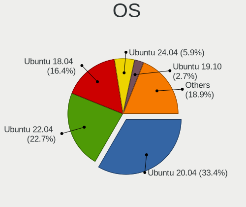
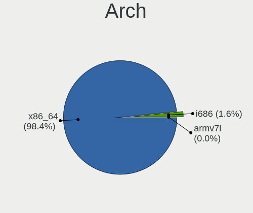
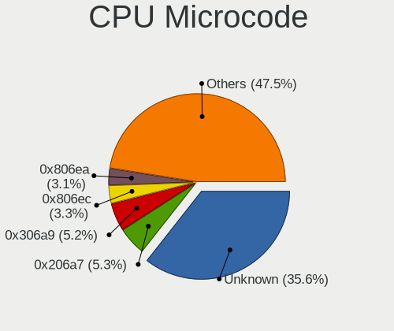
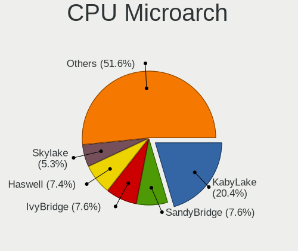
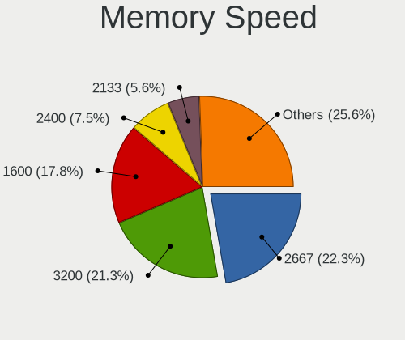
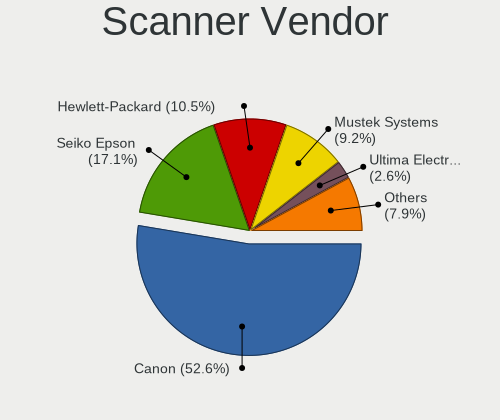

Ubuntu - Tested Hardware & Statistics (Notebooks)
-------------------------------------------------

A project to collect tested hardware configurations for Ubuntu.

Anyone can contribute to this report by the [hw-probe](https://github.com/linuxhw/hw-probe) tool:

    sudo -E hw-probe -all -upload

Please contribute! Especially if your hardware is rare.

Contents
--------

* [ Test Cases ](#test-cases)

* [ System ](#system)
  - [ OS                       ](#os)
  - [ OS Family                ](#os-family)
  - [ Kernel                   ](#kernel)
  - [ Kernel Family            ](#kernel-family)
  - [ Kernel Major Ver.        ](#kernel-major-ver)
  - [ Arch                     ](#arch)
  - [ DE                       ](#de)
  - [ Display Server           ](#display-server)
  - [ Display Manager          ](#display-manager)
  - [ OS Lang                  ](#os-lang)
  - [ Boot Mode                ](#boot-mode)
  - [ Filesystem               ](#filesystem)
  - [ Part. scheme             ](#part-scheme)
  - [ Dual Boot with Linux/BSD ](#dual-boot-with-linuxbsd)
  - [ Dual Boot (Win)          ](#dual-boot-win)

* [ Board ](#board)
  - [ Vendor                   ](#vendor)
  - [ Model                    ](#model)
  - [ Model Family             ](#model-family)
  - [ MFG Year                 ](#mfg-year)
  - [ Form Factor              ](#form-factor)
  - [ Secure Boot              ](#secure-boot)
  - [ Coreboot                 ](#coreboot)
  - [ RAM Size                 ](#ram-size)
  - [ RAM Used                 ](#ram-used)
  - [ Total Drives             ](#total-drives)
  - [ Has CD-ROM               ](#has-cd-rom)
  - [ Has Ethernet             ](#has-ethernet)
  - [ Has WiFi                 ](#has-wifi)
  - [ Has Bluetooth            ](#has-bluetooth)

* [ Location ](#location)
  - [ Country                  ](#country)
  - [ City                     ](#city)

* [ Drives ](#drives)
  - [ Drive Vendor             ](#drive-vendor)
  - [ Drive Model              ](#drive-model)
  - [ HDD Vendor               ](#hdd-vendor)
  - [ SSD Vendor               ](#ssd-vendor)
  - [ Drive Kind               ](#drive-kind)
  - [ Drive Connector          ](#drive-connector)
  - [ Drive Size               ](#drive-size)
  - [ Space Total              ](#space-total)
  - [ Space Used               ](#space-used)
  - [ Malfunc. Drives          ](#malfunc-drives)
  - [ Malfunc. Drive Vendor    ](#malfunc-drive-vendor)
  - [ Malfunc. HDD Vendor      ](#malfunc-hdd-vendor)
  - [ Malfunc. Drive Kind      ](#malfunc-drive-kind)
  - [ Failed Drives            ](#failed-drives)
  - [ Failed Drive Vendor      ](#failed-drive-vendor)
  - [ Drive Status             ](#drive-status)

* [ Storage controller ](#storage-controller)
  - [ Storage Vendor           ](#storage-vendor)
  - [ Storage Model            ](#storage-model)
  - [ Storage Kind             ](#storage-kind)

* [ Processor ](#processor)
  - [ CPU Vendor               ](#cpu-vendor)
  - [ CPU Model                ](#cpu-model)
  - [ CPU Model Family         ](#cpu-model-family)
  - [ CPU Cores                ](#cpu-cores)
  - [ CPU Sockets              ](#cpu-sockets)
  - [ CPU Threads              ](#cpu-threads)
  - [ CPU Op-Modes             ](#cpu-op-modes)
  - [ CPU Microcode            ](#cpu-microcode)
  - [ CPU Microarch            ](#cpu-microarch)

* [ Graphics ](#graphics)
  - [ GPU Vendor               ](#gpu-vendor)
  - [ GPU Model                ](#gpu-model)
  - [ GPU Combo                ](#gpu-combo)
  - [ GPU Driver               ](#gpu-driver)
  - [ GPU Memory               ](#gpu-memory)

* [ Monitor ](#monitor)
  - [ Monitor Vendor           ](#monitor-vendor)
  - [ Monitor Model            ](#monitor-model)
  - [ Monitor Resolution       ](#monitor-resolution)
  - [ Monitor Diagonal         ](#monitor-diagonal)
  - [ Monitor Width            ](#monitor-width)
  - [ Aspect Ratio             ](#aspect-ratio)
  - [ Monitor Area             ](#monitor-area)
  - [ Pixel Density            ](#pixel-density)
  - [ Multiple Monitors        ](#multiple-monitors)

* [ Network ](#network)
  - [ Net Controller Vendor    ](#net-controller-vendor)
  - [ Net Controller Model     ](#net-controller-model)
  - [ Wireless Vendor          ](#wireless-vendor)
  - [ Wireless Model           ](#wireless-model)
  - [ Ethernet Vendor          ](#ethernet-vendor)
  - [ Ethernet Model           ](#ethernet-model)
  - [ Net Controller Kind      ](#net-controller-kind)
  - [ Used Controller          ](#used-controller)
  - [ NICs                     ](#nics)
  - [ IPv6                     ](#ipv6)

* [ Bluetooth ](#bluetooth)
  - [ Bluetooth Vendor         ](#bluetooth-vendor)
  - [ Bluetooth Model          ](#bluetooth-model)

* [ Sound ](#sound)
  - [ Sound Vendor             ](#sound-vendor)
  - [ Sound Model              ](#sound-model)

* [ Memory ](#memory)
  - [ Memory Vendor            ](#memory-vendor)
  - [ Memory Model             ](#memory-model)
  - [ Memory Kind              ](#memory-kind)
  - [ Memory Form Factor       ](#memory-form-factor)
  - [ Memory Size              ](#memory-size)
  - [ Memory Speed             ](#memory-speed)

* [ Printers & scanners ](#printers--scanners)
  - [ Printer Vendor           ](#printer-vendor)
  - [ Printer Model            ](#printer-model)
  - [ Scanner Vendor           ](#scanner-vendor)
  - [ Scanner Model            ](#scanner-model)

* [ Camera ](#camera)
  - [ Camera Vendor            ](#camera-vendor)
  - [ Camera Model             ](#camera-model)

* [ Security ](#security)
  - [ Fingerprint Vendor       ](#fingerprint-vendor)
  - [ Fingerprint Model        ](#fingerprint-model)
  - [ Chipcard Vendor          ](#chipcard-vendor)
  - [ Chipcard Model           ](#chipcard-model)

* [ Unsupported ](#unsupported)
  - [ Unsupported Devices      ](#unsupported-devices)
  - [ Unsupported Device Types ](#unsupported-device-types)

Test Cases
----------

Total: 41550

| Vendor        | Model                       | Probe                                                      | Date         |
|---------------|-----------------------------|------------------------------------------------------------|--------------|
| ASUSTek       | PU551LA                     | [19e1b6041b](https://linux-hardware.org/?probe=19e1b6041b) | May 01, 2022 |
| Fujitsu Si... | AMILO A1650G                | [fbf6d9db93](https://linux-hardware.org/?probe=fbf6d9db93) | Apr 30, 2022 |
| Fujitsu Si... | AMILO A1650G                | [134f0a947b](https://linux-hardware.org/?probe=134f0a947b) | Apr 30, 2022 |
| Sony          | SVE1513R1EB                 | [59a46c5857](https://linux-hardware.org/?probe=59a46c5857) | Apr 30, 2022 |
| Lenovo        | G700 20251                  | [94272db5ec](https://linux-hardware.org/?probe=94272db5ec) | Apr 30, 2022 |
| Alienware     | x17 R2                      | [d78db966bc](https://linux-hardware.org/?probe=d78db966bc) | Apr 30, 2022 |
| Dell          | Vostro 1720                 | [bc8f50b9fb](https://linux-hardware.org/?probe=bc8f50b9fb) | Apr 30, 2022 |
| Dell          | Vostro 1720                 | [56cc7a9a54](https://linux-hardware.org/?probe=56cc7a9a54) | Apr 30, 2022 |
| HP            | ProBook 440 G8 Notebook ... | [a4adaba544](https://linux-hardware.org/?probe=a4adaba544) | Apr 30, 2022 |
| Lenovo        | 81VS                        | [1ff46f7cdc](https://linux-hardware.org/?probe=1ff46f7cdc) | Apr 30, 2022 |
| Dell          | G3 3500                     | [df72f36c52](https://linux-hardware.org/?probe=df72f36c52) | Apr 30, 2022 |
| Lenovo        | 81VS                        | [ea23b0e852](https://linux-hardware.org/?probe=ea23b0e852) | Apr 30, 2022 |
| HP            | Pavilion Laptop 14-ec0xx... | [3a7cd290f6](https://linux-hardware.org/?probe=3a7cd290f6) | Apr 30, 2022 |
| Dell          | System XPS L502X            | [77e1846d8d](https://linux-hardware.org/?probe=77e1846d8d) | Apr 30, 2022 |
| Lenovo        | IdeaPad Flex-14API 81SS     | [f5d70fb9d3](https://linux-hardware.org/?probe=f5d70fb9d3) | Apr 30, 2022 |
| Itautec       | Infoway w7535               | [ac87d9e508](https://linux-hardware.org/?probe=ac87d9e508) | Apr 30, 2022 |
| HP            | G42                         | [e23740df6e](https://linux-hardware.org/?probe=e23740df6e) | Apr 30, 2022 |
| HUAWEI        | HVY-WXX9                    | [d7913302d5](https://linux-hardware.org/?probe=d7913302d5) | Apr 30, 2022 |
| Dell          | G7 7700                     | [462862ed56](https://linux-hardware.org/?probe=462862ed56) | Apr 30, 2022 |
| HP            | G42                         | [f6ca4559f5](https://linux-hardware.org/?probe=f6ca4559f5) | Apr 30, 2022 |
| Dell          | Precision 7520              | [2dc98a1a8d](https://linux-hardware.org/?probe=2dc98a1a8d) | Apr 30, 2022 |
| Lenovo        | ThinkBook 15 G2 ITL 20VE    | [31b081b116](https://linux-hardware.org/?probe=31b081b116) | Apr 30, 2022 |
| Toshiba       | Dakar10FW8                  | [fbe2aaac31](https://linux-hardware.org/?probe=fbe2aaac31) | Apr 30, 2022 |
| Dell          | G5 5590                     | [4738729947](https://linux-hardware.org/?probe=4738729947) | Apr 30, 2022 |
| Acer          | Aspire ES1-512              | [642d72d06d](https://linux-hardware.org/?probe=642d72d06d) | Apr 30, 2022 |
| Lenovo        | ThinkBook 14 G2 ARE 20VF    | [b6cbc6e523](https://linux-hardware.org/?probe=b6cbc6e523) | Apr 30, 2022 |
| Lenovo        | ThinkPad T540p 20BFS26E0... | [06738e7bb8](https://linux-hardware.org/?probe=06738e7bb8) | Apr 30, 2022 |
| MSI           | GP65 Leopard 10SFK          | [4523d433d4](https://linux-hardware.org/?probe=4523d433d4) | Apr 30, 2022 |
| MSI           | GP65 Leopard 10SFK          | [a30f4b3e9f](https://linux-hardware.org/?probe=a30f4b3e9f) | Apr 30, 2022 |
| NSX           | SB1402                      | [c9d79a4fe5](https://linux-hardware.org/?probe=c9d79a4fe5) | Apr 30, 2022 |
| Lenovo        | G50-30 80G0                 | [bc333fe437](https://linux-hardware.org/?probe=bc333fe437) | Apr 30, 2022 |
| Dell          | G3 3500                     | [c9ee387b32](https://linux-hardware.org/?probe=c9ee387b32) | Apr 30, 2022 |
| ASUSTek       | X550VC                      | [16223d208e](https://linux-hardware.org/?probe=16223d208e) | Apr 30, 2022 |
| HP            | Laptop 15-dw3xxx            | [889f1cba36](https://linux-hardware.org/?probe=889f1cba36) | Apr 30, 2022 |
| HP            | ProBook 440 G8 Notebook ... | [a7fe3cb0f6](https://linux-hardware.org/?probe=a7fe3cb0f6) | Apr 30, 2022 |
| Positivo      | S14CT01                     | [7260e4f199](https://linux-hardware.org/?probe=7260e4f199) | Apr 30, 2022 |
| Lenovo        | G40-70 80GA                 | [fcd20cb250](https://linux-hardware.org/?probe=fcd20cb250) | Apr 30, 2022 |
| eMachines     | eME730                      | [ac985950eb](https://linux-hardware.org/?probe=ac985950eb) | Apr 30, 2022 |
| HP            | ProBook 4520s               | [60eab2c6c5](https://linux-hardware.org/?probe=60eab2c6c5) | Apr 30, 2022 |
| Positivo      | S14CT01                     | [dec0b170c2](https://linux-hardware.org/?probe=dec0b170c2) | Apr 30, 2022 |
| HP            | Pavilion Notebook           | [995ea9538b](https://linux-hardware.org/?probe=995ea9538b) | Apr 30, 2022 |
| Dell          | Latitude 5480               | [ba1ff8183e](https://linux-hardware.org/?probe=ba1ff8183e) | Apr 30, 2022 |
| Dell          | Latitude 9420               | [4ba28afe84](https://linux-hardware.org/?probe=4ba28afe84) | Apr 30, 2022 |
| Pegatron      | Spring Peak                 | [66a1692171](https://linux-hardware.org/?probe=66a1692171) | Apr 30, 2022 |
| Lenovo        | ThinkBook 15 G2 ITL 20VE    | [1abef3591b](https://linux-hardware.org/?probe=1abef3591b) | Apr 30, 2022 |
| HP            | ZBook 15 G6                 | [f948921cba](https://linux-hardware.org/?probe=f948921cba) | Apr 30, 2022 |
| Acer          | Aspire E5-571               | [ebdc8b1380](https://linux-hardware.org/?probe=ebdc8b1380) | Apr 30, 2022 |
| Lenovo        | IdeaPad 5 14ITL05 82FE      | [51625474b7](https://linux-hardware.org/?probe=51625474b7) | Apr 30, 2022 |
| Acer          | Aspire A315-23              | [865091bbc1](https://linux-hardware.org/?probe=865091bbc1) | Apr 30, 2022 |
| Acer          | Aspire A315-23              | [5ee29c3982](https://linux-hardware.org/?probe=5ee29c3982) | Apr 30, 2022 |
| HP            | Laptop 17-by3xxx            | [087399e252](https://linux-hardware.org/?probe=087399e252) | Apr 30, 2022 |
| ASUSTek       | X556UR                      | [3f920954f7](https://linux-hardware.org/?probe=3f920954f7) | Apr 30, 2022 |
| HP            | Pavilion Sleekbook 15       | [0003f9342e](https://linux-hardware.org/?probe=0003f9342e) | Apr 30, 2022 |
| HP            | Laptop 14-dq1xxx            | [7c9e2f4d8f](https://linux-hardware.org/?probe=7c9e2f4d8f) | Apr 30, 2022 |
| Lenovo        | ThinkPad L15 Gen 1 20U4S... | [55e76f131d](https://linux-hardware.org/?probe=55e76f131d) | Apr 30, 2022 |
| Acer          | TM4750                      | [b515682692](https://linux-hardware.org/?probe=b515682692) | Apr 30, 2022 |
| HP            | 255 G6 Notebook PC          | [f639c7c8f5](https://linux-hardware.org/?probe=f639c7c8f5) | Apr 29, 2022 |
| HP            | ZBook 15 G5                 | [aac5097e2a](https://linux-hardware.org/?probe=aac5097e2a) | Apr 29, 2022 |
| HP            | ENVY Laptop 15-ep0xxx       | [96dbfb494e](https://linux-hardware.org/?probe=96dbfb494e) | Apr 29, 2022 |
| Sony          | SVE1513R1EB                 | [d1e0096b2d](https://linux-hardware.org/?probe=d1e0096b2d) | Apr 29, 2022 |
| Dell          | Inspiron N4010              | [e1369b0428](https://linux-hardware.org/?probe=e1369b0428) | Apr 29, 2022 |
| Dell          | Latitude E6330              | [c78066bc19](https://linux-hardware.org/?probe=c78066bc19) | Apr 29, 2022 |
| HP            | EliteBook 8570w             | [e6f47edf47](https://linux-hardware.org/?probe=e6f47edf47) | Apr 29, 2022 |
| Dell          | Precision 3551              | [b146dc2249](https://linux-hardware.org/?probe=b146dc2249) | Apr 29, 2022 |
| Toshiba       | Satellite P50-B-103         | [6df44e9098](https://linux-hardware.org/?probe=6df44e9098) | Apr 29, 2022 |
| Dell          | Precision 3551              | [d5a3a490f4](https://linux-hardware.org/?probe=d5a3a490f4) | Apr 29, 2022 |
| Lenovo        | ThinkPad T450 20BV001YMS    | [f38b762c83](https://linux-hardware.org/?probe=f38b762c83) | Apr 29, 2022 |
| Lenovo        | Yoga S740-14IIL 81RS        | [6affdcee0f](https://linux-hardware.org/?probe=6affdcee0f) | Apr 29, 2022 |
| HP            | Pavilion Gaming Laptop 1... | [f842336794](https://linux-hardware.org/?probe=f842336794) | Apr 29, 2022 |
| Acer          | TravelMate 6592             | [7d4878ff33](https://linux-hardware.org/?probe=7d4878ff33) | Apr 29, 2022 |
| HP            | ENVY dv7                    | [dbd8feaee0](https://linux-hardware.org/?probe=dbd8feaee0) | Apr 29, 2022 |
| Lenovo        | ThinkPad T470 W10DG 20JN... | [e7ca44864b](https://linux-hardware.org/?probe=e7ca44864b) | Apr 29, 2022 |
| HP            | ZBook 15 G3                 | [ced6ab1ae8](https://linux-hardware.org/?probe=ced6ab1ae8) | Apr 29, 2022 |
| Dell          | Inspiron 7400               | [0c0af6919d](https://linux-hardware.org/?probe=0c0af6919d) | Apr 29, 2022 |
| Lenovo        | ThinkPad T450 20BUS1MN00    | [4e2b073a5c](https://linux-hardware.org/?probe=4e2b073a5c) | Apr 29, 2022 |
| MSI           | GE66 Raider 11UH            | [9bdf866ebc](https://linux-hardware.org/?probe=9bdf866ebc) | Apr 29, 2022 |
| Teclast       | F7 Plus                     | [8096cf3295](https://linux-hardware.org/?probe=8096cf3295) | Apr 29, 2022 |
| Dell          | Latitude 3540               | [a97573f3cf](https://linux-hardware.org/?probe=a97573f3cf) | Apr 29, 2022 |
| Dell          | Latitude 3540               | [a6b8509194](https://linux-hardware.org/?probe=a6b8509194) | Apr 29, 2022 |
| HP            | EliteBook 840 G1            | [411c79850c](https://linux-hardware.org/?probe=411c79850c) | Apr 29, 2022 |
| Acer          | Aspire A515-54              | [4ff968ef61](https://linux-hardware.org/?probe=4ff968ef61) | Apr 28, 2022 |
| Dell          | Precision 7510              | [afaea67857](https://linux-hardware.org/?probe=afaea67857) | Apr 28, 2022 |
| Dell          | Inspiron 7400               | [8e5289a5e7](https://linux-hardware.org/?probe=8e5289a5e7) | Apr 28, 2022 |
| Dell          | Inspiron 3505               | [1f6bbce46b](https://linux-hardware.org/?probe=1f6bbce46b) | Apr 28, 2022 |
| Dell          | Latitude 5411               | [34c470e595](https://linux-hardware.org/?probe=34c470e595) | Apr 28, 2022 |
| Apple         | MacBook3,1                  | [5c90931c74](https://linux-hardware.org/?probe=5c90931c74) | Apr 28, 2022 |
| Lenovo        | ThinkPad Edge E430 3254A... | [00474d7e97](https://linux-hardware.org/?probe=00474d7e97) | Apr 28, 2022 |
| Dell          | Inspiron 3542               | [6e00a18a0f](https://linux-hardware.org/?probe=6e00a18a0f) | Apr 28, 2022 |
| Lenovo        | ThinkPad Edge E430 3254A... | [3c9c9f209d](https://linux-hardware.org/?probe=3c9c9f209d) | Apr 28, 2022 |
| Lenovo        | IdeaPad 320S-14IKB 80X4     | [06ef070e40](https://linux-hardware.org/?probe=06ef070e40) | Apr 28, 2022 |
| Lenovo        | IdeaPad 320S-14IKB 80X4     | [8ef803f8c9](https://linux-hardware.org/?probe=8ef803f8c9) | Apr 28, 2022 |
| Dell          | Latitude 5420               | [26abde11eb](https://linux-hardware.org/?probe=26abde11eb) | Apr 28, 2022 |
| Samsung       | 670Z5E                      | [7867dbccf7](https://linux-hardware.org/?probe=7867dbccf7) | Apr 28, 2022 |
| Samsung       | 670Z5E                      | [39efe61675](https://linux-hardware.org/?probe=39efe61675) | Apr 28, 2022 |
| Lenovo        | ThinkPad T440s 20ARS3640... | [13ec979f89](https://linux-hardware.org/?probe=13ec979f89) | Apr 28, 2022 |
| HP            | Pavilion 17                 | [d865ef2ed1](https://linux-hardware.org/?probe=d865ef2ed1) | Apr 28, 2022 |
| ASUSTek       | VivoBook_ASUSLaptop X521... | [e8349bba13](https://linux-hardware.org/?probe=e8349bba13) | Apr 28, 2022 |
| Sony          | VGN-FW56J                   | [45c6c458bc](https://linux-hardware.org/?probe=45c6c458bc) | Apr 28, 2022 |
| Dell          | Latitude 7420               | [8e3bcab404](https://linux-hardware.org/?probe=8e3bcab404) | Apr 28, 2022 |
| Dell          | Latitude 7400               | [7f20623ac0](https://linux-hardware.org/?probe=7f20623ac0) | Apr 28, 2022 |
| Toshiba       | Satellite C855              | [703a704f72](https://linux-hardware.org/?probe=703a704f72) | Apr 28, 2022 |
| Dell          | Vostro 3560                 | [56d52ea265](https://linux-hardware.org/?probe=56d52ea265) | Apr 28, 2022 |
| Lenovo        | Z50-75 80EC                 | [3e88e21f3c](https://linux-hardware.org/?probe=3e88e21f3c) | Apr 28, 2022 |
| Lenovo        | IdeaPad 320-15ABR 80XS      | [94defd50ef](https://linux-hardware.org/?probe=94defd50ef) | Apr 28, 2022 |
| Dell          | Inspiron 5566               | [49396d0706](https://linux-hardware.org/?probe=49396d0706) | Apr 28, 2022 |
| Lenovo        | ThinkPad T470 W10DG 20JN... | [16f0860d82](https://linux-hardware.org/?probe=16f0860d82) | Apr 28, 2022 |
| HP            | ProBook 4510s               | [d020eac67a](https://linux-hardware.org/?probe=d020eac67a) | Apr 27, 2022 |
| Toshiba       | Satellite Pro S500          | [eb4ae51e74](https://linux-hardware.org/?probe=eb4ae51e74) | Apr 27, 2022 |
| Acer          | Aspire E1-570               | [efcd6be006](https://linux-hardware.org/?probe=efcd6be006) | Apr 27, 2022 |
| Dell          | XPS 15 9560                 | [92e903308e](https://linux-hardware.org/?probe=92e903308e) | Apr 27, 2022 |
| Dell          | Inspiron N4010              | [820098c075](https://linux-hardware.org/?probe=820098c075) | Apr 27, 2022 |
| HP            | Pavilion g6                 | [b79730a7af](https://linux-hardware.org/?probe=b79730a7af) | Apr 27, 2022 |
| Dell          | Latitude 5310               | [1bfa3e6f27](https://linux-hardware.org/?probe=1bfa3e6f27) | Apr 27, 2022 |
| HP            | 255 G8 Notebook PC          | [782eef0bbe](https://linux-hardware.org/?probe=782eef0bbe) | Apr 27, 2022 |
| Apple         | MacBook3,1                  | [c7da3d4c4f](https://linux-hardware.org/?probe=c7da3d4c4f) | Apr 27, 2022 |
| Lenovo        | Unknown                     | [869b7e6d8d](https://linux-hardware.org/?probe=869b7e6d8d) | Apr 27, 2022 |
| Lenovo        | Unknown                     | [88f2e3a710](https://linux-hardware.org/?probe=88f2e3a710) | Apr 27, 2022 |
| Acer          | TM4750                      | [8254e2b47d](https://linux-hardware.org/?probe=8254e2b47d) | Apr 27, 2022 |
| SANTECH       | NHx0EH_EJ_EK                | [f10828c0a8](https://linux-hardware.org/?probe=f10828c0a8) | Apr 27, 2022 |
| Dell          | Inspiron N4010              | [4d84b677ae](https://linux-hardware.org/?probe=4d84b677ae) | Apr 27, 2022 |
| Lenovo        | ThinkPad P14s Gen 1 20Y1... | [3314e78ec8](https://linux-hardware.org/?probe=3314e78ec8) | Apr 27, 2022 |
| Lenovo        | IdeaPad Gaming 3 15ARH05... | [8ece944a7b](https://linux-hardware.org/?probe=8ece944a7b) | Apr 27, 2022 |
| ASUSTek       | Zephyrus S GX531GXR_GX53... | [882dbf87c5](https://linux-hardware.org/?probe=882dbf87c5) | Apr 27, 2022 |
| HP            | Laptop 15-bw0xx             | [dc46901a64](https://linux-hardware.org/?probe=dc46901a64) | Apr 27, 2022 |
| Lenovo        | ThinkPad L460 20FVS3X800    | [adbec7ed2e](https://linux-hardware.org/?probe=adbec7ed2e) | Apr 27, 2022 |
| Dell          | Latitude E6510              | [10d60e00c2](https://linux-hardware.org/?probe=10d60e00c2) | Apr 27, 2022 |
| Samsung       | 350V5C/351V5C/3540VC/344... | [6e793edd01](https://linux-hardware.org/?probe=6e793edd01) | Apr 27, 2022 |
| Dell          | Inspiron 5415               | [5edac5d5a6](https://linux-hardware.org/?probe=5edac5d5a6) | Apr 27, 2022 |
| Dell          | Latitude E6520              | [1ca407a69f](https://linux-hardware.org/?probe=1ca407a69f) | Apr 27, 2022 |
| ASUSTek       | Zephyrus S GX531GXR_GX53... | [b540bb9d6f](https://linux-hardware.org/?probe=b540bb9d6f) | Apr 27, 2022 |
| Noblex        | N14WD21                     | [a8a7a4e1d5](https://linux-hardware.org/?probe=a8a7a4e1d5) | Apr 27, 2022 |
| Lenovo        | ThinkPad X250 20CLS52P0F    | [a4d291ccda](https://linux-hardware.org/?probe=a4d291ccda) | Apr 27, 2022 |
| Lenovo        | IdeaPad Gaming 3 15IMH05... | [a696a35961](https://linux-hardware.org/?probe=a696a35961) | Apr 27, 2022 |
| Dell          | Inspiron 3583               | [8f10e59515](https://linux-hardware.org/?probe=8f10e59515) | Apr 27, 2022 |
| Lenovo        | ThinkPad T470 W10DG 20JN... | [87cc990d93](https://linux-hardware.org/?probe=87cc990d93) | Apr 27, 2022 |
| Acer          | Aspire 5750G                | [3a96bf8237](https://linux-hardware.org/?probe=3a96bf8237) | Apr 27, 2022 |
| Dell          | Latitude 5410               | [1a67b58656](https://linux-hardware.org/?probe=1a67b58656) | Apr 27, 2022 |
| Lenovo        | ThinkPad T460s 20F9001DU... | [5c617c528a](https://linux-hardware.org/?probe=5c617c528a) | Apr 27, 2022 |
| Sony          | SVF1521L1RB                 | [ff5ff260a0](https://linux-hardware.org/?probe=ff5ff260a0) | Apr 26, 2022 |
| Lenovo        | Legion 7 15IMH05 81YT       | [9384c00f6e](https://linux-hardware.org/?probe=9384c00f6e) | Apr 26, 2022 |
| Lenovo        | ThinkPad T430u 335337G      | [31bc958302](https://linux-hardware.org/?probe=31bc958302) | Apr 26, 2022 |
| Sony          | SVF1521L1RB                 | [f20cc07739](https://linux-hardware.org/?probe=f20cc07739) | Apr 26, 2022 |
| Lenovo        | ThinkPad T430u 335337G      | [8446691cb3](https://linux-hardware.org/?probe=8446691cb3) | Apr 26, 2022 |
| Sony          | SVF1521L1RB                 | [c8b61e83d7](https://linux-hardware.org/?probe=c8b61e83d7) | Apr 26, 2022 |
| Lenovo        | Legion 5 15ACH6 82JW        | [3b4a331875](https://linux-hardware.org/?probe=3b4a331875) | Apr 26, 2022 |
| Dell          | XPS 13 9380                 | [c052066ee4](https://linux-hardware.org/?probe=c052066ee4) | Apr 26, 2022 |
| Dell          | Inspiron 3583               | [bca722d45d](https://linux-hardware.org/?probe=bca722d45d) | Apr 26, 2022 |
| Toshiba       | TECRA R940                  | [d841324245](https://linux-hardware.org/?probe=d841324245) | Apr 26, 2022 |
| HP            | 255 G8 Notebook PC          | [17ccf19b71](https://linux-hardware.org/?probe=17ccf19b71) | Apr 26, 2022 |
| MSI           | GP66 Leopard 11UH           | [549c216d66](https://linux-hardware.org/?probe=549c216d66) | Apr 26, 2022 |
| Lenovo        | ThinkPad L490 20Q5002GPG    | [9e591226b7](https://linux-hardware.org/?probe=9e591226b7) | Apr 26, 2022 |
| ASUSTek       | Zephyrus S GX531GXR_GX53... | [9dee9219fd](https://linux-hardware.org/?probe=9dee9219fd) | Apr 26, 2022 |
| Dell          | Latitude 7520               | [674f3ca531](https://linux-hardware.org/?probe=674f3ca531) | Apr 26, 2022 |
| HP            | ProBook 450 G8 Notebook ... | [4f92840d8c](https://linux-hardware.org/?probe=4f92840d8c) | Apr 26, 2022 |
| Lenovo        | ThinkPad X230 2333BF6       | [f5e57e219b](https://linux-hardware.org/?probe=f5e57e219b) | Apr 26, 2022 |
| ASUSTek       | P55VA                       | [21c5b79768](https://linux-hardware.org/?probe=21c5b79768) | Apr 26, 2022 |
| Lenovo        | ThinkPad T570 W10DG 20JX... | [489a3a5798](https://linux-hardware.org/?probe=489a3a5798) | Apr 26, 2022 |
| Lenovo        | ThinkPad E15 20RDS03500     | [6aa4c36808](https://linux-hardware.org/?probe=6aa4c36808) | Apr 26, 2022 |
| Acer          | Aspire E1-570               | [b8257c292a](https://linux-hardware.org/?probe=b8257c292a) | Apr 26, 2022 |
| ASUSTek       | Zephyrus S GX531GXR_GX53... | [54b755397c](https://linux-hardware.org/?probe=54b755397c) | Apr 26, 2022 |
| Lenovo        | ThinkPad W541 20EFCTO1WW    | [8f61feb9d0](https://linux-hardware.org/?probe=8f61feb9d0) | Apr 26, 2022 |
| Lenovo        | ThinkPad E470 20H1A01YAC    | [cd8726de3c](https://linux-hardware.org/?probe=cd8726de3c) | Apr 26, 2022 |
| Lenovo        | ThinkPad P15v Gen 1 20TQ... | [bd827295e5](https://linux-hardware.org/?probe=bd827295e5) | Apr 26, 2022 |
| Dell          | G15 5510                    | [5126d58147](https://linux-hardware.org/?probe=5126d58147) | Apr 26, 2022 |
| Dell          | Inspiron 5447               | [0adfe1cfb9](https://linux-hardware.org/?probe=0adfe1cfb9) | Apr 25, 2022 |
| Lenovo        | ThinkPad T440 20B7S3UD00    | [9c66fd444a](https://linux-hardware.org/?probe=9c66fd444a) | Apr 25, 2022 |
| Lenovo        | ThinkPad T440 20B7S3UD00    | [942267c99b](https://linux-hardware.org/?probe=942267c99b) | Apr 25, 2022 |
| Dell          | XPS 13 9370                 | [08d2d58a95](https://linux-hardware.org/?probe=08d2d58a95) | Apr 25, 2022 |
| HP            | Stream Laptop 14-ax0XX      | [40b23da6dc](https://linux-hardware.org/?probe=40b23da6dc) | Apr 25, 2022 |
| Dell          | G15 5510                    | [ef1787abc5](https://linux-hardware.org/?probe=ef1787abc5) | Apr 25, 2022 |
| HP            | Laptop 15s-du3xxx           | [8197ac9c77](https://linux-hardware.org/?probe=8197ac9c77) | Apr 25, 2022 |
| Lenovo        | ThinkPad X230 2324GA7       | [a5138b511d](https://linux-hardware.org/?probe=a5138b511d) | Apr 25, 2022 |
| Lenovo        | ThinkPad P15v Gen 1 20TQ... | [9e7c80a9d0](https://linux-hardware.org/?probe=9e7c80a9d0) | Apr 25, 2022 |
| Lenovo        | ThinkPad L15 Gen 2 20X3C... | [3fcb247b21](https://linux-hardware.org/?probe=3fcb247b21) | Apr 25, 2022 |
| Timi          | RedmiBook Pro 15S           | [07ccc93cd4](https://linux-hardware.org/?probe=07ccc93cd4) | Apr 25, 2022 |
| MSI           | GF65 Thin 10UE              | [b099b2ab43](https://linux-hardware.org/?probe=b099b2ab43) | Apr 25, 2022 |
| MSI           | GF65 Thin 10UE              | [79fc46c6f0](https://linux-hardware.org/?probe=79fc46c6f0) | Apr 25, 2022 |
| HP            | ProBook 4520s               | [1621eddc70](https://linux-hardware.org/?probe=1621eddc70) | Apr 25, 2022 |
| Acer          | Aspire E1-571               | [35824f9b37](https://linux-hardware.org/?probe=35824f9b37) | Apr 25, 2022 |
| Unknown       | Unknown                     | [8f76034215](https://linux-hardware.org/?probe=8f76034215) | Apr 25, 2022 |
| HP            | OMEN by Laptop 15-ce0xx     | [8694f28b60](https://linux-hardware.org/?probe=8694f28b60) | Apr 25, 2022 |
| HP            | ProBook 4710s               | [03d5c4c5b2](https://linux-hardware.org/?probe=03d5c4c5b2) | Apr 25, 2022 |
| HP            | 348 G4                      | [54db7eb2da](https://linux-hardware.org/?probe=54db7eb2da) | Apr 25, 2022 |
| Fujitsu       | LIFEBOOK E751               | [ace84bb1e5](https://linux-hardware.org/?probe=ace84bb1e5) | Apr 25, 2022 |
| Toshiba       | Satellite C50t-B            | [d2a6276ca3](https://linux-hardware.org/?probe=d2a6276ca3) | Apr 25, 2022 |
| HP            | EliteBook 845 G7 Noteboo... | [1b1bf8dddf](https://linux-hardware.org/?probe=1b1bf8dddf) | Apr 25, 2022 |
| Dell          | G15 5510                    | [8cf81514fa](https://linux-hardware.org/?probe=8cf81514fa) | Apr 25, 2022 |
| ASUSTek       | VivoBook_ASUSLaptop M350... | [4c3bf947f5](https://linux-hardware.org/?probe=4c3bf947f5) | Apr 25, 2022 |
| HP            | EliteBook 830 G5            | [17f9b4e988](https://linux-hardware.org/?probe=17f9b4e988) | Apr 25, 2022 |
| Dell          | Inspiron 5577               | [0925d92173](https://linux-hardware.org/?probe=0925d92173) | Apr 25, 2022 |
| Dell          | Inspiron N4050              | [7b82407cba](https://linux-hardware.org/?probe=7b82407cba) | Apr 25, 2022 |
| Dell          | Latitude D830               | [1c23417a15](https://linux-hardware.org/?probe=1c23417a15) | Apr 25, 2022 |
| Lenovo        | ThinkPad T530 2359CTO       | [58199da0ee](https://linux-hardware.org/?probe=58199da0ee) | Apr 25, 2022 |
| HP            | ProBook 470 G5              | [e0def5bddc](https://linux-hardware.org/?probe=e0def5bddc) | Apr 25, 2022 |
| HP            | ProBook 470 G5              | [90f3d2dd98](https://linux-hardware.org/?probe=90f3d2dd98) | Apr 25, 2022 |
| Apple         | MacBookAir6,2               | [fe067fc3d4](https://linux-hardware.org/?probe=fe067fc3d4) | Apr 25, 2022 |
| Dell          | Precision 3561              | [251f19b464](https://linux-hardware.org/?probe=251f19b464) | Apr 25, 2022 |
| Apple         | MacBookAir6,2               | [fb26f3ab65](https://linux-hardware.org/?probe=fb26f3ab65) | Apr 25, 2022 |
| Acer          | Aspire VN7-792G             | [77f5ce42de](https://linux-hardware.org/?probe=77f5ce42de) | Apr 24, 2022 |
| TUXEDO        | Pulse 15 Gen1               | [5b54f10afa](https://linux-hardware.org/?probe=5b54f10afa) | Apr 24, 2022 |
| Sony          | SVE1513R1EB                 | [5275d17d40](https://linux-hardware.org/?probe=5275d17d40) | Apr 24, 2022 |
| AMI           | Intel                       | [87e32073a4](https://linux-hardware.org/?probe=87e32073a4) | Apr 24, 2022 |
| Sony          | VPCEH25FM                   | [bceedddb01](https://linux-hardware.org/?probe=bceedddb01) | Apr 24, 2022 |
| Acer          | Aspire A515-56G             | [492dd679be](https://linux-hardware.org/?probe=492dd679be) | Apr 24, 2022 |
| Acer          | Aspire E1-570               | [3ed79cff5c](https://linux-hardware.org/?probe=3ed79cff5c) | Apr 24, 2022 |
| Lenovo        | IdeaPad L340-15IRH Gamin... | [54aa68a653](https://linux-hardware.org/?probe=54aa68a653) | Apr 24, 2022 |
| Acer          | Aspire A515-56G             | [5fc4dbeaad](https://linux-hardware.org/?probe=5fc4dbeaad) | Apr 24, 2022 |
| Lenovo        | ThinkPad W700 275236U       | [b7c7a5216b](https://linux-hardware.org/?probe=b7c7a5216b) | Apr 24, 2022 |
| Lenovo        | ThinkPad W700 275236U       | [4d31fc069f](https://linux-hardware.org/?probe=4d31fc069f) | Apr 24, 2022 |
| ASUSTek       | X540LA                      | [370a60692a](https://linux-hardware.org/?probe=370a60692a) | Apr 24, 2022 |
| ASUSTek       | X550CC                      | [4f77777c97](https://linux-hardware.org/?probe=4f77777c97) | Apr 24, 2022 |
| HUAWEI        | MACHC-WAX9                  | [9cda67e701](https://linux-hardware.org/?probe=9cda67e701) | Apr 24, 2022 |
| HP            | ProBook 430 G1              | [52259207bb](https://linux-hardware.org/?probe=52259207bb) | Apr 24, 2022 |
| HP            | 255 G6 Notebook PC          | [ad390bd7b7](https://linux-hardware.org/?probe=ad390bd7b7) | Apr 24, 2022 |
| Lenovo        | ThinkPad T520 4243WRK       | [3600152c79](https://linux-hardware.org/?probe=3600152c79) | Apr 24, 2022 |
| Lenovo        | ThinkPad T520 4243WRK       | [cf390615ba](https://linux-hardware.org/?probe=cf390615ba) | Apr 24, 2022 |
| HP            | Pavilion g6                 | [83eab02369](https://linux-hardware.org/?probe=83eab02369) | Apr 24, 2022 |
| Avell High... | C65 MOB                     | [b8e185c194](https://linux-hardware.org/?probe=b8e185c194) | Apr 24, 2022 |
| Lenovo        | ThinkBook 15 G2 ITL 20VE    | [fbb2b97e0f](https://linux-hardware.org/?probe=fbb2b97e0f) | Apr 24, 2022 |
| SANTECH       | NHx0EH_EJ_EK                | [2e51ffc9e7](https://linux-hardware.org/?probe=2e51ffc9e7) | Apr 24, 2022 |
| HP            | ProBook 430 G5              | [9c45d7cb78](https://linux-hardware.org/?probe=9c45d7cb78) | Apr 23, 2022 |
| Lenovo        | ThinkPad E14 Gen 2 20TA0... | [45b9330abf](https://linux-hardware.org/?probe=45b9330abf) | Apr 23, 2022 |
| Medion        | E7220                       | [c2d7457304](https://linux-hardware.org/?probe=c2d7457304) | Apr 23, 2022 |
| ASUSTek       | ASUS TUF Gaming F17 FX70... | [e63c319457](https://linux-hardware.org/?probe=e63c319457) | Apr 23, 2022 |
| Dell          | Latitude 5290               | [e373cb6fa1](https://linux-hardware.org/?probe=e373cb6fa1) | Apr 23, 2022 |
| Dell          | Latitude E4300              | [0bc4953a89](https://linux-hardware.org/?probe=0bc4953a89) | Apr 23, 2022 |
| Dell          | Latitude 7390 2-in-1        | [8391ca514e](https://linux-hardware.org/?probe=8391ca514e) | Apr 23, 2022 |
| Medion        | E6436 MD61150               | [999d2d1526](https://linux-hardware.org/?probe=999d2d1526) | Apr 23, 2022 |
| Unknown       | Unknown                     | [ff32f84c4e](https://linux-hardware.org/?probe=ff32f84c4e) | Apr 23, 2022 |
| ASUSTek       | VivoBook_ASUS Laptop X50... | [a551ef1ec7](https://linux-hardware.org/?probe=a551ef1ec7) | Apr 23, 2022 |
| Lenovo        | ThinkPad E15 Gen 2 20TDS... | [59a49b2d04](https://linux-hardware.org/?probe=59a49b2d04) | Apr 23, 2022 |
| Dell          | Latitude 7400               | [189ae3d755](https://linux-hardware.org/?probe=189ae3d755) | Apr 23, 2022 |
| ASUSTek       | K46CA                       | [e762eba391](https://linux-hardware.org/?probe=e762eba391) | Apr 23, 2022 |
| Dell          | Inspiron N5110              | [30209dbcd1](https://linux-hardware.org/?probe=30209dbcd1) | Apr 23, 2022 |
| Unknown       | Unknown                     | [f45406567e](https://linux-hardware.org/?probe=f45406567e) | Apr 23, 2022 |
| PC Special... | N8xEJEK                     | [344f872508](https://linux-hardware.org/?probe=344f872508) | Apr 23, 2022 |
| Dell          | Latitude 5580               | [cbd7aaec4a](https://linux-hardware.org/?probe=cbd7aaec4a) | Apr 23, 2022 |
| Chuwi         | Unknown                     | [96105ecbb2](https://linux-hardware.org/?probe=96105ecbb2) | Apr 23, 2022 |
| Lenovo        | ThinkPad P50 20EQS64N1N     | [c3d792a237](https://linux-hardware.org/?probe=c3d792a237) | Apr 23, 2022 |
| ASUSTek       | VivoBook_ASUS Laptop X50... | [fd6718859d](https://linux-hardware.org/?probe=fd6718859d) | Apr 23, 2022 |
| HP            | EliteBook Folio 9470m       | [cd369fb3e3](https://linux-hardware.org/?probe=cd369fb3e3) | Apr 23, 2022 |
| Proline       | V146A                       | [30cc5fb7c1](https://linux-hardware.org/?probe=30cc5fb7c1) | Apr 22, 2022 |
| Timi          | RedmiBook 14-APCS           | [32cb202a0e](https://linux-hardware.org/?probe=32cb202a0e) | Apr 22, 2022 |
| Lenovo        | ThinkBook 16p Gen 2 20YM    | [a8038d3972](https://linux-hardware.org/?probe=a8038d3972) | Apr 22, 2022 |
| Lenovo        | Unknown                     | [f582eb96bb](https://linux-hardware.org/?probe=f582eb96bb) | Apr 22, 2022 |
| HP            | ZBook 15 G5                 | [3b1d5e2bb8](https://linux-hardware.org/?probe=3b1d5e2bb8) | Apr 22, 2022 |
| AWOW          | AL34                        | [cc4a446b9e](https://linux-hardware.org/?probe=cc4a446b9e) | Apr 22, 2022 |
| Samsung       | 300E4C/300E5C/300E7C        | [f3e50d22aa](https://linux-hardware.org/?probe=f3e50d22aa) | Apr 22, 2022 |
| Acer          | Aspire E1-571               | [6d4294bbf8](https://linux-hardware.org/?probe=6d4294bbf8) | Apr 22, 2022 |
| Positivo      | W942SW_SW1                  | [36b0510bae](https://linux-hardware.org/?probe=36b0510bae) | Apr 22, 2022 |
| HONOR         | NBD-WXX9                    | [135c98b96d](https://linux-hardware.org/?probe=135c98b96d) | Apr 22, 2022 |
| Acer          | Aspire E1-571               | [202353253a](https://linux-hardware.org/?probe=202353253a) | Apr 22, 2022 |
| Samsung       | 300E4C/300E5C/300E7C        | [d90f38b2ad](https://linux-hardware.org/?probe=d90f38b2ad) | Apr 22, 2022 |
| Fujitsu       | CELSIUS H720                | [4c3233cd10](https://linux-hardware.org/?probe=4c3233cd10) | Apr 22, 2022 |
| Acer          | Aspire A515-45              | [377315649e](https://linux-hardware.org/?probe=377315649e) | Apr 22, 2022 |
| Lenovo        | E41-25 81FS                 | [4880f7c2d5](https://linux-hardware.org/?probe=4880f7c2d5) | Apr 22, 2022 |
| HP            | Folio 13 - 2000             | [e6bd30864d](https://linux-hardware.org/?probe=e6bd30864d) | Apr 22, 2022 |
| Acer          | Aspire E1-570               | [9b96999445](https://linux-hardware.org/?probe=9b96999445) | Apr 22, 2022 |
| MSI           | Stealth GS77 12UGS          | [cd1bc2095f](https://linux-hardware.org/?probe=cd1bc2095f) | Apr 22, 2022 |
| HP            | EliteBook 2530p             | [bfaeba4483](https://linux-hardware.org/?probe=bfaeba4483) | Apr 22, 2022 |
| Dell          | XPS 15 7590                 | [f2680af572](https://linux-hardware.org/?probe=f2680af572) | Apr 22, 2022 |
| Acer          | Aspire E1-570               | [b8e8a058d2](https://linux-hardware.org/?probe=b8e8a058d2) | Apr 22, 2022 |
| Lenovo        | IdeaPad 330-15IKB 81DE      | [8abbc8a322](https://linux-hardware.org/?probe=8abbc8a322) | Apr 22, 2022 |
| HUAWEI        | HVY-WXX9                    | [3320719d25](https://linux-hardware.org/?probe=3320719d25) | Apr 22, 2022 |
| MSI           | Stealth GS77 12UGS          | [33afc70a54](https://linux-hardware.org/?probe=33afc70a54) | Apr 22, 2022 |
| Lenovo        | IdeaPad 320-15IKB 81BG      | [26b3b0efb2](https://linux-hardware.org/?probe=26b3b0efb2) | Apr 22, 2022 |
| HP            | EliteBook 830 G5            | [6061f1cd1e](https://linux-hardware.org/?probe=6061f1cd1e) | Apr 22, 2022 |
| Lenovo        | ThinkPad T14 Gen 1 20UES... | [5a855c522f](https://linux-hardware.org/?probe=5a855c522f) | Apr 22, 2022 |
| HP            | Folio 13 - 2000             | [801488394d](https://linux-hardware.org/?probe=801488394d) | Apr 22, 2022 |
| Acer          | Swift SF314-42              | [b0dc5471af](https://linux-hardware.org/?probe=b0dc5471af) | Apr 22, 2022 |
| Dell          | Latitude 7490               | [2b8d24f8ae](https://linux-hardware.org/?probe=2b8d24f8ae) | Apr 22, 2022 |
| Medion        | Erazer X7843 MD99996        | [02dd167b63](https://linux-hardware.org/?probe=02dd167b63) | Apr 22, 2022 |
| Lenovo        | IdeaPad 5 Pro 16ACH6 82L... | [35e11e3e60](https://linux-hardware.org/?probe=35e11e3e60) | Apr 22, 2022 |
| HP            | EliteBook 2530p             | [a68c57ea30](https://linux-hardware.org/?probe=a68c57ea30) | Apr 22, 2022 |
| Lenovo        | IdeaPadFlex 15 20309        | [6dac014a49](https://linux-hardware.org/?probe=6dac014a49) | Apr 22, 2022 |
| Lenovo        | B50-70 20384                | [35cf0f09e4](https://linux-hardware.org/?probe=35cf0f09e4) | Apr 22, 2022 |
| HP            | Stream Laptop 14-ds0xxx     | [288f415604](https://linux-hardware.org/?probe=288f415604) | Apr 22, 2022 |
| Lenovo        | IdeaPad 500S-13ISK 80Q2     | [4548a301f8](https://linux-hardware.org/?probe=4548a301f8) | Apr 22, 2022 |
| Fujitsu       | LIFEBOOK E744               | [ca56dc9824](https://linux-hardware.org/?probe=ca56dc9824) | Apr 21, 2022 |
| Lenovo        | IdeaPad 3 17ITL6 82H9       | [8f132efef2](https://linux-hardware.org/?probe=8f132efef2) | Apr 21, 2022 |
| Acer          | Aspire 7530G                | [710b429d94](https://linux-hardware.org/?probe=710b429d94) | Apr 21, 2022 |
| HP            | EliteBook 840 G5            | [0f748e86d4](https://linux-hardware.org/?probe=0f748e86d4) | Apr 21, 2022 |
| HUAWEI        | CREM-WXX9                   | [2a7742c460](https://linux-hardware.org/?probe=2a7742c460) | Apr 21, 2022 |
| HP            | EliteBook 840 G5            | [58a8282067](https://linux-hardware.org/?probe=58a8282067) | Apr 21, 2022 |
| Lenovo        | IdeaPad 320-15IKB 80YH      | [05dfaaa5c7](https://linux-hardware.org/?probe=05dfaaa5c7) | Apr 21, 2022 |
| Acer          | Nitro AN515-51              | [6a3938aa9c](https://linux-hardware.org/?probe=6a3938aa9c) | Apr 21, 2022 |
| Acer          | Nitro AN515-51              | [db446247f1](https://linux-hardware.org/?probe=db446247f1) | Apr 21, 2022 |
| Acer          | Aspire E5-553               | [1c736596fa](https://linux-hardware.org/?probe=1c736596fa) | Apr 21, 2022 |
| MSI           | GS65 Stealth Thin 8RE       | [cbb3f353a5](https://linux-hardware.org/?probe=cbb3f353a5) | Apr 21, 2022 |
| Dell          | XPS 15 7590                 | [5266d4c66b](https://linux-hardware.org/?probe=5266d4c66b) | Apr 21, 2022 |
| Dell          | XPS 15 7590                 | [70d107a754](https://linux-hardware.org/?probe=70d107a754) | Apr 21, 2022 |
| Lenovo        | IdeaPad 500-15ISK 80NT      | [3b670f415f](https://linux-hardware.org/?probe=3b670f415f) | Apr 21, 2022 |
| HP            | Laptop 14-ck0xxx            | [02dd52b3b5](https://linux-hardware.org/?probe=02dd52b3b5) | Apr 21, 2022 |
| Dell          | Latitude 5400               | [b9d83d936e](https://linux-hardware.org/?probe=b9d83d936e) | Apr 21, 2022 |
| ASUSTek       | G550JK                      | [6d291b9c9c](https://linux-hardware.org/?probe=6d291b9c9c) | Apr 21, 2022 |
| Dell          | Inspiron 5447               | [b5f1325640](https://linux-hardware.org/?probe=b5f1325640) | Apr 21, 2022 |
| Sony          | SVE1713V1EB                 | [84441dd32d](https://linux-hardware.org/?probe=84441dd32d) | Apr 21, 2022 |
| Dell          | Inspiron 5447               | [f68123a23d](https://linux-hardware.org/?probe=f68123a23d) | Apr 21, 2022 |
| HP            | 15                          | [3253e0fc56](https://linux-hardware.org/?probe=3253e0fc56) | Apr 21, 2022 |
| Lenovo        | ThinkPad P43s 20RH0023UK    | [1cabdda156](https://linux-hardware.org/?probe=1cabdda156) | Apr 21, 2022 |
| HP            | ZBook Fury 15 G7 Mobile ... | [1fc4d30b49](https://linux-hardware.org/?probe=1fc4d30b49) | Apr 21, 2022 |
| Dell          | Precision M4800             | [ffaec4124a](https://linux-hardware.org/?probe=ffaec4124a) | Apr 21, 2022 |
| Sony          | SVT1121B2EW                 | [dd43f45353](https://linux-hardware.org/?probe=dd43f45353) | Apr 21, 2022 |
| Lenovo        | Legion Y530-15ICH 81FV      | [7f31ce6194](https://linux-hardware.org/?probe=7f31ce6194) | Apr 21, 2022 |
| Dell          | Vostro 3580                 | [c34ed29ab2](https://linux-hardware.org/?probe=c34ed29ab2) | Apr 21, 2022 |
| Lenovo        | IdeaPad 5 15ALC05 82LN      | [76bb32f682](https://linux-hardware.org/?probe=76bb32f682) | Apr 20, 2022 |
| Lenovo        | ThinkPad E15 20RD001EMC     | [d98ca42427](https://linux-hardware.org/?probe=d98ca42427) | Apr 20, 2022 |
| Dell          | XPS 15 7590                 | [7338b3ccc3](https://linux-hardware.org/?probe=7338b3ccc3) | Apr 20, 2022 |
| ASUSTek       | X450LA                      | [997a83a67c](https://linux-hardware.org/?probe=997a83a67c) | Apr 20, 2022 |
| ASUSTek       | X102BA                      | [00fbb5cbff](https://linux-hardware.org/?probe=00fbb5cbff) | Apr 20, 2022 |
| ASUSTek       | X540LJ                      | [33a74b2070](https://linux-hardware.org/?probe=33a74b2070) | Apr 20, 2022 |
| ASUSTek       | FX503VD                     | [218e8b7d2a](https://linux-hardware.org/?probe=218e8b7d2a) | Apr 20, 2022 |
| Dell          | Inspiron 5570               | [f7102a5d2b](https://linux-hardware.org/?probe=f7102a5d2b) | Apr 20, 2022 |
| HP            | Pavilion g6                 | [ee4c469a07](https://linux-hardware.org/?probe=ee4c469a07) | Apr 20, 2022 |
| Lenovo        | Legion 5 15ITH6H 82JH       | [b9f3f2d21f](https://linux-hardware.org/?probe=b9f3f2d21f) | Apr 20, 2022 |
| Acer          | Swift SF314-42              | [a8af23856d](https://linux-hardware.org/?probe=a8af23856d) | Apr 20, 2022 |
| Intel         | W7650                       | [edb281c81e](https://linux-hardware.org/?probe=edb281c81e) | Apr 20, 2022 |
| HP            | ProBook 440 G5              | [288c8e99b2](https://linux-hardware.org/?probe=288c8e99b2) | Apr 20, 2022 |
| Dell          | Studio 1555                 | [0bb6e11e4f](https://linux-hardware.org/?probe=0bb6e11e4f) | Apr 19, 2022 |
| Lenovo        | ThinkPad T520 4243AP1       | [7723ab4bd9](https://linux-hardware.org/?probe=7723ab4bd9) | Apr 19, 2022 |
| Acer          | Aspire E5-574               | [6f1f7031bb](https://linux-hardware.org/?probe=6f1f7031bb) | Apr 19, 2022 |
| Medion        | Akoya E6416 MD99610         | [5e6e51f206](https://linux-hardware.org/?probe=5e6e51f206) | Apr 19, 2022 |
| HP            | Pavilion Laptop 14-bk0xx    | [61ebff551a](https://linux-hardware.org/?probe=61ebff551a) | Apr 19, 2022 |
| GPD           | P2 MAX                      | [ca842dc5fb](https://linux-hardware.org/?probe=ca842dc5fb) | Apr 19, 2022 |
| Dell          | Inspiron 15-3567            | [b87e7c08ab](https://linux-hardware.org/?probe=b87e7c08ab) | Apr 19, 2022 |
| Toshiba       | Satellite Pro S500          | [ab247646c8](https://linux-hardware.org/?probe=ab247646c8) | Apr 19, 2022 |
| Toshiba       | Satellite Pro S500          | [5c95055668](https://linux-hardware.org/?probe=5c95055668) | Apr 19, 2022 |
| Dell          | Latitude 3410               | [d932874d9c](https://linux-hardware.org/?probe=d932874d9c) | Apr 19, 2022 |
| Lenovo        | IdeaPad Gaming 3 15ARH05... | [b405ce3a31](https://linux-hardware.org/?probe=b405ce3a31) | Apr 19, 2022 |
| Acer          | Aspire A315-41G             | [a5ca05763e](https://linux-hardware.org/?probe=a5ca05763e) | Apr 19, 2022 |
| ASUSTek       | VivoBook_ASUSLaptop X415... | [f3d940677f](https://linux-hardware.org/?probe=f3d940677f) | Apr 19, 2022 |
| HP            | EliteBook 840 G2            | [3e0d410668](https://linux-hardware.org/?probe=3e0d410668) | Apr 19, 2022 |
| Acer          | Aspire ES1-731              | [451ce5305a](https://linux-hardware.org/?probe=451ce5305a) | Apr 19, 2022 |
| Acer          | Aspire ES1-731              | [fa843a199c](https://linux-hardware.org/?probe=fa843a199c) | Apr 19, 2022 |
| HP            | EliteBook 840 G2            | [b963507390](https://linux-hardware.org/?probe=b963507390) | Apr 19, 2022 |
| HP            | EliteBook 840 G2            | [fff8ad361e](https://linux-hardware.org/?probe=fff8ad361e) | Apr 19, 2022 |
| MSI           | GL65 Leopard 10SER          | [2bdfe0279e](https://linux-hardware.org/?probe=2bdfe0279e) | Apr 19, 2022 |
| HP            | 470 G8                      | [fb6853bfde](https://linux-hardware.org/?probe=fb6853bfde) | Apr 18, 2022 |
| Lenovo        | ThinkPad T14 Gen 1 20UES... | [36e5a2229d](https://linux-hardware.org/?probe=36e5a2229d) | Apr 18, 2022 |
| ASUSTek       | X450LA                      | [90ec608bc5](https://linux-hardware.org/?probe=90ec608bc5) | Apr 18, 2022 |
| ASUSTek       | ASUS TUF Dash F15 FX516P... | [8510a8836c](https://linux-hardware.org/?probe=8510a8836c) | Apr 18, 2022 |
| ASUSTek       | ASUS TUF Dash F15 FX516P... | [6c3ed980a1](https://linux-hardware.org/?probe=6c3ed980a1) | Apr 18, 2022 |
| Dell          | Latitude 7490               | [c1a1427ad0](https://linux-hardware.org/?probe=c1a1427ad0) | Apr 18, 2022 |
| Toshiba       | Satellite Pro C660          | [6af3fd0dea](https://linux-hardware.org/?probe=6af3fd0dea) | Apr 18, 2022 |
| Lenovo        | B575e 36852EG               | [8f5e5f427a](https://linux-hardware.org/?probe=8f5e5f427a) | Apr 18, 2022 |
| ASUSTek       | K53SD                       | [0b91570a33](https://linux-hardware.org/?probe=0b91570a33) | Apr 18, 2022 |
| Dell          | Inspiron 5585               | [2c6e96d91f](https://linux-hardware.org/?probe=2c6e96d91f) | Apr 18, 2022 |
| ASUSTek       | G771JW                      | [9b04178e4d](https://linux-hardware.org/?probe=9b04178e4d) | Apr 18, 2022 |
| ASUSTek       | K53SD                       | [169b47991c](https://linux-hardware.org/?probe=169b47991c) | Apr 18, 2022 |
| Lenovo        | ThinkBook 15 G2 ITL 20VE    | [8070a851f2](https://linux-hardware.org/?probe=8070a851f2) | Apr 18, 2022 |
| Unknown       | Unknown                     | [b903351314](https://linux-hardware.org/?probe=b903351314) | Apr 18, 2022 |
| HUAWEI        | HVY-WXX9                    | [9629510a6c](https://linux-hardware.org/?probe=9629510a6c) | Apr 18, 2022 |
| HP            | G42                         | [18486c3d27](https://linux-hardware.org/?probe=18486c3d27) | Apr 18, 2022 |
| Acer          | Aspire A315-51              | [a6ae41a1c9](https://linux-hardware.org/?probe=a6ae41a1c9) | Apr 18, 2022 |
| Lenovo        | ThinkPad T440s 20ARS1940... | [a7fbe1af34](https://linux-hardware.org/?probe=a7fbe1af34) | Apr 18, 2022 |
| Panasonic     | CF-S10EYADR                 | [efd3e5ce84](https://linux-hardware.org/?probe=efd3e5ce84) | Apr 18, 2022 |
| Lenovo        | B575e 36852EG               | [4731516b58](https://linux-hardware.org/?probe=4731516b58) | Apr 18, 2022 |
| Medion        | E6215                       | [39eedb46b2](https://linux-hardware.org/?probe=39eedb46b2) | Apr 18, 2022 |
| ASUSTek       | ASUS TUF Gaming F17 FX70... | [885a3f046f](https://linux-hardware.org/?probe=885a3f046f) | Apr 18, 2022 |
| Lenovo        | IdeaPad 5 15ITL05 82FG      | [1f3827f38e](https://linux-hardware.org/?probe=1f3827f38e) | Apr 18, 2022 |
| Lenovo        | ThinkBook 14 G3 ACL 21A2    | [3faf048414](https://linux-hardware.org/?probe=3faf048414) | Apr 18, 2022 |
| Lenovo        | ThinkPad L412 0585AV3       | [55186a3c2e](https://linux-hardware.org/?probe=55186a3c2e) | Apr 18, 2022 |
| Acer          | TMP645-M                    | [9b20e644dd](https://linux-hardware.org/?probe=9b20e644dd) | Apr 18, 2022 |
| Dell          | Inspiron 3521               | [00dc9c3cca](https://linux-hardware.org/?probe=00dc9c3cca) | Apr 18, 2022 |
| Lenovo        | G50-45 80E3                 | [bd331015ea](https://linux-hardware.org/?probe=bd331015ea) | Apr 18, 2022 |
| Lenovo        | Z50-70 20354                | [e693d05883](https://linux-hardware.org/?probe=e693d05883) | Apr 17, 2022 |
| ASUSTek       | U47A                        | [575ed9230d](https://linux-hardware.org/?probe=575ed9230d) | Apr 17, 2022 |
| ASUSTek       | X756UVK                     | [cbfe95b65d](https://linux-hardware.org/?probe=cbfe95b65d) | Apr 17, 2022 |
| HUAWEI        | KLVL-WXX9                   | [9868b4e681](https://linux-hardware.org/?probe=9868b4e681) | Apr 17, 2022 |
| Toshiba       | Satellite P775              | [2c36a8d142](https://linux-hardware.org/?probe=2c36a8d142) | Apr 17, 2022 |
| Acer          | Aspire V3-571               | [5bd64f9988](https://linux-hardware.org/?probe=5bd64f9988) | Apr 17, 2022 |
| Lenovo        | ThinkPad E15 Gen 3 20YG0... | [84978cfba3](https://linux-hardware.org/?probe=84978cfba3) | Apr 17, 2022 |
| Acer          | Nitro AN515-55              | [6d20f56bba](https://linux-hardware.org/?probe=6d20f56bba) | Apr 17, 2022 |
| HP            | Laptop 15-bw0xx             | [f11c0320c0](https://linux-hardware.org/?probe=f11c0320c0) | Apr 17, 2022 |
| Unknown       | Unknown                     | [170b2f2002](https://linux-hardware.org/?probe=170b2f2002) | Apr 17, 2022 |
| HP            | Pavilion g6                 | [0ca03714c7](https://linux-hardware.org/?probe=0ca03714c7) | Apr 17, 2022 |
| MSI           | Modern 14 B10MW             | [b5d0d5b10b](https://linux-hardware.org/?probe=b5d0d5b10b) | Apr 17, 2022 |
| Lenovo        | Unknown                     | [6e1760aed0](https://linux-hardware.org/?probe=6e1760aed0) | Apr 17, 2022 |
| ASUSTek       | K53Z                        | [2d870acfa1](https://linux-hardware.org/?probe=2d870acfa1) | Apr 16, 2022 |
| Toshiba       | Satellite Pro S500          | [61158a707c](https://linux-hardware.org/?probe=61158a707c) | Apr 16, 2022 |
| Lenovo        | ThinkPad X1 Carbon Gen 9... | [1f7292b20a](https://linux-hardware.org/?probe=1f7292b20a) | Apr 16, 2022 |
| Lenovo        | ThinkBook 14p Gen 2 20YN    | [800aefa57e](https://linux-hardware.org/?probe=800aefa57e) | Apr 16, 2022 |
| Acer          | Aspire 5750                 | [4ce545cc86](https://linux-hardware.org/?probe=4ce545cc86) | Apr 16, 2022 |
| HP            | Laptop 15-bw0xx             | [4c505489d5](https://linux-hardware.org/?probe=4c505489d5) | Apr 16, 2022 |
| Dell          | Latitude E6430              | [c9a365bfe3](https://linux-hardware.org/?probe=c9a365bfe3) | Apr 16, 2022 |
| Packard Be... | EasyNote TK85               | [c20035dfb3](https://linux-hardware.org/?probe=c20035dfb3) | Apr 16, 2022 |
| Teclast       | F6 Plus                     | [a9407bd227](https://linux-hardware.org/?probe=a9407bd227) | Apr 16, 2022 |
| MSI           | GF63 8RD                    | [287e344d0e](https://linux-hardware.org/?probe=287e344d0e) | Apr 16, 2022 |
| Teclast       | F6 Plus                     | [7403ce7189](https://linux-hardware.org/?probe=7403ce7189) | Apr 16, 2022 |
| ASUSTek       | VivoBook_ASUSLaptop X421... | [a0ad75fa4b](https://linux-hardware.org/?probe=a0ad75fa4b) | Apr 16, 2022 |
| Dell          | Inspiron 13-5378            | [3998a17f75](https://linux-hardware.org/?probe=3998a17f75) | Apr 16, 2022 |
| Lenovo        | IdeaPad 3 15ITL6 82H8       | [e3658d7c35](https://linux-hardware.org/?probe=e3658d7c35) | Apr 16, 2022 |
| HP            | EliteBook Folio 1040 G2     | [53eb30d6a6](https://linux-hardware.org/?probe=53eb30d6a6) | Apr 16, 2022 |
| HP            | Pavilion g6                 | [a7f800ed49](https://linux-hardware.org/?probe=a7f800ed49) | Apr 16, 2022 |
| Acer          | Aspire E5-471G              | [a7179e1ba3](https://linux-hardware.org/?probe=a7179e1ba3) | Apr 16, 2022 |
| HP            | Pavilion dv7                | [60eee202a1](https://linux-hardware.org/?probe=60eee202a1) | Apr 16, 2022 |
| Acer          | TravelMate P643-M           | [eaec316f95](https://linux-hardware.org/?probe=eaec316f95) | Apr 16, 2022 |
| Lenovo        | Legion Y7000P 2019 81Q5     | [7e346154a5](https://linux-hardware.org/?probe=7e346154a5) | Apr 16, 2022 |
| Lenovo        | IdeaPad 330-15IKB 81DC      | [9f099000d4](https://linux-hardware.org/?probe=9f099000d4) | Apr 16, 2022 |
| Google        | Phaser360                   | [ab97623a21](https://linux-hardware.org/?probe=ab97623a21) | Apr 16, 2022 |
| TUXEDO        | P95_HR                      | [a3996b5033](https://linux-hardware.org/?probe=a3996b5033) | Apr 16, 2022 |
| Acer          | Swift SF315-52              | [90c143abed](https://linux-hardware.org/?probe=90c143abed) | Apr 16, 2022 |
| Dell          | XPS 15 9520                 | [4cf57abb44](https://linux-hardware.org/?probe=4cf57abb44) | Apr 16, 2022 |
| Acer          | Aspire ES1-512              | [0f19c624fb](https://linux-hardware.org/?probe=0f19c624fb) | Apr 16, 2022 |
| Acer          | Aspire ES1-512              | [6467d63e0d](https://linux-hardware.org/?probe=6467d63e0d) | Apr 16, 2022 |
| HP            | 14                          | [2a8a40d96b](https://linux-hardware.org/?probe=2a8a40d96b) | Apr 16, 2022 |
| Toshiba       | BLB                         | [903779c2b2](https://linux-hardware.org/?probe=903779c2b2) | Apr 16, 2022 |
| Toshiba       | BLB                         | [1dffc347dd](https://linux-hardware.org/?probe=1dffc347dd) | Apr 16, 2022 |
| Dell          | XPS 13 9310                 | [2c395ea438](https://linux-hardware.org/?probe=2c395ea438) | Apr 15, 2022 |
| ASUSTek       | U47A                        | [9634258fee](https://linux-hardware.org/?probe=9634258fee) | Apr 15, 2022 |
| Toshiba       | Satellite L300              | [242592fee5](https://linux-hardware.org/?probe=242592fee5) | Apr 15, 2022 |
| Sony          | SVF1521L1RB                 | [ab464ae6a9](https://linux-hardware.org/?probe=ab464ae6a9) | Apr 15, 2022 |
| Timi          | A34                         | [ff24fc7e19](https://linux-hardware.org/?probe=ff24fc7e19) | Apr 15, 2022 |
| HP            | ProBook 450 G8 Notebook ... | [1974bfe63a](https://linux-hardware.org/?probe=1974bfe63a) | Apr 15, 2022 |
| Lenovo        | IdeaPad 320-15AST 80XV      | [61cad5dcd7](https://linux-hardware.org/?probe=61cad5dcd7) | Apr 15, 2022 |
| ASUSTek       | X556UB                      | [7174b543f1](https://linux-hardware.org/?probe=7174b543f1) | Apr 15, 2022 |
| HP            | 255 G7 Notebook PC          | [c9a7153c14](https://linux-hardware.org/?probe=c9a7153c14) | Apr 15, 2022 |
| HP            | Pavilion Gaming Laptop 1... | [7ea86333a0](https://linux-hardware.org/?probe=7ea86333a0) | Apr 15, 2022 |
| Toshiba       | Satellite E45t-A            | [3698a21b91](https://linux-hardware.org/?probe=3698a21b91) | Apr 15, 2022 |
| HP            | EliteBook 840 G5            | [7499dbd303](https://linux-hardware.org/?probe=7499dbd303) | Apr 15, 2022 |
| Dell          | Inspiron 1012               | [4659a757bf](https://linux-hardware.org/?probe=4659a757bf) | Apr 15, 2022 |
| Dell          | Inspiron 1012               | [ebfcf670fc](https://linux-hardware.org/?probe=ebfcf670fc) | Apr 15, 2022 |
| Sony          | VPCY21S1E                   | [48e798a45c](https://linux-hardware.org/?probe=48e798a45c) | Apr 15, 2022 |
| Acer          | Swift SF314-43              | [ac4a3ad35c](https://linux-hardware.org/?probe=ac4a3ad35c) | Apr 15, 2022 |
| HUAWEI        | NBLB-WAX9N                  | [a89ca51e1b](https://linux-hardware.org/?probe=a89ca51e1b) | Apr 15, 2022 |
| Acer          | TravelMate P643-M           | [92c833cf0b](https://linux-hardware.org/?probe=92c833cf0b) | Apr 15, 2022 |
| ASUSTek       | U33Jc                       | [8be18ca4d1](https://linux-hardware.org/?probe=8be18ca4d1) | Apr 15, 2022 |
| Dell          | Latitude E6430              | [fc7e6fce7b](https://linux-hardware.org/?probe=fc7e6fce7b) | Apr 15, 2022 |
| Dell          | Latitude 5420               | [7b97392ed4](https://linux-hardware.org/?probe=7b97392ed4) | Apr 15, 2022 |
| Dell          | Latitude 5420               | [7ef3e515d9](https://linux-hardware.org/?probe=7ef3e515d9) | Apr 15, 2022 |
| Dell          | Inspiron 3481               | [69d336ac59](https://linux-hardware.org/?probe=69d336ac59) | Apr 15, 2022 |
| ASUSTek       | Q302LA                      | [9bcb945cba](https://linux-hardware.org/?probe=9bcb945cba) | Apr 15, 2022 |
| Lenovo        | ThinkPad T15g Gen 1 20UR... | [c60feffffb](https://linux-hardware.org/?probe=c60feffffb) | Apr 14, 2022 |
| Sony          | VGN-NS38E_S                 | [1b8177c97a](https://linux-hardware.org/?probe=1b8177c97a) | Apr 14, 2022 |
| ASUSTek       | ROG Zephyrus G15 GA502IU... | [1a35138280](https://linux-hardware.org/?probe=1a35138280) | Apr 14, 2022 |
| Dell          | XPS 13 9300                 | [0f845854f8](https://linux-hardware.org/?probe=0f845854f8) | Apr 14, 2022 |
| Samsung       | RV411/RV511/E3511/S3511/... | [eec6d07447](https://linux-hardware.org/?probe=eec6d07447) | Apr 14, 2022 |
| Samsung       | RV411/RV511/E3511/S3511/... | [5b4d5a6e7a](https://linux-hardware.org/?probe=5b4d5a6e7a) | Apr 14, 2022 |
| Timi          | Mi NoteBook 14              | [88abcd9e70](https://linux-hardware.org/?probe=88abcd9e70) | Apr 14, 2022 |
| Dell          | Inspiron MP061              | [2e9f19b2e7](https://linux-hardware.org/?probe=2e9f19b2e7) | Apr 14, 2022 |
| Dell          | Inspiron 15-3567            | [73be944f6c](https://linux-hardware.org/?probe=73be944f6c) | Apr 14, 2022 |
| Fujitsu Si... | ESPRIMO Mobile V6535        | [5a93c8e68c](https://linux-hardware.org/?probe=5a93c8e68c) | Apr 14, 2022 |
| Dell          | Inspiron 15-3567            | [4639b09a3e](https://linux-hardware.org/?probe=4639b09a3e) | Apr 14, 2022 |
| HP            | Compaq Presario CQ50        | [bfa1733e6a](https://linux-hardware.org/?probe=bfa1733e6a) | Apr 14, 2022 |
| ASUSTek       | VivoBook_ASUSLaptop X321... | [62c216e798](https://linux-hardware.org/?probe=62c216e798) | Apr 14, 2022 |
| Acer          | Aspire A514-54              | [8c6aae59db](https://linux-hardware.org/?probe=8c6aae59db) | Apr 14, 2022 |
| HP            | Laptop 15s-fq1xxx           | [48794f7ff0](https://linux-hardware.org/?probe=48794f7ff0) | Apr 14, 2022 |
| SLIMBOOK      | PRO                         | [97f545c3d4](https://linux-hardware.org/?probe=97f545c3d4) | Apr 14, 2022 |
| Acer          | Swift SF314-42              | [85d345a867](https://linux-hardware.org/?probe=85d345a867) | Apr 14, 2022 |
| Dell          | Vostro 2520                 | [fd8d5ab56a](https://linux-hardware.org/?probe=fd8d5ab56a) | Apr 14, 2022 |
| Lenovo        | ThinkPad X1 Extreme Gen ... | [960f707d0f](https://linux-hardware.org/?probe=960f707d0f) | Apr 14, 2022 |
| Notebook      | P7xxTM1                     | [b502ccf767](https://linux-hardware.org/?probe=b502ccf767) | Apr 14, 2022 |
| Chuwi         | MiniBook                    | [3a2e128ecd](https://linux-hardware.org/?probe=3a2e128ecd) | Apr 14, 2022 |
| Dell          | Precision 5540              | [cc5b5069ae](https://linux-hardware.org/?probe=cc5b5069ae) | Apr 14, 2022 |
| Lenovo        | Legion R7000 2020 82B6      | [260c012f44](https://linux-hardware.org/?probe=260c012f44) | Apr 14, 2022 |
| Dell          | Precision 7550              | [4619da9502](https://linux-hardware.org/?probe=4619da9502) | Apr 14, 2022 |
| Dell          | Latitude E7250              | [2d0ac286da](https://linux-hardware.org/?probe=2d0ac286da) | Apr 14, 2022 |
| Dell          | Latitude 5590               | [c306b97fcd](https://linux-hardware.org/?probe=c306b97fcd) | Apr 14, 2022 |
| Lenovo        | ThinkPad T490 20N2CTO1WW    | [6e22aff30c](https://linux-hardware.org/?probe=6e22aff30c) | Apr 14, 2022 |
| ASUSTek       | X756UVK                     | [d699cf4219](https://linux-hardware.org/?probe=d699cf4219) | Apr 14, 2022 |
| Dell          | XPS 13 9300                 | [e579135b1d](https://linux-hardware.org/?probe=e579135b1d) | Apr 14, 2022 |
| Lenovo        | ThinkPad X220 429136G       | [92555ffe91](https://linux-hardware.org/?probe=92555ffe91) | Apr 14, 2022 |
| Dell          | Precision 5540              | [6bd831ee00](https://linux-hardware.org/?probe=6bd831ee00) | Apr 14, 2022 |
| System76      | Serval WS                   | [f02bcd64a2](https://linux-hardware.org/?probe=f02bcd64a2) | Apr 14, 2022 |
| Dell          | System XPS L702X            | [9ed530100f](https://linux-hardware.org/?probe=9ed530100f) | Apr 13, 2022 |
| Lenovo        | ThinkPad P70 20ERCTO1WW     | [d8a70fe32c](https://linux-hardware.org/?probe=d8a70fe32c) | Apr 13, 2022 |
| HP            | EliteBook 8540p             | [f6c79e1461](https://linux-hardware.org/?probe=f6c79e1461) | Apr 13, 2022 |
| Acer          | Aspire A514-54G             | [af418a6f28](https://linux-hardware.org/?probe=af418a6f28) | Apr 13, 2022 |
| Dell          | G7 7700                     | [44407e056c](https://linux-hardware.org/?probe=44407e056c) | Apr 13, 2022 |
| Dell          | Inspiron 7560               | [1bb75ffe05](https://linux-hardware.org/?probe=1bb75ffe05) | Apr 13, 2022 |
| Dell          | XPS 13 9300                 | [1771fcfd14](https://linux-hardware.org/?probe=1771fcfd14) | Apr 13, 2022 |
| Lenovo        | ThinkPad P53s 20N6CTO1WW    | [3b06e810bc](https://linux-hardware.org/?probe=3b06e810bc) | Apr 13, 2022 |
| HP            | Presario C500 (RY512EA#A... | [558d84adac](https://linux-hardware.org/?probe=558d84adac) | Apr 13, 2022 |
| Dell          | Inspiron 7570               | [8d68856bad](https://linux-hardware.org/?probe=8d68856bad) | Apr 13, 2022 |
| MSI           | GF63 Thin 9SCX              | [db7617dfb0](https://linux-hardware.org/?probe=db7617dfb0) | Apr 13, 2022 |
| HP            | EliteBook 840 G2            | [ec9869d115](https://linux-hardware.org/?probe=ec9869d115) | Apr 13, 2022 |
| Acer          | Swift SF314-42              | [fe3ebf82b0](https://linux-hardware.org/?probe=fe3ebf82b0) | Apr 13, 2022 |
| HP            | EliteBook 840 G5            | [3cc44dcc8f](https://linux-hardware.org/?probe=3cc44dcc8f) | Apr 13, 2022 |
| Lenovo        | ThinkPad P14s Gen 2a 21A... | [d42f43dc69](https://linux-hardware.org/?probe=d42f43dc69) | Apr 13, 2022 |
| Lenovo        | IdeaPad 5 15ARE05 81YQ      | [01e2f073c1](https://linux-hardware.org/?probe=01e2f073c1) | Apr 13, 2022 |
| Acer          | Aspire 4740                 | [d401412daa](https://linux-hardware.org/?probe=d401412daa) | Apr 13, 2022 |
| Dell          | XPS 15 9500                 | [986cb2363c](https://linux-hardware.org/?probe=986cb2363c) | Apr 13, 2022 |
| PC Special... | PCx0Dx                      | [6b0f05bf07](https://linux-hardware.org/?probe=6b0f05bf07) | Apr 13, 2022 |
| Lenovo        | Legion 5P 15ARH05H 82GU     | [a31cc5eb3b](https://linux-hardware.org/?probe=a31cc5eb3b) | Apr 13, 2022 |
| HP            | Pavilion Notebook           | [2d62a54d55](https://linux-hardware.org/?probe=2d62a54d55) | Apr 13, 2022 |
| HP            | ZBook Power 15.6 inch G8... | [7f83d03bf3](https://linux-hardware.org/?probe=7f83d03bf3) | Apr 13, 2022 |
| HP            | ZBook Power 15.6 inch G8... | [bbcb05781f](https://linux-hardware.org/?probe=bbcb05781f) | Apr 13, 2022 |
| Lenovo        | ThinkPad T14s Gen 2a 20X... | [b2fc1649d1](https://linux-hardware.org/?probe=b2fc1649d1) | Apr 13, 2022 |
| Dell          | Inspiron 5590               | [1605fca16d](https://linux-hardware.org/?probe=1605fca16d) | Apr 13, 2022 |
| Lenovo        | ThinkPad P14s Gen 1 20Y1... | [cfa1e38deb](https://linux-hardware.org/?probe=cfa1e38deb) | Apr 13, 2022 |
| Lenovo        | BS145-15IIL 82HB            | [e595769424](https://linux-hardware.org/?probe=e595769424) | Apr 13, 2022 |
| Acer          | Swift SF514-51              | [147a0161aa](https://linux-hardware.org/?probe=147a0161aa) | Apr 13, 2022 |
| HP            | Pavilion Notebook           | [95a47dfd7f](https://linux-hardware.org/?probe=95a47dfd7f) | Apr 13, 2022 |
| Notebook      | NL40_50CU                   | [2220d70361](https://linux-hardware.org/?probe=2220d70361) | Apr 13, 2022 |
| Lenovo        | IdeaPad 330-15ARR 81D2      | [3f66b1cb5c](https://linux-hardware.org/?probe=3f66b1cb5c) | Apr 13, 2022 |
| Multilaser    | M11W                        | [4be432c77a](https://linux-hardware.org/?probe=4be432c77a) | Apr 13, 2022 |
| Dell          | Precision 5550              | [08ecd3525d](https://linux-hardware.org/?probe=08ecd3525d) | Apr 13, 2022 |
| Lenovo        | IdeaPad 330-15AST 81D6      | [280c9288d4](https://linux-hardware.org/?probe=280c9288d4) | Apr 13, 2022 |
| Apple         | MacBookAir6,1               | [e2d3867bd4](https://linux-hardware.org/?probe=e2d3867bd4) | Apr 13, 2022 |
| ASUSTek       | K50IJ                       | [1a012021cb](https://linux-hardware.org/?probe=1a012021cb) | Apr 13, 2022 |
| Lenovo        | ThinkPad X1 Carbon 4th 2... | [c6e4cb5abf](https://linux-hardware.org/?probe=c6e4cb5abf) | Apr 13, 2022 |
| MSI           | PS42 Modern 8RA             | [ed7332a282](https://linux-hardware.org/?probe=ed7332a282) | Apr 13, 2022 |
| Lenovo        | Legion 5 15ARH05 82B5       | [5aafaf0890](https://linux-hardware.org/?probe=5aafaf0890) | Apr 13, 2022 |
| Lenovo        | Legion 5 15ARH05 82B5       | [983dbbf9e8](https://linux-hardware.org/?probe=983dbbf9e8) | Apr 13, 2022 |
| Lenovo        | V130-15IKB 81HN             | [4228ebaeeb](https://linux-hardware.org/?probe=4228ebaeeb) | Apr 13, 2022 |
| Lenovo        | Legion S7 15IMH5 82BC       | [96fc2ced60](https://linux-hardware.org/?probe=96fc2ced60) | Apr 13, 2022 |
| HP            | Pavilion Notebook           | [a1130d8070](https://linux-hardware.org/?probe=a1130d8070) | Apr 13, 2022 |
| HP            | Stream Laptop 14-ax0XX      | [4a6bf4ec79](https://linux-hardware.org/?probe=4a6bf4ec79) | Apr 13, 2022 |
| ASUSTek       | ZenBook UX434FL_UX434FL     | [a07d8cec5b](https://linux-hardware.org/?probe=a07d8cec5b) | Apr 13, 2022 |
| Sony          | VGN-NW21EF_S                | [4ade997baf](https://linux-hardware.org/?probe=4ade997baf) | Apr 13, 2022 |
| Dell          | Latitude E6420              | [db57e5f43d](https://linux-hardware.org/?probe=db57e5f43d) | Apr 13, 2022 |
| Dell          | Latitude D830               | [54233652ca](https://linux-hardware.org/?probe=54233652ca) | Apr 12, 2022 |
| Medion        | X6816                       | [41350ad402](https://linux-hardware.org/?probe=41350ad402) | Apr 12, 2022 |
| Lenovo        | ThinkPad E15 Gen 3 20YG0... | [8570b5ab84](https://linux-hardware.org/?probe=8570b5ab84) | Apr 12, 2022 |
| ASUSTek       | 1000H                       | [ac82d62350](https://linux-hardware.org/?probe=ac82d62350) | Apr 12, 2022 |
| ASUSTek       | 1000H                       | [60a1fc5c39](https://linux-hardware.org/?probe=60a1fc5c39) | Apr 12, 2022 |
| Sony          | VGN-FZ21M                   | [a075507687](https://linux-hardware.org/?probe=a075507687) | Apr 12, 2022 |
| Lenovo        | V14 G2 ITL Ua 82KA          | [b680349236](https://linux-hardware.org/?probe=b680349236) | Apr 12, 2022 |
| Lenovo        | IdeaPad 320-15IKB 80YE      | [b888c78ed6](https://linux-hardware.org/?probe=b888c78ed6) | Apr 12, 2022 |
| Lenovo        | IdeaPad L340-15IRH Gamin... | [24545103f4](https://linux-hardware.org/?probe=24545103f4) | Apr 12, 2022 |
| Lenovo        | IdeaPad 320-15IKB 80YE      | [45dad76f04](https://linux-hardware.org/?probe=45dad76f04) | Apr 12, 2022 |
| Dell          | Vostro 5515                 | [710d07a9bd](https://linux-hardware.org/?probe=710d07a9bd) | Apr 12, 2022 |
| Dell          | Vostro 5515                 | [677234b8b8](https://linux-hardware.org/?probe=677234b8b8) | Apr 12, 2022 |
| Dell          | Latitude E6430              | [88e38083ac](https://linux-hardware.org/?probe=88e38083ac) | Apr 12, 2022 |
| Packard Be... | EasyNote TK85               | [c0eb727f3c](https://linux-hardware.org/?probe=c0eb727f3c) | Apr 12, 2022 |
| TongFang      | GM5TG8W                     | [a37f30bc86](https://linux-hardware.org/?probe=a37f30bc86) | Apr 12, 2022 |
| Dell          | Vostro 5490                 | [0e748100fa](https://linux-hardware.org/?probe=0e748100fa) | Apr 12, 2022 |
| ASUSTek       | ROG Zephyrus G15 GA503QS... | [1e2fd3e919](https://linux-hardware.org/?probe=1e2fd3e919) | Apr 12, 2022 |
| HP            | Pavilion Gaming Laptop 1... | [c7a9564044](https://linux-hardware.org/?probe=c7a9564044) | Apr 12, 2022 |
| Toshiba       | Satellite L50-C             | [2366b7b28d](https://linux-hardware.org/?probe=2366b7b28d) | Apr 12, 2022 |
| ASUSTek       | X580VD                      | [4c5ccfbe60](https://linux-hardware.org/?probe=4c5ccfbe60) | Apr 12, 2022 |
| Sony          | VGN-FZ21M                   | [e8c7c66ae9](https://linux-hardware.org/?probe=e8c7c66ae9) | Apr 12, 2022 |
| Apple         | MacBookAir6,1               | [9b5a7ca73e](https://linux-hardware.org/?probe=9b5a7ca73e) | Apr 12, 2022 |
| HP            | Pavilion Laptop 14-ec0xx... | [3b6e9158a9](https://linux-hardware.org/?probe=3b6e9158a9) | Apr 12, 2022 |
| Dell          | Inspiron 3537               | [88655213a1](https://linux-hardware.org/?probe=88655213a1) | Apr 12, 2022 |
| Lenovo        | E41-25 81FS                 | [8d0dfa3de3](https://linux-hardware.org/?probe=8d0dfa3de3) | Apr 12, 2022 |
| HP            | Stream Laptop 11-ak0xxx     | [93ec29bb99](https://linux-hardware.org/?probe=93ec29bb99) | Apr 12, 2022 |
| Toshiba       | Satellite A505              | [2c0a8e3ad5](https://linux-hardware.org/?probe=2c0a8e3ad5) | Apr 12, 2022 |
| HP            | Laptop 17-cp0xxx            | [15cf291bf3](https://linux-hardware.org/?probe=15cf291bf3) | Apr 12, 2022 |
| Packard Be... | EasyNote TK85               | [13d6da4ad9](https://linux-hardware.org/?probe=13d6da4ad9) | Apr 12, 2022 |
| HP            | Laptop 17-cp0xxx            | [b8ca5707e7](https://linux-hardware.org/?probe=b8ca5707e7) | Apr 11, 2022 |
| Positivo      | H14BU08                     | [11014257c0](https://linux-hardware.org/?probe=11014257c0) | Apr 11, 2022 |
| Dell          | Vostro 3700                 | [32c9c08613](https://linux-hardware.org/?probe=32c9c08613) | Apr 11, 2022 |
| HP            | Pavilion Laptop 15-eh1xx... | [0507e6395b](https://linux-hardware.org/?probe=0507e6395b) | Apr 11, 2022 |
| Acer          | Aspire E5-721               | [abdc523e93](https://linux-hardware.org/?probe=abdc523e93) | Apr 11, 2022 |
| Dell          | Latitude E6430              | [14cec557dd](https://linux-hardware.org/?probe=14cec557dd) | Apr 11, 2022 |
| TUXEDO        | P65xHP                      | [a29da5ce79](https://linux-hardware.org/?probe=a29da5ce79) | Apr 11, 2022 |
| Dell          | Latitude E6430              | [fd26a6f906](https://linux-hardware.org/?probe=fd26a6f906) | Apr 11, 2022 |
| Dell          | Latitude E6430              | [17dd873118](https://linux-hardware.org/?probe=17dd873118) | Apr 11, 2022 |
| Dell          | Latitude 5420               | [8f23343086](https://linux-hardware.org/?probe=8f23343086) | Apr 11, 2022 |
| Apple         | MacBookPro7,1               | [3f5e320c89](https://linux-hardware.org/?probe=3f5e320c89) | Apr 11, 2022 |
| Dell          | Vostro 15 5510              | [62fcced15f](https://linux-hardware.org/?probe=62fcced15f) | Apr 11, 2022 |
| Apple         | MacBookPro7,1               | [af85d08115](https://linux-hardware.org/?probe=af85d08115) | Apr 11, 2022 |
| Clevo         | P770ZM                      | [0bc9b7a8b9](https://linux-hardware.org/?probe=0bc9b7a8b9) | Apr 11, 2022 |
| Dell          | Vostro 15 5510              | [2a88d30c9b](https://linux-hardware.org/?probe=2a88d30c9b) | Apr 11, 2022 |
| ASUSTek       | Q302LA                      | [b93cabbcf4](https://linux-hardware.org/?probe=b93cabbcf4) | Apr 11, 2022 |
| Dell          | Vostro 15 3515              | [355230b16d](https://linux-hardware.org/?probe=355230b16d) | Apr 11, 2022 |
| Lenovo        | IdeaPad 330S-15IKB 81F5     | [fecdd237a4](https://linux-hardware.org/?probe=fecdd237a4) | Apr 11, 2022 |
| HP            | ProBook 440 G7              | [f0aa16927c](https://linux-hardware.org/?probe=f0aa16927c) | Apr 11, 2022 |
| Lenovo        | ThinkPad E590 20NB005MUS    | [5711914b1c](https://linux-hardware.org/?probe=5711914b1c) | Apr 11, 2022 |
| Intel         | W7650                       | [7c970783e1](https://linux-hardware.org/?probe=7c970783e1) | Apr 11, 2022 |
| Alienware     | M17xR4                      | [2cfdbdd572](https://linux-hardware.org/?probe=2cfdbdd572) | Apr 11, 2022 |
| Apple         | MacBookPro14,1              | [1d1ff81694](https://linux-hardware.org/?probe=1d1ff81694) | Apr 11, 2022 |
| HP            | 15                          | [5aeb5a94c1](https://linux-hardware.org/?probe=5aeb5a94c1) | Apr 11, 2022 |
| Sony          | SVF1521GSTB                 | [5537b2189d](https://linux-hardware.org/?probe=5537b2189d) | Apr 10, 2022 |
| Lenovo        | Legion Y540-15IRH 81SX      | [7f5ccf9e6d](https://linux-hardware.org/?probe=7f5ccf9e6d) | Apr 10, 2022 |
| Acer          | Aspire E5-553               | [ba1054ab28](https://linux-hardware.org/?probe=ba1054ab28) | Apr 10, 2022 |
| Samsung       | 530U3C/530U4C/532U3C        | [50f8111e57](https://linux-hardware.org/?probe=50f8111e57) | Apr 10, 2022 |
| Lenovo        | IdeaPad 5 Pro 14ACN6 82L... | [ce0316a106](https://linux-hardware.org/?probe=ce0316a106) | Apr 10, 2022 |
| Acer          | Aspire E1-571               | [d7170319fc](https://linux-hardware.org/?probe=d7170319fc) | Apr 10, 2022 |
| TongFang      | GM5TG8W                     | [cf24ba8828](https://linux-hardware.org/?probe=cf24ba8828) | Apr 10, 2022 |
| TongFang      | GM5TG8W                     | [b4004b859e](https://linux-hardware.org/?probe=b4004b859e) | Apr 10, 2022 |
| ASUSTek       | ROG Zephyrus G15 GA502IV... | [0def0def83](https://linux-hardware.org/?probe=0def0def83) | Apr 09, 2022 |
| HP            | Notebook                    | [85a43844c8](https://linux-hardware.org/?probe=85a43844c8) | Apr 09, 2022 |
| Dell          | Latitude 5590               | [6ba3c2dc45](https://linux-hardware.org/?probe=6ba3c2dc45) | Apr 09, 2022 |
| Dell          | Latitude 5590               | [4e85ea549a](https://linux-hardware.org/?probe=4e85ea549a) | Apr 09, 2022 |
| Dell          | XPS 13 9350                 | [f728cf4c2c](https://linux-hardware.org/?probe=f728cf4c2c) | Apr 09, 2022 |
| Google        | Akemi                       | [ef80c1e22e](https://linux-hardware.org/?probe=ef80c1e22e) | Apr 09, 2022 |
| Microtech     | CoreBook                    | [97f07fc56c](https://linux-hardware.org/?probe=97f07fc56c) | Apr 09, 2022 |
| HP            | 840 G6                      | [7f8b25d480](https://linux-hardware.org/?probe=7f8b25d480) | Apr 09, 2022 |
| Unknown       | Unknown                     | [81955f7534](https://linux-hardware.org/?probe=81955f7534) | Apr 09, 2022 |
| Acer          | TravelMate P258-M           | [9f107a3174](https://linux-hardware.org/?probe=9f107a3174) | Apr 09, 2022 |
| Dell          | Latitude D630               | [6c715d7619](https://linux-hardware.org/?probe=6c715d7619) | Apr 09, 2022 |
| Dell          | Vostro 15-3568              | [6f7d1fdcbf](https://linux-hardware.org/?probe=6f7d1fdcbf) | Apr 09, 2022 |
| Toshiba       | Satellite L50-A             | [9a4f7c7381](https://linux-hardware.org/?probe=9a4f7c7381) | Apr 09, 2022 |
| MSI           | GE70 0NC/GE70 0ND           | [369aac0795](https://linux-hardware.org/?probe=369aac0795) | Apr 09, 2022 |
| Toshiba       | Satellite L50-A             | [ce1ec01972](https://linux-hardware.org/?probe=ce1ec01972) | Apr 09, 2022 |
| HP            | Pavilion dv7                | [031ac42e46](https://linux-hardware.org/?probe=031ac42e46) | Apr 09, 2022 |
| Packard Be... | EasyNote TK85               | [1a0e3a2e7d](https://linux-hardware.org/?probe=1a0e3a2e7d) | Apr 09, 2022 |
| Packard Be... | EasyNote TK85               | [a5123ca9d5](https://linux-hardware.org/?probe=a5123ca9d5) | Apr 09, 2022 |
| Lenovo        | ThinkPad T490 20N2CTO1WW    | [0dbb9e7eb0](https://linux-hardware.org/?probe=0dbb9e7eb0) | Apr 09, 2022 |
| Toshiba       | dynabook B45/A              | [f430a05b2d](https://linux-hardware.org/?probe=f430a05b2d) | Apr 09, 2022 |
| Lenovo        | Legion Y7000P 2019 81Q5     | [e8e6eefea7](https://linux-hardware.org/?probe=e8e6eefea7) | Apr 09, 2022 |
| ASUSTek       | ASUS TUF Gaming A17 FA70... | [cce4df6a0c](https://linux-hardware.org/?probe=cce4df6a0c) | Apr 09, 2022 |
| Lenovo        | ThinkPad S1 Yoga 12 20DK... | [2240b6c593](https://linux-hardware.org/?probe=2240b6c593) | Apr 09, 2022 |
| Lenovo        | ThinkPad L14 Gen 2 20X10... | [1f799cdbef](https://linux-hardware.org/?probe=1f799cdbef) | Apr 09, 2022 |
| Apple         | MacBookPro14,1              | [470a09fc31](https://linux-hardware.org/?probe=470a09fc31) | Apr 09, 2022 |
| Dell          | Latitude E6510              | [5c9b8036fe](https://linux-hardware.org/?probe=5c9b8036fe) | Apr 09, 2022 |
| Acer          | Aspire A317-32              | [208930d29c](https://linux-hardware.org/?probe=208930d29c) | Apr 09, 2022 |
| Dell          | Latitude E6330              | [371edded6f](https://linux-hardware.org/?probe=371edded6f) | Apr 09, 2022 |
| Acer          | Aspire one 1-431            | [cfba789097](https://linux-hardware.org/?probe=cfba789097) | Apr 09, 2022 |
| Lenovo        | ThinkPad T440p 20AWS3AG0... | [b995f1fe33](https://linux-hardware.org/?probe=b995f1fe33) | Apr 09, 2022 |
| Acer          | Extensa 5620                | [ea3ff1851b](https://linux-hardware.org/?probe=ea3ff1851b) | Apr 08, 2022 |
| Dell          | Vostro 15 3515              | [5fea9b2c3a](https://linux-hardware.org/?probe=5fea9b2c3a) | Apr 08, 2022 |
| Gateway       | NV57H                       | [a9a0b3fb18](https://linux-hardware.org/?probe=a9a0b3fb18) | Apr 08, 2022 |
| Acer          | Aspire one 1-431            | [b075fcae50](https://linux-hardware.org/?probe=b075fcae50) | Apr 08, 2022 |
| Dell          | Latitude E5440              | [ef1450a7a6](https://linux-hardware.org/?probe=ef1450a7a6) | Apr 08, 2022 |
| Dell          | Inspiron N7010              | [c0ce083329](https://linux-hardware.org/?probe=c0ce083329) | Apr 08, 2022 |
| Dell          | Latitude E5440              | [db64d0481a](https://linux-hardware.org/?probe=db64d0481a) | Apr 08, 2022 |
| Dell          | Latitude E6430              | [dd09c863c8](https://linux-hardware.org/?probe=dd09c863c8) | Apr 08, 2022 |
| ASUSTek       | GL502VT                     | [bbad575f6a](https://linux-hardware.org/?probe=bbad575f6a) | Apr 08, 2022 |
| HP            | OMEN by Laptop 17-ck1xxx    | [10654de5c8](https://linux-hardware.org/?probe=10654de5c8) | Apr 08, 2022 |
| Dell          | Inspiron 5515               | [de3e7023c4](https://linux-hardware.org/?probe=de3e7023c4) | Apr 08, 2022 |
| HP            | ProBook 650 G1              | [9bd404657b](https://linux-hardware.org/?probe=9bd404657b) | Apr 08, 2022 |
| Lenovo        | ThinkPad T470 W10DG 20JN... | [0b5e11625d](https://linux-hardware.org/?probe=0b5e11625d) | Apr 08, 2022 |
| HP            | Pavilion Laptop 15-eg0xx... | [8adf631258](https://linux-hardware.org/?probe=8adf631258) | Apr 08, 2022 |
| Lenovo        | ThinkPad T470 W10DG 20JN... | [fed3e90b10](https://linux-hardware.org/?probe=fed3e90b10) | Apr 08, 2022 |
| Dell          | Latitude E7470              | [bf1da3bb88](https://linux-hardware.org/?probe=bf1da3bb88) | Apr 08, 2022 |
| Dell          | Latitude E5440              | [18290ab7b0](https://linux-hardware.org/?probe=18290ab7b0) | Apr 08, 2022 |
| HP            | Pavilion dv7                | [7dbbd223a6](https://linux-hardware.org/?probe=7dbbd223a6) | Apr 08, 2022 |
| Lenovo        | ThinkPad T430 2349AK5       | [57e3c5731e](https://linux-hardware.org/?probe=57e3c5731e) | Apr 08, 2022 |
| Apple         | MacBookPro5,5               | [9ddd1338d3](https://linux-hardware.org/?probe=9ddd1338d3) | Apr 08, 2022 |
| HP            | 15 Notebook PC              | [7c20470181](https://linux-hardware.org/?probe=7c20470181) | Apr 08, 2022 |
| Dell          | Latitude 5420               | [b107483192](https://linux-hardware.org/?probe=b107483192) | Apr 07, 2022 |
| Dell          | Inspiron 3793               | [f39ad72be3](https://linux-hardware.org/?probe=f39ad72be3) | Apr 07, 2022 |
| Lenovo        | ThinkPad T520 42404CG       | [cf8cc68083](https://linux-hardware.org/?probe=cf8cc68083) | Apr 07, 2022 |
| Lenovo        | Yoga Slim 7-14ARE05 82A2    | [ae77218dcf](https://linux-hardware.org/?probe=ae77218dcf) | Apr 07, 2022 |
| Acer          | Aspire ES1-512              | [92017907c3](https://linux-hardware.org/?probe=92017907c3) | Apr 07, 2022 |
| Dell          | Inspiron 5570               | [801e4fdab1](https://linux-hardware.org/?probe=801e4fdab1) | Apr 07, 2022 |
| Acer          | Aspire 5560                 | [0e302a5bc7](https://linux-hardware.org/?probe=0e302a5bc7) | Apr 07, 2022 |
| HP            | Victus by Laptop 16-d0xx... | [3c3e8b3ae2](https://linux-hardware.org/?probe=3c3e8b3ae2) | Apr 07, 2022 |
| Dell          | Inspiron 5370               | [abc7562fb9](https://linux-hardware.org/?probe=abc7562fb9) | Apr 07, 2022 |
| Sony          | VGN-FZ21M                   | [74b2235e4d](https://linux-hardware.org/?probe=74b2235e4d) | Apr 07, 2022 |
| HP            | Stream Laptop 11-ak0xxx     | [c0a176be72](https://linux-hardware.org/?probe=c0a176be72) | Apr 07, 2022 |
| Lenovo        | ThinkBook 13s G2 ITL 20V... | [00c3a80eb1](https://linux-hardware.org/?probe=00c3a80eb1) | Apr 07, 2022 |
| HP            | OMEN by Laptop 17-ck1xxx    | [60cd34cb85](https://linux-hardware.org/?probe=60cd34cb85) | Apr 07, 2022 |
| HP            | EliteBook 840 G8 Noteboo... | [8ab4c1618d](https://linux-hardware.org/?probe=8ab4c1618d) | Apr 07, 2022 |
| MSI           | GF75 Thin 8RC               | [e307a9c301](https://linux-hardware.org/?probe=e307a9c301) | Apr 07, 2022 |
| HP            | Pavilion Laptop 15-eg0xx... | [4288bc6569](https://linux-hardware.org/?probe=4288bc6569) | Apr 07, 2022 |
| HP            | 15                          | [8f4d0a0db7](https://linux-hardware.org/?probe=8f4d0a0db7) | Apr 07, 2022 |
| Lenovo        | B570 HuronRiver Platform    | [cdb5f43cd7](https://linux-hardware.org/?probe=cdb5f43cd7) | Apr 07, 2022 |
| Lenovo        | ThinkPad L14 Gen 2 20X10... | [45548a6fe5](https://linux-hardware.org/?probe=45548a6fe5) | Apr 07, 2022 |
| Apple         | MacBookPro11,3              | [16fa67b6c1](https://linux-hardware.org/?probe=16fa67b6c1) | Apr 07, 2022 |
| Apple         | MacBookPro11,3              | [fca3b357c3](https://linux-hardware.org/?probe=fca3b357c3) | Apr 07, 2022 |
| HP            | Laptop 14s-dq1xxx           | [72c98b5e79](https://linux-hardware.org/?probe=72c98b5e79) | Apr 07, 2022 |
| Lenovo        | ThinkPad P1 Gen 3 20TJS4... | [28c774c6de](https://linux-hardware.org/?probe=28c774c6de) | Apr 07, 2022 |
| Acer          | Aspire 4720Z                | [eb44050489](https://linux-hardware.org/?probe=eb44050489) | Apr 07, 2022 |
| Lenovo        | ThinkPad S2 5th Gen 20R7... | [4e1cbba139](https://linux-hardware.org/?probe=4e1cbba139) | Apr 07, 2022 |
| ASUSTek       | ROG Strix G731GU_G731GU     | [c4ed41947f](https://linux-hardware.org/?probe=c4ed41947f) | Apr 07, 2022 |
| Toshiba       | Satellite L735              | [b7873249a4](https://linux-hardware.org/?probe=b7873249a4) | Apr 07, 2022 |
| Dell          | Latitude 7490               | [167ce24f1b](https://linux-hardware.org/?probe=167ce24f1b) | Apr 06, 2022 |
| Acer          | Nitro AN515-42              | [322440c462](https://linux-hardware.org/?probe=322440c462) | Apr 06, 2022 |
| ASUSTek       | VivoBook_ASUSLaptop X515... | [f6c87488b0](https://linux-hardware.org/?probe=f6c87488b0) | Apr 06, 2022 |
| HP            | Pavilion Gaming Laptop 1... | [ec5daa2c06](https://linux-hardware.org/?probe=ec5daa2c06) | Apr 06, 2022 |
| HUAWEI        | CREM-WXX9                   | [6d57ed5e10](https://linux-hardware.org/?probe=6d57ed5e10) | Apr 06, 2022 |
| Lenovo        | ThinkPad E14 20RA000RAD     | [6f4db41ef5](https://linux-hardware.org/?probe=6f4db41ef5) | Apr 06, 2022 |
| Lenovo        | ThinkPad T420 4180WAP       | [1e90438c11](https://linux-hardware.org/?probe=1e90438c11) | Apr 06, 2022 |
| Lenovo        | IdeaPad 3 15IIL05 81WE      | [950a436db3](https://linux-hardware.org/?probe=950a436db3) | Apr 06, 2022 |
| Dell          | Inspiron 16 7610            | [8b2c078f25](https://linux-hardware.org/?probe=8b2c078f25) | Apr 06, 2022 |
| HP            | 840 G6                      | [76665316f7](https://linux-hardware.org/?probe=76665316f7) | Apr 06, 2022 |
| HP            | Laptop 15-dw3xxx            | [e8d16653c2](https://linux-hardware.org/?probe=e8d16653c2) | Apr 06, 2022 |
| Lenovo        | ThinkPad T420 4180WAP       | [f72ea7fb49](https://linux-hardware.org/?probe=f72ea7fb49) | Apr 06, 2022 |
| HP            | 470 G7 Notebook PC          | [34fc91d9ac](https://linux-hardware.org/?probe=34fc91d9ac) | Apr 06, 2022 |
| Lenovo        | IdeaPad 510-15ISK 80SR      | [fe1e7bc4e4](https://linux-hardware.org/?probe=fe1e7bc4e4) | Apr 06, 2022 |
| Dell          | G5 5590                     | [86d53d1c79](https://linux-hardware.org/?probe=86d53d1c79) | Apr 06, 2022 |
| TrekStor      | Surfbook W2                 | [52eb1e4ce9](https://linux-hardware.org/?probe=52eb1e4ce9) | Apr 06, 2022 |
| Dell          | Inspiron 1764               | [7280ff078b](https://linux-hardware.org/?probe=7280ff078b) | Apr 06, 2022 |
| HP            | Pavilion dv6                | [b69de03677](https://linux-hardware.org/?probe=b69de03677) | Apr 06, 2022 |
| HP            | Pavilion dv6                | [9e8312e9c1](https://linux-hardware.org/?probe=9e8312e9c1) | Apr 06, 2022 |
| Timi          | TM1701                      | [e2930f3884](https://linux-hardware.org/?probe=e2930f3884) | Apr 06, 2022 |
| HP            | Stream Laptop 11-ak0xxx     | [bc09cc4eee](https://linux-hardware.org/?probe=bc09cc4eee) | Apr 06, 2022 |
| Dell          | XPS 15 9500                 | [4cd501da13](https://linux-hardware.org/?probe=4cd501da13) | Apr 05, 2022 |
| Framework     | Laptop                      | [59a51973bb](https://linux-hardware.org/?probe=59a51973bb) | Apr 05, 2022 |
| Dell          | XPS 13 9310                 | [93dd14057b](https://linux-hardware.org/?probe=93dd14057b) | Apr 05, 2022 |
| Lenovo        | ThinkPad E525 120038U       | [03429f5a08](https://linux-hardware.org/?probe=03429f5a08) | Apr 05, 2022 |
| Lenovo        | ThinkPad E15 Gen 2 20TD0... | [48f70d4c5a](https://linux-hardware.org/?probe=48f70d4c5a) | Apr 05, 2022 |
| Acer          | Aspire E5-774G              | [2e61b0b4d5](https://linux-hardware.org/?probe=2e61b0b4d5) | Apr 05, 2022 |
| Lenovo        | ThinkPad E525 120038U       | [7a979a7678](https://linux-hardware.org/?probe=7a979a7678) | Apr 05, 2022 |
| Maibenben     | MaiBook M                   | [0c0daddfa1](https://linux-hardware.org/?probe=0c0daddfa1) | Apr 05, 2022 |
| Medion        | E15303                      | [21bdec99bb](https://linux-hardware.org/?probe=21bdec99bb) | Apr 05, 2022 |
| HP            | Stream Laptop 11-ak0xxx     | [8f985de338](https://linux-hardware.org/?probe=8f985de338) | Apr 05, 2022 |
| Chuwi         | HeroBook Pro                | [8fe1e95f48](https://linux-hardware.org/?probe=8fe1e95f48) | Apr 05, 2022 |
| Google        | Treeya                      | [4ccd48fa75](https://linux-hardware.org/?probe=4ccd48fa75) | Apr 05, 2022 |
| Chuwi         | HeroBook Pro                | [38c91b1b9d](https://linux-hardware.org/?probe=38c91b1b9d) | Apr 05, 2022 |
| ASUSTek       | N61Vg                       | [96372fecb5](https://linux-hardware.org/?probe=96372fecb5) | Apr 05, 2022 |
| Dell          | Precision 7730              | [df577a297b](https://linux-hardware.org/?probe=df577a297b) | Apr 05, 2022 |
| Medion        | E7216                       | [58f12f9e91](https://linux-hardware.org/?probe=58f12f9e91) | Apr 05, 2022 |
| HP            | ProBook 4440s               | [b42402a97e](https://linux-hardware.org/?probe=b42402a97e) | Apr 05, 2022 |
| Lenovo        | ThinkPad P70 20ESS04S00     | [18bcdf72db](https://linux-hardware.org/?probe=18bcdf72db) | Apr 05, 2022 |
| Dell          | Latitude E7440              | [4c136cb9b6](https://linux-hardware.org/?probe=4c136cb9b6) | Apr 05, 2022 |
| Acer          | Extensa 5630                | [7ff131392d](https://linux-hardware.org/?probe=7ff131392d) | Apr 05, 2022 |
| Acer          | Extensa 5630                | [1c814bd54d](https://linux-hardware.org/?probe=1c814bd54d) | Apr 05, 2022 |
| Dell          | Inspiron 15-3567            | [a5e25a491a](https://linux-hardware.org/?probe=a5e25a491a) | Apr 05, 2022 |
| HP            | 245 G7 Notebook PC          | [9d26a79ca6](https://linux-hardware.org/?probe=9d26a79ca6) | Apr 05, 2022 |
| HP            | 245 G7 Notebook PC          | [54db9ac27f](https://linux-hardware.org/?probe=54db9ac27f) | Apr 05, 2022 |
| Sony          | VJZ141C11L                  | [bb26d704f1](https://linux-hardware.org/?probe=bb26d704f1) | Apr 05, 2022 |
| Lenovo        | ThinkPad E14 20RA0016CY     | [96ec6810f7](https://linux-hardware.org/?probe=96ec6810f7) | Apr 05, 2022 |
| Dell          | G15 5510                    | [9577f77159](https://linux-hardware.org/?probe=9577f77159) | Apr 05, 2022 |
| ASUSTek       | UX32VD                      | [31836fcaa9](https://linux-hardware.org/?probe=31836fcaa9) | Apr 05, 2022 |
| Dell          | XPS 15 9510                 | [1d852a26c6](https://linux-hardware.org/?probe=1d852a26c6) | Apr 04, 2022 |
| Dell          | XPS 15 9510                 | [1df77edf05](https://linux-hardware.org/?probe=1df77edf05) | Apr 04, 2022 |
| ASUSTek       | U47A                        | [5dd90629ff](https://linux-hardware.org/?probe=5dd90629ff) | Apr 04, 2022 |
| ASUSTek       | N750JK                      | [c17c4c69dd](https://linux-hardware.org/?probe=c17c4c69dd) | Apr 04, 2022 |
| ASUSTek       | N750JK                      | [9c39cbaec6](https://linux-hardware.org/?probe=9c39cbaec6) | Apr 04, 2022 |
| Dell          | Inspiron 1764               | [9228f355dc](https://linux-hardware.org/?probe=9228f355dc) | Apr 04, 2022 |
| Dell          | Inspiron 1764               | [31d50c441c](https://linux-hardware.org/?probe=31d50c441c) | Apr 04, 2022 |
| Lenovo        | B50-30 80ES                 | [1f107c9bf8](https://linux-hardware.org/?probe=1f107c9bf8) | Apr 04, 2022 |
| Lenovo        | ThinkPad X250 20CLS2GD00    | [c5fcd04bc5](https://linux-hardware.org/?probe=c5fcd04bc5) | Apr 04, 2022 |
| Dell          | XPS 13 9300                 | [4a47a3bd23](https://linux-hardware.org/?probe=4a47a3bd23) | Apr 04, 2022 |
| Notebook      | NL40_50CU                   | [84ce11e08a](https://linux-hardware.org/?probe=84ce11e08a) | Apr 04, 2022 |
| Lenovo        | G50-45 80E3                 | [5eac45729d](https://linux-hardware.org/?probe=5eac45729d) | Apr 04, 2022 |
| MSI           | GE70 0NC/GE70 0ND           | [46b4d12526](https://linux-hardware.org/?probe=46b4d12526) | Apr 04, 2022 |
| Unknown       | Unknown                     | [9ec92432e1](https://linux-hardware.org/?probe=9ec92432e1) | Apr 04, 2022 |
| Lenovo        | IdeaPad S12 20021,2959      | [e3fc33ffe1](https://linux-hardware.org/?probe=e3fc33ffe1) | Apr 04, 2022 |
| HP            | ZBook 15                    | [46df6ce915](https://linux-hardware.org/?probe=46df6ce915) | Apr 04, 2022 |
| Lenovo        | ThinkPad T14 Gen 2a 20XK... | [37b0484558](https://linux-hardware.org/?probe=37b0484558) | Apr 04, 2022 |
| Toshiba       | Satellite L50-A             | [b51d99ad47](https://linux-hardware.org/?probe=b51d99ad47) | Apr 04, 2022 |
| Dell          | XPS 13 7390                 | [8c4011afa9](https://linux-hardware.org/?probe=8c4011afa9) | Apr 04, 2022 |
| PC Special... | Standard                    | [4584680506](https://linux-hardware.org/?probe=4584680506) | Apr 04, 2022 |
| Lenovo        | ThinkPad E14 Gen 2 20TAS... | [1d3cd04256](https://linux-hardware.org/?probe=1d3cd04256) | Apr 04, 2022 |
| HP            | 15 TS                       | [4ad3dad048](https://linux-hardware.org/?probe=4ad3dad048) | Apr 04, 2022 |
| Lenovo        | ThinkPad E495 20NEA00QUS    | [d9cbb34331](https://linux-hardware.org/?probe=d9cbb34331) | Apr 04, 2022 |
| HP            | EliteBook 840 G3            | [8c03dcd371](https://linux-hardware.org/?probe=8c03dcd371) | Apr 04, 2022 |
| Lenovo        | ThinkPad E495 20NEA00QUS    | [062e604ef0](https://linux-hardware.org/?probe=062e604ef0) | Apr 04, 2022 |
| Dell          | Latitude E7240              | [242cae44a5](https://linux-hardware.org/?probe=242cae44a5) | Apr 04, 2022 |
| Dell          | Precision M4600             | [98d32306ea](https://linux-hardware.org/?probe=98d32306ea) | Apr 04, 2022 |
| Dell          | Inspiron 5770               | [6ce105eda2](https://linux-hardware.org/?probe=6ce105eda2) | Apr 04, 2022 |
| Medion        | S561X                       | [468655cc72](https://linux-hardware.org/?probe=468655cc72) | Apr 03, 2022 |
| Wortmann      | M7x0S                       | [f25fe54ad4](https://linux-hardware.org/?probe=f25fe54ad4) | Apr 03, 2022 |
| Acer          | Nitro AN515-55              | [731e3d2588](https://linux-hardware.org/?probe=731e3d2588) | Apr 03, 2022 |
| Dell          | Latitude E5470              | [e05f59de23](https://linux-hardware.org/?probe=e05f59de23) | Apr 03, 2022 |
| Lenovo        | ThinkPad P1 Gen 4i 20Y30... | [43ff476479](https://linux-hardware.org/?probe=43ff476479) | Apr 03, 2022 |
| HP            | EliteBook 840 G5            | [5bd412532b](https://linux-hardware.org/?probe=5bd412532b) | Apr 03, 2022 |
| HP            | Pavilion g6                 | [5469395f5c](https://linux-hardware.org/?probe=5469395f5c) | Apr 03, 2022 |
| Samsung       | R580/R590                   | [0b95325a5e](https://linux-hardware.org/?probe=0b95325a5e) | Apr 03, 2022 |
| Lenovo        | ThinkPad T440p 20AWS3AG0... | [82e674d99b](https://linux-hardware.org/?probe=82e674d99b) | Apr 03, 2022 |
| Lenovo        | G50-30 80G0                 | [46775a18b0](https://linux-hardware.org/?probe=46775a18b0) | Apr 03, 2022 |
| Acer          | Swift SF314-57              | [e43f33eef1](https://linux-hardware.org/?probe=e43f33eef1) | Apr 03, 2022 |
| HP            | ZBook 15 G5                 | [79f27f1c98](https://linux-hardware.org/?probe=79f27f1c98) | Apr 03, 2022 |
| Acer          | TravelMate 7730             | [c0c1bedcec](https://linux-hardware.org/?probe=c0c1bedcec) | Apr 03, 2022 |
| Dell          | Latitude 7490               | [2e43979827](https://linux-hardware.org/?probe=2e43979827) | Apr 03, 2022 |
| Dell          | Inspiron 3505               | [982bcd3a5b](https://linux-hardware.org/?probe=982bcd3a5b) | Apr 03, 2022 |
| Razer         | Blade 14 - RZ09-0370        | [f1f8a33de1](https://linux-hardware.org/?probe=f1f8a33de1) | Apr 03, 2022 |
| Acer          | Aspire A315-35              | [fc67b2d51e](https://linux-hardware.org/?probe=fc67b2d51e) | Apr 03, 2022 |
| eMachines     | eM350                       | [0c2afeefb3](https://linux-hardware.org/?probe=0c2afeefb3) | Apr 03, 2022 |
| Acer          | Nitro AN515-55              | [ad42ffd24d](https://linux-hardware.org/?probe=ad42ffd24d) | Apr 03, 2022 |
| Apple         | MacBook5,2                  | [03bf711ab6](https://linux-hardware.org/?probe=03bf711ab6) | Apr 03, 2022 |
| MSI           | GS75 Stealth 9SF            | [048bb1c397](https://linux-hardware.org/?probe=048bb1c397) | Apr 03, 2022 |
| KOGAN         | KAL11C250SB                 | [ea426eda5e](https://linux-hardware.org/?probe=ea426eda5e) | Apr 03, 2022 |
| ASUSTek       | X555YA                      | [8cfc92a419](https://linux-hardware.org/?probe=8cfc92a419) | Apr 03, 2022 |
| Medion        | E7419 MD60827               | [9b5701db0b](https://linux-hardware.org/?probe=9b5701db0b) | Apr 03, 2022 |
| HP            | EliteBook 8440p             | [4a72f1de5f](https://linux-hardware.org/?probe=4a72f1de5f) | Apr 03, 2022 |
| Lenovo        | Erazer Y50-70               | [36d3d65801](https://linux-hardware.org/?probe=36d3d65801) | Apr 03, 2022 |
| Lenovo        | IdeaPad 5 Pro 14ACN6 82L... | [bdb683ff40](https://linux-hardware.org/?probe=bdb683ff40) | Apr 03, 2022 |
| HP            | Laptop 15s-dr1xxx           | [86ca12c772](https://linux-hardware.org/?probe=86ca12c772) | Apr 03, 2022 |
| Apple         | MacBookPro10,2              | [40a40fe75c](https://linux-hardware.org/?probe=40a40fe75c) | Apr 03, 2022 |
| KOGAN         | KAL11C250SB                 | [913d8a84b2](https://linux-hardware.org/?probe=913d8a84b2) | Apr 03, 2022 |
| TUXEDO        | P95_HR                      | [41cd5e79c8](https://linux-hardware.org/?probe=41cd5e79c8) | Apr 03, 2022 |
| HP            | Pavilion g6                 | [6f774cb7a9](https://linux-hardware.org/?probe=6f774cb7a9) | Apr 03, 2022 |
| Lenovo        | ThinkPad L470 W10DG 20JV... | [597f814e58](https://linux-hardware.org/?probe=597f814e58) | Apr 03, 2022 |
| Lenovo        | G50-45 80E3                 | [546be319e6](https://linux-hardware.org/?probe=546be319e6) | Apr 03, 2022 |
| Dell          | XPS 15 9550                 | [487aa8af18](https://linux-hardware.org/?probe=487aa8af18) | Apr 03, 2022 |
| Acer          | Nitro AN515-52              | [51980559c7](https://linux-hardware.org/?probe=51980559c7) | Apr 03, 2022 |
| HP            | Laptop 17-bs0xx             | [b7b9288166](https://linux-hardware.org/?probe=b7b9288166) | Apr 02, 2022 |
| ASUSTek       | ROG Zephyrus G14 GA401IH... | [ad5d38e378](https://linux-hardware.org/?probe=ad5d38e378) | Apr 02, 2022 |
| HP            | 15                          | [443dd5b9e8](https://linux-hardware.org/?probe=443dd5b9e8) | Apr 02, 2022 |
| HP            | Pavilion Aero Laptop 13-... | [8865aba7b6](https://linux-hardware.org/?probe=8865aba7b6) | Apr 02, 2022 |
| Packard Be... | EasyNote LV11HC             | [82fef89dcc](https://linux-hardware.org/?probe=82fef89dcc) | Apr 02, 2022 |
| Dell          | Inspiron N5050              | [273eefb222](https://linux-hardware.org/?probe=273eefb222) | Apr 02, 2022 |
| Lenovo        | IdeaPad 5 Pro 14ACN6 82L... | [e380073189](https://linux-hardware.org/?probe=e380073189) | Apr 02, 2022 |
| Sony          | VGN-AW11XU_Q                | [b3f2270d5f](https://linux-hardware.org/?probe=b3f2270d5f) | Apr 02, 2022 |
| MouseCompu... | MB-J370                     | [2c72ea9b17](https://linux-hardware.org/?probe=2c72ea9b17) | Apr 02, 2022 |
| Dell          | Inspiron N5050              | [73d3ef24bb](https://linux-hardware.org/?probe=73d3ef24bb) | Apr 02, 2022 |
| Jumper        | EZbook                      | [82059d364a](https://linux-hardware.org/?probe=82059d364a) | Apr 02, 2022 |
| HP            | Pavilion Laptop 14-ce2xx... | [d103b2cb25](https://linux-hardware.org/?probe=d103b2cb25) | Apr 02, 2022 |
| Gigabyte      | P65                         | [28a10c32cf](https://linux-hardware.org/?probe=28a10c32cf) | Apr 02, 2022 |
| Jumper        | EZbook                      | [e27bed6542](https://linux-hardware.org/?probe=e27bed6542) | Apr 02, 2022 |
| Lenovo        | V14-ADA 82C6                | [8f74b48f7c](https://linux-hardware.org/?probe=8f74b48f7c) | Apr 02, 2022 |
| Lenovo        | Legion 5 15ARH05H 82B1      | [906de71a65](https://linux-hardware.org/?probe=906de71a65) | Apr 02, 2022 |
| Lenovo        | V14-ADA 82C6                | [c80f6bbe22](https://linux-hardware.org/?probe=c80f6bbe22) | Apr 02, 2022 |
| Lenovo        | G580 2189                   | [da5b37bf9f](https://linux-hardware.org/?probe=da5b37bf9f) | Apr 02, 2022 |
| Lenovo        | ThinkPad X1 Carbon 4th 2... | [db66abcb6a](https://linux-hardware.org/?probe=db66abcb6a) | Apr 02, 2022 |
| Acer          | Extensa 5630                | [4c6f7067bc](https://linux-hardware.org/?probe=4c6f7067bc) | Apr 02, 2022 |
| Acer          | Aspire 5951G                | [845846fc58](https://linux-hardware.org/?probe=845846fc58) | Apr 02, 2022 |
| ASUSTek       | X555QA                      | [d23dae873a](https://linux-hardware.org/?probe=d23dae873a) | Apr 02, 2022 |
| Dell          | Inspiron 5402               | [039209129c](https://linux-hardware.org/?probe=039209129c) | Apr 02, 2022 |
| Dell          | Inspiron 5402               | [45b26abf42](https://linux-hardware.org/?probe=45b26abf42) | Apr 02, 2022 |
| HP            | Laptop 14-dq1xxx            | [7d203f8bc0](https://linux-hardware.org/?probe=7d203f8bc0) | Apr 02, 2022 |
| Dell          | Latitude E6410              | [fde59f81d5](https://linux-hardware.org/?probe=fde59f81d5) | Apr 02, 2022 |
| Lenovo        | ThinkPad X1 Extreme 20MF... | [96c05c62d7](https://linux-hardware.org/?probe=96c05c62d7) | Apr 02, 2022 |
| HP            | EliteBook 840 G5            | [30573f4db5](https://linux-hardware.org/?probe=30573f4db5) | Apr 02, 2022 |
| Lenovo        | ThinkPad L470 W10DG 20JV... | [b022cbc8be](https://linux-hardware.org/?probe=b022cbc8be) | Apr 02, 2022 |
| Lenovo        | IdeaPad S540-15IWL GTX 8... | [f1ceaa5222](https://linux-hardware.org/?probe=f1ceaa5222) | Apr 02, 2022 |
| Notebook      | W65_67SZ                    | [1b085791cc](https://linux-hardware.org/?probe=1b085791cc) | Apr 01, 2022 |
| Samsung       | 950XCJ/951XCJ/950XCR        | [f22fa67906](https://linux-hardware.org/?probe=f22fa67906) | Apr 01, 2022 |
| Lenovo        | ThinkPad X240 20AMS00J00    | [f8d2abf5f9](https://linux-hardware.org/?probe=f8d2abf5f9) | Apr 01, 2022 |
| HP            | 250 G4                      | [cb7cd2ea49](https://linux-hardware.org/?probe=cb7cd2ea49) | Apr 01, 2022 |
| HP            | Laptop 17-ak0xx             | [27a8653896](https://linux-hardware.org/?probe=27a8653896) | Apr 01, 2022 |
| Lenovo        | IdeaPad L340-15IRH Gamin... | [f93e8f46c2](https://linux-hardware.org/?probe=f93e8f46c2) | Apr 01, 2022 |
| Dell          | Latitude 5420               | [75963e8b7d](https://linux-hardware.org/?probe=75963e8b7d) | Apr 01, 2022 |
| HP            | Laptop 17-ak0xx             | [de06c856b6](https://linux-hardware.org/?probe=de06c856b6) | Apr 01, 2022 |
| Samsung       | 340XAA/350XAA/550XAA        | [9173259aed](https://linux-hardware.org/?probe=9173259aed) | Apr 01, 2022 |
| ASUSTek       | ZenBook UX434DA_UM433DA     | [78ca0e19c4](https://linux-hardware.org/?probe=78ca0e19c4) | Apr 01, 2022 |
| Dell          | Inspiron N5110              | [eba4514371](https://linux-hardware.org/?probe=eba4514371) | Apr 01, 2022 |
| Dell          | XPS 15 9570                 | [5fdfbe6b61](https://linux-hardware.org/?probe=5fdfbe6b61) | Apr 01, 2022 |
| Dell          | Vostro 3578                 | [50f088d544](https://linux-hardware.org/?probe=50f088d544) | Apr 01, 2022 |
| HP            | ProBook 450 G8 Notebook ... | [712ca55ca9](https://linux-hardware.org/?probe=712ca55ca9) | Apr 01, 2022 |
| ASUSTek       | ZenBook UX434DA_UM433DA     | [1eed2ff87d](https://linux-hardware.org/?probe=1eed2ff87d) | Apr 01, 2022 |
| HUAWEI        | MACH-WX9                    | [a799c6c916](https://linux-hardware.org/?probe=a799c6c916) | Apr 01, 2022 |
| HP            | EliteBook 850 G8 Noteboo... | [24fe7f7148](https://linux-hardware.org/?probe=24fe7f7148) | Apr 01, 2022 |
| Lenovo        | Yoga Slim 7 14ARE05 82A2    | [96e4eca691](https://linux-hardware.org/?probe=96e4eca691) | Apr 01, 2022 |
| Medion        | E7419 MD60827               | [d4fc165219](https://linux-hardware.org/?probe=d4fc165219) | Apr 01, 2022 |
| Lenovo        | ThinkPad Edge E530 62724... | [d7e0c70bf4](https://linux-hardware.org/?probe=d7e0c70bf4) | Apr 01, 2022 |
| Lenovo        | Legion 7 16ACHg6 82N6       | [ce4341b7b1](https://linux-hardware.org/?probe=ce4341b7b1) | Apr 01, 2022 |
| Toshiba       | Satellite C50t-B            | [bc09e75a32](https://linux-hardware.org/?probe=bc09e75a32) | Apr 01, 2022 |
| ASUSTek       | ROG Zephyrus G14 GA401QC... | [87dfbaa9e8](https://linux-hardware.org/?probe=87dfbaa9e8) | Apr 01, 2022 |
| ASUSTek       | ROG Zephyrus G14 GA401QC... | [36563f3934](https://linux-hardware.org/?probe=36563f3934) | Apr 01, 2022 |
| Dell          | Inspiron 15-3567            | [47059c6626](https://linux-hardware.org/?probe=47059c6626) | Apr 01, 2022 |
| Acer          | Aspire 4720Z                | [c3651e4d3d](https://linux-hardware.org/?probe=c3651e4d3d) | Apr 01, 2022 |
| MECHREVO      | X10 Pro Series GM7TG8S      | [eceb9b69ed](https://linux-hardware.org/?probe=eceb9b69ed) | Apr 01, 2022 |
| Dell          | Inspiron N5110              | [606eb17f56](https://linux-hardware.org/?probe=606eb17f56) | Apr 01, 2022 |
| Dell          | Inspiron N5110              | [6b0cd44dbb](https://linux-hardware.org/?probe=6b0cd44dbb) | Apr 01, 2022 |
| Dell          | Precision 5540              | [d923ae2736](https://linux-hardware.org/?probe=d923ae2736) | Apr 01, 2022 |
| Alienware     | M11x                        | [f83c01bb34](https://linux-hardware.org/?probe=f83c01bb34) | Apr 01, 2022 |
| Dell          | Latitude 7480               | [ccc8107d39](https://linux-hardware.org/?probe=ccc8107d39) | Apr 01, 2022 |
| Avell High... | A70 MOB                     | [9e095642f0](https://linux-hardware.org/?probe=9e095642f0) | Apr 01, 2022 |
| Dell          | Inspiron 3501               | [a14dde61dc](https://linux-hardware.org/?probe=a14dde61dc) | Apr 01, 2022 |
| HUAWEI        | CREM-WXX9                   | [858142c2ab](https://linux-hardware.org/?probe=858142c2ab) | Apr 01, 2022 |
| HP            | ProBook 6550b               | [d337221af6](https://linux-hardware.org/?probe=d337221af6) | Apr 01, 2022 |
| Lenovo        | Legion Y540-15IRH 81SX      | [8b613eb0c8](https://linux-hardware.org/?probe=8b613eb0c8) | Apr 01, 2022 |
| Dell          | Latitude E6430              | [87e9817856](https://linux-hardware.org/?probe=87e9817856) | Mar 31, 2022 |
| Apple         | MacBookPro6,1               | [c55872162d](https://linux-hardware.org/?probe=c55872162d) | Mar 31, 2022 |
| Dell          | Latitude E5430 non-vPro     | [965f8f58d5](https://linux-hardware.org/?probe=965f8f58d5) | Mar 31, 2022 |
| HP            | Pavilion g6                 | [5dce001675](https://linux-hardware.org/?probe=5dce001675) | Mar 31, 2022 |
| Dell          | Latitude E5250              | [03edbe8be4](https://linux-hardware.org/?probe=03edbe8be4) | Mar 31, 2022 |
| Samsung       | 530U3C/530U4C/532U3C        | [0330b4bb9e](https://linux-hardware.org/?probe=0330b4bb9e) | Mar 31, 2022 |
| ASUSTek       | K53SD                       | [391a692100](https://linux-hardware.org/?probe=391a692100) | Mar 31, 2022 |
| System76      | Pangolin                    | [17a9fddb99](https://linux-hardware.org/?probe=17a9fddb99) | Mar 31, 2022 |
| Fujitsu Si... | AMILO Pi 3525               | [b77907b9b6](https://linux-hardware.org/?probe=b77907b9b6) | Mar 31, 2022 |
| Lenovo        | ThinkPad L15 Gen 2a 20X7... | [6cd967267b](https://linux-hardware.org/?probe=6cd967267b) | Mar 31, 2022 |
| ASUSTek       | N750JK                      | [3a5ab0c5a6](https://linux-hardware.org/?probe=3a5ab0c5a6) | Mar 31, 2022 |
| Dell          | G15 5510                    | [79f800bf0c](https://linux-hardware.org/?probe=79f800bf0c) | Mar 31, 2022 |
| Lenovo        | IdeaPad 5 14ITL05 82FE      | [ceee79344c](https://linux-hardware.org/?probe=ceee79344c) | Mar 31, 2022 |
| Sony          | VGN-NS38E_S                 | [e55061b0ab](https://linux-hardware.org/?probe=e55061b0ab) | Mar 31, 2022 |
| Sony          | VGN-NS38E_S                 | [a6fad3260a](https://linux-hardware.org/?probe=a6fad3260a) | Mar 31, 2022 |
| HP            | EliteBook 840 G3            | [95d53f5fc0](https://linux-hardware.org/?probe=95d53f5fc0) | Mar 31, 2022 |
| ASUSTek       | VivoBook_ASUSLaptop X435... | [0cfca0c3f1](https://linux-hardware.org/?probe=0cfca0c3f1) | Mar 30, 2022 |
| Lenovo        | ThinkPad T460 20FMS03600    | [530a787652](https://linux-hardware.org/?probe=530a787652) | Mar 30, 2022 |
| Dell          | Inspiron 1545               | [bd6647f441](https://linux-hardware.org/?probe=bd6647f441) | Mar 30, 2022 |
| ASUSTek       | ZenBook UX425EA_UX425EA     | [0b247aa185](https://linux-hardware.org/?probe=0b247aa185) | Mar 30, 2022 |
| ASUSTek       | N750JK                      | [64621bf859](https://linux-hardware.org/?probe=64621bf859) | Mar 30, 2022 |
| eMachines     | eM350                       | [bd05ef8690](https://linux-hardware.org/?probe=bd05ef8690) | Mar 30, 2022 |
| Acer          | Aspire 5050                 | [d01eb61b5a](https://linux-hardware.org/?probe=d01eb61b5a) | Mar 30, 2022 |
| Acer          | TravelMate 7730             | [6cabffccbe](https://linux-hardware.org/?probe=6cabffccbe) | Mar 30, 2022 |
| Acer          | TravelMate 5720             | [3ce4630eb3](https://linux-hardware.org/?probe=3ce4630eb3) | Mar 30, 2022 |
| Apple         | MacBookPro12,1              | [40e9b13efb](https://linux-hardware.org/?probe=40e9b13efb) | Mar 30, 2022 |
| Apple         | MacBookPro12,1              | [d6ff25310b](https://linux-hardware.org/?probe=d6ff25310b) | Mar 30, 2022 |
| HP            | ZBook Studio G4             | [d5ec5c3e8e](https://linux-hardware.org/?probe=d5ec5c3e8e) | Mar 30, 2022 |
| HP            | Laptop 14-dk1xxx            | [83f5079647](https://linux-hardware.org/?probe=83f5079647) | Mar 30, 2022 |
| Dell          | Latitude E7470              | [cf1faecffc](https://linux-hardware.org/?probe=cf1faecffc) | Mar 30, 2022 |
| HP            | Laptop 14-dk1xxx            | [0ba5fd01fa](https://linux-hardware.org/?probe=0ba5fd01fa) | Mar 30, 2022 |
| Lenovo        | G40-80 80JE                 | [47c1543863](https://linux-hardware.org/?probe=47c1543863) | Mar 30, 2022 |
| HUAWEI        | CREM-WXX9                   | [83b60423e1](https://linux-hardware.org/?probe=83b60423e1) | Mar 30, 2022 |
| KOGAN         | KAL11C250SB                 | [1b3eeec697](https://linux-hardware.org/?probe=1b3eeec697) | Mar 30, 2022 |
| Dell          | Latitude E6420              | [2a0c2610ea](https://linux-hardware.org/?probe=2a0c2610ea) | Mar 30, 2022 |
| HP            | 250 G4                      | [69a3535c1a](https://linux-hardware.org/?probe=69a3535c1a) | Mar 30, 2022 |
| Schenker      | VISION 14                   | [f6c59875a1](https://linux-hardware.org/?probe=f6c59875a1) | Mar 30, 2022 |
| HP            | ProBook 440 G8 Notebook ... | [802940c8ef](https://linux-hardware.org/?probe=802940c8ef) | Mar 30, 2022 |
| HP            | ProBook 440 G8 Notebook ... | [51f7153768](https://linux-hardware.org/?probe=51f7153768) | Mar 30, 2022 |
| Lenovo        | G575 4383                   | [e1b18b8402](https://linux-hardware.org/?probe=e1b18b8402) | Mar 30, 2022 |
| Dell          | Latitude E6420              | [551afd78de](https://linux-hardware.org/?probe=551afd78de) | Mar 30, 2022 |
| Acer          | Aspire 5920G                | [c2d3fbb93e](https://linux-hardware.org/?probe=c2d3fbb93e) | Mar 30, 2022 |
| Dell          | Latitude 5520               | [19ae38fc11](https://linux-hardware.org/?probe=19ae38fc11) | Mar 30, 2022 |
| Toshiba       | Satellite C660D             | [ccdf4d5f94](https://linux-hardware.org/?probe=ccdf4d5f94) | Mar 30, 2022 |
| HUAWEI        | HVY-WXX9                    | [5af7df2c2a](https://linux-hardware.org/?probe=5af7df2c2a) | Mar 30, 2022 |
| Acer          | Aspire VN7-792G             | [31da1eb580](https://linux-hardware.org/?probe=31da1eb580) | Mar 30, 2022 |
| Lenovo        | ThinkPad T470 W10DG 20JN... | [48e596f082](https://linux-hardware.org/?probe=48e596f082) | Mar 30, 2022 |
| Lenovo        | ThinkPad T470 W10DG 20JN... | [fab15ee731](https://linux-hardware.org/?probe=fab15ee731) | Mar 30, 2022 |
| HP            | 250 G7 Notebook PC          | [001de10f82](https://linux-hardware.org/?probe=001de10f82) | Mar 30, 2022 |
| HP            | Pavilion dv6                | [2c9a5997cf](https://linux-hardware.org/?probe=2c9a5997cf) | Mar 30, 2022 |
| ASUSTek       | TUF Gaming FX505DV_FX505... | [afd4df967a](https://linux-hardware.org/?probe=afd4df967a) | Mar 29, 2022 |
| Apple         | MacBookPro14,3              | [33107e3ea3](https://linux-hardware.org/?probe=33107e3ea3) | Mar 29, 2022 |
| HP            | Laptop 17-ak0xx             | [c38a41d563](https://linux-hardware.org/?probe=c38a41d563) | Mar 29, 2022 |
| HP            | Laptop 15-bw0xx             | [b9a21aea35](https://linux-hardware.org/?probe=b9a21aea35) | Mar 29, 2022 |
| HUAWEI        | CREM-WXX9                   | [4626f2aeab](https://linux-hardware.org/?probe=4626f2aeab) | Mar 29, 2022 |
| Dell          | Latitude 5285               | [162d3bef44](https://linux-hardware.org/?probe=162d3bef44) | Mar 29, 2022 |
| HP            | Pavilion Gaming Laptop 1... | [7c0d1ce382](https://linux-hardware.org/?probe=7c0d1ce382) | Mar 29, 2022 |
| Dell          | Inspiron 1764               | [118c9a57aa](https://linux-hardware.org/?probe=118c9a57aa) | Mar 29, 2022 |
| MSI           | GP76 Leopard 11UG           | [93a6b587c2](https://linux-hardware.org/?probe=93a6b587c2) | Mar 29, 2022 |
| HP            | EliteBook 850 G8 Noteboo... | [e2dcac3e1a](https://linux-hardware.org/?probe=e2dcac3e1a) | Mar 29, 2022 |
| Acer          | Aspire E1-572G              | [3ea1291ab9](https://linux-hardware.org/?probe=3ea1291ab9) | Mar 29, 2022 |
| HUAWEI        | CREM-WXX9                   | [67475db5e9](https://linux-hardware.org/?probe=67475db5e9) | Mar 29, 2022 |
| Toshiba       | Satellite Radius L10W-C     | [fc18e171f3](https://linux-hardware.org/?probe=fc18e171f3) | Mar 29, 2022 |
| HUAWEI        | CREM-WXX9                   | [2c7227662f](https://linux-hardware.org/?probe=2c7227662f) | Mar 29, 2022 |
| Dell          | Inspiron 1764               | [6eb66d942d](https://linux-hardware.org/?probe=6eb66d942d) | Mar 29, 2022 |
| Lenovo        | V15-G2-ITL 82KB             | [38700103d3](https://linux-hardware.org/?probe=38700103d3) | Mar 29, 2022 |
| HP            | Pavilion dv6                | [560cb55002](https://linux-hardware.org/?probe=560cb55002) | Mar 29, 2022 |
| HP            | Laptop 15-da2xxx            | [85787802ed](https://linux-hardware.org/?probe=85787802ed) | Mar 29, 2022 |
| SANTECH       | NHx0EH_EJ_EK                | [58ffa7ef4f](https://linux-hardware.org/?probe=58ffa7ef4f) | Mar 29, 2022 |
| HP            | EliteBook 850 G3            | [471e3e8293](https://linux-hardware.org/?probe=471e3e8293) | Mar 28, 2022 |
| Dell          | Precision 7550              | [66605d1c53](https://linux-hardware.org/?probe=66605d1c53) | Mar 28, 2022 |
| HP            | Pavilion Laptop 14-ec0xx... | [41870b3fdb](https://linux-hardware.org/?probe=41870b3fdb) | Mar 28, 2022 |
| Unknown       | X133                        | [996dfaa50f](https://linux-hardware.org/?probe=996dfaa50f) | Mar 28, 2022 |
| HP            | Laptop 15-dw1xxx            | [73f272bab9](https://linux-hardware.org/?probe=73f272bab9) | Mar 28, 2022 |
| Lenovo        | ThinkBook 15 G3 ACL 21A4    | [30c09eec3b](https://linux-hardware.org/?probe=30c09eec3b) | Mar 28, 2022 |
| Fujitsu       | LIFEBOOK T734               | [2b36726e65](https://linux-hardware.org/?probe=2b36726e65) | Mar 28, 2022 |
| ASUSTek       | ZenBook UX482EAR_UX482EA... | [649bc1b13a](https://linux-hardware.org/?probe=649bc1b13a) | Mar 28, 2022 |
| ASUSTek       | ZenBook UX482EAR_UX482EA... | [d1638977bc](https://linux-hardware.org/?probe=d1638977bc) | Mar 28, 2022 |
| HUAWEI        | CREM-WXX9                   | [dbdd71e8b8](https://linux-hardware.org/?probe=dbdd71e8b8) | Mar 28, 2022 |
| Acer          | Aspire 5951G                | [46d759867e](https://linux-hardware.org/?probe=46d759867e) | Mar 28, 2022 |
| Acer          | Aspire 5951G                | [b177106df0](https://linux-hardware.org/?probe=b177106df0) | Mar 28, 2022 |
| HP            | 250 G7 Notebook PC          | [1c48dd9bf3](https://linux-hardware.org/?probe=1c48dd9bf3) | Mar 28, 2022 |
| Packard Be... | EasyNote TK85               | [bfc20224d0](https://linux-hardware.org/?probe=bfc20224d0) | Mar 28, 2022 |
| HP            | 250 G7 Notebook PC          | [ad4cf68472](https://linux-hardware.org/?probe=ad4cf68472) | Mar 28, 2022 |
| Lenovo        | G575 4383                   | [7ad8a7f864](https://linux-hardware.org/?probe=7ad8a7f864) | Mar 28, 2022 |
| Lenovo        | ThinkBook 15 G2 ITL 20VE    | [59daa69177](https://linux-hardware.org/?probe=59daa69177) | Mar 28, 2022 |
| Acer          | Aspire 5951G                | [beb50b3ce1](https://linux-hardware.org/?probe=beb50b3ce1) | Mar 28, 2022 |
| HP            | 255 G7 Notebook PC          | [0e63a73617](https://linux-hardware.org/?probe=0e63a73617) | Mar 28, 2022 |
| Lenovo        | ThinkBook 15 G2 ITL 20VE    | [cc14ce52f7](https://linux-hardware.org/?probe=cc14ce52f7) | Mar 28, 2022 |
| Thomson       | NEO14-2.32BS                | [7d8d2dd456](https://linux-hardware.org/?probe=7d8d2dd456) | Mar 28, 2022 |
| HP            | Laptop                      | [5f35bcfa9d](https://linux-hardware.org/?probe=5f35bcfa9d) | Mar 28, 2022 |
| LG Electro... | 14Z90N-V.AR55B              | [4942a692f0](https://linux-hardware.org/?probe=4942a692f0) | Mar 28, 2022 |
| Dell          | XPS 17 9710                 | [ecf7b98552](https://linux-hardware.org/?probe=ecf7b98552) | Mar 28, 2022 |
| Dell          | System XPS 15Z              | [3e4b6f7b57](https://linux-hardware.org/?probe=3e4b6f7b57) | Mar 28, 2022 |
| HP            | ProBook 6465b               | [a375a0e7f7](https://linux-hardware.org/?probe=a375a0e7f7) | Mar 28, 2022 |
| ASUSTek       | X555UB                      | [e0b9178226](https://linux-hardware.org/?probe=e0b9178226) | Mar 28, 2022 |
| Dell          | Inspiron N5110              | [23eba220fc](https://linux-hardware.org/?probe=23eba220fc) | Mar 28, 2022 |
| HP            | Laptop 14-dq1xxx            | [9bf7ed495b](https://linux-hardware.org/?probe=9bf7ed495b) | Mar 28, 2022 |
| Lenovo        | IdeaPad 5 15ARE05 81YQ      | [fc92c7a9d2](https://linux-hardware.org/?probe=fc92c7a9d2) | Mar 28, 2022 |
| HP            | Pavilion g6                 | [954723d6f4](https://linux-hardware.org/?probe=954723d6f4) | Mar 27, 2022 |
| ASUSTek       | K52Je                       | [647fc6e655](https://linux-hardware.org/?probe=647fc6e655) | Mar 27, 2022 |
| Dell          | Latitude 7420               | [9ef752b49a](https://linux-hardware.org/?probe=9ef752b49a) | Mar 27, 2022 |
| HP            | Laptop 15-db0xxx            | [062232ca4f](https://linux-hardware.org/?probe=062232ca4f) | Mar 27, 2022 |
| Lenovo        | ThinkPad R400 2784A48       | [f760bbcc2f](https://linux-hardware.org/?probe=f760bbcc2f) | Mar 27, 2022 |
| Lenovo        | ThinkPad R400 2784A48       | [b7093f8912](https://linux-hardware.org/?probe=b7093f8912) | Mar 27, 2022 |
| HP            | ZBook Studio G7 Mobile W... | [edbd5fd6aa](https://linux-hardware.org/?probe=edbd5fd6aa) | Mar 27, 2022 |
| Lenovo        | ThinkPad T14s Gen 2a 20X... | [0e93a8600c](https://linux-hardware.org/?probe=0e93a8600c) | Mar 27, 2022 |
| Lenovo        | IdeaPad 5 Pro 14ACN6 82L... | [e5b0f5c259](https://linux-hardware.org/?probe=e5b0f5c259) | Mar 27, 2022 |
| HP            | ZBook 17 G3                 | [b016648f02](https://linux-hardware.org/?probe=b016648f02) | Mar 27, 2022 |
| Lenovo        | ThinkPad T430s 2355C33      | [a881a875bd](https://linux-hardware.org/?probe=a881a875bd) | Mar 27, 2022 |
| MSI           | GE75 Raider 10SE            | [956099e687](https://linux-hardware.org/?probe=956099e687) | Mar 27, 2022 |
| AWOW          | TX33                        | [f47f001038](https://linux-hardware.org/?probe=f47f001038) | Mar 26, 2022 |
| MSI           | GE75 Raider 10SE            | [aa5528c50f](https://linux-hardware.org/?probe=aa5528c50f) | Mar 26, 2022 |
| Dell          | Latitude 5285               | [d5a93ff0d5](https://linux-hardware.org/?probe=d5a93ff0d5) | Mar 26, 2022 |
| ASUSTek       | ZenBook UX333FA_UX333FA     | [5b484e3ef3](https://linux-hardware.org/?probe=5b484e3ef3) | Mar 26, 2022 |
| HP            | EliteBook Revolve 810 G1    | [e18a60f6bf](https://linux-hardware.org/?probe=e18a60f6bf) | Mar 26, 2022 |
| Acer          | Swift SF314-511             | [ffde31bd20](https://linux-hardware.org/?probe=ffde31bd20) | Mar 26, 2022 |
| Dell          | Vostro 1500                 | [dc0e34cb10](https://linux-hardware.org/?probe=dc0e34cb10) | Mar 26, 2022 |
| Acer          | Aspire V3-571               | [27690969e5](https://linux-hardware.org/?probe=27690969e5) | Mar 26, 2022 |
| ASUSTek       | N550JK                      | [145b778642](https://linux-hardware.org/?probe=145b778642) | Mar 26, 2022 |
| HUAWEI        | MACH-WX9                    | [64e505d8d7](https://linux-hardware.org/?probe=64e505d8d7) | Mar 26, 2022 |
| ASUSTek       | VivoBook_ASUSLaptop X430... | [2465ab5a58](https://linux-hardware.org/?probe=2465ab5a58) | Mar 26, 2022 |
| Unknown       | Unknown                     | [0d58e4449b](https://linux-hardware.org/?probe=0d58e4449b) | Mar 26, 2022 |
| Samsung       | 700Z3A/700Z4A/700Z5A/700... | [081389ed06](https://linux-hardware.org/?probe=081389ed06) | Mar 26, 2022 |
| Fujitsu       | LIFEBOOK LH531              | [2d48cb4419](https://linux-hardware.org/?probe=2d48cb4419) | Mar 26, 2022 |
| ASUSTek       | N750JK                      | [127ced7c7f](https://linux-hardware.org/?probe=127ced7c7f) | Mar 26, 2022 |
| ASUSTek       | N750JK                      | [aebfecf42d](https://linux-hardware.org/?probe=aebfecf42d) | Mar 26, 2022 |
| Lenovo        | ThinkPad E485 20KUCTO1WW    | [8e439f57c8](https://linux-hardware.org/?probe=8e439f57c8) | Mar 26, 2022 |
| ASUSTek       | VivoBook 15_ASUS Laptop ... | [e09438b057](https://linux-hardware.org/?probe=e09438b057) | Mar 26, 2022 |
| Lenovo        | IdeaPad 5 Pro 14ACN6 82L... | [01e83234d9](https://linux-hardware.org/?probe=01e83234d9) | Mar 26, 2022 |
| Lenovo        | ThinkPad E15 Gen 2 20TDS... | [433cd3631d](https://linux-hardware.org/?probe=433cd3631d) | Mar 26, 2022 |
| HP            | ENVY m7 Notebook            | [c7b7914b87](https://linux-hardware.org/?probe=c7b7914b87) | Mar 26, 2022 |
| eMachines     | eM350                       | [19b0ed12cc](https://linux-hardware.org/?probe=19b0ed12cc) | Mar 26, 2022 |
| Sony          | VPCEG30EL                   | [c19f1a4739](https://linux-hardware.org/?probe=c19f1a4739) | Mar 26, 2022 |
| Apple         | MacBookPro11,3              | [4e534bb83a](https://linux-hardware.org/?probe=4e534bb83a) | Mar 26, 2022 |
| HP            | EliteBook 840 G3            | [698654a73f](https://linux-hardware.org/?probe=698654a73f) | Mar 26, 2022 |
| Apple         | MacBook10,1                 | [62a1f4a38b](https://linux-hardware.org/?probe=62a1f4a38b) | Mar 25, 2022 |
| Apple         | MacBook10,1                 | [b58112c801](https://linux-hardware.org/?probe=b58112c801) | Mar 25, 2022 |
| Lenovo        | IdeaPad 3 15ALC6 82KU       | [803a20d0cb](https://linux-hardware.org/?probe=803a20d0cb) | Mar 25, 2022 |
| Lenovo        | IdeaPad 5 Pro 14ACN6 82L... | [4fb374e78b](https://linux-hardware.org/?probe=4fb374e78b) | Mar 25, 2022 |
| MSI           | GL65 Leopard 10SFK          | [96afe8ccf1](https://linux-hardware.org/?probe=96afe8ccf1) | Mar 25, 2022 |
| Acer          | Aspire A315-53              | [c98aa1ccf9](https://linux-hardware.org/?probe=c98aa1ccf9) | Mar 25, 2022 |
| Acer          | Aspire 5750G                | [4a7e22384f](https://linux-hardware.org/?probe=4a7e22384f) | Mar 25, 2022 |
| Dell          | Latitude E6420              | [299e4392f4](https://linux-hardware.org/?probe=299e4392f4) | Mar 25, 2022 |
| Dell          | Latitude E5440              | [1aa586207c](https://linux-hardware.org/?probe=1aa586207c) | Mar 25, 2022 |
| Dell          | Inspiron 3558               | [b7b20fc2d5](https://linux-hardware.org/?probe=b7b20fc2d5) | Mar 25, 2022 |
| HP            | Pavilion dv3500             | [ef7133f14a](https://linux-hardware.org/?probe=ef7133f14a) | Mar 25, 2022 |
| Lenovo        | ThinkPad X230 2325BN8       | [3ad2d0f3ee](https://linux-hardware.org/?probe=3ad2d0f3ee) | Mar 25, 2022 |
| Sony          | VPCS111FM                   | [3b8480ce30](https://linux-hardware.org/?probe=3b8480ce30) | Mar 25, 2022 |
| Dell          | XPS 13 9310                 | [47bfb83f06](https://linux-hardware.org/?probe=47bfb83f06) | Mar 25, 2022 |
| Dell          | Latitude 5420               | [fed42f2345](https://linux-hardware.org/?probe=fed42f2345) | Mar 25, 2022 |
| Dell          | XPS 13 9310                 | [9d1c916f94](https://linux-hardware.org/?probe=9d1c916f94) | Mar 25, 2022 |
| Dell          | XPS 15 9570                 | [43c9e3966a](https://linux-hardware.org/?probe=43c9e3966a) | Mar 25, 2022 |
| HP            | Pavilion dv3500             | [06883f214a](https://linux-hardware.org/?probe=06883f214a) | Mar 25, 2022 |
| Dell          | Inspiron 3505               | [11abcc854d](https://linux-hardware.org/?probe=11abcc854d) | Mar 25, 2022 |
| HP            | EliteBook 8440p             | [8de9332df6](https://linux-hardware.org/?probe=8de9332df6) | Mar 25, 2022 |
| Toshiba       | Satellite A305              | [250b8a3542](https://linux-hardware.org/?probe=250b8a3542) | Mar 25, 2022 |
| Lenovo        | ThinkPad T14 Gen 1 20UDS... | [9b194b03b4](https://linux-hardware.org/?probe=9b194b03b4) | Mar 25, 2022 |
| ASUSTek       | G73Jh                       | [7ca811cae5](https://linux-hardware.org/?probe=7ca811cae5) | Mar 25, 2022 |
| Dell          | Inspiron 5559               | [47d5193c84](https://linux-hardware.org/?probe=47d5193c84) | Mar 25, 2022 |
| Sony          | VGN-FW56J                   | [79349dfa9f](https://linux-hardware.org/?probe=79349dfa9f) | Mar 25, 2022 |
| Acer          | Aspire 5755G                | [89fc7544dc](https://linux-hardware.org/?probe=89fc7544dc) | Mar 25, 2022 |
| Acer          | Aspire 5755G                | [5cf1cbb4b2](https://linux-hardware.org/?probe=5cf1cbb4b2) | Mar 25, 2022 |
| Panasonic     | CF-19AHUDX1M                | [638470e61d](https://linux-hardware.org/?probe=638470e61d) | Mar 25, 2022 |
| Toshiba       | Satellite C55-B             | [da85b84f18](https://linux-hardware.org/?probe=da85b84f18) | Mar 25, 2022 |
| HP            | EliteBook 845 G8 Noteboo... | [c6ed527183](https://linux-hardware.org/?probe=c6ed527183) | Mar 25, 2022 |
| ASUSTek       | X756UVK                     | [00dc7df6a1](https://linux-hardware.org/?probe=00dc7df6a1) | Mar 25, 2022 |
| Dell          | Inspiron 15-3567            | [2bbea411a6](https://linux-hardware.org/?probe=2bbea411a6) | Mar 24, 2022 |
| Toshiba       | Satellite A305              | [fdf1687d02](https://linux-hardware.org/?probe=fdf1687d02) | Mar 24, 2022 |
| Dell          | Latitude 7380               | [d3302e2138](https://linux-hardware.org/?probe=d3302e2138) | Mar 24, 2022 |
| HP            | ProBook 455 G8 Notebook ... | [6796eb3981](https://linux-hardware.org/?probe=6796eb3981) | Mar 24, 2022 |
| HP            | Laptop 17-ak0xx             | [cd5daedfc2](https://linux-hardware.org/?probe=cd5daedfc2) | Mar 24, 2022 |
| Dell          | Latitude E6430s             | [8ac18b3ae9](https://linux-hardware.org/?probe=8ac18b3ae9) | Mar 24, 2022 |
| Irbis         | NB656                       | [b151b2e16e](https://linux-hardware.org/?probe=b151b2e16e) | Mar 24, 2022 |
| Lenovo        | ThinkPad T480 20L5CTO1WW    | [9fc0486da6](https://linux-hardware.org/?probe=9fc0486da6) | Mar 24, 2022 |
| Dell          | Latitude 9420               | [bee4bccd5f](https://linux-hardware.org/?probe=bee4bccd5f) | Mar 24, 2022 |
| Dell          | Latitude E7450              | [3d59fe35f1](https://linux-hardware.org/?probe=3d59fe35f1) | Mar 24, 2022 |
| Lenovo        | ThinkPad X1 Carbon 3460A... | [0edbcfb4c8](https://linux-hardware.org/?probe=0edbcfb4c8) | Mar 24, 2022 |
| HP            | Laptop 15-da0xxx            | [794139f740](https://linux-hardware.org/?probe=794139f740) | Mar 24, 2022 |
| HP            | EliteBook 840 G3            | [f06216a521](https://linux-hardware.org/?probe=f06216a521) | Mar 24, 2022 |
| Toshiba       | Satellite A305              | [1fa2b1e2ad](https://linux-hardware.org/?probe=1fa2b1e2ad) | Mar 24, 2022 |
| ASUSTek       | X540LA                      | [835286b855](https://linux-hardware.org/?probe=835286b855) | Mar 24, 2022 |
| ASUSTek       | U52F                        | [d311381222](https://linux-hardware.org/?probe=d311381222) | Mar 24, 2022 |
| Dell          | Inspiron 7577               | [ebf14b91f0](https://linux-hardware.org/?probe=ebf14b91f0) | Mar 24, 2022 |
| HP            | Notebook                    | [677fad4aab](https://linux-hardware.org/?probe=677fad4aab) | Mar 24, 2022 |
| HP            | Pavilion Notebook           | [3bf42ed5a6](https://linux-hardware.org/?probe=3bf42ed5a6) | Mar 24, 2022 |
| Dell          | Latitude D630               | [d9e3d65314](https://linux-hardware.org/?probe=d9e3d65314) | Mar 24, 2022 |
| Lenovo        | V145-15AST 81MT             | [10ea2311cc](https://linux-hardware.org/?probe=10ea2311cc) | Mar 24, 2022 |
| HP            | Pavilion g4                 | [bbb464378e](https://linux-hardware.org/?probe=bbb464378e) | Mar 23, 2022 |
| HP            | Laptop 15-db0xxx            | [b0aa487e97](https://linux-hardware.org/?probe=b0aa487e97) | Mar 23, 2022 |
| HUAWEI        | HVY-WXX9                    | [aa7427e650](https://linux-hardware.org/?probe=aa7427e650) | Mar 23, 2022 |
| Lenovo        | ThinkPad P51 20HHCTO1WW     | [5a64dc1855](https://linux-hardware.org/?probe=5a64dc1855) | Mar 23, 2022 |
| ASUSTek       | UX310UQ                     | [275534757b](https://linux-hardware.org/?probe=275534757b) | Mar 23, 2022 |
| HP            | Notebook                    | [7c948bb767](https://linux-hardware.org/?probe=7c948bb767) | Mar 23, 2022 |
| Acer          | Aspire E1-731               | [404bb5bb48](https://linux-hardware.org/?probe=404bb5bb48) | Mar 23, 2022 |
| Lenovo        | ThinkPad P51 20HJS0AR2P     | [8c6e8adeb3](https://linux-hardware.org/?probe=8c6e8adeb3) | Mar 23, 2022 |
| Dell          | Latitude E5450              | [776f0672a0](https://linux-hardware.org/?probe=776f0672a0) | Mar 23, 2022 |
| Dell          | Latitude E5450              | [fb7f18d5a2](https://linux-hardware.org/?probe=fb7f18d5a2) | Mar 23, 2022 |
| Lenovo        | ThinkPad L490 20Q5S0M600    | [1f816ed931](https://linux-hardware.org/?probe=1f816ed931) | Mar 23, 2022 |
| HP            | EliteBook 840 G4            | [cc1efbead4](https://linux-hardware.org/?probe=cc1efbead4) | Mar 23, 2022 |
| HP            | EliteBook 845 G7 Noteboo... | [57c001c06e](https://linux-hardware.org/?probe=57c001c06e) | Mar 23, 2022 |
| Lenovo        | IdeaPad Gaming 3 15ARH05... | [0ac448a13f](https://linux-hardware.org/?probe=0ac448a13f) | Mar 23, 2022 |
| HP            | Laptop 15-bs0xx             | [e12f0f1eed](https://linux-hardware.org/?probe=e12f0f1eed) | Mar 23, 2022 |
| Lenovo        | IdeaPad 320S-14IKB 81BN     | [19fbf78cc0](https://linux-hardware.org/?probe=19fbf78cc0) | Mar 23, 2022 |
| Lenovo        | ThinkPad L15 Gen 1 20U4A... | [a257719dcf](https://linux-hardware.org/?probe=a257719dcf) | Mar 23, 2022 |
| Matsushita... | CF-19FHGADAM                | [72135c79c9](https://linux-hardware.org/?probe=72135c79c9) | Mar 23, 2022 |
| Acer          | Aspire 4750                 | [1b7f98b34d](https://linux-hardware.org/?probe=1b7f98b34d) | Mar 23, 2022 |
| Dell          | Latitude E6330              | [1911200c56](https://linux-hardware.org/?probe=1911200c56) | Mar 23, 2022 |
| Dell          | Inspiron 3442               | [687fcb0605](https://linux-hardware.org/?probe=687fcb0605) | Mar 23, 2022 |
| Acer          | Aspire 4750                 | [b89fa9f260](https://linux-hardware.org/?probe=b89fa9f260) | Mar 23, 2022 |
| Acer          | Aspire 4750                 | [ce61872360](https://linux-hardware.org/?probe=ce61872360) | Mar 23, 2022 |
| Toshiba       | PORTEGE Z15t-A              | [54a157be17](https://linux-hardware.org/?probe=54a157be17) | Mar 23, 2022 |
| HUAWEI        | FRD-WX9                     | [e027a60ac6](https://linux-hardware.org/?probe=e027a60ac6) | Mar 23, 2022 |
| Matsushita... | CF-52GUNBP2M                | [1a2b03dac6](https://linux-hardware.org/?probe=1a2b03dac6) | Mar 23, 2022 |
| Dell          | G5 5505                     | [74a1eb8027](https://linux-hardware.org/?probe=74a1eb8027) | Mar 23, 2022 |
| HP            | ProBook 430 G3              | [71a1efb495](https://linux-hardware.org/?probe=71a1efb495) | Mar 23, 2022 |
| ASUSTek       | X456UQK                     | [863693cc0a](https://linux-hardware.org/?probe=863693cc0a) | Mar 23, 2022 |
| Toshiba       | Satellite Pro S500          | [911b18f8d4](https://linux-hardware.org/?probe=911b18f8d4) | Mar 23, 2022 |
| HP            | ProBook 430 G1              | [e62a0f9e56](https://linux-hardware.org/?probe=e62a0f9e56) | Mar 23, 2022 |
| Acer          | Aspire 5930                 | [ac66ce376e](https://linux-hardware.org/?probe=ac66ce376e) | Mar 23, 2022 |
| HP            | Pavilion 10 TS              | [e149d7ed93](https://linux-hardware.org/?probe=e149d7ed93) | Mar 23, 2022 |
| HP            | Notebook                    | [4cc8a23994](https://linux-hardware.org/?probe=4cc8a23994) | Mar 22, 2022 |
| Lenovo        | ThinkPad X1 Carbon 3460A... | [b53e246436](https://linux-hardware.org/?probe=b53e246436) | Mar 22, 2022 |
| HP            | Notebook                    | [cb2c910f05](https://linux-hardware.org/?probe=cb2c910f05) | Mar 22, 2022 |
| Acer          | Aspire E1-571               | [125e86f141](https://linux-hardware.org/?probe=125e86f141) | Mar 22, 2022 |
| Acer          | Aspire E1-571               | [f349e1ecd3](https://linux-hardware.org/?probe=f349e1ecd3) | Mar 22, 2022 |
| MSI           | GP62 7RD                    | [edc0dd3639](https://linux-hardware.org/?probe=edc0dd3639) | Mar 22, 2022 |
| ASUSTek       | Strix GL704GV_GL704GV       | [87c17cc6e1](https://linux-hardware.org/?probe=87c17cc6e1) | Mar 22, 2022 |
| HP            | EliteBook 8470p             | [6df1ac7011](https://linux-hardware.org/?probe=6df1ac7011) | Mar 22, 2022 |
| Dell          | Inspiron 15-3567            | [c55e29b1e9](https://linux-hardware.org/?probe=c55e29b1e9) | Mar 22, 2022 |
| HP            | Pavilion x2 Detachable      | [a82a2739a8](https://linux-hardware.org/?probe=a82a2739a8) | Mar 22, 2022 |
| HP            | Stream Laptop 11-ak0xxx     | [e40796fc4e](https://linux-hardware.org/?probe=e40796fc4e) | Mar 22, 2022 |
| HP            | Pavilion dv7                | [64d5f14244](https://linux-hardware.org/?probe=64d5f14244) | Mar 22, 2022 |
| HP            | Pavilion dv7                | [e2bfdae482](https://linux-hardware.org/?probe=e2bfdae482) | Mar 22, 2022 |
| Lenovo        | Z50-70 20354                | [b03762a80b](https://linux-hardware.org/?probe=b03762a80b) | Mar 22, 2022 |
| Unknown       | Unknown                     | [46344218a6](https://linux-hardware.org/?probe=46344218a6) | Mar 22, 2022 |
| Samsung       | RV410/RV510/S3510/E3510     | [c6af42491f](https://linux-hardware.org/?probe=c6af42491f) | Mar 22, 2022 |
| HUAWEI        | HN-WX9X                     | [fbf5a85733](https://linux-hardware.org/?probe=fbf5a85733) | Mar 22, 2022 |
| HP            | EliteBook 840 G5            | [dd13dcfd89](https://linux-hardware.org/?probe=dd13dcfd89) | Mar 22, 2022 |
| Lenovo        | IdeaPad 3 15ITL6 82H8       | [f0047d02ea](https://linux-hardware.org/?probe=f0047d02ea) | Mar 22, 2022 |
| Lenovo        | ThinkPad E15 Gen 2 20TD0... | [1936ee53b3](https://linux-hardware.org/?probe=1936ee53b3) | Mar 22, 2022 |
| Matsushita... | CF-19FHGADAM                | [c5c47f4c5e](https://linux-hardware.org/?probe=c5c47f4c5e) | Mar 22, 2022 |
| HP            | Pavilion g6                 | [3568c4160a](https://linux-hardware.org/?probe=3568c4160a) | Mar 22, 2022 |
| Panasonic     | CF53-4                      | [b5ec65aed6](https://linux-hardware.org/?probe=b5ec65aed6) | Mar 22, 2022 |
| Avell High... | B.ON                        | [28dd4cfea0](https://linux-hardware.org/?probe=28dd4cfea0) | Mar 22, 2022 |
| ASUSTek       | X756UVK                     | [9dade41f33](https://linux-hardware.org/?probe=9dade41f33) | Mar 22, 2022 |
| ASUSTek       | VivoBook_ASUS Laptop E21... | [f06aa387e9](https://linux-hardware.org/?probe=f06aa387e9) | Mar 22, 2022 |
| Dell          | Latitude E5530 non-vPro     | [228a2ce045](https://linux-hardware.org/?probe=228a2ce045) | Mar 22, 2022 |
| Dell          | Latitude E5530 non-vPro     | [ab7183bade](https://linux-hardware.org/?probe=ab7183bade) | Mar 22, 2022 |
| Apple         | MacBookPro16,1              | [61b027d6b1](https://linux-hardware.org/?probe=61b027d6b1) | Mar 22, 2022 |
| HP            | Pavilion Laptop 15-cd0xx    | [8883dc7315](https://linux-hardware.org/?probe=8883dc7315) | Mar 22, 2022 |
| Dell          | XPS 15 9560                 | [86e612cd90](https://linux-hardware.org/?probe=86e612cd90) | Mar 22, 2022 |
| Lenovo        | Legion S7 15IMH5 82BC       | [5a5b9bfbe4](https://linux-hardware.org/?probe=5a5b9bfbe4) | Mar 22, 2022 |
| Dell          | Inspiron 14-3467            | [50131c5da4](https://linux-hardware.org/?probe=50131c5da4) | Mar 21, 2022 |
| Samsung       | 905S3G/906S3G/915S3G/930... | [5cc0fe0f1e](https://linux-hardware.org/?probe=5cc0fe0f1e) | Mar 21, 2022 |
| Timi          | RedmiBook Pro 15            | [78f30b04b6](https://linux-hardware.org/?probe=78f30b04b6) | Mar 21, 2022 |
| ASUSTek       | N550JK                      | [c759bc20a2](https://linux-hardware.org/?probe=c759bc20a2) | Mar 21, 2022 |
| Dell          | Precision 5560              | [895a6cb7f9](https://linux-hardware.org/?probe=895a6cb7f9) | Mar 21, 2022 |
| ASUSTek       | VivoBook_ASUSLaptop X570... | [4c23faece4](https://linux-hardware.org/?probe=4c23faece4) | Mar 21, 2022 |
| Dell          | Precision 5540              | [38d9bed727](https://linux-hardware.org/?probe=38d9bed727) | Mar 21, 2022 |
| Lenovo        | IdeaPad S145-15IWL 81S9     | [0626cf6142](https://linux-hardware.org/?probe=0626cf6142) | Mar 21, 2022 |
| Lenovo        | IdeaPad 3 15ARE05 81W4      | [626ee37f9b](https://linux-hardware.org/?probe=626ee37f9b) | Mar 21, 2022 |
| Medion        | E14410                      | [800f98d1ef](https://linux-hardware.org/?probe=800f98d1ef) | Mar 21, 2022 |
| Dell          | Latitude E6420              | [dd8dd6e0fa](https://linux-hardware.org/?probe=dd8dd6e0fa) | Mar 21, 2022 |
| Dell          | Latitude E6420              | [da97fbe3ee](https://linux-hardware.org/?probe=da97fbe3ee) | Mar 21, 2022 |
| TUXEDO        | P95_HR                      | [47d54558ad](https://linux-hardware.org/?probe=47d54558ad) | Mar 21, 2022 |
| HP            | Stream Laptop 14-ax0XX      | [9b99145008](https://linux-hardware.org/?probe=9b99145008) | Mar 21, 2022 |
| Dell          | Vostro 3550                 | [fd3185704d](https://linux-hardware.org/?probe=fd3185704d) | Mar 21, 2022 |
| HP            | Pavilion 17                 | [d09f6d15a2](https://linux-hardware.org/?probe=d09f6d15a2) | Mar 21, 2022 |
| Lenovo        | G505s 20255                 | [a0f38f14e0](https://linux-hardware.org/?probe=a0f38f14e0) | Mar 21, 2022 |
| Acer          | Aspire VX5-591G             | [2e5fe11634](https://linux-hardware.org/?probe=2e5fe11634) | Mar 21, 2022 |
| ASUSTek       | X756UVK                     | [846d673e0f](https://linux-hardware.org/?probe=846d673e0f) | Mar 21, 2022 |
| HP            | EliteBook 840 G3            | [c9284d222f](https://linux-hardware.org/?probe=c9284d222f) | Mar 20, 2022 |
| Dell          | Latitude 7420               | [00a1f6adfb](https://linux-hardware.org/?probe=00a1f6adfb) | Mar 20, 2022 |
| Acer          | Aspire A515-51G             | [aaf1f9eb09](https://linux-hardware.org/?probe=aaf1f9eb09) | Mar 20, 2022 |
| Acer          | Aspire VX5-591G             | [d221b2c3f6](https://linux-hardware.org/?probe=d221b2c3f6) | Mar 20, 2022 |
| Thomson       | N14C4WH64                   | [9b3b9c113d](https://linux-hardware.org/?probe=9b3b9c113d) | Mar 20, 2022 |
| Lenovo        | ThinkPad E15 Gen 2 20TD0... | [8f18a30bbf](https://linux-hardware.org/?probe=8f18a30bbf) | Mar 20, 2022 |
| Lenovo        | G505s 20255                 | [f14f6a101f](https://linux-hardware.org/?probe=f14f6a101f) | Mar 20, 2022 |
| ASUSTek       | X553MA                      | [56d8c8496b](https://linux-hardware.org/?probe=56d8c8496b) | Mar 20, 2022 |
| ASUSTek       | X756UVK                     | [2ef5193e5f](https://linux-hardware.org/?probe=2ef5193e5f) | Mar 20, 2022 |
| Acer          | Nitro AN515-55              | [4354802bd6](https://linux-hardware.org/?probe=4354802bd6) | Mar 20, 2022 |
| Lenovo        | V145-15AST 81MT             | [92126b1954](https://linux-hardware.org/?probe=92126b1954) | Mar 20, 2022 |
| Lenovo        | Legion S7 15IMH5 82BC       | [afeb6102a1](https://linux-hardware.org/?probe=afeb6102a1) | Mar 20, 2022 |
| Lenovo        | IdeaPad 110-15IBR 80T7      | [5db5bac582](https://linux-hardware.org/?probe=5db5bac582) | Mar 20, 2022 |
| Lenovo        | Legion S7 15IMH5 82BC       | [6f0abc624a](https://linux-hardware.org/?probe=6f0abc624a) | Mar 20, 2022 |
| ASUSTek       | G750JH                      | [18441af78a](https://linux-hardware.org/?probe=18441af78a) | Mar 20, 2022 |
| MSI           | GF75 Thin 9SCXR             | [df19241968](https://linux-hardware.org/?probe=df19241968) | Mar 20, 2022 |
| HUAWEI        | KLVL-WXX9                   | [7ad353e47f](https://linux-hardware.org/?probe=7ad353e47f) | Mar 20, 2022 |
| Acer          | Swift SF314-57              | [a93c59159d](https://linux-hardware.org/?probe=a93c59159d) | Mar 20, 2022 |
| Acer          | Swift SF514-55GT            | [ae09c5da41](https://linux-hardware.org/?probe=ae09c5da41) | Mar 20, 2022 |
| Acer          | Swift SF114-33              | [7e8098be12](https://linux-hardware.org/?probe=7e8098be12) | Mar 20, 2022 |
| Framework     | Laptop                      | [b8fcafa943](https://linux-hardware.org/?probe=b8fcafa943) | Mar 20, 2022 |
| Acer          | Aspire A315-21              | [f4ddfd1d86](https://linux-hardware.org/?probe=f4ddfd1d86) | Mar 20, 2022 |
| Samsung       | 950XDB/951XDB/950XDY        | [18068927e6](https://linux-hardware.org/?probe=18068927e6) | Mar 20, 2022 |
| HUAWEI        | KPL-W0X                     | [bd7accdfd5](https://linux-hardware.org/?probe=bd7accdfd5) | Mar 20, 2022 |
| ASUSTek       | Q302LA                      | [6becfd09c7](https://linux-hardware.org/?probe=6becfd09c7) | Mar 20, 2022 |
| Dell          | XPS 13 7390                 | [e28d2754db](https://linux-hardware.org/?probe=e28d2754db) | Mar 19, 2022 |
| HP            | G61                         | [833491ff37](https://linux-hardware.org/?probe=833491ff37) | Mar 19, 2022 |
| HP            | 255 G8 Notebook PC          | [b3c770fb69](https://linux-hardware.org/?probe=b3c770fb69) | Mar 19, 2022 |
| Toshiba       | Satellite C55-A             | [64205d8db1](https://linux-hardware.org/?probe=64205d8db1) | Mar 19, 2022 |
| Toshiba       | Satellite L755              | [89aee4e055](https://linux-hardware.org/?probe=89aee4e055) | Mar 19, 2022 |
| Lenovo        | G550 2958                   | [ada99ba65e](https://linux-hardware.org/?probe=ada99ba65e) | Mar 19, 2022 |
| Dell          | Vostro 5481                 | [0b4c6544c1](https://linux-hardware.org/?probe=0b4c6544c1) | Mar 19, 2022 |
| Dell          | Inspiron 5415               | [eab20e919d](https://linux-hardware.org/?probe=eab20e919d) | Mar 19, 2022 |
| Lenovo        | ThinkPad X1 Extreme 20MF... | [fef247389a](https://linux-hardware.org/?probe=fef247389a) | Mar 19, 2022 |
| Lenovo        | ThinkPad X1 Extreme 20MF... | [7dcf73063d](https://linux-hardware.org/?probe=7dcf73063d) | Mar 19, 2022 |
| Dell          | XPS 15 9510                 | [bbe016165a](https://linux-hardware.org/?probe=bbe016165a) | Mar 19, 2022 |
| Toshiba       | Satellite C55-B             | [9cd261d803](https://linux-hardware.org/?probe=9cd261d803) | Mar 19, 2022 |
| Toshiba       | Satellite C55-B             | [8b3c916bb0](https://linux-hardware.org/?probe=8b3c916bb0) | Mar 19, 2022 |
| HP            | Presario CQ61               | [42e2a0f23c](https://linux-hardware.org/?probe=42e2a0f23c) | Mar 19, 2022 |
| Dell          | XPS 13 9370                 | [1feeb83fb4](https://linux-hardware.org/?probe=1feeb83fb4) | Mar 19, 2022 |
| Dell          | XPS 15 9560                 | [a7425250b2](https://linux-hardware.org/?probe=a7425250b2) | Mar 19, 2022 |
| Samsung       | 950XDB/951XDB/950XDY        | [61cccd28c6](https://linux-hardware.org/?probe=61cccd28c6) | Mar 18, 2022 |
| Acer          | Aspire VN7-572G             | [8e241919a3](https://linux-hardware.org/?probe=8e241919a3) | Mar 18, 2022 |
| Clevo         | W240HU/W250HUQ              | [222cbe9b4e](https://linux-hardware.org/?probe=222cbe9b4e) | Mar 18, 2022 |
| ASUSTek       | N53SN                       | [f335baa4a4](https://linux-hardware.org/?probe=f335baa4a4) | Mar 18, 2022 |
| NSX           | SB142G                      | [0a13591ca3](https://linux-hardware.org/?probe=0a13591ca3) | Mar 18, 2022 |
| Acer          | Aspire A717-71G             | [0c30cab21d](https://linux-hardware.org/?probe=0c30cab21d) | Mar 18, 2022 |
| Notebook      | NL4x_NL5xLU                 | [3a2af88613](https://linux-hardware.org/?probe=3a2af88613) | Mar 18, 2022 |
| Timi          | RedmiBook Pro 15S           | [c06992ac2b](https://linux-hardware.org/?probe=c06992ac2b) | Mar 18, 2022 |
| ASUSTek       | N501VW                      | [e3df8d9fc2](https://linux-hardware.org/?probe=e3df8d9fc2) | Mar 18, 2022 |
| Apple         | MacBookPro8,1               | [3f5738effb](https://linux-hardware.org/?probe=3f5738effb) | Mar 18, 2022 |
| HP            | EliteBook 2740p             | [b0fbd4018d](https://linux-hardware.org/?probe=b0fbd4018d) | Mar 18, 2022 |
| Lenovo        | IdeaPad S340-15IML 81NA     | [f61d2bef93](https://linux-hardware.org/?probe=f61d2bef93) | Mar 18, 2022 |
| HP            | Laptop 17-cp0xxx            | [a736b9986e](https://linux-hardware.org/?probe=a736b9986e) | Mar 18, 2022 |
| HP            | EliteBook 830 G6            | [46f513206b](https://linux-hardware.org/?probe=46f513206b) | Mar 18, 2022 |
| Lenovo        | G505s 20255                 | [2b30c1219e](https://linux-hardware.org/?probe=2b30c1219e) | Mar 18, 2022 |
| HP            | 550                         | [91f443bb06](https://linux-hardware.org/?probe=91f443bb06) | Mar 18, 2022 |
| HP            | 550                         | [8acaec9ff1](https://linux-hardware.org/?probe=8acaec9ff1) | Mar 18, 2022 |
| Medion        | Erazer X7843 MD99996        | [5b02a95d5d](https://linux-hardware.org/?probe=5b02a95d5d) | Mar 18, 2022 |
| HP            | OMEN Laptop 15-en1xxx       | [7664c536f4](https://linux-hardware.org/?probe=7664c536f4) | Mar 18, 2022 |
| ASUSTek       | GL502VMK                    | [f2fedaa3c3](https://linux-hardware.org/?probe=f2fedaa3c3) | Mar 18, 2022 |
| HP            | Pavilion Notebook 15-dp0... | [4824a016cc](https://linux-hardware.org/?probe=4824a016cc) | Mar 18, 2022 |
| Lenovo        | Legion Y530-15ICH 81FV      | [3e5b21240c](https://linux-hardware.org/?probe=3e5b21240c) | Mar 17, 2022 |
| HP            | Pavilion Laptop 14-ec0xx... | [fecfd110f3](https://linux-hardware.org/?probe=fecfd110f3) | Mar 17, 2022 |
| ASUSTek       | X505BP                      | [3dc5b19d13](https://linux-hardware.org/?probe=3dc5b19d13) | Mar 17, 2022 |
| Lenovo        | ThinkPad W510 43192PU       | [39379d5442](https://linux-hardware.org/?probe=39379d5442) | Mar 17, 2022 |
| ASUSTek       | ZenBook UX534FTC_UX534FT    | [ed96937786](https://linux-hardware.org/?probe=ed96937786) | Mar 17, 2022 |
| Lenovo        | Yoga 3 Pro-1370 80HE        | [ebe47e4312](https://linux-hardware.org/?probe=ebe47e4312) | Mar 17, 2022 |
| HUAWEI        | HVY-WXX9                    | [e1f3c645b5](https://linux-hardware.org/?probe=e1f3c645b5) | Mar 17, 2022 |
| HP            | Pavilion Notebook 15-dp0... | [847871aa63](https://linux-hardware.org/?probe=847871aa63) | Mar 17, 2022 |
| Dell          | Inspiron 3583               | [a3a8154156](https://linux-hardware.org/?probe=a3a8154156) | Mar 17, 2022 |
| Dell          | Latitude E6520              | [50f5e434e5](https://linux-hardware.org/?probe=50f5e434e5) | Mar 17, 2022 |
| Acer          | TravelMate P214-53          | [a3ad6439b8](https://linux-hardware.org/?probe=a3ad6439b8) | Mar 17, 2022 |
| ASUSTek       | VivoBook_ASUSLaptop X512... | [f3ce1536e5](https://linux-hardware.org/?probe=f3ce1536e5) | Mar 17, 2022 |
| Fujitsu       | LIFEBOOK S751               | [80788c6cd4](https://linux-hardware.org/?probe=80788c6cd4) | Mar 17, 2022 |
| Lenovo        | ThinkPad P51 20HJS0AR2P     | [32c2f39456](https://linux-hardware.org/?probe=32c2f39456) | Mar 17, 2022 |
| Timi          | TM1613                      | [1127e193e2](https://linux-hardware.org/?probe=1127e193e2) | Mar 17, 2022 |
| Dell          | Latitude 5480               | [9ba5463bf9](https://linux-hardware.org/?probe=9ba5463bf9) | Mar 17, 2022 |
| Dell          | Inspiron 17-7778            | [bcc52b2596](https://linux-hardware.org/?probe=bcc52b2596) | Mar 17, 2022 |
| Lenovo        | IdeaPad 320-15IKB 81BG      | [4652b9e771](https://linux-hardware.org/?probe=4652b9e771) | Mar 17, 2022 |
| Lenovo        | IdeaPad 320-15IKB 81BG      | [091eb95750](https://linux-hardware.org/?probe=091eb95750) | Mar 17, 2022 |
| Dell          | Inspiron 16 7610            | [50e24fc89b](https://linux-hardware.org/?probe=50e24fc89b) | Mar 17, 2022 |
| ASUSTek       | ASUS TUF Gaming F15 FX50... | [d63ab08c03](https://linux-hardware.org/?probe=d63ab08c03) | Mar 17, 2022 |
| Lenovo        | IdeaPad 330-15AST 81D6      | [c9c40c34bd](https://linux-hardware.org/?probe=c9c40c34bd) | Mar 17, 2022 |
| HP            | Laptop 14s-fq0xxx           | [3ced3829f5](https://linux-hardware.org/?probe=3ced3829f5) | Mar 17, 2022 |
| HUAWEI        | HBB-WX9                     | [2bc705b7f0](https://linux-hardware.org/?probe=2bc705b7f0) | Mar 17, 2022 |
| ASUSTek       | K53E                        | [3a0af085ae](https://linux-hardware.org/?probe=3a0af085ae) | Mar 17, 2022 |
| Lenovo        | ThinkPad T440 20B7S1PD0M    | [ed01dc4465](https://linux-hardware.org/?probe=ed01dc4465) | Mar 17, 2022 |
| Toshiba       | TECRA M11                   | [34167a6878](https://linux-hardware.org/?probe=34167a6878) | Mar 17, 2022 |
| Lenovo        | ThinkPad T440 20B7S1PD0M    | [dbed1562e8](https://linux-hardware.org/?probe=dbed1562e8) | Mar 17, 2022 |
| Notebook      | NH5xAx                      | [cddad9e5c8](https://linux-hardware.org/?probe=cddad9e5c8) | Mar 17, 2022 |
| Dell          | Inspiron N7010              | [4ce7c47ad3](https://linux-hardware.org/?probe=4ce7c47ad3) | Mar 17, 2022 |
| Apple         | MacBookPro1,1               | [4add06ac06](https://linux-hardware.org/?probe=4add06ac06) | Mar 17, 2022 |
| HP            | Pavilion Laptop 14-ec0xx... | [9d31b45a55](https://linux-hardware.org/?probe=9d31b45a55) | Mar 17, 2022 |
| HP            | OMEN by Laptop 16-b1xxx     | [7e92a522e9](https://linux-hardware.org/?probe=7e92a522e9) | Mar 16, 2022 |
| Dell          | Latitude E6330              | [860a9593af](https://linux-hardware.org/?probe=860a9593af) | Mar 16, 2022 |
| Positivo      | W942SW_SW1                  | [bd035566a4](https://linux-hardware.org/?probe=bd035566a4) | Mar 16, 2022 |
| Lenovo        | IdeaPad 3 15IIL05 81WE      | [c019034627](https://linux-hardware.org/?probe=c019034627) | Mar 16, 2022 |
| HP            | 15 Notebook PC              | [f89e1abb77](https://linux-hardware.org/?probe=f89e1abb77) | Mar 16, 2022 |
| Lenovo        | IdeaPad 3 15IIL05 81WE      | [e21f056afe](https://linux-hardware.org/?probe=e21f056afe) | Mar 16, 2022 |
| Lenovo        | ThinkPad E15 Gen 2 20TD0... | [67e6e7097c](https://linux-hardware.org/?probe=67e6e7097c) | Mar 16, 2022 |
| Dell          | Inspiron MP061              | [2b46add19f](https://linux-hardware.org/?probe=2b46add19f) | Mar 16, 2022 |
| ASUSTek       | X756UQK                     | [f7ba1c3708](https://linux-hardware.org/?probe=f7ba1c3708) | Mar 16, 2022 |
| HP            | EliteBook 2740p             | [8cfadb8983](https://linux-hardware.org/?probe=8cfadb8983) | Mar 16, 2022 |
| MSI           | Prestige 15 A11SCS          | [4dc9f1c79d](https://linux-hardware.org/?probe=4dc9f1c79d) | Mar 16, 2022 |
| Lenovo        | ThinkPad L490 20Q5002GPG    | [fabbaeb1bb](https://linux-hardware.org/?probe=fabbaeb1bb) | Mar 16, 2022 |
| Lenovo        | ThinkPad L490 20Q5002GPG    | [e4021528f4](https://linux-hardware.org/?probe=e4021528f4) | Mar 16, 2022 |
| Dell          | Latitude E7470              | [db5eecff9e](https://linux-hardware.org/?probe=db5eecff9e) | Mar 16, 2022 |
| Lenovo        | ThinkPad T580 20LAS09100    | [4ee1528efc](https://linux-hardware.org/?probe=4ee1528efc) | Mar 15, 2022 |
| HP            | Laptop 15-dw3xxx            | [123848699d](https://linux-hardware.org/?probe=123848699d) | Mar 15, 2022 |
| Sony          | VGN-FZ21M                   | [9a1245c454](https://linux-hardware.org/?probe=9a1245c454) | Mar 15, 2022 |
| Dell          | Inspiron 15-3567            | [5da90f10f4](https://linux-hardware.org/?probe=5da90f10f4) | Mar 15, 2022 |
| Dell          | Latitude E7450              | [107065a152](https://linux-hardware.org/?probe=107065a152) | Mar 15, 2022 |
| Dell          | Precision 7540              | [0af29774c8](https://linux-hardware.org/?probe=0af29774c8) | Mar 15, 2022 |
| HP            | Pavilion g6                 | [378424911d](https://linux-hardware.org/?probe=378424911d) | Mar 15, 2022 |
| Lenovo        | ThinkBook 15 G2 ITL 20VE    | [b0f276ec2e](https://linux-hardware.org/?probe=b0f276ec2e) | Mar 15, 2022 |
| Lenovo        | ThinkBook 15 G2 ITL 20VE    | [08329ea1a9](https://linux-hardware.org/?probe=08329ea1a9) | Mar 15, 2022 |
| TUXEDO        | Pulse 15 Gen1               | [44175a7ff8](https://linux-hardware.org/?probe=44175a7ff8) | Mar 15, 2022 |
| Acer          | Aspire ES1-512              | [d88c5e255a](https://linux-hardware.org/?probe=d88c5e255a) | Mar 15, 2022 |
| Panasonic     | CF-52PFN820G                | [515d0d5c5b](https://linux-hardware.org/?probe=515d0d5c5b) | Mar 15, 2022 |
| Lenovo        | ThinkPad X1 Carbon 6th 2... | [e80ab61827](https://linux-hardware.org/?probe=e80ab61827) | Mar 15, 2022 |
| ASUSTek       | VivoBook S14 X430UA         | [9a04e16d4a](https://linux-hardware.org/?probe=9a04e16d4a) | Mar 15, 2022 |
| Dell          | Latitude E6420              | [87d2a9b938](https://linux-hardware.org/?probe=87d2a9b938) | Mar 15, 2022 |
| Dell          | Latitude E6420              | [9bef261182](https://linux-hardware.org/?probe=9bef261182) | Mar 15, 2022 |
| HP            | Laptop 15-dw3xxx            | [60d84fa526](https://linux-hardware.org/?probe=60d84fa526) | Mar 15, 2022 |
| ASUSTek       | U50F                        | [c141bcbfe2](https://linux-hardware.org/?probe=c141bcbfe2) | Mar 15, 2022 |
| Sony          | VPCEB3PGX                   | [a11076558f](https://linux-hardware.org/?probe=a11076558f) | Mar 15, 2022 |
| ASUSTek       | ROG Zephyrus G15 GA503QS... | [a9b38043c8](https://linux-hardware.org/?probe=a9b38043c8) | Mar 14, 2022 |
| HP            | 255 G7 Notebook PC          | [4728b42945](https://linux-hardware.org/?probe=4728b42945) | Mar 14, 2022 |
| Lenovo        | Erazer Y50-70               | [ae9a6ee7cb](https://linux-hardware.org/?probe=ae9a6ee7cb) | Mar 14, 2022 |
| HP            | EliteBook 840 G8 Noteboo... | [b51f3eeab9](https://linux-hardware.org/?probe=b51f3eeab9) | Mar 14, 2022 |
| Acer          | TravelMate 5720             | [5c3860eaa0](https://linux-hardware.org/?probe=5c3860eaa0) | Mar 14, 2022 |
| HP            | Pavilion Laptop 15-cs0xx... | [fe194c95e7](https://linux-hardware.org/?probe=fe194c95e7) | Mar 14, 2022 |
| Apple         | MacBookPro1,1               | [1f948586ca](https://linux-hardware.org/?probe=1f948586ca) | Mar 14, 2022 |
| HP            | EliteBook 850 G8 Noteboo... | [7649fad366](https://linux-hardware.org/?probe=7649fad366) | Mar 14, 2022 |
| Dell          | Precision M6800             | [20f9f607f6](https://linux-hardware.org/?probe=20f9f607f6) | Mar 14, 2022 |
| Medion        | E7416T MD99377              | [8ea102c9c4](https://linux-hardware.org/?probe=8ea102c9c4) | Mar 14, 2022 |
| HP            | Laptop 14s-dk0xxx           | [737a2d4c61](https://linux-hardware.org/?probe=737a2d4c61) | Mar 14, 2022 |
| Dell          | G3 3500                     | [9ca3e10f43](https://linux-hardware.org/?probe=9ca3e10f43) | Mar 14, 2022 |
| Lenovo        | Edge 15 80H1                | [bd2b981053](https://linux-hardware.org/?probe=bd2b981053) | Mar 14, 2022 |
| MSI           | GF75 Thin 9SCXR             | [b3458eda8f](https://linux-hardware.org/?probe=b3458eda8f) | Mar 14, 2022 |
| HUAWEI        | HVY-WXX9                    | [7dd9865dc1](https://linux-hardware.org/?probe=7dd9865dc1) | Mar 14, 2022 |
| HP            | Stream Laptop 11-ak0xxx     | [4c6f20c36b](https://linux-hardware.org/?probe=4c6f20c36b) | Mar 14, 2022 |
| Lenovo        | ThinkPad X1 Carbon 3460A... | [a140c71898](https://linux-hardware.org/?probe=a140c71898) | Mar 14, 2022 |
| HP            | EliteBook 2760p             | [3d963b87f1](https://linux-hardware.org/?probe=3d963b87f1) | Mar 14, 2022 |
| HP            | EliteBook Folio 9480m       | [865bf7a50e](https://linux-hardware.org/?probe=865bf7a50e) | Mar 14, 2022 |
| Lenovo        | G50-45 80E3                 | [3b8e2909e2](https://linux-hardware.org/?probe=3b8e2909e2) | Mar 14, 2022 |
| Dell          | Inspiron 3421               | [9636a8d68a](https://linux-hardware.org/?probe=9636a8d68a) | Mar 14, 2022 |
| Dell          | Inspiron 7520               | [b9811a6b86](https://linux-hardware.org/?probe=b9811a6b86) | Mar 13, 2022 |
| Lenovo        | ThinkPad X240 20AM001FUS    | [bb0dd6b2c6](https://linux-hardware.org/?probe=bb0dd6b2c6) | Mar 13, 2022 |
| Dell          | Inspiron 7520               | [09dd135092](https://linux-hardware.org/?probe=09dd135092) | Mar 13, 2022 |
| Samsung       | Q210/P210                   | [9c189ebc8d](https://linux-hardware.org/?probe=9c189ebc8d) | Mar 13, 2022 |
| Alienware     | M14xR1                      | [b98eb5e7cc](https://linux-hardware.org/?probe=b98eb5e7cc) | Mar 13, 2022 |
| MSI           | GP66 Leopard 11UH           | [1e2a1731f7](https://linux-hardware.org/?probe=1e2a1731f7) | Mar 13, 2022 |
| Fujitsu       | LIFEBOOK E782               | [77b3a7f272](https://linux-hardware.org/?probe=77b3a7f272) | Mar 13, 2022 |
| Dell          | Inspiron 1545               | [e20996ff36](https://linux-hardware.org/?probe=e20996ff36) | Mar 13, 2022 |
| HP            | 255 G7 Notebook PC          | [b31d818efe](https://linux-hardware.org/?probe=b31d818efe) | Mar 13, 2022 |
| Samsung       | 340XAA/350XAA/550XAA        | [6b62eaea48](https://linux-hardware.org/?probe=6b62eaea48) | Mar 13, 2022 |
| ASUSTek       | GL502VSK                    | [f9f75e4f3d](https://linux-hardware.org/?probe=f9f75e4f3d) | Mar 13, 2022 |
| Lenovo        | V145-15AST 81MT             | [ba2686174e](https://linux-hardware.org/?probe=ba2686174e) | Mar 13, 2022 |
| HP            | Pavilion dv7                | [91b8a77019](https://linux-hardware.org/?probe=91b8a77019) | Mar 13, 2022 |
| Samsung       | SP55S                       | [8f80ddd945](https://linux-hardware.org/?probe=8f80ddd945) | Mar 13, 2022 |
| Unknown       | Unknown                     | [472d23c4f4](https://linux-hardware.org/?probe=472d23c4f4) | Mar 13, 2022 |
| Lenovo        | ThinkPad X1 Carbon 6th 2... | [2d92a0b793](https://linux-hardware.org/?probe=2d92a0b793) | Mar 13, 2022 |
| R.W.C         | RM-A107-SR                  | [ab4bef6a90](https://linux-hardware.org/?probe=ab4bef6a90) | Mar 13, 2022 |
| HP            | ProBook 6570b               | [9f0b342200](https://linux-hardware.org/?probe=9f0b342200) | Mar 13, 2022 |
| GPU Compan... | GWTC116-2                   | [3c0450f79e](https://linux-hardware.org/?probe=3c0450f79e) | Mar 12, 2022 |
| HP            | Pavilion g4                 | [97be773922](https://linux-hardware.org/?probe=97be773922) | Mar 12, 2022 |
| HP            | Pavilion g4                 | [4ec085dcd5](https://linux-hardware.org/?probe=4ec085dcd5) | Mar 12, 2022 |
| Acer          | Aspire 5253G                | [a68548c466](https://linux-hardware.org/?probe=a68548c466) | Mar 12, 2022 |
| Acer          | Aspire 5253G                | [b3c693dcf5](https://linux-hardware.org/?probe=b3c693dcf5) | Mar 12, 2022 |
| HP            | Pavilion dv7                | [5645f0fbec](https://linux-hardware.org/?probe=5645f0fbec) | Mar 12, 2022 |
| System76      | Bonobo Extreme              | [c6e68c91be](https://linux-hardware.org/?probe=c6e68c91be) | Mar 12, 2022 |
| Lenovo        | ThinkPad R400 7440CL2       | [04ddfc86f6](https://linux-hardware.org/?probe=04ddfc86f6) | Mar 12, 2022 |
| Acer          | Swift SF314-42              | [9bb5bb3bd4](https://linux-hardware.org/?probe=9bb5bb3bd4) | Mar 12, 2022 |
| Alienware     | 13 R3                       | [a8b07f9c17](https://linux-hardware.org/?probe=a8b07f9c17) | Mar 12, 2022 |
| Lenovo        | ThinkPad W530 24472SU       | [caac8b7b3d](https://linux-hardware.org/?probe=caac8b7b3d) | Mar 12, 2022 |
| Lenovo        | V110-15IKB 80TH             | [a3aeef468a](https://linux-hardware.org/?probe=a3aeef468a) | Mar 12, 2022 |
| Apple         | MacBookPro14,3              | [4d955ba9c5](https://linux-hardware.org/?probe=4d955ba9c5) | Mar 12, 2022 |
| Dell          | Latitude E5410              | [8015e22264](https://linux-hardware.org/?probe=8015e22264) | Mar 12, 2022 |
| ASUSTek       | X756UQ                      | [30ec3132c4](https://linux-hardware.org/?probe=30ec3132c4) | Mar 12, 2022 |
| Avell High... | B.ON                        | [3632f15fda](https://linux-hardware.org/?probe=3632f15fda) | Mar 12, 2022 |
| ASUSTek       | ROG Zephyrus G14 GA401IH... | [1c22760a82](https://linux-hardware.org/?probe=1c22760a82) | Mar 12, 2022 |
| Packard Be... | EasyNote TN36               | [0af6d015a3](https://linux-hardware.org/?probe=0af6d015a3) | Mar 12, 2022 |
| Dell          | Inspiron N4030              | [7828723d3d](https://linux-hardware.org/?probe=7828723d3d) | Mar 12, 2022 |
| Dell          | Inspiron N4030              | [22c9e04b22](https://linux-hardware.org/?probe=22c9e04b22) | Mar 12, 2022 |
| Fujitsu       | LIFEBOOK AH544              | [03b27c8ca4](https://linux-hardware.org/?probe=03b27c8ca4) | Mar 12, 2022 |
| HP            | EliteBook 840 G3            | [bad1a1b41f](https://linux-hardware.org/?probe=bad1a1b41f) | Mar 12, 2022 |
| Dell          | Inspiron 5590               | [30f82f9c0a](https://linux-hardware.org/?probe=30f82f9c0a) | Mar 12, 2022 |
| Dell          | Latitude 5420 Rugged        | [2b5fbf2b8d](https://linux-hardware.org/?probe=2b5fbf2b8d) | Mar 12, 2022 |
| Lenovo        | IdeaPad Y470 0855           | [c8147cdb14](https://linux-hardware.org/?probe=c8147cdb14) | Mar 12, 2022 |
| Dell          | Latitude E5450              | [3d2d8b93fe](https://linux-hardware.org/?probe=3d2d8b93fe) | Mar 12, 2022 |
| Dell          | Inspiron 3737               | [3774744b28](https://linux-hardware.org/?probe=3774744b28) | Mar 12, 2022 |
| Acer          | Aspire 5742                 | [e840bed876](https://linux-hardware.org/?probe=e840bed876) | Mar 12, 2022 |
| ASUSTek       | VivoBook_ASUS Laptop X50... | [0ec42d934b](https://linux-hardware.org/?probe=0ec42d934b) | Mar 12, 2022 |
| HP            | ZBook 15u G4                | [bcc68d38a4](https://linux-hardware.org/?probe=bcc68d38a4) | Mar 11, 2022 |
| Microtech     | ebookPro                    | [153f9c3d37](https://linux-hardware.org/?probe=153f9c3d37) | Mar 11, 2022 |
| Lenovo        | IdeaPad Gaming 3 15IMH05... | [a6ec683476](https://linux-hardware.org/?probe=a6ec683476) | Mar 11, 2022 |
| ASUSTek       | VivoBook_ASUSLaptop X509... | [f0c0038ae3](https://linux-hardware.org/?probe=f0c0038ae3) | Mar 11, 2022 |
| Insignia      | NS-P11W7100                 | [44de443312](https://linux-hardware.org/?probe=44de443312) | Mar 11, 2022 |
| Dell          | Latitude E5440              | [ba08290ab8](https://linux-hardware.org/?probe=ba08290ab8) | Mar 11, 2022 |
| Dell          | Latitude E5440              | [3aed7a6e34](https://linux-hardware.org/?probe=3aed7a6e34) | Mar 11, 2022 |
| ASUSTek       | N752VX                      | [5e4484efd4](https://linux-hardware.org/?probe=5e4484efd4) | Mar 11, 2022 |
| Toshiba       | PORTEGE R600                | [0ef53cb367](https://linux-hardware.org/?probe=0ef53cb367) | Mar 11, 2022 |
| Acer          | TravelMate 5720             | [2dc6f60b5e](https://linux-hardware.org/?probe=2dc6f60b5e) | Mar 11, 2022 |
| Lenovo        | ThinkPad T14s Gen 2i 20W... | [afa82246d8](https://linux-hardware.org/?probe=afa82246d8) | Mar 11, 2022 |
| HP            | OMEN by Laptop 15-dh0xxx    | [9c61029e1f](https://linux-hardware.org/?probe=9c61029e1f) | Mar 11, 2022 |
| Toshiba       | Satellite P755              | [fb67cfa88f](https://linux-hardware.org/?probe=fb67cfa88f) | Mar 11, 2022 |
| eMachines     | eM350                       | [bfcb30a68a](https://linux-hardware.org/?probe=bfcb30a68a) | Mar 11, 2022 |
| Alienware     | 15 R2                       | [4ffade43e3](https://linux-hardware.org/?probe=4ffade43e3) | Mar 11, 2022 |
| HP            | Victus by Laptop 16-d1xx... | [c68cec2207](https://linux-hardware.org/?probe=c68cec2207) | Mar 11, 2022 |
| HUAWEI        | BOHK-WAX9X                  | [2b1ac5c4f4](https://linux-hardware.org/?probe=2b1ac5c4f4) | Mar 11, 2022 |
| Dell          | Latitude 5500               | [37d1e90c32](https://linux-hardware.org/?probe=37d1e90c32) | Mar 11, 2022 |
| Dell          | Inspiron 5409               | [e99c4341ca](https://linux-hardware.org/?probe=e99c4341ca) | Mar 11, 2022 |
| Dell          | Inspiron 5409               | [777b585f05](https://linux-hardware.org/?probe=777b585f05) | Mar 11, 2022 |
| Fujitsu       | LIFEBOOK AH544              | [96b36779e0](https://linux-hardware.org/?probe=96b36779e0) | Mar 11, 2022 |
| Dell          | Inspiron 5415               | [7adb5a975b](https://linux-hardware.org/?probe=7adb5a975b) | Mar 11, 2022 |
| Lenovo        | ThinkPad E480 20KN002YPH    | [2f136d5bf5](https://linux-hardware.org/?probe=2f136d5bf5) | Mar 11, 2022 |
| Dell          | Latitude 3410               | [49491fb71a](https://linux-hardware.org/?probe=49491fb71a) | Mar 11, 2022 |
| Dell          | XPS 15 9500                 | [7d27557ebe](https://linux-hardware.org/?probe=7d27557ebe) | Mar 11, 2022 |
| Acer          | TravelMate P253             | [809073b4d7](https://linux-hardware.org/?probe=809073b4d7) | Mar 10, 2022 |
| Lenovo        | IdeaPad 100-15IBY 80MJ      | [93c8bff33b](https://linux-hardware.org/?probe=93c8bff33b) | Mar 10, 2022 |
| HP            | ProBook 450 G5              | [02df6e8b6e](https://linux-hardware.org/?probe=02df6e8b6e) | Mar 10, 2022 |
| Apple         | MacBook5,1                  | [0f0ef0f4a0](https://linux-hardware.org/?probe=0f0ef0f4a0) | Mar 10, 2022 |
| Apple         | MacBookPro8,1               | [304a1f3357](https://linux-hardware.org/?probe=304a1f3357) | Mar 10, 2022 |
| Dell          | Inspiron 15-5578            | [c31b5d363f](https://linux-hardware.org/?probe=c31b5d363f) | Mar 10, 2022 |
| Toshiba       | Satellite C870-1F3          | [14ac6c1f51](https://linux-hardware.org/?probe=14ac6c1f51) | Mar 10, 2022 |
| HP            | Laptop 15-dw1xxx            | [60a1d94845](https://linux-hardware.org/?probe=60a1d94845) | Mar 10, 2022 |
| ASUSTek       | ROG Zephyrus G14 GA401QM... | [589486d805](https://linux-hardware.org/?probe=589486d805) | Mar 10, 2022 |
| ASUSTek       | ROG Strix G713QE_G713QE     | [4b2b4e7f5a](https://linux-hardware.org/?probe=4b2b4e7f5a) | Mar 10, 2022 |
| Toshiba       | Satellite C870-17H          | [0169bf05d7](https://linux-hardware.org/?probe=0169bf05d7) | Mar 10, 2022 |
| Lenovo        | ThinkBook 16p Gen 2 20YM    | [adf7b6c95e](https://linux-hardware.org/?probe=adf7b6c95e) | Mar 10, 2022 |
| Lenovo        | ThinkPad Edge E330 33544... | [3cb7da8e63](https://linux-hardware.org/?probe=3cb7da8e63) | Mar 10, 2022 |
| Clevo         | P15xEMx                     | [08e970fd6c](https://linux-hardware.org/?probe=08e970fd6c) | Mar 10, 2022 |
| Acer          | Aspire ES1-311              | [fcd769423d](https://linux-hardware.org/?probe=fcd769423d) | Mar 10, 2022 |
| Dell          | Latitude 5520               | [bb234c5fd0](https://linux-hardware.org/?probe=bb234c5fd0) | Mar 10, 2022 |
| Acer          | Aspire ES1-512              | [5879c41cf0](https://linux-hardware.org/?probe=5879c41cf0) | Mar 10, 2022 |
| Dell          | Inspiron 3531               | [5b544e4af7](https://linux-hardware.org/?probe=5b544e4af7) | Mar 10, 2022 |
| ASUSTek       | ROG Zephyrus G14 GA401IH... | [8cf2f55cf8](https://linux-hardware.org/?probe=8cf2f55cf8) | Mar 10, 2022 |
| Dell          | Inspiron 3543               | [e6d7592af0](https://linux-hardware.org/?probe=e6d7592af0) | Mar 10, 2022 |
| Acer          | Aspire V3-772G              | [1526117b64](https://linux-hardware.org/?probe=1526117b64) | Mar 10, 2022 |
| ASUSTek       | TUF Gaming FX505DD_FX505... | [ed4db5233e](https://linux-hardware.org/?probe=ed4db5233e) | Mar 10, 2022 |
| HP            | Notebook                    | [c7d735dc99](https://linux-hardware.org/?probe=c7d735dc99) | Mar 10, 2022 |
| Dell          | Latitude 3410               | [d21a10beb4](https://linux-hardware.org/?probe=d21a10beb4) | Mar 10, 2022 |
| HP            | EliteBook Folio 9470m       | [bd4f7daadb](https://linux-hardware.org/?probe=bd4f7daadb) | Mar 10, 2022 |
| Lenovo        | G400s VILG1                 | [d20ef03d37](https://linux-hardware.org/?probe=d20ef03d37) | Mar 10, 2022 |
| Toshiba       | Satellite L750D             | [84ccdf8375](https://linux-hardware.org/?probe=84ccdf8375) | Mar 10, 2022 |
| Toshiba       | Satellite A505              | [c2c9c6fab7](https://linux-hardware.org/?probe=c2c9c6fab7) | Mar 10, 2022 |
| HP            | EliteBook Folio 9480m       | [354c365696](https://linux-hardware.org/?probe=354c365696) | Mar 10, 2022 |
| Dell          | Inspiron 3583               | [7280c9c630](https://linux-hardware.org/?probe=7280c9c630) | Mar 10, 2022 |
| HP            | ProBook 470 G5              | [c98fcbec3c](https://linux-hardware.org/?probe=c98fcbec3c) | Mar 10, 2022 |
| Lenovo        | ThinkPad L390 20NSS1YV0B    | [a48bd2e59b](https://linux-hardware.org/?probe=a48bd2e59b) | Mar 10, 2022 |
| Lenovo        | IdeaPadFlex 15D 20334       | [ad1c61d29f](https://linux-hardware.org/?probe=ad1c61d29f) | Mar 09, 2022 |
| ASUSTek       | K52F                        | [8e1b16c60b](https://linux-hardware.org/?probe=8e1b16c60b) | Mar 09, 2022 |
| Timi          | TM1703                      | [f9a954eea3](https://linux-hardware.org/?probe=f9a954eea3) | Mar 09, 2022 |
| Medion        | Akoya THE TOUCH 10          | [be2c2c791c](https://linux-hardware.org/?probe=be2c2c791c) | Mar 09, 2022 |
| Lenovo        | IdeaPad 5 Pro 14ACN6 82L... | [e168d8e955](https://linux-hardware.org/?probe=e168d8e955) | Mar 09, 2022 |
| Dell          | Inspiron 15-3567            | [490da26167](https://linux-hardware.org/?probe=490da26167) | Mar 09, 2022 |
| HP            | OMEN by Laptop              | [3b338f456b](https://linux-hardware.org/?probe=3b338f456b) | Mar 09, 2022 |
| HP            | G62                         | [67bc301ee6](https://linux-hardware.org/?probe=67bc301ee6) | Mar 09, 2022 |
| MSI           | Creator Z16 A11UET          | [1804e5eb77](https://linux-hardware.org/?probe=1804e5eb77) | Mar 09, 2022 |
| Acer          | Aspire 5750G                | [a308e376c2](https://linux-hardware.org/?probe=a308e376c2) | Mar 09, 2022 |
| Lenovo        | ThinkPad X1 Carbon 4th 2... | [d5e5a6fd60](https://linux-hardware.org/?probe=d5e5a6fd60) | Mar 09, 2022 |
| HP            | Laptop 15s-fq1xxx           | [85bfdc09db](https://linux-hardware.org/?probe=85bfdc09db) | Mar 09, 2022 |
| Dell          | Latitude E6410              | [d4fa7879a4](https://linux-hardware.org/?probe=d4fa7879a4) | Mar 09, 2022 |
| Dell          | Latitude E6410              | [586eb6fcf4](https://linux-hardware.org/?probe=586eb6fcf4) | Mar 09, 2022 |
| Dell          | Vostro 3583                 | [3c0c1d1ec2](https://linux-hardware.org/?probe=3c0c1d1ec2) | Mar 09, 2022 |
| HP            | ZBook 15 G6                 | [41ac7effbe](https://linux-hardware.org/?probe=41ac7effbe) | Mar 09, 2022 |
| HP            | Laptop 15-dw3xxx            | [65026cfb9e](https://linux-hardware.org/?probe=65026cfb9e) | Mar 09, 2022 |
| HP            | EliteBook 840 G6            | [a6fa73ec8d](https://linux-hardware.org/?probe=a6fa73ec8d) | Mar 09, 2022 |
| Apple         | MacBookPro9,1               | [db53a0fd9b](https://linux-hardware.org/?probe=db53a0fd9b) | Mar 09, 2022 |
| HP            | Laptop 15z-ef2xxx           | [4f0186b9ec](https://linux-hardware.org/?probe=4f0186b9ec) | Mar 09, 2022 |
| Noblex        | N14WD21                     | [c166ec8175](https://linux-hardware.org/?probe=c166ec8175) | Mar 09, 2022 |
| Apple         | MacBookPro1,1               | [6563e94c95](https://linux-hardware.org/?probe=6563e94c95) | Mar 09, 2022 |
| HP            | EliteBook 8470p             | [76e54baafe](https://linux-hardware.org/?probe=76e54baafe) | Mar 09, 2022 |
| Dell          | Latitude 5420               | [81bcf5ce9c](https://linux-hardware.org/?probe=81bcf5ce9c) | Mar 09, 2022 |
| HP            | Pavilion dv7                | [708bc5f491](https://linux-hardware.org/?probe=708bc5f491) | Mar 09, 2022 |
| HP            | Laptop 15-da2xxx            | [2693582a54](https://linux-hardware.org/?probe=2693582a54) | Mar 09, 2022 |
| Lenovo        | ThinkPad T430 2347AF3       | [8fa4355200](https://linux-hardware.org/?probe=8fa4355200) | Mar 08, 2022 |
| Toshiba       | Satellite C50-B             | [6bffc83185](https://linux-hardware.org/?probe=6bffc83185) | Mar 08, 2022 |
| Acer          | Predator G3-572             | [56f568ccef](https://linux-hardware.org/?probe=56f568ccef) | Mar 08, 2022 |
| ASUSTek       | VivoBook_ASUS Laptop X50... | [5939b86f71](https://linux-hardware.org/?probe=5939b86f71) | Mar 08, 2022 |
| Lenovo        | ThinkPad E480 20KN002YPH    | [4969ce089e](https://linux-hardware.org/?probe=4969ce089e) | Mar 08, 2022 |
| ASUSTek       | N550JV                      | [0d64cbab8e](https://linux-hardware.org/?probe=0d64cbab8e) | Mar 08, 2022 |
| Dell          | Latitude 5520               | [2b53b85cd9](https://linux-hardware.org/?probe=2b53b85cd9) | Mar 08, 2022 |
| Dell          | Latitude E6400              | [cb7be41f15](https://linux-hardware.org/?probe=cb7be41f15) | Mar 08, 2022 |
| MSI           | Prestige 15 A11SCS          | [20757cc7e0](https://linux-hardware.org/?probe=20757cc7e0) | Mar 08, 2022 |
| Dell          | Latitude 3180               | [87f27d2503](https://linux-hardware.org/?probe=87f27d2503) | Mar 08, 2022 |
| HP            | EliteBook 840 G6            | [05bb30084a](https://linux-hardware.org/?probe=05bb30084a) | Mar 08, 2022 |
| HP            | Laptop 15-dw3xxx            | [7557102b76](https://linux-hardware.org/?probe=7557102b76) | Mar 08, 2022 |
| Medion        | E7216                       | [728fdb1751](https://linux-hardware.org/?probe=728fdb1751) | Mar 08, 2022 |
| HP            | Pavilion g6                 | [a529d98d69](https://linux-hardware.org/?probe=a529d98d69) | Mar 08, 2022 |
| Lenovo        | ThinkPad E15 20RD0016GE     | [b48a6240bf](https://linux-hardware.org/?probe=b48a6240bf) | Mar 08, 2022 |
| Lenovo        | ThinkBook 16p Gen 2 20YM    | [33ce116b8a](https://linux-hardware.org/?probe=33ce116b8a) | Mar 08, 2022 |
| HP            | ProBook 450 G7              | [5d73b6f2f7](https://linux-hardware.org/?probe=5d73b6f2f7) | Mar 08, 2022 |
| Unknown       | Unknown                     | [3e6993a459](https://linux-hardware.org/?probe=3e6993a459) | Mar 08, 2022 |
| Samsung       | 550XDA                      | [cca05024ce](https://linux-hardware.org/?probe=cca05024ce) | Mar 08, 2022 |
| Dell          | Precision 7730              | [9e9710e890](https://linux-hardware.org/?probe=9e9710e890) | Mar 08, 2022 |
| Dell          | System XPS L702X            | [bc9ab1100f](https://linux-hardware.org/?probe=bc9ab1100f) | Mar 08, 2022 |
| Dell          | XPS 15 7590                 | [73526f92ac](https://linux-hardware.org/?probe=73526f92ac) | Mar 08, 2022 |
| HP            | Notebook                    | [be0d0cad90](https://linux-hardware.org/?probe=be0d0cad90) | Mar 08, 2022 |
| Toshiba       | Satellite L750D             | [628e312c2a](https://linux-hardware.org/?probe=628e312c2a) | Mar 08, 2022 |
| Dell          | System XPS L702X            | [3ac888a340](https://linux-hardware.org/?probe=3ac888a340) | Mar 08, 2022 |
| Toshiba       | Satellite L750D             | [71d5919c2d](https://linux-hardware.org/?probe=71d5919c2d) | Mar 08, 2022 |
| HP            | Stream Notebook             | [ef7dc93a65](https://linux-hardware.org/?probe=ef7dc93a65) | Mar 08, 2022 |
| ASUSTek       | S301LP                      | [5c29218ebd](https://linux-hardware.org/?probe=5c29218ebd) | Mar 08, 2022 |
| Lenovo        | V15-ADA 82C7                | [ad52f27969](https://linux-hardware.org/?probe=ad52f27969) | Mar 07, 2022 |
| Toshiba       | Satellite Pro S500          | [07c8fb9565](https://linux-hardware.org/?probe=07c8fb9565) | Mar 07, 2022 |
| ASUSTek       | X555LAB                     | [4f9b339dd5](https://linux-hardware.org/?probe=4f9b339dd5) | Mar 07, 2022 |
| ASUSTek       | U43F                        | [d547c2e9d6](https://linux-hardware.org/?probe=d547c2e9d6) | Mar 07, 2022 |
| Dell          | Inspiron 5570               | [db38480b2f](https://linux-hardware.org/?probe=db38480b2f) | Mar 07, 2022 |
| HP            | 15 Notebook PC              | [d55dd6147a](https://linux-hardware.org/?probe=d55dd6147a) | Mar 07, 2022 |
| Acer          | Swift SF314-42              | [ebb68892dc](https://linux-hardware.org/?probe=ebb68892dc) | Mar 07, 2022 |
| HUAWEI        | NBLK-WAX9X                  | [6add82ce5c](https://linux-hardware.org/?probe=6add82ce5c) | Mar 07, 2022 |
| Toshiba       | Satellite C850-C008         | [d18b844729](https://linux-hardware.org/?probe=d18b844729) | Mar 07, 2022 |
| ASUSTek       | G752VY                      | [379733b3e7](https://linux-hardware.org/?probe=379733b3e7) | Mar 07, 2022 |
| Acer          | Predator G3-572             | [156e7734be](https://linux-hardware.org/?probe=156e7734be) | Mar 07, 2022 |
| Acer          | Aspire 4752                 | [291341394c](https://linux-hardware.org/?probe=291341394c) | Mar 07, 2022 |
| Acer          | Aspire 5349                 | [cd3380a8b4](https://linux-hardware.org/?probe=cd3380a8b4) | Mar 07, 2022 |
| Acer          | Swift SF314-43              | [6d16601f06](https://linux-hardware.org/?probe=6d16601f06) | Mar 07, 2022 |
| Dell          | Studio 1749                 | [4d0f69126e](https://linux-hardware.org/?probe=4d0f69126e) | Mar 07, 2022 |
| Dell          | Precision 5520              | [cd1a178797](https://linux-hardware.org/?probe=cd1a178797) | Mar 07, 2022 |
| Lenovo        | ThinkPad X1 Carbon 4th 2... | [6c2cb277bd](https://linux-hardware.org/?probe=6c2cb277bd) | Mar 07, 2022 |
| Chuwi         | GemiBook                    | [60146fd918](https://linux-hardware.org/?probe=60146fd918) | Mar 07, 2022 |
| Dell          | Latitude D630               | [712b22ad9b](https://linux-hardware.org/?probe=712b22ad9b) | Mar 07, 2022 |
| Lenovo        | ThinkPad X201 3680DQ1       | [b1a7b4593a](https://linux-hardware.org/?probe=b1a7b4593a) | Mar 07, 2022 |
| Toshiba       | Satellite Radius L10W-C     | [cd13b1cd77](https://linux-hardware.org/?probe=cd13b1cd77) | Mar 07, 2022 |
| Toshiba       | Satellite Radius L10W-C     | [db90921ddd](https://linux-hardware.org/?probe=db90921ddd) | Mar 07, 2022 |
| Lenovo        | ThinkPad X201 3680DQ1       | [c5f99cd2b9](https://linux-hardware.org/?probe=c5f99cd2b9) | Mar 07, 2022 |
| HP            | Compaq nw8440 (RH415EA#A... | [55a6d982b3](https://linux-hardware.org/?probe=55a6d982b3) | Mar 07, 2022 |
| Lenovo        | ThinkPad X201 3680DQ1       | [f10cf42ebf](https://linux-hardware.org/?probe=f10cf42ebf) | Mar 06, 2022 |
| ASUSTek       | VivoBook_ASUSLaptop X515... | [07d3e9d934](https://linux-hardware.org/?probe=07d3e9d934) | Mar 06, 2022 |
| Dell          | Inspiron 5547               | [45abb29457](https://linux-hardware.org/?probe=45abb29457) | Mar 06, 2022 |
| ASUSTek       | K52JT                       | [d8a321aae3](https://linux-hardware.org/?probe=d8a321aae3) | Mar 06, 2022 |
| Dell          | System XPS L322X            | [2aa0c05f64](https://linux-hardware.org/?probe=2aa0c05f64) | Mar 06, 2022 |
| Dell          | Latitude E6540              | [97de37d664](https://linux-hardware.org/?probe=97de37d664) | Mar 06, 2022 |
| HP            | ProBook 445 G7              | [dff557f92e](https://linux-hardware.org/?probe=dff557f92e) | Mar 06, 2022 |
| Lenovo        | ThinkPad W541 20EFA013MB    | [b4087fab13](https://linux-hardware.org/?probe=b4087fab13) | Mar 06, 2022 |
| DNS           | MB40IA1                     | [e2df5b5d37](https://linux-hardware.org/?probe=e2df5b5d37) | Mar 06, 2022 |
| Toshiba       | Satellite M50D-A            | [97beedb37f](https://linux-hardware.org/?probe=97beedb37f) | Mar 06, 2022 |
| Lenovo        | IdeaPad 3 14ITL6 82H7       | [bad433fa2f](https://linux-hardware.org/?probe=bad433fa2f) | Mar 06, 2022 |
| ASUSTek       | ROG Zephyrus M16 GU603ZW... | [9fd12bdd29](https://linux-hardware.org/?probe=9fd12bdd29) | Mar 06, 2022 |
| HP            | EliteBook 845 G7 Noteboo... | [c987ea2d88](https://linux-hardware.org/?probe=c987ea2d88) | Mar 06, 2022 |
| HP            | ENVY TS 15                  | [c2305ed449](https://linux-hardware.org/?probe=c2305ed449) | Mar 06, 2022 |
| HP            | Laptop 15-bs0xx             | [bc59a5a32b](https://linux-hardware.org/?probe=bc59a5a32b) | Mar 06, 2022 |
| DNS           | MB40IA1                     | [b7e3afe5b7](https://linux-hardware.org/?probe=b7e3afe5b7) | Mar 06, 2022 |
| Acer          | Aspire 8943G                | [b7e82c9025](https://linux-hardware.org/?probe=b7e82c9025) | Mar 06, 2022 |
| Positivo      | C14RV01                     | [2ac19f368f](https://linux-hardware.org/?probe=2ac19f368f) | Mar 06, 2022 |
| Lenovo        | ThinkBook 14p Gen 2 20YN    | [3b3220eeee](https://linux-hardware.org/?probe=3b3220eeee) | Mar 06, 2022 |
| Apple         | MacBookAir3,1               | [b887ed3aa2](https://linux-hardware.org/?probe=b887ed3aa2) | Mar 06, 2022 |
| Lenovo        | ThinkBook 16p Gen 2 20YM    | [ca93876528](https://linux-hardware.org/?probe=ca93876528) | Mar 06, 2022 |
| Apple         | MacBookAir3,1               | [07cade8a02](https://linux-hardware.org/?probe=07cade8a02) | Mar 06, 2022 |
| ASUSTek       | X541UV                      | [a90d26bc2d](https://linux-hardware.org/?probe=a90d26bc2d) | Mar 06, 2022 |
| Samsung       | 300E4A/300E5A/300E7A        | [0456c09970](https://linux-hardware.org/?probe=0456c09970) | Mar 06, 2022 |
| Samsung       | 300E4A/300E5A/300E7A        | [d3b3f1e5d2](https://linux-hardware.org/?probe=d3b3f1e5d2) | Mar 05, 2022 |
| HUAWEI        | BOHB-WAX9                   | [915ca09de4](https://linux-hardware.org/?probe=915ca09de4) | Mar 05, 2022 |
| HP            | Laptop 15-bs0xx             | [e1ae6c63f7](https://linux-hardware.org/?probe=e1ae6c63f7) | Mar 05, 2022 |
| HP            | Laptop 15-bs0xx             | [d95b517604](https://linux-hardware.org/?probe=d95b517604) | Mar 05, 2022 |
| Lenovo        | IdeaPad 320-15IKB 80YH      | [54a840498f](https://linux-hardware.org/?probe=54a840498f) | Mar 05, 2022 |
| Sony          | SVE1712L1EW                 | [7fbf3864bc](https://linux-hardware.org/?probe=7fbf3864bc) | Mar 05, 2022 |
| Toshiba       | Satellite C70D-A            | [c7dfd52f76](https://linux-hardware.org/?probe=c7dfd52f76) | Mar 05, 2022 |
| Lenovo        | Legion Y7000P 2019 81Q5     | [e1da80ec6f](https://linux-hardware.org/?probe=e1da80ec6f) | Mar 05, 2022 |
| HP            | ZBook 15 G5                 | [f86a14c16d](https://linux-hardware.org/?probe=f86a14c16d) | Mar 05, 2022 |
| HP            | 255 G7 Notebook PC          | [0171fa003c](https://linux-hardware.org/?probe=0171fa003c) | Mar 05, 2022 |
| Dell          | Inspiron 5720               | [f676c1d4b6](https://linux-hardware.org/?probe=f676c1d4b6) | Mar 05, 2022 |
| Toshiba       | Satellite S50-B             | [96cc83a704](https://linux-hardware.org/?probe=96cc83a704) | Mar 05, 2022 |
| HUAWEI        | MACH-WX9                    | [17cc3f10df](https://linux-hardware.org/?probe=17cc3f10df) | Mar 05, 2022 |
| ASUSTek       | T100HAN                     | [22e9c0f37c](https://linux-hardware.org/?probe=22e9c0f37c) | Mar 05, 2022 |
| Lenovo        | ThinkPad X1 Carbon 4th 2... | [d8b5a59b27](https://linux-hardware.org/?probe=d8b5a59b27) | Mar 05, 2022 |
| HP            | Notebook                    | [d8b2e4567e](https://linux-hardware.org/?probe=d8b2e4567e) | Mar 05, 2022 |
| HP            | Notebook                    | [cafa2c6f1a](https://linux-hardware.org/?probe=cafa2c6f1a) | Mar 05, 2022 |
| HP            | EliteBook 845 G7 Noteboo... | [53d13ef6bc](https://linux-hardware.org/?probe=53d13ef6bc) | Mar 05, 2022 |
| HP            | EliteBook 845 G7 Noteboo... | [034f4d4131](https://linux-hardware.org/?probe=034f4d4131) | Mar 05, 2022 |
| Acer          | Aspire A515-51G             | [a578472a20](https://linux-hardware.org/?probe=a578472a20) | Mar 05, 2022 |
| Acer          | Aspire 5742                 | [c039f0a68d](https://linux-hardware.org/?probe=c039f0a68d) | Mar 05, 2022 |
| Positivo      | Q232A                       | [0244ef1064](https://linux-hardware.org/?probe=0244ef1064) | Mar 05, 2022 |
| Acer          | Aspire 5742                 | [ec7b25958d](https://linux-hardware.org/?probe=ec7b25958d) | Mar 05, 2022 |
| Positivo      | Q232A                       | [1f2ae579f6](https://linux-hardware.org/?probe=1f2ae579f6) | Mar 05, 2022 |
| Dell          | XPS 15 9500                 | [0391ac1ba1](https://linux-hardware.org/?probe=0391ac1ba1) | Mar 05, 2022 |
| Dell          | Latitude E5500              | [0086493104](https://linux-hardware.org/?probe=0086493104) | Mar 04, 2022 |
| Dell          | Precision 3561              | [031274adf6](https://linux-hardware.org/?probe=031274adf6) | Mar 04, 2022 |
| Lenovo        | ThinkPad P14s Gen 1 20Y1... | [3333e54277](https://linux-hardware.org/?probe=3333e54277) | Mar 04, 2022 |
| Lenovo        | ThinkPad E580 20KS001QMX    | [af4563cb12](https://linux-hardware.org/?probe=af4563cb12) | Mar 04, 2022 |
| Lenovo        | ThinkPad L14 Gen 1 20U1S... | [61ebab5e1f](https://linux-hardware.org/?probe=61ebab5e1f) | Mar 04, 2022 |
| HP            | x360 310 G2 PC              | [699c6bfcf4](https://linux-hardware.org/?probe=699c6bfcf4) | Mar 04, 2022 |
| HP            | Pavilion Notebook           | [8e109e46c5](https://linux-hardware.org/?probe=8e109e46c5) | Mar 04, 2022 |
| Sony          | VGN-NS38E_S                 | [a0530a4b7e](https://linux-hardware.org/?probe=a0530a4b7e) | Mar 04, 2022 |
| Lenovo        | IdeaPad 3 15ADA05 81W1      | [37be210ff8](https://linux-hardware.org/?probe=37be210ff8) | Mar 04, 2022 |
| Dell          | Latitude 7520               | [023fba74f0](https://linux-hardware.org/?probe=023fba74f0) | Mar 04, 2022 |
| Lenovo        | IdeaPad 3 15ADA05 81W1      | [77188d21bf](https://linux-hardware.org/?probe=77188d21bf) | Mar 04, 2022 |
| HP            | Pavilion dv6                | [dad6067f40](https://linux-hardware.org/?probe=dad6067f40) | Mar 03, 2022 |
| Lenovo        | ThinkPad X1 Carbon 4th 2... | [0303fe3b8e](https://linux-hardware.org/?probe=0303fe3b8e) | Mar 03, 2022 |
| ASUSTek       | ASUS TUF Gaming F15 FX50... | [29926fb03b](https://linux-hardware.org/?probe=29926fb03b) | Mar 03, 2022 |
| HP            | EliteBook 840 G7 Noteboo... | [30565cb2f9](https://linux-hardware.org/?probe=30565cb2f9) | Mar 03, 2022 |
| Sony          | VPCCW2UFX                   | [47587383d1](https://linux-hardware.org/?probe=47587383d1) | Mar 03, 2022 |
| Dell          | Precision 3561              | [42b439636a](https://linux-hardware.org/?probe=42b439636a) | Mar 03, 2022 |
| HP            | 250 G8 Notebook PC          | [11ca11b21d](https://linux-hardware.org/?probe=11ca11b21d) | Mar 03, 2022 |
| HP            | ProBook 450 G2              | [50e3ff9809](https://linux-hardware.org/?probe=50e3ff9809) | Mar 03, 2022 |
| Lenovo        | ThinkPad X1 Carbon 3rd 2... | [73881ad12e](https://linux-hardware.org/?probe=73881ad12e) | Mar 03, 2022 |
| HP            | Pavilion dv6700             | [42079a88f3](https://linux-hardware.org/?probe=42079a88f3) | Mar 03, 2022 |
| Lenovo        | ThinkPad L14 Gen 1 20U1S... | [ae88c42f40](https://linux-hardware.org/?probe=ae88c42f40) | Mar 03, 2022 |
| ASUSTek       | GL553VD                     | [b3c5530f89](https://linux-hardware.org/?probe=b3c5530f89) | Mar 03, 2022 |
| Dell          | Inspiron 3583               | [f87b97e105](https://linux-hardware.org/?probe=f87b97e105) | Mar 03, 2022 |
| HP            | EliteBook Folio 9480m       | [7683d10ccf](https://linux-hardware.org/?probe=7683d10ccf) | Mar 03, 2022 |
| OEM           | I42IL1                      | [0920ee7ed1](https://linux-hardware.org/?probe=0920ee7ed1) | Mar 03, 2022 |
| Acer          | AOA150                      | [393d2fa752](https://linux-hardware.org/?probe=393d2fa752) | Mar 03, 2022 |
| HP            | Pavilion g6                 | [e9b1f4c1ec](https://linux-hardware.org/?probe=e9b1f4c1ec) | Mar 03, 2022 |
| HP            | Pavilion g6                 | [f378d8a1df](https://linux-hardware.org/?probe=f378d8a1df) | Mar 03, 2022 |
| ASUSTek       | ZenBook UX425EA_UX425EA     | [88a973e27f](https://linux-hardware.org/?probe=88a973e27f) | Mar 02, 2022 |
| Acer          | Acadia V1.45                | [3ff1cac0c2](https://linux-hardware.org/?probe=3ff1cac0c2) | Mar 02, 2022 |
| GPU Compan... | GWTN156-4                   | [89e7b9fa39](https://linux-hardware.org/?probe=89e7b9fa39) | Mar 02, 2022 |
| Dell          | Inspiron 16 7610            | [da9f6479f1](https://linux-hardware.org/?probe=da9f6479f1) | Mar 02, 2022 |
| Positivo      | H14BT58                     | [5bcf783e8d](https://linux-hardware.org/?probe=5bcf783e8d) | Mar 02, 2022 |
| Dell          | Inspiron 7520               | [e7723c7a12](https://linux-hardware.org/?probe=e7723c7a12) | Mar 02, 2022 |
| Dell          | XPS 13 9370                 | [75b63c2d2c](https://linux-hardware.org/?probe=75b63c2d2c) | Mar 02, 2022 |
| Lenovo        | ThinkPad X200 7459N40       | [ac28cda346](https://linux-hardware.org/?probe=ac28cda346) | Mar 02, 2022 |
| HP            | kip                         | [4d6e1264c7](https://linux-hardware.org/?probe=4d6e1264c7) | Mar 02, 2022 |
| ASUSTek       | ROG Zephyrus M16 GU603ZW... | [206f3a7c01](https://linux-hardware.org/?probe=206f3a7c01) | Mar 02, 2022 |
| Lenovo        | E41-25 81FS                 | [f7cf64afde](https://linux-hardware.org/?probe=f7cf64afde) | Mar 02, 2022 |
| Lenovo        | IdeaPadFlex 15D 20334       | [b33617ac92](https://linux-hardware.org/?probe=b33617ac92) | Mar 02, 2022 |
| ASUSTek       | K55N                        | [c910632fa8](https://linux-hardware.org/?probe=c910632fa8) | Mar 02, 2022 |
| Samsung       | 305E4A/305E5A/305E7A        | [59b0615e74](https://linux-hardware.org/?probe=59b0615e74) | Mar 02, 2022 |
| HP            | Pavilion 17                 | [345af75d82](https://linux-hardware.org/?probe=345af75d82) | Mar 02, 2022 |
| Chuwi         | GemiBook                    | [af28b0f0d8](https://linux-hardware.org/?probe=af28b0f0d8) | Mar 02, 2022 |
| Dell          | Inspiron 3543               | [f10ea4bbca](https://linux-hardware.org/?probe=f10ea4bbca) | Mar 02, 2022 |
| Getac         | B300G5                      | [d782bea38a](https://linux-hardware.org/?probe=d782bea38a) | Mar 02, 2022 |
| Dell          | Latitude 7520               | [d31adbbcad](https://linux-hardware.org/?probe=d31adbbcad) | Mar 02, 2022 |
| HP            | kip                         | [a6ab5d4d8a](https://linux-hardware.org/?probe=a6ab5d4d8a) | Mar 01, 2022 |
| Lenovo        | ThinkPad X1 Carbon 2nd 2... | [27797bf55a](https://linux-hardware.org/?probe=27797bf55a) | Mar 01, 2022 |
| Lenovo        | IdeaPad Gaming 3 15ARH05... | [6dffde9e7f](https://linux-hardware.org/?probe=6dffde9e7f) | Mar 01, 2022 |
| Lenovo        | ThinkPad T490 20N2CTO1WW    | [7b1b6a2873](https://linux-hardware.org/?probe=7b1b6a2873) | Mar 01, 2022 |
| Lenovo        | ThinkBook 15p Gen 2 21B1    | [f2fb3da876](https://linux-hardware.org/?probe=f2fb3da876) | Mar 01, 2022 |
| Lenovo        | IdeaPad S145-15API 81V7     | [ecd28158cc](https://linux-hardware.org/?probe=ecd28158cc) | Mar 01, 2022 |
| Lenovo        | IdeaPad S145-15API 81V7     | [2d76cb0d68](https://linux-hardware.org/?probe=2d76cb0d68) | Mar 01, 2022 |
| Lenovo        | IdeaPadFlex 15D 20334       | [e9d0032e47](https://linux-hardware.org/?probe=e9d0032e47) | Mar 01, 2022 |
| ASUSTek       | UX303UB                     | [f62c829839](https://linux-hardware.org/?probe=f62c829839) | Mar 01, 2022 |
| Lenovo        | IdeaPad Gaming 3 15IMH05... | [87e1eb605a](https://linux-hardware.org/?probe=87e1eb605a) | Feb 28, 2022 |
| Lenovo        | IdeaPad 100-14IBY 80MH      | [159807ca18](https://linux-hardware.org/?probe=159807ca18) | Feb 28, 2022 |
| Chuwi         | LarkBook                    | [90fc748492](https://linux-hardware.org/?probe=90fc748492) | Feb 28, 2022 |
| Acer          | Aspire 5050                 | [38a96041fa](https://linux-hardware.org/?probe=38a96041fa) | Feb 28, 2022 |
| Acer          | Aspire 5050                 | [c43798eb21](https://linux-hardware.org/?probe=c43798eb21) | Feb 28, 2022 |
| Chuwi         | LarkBook                    | [4102a66a3e](https://linux-hardware.org/?probe=4102a66a3e) | Feb 28, 2022 |
| Compal        | PBL2021                     | [4e367db737](https://linux-hardware.org/?probe=4e367db737) | Feb 28, 2022 |
| HP            | Pavilion Notebook           | [1c7889cec5](https://linux-hardware.org/?probe=1c7889cec5) | Feb 28, 2022 |
| HP            | Notebook                    | [24f32b44ea](https://linux-hardware.org/?probe=24f32b44ea) | Feb 28, 2022 |
| Fujitsu       | LIFEBOOK E544               | [0b2c8c1077](https://linux-hardware.org/?probe=0b2c8c1077) | Feb 28, 2022 |
| Toshiba       | Satellite C850D-11R         | [b9c2500ba7](https://linux-hardware.org/?probe=b9c2500ba7) | Feb 28, 2022 |
| Lenovo        | ThinkPad X1 Carbon 5th 2... | [0278765ef8](https://linux-hardware.org/?probe=0278765ef8) | Feb 28, 2022 |
| Lenovo        | ThinkPad X1 Carbon 4th 2... | [b8d4561ffd](https://linux-hardware.org/?probe=b8d4561ffd) | Feb 28, 2022 |
| ASUSTek       | N501VW                      | [86c422e545](https://linux-hardware.org/?probe=86c422e545) | Feb 28, 2022 |
| Samsung       | RV410/RV510/S3510/E3510     | [ea619bdb65](https://linux-hardware.org/?probe=ea619bdb65) | Feb 28, 2022 |
| ASUSTek       | U50F                        | [6d0c5fdfff](https://linux-hardware.org/?probe=6d0c5fdfff) | Feb 28, 2022 |
| HP            | EliteBook 840 G4            | [c00d2254e9](https://linux-hardware.org/?probe=c00d2254e9) | Feb 28, 2022 |
| HP            | EliteBook 840 G4            | [4e9488a678](https://linux-hardware.org/?probe=4e9488a678) | Feb 28, 2022 |
| HP            | ENVY Laptop 13-ad1xx        | [376b49560d](https://linux-hardware.org/?probe=376b49560d) | Feb 28, 2022 |
| Unknown       | Unknown                     | [75ca7615ac](https://linux-hardware.org/?probe=75ca7615ac) | Feb 28, 2022 |
| MAXDATA       | PRO6100IW                   | [023e60cf6e](https://linux-hardware.org/?probe=023e60cf6e) | Feb 28, 2022 |
| Apple         | MacBookPro13,3              | [170d5b912c](https://linux-hardware.org/?probe=170d5b912c) | Feb 28, 2022 |
| ASUSTek       | X510UAR                     | [7fc9942366](https://linux-hardware.org/?probe=7fc9942366) | Feb 28, 2022 |
| ASUSTek       | ASUS TUF Gaming F15 FX50... | [2f1bb56767](https://linux-hardware.org/?probe=2f1bb56767) | Feb 28, 2022 |
| Unknown       | Unknown                     | [cff012598b](https://linux-hardware.org/?probe=cff012598b) | Feb 28, 2022 |
| Lenovo        | 730S-13IWL 81JB             | [e6226fce55](https://linux-hardware.org/?probe=e6226fce55) | Feb 28, 2022 |
| Lenovo        | ThinkPad T460 20FNCTO1WW    | [4973d072d6](https://linux-hardware.org/?probe=4973d072d6) | Feb 28, 2022 |
| Samsung       | 930XCJ/931XCJ/930XCR        | [b7db3a112d](https://linux-hardware.org/?probe=b7db3a112d) | Feb 27, 2022 |
| Lenovo        | IdeaPad 330-15IKB 81FE      | [cc638e722f](https://linux-hardware.org/?probe=cc638e722f) | Feb 27, 2022 |
| Lenovo        | IdeaPadFlex 15D 20334       | [242c8f311b](https://linux-hardware.org/?probe=242c8f311b) | Feb 27, 2022 |
| Dell          | Latitude E5440              | [9e496b4990](https://linux-hardware.org/?probe=9e496b4990) | Feb 27, 2022 |
| Acer          | TP-W700-53334G12            | [4f274ebb66](https://linux-hardware.org/?probe=4f274ebb66) | Feb 27, 2022 |
| Dell          | Latitude E4300              | [3efd166e47](https://linux-hardware.org/?probe=3efd166e47) | Feb 27, 2022 |
| Gigabyte      | AERO 17 KC                  | [08b488b969](https://linux-hardware.org/?probe=08b488b969) | Feb 27, 2022 |
| Lenovo        | IdeaPadFlex 15D 20334       | [8c46fef09b](https://linux-hardware.org/?probe=8c46fef09b) | Feb 27, 2022 |
| Dell          | Latitude E6410              | [6748e5a7aa](https://linux-hardware.org/?probe=6748e5a7aa) | Feb 27, 2022 |
| HP            | Presario CQ42               | [de34294599](https://linux-hardware.org/?probe=de34294599) | Feb 27, 2022 |
| Lenovo        | ThinkPad T530 23592HU       | [be86c040c6](https://linux-hardware.org/?probe=be86c040c6) | Feb 27, 2022 |
| Toshiba       | Satellite M50D-A            | [9710eeef66](https://linux-hardware.org/?probe=9710eeef66) | Feb 27, 2022 |
| ASUSTek       | X550CA                      | [926781b691](https://linux-hardware.org/?probe=926781b691) | Feb 27, 2022 |
| Lenovo        | ThinkPad T14 Gen 2i 20W0... | [abed4a5863](https://linux-hardware.org/?probe=abed4a5863) | Feb 27, 2022 |
| Acer          | Aspire V3-571               | [ff2de5c1da](https://linux-hardware.org/?probe=ff2de5c1da) | Feb 27, 2022 |
| Acer          | Aspire ES1-512              | [93e96365b5](https://linux-hardware.org/?probe=93e96365b5) | Feb 27, 2022 |
| Entroware     | Hybris                      | [e7628c79c3](https://linux-hardware.org/?probe=e7628c79c3) | Feb 27, 2022 |
| Acer          | Aspire 5050                 | [6d4bc4aec1](https://linux-hardware.org/?probe=6d4bc4aec1) | Feb 27, 2022 |
| Toshiba       | Satellite Pro A40-C         | [49766126e1](https://linux-hardware.org/?probe=49766126e1) | Feb 27, 2022 |
| Lenovo        | Legion S7 15IMH5 82BC       | [c11b3c6a72](https://linux-hardware.org/?probe=c11b3c6a72) | Feb 26, 2022 |
| Dell          | Inspiron 3180               | [c06c350dc3](https://linux-hardware.org/?probe=c06c350dc3) | Feb 26, 2022 |
| Lenovo        | IdeaPad 320-15IKB 80YH      | [e65c4dc3c7](https://linux-hardware.org/?probe=e65c4dc3c7) | Feb 26, 2022 |
| Medion        | Erazer X7843 MD99996        | [40992abdec](https://linux-hardware.org/?probe=40992abdec) | Feb 26, 2022 |
| Lenovo        | IdeaPad Y510P 20217         | [cd544b4dbb](https://linux-hardware.org/?probe=cd544b4dbb) | Feb 26, 2022 |
| Medion        | WIM2140                     | [ce6005769a](https://linux-hardware.org/?probe=ce6005769a) | Feb 26, 2022 |
| Lenovo        | ThinkPad P15 Gen 1 20SUS... | [4365bdf905](https://linux-hardware.org/?probe=4365bdf905) | Feb 26, 2022 |
| Lenovo        | B40-70 20392                | [ab691617d6](https://linux-hardware.org/?probe=ab691617d6) | Feb 26, 2022 |
| Sony          | VPCEB36FG                   | [d46f784fbb](https://linux-hardware.org/?probe=d46f784fbb) | Feb 26, 2022 |
| ASUSTek       | Vivobook_ASUSLaptop M350... | [d7f14afdd4](https://linux-hardware.org/?probe=d7f14afdd4) | Feb 26, 2022 |
| Medion        | Erazer X7843 MD99996        | [495ae782c5](https://linux-hardware.org/?probe=495ae782c5) | Feb 26, 2022 |
| HP            | EliteBook Folio 9480m       | [e03d1d025e](https://linux-hardware.org/?probe=e03d1d025e) | Feb 26, 2022 |
| Lenovo        | IdeaPad 110-14IBR 80UJ      | [dfea927361](https://linux-hardware.org/?probe=dfea927361) | Feb 26, 2022 |
| Dell          | Inspiron 5537               | [72d6263861](https://linux-hardware.org/?probe=72d6263861) | Feb 26, 2022 |
| Unknown       | Unknown                     | [1a8b02fe5e](https://linux-hardware.org/?probe=1a8b02fe5e) | Feb 26, 2022 |
| Dell          | Latitude 5520               | [734b05475a](https://linux-hardware.org/?probe=734b05475a) | Feb 26, 2022 |
| HP            | ProBook 430 G5              | [1cf6d56319](https://linux-hardware.org/?probe=1cf6d56319) | Feb 25, 2022 |
| ASUSTek       | K50IJ                       | [8f931f7385](https://linux-hardware.org/?probe=8f931f7385) | Feb 25, 2022 |
| Acer          | Aspire ES1-520              | [a885962e63](https://linux-hardware.org/?probe=a885962e63) | Feb 25, 2022 |
| Acer          | Aspire ES1-520              | [8297e9e3c9](https://linux-hardware.org/?probe=8297e9e3c9) | Feb 25, 2022 |
| Lenovo        | IdeaPad 530S-14ARR 81H1     | [408821b06e](https://linux-hardware.org/?probe=408821b06e) | Feb 25, 2022 |
| Lenovo        | IdeaPad 5 15ARE05 81YQ      | [a93fdb0cc8](https://linux-hardware.org/?probe=a93fdb0cc8) | Feb 25, 2022 |
| ASUSTek       | U33Jc                       | [c45cdff0f9](https://linux-hardware.org/?probe=c45cdff0f9) | Feb 25, 2022 |
| Chuwi         | GemiBook Pro                | [37c0889ae6](https://linux-hardware.org/?probe=37c0889ae6) | Feb 25, 2022 |
| HP            | 255 G7 Notebook PC          | [cdcea77db0](https://linux-hardware.org/?probe=cdcea77db0) | Feb 25, 2022 |
| Notebook      | N13xWU                      | [50acf36954](https://linux-hardware.org/?probe=50acf36954) | Feb 25, 2022 |
| ASUSTek       | X510UNR                     | [a24f9785ac](https://linux-hardware.org/?probe=a24f9785ac) | Feb 25, 2022 |
| Lenovo        | ThinkPad L14 Gen 1 20U10... | [6bf461797c](https://linux-hardware.org/?probe=6bf461797c) | Feb 25, 2022 |
| HP            | Pavilion 15                 | [e72fbddbc9](https://linux-hardware.org/?probe=e72fbddbc9) | Feb 25, 2022 |
| HP            | Compaq nc6320 (RH380ET#A... | [a1a7a8fd65](https://linux-hardware.org/?probe=a1a7a8fd65) | Feb 25, 2022 |
| HP            | Pavilion Notebook           | [34d4439b39](https://linux-hardware.org/?probe=34d4439b39) | Feb 25, 2022 |
| HP            | ProBook 450 G4              | [ea44c638fb](https://linux-hardware.org/?probe=ea44c638fb) | Feb 25, 2022 |
| ASUSTek       | ROG Strix G531GV_G531GV     | [bee22eb4da](https://linux-hardware.org/?probe=bee22eb4da) | Feb 25, 2022 |
| Shanghai Z... | ZXE CRB                     | [7fe4a3390b](https://linux-hardware.org/?probe=7fe4a3390b) | Feb 25, 2022 |
| Timi          | TM1709                      | [16e699bea8](https://linux-hardware.org/?probe=16e699bea8) | Feb 25, 2022 |
| ASUSTek       | ROG Zephyrus G15 GA502IV... | [ec13490009](https://linux-hardware.org/?probe=ec13490009) | Feb 25, 2022 |
| HP            | EliteBook 745 G3            | [2c3ac58820](https://linux-hardware.org/?probe=2c3ac58820) | Feb 25, 2022 |
| Acer          | TMP455-MG                   | [f1a500ae43](https://linux-hardware.org/?probe=f1a500ae43) | Feb 25, 2022 |
| Positivo      | H14BU08                     | [b3cb8e0d72](https://linux-hardware.org/?probe=b3cb8e0d72) | Feb 25, 2022 |
| MSI           | GV72 8RC                    | [60382ef4e5](https://linux-hardware.org/?probe=60382ef4e5) | Feb 25, 2022 |
| MSI           | GV72 8RC                    | [9cfacc57c2](https://linux-hardware.org/?probe=9cfacc57c2) | Feb 24, 2022 |
| ASUSTek       | VivoBook_ASUSLaptop X509... | [402a27e190](https://linux-hardware.org/?probe=402a27e190) | Feb 24, 2022 |
| HP            | ProBook 440 G8 Notebook ... | [e72b93aadf](https://linux-hardware.org/?probe=e72b93aadf) | Feb 24, 2022 |
| Lenovo        | ThinkBook 15 G2 ARE 20VG    | [30879c05cc](https://linux-hardware.org/?probe=30879c05cc) | Feb 24, 2022 |
| Dell          | Latitude E6400              | [1c966f91d9](https://linux-hardware.org/?probe=1c966f91d9) | Feb 24, 2022 |
| Lenovo        | IdeaPad 320-15ABR 80XS      | [bf565614ca](https://linux-hardware.org/?probe=bf565614ca) | Feb 24, 2022 |
| Dell          | Latitude E6400              | [f60fbfa9f0](https://linux-hardware.org/?probe=f60fbfa9f0) | Feb 24, 2022 |
| Lenovo        | ThinkPad E14 Gen 2 20TB0... | [cbdc973c33](https://linux-hardware.org/?probe=cbdc973c33) | Feb 24, 2022 |
| Acer          | Swift SF514-52T             | [3bfa40a4c8](https://linux-hardware.org/?probe=3bfa40a4c8) | Feb 24, 2022 |
| Lenovo        | ThinkPad X230 2325ND9       | [e9341489f1](https://linux-hardware.org/?probe=e9341489f1) | Feb 24, 2022 |
| HP            | 15                          | [7f0f38dc4d](https://linux-hardware.org/?probe=7f0f38dc4d) | Feb 24, 2022 |
| HP            | 15                          | [72f40f8b9a](https://linux-hardware.org/?probe=72f40f8b9a) | Feb 24, 2022 |
| Dell          | Inspiron 3541               | [efd2dc8d13](https://linux-hardware.org/?probe=efd2dc8d13) | Feb 24, 2022 |
| Lenovo        | ThinkPad T420 4236A26       | [c0129677c2](https://linux-hardware.org/?probe=c0129677c2) | Feb 24, 2022 |
| Dell          | Inspiron 3541               | [a37855e3e8](https://linux-hardware.org/?probe=a37855e3e8) | Feb 24, 2022 |
| HP            | Pavilion dv4 2055br         | [11dee71ccf](https://linux-hardware.org/?probe=11dee71ccf) | Feb 24, 2022 |
| HP            | 15 Notebook PC              | [fc8e462c2b](https://linux-hardware.org/?probe=fc8e462c2b) | Feb 24, 2022 |
| HP            | Stream Laptop 14-cb1xxx     | [68e116fc1e](https://linux-hardware.org/?probe=68e116fc1e) | Feb 24, 2022 |
| HP            | ProBook 440 G8 Notebook ... | [48d36e9bae](https://linux-hardware.org/?probe=48d36e9bae) | Feb 24, 2022 |
| HP            | ProBook 440 G8 Notebook ... | [60adc82fb8](https://linux-hardware.org/?probe=60adc82fb8) | Feb 23, 2022 |
| ASUSTek       | VivoBook_ASUSLaptop X515... | [8160f79ae0](https://linux-hardware.org/?probe=8160f79ae0) | Feb 23, 2022 |
| HP            | Pavilion Gaming Laptop 1... | [cf3e28fb31](https://linux-hardware.org/?probe=cf3e28fb31) | Feb 23, 2022 |
| Dell          | XPS 15 9500                 | [26fde0fb01](https://linux-hardware.org/?probe=26fde0fb01) | Feb 23, 2022 |
| Lenovo        | ThinkPad T400 27658JG       | [e02ae1e879](https://linux-hardware.org/?probe=e02ae1e879) | Feb 23, 2022 |
| HP            | ProBook 440 G8 Notebook ... | [c921415f76](https://linux-hardware.org/?probe=c921415f76) | Feb 23, 2022 |
| ASUSTek       | ROG Zephyrus M16 GU603HE... | [076c8f6e01](https://linux-hardware.org/?probe=076c8f6e01) | Feb 23, 2022 |
| ASUSTek       | ROG Zephyrus M16 GU603HE... | [85c09f63f0](https://linux-hardware.org/?probe=85c09f63f0) | Feb 23, 2022 |
| Acer          | Aspire 5742G                | [717a30dca3](https://linux-hardware.org/?probe=717a30dca3) | Feb 23, 2022 |
| Lenovo        | V15-G2-ITL 82KB             | [6d10cb57e1](https://linux-hardware.org/?probe=6d10cb57e1) | Feb 23, 2022 |
| Fujitsu       | LIFEBOOK A514               | [59306c1b61](https://linux-hardware.org/?probe=59306c1b61) | Feb 23, 2022 |
| Lenovo        | IdeaPad Gaming 3 15IMH05... | [2394a1f3a8](https://linux-hardware.org/?probe=2394a1f3a8) | Feb 23, 2022 |
| Dell          | Inspiron 15 5510            | [bb04a03420](https://linux-hardware.org/?probe=bb04a03420) | Feb 23, 2022 |
| Lenovo        | ThinkPad E15 Gen 3 20YG0... | [57a0f33a96](https://linux-hardware.org/?probe=57a0f33a96) | Feb 23, 2022 |
| Fujitsu       | LIFEBOOK A514               | [32503c1847](https://linux-hardware.org/?probe=32503c1847) | Feb 23, 2022 |
| Lenovo        | ThinkBook 15 G2 ITL 20VE    | [e0169c3e87](https://linux-hardware.org/?probe=e0169c3e87) | Feb 23, 2022 |
| ASUSTek       | ROG Strix G713IH_G713IH     | [72f330a117](https://linux-hardware.org/?probe=72f330a117) | Feb 23, 2022 |
| Acer          | Aspire A517-52              | [52976ad94b](https://linux-hardware.org/?probe=52976ad94b) | Feb 23, 2022 |
| Acer          | Aspire ES1-512              | [71e1fcf98a](https://linux-hardware.org/?probe=71e1fcf98a) | Feb 23, 2022 |
| ASUSTek       | U50F                        | [8ec5a66052](https://linux-hardware.org/?probe=8ec5a66052) | Feb 23, 2022 |
| Dell          | Inspiron 5521               | [24bbdd3585](https://linux-hardware.org/?probe=24bbdd3585) | Feb 23, 2022 |
| Dell          | Latitude E6520              | [2e2e342f0f](https://linux-hardware.org/?probe=2e2e342f0f) | Feb 23, 2022 |
| Dell          | Latitude E4300              | [ff42bce998](https://linux-hardware.org/?probe=ff42bce998) | Feb 23, 2022 |
| Dell          | Latitude E4300              | [ce00b44454](https://linux-hardware.org/?probe=ce00b44454) | Feb 23, 2022 |
| Dell          | Latitude E6520              | [20fdd52b94](https://linux-hardware.org/?probe=20fdd52b94) | Feb 22, 2022 |
| ASUSTek       | ROG Strix G513QC_G513QC     | [f6175c2b08](https://linux-hardware.org/?probe=f6175c2b08) | Feb 22, 2022 |
| Lenovo        | IdeaPad 310-14ISK 80UG      | [19a31feaf4](https://linux-hardware.org/?probe=19a31feaf4) | Feb 22, 2022 |
| HP            | 15 Notebook PC              | [a203eb03f1](https://linux-hardware.org/?probe=a203eb03f1) | Feb 22, 2022 |
| LG Electro... | 16Z90P-G.AA56C              | [f4b91cfb92](https://linux-hardware.org/?probe=f4b91cfb92) | Feb 22, 2022 |
| HP            | Pavilion 15                 | [6aaa686668](https://linux-hardware.org/?probe=6aaa686668) | Feb 22, 2022 |
| Dell          | Inspiron 15 5510            | [38ad42c186](https://linux-hardware.org/?probe=38ad42c186) | Feb 22, 2022 |
| Sony          | VGN-FW51JF_H                | [03c4e88514](https://linux-hardware.org/?probe=03c4e88514) | Feb 22, 2022 |
| Acer          | Aspire E5-571               | [3a16589adc](https://linux-hardware.org/?probe=3a16589adc) | Feb 22, 2022 |
| Dell          | Latitude E6440              | [21be28d973](https://linux-hardware.org/?probe=21be28d973) | Feb 22, 2022 |
| Lenovo        | ThinkPad X1 Carbon 2nd 2... | [4327d37f2d](https://linux-hardware.org/?probe=4327d37f2d) | Feb 22, 2022 |
| Dell          | Latitude 5310               | [5ee9055243](https://linux-hardware.org/?probe=5ee9055243) | Feb 22, 2022 |
| Lenovo        | ThinkPad X1 Extreme Gen ... | [923930ee4e](https://linux-hardware.org/?probe=923930ee4e) | Feb 22, 2022 |
| HP            | Pavilion dv7                | [e5544b291b](https://linux-hardware.org/?probe=e5544b291b) | Feb 22, 2022 |
| Fujitsu       | FMVA42CW                    | [ec10edeb39](https://linux-hardware.org/?probe=ec10edeb39) | Feb 22, 2022 |
| Fujitsu       | FMVA42CW                    | [002020453c](https://linux-hardware.org/?probe=002020453c) | Feb 22, 2022 |
| HP            | ENVY 17                     | [f840cfbb6b](https://linux-hardware.org/?probe=f840cfbb6b) | Feb 22, 2022 |
| Google        | Lindar                      | [1a350b747f](https://linux-hardware.org/?probe=1a350b747f) | Feb 22, 2022 |
| ASUSTek       | X555LAB                     | [9e1f07c164](https://linux-hardware.org/?probe=9e1f07c164) | Feb 22, 2022 |
| Lenovo        | ThinkPad P14s Gen 2a 21A... | [10d9500000](https://linux-hardware.org/?probe=10d9500000) | Feb 22, 2022 |
| Acer          | Aspire E5-511               | [e64ef61085](https://linux-hardware.org/?probe=e64ef61085) | Feb 21, 2022 |
| Acer          | Aspire E5-774               | [39ee56bc80](https://linux-hardware.org/?probe=39ee56bc80) | Feb 21, 2022 |
| Lenovo        | ThinkPad P51s W10DG 20JY... | [9cb3e0a667](https://linux-hardware.org/?probe=9cb3e0a667) | Feb 21, 2022 |
| Medion        | P6613                       | [bba96ca768](https://linux-hardware.org/?probe=bba96ca768) | Feb 21, 2022 |
| HP            | G62                         | [337afde8c1](https://linux-hardware.org/?probe=337afde8c1) | Feb 21, 2022 |
| Apple         | MacBookPro3,1               | [43d4159da3](https://linux-hardware.org/?probe=43d4159da3) | Feb 21, 2022 |
| HP            | G62                         | [a175af3dd6](https://linux-hardware.org/?probe=a175af3dd6) | Feb 21, 2022 |
| Lenovo        | ThinkPad W541 20EFA013MB    | [99676b9365](https://linux-hardware.org/?probe=99676b9365) | Feb 21, 2022 |
| Lenovo        | IdeaPad 5 14ALC05 82LM      | [56496468de](https://linux-hardware.org/?probe=56496468de) | Feb 21, 2022 |
| Lenovo        | IdeaPad S540-15IWL D 81N... | [c736f239ba](https://linux-hardware.org/?probe=c736f239ba) | Feb 21, 2022 |
| SLIMBOOK      | TITAN                       | [2a35f863c2](https://linux-hardware.org/?probe=2a35f863c2) | Feb 21, 2022 |
| TUXEDO        | P65xRP                      | [54fe2cd454](https://linux-hardware.org/?probe=54fe2cd454) | Feb 21, 2022 |
| HP            | Pavilion g6                 | [d894476c06](https://linux-hardware.org/?probe=d894476c06) | Feb 21, 2022 |
| Apple         | MacBookPro8,1               | [d5968aba15](https://linux-hardware.org/?probe=d5968aba15) | Feb 21, 2022 |
| HP            | ZBook 15 G6                 | [c5079e020e](https://linux-hardware.org/?probe=c5079e020e) | Feb 21, 2022 |
| HP            | 15 Notebook PC              | [09e061b568](https://linux-hardware.org/?probe=09e061b568) | Feb 21, 2022 |
| Timi          | TM1707                      | [7a55d3b954](https://linux-hardware.org/?probe=7a55d3b954) | Feb 21, 2022 |
| HP            | Pavilion Laptop 15-cs3xx... | [96aa797713](https://linux-hardware.org/?probe=96aa797713) | Feb 21, 2022 |
| Toshiba       | Satellite A215              | [c3a95bef82](https://linux-hardware.org/?probe=c3a95bef82) | Feb 21, 2022 |
| HP            | Pavilion g7                 | [f04985af34](https://linux-hardware.org/?probe=f04985af34) | Feb 21, 2022 |
| Timi          | TM1707                      | [2e24a060cc](https://linux-hardware.org/?probe=2e24a060cc) | Feb 21, 2022 |
| Dell          | XPS 15 9570                 | [226452fec0](https://linux-hardware.org/?probe=226452fec0) | Feb 21, 2022 |
| ASUSTek       | X550CA                      | [ad54ee0dbe](https://linux-hardware.org/?probe=ad54ee0dbe) | Feb 20, 2022 |
| Acer          | Aspire 7740                 | [a6cd0685fe](https://linux-hardware.org/?probe=a6cd0685fe) | Feb 20, 2022 |
| HP            | ZBook Firefly 15 inch G8... | [6cb1c24dd7](https://linux-hardware.org/?probe=6cb1c24dd7) | Feb 20, 2022 |
| HP            | Pavilion Laptop 14-dv0xx... | [5810a7b666](https://linux-hardware.org/?probe=5810a7b666) | Feb 20, 2022 |
| Acer          | Aspire ES1-512              | [86e4c4469f](https://linux-hardware.org/?probe=86e4c4469f) | Feb 20, 2022 |
| Sony          | VGN-FW51JF_H                | [b2bdebf039](https://linux-hardware.org/?probe=b2bdebf039) | Feb 20, 2022 |
| ASUSTek       | X550CA                      | [c036f1a977](https://linux-hardware.org/?probe=c036f1a977) | Feb 20, 2022 |
| SLIMBOOK      | TITAN                       | [5759a48707](https://linux-hardware.org/?probe=5759a48707) | Feb 20, 2022 |
| Casper        | NIRVANA NOTEBOOK            | [3a8cec53c9](https://linux-hardware.org/?probe=3a8cec53c9) | Feb 20, 2022 |
| HP            | EliteBook 850 G3            | [8fa5e6f026](https://linux-hardware.org/?probe=8fa5e6f026) | Feb 20, 2022 |
| Lenovo        | ThinkPad E15 Gen 2 20TD0... | [39a12eaef0](https://linux-hardware.org/?probe=39a12eaef0) | Feb 20, 2022 |
| ASUSTek       | Vivobook_ASUSLaptop M350... | [fbb2caeacf](https://linux-hardware.org/?probe=fbb2caeacf) | Feb 20, 2022 |
| HP            | Pavilion dv4 2055br         | [726c38b448](https://linux-hardware.org/?probe=726c38b448) | Feb 20, 2022 |
| ASUSTek       | G771JM                      | [309615910e](https://linux-hardware.org/?probe=309615910e) | Feb 20, 2022 |
| Samsung       | R720                        | [c8a1e45c7f](https://linux-hardware.org/?probe=c8a1e45c7f) | Feb 20, 2022 |
| Dell          | XPS 13 9343                 | [10a8809d01](https://linux-hardware.org/?probe=10a8809d01) | Feb 20, 2022 |
| Acer          | Aspire E5-575T              | [9d9ae9f531](https://linux-hardware.org/?probe=9d9ae9f531) | Feb 20, 2022 |
| Medion        | P6613                       | [43850e4c58](https://linux-hardware.org/?probe=43850e4c58) | Feb 20, 2022 |
| Lenovo        | G505 20240                  | [7813a47a19](https://linux-hardware.org/?probe=7813a47a19) | Feb 20, 2022 |
| Dell          | Inspiron 3581               | [0ae0e53b53](https://linux-hardware.org/?probe=0ae0e53b53) | Feb 20, 2022 |
| Dell          | G3 3779                     | [a5eae29522](https://linux-hardware.org/?probe=a5eae29522) | Feb 19, 2022 |
| Lex BayTra... | 2I385C                      | [380bbc4a32](https://linux-hardware.org/?probe=380bbc4a32) | Feb 19, 2022 |
| HP            | ProBook 4730s               | [5ffa4bce13](https://linux-hardware.org/?probe=5ffa4bce13) | Feb 19, 2022 |
| Wortmann      | Mobile 1511                 | [bc5fabbc04](https://linux-hardware.org/?probe=bc5fabbc04) | Feb 19, 2022 |
| ASUSTek       | Vivobook_ASUSLaptop M350... | [c5acc050e4](https://linux-hardware.org/?probe=c5acc050e4) | Feb 19, 2022 |
| HP            | Pavilion Aero Laptop 13-... | [b8e767511b](https://linux-hardware.org/?probe=b8e767511b) | Feb 19, 2022 |
| Packard Be... | ENLE11BZ                    | [f5aae267bc](https://linux-hardware.org/?probe=f5aae267bc) | Feb 19, 2022 |
| Timi          | RedmiBook 16                | [558cad8df9](https://linux-hardware.org/?probe=558cad8df9) | Feb 19, 2022 |
| Lenovo        | IdeaPad L340-15API 81LW     | [45f481bc37](https://linux-hardware.org/?probe=45f481bc37) | Feb 19, 2022 |
| Lenovo        | Legion 5 15ARH05 82B5       | [7757b90e55](https://linux-hardware.org/?probe=7757b90e55) | Feb 19, 2022 |
| Dell          | G3 3590                     | [7a5d2812d8](https://linux-hardware.org/?probe=7a5d2812d8) | Feb 19, 2022 |
| Lenovo        | ThinkPad T61 6468AE1        | [3205d8494e](https://linux-hardware.org/?probe=3205d8494e) | Feb 19, 2022 |
| Lenovo        | IdeaPad 3 14ADA05 81W0      | [8468cd0da9](https://linux-hardware.org/?probe=8468cd0da9) | Feb 19, 2022 |
| ASUSTek       | M50Vm                       | [c562a6a3ad](https://linux-hardware.org/?probe=c562a6a3ad) | Feb 19, 2022 |
| HP            | EliteBook 8540w (WD930EA... | [fff6280eed](https://linux-hardware.org/?probe=fff6280eed) | Feb 19, 2022 |
| Lenovo        | IdeaPad 3 14ADA05 81W0      | [80e2f3c47e](https://linux-hardware.org/?probe=80e2f3c47e) | Feb 19, 2022 |
| ASUSTek       | S400CA                      | [56c75c35b6](https://linux-hardware.org/?probe=56c75c35b6) | Feb 19, 2022 |
| Samsung       | R519/R719                   | [33c8e55a2e](https://linux-hardware.org/?probe=33c8e55a2e) | Feb 19, 2022 |
| Samsung       | SP55S                       | [3f39c45f19](https://linux-hardware.org/?probe=3f39c45f19) | Feb 19, 2022 |
| HP            | Pavilion Laptop 15-cs0xx... | [81bee8c72c](https://linux-hardware.org/?probe=81bee8c72c) | Feb 19, 2022 |
| Acer          | TravelMate P214-53          | [87f30f494f](https://linux-hardware.org/?probe=87f30f494f) | Feb 19, 2022 |
| HP            | Pavilion Laptop 15-cs0xx... | [df8c5bef9c](https://linux-hardware.org/?probe=df8c5bef9c) | Feb 19, 2022 |
| Acer          | Aspire A315-56              | [26d9aa49e7](https://linux-hardware.org/?probe=26d9aa49e7) | Feb 19, 2022 |
| Dell          | Inspiron 1011               | [092837b70d](https://linux-hardware.org/?probe=092837b70d) | Feb 19, 2022 |
| Positivo      | S14CT01                     | [eac3e2cb5d](https://linux-hardware.org/?probe=eac3e2cb5d) | Feb 19, 2022 |
| HP            | EliteBook Folio 9480m       | [f53c1a8403](https://linux-hardware.org/?probe=f53c1a8403) | Feb 19, 2022 |
| Acer          | Aspire 4720Z                | [eba3609129](https://linux-hardware.org/?probe=eba3609129) | Feb 19, 2022 |
| HP            | Pavilion Notebook           | [b134051573](https://linux-hardware.org/?probe=b134051573) | Feb 19, 2022 |
| Lenovo        | IdeaPad 530S-14ARR 81H1     | [831a8be43b](https://linux-hardware.org/?probe=831a8be43b) | Feb 19, 2022 |
| Lenovo        | Yoga 500-14IBD 80NE         | [8b199e2a77](https://linux-hardware.org/?probe=8b199e2a77) | Feb 19, 2022 |
| Lenovo        | IdeaPad 530S-14ARR 81H1     | [b799f689a4](https://linux-hardware.org/?probe=b799f689a4) | Feb 19, 2022 |
| HP            | G60                         | [5830772c72](https://linux-hardware.org/?probe=5830772c72) | Feb 19, 2022 |
| HP            | 15 Notebook PC              | [4eeb6cb801](https://linux-hardware.org/?probe=4eeb6cb801) | Feb 18, 2022 |
| ASUSTek       | Vivobook_ASUSLaptop M350... | [a551128b45](https://linux-hardware.org/?probe=a551128b45) | Feb 18, 2022 |
| Acer          | Aspire 5935                 | [db6f479fdd](https://linux-hardware.org/?probe=db6f479fdd) | Feb 18, 2022 |
| Acer          | Aspire 8943G                | [536e9e71da](https://linux-hardware.org/?probe=536e9e71da) | Feb 18, 2022 |
| HP            | ProBook 450 G7              | [6b77f8012b](https://linux-hardware.org/?probe=6b77f8012b) | Feb 18, 2022 |
| HP            | ProBook 450 G7              | [74e488319b](https://linux-hardware.org/?probe=74e488319b) | Feb 18, 2022 |
| ASUSTek       | P751JA                      | [54c2cab341](https://linux-hardware.org/?probe=54c2cab341) | Feb 18, 2022 |
| Apple         | MacBook10,1                 | [06c4fb71d0](https://linux-hardware.org/?probe=06c4fb71d0) | Feb 18, 2022 |
| Apple         | MacBook10,1                 | [ff5822c1cf](https://linux-hardware.org/?probe=ff5822c1cf) | Feb 18, 2022 |
| Dell          | Latitude E6440              | [c9fdefcaa6](https://linux-hardware.org/?probe=c9fdefcaa6) | Feb 18, 2022 |
| Lenovo        | ThinkPad T470 20HES18R2G    | [bb387d7a5a](https://linux-hardware.org/?probe=bb387d7a5a) | Feb 18, 2022 |
| Lenovo        | ThinkPad T495 20NKS01Y00    | [76d3c2cfa2](https://linux-hardware.org/?probe=76d3c2cfa2) | Feb 18, 2022 |
| ASUSTek       | Q302LA                      | [fee7ee50c6](https://linux-hardware.org/?probe=fee7ee50c6) | Feb 18, 2022 |
| Dell          | XPS 13 9305                 | [5910b3be6a](https://linux-hardware.org/?probe=5910b3be6a) | Feb 18, 2022 |
| Lenovo        | ThinkPad T420s 41742AG      | [042758bceb](https://linux-hardware.org/?probe=042758bceb) | Feb 18, 2022 |
| Toshiba       | PORTEGE R600                | [b4dbc4297f](https://linux-hardware.org/?probe=b4dbc4297f) | Feb 18, 2022 |
| Lenovo        | G710 20252                  | [d564ba78a8](https://linux-hardware.org/?probe=d564ba78a8) | Feb 18, 2022 |
| HP            | ProBook 4530s               | [26a60b46d2](https://linux-hardware.org/?probe=26a60b46d2) | Feb 18, 2022 |
| ASUSTek       | X756UQ                      | [757a05c274](https://linux-hardware.org/?probe=757a05c274) | Feb 18, 2022 |
| Dell          | Vostro 2521                 | [b4e4037c5e](https://linux-hardware.org/?probe=b4e4037c5e) | Feb 18, 2022 |
| Dell          | Inspiron 5521               | [1b52dd6cdf](https://linux-hardware.org/?probe=1b52dd6cdf) | Feb 18, 2022 |
| Lenovo        | ThinkPad E14 Gen 3 20Y70... | [c4b7901caa](https://linux-hardware.org/?probe=c4b7901caa) | Feb 18, 2022 |
| Lenovo        | ThinkPad E14 Gen 3 20Y70... | [1f6cc29ca0](https://linux-hardware.org/?probe=1f6cc29ca0) | Feb 18, 2022 |
| Dell          | XPS 15 9510                 | [04d70dfe98](https://linux-hardware.org/?probe=04d70dfe98) | Feb 18, 2022 |
| Samsung       | SQ35S                       | [7f4f9ad483](https://linux-hardware.org/?probe=7f4f9ad483) | Feb 18, 2022 |
| Lenovo        | IdeaPad 330-15IGM 81D1      | [62e512ad37](https://linux-hardware.org/?probe=62e512ad37) | Feb 18, 2022 |
| HP            | ProBook 470 G2              | [0ef953e74d](https://linux-hardware.org/?probe=0ef953e74d) | Feb 18, 2022 |
| Dell          | Precision 5530              | [5650039a15](https://linux-hardware.org/?probe=5650039a15) | Feb 18, 2022 |
| Dell          | Precision M4500             | [7a7c096aa2](https://linux-hardware.org/?probe=7a7c096aa2) | Feb 18, 2022 |
| Lenovo        | ThinkPad Edge E430 62715... | [0610fed917](https://linux-hardware.org/?probe=0610fed917) | Feb 18, 2022 |
| Packard Be... | ENLK11BZ                    | [f4bd8ff9b0](https://linux-hardware.org/?probe=f4bd8ff9b0) | Feb 18, 2022 |
| Packard Be... | ENLK11BZ                    | [85f36d66f1](https://linux-hardware.org/?probe=85f36d66f1) | Feb 18, 2022 |
| Lenovo        | ThinkPad Edge E430 62715... | [2929577463](https://linux-hardware.org/?probe=2929577463) | Feb 18, 2022 |
| HP            | ProBook 470 G4              | [e612c279bf](https://linux-hardware.org/?probe=e612c279bf) | Feb 17, 2022 |
| ASUSTek       | ROG Zephyrus G15 GA503QS... | [7cea4f8b0f](https://linux-hardware.org/?probe=7cea4f8b0f) | Feb 17, 2022 |
| Acer          | TravelMate 7730G            | [14146a65af](https://linux-hardware.org/?probe=14146a65af) | Feb 17, 2022 |
| AZW           | GT-R                        | [d7e250a9b8](https://linux-hardware.org/?probe=d7e250a9b8) | Feb 17, 2022 |
| Lenovo        | ThinkPad P50 20ENS0FQ00     | [8d8e30fdfb](https://linux-hardware.org/?probe=8d8e30fdfb) | Feb 17, 2022 |
| Samsung       | 355V4C/356V4C/3445VC/354... | [5becdcf643](https://linux-hardware.org/?probe=5becdcf643) | Feb 17, 2022 |
| Acer          | Extensa 215-51              | [e5599af3cc](https://linux-hardware.org/?probe=e5599af3cc) | Feb 17, 2022 |
| MSI           | Stealth GS66 12UHS          | [bb8ef51c23](https://linux-hardware.org/?probe=bb8ef51c23) | Feb 17, 2022 |
| HP            | ProBook 450 G8 Notebook ... | [d4b09f8302](https://linux-hardware.org/?probe=d4b09f8302) | Feb 17, 2022 |
| HP            | Presario CQ56               | [40d24470d0](https://linux-hardware.org/?probe=40d24470d0) | Feb 17, 2022 |
| HP            | EliteBook 840 G1            | [3047069a4f](https://linux-hardware.org/?probe=3047069a4f) | Feb 17, 2022 |
| Lenovo        | ThinkPad Edge E330 3354D... | [0337480978](https://linux-hardware.org/?probe=0337480978) | Feb 17, 2022 |
| Acer          | Aspire A315-56              | [38fe80e2a8](https://linux-hardware.org/?probe=38fe80e2a8) | Feb 17, 2022 |
| Acer          | Aspire A315-56              | [cf4c296719](https://linux-hardware.org/?probe=cf4c296719) | Feb 17, 2022 |
| Apple         | MacBookPro14,1              | [f7c7bd4baf](https://linux-hardware.org/?probe=f7c7bd4baf) | Feb 17, 2022 |
| Dell          | Latitude 5480               | [fd06aa8edf](https://linux-hardware.org/?probe=fd06aa8edf) | Feb 17, 2022 |
| Lenovo        | ThinkPad E15 Gen 2 20TES... | [da103e44c5](https://linux-hardware.org/?probe=da103e44c5) | Feb 17, 2022 |
| Lenovo        | IdeaPad 320-15IKB 80XL      | [46021e669f](https://linux-hardware.org/?probe=46021e669f) | Feb 17, 2022 |
| HP            | Laptop 17-by0xxx            | [6a79d148c8](https://linux-hardware.org/?probe=6a79d148c8) | Feb 17, 2022 |
| ASUSTek       | VivoBook_ASUSLaptop X512... | [8f9ec7cb9c](https://linux-hardware.org/?probe=8f9ec7cb9c) | Feb 17, 2022 |
| Dell          | Inspiron 5521               | [e0b1929884](https://linux-hardware.org/?probe=e0b1929884) | Feb 17, 2022 |
| Dell          | Latitude XT3                | [fc930f1855](https://linux-hardware.org/?probe=fc930f1855) | Feb 17, 2022 |
| HP            | Laptop 17-by0xxx            | [432c2a8975](https://linux-hardware.org/?probe=432c2a8975) | Feb 16, 2022 |
| Dell          | Latitude E5550              | [302c0a3b5f](https://linux-hardware.org/?probe=302c0a3b5f) | Feb 16, 2022 |
| Fujitsu       | LIFEBOOK A512               | [89c7cd2dd3](https://linux-hardware.org/?probe=89c7cd2dd3) | Feb 16, 2022 |
| Dell          | XPS 13 7390                 | [5bca4c6855](https://linux-hardware.org/?probe=5bca4c6855) | Feb 16, 2022 |
| ASUSTek       | X540UA                      | [681b4aca6f](https://linux-hardware.org/?probe=681b4aca6f) | Feb 16, 2022 |
| MSI           | Stealth GS66 12UHS          | [5272f7aa5b](https://linux-hardware.org/?probe=5272f7aa5b) | Feb 16, 2022 |
| ASUSTek       | P751JA                      | [8e2a0e2970](https://linux-hardware.org/?probe=8e2a0e2970) | Feb 16, 2022 |
| Apple         | MacBookPro11,3              | [4de3659979](https://linux-hardware.org/?probe=4de3659979) | Feb 16, 2022 |
| Dell          | Latitude 5320               | [13c53062b6](https://linux-hardware.org/?probe=13c53062b6) | Feb 16, 2022 |
| Lenovo        | IdeaPad S410p 20296         | [e3dfc424ca](https://linux-hardware.org/?probe=e3dfc424ca) | Feb 16, 2022 |
| Apple         | MacBookPro16,1              | [3e35c49d6c](https://linux-hardware.org/?probe=3e35c49d6c) | Feb 16, 2022 |
| HP            | EliteBook 2740p             | [30d2deeb07](https://linux-hardware.org/?probe=30d2deeb07) | Feb 16, 2022 |
| Acer          | Aspire ES1-512              | [a40803fa19](https://linux-hardware.org/?probe=a40803fa19) | Feb 16, 2022 |
| Acer          | Aspire ES1-512              | [5ccb5ac081](https://linux-hardware.org/?probe=5ccb5ac081) | Feb 16, 2022 |
| ASUSTek       | VivoBook 15_ASUS Laptop ... | [62c028a881](https://linux-hardware.org/?probe=62c028a881) | Feb 16, 2022 |
| Apple         | MacBookPro16,3              | [ee62794632](https://linux-hardware.org/?probe=ee62794632) | Feb 16, 2022 |
| Lenovo        | G40-45 80E1                 | [f181193143](https://linux-hardware.org/?probe=f181193143) | Feb 16, 2022 |
| Lenovo        | V580c 20160                 | [94bc64002a](https://linux-hardware.org/?probe=94bc64002a) | Feb 16, 2022 |
| Dell          | Precision 7540              | [edd235687e](https://linux-hardware.org/?probe=edd235687e) | Feb 16, 2022 |
| Lenovo        | ThinkPad T450s 20BXCTO1W... | [ee898ad2ba](https://linux-hardware.org/?probe=ee898ad2ba) | Feb 16, 2022 |
| ASUSTek       | VivoBook_ASUSLaptop X540... | [c571d949ad](https://linux-hardware.org/?probe=c571d949ad) | Feb 16, 2022 |
| Dell          | Precision 7760              | [c40cc0206c](https://linux-hardware.org/?probe=c40cc0206c) | Feb 16, 2022 |
| Lenovo        | Legion 7 15IMH05 81YT       | [fb3c1499b1](https://linux-hardware.org/?probe=fb3c1499b1) | Feb 15, 2022 |
| Apple         | MacBookPro16,3              | [a651af2ee1](https://linux-hardware.org/?probe=a651af2ee1) | Feb 15, 2022 |
| HP            | ProBook 430 G4              | [20bf4c2464](https://linux-hardware.org/?probe=20bf4c2464) | Feb 15, 2022 |
| Dell          | Inspiron 7577               | [bc0d38c096](https://linux-hardware.org/?probe=bc0d38c096) | Feb 15, 2022 |
| HP            | ProBook 440 G7              | [bf3d7b3f6c](https://linux-hardware.org/?probe=bf3d7b3f6c) | Feb 15, 2022 |
| HP            | 250 G7 Notebook PC          | [ec267cea8d](https://linux-hardware.org/?probe=ec267cea8d) | Feb 15, 2022 |
| Fujitsu       | FMVA42CW                    | [fdc52a7464](https://linux-hardware.org/?probe=fdc52a7464) | Feb 15, 2022 |
| Acer          | Aspire A517-52              | [1ae327b586](https://linux-hardware.org/?probe=1ae327b586) | Feb 15, 2022 |
| HP            | Pavilion 15                 | [67825b30b9](https://linux-hardware.org/?probe=67825b30b9) | Feb 15, 2022 |
| Apple         | MacBookPro11,3              | [309f440466](https://linux-hardware.org/?probe=309f440466) | Feb 15, 2022 |
| HP            | OMEN by Laptop 15-dc1xxx    | [bc0bb93209](https://linux-hardware.org/?probe=bc0bb93209) | Feb 15, 2022 |
| Fujitsu       | FARQ02010                   | [04fbabcfd2](https://linux-hardware.org/?probe=04fbabcfd2) | Feb 15, 2022 |
| Lenovo        | ThinkPad X1 Carbon 6th 2... | [832c433c19](https://linux-hardware.org/?probe=832c433c19) | Feb 15, 2022 |
| Dell          | Latitude 5400               | [6e2d3c1031](https://linux-hardware.org/?probe=6e2d3c1031) | Feb 15, 2022 |
| Dell          | XPS 15 9570                 | [f65c6b2c80](https://linux-hardware.org/?probe=f65c6b2c80) | Feb 15, 2022 |
| Dell          | XPS 13 9305                 | [8a191d5b66](https://linux-hardware.org/?probe=8a191d5b66) | Feb 15, 2022 |
| Lenovo        | ThinkPad X1 Carbon 4th 2... | [f899917050](https://linux-hardware.org/?probe=f899917050) | Feb 15, 2022 |
| ASUSTek       | VivoBook_ASUS Laptop E21... | [8688e7f486](https://linux-hardware.org/?probe=8688e7f486) | Feb 15, 2022 |
| ASUSTek       | ROG Zephyrus G14 GA401QE... | [6b8d6986e4](https://linux-hardware.org/?probe=6b8d6986e4) | Feb 15, 2022 |
| ASUSTek       | ZenBook UX434DA_UM433DA     | [2210f1c17c](https://linux-hardware.org/?probe=2210f1c17c) | Feb 15, 2022 |
| Intel         | W7650                       | [16cb290b88](https://linux-hardware.org/?probe=16cb290b88) | Feb 15, 2022 |
| HP            | EliteBook 2560p             | [1f34ac6443](https://linux-hardware.org/?probe=1f34ac6443) | Feb 15, 2022 |
| Fujitsu       | LIFEBOOK A512               | [730023eb1b](https://linux-hardware.org/?probe=730023eb1b) | Feb 15, 2022 |
| Dell          | Inspiron 5502               | [79b0957899](https://linux-hardware.org/?probe=79b0957899) | Feb 14, 2022 |
| Acer          | Aspire 8930                 | [863481c071](https://linux-hardware.org/?probe=863481c071) | Feb 14, 2022 |
| Acer          | Aspire 8930                 | [533ac86eee](https://linux-hardware.org/?probe=533ac86eee) | Feb 14, 2022 |
| Dell          | Inspiron 3501               | [7fdd5b66fc](https://linux-hardware.org/?probe=7fdd5b66fc) | Feb 14, 2022 |
| Lenovo        | ThinkPad T470 20HES18S0F    | [5af61cca75](https://linux-hardware.org/?probe=5af61cca75) | Feb 14, 2022 |
| HP            | Pavilion Laptop 15-eg0xx... | [95e3f94065](https://linux-hardware.org/?probe=95e3f94065) | Feb 14, 2022 |
| Dell          | XPS 13 9370                 | [b555c9bf3d](https://linux-hardware.org/?probe=b555c9bf3d) | Feb 14, 2022 |
| Dell          | Inspiron 5521               | [aee089a0aa](https://linux-hardware.org/?probe=aee089a0aa) | Feb 14, 2022 |
| HP            | 620                         | [bd89b469e4](https://linux-hardware.org/?probe=bd89b469e4) | Feb 14, 2022 |
| System76      | Galago Pro                  | [6ecd530026](https://linux-hardware.org/?probe=6ecd530026) | Feb 14, 2022 |
| HUAWEI        | NBM-WXX9                    | [6c1363e7b7](https://linux-hardware.org/?probe=6c1363e7b7) | Feb 14, 2022 |
| MSI           | EX620                       | [8eda01e2a8](https://linux-hardware.org/?probe=8eda01e2a8) | Feb 14, 2022 |
| ASUSTek       | VivoBook_ASUSLaptop X512... | [ae4eca9e09](https://linux-hardware.org/?probe=ae4eca9e09) | Feb 14, 2022 |
| ASUSTek       | ZenBook UX533FD_UX533FD     | [0f23040a06](https://linux-hardware.org/?probe=0f23040a06) | Feb 14, 2022 |
| System76      | Galago Pro                  | [b3b3e5cfa0](https://linux-hardware.org/?probe=b3b3e5cfa0) | Feb 14, 2022 |
| Dell          | Latitude 5480               | [62ab6cb2c3](https://linux-hardware.org/?probe=62ab6cb2c3) | Feb 14, 2022 |
| Lenovo        | IdeaPad 320-15ISK 80XH      | [64d19bc64f](https://linux-hardware.org/?probe=64d19bc64f) | Feb 13, 2022 |
| HP            | 255 G6 Notebook PC          | [3dc88df597](https://linux-hardware.org/?probe=3dc88df597) | Feb 13, 2022 |
| Dell          | Precision M6600             | [e9737d434f](https://linux-hardware.org/?probe=e9737d434f) | Feb 13, 2022 |
| Toshiba       | dynabook QOSMIO V65/86LY... | [681aa0b345](https://linux-hardware.org/?probe=681aa0b345) | Feb 13, 2022 |
| ASUSTek       | X550VB                      | [0485b98343](https://linux-hardware.org/?probe=0485b98343) | Feb 13, 2022 |
| Dell          | Latitude 7480               | [a527cb960c](https://linux-hardware.org/?probe=a527cb960c) | Feb 13, 2022 |
| Dell          | Latitude 5414               | [3ed4a50f41](https://linux-hardware.org/?probe=3ed4a50f41) | Feb 13, 2022 |
| Sony          | VGN-Z550N                   | [2ea7027f87](https://linux-hardware.org/?probe=2ea7027f87) | Feb 13, 2022 |
| ASUSTek       | VivoBook_ASUS Laptop X50... | [69c57efa90](https://linux-hardware.org/?probe=69c57efa90) | Feb 13, 2022 |
| ASUSTek       | VivoBook_ASUS Laptop X50... | [7c142a2edb](https://linux-hardware.org/?probe=7c142a2edb) | Feb 13, 2022 |
| Acer          | TravelMate 6592             | [a12fc5be70](https://linux-hardware.org/?probe=a12fc5be70) | Feb 13, 2022 |
| Dell          | Latitude 14 Rugged (5404... | [c15ba7893e](https://linux-hardware.org/?probe=c15ba7893e) | Feb 13, 2022 |
| Packard Be... | EasyNote LS11HR             | [3534b13bb3](https://linux-hardware.org/?probe=3534b13bb3) | Feb 13, 2022 |
| MSI           | PL62 7RC                    | [1cba3daad7](https://linux-hardware.org/?probe=1cba3daad7) | Feb 13, 2022 |
| Dell          | Inspiron 5567               | [b2d1482541](https://linux-hardware.org/?probe=b2d1482541) | Feb 13, 2022 |
| HP            | ENVY Laptop 14-eb1xxx       | [e4d3cf0edd](https://linux-hardware.org/?probe=e4d3cf0edd) | Feb 13, 2022 |
| ASUSTek       | N501JW                      | [55550ca825](https://linux-hardware.org/?probe=55550ca825) | Feb 13, 2022 |
| Lenovo        | ThinkPad T480s 20L8S5JW0... | [df9633e08e](https://linux-hardware.org/?probe=df9633e08e) | Feb 13, 2022 |
| Razer         | Blade 15 Base Model (Mid... | [97c6ded28d](https://linux-hardware.org/?probe=97c6ded28d) | Feb 13, 2022 |
| HP            | Pavilion dm3                | [72e4b19e29](https://linux-hardware.org/?probe=72e4b19e29) | Feb 13, 2022 |
| Lenovo        | IdeaPad 110-14IBR 80UJ      | [de30d6bb15](https://linux-hardware.org/?probe=de30d6bb15) | Feb 13, 2022 |
| HP            | G60                         | [0fdb3208b7](https://linux-hardware.org/?probe=0fdb3208b7) | Feb 13, 2022 |
| Dell          | XPS 13 9305                 | [a829525047](https://linux-hardware.org/?probe=a829525047) | Feb 13, 2022 |
| Acer          | Swift SF315-41              | [8e8ddcee99](https://linux-hardware.org/?probe=8e8ddcee99) | Feb 13, 2022 |
| Lenovo        | ThinkPad E560 20EV002FUS    | [68b1132b5e](https://linux-hardware.org/?probe=68b1132b5e) | Feb 13, 2022 |
| Dell          | Latitude 14 Rugged (5404... | [37267c6596](https://linux-hardware.org/?probe=37267c6596) | Feb 13, 2022 |
| Lenovo        | IdeaPad 320-15ABR 80XS      | [c859b63356](https://linux-hardware.org/?probe=c859b63356) | Feb 13, 2022 |
| HP            | ZBook 14u G6                | [10571c7de2](https://linux-hardware.org/?probe=10571c7de2) | Feb 12, 2022 |
| Dell          | Latitude 3420               | [625f453d9a](https://linux-hardware.org/?probe=625f453d9a) | Feb 12, 2022 |
| Dell          | Inspiron 5515               | [3213a8a116](https://linux-hardware.org/?probe=3213a8a116) | Feb 12, 2022 |
| ASUSTek       | N751JK                      | [aed08889fc](https://linux-hardware.org/?probe=aed08889fc) | Feb 12, 2022 |
| Microtech     | CoreBook                    | [a44b1610bc](https://linux-hardware.org/?probe=a44b1610bc) | Feb 12, 2022 |
| Dell          | Inspiron 5547               | [2d6ff07a82](https://linux-hardware.org/?probe=2d6ff07a82) | Feb 12, 2022 |
| Lenovo        | ThinkPad T440p 20AN00DJA... | [9209921869](https://linux-hardware.org/?probe=9209921869) | Feb 12, 2022 |
| Dell          | Inspiron 3501               | [0dd77f2f7a](https://linux-hardware.org/?probe=0dd77f2f7a) | Feb 12, 2022 |
| HONOR         | HLYL-WXX9                   | [1bce93c4ad](https://linux-hardware.org/?probe=1bce93c4ad) | Feb 12, 2022 |
| Dell          | Precision 3561              | [23c3392c57](https://linux-hardware.org/?probe=23c3392c57) | Feb 12, 2022 |
| Lenovo        | ThinkPad R500 2716A54       | [dd6737fb25](https://linux-hardware.org/?probe=dd6737fb25) | Feb 12, 2022 |
| ASUSTek       | VivoBook_ASUSLaptop X513... | [6c64279dbc](https://linux-hardware.org/?probe=6c64279dbc) | Feb 12, 2022 |
| ASUSTek       | K53SC                       | [43b019326c](https://linux-hardware.org/?probe=43b019326c) | Feb 12, 2022 |
| ASUSTek       | K53SC                       | [70f23c3da0](https://linux-hardware.org/?probe=70f23c3da0) | Feb 12, 2022 |
| TUXEDO        | N8xxEZ                      | [9293c685e7](https://linux-hardware.org/?probe=9293c685e7) | Feb 12, 2022 |
| KOGAN         | KAL11C250SB                 | [600104b8e2](https://linux-hardware.org/?probe=600104b8e2) | Feb 12, 2022 |
| Dynabook      | PORTEGE X30L-J              | [2c27a1eed4](https://linux-hardware.org/?probe=2c27a1eed4) | Feb 12, 2022 |
| HP            | EliteBook 840 G6            | [b4d4fb0502](https://linux-hardware.org/?probe=b4d4fb0502) | Feb 12, 2022 |
| HP            | EliteBook 840 G6            | [5597b2ca5f](https://linux-hardware.org/?probe=5597b2ca5f) | Feb 12, 2022 |
| Dell          | Inspiron 5767               | [3b514027a7](https://linux-hardware.org/?probe=3b514027a7) | Feb 12, 2022 |
| Dell          | Inspiron 5767               | [b77d6a918a](https://linux-hardware.org/?probe=b77d6a918a) | Feb 12, 2022 |
| Dell          | Precision 5550              | [ced8508b69](https://linux-hardware.org/?probe=ced8508b69) | Feb 12, 2022 |
| Acer          | Aspire 5738                 | [5124a5816c](https://linux-hardware.org/?probe=5124a5816c) | Feb 12, 2022 |
| MSI           | GP72 6QE                    | [d4a2d3bb85](https://linux-hardware.org/?probe=d4a2d3bb85) | Feb 12, 2022 |
| COPELION I... | ZX Series                   | [764c80257b](https://linux-hardware.org/?probe=764c80257b) | Feb 12, 2022 |
| COPELION I... | ZX Series                   | [958dcebefa](https://linux-hardware.org/?probe=958dcebefa) | Feb 12, 2022 |
| MSI           | GP72 6QE                    | [9409e22a95](https://linux-hardware.org/?probe=9409e22a95) | Feb 12, 2022 |
| HP            | 15 Notebook PC              | [32478b30cf](https://linux-hardware.org/?probe=32478b30cf) | Feb 12, 2022 |
| Dell          | Latitude 7490               | [2a2d61c483](https://linux-hardware.org/?probe=2a2d61c483) | Feb 12, 2022 |
| ASUSTek       | TAICHI31                    | [760fdd8fdd](https://linux-hardware.org/?probe=760fdd8fdd) | Feb 12, 2022 |
| Dell          | XPS 13 9300                 | [231b77c886](https://linux-hardware.org/?probe=231b77c886) | Feb 11, 2022 |
| Dell          | XPS 13 9300                 | [bc56d446b5](https://linux-hardware.org/?probe=bc56d446b5) | Feb 11, 2022 |
| HUAWEI        | HLY-WX9XX                   | [4e250e6a7e](https://linux-hardware.org/?probe=4e250e6a7e) | Feb 11, 2022 |
| ECS           | SF20PA2                     | [3bddc7e08a](https://linux-hardware.org/?probe=3bddc7e08a) | Feb 11, 2022 |
| Dell          | XPS 13 9370                 | [ad7ba85afc](https://linux-hardware.org/?probe=ad7ba85afc) | Feb 11, 2022 |
| Acer          | Aspire V3-772G              | [6a16b1953c](https://linux-hardware.org/?probe=6a16b1953c) | Feb 11, 2022 |
| ASUSTek       | ROG Strix G513QY_G513QY     | [7b71e39aa7](https://linux-hardware.org/?probe=7b71e39aa7) | Feb 11, 2022 |
| Acer          | TravelMate 7730G            | [bb7eb08ebb](https://linux-hardware.org/?probe=bb7eb08ebb) | Feb 11, 2022 |
| HP            | Compaq 15                   | [78b2f3bfa6](https://linux-hardware.org/?probe=78b2f3bfa6) | Feb 11, 2022 |
| Dell          | Latitude E6500              | [4b35cc763b](https://linux-hardware.org/?probe=4b35cc763b) | Feb 11, 2022 |
| Dell          | Latitude E6500              | [097664c430](https://linux-hardware.org/?probe=097664c430) | Feb 11, 2022 |
| MSI           | Katana GF66 11UC            | [6c784517e1](https://linux-hardware.org/?probe=6c784517e1) | Feb 11, 2022 |
| Dell          | Inspiron 5537               | [3ef228db80](https://linux-hardware.org/?probe=3ef228db80) | Feb 11, 2022 |
| HP            | ProBook 455 G8 Notebook ... | [456d12240c](https://linux-hardware.org/?probe=456d12240c) | Feb 11, 2022 |
| Lenovo        | IdeaPad 510S-14ISK 80TK     | [305921eee8](https://linux-hardware.org/?probe=305921eee8) | Feb 11, 2022 |
| Dell          | Latitude E7240              | [0ba881cc6e](https://linux-hardware.org/?probe=0ba881cc6e) | Feb 11, 2022 |
| Dell          | Latitude 5511               | [418c4bc399](https://linux-hardware.org/?probe=418c4bc399) | Feb 11, 2022 |
| Dell          | G7 7500                     | [61f4625e4c](https://linux-hardware.org/?probe=61f4625e4c) | Feb 11, 2022 |
| ASUSTek       | X540SAA                     | [ba2f0c614d](https://linux-hardware.org/?probe=ba2f0c614d) | Feb 11, 2022 |
| Samsung       | 700T                        | [076ad3b906](https://linux-hardware.org/?probe=076ad3b906) | Feb 11, 2022 |
| Lenovo        | IdeaPad 520S-14IKB 80X2     | [cc5c3cd3d0](https://linux-hardware.org/?probe=cc5c3cd3d0) | Feb 11, 2022 |
| Lenovo        | ThinkBook 14 G3 ACL 21A2    | [73a1a64560](https://linux-hardware.org/?probe=73a1a64560) | Feb 11, 2022 |
| Dell          | XPS 13 9370                 | [d0bc075b13](https://linux-hardware.org/?probe=d0bc075b13) | Feb 11, 2022 |
| Dell          | Inspiron 16 7610            | [337d8cd616](https://linux-hardware.org/?probe=337d8cd616) | Feb 10, 2022 |
| Acer          | Swift SF314-43              | [fe2ff58a88](https://linux-hardware.org/?probe=fe2ff58a88) | Feb 10, 2022 |
| HP            | Presario CQ56               | [8dfee6fb14](https://linux-hardware.org/?probe=8dfee6fb14) | Feb 10, 2022 |
| Sony          | VPCF115FM                   | [da29c0518d](https://linux-hardware.org/?probe=da29c0518d) | Feb 10, 2022 |
| HP            | EliteBook 2560p             | [33c24b7be5](https://linux-hardware.org/?probe=33c24b7be5) | Feb 10, 2022 |
| Lenovo        | ThinkPad Edge 0301DMG       | [ab580c3edd](https://linux-hardware.org/?probe=ab580c3edd) | Feb 10, 2022 |
| Lenovo        | ThinkPad Edge 0301DMG       | [c11f9d5c6d](https://linux-hardware.org/?probe=c11f9d5c6d) | Feb 10, 2022 |
| Toshiba       | Satellite Pro S500          | [fc4ab4d1dc](https://linux-hardware.org/?probe=fc4ab4d1dc) | Feb 10, 2022 |
| Acer          | Swift SF314-57              | [4f72a85e69](https://linux-hardware.org/?probe=4f72a85e69) | Feb 10, 2022 |
| Lenovo        | ThinkPad P14s Gen 2a 21A... | [37506ec01c](https://linux-hardware.org/?probe=37506ec01c) | Feb 10, 2022 |
| Lenovo        | ThinkPad T480 20L50007PB    | [a06da55ebe](https://linux-hardware.org/?probe=a06da55ebe) | Feb 10, 2022 |
| Acer          | Aspire A317-32              | [fbd1525175](https://linux-hardware.org/?probe=fbd1525175) | Feb 10, 2022 |
| Samsung       | 355V4C/356V4C/3445VC/354... | [9b2e1bb715](https://linux-hardware.org/?probe=9b2e1bb715) | Feb 10, 2022 |
| Acer          | TravelMate X349-G2-M        | [99296fdd45](https://linux-hardware.org/?probe=99296fdd45) | Feb 10, 2022 |
| TongFang      | LYNX 4                      | [425c72db05](https://linux-hardware.org/?probe=425c72db05) | Feb 10, 2022 |
| Apple         | MacBookPro11,1              | [844c30a002](https://linux-hardware.org/?probe=844c30a002) | Feb 10, 2022 |
| Sony          | VGN-Z550N                   | [92a2b7000d](https://linux-hardware.org/?probe=92a2b7000d) | Feb 10, 2022 |
| Sony          | VGN-Z550N                   | [9d1ed43ea9](https://linux-hardware.org/?probe=9d1ed43ea9) | Feb 10, 2022 |
| ASUSTek       | U24A                        | [47e8fc096a](https://linux-hardware.org/?probe=47e8fc096a) | Feb 10, 2022 |
| ASUSTek       | X550LD                      | [65d1ec0733](https://linux-hardware.org/?probe=65d1ec0733) | Feb 10, 2022 |
| Lenovo        | ThinkPad T61p 64608VU       | [73fddf3dcc](https://linux-hardware.org/?probe=73fddf3dcc) | Feb 10, 2022 |
| ASUSTek       | K52N                        | [840d632adf](https://linux-hardware.org/?probe=840d632adf) | Feb 10, 2022 |
| Lenovo        | IdeaPad 120S-11IAP 81A4     | [49a3015875](https://linux-hardware.org/?probe=49a3015875) | Feb 10, 2022 |
| Dell          | Inspiron 5515               | [a3e3482bf8](https://linux-hardware.org/?probe=a3e3482bf8) | Feb 10, 2022 |
| ASUSTek       | Vivobook_ASUSLaptop M740... | [265a5ef9aa](https://linux-hardware.org/?probe=265a5ef9aa) | Feb 10, 2022 |
| Lenovo        | IdeaPad 5 14ITL05 82FE      | [fd3d0e2409](https://linux-hardware.org/?probe=fd3d0e2409) | Feb 09, 2022 |
| Lenovo        | ThinkPad T430 2349U2B       | [dd76d59ffd](https://linux-hardware.org/?probe=dd76d59ffd) | Feb 09, 2022 |
| HP            | 620                         | [7648e2fd3d](https://linux-hardware.org/?probe=7648e2fd3d) | Feb 09, 2022 |
| HP            | Pavilion 15                 | [9246e37578](https://linux-hardware.org/?probe=9246e37578) | Feb 09, 2022 |
| Lenovo        | IdeaPad 3 14IIL05 81WD      | [bde2ec769e](https://linux-hardware.org/?probe=bde2ec769e) | Feb 09, 2022 |
| Dell          | Inspiron 5379               | [f6ed0f4fdc](https://linux-hardware.org/?probe=f6ed0f4fdc) | Feb 09, 2022 |
| HUAWEI        | BOHK-WAX9X                  | [e6177878f8](https://linux-hardware.org/?probe=e6177878f8) | Feb 09, 2022 |
| Dell          | Vostro 2521                 | [4028d073fe](https://linux-hardware.org/?probe=4028d073fe) | Feb 09, 2022 |
| Dell          | XPS 15 7590                 | [e06f742b06](https://linux-hardware.org/?probe=e06f742b06) | Feb 09, 2022 |
| Acer          | Predator G9-792             | [a01c295f77](https://linux-hardware.org/?probe=a01c295f77) | Feb 09, 2022 |
| Acer          | Predator G9-792             | [c030ff8b96](https://linux-hardware.org/?probe=c030ff8b96) | Feb 09, 2022 |
| ASUSTek       | VivoBook_ASUSLaptop X513... | [1488d5e773](https://linux-hardware.org/?probe=1488d5e773) | Feb 09, 2022 |
| HP            | Beats 15 Notebook PC        | [a53a27d51d](https://linux-hardware.org/?probe=a53a27d51d) | Feb 09, 2022 |
| Acer          | Aspire A715-74G             | [00f0fe6cd3](https://linux-hardware.org/?probe=00f0fe6cd3) | Feb 09, 2022 |
| ASUSTek       | ROG Strix G513IC_G513IC     | [4834a3fe2e](https://linux-hardware.org/?probe=4834a3fe2e) | Feb 09, 2022 |
| Dell          | XPS 15 9570                 | [abf3238568](https://linux-hardware.org/?probe=abf3238568) | Feb 09, 2022 |
| Packard Be... | EasyNote LJ65               | [c93188ee11](https://linux-hardware.org/?probe=c93188ee11) | Feb 09, 2022 |
| whyopencom... | Unknown                     | [ed4f02d91d](https://linux-hardware.org/?probe=ed4f02d91d) | Feb 09, 2022 |
| ASUSTek       | K52Je                       | [e1010983cf](https://linux-hardware.org/?probe=e1010983cf) | Feb 09, 2022 |
| Prestigio     | Multipad Visconte V         | [2c20ec8149](https://linux-hardware.org/?probe=2c20ec8149) | Feb 09, 2022 |
| HP            | EliteBook 8440p             | [7d09386126](https://linux-hardware.org/?probe=7d09386126) | Feb 09, 2022 |
| HP            | Pavilion dv7                | [3bd981aa35](https://linux-hardware.org/?probe=3bd981aa35) | Feb 09, 2022 |
| Toshiba       | Satellite Pro S500          | [5b814e0d6e](https://linux-hardware.org/?probe=5b814e0d6e) | Feb 09, 2022 |
| HP            | Spectre 13 x2 PC            | [ed95e4c1c7](https://linux-hardware.org/?probe=ed95e4c1c7) | Feb 09, 2022 |
| Google        | Cave                        | [a32c9c4c8b](https://linux-hardware.org/?probe=a32c9c4c8b) | Feb 09, 2022 |
| Toshiba       | Satellite C855-139          | [0f6b738eb8](https://linux-hardware.org/?probe=0f6b738eb8) | Feb 09, 2022 |
| Acer          | Aspire A315-41G             | [84a6cc3fad](https://linux-hardware.org/?probe=84a6cc3fad) | Feb 08, 2022 |
| Lenovo        | ThinkPad X220 4290MN4       | [c0c3368738](https://linux-hardware.org/?probe=c0c3368738) | Feb 08, 2022 |
| Chuwi         | GemiBook Pro                | [7d600bcdc7](https://linux-hardware.org/?probe=7d600bcdc7) | Feb 08, 2022 |
| AZW           | GT-R                        | [7d67299afc](https://linux-hardware.org/?probe=7d67299afc) | Feb 08, 2022 |
| Dell          | Precision 5530              | [4bb426e493](https://linux-hardware.org/?probe=4bb426e493) | Feb 08, 2022 |
| Dell          | Precision M4700             | [192250957c](https://linux-hardware.org/?probe=192250957c) | Feb 08, 2022 |
| HP            | 620                         | [c64498bcf0](https://linux-hardware.org/?probe=c64498bcf0) | Feb 08, 2022 |
| Dell          | Precision 3530              | [b5cf31b692](https://linux-hardware.org/?probe=b5cf31b692) | Feb 08, 2022 |
| Lenovo        | Yoga 2 Pro 20266            | [e2fe053e09](https://linux-hardware.org/?probe=e2fe053e09) | Feb 08, 2022 |
| Acer          | Swift SF114-33              | [3a0c2e30ff](https://linux-hardware.org/?probe=3a0c2e30ff) | Feb 08, 2022 |
| HP            | ProBook 450 G2              | [57c513ecbc](https://linux-hardware.org/?probe=57c513ecbc) | Feb 08, 2022 |
| Dell          | XPS 15 9500                 | [f9d02c76f2](https://linux-hardware.org/?probe=f9d02c76f2) | Feb 08, 2022 |
| Lenovo        | IdeaPad 5 15ALC05 82LN      | [72ccc3b3a2](https://linux-hardware.org/?probe=72ccc3b3a2) | Feb 08, 2022 |
| HP            | Spectre 13 x2 PC            | [a597b083c9](https://linux-hardware.org/?probe=a597b083c9) | Feb 08, 2022 |
| Dell          | Latitude E4310              | [6b86e0150c](https://linux-hardware.org/?probe=6b86e0150c) | Feb 08, 2022 |
| ASUSTek       | ASUS EXPERTBOOK B1500CEP... | [f814537586](https://linux-hardware.org/?probe=f814537586) | Feb 08, 2022 |
| Dell          | Latitude E6420              | [3b262ed66a](https://linux-hardware.org/?probe=3b262ed66a) | Feb 08, 2022 |
| Lenovo        | G500s 20245                 | [841d62ce23](https://linux-hardware.org/?probe=841d62ce23) | Feb 08, 2022 |
| Dell          | Latitude E4310              | [6886555f4a](https://linux-hardware.org/?probe=6886555f4a) | Feb 08, 2022 |
| Dell          | Latitude 5520               | [d084a761f3](https://linux-hardware.org/?probe=d084a761f3) | Feb 08, 2022 |
| HP            | ENVY Laptop 17-ch0xxx       | [d2034ed9f7](https://linux-hardware.org/?probe=d2034ed9f7) | Feb 08, 2022 |
| HP            | Pavilion Notebook           | [b794ff30ca](https://linux-hardware.org/?probe=b794ff30ca) | Feb 08, 2022 |
| Dell          | Studio 1747                 | [3ba0a684e4](https://linux-hardware.org/?probe=3ba0a684e4) | Feb 07, 2022 |
| Acer          | Aspire A315-41G             | [370a0709e9](https://linux-hardware.org/?probe=370a0709e9) | Feb 07, 2022 |
| Dell          | XPS 13 9310                 | [740e7c0017](https://linux-hardware.org/?probe=740e7c0017) | Feb 07, 2022 |
| Dell          | Studio 1747                 | [da3879fe2d](https://linux-hardware.org/?probe=da3879fe2d) | Feb 07, 2022 |
| HP            | EliteBook 840 G3            | [82d892f3e5](https://linux-hardware.org/?probe=82d892f3e5) | Feb 07, 2022 |
| Lenovo        | ThinkPad T470s 20HGS0FJ0... | [6dc9215373](https://linux-hardware.org/?probe=6dc9215373) | Feb 07, 2022 |
| HP            | Pavilion Notebook           | [5bfad3a765](https://linux-hardware.org/?probe=5bfad3a765) | Feb 07, 2022 |
| ASUSTek       | ROG Strix G513QY_G513QY     | [7a7ec8b299](https://linux-hardware.org/?probe=7a7ec8b299) | Feb 07, 2022 |
| Lenovo        | IdeaPad S540-14API 81NH     | [2427f8c1da](https://linux-hardware.org/?probe=2427f8c1da) | Feb 07, 2022 |
| Acer          | TravelMate 7730G            | [a6447fe4bd](https://linux-hardware.org/?probe=a6447fe4bd) | Feb 07, 2022 |
| Lenovo        | ThinkPad E14 Gen 3 20Y70... | [aec471416a](https://linux-hardware.org/?probe=aec471416a) | Feb 07, 2022 |
| Fujitsu Si... | ESPRIMO Mobile V6555        | [7131b16e91](https://linux-hardware.org/?probe=7131b16e91) | Feb 07, 2022 |
| Lenovo        | ThinkPad X1 Carbon 5th 2... | [09caab8240](https://linux-hardware.org/?probe=09caab8240) | Feb 07, 2022 |
| Lenovo        | ThinkPad T14 Gen 1 20UES... | [48b1ca5fbc](https://linux-hardware.org/?probe=48b1ca5fbc) | Feb 07, 2022 |
| ASUSTek       | VivoBook_ASUSLaptop X415... | [5a512f91f0](https://linux-hardware.org/?probe=5a512f91f0) | Feb 07, 2022 |
| Toshiba       | PORTEGE Z30-C               | [e5376ce528](https://linux-hardware.org/?probe=e5376ce528) | Feb 07, 2022 |
| Lenovo        | ThinkPad X1 Carbon 5th 2... | [75acdd40a6](https://linux-hardware.org/?probe=75acdd40a6) | Feb 07, 2022 |
| Sony          | VGN-FW51JF_H                | [0e5f92c7b7](https://linux-hardware.org/?probe=0e5f92c7b7) | Feb 07, 2022 |
| Lenovo        | IdeaPad S540-15IML D 81N... | [978a3994a9](https://linux-hardware.org/?probe=978a3994a9) | Feb 07, 2022 |
| ASUSTek       | K56CM                       | [0e8b8d95e4](https://linux-hardware.org/?probe=0e8b8d95e4) | Feb 07, 2022 |
| ASUSTek       | P55VA                       | [b6cdbbcb90](https://linux-hardware.org/?probe=b6cdbbcb90) | Feb 07, 2022 |
| ASUSTek       | ROG Strix G513QC_G513QC     | [1bbcbcc9a2](https://linux-hardware.org/?probe=1bbcbcc9a2) | Feb 07, 2022 |
| HUAWEI        | KLV-WX9                     | [80eec7db33](https://linux-hardware.org/?probe=80eec7db33) | Feb 07, 2022 |
| Google        | Pantheon                    | [eebf10f1bb](https://linux-hardware.org/?probe=eebf10f1bb) | Feb 07, 2022 |
| Google        | Pantheon                    | [54f96033d0](https://linux-hardware.org/?probe=54f96033d0) | Feb 07, 2022 |
| MSI           | GF75 Thin 10SDR             | [12d6260c75](https://linux-hardware.org/?probe=12d6260c75) | Feb 07, 2022 |
| Lenovo        | ThinkPad P15v Gen 1 20TQ... | [0f4fad19b2](https://linux-hardware.org/?probe=0f4fad19b2) | Feb 07, 2022 |
| HP            | ProBook 4730s               | [cba8e2a121](https://linux-hardware.org/?probe=cba8e2a121) | Feb 07, 2022 |
| HP            | 15                          | [61a2d1f80a](https://linux-hardware.org/?probe=61a2d1f80a) | Feb 07, 2022 |
| Toshiba       | PORTEGE R830                | [9fe2162db3](https://linux-hardware.org/?probe=9fe2162db3) | Feb 07, 2022 |
| ASUSTek       | U24A                        | [938ccde5eb](https://linux-hardware.org/?probe=938ccde5eb) | Feb 07, 2022 |
| Acer          | Aspire E1-571               | [37a64d4872](https://linux-hardware.org/?probe=37a64d4872) | Feb 06, 2022 |
| HP            | ENVY 14                     | [e3aca2d43f](https://linux-hardware.org/?probe=e3aca2d43f) | Feb 06, 2022 |
| Acer          | Aspire ES1-512              | [e45cb4e8ed](https://linux-hardware.org/?probe=e45cb4e8ed) | Feb 06, 2022 |
| Acer          | Aspire VN7-792G             | [cc47c7e512](https://linux-hardware.org/?probe=cc47c7e512) | Feb 06, 2022 |
| Lenovo        | ThinkPad T460 20FMS3W300    | [a49c14ab70](https://linux-hardware.org/?probe=a49c14ab70) | Feb 06, 2022 |
| Dell          | XPS 13 9333                 | [cf69920d91](https://linux-hardware.org/?probe=cf69920d91) | Feb 06, 2022 |
| ASUSTek       | X55C                        | [ff55557114](https://linux-hardware.org/?probe=ff55557114) | Feb 06, 2022 |
| Lenovo        | ThinkPad X260 20F5S0V400    | [78266452a2](https://linux-hardware.org/?probe=78266452a2) | Feb 06, 2022 |
| Sony          | SVE1511A1EW                 | [74ce3aa5bf](https://linux-hardware.org/?probe=74ce3aa5bf) | Feb 06, 2022 |
| Lenovo        | IdeaPad C340-14API 81N6     | [6bee100b0a](https://linux-hardware.org/?probe=6bee100b0a) | Feb 06, 2022 |
| Lenovo        | ThinkPad X1 Carbon 4th 2... | [eeb2d4a002](https://linux-hardware.org/?probe=eeb2d4a002) | Feb 06, 2022 |
| ASUSTek       | ZenBook UX325EA_UX325EA     | [e0765c9f5a](https://linux-hardware.org/?probe=e0765c9f5a) | Feb 06, 2022 |
| HP            | Notebook                    | [810d680c8b](https://linux-hardware.org/?probe=810d680c8b) | Feb 06, 2022 |
| HP            | Pavilion g7                 | [6e6d2c79fd](https://linux-hardware.org/?probe=6e6d2c79fd) | Feb 06, 2022 |
| HP            | Pavilion g7                 | [334aee9a72](https://linux-hardware.org/?probe=334aee9a72) | Feb 06, 2022 |
| Samsung       | RV420/RV520/RV720/E3530/... | [36c068678e](https://linux-hardware.org/?probe=36c068678e) | Feb 06, 2022 |
| HP            | ProBook 430 G7              | [77e19eae1e](https://linux-hardware.org/?probe=77e19eae1e) | Feb 06, 2022 |
| Lenovo        | IdeaPad 330-15IGM 81D1      | [52a7fb252a](https://linux-hardware.org/?probe=52a7fb252a) | Feb 06, 2022 |
| Toshiba       | Satellite A200              | [e4acc07d44](https://linux-hardware.org/?probe=e4acc07d44) | Feb 06, 2022 |
| Dell          | Inspiron 3537               | [66fb2bc907](https://linux-hardware.org/?probe=66fb2bc907) | Feb 06, 2022 |
| Samsung       | 300E4C/300E5C/300E7C        | [338f25a016](https://linux-hardware.org/?probe=338f25a016) | Feb 06, 2022 |
| HP            | Pavilion dv6500             | [20d209ff7f](https://linux-hardware.org/?probe=20d209ff7f) | Feb 06, 2022 |
| Toshiba       | PORTEGE Z30-C               | [bcd18d223c](https://linux-hardware.org/?probe=bcd18d223c) | Feb 06, 2022 |
| HP            | OMEN Laptop 15-en0xxx       | [7ac4ed97e7](https://linux-hardware.org/?probe=7ac4ed97e7) | Feb 06, 2022 |
| ASUSTek       | VivoBook_ASUSLaptop X513... | [6f11d75bcd](https://linux-hardware.org/?probe=6f11d75bcd) | Feb 06, 2022 |
| Toshiba       | PORTEGE R830                | [af82b82194](https://linux-hardware.org/?probe=af82b82194) | Feb 05, 2022 |
| Acer          | Aspire SW3-016              | [6375ec93db](https://linux-hardware.org/?probe=6375ec93db) | Feb 05, 2022 |
| Lanix         | NEURON_FLEX                 | [566f9282eb](https://linux-hardware.org/?probe=566f9282eb) | Feb 05, 2022 |
| HP            | Notebook                    | [66cbbf48ac](https://linux-hardware.org/?probe=66cbbf48ac) | Feb 05, 2022 |
| Lenovo        | Flex 2-15D 20377            | [deb06aeda3](https://linux-hardware.org/?probe=deb06aeda3) | Feb 05, 2022 |
| HP            | Laptop 17-cn0xxx            | [cfdee7d88e](https://linux-hardware.org/?probe=cfdee7d88e) | Feb 05, 2022 |
| Lanix         | NEURON_FLEX                 | [90d39053df](https://linux-hardware.org/?probe=90d39053df) | Feb 05, 2022 |
| HP            | Pavilion Sleekbook 14       | [35ecfbbaf1](https://linux-hardware.org/?probe=35ecfbbaf1) | Feb 05, 2022 |
| Allview       | Allbook H                   | [f1ba3f22c4](https://linux-hardware.org/?probe=f1ba3f22c4) | Feb 05, 2022 |
| HP            | Pavilion 15                 | [58a4d59a59](https://linux-hardware.org/?probe=58a4d59a59) | Feb 05, 2022 |
| Dell          | Precision 5560              | [f4b2c34d3c](https://linux-hardware.org/?probe=f4b2c34d3c) | Feb 05, 2022 |
| HP            | Pavilion 15                 | [35d4cb0015](https://linux-hardware.org/?probe=35d4cb0015) | Feb 05, 2022 |
| Dell          | Latitude 7420               | [47921ae88f](https://linux-hardware.org/?probe=47921ae88f) | Feb 05, 2022 |
| Dell          | Precision M4800             | [4988e384df](https://linux-hardware.org/?probe=4988e384df) | Feb 05, 2022 |
| Dell          | Latitude E6420              | [45ce016cb4](https://linux-hardware.org/?probe=45ce016cb4) | Feb 05, 2022 |
| Lenovo        | G70-70 80HW002UGE           | [9f901c16b5](https://linux-hardware.org/?probe=9f901c16b5) | Feb 05, 2022 |
| Dell          | XPS 15 9500                 | [2fb86c0c90](https://linux-hardware.org/?probe=2fb86c0c90) | Feb 05, 2022 |
| Dell          | Inspiron 3476               | [468adecdcc](https://linux-hardware.org/?probe=468adecdcc) | Feb 05, 2022 |
| Apple         | MacBookPro11,2              | [9d00f74637](https://linux-hardware.org/?probe=9d00f74637) | Feb 05, 2022 |
| HP            | Compaq Mini CQ10-100        | [5a471683f7](https://linux-hardware.org/?probe=5a471683f7) | Feb 05, 2022 |
| ASUSTek       | K73SV                       | [0610b130c8](https://linux-hardware.org/?probe=0610b130c8) | Feb 05, 2022 |
| ASUSTek       | K73SV                       | [519bc1d808](https://linux-hardware.org/?probe=519bc1d808) | Feb 05, 2022 |
| Dell          | XPS 15 7590                 | [652229b720](https://linux-hardware.org/?probe=652229b720) | Feb 05, 2022 |
| Fujitsu       | LIFEBOOK E754               | [1c3771e62d](https://linux-hardware.org/?probe=1c3771e62d) | Feb 05, 2022 |
| Lenovo        | ThinkPad E450 20DCA07JCD    | [ce693a499b](https://linux-hardware.org/?probe=ce693a499b) | Feb 05, 2022 |
| Notebook      | W54_W94_W955TU,-T,-C        | [5a3fcd1230](https://linux-hardware.org/?probe=5a3fcd1230) | Feb 05, 2022 |
| HP            | EliteBook 820 G2            | [7ca305cd80](https://linux-hardware.org/?probe=7ca305cd80) | Feb 05, 2022 |
| Dell          | Inspiron 5502               | [acacc1d256](https://linux-hardware.org/?probe=acacc1d256) | Feb 05, 2022 |
| Lenovo        | IdeaPad C340-14API 81N6     | [a554a842f7](https://linux-hardware.org/?probe=a554a842f7) | Feb 05, 2022 |
| ASUSTek       | X751SA                      | [c3a63f9d86](https://linux-hardware.org/?probe=c3a63f9d86) | Feb 04, 2022 |
| Acer          | Swift SF314-54              | [d11fb8c7b6](https://linux-hardware.org/?probe=d11fb8c7b6) | Feb 04, 2022 |
| Fujitsu       | LIFEBOOK E556               | [58ec473b99](https://linux-hardware.org/?probe=58ec473b99) | Feb 04, 2022 |
| Lenovo        | ThinkPad T15 Gen 2i 20W4... | [c2d57771a1](https://linux-hardware.org/?probe=c2d57771a1) | Feb 04, 2022 |
| HP            | Pavilion dv6                | [867bd67c84](https://linux-hardware.org/?probe=867bd67c84) | Feb 04, 2022 |
| Packard Be... | EasyNote_NJ66               | [11d3d91c9d](https://linux-hardware.org/?probe=11d3d91c9d) | Feb 04, 2022 |
| Packard Be... | EasyNote_NJ66               | [a686d7ec8d](https://linux-hardware.org/?probe=a686d7ec8d) | Feb 04, 2022 |
| Medion        | P6816                       | [7ff5ab5b0f](https://linux-hardware.org/?probe=7ff5ab5b0f) | Feb 04, 2022 |
| Acer          | Aspire E5-553               | [57b0a6d16a](https://linux-hardware.org/?probe=57b0a6d16a) | Feb 04, 2022 |
| Lenovo        | Yoga S740-14IIL 81RS        | [722271e199](https://linux-hardware.org/?probe=722271e199) | Feb 04, 2022 |
| HP            | EliteBook 2740p             | [1573e0f231](https://linux-hardware.org/?probe=1573e0f231) | Feb 04, 2022 |
| Chuwi         | GemiBook Pro                | [39298baf68](https://linux-hardware.org/?probe=39298baf68) | Feb 04, 2022 |
| ASUSTek       | K56CB                       | [f8fa3c70d0](https://linux-hardware.org/?probe=f8fa3c70d0) | Feb 04, 2022 |
| Lenovo        | ThinkPad E14 Gen 3 20Y70... | [2c3e69a6d2](https://linux-hardware.org/?probe=2c3e69a6d2) | Feb 04, 2022 |
| Schenker      | XMG CORE 14 (XCO14M20)      | [a4839e7109](https://linux-hardware.org/?probe=a4839e7109) | Feb 04, 2022 |
| Panasonic     | CF-C2CHAZLDM                | [d684cb0ef2](https://linux-hardware.org/?probe=d684cb0ef2) | Feb 04, 2022 |
| Acer          | Aspire A515-56T             | [513b97f7b6](https://linux-hardware.org/?probe=513b97f7b6) | Feb 04, 2022 |
| Dell          | Latitude E6420              | [3c0a8a5e77](https://linux-hardware.org/?probe=3c0a8a5e77) | Feb 04, 2022 |
| Lenovo        | ThinkPad W541 20EFCTO1WW    | [87db3c0646](https://linux-hardware.org/?probe=87db3c0646) | Feb 04, 2022 |
| Dell          | Latitude E5430 non-vPro     | [5ed9b5b2b8](https://linux-hardware.org/?probe=5ed9b5b2b8) | Feb 04, 2022 |
| Lenovo        | ThinkPad E580 20KSS00W00    | [cb956b7e97](https://linux-hardware.org/?probe=cb956b7e97) | Feb 04, 2022 |
| Lenovo        | ThinkPad T460s 20FAS4QJ0... | [db476cb7bc](https://linux-hardware.org/?probe=db476cb7bc) | Feb 04, 2022 |
| ASUSTek       | ZenBook UX325EA_UX325EA     | [9a75091962](https://linux-hardware.org/?probe=9a75091962) | Feb 04, 2022 |
| Dell          | XPS 13 9310                 | [28544c13f5](https://linux-hardware.org/?probe=28544c13f5) | Feb 04, 2022 |
| Dell          | Latitude 5420               | [bbf52a52c3](https://linux-hardware.org/?probe=bbf52a52c3) | Feb 03, 2022 |
| Dell          | Latitude 5420               | [29b1f9a6d4](https://linux-hardware.org/?probe=29b1f9a6d4) | Feb 03, 2022 |
| Dell          | Latitude E4310              | [d4816ebcdc](https://linux-hardware.org/?probe=d4816ebcdc) | Feb 03, 2022 |
| Dell          | XPS 15 9550                 | [61f97dad6e](https://linux-hardware.org/?probe=61f97dad6e) | Feb 03, 2022 |
| Dell          | G7 7700                     | [1edff1ad2b](https://linux-hardware.org/?probe=1edff1ad2b) | Feb 03, 2022 |
| HP            | ZBook Firefly 15 inch G8... | [376503f06d](https://linux-hardware.org/?probe=376503f06d) | Feb 03, 2022 |
| HP            | EliteBook 8570w             | [690ef309e9](https://linux-hardware.org/?probe=690ef309e9) | Feb 03, 2022 |
| Toshiba       | Satellite L50-B             | [3fde135a0c](https://linux-hardware.org/?probe=3fde135a0c) | Feb 03, 2022 |
| HP            | ProBook 450 G4              | [43118c3f85](https://linux-hardware.org/?probe=43118c3f85) | Feb 03, 2022 |
| Notebook      | NL5xRU                      | [448fbbbd68](https://linux-hardware.org/?probe=448fbbbd68) | Feb 03, 2022 |
| Toshiba       | Satellite L50-B             | [28c4fcaddd](https://linux-hardware.org/?probe=28c4fcaddd) | Feb 03, 2022 |
| HP            | Pavilion dv6                | [a30b2daa0f](https://linux-hardware.org/?probe=a30b2daa0f) | Feb 03, 2022 |
| Packard Be... | EasyNote TV44HC             | [60aaa89bfa](https://linux-hardware.org/?probe=60aaa89bfa) | Feb 03, 2022 |
| Lenovo        | ThinkPad T490s 20NYS8J90... | [c1aee9b559](https://linux-hardware.org/?probe=c1aee9b559) | Feb 03, 2022 |
| Dell          | Inspiron 7400               | [81a8943847](https://linux-hardware.org/?probe=81a8943847) | Feb 03, 2022 |
| HP            | Stream Notebook             | [6cbd8ad7ed](https://linux-hardware.org/?probe=6cbd8ad7ed) | Feb 03, 2022 |
| Dell          | Inspiron N4050              | [1add69d20a](https://linux-hardware.org/?probe=1add69d20a) | Feb 03, 2022 |
| Lenovo        | ThinkPad P1 20MDCTO1WW      | [e12fb3cd9d](https://linux-hardware.org/?probe=e12fb3cd9d) | Feb 03, 2022 |
| Lenovo        | ThinkPad E480 20KN002YPH    | [c8f0deedbc](https://linux-hardware.org/?probe=c8f0deedbc) | Feb 03, 2022 |
| Dell          | Latitude 5421               | [a4b71afbd8](https://linux-hardware.org/?probe=a4b71afbd8) | Feb 03, 2022 |
| Dell          | Inspiron 1545               | [16a1b3f962](https://linux-hardware.org/?probe=16a1b3f962) | Feb 03, 2022 |
| Acer          | Swift SF314-511             | [9f7733e6ec](https://linux-hardware.org/?probe=9f7733e6ec) | Feb 03, 2022 |
| Dell          | Latitude 3420               | [98d388a60d](https://linux-hardware.org/?probe=98d388a60d) | Feb 03, 2022 |
| Dell          | Inspiron 5509               | [40aa956ad5](https://linux-hardware.org/?probe=40aa956ad5) | Feb 03, 2022 |
| Packard Be... | EasyNote TS11HR             | [a5f676a32a](https://linux-hardware.org/?probe=a5f676a32a) | Feb 02, 2022 |
| Samsung       | NC210/NC110                 | [cf9bd50b93](https://linux-hardware.org/?probe=cf9bd50b93) | Feb 02, 2022 |
| Dell          | Latitude E6400              | [c55769f459](https://linux-hardware.org/?probe=c55769f459) | Feb 02, 2022 |
| Dell          | Inspiron 7577               | [9ab100b85c](https://linux-hardware.org/?probe=9ab100b85c) | Feb 02, 2022 |
| Dell          | G7 7700                     | [4b9b8ca3cf](https://linux-hardware.org/?probe=4b9b8ca3cf) | Feb 02, 2022 |
| Dell          | Latitude E6430              | [9a9b28bac0](https://linux-hardware.org/?probe=9a9b28bac0) | Feb 02, 2022 |
| ASUSTek       | X540UA                      | [21f45d7b8c](https://linux-hardware.org/?probe=21f45d7b8c) | Feb 02, 2022 |
| Dell          | XPS 15 7590                 | [4297068908](https://linux-hardware.org/?probe=4297068908) | Feb 02, 2022 |
| Fujitsu       | LIFEBOOK T734               | [652d71c771](https://linux-hardware.org/?probe=652d71c771) | Feb 02, 2022 |
| MSI           | GF63 Thin 9SC               | [22c4c38de5](https://linux-hardware.org/?probe=22c4c38de5) | Feb 02, 2022 |
| Lenovo        | ThinkBook 15 G2 ARE 20VG    | [7d22e9e472](https://linux-hardware.org/?probe=7d22e9e472) | Feb 02, 2022 |
| HP            | EliteBook 830 G6            | [108d91c953](https://linux-hardware.org/?probe=108d91c953) | Feb 02, 2022 |
| HP            | EliteBook 830 G6            | [d866cabd88](https://linux-hardware.org/?probe=d866cabd88) | Feb 02, 2022 |
| Lenovo        | Legion 5 15IMH05 82AU       | [cba975e95c](https://linux-hardware.org/?probe=cba975e95c) | Feb 02, 2022 |
| ASUSTek       | X200MA                      | [993f670034](https://linux-hardware.org/?probe=993f670034) | Feb 02, 2022 |
| Lenovo        | ThinkPad X280 20KF001GGE    | [f076061f22](https://linux-hardware.org/?probe=f076061f22) | Feb 02, 2022 |
| ASUSTek       | X200MA                      | [3208b602d6](https://linux-hardware.org/?probe=3208b602d6) | Feb 02, 2022 |
| Lenovo        | ThinkBook 15p 20V3          | [dace307da3](https://linux-hardware.org/?probe=dace307da3) | Feb 02, 2022 |
| ASUSTek       | VivoBook_ASUSLaptop X515... | [1a682734eb](https://linux-hardware.org/?probe=1a682734eb) | Feb 02, 2022 |
| HUAWEI        | NBLB-WAX9N                  | [006670e3fd](https://linux-hardware.org/?probe=006670e3fd) | Feb 02, 2022 |
| ASUSTek       | VivoBook_ASUSLaptop X515... | [e0138c9f63](https://linux-hardware.org/?probe=e0138c9f63) | Feb 02, 2022 |
| HP            | ProBook 445 G7              | [1cb8567d5e](https://linux-hardware.org/?probe=1cb8567d5e) | Feb 02, 2022 |
| Acer          | Aspire A515-56T             | [df49b41c0d](https://linux-hardware.org/?probe=df49b41c0d) | Feb 02, 2022 |
| ASUSTek       | G73Jh                       | [8f48e553a3](https://linux-hardware.org/?probe=8f48e553a3) | Feb 02, 2022 |
| Lenovo        | G50-80 80L0                 | [29e746f2a8](https://linux-hardware.org/?probe=29e746f2a8) | Feb 02, 2022 |
| Dell          | System Inspiron N4110       | [ee52db8212](https://linux-hardware.org/?probe=ee52db8212) | Feb 02, 2022 |
| HP            | Victus by Laptop 16-e0xx... | [f267f7d8d6](https://linux-hardware.org/?probe=f267f7d8d6) | Feb 02, 2022 |
| HP            | EliteBook 840 G8 Noteboo... | [d22073c454](https://linux-hardware.org/?probe=d22073c454) | Feb 02, 2022 |
| HP            | Laptop 15s-fq1xxx           | [8699f7407a](https://linux-hardware.org/?probe=8699f7407a) | Feb 01, 2022 |
| Toshiba       | Satellite C875              | [57a6e84794](https://linux-hardware.org/?probe=57a6e84794) | Feb 01, 2022 |
| Dell          | Precision 3560              | [72113d337c](https://linux-hardware.org/?probe=72113d337c) | Feb 01, 2022 |
| HP            | Pavilion Aero Laptop 13-... | [a2876a28be](https://linux-hardware.org/?probe=a2876a28be) | Feb 01, 2022 |
| HP            | Presario CQ61               | [c335834e32](https://linux-hardware.org/?probe=c335834e32) | Feb 01, 2022 |
| HP            | Pavilion 17                 | [22ba4146a4](https://linux-hardware.org/?probe=22ba4146a4) | Feb 01, 2022 |
| Lenovo        | Legion 5 15IMH05H 81Y6      | [5a4297dbed](https://linux-hardware.org/?probe=5a4297dbed) | Feb 01, 2022 |
| Dell          | Vostro 3500                 | [729abacd12](https://linux-hardware.org/?probe=729abacd12) | Feb 01, 2022 |
| Dell          | Inspiron 3521               | [6a7e1e173a](https://linux-hardware.org/?probe=6a7e1e173a) | Feb 01, 2022 |
| Dell          | Latitude E5400              | [353a243a9d](https://linux-hardware.org/?probe=353a243a9d) | Feb 01, 2022 |
| Dell          | Inspiron 5502               | [b4ed3782aa](https://linux-hardware.org/?probe=b4ed3782aa) | Feb 01, 2022 |
| ASUSTek       | N56VM                       | [6ad187a1ef](https://linux-hardware.org/?probe=6ad187a1ef) | Feb 01, 2022 |
| HUAWEI        | HLYL-WXX9                   | [0bcf18e1fc](https://linux-hardware.org/?probe=0bcf18e1fc) | Feb 01, 2022 |
| Timi          | RedmiBook 14-APCS           | [2f335a9d87](https://linux-hardware.org/?probe=2f335a9d87) | Feb 01, 2022 |
| Lenovo        | ThinkPad E15 Gen 2 20TDS... | [5a9a256568](https://linux-hardware.org/?probe=5a9a256568) | Feb 01, 2022 |
| Dell          | Inspiron 3501               | [4a0c4a62b7](https://linux-hardware.org/?probe=4a0c4a62b7) | Feb 01, 2022 |
| Lenovo        | B50-50 80S2                 | [7602963c65](https://linux-hardware.org/?probe=7602963c65) | Feb 01, 2022 |
| Dell          | Latitude 3520               | [7f6955e406](https://linux-hardware.org/?probe=7f6955e406) | Feb 01, 2022 |
| Lenovo        | Legion 5 15ARH05H 82B1      | [b16a5f611f](https://linux-hardware.org/?probe=b16a5f611f) | Feb 01, 2022 |
| Dell          | Inspiron 3584               | [14630b0a02](https://linux-hardware.org/?probe=14630b0a02) | Feb 01, 2022 |
| Lenovo        | IdeaPad 5 14ITL05 82FE      | [2621c151ec](https://linux-hardware.org/?probe=2621c151ec) | Feb 01, 2022 |
| HP            | Laptop 15-db0xxx            | [523a77cee7](https://linux-hardware.org/?probe=523a77cee7) | Feb 01, 2022 |
| HP            | ProBook 4730s               | [c1535a30a0](https://linux-hardware.org/?probe=c1535a30a0) | Feb 01, 2022 |
| HP            | ProBook 4730s               | [a7774a1e91](https://linux-hardware.org/?probe=a7774a1e91) | Feb 01, 2022 |
| Lenovo        | Rev B 20YM                  | [83c63da100](https://linux-hardware.org/?probe=83c63da100) | Feb 01, 2022 |
| Dell          | Inspiron 7352               | [f36de689e1](https://linux-hardware.org/?probe=f36de689e1) | Feb 01, 2022 |
| HP            | Victus by Laptop 16-e0xx... | [8c04fd970f](https://linux-hardware.org/?probe=8c04fd970f) | Feb 01, 2022 |
| HP            | 255 G6 Notebook PC          | [302b9789d3](https://linux-hardware.org/?probe=302b9789d3) | Feb 01, 2022 |
| Toshiba       | Satellite C50-A-19T         | [7ea7ab684e](https://linux-hardware.org/?probe=7ea7ab684e) | Feb 01, 2022 |
| Lenovo        | ThinkPad W530 2441B88       | [9c15c47f51](https://linux-hardware.org/?probe=9c15c47f51) | Feb 01, 2022 |
| Lenovo        | ThinkPad T540p 20BE00B8F... | [ce5123c914](https://linux-hardware.org/?probe=ce5123c914) | Feb 01, 2022 |
| Lenovo        | G580 20157                  | [fe6a35d3f8](https://linux-hardware.org/?probe=fe6a35d3f8) | Jan 31, 2022 |
| Apple         | MacBook5,1                  | [c1a6e6796d](https://linux-hardware.org/?probe=c1a6e6796d) | Jan 31, 2022 |
| Lenovo        | ThinkPad T480s 20L7S0VJ0... | [7535369bb0](https://linux-hardware.org/?probe=7535369bb0) | Jan 31, 2022 |
| HP            | ProBook 650 G2              | [1835f9c2d4](https://linux-hardware.org/?probe=1835f9c2d4) | Jan 31, 2022 |
| HP            | ProBook 440 G5              | [0e27902494](https://linux-hardware.org/?probe=0e27902494) | Jan 31, 2022 |
| HP            | 255 G6 Notebook PC          | [3ec8d6dcf6](https://linux-hardware.org/?probe=3ec8d6dcf6) | Jan 31, 2022 |
| HP            | Pavilion Aero Laptop 13-... | [016bea7377](https://linux-hardware.org/?probe=016bea7377) | Jan 31, 2022 |
| HP            | Pavilion Gaming Laptop 1... | [7beeaf4687](https://linux-hardware.org/?probe=7beeaf4687) | Jan 31, 2022 |
| Dell          | Inspiron 3576               | [4ea07fe50a](https://linux-hardware.org/?probe=4ea07fe50a) | Jan 31, 2022 |
| HP            | 255 G8 Notebook PC          | [d6a1e99ba7](https://linux-hardware.org/?probe=d6a1e99ba7) | Jan 31, 2022 |
| Dell          | Precision M4800             | [cb4d92b5ae](https://linux-hardware.org/?probe=cb4d92b5ae) | Jan 31, 2022 |
| Apple         | MacBook5,1                  | [dd9f492694](https://linux-hardware.org/?probe=dd9f492694) | Jan 31, 2022 |
| ASUSTek       | U24A                        | [c49e4b9513](https://linux-hardware.org/?probe=c49e4b9513) | Jan 31, 2022 |
| MSI           | GF63 Thin 10SC              | [6ff4bcaf7c](https://linux-hardware.org/?probe=6ff4bcaf7c) | Jan 31, 2022 |
| HUAWEI        | NBLK-WAX9X                  | [9990fdf430](https://linux-hardware.org/?probe=9990fdf430) | Jan 31, 2022 |
| HP            | Pavilion Laptop 14-ec0xx... | [e0c36731ca](https://linux-hardware.org/?probe=e0c36731ca) | Jan 31, 2022 |
| Lenovo        | Yoga Slim 7 13ACN5 82CY     | [b685151ac1](https://linux-hardware.org/?probe=b685151ac1) | Jan 31, 2022 |
| HP            | Laptop 15s-fq1xxx           | [7c2762f41c](https://linux-hardware.org/?probe=7c2762f41c) | Jan 31, 2022 |
| HP            | ProBook 450 G6              | [d8a9a9c7d3](https://linux-hardware.org/?probe=d8a9a9c7d3) | Jan 31, 2022 |
| HP            | Laptop 15s-fq1xxx           | [2aa45a8d1b](https://linux-hardware.org/?probe=2aa45a8d1b) | Jan 31, 2022 |
| ASUSTek       | X555UJ                      | [a44843be2c](https://linux-hardware.org/?probe=a44843be2c) | Jan 31, 2022 |
| Lenovo        | ThinkPad X1 Carbon 4th 2... | [b9fa79a2fc](https://linux-hardware.org/?probe=b9fa79a2fc) | Jan 31, 2022 |
| Dell          | Inspiron 3521               | [712c420215](https://linux-hardware.org/?probe=712c420215) | Jan 31, 2022 |
| Dell          | Inspiron 3521               | [0c05019294](https://linux-hardware.org/?probe=0c05019294) | Jan 31, 2022 |
| Dell          | XPS 13 9360                 | [76d17811e3](https://linux-hardware.org/?probe=76d17811e3) | Jan 31, 2022 |
| MSI           | Creator 17 B11UH            | [25663dceb9](https://linux-hardware.org/?probe=25663dceb9) | Jan 31, 2022 |
| Dell          | Latitude 3330               | [c3b39f74b4](https://linux-hardware.org/?probe=c3b39f74b4) | Jan 31, 2022 |
| Dell          | Vostro 5471                 | [c90234250e](https://linux-hardware.org/?probe=c90234250e) | Jan 31, 2022 |
| Dell          | XPS 15 9550                 | [e8acac784c](https://linux-hardware.org/?probe=e8acac784c) | Jan 31, 2022 |
| Dell          | XPS 15 9550                 | [33a9d5357e](https://linux-hardware.org/?probe=33a9d5357e) | Jan 31, 2022 |
| ASUSTek       | ROG Zephyrus G15 GA502IU... | [0a04b2d1b1](https://linux-hardware.org/?probe=0a04b2d1b1) | Jan 31, 2022 |
| Dell          | Latitude 3330               | [61a24473d4](https://linux-hardware.org/?probe=61a24473d4) | Jan 31, 2022 |
| Lenovo        | ThinkPad T420s 4174W71      | [c20751a866](https://linux-hardware.org/?probe=c20751a866) | Jan 31, 2022 |
| MSI           | GF63 Thin 10SC              | [4ffd0d7f19](https://linux-hardware.org/?probe=4ffd0d7f19) | Jan 31, 2022 |
| Unknown       | Unknown                     | [f3b0dd4384](https://linux-hardware.org/?probe=f3b0dd4384) | Jan 31, 2022 |
| GPU Compan... | GWTN141-5                   | [6d3c4e25d5](https://linux-hardware.org/?probe=6d3c4e25d5) | Jan 31, 2022 |
| Samsung       | R430/P430/R480              | [b08c9147e6](https://linux-hardware.org/?probe=b08c9147e6) | Jan 31, 2022 |
| Lenovo        | ThinkPad P1 20MDCTO1WW      | [bd1cc260e3](https://linux-hardware.org/?probe=bd1cc260e3) | Jan 30, 2022 |
| Lenovo        | ThinkPad Edge 0301GBG       | [2227d37e2f](https://linux-hardware.org/?probe=2227d37e2f) | Jan 30, 2022 |
| HP            | ProBook 440 G5              | [df88db4d1b](https://linux-hardware.org/?probe=df88db4d1b) | Jan 30, 2022 |
| Toshiba       | TECRA R940                  | [c326f16d07](https://linux-hardware.org/?probe=c326f16d07) | Jan 30, 2022 |
| Dell          | XPS 13 9310                 | [7632d43439](https://linux-hardware.org/?probe=7632d43439) | Jan 30, 2022 |
| AVITA         | NS14A6                      | [bbf5494b7f](https://linux-hardware.org/?probe=bbf5494b7f) | Jan 30, 2022 |
| AVITA         | NS14A6                      | [5cb93a7ead](https://linux-hardware.org/?probe=5cb93a7ead) | Jan 30, 2022 |
| Acer          | Aspire V3-571G              | [43011b8d27](https://linux-hardware.org/?probe=43011b8d27) | Jan 30, 2022 |
| Lenovo        | IdeaPad 5 15ARE05 81YQ      | [577ab5937c](https://linux-hardware.org/?probe=577ab5937c) | Jan 30, 2022 |
| Lenovo        | ThinkPad X390 20Q1S9RB00    | [9970037d9d](https://linux-hardware.org/?probe=9970037d9d) | Jan 30, 2022 |
| HP            | Pavilion dv6700             | [ca3c205049](https://linux-hardware.org/?probe=ca3c205049) | Jan 30, 2022 |
| HP            | ProBook 440 G5              | [930aa74ba2](https://linux-hardware.org/?probe=930aa74ba2) | Jan 30, 2022 |
| Medion        | E7214                       | [c20aa5c58d](https://linux-hardware.org/?probe=c20aa5c58d) | Jan 30, 2022 |
| Dell          | XPS 13 9360                 | [0053294310](https://linux-hardware.org/?probe=0053294310) | Jan 30, 2022 |
| HP            | Compaq Presario CQ70        | [e1139570a4](https://linux-hardware.org/?probe=e1139570a4) | Jan 30, 2022 |
| Lenovo        | ThinkPad X1 Carbon 6th 2... | [b4793addec](https://linux-hardware.org/?probe=b4793addec) | Jan 30, 2022 |
| Acer          | Aspire E1-531               | [4f7256df40](https://linux-hardware.org/?probe=4f7256df40) | Jan 30, 2022 |
| ASUSTek       | U24A                        | [cc19cff1a9](https://linux-hardware.org/?probe=cc19cff1a9) | Jan 30, 2022 |
| HP            | 350 G1                      | [f0f4e8f688](https://linux-hardware.org/?probe=f0f4e8f688) | Jan 30, 2022 |
| Lenovo        | V310-15ISK 80SY             | [58781ff3be](https://linux-hardware.org/?probe=58781ff3be) | Jan 30, 2022 |
| HUAWEI        | NBLBZ-WAX9N                 | [5802ec7cbc](https://linux-hardware.org/?probe=5802ec7cbc) | Jan 30, 2022 |
| HUAWEI        | NBLBZ-WAX9N                 | [d2d9c64d63](https://linux-hardware.org/?probe=d2d9c64d63) | Jan 30, 2022 |
| Dell          | Inspiron 11-3168            | [f6e855e56f](https://linux-hardware.org/?probe=f6e855e56f) | Jan 30, 2022 |
| Acer          | Aspire A515-51              | [d38f4418f9](https://linux-hardware.org/?probe=d38f4418f9) | Jan 30, 2022 |
| Acer          | Aspire A515-51              | [f1987d67dc](https://linux-hardware.org/?probe=f1987d67dc) | Jan 30, 2022 |
| Lenovo        | V130-15IGM 81HL             | [67505d4784](https://linux-hardware.org/?probe=67505d4784) | Jan 30, 2022 |
| Lenovo        | IdeaPad Flex-14API 81SS     | [f93eabba88](https://linux-hardware.org/?probe=f93eabba88) | Jan 30, 2022 |
| ASUSTek       | E200HA                      | [b3248d656d](https://linux-hardware.org/?probe=b3248d656d) | Jan 29, 2022 |
| ASUSTek       | E200HA                      | [34c256bce3](https://linux-hardware.org/?probe=34c256bce3) | Jan 29, 2022 |
| Unknown       | Unknown                     | [be996c91df](https://linux-hardware.org/?probe=be996c91df) | Jan 29, 2022 |
| HP            | Laptop 15s-eq2xxx           | [af5eb12b7b](https://linux-hardware.org/?probe=af5eb12b7b) | Jan 29, 2022 |
| HP            | Laptop 15s-eq2xxx           | [c9528e87c0](https://linux-hardware.org/?probe=c9528e87c0) | Jan 29, 2022 |
| Positivo      | H14BT58                     | [1469696155](https://linux-hardware.org/?probe=1469696155) | Jan 29, 2022 |
| Dell          | Precision M6800             | [616f865a0b](https://linux-hardware.org/?probe=616f865a0b) | Jan 29, 2022 |
| Dell          | XPS M1530                   | [4b402569cc](https://linux-hardware.org/?probe=4b402569cc) | Jan 29, 2022 |
| Dell          | XPS M1530                   | [c556697863](https://linux-hardware.org/?probe=c556697863) | Jan 29, 2022 |
| Lenovo        | ThinkPad X230 2324CH6       | [6dd5aee076](https://linux-hardware.org/?probe=6dd5aee076) | Jan 29, 2022 |
| Lenovo        | IdeaPad S145-15IIL 81W8     | [2efb15ce38](https://linux-hardware.org/?probe=2efb15ce38) | Jan 29, 2022 |
| Lenovo        | ThinkPad Yoga 11e 20DAS0... | [fc776d879d](https://linux-hardware.org/?probe=fc776d879d) | Jan 29, 2022 |
| Lenovo        | ThinkPad T430 2350B58       | [9c867cc4a8](https://linux-hardware.org/?probe=9c867cc4a8) | Jan 29, 2022 |
| HP            | Compaq 8710w (GC124EA#AC... | [b21e187792](https://linux-hardware.org/?probe=b21e187792) | Jan 29, 2022 |
| HP            | ProBook 6550b               | [dfabfe644d](https://linux-hardware.org/?probe=dfabfe644d) | Jan 29, 2022 |
| HP            | Pavilion Aero Laptop 13-... | [478d5281bd](https://linux-hardware.org/?probe=478d5281bd) | Jan 29, 2022 |
| Dell          | System Vostro 3750          | [de27492af3](https://linux-hardware.org/?probe=de27492af3) | Jan 29, 2022 |
| MSI           | GF75 Thin 10SDR             | [dadcf8d49c](https://linux-hardware.org/?probe=dadcf8d49c) | Jan 29, 2022 |
| Dell          | XPS 15 9500                 | [b5db02e326](https://linux-hardware.org/?probe=b5db02e326) | Jan 29, 2022 |
| ASUSTek       | X555YI                      | [cd204fc648](https://linux-hardware.org/?probe=cd204fc648) | Jan 29, 2022 |
| HP            | ProBook 455 G7              | [08b0a66098](https://linux-hardware.org/?probe=08b0a66098) | Jan 29, 2022 |
| Acer          | Aspire V3-772G              | [1e4b8a880e](https://linux-hardware.org/?probe=1e4b8a880e) | Jan 29, 2022 |
| HP            | Pavilion dv3                | [c1abcb66ee](https://linux-hardware.org/?probe=c1abcb66ee) | Jan 29, 2022 |
| Toshiba       | dynabook QOSMIO V65/86LY... | [6658fec6b4](https://linux-hardware.org/?probe=6658fec6b4) | Jan 29, 2022 |
| HUAWEI        | NBLK-WAX9X                  | [0316d10862](https://linux-hardware.org/?probe=0316d10862) | Jan 29, 2022 |
| HP            | Pavilion Gaming Laptop 1... | [77d230b476](https://linux-hardware.org/?probe=77d230b476) | Jan 29, 2022 |
| Medion        | S4216                       | [44f51b925b](https://linux-hardware.org/?probe=44f51b925b) | Jan 29, 2022 |
| ASUSTek       | G751JM                      | [3c78e2b32a](https://linux-hardware.org/?probe=3c78e2b32a) | Jan 29, 2022 |
| Toshiba       | dynabook QOSMIO V65/86LY... | [116f29b876](https://linux-hardware.org/?probe=116f29b876) | Jan 29, 2022 |
| HP            | 15                          | [81961b52a9](https://linux-hardware.org/?probe=81961b52a9) | Jan 29, 2022 |
| ASUSTek       | G751JM                      | [c2649e2e40](https://linux-hardware.org/?probe=c2649e2e40) | Jan 29, 2022 |
| Fujitsu       | FMVA42CW                    | [ee9b2f44e9](https://linux-hardware.org/?probe=ee9b2f44e9) | Jan 29, 2022 |
| Fujitsu       | LIFEBOOK T734               | [5a48d13c2d](https://linux-hardware.org/?probe=5a48d13c2d) | Jan 29, 2022 |
| ASUSTek       | K45VM                       | [5cb4dcfe48](https://linux-hardware.org/?probe=5cb4dcfe48) | Jan 29, 2022 |
| Dell          | Latitude D630               | [6160af0201](https://linux-hardware.org/?probe=6160af0201) | Jan 29, 2022 |
| Toshiba       | Satellite L30               | [b73984eb94](https://linux-hardware.org/?probe=b73984eb94) | Jan 29, 2022 |
| Toshiba       | Satellite L30               | [67a3ddc7f8](https://linux-hardware.org/?probe=67a3ddc7f8) | Jan 29, 2022 |
| Dell          | Latitude E6530              | [b47cc45b54](https://linux-hardware.org/?probe=b47cc45b54) | Jan 29, 2022 |
| ASUSTek       | Strix GL703GM_GL703GM       | [15b0649632](https://linux-hardware.org/?probe=15b0649632) | Jan 29, 2022 |
| Toshiba       | Satellite C855-28Z          | [ad84e5fbf7](https://linux-hardware.org/?probe=ad84e5fbf7) | Jan 29, 2022 |
| Dell          | G5 5587                     | [5f51492976](https://linux-hardware.org/?probe=5f51492976) | Jan 29, 2022 |
| Dell          | Latitude 3410               | [63a125c2f3](https://linux-hardware.org/?probe=63a125c2f3) | Jan 28, 2022 |
| HP            | Pavilion Laptop 13-bb0xx... | [b1fc771c31](https://linux-hardware.org/?probe=b1fc771c31) | Jan 28, 2022 |
| HP            | ProBook 440 G7              | [e97cf8f315](https://linux-hardware.org/?probe=e97cf8f315) | Jan 28, 2022 |
| Lenovo        | IdeaPad 5 Pro 16ACH6 82L... | [a73b683284](https://linux-hardware.org/?probe=a73b683284) | Jan 28, 2022 |
| Acer          | TravelMate P214-53G         | [b81086aa28](https://linux-hardware.org/?probe=b81086aa28) | Jan 28, 2022 |
| Dell          | XPS 15 9550                 | [bd70dabde4](https://linux-hardware.org/?probe=bd70dabde4) | Jan 28, 2022 |
| Lenovo        | ThinkPad T440p 20AWA15L0... | [6e1153bb21](https://linux-hardware.org/?probe=6e1153bb21) | Jan 28, 2022 |
| Acer          | Swift SF315-41              | [b25a81b248](https://linux-hardware.org/?probe=b25a81b248) | Jan 28, 2022 |
| Dell          | Inspiron 3505               | [4a4b0e0660](https://linux-hardware.org/?probe=4a4b0e0660) | Jan 28, 2022 |
| Lenovo        | ThinkPad T420 4180ED3       | [b115732b3b](https://linux-hardware.org/?probe=b115732b3b) | Jan 28, 2022 |
| Acer          | TravelMate P214-53          | [8b138118b8](https://linux-hardware.org/?probe=8b138118b8) | Jan 28, 2022 |
| Toshiba       | TECRA A10                   | [bdaff089b2](https://linux-hardware.org/?probe=bdaff089b2) | Jan 28, 2022 |
| HP            | ProBook 6560b               | [6644889929](https://linux-hardware.org/?probe=6644889929) | Jan 28, 2022 |
| ASUSTek       | UX303LA                     | [b5e498daf0](https://linux-hardware.org/?probe=b5e498daf0) | Jan 28, 2022 |
| Fujitsu Si... | AMILO La1703                | [e5a36c2f32](https://linux-hardware.org/?probe=e5a36c2f32) | Jan 28, 2022 |
| Dell          | Inspiron 16 7610            | [ec52f4d789](https://linux-hardware.org/?probe=ec52f4d789) | Jan 28, 2022 |
| ASUSTek       | K45VM                       | [39cac76612](https://linux-hardware.org/?probe=39cac76612) | Jan 28, 2022 |
| Lenovo        | ThinkBook 15p 20V3          | [04a57a90f9](https://linux-hardware.org/?probe=04a57a90f9) | Jan 28, 2022 |
| Dell          | Inspiron 5480               | [85796c8359](https://linux-hardware.org/?probe=85796c8359) | Jan 28, 2022 |
| Dell          | Inspiron 5480               | [59b6841322](https://linux-hardware.org/?probe=59b6841322) | Jan 28, 2022 |
| Lenovo        | IdeaPad 3 15IIL05 81WE      | [23efd3ad0d](https://linux-hardware.org/?probe=23efd3ad0d) | Jan 28, 2022 |
| Acer          | Aspire E5-553G              | [6e72e70430](https://linux-hardware.org/?probe=6e72e70430) | Jan 28, 2022 |
| Lenovo        | ThinkPad Edge E540 20C6S... | [f41a0c217c](https://linux-hardware.org/?probe=f41a0c217c) | Jan 28, 2022 |
| Lenovo        | ThinkPad T430 2349QM6       | [5b8b11206e](https://linux-hardware.org/?probe=5b8b11206e) | Jan 28, 2022 |
| Lenovo        | ThinkPad T430 2349QM6       | [93b54d612d](https://linux-hardware.org/?probe=93b54d612d) | Jan 28, 2022 |
| ASUSTek       | TUF Gaming FX505DY_FX505... | [2309c1e501](https://linux-hardware.org/?probe=2309c1e501) | Jan 28, 2022 |
| ASUSTek       | VivoBook_ASUSLaptop X521... | [93ca64d766](https://linux-hardware.org/?probe=93ca64d766) | Jan 28, 2022 |
| Lenovo        | IdeaPad 3 15ITL6 82H8       | [bc7f79d54b](https://linux-hardware.org/?probe=bc7f79d54b) | Jan 28, 2022 |
| Lenovo        | IdeaPad 3 15ITL6 82H8       | [a7df57bad0](https://linux-hardware.org/?probe=a7df57bad0) | Jan 28, 2022 |
| Dell          | XPS 15 7590                 | [39e13d6eeb](https://linux-hardware.org/?probe=39e13d6eeb) | Jan 27, 2022 |
| Dell          | Inspiron 15 3515            | [22a2219833](https://linux-hardware.org/?probe=22a2219833) | Jan 27, 2022 |
| ASUSTek       | X551CA                      | [0cb832f85f](https://linux-hardware.org/?probe=0cb832f85f) | Jan 27, 2022 |
| Lenovo        | Legion 5 Pro 16ACH6H 82J... | [e72c21afc6](https://linux-hardware.org/?probe=e72c21afc6) | Jan 27, 2022 |
| Dell          | Vostro 3550                 | [86dbaf1d07](https://linux-hardware.org/?probe=86dbaf1d07) | Jan 27, 2022 |
| Lenovo        | G500 20236                  | [5d49bf2ce4](https://linux-hardware.org/?probe=5d49bf2ce4) | Jan 27, 2022 |
| Dell          | XPS 15 9560                 | [ee50dc0bb1](https://linux-hardware.org/?probe=ee50dc0bb1) | Jan 27, 2022 |
| Lenovo        | ThinkPad L380 20M5003GMH    | [df98a8a0b7](https://linux-hardware.org/?probe=df98a8a0b7) | Jan 27, 2022 |
| Lenovo        | ThinkPad L380 20M5003GMH    | [a1b013a1cf](https://linux-hardware.org/?probe=a1b013a1cf) | Jan 27, 2022 |
| Dell          | Latitude 5511               | [d2eb83845f](https://linux-hardware.org/?probe=d2eb83845f) | Jan 27, 2022 |
| Dell          | Inspiron 15 3511            | [08a4726a91](https://linux-hardware.org/?probe=08a4726a91) | Jan 27, 2022 |
| ASUSTek       | ROG Strix G513QM_G513QM     | [3c241e8e7f](https://linux-hardware.org/?probe=3c241e8e7f) | Jan 27, 2022 |
| ASUSTek       | K50ID                       | [fed48cd01d](https://linux-hardware.org/?probe=fed48cd01d) | Jan 27, 2022 |
| Samsung       | RV410/RV510/S3510/E3510     | [32ad79e4bc](https://linux-hardware.org/?probe=32ad79e4bc) | Jan 27, 2022 |
| HP            | Pavilion dv7                | [ae959f295b](https://linux-hardware.org/?probe=ae959f295b) | Jan 27, 2022 |
| Lenovo        | ThinkPad P1 Gen 3 20TJS2... | [9eaab87e42](https://linux-hardware.org/?probe=9eaab87e42) | Jan 27, 2022 |
| ASUSTek       | X550WA                      | [e146d6a0f8](https://linux-hardware.org/?probe=e146d6a0f8) | Jan 27, 2022 |
| HP            | EliteBook 1050 G1           | [cf9b0bf009](https://linux-hardware.org/?probe=cf9b0bf009) | Jan 27, 2022 |
| Dell          | Latitude D830               | [72c3dff322](https://linux-hardware.org/?probe=72c3dff322) | Jan 27, 2022 |
| Acer          | Aspire A315-41              | [af528cf9e6](https://linux-hardware.org/?probe=af528cf9e6) | Jan 27, 2022 |
| HUAWEI        | NBLB-WAX9N                  | [9c8d4276ff](https://linux-hardware.org/?probe=9c8d4276ff) | Jan 27, 2022 |
| Dell          | Inspiron N5010              | [2d5857b9ff](https://linux-hardware.org/?probe=2d5857b9ff) | Jan 27, 2022 |
| ASUSTek       | X555LD                      | [0665a1599c](https://linux-hardware.org/?probe=0665a1599c) | Jan 26, 2022 |
| Acer          | Aspire E1-570G              | [e119b0a5ef](https://linux-hardware.org/?probe=e119b0a5ef) | Jan 26, 2022 |
| Acer          | Aspire M5-583P              | [e89e8e5eee](https://linux-hardware.org/?probe=e89e8e5eee) | Jan 26, 2022 |
| Apple         | MacBookPro9,2               | [fb7312d608](https://linux-hardware.org/?probe=fb7312d608) | Jan 26, 2022 |
| Lenovo        | IdeaPad 320-15AST 80XV      | [a43e7fdfa8](https://linux-hardware.org/?probe=a43e7fdfa8) | Jan 26, 2022 |
| Lenovo        | G40-80 80E4                 | [4c27ace709](https://linux-hardware.org/?probe=4c27ace709) | Jan 26, 2022 |
| Lenovo        | V130-15IGM 81HL             | [4a7b39821e](https://linux-hardware.org/?probe=4a7b39821e) | Jan 26, 2022 |
| HP            | Compaq Presario CQ70        | [a31ae712c0](https://linux-hardware.org/?probe=a31ae712c0) | Jan 26, 2022 |
| HP            | Compaq Presario CQ70        | [82a45a6067](https://linux-hardware.org/?probe=82a45a6067) | Jan 26, 2022 |
| Clevo         | W76x/M77xCUH                | [48d0efb057](https://linux-hardware.org/?probe=48d0efb057) | Jan 26, 2022 |
| Acer          | Nitro AN515-52              | [34c8096b74](https://linux-hardware.org/?probe=34c8096b74) | Jan 26, 2022 |
| Dell          | Inspiron 5570               | [db63ce439f](https://linux-hardware.org/?probe=db63ce439f) | Jan 26, 2022 |
| Acer          | Mammoth                     | [de58dffeaf](https://linux-hardware.org/?probe=de58dffeaf) | Jan 26, 2022 |
| HP            | Pavilion Laptop 15-cc0xx    | [e12ec125c1](https://linux-hardware.org/?probe=e12ec125c1) | Jan 26, 2022 |
| Lenovo        | IdeaPad Gaming 3 15ACH6 ... | [a6a7106d83](https://linux-hardware.org/?probe=a6a7106d83) | Jan 26, 2022 |
| Sony          | SVE15113ENW                 | [4ed2d681e5](https://linux-hardware.org/?probe=4ed2d681e5) | Jan 26, 2022 |
| Dell          | XPS 15 7590                 | [f31c2dda65](https://linux-hardware.org/?probe=f31c2dda65) | Jan 26, 2022 |
| Dell          | Precision 3551              | [35e4b29c99](https://linux-hardware.org/?probe=35e4b29c99) | Jan 26, 2022 |
| HP            | EliteBook 2570p             | [d79298d8f4](https://linux-hardware.org/?probe=d79298d8f4) | Jan 26, 2022 |
| HUAWEI        | HLYL-WXX9                   | [abed2f64a1](https://linux-hardware.org/?probe=abed2f64a1) | Jan 26, 2022 |
| ASUSTek       | VivoBook_ASUSLaptop X509... | [992ccf1855](https://linux-hardware.org/?probe=992ccf1855) | Jan 26, 2022 |
| Lenovo        | IdeaPad 320-15IKB Touch ... | [7deba4e969](https://linux-hardware.org/?probe=7deba4e969) | Jan 26, 2022 |
| Lenovo        | ThinkPad T470 20HES50400    | [4ebbaf952f](https://linux-hardware.org/?probe=4ebbaf952f) | Jan 26, 2022 |
| Acer          | Aspire A515-52G             | [57a443437c](https://linux-hardware.org/?probe=57a443437c) | Jan 26, 2022 |
| Samsung       | 935XDB                      | [ef096190b6](https://linux-hardware.org/?probe=ef096190b6) | Jan 26, 2022 |
| HP            | Laptop 15-bs0xx             | [17282e26a5](https://linux-hardware.org/?probe=17282e26a5) | Jan 26, 2022 |
| HP            | Pavilion dv6700             | [998dbc252c](https://linux-hardware.org/?probe=998dbc252c) | Jan 26, 2022 |
| Acer          | Aspire A715-42G             | [b585a9d6bb](https://linux-hardware.org/?probe=b585a9d6bb) | Jan 26, 2022 |
| Lenovo        | ThinkPad T470s 20HF0000M... | [a760b631d0](https://linux-hardware.org/?probe=a760b631d0) | Jan 26, 2022 |
| Lenovo        | ThinkPad T15 Gen 2i 20W4... | [115b4f412c](https://linux-hardware.org/?probe=115b4f412c) | Jan 25, 2022 |
| Packard Be... | EasyNote TE11BZ             | [1f3f4d2107](https://linux-hardware.org/?probe=1f3f4d2107) | Jan 25, 2022 |
| Dell          | Latitude 5511               | [b65a06f5f8](https://linux-hardware.org/?probe=b65a06f5f8) | Jan 25, 2022 |
| HP            | EliteBook 850 G5            | [a780b76d00](https://linux-hardware.org/?probe=a780b76d00) | Jan 25, 2022 |
| HP            | EliteBook 850 G5            | [47a78966be](https://linux-hardware.org/?probe=47a78966be) | Jan 25, 2022 |
| ASUSTek       | VivoBook_ASUSLaptop X509... | [eed0593d0a](https://linux-hardware.org/?probe=eed0593d0a) | Jan 25, 2022 |
| Lenovo        | ThinkPad T430 2342CTO       | [4a2704953e](https://linux-hardware.org/?probe=4a2704953e) | Jan 25, 2022 |
| Lenovo        | ThinkPad T430 2342CTO       | [2ca7707266](https://linux-hardware.org/?probe=2ca7707266) | Jan 25, 2022 |
| HP            | EliteBook 835 G8 Noteboo... | [df690ab5bd](https://linux-hardware.org/?probe=df690ab5bd) | Jan 25, 2022 |
| HP            | EliteBook 850 G8 Noteboo... | [b09926b5fc](https://linux-hardware.org/?probe=b09926b5fc) | Jan 25, 2022 |
| Dell          | Vostro 3500                 | [c9b1b53061](https://linux-hardware.org/?probe=c9b1b53061) | Jan 25, 2022 |
| Dell          | Inspiron 15 3511            | [92c03a9104](https://linux-hardware.org/?probe=92c03a9104) | Jan 25, 2022 |
| HP            | Laptop 15-bs2xx             | [3770e775f9](https://linux-hardware.org/?probe=3770e775f9) | Jan 25, 2022 |
| AMI           | Cherry Trail Tablet         | [0560bf99e5](https://linux-hardware.org/?probe=0560bf99e5) | Jan 25, 2022 |
| Dell          | Inspiron 15-3567            | [a46a3a7f8d](https://linux-hardware.org/?probe=a46a3a7f8d) | Jan 25, 2022 |
| Dell          | Inspiron 5537               | [747515703c](https://linux-hardware.org/?probe=747515703c) | Jan 25, 2022 |
| HP            | Presario CQ61               | [bed8319de5](https://linux-hardware.org/?probe=bed8319de5) | Jan 25, 2022 |
| Dell          | Latitude 7280               | [fdf5a41dcc](https://linux-hardware.org/?probe=fdf5a41dcc) | Jan 25, 2022 |
| Dell          | Latitude 7280               | [b4c6f2fe35](https://linux-hardware.org/?probe=b4c6f2fe35) | Jan 25, 2022 |
| Apple         | MacBook5,1                  | [0f6c39f50e](https://linux-hardware.org/?probe=0f6c39f50e) | Jan 25, 2022 |
| Dell          | Inspiron 15-3567            | [2e05f09cdf](https://linux-hardware.org/?probe=2e05f09cdf) | Jan 25, 2022 |
| Dell          | Latitude E5530 non-vPro     | [16aeee2b77](https://linux-hardware.org/?probe=16aeee2b77) | Jan 24, 2022 |
| ASUSTek       | X540LA                      | [a24d99bf3b](https://linux-hardware.org/?probe=a24d99bf3b) | Jan 24, 2022 |
| Sony          | VPCS11V9E                   | [f161e5d26c](https://linux-hardware.org/?probe=f161e5d26c) | Jan 24, 2022 |
| Dell          | Inspiron 15-3567            | [e12cbc32ea](https://linux-hardware.org/?probe=e12cbc32ea) | Jan 24, 2022 |
| Dell          | Latitude E6420              | [027f726453](https://linux-hardware.org/?probe=027f726453) | Jan 24, 2022 |
| Framework     | Laptop                      | [99c660804f](https://linux-hardware.org/?probe=99c660804f) | Jan 24, 2022 |
| Acer          | Aspire 1810TZ               | [ee1d4236c9](https://linux-hardware.org/?probe=ee1d4236c9) | Jan 24, 2022 |
| Dell          | XPS 13 9360                 | [8f632f06f1](https://linux-hardware.org/?probe=8f632f06f1) | Jan 24, 2022 |
| Lenovo        | ThinkPad T495 20NJS0KB00    | [e92c44b58a](https://linux-hardware.org/?probe=e92c44b58a) | Jan 24, 2022 |
| Apple         | MacBookPro8,1               | [9b3d91c6df](https://linux-hardware.org/?probe=9b3d91c6df) | Jan 24, 2022 |
| Lenovo        | G50-70 20351                | [4ecee40dc7](https://linux-hardware.org/?probe=4ecee40dc7) | Jan 24, 2022 |
| Dell          | Latitude E6540              | [9129341c42](https://linux-hardware.org/?probe=9129341c42) | Jan 24, 2022 |
| Lenovo        | IdeaPad 330-15IKB 81DE      | [3db7f38137](https://linux-hardware.org/?probe=3db7f38137) | Jan 24, 2022 |
| Lenovo        | Legion Y530-15ICH 81FV      | [b0ac82e1b4](https://linux-hardware.org/?probe=b0ac82e1b4) | Jan 24, 2022 |
| Lenovo        | Legion Y530-15ICH 81FV      | [3f8cbf73ae](https://linux-hardware.org/?probe=3f8cbf73ae) | Jan 24, 2022 |
| Timi          | RedmiBook Pro 15            | [6ed1fe66db](https://linux-hardware.org/?probe=6ed1fe66db) | Jan 24, 2022 |
| Fujitsu       | FMVA42CW                    | [d6e6220eee](https://linux-hardware.org/?probe=d6e6220eee) | Jan 24, 2022 |
| Dell          | Inspiron 1720               | [0b6d89660a](https://linux-hardware.org/?probe=0b6d89660a) | Jan 24, 2022 |
| Apple         | MacBookPro10,1              | [813105d44d](https://linux-hardware.org/?probe=813105d44d) | Jan 24, 2022 |
| Apple         | MacBookAir4,2               | [7af68c98dc](https://linux-hardware.org/?probe=7af68c98dc) | Jan 24, 2022 |
| Apple         | MacBookAir4,2               | [056ba6a8ee](https://linux-hardware.org/?probe=056ba6a8ee) | Jan 24, 2022 |
| HP            | Pavilion 17                 | [d2c545576e](https://linux-hardware.org/?probe=d2c545576e) | Jan 24, 2022 |
| Lenovo        | ThinkPad E590 20NB0058RT    | [0b56eb1e6e](https://linux-hardware.org/?probe=0b56eb1e6e) | Jan 23, 2022 |
| HP            | 255 G7 Notebook PC          | [58c14af83d](https://linux-hardware.org/?probe=58c14af83d) | Jan 23, 2022 |
| Unknown       | Unknown                     | [0010cd2ec4](https://linux-hardware.org/?probe=0010cd2ec4) | Jan 23, 2022 |
| Dell          | Latitude E5470              | [40de31b1e7](https://linux-hardware.org/?probe=40de31b1e7) | Jan 23, 2022 |
| MSI           | Summit E13FlipEvo A11MT     | [b59e4cbfef](https://linux-hardware.org/?probe=b59e4cbfef) | Jan 23, 2022 |
| ASUSTek       | ROG Zephyrus G14 GA401QM... | [de23657e81](https://linux-hardware.org/?probe=de23657e81) | Jan 23, 2022 |
| Unknown       | Unknown                     | [fa05e0f3ef](https://linux-hardware.org/?probe=fa05e0f3ef) | Jan 23, 2022 |
| Fujitsu       | FMVA42CW                    | [4ba92ab5ea](https://linux-hardware.org/?probe=4ba92ab5ea) | Jan 23, 2022 |
| Dell          | Inspiron 3501               | [4ec888dcf3](https://linux-hardware.org/?probe=4ec888dcf3) | Jan 23, 2022 |
| Positivo      | Q464C                       | [c5fa0e3561](https://linux-hardware.org/?probe=c5fa0e3561) | Jan 23, 2022 |
| Acer          | Swift SF514-54T             | [bcd7543bdf](https://linux-hardware.org/?probe=bcd7543bdf) | Jan 23, 2022 |
| ASUSTek       | X450LD                      | [07edc503a1](https://linux-hardware.org/?probe=07edc503a1) | Jan 23, 2022 |
| HP            | ProBook 445 G7              | [bceca55120](https://linux-hardware.org/?probe=bceca55120) | Jan 23, 2022 |
| Lenovo        | ThinkPad 20TDZMS            | [143bc3f79b](https://linux-hardware.org/?probe=143bc3f79b) | Jan 23, 2022 |
| Acer          | Aspire 8935G                | [a1b815e026](https://linux-hardware.org/?probe=a1b815e026) | Jan 23, 2022 |
| ASUSTek       | X510UNR                     | [89bbc4800a](https://linux-hardware.org/?probe=89bbc4800a) | Jan 23, 2022 |
| HP            | ProBook 450 G5              | [1af34426cf](https://linux-hardware.org/?probe=1af34426cf) | Jan 23, 2022 |
| Razer         | Blade 15 Advanced Model ... | [c07445f559](https://linux-hardware.org/?probe=c07445f559) | Jan 23, 2022 |
| HP            | ProBook 450 G5              | [f1a070783f](https://linux-hardware.org/?probe=f1a070783f) | Jan 23, 2022 |
| Packard Be... | EasyNote TV44HC             | [38fb76e085](https://linux-hardware.org/?probe=38fb76e085) | Jan 23, 2022 |
| MSI           | GL65 Leopard 10SDR          | [db5f5da948](https://linux-hardware.org/?probe=db5f5da948) | Jan 23, 2022 |
| HP            | Pavilion Aero Laptop 13-... | [3363e2fdb0](https://linux-hardware.org/?probe=3363e2fdb0) | Jan 23, 2022 |
| Dell          | Latitude 7490               | [fea8be783a](https://linux-hardware.org/?probe=fea8be783a) | Jan 23, 2022 |
| Dell          | Inspiron 5570               | [b1f195bdd9](https://linux-hardware.org/?probe=b1f195bdd9) | Jan 23, 2022 |
| ASUSTek       | E200HA                      | [d4a762079e](https://linux-hardware.org/?probe=d4a762079e) | Jan 22, 2022 |
| Alienware     | 17 R4                       | [d82171f734](https://linux-hardware.org/?probe=d82171f734) | Jan 22, 2022 |
| ASUSTek       | ROG Zephyrus G14 GA401QM... | [882dab7b0e](https://linux-hardware.org/?probe=882dab7b0e) | Jan 22, 2022 |
| Notebook      | N13xWU                      | [0d615c6812](https://linux-hardware.org/?probe=0d615c6812) | Jan 22, 2022 |
| MSI           | GF75 Thin 10SER             | [2e94cc2b4c](https://linux-hardware.org/?probe=2e94cc2b4c) | Jan 22, 2022 |
| Dell          | Inspiron 1110               | [da43d699a4](https://linux-hardware.org/?probe=da43d699a4) | Jan 22, 2022 |
| Dell          | XPS 13 9305                 | [f5385f201e](https://linux-hardware.org/?probe=f5385f201e) | Jan 22, 2022 |
| Acer          | Swift SF314-43              | [567c5725d5](https://linux-hardware.org/?probe=567c5725d5) | Jan 22, 2022 |
| Lenovo        | ThinkPad E15 Gen 3 20YG0... | [fa90e37c2d](https://linux-hardware.org/?probe=fa90e37c2d) | Jan 22, 2022 |
| HP            | ProBook 650 G1              | [6afde6875a](https://linux-hardware.org/?probe=6afde6875a) | Jan 22, 2022 |
| Lenovo        | ThinkPad T430 2349U4B       | [8cf6949b05](https://linux-hardware.org/?probe=8cf6949b05) | Jan 22, 2022 |
| Acer          | Swift SF315-41              | [95afa35615](https://linux-hardware.org/?probe=95afa35615) | Jan 22, 2022 |
| Packard Be... | EasyNote TV44HC             | [d2a1835844](https://linux-hardware.org/?probe=d2a1835844) | Jan 22, 2022 |
| Dell          | Inspiron 15-3567            | [92474806f1](https://linux-hardware.org/?probe=92474806f1) | Jan 22, 2022 |
| Lenovo        | G50-45 80MQ                 | [6a21be0bff](https://linux-hardware.org/?probe=6a21be0bff) | Jan 22, 2022 |
| Gateway       | NV57H                       | [0ddff00cb3](https://linux-hardware.org/?probe=0ddff00cb3) | Jan 22, 2022 |
| Lenovo        | IdeaPad 3 15IIL05 81WE      | [1cf79d8f2e](https://linux-hardware.org/?probe=1cf79d8f2e) | Jan 22, 2022 |
| HP            | Notebook                    | [4d06ae08c8](https://linux-hardware.org/?probe=4d06ae08c8) | Jan 22, 2022 |
| Lenovo        | V155-15API 81V5             | [64455c2436](https://linux-hardware.org/?probe=64455c2436) | Jan 22, 2022 |
| Dell          | Inspiron 13 5310            | [64573813ce](https://linux-hardware.org/?probe=64573813ce) | Jan 22, 2022 |
| ASUSTek       | ASUS TUF Gaming F17 FX70... | [2de98fb4d8](https://linux-hardware.org/?probe=2de98fb4d8) | Jan 22, 2022 |
| Lenovo        | ThinkPad T15 Gen 1 20S60... | [4b3b067330](https://linux-hardware.org/?probe=4b3b067330) | Jan 21, 2022 |
| Lenovo        | V370 HuronRiver Platform    | [4667fddae6](https://linux-hardware.org/?probe=4667fddae6) | Jan 21, 2022 |
| HP            | 250 G7 Notebook PC          | [44abfe4d29](https://linux-hardware.org/?probe=44abfe4d29) | Jan 21, 2022 |
| Acer          | Aspire E1-531               | [d90de3e8f7](https://linux-hardware.org/?probe=d90de3e8f7) | Jan 21, 2022 |
| HP            | Laptop 14-dq2xxx            | [7d1b74a0bd](https://linux-hardware.org/?probe=7d1b74a0bd) | Jan 21, 2022 |
| Lenovo        | G400s VILG1                 | [4a721e7678](https://linux-hardware.org/?probe=4a721e7678) | Jan 21, 2022 |
| ASUSTek       | VivoBook_ASUSLaptop X412... | [73b2a2c79c](https://linux-hardware.org/?probe=73b2a2c79c) | Jan 21, 2022 |
| Dell          | Studio 1737                 | [d2d85d9b73](https://linux-hardware.org/?probe=d2d85d9b73) | Jan 21, 2022 |
| HP            | ProBook 450 G5              | [117c74200a](https://linux-hardware.org/?probe=117c74200a) | Jan 21, 2022 |
| Samsung       | 900X5N                      | [d35b32ba92](https://linux-hardware.org/?probe=d35b32ba92) | Jan 21, 2022 |
| HP            | ProBook 650 G5              | [111cb6822e](https://linux-hardware.org/?probe=111cb6822e) | Jan 21, 2022 |
| Lenovo        | V370 HuronRiver Platform    | [92822445bb](https://linux-hardware.org/?probe=92822445bb) | Jan 21, 2022 |
| Lenovo        | G580 2189                   | [3f1adf101d](https://linux-hardware.org/?probe=3f1adf101d) | Jan 21, 2022 |
| Packard Be... | EasyNote TV44HC             | [556cf29fcc](https://linux-hardware.org/?probe=556cf29fcc) | Jan 21, 2022 |
| Dell          | Inspiron 1110               | [e45c3422f3](https://linux-hardware.org/?probe=e45c3422f3) | Jan 21, 2022 |
| HP            | ProBook 650 G8 Notebook ... | [a0399b1c6b](https://linux-hardware.org/?probe=a0399b1c6b) | Jan 21, 2022 |
| HP            | ProBook 6560b               | [d5dc02b800](https://linux-hardware.org/?probe=d5dc02b800) | Jan 21, 2022 |
| HP            | EliteBook 8470p             | [e1fc2fd20e](https://linux-hardware.org/?probe=e1fc2fd20e) | Jan 21, 2022 |
| Lenovo        | ThinkPad T480s 20L7CTO1W... | [1d478097a3](https://linux-hardware.org/?probe=1d478097a3) | Jan 21, 2022 |
| Samsung       | 355V4C/356V4C/3445VC/354... | [849871b55d](https://linux-hardware.org/?probe=849871b55d) | Jan 21, 2022 |
| Lenovo        | ThinkBook 14p Gen 2 20YN    | [a172ae51cf](https://linux-hardware.org/?probe=a172ae51cf) | Jan 21, 2022 |
| Dell          | Precision 5550              | [d918e1f390](https://linux-hardware.org/?probe=d918e1f390) | Jan 21, 2022 |
| HP            | Laptop 15-db0xxx            | [caa12c2897](https://linux-hardware.org/?probe=caa12c2897) | Jan 21, 2022 |
| ASUSTek       | B551LG                      | [4df03afb9f](https://linux-hardware.org/?probe=4df03afb9f) | Jan 21, 2022 |
| HP            | ProBook 450 G5              | [8b82c186b6](https://linux-hardware.org/?probe=8b82c186b6) | Jan 21, 2022 |
| NCS-Tech      | ONE1                        | [409bede257](https://linux-hardware.org/?probe=409bede257) | Jan 21, 2022 |
| DukaPC        | Notebook                    | [21b4827b4b](https://linux-hardware.org/?probe=21b4827b4b) | Jan 21, 2022 |
| HP            | EliteBook 8570p             | [5716cdab2a](https://linux-hardware.org/?probe=5716cdab2a) | Jan 21, 2022 |
| Samsung       | 355V4C/356V4C/3445VC/354... | [f9ebd05659](https://linux-hardware.org/?probe=f9ebd05659) | Jan 21, 2022 |
| Samsung       | 355V4C/356V4C/3445VC/354... | [4f653d2816](https://linux-hardware.org/?probe=4f653d2816) | Jan 21, 2022 |
| ASUSTek       | UX331UN                     | [86146ae08b](https://linux-hardware.org/?probe=86146ae08b) | Jan 21, 2022 |
| Dell          | Latitude 7280               | [6b9dcc88b7](https://linux-hardware.org/?probe=6b9dcc88b7) | Jan 21, 2022 |
| Mediacom      | GTZS                        | [cf77087188](https://linux-hardware.org/?probe=cf77087188) | Jan 21, 2022 |
| Dell          | Latitude 7280               | [beb9306791](https://linux-hardware.org/?probe=beb9306791) | Jan 21, 2022 |
| Lenovo        | Flex 2-15 20405             | [8f6a587ed3](https://linux-hardware.org/?probe=8f6a587ed3) | Jan 20, 2022 |
| HP            | EliteBook 840 G8 Noteboo... | [5801a84f9e](https://linux-hardware.org/?probe=5801a84f9e) | Jan 20, 2022 |
| Lenovo        | ThinkPad T14 Gen 1 20UES... | [0410ba28b0](https://linux-hardware.org/?probe=0410ba28b0) | Jan 20, 2022 |
| Acer          | Nitro AN515-44              | [f45a7eb0bb](https://linux-hardware.org/?probe=f45a7eb0bb) | Jan 20, 2022 |
| Dell          | Latitude E5530 non-vPro     | [2a51bc672d](https://linux-hardware.org/?probe=2a51bc672d) | Jan 20, 2022 |
| Dell          | Precision 5550              | [66ccaaa19f](https://linux-hardware.org/?probe=66ccaaa19f) | Jan 20, 2022 |
| Lenovo        | IdeaPad 110-15IBR 80T7      | [cdda13eba7](https://linux-hardware.org/?probe=cdda13eba7) | Jan 20, 2022 |
| Dell          | XPS 15 9570                 | [675a907189](https://linux-hardware.org/?probe=675a907189) | Jan 20, 2022 |
| HP            | ProBook 450 G3              | [0d6dacc5dc](https://linux-hardware.org/?probe=0d6dacc5dc) | Jan 20, 2022 |
| HP            | Pavilion Laptop 14-dv1xx... | [e092fc4b26](https://linux-hardware.org/?probe=e092fc4b26) | Jan 20, 2022 |
| Samsung       | 600B4B/600B5B               | [c9ead0a4c9](https://linux-hardware.org/?probe=c9ead0a4c9) | Jan 20, 2022 |
| Google        | Magolor                     | [c310bf0eba](https://linux-hardware.org/?probe=c310bf0eba) | Jan 20, 2022 |
| ASUSTek       | GL752VW                     | [50310aa439](https://linux-hardware.org/?probe=50310aa439) | Jan 20, 2022 |
| Dell          | Latitude 5520               | [edc7ac80ef](https://linux-hardware.org/?probe=edc7ac80ef) | Jan 20, 2022 |
| Lenovo        | ThinkBook 13s-IML 20RR      | [be84eb2443](https://linux-hardware.org/?probe=be84eb2443) | Jan 20, 2022 |
| Toshiba       | PORTEGE R930                | [1ee5471d24](https://linux-hardware.org/?probe=1ee5471d24) | Jan 20, 2022 |
| Dell          | XPS 15 7590                 | [3bd2c0c4bf](https://linux-hardware.org/?probe=3bd2c0c4bf) | Jan 20, 2022 |
| HP            | ZBook Power 15.6 inch G8... | [245123d0a8](https://linux-hardware.org/?probe=245123d0a8) | Jan 20, 2022 |
| Dell          | Vostro1710                  | [926079196f](https://linux-hardware.org/?probe=926079196f) | Jan 20, 2022 |
| Acer          | Swift SF314-42              | [af81e6fd78](https://linux-hardware.org/?probe=af81e6fd78) | Jan 20, 2022 |
| Acer          | Aspire VN7-792G             | [889532fa70](https://linux-hardware.org/?probe=889532fa70) | Jan 20, 2022 |
| Timi          | A34R                        | [fcf594f19a](https://linux-hardware.org/?probe=fcf594f19a) | Jan 20, 2022 |
| Timi          | A34R                        | [046409a8e2](https://linux-hardware.org/?probe=046409a8e2) | Jan 20, 2022 |
| Lenovo        | Yoga 2 11 20332             | [8003b9ec29](https://linux-hardware.org/?probe=8003b9ec29) | Jan 20, 2022 |
| Lenovo        | Yoga 2 11 20332             | [046d8a907a](https://linux-hardware.org/?probe=046d8a907a) | Jan 20, 2022 |
| HP            | Pavilion g6                 | [b415c9cbab](https://linux-hardware.org/?probe=b415c9cbab) | Jan 19, 2022 |
| Lenovo        | IdeaPad 330-15IKB 81DE      | [5b31aac1ce](https://linux-hardware.org/?probe=5b31aac1ce) | Jan 19, 2022 |
| HP            | ProBook 640 G2              | [efff6a18ab](https://linux-hardware.org/?probe=efff6a18ab) | Jan 19, 2022 |
| MOTILE        | M142                        | [c9d0f6d5a3](https://linux-hardware.org/?probe=c9d0f6d5a3) | Jan 19, 2022 |
| AMI           | Intel                       | [a14a4d874a](https://linux-hardware.org/?probe=a14a4d874a) | Jan 19, 2022 |
| Dell          | XPS 15 9500                 | [1b021ba5e7](https://linux-hardware.org/?probe=1b021ba5e7) | Jan 19, 2022 |
| HUAWEI        | HVY-WXX9                    | [7926e3c998](https://linux-hardware.org/?probe=7926e3c998) | Jan 19, 2022 |
| Lenovo        | ThinkPad X1 Carbon 4th 2... | [59a95364d8](https://linux-hardware.org/?probe=59a95364d8) | Jan 19, 2022 |
| HP            | Laptop 15s-fq1xxx           | [b48e7b60cd](https://linux-hardware.org/?probe=b48e7b60cd) | Jan 19, 2022 |
| Toshiba       | Satellite NB10t-A-103       | [e5d8911653](https://linux-hardware.org/?probe=e5d8911653) | Jan 19, 2022 |
| HP            | ProBook 430 G8 Notebook ... | [ca34cbdf64](https://linux-hardware.org/?probe=ca34cbdf64) | Jan 19, 2022 |
| Dell          | Latitude 5410               | [a3ae63a084](https://linux-hardware.org/?probe=a3ae63a084) | Jan 19, 2022 |
| ASUSTek       | UX330UAK                    | [3749e7dc2e](https://linux-hardware.org/?probe=3749e7dc2e) | Jan 19, 2022 |
| HP            | EliteBook 820 G3            | [c4d285b6e5](https://linux-hardware.org/?probe=c4d285b6e5) | Jan 19, 2022 |
| HP            | ZBook Power 15.6 inch G8... | [0b07369103](https://linux-hardware.org/?probe=0b07369103) | Jan 19, 2022 |
| HUAWEI        | MateBook X                  | [b8def0a48d](https://linux-hardware.org/?probe=b8def0a48d) | Jan 19, 2022 |
| HUAWEI        | HVY-WXX9                    | [49d5581480](https://linux-hardware.org/?probe=49d5581480) | Jan 19, 2022 |
| HP            | EliteBook 1050 G1           | [1bb5cb826f](https://linux-hardware.org/?probe=1bb5cb826f) | Jan 19, 2022 |
| Dell          | Precision 5540              | [2d971f9a85](https://linux-hardware.org/?probe=2d971f9a85) | Jan 19, 2022 |
| HP            | Pavilion g6                 | [099231b0b3](https://linux-hardware.org/?probe=099231b0b3) | Jan 19, 2022 |
| Acer          | Predator G9-591             | [187b246949](https://linux-hardware.org/?probe=187b246949) | Jan 19, 2022 |
| ASUSTek       | X555QA                      | [3b78e2c833](https://linux-hardware.org/?probe=3b78e2c833) | Jan 19, 2022 |
| ASUSTek       | X555QA                      | [415ada273a](https://linux-hardware.org/?probe=415ada273a) | Jan 19, 2022 |
| HP            | ProBook 445 G7              | [a3289fb7a8](https://linux-hardware.org/?probe=a3289fb7a8) | Jan 19, 2022 |
| HP            | ProBook 6550b               | [d4ab3277b0](https://linux-hardware.org/?probe=d4ab3277b0) | Jan 19, 2022 |
| Acer          | Aspire A715-71G             | [9b9e5af3f6](https://linux-hardware.org/?probe=9b9e5af3f6) | Jan 18, 2022 |
| Dell          | Inspiron 5593               | [d5f53520cb](https://linux-hardware.org/?probe=d5f53520cb) | Jan 18, 2022 |
| ASUSTek       | ZenBook Pro Duo UX581GV_... | [cc39f1fd96](https://linux-hardware.org/?probe=cc39f1fd96) | Jan 18, 2022 |
| Wortmann      | TERRA_MOBILE_1512/1712      | [121b9f4443](https://linux-hardware.org/?probe=121b9f4443) | Jan 18, 2022 |
| Dell          | Inspiron 5593               | [2abd85d6b2](https://linux-hardware.org/?probe=2abd85d6b2) | Jan 18, 2022 |
| ASUSTek       | GL553VD                     | [5d1c8ba7f2](https://linux-hardware.org/?probe=5d1c8ba7f2) | Jan 18, 2022 |
| Lenovo        | Legion Y540-17IRH 81Q4      | [3dc8b324bd](https://linux-hardware.org/?probe=3dc8b324bd) | Jan 18, 2022 |
| HP            | EliteBook 8470p             | [2d05af003e](https://linux-hardware.org/?probe=2d05af003e) | Jan 18, 2022 |
| Dell          | Inspiron 3501               | [c902cc42a6](https://linux-hardware.org/?probe=c902cc42a6) | Jan 18, 2022 |
| HP            | EliteBook 840 G7 Noteboo... | [c00dd7c570](https://linux-hardware.org/?probe=c00dd7c570) | Jan 18, 2022 |
| HP            | EliteBook 8570w             | [3f0a902b2e](https://linux-hardware.org/?probe=3f0a902b2e) | Jan 18, 2022 |
| HP            | EliteBook 8570w             | [0b31274785](https://linux-hardware.org/?probe=0b31274785) | Jan 18, 2022 |
| Clevo         | W251ESQ/W270ESQ             | [50380c8301](https://linux-hardware.org/?probe=50380c8301) | Jan 18, 2022 |
| Acer          | Aspire VN7-792G             | [d67f44cc19](https://linux-hardware.org/?probe=d67f44cc19) | Jan 18, 2022 |
| Dell          | Latitude 3350               | [682af42b93](https://linux-hardware.org/?probe=682af42b93) | Jan 18, 2022 |
| HP            | ZBook 15v G5                | [e21cdc9211](https://linux-hardware.org/?probe=e21cdc9211) | Jan 18, 2022 |
| Lenovo        | ThinkPad L470 20J5S2RA00    | [81d06b1028](https://linux-hardware.org/?probe=81d06b1028) | Jan 18, 2022 |
| Lenovo        | ThinkPad P15v Gen 1 20TQ... | [6fd36db1e0](https://linux-hardware.org/?probe=6fd36db1e0) | Jan 18, 2022 |
| Dell          | Latitude 7520               | [57f285f50a](https://linux-hardware.org/?probe=57f285f50a) | Jan 18, 2022 |
| Dell          | Latitude 5521               | [a155d3249c](https://linux-hardware.org/?probe=a155d3249c) | Jan 18, 2022 |
| Lenovo        | G40-45 80E1                 | [4bdc747bd4](https://linux-hardware.org/?probe=4bdc747bd4) | Jan 18, 2022 |
| Gadnic        | NOT00A1                     | [f1c6b56aa2](https://linux-hardware.org/?probe=f1c6b56aa2) | Jan 18, 2022 |
| Lenovo        | ThinkPad E15 Gen 3 20YG0... | [fcd259f1f2](https://linux-hardware.org/?probe=fcd259f1f2) | Jan 18, 2022 |
| HP            | ProBook 470 G5              | [b4c6ea0b27](https://linux-hardware.org/?probe=b4c6ea0b27) | Jan 18, 2022 |
| Dell          | Precision 5550              | [6b866b7c2f](https://linux-hardware.org/?probe=6b866b7c2f) | Jan 18, 2022 |
| HP            | ProBook 445 G7              | [07df55817b](https://linux-hardware.org/?probe=07df55817b) | Jan 18, 2022 |
| LG Electro... | 16Z90P-K.AAB7U1             | [1cd8321a44](https://linux-hardware.org/?probe=1cd8321a44) | Jan 18, 2022 |
| HP            | ProBook 470 G5              | [5336c4feca](https://linux-hardware.org/?probe=5336c4feca) | Jan 18, 2022 |
| MSI           | P65 Creator 9SE             | [da7b942050](https://linux-hardware.org/?probe=da7b942050) | Jan 18, 2022 |
| Dell          | Inspiron N5110              | [719d452709](https://linux-hardware.org/?probe=719d452709) | Jan 18, 2022 |
| HP            | EliteBook 8540w             | [7293c4a8a3](https://linux-hardware.org/?probe=7293c4a8a3) | Jan 17, 2022 |
| Lenovo        | IdeaPad 3 15IIL05 81WE      | [ff8f10a4f3](https://linux-hardware.org/?probe=ff8f10a4f3) | Jan 17, 2022 |
| HP            | Pavilion Laptop 15-eh0xx... | [4137cdd7e2](https://linux-hardware.org/?probe=4137cdd7e2) | Jan 17, 2022 |
| Acer          | Aspire ES1-331              | [61dfa43ab3](https://linux-hardware.org/?probe=61dfa43ab3) | Jan 17, 2022 |
| Dell          | Precision 7540              | [1ab3466c21](https://linux-hardware.org/?probe=1ab3466c21) | Jan 17, 2022 |
| Lenovo        | IdeaPad 130S-11IGM 81KT     | [79fc7d53cf](https://linux-hardware.org/?probe=79fc7d53cf) | Jan 17, 2022 |
| Lenovo        | ThinkPad T495 20NKS0QN0C    | [e9b572998d](https://linux-hardware.org/?probe=e9b572998d) | Jan 17, 2022 |
| Apple         | MacBookPro16,2              | [f02e2c390e](https://linux-hardware.org/?probe=f02e2c390e) | Jan 17, 2022 |
| TUXEDO        | Aura 15 Gen1                | [b90f0a3131](https://linux-hardware.org/?probe=b90f0a3131) | Jan 17, 2022 |
| Dell          | XPS 13 7390                 | [0db509562e](https://linux-hardware.org/?probe=0db509562e) | Jan 17, 2022 |
| Lenovo        | IdeaPad S340-14API 81NB     | [8ffc80bc8d](https://linux-hardware.org/?probe=8ffc80bc8d) | Jan 17, 2022 |
| Lenovo        | IdeaPad S340-14API 81NB     | [5a6275014a](https://linux-hardware.org/?probe=5a6275014a) | Jan 17, 2022 |
| HP            | Unknown                     | [f42c9c5b75](https://linux-hardware.org/?probe=f42c9c5b75) | Jan 17, 2022 |
| HP            | 255 G7 Notebook PC          | [7855a0a207](https://linux-hardware.org/?probe=7855a0a207) | Jan 17, 2022 |
| MSI           | GL63 8RD                    | [86ea72af05](https://linux-hardware.org/?probe=86ea72af05) | Jan 17, 2022 |
| Dell          | Latitude E6400              | [05d5d5de96](https://linux-hardware.org/?probe=05d5d5de96) | Jan 17, 2022 |
| MSI           | EX705                       | [bf23179311](https://linux-hardware.org/?probe=bf23179311) | Jan 17, 2022 |
| Lenovo        | ThinkPad X1 Carbon 4th 2... | [ee658f2dca](https://linux-hardware.org/?probe=ee658f2dca) | Jan 17, 2022 |
| HP            | ProBook 6470b               | [22e518e49c](https://linux-hardware.org/?probe=22e518e49c) | Jan 17, 2022 |
| HP            | Laptop 15-dy2xxx            | [d3a7880a3c](https://linux-hardware.org/?probe=d3a7880a3c) | Jan 17, 2022 |
| Dell          | Inspiron 1545               | [3017de5307](https://linux-hardware.org/?probe=3017de5307) | Jan 17, 2022 |
| Lenovo        | ThinkPad T530 2359CTO       | [7e133f725e](https://linux-hardware.org/?probe=7e133f725e) | Jan 17, 2022 |
| HP            | Pavilion g6                 | [e14e8eaeaf](https://linux-hardware.org/?probe=e14e8eaeaf) | Jan 16, 2022 |
| Lenovo        | IdeaPad 100-15IBY 80MJ      | [7cc691c557](https://linux-hardware.org/?probe=7cc691c557) | Jan 16, 2022 |
| Dell          | Inspiron 3501               | [898eb7ce85](https://linux-hardware.org/?probe=898eb7ce85) | Jan 16, 2022 |
| Acer          | Aspire E5-511               | [c2691bf00b](https://linux-hardware.org/?probe=c2691bf00b) | Jan 16, 2022 |
| Dell          | Inspiron 3480               | [ca729da91f](https://linux-hardware.org/?probe=ca729da91f) | Jan 16, 2022 |
| HP            | Laptop 15s-fq2xxx           | [ff8151d1c1](https://linux-hardware.org/?probe=ff8151d1c1) | Jan 16, 2022 |
| ASUSTek       | ZenBook UX425UAZ_UM425UA... | [03293e9384](https://linux-hardware.org/?probe=03293e9384) | Jan 16, 2022 |
| ASUSTek       | ZenBook UX425QA_UM425QA     | [2a2b113919](https://linux-hardware.org/?probe=2a2b113919) | Jan 16, 2022 |
| ASUSTek       | UX430UNR                    | [00396e230d](https://linux-hardware.org/?probe=00396e230d) | Jan 16, 2022 |
| Dell          | Inspiron 5490               | [b3a3cf01c7](https://linux-hardware.org/?probe=b3a3cf01c7) | Jan 16, 2022 |
| ASUSTek       | ROG Zephyrus G15 GA503QS... | [4dd3961675](https://linux-hardware.org/?probe=4dd3961675) | Jan 16, 2022 |
| Dell          | Latitude E6510              | [c0d3a6c31a](https://linux-hardware.org/?probe=c0d3a6c31a) | Jan 16, 2022 |
| HONOR         | HLYL-WXX9                   | [7e0ee3374e](https://linux-hardware.org/?probe=7e0ee3374e) | Jan 16, 2022 |
| Dell          | Precision M6600             | [eb700a432b](https://linux-hardware.org/?probe=eb700a432b) | Jan 16, 2022 |
| Lenovo        | IdeaPad 110-15ISK 80UD      | [a1fffe7c0f](https://linux-hardware.org/?probe=a1fffe7c0f) | Jan 16, 2022 |
| Dell          | Precision M6600             | [dc4eff1eb8](https://linux-hardware.org/?probe=dc4eff1eb8) | Jan 16, 2022 |
| HP            | Notebook                    | [5d45aad44f](https://linux-hardware.org/?probe=5d45aad44f) | Jan 16, 2022 |
| Acer          | Aspire E1-531               | [342f6f2beb](https://linux-hardware.org/?probe=342f6f2beb) | Jan 16, 2022 |
| Acer          | Aspire E1-531               | [34f103b8d2](https://linux-hardware.org/?probe=34f103b8d2) | Jan 16, 2022 |
| HP            | EliteBook 840 G3            | [5f87ea61e9](https://linux-hardware.org/?probe=5f87ea61e9) | Jan 16, 2022 |
| Timi          | A18R                        | [37b8388616](https://linux-hardware.org/?probe=37b8388616) | Jan 16, 2022 |
| Lenovo        | IdeaPad L340-15API 81LW     | [04ad5fb2c1](https://linux-hardware.org/?probe=04ad5fb2c1) | Jan 16, 2022 |
| Dell          | XPS 17 9710                 | [3417abe371](https://linux-hardware.org/?probe=3417abe371) | Jan 16, 2022 |
| Fujitsu Si... | ESPRIMO Mobile V6505        | [4ceae99710](https://linux-hardware.org/?probe=4ceae99710) | Jan 15, 2022 |
| HP            | Compaq 6730s                | [0b2b8e165b](https://linux-hardware.org/?probe=0b2b8e165b) | Jan 15, 2022 |
| Lenovo        | ThinkPad T14 Gen 2a 20XK... | [83d5308a28](https://linux-hardware.org/?probe=83d5308a28) | Jan 15, 2022 |
| Dell          | XPS 13 9305                 | [d6594c7edb](https://linux-hardware.org/?probe=d6594c7edb) | Jan 15, 2022 |
| Lenovo        | IdeaPad 110-15IBR 80T7      | [7b614a5d11](https://linux-hardware.org/?probe=7b614a5d11) | Jan 15, 2022 |
| Lenovo        | ThinkPad E15 Gen 2 20TD0... | [e37b97a3e7](https://linux-hardware.org/?probe=e37b97a3e7) | Jan 15, 2022 |
| Toshiba       | Satellite Pro L500          | [987c5a92d0](https://linux-hardware.org/?probe=987c5a92d0) | Jan 15, 2022 |
| AMI           | Intel                       | [cc68ce782f](https://linux-hardware.org/?probe=cc68ce782f) | Jan 15, 2022 |
| Notebook      | W94_95_97SU2,SUY,-C,-T      | [786f091b04](https://linux-hardware.org/?probe=786f091b04) | Jan 15, 2022 |
| Dell          | Latitude 5520               | [95721c3566](https://linux-hardware.org/?probe=95721c3566) | Jan 15, 2022 |
| Toshiba       | EQUIUM P200D                | [b28ab84bf8](https://linux-hardware.org/?probe=b28ab84bf8) | Jan 15, 2022 |
| Lenovo        | ThinkPad T495 20NKS0QN0C    | [7a3312aec2](https://linux-hardware.org/?probe=7a3312aec2) | Jan 15, 2022 |
| Dell          | XPS 17 9710                 | [3d2a67265f](https://linux-hardware.org/?probe=3d2a67265f) | Jan 15, 2022 |
| ASUSTek       | VivoBook_ASUSLaptop X513... | [80f7288259](https://linux-hardware.org/?probe=80f7288259) | Jan 15, 2022 |
| Acer          | Aspire E5-553               | [71f81101f2](https://linux-hardware.org/?probe=71f81101f2) | Jan 15, 2022 |
| Lenovo        | Ducati 5 82ES               | [e136a4d332](https://linux-hardware.org/?probe=e136a4d332) | Jan 15, 2022 |
| HP            | 255 G7 Notebook PC          | [de49cbdac7](https://linux-hardware.org/?probe=de49cbdac7) | Jan 15, 2022 |
| Lenovo        | ThinkPad E14 Gen 3 20Y7C... | [4ebb815948](https://linux-hardware.org/?probe=4ebb815948) | Jan 15, 2022 |
| Lenovo        | ThinkPad Edge E531 68852... | [2e8135c20d](https://linux-hardware.org/?probe=2e8135c20d) | Jan 15, 2022 |
| HP            | Laptop 15s-du2xxx           | [7ea05d0591](https://linux-hardware.org/?probe=7ea05d0591) | Jan 15, 2022 |
| GPD           | G1621-02                    | [025ff96501](https://linux-hardware.org/?probe=025ff96501) | Jan 15, 2022 |
| Fujitsu       | LIFEBOOK UH572              | [b6e46bc4f5](https://linux-hardware.org/?probe=b6e46bc4f5) | Jan 15, 2022 |
| Gateway       | NV55C                       | [3ecf6d068d](https://linux-hardware.org/?probe=3ecf6d068d) | Jan 15, 2022 |
| Fujitsu       | LIFEBOOK UH572              | [e82910b9d3](https://linux-hardware.org/?probe=e82910b9d3) | Jan 15, 2022 |
| Dell          | Inspiron 14 5410            | [4baf66d9cd](https://linux-hardware.org/?probe=4baf66d9cd) | Jan 15, 2022 |
| HP            | ENVY m6                     | [60c739d5d3](https://linux-hardware.org/?probe=60c739d5d3) | Jan 15, 2022 |
| ASUSTek       | X542UN                      | [f27ec23965](https://linux-hardware.org/?probe=f27ec23965) | Jan 15, 2022 |
| Panasonic     | CF-30KTPJX2B                | [db523054b1](https://linux-hardware.org/?probe=db523054b1) | Jan 14, 2022 |
| Lenovo        | ThinkPad X240 20AMS4SL00    | [3888a941b9](https://linux-hardware.org/?probe=3888a941b9) | Jan 14, 2022 |
| Dell          | System Vostro 3750          | [cbf2fee792](https://linux-hardware.org/?probe=cbf2fee792) | Jan 14, 2022 |
| Lenovo        | ThinkPad Edge E540 20C60... | [84b758e010](https://linux-hardware.org/?probe=84b758e010) | Jan 14, 2022 |
| ASUSTek       | ROG Zephyrus G15 GA502IU... | [fb4c60c7b1](https://linux-hardware.org/?probe=fb4c60c7b1) | Jan 14, 2022 |
| Packard Be... | EasyNote MH36               | [6095b5edd5](https://linux-hardware.org/?probe=6095b5edd5) | Jan 14, 2022 |
| Dell          | Inspiron N5010              | [4edc707b67](https://linux-hardware.org/?probe=4edc707b67) | Jan 14, 2022 |
| Acer          | Swift SF315-41              | [406aefba8a](https://linux-hardware.org/?probe=406aefba8a) | Jan 14, 2022 |
| Acer          | Aspire R3-471T              | [b8feb925cc](https://linux-hardware.org/?probe=b8feb925cc) | Jan 14, 2022 |
| ASUSTek       | ZenBook UX534FTC_UX534FT    | [d62f3c4bf5](https://linux-hardware.org/?probe=d62f3c4bf5) | Jan 14, 2022 |
| Dell          | XPS 15 9500                 | [9a887349f4](https://linux-hardware.org/?probe=9a887349f4) | Jan 14, 2022 |
| Dell          | Vostro 15 3510              | [83ddee52ce](https://linux-hardware.org/?probe=83ddee52ce) | Jan 14, 2022 |
| Toshiba       | Satellite C55-A-19N         | [b53c0c9b39](https://linux-hardware.org/?probe=b53c0c9b39) | Jan 14, 2022 |
| Unknown       | Unknown                     | [4790b017ca](https://linux-hardware.org/?probe=4790b017ca) | Jan 14, 2022 |
| Dell          | XPS 15 9570                 | [7d322f1491](https://linux-hardware.org/?probe=7d322f1491) | Jan 14, 2022 |
| ASUSTek       | ROG Zephyrus G15 GA502IU... | [0b302317eb](https://linux-hardware.org/?probe=0b302317eb) | Jan 14, 2022 |
| ASUSTek       | ROG Zephyrus G15 GA502IU... | [8d21d1d308](https://linux-hardware.org/?probe=8d21d1d308) | Jan 14, 2022 |
| Lenovo        | ThinkPad E15 Gen 3 20YG0... | [923572a92b](https://linux-hardware.org/?probe=923572a92b) | Jan 14, 2022 |
| HP            | Pavilion g7                 | [6efd331acf](https://linux-hardware.org/?probe=6efd331acf) | Jan 14, 2022 |
| Dell          | XPS 13 9310                 | [fc801eac15](https://linux-hardware.org/?probe=fc801eac15) | Jan 14, 2022 |
| Dell          | XPS 13 9310                 | [275695fd76](https://linux-hardware.org/?probe=275695fd76) | Jan 14, 2022 |
| Lenovo        | ThinkPad X240 20AMS6170H    | [03fc719875](https://linux-hardware.org/?probe=03fc719875) | Jan 14, 2022 |
| HP            | EliteBook 840 G8 Noteboo... | [d376565476](https://linux-hardware.org/?probe=d376565476) | Jan 14, 2022 |
| Dell          | Latitude 7520               | [a2457e4b1f](https://linux-hardware.org/?probe=a2457e4b1f) | Jan 14, 2022 |
| PC Special... | N150CU                      | [c323ee1b7d](https://linux-hardware.org/?probe=c323ee1b7d) | Jan 14, 2022 |
| Dell          | Latitude 3420               | [6577d229a0](https://linux-hardware.org/?probe=6577d229a0) | Jan 14, 2022 |
| HP            | ProBook 440 G7              | [7801a14800](https://linux-hardware.org/?probe=7801a14800) | Jan 14, 2022 |
| Clevo         | W251ESQ/W270ESQ             | [69cd1a1ecd](https://linux-hardware.org/?probe=69cd1a1ecd) | Jan 14, 2022 |
| KOUZIRO       | KOUZIRONB                   | [56b639daeb](https://linux-hardware.org/?probe=56b639daeb) | Jan 14, 2022 |
| ASUSTek       | VivoBook_ASUSLaptop X513... | [eee9a2ae45](https://linux-hardware.org/?probe=eee9a2ae45) | Jan 14, 2022 |
| Apple         | MacBookPro16,1              | [ca163c9952](https://linux-hardware.org/?probe=ca163c9952) | Jan 14, 2022 |
| Dell          | Inspiron 1525               | [286a7e58fd](https://linux-hardware.org/?probe=286a7e58fd) | Jan 14, 2022 |
| Acer          | Aspire V3-772G              | [c6dc2d8971](https://linux-hardware.org/?probe=c6dc2d8971) | Jan 14, 2022 |
| Dell          | Inspiron 1525               | [981a9aff50](https://linux-hardware.org/?probe=981a9aff50) | Jan 14, 2022 |
| Lenovo        | ThinkPad X1 Carbon 6th 2... | [2d83a27067](https://linux-hardware.org/?probe=2d83a27067) | Jan 14, 2022 |
| Samsung       | RV411/RV511/E3511/S3511/... | [c52da73717](https://linux-hardware.org/?probe=c52da73717) | Jan 14, 2022 |
| HP            | ProBook 455 G7              | [ba70a4c2dc](https://linux-hardware.org/?probe=ba70a4c2dc) | Jan 14, 2022 |
| Razer         | Blade 15 Advanced Model ... | [6f992c3b94](https://linux-hardware.org/?probe=6f992c3b94) | Jan 14, 2022 |
| Razer         | Blade 15 Advanced Model ... | [95724a0980](https://linux-hardware.org/?probe=95724a0980) | Jan 14, 2022 |
| Samsung       | RV411/RV511/E3511/S3511/... | [2d1fa4cb30](https://linux-hardware.org/?probe=2d1fa4cb30) | Jan 14, 2022 |
| Acer          | Predator PH317-52           | [1de1d4e14c](https://linux-hardware.org/?probe=1de1d4e14c) | Jan 14, 2022 |
| Acer          | Aspire R3-471T              | [7c89dd1b13](https://linux-hardware.org/?probe=7c89dd1b13) | Jan 13, 2022 |
| Acer          | Aspire R3-471T              | [bf5eaa808f](https://linux-hardware.org/?probe=bf5eaa808f) | Jan 13, 2022 |
| HP            | Notebook                    | [61d5ea5f13](https://linux-hardware.org/?probe=61d5ea5f13) | Jan 13, 2022 |
| ASUSTek       | GL752VW                     | [2bc7b76882](https://linux-hardware.org/?probe=2bc7b76882) | Jan 13, 2022 |
| BANGHO        | MAX G0101                   | [0e5d4dfabf](https://linux-hardware.org/?probe=0e5d4dfabf) | Jan 13, 2022 |
| Timi          | Mi NoteBook Ultra           | [7a5a59c6e6](https://linux-hardware.org/?probe=7a5a59c6e6) | Jan 13, 2022 |
| Lenovo        | Legion 5 15ACH6H 82JU       | [dd4336aeba](https://linux-hardware.org/?probe=dd4336aeba) | Jan 13, 2022 |
| MSI           | GT70                        | [ae15bd941d](https://linux-hardware.org/?probe=ae15bd941d) | Jan 13, 2022 |
| Lenovo        | Z50-70 20354                | [5cff653045](https://linux-hardware.org/?probe=5cff653045) | Jan 13, 2022 |
| HP            | Notebook                    | [826345f64e](https://linux-hardware.org/?probe=826345f64e) | Jan 13, 2022 |
| HP            | Notebook                    | [889ecc5e86](https://linux-hardware.org/?probe=889ecc5e86) | Jan 13, 2022 |
| ASUSTek       | ASUS EXPERTBOOK B1400CEP... | [d57b07dcea](https://linux-hardware.org/?probe=d57b07dcea) | Jan 13, 2022 |
| Dell          | Latitude 7490               | [98c318edfd](https://linux-hardware.org/?probe=98c318edfd) | Jan 13, 2022 |
| Acer          | Aspire E5-553               | [622899f837](https://linux-hardware.org/?probe=622899f837) | Jan 13, 2022 |
| Acer          | Aspire E5-553               | [149c0538ca](https://linux-hardware.org/?probe=149c0538ca) | Jan 13, 2022 |
| Lenovo        | ThinkPad T480s 20L8S3FV0... | [78080db667](https://linux-hardware.org/?probe=78080db667) | Jan 13, 2022 |
| HP            | EliteBook 855 G7 Noteboo... | [de24bac4e8](https://linux-hardware.org/?probe=de24bac4e8) | Jan 13, 2022 |
| Acer          | Aspire A515-54              | [87e7b56ed4](https://linux-hardware.org/?probe=87e7b56ed4) | Jan 13, 2022 |
| HP            | ProBook 445 G7              | [0a3509dac7](https://linux-hardware.org/?probe=0a3509dac7) | Jan 13, 2022 |
| HP            | ProBook 445 G7              | [5672130e4e](https://linux-hardware.org/?probe=5672130e4e) | Jan 13, 2022 |
| HP            | Stream Notebook             | [80a8d23eab](https://linux-hardware.org/?probe=80a8d23eab) | Jan 13, 2022 |
| Lenovo        | IdeaPad C340-14API 81N6     | [06fe87b641](https://linux-hardware.org/?probe=06fe87b641) | Jan 13, 2022 |
| Dell          | G5 5587                     | [f670d2c784](https://linux-hardware.org/?probe=f670d2c784) | Jan 13, 2022 |
| Lenovo        | ThinkPad L14 Gen 1 20U50... | [f7ea85c311](https://linux-hardware.org/?probe=f7ea85c311) | Jan 13, 2022 |
| ASUSTek       | VivoBook_ASUSLaptop X712... | [cbf786613d](https://linux-hardware.org/?probe=cbf786613d) | Jan 13, 2022 |
| Acer          | Aspire 5750G                | [dd5e1ff4bd](https://linux-hardware.org/?probe=dd5e1ff4bd) | Jan 13, 2022 |
| Dell          | Precision 7560              | [a58a852902](https://linux-hardware.org/?probe=a58a852902) | Jan 13, 2022 |
| MSI           | Creator Z16 A11UE           | [b37a0927fe](https://linux-hardware.org/?probe=b37a0927fe) | Jan 13, 2022 |
| Acer          | Aspire ES1-331              | [260660c471](https://linux-hardware.org/?probe=260660c471) | Jan 13, 2022 |
| Acer          | TravelMate P253             | [5df152b902](https://linux-hardware.org/?probe=5df152b902) | Jan 13, 2022 |
| Acer          | TravelMate P253             | [7e27cc82a9](https://linux-hardware.org/?probe=7e27cc82a9) | Jan 13, 2022 |
| Dell          | Latitude 5290               | [f1c632a454](https://linux-hardware.org/?probe=f1c632a454) | Jan 12, 2022 |
| HP            | Stream Notebook             | [ee43b98d47](https://linux-hardware.org/?probe=ee43b98d47) | Jan 12, 2022 |
| Lenovo        | G40-70 80GA                 | [6321546415](https://linux-hardware.org/?probe=6321546415) | Jan 12, 2022 |
| Dell          | Inspiron 1545               | [f598674489](https://linux-hardware.org/?probe=f598674489) | Jan 12, 2022 |
| Packard Be... | EasyNote TE11HC             | [6e5a2e29f4](https://linux-hardware.org/?probe=6e5a2e29f4) | Jan 12, 2022 |
| Dell          | Inspiron 1545               | [2a29726d59](https://linux-hardware.org/?probe=2a29726d59) | Jan 12, 2022 |
| Clevo         | W251ESQ/W270ESQ             | [9ff58d4725](https://linux-hardware.org/?probe=9ff58d4725) | Jan 12, 2022 |
| Dell          | Inspiron 5570               | [5f41c8e050](https://linux-hardware.org/?probe=5f41c8e050) | Jan 12, 2022 |
| Dell          | Latitude E5440              | [e4ec245baf](https://linux-hardware.org/?probe=e4ec245baf) | Jan 12, 2022 |
| ASUSTek       | VivoBook_ASUSLaptop X513... | [97274ab2da](https://linux-hardware.org/?probe=97274ab2da) | Jan 12, 2022 |
| Toshiba       | Satellite NB10t-A-103       | [9111c65725](https://linux-hardware.org/?probe=9111c65725) | Jan 12, 2022 |
| Dell          | Latitude 5510               | [cde48eb685](https://linux-hardware.org/?probe=cde48eb685) | Jan 12, 2022 |
| HP            | EliteBook 855 G7 Noteboo... | [7edab0851b](https://linux-hardware.org/?probe=7edab0851b) | Jan 12, 2022 |
| Lenovo        | ThinkPad T420 4180F65       | [be3640daf0](https://linux-hardware.org/?probe=be3640daf0) | Jan 12, 2022 |
| Chuwi         | HeroBox Pro                 | [3044d6e134](https://linux-hardware.org/?probe=3044d6e134) | Jan 12, 2022 |
| Dell          | Vostro 3405                 | [0e2887ca4f](https://linux-hardware.org/?probe=0e2887ca4f) | Jan 12, 2022 |
| Lenovo        | ThinkPad Edge 0301GBG       | [41205188c5](https://linux-hardware.org/?probe=41205188c5) | Jan 12, 2022 |
| Lenovo        | ThinkPad Edge 0301GBG       | [8306c8cf0d](https://linux-hardware.org/?probe=8306c8cf0d) | Jan 12, 2022 |
| Acer          | Aspire ES1-331              | [99b9a90cde](https://linux-hardware.org/?probe=99b9a90cde) | Jan 12, 2022 |
| Dell          | Inspiron 5502               | [0a048a283e](https://linux-hardware.org/?probe=0a048a283e) | Jan 12, 2022 |
| Timi          | RedmiBook 14-APCS           | [ea556dd23d](https://linux-hardware.org/?probe=ea556dd23d) | Jan 12, 2022 |
| Lenovo        | M30-70 80H8                 | [2f61d772a4](https://linux-hardware.org/?probe=2f61d772a4) | Jan 12, 2022 |
| Lenovo        | Y50-70 20378                | [ab93bc517a](https://linux-hardware.org/?probe=ab93bc517a) | Jan 12, 2022 |
| MSI           | Prestige 14 A10SC           | [252cf46efb](https://linux-hardware.org/?probe=252cf46efb) | Jan 11, 2022 |
| Fujitsu       | LIFEBOOK S782               | [054e0bda78](https://linux-hardware.org/?probe=054e0bda78) | Jan 11, 2022 |
| HP            | Pavilion Laptop 15z-cw10... | [74e9043d03](https://linux-hardware.org/?probe=74e9043d03) | Jan 11, 2022 |
| Dell          | Vostro 3446                 | [405aa63dc4](https://linux-hardware.org/?probe=405aa63dc4) | Jan 11, 2022 |
| Dell          | Latitude E5530 non-vPro     | [67f20fb20e](https://linux-hardware.org/?probe=67f20fb20e) | Jan 11, 2022 |
| Lenovo        | ThinkPad T420 4180AP4       | [03d9717183](https://linux-hardware.org/?probe=03d9717183) | Jan 11, 2022 |
| Lenovo        | ThinkPad T440 20B7S00H01    | [1bdc5dc298](https://linux-hardware.org/?probe=1bdc5dc298) | Jan 11, 2022 |
| Unknown       | Unknown                     | [3c853ef1b3](https://linux-hardware.org/?probe=3c853ef1b3) | Jan 11, 2022 |
| Lenovo        | ThinkPad E490 20N8S11G00    | [9db0c57d6e](https://linux-hardware.org/?probe=9db0c57d6e) | Jan 11, 2022 |
| HP            | Compaq 6730b (KS180UT#AB... | [73043e1e90](https://linux-hardware.org/?probe=73043e1e90) | Jan 11, 2022 |
| Acer          | Aspire A515-56              | [4b9aea4afc](https://linux-hardware.org/?probe=4b9aea4afc) | Jan 11, 2022 |
| Dell          | Latitude E5530 non-vPro     | [ed1c743334](https://linux-hardware.org/?probe=ed1c743334) | Jan 11, 2022 |
| Dell          | Precision 5510              | [4df6b95a0d](https://linux-hardware.org/?probe=4df6b95a0d) | Jan 11, 2022 |
| Packard Be... | EasyNote LJ65               | [8cc4799786](https://linux-hardware.org/?probe=8cc4799786) | Jan 11, 2022 |
| Dell          | Latitude 3410               | [f9933fb000](https://linux-hardware.org/?probe=f9933fb000) | Jan 11, 2022 |
| Apple         | MacBookPro9,2               | [831591fe79](https://linux-hardware.org/?probe=831591fe79) | Jan 11, 2022 |
| HP            | Pavilion 17                 | [426745a6c0](https://linux-hardware.org/?probe=426745a6c0) | Jan 11, 2022 |
| Dell          | Latitude 5410               | [20fad714af](https://linux-hardware.org/?probe=20fad714af) | Jan 11, 2022 |
| Dell          | Inspiron 1545               | [a516fc791a](https://linux-hardware.org/?probe=a516fc791a) | Jan 11, 2022 |
| HP            | 250 G7 Notebook PC          | [3c1a0039d7](https://linux-hardware.org/?probe=3c1a0039d7) | Jan 11, 2022 |
| Acer          | Aspire A717-71G             | [bccec75aff](https://linux-hardware.org/?probe=bccec75aff) | Jan 11, 2022 |
| Acer          | Aspire V3-772G              | [aaf1227ec4](https://linux-hardware.org/?probe=aaf1227ec4) | Jan 11, 2022 |
| Dell          | Inspiron 3505               | [85c2838614](https://linux-hardware.org/?probe=85c2838614) | Jan 11, 2022 |
| Lenovo        | IdeaPad S145-15API 81V7     | [12077557be](https://linux-hardware.org/?probe=12077557be) | Jan 11, 2022 |
| Lenovo        | IdeaPad S145-15API 81V7     | [73dbecedf2](https://linux-hardware.org/?probe=73dbecedf2) | Jan 11, 2022 |
| Dell          | Inspiron M5110              | [6134209ad8](https://linux-hardware.org/?probe=6134209ad8) | Jan 11, 2022 |
| HP            | EliteBook 8470p             | [55ac557cb2](https://linux-hardware.org/?probe=55ac557cb2) | Jan 11, 2022 |
| Dell          | Inspiron N5110              | [c9765c772f](https://linux-hardware.org/?probe=c9765c772f) | Jan 11, 2022 |
| Dell          | XPS 13 9300                 | [72c9b73ff1](https://linux-hardware.org/?probe=72c9b73ff1) | Jan 10, 2022 |
| Dell          | G5 5590                     | [a90d8e8f73](https://linux-hardware.org/?probe=a90d8e8f73) | Jan 10, 2022 |
| Lenovo        | ThinkPad P73 20QRCTO1WW     | [1a78c23fd5](https://linux-hardware.org/?probe=1a78c23fd5) | Jan 10, 2022 |
| Lenovo        | IdeaPad S340-15API 81NC     | [1e31796586](https://linux-hardware.org/?probe=1e31796586) | Jan 10, 2022 |
| HP            | ProBook 440 G5              | [ff9bfac8e3](https://linux-hardware.org/?probe=ff9bfac8e3) | Jan 10, 2022 |
| MSI           | Prestige 14Evo A11MO        | [bc9be11aa0](https://linux-hardware.org/?probe=bc9be11aa0) | Jan 10, 2022 |
| HP            | 250 G7 Notebook PC          | [0bd99eab19](https://linux-hardware.org/?probe=0bd99eab19) | Jan 10, 2022 |
| Acer          | Aspire V3-371               | [01a96428e7](https://linux-hardware.org/?probe=01a96428e7) | Jan 10, 2022 |
| Dell          | Inspiron 5758               | [02481ebfaa](https://linux-hardware.org/?probe=02481ebfaa) | Jan 10, 2022 |
| ASUSTek       | UX310UQ                     | [a9b40e5f8c](https://linux-hardware.org/?probe=a9b40e5f8c) | Jan 10, 2022 |
| Dell          | Precision 7550              | [278c6860e3](https://linux-hardware.org/?probe=278c6860e3) | Jan 10, 2022 |
| Dell          | Inspiron 3501               | [8c3d53b10f](https://linux-hardware.org/?probe=8c3d53b10f) | Jan 10, 2022 |
| ASUSTek       | K53SD                       | [dfa3a6df3f](https://linux-hardware.org/?probe=dfa3a6df3f) | Jan 10, 2022 |
| ASUSTek       | K53SD                       | [c7ec6cce32](https://linux-hardware.org/?probe=c7ec6cce32) | Jan 10, 2022 |
| Dell          | Latitude 7480               | [acbc136d24](https://linux-hardware.org/?probe=acbc136d24) | Jan 10, 2022 |
| Dell          | Latitude 7420               | [3966cafb18](https://linux-hardware.org/?probe=3966cafb18) | Jan 10, 2022 |
| Dell          | Inspiron 1720               | [e3e7fc8951](https://linux-hardware.org/?probe=e3e7fc8951) | Jan 10, 2022 |
| HP            | Pavilion g6                 | [d90b661900](https://linux-hardware.org/?probe=d90b661900) | Jan 10, 2022 |
| Google        | Kefka                       | [e62fa3eea6](https://linux-hardware.org/?probe=e62fa3eea6) | Jan 10, 2022 |
| Dell          | Latitude E6410              | [2aec5a879f](https://linux-hardware.org/?probe=2aec5a879f) | Jan 10, 2022 |
| Apple         | MacBookPro13,3              | [6b1eb1745e](https://linux-hardware.org/?probe=6b1eb1745e) | Jan 10, 2022 |
| Apple         | MacBookPro13,3              | [7376c78f6e](https://linux-hardware.org/?probe=7376c78f6e) | Jan 10, 2022 |
| Lenovo        | IdeaPad S205 1038DHG        | [0ca3d0f485](https://linux-hardware.org/?probe=0ca3d0f485) | Jan 10, 2022 |
| HP            | EliteBook 8440p             | [538509922f](https://linux-hardware.org/?probe=538509922f) | Jan 10, 2022 |
| Dell          | Latitude E6320              | [0e34f6fd45](https://linux-hardware.org/?probe=0e34f6fd45) | Jan 10, 2022 |
| Lenovo        | ThinkPad L440 20ASS25V00    | [b91a7cb8ae](https://linux-hardware.org/?probe=b91a7cb8ae) | Jan 10, 2022 |
| Lenovo        | ThinkPad T440s 20ARS32P0... | [68cf5d4d4f](https://linux-hardware.org/?probe=68cf5d4d4f) | Jan 09, 2022 |
| HP            | EliteBook 2570p             | [c757e559b0](https://linux-hardware.org/?probe=c757e559b0) | Jan 09, 2022 |
| Acer          | Aspire ES1-331              | [4b579fde90](https://linux-hardware.org/?probe=4b579fde90) | Jan 09, 2022 |
| HP            | Pavilion 15                 | [6e63d80da8](https://linux-hardware.org/?probe=6e63d80da8) | Jan 09, 2022 |
| Lenovo        | ThinkPad T560 20FH001TUS    | [3341ddf236](https://linux-hardware.org/?probe=3341ddf236) | Jan 09, 2022 |
| Packard Be... | EasyNote LS11HR             | [5a0fc3c36a](https://linux-hardware.org/?probe=5a0fc3c36a) | Jan 09, 2022 |
| HP            | Laptop 15-bs1xx             | [d187087325](https://linux-hardware.org/?probe=d187087325) | Jan 09, 2022 |
| Sony          | VGN-FW56M                   | [9fb3fa0f32](https://linux-hardware.org/?probe=9fb3fa0f32) | Jan 09, 2022 |
| Unknown       | Unknown                     | [5557e91853](https://linux-hardware.org/?probe=5557e91853) | Jan 09, 2022 |
| Lenovo        | ThinkPad T570 20HAS11J00    | [8bcfe1042a](https://linux-hardware.org/?probe=8bcfe1042a) | Jan 09, 2022 |
| Toshiba       | Satellite C50D-A-12M        | [5d477f988f](https://linux-hardware.org/?probe=5d477f988f) | Jan 09, 2022 |
| Dell          | Inspiron M5040              | [2fa8f23cb9](https://linux-hardware.org/?probe=2fa8f23cb9) | Jan 09, 2022 |
| HP            | EliteBook 820 G1            | [03c6f51322](https://linux-hardware.org/?probe=03c6f51322) | Jan 09, 2022 |
| Dell          | Inspiron M5040              | [a0b1a9f1d3](https://linux-hardware.org/?probe=a0b1a9f1d3) | Jan 09, 2022 |
| Packard Be... | EasyNote LJ65               | [2a2925c947](https://linux-hardware.org/?probe=2a2925c947) | Jan 09, 2022 |
| HP            | Pavilion g7                 | [0f87ff2f9a](https://linux-hardware.org/?probe=0f87ff2f9a) | Jan 09, 2022 |
| HP            | Notebook                    | [66028752f5](https://linux-hardware.org/?probe=66028752f5) | Jan 09, 2022 |
| Dell          | Inspiron 5758               | [c266ccc525](https://linux-hardware.org/?probe=c266ccc525) | Jan 09, 2022 |
| Unknown       | Unknown                     | [cc748aab6a](https://linux-hardware.org/?probe=cc748aab6a) | Jan 09, 2022 |
| Packard Be... | EasyNote LJ65               | [a5f94a8daf](https://linux-hardware.org/?probe=a5f94a8daf) | Jan 09, 2022 |
| Acer          | Aspire V3-772               | [ad0599b618](https://linux-hardware.org/?probe=ad0599b618) | Jan 09, 2022 |
| HP            | Pavilion Gaming Laptop 1... | [13ba6fba7f](https://linux-hardware.org/?probe=13ba6fba7f) | Jan 09, 2022 |
| Acer          | Aspire V3-772               | [a5a3785bd4](https://linux-hardware.org/?probe=a5a3785bd4) | Jan 09, 2022 |
| Packard Be... | EasyNote LJ65               | [da49e3e0ae](https://linux-hardware.org/?probe=da49e3e0ae) | Jan 09, 2022 |
| HUAWEI        | NBLB-WAX9N                  | [62c4e26a01](https://linux-hardware.org/?probe=62c4e26a01) | Jan 09, 2022 |
| Dell          | Inspiron 15 3511            | [51d602d55f](https://linux-hardware.org/?probe=51d602d55f) | Jan 09, 2022 |
| HP            | EliteBook 840 G2            | [5588a84fcf](https://linux-hardware.org/?probe=5588a84fcf) | Jan 09, 2022 |
| Acer          | Nitro AN515-51              | [72cdb360ab](https://linux-hardware.org/?probe=72cdb360ab) | Jan 09, 2022 |
| ASUSTek       | X756UVK                     | [47ab0d62c0](https://linux-hardware.org/?probe=47ab0d62c0) | Jan 09, 2022 |
| Acer          | Aspire 5560                 | [5f4cda7891](https://linux-hardware.org/?probe=5f4cda7891) | Jan 09, 2022 |
| HP            | ProBook 6450b               | [cf1a585619](https://linux-hardware.org/?probe=cf1a585619) | Jan 09, 2022 |
| Dell          | Latitude 5310               | [5b59128d18](https://linux-hardware.org/?probe=5b59128d18) | Jan 09, 2022 |
| Lenovo        | ThinkPad E590 20NB005MUS    | [ecc78825f5](https://linux-hardware.org/?probe=ecc78825f5) | Jan 09, 2022 |
| Acer          | Predator PH317-52           | [d25b20faf0](https://linux-hardware.org/?probe=d25b20faf0) | Jan 08, 2022 |
| Lenovo        | ThinkPad P1 Gen 2 20QUS2... | [9dce7e12db](https://linux-hardware.org/?probe=9dce7e12db) | Jan 08, 2022 |
| Timi          | RedmiBook 15                | [7e9c17db98](https://linux-hardware.org/?probe=7e9c17db98) | Jan 08, 2022 |
| Timi          | RedmiBook 15                | [f52e0a4cf1](https://linux-hardware.org/?probe=f52e0a4cf1) | Jan 08, 2022 |
| Lenovo        | ThinkPad E14 Gen 2 20T6S... | [947371a733](https://linux-hardware.org/?probe=947371a733) | Jan 08, 2022 |
| Dell          | Latitude 5420 Rugged        | [99d0d37d11](https://linux-hardware.org/?probe=99d0d37d11) | Jan 08, 2022 |
| Lenovo        | ThinkPad E14 Gen 2 20T6S... | [8f77dde028](https://linux-hardware.org/?probe=8f77dde028) | Jan 08, 2022 |
| Acer          | Aspire 5560                 | [9b8fbd16b6](https://linux-hardware.org/?probe=9b8fbd16b6) | Jan 08, 2022 |
| Lenovo        | ThinkPad E590 20NB001WMC    | [f114fe6200](https://linux-hardware.org/?probe=f114fe6200) | Jan 08, 2022 |
| Dell          | Inspiron 5570               | [2268237364](https://linux-hardware.org/?probe=2268237364) | Jan 08, 2022 |
| Lenovo        | ThinkPad T480 20L6S6HD00    | [199122f308](https://linux-hardware.org/?probe=199122f308) | Jan 08, 2022 |
| Dell          | XPS 13 9305                 | [83ccc00b28](https://linux-hardware.org/?probe=83ccc00b28) | Jan 08, 2022 |
| HP            | EliteBook 840 G2            | [3b97b65258](https://linux-hardware.org/?probe=3b97b65258) | Jan 08, 2022 |
| Medion        | Akoya THE TOUCH 10          | [753fcd1661](https://linux-hardware.org/?probe=753fcd1661) | Jan 08, 2022 |
| Dell          | Inspiron 3501               | [ce839c3628](https://linux-hardware.org/?probe=ce839c3628) | Jan 08, 2022 |
| Medion        | Akoya THE TOUCH 10          | [af239c06c8](https://linux-hardware.org/?probe=af239c06c8) | Jan 08, 2022 |
| Dell          | Inspiron 1720               | [8c9acc1c52](https://linux-hardware.org/?probe=8c9acc1c52) | Jan 08, 2022 |
| Acer          | Predator PH317-52           | [4596b71283](https://linux-hardware.org/?probe=4596b71283) | Jan 08, 2022 |
| HP            | Compaq 8710w                | [8250d6096a](https://linux-hardware.org/?probe=8250d6096a) | Jan 08, 2022 |
| Razer         | Blade                       | [afad6aaa95](https://linux-hardware.org/?probe=afad6aaa95) | Jan 08, 2022 |
| Dell          | Inspiron N5110              | [2fb0411785](https://linux-hardware.org/?probe=2fb0411785) | Jan 08, 2022 |
| HP            | EliteBook 8540p             | [20b9948e89](https://linux-hardware.org/?probe=20b9948e89) | Jan 08, 2022 |
| Acer          | Aspire A315-35              | [1e6abae11a](https://linux-hardware.org/?probe=1e6abae11a) | Jan 08, 2022 |
| HP            | Pavilion dv6                | [fa4b3f600d](https://linux-hardware.org/?probe=fa4b3f600d) | Jan 08, 2022 |
| HP            | Laptop 15-db1xxx            | [28db094e56](https://linux-hardware.org/?probe=28db094e56) | Jan 08, 2022 |
| HUAWEI        | NBLB-WAX9N                  | [5ed2055b1e](https://linux-hardware.org/?probe=5ed2055b1e) | Jan 08, 2022 |
| HP            | ZBook 15v G5                | [f529eb1829](https://linux-hardware.org/?probe=f529eb1829) | Jan 08, 2022 |
| Lenovo        | ThinkPad P14s Gen 1 20S4... | [8e4bf2cdb1](https://linux-hardware.org/?probe=8e4bf2cdb1) | Jan 08, 2022 |
| HP            | ZBook 15v G5                | [5d912e6781](https://linux-hardware.org/?probe=5d912e6781) | Jan 08, 2022 |
| HP            | Pavilion Gaming Laptop 1... | [51586040b8](https://linux-hardware.org/?probe=51586040b8) | Jan 08, 2022 |
| Acer          | Aspire 5750G                | [088c5ba19e](https://linux-hardware.org/?probe=088c5ba19e) | Jan 08, 2022 |
| Acer          | Aspire 5750G                | [b4a8ca7f90](https://linux-hardware.org/?probe=b4a8ca7f90) | Jan 08, 2022 |
| Timi          | RedmiBook Pro 15S           | [b09125b81f](https://linux-hardware.org/?probe=b09125b81f) | Jan 08, 2022 |
| Dell          | Inspiron 1525               | [e7354ac3be](https://linux-hardware.org/?probe=e7354ac3be) | Jan 08, 2022 |
| Lenovo        | IdeaPad S145-15API 81V7     | [103f52795a](https://linux-hardware.org/?probe=103f52795a) | Jan 08, 2022 |
| HP            | Pavilion dv6                | [98357f61a1](https://linux-hardware.org/?probe=98357f61a1) | Jan 08, 2022 |
| Timi          | RedmiBook Pro 15S           | [034079628f](https://linux-hardware.org/?probe=034079628f) | Jan 07, 2022 |
| Lenovo        | ThinkPad X1 Carbon 4th 2... | [2b96a50fa4](https://linux-hardware.org/?probe=2b96a50fa4) | Jan 07, 2022 |
| Lenovo        | IdeaPad 5 15ARE05 81YQ      | [f85ea7cd3a](https://linux-hardware.org/?probe=f85ea7cd3a) | Jan 07, 2022 |
| Dell          | XPS 15 7590                 | [26bd64900c](https://linux-hardware.org/?probe=26bd64900c) | Jan 07, 2022 |
| Lenovo        | IdeaPad S145-15API 81V7     | [c87cec55bd](https://linux-hardware.org/?probe=c87cec55bd) | Jan 07, 2022 |
| HONOR         | NBR-WAX9                    | [979f80197d](https://linux-hardware.org/?probe=979f80197d) | Jan 07, 2022 |
| Dell          | Vostro 5370                 | [0d027d4b84](https://linux-hardware.org/?probe=0d027d4b84) | Jan 07, 2022 |
| ASUSTek       | TUF Gaming FX705DD_TUF70... | [22dd608151](https://linux-hardware.org/?probe=22dd608151) | Jan 07, 2022 |
| Lenovo        | IdeaPad 3 15IIL05 81WE      | [656596c5c0](https://linux-hardware.org/?probe=656596c5c0) | Jan 07, 2022 |
| ASUSTek       | TUF Gaming FX705DD_TUF70... | [391458138f](https://linux-hardware.org/?probe=391458138f) | Jan 07, 2022 |
| Lenovo        | ThinkPad E14 Gen 3 20YDS... | [f24fe9346e](https://linux-hardware.org/?probe=f24fe9346e) | Jan 07, 2022 |
| HP            | EliteBook 2740p             | [eaaa9e2ef5](https://linux-hardware.org/?probe=eaaa9e2ef5) | Jan 07, 2022 |
| Apple         | MacBookPro9,2               | [b5bd2eca7d](https://linux-hardware.org/?probe=b5bd2eca7d) | Jan 07, 2022 |
| MSI           | GE66 Raider 11UH            | [afb3d72f66](https://linux-hardware.org/?probe=afb3d72f66) | Jan 07, 2022 |
| Lenovo        | ThinkPad T400 2768WGB       | [ac0e3dfe29](https://linux-hardware.org/?probe=ac0e3dfe29) | Jan 07, 2022 |
| Lenovo        | ThinkPad SL510 28476NG      | [8377f84130](https://linux-hardware.org/?probe=8377f84130) | Jan 07, 2022 |
| MSI           | GE66 Raider 11UH            | [d189bf2b8c](https://linux-hardware.org/?probe=d189bf2b8c) | Jan 07, 2022 |
| HUAWEI        | HN-WX9X                     | [8627687145](https://linux-hardware.org/?probe=8627687145) | Jan 07, 2022 |
| Lenovo        | ThinkPad T440s 20AQ009DG... | [61f5e99aff](https://linux-hardware.org/?probe=61f5e99aff) | Jan 07, 2022 |
| HP            | Laptop 15-dw3xxx            | [07acd8ae78](https://linux-hardware.org/?probe=07acd8ae78) | Jan 07, 2022 |
| Dell          | Latitude 5490               | [f4183e203c](https://linux-hardware.org/?probe=f4183e203c) | Jan 07, 2022 |
| KOGAN         | KAL11C250SB                 | [a153354498](https://linux-hardware.org/?probe=a153354498) | Jan 07, 2022 |
| Lenovo        | B50-30 80ES                 | [42db32249d](https://linux-hardware.org/?probe=42db32249d) | Jan 07, 2022 |
| Dell          | Latitude 5310               | [29e73cb4ff](https://linux-hardware.org/?probe=29e73cb4ff) | Jan 07, 2022 |
| Dynabook      | Satellite Pro A50-J         | [264714a784](https://linux-hardware.org/?probe=264714a784) | Jan 07, 2022 |
| Dell          | Inspiron 3585               | [bd035d052c](https://linux-hardware.org/?probe=bd035d052c) | Jan 07, 2022 |
| Packard Be... | EasyNote TJ65               | [252c250082](https://linux-hardware.org/?probe=252c250082) | Jan 06, 2022 |
| MSI           | GP66 Leopard 11UG           | [015c9997f8](https://linux-hardware.org/?probe=015c9997f8) | Jan 06, 2022 |
| Dell          | Latitude 5480               | [25e067d7cd](https://linux-hardware.org/?probe=25e067d7cd) | Jan 06, 2022 |
| ASUSTek       | ROG Strix G533QS_G533QS     | [a3194a0ed3](https://linux-hardware.org/?probe=a3194a0ed3) | Jan 06, 2022 |
| Dell          | Latitude 5480               | [d53f380ad3](https://linux-hardware.org/?probe=d53f380ad3) | Jan 06, 2022 |
| Hungaro Fl... | Navon Loop 360              | [3e7d72e09a](https://linux-hardware.org/?probe=3e7d72e09a) | Jan 06, 2022 |
| Dell          | Vostro 15 3510              | [8520c449b6](https://linux-hardware.org/?probe=8520c449b6) | Jan 06, 2022 |
| HUAWEI        | WRT-WX9                     | [98c6cbb320](https://linux-hardware.org/?probe=98c6cbb320) | Jan 06, 2022 |
| Acer          | Aspire V5-121               | [fb3b510c66](https://linux-hardware.org/?probe=fb3b510c66) | Jan 06, 2022 |
| Packard Be... | EasyNote TK85               | [3d1225c6e9](https://linux-hardware.org/?probe=3d1225c6e9) | Jan 06, 2022 |
| HP            | ProBook 4510s               | [50904e6b69](https://linux-hardware.org/?probe=50904e6b69) | Jan 06, 2022 |
| Lenovo        | ThinkPad L380 20M6S1VV00    | [bc4fe37053](https://linux-hardware.org/?probe=bc4fe37053) | Jan 06, 2022 |
| Acer          | Aspire V5-121               | [be57155d1f](https://linux-hardware.org/?probe=be57155d1f) | Jan 06, 2022 |
| Dell          | G7 7700                     | [f02bcbdcfe](https://linux-hardware.org/?probe=f02bcbdcfe) | Jan 06, 2022 |
| HP            | ProBook 455 G8 Notebook ... | [3412915dd0](https://linux-hardware.org/?probe=3412915dd0) | Jan 06, 2022 |
| Lenovo        | ThinkPad E480 20KN009QGE    | [2f0f726202](https://linux-hardware.org/?probe=2f0f726202) | Jan 06, 2022 |
| Lenovo        | ThinkPad L14 Gen 2a 20X5... | [7ff88b76ff](https://linux-hardware.org/?probe=7ff88b76ff) | Jan 06, 2022 |
| Toshiba       | PORTEGE R830                | [097edea6f9](https://linux-hardware.org/?probe=097edea6f9) | Jan 06, 2022 |
| Toshiba       | PORTEGE R830                | [3b3c03d206](https://linux-hardware.org/?probe=3b3c03d206) | Jan 06, 2022 |
| Lenovo        | G50-80 80L0                 | [1af76e03c5](https://linux-hardware.org/?probe=1af76e03c5) | Jan 06, 2022 |
| Dell          | XPS 13 7390                 | [f1d9692c18](https://linux-hardware.org/?probe=f1d9692c18) | Jan 06, 2022 |
| Gateway       | NV57H                       | [d5efe7496c](https://linux-hardware.org/?probe=d5efe7496c) | Jan 06, 2022 |
| Acer          | Aspire A315-42              | [b2d5bf7483](https://linux-hardware.org/?probe=b2d5bf7483) | Jan 06, 2022 |
| Lenovo        | B50-30 80ES                 | [649be03cf4](https://linux-hardware.org/?probe=649be03cf4) | Jan 06, 2022 |
| Lenovo        | G50-70 20351                | [5467cc6a24](https://linux-hardware.org/?probe=5467cc6a24) | Jan 06, 2022 |
| MSI           | Bravo 15 A4DDR              | [1660421dd9](https://linux-hardware.org/?probe=1660421dd9) | Jan 05, 2022 |
| HUAWEI        | HVY-WXX9                    | [0089d749e5](https://linux-hardware.org/?probe=0089d749e5) | Jan 05, 2022 |
| MSI           | Bravo 15 A4DDR              | [d9aa580e5f](https://linux-hardware.org/?probe=d9aa580e5f) | Jan 05, 2022 |
| HP            | 2000                        | [3c3f60019b](https://linux-hardware.org/?probe=3c3f60019b) | Jan 05, 2022 |
| Lenovo        | ThinkPad T61 6463WCH        | [b0936c6830](https://linux-hardware.org/?probe=b0936c6830) | Jan 05, 2022 |
| HP            | Laptop 15s-du2xxx           | [8213cb22ff](https://linux-hardware.org/?probe=8213cb22ff) | Jan 05, 2022 |
| Acer          | Aspire 5534                 | [08b4aa3b86](https://linux-hardware.org/?probe=08b4aa3b86) | Jan 05, 2022 |
| Acer          | Aspire ES1-311              | [29f8e6e5ca](https://linux-hardware.org/?probe=29f8e6e5ca) | Jan 05, 2022 |
| HP            | Laptop 14s-fq1xxx           | [5f51ec95e1](https://linux-hardware.org/?probe=5f51ec95e1) | Jan 05, 2022 |
| HP            | Compaq 8710w                | [ab5f731d97](https://linux-hardware.org/?probe=ab5f731d97) | Jan 05, 2022 |
| Lenovo        | ThinkPad X220 4290EC5       | [4ae7cf7f34](https://linux-hardware.org/?probe=4ae7cf7f34) | Jan 05, 2022 |
| Chuwi         | GemiBook Pro                | [fa21fce2a1](https://linux-hardware.org/?probe=fa21fce2a1) | Jan 05, 2022 |
| Lenovo        | ThinkPad E480 20KN009QGE    | [1d12aa3fa9](https://linux-hardware.org/?probe=1d12aa3fa9) | Jan 05, 2022 |
| Lenovo        | Y720-15IKB 81CQ             | [13cbd87036](https://linux-hardware.org/?probe=13cbd87036) | Jan 05, 2022 |
| HUAWEI        | NBLK-WAX9X                  | [c6e9b909bf](https://linux-hardware.org/?probe=c6e9b909bf) | Jan 05, 2022 |
| ASUSTek       | N501JW                      | [af9aaff7ee](https://linux-hardware.org/?probe=af9aaff7ee) | Jan 05, 2022 |
| Lenovo        | ThinkPad E14 20RA001BMX     | [b34ccf2c06](https://linux-hardware.org/?probe=b34ccf2c06) | Jan 05, 2022 |
| HP            | ENVY Laptop 13-ah0xxx       | [0e938bc906](https://linux-hardware.org/?probe=0e938bc906) | Jan 05, 2022 |
| Acer          | Aspire A315-21              | [9c47c4594d](https://linux-hardware.org/?probe=9c47c4594d) | Jan 05, 2022 |
| Dell          | Latitude D520               | [be135c2ebd](https://linux-hardware.org/?probe=be135c2ebd) | Jan 05, 2022 |
| TUXEDO        | BC1510 1710                 | [6f516d87e2](https://linux-hardware.org/?probe=6f516d87e2) | Jan 05, 2022 |
| ASUSTek       | UX490UA                     | [d8024aef8a](https://linux-hardware.org/?probe=d8024aef8a) | Jan 05, 2022 |
| HUAWEI        | BOHB-WAX9                   | [89ff5af60e](https://linux-hardware.org/?probe=89ff5af60e) | Jan 05, 2022 |
| ASUSTek       | X550CL                      | [129864c44e](https://linux-hardware.org/?probe=129864c44e) | Jan 05, 2022 |
| Google        | Squawks                     | [49bcd0f1d5](https://linux-hardware.org/?probe=49bcd0f1d5) | Jan 05, 2022 |
| Google        | Squawks                     | [75996766bc](https://linux-hardware.org/?probe=75996766bc) | Jan 05, 2022 |
| Lenovo        | ThinkPad X1 Extreme 2nd ... | [66c455085b](https://linux-hardware.org/?probe=66c455085b) | Jan 05, 2022 |
| Apple         | MacBookPro16,1              | [3b2197be28](https://linux-hardware.org/?probe=3b2197be28) | Jan 05, 2022 |
| MSI           | Modern 15 A5M               | [1a46d371ef](https://linux-hardware.org/?probe=1a46d371ef) | Jan 04, 2022 |
| Dell          | Precision M6300             | [bd6558f55d](https://linux-hardware.org/?probe=bd6558f55d) | Jan 04, 2022 |
| Lenovo        | ThinkPad X1 Carbon 4th 2... | [22e26c161d](https://linux-hardware.org/?probe=22e26c161d) | Jan 04, 2022 |
| Sony          | VPCF130FD                   | [f83b105795](https://linux-hardware.org/?probe=f83b105795) | Jan 04, 2022 |
| Dell          | Inspiron N5110              | [d15eb36c4f](https://linux-hardware.org/?probe=d15eb36c4f) | Jan 04, 2022 |
| Dell          | Latitude 7310               | [67a55c60e6](https://linux-hardware.org/?probe=67a55c60e6) | Jan 04, 2022 |
| Lenovo        | ThinkPad E15 20RDCTO1WW     | [cfb624ad9d](https://linux-hardware.org/?probe=cfb624ad9d) | Jan 04, 2022 |
| Lenovo        | ThinkPad E15 Gen 2 20TD0... | [91bf5fbf1c](https://linux-hardware.org/?probe=91bf5fbf1c) | Jan 04, 2022 |
| Packard Be... | EasyNote MH36               | [fb546da831](https://linux-hardware.org/?probe=fb546da831) | Jan 04, 2022 |
| Lenovo        | ThinkPad L14 Gen 2 20X10... | [5154f6ffe2](https://linux-hardware.org/?probe=5154f6ffe2) | Jan 04, 2022 |
| Lenovo        | ThinkPad X1 Carbon 4th 2... | [0addd31058](https://linux-hardware.org/?probe=0addd31058) | Jan 04, 2022 |
| Toshiba       | PORTEGE R830                | [41ed435a4f](https://linux-hardware.org/?probe=41ed435a4f) | Jan 04, 2022 |
| Acer          | Swift SF314-51              | [ee3a998ce5](https://linux-hardware.org/?probe=ee3a998ce5) | Jan 04, 2022 |
| HP            | ProBook 440 G7              | [e5806fd9d0](https://linux-hardware.org/?probe=e5806fd9d0) | Jan 04, 2022 |
| Lenovo        | ThinkPad E15 Gen 2 20TD0... | [4dbb6731ed](https://linux-hardware.org/?probe=4dbb6731ed) | Jan 04, 2022 |
| Acer          | Aspire 7520                 | [462c034a56](https://linux-hardware.org/?probe=462c034a56) | Jan 04, 2022 |
| Dell          | Latitude D520               | [9f5c582fb8](https://linux-hardware.org/?probe=9f5c582fb8) | Jan 04, 2022 |
| HP            | EliteBook 2740p             | [339900943a](https://linux-hardware.org/?probe=339900943a) | Jan 04, 2022 |
| Acer          | Swift SF314-511             | [c89b25b09d](https://linux-hardware.org/?probe=c89b25b09d) | Jan 04, 2022 |
| Lenovo        | ThinkBook 14-IIL 20SL       | [39c4fe86a8](https://linux-hardware.org/?probe=39c4fe86a8) | Jan 04, 2022 |
| ASUSTek       | ROG Zephyrus G14 GA401QM... | [d774f42123](https://linux-hardware.org/?probe=d774f42123) | Jan 04, 2022 |
| Lenovo        | ThinkBook 14-IIL 20SL       | [1e7096f43e](https://linux-hardware.org/?probe=1e7096f43e) | Jan 04, 2022 |
| ASUSTek       | P552LA                      | [e063e1e680](https://linux-hardware.org/?probe=e063e1e680) | Jan 04, 2022 |

...

See full list of test cases in the file [Test_Cases.md](</Dist/Ubuntu/Notebook/Test_Cases.md>).

System
------

OS
--

Installed operating systems

| Name            | Notebooks | Percent |
|-----------------|-----------|---------|
| Ubuntu 20.04    | 12620     | 48.22%  |
| Ubuntu 18.04    | 6882      | 26.3%   |
| Ubuntu 19.10    | 1168      | 4.46%   |
| Ubuntu 20.10    | 1084      | 4.14%   |
| Ubuntu 21.10    | 1073      | 4.1%    |
| Ubuntu 19.04    | 1035      | 3.95%   |
| Ubuntu 21.04    | 909       | 3.47%   |
| Ubuntu 16.04    | 622       | 2.38%   |
| Ubuntu 18.10    | 462       | 1.77%   |
| Ubuntu 22.04    | 194       | 0.74%   |
| Ubuntu          | 48        | 0.18%   |
| Ubuntu 17.10    | 29        | 0.11%   |
| Ubuntu Core 16  | 19        | 0.07%   |
| Ubuntu 14.04    | 6         | 0.02%   |
| Ubuntu Core 18  | 5         | 0.02%   |
| Ubuntu 17.04    | 3         | 0.01%   |
| Ubuntu 18.08    | 2         | 0.01%   |
| Ubuntu Core 20  | 1         | 0.004%  |
| Ubuntu 6.0      | 1         | 0.004%  |
| Ubuntu 19.1     | 1         | 0.004%  |
| Ubuntu 18.08.38 | 1         | 0.004%  |
| Ubuntu 18.08.36 | 1         | 0.004%  |
| Ubuntu 18.08.34 | 1         | 0.004%  |
| Ubuntu 16.10    | 1         | 0.004%  |
| Ubuntu 13.04    | 1         | 0.004%  |
| Ubuntu 12.04    | 1         | 0.004%  |

OS Family
---------

OS without a version

| Name   | Notebooks | Percent |
|--------|-----------|---------|
| Ubuntu | 25132     | 100%    |

Kernel
------

Version of the Linux kernel

| Version           | Notebooks | Percent |
|-------------------|-----------|---------|
| 5.4.0-42-generic  | 1424      | 4.8%    |
| 5.4.0-48-generic  | 579       | 1.95%   |
| 5.4.0-29-generic  | 578       | 1.95%   |
| 5.4.0-26-generic  | 555       | 1.87%   |
| 5.4.0-52-generic  | 519       | 1.75%   |
| 5.4.0-40-generic  | 476       | 1.6%    |
| 5.8.0-43-generic  | 461       | 1.55%   |
| 5.4.0-58-generic  | 459       | 1.55%   |
| 5.4.0-37-generic  | 403       | 1.36%   |
| 5.11.0-27-generic | 386       | 1.3%    |
| 5.4.0-33-generic  | 378       | 1.27%   |
| 5.3.0-40-generic  | 373       | 1.26%   |
| 5.8.0-50-generic  | 355       | 1.2%    |
| 5.3.0-46-generic  | 351       | 1.18%   |
| 5.11.0-37-generic | 344       | 1.16%   |
| 5.11.0-38-generic | 333       | 1.12%   |
| 5.4.0-47-generic  | 326       | 1.1%    |
| 5.8.0-48-generic  | 323       | 1.09%   |
| 5.8.0-44-generic  | 317       | 1.07%   |
| 5.4.0-54-generic  | 313       | 1.05%   |
| 5.0.0-23-generic  | 310       | 1.04%   |
| 5.0.0-37-generic  | 307       | 1.03%   |
| 5.4.0-31-generic  | 304       | 1.02%   |
| 4.18.0-15-generic | 288       | 0.97%   |
| 5.3.0-28-generic  | 277       | 0.93%   |
| 5.3.0-42-generic  | 272       | 0.92%   |
| 5.11.0-40-generic | 271       | 0.91%   |
| 5.0.0-13-generic  | 268       | 0.9%    |
| 5.8.0-59-generic  | 260       | 0.88%   |
| 5.8.0-41-generic  | 255       | 0.86%   |
| 5.13.0-39-generic | 253       | 0.85%   |
| 4.18.0-25-generic | 251       | 0.85%   |
| 5.8.0-53-generic  | 250       | 0.84%   |
| 5.11.0-25-generic | 250       | 0.84%   |
| 5.13.0-28-generic | 248       | 0.84%   |
| 5.11.0-34-generic | 241       | 0.81%   |
| 5.13.0-30-generic | 240       | 0.81%   |
| 5.0.0-25-generic  | 240       | 0.81%   |
| 5.4.0-56-generic  | 239       | 0.8%    |
| 5.4.0-28-generic  | 234       | 0.79%   |
| 4.18.0-17-generic | 223       | 0.75%   |
| 5.11.0-43-generic | 213       | 0.72%   |
| 4.15.0-29-generic | 209       | 0.7%    |
| 5.11.0-41-generic | 202       | 0.68%   |
| 5.8.0-55-generic  | 200       | 0.67%   |
| 5.4.0-45-generic  | 200       | 0.67%   |
| 5.13.0-27-generic | 189       | 0.64%   |
| 5.3.0-26-generic  | 183       | 0.62%   |
| 4.15.0-43-generic | 175       | 0.59%   |
| 5.13.0-22-generic | 172       | 0.58%   |
| 5.8.0-63-generic  | 168       | 0.57%   |
| 5.3.0-51-generic  | 168       | 0.57%   |
| 5.0.0-31-generic  | 168       | 0.57%   |
| 5.4.0-53-generic  | 167       | 0.56%   |
| 5.4.0-39-generic  | 167       | 0.56%   |
| 4.18.0-16-generic | 164       | 0.55%   |
| 4.15.0-47-generic | 156       | 0.53%   |
| 5.8.0-45-generic  | 152       | 0.51%   |
| 5.13.0-35-generic | 152       | 0.51%   |
| 4.15.0-45-generic | 152       | 0.51%   |

Kernel Family
-------------

Linux kernel without a distro release

| Version | Notebooks | Percent |
|---------|-----------|---------|
| 5.4.0   | 8091      | 30.09%  |
| 5.8.0   | 3550      | 13.2%   |
| 4.15.0  | 3163      | 11.76%  |
| 5.11.0  | 2859      | 10.63%  |
| 5.3.0   | 2471      | 9.19%   |
| 5.0.0   | 2163      | 8.04%   |
| 5.13.0  | 1890      | 7.03%   |
| 4.18.0  | 1470      | 5.47%   |
| 4.4.0   | 216       | 0.8%    |
| 5.15.0  | 183       | 0.68%   |
| 5.10.0  | 88        | 0.33%   |
| 5.6.0   | 57        | 0.21%   |
| 4.13.0  | 56        | 0.21%   |
| 5.14.0  | 44        | 0.16%   |
| 5.9.0   | 20        | 0.07%   |
| 5.7.1   | 18        | 0.07%   |
| 4.16.18 | 15        | 0.06%   |
| 4.10.0  | 14        | 0.05%   |
| 5.12.0  | 13        | 0.05%   |
| 5.1.0   | 10        | 0.04%   |
| 5.8.1   | 8         | 0.03%   |
| 5.2.0   | 8         | 0.03%   |
| 5.17.0  | 8         | 0.03%   |
| 5.16.0  | 8         | 0.03%   |
| 5.10.2  | 8         | 0.03%   |
| 4.19.0  | 8         | 0.03%   |
| 5.9.6   | 7         | 0.03%   |
| 5.8.14  | 7         | 0.03%   |
| 5.7.0   | 7         | 0.03%   |
| 5.8.18  | 6         | 0.02%   |
| 5.10.4  | 6         | 0.02%   |
| 4.8.0   | 6         | 0.02%   |
| 5.9.12  | 5         | 0.02%   |
| 5.5.13  | 5         | 0.02%   |
| 5.15.2  | 5         | 0.02%   |
| 5.0.4   | 5         | 0.02%   |
| 4.20.0  | 5         | 0.02%   |
| 5.9.1   | 4         | 0.01%   |
| 5.6.14  | 4         | 0.01%   |
| 5.15.4  | 4         | 0.01%   |
| 5.14.9  | 4         | 0.01%   |
| 5.12.12 | 4         | 0.01%   |
| 5.11.11 | 4         | 0.01%   |
| 5.10.1  | 4         | 0.01%   |
| 5.0.7   | 4         | 0.01%   |
| 5.9.10  | 3         | 0.01%   |
| 5.8.7   | 3         | 0.01%   |
| 5.8.10  | 3         | 0.01%   |
| 5.7.9   | 3         | 0.01%   |
| 5.7.8   | 3         | 0.01%   |
| 5.5.5   | 3         | 0.01%   |
| 5.5.2   | 3         | 0.01%   |
| 5.5.0   | 3         | 0.01%   |
| 5.17.2  | 3         | 0.01%   |
| 5.15.5  | 3         | 0.01%   |
| 5.15.12 | 3         | 0.01%   |
| 5.15.1  | 3         | 0.01%   |
| 5.14.8  | 3         | 0.01%   |
| 5.13.9  | 3         | 0.01%   |
| 5.13.2  | 3         | 0.01%   |

Kernel Major Ver.
-----------------

Linux kernel major version

| Version | Notebooks | Percent |
|---------|-----------|---------|
| 5.4     | 8106      | 30.16%  |
| 5.8     | 3590      | 13.36%  |
| 4.15    | 3166      | 11.78%  |
| 5.11    | 2881      | 10.72%  |
| 5.3     | 2480      | 9.23%   |
| 5.0     | 2185      | 8.13%   |
| 5.13    | 1910      | 7.11%   |
| 4.18    | 1473      | 5.48%   |
| 4.4     | 217       | 0.81%   |
| 5.15    | 216       | 0.8%    |
| 5.10    | 136       | 0.51%   |
| 5.6     | 78        | 0.29%   |
| 5.14    | 63        | 0.23%   |
| 4.13    | 56        | 0.21%   |
| 5.9     | 46        | 0.17%   |
| 5.7     | 45        | 0.17%   |
| 5.12    | 30        | 0.11%   |
| 5.5     | 24        | 0.09%   |
| 5.16    | 21        | 0.08%   |
| 5.1     | 20        | 0.07%   |
| 4.19    | 20        | 0.07%   |
| 5.2     | 19        | 0.07%   |
| 4.16    | 19        | 0.07%   |
| 5.17    | 16        | 0.06%   |
| 4.10    | 14        | 0.05%   |
| 4.20    | 10        | 0.04%   |
| 4.17    | 9         | 0.03%   |
| 4.8     | 7         | 0.03%   |
| 4.14    | 4         | 0.01%   |
| 4.12    | 3         | 0.01%   |
| 3.16    | 3         | 0.01%   |
| 5.18    | 2         | 0.01%   |
| 3.13    | 2         | 0.01%   |
| Unknown | 2         | 0.01%   |
| 4.9     | 1         | 0.004%  |
| 3.2     | 1         | 0.004%  |

Arch
----

OS architecture (x86_64, i586, etc.)

| Name    | Notebooks | Percent |
|---------|-----------|---------|
| x86_64  | 24374     | 96.97%  |
| i686    | 758       | 3.02%   |
| Unknown | 2         | 0.01%   |
| aarch64 | 1         | 0.004%  |

DE
--

Desktop Environment

| Name                | Notebooks | Percent |
|---------------------|-----------|---------|
| GNOME               | 18258     | 70.92%  |
| Unknown             | 6424      | 24.95%  |
| Unity               | 535       | 2.08%   |
| GNOME Flashback     | 154       | 0.6%    |
| X-Cinnamon          | 152       | 0.59%   |
| Cinnamon            | 86        | 0.33%   |
| Deepin              | 42        | 0.16%   |
| i3                  | 31        | 0.12%   |
| enlightenment       | 15        | 0.06%   |
| GNOME Classic       | 13        | 0.05%   |
| xubuntu             | 6         | 0.02%   |
| openbox             | 4         | 0.02%   |
| GNUstep             | 4         | 0.02%   |
| Yaru:ubuntu:GNOME   | 2         | 0.01%   |
| Lubuntu             | 2         | 0.01%   |
| ICEWM               | 2         | 0.01%   |
| awesome             | 2         | 0.01%   |
| xmonad              | 1         | 0.004%  |
| wmaker-common       | 1         | 0.004%  |
| ubuntu              | 1         | 0.004%  |
| Trinity             | 1         | 0.004%  |
| sway                | 1         | 0.004%  |
| Pantheon            | 1         | 0.004%  |
| dwm                 | 1         | 0.004%  |
| Cutefish            | 1         | 0.004%  |
| Core                | 1         | 0.004%  |
| bspwm               | 1         | 0.004%  |
| /usr/bin/startxfce4 | 1         | 0.004%  |

Display Server
--------------

X11 or Wayland

| Name    | Notebooks | Percent |
|---------|-----------|---------|
| X11     | 19760     | 76.32%  |
| Unknown | 3935      | 15.2%   |
| Wayland | 2118      | 8.18%   |
| Tty     | 77        | 0.3%    |

Display Manager
---------------

SDDM, LightDM, etc.

| Name    | Notebooks | Percent |
|---------|-----------|---------|
| Unknown | 17948     | 69.8%   |
| GDM     | 4824      | 18.76%  |
| GDM3    | 2567      | 9.98%   |
| LightDM | 178       | 0.69%   |
| TDM     | 159       | 0.62%   |
| SDDM    | 30        | 0.12%   |
| XDM     | 3         | 0.01%   |
| NODM    | 2         | 0.01%   |
| SLiM    | 1         | 0.004%  |
| Ly      | 1         | 0.004%  |

OS Lang
-------

Language

| Lang    | Notebooks | Percent |
|---------|-----------|---------|
| en_US   | 8422      | 32.89%  |
| Unknown | 5197      | 20.3%   |
| de_DE   | 1724      | 6.73%   |
| fr_FR   | 1144      | 4.47%   |
| pt_BR   | 1097      | 4.28%   |
| en_GB   | 1032      | 4.03%   |
| en_IN   | 899       | 3.51%   |
| it_IT   | 641       | 2.5%    |
| ru_RU   | 594       | 2.32%   |
| es_ES   | 540       | 2.11%   |
| en_CA   | 435       | 1.7%    |
| pl_PL   | 339       | 1.32%   |
| en_AU   | 275       | 1.07%   |
| C       | 270       | 1.05%   |
| nl_NL   | 199       | 0.78%   |
| cs_CZ   | 167       | 0.65%   |
| es_MX   | 166       | 0.65%   |
| hu_HU   | 164       | 0.64%   |
| en_ZA   | 130       | 0.51%   |
| tr_TR   | 121       | 0.47%   |
| pt_PT   | 121       | 0.47%   |
| es_AR   | 110       | 0.43%   |
| zh_CN   | 102       | 0.4%    |
| ja_JP   | 88        | 0.34%   |
| de_AT   | 87        | 0.34%   |
| es_CL   | 83        | 0.32%   |
| es_CO   | 79        | 0.31%   |
| fi_FI   | 74        | 0.29%   |
| sv_SE   | 73        | 0.29%   |
| ru_UA   | 70        | 0.27%   |
| de_CH   | 65        | 0.25%   |
| en_IL   | 59        | 0.23%   |
| el_GR   | 54        | 0.21%   |
| da_DK   | 54        | 0.21%   |
| fr_CA   | 53        | 0.21%   |
| ro_RO   | 51        | 0.2%    |
| en_IE   | 48        | 0.19%   |
| nb_NO   | 44        | 0.17%   |
| fr_BE   | 40        | 0.16%   |
| en_NZ   | 40        | 0.16%   |
| sk_SK   | 38        | 0.15%   |
| ca_ES   | 37        | 0.14%   |
| nl_BE   | 35        | 0.14%   |
| en_PH   | 35        | 0.14%   |
| uk_UA   | 33        | 0.13%   |
| ko_KR   | 33        | 0.13%   |
| en_SG   | 30        | 0.12%   |
| es_UY   | 28        | 0.11%   |
| zh_TW   | 26        | 0.1%    |
| bg_BG   | 26        | 0.1%    |
| es_PE   | 24        | 0.09%   |
| en_NG   | 24        | 0.09%   |
| hr_HR   | 21        | 0.08%   |
| es_EC   | 20        | 0.08%   |
| id_ID   | 16        | 0.06%   |
| en_HK   | 16        | 0.06%   |
| sl_SI   | 13        | 0.05%   |
| ar_EG   | 13        | 0.05%   |
| es_VE   | 11        | 0.04%   |
| es_CR   | 11        | 0.04%   |

Boot Mode
---------

EFI or BIOS

| Mode | Notebooks | Percent |
|------|-----------|---------|
| EFI  | 12854     | 50.28%  |
| BIOS | 12711     | 49.72%  |

Filesystem
----------

Type of filesystem

| Type     | Notebooks | Percent |
|----------|-----------|---------|
| Ext4     | 23151     | 91.64%  |
| Overlay  | 713       | 2.82%   |
| Unknown  | 695       | 2.75%   |
| Zfs      | 291       | 1.15%   |
| Ext2     | 147       | 0.58%   |
| Btrfs    | 142       | 0.56%   |
| Ext3     | 59        | 0.23%   |
| Xfs      | 49        | 0.19%   |
| Aufs     | 11        | 0.04%   |
| Reiserfs | 3         | 0.01%   |
| SquasXfs | 1         | 0.004%  |
| Nfs      | 1         | 0.004%  |
| Jfs      | 1         | 0.004%  |

Part. scheme
------------

Scheme of partitioning

| Type    | Notebooks | Percent |
|---------|-----------|---------|
| Unknown | 19933     | 78.88%  |
| GPT     | 4353      | 17.23%  |
| MBR     | 985       | 3.9%    |

Dual Boot with Linux/BSD
------------------------

Hosting more than one Linux/BSD

| Dual boot | Notebooks | Percent |
|-----------|-----------|---------|
| No        | 23144     | 91.29%  |
| Yes       | 2207      | 8.71%   |

Dual Boot (Win)
---------------

Hosting Linux and Windows

| Dual boot | Notebooks | Percent |
|-----------|-----------|---------|
| No        | 16208     | 63.77%  |
| Yes       | 9210      | 36.23%  |

Board
-----

Vendor
------

Motherboard manufacturer

| Name                           | Notebooks | Percent |
|--------------------------------|-----------|---------|
| Hewlett-Packard                | 4976      | 19.8%   |
| Dell                           | 4957      | 19.72%  |
| Lenovo                         | 4813      | 19.15%  |
| ASUSTek Computer               | 2474      | 9.84%   |
| Acer                           | 2211      | 8.8%    |
| Toshiba                        | 929       | 3.7%    |
| Apple                          | 550       | 2.19%   |
| Samsung Electronics            | 534       | 2.12%   |
| Sony                           | 465       | 1.85%   |
| MSI                            | 438       | 1.74%   |
| Fujitsu                        | 190       | 0.76%   |
| HUAWEI                         | 184       | 0.73%   |
| Unknown                        | 151       | 0.6%    |
| Medion                         | 150       | 0.6%    |
| Positivo                       | 147       | 0.58%   |
| Packard Bell                   | 134       | 0.53%   |
| Notebook                       | 127       | 0.51%   |
| Timi                           | 92        | 0.37%   |
| Fujitsu Siemens                | 86        | 0.34%   |
| Google                         | 73        | 0.29%   |
| LG Electronics                 | 70        | 0.28%   |
| Alienware                      | 70        | 0.28%   |
| Clevo                          | 62        | 0.25%   |
| TUXEDO                         | 59        | 0.23%   |
| Gateway                        | 59        | 0.23%   |
| System76                       | 55        | 0.22%   |
| Panasonic                      | 49        | 0.19%   |
| Intel                          | 36        | 0.14%   |
| eMachines                      | 33        | 0.13%   |
| Razer                          | 32        | 0.13%   |
| Gigabyte Technology            | 30        | 0.12%   |
| PC Specialist                  | 27        | 0.11%   |
| Chuwi                          | 23        | 0.09%   |
| Semp Toshiba                   | 19        | 0.08%   |
| Itautec                        | 19        | 0.08%   |
| AMI                            | 19        | 0.08%   |
| Wortmann AG                    | 17        | 0.07%   |
| Teclast                        | 16        | 0.06%   |
| Compal                         | 16        | 0.06%   |
| Avell High Performance         | 16        | 0.06%   |
| Digibras                       | 15        | 0.06%   |
| TrekStor                       | 14        | 0.06%   |
| Schenker                       | 14        | 0.06%   |
| NEC Computers                  | 14        | 0.06%   |
| ECS                            | 13        | 0.05%   |
| SLIMBOOK                       | 12        | 0.05%   |
| Pegatron                       | 12        | 0.05%   |
| OEM                            | 12        | 0.05%   |
| Mediacom                       | 12        | 0.05%   |
| VIT                            | 11        | 0.04%   |
| Monster                        | 11        | 0.04%   |
| HONOR                          | 11        | 0.04%   |
| Exo                            | 11        | 0.04%   |
| BANGHO                         | 11        | 0.04%   |
| Quanta                         | 10        | 0.04%   |
| Multilaser                     | 10        | 0.04%   |
| Insyde                         | 10        | 0.04%   |
| AVITA                          | 10        | 0.04%   |
| Thomson                        | 9         | 0.04%   |
| Matsushita Electric Industrial | 9         | 0.04%   |

Model
-----

Motherboard model

| Name                          | Notebooks | Percent |
|-------------------------------|-----------|---------|
| Unknown                       | 279       | 1.11%   |
| HP Notebook                   | 218       | 0.87%   |
| HP Pavilion dv6               | 147       | 0.58%   |
| HP Pavilion g6                | 122       | 0.49%   |
| HP Pavilion dv7               | 100       | 0.4%    |
| HP Pavilion Notebook          | 82        | 0.33%   |
| HP Pavilion 15                | 78        | 0.31%   |
| Dell XPS 15 7590              | 78        | 0.31%   |
| Dell Latitude E6410           | 76        | 0.3%    |
| Dell Inspiron 15-3567         | 75        | 0.3%    |
| Dell Latitude E6420           | 73        | 0.29%   |
| Dell Latitude E6430           | 71        | 0.28%   |
| Dell XPS 15 9570              | 69        | 0.27%   |
| Dell Latitude E6400           | 64        | 0.25%   |
| Dell XPS 13 7390              | 63        | 0.25%   |
| HP 15                         | 62        | 0.25%   |
| HP Laptop 15-bs0xx            | 61        | 0.24%   |
| Dell Inspiron 5570            | 60        | 0.24%   |
| Dell Inspiron 1545            | 58        | 0.23%   |
| HP Laptop 15-db0xxx           | 57        | 0.23%   |
| Dell XPS 13 9370              | 56        | 0.22%   |
| HP EliteBook 8460p            | 55        | 0.22%   |
| HP EliteBook 840 G3           | 55        | 0.22%   |
| HP Laptop 15-bw0xx            | 54        | 0.21%   |
| Dell XPS 13 9360              | 54        | 0.21%   |
| Dell XPS 13 9380              | 52        | 0.21%   |
| HP Laptop 15-da0xxx           | 50        | 0.2%    |
| Apple MacBookPro9,2           | 50        | 0.2%    |
| HP EliteBook 8470p            | 49        | 0.19%   |
| HP Pavilion g7                | 48        | 0.19%   |
| Dell XPS 15 9500              | 48        | 0.19%   |
| HUAWEI NBLK-WAX9X             | 46        | 0.18%   |
| Positivo Mobile               | 44        | 0.18%   |
| HP EliteBook 840 G1           | 44        | 0.18%   |
| Dell Latitude D630            | 43        | 0.17%   |
| HP EliteBook 840 G2           | 42        | 0.17%   |
| Dell Latitude 7490            | 42        | 0.17%   |
| Dell Inspiron 3521            | 42        | 0.17%   |
| Apple MacBookPro8,1           | 42        | 0.17%   |
| Dell G3 3590                  | 41        | 0.16%   |
| Dell XPS 15 9560              | 40        | 0.16%   |
| Dell XPS 13 9310              | 40        | 0.16%   |
| Dell G3 3579                  | 39        | 0.16%   |
| Dell Inspiron N5110           | 38        | 0.15%   |
| Lenovo IdeaPad 330-15IKB 81DE | 37        | 0.15%   |
| HP Pavilion 17                | 37        | 0.15%   |
| Dell Precision 5540           | 37        | 0.15%   |
| Dell Inspiron 3583            | 36        | 0.14%   |
| Lenovo G50-45 80E3            | 35        | 0.14%   |
| Dell Latitude E6540           | 35        | 0.14%   |
| Dell Inspiron 1525            | 35        | 0.14%   |
| HP G62                        | 34        | 0.14%   |
| HP EliteBook 8440p            | 34        | 0.14%   |
| HP EliteBook 840 G6           | 34        | 0.14%   |
| Dell Latitude E7440           | 34        | 0.14%   |
| Dell Inspiron 5567            | 34        | 0.14%   |
| Dell Inspiron 3542            | 34        | 0.14%   |
| HP 255 G7 Notebook PC         | 33        | 0.13%   |
| Dell XPS 13 9300              | 33        | 0.13%   |
| Dell Latitude E7470           | 33        | 0.13%   |

Model Family
------------

Motherboard model prefix

| Name                  | Notebooks | Percent |
|-----------------------|-----------|---------|
| Lenovo ThinkPad       | 2440      | 9.71%   |
| Dell Inspiron         | 1657      | 6.59%   |
| Dell Latitude         | 1572      | 6.25%   |
| Acer Aspire           | 1565      | 6.23%   |
| Lenovo IdeaPad        | 1139      | 4.53%   |
| HP Pavilion           | 1138      | 4.53%   |
| HP EliteBook          | 873       | 3.47%   |
| Toshiba Satellite     | 788       | 3.14%   |
| HP ProBook            | 716       | 2.85%   |
| Dell XPS              | 698       | 2.78%   |
| HP Laptop             | 605       | 2.41%   |
| Dell Precision        | 369       | 1.47%   |
| Dell Vostro           | 367       | 1.46%   |
| ASUS VivoBook         | 325       | 1.29%   |
| Unknown               | 279       | 1.11%   |
| HP Notebook           | 219       | 0.87%   |
| HP Compaq             | 201       | 0.8%    |
| Acer Swift            | 201       | 0.8%    |
| HP ZBook              | 168       | 0.67%   |
| Fujitsu LIFEBOOK      | 168       | 0.67%   |
| HP ENVY               | 167       | 0.66%   |
| Lenovo Legion         | 129       | 0.51%   |
| Packard Bell EasyNote | 122       | 0.49%   |
| Lenovo ThinkBook      | 121       | 0.48%   |
| ASUS ZenBook          | 112       | 0.45%   |
| Acer TravelMate       | 110       | 0.44%   |
| Dell G3               | 107       | 0.43%   |
| HP 250                | 105       | 0.42%   |
| Acer Nitro            | 96        | 0.38%   |
| ASUS ROG              | 92        | 0.37%   |
| ASUS TUF              | 91        | 0.36%   |
| HP 15                 | 90        | 0.36%   |
| Apple MacBookPro8     | 78        | 0.31%   |
| Lenovo Yoga           | 76        | 0.3%    |
| HP 255                | 76        | 0.3%    |
| Acer Extensa          | 72        | 0.29%   |
| HP OMEN               | 68        | 0.27%   |
| HP Presario           | 64        | 0.25%   |
| Dell Studio           | 56        | 0.22%   |
| HP Stream             | 54        | 0.21%   |
| Apple MacBookPro9     | 54        | 0.21%   |
| Dell G5               | 48        | 0.19%   |
| HUAWEI NBLK-WAX9X     | 46        | 0.18%   |
| Apple MacBookPro5     | 46        | 0.18%   |
| Toshiba PORTEGE       | 44        | 0.18%   |
| Positivo MOBILE       | 44        | 0.18%   |
| Lenovo G50-45         | 37        | 0.15%   |
| Lenovo G580           | 35        | 0.14%   |
| ASUS ASUS             | 35        | 0.14%   |
| Apple MacBookPro11    | 35        | 0.14%   |
| Acer Predator         | 35        | 0.14%   |
| Toshiba TECRA         | 34        | 0.14%   |
| MSI Prestige          | 34        | 0.14%   |
| HP G62                | 34        | 0.14%   |
| Fujitsu Siemens AMILO | 34        | 0.14%   |
| Razer Blade           | 32        | 0.13%   |
| Medion Akoya          | 32        | 0.13%   |
| Lenovo G500           | 31        | 0.12%   |
| Samsung 300E4C        | 30        | 0.12%   |
| HP 2000               | 30        | 0.12%   |

MFG Year
--------

Motherboard manufacture year

| Year    | Notebooks | Percent |
|---------|-----------|---------|
| 2019    | 2605      | 10.37%  |
| 2018    | 2525      | 10.05%  |
| 2011    | 2279      | 9.07%   |
| 2012    | 2161      | 8.6%    |
| 2017    | 1816      | 7.23%   |
| 2020    | 1799      | 7.16%   |
| 2013    | 1795      | 7.14%   |
| 2015    | 1628      | 6.48%   |
| 2014    | 1595      | 6.35%   |
| 2016    | 1528      | 6.08%   |
| 2010    | 1522      | 6.06%   |
| 2008    | 1277      | 5.08%   |
| 2009    | 942       | 3.75%   |
| 2021    | 750       | 2.98%   |
| 2007    | 579       | 2.3%    |
| 2006    | 215       | 0.86%   |
| 2005    | 64        | 0.25%   |
| Unknown | 27        | 0.11%   |
| 2022    | 10        | 0.04%   |
| 2004    | 10        | 0.04%   |
| 2002    | 3         | 0.01%   |
| 2003    | 2         | 0.01%   |

Form Factor
-----------

Physical design of the computer

| Name     | Notebooks | Percent |
|----------|-----------|---------|
| Notebook | 25132     | 100%    |

Secure Boot
-----------

Enabled or disabled

| State    | Notebooks | Percent |
|----------|-----------|---------|
| Disabled | 21587     | 85.05%  |
| Enabled  | 3796      | 14.95%  |

Coreboot
--------

Have coreboot on board

| Used | Notebooks | Percent |
|------|-----------|---------|
| No   | 25030     | 99.59%  |
| Yes  | 102       | 0.41%   |

RAM Size
--------

Total RAM memory

| Size in GB  | Notebooks | Percent |
|-------------|-----------|---------|
| 4.01-8.0    | 7009      | 27.63%  |
| 3.01-4.0    | 6583      | 25.95%  |
| 8.01-16.0   | 4151      | 16.37%  |
| 16.01-24.0  | 4012      | 15.82%  |
| 1.01-2.0    | 1366      | 5.39%   |
| 32.01-64.0  | 1198      | 4.72%   |
| 2.01-3.0    | 529       | 2.09%   |
| 24.01-32.0  | 175       | 0.69%   |
| 0.51-1.0    | 168       | 0.66%   |
| 64.01-256.0 | 166       | 0.65%   |
| 0.01-0.5    | 6         | 0.02%   |
| Unknown     | 2         | 0.01%   |

RAM Used
--------

Used RAM memory

| Used GB    | Notebooks | Percent |
|------------|-----------|---------|
| 1.01-2.0   | 11013     | 40.17%  |
| 2.01-3.0   | 7834      | 28.57%  |
| 3.01-4.0   | 3350      | 12.22%  |
| 4.01-8.0   | 3208      | 11.7%   |
| 0.51-1.0   | 1009      | 3.68%   |
| 8.01-16.0  | 799       | 2.91%   |
| 0.01-0.5   | 109       | 0.4%    |
| 16.01-24.0 | 66        | 0.24%   |
| 24.01-32.0 | 22        | 0.08%   |
| Unknown    | 5         | 0.02%   |
| 32.01-64.0 | 4         | 0.01%   |

Total Drives
------------

Number of drives on board

| Drives | Notebooks | Percent |
|--------|-----------|---------|
| 1      | 19234     | 75.3%   |
| 2      | 5312      | 20.8%   |
| 3      | 568       | 2.22%   |
| 0      | 344       | 1.35%   |
| 4      | 60        | 0.23%   |
| 5      | 14        | 0.05%   |
| 6      | 4         | 0.02%   |
| 7      | 3         | 0.01%   |
| 8      | 2         | 0.01%   |
| 10     | 1         | 0.004%  |
| 9      | 1         | 0.004%  |

Has CD-ROM
----------

Has CD-ROM on board

| Presented | Notebooks | Percent |
|-----------|-----------|---------|
| No        | 14019     | 55.55%  |
| Yes       | 11216     | 44.45%  |

Has Ethernet
------------

Has Ethernet on board

| Presented | Notebooks | Percent |
|-----------|-----------|---------|
| Yes       | 21436     | 85.09%  |
| No        | 3755      | 14.91%  |

Has WiFi
--------

Has WiFi module

| Presented | Notebooks | Percent |
|-----------|-----------|---------|
| Yes       | 24649     | 98.02%  |
| No        | 498       | 1.98%   |

Has Bluetooth
-------------

Has Bluetooth module

| Presented | Notebooks | Percent |
|-----------|-----------|---------|
| Yes       | 18468     | 72.62%  |
| No        | 6964      | 27.38%  |

Location
--------

Country
-------

Geographic location (country)

| Country      | Notebooks | Percent |
|--------------|-----------|---------|
| USA          | 3673      | 14.54%  |
| Germany      | 2561      | 10.14%  |
| Brazil       | 1904      | 7.54%   |
| France       | 1421      | 5.63%   |
| India        | 1149      | 4.55%   |
| UK           | 1066      | 4.22%   |
| Italy        | 1036      | 4.1%    |
| Russia       | 929       | 3.68%   |
| Spain        | 800       | 3.17%   |
| Canada       | 691       | 2.74%   |
| Poland       | 611       | 2.42%   |
| Netherlands  | 541       | 2.14%   |
| Ukraine      | 415       | 1.64%   |
| Australia    | 354       | 1.4%    |
| Mexico       | 347       | 1.37%   |
| Turkey       | 334       | 1.32%   |
| Czechia      | 323       | 1.28%   |
| Hungary      | 287       | 1.14%   |
| Belgium      | 287       | 1.14%   |
| Sweden       | 270       | 1.07%   |
| Romania      | 267       | 1.06%   |
| Argentina    | 265       | 1.05%   |
| Portugal     | 264       | 1.05%   |
| Switzerland  | 255       | 1.01%   |
| Austria      | 252       | 1%      |
| Finland      | 200       | 0.79%   |
| China        | 194       | 0.77%   |
| Indonesia    | 186       | 0.74%   |
| Greece       | 179       | 0.71%   |
| Colombia     | 178       | 0.7%    |
| South Africa | 170       | 0.67%   |
| Chile        | 166       | 0.66%   |
| Japan        | 161       | 0.64%   |
| Denmark      | 160       | 0.63%   |
| Iran         | 155       | 0.61%   |
| Norway       | 141       | 0.56%   |
| Bulgaria     | 138       | 0.55%   |
| Egypt        | 116       | 0.46%   |
| Israel       | 112       | 0.44%   |
| Slovakia     | 102       | 0.4%    |
| Vietnam      | 101       | 0.4%    |
| Pakistan     | 100       | 0.4%    |
| Serbia       | 97        | 0.38%   |
| Ireland      | 91        | 0.36%   |
| Belarus      | 82        | 0.32%   |
| Croatia      | 77        | 0.3%    |
| South Korea  | 73        | 0.29%   |
| New Zealand  | 68        | 0.27%   |
| Taiwan       | 67        | 0.27%   |
| Singapore    | 66        | 0.26%   |
| Morocco      | 59        | 0.23%   |
| Kenya        | 58        | 0.23%   |
| Peru         | 55        | 0.22%   |
| Malaysia     | 54        | 0.21%   |
| Philippines  | 53        | 0.21%   |
| Uruguay      | 52        | 0.21%   |
| Lithuania    | 52        | 0.21%   |
| Algeria      | 52        | 0.21%   |
| Tunisia      | 51        | 0.2%    |
| Thailand     | 48        | 0.19%   |

City
----

Geographic location (city)

| City              | Notebooks | Percent |
|-------------------|-----------|---------|
| Berlin            | 269       | 1%      |
| Moscow            | 263       | 0.98%   |
| Paris             | 226       | 0.84%   |
| Sao Paulo         | 213       | 0.79%   |
| Rome              | 166       | 0.62%   |
| Warsaw            | 158       | 0.59%   |
| Kyiv              | 157       | 0.58%   |
| Vienna            | 156       | 0.58%   |
| Bengaluru         | 142       | 0.53%   |
| Madrid            | 139       | 0.52%   |
| Munich            | 138       | 0.51%   |
| Budapest          | 138       | 0.51%   |
| Milan             | 136       | 0.51%   |
| Istanbul          | 131       | 0.49%   |
| Prague            | 115       | 0.43%   |
| St Petersburg     | 112       | 0.42%   |
| Barcelona         | 108       | 0.4%    |
| Athens            | 105       | 0.39%   |
| Rio de Janeiro    | 104       | 0.39%   |
| Hamburg           | 97        | 0.36%   |
| Frankfurt am Main | 97        | 0.36%   |
| Chennai           | 96        | 0.36%   |
| Sofia             | 86        | 0.32%   |
| Mexico City       | 85        | 0.32%   |
| Montreal          | 83        | 0.31%   |
| Bucharest         | 83        | 0.31%   |
| Tehran            | 81        | 0.3%    |
| Helsinki          | 80        | 0.3%    |
| Toronto           | 79        | 0.29%   |
| Delhi             | 78        | 0.29%   |
| Pune              | 77        | 0.29%   |
| London            | 77        | 0.29%   |
| Mumbai            | 71        | 0.26%   |
| Dublin            | 70        | 0.26%   |
| Cairo             | 70        | 0.26%   |
| Amsterdam         | 70        | 0.26%   |
| Sydney            | 69        | 0.26%   |
| Curitiba          | 69        | 0.26%   |
| Santiago          | 68        | 0.25%   |
| Braslia       | 67        | 0.25%   |
| Stuttgart         | 66        | 0.25%   |
| Tel Aviv          | 65        | 0.24%   |
| Singapore         | 65        | 0.24%   |
| Melbourne         | 65        | 0.24%   |
| Buenos Aires      | 65        | 0.24%   |
| Cologne           | 62        | 0.23%   |
| Belo Horizonte    | 62        | 0.23%   |
| Minsk             | 61        | 0.23%   |
| Brisbane          | 61        | 0.23%   |
| Bogot         | 60        | 0.22%   |
| Belgrade          | 60        | 0.22%   |
| Ankara            | 60        | 0.22%   |
| New Delhi         | 58        | 0.22%   |
| Zurich            | 56        | 0.21%   |
| Zagreb            | 56        | 0.21%   |
| Krakow            | 56        | 0.21%   |
| Nairobi           | 55        | 0.2%    |
| Jakarta           | 54        | 0.2%    |
| Hyderabad         | 54        | 0.2%    |
| Lisbon            | 53        | 0.2%    |

Drives
------

Drive Vendor
------------

Hard drive vendors

| Vendor                    | Notebooks | Drives | Percent |
|---------------------------|-----------|--------|---------|
| Samsung Electronics       | 4219      | 5385   | 14.16%  |
| Seagate                   | 4171      | 5216   | 14%     |
| WDC                       | 4111      | 5090   | 13.8%   |
| Toshiba                   | 3202      | 3939   | 10.75%  |
| Sandisk                   | 1655      | 2065   | 5.55%   |
| Unknown                   | 1534      | 1990   | 5.15%   |
| Kingston                  | 1494      | 1799   | 5.01%   |
| Hitachi                   | 1235      | 1486   | 4.15%   |
| SK Hynix                  | 1111      | 1341   | 3.73%   |
| HGST                      | 1058      | 1313   | 3.55%   |
| Intel                     | 894       | 1125   | 3%      |
| Crucial                   | 767       | 1005   | 2.57%   |
| Micron Technology         | 564       | 668    | 1.89%   |
| A-DATA Technology         | 353       | 421    | 1.18%   |
| Fujitsu                   | 270       | 321    | 0.91%   |
| Apple                     | 238       | 298    | 0.8%    |
| LITEON                    | 222       | 271    | 0.75%   |
| KIOXIA                    | 208       | 255    | 0.7%    |
| China                     | 150       | 181    | 0.5%    |
| LITEONIT                  | 117       | 154    | 0.39%   |
| SPCC                      | 109       | 139    | 0.37%   |
| Transcend                 | 107       | 125    | 0.36%   |
| Phison                    | 105       | 130    | 0.35%   |
| Intenso                   | 98        | 125    | 0.33%   |
| PNY                       | 94        | 121    | 0.32%   |
| OCZ                       | 80        | 91     | 0.27%   |
| JMicron                   | 68        | 77     | 0.23%   |
| Patriot                   | 67        | 86     | 0.22%   |
| GOODRAM                   | 61        | 67     | 0.2%    |
| Silicon Motion            | 57        | 72     | 0.19%   |
| KingSpec                  | 55        | 70     | 0.18%   |
| Hewlett-Packard           | 48        | 62     | 0.16%   |
| ASMT                      | 45        | 80     | 0.15%   |
| Micron/Crucial Technology | 43        | 50     | 0.14%   |
| Lenovo                    | 41        | 49     | 0.14%   |
| Corsair                   | 40        | 49     | 0.13%   |
| Team                      | 38        | 47     | 0.13%   |
| PLEXTOR                   | 36        | 48     | 0.12%   |
| Lite-On                   | 35        | 43     | 0.12%   |
| SABRENT                   | 32        | 35     | 0.11%   |
| Netac                     | 32        | 38     | 0.11%   |
| Apacer                    | 30        | 34     | 0.1%    |
| KingDian                  | 28        | 37     | 0.09%   |
| Realtek Semiconductor     | 27        | 32     | 0.09%   |
| ADATA Technology          | 25        | 29     | 0.08%   |
| Lexar                     | 23        | 27     | 0.08%   |
| Gigabyte Technology       | 22        | 25     | 0.07%   |
| External                  | 22        | 27     | 0.07%   |
| BHT                       | 22        | 26     | 0.07%   |
| FORESEE                   | 20        | 21     | 0.07%   |
| Union Memory              | 19        | 20     | 0.06%   |
| Union Memory (Shenzhen)   | 17        | 18     | 0.06%   |
| Unknown                   | 16        | 18     | 0.05%   |
| SSSTC                     | 15        | 17     | 0.05%   |
| TO Exter                  | 13        | 15     | 0.04%   |
| Mushkin                   | 13        | 15     | 0.04%   |
| LaCie                     | 13        | 18     | 0.04%   |
| BIWIN                     | 12        | 13     | 0.04%   |
| Zheino                    | 11        | 12     | 0.04%   |
| YMTC                      | 11        | 11     | 0.04%   |

Drive Model
-----------

Hard drive models

| Model                               | Notebooks | Percent |
|-------------------------------------|-----------|---------|
| Seagate ST1000LM035-1RK172 1TB      | 644       | 2.1%    |
| Toshiba MQ01ABD100 1TB              | 520       | 1.7%    |
| Seagate ST1000LM024 HN-M101MBB 1TB  | 491       | 1.6%    |
| Unknown MMC Card  32GB              | 351       | 1.15%   |
| Toshiba MQ01ABF050 500GB            | 321       | 1.05%   |
| Toshiba MQ04ABF100 1TB              | 320       | 1.04%   |
| Kingston SA400S37240G 240GB SSD     | 317       | 1.03%   |
| Seagate ST500LT012-1DG142 500GB     | 306       | 1%      |
| Samsung NVMe SSD Drive 512GB        | 305       | 1%      |
| Seagate ST9500325AS 500GB           | 278       | 0.91%   |
| HGST HTS721010A9E630 1TB            | 261       | 0.85%   |
| Samsung NVMe SSD Drive 256GB        | 258       | 0.84%   |
| Sandisk NVMe SSD Drive 512GB        | 244       | 0.8%    |
| Intel NVMe SSD Drive 512GB          | 221       | 0.72%   |
| Samsung SSD 860 EVO 500GB           | 205       | 0.67%   |
| Unknown MMC Card  64GB              | 197       | 0.64%   |
| Kingston SA400S37120G 120GB SSD     | 183       | 0.6%    |
| SK Hynix NVMe SSD Drive 512GB       | 174       | 0.57%   |
| HGST HTS545050A7E680 500GB          | 168       | 0.55%   |
| HGST HTS541010A9E680 1TB            | 165       | 0.54%   |
| Samsung SSD 850 EVO 250GB           | 160       | 0.52%   |
| Kingston SA400S37480G 480GB SSD     | 160       | 0.52%   |
| Toshiba NVMe SSD Drive 512GB        | 159       | 0.52%   |
| Sandisk NVMe SSD Drive 256GB        | 159       | 0.52%   |
| HGST HTS725050A7E630 500GB          | 158       | 0.52%   |
| Toshiba KBG30ZMS128G 128GB NVMe SSD | 154       | 0.5%    |
| Samsung SSD 850 EVO 500GB           | 147       | 0.48%   |
| WDC WD10JPVX-22JC3T0 1TB            | 142       | 0.46%   |
| SK Hynix NVMe SSD Drive 256GB       | 141       | 0.46%   |
| Seagate ST500LM012 HN-M500MBB 500GB | 141       | 0.46%   |
| Samsung NVMe SSD Drive 1024GB       | 140       | 0.46%   |
| Unknown MMC Card  16GB              | 125       | 0.41%   |
| Seagate ST500LT012-9WS142 500GB     | 125       | 0.41%   |
| Kingston SV300S37A120G 120GB SSD    | 123       | 0.4%    |
| Seagate ST2000LM007-1R8174 2TB      | 122       | 0.4%    |
| Crucial CT500MX500SSD1 500GB        | 113       | 0.37%   |
| Crucial CT240BX500SSD1 240GB        | 112       | 0.37%   |
| Samsung SSD 860 EVO 250GB           | 108       | 0.35%   |
| WDC WD10SPZX-21Z10T0 1TB            | 107       | 0.35%   |
| Toshiba MQ01ABD075 752GB            | 104       | 0.34%   |
| Seagate ST1000LM049-2GH172 1TB      | 103       | 0.34%   |
| Seagate ST1000LM048-2E7172 1TB      | 103       | 0.34%   |
| WDC WDS240G2G0A-00JH30 240GB SSD    | 101       | 0.33%   |
| WDC WD10SPZX-24Z10 1TB              | 98        | 0.32%   |
| Samsung SSD 860 EVO 1TB             | 98        | 0.32%   |
| Hitachi HTS545050A7E380 500GB       | 98        | 0.32%   |
| Hitachi HTS547575A9E384 752GB       | 95        | 0.31%   |
| Seagate ST9500420AS 500GB           | 94        | 0.31%   |
| Seagate ST500LM021-1KJ152 500GB     | 93        | 0.3%    |
| Seagate ST1000LX015-1U7172 1TB      | 92        | 0.3%    |
| Seagate Expansion+ 2TB              | 92        | 0.3%    |
| Unknown MMC Card  128GB             | 88        | 0.29%   |
| SanDisk SSD PLUS 240GB              | 87        | 0.28%   |
| Hitachi HTS545050B9A300 500GB       | 87        | 0.28%   |
| HGST HTS545050A7E380 500GB          | 86        | 0.28%   |
| WDC WD5000LPVX-22V0TT0 500GB        | 84        | 0.27%   |
| Toshiba MQ01ABD050 500GB            | 84        | 0.27%   |
| WDC WD10SPZX-60Z10T0 1TB            | 83        | 0.27%   |
| WDC WD10JPVX-75JC3T0 1TB            | 79        | 0.26%   |
| WDC WD10JPCX-24UE4T0 1TB            | 79        | 0.26%   |

HDD Vendor
----------

Hard disk drive vendors

| Vendor              | Notebooks | Drives  | Percent |
|---------------------|-----------|---------|---------|
| Seagate             | 4112      | 5112    | 32.17%  |
| WDC                 | 3142      | 3867    | 24.58%  |
| Toshiba             | 2363      | 2868    | 18.49%  |
| Hitachi             | 1235      | 1486    | 9.66%   |
| HGST                | 1058      | 1313    | 8.28%   |
| Samsung Electronics | 338       | 400     | 2.64%   |
| Fujitsu             | 266       | 315     | 2.08%   |
| Unknown             | 80        | 92      | 0.63%   |
| Apple               | 44        | 49      | 0.34%   |
| ASMT                | 32        | 66      | 0.25%   |
| SABRENT             | 29        | 31      | 0.23%   |
| Intenso             | 18        | 24      | 0.14%   |
| IBM/Hitachi         | 11        | 12      | 0.09%   |
| LaCie               | 8         | 12      | 0.06%   |
| JMicron             | 8         | 15      | 0.06%   |
| USB                 | 4         | 5       | 0.03%   |
| ASMedia             | 4         | 5       | 0.03%   |
| StoreJet            | 3         | 3       | 0.02%   |
| PHD 3.0             | 3         | 3       | 0.02%   |
| MARSHAL             | 3         | 3       | 0.02%   |
| KESU                | 3         | 3       | 0.02%   |
| HGST HTS            | 3         | 3       | 0.02%   |
| Maxone              | 2         | 2       | 0.02%   |
| Hewlett-Packard     | 2         | 2       | 0.02%   |
| USB3.0              | 1         | 1       | 0.01%   |
| SILICONMOTION       | 1         | 1       | 0.01%   |
| RSH-339             | 1         | 1       | 0.01%   |
| Maxtor 6            | 1         | 1       | 0.01%   |
| Inateck             | 1         | 1       | 0.01%   |
| Generic-            | 1         | 1       | 0.01%   |
| Dell                | 1         | 1       | 0.01%   |
| DAS                 | 1         | 5       | 0.01%   |
| Apricorn            | 1         | 1       | 0.01%   |
| AAPL                | 1         | Unknown | 0.01%   |

SSD Vendor
----------

Solid state drive vendors

| Vendor              | Notebooks | Drives | Percent |
|---------------------|-----------|--------|---------|
| Samsung Electronics | 2213      | 2823   | 24.02%  |
| Kingston            | 1253      | 1507   | 13.6%   |
| SanDisk             | 1028      | 1287   | 11.16%  |
| Crucial             | 732       | 967    | 7.94%   |
| WDC                 | 520       | 643    | 5.64%   |
| Intel               | 335       | 396    | 3.64%   |
| Micron Technology   | 326       | 404    | 3.54%   |
| A-DATA Technology   | 297       | 362    | 3.22%   |
| SK Hynix            | 295       | 369    | 3.2%    |
| Toshiba             | 230       | 286    | 2.5%    |
| LITEON              | 207       | 256    | 2.25%   |
| China               | 145       | 176    | 1.57%   |
| Apple               | 140       | 160    | 1.52%   |
| LITEONIT            | 117       | 154    | 1.27%   |
| Transcend           | 101       | 119    | 1.1%    |
| SPCC                | 101       | 130    | 1.1%    |
| PNY                 | 89        | 116    | 0.97%   |
| OCZ                 | 80        | 91     | 0.87%   |
| Patriot             | 66        | 84     | 0.72%   |
| Intenso             | 63        | 80     | 0.68%   |
| GOODRAM             | 61        | 67     | 0.66%   |
| KingSpec            | 48        | 61     | 0.52%   |
| Hewlett-Packard     | 39        | 48     | 0.42%   |
| JMicron             | 38        | 41     | 0.41%   |
| Team                | 37        | 46     | 0.4%    |
| PLEXTOR             | 36        | 48     | 0.39%   |
| Corsair             | 34        | 42     | 0.37%   |
| Netac               | 30        | 36     | 0.33%   |
| Apacer              | 30        | 34     | 0.33%   |
| KingDian            | 26        | 35     | 0.28%   |
| Seagate             | 25        | 31     | 0.27%   |
| Lexar               | 23        | 27     | 0.25%   |
| BHT                 | 22        | 26     | 0.24%   |
| Gigabyte Technology | 20        | 23     | 0.22%   |
| External            | 20        | 25     | 0.22%   |
| FORESEE             | 19        | 20     | 0.21%   |
| Unknown             | 15        | 16     | 0.16%   |
| TO Exter            | 13        | 15     | 0.14%   |
| Mushkin             | 11        | 12     | 0.12%   |
| OWC                 | 10        | 12     | 0.11%   |
| Leven               | 9         | 13     | 0.1%    |
| EMTEC               | 9         | 12     | 0.1%    |
| Dogfish             | 9         | 10     | 0.1%    |
| Verbatim            | 8         | 9      | 0.09%   |
| Teclast             | 8         | 8      | 0.09%   |
| SMART               | 7         | 8      | 0.08%   |
| LDLC                | 7         | 7      | 0.08%   |
| INNOVATION IT       | 7         | 10     | 0.08%   |
| DREVO               | 7         | 7      | 0.08%   |
| Dell                | 7         | 7      | 0.08%   |
| BIWIN               | 7         | 7      | 0.08%   |
| Vaseky              | 6         | 9      | 0.07%   |
| TCSUNBOW            | 6         | 6      | 0.07%   |
| KIOXIA-EXCERIA      | 6         | 7      | 0.07%   |
| ASMT                | 6         | 7      | 0.07%   |
| Zheino              | 5         | 5      | 0.05%   |
| StoreJet            | 5         | 5      | 0.05%   |
| Smartbuy            | 5         | 5      | 0.05%   |
| Phison              | 5         | 6      | 0.05%   |
| OSCOO               | 5         | 6      | 0.05%   |

Drive Kind
----------

HDD or SSD

| Kind    | Notebooks | Drives | Percent |
|---------|-----------|--------|---------|
| HDD     | 12433     | 15704  | 43.14%  |
| SSD     | 8686      | 11445  | 30.14%  |
| NVMe    | 5958      | 7588   | 20.67%  |
| MMC     | 1393      | 1843   | 4.83%   |
| Unknown | 353       | 430    | 1.22%   |

Drive Connector
---------------

SATA, SAS, NVMe, etc.

| Type | Notebooks | Drives | Percent |
|------|-----------|--------|---------|
| SATA | 19213     | 26489  | 70.08%  |
| NVMe | 5956      | 7582   | 21.73%  |
| MMC  | 1393      | 1843   | 5.08%   |
| SAS  | 852       | 1096   | 3.11%   |

Drive Size
----------

Size of hard drive

| Size in TB | Notebooks | Drives | Percent |
|------------|-----------|--------|---------|
| 0.01-0.5   | 14015     | 18493  | 67.14%  |
| 0.51-1.0   | 6224      | 7837   | 29.82%  |
| 1.01-2.0   | 533       | 679    | 2.55%   |
| 3.01-4.0   | 60        | 86     | 0.29%   |
| 2.01-3.0   | 26        | 34     | 0.12%   |
| 4.01-10.0  | 15        | 20     | 0.07%   |

Space Total
-----------

Amount of disk space available on the file system

| Size in GB     | Notebooks | Percent |
|----------------|-----------|---------|
| 101-250        | 8381      | 32.29%  |
| 251-500        | 7188      | 27.69%  |
| 501-1000       | 3781      | 14.57%  |
| 51-100         | 2123      | 8.18%   |
| 21-50          | 1426      | 5.49%   |
| 1-20           | 1287      | 4.96%   |
| 1001-2000      | 1039      | 4%      |
| Unknown        | 271       | 1.04%   |
| 2001-3000      | 244       | 0.94%   |
| More than 3000 | 216       | 0.83%   |

Space Used
----------

Amount of used disk space

| Used GB        | Notebooks | Percent |
|----------------|-----------|---------|
| 1-20           | 12873     | 47.41%  |
| 21-50          | 4949      | 18.23%  |
| 51-100         | 3264      | 12.02%  |
| 101-250        | 3178      | 11.7%   |
| 251-500        | 1447      | 5.33%   |
| 501-1000       | 804       | 2.96%   |
| Unknown        | 271       | 1%      |
| 1001-2000      | 242       | 0.89%   |
| More than 3000 | 65        | 0.24%   |
| 2001-3000      | 61        | 0.22%   |

Malfunc. Drives
---------------

Drive models with a malfunction

| Model                                          | Notebooks | Drives | Percent |
|------------------------------------------------|-----------|--------|---------|
| Seagate ST1000LM024 HN-M101MBB 1TB             | 27        | 29     | 3.61%   |
| Seagate ST1000LM035-1RK172 1TB                 | 22        | 23     | 2.95%   |
| Seagate ST9500325AS 500GB                      | 19        | 19     | 2.54%   |
| Toshiba MQ01ABD100 1TB                         | 17        | 18     | 2.28%   |
| HGST HTS725050A7E630 500GB                     | 16        | 16     | 2.14%   |
| HGST HTS721010A9E630 1TB                       | 16        | 16     | 2.14%   |
| HGST HTS541010A9E680 1TB                       | 16        | 17     | 2.14%   |
| Seagate ST500LT012-1DG142 500GB                | 13        | 14     | 1.74%   |
| Seagate ST9500420AS 500GB                      | 11        | 11     | 1.47%   |
| Seagate ST500LM021-1KJ152 500GB                | 10        | 10     | 1.34%   |
| HGST HTS545050A7E680 500GB                     | 10        | 10     | 1.34%   |
| Toshiba MQ01ABF050 500GB                       | 8         | 8      | 1.07%   |
| Seagate ST500LT012-9WS142 500GB                | 8         | 9      | 1.07%   |
| Hitachi HTS543232A7A384 320GB                  | 8         | 8      | 1.07%   |
| HGST HTS545050A7E380 500GB                     | 8         | 9      | 1.07%   |
| Toshiba MQ04ABF100 1TB                         | 6         | 6      | 0.8%    |
| Toshiba MQ01ABD075 752GB                       | 6         | 6      | 0.8%    |
| Seagate ST1000LX015-1U7172 1TB                 | 6         | 6      | 0.8%    |
| Hitachi HTS547575A9E384 752GB                  | 6         | 6      | 0.8%    |
| Hitachi HTS547550A9E384 500GB                  | 6         | 6      | 0.8%    |
| Hitachi HTS545050B9A300 500GB                  | 6         | 8      | 0.8%    |
| Hitachi HTS545050A7E380 500GB                  | 6         | 7      | 0.8%    |
| SK Hynix HFS256G39TND-N210A 256GB SSD          | 5         | 5      | 0.67%   |
| SK Hynix HFS128G39TND-N210A 128GB SSD          | 5         | 5      | 0.67%   |
| Seagate ST9320423AS 320GB                      | 5         | 5      | 0.67%   |
| Seagate ST320LT007-9ZV142 320GB                | 5         | 5      | 0.67%   |
| Seagate ST1000LM014-1EJ164 1TB                 | 5         | 5      | 0.67%   |
| Micron Technology 1100_MTFDDAV256TBN 256GB SSD | 5         | 6      | 0.67%   |
| Hitachi HTS723232A7A364 320GB                  | 5         | 6      | 0.67%   |
| Hitachi HTS543216L9A300 160GB                  | 5         | 5      | 0.67%   |
| Toshiba MQ01ACF050 500GB                       | 4         | 4      | 0.54%   |
| Toshiba MK3259GSXP 320GB                       | 4         | 4      | 0.54%   |
| Toshiba MK3252GSX 320GB                        | 4         | 5      | 0.54%   |
| Seagate ST500LM000-1EJ162 500GB                | 4         | 4      | 0.54%   |
| Seagate ST320LT020-9YG142 320GB                | 4         | 6      | 0.54%   |
| Hitachi HTS547564A9E384 640GB                  | 4         | 4      | 0.54%   |
| HGST HTS541010A7E630 1TB                       | 4         | 5      | 0.54%   |
| Crucial CT525MX300SSD1 528GB                   | 4         | 4      | 0.54%   |
| WDC WDS240G2G0B-00EPW0 240GB SSD               | 3         | 3      | 0.4%    |
| WDC WDS240G2G0A-00JH30 240GB SSD               | 3         | 3      | 0.4%    |
| WDC WD5000LPVX-22V0TT0 500GB                   | 3         | 3      | 0.4%    |
| WDC WD10JPVX-75JC3T0 1TB                       | 3         | 3      | 0.4%    |
| WDC WD10JPCX-24UE4T0 1TB                       | 3         | 3      | 0.4%    |
| Toshiba MQ01ABD050 500GB                       | 3         | 3      | 0.4%    |
| Seagate ST9750420AS 752GB                      | 3         | 3      | 0.4%    |
| Seagate ST9320325AS 320GB                      | 3         | 3      | 0.4%    |
| Seagate ST9250315AS 250GB                      | 3         | 3      | 0.4%    |
| Seagate ST9120822AS 120GB                      | 3         | 3      | 0.4%    |
| Seagate ST500LM012 HN-M500MBB 500GB            | 3         | 3      | 0.4%    |
| Seagate ST2000LM007-1R8174 2TB                 | 3         | 3      | 0.4%    |
| Seagate ST1000LM048-2E7172 1TB                 | 3         | 3      | 0.4%    |
| SanDisk SD9SN8W-256G-1006 256GB SSD            | 3         | 3      | 0.4%    |
| SanDisk SD9SN8W-128G-1006 128GB SSD            | 3         | 3      | 0.4%    |
| Samsung Electronics HM250HI 250GB              | 3         | 3      | 0.4%    |
| LITEON CV8-8E128-HP 128GB SSD                  | 3         | 4      | 0.4%    |
| Kingston SA400S37240G 240GB SSD                | 3         | 3      | 0.4%    |
| Kingston RBU-SNS8350DES3128GP 128GB SSD        | 3         | 3      | 0.4%    |
| Hitachi HTS727575A9E364 752GB                  | 3         | 3      | 0.4%    |
| Hitachi HTS725032A9A364 320GB                  | 3         | 3      | 0.4%    |
| Hitachi HTS545032B9A300 320GB                  | 3         | 3      | 0.4%    |

Malfunc. Drive Vendor
---------------------

Vendors of faulty drives

| Vendor              | Notebooks | Drives | Percent |
|---------------------|-----------|--------|---------|
| Seagate             | 191       | 202    | 25.64%  |
| Toshiba             | 91        | 98     | 12.21%  |
| WDC                 | 84        | 85     | 11.28%  |
| Hitachi             | 80        | 85     | 10.74%  |
| HGST                | 77        | 82     | 10.34%  |
| SK Hynix            | 34        | 34     | 4.56%   |
| Samsung Electronics | 32        | 34     | 4.3%    |
| SanDisk             | 27        | 29     | 3.62%   |
| Micron Technology   | 26        | 28     | 3.49%   |
| Intel               | 23        | 23     | 3.09%   |
| Kingston            | 19        | 25     | 2.55%   |
| A-DATA Technology   | 16        | 18     | 2.15%   |
| Crucial             | 14        | 15     | 1.88%   |
| LITEON              | 7         | 8      | 0.94%   |
| Fujitsu             | 7         | 7      | 0.94%   |
| LITEONIT            | 3         | 5      | 0.4%    |
| Apple               | 3         | 4      | 0.4%    |
| Unknown             | 2         | 2      | 0.27%   |
| OCZ                 | 2         | 2      | 0.27%   |
| Team                | 1         | 1      | 0.13%   |
| OWC                 | 1         | 1      | 0.13%   |
| OCZ-AGIL            | 1         | 1      | 0.13%   |
| KingSpec            | 1         | 1      | 0.13%   |
| ASMT                | 1         | 1      | 0.13%   |
| ASMedia             | 1         | 1      | 0.13%   |
| Apacer              | 1         | 1      | 0.13%   |

Malfunc. HDD Vendor
-------------------

Vendors of faulty HDD drives

| Vendor              | Notebooks | Drives | Percent |
|---------------------|-----------|--------|---------|
| Seagate             | 191       | 202    | 35.7%   |
| Toshiba             | 86        | 93     | 16.07%  |
| Hitachi             | 80        | 85     | 14.95%  |
| HGST                | 77        | 82     | 14.39%  |
| WDC                 | 73        | 74     | 13.64%  |
| Samsung Electronics | 14        | 15     | 2.62%   |
| Fujitsu             | 7         | 7      | 1.31%   |
| Apple               | 3         | 4      | 0.56%   |
| Unknown             | 2         | 2      | 0.37%   |
| ASMT                | 1         | 1      | 0.19%   |
| ASMedia             | 1         | 1      | 0.19%   |

Malfunc. Drive Kind
-------------------

Kinds of faulty drives

| Kind | Notebooks | Drives | Percent |
|------|-----------|--------|---------|
| HDD  | 528       | 566    | 71.64%  |
| SSD  | 183       | 200    | 24.83%  |
| NVMe | 26        | 27     | 3.53%   |

Failed Drives
-------------

Failed drive models

| Model                                      | Notebooks | Drives | Percent |
|--------------------------------------------|-----------|--------|---------|
| WDC WD7500BPVT-22HXZT1 752GB               | 2         | 2      | 13.33%  |
| WDC WD10SPZX-21Z10T0 1TB                   | 2         | 2      | 13.33%  |
| Seagate ST500LT012-1DG142 500GB            | 2         | 2      | 13.33%  |
| Toshiba MQ02ABF050H 500GB                  | 1         | 1      | 6.67%   |
| Toshiba MK5065GSXN 500GB                   | 1         | 1      | 6.67%   |
| Toshiba MK3265GSX 320GB                    | 1         | 1      | 6.67%   |
| Seagate ST9500420AS 500GB                  | 1         | 3      | 6.67%   |
| Seagate ST1000LM048-2E7172 1TB             | 1         | 1      | 6.67%   |
| Samsung Electronics MZVLB1T0HALR-00000 1TB | 1         | 1      | 6.67%   |
| Intel SSDSCKGF256A5 SATA 256GB             | 1         | 1      | 6.67%   |
| Hitachi HTS545050A7E380 500GB              | 1         | 1      | 6.67%   |
| Hitachi HTS541010A9E680 1TB                | 1         | 1      | 6.67%   |

Failed Drive Vendor
-------------------

Failed drive vendors

| Vendor              | Notebooks | Drives | Percent |
|---------------------|-----------|--------|---------|
| WDC                 | 4         | 4      | 26.67%  |
| Seagate             | 4         | 6      | 26.67%  |
| Toshiba             | 3         | 3      | 20%     |
| Hitachi             | 2         | 2      | 13.33%  |
| Samsung Electronics | 1         | 1      | 6.67%   |
| Intel               | 1         | 1      | 6.67%   |

Drive Status
------------

Number of failed and malfunc. drives

| Status   | Notebooks | Drives | Percent |
|----------|-----------|--------|---------|
| Detected | 19649     | 29586  | 76.73%  |
| Works    | 5212      | 6613   | 20.35%  |
| Malfunc  | 730       | 793    | 2.85%   |
| Failed   | 15        | 17     | 0.06%   |
| Limited  | 1         | 1      | 0.004%  |

Storage controller
------------------

Storage Vendor
--------------

Storage controller vendors

| Vendor                           | Notebooks | Percent |
|----------------------------------|-----------|---------|
| Intel                            | 19127     | 68.08%  |
| AMD                              | 2707      | 9.64%   |
| Samsung Electronics              | 1933      | 6.88%   |
| Sandisk                          | 1043      | 3.71%   |
| SK Hynix                         | 788       | 2.8%    |
| Toshiba America Info Systems     | 633       | 2.25%   |
| KIOXIA                           | 244       | 0.87%   |
| Kingston Technology Company      | 242       | 0.86%   |
| Micron Technology                | 238       | 0.85%   |
| Nvidia                           | 234       | 0.83%   |
| Phison Electronics               | 121       | 0.43%   |
| Silicon Integrated Systems [SiS] | 102       | 0.36%   |
| ADATA Technology                 | 96        | 0.34%   |
| Silicon Motion                   | 77        | 0.27%   |
| Micron/Crucial Technology        | 72        | 0.26%   |
| Union Memory (Shenzhen)          | 64        | 0.23%   |
| Apple                            | 55        | 0.2%    |
| Lite-On Technology               | 49        | 0.17%   |
| Solid State Storage Technology   | 45        | 0.16%   |
| Realtek Semiconductor            | 39        | 0.14%   |
| Lenovo                           | 36        | 0.13%   |
| Marvell Technology Group         | 34        | 0.12%   |
| VIA Technologies                 | 29        | 0.1%    |
| JMicron Technology               | 23        | 0.08%   |
| ASMedia Technology               | 16        | 0.06%   |
| Yangtze Memory Technologies      | 14        | 0.05%   |
| Silicon Image                    | 12        | 0.04%   |
| Shenzhen Longsys Electronics     | 7         | 0.02%   |
| Seagate Technology               | 4         | 0.01%   |
| MAXIO Technology (Hangzhou)      | 4         | 0.01%   |
| Unknown                          | 3         | 0.01%   |
| Biwin Storage Technology         | 2         | 0.01%   |
| Zhaoxin                          | 1         | 0.004%  |
| ULi Electronics                  | 1         | 0.004%  |

Storage Model
-------------

Storage controller models

| Model                                                                                  | Notebooks | Percent |
|----------------------------------------------------------------------------------------|-----------|---------|
| Intel Sunrise Point-LP SATA Controller [AHCI mode]                                     | 2295      | 7.59%   |
| Intel 7 Series Chipset Family 6-port SATA Controller [AHCI mode]                       | 2215      | 7.32%   |
| AMD FCH SATA Controller [AHCI mode]                                                    | 2181      | 7.21%   |
| Intel 82801 Mobile SATA Controller [RAID mode]                                         | 1793      | 5.93%   |
| Intel 6 Series/C200 Series Chipset Family 6 port Mobile SATA AHCI Controller           | 1693      | 5.6%    |
| Intel 82801IBM/IEM (ICH9M/ICH9M-E) 4 port SATA Controller [AHCI mode]                  | 1094      | 3.62%   |
| Intel 8 Series SATA Controller 1 [AHCI mode]                                           | 1073      | 3.55%   |
| Samsung NVMe SSD Controller SM981/PM981/PM983                                          | 1042      | 3.44%   |
| Intel Wildcat Point-LP SATA Controller [AHCI Mode]                                     | 870       | 2.88%   |
| Intel Cannon Lake Mobile PCH SATA AHCI Controller                                      | 864       | 2.86%   |
| Intel 5 Series/3400 Series Chipset 4 port SATA AHCI Controller                         | 800       | 2.64%   |
| Intel 8 Series/C220 Series Chipset Family 6-port SATA Controller 1 [AHCI mode]         | 708       | 2.34%   |
| Intel 82801HM/HEM (ICH8M/ICH8M-E) IDE Controller                                       | 605       | 2%      |
| Intel 82801HM/HEM (ICH8M/ICH8M-E) SATA Controller [AHCI mode]                          | 500       | 1.65%   |
| Intel HM170/QM170 Chipset SATA Controller [AHCI Mode]                                  | 477       | 1.58%   |
| Intel 5 Series/3400 Series Chipset 6 port SATA AHCI Controller                         | 471       | 1.56%   |
| Intel Cannon Point-LP SATA Controller [AHCI Mode]                                      | 408       | 1.35%   |
| Samsung NVMe SSD Controller 980                                                        | 407       | 1.35%   |
| Intel Comet Lake SATA AHCI Controller                                                  | 387       | 1.28%   |
| Intel Atom Processor E3800 Series SATA AHCI Controller                                 | 383       | 1.27%   |
| Intel Volume Management Device NVMe RAID Controller                                    | 370       | 1.22%   |
| AMD SB7x0/SB8x0/SB9x0 SATA Controller [AHCI mode]                                      | 365       | 1.21%   |
| Intel SSD 660P Series                                                                  | 294       | 0.97%   |
| Sandisk WD Black SN750 / PC SN730 NVMe SSD                                             | 289       | 0.96%   |
| Samsung NVMe SSD Controller SM961/PM961/SM963                                          | 287       | 0.95%   |
| Intel Atom/Celeron/Pentium Processor x5-E8000/J3xxx/N3xxx Series SATA Controller       | 274       | 0.91%   |
| Toshiba America Info Systems XG6 NVMe SSD Controller                                   | 239       | 0.79%   |
| KIOXIA Non-Volatile memory controller                                                  | 239       | 0.79%   |
| Micron Non-Volatile memory controller                                                  | 238       | 0.79%   |
| Sandisk WD Blue SN500 / PC SN520 NVMe SSD                                              | 211       | 0.7%    |
| Intel Celeron/Pentium Silver Processor SATA Controller                                 | 205       | 0.68%   |
| SK Hynix BC501 NVMe Solid State Drive                                                  | 192       | 0.63%   |
| Intel Celeron N3350/Pentium N4200/Atom E3900 Series SATA AHCI Controller               | 192       | 0.63%   |
| Intel 82801GBM/GHM (ICH7-M Family) SATA Controller [IDE mode]                          | 188       | 0.62%   |
| SK Hynix Non-Volatile memory controller                                                | 181       | 0.6%    |
| Sandisk WD Blue SN550 NVMe SSD                                                         | 176       | 0.58%   |
| Intel 82801G (ICH7 Family) IDE Controller                                              | 170       | 0.56%   |
| Intel Tiger Lake-LP SATA Controller [AHCI mode]                                        | 165       | 0.55%   |
| Toshiba America Info Systems Toshiba America Info Non-Volatile memory controller       | 161       | 0.53%   |
| SK Hynix BC511                                                                         | 158       | 0.52%   |
| Intel Ice Lake-LP SATA Controller [AHCI mode]                                          | 158       | 0.52%   |
| Intel 82801HM/HEM (ICH8M/ICH8M-E) SATA Controller [IDE mode]                           | 150       | 0.5%    |
| SK Hynix Gold P31 SSD                                                                  | 144       | 0.48%   |
| Toshiba America Info Systems BG3 NVMe SSD Controller                                   | 140       | 0.46%   |
| Sandisk PC SN520 NVMe SSD                                                              | 140       | 0.46%   |
| Intel NM10/ICH7 Family SATA Controller [AHCI mode]                                     | 137       | 0.45%   |
| Intel Q170/Q150/B150/H170/H110/Z170/CM236 Chipset SATA Controller [AHCI Mode]          | 136       | 0.45%   |
| Intel 82801GBM/GHM (ICH7-M Family) SATA Controller [AHCI mode]                         | 136       | 0.45%   |
| Intel 400 Series Chipset Family SATA AHCI Controller                                   | 135       | 0.45%   |
| Intel SSD Pro 7600p/760p/E 6100p Series                                                | 131       | 0.43%   |
| Intel 82801IBM/IEM (ICH9M/ICH9M-E) 2 port SATA Controller [IDE mode]                   | 129       | 0.43%   |
| Sandisk WD Black 2018/SN750 / PC SN720 NVMe SSD                                        | 128       | 0.42%   |
| Intel 7 Series Chipset Family 4-port SATA Controller [IDE mode]                        | 123       | 0.41%   |
| Intel 7 Series Chipset Family 2-port SATA Controller [IDE mode]                        | 123       | 0.41%   |
| Intel 5 Series/3400 Series Chipset 4 port SATA IDE Controller                          | 111       | 0.37%   |
| Intel 6 Series/C200 Series Chipset Family Mobile SATA Controller (IDE mode, ports 0-3) | 109       | 0.36%   |
| Kingston Company U-SNS8154P3 NVMe SSD                                                  | 106       | 0.35%   |
| Nvidia MCP79 AHCI Controller                                                           | 105       | 0.35%   |
| Intel 5 Series/3400 Series Chipset 2 port SATA IDE Controller                          | 104       | 0.34%   |
| AMD SB7x0/SB8x0/SB9x0 IDE Controller                                                   | 99        | 0.33%   |

Storage Kind
------------

Kind of storage controller (IDE, SATA, NVMe, SAS, ...)

| Kind | Notebooks | Percent |
|------|-----------|---------|
| SATA | 18795     | 64.29%  |
| NVMe | 6078      | 20.79%  |
| RAID | 2243      | 7.67%   |
| IDE  | 2120      | 7.25%   |

Processor
---------

CPU Vendor
----------

Processor vendors

| Vendor       | Notebooks | Percent |
|--------------|-----------|---------|
| Intel        | 21733     | 86.48%  |
| AMD          | 3392      | 13.5%   |
| CentaurHauls | 5         | 0.02%   |
| ARM          | 1         | 0.004%  |
| Unknown      | 1         | 0.004%  |

CPU Model
---------

Processor models

| Model                                         | Notebooks | Percent |
|-----------------------------------------------|-----------|---------|
| Intel Core i5-8250U CPU @ 1.60GHz             | 559       | 2.22%   |
| Intel Core i7-8550U CPU @ 1.80GHz             | 466       | 1.85%   |
| Intel Core i5-7200U CPU @ 2.50GHz             | 431       | 1.71%   |
| Intel Core i7-8565U CPU @ 1.80GHz             | 417       | 1.66%   |
| Intel Core i5-8265U CPU @ 1.60GHz             | 376       | 1.5%    |
| Intel Core i7-8750H CPU @ 2.20GHz             | 369       | 1.47%   |
| Intel Core i7-9750H CPU @ 2.60GHz             | 330       | 1.31%   |
| Intel Core i7-10510U CPU @ 1.80GHz            | 300       | 1.19%   |
| Intel Core i5-5200U CPU @ 2.20GHz             | 293       | 1.17%   |
| Intel Core i5-3210M CPU @ 2.50GHz             | 285       | 1.13%   |
| Intel Core i7-7700HQ CPU @ 2.80GHz            | 282       | 1.12%   |
| Intel Core i5-2520M CPU @ 2.50GHz             | 280       | 1.11%   |
| Intel Core i7-7500U CPU @ 2.70GHz             | 272       | 1.08%   |
| Intel Core i5-6200U CPU @ 2.30GHz             | 271       | 1.08%   |
| Intel Core i5-10210U CPU @ 1.60GHz            | 243       | 0.97%   |
| AMD Ryzen 5 3500U with Radeon Vega Mobile Gfx | 233       | 0.93%   |
| Intel 11th Gen Core i7-1165G7 @ 2.80GHz       | 232       | 0.92%   |
| Intel Core i5-3320M CPU @ 2.60GHz             | 230       | 0.91%   |
| Intel 11th Gen Core i5-1135G7 @ 2.40GHz       | 204       | 0.81%   |
| Intel Core i5-2410M CPU @ 2.30GHz             | 202       | 0.8%    |
| Intel Core i5-4210U CPU @ 1.70GHz             | 201       | 0.8%    |
| Intel Core i5-3230M CPU @ 2.60GHz             | 201       | 0.8%    |
| Intel Core i7-6700HQ CPU @ 2.60GHz            | 192       | 0.76%   |
| Intel Core i7-6500U CPU @ 2.50GHz             | 190       | 0.76%   |
| Intel Core i5-4200U CPU @ 1.60GHz             | 184       | 0.73%   |
| Intel Core i5-2450M CPU @ 2.50GHz             | 181       | 0.72%   |
| Intel Core i7-5500U CPU @ 2.40GHz             | 175       | 0.7%    |
| Intel Core i7-10750H CPU @ 2.60GHz            | 168       | 0.67%   |
| Intel Core i5-6300U CPU @ 2.40GHz             | 166       | 0.66%   |
| Intel Core i3-3110M CPU @ 2.40GHz             | 166       | 0.66%   |
| Intel Core i3-6006U CPU @ 2.00GHz             | 164       | 0.65%   |
| Intel Core i7-2670QM CPU @ 2.20GHz            | 158       | 0.63%   |
| Intel Celeron CPU N3060 @ 1.60GHz             | 156       | 0.62%   |
| Intel Core i5-1035G1 CPU @ 1.00GHz            | 154       | 0.61%   |
| Intel Core i5-2430M CPU @ 2.40GHz             | 153       | 0.61%   |
| Intel Core i5 CPU M 520 @ 2.40GHz             | 151       | 0.6%    |
| Intel Core i3 CPU M 370 @ 2.40GHz             | 146       | 0.58%   |
| Intel Core 2 Duo CPU P8600 @ 2.40GHz          | 146       | 0.58%   |
| Intel Core i3-5005U CPU @ 2.00GHz             | 143       | 0.57%   |
| Intel Core i5-5300U CPU @ 2.30GHz             | 139       | 0.55%   |
| Intel Core i3-2350M CPU @ 2.30GHz             | 138       | 0.55%   |
| Intel Celeron CPU N2840 @ 2.16GHz             | 137       | 0.54%   |
| Intel Atom x5-Z8350 CPU @ 1.44GHz             | 136       | 0.54%   |
| Intel Core i5-8300H CPU @ 2.30GHz             | 135       | 0.54%   |
| Intel Core i3-2310M CPU @ 2.10GHz             | 128       | 0.51%   |
| Intel Core i5-4300U CPU @ 1.90GHz             | 126       | 0.5%    |
| Intel Core i7-4510U CPU @ 2.00GHz             | 125       | 0.5%    |
| Intel Celeron CPU N3350 @ 1.10GHz             | 125       | 0.5%    |
| Intel Core i7-3630QM CPU @ 2.40GHz            | 122       | 0.49%   |
| Intel Core 2 Duo CPU P8700 @ 2.53GHz          | 121       | 0.48%   |
| Intel Core i7-2630QM CPU @ 2.00GHz            | 119       | 0.47%   |
| Intel Core i7-1065G7 CPU @ 1.30GHz            | 116       | 0.46%   |
| Intel Core i3-4005U CPU @ 1.70GHz             | 116       | 0.46%   |
| AMD Ryzen 5 2500U with Radeon Vega Mobile Gfx | 113       | 0.45%   |
| Intel Core i3-3217U CPU @ 1.80GHz             | 110       | 0.44%   |
| Intel Core i7-6600U CPU @ 2.60GHz             | 109       | 0.43%   |
| Intel Core i5-3337U CPU @ 1.80GHz             | 106       | 0.42%   |
| Intel Celeron N4000 CPU @ 1.10GHz             | 104       | 0.41%   |
| Intel Core i3-2330M CPU @ 2.20GHz             | 103       | 0.41%   |
| Intel Pentium CPU N3540 @ 2.16GHz             | 101       | 0.4%    |

CPU Model Family
----------------

Processor model prefix

| Model                                | Notebooks | Percent |
|--------------------------------------|-----------|---------|
| Intel Core i5                        | 6839      | 27.2%   |
| Intel Core i7                        | 6407      | 25.49%  |
| Intel Core i3                        | 2429      | 9.66%   |
| Intel Core 2 Duo                     | 1535      | 6.11%   |
| Intel Celeron                        | 1225      | 4.87%   |
| Other                                | 866       | 3.44%   |
| Intel Pentium                        | 739       | 2.94%   |
| AMD Ryzen 5                          | 651       | 2.59%   |
| Intel Atom                           | 549       | 2.18%   |
| AMD Ryzen 7                          | 389       | 1.55%   |
| AMD A6                               | 322       | 1.28%   |
| Intel Pentium Dual-Core              | 286       | 1.14%   |
| AMD A8                               | 217       | 0.86%   |
| Intel Pentium Dual                   | 189       | 0.75%   |
| AMD A4                               | 189       | 0.75%   |
| AMD A10                              | 188       | 0.75%   |
| Intel Core 2                         | 156       | 0.62%   |
| Intel Genuine                        | 141       | 0.56%   |
| AMD Ryzen 3                          | 141       | 0.56%   |
| AMD E                                | 136       | 0.54%   |
| AMD E1                               | 126       | 0.5%    |
| Intel Core i9                        | 124       | 0.49%   |
| AMD E2                               | 123       | 0.49%   |
| AMD Ryzen 7 PRO                      | 100       | 0.4%    |
| AMD Turion 64 X2 Mobile              | 65        | 0.26%   |
| Intel Pentium Silver                 | 62        | 0.25%   |
| Intel Xeon                           | 61        | 0.24%   |
| Intel Celeron M                      | 56        | 0.22%   |
| AMD Ryzen 9                          | 56        | 0.22%   |
| AMD Athlon II                        | 50        | 0.2%    |
| Intel Pentium M                      | 49        | 0.19%   |
| AMD A12                              | 47        | 0.19%   |
| AMD Athlon                           | 42        | 0.17%   |
| Intel Celeron Dual-Core              | 39        | 0.16%   |
| Intel Core m3                        | 35        | 0.14%   |
| AMD Ryzen 5 PRO                      | 34        | 0.14%   |
| AMD Turion X2 Dual-Core Mobile       | 30        | 0.12%   |
| AMD C-60                             | 30        | 0.12%   |
| AMD Athlon X2                        | 30        | 0.12%   |
| AMD Phenom II                        | 27        | 0.11%   |
| AMD FX                               | 26        | 0.1%    |
| Intel Core M                         | 25        | 0.1%    |
| AMD Athlon 64 X2                     | 24        | 0.1%    |
| AMD Athlon II Dual-Core              | 23        | 0.09%   |
| AMD Turion 64 Mobile                 | 20        | 0.08%   |
| AMD Sempron                          | 20        | 0.08%   |
| AMD Mobile Sempron                   | 18        | 0.07%   |
| AMD C-50                             | 17        | 0.07%   |
| AMD C-70                             | 15        | 0.06%   |
| AMD Turion II                        | 14        | 0.06%   |
| Intel Core Duo                       | 13        | 0.05%   |
| AMD PRO A10                          | 12        | 0.05%   |
| Intel Core m5                        | 11        | 0.04%   |
| AMD Turion II Dual-Core              | 10        | 0.04%   |
| AMD V140                             | 9         | 0.04%   |
| Intel Core 2 Quad                    | 8         | 0.03%   |
| Intel Core 2 Solo                    | 7         | 0.03%   |
| AMD Turion X2 Ultra Dual-Core Mobile | 7         | 0.03%   |
| Intel Core m7                        | 5         | 0.02%   |
| Intel Core 2 Extreme                 | 5         | 0.02%   |

CPU Cores
---------

Number of processor cores

| Number  | Notebooks | Percent |
|---------|-----------|---------|
| 2       | 14515     | 57.74%  |
| 4       | 7881      | 31.35%  |
| 6       | 1414      | 5.62%   |
| 8       | 672       | 2.67%   |
| 1       | 632       | 2.51%   |
| 3       | 10        | 0.04%   |
| 14      | 8         | 0.03%   |
| 12      | 2         | 0.01%   |
| 10      | 2         | 0.01%   |
| Unknown | 2         | 0.01%   |

CPU Sockets
-----------

Number of sockets

| Number  | Notebooks | Percent |
|---------|-----------|---------|
| 1       | 25129     | 99.99%  |
| Unknown | 2         | 0.01%   |
| 2       | 1         | 0.004%  |

CPU Threads
-----------

Threads per core (Hyper-Threading)

| Number  | Notebooks | Percent |
|---------|-----------|---------|
| 2       | 18379     | 73.1%   |
| 1       | 6760      | 26.89%  |
| Unknown | 2         | 0.01%   |

CPU Op-Modes
------------

CPU Operation Modes (32-bit, 64-bit)

| Op mode        | Notebooks | Percent |
|----------------|-----------|---------|
| 32-bit, 64-bit | 24755     | 98.44%  |
| 32-bit         | 282       | 1.12%   |
| Unknown        | 109       | 0.43%   |
| 64-bit         | 2         | 0.01%   |

CPU Microcode
-------------

Microcode number

| Number     | Notebooks | Percent |
|------------|-----------|---------|
| Unknown    | 3886      | 15.07%  |
| 0x206a7    | 2026      | 7.86%   |
| 0x306a9    | 1950      | 7.56%   |
| 0x806ea    | 1100      | 4.27%   |
| 0x806ec    | 1088      | 4.22%   |
| 0x40651    | 1053      | 4.08%   |
| 0x1067a    | 974       | 3.78%   |
| 0x806e9    | 882       | 3.42%   |
| 0x406e3    | 874       | 3.39%   |
| 0x306d4    | 874       | 3.39%   |
| 0x906ea    | 870       | 3.37%   |
| 0x20655    | 854       | 3.31%   |
| 0x306c3    | 690       | 2.68%   |
| 0x806c1    | 522       | 2.02%   |
| 0x6fd      | 493       | 1.91%   |
| 0x30678    | 398       | 1.54%   |
| 0x906e9    | 356       | 1.38%   |
| 0x806eb    | 337       | 1.31%   |
| 0x10676    | 331       | 1.28%   |
| 0x20652    | 329       | 1.28%   |
| 0x406c4    | 314       | 1.22%   |
| 0x706e5    | 310       | 1.2%    |
| 0xa0652    | 306       | 1.19%   |
| 0x506e3    | 293       | 1.14%   |
| 0x08108102 | 262       | 1.02%   |
| 0x06006705 | 220       | 0.85%   |
| 0x08108109 | 207       | 0.8%    |
| 0x406c3    | 203       | 0.79%   |
| 0x05000119 | 202       | 0.78%   |
| 0x07030105 | 188       | 0.73%   |
| 0x06001119 | 171       | 0.66%   |
| 0x506c9    | 169       | 0.66%   |
| 0x706a1    | 152       | 0.59%   |
| 0x08600106 | 149       | 0.58%   |
| 0x906ed    | 127       | 0.49%   |
| 0x0700010f | 125       | 0.48%   |
| 0x106e5    | 122       | 0.47%   |
| 0x0810100b | 120       | 0.47%   |
| 0x6f6      | 112       | 0.43%   |
| 0x106ca    | 109       | 0.42%   |
| 0x6fb      | 104       | 0.4%    |
| 0x03000027 | 104       | 0.4%    |
| 0x0a50000c | 103       | 0.4%    |
| 0x010000c8 | 102       | 0.4%    |
| 0x08600104 | 98        | 0.38%   |
| 0x06006704 | 87        | 0.34%   |
| 0x806d1    | 86        | 0.33%   |
| 0x08600103 | 86        | 0.33%   |
| 0x106c2    | 80        | 0.31%   |
| 0x6e8      | 66        | 0.26%   |
| 0x08608103 | 61        | 0.24%   |
| 0x6d8      | 60        | 0.23%   |
| 0x0600611a | 60        | 0.23%   |
| 0x10661    | 56        | 0.22%   |
| 0x02000057 | 52        | 0.2%    |
| 0x6fa      | 50        | 0.19%   |
| 0xa0660    | 49        | 0.19%   |
| 0x05000029 | 47        | 0.18%   |
| 0x08101007 | 46        | 0.18%   |
| 0x06006118 | 46        | 0.18%   |

CPU Microarch
-------------

Microarchitecture

| Name             | Notebooks | Percent |
|------------------|-----------|---------|
| KabyLake         | 5526      | 21.98%  |
| SandyBridge      | 2286      | 9.09%   |
| IvyBridge        | 2207      | 8.78%   |
| Haswell          | 2023      | 8.05%   |
| Penryn           | 1479      | 5.88%   |
| Skylake          | 1361      | 5.41%   |
| Westmere         | 1327      | 5.28%   |
| Silvermont       | 1098      | 4.37%   |
| Broadwell        | 989       | 3.93%   |
| Core             | 930       | 3.7%    |
| TigerLake        | 616       | 2.45%   |
| Zen+             | 524       | 2.08%   |
| Excavator        | 503       | 2%      |
| IceLake          | 447       | 1.78%   |
| Zen 2            | 445       | 1.77%   |
| CometLake        | 416       | 1.65%   |
| Puma             | 288       | 1.15%   |
| Bobcat           | 278       | 1.11%   |
| Bonnell          | 240       | 0.95%   |
| Goldmont plus    | 229       | 0.91%   |
| Zen              | 199       | 0.79%   |
| Goldmont         | 198       | 0.79%   |
| Piledriver       | 197       | 0.78%   |
| P6               | 175       | 0.7%    |
| K10              | 154       | 0.61%   |
| Jaguar           | 151       | 0.6%    |
| K8 Hammer        | 150       | 0.6%    |
| Zen 3            | 144       | 0.57%   |
| Unknown          | 137       | 0.55%   |
| Nehalem          | 134       | 0.53%   |
| K10 Llano        | 117       | 0.47%   |
| K8 & K10 hybrid  | 94        | 0.37%   |
| Steamroller      | 50        | 0.2%    |
| NetBurst         | 10        | 0.04%   |
| Tremont          | 9         | 0.04%   |
| Alderlake Hybrid | 5         | 0.02%   |

Graphics
--------

GPU Vendor
----------

Vendors of graphics cards

| Vendor                           | Notebooks | Percent |
|----------------------------------|-----------|---------|
| Intel                            | 19536     | 60.83%  |
| Nvidia                           | 6947      | 21.63%  |
| AMD                              | 5504      | 17.14%  |
| Silicon Integrated Systems [SiS] | 88        | 0.27%   |
| VIA Technologies                 | 28        | 0.09%   |
| ATI Technologies                 | 8         | 0.02%   |
| ASPEED Technology                | 2         | 0.01%   |
| Zhaoxin                          | 1         | 0.003%  |

GPU Model
---------

Graphics card models

| Model                                                                                    | Notebooks | Percent |
|------------------------------------------------------------------------------------------|-----------|---------|
| Intel 3rd Gen Core processor Graphics Controller                                         | 2083      | 6.26%   |
| Intel 2nd Generation Core Processor Family Integrated Graphics Controller                | 2074      | 6.24%   |
| Intel UHD Graphics 620                                                                   | 1237      | 3.72%   |
| Intel Haswell-ULT Integrated Graphics Controller                                         | 1176      | 3.54%   |
| Intel CoffeeLake-H GT2 [UHD Graphics 630]                                                | 1031      | 3.1%    |
| Intel WhiskeyLake-U GT2 [UHD Graphics 620]                                               | 980       | 2.95%   |
| Intel Core Processor Integrated Graphics Controller                                      | 961       | 2.89%   |
| Intel HD Graphics 620                                                                    | 917       | 2.76%   |
| Intel Skylake GT2 [HD Graphics 520]                                                      | 915       | 2.75%   |
| Intel Mobile 4 Series Chipset Integrated Graphics Controller                             | 872       | 2.62%   |
| Intel HD Graphics 5500                                                                   | 872       | 2.62%   |
| Intel 4th Gen Core Processor Integrated Graphics Controller                              | 737       | 2.22%   |
| Intel CometLake-U GT2 [UHD Graphics]                                                     | 627       | 1.89%   |
| Intel Atom/Celeron/Pentium Processor x5-E8000/J3xxx/N3xxx Integrated Graphics Controller | 604       | 1.82%   |
| Intel TigerLake-LP GT2 [Iris Xe Graphics]                                                | 580       | 1.74%   |
| AMD Picasso/Raven 2 [Radeon Vega Series / Radeon Vega Mobile Series]                     | 533       | 1.6%    |
| Intel Atom Processor Z36xxx/Z37xxx Series Graphics & Display                             | 494       | 1.49%   |
| AMD Renoir                                                                               | 428       | 1.29%   |
| Intel Mobile GM965/GL960 Integrated Graphics Controller (secondary)                      | 419       | 1.26%   |
| Intel Mobile GM965/GL960 Integrated Graphics Controller (primary)                        | 419       | 1.26%   |
| Intel HD Graphics 630                                                                    | 357       | 1.07%   |
| AMD Topaz XT [Radeon R7 M260/M265 / M340/M360 / M440/M445 / 530/535 / 620/625 Mobile]    | 357       | 1.07%   |
| Intel CometLake-H GT2 [UHD Graphics]                                                     | 334       | 1%      |
| AMD Stoney [Radeon R2/R3/R4/R5 Graphics]                                                 | 333       | 1%      |
| Nvidia GP107M [GeForce GTX 1050 Mobile]                                                  | 331       | 1%      |
| Intel HD Graphics 530                                                                    | 301       | 0.9%    |
| Nvidia GF117M [GeForce 610M/710M/810M/820M / GT 620M/625M/630M/720M]                     | 286       | 0.86%   |
| AMD Sun XT [Radeon HD 8670A/8670M/8690M / R5 M330 / M430 / Radeon 520 Mobile]            | 277       | 0.83%   |
| Nvidia GP107M [GeForce GTX 1050 Ti Mobile]                                               | 276       | 0.83%   |
| Nvidia GP108M [GeForce MX150]                                                            | 272       | 0.82%   |
| Nvidia TU117M [GeForce GTX 1650 Mobile / Max-Q]                                          | 254       | 0.76%   |
| Intel Mobile 945GM/GMS/GME, 943/940GML Express Integrated Graphics Controller            | 253       | 0.76%   |
| AMD Seymour [Radeon HD 6400M/7400M Series]                                               | 231       | 0.69%   |
| Intel Iris Plus Graphics G1 (Ice Lake)                                                   | 224       | 0.67%   |
| AMD Mullins [Radeon R4/R5 Graphics]                                                      | 202       | 0.61%   |
| AMD Raven Ridge [Radeon Vega Series / Radeon Vega Mobile Series]                         | 185       | 0.56%   |
| Intel Mobile 945GM/GMS, 943/940GML Express Integrated Graphics Controller                | 176       | 0.53%   |
| Intel GeminiLake [UHD Graphics 600]                                                      | 174       | 0.52%   |
| Nvidia GP106M [GeForce GTX 1060 Mobile]                                                  | 170       | 0.51%   |
| AMD Wani [Radeon R5/R6/R7 Graphics]                                                      | 170       | 0.51%   |
| Nvidia GM108M [GeForce 940MX]                                                            | 165       | 0.5%    |
| Nvidia GP108M [GeForce MX250]                                                            | 156       | 0.47%   |
| Intel HD Graphics 500                                                                    | 155       | 0.47%   |
| AMD Thames [Radeon HD 7500M/7600M Series]                                                | 138       | 0.41%   |
| Nvidia GM107M [GeForce GTX 960M]                                                         | 135       | 0.41%   |
| AMD Cezanne                                                                              | 135       | 0.41%   |
| AMD Park [Mobility Radeon HD 5430/5450/5470]                                             | 129       | 0.39%   |
| Nvidia TU116M [GeForce GTX 1660 Ti Mobile]                                               | 127       | 0.38%   |
| Nvidia GF108M [GeForce GT 540M]                                                          | 127       | 0.38%   |
| Intel Iris Plus Graphics G7                                                              | 124       | 0.37%   |
| Nvidia GM108M [GeForce 840M]                                                             | 122       | 0.37%   |
| Nvidia GM107M [GeForce GTX 950M]                                                         | 119       | 0.36%   |
| AMD RS880M [Mobility Radeon HD 4225/4250]                                                | 119       | 0.36%   |
| Intel Atom Processor D4xx/D5xx/N4xx/N5xx Integrated Graphics Controller                  | 118       | 0.35%   |
| Nvidia GK208M [GeForce GT 740M]                                                          | 114       | 0.34%   |
| Nvidia TU106M [GeForce RTX 2060 Mobile]                                                  | 111       | 0.33%   |
| Nvidia TU117M [GeForce GTX 1650 Ti Mobile]                                               | 106       | 0.32%   |
| Nvidia GM108M [GeForce MX130]                                                            | 104       | 0.31%   |
| Nvidia GK208BM [GeForce 920M]                                                            | 99        | 0.3%    |
| Intel TigerLake-H GT1 [UHD Graphics]                                                     | 99        | 0.3%    |

GPU Combo
---------

Combinations of graphics cards

| Name                     | Notebooks | Percent |
|--------------------------|-----------|---------|
| 1 x Intel                | 12813     | 50.9%   |
| Intel + Nvidia           | 5236      | 20.8%   |
| 1 x AMD                  | 3345      | 13.29%  |
| Intel + AMD              | 1485      | 5.9%    |
| 1 x Nvidia               | 1451      | 5.76%   |
| 2 x AMD                  | 444       | 1.76%   |
| AMD + Nvidia             | 240       | 0.95%   |
| 1 x SiS                  | 88        | 0.35%   |
| 1 x VIA                  | 28        | 0.11%   |
| 2 x Nvidia               | 25        | 0.1%    |
| Other                    | 13        | 0.05%   |
| Intel + 2 x Nvidia       | 2         | 0.01%   |
| 1 x Zhaoxin              | 1         | 0.004%  |
| Nvidia + ASPEED          | 1         | 0.004%  |
| Intel + ASPEED           | 1         | 0.004%  |
| Intel + AMD + 1 x Nvidia | 1         | 0.004%  |

GPU Driver
----------

Free vs proprietary

| Driver      | Notebooks | Percent |
|-------------|-----------|---------|
| Free        | 21369     | 84.1%   |
| Proprietary | 3342      | 13.15%  |
| Unknown     | 697       | 2.74%   |

GPU Memory
----------

Total video memory

| Size in GB | Notebooks | Percent |
|------------|-----------|---------|
| Unknown    | 14343     | 55.79%  |
| 1.01-2.0   | 3998      | 15.55%  |
| 0.01-0.5   | 3229      | 12.56%  |
| 3.01-4.0   | 1893      | 7.36%   |
| 0.51-1.0   | 1623      | 6.31%   |
| 5.01-6.0   | 357       | 1.39%   |
| 7.01-8.0   | 174       | 0.68%   |
| 2.01-3.0   | 78        | 0.3%    |
| 8.01-16.0  | 13        | 0.05%   |

Monitor
-------

Monitor Vendor
--------------

Monitor vendors

| Vendor                  | Notebooks | Percent |
|-------------------------|-----------|---------|
| AU Optronics            | 5624      | 20.2%   |
| LG Display              | 4511      | 16.2%   |
| Chimei Innolux          | 3508      | 12.6%   |
| BOE                     | 3179      | 11.42%  |
| Samsung Electronics     | 3110      | 11.17%  |
| Chi Mei Optoelectronics | 842       | 3.02%   |
| Sharp                   | 826       | 2.97%   |
| Dell                    | 682       | 2.45%   |
| Lenovo                  | 591       | 2.12%   |
| Apple                   | 543       | 1.95%   |
| Goldstar                | 511       | 1.84%   |
| Hewlett-Packard         | 351       | 1.26%   |
| LG Philips              | 307       | 1.1%    |
| PANDA                   | 275       | 0.99%   |
| Acer                    | 246       | 0.88%   |
| InfoVision              | 224       | 0.8%    |
| BenQ                    | 199       | 0.71%   |
| AOC                     | 192       | 0.69%   |
| Philips                 | 187       | 0.67%   |
| Ancor Communications    | 146       | 0.52%   |
| Sony                    | 140       | 0.5%    |
| Iiyama                  | 113       | 0.41%   |
| HannStar                | 105       | 0.38%   |
| LGD                     | 91        | 0.33%   |
| CPT                     | 91        | 0.33%   |
| Seiko/Epson             | 73        | 0.26%   |
| ASUSTek Computer        | 65        | 0.23%   |
| ViewSonic               | 63        | 0.23%   |
| InnoLux Display         | 63        | 0.23%   |
| Toshiba                 | 57        | 0.2%    |
| Panasonic               | 47        | 0.17%   |
| Unknown                 | 42        | 0.15%   |
| Quanta Display          | 38        | 0.14%   |
| CSO                     | 37        | 0.13%   |
| Vizio                   | 29        | 0.1%    |
| Lenovo Group Limited    | 28        | 0.1%    |
| Vestel Elektronik       | 25        | 0.09%   |
| Fujitsu Siemens         | 22        | 0.08%   |
| NEC Computers           | 21        | 0.08%   |
| KDC                     | 21        | 0.08%   |
| Eizo                    | 21        | 0.08%   |
| LPL                     | 19        | 0.07%   |
| JDI                     | 19        | 0.07%   |
| Hitachi                 | 19        | 0.07%   |
| IBM                     | 16        | 0.06%   |
| Insignia                | 15        | 0.05%   |
| BOE Technology Group    | 15        | 0.05%   |
| Nvidia                  | 14        | 0.05%   |
| TMX                     | 13        | 0.05%   |
| MSI                     | 13        | 0.05%   |
| Sceptre Tech            | 12        | 0.04%   |
| CMN                     | 12        | 0.04%   |
| MStar                   | 11        | 0.04%   |
| Medion                  | 11        | 0.04%   |
| GDH                     | 10        | 0.04%   |
| ___                     | 9         | 0.03%   |
| HKC                     | 9         | 0.03%   |
| Unknown (XXX)           | 8         | 0.03%   |
| RTK                     | 8         | 0.03%   |
| Plain Tree Systems      | 7         | 0.03%   |

Monitor Model
-------------

Monitor models

| Model                                                                     | Notebooks | Percent |
|---------------------------------------------------------------------------|-----------|---------|
| AU Optronics LCD Monitor AUO38ED 1920x1080 344x193mm 15.5-inch            | 258       | 0.92%   |
| Samsung Electronics LCD Monitor SEC5441 1366x768 309x174mm 14.0-inch      | 246       | 0.87%   |
| Chimei Innolux LCD Monitor CMN14D4 1920x1080 309x173mm 13.9-inch          | 210       | 0.75%   |
| Chimei Innolux LCD Monitor CMN15DB 1366x768 344x193mm 15.5-inch           | 204       | 0.72%   |
| LG Display LCD Monitor LGD02DC 1366x768 344x194mm 15.5-inch               | 202       | 0.72%   |
| AU Optronics LCD Monitor AUO21ED 1920x1080 344x194mm 15.5-inch            | 171       | 0.61%   |
| AU Optronics LCD Monitor AUO22EC 1366x768 344x193mm 15.5-inch             | 170       | 0.6%    |
| Chi Mei Optoelectronics LCD Monitor CMO15A7 1366x768 344x193mm 15.5-inch  | 131       | 0.47%   |
| Chimei Innolux LCD Monitor CMN15F5 1920x1080 344x193mm 15.5-inch          | 124       | 0.44%   |
| AU Optronics LCD Monitor AUO403D 1920x1080 309x174mm 14.0-inch            | 123       | 0.44%   |
| LG Display LCD Monitor LGD033A 1366x768 344x194mm 15.5-inch               | 118       | 0.42%   |
| BOE LCD Monitor BOE06A4 1366x768 344x194mm 15.5-inch                      | 118       | 0.42%   |
| AU Optronics LCD Monitor AUO61ED 1920x1080 344x194mm 15.5-inch            | 117       | 0.42%   |
| AU Optronics LCD Monitor AUO26EC 1366x768 344x193mm 15.5-inch             | 114       | 0.4%    |
| AU Optronics LCD Monitor AUO45EC 1366x768 344x193mm 15.5-inch             | 107       | 0.38%   |
| AU Optronics LCD Monitor AUO71EC 1366x768 344x193mm 15.5-inch             | 105       | 0.37%   |
| AU Optronics LCD Monitor AUO10EC 1366x768 344x193mm 15.5-inch             | 103       | 0.37%   |
| Chimei Innolux LCD Monitor CMN15D5 1920x1080 344x193mm 15.5-inch          | 96        | 0.34%   |
| BOE LCD Monitor BOE0687 1920x1080 344x193mm 15.5-inch                     | 95        | 0.34%   |
| Chimei Innolux LCD Monitor CMN15CA 1366x768 344x193mm 15.5-inch           | 89        | 0.32%   |
| LG Display LCD Monitor LGD0456 1366x768 344x194mm 15.5-inch               | 87        | 0.31%   |
| Chimei Innolux LCD Monitor CMN15E8 1920x1080 344x193mm 15.5-inch          | 87        | 0.31%   |
| Chimei Innolux LCD Monitor CMN15DC 1366x768 344x193mm 15.5-inch           | 84        | 0.3%    |
| BOE LCD Monitor BOE06A5 1366x768 344x194mm 15.5-inch                      | 84        | 0.3%    |
| AU Optronics LCD Monitor AUO70EC 1366x768 344x193mm 15.5-inch             | 82        | 0.29%   |
| AU Optronics LCD Monitor AUO313C 1366x768 310x170mm 13.9-inch             | 81        | 0.29%   |
| LG Display LCD Monitor LGD046F 1920x1080 344x194mm 15.5-inch              | 77        | 0.27%   |
| AU Optronics LCD Monitor AUO106C 1366x768 277x156mm 12.5-inch             | 75        | 0.27%   |
| LG Display LCD Monitor LGD039F 1366x768 345x194mm 15.6-inch               | 74        | 0.26%   |
| Chimei Innolux LCD Monitor CMN1735 1920x1080 382x215mm 17.3-inch          | 73        | 0.26%   |
| Chi Mei Optoelectronics LCD Monitor CMO1592 1366x768 344x193mm 15.5-inch  | 73        | 0.26%   |
| AU Optronics LCD Monitor AUO21EC 1366x768 344x193mm 15.5-inch             | 73        | 0.26%   |
| Samsung Electronics LCD Monitor SEC544B 1600x900 382x214mm 17.2-inch      | 70        | 0.25%   |
| Chimei Innolux LCD Monitor CMN15C4 1920x1080 344x193mm 15.5-inch          | 70        | 0.25%   |
| AU Optronics LCD Monitor AUO2E3C 1366x768 309x173mm 13.9-inch             | 70        | 0.25%   |
| AU Optronics LCD Monitor AUO139E 1600x900 382x214mm 17.2-inch             | 70        | 0.25%   |
| AU Optronics LCD Monitor AUO183C 1366x768 309x173mm 13.9-inch             | 69        | 0.25%   |
| Chimei Innolux LCD Monitor CMN15AB 1366x768 344x194mm 15.5-inch           | 68        | 0.24%   |
| LG Display LCD Monitor LGD05E5 1920x1080 344x194mm 15.5-inch              | 67        | 0.24%   |
| AU Optronics LCD Monitor AUO5B2D 1920x1080 293x162mm 13.2-inch            | 67        | 0.24%   |
| Chimei Innolux LCD Monitor CMN15E7 1920x1080 344x193mm 15.5-inch          | 66        | 0.23%   |
| Chimei Innolux LCD Monitor CMN15E6 1366x768 344x193mm 15.5-inch           | 66        | 0.23%   |
| AU Optronics LCD Monitor AUO20EC 1366x768 344x193mm 15.5-inch             | 66        | 0.23%   |
| Chimei Innolux LCD Monitor CMN14C9 1920x1080 309x173mm 13.9-inch          | 65        | 0.23%   |
| Chimei Innolux LCD Monitor CMN14C3 1366x768 309x173mm 13.9-inch           | 65        | 0.23%   |
| LG Display LCD Monitor LGD053F 1920x1080 344x194mm 15.5-inch              | 62        | 0.22%   |
| LG Display LCD Monitor LGD02E9 1366x768 309x174mm 14.0-inch               | 62        | 0.22%   |
| AU Optronics LCD Monitor AUO46EC 1366x768 344x193mm 15.5-inch             | 62        | 0.22%   |
| AU Optronics LCD Monitor AUO23ED 1920x1080 344x194mm 15.5-inch            | 61        | 0.22%   |
| AU Optronics LCD Monitor AUO23EC 1366x768 344x193mm 15.5-inch             | 61        | 0.22%   |
| Chi Mei Optoelectronics LCD Monitor CMO1720 1920x1080 382x215mm 17.3-inch | 60        | 0.21%   |
| Sharp LCD Monitor SHP149A 1920x1080 344x194mm 15.5-inch                   | 59        | 0.21%   |
| Chimei Innolux LCD Monitor CMN14D5 1920x1080 309x173mm 13.9-inch          | 58        | 0.21%   |
| Chimei Innolux LCD Monitor CMN1490 1366x768 309x173mm 13.9-inch           | 58        | 0.21%   |
| AU Optronics LCD Monitor AUO213E 1600x900 309x174mm 14.0-inch             | 58        | 0.21%   |
| AU Optronics LCD Monitor AUO133D 1920x1080 309x173mm 13.9-inch            | 57        | 0.2%    |
| Samsung Electronics LCD Monitor SEC4251 1366x768 344x194mm 15.5-inch      | 56        | 0.2%    |
| Lenovo LCD Monitor LEN40BA 1920x1080 344x194mm 15.5-inch                  | 56        | 0.2%    |
| Chimei Innolux LCD Monitor CMN14D6 1366x768 309x173mm 13.9-inch           | 56        | 0.2%    |
| Chi Mei Optoelectronics LCD Monitor CMO15A3 1366x768 344x193mm 15.5-inch  | 56        | 0.2%    |

Monitor Resolution
------------------

Monitor screen resolution

| Resolution         | Notebooks | Percent |
|--------------------|-----------|---------|
| 1920x1080 (FHD)    | 9891      | 37.37%  |
| 1366x768 (WXGA)    | 9473      | 35.79%  |
| 1600x900 (HD+)     | 1750      | 6.61%   |
| 1280x800 (WXGA)    | 1265      | 4.78%   |
| 3840x2160 (4K)     | 858       | 3.24%   |
| 1440x900 (WXGA+)   | 574       | 2.17%   |
| 2560x1440 (QHD)    | 437       | 1.65%   |
| 1920x1200 (WUXGA)  | 360       | 1.36%   |
| 1680x1050 (WSXGA+) | 265       | 1%      |
| 1280x1024 (SXGA)   | 199       | 0.75%   |
| 1024x600           | 179       | 0.68%   |
| 2560x1600          | 111       | 0.42%   |
| 3200x1800 (QHD+)   | 103       | 0.39%   |
| 1360x768           | 98        | 0.37%   |
| 2560x1080          | 89        | 0.34%   |
| 3840x2400          | 83        | 0.31%   |
| 3440x1440          | 82        | 0.31%   |
| Unknown            | 82        | 0.31%   |
| 1024x768 (XGA)     | 73        | 0.28%   |
| 2880x1800          | 64        | 0.24%   |
| 2160x1440          | 50        | 0.19%   |
| 1920x540           | 46        | 0.17%   |
| 1680x945           | 27        | 0.1%    |
| 3000x2000          | 26        | 0.1%    |
| 3840x1080          | 22        | 0.08%   |
| 1600x1200          | 20        | 0.08%   |
| 1400x1050          | 20        | 0.08%   |
| 3072x1920          | 19        | 0.07%   |
| 1280x720 (HD)      | 16        | 0.06%   |
| 2256x1504          | 14        | 0.05%   |
| 2288x1287          | 13        | 0.05%   |
| 3456x2160          | 11        | 0.04%   |
| 3200x2000          | 11        | 0.04%   |
| 1920x1280          | 11        | 0.04%   |
| 3840x1600          | 9         | 0.03%   |
| 2304x1440          | 8         | 0.03%   |
| 3286x1080          | 5         | 0.02%   |
| 2240x1400          | 5         | 0.02%   |
| 1280x960           | 5         | 0.02%   |
| 3840x1200          | 4         | 0.02%   |
| 3840x1100          | 4         | 0.02%   |
| 3520x1080          | 4         | 0.02%   |
| 3200x1080          | 4         | 0.02%   |
| 2048x1152          | 4         | 0.02%   |
| 1280x768           | 4         | 0.02%   |
| 1024x576           | 4         | 0.02%   |
| 5760x2160          | 3         | 0.01%   |
| 2880x1920          | 3         | 0.01%   |
| 2560x1024          | 3         | 0.01%   |
| 1720x1440          | 3         | 0.01%   |
| 800x480            | 2         | 0.01%   |
| 7680x2160          | 2         | 0.01%   |
| 6400x2160          | 2         | 0.01%   |
| 5440x1800          | 2         | 0.01%   |
| 3600x1080          | 2         | 0.01%   |
| 3360x1080          | 2         | 0.01%   |
| 3046x1050          | 2         | 0.01%   |
| 2880x900           | 2         | 0.01%   |
| 2806x900           | 2         | 0.01%   |
| 2520x1680          | 2         | 0.01%   |

Monitor Diagonal
----------------

Diagonal size in inches

| Inches  | Notebooks | Percent |
|---------|-----------|---------|
| 15      | 12108     | 43.57%  |
| 13      | 3985      | 14.34%  |
| 14      | 3333      | 11.99%  |
| 17      | 2145      | 7.72%   |
| 24      | 776       | 2.79%   |
| 12      | 673       | 2.42%   |
| 27      | 628       | 2.26%   |
| 23      | 615       | 2.21%   |
| Unknown | 548       | 1.97%   |
| 21      | 518       | 1.86%   |
| 11      | 431       | 1.55%   |
| 18      | 277       | 1%      |
| 10      | 228       | 0.82%   |
| 31      | 194       | 0.7%    |
| 19      | 190       | 0.68%   |
| 34      | 161       | 0.58%   |
| 22      | 130       | 0.47%   |
| 16      | 120       | 0.43%   |
| 20      | 115       | 0.41%   |
| 72      | 79        | 0.28%   |
| 84      | 76        | 0.27%   |
| 54      | 58        | 0.21%   |
| 32      | 58        | 0.21%   |
| 40      | 51        | 0.18%   |
| 25      | 38        | 0.14%   |
| 26      | 26        | 0.09%   |
| 8       | 21        | 0.08%   |
| 52      | 20        | 0.07%   |
| 48      | 20        | 0.07%   |
| 37      | 18        | 0.06%   |
| 28      | 17        | 0.06%   |
| 46      | 12        | 0.04%   |
| 43      | 12        | 0.04%   |
| 47      | 11        | 0.04%   |
| 42      | 11        | 0.04%   |
| 33      | 9         | 0.03%   |
| 29      | 9         | 0.03%   |
| 49      | 7         | 0.03%   |
| 74      | 6         | 0.02%   |
| 65      | 6         | 0.02%   |
| 60      | 6         | 0.02%   |
| 39      | 6         | 0.02%   |
| 142     | 5         | 0.02%   |
| 41      | 5         | 0.02%   |
| 35      | 5         | 0.02%   |
| 36      | 4         | 0.01%   |
| 57      | 3         | 0.01%   |
| 64      | 2         | 0.01%   |
| 55      | 2         | 0.01%   |
| 50      | 2         | 0.01%   |
| 44      | 2         | 0.01%   |
| 75      | 1         | 0.004%  |
| 69      | 1         | 0.004%  |
| 59      | 1         | 0.004%  |
| 30      | 1         | 0.004%  |
| 7       | 1         | 0.004%  |
| 6       | 1         | 0.004%  |

Monitor Width
-------------

Physical width

| Width in mm    | Notebooks | Percent |
|----------------|-----------|---------|
| 301-350        | 17326     | 62.78%  |
| 201-300        | 3095      | 11.22%  |
| 351-400        | 2616      | 9.48%   |
| 501-600        | 1899      | 6.88%   |
| 401-500        | 1132      | 4.1%    |
| Unknown        | 548       | 1.99%   |
| 601-700        | 297       | 1.08%   |
| 701-800        | 232       | 0.84%   |
| 1501-2000      | 162       | 0.59%   |
| 1001-1500      | 150       | 0.54%   |
| 801-900        | 81        | 0.29%   |
| 901-1000       | 29        | 0.11%   |
| 101-200        | 23        | 0.08%   |
| More than 2000 | 5         | 0.02%   |
| 1-100          | 1         | 0.004%  |

Aspect Ratio
------------

Proportional relationship between the width and the height

| Ratio   | Notebooks | Percent |
|---------|-----------|---------|
| 16/9    | 20982     | 84.35%  |
| 16/10   | 2685      | 10.79%  |
| Unknown | 450       | 1.81%   |
| 3/2     | 184       | 0.74%   |
| 5/4     | 182       | 0.73%   |
| 21/9    | 182       | 0.73%   |
| 4/3     | 153       | 0.62%   |
| 32/9    | 15        | 0.06%   |
| 6/5     | 13        | 0.05%   |
| 1.96    | 7         | 0.03%   |
| 1.00    | 6         | 0.02%   |
| 0.62    | 5         | 0.02%   |
| 3.40    | 4         | 0.02%   |
| 3.73    | 2         | 0.01%   |
| 3.20    | 1         | 0.004%  |
| 2.50    | 1         | 0.004%  |
| 2.01    | 1         | 0.004%  |
| 0.89    | 1         | 0.004%  |
| 0.65    | 1         | 0.004%  |
| 0.00    | 1         | 0.004%  |

Monitor Area
------------

Area in inch

| Area in inch | Notebooks | Percent |
|----------------|-----------|---------|
| 101-110        | 12104     | 43.61%  |
| 81-90          | 5843      | 21.05%  |
| 121-130        | 1724      | 6.21%   |
| 201-250        | 1685      | 6.07%   |
| 71-80          | 1454      | 5.24%   |
| 61-70          | 651       | 2.35%   |
| 301-350        | 646       | 2.33%   |
| Unknown        | 549       | 1.98%   |
| 151-200        | 448       | 1.61%   |
| 51-60          | 440       | 1.59%   |
| 351-500        | 439       | 1.58%   |
| 131-140        | 341       | 1.23%   |
| 141-150        | 338       | 1.22%   |
| More than 1000 | 283       | 1.02%   |
| 251-300        | 260       | 0.94%   |
| 41-50          | 222       | 0.8%    |
| 501-1000       | 142       | 0.51%   |
| 91-100         | 84        | 0.3%    |
| 111-120        | 81        | 0.29%   |
| 1-40           | 23        | 0.08%   |

Pixel Density
-------------

Pixels per inch

| Density       | Notebooks | Percent |
|---------------|-----------|---------|
| 101-120       | 10316     | 37.82%  |
| 121-160       | 9568      | 35.08%  |
| 51-100        | 4521      | 16.58%  |
| 161-240       | 1303      | 4.78%   |
| More than 240 | 719       | 2.64%   |
| Unknown       | 548       | 2.01%   |
| 1-50          | 301       | 1.1%    |

Multiple Monitors
-----------------

Total monitors connected

| Total | Notebooks | Percent |
|-------|-----------|---------|
| 1     | 20871     | 81.27%  |
| 2     | 3645      | 14.19%  |
| 0     | 787       | 3.06%   |
| 3     | 357       | 1.39%   |
| 4     | 19        | 0.07%   |
| 6     | 1         | 0.004%  |
| 5     | 1         | 0.004%  |

Network
-------

Net Controller Vendor
---------------------

Controller vendors

| Vendor                            | Notebooks | Percent |
|-----------------------------------|-----------|---------|
| Realtek Semiconductor             | 13273     | 32.63%  |
| Intel                             | 12672     | 31.16%  |
| Qualcomm Atheros                  | 6816      | 16.76%  |
| Broadcom                          | 3050      | 7.5%    |
| Broadcom Limited                  | 703       | 1.73%   |
| Marvell Technology Group          | 575       | 1.41%   |
| Ralink                            | 471       | 1.16%   |
| Ralink Technology                 | 225       | 0.55%   |
| Dell                              | 213       | 0.52%   |
| TP-Link                           | 197       | 0.48%   |
| Nvidia                            | 171       | 0.42%   |
| Ericsson Business Mobile Networks | 170       | 0.42%   |
| MEDIATEK                          | 160       | 0.39%   |
| Samsung Electronics               | 149       | 0.37%   |
| Hewlett-Packard                   | 145       | 0.36%   |
| JMicron Technology                | 140       | 0.34%   |
| Sierra Wireless                   | 129       | 0.32%   |
| ASIX Electronics                  | 123       | 0.3%    |
| DisplayLink                       | 121       | 0.3%    |
| Huawei Technologies               | 116       | 0.29%   |
| Xiaomi                            | 99        | 0.24%   |
| Silicon Integrated Systems [SiS]  | 93        | 0.23%   |
| Lenovo                            | 91        | 0.22%   |
| Qualcomm Atheros Communications   | 58        | 0.14%   |
| Qualcomm                          | 44        | 0.11%   |
| ASUSTek Computer                  | 44        | 0.11%   |
| NetGear                           | 43        | 0.11%   |
| Fibocom                           | 42        | 0.1%    |
| D-Link                            | 35        | 0.09%   |
| Edimax Technology                 | 31        | 0.08%   |
| Motorola PCS                      | 30        | 0.07%   |
| Attansic Technology               | 28        | 0.07%   |
| VIA Technologies                  | 24        | 0.06%   |
| Arduino SA                        | 24        | 0.06%   |
| Apple                             | 24        | 0.06%   |
| Linksys                           | 18        | 0.04%   |
| ICS Advent                        | 18        | 0.04%   |
| D-Link System                     | 18        | 0.04%   |
| ZTE WCDMA Technologies MSM        | 15        | 0.04%   |
| Google                            | 15        | 0.04%   |
| OPPO Electronics                  | 13        | 0.03%   |
| Belkin Components                 | 13        | 0.03%   |
| U-Blox                            | 12        | 0.03%   |
| AMD                               | 11        | 0.03%   |
| OnePlus Technology (Shenzhen)     | 10        | 0.02%   |
| ZyXEL Communications              | 9         | 0.02%   |
| Microsoft                         | 9         | 0.02%   |
| Microchip Technology              | 8         | 0.02%   |
| Toshiba                           | 7         | 0.02%   |
| BUFFALO                           | 7         | 0.02%   |
| Sitecom Europe                    | 6         | 0.01%   |
| LG Electronics                    | 6         | 0.01%   |
| HMD Global                        | 6         | 0.01%   |
| Foxconn / Hon Hai                 | 6         | 0.01%   |
| Aquantia                          | 6         | 0.01%   |
| T & A Mobile Phones               | 5         | 0.01%   |
| ZyDAS                             | 4         | 0.01%   |
| STMicroelectronics                | 4         | 0.01%   |
| HTC (High Tech Computer)          | 4         | 0.01%   |
| ADMtek                            | 4         | 0.01%   |

Net Controller Model
--------------------

Controller models

| Model                                                                   | Notebooks | Percent |
|-------------------------------------------------------------------------|-----------|---------|
| Realtek RTL8111/8168/8411 PCI Express Gigabit Ethernet Controller       | 8081      | 16.53%  |
| Realtek RTL810xE PCI Express Fast Ethernet controller                   | 3276      | 6.7%    |
| Qualcomm Atheros QCA9377 802.11ac Wireless Network Adapter              | 1137      | 2.33%   |
| Intel 82579LM Gigabit Network Connection (Lewisville)                   | 1107      | 2.26%   |
| Qualcomm Atheros QCA9565 / AR9565 Wireless Network Adapter              | 1073      | 2.19%   |
| Qualcomm Atheros AR9485 Wireless Network Adapter                        | 992       | 2.03%   |
| Qualcomm Atheros AR9285 Wireless Network Adapter (PCI-Express)          | 957       | 1.96%   |
| Intel Wireless 8265 / 8275                                              | 947       | 1.94%   |
| Intel Wi-Fi 6 AX200                                                     | 853       | 1.74%   |
| Intel Wireless 7260                                                     | 816       | 1.67%   |
| Intel Wireless 7265                                                     | 786       | 1.61%   |
| Intel Centrino Advanced-N 6205 [Taylor Peak]                            | 723       | 1.48%   |
| Qualcomm Atheros QCA6174 802.11ac Wireless Network Adapter              | 683       | 1.4%    |
| Broadcom BCM4313 802.11bgn Wireless Network Adapter                     | 619       | 1.27%   |
| Realtek RTL8153 Gigabit Ethernet Adapter                                | 612       | 1.25%   |
| Realtek RTL8821CE 802.11ac PCIe Wireless Network Adapter                | 596       | 1.22%   |
| Intel Wireless 8260                                                     | 574       | 1.17%   |
| Intel Cannon Point-LP CNVi [Wireless-AC]                                | 567       | 1.16%   |
| Intel Cannon Lake PCH CNVi WiFi                                         | 548       | 1.12%   |
| Intel Comet Lake PCH-LP CNVi WiFi                                       | 492       | 1.01%   |
| Intel Wireless 3165                                                     | 486       | 0.99%   |
| Realtek RTL8723BE PCIe Wireless Network Adapter                         | 475       | 0.97%   |
| Intel Wi-Fi 6 AX201                                                     | 470       | 0.96%   |
| Broadcom BCM43142 802.11b/g/n                                           | 446       | 0.91%   |
| Intel 82577LM Gigabit Network Connection                                | 391       | 0.8%    |
| Intel Wireless 3160                                                     | 389       | 0.8%    |
| Realtek RTL8822CE 802.11ac PCIe Wireless Network Adapter                | 371       | 0.76%   |
| Realtek RTL8188CE 802.11b/g/n WiFi Adapter                              | 343       | 0.7%    |
| Intel WiFi Link 5100                                                    | 333       | 0.68%   |
| Intel PRO/Wireless 3945ABG [Golan] Network Connection                   | 332       | 0.68%   |
| Qualcomm Atheros AR8151 v2.0 Gigabit Ethernet                           | 323       | 0.66%   |
| Intel Comet Lake PCH CNVi WiFi                                          | 322       | 0.66%   |
| Qualcomm Atheros AR242x / AR542x Wireless Network Adapter (PCI-Express) | 318       | 0.65%   |
| Intel Centrino Ultimate-N 6300                                          | 318       | 0.65%   |
| Intel Centrino Advanced-N 6200                                          | 314       | 0.64%   |
| Intel Ethernet Connection I218-LM                                       | 305       | 0.62%   |
| Intel Dual Band Wireless-AC 3165 Plus Bluetooth                         | 301       | 0.62%   |
| Realtek RTL8723DE Wireless Network Adapter                              | 290       | 0.59%   |
| Intel 82567LM Gigabit Network Connection                                | 271       | 0.55%   |
| Realtek RTL8822BE 802.11a/b/g/n/ac WiFi adapter                         | 266       | 0.54%   |
| Intel Ethernet Connection I219-LM                                       | 263       | 0.54%   |
| Intel Ethernet Connection (4) I219-LM                                   | 259       | 0.53%   |
| Intel Wireless-AC 9260                                                  | 251       | 0.51%   |
| Intel Centrino Advanced-N 6235                                          | 249       | 0.51%   |
| Intel Centrino Wireless-N 2230                                          | 247       | 0.51%   |
| Intel Ethernet Connection (3) I218-LM                                   | 242       | 0.49%   |
| Intel Ethernet Connection I217-LM                                       | 240       | 0.49%   |
| Ralink RT3290 Wireless 802.11n 1T/1R PCIe                               | 233       | 0.48%   |
| Broadcom NetLink BCM57785 Gigabit Ethernet PCIe                         | 227       | 0.46%   |
| Realtek RTL8188EE Wireless Network Adapter                              | 213       | 0.44%   |
| Qualcomm Atheros AR9462 Wireless Network Adapter                        | 213       | 0.44%   |
| Intel Dual Band Wireless-AC 3168NGW [Stone Peak]                        | 206       | 0.42%   |
| Qualcomm Atheros AR9287 Wireless Network Adapter (PCI-Express)          | 202       | 0.41%   |
| Intel PRO/Wireless 4965 AG or AGN [Kedron] Network Connection           | 202       | 0.41%   |
| Intel Ice Lake-LP PCH CNVi WiFi                                         | 202       | 0.41%   |
| Intel Ethernet Connection (4) I219-V                                    | 200       | 0.41%   |
| Qualcomm Atheros AR928X Wireless Network Adapter (PCI-Express)          | 182       | 0.37%   |
| Qualcomm Atheros AR8131 Gigabit Ethernet                                | 182       | 0.37%   |
| Intel PRO/Wireless 5100 AGN [Shiloh] Network Connection                 | 173       | 0.35%   |
| Intel Centrino Wireless-N 1000 [Condor Peak]                            | 173       | 0.35%   |

Wireless Vendor
---------------

Wireless vendors

| Vendor                                | Notebooks | Percent |
|---------------------------------------|-----------|---------|
| Intel                                 | 12049     | 46.63%  |
| Qualcomm Atheros                      | 5838      | 22.59%  |
| Realtek Semiconductor                 | 3537      | 13.69%  |
| Broadcom                              | 2299      | 8.9%    |
| Ralink                                | 471       | 1.82%   |
| Broadcom Limited                      | 459       | 1.78%   |
| Ralink Technology                     | 225       | 0.87%   |
| TP-Link                               | 150       | 0.58%   |
| MEDIATEK                              | 141       | 0.55%   |
| Sierra Wireless                       | 129       | 0.5%    |
| Dell                                  | 122       | 0.47%   |
| Qualcomm Atheros Communications       | 58        | 0.22%   |
| NetGear                               | 42        | 0.16%   |
| ASUSTek Computer                      | 40        | 0.15%   |
| Fibocom                               | 39        | 0.15%   |
| D-Link                                | 32        | 0.12%   |
| Edimax Technology                     | 31        | 0.12%   |
| Hewlett-Packard                       | 30        | 0.12%   |
| Qualcomm                              | 29        | 0.11%   |
| D-Link System                         | 18        | 0.07%   |
| Linksys                               | 16        | 0.06%   |
| Belkin Components                     | 11        | 0.04%   |
| ZyXEL Communications                  | 7         | 0.03%   |
| Microsoft                             | 7         | 0.03%   |
| BUFFALO                               | 7         | 0.03%   |
| Sitecom Europe                        | 6         | 0.02%   |
| ZyDAS                                 | 4         | 0.02%   |
| Qcom                                  | 3         | 0.01%   |
| Micro Star International              | 3         | 0.01%   |
| Fujitsu Siemens Computers             | 3         | 0.01%   |
| AVM                                   | 3         | 0.01%   |
| Wacom                                 | 2         | 0.01%   |
| Tenda                                 | 2         | 0.01%   |
| Samsung Electronics                   | 2         | 0.01%   |
| PLANEX                                | 2         | 0.01%   |
| Marvell Technology Group              | 2         | 0.01%   |
| InProComm                             | 2         | 0.01%   |
| Guillemot                             | 2         | 0.01%   |
| Encore Electronics                    | 2         | 0.01%   |
| Accton Technology                     | 2         | 0.01%   |
| 802.11g Adapter [Linksys WUSB54GC v3] | 2         | 0.01%   |
| Xiaomi                                | 1         | 0.004%  |
| TRENDnet                              | 1         | 0.004%  |
| Realtek                               | 1         | 0.004%  |
| Panasonic (Matsushita)                | 1         | 0.004%  |
| Hawking Technologies                  | 1         | 0.004%  |
| Gemtek                                | 1         | 0.004%  |
| Elecom                                | 1         | 0.004%  |
| Belkin                                | 1         | 0.004%  |
| Apple                                 | 1         | 0.004%  |
| AboCom Systems                        | 1         | 0.004%  |
| 3Com                                  | 1         | 0.004%  |

Wireless Model
--------------

Wireless models

| Model                                                                   | Notebooks | Percent |
|-------------------------------------------------------------------------|-----------|---------|
| Qualcomm Atheros QCA9377 802.11ac Wireless Network Adapter              | 1137      | 4.38%   |
| Qualcomm Atheros QCA9565 / AR9565 Wireless Network Adapter              | 1073      | 4.13%   |
| Qualcomm Atheros AR9485 Wireless Network Adapter                        | 992       | 3.82%   |
| Qualcomm Atheros AR9285 Wireless Network Adapter (PCI-Express)          | 957       | 3.68%   |
| Intel Wireless 8265 / 8275                                              | 947       | 3.65%   |
| Intel Wi-Fi 6 AX200                                                     | 853       | 3.28%   |
| Intel Wireless 7260                                                     | 816       | 3.14%   |
| Intel Wireless 7265                                                     | 786       | 3.03%   |
| Intel Centrino Advanced-N 6205 [Taylor Peak]                            | 723       | 2.78%   |
| Qualcomm Atheros QCA6174 802.11ac Wireless Network Adapter              | 683       | 2.63%   |
| Broadcom BCM4313 802.11bgn Wireless Network Adapter                     | 619       | 2.38%   |
| Realtek RTL8821CE 802.11ac PCIe Wireless Network Adapter                | 596       | 2.29%   |
| Intel Wireless 8260                                                     | 574       | 2.21%   |
| Intel Cannon Point-LP CNVi [Wireless-AC]                                | 567       | 2.18%   |
| Intel Cannon Lake PCH CNVi WiFi                                         | 548       | 2.11%   |
| Intel Comet Lake PCH-LP CNVi WiFi                                       | 492       | 1.89%   |
| Intel Wireless 3165                                                     | 486       | 1.87%   |
| Realtek RTL8723BE PCIe Wireless Network Adapter                         | 475       | 1.83%   |
| Intel Wi-Fi 6 AX201                                                     | 470       | 1.81%   |
| Broadcom BCM43142 802.11b/g/n                                           | 446       | 1.72%   |
| Intel Wireless 3160                                                     | 389       | 1.5%    |
| Realtek RTL8822CE 802.11ac PCIe Wireless Network Adapter                | 371       | 1.43%   |
| Realtek RTL8188CE 802.11b/g/n WiFi Adapter                              | 343       | 1.32%   |
| Intel WiFi Link 5100                                                    | 333       | 1.28%   |
| Intel PRO/Wireless 3945ABG [Golan] Network Connection                   | 332       | 1.28%   |
| Intel Comet Lake PCH CNVi WiFi                                          | 322       | 1.24%   |
| Qualcomm Atheros AR242x / AR542x Wireless Network Adapter (PCI-Express) | 318       | 1.22%   |
| Intel Centrino Ultimate-N 6300                                          | 318       | 1.22%   |
| Intel Centrino Advanced-N 6200                                          | 314       | 1.21%   |
| Intel Dual Band Wireless-AC 3165 Plus Bluetooth                         | 301       | 1.16%   |
| Realtek RTL8723DE Wireless Network Adapter                              | 290       | 1.12%   |
| Realtek RTL8822BE 802.11a/b/g/n/ac WiFi adapter                         | 266       | 1.02%   |
| Intel Wireless-AC 9260                                                  | 251       | 0.97%   |
| Intel Centrino Advanced-N 6235                                          | 249       | 0.96%   |
| Intel Centrino Wireless-N 2230                                          | 247       | 0.95%   |
| Ralink RT3290 Wireless 802.11n 1T/1R PCIe                               | 233       | 0.9%    |
| Realtek RTL8188EE Wireless Network Adapter                              | 213       | 0.82%   |
| Qualcomm Atheros AR9462 Wireless Network Adapter                        | 213       | 0.82%   |
| Intel Dual Band Wireless-AC 3168NGW [Stone Peak]                        | 206       | 0.79%   |
| Qualcomm Atheros AR9287 Wireless Network Adapter (PCI-Express)          | 202       | 0.78%   |
| Intel PRO/Wireless 4965 AG or AGN [Kedron] Network Connection           | 202       | 0.78%   |
| Intel Ice Lake-LP PCH CNVi WiFi                                         | 202       | 0.78%   |
| Qualcomm Atheros AR928X Wireless Network Adapter (PCI-Express)          | 182       | 0.7%    |
| Intel PRO/Wireless 5100 AGN [Shiloh] Network Connection                 | 173       | 0.67%   |
| Intel Centrino Wireless-N 1000 [Condor Peak]                            | 173       | 0.67%   |
| Broadcom BCM4312 802.11b/g LP-PHY                                       | 166       | 0.64%   |
| Broadcom BCM43228 802.11a/b/g/n                                         | 154       | 0.59%   |
| Broadcom Limited BCM4312 802.11b/g LP-PHY                               | 153       | 0.59%   |
| Intel Centrino Wireless-N 1030 [Rainbow Peak]                           | 149       | 0.57%   |
| Broadcom BCM4322 802.11a/b/g/n Wireless LAN Controller                  | 146       | 0.56%   |
| Broadcom BCM4331 802.11a/b/g/n                                          | 141       | 0.54%   |
| Broadcom BCM43224 802.11a/b/g/n                                         | 135       | 0.52%   |
| Realtek RTL8191SEvB Wireless LAN Controller                             | 129       | 0.5%    |
| Intel Ultimate N WiFi Link 5300                                         | 116       | 0.45%   |
| Realtek RTL8821AE 802.11ac PCIe Wireless Network Adapter                | 115       | 0.44%   |
| Realtek RTL8723AE PCIe Wireless Network Adapter                         | 100       | 0.38%   |
| Broadcom BCM4311 802.11b/g WLAN                                         | 96        | 0.37%   |
| Realtek RTL8188EUS 802.11n Wireless Network Adapter                     | 89        | 0.34%   |
| Ralink RT5390 Wireless 802.11n 1T/1R PCIe                               | 88        | 0.34%   |
| MEDIATEK MT7921 802.11ax PCI Express Wireless Network Adapter           | 83        | 0.32%   |

Ethernet Vendor
---------------

Ethernet vendors

| Vendor                                 | Notebooks | Percent |
|----------------------------------------|-----------|---------|
| Realtek Semiconductor                  | 12141     | 54.68%  |
| Intel                                  | 4850      | 21.84%  |
| Qualcomm Atheros                       | 1755      | 7.9%    |
| Broadcom                               | 1201      | 5.41%   |
| Marvell Technology Group               | 573       | 2.58%   |
| Broadcom Limited                       | 264       | 1.19%   |
| Nvidia                                 | 169       | 0.76%   |
| Samsung Electronics                    | 142       | 0.64%   |
| JMicron Technology                     | 140       | 0.63%   |
| ASIX Electronics                       | 123       | 0.55%   |
| DisplayLink                            | 121       | 0.54%   |
| Xiaomi                                 | 98        | 0.44%   |
| Silicon Integrated Systems [SiS]       | 92        | 0.41%   |
| Lenovo                                 | 90        | 0.41%   |
| Huawei Technologies                    | 84        | 0.38%   |
| TP-Link                                | 45        | 0.2%    |
| Hewlett-Packard                        | 31        | 0.14%   |
| Attansic Technology                    | 28        | 0.13%   |
| Motorola PCS                           | 25        | 0.11%   |
| VIA Technologies                       | 24        | 0.11%   |
| Apple                                  | 23        | 0.1%    |
| ICS Advent                             | 18        | 0.08%   |
| MediaTek                               | 16        | 0.07%   |
| Qualcomm                               | 14        | 0.06%   |
| OPPO Electronics                       | 13        | 0.06%   |
| Google                                 | 13        | 0.06%   |
| ZTE WCDMA Technologies MSM             | 12        | 0.05%   |
| OnePlus Technology (Shenzhen)          | 10        | 0.05%   |
| Microchip Technology                   | 6         | 0.03%   |
| LG Electronics                         | 6         | 0.03%   |
| HMD Global                             | 6         | 0.03%   |
| Aquantia                               | 6         | 0.03%   |
| T & A Mobile Phones                    | 5         | 0.02%   |
| HTC (High Tech Computer)               | 4         | 0.02%   |
| Foxconn / Hon Hai                      | 4         | 0.02%   |
| ADMtek                                 | 4         | 0.02%   |
| FIBOCOM                                | 3         | 0.01%   |
| Davicom Semiconductor                  | 3         | 0.01%   |
| D-Link                                 | 3         | 0.01%   |
| ASUSTek Computer                       | 3         | 0.01%   |
| ZyXEL Communications                   | 2         | 0.01%   |
| Vimtron Electronics                    | 2         | 0.01%   |
| Spreadtrum Communications              | 2         | 0.01%   |
| Sony Ericsson Mobile Communications AB | 2         | 0.01%   |
| Research In Motion                     | 2         | 0.01%   |
| Microsoft                              | 2         | 0.01%   |
| LSI                                    | 2         | 0.01%   |
| Linksys                                | 2         | 0.01%   |
| Gemtek                                 | 2         | 0.01%   |
| Belkin Components                      | 2         | 0.01%   |
| Android                                | 2         | 0.01%   |
| 3Com                                   | 2         | 0.01%   |
| ULi Electronics                        | 1         | 0.005%  |
| Trendchip Technologies                 | 1         | 0.005%  |
| Quanta                                 | 1         | 0.005%  |
| Prolific Technology                    | 1         | 0.005%  |
| NetGear                                | 1         | 0.005%  |
| National Semiconductor                 | 1         | 0.005%  |
| MosChip Semiconductor                  | 1         | 0.005%  |
| Intersil                               | 1         | 0.005%  |

Ethernet Model
--------------

Ethernet models

| Model                                                                          | Notebooks | Percent |
|--------------------------------------------------------------------------------|-----------|---------|
| Realtek RTL8111/8168/8411 PCI Express Gigabit Ethernet Controller              | 8081      | 36.16%  |
| Realtek RTL810xE PCI Express Fast Ethernet controller                          | 3276      | 14.66%  |
| Intel 82579LM Gigabit Network Connection (Lewisville)                          | 1107      | 4.95%   |
| Realtek RTL8153 Gigabit Ethernet Adapter                                       | 612       | 2.74%   |
| Intel 82577LM Gigabit Network Connection                                       | 391       | 1.75%   |
| Qualcomm Atheros AR8151 v2.0 Gigabit Ethernet                                  | 323       | 1.45%   |
| Intel Ethernet Connection I218-LM                                              | 305       | 1.36%   |
| Intel 82567LM Gigabit Network Connection                                       | 271       | 1.21%   |
| Intel Ethernet Connection I219-LM                                              | 263       | 1.18%   |
| Intel Ethernet Connection (4) I219-LM                                          | 259       | 1.16%   |
| Intel Ethernet Connection (3) I218-LM                                          | 242       | 1.08%   |
| Intel Ethernet Connection I217-LM                                              | 240       | 1.07%   |
| Broadcom NetLink BCM57785 Gigabit Ethernet PCIe                                | 227       | 1.02%   |
| Intel Ethernet Connection (4) I219-V                                           | 200       | 0.89%   |
| Qualcomm Atheros AR8131 Gigabit Ethernet                                       | 182       | 0.81%   |
| Marvell Group 88E8040 PCI-E Fast Ethernet Controller                           | 165       | 0.74%   |
| Intel Ethernet Connection (6) I219-V                                           | 160       | 0.72%   |
| Qualcomm Atheros AR8161 Gigabit Ethernet                                       | 154       | 0.69%   |
| Broadcom NetLink BCM57780 Gigabit Ethernet PCIe                                | 147       | 0.66%   |
| Qualcomm Atheros AR8152 v2.0 Fast Ethernet                                     | 143       | 0.64%   |
| Intel Ethernet Connection (7) I219-LM                                          | 141       | 0.63%   |
| Qualcomm Atheros QCA8171 Gigabit Ethernet                                      | 140       | 0.63%   |
| Qualcomm Atheros AR8162 Fast Ethernet                                          | 140       | 0.63%   |
| Broadcom NetXtreme BCM57765 Gigabit Ethernet PCIe                              | 131       | 0.59%   |
| Qualcomm Atheros QCA8172 Fast Ethernet                                         | 128       | 0.57%   |
| Intel 82579V Gigabit Network Connection                                        | 126       | 0.56%   |
| JMicron JMC250 PCI Express Gigabit Ethernet Controller                         | 117       | 0.52%   |
| Intel Ethernet Connection I219-V                                               | 104       | 0.47%   |
| Intel Ethernet Connection (6) I219-LM                                          | 103       | 0.46%   |
| Qualcomm Atheros Killer E2400 Gigabit Ethernet Controller                      | 102       | 0.46%   |
| Samsung Galaxy series, misc. (tethering mode)                                  | 100       | 0.45%   |
| Qualcomm Atheros AR8132 Fast Ethernet                                          | 98        | 0.44%   |
| Intel Ethernet Connection (2) I219-LM                                          | 98        | 0.44%   |
| Broadcom NetLink BCM5784M Gigabit Ethernet PCIe                                | 95        | 0.43%   |
| Broadcom NetXtreme BCM5764M Gigabit Ethernet PCIe                              | 94        | 0.42%   |
| Marvell Group 88E8055 PCI-E Gigabit Ethernet Controller                        | 93        | 0.42%   |
| Realtek RTL-8100/8101L/8139 PCI Fast Ethernet Adapter                          | 92        | 0.41%   |
| Broadcom NetLink BCM5787M Gigabit Ethernet PCI Express                         | 92        | 0.41%   |
| Silicon Integrated Systems [SiS] 191 Gigabit Ethernet Adapter                  | 89        | 0.4%    |
| Nvidia MCP79 Ethernet                                                          | 88        | 0.39%   |
| Qualcomm Atheros Killer E2500 Gigabit Ethernet Controller                      | 85        | 0.38%   |
| ASIX AX88179 Gigabit Ethernet                                                  | 84        | 0.38%   |
| Intel 82566MM Gigabit Network Connection                                       | 80        | 0.36%   |
| Marvell Group Yukon Optima 88E8059 [PCIe Gigabit Ethernet Controller with AVB] | 77        | 0.34%   |
| Xiaomi Mi/Redmi series (RNDIS)                                                 | 76        | 0.34%   |
| Qualcomm Atheros Killer E220x Gigabit Ethernet Controller                      | 75        | 0.34%   |
| Broadcom NetXtreme BCM57786 Gigabit Ethernet PCIe                              | 71        | 0.32%   |
| Qualcomm Atheros AR8121/AR8113/AR8114 Gigabit or Fast Ethernet                 | 69        | 0.31%   |
| Qualcomm Atheros AR8152 v1.1 Fast Ethernet                                     | 67        | 0.3%    |
| Intel Ethernet Connection (10) I219-V                                          | 66        | 0.3%    |
| Realtek RTL8152 Fast Ethernet Adapter                                          | 64        | 0.29%   |
| Broadcom Limited NetLink BCM57780 Gigabit Ethernet PCIe                        | 64        | 0.29%   |
| Broadcom NetXtreme BCM5761 Gigabit Ethernet PCIe                               | 61        | 0.27%   |
| Huawei JNY-LX1                                                                 | 58        | 0.26%   |
| Intel Ethernet Connection I217-V                                               | 57        | 0.26%   |
| Intel Ethernet Connection (7) I219-V                                           | 54        | 0.24%   |
| Broadcom BCM4401-B0 100Base-TX                                                 | 53        | 0.24%   |
| Marvell Group 88E8057 PCI-E Gigabit Ethernet Controller                        | 49        | 0.22%   |
| Intel Ethernet Connection (11) I219-LM                                         | 48        | 0.21%   |
| Marvell Group 88E8058 PCI-E Gigabit Ethernet Controller                        | 47        | 0.21%   |

Net Controller Kind
-------------------

Ethernet, WiFi or modem

| Kind     | Notebooks | Percent |
|----------|-----------|---------|
| WiFi     | 24653     | 52.88%  |
| Ethernet | 21401     | 45.91%  |
| Modem    | 526       | 1.13%   |
| Unknown  | 38        | 0.08%   |

Used Controller
---------------

Currently used network controller

| Kind     | Notebooks | Percent |
|----------|-----------|---------|
| WiFi     | 21352     | 72.01%  |
| Ethernet | 8272      | 27.9%   |
| Modem    | 18        | 0.06%   |
| Unknown  | 8         | 0.03%   |

NICs
----

Total network controllers on board

| Total | Notebooks | Percent |
|-------|-----------|---------|
| 2     | 19998     | 79.49%  |
| 1     | 4654      | 18.5%   |
| 0     | 355       | 1.41%   |
| 3     | 140       | 0.56%   |
| 4     | 7         | 0.03%   |
| 8     | 1         | 0.004%  |
| 6     | 1         | 0.004%  |
| 5     | 1         | 0.004%  |

IPv6
----

IPv6 vs IPv4

| Used    | Notebooks | Percent |
|---------|-----------|---------|
| No      | 23043     | 90.53%  |
| Yes     | 2406      | 9.45%   |
| Unknown | 5         | 0.02%   |

Bluetooth
---------

Bluetooth Vendor
----------------

Controller vendors

| Vendor                          | Notebooks | Percent |
|---------------------------------|-----------|---------|
| Intel                           | 8477      | 45.64%  |
| Qualcomm Atheros Communications | 2260      | 12.17%  |
| Realtek Semiconductor           | 1742      | 9.38%   |
| Broadcom                        | 1233      | 6.64%   |
| Lite-On Technology              | 800       | 4.31%   |
| IMC Networks                    | 740       | 3.98%   |
| Foxconn / Hon Hai               | 694       | 3.74%   |
| Apple                           | 489       | 2.63%   |
| Dell                            | 435       | 2.34%   |
| Hewlett-Packard                 | 336       | 1.81%   |
| Cambridge Silicon Radio         | 268       | 1.44%   |
| Toshiba                         | 243       | 1.31%   |
| Ralink                          | 233       | 1.25%   |
| Realtek                         | 126       | 0.68%   |
| ASUSTek Computer                | 111       | 0.6%    |
| Alps Electric                   | 96        | 0.52%   |
| Foxconn International           | 81        | 0.44%   |
| Ralink Technology               | 56        | 0.3%    |
| Askey Computer                  | 30        | 0.16%   |
| MediaTek                        | 19        | 0.1%    |
| Chicony Electronics             | 18        | 0.1%    |
| Taiyo Yuden                     | 16        | 0.09%   |
| Unknown                         | 14        | 0.08%   |
| Qcom                            | 9         | 0.05%   |
| Micro Star International        | 7         | 0.04%   |
| Edimax Technology               | 6         | 0.03%   |
| Sitecom Europe                  | 4         | 0.02%   |
| Belkin Components               | 4         | 0.02%   |
| USI                             | 3         | 0.02%   |
| Opticis                         | 3         | 0.02%   |
| Integrated System Solution      | 3         | 0.02%   |
| Syntek                          | 2         | 0.01%   |
| Primax Electronics              | 2         | 0.01%   |
| Logitech                        | 2         | 0.01%   |
| Kensington                      | 2         | 0.01%   |
| Fujitsu                         | 2         | 0.01%   |
| Dynex                           | 2         | 0.01%   |
| SINO WEALTH                     | 1         | 0.01%   |
| i.Tech Dynamic Limited          | 1         | 0.01%   |
| D-Link System                   | 1         | 0.01%   |
| Creative Technology             | 1         | 0.01%   |
| Conwise Technology              | 1         | 0.01%   |

Bluetooth Model
---------------

Controller models

| Model                                                                               | Notebooks | Percent |
|-------------------------------------------------------------------------------------|-----------|---------|
| Intel Bluetooth wireless interface                                                  | 3886      | 20.92%  |
| Intel Bluetooth 9460/9560 Jefferson Peak (JfP)                                      | 1431      | 7.7%    |
| Intel Bluetooth Device                                                              | 1190      | 6.41%   |
| Qualcomm Atheros  Bluetooth Device                                                  | 1130      | 6.08%   |
| Realtek Bluetooth Radio                                                             | 830       | 4.47%   |
| Intel AX200 Bluetooth                                                               | 816       | 4.39%   |
| Realtek  Bluetooth 4.2 Adapter                                                      | 626       | 3.37%   |
| Lite-On Bluetooth Device                                                            | 468       | 2.52%   |
| Intel Centrino Bluetooth Wireless Transceiver                                       | 459       | 2.47%   |
| Qualcomm Atheros AR3012 Bluetooth 4.0                                               | 344       | 1.85%   |
| Foxconn / Hon Hai Bluetooth Device                                                  | 285       | 1.53%   |
| Qualcomm Atheros AR3011 Bluetooth                                                   | 275       | 1.48%   |
| Cambridge Silicon Radio Bluetooth Dongle (HCI mode)                                 | 268       | 1.44%   |
| IMC Networks Bluetooth Device                                                       | 262       | 1.41%   |
| Apple Bluetooth Host Controller                                                     | 242       | 1.3%    |
| Ralink RT3290 Bluetooth                                                             | 233       | 1.25%   |
| Intel Wireless-AC 9260 Bluetooth Adapter                                            | 220       | 1.18%   |
| IMC Networks Bluetooth Radio                                                        | 219       | 1.18%   |
| Intel Centrino Advanced-N 6230 Bluetooth adapter                                    | 218       | 1.17%   |
| Broadcom BCM2045B (BDC-2.1)                                                         | 212       | 1.14%   |
| Intel Wireless-AC 3168 Bluetooth                                                    | 204       | 1.1%    |
| Qualcomm Atheros QCA61x4 Bluetooth 4.0                                              | 202       | 1.09%   |
| HP Broadcom 2070 Bluetooth Combo                                                    | 191       | 1.03%   |
| Lite-On Atheros AR3012 Bluetooth                                                    | 172       | 0.93%   |
| Apple Bluetooth USB Host Controller                                                 | 148       | 0.8%    |
| Dell DW375 Bluetooth Module                                                         | 145       | 0.78%   |
| Broadcom BCM20702 Bluetooth 4.0 [ThinkPad]                                          | 145       | 0.78%   |
| Qualcomm Atheros AR9462 Bluetooth                                                   | 144       | 0.78%   |
| HP Bluetooth 2.0 Interface [Broadcom BCM2045]                                       | 136       | 0.73%   |
| Qualcomm Atheros Bluetooth USB Host Controller                                      | 134       | 0.72%   |
| Realtek Bluetooth Radio                                                             | 126       | 0.68%   |
| Broadcom HP Portable SoftSailing                                                    | 112       | 0.6%    |
| Realtek RTL8723B Bluetooth                                                          | 103       | 0.55%   |
| IMC Networks Atheros AR3012 Bluetooth 4.0 Adapter                                   | 100       | 0.54%   |
| Dell BCM20702A0 Bluetooth Module                                                    | 100       | 0.54%   |
| Realtek RTL8822BE Bluetooth 4.2 Adapter                                             | 91        | 0.49%   |
| Broadcom BCM2070 Bluetooth 2.1 + EDR                                                | 91        | 0.49%   |
| Broadcom BCM43142A0 Bluetooth 4.0                                                   | 88        | 0.47%   |
| Foxconn / Hon Hai BCM20702A0                                                        | 84        | 0.45%   |
| Foxconn International BCM43142A0 Bluetooth module                                   | 81        | 0.44%   |
| Broadcom BCM2045 Bluetooth                                                          | 77        | 0.41%   |
| Realtek RTL8821A Bluetooth                                                          | 76        | 0.41%   |
| Dell Wireless 365 Bluetooth                                                         | 72        | 0.39%   |
| Toshiba Bluetooth Device                                                            | 70        | 0.38%   |
| Broadcom BCM43142 Bluetooth 4.0                                                     | 68        | 0.37%   |
| Apple Bluetooth HCI                                                                 | 68        | 0.37%   |
| Foxconn / Hon Hai Foxconn T77H114 BCM2070 [Single-Chip Bluetooth 2.1 + EDR Adapter] | 66        | 0.36%   |
| Broadcom BCM2045B (BDC-2.1) [Bluetooth Controller]                                  | 65        | 0.35%   |
| Intel AX210 Bluetooth                                                               | 57        | 0.31%   |
| Foxconn / Hon Hai Bluetooth USB Host Controller                                     | 56        | 0.3%    |
| Broadcom BCM2070 Bluetooth Device                                                   | 53        | 0.29%   |
| IMC Networks Wireless_Device                                                        | 48        | 0.26%   |
| Broadcom HP Portable Bumble Bee                                                     | 47        | 0.25%   |
| Toshiba Integrated Bluetooth HCI                                                    | 44        | 0.24%   |
| Broadcom BCM43142A0 Bluetooth Device                                                | 44        | 0.24%   |
| Lite-On Broadcom BCM43142A0 Bluetooth Device                                        | 43        | 0.23%   |
| Broadcom BCM20702A0                                                                 | 43        | 0.23%   |
| Alps Electric BCM2046 Bluetooth Device                                              | 40        | 0.22%   |
| Foxconn / Hon Hai BCM43142A0                                                        | 39        | 0.21%   |
| Ralink Motorola BC4 Bluetooth 3.0+HS Adapter                                        | 37        | 0.2%    |

Sound
-----

Sound Vendor
------------

Sound card vendors

| Vendor                                          | Notebooks | Percent |
|-------------------------------------------------|-----------|---------|
| Intel                                           | 21108     | 71.3%   |
| AMD                                             | 4066      | 13.73%  |
| Nvidia                                          | 3054      | 10.32%  |
| C-Media Electronics                             | 155       | 0.52%   |
| Realtek Semiconductor                           | 128       | 0.43%   |
| Logitech                                        | 119       | 0.4%    |
| Silicon Integrated Systems [SiS]                | 102       | 0.34%   |
| GN Netcom                                       | 99        | 0.33%   |
| Lenovo                                          | 82        | 0.28%   |
| Plantronics                                     | 78        | 0.26%   |
| JMTek                                           | 39        | 0.13%   |
| Apple                                           | 36        | 0.12%   |
| Creative Technology                             | 34        | 0.11%   |
| VIA Technologies                                | 30        | 0.1%    |
| Generalplus Technology                          | 29        | 0.1%    |
| Hewlett-Packard                                 | 28        | 0.09%   |
| Texas Instruments                               | 27        | 0.09%   |
| Sennheiser Communications                       | 23        | 0.08%   |
| SteelSeries ApS                                 | 18        | 0.06%   |
| Focusrite-Novation                              | 17        | 0.06%   |
| Kingston Technology                             | 16        | 0.05%   |
| Razer USA                                       | 15        | 0.05%   |
| No brand                                        | 15        | 0.05%   |
| Conexant Systems                                | 14        | 0.05%   |
| Microsoft                                       | 11        | 0.04%   |
| M-Audio                                         | 10        | 0.03%   |
| Corsair                                         | 9         | 0.03%   |
| Samsung Electronics                             | 8         | 0.03%   |
| Dell                                            | 8         | 0.03%   |
| Samson Technologies                             | 7         | 0.02%   |
| Blue Microphones                                | 7         | 0.02%   |
| Tenx Technology                                 | 6         | 0.02%   |
| RODE Microphones                                | 6         | 0.02%   |
| Licensed by Sony Computer Entertainment America | 6         | 0.02%   |
| GYROCOM C&C                                     | 6         | 0.02%   |
| BEHRINGER International                         | 6         | 0.02%   |
| Sony                                            | 5         | 0.02%   |
| DigiTech                                        | 5         | 0.02%   |
| Cambridge Silicon Radio                         | 5         | 0.02%   |
| AKAI Professional M.I.                          | 5         | 0.02%   |
| Microchip Technology                            | 4         | 0.01%   |
| Google                                          | 4         | 0.01%   |
| Fujitsu                                         | 4         | 0.01%   |
| FiiO Electronics Technology                     | 4         | 0.01%   |
| Cambridge Audio                                 | 4         | 0.01%   |
| Audio-Technica                                  | 4         | 0.01%   |
| ASUSTek Computer                                | 4         | 0.01%   |
| Yamaha                                          | 3         | 0.01%   |
| XMOS                                            | 3         | 0.01%   |
| TerraTec Electronic                             | 3         | 0.01%   |
| Syntek                                          | 3         | 0.01%   |
| Shenzhen Riitek Technology                      | 3         | 0.01%   |
| Native Instruments                              | 3         | 0.01%   |
| JBL                                             | 3         | 0.01%   |
| Harman                                          | 3         | 0.01%   |
| Guillemot                                       | 3         | 0.01%   |
| Elitegroup Computer Systems (ECS)               | 3         | 0.01%   |
| Elite Silicon                                   | 3         | 0.01%   |
| Creative Labs                                   | 3         | 0.01%   |
| AudioQuest                                      | 3         | 0.01%   |

Sound Model
-----------

Sound card models

| Model                                                                                             | Notebooks | Percent |
|---------------------------------------------------------------------------------------------------|-----------|---------|
| Intel Sunrise Point-LP HD Audio                                                                   | 3284      | 9.25%   |
| Intel 7 Series/C216 Chipset Family High Definition Audio Controller                               | 2570      | 7.24%   |
| Intel 6 Series/C200 Series Chipset Family High Definition Audio Controller                        | 1917      | 5.4%    |
| Intel 5 Series/3400 Series Chipset High Definition Audio                                          | 1458      | 4.11%   |
| AMD Family 17h/19h HD Audio Controller                                                            | 1382      | 3.89%   |
| Intel 82801I (ICH9 Family) HD Audio Controller                                                    | 1305      | 3.68%   |
| Intel 8 Series HD Audio Controller                                                                | 1191      | 3.35%   |
| Intel Haswell-ULT HD Audio Controller                                                             | 1189      | 3.35%   |
| Intel Cannon Lake PCH cAVS                                                                        | 1153      | 3.25%   |
| Intel Cannon Point-LP High Definition Audio Controller                                            | 1013      | 2.85%   |
| Intel Broadwell-U Audio Controller                                                                | 988       | 2.78%   |
| Intel Wildcat Point-LP High Definition Audio Controller                                           | 977       | 2.75%   |
| AMD FCH Azalia Controller                                                                         | 925       | 2.61%   |
| Intel 8 Series/C220 Series Chipset High Definition Audio Controller                               | 829       | 2.34%   |
| Intel Xeon E3-1200 v3/4th Gen Core Processor HD Audio Controller                                  | 713       | 2.01%   |
| Intel Comet Lake PCH-LP cAVS                                                                      | 690       | 1.94%   |
| AMD Raven/Raven2/Fenghuang HDMI/DP Audio Controller                                               | 676       | 1.9%    |
| Intel 82801H (ICH8 Family) HD Audio Controller                                                    | 656       | 1.85%   |
| Intel Tiger Lake-LP Smart Sound Technology Audio Controller                                       | 616       | 1.74%   |
| AMD Kabini HDMI/DP Audio                                                                          | 606       | 1.71%   |
| AMD Renoir Radeon High Definition Audio Controller                                                | 574       | 1.62%   |
| AMD Family 15h (Models 60h-6fh) Audio Controller                                                  | 497       | 1.4%    |
| Intel NM10/ICH7 Family High Definition Audio Controller                                           | 495       | 1.39%   |
| AMD SBx00 Azalia (Intel HDA)                                                                      | 448       | 1.26%   |
| Intel Atom Processor Z36xxx/Z37xxx Series High Definition Audio Controller                        | 422       | 1.19%   |
| Intel CM238 HD Audio Controller                                                                   | 417       | 1.17%   |
| Nvidia GF108 High Definition Audio Controller                                                     | 395       | 1.11%   |
| Intel Atom/Celeron/Pentium Processor x5-E8000/J3xxx/N3xxx Series High Definition Audio Controller | 373       | 1.05%   |
| Intel Comet Lake PCH cAVS                                                                         | 364       | 1.03%   |
| Intel Ice Lake-LP Smart Sound Technology Audio Controller                                         | 356       | 1%      |
| Intel 100 Series/C230 Series Chipset Family HD Audio Controller                                   | 339       | 0.95%   |
| AMD High Definition Audio Controller                                                              | 333       | 0.94%   |
| Nvidia GP107GL High Definition Audio Controller                                                   | 322       | 0.91%   |
| Nvidia TU107 GeForce GTX 1650 High Definition Audio Controller                                    | 308       | 0.87%   |
| Intel Celeron/Pentium Silver Processor High Definition Audio                                      | 229       | 0.65%   |
| AMD Wrestler HDMI Audio                                                                           | 220       | 0.62%   |
| Nvidia TU106 High Definition Audio Controller                                                     | 212       | 0.6%    |
| Intel Celeron N3350/Pentium N4200/Atom E3900 Series Audio Cluster                                 | 197       | 0.55%   |
| AMD Trinity HDMI Audio Controller                                                                 | 197       | 0.55%   |
| Nvidia High Definition Audio Controller                                                           | 190       | 0.54%   |
| AMD RV710/730 HDMI Audio [Radeon HD 4000 series]                                                  | 180       | 0.51%   |
| Nvidia GT216 HDMI Audio Controller                                                                | 175       | 0.49%   |
| Nvidia GP106 High Definition Audio Controller                                                     | 151       | 0.43%   |
| Nvidia GK107 HDMI Audio Controller                                                                | 148       | 0.42%   |
| AMD Cedar HDMI Audio [Radeon HD 5400/6300/7300 Series]                                            | 146       | 0.41%   |
| Nvidia TU116 High Definition Audio Controller                                                     | 131       | 0.37%   |
| Realtek Semiconductor USB Audio                                                                   | 124       | 0.35%   |
| Nvidia MCP79 High Definition Audio                                                                | 117       | 0.33%   |
| AMD BeaverCreek HDMI Audio [Radeon HD 6500D and 6400G-6600G series]                               | 116       | 0.33%   |
| AMD Turks HDMI Audio [Radeon HD 6500/6600 / 6700M Series]                                         | 115       | 0.32%   |
| Nvidia GK208 HDMI/DP Audio Controller                                                             | 106       | 0.3%    |
| Nvidia GM107 High Definition Audio Controller [GeForce 940MX]                                     | 105       | 0.3%    |
| Intel Tiger Lake-H HD Audio Controller                                                            | 105       | 0.3%    |
| Nvidia GF119 HDMI Audio Controller                                                                | 101       | 0.28%   |
| AMD Redwood HDMI Audio [Radeon HD 5000 Series]                                                    | 101       | 0.28%   |
| Silicon Integrated Systems [SiS] Azalia Audio Controller                                          | 98        | 0.28%   |
| Nvidia Audio device                                                                               | 92        | 0.26%   |
| AMD RS880 HDMI Audio [Radeon HD 4200 Series]                                                      | 88        | 0.25%   |
| AMD Caicos HDMI Audio [Radeon HD 6450 / 7450/8450/8490 OEM / R5 230/235/235X OEM]                 | 66        | 0.19%   |
| Nvidia GP104 High Definition Audio Controller                                                     | 65        | 0.18%   |

Memory
------

Memory Vendor
-------------

Memory module vendors

| Vendor              | Notebooks | Percent |
|---------------------|-----------|---------|
| Samsung Electronics | 3476      | 30.11%  |
| SK Hynix            | 2826      | 24.48%  |
| Micron Technology   | 1407      | 12.19%  |
| Kingston            | 998       | 8.64%   |
| Unknown             | 683       | 5.92%   |
| Crucial             | 457       | 3.96%   |
| Ramaxel Technology  | 283       | 2.45%   |
| A-DATA Technology   | 258       | 2.23%   |
| Elpida              | 198       | 1.71%   |
| Corsair             | 132       | 1.14%   |
| Nanya Technology    | 124       | 1.07%   |
| Smart               | 106       | 0.92%   |
| G.Skill             | 75        | 0.65%   |
| Unknown (ABCD)      | 60        | 0.52%   |
| Transcend           | 49        | 0.42%   |
| Teikon              | 39        | 0.34%   |
| Team                | 29        | 0.25%   |
| Patriot             | 28        | 0.24%   |
| GOODRAM             | 26        | 0.23%   |
| Smart Brazil        | 21        | 0.18%   |
| Apacer              | 20        | 0.17%   |
| ASint Technology    | 17        | 0.15%   |
| High Bridge         | 16        | 0.14%   |
| Qimonda             | 12        | 0.1%    |
| CSX                 | 12        | 0.1%    |
| SHARETRONIC         | 11        | 0.1%    |
| Silicon Power       | 10        | 0.09%   |
| PNY                 | 10        | 0.09%   |
| Avant               | 10        | 0.09%   |
| Toshiba             | 9         | 0.08%   |
| Goldkey             | 9         | 0.08%   |
| Unknown             | 8         | 0.07%   |
| Multilaser          | 6         | 0.05%   |
| Lexar               | 6         | 0.05%   |
| AMD                 | 6         | 0.05%   |
| Neo Forza           | 5         | 0.04%   |
| V-GeN               | 4         | 0.03%   |
| HT Micron           | 4         | 0.03%   |
| Golden Empire       | 4         | 0.03%   |
| 48spaces            | 4         | 0.03%   |
| Unknown (768A)      | 3         | 0.03%   |
| Unknown (09D5)      | 3         | 0.03%   |
| Memox               | 3         | 0.03%   |
| Kllisre             | 3         | 0.03%   |
| Innodisk            | 3         | 0.03%   |
| V-Color             | 2         | 0.02%   |
| TIMETEC             | 2         | 0.02%   |
| Strontium           | 2         | 0.02%   |
| Spectek             | 2         | 0.02%   |
| Smart Modular       | 2         | 0.02%   |
| Sesame              | 2         | 0.02%   |
| SanMax              | 2         | 0.02%   |
| Qumo                | 2         | 0.02%   |
| Kreton              | 2         | 0.02%   |
| Hikvision           | 2         | 0.02%   |
| HBS                 | 2         | 0.02%   |
| Essencore Limited   | 2         | 0.02%   |
| ZION                | 1         | 0.01%   |
| ZIFEI               | 1         | 0.01%   |
| Wilk                | 1         | 0.01%   |

Memory Model
------------

Memory module models

| Model                                                            | Notebooks | Percent |
|------------------------------------------------------------------|-----------|---------|
| SK Hynix RAM HMA81GS6AFR8N-UH 8GB SODIMM DDR4 2667MT/s           | 206       | 1.68%   |
| Samsung RAM M471A5244CB0-CTD 4096MB SODIMM DDR4 3266MT/s         | 161       | 1.32%   |
| Samsung RAM M471A5244CB0-CRC 4GB SODIMM DDR4 2667MT/s            | 139       | 1.14%   |
| Samsung RAM M471A1G44AB0-CWE 8192MB SODIMM DDR4 3200MT/s         | 126       | 1.03%   |
| Samsung RAM M471B5173DB0-YK0 4096MB SODIMM DDR3 1600MT/s         | 124       | 1.01%   |
| Samsung RAM M471B5273DH0-CH9 4096MB SODIMM DDR3 1334MT/s         | 121       | 0.99%   |
| Samsung RAM M471B5173QH0-YK0 4GB SODIMM DDR3 1600MT/s            | 119       | 0.97%   |
| Samsung RAM M471A1K43CB1-CTD 8192MB SODIMM DDR4 2667MT/s         | 119       | 0.97%   |
| Samsung RAM M471A1K43DB1-CTD 8GB SODIMM DDR4 2667MT/s            | 108       | 0.88%   |
| Samsung RAM M471A1K43CB1-CRC 8GB SODIMM DDR4 2667MT/s            | 105       | 0.86%   |
| SK Hynix RAM HMA81GS6CJR8N-VK 8192MB SODIMM DDR4 2667MT/s        | 103       | 0.84%   |
| SK Hynix RAM HMT451S6BFR8A-PB 4096MB SODIMM DDR3 1600MT/s        | 99        | 0.81%   |
| SK Hynix RAM HMT351S6CFR8C-PB 4GB SODIMM DDR3 1600MT/s           | 96        | 0.79%   |
| Samsung RAM M471B1G73DB0-YK0 8GB SODIMM DDR3 1600MT/s            | 95        | 0.78%   |
| Samsung RAM M471B5273CH0-CH9 4GB SODIMM DDR3 1334MT/s            | 94        | 0.77%   |
| SK Hynix RAM HMA81GS6JJR8N-VK 8GB SODIMM DDR4 2667MT/s           | 92        | 0.75%   |
| Samsung RAM M471B5173EB0-YK0 4GB SODIMM DDR3 1600MT/s            | 91        | 0.74%   |
| Samsung RAM M471B1G73QH0-YK0 8GB SODIMM DDR3 1600MT/s            | 89        | 0.73%   |
| Samsung RAM M471A1K43DB1-CWE 8192MB SODIMM DDR4 3200MT/s         | 88        | 0.72%   |
| Micron RAM 4ATF51264HZ-2G6E1 4GB SODIMM DDR4 2667MT/s            | 88        | 0.72%   |
| Samsung RAM M471A2K43CB1-CTD 16GB SODIMM DDR4 2667MT/s           | 85        | 0.7%    |
| SK Hynix RAM HMA851S6AFR6N-UH 4096MB SODIMM DDR4 2667MT/s        | 82        | 0.67%   |
| SK Hynix RAM H9CCNNNCLGALAR-NVD 8GB Row Of Chips LPDDR3 2133MT/s | 82        | 0.67%   |
| Samsung RAM M471A2K43DB1-CWE 16GB SODIMM DDR4 3200MT/s           | 79        | 0.65%   |
| Micron RAM 8ATF1G64HZ-2G6E1 8GB SODIMM DDR4 2667MT/s             | 76        | 0.62%   |
| SK Hynix RAM HMA82GS6JJR8N-VK 16GB SODIMM DDR4 2667MT/s          | 72        | 0.59%   |
| SK Hynix RAM HMA81GS6DJR8N-XN 8GB SODIMM DDR4 3200MT/s           | 72        | 0.59%   |
| Samsung RAM M471A1K43BB1-CRC 8192MB SODIMM DDR4 2667MT/s         | 72        | 0.59%   |
| Samsung RAM M471A2K43CB1-CRC 16GB SODIMM DDR4 2667MT/s           | 71        | 0.58%   |
| SK Hynix RAM HMA851S6CJR6N-VK 4GB SODIMM DDR4 2667MT/s           | 70        | 0.57%   |
| SK Hynix RAM HMT41GS6BFR8A-PB 8192MB SODIMM DDR3 1600MT/s        | 68        | 0.56%   |
| SK Hynix RAM HMA41GS6AFR8N-TF 8GB SODIMM DDR4 2667MT/s           | 65        | 0.53%   |
| Samsung RAM M471B1G73EB0-YK0 8192MB SODIMM DDR3 1600MT/s         | 63        | 0.52%   |
| Micron RAM 8ATF1G64HZ-3G2J1 8192MB SODIMM DDR4 3200MT/s          | 59        | 0.48%   |
| SK Hynix RAM HMA82GS6AFR8N-UH 16384MB SODIMM DDR4 2667MT/s       | 58        | 0.47%   |
| SK Hynix RAM HMA851S6JJR6N-VK 4GB SODIMM DDR4 2667MT/s           | 57        | 0.47%   |
| Samsung RAM M471A2K43DB1-CTD 16GB SODIMM DDR4 2667MT/s           | 53        | 0.43%   |
| Samsung RAM M471B5773CHS-CH9 2GB SODIMM DDR3 4199MT/s            | 52        | 0.43%   |
| SK Hynix RAM HMT351S6EFR8A-PB 4GB SODIMM DDR3 1600MT/s           | 51        | 0.42%   |
| Unknown (ABCD) RAM 123456789012345678 3GB SODIMM LPDDR4 2400MT/s | 50        | 0.41%   |
| SK Hynix RAM HMAA1GS6CJR6N-XN 8GB SODIMM DDR4 3200MT/s           | 50        | 0.41%   |
| Micron RAM 4ATF1G64HZ-3G2E1 8GB SODIMM DDR4 3200MT/s             | 50        | 0.41%   |
| SK Hynix RAM HMT451S6AFR8A-PB 4GB SODIMM DDR3 1600MT/s           | 49        | 0.4%    |
| Samsung RAM Module 16384MB SODIMM DDR4 2667MT/s                  | 49        | 0.4%    |
| Samsung RAM M471B5273DH0-CK0 4GB SODIMM DDR3 1600MT/s            | 48        | 0.39%   |
| Samsung RAM M471A1G44AB0-CWE 8GB Row Of Chips DDR4 3200MT/s      | 47        | 0.38%   |
| Unknown RAM Module 4096MB SODIMM DDR3                            | 45        | 0.37%   |
| SK Hynix RAM HMA82GS6DJR8N-XN 16384MB SODIMM DDR4 3200MT/s       | 43        | 0.35%   |
| SK Hynix RAM HMA82GS6CJR8N-VK 16GB SODIMM DDR4 2667MT/s          | 43        | 0.35%   |
| Micron RAM MT52L1G32D4PG-093 8GB Row Of Chips LPDDR3 2133MT/s    | 43        | 0.35%   |
| Unknown RAM Module 2048MB SODIMM DDR2 667MT/s                    | 41        | 0.34%   |
| Micron RAM 4ATF1G64HZ-3G2E2 8GB SODIMM DDR4 3200MT/s             | 40        | 0.33%   |
| Samsung RAM Module 8192MB SODIMM DDR4 2133MT/s                   | 39        | 0.32%   |
| Micron RAM 4ATF51264HZ-3G2J1 4GB SODIMM DDR4 3200MT/s            | 39        | 0.32%   |
| Samsung RAM M471A1K43BB0-CPB 8GB SODIMM DDR4 2133MT/s            | 38        | 0.31%   |
| Samsung RAM M471B5773DH0-CH9 2GB SODIMM DDR3 1600MT/s            | 37        | 0.3%    |
| Samsung RAM M471A5244BB0-CRC 4GB SODIMM DDR4 2667MT/s            | 37        | 0.3%    |
| Samsung RAM M471A4G43MB1-CTD 32GB SODIMM DDR4 2667MT/s           | 37        | 0.3%    |
| Ramaxel RAM RMSA3260ME78HAF-2666 8192MB SODIMM DDR4 2667MT/s     | 37        | 0.3%    |
| Samsung RAM M471A5244CB0-CWE 4GB SODIMM DDR4 3200MT/s            | 36        | 0.29%   |

Memory Kind
-----------

Memory module kinds

| Kind    | Notebooks | Percent |
|---------|-----------|---------|
| DDR4    | 4947      | 50.48%  |
| DDR3    | 3300      | 33.68%  |
| LPDDR3  | 477       | 4.87%   |
| LPDDR4  | 405       | 4.13%   |
| DDR2    | 386       | 3.94%   |
| SDRAM   | 182       | 1.86%   |
| DDR     | 40        | 0.41%   |
| Unknown | 35        | 0.36%   |
| DRAM    | 27        | 0.28%   |

Memory Form Factor
------------------

Physical design of the memory module

| Name         | Notebooks | Percent |
|--------------|-----------|---------|
| SODIMM       | 8709      | 89.13%  |
| Row Of Chips | 906       | 9.27%   |
| Chip         | 75        | 0.77%   |
| DIMM         | 48        | 0.49%   |
| Unknown      | 33        | 0.34%   |

Memory Size
-----------

Memory module size

| Size    | Notebooks | Percent |
|---------|-----------|---------|
| 8192    | 4037      | 37.9%   |
| 4096    | 3441      | 32.3%   |
| 16384   | 1499      | 14.07%  |
| 2048    | 1199      | 11.26%  |
| 1024    | 253       | 2.37%   |
| 32768   | 189       | 1.77%   |
| 512     | 27        | 0.25%   |
| 256     | 5         | 0.05%   |
| 6144    | 1         | 0.01%   |
| 1536    | 1         | 0.01%   |
| Unknown | 1         | 0.01%   |

Memory Speed
------------

Memory module speed

| Speed   | Notebooks | Percent |
|---------|-----------|---------|
| 2667    | 2852      | 26.94%  |
| 1600    | 2319      | 21.91%  |
| 3200    | 1350      | 12.75%  |
| 2400    | 848       | 8.01%   |
| 2133    | 705       | 6.66%   |
| 1334    | 533       | 5.03%   |
| 1333    | 406       | 3.84%   |
| 667     | 198       | 1.87%   |
| Unknown | 188       | 1.78%   |
| 4267    | 183       | 1.73%   |
| 3266    | 161       | 1.52%   |
| 1867    | 157       | 1.48%   |
| 1067    | 150       | 1.42%   |
| 4199    | 103       | 0.97%   |
| 800     | 86        | 0.81%   |
| 1066    | 65        | 0.61%   |
| 2048    | 56        | 0.53%   |
| 975     | 55        | 0.52%   |
| 533     | 44        | 0.42%   |
| 3733    | 30        | 0.28%   |
| 4266    | 28        | 0.26%   |
| 1866    | 11        | 0.1%    |
| 4800    | 8         | 0.08%   |
| 333     | 8         | 0.08%   |
| 8400    | 7         | 0.07%   |
| 2933    | 7         | 0.07%   |
| 1639    | 4         | 0.04%   |
| 3000    | 3         | 0.03%   |
| 2267    | 3         | 0.03%   |
| 1777    | 3         | 0.03%   |
| 400     | 3         | 0.03%   |
| 2666    | 2         | 0.02%   |
| 1200    | 2         | 0.02%   |
| 31582   | 1         | 0.01%   |
| 2800    | 1         | 0.01%   |
| 2000    | 1         | 0.01%   |
| 1776    | 1         | 0.01%   |
| 933     | 1         | 0.01%   |
| 666     | 1         | 0.01%   |
| 266     | 1         | 0.01%   |
| 166     | 1         | 0.01%   |

Printers & scanners
-------------------

Printer Vendor
--------------

Printer device vendors

| Vendor                 | Notebooks | Percent |
|------------------------|-----------|---------|
| Hewlett-Packard        | 96        | 32.54%  |
| Canon                  | 46        | 15.59%  |
| Brother Industries     | 46        | 15.59%  |
| Samsung Electronics    | 42        | 14.24%  |
| Seiko Epson            | 30        | 10.17%  |
| Prolific Technology    | 5         | 1.69%   |
| Lexmark International  | 5         | 1.69%   |
| Ricoh                  | 4         | 1.36%   |
| STMicroelectronics     | 3         | 1.02%   |
| QinHeng Electronics    | 3         | 1.02%   |
| Zebra                  | 2         | 0.68%   |
| Xerox                  | 2         | 0.68%   |
| TSC Auto ID Technology | 2         | 0.68%   |
| Oki Data               | 2         | 0.68%   |
| Kyocera                | 2         | 0.68%   |
| Pantum                 | 1         | 0.34%   |
| Panasonic (Matsushita) | 1         | 0.34%   |
| Konica Minolta         | 1         | 0.34%   |
| Dell                   | 1         | 0.34%   |
| BIXOLON                | 1         | 0.34%   |

Printer Model
-------------

Printer device models

| Model                                                     | Notebooks | Percent |
|-----------------------------------------------------------|-----------|---------|
| HP LaserJet 3050                                          | 11        | 3.7%    |
| Samsung M2020 Series                                      | 8         | 2.69%   |
| Samsung M2070 Series                                      | 5         | 1.68%   |
| Prolific PL2305 Parallel Port                             | 5         | 1.68%   |
| HP LaserJet 1018                                          | 5         | 1.68%   |
| HP DeskJet 2620 All-in-One Printer                        | 5         | 1.68%   |
| HP OfficeJet 3830 series                                  | 4         | 1.35%   |
| HP LaserJet Professional P1102w                           | 4         | 1.35%   |
| HP Deskjet 2540 series                                    | 4         | 1.35%   |
| Canon PIXMA MG2500 Series                                 | 4         | 1.35%   |
| STMicroelectronics LED badge -- mini LED display -- 11x44 | 3         | 1.01%   |
| Samsung ML-216x Series Laser Printer                      | 3         | 1.01%   |
| QinHeng CH340S                                            | 3         | 1.01%   |
| HP Printing Support                                       | 3         | 1.01%   |
| HP ENVY 4520 series                                       | 3         | 1.01%   |
| HP DeskJet 2700 series                                    | 3         | 1.01%   |
| HP Deskjet 1050 J410                                      | 3         | 1.01%   |
| Brother MFC-L2710DW series                                | 3         | 1.01%   |
| Brother HL-2030 Laser Printer                             | 3         | 1.01%   |
| TSC Auto ID Printer                                       | 2         | 0.67%   |
| Seiko Epson XP-4100 Series                                | 2         | 0.67%   |
| Seiko Epson XP-235 Series                                 | 2         | 0.67%   |
| Seiko Epson XP-202 203 206 Series                         | 2         | 0.67%   |
| Seiko Epson L555 Series                                   | 2         | 0.67%   |
| Seiko Epson L3110 Series                                  | 2         | 0.67%   |
| Seiko Epson L222 Series                                   | 2         | 0.67%   |
| Seiko Epson ET-2720 Series                                | 2         | 0.67%   |
| Seiko Epson ET-2710 Series                                | 2         | 0.67%   |
| Samsung SCX-4623 Series                                   | 2         | 0.67%   |
| Samsung SCX-4300 Series                                   | 2         | 0.67%   |
| Samsung SCX-3200 Series                                   | 2         | 0.67%   |
| Samsung Composite Device                                  | 2         | 0.67%   |
| Oki Data USB Device                                       | 2         | 0.67%   |
| Lexmark International InkJet Color Printer                | 2         | 0.67%   |
| HP Officejet 2620 series                                  | 2         | 0.67%   |
| HP LaserJet P1102                                         | 2         | 0.67%   |
| HP LaserJet 1320                                          | 2         | 0.67%   |
| HP LaserJet 1020                                          | 2         | 0.67%   |
| HP LaserJet 1010                                          | 2         | 0.67%   |
| HP Deskjet F4500 series                                   | 2         | 0.67%   |
| HP Deskjet F2280 series                                   | 2         | 0.67%   |
| HP Deskjet 3520 series                                    | 2         | 0.67%   |
| HP Deskjet 3050A                                          | 2         | 0.67%   |
| Canon TR8500 series                                       | 2         | 0.67%   |
| Canon PIXMA MX490 Series                                  | 2         | 0.67%   |
| Canon PIXMA MP250                                         | 2         | 0.67%   |
| Canon PIXMA MG3600 Series                                 | 2         | 0.67%   |
| Canon PIXMA MG2900 Series                                 | 2         | 0.67%   |
| Brother HL-3140CW series                                  | 2         | 0.67%   |
| Brother HL-1210W series                                   | 2         | 0.67%   |
| Brother HL-1200 series                                    | 2         | 0.67%   |
| Brother HL-1110 series                                    | 2         | 0.67%   |
| Brother DCP-7030                                          | 2         | 0.67%   |
| Brother DCP-1600                                          | 2         | 0.67%   |
| Zebra ZTC ZP 500 (ZPL)                                    | 1         | 0.34%   |
| Zebra ZTC GX420t                                          | 1         | 0.34%   |
| Xerox WorkCentre 3119 Series                              | 1         | 0.34%   |
| Xerox Phaser 3010                                         | 1         | 0.34%   |
| Seiko Epson XP-510 Series                                 | 1         | 0.34%   |
| Seiko Epson XP-255 257 Series                             | 1         | 0.34%   |

Scanner Vendor
--------------

Scanner device vendors

| Vendor                                         | Notebooks | Percent |
|------------------------------------------------|-----------|---------|
| Canon                                          | 31        | 56.36%  |
| Seiko Epson                                    | 10        | 18.18%  |
| Hewlett-Packard                                | 5         | 9.09%   |
| Mustek Systems                                 | 4         | 7.27%   |
| Plustek                                        | 2         | 3.64%   |
| Ultima Electronics                             | 1         | 1.82%   |
| Siemens Information and Communication Products | 1         | 1.82%   |
| Microtek International                         | 1         | 1.82%   |

Scanner Model
-------------

Scanner device models

| Model                                                                           | Notebooks | Percent |
|---------------------------------------------------------------------------------|-----------|---------|
| Canon CanoScan LiDE 110                                                         | 8         | 14.55%  |
| Canon CanoScan N670U/N676U/LiDE 20                                              | 4         | 7.27%   |
| Canon CanoScan LIDE 25                                                          | 4         | 7.27%   |
| Canon CanoScan LiDE 220                                                         | 4         | 7.27%   |
| Seiko Epson GT-F730 [GT-S630/Perfection V33/V330 Photo]                         | 2         | 3.64%   |
| Mustek Systems SNAPSCAN e22                                                     | 2         | 3.64%   |
| Mustek Systems BearPaw 1200 CU Plus                                             | 2         | 3.64%   |
| Canon CanoScan LiDE 60                                                          | 2         | 3.64%   |
| Canon CanoScan LiDE 210                                                         | 2         | 3.64%   |
| Ultima Artec Ultima 2000                                                        | 1         | 1.82%   |
| Siemens Information and Communication Products ID-Mouse with Fingerprint Reader | 1         | 1.82%   |
| Seiko Epson Scanner                                                             | 1         | 1.82%   |
| Seiko Epson GT-X820 [Perfection V600 Photo]                                     | 1         | 1.82%   |
| Seiko Epson GT-X770 [Perfection V500]                                           | 1         | 1.82%   |
| Seiko Epson GT-F720 [GT-S620/Perfection V30/V300 Photo]                         | 1         | 1.82%   |
| Seiko Epson GT-8200U/GT-8200UF [Perfection 1650/1650 PHOTO]                     | 1         | 1.82%   |
| Seiko Epson GT-7300U [Perfection 1260/1260 PHOTO]                               | 1         | 1.82%   |
| Seiko Epson GT-7200U [Perfection 1250/1250 PHOTO]                               | 1         | 1.82%   |
| Seiko Epson ES-D400 [GT-S80]                                                    | 1         | 1.82%   |
| Plustek OpticSlim 1200 Scanner                                                  | 1         | 1.82%   |
| Plustek OpticPro UT12/16/24 Scanner                                             | 1         | 1.82%   |
| Microtek International ScanMaker V6USL                                          | 1         | 1.82%   |
| HP Scanjet G2710                                                                | 1         | 1.82%   |
| HP scanjet 8270                                                                 | 1         | 1.82%   |
| HP ScanJet 4300c                                                                | 1         | 1.82%   |
| HP ScanJet 3570c                                                                | 1         | 1.82%   |
| HP HP4470C                                                                      | 1         | 1.82%   |
| Canon CanoScan LiDE 70                                                          | 1         | 1.82%   |
| Canon CanoScan LiDE 600F                                                        | 1         | 1.82%   |
| Canon CanoScan LiDE 200                                                         | 1         | 1.82%   |
| Canon CanoScan LiDE 100                                                         | 1         | 1.82%   |
| Canon CanoScan 5600F                                                            | 1         | 1.82%   |
| Canon CanoScan 4400F                                                            | 1         | 1.82%   |
| Canon CanoScan 3200F                                                            | 1         | 1.82%   |

Camera
------

Camera Vendor
-------------

Camera device vendors

| Vendor                                 | Notebooks | Percent |
|----------------------------------------|-----------|---------|
| Chicony Electronics                    | 5555      | 24.83%  |
| Microdia                               | 2319      | 10.37%  |
| Realtek Semiconductor                  | 2177      | 9.73%   |
| IMC Networks                           | 1962      | 8.77%   |
| Acer                                   | 1741      | 7.78%   |
| Sunplus Innovation Technology          | 1448      | 6.47%   |
| Cheng Uei Precision Industry (Foxlink) | 1023      | 4.57%   |
| Suyin                                  | 989       | 4.42%   |
| Quanta                                 | 892       | 3.99%   |
| Lite-On Technology                     | 590       | 2.64%   |
| Apple                                  | 517       | 2.31%   |
| Syntek                                 | 461       | 2.06%   |
| Silicon Motion                         | 426       | 1.9%    |
| Alcor Micro                            | 334       | 1.49%   |
| Ricoh                                  | 294       | 1.31%   |
| Logitech                               | 213       | 0.95%   |
| Lenovo                                 | 176       | 0.79%   |
| Samsung Electronics                    | 175       | 0.78%   |
| Luxvisions Innotech Limited            | 148       | 0.66%   |
| Importek                               | 109       | 0.49%   |
| Primax Electronics                     | 92        | 0.41%   |
| ALi                                    | 85        | 0.38%   |
| Z-Star Microelectronics                | 77        | 0.34%   |
| OmniVision Technologies                | 60        | 0.27%   |
| DigiTech                               | 44        | 0.2%    |
| Intel                                  | 40        | 0.18%   |
| Sunplus Technology                     | 32        | 0.14%   |
| Unknown                                | 28        | 0.13%   |
| GEMBIRD                                | 28        | 0.13%   |
| Generalplus Technology                 | 27        | 0.12%   |
| Microsoft                              | 26        | 0.12%   |
| Genesys Logic                          | 20        | 0.09%   |
| Sonix Technology                       | 17        | 0.08%   |
| Pixart Imaging                         | 15        | 0.07%   |
| LG Electronics                         | 12        | 0.05%   |
| Jieli Technology                       | 12        | 0.05%   |
| Creative Technology                    | 12        | 0.05%   |
| Cubeternet                             | 10        | 0.04%   |
| ARC International                      | 10        | 0.04%   |
| Alpha Imaging Technology               | 10        | 0.04%   |
| USB Camera                             | 9         | 0.04%   |
| eMPIA Technology                       | 9         | 0.04%   |
| Foxconn / Hon Hai                      | 8         | 0.04%   |
| Y Media                                | 6         | 0.03%   |
| webcam                                 | 6         | 0.03%   |
| SunplusIT                              | 5         | 0.02%   |
| MacroSilicon                           | 5         | 0.02%   |
| Leap Motion                            | 5         | 0.02%   |
| GenesysLogic Technology                | 5         | 0.02%   |
| 8SSC20F27145V1SR19P0BEK                | 5         | 0.02%   |
| kingcome                               | 4         | 0.02%   |
| Hewlett-Packard                        | 4         | 0.02%   |
| Arkmicro Technologies                  | 4         | 0.02%   |
| Trust                                  | 3         | 0.01%   |
| Razer USA                              | 3         | 0.01%   |
| KYE Systems (Mouse Systems)            | 3         | 0.01%   |
| Fitipower Integrated Technology        | 3         | 0.01%   |
| Camera                                 | 3         | 0.01%   |
| Aveo Technology                        | 3         | 0.01%   |
| Xiaomi                                 | 2         | 0.01%   |

Camera Model
------------

Camera device models

| Model                                                          | Notebooks | Percent |
|----------------------------------------------------------------|-----------|---------|
| Microdia Integrated_Webcam_HD                                  | 1057      | 4.71%   |
| Realtek Integrated_Webcam_HD                                   | 838       | 3.73%   |
| Chicony Integrated Camera                                      | 804       | 3.58%   |
| Chicony HD WebCam                                              | 546       | 2.43%   |
| Sunplus Integrated_Webcam_HD                                   | 497       | 2.21%   |
| IMC Networks Integrated Camera                                 | 471       | 2.1%    |
| Acer Integrated Camera                                         | 409       | 1.82%   |
| IMC Networks USB2.0 HD UVC WebCam                              | 399       | 1.78%   |
| Acer Lenovo EasyCamera                                         | 248       | 1.1%    |
| IMC Networks USB2.0 VGA UVC WebCam                             | 245       | 1.09%   |
| Realtek USB Camera                                             | 233       | 1.04%   |
| Microdia Integrated Webcam                                     | 233       | 1.04%   |
| Chicony HP HD Camera                                           | 211       | 0.94%   |
| Chicony HP Truevision HD                                       | 205       | 0.91%   |
| Sunplus HD WebCam                                              | 202       | 0.9%    |
| Chicony TOSHIBA Web Camera - HD                                | 197       | 0.88%   |
| Lite-On Integrated Camera                                      | 188       | 0.84%   |
| Chicony USB 2.0 Camera                                         | 180       | 0.8%    |
| Chicony USB2.0 HD UVC WebCam                                   | 177       | 0.79%   |
| Apple iPhone 5/5C/5S/6/SE                                      | 177       | 0.79%   |
| Samsung Galaxy A5 (MTP)                                        | 174       | 0.77%   |
| Syntek Integrated Camera                                       | 173       | 0.77%   |
| Chicony HP Truevision HD camera                                | 172       | 0.77%   |
| Realtek Integrated Webcam                                      | 169       | 0.75%   |
| Chicony EasyCamera                                             | 168       | 0.75%   |
| Chicony Lenovo EasyCamera                                      | 167       | 0.74%   |
| Chicony USB2.0 VGA UVC WebCam                                  | 164       | 0.73%   |
| Lite-On HP HD Camera                                           | 154       | 0.69%   |
| Acer SunplusIT Integrated Camera                               | 153       | 0.68%   |
| Quanta HP TrueVision HD Camera                                 | 151       | 0.67%   |
| Microdia Laptop_Integrated_Webcam_HD                           | 151       | 0.67%   |
| Chicony HP HD Webcam                                           | 145       | 0.65%   |
| Chicony USB2.0 Camera                                          | 144       | 0.64%   |
| Chicony Integrated Camera (1280x720@30)                        | 139       | 0.62%   |
| Acer EasyCamera                                                | 139       | 0.62%   |
| Quanta HD User Facing                                          | 138       | 0.61%   |
| Acer BisonCam, NB Pro                                          | 137       | 0.61%   |
| Cheng Uei Precision Industry (Foxlink) HP Truevision HD        | 136       | 0.61%   |
| Apple Built-in iSight                                          | 136       | 0.61%   |
| Chicony VGA Webcam                                             | 131       | 0.58%   |
| Chicony HP Webcam                                              | 129       | 0.57%   |
| Cheng Uei Precision Industry (Foxlink) HP HD Camera            | 129       | 0.57%   |
| Apple FaceTime HD Camera                                       | 127       | 0.57%   |
| Syntek Lenovo EasyCamera                                       | 121       | 0.54%   |
| Suyin HP Truevision HD                                         | 121       | 0.54%   |
| Quanta HP Webcam                                               | 118       | 0.53%   |
| Acer Lenovo Integrated Webcam                                  | 117       | 0.52%   |
| Cheng Uei Precision Industry (Foxlink) HP Webcam               | 116       | 0.52%   |
| Acer HD Webcam                                                 | 112       | 0.5%    |
| Suyin Acer/HP Integrated Webcam [CN0314]                       | 110       | 0.49%   |
| Cheng Uei Precision Industry (Foxlink) Webcam                  | 110       | 0.49%   |
| Realtek Lenovo EasyCamera                                      | 108       | 0.48%   |
| Quanta HP HD Camera                                            | 107       | 0.48%   |
| Chicony Integrated HP HD Webcam                                | 107       | 0.48%   |
| Chicony FJ Camera                                              | 107       | 0.48%   |
| Cheng Uei Precision Industry (Foxlink) HP TrueVision HD Camera | 106       | 0.47%   |
| Syntek EasyCamera                                              | 105       | 0.47%   |
| Quanta HD WebCam                                               | 103       | 0.46%   |
| Alcor Micro USB 2.0 Web Camera                                 | 103       | 0.46%   |
| Sunplus Asus Webcam                                            | 96        | 0.43%   |

Security
--------

Fingerprint Vendor
------------------

Fingerprint sensor vendors

| Vendor                     | Notebooks | Percent |
|----------------------------|-----------|---------|
| Validity Sensors           | 1928      | 39.56%  |
| Synaptics                  | 1035      | 21.24%  |
| Shenzhen Goodix Technology | 621       | 12.74%  |
| AuthenTec                  | 390       | 8%      |
| Upek                       | 316       | 6.48%   |
| LighTuning Technology      | 262       | 5.38%   |
| Elan Microelectronics      | 222       | 4.55%   |
| STMicroelectronics         | 69        | 1.42%   |
| Samsung Electronics        | 15        | 0.31%   |
| Focal-systems.Corp         | 11        | 0.23%   |
| Microsoft                  | 1         | 0.02%   |
| HOLTEK                     | 1         | 0.02%   |
| Futronic Technology        | 1         | 0.02%   |
| DigitalPersona             | 1         | 0.02%   |
| Dell                       | 1         | 0.02%   |

Fingerprint Model
-----------------

Fingerprint sensor models

| Model                                                                      | Notebooks | Percent |
|----------------------------------------------------------------------------|-----------|---------|
| Validity Sensors VFS495 Fingerprint Reader                                 | 486       | 9.97%   |
| Upek Biometric Touchchip/Touchstrip Fingerprint Sensor                     | 298       | 6.11%   |
| Shenzhen Goodix  Fingerprint Device                                        | 297       | 6.09%   |
| Synaptics Prometheus MIS Touch Fingerprint Reader                          | 294       | 6.03%   |
| Validity Sensors VFS5011 Fingerprint Reader                                | 204       | 4.19%   |
| Unknown                                                                    | 193       | 3.96%   |
| Synaptics Metallica MIS Touch Fingerprint Reader                           | 186       | 3.82%   |
| Shenzhen Goodix Fingerprint Reader                                         | 176       | 3.61%   |
| Validity Sensors VFS 5011 fingerprint sensor                               | 161       | 3.3%    |
| LighTuning EgisTec Touch Fingerprint Sensor                                | 155       | 3.18%   |
| Validity Sensors VFS491                                                    | 154       | 3.16%   |
| Validity Sensors VFS471 Fingerprint Reader                                 | 150       | 3.08%   |
| Shenzhen Goodix FingerPrint                                                | 148       | 3.04%   |
| Elan ELAN:Fingerprint                                                      | 147       | 3.02%   |
| AuthenTec AES2810                                                          | 135       | 2.77%   |
| Validity Sensors Fingerprint scanner                                       | 115       | 2.36%   |
| Validity Sensors VFS451 Fingerprint Reader                                 | 106       | 2.17%   |
| AuthenTec AES2501 Fingerprint Sensor                                       | 98        | 2.01%   |
| Validity Sensors Synaptics WBDI                                            | 95        | 1.95%   |
| Synaptics  VFS7552 Touch Fingerprint Sensor with PurePrint                 | 93        | 1.91%   |
| Validity Sensors Synaptics VFS7552 Touch Fingerprint Sensor with PurePrint | 92        | 1.89%   |
| Synaptics Metallica MOH Touch Fingerprint Reader                           | 92        | 1.89%   |
| Validity Sensors Swipe Fingerprint Sensor                                  | 87        | 1.78%   |
| Synaptics  FS7604 Touch Fingerprint Sensor with PurePrint                  | 78        | 1.6%    |
| Elan ELAN:ARM-M4                                                           | 75        | 1.54%   |
| LighTuning ES603 Swipe Fingerprint Sensor                                  | 72        | 1.48%   |
| STMicroelectronics Fingerprint Reader                                      | 69        | 1.42%   |
| Validity Sensors VFS7500 Touch Fingerprint Sensor                          | 68        | 1.4%    |
| Synaptics  WBDI                                                            | 67        | 1.37%   |
| AuthenTec Fingerprint Sensor                                               | 57        | 1.17%   |
| AuthenTec AES1600                                                          | 56        | 1.15%   |
| Validity Sensors VFS101 Fingerprint Reader                                 | 55        | 1.13%   |
| Validity Sensors VFS301 Fingerprint Reader                                 | 54        | 1.11%   |
| Validity Sensors VFS Fingerprint sensor                                    | 34        | 0.7%    |
| Validity Sensors VFS7552 Touch Fingerprint Sensor                          | 33        | 0.68%   |
| LighTuning Fingerprint Reader                                              | 32        | 0.66%   |
| Synaptics WBDI Device                                                      | 27        | 0.55%   |
| AuthenTec AES2550 Fingerprint Sensor                                       | 22        | 0.45%   |
| Validity Sensors Synaptics VFS7552 Touch Fingerprint Sensor                | 21        | 0.43%   |
| AuthenTec AES1660 Fingerprint Sensor                                       | 21        | 0.43%   |
| Upek TCS5B Fingerprint sensor                                              | 17        | 0.35%   |
| Validity Sensors VFS300 Fingerprint Reader                                 | 13        | 0.27%   |
| Focal-systems.Corp FT9201Fingerprint.                                      | 11        | 0.23%   |
| Samsung Fingerprint Device                                                 | 10        | 0.21%   |
| Synaptics  WBDI Fingerprint Reader - USB 052                               | 5         | 0.1%    |
| Samsung Fingerprint Sensor Device - 730B                                   | 5         | 0.1%    |
| LighTuning Fingerprint Sensor                                              | 3         | 0.06%   |
| Upek TouchStrip Fingerprint Sensor                                         | 1         | 0.02%   |
| Microsoft Fingerprint Reader                                               | 1         | 0.02%   |
| HOLTEK FocalTech Fingerprint Device                                        | 1         | 0.02%   |
| Futronic Fingerprint Scanner Model FS88                                    | 1         | 0.02%   |
| DigitalPersona Fingerprint Reader                                          | 1         | 0.02%   |
| Dell MS819 Wired Mouse With Fingerprint Reader                             | 1         | 0.02%   |
| AuthenTec AES2660 Fingerprint Sensor                                       | 1         | 0.02%   |

Chipcard Vendor
---------------

Chipcard module vendors

| Vendor                            | Notebooks | Percent |
|-----------------------------------|-----------|---------|
| Broadcom                          | 1080      | 52.5%   |
| Alcor Micro                       | 464       | 22.56%  |
| O2 Micro                          | 180       | 8.75%   |
| Lenovo                            | 129       | 6.27%   |
| Upek                              | 121       | 5.88%   |
| Gemalto (was Gemplus)             | 26        | 1.26%   |
| SCM Microsystems                  | 11        | 0.53%   |
| Advanced Card Systems             | 8         | 0.39%   |
| Giesecke & Devrient               | 5         | 0.24%   |
| Yubico.com                        | 4         | 0.19%   |
| Cherry                            | 4         | 0.19%   |
| VASCO Data Security International | 3         | 0.15%   |
| OmniKey                           | 3         | 0.15%   |
| BIT4ID                            | 3         | 0.15%   |
| Watchdata                         | 2         | 0.1%    |
| NXP Semiconductors                | 2         | 0.1%    |
| Chicony Electronics               | 2         | 0.1%    |
| Aladdin Knowledge Systems         | 2         | 0.1%    |
| SpringCard                        | 1         | 0.05%   |
| Realtek Semiconductor             | 1         | 0.05%   |
| Kobil Systems                     | 1         | 0.05%   |
| Integrated Technology Express     | 1         | 0.05%   |
| Hewlett-Packard                   | 1         | 0.05%   |
| Clay Logic                        | 1         | 0.05%   |
| C3PO                              | 1         | 0.05%   |
| ARDS                              | 1         | 0.05%   |

Chipcard Model
--------------

Chipcard module models

| Model                                                                        | Notebooks | Percent |
|------------------------------------------------------------------------------|-----------|---------|
| Alcor Micro AU9540 Smartcard Reader                                          | 461       | 22.4%   |
| Broadcom BCM5880 Secure Applications Processor                               | 431       | 20.94%  |
| Broadcom 5880                                                                | 240       | 11.66%  |
| Broadcom 58200                                                               | 209       | 10.16%  |
| Broadcom BCM5880 Secure Applications Processor with fingerprint swipe sensor | 194       | 9.43%   |
| O2 Micro OZ776 CCID Smartcard Reader                                         | 158       | 7.68%   |
| Lenovo Integrated Smart Card Reader                                          | 129       | 6.27%   |
| Upek TouchChip Fingerprint Coprocessor (WBF advanced mode)                   | 121       | 5.88%   |
| O2 Micro Oz776 SmartCard Reader                                              | 22        | 1.07%   |
| Gemalto (was Gemplus) Compact Smart Card Reader Writer                       | 14        | 0.68%   |
| Gemalto (was Gemplus) GemPC Twin SmartCard Reader                            | 10        | 0.49%   |
| Broadcom BCM5880 Secure Applications Processor with fingerprint touch sensor | 7         | 0.34%   |
| SCM Microsystems SCR3340 - ExpressCard54 Smart Card Reader                   | 5         | 0.24%   |
| Advanced Card Systems ACR38 SmartCard Reader                                 | 5         | 0.24%   |
| Yubico.com Yubikey 4/5 U2F+CCID                                              | 4         | 0.19%   |
| SCM Microsystems SCR35xx Smart Card Reader                                   | 4         | 0.19%   |
| Giesecke & Devrient StarSign CUT S                                           | 3         | 0.15%   |
| Cherry SmartTerminal XX1X                                                    | 3         | 0.15%   |
| BIT4ID miniLector EVO                                                        | 3         | 0.15%   |
| Alcor Micro Watchdata W 1981                                                 | 3         | 0.15%   |
| Advanced Card Systems ACR122U                                                | 3         | 0.15%   |
| Watchdata USB Key                                                            | 2         | 0.1%    |
| VASCO Data Security International DIGIPASS 870                               | 2         | 0.1%    |
| OmniKey CardMan 4321                                                         | 2         | 0.1%    |
| NXP Semiconductors PR533                                                     | 2         | 0.1%    |
| Giesecke & Devrient StarSign CUT                                             | 2         | 0.1%    |
| Gemalto (was Gemplus) GemPC Key SmartCard Reader                             | 2         | 0.1%    |
| Chicony Electronics HP Skylab USB Smartcard Keyboard                         | 2         | 0.1%    |
| Aladdin Knowledge Systems Token JC                                           | 2         | 0.1%    |
| VASCO Data Security International Digipass 905 SmartCard Reader              | 1         | 0.05%   |
| SpringCard Two                                                               | 1         | 0.05%   |
| SCM Microsystems SCR3311 Smart Card Reader                                   | 1         | 0.05%   |
| SCM Microsystems SCR331-LC1 / SCR3310 SmartCard Reader                       | 1         | 0.05%   |
| Realtek Semiconductor Smart Card Reader Interface                            | 1         | 0.05%   |
| OmniKey 3x21 Smart Card Reader                                               | 1         | 0.05%   |
| Kobil Systems Smart Token                                                    | 1         | 0.05%   |
| Integrated Technology Express SmartCard Reader                               | 1         | 0.05%   |
| Hewlett-Packard SC Keyboard - Apollo (Liteon)                                | 1         | 0.05%   |
| Clay Logic Nitrokey Pro                                                      | 1         | 0.05%   |
| Cherry SmartCard Reader Keyboard KC 1000 SC                                  | 1         | 0.05%   |
| C3PO LTC31v2                                                                 | 1         | 0.05%   |
| ARDS JaCarta                                                                 | 1         | 0.05%   |

Unsupported
-----------

Unsupported Devices
-------------------

Total unsupported devices on board

| Total | Notebooks | Percent |
|-------|-----------|---------|
| 0     | 15845     | 61.86%  |
| 1     | 8004      | 31.25%  |
| 2     | 1505      | 5.88%   |
| 3     | 182       | 0.71%   |
| 4     | 37        | 0.14%   |
| 5     | 16        | 0.06%   |
| 7     | 11        | 0.04%   |
| 8     | 6         | 0.02%   |
| 6     | 6         | 0.02%   |
| 9     | 2         | 0.01%   |
| 10    | 1         | 0.004%  |

Unsupported Device Types
------------------------

Types of unsupported devices

| Type                     | Notebooks | Percent |
|--------------------------|-----------|---------|
| Fingerprint reader       | 4815      | 41.8%   |
| Graphics card            | 1989      | 17.27%  |
| Chipcard                 | 1961      | 17.02%  |
| Net/wireless             | 1251      | 10.86%  |
| Bluetooth                | 305       | 2.65%   |
| Storage                  | 287       | 2.49%   |
| Multimedia controller    | 231       | 2.01%   |
| Communication controller | 133       | 1.15%   |
| Camera                   | 127       | 1.1%    |
| Sound                    | 106       | 0.92%   |
| Card reader              | 99        | 0.86%   |
| Net/ethernet             | 68        | 0.59%   |
| Modem                    | 59        | 0.51%   |
| Flash memory             | 45        | 0.39%   |
| Network                  | 16        | 0.14%   |
| Unassigned class         | 8         | 0.07%   |
| Dvb card                 | 6         | 0.05%   |
| Storage/nvme             | 4         | 0.03%   |
| Storage/ata              | 3         | 0.03%   |
| Tv card                  | 2         | 0.02%   |
| Storage/raid             | 2         | 0.02%   |
| Firewire controller      | 2         | 0.02%   |

