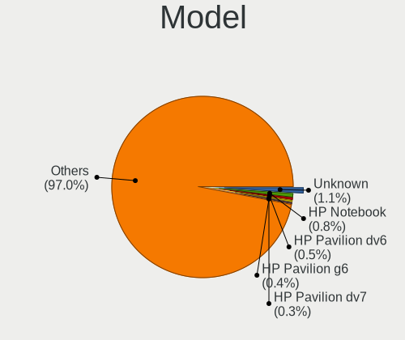
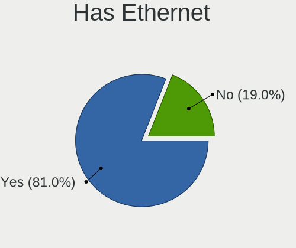
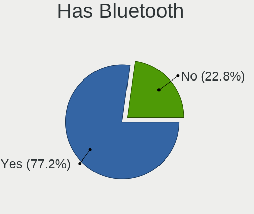
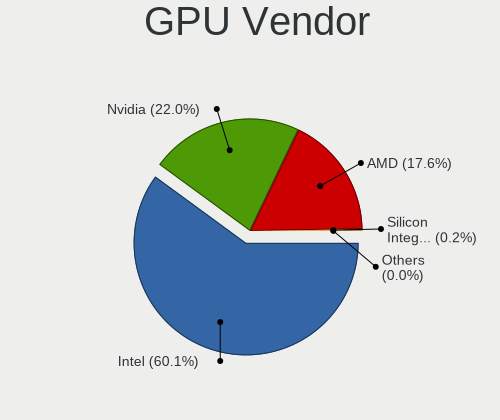
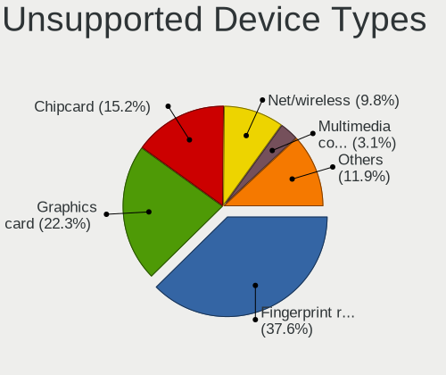

Ubuntu - Tested Hardware & Statistics (Notebooks)
-------------------------------------------------

A project to collect tested hardware configurations for Ubuntu.

Anyone can contribute to this report by the [hw-probe](https://github.com/linuxhw/hw-probe) tool:

    sudo -E hw-probe -all -upload

Please contribute! Especially if your hardware is rare.

Contents
--------

* [ Test Cases ](#test-cases)

* [ System ](#system)
  - [ OS                       ](#os)
  - [ OS Family                ](#os-family)
  - [ Kernel                   ](#kernel)
  - [ Kernel Family            ](#kernel-family)
  - [ Kernel Major Ver.        ](#kernel-major-ver)
  - [ Arch                     ](#arch)
  - [ DE                       ](#de)
  - [ Display Server           ](#display-server)
  - [ Display Manager          ](#display-manager)
  - [ OS Lang                  ](#os-lang)
  - [ Boot Mode                ](#boot-mode)
  - [ Filesystem               ](#filesystem)
  - [ Part. scheme             ](#part-scheme)
  - [ Dual Boot with Linux/BSD ](#dual-boot-with-linuxbsd)
  - [ Dual Boot (Win)          ](#dual-boot-win)

* [ Board ](#board)
  - [ Vendor                   ](#vendor)
  - [ Model                    ](#model)
  - [ Model Family             ](#model-family)
  - [ MFG Year                 ](#mfg-year)
  - [ Form Factor              ](#form-factor)
  - [ Secure Boot              ](#secure-boot)
  - [ Coreboot                 ](#coreboot)
  - [ RAM Size                 ](#ram-size)
  - [ RAM Used                 ](#ram-used)
  - [ Total Drives             ](#total-drives)
  - [ Has CD-ROM               ](#has-cd-rom)
  - [ Has Ethernet             ](#has-ethernet)
  - [ Has WiFi                 ](#has-wifi)
  - [ Has Bluetooth            ](#has-bluetooth)

* [ Location ](#location)
  - [ Country                  ](#country)
  - [ City                     ](#city)

* [ Drives ](#drives)
  - [ Drive Vendor             ](#drive-vendor)
  - [ Drive Model              ](#drive-model)
  - [ HDD Vendor               ](#hdd-vendor)
  - [ SSD Vendor               ](#ssd-vendor)
  - [ Drive Kind               ](#drive-kind)
  - [ Drive Connector          ](#drive-connector)
  - [ Drive Size               ](#drive-size)
  - [ Space Total              ](#space-total)
  - [ Space Used               ](#space-used)
  - [ Malfunc. Drives          ](#malfunc-drives)
  - [ Malfunc. Drive Vendor    ](#malfunc-drive-vendor)
  - [ Malfunc. HDD Vendor      ](#malfunc-hdd-vendor)
  - [ Malfunc. Drive Kind      ](#malfunc-drive-kind)
  - [ Failed Drives            ](#failed-drives)
  - [ Failed Drive Vendor      ](#failed-drive-vendor)
  - [ Drive Status             ](#drive-status)

* [ Storage controller ](#storage-controller)
  - [ Storage Vendor           ](#storage-vendor)
  - [ Storage Model            ](#storage-model)
  - [ Storage Kind             ](#storage-kind)

* [ Processor ](#processor)
  - [ CPU Vendor               ](#cpu-vendor)
  - [ CPU Model                ](#cpu-model)
  - [ CPU Model Family         ](#cpu-model-family)
  - [ CPU Cores                ](#cpu-cores)
  - [ CPU Sockets              ](#cpu-sockets)
  - [ CPU Threads              ](#cpu-threads)
  - [ CPU Op-Modes             ](#cpu-op-modes)
  - [ CPU Microcode            ](#cpu-microcode)
  - [ CPU Microarch            ](#cpu-microarch)

* [ Graphics ](#graphics)
  - [ GPU Vendor               ](#gpu-vendor)
  - [ GPU Model                ](#gpu-model)
  - [ GPU Combo                ](#gpu-combo)
  - [ GPU Driver               ](#gpu-driver)
  - [ GPU Memory               ](#gpu-memory)

* [ Monitor ](#monitor)
  - [ Monitor Vendor           ](#monitor-vendor)
  - [ Monitor Model            ](#monitor-model)
  - [ Monitor Resolution       ](#monitor-resolution)
  - [ Monitor Diagonal         ](#monitor-diagonal)
  - [ Monitor Width            ](#monitor-width)
  - [ Aspect Ratio             ](#aspect-ratio)
  - [ Monitor Area             ](#monitor-area)
  - [ Pixel Density            ](#pixel-density)
  - [ Multiple Monitors        ](#multiple-monitors)

* [ Network ](#network)
  - [ Net Controller Vendor    ](#net-controller-vendor)
  - [ Net Controller Model     ](#net-controller-model)
  - [ Wireless Vendor          ](#wireless-vendor)
  - [ Wireless Model           ](#wireless-model)
  - [ Ethernet Vendor          ](#ethernet-vendor)
  - [ Ethernet Model           ](#ethernet-model)
  - [ Net Controller Kind      ](#net-controller-kind)
  - [ Used Controller          ](#used-controller)
  - [ NICs                     ](#nics)
  - [ IPv6                     ](#ipv6)

* [ Bluetooth ](#bluetooth)
  - [ Bluetooth Vendor         ](#bluetooth-vendor)
  - [ Bluetooth Model          ](#bluetooth-model)

* [ Sound ](#sound)
  - [ Sound Vendor             ](#sound-vendor)
  - [ Sound Model              ](#sound-model)

* [ Memory ](#memory)
  - [ Memory Vendor            ](#memory-vendor)
  - [ Memory Model             ](#memory-model)
  - [ Memory Kind              ](#memory-kind)
  - [ Memory Form Factor       ](#memory-form-factor)
  - [ Memory Size              ](#memory-size)
  - [ Memory Speed             ](#memory-speed)

* [ Printers & scanners ](#printers--scanners)
  - [ Printer Vendor           ](#printer-vendor)
  - [ Printer Model            ](#printer-model)
  - [ Scanner Vendor           ](#scanner-vendor)
  - [ Scanner Model            ](#scanner-model)

* [ Camera ](#camera)
  - [ Camera Vendor            ](#camera-vendor)
  - [ Camera Model             ](#camera-model)

* [ Security ](#security)
  - [ Fingerprint Vendor       ](#fingerprint-vendor)
  - [ Fingerprint Model        ](#fingerprint-model)
  - [ Chipcard Vendor          ](#chipcard-vendor)
  - [ Chipcard Model           ](#chipcard-model)

* [ Unsupported ](#unsupported)
  - [ Unsupported Devices      ](#unsupported-devices)
  - [ Unsupported Device Types ](#unsupported-device-types)

Test Cases
----------

Total: 42158

| Vendor        | Model                       | Probe                                                      | Date         |
|---------------|-----------------------------|------------------------------------------------------------|--------------|
| HP            | Laptop 15-dw1xxx            | [d8d5459ad6](https://linux-hardware.org/?probe=d8d5459ad6) | Dec 01, 2022 |
| AZW           | SEi                         | [3cd2f7f657](https://linux-hardware.org/?probe=3cd2f7f657) | Dec 01, 2022 |
| HP            | Laptop 15-dw1xxx            | [1dddd99280](https://linux-hardware.org/?probe=1dddd99280) | Dec 01, 2022 |
| Lenovo        | IdeaPad Gaming 3 15IAH7 ... | [fe9e8854c5](https://linux-hardware.org/?probe=fe9e8854c5) | Dec 01, 2022 |
| Samsung       | R540/R538/SA41/E452         | [afad3c8828](https://linux-hardware.org/?probe=afad3c8828) | Dec 01, 2022 |
| Positivo B... | VJFE53F11X-B0511H           | [24b1be97d6](https://linux-hardware.org/?probe=24b1be97d6) | Dec 01, 2022 |
| Positivo B... | VJFE53F11X-B0511H           | [a2e91cba31](https://linux-hardware.org/?probe=a2e91cba31) | Dec 01, 2022 |
| Dell          | XPS 13 9300                 | [d6c50b1786](https://linux-hardware.org/?probe=d6c50b1786) | Dec 01, 2022 |
| HP            | Notebook                    | [7c22b96a9a](https://linux-hardware.org/?probe=7c22b96a9a) | Dec 01, 2022 |
| Dell          | Latitude E5570              | [4db5cd2ef4](https://linux-hardware.org/?probe=4db5cd2ef4) | Dec 01, 2022 |
| Dell          | XPS 13 9343                 | [125fcd77b9](https://linux-hardware.org/?probe=125fcd77b9) | Dec 01, 2022 |
| HP            | EliteBook 8730w             | [fa27703043](https://linux-hardware.org/?probe=fa27703043) | Dec 01, 2022 |
| HP            | ENVY dv7                    | [1cef09f19a](https://linux-hardware.org/?probe=1cef09f19a) | Dec 01, 2022 |
| ASUSTek       | GL503VM                     | [dbd4aba670](https://linux-hardware.org/?probe=dbd4aba670) | Dec 01, 2022 |
| ASUSTek       | GL503VM                     | [3db38d22b3](https://linux-hardware.org/?probe=3db38d22b3) | Dec 01, 2022 |
| Lenovo        | ThinkPad T480S 20L8SBTD0... | [2d4a014ef1](https://linux-hardware.org/?probe=2d4a014ef1) | Dec 01, 2022 |
| Acer          | Aspire xxxx                 | [320d58f6f1](https://linux-hardware.org/?probe=320d58f6f1) | Dec 01, 2022 |
| Lenovo        | ThinkPad T480S 20L8SBTD0... | [e1cec664eb](https://linux-hardware.org/?probe=e1cec664eb) | Dec 01, 2022 |
| ASUSTek       | K52F                        | [63c08600c3](https://linux-hardware.org/?probe=63c08600c3) | Dec 01, 2022 |
| ASUSTek       | K52F                        | [4276cc2cb9](https://linux-hardware.org/?probe=4276cc2cb9) | Dec 01, 2022 |
| Dell          | Vostro 3480                 | [bf353a87c5](https://linux-hardware.org/?probe=bf353a87c5) | Dec 01, 2022 |
| W271ELQ       | Unknown                     | [ae170d1e81](https://linux-hardware.org/?probe=ae170d1e81) | Dec 01, 2022 |
| Lenovo        | ThinkPad L560 20F2S2UR02    | [29c5e0f7b1](https://linux-hardware.org/?probe=29c5e0f7b1) | Dec 01, 2022 |
| Dell          | Vostro 3578                 | [89161c2dee](https://linux-hardware.org/?probe=89161c2dee) | Dec 01, 2022 |
| Acer          | Aspire A315-21              | [7c3a371165](https://linux-hardware.org/?probe=7c3a371165) | Nov 30, 2022 |
| Acer          | Aspire A315-21              | [5f14327a56](https://linux-hardware.org/?probe=5f14327a56) | Nov 30, 2022 |
| Samsung       | 300E4A/300E5A/300E7A/343... | [5f53eff4a6](https://linux-hardware.org/?probe=5f53eff4a6) | Nov 30, 2022 |
| Lenovo        | ThinkPad P14s Gen 2a 21A... | [258c074e40](https://linux-hardware.org/?probe=258c074e40) | Nov 30, 2022 |
| Sony          | VPCEB4L9E                   | [cad7ef5059](https://linux-hardware.org/?probe=cad7ef5059) | Nov 30, 2022 |
| HP            | EliteBook 840 G3            | [e17d8c1694](https://linux-hardware.org/?probe=e17d8c1694) | Nov 30, 2022 |
| Lenovo        | ThinkPad P14s Gen 2a 21A... | [29ec19d38e](https://linux-hardware.org/?probe=29ec19d38e) | Nov 30, 2022 |
| Dell          | Inspiron N5010              | [687aa83749](https://linux-hardware.org/?probe=687aa83749) | Nov 30, 2022 |
| Standard      | Unknown                     | [723d9c3551](https://linux-hardware.org/?probe=723d9c3551) | Nov 30, 2022 |
| HUAWEI        | CREM-WXX9                   | [33f7ac03f4](https://linux-hardware.org/?probe=33f7ac03f4) | Nov 30, 2022 |
| Dell          | Inspiron 15-3567            | [ee99c81e47](https://linux-hardware.org/?probe=ee99c81e47) | Nov 30, 2022 |
| Lenovo        | ThinkPad T470s W10DG 20J... | [645418a0dd](https://linux-hardware.org/?probe=645418a0dd) | Nov 30, 2022 |
| ASUSTek       | UX550VD                     | [a3f2aafbf1](https://linux-hardware.org/?probe=a3f2aafbf1) | Nov 30, 2022 |
| Packard Be... | EasyNote TE69CXP            | [919275eb73](https://linux-hardware.org/?probe=919275eb73) | Nov 30, 2022 |
| HP            | OMEN Laptop 15-en0xxx       | [c3d55f501c](https://linux-hardware.org/?probe=c3d55f501c) | Nov 30, 2022 |
| HP            | EliteBook 860 16 inch G9... | [dda393ca54](https://linux-hardware.org/?probe=dda393ca54) | Nov 30, 2022 |
| Dell          | XPS 15 9500                 | [42971a8394](https://linux-hardware.org/?probe=42971a8394) | Nov 30, 2022 |
| Dell          | Latitude 7390               | [7214cac96d](https://linux-hardware.org/?probe=7214cac96d) | Nov 30, 2022 |
| Dell          | XPS 15 9500                 | [f9215967d3](https://linux-hardware.org/?probe=f9215967d3) | Nov 30, 2022 |
| Lenovo        | ThinkPad T470p 20J7S1FR0... | [517347d2cf](https://linux-hardware.org/?probe=517347d2cf) | Nov 30, 2022 |
| Samsung       | 300E4A/300E5A/300E7A/343... | [aadb9ff1d4](https://linux-hardware.org/?probe=aadb9ff1d4) | Nov 30, 2022 |
| Acer          | E1-510                      | [8aadf699f9](https://linux-hardware.org/?probe=8aadf699f9) | Nov 30, 2022 |
| HP            | Laptop 14-dk1xxx            | [9dbd54884d](https://linux-hardware.org/?probe=9dbd54884d) | Nov 30, 2022 |
| Dell          | Inspiron N4050              | [7b0cf2fa20](https://linux-hardware.org/?probe=7b0cf2fa20) | Nov 30, 2022 |
| ASUSTek       | VivoBook_ASUSLaptop X140... | [55d95654c4](https://linux-hardware.org/?probe=55d95654c4) | Nov 30, 2022 |
| Dell          | Inspiron 15-3552            | [e740b148c1](https://linux-hardware.org/?probe=e740b148c1) | Nov 30, 2022 |
| Apple         | MacBook4,1                  | [0866a64897](https://linux-hardware.org/?probe=0866a64897) | Nov 30, 2022 |
| HP            | Pavilion 14                 | [dedd30adc4](https://linux-hardware.org/?probe=dedd30adc4) | Nov 30, 2022 |
| HP            | Compaq CQ58                 | [009ac41742](https://linux-hardware.org/?probe=009ac41742) | Nov 29, 2022 |
| HP            | Stream Laptop 14-cb1xxx     | [6f96ec5e1d](https://linux-hardware.org/?probe=6f96ec5e1d) | Nov 29, 2022 |
| Acer          | Nitro AN515-58              | [02f4319195](https://linux-hardware.org/?probe=02f4319195) | Nov 29, 2022 |
| Intel         | H81U                        | [87a1cceaae](https://linux-hardware.org/?probe=87a1cceaae) | Nov 29, 2022 |
| Acer          | AO756                       | [c1ff6fe10c](https://linux-hardware.org/?probe=c1ff6fe10c) | Nov 29, 2022 |
| Acer          | Nitro AN515-58              | [77ad02b5bd](https://linux-hardware.org/?probe=77ad02b5bd) | Nov 29, 2022 |
| Lenovo        | IdeaPad Y700-17ISK 80Q0     | [802af80043](https://linux-hardware.org/?probe=802af80043) | Nov 29, 2022 |
| Dell          | Vostro 5470                 | [15c504a6ef](https://linux-hardware.org/?probe=15c504a6ef) | Nov 29, 2022 |
| Lenovo        | Legion 5 15IMH05H 82CF      | [adb0404576](https://linux-hardware.org/?probe=adb0404576) | Nov 29, 2022 |
| Dell          | Inspiron 5570               | [9e4bdbc81d](https://linux-hardware.org/?probe=9e4bdbc81d) | Nov 29, 2022 |
| Dell          | Inspiron 5570               | [399346217e](https://linux-hardware.org/?probe=399346217e) | Nov 29, 2022 |
| Dell          | Latitude E6410              | [d7abefea4b](https://linux-hardware.org/?probe=d7abefea4b) | Nov 29, 2022 |
| Dell          | Latitude E6410              | [bac3e8c250](https://linux-hardware.org/?probe=bac3e8c250) | Nov 29, 2022 |
| Lenovo        | ThinkPad T580 20L9001YIV    | [dc13dde66a](https://linux-hardware.org/?probe=dc13dde66a) | Nov 29, 2022 |
| ASUSTek       | X756UVK                     | [93b549fb81](https://linux-hardware.org/?probe=93b549fb81) | Nov 29, 2022 |
| Lenovo        | ThinkPad X1 Carbon Gen 9... | [1f904e68af](https://linux-hardware.org/?probe=1f904e68af) | Nov 29, 2022 |
| Dell          | Latitude 5330               | [b8d907f2e8](https://linux-hardware.org/?probe=b8d907f2e8) | Nov 29, 2022 |
| Lenovo        | B590 20206                  | [5bec8860f3](https://linux-hardware.org/?probe=5bec8860f3) | Nov 29, 2022 |
| Lenovo        | IdeaPad 5 Pro 16ACH6 82L... | [8e6e8471a7](https://linux-hardware.org/?probe=8e6e8471a7) | Nov 29, 2022 |
| Dell          | System Vostro 3750          | [ed88e2ae0c](https://linux-hardware.org/?probe=ed88e2ae0c) | Nov 29, 2022 |
| Dell          | Latitude 3500               | [de0731ac74](https://linux-hardware.org/?probe=de0731ac74) | Nov 29, 2022 |
| HP            | ProBook 450 G8 Notebook ... | [34f43d3808](https://linux-hardware.org/?probe=34f43d3808) | Nov 29, 2022 |
| Lenovo        | IdeaPad S340-14IIL 81VV     | [2a4bb490d0](https://linux-hardware.org/?probe=2a4bb490d0) | Nov 29, 2022 |
| Lenovo        | IdeaPad S340-14IIL 81VV     | [a05b99b00e](https://linux-hardware.org/?probe=a05b99b00e) | Nov 29, 2022 |
| Chuwi         | CoreBook X                  | [f6745ce587](https://linux-hardware.org/?probe=f6745ce587) | Nov 29, 2022 |
| HP            | ZBook 15                    | [452a6f86d5](https://linux-hardware.org/?probe=452a6f86d5) | Nov 29, 2022 |
| Lenovo        | V17 G2 ITL 82NX             | [6dcdb4d9ea](https://linux-hardware.org/?probe=6dcdb4d9ea) | Nov 29, 2022 |
| Dell          | G7 7790                     | [a85c1cd70e](https://linux-hardware.org/?probe=a85c1cd70e) | Nov 28, 2022 |
| Lenovo        | ThinkBook 15 G3 ACL 21A4    | [ef6247e6fd](https://linux-hardware.org/?probe=ef6247e6fd) | Nov 28, 2022 |
| ASUSTek       | ASUS TUF Dash F15 FX517Z... | [972f6f4355](https://linux-hardware.org/?probe=972f6f4355) | Nov 28, 2022 |
| Acer          | Aspire 5820TG               | [61cab6d996](https://linux-hardware.org/?probe=61cab6d996) | Nov 28, 2022 |
| Acer          | Aspire 5820TG               | [1e64d9426d](https://linux-hardware.org/?probe=1e64d9426d) | Nov 28, 2022 |
| Acer          | Swift SF314-43              | [1a6c47ad0e](https://linux-hardware.org/?probe=1a6c47ad0e) | Nov 28, 2022 |
| Apple         | MacBookPro8,1               | [7ba1690c68](https://linux-hardware.org/?probe=7ba1690c68) | Nov 28, 2022 |
| HP            | 250 G6 Notebook PC          | [95b1694080](https://linux-hardware.org/?probe=95b1694080) | Nov 28, 2022 |
| Dell          | Precision 5760              | [0e19ec2f3d](https://linux-hardware.org/?probe=0e19ec2f3d) | Nov 28, 2022 |
| HP            | ProBook 450 G8 Notebook ... | [2de79b83d5](https://linux-hardware.org/?probe=2de79b83d5) | Nov 28, 2022 |
| HP            | Laptop 14s-dq5xxx           | [9bb72cb3e8](https://linux-hardware.org/?probe=9bb72cb3e8) | Nov 28, 2022 |
| Dell          | G3 3500                     | [291b53ea79](https://linux-hardware.org/?probe=291b53ea79) | Nov 28, 2022 |
| HP            | ProBook 640 G2              | [56ceffe338](https://linux-hardware.org/?probe=56ceffe338) | Nov 28, 2022 |
| ASUSTek       | X756UVK                     | [4745940cf9](https://linux-hardware.org/?probe=4745940cf9) | Nov 28, 2022 |
| Chuwi         | CoreBook X                  | [810ed5914a](https://linux-hardware.org/?probe=810ed5914a) | Nov 28, 2022 |
| Notebook      | L140PU                      | [8893420e06](https://linux-hardware.org/?probe=8893420e06) | Nov 28, 2022 |
| HP            | ProBook 650 G1              | [f038c3cc67](https://linux-hardware.org/?probe=f038c3cc67) | Nov 28, 2022 |
| Dell          | Inspiron N5050              | [e4c533a89b](https://linux-hardware.org/?probe=e4c533a89b) | Nov 28, 2022 |
| Acer          | Aspire 5742G                | [d5f03d47ba](https://linux-hardware.org/?probe=d5f03d47ba) | Nov 28, 2022 |
| HUAWEI        | MRC-WX0                     | [98f550465b](https://linux-hardware.org/?probe=98f550465b) | Nov 28, 2022 |
| Acer          | Aspire 5742G                | [e0701bc81d](https://linux-hardware.org/?probe=e0701bc81d) | Nov 28, 2022 |
| HP            | Pavilion Laptop 15-cw1xx... | [1f4c5bfc57](https://linux-hardware.org/?probe=1f4c5bfc57) | Nov 28, 2022 |
| Dell          | XPS 13 9370                 | [d353a1624b](https://linux-hardware.org/?probe=d353a1624b) | Nov 28, 2022 |
| PC Special... | NH5xAx                      | [8bd9aae635](https://linux-hardware.org/?probe=8bd9aae635) | Nov 28, 2022 |
| ASUSTek       | ZenBook UX325UA_UM325UA     | [c95bbb16de](https://linux-hardware.org/?probe=c95bbb16de) | Nov 28, 2022 |
| Dell          | XPS 15 7590                 | [8072eb50aa](https://linux-hardware.org/?probe=8072eb50aa) | Nov 28, 2022 |
| HP            | Stream Laptop 14-cb1xxx     | [1bf2bd6761](https://linux-hardware.org/?probe=1bf2bd6761) | Nov 28, 2022 |
| PC Special... | NH5xAx                      | [3be194cb8a](https://linux-hardware.org/?probe=3be194cb8a) | Nov 28, 2022 |
| Framework     | Laptop (12th Gen Intel C... | [7578d56f26](https://linux-hardware.org/?probe=7578d56f26) | Nov 28, 2022 |
| Dell          | Precision M4700             | [17f1344975](https://linux-hardware.org/?probe=17f1344975) | Nov 28, 2022 |
| HP            | EliteBook 8470w             | [7008753054](https://linux-hardware.org/?probe=7008753054) | Nov 28, 2022 |
| Lenovo        | ThinkPad E580 20KS001QMX    | [97fda88c7b](https://linux-hardware.org/?probe=97fda88c7b) | Nov 28, 2022 |
| ASUSTek       | S551LB                      | [d74127627f](https://linux-hardware.org/?probe=d74127627f) | Nov 28, 2022 |
| HP            | EliteBook 8560w             | [61e60261ef](https://linux-hardware.org/?probe=61e60261ef) | Nov 28, 2022 |
| Lenovo        | ThinkPad E490 20N8000RUK    | [6816e8f5ca](https://linux-hardware.org/?probe=6816e8f5ca) | Nov 27, 2022 |
| Lenovo        | ThinkPad E490 20N8000RUK    | [06c690a0e1](https://linux-hardware.org/?probe=06c690a0e1) | Nov 27, 2022 |
| HP            | Laptop 14s-dq5xxx           | [e5164649e1](https://linux-hardware.org/?probe=e5164649e1) | Nov 27, 2022 |
| Fujitsu       | LIFEBOOK S751               | [20cb13ada3](https://linux-hardware.org/?probe=20cb13ada3) | Nov 27, 2022 |
| Fujitsu       | LIFEBOOK S751               | [9062066523](https://linux-hardware.org/?probe=9062066523) | Nov 27, 2022 |
| Dell          | XPS 13 9305                 | [c306dcfa4f](https://linux-hardware.org/?probe=c306dcfa4f) | Nov 27, 2022 |
| Samsung       | 300E4A/300E5A/300E7A/343... | [44a305db4d](https://linux-hardware.org/?probe=44a305db4d) | Nov 27, 2022 |
| HP            | EliteBook 8560w             | [3145d17bb7](https://linux-hardware.org/?probe=3145d17bb7) | Nov 27, 2022 |
| Lenovo        | ThinkPad E15 Gen 4 21EES... | [7db4db6cc7](https://linux-hardware.org/?probe=7db4db6cc7) | Nov 27, 2022 |
| HP            | ProBook 5330m               | [3763f505a0](https://linux-hardware.org/?probe=3763f505a0) | Nov 27, 2022 |
| Lenovo        | V15-IIL 82C5                | [ceda4dbb46](https://linux-hardware.org/?probe=ceda4dbb46) | Nov 27, 2022 |
| ASUSTek       | VivoBook_ASUSLaptop X412... | [2aba12235d](https://linux-hardware.org/?probe=2aba12235d) | Nov 27, 2022 |
| ASUSTek       | ROG Zephyrus M16 GU603HE... | [8d63931ff6](https://linux-hardware.org/?probe=8d63931ff6) | Nov 27, 2022 |
| Acer          | AO756                       | [fa5c9df13a](https://linux-hardware.org/?probe=fa5c9df13a) | Nov 27, 2022 |
| Acer          | AO756                       | [d390d588fe](https://linux-hardware.org/?probe=d390d588fe) | Nov 27, 2022 |
| Dell          | Precision M4700             | [7f5ebe66b6](https://linux-hardware.org/?probe=7f5ebe66b6) | Nov 27, 2022 |
| Dell          | Inspiron 5566               | [99e1d10484](https://linux-hardware.org/?probe=99e1d10484) | Nov 27, 2022 |
| Dell          | Inspiron 5566               | [7d3bf460f7](https://linux-hardware.org/?probe=7d3bf460f7) | Nov 27, 2022 |
| HUAWEI        | RLEF-XX                     | [bb5c736032](https://linux-hardware.org/?probe=bb5c736032) | Nov 27, 2022 |
| Lenovo        | ThinkBook 14 G2 ITL 20VD    | [2d1a576ee6](https://linux-hardware.org/?probe=2d1a576ee6) | Nov 27, 2022 |
| Dell          | G5 5587                     | [689db41249](https://linux-hardware.org/?probe=689db41249) | Nov 27, 2022 |
| Dell          | XPS 15 7590                 | [18b1ecf4fd](https://linux-hardware.org/?probe=18b1ecf4fd) | Nov 27, 2022 |
| Lenovo        | IdeaPad Z410 20292          | [af31550cae](https://linux-hardware.org/?probe=af31550cae) | Nov 27, 2022 |
| Dell          | G7 7700                     | [16407c6485](https://linux-hardware.org/?probe=16407c6485) | Nov 27, 2022 |
| Apple         | MacBookAir6,2               | [8e266a1137](https://linux-hardware.org/?probe=8e266a1137) | Nov 27, 2022 |
| SmbiosType... | SmbiosType1_SystemProduc... | [fc54a7e10e](https://linux-hardware.org/?probe=fc54a7e10e) | Nov 27, 2022 |
| Apple         | MacBookPro9,2               | [e87a096d85](https://linux-hardware.org/?probe=e87a096d85) | Nov 27, 2022 |
| Google        | Lick                        | [44ac0c9573](https://linux-hardware.org/?probe=44ac0c9573) | Nov 27, 2022 |
| Lenovo        | IdeaPad 330S-14IKB 81F4     | [f397d89e9b](https://linux-hardware.org/?probe=f397d89e9b) | Nov 27, 2022 |
| HP            | Laptop 15-db0xxx            | [fada18bff7](https://linux-hardware.org/?probe=fada18bff7) | Nov 27, 2022 |
| ASUSTek       | G75VX                       | [87ef485975](https://linux-hardware.org/?probe=87ef485975) | Nov 27, 2022 |
| Lenovo        | ThinkPad X280 20KES2DD0D    | [394b24459c](https://linux-hardware.org/?probe=394b24459c) | Nov 27, 2022 |
| Dell          | Vostro 3580                 | [350202deed](https://linux-hardware.org/?probe=350202deed) | Nov 27, 2022 |
| HP            | Stream Laptop 14-cb1xxx     | [74573171b1](https://linux-hardware.org/?probe=74573171b1) | Nov 26, 2022 |
| HP            | ProBook 440 G7              | [d923cda32c](https://linux-hardware.org/?probe=d923cda32c) | Nov 26, 2022 |
| Dell          | G5 5587                     | [07d47da161](https://linux-hardware.org/?probe=07d47da161) | Nov 26, 2022 |
| HP            | ProBook 6470b               | [c8da54315e](https://linux-hardware.org/?probe=c8da54315e) | Nov 26, 2022 |
| ASUSTek       | U56E                        | [4222387904](https://linux-hardware.org/?probe=4222387904) | Nov 26, 2022 |
| Dell          | XPS 15 7590                 | [071f2be55e](https://linux-hardware.org/?probe=071f2be55e) | Nov 26, 2022 |
| Dell          | Latitude 7310               | [46ed677d40](https://linux-hardware.org/?probe=46ed677d40) | Nov 26, 2022 |
| Toshiba       | Satellite C50D-B            | [c9feb7eed2](https://linux-hardware.org/?probe=c9feb7eed2) | Nov 26, 2022 |
| Lenovo        | IdeaPad Gaming 3 15ACH6 ... | [419b7f448b](https://linux-hardware.org/?probe=419b7f448b) | Nov 26, 2022 |
| Lenovo        | Y50-70 20378                | [57e4892065](https://linux-hardware.org/?probe=57e4892065) | Nov 26, 2022 |
| Acer          | Swift SFX14-41G             | [521cb4d847](https://linux-hardware.org/?probe=521cb4d847) | Nov 26, 2022 |
| Dell          | Inspiron 1440               | [fe31844ca3](https://linux-hardware.org/?probe=fe31844ca3) | Nov 26, 2022 |
| Acer          | Aspire A315-58              | [df3e0f4b6c](https://linux-hardware.org/?probe=df3e0f4b6c) | Nov 26, 2022 |
| Acer          | Aspire A315-58              | [82ee1f1740](https://linux-hardware.org/?probe=82ee1f1740) | Nov 26, 2022 |
| MSI           | GE70 2OC\2OE                | [842781ccfc](https://linux-hardware.org/?probe=842781ccfc) | Nov 26, 2022 |
| HUAWEI        | KLVL-WXX9                   | [ce7815f106](https://linux-hardware.org/?probe=ce7815f106) | Nov 26, 2022 |
| MSI           | GL62M 7RDX                  | [1aa67b30d4](https://linux-hardware.org/?probe=1aa67b30d4) | Nov 26, 2022 |
| Lenovo        | V145-15AST 81MT             | [759ad3eb43](https://linux-hardware.org/?probe=759ad3eb43) | Nov 26, 2022 |
| HP            | G61                         | [314cbc992f](https://linux-hardware.org/?probe=314cbc992f) | Nov 26, 2022 |
| HP            | Stream Laptop 14-cb1xxx     | [07eb92cc07](https://linux-hardware.org/?probe=07eb92cc07) | Nov 26, 2022 |
| Apple         | MacBookPro9,2               | [9e465f741d](https://linux-hardware.org/?probe=9e465f741d) | Nov 26, 2022 |
| Lenovo        | ThinkPad X1 Carbon 5th 2... | [5a6ef91469](https://linux-hardware.org/?probe=5a6ef91469) | Nov 26, 2022 |
| ASUSTek       | U56E                        | [8b783ab1ac](https://linux-hardware.org/?probe=8b783ab1ac) | Nov 26, 2022 |
| Dell          | G3 3779                     | [1cf1d8aa20](https://linux-hardware.org/?probe=1cf1d8aa20) | Nov 26, 2022 |
| Dell          | G3 3779                     | [4bc02c1721](https://linux-hardware.org/?probe=4bc02c1721) | Nov 26, 2022 |
| System76      | Gazelle                     | [dd481baf69](https://linux-hardware.org/?probe=dd481baf69) | Nov 26, 2022 |
| Lenovo        | IdeaPad S145-15API 81V7     | [3e969e8aa0](https://linux-hardware.org/?probe=3e969e8aa0) | Nov 26, 2022 |
| Dell          | Latitude E7240              | [831ec54e18](https://linux-hardware.org/?probe=831ec54e18) | Nov 26, 2022 |
| Lenovo        | ThinkPad L13 20R3000FUK     | [c3ff5b014d](https://linux-hardware.org/?probe=c3ff5b014d) | Nov 26, 2022 |
| Sony          | SVP1121X9EB                 | [78df785a47](https://linux-hardware.org/?probe=78df785a47) | Nov 26, 2022 |
| Dell          | XPS 13 7390                 | [57f43b148c](https://linux-hardware.org/?probe=57f43b148c) | Nov 26, 2022 |
| HUAWEI        | HKD-WXX                     | [5271fa9ef9](https://linux-hardware.org/?probe=5271fa9ef9) | Nov 26, 2022 |
| HP            | Pavilion Power Laptop 15... | [913b35d3f0](https://linux-hardware.org/?probe=913b35d3f0) | Nov 25, 2022 |
| Lenovo        | ThinkPad T430 2349I62       | [ab0d49b5cd](https://linux-hardware.org/?probe=ab0d49b5cd) | Nov 25, 2022 |
| HUAWEI        | HVY-WXX9                    | [00d2cc22aa](https://linux-hardware.org/?probe=00d2cc22aa) | Nov 25, 2022 |
| HP            | EliteBook 745 G3            | [6c7a9e7fe5](https://linux-hardware.org/?probe=6c7a9e7fe5) | Nov 25, 2022 |
| ASUSTek       | F7SR                        | [ecdba533ea](https://linux-hardware.org/?probe=ecdba533ea) | Nov 25, 2022 |
| Dell          | Latitude 3520               | [896180c55d](https://linux-hardware.org/?probe=896180c55d) | Nov 25, 2022 |
| ASUSTek       | F7SR                        | [8102d8b361](https://linux-hardware.org/?probe=8102d8b361) | Nov 25, 2022 |
| Lenovo        | IdeaPad 3 15ALC6 82KU       | [86735d895f](https://linux-hardware.org/?probe=86735d895f) | Nov 25, 2022 |
| Lenovo        | IdeaPad S145-15API 81V7     | [2965050f1a](https://linux-hardware.org/?probe=2965050f1a) | Nov 25, 2022 |
| HP            | Presario CQ56               | [919fad0653](https://linux-hardware.org/?probe=919fad0653) | Nov 25, 2022 |
| ASUSTek       | X751MA                      | [15ea4b4462](https://linux-hardware.org/?probe=15ea4b4462) | Nov 25, 2022 |
| Samsung       | 300E4C/300E5C/300E7C        | [024b4da647](https://linux-hardware.org/?probe=024b4da647) | Nov 25, 2022 |
| HP            | Compaq CQ58                 | [e6d1387823](https://linux-hardware.org/?probe=e6d1387823) | Nov 25, 2022 |
| HP            | EliteBook 840 G6            | [a401adc095](https://linux-hardware.org/?probe=a401adc095) | Nov 25, 2022 |
| Apple         | MacBookPro15,1              | [e7a9d49cf6](https://linux-hardware.org/?probe=e7a9d49cf6) | Nov 25, 2022 |
| Apple         | MacBookPro15,1              | [07bf4fe381](https://linux-hardware.org/?probe=07bf4fe381) | Nov 25, 2022 |
| Acer          | Aspire A315-42G             | [e18fd972e5](https://linux-hardware.org/?probe=e18fd972e5) | Nov 25, 2022 |
| HP            | Pavilion 15                 | [b294971fc6](https://linux-hardware.org/?probe=b294971fc6) | Nov 25, 2022 |
| Samsung       | R59P/R60P/R61P              | [62510109f9](https://linux-hardware.org/?probe=62510109f9) | Nov 25, 2022 |
| Dell          | Latitude 7310               | [0f9c2a5623](https://linux-hardware.org/?probe=0f9c2a5623) | Nov 25, 2022 |
| Lenovo        | ThinkPad T16 Gen 1 21CHC... | [8de1db7f12](https://linux-hardware.org/?probe=8de1db7f12) | Nov 25, 2022 |
| HP            | ZBook 15                    | [dc8f215893](https://linux-hardware.org/?probe=dc8f215893) | Nov 25, 2022 |
| HP            | OMEN Laptop 15-en1xxx       | [53b311f78c](https://linux-hardware.org/?probe=53b311f78c) | Nov 25, 2022 |
| Acer          | Aspire A315-42G             | [a6444653b3](https://linux-hardware.org/?probe=a6444653b3) | Nov 25, 2022 |
| Dell          | Latitude 5410               | [1eeb98c3b0](https://linux-hardware.org/?probe=1eeb98c3b0) | Nov 25, 2022 |
| Lenovo        | ThinkPad Z61t 9441MY4       | [e24f9d12e5](https://linux-hardware.org/?probe=e24f9d12e5) | Nov 25, 2022 |
| Sony          | VGN-NS110E                  | [5ccfd5f230](https://linux-hardware.org/?probe=5ccfd5f230) | Nov 25, 2022 |
| Acer          | Aspire VN7-791G             | [7664866053](https://linux-hardware.org/?probe=7664866053) | Nov 25, 2022 |
| Sony          | VGN-FE770G                  | [c59f41adb7](https://linux-hardware.org/?probe=c59f41adb7) | Nov 25, 2022 |
| Dell          | Latitude 3450               | [d7af694917](https://linux-hardware.org/?probe=d7af694917) | Nov 25, 2022 |
| Sony          | VGN-NS110E                  | [999e5f4ed6](https://linux-hardware.org/?probe=999e5f4ed6) | Nov 25, 2022 |
| HUAWEI        | KLVD-WXX9                   | [04b855bde5](https://linux-hardware.org/?probe=04b855bde5) | Nov 25, 2022 |
| Samsung       | 350V5C/351V5C/3540VC/344... | [0a9d327f59](https://linux-hardware.org/?probe=0a9d327f59) | Nov 25, 2022 |
| Samsung       | 350V5C/351V5C/3540VC/344... | [869a5a808f](https://linux-hardware.org/?probe=869a5a808f) | Nov 25, 2022 |
| Lenovo        | ThinkPad T560 20FJS3YN00    | [636921b46c](https://linux-hardware.org/?probe=636921b46c) | Nov 24, 2022 |
| Lenovo        | G40-70 20369                | [aafdfb20ff](https://linux-hardware.org/?probe=aafdfb20ff) | Nov 24, 2022 |
| Lenovo        | ThinkPad P17 Gen 2i 20YU... | [cd660d3210](https://linux-hardware.org/?probe=cd660d3210) | Nov 24, 2022 |
| Dell          | Inspiron 3585               | [33485dee6d](https://linux-hardware.org/?probe=33485dee6d) | Nov 24, 2022 |
| Apple         | MacBookPro9,2               | [44b8a68c63](https://linux-hardware.org/?probe=44b8a68c63) | Nov 24, 2022 |
| Acer          | Aspire E5-573               | [c0ccedd707](https://linux-hardware.org/?probe=c0ccedd707) | Nov 24, 2022 |
| Acer          | Aspire E5-573               | [f2b9fd554b](https://linux-hardware.org/?probe=f2b9fd554b) | Nov 24, 2022 |
| Dell          | Latitude 7310               | [d7448aaff8](https://linux-hardware.org/?probe=d7448aaff8) | Nov 24, 2022 |
| Avell High... | STORM TWO                   | [d8a406b26c](https://linux-hardware.org/?probe=d8a406b26c) | Nov 24, 2022 |
| Acer          | Aspire ES1-711              | [b3260faedb](https://linux-hardware.org/?probe=b3260faedb) | Nov 24, 2022 |
| ASUSTek       | Zenbook UX5401ZA_UX5401Z... | [aaa0e3394f](https://linux-hardware.org/?probe=aaa0e3394f) | Nov 24, 2022 |
| Lenovo        | IdeaPad 320-15AST 80XV      | [b73b2c4c07](https://linux-hardware.org/?probe=b73b2c4c07) | Nov 24, 2022 |
| Lenovo        | ThinkPad X1 Nano Gen 2 2... | [4b6212908f](https://linux-hardware.org/?probe=4b6212908f) | Nov 24, 2022 |
| Dell          | Latitude 5410               | [a9b8b4208d](https://linux-hardware.org/?probe=a9b8b4208d) | Nov 24, 2022 |
| Lenovo        | ThinkPad X1 Nano Gen 2 2... | [69c89370b7](https://linux-hardware.org/?probe=69c89370b7) | Nov 24, 2022 |
| Apple         | MacBookPro7,1               | [ef46869de3](https://linux-hardware.org/?probe=ef46869de3) | Nov 24, 2022 |
| Lenovo        | ThinkPad T420s 41732BU      | [ac7791c167](https://linux-hardware.org/?probe=ac7791c167) | Nov 24, 2022 |
| ASUSTek       | G73Jh                       | [575f0a8c5a](https://linux-hardware.org/?probe=575f0a8c5a) | Nov 24, 2022 |
| Lenovo        | ThinkPad T580 20LAS01H00    | [3714ee0985](https://linux-hardware.org/?probe=3714ee0985) | Nov 24, 2022 |
| Dell          | Latitude 7310               | [836fbd119c](https://linux-hardware.org/?probe=836fbd119c) | Nov 24, 2022 |
| Shanghai Z... | ZXE CRB                     | [8a27b5d8b3](https://linux-hardware.org/?probe=8a27b5d8b3) | Nov 24, 2022 |
| Acer          | Aspire A315-41              | [4408f2ceff](https://linux-hardware.org/?probe=4408f2ceff) | Nov 24, 2022 |
| ASUSTek       | ASUS TUF Gaming A17 FA70... | [9e1f0c4898](https://linux-hardware.org/?probe=9e1f0c4898) | Nov 24, 2022 |
| Lenovo        | ThinkPad X250 20CLS3AX05    | [c4a2ce46ca](https://linux-hardware.org/?probe=c4a2ce46ca) | Nov 24, 2022 |
| Packard Be... | EasyNote TM98               | [468831c306](https://linux-hardware.org/?probe=468831c306) | Nov 24, 2022 |
| ASUSTek       | K51AC                       | [0b2413e13c](https://linux-hardware.org/?probe=0b2413e13c) | Nov 24, 2022 |
| Razer         | Blade 15 Advanced Model ... | [60732590be](https://linux-hardware.org/?probe=60732590be) | Nov 24, 2022 |
| Dell          | Latitude E6320              | [81f633b550](https://linux-hardware.org/?probe=81f633b550) | Nov 24, 2022 |
| Toshiba       | IS 1442                     | [8a2d7b5a48](https://linux-hardware.org/?probe=8a2d7b5a48) | Nov 23, 2022 |
| Unknown       | Unknown                     | [d96c2be612](https://linux-hardware.org/?probe=d96c2be612) | Nov 23, 2022 |
| HUAWEI        | KLVD-WXX9                   | [97b1b927ba](https://linux-hardware.org/?probe=97b1b927ba) | Nov 23, 2022 |
| Dell          | XPS 9320                    | [d63a585507](https://linux-hardware.org/?probe=d63a585507) | Nov 23, 2022 |
| HP            | EliteBook 850 G8 Noteboo... | [e7717a62cb](https://linux-hardware.org/?probe=e7717a62cb) | Nov 23, 2022 |
| Lenovo        | IdeaPad 3 15ADA05 81W1      | [66fca8e108](https://linux-hardware.org/?probe=66fca8e108) | Nov 23, 2022 |
| HP            | EliteBook 850 G8 Noteboo... | [ac72570183](https://linux-hardware.org/?probe=ac72570183) | Nov 23, 2022 |
| Dell          | XPS 15 9520                 | [344721473a](https://linux-hardware.org/?probe=344721473a) | Nov 23, 2022 |
| Acer          | ConceptD CN315-71P          | [db3ccac179](https://linux-hardware.org/?probe=db3ccac179) | Nov 23, 2022 |
| ASUSTek       | A9T                         | [9ce7b8b3e1](https://linux-hardware.org/?probe=9ce7b8b3e1) | Nov 23, 2022 |
| Dell          | XPS 9320                    | [2208b7b7e8](https://linux-hardware.org/?probe=2208b7b7e8) | Nov 23, 2022 |
| Lenovo        | IdeaPad 5 15ITL05 82FG      | [a7f0189359](https://linux-hardware.org/?probe=a7f0189359) | Nov 23, 2022 |
| Dell          | Precision 5550              | [c4c95dec1e](https://linux-hardware.org/?probe=c4c95dec1e) | Nov 23, 2022 |
| Dell          | Latitude D530               | [1403a8c938](https://linux-hardware.org/?probe=1403a8c938) | Nov 23, 2022 |
| Acer          | Aspire A315-57G             | [93dc021b03](https://linux-hardware.org/?probe=93dc021b03) | Nov 23, 2022 |
| Dell          | Inspiron 5584               | [0a26a75b62](https://linux-hardware.org/?probe=0a26a75b62) | Nov 23, 2022 |
| Acer          | Aspire V3-772G              | [7ce85c6de5](https://linux-hardware.org/?probe=7ce85c6de5) | Nov 23, 2022 |
| Dell          | Latitude E6230              | [28b93e0f7c](https://linux-hardware.org/?probe=28b93e0f7c) | Nov 23, 2022 |
| Lenovo        | ThinkPad X250 20CLS21F00    | [dee6d2a740](https://linux-hardware.org/?probe=dee6d2a740) | Nov 23, 2022 |
| Lenovo        | ThinkBook 15 G3 ACL 21A4    | [0483728614](https://linux-hardware.org/?probe=0483728614) | Nov 23, 2022 |
| HUAWEI        | BOD-WXX9                    | [2de63dfd54](https://linux-hardware.org/?probe=2de63dfd54) | Nov 23, 2022 |
| Apple         | MacBookPro5,1               | [62c77a0e63](https://linux-hardware.org/?probe=62c77a0e63) | Nov 23, 2022 |
| ASUSTek       | VivoBook_ASUSLaptop X760... | [028a796420](https://linux-hardware.org/?probe=028a796420) | Nov 23, 2022 |
| ASUSTek       | VivoBook_ASUSLaptop X760... | [c48ab2a2d5](https://linux-hardware.org/?probe=c48ab2a2d5) | Nov 23, 2022 |
| ASUSTek       | X551MA                      | [4adc436e33](https://linux-hardware.org/?probe=4adc436e33) | Nov 23, 2022 |
| Lenovo        | ThinkBook 14 G2 ITL 20VD    | [2c077b8cde](https://linux-hardware.org/?probe=2c077b8cde) | Nov 23, 2022 |
| Lenovo        | IdeaPad 320-15AST 80XV      | [0168e30f4f](https://linux-hardware.org/?probe=0168e30f4f) | Nov 23, 2022 |
| Dell          | System Vostro 3460          | [4f9fb6602d](https://linux-hardware.org/?probe=4f9fb6602d) | Nov 23, 2022 |
| Dell          | Precision 5560              | [f20218fb35](https://linux-hardware.org/?probe=f20218fb35) | Nov 23, 2022 |
| HUAWEI        | CREM-WXX9                   | [240694e932](https://linux-hardware.org/?probe=240694e932) | Nov 23, 2022 |
| ASUSTek       | X551MA                      | [84a0005ad3](https://linux-hardware.org/?probe=84a0005ad3) | Nov 23, 2022 |
| HP            | EliteBook 845 G8 Noteboo... | [6d217fbd52](https://linux-hardware.org/?probe=6d217fbd52) | Nov 23, 2022 |
| Lenovo        | ThinkPad X1 Carbon 4th 2... | [f1d8974d71](https://linux-hardware.org/?probe=f1d8974d71) | Nov 23, 2022 |
| Sony          | SVD1321L2EW                 | [2fcc5aa10a](https://linux-hardware.org/?probe=2fcc5aa10a) | Nov 23, 2022 |
| Sony          | SVT13126CYS                 | [4ac3d95e3a](https://linux-hardware.org/?probe=4ac3d95e3a) | Nov 23, 2022 |
| HUAWEI        | BOD-WXX9                    | [814f45a510](https://linux-hardware.org/?probe=814f45a510) | Nov 23, 2022 |
| Samsung       | 270E5K                      | [871e23c67c](https://linux-hardware.org/?probe=871e23c67c) | Nov 23, 2022 |
| HP            | Laptop 14-fq0xxx            | [21e8e154d5](https://linux-hardware.org/?probe=21e8e154d5) | Nov 23, 2022 |
| Samsung       | 270E5K                      | [398893bbd1](https://linux-hardware.org/?probe=398893bbd1) | Nov 23, 2022 |
| Toshiba       | PORTEGE R930                | [9e5d02ab88](https://linux-hardware.org/?probe=9e5d02ab88) | Nov 23, 2022 |
| Acer          | Nitro AN517-55              | [c36c99c55a](https://linux-hardware.org/?probe=c36c99c55a) | Nov 23, 2022 |
| Samsung       | RF511/RF411/RF711           | [db9c9330b7](https://linux-hardware.org/?probe=db9c9330b7) | Nov 23, 2022 |
| ASUSTek       | S300CA                      | [3efc297b44](https://linux-hardware.org/?probe=3efc297b44) | Nov 23, 2022 |
| HP            | Pavilion Laptop 15-cs0xx... | [1f12ee6869](https://linux-hardware.org/?probe=1f12ee6869) | Nov 23, 2022 |
| HUAWEI        | NBLK-WAX9X                  | [fd8121fecd](https://linux-hardware.org/?probe=fd8121fecd) | Nov 22, 2022 |
| Acer          | Aspire A515-43              | [9c91ce23b5](https://linux-hardware.org/?probe=9c91ce23b5) | Nov 22, 2022 |
| Acer          | Aspire A515-57              | [374b408342](https://linux-hardware.org/?probe=374b408342) | Nov 22, 2022 |
| Lenovo        | IdeaPad 3 15ITL6 82MD       | [0fd3b230e0](https://linux-hardware.org/?probe=0fd3b230e0) | Nov 22, 2022 |
| Lenovo        | ThinkPad X1 Carbon Gen 9... | [7121172cc6](https://linux-hardware.org/?probe=7121172cc6) | Nov 22, 2022 |
| Timi          | TM1701                      | [3d9c04ccd6](https://linux-hardware.org/?probe=3d9c04ccd6) | Nov 22, 2022 |
| Lenovo        | ThinkPad T490 20N3S89D02    | [1d3c5d652a](https://linux-hardware.org/?probe=1d3c5d652a) | Nov 22, 2022 |
| ASUSTek       | VivoBook_ASUSLaptop X160... | [c345afe01a](https://linux-hardware.org/?probe=c345afe01a) | Nov 22, 2022 |
| HP            | ZBook 15 G2                 | [5f040880ce](https://linux-hardware.org/?probe=5f040880ce) | Nov 22, 2022 |
| Apple         | MacBookAir5,1               | [2ded48104d](https://linux-hardware.org/?probe=2ded48104d) | Nov 22, 2022 |
| HP            | ENVY dv6                    | [0d28d09c70](https://linux-hardware.org/?probe=0d28d09c70) | Nov 22, 2022 |
| HP            | EliteBook 8530w             | [0c1d6d2201](https://linux-hardware.org/?probe=0c1d6d2201) | Nov 22, 2022 |
| Lenovo        | ThinkBook 15 G3 ACL 21A4    | [2eec6b4f39](https://linux-hardware.org/?probe=2eec6b4f39) | Nov 22, 2022 |
| MSI           | Creator Z17 A12UHST         | [e36ab20d8c](https://linux-hardware.org/?probe=e36ab20d8c) | Nov 22, 2022 |
| MSI           | Creator Z17 A12UHST         | [014cf9f78d](https://linux-hardware.org/?probe=014cf9f78d) | Nov 22, 2022 |
| Acer          | Aspire A315-57G             | [fd41589a1a](https://linux-hardware.org/?probe=fd41589a1a) | Nov 22, 2022 |
| Lenovo        | IdeaPad Gaming 3 15ARH05... | [a90e09948e](https://linux-hardware.org/?probe=a90e09948e) | Nov 22, 2022 |
| Apple         | MacBook5,1                  | [f2ecb3f4a8](https://linux-hardware.org/?probe=f2ecb3f4a8) | Nov 22, 2022 |
| Acer          | Swift SF314-512             | [c47110d9a5](https://linux-hardware.org/?probe=c47110d9a5) | Nov 22, 2022 |
| Panasonic     | CF-193H101FW                | [ea4c2233bf](https://linux-hardware.org/?probe=ea4c2233bf) | Nov 22, 2022 |
| Acer          | Aspire E5-574G              | [703b6ee54d](https://linux-hardware.org/?probe=703b6ee54d) | Nov 22, 2022 |
| Apple         | MacBookPro11,5              | [52bcd3f8b9](https://linux-hardware.org/?probe=52bcd3f8b9) | Nov 22, 2022 |
| Alienware     | 15 R3                       | [7ea992fb7a](https://linux-hardware.org/?probe=7ea992fb7a) | Nov 22, 2022 |
| AZW           | BT3 PRO                     | [ee8fc8db42](https://linux-hardware.org/?probe=ee8fc8db42) | Nov 22, 2022 |
| HP            | EliteBook Folio 1040 G1     | [26ac531682](https://linux-hardware.org/?probe=26ac531682) | Nov 22, 2022 |
| Acer          | Aspire 4736                 | [5f72d40c0e](https://linux-hardware.org/?probe=5f72d40c0e) | Nov 22, 2022 |
| HP            | ProBook 450 G1              | [c8d71bb807](https://linux-hardware.org/?probe=c8d71bb807) | Nov 22, 2022 |
| AZW           | BT3 PRO                     | [48047be395](https://linux-hardware.org/?probe=48047be395) | Nov 21, 2022 |
| Dell          | XPS 15 7590                 | [5360c65b7a](https://linux-hardware.org/?probe=5360c65b7a) | Nov 21, 2022 |
| Acer          | Aspire 4736                 | [e6acabebb2](https://linux-hardware.org/?probe=e6acabebb2) | Nov 21, 2022 |
| Dell          | Inspiron 5548               | [8d8a193e7b](https://linux-hardware.org/?probe=8d8a193e7b) | Nov 21, 2022 |
| Dell          | Inspiron 3442               | [d9678fb5a7](https://linux-hardware.org/?probe=d9678fb5a7) | Nov 21, 2022 |
| HP            | Pavilion g7                 | [cecc9627ef](https://linux-hardware.org/?probe=cecc9627ef) | Nov 21, 2022 |
| Lenovo        | ThinkPad P1 Gen 4i 20Y30... | [16859cf0ca](https://linux-hardware.org/?probe=16859cf0ca) | Nov 21, 2022 |
| Dell          | Latitude 6430U              | [19b72ef7ba](https://linux-hardware.org/?probe=19b72ef7ba) | Nov 21, 2022 |
| HP            | EliteBook 820 G4            | [d4ed3112e5](https://linux-hardware.org/?probe=d4ed3112e5) | Nov 21, 2022 |
| Dell          | Latitude 9420               | [ddf8c8749c](https://linux-hardware.org/?probe=ddf8c8749c) | Nov 21, 2022 |
| Dell          | Latitude 5490               | [295073cd07](https://linux-hardware.org/?probe=295073cd07) | Nov 21, 2022 |
| HP            | Laptop 14s-fq0xxx           | [a94bd1fd5a](https://linux-hardware.org/?probe=a94bd1fd5a) | Nov 21, 2022 |
| Dell          | XPS 13 7390                 | [d5ff0e96dd](https://linux-hardware.org/?probe=d5ff0e96dd) | Nov 21, 2022 |
| Lenovo        | IdeaPad 330-15IKB 81DE      | [2da86d4e21](https://linux-hardware.org/?probe=2da86d4e21) | Nov 21, 2022 |
| Lenovo        | Legion 5 17IMH05H 81Y8      | [b74040cd21](https://linux-hardware.org/?probe=b74040cd21) | Nov 21, 2022 |
| Dell          | XPS 9320                    | [52b55ea024](https://linux-hardware.org/?probe=52b55ea024) | Nov 21, 2022 |
| Dell          | XPS 9320                    | [7ea2296eaf](https://linux-hardware.org/?probe=7ea2296eaf) | Nov 21, 2022 |
| Lenovo        | ThinkPad L15 Gen 2a 20X7... | [dc848e747b](https://linux-hardware.org/?probe=dc848e747b) | Nov 21, 2022 |
| HP            | 15 Notebook PC              | [d7e79c0477](https://linux-hardware.org/?probe=d7e79c0477) | Nov 21, 2022 |
| Apple         | MacBookPro11,5              | [e80e97466d](https://linux-hardware.org/?probe=e80e97466d) | Nov 21, 2022 |
| Apple         | MacBookPro11,5              | [12799c9216](https://linux-hardware.org/?probe=12799c9216) | Nov 21, 2022 |
| TUXEDO        | Pulse 15 Gen1               | [b65ee83a19](https://linux-hardware.org/?probe=b65ee83a19) | Nov 21, 2022 |
| TUXEDO        | Pulse 15 Gen1               | [c8d395cdcc](https://linux-hardware.org/?probe=c8d395cdcc) | Nov 21, 2022 |
| ASUSTek       | VivoBook_ASUSLaptop X515... | [7ffd8149f4](https://linux-hardware.org/?probe=7ffd8149f4) | Nov 21, 2022 |
| HP            | EliteBook 820 G4            | [c565a2d0fc](https://linux-hardware.org/?probe=c565a2d0fc) | Nov 21, 2022 |
| Dell          | Latitude E6320              | [91ebf30a5c](https://linux-hardware.org/?probe=91ebf30a5c) | Nov 21, 2022 |
| MSI           | Stealth GS77 12UHS          | [462cb0ce56](https://linux-hardware.org/?probe=462cb0ce56) | Nov 21, 2022 |
| Apple         | MacBookPro5,1               | [06c02ff303](https://linux-hardware.org/?probe=06c02ff303) | Nov 21, 2022 |
| Lenovo        | IdeaPad 3 15ADA05 81W1      | [50c70cb811](https://linux-hardware.org/?probe=50c70cb811) | Nov 20, 2022 |
| Google        | Sasuke                      | [35330e59ad](https://linux-hardware.org/?probe=35330e59ad) | Nov 20, 2022 |
| Lenovo        | ThinkPad X1 Extreme Gen ... | [aaa2d66240](https://linux-hardware.org/?probe=aaa2d66240) | Nov 20, 2022 |
| Samsung       | 270E5J/2570EJ               | [f5b73b34c6](https://linux-hardware.org/?probe=f5b73b34c6) | Nov 20, 2022 |
| HUAWEI        | CREM-WXX9                   | [9630927dc1](https://linux-hardware.org/?probe=9630927dc1) | Nov 20, 2022 |
| HUAWEI        | NBLK-WAX9X                  | [3ecbc7acb4](https://linux-hardware.org/?probe=3ecbc7acb4) | Nov 20, 2022 |
| Lenovo        | ThinkPad P52 20M90017MX     | [65c874adbd](https://linux-hardware.org/?probe=65c874adbd) | Nov 20, 2022 |
| Lenovo        | Legion Y540-15IRH 81SX      | [740b4f9f03](https://linux-hardware.org/?probe=740b4f9f03) | Nov 20, 2022 |
| Samsung       | 950XCJ/951XCJ/950XCR        | [2bc3a22052](https://linux-hardware.org/?probe=2bc3a22052) | Nov 20, 2022 |
| Dell          | Inspiron N7010              | [210dd0f9f5](https://linux-hardware.org/?probe=210dd0f9f5) | Nov 20, 2022 |
| ASUSTek       | ZenBook UX325EA_UX325EA     | [eb43c3d5c0](https://linux-hardware.org/?probe=eb43c3d5c0) | Nov 20, 2022 |
| Dell          | Latitude E6510              | [c8b9fa9d0a](https://linux-hardware.org/?probe=c8b9fa9d0a) | Nov 20, 2022 |
| Lenovo        | ThinkPad E14 Gen 2 20T60... | [f933e8f3e7](https://linux-hardware.org/?probe=f933e8f3e7) | Nov 20, 2022 |
| Irbis         | NB254                       | [ffa6638fe9](https://linux-hardware.org/?probe=ffa6638fe9) | Nov 20, 2022 |
| Acer          | Swift SF314-58G             | [9e729e43a7](https://linux-hardware.org/?probe=9e729e43a7) | Nov 20, 2022 |
| HUAWEI        | HVY-WXX9                    | [2030d33f00](https://linux-hardware.org/?probe=2030d33f00) | Nov 20, 2022 |
| Dell          | XPS 13 7390                 | [52810e28da](https://linux-hardware.org/?probe=52810e28da) | Nov 20, 2022 |
| Dell          | Latitude E6520              | [855dc4dadd](https://linux-hardware.org/?probe=855dc4dadd) | Nov 20, 2022 |
| HP            | EliteBook 850 G4            | [30c7f00ee5](https://linux-hardware.org/?probe=30c7f00ee5) | Nov 20, 2022 |
| Acer          | Aspire 5742G                | [9c9af5a79e](https://linux-hardware.org/?probe=9c9af5a79e) | Nov 20, 2022 |
| ASUSTek       | N73SV                       | [10840bac50](https://linux-hardware.org/?probe=10840bac50) | Nov 20, 2022 |
| MECER         | YA13Q20-DP_PRO              | [81cdfb4100](https://linux-hardware.org/?probe=81cdfb4100) | Nov 20, 2022 |
| Acer          | Aspire E1-571               | [35fc3411ec](https://linux-hardware.org/?probe=35fc3411ec) | Nov 20, 2022 |
| Toshiba       | TECRA R940                  | [0f231b600d](https://linux-hardware.org/?probe=0f231b600d) | Nov 20, 2022 |
| HP            | ProBook 445 G8 Notebook ... | [dfd1c98a18](https://linux-hardware.org/?probe=dfd1c98a18) | Nov 20, 2022 |
| Dell          | Latitude 5285               | [145341899a](https://linux-hardware.org/?probe=145341899a) | Nov 20, 2022 |
| Samsung       | RV411/RV511/E3511/S3511/... | [1253590f60](https://linux-hardware.org/?probe=1253590f60) | Nov 20, 2022 |
| Samsung       | 767XCL                      | [729f4f303e](https://linux-hardware.org/?probe=729f4f303e) | Nov 20, 2022 |
| ASUSTek       | X756UVK                     | [d95739c475](https://linux-hardware.org/?probe=d95739c475) | Nov 20, 2022 |
| Acer          | Aspire VN7-572G             | [314902c0f1](https://linux-hardware.org/?probe=314902c0f1) | Nov 20, 2022 |
| ASUSTek       | VivoBook_ASUSLaptop X415... | [c5ec7b9dcc](https://linux-hardware.org/?probe=c5ec7b9dcc) | Nov 20, 2022 |
| HP            | ZBook 15 G2                 | [5df677d667](https://linux-hardware.org/?probe=5df677d667) | Nov 20, 2022 |
| HP            | Pavilion dv6                | [012b257351](https://linux-hardware.org/?probe=012b257351) | Nov 20, 2022 |
| Lenovo        | IdeaPad 3 15IAU7 82RK       | [3c721e9203](https://linux-hardware.org/?probe=3c721e9203) | Nov 20, 2022 |
| Sony          | VPCF126FM                   | [a6d886ea4c](https://linux-hardware.org/?probe=a6d886ea4c) | Nov 20, 2022 |
| Sony          | VPCF126FM                   | [2e0ff74a64](https://linux-hardware.org/?probe=2e0ff74a64) | Nov 20, 2022 |
| Lenovo        | IdeaPad 3 15ITL6 82H8       | [8bd0cdff15](https://linux-hardware.org/?probe=8bd0cdff15) | Nov 19, 2022 |
| Acer          | TravelMate 5360             | [c2dfb8625b](https://linux-hardware.org/?probe=c2dfb8625b) | Nov 19, 2022 |
| HP            | EliteBook 850 G2            | [dd13c1df3f](https://linux-hardware.org/?probe=dd13c1df3f) | Nov 19, 2022 |
| Google        | Gandof                      | [807d0e548c](https://linux-hardware.org/?probe=807d0e548c) | Nov 19, 2022 |
| ASUSTek       | ZenBook UX325EA_UX325EA     | [6a51b20cd4](https://linux-hardware.org/?probe=6a51b20cd4) | Nov 19, 2022 |
| ASUSTek       | Zenbook UM6702RA_RM6702R... | [4ea8f7dbb0](https://linux-hardware.org/?probe=4ea8f7dbb0) | Nov 19, 2022 |
| HP            | Pavilion dv6                | [a7ca712256](https://linux-hardware.org/?probe=a7ca712256) | Nov 19, 2022 |
| Dell          | Precision 7740              | [4f8e2a6c24](https://linux-hardware.org/?probe=4f8e2a6c24) | Nov 19, 2022 |
| HP            | Pavilion dv6                | [571dc553f9](https://linux-hardware.org/?probe=571dc553f9) | Nov 19, 2022 |
| Apple         | MacBook5,1                  | [9311687e42](https://linux-hardware.org/?probe=9311687e42) | Nov 19, 2022 |
| HP            | Notebook                    | [2721a90e68](https://linux-hardware.org/?probe=2721a90e68) | Nov 19, 2022 |
| Apple         | MacBook4,1                  | [c2d79be90d](https://linux-hardware.org/?probe=c2d79be90d) | Nov 19, 2022 |
| Dell          | Latitude E6220              | [c92cd25690](https://linux-hardware.org/?probe=c92cd25690) | Nov 19, 2022 |
| Dell          | Inspiron 3537               | [b8d74d8e6f](https://linux-hardware.org/?probe=b8d74d8e6f) | Nov 19, 2022 |
| Google        | Rammus                      | [23ed7badd5](https://linux-hardware.org/?probe=23ed7badd5) | Nov 19, 2022 |
| HP            | Presario CQ58               | [fc1d1892ef](https://linux-hardware.org/?probe=fc1d1892ef) | Nov 19, 2022 |
| Apple         | MacBookAir4,2               | [c11ad764af](https://linux-hardware.org/?probe=c11ad764af) | Nov 19, 2022 |
| Lenovo        | ThinkPad T480 20L6S09E00    | [cd7fb0289f](https://linux-hardware.org/?probe=cd7fb0289f) | Nov 19, 2022 |
| GPU Compan... | GWTC116-2                   | [2832277aea](https://linux-hardware.org/?probe=2832277aea) | Nov 19, 2022 |
| GPU Compan... | GWTC116-2                   | [1093c84975](https://linux-hardware.org/?probe=1093c84975) | Nov 19, 2022 |
| Lenovo        | ThinkPad E15 Gen 4 21EES... | [1572414802](https://linux-hardware.org/?probe=1572414802) | Nov 19, 2022 |
| Dell          | Inspiron 3593               | [f5c9f5e8e1](https://linux-hardware.org/?probe=f5c9f5e8e1) | Nov 19, 2022 |
| Acer          | Extensa 5220                | [0bf5f727ac](https://linux-hardware.org/?probe=0bf5f727ac) | Nov 19, 2022 |
| Apple         | MacBookPro8,2               | [6fb901efa3](https://linux-hardware.org/?probe=6fb901efa3) | Nov 19, 2022 |
| Lenovo        | ThinkPad T14 Gen 3 21AHC... | [3534f07f4a](https://linux-hardware.org/?probe=3534f07f4a) | Nov 18, 2022 |
| Acer          | Aspire A514-55              | [7bf0186e00](https://linux-hardware.org/?probe=7bf0186e00) | Nov 18, 2022 |
| Lenovo        | IdeaPad 3 15ALC6 82MF       | [1d527a6849](https://linux-hardware.org/?probe=1d527a6849) | Nov 18, 2022 |
| Sony          | VPCYA1C5E                   | [416067b991](https://linux-hardware.org/?probe=416067b991) | Nov 18, 2022 |
| HP            | EliteBook 840 G6            | [1faf8e38b4](https://linux-hardware.org/?probe=1faf8e38b4) | Nov 18, 2022 |
| Acer          | Aspire 5810T                | [2c671f2494](https://linux-hardware.org/?probe=2c671f2494) | Nov 18, 2022 |
| ASUSTek       | 1000                        | [773943bcb2](https://linux-hardware.org/?probe=773943bcb2) | Nov 18, 2022 |
| HP            | EliteBook 840 G3            | [a5151a0db4](https://linux-hardware.org/?probe=a5151a0db4) | Nov 18, 2022 |
| Dell          | Latitude 7300               | [5ff7502b3e](https://linux-hardware.org/?probe=5ff7502b3e) | Nov 18, 2022 |
| Dell          | Latitude 7310               | [525543a3dc](https://linux-hardware.org/?probe=525543a3dc) | Nov 18, 2022 |
| Dell          | Latitude 7300               | [5c7f8f6d8c](https://linux-hardware.org/?probe=5c7f8f6d8c) | Nov 18, 2022 |
| HP            | Pavilion 17                 | [ab34ec642d](https://linux-hardware.org/?probe=ab34ec642d) | Nov 18, 2022 |
| Acer          | Aspire A515-45              | [482709f151](https://linux-hardware.org/?probe=482709f151) | Nov 18, 2022 |
| ECS           | SF20PA2                     | [2e0892ec48](https://linux-hardware.org/?probe=2e0892ec48) | Nov 18, 2022 |
| ASUSTek       | Zenbook UM5302TA_UM5302T... | [94bd888b25](https://linux-hardware.org/?probe=94bd888b25) | Nov 18, 2022 |
| Timi          | TM1607                      | [a93d1611bb](https://linux-hardware.org/?probe=a93d1611bb) | Nov 18, 2022 |
| Lenovo        | IdeaPad S145-15AST 81N3     | [d22a7fff30](https://linux-hardware.org/?probe=d22a7fff30) | Nov 18, 2022 |
| Apple         | MacBookPro15,1              | [c5f8626928](https://linux-hardware.org/?probe=c5f8626928) | Nov 18, 2022 |
| Dell          | Precision 5510              | [a9467ec69d](https://linux-hardware.org/?probe=a9467ec69d) | Nov 18, 2022 |
| Acer          | Aspire S5-371               | [6274604555](https://linux-hardware.org/?probe=6274604555) | Nov 18, 2022 |
| MSI           | GS75 Stealth 8SF            | [cac9097f80](https://linux-hardware.org/?probe=cac9097f80) | Nov 18, 2022 |
| Acer          | Swift SF314-42              | [12e2119f1c](https://linux-hardware.org/?probe=12e2119f1c) | Nov 18, 2022 |
| Dell          | Latitude 5520               | [72bcc12409](https://linux-hardware.org/?probe=72bcc12409) | Nov 18, 2022 |
| HUAWEI        | BOD-WXX9                    | [9984093912](https://linux-hardware.org/?probe=9984093912) | Nov 18, 2022 |
| Dell          | Inspiron 3541               | [2a6e669ccd](https://linux-hardware.org/?probe=2a6e669ccd) | Nov 18, 2022 |
| Lenovo        | ThinkPad T450 20BUS05B08    | [c73ccd5e36](https://linux-hardware.org/?probe=c73ccd5e36) | Nov 18, 2022 |
| MSI           | GE62 6QD                    | [3d2dd5419a](https://linux-hardware.org/?probe=3d2dd5419a) | Nov 18, 2022 |
| ASUSTek       | X756UVK                     | [dfdd6c3ee2](https://linux-hardware.org/?probe=dfdd6c3ee2) | Nov 18, 2022 |
| Lenovo        | IdeaPad 320-15IKB 80YE      | [02c6e2e360](https://linux-hardware.org/?probe=02c6e2e360) | Nov 18, 2022 |
| Acer          | Aspire V5-573G              | [f58db71272](https://linux-hardware.org/?probe=f58db71272) | Nov 18, 2022 |
| Lenovo        | IdeaPad 320-15IKB 80YE      | [d4c27f1388](https://linux-hardware.org/?probe=d4c27f1388) | Nov 18, 2022 |
| ASUSTek       | ZenBook UX482EA_UX482EA     | [0627894c6b](https://linux-hardware.org/?probe=0627894c6b) | Nov 18, 2022 |
| Dell          | Inspiron N5110              | [1688df8c29](https://linux-hardware.org/?probe=1688df8c29) | Nov 18, 2022 |
| ASUSTek       | VivoBook_ASUSLaptop M760... | [c08218542c](https://linux-hardware.org/?probe=c08218542c) | Nov 18, 2022 |
| Dell          | Inspiron N5110              | [5bfb8e97b6](https://linux-hardware.org/?probe=5bfb8e97b6) | Nov 17, 2022 |
| ASUSTek       | ZenBook UX333FN_UX333FN     | [88336d65e7](https://linux-hardware.org/?probe=88336d65e7) | Nov 17, 2022 |
| Allview       | Allbook H                   | [4de72c8cba](https://linux-hardware.org/?probe=4de72c8cba) | Nov 17, 2022 |
| Samsung       | 270E5K/270E5Q/271E5K/257... | [f796cfccaa](https://linux-hardware.org/?probe=f796cfccaa) | Nov 17, 2022 |
| Lenovo        | IdeaPad S145-15IWL 81S9     | [873552cfae](https://linux-hardware.org/?probe=873552cfae) | Nov 17, 2022 |
| ASUSTek       | X442UA                      | [781e1c13ac](https://linux-hardware.org/?probe=781e1c13ac) | Nov 17, 2022 |
| System76      | Gazelle                     | [eaca9ddf02](https://linux-hardware.org/?probe=eaca9ddf02) | Nov 17, 2022 |
| HP            | Laptop 17-cp0xxx            | [e18aef24ac](https://linux-hardware.org/?probe=e18aef24ac) | Nov 17, 2022 |
| Dell          | XPS 13 9310                 | [f65712c862](https://linux-hardware.org/?probe=f65712c862) | Nov 17, 2022 |
| Lenovo        | ThinkPad SL500 27464DG      | [13bd11ffd4](https://linux-hardware.org/?probe=13bd11ffd4) | Nov 17, 2022 |
| HP            | Pavilion Laptop 14-ec0xx... | [0401b9e939](https://linux-hardware.org/?probe=0401b9e939) | Nov 17, 2022 |
| Dynabook E... | PORTABLECD2021              | [17a064a3c3](https://linux-hardware.org/?probe=17a064a3c3) | Nov 17, 2022 |
| MSI           | Prestige 14 A12SC           | [008c444627](https://linux-hardware.org/?probe=008c444627) | Nov 17, 2022 |
| Lenovo        | IdeaPad 500-15ISK 80NT      | [d3d2afd2c3](https://linux-hardware.org/?probe=d3d2afd2c3) | Nov 17, 2022 |
| Lenovo        | ThinkPad L560 20F2S2UR02    | [5170b27e5c](https://linux-hardware.org/?probe=5170b27e5c) | Nov 17, 2022 |
| KOUZIRO       | KOUZIRONB                   | [5802e3e5d6](https://linux-hardware.org/?probe=5802e3e5d6) | Nov 17, 2022 |
| HP            | EliteBook 840 G3            | [cd753ace10](https://linux-hardware.org/?probe=cd753ace10) | Nov 17, 2022 |
| HP            | EliteBook 840 G4            | [943027284b](https://linux-hardware.org/?probe=943027284b) | Nov 17, 2022 |
| HP            | EliteBook 840 G7 Noteboo... | [3964f95a8c](https://linux-hardware.org/?probe=3964f95a8c) | Nov 17, 2022 |
| Mediacom      | FlexBook_edge13-M-FBE13     | [aa7f8583b6](https://linux-hardware.org/?probe=aa7f8583b6) | Nov 17, 2022 |
| TUXEDO        | Pulse 15 Gen1               | [7352c1f1ed](https://linux-hardware.org/?probe=7352c1f1ed) | Nov 17, 2022 |
| Dell          | Latitude 5420               | [72c303488d](https://linux-hardware.org/?probe=72c303488d) | Nov 17, 2022 |
| Dell          | Latitude 7300               | [462f090e8c](https://linux-hardware.org/?probe=462f090e8c) | Nov 17, 2022 |
| Mediacom      | FlexBook_edge13-M-FBE13     | [c15d4ee015](https://linux-hardware.org/?probe=c15d4ee015) | Nov 17, 2022 |
| Mediacom      | FlexBook_edge13-M-FBE13     | [b5106cb728](https://linux-hardware.org/?probe=b5106cb728) | Nov 17, 2022 |
| Dell          | Latitude 7380               | [c34f569e5a](https://linux-hardware.org/?probe=c34f569e5a) | Nov 17, 2022 |
| Dell          | Latitude 7380               | [ff8bc9f174](https://linux-hardware.org/?probe=ff8bc9f174) | Nov 17, 2022 |
| HP            | ZBook 14 G2                 | [c084bd4b99](https://linux-hardware.org/?probe=c084bd4b99) | Nov 17, 2022 |
| HP            | ZBook 14 G2                 | [e687234452](https://linux-hardware.org/?probe=e687234452) | Nov 17, 2022 |
| Lenovo        | IdeaPad 530S-15IKB 81EV     | [ca1def3570](https://linux-hardware.org/?probe=ca1def3570) | Nov 17, 2022 |
| Apple         | MacBookPro14,1              | [248fcb5f13](https://linux-hardware.org/?probe=248fcb5f13) | Nov 17, 2022 |
| HP            | ProBook 445 G8 Notebook ... | [7c8d905b3d](https://linux-hardware.org/?probe=7c8d905b3d) | Nov 17, 2022 |
| Acer          | Extensa 5220                | [8e9441be64](https://linux-hardware.org/?probe=8e9441be64) | Nov 17, 2022 |
| Dell          | Latitude 5520               | [91cab639f0](https://linux-hardware.org/?probe=91cab639f0) | Nov 17, 2022 |
| Toshiba       | IS 1413G                    | [7d7f4061fa](https://linux-hardware.org/?probe=7d7f4061fa) | Nov 17, 2022 |
| Toshiba       | IS 1413G                    | [d36317c3be](https://linux-hardware.org/?probe=d36317c3be) | Nov 17, 2022 |
| ASUSTek       | VivoBook_ASUSLaptop M760... | [4830cb0a27](https://linux-hardware.org/?probe=4830cb0a27) | Nov 17, 2022 |
| Lenovo        | ThinkPad T480s 20L8S34C0... | [87cbc6b719](https://linux-hardware.org/?probe=87cbc6b719) | Nov 17, 2022 |
| HP            | Laptop 17-by1xxx            | [a74914048e](https://linux-hardware.org/?probe=a74914048e) | Nov 17, 2022 |
| Dell          | Inspiron MM061              | [ff50122fcf](https://linux-hardware.org/?probe=ff50122fcf) | Nov 17, 2022 |
| Toshiba       | Satellite A200              | [5648565f20](https://linux-hardware.org/?probe=5648565f20) | Nov 17, 2022 |
| Toshiba       | Satellite A200              | [7c530443f0](https://linux-hardware.org/?probe=7c530443f0) | Nov 17, 2022 |
| Acer          | Aspire ES1-511              | [0754a5633d](https://linux-hardware.org/?probe=0754a5633d) | Nov 16, 2022 |
| HP            | 250 G4                      | [3f2660a101](https://linux-hardware.org/?probe=3f2660a101) | Nov 16, 2022 |
| Lenovo        | ThinkPad T450 20BV000BUS    | [6d8294f2a7](https://linux-hardware.org/?probe=6d8294f2a7) | Nov 16, 2022 |
| HP            | 250 G4                      | [cc4a368fd3](https://linux-hardware.org/?probe=cc4a368fd3) | Nov 16, 2022 |
| Lenovo        | ThinkPad T450 20BV000BUS    | [009bd02b8f](https://linux-hardware.org/?probe=009bd02b8f) | Nov 16, 2022 |
| Apple         | MacBookPro9,2               | [8e1b32a9f0](https://linux-hardware.org/?probe=8e1b32a9f0) | Nov 16, 2022 |
| Dynabook E... | PORTABLECD2021              | [5d138b93b6](https://linux-hardware.org/?probe=5d138b93b6) | Nov 16, 2022 |
| Dell          | Vostro 3300                 | [ae100dd7e2](https://linux-hardware.org/?probe=ae100dd7e2) | Nov 16, 2022 |
| MSI           | Katana GF76 11UC            | [24ba2f8b12](https://linux-hardware.org/?probe=24ba2f8b12) | Nov 16, 2022 |
| Dell          | Latitude 5410               | [dd9eb324db](https://linux-hardware.org/?probe=dd9eb324db) | Nov 16, 2022 |
| Dell          | Vostro 3590                 | [67ffc3ab77](https://linux-hardware.org/?probe=67ffc3ab77) | Nov 16, 2022 |
| Dell          | XPS 15 9520                 | [ba362db69a](https://linux-hardware.org/?probe=ba362db69a) | Nov 16, 2022 |
| Dell          | Vostro 5490                 | [b19387a8f3](https://linux-hardware.org/?probe=b19387a8f3) | Nov 16, 2022 |
| Dell          | Precision 7560              | [0ee8814502](https://linux-hardware.org/?probe=0ee8814502) | Nov 16, 2022 |
| Dell          | Inspiron 3583               | [1dc59dc45d](https://linux-hardware.org/?probe=1dc59dc45d) | Nov 16, 2022 |
| HP            | Pavilion g7                 | [256d553edb](https://linux-hardware.org/?probe=256d553edb) | Nov 16, 2022 |
| HUAWEI        | HLYL-WXX9                   | [f863546b0f](https://linux-hardware.org/?probe=f863546b0f) | Nov 16, 2022 |
| Dell          | Inspiron 15 3511            | [6521122f46](https://linux-hardware.org/?probe=6521122f46) | Nov 16, 2022 |
| ASUSTek       | X556UQK                     | [fb33c2bdea](https://linux-hardware.org/?probe=fb33c2bdea) | Nov 16, 2022 |
| Dell          | Inspiron 15 3511            | [68942d8309](https://linux-hardware.org/?probe=68942d8309) | Nov 16, 2022 |
| Lenovo        | Legion 5 Pro 16ARH7H 82R... | [c43362b7ad](https://linux-hardware.org/?probe=c43362b7ad) | Nov 16, 2022 |
| ASUSTek       | X556UQK                     | [b4f8d67230](https://linux-hardware.org/?probe=b4f8d67230) | Nov 16, 2022 |
| Google        | Rammus                      | [ef0f440314](https://linux-hardware.org/?probe=ef0f440314) | Nov 16, 2022 |
| Dell          | Latitude E7270              | [00ee9dd59e](https://linux-hardware.org/?probe=00ee9dd59e) | Nov 16, 2022 |
| Dell          | Studio 1458                 | [7a918cce47](https://linux-hardware.org/?probe=7a918cce47) | Nov 16, 2022 |
| Positivo B... | VJFE44F11X-B2111H           | [070af1bd42](https://linux-hardware.org/?probe=070af1bd42) | Nov 16, 2022 |
| HP            | Notebook                    | [d40f2df5a8](https://linux-hardware.org/?probe=d40f2df5a8) | Nov 16, 2022 |
| Toshiba       | Satellite L775              | [c49b4cc5bc](https://linux-hardware.org/?probe=c49b4cc5bc) | Nov 16, 2022 |
| Clevo         | W240EU/W250EUQ/W270EUQ      | [71a871168d](https://linux-hardware.org/?probe=71a871168d) | Nov 15, 2022 |
| Daten Tecn... | DT02-M4                     | [783a9a5607](https://linux-hardware.org/?probe=783a9a5607) | Nov 15, 2022 |
| Acer          | Aspire E5-553               | [4c031f5f3b](https://linux-hardware.org/?probe=4c031f5f3b) | Nov 15, 2022 |
| HONOR         | HYM-WXX                     | [5cf42c99ef](https://linux-hardware.org/?probe=5cf42c99ef) | Nov 15, 2022 |
| Dixonsxp      | F71IX1                      | [816c618ae7](https://linux-hardware.org/?probe=816c618ae7) | Nov 15, 2022 |
| Gateway       | NV55C                       | [64d8e467d4](https://linux-hardware.org/?probe=64d8e467d4) | Nov 15, 2022 |
| Dell          | Latitude E5470              | [ae3d91be5a](https://linux-hardware.org/?probe=ae3d91be5a) | Nov 15, 2022 |
| HONOR         | HYM-WXX                     | [a6812ad12e](https://linux-hardware.org/?probe=a6812ad12e) | Nov 15, 2022 |
| Fujitsu       | LIFEBOOK E557               | [a57972523b](https://linux-hardware.org/?probe=a57972523b) | Nov 15, 2022 |
| ASUSTek       | ROG Zephyrus G15 GA503RW... | [1cb724a4d5](https://linux-hardware.org/?probe=1cb724a4d5) | Nov 15, 2022 |
| Lenovo        | IdeaPad 5 15ITL05 82FG      | [49ac6f08f9](https://linux-hardware.org/?probe=49ac6f08f9) | Nov 15, 2022 |
| HP            | Pavilion 17                 | [de4e2c6446](https://linux-hardware.org/?probe=de4e2c6446) | Nov 15, 2022 |
| Acer          | Swift SF314-71              | [c1eca34f9c](https://linux-hardware.org/?probe=c1eca34f9c) | Nov 15, 2022 |
| HP            | ProBook 440 14 inch G9 N... | [700e2ffc46](https://linux-hardware.org/?probe=700e2ffc46) | Nov 15, 2022 |
| Dell          | Latitude 5520               | [c658158f10](https://linux-hardware.org/?probe=c658158f10) | Nov 15, 2022 |
| Lenovo        | IdeaPad 5 15IAL7 82SF       | [a0e1c9ecce](https://linux-hardware.org/?probe=a0e1c9ecce) | Nov 15, 2022 |
| Lenovo        | IdeaPad L340-17API 81LY     | [06e1e49d75](https://linux-hardware.org/?probe=06e1e49d75) | Nov 15, 2022 |
| Dell          | XPS 15 9520                 | [5fa04fae9e](https://linux-hardware.org/?probe=5fa04fae9e) | Nov 15, 2022 |
| Dell          | Latitude E7440              | [22aa972c86](https://linux-hardware.org/?probe=22aa972c86) | Nov 15, 2022 |
| Toshiba       | Satellite L775              | [cdf5bd8045](https://linux-hardware.org/?probe=cdf5bd8045) | Nov 15, 2022 |
| Lenovo        | IdeaPad 3 15ITL6 82H8       | [b9d92c6041](https://linux-hardware.org/?probe=b9d92c6041) | Nov 15, 2022 |
| Lenovo        | IdeaPad 5 15ITL05 82FG      | [0007401910](https://linux-hardware.org/?probe=0007401910) | Nov 15, 2022 |
| MSI           | Modern 15 B11M              | [0ae136622d](https://linux-hardware.org/?probe=0ae136622d) | Nov 14, 2022 |
| ASUSTek       | G752VS                      | [364d6d09ab](https://linux-hardware.org/?probe=364d6d09ab) | Nov 14, 2022 |
| Dell          | Latitude E7450              | [aa3f6d93b7](https://linux-hardware.org/?probe=aa3f6d93b7) | Nov 14, 2022 |
| Apple         | MacBookPro11,4              | [9028326508](https://linux-hardware.org/?probe=9028326508) | Nov 14, 2022 |
| Apple         | MacBookPro5,5               | [a35952fc68](https://linux-hardware.org/?probe=a35952fc68) | Nov 14, 2022 |
| HP            | Pavilion Aero Laptop 13-... | [fab194f995](https://linux-hardware.org/?probe=fab194f995) | Nov 14, 2022 |
| MSI           | Prestige 15 A12SC           | [211fdda09b](https://linux-hardware.org/?probe=211fdda09b) | Nov 14, 2022 |
| Dell          | Latitude 5520               | [6e0490d1bf](https://linux-hardware.org/?probe=6e0490d1bf) | Nov 14, 2022 |
| Dell          | Inspiron 3584               | [c3fde80859](https://linux-hardware.org/?probe=c3fde80859) | Nov 14, 2022 |
| Dell          | Inspiron 5502               | [c6b6ee8cc8](https://linux-hardware.org/?probe=c6b6ee8cc8) | Nov 14, 2022 |
| Dell          | Inspiron 5502               | [e751f32d49](https://linux-hardware.org/?probe=e751f32d49) | Nov 14, 2022 |
| Dell          | Inspiron 3584               | [c8e8add499](https://linux-hardware.org/?probe=c8e8add499) | Nov 14, 2022 |
| Acer          | TravelMate P214-53          | [2c342fa72f](https://linux-hardware.org/?probe=2c342fa72f) | Nov 14, 2022 |
| Sony          | VGN-NS21M_W                 | [b3f4aef7a4](https://linux-hardware.org/?probe=b3f4aef7a4) | Nov 14, 2022 |
| Samsung       | 530U3C/530U4C/532U3C        | [3e1d185e6d](https://linux-hardware.org/?probe=3e1d185e6d) | Nov 14, 2022 |
| HP            | Pavilion dv6                | [fe166a1906](https://linux-hardware.org/?probe=fe166a1906) | Nov 14, 2022 |
| HP            | EliteBook Revolve 810 G3    | [b90f41b5c4](https://linux-hardware.org/?probe=b90f41b5c4) | Nov 14, 2022 |
| MSI           | Modern 14 A10M              | [9708710429](https://linux-hardware.org/?probe=9708710429) | Nov 14, 2022 |
| HUAWEI        | BOM-WXX9                    | [c54708e797](https://linux-hardware.org/?probe=c54708e797) | Nov 14, 2022 |
| Dell          | Vostro 5470                 | [5b542891b7](https://linux-hardware.org/?probe=5b542891b7) | Nov 14, 2022 |
| HP            | Pavilion g7                 | [04ea10864b](https://linux-hardware.org/?probe=04ea10864b) | Nov 14, 2022 |
| Fujitsu       | LIFEBOOK U938               | [428ad6215c](https://linux-hardware.org/?probe=428ad6215c) | Nov 14, 2022 |
| Lenovo        | ThinkPad P70 20ESS04S00     | [9d3bdcdcbc](https://linux-hardware.org/?probe=9d3bdcdcbc) | Nov 14, 2022 |
| Lenovo        | ThinkPad P70 20ESS04S00     | [5a1f179b71](https://linux-hardware.org/?probe=5a1f179b71) | Nov 14, 2022 |
| Lenovo        | G510 20238                  | [99c1eee67d](https://linux-hardware.org/?probe=99c1eee67d) | Nov 14, 2022 |
| Lenovo        | ThinkPad P70 20ESS04S00     | [073ddd4907](https://linux-hardware.org/?probe=073ddd4907) | Nov 14, 2022 |
| Lenovo        | ThinkPad T530 2359CTO       | [ddc4eaf057](https://linux-hardware.org/?probe=ddc4eaf057) | Nov 13, 2022 |
| HUAWEI        | BOHK-WAX9X                  | [61b131a3ae](https://linux-hardware.org/?probe=61b131a3ae) | Nov 13, 2022 |
| Chuwi         | HeroBook Air                | [9749e5705a](https://linux-hardware.org/?probe=9749e5705a) | Nov 13, 2022 |
| Acer          | Nitro AN517-54              | [b5c1404ef7](https://linux-hardware.org/?probe=b5c1404ef7) | Nov 13, 2022 |
| Lenovo        | ThinkPad T440s 20ARS2T40... | [f77af97294](https://linux-hardware.org/?probe=f77af97294) | Nov 13, 2022 |
| HUAWEI        | NBLK-WAX9X                  | [e54df5cb0d](https://linux-hardware.org/?probe=e54df5cb0d) | Nov 13, 2022 |
| HP            | 250 G6 Notebook PC          | [0d8609e1ed](https://linux-hardware.org/?probe=0d8609e1ed) | Nov 13, 2022 |
| Dell          | Vostro 3578                 | [1fa1c16736](https://linux-hardware.org/?probe=1fa1c16736) | Nov 13, 2022 |
| Dell          | XPS 15 9510                 | [85c469c069](https://linux-hardware.org/?probe=85c469c069) | Nov 13, 2022 |
| Intel         | SandyBridge Platform        | [7019c7ba85](https://linux-hardware.org/?probe=7019c7ba85) | Nov 13, 2022 |
| UNOWHY        | Y13G012S4EI                 | [9a214b41ec](https://linux-hardware.org/?probe=9a214b41ec) | Nov 13, 2022 |
| HP            | Unknown                     | [1a144cae82](https://linux-hardware.org/?probe=1a144cae82) | Nov 13, 2022 |
| Alienware     | M17xR4                      | [9dbd88c02e](https://linux-hardware.org/?probe=9dbd88c02e) | Nov 13, 2022 |
| Lenovo        | Yoga 2 Pro 20266            | [1ffd876978](https://linux-hardware.org/?probe=1ffd876978) | Nov 13, 2022 |
| Lenovo        | IdeaPad S130-14IGM 81J2     | [62cbc0b03d](https://linux-hardware.org/?probe=62cbc0b03d) | Nov 13, 2022 |
| Lenovo        | IdeaPad S130-14IGM 81J2     | [305242c389](https://linux-hardware.org/?probe=305242c389) | Nov 13, 2022 |
| HUAWEI        | MACHD-WXX9                  | [91e169c039](https://linux-hardware.org/?probe=91e169c039) | Nov 13, 2022 |
| Acer          | Aspire SW5-171              | [2d44304a43](https://linux-hardware.org/?probe=2d44304a43) | Nov 13, 2022 |
| Acer          | Aspire A315-58              | [961b736faa](https://linux-hardware.org/?probe=961b736faa) | Nov 13, 2022 |
| HP            | EliteBook 850 G1            | [a83e2b1a92](https://linux-hardware.org/?probe=a83e2b1a92) | Nov 13, 2022 |
| Lenovo        | B50-30 20382                | [c4e67c5f10](https://linux-hardware.org/?probe=c4e67c5f10) | Nov 13, 2022 |
| ASUSTek       | X550CC                      | [d37b8f7bbd](https://linux-hardware.org/?probe=d37b8f7bbd) | Nov 13, 2022 |
| ASUSTek       | VivoBook_ASUSLaptop X412... | [3f3280fa71](https://linux-hardware.org/?probe=3f3280fa71) | Nov 13, 2022 |
| Lenovo        | ThinkPad T14 Gen 1 20S0A... | [016d7c275d](https://linux-hardware.org/?probe=016d7c275d) | Nov 13, 2022 |
| Packard Be... | EasyNote TM98               | [1b98225677](https://linux-hardware.org/?probe=1b98225677) | Nov 13, 2022 |
| Lenovo        | IdeaPad 3 17ITL6 82H9       | [486c0c83a8](https://linux-hardware.org/?probe=486c0c83a8) | Nov 13, 2022 |
| Acer          | ConceptD CN315-71P          | [2d3a3f4ac8](https://linux-hardware.org/?probe=2d3a3f4ac8) | Nov 13, 2022 |
| ASUSTek       | UX410UAK                    | [6653b6c4a5](https://linux-hardware.org/?probe=6653b6c4a5) | Nov 13, 2022 |
| Dell          | XPS 15 9510                 | [dc86aa7d1e](https://linux-hardware.org/?probe=dc86aa7d1e) | Nov 13, 2022 |
| Lenovo        | ThinkPad W541 20EGS1PL00    | [e8a3d24ad8](https://linux-hardware.org/?probe=e8a3d24ad8) | Nov 13, 2022 |
| HP            | Pavilion Gaming Laptop 1... | [b966d9e8c9](https://linux-hardware.org/?probe=b966d9e8c9) | Nov 13, 2022 |
| Lenovo        | ThinkPad W541 20EGS1PL00    | [4a2754717f](https://linux-hardware.org/?probe=4a2754717f) | Nov 13, 2022 |
| HP            | Presario CQ58               | [7a2e365b72](https://linux-hardware.org/?probe=7a2e365b72) | Nov 13, 2022 |
| Lenovo        | ThinkPad W541 20EGS1PL00    | [9942430a14](https://linux-hardware.org/?probe=9942430a14) | Nov 13, 2022 |
| Lenovo        | V15-IGL 82C3                | [bc0831aa5e](https://linux-hardware.org/?probe=bc0831aa5e) | Nov 13, 2022 |
| Lenovo        | V15-IGL 82C3                | [c4811dfc5e](https://linux-hardware.org/?probe=c4811dfc5e) | Nov 12, 2022 |
| Sony          | SVT1511M1ES                 | [2fd916d045](https://linux-hardware.org/?probe=2fd916d045) | Nov 12, 2022 |
| Dell          | G5 5505                     | [8d6cd460ee](https://linux-hardware.org/?probe=8d6cd460ee) | Nov 12, 2022 |
| UNOWHY        | Y13G012S4EI                 | [51a7b4fca7](https://linux-hardware.org/?probe=51a7b4fca7) | Nov 12, 2022 |
| System76      | Oryx Pro                    | [5439d56b25](https://linux-hardware.org/?probe=5439d56b25) | Nov 12, 2022 |
| Acer          | aspire5740                  | [5218638790](https://linux-hardware.org/?probe=5218638790) | Nov 12, 2022 |
| Lenovo        | ThinkPad W520 4282BA9       | [4666660667](https://linux-hardware.org/?probe=4666660667) | Nov 12, 2022 |
| Unknown       | Unknown                     | [0dff6ba2e2](https://linux-hardware.org/?probe=0dff6ba2e2) | Nov 12, 2022 |
| Fujitsu       | LIFEBOOK E752               | [be50b73bfe](https://linux-hardware.org/?probe=be50b73bfe) | Nov 12, 2022 |
| Acer          | aspire5740                  | [ba3ea314f0](https://linux-hardware.org/?probe=ba3ea314f0) | Nov 12, 2022 |
| Fujitsu       | LIFEBOOK E752               | [affbec4acb](https://linux-hardware.org/?probe=affbec4acb) | Nov 12, 2022 |
| Lenovo        | ThinkPad E14 Gen 4 21EB0... | [e19fef63c9](https://linux-hardware.org/?probe=e19fef63c9) | Nov 12, 2022 |
| Dell          | XPS 13 9343                 | [fed6627c3e](https://linux-hardware.org/?probe=fed6627c3e) | Nov 12, 2022 |
| Dell          | Precision 5570              | [b89bc3b56a](https://linux-hardware.org/?probe=b89bc3b56a) | Nov 12, 2022 |
| Timi          | TM1701                      | [5ce9b1bb84](https://linux-hardware.org/?probe=5ce9b1bb84) | Nov 12, 2022 |
| Lenovo        | ThinkPad T480s 20L7001HR... | [3a37eb3bdf](https://linux-hardware.org/?probe=3a37eb3bdf) | Nov 12, 2022 |
| Packard Be... | EasyNote LV11HC             | [244d508935](https://linux-hardware.org/?probe=244d508935) | Nov 12, 2022 |
| Lenovo        | G710 20252                  | [3ae6407869](https://linux-hardware.org/?probe=3ae6407869) | Nov 12, 2022 |
| Lenovo        | ThinkPad X131e 3371AL2      | [174f3ef66b](https://linux-hardware.org/?probe=174f3ef66b) | Nov 12, 2022 |
| MSI           | Summit E16Flip A11UCT       | [57ac3af417](https://linux-hardware.org/?probe=57ac3af417) | Nov 12, 2022 |
| Lenovo        | ThinkPad X131e 3371AL2      | [2d4ac113ec](https://linux-hardware.org/?probe=2d4ac113ec) | Nov 12, 2022 |
| HP            | 15 Notebook PC              | [f1625a3969](https://linux-hardware.org/?probe=f1625a3969) | Nov 12, 2022 |
| Dell          | Precision 7760              | [89bd5c74fb](https://linux-hardware.org/?probe=89bd5c74fb) | Nov 12, 2022 |
| Chuwi         | X312B                       | [0e6a368329](https://linux-hardware.org/?probe=0e6a368329) | Nov 12, 2022 |
| ASUSTek       | VivoBook_ASUSLaptop X415... | [76609a3bd3](https://linux-hardware.org/?probe=76609a3bd3) | Nov 12, 2022 |
| Sony          | VGN-CR120E                  | [d3b618e418](https://linux-hardware.org/?probe=d3b618e418) | Nov 12, 2022 |
| Sony          | VGN-CR31S_P                 | [ce99a279ca](https://linux-hardware.org/?probe=ce99a279ca) | Nov 11, 2022 |
| Dell          | Latitude E6540              | [e28c12e783](https://linux-hardware.org/?probe=e28c12e783) | Nov 11, 2022 |
| Acer          | Aspire SW5-171              | [6b887efe23](https://linux-hardware.org/?probe=6b887efe23) | Nov 11, 2022 |
| Dell          | Latitude 7480               | [350e3f7ee2](https://linux-hardware.org/?probe=350e3f7ee2) | Nov 11, 2022 |
| HP            | EliteBook 8460p             | [0bf7762382](https://linux-hardware.org/?probe=0bf7762382) | Nov 11, 2022 |
| HP            | Laptop 17-cp0xxx            | [484a22794f](https://linux-hardware.org/?probe=484a22794f) | Nov 11, 2022 |
| Dell          | Latitude E6440              | [7d35b21aae](https://linux-hardware.org/?probe=7d35b21aae) | Nov 11, 2022 |
| Lenovo        | V310-14ISK 80SX             | [0e0de3ee86](https://linux-hardware.org/?probe=0e0de3ee86) | Nov 11, 2022 |
| Apple         | MacBookPro14,1              | [2981b232db](https://linux-hardware.org/?probe=2981b232db) | Nov 11, 2022 |
| Lenovo        | 81VS                        | [fe442bef90](https://linux-hardware.org/?probe=fe442bef90) | Nov 11, 2022 |
| Lenovo        | 81VS                        | [82d3da4e42](https://linux-hardware.org/?probe=82d3da4e42) | Nov 11, 2022 |
| Dell          | Latitude E6420              | [70ebe12e06](https://linux-hardware.org/?probe=70ebe12e06) | Nov 11, 2022 |
| KOUZIRO       | KOUZIRONB                   | [16bf4c059c](https://linux-hardware.org/?probe=16bf4c059c) | Nov 11, 2022 |
| HP            | EliteBook 840 G1            | [671714bc5a](https://linux-hardware.org/?probe=671714bc5a) | Nov 11, 2022 |
| Dell          | Latitude 5590               | [bbb332cf90](https://linux-hardware.org/?probe=bbb332cf90) | Nov 11, 2022 |
| Gigabyte      | U24                         | [c0bf41df22](https://linux-hardware.org/?probe=c0bf41df22) | Nov 11, 2022 |
| Dell          | Latitude E7240              | [d6644079ac](https://linux-hardware.org/?probe=d6644079ac) | Nov 11, 2022 |
| HP            | EliteBook 820 G3            | [904ba7c436](https://linux-hardware.org/?probe=904ba7c436) | Nov 11, 2022 |
| HUAWEI        | HVY-WXX9                    | [c1f18206f4](https://linux-hardware.org/?probe=c1f18206f4) | Nov 11, 2022 |
| Lenovo        | ThinkPad P53 20QNS00Y00     | [3ebec87cd1](https://linux-hardware.org/?probe=3ebec87cd1) | Nov 11, 2022 |
| HP            | Pavilion dv7                | [5b01559647](https://linux-hardware.org/?probe=5b01559647) | Nov 11, 2022 |
| Toshiba       | TECRA A40-D                 | [ab2d9e2712](https://linux-hardware.org/?probe=ab2d9e2712) | Nov 11, 2022 |
| Lenovo        | ThinkPad T14 Gen 3 21AHC... | [48f127b453](https://linux-hardware.org/?probe=48f127b453) | Nov 11, 2022 |
| HP            | 15                          | [417e49cdee](https://linux-hardware.org/?probe=417e49cdee) | Nov 11, 2022 |
| HP            | Laptop 15-da0xxx            | [bbf3d0b1ca](https://linux-hardware.org/?probe=bbf3d0b1ca) | Nov 11, 2022 |
| Unknown       | X133                        | [f89481552e](https://linux-hardware.org/?probe=f89481552e) | Nov 11, 2022 |
| HP            | ProBook 450 G6              | [03b71f22e1](https://linux-hardware.org/?probe=03b71f22e1) | Nov 11, 2022 |
| Dell          | Latitude 7480               | [c75855bf16](https://linux-hardware.org/?probe=c75855bf16) | Nov 11, 2022 |
| ASUSTek       | ROG Zephyrus G15 GA503QR... | [bd41addcfd](https://linux-hardware.org/?probe=bd41addcfd) | Nov 11, 2022 |
| HP            | Pavilion 14                 | [20c4f9aa89](https://linux-hardware.org/?probe=20c4f9aa89) | Nov 11, 2022 |
| LG Electro... | 15Z970-E.BH91P1             | [347940efc3](https://linux-hardware.org/?probe=347940efc3) | Nov 11, 2022 |
| ASUSTek       | VivoBook_ASUSLaptop X513... | [5d2ae18b0a](https://linux-hardware.org/?probe=5d2ae18b0a) | Nov 10, 2022 |
| Dell          | XPS 15 7590                 | [d05d4d5371](https://linux-hardware.org/?probe=d05d4d5371) | Nov 10, 2022 |
| ASUSTek       | VivoBook_ASUSLaptop X513... | [51a3c87183](https://linux-hardware.org/?probe=51a3c87183) | Nov 10, 2022 |
| ASUSTek       | G750JM                      | [a56072cda3](https://linux-hardware.org/?probe=a56072cda3) | Nov 10, 2022 |
| Dell          | Inspiron 7520               | [8d1eaa5bf0](https://linux-hardware.org/?probe=8d1eaa5bf0) | Nov 10, 2022 |
| Notebook      | N13_N140ZU                  | [d923893d7d](https://linux-hardware.org/?probe=d923893d7d) | Nov 10, 2022 |
| Lenovo        | IdeaPad 3 15ALC6 82MF       | [fb2b32db6a](https://linux-hardware.org/?probe=fb2b32db6a) | Nov 10, 2022 |
| Medion        | X781X                       | [c6dc817a03](https://linux-hardware.org/?probe=c6dc817a03) | Nov 10, 2022 |
| Dell          | Venue 11 Pro 7140           | [78a6cdf739](https://linux-hardware.org/?probe=78a6cdf739) | Nov 10, 2022 |
| HP            | Pavilion Laptop 14-dv2xx... | [4ff5cb368c](https://linux-hardware.org/?probe=4ff5cb368c) | Nov 10, 2022 |
| Acer          | Aspire A315-56              | [6c7663b7e0](https://linux-hardware.org/?probe=6c7663b7e0) | Nov 10, 2022 |
| ASUSTek       | N550JK                      | [befb8455f0](https://linux-hardware.org/?probe=befb8455f0) | Nov 10, 2022 |
| Dell          | Latitude E6420              | [4be923e459](https://linux-hardware.org/?probe=4be923e459) | Nov 10, 2022 |
| SHENZHEN Y... | A8S PRO                     | [354471ab24](https://linux-hardware.org/?probe=354471ab24) | Nov 10, 2022 |
| Lenovo        | IdeaPad L3 15IML05 81Y3     | [89839b84cb](https://linux-hardware.org/?probe=89839b84cb) | Nov 10, 2022 |
| RIZZEN        | NOVABOOK R40                | [84890252a6](https://linux-hardware.org/?probe=84890252a6) | Nov 10, 2022 |
| Lenovo        | ThinkPad T460 20FMS06V00    | [1fa4637d27](https://linux-hardware.org/?probe=1fa4637d27) | Nov 10, 2022 |
| HP            | ZBook 15 G2                 | [02944a1b38](https://linux-hardware.org/?probe=02944a1b38) | Nov 10, 2022 |
| Samsung       | SP55S                       | [92ae1cf763](https://linux-hardware.org/?probe=92ae1cf763) | Nov 10, 2022 |
| MSI           | Stealth GS77 12UGS          | [bf125e16a2](https://linux-hardware.org/?probe=bf125e16a2) | Nov 10, 2022 |
| Lenovo        | ThinkPad T580 20LAS01H00    | [4d41c7236e](https://linux-hardware.org/?probe=4d41c7236e) | Nov 10, 2022 |
| Notebook      | NS5x_NS7xPU                 | [52b437b67f](https://linux-hardware.org/?probe=52b437b67f) | Nov 10, 2022 |
| ASUSTek       | ROG Strix G531GV_G531GV     | [cd4796484a](https://linux-hardware.org/?probe=cd4796484a) | Nov 10, 2022 |
| GreatWall     | TN140A2                     | [4bc596cd45](https://linux-hardware.org/?probe=4bc596cd45) | Nov 10, 2022 |
| Google        | Drallion                    | [7cb5922896](https://linux-hardware.org/?probe=7cb5922896) | Nov 10, 2022 |
| Dell          | G15 5511                    | [8a3246caed](https://linux-hardware.org/?probe=8a3246caed) | Nov 10, 2022 |
| Lenovo        | ThinkPad P70 20ESS04S00     | [690d3634b2](https://linux-hardware.org/?probe=690d3634b2) | Nov 10, 2022 |
| Acer          | Aspire E5-571               | [4577f6db37](https://linux-hardware.org/?probe=4577f6db37) | Nov 10, 2022 |
| LG Electro... | 16Z90Q-G.AD78B              | [e5129b607e](https://linux-hardware.org/?probe=e5129b607e) | Nov 09, 2022 |
| Dell          | Latitude E7470              | [e80d2221f5](https://linux-hardware.org/?probe=e80d2221f5) | Nov 09, 2022 |
| ASUSTek       | ASUS TUF Gaming F17 FX70... | [e77f7ce44e](https://linux-hardware.org/?probe=e77f7ce44e) | Nov 09, 2022 |
| Apple         | MacBookPro8,1               | [04f638ebcf](https://linux-hardware.org/?probe=04f638ebcf) | Nov 09, 2022 |
| Apple         | MacBookPro8,1               | [aadd864fe5](https://linux-hardware.org/?probe=aadd864fe5) | Nov 09, 2022 |
| Dell          | Inspiron 14 Plus 7420       | [a996c06867](https://linux-hardware.org/?probe=a996c06867) | Nov 09, 2022 |
| HP            | Pavilion g7                 | [3a18145808](https://linux-hardware.org/?probe=3a18145808) | Nov 09, 2022 |
| HP            | Laptop 15-da0xxx            | [9a652cbcbd](https://linux-hardware.org/?probe=9a652cbcbd) | Nov 09, 2022 |
| ASUSTek       | G752VS                      | [d64b6e685f](https://linux-hardware.org/?probe=d64b6e685f) | Nov 09, 2022 |
| Lenovo        | ThinkPad X200 7458FDG       | [e7de2507a0](https://linux-hardware.org/?probe=e7de2507a0) | Nov 09, 2022 |
| Chuwi         | CoreBook XPro               | [0a0932246f](https://linux-hardware.org/?probe=0a0932246f) | Nov 09, 2022 |
| SHENZHEN Y... | A8S PRO                     | [e6b195843f](https://linux-hardware.org/?probe=e6b195843f) | Nov 09, 2022 |
| Acer          | Aspire A315-42              | [8f4c16021c](https://linux-hardware.org/?probe=8f4c16021c) | Nov 09, 2022 |
| Acer          | Aspire 1825PTZ              | [c2dc801a81](https://linux-hardware.org/?probe=c2dc801a81) | Nov 09, 2022 |
| Dell          | Vostro 5402                 | [cca85a282e](https://linux-hardware.org/?probe=cca85a282e) | Nov 09, 2022 |
| Lenovo        | IdeaPad C340-14API 81N6     | [40cce7a719](https://linux-hardware.org/?probe=40cce7a719) | Nov 09, 2022 |
| ASUSTek       | VivoBook_ASUSLaptop S540... | [9cdaa4c88b](https://linux-hardware.org/?probe=9cdaa4c88b) | Nov 09, 2022 |
| Dell          | Latitude 5420               | [2eba4932bf](https://linux-hardware.org/?probe=2eba4932bf) | Nov 09, 2022 |
| MSI           | Creator Z17 A12UHST         | [a3b1e0d746](https://linux-hardware.org/?probe=a3b1e0d746) | Nov 09, 2022 |
| HUAWEI        | CREM-WXX9                   | [416c73c293](https://linux-hardware.org/?probe=416c73c293) | Nov 09, 2022 |
| HP            | Pavilion Laptop 14-ec0xx... | [94746f0b72](https://linux-hardware.org/?probe=94746f0b72) | Nov 09, 2022 |
| HP            | EliteBook x360 1030 G4      | [4fa71c1d6d](https://linux-hardware.org/?probe=4fa71c1d6d) | Nov 09, 2022 |
| HP            | Pavilion Laptop 14-ec0xx... | [61bf21f7dd](https://linux-hardware.org/?probe=61bf21f7dd) | Nov 09, 2022 |
| HUAWEI        | BOHK-WAX9X                  | [eac572ee3d](https://linux-hardware.org/?probe=eac572ee3d) | Nov 09, 2022 |
| Samsung       | 275E4E/275E5E               | [0eba8cf68e](https://linux-hardware.org/?probe=0eba8cf68e) | Nov 09, 2022 |
| HP            | ProBook 6470b               | [bfe52d67a3](https://linux-hardware.org/?probe=bfe52d67a3) | Nov 09, 2022 |
| Alienware     | 17                          | [91358a0bec](https://linux-hardware.org/?probe=91358a0bec) | Nov 09, 2022 |
| Dell          | XPS 15 9560                 | [439ec3a470](https://linux-hardware.org/?probe=439ec3a470) | Nov 09, 2022 |
| ASUSTek       | UX305FA                     | [4bdd2e5e51](https://linux-hardware.org/?probe=4bdd2e5e51) | Nov 08, 2022 |
| MSI           | Stealth GS77 12UGS          | [ae6b308816](https://linux-hardware.org/?probe=ae6b308816) | Nov 08, 2022 |
| ASUSTek       | UX430UNR                    | [f04bf95806](https://linux-hardware.org/?probe=f04bf95806) | Nov 08, 2022 |
| Dell          | Precision 5550              | [16b375ce77](https://linux-hardware.org/?probe=16b375ce77) | Nov 08, 2022 |
| Dell          | Precision 5550              | [1499c28fe9](https://linux-hardware.org/?probe=1499c28fe9) | Nov 08, 2022 |
| Dell          | Precision 5540              | [4dacdf54de](https://linux-hardware.org/?probe=4dacdf54de) | Nov 08, 2022 |
| Unknown       | Unknown                     | [9247927a69](https://linux-hardware.org/?probe=9247927a69) | Nov 08, 2022 |
| Dell          | G5 5587                     | [972a2dcaa0](https://linux-hardware.org/?probe=972a2dcaa0) | Nov 08, 2022 |
| HP            | Pavilion Notebook           | [656885b89d](https://linux-hardware.org/?probe=656885b89d) | Nov 08, 2022 |
| Dell          | Precision 7550              | [50e8d4193f](https://linux-hardware.org/?probe=50e8d4193f) | Nov 08, 2022 |
| HP            | 625                         | [2d8090e61e](https://linux-hardware.org/?probe=2d8090e61e) | Nov 08, 2022 |
| HP            | EliteBook 840 G5            | [42648b9002](https://linux-hardware.org/?probe=42648b9002) | Nov 08, 2022 |
| HP            | EliteBook 840 G5            | [e18a4a504d](https://linux-hardware.org/?probe=e18a4a504d) | Nov 08, 2022 |
| Acer          | Aspire 7735                 | [6134256155](https://linux-hardware.org/?probe=6134256155) | Nov 08, 2022 |
| HP            | EliteBook 840 G8 Noteboo... | [a62bf9ed3b](https://linux-hardware.org/?probe=a62bf9ed3b) | Nov 08, 2022 |
| HP            | ZBook 15 G3                 | [a641c45d6b](https://linux-hardware.org/?probe=a641c45d6b) | Nov 08, 2022 |
| ASUSTek       | VivoBook E14 E402WAS        | [9fe97ad66f](https://linux-hardware.org/?probe=9fe97ad66f) | Nov 08, 2022 |
| HP            | Pavilion Laptop 14-dv2xx... | [bbc7236402](https://linux-hardware.org/?probe=bbc7236402) | Nov 08, 2022 |
| Lenovo        | ThinkBook 13s G2 ITL 20V... | [cb9f2f3d87](https://linux-hardware.org/?probe=cb9f2f3d87) | Nov 08, 2022 |
| Apple         | MacBookPro11,4              | [9b54aae918](https://linux-hardware.org/?probe=9b54aae918) | Nov 08, 2022 |
| Apple         | MacBookPro11,4              | [46e5fff8cf](https://linux-hardware.org/?probe=46e5fff8cf) | Nov 08, 2022 |
| Apple         | MacBookPro12,1              | [2b5899e483](https://linux-hardware.org/?probe=2b5899e483) | Nov 08, 2022 |
| Dell          | Precision 3571              | [9da55445b0](https://linux-hardware.org/?probe=9da55445b0) | Nov 08, 2022 |
| HP            | EliteBook 8540w             | [b373db743a](https://linux-hardware.org/?probe=b373db743a) | Nov 08, 2022 |
| HP            | EliteBook 8540w             | [6d246a753e](https://linux-hardware.org/?probe=6d246a753e) | Nov 08, 2022 |
| HUAWEI        | BOD-WXX9                    | [c36ab935b5](https://linux-hardware.org/?probe=c36ab935b5) | Nov 08, 2022 |
| Dell          | Latitude E7470              | [2c04c69ac3](https://linux-hardware.org/?probe=2c04c69ac3) | Nov 08, 2022 |
| Lenovo        | IdeaPad Gaming 3 15ACH6 ... | [ba8145934d](https://linux-hardware.org/?probe=ba8145934d) | Nov 07, 2022 |
| Monster       | TULPAR T7 V21.7             | [1106dc2d92](https://linux-hardware.org/?probe=1106dc2d92) | Nov 07, 2022 |
| Acer          | Enduro EN314-51W            | [ed2102b338](https://linux-hardware.org/?probe=ed2102b338) | Nov 07, 2022 |
| Lenovo        | ThinkBook 15 G2 ITL 20VE    | [09c253d548](https://linux-hardware.org/?probe=09c253d548) | Nov 07, 2022 |
| HP            | Laptop 14s-dq2xxx           | [6c277d54f9](https://linux-hardware.org/?probe=6c277d54f9) | Nov 07, 2022 |
| MSI           | Creator Z17 A12UHST         | [891dbf2492](https://linux-hardware.org/?probe=891dbf2492) | Nov 07, 2022 |
| Acer          | Aspire E5-573G              | [fafbf5ba02](https://linux-hardware.org/?probe=fafbf5ba02) | Nov 07, 2022 |
| Gigabyte      | U24                         | [a9d03e590b](https://linux-hardware.org/?probe=a9d03e590b) | Nov 07, 2022 |
| Entroware     | Hybris                      | [bf5c8bcbaf](https://linux-hardware.org/?probe=bf5c8bcbaf) | Nov 07, 2022 |
| Schenker      | XMG NEO (M22)               | [b1abd017f3](https://linux-hardware.org/?probe=b1abd017f3) | Nov 07, 2022 |
| Samsung       | RV411/RV511/E3511/S3511/... | [a4bce0a93a](https://linux-hardware.org/?probe=a4bce0a93a) | Nov 07, 2022 |
| Dell          | Inspiron 5415               | [48edcdeec1](https://linux-hardware.org/?probe=48edcdeec1) | Nov 07, 2022 |
| Acer          | Aspire A515-52              | [ed07b564ec](https://linux-hardware.org/?probe=ed07b564ec) | Nov 07, 2022 |
| HP            | ProBook 650 G1              | [f0e91578b7](https://linux-hardware.org/?probe=f0e91578b7) | Nov 07, 2022 |
| HP            | Laptop 14s-dq2xxx           | [29fd694ada](https://linux-hardware.org/?probe=29fd694ada) | Nov 07, 2022 |
| Google        | Grunt                       | [dc9067b4b6](https://linux-hardware.org/?probe=dc9067b4b6) | Nov 07, 2022 |
| Lenovo        | ThinkPad T420 4236V6S       | [a1d8f7bbca](https://linux-hardware.org/?probe=a1d8f7bbca) | Nov 07, 2022 |
| Packard Be... | EasyNote TK85               | [8a4f5a2c29](https://linux-hardware.org/?probe=8a4f5a2c29) | Nov 07, 2022 |
| ASUSTek       | VivoBook_ASUSLaptop X760... | [b8f810cd9e](https://linux-hardware.org/?probe=b8f810cd9e) | Nov 07, 2022 |
| HP            | EliteBook 830 G5            | [25756ad3c1](https://linux-hardware.org/?probe=25756ad3c1) | Nov 07, 2022 |
| HP            | ZBook Studio 15.6 inch G... | [000b225d22](https://linux-hardware.org/?probe=000b225d22) | Nov 07, 2022 |
| HP            | ENVY 17                     | [83906ebbfc](https://linux-hardware.org/?probe=83906ebbfc) | Nov 07, 2022 |
| Acer          | Nitro AN515-52              | [cbfa344eaa](https://linux-hardware.org/?probe=cbfa344eaa) | Nov 07, 2022 |
| HP            | Pavilion Laptop 15-cc1xx    | [b97ba1d3f0](https://linux-hardware.org/?probe=b97ba1d3f0) | Nov 07, 2022 |
| Samsung       | RV411/RV511/E3511/S3511/... | [c2f8bf4caf](https://linux-hardware.org/?probe=c2f8bf4caf) | Nov 07, 2022 |
| ASUSTek       | X55A                        | [6391006e3d](https://linux-hardware.org/?probe=6391006e3d) | Nov 07, 2022 |
| ASUSTek       | X55A                        | [ae4277aa87](https://linux-hardware.org/?probe=ae4277aa87) | Nov 07, 2022 |
| Dell          | Venue 11 Pro 7140           | [da4eb1c67f](https://linux-hardware.org/?probe=da4eb1c67f) | Nov 07, 2022 |
| HP            | ZBook 15 G6                 | [3339953a1e](https://linux-hardware.org/?probe=3339953a1e) | Nov 07, 2022 |
| Dell          | Precision M4500             | [0ace37e277](https://linux-hardware.org/?probe=0ace37e277) | Nov 06, 2022 |
| Fujitsu       | LIFEBOOK A512               | [c479fc2cea](https://linux-hardware.org/?probe=c479fc2cea) | Nov 06, 2022 |
| Dell          | Latitude 3340               | [2c6380f259](https://linux-hardware.org/?probe=2c6380f259) | Nov 06, 2022 |
| MSI           | GF65 Thin 10UE              | [ec09d9e22e](https://linux-hardware.org/?probe=ec09d9e22e) | Nov 06, 2022 |
| Fujitsu Si... | LIFEBOOK E8410              | [a2bfb0cd63](https://linux-hardware.org/?probe=a2bfb0cd63) | Nov 06, 2022 |
| ASUSTek       | VivoBook_ASUSLaptop X350... | [0c0bde7c74](https://linux-hardware.org/?probe=0c0bde7c74) | Nov 06, 2022 |
| Dell          | Latitude E6440              | [68593d9a9d](https://linux-hardware.org/?probe=68593d9a9d) | Nov 06, 2022 |
| Lenovo        | ThinkPad W541 20EGS1PL00    | [9ecb4935a5](https://linux-hardware.org/?probe=9ecb4935a5) | Nov 06, 2022 |
| Acer          | Aspire E5-553G              | [d62b0333d7](https://linux-hardware.org/?probe=d62b0333d7) | Nov 06, 2022 |
| Dell          | Inspiron 5515               | [fcb59bae39](https://linux-hardware.org/?probe=fcb59bae39) | Nov 06, 2022 |
| HUAWEI        | HN-WX9X                     | [4777921b9b](https://linux-hardware.org/?probe=4777921b9b) | Nov 06, 2022 |
| TUXEDO        | Pulse 15 Gen1               | [a37d4887e1](https://linux-hardware.org/?probe=a37d4887e1) | Nov 06, 2022 |
| HP            | 250 G8 Notebook PC          | [de8ffd02b1](https://linux-hardware.org/?probe=de8ffd02b1) | Nov 06, 2022 |
| Insyde        | CherryTrail                 | [72fdd6a414](https://linux-hardware.org/?probe=72fdd6a414) | Nov 06, 2022 |
| Insyde        | CherryTrail                 | [1a65afa04d](https://linux-hardware.org/?probe=1a65afa04d) | Nov 06, 2022 |
| HP            | Unknown                     | [aa28b92716](https://linux-hardware.org/?probe=aa28b92716) | Nov 06, 2022 |
| HP            | EliteBook 840 G1            | [43c1e8b8a8](https://linux-hardware.org/?probe=43c1e8b8a8) | Nov 06, 2022 |
| Lenovo        | IdeaPad Z400 Touch VIWZ1    | [5afc3788fc](https://linux-hardware.org/?probe=5afc3788fc) | Nov 06, 2022 |
| Samsung       | 350V5C/351V5C/3540VC/344... | [7e97bace0c](https://linux-hardware.org/?probe=7e97bace0c) | Nov 06, 2022 |
| Lenovo        | ThinkPad T460s 20FAS3CF0... | [2c52a84e7c](https://linux-hardware.org/?probe=2c52a84e7c) | Nov 06, 2022 |
| Dell          | XPS 15 9570                 | [468f8df590](https://linux-hardware.org/?probe=468f8df590) | Nov 06, 2022 |
| Acer          | Aspire 4739Z                | [d3ef4a43db](https://linux-hardware.org/?probe=d3ef4a43db) | Nov 06, 2022 |
| Lenovo        | Legion 5 Pro 16IAH7H 82R... | [055c066a45](https://linux-hardware.org/?probe=055c066a45) | Nov 06, 2022 |
| Positivo      | W940TU                      | [ad13b613fa](https://linux-hardware.org/?probe=ad13b613fa) | Nov 06, 2022 |
| Positivo      | W940TU                      | [ee23486fc7](https://linux-hardware.org/?probe=ee23486fc7) | Nov 06, 2022 |
| Dell          | Inspiron 5515               | [001308a248](https://linux-hardware.org/?probe=001308a248) | Nov 06, 2022 |
| ASUSTek       | T100TA                      | [962ca3ceb5](https://linux-hardware.org/?probe=962ca3ceb5) | Nov 06, 2022 |
| HP            | Laptop 15s-eq0xxx           | [ec4fd96563](https://linux-hardware.org/?probe=ec4fd96563) | Nov 06, 2022 |
| HP            | Laptop 15s-eq0xxx           | [4c9e9f49aa](https://linux-hardware.org/?probe=4c9e9f49aa) | Nov 06, 2022 |
| MSI           | MS-1688                     | [21dad91aac](https://linux-hardware.org/?probe=21dad91aac) | Nov 05, 2022 |
| Thomson       | NEO14A-4SL128               | [5f6993914c](https://linux-hardware.org/?probe=5f6993914c) | Nov 05, 2022 |
| HP            | Pavilion g7                 | [4ad4ed4c47](https://linux-hardware.org/?probe=4ad4ed4c47) | Nov 05, 2022 |
| Acer          | Acadia V1.45                | [654585bbaf](https://linux-hardware.org/?probe=654585bbaf) | Nov 05, 2022 |
| HP            | Notebook                    | [49e26e62f7](https://linux-hardware.org/?probe=49e26e62f7) | Nov 05, 2022 |
| LG Electro... | 15Z990-V.AA78B              | [5ca4c426d8](https://linux-hardware.org/?probe=5ca4c426d8) | Nov 05, 2022 |
| Lenovo        | ThinkPad T14 Gen 2a 20XK... | [dbd7d3ea80](https://linux-hardware.org/?probe=dbd7d3ea80) | Nov 05, 2022 |
| Apple         | MacBookAir6,1               | [ecf7278f83](https://linux-hardware.org/?probe=ecf7278f83) | Nov 05, 2022 |
| Medion        | E6222                       | [5e8852fe27](https://linux-hardware.org/?probe=5e8852fe27) | Nov 05, 2022 |
| Medion        | E6222                       | [382425c8de](https://linux-hardware.org/?probe=382425c8de) | Nov 05, 2022 |
| ASUSTek       | UX303UA                     | [0df719375b](https://linux-hardware.org/?probe=0df719375b) | Nov 05, 2022 |
| Dell          | Latitude E5410              | [80819d6c1e](https://linux-hardware.org/?probe=80819d6c1e) | Nov 05, 2022 |
| ASUSTek       | X200CA                      | [673e0589ca](https://linux-hardware.org/?probe=673e0589ca) | Nov 05, 2022 |
| Google        | Sasuke                      | [216a160b84](https://linux-hardware.org/?probe=216a160b84) | Nov 05, 2022 |
| Lenovo        | IdeaPad 330-15ARR 81D2      | [b74fb78620](https://linux-hardware.org/?probe=b74fb78620) | Nov 05, 2022 |
| ASUSTek       | ASUS TUF Gaming A15 FA50... | [8f3cf6499e](https://linux-hardware.org/?probe=8f3cf6499e) | Nov 05, 2022 |
| HP            | Stream 11 Pro               | [ff1118d35b](https://linux-hardware.org/?probe=ff1118d35b) | Nov 05, 2022 |
| HP            | EliteBook 840 G1            | [7d3eac2c7d](https://linux-hardware.org/?probe=7d3eac2c7d) | Nov 05, 2022 |
| HP            | Stream 11 Pro               | [0045507ded](https://linux-hardware.org/?probe=0045507ded) | Nov 05, 2022 |
| Samsung       | 700T1C                      | [c561c328b3](https://linux-hardware.org/?probe=c561c328b3) | Nov 05, 2022 |
| Acer          | Aspire V3-571G              | [3d642bde4b](https://linux-hardware.org/?probe=3d642bde4b) | Nov 05, 2022 |
| ASUSTek       | K56CA                       | [032fa97b2a](https://linux-hardware.org/?probe=032fa97b2a) | Nov 05, 2022 |
| Acer          | Aspire 5737Z                | [272737a826](https://linux-hardware.org/?probe=272737a826) | Nov 05, 2022 |
| Lenovo        | Z50-70 20354                | [0c65bd2797](https://linux-hardware.org/?probe=0c65bd2797) | Nov 05, 2022 |
| Notebook      | N13xWU                      | [1514310861](https://linux-hardware.org/?probe=1514310861) | Nov 05, 2022 |
| Lenovo        | ThinkPad E570 20H50078FR    | [156f337a82](https://linux-hardware.org/?probe=156f337a82) | Nov 05, 2022 |
| HP            | Pro x2 410 G1 PC            | [9ac029fa2c](https://linux-hardware.org/?probe=9ac029fa2c) | Nov 05, 2022 |
| HP            | Pro x2 410 G1 PC            | [6b6622e981](https://linux-hardware.org/?probe=6b6622e981) | Nov 05, 2022 |
| Lenovo        | IdeaPad 5 15ITL05 82FG      | [461ea330b9](https://linux-hardware.org/?probe=461ea330b9) | Nov 05, 2022 |
| Lenovo        | IdeaPad 5 15ITL05 82FG      | [fffcccb5c7](https://linux-hardware.org/?probe=fffcccb5c7) | Nov 05, 2022 |
| Dell          | Precision M4700             | [d4f03d4701](https://linux-hardware.org/?probe=d4f03d4701) | Nov 05, 2022 |
| Dell          | Latitude E6510              | [befb811cfe](https://linux-hardware.org/?probe=befb811cfe) | Nov 05, 2022 |
| Lenovo        | ThinkPad X270 20HN0014FR    | [94abd977de](https://linux-hardware.org/?probe=94abd977de) | Nov 04, 2022 |
| Apple         | MacBookPro16,2              | [ad1ae18c98](https://linux-hardware.org/?probe=ad1ae18c98) | Nov 04, 2022 |
| Acer          | Nitro AN515-44              | [03176fa010](https://linux-hardware.org/?probe=03176fa010) | Nov 04, 2022 |
| Dell          | G15 5511                    | [68f1e6d4f0](https://linux-hardware.org/?probe=68f1e6d4f0) | Nov 04, 2022 |
| Apple         | MacBookPro12,1              | [e63f3a94fa](https://linux-hardware.org/?probe=e63f3a94fa) | Nov 04, 2022 |
| Dell          | Inspiron 7577               | [78b49e6f73](https://linux-hardware.org/?probe=78b49e6f73) | Nov 04, 2022 |
| HP            | Pavilion Gaming Laptop 1... | [bd3b4f723e](https://linux-hardware.org/?probe=bd3b4f723e) | Nov 04, 2022 |
| ASUSTek       | E200HA                      | [6a9cb1ae1d](https://linux-hardware.org/?probe=6a9cb1ae1d) | Nov 04, 2022 |
| HUAWEI        | BOM-WXX9                    | [d78a7bd1a3](https://linux-hardware.org/?probe=d78a7bd1a3) | Nov 04, 2022 |
| Lenovo        | ThinkPad L14 Gen 1 20U50... | [24e798d2a5](https://linux-hardware.org/?probe=24e798d2a5) | Nov 04, 2022 |
| HP            | EliteBook 8560w             | [422545fa5b](https://linux-hardware.org/?probe=422545fa5b) | Nov 04, 2022 |
| ASUSTek       | X556URK                     | [c26a3705d3](https://linux-hardware.org/?probe=c26a3705d3) | Nov 04, 2022 |
| HP            | ProBook 6470b               | [78aa59a89a](https://linux-hardware.org/?probe=78aa59a89a) | Nov 04, 2022 |
| ASUSTek       | ROG Strix G513IE_G513IE     | [1d1783ca36](https://linux-hardware.org/?probe=1d1783ca36) | Nov 04, 2022 |
| HUAWEI        | KLVL-WXX9                   | [17bac11f6f](https://linux-hardware.org/?probe=17bac11f6f) | Nov 04, 2022 |
| Apple         | MacBookPro11,5              | [2101c9063a](https://linux-hardware.org/?probe=2101c9063a) | Nov 04, 2022 |
| ASUSTek       | ROG Strix G513IE_G513IE     | [1333104aae](https://linux-hardware.org/?probe=1333104aae) | Nov 04, 2022 |
| HP            | 470 G7 Notebook PC          | [ae68dc3b2d](https://linux-hardware.org/?probe=ae68dc3b2d) | Nov 04, 2022 |
| HP            | ProBook 650 G2              | [713f71652e](https://linux-hardware.org/?probe=713f71652e) | Nov 04, 2022 |
| HP            | EliteBook 840 G7 Noteboo... | [d04fddb1cc](https://linux-hardware.org/?probe=d04fddb1cc) | Nov 04, 2022 |
| HP            | EliteBook 840 G7 Noteboo... | [9cb27611ff](https://linux-hardware.org/?probe=9cb27611ff) | Nov 04, 2022 |
| Lenovo        | ThinkPad X1 Carbon 5th 2... | [374292947f](https://linux-hardware.org/?probe=374292947f) | Nov 04, 2022 |
| Lenovo        | ThinkPad X1 Carbon 6th 2... | [55a11054db](https://linux-hardware.org/?probe=55a11054db) | Nov 04, 2022 |
| HP            | EliteBook 745 G2            | [6eca80dabf](https://linux-hardware.org/?probe=6eca80dabf) | Nov 04, 2022 |
| ASUSTek       | X751LB                      | [b9f1ea7699](https://linux-hardware.org/?probe=b9f1ea7699) | Nov 04, 2022 |
| Dell          | Latitude E5470              | [4de6b7bdb8](https://linux-hardware.org/?probe=4de6b7bdb8) | Nov 04, 2022 |
| ASUSTek       | X751LB                      | [e7334f33eb](https://linux-hardware.org/?probe=e7334f33eb) | Nov 04, 2022 |
| Lenovo        | ThinkPad Edge 0301GBG       | [8b50396928](https://linux-hardware.org/?probe=8b50396928) | Nov 04, 2022 |
| HP            | Laptop 14-dk1xxx            | [730f3afe01](https://linux-hardware.org/?probe=730f3afe01) | Nov 04, 2022 |
| DTRI          | DT313TT                     | [a50a12ecd0](https://linux-hardware.org/?probe=a50a12ecd0) | Nov 03, 2022 |
| Acer          | Aspire 7720                 | [4599565d35](https://linux-hardware.org/?probe=4599565d35) | Nov 03, 2022 |
| Intel Clie... | CMCN1CC                     | [e6ed7a44b0](https://linux-hardware.org/?probe=e6ed7a44b0) | Nov 03, 2022 |
| Notebook      | NL40_50GU                   | [c74ffe668a](https://linux-hardware.org/?probe=c74ffe668a) | Nov 03, 2022 |
| Apple         | MacBookPro4,1               | [69c1a004e6](https://linux-hardware.org/?probe=69c1a004e6) | Nov 03, 2022 |
| Notebook      | NL40_50GU                   | [b3001401db](https://linux-hardware.org/?probe=b3001401db) | Nov 03, 2022 |
| Dell          | XPS 13 9380                 | [9224a599b3](https://linux-hardware.org/?probe=9224a599b3) | Nov 03, 2022 |
| MSI           | GF63 Thin 10SC              | [e5cf54c1c1](https://linux-hardware.org/?probe=e5cf54c1c1) | Nov 03, 2022 |
| Lenovo        | IdeaPad 110-15ACL 80TJ      | [52a97560d7](https://linux-hardware.org/?probe=52a97560d7) | Nov 03, 2022 |
| HP            | ProBook 6470b               | [ea7c42479d](https://linux-hardware.org/?probe=ea7c42479d) | Nov 03, 2022 |
| Lenovo        | V130-15IGM 81HL             | [5dbeb8f7dd](https://linux-hardware.org/?probe=5dbeb8f7dd) | Nov 03, 2022 |
| HP            | Pavilion Notebook           | [caaca6d1f1](https://linux-hardware.org/?probe=caaca6d1f1) | Nov 03, 2022 |
| HP            | OMEN by Laptop 15-dc0xxx    | [11d229ea2c](https://linux-hardware.org/?probe=11d229ea2c) | Nov 03, 2022 |
| HP            | EliteBook 745 G2            | [c6505744ca](https://linux-hardware.org/?probe=c6505744ca) | Nov 03, 2022 |
| Acer          | Aspire 5732Z                | [7c6f7aa3e8](https://linux-hardware.org/?probe=7c6f7aa3e8) | Nov 03, 2022 |
| Lenovo        | ThinkPad T430s 23539KU      | [34d3046ea4](https://linux-hardware.org/?probe=34d3046ea4) | Nov 03, 2022 |
| Lenovo        | ThinkPad T430s 23539KU      | [ff4e869df2](https://linux-hardware.org/?probe=ff4e869df2) | Nov 03, 2022 |
| Lenovo        | IdeaPad 720S-13ARR 81BR     | [e037d4019e](https://linux-hardware.org/?probe=e037d4019e) | Nov 03, 2022 |
| Dell          | Precision 5520              | [a96e7097e1](https://linux-hardware.org/?probe=a96e7097e1) | Nov 03, 2022 |
| TUXEDO        | InfinityBook Pro 14 Gen6    | [7e09b1e9bd](https://linux-hardware.org/?probe=7e09b1e9bd) | Nov 03, 2022 |
| Lenovo        | IdeaPad 3 15ARE05 81W4      | [7dc3ed5f76](https://linux-hardware.org/?probe=7dc3ed5f76) | Nov 03, 2022 |
| HP            | EliteBook 865 16 inch G9... | [d1b0eff99b](https://linux-hardware.org/?probe=d1b0eff99b) | Nov 03, 2022 |
| Intel         | SandyBridge Platform        | [88c15d34e4](https://linux-hardware.org/?probe=88c15d34e4) | Nov 03, 2022 |
| Lenovo        | Yoga 900-13ISK 80MK         | [fe69e51efe](https://linux-hardware.org/?probe=fe69e51efe) | Nov 03, 2022 |
| Lenovo        | E41-25 81FS                 | [57df10cb95](https://linux-hardware.org/?probe=57df10cb95) | Nov 03, 2022 |
| Lenovo        | Yoga Slim 7 14ITL05 82A3    | [2d78dbce09](https://linux-hardware.org/?probe=2d78dbce09) | Nov 03, 2022 |
| MSI           | GF63 Thin 9SC               | [8465b2a3f1](https://linux-hardware.org/?probe=8465b2a3f1) | Nov 03, 2022 |
| Toshiba       | Satellite L55-B             | [ca03715db3](https://linux-hardware.org/?probe=ca03715db3) | Nov 03, 2022 |
| Lenovo        | IdeaPad Y700-15ISK 80NV     | [fe4a007f99](https://linux-hardware.org/?probe=fe4a007f99) | Nov 03, 2022 |
| Acer          | Aspire V5-573G              | [2bab719066](https://linux-hardware.org/?probe=2bab719066) | Nov 03, 2022 |
| Positivo      | Mobile                      | [f35235fdfa](https://linux-hardware.org/?probe=f35235fdfa) | Nov 03, 2022 |
| Positivo      | Mobile                      | [581c79bdee](https://linux-hardware.org/?probe=581c79bdee) | Nov 03, 2022 |
| Unknown       | Cherry Trail CR             | [0c0dcc0c23](https://linux-hardware.org/?probe=0c0dcc0c23) | Nov 03, 2022 |
| Dell          | Latitude E7250              | [0c36cbc6ca](https://linux-hardware.org/?probe=0c36cbc6ca) | Nov 03, 2022 |
| HP            | G62                         | [a00ba1aae7](https://linux-hardware.org/?probe=a00ba1aae7) | Nov 03, 2022 |
| HP            | Pavilion Gaming Laptop 1... | [020d8fd7e0](https://linux-hardware.org/?probe=020d8fd7e0) | Nov 03, 2022 |
| Lenovo        | ThinkPad Edge E530 3259M... | [2bca9d747b](https://linux-hardware.org/?probe=2bca9d747b) | Nov 03, 2022 |
| Dell          | G15 5511                    | [6965880757](https://linux-hardware.org/?probe=6965880757) | Nov 02, 2022 |
| HP            | 250 G4                      | [ff497e0d4c](https://linux-hardware.org/?probe=ff497e0d4c) | Nov 02, 2022 |
| HP            | Laptop 15-db0xxx            | [14184ac3d9](https://linux-hardware.org/?probe=14184ac3d9) | Nov 02, 2022 |
| Lenovo        | G50-45 80E3                 | [d4f08c71a6](https://linux-hardware.org/?probe=d4f08c71a6) | Nov 02, 2022 |
| HP            | Pavilion Gaming Laptop      | [695b3d82a7](https://linux-hardware.org/?probe=695b3d82a7) | Nov 02, 2022 |
| HP            | Pavilion Gaming Laptop      | [9b9e55c471](https://linux-hardware.org/?probe=9b9e55c471) | Nov 02, 2022 |
| HP            | EliteBook 8460p             | [565ad502cc](https://linux-hardware.org/?probe=565ad502cc) | Nov 02, 2022 |
| Lenovo        | E41-25 81FS                 | [5d9743e91d](https://linux-hardware.org/?probe=5d9743e91d) | Nov 02, 2022 |
| Toshiba       | Satellite C70D-A            | [7a421ed810](https://linux-hardware.org/?probe=7a421ed810) | Nov 02, 2022 |
| Toshiba       | Satellite C70D-A            | [d82227846b](https://linux-hardware.org/?probe=d82227846b) | Nov 02, 2022 |
| Acer          | Aspire E5-522               | [32f73c64a6](https://linux-hardware.org/?probe=32f73c64a6) | Nov 02, 2022 |
| Acer          | Aspire E5-522               | [412b8c701e](https://linux-hardware.org/?probe=412b8c701e) | Nov 02, 2022 |
| Daten Tecn... | DT02-M4                     | [cdd5c3cca0](https://linux-hardware.org/?probe=cdd5c3cca0) | Nov 02, 2022 |
| Dell          | Latitude E5450              | [b39c12a9a4](https://linux-hardware.org/?probe=b39c12a9a4) | Nov 02, 2022 |
| Daten Tecn... | DT02-M4                     | [7d43f3c00b](https://linux-hardware.org/?probe=7d43f3c00b) | Nov 02, 2022 |
| Shanghai Z... | ZXE CRB                     | [a0029fb797](https://linux-hardware.org/?probe=a0029fb797) | Nov 02, 2022 |
| HP            | EliteBook 845 G7 Noteboo... | [c693004e08](https://linux-hardware.org/?probe=c693004e08) | Nov 02, 2022 |
| ASUSTek       | VivoBook_ASUSLaptop X705... | [4a158afdfd](https://linux-hardware.org/?probe=4a158afdfd) | Nov 02, 2022 |
| Dell          | Latitude 5420               | [679fbcb14f](https://linux-hardware.org/?probe=679fbcb14f) | Nov 02, 2022 |
| HP            | ProBook 450 G8 Notebook ... | [44e281e52c](https://linux-hardware.org/?probe=44e281e52c) | Nov 02, 2022 |
| Acer          | Aspire A514-55              | [391048b46f](https://linux-hardware.org/?probe=391048b46f) | Nov 02, 2022 |
| Dell          | Latitude E6420              | [032920f109](https://linux-hardware.org/?probe=032920f109) | Nov 02, 2022 |
| Jumper        | EZbook                      | [08ec434199](https://linux-hardware.org/?probe=08ec434199) | Nov 02, 2022 |
| HP            | Pavilion dv8                | [21af5313f0](https://linux-hardware.org/?probe=21af5313f0) | Nov 02, 2022 |
| Cube          | i18-BL                      | [725100a829](https://linux-hardware.org/?probe=725100a829) | Nov 02, 2022 |
| Lenovo        | Legion 5 Pro 16ITH6 82JF    | [09c2704bb0](https://linux-hardware.org/?probe=09c2704bb0) | Nov 02, 2022 |
| HP            | 625                         | [830c5c0d14](https://linux-hardware.org/?probe=830c5c0d14) | Nov 02, 2022 |
| HP            | 625                         | [4c627cab51](https://linux-hardware.org/?probe=4c627cab51) | Nov 02, 2022 |
| HP            | Pavilion x2 Detachable P... | [b4d63f4835](https://linux-hardware.org/?probe=b4d63f4835) | Nov 02, 2022 |
| Acer          | Aspire A315-54              | [1421a5a4e9](https://linux-hardware.org/?probe=1421a5a4e9) | Nov 02, 2022 |
| HUAWEI        | HVY-WXX9                    | [87ab6daba5](https://linux-hardware.org/?probe=87ab6daba5) | Nov 02, 2022 |
| Dell          | Vostro 15 3515              | [59c101934c](https://linux-hardware.org/?probe=59c101934c) | Nov 02, 2022 |
| Apple         | MacBookPro11,5              | [f22ebdf694](https://linux-hardware.org/?probe=f22ebdf694) | Nov 01, 2022 |
| Apple         | MacBookPro11,5              | [a27142d25c](https://linux-hardware.org/?probe=a27142d25c) | Nov 01, 2022 |
| HP            | Pavilion Notebook           | [95d825cd94](https://linux-hardware.org/?probe=95d825cd94) | Nov 01, 2022 |
| Dell          | Precision 5520              | [e1a819ec3e](https://linux-hardware.org/?probe=e1a819ec3e) | Nov 01, 2022 |
| Acer          | Swift SF314-42              | [6a0d7d5f39](https://linux-hardware.org/?probe=6a0d7d5f39) | Nov 01, 2022 |
| Lenovo        | ThinkPad L590 20Q7001KIX    | [c8e545615f](https://linux-hardware.org/?probe=c8e545615f) | Nov 01, 2022 |
| Acer          | Swift SF314-41              | [921b1a7ebf](https://linux-hardware.org/?probe=921b1a7ebf) | Nov 01, 2022 |
| ASUSTek       | VivoBook_ASUSLaptop M760... | [49d6eb853f](https://linux-hardware.org/?probe=49d6eb853f) | Nov 01, 2022 |
| ASUSTek       | VivoBook_ASUSLaptop M760... | [5de7efb403](https://linux-hardware.org/?probe=5de7efb403) | Nov 01, 2022 |
| Acer          | Aspire V3-571G              | [990a38ea87](https://linux-hardware.org/?probe=990a38ea87) | Nov 01, 2022 |
| ASUSTek       | X501A                       | [d5a34df414](https://linux-hardware.org/?probe=d5a34df414) | Nov 01, 2022 |
| ASUSTek       | VivoBook 15_ASUS Laptop ... | [6323d7e1b3](https://linux-hardware.org/?probe=6323d7e1b3) | Nov 01, 2022 |
| Dell          | Inspiron 15 3511            | [85c215eebf](https://linux-hardware.org/?probe=85c215eebf) | Nov 01, 2022 |
| ASUSTek       | ProArt StudioBook H7600H... | [3db734a533](https://linux-hardware.org/?probe=3db734a533) | Nov 01, 2022 |
| Apple         | MacBookAir7,2               | [2532d13f74](https://linux-hardware.org/?probe=2532d13f74) | Nov 01, 2022 |
| Timi          | TM1701                      | [84a5a6ce39](https://linux-hardware.org/?probe=84a5a6ce39) | Nov 01, 2022 |
| Lenovo        | ThinkPad L14 Gen 2 20X2S... | [36d7199821](https://linux-hardware.org/?probe=36d7199821) | Nov 01, 2022 |
| Lenovo        | G710 20252                  | [834e3f17aa](https://linux-hardware.org/?probe=834e3f17aa) | Oct 31, 2022 |
| Lenovo        | G710 20252                  | [acc007bae4](https://linux-hardware.org/?probe=acc007bae4) | Oct 31, 2022 |
| Packard Be... | EasyNote TK85               | [a233571587](https://linux-hardware.org/?probe=a233571587) | Oct 31, 2022 |
| Sony          | VPCZ12C5E                   | [b1e6524541](https://linux-hardware.org/?probe=b1e6524541) | Oct 31, 2022 |
| Lenovo        | IdeaPad S145-15API 81V7     | [973fc77891](https://linux-hardware.org/?probe=973fc77891) | Oct 31, 2022 |
| Dell          | Latitude E6330              | [51ded2feb1](https://linux-hardware.org/?probe=51ded2feb1) | Oct 31, 2022 |
| Dell          | Inspiron 3542               | [dcccad24af](https://linux-hardware.org/?probe=dcccad24af) | Oct 31, 2022 |
| Dell          | Vostro 7620                 | [2ccd56ee29](https://linux-hardware.org/?probe=2ccd56ee29) | Oct 31, 2022 |
| HP            | EliteBook 745 G2            | [0786ded6c8](https://linux-hardware.org/?probe=0786ded6c8) | Oct 31, 2022 |
| Unknown       | Unknown                     | [77bdbb310f](https://linux-hardware.org/?probe=77bdbb310f) | Oct 31, 2022 |
| TUXEDO        | InfinityBook S 15 Gen6      | [92e9764aa0](https://linux-hardware.org/?probe=92e9764aa0) | Oct 31, 2022 |
| Acer          | Swift SF314-512             | [d6bf187cc9](https://linux-hardware.org/?probe=d6bf187cc9) | Oct 31, 2022 |
| Sony          | VPCZ12C5E                   | [85803f499a](https://linux-hardware.org/?probe=85803f499a) | Oct 31, 2022 |
| Lenovo        | ThinkPad T16 Gen 1 21BVC... | [ce59648f62](https://linux-hardware.org/?probe=ce59648f62) | Oct 31, 2022 |
| ASUSTek       | ProArt StudioBook W700GV... | [bf22c22bb4](https://linux-hardware.org/?probe=bf22c22bb4) | Oct 31, 2022 |
| Adlinktech    | SB-MLC                      | [203d95e012](https://linux-hardware.org/?probe=203d95e012) | Oct 31, 2022 |
| Acer          | Aspire A514-55              | [142e1c0695](https://linux-hardware.org/?probe=142e1c0695) | Oct 31, 2022 |
| Lenovo        | ThinkBook 15 G2 ITL 20VE    | [451acdb910](https://linux-hardware.org/?probe=451acdb910) | Oct 31, 2022 |
| Valve         | Jupiter                     | [38d0d0e32a](https://linux-hardware.org/?probe=38d0d0e32a) | Oct 31, 2022 |
| Acer          | Aspire A514-55              | [87f4a137dc](https://linux-hardware.org/?probe=87f4a137dc) | Oct 31, 2022 |
| Sony          | SVT13118FXS                 | [13b4af9ec3](https://linux-hardware.org/?probe=13b4af9ec3) | Oct 31, 2022 |
| Dell          | Vostro 7620                 | [7f41a14301](https://linux-hardware.org/?probe=7f41a14301) | Oct 31, 2022 |
| ASUSTek       | VivoBook_ASUSLaptop X515... | [deac1b706f](https://linux-hardware.org/?probe=deac1b706f) | Oct 31, 2022 |
| Dell          | Vostro 7620                 | [00dae3fbc5](https://linux-hardware.org/?probe=00dae3fbc5) | Oct 31, 2022 |
| ASUSTek       | VivoBook_ASUSLaptop M340... | [dea1724953](https://linux-hardware.org/?probe=dea1724953) | Oct 31, 2022 |
| Lenovo        | ThinkPad Edge E530 3259M... | [aa1f78db58](https://linux-hardware.org/?probe=aa1f78db58) | Oct 31, 2022 |
| Lenovo        | ThinkPad Edge E530 3259M... | [26b5f59993](https://linux-hardware.org/?probe=26b5f59993) | Oct 31, 2022 |
| HP            | 14                          | [7611c14813](https://linux-hardware.org/?probe=7611c14813) | Oct 31, 2022 |
| Toshiba       | Satellite A200              | [296d9a0f38](https://linux-hardware.org/?probe=296d9a0f38) | Oct 31, 2022 |
| Toshiba       | Satellite A200              | [07a165b373](https://linux-hardware.org/?probe=07a165b373) | Oct 31, 2022 |
| Lenovo        | IdeaPad S145-15IWL 81S9     | [c8970ae94a](https://linux-hardware.org/?probe=c8970ae94a) | Oct 31, 2022 |
| Acer          | Nitro AN517-55              | [9653f093e1](https://linux-hardware.org/?probe=9653f093e1) | Oct 31, 2022 |
| Panasonic     | CF-19RDRCHH7                | [99e94a7708](https://linux-hardware.org/?probe=99e94a7708) | Oct 31, 2022 |
| Lenovo        | IdeaPad 720S-13IKB 81A8     | [85efda7536](https://linux-hardware.org/?probe=85efda7536) | Oct 31, 2022 |
| ASUSTek       | K73SV                       | [d505f0c0d0](https://linux-hardware.org/?probe=d505f0c0d0) | Oct 30, 2022 |
| Lenovo        | ThinkPad X270 20HN0014FR    | [d6fc7c48a1](https://linux-hardware.org/?probe=d6fc7c48a1) | Oct 30, 2022 |
| Lenovo        | ThinkPad T440 20B7S18Y0Y    | [9cf3beb13f](https://linux-hardware.org/?probe=9cf3beb13f) | Oct 30, 2022 |
| Lenovo        | ThinkPad T440 20B7S18Y0Y    | [36b3303b35](https://linux-hardware.org/?probe=36b3303b35) | Oct 30, 2022 |
| Acer          | Swift SFX14-51G             | [6812d7cf22](https://linux-hardware.org/?probe=6812d7cf22) | Oct 30, 2022 |
| HP            | Laptop 15-da0xxx            | [b903c0e375](https://linux-hardware.org/?probe=b903c0e375) | Oct 30, 2022 |
| Lenovo        | IdeaPad 100S-14IBR 80R9     | [91d1732515](https://linux-hardware.org/?probe=91d1732515) | Oct 30, 2022 |
| HP            | Pavilion 15                 | [f1eac2c0c3](https://linux-hardware.org/?probe=f1eac2c0c3) | Oct 30, 2022 |
| Samsung       | RV410/RV510/S3510/E3510     | [d4552d84d5](https://linux-hardware.org/?probe=d4552d84d5) | Oct 30, 2022 |
| Lenovo        | ThinkPad T510 4384WKU       | [86fee6e260](https://linux-hardware.org/?probe=86fee6e260) | Oct 30, 2022 |
| Lenovo        | Yoga Slim 7 14ITL05 82A3    | [150c8ac0ac](https://linux-hardware.org/?probe=150c8ac0ac) | Oct 30, 2022 |
| Lenovo        | ThinkPad P1 Gen 5 21DC00... | [910b452558](https://linux-hardware.org/?probe=910b452558) | Oct 30, 2022 |
| ASUSTek       | VivoBook_ASUS Laptop E40... | [cbdfd56f05](https://linux-hardware.org/?probe=cbdfd56f05) | Oct 30, 2022 |
| HP            | Laptop 15s-gr0xxx           | [02d23cb1b9](https://linux-hardware.org/?probe=02d23cb1b9) | Oct 30, 2022 |
| HP            | ProBook 650 G1              | [54c64976ee](https://linux-hardware.org/?probe=54c64976ee) | Oct 30, 2022 |
| MSI           | Stealth GS77 12UHS          | [8a1d96274e](https://linux-hardware.org/?probe=8a1d96274e) | Oct 30, 2022 |
| Acer          | Swift SF314-42              | [6873e5b579](https://linux-hardware.org/?probe=6873e5b579) | Oct 30, 2022 |
| LG Electro... | 15Z980-HA76K                | [914156672d](https://linux-hardware.org/?probe=914156672d) | Oct 30, 2022 |
| Lenovo        | ThinkBook 15p 20V3          | [8dfb7265a9](https://linux-hardware.org/?probe=8dfb7265a9) | Oct 30, 2022 |
| ASUSTek       | VivoBook_ASUS Laptop E40... | [031a5998a5](https://linux-hardware.org/?probe=031a5998a5) | Oct 30, 2022 |
| Acer          | Swift SF314-42              | [da1b668449](https://linux-hardware.org/?probe=da1b668449) | Oct 30, 2022 |
| Dell          | Latitude E6510              | [84a61bf436](https://linux-hardware.org/?probe=84a61bf436) | Oct 30, 2022 |
| HUAWEI        | KLVL-WXX9                   | [4e4e0ac802](https://linux-hardware.org/?probe=4e4e0ac802) | Oct 30, 2022 |
| HUAWEI        | KLVL-WXX9                   | [8887bce606](https://linux-hardware.org/?probe=8887bce606) | Oct 30, 2022 |
| GEO           | GeoBook3                    | [133a4460f6](https://linux-hardware.org/?probe=133a4460f6) | Oct 29, 2022 |
| Lenovo        | ThinkPad E14 Gen 3 20Y70... | [97425e2f52](https://linux-hardware.org/?probe=97425e2f52) | Oct 29, 2022 |
| ASUSTek       | ZenBook UX325EA_UX325EA     | [69198e503e](https://linux-hardware.org/?probe=69198e503e) | Oct 29, 2022 |
| Lenovo        | G710 20252                  | [f700e495ba](https://linux-hardware.org/?probe=f700e495ba) | Oct 29, 2022 |
| HP            | Laptop 15-dw0xxx            | [f6b00cb10f](https://linux-hardware.org/?probe=f6b00cb10f) | Oct 29, 2022 |
| Dell          | Vostro 3500                 | [53754d84e7](https://linux-hardware.org/?probe=53754d84e7) | Oct 29, 2022 |
| Toshiba       | Satellite L50-A-1D6         | [77f308d89c](https://linux-hardware.org/?probe=77f308d89c) | Oct 29, 2022 |
| Lenovo        | ThinkPad T510 43145GG       | [d1e2bf7f33](https://linux-hardware.org/?probe=d1e2bf7f33) | Oct 29, 2022 |
| Dell          | Latitude E6510              | [b346d71347](https://linux-hardware.org/?probe=b346d71347) | Oct 29, 2022 |
| ASUSTek       | ASUS TUF Gaming F15 FX50... | [b8cfddfcbf](https://linux-hardware.org/?probe=b8cfddfcbf) | Oct 29, 2022 |
| HP            | Victus by Laptop 16-d1xx... | [c2d1799732](https://linux-hardware.org/?probe=c2d1799732) | Oct 29, 2022 |
| Dell          | Precision 3570              | [fb016d8d01](https://linux-hardware.org/?probe=fb016d8d01) | Oct 29, 2022 |

...

See full list of test cases in the file [Test_Cases.md](</Dist/Ubuntu/Notebook/Test_Cases.md>).

System
------

OS
--

Installed operating systems

| Name            | Notebooks | Percent |
|-----------------|-----------|---------|
| Ubuntu 20.04    | 13313     | 45.18%  |
| Ubuntu 18.04    | 6868      | 23.31%  |
| Ubuntu 22.04    | 2829      | 9.6%    |
| Ubuntu 19.10    | 1158      | 3.93%   |
| Ubuntu 21.10    | 1117      | 3.79%   |
| Ubuntu 20.10    | 1086      | 3.69%   |
| Ubuntu 19.04    | 1037      | 3.52%   |
| Ubuntu 21.04    | 909       | 3.09%   |
| Ubuntu 18.10    | 460       | 1.56%   |
| Ubuntu 16.04    | 341       | 1.16%   |
| Ubuntu 22.10    | 217       | 0.74%   |
| Ubuntu          | 48        | 0.16%   |
| Ubuntu 17.10    | 29        | 0.1%    |
| Ubuntu Core 16  | 19        | 0.06%   |
| Ubuntu Core 18  | 10        | 0.03%   |
| Ubuntu 14.04    | 7         | 0.02%   |
| Ubuntu 23.04    | 3         | 0.01%   |
| Ubuntu 17.04    | 3         | 0.01%   |
| Ubuntu 18.08    | 2         | 0.01%   |
| Ubuntu Core 20  | 1         | 0.003%  |
| Ubuntu 6.0      | 1         | 0.003%  |
| Ubuntu 19.1     | 1         | 0.003%  |
| Ubuntu 18.08.38 | 1         | 0.003%  |
| Ubuntu 18.08.36 | 1         | 0.003%  |
| Ubuntu 18.08.34 | 1         | 0.003%  |
| Ubuntu 16.10    | 1         | 0.003%  |
| Ubuntu 12.04    | 1         | 0.003%  |

OS Family
---------

OS without a version

| Name   | Notebooks | Percent |
|--------|-----------|---------|
| Ubuntu | 28117     | 100%    |

Kernel
------

Version of the Linux kernel

| Version           | Notebooks | Percent |
|-------------------|-----------|---------|
| 5.4.0-42-generic  | 1391      | 4.23%   |
| 5.4.0-29-generic  | 568       | 1.73%   |
| 5.4.0-48-generic  | 555       | 1.69%   |
| 5.4.0-26-generic  | 554       | 1.68%   |
| 5.4.0-52-generic  | 504       | 1.53%   |
| 5.8.0-43-generic  | 463       | 1.41%   |
| 5.4.0-40-generic  | 463       | 1.41%   |
| 5.4.0-58-generic  | 450       | 1.37%   |
| 5.15.0-52-generic | 403       | 1.23%   |
| 5.4.0-37-generic  | 388       | 1.18%   |
| 5.11.0-27-generic | 383       | 1.16%   |
| 5.3.0-40-generic  | 371       | 1.13%   |
| 5.4.0-33-generic  | 366       | 1.11%   |
| 5.3.0-46-generic  | 353       | 1.07%   |
| 5.8.0-50-generic  | 348       | 1.06%   |
| 5.11.0-37-generic | 337       | 1.02%   |
| 5.15.0-48-generic | 326       | 0.99%   |
| 5.11.0-38-generic | 324       | 0.99%   |
| 5.15.0-46-generic | 321       | 0.98%   |
| 5.4.0-47-generic  | 316       | 0.96%   |
| 5.8.0-48-generic  | 313       | 0.95%   |
| 5.8.0-44-generic  | 310       | 0.94%   |
| 5.4.0-31-generic  | 307       | 0.93%   |
| 5.4.0-54-generic  | 305       | 0.93%   |
| 5.0.0-37-generic  | 303       | 0.92%   |
| 5.0.0-23-generic  | 303       | 0.92%   |
| 4.18.0-15-generic | 286       | 0.87%   |
| 5.3.0-28-generic  | 274       | 0.83%   |
| 5.3.0-42-generic  | 269       | 0.82%   |
| 5.0.0-13-generic  | 269       | 0.82%   |
| 5.11.0-40-generic | 268       | 0.81%   |
| 5.15.0-43-generic | 264       | 0.8%    |
| 5.13.0-39-generic | 259       | 0.79%   |
| 5.13.0-30-generic | 255       | 0.78%   |
| 5.8.0-59-generic  | 253       | 0.77%   |
| 5.15.0-47-generic | 253       | 0.77%   |
| 4.18.0-25-generic | 249       | 0.76%   |
| 5.13.0-28-generic | 246       | 0.75%   |
| 5.8.0-41-generic  | 244       | 0.74%   |
| 5.11.0-25-generic | 244       | 0.74%   |

Kernel Family
-------------

Linux kernel without a distro release

| Version | Notebooks | Percent |
|---------|-----------|---------|
| 5.4.0   | 8142      | 26.92%  |
| 5.8.0   | 3534      | 11.68%  |
| 5.15.0  | 3022      | 9.99%   |
| 4.15.0  | 2932      | 9.69%   |
| 5.11.0  | 2859      | 9.45%   |
| 5.3.0   | 2456      | 8.12%   |
| 5.13.0  | 2286      | 7.56%   |
| 5.0.0   | 2156      | 7.13%   |
| 4.18.0  | 1468      | 4.85%   |
| 5.19.0  | 204       | 0.67%   |
| 4.4.0   | 134       | 0.44%   |
| 5.14.0  | 122       | 0.4%    |
| 5.10.0  | 88        | 0.29%   |
| 5.6.0   | 57        | 0.19%   |
| 4.13.0  | 51        | 0.17%   |
| 5.17.0  | 46        | 0.15%   |
| 5.9.0   | 20        | 0.07%   |
| 5.7.1   | 17        | 0.06%   |
| 4.10.0  | 15        | 0.05%   |
| 5.18.0  | 12        | 0.04%   |
| 5.12.0  | 12        | 0.04%   |
| 6.0.0   | 11        | 0.04%   |
| 4.16.18 | 11        | 0.04%   |
| 5.16.0  | 10        | 0.03%   |
| 5.1.0   | 9         | 0.03%   |
| 5.8.1   | 8         | 0.03%   |
| 5.2.0   | 8         | 0.03%   |
| 5.17.1  | 8         | 0.03%   |
| 5.10.2  | 8         | 0.03%   |
| 4.19.0  | 8         | 0.03%   |
| 5.8.18  | 7         | 0.02%   |
| 5.8.14  | 7         | 0.02%   |
| 5.7.0   | 7         | 0.02%   |
| 5.9.6   | 6         | 0.02%   |
| 5.19.5  | 6         | 0.02%   |
| 5.15.2  | 6         | 0.02%   |
| 5.10.4  | 6         | 0.02%   |
| 6.0.3   | 5         | 0.02%   |
| 5.9.12  | 5         | 0.02%   |
| 5.5.19  | 5         | 0.02%   |

Kernel Major Ver.
-----------------

Linux kernel major version

| Version | Notebooks | Percent |
|---------|-----------|---------|
| 5.4     | 8158      | 26.99%  |
| 5.8     | 3575      | 11.83%  |
| 5.15    | 3066      | 10.14%  |
| 4.15    | 2935      | 9.71%   |
| 5.11    | 2882      | 9.53%   |
| 5.3     | 2465      | 8.15%   |
| 5.13    | 2309      | 7.64%   |
| 5.0     | 2177      | 7.2%    |
| 4.18    | 1471      | 4.87%   |
| 5.19    | 219       | 0.72%   |
| 5.14    | 142       | 0.47%   |
| 5.10    | 137       | 0.45%   |
| 4.4     | 136       | 0.45%   |
| 5.6     | 78        | 0.26%   |
| 5.17    | 76        | 0.25%   |
| 4.13    | 51        | 0.17%   |
| 5.9     | 45        | 0.15%   |
| 5.7     | 44        | 0.15%   |
| 5.18    | 29        | 0.1%    |
| 6.0     | 28        | 0.09%   |
| 5.12    | 28        | 0.09%   |
| 5.5     | 26        | 0.09%   |
| 5.16    | 24        | 0.08%   |
| 5.2     | 19        | 0.06%   |
| 5.1     | 19        | 0.06%   |
| 4.19    | 18        | 0.06%   |
| 4.16    | 15        | 0.05%   |
| 4.10    | 15        | 0.05%   |
| 4.20    | 10        | 0.03%   |
| 4.17    | 9         | 0.03%   |
| 4.8     | 4         | 0.01%   |
| 4.14    | 4         | 0.01%   |
| 4.12    | 3         | 0.01%   |
| 3.16    | 3         | 0.01%   |
| 6.1     | 2         | 0.01%   |
| 3.13    | 2         | 0.01%   |
| Unknown | 2         | 0.01%   |
| 6       | 1         | 0.003%  |
| 4.9     | 1         | 0.003%  |
| 3.2     | 1         | 0.003%  |

Arch
----

OS architecture (x86_64, i586, etc.)

| Name    | Notebooks | Percent |
|---------|-----------|---------|
| x86_64  | 27501     | 97.8%   |
| i686    | 614       | 2.18%   |
| aarch64 | 2         | 0.01%   |
| Unknown | 2         | 0.01%   |

DE
--

Desktop Environment

| Name              | Notebooks | Percent |
|-------------------|-----------|---------|
| GNOME             | 21604     | 75.19%  |
| Unknown           | 6555      | 22.81%  |
| GNOME Flashback   | 185       | 0.64%   |
| X-Cinnamon        | 170       | 0.59%   |
| Cinnamon          | 94        | 0.33%   |
| i3                | 42        | 0.15%   |
| enlightenment     | 20        | 0.07%   |
| GNOME Classic     | 15        | 0.05%   |
| awesome           | 8         | 0.03%   |
| xubuntu           | 6         | 0.02%   |
| Openbox           | 5         | 0.02%   |
| Deepin            | 5         | 0.02%   |
| GNUstep           | 4         | 0.01%   |
| Yaru:ubuntu:GNOME | 2         | 0.01%   |
| Trinity           | 2         | 0.01%   |
| Pantheon          | 2         | 0.01%   |
| Lubuntu           | 2         | 0.01%   |
| ICEWM             | 2         | 0.01%   |
| dwm               | 2         | 0.01%   |
| Cutefish          | 2         | 0.01%   |
| xmonad            | 1         | 0.003%  |
| wmaker-common     | 1         | 0.003%  |
| ubuntu            | 1         | 0.003%  |
| sway              | 1         | 0.003%  |
| Core              | 1         | 0.003%  |
| bspwm             | 1         | 0.003%  |

Display Server
--------------

X11 or Wayland

| Name    | Notebooks | Percent |
|---------|-----------|---------|
| X11     | 20896     | 71.86%  |
| Wayland | 4067      | 13.99%  |
| Unknown | 4010      | 13.79%  |
| Tty     | 104       | 0.36%   |

Display Manager
---------------

SDDM, LightDM, etc.

| Name    | Notebooks | Percent |
|---------|-----------|---------|
| Unknown | 17780     | 61.54%  |
| GDM3    | 5566      | 19.26%  |
| GDM     | 5171      | 17.9%   |
| LightDM | 202       | 0.7%    |
| TDM     | 130       | 0.45%   |
| SDDM    | 38        | 0.13%   |
| XDM     | 2         | 0.01%   |
| SLiM    | 2         | 0.01%   |
| NODM    | 2         | 0.01%   |
| Ly      | 1         | 0.003%  |

OS Lang
-------

Language

| Lang    | Notebooks | Percent |
|---------|-----------|---------|
| en_US   | 9883      | 34.53%  |
| Unknown | 5207      | 18.19%  |
| de_DE   | 1922      | 6.72%   |
| fr_FR   | 1324      | 4.63%   |
| pt_BR   | 1200      | 4.19%   |
| en_GB   | 1172      | 4.1%    |
| en_IN   | 999       | 3.49%   |
| it_IT   | 754       | 2.63%   |
| ru_RU   | 673       | 2.35%   |
| es_ES   | 615       | 2.15%   |
| en_CA   | 484       | 1.69%   |
| pl_PL   | 391       | 1.37%   |
| en_AU   | 307       | 1.07%   |
| C       | 290       | 1.01%   |
| nl_NL   | 228       | 0.8%    |
| es_MX   | 187       | 0.65%   |
| cs_CZ   | 184       | 0.64%   |
| hu_HU   | 183       | 0.64%   |
| en_ZA   | 149       | 0.52%   |
| pt_PT   | 135       | 0.47%   |
| tr_TR   | 134       | 0.47%   |
| zh_CN   | 131       | 0.46%   |
| es_AR   | 129       | 0.45%   |
| de_AT   | 103       | 0.36%   |
| ja_JP   | 92        | 0.32%   |
| es_CL   | 92        | 0.32%   |
| es_CO   | 90        | 0.31%   |
| sv_SE   | 81        | 0.28%   |
| fi_FI   | 80        | 0.28%   |
| ru_UA   | 75        | 0.26%   |
| en_IL   | 70        | 0.24%   |
| de_CH   | 69        | 0.24%   |
| da_DK   | 62        | 0.22%   |
| ro_RO   | 57        | 0.2%    |
| fr_CA   | 57        | 0.2%    |
| el_GR   | 57        | 0.2%    |
| fr_BE   | 56        | 0.2%    |
| en_IE   | 54        | 0.19%   |
| nb_NO   | 51        | 0.18%   |
| en_PH   | 50        | 0.17%   |

Boot Mode
---------

EFI or BIOS

| Mode | Notebooks | Percent |
|------|-----------|---------|
| EFI  | 14489     | 50.57%  |
| BIOS | 14162     | 49.43%  |

Filesystem
----------

Type of filesystem

| Type     | Notebooks | Percent |
|----------|-----------|---------|
| Ext4     | 25924     | 91.69%  |
| Overlay  | 810       | 2.87%   |
| Unknown  | 696       | 2.46%   |
| Zfs      | 376       | 1.33%   |
| Btrfs    | 178       | 0.63%   |
| Ext2     | 149       | 0.53%   |
| Ext3     | 65        | 0.23%   |
| Xfs      | 59        | 0.21%   |
| Aufs     | 9         | 0.03%   |
| Reiserfs | 3         | 0.01%   |
| XXX4     | 1         | 0.004%  |
| Nfs      | 1         | 0.004%  |
| Jfs      | 1         | 0.004%  |

Part. scheme
------------

Scheme of partitioning

| Type    | Notebooks | Percent |
|---------|-----------|---------|
| Unknown | 20828     | 73.3%   |
| GPT     | 6396      | 22.51%  |
| MBR     | 1192      | 4.19%   |

Dual Boot with Linux/BSD
------------------------

Hosting more than one Linux/BSD

| Dual boot | Notebooks | Percent |
|-----------|-----------|---------|
| No        | 25870     | 91.17%  |
| Yes       | 2507      | 8.83%   |

Dual Boot (Win)
---------------

Hosting Linux and Windows

| Dual boot | Notebooks | Percent |
|-----------|-----------|---------|
| No        | 18091     | 63.63%  |
| Yes       | 10342     | 36.37%  |

Board
-----

Vendor
------

Motherboard manufacturer

| Name                   | Notebooks | Percent |
|------------------------|-----------|---------|
| Dell                   | 5533      | 19.68%  |
| Hewlett-Packard        | 5525      | 19.65%  |
| Lenovo                 | 5431      | 19.32%  |
| ASUSTek Computer       | 2778      | 9.88%   |
| Acer                   | 2427      | 8.63%   |
| Toshiba                | 967       | 3.44%   |
| Apple                  | 634       | 2.25%   |
| Samsung Electronics    | 584       | 2.08%   |
| MSI                    | 530       | 1.88%   |
| Sony                   | 490       | 1.74%   |
| HUAWEI                 | 265       | 0.94%   |
| Fujitsu                | 209       | 0.74%   |
| Unknown                | 165       | 0.59%   |
| Medion                 | 160       | 0.57%   |
| Positivo               | 153       | 0.54%   |
| Notebook               | 150       | 0.53%   |
| Packard Bell           | 145       | 0.52%   |
| Timi                   | 104       | 0.37%   |
| Google                 | 93        | 0.33%   |
| Alienware              | 91        | 0.32%   |
| Fujitsu Siemens        | 82        | 0.29%   |
| LG Electronics         | 79        | 0.28%   |
| TUXEDO                 | 67        | 0.24%   |
| Clevo                  | 67        | 0.24%   |
| System76               | 64        | 0.23%   |
| Gateway                | 63        | 0.22%   |
| Panasonic              | 52        | 0.18%   |
| Intel                  | 47        | 0.17%   |
| Gigabyte Technology    | 43        | 0.15%   |
| Razer                  | 39        | 0.14%   |
| Chuwi                  | 38        | 0.14%   |
| eMachines              | 36        | 0.13%   |
| PC Specialist          | 32        | 0.11%   |
| Avell High Performance | 22        | 0.08%   |
| AMI                    | 22        | 0.08%   |
| Semp Toshiba           | 21        | 0.07%   |
| Monster                | 18        | 0.06%   |
| TrekStor               | 17        | 0.06%   |
| Teclast                | 17        | 0.06%   |
| Schenker               | 17        | 0.06%   |

Model
-----

Motherboard model

| Name                          | Notebooks | Percent |
|-------------------------------|-----------|---------|
| Unknown                       | 305       | 1.08%   |
| HP Notebook                   | 230       | 0.82%   |
| HP Pavilion dv6               | 150       | 0.53%   |
| HP Pavilion g6                | 130       | 0.46%   |
| HP Pavilion dv7               | 104       | 0.37%   |
| HP Pavilion Notebook          | 97        | 0.34%   |
| Dell XPS 15 7590              | 88        | 0.31%   |
| HP Pavilion 15                | 87        | 0.31%   |
| Dell Latitude E6410           | 83        | 0.3%    |
| Dell Latitude E6420           | 80        | 0.28%   |
| Dell Inspiron 15-3567         | 79        | 0.28%   |
| Dell XPS 15 9570              | 77        | 0.27%   |
| Dell Latitude E6430           | 72        | 0.26%   |
| HP 15                         | 69        | 0.25%   |
| Dell XPS 13 7390              | 67        | 0.24%   |
| Dell Latitude E6400           | 66        | 0.23%   |
| Dell Inspiron 5570            | 65        | 0.23%   |
| HP EliteBook 840 G3           | 64        | 0.23%   |
| HP Laptop 15-bs0xx            | 63        | 0.22%   |
| HP Laptop 15-db0xxx           | 62        | 0.22%   |
| Dell XPS 13 9370              | 61        | 0.22%   |
| Dell Inspiron 1545            | 59        | 0.21%   |
| Apple MacBookPro9,2           | 59        | 0.21%   |
| HP EliteBook 8460p            | 58        | 0.21%   |
| HP Pavilion g7                | 57        | 0.2%    |
| HP Laptop 15-bw0xx            | 57        | 0.2%    |
| Dell XPS 15 9500              | 57        | 0.2%    |
| Dell XPS 13 9380              | 57        | 0.2%    |
| Dell XPS 13 9360              | 56        | 0.2%    |
| HP Laptop 15-da0xxx           | 54        | 0.19%   |
| HUAWEI NBLK-WAX9X             | 52        | 0.18%   |
| HP EliteBook 8470p            | 52        | 0.18%   |
| HP EliteBook 840 G1           | 52        | 0.18%   |
| HP EliteBook 840 G2           | 48        | 0.17%   |
| Dell XPS 15 9560              | 46        | 0.16%   |
| Dell Latitude 7490            | 45        | 0.16%   |
| Apple MacBookPro8,1           | 45        | 0.16%   |
| Lenovo IdeaPad 330-15IKB 81DE | 44        | 0.16%   |
| HP Pavilion 17                | 43        | 0.15%   |
| Dell XPS 13 9310              | 43        | 0.15%   |

Model Family
------------

Motherboard model prefix

| Name                  | Notebooks | Percent |
|-----------------------|-----------|---------|
| Lenovo ThinkPad       | 2753      | 9.79%   |
| Dell Latitude         | 1788      | 6.36%   |
| Dell Inspiron         | 1761      | 6.26%   |
| Acer Aspire           | 1717      | 6.11%   |
| Lenovo IdeaPad        | 1285      | 4.57%   |
| HP Pavilion           | 1242      | 4.42%   |
| HP EliteBook          | 999       | 3.55%   |
| Toshiba Satellite     | 820       | 2.92%   |
| HP ProBook            | 799       | 2.84%   |
| Dell XPS              | 756       | 2.69%   |
| HP Laptop             | 695       | 2.47%   |
| Dell Precision        | 436       | 1.55%   |
| ASUS VivoBook         | 410       | 1.46%   |
| Dell Vostro           | 400       | 1.42%   |
| Unknown               | 305       | 1.08%   |
| HP Notebook           | 232       | 0.83%   |
| Acer Swift            | 230       | 0.82%   |
| HP Compaq             | 198       | 0.7%    |
| HP ZBook              | 196       | 0.7%    |
| HP ENVY               | 188       | 0.67%   |
| Fujitsu LIFEBOOK      | 186       | 0.66%   |
| Lenovo Legion         | 162       | 0.58%   |
| Lenovo ThinkBook      | 161       | 0.57%   |
| ASUS ZenBook          | 143       | 0.51%   |
| Packard Bell EasyNote | 133       | 0.47%   |
| ASUS ROG              | 128       | 0.46%   |
| HP 250                | 120       | 0.43%   |
| Acer Nitro            | 117       | 0.42%   |
| Acer TravelMate       | 115       | 0.41%   |
| Dell G3               | 113       | 0.4%    |
| HP 15                 | 99        | 0.35%   |
| ASUS TUF              | 96        | 0.34%   |
| Dell System           | 93        | 0.33%   |
| Lenovo Yoga           | 86        | 0.31%   |
| Apple MacBookPro8     | 85        | 0.3%    |
| HP OMEN               | 81        | 0.29%   |
| HP 255                | 80        | 0.28%   |
| Acer Extensa          | 70        | 0.25%   |
| HP Presario           | 66        | 0.23%   |
| HP Stream             | 63        | 0.22%   |

MFG Year
--------

Motherboard manufacture year

| Year    | Notebooks | Percent |
|---------|-----------|---------|
| 2019    | 2895      | 10.3%   |
| 2018    | 2748      | 9.77%   |
| 2011    | 2428      | 8.64%   |
| 2012    | 2303      | 8.19%   |
| 2020    | 2226      | 7.92%   |
| 2013    | 2055      | 7.31%   |
| 2017    | 1995      | 7.1%    |
| 2015    | 1781      | 6.33%   |
| 2014    | 1681      | 5.98%   |
| 2016    | 1649      | 5.86%   |
| 2010    | 1636      | 5.82%   |
| 2021    | 1308      | 4.65%   |
| 2008    | 1304      | 4.64%   |
| 2009    | 964       | 3.43%   |
| 2007    | 581       | 2.07%   |
| 2022    | 263       | 0.94%   |
| 2006    | 204       | 0.73%   |
| 2005    | 53        | 0.19%   |
| Unknown | 29        | 0.1%    |
| 2004    | 10        | 0.04%   |
| 2003    | 2         | 0.01%   |
| 2002    | 2         | 0.01%   |

Form Factor
-----------

Physical design of the computer

| Name     | Notebooks | Percent |
|----------|-----------|---------|
| Notebook | 28117     | 100%    |

Secure Boot
-----------

Enabled or disabled

| State    | Notebooks | Percent |
|----------|-----------|---------|
| Disabled | 24092     | 84.8%   |
| Enabled  | 4319      | 15.2%   |

Coreboot
--------

Have coreboot on board

| Used | Notebooks | Percent |
|------|-----------|---------|
| No   | 27986     | 99.53%  |
| Yes  | 131       | 0.47%   |

RAM Size
--------

Total RAM memory

| Size in GB  | Notebooks | Percent |
|-------------|-----------|---------|
| 4.01-8.0    | 7942      | 27.98%  |
| 3.01-4.0    | 7040      | 24.8%   |
| 16.01-24.0  | 4708      | 16.58%  |
| 8.01-16.0   | 4677      | 16.47%  |
| 32.01-64.0  | 1520      | 5.35%   |
| 1.01-2.0    | 1363      | 4.8%    |
| 2.01-3.0    | 527       | 1.86%   |
| 24.01-32.0  | 232       | 0.82%   |
| 64.01-256.0 | 231       | 0.81%   |
| 0.51-1.0    | 142       | 0.5%    |
| 0.01-0.5    | 5         | 0.02%   |
| Unknown     | 2         | 0.01%   |

RAM Used
--------

Used RAM memory

| Used GB    | Notebooks | Percent |
|------------|-----------|---------|
| 1.01-2.0   | 11795     | 38.58%  |
| 2.01-3.0   | 8868      | 29.01%  |
| 3.01-4.0   | 3894      | 12.74%  |
| 4.01-8.0   | 3830      | 12.53%  |
| 8.01-16.0  | 1004      | 3.28%   |
| 0.51-1.0   | 938       | 3.07%   |
| 0.01-0.5   | 109       | 0.36%   |
| 16.01-24.0 | 95        | 0.31%   |
| 24.01-32.0 | 31        | 0.1%    |
| 32.01-64.0 | 5         | 0.02%   |
| Unknown    | 5         | 0.02%   |

Total Drives
------------

Number of drives on board

| Drives | Notebooks | Percent |
|--------|-----------|---------|
| 1      | 21525     | 75.28%  |
| 2      | 5964      | 20.86%  |
| 3      | 623       | 2.18%   |
| 0      | 382       | 1.34%   |
| 4      | 73        | 0.26%   |
| 5      | 16        | 0.06%   |
| 7      | 4         | 0.01%   |
| 6      | 4         | 0.01%   |
| 8      | 2         | 0.01%   |
| 10     | 1         | 0.003%  |
| 9      | 1         | 0.003%  |

Has CD-ROM
----------

Has CD-ROM on board

| Presented | Notebooks | Percent |
|-----------|-----------|---------|
| No        | 16297     | 57.69%  |
| Yes       | 11950     | 42.31%  |

Has Ethernet
------------

Has Ethernet on board

| Presented | Notebooks | Percent |
|-----------|-----------|---------|
| Yes       | 23646     | 83.89%  |
| No        | 4542      | 16.11%  |

Has WiFi
--------

Has WiFi module

| Presented | Notebooks | Percent |
|-----------|-----------|---------|
| Yes       | 27591     | 98.06%  |
| No        | 545       | 1.94%   |

Has Bluetooth
-------------

Has Bluetooth module

| Presented | Notebooks | Percent |
|-----------|-----------|---------|
| Yes       | 21055     | 73.97%  |
| No        | 7409      | 26.03%  |

Location
--------

Country
-------

Geographic location (country)

| Country      | Notebooks | Percent |
|--------------|-----------|---------|
| USA          | 4123      | 14.59%  |
| Germany      | 2838      | 10.04%  |
| Brazil       | 2044      | 7.23%   |
| France       | 1643      | 5.81%   |
| India        | 1257      | 4.45%   |
| Italy        | 1221      | 4.32%   |
| UK           | 1183      | 4.19%   |
| Russia       | 1045      | 3.7%    |
| Spain        | 881       | 3.12%   |
| Canada       | 743       | 2.63%   |
| Poland       | 707       | 2.5%    |
| Netherlands  | 619       | 2.19%   |
| Ukraine      | 425       | 1.5%    |
| Mexico       | 393       | 1.39%   |
| Australia    | 383       | 1.35%   |
| Turkey       | 373       | 1.32%   |
| Czechia      | 348       | 1.23%   |
| Hungary      | 327       | 1.16%   |
| Belgium      | 316       | 1.12%   |
| Sweden       | 313       | 1.11%   |
| Portugal     | 301       | 1.06%   |
| Argentina    | 300       | 1.06%   |
| Austria      | 291       | 1.03%   |
| Romania      | 287       | 1.02%   |
| Switzerland  | 282       | 1%      |
| China        | 231       | 0.82%   |
| Finland      | 218       | 0.77%   |
| Indonesia    | 213       | 0.75%   |
| Greece       | 200       | 0.71%   |
| Colombia     | 197       | 0.7%    |
| South Africa | 190       | 0.67%   |
| Chile        | 184       | 0.65%   |
| Denmark      | 179       | 0.63%   |
| Iran         | 175       | 0.62%   |
| Japan        | 168       | 0.59%   |
| Norway       | 157       | 0.56%   |
| Bulgaria     | 156       | 0.55%   |
| Egypt        | 134       | 0.47%   |
| Israel       | 126       | 0.45%   |
| Pakistan     | 113       | 0.4%    |

City
----

Geographic location (city)

| City              | Notebooks | Percent |
|-------------------|-----------|---------|
| Berlin            | 311       | 1.04%   |
| Moscow            | 303       | 1.01%   |
| Paris             | 279       | 0.93%   |
| Sao Paulo         | 252       | 0.84%   |
| Warsaw            | 191       | 0.64%   |
| Vienna            | 176       | 0.59%   |
| Rome              | 170       | 0.57%   |
| Milan             | 166       | 0.56%   |
| Budapest          | 163       | 0.55%   |
| Munich            | 153       | 0.51%   |
| Istanbul          | 151       | 0.51%   |
| Bengaluru         | 151       | 0.51%   |
| Kyiv              | 143       | 0.48%   |
| Madrid            | 142       | 0.48%   |
| St Petersburg     | 139       | 0.47%   |
| Prague            | 133       | 0.45%   |
| Barcelona         | 118       | 0.4%    |
| Rio de Janeiro    | 112       | 0.38%   |
| Athens            | 108       | 0.36%   |
| Bucharest         | 105       | 0.35%   |
| Helsinki          | 104       | 0.35%   |
| Sofia             | 101       | 0.34%   |
| Hamburg           | 97        | 0.32%   |
| Tehran            | 96        | 0.32%   |
| Chennai           | 92        | 0.31%   |
| Melbourne         | 91        | 0.3%    |
| Mumbai            | 90        | 0.3%    |
| Amsterdam         | 89        | 0.3%    |
| Mexico City       | 88        | 0.29%   |
| Sydney            | 86        | 0.29%   |
| Frankfurt am Main | 83        | 0.28%   |
| Montreal          | 82        | 0.27%   |
| Cairo             | 81        | 0.27%   |
| Bogot           | 79        | 0.26%   |
| Singapore         | 78        | 0.26%   |
| Toronto           | 77        | 0.26%   |
| Buenos Aires      | 74        | 0.25%   |
| Dublin            | 72        | 0.24%   |
| Braslia         | 72        | 0.24%   |
| London            | 71        | 0.24%   |

Drives
------

Drive Vendor
------------

Hard drive vendors

| Vendor                    | Notebooks | Drives | Percent |
|---------------------------|-----------|--------|---------|
| Samsung Electronics       | 4878      | 6151   | 14.59%  |
| WDC                       | 4441      | 5422   | 13.28%  |
| Seagate                   | 4428      | 5466   | 13.24%  |
| Toshiba                   | 3412      | 4132   | 10.2%   |
| SanDisk                   | 1901      | 2351   | 5.68%   |
| Unknown                   | 1701      | 2176   | 5.09%   |
| Kingston                  | 1691      | 2013   | 5.06%   |
| SK hynix                  | 1349      | 1591   | 4.03%   |
| Hitachi                   | 1283      | 1527   | 3.84%   |
| HGST                      | 1146      | 1387   | 3.43%   |
| Intel                     | 1023      | 1297   | 3.06%   |
| Crucial                   | 875       | 1112   | 2.62%   |
| Micron Technology         | 716       | 823    | 2.14%   |
| A-DATA Technology         | 410       | 483    | 1.23%   |
| Apple                     | 296       | 363    | 0.89%   |
| KIOXIA                    | 295       | 356    | 0.88%   |
| Fujitsu                   | 271       | 320    | 0.81%   |
| LITEON                    | 246       | 291    | 0.74%   |
| China                     | 178       | 217    | 0.53%   |
| Phison                    | 155       | 185    | 0.46%   |
| SPCC                      | 123       | 154    | 0.37%   |
| Transcend                 | 121       | 136    | 0.36%   |
| LITEONIT                  | 121       | 149    | 0.36%   |
| Intenso                   | 114       | 150    | 0.34%   |
| PNY                       | 112       | 139    | 0.33%   |
| Silicon Motion            | 86        | 106    | 0.26%   |
| OCZ                       | 82        | 93     | 0.25%   |
| Patriot                   | 80        | 100    | 0.24%   |
| JMicron Technology        | 77        | 88     | 0.23%   |
| GOODRAM                   | 73        | 84     | 0.22%   |
| Micron/Crucial Technology | 61        | 68     | 0.18%   |
| Unknown                   | 61        | 66     | 0.18%   |
| KingSpec                  | 57        | 70     | 0.17%   |
| Hewlett-Packard           | 55        | 72     | 0.16%   |
| ASMT                      | 50        | 81     | 0.15%   |
| Netac                     | 49        | 57     | 0.15%   |
| Corsair                   | 47        | 58     | 0.14%   |
| Lenovo                    | 45        | 54     | 0.13%   |
| Team                      | 41        | 47     | 0.12%   |
| Plextor                   | 40        | 51     | 0.12%   |

Drive Model
-----------

Hard drive models

| Model                                  | Notebooks | Percent |
|----------------------------------------|-----------|---------|
| Seagate ST1000LM035-1RK172 1TB         | 694       | 2.01%   |
| Toshiba MQ01ABD100 1TB                 | 569       | 1.65%   |
| Seagate ST1000LM024 HN-M101MBB 1TB     | 514       | 1.49%   |
| Unknown MMC Card  32GB                 | 372       | 1.08%   |
| Toshiba MQ04ABF100 1TB                 | 358       | 1.04%   |
| Kingston SA400S37240G 240GB SSD        | 358       | 1.04%   |
| Samsung NVMe SSD Drive 512GB           | 339       | 0.98%   |
| Toshiba MQ01ABF050 500GB               | 338       | 0.98%   |
| Seagate ST500LT012-1DG142 500GB        | 326       | 0.95%   |
| Seagate ST9500325AS 500GB              | 296       | 0.86%   |
| HGST HTS721010A9E630 1TB               | 286       | 0.83%   |
| Samsung SM963 2.5" NVMe PCIe SSD 256GB | 274       | 0.8%    |
| SanDisk NVMe SSD Drive 512GB           | 266       | 0.77%   |
| Intel NVMe SSD Drive 512GB             | 231       | 0.67%   |
| Samsung SSD 860 EVO 500GB              | 221       | 0.64%   |
| Unknown MMC Card  64GB                 | 219       | 0.64%   |
| Kingston SA400S37120G 120GB SSD        | 193       | 0.56%   |
| SK hynix NVMe SSD Drive 512GB          | 189       | 0.55%   |
| HGST HTS541010A9E680 1TB               | 184       | 0.53%   |
| Kingston SA400S37480G 480GB SSD        | 179       | 0.52%   |
| HGST HTS545050A7E680 500GB             | 177       | 0.51%   |
| SanDisk NVMe SSD Drive 256GB           | 171       | 0.5%    |
| Samsung SSD 850 EVO 250GB              | 167       | 0.48%   |
| Toshiba NVMe SSD Drive 512GB           | 164       | 0.48%   |
| Samsung SSD 850 EVO 500GB              | 160       | 0.46%   |
| HGST HTS725050A7E630 500GB             | 159       | 0.46%   |
| WDC WD10JPVX-22JC3T0 1TB               | 158       | 0.46%   |
| Samsung NVMe SSD Drive 1024GB          | 157       | 0.46%   |
| SK hynix NVMe SSD Drive 256GB          | 153       | 0.44%   |
| Seagate ST500LM012 HN-M500MBB 500GB    | 149       | 0.43%   |
| Toshiba NVMe SSD Drive 256GB           | 139       | 0.4%    |
| Crucial CT500MX500SSD1 500GB           | 136       | 0.39%   |
| Seagate ST2000LM007-1R8174 2TB         | 133       | 0.39%   |
| Unknown MMC Card  16GB                 | 132       | 0.38%   |
| Seagate ST500LT012-9WS142 500GB        | 128       | 0.37%   |
| Kingston SV300S37A120G 120GB SSD       | 128       | 0.37%   |
| Crucial CT240BX500SSD1 240GB           | 125       | 0.36%   |
| WDC WD10SPZX-21Z10T0 1TB               | 120       | 0.35%   |
| Seagate ST1000LM049-2GH172 1TB         | 116       | 0.34%   |
| Samsung SSD 860 EVO 250GB              | 113       | 0.33%   |

HDD Vendor
----------

Hard disk drive vendors

| Vendor              | Notebooks | Drives  | Percent |
|---------------------|-----------|---------|---------|
| Seagate             | 4355      | 5347    | 32.32%  |
| WDC                 | 3315      | 4010    | 24.6%   |
| Toshiba             | 2500      | 2986    | 18.55%  |
| Hitachi             | 1282      | 1526    | 9.51%   |
| HGST                | 1146      | 1387    | 8.51%   |
| Samsung Electronics | 344       | 402     | 2.55%   |
| Fujitsu             | 267       | 314     | 1.98%   |
| Unknown             | 89        | 107     | 0.66%   |
| Apple               | 49        | 54      | 0.36%   |
| ASMT                | 36        | 65      | 0.27%   |
| Intenso             | 19        | 25      | 0.14%   |
| JMicron Technology  | 9         | 16      | 0.07%   |
| IBM/Hitachi         | 9         | 10      | 0.07%   |
| LaCie               | 8         | 12      | 0.06%   |
| ASMedia             | 6         | 7       | 0.04%   |
| USB                 | 4         | 4       | 0.03%   |
| StoreJet            | 4         | 4       | 0.03%   |
| HGST HTS            | 4         | 4       | 0.03%   |
| PHD 3.0             | 3         | 3       | 0.02%   |
| MARSHAL             | 3         | 3       | 0.02%   |
| KESU                | 3         | 3       | 0.02%   |
| USB3.0              | 2         | 2       | 0.01%   |
| SABRENT             | 2         | 3       | 0.01%   |
| Maxone              | 2         | 2       | 0.01%   |
| Hewlett-Packard     | 2         | 2       | 0.01%   |
| SILICONMOTION       | 1         | 1       | 0.01%   |
| SAGE                | 1         | 1       | 0.01%   |
| RSH-339             | 1         | 1       | 0.01%   |
| Maxtor 6            | 1         | 1       | 0.01%   |
| Inateck             | 1         | 1       | 0.01%   |
| Generic-            | 1         | 1       | 0.01%   |
| External            | 1         | 1       | 0.01%   |
| Dell                | 1         | 1       | 0.01%   |
| DAS                 | 1         | 5       | 0.01%   |
| Apricorn            | 1         | 1       | 0.01%   |
| AAPL                | 1         | Unknown | 0.01%   |

SSD Vendor
----------

Solid state drive vendors

| Vendor              | Notebooks | Drives | Percent |
|---------------------|-----------|--------|---------|
| Samsung Electronics | 2406      | 3027   | 23.5%   |
| Kingston            | 1385      | 1655   | 13.53%  |
| SanDisk             | 1142      | 1418   | 11.15%  |
| Crucial             | 827       | 1057   | 8.08%   |
| WDC                 | 581       | 711    | 5.67%   |
| Micron Technology   | 362       | 434    | 3.54%   |
| Intel               | 348       | 407    | 3.4%    |
| SK hynix            | 326       | 400    | 3.18%   |
| A-DATA Technology   | 324       | 385    | 3.16%   |
| Toshiba             | 241       | 298    | 2.35%   |
| LITEON              | 228       | 273    | 2.23%   |
| China               | 173       | 211    | 1.69%   |
| Apple               | 169       | 191    | 1.65%   |
| LITEONIT            | 121       | 149    | 1.18%   |
| Transcend           | 114       | 129    | 1.11%   |
| SPCC                | 114       | 144    | 1.11%   |
| PNY                 | 106       | 133    | 1.04%   |
| OCZ                 | 82        | 93     | 0.8%    |
| Patriot             | 79        | 98     | 0.77%   |
| Intenso             | 74        | 95     | 0.72%   |
| GOODRAM             | 73        | 84     | 0.71%   |
| KingSpec            | 52        | 63     | 0.51%   |
| Netac               | 46        | 54     | 0.45%   |
| JMicron Technology  | 42        | 45     | 0.41%   |
| Hewlett-Packard     | 42        | 54     | 0.41%   |
| Corsair             | 40        | 50     | 0.39%   |
| Team                | 39        | 45     | 0.38%   |
| Plextor             | 38        | 49     | 0.37%   |
| Apacer              | 36        | 40     | 0.35%   |
| Seagate             | 29        | 34     | 0.28%   |
| Lexar               | 29        | 34     | 0.28%   |
| KingDian            | 25        | 31     | 0.24%   |
| Gigabyte Technology | 25        | 27     | 0.24%   |
| BHT                 | 25        | 33     | 0.24%   |
| FORESEE             | 24        | 25     | 0.23%   |
| Unknown             | 21        | 25     | 0.21%   |
| Unknown             | 16        | 17     | 0.16%   |
| BIWIN               | 16        | 16     | 0.16%   |
| TO Exter            | 14        | 16     | 0.14%   |
| Mushkin             | 12        | 13     | 0.12%   |

Drive Kind
----------

HDD or SSD

| Kind    | Notebooks | Drives | Percent |
|---------|-----------|--------|---------|
| HDD     | 13114     | 16312  | 40.59%  |
| SSD     | 9661      | 12523  | 29.91%  |
| NVMe    | 7548      | 9550   | 23.36%  |
| MMC     | 1584      | 2057   | 4.9%    |
| Unknown | 398       | 476    | 1.23%   |

Drive Connector
---------------

SATA, SAS, NVMe, etc.

| Type | Notebooks | Drives | Percent |
|------|-----------|--------|---------|
| SATA | 20680     | 28149  | 67.25%  |
| NVMe | 7508      | 9468   | 24.41%  |
| MMC  | 1584      | 2057   | 5.15%   |
| SAS  | 980       | 1244   | 3.19%   |

Drive Size
----------

Size of hard drive

| Size in TB | Notebooks | Drives | Percent |
|------------|-----------|--------|---------|
| 0.01-0.5   | 15072     | 19594  | 67.06%  |
| 0.51-1.0   | 6801      | 8459   | 30.26%  |
| 1.01-2.0   | 471       | 599    | 2.1%    |
| 4.01-10.0  | 59        | 82     | 0.26%   |
| 3.01-4.0   | 32        | 49     | 0.14%   |
| 2.01-3.0   | 28        | 37     | 0.12%   |
| 10.01-20.0 | 14        | 15     | 0.06%   |

Space Total
-----------

Amount of disk space available on the file system

| Size in GB     | Notebooks | Percent |
|----------------|-----------|---------|
| 101-250        | 9296      | 31.97%  |
| 251-500        | 8126      | 27.95%  |
| 501-1000       | 4317      | 14.85%  |
| 51-100         | 2271      | 7.81%   |
| 21-50          | 1557      | 5.36%   |
| 1-20           | 1468      | 5.05%   |
| 1001-2000      | 1181      | 4.06%   |
| Unknown        | 315       | 1.08%   |
| 2001-3000      | 282       | 0.97%   |
| More than 3000 | 261       | 0.9%    |

Space Used
----------

Amount of used disk space

| Used GB        | Notebooks | Percent |
|----------------|-----------|---------|
| 1-20           | 14006     | 46.07%  |
| 21-50          | 5645      | 18.57%  |
| 51-100         | 3725      | 12.25%  |
| 101-250        | 3663      | 12.05%  |
| 251-500        | 1696      | 5.58%   |
| 501-1000       | 922       | 3.03%   |
| Unknown        | 315       | 1.04%   |
| 1001-2000      | 283       | 0.93%   |
| More than 3000 | 77        | 0.25%   |
| 2001-3000      | 68        | 0.22%   |

Malfunc. Drives
---------------

Drive models with a malfunction

| Model                                          | Notebooks | Drives | Percent |
|------------------------------------------------|-----------|--------|---------|
| Seagate ST1000LM035-1RK172 1TB                 | 31        | 32     | 3.38%   |
| Seagate ST1000LM024 HN-M101MBB 1TB             | 31        | 33     | 3.38%   |
| Toshiba MQ01ABD100 1TB                         | 26        | 27     | 2.84%   |
| HGST HTS541010A9E680 1TB                       | 24        | 26     | 2.62%   |
| Seagate ST9500325AS 500GB                      | 22        | 22     | 2.4%    |
| HGST HTS725050A7E630 500GB                     | 18        | 18     | 1.97%   |
| HGST HTS721010A9E630 1TB                       | 17        | 18     | 1.86%   |
| HGST HTS545050A7E680 500GB                     | 14        | 14     | 1.53%   |
| Seagate ST500LT012-1DG142 500GB                | 13        | 14     | 1.42%   |
| Seagate ST9500420AS 500GB                      | 12        | 12     | 1.31%   |
| Toshiba MQ04ABF100 1TB                         | 11        | 11     | 1.2%    |
| Seagate ST500LM021-1KJ152 500GB                | 11        | 11     | 1.2%    |
| Seagate ST500LT012-9WS142 500GB                | 9         | 10     | 0.98%   |
| Hitachi HTS543232A7A384 320GB                  | 9         | 9      | 0.98%   |
| HGST HTS545050A7E380 500GB                     | 9         | 10     | 0.98%   |
| Toshiba MQ01ABF050 500GB                       | 8         | 8      | 0.87%   |
| Seagate ST9320423AS 320GB                      | 8         | 8      | 0.87%   |
| Hitachi HTS545050A7E380 500GB                  | 8         | 9      | 0.87%   |
| SK hynix BC711 HFM512GD3JX013N 512GB           | 7         | 8      | 0.76%   |
| Seagate ST1000LM014-1EJ164 1TB                 | 7         | 8      | 0.76%   |
| Hitachi HTS545050B9A300 500GB                  | 7         | 9      | 0.76%   |
| Toshiba MQ01ABD075 752GB                       | 6         | 7      | 0.66%   |
| SK hynix HFS256G39TND-N210A 256GB SSD          | 6         | 6      | 0.66%   |
| Seagate ST1000LX015-1U7172 1TB                 | 6         | 6      | 0.66%   |
| Hitachi HTS723232A7A364 320GB                  | 6         | 7      | 0.66%   |
| Hitachi HTS547550A9E384 500GB                  | 6         | 6      | 0.66%   |
| HGST HTS541010A7E630 1TB                       | 6         | 7      | 0.66%   |
| WDC WDS240G2G0A-00JH30 240GB SSD               | 5         | 5      | 0.55%   |
| SK hynix HFS128G39TND-N210A 128GB SSD          | 5         | 5      | 0.55%   |
| Seagate ST320LT020-9YG142 320GB                | 5         | 8      | 0.55%   |
| Seagate ST320LT007-9ZV142 320GB                | 5         | 5      | 0.55%   |
| Micron Technology 1100_MTFDDAV256TBN 256GB SSD | 5         | 6      | 0.55%   |
| Hitachi HTS547575A9E384 752GB                  | 5         | 5      | 0.55%   |
| Hitachi HTS547564A9E384 640GB                  | 5         | 5      | 0.55%   |
| Hitachi HTS543216L9A300 160GB                  | 5         | 5      | 0.55%   |
| HGST HTS541075A9E680 752GB                     | 5         | 5      | 0.55%   |
| WDC WD5000LPVX-22V0TT0 500GB                   | 4         | 4      | 0.44%   |
| WDC WD10JPCX-24UE4T0 1TB                       | 4         | 4      | 0.44%   |
| Toshiba MQ01ACF050 500GB                       | 4         | 4      | 0.44%   |
| Toshiba MQ01ABD050 500GB                       | 4         | 4      | 0.44%   |

Malfunc. Drive Vendor
---------------------

Vendors of faulty drives

| Vendor              | Notebooks | Drives | Percent |
|---------------------|-----------|--------|---------|
| Seagate             | 222       | 236    | 24.32%  |
| Toshiba             | 111       | 117    | 12.16%  |
| WDC                 | 105       | 108    | 11.5%   |
| HGST                | 100       | 107    | 10.95%  |
| Hitachi             | 94        | 99     | 10.3%   |
| SK hynix            | 49        | 50     | 5.37%   |
| Samsung Electronics | 37        | 40     | 4.05%   |
| SanDisk             | 35        | 38     | 3.83%   |
| Micron Technology   | 30        | 32     | 3.29%   |
| Intel               | 27        | 27     | 2.96%   |
| Kingston            | 23        | 31     | 2.52%   |
| A-DATA Technology   | 20        | 22     | 2.19%   |
| Crucial             | 15        | 16     | 1.64%   |
| LITEON              | 10        | 11     | 1.1%    |
| Fujitsu             | 9         | 9      | 0.99%   |
| Apple               | 4         | 5      | 0.44%   |
| Unknown             | 2         | 2      | 0.22%   |
| OCZ                 | 2         | 2      | 0.22%   |
| LITEONIT            | 2         | 4      | 0.22%   |
| WALRAM              | 1         | 1      | 0.11%   |
| VISIPRO             | 1         | 1      | 0.11%   |
| tecmiyo             | 1         | 1      | 0.11%   |
| Team                | 1         | 1      | 0.11%   |
| Super Talent        | 1         | 1      | 0.11%   |
| SPCC                | 1         | 1      | 0.11%   |
| OWC                 | 1         | 1      | 0.11%   |
| OCZ-AGIL            | 1         | 1      | 0.11%   |
| KingSpec            | 1         | 1      | 0.11%   |
| JMicron Technology  | 1         | 1      | 0.11%   |
| Intenso             | 1         | 1      | 0.11%   |
| Corsair             | 1         | 1      | 0.11%   |
| ASMT                | 1         | 1      | 0.11%   |
| ASMedia             | 1         | 1      | 0.11%   |
| Apacer              | 1         | 1      | 0.11%   |
| Unknown             | 1         | 1      | 0.11%   |

Malfunc. HDD Vendor
-------------------

Vendors of faulty HDD drives

| Vendor              | Notebooks | Drives | Percent |
|---------------------|-----------|--------|---------|
| Seagate             | 222       | 236    | 34.69%  |
| Toshiba             | 105       | 111    | 16.41%  |
| HGST                | 100       | 107    | 15.63%  |
| Hitachi             | 94        | 99     | 14.69%  |
| WDC                 | 89        | 92     | 13.91%  |
| Samsung Electronics | 13        | 14     | 2.03%   |
| Fujitsu             | 9         | 9      | 1.41%   |
| Apple               | 4         | 5      | 0.63%   |
| Unknown             | 2         | 2      | 0.31%   |
| ASMT                | 1         | 1      | 0.16%   |
| ASMedia             | 1         | 1      | 0.16%   |

Malfunc. Drive Kind
-------------------

Kinds of faulty drives

| Kind    | Notebooks | Drives | Percent |
|---------|-----------|--------|---------|
| HDD     | 633       | 677    | 69.94%  |
| SSD     | 227       | 247    | 25.08%  |
| NVMe    | 44        | 47     | 4.86%   |
| Unknown | 1         | 1      | 0.11%   |

Failed Drives
-------------

Failed drive models

| Model                                                           | Notebooks | Drives | Percent |
|-----------------------------------------------------------------|-----------|--------|---------|
| WDC WD7500BPVT-22HXZT1 752GB                                    | 2         | 2      | 10.53%  |
| WDC WD10SPZX-21Z10T0 1TB                                        | 2         | 2      | 10.53%  |
| Seagate ST500LT012-1DG142 500GB                                 | 2         | 2      | 10.53%  |
| HGST HTS721010A9E630 1TB                                        | 2         | 2      | 10.53%  |
| WDC WD5000BEVT-22A0RT0 500GB                                    | 1         | 1      | 5.26%   |
| Toshiba MQ02ABF050H 500GB                                       | 1         | 1      | 5.26%   |
| Toshiba MK5065GSXN 500GB                                        | 1         | 1      | 5.26%   |
| Toshiba MK3265GSX 320GB                                         | 1         | 1      | 5.26%   |
| Seagate ST9500420AS 500GB                                       | 1         | 3      | 5.26%   |
| Seagate ST1000LM048-2E7172 1TB                                  | 1         | 1      | 5.26%   |
| Samsung Electronics NVMe SSD Controller SM961/PM961/SM963 250GB | 1         | 1      | 5.26%   |
| Samsung Electronics MZVLB1T0HALR-00000 1TB                      | 1         | 1      | 5.26%   |
| Intel SSDSCKGF256A5 SATA 256GB                                  | 1         | 1      | 5.26%   |
| Hitachi HTS545050A7E380 500GB                                   | 1         | 1      | 5.26%   |
| Hitachi HTS541010A9E680 1TB                                     | 1         | 1      | 5.26%   |

Failed Drive Vendor
-------------------

Failed drive vendors

| Vendor              | Notebooks | Drives | Percent |
|---------------------|-----------|--------|---------|
| WDC                 | 5         | 5      | 26.32%  |
| Seagate             | 4         | 6      | 21.05%  |
| Toshiba             | 3         | 3      | 15.79%  |
| Samsung Electronics | 2         | 2      | 10.53%  |
| Hitachi             | 2         | 2      | 10.53%  |
| HGST                | 2         | 2      | 10.53%  |
| Intel               | 1         | 1      | 5.26%   |

Drive Status
------------

Number of failed and malfunc. drives

| Status   | Notebooks | Drives | Percent |
|----------|-----------|--------|---------|
| Detected | 21255     | 31592  | 73.95%  |
| Works    | 6571      | 8332   | 22.86%  |
| Malfunc  | 895       | 972    | 3.11%   |
| Failed   | 19        | 21     | 0.07%   |
| Limited  | 1         | 1      | 0.003%  |

Storage controller
------------------

Storage Vendor
--------------

Storage controller vendors

| Vendor                               | Notebooks | Percent |
|--------------------------------------|-----------|---------|
| Intel                                | 20995     | 65.95%  |
| AMD                                  | 3009      | 9.45%   |
| Samsung Electronics                  | 2416      | 7.59%   |
| SanDisk                              | 1262      | 3.96%   |
| SK hynix                             | 989       | 3.11%   |
| Toshiba America Info Systems         | 721       | 2.26%   |
| Micron Technology                    | 354       | 1.11%   |
| KIOXIA                               | 316       | 0.99%   |
| Kingston Technology Company          | 316       | 0.99%   |
| Nvidia                               | 249       | 0.78%   |
| Phison Electronics                   | 192       | 0.6%    |
| ADATA Technology                     | 132       | 0.41%   |
| Silicon Motion                       | 117       | 0.37%   |
| Micron/Crucial Technology            | 104       | 0.33%   |
| Silicon Integrated Systems [SiS]     | 98        | 0.31%   |
| Union Memory (Shenzhen)              | 85        | 0.27%   |
| Apple                                | 78        | 0.25%   |
| Solid State Storage Technology       | 74        | 0.23%   |
| Lite-On Technology                   | 57        | 0.18%   |
| Realtek Semiconductor                | 53        | 0.17%   |
| Marvell Technology Group             | 43        | 0.14%   |
| Lenovo                               | 39        | 0.12%   |
| VIA Technologies                     | 25        | 0.08%   |
| JMicron Technology                   | 24        | 0.08%   |
| Yangtze Memory Technologies          | 19        | 0.06%   |
| ASMedia Technology                   | 17        | 0.05%   |
| Silicon Image                        | 12        | 0.04%   |
| Seagate Technology                   | 8         | 0.03%   |
| Shenzhen Longsys Electronics         | 7         | 0.02%   |
| MAXIO Technology (Hangzhou)          | 7         | 0.02%   |
| Biwin Storage Technology             | 4         | 0.01%   |
| Transcend                            | 3         | 0.01%   |
| Zhaoxin                              | 2         | 0.01%   |
| INNOGRIT                             | 2         | 0.01%   |
| Unknown                              | 2         | 0.01%   |
| ULi Electronics                      | 1         | 0.003%  |
| Ramaxel Technology(Shenzhen) Limited | 1         | 0.003%  |

Storage Model
-------------

Storage controller models

| Model                                                                            | Notebooks | Percent |
|----------------------------------------------------------------------------------|-----------|---------|
| Intel Sunrise Point-LP SATA Controller [AHCI mode]                               | 2552      | 7.47%   |
| AMD FCH SATA Controller [AHCI mode]                                              | 2456      | 7.19%   |
| Intel 7 Series Chipset Family 6-port SATA Controller [AHCI mode]                 | 2370      | 6.94%   |
| Intel 82801 Mobile SATA Controller [RAID mode]                                   | 1964      | 5.75%   |
| Intel 6 Series/C200 Series Chipset Family 6 port Mobile SATA AHCI Controller     | 1801      | 5.27%   |
| Samsung NVMe SSD Controller SM981/PM981/PM983                                    | 1217      | 3.56%   |
| Intel 8 Series SATA Controller 1 [AHCI mode]                                     | 1171      | 3.43%   |
| Intel 82801IBM/IEM (ICH9M/ICH9M-E) 4 port SATA Controller [AHCI mode]            | 1125      | 3.29%   |
| Intel Wildcat Point-LP SATA Controller [AHCI Mode]                               | 961       | 2.81%   |
| Intel Cannon Lake Mobile PCH SATA AHCI Controller                                | 941       | 2.75%   |
| Intel 5 Series/3400 Series Chipset 4 port SATA AHCI Controller                   | 848       | 2.48%   |
| Intel 8 Series/C220 Series Chipset Family 6-port SATA Controller 1 [AHCI mode]   | 794       | 2.32%   |
| Intel Volume Management Device NVMe RAID Controller                              | 621       | 1.82%   |
| Intel 82801HM/HEM (ICH8M/ICH8M-E) IDE Controller                                 | 611       | 1.79%   |
| Samsung NVMe SSD Controller 980                                                  | 559       | 1.64%   |
| Intel HM170/QM170 Chipset SATA Controller [AHCI Mode]                            | 519       | 1.52%   |
| Intel 82801HM/HEM (ICH8M/ICH8M-E) SATA Controller [AHCI mode]                    | 508       | 1.49%   |
| Intel 5 Series/3400 Series Chipset 6 port SATA AHCI Controller                   | 500       | 1.46%   |
| Intel Cannon Point-LP SATA Controller [AHCI Mode]                                | 449       | 1.31%   |
| Intel Comet Lake SATA AHCI Controller                                            | 435       | 1.27%   |
| Intel Atom Processor E3800 Series SATA AHCI Controller                           | 405       | 1.19%   |
| AMD SB7x0/SB8x0/SB9x0 SATA Controller [AHCI mode]                                | 385       | 1.13%   |
| Micron Non-Volatile memory controller                                            | 354       | 1.04%   |
| SanDisk WD Black SN750 / PC SN730 NVMe SSD                                       | 336       | 0.98%   |
| Intel SSD 660P Series                                                            | 332       | 0.97%   |
| Samsung NVMe SSD Controller SM961/PM961/SM963                                    | 320       | 0.94%   |
| KIOXIA NVMe SSD Controller BG4                                                   | 289       | 0.85%   |
| Intel Atom/Celeron/Pentium Processor x5-E8000/J3xxx/N3xxx Series SATA Controller | 282       | 0.83%   |
| Intel Celeron/Pentium Silver Processor SATA Controller                           | 280       | 0.82%   |
| Toshiba America Info Systems XG6 NVMe SSD Controller                             | 275       | 0.81%   |
| Intel Tiger Lake-LP SATA Controller                                              | 251       | 0.73%   |
| SK hynix Gold P31/PC711 NVMe Solid State Drive                                   | 250       | 0.73%   |
| SanDisk WD Blue SN550 NVMe SSD                                                   | 236       | 0.69%   |
| SanDisk WD Blue SN500 / PC SN520 NVMe SSD                                        | 229       | 0.67%   |
| SK hynix Non-Volatile memory controller                                          | 223       | 0.65%   |
| Intel Celeron N3350/Pentium N4200/Atom E3900 Series SATA AHCI Controller         | 220       | 0.64%   |
| SK hynix BC501 NVMe Solid State Drive                                            | 208       | 0.61%   |
| Intel Ice Lake-LP SATA Controller [AHCI mode]                                    | 199       | 0.58%   |
| Toshiba America Info Systems XG5 NVMe SSD Controller                             | 186       | 0.54%   |
| SK hynix BC511                                                                   | 183       | 0.54%   |

Storage Kind
------------

Kind of storage controller (IDE, SATA, NVMe, SAS, ...)

| Kind | Notebooks | Percent |
|------|-----------|---------|
| SATA | 20603     | 62.38%  |
| NVMe | 7640      | 23.13%  |
| RAID | 2673      | 8.09%   |
| IDE  | 2112      | 6.39%   |

Processor
---------

CPU Vendor
----------

Processor vendors

| Vendor       | Notebooks | Percent |
|--------------|-----------|---------|
| Intel        | 24153     | 85.9%   |
| AMD          | 3956      | 14.07%  |
| CentaurHauls | 5         | 0.02%   |
| Phytium      | 1         | 0.004%  |
| ARM          | 1         | 0.004%  |
| Unknown      | 1         | 0.004%  |

CPU Model
---------

Processor models

| Model                                         | Notebooks | Percent |
|-----------------------------------------------|-----------|---------|
| Intel Core i5-8250U CPU @ 1.60GHz             | 609       | 2.16%   |
| Intel Core i7-8550U CPU @ 1.80GHz             | 517       | 1.84%   |
| Intel Core i5-7200U CPU @ 2.50GHz             | 464       | 1.65%   |
| Intel Core i7-8565U CPU @ 1.80GHz             | 450       | 1.6%    |
| Intel Core i5-8265U CPU @ 1.60GHz             | 417       | 1.48%   |
| Intel Core i7-8750H CPU @ 2.20GHz             | 400       | 1.42%   |
| Intel Core i7-9750H CPU @ 2.60GHz             | 361       | 1.28%   |
| Intel Core i7-10510U CPU @ 1.80GHz            | 338       | 1.2%    |
| Intel Core i5-5200U CPU @ 2.20GHz             | 333       | 1.18%   |
| Intel 11th Gen Core i7-1165G7 @ 2.80GHz       | 330       | 1.17%   |
| Intel Core i5-6200U CPU @ 2.30GHz             | 309       | 1.1%    |
| Intel Core i5-3210M CPU @ 2.50GHz             | 309       | 1.1%    |
| Intel Core i7-7700HQ CPU @ 2.80GHz            | 306       | 1.09%   |
| Intel Core i5-2520M CPU @ 2.50GHz             | 298       | 1.06%   |
| Intel 11th Gen Core i5-1135G7 @ 2.40GHz       | 294       | 1.04%   |
| Intel Core i7-7500U CPU @ 2.70GHz             | 288       | 1.02%   |
| Intel Core i5-10210U CPU @ 1.60GHz            | 285       | 1.01%   |
| AMD Ryzen 5 3500U with Radeon Vega Mobile Gfx | 267       | 0.95%   |
| Intel Core i5-3320M CPU @ 2.60GHz             | 244       | 0.87%   |
| Intel Core i5-2410M CPU @ 2.30GHz             | 219       | 0.78%   |
| Intel Core i5-4210U CPU @ 1.70GHz             | 218       | 0.77%   |
| Intel Core i5-3230M CPU @ 2.60GHz             | 210       | 0.75%   |
| Intel Core i7-6700HQ CPU @ 2.60GHz            | 208       | 0.74%   |
| Intel Core i5-4200U CPU @ 1.60GHz             | 203       | 0.72%   |
| Intel Core i7-6500U CPU @ 2.50GHz             | 198       | 0.7%    |
| Intel Core i7-10750H CPU @ 2.60GHz            | 197       | 0.7%    |
| Intel Core i5-2450M CPU @ 2.50GHz             | 196       | 0.7%    |
| Intel Core i5-6300U CPU @ 2.40GHz             | 193       | 0.69%   |
| Intel Core i5-1035G1 CPU @ 1.00GHz            | 191       | 0.68%   |
| Intel Core i7-5500U CPU @ 2.40GHz             | 187       | 0.66%   |
| Intel Core i3-3110M CPU @ 2.40GHz             | 182       | 0.65%   |
| Intel Core i3-6006U CPU @ 2.00GHz             | 179       | 0.64%   |
| Intel Celeron CPU N3060 @ 1.60GHz             | 168       | 0.6%    |
| Intel Core i7-2670QM CPU @ 2.20GHz            | 164       | 0.58%   |
| Intel Core i5-2430M CPU @ 2.40GHz             | 161       | 0.57%   |
| Intel Core i3-5005U CPU @ 2.00GHz             | 160       | 0.57%   |
| Intel Core 2 Duo CPU P8600 @ 2.40GHz          | 156       | 0.55%   |
| Intel Core i5 CPU M 520 @ 2.40GHz             | 152       | 0.54%   |
| Intel Core i3 CPU M 370 @ 2.40GHz             | 152       | 0.54%   |
| Intel Core i5-5300U CPU @ 2.30GHz             | 150       | 0.53%   |

CPU Model Family
----------------

Processor model prefix

| Model                          | Notebooks | Percent |
|--------------------------------|-----------|---------|
| Intel Core i5                  | 7565      | 26.9%   |
| Intel Core i7                  | 7071      | 25.14%  |
| Intel Core i3                  | 2621      | 9.32%   |
| Intel Core 2 Duo               | 1581      | 5.62%   |
| Other                          | 1435      | 5.1%    |
| Intel Celeron                  | 1398      | 4.97%   |
| AMD Ryzen 5                    | 808       | 2.87%   |
| Intel Pentium                  | 790       | 2.81%   |
| Intel Atom                     | 554       | 1.97%   |
| AMD Ryzen 7                    | 542       | 1.93%   |
| AMD A6                         | 348       | 1.24%   |
| Intel Pentium Dual-Core        | 286       | 1.02%   |
| AMD A8                         | 233       | 0.83%   |
| AMD A4                         | 204       | 0.73%   |
| AMD A10                        | 200       | 0.71%   |
| Intel Pentium Dual             | 192       | 0.68%   |
| AMD Ryzen 3                    | 181       | 0.64%   |
| Intel Core 2                   | 157       | 0.56%   |
| AMD E                          | 148       | 0.53%   |
| Intel Core i9                  | 141       | 0.5%    |
| AMD E2                         | 134       | 0.48%   |
| AMD E1                         | 134       | 0.48%   |
| Intel Genuine                  | 130       | 0.46%   |
| AMD Ryzen 7 PRO                | 117       | 0.42%   |
| AMD Ryzen 9                    | 89        | 0.32%   |
| Intel Xeon                     | 71        | 0.25%   |
| AMD Turion 64 X2 Mobile        | 69        | 0.25%   |
| Intel Pentium Silver           | 68        | 0.24%   |
| AMD Athlon II                  | 53        | 0.19%   |
| AMD Athlon                     | 50        | 0.18%   |
| AMD A12                        | 50        | 0.18%   |
| Intel Celeron M                | 47        | 0.17%   |
| AMD Ryzen 5 PRO                | 47        | 0.17%   |
| Intel Core m3                  | 40        | 0.14%   |
| Intel Pentium M                | 39        | 0.14%   |
| Intel Celeron Dual-Core        | 39        | 0.14%   |
| AMD FX                         | 31        | 0.11%   |
| AMD Turion X2 Dual-Core Mobile | 30        | 0.11%   |
| AMD Athlon X2                  | 30        | 0.11%   |
| AMD C-60                       | 29        | 0.1%    |

CPU Cores
---------

Number of processor cores

| Number  | Notebooks | Percent |
|---------|-----------|---------|
| 2       | 15712     | 55.86%  |
| 4       | 8970      | 31.89%  |
| 6       | 1679      | 5.97%   |
| 8       | 972       | 3.46%   |
| 1       | 607       | 2.16%   |
| 14      | 89        | 0.32%   |
| 12      | 47        | 0.17%   |
| 10      | 37        | 0.13%   |
| 3       | 10        | 0.04%   |
| 5       | 2         | 0.01%   |
| Unknown | 2         | 0.01%   |
| 16      | 1         | 0.004%  |

CPU Sockets
-----------

Number of sockets

| Number  | Notebooks | Percent |
|---------|-----------|---------|
| 1       | 28114     | 99.99%  |
| Unknown | 2         | 0.01%   |
| 2       | 1         | 0.004%  |

CPU Threads
-----------

Threads per core (Hyper-Threading)

| Number  | Notebooks | Percent |
|---------|-----------|---------|
| 2       | 20879     | 74.22%  |
| 1       | 7250      | 25.77%  |
| Unknown | 2         | 0.01%   |

CPU Op-Modes
------------

CPU Operation Modes (32-bit, 64-bit)

| Op mode        | Notebooks | Percent |
|----------------|-----------|---------|
| 32-bit, 64-bit | 27795     | 98.8%   |
| 32-bit         | 230       | 0.82%   |
| Unknown        | 107       | 0.38%   |
| 64-bit         | 2         | 0.01%   |

CPU Microcode
-------------

Microcode number

| Number     | Notebooks | Percent |
|------------|-----------|---------|
| Unknown    | 5413      | 18.68%  |
| 0x206a7    | 2083      | 7.19%   |
| 0x306a9    | 2020      | 6.97%   |
| 0x806ec    | 1211      | 4.18%   |
| 0x806ea    | 1193      | 4.12%   |
| 0x40651    | 1099      | 3.79%   |
| 0x1067a    | 963       | 3.32%   |
| 0x406e3    | 945       | 3.26%   |
| 0x806e9    | 934       | 3.22%   |
| 0x306d4    | 932       | 3.22%   |
| 0x906ea    | 929       | 3.21%   |
| 0x20655    | 878       | 3.03%   |
| 0x306c3    | 740       | 2.55%   |
| 0x806c1    | 728       | 2.51%   |
| 0x6fd      | 486       | 1.68%   |
| 0x30678    | 403       | 1.39%   |
| 0x906e9    | 375       | 1.29%   |
| 0x806eb    | 355       | 1.23%   |
| 0xa0652    | 354       | 1.22%   |
| 0x706e5    | 351       | 1.21%   |
| 0x20652    | 336       | 1.16%   |
| 0x10676    | 332       | 1.15%   |
| 0x406c4    | 321       | 1.11%   |
| 0x506e3    | 309       | 1.07%   |
| 0x08108102 | 284       | 0.98%   |
| 0x08108109 | 246       | 0.85%   |
| 0x06006705 | 233       | 0.8%    |
| 0x05000119 | 204       | 0.7%    |
| 0x406c3    | 199       | 0.69%   |
| 0x07030105 | 192       | 0.66%   |
| 0x0a50000c | 187       | 0.65%   |
| 0x506c9    | 182       | 0.63%   |
| 0x08600106 | 178       | 0.61%   |
| 0x06001119 | 178       | 0.61%   |
| 0x706a1    | 171       | 0.59%   |
| 0x806d1    | 153       | 0.53%   |
| 0x906ed    | 145       | 0.5%    |
| 0x106e5    | 133       | 0.46%   |
| 0x0700010f | 127       | 0.44%   |
| 0x0810100b | 122       | 0.42%   |

CPU Microarch
-------------

Microarchitecture

| Name             | Notebooks | Percent |
|------------------|-----------|---------|
| KabyLake         | 6155      | 21.88%  |
| SandyBridge      | 2438      | 8.67%   |
| IvyBridge        | 2362      | 8.4%    |
| Haswell          | 2237      | 7.95%   |
| Penryn           | 1523      | 5.41%   |
| Skylake          | 1518      | 5.4%    |
| Westmere         | 1413      | 5.02%   |
| Silvermont       | 1165      | 4.14%   |
| Broadwell        | 1105      | 3.93%   |
| Core             | 941       | 3.35%   |
| TigerLake        | 917       | 3.26%   |
| Zen+             | 621       | 2.21%   |
| IceLake          | 592       | 2.1%    |
| Excavator        | 551       | 1.96%   |
| Zen 2            | 532       | 1.89%   |
| CometLake        | 491       | 1.75%   |
| Unknown          | 327       | 1.16%   |
| Goldmont plus    | 315       | 1.12%   |
| Puma             | 308       | 1.1%    |
| Bobcat           | 294       | 1.05%   |
| Zen 3            | 266       | 0.95%   |
| Goldmont         | 228       | 0.81%   |
| Bonnell          | 221       | 0.79%   |
| Piledriver       | 212       | 0.75%   |
| Zen              | 209       | 0.74%   |
| K10              | 165       | 0.59%   |
| Jaguar           | 158       | 0.56%   |
| K8 Hammer        | 154       | 0.55%   |
| Nehalem          | 148       | 0.53%   |
| P6               | 138       | 0.49%   |
| K10 Llano        | 125       | 0.44%   |
| Alderlake Hybrid | 124       | 0.44%   |
| K8 & K10 hybrid  | 94        | 0.33%   |
| Steamroller      | 58        | 0.21%   |
| Tremont          | 12        | 0.04%   |
| NetBurst         | 9         | 0.03%   |

Graphics
--------

GPU Vendor
----------

Vendors of graphics cards

| Vendor                           | Notebooks | Percent |
|----------------------------------|-----------|---------|
| Intel                            | 21816     | 60.64%  |
| Nvidia                           | 7833      | 21.77%  |
| AMD                              | 6208      | 17.26%  |
| Silicon Integrated Systems [SiS] | 83        | 0.23%   |
| VIA Technologies                 | 24        | 0.07%   |
| ATI Technologies                 | 8         | 0.02%   |
| Zhaoxin                          | 2         | 0.01%   |
| ASPEED Technology                | 2         | 0.01%   |
| Silicon Motion                   | 1         | 0.003%  |

GPU Model
---------

Graphics card models

| Model                                                                                    | Notebooks | Percent |
|------------------------------------------------------------------------------------------|-----------|---------|
| Intel 3rd Gen Core processor Graphics Controller                                         | 2229      | 6%      |
| Intel 2nd Generation Core Processor Family Integrated Graphics Controller                | 2211      | 5.95%   |
| Intel UHD Graphics 620                                                                   | 1379      | 3.71%   |
| Intel Haswell-ULT Integrated Graphics Controller                                         | 1285      | 3.46%   |
| Intel CoffeeLake-H GT2 [UHD Graphics 630]                                                | 1133      | 3.05%   |
| Intel WhiskeyLake-U GT2 [UHD Graphics 620]                                               | 1081      | 2.91%   |
| Intel HD Graphics 620                                                                    | 1039      | 2.8%    |
| Intel Skylake GT2 [HD Graphics 520]                                                      | 1023      | 2.75%   |
| Intel Core Processor Integrated Graphics Controller                                      | 1015      | 2.73%   |
| Intel HD Graphics 5500                                                                   | 972       | 2.62%   |
| Intel Mobile 4 Series Chipset Integrated Graphics Controller                             | 896       | 2.41%   |
| Intel TigerLake-LP GT2 [Iris Xe Graphics]                                                | 854       | 2.3%    |
| Intel 4th Gen Core Processor Integrated Graphics Controller                              | 829       | 2.23%   |
| Intel CometLake-U GT2 [UHD Graphics]                                                     | 733       | 1.97%   |
| Intel Atom/Celeron/Pentium Processor x5-E8000/J3xxx/N3xxx Integrated Graphics Controller | 637       | 1.72%   |
| AMD Picasso/Raven 2 [Radeon Vega Series / Radeon Vega Mobile Series]                     | 634       | 1.71%   |
| Intel Atom Processor Z36xxx/Z37xxx Series Graphics & Display                             | 528       | 1.42%   |
| AMD Renoir                                                                               | 512       | 1.38%   |
| Intel Mobile GM965/GL960 Integrated Graphics Controller (secondary)                      | 420       | 1.13%   |
| Intel Mobile GM965/GL960 Integrated Graphics Controller (primary)                        | 420       | 1.13%   |
| Intel CometLake-H GT2 [UHD Graphics]                                                     | 395       | 1.06%   |
| Intel HD Graphics 630                                                                    | 386       | 1.04%   |
| AMD Topaz XT [Radeon R7 M260/M265 / M340/M360 / M440/M445 / 530/535 / 620/625 Mobile]    | 378       | 1.02%   |
| AMD Stoney [Radeon R2/R3/R4/R5 Graphics]                                                 | 371       | 1%      |
| Nvidia GP107M [GeForce GTX 1050 Mobile]                                                  | 361       | 0.97%   |
| Intel HD Graphics 530                                                                    | 325       | 0.88%   |
| Nvidia GF117M [GeForce 610M/710M/810M/820M / GT 620M/625M/630M/720M]                     | 305       | 0.82%   |
| AMD Sun XT [Radeon HD 8670A/8670M/8690M / R5 M330 / M430 / Radeon 520 Mobile]            | 303       | 0.82%   |
| Nvidia GP108M [GeForce MX150]                                                            | 294       | 0.79%   |
| Nvidia GP107M [GeForce GTX 1050 Ti Mobile]                                               | 293       | 0.79%   |
| Nvidia TU117M [GeForce GTX 1650 Mobile / Max-Q]                                          | 287       | 0.77%   |
| Intel Iris Plus Graphics G1 (Ice Lake)                                                   | 276       | 0.74%   |
| Intel GeminiLake [UHD Graphics 600]                                                      | 254       | 0.68%   |
| AMD Seymour [Radeon HD 6400M/7400M Series]                                               | 238       | 0.64%   |
| AMD Cezanne [Radeon Vega Series / Radeon Vega Mobile Series]                             | 231       | 0.62%   |
| Intel Mobile 945GM/GMS/GME, 943/940GML Express Integrated Graphics Controller            | 226       | 0.61%   |
| AMD Mullins [Radeon R4/R5 Graphics]                                                      | 213       | 0.57%   |
| Intel TigerLake-H GT1 [UHD Graphics]                                                     | 192       | 0.52%   |
| AMD Raven Ridge [Radeon Vega Series / Radeon Vega Mobile Series]                         | 191       | 0.51%   |
| AMD Lucienne                                                                             | 186       | 0.5%    |

GPU Combo
---------

Combinations of graphics cards

| Name                     | Notebooks | Percent |
|--------------------------|-----------|---------|
| 1 x Intel                | 14292     | 50.75%  |
| Intel + Nvidia           | 5921      | 21.02%  |
| 1 x AMD                  | 3822      | 13.57%  |
| Intel + AMD              | 1592      | 5.65%   |
| 1 x Nvidia               | 1574      | 5.59%   |
| 2 x AMD                  | 481       | 1.71%   |
| AMD + Nvidia             | 323       | 1.15%   |
| 1 x SiS                  | 83        | 0.29%   |
| 2 x Nvidia               | 24        | 0.09%   |
| 1 x VIA                  | 24        | 0.09%   |
| Other                    | 19        | 0.07%   |
| 1 x Zhaoxin              | 2         | 0.01%   |
| Intel + 2 x Nvidia       | 2         | 0.01%   |
| 1 x Silicon Motion       | 1         | 0.004%  |
| Nvidia + ASPEED          | 1         | 0.004%  |
| Intel + ASPEED           | 1         | 0.004%  |
| Intel + AMD + 1 x Nvidia | 1         | 0.004%  |

GPU Driver
----------

Free vs proprietary

| Driver      | Notebooks | Percent |
|-------------|-----------|---------|
| Free        | 23828     | 83.81%  |
| Proprietary | 3830      | 13.47%  |
| Unknown     | 774       | 2.72%   |

GPU Memory
----------

Total video memory

| Size in GB | Notebooks | Percent |
|------------|-----------|---------|
| Unknown    | 16985     | 58.98%  |
| 1.01-2.0   | 4107      | 14.26%  |
| 0.01-0.5   | 3349      | 11.63%  |
| 3.01-4.0   | 1945      | 6.75%   |
| 0.51-1.0   | 1727      | 6%      |
| 5.01-6.0   | 390       | 1.35%   |
| 7.01-8.0   | 193       | 0.67%   |
| 2.01-3.0   | 83        | 0.29%   |
| 8.01-16.0  | 18        | 0.06%   |

Monitor
-------

Monitor Vendor
--------------

Monitor vendors

| Vendor                  | Notebooks | Percent |
|-------------------------|-----------|---------|
| AU Optronics            | 6274      | 19.92%  |
| LG Display              | 4938      | 15.68%  |
| Chimei Innolux          | 4033      | 12.81%  |
| BOE                     | 3780      | 12%     |
| Samsung Electronics     | 3443      | 10.93%  |
| Sharp                   | 960       | 3.05%   |
| Chi Mei Optoelectronics | 894       | 2.84%   |
| Dell                    | 808       | 2.57%   |
| Lenovo                  | 666       | 2.12%   |
| Apple                   | 626       | 1.99%   |
| Goldstar                | 610       | 1.94%   |
| Hewlett-Packard         | 415       | 1.32%   |
| PANDA                   | 331       | 1.05%   |
| LG Philips              | 308       | 0.98%   |
| Acer                    | 288       | 0.91%   |
| InfoVision              | 255       | 0.81%   |
| Philips                 | 230       | 0.73%   |
| BenQ                    | 228       | 0.72%   |
| AOC                     | 220       | 0.7%    |
| Ancor Communications    | 159       | 0.5%    |
| Sony                    | 153       | 0.49%   |
| Iiyama                  | 140       | 0.44%   |
| HannStar                | 105       | 0.33%   |
| CPT                     | 96        | 0.3%    |
| LGD                     | 94        | 0.3%    |
| ASUSTek Computer        | 85        | 0.27%   |
| ViewSonic               | 73        | 0.23%   |
| Seiko/Epson             | 70        | 0.22%   |
| CSO                     | 70        | 0.22%   |
| Toshiba                 | 68        | 0.22%   |
| InnoLux Display         | 60        | 0.19%   |
| Panasonic               | 52        | 0.17%   |
| Unknown                 | 41        | 0.13%   |
| Quanta Display          | 34        | 0.11%   |
| Vizio                   | 33        | 0.1%    |
| Lenovo Group Limited    | 28        | 0.09%   |
| Vestel Elektronik       | 26        | 0.08%   |
| NEC Computers           | 25        | 0.08%   |
| Fujitsu Siemens         | 25        | 0.08%   |
| Eizo                    | 25        | 0.08%   |

Monitor Model
-------------

Monitor models

| Model                                                                    | Notebooks | Percent |
|--------------------------------------------------------------------------|-----------|---------|
| AU Optronics LCD Monitor AUO38ED 1920x1080 344x193mm 15.5-inch           | 284       | 0.89%   |
| Samsung Electronics LCD Monitor SEC5441 1366x768 344x194mm 15.5-inch     | 273       | 0.86%   |
| Chimei Innolux LCD Monitor CMN14D4 1920x1080 309x173mm 13.9-inch         | 236       | 0.74%   |
| LG Display LCD Monitor LGD02DC 1366x768 344x194mm 15.5-inch              | 223       | 0.7%    |
| Chimei Innolux LCD Monitor CMN15DB 1366x768 344x193mm 15.5-inch          | 221       | 0.69%   |
| AU Optronics LCD Monitor AUO21ED 1920x1080 344x193mm 15.5-inch           | 195       | 0.61%   |
| AU Optronics LCD Monitor AUO22EC 1366x768 344x193mm 15.5-inch            | 175       | 0.55%   |
| Chimei Innolux LCD Monitor CMN15F5 1920x1080 344x193mm 15.5-inch         | 156       | 0.49%   |
| Chi Mei Optoelectronics LCD Monitor CMO15A7 1366x768 344x193mm 15.5-inch | 140       | 0.44%   |
| AU Optronics LCD Monitor AUO403D 1920x1080 309x173mm 13.9-inch           | 137       | 0.43%   |
| AU Optronics LCD Monitor AUO26EC 1366x768 344x193mm 15.5-inch            | 134       | 0.42%   |
| AU Optronics LCD Monitor AUO61ED 1920x1080 344x193mm 15.5-inch           | 130       | 0.41%   |
| BOE LCD Monitor BOE06A4 1366x768 344x194mm 15.5-inch                     | 127       | 0.4%    |
| LG Display LCD Monitor LGD033A 1366x768 344x194mm 15.5-inch              | 124       | 0.39%   |
| AU Optronics LCD Monitor AUO71EC 1366x768 344x193mm 15.5-inch            | 116       | 0.36%   |
| AU Optronics LCD Monitor AUO45EC 1366x768 344x193mm 15.5-inch            | 113       | 0.35%   |
| AU Optronics LCD Monitor AUO10EC 1366x768 344x193mm 15.5-inch            | 110       | 0.35%   |
| Chimei Innolux LCD Monitor CMN15D5 1920x1080 344x193mm 15.5-inch         | 104       | 0.33%   |
| BOE LCD Monitor BOE0687 1920x1080 344x193mm 15.5-inch                    | 101       | 0.32%   |
| Chimei Innolux LCD Monitor CMN15CA 1366x768 344x193mm 15.5-inch          | 98        | 0.31%   |
| Chimei Innolux LCD Monitor CMN15E8 1920x1080 344x193mm 15.5-inch         | 93        | 0.29%   |
| LG Display LCD Monitor LGD0456 1366x768 344x194mm 15.5-inch              | 92        | 0.29%   |
| Chimei Innolux LCD Monitor CMN15DC 1366x768 344x193mm 15.5-inch          | 92        | 0.29%   |
| BOE LCD Monitor BOE06A5 1366x768 344x194mm 15.5-inch                     | 91        | 0.29%   |
| AU Optronics LCD Monitor AUO70EC 1366x768 344x193mm 15.5-inch            | 90        | 0.28%   |
| LG Display LCD Monitor LGD046F 1920x1080 345x194mm 15.6-inch             | 88        | 0.28%   |
| AU Optronics LCD Monitor AUO313C 1366x768 309x173mm 13.9-inch            | 87        | 0.27%   |
| Chimei Innolux LCD Monitor CMN15E6 1366x768 344x193mm 15.5-inch          | 82        | 0.26%   |
| Chi Mei Optoelectronics LCD Monitor CMO1592 1366x768 344x193mm 15.5-inch | 80        | 0.25%   |
| Chimei Innolux LCD Monitor CMN15C4 1920x1080 344x193mm 15.5-inch         | 79        | 0.25%   |
| AU Optronics LCD Monitor AUO106C 1366x768 276x155mm 12.5-inch            | 79        | 0.25%   |
| LG Display LCD Monitor LGD05E5 1920x1080 344x194mm 15.5-inch             | 78        | 0.24%   |
| Chimei Innolux LCD Monitor CMN1735 1920x1080 382x215mm 17.3-inch         | 78        | 0.24%   |
| Samsung Electronics LCD Monitor SEC544B 1600x900 310x174mm 14.0-inch     | 77        | 0.24%   |
| LG Display LCD Monitor LGD039F 1366x768 345x194mm 15.6-inch              | 77        | 0.24%   |
| AU Optronics LCD Monitor AUO2E3C 1366x768 309x173mm 13.9-inch            | 77        | 0.24%   |
| AU Optronics LCD Monitor AUO21EC 1366x768 344x193mm 15.5-inch            | 76        | 0.24%   |
| AU Optronics LCD Monitor AUO5B2D 1920x1080 293x162mm 13.2-inch           | 75        | 0.24%   |
| Chimei Innolux LCD Monitor CMN15E7 1920x1080 344x193mm 15.5-inch         | 74        | 0.23%   |
| Chimei Innolux LCD Monitor CMN15AB 1366x768 344x194mm 15.5-inch          | 73        | 0.23%   |

Monitor Resolution
------------------

Monitor screen resolution

| Resolution         | Notebooks | Percent |
|--------------------|-----------|---------|
| 1920x1080 (FHD)    | 11588     | 38.86%  |
| 1366x768 (WXGA)    | 10248     | 34.36%  |
| 1600x900 (HD+)     | 1882      | 6.31%   |
| 1280x800 (WXGA)    | 1300      | 4.36%   |
| 3840x2160 (4K)     | 1023      | 3.43%   |
| 1440x900 (WXGA+)   | 608       | 2.04%   |
| 2560x1440 (QHD)    | 558       | 1.87%   |
| 1920x1200 (WUXGA)  | 457       | 1.53%   |
| 1680x1050 (WSXGA+) | 290       | 0.97%   |
| 1280x1024 (SXGA)   | 215       | 0.72%   |
| 2560x1600          | 168       | 0.56%   |
| 1024x600           | 161       | 0.54%   |
| 3840x2400          | 121       | 0.41%   |
| 2560x1080          | 120       | 0.4%    |
| 3440x1440          | 113       | 0.38%   |
| 2880x1800          | 104       | 0.35%   |
| 3200x1800 (QHD+)   | 103       | 0.35%   |
| 1360x768           | 103       | 0.35%   |
| Unknown            | 81        | 0.27%   |
| 2160x1440          | 71        | 0.24%   |
| 1024x768 (XGA)     | 70        | 0.23%   |
| 1920x540           | 50        | 0.17%   |
| 3000x2000          | 29        | 0.1%    |
| 3840x1080          | 28        | 0.09%   |
| 3072x1920          | 28        | 0.09%   |
| 1680x945           | 26        | 0.09%   |
| 1600x1200          | 22        | 0.07%   |
| 1400x1050          | 20        | 0.07%   |
| 2256x1504          | 17        | 0.06%   |
| 3456x2160          | 16        | 0.05%   |
| 1280x720 (HD)      | 16        | 0.05%   |
| 2288x1287          | 14        | 0.05%   |
| 3200x2000          | 13        | 0.04%   |
| 1920x1280          | 13        | 0.04%   |
| 3840x1600          | 10        | 0.03%   |
| 2304x1440          | 9         | 0.03%   |
| 2240x1400          | 7         | 0.02%   |
| 2520x1680          | 6         | 0.02%   |
| 3840x1200          | 5         | 0.02%   |
| 2048x1152          | 5         | 0.02%   |

Monitor Diagonal
----------------

Diagonal size in inches

| Inches  | Notebooks | Percent |
|---------|-----------|---------|
| 15      | 13602     | 43.27%  |
| 13      | 4498      | 14.31%  |
| 14      | 3770      | 11.99%  |
| 17      | 2393      | 7.61%   |
| 24      | 927       | 2.95%   |
| 27      | 782       | 2.49%   |
| 12      | 730       | 2.32%   |
| 23      | 723       | 2.3%    |
| 21      | 599       | 1.91%   |
| Unknown | 566       | 1.8%    |
| 11      | 484       | 1.54%   |
| 18      | 304       | 0.97%   |
| 31      | 233       | 0.74%   |
| 34      | 214       | 0.68%   |
| 16      | 209       | 0.66%   |
| 10      | 207       | 0.66%   |
| 19      | 206       | 0.66%   |
| 22      | 146       | 0.46%   |
| 20      | 126       | 0.4%    |
| 84      | 90        | 0.29%   |
| 72      | 82        | 0.26%   |
| 54      | 69        | 0.22%   |
| 32      | 62        | 0.2%    |
| 40      | 46        | 0.15%   |
| 25      | 42        | 0.13%   |
| 26      | 37        | 0.12%   |
| 52      | 26        | 0.08%   |
| 48      | 25        | 0.08%   |
| 28      | 23        | 0.07%   |
| 37      | 22        | 0.07%   |
| 46      | 21        | 0.07%   |
| 8       | 20        | 0.06%   |
| 43      | 15        | 0.05%   |
| 47      | 14        | 0.04%   |
| 49      | 11        | 0.03%   |
| 42      | 11        | 0.03%   |
| 29      | 11        | 0.03%   |
| 65      | 10        | 0.03%   |
| 74      | 8         | 0.03%   |
| 35      | 8         | 0.03%   |

Monitor Width
-------------

Physical width

| Width in mm    | Notebooks | Percent |
|----------------|-----------|---------|
| 301-350        | 19547     | 62.63%  |
| 201-300        | 3433      | 11%     |
| 351-400        | 2926      | 9.38%   |
| 501-600        | 2286      | 7.32%   |
| 401-500        | 1276      | 4.09%   |
| Unknown        | 566       | 1.81%   |
| 601-700        | 358       | 1.15%   |
| 701-800        | 287       | 0.92%   |
| 1001-1500      | 197       | 0.63%   |
| 1501-2000      | 183       | 0.59%   |
| 801-900        | 91        | 0.29%   |
| 901-1000       | 32        | 0.1%    |
| 101-200        | 22        | 0.07%   |
| More than 2000 | 5         | 0.02%   |
| 1-100          | 1         | 0.003%  |

Aspect Ratio
------------

Proportional relationship between the width and the height

| Ratio   | Notebooks | Percent |
|---------|-----------|---------|
| 16/9    | 23610     | 84.36%  |
| 16/10   | 3035      | 10.84%  |
| Unknown | 456       | 1.63%   |
| 21/9    | 242       | 0.86%   |
| 3/2     | 223       | 0.8%    |
| 5/4     | 189       | 0.68%   |
| 4/3     | 158       | 0.56%   |
| 32/9    | 21        | 0.08%   |
| 6/5     | 17        | 0.06%   |
| 1.96    | 7         | 0.03%   |
| 0.62    | 7         | 0.03%   |
| 1.00    | 6         | 0.02%   |
| 3.73    | 5         | 0.02%   |
| 3.40    | 4         | 0.01%   |
| 3.20    | 2         | 0.01%   |
| 2.50    | 1         | 0.004%  |
| 2.12    | 1         | 0.004%  |
| 2.01    | 1         | 0.004%  |
| 0.89    | 1         | 0.004%  |
| 0.65    | 1         | 0.004%  |
| 0.00    | 1         | 0.004%  |

Monitor Area
------------

Area in inch

| Area in inch | Notebooks | Percent |
|----------------|-----------|---------|
| 101-110        | 13585     | 43.28%  |
| 81-90          | 6604      | 21.04%  |
| 201-250        | 1972      | 6.28%   |
| 121-130        | 1944      | 6.19%   |
| 71-80          | 1641      | 5.23%   |
| 301-350        | 811       | 2.58%   |
| 61-70          | 704       | 2.24%   |
| Unknown        | 567       | 1.81%   |
| 351-500        | 541       | 1.72%   |
| 51-60          | 493       | 1.57%   |
| 151-200        | 488       | 1.55%   |
| 131-140        | 368       | 1.17%   |
| 141-150        | 364       | 1.16%   |
| More than 1000 | 332       | 1.06%   |
| 251-300        | 318       | 1.01%   |
| 41-50          | 201       | 0.64%   |
| 111-120        | 170       | 0.54%   |
| 501-1000       | 169       | 0.54%   |
| 91-100         | 98        | 0.31%   |
| 1-40           | 22        | 0.07%   |

Pixel Density
-------------

Pixels per inch

| Density       | Notebooks | Percent |
|---------------|-----------|---------|
| 101-120       | 11215     | 36.37%  |
| 121-160       | 11150     | 36.16%  |
| 51-100        | 5065      | 16.43%  |
| 161-240       | 1630      | 5.29%   |
| More than 240 | 860       | 2.79%   |
| Unknown       | 566       | 1.84%   |
| 1-50          | 348       | 1.13%   |

Multiple Monitors
-----------------

Total monitors connected

| Total | Notebooks | Percent |
|-------|-----------|---------|
| 1     | 23161     | 80.55%  |
| 2     | 4261      | 14.82%  |
| 0     | 865       | 3.01%   |
| 3     | 439       | 1.53%   |
| 4     | 27        | 0.09%   |
| 6     | 1         | 0.003%  |
| 5     | 1         | 0.003%  |

Network
-------

Net Controller Vendor
---------------------

Controller vendors

| Vendor                            | Notebooks | Percent |
|-----------------------------------|-----------|---------|
| Realtek Semiconductor             | 14910     | 32.91%  |
| Intel                             | 14397     | 31.78%  |
| Qualcomm Atheros                  | 7290      | 16.09%  |
| Broadcom                          | 3264      | 7.2%    |
| Broadcom Limited                  | 761       | 1.68%   |
| Marvell Technology Group          | 581       | 1.28%   |
| Ralink                            | 496       | 1.09%   |
| MediaTek                          | 278       | 0.61%   |
| Ralink Technology                 | 244       | 0.54%   |
| Dell                              | 236       | 0.52%   |
| TP-Link                           | 234       | 0.52%   |
| Nvidia                            | 181       | 0.4%    |
| Ericsson Business Mobile Networks | 175       | 0.39%   |
| Samsung Electronics               | 173       | 0.38%   |
| ASIX Electronics                  | 167       | 0.37%   |
| Hewlett-Packard                   | 158       | 0.35%   |
| DisplayLink                       | 151       | 0.33%   |
| JMicron Technology                | 142       | 0.31%   |
| Sierra Wireless                   | 139       | 0.31%   |
| Huawei Technologies               | 126       | 0.28%   |
| Lenovo                            | 113       | 0.25%   |
| Xiaomi                            | 108       | 0.24%   |
| Silicon Integrated Systems [SiS]  | 89        | 0.2%    |
| Qualcomm Atheros Communications   | 64        | 0.14%   |
| Qualcomm                          | 59        | 0.13%   |
| NetGear                           | 59        | 0.13%   |
| Fibocom                           | 45        | 0.1%    |
| ASUSTek Computer                  | 43        | 0.09%   |
| D-Link                            | 41        | 0.09%   |
| Motorola PCS                      | 34        | 0.08%   |
| Edimax Technology                 | 34        | 0.08%   |
| Apple                             | 34        | 0.08%   |
| Attansic Technology               | 28        | 0.06%   |
| Arduino SA                        | 26        | 0.06%   |
| ICS Advent                        | 24        | 0.05%   |
| OPPO Electronics                  | 23        | 0.05%   |
| VIA Technologies                  | 21        | 0.05%   |
| Linksys                           | 21        | 0.05%   |
| Google                            | 20        | 0.04%   |
| D-Link System                     | 20        | 0.04%   |

Net Controller Model
--------------------

Controller models

| Model                                                                   | Notebooks | Percent |
|-------------------------------------------------------------------------|-----------|---------|
| Realtek RTL8111/8168/8411 PCI Express Gigabit Ethernet Controller       | 8997      | 16.53%  |
| Realtek RTL810xE PCI Express Fast Ethernet controller                   | 3483      | 6.4%    |
| Qualcomm Atheros QCA9377 802.11ac Wireless Network Adapter              | 1264      | 2.32%   |
| Intel 82579LM Gigabit Network Connection (Lewisville)                   | 1185      | 2.18%   |
| Qualcomm Atheros QCA9565 / AR9565 Wireless Network Adapter              | 1168      | 2.15%   |
| Intel Wireless 8265 / 8275                                              | 1072      | 1.97%   |
| Qualcomm Atheros AR9485 Wireless Network Adapter                        | 1063      | 1.95%   |
| Intel Wi-Fi 6 AX200                                                     | 1021      | 1.88%   |
| Qualcomm Atheros AR9285 Wireless Network Adapter (PCI-Express)          | 995       | 1.83%   |
| Intel Wireless 7260                                                     | 895       | 1.64%   |
| Intel Wireless 7265                                                     | 874       | 1.61%   |
| Realtek RTL8153 Gigabit Ethernet Adapter                                | 790       | 1.45%   |
| Intel Centrino Advanced-N 6205 [Taylor Peak]                            | 763       | 1.4%    |
| Qualcomm Atheros QCA6174 802.11ac Wireless Network Adapter              | 746       | 1.37%   |
| Realtek RTL8821CE 802.11ac PCIe Wireless Network Adapter                | 724       | 1.33%   |
| Intel Wi-Fi 6 AX201                                                     | 701       | 1.29%   |
| Intel Wireless 8260                                                     | 655       | 1.2%    |
| Broadcom BCM4313 802.11bgn Wireless Network Adapter                     | 652       | 1.2%    |
| Intel Cannon Point-LP CNVi [Wireless-AC]                                | 616       | 1.13%   |
| Intel Cannon Lake PCH CNVi WiFi                                         | 602       | 1.11%   |
| Intel Comet Lake PCH-LP CNVi WiFi                                       | 582       | 1.07%   |
| Intel Wireless 3165                                                     | 531       | 0.98%   |
| Realtek RTL8723BE PCIe Wireless Network Adapter                         | 508       | 0.93%   |
| Realtek RTL8822CE 802.11ac PCIe Wireless Network Adapter                | 501       | 0.92%   |
| Broadcom BCM43142 802.11b/g/n                                           | 476       | 0.87%   |
| Intel 82577LM Gigabit Network Connection                                | 423       | 0.78%   |
| Intel Wireless 3160                                                     | 419       | 0.77%   |
| Intel Comet Lake PCH CNVi WiFi                                          | 382       | 0.7%    |
| Realtek RTL8188CE 802.11b/g/n WiFi Adapter                              | 364       | 0.67%   |
| Intel WiFi Link 5100                                                    | 347       | 0.64%   |
| Intel Centrino Ultimate-N 6300                                          | 347       | 0.64%   |
| Qualcomm Atheros AR8151 v2.0 Gigabit Ethernet                           | 343       | 0.63%   |
| Intel Ethernet Connection I218-LM                                       | 336       | 0.62%   |
| Intel Dual Band Wireless-AC 3165 Plus Bluetooth                         | 331       | 0.61%   |
| Intel PRO/Wireless 3945ABG [Golan] Network Connection                   | 329       | 0.6%    |
| Intel Centrino Advanced-N 6200                                          | 326       | 0.6%    |
| Intel Ethernet Connection (4) I219-LM                                   | 321       | 0.59%   |
| Realtek RTL8723DE Wireless Network Adapter                              | 311       | 0.57%   |
| Qualcomm Atheros AR242x / AR542x Wireless Network Adapter (PCI-Express) | 306       | 0.56%   |
| Intel Ethernet Connection I219-LM                                       | 305       | 0.56%   |

Wireless Vendor
---------------

Wireless vendors

| Vendor                          | Notebooks | Percent |
|---------------------------------|-----------|---------|
| Intel                           | 13707     | 47.34%  |
| Qualcomm Atheros                | 6251      | 21.59%  |
| Realtek Semiconductor           | 4061      | 14.03%  |
| Broadcom                        | 2481      | 8.57%   |
| Broadcom Limited                | 499       | 1.72%   |
| Ralink                          | 496       | 1.71%   |
| MediaTek                        | 251       | 0.87%   |
| Ralink Technology               | 244       | 0.84%   |
| TP-Link                         | 177       | 0.61%   |
| Sierra Wireless                 | 139       | 0.48%   |
| Dell                            | 137       | 0.47%   |
| Qualcomm Atheros Communications | 64        | 0.22%   |
| Hewlett-Packard                 | 63        | 0.22%   |
| NetGear                         | 57        | 0.2%    |
| Fibocom                         | 45        | 0.16%   |
| Qualcomm                        | 41        | 0.14%   |
| ASUSTek Computer                | 39        | 0.13%   |
| D-Link                          | 38        | 0.13%   |
| Edimax Technology               | 34        | 0.12%   |
| D-Link System                   | 20        | 0.07%   |
| Linksys                         | 19        | 0.07%   |
| Belkin Components               | 12        | 0.04%   |
| ZyXEL Communications            | 7         | 0.02%   |
| Microsoft                       | 7         | 0.02%   |
| BUFFALO                         | 7         | 0.02%   |
| Sitecom Europe                  | 6         | 0.02%   |
| AVM                             | 5         | 0.02%   |
| Micro Star International        | 4         | 0.01%   |
| ZyDAS                           | 3         | 0.01%   |
| TRENDnet                        | 3         | 0.01%   |
| Qcom                            | 3         | 0.01%   |
| Fujitsu Siemens Computers       | 3         | 0.01%   |
| Wacom                           | 2         | 0.01%   |
| Tenda                           | 2         | 0.01%   |
| Samsung Electronics             | 2         | 0.01%   |
| PLANEX                          | 2         | 0.01%   |
| Marvell Technology Group        | 2         | 0.01%   |
| InProComm                       | 2         | 0.01%   |
| IMC Networks                    | 2         | 0.01%   |
| Guillemot                       | 2         | 0.01%   |

Wireless Model
--------------

Wireless models

| Model                                                                   | Notebooks | Percent |
|-------------------------------------------------------------------------|-----------|---------|
| Qualcomm Atheros QCA9377 802.11ac Wireless Network Adapter              | 1264      | 4.34%   |
| Qualcomm Atheros QCA9565 / AR9565 Wireless Network Adapter              | 1168      | 4.01%   |
| Intel Wireless 8265 / 8275                                              | 1072      | 3.68%   |
| Qualcomm Atheros AR9485 Wireless Network Adapter                        | 1063      | 3.65%   |
| Intel Wi-Fi 6 AX200                                                     | 1021      | 3.51%   |
| Qualcomm Atheros AR9285 Wireless Network Adapter (PCI-Express)          | 995       | 3.42%   |
| Intel Wireless 7260                                                     | 895       | 3.07%   |
| Intel Wireless 7265                                                     | 874       | 3%      |
| Intel Centrino Advanced-N 6205 [Taylor Peak]                            | 763       | 2.62%   |
| Qualcomm Atheros QCA6174 802.11ac Wireless Network Adapter              | 746       | 2.56%   |
| Realtek RTL8821CE 802.11ac PCIe Wireless Network Adapter                | 724       | 2.49%   |
| Intel Wi-Fi 6 AX201                                                     | 701       | 2.41%   |
| Intel Wireless 8260                                                     | 655       | 2.25%   |
| Broadcom BCM4313 802.11bgn Wireless Network Adapter                     | 652       | 2.24%   |
| Intel Cannon Point-LP CNVi [Wireless-AC]                                | 616       | 2.12%   |
| Intel Cannon Lake PCH CNVi WiFi                                         | 602       | 2.07%   |
| Intel Comet Lake PCH-LP CNVi WiFi                                       | 582       | 2%      |
| Intel Wireless 3165                                                     | 531       | 1.82%   |
| Realtek RTL8723BE PCIe Wireless Network Adapter                         | 508       | 1.75%   |
| Realtek RTL8822CE 802.11ac PCIe Wireless Network Adapter                | 501       | 1.72%   |
| Broadcom BCM43142 802.11b/g/n                                           | 476       | 1.64%   |
| Intel Wireless 3160                                                     | 419       | 1.44%   |
| Intel Comet Lake PCH CNVi WiFi                                          | 382       | 1.31%   |
| Realtek RTL8188CE 802.11b/g/n WiFi Adapter                              | 364       | 1.25%   |
| Intel WiFi Link 5100                                                    | 347       | 1.19%   |
| Intel Centrino Ultimate-N 6300                                          | 347       | 1.19%   |
| Intel Dual Band Wireless-AC 3165 Plus Bluetooth                         | 331       | 1.14%   |
| Intel PRO/Wireless 3945ABG [Golan] Network Connection                   | 329       | 1.13%   |
| Intel Centrino Advanced-N 6200                                          | 326       | 1.12%   |
| Realtek RTL8723DE Wireless Network Adapter                              | 311       | 1.07%   |
| Qualcomm Atheros AR242x / AR542x Wireless Network Adapter (PCI-Express) | 306       | 1.05%   |
| Realtek RTL8822BE 802.11a/b/g/n/ac WiFi adapter                         | 291       | 1%      |
| Intel Wireless-AC 9260                                                  | 285       | 0.98%   |
| Intel Centrino Advanced-N 6235                                          | 274       | 0.94%   |
| Intel Centrino Wireless-N 2230                                          | 272       | 0.93%   |
| Ralink RT3290 Wireless 802.11n 1T/1R PCIe                               | 253       | 0.87%   |
| Intel Ice Lake-LP PCH CNVi WiFi                                         | 241       | 0.83%   |
| Qualcomm Atheros AR9462 Wireless Network Adapter                        | 234       | 0.8%    |
| Realtek RTL8188EE Wireless Network Adapter                              | 229       | 0.79%   |
| Intel Dual Band Wireless-AC 3168NGW [Stone Peak]                        | 222       | 0.76%   |

Ethernet Vendor
---------------

Ethernet vendors

| Vendor                                 | Notebooks | Percent |
|----------------------------------------|-----------|---------|
| Realtek Semiconductor                  | 13513     | 55.09%  |
| Intel                                  | 5438      | 22.17%  |
| Qualcomm Atheros                       | 1849      | 7.54%   |
| Broadcom                               | 1267      | 5.17%   |
| Marvell Technology Group               | 579       | 2.36%   |
| Broadcom Limited                       | 283       | 1.15%   |
| Nvidia                                 | 178       | 0.73%   |
| Samsung Electronics                    | 170       | 0.69%   |
| ASIX Electronics                       | 167       | 0.68%   |
| DisplayLink                            | 151       | 0.62%   |
| JMicron Technology                     | 142       | 0.58%   |
| Lenovo                                 | 112       | 0.46%   |
| Xiaomi                                 | 107       | 0.44%   |
| Huawei Technologies                    | 89        | 0.36%   |
| Silicon Integrated Systems [SiS]       | 88        | 0.36%   |
| TP-Link                                | 55        | 0.22%   |
| Apple                                  | 33        | 0.13%   |
| Attansic Technology                    | 28        | 0.11%   |
| Motorola PCS                           | 27        | 0.11%   |
| ICS Advent                             | 24        | 0.1%    |
| OPPO Electronics                       | 23        | 0.09%   |
| MediaTek                               | 23        | 0.09%   |
| VIA Technologies                       | 21        | 0.09%   |
| Google                                 | 20        | 0.08%   |
| Qualcomm                               | 18        | 0.07%   |
| ZTE WCDMA Technologies MSM             | 14        | 0.06%   |
| OnePlus Technology (Shenzhen)          | 13        | 0.05%   |
| HMD Global                             | 7         | 0.03%   |
| Aquantia                               | 7         | 0.03%   |
| Microchip Technology                   | 6         | 0.02%   |
| LG Electronics                         | 6         | 0.02%   |
| Hewlett-Packard                        | 6         | 0.02%   |
| T & A Mobile Phones                    | 5         | 0.02%   |
| Foxconn / Hon Hai                      | 4         | 0.02%   |
| ADMtek                                 | 4         | 0.02%   |
| Spreadtrum Communications              | 3         | 0.01%   |
| Sony Ericsson Mobile Communications AB | 3         | 0.01%   |
| HTC (High Tech Computer)               | 3         | 0.01%   |
| Davicom Semiconductor                  | 3         | 0.01%   |
| D-Link                                 | 3         | 0.01%   |

Ethernet Model
--------------

Ethernet models

| Model                                                             | Notebooks | Percent |
|-------------------------------------------------------------------|-----------|---------|
| Realtek RTL8111/8168/8411 PCI Express Gigabit Ethernet Controller | 8997      | 36.4%   |
| Realtek RTL810xE PCI Express Fast Ethernet controller             | 3483      | 14.09%  |
| Intel 82579LM Gigabit Network Connection (Lewisville)             | 1185      | 4.79%   |
| Realtek RTL8153 Gigabit Ethernet Adapter                          | 790       | 3.2%    |
| Intel 82577LM Gigabit Network Connection                          | 423       | 1.71%   |
| Qualcomm Atheros AR8151 v2.0 Gigabit Ethernet                     | 343       | 1.39%   |
| Intel Ethernet Connection I218-LM                                 | 336       | 1.36%   |
| Intel Ethernet Connection (4) I219-LM                             | 321       | 1.3%    |
| Intel Ethernet Connection I219-LM                                 | 305       | 1.23%   |
| Intel 82567LM Gigabit Network Connection                          | 280       | 1.13%   |
| Intel Ethernet Connection (3) I218-LM                             | 274       | 1.11%   |
| Intel Ethernet Connection I217-LM                                 | 271       | 1.1%    |
| Broadcom NetLink BCM57785 Gigabit Ethernet PCIe                   | 251       | 1.02%   |
| Intel Ethernet Connection (4) I219-V                              | 224       | 0.91%   |
| Qualcomm Atheros AR8131 Gigabit Ethernet                          | 191       | 0.77%   |
| Intel Ethernet Connection (6) I219-V                              | 180       | 0.73%   |
| Marvell Group 88E8040 PCI-E Fast Ethernet Controller              | 170       | 0.69%   |
| Intel Ethernet Connection (7) I219-LM                             | 162       | 0.66%   |
| Broadcom NetLink BCM57780 Gigabit Ethernet PCIe                   | 158       | 0.64%   |
| Qualcomm Atheros AR8161 Gigabit Ethernet                          | 157       | 0.64%   |
| Qualcomm Atheros QCA8171 Gigabit Ethernet                         | 152       | 0.62%   |
| Qualcomm Atheros AR8152 v2.0 Fast Ethernet                        | 151       | 0.61%   |
| Broadcom NetXtreme BCM57765 Gigabit Ethernet PCIe                 | 147       | 0.59%   |
| Qualcomm Atheros AR8162 Fast Ethernet                             | 145       | 0.59%   |
| Intel 82579V Gigabit Network Connection                           | 139       | 0.56%   |
| Qualcomm Atheros QCA8172 Fast Ethernet                            | 138       | 0.56%   |
| ASIX AX88179 Gigabit Ethernet                                     | 122       | 0.49%   |
| JMicron JMC250 PCI Express Gigabit Ethernet Controller            | 121       | 0.49%   |
| Samsung Galaxy series, misc. (tethering mode)                     | 119       | 0.48%   |
| Intel Ethernet Connection I219-V                                  | 116       | 0.47%   |
| Intel Ethernet Connection (6) I219-LM                             | 115       | 0.47%   |
| Intel Ethernet Connection (2) I219-LM                             | 111       | 0.45%   |
| Qualcomm Atheros Killer E2400 Gigabit Ethernet Controller         | 109       | 0.44%   |
| Broadcom NetXtreme BCM5764M Gigabit Ethernet PCIe                 | 99        | 0.4%    |
| Broadcom NetLink BCM5784M Gigabit Ethernet PCIe                   | 97        | 0.39%   |
| Qualcomm Atheros AR8132 Fast Ethernet                             | 95        | 0.38%   |
| Nvidia MCP79 Ethernet                                             | 94        | 0.38%   |
| Qualcomm Atheros Killer E2500 Gigabit Ethernet Controller         | 93        | 0.38%   |
| Marvell Group 88E8055 PCI-E Gigabit Ethernet Controller           | 92        | 0.37%   |
| Broadcom NetLink BCM5787M Gigabit Ethernet PCI Express            | 92        | 0.37%   |

Net Controller Kind
-------------------

Ethernet, WiFi or modem

| Kind     | Notebooks | Percent |
|----------|-----------|---------|
| WiFi     | 27595     | 53.28%  |
| Ethernet | 23602     | 45.57%  |
| Modem    | 551       | 1.06%   |
| Unknown  | 41        | 0.08%   |

Used Controller
---------------

Currently used network controller

| Kind     | Notebooks | Percent |
|----------|-----------|---------|
| WiFi     | 23370     | 78.74%  |
| Ethernet | 6304      | 21.24%  |
| Unknown  | 5         | 0.02%   |
| Modem    | 2         | 0.01%   |

NICs
----

Total network controllers on board

| Total | Notebooks | Percent |
|-------|-----------|---------|
| 2     | 21925     | 77.91%  |
| 1     | 5641      | 20.04%  |
| 0     | 414       | 1.47%   |
| 3     | 154       | 0.55%   |
| 4     | 5         | 0.02%   |
| 10    | 1         | 0.004%  |
| 8     | 1         | 0.004%  |
| 6     | 1         | 0.004%  |
| 5     | 1         | 0.004%  |

IPv6
----

IPv6 vs IPv4

| Used    | Notebooks | Percent |
|---------|-----------|---------|
| No      | 25076     | 87.92%  |
| Yes     | 3442      | 12.07%  |
| Unknown | 5         | 0.02%   |

Bluetooth
---------

Bluetooth Vendor
----------------

Controller vendors

| Vendor                          | Notebooks | Percent |
|---------------------------------|-----------|---------|
| Intel                           | 9942      | 46.93%  |
| Qualcomm Atheros Communications | 2444      | 11.54%  |
| Realtek Semiconductor           | 2053      | 9.69%   |
| Broadcom                        | 1313      | 6.2%    |
| Lite-On Technology              | 908       | 4.29%   |
| IMC Networks                    | 866       | 4.09%   |
| Foxconn / Hon Hai               | 782       | 3.69%   |
| Apple                           | 546       | 2.58%   |
| Dell                            | 480       | 2.27%   |
| Hewlett-Packard                 | 349       | 1.65%   |
| Cambridge Silicon Radio         | 290       | 1.37%   |
| Toshiba                         | 261       | 1.23%   |
| Ralink                          | 253       | 1.19%   |
| Realtek                         | 175       | 0.83%   |
| ASUSTek Computer                | 120       | 0.57%   |
| Alps Electric                   | 99        | 0.47%   |
| Foxconn International           | 85        | 0.4%    |
| Ralink Technology               | 60        | 0.28%   |
| Askey Computer                  | 32        | 0.15%   |
| MediaTek                        | 21        | 0.1%    |
| Chicony Electronics             | 17        | 0.08%   |
| Taiyo Yuden                     | 15        | 0.07%   |
| Unknown                         | 14        | 0.07%   |
| Qcom                            | 8         | 0.04%   |
| Micro Star International        | 8         | 0.04%   |
| Edimax Technology               | 6         | 0.03%   |
| USI                             | 5         | 0.02%   |
| Integrated System Solution      | 5         | 0.02%   |
| Sitecom Europe                  | 4         | 0.02%   |
| Belkin Components               | 4         | 0.02%   |
| Opticis                         | 3         | 0.01%   |
| Syntek                          | 2         | 0.01%   |
| Primax Electronics              | 2         | 0.01%   |
| Logitech                        | 2         | 0.01%   |
| Kensington                      | 2         | 0.01%   |
| Fujitsu                         | 2         | 0.01%   |
| Dynex                           | 2         | 0.01%   |
| TP-Link                         | 1         | 0.005%  |
| SINO WEALTH                     | 1         | 0.005%  |
| Mobile Action Technology        | 1         | 0.005%  |

Bluetooth Model
---------------

Controller models

| Model                                               | Notebooks | Percent |
|-----------------------------------------------------|-----------|---------|
| Intel Bluetooth wireless interface                  | 4329      | 20.43%  |
| Intel Bluetooth 9460/9560 Jefferson Peak (JfP)      | 1614      | 7.62%   |
| Intel AX201 Bluetooth                               | 1603      | 7.56%   |
| Qualcomm Atheros  Bluetooth Device                  | 1229      | 5.8%    |
| Realtek Bluetooth Radio                             | 1155      | 5.45%   |
| Intel AX200 Bluetooth                               | 982       | 4.63%   |
| Realtek  Bluetooth 4.2 Adapter                      | 689       | 3.25%   |
| Intel Centrino Bluetooth Wireless Transceiver       | 507       | 2.39%   |
| Qualcomm Atheros AR3012 Bluetooth 4.0               | 374       | 1.76%   |
| Foxconn / Hon Hai Bluetooth Device                  | 320       | 1.51%   |
| Apple Bluetooth Host Controller                     | 302       | 1.42%   |
| Lite-On Qualcomm Atheros QCA9377 Bluetooth          | 295       | 1.39%   |
| Cambridge Silicon Radio Bluetooth Dongle (HCI mode) | 290       | 1.37%   |
| Qualcomm Atheros AR3011 Bluetooth                   | 286       | 1.35%   |
| IMC Networks Bluetooth Device                       | 283       | 1.34%   |
| IMC Networks Bluetooth Radio                        | 258       | 1.22%   |
| Ralink RT3290 Bluetooth                             | 253       | 1.19%   |
| Intel Wireless-AC 9260 Bluetooth Adapter            | 251       | 1.18%   |
| Lite-On Bluetooth Device                            | 236       | 1.11%   |
| Qualcomm Atheros QCA61x4 Bluetooth 4.0              | 224       | 1.06%   |
| Intel Centrino Advanced-N 6230 Bluetooth adapter    | 224       | 1.06%   |
| Broadcom BCM2045B (BDC-2.1)                         | 223       | 1.05%   |
| Intel Wireless-AC 3168 Bluetooth                    | 220       | 1.04%   |
| HP Broadcom 2070 Bluetooth Combo                    | 203       | 0.96%   |
| Lite-On Atheros AR3012 Bluetooth                    | 185       | 0.87%   |
| Realtek Bluetooth Radio                             | 175       | 0.83%   |
| Dell DW375 Bluetooth Module                         | 162       | 0.76%   |
| Qualcomm Atheros AR9462 Bluetooth                   | 152       | 0.72%   |
| Broadcom BCM20702 Bluetooth 4.0 [ThinkPad]          | 152       | 0.72%   |
| Apple Bluetooth USB Host Controller                 | 145       | 0.68%   |
| HP Bluetooth 2.0 Interface [Broadcom BCM2045]       | 138       | 0.65%   |
| Broadcom HP Portable SoftSailing                    | 120       | 0.57%   |
| Intel Bluetooth Device                              | 116       | 0.55%   |
| Dell BCM20702A0 Bluetooth Module                    | 113       | 0.53%   |
| Realtek RTL8723B Bluetooth                          | 112       | 0.53%   |
| IMC Networks Atheros AR3012 Bluetooth 4.0 Adapter   | 106       | 0.5%    |
| Intel AX210 Bluetooth                               | 101       | 0.48%   |
| Broadcom BCM2070 Bluetooth 2.1 + EDR                | 101       | 0.48%   |
| IMC Networks Wireless_Device                        | 98        | 0.46%   |
| Broadcom BCM43142A0 Bluetooth 4.0                   | 96        | 0.45%   |

Sound
-----

Sound Vendor
------------

Sound card vendors

| Vendor                           | Notebooks | Percent |
|----------------------------------|-----------|---------|
| Intel                            | 23490     | 70.36%  |
| AMD                              | 4683      | 14.03%  |
| Nvidia                           | 3552      | 10.64%  |
| C-Media Electronics              | 176       | 0.53%   |
| Realtek Semiconductor            | 164       | 0.49%   |
| Logitech                         | 151       | 0.45%   |
| GN Netcom                        | 121       | 0.36%   |
| Lenovo                           | 100       | 0.3%    |
| Silicon Integrated Systems [SiS] | 98        | 0.29%   |
| Plantronics                      | 89        | 0.27%   |
| Apple                            | 54        | 0.16%   |
| JMTek                            | 51        | 0.15%   |
| Hewlett-Packard                  | 41        | 0.12%   |
| Generalplus Technology           | 38        | 0.11%   |
| Creative Technology              | 37        | 0.11%   |
| Texas Instruments                | 31        | 0.09%   |
| VIA Technologies                 | 26        | 0.08%   |
| Sennheiser Communications        | 23        | 0.07%   |
| SteelSeries ApS                  | 22        | 0.07%   |
| Razer USA                        | 22        | 0.07%   |
| Kingston Technology              | 22        | 0.07%   |
| Conexant Systems                 | 20        | 0.06%   |
| Focusrite-Novation               | 19        | 0.06%   |
| Corsair                          | 18        | 0.05%   |
| No brand                         | 16        | 0.05%   |
| Microsoft                        | 13        | 0.04%   |
| M-Audio                          | 11        | 0.03%   |
| Dell                             | 10        | 0.03%   |
| RODE Microphones                 | 9         | 0.03%   |
| BEHRINGER International          | 9         | 0.03%   |
| Samsung Electronics              | 8         | 0.02%   |
| Samson Technologies              | 8         | 0.02%   |
| Sony                             | 7         | 0.02%   |
| Cambridge Silicon Radio          | 7         | 0.02%   |
| Blue Microphones                 | 7         | 0.02%   |
| ASUSTek Computer                 | 7         | 0.02%   |
| JBL                              | 6         | 0.02%   |
| GYROCOM C&C                      | 6         | 0.02%   |
| Google                           | 6         | 0.02%   |
| Tenx Technology                  | 5         | 0.01%   |

Sound Model
-----------

Sound card models

| Model                                                                                             | Notebooks | Percent |
|---------------------------------------------------------------------------------------------------|-----------|---------|
| Intel Sunrise Point-LP HD Audio                                                                   | 3657      | 9.12%   |
| Intel 7 Series/C216 Chipset Family High Definition Audio Controller                               | 2751      | 6.86%   |
| Intel 6 Series/C200 Series Chipset Family High Definition Audio Controller                        | 2041      | 5.09%   |
| AMD Family 17h/19h HD Audio Controller                                                            | 1771      | 4.42%   |
| Intel 5 Series/3400 Series Chipset High Definition Audio                                          | 1557      | 3.88%   |
| Intel 82801I (ICH9 Family) HD Audio Controller                                                    | 1342      | 3.35%   |
| Intel 8 Series HD Audio Controller                                                                | 1302      | 3.25%   |
| Intel Haswell-ULT HD Audio Controller                                                             | 1300      | 3.24%   |
| Intel Cannon Lake PCH cAVS                                                                        | 1265      | 3.16%   |
| Intel Cannon Point-LP High Definition Audio Controller                                            | 1126      | 2.81%   |
| Intel Broadwell-U Audio Controller                                                                | 1104      | 2.75%   |
| Intel Wildcat Point-LP High Definition Audio Controller                                           | 1090      | 2.72%   |
| AMD FCH Azalia Controller                                                                         | 988       | 2.46%   |
| Intel 8 Series/C220 Series Chipset High Definition Audio Controller                               | 933       | 2.33%   |
| Intel Tiger Lake-LP Smart Sound Technology Audio Controller                                       | 917       | 2.29%   |
| AMD Renoir Radeon High Definition Audio Controller                                                | 834       | 2.08%   |
| Intel Comet Lake PCH-LP cAVS                                                                      | 802       | 2%      |
| Intel Xeon E3-1200 v3/4th Gen Core Processor HD Audio Controller                                  | 798       | 1.99%   |
| AMD Raven/Raven2/Fenghuang HDMI/DP Audio Controller                                               | 779       | 1.94%   |
| Intel 82801H (ICH8 Family) HD Audio Controller                                                    | 666       | 1.66%   |
| AMD Kabini HDMI/DP Audio                                                                          | 643       | 1.6%    |
| AMD Family 15h (Models 60h-6fh) Audio Controller                                                  | 544       | 1.36%   |
| AMD SBx00 Azalia (Intel HDA)                                                                      | 472       | 1.18%   |
| Intel NM10/ICH7 Family High Definition Audio Controller                                           | 455       | 1.13%   |
| Intel CM238 HD Audio Controller                                                                   | 454       | 1.13%   |
| Intel Atom Processor Z36xxx/Z37xxx Series High Definition Audio Controller                        | 450       | 1.12%   |
| Intel Comet Lake PCH cAVS                                                                         | 435       | 1.09%   |
| Intel Ice Lake-LP Smart Sound Technology Audio Controller                                         | 429       | 1.07%   |
| Nvidia GF108 High Definition Audio Controller                                                     | 426       | 1.06%   |
| Intel Atom/Celeron/Pentium Processor x5-E8000/J3xxx/N3xxx Series High Definition Audio Controller | 390       | 0.97%   |
| Intel 100 Series/C230 Series Chipset Family HD Audio Controller                                   | 373       | 0.93%   |
| AMD High Definition Audio Controller                                                              | 371       | 0.93%   |
| Nvidia TU107 GeForce GTX 1650 High Definition Audio Controller                                    | 361       | 0.9%    |
| Nvidia GP107GL High Definition Audio Controller                                                   | 352       | 0.88%   |
| Intel Celeron/Pentium Silver Processor High Definition Audio                                      | 315       | 0.79%   |
| Nvidia TU106 High Definition Audio Controller                                                     | 247       | 0.62%   |
| AMD Wrestler HDMI Audio                                                                           | 232       | 0.58%   |
| Intel Celeron N3350/Pentium N4200/Atom E3900 Series Audio Cluster                                 | 227       | 0.57%   |
| AMD Trinity HDMI Audio Controller                                                                 | 212       | 0.53%   |
| Nvidia High Definition Audio Controller                                                           | 210       | 0.52%   |

Memory
------

Memory Vendor
-------------

Memory module vendors

| Vendor              | Notebooks | Percent |
|---------------------|-----------|---------|
| Samsung Electronics | 4179      | 30.32%  |
| SK hynix            | 3392      | 24.61%  |
| Micron Technology   | 1680      | 12.19%  |
| Kingston            | 1176      | 8.53%   |
| Unknown             | 735       | 5.33%   |
| Crucial             | 570       | 4.14%   |
| Ramaxel Technology  | 320       | 2.32%   |
| A-DATA Technology   | 306       | 2.22%   |
| Elpida              | 218       | 1.58%   |
| Corsair             | 151       | 1.1%    |
| Nanya Technology    | 150       | 1.09%   |
| Smart               | 124       | 0.9%    |
| Unknown (ABCD)      | 102       | 0.74%   |
| G.Skill             | 90        | 0.65%   |
| Transcend           | 52        | 0.38%   |
| Teikon              | 41        | 0.3%    |
| Team                | 41        | 0.3%    |
| Patriot             | 36        | 0.26%   |
| GOODRAM             | 34        | 0.25%   |
| Unknown             | 32        | 0.23%   |
| Smart Brazil        | 26        | 0.19%   |
| Apacer              | 22        | 0.16%   |
| ASint Technology    | 19        | 0.14%   |
| High Bridge         | 17        | 0.12%   |
| Goldkey             | 15        | 0.11%   |
| CSX                 | 14        | 0.1%    |
| Qimonda             | 13        | 0.09%   |
| Avant               | 13        | 0.09%   |
| PNY                 | 12        | 0.09%   |
| SHARETRONIC         | 11        | 0.08%   |
| Toshiba             | 10        | 0.07%   |
| Silicon Power       | 10        | 0.07%   |
| Neo Forza           | 9         | 0.07%   |
| AMD                 | 8         | 0.06%   |
| Lexar               | 7         | 0.05%   |
| Multilaser          | 6         | 0.04%   |
| Kllisre             | 6         | 0.04%   |
| Wilk                | 5         | 0.04%   |
| V-GeN               | 4         | 0.03%   |
| Timetec             | 4         | 0.03%   |

Memory Model
------------

Memory module models

| Model                                                            | Notebooks | Percent |
|------------------------------------------------------------------|-----------|---------|
| SK hynix RAM HMA81GS6AFR8N-UH 8GB SODIMM DDR4 2667MT/s           | 233       | 1.6%    |
| Samsung RAM M471A5244CB0-CTD 4GB SODIMM DDR4 3266MT/s            | 188       | 1.29%   |
| Samsung RAM M471A1G44AB0-CWE 8GB SODIMM DDR4 3200MT/s            | 185       | 1.27%   |
| Samsung RAM M471A5244CB0-CRC 4GB SODIMM DDR4 2667MT/s            | 150       | 1.03%   |
| SK hynix RAM HMT451S6BFR8A-PB 4GB SODIMM DDR3 1600MT/s           | 145       | 0.99%   |
| Samsung RAM M471B5173DB0-YK0 4096MB SODIMM DDR3 1600MT/s         | 141       | 0.97%   |
| Samsung RAM M471A1K43CB1-CTD 8GB SODIMM DDR4 2667MT/s            | 136       | 0.93%   |
| Samsung RAM M471B5173QH0-YK0 4GB SODIMM DDR3 1600MT/s            | 135       | 0.93%   |
| Samsung RAM M471B5273DH0-CH9 4GB SODIMM DDR3 1334MT/s            | 133       | 0.91%   |
| Samsung RAM M471A1K43CB1-CRC 8GB SODIMM DDR4 2667MT/s            | 122       | 0.84%   |
| Samsung RAM M471A1K43DB1-CTD 8GB SODIMM DDR4 2667MT/s            | 121       | 0.83%   |
| SK hynix RAM HMT351S6CFR8C-PB 4GB SODIMM DDR3 1600MT/s           | 119       | 0.82%   |
| SK hynix RAM HMA81GS6CJR8N-VK 8GB SODIMM DDR4 2667MT/s           | 119       | 0.82%   |
| Samsung RAM M471A1K43DB1-CWE 8192MB SODIMM DDR4 3200MT/s         | 114       | 0.78%   |
| Samsung RAM M471B1G73DB0-YK0 8GB SODIMM DDR3 1600MT/s            | 109       | 0.75%   |
| SK hynix RAM HMA81GS6JJR8N-VK 8GB SODIMM DDR4 2667MT/s           | 104       | 0.71%   |
| Samsung RAM M471B5173EB0-YK0 4GB SODIMM DDR3 1600MT/s            | 102       | 0.7%    |
| Samsung RAM M471B5273CH0-CH9 4GB SODIMM DDR3 1334MT/s            | 101       | 0.69%   |
| SK hynix RAM HMT41GS6BFR8A-PB 8GB SODIMM DDR3 1600MT/s           | 99        | 0.68%   |
| SK hynix RAM HMA851S6AFR6N-UH 4GB SODIMM DDR4 2667MT/s           | 98        | 0.67%   |
| Micron RAM 4ATF51264HZ-2G6E1 4GB SODIMM DDR4 2667MT/s            | 98        | 0.67%   |
| Samsung RAM M471B1G73QH0-YK0 8GB SODIMM DDR3 1600MT/s            | 97        | 0.67%   |
| Samsung RAM M471A2K43DB1-CWE 16GB SODIMM DDR4 3200MT/s           | 95        | 0.65%   |
| Unknown (ABCD) RAM 123456789012345678 2GB SODIMM LPDDR4 2400MT/s | 92        | 0.63%   |
| SK hynix RAM HMAA1GS6CJR6N-XN 8GB SODIMM DDR4 3200MT/s           | 92        | 0.63%   |
| Samsung RAM M471A2K43CB1-CTD 16GB SODIMM DDR4 8400MT/s           | 92        | 0.63%   |
| SK hynix RAM HMA81GS6DJR8N-XN 8GB SODIMM DDR4 3200MT/s           | 89        | 0.61%   |
| SK hynix RAM H9CCNNNCLGALAR-NVD 8GB Row Of Chips LPDDR3 2133MT/s | 89        | 0.61%   |
| Samsung RAM M471A1K43BB1-CRC 8GB SODIMM DDR4 2667MT/s            | 89        | 0.61%   |
| Micron RAM 8ATF1G64HZ-2G6E1 8GB SODIMM DDR4 2667MT/s             | 83        | 0.57%   |
| Samsung RAM M471A2K43CB1-CRC 16GB SODIMM DDR4 2667MT/s           | 81        | 0.56%   |
| SK hynix RAM HMA851S6CJR6N-VK 4GB SODIMM DDR4 2667MT/s           | 80        | 0.55%   |
| SK hynix RAM HMA82GS6JJR8N-VK 16GB SODIMM DDR4 2667MT/s          | 74        | 0.51%   |
| Micron RAM 4ATF1G64HZ-3G2E1 8GB SODIMM DDR4 3200MT/s             | 72        | 0.49%   |
| SK hynix RAM HMA41GS6AFR8N-TF 8GB SODIMM DDR4 2667MT/s           | 71        | 0.49%   |
| Micron RAM 8ATF1G64HZ-3G2J1 8GB SODIMM DDR4 3200MT/s             | 71        | 0.49%   |
| SK hynix RAM HMT451S6AFR8A-PB 4GB SODIMM DDR3 1600MT/s           | 70        | 0.48%   |
| Samsung RAM M471B1G73EB0-YK0 8GB SODIMM DDR3 1600MT/s            | 69        | 0.47%   |
| SK hynix RAM HMT351S6EFR8A-PB 4GB SODIMM DDR3 1600MT/s           | 68        | 0.47%   |
| SK hynix RAM HMA82GS6AFR8N-UH 16384MB SODIMM DDR4 2667MT/s       | 64        | 0.44%   |

Memory Kind
-----------

Memory module kinds

| Kind    | Notebooks | Percent |
|---------|-----------|---------|
| DDR4    | 6072      | 51.99%  |
| DDR3    | 3711      | 31.77%  |
| LPDDR4  | 554       | 4.74%   |
| LPDDR3  | 553       | 4.73%   |
| DDR2    | 389       | 3.33%   |
| SDRAM   | 192       | 1.64%   |
| DDR5    | 69        | 0.59%   |
| Unknown | 46        | 0.39%   |
| DDR     | 40        | 0.34%   |
| DRAM    | 28        | 0.24%   |
| LPDDR5  | 25        | 0.21%   |

Memory Form Factor
------------------

Physical design of the memory module

| Name         | Notebooks | Percent |
|--------------|-----------|---------|
| SODIMM       | 10306     | 88.32%  |
| Row Of Chips | 1182      | 10.13%  |
| Chip         | 85        | 0.73%   |
| DIMM         | 51        | 0.44%   |
| Unknown      | 45        | 0.39%   |

Memory Size
-----------

Memory module size

| Size    | Notebooks | Percent |
|---------|-----------|---------|
| 8192    | 4978      | 39.18%  |
| 4096    | 3890      | 30.61%  |
| 16384   | 1971      | 15.51%  |
| 2048    | 1294      | 10.18%  |
| 32768   | 277       | 2.18%   |
| 1024    | 263       | 2.07%   |
| 512     | 25        | 0.2%    |
| 256     | 5         | 0.04%   |
| 6144    | 2         | 0.02%   |
| 1536    | 1         | 0.01%   |
| Unknown | 1         | 0.01%   |

Memory Speed
------------

Memory module speed

| Speed   | Notebooks | Percent |
|---------|-----------|---------|
| 2667    | 3221      | 25.54%  |
| 1600    | 2628      | 20.84%  |
| 3200    | 1944      | 15.42%  |
| 2400    | 1018      | 8.07%   |
| 2133    | 815       | 6.46%   |
| 1334    | 595       | 4.72%   |
| 1333    | 431       | 3.42%   |
| 4267    | 239       | 1.9%    |
| 667     | 199       | 1.58%   |
| Unknown | 199       | 1.58%   |
| 3266    | 188       | 1.49%   |
| 1867    | 181       | 1.44%   |
| 1067    | 166       | 1.32%   |
| 4199    | 114       | 0.9%    |
| 8400    | 100       | 0.79%   |
| 800     | 87        | 0.69%   |
| 4800    | 80        | 0.63%   |
| 1066    | 75        | 0.59%   |
| 2048    | 57        | 0.45%   |
| 975     | 54        | 0.43%   |
| 533     | 47        | 0.37%   |
| 4266    | 43        | 0.34%   |
| 3733    | 36        | 0.29%   |
| 6400    | 30        | 0.24%   |
| 2933    | 16        | 0.13%   |
| 333     | 9         | 0.07%   |
| 1866    | 8         | 0.06%   |
| 1639    | 4         | 0.03%   |
| 3000    | 3         | 0.02%   |
| 2666    | 3         | 0.02%   |
| 2267    | 3         | 0.02%   |
| 1777    | 3         | 0.02%   |
| 400     | 3         | 0.02%   |
| 2800    | 2         | 0.02%   |
| 1776    | 2         | 0.02%   |
| 1200    | 2         | 0.02%   |
| 31582   | 1         | 0.01%   |
| 2000    | 1         | 0.01%   |
| 933     | 1         | 0.01%   |
| 666     | 1         | 0.01%   |

Printers & scanners
-------------------

Printer Vendor
--------------

Printer device vendors

| Vendor                 | Notebooks | Percent |
|------------------------|-----------|---------|
| Hewlett-Packard        | 105       | 32.81%  |
| Canon                  | 52        | 16.25%  |
| Brother Industries     | 51        | 15.94%  |
| Samsung Electronics    | 44        | 13.75%  |
| Seiko Epson            | 30        | 9.38%   |
| Lexmark International  | 6         | 1.88%   |
| Prolific Technology    | 5         | 1.56%   |
| STMicroelectronics     | 4         | 1.25%   |
| Ricoh                  | 4         | 1.25%   |
| QinHeng Electronics    | 3         | 0.94%   |
| Zebra                  | 2         | 0.63%   |
| Xerox                  | 2         | 0.63%   |
| TSC Auto ID Technology | 2         | 0.63%   |
| Oki Data               | 2         | 0.63%   |
| Kyocera                | 2         | 0.63%   |
| Pantum                 | 1         | 0.31%   |
| Panasonic (Matsushita) | 1         | 0.31%   |
| Konica Minolta         | 1         | 0.31%   |
| Dell                   | 1         | 0.31%   |
| BIXOLON                | 1         | 0.31%   |
| Unknown                | 1         | 0.31%   |

Printer Model
-------------

Printer device models

| Model                                                     | Notebooks | Percent |
|-----------------------------------------------------------|-----------|---------|
| HP LaserJet 3050                                          | 11        | 3.42%   |
| Samsung M2020 Series                                      | 9         | 2.8%    |
| HP DeskJet 2620 All-in-One Printer                        | 6         | 1.86%   |
| Samsung M2070 Series                                      | 5         | 1.55%   |
| Prolific PL2305 Parallel Port                             | 5         | 1.55%   |
| HP LaserJet 1018                                          | 5         | 1.55%   |
| HP OfficeJet 3830 series                                  | 4         | 1.24%   |
| HP LaserJet Professional P1102w                           | 4         | 1.24%   |
| HP DeskJet 2700 series                                    | 4         | 1.24%   |
| HP Deskjet 2540 series                                    | 4         | 1.24%   |
| HP Deskjet 1050 J410                                      | 4         | 1.24%   |
| Canon PIXMA MG2500 Series                                 | 4         | 1.24%   |
| STMicroelectronics LED badge -- mini LED display -- 11x44 | 3         | 0.93%   |
| Samsung ML-216x Series Laser Printer                      | 3         | 0.93%   |
| QinHeng CH340S                                            | 3         | 0.93%   |
| HP Printing Support                                       | 3         | 0.93%   |
| HP LaserJet 1020                                          | 3         | 0.93%   |
| HP ENVY 4520 series                                       | 3         | 0.93%   |
| Canon PIXMA MG2900 Series                                 | 3         | 0.93%   |
| Brother MFC-L2710DW series                                | 3         | 0.93%   |
| Brother HL-2030 Laser Printer                             | 3         | 0.93%   |
| TSC Auto ID Printer                                       | 2         | 0.62%   |
| Seiko Epson XP-4100 Series                                | 2         | 0.62%   |
| Seiko Epson XP-230 Series                                 | 2         | 0.62%   |
| Seiko Epson XP-200 Series                                 | 2         | 0.62%   |
| Seiko Epson L555 Series                                   | 2         | 0.62%   |
| Seiko Epson L3160 Series                                  | 2         | 0.62%   |
| Seiko Epson L3150 Series                                  | 2         | 0.62%   |
| Seiko Epson L3110 Series                                  | 2         | 0.62%   |
| Seiko Epson L222 Series                                   | 2         | 0.62%   |
| Samsung SCX-4623 Series                                   | 2         | 0.62%   |
| Samsung SCX-4300 Series                                   | 2         | 0.62%   |
| Samsung SCX-3200 Series                                   | 2         | 0.62%   |
| Samsung Composite Device                                  | 2         | 0.62%   |
| Oki Data USB Device                                       | 2         | 0.62%   |
| Lexmark International InkJet Color Printer                | 2         | 0.62%   |
| HP Officejet 4630 series                                  | 2         | 0.62%   |
| HP Officejet 2620 series                                  | 2         | 0.62%   |
| HP LaserJet P1102                                         | 2         | 0.62%   |
| HP LaserJet 1320                                          | 2         | 0.62%   |

Scanner Vendor
--------------

Scanner device vendors

| Vendor                                         | Notebooks | Percent |
|------------------------------------------------|-----------|---------|
| Canon                                          | 34        | 56.67%  |
| Seiko Epson                                    | 11        | 18.33%  |
| Hewlett-Packard                                | 6         | 10%     |
| Mustek Systems                                 | 4         | 6.67%   |
| Plustek                                        | 2         | 3.33%   |
| Ultima Electronics                             | 1         | 1.67%   |
| Siemens Information and Communication Products | 1         | 1.67%   |
| Microtek International                         | 1         | 1.67%   |

Scanner Model
-------------

Scanner device models

| Model                                                                           | Notebooks | Percent |
|---------------------------------------------------------------------------------|-----------|---------|
| Canon CanoScan LiDE 110                                                         | 7         | 11.67%  |
| Canon CanoScan LIDE 25                                                          | 5         | 8.33%   |
| Canon CanoScan N670U/N676U/LiDE 20                                              | 4         | 6.67%   |
| Canon CanoScan LiDE 220                                                         | 4         | 6.67%   |
| Seiko Epson GT-F730 [GT-S630/Perfection V33/V330 Photo]                         | 2         | 3.33%   |
| Mustek Systems SNAPSCAN e22                                                     | 2         | 3.33%   |
| Mustek Systems BearPaw 1200 CU Plus                                             | 2         | 3.33%   |
| Canon CanoScan LiDE 60                                                          | 2         | 3.33%   |
| Canon CanoScan LiDE 210                                                         | 2         | 3.33%   |
| Ultima Artec Ultima 2000                                                        | 1         | 1.67%   |
| Siemens Information and Communication Products ID-Mouse with Fingerprint Reader | 1         | 1.67%   |
| Seiko Epson Scanner                                                             | 1         | 1.67%   |
| Seiko Epson GT-X820 [Perfection V600 Photo]                                     | 1         | 1.67%   |
| Seiko Epson GT-X770 [Perfection V500]                                           | 1         | 1.67%   |
| Seiko Epson GT-F720 [GT-S620/Perfection V30/V300 Photo]                         | 1         | 1.67%   |
| Seiko Epson GT-8200U/GT-8200UF [Perfection 1650/1650 PHOTO]                     | 1         | 1.67%   |
| Seiko Epson GT-7300U [Perfection 1260/1260 PHOTO]                               | 1         | 1.67%   |
| Seiko Epson GT-7200U [Perfection 1250/1250 PHOTO]                               | 1         | 1.67%   |
| Seiko Epson ES-D400 [GT-S80]                                                    | 1         | 1.67%   |
| Seiko Epson ES-D200 [GT-S50]                                                    | 1         | 1.67%   |
| Plustek OpticSlim 1200 Scanner                                                  | 1         | 1.67%   |
| Plustek OpticPro UT12/16/24 Scanner                                             | 1         | 1.67%   |
| Microtek International ScanMaker V6USL                                          | 1         | 1.67%   |
| HP Scanjet G2710                                                                | 1         | 1.67%   |
| HP scanjet 8270                                                                 | 1         | 1.67%   |
| HP ScanJet 4300c                                                                | 1         | 1.67%   |
| HP ScanJet 3570c                                                                | 1         | 1.67%   |
| HP OfficeJet 6110                                                               | 1         | 1.67%   |
| HP HP4470C                                                                      | 1         | 1.67%   |
| Canon CanoScan N1240U/LiDE 30                                                   | 1         | 1.67%   |
| Canon CanoScan LiDE 70                                                          | 1         | 1.67%   |
| Canon CanoScan LiDE 600F                                                        | 1         | 1.67%   |
| Canon CanoScan LiDE 200                                                         | 1         | 1.67%   |
| Canon CanoScan LiDE 120                                                         | 1         | 1.67%   |
| Canon CanoScan LiDE 100                                                         | 1         | 1.67%   |
| Canon CanoScan 5600F                                                            | 1         | 1.67%   |
| Canon CanoScan 4400F                                                            | 1         | 1.67%   |
| Canon CanoScan 4200F                                                            | 1         | 1.67%   |
| Canon CanoScan 3200F                                                            | 1         | 1.67%   |

Camera
------

Camera Vendor
-------------

Camera device vendors

| Vendor                                 | Notebooks | Percent |
|----------------------------------------|-----------|---------|
| Chicony Electronics                    | 6141      | 24.38%  |
| Microdia                               | 2630      | 10.44%  |
| Realtek Semiconductor                  | 2403      | 9.54%   |
| IMC Networks                           | 2298      | 9.12%   |
| Acer                                   | 1954      | 7.76%   |
| Sunplus Innovation Technology          | 1646      | 6.53%   |
| Cheng Uei Precision Industry (Foxlink) | 1143      | 4.54%   |
| Quanta                                 | 1075      | 4.27%   |
| Suyin                                  | 1046      | 4.15%   |
| Lite-On Technology                     | 647       | 2.57%   |
| Apple                                  | 573       | 2.27%   |
| Syntek                                 | 532       | 2.11%   |
| Silicon Motion                         | 458       | 1.82%   |
| Alcor Micro                            | 356       | 1.41%   |
| Ricoh                                  | 320       | 1.27%   |
| Logitech                               | 264       | 1.05%   |
| Luxvisions Innotech Limited            | 213       | 0.85%   |
| Samsung Electronics                    | 204       | 0.81%   |
| Lenovo                                 | 187       | 0.74%   |
| Importek                               | 112       | 0.44%   |
| Primax Electronics                     | 100       | 0.4%    |
| ALi                                    | 97        | 0.39%   |
| Z-Star Microelectronics                | 86        | 0.34%   |
| OmniVision Technologies                | 63        | 0.25%   |
| DigiTech                               | 47        | 0.19%   |
| Intel                                  | 39        | 0.15%   |
| Sunplus Technology                     | 37        | 0.15%   |
| Unknown                                | 34        | 0.13%   |
| Sonix Technology                       | 33        | 0.13%   |
| GEMBIRD                                | 31        | 0.12%   |
| Microsoft                              | 30        | 0.12%   |
| Generalplus Technology                 | 28        | 0.11%   |
| DJKANA19IDX53W                         | 25        | 0.1%    |
| SunplusIT                              | 21        | 0.08%   |
| USB Camera                             | 20        | 0.08%   |
| Genesys Logic                          | 20        | 0.08%   |
| Jieli Technology                       | 17        | 0.07%   |
| Pixart Imaging                         | 15        | 0.06%   |
| Y Media                                | 14        | 0.06%   |
| LG Electronics                         | 14        | 0.06%   |

Camera Model
------------

Camera device models

| Model                                                   | Notebooks | Percent |
|---------------------------------------------------------|-----------|---------|
| Microdia Integrated_Webcam_HD                           | 1243      | 4.91%   |
| Chicony Integrated Camera                               | 955       | 3.78%   |
| Realtek Integrated_Webcam_HD                            | 933       | 3.69%   |
| Chicony HD Webcam                                       | 607       | 2.4%    |
| IMC Networks Integrated Camera                          | 556       | 2.2%    |
| Sunplus Integrated_Webcam_HD                            | 505       | 2%      |
| IMC Networks USB2.0 HD UVC WebCam                       | 485       | 1.92%   |
| Acer Integrated Camera                                  | 453       | 1.79%   |
| IMC Networks USB2.0 VGA UVC WebCam                      | 284       | 1.12%   |
| Realtek USB Camera                                      | 277       | 1.09%   |
| Acer Lenovo EasyCamera                                  | 273       | 1.08%   |
| Microdia Integrated Webcam                              | 251       | 0.99%   |
| Chicony HP HD Camera                                    | 247       | 0.98%   |
| Sunplus HD WebCam                                       | 226       | 0.89%   |
| Chicony HP Truevision HD                                | 221       | 0.87%   |
| Syntek Integrated Camera                                | 218       | 0.86%   |
| Chicony TOSHIBA Web Camera - HD                         | 215       | 0.85%   |
| Samsung Galaxy series, misc. (MTP mode)                 | 203       | 0.8%    |
| Lite-On Integrated Camera                               | 203       | 0.8%    |
| Chicony USB 2.0 Camera                                  | 200       | 0.79%   |
| Chicony HP Truevision HD camera                         | 199       | 0.79%   |
| Apple iPhone 5/5C/5S/6/SE                               | 195       | 0.77%   |
| Chicony USB2.0 HD UVC WebCam                            | 190       | 0.75%   |
| Realtek Integrated Webcam                               | 186       | 0.74%   |
| Chicony EasyCamera                                      | 180       | 0.71%   |
| Quanta HP TrueVision HD Camera                          | 176       | 0.7%    |
| Chicony Lenovo EasyCamera                               | 175       | 0.69%   |
| Chicony USB2.0 VGA UVC WebCam                           | 172       | 0.68%   |
| Quanta HD User Facing                                   | 171       | 0.68%   |
| Microdia Laptop_Integrated_Webcam_HD                    | 168       | 0.66%   |
| Acer SunplusIT Integrated Camera                        | 166       | 0.66%   |
| Lite-On HP HD Camera                                    | 165       | 0.65%   |
| Chicony USB2.0 Camera                                   | 162       | 0.64%   |
| Chicony HP HD Webcam                                    | 161       | 0.64%   |
| Chicony Integrated Camera (1280x720@30)                 | 150       | 0.59%   |
| Apple Built-in iSight                                   | 148       | 0.59%   |
| Acer EasyCamera                                         | 148       | 0.59%   |
| Chicony VGA WebCam                                      | 147       | 0.58%   |
| Cheng Uei Precision Industry (Foxlink) HP Truevision HD | 143       | 0.57%   |
| Apple FaceTime HD Camera                                | 142       | 0.56%   |

Security
--------

Fingerprint Vendor
------------------

Fingerprint sensor vendors

| Vendor                             | Notebooks | Percent |
|------------------------------------|-----------|---------|
| Validity Sensors                   | 2122      | 38.36%  |
| Synaptics                          | 1224      | 22.13%  |
| Shenzhen Goodix Technology         | 797       | 14.41%  |
| AuthenTec                          | 403       | 7.28%   |
| Upek                               | 333       | 6.02%   |
| LighTuning Technology              | 273       | 4.93%   |
| Elan Microelectronics              | 273       | 4.93%   |
| STMicroelectronics                 | 67        | 1.21%   |
| Samsung Electronics                | 16        | 0.29%   |
| Focal-systems.Corp                 | 14        | 0.25%   |
| Realtek USB2.0 Finger Print Bridge | 3         | 0.05%   |
| HOLTEK                             | 2         | 0.04%   |
| DigitalPersona                     | 2         | 0.04%   |
| Microsoft                          | 1         | 0.02%   |
| Futronic Technology                | 1         | 0.02%   |
| Dell                               | 1         | 0.02%   |

Fingerprint Model
-----------------

Fingerprint sensor models

| Model                                                                      | Notebooks | Percent |
|----------------------------------------------------------------------------|-----------|---------|
| Validity Sensors VFS495 Fingerprint Reader                                 | 554       | 10.01%  |
| Shenzhen Goodix  Fingerprint Device                                        | 428       | 7.74%   |
| Synaptics Prometheus MIS Touch Fingerprint Reader                          | 354       | 6.4%    |
| Upek Biometric Touchchip/Touchstrip Fingerprint Sensor                     | 313       | 5.66%   |
| Unknown                                                                    | 247       | 4.46%   |
| Validity Sensors VFS5011 Fingerprint Reader                                | 219       | 3.96%   |
| Synaptics Metallica MIS Touch Fingerprint Reader                           | 216       | 3.9%    |
| Shenzhen Goodix Fingerprint Reader                                         | 200       | 3.62%   |
| Validity Sensors VFS 5011 fingerprint sensor                               | 182       | 3.29%   |
| Shenzhen Goodix FingerPrint                                                | 169       | 3.05%   |
| Validity Sensors VFS471 Fingerprint Reader                                 | 166       | 3%      |
| Validity Sensors VFS491                                                    | 164       | 2.96%   |
| LighTuning EgisTec Touch Fingerprint Sensor                                | 161       | 2.91%   |
| Elan ELAN:Fingerprint                                                      | 160       | 2.89%   |
| AuthenTec AES2810                                                          | 139       | 2.51%   |
| Validity Sensors Fingerprint scanner                                       | 121       | 2.19%   |
| Validity Sensors Synaptics WBDI                                            | 114       | 2.06%   |
| Validity Sensors VFS451 Fingerprint Reader                                 | 113       | 2.04%   |
| Synaptics  VFS7552 Touch Fingerprint Sensor with PurePrint                 | 109       | 1.97%   |
| Elan ELAN:ARM-M4                                                           | 109       | 1.97%   |
| Validity Sensors Synaptics VFS7552 Touch Fingerprint Sensor with PurePrint | 101       | 1.83%   |
| Synaptics Metallica MOH Touch Fingerprint Reader                           | 100       | 1.81%   |
| AuthenTec AES2501 Fingerprint Sensor                                       | 98        | 1.77%   |
| Synaptics  FS7604 Touch Fingerprint Sensor with PurePrint                  | 95        | 1.72%   |
| Validity Sensors Swipe Fingerprint Sensor                                  | 92        | 1.66%   |
| Validity Sensors VFS7500 Touch Fingerprint Sensor                          | 74        | 1.34%   |
| LighTuning ES603 Swipe Fingerprint Sensor                                  | 74        | 1.34%   |
| Synaptics  WBDI                                                            | 71        | 1.28%   |
| STMicroelectronics Fingerprint Reader                                      | 67        | 1.21%   |
| AuthenTec Fingerprint Sensor                                               | 65        | 1.17%   |
| Validity Sensors VFS301 Fingerprint Reader                                 | 59        | 1.07%   |
| AuthenTec AES1600                                                          | 57        | 1.03%   |
| Validity Sensors VFS101 Fingerprint Reader                                 | 51        | 0.92%   |
| Validity Sensors VFS7552 Touch Fingerprint Sensor                          | 37        | 0.67%   |
| Validity Sensors VFS Fingerprint sensor                                    | 36        | 0.65%   |
| LighTuning Fingerprint Reader                                              | 35        | 0.63%   |
| Synaptics WBDI Device                                                      | 27        | 0.49%   |
| Validity Sensors Synaptics VFS7552 Touch Fingerprint Sensor                | 24        | 0.43%   |
| AuthenTec AES2550 Fingerprint Sensor                                       | 22        | 0.4%    |
| AuthenTec AES1660 Fingerprint Sensor                                       | 21        | 0.38%   |

Chipcard Vendor
---------------

Chipcard module vendors

| Vendor                            | Notebooks | Percent |
|-----------------------------------|-----------|---------|
| Broadcom                          | 1233      | 53.26%  |
| Alcor Micro                       | 540       | 23.33%  |
| O2 Micro                          | 184       | 7.95%   |
| Lenovo                            | 131       | 5.66%   |
| Upek                              | 129       | 5.57%   |
| Gemalto (was Gemplus)             | 35        | 1.51%   |
| SCM Microsystems                  | 10        | 0.43%   |
| Advanced Card Systems             | 8         | 0.35%   |
| Yubico.com                        | 5         | 0.22%   |
| Giesecke & Devrient               | 5         | 0.22%   |
| OmniKey                           | 4         | 0.17%   |
| Cherry                            | 4         | 0.17%   |
| Watchdata                         | 3         | 0.13%   |
| VASCO Data Security International | 3         | 0.13%   |
| BIT4ID                            | 3         | 0.13%   |
| Aladdin Knowledge Systems         | 3         | 0.13%   |
| NXP Semiconductors                | 2         | 0.09%   |
| Chicony Electronics               | 2         | 0.09%   |
| C3PO                              | 2         | 0.09%   |
| SpringCard                        | 1         | 0.04%   |
| Reiner SCT Kartensysteme          | 1         | 0.04%   |
| Realtek Semiconductor             | 1         | 0.04%   |
| Kobil Systems                     | 1         | 0.04%   |
| Integrated Technology Express     | 1         | 0.04%   |
| Hewlett-Packard                   | 1         | 0.04%   |
| Clay Logic                        | 1         | 0.04%   |
| Aladdin R.D.                      | 1         | 0.04%   |
| Aktiv                             | 1         | 0.04%   |

Chipcard Model
--------------

Chipcard module models

| Model                                                                        | Notebooks | Percent |
|------------------------------------------------------------------------------|-----------|---------|
| Alcor Micro AU9540 Smartcard Reader                                          | 537       | 23.18%  |
| Broadcom BCM5880 Secure Applications Processor                               | 472       | 20.37%  |
| Broadcom 58200                                                               | 274       | 11.83%  |
| Broadcom 5880                                                                | 267       | 11.52%  |
| Broadcom BCM5880 Secure Applications Processor with fingerprint swipe sensor | 213       | 9.19%   |
| O2 Micro OZ776 CCID Smartcard Reader                                         | 165       | 7.12%   |
| Lenovo Integrated Smart Card Reader                                          | 131       | 5.65%   |
| Upek TouchChip Fingerprint Coprocessor (WBF advanced mode)                   | 129       | 5.57%   |
| O2 Micro Oz776 SmartCard Reader                                              | 19        | 0.82%   |
| Gemalto (was Gemplus) GemPC Twin SmartCard Reader                            | 17        | 0.73%   |
| Gemalto (was Gemplus) Compact Smart Card Reader Writer                       | 15        | 0.65%   |
| Broadcom BCM5880 Secure Applications Processor with fingerprint touch sensor | 9         | 0.39%   |
| Yubico.com Yubikey 4/5 U2F+CCID                                              | 5         | 0.22%   |
| Advanced Card Systems ACR38 SmartCard Reader                                 | 5         | 0.22%   |
| SCM Microsystems SCR3340 - ExpressCard54 Smart Card Reader                   | 4         | 0.17%   |
| Watchdata USB Key                                                            | 3         | 0.13%   |
| SCM Microsystems SCR35xx Smart Card Reader                                   | 3         | 0.13%   |
| OmniKey CardMan 4321                                                         | 3         | 0.13%   |
| Giesecke & Devrient StarSign CUT S                                           | 3         | 0.13%   |
| Gemalto (was Gemplus) GemPC Key SmartCard Reader                             | 3         | 0.13%   |
| Cherry SmartTerminal XX1X                                                    | 3         | 0.13%   |
| BIT4ID miniLector EVO                                                        | 3         | 0.13%   |
| Alcor Micro Watchdata W 1981                                                 | 3         | 0.13%   |
| Aladdin Knowledge Systems Token JC                                           | 3         | 0.13%   |
| Advanced Card Systems ACR122U                                                | 3         | 0.13%   |
| VASCO Data Security International DIGIPASS 870                               | 2         | 0.09%   |
| SCM Microsystems SCR331-LC1 / SCR3310 SmartCard Reader                       | 2         | 0.09%   |
| NXP Semiconductors PR533                                                     | 2         | 0.09%   |
| Giesecke & Devrient StarSign CUT                                             | 2         | 0.09%   |
| Chicony Electronics HP Skylab USB Smartcard Keyboard                         | 2         | 0.09%   |
| C3PO LTC31v2                                                                 | 2         | 0.09%   |
| VASCO Data Security International Digipass 905 SmartCard Reader              | 1         | 0.04%   |
| SpringCard Two                                                               | 1         | 0.04%   |
| SCM Microsystems SCR3311 Smart Card Reader                                   | 1         | 0.04%   |
| Reiner SCT Kartensysteme cyberJack RFID basis contactless smartcard reader   | 1         | 0.04%   |
| Realtek Semiconductor Smart Card Reader Interface                            | 1         | 0.04%   |
| OmniKey 3x21 Smart Card Reader                                               | 1         | 0.04%   |
| Kobil Systems Smart Token                                                    | 1         | 0.04%   |
| Integrated Technology Express SmartCard Reader                               | 1         | 0.04%   |
| Hewlett-Packard SC Keyboard - Apollo (Liteon)                                | 1         | 0.04%   |

Unsupported
-----------

Unsupported Devices
-------------------

Total unsupported devices on board

| Total | Notebooks | Percent |
|-------|-----------|---------|
| 0     | 17503     | 61.05%  |
| 1     | 9123      | 31.82%  |
| 2     | 1744      | 6.08%   |
| 3     | 212       | 0.74%   |
| 4     | 40        | 0.14%   |
| 5     | 20        | 0.07%   |
| 7     | 10        | 0.03%   |
| 6     | 9         | 0.03%   |
| 8     | 8         | 0.03%   |
| 9     | 2         | 0.01%   |
| 10    | 1         | 0.003%  |

Unsupported Device Types
------------------------

Types of unsupported devices

| Type                     | Notebooks | Percent |
|--------------------------|-----------|---------|
| Fingerprint reader       | 5457      | 41.31%  |
| Graphics card            | 2411      | 18.25%  |
| Chipcard                 | 2203      | 16.68%  |
| Net/wireless             | 1379      | 10.44%  |
| Bluetooth                | 352       | 2.66%   |
| Storage                  | 301       | 2.28%   |
| Multimedia controller    | 275       | 2.08%   |
| Camera                   | 215       | 1.63%   |
| Communication controller | 145       | 1.1%    |
| Sound                    | 132       | 1%      |
| Card reader              | 115       | 0.87%   |
| Net/ethernet             | 82        | 0.62%   |
| Modem                    | 51        | 0.39%   |
| Flash memory             | 45        | 0.34%   |
| Network                  | 17        | 0.13%   |
| Unassigned class         | 8         | 0.06%   |
| Dvb card                 | 7         | 0.05%   |
| Storage/nvme             | 4         | 0.03%   |
| Storage/raid             | 3         | 0.02%   |
| Storage/ata              | 3         | 0.02%   |
| Tv card                  | 2         | 0.02%   |
| Firewire controller      | 2         | 0.02%   |

