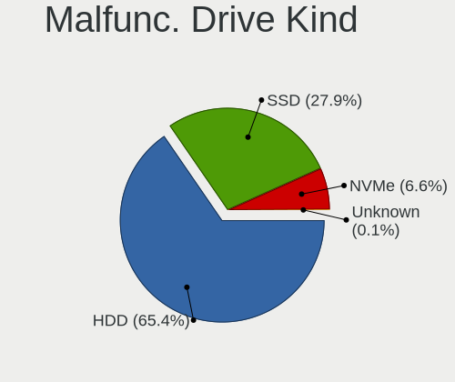
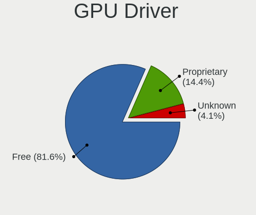
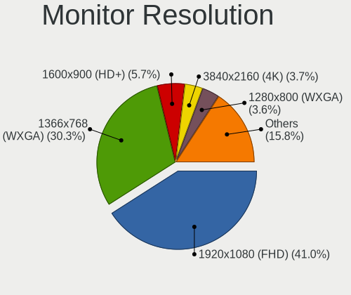
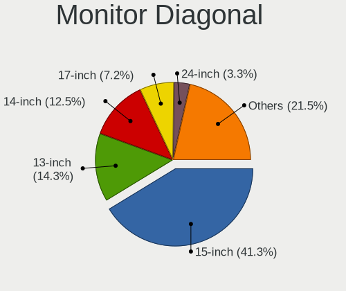
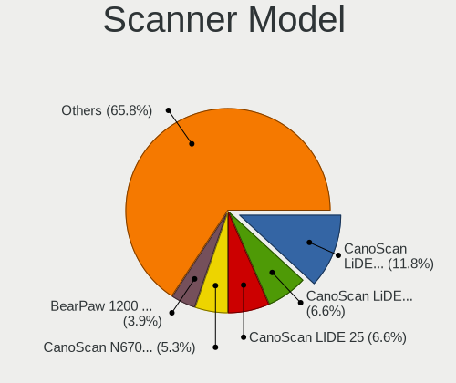

Ubuntu - Tested Hardware & Statistics (Notebooks)
-------------------------------------------------

A project to collect tested hardware configurations for Ubuntu.

Anyone can contribute to this report by the [hw-probe](https://github.com/linuxhw/hw-probe) tool:

    sudo -E hw-probe -all -upload

Please contribute! Especially if your hardware is rare.

Contents
--------

* [ Test Cases ](#test-cases)

* [ System ](#system)
  - [ OS                       ](#os)
  - [ OS Family                ](#os-family)
  - [ Kernel                   ](#kernel)
  - [ Kernel Family            ](#kernel-family)
  - [ Kernel Major Ver.        ](#kernel-major-ver)
  - [ Arch                     ](#arch)
  - [ DE                       ](#de)
  - [ Display Server           ](#display-server)
  - [ Display Manager          ](#display-manager)
  - [ OS Lang                  ](#os-lang)
  - [ Boot Mode                ](#boot-mode)
  - [ Filesystem               ](#filesystem)
  - [ Part. scheme             ](#part-scheme)
  - [ Dual Boot with Linux/BSD ](#dual-boot-with-linuxbsd)
  - [ Dual Boot (Win)          ](#dual-boot-win)

* [ Board ](#board)
  - [ Vendor                   ](#vendor)
  - [ Model                    ](#model)
  - [ Model Family             ](#model-family)
  - [ MFG Year                 ](#mfg-year)
  - [ Form Factor              ](#form-factor)
  - [ Secure Boot              ](#secure-boot)
  - [ Coreboot                 ](#coreboot)
  - [ RAM Size                 ](#ram-size)
  - [ RAM Used                 ](#ram-used)
  - [ Total Drives             ](#total-drives)
  - [ Has CD-ROM               ](#has-cd-rom)
  - [ Has Ethernet             ](#has-ethernet)
  - [ Has WiFi                 ](#has-wifi)
  - [ Has Bluetooth            ](#has-bluetooth)

* [ Location ](#location)
  - [ Country                  ](#country)
  - [ City                     ](#city)

* [ Drives ](#drives)
  - [ Drive Vendor             ](#drive-vendor)
  - [ Drive Model              ](#drive-model)
  - [ HDD Vendor               ](#hdd-vendor)
  - [ SSD Vendor               ](#ssd-vendor)
  - [ Drive Kind               ](#drive-kind)
  - [ Drive Connector          ](#drive-connector)
  - [ Drive Size               ](#drive-size)
  - [ Space Total              ](#space-total)
  - [ Space Used               ](#space-used)
  - [ Malfunc. Drives          ](#malfunc-drives)
  - [ Malfunc. Drive Vendor    ](#malfunc-drive-vendor)
  - [ Malfunc. HDD Vendor      ](#malfunc-hdd-vendor)
  - [ Malfunc. Drive Kind      ](#malfunc-drive-kind)
  - [ Failed Drives            ](#failed-drives)
  - [ Failed Drive Vendor      ](#failed-drive-vendor)
  - [ Drive Status             ](#drive-status)

* [ Storage controller ](#storage-controller)
  - [ Storage Vendor           ](#storage-vendor)
  - [ Storage Model            ](#storage-model)
  - [ Storage Kind             ](#storage-kind)

* [ Processor ](#processor)
  - [ CPU Vendor               ](#cpu-vendor)
  - [ CPU Model                ](#cpu-model)
  - [ CPU Model Family         ](#cpu-model-family)
  - [ CPU Cores                ](#cpu-cores)
  - [ CPU Sockets              ](#cpu-sockets)
  - [ CPU Threads              ](#cpu-threads)
  - [ CPU Op-Modes             ](#cpu-op-modes)
  - [ CPU Microcode            ](#cpu-microcode)
  - [ CPU Microarch            ](#cpu-microarch)

* [ Graphics ](#graphics)
  - [ GPU Vendor               ](#gpu-vendor)
  - [ GPU Model                ](#gpu-model)
  - [ GPU Combo                ](#gpu-combo)
  - [ GPU Driver               ](#gpu-driver)
  - [ GPU Memory               ](#gpu-memory)

* [ Monitor ](#monitor)
  - [ Monitor Vendor           ](#monitor-vendor)
  - [ Monitor Model            ](#monitor-model)
  - [ Monitor Resolution       ](#monitor-resolution)
  - [ Monitor Diagonal         ](#monitor-diagonal)
  - [ Monitor Width            ](#monitor-width)
  - [ Aspect Ratio             ](#aspect-ratio)
  - [ Monitor Area             ](#monitor-area)
  - [ Pixel Density            ](#pixel-density)
  - [ Multiple Monitors        ](#multiple-monitors)

* [ Network ](#network)
  - [ Net Controller Vendor    ](#net-controller-vendor)
  - [ Net Controller Model     ](#net-controller-model)
  - [ Wireless Vendor          ](#wireless-vendor)
  - [ Wireless Model           ](#wireless-model)
  - [ Ethernet Vendor          ](#ethernet-vendor)
  - [ Ethernet Model           ](#ethernet-model)
  - [ Net Controller Kind      ](#net-controller-kind)
  - [ Used Controller          ](#used-controller)
  - [ NICs                     ](#nics)
  - [ IPv6                     ](#ipv6)

* [ Bluetooth ](#bluetooth)
  - [ Bluetooth Vendor         ](#bluetooth-vendor)
  - [ Bluetooth Model          ](#bluetooth-model)

* [ Sound ](#sound)
  - [ Sound Vendor             ](#sound-vendor)
  - [ Sound Model              ](#sound-model)

* [ Memory ](#memory)
  - [ Memory Vendor            ](#memory-vendor)
  - [ Memory Model             ](#memory-model)
  - [ Memory Kind              ](#memory-kind)
  - [ Memory Form Factor       ](#memory-form-factor)
  - [ Memory Size              ](#memory-size)
  - [ Memory Speed             ](#memory-speed)

* [ Printers & scanners ](#printers--scanners)
  - [ Printer Vendor           ](#printer-vendor)
  - [ Printer Model            ](#printer-model)
  - [ Scanner Vendor           ](#scanner-vendor)
  - [ Scanner Model            ](#scanner-model)

* [ Camera ](#camera)
  - [ Camera Vendor            ](#camera-vendor)
  - [ Camera Model             ](#camera-model)

* [ Security ](#security)
  - [ Fingerprint Vendor       ](#fingerprint-vendor)
  - [ Fingerprint Model        ](#fingerprint-model)
  - [ Chipcard Vendor          ](#chipcard-vendor)
  - [ Chipcard Model           ](#chipcard-model)

* [ Unsupported ](#unsupported)
  - [ Unsupported Devices      ](#unsupported-devices)
  - [ Unsupported Device Types ](#unsupported-device-types)

Test Cases
----------

Total: 42998

| Vendor        | Model                       | Probe                                                      | Date         |
|---------------|-----------------------------|------------------------------------------------------------|--------------|
| Lenovo        | IdeaPad 3 15ALC6 82MF       | [4d7f89dc6d](https://linux-hardware.org/?probe=4d7f89dc6d) | Dec 31, 2022 |
| Lenovo        | ThinkPad T410 2537DH6       | [23c0cbbe94](https://linux-hardware.org/?probe=23c0cbbe94) | Dec 31, 2022 |
| HP            | Pavilion dv6                | [30ec83dbd4](https://linux-hardware.org/?probe=30ec83dbd4) | Dec 31, 2022 |
| Lenovo        | ThinkPad T430s 235368U      | [8420930d53](https://linux-hardware.org/?probe=8420930d53) | Dec 31, 2022 |
| Notebook      | PB50_70RF,RD,RC             | [d1f655b9b1](https://linux-hardware.org/?probe=d1f655b9b1) | Dec 31, 2022 |
| Lenovo        | ThinkPad T14 Gen 2i 20W0... | [2abdc57712](https://linux-hardware.org/?probe=2abdc57712) | Dec 31, 2022 |
| Acer          | Aspire V3-571G              | [273f6722e0](https://linux-hardware.org/?probe=273f6722e0) | Dec 31, 2022 |
| Lenovo        | ThinkPad T14 Gen 2i 20W0... | [632515014d](https://linux-hardware.org/?probe=632515014d) | Dec 31, 2022 |
| Lenovo        | ThinkPad E470 20H2A02NBR    | [18827f3f77](https://linux-hardware.org/?probe=18827f3f77) | Dec 31, 2022 |
| HP            | Laptop 15-db0xxx            | [375dccca30](https://linux-hardware.org/?probe=375dccca30) | Dec 31, 2022 |
| Fujitsu       | LIFEBOOK U772               | [3ecdad230a](https://linux-hardware.org/?probe=3ecdad230a) | Dec 31, 2022 |
| HP            | Pavilion 17                 | [ce5baca257](https://linux-hardware.org/?probe=ce5baca257) | Dec 31, 2022 |
| Lenovo        | ThinkPad T430s 235368U      | [e31244bdd7](https://linux-hardware.org/?probe=e31244bdd7) | Dec 31, 2022 |
| ASUSTek       | ProArt StudioBook H5600Q... | [07ca2ed63d](https://linux-hardware.org/?probe=07ca2ed63d) | Dec 31, 2022 |
| Acer          | Aspire E5-575G              | [db40dc530a](https://linux-hardware.org/?probe=db40dc530a) | Dec 31, 2022 |
| Lenovo        | ThinkPad L470 20J5S0Y700    | [9e54ccbafa](https://linux-hardware.org/?probe=9e54ccbafa) | Dec 31, 2022 |
| Lenovo        | ThinkPad Edge E545 20B2S... | [c83f51d7d9](https://linux-hardware.org/?probe=c83f51d7d9) | Dec 31, 2022 |
| Timi          | Xiaomi NoteBook Pro         | [5d0ff5ea2d](https://linux-hardware.org/?probe=5d0ff5ea2d) | Dec 31, 2022 |
| Lenovo        | IdeaPad 5 Pro 14ACN6 82L... | [cf40d3f30c](https://linux-hardware.org/?probe=cf40d3f30c) | Dec 31, 2022 |
| Acer          | Aspire E5-521               | [d9b5e3cfc3](https://linux-hardware.org/?probe=d9b5e3cfc3) | Dec 31, 2022 |
| Lenovo        | ThinkPad T480 20L6S29E0A    | [82168627b7](https://linux-hardware.org/?probe=82168627b7) | Dec 31, 2022 |
| Apple         | MacBookAir7,2               | [8b84042dc6](https://linux-hardware.org/?probe=8b84042dc6) | Dec 30, 2022 |
| HUAWEI        | BOHK-WAX9X                  | [62b14864e1](https://linux-hardware.org/?probe=62b14864e1) | Dec 30, 2022 |
| Apple         | MacBookAir7,2               | [dae09ec15f](https://linux-hardware.org/?probe=dae09ec15f) | Dec 30, 2022 |
| Acer          | Aspire 8943G                | [dd6e590470](https://linux-hardware.org/?probe=dd6e590470) | Dec 30, 2022 |
| HP            | Laptop 17-cn1xxx            | [dde4bcd574](https://linux-hardware.org/?probe=dde4bcd574) | Dec 30, 2022 |
| Acer          | Aspire R7-371T              | [057e717cb7](https://linux-hardware.org/?probe=057e717cb7) | Dec 30, 2022 |
| Alienware     | x17 R2                      | [f213236189](https://linux-hardware.org/?probe=f213236189) | Dec 30, 2022 |
| Samsung       | 3570R/370R/470R/450R/510... | [465d2da36b](https://linux-hardware.org/?probe=465d2da36b) | Dec 30, 2022 |
| ASUSTek       | ZenBook UX425EA_UX425EA     | [4c8f1bd9d4](https://linux-hardware.org/?probe=4c8f1bd9d4) | Dec 30, 2022 |
| Unknown       | Unknown                     | [86dcc5a2ff](https://linux-hardware.org/?probe=86dcc5a2ff) | Dec 30, 2022 |
| Lenovo        | ThinkPad X1 Carbon Gen 8... | [80abf89bc6](https://linux-hardware.org/?probe=80abf89bc6) | Dec 30, 2022 |
| ASUSTek       | ASUS EXPERTBOOK B9400CEA... | [8b0b7eb91a](https://linux-hardware.org/?probe=8b0b7eb91a) | Dec 30, 2022 |
| Toshiba       | Satellite C850-1GL          | [f6f61f1841](https://linux-hardware.org/?probe=f6f61f1841) | Dec 30, 2022 |
| Toshiba       | Satellite C850-1GL          | [796edd73f6](https://linux-hardware.org/?probe=796edd73f6) | Dec 30, 2022 |
| HP            | EliteBook 840 G7 Noteboo... | [e7a5c8704b](https://linux-hardware.org/?probe=e7a5c8704b) | Dec 30, 2022 |
| HP            | EliteBook 840 G7 Noteboo... | [fa210be351](https://linux-hardware.org/?probe=fa210be351) | Dec 30, 2022 |
| HP            | EliteBook 2540p             | [279718a62f](https://linux-hardware.org/?probe=279718a62f) | Dec 30, 2022 |
| Lenovo        | IdeaPad 110-15IBR 80T7      | [ceb89aefed](https://linux-hardware.org/?probe=ceb89aefed) | Dec 30, 2022 |
| Dell          | Vostro 1015                 | [fd48487066](https://linux-hardware.org/?probe=fd48487066) | Dec 30, 2022 |
| ITI LIMITE... | ITI Smaash ITIB15LI3        | [6a08f378e2](https://linux-hardware.org/?probe=6a08f378e2) | Dec 30, 2022 |
| HP            | ZBook Studio G3             | [ca204b6900](https://linux-hardware.org/?probe=ca204b6900) | Dec 30, 2022 |
| Dell          | Latitude E7270              | [2770f493c1](https://linux-hardware.org/?probe=2770f493c1) | Dec 30, 2022 |
| ITI LIMITE... | ITI Smaash ITIB15LI3        | [282a44d1ff](https://linux-hardware.org/?probe=282a44d1ff) | Dec 30, 2022 |
| System76      | Oryx Pro                    | [dcc09f8dc5](https://linux-hardware.org/?probe=dcc09f8dc5) | Dec 30, 2022 |
| HP            | EliteBook 820 G4            | [9e794046d8](https://linux-hardware.org/?probe=9e794046d8) | Dec 30, 2022 |
| Acer          | TravelMate P214             | [436186d9e5](https://linux-hardware.org/?probe=436186d9e5) | Dec 30, 2022 |
| HP            | 431 Notebook                | [6a8d323e0c](https://linux-hardware.org/?probe=6a8d323e0c) | Dec 30, 2022 |
| Lenovo        | ThinkPad X240 20AMS1J60B    | [1d8fcd4a75](https://linux-hardware.org/?probe=1d8fcd4a75) | Dec 30, 2022 |
| HP            | Laptop 17-by0xxx            | [0da7f8e1d5](https://linux-hardware.org/?probe=0da7f8e1d5) | Dec 30, 2022 |
| HP            | EliteBook 745 G5            | [d819dbd901](https://linux-hardware.org/?probe=d819dbd901) | Dec 30, 2022 |
| Apple         | MacBookPro11,3              | [87d0f67d84](https://linux-hardware.org/?probe=87d0f67d84) | Dec 30, 2022 |
| Dell          | Latitude 9420               | [3c43afbd50](https://linux-hardware.org/?probe=3c43afbd50) | Dec 29, 2022 |
| Lenovo        | ThinkBook 14-IIL 20SL       | [8e201646a8](https://linux-hardware.org/?probe=8e201646a8) | Dec 29, 2022 |
| MSI           | Raider GE67HX 12UGS         | [28822be06e](https://linux-hardware.org/?probe=28822be06e) | Dec 29, 2022 |
| HP            | 255 G8 Notebook PC          | [05209e0503](https://linux-hardware.org/?probe=05209e0503) | Dec 29, 2022 |
| Acer          | Swift SF314-57G             | [9d71d087d8](https://linux-hardware.org/?probe=9d71d087d8) | Dec 29, 2022 |
| Acer          | Aspire A517-51              | [d6e1d87869](https://linux-hardware.org/?probe=d6e1d87869) | Dec 29, 2022 |
| Dell          | Inspiron 3583               | [35f6da18cc](https://linux-hardware.org/?probe=35f6da18cc) | Dec 29, 2022 |
| HP            | 250 G8 Notebook PC          | [754ba4696d](https://linux-hardware.org/?probe=754ba4696d) | Dec 29, 2022 |
| Toshiba       | Satellite A305              | [b27112a271](https://linux-hardware.org/?probe=b27112a271) | Dec 29, 2022 |
| Toshiba       | Satellite A305              | [a955e57ba0](https://linux-hardware.org/?probe=a955e57ba0) | Dec 29, 2022 |
| Toshiba       | Satellite C870-13V          | [5ad370d470](https://linux-hardware.org/?probe=5ad370d470) | Dec 29, 2022 |
| ASUSTek       | VivoBook_ASUSLaptop X140... | [1cab27a65e](https://linux-hardware.org/?probe=1cab27a65e) | Dec 29, 2022 |
| HP            | ProBook 450 G7              | [ca7468f975](https://linux-hardware.org/?probe=ca7468f975) | Dec 29, 2022 |
| HP            | Pavilion Gaming Laptop 1... | [23d1e04f4c](https://linux-hardware.org/?probe=23d1e04f4c) | Dec 29, 2022 |
| ASUSTek       | ZenBook UX325EA_UX325EA     | [fdb827eff9](https://linux-hardware.org/?probe=fdb827eff9) | Dec 29, 2022 |
| Lenovo        | ThinkPad T430s 235368U      | [c9b7e858ae](https://linux-hardware.org/?probe=c9b7e858ae) | Dec 29, 2022 |
| AMI           | Intel                       | [b4f7a84546](https://linux-hardware.org/?probe=b4f7a84546) | Dec 29, 2022 |
| HP            | Laptop 17-cp0xxx            | [7f54c2425b](https://linux-hardware.org/?probe=7f54c2425b) | Dec 29, 2022 |
| Lenovo        | IdeaPad S130-11IGM 81J1     | [2b646304f0](https://linux-hardware.org/?probe=2b646304f0) | Dec 29, 2022 |
| Lenovo        | ThinkPad T430s 235368U      | [8ba8cedf66](https://linux-hardware.org/?probe=8ba8cedf66) | Dec 29, 2022 |
| Dell          | Latitude 3420               | [eb6d4c6921](https://linux-hardware.org/?probe=eb6d4c6921) | Dec 29, 2022 |
| Lenovo        | Z50-70 20354                | [7b8f5e4379](https://linux-hardware.org/?probe=7b8f5e4379) | Dec 29, 2022 |
| Lenovo        | G50-70 20351                | [6ece20ec58](https://linux-hardware.org/?probe=6ece20ec58) | Dec 29, 2022 |
| HP            | ProBook 430 G1              | [217bb0ea0f](https://linux-hardware.org/?probe=217bb0ea0f) | Dec 29, 2022 |
| Dell          | Latitude E6430              | [6d5bc96456](https://linux-hardware.org/?probe=6d5bc96456) | Dec 29, 2022 |
| Dell          | Latitude E6420              | [9733c425b6](https://linux-hardware.org/?probe=9733c425b6) | Dec 29, 2022 |
| Dell          | Inspiron 5555               | [37635ca062](https://linux-hardware.org/?probe=37635ca062) | Dec 29, 2022 |
| Lenovo        | ThinkPad T440p 20AWS3980... | [43783d2dda](https://linux-hardware.org/?probe=43783d2dda) | Dec 29, 2022 |
| HP            | Laptop 15-dw0xxx            | [b851f7bcfc](https://linux-hardware.org/?probe=b851f7bcfc) | Dec 29, 2022 |
| HP            | EliteBook 2560p             | [e0c82de440](https://linux-hardware.org/?probe=e0c82de440) | Dec 29, 2022 |
| Fujitsu       | LIFEBOOK E736               | [8d54484965](https://linux-hardware.org/?probe=8d54484965) | Dec 29, 2022 |
| Lenovo        | V14-IIL 82C4                | [9b77a1e3f3](https://linux-hardware.org/?probe=9b77a1e3f3) | Dec 29, 2022 |
| Dell          | Vostro 1015                 | [11e78b0f9b](https://linux-hardware.org/?probe=11e78b0f9b) | Dec 29, 2022 |
| Lenovo        | ThinkPad X1 Carbon 6th 2... | [499c91958a](https://linux-hardware.org/?probe=499c91958a) | Dec 29, 2022 |
| Notebook      | W65_67SZ                    | [cbebefb520](https://linux-hardware.org/?probe=cbebefb520) | Dec 29, 2022 |
| Acer          | Aspire A315-41              | [09c901fe98](https://linux-hardware.org/?probe=09c901fe98) | Dec 29, 2022 |
| Apple         | MacBookPro15,2              | [e5a7b5b5be](https://linux-hardware.org/?probe=e5a7b5b5be) | Dec 28, 2022 |
| PC Special... | PCX0DX                      | [0a33ad889c](https://linux-hardware.org/?probe=0a33ad889c) | Dec 28, 2022 |
| HP            | Pavilion Laptop 15-eg0xx... | [b915fc0d47](https://linux-hardware.org/?probe=b915fc0d47) | Dec 28, 2022 |
| Lenovo        | ThinkPad E480 20KQS13M00    | [fb7e2874d3](https://linux-hardware.org/?probe=fb7e2874d3) | Dec 28, 2022 |
| HP            | OMEN Laptop 15-en1xxx       | [9e95d6a4ac](https://linux-hardware.org/?probe=9e95d6a4ac) | Dec 28, 2022 |
| System76      | Bonobo Extreme              | [cedfb426df](https://linux-hardware.org/?probe=cedfb426df) | Dec 28, 2022 |
| HP            | Pavilion Laptop 15-cs3xx... | [7f33845279](https://linux-hardware.org/?probe=7f33845279) | Dec 28, 2022 |
| System76      | Bonobo Extreme              | [1b6caec010](https://linux-hardware.org/?probe=1b6caec010) | Dec 28, 2022 |
| GPU Compan... | GWTN116-3                   | [73323d3bad](https://linux-hardware.org/?probe=73323d3bad) | Dec 28, 2022 |
| GPU Compan... | GWTN116-3                   | [bcad5903ae](https://linux-hardware.org/?probe=bcad5903ae) | Dec 28, 2022 |
| ASUSTek       | Zenbook UM5302TA_UM5302T... | [74c1f3a4c2](https://linux-hardware.org/?probe=74c1f3a4c2) | Dec 28, 2022 |
| Alienware     | x17 R2                      | [5a7ea2683a](https://linux-hardware.org/?probe=5a7ea2683a) | Dec 28, 2022 |
| Lenovo        | V14-IIL 82C4                | [58825656f9](https://linux-hardware.org/?probe=58825656f9) | Dec 28, 2022 |
| ASUSTek       | X555BP                      | [6ddc84aa0d](https://linux-hardware.org/?probe=6ddc84aa0d) | Dec 28, 2022 |
| HP            | 240 G6 Notebook PC          | [b593030fef](https://linux-hardware.org/?probe=b593030fef) | Dec 28, 2022 |
| HP            | 240 G6 Notebook PC          | [27e4ff648f](https://linux-hardware.org/?probe=27e4ff648f) | Dec 28, 2022 |
| HP            | EliteBook 850 G3            | [0dede5b37a](https://linux-hardware.org/?probe=0dede5b37a) | Dec 28, 2022 |
| Lenovo        | G580 20157                  | [bfefa4ee83](https://linux-hardware.org/?probe=bfefa4ee83) | Dec 28, 2022 |
| Toshiba       | Satellite C55-C             | [2966924363](https://linux-hardware.org/?probe=2966924363) | Dec 28, 2022 |
| Toshiba       | Satellite C55-C             | [f3e27d230f](https://linux-hardware.org/?probe=f3e27d230f) | Dec 28, 2022 |
| Dell          | XPS 13 9380                 | [a73fe5e678](https://linux-hardware.org/?probe=a73fe5e678) | Dec 28, 2022 |
| ASUSTek       | G73Jh                       | [e406daa47c](https://linux-hardware.org/?probe=e406daa47c) | Dec 28, 2022 |
| HP            | EliteBook 8570p             | [268f34635a](https://linux-hardware.org/?probe=268f34635a) | Dec 28, 2022 |
| Lenovo        | G580 20157                  | [39f72fea9c](https://linux-hardware.org/?probe=39f72fea9c) | Dec 28, 2022 |
| HP            | Compaq Presario CQ60        | [f3f1a02bce](https://linux-hardware.org/?probe=f3f1a02bce) | Dec 28, 2022 |
| Dell          | Vostro 3550                 | [0708d07cd4](https://linux-hardware.org/?probe=0708d07cd4) | Dec 28, 2022 |
| HP            | Compaq Presario CQ60        | [b1f32ea75c](https://linux-hardware.org/?probe=b1f32ea75c) | Dec 28, 2022 |
| HP            | ENVY Laptop 13-ba1xxx       | [c25b644aca](https://linux-hardware.org/?probe=c25b644aca) | Dec 28, 2022 |
| Lenovo        | IdeaPad L340-17API 81LY     | [f4df1b165b](https://linux-hardware.org/?probe=f4df1b165b) | Dec 28, 2022 |
| HP            | Laptop 14-fq0xxx            | [e020678b51](https://linux-hardware.org/?probe=e020678b51) | Dec 28, 2022 |
| Lenovo        | 100-14IBY 80R7              | [92b2614ac2](https://linux-hardware.org/?probe=92b2614ac2) | Dec 28, 2022 |
| Toshiba       | PORTEGE Z30T-A              | [cab72e8a11](https://linux-hardware.org/?probe=cab72e8a11) | Dec 28, 2022 |
| Lenovo        | Y50-70 20378                | [e232c2de6d](https://linux-hardware.org/?probe=e232c2de6d) | Dec 28, 2022 |
| Samsung       | 550XDA                      | [6d744c7602](https://linux-hardware.org/?probe=6d744c7602) | Dec 28, 2022 |
| Lenovo        | G470 20078                  | [8cbb4aa960](https://linux-hardware.org/?probe=8cbb4aa960) | Dec 28, 2022 |
| Lenovo        | G470 20078                  | [d6e7a07be2](https://linux-hardware.org/?probe=d6e7a07be2) | Dec 28, 2022 |
| Samsung       | 550XDA                      | [b463fa7a54](https://linux-hardware.org/?probe=b463fa7a54) | Dec 28, 2022 |
| Dell          | Latitude E7450              | [b641b13d8a](https://linux-hardware.org/?probe=b641b13d8a) | Dec 28, 2022 |
| Samsung       | 340XAA/350XAA/550XAA        | [5383fb814b](https://linux-hardware.org/?probe=5383fb814b) | Dec 28, 2022 |
| Lenovo        | G555 0873                   | [f705d0146a](https://linux-hardware.org/?probe=f705d0146a) | Dec 27, 2022 |
| ASUSTek       | K52Je                       | [28cac9b262](https://linux-hardware.org/?probe=28cac9b262) | Dec 27, 2022 |
| Acer          | Swift SFX14-51G             | [16c5f2a610](https://linux-hardware.org/?probe=16c5f2a610) | Dec 27, 2022 |
| HUAWEI        | BOD-WXX9                    | [d196b92cff](https://linux-hardware.org/?probe=d196b92cff) | Dec 27, 2022 |
| Acer          | Aspire E5-574               | [15e48d4c24](https://linux-hardware.org/?probe=15e48d4c24) | Dec 27, 2022 |
| Teclast       | F15Plus 2                   | [71564a5900](https://linux-hardware.org/?probe=71564a5900) | Dec 27, 2022 |
| Teclast       | F15Plus 2                   | [4d10c4922e](https://linux-hardware.org/?probe=4d10c4922e) | Dec 27, 2022 |
| Acer          | Aspire 5741                 | [22540f4247](https://linux-hardware.org/?probe=22540f4247) | Dec 27, 2022 |
| Acer          | Aspire 5741                 | [b47449f70f](https://linux-hardware.org/?probe=b47449f70f) | Dec 27, 2022 |
| Toshiba       | Satellite A305              | [a9d9fd5efa](https://linux-hardware.org/?probe=a9d9fd5efa) | Dec 27, 2022 |
| Acer          | Predator PH317-56           | [b74460d91c](https://linux-hardware.org/?probe=b74460d91c) | Dec 27, 2022 |
| ASUSTek       | K43E                        | [530e44f9c6](https://linux-hardware.org/?probe=530e44f9c6) | Dec 27, 2022 |
| ASUSTek       | G56JR                       | [3acee33976](https://linux-hardware.org/?probe=3acee33976) | Dec 27, 2022 |
| Schenker      | VISION 15 (SVS15E21)        | [9409e9bfce](https://linux-hardware.org/?probe=9409e9bfce) | Dec 27, 2022 |
| ASUSTek       | X550VXK                     | [039600625a](https://linux-hardware.org/?probe=039600625a) | Dec 27, 2022 |
| Dell          | Vostro 5490                 | [d32b30987a](https://linux-hardware.org/?probe=d32b30987a) | Dec 27, 2022 |
| MACHENIKE     | Machcreator-16              | [682c068af0](https://linux-hardware.org/?probe=682c068af0) | Dec 27, 2022 |
| Lenovo        | IdeaPad Gaming 3 15ACH6 ... | [9dec6385d7](https://linux-hardware.org/?probe=9dec6385d7) | Dec 27, 2022 |
| Acer          | Aspire E1-571               | [82b72a9059](https://linux-hardware.org/?probe=82b72a9059) | Dec 27, 2022 |
| HUAWEI        | NBLK-WAX9X                  | [292ef79b8a](https://linux-hardware.org/?probe=292ef79b8a) | Dec 27, 2022 |
| Samsung       | SP55S                       | [ce8b6d3fdb](https://linux-hardware.org/?probe=ce8b6d3fdb) | Dec 27, 2022 |
| Samsung       | SP55S                       | [f0d13bbd0d](https://linux-hardware.org/?probe=f0d13bbd0d) | Dec 27, 2022 |
| Lenovo        | ThinkPad X1 Carbon Gen 1... | [e5cd9613f9](https://linux-hardware.org/?probe=e5cd9613f9) | Dec 27, 2022 |
| Dell          | G7 7500                     | [d46bf78144](https://linux-hardware.org/?probe=d46bf78144) | Dec 27, 2022 |
| HP            | ZBook Studio G3             | [2eaf074cd3](https://linux-hardware.org/?probe=2eaf074cd3) | Dec 27, 2022 |
| Lenovo        | ThinkPad T500 205545F       | [c12d9f8c6a](https://linux-hardware.org/?probe=c12d9f8c6a) | Dec 27, 2022 |
| Samsung       | 300E5M/300E5L               | [669e014ee6](https://linux-hardware.org/?probe=669e014ee6) | Dec 27, 2022 |
| Lenovo        | Legion 7 15IMH05 81YT       | [06d788f40a](https://linux-hardware.org/?probe=06d788f40a) | Dec 27, 2022 |
| MSI           | MS-7A34                     | [4668f06370](https://linux-hardware.org/?probe=4668f06370) | Dec 26, 2022 |
| Medion        | P6640                       | [0787385a0f](https://linux-hardware.org/?probe=0787385a0f) | Dec 26, 2022 |
| ASUSTek       | VivoBook_ASUSLaptop K340... | [ee7b1d707c](https://linux-hardware.org/?probe=ee7b1d707c) | Dec 26, 2022 |
| HP            | OMEN by Laptop 16-c0xxx     | [3111141139](https://linux-hardware.org/?probe=3111141139) | Dec 26, 2022 |
| Timi          | A18R                        | [83f858038d](https://linux-hardware.org/?probe=83f858038d) | Dec 26, 2022 |
| ASUSTek       | X75A1                       | [5a5ee8db71](https://linux-hardware.org/?probe=5a5ee8db71) | Dec 26, 2022 |
| HP            | Pavilion 15                 | [9843ba5174](https://linux-hardware.org/?probe=9843ba5174) | Dec 26, 2022 |
| LG Electro... | 17Z90Q-G.AA79G              | [59d7266746](https://linux-hardware.org/?probe=59d7266746) | Dec 26, 2022 |
| Dynabook      | Satellite Pro C50-J         | [9b26454313](https://linux-hardware.org/?probe=9b26454313) | Dec 26, 2022 |
| Dynabook      | Satellite Pro C50-J         | [ee842c64a3](https://linux-hardware.org/?probe=ee842c64a3) | Dec 26, 2022 |
| Dell          | XPS 15 9510                 | [394fe96894](https://linux-hardware.org/?probe=394fe96894) | Dec 26, 2022 |
| Acer          | Swift SF314-43              | [f7c9b3538e](https://linux-hardware.org/?probe=f7c9b3538e) | Dec 26, 2022 |
| HP            | Pavilion g6                 | [fbdf9893b5](https://linux-hardware.org/?probe=fbdf9893b5) | Dec 26, 2022 |
| Dell          | Vostro 5490                 | [97677e7c79](https://linux-hardware.org/?probe=97677e7c79) | Dec 26, 2022 |
| Lenovo        | IdeaPad 1 14IGL7 82V6       | [27d5cfbc7b](https://linux-hardware.org/?probe=27d5cfbc7b) | Dec 26, 2022 |
| Notebook      | N7x0WU                      | [9eee40dd50](https://linux-hardware.org/?probe=9eee40dd50) | Dec 26, 2022 |
| ASUSTek       | K52Je                       | [dc13c122ed](https://linux-hardware.org/?probe=dc13c122ed) | Dec 26, 2022 |
| ASUSTek       | X751MA                      | [f63581c721](https://linux-hardware.org/?probe=f63581c721) | Dec 26, 2022 |
| Schenker      | VISION 15 (SVS15E21)        | [e5463f6249](https://linux-hardware.org/?probe=e5463f6249) | Dec 26, 2022 |
| Schenker      | VISION 15 (SVS15E21)        | [4cf226b65c](https://linux-hardware.org/?probe=4cf226b65c) | Dec 26, 2022 |
| Lenovo        | Legion 5 15IAH7H 82RB       | [e47f890444](https://linux-hardware.org/?probe=e47f890444) | Dec 26, 2022 |
| Lenovo        | Legion 5 15IAH7H 82RB       | [c288ade12d](https://linux-hardware.org/?probe=c288ade12d) | Dec 26, 2022 |
| Schenker      | VISION 15 (SVS15E21)        | [8da465a60c](https://linux-hardware.org/?probe=8da465a60c) | Dec 26, 2022 |
| Toshiba       | Satellite A305              | [75a4a25c93](https://linux-hardware.org/?probe=75a4a25c93) | Dec 26, 2022 |
| HP            | 255 G8 Notebook PC          | [2df8b7768a](https://linux-hardware.org/?probe=2df8b7768a) | Dec 26, 2022 |
| Lenovo        | ThinkPad E560 20EV002FUS    | [39bb0dd975](https://linux-hardware.org/?probe=39bb0dd975) | Dec 26, 2022 |
| Lenovo        | ThinkPad E560 20EV002FUS    | [3a47808708](https://linux-hardware.org/?probe=3a47808708) | Dec 26, 2022 |
| HP            | EliteBook 840 G2            | [4a85ebbc33](https://linux-hardware.org/?probe=4a85ebbc33) | Dec 26, 2022 |
| ASUSTek       | ZenBook S UX391UA           | [5004189ba4](https://linux-hardware.org/?probe=5004189ba4) | Dec 26, 2022 |
| Acer          | Swift SF314-51              | [bfdd69d192](https://linux-hardware.org/?probe=bfdd69d192) | Dec 25, 2022 |
| HUAWEI        | NBD-WXX9                    | [713b103493](https://linux-hardware.org/?probe=713b103493) | Dec 25, 2022 |
| Dell          | Inspiron 14-3462            | [f95fd7ca72](https://linux-hardware.org/?probe=f95fd7ca72) | Dec 25, 2022 |
| Dell          | Inspiron 14-3462            | [7b38daddb5](https://linux-hardware.org/?probe=7b38daddb5) | Dec 25, 2022 |
| Dell          | XPS 13 7390                 | [9131496b00](https://linux-hardware.org/?probe=9131496b00) | Dec 25, 2022 |
| HP            | ProBook 450 G1              | [5497596ef1](https://linux-hardware.org/?probe=5497596ef1) | Dec 25, 2022 |
| ASUSTek       | VivoBook_ASUSLaptop K340... | [7c8560a87e](https://linux-hardware.org/?probe=7c8560a87e) | Dec 25, 2022 |
| GPU Compan... | GWNR51416                   | [fc6e84d757](https://linux-hardware.org/?probe=fc6e84d757) | Dec 25, 2022 |
| Toshiba       | Satellite C850-1C8          | [eab4ef74de](https://linux-hardware.org/?probe=eab4ef74de) | Dec 25, 2022 |
| HP            | ProBook 450 G1              | [26c346f0ab](https://linux-hardware.org/?probe=26c346f0ab) | Dec 25, 2022 |
| Lenovo        | ThinkPad T470 W10DG 20JN... | [08af6df0dd](https://linux-hardware.org/?probe=08af6df0dd) | Dec 25, 2022 |
| Toshiba       | Satellite C850-1C8          | [1e47b54431](https://linux-hardware.org/?probe=1e47b54431) | Dec 25, 2022 |
| HP            | ENVY 17                     | [f3458ee7d5](https://linux-hardware.org/?probe=f3458ee7d5) | Dec 25, 2022 |
| Lenovo        | ThinkPad X1 Carbon 5th 2... | [faba7b00c6](https://linux-hardware.org/?probe=faba7b00c6) | Dec 25, 2022 |
| HP            | ENVY Notebook               | [16af8b4da3](https://linux-hardware.org/?probe=16af8b4da3) | Dec 25, 2022 |
| Acer          | Aspire 5739G                | [0d3bd3f3ec](https://linux-hardware.org/?probe=0d3bd3f3ec) | Dec 25, 2022 |
| ASUSTek       | X556UAK                     | [803a4e58e0](https://linux-hardware.org/?probe=803a4e58e0) | Dec 25, 2022 |
| Dell          | Latitude 3580               | [f90b8fa62f](https://linux-hardware.org/?probe=f90b8fa62f) | Dec 25, 2022 |
| ASUSTek       | ROG Strix G713IC_G713IC     | [72fa60782d](https://linux-hardware.org/?probe=72fa60782d) | Dec 25, 2022 |
| HP            | Victus by Laptop 16-e0xx... | [0069729ebe](https://linux-hardware.org/?probe=0069729ebe) | Dec 25, 2022 |
| HP            | Victus by Laptop 16-e0xx... | [985e965dec](https://linux-hardware.org/?probe=985e965dec) | Dec 25, 2022 |
| Dell          | Latitude 5521               | [32d3e87886](https://linux-hardware.org/?probe=32d3e87886) | Dec 25, 2022 |
| Lenovo        | ThinkPad X220 4291UUC       | [6307be520e](https://linux-hardware.org/?probe=6307be520e) | Dec 25, 2022 |
| ASUSTek       | VivoBook_ASUSLaptop X513... | [a1f4999c28](https://linux-hardware.org/?probe=a1f4999c28) | Dec 25, 2022 |
| Lenovo        | ThinkPad E585 20KVS06F00    | [8c3bdcc48c](https://linux-hardware.org/?probe=8c3bdcc48c) | Dec 25, 2022 |
| Framework     | Laptop (12th Gen Intel C... | [daebafedd8](https://linux-hardware.org/?probe=daebafedd8) | Dec 25, 2022 |
| Acer          | Nitro AN515-31              | [249f50d430](https://linux-hardware.org/?probe=249f50d430) | Dec 25, 2022 |
| Toshiba       | PORTEGE Z930                | [4a77067c41](https://linux-hardware.org/?probe=4a77067c41) | Dec 25, 2022 |
| Lenovo        | ThinkPad T430 23472Y0       | [4a2d13391c](https://linux-hardware.org/?probe=4a2d13391c) | Dec 25, 2022 |
| Lenovo        | ThinkPad T450 20BUS3GN01    | [e88a11d2bb](https://linux-hardware.org/?probe=e88a11d2bb) | Dec 25, 2022 |
| Dell          | Inspiron 5567               | [46d23963c9](https://linux-hardware.org/?probe=46d23963c9) | Dec 25, 2022 |
| HP            | Pavilion g4                 | [a5d26c4498](https://linux-hardware.org/?probe=a5d26c4498) | Dec 24, 2022 |
| UMAX          | VisionBook 14Wa Pro         | [7eb49ce0ab](https://linux-hardware.org/?probe=7eb49ce0ab) | Dec 24, 2022 |
| Dell          | Vostro 3500                 | [0d59e2b098](https://linux-hardware.org/?probe=0d59e2b098) | Dec 24, 2022 |
| Dell          | Vostro 3501                 | [2bd2de39fb](https://linux-hardware.org/?probe=2bd2de39fb) | Dec 24, 2022 |
| Acer          | Swift SF314-43              | [b1c3a71567](https://linux-hardware.org/?probe=b1c3a71567) | Dec 24, 2022 |
| HP            | Pavilion Laptop 15-cc5xx    | [337ee988ae](https://linux-hardware.org/?probe=337ee988ae) | Dec 24, 2022 |
| Dell          | Latitude 3380               | [e4847d5b1f](https://linux-hardware.org/?probe=e4847d5b1f) | Dec 24, 2022 |
| Acer          | Aspire V3-551G              | [6adf185edf](https://linux-hardware.org/?probe=6adf185edf) | Dec 24, 2022 |
| UMAX          | VisionBook 14Wa Pro         | [4123115ef0](https://linux-hardware.org/?probe=4123115ef0) | Dec 24, 2022 |
| Lenovo        | IdeaPad C340-14API 81N6     | [5e589fb2d1](https://linux-hardware.org/?probe=5e589fb2d1) | Dec 24, 2022 |
| HP            | Victus by Laptop 16-e1xx... | [419580e899](https://linux-hardware.org/?probe=419580e899) | Dec 24, 2022 |
| Dell          | Vostro 15 5510              | [10f4ac5e13](https://linux-hardware.org/?probe=10f4ac5e13) | Dec 24, 2022 |
| Lenovo        | ThinkPad X61s 7667WHE       | [d689ae23a7](https://linux-hardware.org/?probe=d689ae23a7) | Dec 24, 2022 |
| Toshiba       | dynabook T351/34CBJ         | [281bf4e6a7](https://linux-hardware.org/?probe=281bf4e6a7) | Dec 24, 2022 |
| Lenovo        | ThinkPad L470 20J5S0Y700    | [9ce4138a3b](https://linux-hardware.org/?probe=9ce4138a3b) | Dec 24, 2022 |
| HP            | Laptop 15s-eq2xxx           | [266f8dc5af](https://linux-hardware.org/?probe=266f8dc5af) | Dec 24, 2022 |
| ASUSTek       | VivoBook_ASUSLaptop X513... | [2b71327126](https://linux-hardware.org/?probe=2b71327126) | Dec 24, 2022 |
| Alienware     | m15 R7                      | [4e33480c8a](https://linux-hardware.org/?probe=4e33480c8a) | Dec 24, 2022 |
| System76      | Pangolin                    | [1c936bfe04](https://linux-hardware.org/?probe=1c936bfe04) | Dec 24, 2022 |
| GPU Compan... | GWTN141-10                  | [38ed4755c3](https://linux-hardware.org/?probe=38ed4755c3) | Dec 24, 2022 |
| ASUSTek       | VivoBook_ASUSLaptop E210... | [e1ae2ba145](https://linux-hardware.org/?probe=e1ae2ba145) | Dec 24, 2022 |
| Dell          | Latitude E6540              | [5df6345cd7](https://linux-hardware.org/?probe=5df6345cd7) | Dec 24, 2022 |
| HP            | EliteBook 8470p             | [d70aca4ad6](https://linux-hardware.org/?probe=d70aca4ad6) | Dec 24, 2022 |
| ASUSTek       | ROG Zephyrus G14 GA401QE... | [dab48b870c](https://linux-hardware.org/?probe=dab48b870c) | Dec 23, 2022 |
| Lenovo        | G505s 20255                 | [2a0fc9ecc3](https://linux-hardware.org/?probe=2a0fc9ecc3) | Dec 23, 2022 |
| ASUSTek       | VivoBook_ASUSLaptop X513... | [0d1532282f](https://linux-hardware.org/?probe=0d1532282f) | Dec 23, 2022 |
| Dell          | Inspiron 15 5510            | [d53469cd41](https://linux-hardware.org/?probe=d53469cd41) | Dec 23, 2022 |
| Dell          | Inspiron 15 5510            | [9ddf91aa1b](https://linux-hardware.org/?probe=9ddf91aa1b) | Dec 23, 2022 |
| Apple         | MacBookPro14,1              | [19abbc8f75](https://linux-hardware.org/?probe=19abbc8f75) | Dec 23, 2022 |
| HP            | Pavilion Notebook           | [6f02a1834d](https://linux-hardware.org/?probe=6f02a1834d) | Dec 23, 2022 |
| ASUSTek       | G73Sw                       | [3f4336472e](https://linux-hardware.org/?probe=3f4336472e) | Dec 23, 2022 |
| HP            | EliteBook 840 G5            | [05ab61864f](https://linux-hardware.org/?probe=05ab61864f) | Dec 23, 2022 |
| MSI           | Pulse GL76 12UEK            | [9ca4075241](https://linux-hardware.org/?probe=9ca4075241) | Dec 23, 2022 |
| MSI           | Pulse GL76 12UEK            | [099b612c13](https://linux-hardware.org/?probe=099b612c13) | Dec 23, 2022 |
| Acer          | Predator PH315-54           | [84bdb8f2eb](https://linux-hardware.org/?probe=84bdb8f2eb) | Dec 23, 2022 |
| Notebook      | P64_HJ,HK1                  | [26a548a6f3](https://linux-hardware.org/?probe=26a548a6f3) | Dec 23, 2022 |
| Lenovo        | Legion Y540-15IRH-PG0 81... | [c47eaa75b3](https://linux-hardware.org/?probe=c47eaa75b3) | Dec 23, 2022 |
| Acer          | Aspire E5-575G              | [bc197d71d8](https://linux-hardware.org/?probe=bc197d71d8) | Dec 23, 2022 |
| HONOR         | BBR-WAX9                    | [19909aa86b](https://linux-hardware.org/?probe=19909aa86b) | Dec 23, 2022 |
| Acer          | Aspire 5050                 | [5d1026f74d](https://linux-hardware.org/?probe=5d1026f74d) | Dec 23, 2022 |
| HP            | ProBook 440 G8 Notebook ... | [0256ea50a4](https://linux-hardware.org/?probe=0256ea50a4) | Dec 23, 2022 |
| HP            | ProBook 440 G7              | [33a03f23cc](https://linux-hardware.org/?probe=33a03f23cc) | Dec 23, 2022 |
| Dell          | Vostro 3460                 | [92a850ae45](https://linux-hardware.org/?probe=92a850ae45) | Dec 23, 2022 |
| Timi          | TM1701                      | [2f28d7e2dc](https://linux-hardware.org/?probe=2f28d7e2dc) | Dec 23, 2022 |
| Dell          | Vostro 3460                 | [b7a0d95962](https://linux-hardware.org/?probe=b7a0d95962) | Dec 23, 2022 |
| Timi          | TM1701                      | [dfb4f8774f](https://linux-hardware.org/?probe=dfb4f8774f) | Dec 23, 2022 |
| Dell          | Inspiron 1546               | [7812af7998](https://linux-hardware.org/?probe=7812af7998) | Dec 23, 2022 |
| Hometech      | Alfa 420C                   | [9dcf2c28b3](https://linux-hardware.org/?probe=9dcf2c28b3) | Dec 23, 2022 |
| Lenovo        | ThinkPad T480 20L6S3F41E    | [ce682eacb7](https://linux-hardware.org/?probe=ce682eacb7) | Dec 23, 2022 |
| Samsung       | 270E5J/2570EJ               | [7efb2defb9](https://linux-hardware.org/?probe=7efb2defb9) | Dec 23, 2022 |
| HP            | Pavilion Laptop 15-cc5xx    | [9ce6c07b4b](https://linux-hardware.org/?probe=9ce6c07b4b) | Dec 23, 2022 |
| Hometech      | Alfa 420C                   | [5a4f33dd7b](https://linux-hardware.org/?probe=5a4f33dd7b) | Dec 22, 2022 |
| Lenovo        | G50-80 80E5                 | [194eee0657](https://linux-hardware.org/?probe=194eee0657) | Dec 22, 2022 |
| Toshiba       | TECRA R940                  | [939e438746](https://linux-hardware.org/?probe=939e438746) | Dec 22, 2022 |
| Acer          | Swift SF314-57G             | [53678dec76](https://linux-hardware.org/?probe=53678dec76) | Dec 22, 2022 |
| Sony          | VPCEB36GM                   | [5aba4d1d5f](https://linux-hardware.org/?probe=5aba4d1d5f) | Dec 22, 2022 |
| Lenovo        | IdeaPad 3 14IAU7 82RJ       | [b5c5aba33a](https://linux-hardware.org/?probe=b5c5aba33a) | Dec 22, 2022 |
| HP            | ENVY 15                     | [3c07c09a25](https://linux-hardware.org/?probe=3c07c09a25) | Dec 22, 2022 |
| HP            | Pavilion 17                 | [65dcf1eead](https://linux-hardware.org/?probe=65dcf1eead) | Dec 22, 2022 |
| ASUSTek       | VivoBook_ASUSLaptop K340... | [9462031346](https://linux-hardware.org/?probe=9462031346) | Dec 22, 2022 |
| Monster       | TULPAR T5 V20.1             | [23cb6e06f8](https://linux-hardware.org/?probe=23cb6e06f8) | Dec 22, 2022 |
| HP            | Pavilion Gaming Laptop 1... | [b221e3103a](https://linux-hardware.org/?probe=b221e3103a) | Dec 22, 2022 |
| Lenovo        | ThinkPad L15 Gen 1 20U70... | [bf600b6f1c](https://linux-hardware.org/?probe=bf600b6f1c) | Dec 22, 2022 |
| HP            | EliteBook 850 G8 Noteboo... | [5b645cbd36](https://linux-hardware.org/?probe=5b645cbd36) | Dec 22, 2022 |
| HP            | Pavilion 17                 | [c58baa8506](https://linux-hardware.org/?probe=c58baa8506) | Dec 22, 2022 |
| Dell          | Vostro 5490                 | [2d85a576e1](https://linux-hardware.org/?probe=2d85a576e1) | Dec 22, 2022 |
| HP            | ProBook 440 G8 Notebook ... | [2d50f93c7f](https://linux-hardware.org/?probe=2d50f93c7f) | Dec 22, 2022 |
| LTD Delovo... | EVE 14 C414 ES4060EW        | [9f1751d2e5](https://linux-hardware.org/?probe=9f1751d2e5) | Dec 22, 2022 |
| HP            | ProBook 440 G8 Notebook ... | [dac438be55](https://linux-hardware.org/?probe=dac438be55) | Dec 22, 2022 |
| Razer         | Blade 17 (2022) - RZ09-0... | [f244715ee3](https://linux-hardware.org/?probe=f244715ee3) | Dec 22, 2022 |
| HP            | Pavilion dv6                | [ef639be49a](https://linux-hardware.org/?probe=ef639be49a) | Dec 22, 2022 |
| Lenovo        | ThinkPad E490 20N80019RT    | [87746a4f6c](https://linux-hardware.org/?probe=87746a4f6c) | Dec 22, 2022 |
| Razer         | Blade 17 (2022) - RZ09-0... | [2ebd48d256](https://linux-hardware.org/?probe=2ebd48d256) | Dec 22, 2022 |
| Gigabyte      | AERO 15 YC                  | [24e48000be](https://linux-hardware.org/?probe=24e48000be) | Dec 22, 2022 |
| Gateway       | NV78                        | [6733e081fc](https://linux-hardware.org/?probe=6733e081fc) | Dec 22, 2022 |
| Dell          | Latitude E7450              | [16cc0bdbc4](https://linux-hardware.org/?probe=16cc0bdbc4) | Dec 22, 2022 |
| Lenovo        | ThinkPad X201 3680AA4       | [6306be2273](https://linux-hardware.org/?probe=6306be2273) | Dec 22, 2022 |
| Dell          | Latitude E7450              | [df0790836c](https://linux-hardware.org/?probe=df0790836c) | Dec 22, 2022 |
| Dell          | Vostro 3500                 | [a50ec1e677](https://linux-hardware.org/?probe=a50ec1e677) | Dec 22, 2022 |
| Razer         | Blade 17 (2022) - RZ09-0... | [d6f3d14b20](https://linux-hardware.org/?probe=d6f3d14b20) | Dec 22, 2022 |
| Lenovo        | IdeaPad S145-15IIL 82DJ     | [37f100cf13](https://linux-hardware.org/?probe=37f100cf13) | Dec 22, 2022 |
| Lenovo        | ThinkPad X201 3680AA4       | [cf8576151f](https://linux-hardware.org/?probe=cf8576151f) | Dec 22, 2022 |
| Dell          | Inspiron 5590               | [4e4cf63a0a](https://linux-hardware.org/?probe=4e4cf63a0a) | Dec 22, 2022 |
| Lenovo        | IdeaPad 5 14ALC05 82LM      | [30c3f8d777](https://linux-hardware.org/?probe=30c3f8d777) | Dec 21, 2022 |
| Lenovo        | B590 62743PG                | [622f5d6e45](https://linux-hardware.org/?probe=622f5d6e45) | Dec 21, 2022 |
| Monster       | ABRA A5 V18.1               | [d151d1eb82](https://linux-hardware.org/?probe=d151d1eb82) | Dec 21, 2022 |
| Dell          | XPS 13 9370                 | [982f470134](https://linux-hardware.org/?probe=982f470134) | Dec 21, 2022 |
| Apple         | MacBook5,1                  | [d565332e52](https://linux-hardware.org/?probe=d565332e52) | Dec 21, 2022 |
| HP            | Pavilion Power Laptop 15... | [12bb45433d](https://linux-hardware.org/?probe=12bb45433d) | Dec 21, 2022 |
| Dell          | Latitude E5410              | [969f85bfc3](https://linux-hardware.org/?probe=969f85bfc3) | Dec 21, 2022 |
| ASUSTek       | VivoBook_ASUSLaptop K650... | [4a1e660e7d](https://linux-hardware.org/?probe=4a1e660e7d) | Dec 21, 2022 |
| HP            | Stream 11 Pro               | [39775c36e3](https://linux-hardware.org/?probe=39775c36e3) | Dec 21, 2022 |
| HP            | Stream Laptop 14-ax0XX      | [7ddd963f2f](https://linux-hardware.org/?probe=7ddd963f2f) | Dec 21, 2022 |
| Samsung       | 350V5C/351V5C/3540VC/344... | [127d74a6ea](https://linux-hardware.org/?probe=127d74a6ea) | Dec 21, 2022 |
| HP            | Laptop 15s-eq1xxx           | [fd0cb86f82](https://linux-hardware.org/?probe=fd0cb86f82) | Dec 21, 2022 |
| Dell          | G15 5515                    | [e222bc4dfc](https://linux-hardware.org/?probe=e222bc4dfc) | Dec 21, 2022 |
| Apple         | MacBookPro7,1               | [dbb80c6a3c](https://linux-hardware.org/?probe=dbb80c6a3c) | Dec 21, 2022 |
| ASUSTek       | Zenbook UX3402ZA_Q409ZA     | [39b80964ba](https://linux-hardware.org/?probe=39b80964ba) | Dec 21, 2022 |
| Dell          | Inspiron 5737               | [301a191192](https://linux-hardware.org/?probe=301a191192) | Dec 21, 2022 |
| ASUSTek       | VivoBook_ASUSLaptop K340... | [7eb6658e3a](https://linux-hardware.org/?probe=7eb6658e3a) | Dec 21, 2022 |
| Lenovo        | ThinkPad T460s 20F9A02PC... | [da548ee1cb](https://linux-hardware.org/?probe=da548ee1cb) | Dec 21, 2022 |
| Dell          | Latitude D820               | [e79993028e](https://linux-hardware.org/?probe=e79993028e) | Dec 21, 2022 |
| Haier         | Y11C                        | [cc9a03834f](https://linux-hardware.org/?probe=cc9a03834f) | Dec 21, 2022 |
| HP            | ZBook 15v G5                | [e2056b0bdd](https://linux-hardware.org/?probe=e2056b0bdd) | Dec 21, 2022 |
| Acer          | TravelMate 3270             | [dd1f31466b](https://linux-hardware.org/?probe=dd1f31466b) | Dec 21, 2022 |
| Dell          | Latitude 3380               | [808c693271](https://linux-hardware.org/?probe=808c693271) | Dec 20, 2022 |
| ASUSTek       | S551LB                      | [5e48f71064](https://linux-hardware.org/?probe=5e48f71064) | Dec 20, 2022 |
| Dell          | XPS 17 9700                 | [069abc91a3](https://linux-hardware.org/?probe=069abc91a3) | Dec 20, 2022 |
| ASUSTek       | VivoBook_ASUSLaptop K340... | [7a14c8194f](https://linux-hardware.org/?probe=7a14c8194f) | Dec 20, 2022 |
| Lenovo        | ThinkPad P14s Gen 1 20Y1... | [c0f4dfeb74](https://linux-hardware.org/?probe=c0f4dfeb74) | Dec 20, 2022 |
| Positivo      | Master N8340                | [643f2e00e0](https://linux-hardware.org/?probe=643f2e00e0) | Dec 20, 2022 |
| ASUSTek       | TUF Gaming FX505GE          | [094e72dc22](https://linux-hardware.org/?probe=094e72dc22) | Dec 20, 2022 |
| Acer          | Predator PH315-54           | [c291063360](https://linux-hardware.org/?probe=c291063360) | Dec 20, 2022 |
| Lenovo        | ThinkBook 15 G3 ACL 21A4    | [422faa5041](https://linux-hardware.org/?probe=422faa5041) | Dec 20, 2022 |
| Lenovo        | Legion 7 16IAX7 82TD        | [46e5d4fe56](https://linux-hardware.org/?probe=46e5d4fe56) | Dec 20, 2022 |
| Dell          | XPS 13 9360                 | [30eb665688](https://linux-hardware.org/?probe=30eb665688) | Dec 20, 2022 |
| Lenovo        | ThinkPad L14 Gen 1 20U50... | [37513092d6](https://linux-hardware.org/?probe=37513092d6) | Dec 20, 2022 |
| Dell          | Inspiron 15 5510            | [e1d9b06871](https://linux-hardware.org/?probe=e1d9b06871) | Dec 20, 2022 |
| HP            | Unknown                     | [84f5cfd0cf](https://linux-hardware.org/?probe=84f5cfd0cf) | Dec 20, 2022 |
| HP            | Laptop 15s-fq5xxx           | [86f0e8ad5d](https://linux-hardware.org/?probe=86f0e8ad5d) | Dec 20, 2022 |
| HP            | Laptop 15s-fq5xxx           | [8122fe7426](https://linux-hardware.org/?probe=8122fe7426) | Dec 20, 2022 |
| ASUSTek       | VivoBook_ASUSLaptop X421... | [4fbc0ddbd5](https://linux-hardware.org/?probe=4fbc0ddbd5) | Dec 20, 2022 |
| Dell          | XPS 15 9510                 | [870c784f85](https://linux-hardware.org/?probe=870c784f85) | Dec 20, 2022 |
| Apple         | MacBookAir5,2               | [641b77c3da](https://linux-hardware.org/?probe=641b77c3da) | Dec 20, 2022 |
| Acer          | Aspire A515-51              | [29af4c3712](https://linux-hardware.org/?probe=29af4c3712) | Dec 20, 2022 |
| Acer          | Extensa 5230                | [0cfe897a2b](https://linux-hardware.org/?probe=0cfe897a2b) | Dec 20, 2022 |
| HP            | EliteBook 745 G5            | [71137f0f0a](https://linux-hardware.org/?probe=71137f0f0a) | Dec 20, 2022 |
| Dell          | Inspiron 5720               | [a5dc05fb3d](https://linux-hardware.org/?probe=a5dc05fb3d) | Dec 20, 2022 |
| Dell          | Venue 11 Pro 7140           | [c0ceff2a93](https://linux-hardware.org/?probe=c0ceff2a93) | Dec 20, 2022 |
| HUAWEI        | NBD-WXX9                    | [1fec8c22dc](https://linux-hardware.org/?probe=1fec8c22dc) | Dec 20, 2022 |
| Dell          | G5 5505                     | [dbb7472e3e](https://linux-hardware.org/?probe=dbb7472e3e) | Dec 20, 2022 |
| Unknown       | Unknown                     | [56781f9824](https://linux-hardware.org/?probe=56781f9824) | Dec 19, 2022 |
| ASUSTek       | VivoBook_ASUSLaptop M340... | [90d4affad3](https://linux-hardware.org/?probe=90d4affad3) | Dec 19, 2022 |
| HP            | Pavilion Laptop 15-cc5xx    | [9c7ebefdc6](https://linux-hardware.org/?probe=9c7ebefdc6) | Dec 19, 2022 |
| Dell          | Latitude E7470              | [2894205731](https://linux-hardware.org/?probe=2894205731) | Dec 19, 2022 |
| MSI           | CreatorPro Z17 A12UKST      | [6b97aacdf0](https://linux-hardware.org/?probe=6b97aacdf0) | Dec 19, 2022 |
| Lenovo        | V17 G2 ITL 82NX             | [81e26c759e](https://linux-hardware.org/?probe=81e26c759e) | Dec 19, 2022 |
| Acer          | Aspire A715-72G             | [8e15fef839](https://linux-hardware.org/?probe=8e15fef839) | Dec 19, 2022 |
| Dell          | Inspiron 11-3168            | [d71732c038](https://linux-hardware.org/?probe=d71732c038) | Dec 19, 2022 |
| Dell          | Latitude 3580               | [004e928317](https://linux-hardware.org/?probe=004e928317) | Dec 19, 2022 |
| Dell          | Latitude 3580               | [7948e20e8c](https://linux-hardware.org/?probe=7948e20e8c) | Dec 19, 2022 |
| Dell          | Latitude 7320               | [25546304f0](https://linux-hardware.org/?probe=25546304f0) | Dec 19, 2022 |
| Dell          | Latitude 7320               | [ad474d946a](https://linux-hardware.org/?probe=ad474d946a) | Dec 19, 2022 |
| ASUSTek       | VivoBook_ASUSLaptop M340... | [3e4b608419](https://linux-hardware.org/?probe=3e4b608419) | Dec 19, 2022 |
| Dell          | Latitude 5521               | [3d3be9c8e9](https://linux-hardware.org/?probe=3d3be9c8e9) | Dec 19, 2022 |
| HP            | ProBook 6570b               | [4deb8fc518](https://linux-hardware.org/?probe=4deb8fc518) | Dec 19, 2022 |
| ASUSTek       | X75VC                       | [a16ed79c3d](https://linux-hardware.org/?probe=a16ed79c3d) | Dec 19, 2022 |
| ASUSTek       | X550MD                      | [16f09c5918](https://linux-hardware.org/?probe=16f09c5918) | Dec 19, 2022 |
| Sony          | VPCF23S1E                   | [4ab362e83b](https://linux-hardware.org/?probe=4ab362e83b) | Dec 19, 2022 |
| Sony          | VPCF23S1E                   | [b62decbb3f](https://linux-hardware.org/?probe=b62decbb3f) | Dec 19, 2022 |
| ASUSTek       | Q400A                       | [8f8b00d1d6](https://linux-hardware.org/?probe=8f8b00d1d6) | Dec 19, 2022 |
| Acer          | Extensa 5230                | [dfe70c9fdc](https://linux-hardware.org/?probe=dfe70c9fdc) | Dec 19, 2022 |
| HP            | Pavilion Laptop 15-cc5xx    | [b7b07d0c82](https://linux-hardware.org/?probe=b7b07d0c82) | Dec 19, 2022 |
| Acer          | Nitro AN515-42              | [88d7491a00](https://linux-hardware.org/?probe=88d7491a00) | Dec 19, 2022 |
| Lenovo        | IdeaPad 120S-14IAP 81A5     | [8e10fc1464](https://linux-hardware.org/?probe=8e10fc1464) | Dec 18, 2022 |
| Lenovo        | Y720-15IKB 80VR             | [96dcb47ba1](https://linux-hardware.org/?probe=96dcb47ba1) | Dec 18, 2022 |
| Lenovo        | ThinkPad T450 20BUS0QT02    | [439cd38614](https://linux-hardware.org/?probe=439cd38614) | Dec 18, 2022 |
| ASUSTek       | N750JK                      | [8d876c21b0](https://linux-hardware.org/?probe=8d876c21b0) | Dec 18, 2022 |
| HP            | 255 15.6 inch G9 Noteboo... | [145cf4199f](https://linux-hardware.org/?probe=145cf4199f) | Dec 18, 2022 |
| ASUSTek       | N750JK                      | [71575f3d8c](https://linux-hardware.org/?probe=71575f3d8c) | Dec 18, 2022 |
| HP            | 255 15.6 inch G9 Noteboo... | [ecdb6b63ee](https://linux-hardware.org/?probe=ecdb6b63ee) | Dec 18, 2022 |
| HP            | OMEN by Laptop 16-c0xxx     | [19908d4085](https://linux-hardware.org/?probe=19908d4085) | Dec 18, 2022 |
| HP            | ENVY Laptop 15-ep0xxx       | [6c6dcce3d8](https://linux-hardware.org/?probe=6c6dcce3d8) | Dec 18, 2022 |
| Acer          | Aspire V3-772G              | [706c85a543](https://linux-hardware.org/?probe=706c85a543) | Dec 18, 2022 |
| Lenovo        | Z41-70 80K5                 | [2bf0954d5d](https://linux-hardware.org/?probe=2bf0954d5d) | Dec 18, 2022 |
| Lenovo        | Z41-70 80K5                 | [c37887c710](https://linux-hardware.org/?probe=c37887c710) | Dec 18, 2022 |
| Acer          | Aspire V3-772G              | [038b09e27b](https://linux-hardware.org/?probe=038b09e27b) | Dec 18, 2022 |
| Lenovo        | IdeaPad 3 15ALC6 82KU       | [7dc7a80819](https://linux-hardware.org/?probe=7dc7a80819) | Dec 18, 2022 |
| HP            | ProBook 4720s               | [cd684d5dbe](https://linux-hardware.org/?probe=cd684d5dbe) | Dec 18, 2022 |
| HUAWEI        | BOHB-WAX9                   | [d4efb4b026](https://linux-hardware.org/?probe=d4efb4b026) | Dec 18, 2022 |
| HUAWEI        | BOHB-WAX9                   | [6398bb311a](https://linux-hardware.org/?probe=6398bb311a) | Dec 18, 2022 |
| Lenovo        | ThinkPad Edge E531 68852... | [24affad285](https://linux-hardware.org/?probe=24affad285) | Dec 18, 2022 |
| HP            | EliteBook 850 G3            | [72eccc0663](https://linux-hardware.org/?probe=72eccc0663) | Dec 18, 2022 |
| Lenovo        | ThinkPad T430 2347DE9       | [973cbefa6b](https://linux-hardware.org/?probe=973cbefa6b) | Dec 18, 2022 |
| ASUSTek       | VivoBook_ASUSLaptop X570... | [83887c3224](https://linux-hardware.org/?probe=83887c3224) | Dec 18, 2022 |
| ASUSTek       | ROG Zephyrus S17 GX701LW... | [31609e8e56](https://linux-hardware.org/?probe=31609e8e56) | Dec 18, 2022 |
| HUAWEI        | NBD-WXX9                    | [b0a4a9919c](https://linux-hardware.org/?probe=b0a4a9919c) | Dec 18, 2022 |
| HP            | 245 G6 Notebook PC          | [b679a6163d](https://linux-hardware.org/?probe=b679a6163d) | Dec 18, 2022 |
| HP            | Pavilion Laptop 14-ec0xx... | [08e38b2be9](https://linux-hardware.org/?probe=08e38b2be9) | Dec 18, 2022 |
| Dell          | XPS 15 9520                 | [b9b1f8140b](https://linux-hardware.org/?probe=b9b1f8140b) | Dec 18, 2022 |
| HP            | 15                          | [95f40991cc](https://linux-hardware.org/?probe=95f40991cc) | Dec 18, 2022 |
| Gateway       | NV55C                       | [150f4e3dbc](https://linux-hardware.org/?probe=150f4e3dbc) | Dec 18, 2022 |
| Acer          | Aspire 5739G                | [0cf9fc6ba8](https://linux-hardware.org/?probe=0cf9fc6ba8) | Dec 17, 2022 |
| HP            | Laptop 14s-dk0xxx           | [eaf1b6a773](https://linux-hardware.org/?probe=eaf1b6a773) | Dec 17, 2022 |
| ASUSTek       | K50IE                       | [5681babfa5](https://linux-hardware.org/?probe=5681babfa5) | Dec 17, 2022 |
| Medion        | WIM2210                     | [d1a64f7b3b](https://linux-hardware.org/?probe=d1a64f7b3b) | Dec 17, 2022 |
| ASUSTek       | ZenBook UX425UAZ_UM425UA... | [b2b93008c3](https://linux-hardware.org/?probe=b2b93008c3) | Dec 17, 2022 |
| HP            | EliteBook 840 G3            | [3e518355b6](https://linux-hardware.org/?probe=3e518355b6) | Dec 17, 2022 |
| HP            | EliteBook 840 G3            | [eccd29cfac](https://linux-hardware.org/?probe=eccd29cfac) | Dec 17, 2022 |
| ASUSTek       | VivoBook_ASUSLaptop M350... | [39de5a5168](https://linux-hardware.org/?probe=39de5a5168) | Dec 17, 2022 |
| Lenovo        | ThinkPad T470s 20HF0015U... | [3fd30db5e1](https://linux-hardware.org/?probe=3fd30db5e1) | Dec 17, 2022 |
| Notebook      | PC5x_7xHP_HR_HS             | [7a528ca531](https://linux-hardware.org/?probe=7a528ca531) | Dec 17, 2022 |
| ASUSTek       | ASUS EXPERTBOOK B1500CEA... | [a54756ab6f](https://linux-hardware.org/?probe=a54756ab6f) | Dec 17, 2022 |
| Google        | Cyan                        | [df6e213ea7](https://linux-hardware.org/?probe=df6e213ea7) | Dec 17, 2022 |
| ASUSTek       | VivoBook_ASUSLaptop X712... | [f878370f3d](https://linux-hardware.org/?probe=f878370f3d) | Dec 17, 2022 |
| Google        | Cyan                        | [b0872d0327](https://linux-hardware.org/?probe=b0872d0327) | Dec 17, 2022 |
| ASUSTek       | VivoBook_ASUSLaptop X571... | [f6e6cfc7b3](https://linux-hardware.org/?probe=f6e6cfc7b3) | Dec 17, 2022 |
| Acer          | Aspire A315-41G             | [8641a184ad](https://linux-hardware.org/?probe=8641a184ad) | Dec 17, 2022 |
| Toshiba       | Satellite C50D-A-12M        | [fa522940dd](https://linux-hardware.org/?probe=fa522940dd) | Dec 17, 2022 |
| GPD           | G1619-04                    | [0859fa80c8](https://linux-hardware.org/?probe=0859fa80c8) | Dec 17, 2022 |
| HP            | Pavilion Laptop 15-cc5xx    | [88afc15b1a](https://linux-hardware.org/?probe=88afc15b1a) | Dec 17, 2022 |
| Foxconn       | Kangaroo Mobile Desktop     | [4e847b4a36](https://linux-hardware.org/?probe=4e847b4a36) | Dec 17, 2022 |
| Acer          | Aspire V3-771               | [f8468e696e](https://linux-hardware.org/?probe=f8468e696e) | Dec 17, 2022 |
| Acer          | Aspire V3-771               | [4b9551aa0e](https://linux-hardware.org/?probe=4b9551aa0e) | Dec 17, 2022 |
| Dell          | Inspiron 5547               | [9dede41c5d](https://linux-hardware.org/?probe=9dede41c5d) | Dec 17, 2022 |
| Apple         | MacBookPro8,1               | [a30cdfc558](https://linux-hardware.org/?probe=a30cdfc558) | Dec 16, 2022 |
| HP            | EliteBook 840 G4            | [25b640f2ed](https://linux-hardware.org/?probe=25b640f2ed) | Dec 16, 2022 |
| ASUSTek       | X550CC                      | [045064bd18](https://linux-hardware.org/?probe=045064bd18) | Dec 16, 2022 |
| Digibras      | US41II1                     | [6b1d584ff8](https://linux-hardware.org/?probe=6b1d584ff8) | Dec 16, 2022 |
| Dell          | Latitude E7450              | [e5008fde53](https://linux-hardware.org/?probe=e5008fde53) | Dec 16, 2022 |
| ASUSTek       | ROG Strix G513RC_G513RC     | [feb5e321dc](https://linux-hardware.org/?probe=feb5e321dc) | Dec 16, 2022 |
| MECER         | CA11Q5_PRO                  | [b8d784f0ef](https://linux-hardware.org/?probe=b8d784f0ef) | Dec 16, 2022 |
| Lenovo        | ThinkPad T420s 4174NEG      | [85724ffd5a](https://linux-hardware.org/?probe=85724ffd5a) | Dec 16, 2022 |
| MECER         | CA11Q5_PRO                  | [e2e6c34fde](https://linux-hardware.org/?probe=e2e6c34fde) | Dec 16, 2022 |
| HP            | EliteBook 8460p             | [f11100a29e](https://linux-hardware.org/?probe=f11100a29e) | Dec 16, 2022 |
| Acer          | Predator PH315-55           | [01ba4c7b4a](https://linux-hardware.org/?probe=01ba4c7b4a) | Dec 16, 2022 |
| Dell          | Latitude 7420               | [60f07d5a45](https://linux-hardware.org/?probe=60f07d5a45) | Dec 16, 2022 |
| Dell          | Latitude 3120               | [e886df2722](https://linux-hardware.org/?probe=e886df2722) | Dec 16, 2022 |
| Acer          | Predator PH315-55           | [e2297c201d](https://linux-hardware.org/?probe=e2297c201d) | Dec 16, 2022 |
| Dell          | XPS 15 9520                 | [dcf616e068](https://linux-hardware.org/?probe=dcf616e068) | Dec 16, 2022 |
| Unknown       | Unknown                     | [2285002756](https://linux-hardware.org/?probe=2285002756) | Dec 16, 2022 |
| Dell          | Inspiron 3442               | [3b5142322b](https://linux-hardware.org/?probe=3b5142322b) | Dec 16, 2022 |
| Lenovo        | Flex 2-15                   | [38670ac27c](https://linux-hardware.org/?probe=38670ac27c) | Dec 16, 2022 |
| Acer          | AO756                       | [ebc4d7cfcb](https://linux-hardware.org/?probe=ebc4d7cfcb) | Dec 16, 2022 |
| HP            | Laptop 15q-bu0xx            | [d291ab8cf8](https://linux-hardware.org/?probe=d291ab8cf8) | Dec 16, 2022 |
| Dell          | Inspiron 5502               | [66635e6315](https://linux-hardware.org/?probe=66635e6315) | Dec 16, 2022 |
| Acer          | Nitro AN517-54              | [cb963df304](https://linux-hardware.org/?probe=cb963df304) | Dec 16, 2022 |
| MSI           | Modern 14 B4MW              | [19e6ba206d](https://linux-hardware.org/?probe=19e6ba206d) | Dec 16, 2022 |
| Lenovo        | Legion S7 15ACH6 82K8       | [a12207ff89](https://linux-hardware.org/?probe=a12207ff89) | Dec 16, 2022 |
| Lenovo        | ThinkBook 13x G2 IAP 21A... | [45e62da63d](https://linux-hardware.org/?probe=45e62da63d) | Dec 16, 2022 |
| Lenovo        | ThinkPad L430 246429G       | [acb9efe70f](https://linux-hardware.org/?probe=acb9efe70f) | Dec 16, 2022 |
| Dell          | Latitude D820               | [29df917188](https://linux-hardware.org/?probe=29df917188) | Dec 16, 2022 |
| Dell          | Latitude D820               | [27f19eafce](https://linux-hardware.org/?probe=27f19eafce) | Dec 16, 2022 |
| Google        | Careena                     | [7309bde937](https://linux-hardware.org/?probe=7309bde937) | Dec 16, 2022 |
| Lenovo        | IdeaPad 330-15ARR 81D2      | [20240705a9](https://linux-hardware.org/?probe=20240705a9) | Dec 16, 2022 |
| LG Electro... | 14ZB90Q-G.AAC6U1            | [3e99087eee](https://linux-hardware.org/?probe=3e99087eee) | Dec 16, 2022 |
| Razer         | Blade 17 (2022) - RZ09-0... | [7fe46a2bae](https://linux-hardware.org/?probe=7fe46a2bae) | Dec 16, 2022 |
| Lenovo        | G40-30 80FY                 | [b9184a9ade](https://linux-hardware.org/?probe=b9184a9ade) | Dec 16, 2022 |
| Dell          | Inspiron N5110              | [b333e1030f](https://linux-hardware.org/?probe=b333e1030f) | Dec 16, 2022 |
| HP            | EliteBook 840 G5            | [2c57417bdf](https://linux-hardware.org/?probe=2c57417bdf) | Dec 16, 2022 |
| Apple         | MacBookPro6,2               | [23aac83ffc](https://linux-hardware.org/?probe=23aac83ffc) | Dec 15, 2022 |
| Apple         | MacBookPro6,2               | [227363d9bd](https://linux-hardware.org/?probe=227363d9bd) | Dec 15, 2022 |
| Apple         | MacBookAir7,1               | [facc218586](https://linux-hardware.org/?probe=facc218586) | Dec 15, 2022 |
| Lenovo        | ThinkBook 15 G2 ARE 20VG    | [e8b0c03cb9](https://linux-hardware.org/?probe=e8b0c03cb9) | Dec 15, 2022 |
| Fujitsu       | LIFEBOOK E734               | [ff5206e8e0](https://linux-hardware.org/?probe=ff5206e8e0) | Dec 15, 2022 |
| Toshiba       | IS 1442                     | [c028a09103](https://linux-hardware.org/?probe=c028a09103) | Dec 15, 2022 |
| Dell          | Latitude E6430              | [1da4bd3e02](https://linux-hardware.org/?probe=1da4bd3e02) | Dec 15, 2022 |
| Dell          | Vostro 3559                 | [7b151443b9](https://linux-hardware.org/?probe=7b151443b9) | Dec 15, 2022 |
| ASUSTek       | X751MA                      | [3655864f08](https://linux-hardware.org/?probe=3655864f08) | Dec 15, 2022 |
| Lenovo        | ThinkPad P14s Gen 3 21J6... | [7aab463e8e](https://linux-hardware.org/?probe=7aab463e8e) | Dec 15, 2022 |
| Samsung       | 530U3C/530U4C/532U3C        | [87f99a0bb2](https://linux-hardware.org/?probe=87f99a0bb2) | Dec 15, 2022 |
| Lenovo        | IdeaPad 5 15ITL05 82FG      | [d1342c521a](https://linux-hardware.org/?probe=d1342c521a) | Dec 15, 2022 |
| Lenovo        | IdeaPad 5 15ITL05 82FG      | [5c0099832f](https://linux-hardware.org/?probe=5c0099832f) | Dec 15, 2022 |
| Lenovo        | IdeaPad 330-17IKB 81DK      | [5d47df0d10](https://linux-hardware.org/?probe=5d47df0d10) | Dec 15, 2022 |
| Packard Be... | EasyNote TJ71               | [f722162e15](https://linux-hardware.org/?probe=f722162e15) | Dec 15, 2022 |
| Dell          | G15 5511                    | [8454bbb59e](https://linux-hardware.org/?probe=8454bbb59e) | Dec 15, 2022 |
| Samsung       | RV410/RV510/S3510/E3510     | [31bf14c8d8](https://linux-hardware.org/?probe=31bf14c8d8) | Dec 15, 2022 |
| Dell          | Latitude 3420               | [a6c668f4a2](https://linux-hardware.org/?probe=a6c668f4a2) | Dec 15, 2022 |
| Lenovo        | ThinkPad X1 Carbon Gen 9... | [888e6092a6](https://linux-hardware.org/?probe=888e6092a6) | Dec 15, 2022 |
| HP            | EliteBook 830 G6            | [5248ee7dbe](https://linux-hardware.org/?probe=5248ee7dbe) | Dec 15, 2022 |
| HP            | EliteBook 830 G7 Noteboo... | [3403282c8c](https://linux-hardware.org/?probe=3403282c8c) | Dec 15, 2022 |
| Lenovo        | ThinkPad X1 Extreme 2nd ... | [d1ad7fdd5b](https://linux-hardware.org/?probe=d1ad7fdd5b) | Dec 15, 2022 |
| Lenovo        | ThinkPad T14 Gen 1 20S1S... | [a8c1f371e5](https://linux-hardware.org/?probe=a8c1f371e5) | Dec 15, 2022 |
| Lenovo        | IdeaPad S340-15IIL 81VW     | [e6b439e36e](https://linux-hardware.org/?probe=e6b439e36e) | Dec 15, 2022 |
| Lenovo        | B50-70 20384                | [82edcc6c08](https://linux-hardware.org/?probe=82edcc6c08) | Dec 15, 2022 |
| System76      | Galago Pro                  | [49c1c07eae](https://linux-hardware.org/?probe=49c1c07eae) | Dec 15, 2022 |
| HP            | Pavilion Laptop 15-eh1xx... | [20544e55bb](https://linux-hardware.org/?probe=20544e55bb) | Dec 14, 2022 |
| Lenovo        | ThinkPad T15p Gen 3 21DA... | [36afd57275](https://linux-hardware.org/?probe=36afd57275) | Dec 14, 2022 |
| Acer          | Aspire ES1-512              | [302ea6f1dd](https://linux-hardware.org/?probe=302ea6f1dd) | Dec 14, 2022 |
| HP            | EliteBook 850 G4            | [0a2fc94b9a](https://linux-hardware.org/?probe=0a2fc94b9a) | Dec 14, 2022 |
| Lenovo        | ThinkPad E14 Gen 3 20YES... | [484c320457](https://linux-hardware.org/?probe=484c320457) | Dec 14, 2022 |
| Google        | Ultima                      | [867abc2b8f](https://linux-hardware.org/?probe=867abc2b8f) | Dec 14, 2022 |
| Dell          | XPS 9320                    | [8f7e2157bf](https://linux-hardware.org/?probe=8f7e2157bf) | Dec 14, 2022 |
| Lenovo        | IdeaPad 3 15ITL6 82H8       | [1f77cbd2dc](https://linux-hardware.org/?probe=1f77cbd2dc) | Dec 14, 2022 |
| Dell          | Latitude E7240              | [c47fc4fadf](https://linux-hardware.org/?probe=c47fc4fadf) | Dec 14, 2022 |
| ASUSTek       | VivoBook_ASUSLaptop X509... | [c84a4ee6f2](https://linux-hardware.org/?probe=c84a4ee6f2) | Dec 14, 2022 |
| Samsung       | 300E5E/300E4E/300E5V/300... | [37c6f8c548](https://linux-hardware.org/?probe=37c6f8c548) | Dec 14, 2022 |
| Acer          | Swift SF314-59              | [943bcd1d12](https://linux-hardware.org/?probe=943bcd1d12) | Dec 14, 2022 |
| HP            | 355 G2                      | [c826d17369](https://linux-hardware.org/?probe=c826d17369) | Dec 14, 2022 |
| Lenovo        | ThinkPad T16 Gen 1 21CHC... | [de26ffa293](https://linux-hardware.org/?probe=de26ffa293) | Dec 14, 2022 |
| Lenovo        | ThinkPad Edge 0301GBG       | [a48e9c810c](https://linux-hardware.org/?probe=a48e9c810c) | Dec 14, 2022 |
| HP            | 355 G2                      | [f785946641](https://linux-hardware.org/?probe=f785946641) | Dec 14, 2022 |
| ASUSTek       | X751MA                      | [ddd84e9ac8](https://linux-hardware.org/?probe=ddd84e9ac8) | Dec 14, 2022 |
| HP            | EliteBook 820 G2            | [0881bf6871](https://linux-hardware.org/?probe=0881bf6871) | Dec 14, 2022 |
| Lenovo        | IdeaPadFlex 10 20324        | [2499d7057e](https://linux-hardware.org/?probe=2499d7057e) | Dec 14, 2022 |
| Insyde        | G0975                       | [1f4823542d](https://linux-hardware.org/?probe=1f4823542d) | Dec 14, 2022 |
| MSI           | GF63 Thin 9SC               | [e8dcf65234](https://linux-hardware.org/?probe=e8dcf65234) | Dec 14, 2022 |
| HP            | EliteBook 745 G5            | [7c6e344c2a](https://linux-hardware.org/?probe=7c6e344c2a) | Dec 14, 2022 |
| Toshiba       | PORTEGE R830                | [0d5af64ca4](https://linux-hardware.org/?probe=0d5af64ca4) | Dec 14, 2022 |
| Lenovo        | ThinkPad T530 239237G       | [de24340935](https://linux-hardware.org/?probe=de24340935) | Dec 14, 2022 |
| HP            | EliteBook 6930p             | [327f863380](https://linux-hardware.org/?probe=327f863380) | Dec 14, 2022 |
| Dell          | Vostro 14 5410              | [d858d468cc](https://linux-hardware.org/?probe=d858d468cc) | Dec 14, 2022 |
| Acer          | Aspire A517-52              | [35df49c1d1](https://linux-hardware.org/?probe=35df49c1d1) | Dec 14, 2022 |
| Alienware     | 15 R4                       | [f365266667](https://linux-hardware.org/?probe=f365266667) | Dec 14, 2022 |
| Lenovo        | B50-30 20382                | [e2ecbddf15](https://linux-hardware.org/?probe=e2ecbddf15) | Dec 14, 2022 |
| Unknown       | Unknown                     | [7c8c0bd933](https://linux-hardware.org/?probe=7c8c0bd933) | Dec 13, 2022 |
| Dell          | Latitude 7350               | [31c0d1eddf](https://linux-hardware.org/?probe=31c0d1eddf) | Dec 13, 2022 |
| Dell          | Latitude 7350               | [f47ad85de3](https://linux-hardware.org/?probe=f47ad85de3) | Dec 13, 2022 |
| Dell          | Vostro 5620                 | [6987aeacd5](https://linux-hardware.org/?probe=6987aeacd5) | Dec 13, 2022 |
| Dell          | XPS 15 9550                 | [61905b4fac](https://linux-hardware.org/?probe=61905b4fac) | Dec 13, 2022 |
| Dell          | Inspiron 3421               | [dc2518bc90](https://linux-hardware.org/?probe=dc2518bc90) | Dec 13, 2022 |
| Toshiba       | ENCORE 2 WT10-A             | [46ee1e42cf](https://linux-hardware.org/?probe=46ee1e42cf) | Dec 13, 2022 |
| ASUSTek       | X705UAP                     | [8080afc7d4](https://linux-hardware.org/?probe=8080afc7d4) | Dec 13, 2022 |
| Acer          | Nitro AN515-58              | [9c13949220](https://linux-hardware.org/?probe=9c13949220) | Dec 13, 2022 |
| Dell          | Inspiron 3493               | [8ee8a5a64c](https://linux-hardware.org/?probe=8ee8a5a64c) | Dec 13, 2022 |
| Notebook      | NL40_50ZU                   | [8e0e4867f8](https://linux-hardware.org/?probe=8e0e4867f8) | Dec 13, 2022 |
| Dell          | Latitude 5420               | [741ffe2e7d](https://linux-hardware.org/?probe=741ffe2e7d) | Dec 13, 2022 |
| Dell          | Latitude 12 Rugged Table... | [f69852b39c](https://linux-hardware.org/?probe=f69852b39c) | Dec 13, 2022 |
| Dell          | Inspiron 5584               | [274fa56da6](https://linux-hardware.org/?probe=274fa56da6) | Dec 13, 2022 |
| Acer          | Aspire A315-43              | [6d77f1e173](https://linux-hardware.org/?probe=6d77f1e173) | Dec 13, 2022 |
| Kogan         | KAL11C250SB                 | [e7ad1c21ad](https://linux-hardware.org/?probe=e7ad1c21ad) | Dec 13, 2022 |
| MSI           | Stealth GS77 12UGS          | [255ab7b26d](https://linux-hardware.org/?probe=255ab7b26d) | Dec 13, 2022 |
| Acer          | Aspire A514-54              | [6aa836cfc6](https://linux-hardware.org/?probe=6aa836cfc6) | Dec 13, 2022 |
| MSI           | Stealth GS77 12UGS          | [dbb9f0d299](https://linux-hardware.org/?probe=dbb9f0d299) | Dec 13, 2022 |
| ASUSTek       | VivoBook_ASUSLaptop X430... | [24fefa1408](https://linux-hardware.org/?probe=24fefa1408) | Dec 13, 2022 |
| Dell          | Inspiron 3480               | [6f9bf3de0d](https://linux-hardware.org/?probe=6f9bf3de0d) | Dec 13, 2022 |
| Lenovo        | ThinkPad T470s W10DG 20J... | [265ba7b252](https://linux-hardware.org/?probe=265ba7b252) | Dec 13, 2022 |
| Dell          | Inspiron 5721               | [4271312a60](https://linux-hardware.org/?probe=4271312a60) | Dec 13, 2022 |
| Dell          | Studio 1747                 | [f2feefe033](https://linux-hardware.org/?probe=f2feefe033) | Dec 13, 2022 |
| HP            | Pavilion g6                 | [1120db45a3](https://linux-hardware.org/?probe=1120db45a3) | Dec 13, 2022 |
| GPD           | G1619-04                    | [d263576c0f](https://linux-hardware.org/?probe=d263576c0f) | Dec 12, 2022 |
| Dell          | Inspiron 3442               | [4b44d6e506](https://linux-hardware.org/?probe=4b44d6e506) | Dec 12, 2022 |
| Acer          | Aspire 5742G                | [ee22896cd2](https://linux-hardware.org/?probe=ee22896cd2) | Dec 12, 2022 |
| HUAWEI        | MDZ-WXX9X                   | [ec151dcc1e](https://linux-hardware.org/?probe=ec151dcc1e) | Dec 12, 2022 |
| Timi          | TM1701                      | [ab22ee1055](https://linux-hardware.org/?probe=ab22ee1055) | Dec 12, 2022 |
| Dell          | Latitude 7430               | [87e9348100](https://linux-hardware.org/?probe=87e9348100) | Dec 12, 2022 |
| Panasonic     | CF-C1BLHAZ1M                | [011073bf12](https://linux-hardware.org/?probe=011073bf12) | Dec 12, 2022 |
| Acer          | Aspire 7750                 | [9f0f4a8510](https://linux-hardware.org/?probe=9f0f4a8510) | Dec 12, 2022 |
| MSI           | Creator Z17 A12UHST         | [61685b4f1a](https://linux-hardware.org/?probe=61685b4f1a) | Dec 12, 2022 |
| Acer          | Aspire 7750                 | [f7577f248a](https://linux-hardware.org/?probe=f7577f248a) | Dec 12, 2022 |
| Packard Be... | EasyNote TJ71               | [45630329df](https://linux-hardware.org/?probe=45630329df) | Dec 12, 2022 |
| Lenovo        | ThinkPad T460 20FMS1GR17    | [2d90485ea0](https://linux-hardware.org/?probe=2d90485ea0) | Dec 12, 2022 |
| Dell          | Latitude 5501               | [1a06a1c5e3](https://linux-hardware.org/?probe=1a06a1c5e3) | Dec 12, 2022 |
| HP            | Laptop 17-cn2xxx            | [ae215a07f7](https://linux-hardware.org/?probe=ae215a07f7) | Dec 12, 2022 |
| Dell          | Inspiron 3793               | [0aecc9e3c9](https://linux-hardware.org/?probe=0aecc9e3c9) | Dec 12, 2022 |
| Dell          | Latitude 5430               | [b439d1e1a4](https://linux-hardware.org/?probe=b439d1e1a4) | Dec 12, 2022 |
| Dell          | Latitude 5501               | [bfb65fea9d](https://linux-hardware.org/?probe=bfb65fea9d) | Dec 12, 2022 |
| Lenovo        | ThinkPad T14 Gen 1 20UDS... | [b518609312](https://linux-hardware.org/?probe=b518609312) | Dec 12, 2022 |
| Lenovo        | ThinkPad T14 Gen 1 20UDS... | [f815a2e4a3](https://linux-hardware.org/?probe=f815a2e4a3) | Dec 12, 2022 |
| ASUSTek       | X75VC                       | [45efd7615d](https://linux-hardware.org/?probe=45efd7615d) | Dec 12, 2022 |
| HP            | EliteBook 8470p             | [352e496f98](https://linux-hardware.org/?probe=352e496f98) | Dec 12, 2022 |
| HP            | 255 G5 Notebook PC          | [3504b137ee](https://linux-hardware.org/?probe=3504b137ee) | Dec 12, 2022 |
| Dell          | Inspiron 5459               | [d9cc4844ac](https://linux-hardware.org/?probe=d9cc4844ac) | Dec 12, 2022 |
| HP            | ProBook 6560b               | [78dfb8c378](https://linux-hardware.org/?probe=78dfb8c378) | Dec 12, 2022 |
| LG Electro... | 15ND530-GX3FK               | [47b90cbe2a](https://linux-hardware.org/?probe=47b90cbe2a) | Dec 12, 2022 |
| Lenovo        | ThinkPad P15s Gen 1 20T4... | [dba940474a](https://linux-hardware.org/?probe=dba940474a) | Dec 12, 2022 |
| Positivo B... | VJFE44F11X-B2111H           | [903b25c77f](https://linux-hardware.org/?probe=903b25c77f) | Dec 12, 2022 |
| ASUSTek       | GL752VW                     | [05c7382806](https://linux-hardware.org/?probe=05c7382806) | Dec 11, 2022 |
| HUAWEI        | RLEF-XX                     | [e0b1d50b7c](https://linux-hardware.org/?probe=e0b1d50b7c) | Dec 11, 2022 |
| Panasonic     | CF-C1BLHAZ1M                | [cf39db1bc9](https://linux-hardware.org/?probe=cf39db1bc9) | Dec 11, 2022 |
| ASUSTek       | VivoBook_ASUSLaptop X421... | [be36edb132](https://linux-hardware.org/?probe=be36edb132) | Dec 11, 2022 |
| ASUSTek       | VivoBook_ASUSLaptop X421... | [491b8d0b8f](https://linux-hardware.org/?probe=491b8d0b8f) | Dec 11, 2022 |
| Acer          | Aspire A515-55              | [9451601259](https://linux-hardware.org/?probe=9451601259) | Dec 11, 2022 |
| ASUSTek       | X556UAK                     | [787ba0950d](https://linux-hardware.org/?probe=787ba0950d) | Dec 11, 2022 |
| Lenovo        | ThinkPad Z61m 94503HG       | [4131ed9268](https://linux-hardware.org/?probe=4131ed9268) | Dec 11, 2022 |
| Lenovo        | ThinkPad P17 Gen 2i 20YU... | [c68d83cbe9](https://linux-hardware.org/?probe=c68d83cbe9) | Dec 11, 2022 |
| Unknown       | Unknown                     | [bde36454f9](https://linux-hardware.org/?probe=bde36454f9) | Dec 11, 2022 |
| ASUSTek       | VivoBook_ASUSLaptop X411... | [a4b7b69a35](https://linux-hardware.org/?probe=a4b7b69a35) | Dec 11, 2022 |
| Acer          | Aspire A315-56              | [aa4c9c448c](https://linux-hardware.org/?probe=aa4c9c448c) | Dec 11, 2022 |
| Lenovo        | ThinkPad P17 Gen 2i 20YU... | [eaba83d221](https://linux-hardware.org/?probe=eaba83d221) | Dec 11, 2022 |
| HP            | 620                         | [65ef44647a](https://linux-hardware.org/?probe=65ef44647a) | Dec 11, 2022 |
| HP            | Laptop 15-bw0xx             | [5f885c41a0](https://linux-hardware.org/?probe=5f885c41a0) | Dec 11, 2022 |
| HP            | EliteBook 8470p             | [4cd5a9cce3](https://linux-hardware.org/?probe=4cd5a9cce3) | Dec 11, 2022 |
| Lenovo        | IdeaPad 3 15IIL05 81WE      | [b463c25c4d](https://linux-hardware.org/?probe=b463c25c4d) | Dec 11, 2022 |
| Lenovo        | IdeaPad 3 15IIL05 81WE      | [1c80b48ea0](https://linux-hardware.org/?probe=1c80b48ea0) | Dec 11, 2022 |
| Dell          | Inspiron 7537               | [890f5f6529](https://linux-hardware.org/?probe=890f5f6529) | Dec 11, 2022 |
| Dell          | Inspiron 15 3511            | [db4a92dae2](https://linux-hardware.org/?probe=db4a92dae2) | Dec 11, 2022 |
| Wortmann      | 1220569_1470092             | [89700d418b](https://linux-hardware.org/?probe=89700d418b) | Dec 11, 2022 |
| ASUSTek       | N75SF                       | [4d1916b6ca](https://linux-hardware.org/?probe=4d1916b6ca) | Dec 11, 2022 |
| Alienware     | m17 R2                      | [76a2c6b1ca](https://linux-hardware.org/?probe=76a2c6b1ca) | Dec 11, 2022 |
| HUAWEI        | HVY-WXX9                    | [6f8c8644e2](https://linux-hardware.org/?probe=6f8c8644e2) | Dec 10, 2022 |
| HUAWEI        | BOHB-WAX9                   | [ebdb63b56f](https://linux-hardware.org/?probe=ebdb63b56f) | Dec 10, 2022 |
| ASUSTek       | ZenBook UX325EA_UX325EA     | [6e2cf6514a](https://linux-hardware.org/?probe=6e2cf6514a) | Dec 10, 2022 |
| Lenovo        | ThinkPad T14 Gen 1 20S1S... | [b56d83f25b](https://linux-hardware.org/?probe=b56d83f25b) | Dec 10, 2022 |
| Lenovo        | G710                        | [e1c54d8bc8](https://linux-hardware.org/?probe=e1c54d8bc8) | Dec 10, 2022 |
| Lenovo        | G710                        | [b2231f4343](https://linux-hardware.org/?probe=b2231f4343) | Dec 10, 2022 |
| Lenovo        | ThinkPad P14s Gen 3 21AK... | [50e5b72a10](https://linux-hardware.org/?probe=50e5b72a10) | Dec 10, 2022 |
| HUAWEI        | CREM-WXX9                   | [8b8b7600f2](https://linux-hardware.org/?probe=8b8b7600f2) | Dec 10, 2022 |
| Lenovo        | ThinkBook 15-IIL 20SM       | [83b02f1ffb](https://linux-hardware.org/?probe=83b02f1ffb) | Dec 10, 2022 |
| ASUSTek       | VivoBook_ASUSLaptop X512... | [0c94171d5b](https://linux-hardware.org/?probe=0c94171d5b) | Dec 10, 2022 |
| HUAWEI        | BOHB-WAX9                   | [573736f441](https://linux-hardware.org/?probe=573736f441) | Dec 10, 2022 |
| Lenovo        | ThinkPad E14 Gen 4 21EBC... | [bec3d9e1e0](https://linux-hardware.org/?probe=bec3d9e1e0) | Dec 10, 2022 |
| HP            | EliteBook 745 G5            | [d89f0b2141](https://linux-hardware.org/?probe=d89f0b2141) | Dec 10, 2022 |
| HUAWEI        | CREM-WXX9                   | [f02aa7b2d8](https://linux-hardware.org/?probe=f02aa7b2d8) | Dec 10, 2022 |
| Dell          | Inspiron 5570               | [4d78d14f00](https://linux-hardware.org/?probe=4d78d14f00) | Dec 10, 2022 |
| HP            | Pavilion Laptop 14-ec0xx... | [8008043900](https://linux-hardware.org/?probe=8008043900) | Dec 10, 2022 |
| ASUSTek       | ASUS TUF Gaming A15 FA50... | [26e2759694](https://linux-hardware.org/?probe=26e2759694) | Dec 10, 2022 |
| Lenovo        | V15-IGL 82C3                | [ec71643183](https://linux-hardware.org/?probe=ec71643183) | Dec 09, 2022 |
| Lenovo        | V15-IGL 82C3                | [aa2fd0b3bc](https://linux-hardware.org/?probe=aa2fd0b3bc) | Dec 09, 2022 |
| Toshiba       | Satellite C70-C-11L         | [8de407e526](https://linux-hardware.org/?probe=8de407e526) | Dec 09, 2022 |
| Samsung       | 270E5K                      | [9164b7d324](https://linux-hardware.org/?probe=9164b7d324) | Dec 09, 2022 |
| Toshiba       | Satellite C855-1W4          | [19149f22c5](https://linux-hardware.org/?probe=19149f22c5) | Dec 09, 2022 |
| Dell          | Vostro 3400                 | [ae397c1347](https://linux-hardware.org/?probe=ae397c1347) | Dec 09, 2022 |
| Fujitsu       | LIFEBOOK E752               | [f325091065](https://linux-hardware.org/?probe=f325091065) | Dec 09, 2022 |
| ASUSTek       | X751MA                      | [ecd4e8aded](https://linux-hardware.org/?probe=ecd4e8aded) | Dec 09, 2022 |
| Lenovo        | IdeaPadS540 81NE            | [3e5b528d0f](https://linux-hardware.org/?probe=3e5b528d0f) | Dec 09, 2022 |
| HP            | 250 G3                      | [7e7b65bb5f](https://linux-hardware.org/?probe=7e7b65bb5f) | Dec 09, 2022 |
| HP            | 250 G3                      | [170a8b35c6](https://linux-hardware.org/?probe=170a8b35c6) | Dec 09, 2022 |
| Acer          | Aspire 5742G                | [869e2a9671](https://linux-hardware.org/?probe=869e2a9671) | Dec 09, 2022 |
| Dell          | Latitude E6420              | [acd81c73d0](https://linux-hardware.org/?probe=acd81c73d0) | Dec 09, 2022 |
| System76      | Oryx Pro                    | [55c305af4f](https://linux-hardware.org/?probe=55c305af4f) | Dec 09, 2022 |
| HP            | OMEN by Laptop 16-c0xxx     | [d7b8344d86](https://linux-hardware.org/?probe=d7b8344d86) | Dec 09, 2022 |
| Unknown       | Unknown                     | [d737aa3978](https://linux-hardware.org/?probe=d737aa3978) | Dec 09, 2022 |
| Packard Be... | EasyNote TJ71               | [4c0af21017](https://linux-hardware.org/?probe=4c0af21017) | Dec 09, 2022 |
| MSI           | EX610                       | [389095b190](https://linux-hardware.org/?probe=389095b190) | Dec 09, 2022 |
| Lenovo        | ThinkPad L590 20Q700AWBM    | [ff0997b72a](https://linux-hardware.org/?probe=ff0997b72a) | Dec 09, 2022 |
| Dell          | Latitude E7270              | [f23237e38d](https://linux-hardware.org/?probe=f23237e38d) | Dec 09, 2022 |
| Acer          | Aspire A515-45              | [26f5bfeb45](https://linux-hardware.org/?probe=26f5bfeb45) | Dec 09, 2022 |
| Dynabook      | Satellite Pro C40-H Y030... | [a804b63bcd](https://linux-hardware.org/?probe=a804b63bcd) | Dec 09, 2022 |
| Acer          | Unknown                     | [b4eea49cf7](https://linux-hardware.org/?probe=b4eea49cf7) | Dec 09, 2022 |
| HUAWEI        | NBLB-WAX9N                  | [38d274571d](https://linux-hardware.org/?probe=38d274571d) | Dec 09, 2022 |
| Lenovo        | IdeaPad 5 15ABA7 82SG       | [5254612ca4](https://linux-hardware.org/?probe=5254612ca4) | Dec 09, 2022 |
| Dell          | Precision M4800             | [7a8e8ece92](https://linux-hardware.org/?probe=7a8e8ece92) | Dec 09, 2022 |
| Samsung       | 270E5G/270E5U               | [93075de512](https://linux-hardware.org/?probe=93075de512) | Dec 08, 2022 |
| HP            | Pavilion Laptop 15-eg1xx... | [970f8e990b](https://linux-hardware.org/?probe=970f8e990b) | Dec 08, 2022 |
| Dell          | XPS 15 9520                 | [097bee2404](https://linux-hardware.org/?probe=097bee2404) | Dec 08, 2022 |
| HP            | Pavilion Laptop 15-eg1xx... | [0e7da55713](https://linux-hardware.org/?probe=0e7da55713) | Dec 08, 2022 |
| Lenovo        | ThinkPad X1 Carbon Gen 9... | [aebce6bc5f](https://linux-hardware.org/?probe=aebce6bc5f) | Dec 08, 2022 |
| ASUSTek       | ZenBook UX325EA_UX325EA     | [b9ea8b5b2b](https://linux-hardware.org/?probe=b9ea8b5b2b) | Dec 08, 2022 |
| ASUSTek       | X556UAK                     | [637056cc12](https://linux-hardware.org/?probe=637056cc12) | Dec 08, 2022 |
| Timi          | Redmi Book Pro 14 2022      | [e7813eb1b3](https://linux-hardware.org/?probe=e7813eb1b3) | Dec 08, 2022 |
| Dell          | Inspiron 7520               | [f3ebe2d53b](https://linux-hardware.org/?probe=f3ebe2d53b) | Dec 08, 2022 |
| Lenovo        | ThinkPad P52 20M9001KIX     | [f470667df1](https://linux-hardware.org/?probe=f470667df1) | Dec 08, 2022 |
| Lenovo        | ThinkPad P52 20M9001KIX     | [2562e31e5a](https://linux-hardware.org/?probe=2562e31e5a) | Dec 08, 2022 |
| Digibras      | US41II1                     | [b4651a173e](https://linux-hardware.org/?probe=b4651a173e) | Dec 08, 2022 |
| HP            | EliteBook 840 G8 Noteboo... | [7a6ba7238f](https://linux-hardware.org/?probe=7a6ba7238f) | Dec 08, 2022 |
| Packard Be... | EasyNote TJ71               | [f4bf9ede5b](https://linux-hardware.org/?probe=f4bf9ede5b) | Dec 08, 2022 |
| Dell          | Vostro 3500                 | [9d46a5fb80](https://linux-hardware.org/?probe=9d46a5fb80) | Dec 08, 2022 |
| Lenovo        | ThinkPad E490 20N8000UMZ    | [15ca126de2](https://linux-hardware.org/?probe=15ca126de2) | Dec 08, 2022 |
| Lenovo        | ThinkPad E490 20N8000UMZ    | [eef6c9c624](https://linux-hardware.org/?probe=eef6c9c624) | Dec 08, 2022 |
| GPD           | P2 MAX                      | [63c199f475](https://linux-hardware.org/?probe=63c199f475) | Dec 08, 2022 |
| ASUSTek       | X55A                        | [283ef64c76](https://linux-hardware.org/?probe=283ef64c76) | Dec 08, 2022 |
| Dell          | Vostro 3500                 | [00c90e5b24](https://linux-hardware.org/?probe=00c90e5b24) | Dec 08, 2022 |
| Lenovo        | G550 2958                   | [e04f421926](https://linux-hardware.org/?probe=e04f421926) | Dec 08, 2022 |
| Dell          | Precision 3560              | [a8fb3d38db](https://linux-hardware.org/?probe=a8fb3d38db) | Dec 08, 2022 |
| Unknown       | Unknown                     | [2a7d6d1541](https://linux-hardware.org/?probe=2a7d6d1541) | Dec 08, 2022 |
| Fujitsu       | FARQ06001                   | [232f343630](https://linux-hardware.org/?probe=232f343630) | Dec 08, 2022 |
| HUAWEI        | HKD-WXX                     | [a7b446df37](https://linux-hardware.org/?probe=a7b446df37) | Dec 08, 2022 |
| HP            | Pavilion Gaming Laptop 1... | [4c7a6feb83](https://linux-hardware.org/?probe=4c7a6feb83) | Dec 08, 2022 |
| HP            | x360 310 G1 PC              | [297806eac9](https://linux-hardware.org/?probe=297806eac9) | Dec 08, 2022 |
| Google        | Glimmer                     | [ad4b3f5575](https://linux-hardware.org/?probe=ad4b3f5575) | Dec 08, 2022 |
| Dell          | XPS 13 7390                 | [d01478d161](https://linux-hardware.org/?probe=d01478d161) | Dec 07, 2022 |
| HP            | Laptop 17-cp0xxx            | [d4470d5982](https://linux-hardware.org/?probe=d4470d5982) | Dec 07, 2022 |
| HP            | Pavilion Gaming Laptop 1... | [57373e16ba](https://linux-hardware.org/?probe=57373e16ba) | Dec 07, 2022 |
| HP            | ZBook 15                    | [316f6e168b](https://linux-hardware.org/?probe=316f6e168b) | Dec 07, 2022 |
| Digibras      | US41II1                     | [eafbffa1b4](https://linux-hardware.org/?probe=eafbffa1b4) | Dec 07, 2022 |
| Google        | Sasuke                      | [527f49b0ae](https://linux-hardware.org/?probe=527f49b0ae) | Dec 07, 2022 |
| HP            | Pavilion 17                 | [fa9fae08f8](https://linux-hardware.org/?probe=fa9fae08f8) | Dec 07, 2022 |
| HP            | Laptop 15-dy5xxx            | [12676c4b5b](https://linux-hardware.org/?probe=12676c4b5b) | Dec 07, 2022 |
| Lenovo        | ThinkPad L14 Gen 2a 20X6... | [b7171256c0](https://linux-hardware.org/?probe=b7171256c0) | Dec 07, 2022 |
| Google        | Sasuke                      | [5bd0b833cb](https://linux-hardware.org/?probe=5bd0b833cb) | Dec 07, 2022 |
| Unknown       | Y116                        | [204f1465c7](https://linux-hardware.org/?probe=204f1465c7) | Dec 07, 2022 |
| HP            | EliteBook 8530p             | [bffa0ab8f4](https://linux-hardware.org/?probe=bffa0ab8f4) | Dec 07, 2022 |
| HP            | OMEN by Laptop 16-c0xxx     | [cd83a085ba](https://linux-hardware.org/?probe=cd83a085ba) | Dec 07, 2022 |
| HP            | ProBook 450 G0              | [01e7f95a23](https://linux-hardware.org/?probe=01e7f95a23) | Dec 07, 2022 |
| HP            | ProBook 450 G0              | [c3b6c86431](https://linux-hardware.org/?probe=c3b6c86431) | Dec 07, 2022 |
| HP            | EliteBook 8540p             | [1c0ff5bf47](https://linux-hardware.org/?probe=1c0ff5bf47) | Dec 07, 2022 |
| HP            | EliteBook 8540p             | [9cf475f84e](https://linux-hardware.org/?probe=9cf475f84e) | Dec 07, 2022 |
| Dell          | Latitude 5490               | [5ee7cf0137](https://linux-hardware.org/?probe=5ee7cf0137) | Dec 07, 2022 |
| Lenovo        | G550 20023                  | [bce924c3a4](https://linux-hardware.org/?probe=bce924c3a4) | Dec 07, 2022 |
| Lenovo        | G550 20023                  | [01bc2c96bf](https://linux-hardware.org/?probe=01bc2c96bf) | Dec 07, 2022 |
| Lenovo        | ThinkPad Z61t 9441MY4       | [9ddc30d9b9](https://linux-hardware.org/?probe=9ddc30d9b9) | Dec 07, 2022 |
| Dell          | Latitude E6410              | [0c768fd820](https://linux-hardware.org/?probe=0c768fd820) | Dec 07, 2022 |
| Dell          | Latitude 5480               | [0cd7d6e4c0](https://linux-hardware.org/?probe=0cd7d6e4c0) | Dec 07, 2022 |
| Lenovo        | ThinkPad T510 4349AF5       | [a7d8d66fb7](https://linux-hardware.org/?probe=a7d8d66fb7) | Dec 07, 2022 |
| HP            | 255 G8 Notebook PC          | [020ef58a08](https://linux-hardware.org/?probe=020ef58a08) | Dec 06, 2022 |
| Dell          | Latitude E7440              | [9a859c9a5d](https://linux-hardware.org/?probe=9a859c9a5d) | Dec 06, 2022 |
| HP            | Pavilion Laptop 15-eh1xx... | [ceae9dc7d5](https://linux-hardware.org/?probe=ceae9dc7d5) | Dec 06, 2022 |
| Dell          | Latitude 5421               | [f310b80613](https://linux-hardware.org/?probe=f310b80613) | Dec 06, 2022 |
| Dell          | Latitude E7440              | [63b84a9439](https://linux-hardware.org/?probe=63b84a9439) | Dec 06, 2022 |
| Dell          | XPS 9320                    | [34c3b0b6a0](https://linux-hardware.org/?probe=34c3b0b6a0) | Dec 06, 2022 |
| MSI           | Prestige 14 A12UC           | [91ff66867b](https://linux-hardware.org/?probe=91ff66867b) | Dec 06, 2022 |
| Acer          | Aspire ES1-731              | [8856d29995](https://linux-hardware.org/?probe=8856d29995) | Dec 06, 2022 |
| Matsushita... | CF-52GUNBX2B                | [b0fcd5c69a](https://linux-hardware.org/?probe=b0fcd5c69a) | Dec 06, 2022 |
| HP            | ZBook Firefly 14 inch G8... | [fccbb1fcec](https://linux-hardware.org/?probe=fccbb1fcec) | Dec 06, 2022 |
| Dell          | Latitude 5421               | [5114034147](https://linux-hardware.org/?probe=5114034147) | Dec 06, 2022 |
| HP            | EliteBook 8570p             | [056abaad2b](https://linux-hardware.org/?probe=056abaad2b) | Dec 06, 2022 |
| MSI           | Prestige 14 A11SCX          | [2b5a2c145c](https://linux-hardware.org/?probe=2b5a2c145c) | Dec 06, 2022 |
| Dell          | Inspiron 5720               | [dd85298414](https://linux-hardware.org/?probe=dd85298414) | Dec 06, 2022 |
| Notebook      | NV4XMB,ME,MZ                | [5dbb484356](https://linux-hardware.org/?probe=5dbb484356) | Dec 06, 2022 |
| Dynabook      | Satellite Pro C40-H Y030... | [3167658218](https://linux-hardware.org/?probe=3167658218) | Dec 06, 2022 |
| Dell          | Latitude 5414               | [0633a76b17](https://linux-hardware.org/?probe=0633a76b17) | Dec 06, 2022 |
| Dell          | Latitude 14 Rugged (5404... | [7850a16a1b](https://linux-hardware.org/?probe=7850a16a1b) | Dec 06, 2022 |
| Dell          | Latitude 5414               | [aaa1536fcb](https://linux-hardware.org/?probe=aaa1536fcb) | Dec 06, 2022 |
| ASUSTek       | ROG Zephyrus G15 GA503RW... | [92f4bd5ee1](https://linux-hardware.org/?probe=92f4bd5ee1) | Dec 06, 2022 |
| Teclast       | F7 Plus                     | [5e155a318e](https://linux-hardware.org/?probe=5e155a318e) | Dec 06, 2022 |
| Packard Be... | EasyNote TS11HR             | [cd166beede](https://linux-hardware.org/?probe=cd166beede) | Dec 06, 2022 |
| HP            | EliteBook 840 G8 Noteboo... | [02130c9bbb](https://linux-hardware.org/?probe=02130c9bbb) | Dec 06, 2022 |
| Lenovo        | ThinkPad L14 Gen 2a 20X6... | [1f1c509e41](https://linux-hardware.org/?probe=1f1c509e41) | Dec 06, 2022 |
| HP            | ENVY 17                     | [569f7b0e9f](https://linux-hardware.org/?probe=569f7b0e9f) | Dec 06, 2022 |
| HP            | EliteBook 840 G8 Noteboo... | [eaf904a47a](https://linux-hardware.org/?probe=eaf904a47a) | Dec 06, 2022 |
| HP            | ProBook 440 G8 Notebook ... | [a35bac4078](https://linux-hardware.org/?probe=a35bac4078) | Dec 06, 2022 |
| Acer          | Swift SF314-512             | [e81f93402d](https://linux-hardware.org/?probe=e81f93402d) | Dec 06, 2022 |
| HP            | Pavilion dv5                | [3965672d0a](https://linux-hardware.org/?probe=3965672d0a) | Dec 06, 2022 |
| HP            | ProBook 450 G5              | [ca7c94fec3](https://linux-hardware.org/?probe=ca7c94fec3) | Dec 06, 2022 |
| HP            | Pavilion dv5                | [585ea69c04](https://linux-hardware.org/?probe=585ea69c04) | Dec 06, 2022 |
| Acer          | Aspire A315-42              | [68f683d29e](https://linux-hardware.org/?probe=68f683d29e) | Dec 06, 2022 |
| ASUSTek       | X555UA                      | [75c6db07ac](https://linux-hardware.org/?probe=75c6db07ac) | Dec 06, 2022 |
| ASUSTek       | VivoBook S13 X330UA         | [d01d1e9652](https://linux-hardware.org/?probe=d01d1e9652) | Dec 06, 2022 |
| Dell          | Inspiron 3421               | [9af2847ac7](https://linux-hardware.org/?probe=9af2847ac7) | Dec 06, 2022 |
| Dell          | XPS 13 9370                 | [e5291ae74e](https://linux-hardware.org/?probe=e5291ae74e) | Dec 06, 2022 |
| MSI           | GS66 Stealth 11UH           | [b16c3a06ba](https://linux-hardware.org/?probe=b16c3a06ba) | Dec 05, 2022 |
| HP            | 15 Notebook PC              | [4c7a592f71](https://linux-hardware.org/?probe=4c7a592f71) | Dec 05, 2022 |
| Lenovo        | ThinkPad T440s 20ARS2A50... | [082e17aab7](https://linux-hardware.org/?probe=082e17aab7) | Dec 05, 2022 |
| Dell          | G15 5511                    | [999ed53283](https://linux-hardware.org/?probe=999ed53283) | Dec 05, 2022 |
| Lenovo        | ThinkPad E15 Gen 2 20TD0... | [302b36a67e](https://linux-hardware.org/?probe=302b36a67e) | Dec 05, 2022 |
| Gigabyte      | U24                         | [dbe62c503d](https://linux-hardware.org/?probe=dbe62c503d) | Dec 05, 2022 |
| Acer          | Aspire 5742G                | [da82fb083d](https://linux-hardware.org/?probe=da82fb083d) | Dec 05, 2022 |
| Apple         | MacBookPro6,1               | [137dd6d1ba](https://linux-hardware.org/?probe=137dd6d1ba) | Dec 05, 2022 |
| Toshiba       | Satellite L50-B             | [5bbe558b2f](https://linux-hardware.org/?probe=5bbe558b2f) | Dec 05, 2022 |
| Lenovo        | Yoga Slim 9 14ITL5 82D1     | [f90956a720](https://linux-hardware.org/?probe=f90956a720) | Dec 05, 2022 |
| Toshiba       | PORTEGE M800                | [baf04ad2b3](https://linux-hardware.org/?probe=baf04ad2b3) | Dec 05, 2022 |
| MSI           | Prestige 14 A11SCX          | [ca5bc5dfe6](https://linux-hardware.org/?probe=ca5bc5dfe6) | Dec 05, 2022 |
| Dell          | Inspiron 5570               | [d9009fc1f5](https://linux-hardware.org/?probe=d9009fc1f5) | Dec 05, 2022 |
| Dell          | Vostro 5502                 | [862097a47c](https://linux-hardware.org/?probe=862097a47c) | Dec 05, 2022 |
| Acer          | Aspire A515-56              | [9cb1b48840](https://linux-hardware.org/?probe=9cb1b48840) | Dec 05, 2022 |
| Acer          | Aspire A515-56              | [5108572656](https://linux-hardware.org/?probe=5108572656) | Dec 05, 2022 |
| Medion        | P6640                       | [69564ba63a](https://linux-hardware.org/?probe=69564ba63a) | Dec 05, 2022 |
| MSI           | GF63 Thin 9SC               | [5ae5166847](https://linux-hardware.org/?probe=5ae5166847) | Dec 05, 2022 |
| MSI           | GF63 Thin 9SC               | [1a52a1c699](https://linux-hardware.org/?probe=1a52a1c699) | Dec 05, 2022 |
| Medion        | P6640                       | [b80a41d8e0](https://linux-hardware.org/?probe=b80a41d8e0) | Dec 05, 2022 |
| HP            | Stream Laptop 14-cb1xxx     | [bac2abc9d8](https://linux-hardware.org/?probe=bac2abc9d8) | Dec 05, 2022 |
| Unknown       | Unknown                     | [8032977c84](https://linux-hardware.org/?probe=8032977c84) | Dec 05, 2022 |
| Dell          | Latitude 7430               | [d153a4f803](https://linux-hardware.org/?probe=d153a4f803) | Dec 05, 2022 |
| Razer         | Blade 15 (2022) - RZ09-0... | [93f5a61855](https://linux-hardware.org/?probe=93f5a61855) | Dec 05, 2022 |
| HP            | EliteBook 8470p             | [ad0f79e874](https://linux-hardware.org/?probe=ad0f79e874) | Dec 05, 2022 |
| Apple         | MacBookPro10,1              | [d321abafcd](https://linux-hardware.org/?probe=d321abafcd) | Dec 05, 2022 |
| Lenovo        | ThinkPad L512 2550A19       | [28a7cac896](https://linux-hardware.org/?probe=28a7cac896) | Dec 05, 2022 |
| Lenovo        | ThinkBook 15 G2 ITL 20VE    | [344b0c3082](https://linux-hardware.org/?probe=344b0c3082) | Dec 05, 2022 |
| Acer          | Aspire E5-573               | [30f8bd2ae9](https://linux-hardware.org/?probe=30f8bd2ae9) | Dec 04, 2022 |
| HP            | x360 310 G1 PC              | [b15b39727b](https://linux-hardware.org/?probe=b15b39727b) | Dec 04, 2022 |
| HP            | 430                         | [3c0de30201](https://linux-hardware.org/?probe=3c0de30201) | Dec 04, 2022 |
| Razer         | Blade 15 (2022) - RZ09-0... | [978594fe2f](https://linux-hardware.org/?probe=978594fe2f) | Dec 04, 2022 |
| Lenovo        | ThinkPad T540p 20BE00B5G... | [38e0f031c1](https://linux-hardware.org/?probe=38e0f031c1) | Dec 04, 2022 |
| MSI           | Creator Z17 A12UHST         | [afbbf473b9](https://linux-hardware.org/?probe=afbbf473b9) | Dec 04, 2022 |
| Dell          | Vostro 5620                 | [50acc3b3b8](https://linux-hardware.org/?probe=50acc3b3b8) | Dec 04, 2022 |
| ASUSTek       | P43E                        | [c21502af00](https://linux-hardware.org/?probe=c21502af00) | Dec 04, 2022 |
| MSI           | Modern 14 B4MW              | [897f477f2d](https://linux-hardware.org/?probe=897f477f2d) | Dec 04, 2022 |
| HUAWEI        | BOHK-WAX9X                  | [8b5cb6a81d](https://linux-hardware.org/?probe=8b5cb6a81d) | Dec 04, 2022 |
| HP            | Laptop 15-bs0xx             | [81576caeb1](https://linux-hardware.org/?probe=81576caeb1) | Dec 04, 2022 |
| HP            | ZHAN 66 Pro 14 inch G5 N... | [b2b5c92aeb](https://linux-hardware.org/?probe=b2b5c92aeb) | Dec 04, 2022 |
| MSI           | Modern 14 B4MW              | [9f512598e2](https://linux-hardware.org/?probe=9f512598e2) | Dec 04, 2022 |
| HP            | Pavilion dv7                | [90c7688386](https://linux-hardware.org/?probe=90c7688386) | Dec 04, 2022 |
| HP            | ENVY dv7                    | [8e8b9ecfb6](https://linux-hardware.org/?probe=8e8b9ecfb6) | Dec 04, 2022 |
| Acer          | TravelMate 5742             | [f4487c6ad5](https://linux-hardware.org/?probe=f4487c6ad5) | Dec 04, 2022 |
| HP            | EliteBook 840 G6            | [f8e5635371](https://linux-hardware.org/?probe=f8e5635371) | Dec 04, 2022 |
| Acer          | Aspire V5-471G              | [10a6f30aeb](https://linux-hardware.org/?probe=10a6f30aeb) | Dec 04, 2022 |
| ASUSTek       | X751SA                      | [4d6d15b681](https://linux-hardware.org/?probe=4d6d15b681) | Dec 04, 2022 |
| Medion        | P6624                       | [6410b045a3](https://linux-hardware.org/?probe=6410b045a3) | Dec 04, 2022 |
| Acer          | TravelMate 3270             | [f984264133](https://linux-hardware.org/?probe=f984264133) | Dec 04, 2022 |
| Acer          | Aspire V5-471G              | [725404aadb](https://linux-hardware.org/?probe=725404aadb) | Dec 04, 2022 |
| ASUSTek       | X550CC                      | [be693e121b](https://linux-hardware.org/?probe=be693e121b) | Dec 04, 2022 |
| Lenovo        | ThinkPad T540p 20BE00B5G... | [afa5d891bd](https://linux-hardware.org/?probe=afa5d891bd) | Dec 04, 2022 |
| HP            | Pavilion Laptop 15-cc5xx    | [1b05c93a34](https://linux-hardware.org/?probe=1b05c93a34) | Dec 04, 2022 |
| HP            | 247 G8                      | [f7cc5f6544](https://linux-hardware.org/?probe=f7cc5f6544) | Dec 04, 2022 |
| HP            | Stream Laptop 11-ak0xxx     | [92e8cef068](https://linux-hardware.org/?probe=92e8cef068) | Dec 04, 2022 |
| Acer          | Aspire A514-53              | [f0c20f1a0a](https://linux-hardware.org/?probe=f0c20f1a0a) | Dec 04, 2022 |
| HP            | EliteBook 8470w             | [d69205c770](https://linux-hardware.org/?probe=d69205c770) | Dec 04, 2022 |
| HP            | 15                          | [132fad5c38](https://linux-hardware.org/?probe=132fad5c38) | Dec 04, 2022 |
| HUAWEI        | WRTD-WXX9                   | [9b0de50c65](https://linux-hardware.org/?probe=9b0de50c65) | Dec 04, 2022 |
| Fujitsu       | LIFEBOOK E544               | [bd465999ee](https://linux-hardware.org/?probe=bd465999ee) | Dec 04, 2022 |
| Lenovo        | ThinkBook 15 G3 ACL 21A4    | [7a5f820cf4](https://linux-hardware.org/?probe=7a5f820cf4) | Dec 03, 2022 |
| Acer          | Aspire 5820TG               | [f1ba906a03](https://linux-hardware.org/?probe=f1ba906a03) | Dec 03, 2022 |
| HP            | Pavilion Laptop 15-eh1xx... | [b387887bb6](https://linux-hardware.org/?probe=b387887bb6) | Dec 03, 2022 |
| HP            | Pavilion dv6                | [8a940a493b](https://linux-hardware.org/?probe=8a940a493b) | Dec 03, 2022 |
| Acer          | Aspire 5820TG               | [ff1d00ce49](https://linux-hardware.org/?probe=ff1d00ce49) | Dec 03, 2022 |
| ASUSTek       | K501UW                      | [1571941805](https://linux-hardware.org/?probe=1571941805) | Dec 03, 2022 |
| Acer          | Swift SF514-56T             | [07e72975a2](https://linux-hardware.org/?probe=07e72975a2) | Dec 03, 2022 |
| ASUSTek       | X751SA                      | [d56875294a](https://linux-hardware.org/?probe=d56875294a) | Dec 03, 2022 |
| Dell          | Latitude 5490               | [a2ae87b460](https://linux-hardware.org/?probe=a2ae87b460) | Dec 03, 2022 |
| Dell          | Latitude 3420               | [23e8b890d2](https://linux-hardware.org/?probe=23e8b890d2) | Dec 03, 2022 |
| Dell          | XPS 15 9570                 | [ec5047129a](https://linux-hardware.org/?probe=ec5047129a) | Dec 03, 2022 |
| HP            | Pavilion g7                 | [115e11c6da](https://linux-hardware.org/?probe=115e11c6da) | Dec 03, 2022 |
| ASUSTek       | X541NA                      | [9da9a87b5b](https://linux-hardware.org/?probe=9da9a87b5b) | Dec 03, 2022 |
| Shanghai Z... | ZXE CRB                     | [85e1d9b8bc](https://linux-hardware.org/?probe=85e1d9b8bc) | Dec 03, 2022 |
| TUXEDO        | Aura 15 Gen1                | [f19b2c0b81](https://linux-hardware.org/?probe=f19b2c0b81) | Dec 03, 2022 |
| Shanghai Z... | ZXE CRB                     | [2cef9980e6](https://linux-hardware.org/?probe=2cef9980e6) | Dec 03, 2022 |
| HP            | EliteBook 820 G4            | [b0437249b0](https://linux-hardware.org/?probe=b0437249b0) | Dec 03, 2022 |
| Dell          | Inspiron 5565               | [b5b4441f98](https://linux-hardware.org/?probe=b5b4441f98) | Dec 03, 2022 |
| Lenovo        | ThinkPad E15 Gen 2 20TD0... | [e44ba4a41b](https://linux-hardware.org/?probe=e44ba4a41b) | Dec 03, 2022 |
| Lenovo        | Y50-70 20378                | [608f214896](https://linux-hardware.org/?probe=608f214896) | Dec 03, 2022 |
| Star Labs     | StarLite                    | [d4cf1b0cd0](https://linux-hardware.org/?probe=d4cf1b0cd0) | Dec 03, 2022 |
| Acer          | TravelMate 3270             | [508b0c99e6](https://linux-hardware.org/?probe=508b0c99e6) | Dec 03, 2022 |
| Google        | Voxel rev3                  | [b64ebf7db7](https://linux-hardware.org/?probe=b64ebf7db7) | Dec 03, 2022 |
| Dell          | Inspiron N5050              | [c6bca6efa8](https://linux-hardware.org/?probe=c6bca6efa8) | Dec 03, 2022 |
| Sony          | SVE1512H1EB                 | [8a18c5ecb7](https://linux-hardware.org/?probe=8a18c5ecb7) | Dec 03, 2022 |
| Dell          | Latitude 5480               | [4eba5810d7](https://linux-hardware.org/?probe=4eba5810d7) | Dec 03, 2022 |
| Sony          | SVE1512H1EB                 | [6b98a2d097](https://linux-hardware.org/?probe=6b98a2d097) | Dec 03, 2022 |
| Lenovo        | IdeaPad 110-15ACL 80TJ      | [34fba68c36](https://linux-hardware.org/?probe=34fba68c36) | Dec 03, 2022 |
| HP            | ZBook 15                    | [f2868b04a8](https://linux-hardware.org/?probe=f2868b04a8) | Dec 03, 2022 |
| Samsung       | 530U3C/530U4C/532U3C        | [91edd3827d](https://linux-hardware.org/?probe=91edd3827d) | Dec 02, 2022 |
| Acer          | ConceptD CN315-71P          | [370356b4a8](https://linux-hardware.org/?probe=370356b4a8) | Dec 02, 2022 |
| Acer          | ConceptD CN315-71P          | [bbdfc25e56](https://linux-hardware.org/?probe=bbdfc25e56) | Dec 02, 2022 |
| Acer          | Nitro AN515-46              | [7bdc87a5cc](https://linux-hardware.org/?probe=7bdc87a5cc) | Dec 02, 2022 |
| Acer          | Nitro AN515-46              | [d17ff52554](https://linux-hardware.org/?probe=d17ff52554) | Dec 02, 2022 |
| Samsung       | 300E4C/300E5C/300E7C        | [cde3a58a79](https://linux-hardware.org/?probe=cde3a58a79) | Dec 02, 2022 |
| Samsung       | 300E4C/300E5C/300E7C        | [778cdee8a8](https://linux-hardware.org/?probe=778cdee8a8) | Dec 02, 2022 |
| HP            | EliteBook 865 16 inch G9... | [33b77409e5](https://linux-hardware.org/?probe=33b77409e5) | Dec 02, 2022 |
| Acer          | Aspire E5-471               | [3e9c2f0201](https://linux-hardware.org/?probe=3e9c2f0201) | Dec 02, 2022 |
| Dell          | Inspiron N7010              | [3e9458fd24](https://linux-hardware.org/?probe=3e9458fd24) | Dec 02, 2022 |
| HP            | Notebook                    | [c42eef153d](https://linux-hardware.org/?probe=c42eef153d) | Dec 02, 2022 |
| Acer          | Aspire 5250                 | [c3aa7eddf5](https://linux-hardware.org/?probe=c3aa7eddf5) | Dec 02, 2022 |
| ASUSTek       | X556UAK                     | [19395b5e21](https://linux-hardware.org/?probe=19395b5e21) | Dec 02, 2022 |
| HP            | Laptop 15-da0xxx            | [f6d1014498](https://linux-hardware.org/?probe=f6d1014498) | Dec 02, 2022 |
| Apple         | MacBookPro14,1              | [eb13a8db03](https://linux-hardware.org/?probe=eb13a8db03) | Dec 02, 2022 |
| HP            | ProBook 6560b               | [c62ff16666](https://linux-hardware.org/?probe=c62ff16666) | Dec 02, 2022 |
| Acer          | Aspire A514-53              | [07ff06f360](https://linux-hardware.org/?probe=07ff06f360) | Dec 02, 2022 |
| Lenovo        | ThinkPad T15 Gen 1 20S60... | [2b1a977b21](https://linux-hardware.org/?probe=2b1a977b21) | Dec 02, 2022 |
| Lenovo        | 510-15IKB 80SV              | [9378fc7d09](https://linux-hardware.org/?probe=9378fc7d09) | Dec 02, 2022 |
| Dell          | Latitude E5440              | [07a63e0662](https://linux-hardware.org/?probe=07a63e0662) | Dec 02, 2022 |
| Acer          | Swift SF314-510G            | [b66322960d](https://linux-hardware.org/?probe=b66322960d) | Dec 02, 2022 |
| ASUSTek       | VivoBook_ASUSLaptop X512... | [c19e5b9f4b](https://linux-hardware.org/?probe=c19e5b9f4b) | Dec 02, 2022 |
| HP            | ZBook 15 G5                 | [6165ef172e](https://linux-hardware.org/?probe=6165ef172e) | Dec 02, 2022 |
| ASUSTek       | X556UAK                     | [7817399ec6](https://linux-hardware.org/?probe=7817399ec6) | Dec 02, 2022 |
| Lenovo        | ThinkPad T61 6463WAP        | [e11baa0e49](https://linux-hardware.org/?probe=e11baa0e49) | Dec 02, 2022 |
| MSI           | GF75 Thin 10UEK             | [3f994419c5](https://linux-hardware.org/?probe=3f994419c5) | Dec 01, 2022 |
| Lenovo        | Legion 7 16ITHg6 82K6       | [736030840c](https://linux-hardware.org/?probe=736030840c) | Dec 01, 2022 |
| HUAWEI        | BOHB-WAX9                   | [3d64de28f5](https://linux-hardware.org/?probe=3d64de28f5) | Dec 01, 2022 |
| HP            | ENVY dv7                    | [60e3263ce2](https://linux-hardware.org/?probe=60e3263ce2) | Dec 01, 2022 |
| HP            | Laptop 15-dw1xxx            | [d8d5459ad6](https://linux-hardware.org/?probe=d8d5459ad6) | Dec 01, 2022 |
| AZW           | SEi                         | [3cd2f7f657](https://linux-hardware.org/?probe=3cd2f7f657) | Dec 01, 2022 |
| HP            | Laptop 15-dw1xxx            | [1dddd99280](https://linux-hardware.org/?probe=1dddd99280) | Dec 01, 2022 |
| Lenovo        | IdeaPad Gaming 3 15IAH7 ... | [fe9e8854c5](https://linux-hardware.org/?probe=fe9e8854c5) | Dec 01, 2022 |
| Samsung       | R540/R538/SA41/E452         | [afad3c8828](https://linux-hardware.org/?probe=afad3c8828) | Dec 01, 2022 |
| Positivo B... | VJFE53F11X-B0511H           | [24b1be97d6](https://linux-hardware.org/?probe=24b1be97d6) | Dec 01, 2022 |
| Positivo B... | VJFE53F11X-B0511H           | [a2e91cba31](https://linux-hardware.org/?probe=a2e91cba31) | Dec 01, 2022 |
| Dell          | XPS 13 9300                 | [d6c50b1786](https://linux-hardware.org/?probe=d6c50b1786) | Dec 01, 2022 |
| HP            | Notebook                    | [7c22b96a9a](https://linux-hardware.org/?probe=7c22b96a9a) | Dec 01, 2022 |
| Dell          | Latitude E5570              | [4db5cd2ef4](https://linux-hardware.org/?probe=4db5cd2ef4) | Dec 01, 2022 |
| Dell          | XPS 13 9343                 | [125fcd77b9](https://linux-hardware.org/?probe=125fcd77b9) | Dec 01, 2022 |
| HP            | EliteBook 8730w             | [fa27703043](https://linux-hardware.org/?probe=fa27703043) | Dec 01, 2022 |
| HP            | ENVY dv7                    | [1cef09f19a](https://linux-hardware.org/?probe=1cef09f19a) | Dec 01, 2022 |
| ASUSTek       | GL503VM                     | [dbd4aba670](https://linux-hardware.org/?probe=dbd4aba670) | Dec 01, 2022 |
| ASUSTek       | GL503VM                     | [3db38d22b3](https://linux-hardware.org/?probe=3db38d22b3) | Dec 01, 2022 |
| Lenovo        | ThinkPad T480S 20L8SBTD0... | [2d4a014ef1](https://linux-hardware.org/?probe=2d4a014ef1) | Dec 01, 2022 |
| Acer          | Aspire xxxx                 | [320d58f6f1](https://linux-hardware.org/?probe=320d58f6f1) | Dec 01, 2022 |
| Lenovo        | ThinkPad T480S 20L8SBTD0... | [e1cec664eb](https://linux-hardware.org/?probe=e1cec664eb) | Dec 01, 2022 |
| ASUSTek       | K52F                        | [63c08600c3](https://linux-hardware.org/?probe=63c08600c3) | Dec 01, 2022 |
| ASUSTek       | K52F                        | [4276cc2cb9](https://linux-hardware.org/?probe=4276cc2cb9) | Dec 01, 2022 |
| Dell          | Vostro 3480                 | [bf353a87c5](https://linux-hardware.org/?probe=bf353a87c5) | Dec 01, 2022 |
| W271ELQ       | Unknown                     | [ae170d1e81](https://linux-hardware.org/?probe=ae170d1e81) | Dec 01, 2022 |
| Lenovo        | ThinkPad L560 20F2S2UR02    | [29c5e0f7b1](https://linux-hardware.org/?probe=29c5e0f7b1) | Dec 01, 2022 |
| Dell          | Vostro 3578                 | [89161c2dee](https://linux-hardware.org/?probe=89161c2dee) | Dec 01, 2022 |
| Acer          | Aspire A315-21              | [7c3a371165](https://linux-hardware.org/?probe=7c3a371165) | Nov 30, 2022 |
| Acer          | Aspire A315-21              | [5f14327a56](https://linux-hardware.org/?probe=5f14327a56) | Nov 30, 2022 |
| Samsung       | 300E4A/300E5A/300E7A/343... | [5f53eff4a6](https://linux-hardware.org/?probe=5f53eff4a6) | Nov 30, 2022 |
| Lenovo        | ThinkPad P14s Gen 2a 21A... | [258c074e40](https://linux-hardware.org/?probe=258c074e40) | Nov 30, 2022 |
| Sony          | VPCEB4L9E                   | [cad7ef5059](https://linux-hardware.org/?probe=cad7ef5059) | Nov 30, 2022 |
| HP            | EliteBook 840 G3            | [e17d8c1694](https://linux-hardware.org/?probe=e17d8c1694) | Nov 30, 2022 |
| Lenovo        | ThinkPad P14s Gen 2a 21A... | [29ec19d38e](https://linux-hardware.org/?probe=29ec19d38e) | Nov 30, 2022 |
| Dell          | Inspiron N5010              | [687aa83749](https://linux-hardware.org/?probe=687aa83749) | Nov 30, 2022 |
| Standard      | Unknown                     | [723d9c3551](https://linux-hardware.org/?probe=723d9c3551) | Nov 30, 2022 |
| HUAWEI        | CREM-WXX9                   | [33f7ac03f4](https://linux-hardware.org/?probe=33f7ac03f4) | Nov 30, 2022 |
| Dell          | Inspiron 15-3567            | [ee99c81e47](https://linux-hardware.org/?probe=ee99c81e47) | Nov 30, 2022 |
| Lenovo        | ThinkPad T470s W10DG 20J... | [645418a0dd](https://linux-hardware.org/?probe=645418a0dd) | Nov 30, 2022 |
| ASUSTek       | UX550VD                     | [a3f2aafbf1](https://linux-hardware.org/?probe=a3f2aafbf1) | Nov 30, 2022 |
| Packard Be... | EasyNote TE69CXP            | [919275eb73](https://linux-hardware.org/?probe=919275eb73) | Nov 30, 2022 |
| HP            | OMEN Laptop 15-en0xxx       | [c3d55f501c](https://linux-hardware.org/?probe=c3d55f501c) | Nov 30, 2022 |
| HP            | EliteBook 860 16 inch G9... | [dda393ca54](https://linux-hardware.org/?probe=dda393ca54) | Nov 30, 2022 |
| Dell          | XPS 15 9500                 | [42971a8394](https://linux-hardware.org/?probe=42971a8394) | Nov 30, 2022 |
| Dell          | Latitude 7390               | [7214cac96d](https://linux-hardware.org/?probe=7214cac96d) | Nov 30, 2022 |
| Dell          | XPS 15 9500                 | [f9215967d3](https://linux-hardware.org/?probe=f9215967d3) | Nov 30, 2022 |
| Lenovo        | ThinkPad T470p 20J7S1FR0... | [517347d2cf](https://linux-hardware.org/?probe=517347d2cf) | Nov 30, 2022 |
| Samsung       | 300E4A/300E5A/300E7A/343... | [aadb9ff1d4](https://linux-hardware.org/?probe=aadb9ff1d4) | Nov 30, 2022 |
| Acer          | E1-510                      | [8aadf699f9](https://linux-hardware.org/?probe=8aadf699f9) | Nov 30, 2022 |
| HP            | Laptop 14-dk1xxx            | [9dbd54884d](https://linux-hardware.org/?probe=9dbd54884d) | Nov 30, 2022 |
| Dell          | Inspiron N4050              | [7b0cf2fa20](https://linux-hardware.org/?probe=7b0cf2fa20) | Nov 30, 2022 |
| ASUSTek       | VivoBook_ASUSLaptop X140... | [55d95654c4](https://linux-hardware.org/?probe=55d95654c4) | Nov 30, 2022 |
| Dell          | Inspiron 15-3552            | [e740b148c1](https://linux-hardware.org/?probe=e740b148c1) | Nov 30, 2022 |
| Apple         | MacBook4,1                  | [0866a64897](https://linux-hardware.org/?probe=0866a64897) | Nov 30, 2022 |
| HP            | Pavilion 14                 | [dedd30adc4](https://linux-hardware.org/?probe=dedd30adc4) | Nov 30, 2022 |
| HP            | Compaq CQ58                 | [009ac41742](https://linux-hardware.org/?probe=009ac41742) | Nov 29, 2022 |
| HP            | Stream Laptop 14-cb1xxx     | [6f96ec5e1d](https://linux-hardware.org/?probe=6f96ec5e1d) | Nov 29, 2022 |
| Acer          | Nitro AN515-58              | [02f4319195](https://linux-hardware.org/?probe=02f4319195) | Nov 29, 2022 |
| Intel         | H81U                        | [87a1cceaae](https://linux-hardware.org/?probe=87a1cceaae) | Nov 29, 2022 |
| Acer          | AO756                       | [c1ff6fe10c](https://linux-hardware.org/?probe=c1ff6fe10c) | Nov 29, 2022 |
| Acer          | Nitro AN515-58              | [77ad02b5bd](https://linux-hardware.org/?probe=77ad02b5bd) | Nov 29, 2022 |
| Lenovo        | IdeaPad Y700-17ISK 80Q0     | [802af80043](https://linux-hardware.org/?probe=802af80043) | Nov 29, 2022 |
| Dell          | Vostro 5470                 | [15c504a6ef](https://linux-hardware.org/?probe=15c504a6ef) | Nov 29, 2022 |
| Lenovo        | Legion 5 15IMH05H 82CF      | [adb0404576](https://linux-hardware.org/?probe=adb0404576) | Nov 29, 2022 |
| Dell          | Inspiron 5570               | [9e4bdbc81d](https://linux-hardware.org/?probe=9e4bdbc81d) | Nov 29, 2022 |
| Dell          | Inspiron 5570               | [399346217e](https://linux-hardware.org/?probe=399346217e) | Nov 29, 2022 |
| Dell          | Latitude E6410              | [d7abefea4b](https://linux-hardware.org/?probe=d7abefea4b) | Nov 29, 2022 |
| Dell          | Latitude E6410              | [bac3e8c250](https://linux-hardware.org/?probe=bac3e8c250) | Nov 29, 2022 |
| Lenovo        | ThinkPad T580 20L9001YIV    | [dc13dde66a](https://linux-hardware.org/?probe=dc13dde66a) | Nov 29, 2022 |
| ASUSTek       | X756UVK                     | [93b549fb81](https://linux-hardware.org/?probe=93b549fb81) | Nov 29, 2022 |
| Lenovo        | ThinkPad X1 Carbon Gen 9... | [1f904e68af](https://linux-hardware.org/?probe=1f904e68af) | Nov 29, 2022 |
| Dell          | Latitude 5330               | [b8d907f2e8](https://linux-hardware.org/?probe=b8d907f2e8) | Nov 29, 2022 |
| Lenovo        | B590 20206                  | [5bec8860f3](https://linux-hardware.org/?probe=5bec8860f3) | Nov 29, 2022 |
| Lenovo        | IdeaPad 5 Pro 16ACH6 82L... | [8e6e8471a7](https://linux-hardware.org/?probe=8e6e8471a7) | Nov 29, 2022 |
| Dell          | System Vostro 3750          | [ed88e2ae0c](https://linux-hardware.org/?probe=ed88e2ae0c) | Nov 29, 2022 |
| Dell          | Latitude 3500               | [de0731ac74](https://linux-hardware.org/?probe=de0731ac74) | Nov 29, 2022 |
| HP            | ProBook 450 G8 Notebook ... | [34f43d3808](https://linux-hardware.org/?probe=34f43d3808) | Nov 29, 2022 |
| Lenovo        | IdeaPad S340-14IIL 81VV     | [2a4bb490d0](https://linux-hardware.org/?probe=2a4bb490d0) | Nov 29, 2022 |
| Lenovo        | IdeaPad S340-14IIL 81VV     | [a05b99b00e](https://linux-hardware.org/?probe=a05b99b00e) | Nov 29, 2022 |
| Chuwi         | CoreBook X                  | [f6745ce587](https://linux-hardware.org/?probe=f6745ce587) | Nov 29, 2022 |
| HP            | ZBook 15                    | [452a6f86d5](https://linux-hardware.org/?probe=452a6f86d5) | Nov 29, 2022 |
| Lenovo        | V17 G2 ITL 82NX             | [6dcdb4d9ea](https://linux-hardware.org/?probe=6dcdb4d9ea) | Nov 29, 2022 |
| Dell          | G7 7790                     | [a85c1cd70e](https://linux-hardware.org/?probe=a85c1cd70e) | Nov 28, 2022 |
| Lenovo        | ThinkBook 15 G3 ACL 21A4    | [ef6247e6fd](https://linux-hardware.org/?probe=ef6247e6fd) | Nov 28, 2022 |
| ASUSTek       | ASUS TUF Dash F15 FX517Z... | [972f6f4355](https://linux-hardware.org/?probe=972f6f4355) | Nov 28, 2022 |
| Acer          | Aspire 5820TG               | [61cab6d996](https://linux-hardware.org/?probe=61cab6d996) | Nov 28, 2022 |
| Acer          | Aspire 5820TG               | [1e64d9426d](https://linux-hardware.org/?probe=1e64d9426d) | Nov 28, 2022 |
| Acer          | Swift SF314-43              | [1a6c47ad0e](https://linux-hardware.org/?probe=1a6c47ad0e) | Nov 28, 2022 |
| Apple         | MacBookPro8,1               | [7ba1690c68](https://linux-hardware.org/?probe=7ba1690c68) | Nov 28, 2022 |
| HP            | 250 G6 Notebook PC          | [95b1694080](https://linux-hardware.org/?probe=95b1694080) | Nov 28, 2022 |
| Dell          | Precision 5760              | [0e19ec2f3d](https://linux-hardware.org/?probe=0e19ec2f3d) | Nov 28, 2022 |
| HP            | ProBook 450 G8 Notebook ... | [2de79b83d5](https://linux-hardware.org/?probe=2de79b83d5) | Nov 28, 2022 |
| HP            | Laptop 14s-dq5xxx           | [9bb72cb3e8](https://linux-hardware.org/?probe=9bb72cb3e8) | Nov 28, 2022 |
| Dell          | G3 3500                     | [291b53ea79](https://linux-hardware.org/?probe=291b53ea79) | Nov 28, 2022 |
| HP            | ProBook 640 G2              | [56ceffe338](https://linux-hardware.org/?probe=56ceffe338) | Nov 28, 2022 |
| ASUSTek       | X756UVK                     | [4745940cf9](https://linux-hardware.org/?probe=4745940cf9) | Nov 28, 2022 |
| Chuwi         | CoreBook X                  | [810ed5914a](https://linux-hardware.org/?probe=810ed5914a) | Nov 28, 2022 |
| Notebook      | L140PU                      | [8893420e06](https://linux-hardware.org/?probe=8893420e06) | Nov 28, 2022 |
| HP            | ProBook 650 G1              | [f038c3cc67](https://linux-hardware.org/?probe=f038c3cc67) | Nov 28, 2022 |
| Dell          | Inspiron N5050              | [e4c533a89b](https://linux-hardware.org/?probe=e4c533a89b) | Nov 28, 2022 |
| Acer          | Aspire 5742G                | [d5f03d47ba](https://linux-hardware.org/?probe=d5f03d47ba) | Nov 28, 2022 |
| HUAWEI        | MRC-WX0                     | [98f550465b](https://linux-hardware.org/?probe=98f550465b) | Nov 28, 2022 |
| Acer          | Aspire 5742G                | [e0701bc81d](https://linux-hardware.org/?probe=e0701bc81d) | Nov 28, 2022 |
| HP            | Pavilion Laptop 15-cw1xx... | [1f4c5bfc57](https://linux-hardware.org/?probe=1f4c5bfc57) | Nov 28, 2022 |
| Dell          | XPS 13 9370                 | [d353a1624b](https://linux-hardware.org/?probe=d353a1624b) | Nov 28, 2022 |
| PC Special... | NH5xAx                      | [8bd9aae635](https://linux-hardware.org/?probe=8bd9aae635) | Nov 28, 2022 |
| ASUSTek       | ZenBook UX325UA_UM325UA     | [c95bbb16de](https://linux-hardware.org/?probe=c95bbb16de) | Nov 28, 2022 |
| Dell          | XPS 15 7590                 | [8072eb50aa](https://linux-hardware.org/?probe=8072eb50aa) | Nov 28, 2022 |
| HP            | Stream Laptop 14-cb1xxx     | [1bf2bd6761](https://linux-hardware.org/?probe=1bf2bd6761) | Nov 28, 2022 |
| PC Special... | NH5xAx                      | [3be194cb8a](https://linux-hardware.org/?probe=3be194cb8a) | Nov 28, 2022 |
| Framework     | Laptop (12th Gen Intel C... | [7578d56f26](https://linux-hardware.org/?probe=7578d56f26) | Nov 28, 2022 |
| Dell          | Precision M4700             | [17f1344975](https://linux-hardware.org/?probe=17f1344975) | Nov 28, 2022 |
| HP            | EliteBook 8470w             | [7008753054](https://linux-hardware.org/?probe=7008753054) | Nov 28, 2022 |
| Lenovo        | ThinkPad E580 20KS001QMX    | [97fda88c7b](https://linux-hardware.org/?probe=97fda88c7b) | Nov 28, 2022 |
| ASUSTek       | S551LB                      | [d74127627f](https://linux-hardware.org/?probe=d74127627f) | Nov 28, 2022 |
| HP            | EliteBook 8560w             | [61e60261ef](https://linux-hardware.org/?probe=61e60261ef) | Nov 28, 2022 |
| Lenovo        | ThinkPad E490 20N8000RUK    | [6816e8f5ca](https://linux-hardware.org/?probe=6816e8f5ca) | Nov 27, 2022 |
| Lenovo        | ThinkPad E490 20N8000RUK    | [06c690a0e1](https://linux-hardware.org/?probe=06c690a0e1) | Nov 27, 2022 |
| HP            | Laptop 14s-dq5xxx           | [e5164649e1](https://linux-hardware.org/?probe=e5164649e1) | Nov 27, 2022 |
| Fujitsu       | LIFEBOOK S751               | [20cb13ada3](https://linux-hardware.org/?probe=20cb13ada3) | Nov 27, 2022 |
| Fujitsu       | LIFEBOOK S751               | [9062066523](https://linux-hardware.org/?probe=9062066523) | Nov 27, 2022 |
| Dell          | XPS 13 9305                 | [c306dcfa4f](https://linux-hardware.org/?probe=c306dcfa4f) | Nov 27, 2022 |
| Samsung       | 300E4A/300E5A/300E7A/343... | [44a305db4d](https://linux-hardware.org/?probe=44a305db4d) | Nov 27, 2022 |
| HP            | EliteBook 8560w             | [3145d17bb7](https://linux-hardware.org/?probe=3145d17bb7) | Nov 27, 2022 |
| Lenovo        | ThinkPad E15 Gen 4 21EES... | [7db4db6cc7](https://linux-hardware.org/?probe=7db4db6cc7) | Nov 27, 2022 |
| HP            | ProBook 5330m               | [3763f505a0](https://linux-hardware.org/?probe=3763f505a0) | Nov 27, 2022 |
| Lenovo        | V15-IIL 82C5                | [ceda4dbb46](https://linux-hardware.org/?probe=ceda4dbb46) | Nov 27, 2022 |
| ASUSTek       | VivoBook_ASUSLaptop X412... | [2aba12235d](https://linux-hardware.org/?probe=2aba12235d) | Nov 27, 2022 |
| ASUSTek       | ROG Zephyrus M16 GU603HE... | [8d63931ff6](https://linux-hardware.org/?probe=8d63931ff6) | Nov 27, 2022 |
| Acer          | AO756                       | [fa5c9df13a](https://linux-hardware.org/?probe=fa5c9df13a) | Nov 27, 2022 |
| Acer          | AO756                       | [d390d588fe](https://linux-hardware.org/?probe=d390d588fe) | Nov 27, 2022 |
| Dell          | Precision M4700             | [7f5ebe66b6](https://linux-hardware.org/?probe=7f5ebe66b6) | Nov 27, 2022 |
| Dell          | Inspiron 5566               | [99e1d10484](https://linux-hardware.org/?probe=99e1d10484) | Nov 27, 2022 |
| Dell          | Inspiron 5566               | [7d3bf460f7](https://linux-hardware.org/?probe=7d3bf460f7) | Nov 27, 2022 |
| HUAWEI        | RLEF-XX                     | [bb5c736032](https://linux-hardware.org/?probe=bb5c736032) | Nov 27, 2022 |
| Lenovo        | ThinkBook 14 G2 ITL 20VD    | [2d1a576ee6](https://linux-hardware.org/?probe=2d1a576ee6) | Nov 27, 2022 |
| Dell          | G5 5587                     | [689db41249](https://linux-hardware.org/?probe=689db41249) | Nov 27, 2022 |
| Dell          | XPS 15 7590                 | [18b1ecf4fd](https://linux-hardware.org/?probe=18b1ecf4fd) | Nov 27, 2022 |
| Lenovo        | IdeaPad Z410 20292          | [af31550cae](https://linux-hardware.org/?probe=af31550cae) | Nov 27, 2022 |
| Dell          | G7 7700                     | [16407c6485](https://linux-hardware.org/?probe=16407c6485) | Nov 27, 2022 |
| Apple         | MacBookAir6,2               | [8e266a1137](https://linux-hardware.org/?probe=8e266a1137) | Nov 27, 2022 |
| SmbiosType... | SmbiosType1_SystemProduc... | [fc54a7e10e](https://linux-hardware.org/?probe=fc54a7e10e) | Nov 27, 2022 |
| Apple         | MacBookPro9,2               | [e87a096d85](https://linux-hardware.org/?probe=e87a096d85) | Nov 27, 2022 |
| Google        | Lick                        | [44ac0c9573](https://linux-hardware.org/?probe=44ac0c9573) | Nov 27, 2022 |
| Lenovo        | IdeaPad 330S-14IKB 81F4     | [f397d89e9b](https://linux-hardware.org/?probe=f397d89e9b) | Nov 27, 2022 |
| HP            | Laptop 15-db0xxx            | [fada18bff7](https://linux-hardware.org/?probe=fada18bff7) | Nov 27, 2022 |
| ASUSTek       | G75VX                       | [87ef485975](https://linux-hardware.org/?probe=87ef485975) | Nov 27, 2022 |
| Lenovo        | ThinkPad X280 20KES2DD0D    | [394b24459c](https://linux-hardware.org/?probe=394b24459c) | Nov 27, 2022 |
| Dell          | Vostro 3580                 | [350202deed](https://linux-hardware.org/?probe=350202deed) | Nov 27, 2022 |
| HP            | Stream Laptop 14-cb1xxx     | [74573171b1](https://linux-hardware.org/?probe=74573171b1) | Nov 26, 2022 |
| HP            | ProBook 440 G7              | [d923cda32c](https://linux-hardware.org/?probe=d923cda32c) | Nov 26, 2022 |
| Dell          | G5 5587                     | [07d47da161](https://linux-hardware.org/?probe=07d47da161) | Nov 26, 2022 |
| HP            | ProBook 6470b               | [c8da54315e](https://linux-hardware.org/?probe=c8da54315e) | Nov 26, 2022 |
| ASUSTek       | U56E                        | [4222387904](https://linux-hardware.org/?probe=4222387904) | Nov 26, 2022 |
| Dell          | XPS 15 7590                 | [071f2be55e](https://linux-hardware.org/?probe=071f2be55e) | Nov 26, 2022 |
| Dell          | Latitude 7310               | [46ed677d40](https://linux-hardware.org/?probe=46ed677d40) | Nov 26, 2022 |
| Toshiba       | Satellite C50D-B            | [c9feb7eed2](https://linux-hardware.org/?probe=c9feb7eed2) | Nov 26, 2022 |
| Lenovo        | IdeaPad Gaming 3 15ACH6 ... | [419b7f448b](https://linux-hardware.org/?probe=419b7f448b) | Nov 26, 2022 |
| Lenovo        | Y50-70 20378                | [57e4892065](https://linux-hardware.org/?probe=57e4892065) | Nov 26, 2022 |
| Acer          | Swift SFX14-41G             | [521cb4d847](https://linux-hardware.org/?probe=521cb4d847) | Nov 26, 2022 |
| Dell          | Inspiron 1440               | [fe31844ca3](https://linux-hardware.org/?probe=fe31844ca3) | Nov 26, 2022 |
| Acer          | Aspire A315-58              | [df3e0f4b6c](https://linux-hardware.org/?probe=df3e0f4b6c) | Nov 26, 2022 |
| Acer          | Aspire A315-58              | [82ee1f1740](https://linux-hardware.org/?probe=82ee1f1740) | Nov 26, 2022 |
| MSI           | GE70 2OC\2OE                | [842781ccfc](https://linux-hardware.org/?probe=842781ccfc) | Nov 26, 2022 |
| HUAWEI        | KLVL-WXX9                   | [ce7815f106](https://linux-hardware.org/?probe=ce7815f106) | Nov 26, 2022 |
| MSI           | GL62M 7RDX                  | [1aa67b30d4](https://linux-hardware.org/?probe=1aa67b30d4) | Nov 26, 2022 |
| Lenovo        | V145-15AST 81MT             | [759ad3eb43](https://linux-hardware.org/?probe=759ad3eb43) | Nov 26, 2022 |
| HP            | G61                         | [314cbc992f](https://linux-hardware.org/?probe=314cbc992f) | Nov 26, 2022 |
| HP            | Stream Laptop 14-cb1xxx     | [07eb92cc07](https://linux-hardware.org/?probe=07eb92cc07) | Nov 26, 2022 |
| Apple         | MacBookPro9,2               | [9e465f741d](https://linux-hardware.org/?probe=9e465f741d) | Nov 26, 2022 |

...

See full list of test cases in the file [Test_Cases.md](</Dist/Ubuntu/Notebook/Test_Cases.md>).

System
------

OS
--

Installed operating systems

| Name            | Notebooks | Percent |
|-----------------|-----------|---------|
| Ubuntu 20.04    | 13388     | 44.55%  |
| Ubuntu 18.04    | 6880      | 22.89%  |
| Ubuntu 22.04    | 3217      | 10.7%   |
| Ubuntu 19.10    | 1158      | 3.85%   |
| Ubuntu 21.10    | 1118      | 3.72%   |
| Ubuntu 20.10    | 1086      | 3.61%   |
| Ubuntu 19.04    | 1037      | 3.45%   |
| Ubuntu 21.04    | 910       | 3.03%   |
| Ubuntu 18.10    | 460       | 1.53%   |
| Ubuntu 16.04    | 341       | 1.13%   |
| Ubuntu 22.10    | 322       | 1.07%   |
| Ubuntu          | 48        | 0.16%   |
| Ubuntu 17.10    | 29        | 0.1%    |
| Ubuntu Core 16  | 19        | 0.06%   |
| Ubuntu Core 18  | 11        | 0.04%   |
| Ubuntu 23.04    | 8         | 0.03%   |
| Ubuntu 14.04    | 7         | 0.02%   |
| Ubuntu 17.04    | 3         | 0.01%   |
| Ubuntu 18.08    | 2         | 0.01%   |
| Ubuntu Core 20  | 1         | 0.003%  |
| Ubuntu 6.0      | 1         | 0.003%  |
| Ubuntu 19.1     | 1         | 0.003%  |
| Ubuntu 18.08.38 | 1         | 0.003%  |
| Ubuntu 18.08.36 | 1         | 0.003%  |
| Ubuntu 18.08.34 | 1         | 0.003%  |
| Ubuntu 16.10    | 1         | 0.003%  |
| Ubuntu 12.04    | 1         | 0.003%  |

OS Family
---------

OS without a version

| Name   | Notebooks | Percent |
|--------|-----------|---------|
| Ubuntu | 28661     | 100%    |

Kernel
------

Version of the Linux kernel

| Version           | Notebooks | Percent |
|-------------------|-----------|---------|
| 5.4.0-42-generic  | 1391      | 4.15%   |
| 5.4.0-29-generic  | 568       | 1.69%   |
| 5.4.0-48-generic  | 555       | 1.65%   |
| 5.4.0-26-generic  | 554       | 1.65%   |
| 5.4.0-52-generic  | 505       | 1.51%   |
| 5.8.0-43-generic  | 464       | 1.38%   |
| 5.4.0-40-generic  | 463       | 1.38%   |
| 5.4.0-58-generic  | 450       | 1.34%   |
| 5.15.0-52-generic | 410       | 1.22%   |
| 5.15.0-56-generic | 391       | 1.17%   |
| 5.4.0-37-generic  | 388       | 1.16%   |
| 5.11.0-27-generic | 383       | 1.14%   |
| 5.3.0-40-generic  | 371       | 1.11%   |
| 5.4.0-33-generic  | 366       | 1.09%   |
| 5.3.0-46-generic  | 353       | 1.05%   |
| 5.8.0-50-generic  | 349       | 1.04%   |
| 5.11.0-37-generic | 337       | 1%      |
| 5.15.0-48-generic | 329       | 0.98%   |
| 5.15.0-46-generic | 325       | 0.97%   |
| 5.11.0-38-generic | 324       | 0.97%   |
| 5.4.0-47-generic  | 316       | 0.94%   |
| 5.8.0-48-generic  | 314       | 0.94%   |
| 5.8.0-44-generic  | 310       | 0.92%   |
| 5.4.0-31-generic  | 307       | 0.92%   |
| 5.4.0-54-generic  | 305       | 0.91%   |
| 5.0.0-37-generic  | 303       | 0.9%    |
| 5.0.0-23-generic  | 303       | 0.9%    |
| 4.18.0-15-generic | 286       | 0.85%   |
| 5.15.0-43-generic | 282       | 0.84%   |
| 5.3.0-28-generic  | 274       | 0.82%   |
| 5.3.0-42-generic  | 269       | 0.8%    |
| 5.0.0-13-generic  | 269       | 0.8%    |
| 5.11.0-40-generic | 268       | 0.8%    |
| 5.13.0-39-generic | 259       | 0.77%   |
| 5.13.0-30-generic | 256       | 0.76%   |
| 5.8.0-59-generic  | 253       | 0.75%   |
| 5.15.0-47-generic | 253       | 0.75%   |
| 4.18.0-25-generic | 249       | 0.74%   |
| 5.13.0-28-generic | 247       | 0.74%   |
| 5.8.0-53-generic  | 244       | 0.73%   |

Kernel Family
-------------

Linux kernel without a distro release

| Version | Notebooks | Percent |
|---------|-----------|---------|
| 5.4.0   | 8160      | 26.46%  |
| 5.8.0   | 3537      | 11.47%  |
| 5.15.0  | 3449      | 11.18%  |
| 4.15.0  | 2937      | 9.52%   |
| 5.11.0  | 2860      | 9.27%   |
| 5.3.0   | 2456      | 7.96%   |
| 5.13.0  | 2294      | 7.44%   |
| 5.0.0   | 2156      | 6.99%   |
| 4.18.0  | 1468      | 4.76%   |
| 5.19.0  | 306       | 0.99%   |
| 4.4.0   | 134       | 0.43%   |
| 5.14.0  | 129       | 0.42%   |
| 5.10.0  | 88        | 0.29%   |
| 5.6.0   | 57        | 0.18%   |
| 4.13.0  | 51        | 0.17%   |
| 5.17.0  | 50        | 0.16%   |
| 5.9.0   | 20        | 0.06%   |
| 5.7.1   | 17        | 0.06%   |
| 4.10.0  | 15        | 0.05%   |
| 6.0.0   | 13        | 0.04%   |
| 5.18.0  | 12        | 0.04%   |
| 5.12.0  | 12        | 0.04%   |
| 6.0.9   | 11        | 0.04%   |
| 5.16.0  | 11        | 0.04%   |
| 4.16.18 | 11        | 0.04%   |
| 5.1.0   | 9         | 0.03%   |
| 5.8.1   | 8         | 0.03%   |
| 5.2.0   | 8         | 0.03%   |
| 5.17.1  | 8         | 0.03%   |
| 5.10.2  | 8         | 0.03%   |
| 4.19.0  | 8         | 0.03%   |
| 5.8.18  | 7         | 0.02%   |
| 5.8.14  | 7         | 0.02%   |
| 5.7.0   | 7         | 0.02%   |
| 5.9.6   | 6         | 0.02%   |
| 5.19.5  | 6         | 0.02%   |
| 5.15.2  | 6         | 0.02%   |
| 5.10.4  | 6         | 0.02%   |
| 6.0.3   | 5         | 0.02%   |
| 5.9.12  | 5         | 0.02%   |

Kernel Major Ver.
-----------------

Linux kernel major version

| Version | Notebooks | Percent |
|---------|-----------|---------|
| 5.4     | 8176      | 26.52%  |
| 5.8     | 3578      | 11.61%  |
| 5.15    | 3493      | 11.33%  |
| 4.15    | 2940      | 9.54%   |
| 5.11    | 2883      | 9.35%   |
| 5.3     | 2465      | 8%      |
| 5.13    | 2319      | 7.52%   |
| 5.0     | 2177      | 7.06%   |
| 4.18    | 1471      | 4.77%   |
| 5.19    | 321       | 1.04%   |
| 5.14    | 150       | 0.49%   |
| 5.10    | 137       | 0.44%   |
| 4.4     | 136       | 0.44%   |
| 5.17    | 80        | 0.26%   |
| 5.6     | 78        | 0.25%   |
| 4.13    | 51        | 0.17%   |
| 5.9     | 45        | 0.15%   |
| 5.7     | 44        | 0.14%   |
| 6.0     | 40        | 0.13%   |
| 5.18    | 32        | 0.1%    |
| 5.12    | 29        | 0.09%   |
| 5.5     | 26        | 0.08%   |
| 5.16    | 25        | 0.08%   |
| 5.2     | 19        | 0.06%   |
| 5.1     | 19        | 0.06%   |
| 4.19    | 18        | 0.06%   |
| 4.16    | 15        | 0.05%   |
| 4.10    | 15        | 0.05%   |
| 4.20    | 10        | 0.03%   |
| 4.17    | 9         | 0.03%   |
| 4.8     | 4         | 0.01%   |
| 4.14    | 4         | 0.01%   |
| 6.1     | 3         | 0.01%   |
| 4.12    | 3         | 0.01%   |
| 3.16    | 3         | 0.01%   |
| 3.13    | 2         | 0.01%   |
| Unknown | 2         | 0.01%   |
| 6       | 1         | 0.003%  |
| 4.9     | 1         | 0.003%  |
| 3.2     | 1         | 0.003%  |

Arch
----

OS architecture (x86_64, i586, etc.)

| Name    | Notebooks | Percent |
|---------|-----------|---------|
| x86_64  | 28044     | 97.84%  |
| i686    | 615       | 2.15%   |
| aarch64 | 2         | 0.01%   |
| Unknown | 2         | 0.01%   |

DE
--

Desktop Environment

| Name              | Notebooks | Percent |
|-------------------|-----------|---------|
| GNOME             | 22126     | 75.56%  |
| Unknown           | 6569      | 22.43%  |
| GNOME Flashback   | 187       | 0.64%   |
| X-Cinnamon        | 174       | 0.59%   |
| Cinnamon          | 94        | 0.32%   |
| i3                | 44        | 0.15%   |
| Enlightenment     | 22        | 0.08%   |
| GNOME Classic     | 16        | 0.05%   |
| awesome           | 8         | 0.03%   |
| xubuntu           | 6         | 0.02%   |
| openbox           | 5         | 0.02%   |
| Deepin            | 5         | 0.02%   |
| GNUstep           | 4         | 0.01%   |
| Yaru:ubuntu:GNOME | 2         | 0.01%   |
| Trinity           | 2         | 0.01%   |
| sway              | 2         | 0.01%   |
| Pantheon          | 2         | 0.01%   |
| Lubuntu           | 2         | 0.01%   |
| ICEWM             | 2         | 0.01%   |
| DWM               | 2         | 0.01%   |
| Cutefish          | 2         | 0.01%   |
| xmonad            | 1         | 0.003%  |
| wmaker-common     | 1         | 0.003%  |
| ubuntu            | 1         | 0.003%  |
| Core              | 1         | 0.003%  |
| bspwm             | 1         | 0.003%  |

Display Server
--------------

X11 or Wayland

| Name    | Notebooks | Percent |
|---------|-----------|---------|
| X11     | 21098     | 71.14%  |
| Wayland | 4426      | 14.92%  |
| Unknown | 4024      | 13.57%  |
| Tty     | 110       | 0.37%   |

Display Manager
---------------

SDDM, LightDM, etc.

| Name    | Notebooks | Percent |
|---------|-----------|---------|
| Unknown | 17807     | 60.41%  |
| GDM3    | 6068      | 20.59%  |
| GDM     | 5212      | 17.68%  |
| LightDM | 210       | 0.71%   |
| TDM     | 131       | 0.44%   |
| SDDM    | 40        | 0.14%   |
| SLiM    | 3         | 0.01%   |
| XDM     | 2         | 0.01%   |
| NODM    | 2         | 0.01%   |
| Ly      | 1         | 0.003%  |

OS Lang
-------

Language

| Lang    | Notebooks | Percent |
|---------|-----------|---------|
| en_US   | 10142     | 34.77%  |
| Unknown | 5213      | 17.87%  |
| de_DE   | 1966      | 6.74%   |
| fr_FR   | 1356      | 4.65%   |
| pt_BR   | 1223      | 4.19%   |
| en_GB   | 1198      | 4.11%   |
| en_IN   | 1022      | 3.5%    |
| it_IT   | 764       | 2.62%   |
| ru_RU   | 698       | 2.39%   |
| es_ES   | 629       | 2.16%   |
| en_CA   | 498       | 1.71%   |
| pl_PL   | 398       | 1.36%   |
| en_AU   | 313       | 1.07%   |
| C       | 296       | 1.01%   |
| nl_NL   | 233       | 0.8%    |
| es_MX   | 189       | 0.65%   |
| cs_CZ   | 189       | 0.65%   |
| hu_HU   | 185       | 0.63%   |
| en_ZA   | 152       | 0.52%   |
| tr_TR   | 136       | 0.47%   |
| pt_PT   | 135       | 0.46%   |
| zh_CN   | 133       | 0.46%   |
| es_AR   | 130       | 0.45%   |
| de_AT   | 108       | 0.37%   |
| ja_JP   | 94        | 0.32%   |
| es_CL   | 93        | 0.32%   |
| es_CO   | 91        | 0.31%   |
| sv_SE   | 82        | 0.28%   |
| fi_FI   | 80        | 0.27%   |
| ru_UA   | 75        | 0.26%   |
| en_IL   | 72        | 0.25%   |
| de_CH   | 71        | 0.24%   |
| da_DK   | 63        | 0.22%   |
| fr_CA   | 59        | 0.2%    |
| ro_RO   | 58        | 0.2%    |
| el_GR   | 57        | 0.2%    |
| fr_BE   | 56        | 0.19%   |
| en_IE   | 54        | 0.19%   |
| nb_NO   | 52        | 0.18%   |
| en_PH   | 51        | 0.17%   |

Boot Mode
---------

EFI or BIOS

| Mode | Notebooks | Percent |
|------|-----------|---------|
| EFI  | 14760     | 50.53%  |
| BIOS | 14452     | 49.47%  |

Filesystem
----------

Type of filesystem

| Type     | Notebooks | Percent |
|----------|-----------|---------|
| Ext4     | 26431     | 91.72%  |
| Overlay  | 823       | 2.86%   |
| Unknown  | 696       | 2.42%   |
| Zfs      | 388       | 1.35%   |
| Btrfs    | 188       | 0.65%   |
| Ext2     | 149       | 0.52%   |
| Ext3     | 66        | 0.23%   |
| Xfs      | 60        | 0.21%   |
| Aufs     | 9         | 0.03%   |
| Reiserfs | 3         | 0.01%   |
| XXX4     | 1         | 0.003%  |
| Nfs      | 1         | 0.003%  |
| Jfs      | 1         | 0.003%  |
| F2fs     | 1         | 0.003%  |

Part. scheme
------------

Scheme of partitioning

| Type    | Notebooks | Percent |
|---------|-----------|---------|
| Unknown | 20848     | 71.89%  |
| GPT     | 6888      | 23.75%  |
| MBR     | 1265      | 4.36%   |

Dual Boot with Linux/BSD
------------------------

Hosting more than one Linux/BSD

| Dual boot | Notebooks | Percent |
|-----------|-----------|---------|
| No        | 26376     | 91.18%  |
| Yes       | 2550      | 8.82%   |

Dual Boot (Win)
---------------

Hosting Linux and Windows

| Dual boot | Notebooks | Percent |
|-----------|-----------|---------|
| No        | 18433     | 63.59%  |
| Yes       | 10552     | 36.41%  |

Board
-----

Vendor
------

Motherboard manufacturer

| Name                   | Notebooks | Percent |
|------------------------|-----------|---------|
| Hewlett-Packard        | 5630      | 19.64%  |
| Dell                   | 5628      | 19.64%  |
| Lenovo                 | 5543      | 19.34%  |
| ASUSTek Computer       | 2836      | 9.89%   |
| Acer                   | 2474      | 8.63%   |
| Toshiba                | 978       | 3.41%   |
| Apple                  | 644       | 2.25%   |
| Samsung Electronics    | 593       | 2.07%   |
| MSI                    | 541       | 1.89%   |
| Sony                   | 492       | 1.72%   |
| HUAWEI                 | 275       | 0.96%   |
| Fujitsu                | 213       | 0.74%   |
| Unknown                | 171       | 0.6%    |
| Medion                 | 162       | 0.57%   |
| Notebook               | 155       | 0.54%   |
| Positivo               | 154       | 0.54%   |
| Packard Bell           | 146       | 0.51%   |
| Timi                   | 109       | 0.38%   |
| Google                 | 97        | 0.34%   |
| Alienware              | 96        | 0.33%   |
| LG Electronics         | 82        | 0.29%   |
| Fujitsu Siemens        | 82        | 0.29%   |
| TUXEDO                 | 68        | 0.24%   |
| System76               | 67        | 0.23%   |
| Clevo                  | 67        | 0.23%   |
| Gateway                | 65        | 0.23%   |
| Panasonic              | 52        | 0.18%   |
| Intel                  | 47        | 0.16%   |
| Gigabyte Technology    | 44        | 0.15%   |
| Razer                  | 43        | 0.15%   |
| Chuwi                  | 38        | 0.13%   |
| eMachines              | 36        | 0.13%   |
| PC Specialist          | 33        | 0.12%   |
| AMI                    | 23        | 0.08%   |
| Avell High Performance | 22        | 0.08%   |
| Semp Toshiba           | 21        | 0.07%   |
| Monster                | 20        | 0.07%   |
| Teclast                | 19        | 0.07%   |
| Schenker               | 19        | 0.07%   |
| Wortmann AG            | 17        | 0.06%   |

Model
-----

Motherboard model

| Name                          | Notebooks | Percent |
|-------------------------------|-----------|---------|
| Unknown                       | 312       | 1.09%   |
| HP Notebook                   | 231       | 0.81%   |
| HP Pavilion dv6               | 151       | 0.53%   |
| HP Pavilion g6                | 132       | 0.46%   |
| HP Pavilion dv7               | 105       | 0.37%   |
| HP Pavilion Notebook          | 98        | 0.34%   |
| HP Pavilion 15                | 88        | 0.31%   |
| Dell XPS 15 7590              | 88        | 0.31%   |
| Dell Latitude E6410           | 84        | 0.29%   |
| Dell Latitude E6420           | 82        | 0.29%   |
| Dell Inspiron 15-3567         | 79        | 0.28%   |
| Dell XPS 15 9570              | 78        | 0.27%   |
| Dell Latitude E6430           | 74        | 0.26%   |
| HP 15                         | 71        | 0.25%   |
| Dell XPS 13 7390              | 68        | 0.24%   |
| Dell Latitude E6400           | 66        | 0.23%   |
| HP EliteBook 840 G3           | 65        | 0.23%   |
| Dell Inspiron 5570            | 65        | 0.23%   |
| HP Laptop 15-bs0xx            | 64        | 0.22%   |
| Dell XPS 13 9370              | 63        | 0.22%   |
| HP Laptop 15-db0xxx           | 62        | 0.22%   |
| Dell Inspiron 1545            | 59        | 0.21%   |
| Apple MacBookPro9,2           | 59        | 0.21%   |
| HP Laptop 15-bw0xx            | 58        | 0.2%    |
| HP EliteBook 8460p            | 58        | 0.2%    |
| HP Pavilion g7                | 57        | 0.2%    |
| Dell XPS 15 9500              | 57        | 0.2%    |
| Dell XPS 13 9380              | 57        | 0.2%    |
| Dell XPS 13 9360              | 57        | 0.2%    |
| HP EliteBook 8470p            | 56        | 0.2%    |
| HP Laptop 15-da0xxx           | 55        | 0.19%   |
| HUAWEI NBLK-WAX9X             | 52        | 0.18%   |
| HP EliteBook 840 G1           | 52        | 0.18%   |
| HP EliteBook 840 G2           | 48        | 0.17%   |
| Dell XPS 15 9560              | 46        | 0.16%   |
| Apple MacBookPro8,1           | 46        | 0.16%   |
| HP Pavilion 17                | 45        | 0.16%   |
| Dell Latitude 7490            | 45        | 0.16%   |
| Lenovo IdeaPad 330-15IKB 81DE | 44        | 0.15%   |
| Dell XPS 13 9310              | 43        | 0.15%   |

Model Family
------------

Motherboard model prefix

| Name                  | Notebooks | Percent |
|-----------------------|-----------|---------|
| Lenovo ThinkPad       | 2811      | 9.81%   |
| Dell Latitude         | 1822      | 6.36%   |
| Dell Inspiron         | 1787      | 6.23%   |
| Acer Aspire           | 1745      | 6.09%   |
| Lenovo IdeaPad        | 1302      | 4.54%   |
| HP Pavilion           | 1261      | 4.4%    |
| HP EliteBook          | 1026      | 3.58%   |
| Toshiba Satellite     | 827       | 2.89%   |
| HP ProBook            | 810       | 2.83%   |
| Dell XPS              | 769       | 2.68%   |
| HP Laptop             | 710       | 2.48%   |
| Dell Precision        | 437       | 1.52%   |
| ASUS VivoBook         | 426       | 1.49%   |
| Dell Vostro           | 415       | 1.45%   |
| Unknown               | 312       | 1.09%   |
| Acer Swift            | 236       | 0.82%   |
| HP Notebook           | 233       | 0.81%   |
| HP ZBook              | 200       | 0.7%    |
| HP Compaq             | 199       | 0.69%   |
| HP ENVY               | 193       | 0.67%   |
| Fujitsu LIFEBOOK      | 189       | 0.66%   |
| Lenovo ThinkBook      | 168       | 0.59%   |
| Lenovo Legion         | 168       | 0.59%   |
| ASUS ZenBook          | 150       | 0.52%   |
| Packard Bell EasyNote | 134       | 0.47%   |
| ASUS ROG              | 133       | 0.46%   |
| HP 250                | 122       | 0.43%   |
| Acer Nitro            | 122       | 0.43%   |
| Acer TravelMate       | 118       | 0.41%   |
| Dell G3               | 113       | 0.39%   |
| HP 15                 | 101       | 0.35%   |
| ASUS TUF              | 97        | 0.34%   |
| Dell System           | 93        | 0.32%   |
| Lenovo Yoga           | 87        | 0.3%    |
| HP OMEN               | 86        | 0.3%    |
| Apple MacBookPro8     | 86        | 0.3%    |
| HP 255                | 83        | 0.29%   |
| Acer Extensa          | 71        | 0.25%   |
| HP Presario           | 66        | 0.23%   |
| HP Stream             | 65        | 0.23%   |

MFG Year
--------

Motherboard manufacture year

| Year    | Notebooks | Percent |
|---------|-----------|---------|
| 2019    | 2938      | 10.25%  |
| 2018    | 2783      | 9.71%   |
| 2011    | 2454      | 8.56%   |
| 2012    | 2333      | 8.14%   |
| 2020    | 2285      | 7.97%   |
| 2013    | 2091      | 7.3%    |
| 2017    | 2020      | 7.05%   |
| 2015    | 1823      | 6.36%   |
| 2014    | 1705      | 5.95%   |
| 2016    | 1664      | 5.81%   |
| 2010    | 1661      | 5.8%    |
| 2021    | 1398      | 4.88%   |
| 2008    | 1311      | 4.57%   |
| 2009    | 972       | 3.39%   |
| 2007    | 588       | 2.05%   |
| 2022    | 331       | 1.15%   |
| 2006    | 208       | 0.73%   |
| 2005    | 53        | 0.18%   |
| Unknown | 29        | 0.1%    |
| 2004    | 10        | 0.03%   |
| 2003    | 2         | 0.01%   |
| 2002    | 2         | 0.01%   |

Form Factor
-----------

Physical design of the computer

| Name     | Notebooks | Percent |
|----------|-----------|---------|
| Notebook | 28661     | 100%    |

Secure Boot
-----------

Enabled or disabled

| State    | Notebooks | Percent |
|----------|-----------|---------|
| Disabled | 24566     | 84.83%  |
| Enabled  | 4394      | 15.17%  |

Coreboot
--------

Have coreboot on board

| Used | Notebooks | Percent |
|------|-----------|---------|
| No   | 28525     | 99.53%  |
| Yes  | 136       | 0.47%   |

RAM Size
--------

Total RAM memory

| Size in GB  | Notebooks | Percent |
|-------------|-----------|---------|
| 4.01-8.0    | 8106      | 28.01%  |
| 3.01-4.0    | 7133      | 24.65%  |
| 16.01-24.0  | 4818      | 16.65%  |
| 8.01-16.0   | 4766      | 16.47%  |
| 32.01-64.0  | 1580      | 5.46%   |
| 1.01-2.0    | 1372      | 4.74%   |
| 2.01-3.0    | 531       | 1.83%   |
| 24.01-32.0  | 243       | 0.84%   |
| 64.01-256.0 | 239       | 0.83%   |
| 0.51-1.0    | 144       | 0.5%    |
| 0.01-0.5    | 5         | 0.02%   |
| Unknown     | 2         | 0.01%   |

RAM Used
--------

Used RAM memory

| Used GB    | Notebooks | Percent |
|------------|-----------|---------|
| 1.01-2.0   | 11927     | 38.27%  |
| 2.01-3.0   | 9070      | 29.11%  |
| 3.01-4.0   | 3993      | 12.81%  |
| 4.01-8.0   | 3939      | 12.64%  |
| 8.01-16.0  | 1038      | 3.33%   |
| 0.51-1.0   | 946       | 3.04%   |
| 0.01-0.5   | 110       | 0.35%   |
| 16.01-24.0 | 98        | 0.31%   |
| 24.01-32.0 | 32        | 0.1%    |
| 32.01-64.0 | 5         | 0.02%   |
| Unknown    | 5         | 0.02%   |

Total Drives
------------

Number of drives on board

| Drives | Notebooks | Percent |
|--------|-----------|---------|
| 1      | 21941     | 75.27%  |
| 2      | 6090      | 20.89%  |
| 3      | 636       | 2.18%   |
| 0      | 382       | 1.31%   |
| 4      | 74        | 0.25%   |
| 5      | 16        | 0.05%   |
| 7      | 4         | 0.01%   |
| 6      | 4         | 0.01%   |
| 8      | 2         | 0.01%   |
| 10     | 1         | 0.003%  |
| 9      | 1         | 0.003%  |

Has CD-ROM
----------

Has CD-ROM on board

| Presented | Notebooks | Percent |
|-----------|-----------|---------|
| No        | 16698     | 57.99%  |
| Yes       | 12096     | 42.01%  |

Has Ethernet
------------

Has Ethernet on board

| Presented | Notebooks | Percent |
|-----------|-----------|---------|
| Yes       | 24066     | 83.76%  |
| No        | 4666      | 16.24%  |

Has WiFi
--------

Has WiFi module

| Presented | Notebooks | Percent |
|-----------|-----------|---------|
| Yes       | 28129     | 98.08%  |
| No        | 551       | 1.92%   |

Has Bluetooth
-------------

Has Bluetooth module

| Presented | Notebooks | Percent |
|-----------|-----------|---------|
| Yes       | 21516     | 74.15%  |
| No        | 7499      | 25.85%  |

Location
--------

Country
-------

Geographic location (country)

| Country      | Notebooks | Percent |
|--------------|-----------|---------|
| USA          | 4204      | 14.59%  |
| Germany      | 2897      | 10.05%  |
| Brazil       | 2074      | 7.2%    |
| France       | 1687      | 5.85%   |
| India        | 1280      | 4.44%   |
| Italy        | 1242      | 4.31%   |
| UK           | 1197      | 4.15%   |
| Russia       | 1074      | 3.73%   |
| Spain        | 901       | 3.13%   |
| Canada       | 761       | 2.64%   |
| Poland       | 724       | 2.51%   |
| Netherlands  | 630       | 2.19%   |
| Ukraine      | 425       | 1.48%   |
| Mexico       | 400       | 1.39%   |
| Australia    | 389       | 1.35%   |
| Turkey       | 379       | 1.32%   |
| Czechia      | 356       | 1.24%   |
| Hungary      | 332       | 1.15%   |
| Belgium      | 322       | 1.12%   |
| Sweden       | 320       | 1.11%   |
| Portugal     | 302       | 1.05%   |
| Austria      | 302       | 1.05%   |
| Argentina    | 302       | 1.05%   |
| Romania      | 293       | 1.02%   |
| Switzerland  | 288       | 1%      |
| China        | 236       | 0.82%   |
| Indonesia    | 220       | 0.76%   |
| Finland      | 219       | 0.76%   |
| Greece       | 204       | 0.71%   |
| Colombia     | 199       | 0.69%   |
| South Africa | 193       | 0.67%   |
| Chile        | 187       | 0.65%   |
| Denmark      | 183       | 0.64%   |
| Iran         | 180       | 0.62%   |
| Japan        | 174       | 0.6%    |
| Norway       | 160       | 0.56%   |
| Bulgaria     | 159       | 0.55%   |
| Egypt        | 137       | 0.48%   |
| Israel       | 128       | 0.44%   |
| Pakistan     | 115       | 0.4%    |

City
----

Geographic location (city)

| City              | Notebooks | Percent |
|-------------------|-----------|---------|
| Berlin            | 318       | 1.04%   |
| Moscow            | 313       | 1.03%   |
| Paris             | 287       | 0.94%   |
| Sao Paulo         | 253       | 0.83%   |
| Warsaw            | 195       | 0.64%   |
| Vienna            | 183       | 0.6%    |
| Rome              | 174       | 0.57%   |
| Milan             | 169       | 0.55%   |
| Budapest          | 164       | 0.54%   |
| Munich            | 156       | 0.51%   |
| Bengaluru         | 155       | 0.51%   |
| Istanbul          | 152       | 0.5%    |
| Madrid            | 148       | 0.49%   |
| Kyiv              | 143       | 0.47%   |
| St Petersburg     | 142       | 0.47%   |
| Prague            | 136       | 0.45%   |
| Barcelona         | 120       | 0.39%   |
| Rio de Janeiro    | 113       | 0.37%   |
| Athens            | 110       | 0.36%   |
| Bucharest         | 106       | 0.35%   |
| Sofia             | 104       | 0.34%   |
| Helsinki          | 104       | 0.34%   |
| Tehran            | 101       | 0.33%   |
| Hamburg           | 101       | 0.33%   |
| Melbourne         | 93        | 0.31%   |
| Chennai           | 93        | 0.31%   |
| Mumbai            | 92        | 0.3%    |
| Mexico City       | 89        | 0.29%   |
| Amsterdam         | 89        | 0.29%   |
| Sydney            | 87        | 0.29%   |
| Frankfurt am Main | 83        | 0.27%   |
| Montreal          | 82        | 0.27%   |
| Cairo             | 82        | 0.27%   |
| Bogot           | 82        | 0.27%   |
| Singapore         | 78        | 0.26%   |
| Toronto           | 77        | 0.25%   |
| London            | 75        | 0.25%   |
| Buenos Aires      | 75        | 0.25%   |
| Dublin            | 74        | 0.24%   |
| Stuttgart         | 72        | 0.24%   |

Drives
------

Drive Vendor
------------

Hard drive vendors

| Vendor                    | Notebooks | Drives | Percent |
|---------------------------|-----------|--------|---------|
| Samsung Electronics       | 5012      | 6313   | 14.69%  |
| WDC                       | 4513      | 5508   | 13.23%  |
| Seagate                   | 4469      | 5525   | 13.1%   |
| Toshiba                   | 3458      | 4187   | 10.14%  |
| SanDisk                   | 1936      | 2393   | 5.68%   |
| Unknown                   | 1736      | 2222   | 5.09%   |
| Kingston                  | 1725      | 2052   | 5.06%   |
| SK hynix                  | 1381      | 1629   | 4.05%   |
| Hitachi                   | 1301      | 1545   | 3.81%   |
| HGST                      | 1156      | 1400   | 3.39%   |
| Intel                     | 1057      | 1341   | 3.1%    |
| Crucial                   | 891       | 1135   | 2.61%   |
| Micron Technology         | 741       | 853    | 2.17%   |
| A-DATA Technology         | 423       | 496    | 1.24%   |
| KIOXIA                    | 309       | 372    | 0.91%   |
| Apple                     | 303       | 371    | 0.89%   |
| Fujitsu                   | 272       | 321    | 0.8%    |
| LITEON                    | 248       | 295    | 0.73%   |
| China                     | 186       | 228    | 0.55%   |
| Phison                    | 159       | 195    | 0.47%   |
| SPCC                      | 128       | 160    | 0.38%   |
| Transcend                 | 122       | 137    | 0.36%   |
| LITEONIT                  | 121       | 149    | 0.35%   |
| Intenso                   | 117       | 155    | 0.34%   |
| PNY                       | 116       | 146    | 0.34%   |
| Silicon Motion            | 90        | 113    | 0.26%   |
| Patriot                   | 83        | 103    | 0.24%   |
| OCZ                       | 82        | 94     | 0.24%   |
| JMicron Technology        | 79        | 90     | 0.23%   |
| GOODRAM                   | 73        | 84     | 0.21%   |
| Unknown                   | 66        | 72     | 0.19%   |
| Micron/Crucial Technology | 64        | 72     | 0.19%   |
| KingSpec                  | 58        | 73     | 0.17%   |
| Hewlett-Packard           | 56        | 73     | 0.16%   |
| ASMT                      | 51        | 82     | 0.15%   |
| Netac                     | 50        | 58     | 0.15%   |
| Corsair                   | 47        | 58     | 0.14%   |
| Lenovo                    | 46        | 56     | 0.13%   |
| Team                      | 44        | 50     | 0.13%   |
| Plextor                   | 40        | 51     | 0.12%   |

Drive Model
-----------

Hard drive models

| Model                                  | Notebooks | Percent |
|----------------------------------------|-----------|---------|
| Seagate ST1000LM035-1RK172 1TB         | 695       | 1.98%   |
| Toshiba MQ01ABD100 1TB                 | 578       | 1.64%   |
| Seagate ST1000LM024 HN-M101MBB 1TB     | 518       | 1.47%   |
| Unknown MMC Card  32GB                 | 379       | 1.08%   |
| Toshiba MQ04ABF100 1TB                 | 364       | 1.04%   |
| Kingston SA400S37240G 240GB SSD        | 363       | 1.03%   |
| Toshiba MQ01ABF050 500GB               | 342       | 0.97%   |
| Samsung NVMe SSD Drive 512GB           | 339       | 0.96%   |
| Seagate ST500LT012-1DG142 500GB        | 328       | 0.93%   |
| Seagate ST9500325AS 500GB              | 298       | 0.85%   |
| HGST HTS721010A9E630 1TB               | 288       | 0.82%   |
| Samsung SM963 2.5" NVMe PCIe SSD 256GB | 274       | 0.78%   |
| SanDisk NVMe SSD Drive 512GB           | 267       | 0.76%   |
| Intel NVMe SSD Drive 512GB             | 231       | 0.66%   |
| Unknown MMC Card  64GB                 | 225       | 0.64%   |
| Samsung SSD 860 EVO 500GB              | 223       | 0.63%   |
| Kingston SA400S37120G 120GB SSD        | 195       | 0.55%   |
| SK hynix NVMe SSD Drive 512GB          | 189       | 0.54%   |
| HGST HTS541010A9E680 1TB               | 186       | 0.53%   |
| Kingston SA400S37480G 480GB SSD        | 183       | 0.52%   |
| HGST HTS545050A7E680 500GB             | 177       | 0.5%    |
| SanDisk NVMe SSD Drive 256GB           | 172       | 0.49%   |
| Samsung SSD 850 EVO 250GB              | 169       | 0.48%   |
| Samsung SSD 850 EVO 500GB              | 166       | 0.47%   |
| Toshiba NVMe SSD Drive 512GB           | 164       | 0.47%   |
| HGST HTS725050A7E630 500GB             | 162       | 0.46%   |
| WDC WD10JPVX-22JC3T0 1TB               | 160       | 0.46%   |
| Samsung NVMe SSD Drive 1024GB          | 157       | 0.45%   |
| SK hynix NVMe SSD Drive 256GB          | 153       | 0.44%   |
| Seagate ST500LM012 HN-M500MBB 500GB    | 150       | 0.43%   |
| Toshiba NVMe SSD Drive 256GB           | 139       | 0.4%    |
| Crucial CT500MX500SSD1 500GB           | 136       | 0.39%   |
| Seagate ST2000LM007-1R8174 2TB         | 135       | 0.38%   |
| Unknown MMC Card  16GB                 | 133       | 0.38%   |
| Kingston SV300S37A120G 120GB SSD       | 130       | 0.37%   |
| Seagate ST500LT012-9WS142 500GB        | 129       | 0.37%   |
| Crucial CT240BX500SSD1 240GB           | 129       | 0.37%   |
| WDC WD10SPZX-21Z10T0 1TB               | 121       | 0.34%   |
| Seagate ST1000LM049-2GH172 1TB         | 116       | 0.33%   |
| WDC WDS240G2G0A-00JH30 240GB SSD       | 114       | 0.32%   |

HDD Vendor
----------

Hard disk drive vendors

| Vendor              | Notebooks | Drives  | Percent |
|---------------------|-----------|---------|---------|
| Seagate             | 4395      | 5404    | 32.25%  |
| WDC                 | 3351      | 4054    | 24.59%  |
| Toshiba             | 2535      | 3027    | 18.6%   |
| Hitachi             | 1300      | 1544    | 9.54%   |
| HGST                | 1156      | 1400    | 8.48%   |
| Samsung Electronics | 347       | 408     | 2.55%   |
| Fujitsu             | 268       | 315     | 1.97%   |
| Unknown             | 91        | 109     | 0.67%   |
| Apple               | 51        | 56      | 0.37%   |
| ASMT                | 36        | 65      | 0.26%   |
| Intenso             | 19        | 25      | 0.14%   |
| JMicron Technology  | 9         | 16      | 0.07%   |
| IBM/Hitachi         | 9         | 10      | 0.07%   |
| LaCie               | 8         | 12      | 0.06%   |
| USB3.0              | 7         | 8       | 0.05%   |
| ASMedia             | 6         | 7       | 0.04%   |
| HGST HTS            | 5         | 5       | 0.04%   |
| USB                 | 4         | 4       | 0.03%   |
| StoreJet            | 4         | 4       | 0.03%   |
| MARSHAL             | 4         | 4       | 0.03%   |
| PHD 3.0             | 3         | 3       | 0.02%   |
| KESU                | 3         | 3       | 0.02%   |
| SABRENT             | 2         | 3       | 0.01%   |
| Pioneer             | 2         | 2       | 0.01%   |
| Maxone              | 2         | 2       | 0.01%   |
| Hewlett-Packard     | 2         | 2       | 0.01%   |
| SILICONMOTION       | 1         | 1       | 0.01%   |
| SAGE                | 1         | 1       | 0.01%   |
| RSH-339             | 1         | 1       | 0.01%   |
| Maxtor 6            | 1         | 1       | 0.01%   |
| Inateck             | 1         | 1       | 0.01%   |
| Generic-            | 1         | 1       | 0.01%   |
| External            | 1         | 1       | 0.01%   |
| Dell                | 1         | 1       | 0.01%   |
| DAS                 | 1         | 5       | 0.01%   |
| Apricorn            | 1         | 1       | 0.01%   |
| AAPL                | 1         | Unknown | 0.01%   |

SSD Vendor
----------

Solid state drive vendors

| Vendor              | Notebooks | Drives | Percent |
|---------------------|-----------|--------|---------|
| Samsung Electronics | 2457      | 3085   | 23.57%  |
| Kingston            | 1406      | 1679   | 13.49%  |
| SanDisk             | 1157      | 1438   | 11.1%   |
| Crucial             | 837       | 1074   | 8.03%   |
| WDC                 | 599       | 732    | 5.75%   |
| Micron Technology   | 367       | 440    | 3.52%   |
| Intel               | 352       | 413    | 3.38%   |
| SK hynix            | 333       | 408    | 3.19%   |
| A-DATA Technology   | 327       | 388    | 3.14%   |
| Toshiba             | 245       | 303    | 2.35%   |
| LITEON              | 230       | 277    | 2.21%   |
| China               | 181       | 222    | 1.74%   |
| Apple               | 171       | 194    | 1.64%   |
| LITEONIT            | 121       | 149    | 1.16%   |
| SPCC                | 119       | 150    | 1.14%   |
| Transcend           | 115       | 130    | 1.1%    |
| PNY                 | 108       | 137    | 1.04%   |
| OCZ                 | 82        | 94     | 0.79%   |
| Patriot             | 81        | 100    | 0.78%   |
| Intenso             | 75        | 96     | 0.72%   |
| GOODRAM             | 73        | 84     | 0.7%    |
| KingSpec            | 53        | 66     | 0.51%   |
| Netac               | 47        | 55     | 0.45%   |
| JMicron Technology  | 43        | 46     | 0.41%   |
| Hewlett-Packard     | 43        | 55     | 0.41%   |
| Team                | 41        | 47     | 0.39%   |
| Corsair             | 40        | 50     | 0.38%   |
| Plextor             | 38        | 49     | 0.36%   |
| Apacer              | 38        | 42     | 0.36%   |
| Lexar               | 30        | 35     | 0.29%   |
| Seagate             | 29        | 35     | 0.28%   |
| KingDian            | 26        | 32     | 0.25%   |
| Gigabyte Technology | 26        | 28     | 0.25%   |
| FORESEE             | 25        | 26     | 0.24%   |
| BHT                 | 25        | 33     | 0.24%   |
| Unknown             | 24        | 28     | 0.23%   |
| Unknown             | 17        | 18     | 0.16%   |
| BIWIN               | 16        | 16     | 0.15%   |
| TO Exter            | 14        | 16     | 0.13%   |
| Teclast             | 12        | 14     | 0.12%   |

Drive Kind
----------

HDD or SSD

| Kind    | Notebooks | Drives | Percent |
|---------|-----------|--------|---------|
| HDD     | 13261     | 16506  | 40.23%  |
| SSD     | 9840      | 12753  | 29.86%  |
| NVMe    | 7830      | 9896   | 23.76%  |
| MMC     | 1616      | 2099   | 4.9%    |
| Unknown | 412       | 493    | 1.25%   |

Drive Connector
---------------

SATA, SAS, NVMe, etc.

| Type | Notebooks | Drives | Percent |
|------|-----------|--------|---------|
| SATA | 20963     | 28546  | 66.8%   |
| NVMe | 7790      | 9821   | 24.82%  |
| MMC  | 1616      | 2099   | 5.15%   |
| SAS  | 1013      | 1281   | 3.23%   |

Drive Size
----------

Size of hard drive

| Size in TB | Notebooks | Drives | Percent |
|------------|-----------|--------|---------|
| 0.01-0.5   | 15282     | 19899  | 67%     |
| 0.51-1.0   | 6830      | 8475   | 29.94%  |
| 1.01-2.0   | 488       | 622    | 2.14%   |
| 3.01-4.0   | 139       | 168    | 0.61%   |
| 4.01-10.0  | 55        | 76     | 0.24%   |
| 10.01-20.0 | 8         | 9      | 0.04%   |
| 2.01-3.0   | 7         | 10     | 0.03%   |

Space Total
-----------

Amount of disk space available on the file system

| Size in GB     | Notebooks | Percent |
|----------------|-----------|---------|
| 101-250        | 9474      | 31.97%  |
| 251-500        | 8292      | 27.98%  |
| 501-1000       | 4406      | 14.87%  |
| 51-100         | 2305      | 7.78%   |
| 21-50          | 1582      | 5.34%   |
| 1-20           | 1487      | 5.02%   |
| 1001-2000      | 1210      | 4.08%   |
| Unknown        | 323       | 1.09%   |
| 2001-3000      | 286       | 0.97%   |
| More than 3000 | 270       | 0.91%   |

Space Used
----------

Amount of used disk space

| Used GB        | Notebooks | Percent |
|----------------|-----------|---------|
| 1-20           | 14216     | 45.87%  |
| 21-50          | 5769      | 18.61%  |
| 51-100         | 3808      | 12.29%  |
| 101-250        | 3757      | 12.12%  |
| 251-500        | 1740      | 5.61%   |
| 501-1000       | 938       | 3.03%   |
| Unknown        | 323       | 1.04%   |
| 1001-2000      | 294       | 0.95%   |
| More than 3000 | 80        | 0.26%   |
| 2001-3000      | 68        | 0.22%   |

Malfunc. Drives
---------------

Drive models with a malfunction

| Model                                          | Notebooks | Drives | Percent |
|------------------------------------------------|-----------|--------|---------|
| Seagate ST1000LM035-1RK172 1TB                 | 31        | 32     | 3.3%    |
| Seagate ST1000LM024 HN-M101MBB 1TB             | 31        | 33     | 3.3%    |
| Toshiba MQ01ABD100 1TB                         | 27        | 28     | 2.88%   |
| HGST HTS541010A9E680 1TB                       | 25        | 27     | 2.66%   |
| Seagate ST9500325AS 500GB                      | 22        | 22     | 2.34%   |
| HGST HTS725050A7E630 500GB                     | 19        | 19     | 2.02%   |
| HGST HTS721010A9E630 1TB                       | 17        | 18     | 1.81%   |
| Seagate ST500LT012-1DG142 500GB                | 14        | 15     | 1.49%   |
| HGST HTS545050A7E680 500GB                     | 14        | 14     | 1.49%   |
| Seagate ST9500420AS 500GB                      | 12        | 12     | 1.28%   |
| Toshiba MQ04ABF100 1TB                         | 11        | 11     | 1.17%   |
| Seagate ST500LM021-1KJ152 500GB                | 11        | 11     | 1.17%   |
| Hitachi HTS543232A7A384 320GB                  | 10        | 10     | 1.06%   |
| Seagate ST500LT012-9WS142 500GB                | 9         | 10     | 0.96%   |
| HGST HTS545050A7E380 500GB                     | 9         | 10     | 0.96%   |
| Toshiba MQ01ABF050 500GB                       | 8         | 8      | 0.85%   |
| Seagate ST9320423AS 320GB                      | 8         | 8      | 0.85%   |
| Hitachi HTS545050A7E380 500GB                  | 8         | 9      | 0.85%   |
| SK hynix BC711 HFM512GD3JX013N 512GB           | 7         | 8      | 0.75%   |
| Seagate ST1000LM014-1EJ164 1TB                 | 7         | 8      | 0.75%   |
| Hitachi HTS545050B9A300 500GB                  | 7         | 9      | 0.75%   |
| WDC WDS240G2G0A-00JH30 240GB SSD               | 6         | 6      | 0.64%   |
| Toshiba MQ01ABD075 752GB                       | 6         | 7      | 0.64%   |
| SK hynix HFS256G39TND-N210A 256GB SSD          | 6         | 6      | 0.64%   |
| Seagate ST1000LX015-1U7172 1TB                 | 6         | 6      | 0.64%   |
| Hitachi HTS723232A7A364 320GB                  | 6         | 7      | 0.64%   |
| Hitachi HTS547575A9E384 752GB                  | 6         | 6      | 0.64%   |
| Hitachi HTS547550A9E384 500GB                  | 6         | 6      | 0.64%   |
| HGST HTS541010A7E630 1TB                       | 6         | 7      | 0.64%   |
| SK hynix HFS128G39TND-N210A 128GB SSD          | 5         | 5      | 0.53%   |
| Seagate ST320LT020-9YG142 320GB                | 5         | 8      | 0.53%   |
| Seagate ST320LT007-9ZV142 320GB                | 5         | 5      | 0.53%   |
| Micron Technology 1100_MTFDDAV256TBN 256GB SSD | 5         | 6      | 0.53%   |
| Hitachi HTS547564A9E384 640GB                  | 5         | 5      | 0.53%   |
| Hitachi HTS543216L9A300 160GB                  | 5         | 5      | 0.53%   |
| HGST HTS541075A9E680 752GB                     | 5         | 5      | 0.53%   |
| WDC WD5000LPVX-22V0TT0 500GB                   | 4         | 4      | 0.43%   |
| WDC WD10JPCX-24UE4T0 1TB                       | 4         | 4      | 0.43%   |
| Toshiba MQ01ACF050 500GB                       | 4         | 4      | 0.43%   |
| Toshiba MQ01ABD050 500GB                       | 4         | 4      | 0.43%   |

Malfunc. Drive Vendor
---------------------

Vendors of faulty drives

| Vendor              | Notebooks | Drives | Percent |
|---------------------|-----------|--------|---------|
| Seagate             | 227       | 241    | 24.25%  |
| Toshiba             | 115       | 121    | 12.29%  |
| WDC                 | 108       | 111    | 11.54%  |
| HGST                | 102       | 109    | 10.9%   |
| Hitachi             | 96        | 101    | 10.26%  |
| SK hynix            | 50        | 51     | 5.34%   |
| Samsung Electronics | 39        | 42     | 4.17%   |
| SanDisk             | 35        | 38     | 3.74%   |
| Micron Technology   | 30        | 32     | 3.21%   |
| Intel               | 27        | 27     | 2.88%   |
| Kingston            | 23        | 31     | 2.46%   |
| A-DATA Technology   | 21        | 23     | 2.24%   |
| Crucial             | 15        | 16     | 1.6%    |
| LITEON              | 10        | 11     | 1.07%   |
| Fujitsu             | 9         | 9      | 0.96%   |
| Apple               | 5         | 6      | 0.53%   |
| Unknown             | 2         | 2      | 0.21%   |
| OCZ                 | 2         | 2      | 0.21%   |
| LITEONIT            | 2         | 4      | 0.21%   |
| WALRAM              | 1         | 1      | 0.11%   |
| VISIPRO             | 1         | 1      | 0.11%   |
| tecmiyo             | 1         | 1      | 0.11%   |
| Team                | 1         | 1      | 0.11%   |
| Super Talent        | 1         | 1      | 0.11%   |
| SPCC                | 1         | 1      | 0.11%   |
| ShiJi               | 1         | 1      | 0.11%   |
| RX7                 | 1         | 1      | 0.11%   |
| OWC                 | 1         | 1      | 0.11%   |
| OCZ-AGIL            | 1         | 1      | 0.11%   |
| KingSpec            | 1         | 1      | 0.11%   |
| JMicron Technology  | 1         | 1      | 0.11%   |
| Intenso             | 1         | 1      | 0.11%   |
| Corsair             | 1         | 1      | 0.11%   |
| ASMT                | 1         | 1      | 0.11%   |
| ASMedia             | 1         | 1      | 0.11%   |
| Apacer              | 1         | 1      | 0.11%   |
| Unknown             | 1         | 1      | 0.11%   |

Malfunc. HDD Vendor
-------------------

Vendors of faulty HDD drives

| Vendor              | Notebooks | Drives | Percent |
|---------------------|-----------|--------|---------|
| Seagate             | 227       | 241    | 34.66%  |
| Toshiba             | 109       | 115    | 16.64%  |
| HGST                | 102       | 109    | 15.57%  |
| Hitachi             | 96        | 101    | 14.66%  |
| WDC                 | 90        | 93     | 13.74%  |
| Samsung Electronics | 13        | 14     | 1.98%   |
| Fujitsu             | 9         | 9      | 1.37%   |
| Apple               | 5         | 6      | 0.76%   |
| Unknown             | 2         | 2      | 0.31%   |
| ASMT                | 1         | 1      | 0.15%   |
| ASMedia             | 1         | 1      | 0.15%   |

Malfunc. Drive Kind
-------------------

Kinds of faulty drives

| Kind    | Notebooks | Drives | Percent |
|---------|-----------|--------|---------|
| HDD     | 648       | 692    | 69.83%  |
| SSD     | 231       | 251    | 24.89%  |
| NVMe    | 48        | 51     | 5.17%   |
| Unknown | 1         | 1      | 0.11%   |

Failed Drives
-------------

Failed drive models

| Model                                                           | Notebooks | Drives | Percent |
|-----------------------------------------------------------------|-----------|--------|---------|
| WDC WD7500BPVT-22HXZT1 752GB                                    | 2         | 3      | 10.53%  |
| WDC WD10SPZX-21Z10T0 1TB                                        | 2         | 2      | 10.53%  |
| Seagate ST500LT012-1DG142 500GB                                 | 2         | 2      | 10.53%  |
| HGST HTS721010A9E630 1TB                                        | 2         | 2      | 10.53%  |
| WDC WD5000BEVT-22A0RT0 500GB                                    | 1         | 1      | 5.26%   |
| Toshiba MQ02ABF050H 500GB                                       | 1         | 1      | 5.26%   |
| Toshiba MK5065GSXN 500GB                                        | 1         | 1      | 5.26%   |
| Toshiba MK3265GSX 320GB                                         | 1         | 1      | 5.26%   |
| Seagate ST9500420AS 500GB                                       | 1         | 3      | 5.26%   |
| Seagate ST1000LM048-2E7172 1TB                                  | 1         | 1      | 5.26%   |
| Samsung Electronics NVMe SSD Controller SM961/PM961/SM963 256GB | 1         | 1      | 5.26%   |
| Samsung Electronics MZVLB1T0HALR-00000 1TB                      | 1         | 1      | 5.26%   |
| Intel SSDSCKGF256A5 SATA 256GB                                  | 1         | 1      | 5.26%   |
| Hitachi HTS545050A7E380 500GB                                   | 1         | 1      | 5.26%   |
| Hitachi HTS541010A9E680 1TB                                     | 1         | 1      | 5.26%   |

Failed Drive Vendor
-------------------

Failed drive vendors

| Vendor              | Notebooks | Drives | Percent |
|---------------------|-----------|--------|---------|
| WDC                 | 5         | 6      | 26.32%  |
| Seagate             | 4         | 6      | 21.05%  |
| Toshiba             | 3         | 3      | 15.79%  |
| Samsung Electronics | 2         | 2      | 10.53%  |
| Hitachi             | 2         | 2      | 10.53%  |
| HGST                | 2         | 2      | 10.53%  |
| Intel               | 1         | 1      | 5.26%   |

Drive Status
------------

Number of failed and malfunc. drives

| Status   | Notebooks | Drives | Percent |
|----------|-----------|--------|---------|
| Detected | 21587     | 32101  | 73.61%  |
| Works    | 6800      | 8628   | 23.19%  |
| Malfunc  | 918       | 995    | 3.13%   |
| Failed   | 19        | 22     | 0.06%   |
| Limited  | 1         | 1      | 0.003%  |

Storage controller
------------------

Storage Vendor
--------------

Storage controller vendors

| Vendor                               | Notebooks | Percent |
|--------------------------------------|-----------|---------|
| Intel                                | 21357     | 65.68%  |
| AMD                                  | 3062      | 9.42%   |
| Samsung Electronics                  | 2508      | 7.71%   |
| SanDisk                              | 1300      | 4%      |
| SK hynix                             | 1013      | 3.12%   |
| Toshiba America Info Systems         | 729       | 2.24%   |
| Micron Technology                    | 375       | 1.15%   |
| Kingston Technology Company          | 331       | 1.02%   |
| KIOXIA                               | 329       | 1.01%   |
| Nvidia                               | 251       | 0.77%   |
| Phison Electronics                   | 201       | 0.62%   |
| ADATA Technology                     | 140       | 0.43%   |
| Silicon Motion                       | 124       | 0.38%   |
| Micron/Crucial Technology            | 113       | 0.35%   |
| Silicon Integrated Systems [SiS]     | 98        | 0.3%    |
| Union Memory (Shenzhen)              | 88        | 0.27%   |
| Solid State Storage Technology       | 81        | 0.25%   |
| Apple                                | 80        | 0.25%   |
| Lite-On Technology                   | 57        | 0.18%   |
| Realtek Semiconductor                | 55        | 0.17%   |
| Marvell Technology Group             | 43        | 0.13%   |
| Lenovo                               | 40        | 0.12%   |
| VIA Technologies                     | 25        | 0.08%   |
| JMicron Technology                   | 24        | 0.07%   |
| Yangtze Memory Technologies          | 20        | 0.06%   |
| ASMedia Technology                   | 17        | 0.05%   |
| Silicon Image                        | 13        | 0.04%   |
| Shenzhen Longsys Electronics         | 8         | 0.02%   |
| Seagate Technology                   | 8         | 0.02%   |
| MAXIO Technology (Hangzhou)          | 8         | 0.02%   |
| Transcend                            | 4         | 0.01%   |
| Biwin Storage Technology             | 4         | 0.01%   |
| Zhaoxin                              | 2         | 0.01%   |
| Ramaxel Technology(Shenzhen) Limited | 2         | 0.01%   |
| INNOGRIT                             | 2         | 0.01%   |
| Unknown                              | 2         | 0.01%   |
| ULi Electronics                      | 1         | 0.003%  |

Storage Model
-------------

Storage controller models

| Model                                                                            | Notebooks | Percent |
|----------------------------------------------------------------------------------|-----------|---------|
| Intel Sunrise Point-LP SATA Controller [AHCI mode]                               | 2586      | 7.41%   |
| AMD FCH SATA Controller [AHCI mode]                                              | 2503      | 7.17%   |
| Intel 7 Series Chipset Family 6-port SATA Controller [AHCI mode]                 | 2413      | 6.92%   |
| Intel 82801 Mobile SATA Controller [RAID mode]                                   | 1991      | 5.71%   |
| Intel 6 Series/C200 Series Chipset Family 6 port Mobile SATA AHCI Controller     | 1818      | 5.21%   |
| Samsung NVMe SSD Controller SM981/PM981/PM983                                    | 1252      | 3.59%   |
| Intel 8 Series SATA Controller 1 [AHCI mode]                                     | 1191      | 3.41%   |
| Intel 82801IBM/IEM (ICH9M/ICH9M-E) 4 port SATA Controller [AHCI mode]            | 1138      | 3.26%   |
| Intel Wildcat Point-LP SATA Controller [AHCI Mode]                               | 974       | 2.79%   |
| Intel Cannon Lake Mobile PCH SATA AHCI Controller                                | 950       | 2.72%   |
| Intel 5 Series/3400 Series Chipset 4 port SATA AHCI Controller                   | 859       | 2.46%   |
| Intel 8 Series/C220 Series Chipset Family 6-port SATA Controller 1 [AHCI mode]   | 805       | 2.31%   |
| Intel Volume Management Device NVMe RAID Controller                              | 666       | 1.91%   |
| Intel 82801HM/HEM (ICH8M/ICH8M-E) IDE Controller                                 | 613       | 1.76%   |
| Samsung NVMe SSD Controller 980                                                  | 587       | 1.68%   |
| Intel HM170/QM170 Chipset SATA Controller [AHCI Mode]                            | 525       | 1.5%    |
| Intel 82801HM/HEM (ICH8M/ICH8M-E) SATA Controller [AHCI mode]                    | 510       | 1.46%   |
| Intel 5 Series/3400 Series Chipset 6 port SATA AHCI Controller                   | 506       | 1.45%   |
| Intel Cannon Point-LP SATA Controller [AHCI Mode]                                | 455       | 1.3%    |
| Intel Comet Lake SATA AHCI Controller                                            | 446       | 1.28%   |
| Intel Atom Processor E3800 Series SATA AHCI Controller                           | 415       | 1.19%   |
| AMD SB7x0/SB8x0/SB9x0 SATA Controller [AHCI mode]                                | 388       | 1.11%   |
| Micron Non-Volatile memory controller                                            | 375       | 1.07%   |
| SanDisk WD Black SN750 / PC SN730 NVMe SSD                                       | 344       | 0.99%   |
| Intel SSD 660P Series                                                            | 342       | 0.98%   |
| Samsung NVMe SSD Controller SM961/PM961/SM963                                    | 324       | 0.93%   |
| KIOXIA NVMe SSD Controller BG4                                                   | 300       | 0.86%   |
| Intel Celeron/Pentium Silver Processor SATA Controller                           | 292       | 0.84%   |
| Intel Atom/Celeron/Pentium Processor x5-E8000/J3xxx/N3xxx Series SATA Controller | 286       | 0.82%   |
| Toshiba America Info Systems XG6 NVMe SSD Controller                             | 280       | 0.8%    |
| Intel Tiger Lake-LP SATA Controller                                              | 270       | 0.77%   |
| SK hynix Gold P31/PC711 NVMe Solid State Drive                                   | 261       | 0.75%   |
| SanDisk WD Blue SN550 NVMe SSD                                                   | 243       | 0.7%    |
| SanDisk WD Blue SN500 / PC SN520 NVMe SSD                                        | 232       | 0.67%   |
| SK hynix Non-Volatile memory controller                                          | 226       | 0.65%   |
| Intel Celeron N3350/Pentium N4200/Atom E3900 Series SATA AHCI Controller         | 225       | 0.64%   |
| SK hynix BC501 NVMe Solid State Drive                                            | 214       | 0.61%   |
| Intel Ice Lake-LP SATA Controller [AHCI mode]                                    | 212       | 0.61%   |
| Samsung NVMe SSD Controller PM9A1/PM9A3/980PRO                                   | 193       | 0.55%   |
| Toshiba America Info Systems XG5 NVMe SSD Controller                             | 187       | 0.54%   |

Storage Kind
------------

Kind of storage controller (IDE, SATA, NVMe, SAS, ...)

| Kind | Notebooks | Percent |
|------|-----------|---------|
| SATA | 20947     | 62.09%  |
| NVMe | 7919      | 23.47%  |
| RAID | 2741      | 8.13%   |
| IDE  | 2128      | 6.31%   |

Processor
---------

CPU Vendor
----------

Processor vendors

| Vendor       | Notebooks | Percent |
|--------------|-----------|---------|
| Intel        | 24606     | 85.85%  |
| AMD          | 4047      | 14.12%  |
| CentaurHauls | 5         | 0.02%   |
| Phytium      | 1         | 0.003%  |
| ARM          | 1         | 0.003%  |
| Unknown      | 1         | 0.003%  |

CPU Model
---------

Processor models

| Model                                         | Notebooks | Percent |
|-----------------------------------------------|-----------|---------|
| Intel Core i5-8250U CPU @ 1.60GHz             | 615       | 2.14%   |
| Intel Core i7-8550U CPU @ 1.80GHz             | 523       | 1.82%   |
| Intel Core i5-7200U CPU @ 2.50GHz             | 472       | 1.65%   |
| Intel Core i7-8565U CPU @ 1.80GHz             | 455       | 1.59%   |
| Intel Core i5-8265U CPU @ 1.60GHz             | 420       | 1.46%   |
| Intel Core i7-8750H CPU @ 2.20GHz             | 403       | 1.41%   |
| Intel Core i7-9750H CPU @ 2.60GHz             | 365       | 1.27%   |
| Intel 11th Gen Core i7-1165G7 @ 2.80GHz       | 356       | 1.24%   |
| Intel Core i7-10510U CPU @ 1.80GHz            | 347       | 1.21%   |
| Intel Core i5-5200U CPU @ 2.20GHz             | 334       | 1.16%   |
| Intel Core i5-3210M CPU @ 2.50GHz             | 315       | 1.1%    |
| Intel Core i5-6200U CPU @ 2.30GHz             | 312       | 1.09%   |
| Intel 11th Gen Core i5-1135G7 @ 2.40GHz       | 310       | 1.08%   |
| Intel Core i7-7700HQ CPU @ 2.80GHz            | 309       | 1.08%   |
| Intel Core i5-2520M CPU @ 2.50GHz             | 300       | 1.05%   |
| Intel Core i7-7500U CPU @ 2.70GHz             | 290       | 1.01%   |
| Intel Core i5-10210U CPU @ 1.60GHz            | 288       | 1%      |
| AMD Ryzen 5 3500U with Radeon Vega Mobile Gfx | 270       | 0.94%   |
| Intel Core i5-3320M CPU @ 2.60GHz             | 250       | 0.87%   |
| Intel Core i5-2410M CPU @ 2.30GHz             | 221       | 0.77%   |
| Intel Core i5-4210U CPU @ 1.70GHz             | 220       | 0.77%   |
| Intel Core i5-3230M CPU @ 2.60GHz             | 213       | 0.74%   |
| Intel Core i7-6700HQ CPU @ 2.60GHz            | 211       | 0.74%   |
| Intel Core i5-4200U CPU @ 1.60GHz             | 204       | 0.71%   |
| Intel Core i7-10750H CPU @ 2.60GHz            | 202       | 0.7%    |
| Intel Core i7-6500U CPU @ 2.50GHz             | 200       | 0.7%    |
| Intel Core i5-2450M CPU @ 2.50GHz             | 199       | 0.69%   |
| Intel Core i5-1035G1 CPU @ 1.00GHz            | 198       | 0.69%   |
| Intel Core i5-6300U CPU @ 2.40GHz             | 197       | 0.69%   |
| Intel Core i7-5500U CPU @ 2.40GHz             | 191       | 0.67%   |
| Intel Core i3-3110M CPU @ 2.40GHz             | 186       | 0.65%   |
| Intel Core i3-6006U CPU @ 2.00GHz             | 181       | 0.63%   |
| Intel Celeron CPU N3060 @ 1.60GHz             | 170       | 0.59%   |
| Intel Core i7-2670QM CPU @ 2.20GHz            | 164       | 0.57%   |
| Intel Core i5-2430M CPU @ 2.40GHz             | 161       | 0.56%   |
| Intel Core i3-5005U CPU @ 2.00GHz             | 160       | 0.56%   |
| Intel Core 2 Duo CPU P8600 @ 2.40GHz          | 157       | 0.55%   |
| Intel Core i3 CPU M 370 @ 2.40GHz             | 155       | 0.54%   |
| Intel Core i5 CPU M 520 @ 2.40GHz             | 154       | 0.54%   |
| Intel Core i5-5300U CPU @ 2.30GHz             | 153       | 0.53%   |

CPU Model Family
----------------

Processor model prefix

| Model                          | Notebooks | Percent |
|--------------------------------|-----------|---------|
| Intel Core i5                  | 7673      | 26.76%  |
| Intel Core i7                  | 7172      | 25.01%  |
| Intel Core i3                  | 2666      | 9.3%    |
| Intel Core 2 Duo               | 1593      | 5.56%   |
| Other                          | 1554      | 5.42%   |
| Intel Celeron                  | 1430      | 4.99%   |
| AMD Ryzen 5                    | 835       | 2.91%   |
| Intel Pentium                  | 806       | 2.81%   |
| AMD Ryzen 7                    | 566       | 1.97%   |
| Intel Atom                     | 558       | 1.95%   |
| AMD A6                         | 351       | 1.22%   |
| Intel Pentium Dual-Core        | 290       | 1.01%   |
| AMD A8                         | 235       | 0.82%   |
| AMD A4                         | 206       | 0.72%   |
| AMD A10                        | 202       | 0.7%    |
| Intel Pentium Dual             | 194       | 0.68%   |
| AMD Ryzen 3                    | 188       | 0.66%   |
| Intel Core 2                   | 160       | 0.56%   |
| AMD E                          | 149       | 0.52%   |
| Intel Core i9                  | 143       | 0.5%    |
| AMD E2                         | 136       | 0.47%   |
| AMD E1                         | 134       | 0.47%   |
| Intel Genuine                  | 131       | 0.46%   |
| AMD Ryzen 7 PRO                | 124       | 0.43%   |
| AMD Ryzen 9                    | 93        | 0.32%   |
| Intel Xeon                     | 72        | 0.25%   |
| Intel Pentium Silver           | 70        | 0.24%   |
| AMD Turion 64 X2 Mobile        | 69        | 0.24%   |
| AMD Athlon II                  | 53        | 0.18%   |
| AMD Athlon                     | 51        | 0.18%   |
| AMD A12                        | 51        | 0.18%   |
| AMD Ryzen 5 PRO                | 49        | 0.17%   |
| Intel Celeron M                | 47        | 0.16%   |
| Intel Core m3                  | 41        | 0.14%   |
| Intel Pentium M                | 39        | 0.14%   |
| Intel Celeron Dual-Core        | 39        | 0.14%   |
| AMD FX                         | 31        | 0.11%   |
| AMD Athlon X2                  | 31        | 0.11%   |
| AMD Turion X2 Dual-Core Mobile | 30        | 0.1%    |
| AMD C-60                       | 29        | 0.1%    |

CPU Cores
---------

Number of processor cores

| Number  | Notebooks | Percent |
|---------|-----------|---------|
| 2       | 15939     | 55.59%  |
| 4       | 9151      | 31.92%  |
| 6       | 1717      | 5.99%   |
| 8       | 1022      | 3.56%   |
| 1       | 611       | 2.13%   |
| 14      | 108       | 0.38%   |
| 12      | 61        | 0.21%   |
| 10      | 45        | 0.16%   |
| 3       | 10        | 0.03%   |
| 16      | 4         | 0.01%   |
| 5       | 2         | 0.01%   |
| Unknown | 2         | 0.01%   |

CPU Sockets
-----------

Number of sockets

| Number  | Notebooks | Percent |
|---------|-----------|---------|
| 1       | 28658     | 99.99%  |
| Unknown | 2         | 0.01%   |
| 2       | 1         | 0.003%  |

CPU Threads
-----------

Threads per core (Hyper-Threading)

| Number  | Notebooks | Percent |
|---------|-----------|---------|
| 2       | 21308     | 74.31%  |
| 1       | 7365      | 25.68%  |
| Unknown | 2         | 0.01%   |

CPU Op-Modes
------------

CPU Operation Modes (32-bit, 64-bit)

| Op mode        | Notebooks | Percent |
|----------------|-----------|---------|
| 32-bit, 64-bit | 28338     | 98.81%  |
| 32-bit         | 231       | 0.81%   |
| Unknown        | 107       | 0.37%   |
| 64-bit         | 2         | 0.01%   |

CPU Microcode
-------------

Microcode number

| Number     | Notebooks | Percent |
|------------|-----------|---------|
| Unknown    | 5684      | 19.24%  |
| 0x206a7    | 2091      | 7.08%   |
| 0x306a9    | 2037      | 6.89%   |
| 0x806ec    | 1226      | 4.15%   |
| 0x806ea    | 1205      | 4.08%   |
| 0x40651    | 1110      | 3.76%   |
| 0x1067a    | 965       | 3.27%   |
| 0x406e3    | 955       | 3.23%   |
| 0x806e9    | 945       | 3.2%    |
| 0x306d4    | 942       | 3.19%   |
| 0x906ea    | 935       | 3.16%   |
| 0x20655    | 885       | 3%      |
| 0x806c1    | 763       | 2.58%   |
| 0x306c3    | 746       | 2.52%   |
| 0x6fd      | 488       | 1.65%   |
| 0x30678    | 411       | 1.39%   |
| 0x906e9    | 377       | 1.28%   |
| 0xa0652    | 362       | 1.23%   |
| 0x706e5    | 359       | 1.22%   |
| 0x806eb    | 357       | 1.21%   |
| 0x20652    | 337       | 1.14%   |
| 0x10676    | 334       | 1.13%   |
| 0x406c4    | 324       | 1.1%    |
| 0x506e3    | 311       | 1.05%   |
| 0x08108102 | 284       | 0.96%   |
| 0x08108109 | 248       | 0.84%   |
| 0x06006705 | 235       | 0.8%    |
| 0x05000119 | 204       | 0.69%   |
| 0x406c3    | 203       | 0.69%   |
| 0x0a50000c | 194       | 0.66%   |
| 0x07030105 | 194       | 0.66%   |
| 0x08600106 | 185       | 0.63%   |
| 0x506c9    | 184       | 0.62%   |
| 0x06001119 | 179       | 0.61%   |
| 0x706a1    | 173       | 0.59%   |
| 0x806d1    | 161       | 0.54%   |
| 0x906ed    | 148       | 0.5%    |
| 0x106e5    | 134       | 0.45%   |
| 0x906a3    | 133       | 0.45%   |
| 0x0810100b | 127       | 0.43%   |

CPU Microarch
-------------

Microarchitecture

| Name             | Notebooks | Percent |
|------------------|-----------|---------|
| KabyLake         | 6241      | 21.77%  |
| SandyBridge      | 2463      | 8.59%   |
| IvyBridge        | 2402      | 8.38%   |
| Haswell          | 2273      | 7.93%   |
| Skylake          | 1541      | 5.37%   |
| Penryn           | 1535      | 5.35%   |
| Westmere         | 1430      | 4.99%   |
| Silvermont       | 1187      | 4.14%   |
| Broadwell        | 1121      | 3.91%   |
| TigerLake        | 976       | 3.4%    |
| Core             | 951       | 3.32%   |
| Zen+             | 628       | 2.19%   |
| IceLake          | 617       | 2.15%   |
| Excavator        | 558       | 1.95%   |
| Zen 2            | 544       | 1.9%    |
| CometLake        | 501       | 1.75%   |
| Unknown          | 373       | 1.3%    |
| Goldmont plus    | 328       | 1.14%   |
| Puma             | 311       | 1.08%   |
| Bobcat           | 295       | 1.03%   |
| Zen 3            | 286       | 1%      |
| Goldmont         | 233       | 0.81%   |
| Bonnell          | 221       | 0.77%   |
| Zen              | 218       | 0.76%   |
| Piledriver       | 216       | 0.75%   |
| K10              | 167       | 0.58%   |
| Jaguar           | 158       | 0.55%   |
| K8 Hammer        | 155       | 0.54%   |
| Alderlake Hybrid | 155       | 0.54%   |
| Nehalem          | 150       | 0.52%   |
| P6               | 139       | 0.48%   |
| K10 Llano        | 125       | 0.44%   |
| K8 & K10 hybrid  | 95        | 0.33%   |
| Steamroller      | 58        | 0.2%    |
| Tremont          | 12        | 0.04%   |
| NetBurst         | 9         | 0.03%   |

Graphics
--------

GPU Vendor
----------

Vendors of graphics cards

| Vendor                           | Notebooks | Percent |
|----------------------------------|-----------|---------|
| Intel                            | 22248     | 60.65%  |
| Nvidia                           | 7984      | 21.76%  |
| AMD                              | 6331      | 17.26%  |
| Silicon Integrated Systems [SiS] | 83        | 0.23%   |
| VIA Technologies                 | 24        | 0.07%   |
| ATI Technologies                 | 8         | 0.02%   |
| Zhaoxin                          | 2         | 0.01%   |
| ASPEED Technology                | 2         | 0.01%   |
| Silicon Motion                   | 1         | 0.003%  |

GPU Model
---------

Graphics card models

| Model                                                                                    | Notebooks | Percent |
|------------------------------------------------------------------------------------------|-----------|---------|
| Intel 3rd Gen Core processor Graphics Controller                                         | 2265      | 5.98%   |
| Intel 2nd Generation Core Processor Family Integrated Graphics Controller                | 2235      | 5.9%    |
| Intel UHD Graphics 620                                                                   | 1396      | 3.69%   |
| Intel Haswell-ULT Integrated Graphics Controller                                         | 1308      | 3.46%   |
| Intel CoffeeLake-H GT2 [UHD Graphics 630]                                                | 1147      | 3.03%   |
| Intel WhiskeyLake-U GT2 [UHD Graphics 620]                                               | 1091      | 2.88%   |
| Intel HD Graphics 620                                                                    | 1056      | 2.79%   |
| Intel Skylake GT2 [HD Graphics 520]                                                      | 1043      | 2.76%   |
| Intel Core Processor Integrated Graphics Controller                                      | 1029      | 2.72%   |
| Intel HD Graphics 5500                                                                   | 983       | 2.6%    |
| Intel TigerLake-LP GT2 [Iris Xe Graphics]                                                | 909       | 2.4%    |
| Intel Mobile 4 Series Chipset Integrated Graphics Controller                             | 907       | 2.4%    |
| Intel 4th Gen Core Processor Integrated Graphics Controller                              | 842       | 2.22%   |
| Intel CometLake-U GT2 [UHD Graphics]                                                     | 750       | 1.98%   |
| Intel Atom/Celeron/Pentium Processor x5-E8000/J3xxx/N3xxx Integrated Graphics Controller | 647       | 1.71%   |
| AMD Picasso/Raven 2 [Radeon Vega Series / Radeon Vega Mobile Series]                     | 641       | 1.69%   |
| Intel Atom Processor Z36xxx/Z37xxx Series Graphics & Display                             | 540       | 1.43%   |
| AMD Renoir                                                                               | 524       | 1.38%   |
| Intel Mobile GM965/GL960 Integrated Graphics Controller (secondary)                      | 423       | 1.12%   |
| Intel Mobile GM965/GL960 Integrated Graphics Controller (primary)                        | 423       | 1.12%   |
| Intel CometLake-H GT2 [UHD Graphics]                                                     | 404       | 1.07%   |
| Intel HD Graphics 630                                                                    | 389       | 1.03%   |
| AMD Topaz XT [Radeon R7 M260/M265 / M340/M360 / M440/M445 / 530/535 / 620/625 Mobile]    | 384       | 1.01%   |
| AMD Stoney [Radeon R2/R3/R4/R5 Graphics]                                                 | 375       | 0.99%   |
| Nvidia GP107M [GeForce GTX 1050 Mobile]                                                  | 363       | 0.96%   |
| Intel HD Graphics 530                                                                    | 329       | 0.87%   |
| Nvidia GF117M [GeForce 610M/710M/810M/820M / GT 620M/625M/630M/720M]                     | 314       | 0.83%   |
| AMD Sun XT [Radeon HD 8670A/8670M/8690M / R5 M330 / M430 / Radeon 520 Mobile]            | 305       | 0.81%   |
| Nvidia GP108M [GeForce MX150]                                                            | 298       | 0.79%   |
| Nvidia GP107M [GeForce GTX 1050 Ti Mobile]                                               | 297       | 0.78%   |
| Nvidia TU117M [GeForce GTX 1650 Mobile / Max-Q]                                          | 293       | 0.77%   |
| Intel Iris Plus Graphics G1 (Ice Lake)                                                   | 289       | 0.76%   |
| Intel GeminiLake [UHD Graphics 600]                                                      | 266       | 0.7%    |
| AMD Cezanne [Radeon Vega Series / Radeon Vega Mobile Series]                             | 248       | 0.66%   |
| AMD Seymour [Radeon HD 6400M/7400M Series]                                               | 239       | 0.63%   |
| Intel Mobile 945GM/GMS/GME, 943/940GML Express Integrated Graphics Controller            | 226       | 0.6%    |
| AMD Mullins [Radeon R4/R5 Graphics]                                                      | 215       | 0.57%   |
| Intel TigerLake-H GT1 [UHD Graphics]                                                     | 204       | 0.54%   |
| AMD Lucienne                                                                             | 203       | 0.54%   |
| AMD Raven Ridge [Radeon Vega Series / Radeon Vega Mobile Series]                         | 199       | 0.53%   |

GPU Combo
---------

Combinations of graphics cards

| Name                     | Notebooks | Percent |
|--------------------------|-----------|---------|
| 1 x Intel                | 14577     | 50.78%  |
| Intel + Nvidia           | 6042      | 21.05%  |
| 1 x AMD                  | 3899      | 13.58%  |
| Intel + AMD              | 1614      | 5.62%   |
| 1 x Nvidia               | 1588      | 5.53%   |
| 2 x AMD                  | 490       | 1.71%   |
| AMD + Nvidia             | 337       | 1.17%   |
| 1 x SiS                  | 83        | 0.29%   |
| 2 x Nvidia               | 24        | 0.08%   |
| 1 x VIA                  | 24        | 0.08%   |
| Other                    | 19        | 0.07%   |
| 1 x Zhaoxin              | 2         | 0.01%   |
| Intel + 2 x Nvidia       | 2         | 0.01%   |
| Intel + AMD + 1 x Nvidia | 2         | 0.01%   |
| 2 x Intel                | 1         | 0.003%  |
| 1 x Silicon Motion       | 1         | 0.003%  |
| Nvidia + ASPEED          | 1         | 0.003%  |
| Intel + ASPEED           | 1         | 0.003%  |

GPU Driver
----------

Free vs proprietary

| Driver      | Notebooks | Percent |
|-------------|-----------|---------|
| Free        | 24290     | 83.81%  |
| Proprietary | 3909      | 13.49%  |
| Unknown     | 782       | 2.7%    |

GPU Memory
----------

Total video memory

| Size in GB | Notebooks | Percent |
|------------|-----------|---------|
| Unknown    | 17435     | 59.39%  |
| 1.01-2.0   | 4147      | 14.13%  |
| 0.01-0.5   | 3383      | 11.52%  |
| 3.01-4.0   | 1957      | 6.67%   |
| 0.51-1.0   | 1743      | 5.94%   |
| 5.01-6.0   | 393       | 1.34%   |
| 7.01-8.0   | 196       | 0.67%   |
| 2.01-3.0   | 84        | 0.29%   |
| 8.01-16.0  | 21        | 0.07%   |

Monitor
-------

Monitor Vendor
--------------

Monitor vendors

| Vendor                  | Notebooks | Percent |
|-------------------------|-----------|---------|
| AU Optronics            | 6399      | 19.91%  |
| LG Display              | 5020      | 15.62%  |
| Chimei Innolux          | 4128      | 12.85%  |
| BOE                     | 3892      | 12.11%  |
| Samsung Electronics     | 3500      | 10.89%  |
| Sharp                   | 975       | 3.03%   |
| Chi Mei Optoelectronics | 903       | 2.81%   |
| Dell                    | 835       | 2.6%    |
| Lenovo                  | 678       | 2.11%   |
| Apple                   | 636       | 1.98%   |
| Goldstar                | 627       | 1.95%   |
| Hewlett-Packard         | 425       | 1.32%   |
| PANDA                   | 340       | 1.06%   |
| LG Philips              | 311       | 0.97%   |
| Acer                    | 289       | 0.9%    |
| InfoVision              | 263       | 0.82%   |
| Philips                 | 234       | 0.73%   |
| BenQ                    | 229       | 0.71%   |
| AOC                     | 225       | 0.7%    |
| Ancor Communications    | 163       | 0.51%   |
| Sony                    | 153       | 0.48%   |
| Iiyama                  | 144       | 0.45%   |
| HannStar                | 105       | 0.33%   |
| CPT                     | 97        | 0.3%    |
| LGD                     | 94        | 0.29%   |
| ASUSTek Computer        | 86        | 0.27%   |
| ViewSonic               | 76        | 0.24%   |
| CSO                     | 75        | 0.23%   |
| Seiko/Epson             | 70        | 0.22%   |
| Toshiba                 | 68        | 0.21%   |
| InnoLux Display         | 60        | 0.19%   |
| Panasonic               | 53        | 0.16%   |
| Unknown                 | 41        | 0.13%   |
| Vizio                   | 34        | 0.11%   |
| Quanta Display          | 34        | 0.11%   |
| Vestel Elektronik       | 28        | 0.09%   |
| Lenovo Group Limited    | 28        | 0.09%   |
| NEC Computers           | 26        | 0.08%   |
| Fujitsu Siemens         | 25        | 0.08%   |
| Eizo                    | 25        | 0.08%   |

Monitor Model
-------------

Monitor models

| Model                                                                    | Notebooks | Percent |
|--------------------------------------------------------------------------|-----------|---------|
| AU Optronics LCD Monitor AUO38ED 1920x1080 344x193mm 15.5-inch           | 289       | 0.89%   |
| Samsung Electronics LCD Monitor SEC5441 1366x768 344x194mm 15.5-inch     | 273       | 0.84%   |
| Chimei Innolux LCD Monitor CMN14D4 1920x1080 309x173mm 13.9-inch         | 241       | 0.74%   |
| LG Display LCD Monitor LGD02DC 1366x768 344x194mm 15.5-inch              | 226       | 0.7%    |
| Chimei Innolux LCD Monitor CMN15DB 1366x768 344x193mm 15.5-inch          | 221       | 0.68%   |
| AU Optronics LCD Monitor AUO21ED 1920x1080 344x193mm 15.5-inch           | 199       | 0.61%   |
| AU Optronics LCD Monitor AUO22EC 1366x768 344x193mm 15.5-inch            | 178       | 0.55%   |
| Chimei Innolux LCD Monitor CMN15F5 1920x1080 344x193mm 15.5-inch         | 161       | 0.5%    |
| AU Optronics LCD Monitor AUO403D 1920x1080 309x173mm 13.9-inch           | 141       | 0.43%   |
| Chi Mei Optoelectronics LCD Monitor CMO15A7 1366x768 344x193mm 15.5-inch | 140       | 0.43%   |
| AU Optronics LCD Monitor AUO26EC 1366x768 344x193mm 15.5-inch            | 135       | 0.42%   |
| AU Optronics LCD Monitor AUO61ED 1920x1080 344x194mm 15.5-inch           | 133       | 0.41%   |
| BOE LCD Monitor BOE06A4 1366x768 344x194mm 15.5-inch                     | 128       | 0.39%   |
| LG Display LCD Monitor LGD033A 1366x768 344x194mm 15.5-inch              | 126       | 0.39%   |
| AU Optronics LCD Monitor AUO71EC 1366x768 344x193mm 15.5-inch            | 120       | 0.37%   |
| AU Optronics LCD Monitor AUO45EC 1366x768 344x193mm 15.5-inch            | 114       | 0.35%   |
| AU Optronics LCD Monitor AUO10EC 1366x768 344x193mm 15.5-inch            | 111       | 0.34%   |
| Chimei Innolux LCD Monitor CMN15D5 1920x1080 344x193mm 15.5-inch         | 104       | 0.32%   |
| BOE LCD Monitor BOE0687 1920x1080 344x193mm 15.5-inch                    | 103       | 0.32%   |
| Chimei Innolux LCD Monitor CMN15CA 1366x768 344x193mm 15.5-inch          | 99        | 0.3%    |
| Chimei Innolux LCD Monitor CMN15E8 1920x1080 344x193mm 15.5-inch         | 96        | 0.3%    |
| LG Display LCD Monitor LGD0456 1366x768 344x194mm 15.5-inch              | 94        | 0.29%   |
| Chimei Innolux LCD Monitor CMN15DC 1366x768 344x193mm 15.5-inch          | 92        | 0.28%   |
| AU Optronics LCD Monitor AUO70EC 1366x768 344x193mm 15.5-inch            | 91        | 0.28%   |
| BOE LCD Monitor BOE06A5 1366x768 344x194mm 15.5-inch                     | 90        | 0.28%   |
| LG Display LCD Monitor LGD046F 1920x1080 344x194mm 15.5-inch             | 89        | 0.27%   |
| AU Optronics LCD Monitor AUO313C 1366x768 309x173mm 13.9-inch            | 87        | 0.27%   |
| Chimei Innolux LCD Monitor CMN15E6 1366x768 344x193mm 15.5-inch          | 83        | 0.26%   |
| Chi Mei Optoelectronics LCD Monitor CMO1592 1366x768 344x193mm 15.5-inch | 82        | 0.25%   |
| LG Display LCD Monitor LGD05E5 1920x1080 340x190mm 15.3-inch             | 80        | 0.25%   |
| Chimei Innolux LCD Monitor CMN1735 1920x1080 382x215mm 17.3-inch         | 80        | 0.25%   |
| Chimei Innolux LCD Monitor CMN15C4 1920x1080 344x193mm 15.5-inch         | 80        | 0.25%   |
| AU Optronics LCD Monitor AUO106C 1366x768 276x155mm 12.5-inch            | 79        | 0.24%   |
| Samsung Electronics LCD Monitor SEC544B 1600x900 382x214mm 17.2-inch     | 78        | 0.24%   |
| AU Optronics LCD Monitor AUO21EC 1366x768 344x193mm 15.5-inch            | 78        | 0.24%   |
| LG Display LCD Monitor LGD039F 1366x768 345x194mm 15.6-inch              | 77        | 0.24%   |
| Chimei Innolux LCD Monitor CMN15E7 1920x1080 344x193mm 15.5-inch         | 77        | 0.24%   |
| AU Optronics LCD Monitor AUO2E3C 1366x768 309x173mm 13.9-inch            | 77        | 0.24%   |
| Chimei Innolux LCD Monitor CMN14C3 1366x768 309x173mm 13.9-inch          | 75        | 0.23%   |
| AU Optronics LCD Monitor AUO5B2D 1920x1080 293x162mm 13.2-inch           | 75        | 0.23%   |

Monitor Resolution
------------------

Monitor screen resolution

| Resolution         | Notebooks | Percent |
|--------------------|-----------|---------|
| 1920x1080 (FHD)    | 11870     | 39.02%  |
| 1366x768 (WXGA)    | 10392     | 34.16%  |
| 1600x900 (HD+)     | 1915      | 6.3%    |
| 1280x800 (WXGA)    | 1312      | 4.31%   |
| 3840x2160 (4K)     | 1049      | 3.45%   |
| 1440x900 (WXGA+)   | 616       | 2.03%   |
| 2560x1440 (QHD)    | 582       | 1.91%   |
| 1920x1200 (WUXGA)  | 482       | 1.58%   |
| 1680x1050 (WSXGA+) | 295       | 0.97%   |
| 1280x1024 (SXGA)   | 215       | 0.71%   |
| 2560x1600          | 180       | 0.59%   |
| 1024x600           | 161       | 0.53%   |
| 3840x2400          | 123       | 0.4%    |
| 2560x1080          | 122       | 0.4%    |
| 3440x1440          | 118       | 0.39%   |
| 2880x1800          | 110       | 0.36%   |
| 3200x1800 (QHD+)   | 104       | 0.34%   |
| 1360x768           | 104       | 0.34%   |
| Unknown            | 82        | 0.27%   |
| 2160x1440          | 71        | 0.23%   |
| 1024x768 (XGA)     | 71        | 0.23%   |
| 1920x540           | 51        | 0.17%   |
| 3000x2000          | 30        | 0.1%    |
| 3840x1080          | 28        | 0.09%   |
| 3072x1920          | 28        | 0.09%   |
| 1680x945           | 26        | 0.09%   |
| 1600x1200          | 22        | 0.07%   |
| 1400x1050          | 20        | 0.07%   |
| 2256x1504          | 18        | 0.06%   |
| 3456x2160          | 16        | 0.05%   |
| 1280x720 (HD)      | 15        | 0.05%   |
| 2288x1287          | 14        | 0.05%   |
| 3200x2000          | 13        | 0.04%   |
| 1920x1280          | 13        | 0.04%   |
| 3840x1600          | 10        | 0.03%   |
| 2304x1440          | 9         | 0.03%   |
| 2240x1400          | 8         | 0.03%   |
| 2520x1680          | 7         | 0.02%   |
| 3840x1200          | 5         | 0.02%   |
| 2048x1152          | 5         | 0.02%   |

Monitor Diagonal
----------------

Diagonal size in inches

| Inches  | Notebooks | Percent |
|---------|-----------|---------|
| 15      | 13838     | 43.14%  |
| 13      | 4589      | 14.3%   |
| 14      | 3870      | 12.06%  |
| 17      | 2446      | 7.62%   |
| 24      | 949       | 2.96%   |
| 27      | 806       | 2.51%   |
| 23      | 739       | 2.3%    |
| 12      | 739       | 2.3%    |
| 21      | 615       | 1.92%   |
| Unknown | 569       | 1.77%   |
| 11      | 497       | 1.55%   |
| 18      | 310       | 0.97%   |
| 31      | 244       | 0.76%   |
| 16      | 226       | 0.7%    |
| 34      | 220       | 0.69%   |
| 10      | 209       | 0.65%   |
| 19      | 208       | 0.65%   |
| 22      | 148       | 0.46%   |
| 20      | 126       | 0.39%   |
| 84      | 93        | 0.29%   |
| 72      | 82        | 0.26%   |
| 54      | 69        | 0.22%   |
| 32      | 63        | 0.2%    |
| 40      | 48        | 0.15%   |
| 25      | 46        | 0.14%   |
| 26      | 39        | 0.12%   |
| 52      | 26        | 0.08%   |
| 48      | 24        | 0.07%   |
| 28      | 23        | 0.07%   |
| 37      | 22        | 0.07%   |
| 8       | 20        | 0.06%   |
| 46      | 18        | 0.06%   |
| 43      | 15        | 0.05%   |
| 47      | 14        | 0.04%   |
| 49      | 12        | 0.04%   |
| 42      | 11        | 0.03%   |
| 29      | 11        | 0.03%   |
| 65      | 10        | 0.03%   |
| 35      | 9         | 0.03%   |
| 74      | 8         | 0.02%   |

Monitor Width
-------------

Physical width

| Width in mm    | Notebooks | Percent |
|----------------|-----------|---------|
| 301-350        | 19951     | 62.64%  |
| 201-300        | 3486      | 10.95%  |
| 351-400        | 2990      | 9.39%   |
| 501-600        | 2347      | 7.37%   |
| 401-500        | 1301      | 4.08%   |
| Unknown        | 569       | 1.79%   |
| 601-700        | 373       | 1.17%   |
| 701-800        | 296       | 0.93%   |
| 1001-1500      | 195       | 0.61%   |
| 1501-2000      | 186       | 0.58%   |
| 801-900        | 94        | 0.3%    |
| 901-1000       | 32        | 0.1%    |
| 101-200        | 23        | 0.07%   |
| More than 2000 | 5         | 0.02%   |
| 1-100          | 1         | 0.003%  |

Aspect Ratio
------------

Proportional relationship between the width and the height

| Ratio   | Notebooks | Percent |
|---------|-----------|---------|
| 16/9    | 24082     | 84.36%  |
| 16/10   | 3104      | 10.87%  |
| Unknown | 457       | 1.6%    |
| 21/9    | 249       | 0.87%   |
| 3/2     | 228       | 0.8%    |
| 5/4     | 190       | 0.67%   |
| 4/3     | 158       | 0.55%   |
| 32/9    | 21        | 0.07%   |
| 6/5     | 17        | 0.06%   |
| 1.96    | 7         | 0.02%   |
| 0.62    | 7         | 0.02%   |
| 1.00    | 6         | 0.02%   |
| 3.73    | 5         | 0.02%   |
| 3.40    | 4         | 0.01%   |
| 3.20    | 2         | 0.01%   |
| 0.56    | 2         | 0.01%   |
| 2.50    | 1         | 0.004%  |
| 2.12    | 1         | 0.004%  |
| 2.01    | 1         | 0.004%  |
| 2.00    | 1         | 0.004%  |
| 0.89    | 1         | 0.004%  |
| 0.65    | 1         | 0.004%  |
| 0.00    | 1         | 0.004%  |

Monitor Area
------------

Area in inch

| Area in inch | Notebooks | Percent |
|----------------|-----------|---------|
| 101-110        | 13827     | 43.16%  |
| 81-90          | 6778      | 21.16%  |
| 201-250        | 2016      | 6.29%   |
| 121-130        | 1991      | 6.22%   |
| 71-80          | 1659      | 5.18%   |
| 301-350        | 835       | 2.61%   |
| 61-70          | 713       | 2.23%   |
| Unknown        | 570       | 1.78%   |
| 351-500        | 560       | 1.75%   |
| 51-60          | 506       | 1.58%   |
| 151-200        | 492       | 1.54%   |
| 131-140        | 374       | 1.17%   |
| 141-150        | 370       | 1.16%   |
| More than 1000 | 338       | 1.06%   |
| 251-300        | 331       | 1.03%   |
| 41-50          | 204       | 0.64%   |
| 111-120        | 179       | 0.56%   |
| 501-1000       | 169       | 0.53%   |
| 91-100         | 100       | 0.31%   |
| 1-40           | 22        | 0.07%   |

Pixel Density
-------------

Pixels per inch

| Density       | Notebooks | Percent |
|---------------|-----------|---------|
| 121-160       | 11444     | 36.38%  |
| 101-120       | 11395     | 36.22%  |
| 51-100        | 5141      | 16.34%  |
| 161-240       | 1679      | 5.34%   |
| More than 240 | 881       | 2.8%    |
| Unknown       | 569       | 1.81%   |
| 1-50          | 351       | 1.12%   |

Multiple Monitors
-----------------

Total monitors connected

| Total | Notebooks | Percent |
|-------|-----------|---------|
| 1     | 23596     | 80.5%   |
| 2     | 4360      | 14.87%  |
| 0     | 876       | 2.99%   |
| 3     | 452       | 1.54%   |
| 4     | 27        | 0.09%   |
| 6     | 1         | 0.003%  |
| 5     | 1         | 0.003%  |

Network
-------

Net Controller Vendor
---------------------

Controller vendors

| Vendor                            | Notebooks | Percent |
|-----------------------------------|-----------|---------|
| Realtek Semiconductor             | 15220     | 32.95%  |
| Intel                             | 14725     | 31.88%  |
| Qualcomm Atheros                  | 7386      | 15.99%  |
| Broadcom                          | 3304      | 7.15%   |
| Broadcom Limited                  | 773       | 1.67%   |
| Marvell Technology Group          | 584       | 1.26%   |
| Ralink                            | 504       | 1.09%   |
| MediaTek                          | 299       | 0.65%   |
| Ralink Technology                 | 247       | 0.53%   |
| Dell                              | 239       | 0.52%   |
| TP-Link                           | 237       | 0.51%   |
| Nvidia                            | 181       | 0.39%   |
| Ericsson Business Mobile Networks | 180       | 0.39%   |
| Samsung Electronics               | 179       | 0.39%   |
| ASIX Electronics                  | 171       | 0.37%   |
| Hewlett-Packard                   | 161       | 0.35%   |
| DisplayLink                       | 155       | 0.34%   |
| JMicron Technology                | 143       | 0.31%   |
| Sierra Wireless                   | 141       | 0.31%   |
| Huawei Technologies               | 129       | 0.28%   |
| Lenovo                            | 118       | 0.26%   |
| Xiaomi                            | 109       | 0.24%   |
| Silicon Integrated Systems [SiS]  | 89        | 0.19%   |
| Qualcomm Atheros Communications   | 65        | 0.14%   |
| NetGear                           | 62        | 0.13%   |
| Qualcomm                          | 61        | 0.13%   |
| Fibocom                           | 45        | 0.1%    |
| ASUSTek Computer                  | 43        | 0.09%   |
| D-Link                            | 42        | 0.09%   |
| Motorola PCS                      | 35        | 0.08%   |
| Edimax Technology                 | 35        | 0.08%   |
| Apple                             | 34        | 0.07%   |
| Attansic Technology               | 28        | 0.06%   |
| Arduino SA                        | 26        | 0.06%   |
| ICS Advent                        | 25        | 0.05%   |
| OPPO Electronics                  | 23        | 0.05%   |
| VIA Technologies                  | 21        | 0.05%   |
| Linksys                           | 21        | 0.05%   |
| Google                            | 20        | 0.04%   |
| D-Link System                     | 20        | 0.04%   |

Net Controller Model
--------------------

Controller models

| Model                                                                   | Notebooks | Percent |
|-------------------------------------------------------------------------|-----------|---------|
| Realtek RTL8111/8168/8411 PCI Express Gigabit Ethernet Controller       | 9172      | 16.54%  |
| Realtek RTL810xE PCI Express Fast Ethernet controller                   | 3533      | 6.37%   |
| Qualcomm Atheros QCA9377 802.11ac Wireless Network Adapter              | 1283      | 2.31%   |
| Intel 82579LM Gigabit Network Connection (Lewisville)                   | 1201      | 2.17%   |
| Qualcomm Atheros QCA9565 / AR9565 Wireless Network Adapter              | 1185      | 2.14%   |
| Intel Wireless 8265 / 8275                                              | 1094      | 1.97%   |
| Qualcomm Atheros AR9485 Wireless Network Adapter                        | 1077      | 1.94%   |
| Intel Wi-Fi 6 AX200                                                     | 1045      | 1.88%   |
| Qualcomm Atheros AR9285 Wireless Network Adapter (PCI-Express)          | 1003      | 1.81%   |
| Intel Wireless 7260                                                     | 910       | 1.64%   |
| Intel Wireless 7265                                                     | 890       | 1.6%    |
| Realtek RTL8153 Gigabit Ethernet Adapter                                | 820       | 1.48%   |
| Intel Centrino Advanced-N 6205 [Taylor Peak]                            | 773       | 1.39%   |
| Qualcomm Atheros QCA6174 802.11ac Wireless Network Adapter              | 760       | 1.37%   |
| Intel Wi-Fi 6 AX201                                                     | 753       | 1.36%   |
| Realtek RTL8821CE 802.11ac PCIe Wireless Network Adapter                | 736       | 1.33%   |
| Intel Wireless 8260                                                     | 665       | 1.2%    |
| Broadcom BCM4313 802.11bgn Wireless Network Adapter                     | 657       | 1.18%   |
| Intel Cannon Point-LP CNVi [Wireless-AC]                                | 621       | 1.12%   |
| Intel Cannon Lake PCH CNVi WiFi                                         | 613       | 1.11%   |
| Intel Comet Lake PCH-LP CNVi WiFi                                       | 599       | 1.08%   |
| Intel Wireless 3165                                                     | 539       | 0.97%   |
| Realtek RTL8723BE PCIe Wireless Network Adapter                         | 515       | 0.93%   |
| Realtek RTL8822CE 802.11ac PCIe Wireless Network Adapter                | 513       | 0.93%   |
| Broadcom BCM43142 802.11b/g/n                                           | 489       | 0.88%   |
| Intel 82577LM Gigabit Network Connection                                | 429       | 0.77%   |
| Intel Wireless 3160                                                     | 426       | 0.77%   |
| Intel Comet Lake PCH CNVi WiFi                                          | 389       | 0.7%    |
| Realtek RTL8188CE 802.11b/g/n WiFi Adapter                              | 369       | 0.67%   |
| Intel Centrino Ultimate-N 6300                                          | 352       | 0.63%   |
| Intel WiFi Link 5100                                                    | 351       | 0.63%   |
| Qualcomm Atheros AR8151 v2.0 Gigabit Ethernet                           | 349       | 0.63%   |
| Intel Ethernet Connection I218-LM                                       | 343       | 0.62%   |
| Intel PRO/Wireless 3945ABG [Golan] Network Connection                   | 335       | 0.6%    |
| Intel Dual Band Wireless-AC 3165 Plus Bluetooth                         | 334       | 0.6%    |
| Intel Ethernet Connection (4) I219-LM                                   | 332       | 0.6%    |
| Intel Centrino Advanced-N 6200                                          | 332       | 0.6%    |
| Realtek RTL8723DE Wireless Network Adapter                              | 315       | 0.57%   |
| Intel Ethernet Connection I219-LM                                       | 313       | 0.56%   |
| Qualcomm Atheros AR242x / AR542x Wireless Network Adapter (PCI-Express) | 307       | 0.55%   |

Wireless Vendor
---------------

Wireless vendors

| Vendor                          | Notebooks | Percent |
|---------------------------------|-----------|---------|
| Intel                           | 14025     | 47.56%  |
| Qualcomm Atheros                | 6332      | 21.47%  |
| Realtek Semiconductor           | 4133      | 14.02%  |
| Broadcom                        | 2513      | 8.52%   |
| Broadcom Limited                | 506       | 1.72%   |
| Ralink                          | 504       | 1.71%   |
| MediaTek                        | 272       | 0.92%   |
| Ralink Technology               | 247       | 0.84%   |
| TP-Link                         | 177       | 0.6%    |
| Sierra Wireless                 | 141       | 0.48%   |
| Dell                            | 140       | 0.47%   |
| Qualcomm Atheros Communications | 65        | 0.22%   |
| NetGear                         | 60        | 0.2%    |
| Fibocom                         | 45        | 0.15%   |
| Qualcomm                        | 43        | 0.15%   |
| D-Link                          | 39        | 0.13%   |
| ASUSTek Computer                | 39        | 0.13%   |
| Hewlett-Packard                 | 35        | 0.12%   |
| Edimax Technology               | 35        | 0.12%   |
| D-Link System                   | 20        | 0.07%   |
| Linksys                         | 19        | 0.06%   |
| Belkin Components               | 13        | 0.04%   |
| Microsoft                       | 8         | 0.03%   |
| ZyXEL Communications            | 7         | 0.02%   |
| BUFFALO                         | 7         | 0.02%   |
| Sitecom Europe                  | 6         | 0.02%   |
| AVM                             | 5         | 0.02%   |
| Micro Star International        | 4         | 0.01%   |
| ZyDAS                           | 3         | 0.01%   |
| TRENDnet                        | 3         | 0.01%   |
| Tenda                           | 3         | 0.01%   |
| Qcom                            | 3         | 0.01%   |
| Fujitsu Siemens Computers       | 3         | 0.01%   |
| Wacom                           | 2         | 0.01%   |
| Samsung Electronics             | 2         | 0.01%   |
| PLANEX                          | 2         | 0.01%   |
| Marvell Technology Group        | 2         | 0.01%   |
| InProComm                       | 2         | 0.01%   |
| IMC Networks                    | 2         | 0.01%   |
| Guillemot                       | 2         | 0.01%   |

Wireless Model
--------------

Wireless models

| Model                                                                   | Notebooks | Percent |
|-------------------------------------------------------------------------|-----------|---------|
| Qualcomm Atheros QCA9377 802.11ac Wireless Network Adapter              | 1283      | 4.33%   |
| Qualcomm Atheros QCA9565 / AR9565 Wireless Network Adapter              | 1185      | 4%      |
| Intel Wireless 8265 / 8275                                              | 1094      | 3.69%   |
| Qualcomm Atheros AR9485 Wireless Network Adapter                        | 1077      | 3.63%   |
| Intel Wi-Fi 6 AX200                                                     | 1045      | 3.53%   |
| Qualcomm Atheros AR9285 Wireless Network Adapter (PCI-Express)          | 1003      | 3.38%   |
| Intel Wireless 7260                                                     | 910       | 3.07%   |
| Intel Wireless 7265                                                     | 890       | 3%      |
| Intel Centrino Advanced-N 6205 [Taylor Peak]                            | 773       | 2.61%   |
| Qualcomm Atheros QCA6174 802.11ac Wireless Network Adapter              | 760       | 2.56%   |
| Intel Wi-Fi 6 AX201                                                     | 753       | 2.54%   |
| Realtek RTL8821CE 802.11ac PCIe Wireless Network Adapter                | 736       | 2.48%   |
| Intel Wireless 8260                                                     | 665       | 2.24%   |
| Broadcom BCM4313 802.11bgn Wireless Network Adapter                     | 657       | 2.22%   |
| Intel Cannon Point-LP CNVi [Wireless-AC]                                | 621       | 2.09%   |
| Intel Cannon Lake PCH CNVi WiFi                                         | 613       | 2.07%   |
| Intel Comet Lake PCH-LP CNVi WiFi                                       | 599       | 2.02%   |
| Intel Wireless 3165                                                     | 539       | 1.82%   |
| Realtek RTL8723BE PCIe Wireless Network Adapter                         | 515       | 1.74%   |
| Realtek RTL8822CE 802.11ac PCIe Wireless Network Adapter                | 513       | 1.73%   |
| Broadcom BCM43142 802.11b/g/n                                           | 489       | 1.65%   |
| Intel Wireless 3160                                                     | 426       | 1.44%   |
| Intel Comet Lake PCH CNVi WiFi                                          | 389       | 1.31%   |
| Realtek RTL8188CE 802.11b/g/n WiFi Adapter                              | 369       | 1.24%   |
| Intel Centrino Ultimate-N 6300                                          | 352       | 1.19%   |
| Intel WiFi Link 5100                                                    | 351       | 1.18%   |
| Intel PRO/Wireless 3945ABG [Golan] Network Connection                   | 335       | 1.13%   |
| Intel Dual Band Wireless-AC 3165 Plus Bluetooth                         | 334       | 1.13%   |
| Intel Centrino Advanced-N 6200                                          | 332       | 1.12%   |
| Realtek RTL8723DE Wireless Network Adapter                              | 315       | 1.06%   |
| Qualcomm Atheros AR242x / AR542x Wireless Network Adapter (PCI-Express) | 307       | 1.04%   |
| Realtek RTL8822BE 802.11a/b/g/n/ac WiFi adapter                         | 293       | 0.99%   |
| Intel Wireless-AC 9260                                                  | 288       | 0.97%   |
| Intel Centrino Wireless-N 2230                                          | 278       | 0.94%   |
| Intel Centrino Advanced-N 6235                                          | 277       | 0.93%   |
| Ralink RT3290 Wireless 802.11n 1T/1R PCIe                               | 257       | 0.87%   |
| Intel Ice Lake-LP PCH CNVi WiFi                                         | 252       | 0.85%   |
| Qualcomm Atheros AR9462 Wireless Network Adapter                        | 239       | 0.81%   |
| Realtek RTL8188EE Wireless Network Adapter                              | 231       | 0.78%   |
| Intel Dual Band Wireless-AC 3168NGW [Stone Peak]                        | 225       | 0.76%   |

Ethernet Vendor
---------------

Ethernet vendors

| Vendor                                 | Notebooks | Percent |
|----------------------------------------|-----------|---------|
| Realtek Semiconductor                  | 13789     | 55.15%  |
| Intel                                  | 5533      | 22.13%  |
| Qualcomm Atheros                       | 1871      | 7.48%   |
| Broadcom                               | 1281      | 5.12%   |
| Marvell Technology Group               | 582       | 2.33%   |
| Broadcom Limited                       | 288       | 1.15%   |
| Nvidia                                 | 178       | 0.71%   |
| Samsung Electronics                    | 176       | 0.7%    |
| ASIX Electronics                       | 171       | 0.68%   |
| DisplayLink                            | 155       | 0.62%   |
| JMicron Technology                     | 143       | 0.57%   |
| Lenovo                                 | 117       | 0.47%   |
| Xiaomi                                 | 108       | 0.43%   |
| Huawei Technologies                    | 90        | 0.36%   |
| Silicon Integrated Systems [SiS]       | 88        | 0.35%   |
| TP-Link                                | 58        | 0.23%   |
| Hewlett-Packard                        | 36        | 0.14%   |
| Apple                                  | 33        | 0.13%   |
| Motorola PCS                           | 28        | 0.11%   |
| Attansic Technology                    | 28        | 0.11%   |
| ICS Advent                             | 25        | 0.1%    |
| OPPO Electronics                       | 23        | 0.09%   |
| MediaTek                               | 23        | 0.09%   |
| VIA Technologies                       | 21        | 0.08%   |
| Google                                 | 20        | 0.08%   |
| Qualcomm                               | 18        | 0.07%   |
| ZTE WCDMA Technologies MSM             | 14        | 0.06%   |
| OnePlus Technology (Shenzhen)          | 13        | 0.05%   |
| HMD Global                             | 7         | 0.03%   |
| Aquantia                               | 7         | 0.03%   |
| Microchip Technology                   | 6         | 0.02%   |
| LG Electronics                         | 6         | 0.02%   |
| T & A Mobile Phones                    | 5         | 0.02%   |
| Spreadtrum Communications              | 4         | 0.02%   |
| HTC (High Tech Computer)               | 4         | 0.02%   |
| Foxconn / Hon Hai                      | 4         | 0.02%   |
| ADMtek                                 | 4         | 0.02%   |
| Sony Ericsson Mobile Communications AB | 3         | 0.01%   |
| Davicom Semiconductor                  | 3         | 0.01%   |
| D-Link                                 | 3         | 0.01%   |

Ethernet Model
--------------

Ethernet models

| Model                                                             | Notebooks | Percent |
|-------------------------------------------------------------------|-----------|---------|
| Realtek RTL8111/8168/8411 PCI Express Gigabit Ethernet Controller | 9172      | 36.39%  |
| Realtek RTL810xE PCI Express Fast Ethernet controller             | 3533      | 14.02%  |
| Intel 82579LM Gigabit Network Connection (Lewisville)             | 1201      | 4.77%   |
| Realtek RTL8153 Gigabit Ethernet Adapter                          | 820       | 3.25%   |
| Intel 82577LM Gigabit Network Connection                          | 429       | 1.7%    |
| Qualcomm Atheros AR8151 v2.0 Gigabit Ethernet                     | 349       | 1.38%   |
| Intel Ethernet Connection I218-LM                                 | 343       | 1.36%   |
| Intel Ethernet Connection (4) I219-LM                             | 332       | 1.32%   |
| Intel Ethernet Connection I219-LM                                 | 313       | 1.24%   |
| Intel 82567LM Gigabit Network Connection                          | 283       | 1.12%   |
| Intel Ethernet Connection (3) I218-LM                             | 279       | 1.11%   |
| Intel Ethernet Connection I217-LM                                 | 274       | 1.09%   |
| Broadcom NetLink BCM57785 Gigabit Ethernet PCIe                   | 253       | 1%      |
| Intel Ethernet Connection (4) I219-V                              | 225       | 0.89%   |
| Qualcomm Atheros AR8131 Gigabit Ethernet                          | 194       | 0.77%   |
| Intel Ethernet Connection (6) I219-V                              | 180       | 0.71%   |
| Marvell Group 88E8040 PCI-E Fast Ethernet Controller              | 170       | 0.67%   |
| Intel Ethernet Connection (7) I219-LM                             | 167       | 0.66%   |
| Qualcomm Atheros AR8161 Gigabit Ethernet                          | 162       | 0.64%   |
| Broadcom NetLink BCM57780 Gigabit Ethernet PCIe                   | 159       | 0.63%   |
| Qualcomm Atheros AR8152 v2.0 Fast Ethernet                        | 154       | 0.61%   |
| Qualcomm Atheros QCA8171 Gigabit Ethernet                         | 152       | 0.6%    |
| Broadcom NetXtreme BCM57765 Gigabit Ethernet PCIe                 | 148       | 0.59%   |
| Qualcomm Atheros AR8162 Fast Ethernet                             | 146       | 0.58%   |
| Intel 82579V Gigabit Network Connection                           | 142       | 0.56%   |
| Qualcomm Atheros QCA8172 Fast Ethernet                            | 140       | 0.56%   |
| ASIX AX88179 Gigabit Ethernet                                     | 125       | 0.5%    |
| Samsung Galaxy series, misc. (tethering mode)                     | 122       | 0.48%   |
| JMicron JMC250 PCI Express Gigabit Ethernet Controller            | 122       | 0.48%   |
| Intel Ethernet Connection I219-V                                  | 118       | 0.47%   |
| Intel Ethernet Connection (6) I219-LM                             | 117       | 0.46%   |
| Intel Ethernet Connection (2) I219-LM                             | 113       | 0.45%   |
| Qualcomm Atheros Killer E2400 Gigabit Ethernet Controller         | 109       | 0.43%   |
| Broadcom NetXtreme BCM5764M Gigabit Ethernet PCIe                 | 103       | 0.41%   |
| Broadcom NetLink BCM5784M Gigabit Ethernet PCIe                   | 97        | 0.38%   |
| Qualcomm Atheros AR8132 Fast Ethernet                             | 96        | 0.38%   |
| Realtek RTL8152 Fast Ethernet Adapter                             | 94        | 0.37%   |
| Qualcomm Atheros Killer E2500 Gigabit Ethernet Controller         | 94        | 0.37%   |
| Nvidia MCP79 Ethernet                                             | 94        | 0.37%   |
| Marvell Group 88E8055 PCI-E Gigabit Ethernet Controller           | 92        | 0.37%   |

Net Controller Kind
-------------------

Ethernet, WiFi or modem

| Kind     | Notebooks | Percent |
|----------|-----------|---------|
| WiFi     | 28133     | 53.33%  |
| Ethernet | 24021     | 45.53%  |
| Modem    | 559       | 1.06%   |
| Unknown  | 41        | 0.08%   |

Used Controller
---------------

Currently used network controller

| Kind     | Notebooks | Percent |
|----------|-----------|---------|
| WiFi     | 23822     | 78.73%  |
| Ethernet | 6428      | 21.25%  |
| Unknown  | 5         | 0.02%   |
| Modem    | 1         | 0.003%  |

NICs
----

Total network controllers on board

| Total | Notebooks | Percent |
|-------|-----------|---------|
| 2     | 22292     | 77.71%  |
| 1     | 5802      | 20.23%  |
| 0     | 421       | 1.47%   |
| 3     | 163       | 0.57%   |
| 4     | 5         | 0.02%   |
| 10    | 1         | 0.003%  |
| 8     | 1         | 0.003%  |
| 6     | 1         | 0.003%  |
| 5     | 1         | 0.003%  |

IPv6
----

IPv6 vs IPv4

| Used    | Notebooks | Percent |
|---------|-----------|---------|
| No      | 25464     | 87.56%  |
| Yes     | 3614      | 12.43%  |
| Unknown | 5         | 0.02%   |

Bluetooth
---------

Bluetooth Vendor
----------------

Controller vendors

| Vendor                          | Notebooks | Percent |
|---------------------------------|-----------|---------|
| Intel                           | 10211     | 47.16%  |
| Qualcomm Atheros Communications | 2479      | 11.45%  |
| Realtek Semiconductor           | 2100      | 9.7%    |
| Broadcom                        | 1334      | 6.16%   |
| Lite-On Technology              | 927       | 4.28%   |
| IMC Networks                    | 885       | 4.09%   |
| Foxconn / Hon Hai               | 798       | 3.69%   |
| Apple                           | 554       | 2.56%   |
| Dell                            | 481       | 2.22%   |
| Hewlett-Packard                 | 355       | 1.64%   |
| Cambridge Silicon Radio         | 295       | 1.36%   |
| Toshiba                         | 262       | 1.21%   |
| Ralink                          | 257       | 1.19%   |
| Realtek                         | 175       | 0.81%   |
| ASUSTek Computer                | 122       | 0.56%   |
| Alps Electric                   | 99        | 0.46%   |
| Foxconn International           | 88        | 0.41%   |
| Ralink Technology               | 61        | 0.28%   |
| Askey Computer                  | 32        | 0.15%   |
| MediaTek                        | 22        | 0.1%    |
| Chicony Electronics             | 17        | 0.08%   |
| Taiyo Yuden                     | 15        | 0.07%   |
| Unknown                         | 14        | 0.06%   |
| USI                             | 8         | 0.04%   |
| Qcom                            | 8         | 0.04%   |
| Micro Star International        | 8         | 0.04%   |
| Edimax Technology               | 7         | 0.03%   |
| Integrated System Solution      | 5         | 0.02%   |
| Sitecom Europe                  | 4         | 0.02%   |
| Opticis                         | 4         | 0.02%   |
| Belkin Components               | 4         | 0.02%   |
| Syntek                          | 2         | 0.01%   |
| Primax Electronics              | 2         | 0.01%   |
| Logitech                        | 2         | 0.01%   |
| Kensington                      | 2         | 0.01%   |
| Fujitsu                         | 2         | 0.01%   |
| Dynex                           | 2         | 0.01%   |
| TP-Link                         | 1         | 0.005%  |
| SINO WEALTH                     | 1         | 0.005%  |
| Mobile Action Technology        | 1         | 0.005%  |

Bluetooth Model
---------------

Controller models

| Model                                               | Notebooks | Percent |
|-----------------------------------------------------|-----------|---------|
| Intel Bluetooth wireless interface                  | 4405      | 20.34%  |
| Intel AX201 Bluetooth                               | 1681      | 7.76%   |
| Intel Bluetooth 9460/9560 Jefferson Peak (JfP)      | 1654      | 7.64%   |
| Qualcomm Atheros  Bluetooth Device                  | 1249      | 5.77%   |
| Realtek Bluetooth Radio                             | 1189      | 5.49%   |
| Intel AX200 Bluetooth                               | 1005      | 4.64%   |
| Realtek  Bluetooth 4.2 Adapter                      | 699       | 3.23%   |
| Intel Centrino Bluetooth Wireless Transceiver       | 516       | 2.38%   |
| Qualcomm Atheros AR3012 Bluetooth 4.0               | 382       | 1.76%   |
| Foxconn / Hon Hai Bluetooth Device                  | 326       | 1.51%   |
| Apple Bluetooth Host Controller                     | 307       | 1.42%   |
| Lite-On Qualcomm Atheros QCA9377 Bluetooth          | 301       | 1.39%   |
| Cambridge Silicon Radio Bluetooth Dongle (HCI mode) | 295       | 1.36%   |
| Qualcomm Atheros AR3011 Bluetooth                   | 289       | 1.33%   |
| IMC Networks Bluetooth Device                       | 286       | 1.32%   |
| IMC Networks Bluetooth Radio                        | 261       | 1.21%   |
| Ralink RT3290 Bluetooth                             | 257       | 1.19%   |
| Intel Wireless-AC 9260 Bluetooth Adapter            | 254       | 1.17%   |
| Lite-On Bluetooth Device                            | 242       | 1.12%   |
| Qualcomm Atheros QCA61x4 Bluetooth 4.0              | 228       | 1.05%   |
| Intel Centrino Advanced-N 6230 Bluetooth adapter    | 225       | 1.04%   |
| Broadcom BCM2045B (BDC-2.1)                         | 225       | 1.04%   |
| Intel Wireless-AC 3168 Bluetooth                    | 222       | 1.03%   |
| HP Broadcom 2070 Bluetooth Combo                    | 207       | 0.96%   |
| Lite-On Atheros AR3012 Bluetooth                    | 188       | 0.87%   |
| Realtek Bluetooth Radio                             | 175       | 0.81%   |
| Dell DW375 Bluetooth Module                         | 163       | 0.75%   |
| Broadcom BCM20702 Bluetooth 4.0 [ThinkPad]          | 155       | 0.72%   |
| Qualcomm Atheros AR9462 Bluetooth                   | 152       | 0.7%    |
| Intel Bluetooth Device                              | 148       | 0.68%   |
| Apple Bluetooth USB Host Controller                 | 147       | 0.68%   |
| HP Bluetooth 2.0 Interface [Broadcom BCM2045]       | 140       | 0.65%   |
| Broadcom HP Portable SoftSailing                    | 125       | 0.58%   |
| Realtek RTL8723B Bluetooth                          | 114       | 0.53%   |
| Dell BCM20702A0 Bluetooth Module                    | 113       | 0.52%   |
| IMC Networks Wireless_Device                        | 109       | 0.5%    |
| IMC Networks Atheros AR3012 Bluetooth 4.0 Adapter   | 107       | 0.49%   |
| Intel AX210 Bluetooth                               | 106       | 0.49%   |
| Broadcom BCM2070 Bluetooth 2.1 + EDR                | 101       | 0.47%   |
| Broadcom BCM43142A0 Bluetooth 4.0                   | 96        | 0.44%   |

Sound
-----

Sound Vendor
------------

Sound card vendors

| Vendor                           | Notebooks | Percent |
|----------------------------------|-----------|---------|
| Intel                            | 23937     | 70.27%  |
| AMD                              | 4784      | 14.04%  |
| Nvidia                           | 3635      | 10.67%  |
| C-Media Electronics              | 179       | 0.53%   |
| Realtek Semiconductor            | 170       | 0.5%    |
| Logitech                         | 154       | 0.45%   |
| GN Netcom                        | 127       | 0.37%   |
| Lenovo                           | 104       | 0.31%   |
| Silicon Integrated Systems [SiS] | 98        | 0.29%   |
| Plantronics                      | 91        | 0.27%   |
| Apple                            | 56        | 0.16%   |
| JMTek                            | 54        | 0.16%   |
| Hewlett-Packard                  | 44        | 0.13%   |
| Generalplus Technology           | 38        | 0.11%   |
| Creative Technology              | 37        | 0.11%   |
| Texas Instruments                | 34        | 0.1%    |
| VIA Technologies                 | 26        | 0.08%   |
| Kingston Technology              | 24        | 0.07%   |
| SteelSeries ApS                  | 22        | 0.06%   |
| Razer USA                        | 22        | 0.06%   |
| Focusrite-Novation               | 20        | 0.06%   |
| Conexant Systems                 | 20        | 0.06%   |
| Corsair                          | 18        | 0.05%   |
| Sennheiser Communications        | 16        | 0.05%   |
| No brand                         | 16        | 0.05%   |
| Microsoft                        | 14        | 0.04%   |
| M-Audio                          | 11        | 0.03%   |
| DSEA A/S                         | 11        | 0.03%   |
| RODE Microphones                 | 10        | 0.03%   |
| Dell                             | 10        | 0.03%   |
| Samsung Electronics              | 9         | 0.03%   |
| BEHRINGER International          | 9         | 0.03%   |
| Sony                             | 8         | 0.02%   |
| Samson Technologies              | 8         | 0.02%   |
| Cambridge Silicon Radio          | 7         | 0.02%   |
| Blue Microphones                 | 7         | 0.02%   |
| ASUSTek Computer                 | 7         | 0.02%   |
| JBL                              | 6         | 0.02%   |
| GYROCOM C&C                      | 6         | 0.02%   |
| Google                           | 6         | 0.02%   |

Sound Model
-----------

Sound card models

| Model                                                                                             | Notebooks | Percent |
|---------------------------------------------------------------------------------------------------|-----------|---------|
| Intel Sunrise Point-LP HD Audio                                                                   | 3715      | 9.08%   |
| Intel 7 Series/C216 Chipset Family High Definition Audio Controller                               | 2798      | 6.84%   |
| Intel 6 Series/C200 Series Chipset Family High Definition Audio Controller                        | 2059      | 5.03%   |
| AMD Family 17h/19h HD Audio Controller                                                            | 1840      | 4.5%    |
| Intel 5 Series/3400 Series Chipset High Definition Audio                                          | 1576      | 3.85%   |
| Intel 82801I (ICH9 Family) HD Audio Controller                                                    | 1356      | 3.32%   |
| Intel 8 Series HD Audio Controller                                                                | 1325      | 3.24%   |
| Intel Haswell-ULT HD Audio Controller                                                             | 1323      | 3.23%   |
| Intel Cannon Lake PCH cAVS                                                                        | 1281      | 3.13%   |
| Intel Cannon Point-LP High Definition Audio Controller                                            | 1137      | 2.78%   |
| Intel Broadwell-U Audio Controller                                                                | 1120      | 2.74%   |
| Intel Wildcat Point-LP High Definition Audio Controller                                           | 1105      | 2.7%    |
| AMD FCH Azalia Controller                                                                         | 995       | 2.43%   |
| Intel Tiger Lake-LP Smart Sound Technology Audio Controller                                       | 976       | 2.39%   |
| Intel 8 Series/C220 Series Chipset High Definition Audio Controller                               | 946       | 2.31%   |
| AMD Renoir Radeon High Definition Audio Controller                                                | 878       | 2.15%   |
| Intel Comet Lake PCH-LP cAVS                                                                      | 820       | 2%      |
| Intel Xeon E3-1200 v3/4th Gen Core Processor HD Audio Controller                                  | 811       | 1.98%   |
| AMD Raven/Raven2/Fenghuang HDMI/DP Audio Controller                                               | 794       | 1.94%   |
| Intel 82801H (ICH8 Family) HD Audio Controller                                                    | 669       | 1.64%   |
| AMD Kabini HDMI/DP Audio                                                                          | 649       | 1.59%   |
| AMD Family 15h (Models 60h-6fh) Audio Controller                                                  | 550       | 1.34%   |
| AMD SBx00 Azalia (Intel HDA)                                                                      | 476       | 1.16%   |
| Intel Atom Processor Z36xxx/Z37xxx Series High Definition Audio Controller                        | 461       | 1.13%   |
| Intel NM10/ICH7 Family High Definition Audio Controller                                           | 459       | 1.12%   |
| Intel CM238 HD Audio Controller                                                                   | 457       | 1.12%   |
| Intel Ice Lake-LP Smart Sound Technology Audio Controller                                         | 446       | 1.09%   |
| Intel Comet Lake PCH cAVS                                                                         | 444       | 1.09%   |
| Nvidia GF108 High Definition Audio Controller                                                     | 431       | 1.05%   |
| Intel Atom/Celeron/Pentium Processor x5-E8000/J3xxx/N3xxx Series High Definition Audio Controller | 397       | 0.97%   |
| Intel 100 Series/C230 Series Chipset Family HD Audio Controller                                   | 377       | 0.92%   |
| AMD High Definition Audio Controller                                                              | 375       | 0.92%   |
| Nvidia TU107 GeForce GTX 1650 High Definition Audio Controller                                    | 365       | 0.89%   |
| Nvidia GP107GL High Definition Audio Controller                                                   | 359       | 0.88%   |
| Intel Celeron/Pentium Silver Processor High Definition Audio                                      | 328       | 0.8%    |
| Nvidia TU106 High Definition Audio Controller                                                     | 254       | 0.62%   |
| Intel Celeron N3350/Pentium N4200/Atom E3900 Series Audio Cluster                                 | 232       | 0.57%   |
| AMD Wrestler HDMI Audio                                                                           | 232       | 0.57%   |
| AMD Trinity HDMI Audio Controller                                                                 | 216       | 0.53%   |
| Intel Tiger Lake-H HD Audio Controller                                                            | 215       | 0.53%   |

Memory
------

Memory Vendor
-------------

Memory module vendors

| Vendor              | Notebooks | Percent |
|---------------------|-----------|---------|
| Samsung Electronics | 4295      | 30.34%  |
| SK hynix            | 3473      | 24.53%  |
| Micron Technology   | 1737      | 12.27%  |
| Kingston            | 1204      | 8.5%    |
| Unknown             | 750       | 5.3%    |
| Crucial             | 593       | 4.19%   |
| Ramaxel Technology  | 328       | 2.32%   |
| A-DATA Technology   | 310       | 2.19%   |
| Elpida              | 222       | 1.57%   |
| Corsair             | 156       | 1.1%    |
| Nanya Technology    | 154       | 1.09%   |
| Smart               | 129       | 0.91%   |
| Unknown (ABCD)      | 108       | 0.76%   |
| G.Skill             | 94        | 0.66%   |
| Transcend           | 52        | 0.37%   |
| Team                | 43        | 0.3%    |
| Teikon              | 42        | 0.3%    |
| Patriot             | 36        | 0.25%   |
| Unknown             | 36        | 0.25%   |
| GOODRAM             | 34        | 0.24%   |
| Smart Brazil        | 26        | 0.18%   |
| Apacer              | 22        | 0.16%   |
| ASint Technology    | 19        | 0.13%   |
| High Bridge         | 17        | 0.12%   |
| Goldkey             | 16        | 0.11%   |
| CSX                 | 14        | 0.1%    |
| Qimonda             | 13        | 0.09%   |
| PNY                 | 13        | 0.09%   |
| Avant               | 13        | 0.09%   |
| SHARETRONIC         | 11        | 0.08%   |
| Neo Forza           | 11        | 0.08%   |
| Toshiba             | 10        | 0.07%   |
| Silicon Power       | 10        | 0.07%   |
| AMD                 | 8         | 0.06%   |
| Lexar               | 7         | 0.05%   |
| Multilaser          | 6         | 0.04%   |
| Kllisre             | 6         | 0.04%   |
| Wilk                | 5         | 0.04%   |
| ChangXin Memory     | 5         | 0.04%   |
| V-GeN               | 4         | 0.03%   |

Memory Model
------------

Memory module models

| Model                                                            | Notebooks | Percent |
|------------------------------------------------------------------|-----------|---------|
| SK hynix RAM HMA81GS6AFR8N-UH 8GB SODIMM DDR4 2667MT/s           | 237       | 1.58%   |
| Samsung RAM M471A1G44AB0-CWE 8GB SODIMM DDR4 3200MT/s            | 193       | 1.29%   |
| Samsung RAM M471A5244CB0-CTD 4GB SODIMM DDR4 3266MT/s            | 191       | 1.28%   |
| Samsung RAM M471A5244CB0-CRC 4GB SODIMM DDR4 2667MT/s            | 153       | 1.02%   |
| SK hynix RAM HMT451S6BFR8A-PB 4GB SODIMM DDR3 1600MT/s           | 147       | 0.98%   |
| Samsung RAM M471B5173DB0-YK0 4GB SODIMM DDR3 1600MT/s            | 142       | 0.95%   |
| Samsung RAM M471B5173QH0-YK0 4GB SODIMM DDR3 1600MT/s            | 140       | 0.94%   |
| Samsung RAM M471A1K43CB1-CTD 8GB SODIMM DDR4 2667MT/s            | 137       | 0.92%   |
| Samsung RAM M471B5273DH0-CH9 4096MB SODIMM DDR3 1334MT/s         | 136       | 0.91%   |
| Samsung RAM M471A1K43CB1-CRC 8GB SODIMM DDR4 2667MT/s            | 123       | 0.82%   |
| SK hynix RAM HMT351S6CFR8C-PB 4GB SODIMM DDR3 1600MT/s           | 122       | 0.81%   |
| Samsung RAM M471A1K43DB1-CTD 8GB SODIMM DDR4 2667MT/s            | 122       | 0.81%   |
| SK hynix RAM HMA81GS6CJR8N-VK 8GB SODIMM DDR4 2667MT/s           | 121       | 0.81%   |
| Samsung RAM M471A1K43DB1-CWE 8GB SODIMM DDR4 3200MT/s            | 117       | 0.78%   |
| SK hynix RAM HMT41GS6BFR8A-PB 8GB SODIMM DDR3 1600MT/s           | 111       | 0.74%   |
| Samsung RAM M471B1G73DB0-YK0 8GB SODIMM DDR3 1600MT/s            | 111       | 0.74%   |
| Samsung RAM M471B5173EB0-YK0 4GB SODIMM DDR3 1600MT/s            | 106       | 0.71%   |
| SK hynix RAM HMA81GS6JJR8N-VK 8GB SODIMM DDR4 2667MT/s           | 105       | 0.7%    |
| Samsung RAM M471B5273CH0-CH9 4GB SODIMM DDR3 1334MT/s            | 104       | 0.69%   |
| Micron RAM 4ATF51264HZ-2G6E1 4GB SODIMM DDR4 2667MT/s            | 101       | 0.67%   |
| SK hynix RAM HMA851S6AFR6N-UH 2GB SODIMM LPDDR4 2667MT/s         | 100       | 0.67%   |
| Samsung RAM M471B1G73QH0-YK0 8192MB SODIMM DDR3 1600MT/s         | 100       | 0.67%   |
| Samsung RAM M471A2K43DB1-CWE 16GB SODIMM DDR4 3200MT/s           | 100       | 0.67%   |
| Unknown (ABCD) RAM 123456789012345678 2GB SODIMM LPDDR4 2400MT/s | 98        | 0.65%   |
| SK hynix RAM HMAA1GS6CJR6N-XN 8GB SODIMM DDR4 3200MT/s           | 97        | 0.65%   |
| Samsung RAM M471A2K43CB1-CTD 16GB SODIMM DDR4 8400MT/s           | 94        | 0.63%   |
| SK hynix RAM HMA81GS6DJR8N-XN 8GB SODIMM DDR4 3200MT/s           | 93        | 0.62%   |
| SK hynix RAM H9CCNNNCLGALAR-NVD 8GB Row Of Chips LPDDR3 2133MT/s | 90        | 0.6%    |
| Samsung RAM M471A1K43BB1-CRC 8192MB SODIMM DDR4 2667MT/s         | 90        | 0.6%    |
| Micron RAM 8ATF1G64HZ-2G6E1 8GB SODIMM DDR4 2667MT/s             | 84        | 0.56%   |
| Samsung RAM M471A2K43CB1-CRC 16GB SODIMM DDR4 2667MT/s           | 82        | 0.55%   |
| SK hynix RAM HMA851S6CJR6N-VK 4GB SODIMM DDR4 2667MT/s           | 80        | 0.53%   |
| SK hynix RAM HMT451S6AFR8A-PB 4GB SODIMM DDR3 1600MT/s           | 74        | 0.49%   |
| SK hynix RAM HMA82GS6JJR8N-VK 16GB SODIMM DDR4 2667MT/s          | 74        | 0.49%   |
| SK hynix RAM HMA41GS6AFR8N-TF 8GB SODIMM DDR4 2667MT/s           | 73        | 0.49%   |
| Micron RAM 4ATF1G64HZ-3G2E1 8GB SODIMM DDR4 3200MT/s             | 73        | 0.49%   |
| Samsung RAM M471B1G73EB0-YK0 8GB SODIMM DDR3 1600MT/s            | 72        | 0.48%   |
| Micron RAM 8ATF1G64HZ-3G2J1 8GB SODIMM DDR4 3200MT/s             | 72        | 0.48%   |
| SK hynix RAM HMA82GS6AFR8N-UH 16GB SODIMM DDR4 2667MT/s          | 64        | 0.43%   |
| SK hynix RAM HMA851S6JJR6N-VK 4GB SODIMM DDR4 2667MT/s           | 62        | 0.41%   |

Memory Kind
-----------

Memory module kinds

| Kind    | Notebooks | Percent |
|---------|-----------|---------|
| DDR4    | 6241      | 52%     |
| DDR3    | 3794      | 31.61%  |
| LPDDR4  | 581       | 4.84%   |
| LPDDR3  | 563       | 4.69%   |
| DDR2    | 393       | 3.27%   |
| SDRAM   | 194       | 1.62%   |
| DDR5    | 91        | 0.76%   |
| Unknown | 45        | 0.37%   |
| DDR     | 41        | 0.34%   |
| LPDDR5  | 32        | 0.27%   |
| DRAM    | 28        | 0.23%   |

Memory Form Factor
------------------

Physical design of the memory module

| Name         | Notebooks | Percent |
|--------------|-----------|---------|
| SODIMM       | 10589     | 88.25%  |
| Row Of Chips | 1224      | 10.2%   |
| Chip         | 87        | 0.73%   |
| DIMM         | 53        | 0.44%   |
| Unknown      | 46        | 0.38%   |

Memory Size
-----------

Memory module size

| Size    | Notebooks | Percent |
|---------|-----------|---------|
| 8192    | 5152      | 39.42%  |
| 4096    | 3964      | 30.33%  |
| 16384   | 2041      | 15.62%  |
| 2048    | 1319      | 10.09%  |
| 32768   | 290       | 2.22%   |
| 1024    | 269       | 2.06%   |
| 512     | 26        | 0.2%    |
| 256     | 5         | 0.04%   |
| 6144    | 2         | 0.02%   |
| 1536    | 1         | 0.01%   |
| Unknown | 1         | 0.01%   |

Memory Speed
------------

Memory module speed

| Speed   | Notebooks | Percent |
|---------|-----------|---------|
| 2667    | 3282      | 25.34%  |
| 1600    | 2694      | 20.8%   |
| 3200    | 2040      | 15.75%  |
| 2400    | 1037      | 8.01%   |
| 2133    | 828       | 6.39%   |
| 1334    | 602       | 4.65%   |
| 1333    | 437       | 3.37%   |
| 4267    | 253       | 1.95%   |
| Unknown | 204       | 1.58%   |
| 667     | 200       | 1.54%   |
| 3266    | 191       | 1.47%   |
| 1867    | 188       | 1.45%   |
| 1067    | 171       | 1.32%   |
| 4199    | 115       | 0.89%   |
| 8400    | 102       | 0.79%   |
| 4800    | 101       | 0.78%   |
| 800     | 88        | 0.68%   |
| 1066    | 73        | 0.56%   |
| 2048    | 58        | 0.45%   |
| 975     | 55        | 0.42%   |
| 533     | 47        | 0.36%   |
| 4266    | 45        | 0.35%   |
| 6400    | 37        | 0.29%   |
| 3733    | 37        | 0.29%   |
| 2933    | 16        | 0.12%   |
| 333     | 9         | 0.07%   |
| 1866    | 8         | 0.06%   |
| 1639    | 4         | 0.03%   |
| 3000    | 3         | 0.02%   |
| 2666    | 3         | 0.02%   |
| 2267    | 3         | 0.02%   |
| 1200    | 3         | 0.02%   |
| 400     | 3         | 0.02%   |
| 2800    | 2         | 0.02%   |
| 1776    | 2         | 0.02%   |
| 933     | 2         | 0.02%   |
| 31582   | 1         | 0.01%   |
| 3600    | 1         | 0.01%   |
| 2000    | 1         | 0.01%   |
| 1777    | 1         | 0.01%   |

Printers & scanners
-------------------

Printer Vendor
--------------

Printer device vendors

| Vendor                 | Notebooks | Percent |
|------------------------|-----------|---------|
| Hewlett-Packard        | 107       | 32.72%  |
| Canon                  | 53        | 16.21%  |
| Brother Industries     | 52        | 15.9%   |
| Samsung Electronics    | 44        | 13.46%  |
| Seiko Epson            | 30        | 9.17%   |
| Lexmark International  | 6         | 1.83%   |
| Prolific Technology    | 5         | 1.53%   |
| STMicroelectronics     | 4         | 1.22%   |
| Ricoh                  | 4         | 1.22%   |
| QinHeng Electronics    | 4         | 1.22%   |
| Xerox                  | 3         | 0.92%   |
| Kyocera                | 3         | 0.92%   |
| Zebra                  | 2         | 0.61%   |
| TSC Auto ID Technology | 2         | 0.61%   |
| Oki Data               | 2         | 0.61%   |
| Pantum                 | 1         | 0.31%   |
| Panasonic (Matsushita) | 1         | 0.31%   |
| Konica Minolta         | 1         | 0.31%   |
| Dell                   | 1         | 0.31%   |
| BIXOLON                | 1         | 0.31%   |
| Unknown                | 1         | 0.31%   |

Printer Model
-------------

Printer device models

| Model                                                     | Notebooks | Percent |
|-----------------------------------------------------------|-----------|---------|
| HP LaserJet 3050                                          | 11        | 3.34%   |
| Samsung M2020 Series                                      | 9         | 2.74%   |
| HP DeskJet 2620 All-in-One Printer                        | 6         | 1.82%   |
| Samsung M2070 Series                                      | 5         | 1.52%   |
| Prolific PL2305 Parallel Port                             | 5         | 1.52%   |
| HP LaserJet 1018                                          | 5         | 1.52%   |
| QinHeng CH340S                                            | 4         | 1.22%   |
| HP OfficeJet 3830 series                                  | 4         | 1.22%   |
| HP LaserJet Professional P1102w                           | 4         | 1.22%   |
| HP DeskJet 2700 series                                    | 4         | 1.22%   |
| HP Deskjet 2540 series                                    | 4         | 1.22%   |
| HP Deskjet 1050 J410                                      | 4         | 1.22%   |
| Canon PIXMA MG2500 Series                                 | 4         | 1.22%   |
| STMicroelectronics LED badge -- mini LED display -- 11x44 | 3         | 0.91%   |
| Samsung ML-216x Series Laser Printer                      | 3         | 0.91%   |
| HP Printing Support                                       | 3         | 0.91%   |
| HP LaserJet 1020                                          | 3         | 0.91%   |
| HP ENVY 4520 series                                       | 3         | 0.91%   |
| HP DeskJet 2300 series                                    | 3         | 0.91%   |
| Canon PIXMA MG2900 Series                                 | 3         | 0.91%   |
| Brother MFC-L2710DW series                                | 3         | 0.91%   |
| Brother HL-2030 Laser Printer                             | 3         | 0.91%   |
| TSC Auto ID Printer                                       | 2         | 0.61%   |
| Seiko Epson XP-4100 Series                                | 2         | 0.61%   |
| Seiko Epson XP-230 Series                                 | 2         | 0.61%   |
| Seiko Epson XP-200 Series                                 | 2         | 0.61%   |
| Seiko Epson L555 Series                                   | 2         | 0.61%   |
| Seiko Epson L3160 Series                                  | 2         | 0.61%   |
| Seiko Epson L3150 Series                                  | 2         | 0.61%   |
| Seiko Epson L3110 Series                                  | 2         | 0.61%   |
| Seiko Epson L220 Series                                   | 2         | 0.61%   |
| Samsung SCX-4623 Series                                   | 2         | 0.61%   |
| Samsung SCX-4300 Series                                   | 2         | 0.61%   |
| Samsung SCX-3200 Series                                   | 2         | 0.61%   |
| Samsung Composite Device                                  | 2         | 0.61%   |
| Oki Data USB Device                                       | 2         | 0.61%   |
| Lexmark International InkJet Color Printer                | 2         | 0.61%   |
| HP Officejet 4630 series                                  | 2         | 0.61%   |
| HP Officejet 2620 series                                  | 2         | 0.61%   |
| HP LaserJet P1102                                         | 2         | 0.61%   |

Scanner Vendor
--------------

Scanner device vendors

| Vendor                                         | Notebooks | Percent |
|------------------------------------------------|-----------|---------|
| Canon                                          | 34        | 56.67%  |
| Seiko Epson                                    | 11        | 18.33%  |
| Hewlett-Packard                                | 6         | 10%     |
| Mustek Systems                                 | 4         | 6.67%   |
| Plustek                                        | 2         | 3.33%   |
| Ultima Electronics                             | 1         | 1.67%   |
| Siemens Information and Communication Products | 1         | 1.67%   |
| Microtek International                         | 1         | 1.67%   |

Scanner Model
-------------

Scanner device models

| Model                                                                           | Notebooks | Percent |
|---------------------------------------------------------------------------------|-----------|---------|
| Canon CanoScan LiDE 110                                                         | 7         | 11.67%  |
| Canon CanoScan LIDE 25                                                          | 5         | 8.33%   |
| Canon CanoScan N670U/N676U/LiDE 20                                              | 4         | 6.67%   |
| Canon CanoScan LiDE 220                                                         | 4         | 6.67%   |
| Seiko Epson GT-F730 [GT-S630/Perfection V33/V330 Photo]                         | 2         | 3.33%   |
| Mustek Systems SNAPSCAN e22                                                     | 2         | 3.33%   |
| Mustek Systems BearPaw 1200 CU Plus                                             | 2         | 3.33%   |
| Canon CanoScan LiDE 60                                                          | 2         | 3.33%   |
| Canon CanoScan LiDE 210                                                         | 2         | 3.33%   |
| Ultima Artec Ultima 2000                                                        | 1         | 1.67%   |
| Siemens Information and Communication Products ID-Mouse with Fingerprint Reader | 1         | 1.67%   |
| Seiko Epson Scanner                                                             | 1         | 1.67%   |
| Seiko Epson GT-X820 [Perfection V600 Photo]                                     | 1         | 1.67%   |
| Seiko Epson GT-X770 [Perfection V500]                                           | 1         | 1.67%   |
| Seiko Epson GT-F720 [GT-S620/Perfection V30/V300 Photo]                         | 1         | 1.67%   |
| Seiko Epson GT-8200U/GT-8200UF [Perfection 1650/1650 PHOTO]                     | 1         | 1.67%   |
| Seiko Epson GT-7300U [Perfection 1260/1260 PHOTO]                               | 1         | 1.67%   |
| Seiko Epson GT-7200U [Perfection 1250/1250 PHOTO]                               | 1         | 1.67%   |
| Seiko Epson ES-D400 [GT-S80]                                                    | 1         | 1.67%   |
| Seiko Epson ES-D200 [GT-S50]                                                    | 1         | 1.67%   |
| Plustek OpticSlim 1200 Scanner                                                  | 1         | 1.67%   |
| Plustek OpticPro UT12/16/24 Scanner                                             | 1         | 1.67%   |
| Microtek International ScanMaker V6USL                                          | 1         | 1.67%   |
| HP Scanjet G2710                                                                | 1         | 1.67%   |
| HP scanjet 8270                                                                 | 1         | 1.67%   |
| HP ScanJet 4300c                                                                | 1         | 1.67%   |
| HP ScanJet 3570c                                                                | 1         | 1.67%   |
| HP OfficeJet 6110                                                               | 1         | 1.67%   |
| HP HP4470C                                                                      | 1         | 1.67%   |
| Canon CanoScan N1240U/LiDE 30                                                   | 1         | 1.67%   |
| Canon CanoScan LiDE 70                                                          | 1         | 1.67%   |
| Canon CanoScan LiDE 600F                                                        | 1         | 1.67%   |
| Canon CanoScan LiDE 200                                                         | 1         | 1.67%   |
| Canon CanoScan LiDE 120                                                         | 1         | 1.67%   |
| Canon CanoScan LiDE 100                                                         | 1         | 1.67%   |
| Canon CanoScan 5600F                                                            | 1         | 1.67%   |
| Canon CanoScan 4400F                                                            | 1         | 1.67%   |
| Canon CanoScan 4200F                                                            | 1         | 1.67%   |
| Canon CanoScan 3200F                                                            | 1         | 1.67%   |

Camera
------

Camera Vendor
-------------

Camera device vendors

| Vendor                                 | Notebooks | Percent |
|----------------------------------------|-----------|---------|
| Chicony Electronics                    | 6252      | 24.33%  |
| Microdia                               | 2690      | 10.47%  |
| Realtek Semiconductor                  | 2435      | 9.48%   |
| IMC Networks                           | 2354      | 9.16%   |
| Acer                                   | 1983      | 7.72%   |
| Sunplus Innovation Technology          | 1675      | 6.52%   |
| Cheng Uei Precision Industry (Foxlink) | 1164      | 4.53%   |
| Quanta                                 | 1114      | 4.33%   |
| Suyin                                  | 1058      | 4.12%   |
| Lite-On Technology                     | 666       | 2.59%   |
| Apple                                  | 584       | 2.27%   |
| Syntek                                 | 546       | 2.12%   |
| Silicon Motion                         | 465       | 1.81%   |
| Alcor Micro                            | 362       | 1.41%   |
| Ricoh                                  | 321       | 1.25%   |
| Logitech                               | 267       | 1.04%   |
| Luxvisions Innotech Limited            | 223       | 0.87%   |
| Samsung Electronics                    | 208       | 0.81%   |
| Lenovo                                 | 189       | 0.74%   |
| Importek                               | 112       | 0.44%   |
| Primax Electronics                     | 103       | 0.4%    |
| ALi                                    | 98        | 0.38%   |
| Z-Star Microelectronics                | 86        | 0.33%   |
| OmniVision Technologies                | 63        | 0.25%   |
| DigiTech                               | 47        | 0.18%   |
| Intel                                  | 39        | 0.15%   |
| Sunplus Technology                     | 37        | 0.14%   |
| Sonix Technology                       | 37        | 0.14%   |
| Unknown                                | 34        | 0.13%   |
| Microsoft                              | 32        | 0.12%   |
| DJJHFA1BIF5595                         | 32        | 0.12%   |
| GEMBIRD                                | 31        | 0.12%   |
| Generalplus Technology                 | 30        | 0.12%   |
| USB Camera                             | 23        | 0.09%   |
| SunplusIT                              | 22        | 0.09%   |
| Genesys Logic                          | 20        | 0.08%   |
| Jieli Technology                       | 18        | 0.07%   |
| Pixart Imaging                         | 15        | 0.06%   |
| LG Electronics                         | 15        | 0.06%   |
| Y Media                                | 14        | 0.05%   |

Camera Model
------------

Camera device models

| Model                                                   | Notebooks | Percent |
|---------------------------------------------------------|-----------|---------|
| Microdia Integrated_Webcam_HD                           | 1350      | 5.23%   |
| Realtek Integrated_Webcam_HD                            | 990       | 3.84%   |
| Chicony Integrated Camera                               | 976       | 3.78%   |
| Chicony HD WebCam                                       | 618       | 2.39%   |
| IMC Networks Integrated Camera                          | 572       | 2.22%   |
| Acer Integrated Camera                                  | 515       | 2%      |
| Sunplus Integrated_Webcam_HD                            | 510       | 1.98%   |
| IMC Networks USB2.0 HD UVC WebCam                       | 504       | 1.95%   |
| IMC Networks USB2.0 VGA UVC WebCam                      | 288       | 1.12%   |
| Acer Lenovo EasyCamera                                  | 277       | 1.07%   |
| Realtek USB Camera                                      | 261       | 1.01%   |
| Microdia Integrated Webcam                              | 254       | 0.98%   |
| Chicony HP HD Camera                                    | 253       | 0.98%   |
| Sunplus HD WebCam                                       | 229       | 0.89%   |
| Syntek Integrated Camera                                | 227       | 0.88%   |
| Chicony HP Truevision HD                                | 225       | 0.87%   |
| Chicony TOSHIBA Web Camera - HD                         | 218       | 0.84%   |
| Lite-On Integrated Camera                               | 210       | 0.81%   |
| Samsung Galaxy A5 (MTP)                                 | 207       | 0.8%    |
| Chicony HP TrueVision HD Camera                         | 204       | 0.79%   |
| Chicony USB 2.0 Camera                                  | 201       | 0.78%   |
| Apple iPhone5/5C/5S/6                                   | 200       | 0.78%   |
| Chicony USB2.0 HD UVC WebCam                            | 195       | 0.76%   |
| Realtek Integrated Webcam                               | 187       | 0.72%   |
| Chicony EasyCamera                                      | 184       | 0.71%   |
| Quanta HP TrueVision HD Camera                          | 180       | 0.7%    |
| Quanta HD User Facing                                   | 177       | 0.69%   |
| Chicony Lenovo EasyCamera                               | 177       | 0.69%   |
| Lite-On HP HD Camera                                    | 173       | 0.67%   |
| Chicony USB2.0 VGA UVC WebCam                           | 173       | 0.67%   |
| Acer SunplusIT Integrated Camera                        | 168       | 0.65%   |
| Chicony USB2.0 Camera                                   | 166       | 0.64%   |
| Chicony HP HD Webcam                                    | 162       | 0.63%   |
| Microdia Laptop_Integrated_Webcam_HD                    | 156       | 0.6%    |
| Chicony Integrated Camera (1280x720@30)                 | 153       | 0.59%   |
| Apple Built-in iSight                                   | 150       | 0.58%   |
| Acer EasyCamera                                         | 150       | 0.58%   |
| Chicony VGA Webcam                                      | 148       | 0.57%   |
| Quanta HP HD Camera                                     | 144       | 0.56%   |
| Cheng Uei Precision Industry (Foxlink) HP Truevision HD | 144       | 0.56%   |

Security
--------

Fingerprint Vendor
------------------

Fingerprint sensor vendors

| Vendor                             | Notebooks | Percent |
|------------------------------------|-----------|---------|
| Validity Sensors                   | 2154      | 38.27%  |
| Synaptics                          | 1250      | 22.21%  |
| Shenzhen Goodix Technology         | 813       | 14.45%  |
| AuthenTec                          | 406       | 7.21%   |
| Upek                               | 336       | 5.97%   |
| Elan Microelectronics              | 281       | 4.99%   |
| LighTuning Technology              | 274       | 4.87%   |
| STMicroelectronics                 | 70        | 1.24%   |
| Samsung Electronics                | 16        | 0.28%   |
| Focal-systems.Corp                 | 16        | 0.28%   |
| Realtek USB2.0 Finger Print Bridge | 5         | 0.09%   |
| HOLTEK                             | 2         | 0.04%   |
| DigitalPersona                     | 2         | 0.04%   |
| Microsoft                          | 1         | 0.02%   |
| Futronic Technology                | 1         | 0.02%   |
| Dell                               | 1         | 0.02%   |

Fingerprint Model
-----------------

Fingerprint sensor models

| Model                                                                      | Notebooks | Percent |
|----------------------------------------------------------------------------|-----------|---------|
| Validity Sensors VFS495 Fingerprint Reader                                 | 562       | 9.99%   |
| Shenzhen Goodix  Fingerprint Device                                        | 440       | 7.82%   |
| Synaptics Prometheus MIS Touch Fingerprint Reader                          | 362       | 6.43%   |
| Upek Biometric Touchchip/Touchstrip Fingerprint Sensor                     | 316       | 5.61%   |
| Unknown                                                                    | 256       | 4.55%   |
| Validity Sensors VFS5011 Fingerprint Reader                                | 223       | 3.96%   |
| Synaptics Metallica MIS Touch Fingerprint Reader                           | 219       | 3.89%   |
| Shenzhen Goodix Fingerprint Reader                                         | 203       | 3.61%   |
| Validity Sensors VFS 5011 fingerprint sensor                               | 183       | 3.25%   |
| Shenzhen Goodix FingerPrint                                                | 170       | 3.02%   |
| Validity Sensors VFS491                                                    | 168       | 2.99%   |
| Validity Sensors VFS471 Fingerprint Reader                                 | 168       | 2.99%   |
| Elan ELAN:Fingerprint                                                      | 163       | 2.9%    |
| LighTuning EgisTec Touch Fingerprint Sensor                                | 162       | 2.88%   |
| AuthenTec AES2810                                                          | 142       | 2.52%   |
| Validity Sensors Fingerprint scanner                                       | 121       | 2.15%   |
| Validity Sensors Synaptics WBDI                                            | 116       | 2.06%   |
| Validity Sensors VFS451 Fingerprint Reader                                 | 115       | 2.04%   |
| Elan ELAN:ARM-M4                                                           | 114       | 2.03%   |
| Synaptics  VFS7552 Touch Fingerprint Sensor with PurePrint                 | 111       | 1.97%   |
| Validity Sensors Synaptics VFS7552 Touch Fingerprint Sensor with PurePrint | 106       | 1.88%   |
| Synaptics Metallica MOH Touch Fingerprint Reader                           | 102       | 1.81%   |
| AuthenTec AES2501 Fingerprint Sensor                                       | 98        | 1.74%   |
| Synaptics  FS7604 Touch Fingerprint Sensor with PurePrint                  | 97        | 1.72%   |
| Validity Sensors Swipe Fingerprint Sensor                                  | 94        | 1.67%   |
| Validity Sensors VFS7500 Touch Fingerprint Sensor                          | 75        | 1.33%   |
| LighTuning ES603 Swipe Fingerprint Sensor                                  | 74        | 1.31%   |
| Synaptics  WBDI                                                            | 71        | 1.26%   |
| STMicroelectronics Fingerprint Reader                                      | 70        | 1.24%   |
| AuthenTec Fingerprint Sensor                                               | 65        | 1.15%   |
| Validity Sensors VFS301 Fingerprint Reader                                 | 59        | 1.05%   |
| AuthenTec AES1600                                                          | 57        | 1.01%   |
| Validity Sensors VFS101 Fingerprint Reader                                 | 51        | 0.91%   |
| Validity Sensors VFS7552 Touch Fingerprint Sensor                          | 37        | 0.66%   |
| Validity Sensors VFS Fingerprint sensor                                    | 37        | 0.66%   |
| LighTuning Fingerprint Reader                                              | 35        | 0.62%   |
| Synaptics WBDI Device                                                      | 27        | 0.48%   |
| Validity Sensors Synaptics VFS7552 Touch Fingerprint Sensor                | 24        | 0.43%   |
| AuthenTec AES2550 Fingerprint Sensor                                       | 22        | 0.39%   |
| AuthenTec AES1660 Fingerprint Sensor                                       | 21        | 0.37%   |

Chipcard Vendor
---------------

Chipcard module vendors

| Vendor                            | Notebooks | Percent |
|-----------------------------------|-----------|---------|
| Broadcom                          | 1250      | 53.19%  |
| Alcor Micro                       | 548       | 23.32%  |
| O2 Micro                          | 188       | 8%      |
| Lenovo                            | 133       | 5.66%   |
| Upek                              | 131       | 5.57%   |
| Gemalto (was Gemplus)             | 35        | 1.49%   |
| SCM Microsystems                  | 11        | 0.47%   |
| Advanced Card Systems             | 8         | 0.34%   |
| Yubico.com                        | 5         | 0.21%   |
| Giesecke & Devrient               | 5         | 0.21%   |
| OmniKey                           | 4         | 0.17%   |
| Cherry                            | 4         | 0.17%   |
| Watchdata                         | 3         | 0.13%   |
| VASCO Data Security International | 3         | 0.13%   |
| Chicony Electronics               | 3         | 0.13%   |
| BIT4ID                            | 3         | 0.13%   |
| Aladdin Knowledge Systems         | 3         | 0.13%   |
| NXP Semiconductors                | 2         | 0.09%   |
| C3PO                              | 2         | 0.09%   |
| SpringCard                        | 1         | 0.04%   |
| Reiner SCT Kartensysteme          | 1         | 0.04%   |
| Realtek Semiconductor             | 1         | 0.04%   |
| Kobil Systems                     | 1         | 0.04%   |
| Integrated Technology Express     | 1         | 0.04%   |
| Hewlett-Packard                   | 1         | 0.04%   |
| Clay Logic                        | 1         | 0.04%   |
| Aladdin R.D.                      | 1         | 0.04%   |
| Aktiv                             | 1         | 0.04%   |

Chipcard Model
--------------

Chipcard module models

| Model                                                                        | Notebooks | Percent |
|------------------------------------------------------------------------------|-----------|---------|
| Alcor Micro AU9540 Smartcard Reader                                          | 545       | 23.17%  |
| Broadcom BCM5880 Secure Applications Processor                               | 475       | 20.2%   |
| Broadcom 58200                                                               | 280       | 11.9%   |
| Broadcom 5880                                                                | 271       | 11.52%  |
| Broadcom BCM5880 Secure Applications Processor with fingerprint swipe sensor | 217       | 9.23%   |
| O2 Micro OZ776 CCID Smartcard Reader                                         | 167       | 7.1%    |
| Lenovo Integrated Smart Card Reader                                          | 133       | 5.65%   |
| Upek TouchChip Fingerprint Coprocessor (WBF advanced mode)                   | 131       | 5.57%   |
| O2 Micro Oz776 SmartCard Reader                                              | 21        | 0.89%   |
| Gemalto (was Gemplus) GemPC Twin SmartCard Reader                            | 17        | 0.72%   |
| Gemalto (was Gemplus) Compact Smart Card Reader Writer                       | 15        | 0.64%   |
| Broadcom BCM5880 Secure Applications Processor with fingerprint touch sensor | 9         | 0.38%   |
| Yubico.com Yubikey 4/5 U2F+CCID                                              | 5         | 0.21%   |
| Advanced Card Systems ACR38 SmartCard Reader                                 | 5         | 0.21%   |
| SCM Microsystems SCR3340 - ExpressCard54 Smart Card Reader                   | 4         | 0.17%   |
| Watchdata USB Key                                                            | 3         | 0.13%   |
| SCM Microsystems SCR35xx Smart Card Reader                                   | 3         | 0.13%   |
| SCM Microsystems SCR331-LC1 / SCR3310 SmartCard Reader                       | 3         | 0.13%   |
| OmniKey CardMan 4321                                                         | 3         | 0.13%   |
| Giesecke & Devrient StarSign CUT S                                           | 3         | 0.13%   |
| Gemalto (was Gemplus) GemPC Key SmartCard Reader                             | 3         | 0.13%   |
| Chicony Electronics HP Skylab USB Smartcard Keyboard                         | 3         | 0.13%   |
| Cherry SmartTerminal XX1X                                                    | 3         | 0.13%   |
| BIT4ID miniLector EVO                                                        | 3         | 0.13%   |
| Alcor Micro Watchdata W 1981                                                 | 3         | 0.13%   |
| Aladdin Knowledge Systems Token JC                                           | 3         | 0.13%   |
| Advanced Card Systems ACR122U                                                | 3         | 0.13%   |
| VASCO Data Security International DIGIPASS 870                               | 2         | 0.09%   |
| NXP Semiconductors PR533                                                     | 2         | 0.09%   |
| Giesecke & Devrient StarSign CUT                                             | 2         | 0.09%   |
| C3PO LTC31v2                                                                 | 2         | 0.09%   |
| VASCO Data Security International Digipass 905 SmartCard Reader              | 1         | 0.04%   |
| SpringCard Two                                                               | 1         | 0.04%   |
| SCM Microsystems SCR3311 Smart Card Reader                                   | 1         | 0.04%   |
| Reiner SCT Kartensysteme cyberJack RFID basis contactless smartcard reader   | 1         | 0.04%   |
| Realtek Semiconductor Smart Card Reader Interface                            | 1         | 0.04%   |
| OmniKey 3x21 Smart Card Reader                                               | 1         | 0.04%   |
| Kobil Systems Smart Token                                                    | 1         | 0.04%   |
| Integrated Technology Express SmartCard Reader                               | 1         | 0.04%   |
| Hewlett-Packard SC Keyboard - Apollo (Liteon)                                | 1         | 0.04%   |

Unsupported
-----------

Unsupported Devices
-------------------

Total unsupported devices on board

| Total | Notebooks | Percent |
|-------|-----------|---------|
| 0     | 17834     | 61.03%  |
| 1     | 9231      | 31.59%  |
| 2     | 1845      | 6.31%   |
| 3     | 222       | 0.76%   |
| 4     | 40        | 0.14%   |
| 5     | 21        | 0.07%   |
| 7     | 10        | 0.03%   |
| 6     | 9         | 0.03%   |
| 8     | 8         | 0.03%   |
| 9     | 2         | 0.01%   |
| 10    | 1         | 0.003%  |

Unsupported Device Types
------------------------

Types of unsupported devices

| Type                     | Notebooks | Percent |
|--------------------------|-----------|---------|
| Fingerprint reader       | 5552      | 40.99%  |
| Graphics card            | 2547      | 18.8%   |
| Chipcard                 | 2237      | 16.52%  |
| Net/wireless             | 1403      | 10.36%  |
| Bluetooth                | 359       | 2.65%   |
| Storage                  | 305       | 2.25%   |
| Multimedia controller    | 284       | 2.1%    |
| Camera                   | 227       | 1.68%   |
| Communication controller | 147       | 1.09%   |
| Sound                    | 134       | 0.99%   |
| Card reader              | 120       | 0.89%   |
| Net/ethernet             | 85        | 0.63%   |
| Modem                    | 52        | 0.38%   |
| Flash memory             | 46        | 0.34%   |
| Network                  | 18        | 0.13%   |
| Unassigned class         | 8         | 0.06%   |
| Dvb card                 | 7         | 0.05%   |
| Storage/nvme             | 4         | 0.03%   |
| Storage/raid             | 3         | 0.02%   |
| Storage/ata              | 3         | 0.02%   |
| Tv card                  | 2         | 0.01%   |
| Firewire controller      | 2         | 0.01%   |

