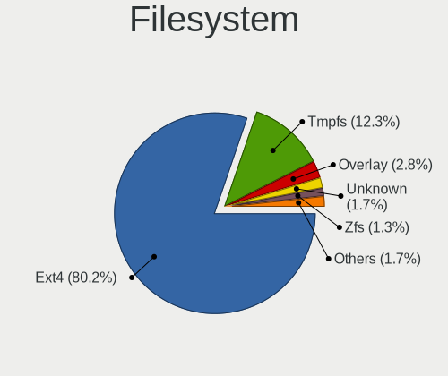
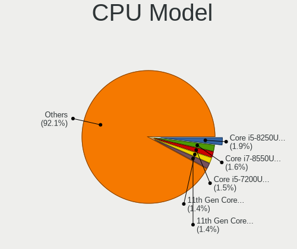
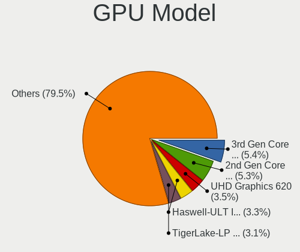
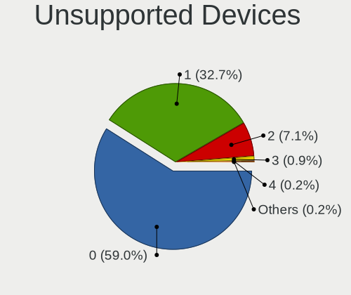

Ubuntu - Tested Hardware & Statistics (Notebooks)
-------------------------------------------------

A project to collect tested hardware configurations for Ubuntu.

Anyone can contribute to this report by the [hw-probe](https://github.com/linuxhw/hw-probe) tool:

    sudo -E hw-probe -all -upload

Please contribute! Especially if your hardware is rare.

Contents
--------

* [ Test Cases ](#test-cases)

* [ System ](#system)
  - [ OS                       ](#os)
  - [ OS Family                ](#os-family)
  - [ Kernel                   ](#kernel)
  - [ Kernel Family            ](#kernel-family)
  - [ Kernel Major Ver.        ](#kernel-major-ver)
  - [ Arch                     ](#arch)
  - [ DE                       ](#de)
  - [ Display Server           ](#display-server)
  - [ Display Manager          ](#display-manager)
  - [ OS Lang                  ](#os-lang)
  - [ Boot Mode                ](#boot-mode)
  - [ Filesystem               ](#filesystem)
  - [ Part. scheme             ](#part-scheme)
  - [ Dual Boot with Linux/BSD ](#dual-boot-with-linuxbsd)
  - [ Dual Boot (Win)          ](#dual-boot-win)

* [ Board ](#board)
  - [ Vendor                   ](#vendor)
  - [ Model                    ](#model)
  - [ Model Family             ](#model-family)
  - [ MFG Year                 ](#mfg-year)
  - [ Form Factor              ](#form-factor)
  - [ Secure Boot              ](#secure-boot)
  - [ Coreboot                 ](#coreboot)
  - [ RAM Size                 ](#ram-size)
  - [ RAM Used                 ](#ram-used)
  - [ Total Drives             ](#total-drives)
  - [ Has CD-ROM               ](#has-cd-rom)
  - [ Has Ethernet             ](#has-ethernet)
  - [ Has WiFi                 ](#has-wifi)
  - [ Has Bluetooth            ](#has-bluetooth)

* [ Location ](#location)
  - [ Country                  ](#country)
  - [ City                     ](#city)

* [ Drives ](#drives)
  - [ Drive Vendor             ](#drive-vendor)
  - [ Drive Model              ](#drive-model)
  - [ HDD Vendor               ](#hdd-vendor)
  - [ SSD Vendor               ](#ssd-vendor)
  - [ Drive Kind               ](#drive-kind)
  - [ Drive Connector          ](#drive-connector)
  - [ Drive Size               ](#drive-size)
  - [ Space Total              ](#space-total)
  - [ Space Used               ](#space-used)
  - [ Malfunc. Drives          ](#malfunc-drives)
  - [ Malfunc. Drive Vendor    ](#malfunc-drive-vendor)
  - [ Malfunc. HDD Vendor      ](#malfunc-hdd-vendor)
  - [ Malfunc. Drive Kind      ](#malfunc-drive-kind)
  - [ Failed Drives            ](#failed-drives)
  - [ Failed Drive Vendor      ](#failed-drive-vendor)
  - [ Drive Status             ](#drive-status)

* [ Storage controller ](#storage-controller)
  - [ Storage Vendor           ](#storage-vendor)
  - [ Storage Model            ](#storage-model)
  - [ Storage Kind             ](#storage-kind)

* [ Processor ](#processor)
  - [ CPU Vendor               ](#cpu-vendor)
  - [ CPU Model                ](#cpu-model)
  - [ CPU Model Family         ](#cpu-model-family)
  - [ CPU Cores                ](#cpu-cores)
  - [ CPU Sockets              ](#cpu-sockets)
  - [ CPU Threads              ](#cpu-threads)
  - [ CPU Op-Modes             ](#cpu-op-modes)
  - [ CPU Microcode            ](#cpu-microcode)
  - [ CPU Microarch            ](#cpu-microarch)

* [ Graphics ](#graphics)
  - [ GPU Vendor               ](#gpu-vendor)
  - [ GPU Model                ](#gpu-model)
  - [ GPU Combo                ](#gpu-combo)
  - [ GPU Driver               ](#gpu-driver)
  - [ GPU Memory               ](#gpu-memory)

* [ Monitor ](#monitor)
  - [ Monitor Vendor           ](#monitor-vendor)
  - [ Monitor Model            ](#monitor-model)
  - [ Monitor Resolution       ](#monitor-resolution)
  - [ Monitor Diagonal         ](#monitor-diagonal)
  - [ Monitor Width            ](#monitor-width)
  - [ Aspect Ratio             ](#aspect-ratio)
  - [ Monitor Area             ](#monitor-area)
  - [ Pixel Density            ](#pixel-density)
  - [ Multiple Monitors        ](#multiple-monitors)

* [ Network ](#network)
  - [ Net Controller Vendor    ](#net-controller-vendor)
  - [ Net Controller Model     ](#net-controller-model)
  - [ Wireless Vendor          ](#wireless-vendor)
  - [ Wireless Model           ](#wireless-model)
  - [ Ethernet Vendor          ](#ethernet-vendor)
  - [ Ethernet Model           ](#ethernet-model)
  - [ Net Controller Kind      ](#net-controller-kind)
  - [ Used Controller          ](#used-controller)
  - [ NICs                     ](#nics)
  - [ IPv6                     ](#ipv6)

* [ Bluetooth ](#bluetooth)
  - [ Bluetooth Vendor         ](#bluetooth-vendor)
  - [ Bluetooth Model          ](#bluetooth-model)

* [ Sound ](#sound)
  - [ Sound Vendor             ](#sound-vendor)
  - [ Sound Model              ](#sound-model)

* [ Memory ](#memory)
  - [ Memory Vendor            ](#memory-vendor)
  - [ Memory Model             ](#memory-model)
  - [ Memory Kind              ](#memory-kind)
  - [ Memory Form Factor       ](#memory-form-factor)
  - [ Memory Size              ](#memory-size)
  - [ Memory Speed             ](#memory-speed)

* [ Printers & scanners ](#printers--scanners)
  - [ Printer Vendor           ](#printer-vendor)
  - [ Printer Model            ](#printer-model)
  - [ Scanner Vendor           ](#scanner-vendor)
  - [ Scanner Model            ](#scanner-model)

* [ Camera ](#camera)
  - [ Camera Vendor            ](#camera-vendor)
  - [ Camera Model             ](#camera-model)

* [ Security ](#security)
  - [ Fingerprint Vendor       ](#fingerprint-vendor)
  - [ Fingerprint Model        ](#fingerprint-model)
  - [ Chipcard Vendor          ](#chipcard-vendor)
  - [ Chipcard Model           ](#chipcard-model)

* [ Unsupported ](#unsupported)
  - [ Unsupported Devices      ](#unsupported-devices)
  - [ Unsupported Device Types ](#unsupported-device-types)

Test Cases
----------

Total: 49054

| Vendor        | Model                       | Probe                                                      | Date         |
|---------------|-----------------------------|------------------------------------------------------------|--------------|
| HP            | OMEN by Laptop 15-dc1xxx    | [fb024a9374](https://linux-hardware.org/?probe=fb024a9374) | Aug 12, 2023 |
| HP            | OMEN by Laptop 15-dc1xxx    | [398f85e94a](https://linux-hardware.org/?probe=398f85e94a) | Aug 12, 2023 |
| Toshiba       | Satellite C50D-A-13G        | [e1a3542078](https://linux-hardware.org/?probe=e1a3542078) | Aug 12, 2023 |
| Dell          | Inspiron 13 5310            | [d42fa686e5](https://linux-hardware.org/?probe=d42fa686e5) | Aug 12, 2023 |
| Dell          | Inspiron 13 5310            | [45509c2727](https://linux-hardware.org/?probe=45509c2727) | Aug 12, 2023 |
| Dell          | XPS 15 9560                 | [756901f27f](https://linux-hardware.org/?probe=756901f27f) | Aug 12, 2023 |
| Panasonic     | CF-SX1WEVHR                 | [8abafe1b65](https://linux-hardware.org/?probe=8abafe1b65) | Aug 12, 2023 |
| Lenovo        | ThinkBook 14 G3 ACL 21A2    | [5892469c5b](https://linux-hardware.org/?probe=5892469c5b) | Aug 12, 2023 |
| Lenovo        | ThinkPad T14 Gen 1 20S00... | [53196a01fa](https://linux-hardware.org/?probe=53196a01fa) | Aug 12, 2023 |
| Dell          | G3 3579                     | [09ba53e3c1](https://linux-hardware.org/?probe=09ba53e3c1) | Aug 12, 2023 |
| HP            | Pavilion g7                 | [325b804863](https://linux-hardware.org/?probe=325b804863) | Aug 12, 2023 |
| ASUSTek       | T200TA                      | [24d6504b2c](https://linux-hardware.org/?probe=24d6504b2c) | Aug 12, 2023 |
| HP            | Laptop 15-dy2xxx            | [bc66f59ac5](https://linux-hardware.org/?probe=bc66f59ac5) | Aug 12, 2023 |
| Lenovo        | ThinkPad W500 4063JR4       | [f8c24a1b02](https://linux-hardware.org/?probe=f8c24a1b02) | Aug 11, 2023 |
| ASUSTek       | K55A                        | [bf260cea2c](https://linux-hardware.org/?probe=bf260cea2c) | Aug 11, 2023 |
| Jumper        | EZpad                       | [5fa2e934c3](https://linux-hardware.org/?probe=5fa2e934c3) | Aug 11, 2023 |
| HP            | EliteBook 840 14 inch G1... | [73b7fc1fc9](https://linux-hardware.org/?probe=73b7fc1fc9) | Aug 11, 2023 |
| Acer          | Aspire F5-573G              | [019f3a6d1f](https://linux-hardware.org/?probe=019f3a6d1f) | Aug 11, 2023 |
| Acer          | Extensa 215-55              | [aea9ada5e8](https://linux-hardware.org/?probe=aea9ada5e8) | Aug 11, 2023 |
| Lenovo        | IdeaPad 320-15AST 80XV      | [359d84713c](https://linux-hardware.org/?probe=359d84713c) | Aug 11, 2023 |
| Dell          | Latitude E6430              | [79f523548b](https://linux-hardware.org/?probe=79f523548b) | Aug 11, 2023 |
| Dell          | Latitude E6330              | [b3081e041e](https://linux-hardware.org/?probe=b3081e041e) | Aug 11, 2023 |
| Dell          | Latitude E6430              | [fd3c9b15f8](https://linux-hardware.org/?probe=fd3c9b15f8) | Aug 11, 2023 |
| Lenovo        | ThinkPad L520 5017BW5       | [1a9bbdc058](https://linux-hardware.org/?probe=1a9bbdc058) | Aug 11, 2023 |
| Dell          | G15 5520                    | [3bec284af8](https://linux-hardware.org/?probe=3bec284af8) | Aug 11, 2023 |
| Sony          | SVE1513I4E                  | [6b8cb6d520](https://linux-hardware.org/?probe=6b8cb6d520) | Aug 11, 2023 |
| ASUSTek       | VivoBook_ASUSLaptop M140... | [a4a009cd79](https://linux-hardware.org/?probe=a4a009cd79) | Aug 11, 2023 |
| HUAWEI        | BOD-WXX9                    | [b21e9793a5](https://linux-hardware.org/?probe=b21e9793a5) | Aug 11, 2023 |
| Acer          | Extensa 215-55              | [036866525c](https://linux-hardware.org/?probe=036866525c) | Aug 11, 2023 |
| HP            | Pavilion Laptop 14-ec0xx... | [fadee3e38d](https://linux-hardware.org/?probe=fadee3e38d) | Aug 11, 2023 |
| Acer          | Aspire ES1-111M             | [3c7140c389](https://linux-hardware.org/?probe=3c7140c389) | Aug 11, 2023 |
| Intel Clie... | LAPQC71A                    | [c87bff1d43](https://linux-hardware.org/?probe=c87bff1d43) | Aug 11, 2023 |
| Fujitsu       | LIFEBOOK S762               | [1ced8ae4d0](https://linux-hardware.org/?probe=1ced8ae4d0) | Aug 11, 2023 |
| Fujitsu       | LIFEBOOK S762               | [cb0b5cbd5d](https://linux-hardware.org/?probe=cb0b5cbd5d) | Aug 11, 2023 |
| MSI           | Creator Z16 A11UET          | [7883e9a69d](https://linux-hardware.org/?probe=7883e9a69d) | Aug 11, 2023 |
| HP            | ZBook Studio G7 Mobile W... | [836fcda626](https://linux-hardware.org/?probe=836fcda626) | Aug 11, 2023 |
| HP            | ZBook Studio G7 Mobile W... | [3e208faa6e](https://linux-hardware.org/?probe=3e208faa6e) | Aug 11, 2023 |
| Lenovo        | B50-70 20384                | [607103b8f5](https://linux-hardware.org/?probe=607103b8f5) | Aug 11, 2023 |
| Lenovo        | ThinkPad X1 Carbon 2nd 2... | [97e0c46487](https://linux-hardware.org/?probe=97e0c46487) | Aug 11, 2023 |
| Dell          | Precision 5530              | [f74dac5dcf](https://linux-hardware.org/?probe=f74dac5dcf) | Aug 11, 2023 |
| Google        | Bobba360                    | [128700115a](https://linux-hardware.org/?probe=128700115a) | Aug 10, 2023 |
| Dell          | Latitude 5400               | [1ec248c607](https://linux-hardware.org/?probe=1ec248c607) | Aug 10, 2023 |
| Lenovo        | ThinkPad Edge 03193VG       | [abb370836a](https://linux-hardware.org/?probe=abb370836a) | Aug 10, 2023 |
| Lenovo        | G40-45 80E1                 | [d6f18c79f6](https://linux-hardware.org/?probe=d6f18c79f6) | Aug 10, 2023 |
| HUAWEI        | KLVD-WXX9                   | [19cadaab1b](https://linux-hardware.org/?probe=19cadaab1b) | Aug 10, 2023 |
| Lenovo        | ThinkPad E14 20RA0076US     | [ab98272b50](https://linux-hardware.org/?probe=ab98272b50) | Aug 10, 2023 |
| Gateway       | MD7309U                     | [18dbacfdab](https://linux-hardware.org/?probe=18dbacfdab) | Aug 10, 2023 |
| HP            | OMEN by Laptop 15-dc1xxx    | [9627b6d632](https://linux-hardware.org/?probe=9627b6d632) | Aug 10, 2023 |
| ASUSTek       | VivoBook_ASUSLaptop M350... | [ffa9b97bf7](https://linux-hardware.org/?probe=ffa9b97bf7) | Aug 10, 2023 |
| HP            | OMEN by Laptop 15-dc1xxx    | [099d1ac0de](https://linux-hardware.org/?probe=099d1ac0de) | Aug 10, 2023 |
| BANGHO        | MAX L5                      | [4661b7a0f7](https://linux-hardware.org/?probe=4661b7a0f7) | Aug 10, 2023 |
| Avell High... | A70 HYB                     | [9b03ae1cd3](https://linux-hardware.org/?probe=9b03ae1cd3) | Aug 10, 2023 |
| Avell         | A70 ION                     | [6ab02a34e4](https://linux-hardware.org/?probe=6ab02a34e4) | Aug 10, 2023 |
| Fujitsu       | FMVA42CW                    | [ffb5c4343b](https://linux-hardware.org/?probe=ffb5c4343b) | Aug 10, 2023 |
| HP            | Pavilion Laptop 14-dv2xx... | [479f066821](https://linux-hardware.org/?probe=479f066821) | Aug 10, 2023 |
| Dell          | Latitude E6400              | [f28a234c30](https://linux-hardware.org/?probe=f28a234c30) | Aug 10, 2023 |
| Lenovo        | ThinkPad E15 Gen 4 21ED0... | [89e3ef8e6c](https://linux-hardware.org/?probe=89e3ef8e6c) | Aug 10, 2023 |
| Avell         | A70 ION                     | [b71c176ce3](https://linux-hardware.org/?probe=b71c176ce3) | Aug 10, 2023 |
| Lenovo        | ThinkBook 14-IIL 20SL       | [e323e9cd7e](https://linux-hardware.org/?probe=e323e9cd7e) | Aug 10, 2023 |
| Dell          | XPS L421X                   | [ba412a439b](https://linux-hardware.org/?probe=ba412a439b) | Aug 10, 2023 |
| Lenovo        | ThinkPad T420 4180X06       | [77e54b4b97](https://linux-hardware.org/?probe=77e54b4b97) | Aug 10, 2023 |
| Google        | Kindred                     | [a45439e295](https://linux-hardware.org/?probe=a45439e295) | Aug 10, 2023 |
| Acer          | Nitro AN517-51              | [bd3b7989f0](https://linux-hardware.org/?probe=bd3b7989f0) | Aug 10, 2023 |
| NEC Comput... | PC-GN246W3A5                | [2f37664ebd](https://linux-hardware.org/?probe=2f37664ebd) | Aug 10, 2023 |
| HP            | Pavilion Laptop 14-dv1xx... | [385c88301b](https://linux-hardware.org/?probe=385c88301b) | Aug 10, 2023 |
| Dell          | Vostro 3501                 | [d606f83745](https://linux-hardware.org/?probe=d606f83745) | Aug 10, 2023 |
| Lenovo        | ThinkPad T420 4180X06       | [ba950eb9e1](https://linux-hardware.org/?probe=ba950eb9e1) | Aug 10, 2023 |
| Google        | Snappy                      | [73ecdd5048](https://linux-hardware.org/?probe=73ecdd5048) | Aug 10, 2023 |
| Gateway       | NV57H                       | [826aaf5dd8](https://linux-hardware.org/?probe=826aaf5dd8) | Aug 10, 2023 |
| Lenovo        | ThinkPad E15 20RD0086UE     | [cb8ad3e0fc](https://linux-hardware.org/?probe=cb8ad3e0fc) | Aug 10, 2023 |
| Acer          | Aspire V3-571G              | [6c4354fa1c](https://linux-hardware.org/?probe=6c4354fa1c) | Aug 10, 2023 |
| ASUSTek       | ROG Strix G713PI_G713PI     | [92fda27219](https://linux-hardware.org/?probe=92fda27219) | Aug 10, 2023 |
| ASUSTek       | ROG Strix G713PI_G713PI     | [3bd085d1a5](https://linux-hardware.org/?probe=3bd085d1a5) | Aug 10, 2023 |
| Siragon       | MN-50                       | [8eafa43cb5](https://linux-hardware.org/?probe=8eafa43cb5) | Aug 09, 2023 |
| ASUSTek       | VivoBook_ASUSLaptop X321... | [204b2fa0a0](https://linux-hardware.org/?probe=204b2fa0a0) | Aug 09, 2023 |
| Lenovo        | V145-15AST 81MT             | [304b175b3c](https://linux-hardware.org/?probe=304b175b3c) | Aug 09, 2023 |
| Dell          | Latitude E6420              | [1aaa4997d4](https://linux-hardware.org/?probe=1aaa4997d4) | Aug 09, 2023 |
| Lenovo        | ThinkPad T430 2347AT2       | [a874870955](https://linux-hardware.org/?probe=a874870955) | Aug 09, 2023 |
| Toshiba       | Satellite C70D-B            | [ac775a3228](https://linux-hardware.org/?probe=ac775a3228) | Aug 09, 2023 |
| Dell          | Inspiron 15 3520            | [7723e84488](https://linux-hardware.org/?probe=7723e84488) | Aug 09, 2023 |
| ASUSTek       | ASUS TUF Gaming F17 FX70... | [bf81bbf7b4](https://linux-hardware.org/?probe=bf81bbf7b4) | Aug 09, 2023 |
| Acer          | Aspire A317-53              | [de8d362cb8](https://linux-hardware.org/?probe=de8d362cb8) | Aug 09, 2023 |
| Lenovo        | ThinkPad E15 Gen 2 20TD0... | [194ec12831](https://linux-hardware.org/?probe=194ec12831) | Aug 09, 2023 |
| Google        | Bobba360                    | [fa4a78b024](https://linux-hardware.org/?probe=fa4a78b024) | Aug 09, 2023 |
| Dell          | Latitude E6520              | [cb79d1e17c](https://linux-hardware.org/?probe=cb79d1e17c) | Aug 09, 2023 |
| Dell          | Latitude E6520              | [4516b9b475](https://linux-hardware.org/?probe=4516b9b475) | Aug 09, 2023 |
| Medion        | Akoya THE TOUCH 10          | [d45603bb4e](https://linux-hardware.org/?probe=d45603bb4e) | Aug 09, 2023 |
| Toshiba       | Satellite L745D             | [9576dab2b0](https://linux-hardware.org/?probe=9576dab2b0) | Aug 09, 2023 |
| Lenovo        | Legion 5 15ACH6 82JW        | [5bd12768fa](https://linux-hardware.org/?probe=5bd12768fa) | Aug 09, 2023 |
| Toshiba       | Satellite C70D-B            | [e3f3b2fcfb](https://linux-hardware.org/?probe=e3f3b2fcfb) | Aug 09, 2023 |
| ASUSTek       | X510URR                     | [abf7479cb8](https://linux-hardware.org/?probe=abf7479cb8) | Aug 09, 2023 |
| Acer          | Aspire V3-112P              | [e6305472c5](https://linux-hardware.org/?probe=e6305472c5) | Aug 09, 2023 |
| HP            | EliteBook 830 G8 Noteboo... | [5e79da69ed](https://linux-hardware.org/?probe=5e79da69ed) | Aug 09, 2023 |
| Dell          | Latitude 5520               | [478f0a6a07](https://linux-hardware.org/?probe=478f0a6a07) | Aug 09, 2023 |
| HP            | EliteBook 830 G8 Noteboo... | [c761edfea1](https://linux-hardware.org/?probe=c761edfea1) | Aug 09, 2023 |
| Dell          | XPS 15 9520                 | [0620b6b11a](https://linux-hardware.org/?probe=0620b6b11a) | Aug 09, 2023 |
| HP            | EliteBook 8470p             | [16acf13ed8](https://linux-hardware.org/?probe=16acf13ed8) | Aug 09, 2023 |
| Dell          | Latitude 3350               | [77100b2ef6](https://linux-hardware.org/?probe=77100b2ef6) | Aug 09, 2023 |
| HP            | EliteBook 2540p             | [2a02492c01](https://linux-hardware.org/?probe=2a02492c01) | Aug 09, 2023 |
| Dell          | Precision 3551              | [a9b776ade0](https://linux-hardware.org/?probe=a9b776ade0) | Aug 09, 2023 |
| HP            | EliteBook 2540p             | [509b979b88](https://linux-hardware.org/?probe=509b979b88) | Aug 09, 2023 |
| HP            | EliteBook 8560w             | [ea34946fbd](https://linux-hardware.org/?probe=ea34946fbd) | Aug 09, 2023 |
| Toshiba       | Satellite C55-C             | [199924c140](https://linux-hardware.org/?probe=199924c140) | Aug 09, 2023 |
| HP            | ENVY Laptop 17-ch0xxx       | [01fe285324](https://linux-hardware.org/?probe=01fe285324) | Aug 09, 2023 |
| Dell          | Latitude 5400               | [773e9320a8](https://linux-hardware.org/?probe=773e9320a8) | Aug 09, 2023 |
| Toshiba       | Satellite C55-C             | [324b952d6b](https://linux-hardware.org/?probe=324b952d6b) | Aug 09, 2023 |
| ASUSTek       | X510URR                     | [f3ee04187f](https://linux-hardware.org/?probe=f3ee04187f) | Aug 09, 2023 |
| Fujitsu       | FMVA42CW                    | [83d5950b7a](https://linux-hardware.org/?probe=83d5950b7a) | Aug 08, 2023 |
| HP            | OMEN by Laptop              | [b15a5e767a](https://linux-hardware.org/?probe=b15a5e767a) | Aug 08, 2023 |
| ASUSTek       | N56VJ                       | [d552e1a450](https://linux-hardware.org/?probe=d552e1a450) | Aug 08, 2023 |
| BANGHO        | MAX L5                      | [b21781af81](https://linux-hardware.org/?probe=b21781af81) | Aug 08, 2023 |
| Dell          | Inspiron 15 3511            | [13cec81a99](https://linux-hardware.org/?probe=13cec81a99) | Aug 08, 2023 |
| HP            | EliteBook 820 G1            | [62889fd683](https://linux-hardware.org/?probe=62889fd683) | Aug 08, 2023 |
| Dell          | Latitude 7310               | [19646f8e46](https://linux-hardware.org/?probe=19646f8e46) | Aug 08, 2023 |
| Lenovo        | ThinkPad P50 20EQS0T800     | [8316628b28](https://linux-hardware.org/?probe=8316628b28) | Aug 08, 2023 |
| Lenovo        | ThinkPad P50 20EQS0T800     | [05d33f11b5](https://linux-hardware.org/?probe=05d33f11b5) | Aug 08, 2023 |
| Notebook      | W65_W67RZ1                  | [ab4b3c8f47](https://linux-hardware.org/?probe=ab4b3c8f47) | Aug 08, 2023 |
| HP            | EliteBook 840 G3            | [bf56c08196](https://linux-hardware.org/?probe=bf56c08196) | Aug 08, 2023 |
| HP            | ZBook 14 G2                 | [c52b1e963f](https://linux-hardware.org/?probe=c52b1e963f) | Aug 08, 2023 |
| HP            | ProBook 445 G8 Notebook ... | [f69459e15a](https://linux-hardware.org/?probe=f69459e15a) | Aug 08, 2023 |
| Dell          | Latitude 7440               | [0cfa45fbd8](https://linux-hardware.org/?probe=0cfa45fbd8) | Aug 08, 2023 |
| Lenovo        | ThinkPad X1 Carbon Gen 8... | [5aa44fc15a](https://linux-hardware.org/?probe=5aa44fc15a) | Aug 08, 2023 |
| Lenovo        | ThinkPad T14 Gen 2a 20XL... | [4148b505d6](https://linux-hardware.org/?probe=4148b505d6) | Aug 08, 2023 |
| Dell          | Latitude 7440               | [e476a3e532](https://linux-hardware.org/?probe=e476a3e532) | Aug 08, 2023 |
| Dell          | Latitude E7450              | [a426887b24](https://linux-hardware.org/?probe=a426887b24) | Aug 08, 2023 |
| HP            | ZBook 14 G2                 | [211978450c](https://linux-hardware.org/?probe=211978450c) | Aug 08, 2023 |
| HP            | EliteBook 840 G3            | [132603d7e2](https://linux-hardware.org/?probe=132603d7e2) | Aug 08, 2023 |
| Dell          | Latitude 7310               | [baab866835](https://linux-hardware.org/?probe=baab866835) | Aug 08, 2023 |
| HP            | ZBook 14 G2                 | [23dd3e572c](https://linux-hardware.org/?probe=23dd3e572c) | Aug 08, 2023 |
| Acer          | Aspire 4820TG               | [49a63e5cc4](https://linux-hardware.org/?probe=49a63e5cc4) | Aug 08, 2023 |
| HP            | ProBook 650 G1              | [b176d8959a](https://linux-hardware.org/?probe=b176d8959a) | Aug 08, 2023 |
| HP            | EliteBook 845 G7 Noteboo... | [6738a625d8](https://linux-hardware.org/?probe=6738a625d8) | Aug 08, 2023 |
| Dell          | Latitude 5540               | [08c875f58b](https://linux-hardware.org/?probe=08c875f58b) | Aug 08, 2023 |
| HP            | EliteBook 840 G6            | [60a28c22c7](https://linux-hardware.org/?probe=60a28c22c7) | Aug 08, 2023 |
| MSI           | Creator Z16 A11UET          | [ea05388cf5](https://linux-hardware.org/?probe=ea05388cf5) | Aug 08, 2023 |
| ASUSTek       | VivoBook_ASUS Laptop X50... | [58446ba97c](https://linux-hardware.org/?probe=58446ba97c) | Aug 08, 2023 |
| HP            | EliteBook 840 G6            | [9f044dbe9e](https://linux-hardware.org/?probe=9f044dbe9e) | Aug 08, 2023 |
| HP            | EliteBook 845 G7 Noteboo... | [66488bdd81](https://linux-hardware.org/?probe=66488bdd81) | Aug 08, 2023 |
| Dell          | Inspiron 5402               | [9004ee7aa2](https://linux-hardware.org/?probe=9004ee7aa2) | Aug 08, 2023 |
| ASUSTek       | ROG Strix G513IH_G513IH     | [b065632006](https://linux-hardware.org/?probe=b065632006) | Aug 08, 2023 |
| Lenovo        | B40-80 80LS                 | [2865a9d402](https://linux-hardware.org/?probe=2865a9d402) | Aug 08, 2023 |
| Lenovo        | Legion 5 15ARH7H 82RD       | [1e2412e487](https://linux-hardware.org/?probe=1e2412e487) | Aug 08, 2023 |
| Dell          | Latitude E6430              | [313d3616c4](https://linux-hardware.org/?probe=313d3616c4) | Aug 08, 2023 |
| Google        | Parrot                      | [a0820a5e0c](https://linux-hardware.org/?probe=a0820a5e0c) | Aug 07, 2023 |
| Google        | Parrot                      | [f03c4efc0b](https://linux-hardware.org/?probe=f03c4efc0b) | Aug 07, 2023 |
| Lenovo        | ThinkPad T15 Gen 2i 20W4... | [ce593ff6c7](https://linux-hardware.org/?probe=ce593ff6c7) | Aug 07, 2023 |
| Acer          | Aspire A515-56              | [84b0c88b0a](https://linux-hardware.org/?probe=84b0c88b0a) | Aug 07, 2023 |
| HP            | ProBook 455 G7              | [bd9f67ee72](https://linux-hardware.org/?probe=bd9f67ee72) | Aug 07, 2023 |
| MSI           | GL63 8RC                    | [d91d6193e6](https://linux-hardware.org/?probe=d91d6193e6) | Aug 07, 2023 |
| System76      | Serval WS                   | [3cd45493ee](https://linux-hardware.org/?probe=3cd45493ee) | Aug 07, 2023 |
| HP            | Notebook                    | [02ceb78a4f](https://linux-hardware.org/?probe=02ceb78a4f) | Aug 07, 2023 |
| Dell          | Inspiron 5721               | [99042a3573](https://linux-hardware.org/?probe=99042a3573) | Aug 07, 2023 |
| HP            | Pavilion Gaming Laptop 1... | [3ec4223487](https://linux-hardware.org/?probe=3ec4223487) | Aug 07, 2023 |
| Lenovo        | B40-70 20392                | [ebf45c27f4](https://linux-hardware.org/?probe=ebf45c27f4) | Aug 07, 2023 |
| Dell          | Precision M6500             | [054f8ba242](https://linux-hardware.org/?probe=054f8ba242) | Aug 07, 2023 |
| Dell          | Latitude 7300               | [932f04033c](https://linux-hardware.org/?probe=932f04033c) | Aug 07, 2023 |
| SGIN          | laptop                      | [d80389ea87](https://linux-hardware.org/?probe=d80389ea87) | Aug 07, 2023 |
| Acer          | Swift SF514-53T             | [30d8fefda4](https://linux-hardware.org/?probe=30d8fefda4) | Aug 07, 2023 |
| Dell          | XPS 15 9500                 | [dbefafc94d](https://linux-hardware.org/?probe=dbefafc94d) | Aug 07, 2023 |
| Acer          | Swift SF514-53T             | [f1cef350fb](https://linux-hardware.org/?probe=f1cef350fb) | Aug 07, 2023 |
| ASUSTek       | ROG Strix G513RC_G513RC     | [77840c201a](https://linux-hardware.org/?probe=77840c201a) | Aug 07, 2023 |
| Lenovo        | ThinkPad E15 Gen 2 20TD0... | [ab45ffe407](https://linux-hardware.org/?probe=ab45ffe407) | Aug 07, 2023 |
| HP            | EliteBook 850 G8 Noteboo... | [ce02da2586](https://linux-hardware.org/?probe=ce02da2586) | Aug 07, 2023 |
| Lenovo        | ThinkPad E14 Gen 5 21JRS... | [ebcf58253e](https://linux-hardware.org/?probe=ebcf58253e) | Aug 07, 2023 |
| Lenovo        | ThinkPad X1 Carbon Gen 1... | [a3dd4fadf3](https://linux-hardware.org/?probe=a3dd4fadf3) | Aug 07, 2023 |
| Acer          | Nitro AN517-52              | [d24385ceb8](https://linux-hardware.org/?probe=d24385ceb8) | Aug 07, 2023 |
| Dell          | XPS 13 9350                 | [fb1aaeae43](https://linux-hardware.org/?probe=fb1aaeae43) | Aug 07, 2023 |
| Lenovo        | ThinkPad X200 74595FG       | [fe977cc0fe](https://linux-hardware.org/?probe=fe977cc0fe) | Aug 07, 2023 |
| HP            | Laptop 17-ak0xx             | [67749cdc51](https://linux-hardware.org/?probe=67749cdc51) | Aug 07, 2023 |
| Notebook      | NHxxRZQ                     | [0cd17c8b5c](https://linux-hardware.org/?probe=0cd17c8b5c) | Aug 07, 2023 |
| Fujitsu       | LIFEBOOK A359               | [60a09f6ca3](https://linux-hardware.org/?probe=60a09f6ca3) | Aug 07, 2023 |
| Dell          | XPS 15 9500                 | [309b546405](https://linux-hardware.org/?probe=309b546405) | Aug 07, 2023 |
| HP            | Pavilion 15                 | [227895bca8](https://linux-hardware.org/?probe=227895bca8) | Aug 07, 2023 |
| ASUSTek       | ROG Zephyrus G14 GA401IH... | [0b3bf57b84](https://linux-hardware.org/?probe=0b3bf57b84) | Aug 07, 2023 |
| HP            | ProBook 650 G1              | [b02660749d](https://linux-hardware.org/?probe=b02660749d) | Aug 07, 2023 |
| MSI           | GL65 9SD                    | [b3ef4f1363](https://linux-hardware.org/?probe=b3ef4f1363) | Aug 07, 2023 |
| Lenovo        | B40-80 80LS                 | [bfb069ff41](https://linux-hardware.org/?probe=bfb069ff41) | Aug 07, 2023 |
| HP            | EliteBook 840 G3            | [2e239a5f09](https://linux-hardware.org/?probe=2e239a5f09) | Aug 07, 2023 |
| Lenovo        | ThinkPad T480 20L6S42000    | [3e9ce860b6](https://linux-hardware.org/?probe=3e9ce860b6) | Aug 07, 2023 |
| Acer          | Aspire 4750                 | [8491f5fc3b](https://linux-hardware.org/?probe=8491f5fc3b) | Aug 07, 2023 |
| Timi          | TM1607                      | [c545853106](https://linux-hardware.org/?probe=c545853106) | Aug 07, 2023 |
| HP            | EliteBook 840 G6            | [9f230de889](https://linux-hardware.org/?probe=9f230de889) | Aug 07, 2023 |
| HP            | ProBook 450 G2              | [de0ce7c424](https://linux-hardware.org/?probe=de0ce7c424) | Aug 06, 2023 |
| HP            | ProBook 640 G2              | [8dae611904](https://linux-hardware.org/?probe=8dae611904) | Aug 06, 2023 |
| Apple         | MacBookAir6,1               | [acf60b5aa8](https://linux-hardware.org/?probe=acf60b5aa8) | Aug 06, 2023 |
| HP            | OMEN Laptop 15-en0xxx       | [32c2f39f3a](https://linux-hardware.org/?probe=32c2f39f3a) | Aug 06, 2023 |
| Acer          | E1-510                      | [2d6776c4fe](https://linux-hardware.org/?probe=2d6776c4fe) | Aug 06, 2023 |
| Notebook      | NS5x_NS7xPU                 | [d71ac9524e](https://linux-hardware.org/?probe=d71ac9524e) | Aug 06, 2023 |
| Dell          | Latitude 5290 2-in-1        | [62e2743cda](https://linux-hardware.org/?probe=62e2743cda) | Aug 06, 2023 |
| HP            | EliteBook 8540p             | [4709894444](https://linux-hardware.org/?probe=4709894444) | Aug 06, 2023 |
| Dell          | Latitude E5540              | [928c427cbc](https://linux-hardware.org/?probe=928c427cbc) | Aug 06, 2023 |
| ASUSTek       | UX32VD                      | [298a3261a0](https://linux-hardware.org/?probe=298a3261a0) | Aug 06, 2023 |
| Lenovo        | B40-70 20392                | [221f9de00a](https://linux-hardware.org/?probe=221f9de00a) | Aug 06, 2023 |
| MSI           | GL65 9SD                    | [2539f4ad7a](https://linux-hardware.org/?probe=2539f4ad7a) | Aug 06, 2023 |
| HP            | EliteBook 840 G4            | [44d851d327](https://linux-hardware.org/?probe=44d851d327) | Aug 06, 2023 |
| HP            | ZBook Firefly 15.6 inch ... | [a3c7d29211](https://linux-hardware.org/?probe=a3c7d29211) | Aug 06, 2023 |
| HP            | EliteBook 840 G5            | [9688966097](https://linux-hardware.org/?probe=9688966097) | Aug 06, 2023 |
| ASUSTek       | K54L                        | [3ce0c0b7b2](https://linux-hardware.org/?probe=3ce0c0b7b2) | Aug 06, 2023 |
| HP            | EliteBook 840 G1            | [8a0a837f0b](https://linux-hardware.org/?probe=8a0a837f0b) | Aug 06, 2023 |
| ASUSTek       | K54L                        | [b28f27325f](https://linux-hardware.org/?probe=b28f27325f) | Aug 06, 2023 |
| HP            | Laptop 15-db0xxx            | [51442067d5](https://linux-hardware.org/?probe=51442067d5) | Aug 06, 2023 |
| Acer          | Aspire A515-56              | [dfe905b869](https://linux-hardware.org/?probe=dfe905b869) | Aug 06, 2023 |
| Chuwi         | GemiBook Pro                | [2726702c6a](https://linux-hardware.org/?probe=2726702c6a) | Aug 06, 2023 |
| Panasonic     | CF-SX1WEVHR                 | [4bd753037a](https://linux-hardware.org/?probe=4bd753037a) | Aug 06, 2023 |
| Dell          | Inspiron 15 5510            | [88f7813621](https://linux-hardware.org/?probe=88f7813621) | Aug 06, 2023 |
| Lenovo        | B570e HuronRiver Platfor... | [270c9a3ea0](https://linux-hardware.org/?probe=270c9a3ea0) | Aug 06, 2023 |
| Dell          | Inspiron 7572               | [2509709a1e](https://linux-hardware.org/?probe=2509709a1e) | Aug 06, 2023 |
| HP            | Pavilion TS Sleekbook 15    | [8360dc045f](https://linux-hardware.org/?probe=8360dc045f) | Aug 06, 2023 |
| HP            | Pavilion TS Sleekbook 15    | [cad443cf78](https://linux-hardware.org/?probe=cad443cf78) | Aug 06, 2023 |
| HUAWEI        | HVY-WXX9                    | [0c8aef568d](https://linux-hardware.org/?probe=0c8aef568d) | Aug 06, 2023 |
| Dell          | Precision 3571              | [fdbbd33ee6](https://linux-hardware.org/?probe=fdbbd33ee6) | Aug 06, 2023 |
| HUAWEI        | HVY-WXX9                    | [597f8ddaf2](https://linux-hardware.org/?probe=597f8ddaf2) | Aug 06, 2023 |
| Dell          | Precision 3571              | [76de48bd02](https://linux-hardware.org/?probe=76de48bd02) | Aug 06, 2023 |
| Acer          | Aspire 5750G                | [3b589d53bc](https://linux-hardware.org/?probe=3b589d53bc) | Aug 06, 2023 |
| Lenovo        | B570e HuronRiver Platfor... | [db5a797fc0](https://linux-hardware.org/?probe=db5a797fc0) | Aug 06, 2023 |
| HP            | EliteBook 840 G1            | [cc48d8c23e](https://linux-hardware.org/?probe=cc48d8c23e) | Aug 06, 2023 |
| Acer          | Nitro AN515-57              | [dbb09ef76f](https://linux-hardware.org/?probe=dbb09ef76f) | Aug 06, 2023 |
| Acer          | Nitro AN515-57              | [0aa699dc73](https://linux-hardware.org/?probe=0aa699dc73) | Aug 06, 2023 |
| Lenovo        | ThinkPad T430 2342CTO       | [96dae933b5](https://linux-hardware.org/?probe=96dae933b5) | Aug 06, 2023 |
| Dell          | Latitude 7480               | [eeb7f6e8fe](https://linux-hardware.org/?probe=eeb7f6e8fe) | Aug 06, 2023 |
| Lenovo        | IdeaPad 3 15IGL05 82BU      | [52b9918d42](https://linux-hardware.org/?probe=52b9918d42) | Aug 06, 2023 |
| HP            | EliteBook 845 G7 Noteboo... | [d00f65f7f0](https://linux-hardware.org/?probe=d00f65f7f0) | Aug 06, 2023 |
| HP            | Laptop 15-db0xxx            | [5889bc8dc7](https://linux-hardware.org/?probe=5889bc8dc7) | Aug 06, 2023 |
| Acer          | Aspire 5551                 | [4db1866796](https://linux-hardware.org/?probe=4db1866796) | Aug 06, 2023 |
| HP            | EliteBook 845 G7 Noteboo... | [1b7eaa2e00](https://linux-hardware.org/?probe=1b7eaa2e00) | Aug 06, 2023 |
| HP            | EliteBook 8560w             | [b2177d3c55](https://linux-hardware.org/?probe=b2177d3c55) | Aug 06, 2023 |
| Unknown       | Unknown                     | [9431f6f4e8](https://linux-hardware.org/?probe=9431f6f4e8) | Aug 06, 2023 |
| Dell          | Latitude 5590               | [83d389e795](https://linux-hardware.org/?probe=83d389e795) | Aug 06, 2023 |
| HP            | Pavilion Laptop 15-cc5xx    | [8baf99b470](https://linux-hardware.org/?probe=8baf99b470) | Aug 05, 2023 |
| ASUSTek       | VivoBook_ASUSLaptop M350... | [c8d1e98a60](https://linux-hardware.org/?probe=c8d1e98a60) | Aug 05, 2023 |
| Lenovo        | IdeaPad S145-15IWL 81S9     | [6de5534e97](https://linux-hardware.org/?probe=6de5534e97) | Aug 05, 2023 |
| Acer          | Aspire ES1-531              | [a03544ae5a](https://linux-hardware.org/?probe=a03544ae5a) | Aug 05, 2023 |
| Dell          | Latitude 5410               | [2838e5d74c](https://linux-hardware.org/?probe=2838e5d74c) | Aug 05, 2023 |
| HP            | 15                          | [77ae1d8e7e](https://linux-hardware.org/?probe=77ae1d8e7e) | Aug 05, 2023 |
| Dell          | Inspiron 15 5510            | [6d78d72399](https://linux-hardware.org/?probe=6d78d72399) | Aug 05, 2023 |
| Dell          | Latitude 5400               | [e788e3a534](https://linux-hardware.org/?probe=e788e3a534) | Aug 05, 2023 |
| Toshiba       | Satellite C670D-11P         | [a5c49672d6](https://linux-hardware.org/?probe=a5c49672d6) | Aug 05, 2023 |
| Dell          | Latitude E6420              | [3636e69adb](https://linux-hardware.org/?probe=3636e69adb) | Aug 05, 2023 |
| Apple         | MacBookPro14,1              | [d3630fa2ed](https://linux-hardware.org/?probe=d3630fa2ed) | Aug 05, 2023 |
| ASUSTek       | K52Je                       | [34fa8887dd](https://linux-hardware.org/?probe=34fa8887dd) | Aug 05, 2023 |
| ASUSTek       | VivoBook_ASUSLaptop M140... | [5f516e849d](https://linux-hardware.org/?probe=5f516e849d) | Aug 05, 2023 |
| Lenovo        | IdeaPad 5 15ARE05 81YQ      | [24dc4f34a2](https://linux-hardware.org/?probe=24dc4f34a2) | Aug 05, 2023 |
| Chuwi         | CoreBook XPro               | [776bcc618a](https://linux-hardware.org/?probe=776bcc618a) | Aug 05, 2023 |
| HP            | Notebook                    | [d86cc7b5ba](https://linux-hardware.org/?probe=d86cc7b5ba) | Aug 05, 2023 |
| ASUSTek       | ASUS TUF Gaming A16 FA61... | [779c23fe06](https://linux-hardware.org/?probe=779c23fe06) | Aug 05, 2023 |
| Dell          | Inspiron 5521               | [21063bc0bb](https://linux-hardware.org/?probe=21063bc0bb) | Aug 05, 2023 |
| Lenovo        | ThinkPad X131e 33671S2      | [3f83b5efac](https://linux-hardware.org/?probe=3f83b5efac) | Aug 05, 2023 |
| MSI           | GF75 Thin 10SCXR            | [21d2f0b558](https://linux-hardware.org/?probe=21d2f0b558) | Aug 05, 2023 |
| Lenovo        | ThinkPad T15 Gen 2i 20W5... | [e2dee68ce7](https://linux-hardware.org/?probe=e2dee68ce7) | Aug 05, 2023 |
| ASUSTek       | VivoBook_ASUSLaptop X350... | [364aa911cf](https://linux-hardware.org/?probe=364aa911cf) | Aug 05, 2023 |
| Apple         | MacBookPro14,1              | [08f78bf99a](https://linux-hardware.org/?probe=08f78bf99a) | Aug 05, 2023 |
| ALLDOCUBE     | i1502                       | [1ccf0b8f71](https://linux-hardware.org/?probe=1ccf0b8f71) | Aug 05, 2023 |
| HP            | EliteBook 8740w             | [b30001b3fe](https://linux-hardware.org/?probe=b30001b3fe) | Aug 05, 2023 |
| HP            | ProBook 450 G5              | [0482630783](https://linux-hardware.org/?probe=0482630783) | Aug 05, 2023 |
| Dell          | Latitude 5421               | [d01013b679](https://linux-hardware.org/?probe=d01013b679) | Aug 05, 2023 |
| Dell          | Latitude 5421               | [5dfde4e6ac](https://linux-hardware.org/?probe=5dfde4e6ac) | Aug 05, 2023 |
| ASUSTek       | VivoBook_ASUSLaptop X512... | [8292d9f518](https://linux-hardware.org/?probe=8292d9f518) | Aug 04, 2023 |
| Dell          | Latitude E6330              | [c4b0f9dfd2](https://linux-hardware.org/?probe=c4b0f9dfd2) | Aug 04, 2023 |
| Lenovo        | ThinkPad 13 2nd Gen 20J2... | [ff55512c0e](https://linux-hardware.org/?probe=ff55512c0e) | Aug 04, 2023 |
| Dell          | Latitude E6330              | [3c74e4818b](https://linux-hardware.org/?probe=3c74e4818b) | Aug 04, 2023 |
| Dell          | Latitude E6420              | [4f67a219dc](https://linux-hardware.org/?probe=4f67a219dc) | Aug 04, 2023 |
| HP            | ProBook 450 G8 Notebook ... | [9eac356b0a](https://linux-hardware.org/?probe=9eac356b0a) | Aug 04, 2023 |
| Acer          | Predator PH315-53           | [6c13f7a1f0](https://linux-hardware.org/?probe=6c13f7a1f0) | Aug 04, 2023 |
| Dell          | Latitude 5430 Rugged        | [11a8ce4fba](https://linux-hardware.org/?probe=11a8ce4fba) | Aug 04, 2023 |
| HP            | ZHAN 99 Mobile Workstati... | [b3422c4e37](https://linux-hardware.org/?probe=b3422c4e37) | Aug 04, 2023 |
| ASUSTek       | VivoBook_ASUSLaptop M650... | [db2732f0e8](https://linux-hardware.org/?probe=db2732f0e8) | Aug 04, 2023 |
| HP            | ZBook Studio G3             | [3f7f45a94e](https://linux-hardware.org/?probe=3f7f45a94e) | Aug 04, 2023 |
| Lenovo        | IdeaPad 5 Pro 14ACN6 82L... | [f7354ee466](https://linux-hardware.org/?probe=f7354ee466) | Aug 04, 2023 |
| Dell          | Latitude 5430 Rugged        | [4bf16cb575](https://linux-hardware.org/?probe=4bf16cb575) | Aug 04, 2023 |
| Lenovo        | ThinkPad X1 Carbon Gen 1... | [7abc08a315](https://linux-hardware.org/?probe=7abc08a315) | Aug 04, 2023 |
| Apple         | MacBookAir7,2               | [e21469f818](https://linux-hardware.org/?probe=e21469f818) | Aug 04, 2023 |
| ASUSTek       | VivoBook_ASUSLaptop X509... | [87febc0242](https://linux-hardware.org/?probe=87febc0242) | Aug 04, 2023 |
| Lenovo        | IdeaPad 3 15IML05 81WB      | [2825bbd67b](https://linux-hardware.org/?probe=2825bbd67b) | Aug 04, 2023 |
| Dell          | Vostro 5515                 | [bd17eec0e3](https://linux-hardware.org/?probe=bd17eec0e3) | Aug 04, 2023 |
| ASUSTek       | VivoBook_ASUSLaptop X412... | [d8caf086ad](https://linux-hardware.org/?probe=d8caf086ad) | Aug 04, 2023 |
| Dell          | G3 3590                     | [56d5cdc390](https://linux-hardware.org/?probe=56d5cdc390) | Aug 04, 2023 |
| Dell          | Vostro 15 3510              | [bd994e4cc6](https://linux-hardware.org/?probe=bd994e4cc6) | Aug 04, 2023 |
| Apple         | MacBookPro8,2               | [44f5a672b7](https://linux-hardware.org/?probe=44f5a672b7) | Aug 04, 2023 |
| Medion        | Erazer X7841 MD99556        | [c9f4247fc1](https://linux-hardware.org/?probe=c9f4247fc1) | Aug 04, 2023 |
| Dell          | Vostro 15 3510              | [ab2f3b8c7b](https://linux-hardware.org/?probe=ab2f3b8c7b) | Aug 04, 2023 |
| Lenovo        | ThinkPad T480s 20L8S84H0... | [d64e9809fa](https://linux-hardware.org/?probe=d64e9809fa) | Aug 04, 2023 |
| Apple         | MacBookPro8,2               | [a8de87477f](https://linux-hardware.org/?probe=a8de87477f) | Aug 04, 2023 |
| HP            | EliteBook 840 G3            | [9c96e1e114](https://linux-hardware.org/?probe=9c96e1e114) | Aug 04, 2023 |
| ASUSTek       | Zenbook UX3402ZA_Q409ZA     | [8a2dafef83](https://linux-hardware.org/?probe=8a2dafef83) | Aug 04, 2023 |
| Apple         | MacBookPro9,2               | [cf25fc0b62](https://linux-hardware.org/?probe=cf25fc0b62) | Aug 04, 2023 |
| HP            | 255 G3                      | [c8b3db6b0b](https://linux-hardware.org/?probe=c8b3db6b0b) | Aug 03, 2023 |
| HP            | EliteBook Folio G1          | [b9bb38ddd4](https://linux-hardware.org/?probe=b9bb38ddd4) | Aug 03, 2023 |
| HP            | Laptop 14s-dq2xxx           | [8aad3290a7](https://linux-hardware.org/?probe=8aad3290a7) | Aug 03, 2023 |
| Sony          | VGN-NS38E_S                 | [a21051f2a8](https://linux-hardware.org/?probe=a21051f2a8) | Aug 03, 2023 |
| Lenovo        | ThinkPad X280 20KES3D900    | [865dbfa247](https://linux-hardware.org/?probe=865dbfa247) | Aug 03, 2023 |
| Apple         | MacBookAir7,2               | [89c0c5c135](https://linux-hardware.org/?probe=89c0c5c135) | Aug 03, 2023 |
| HP            | ZBook Studio G3             | [69b35fdf25](https://linux-hardware.org/?probe=69b35fdf25) | Aug 03, 2023 |
| Shanghai Z... | ZXE CRB                     | [2d4fc6f4ce](https://linux-hardware.org/?probe=2d4fc6f4ce) | Aug 03, 2023 |
| Dell          | Latitude 5490               | [e93c786075](https://linux-hardware.org/?probe=e93c786075) | Aug 03, 2023 |
| Acer          | Aspire 7750G                | [71f5ef03f9](https://linux-hardware.org/?probe=71f5ef03f9) | Aug 03, 2023 |
| Notebook      | NP5x_NP6x_NP7xPNP           | [508c18e563](https://linux-hardware.org/?probe=508c18e563) | Aug 03, 2023 |
| Dell          | Latitude E6400              | [9f3cef93ed](https://linux-hardware.org/?probe=9f3cef93ed) | Aug 03, 2023 |
| Acer          | Aspire A515-57              | [87c4730d07](https://linux-hardware.org/?probe=87c4730d07) | Aug 03, 2023 |
| GIADA         | Unknown                     | [cd8b23468a](https://linux-hardware.org/?probe=cd8b23468a) | Aug 03, 2023 |
| Lenovo        | IdeaPad S130-11IGM 81J1     | [e5be227d11](https://linux-hardware.org/?probe=e5be227d11) | Aug 03, 2023 |
| Dell          | Latitude E6440              | [c00884f2cd](https://linux-hardware.org/?probe=c00884f2cd) | Aug 03, 2023 |
| Lenovo        | ThinkPad P14s Gen 3 21AK... | [deeafc23f9](https://linux-hardware.org/?probe=deeafc23f9) | Aug 03, 2023 |
| Lenovo        | V510-15IKB 80WQ             | [a3ff56579a](https://linux-hardware.org/?probe=a3ff56579a) | Aug 03, 2023 |
| Notebook      | N9x0TD_TF                   | [033c07e1d3](https://linux-hardware.org/?probe=033c07e1d3) | Aug 03, 2023 |
| Notebook      | N9x0TD_TF                   | [3ab98d3af1](https://linux-hardware.org/?probe=3ab98d3af1) | Aug 03, 2023 |
| Acer          | Aspire ES1-520              | [437e15fae7](https://linux-hardware.org/?probe=437e15fae7) | Aug 03, 2023 |
| Acer          | Nitro AN515-44              | [38f33f3878](https://linux-hardware.org/?probe=38f33f3878) | Aug 03, 2023 |
| Dell          | Latitude 5420               | [491cea9604](https://linux-hardware.org/?probe=491cea9604) | Aug 03, 2023 |
| MSI           | Prestige 14Evo A12M         | [c9e4b6dd90](https://linux-hardware.org/?probe=c9e4b6dd90) | Aug 03, 2023 |
| HP            | EliteBook 8570p             | [9b2c783e20](https://linux-hardware.org/?probe=9b2c783e20) | Aug 03, 2023 |
| Samsung       | 930X2K/931X2K               | [5985901bef](https://linux-hardware.org/?probe=5985901bef) | Aug 03, 2023 |
| HP            | EliteBook 8740w             | [49a27fb8fb](https://linux-hardware.org/?probe=49a27fb8fb) | Aug 03, 2023 |
| HP            | EliteBook 8740w             | [e2d58e4a51](https://linux-hardware.org/?probe=e2d58e4a51) | Aug 03, 2023 |
| Dell          | Latitude 5440               | [5791d15bc8](https://linux-hardware.org/?probe=5791d15bc8) | Aug 02, 2023 |
| HP            | Notebook                    | [0e8585ef71](https://linux-hardware.org/?probe=0e8585ef71) | Aug 02, 2023 |
| Acer          | Aspire A515-56              | [8b2ffc9837](https://linux-hardware.org/?probe=8b2ffc9837) | Aug 02, 2023 |
| HUAWEI        | HVY-WXX9                    | [906ab3334f](https://linux-hardware.org/?probe=906ab3334f) | Aug 02, 2023 |
| Dell          | Latitude 5540               | [e521b93e2f](https://linux-hardware.org/?probe=e521b93e2f) | Aug 02, 2023 |
| Notebook      | PB50_70RF,RD,RC             | [deb7c70ef0](https://linux-hardware.org/?probe=deb7c70ef0) | Aug 02, 2023 |
| Dell          | Latitude 5440               | [5b0eb512d1](https://linux-hardware.org/?probe=5b0eb512d1) | Aug 02, 2023 |
| Acer          | Aspire ES1-520              | [1cf260b959](https://linux-hardware.org/?probe=1cf260b959) | Aug 02, 2023 |
| HP            | 255 G8 Notebook PC          | [d0e963d600](https://linux-hardware.org/?probe=d0e963d600) | Aug 02, 2023 |
| HUAWEI        | NBLB-WAX9N                  | [28ff7ce482](https://linux-hardware.org/?probe=28ff7ce482) | Aug 02, 2023 |
| Lenovo        | IdeaPad 3 15ALC6 82KU       | [502969280a](https://linux-hardware.org/?probe=502969280a) | Aug 02, 2023 |
| ASUSTek       | X540NA                      | [c7724d9c7c](https://linux-hardware.org/?probe=c7724d9c7c) | Aug 02, 2023 |
| Lenovo        | IdeaPad 3 15ITL6 82H8       | [34ef2db095](https://linux-hardware.org/?probe=34ef2db095) | Aug 02, 2023 |
| Lenovo        | ThinkPad T440p 20AN0079M... | [5bbbd1f3d4](https://linux-hardware.org/?probe=5bbbd1f3d4) | Aug 02, 2023 |
| Lenovo        | Legion 5 Pro 16ACH6H 82J... | [8767df67f4](https://linux-hardware.org/?probe=8767df67f4) | Aug 02, 2023 |
| Samsung       | 950XCJ/951XCJ/950XCR        | [dd11fc89fe](https://linux-hardware.org/?probe=dd11fc89fe) | Aug 02, 2023 |
| ASUSTek       | VivoBook_ASUSLaptop M350... | [5f2529e42b](https://linux-hardware.org/?probe=5f2529e42b) | Aug 02, 2023 |
| Panasonic     | CF-31Q2A731M                | [28a7b62627](https://linux-hardware.org/?probe=28a7b62627) | Aug 02, 2023 |
| Panasonic     | CF-SX1WEVHR                 | [4d0d3b78e7](https://linux-hardware.org/?probe=4d0d3b78e7) | Aug 02, 2023 |
| HP            | ENVY Laptop 13-aq0xxx       | [6fe0b53a1b](https://linux-hardware.org/?probe=6fe0b53a1b) | Aug 02, 2023 |
| Acer          | Aspire E1-572               | [af04d8d764](https://linux-hardware.org/?probe=af04d8d764) | Aug 02, 2023 |
| Unknown       | Unknown                     | [41ff18df05](https://linux-hardware.org/?probe=41ff18df05) | Aug 02, 2023 |
| Unknown       | Unknown                     | [eb3d428d41](https://linux-hardware.org/?probe=eb3d428d41) | Aug 02, 2023 |
| Lenovo        | ThinkPad T470s W10DG 20J... | [74f1782ead](https://linux-hardware.org/?probe=74f1782ead) | Aug 02, 2023 |
| ASUSTek       | UX430UNR                    | [89c8324528](https://linux-hardware.org/?probe=89c8324528) | Aug 01, 2023 |
| ASUSTek       | VivoBook_ASUSLaptop X415... | [cbc721a89f](https://linux-hardware.org/?probe=cbc721a89f) | Aug 01, 2023 |
| Lenovo        | IdeaPad Gaming 3 15ACH6 ... | [d9db031e65](https://linux-hardware.org/?probe=d9db031e65) | Aug 01, 2023 |
| Dell          | Inspiron 5567               | [6f220fcf23](https://linux-hardware.org/?probe=6f220fcf23) | Aug 01, 2023 |
| HP            | OMEN by Laptop 16-c0xxx     | [8e7e80c44e](https://linux-hardware.org/?probe=8e7e80c44e) | Aug 01, 2023 |
| HP            | Unknown                     | [f7ffb3c085](https://linux-hardware.org/?probe=f7ffb3c085) | Aug 01, 2023 |
| Lenovo        | IdeaPad Gaming 3 15ACH6 ... | [7ed6a80c20](https://linux-hardware.org/?probe=7ed6a80c20) | Aug 01, 2023 |
| Lenovo        | IdeaPad Gaming 3 15ACH6 ... | [bbf2e1b3b3](https://linux-hardware.org/?probe=bbf2e1b3b3) | Aug 01, 2023 |
| Lenovo        | ThinkPad X250 20CL0007SG    | [f30d61c851](https://linux-hardware.org/?probe=f30d61c851) | Aug 01, 2023 |
| Acer          | Aspire A315-23              | [ef1917aa93](https://linux-hardware.org/?probe=ef1917aa93) | Aug 01, 2023 |
| Acer          | Aspire A315-23              | [9164151f28](https://linux-hardware.org/?probe=9164151f28) | Aug 01, 2023 |
| Dell          | Latitude E6220              | [5b4b97df21](https://linux-hardware.org/?probe=5b4b97df21) | Aug 01, 2023 |
| Toshiba       | Satellite C850-F74T         | [7756db419e](https://linux-hardware.org/?probe=7756db419e) | Aug 01, 2023 |
| Dell          | Inspiron 5567               | [d6c2eae395](https://linux-hardware.org/?probe=d6c2eae395) | Aug 01, 2023 |
| Dell          | Latitude E7470              | [d377538364](https://linux-hardware.org/?probe=d377538364) | Aug 01, 2023 |
| ASUSTek       | X751LA                      | [928a69b9af](https://linux-hardware.org/?probe=928a69b9af) | Aug 01, 2023 |
| ASUSTek       | VivoBook_ASUS Laptop E41... | [2dcefa3349](https://linux-hardware.org/?probe=2dcefa3349) | Aug 01, 2023 |
| HP            | Pavilion Laptop 15-cc5xx    | [d1af2e2c9f](https://linux-hardware.org/?probe=d1af2e2c9f) | Jul 31, 2023 |
| HP            | 355 G2                      | [db5f6adcd7](https://linux-hardware.org/?probe=db5f6adcd7) | Jul 31, 2023 |
| ASUSTek       | VivoBook_ASUSLaptop M650... | [5650f66cd4](https://linux-hardware.org/?probe=5650f66cd4) | Jul 31, 2023 |
| HP            | EliteBook 860 16 inch G1... | [9ce45f234a](https://linux-hardware.org/?probe=9ce45f234a) | Jul 31, 2023 |
| Dell          | Inspiron 7520               | [b87690f890](https://linux-hardware.org/?probe=b87690f890) | Jul 31, 2023 |
| Google        | Woomax                      | [da717e8156](https://linux-hardware.org/?probe=da717e8156) | Jul 31, 2023 |
| VPU Compan... | VWNC71429-S                 | [2a21ab7b53](https://linux-hardware.org/?probe=2a21ab7b53) | Jul 31, 2023 |
| TUXEDO        | InfinityBook Pro Gen7 (M... | [00c9fab30f](https://linux-hardware.org/?probe=00c9fab30f) | Jul 31, 2023 |
| Lenovo        | ThinkPad E15 Gen 3 20YG0... | [762d07665a](https://linux-hardware.org/?probe=762d07665a) | Jul 31, 2023 |
| ASUSTek       | ROG Strix G513RM_G513RM     | [c42c13e7be](https://linux-hardware.org/?probe=c42c13e7be) | Jul 31, 2023 |
| HP            | Pavilion 17                 | [38fe3ae501](https://linux-hardware.org/?probe=38fe3ae501) | Jul 31, 2023 |
| Lenovo        | ThinkPad L440 20ASS19B03    | [560cd8b4fb](https://linux-hardware.org/?probe=560cd8b4fb) | Jul 31, 2023 |
| Lenovo        | V15-ADA 82C7                | [e3999da810](https://linux-hardware.org/?probe=e3999da810) | Jul 31, 2023 |
| Acer          | Aspire A315-34              | [add6831dcd](https://linux-hardware.org/?probe=add6831dcd) | Jul 31, 2023 |
| Acer          | Aspire E5-573G              | [7e3e1a7ee9](https://linux-hardware.org/?probe=7e3e1a7ee9) | Jul 31, 2023 |
| Lenovo        | IdeaPad 110-15ISK 80UD      | [ad721ddbad](https://linux-hardware.org/?probe=ad721ddbad) | Jul 31, 2023 |
| Medion        | Erazer X7841 MD99556        | [7b9d9dfa25](https://linux-hardware.org/?probe=7b9d9dfa25) | Jul 31, 2023 |
| HP            | Pavilion Laptop 14-ec1xx... | [ff6816b285](https://linux-hardware.org/?probe=ff6816b285) | Jul 31, 2023 |
| Dell          | Latitude E5510              | [b9208e8c08](https://linux-hardware.org/?probe=b9208e8c08) | Jul 31, 2023 |
| HP            | ProBook 430 G3              | [a42e1c787e](https://linux-hardware.org/?probe=a42e1c787e) | Jul 30, 2023 |
| ASUSTek       | VivoBook_ASUSLaptop X513... | [250fc62328](https://linux-hardware.org/?probe=250fc62328) | Jul 30, 2023 |
| Lenovo        | Legion 5 15IAH7 82RC        | [aea2ba0da6](https://linux-hardware.org/?probe=aea2ba0da6) | Jul 30, 2023 |
| HP            | 355 G2                      | [25362ed5e2](https://linux-hardware.org/?probe=25362ed5e2) | Jul 30, 2023 |
| Timi          | Redmi Book Pro 14 2022      | [71379f70f2](https://linux-hardware.org/?probe=71379f70f2) | Jul 30, 2023 |
| Dell          | Latitude E6510              | [f8ebba29c6](https://linux-hardware.org/?probe=f8ebba29c6) | Jul 30, 2023 |
| HP            | ProBook 4540s               | [0fae07b574](https://linux-hardware.org/?probe=0fae07b574) | Jul 30, 2023 |
| Lenovo        | Legion 5 15IAH7 82RC        | [4299540699](https://linux-hardware.org/?probe=4299540699) | Jul 30, 2023 |
| BOSGAME       | U56                         | [39d52e51f5](https://linux-hardware.org/?probe=39d52e51f5) | Jul 30, 2023 |
| HP            | ProBook x360 11 G1 EE       | [ab8efe91ea](https://linux-hardware.org/?probe=ab8efe91ea) | Jul 30, 2023 |
| HP            | ProBook x360 11 G1 EE       | [30784ff697](https://linux-hardware.org/?probe=30784ff697) | Jul 30, 2023 |
| HP            | G60                         | [071fd8bdbe](https://linux-hardware.org/?probe=071fd8bdbe) | Jul 29, 2023 |
| HONOR         | NBR-WAX9                    | [b69caa0c17](https://linux-hardware.org/?probe=b69caa0c17) | Jul 29, 2023 |
| HONOR         | NBR-WAX9                    | [d7434fdb2a](https://linux-hardware.org/?probe=d7434fdb2a) | Jul 29, 2023 |
| ASUSTek       | ROG Zephyrus M16 GU604VZ... | [928fd8c7cb](https://linux-hardware.org/?probe=928fd8c7cb) | Jul 29, 2023 |
| Lenovo        | ThinkPad T470s W10DG 20J... | [74a7a53f6a](https://linux-hardware.org/?probe=74a7a53f6a) | Jul 29, 2023 |
| HP            | Laptop 15-dy2xxx            | [3467c205e1](https://linux-hardware.org/?probe=3467c205e1) | Jul 29, 2023 |
| Acer          | TravelMate B115-M           | [ca01eab0e3](https://linux-hardware.org/?probe=ca01eab0e3) | Jul 29, 2023 |
| HP            | ZBook Fury 16 G9 Mobile ... | [5518dab193](https://linux-hardware.org/?probe=5518dab193) | Jul 29, 2023 |
| HP            | Compaq 6730b (GW687AV)      | [88ef18dba4](https://linux-hardware.org/?probe=88ef18dba4) | Jul 29, 2023 |
| Dell          | Latitude 7380               | [ec068abcb3](https://linux-hardware.org/?probe=ec068abcb3) | Jul 29, 2023 |
| Dell          | Inspiron 7559               | [fad00d6412](https://linux-hardware.org/?probe=fad00d6412) | Jul 29, 2023 |
| Dell          | Latitude 7380               | [a5ea12f136](https://linux-hardware.org/?probe=a5ea12f136) | Jul 29, 2023 |
| Lenovo        | ThinkPad X270 20HMS1N700    | [3486243fd6](https://linux-hardware.org/?probe=3486243fd6) | Jul 29, 2023 |
| Dell          | Inspiron 5593               | [6a6420b23e](https://linux-hardware.org/?probe=6a6420b23e) | Jul 29, 2023 |
| Lenovo        | ThinkPad E15 Gen 2 20TES... | [ec5a50d1d8](https://linux-hardware.org/?probe=ec5a50d1d8) | Jul 29, 2023 |
| Lenovo        | ThinkBook 13x G2 IAP 21A... | [bc18b4b7ed](https://linux-hardware.org/?probe=bc18b4b7ed) | Jul 29, 2023 |
| Lenovo        | ThinkBook 13x G2 IAP 21A... | [9b4b9b9d59](https://linux-hardware.org/?probe=9b4b9b9d59) | Jul 29, 2023 |
| Dell          | Inspiron 3501               | [42ca7b346e](https://linux-hardware.org/?probe=42ca7b346e) | Jul 29, 2023 |
| Dell          | Inspiron 3501               | [fdcac9e445](https://linux-hardware.org/?probe=fdcac9e445) | Jul 29, 2023 |
| Lenovo        | G50-45 80E3                 | [002504b8be](https://linux-hardware.org/?probe=002504b8be) | Jul 29, 2023 |
| HP            | 250 G8 Notebook PC          | [502747dd18](https://linux-hardware.org/?probe=502747dd18) | Jul 29, 2023 |
| ASUSTek       | Zenbook UM5302TA_UM5302T... | [579d4eebb8](https://linux-hardware.org/?probe=579d4eebb8) | Jul 29, 2023 |
| Dell          | Precision 5510              | [56b4073d3f](https://linux-hardware.org/?probe=56b4073d3f) | Jul 29, 2023 |
| Dell          | Inspiron 7520               | [7509644961](https://linux-hardware.org/?probe=7509644961) | Jul 28, 2023 |
| Sony          | VGN-NS38E_S                 | [703b459140](https://linux-hardware.org/?probe=703b459140) | Jul 28, 2023 |
| Lenovo        | ThinkPad T470s 20HGS0180... | [cde4989301](https://linux-hardware.org/?probe=cde4989301) | Jul 28, 2023 |
| HP            | Laptop 15-fc0xxx            | [30dabbbc28](https://linux-hardware.org/?probe=30dabbbc28) | Jul 28, 2023 |
| Lenovo        | ThinkPad T14 Gen 2i 20W0... | [03b716e2bf](https://linux-hardware.org/?probe=03b716e2bf) | Jul 28, 2023 |
| HP            | OMEN by Laptop 17-cb1xxx    | [b24aea2d95](https://linux-hardware.org/?probe=b24aea2d95) | Jul 28, 2023 |
| Apple         | MacBookAir7,2               | [3e7b8ae52e](https://linux-hardware.org/?probe=3e7b8ae52e) | Jul 28, 2023 |
| HP            | ZBook Studio G3             | [68618d14ef](https://linux-hardware.org/?probe=68618d14ef) | Jul 28, 2023 |
| MECHREVO      | WUJIE 14                    | [e6c48375f0](https://linux-hardware.org/?probe=e6c48375f0) | Jul 28, 2023 |
| ASUSTek       | ROG Zephyrus G15 GA503RM... | [216622d3d0](https://linux-hardware.org/?probe=216622d3d0) | Jul 28, 2023 |
| ASUSTek       | ROG Zephyrus G15 GA503RM... | [96f70f73b1](https://linux-hardware.org/?probe=96f70f73b1) | Jul 28, 2023 |
| MECHREVO      | WUJIE 14                    | [89b0f29570](https://linux-hardware.org/?probe=89b0f29570) | Jul 28, 2023 |
| Dell          | Vostro 15 3515              | [08990a8da3](https://linux-hardware.org/?probe=08990a8da3) | Jul 28, 2023 |
| ASUSTek       | VivoBook_ASUS Laptop E41... | [61321e569d](https://linux-hardware.org/?probe=61321e569d) | Jul 28, 2023 |
| Apple         | MacBookPro12,1              | [5bc4bf8334](https://linux-hardware.org/?probe=5bc4bf8334) | Jul 28, 2023 |
| Apple         | MacBookPro9,1               | [038cfe2fee](https://linux-hardware.org/?probe=038cfe2fee) | Jul 28, 2023 |
| Dell          | Latitude 3410               | [449e4c62f3](https://linux-hardware.org/?probe=449e4c62f3) | Jul 28, 2023 |
| HUAWEI        | BOM-WXX9                    | [1e0ad64e6f](https://linux-hardware.org/?probe=1e0ad64e6f) | Jul 27, 2023 |
| Google        | Akemi                       | [b6a327a843](https://linux-hardware.org/?probe=b6a327a843) | Jul 27, 2023 |
| Samsung       | 700T                        | [a6c83540ad](https://linux-hardware.org/?probe=a6c83540ad) | Jul 27, 2023 |
| Dell          | Latitude E6410              | [bf77e8581a](https://linux-hardware.org/?probe=bf77e8581a) | Jul 27, 2023 |
| Dell          | Latitude E6410              | [029e692e68](https://linux-hardware.org/?probe=029e692e68) | Jul 27, 2023 |
| Dell          | Inspiron 3505               | [4e55f1802d](https://linux-hardware.org/?probe=4e55f1802d) | Jul 27, 2023 |
| Dell          | XPS 15 9570                 | [af7b522b57](https://linux-hardware.org/?probe=af7b522b57) | Jul 27, 2023 |
| Toshiba       | PORTEGE X30-E               | [c610464fb5](https://linux-hardware.org/?probe=c610464fb5) | Jul 27, 2023 |
| Dell          | Inspiron 13-5378            | [cd318f6b75](https://linux-hardware.org/?probe=cd318f6b75) | Jul 27, 2023 |
| Apple         | MacBookPro11,5              | [57e295e5cf](https://linux-hardware.org/?probe=57e295e5cf) | Jul 27, 2023 |
| Lenovo        | Z50-70 20354                | [f213363233](https://linux-hardware.org/?probe=f213363233) | Jul 27, 2023 |
| Acer          | Aspire A517-58M             | [c39540fbbc](https://linux-hardware.org/?probe=c39540fbbc) | Jul 27, 2023 |
| Lenovo        | ThinkPad T16 Gen 1 21CJC... | [d7fa33e7b1](https://linux-hardware.org/?probe=d7fa33e7b1) | Jul 27, 2023 |
| Acer          | E1-510                      | [2a83ad14c0](https://linux-hardware.org/?probe=2a83ad14c0) | Jul 27, 2023 |
| Apple         | MacBookPro8,1               | [d54574b3f8](https://linux-hardware.org/?probe=d54574b3f8) | Jul 27, 2023 |
| MSI           | GF63 Thin 11UC              | [20fff2edd2](https://linux-hardware.org/?probe=20fff2edd2) | Jul 27, 2023 |
| MSI           | PS63 Modern 8M              | [96e7b96787](https://linux-hardware.org/?probe=96e7b96787) | Jul 27, 2023 |
| HP            | Laptop 14s-fq1xxx           | [84ab2faa6f](https://linux-hardware.org/?probe=84ab2faa6f) | Jul 27, 2023 |
| Dell          | Latitude 9420               | [03c3ca79c4](https://linux-hardware.org/?probe=03c3ca79c4) | Jul 26, 2023 |
| HUAWEI        | BOHB-WAX9                   | [44647ce47e](https://linux-hardware.org/?probe=44647ce47e) | Jul 26, 2023 |
| Lenovo        | ThinkPad L380 20M50011MZ    | [03152e1c57](https://linux-hardware.org/?probe=03152e1c57) | Jul 26, 2023 |
| Apple         | MacBookPro8,1               | [d0d94c9be7](https://linux-hardware.org/?probe=d0d94c9be7) | Jul 26, 2023 |
| Lenovo        | ThinkPad X1 Extreme Gen ... | [e305fd173d](https://linux-hardware.org/?probe=e305fd173d) | Jul 26, 2023 |
| ASUSTek       | K55DR                       | [47e831a79a](https://linux-hardware.org/?probe=47e831a79a) | Jul 26, 2023 |
| HP            | ENVY Laptop 13-aq0xxx       | [6632226064](https://linux-hardware.org/?probe=6632226064) | Jul 26, 2023 |
| Acer          | Nitro AN17-41               | [7909f8c5f3](https://linux-hardware.org/?probe=7909f8c5f3) | Jul 26, 2023 |
| Dell          | XPS 15 9530                 | [d6855eabe2](https://linux-hardware.org/?probe=d6855eabe2) | Jul 26, 2023 |
| HP            | ProBook 450 G3              | [fef5d6f571](https://linux-hardware.org/?probe=fef5d6f571) | Jul 26, 2023 |
| Lenovo        | ThinkPad W500 4063WPV       | [d750cddcb0](https://linux-hardware.org/?probe=d750cddcb0) | Jul 26, 2023 |
| HP            | Pavilion dv6                | [1ed1c25f7e](https://linux-hardware.org/?probe=1ed1c25f7e) | Jul 26, 2023 |
| Chuwi         | GemiBook Pro                | [d626a17105](https://linux-hardware.org/?probe=d626a17105) | Jul 26, 2023 |
| Lenovo        | ThinkPad E560 20EVCTO1WW    | [866a4197cd](https://linux-hardware.org/?probe=866a4197cd) | Jul 26, 2023 |
| Acer          | Aspire A715-42G             | [a6abe36eef](https://linux-hardware.org/?probe=a6abe36eef) | Jul 26, 2023 |
| Toshiba       | Satellite A135              | [91f5602ed7](https://linux-hardware.org/?probe=91f5602ed7) | Jul 26, 2023 |
| Lenovo        | ThinkPad E14 Gen 3 20Y70... | [a060c0999b](https://linux-hardware.org/?probe=a060c0999b) | Jul 26, 2023 |
| Acer          | Aspire A515-57G             | [8a297cb644](https://linux-hardware.org/?probe=8a297cb644) | Jul 26, 2023 |
| HP            | ProBook 450 G2              | [18eceddda0](https://linux-hardware.org/?probe=18eceddda0) | Jul 26, 2023 |
| Acer          | Aspire A515-45              | [58d8bbebcd](https://linux-hardware.org/?probe=58d8bbebcd) | Jul 26, 2023 |
| Minix         | NEO Z83-4A                  | [3a884d55d3](https://linux-hardware.org/?probe=3a884d55d3) | Jul 26, 2023 |
| Chuwi         | GemiBook Pro                | [01f9930ae2](https://linux-hardware.org/?probe=01f9930ae2) | Jul 26, 2023 |
| HP            | ProBook 640 G2              | [f6400e37f6](https://linux-hardware.org/?probe=f6400e37f6) | Jul 26, 2023 |
| HP            | ProBook 640 G2              | [7814bf14ac](https://linux-hardware.org/?probe=7814bf14ac) | Jul 26, 2023 |
| HP            | ProBook 4540s               | [f41d6c4f4b](https://linux-hardware.org/?probe=f41d6c4f4b) | Jul 26, 2023 |
| HP            | Laptop 14s-fq1xxx           | [ee10ac6c06](https://linux-hardware.org/?probe=ee10ac6c06) | Jul 26, 2023 |
| ASUSTek       | Zenbook UX3402ZA_UX3402Z... | [9878121979](https://linux-hardware.org/?probe=9878121979) | Jul 26, 2023 |
| Lenovo        | ThinkPad L14 Gen 1 20U6S... | [1c52a031c7](https://linux-hardware.org/?probe=1c52a031c7) | Jul 26, 2023 |
| Sony          | VPCSB1V9R                   | [12b5777cff](https://linux-hardware.org/?probe=12b5777cff) | Jul 26, 2023 |
| ASUSTek       | VivoBook_ASUSLaptop X415... | [802ba60219](https://linux-hardware.org/?probe=802ba60219) | Jul 25, 2023 |
| Apple         | MacBookPro9,2               | [af0355313e](https://linux-hardware.org/?probe=af0355313e) | Jul 25, 2023 |
| Samsung       | 700T                        | [881cb15d92](https://linux-hardware.org/?probe=881cb15d92) | Jul 25, 2023 |
| HP            | Laptop 17-cp0xxx            | [f8720bbd07](https://linux-hardware.org/?probe=f8720bbd07) | Jul 25, 2023 |
| Acer          | Aspire E5-573G              | [2368c6175a](https://linux-hardware.org/?probe=2368c6175a) | Jul 25, 2023 |
| Lenovo        | B590 62743QG                | [d8bd2493ec](https://linux-hardware.org/?probe=d8bd2493ec) | Jul 25, 2023 |
| Lenovo        | ThinkPad P16s Gen 2 21HK... | [f22f51832b](https://linux-hardware.org/?probe=f22f51832b) | Jul 25, 2023 |
| MSI           | WF66 11UJ                   | [305e24e26d](https://linux-hardware.org/?probe=305e24e26d) | Jul 25, 2023 |
| Lenovo        | IdeaPad 5 14ARE05 81YM      | [7970e46266](https://linux-hardware.org/?probe=7970e46266) | Jul 25, 2023 |
| Notebook      | NH50_70RH                   | [12c8f156b9](https://linux-hardware.org/?probe=12c8f156b9) | Jul 25, 2023 |
| Notebook      | NH50_70RH                   | [52d2901ce2](https://linux-hardware.org/?probe=52d2901ce2) | Jul 25, 2023 |
| HP            | ProBook 4540s               | [5c4b165cea](https://linux-hardware.org/?probe=5c4b165cea) | Jul 25, 2023 |
| HP            | ProBook 4540s               | [4ad8be01ca](https://linux-hardware.org/?probe=4ad8be01ca) | Jul 25, 2023 |
| ASUSTek       | ROG Strix G731GT_GL731GT    | [df5fa32e56](https://linux-hardware.org/?probe=df5fa32e56) | Jul 25, 2023 |
| Lenovo        | ThinkPad T460 20FMS15W07    | [6a77133959](https://linux-hardware.org/?probe=6a77133959) | Jul 25, 2023 |
| HP            | Pavilion Gaming Laptop 1... | [f3cc428da8](https://linux-hardware.org/?probe=f3cc428da8) | Jul 25, 2023 |
| Apple         | MacBookPro5,1               | [b5771a9e3f](https://linux-hardware.org/?probe=b5771a9e3f) | Jul 25, 2023 |
| HP            | Pavilion Gaming Laptop 1... | [6c03bf1d0d](https://linux-hardware.org/?probe=6c03bf1d0d) | Jul 25, 2023 |
| Apple         | MacBookPro8,1               | [86c44eb9f0](https://linux-hardware.org/?probe=86c44eb9f0) | Jul 25, 2023 |
| HP            | ENVY Notebook               | [9ab8362949](https://linux-hardware.org/?probe=9ab8362949) | Jul 25, 2023 |
| Dell          | Inspiron 5559               | [08569be07e](https://linux-hardware.org/?probe=08569be07e) | Jul 25, 2023 |
| HUAWEI        | NBLK-WAX9X                  | [f347019f85](https://linux-hardware.org/?probe=f347019f85) | Jul 24, 2023 |
| Lenovo        | ThinkPad T480 20L6S9R600    | [c97957b91a](https://linux-hardware.org/?probe=c97957b91a) | Jul 24, 2023 |
| Lenovo        | ThinkPad T420s 417152U      | [22e09689b0](https://linux-hardware.org/?probe=22e09689b0) | Jul 24, 2023 |
| Lenovo        | IdeaPad 5 15ITL05 82FG      | [295d363d3e](https://linux-hardware.org/?probe=295d363d3e) | Jul 24, 2023 |
| HP            | EliteBook 840 G2            | [598e9ca129](https://linux-hardware.org/?probe=598e9ca129) | Jul 24, 2023 |
| ASUSTek       | ASUS TUF Gaming F15 FX50... | [19aa0d748d](https://linux-hardware.org/?probe=19aa0d748d) | Jul 24, 2023 |
| Lenovo        | IdeaPad 3 15ALC6 82MF       | [f1844a5f28](https://linux-hardware.org/?probe=f1844a5f28) | Jul 24, 2023 |
| Acer          | Nitro AN515-57              | [d4b572d070](https://linux-hardware.org/?probe=d4b572d070) | Jul 24, 2023 |
| Lenovo        | ThinkPad X230 23246V9       | [e7bc7dac48](https://linux-hardware.org/?probe=e7bc7dac48) | Jul 24, 2023 |
| Dell          | Latitude 5420               | [c286ff883f](https://linux-hardware.org/?probe=c286ff883f) | Jul 24, 2023 |
| ASUSTek       | VivoBook_ASUSLaptop X415... | [8377b87a66](https://linux-hardware.org/?probe=8377b87a66) | Jul 24, 2023 |
| HP            | EliteBook 840 G3            | [72a17a2b8f](https://linux-hardware.org/?probe=72a17a2b8f) | Jul 24, 2023 |
| SLIMBOOK      | Executive                   | [2def302827](https://linux-hardware.org/?probe=2def302827) | Jul 24, 2023 |
| SLIMBOOK      | Executive                   | [2f0b072622](https://linux-hardware.org/?probe=2f0b072622) | Jul 24, 2023 |
| Lenovo        | IdeaPad 5 15ARE05 81YQ      | [02cae62d32](https://linux-hardware.org/?probe=02cae62d32) | Jul 24, 2023 |
| Acer          | Nitro AN515-54              | [696b36cfb3](https://linux-hardware.org/?probe=696b36cfb3) | Jul 24, 2023 |
| Lenovo        | E41-25 81FS                 | [d9f18f8f28](https://linux-hardware.org/?probe=d9f18f8f28) | Jul 24, 2023 |
| Lenovo        | ThinkPad T420 4180AQ3       | [823eca937c](https://linux-hardware.org/?probe=823eca937c) | Jul 24, 2023 |
| HP            | Pavilion Laptop 14-ec1xx... | [e822964466](https://linux-hardware.org/?probe=e822964466) | Jul 24, 2023 |
| Google        | Treeya                      | [808e203694](https://linux-hardware.org/?probe=808e203694) | Jul 24, 2023 |
| Google        | Treeya                      | [db2b782253](https://linux-hardware.org/?probe=db2b782253) | Jul 24, 2023 |
| Lenovo        | IdeaPad 100-15IBD 80QQ      | [af82e34283](https://linux-hardware.org/?probe=af82e34283) | Jul 24, 2023 |
| Dell          | G15 5510                    | [18ceaecd85](https://linux-hardware.org/?probe=18ceaecd85) | Jul 24, 2023 |
| Dell          | Inspiron 3543               | [3fd49d8f38](https://linux-hardware.org/?probe=3fd49d8f38) | Jul 24, 2023 |
| Samsung       | R780                        | [5f994aa483](https://linux-hardware.org/?probe=5f994aa483) | Jul 24, 2023 |
| Acer          | Aspire 5738                 | [3cc1d4a0cd](https://linux-hardware.org/?probe=3cc1d4a0cd) | Jul 23, 2023 |
| Lenovo        | ThinkPad P50 20EQS2A500     | [d25f59d64d](https://linux-hardware.org/?probe=d25f59d64d) | Jul 23, 2023 |
| Lenovo        | ThinkPad L14 Gen 2 20X2S... | [3f4e603493](https://linux-hardware.org/?probe=3f4e603493) | Jul 23, 2023 |
| ASUSTek       | X45U                        | [53a411cd41](https://linux-hardware.org/?probe=53a411cd41) | Jul 23, 2023 |
| Google        | Lillipup                    | [3915bca457](https://linux-hardware.org/?probe=3915bca457) | Jul 23, 2023 |
| Dell          | Inspiron 3541               | [0a146a40d9](https://linux-hardware.org/?probe=0a146a40d9) | Jul 23, 2023 |
| Lenovo        | IdeaPad Pro 5 16ARP8 83A... | [6750fae080](https://linux-hardware.org/?probe=6750fae080) | Jul 23, 2023 |
| Lenovo        | Legion 5 Pro 16IAH7H 82R... | [de58b924e1](https://linux-hardware.org/?probe=de58b924e1) | Jul 23, 2023 |
| ASUSTek       | VivoBook_ASUS Laptop E21... | [a61cd014ac](https://linux-hardware.org/?probe=a61cd014ac) | Jul 23, 2023 |
| Lenovo        | IdeaPad L340-17IRH Gamin... | [383118634e](https://linux-hardware.org/?probe=383118634e) | Jul 23, 2023 |
| Lenovo        | ThinkPad T470p 20J7S0XV0... | [4a5ded3dcc](https://linux-hardware.org/?probe=4a5ded3dcc) | Jul 23, 2023 |
| Lenovo        | ThinkPad P53 20QN004BCA     | [04a2ed4bd2](https://linux-hardware.org/?probe=04a2ed4bd2) | Jul 23, 2023 |
| MSI           | Cyborg 15 A12VF             | [62efe51727](https://linux-hardware.org/?probe=62efe51727) | Jul 23, 2023 |
| HP            | ProBook 6570b               | [31ef725f16](https://linux-hardware.org/?probe=31ef725f16) | Jul 23, 2023 |
| HP            | ProBook 6570b               | [62e92dfa4e](https://linux-hardware.org/?probe=62e92dfa4e) | Jul 23, 2023 |
| Lenovo        | ThinkPad X270 20HMS1N700    | [e42f9111c6](https://linux-hardware.org/?probe=e42f9111c6) | Jul 23, 2023 |
| HUAWEI        | KPRC-WX0                    | [b8c39bfcff](https://linux-hardware.org/?probe=b8c39bfcff) | Jul 23, 2023 |
| MSI           | GL65 9SD                    | [a3f9991e22](https://linux-hardware.org/?probe=a3f9991e22) | Jul 23, 2023 |
| GPU Compan... | GWNC21524                   | [10606e6e69](https://linux-hardware.org/?probe=10606e6e69) | Jul 23, 2023 |
| HP            | Pavilion dv6700             | [a84ff6643c](https://linux-hardware.org/?probe=a84ff6643c) | Jul 23, 2023 |
| Dell          | Latitude 3500               | [fcfa320897](https://linux-hardware.org/?probe=fcfa320897) | Jul 23, 2023 |
| Lenovo        | B590 20206                  | [95e16f79ed](https://linux-hardware.org/?probe=95e16f79ed) | Jul 23, 2023 |
| HP            | ProBook 450 G2              | [3466d6ab26](https://linux-hardware.org/?probe=3466d6ab26) | Jul 23, 2023 |
| HP            | EliteBook 2530p             | [3733be1f95](https://linux-hardware.org/?probe=3733be1f95) | Jul 23, 2023 |
| HP            | ProBook 450 G2              | [94df828438](https://linux-hardware.org/?probe=94df828438) | Jul 22, 2023 |
| Lenovo        | Legion 7 16ITHg6 82K6       | [1ee910fc1c](https://linux-hardware.org/?probe=1ee910fc1c) | Jul 22, 2023 |
| Lenovo        | Legion 7 16ITHg6 82K6       | [d02b0e9f74](https://linux-hardware.org/?probe=d02b0e9f74) | Jul 22, 2023 |
| Lenovo        | ThinkPad X1 Carbon 2nd 2... | [808ae8a334](https://linux-hardware.org/?probe=808ae8a334) | Jul 22, 2023 |
| Dell          | Precision M2400             | [86913a26b4](https://linux-hardware.org/?probe=86913a26b4) | Jul 22, 2023 |
| HP            | EliteBook 840 G5            | [f371e0efe5](https://linux-hardware.org/?probe=f371e0efe5) | Jul 22, 2023 |
| TUXEDO        | Gemini Gen2                 | [94fe3784a3](https://linux-hardware.org/?probe=94fe3784a3) | Jul 22, 2023 |
| Lenovo        | ThinkPad W500 4063JR4       | [ca2f317f1a](https://linux-hardware.org/?probe=ca2f317f1a) | Jul 22, 2023 |
| Acer          | Aspire V3-372               | [7223651dee](https://linux-hardware.org/?probe=7223651dee) | Jul 22, 2023 |
| Lenovo        | ThinkPad T420s 4174PEG      | [3bedb2ae12](https://linux-hardware.org/?probe=3bedb2ae12) | Jul 22, 2023 |
| ASUSTek       | VivoBook_ASUSLaptop X421... | [cc08425e5b](https://linux-hardware.org/?probe=cc08425e5b) | Jul 22, 2023 |
| Lenovo        | ThinkPad W500 4063JR4       | [9f14acd318](https://linux-hardware.org/?probe=9f14acd318) | Jul 22, 2023 |
| Acer          | Extensa 215-31              | [968f0d7741](https://linux-hardware.org/?probe=968f0d7741) | Jul 22, 2023 |
| Acer          | Extensa 215-31              | [e937f82e9d](https://linux-hardware.org/?probe=e937f82e9d) | Jul 22, 2023 |
| ASUSTek       | VivoBook_ASUSLaptop X531... | [fee4019ae0](https://linux-hardware.org/?probe=fee4019ae0) | Jul 22, 2023 |
| Lenovo        | ThinkPad X13 Gen 4 21EXC... | [5777fd52c6](https://linux-hardware.org/?probe=5777fd52c6) | Jul 22, 2023 |
| HP            | Pavilion Notebook           | [e50470a456](https://linux-hardware.org/?probe=e50470a456) | Jul 22, 2023 |
| Lenovo        | ThinkPad X1 Carbon 6th 2... | [727fd6d08d](https://linux-hardware.org/?probe=727fd6d08d) | Jul 22, 2023 |
| Acer          | Aspire A514-53              | [b754fb3410](https://linux-hardware.org/?probe=b754fb3410) | Jul 21, 2023 |
| Timi          | Mi NoteBook Horizon Edit... | [72a5dfb7cd](https://linux-hardware.org/?probe=72a5dfb7cd) | Jul 21, 2023 |
| ALLDOCUBE     | i1502                       | [1006fc7673](https://linux-hardware.org/?probe=1006fc7673) | Jul 21, 2023 |
| Dell          | XPS 9315                    | [f97422b64b](https://linux-hardware.org/?probe=f97422b64b) | Jul 21, 2023 |
| ASUSTek       | S551LB                      | [edfa5090fc](https://linux-hardware.org/?probe=edfa5090fc) | Jul 21, 2023 |
| ASUSTek       | B53E                        | [08012052d5](https://linux-hardware.org/?probe=08012052d5) | Jul 21, 2023 |
| Lenovo        | IdeaPad 100-15IBY 80MJ      | [2af4d18efd](https://linux-hardware.org/?probe=2af4d18efd) | Jul 21, 2023 |
| Acer          | Aspire E5-553               | [1321d9a034](https://linux-hardware.org/?probe=1321d9a034) | Jul 21, 2023 |
| Acer          | Aspire E5-553               | [7ef01e963d](https://linux-hardware.org/?probe=7ef01e963d) | Jul 21, 2023 |
| Lenovo        | Z50-70 20354                | [33150ea27b](https://linux-hardware.org/?probe=33150ea27b) | Jul 21, 2023 |
| HUAWEI        | BOD-WXX9                    | [e98c83ea9b](https://linux-hardware.org/?probe=e98c83ea9b) | Jul 21, 2023 |
| HUAWEI        | BOD-WXX9                    | [c0d9daee63](https://linux-hardware.org/?probe=c0d9daee63) | Jul 21, 2023 |
| ASUSTek       | ASUS TUF Gaming A15 FA50... | [49b784f5e2](https://linux-hardware.org/?probe=49b784f5e2) | Jul 21, 2023 |
| HP            | Laptop 15s-eq2xxx           | [7930c61fb6](https://linux-hardware.org/?probe=7930c61fb6) | Jul 21, 2023 |
| Sony          | VPCEB48FJ                   | [95cab43ae1](https://linux-hardware.org/?probe=95cab43ae1) | Jul 21, 2023 |
| Lenovo        | ThinkPad T540p 20BFA06B0... | [15e3320bb0](https://linux-hardware.org/?probe=15e3320bb0) | Jul 21, 2023 |
| Dell          | Latitude E6420              | [35d8d85f3c](https://linux-hardware.org/?probe=35d8d85f3c) | Jul 21, 2023 |
| Apple         | MacBookPro14,3              | [e24c8a224e](https://linux-hardware.org/?probe=e24c8a224e) | Jul 21, 2023 |
| Dell          | Inspiron 5559               | [1cd1874bc1](https://linux-hardware.org/?probe=1cd1874bc1) | Jul 21, 2023 |
| HP            | Laptop 14-fq0xxx            | [ce5f140a90](https://linux-hardware.org/?probe=ce5f140a90) | Jul 21, 2023 |
| Dell          | Studio 1737                 | [df1ff5b464](https://linux-hardware.org/?probe=df1ff5b464) | Jul 21, 2023 |
| Lenovo        | G50-80 80E5                 | [0f212dfabe](https://linux-hardware.org/?probe=0f212dfabe) | Jul 21, 2023 |
| ASUSTek       | VivoBook_ASUSLaptop X415... | [35d1400354](https://linux-hardware.org/?probe=35d1400354) | Jul 20, 2023 |
| ASUSTek       | VivoBook_ASUSLaptop X712... | [5c4d93901b](https://linux-hardware.org/?probe=5c4d93901b) | Jul 20, 2023 |
| F-Plus Mob... | FLAPTOP r                   | [de2decf47b](https://linux-hardware.org/?probe=de2decf47b) | Jul 20, 2023 |
| HUAWEI        | BOD-WXX9                    | [10c841c8ae](https://linux-hardware.org/?probe=10c841c8ae) | Jul 20, 2023 |
| Dell          | XPS 15 7590                 | [714d6a38d3](https://linux-hardware.org/?probe=714d6a38d3) | Jul 20, 2023 |
| Fujitsu       | LIFEBOOK E556               | [d02422eb33](https://linux-hardware.org/?probe=d02422eb33) | Jul 20, 2023 |
| F-Plus Mob... | FLAPTOP r                   | [f21f00d216](https://linux-hardware.org/?probe=f21f00d216) | Jul 20, 2023 |
| Timi          | Mi NoteBook Ultra           | [6bb2b5bfb6](https://linux-hardware.org/?probe=6bb2b5bfb6) | Jul 20, 2023 |
| Lenovo        | ThinkPad T470s W10DG 20J... | [54eaa7c86b](https://linux-hardware.org/?probe=54eaa7c86b) | Jul 20, 2023 |
| HP            | ProBook 6460b               | [c135a2ae0e](https://linux-hardware.org/?probe=c135a2ae0e) | Jul 20, 2023 |
| Fujitsu       | FMVNA9K3C                   | [64c67e920e](https://linux-hardware.org/?probe=64c67e920e) | Jul 20, 2023 |
| Fujitsu       | FMVNA9K3C                   | [0b0d110403](https://linux-hardware.org/?probe=0b0d110403) | Jul 20, 2023 |
| Toshiba       | Satellite P505              | [67f92fe378](https://linux-hardware.org/?probe=67f92fe378) | Jul 20, 2023 |
| Lenovo        | Legion Y540-17IRH 81Q4      | [e9a58d14e7](https://linux-hardware.org/?probe=e9a58d14e7) | Jul 20, 2023 |
| Lenovo        | ThinkPad E15 Gen 3 20YG0... | [fcdb1fdeed](https://linux-hardware.org/?probe=fcdb1fdeed) | Jul 20, 2023 |
| ASUSTek       | ROG Strix G733PZ_G733PZ     | [fe9e1671cc](https://linux-hardware.org/?probe=fe9e1671cc) | Jul 20, 2023 |
| Lenovo        | ThinkPad E15 Gen 3 20YG0... | [0bd52b9adf](https://linux-hardware.org/?probe=0bd52b9adf) | Jul 20, 2023 |
| Dell          | XPS 15 7590                 | [f7edcc8364](https://linux-hardware.org/?probe=f7edcc8364) | Jul 20, 2023 |
| HP            | Pavilion Gaming Laptop 1... | [fb09f582c5](https://linux-hardware.org/?probe=fb09f582c5) | Jul 20, 2023 |
| Dell          | Latitude E6410              | [2a09336b72](https://linux-hardware.org/?probe=2a09336b72) | Jul 20, 2023 |
| HP            | Pavilion Gaming Laptop 1... | [2fcc9e6028](https://linux-hardware.org/?probe=2fcc9e6028) | Jul 20, 2023 |
| ASUSTek       | ASUS EXPERTBOOK P2451FA_... | [0e18492205](https://linux-hardware.org/?probe=0e18492205) | Jul 20, 2023 |
| Dell          | Latitude 3520               | [e41e794381](https://linux-hardware.org/?probe=e41e794381) | Jul 20, 2023 |
| Dell          | Latitude 3520               | [bd2589c749](https://linux-hardware.org/?probe=bd2589c749) | Jul 20, 2023 |
| Apple         | MacBookPro11,1              | [04130c2675](https://linux-hardware.org/?probe=04130c2675) | Jul 20, 2023 |
| Lenovo        | Y520-15IKBN 80WK            | [64b51936ea](https://linux-hardware.org/?probe=64b51936ea) | Jul 20, 2023 |
| ASUSTek       | K55A                        | [57730763fa](https://linux-hardware.org/?probe=57730763fa) | Jul 20, 2023 |
| Lenovo        | ThinkPad X1 Carbon Gen 1... | [903099ae11](https://linux-hardware.org/?probe=903099ae11) | Jul 20, 2023 |
| Dell          | Latitude 9420               | [750f80b869](https://linux-hardware.org/?probe=750f80b869) | Jul 19, 2023 |
| Dell          | Latitude 9420               | [a4ba4bfde1](https://linux-hardware.org/?probe=a4ba4bfde1) | Jul 19, 2023 |
| ASUSTek       | ASUS TUF Gaming F15 FX50... | [ec673415b4](https://linux-hardware.org/?probe=ec673415b4) | Jul 19, 2023 |
| ASUSTek       | ASUS TUF Gaming A17 FA70... | [77468bcff7](https://linux-hardware.org/?probe=77468bcff7) | Jul 19, 2023 |
| ASUSTek       | ASUS TUF Gaming A17 FA70... | [eb7b37c1d2](https://linux-hardware.org/?probe=eb7b37c1d2) | Jul 19, 2023 |
| Lenovo        | ThinkPad E15 Gen 3 20YG0... | [26a2238069](https://linux-hardware.org/?probe=26a2238069) | Jul 19, 2023 |
| Lenovo        | ThinkPad E560 20EV000YUK    | [0e89144534](https://linux-hardware.org/?probe=0e89144534) | Jul 19, 2023 |
| Dell          | Inspiron 15-3567            | [b84e3b9a04](https://linux-hardware.org/?probe=b84e3b9a04) | Jul 19, 2023 |
| Fujitsu       | LIFEBOOK A544               | [5643f29431](https://linux-hardware.org/?probe=5643f29431) | Jul 19, 2023 |
| ASUSTek       | VivoBook_ASUSLaptop X512... | [ebed32abef](https://linux-hardware.org/?probe=ebed32abef) | Jul 19, 2023 |
| ASUSTek       | VivoBook 15_ASUS Laptop ... | [a646f5d0fb](https://linux-hardware.org/?probe=a646f5d0fb) | Jul 19, 2023 |
| Dell          | Latitude 7440               | [508d0e46e7](https://linux-hardware.org/?probe=508d0e46e7) | Jul 19, 2023 |
| Apple         | MacBookPro5,5               | [b5b8d4fce2](https://linux-hardware.org/?probe=b5b8d4fce2) | Jul 19, 2023 |
| ASUSTek       | X550CL                      | [15f6e3e7e0](https://linux-hardware.org/?probe=15f6e3e7e0) | Jul 19, 2023 |
| Acer          | Nitro AN17-41               | [81c4c542a9](https://linux-hardware.org/?probe=81c4c542a9) | Jul 19, 2023 |
| Lenovo        | ThinkBook 16p Gen 2 20YM    | [dac4434339](https://linux-hardware.org/?probe=dac4434339) | Jul 18, 2023 |
| Apple         | MacBookAir6,1               | [1e5c6bb3a9](https://linux-hardware.org/?probe=1e5c6bb3a9) | Jul 18, 2023 |
| Positivo      | N4340                       | [fdcc9c264b](https://linux-hardware.org/?probe=fdcc9c264b) | Jul 18, 2023 |
| Positivo      | N4340                       | [1a7db9f33d](https://linux-hardware.org/?probe=1a7db9f33d) | Jul 18, 2023 |
| Lenovo        | ThinkPad L15 Gen 4 21H30... | [631e54097b](https://linux-hardware.org/?probe=631e54097b) | Jul 18, 2023 |
| MSI           | Modern 15 A5M               | [1763ff7356](https://linux-hardware.org/?probe=1763ff7356) | Jul 18, 2023 |
| ASUSTek       | VivoBook_ASUSLaptop X415... | [3358d2f649](https://linux-hardware.org/?probe=3358d2f649) | Jul 18, 2023 |
| HP            | ElitePad 1000 G2            | [0878c1fae6](https://linux-hardware.org/?probe=0878c1fae6) | Jul 18, 2023 |
| HP            | EliteBook 745 G5            | [7b7cf50cba](https://linux-hardware.org/?probe=7b7cf50cba) | Jul 18, 2023 |
| Acer          | Nitro AN17-41               | [cfd05752a7](https://linux-hardware.org/?probe=cfd05752a7) | Jul 18, 2023 |
| Dell          | Precision 3581              | [68d58784d5](https://linux-hardware.org/?probe=68d58784d5) | Jul 18, 2023 |
| Dell          | Latitude 3590               | [6386a869e5](https://linux-hardware.org/?probe=6386a869e5) | Jul 18, 2023 |
| Lenovo        | Legion Pro 7 16IRX8H 82W... | [efd490f52d](https://linux-hardware.org/?probe=efd490f52d) | Jul 18, 2023 |
| ASUSTek       | Zenbook UM3402YA_UM3402Y... | [dc76c90236](https://linux-hardware.org/?probe=dc76c90236) | Jul 18, 2023 |
| Lenovo        | ThinkPad L15 Gen 4 21H30... | [192f8de028](https://linux-hardware.org/?probe=192f8de028) | Jul 18, 2023 |
| Dell          | Latitude 7480               | [83caa544f7](https://linux-hardware.org/?probe=83caa544f7) | Jul 18, 2023 |
| Dell          | Latitude 7480               | [526e020c94](https://linux-hardware.org/?probe=526e020c94) | Jul 18, 2023 |
| Dell          | Latitude 3500               | [bd6b4ea554](https://linux-hardware.org/?probe=bd6b4ea554) | Jul 18, 2023 |
| Acer          | Aspire A515-56              | [4df2761b3c](https://linux-hardware.org/?probe=4df2761b3c) | Jul 18, 2023 |
| Toshiba       | TECRA Z50-A                 | [d2b1eef8ac](https://linux-hardware.org/?probe=d2b1eef8ac) | Jul 18, 2023 |
| ASUSTek       | VivoBook_ASUSLaptop X531... | [a8779931a8](https://linux-hardware.org/?probe=a8779931a8) | Jul 18, 2023 |
| Acer          | Swift SF314-512             | [7ca00c03d6](https://linux-hardware.org/?probe=7ca00c03d6) | Jul 18, 2023 |
| HUAWEI        | HVY-WXX9                    | [666c1c0162](https://linux-hardware.org/?probe=666c1c0162) | Jul 18, 2023 |
| Lenovo        | ThinkPad T430 2344BPU       | [d2ffcfdd6b](https://linux-hardware.org/?probe=d2ffcfdd6b) | Jul 18, 2023 |
| Toshiba       | Satellite L850              | [afdd53cd2f](https://linux-hardware.org/?probe=afdd53cd2f) | Jul 18, 2023 |
| Toshiba       | Satellite L850              | [23c31a7c87](https://linux-hardware.org/?probe=23c31a7c87) | Jul 17, 2023 |
| ASUSTek       | G75VW                       | [2bd8f70433](https://linux-hardware.org/?probe=2bd8f70433) | Jul 17, 2023 |
| Dell          | Inspiron 5748               | [94e04f8baf](https://linux-hardware.org/?probe=94e04f8baf) | Jul 17, 2023 |
| Dell          | Inspiron 3542               | [043258de54](https://linux-hardware.org/?probe=043258de54) | Jul 17, 2023 |
| ASUSTek       | X756UQ                      | [be24f941c7](https://linux-hardware.org/?probe=be24f941c7) | Jul 17, 2023 |
| ASUSTek       | VivoBook_ASUSLaptop X160... | [be44ef471d](https://linux-hardware.org/?probe=be44ef471d) | Jul 17, 2023 |
| Shenzhen P... | MOMO8W_P806                 | [fef8b63a34](https://linux-hardware.org/?probe=fef8b63a34) | Jul 17, 2023 |
| Apple         | MacBookPro8,1               | [27c0999421](https://linux-hardware.org/?probe=27c0999421) | Jul 17, 2023 |
| Google        | Lick                        | [be8f8d1fd5](https://linux-hardware.org/?probe=be8f8d1fd5) | Jul 17, 2023 |
| Dell          | Inspiron 7400               | [793ffb4349](https://linux-hardware.org/?probe=793ffb4349) | Jul 17, 2023 |
| HP            | ProBook 455 15.6 inch G9... | [7f25599ad8](https://linux-hardware.org/?probe=7f25599ad8) | Jul 17, 2023 |
| Dell          | Inspiron 7400               | [5bfc86eb6b](https://linux-hardware.org/?probe=5bfc86eb6b) | Jul 17, 2023 |
| HP            | EliteBook 6930p (NG813UP... | [4c6736fd14](https://linux-hardware.org/?probe=4c6736fd14) | Jul 17, 2023 |
| HP            | EliteBook 6930p (NG813UP... | [33b2f9227b](https://linux-hardware.org/?probe=33b2f9227b) | Jul 17, 2023 |
| Dell          | Inspiron 5521               | [16715e16b9](https://linux-hardware.org/?probe=16715e16b9) | Jul 17, 2023 |
| HP            | ProBook 455 15.6 inch G9... | [8c94595be0](https://linux-hardware.org/?probe=8c94595be0) | Jul 17, 2023 |
| HP            | ProBook 650 G1              | [8a503591e7](https://linux-hardware.org/?probe=8a503591e7) | Jul 17, 2023 |
| Olivetti      | Olipad Graphos W811         | [d303fe2826](https://linux-hardware.org/?probe=d303fe2826) | Jul 17, 2023 |
| HP            | Pavilion dv6                | [2abf53d250](https://linux-hardware.org/?probe=2abf53d250) | Jul 17, 2023 |
| Acer          | Swift SF314-71              | [462a41184d](https://linux-hardware.org/?probe=462a41184d) | Jul 17, 2023 |
| Dell          | Latitude 7420               | [acf0339a4c](https://linux-hardware.org/?probe=acf0339a4c) | Jul 17, 2023 |
| HP            | Pavilion 15                 | [86870a7a20](https://linux-hardware.org/?probe=86870a7a20) | Jul 17, 2023 |
| Dell          | Latitude E7470              | [a3b762c162](https://linux-hardware.org/?probe=a3b762c162) | Jul 17, 2023 |
| LG Electro... | A410-G.BC48P1               | [947acba673](https://linux-hardware.org/?probe=947acba673) | Jul 17, 2023 |
| ASUSTek       | X751LA                      | [345fab37ab](https://linux-hardware.org/?probe=345fab37ab) | Jul 17, 2023 |
| Samsung       | RV420/RV520/RV720/E3530/... | [25f8458274](https://linux-hardware.org/?probe=25f8458274) | Jul 17, 2023 |
| Dell          | Latitude E7470              | [69531585c0](https://linux-hardware.org/?probe=69531585c0) | Jul 17, 2023 |
| Google        | Lick                        | [177ed7483f](https://linux-hardware.org/?probe=177ed7483f) | Jul 16, 2023 |
| Lenovo        | Yoga 3 Pro-1370 80HE        | [111c0b962d](https://linux-hardware.org/?probe=111c0b962d) | Jul 16, 2023 |
| HP            | Laptop 15s-fq1xxx           | [10e24627b0](https://linux-hardware.org/?probe=10e24627b0) | Jul 16, 2023 |
| Lenovo        | IdeaPad 5 15ARE05 81YQ      | [798ddca1c4](https://linux-hardware.org/?probe=798ddca1c4) | Jul 16, 2023 |
| Apple         | MacBookPro15,4              | [e456628b0c](https://linux-hardware.org/?probe=e456628b0c) | Jul 16, 2023 |
| Apple         | MacBookPro15,4              | [9b86ebabe3](https://linux-hardware.org/?probe=9b86ebabe3) | Jul 16, 2023 |
| Dell          | G5 5587                     | [fc861c593a](https://linux-hardware.org/?probe=fc861c593a) | Jul 16, 2023 |
| Dell          | XPS 15 9570                 | [1c15fc53af](https://linux-hardware.org/?probe=1c15fc53af) | Jul 16, 2023 |
| Fujitsu       | LIFEBOOK E736               | [d91b678eea](https://linux-hardware.org/?probe=d91b678eea) | Jul 16, 2023 |
| Fujitsu       | LIFEBOOK E736               | [0e0b76bb26](https://linux-hardware.org/?probe=0e0b76bb26) | Jul 16, 2023 |
| Unknown       | Unknown                     | [85d7cb63b8](https://linux-hardware.org/?probe=85d7cb63b8) | Jul 16, 2023 |
| Apple         | MacBookAir6,2               | [0059901b85](https://linux-hardware.org/?probe=0059901b85) | Jul 16, 2023 |
| MSI           | GX60 3CC                    | [99566dd038](https://linux-hardware.org/?probe=99566dd038) | Jul 16, 2023 |
| Lenovo        | ThinkPad X1 Carbon 2nd 2... | [45c881b739](https://linux-hardware.org/?probe=45c881b739) | Jul 16, 2023 |
| ASUSTek       | VivoBook_ASUSLaptop X515... | [9287464155](https://linux-hardware.org/?probe=9287464155) | Jul 16, 2023 |
| Dell          | Inspiron 3442               | [4767e5dc31](https://linux-hardware.org/?probe=4767e5dc31) | Jul 15, 2023 |
| HP            | Laptop                      | [c516791822](https://linux-hardware.org/?probe=c516791822) | Jul 15, 2023 |
| Gigabyte      | P65                         | [b46e8302f7](https://linux-hardware.org/?probe=b46e8302f7) | Jul 15, 2023 |
| Hungaro Fl... | Navon Loop 360              | [b4325e403a](https://linux-hardware.org/?probe=b4325e403a) | Jul 15, 2023 |
| HP            | EliteBook 840 G1            | [420ffaec41](https://linux-hardware.org/?probe=420ffaec41) | Jul 15, 2023 |
| HP            | Pavilion 17                 | [c8775bcc36](https://linux-hardware.org/?probe=c8775bcc36) | Jul 15, 2023 |
| HP            | Pavilion Laptop 14-ec0xx... | [7d2f78f0d3](https://linux-hardware.org/?probe=7d2f78f0d3) | Jul 15, 2023 |
| Dell          | Latitude 7290               | [4675215b5f](https://linux-hardware.org/?probe=4675215b5f) | Jul 15, 2023 |
| Lenovo        | IdeaPad 3 15ADA05 81W1      | [f22c6fa671](https://linux-hardware.org/?probe=f22c6fa671) | Jul 15, 2023 |
| Lenovo        | ThinkPad T450 20BUS0S902    | [34329ab49c](https://linux-hardware.org/?probe=34329ab49c) | Jul 15, 2023 |
| BESSTAR Te... | U820                        | [6e79cbdccc](https://linux-hardware.org/?probe=6e79cbdccc) | Jul 15, 2023 |
| BESSTAR Te... | U820                        | [1c9da1be8b](https://linux-hardware.org/?probe=1c9da1be8b) | Jul 15, 2023 |
| Notebook      | NS5x_NS7xPU                 | [41283a1f4e](https://linux-hardware.org/?probe=41283a1f4e) | Jul 15, 2023 |
| ASUSTek       | ROG Strix G731GU_G731GU     | [801eb1eb3c](https://linux-hardware.org/?probe=801eb1eb3c) | Jul 15, 2023 |
| BESSTAR Te... | U820                        | [274b5bed12](https://linux-hardware.org/?probe=274b5bed12) | Jul 15, 2023 |
| ASUSTek       | ASUS TUF Gaming F15 FX50... | [48b3d62237](https://linux-hardware.org/?probe=48b3d62237) | Jul 15, 2023 |
| MSI           | GL65 9SD                    | [57c6b0a7dd](https://linux-hardware.org/?probe=57c6b0a7dd) | Jul 15, 2023 |
| Acer          | Aspire A315-51              | [938e7cd384](https://linux-hardware.org/?probe=938e7cd384) | Jul 15, 2023 |
| Toshiba       | Satellite Pro L500          | [605c123888](https://linux-hardware.org/?probe=605c123888) | Jul 15, 2023 |
| Lenovo        | ThinkPad X1 Carbon Gen 1... | [038a62a49f](https://linux-hardware.org/?probe=038a62a49f) | Jul 15, 2023 |
| Notebook      | PCX0DX                      | [4b7f45adc4](https://linux-hardware.org/?probe=4b7f45adc4) | Jul 15, 2023 |
| Samsung       | 300E5K/300E5Q               | [92bd2944cb](https://linux-hardware.org/?probe=92bd2944cb) | Jul 15, 2023 |
| Lenovo        | ThinkPad X250 20CL00DHBR    | [dd92f9ce05](https://linux-hardware.org/?probe=dd92f9ce05) | Jul 14, 2023 |
| ASUSTek       | TP500LA                     | [aace85ddbc](https://linux-hardware.org/?probe=aace85ddbc) | Jul 14, 2023 |
| Apple         | MacBookPro6,2               | [990cd83468](https://linux-hardware.org/?probe=990cd83468) | Jul 14, 2023 |
| Alienware     | m15 R7                      | [99e796a389](https://linux-hardware.org/?probe=99e796a389) | Jul 14, 2023 |
| Apple         | MacBookPro8,1               | [4de092adb7](https://linux-hardware.org/?probe=4de092adb7) | Jul 14, 2023 |
| Lenovo        | IdeaPad 5 15ITL05 82FG      | [ea96a066b6](https://linux-hardware.org/?probe=ea96a066b6) | Jul 14, 2023 |
| Lenovo        | G50-70 20351                | [b8481d7a4c](https://linux-hardware.org/?probe=b8481d7a4c) | Jul 14, 2023 |
| HP            | Laptop 14-fq1xxx            | [2687ecdde1](https://linux-hardware.org/?probe=2687ecdde1) | Jul 14, 2023 |
| Apple         | MacBookAir8,1               | [44ea5a1e75](https://linux-hardware.org/?probe=44ea5a1e75) | Jul 14, 2023 |
| Dell          | XPS 13 9300                 | [ca425f6c38](https://linux-hardware.org/?probe=ca425f6c38) | Jul 14, 2023 |
| Dell          | Precision 5480              | [57d3fff688](https://linux-hardware.org/?probe=57d3fff688) | Jul 14, 2023 |
| Alienware     | m15 R7                      | [e80cfeb390](https://linux-hardware.org/?probe=e80cfeb390) | Jul 14, 2023 |
| HP            | Pavilion m6                 | [8566e9607f](https://linux-hardware.org/?probe=8566e9607f) | Jul 14, 2023 |
| Samsung       | 530U3BI/530U4BI/530U4BH     | [2f552150c5](https://linux-hardware.org/?probe=2f552150c5) | Jul 14, 2023 |
| HP            | Laptop 17-cp0xxx            | [bb135cf850](https://linux-hardware.org/?probe=bb135cf850) | Jul 14, 2023 |
| HP            | Laptop 17-cp0xxx            | [ded1de1af6](https://linux-hardware.org/?probe=ded1de1af6) | Jul 14, 2023 |
| Notebook      | N150ZU                      | [61be22ac36](https://linux-hardware.org/?probe=61be22ac36) | Jul 14, 2023 |
| Apple         | MacBookAir6,2               | [5932f3d2eb](https://linux-hardware.org/?probe=5932f3d2eb) | Jul 14, 2023 |
| HP            | ENVY 15                     | [d69bc2702c](https://linux-hardware.org/?probe=d69bc2702c) | Jul 14, 2023 |
| Dell          | Latitude E6410              | [78131f9d4b](https://linux-hardware.org/?probe=78131f9d4b) | Jul 14, 2023 |
| Dell          | Latitude 7480               | [b0ce3265f2](https://linux-hardware.org/?probe=b0ce3265f2) | Jul 14, 2023 |
| HP            | ProBook 650 G1              | [03ba32f8a0](https://linux-hardware.org/?probe=03ba32f8a0) | Jul 14, 2023 |
| Lenovo        | ThinkPad T430 23427YU       | [ccdb0e4b0e](https://linux-hardware.org/?probe=ccdb0e4b0e) | Jul 14, 2023 |
| Lenovo        | ThinkPad Edge E535 3260C... | [9ff1a61e2a](https://linux-hardware.org/?probe=9ff1a61e2a) | Jul 14, 2023 |
| HP            | Laptop 17-bs1xx             | [26a95caa91](https://linux-hardware.org/?probe=26a95caa91) | Jul 14, 2023 |
| Dell          | Latitude 5290 2-in-1        | [b1665dca99](https://linux-hardware.org/?probe=b1665dca99) | Jul 14, 2023 |
| Apple         | MacBookAir6,1               | [663f63dc47](https://linux-hardware.org/?probe=663f63dc47) | Jul 14, 2023 |
| Unknown       | Unknown                     | [a67315ae3e](https://linux-hardware.org/?probe=a67315ae3e) | Jul 13, 2023 |
| HP            | 255 G8 Notebook PC          | [584f2a2ac4](https://linux-hardware.org/?probe=584f2a2ac4) | Jul 13, 2023 |
| Acer          | Swift SF314-71              | [95a7d172c2](https://linux-hardware.org/?probe=95a7d172c2) | Jul 13, 2023 |
| HUAWEI        | BOHB-WAX9                   | [b72c043646](https://linux-hardware.org/?probe=b72c043646) | Jul 13, 2023 |
| Acer          | Swift SF314-71              | [876eb35009](https://linux-hardware.org/?probe=876eb35009) | Jul 13, 2023 |
| Lenovo        | ThinkPad T460s 20FAS2A50... | [69bd0f2129](https://linux-hardware.org/?probe=69bd0f2129) | Jul 13, 2023 |
| Lenovo        | ThinkPad T460s 20FAS2A50... | [20225a0680](https://linux-hardware.org/?probe=20225a0680) | Jul 13, 2023 |
| Dell          | Latitude 5501               | [b10b0e72f0](https://linux-hardware.org/?probe=b10b0e72f0) | Jul 13, 2023 |
| Dell          | Precision M4800             | [58f17cf0a4](https://linux-hardware.org/?probe=58f17cf0a4) | Jul 13, 2023 |
| MSI           | GE62 2QD                    | [1a937fa00c](https://linux-hardware.org/?probe=1a937fa00c) | Jul 13, 2023 |
| Dell          | XPS 13 9380                 | [7bbd1fc72e](https://linux-hardware.org/?probe=7bbd1fc72e) | Jul 13, 2023 |
| HP            | Laptop 15-db0xxx            | [301dbaa508](https://linux-hardware.org/?probe=301dbaa508) | Jul 13, 2023 |
| Acer          | Aspire 4820TG               | [a93793ae9c](https://linux-hardware.org/?probe=a93793ae9c) | Jul 13, 2023 |
| HP            | Notebook                    | [50376757dd](https://linux-hardware.org/?probe=50376757dd) | Jul 13, 2023 |
| Dell          | XPS 13 9343                 | [0ae6ff1386](https://linux-hardware.org/?probe=0ae6ff1386) | Jul 13, 2023 |
| GPU Compan... | GWTC51427                   | [138ef93d27](https://linux-hardware.org/?probe=138ef93d27) | Jul 13, 2023 |
| Acer          | Nitro AN515-58              | [b31130eea6](https://linux-hardware.org/?probe=b31130eea6) | Jul 13, 2023 |
| HP            | 255 G4 Notebook PC          | [28d4b70759](https://linux-hardware.org/?probe=28d4b70759) | Jul 13, 2023 |
| HP            | 255 G4 Notebook PC          | [37e95075c4](https://linux-hardware.org/?probe=37e95075c4) | Jul 13, 2023 |
| Lenovo        | ThinkPad Edge E530 62724... | [1412ecd811](https://linux-hardware.org/?probe=1412ecd811) | Jul 13, 2023 |
| Lenovo        | ThinkPad Edge E530 62724... | [49657bd961](https://linux-hardware.org/?probe=49657bd961) | Jul 13, 2023 |
| HUAWEI        | CREM-WXX9                   | [d5ff5f9f79](https://linux-hardware.org/?probe=d5ff5f9f79) | Jul 13, 2023 |
| Dell          | Inspiron 5458               | [4760e0c113](https://linux-hardware.org/?probe=4760e0c113) | Jul 13, 2023 |
| Positivo      | A14CR6A                     | [7ad49c61bd](https://linux-hardware.org/?probe=7ad49c61bd) | Jul 13, 2023 |
| HP            | Notebook                    | [adbdafe73d](https://linux-hardware.org/?probe=adbdafe73d) | Jul 13, 2023 |
| Lenovo        | ThinkPad T440p 20AWS0V30... | [174cb234d5](https://linux-hardware.org/?probe=174cb234d5) | Jul 12, 2023 |
| Toshiba       | Satellite Pro S500          | [b9b5f89f0c](https://linux-hardware.org/?probe=b9b5f89f0c) | Jul 12, 2023 |
| HP            | Notebook                    | [38c068a51a](https://linux-hardware.org/?probe=38c068a51a) | Jul 12, 2023 |
| Lenovo        | IdeaPad S130-11IGM 81J1     | [f742573138](https://linux-hardware.org/?probe=f742573138) | Jul 12, 2023 |
| Lenovo        | Legion 5 15ACH6H 82JU       | [dd2c7b0c60](https://linux-hardware.org/?probe=dd2c7b0c60) | Jul 12, 2023 |
| ASUSTek       | VivoBook_ASUSLaptop X150... | [d7c5b64bcb](https://linux-hardware.org/?probe=d7c5b64bcb) | Jul 12, 2023 |
| ASUSTek       | ROG Zephyrus G14 GA402XV... | [eedf073788](https://linux-hardware.org/?probe=eedf073788) | Jul 12, 2023 |
| ASUSTek       | VivoBook_ASUSLaptop X512... | [b1ceb90106](https://linux-hardware.org/?probe=b1ceb90106) | Jul 12, 2023 |
| HUAWEI        | RLEF-XX                     | [8974860f56](https://linux-hardware.org/?probe=8974860f56) | Jul 12, 2023 |
| Intel Clie... | LAPBC710                    | [c957ebba28](https://linux-hardware.org/?probe=c957ebba28) | Jul 12, 2023 |
| HP            | EliteBook 8440p             | [3ffdc0cd08](https://linux-hardware.org/?probe=3ffdc0cd08) | Jul 12, 2023 |
| HP            | Unknown                     | [6100712075](https://linux-hardware.org/?probe=6100712075) | Jul 12, 2023 |
| HP            | EliteBook Folio 1040 G3     | [95c073864d](https://linux-hardware.org/?probe=95c073864d) | Jul 12, 2023 |
| Timi          | Mi NoteBook Ultra           | [04c4e233af](https://linux-hardware.org/?probe=04c4e233af) | Jul 12, 2023 |
| Lenovo        | Legion 5 15ACH6H 82JU       | [9479004a7e](https://linux-hardware.org/?probe=9479004a7e) | Jul 12, 2023 |
| HP            | Pavilion dv3                | [94eeea2364](https://linux-hardware.org/?probe=94eeea2364) | Jul 12, 2023 |
| Dell          | XPS 13 9305                 | [a4f7584ee4](https://linux-hardware.org/?probe=a4f7584ee4) | Jul 12, 2023 |
| ASUSTek       | VivoBook_ASUSLaptop K340... | [e594307388](https://linux-hardware.org/?probe=e594307388) | Jul 12, 2023 |
| ASUSTek       | Zenbook UM3402YAR_UM3402... | [706f24ffe5](https://linux-hardware.org/?probe=706f24ffe5) | Jul 12, 2023 |
| Lenovo        | IdeaPad Pro 5 16ARP8 83A... | [151cc29e31](https://linux-hardware.org/?probe=151cc29e31) | Jul 12, 2023 |
| Samsung       | R780                        | [b83bd7a46e](https://linux-hardware.org/?probe=b83bd7a46e) | Jul 12, 2023 |
| Lenovo        | ThinkPad X230 2324DP1       | [5b139ff19a](https://linux-hardware.org/?probe=5b139ff19a) | Jul 12, 2023 |
| HP            | ProBook 6570b               | [0c933d2dd8](https://linux-hardware.org/?probe=0c933d2dd8) | Jul 12, 2023 |
| Samsung       | 950XED                      | [2f8f9d9277](https://linux-hardware.org/?probe=2f8f9d9277) | Jul 12, 2023 |
| HP            | Pavilion Gaming Laptop 1... | [052b5c1741](https://linux-hardware.org/?probe=052b5c1741) | Jul 12, 2023 |
| Lenovo        | ThinkPad W500 4063JR4       | [e40458ffe3](https://linux-hardware.org/?probe=e40458ffe3) | Jul 12, 2023 |
| HP            | 630                         | [671710637c](https://linux-hardware.org/?probe=671710637c) | Jul 11, 2023 |
| Lenovo        | ThinkPad P14s Gen 1 20Y1... | [90466d16ca](https://linux-hardware.org/?probe=90466d16ca) | Jul 11, 2023 |
| Dell          | Inspiron 1545               | [738fd58ef5](https://linux-hardware.org/?probe=738fd58ef5) | Jul 11, 2023 |
| Lenovo        | ThinkPad W700 275236U       | [a57938f878](https://linux-hardware.org/?probe=a57938f878) | Jul 11, 2023 |
| HP            | G62                         | [c202be1723](https://linux-hardware.org/?probe=c202be1723) | Jul 11, 2023 |
| Dell          | Inspiron 7373               | [ae34ac968a](https://linux-hardware.org/?probe=ae34ac968a) | Jul 11, 2023 |
| Lenovo        | IdeaPad 310-15ISK 80UH      | [e688a998bc](https://linux-hardware.org/?probe=e688a998bc) | Jul 11, 2023 |
| HP            | Compaq 6730s                | [1c3f1f1005](https://linux-hardware.org/?probe=1c3f1f1005) | Jul 11, 2023 |
| Lenovo        | IdeaPad 3 17IIL05 81WF      | [5a1636d8ce](https://linux-hardware.org/?probe=5a1636d8ce) | Jul 11, 2023 |
| Lenovo        | ThinkPad 13 2nd Gen 20J2... | [0fbc8ca097](https://linux-hardware.org/?probe=0fbc8ca097) | Jul 11, 2023 |
| Lenovo        | ThinkPad 13 2nd Gen 20J2... | [fddbab0cf6](https://linux-hardware.org/?probe=fddbab0cf6) | Jul 11, 2023 |
| Lenovo        | ThinkPad E15 Gen 4 21E60... | [443e3f909c](https://linux-hardware.org/?probe=443e3f909c) | Jul 11, 2023 |
| Lenovo        | ThinkPad E14 20RAS1RA00     | [05f889dc1a](https://linux-hardware.org/?probe=05f889dc1a) | Jul 11, 2023 |
| Acer          | Aspire A715-71G             | [cd76343b6e](https://linux-hardware.org/?probe=cd76343b6e) | Jul 11, 2023 |
| Lenovo        | ThinkPad T14s Gen 3 21BR... | [11eed5426e](https://linux-hardware.org/?probe=11eed5426e) | Jul 11, 2023 |
| Dell          | Inspiron 7520               | [154a4104b1](https://linux-hardware.org/?probe=154a4104b1) | Jul 11, 2023 |
| Lenovo        | Legion 5 15ACH6A 82NW       | [481920c1a6](https://linux-hardware.org/?probe=481920c1a6) | Jul 11, 2023 |
| Dell          | Inspiron 13-5368            | [902469d3db](https://linux-hardware.org/?probe=902469d3db) | Jul 11, 2023 |
| MSI           | Cyborg 15 A12VF             | [e9de99bb41](https://linux-hardware.org/?probe=e9de99bb41) | Jul 11, 2023 |
| HP            | 250 G2                      | [7fd1832150](https://linux-hardware.org/?probe=7fd1832150) | Jul 11, 2023 |
| HP            | 250 G2                      | [738b04c947](https://linux-hardware.org/?probe=738b04c947) | Jul 11, 2023 |
| MSI           | Cyborg 15 A12VF             | [c98fe25d37](https://linux-hardware.org/?probe=c98fe25d37) | Jul 11, 2023 |
| Lenovo        | IdeaPad Slim 3 14AMN8 82... | [f09d4ec214](https://linux-hardware.org/?probe=f09d4ec214) | Jul 11, 2023 |
| Lenovo        | IdeaPad Slim 3 14AMN8 82... | [47c4706927](https://linux-hardware.org/?probe=47c4706927) | Jul 10, 2023 |
| Apple         | MacBookPro9,2               | [3ad7db3176](https://linux-hardware.org/?probe=3ad7db3176) | Jul 10, 2023 |
| Clevo         | M550SE/M660SE               | [65697a4412](https://linux-hardware.org/?probe=65697a4412) | Jul 10, 2023 |
| Lenovo        | ThinkPad T550 20CK000GCA    | [52f242e136](https://linux-hardware.org/?probe=52f242e136) | Jul 10, 2023 |
| HP            | Pavilion - 14-CE2068ST      | [bdf8b67813](https://linux-hardware.org/?probe=bdf8b67813) | Jul 10, 2023 |
| Sony          | VPCEB1S1E                   | [4866baed77](https://linux-hardware.org/?probe=4866baed77) | Jul 10, 2023 |
| HP            | EliteBook 845 14 inch G9... | [c2a5a3534e](https://linux-hardware.org/?probe=c2a5a3534e) | Jul 10, 2023 |
| Dell          | Latitude E5430 non-vPro     | [71329b9909](https://linux-hardware.org/?probe=71329b9909) | Jul 10, 2023 |
| Avell High... | A52 LIV                     | [eeee2d0bf9](https://linux-hardware.org/?probe=eeee2d0bf9) | Jul 10, 2023 |
| Dell          | Latitude 3580               | [b1bfa37b93](https://linux-hardware.org/?probe=b1bfa37b93) | Jul 10, 2023 |
| Lenovo        | ThinkPad T14s Gen 3 21BR... | [33c3fbd9ff](https://linux-hardware.org/?probe=33c3fbd9ff) | Jul 10, 2023 |
| HP            | Pavilion Laptop 15-eh2xx... | [d4ca6c4f81](https://linux-hardware.org/?probe=d4ca6c4f81) | Jul 10, 2023 |
| HUAWEI        | BOD-WXX9                    | [e157c2b1d6](https://linux-hardware.org/?probe=e157c2b1d6) | Jul 10, 2023 |
| Lenovo        | IdeaPad S340-15IIL 81VW     | [7d5e51d9a8](https://linux-hardware.org/?probe=7d5e51d9a8) | Jul 10, 2023 |
| Lenovo        | Legion Y540-15IRH-PG0 81... | [806e14ad19](https://linux-hardware.org/?probe=806e14ad19) | Jul 10, 2023 |
| Lenovo        | IdeaPad 510-15IKB 80SV      | [4ee2490bde](https://linux-hardware.org/?probe=4ee2490bde) | Jul 10, 2023 |
| Lenovo        | IdeaPad Gaming 3 15ACH6 ... | [8890be41ec](https://linux-hardware.org/?probe=8890be41ec) | Jul 10, 2023 |
| Dell          | XPS 15 9530                 | [f60d21d84f](https://linux-hardware.org/?probe=f60d21d84f) | Jul 10, 2023 |
| Dell          | Latitude 5290 2-in-1        | [93af7b652d](https://linux-hardware.org/?probe=93af7b652d) | Jul 10, 2023 |
| HP            | Notebook                    | [ab3a4d4234](https://linux-hardware.org/?probe=ab3a4d4234) | Jul 10, 2023 |
| HP            | Presario CQ62               | [9d3f5b2891](https://linux-hardware.org/?probe=9d3f5b2891) | Jul 10, 2023 |
| Acer          | Aspire A515-43              | [e511abad14](https://linux-hardware.org/?probe=e511abad14) | Jul 09, 2023 |
| Dell          | Inspiron 13-7359            | [0af0ff75dc](https://linux-hardware.org/?probe=0af0ff75dc) | Jul 09, 2023 |
| Acer          | ConceptD CN315-71P          | [a211dd78de](https://linux-hardware.org/?probe=a211dd78de) | Jul 09, 2023 |
| Dell          | Inspiron 3521               | [49c5ec535d](https://linux-hardware.org/?probe=49c5ec535d) | Jul 09, 2023 |
| HP            | ENVY 17                     | [0d1714007f](https://linux-hardware.org/?probe=0d1714007f) | Jul 09, 2023 |
| Dell          | Latitude E6440              | [6265e6109a](https://linux-hardware.org/?probe=6265e6109a) | Jul 09, 2023 |
| Acer          | Aspire A515-51G             | [044dd1e5a7](https://linux-hardware.org/?probe=044dd1e5a7) | Jul 09, 2023 |
| ASUSTek       | X202EP                      | [37c48d7aa1](https://linux-hardware.org/?probe=37c48d7aa1) | Jul 09, 2023 |
| HP            | Compaq Presario CQ60        | [60e671ef49](https://linux-hardware.org/?probe=60e671ef49) | Jul 09, 2023 |
| TR            | ST Plus-KN                  | [3d549b50a3](https://linux-hardware.org/?probe=3d549b50a3) | Jul 09, 2023 |
| MSI           | GL72 6QF                    | [487fd6cc0e](https://linux-hardware.org/?probe=487fd6cc0e) | Jul 09, 2023 |
| ASUSTek       | ROG Strix G731GU_G731GU     | [4b33cf2e09](https://linux-hardware.org/?probe=4b33cf2e09) | Jul 09, 2023 |
| HP            | ZBook Fury 15.6 inch G8 ... | [5ac5b565cd](https://linux-hardware.org/?probe=5ac5b565cd) | Jul 09, 2023 |
| Acer          | Nitro AN17-41               | [3003d5f2d7](https://linux-hardware.org/?probe=3003d5f2d7) | Jul 09, 2023 |
| ASUSTek       | G60VX                       | [3273a8de27](https://linux-hardware.org/?probe=3273a8de27) | Jul 09, 2023 |
| Notebook      | V1x0PNPx                    | [5a37402681](https://linux-hardware.org/?probe=5a37402681) | Jul 09, 2023 |
| Acer          | Aspire 4720Z                | [312486a5b7](https://linux-hardware.org/?probe=312486a5b7) | Jul 09, 2023 |
| HP            | Pavilion g7                 | [5e2cf6a804](https://linux-hardware.org/?probe=5e2cf6a804) | Jul 09, 2023 |
| Dell          | Latitude E6220              | [5e17659f32](https://linux-hardware.org/?probe=5e17659f32) | Jul 09, 2023 |
| HP            | Pavilion Laptop 15-eh1xx... | [8b54e451a7](https://linux-hardware.org/?probe=8b54e451a7) | Jul 09, 2023 |
| ASUSTek       | X550VC                      | [ecd8f6cdd2](https://linux-hardware.org/?probe=ecd8f6cdd2) | Jul 09, 2023 |
| HP            | Pavilion Laptop 15-eh1xx... | [c3d30da33f](https://linux-hardware.org/?probe=c3d30da33f) | Jul 09, 2023 |
| ASUSTek       | Zenbook UX3404VA_UX3404V... | [e9410cf823](https://linux-hardware.org/?probe=e9410cf823) | Jul 09, 2023 |
| ASUSTek       | X550VC                      | [0ea27ea171](https://linux-hardware.org/?probe=0ea27ea171) | Jul 09, 2023 |
| HP            | EliteBook 840 G2            | [9b0de4f244](https://linux-hardware.org/?probe=9b0de4f244) | Jul 09, 2023 |
| Intel Clie... | CMCN1CC                     | [ac5a55d893](https://linux-hardware.org/?probe=ac5a55d893) | Jul 09, 2023 |
| Lenovo        | ThinkPad P50 20EQS2A500     | [d053bea459](https://linux-hardware.org/?probe=d053bea459) | Jul 09, 2023 |
| HP            | Pavilion dm3                | [a1bc8d5217](https://linux-hardware.org/?probe=a1bc8d5217) | Jul 09, 2023 |
| HP            | Pavilion Laptop 15-cc5xx    | [627d945f1d](https://linux-hardware.org/?probe=627d945f1d) | Jul 08, 2023 |
| Dell          | Latitude 5290 2-in-1        | [4c71689526](https://linux-hardware.org/?probe=4c71689526) | Jul 08, 2023 |
| Dell          | MXG061                      | [11112370d0](https://linux-hardware.org/?probe=11112370d0) | Jul 08, 2023 |
| MSI           | Katana GF76 11UE            | [05c77752ce](https://linux-hardware.org/?probe=05c77752ce) | Jul 08, 2023 |
| Dell          | MXG061                      | [148c402557](https://linux-hardware.org/?probe=148c402557) | Jul 08, 2023 |
| MSI           | Katana GF76 11UE            | [be128325f8](https://linux-hardware.org/?probe=be128325f8) | Jul 08, 2023 |
| ASUSTek       | ROG Strix G513RW_G513RW     | [43004a5071](https://linux-hardware.org/?probe=43004a5071) | Jul 08, 2023 |
| HP            | 250 G5 Notebook PC          | [030ecef01c](https://linux-hardware.org/?probe=030ecef01c) | Jul 08, 2023 |
| HP            | 250 G5 Notebook PC          | [56683a6866](https://linux-hardware.org/?probe=56683a6866) | Jul 08, 2023 |
| Toshiba       | Satellite C870D-108         | [90207c9016](https://linux-hardware.org/?probe=90207c9016) | Jul 08, 2023 |
| Acer          | Nitro AN515-46              | [010208e38d](https://linux-hardware.org/?probe=010208e38d) | Jul 08, 2023 |
| Google        | Swanky                      | [e2987764f8](https://linux-hardware.org/?probe=e2987764f8) | Jul 08, 2023 |
| Dell          | G15 5511                    | [eebe5b09c0](https://linux-hardware.org/?probe=eebe5b09c0) | Jul 08, 2023 |
| Dell          | Latitude E5440              | [9b4a70fe2b](https://linux-hardware.org/?probe=9b4a70fe2b) | Jul 08, 2023 |
| ASUSTek       | VivoBook_ASUSLaptop M150... | [b01bdb1bd6](https://linux-hardware.org/?probe=b01bdb1bd6) | Jul 08, 2023 |
| Dell          | Inspiron 1764               | [2776a0f4ae](https://linux-hardware.org/?probe=2776a0f4ae) | Jul 08, 2023 |
| HP            | 14                          | [71d49b008d](https://linux-hardware.org/?probe=71d49b008d) | Jul 08, 2023 |
| HP            | 14                          | [ba511c29ac](https://linux-hardware.org/?probe=ba511c29ac) | Jul 08, 2023 |
| Lenovo        | ThinkPad X1 Carbon 2nd 2... | [28b061f34f](https://linux-hardware.org/?probe=28b061f34f) | Jul 08, 2023 |
| Dell          | Latitude 5290 2-in-1        | [61e7b20b21](https://linux-hardware.org/?probe=61e7b20b21) | Jul 08, 2023 |
| Lenovo        | ThinkPad X1 Carbon 2nd 2... | [63669f1312](https://linux-hardware.org/?probe=63669f1312) | Jul 08, 2023 |
| Dell          | Latitude 3189               | [cdf597586e](https://linux-hardware.org/?probe=cdf597586e) | Jul 08, 2023 |
| Dell          | Latitude 5540               | [1bd623d7b0](https://linux-hardware.org/?probe=1bd623d7b0) | Jul 07, 2023 |
| Sony          | VGN-NS38E_S                 | [eac09b82f8](https://linux-hardware.org/?probe=eac09b82f8) | Jul 07, 2023 |
| Sony          | VGN-NS38E_S                 | [4302a878d3](https://linux-hardware.org/?probe=4302a878d3) | Jul 07, 2023 |
| HP            | EliteBook 655 15.6 inch ... | [31d5e724ba](https://linux-hardware.org/?probe=31d5e724ba) | Jul 07, 2023 |
| Dell          | Inspiron 1525               | [5e712f5b0a](https://linux-hardware.org/?probe=5e712f5b0a) | Jul 07, 2023 |
| HP            | EliteBook 830 G8 Noteboo... | [25e1dec3b8](https://linux-hardware.org/?probe=25e1dec3b8) | Jul 07, 2023 |
| Lenovo        | ThinkBook 15 G2 ITL 20VE    | [a3fd5e4b9d](https://linux-hardware.org/?probe=a3fd5e4b9d) | Jul 07, 2023 |
| TECNO         | MEGABOOK T1                 | [63737caadb](https://linux-hardware.org/?probe=63737caadb) | Jul 07, 2023 |
| Apple         | MacBookPro16,1              | [f02c3b7b7c](https://linux-hardware.org/?probe=f02c3b7b7c) | Jul 07, 2023 |
| ASUSTek       | ROG Strix G713PV_G713PV     | [702534e040](https://linux-hardware.org/?probe=702534e040) | Jul 07, 2023 |
| HP            | ZBook Studio G3             | [790145611f](https://linux-hardware.org/?probe=790145611f) | Jul 07, 2023 |
| Lenovo        | ThinkPad T480 20L5000UUS    | [733b12f6a4](https://linux-hardware.org/?probe=733b12f6a4) | Jul 07, 2023 |
| Sony          | VPCSB25FB                   | [fda12b9c70](https://linux-hardware.org/?probe=fda12b9c70) | Jul 07, 2023 |
| HP            | 15                          | [34fee2ada6](https://linux-hardware.org/?probe=34fee2ada6) | Jul 07, 2023 |
| Samsung       | 930X2K/931X2K               | [fd0d25039d](https://linux-hardware.org/?probe=fd0d25039d) | Jul 07, 2023 |
| Samsung       | 930X2K/931X2K               | [294e57d915](https://linux-hardware.org/?probe=294e57d915) | Jul 07, 2023 |
| Dell          | Inspiron 5447               | [284afde913](https://linux-hardware.org/?probe=284afde913) | Jul 07, 2023 |
| Dell          | Inspiron 5447               | [22e09bd073](https://linux-hardware.org/?probe=22e09bd073) | Jul 07, 2023 |
| ASUSTek       | K55VJ                       | [cb30ecfbff](https://linux-hardware.org/?probe=cb30ecfbff) | Jul 06, 2023 |
| Notebook      | NJx0PU                      | [29ebf426d1](https://linux-hardware.org/?probe=29ebf426d1) | Jul 06, 2023 |
| Lenovo        | ThinkPad E570 20H50074MC    | [029e84bf8a](https://linux-hardware.org/?probe=029e84bf8a) | Jul 06, 2023 |
| ASUSTek       | VivoBook_ASUSLaptop X321... | [d4c8c30176](https://linux-hardware.org/?probe=d4c8c30176) | Jul 06, 2023 |
| MECHREVO      | Jiaolong Series MRID6       | [c9ee671981](https://linux-hardware.org/?probe=c9ee671981) | Jul 06, 2023 |
| Lenovo        | IdeaPad 520-15IKB 81BF      | [681a43f02f](https://linux-hardware.org/?probe=681a43f02f) | Jul 06, 2023 |
| ASUSTek       | VivoBook_ASUSLaptop X150... | [f003f0aa32](https://linux-hardware.org/?probe=f003f0aa32) | Jul 06, 2023 |
| Lenovo        | IdeaPad 520-15IKB 81BF      | [6539d1f91c](https://linux-hardware.org/?probe=6539d1f91c) | Jul 06, 2023 |
| Dell          | Latitude E6420              | [620b3c9397](https://linux-hardware.org/?probe=620b3c9397) | Jul 06, 2023 |
| Acer          | TravelMate P215-53          | [d759c2c726](https://linux-hardware.org/?probe=d759c2c726) | Jul 06, 2023 |
| Toshiba       | PORTEGE X30-E               | [d68e9cd764](https://linux-hardware.org/?probe=d68e9cd764) | Jul 06, 2023 |
| HP            | Laptop 15-fc0xxx            | [a0183085b8](https://linux-hardware.org/?probe=a0183085b8) | Jul 06, 2023 |
| Medion        | ML-210007                   | [192b83694f](https://linux-hardware.org/?probe=192b83694f) | Jul 06, 2023 |
| Medion        | ML-210007                   | [8bc97d58d2](https://linux-hardware.org/?probe=8bc97d58d2) | Jul 06, 2023 |
| ASUSTek       | VivoBook_ASUSLaptop M160... | [265dc6c0e9](https://linux-hardware.org/?probe=265dc6c0e9) | Jul 06, 2023 |
| Apple         | MacBookPro7,1               | [c85ac748f8](https://linux-hardware.org/?probe=c85ac748f8) | Jul 06, 2023 |
| HP            | Laptop 17-bs1xx             | [ec66938fb1](https://linux-hardware.org/?probe=ec66938fb1) | Jul 06, 2023 |
| HP            | Pavilion dv4 2055br         | [d06fc3c63a](https://linux-hardware.org/?probe=d06fc3c63a) | Jul 06, 2023 |
| HUAWEI        | HVY-WXX9                    | [8d64c46d1d](https://linux-hardware.org/?probe=8d64c46d1d) | Jul 06, 2023 |
| HP            | ProBook 4540s               | [cccf56865c](https://linux-hardware.org/?probe=cccf56865c) | Jul 06, 2023 |
| Dell          | Latitude 3420               | [346bb9a98d](https://linux-hardware.org/?probe=346bb9a98d) | Jul 06, 2023 |
| Lenovo        | ThinkPad P15 Gen 1 20SUS... | [9b01a450b1](https://linux-hardware.org/?probe=9b01a450b1) | Jul 05, 2023 |
| Sony          | VPCEA1AGG                   | [edbc1fff31](https://linux-hardware.org/?probe=edbc1fff31) | Jul 05, 2023 |
| HP            | OMEN by Laptop 16-c0xxx     | [f603fed65f](https://linux-hardware.org/?probe=f603fed65f) | Jul 05, 2023 |
| AAEON         | AEC-6637                    | [53f8e37edc](https://linux-hardware.org/?probe=53f8e37edc) | Jul 05, 2023 |
| AAEON         | AEC-6637                    | [a105861e1d](https://linux-hardware.org/?probe=a105861e1d) | Jul 05, 2023 |
| HP            | EliteBook 755 G5            | [356eae0e07](https://linux-hardware.org/?probe=356eae0e07) | Jul 05, 2023 |
| HP            | 250 G7 Notebook PC          | [a3d75416d1](https://linux-hardware.org/?probe=a3d75416d1) | Jul 05, 2023 |
| Acer          | Predator G9-591             | [3c20dda613](https://linux-hardware.org/?probe=3c20dda613) | Jul 05, 2023 |
| Dell          | Studio 1749                 | [fe1e5d7b8f](https://linux-hardware.org/?probe=fe1e5d7b8f) | Jul 05, 2023 |
| Dell          | Latitude 5480               | [ac446902dd](https://linux-hardware.org/?probe=ac446902dd) | Jul 05, 2023 |
| Lenovo        | IdeaPad 100-15IBY 80MJ      | [8e16561151](https://linux-hardware.org/?probe=8e16561151) | Jul 05, 2023 |
| HP            | ProBook 455 15.6 inch G9... | [bedadd4478](https://linux-hardware.org/?probe=bedadd4478) | Jul 05, 2023 |
| HP            | 650                         | [a3077996ad](https://linux-hardware.org/?probe=a3077996ad) | Jul 05, 2023 |
| Dell          | Latitude 7440               | [2efee1eb6c](https://linux-hardware.org/?probe=2efee1eb6c) | Jul 05, 2023 |
| Acer          | Aspire V5-471G              | [6dd5e93eea](https://linux-hardware.org/?probe=6dd5e93eea) | Jul 05, 2023 |
| Dell          | Latitude 3500               | [2ab8fe06f8](https://linux-hardware.org/?probe=2ab8fe06f8) | Jul 05, 2023 |
| Medion        | X782X                       | [7369e18cc2](https://linux-hardware.org/?probe=7369e18cc2) | Jul 05, 2023 |
| Lenovo        | ThinkPad E15 20RD0011UK     | [bb0e10ceef](https://linux-hardware.org/?probe=bb0e10ceef) | Jul 05, 2023 |
| ASUSTek       | ROG Strix G733PZ_G733PZ     | [d990795943](https://linux-hardware.org/?probe=d990795943) | Jul 05, 2023 |
| ASUSTek       | ROG Strix G733PZ_G733PZ     | [0ba3c7bad7](https://linux-hardware.org/?probe=0ba3c7bad7) | Jul 05, 2023 |
| ASUSTek       | ROG Strix G733PZ_G733PZ     | [6e2dff39cc](https://linux-hardware.org/?probe=6e2dff39cc) | Jul 05, 2023 |
| Acer          | Aspire V5-472               | [663adbe947](https://linux-hardware.org/?probe=663adbe947) | Jul 05, 2023 |
| Sony          | VGN-NS21M_W                 | [36b9bc971f](https://linux-hardware.org/?probe=36b9bc971f) | Jul 05, 2023 |
| Apple         | MacBookPro11,1              | [4f6a198e66](https://linux-hardware.org/?probe=4f6a198e66) | Jul 05, 2023 |
| Dell          | Precision 7520              | [1bffd04c84](https://linux-hardware.org/?probe=1bffd04c84) | Jul 05, 2023 |
| Apple         | MacBook8,1                  | [d27490cbe0](https://linux-hardware.org/?probe=d27490cbe0) | Jul 04, 2023 |
| HP            | Laptop 14s-ef1xxx           | [14e321559e](https://linux-hardware.org/?probe=14e321559e) | Jul 04, 2023 |
| Lenovo        | ThinkPad E15 20RD0011UK     | [d5b720740f](https://linux-hardware.org/?probe=d5b720740f) | Jul 04, 2023 |
| Lenovo        | ThinkPad T15 Gen 2i 20W5... | [ab0a17ec87](https://linux-hardware.org/?probe=ab0a17ec87) | Jul 04, 2023 |
| Lenovo        | ThinkPad X250 20CL00DHBR    | [e8f0daea94](https://linux-hardware.org/?probe=e8f0daea94) | Jul 04, 2023 |
| ASUSTek       | ASUS EXPERTBOOK B9400CBA... | [b6d0f85342](https://linux-hardware.org/?probe=b6d0f85342) | Jul 04, 2023 |
| Dell          | G15 Special Edition 5521    | [42890cd134](https://linux-hardware.org/?probe=42890cd134) | Jul 04, 2023 |
| Lenovo        | IdeaPad 5 Pro 14ACN6 82L... | [d47bc7229c](https://linux-hardware.org/?probe=d47bc7229c) | Jul 04, 2023 |
| Dell          | Vostro 1000                 | [b83feae6f5](https://linux-hardware.org/?probe=b83feae6f5) | Jul 04, 2023 |
| Lenovo        | ThinkPad T14 Gen 2a 20XL... | [73e054c849](https://linux-hardware.org/?probe=73e054c849) | Jul 04, 2023 |
| Gigabyte      | AERO 16 OLED BSF            | [1148bd3952](https://linux-hardware.org/?probe=1148bd3952) | Jul 04, 2023 |
| Dell          | Precision 5560              | [5f8f3c917f](https://linux-hardware.org/?probe=5f8f3c917f) | Jul 04, 2023 |
| Acer          | Aspire 4820TG               | [69e40b4481](https://linux-hardware.org/?probe=69e40b4481) | Jul 04, 2023 |
| Dell          | Latitude 6430U              | [0ffe35561e](https://linux-hardware.org/?probe=0ffe35561e) | Jul 04, 2023 |
| Lenovo        | ThinkPad T470s 20HF004UM... | [e0fc7e357f](https://linux-hardware.org/?probe=e0fc7e357f) | Jul 04, 2023 |
| Dell          | Precision M4800             | [6b8b9d5bd0](https://linux-hardware.org/?probe=6b8b9d5bd0) | Jul 04, 2023 |
| Acer          | Nitro AN515-46              | [b45f18bac2](https://linux-hardware.org/?probe=b45f18bac2) | Jul 04, 2023 |
| Infinix       | INBOOK X2 GEN11             | [62e1543492](https://linux-hardware.org/?probe=62e1543492) | Jul 04, 2023 |
| Dell          | G15 Special Edition 5521    | [8a3a0f9375](https://linux-hardware.org/?probe=8a3a0f9375) | Jul 04, 2023 |
| MSI           | GF63 Thin 11UC              | [86c82575ec](https://linux-hardware.org/?probe=86c82575ec) | Jul 04, 2023 |
| Dell          | Precision M4800             | [b00dcc231d](https://linux-hardware.org/?probe=b00dcc231d) | Jul 04, 2023 |
| Medion        | E15301                      | [0682c086cb](https://linux-hardware.org/?probe=0682c086cb) | Jul 04, 2023 |
| rombica       | myBook Eclipse              | [c8f641ef96](https://linux-hardware.org/?probe=c8f641ef96) | Jul 04, 2023 |
| Apple         | MacBookPro11,1              | [630e1c0a8b](https://linux-hardware.org/?probe=630e1c0a8b) | Jul 03, 2023 |
| Apple         | MacBookAir8,1               | [6c99e0d5a7](https://linux-hardware.org/?probe=6c99e0d5a7) | Jul 03, 2023 |
| Acer          | Aspire E5-771G              | [39716dd662](https://linux-hardware.org/?probe=39716dd662) | Jul 03, 2023 |
| Samsung       | 950XED                      | [e81ef31b14](https://linux-hardware.org/?probe=e81ef31b14) | Jul 03, 2023 |
| Lenovo        | ThinkPad T470s 20HF004UM... | [0ca36f92b8](https://linux-hardware.org/?probe=0ca36f92b8) | Jul 03, 2023 |
| Lenovo        | Yoga 900-13ISK 80MK         | [75a8750d34](https://linux-hardware.org/?probe=75a8750d34) | Jul 03, 2023 |
| HP            | Laptop 15-da0xxx            | [4e2a9c1363](https://linux-hardware.org/?probe=4e2a9c1363) | Jul 03, 2023 |
| Positivo      | C14CU51                     | [8b8d839dc0](https://linux-hardware.org/?probe=8b8d839dc0) | Jul 03, 2023 |
| Dell          | Precision 3561              | [c7bd236006](https://linux-hardware.org/?probe=c7bd236006) | Jul 03, 2023 |
| Dell          | Inspiron 1545               | [e0198a2b82](https://linux-hardware.org/?probe=e0198a2b82) | Jul 03, 2023 |
| Lenovo        | ThinkPad Z13 Gen 1 21D20... | [275acaaa00](https://linux-hardware.org/?probe=275acaaa00) | Jul 03, 2023 |
| Dell          | Inspiron 1545               | [37857af781](https://linux-hardware.org/?probe=37857af781) | Jul 03, 2023 |
| Lenovo        | ThinkPad T590 20N4002VGE    | [1e805e975e](https://linux-hardware.org/?probe=1e805e975e) | Jul 03, 2023 |
| HP            | Pavilion Laptop 15-eh1xx... | [f14a5888b6](https://linux-hardware.org/?probe=f14a5888b6) | Jul 03, 2023 |
| Medion        | E15301                      | [2531465ecd](https://linux-hardware.org/?probe=2531465ecd) | Jul 03, 2023 |
| HP            | Pavilion Aero Laptop 13-... | [b025249305](https://linux-hardware.org/?probe=b025249305) | Jul 03, 2023 |
| Lenovo        | IdeaPad 520-15IKB 81BF      | [5d4cb4e73a](https://linux-hardware.org/?probe=5d4cb4e73a) | Jul 03, 2023 |
| Apple         | MacBookAir8,1               | [db0bc8cdd8](https://linux-hardware.org/?probe=db0bc8cdd8) | Jul 03, 2023 |
| Apple         | MacBookAir8,1               | [0a8f07762a](https://linux-hardware.org/?probe=0a8f07762a) | Jul 03, 2023 |
| Lenovo        | Legion 5 15ACH6 82JW        | [f567c6c550](https://linux-hardware.org/?probe=f567c6c550) | Jul 03, 2023 |
| ASUSTek       | VivoBook_ASUSLaptop K650... | [dfd66d3d07](https://linux-hardware.org/?probe=dfd66d3d07) | Jul 03, 2023 |
| Dell          | Latitude 5520               | [acb3fdea1b](https://linux-hardware.org/?probe=acb3fdea1b) | Jul 03, 2023 |
| Dell          | Latitude 5520               | [4bbef448c9](https://linux-hardware.org/?probe=4bbef448c9) | Jul 03, 2023 |
| MSI           | GF63 8RD                    | [7763890659](https://linux-hardware.org/?probe=7763890659) | Jul 03, 2023 |
| Lenovo        | ThinkPad E15 20RD001KAD     | [297fc9db56](https://linux-hardware.org/?probe=297fc9db56) | Jul 03, 2023 |
| System76      | Serval WS                   | [1bac068413](https://linux-hardware.org/?probe=1bac068413) | Jul 03, 2023 |
| Lenovo        | ThinkPad E15 20RD001KAD     | [d074d4e142](https://linux-hardware.org/?probe=d074d4e142) | Jul 03, 2023 |
| Dell          | Latitude 6430U              | [2cd1962ee4](https://linux-hardware.org/?probe=2cd1962ee4) | Jul 03, 2023 |
| Dell          | Latitude 3500               | [4f287ac318](https://linux-hardware.org/?probe=4f287ac318) | Jul 03, 2023 |

...

See full list of test cases in the file [Test_Cases.md](</Dist/Ubuntu/Notebook/Test_Cases.md>).

System
------

OS
--

Installed operating systems

| Name            | Notebooks | Percent |
|-----------------|-----------|---------|
| Ubuntu 20.04    | 13785     | 40.33%  |
| Ubuntu 18.04    | 6943      | 20.31%  |
| Ubuntu 22.04    | 5758      | 16.85%  |
| Ubuntu 19.10    | 1159      | 3.39%   |
| Ubuntu 21.10    | 1121      | 3.28%   |
| Ubuntu 20.10    | 1090      | 3.19%   |
| Ubuntu 19.04    | 1037      | 3.03%   |
| Ubuntu 21.04    | 911       | 2.67%   |
| Ubuntu 22.10    | 868       | 2.54%   |
| Ubuntu 23.04    | 569       | 1.66%   |
| Ubuntu 18.10    | 460       | 1.35%   |
| Ubuntu 16.04    | 343       | 1%      |
| Ubuntu          | 48        | 0.14%   |
| Ubuntu 17.10    | 29        | 0.08%   |
| Ubuntu Core 16  | 19        | 0.06%   |
| Ubuntu Core 18  | 15        | 0.04%   |
| Ubuntu 14.04    | 7         | 0.02%   |
| Ubuntu 23.10    | 3         | 0.01%   |
| Ubuntu 17.04    | 3         | 0.01%   |
| Ubuntu 18.08    | 2         | 0.01%   |
| Ubuntu Core 22  | 1         | 0.003%  |
| Ubuntu Core 20  | 1         | 0.003%  |
| Ubuntu 6.0      | 1         | 0.003%  |
| Ubuntu 19.1     | 1         | 0.003%  |
| Ubuntu 18.08.38 | 1         | 0.003%  |
| Ubuntu 18.08.36 | 1         | 0.003%  |
| Ubuntu 18.08.34 | 1         | 0.003%  |
| Ubuntu 16.10    | 1         | 0.003%  |
| Ubuntu 12.04    | 1         | 0.003%  |

OS Family
---------

OS without a version

| Name   | Notebooks | Percent |
|--------|-----------|---------|
| Ubuntu | 32524     | 100%    |

Kernel
------

Version of the Linux kernel

| Version           | Notebooks | Percent |
|-------------------|-----------|---------|
| 5.4.0-42-generic  | 1392      | 3.65%   |
| 5.4.0-29-generic  | 568       | 1.49%   |
| 5.4.0-26-generic  | 557       | 1.46%   |
| 5.4.0-48-generic  | 555       | 1.45%   |
| 5.4.0-52-generic  | 505       | 1.32%   |
| 5.15.0-56-generic | 488       | 1.28%   |
| 5.8.0-43-generic  | 469       | 1.23%   |
| 5.4.0-40-generic  | 463       | 1.21%   |
| 5.4.0-58-generic  | 451       | 1.18%   |
| 5.15.0-52-generic | 421       | 1.1%    |
| 5.4.0-37-generic  | 389       | 1.02%   |
| 5.11.0-27-generic | 386       | 1.01%   |
| 5.15.0-58-generic | 382       | 1%      |
| 5.3.0-40-generic  | 371       | 0.97%   |
| 5.19.0-35-generic | 368       | 0.96%   |
| 5.4.0-33-generic  | 366       | 0.96%   |
| 5.3.0-46-generic  | 353       | 0.92%   |
| 5.8.0-50-generic  | 349       | 0.91%   |
| 5.15.0-43-generic | 338       | 0.89%   |
| 5.11.0-37-generic | 338       | 0.89%   |
| 5.15.0-46-generic | 333       | 0.87%   |
| 5.15.0-48-generic | 330       | 0.86%   |
| 5.11.0-38-generic | 325       | 0.85%   |
| 5.4.0-47-generic  | 317       | 0.83%   |
| 5.8.0-48-generic  | 314       | 0.82%   |
| 5.8.0-44-generic  | 310       | 0.81%   |
| 5.4.0-31-generic  | 307       | 0.8%    |
| 5.4.0-54-generic  | 305       | 0.8%    |
| 5.0.0-23-generic  | 305       | 0.8%    |
| 5.0.0-37-generic  | 303       | 0.79%   |
| 5.19.0-32-generic | 302       | 0.79%   |
| 4.18.0-15-generic | 286       | 0.75%   |
| 6.2.0-20-generic  | 285       | 0.75%   |
| 5.19.0-38-generic | 279       | 0.73%   |
| 5.3.0-28-generic  | 274       | 0.72%   |
| 5.11.0-40-generic | 270       | 0.71%   |
| 5.3.0-42-generic  | 269       | 0.7%    |
| 5.0.0-13-generic  | 269       | 0.7%    |
| 5.13.0-39-generic | 261       | 0.68%   |
| 5.19.0-41-generic | 258       | 0.68%   |

Kernel Family
-------------

Linux kernel without a distro release

| Version | Notebooks | Percent |
|---------|-----------|---------|
| 5.4.0   | 8269      | 23.52%  |
| 5.15.0  | 4557      | 12.96%  |
| 5.8.0   | 3547      | 10.09%  |
| 4.15.0  | 2960      | 8.42%   |
| 5.11.0  | 2870      | 8.16%   |
| 5.19.0  | 2500      | 7.11%   |
| 5.3.0   | 2458      | 6.99%   |
| 5.13.0  | 2312      | 6.58%   |
| 5.0.0   | 2158      | 6.14%   |
| 4.18.0  | 1468      | 4.18%   |
| 6.2.0   | 597       | 1.7%    |
| 5.14.0  | 167       | 0.47%   |
| 4.4.0   | 135       | 0.38%   |
| 5.10.0  | 89        | 0.25%   |
| 5.17.0  | 63        | 0.18%   |
| 5.6.0   | 58        | 0.16%   |
| 4.13.0  | 51        | 0.15%   |
| 6.1.0   | 24        | 0.07%   |
| 6.0.0   | 22        | 0.06%   |
| 5.9.0   | 20        | 0.06%   |
| 5.7.1   | 17        | 0.05%   |
| 4.10.0  | 16        | 0.05%   |
| 6.0.9   | 15        | 0.04%   |
| 5.18.0  | 13        | 0.04%   |
| 6.4.0   | 12        | 0.03%   |
| 5.12.0  | 12        | 0.03%   |
| 6.2.11  | 11        | 0.03%   |
| 4.16.18 | 11        | 0.03%   |
| 5.17.1  | 10        | 0.03%   |
| 5.16.0  | 10        | 0.03%   |
| 6.3.1   | 9         | 0.03%   |
| 5.1.0   | 9         | 0.03%   |
| 6.2.9   | 8         | 0.02%   |
| 6.2.8   | 8         | 0.02%   |
| 5.8.1   | 8         | 0.02%   |
| 5.2.0   | 8         | 0.02%   |
| 5.19.5  | 8         | 0.02%   |
| 5.10.2  | 8         | 0.02%   |
| 4.19.0  | 8         | 0.02%   |
| 6.3.0   | 7         | 0.02%   |

Kernel Major Ver.
-----------------

Linux kernel major version

| Version | Notebooks | Percent |
|---------|-----------|---------|
| 5.4     | 8286      | 23.58%  |
| 5.15    | 4603      | 13.1%   |
| 5.8     | 3588      | 10.21%  |
| 4.15    | 2963      | 8.43%   |
| 5.11    | 2893      | 8.23%   |
| 5.19    | 2520      | 7.17%   |
| 5.3     | 2467      | 7.02%   |
| 5.13    | 2337      | 6.65%   |
| 5.0     | 2179      | 6.2%    |
| 4.18    | 1471      | 4.19%   |
| 6.2     | 651       | 1.85%   |
| 5.14    | 187       | 0.53%   |
| 5.10    | 139       | 0.4%    |
| 4.4     | 137       | 0.39%   |
| 5.17    | 97        | 0.28%   |
| 5.6     | 79        | 0.22%   |
| 6.0     | 61        | 0.17%   |
| 4.13    | 51        | 0.15%   |
| 6.1     | 48        | 0.14%   |
| 5.9     | 45        | 0.13%   |
| 5.7     | 44        | 0.13%   |
| 5.18    | 34        | 0.1%    |
| 6.3     | 29        | 0.08%   |
| 5.12    | 28        | 0.08%   |
| 5.5     | 26        | 0.07%   |
| 5.16    | 25        | 0.07%   |
| 5.2     | 19        | 0.05%   |
| 5.1     | 19        | 0.05%   |
| 6.4     | 18        | 0.05%   |
| 4.19    | 18        | 0.05%   |
| 4.10    | 16        | 0.05%   |
| 4.16    | 15        | 0.04%   |
| 4.20    | 10        | 0.03%   |
| 4.17    | 9         | 0.03%   |
| 4.8     | 4         | 0.01%   |
| 4.14    | 4         | 0.01%   |
| 4.12    | 3         | 0.01%   |
| 3.16    | 3         | 0.01%   |
| 3.13    | 2         | 0.01%   |
| Unknown | 2         | 0.01%   |

Arch
----

OS architecture (x86_64, i586, etc.)

| Name    | Notebooks | Percent |
|---------|-----------|---------|
| x86_64  | 31891     | 98.05%  |
| i686    | 631       | 1.94%   |
| aarch64 | 2         | 0.01%   |
| Unknown | 2         | 0.01%   |

DE
--

Desktop Environment

| Name              | Notebooks | Percent |
|-------------------|-----------|---------|
| GNOME             | 25839     | 77.9%   |
| Unknown           | 6646      | 20.04%  |
| GNOME Flashback   | 215       | 0.65%   |
| X-Cinnamon        | 212       | 0.64%   |
| Cinnamon          | 97        | 0.29%   |
| i3                | 53        | 0.16%   |
| Enlightenment     | 26        | 0.08%   |
| GNOME Classic     | 20        | 0.06%   |
| awesome           | 8         | 0.02%   |
| sway              | 7         | 0.02%   |
| xubuntu           | 6         | 0.02%   |
| openbox           | 5         | 0.02%   |
| Deepin            | 5         | 0.02%   |
| GNUstep           | 4         | 0.01%   |
| DWM               | 4         | 0.01%   |
| Pantheon          | 3         | 0.01%   |
| Lubuntu           | 3         | 0.01%   |
| Yaru:ubuntu:GNOME | 2         | 0.01%   |
| Trinity           | 2         | 0.01%   |
| ICEWM             | 2         | 0.01%   |
| Cutefish          | 2         | 0.01%   |
| xsession          | 1         | 0.003%  |
| xmonad            | 1         | 0.003%  |
| wmaker-common     | 1         | 0.003%  |
| ubuntu            | 1         | 0.003%  |
| ratflow           | 1         | 0.003%  |
| fluxbox           | 1         | 0.003%  |
| Core              | 1         | 0.003%  |
| bspwm             | 1         | 0.003%  |

Display Server
--------------

X11 or Wayland

| Name    | Notebooks | Percent |
|---------|-----------|---------|
| X11     | 22544     | 66.87%  |
| Wayland | 6928      | 20.55%  |
| Unknown | 4105      | 12.18%  |
| Tty     | 134       | 0.4%    |

Display Manager
---------------

SDDM, LightDM, etc.

| Name    | Notebooks | Percent |
|---------|-----------|---------|
| Unknown | 18136     | 54.17%  |
| GDM3    | 9443      | 28.2%   |
| GDM     | 5428      | 16.21%  |
| LightDM | 281       | 0.84%   |
| TDM     | 130       | 0.39%   |
| SDDM    | 50        | 0.15%   |
| SLiM    | 6         | 0.02%   |
| XDM     | 2         | 0.01%   |
| NODM    | 2         | 0.01%   |
| Ly      | 1         | 0.003%  |
| GREETD  | 1         | 0.003%  |

OS Lang
-------

Language

| Lang    | Notebooks | Percent |
|---------|-----------|---------|
| en_US   | 11947     | 36.12%  |
| Unknown | 5259      | 15.9%   |
| de_DE   | 2277      | 6.88%   |
| fr_FR   | 1606      | 4.86%   |
| en_GB   | 1364      | 4.12%   |
| pt_BR   | 1362      | 4.12%   |
| en_IN   | 1161      | 3.51%   |
| it_IT   | 887       | 2.68%   |
| ru_RU   | 818       | 2.47%   |
| es_ES   | 737       | 2.23%   |
| en_CA   | 578       | 1.75%   |
| pl_PL   | 449       | 1.36%   |
| en_AU   | 358       | 1.08%   |
| C       | 338       | 1.02%   |
| nl_NL   | 269       | 0.81%   |
| es_MX   | 225       | 0.68%   |
| hu_HU   | 210       | 0.63%   |
| cs_CZ   | 209       | 0.63%   |
| en_ZA   | 174       | 0.53%   |
| zh_CN   | 165       | 0.5%    |
| es_AR   | 151       | 0.46%   |
| pt_PT   | 150       | 0.45%   |
| tr_TR   | 147       | 0.44%   |
| de_AT   | 122       | 0.37%   |
| es_CL   | 106       | 0.32%   |
| es_CO   | 102       | 0.31%   |
| sv_SE   | 101       | 0.31%   |
| ja_JP   | 101       | 0.31%   |
| fi_FI   | 88        | 0.27%   |
| de_CH   | 84        | 0.25%   |
| en_IL   | 82        | 0.25%   |
| ru_UA   | 77        | 0.23%   |
| fr_CA   | 68        | 0.21%   |
| da_DK   | 67        | 0.2%    |
| el_GR   | 66        | 0.2%    |
| en_IE   | 65        | 0.2%    |
| ro_RO   | 63        | 0.19%   |
| nb_NO   | 61        | 0.18%   |
| fr_BE   | 60        | 0.18%   |
| en_NZ   | 59        | 0.18%   |

Boot Mode
---------

EFI or BIOS

| Mode | Notebooks | Percent |
|------|-----------|---------|
| EFI  | 16636     | 50.14%  |
| BIOS | 16546     | 49.86%  |

Filesystem
----------

Type of filesystem

| Type     | Notebooks | Percent |
|----------|-----------|---------|
| Ext4     | 29217     | 88.83%  |
| Tmpfs    | 980       | 2.98%   |
| Overlay  | 926       | 2.82%   |
| Unknown  | 697       | 2.12%   |
| Zfs      | 460       | 1.4%    |
| Btrfs    | 307       | 0.93%   |
| Ext2     | 153       | 0.47%   |
| Ext3     | 68        | 0.21%   |
| Xfs      | 66        | 0.2%    |
| Aufs     | 9         | 0.03%   |
| Reiserfs | 3         | 0.01%   |
| XXX4     | 1         | 0.003%  |
| Nfs      | 1         | 0.003%  |
| Jfs      | 1         | 0.003%  |
| F2fs     | 1         | 0.003%  |

Part. scheme
------------

Scheme of partitioning

| Type    | Notebooks | Percent |
|---------|-----------|---------|
| Unknown | 21131     | 63.83%  |
| GPT     | 10276     | 31.04%  |
| MBR     | 1696      | 5.12%   |

Dual Boot with Linux/BSD
------------------------

Hosting more than one Linux/BSD

| Dual boot | Notebooks | Percent |
|-----------|-----------|---------|
| No        | 29942     | 91.18%  |
| Yes       | 2896      | 8.82%   |

Dual Boot (Win)
---------------

Hosting Linux and Windows

| Dual boot | Notebooks | Percent |
|-----------|-----------|---------|
| No        | 21005     | 63.82%  |
| Yes       | 11906     | 36.18%  |

Board
-----

Vendor
------

Motherboard manufacturer

| Name                   | Notebooks | Percent |
|------------------------|-----------|---------|
| Lenovo                 | 6358      | 19.55%  |
| Hewlett-Packard        | 6322      | 19.44%  |
| Dell                   | 6295      | 19.35%  |
| ASUSTek Computer       | 3245      | 9.98%   |
| Acer                   | 2765      | 8.5%    |
| Toshiba                | 1047      | 3.22%   |
| Apple                  | 790       | 2.43%   |
| Samsung Electronics    | 656       | 2.02%   |
| MSI                    | 647       | 1.99%   |
| Sony                   | 534       | 1.64%   |
| HUAWEI                 | 369       | 1.13%   |
| Fujitsu                | 238       | 0.73%   |
| Unknown                | 203       | 0.62%   |
| Notebook               | 192       | 0.59%   |
| Medion                 | 179       | 0.55%   |
| Positivo               | 162       | 0.5%    |
| Packard Bell           | 156       | 0.48%   |
| Timi                   | 139       | 0.43%   |
| Google                 | 133       | 0.41%   |
| Alienware              | 115       | 0.35%   |
| LG Electronics         | 89        | 0.27%   |
| TUXEDO                 | 85        | 0.26%   |
| Fujitsu Siemens        | 85        | 0.26%   |
| System76               | 75        | 0.23%   |
| Gateway                | 74        | 0.23%   |
| Clevo                  | 71        | 0.22%   |
| Panasonic              | 59        | 0.18%   |
| Gigabyte Technology    | 58        | 0.18%   |
| Intel                  | 54        | 0.17%   |
| Razer                  | 50        | 0.15%   |
| Chuwi                  | 47        | 0.14%   |
| eMachines              | 39        | 0.12%   |
| PC Specialist          | 35        | 0.11%   |
| Avell High Performance | 28        | 0.09%   |
| HONOR                  | 27        | 0.08%   |
| Schenker               | 24        | 0.07%   |
| AMI                    | 24        | 0.07%   |
| Teclast                | 22        | 0.07%   |
| Semp Toshiba           | 22        | 0.07%   |
| Monster                | 21        | 0.06%   |

Model
-----

Motherboard model

| Name                          | Notebooks | Percent |
|-------------------------------|-----------|---------|
| Unknown                       | 353       | 1.09%   |
| HP Notebook                   | 257       | 0.79%   |
| HP Pavilion dv6               | 162       | 0.5%    |
| HP Pavilion g6                | 143       | 0.44%   |
| HP Pavilion dv7               | 118       | 0.36%   |
| HP Pavilion Notebook          | 108       | 0.33%   |
| HP Pavilion 15                | 96        | 0.3%    |
| Dell XPS 15 7590              | 92        | 0.28%   |
| Dell Latitude E6410           | 92        | 0.28%   |
| Dell Latitude E6420           | 90        | 0.28%   |
| Dell XPS 15 9570              | 86        | 0.26%   |
| Dell Inspiron 15-3567         | 83        | 0.26%   |
| HP 15                         | 80        | 0.25%   |
| HP EliteBook 840 G3           | 77        | 0.24%   |
| Dell Latitude E6430           | 77        | 0.24%   |
| Apple MacBookPro9,2           | 72        | 0.22%   |
| Dell XPS 13 7390              | 71        | 0.22%   |
| Dell Latitude E6400           | 71        | 0.22%   |
| HP Laptop 15-bs0xx            | 68        | 0.21%   |
| Dell XPS 13 9370              | 68        | 0.21%   |
| HP Laptop 15-db0xxx           | 67        | 0.21%   |
| Dell Inspiron 5570            | 67        | 0.21%   |
| Dell XPS 15 9500              | 66        | 0.2%    |
| Dell XPS 13 9380              | 66        | 0.2%    |
| HP Pavilion g7                | 62        | 0.19%   |
| HP EliteBook 8460p            | 62        | 0.19%   |
| HP EliteBook 8470p            | 60        | 0.18%   |
| Dell Inspiron 1545            | 60        | 0.18%   |
| HP Laptop 15-da0xxx           | 59        | 0.18%   |
| HP Laptop 15-bw0xx            | 59        | 0.18%   |
| Dell XPS 13 9360              | 59        | 0.18%   |
| Apple MacBookPro8,1           | 58        | 0.18%   |
| HUAWEI NBLK-WAX9X             | 57        | 0.18%   |
| HP EliteBook 840 G1           | 56        | 0.17%   |
| HP EliteBook 840 G2           | 52        | 0.16%   |
| HP Pavilion 17                | 50        | 0.15%   |
| Dell XPS 13 9310              | 50        | 0.15%   |
| Dell Latitude 7490            | 49        | 0.15%   |
| Dell XPS 15 9560              | 48        | 0.15%   |
| Lenovo IdeaPad 330-15IKB 81DE | 46        | 0.14%   |

Model Family
------------

Motherboard model prefix

| Name                  | Notebooks | Percent |
|-----------------------|-----------|---------|
| Lenovo ThinkPad       | 3260      | 10.02%  |
| Dell Latitude         | 2070      | 6.36%   |
| Dell Inspiron         | 1941      | 5.97%   |
| Acer Aspire           | 1937      | 5.96%   |
| Lenovo IdeaPad        | 1486      | 4.57%   |
| HP Pavilion           | 1400      | 4.3%    |
| HP EliteBook          | 1154      | 3.55%   |
| HP ProBook            | 903       | 2.78%   |
| Toshiba Satellite     | 880       | 2.71%   |
| Dell XPS              | 864       | 2.66%   |
| HP Laptop             | 818       | 2.52%   |
| ASUS VivoBook         | 547       | 1.68%   |
| Dell Precision        | 507       | 1.56%   |
| Dell Vostro           | 465       | 1.43%   |
| Unknown               | 353       | 1.09%   |
| Acer Swift            | 265       | 0.81%   |
| HP Notebook           | 259       | 0.8%    |
| HP ZBook              | 230       | 0.71%   |
| HP ENVY               | 221       | 0.68%   |
| HP Compaq             | 215       | 0.66%   |
| Fujitsu LIFEBOOK      | 210       | 0.65%   |
| Lenovo Legion         | 208       | 0.64%   |
| Lenovo ThinkBook      | 204       | 0.63%   |
| ASUS ZenBook          | 188       | 0.58%   |
| ASUS ROG              | 173       | 0.53%   |
| Acer Nitro            | 154       | 0.47%   |
| Packard Bell EasyNote | 142       | 0.44%   |
| HP 250                | 141       | 0.43%   |
| Acer TravelMate       | 131       | 0.4%    |
| Dell G3               | 121       | 0.37%   |
| HP 15                 | 112       | 0.34%   |
| ASUS TUF              | 108       | 0.33%   |
| Apple MacBookPro8     | 107       | 0.33%   |
| HP OMEN               | 105       | 0.32%   |
| Lenovo Yoga           | 101       | 0.31%   |
| HP 255                | 96        | 0.3%    |
| ASUS ASUS             | 95        | 0.29%   |
| Dell System           | 94        | 0.29%   |
| Apple MacBookPro9     | 79        | 0.24%   |
| Acer Extensa          | 77        | 0.24%   |

MFG Year
--------

Motherboard manufacture year

| Year    | Notebooks | Percent |
|---------|-----------|---------|
| 2019    | 3259      | 10.02%  |
| 2018    | 3023      | 9.29%   |
| 2020    | 2711      | 8.34%   |
| 2011    | 2662      | 8.18%   |
| 2012    | 2595      | 7.98%   |
| 2013    | 2304      | 7.08%   |
| 2017    | 2220      | 6.83%   |
| 2015    | 1970      | 6.06%   |
| 2021    | 1962      | 6.03%   |
| 2014    | 1899      | 5.84%   |
| 2016    | 1856      | 5.71%   |
| 2010    | 1811      | 5.57%   |
| 2008    | 1402      | 4.31%   |
| 2009    | 1047      | 3.22%   |
| 2022    | 773       | 2.38%   |
| 2007    | 613       | 1.88%   |
| 2006    | 218       | 0.67%   |
| 2023    | 99        | 0.3%    |
| 2005    | 54        | 0.17%   |
| Unknown | 31        | 0.1%    |
| 2004    | 11        | 0.03%   |
| 2003    | 2         | 0.01%   |
| 2002    | 2         | 0.01%   |

Form Factor
-----------

Physical design of the computer

| Name     | Notebooks | Percent |
|----------|-----------|---------|
| Notebook | 32524     | 100%    |

Secure Boot
-----------

Enabled or disabled

| State    | Notebooks | Percent |
|----------|-----------|---------|
| Disabled | 27941     | 84.98%  |
| Enabled  | 4940      | 15.02%  |

Coreboot
--------

Have coreboot on board

| Used | Notebooks | Percent |
|------|-----------|---------|
| No   | 32342     | 99.44%  |
| Yes  | 182       | 0.56%   |

RAM Size
--------

Total RAM memory

| Size in GB  | Notebooks | Percent |
|-------------|-----------|---------|
| 4.01-8.0    | 9264      | 28.19%  |
| 3.01-4.0    | 7759      | 23.61%  |
| 16.01-24.0  | 5658      | 17.22%  |
| 8.01-16.0   | 5449      | 16.58%  |
| 32.01-64.0  | 1956      | 5.95%   |
| 1.01-2.0    | 1435      | 4.37%   |
| 2.01-3.0    | 571       | 1.74%   |
| 24.01-32.0  | 308       | 0.94%   |
| 64.01-256.0 | 307       | 0.93%   |
| 0.51-1.0    | 146       | 0.44%   |
| 0.01-0.5    | 5         | 0.02%   |
| Unknown     | 2         | 0.01%   |

RAM Used
--------

Used RAM memory

| Used GB    | Notebooks | Percent |
|------------|-----------|---------|
| 1.01-2.0   | 13010     | 36.73%  |
| 2.01-3.0   | 10377     | 29.3%   |
| 4.01-8.0   | 4786      | 13.51%  |
| 3.01-4.0   | 4690      | 13.24%  |
| 8.01-16.0  | 1280      | 3.61%   |
| 0.51-1.0   | 985       | 2.78%   |
| 16.01-24.0 | 128       | 0.36%   |
| 0.01-0.5   | 112       | 0.32%   |
| 24.01-32.0 | 40        | 0.11%   |
| 32.01-64.0 | 8         | 0.02%   |
| Unknown    | 5         | 0.01%   |

Total Drives
------------

Number of drives on board

| Drives | Notebooks | Percent |
|--------|-----------|---------|
| 1      | 25012     | 75.57%  |
| 2      | 6859      | 20.72%  |
| 3      | 699       | 2.11%   |
| 0      | 412       | 1.24%   |
| 4      | 83        | 0.25%   |
| 5      | 18        | 0.05%   |
| 7      | 5         | 0.02%   |
| 6      | 4         | 0.01%   |
| 8      | 2         | 0.01%   |
| 10     | 1         | 0.003%  |
| 9      | 1         | 0.003%  |

Has CD-ROM
----------

Has CD-ROM on board

| Presented | Notebooks | Percent |
|-----------|-----------|---------|
| No        | 19532     | 59.77%  |
| Yes       | 13145     | 40.23%  |

Has Ethernet
------------

Has Ethernet on board

| Presented | Notebooks | Percent |
|-----------|-----------|---------|
| Yes       | 26965     | 82.68%  |
| No        | 5647      | 17.32%  |

Has WiFi
--------

Has WiFi module

| Presented | Notebooks | Percent |
|-----------|-----------|---------|
| Yes       | 31927     | 98.1%   |
| No        | 620       | 1.9%    |

Has Bluetooth
-------------

Has Bluetooth module

| Presented | Notebooks | Percent |
|-----------|-----------|---------|
| Yes       | 24768     | 75.21%  |
| No        | 8164      | 24.79%  |

Location
--------

Country
-------

Geographic location (country)

| Country      | Notebooks | Percent |
|--------------|-----------|---------|
| USA          | 4779      | 14.61%  |
| Germany      | 3308      | 10.11%  |
| Brazil       | 2280      | 6.97%   |
| France       | 1987      | 6.07%   |
| India        | 1444      | 4.41%   |
| Italy        | 1410      | 4.31%   |
| UK           | 1343      | 4.11%   |
| Russia       | 1248      | 3.82%   |
| Spain        | 1029      | 3.15%   |
| Canada       | 865       | 2.64%   |
| Poland       | 832       | 2.54%   |
| Netherlands  | 726       | 2.22%   |
| Mexico       | 464       | 1.42%   |
| Ukraine      | 439       | 1.34%   |
| Australia    | 439       | 1.34%   |
| Turkey       | 423       | 1.29%   |
| Czechia      | 394       | 1.2%    |
| Hungary      | 369       | 1.13%   |
| Sweden       | 368       | 1.13%   |
| Belgium      | 362       | 1.11%   |
| Argentina    | 343       | 1.05%   |
| Portugal     | 338       | 1.03%   |
| Switzerland  | 333       | 1.02%   |
| Austria      | 333       | 1.02%   |
| Romania      | 326       | 1%      |
| China        | 268       | 0.82%   |
| Indonesia    | 250       | 0.76%   |
| Finland      | 239       | 0.73%   |
| Greece       | 232       | 0.71%   |
| Colombia     | 225       | 0.69%   |
| South Africa | 218       | 0.67%   |
| Chile        | 213       | 0.65%   |
| Denmark      | 206       | 0.63%   |
| Iran         | 198       | 0.61%   |
| Japan        | 196       | 0.6%    |
| Norway       | 186       | 0.57%   |
| Bulgaria     | 182       | 0.56%   |
| Egypt        | 157       | 0.48%   |
| Israel       | 147       | 0.45%   |
| Pakistan     | 136       | 0.42%   |

City
----

Geographic location (city)

| City              | Notebooks | Percent |
|-------------------|-----------|---------|
| Berlin            | 361       | 1.04%   |
| Moscow            | 360       | 1.04%   |
| Paris             | 340       | 0.98%   |
| Sao Paulo         | 280       | 0.81%   |
| Warsaw            | 222       | 0.64%   |
| Milan             | 202       | 0.58%   |
| Vienna            | 201       | 0.58%   |
| Rome              | 198       | 0.57%   |
| Budapest          | 181       | 0.52%   |
| Madrid            | 179       | 0.52%   |
| Bengaluru         | 179       | 0.52%   |
| Munich            | 175       | 0.5%    |
| St Petersburg     | 173       | 0.5%    |
| Istanbul          | 165       | 0.48%   |
| Prague            | 152       | 0.44%   |
| Kyiv              | 151       | 0.44%   |
| Barcelona         | 146       | 0.42%   |
| Rio de Janeiro    | 127       | 0.37%   |
| Athens            | 125       | 0.36%   |
| Sofia             | 116       | 0.33%   |
| Helsinki          | 115       | 0.33%   |
| Hamburg           | 114       | 0.33%   |
| Tehran            | 113       | 0.33%   |
| Bucharest         | 110       | 0.32%   |
| Melbourne         | 109       | 0.31%   |
| Amsterdam         | 106       | 0.31%   |
| Sydney            | 102       | 0.29%   |
| Mumbai            | 102       | 0.29%   |
| Mexico City       | 102       | 0.29%   |
| Chennai           | 102       | 0.29%   |
| Frankfurt am Main | 101       | 0.29%   |
| Cairo             | 97        | 0.28%   |
| Toronto           | 95        | 0.27%   |
| Bogot           | 95        | 0.27%   |
| Montreal          | 94        | 0.27%   |
| Dublin            | 89        | 0.26%   |
| Singapore         | 88        | 0.25%   |
| Belgrade          | 87        | 0.25%   |
| London            | 85        | 0.25%   |
| Buenos Aires      | 81        | 0.23%   |

Drives
------

Drive Vendor
------------

Hard drive vendors

| Vendor                    | Notebooks | Drives | Percent |
|---------------------------|-----------|--------|---------|
| Samsung Electronics       | 5839      | 7388   | 15.06%  |
| WDC                       | 4976      | 6079   | 12.83%  |
| Seagate                   | 4832      | 6001   | 12.46%  |
| Toshiba                   | 3749      | 4568   | 9.67%   |
| SanDisk                   | 2237      | 2791   | 5.77%   |
| Kingston                  | 1962      | 2333   | 5.06%   |
| Unknown                   | 1955      | 2498   | 5.04%   |
| SK hynix                  | 1627      | 1920   | 4.2%    |
| Hitachi                   | 1401      | 1677   | 3.61%   |
| HGST                      | 1238      | 1502   | 3.19%   |
| Intel                     | 1234      | 1578   | 3.18%   |
| Crucial                   | 1037      | 1320   | 2.67%   |
| Micron Technology         | 958       | 1098   | 2.47%   |
| A-DATA Technology         | 469       | 553    | 1.21%   |
| KIOXIA                    | 428       | 511    | 1.1%    |
| Apple                     | 379       | 467    | 0.98%   |
| Fujitsu                   | 289       | 341    | 0.75%   |
| LITEON                    | 277       | 335    | 0.71%   |
| China                     | 235       | 293    | 0.61%   |
| Phison                    | 192       | 224    | 0.5%    |
| SPCC                      | 150       | 191    | 0.39%   |
| Intenso                   | 137       | 180    | 0.35%   |
| PNY                       | 135       | 167    | 0.35%   |
| LITEONIT                  | 134       | 172    | 0.35%   |
| Transcend                 | 133       | 151    | 0.34%   |
| Silicon Motion            | 119       | 146    | 0.31%   |
| Unknown                   | 93        | 107    | 0.24%   |
| Patriot                   | 91        | 112    | 0.23%   |
| JMicron Technology        | 91        | 102    | 0.23%   |
| OCZ                       | 86        | 98     | 0.22%   |
| GOODRAM                   | 84        | 96     | 0.22%   |
| Micron/Crucial Technology | 83        | 92     | 0.21%   |
| Netac                     | 73        | 86     | 0.19%   |
| KingSpec                  | 65        | 81     | 0.17%   |
| Phison Electronics        | 59        | 70     | 0.15%   |
| Team                      | 57        | 64     | 0.15%   |
| Hewlett-Packard           | 57        | 79     | 0.15%   |
| ASMT                      | 56        | 88     | 0.14%   |
| ADATA Technology          | 53        | 61     | 0.14%   |
| Lenovo                    | 50        | 60     | 0.13%   |

Drive Model
-----------

Hard drive models

| Model                                               | Notebooks | Percent |
|-----------------------------------------------------|-----------|---------|
| Seagate ST1000LM035-1RK172 1TB                      | 750       | 1.88%   |
| Toshiba MQ01ABD100 1TB                              | 613       | 1.53%   |
| Seagate ST1000LM024 HN-M101MBB 1TB                  | 556       | 1.39%   |
| Unknown MMC Card  32GB                              | 425       | 1.06%   |
| Kingston SA400S37240G 240GB SSD                     | 407       | 1.02%   |
| Toshiba MQ04ABF100 1TB                              | 402       | 1.01%   |
| Toshiba MQ01ABF050 500GB                            | 372       | 0.93%   |
| Seagate ST500LT012-1DG142 500GB                     | 356       | 0.89%   |
| Samsung NVMe SSD Drive 512GB                        | 339       | 0.85%   |
| Seagate ST9500325AS 500GB                           | 315       | 0.79%   |
| HGST HTS721010A9E630 1TB                            | 311       | 0.78%   |
| SanDisk NVMe SSD Drive 512GB                        | 288       | 0.72%   |
| Unknown MMC Card  64GB                              | 278       | 0.7%    |
| Samsung NVMe SSD Drive 256GB                        | 274       | 0.69%   |
| Samsung SSD 860 EVO 500GB                           | 243       | 0.61%   |
| Intel NVMe SSD Drive 512GB                          | 232       | 0.58%   |
| Kingston SA400S37480G 480GB SSD                     | 215       | 0.54%   |
| Kingston SA400S37120G 120GB SSD                     | 211       | 0.53%   |
| HGST HTS541010A9E680 1TB                            | 204       | 0.51%   |
| HGST HTS545050A7E680 500GB                          | 194       | 0.49%   |
| SK hynix NVMe SSD Drive 512GB                       | 189       | 0.47%   |
| Samsung SSD 850 EVO 250GB                           | 189       | 0.47%   |
| Samsung SSD 850 EVO 500GB                           | 181       | 0.45%   |
| SanDisk NVMe SSD Drive 256GB                        | 175       | 0.44%   |
| WDC WD10JPVX-22JC3T0 1TB                            | 173       | 0.43%   |
| HGST HTS725050A7E630 500GB                          | 173       | 0.43%   |
| Toshiba NVMe SSD Drive 512GB                        | 164       | 0.41%   |
| Seagate ST500LM012 HN-M500MBB 500GB                 | 160       | 0.4%    |
| Samsung NVMe SSD Drive 1024GB                       | 157       | 0.39%   |
| Crucial CT500MX500SSD1 500GB                        | 156       | 0.39%   |
| SK hynix NVMe SSD Drive 256GB                       | 153       | 0.38%   |
| Unknown MMC Card  16GB                              | 150       | 0.38%   |
| Seagate ST2000LM007-1R8174 2TB                      | 147       | 0.37%   |
| Crucial CT240BX500SSD1 240GB                        | 146       | 0.37%   |
| Samsung NVMe SSD Controller SM981/PM981/PM983 500GB | 141       | 0.35%   |
| Toshiba KBG30ZMS128G 128GB NVMe SSD                 | 139       | 0.35%   |
| Kingston SV300S37A120G 120GB SSD                    | 139       | 0.35%   |
| Seagate ST500LT012-9WS142 500GB                     | 134       | 0.34%   |
| Seagate ST1000LM049-2GH172 1TB                      | 131       | 0.33%   |
| WDC WD10SPZX-21Z10T0 1TB                            | 127       | 0.32%   |

HDD Vendor
----------

Hard disk drive vendors

| Vendor              | Notebooks | Drives  | Percent |
|---------------------|-----------|---------|---------|
| Seagate             | 4745      | 5861    | 32.1%   |
| WDC                 | 3617      | 4385    | 24.47%  |
| Toshiba             | 2725      | 3276    | 18.43%  |
| Hitachi             | 1400      | 1676    | 9.47%   |
| HGST                | 1238      | 1502    | 8.38%   |
| Samsung Electronics | 372       | 439     | 2.52%   |
| Fujitsu             | 285       | 335     | 1.93%   |
| Unknown             | 108       | 127     | 0.73%   |
| JMicron Technology  | 63        | 75      | 0.43%   |
| Apple               | 56        | 61      | 0.38%   |
| ASMT                | 42        | 72      | 0.28%   |
| External            | 24        | 35      | 0.16%   |
| Intenso             | 21        | 27      | 0.14%   |
| LaCie               | 10        | 14      | 0.07%   |
| IBM/Hitachi         | 9         | 10      | 0.06%   |
| ASMedia             | 9         | 10      | 0.06%   |
| USB3.0              | 8         | 9       | 0.05%   |
| HGST HTS            | 6         | 8       | 0.04%   |
| SSK                 | 5         | 5       | 0.03%   |
| USB                 | 4         | 4       | 0.03%   |
| StoreJet            | 4         | 4       | 0.03%   |
| PHD 3.0             | 4         | 4       | 0.03%   |
| MARSHAL             | 4         | 4       | 0.03%   |
| KESU                | 3         | 3       | 0.02%   |
| SABRENT             | 2         | 3       | 0.01%   |
| Pioneer             | 2         | 2       | 0.01%   |
| Maxone              | 2         | 2       | 0.01%   |
| Inateck             | 2         | 2       | 0.01%   |
| Hewlett-Packard     | 2         | 2       | 0.01%   |
| Super Talent        | 1         | 1       | 0.01%   |
| SILICONMOTION       | 1         | 1       | 0.01%   |
| RSH-339             | 1         | 1       | 0.01%   |
| Phison              | 1         | 1       | 0.01%   |
| Maxtor 6            | 1         | 1       | 0.01%   |
| Generic-            | 1         | 1       | 0.01%   |
| Dell                | 1         | 1       | 0.01%   |
| DAS                 | 1         | 5       | 0.01%   |
| Apricorn            | 1         | 1       | 0.01%   |
| AAPL                | 1         | Unknown | 0.01%   |

SSD Vendor
----------

Solid state drive vendors

| Vendor              | Notebooks | Drives | Percent |
|---------------------|-----------|--------|---------|
| Samsung Electronics | 2730      | 3440   | 23.32%  |
| Kingston            | 1570      | 1879   | 13.41%  |
| SanDisk             | 1276      | 1602   | 10.9%   |
| Crucial             | 960       | 1231   | 8.2%    |
| WDC                 | 671       | 827    | 5.73%   |
| Micron Technology   | 403       | 481    | 3.44%   |
| Intel               | 389       | 461    | 3.32%   |
| SK hynix            | 371       | 456    | 3.17%   |
| A-DATA Technology   | 351       | 415    | 3%      |
| Toshiba             | 272       | 337    | 2.32%   |
| LITEON              | 257       | 315    | 2.2%    |
| China               | 229       | 283    | 1.96%   |
| Apple               | 206       | 235    | 1.76%   |
| SPCC                | 139       | 179    | 1.19%   |
| LITEONIT            | 134       | 172    | 1.14%   |
| PNY                 | 126       | 157    | 1.08%   |
| Transcend           | 124       | 142    | 1.06%   |
| Patriot             | 89        | 109    | 0.76%   |
| Intenso             | 87        | 112    | 0.74%   |
| OCZ                 | 86        | 98     | 0.73%   |
| GOODRAM             | 81        | 93     | 0.69%   |
| Netac               | 67        | 79     | 0.57%   |
| KingSpec            | 60        | 74     | 0.51%   |
| Team                | 54        | 60     | 0.46%   |
| Apacer              | 45        | 50     | 0.38%   |
| Hewlett-Packard     | 44        | 61     | 0.38%   |
| Plextor             | 43        | 54     | 0.37%   |
| Corsair             | 43        | 53     | 0.37%   |
| Lexar               | 37        | 43     | 0.32%   |
| Seagate             | 34        | 43     | 0.29%   |
| Gigabyte Technology | 34        | 38     | 0.29%   |
| Unknown             | 34        | 38     | 0.29%   |
| BHT                 | 29        | 38     | 0.25%   |
| FORESEE             | 28        | 29     | 0.24%   |
| KingDian            | 26        | 33     | 0.22%   |
| TO Exter            | 18        | 20     | 0.15%   |
| Unknown             | 17        | 18     | 0.15%   |
| Emtec               | 17        | 20     | 0.15%   |
| Teclast             | 16        | 18     | 0.14%   |
| BIWIN               | 16        | 16     | 0.14%   |

Drive Kind
----------

HDD or SSD

| Kind    | Notebooks | Drives | Percent |
|---------|-----------|--------|---------|
| HDD     | 14343     | 17970  | 38.34%  |
| SSD     | 11058     | 14386  | 29.56%  |
| NVMe    | 9725      | 12326  | 26%     |
| MMC     | 1827      | 2378   | 4.88%   |
| Unknown | 453       | 552    | 1.21%   |

Drive Connector
---------------

SATA, SAS, NVMe, etc.

| Type | Notebooks | Drives | Percent |
|------|-----------|--------|---------|
| SATA | 22990     | 31481  | 64.44%  |
| NVMe | 9699      | 12272  | 27.19%  |
| MMC  | 1827      | 2378   | 5.12%   |
| SAS  | 1160      | 1481   | 3.25%   |

Drive Size
----------

Size of hard drive

| Size in TB | Notebooks | Drives | Percent |
|------------|-----------|--------|---------|
| 0.01-0.5   | 16704     | 21804  | 66.58%  |
| 0.51-1.0   | 7686      | 9623   | 30.64%  |
| 1.01-2.0   | 563       | 720    | 2.24%   |
| 4.01-10.0  | 80        | 106    | 0.32%   |
| 3.01-4.0   | 40        | 82     | 0.16%   |
| 2.01-3.0   | 10        | 17     | 0.04%   |
| 10.01-20.0 | 3         | 3      | 0.01%   |
| 0          | 1         | 1      | 0.004%  |

Space Total
-----------

Amount of disk space available on the file system

| Size in GB     | Notebooks | Percent |
|----------------|-----------|---------|
| 101-250        | 10682     | 31.72%  |
| 251-500        | 9570      | 28.41%  |
| 501-1000       | 5076      | 15.07%  |
| 51-100         | 2564      | 7.61%   |
| 21-50          | 1709      | 5.07%   |
| 1-20           | 1679      | 4.99%   |
| 1001-2000      | 1379      | 4.09%   |
| Unknown        | 376       | 1.12%   |
| 2001-3000      | 326       | 0.97%   |
| More than 3000 | 320       | 0.95%   |

Space Used
----------

Amount of used disk space

| Used GB        | Notebooks | Percent |
|----------------|-----------|---------|
| 1-20           | 15628     | 44.34%  |
| 21-50          | 6785      | 19.25%  |
| 51-100         | 4411      | 12.51%  |
| 101-250        | 4386      | 12.44%  |
| 251-500        | 2066      | 5.86%   |
| 501-1000       | 1088      | 3.09%   |
| Unknown        | 376       | 1.07%   |
| 1001-2000      | 334       | 0.95%   |
| More than 3000 | 92        | 0.26%   |
| 2001-3000      | 82        | 0.23%   |

Malfunc. Drives
---------------

Drive models with a malfunction

| Model                                          | Notebooks | Drives | Percent |
|------------------------------------------------|-----------|--------|---------|
| Seagate ST1000LM035-1RK172 1TB                 | 36        | 37     | 3.27%   |
| Seagate ST1000LM024 HN-M101MBB 1TB             | 34        | 36     | 3.09%   |
| Toshiba MQ01ABD100 1TB                         | 31        | 32     | 2.81%   |
| HGST HTS541010A9E680 1TB                       | 28        | 30     | 2.54%   |
| Seagate ST9500325AS 500GB                      | 25        | 26     | 2.27%   |
| HGST HTS721010A9E630 1TB                       | 20        | 22     | 1.81%   |
| HGST HTS725050A7E630 500GB                     | 19        | 19     | 1.72%   |
| Toshiba MQ04ABF100 1TB                         | 16        | 16     | 1.45%   |
| Seagate ST500LT012-1DG142 500GB                | 16        | 17     | 1.45%   |
| HGST HTS545050A7E680 500GB                     | 14        | 14     | 1.27%   |
| Seagate ST500LM021-1KJ152 500GB                | 13        | 13     | 1.18%   |
| Seagate ST9500420AS 500GB                      | 12        | 12     | 1.09%   |
| Hitachi HTS543232A7A384 320GB                  | 11        | 11     | 1%      |
| SK hynix HFS256G39TND-N210A 256GB SSD          | 10        | 10     | 0.91%   |
| Seagate ST500LT012-9WS142 500GB                | 10        | 11     | 0.91%   |
| Seagate ST1000LX015-1U7172 1TB                 | 10        | 10     | 0.91%   |
| Hitachi HTS545050A7E380 500GB                  | 10        | 11     | 0.91%   |
| Toshiba MQ01ABF050 500GB                       | 9         | 9      | 0.82%   |
| SK hynix BC711 HFM512GD3JX013N 512GB           | 9         | 13     | 0.82%   |
| HGST HTS545050A7E380 500GB                     | 9         | 10     | 0.82%   |
| Seagate ST9320423AS 320GB                      | 8         | 8      | 0.73%   |
| Seagate ST1000LM014-1EJ164 1TB                 | 8         | 9      | 0.73%   |
| Hitachi HTS547575A9E384 752GB                  | 8         | 9      | 0.73%   |
| Hitachi HTS547564A9E384 640GB                  | 8         | 8      | 0.73%   |
| Hitachi HTS547550A9E384 500GB                  | 8         | 8      | 0.73%   |
| Seagate ST9320325AS 320GB                      | 7         | 7      | 0.64%   |
| Hitachi HTS723232A7A364 320GB                  | 7         | 8      | 0.64%   |
| Hitachi HTS545050B9A300 500GB                  | 7         | 9      | 0.64%   |
| WDC WDS240G2G0A-00JH30 240GB SSD               | 6         | 6      | 0.54%   |
| WDC WD10JPCX-24UE4T0 1TB                       | 6         | 6      | 0.54%   |
| Toshiba MQ01ABD075 752GB                       | 6         | 7      | 0.54%   |
| Toshiba MQ01ABD050 500GB                       | 6         | 6      | 0.54%   |
| SK hynix HFS128G39TND-N210A 128GB SSD          | 6         | 6      | 0.54%   |
| Seagate ST500LM012 HN-M500MBB 500GB            | 6         | 7      | 0.54%   |
| Seagate ST320LT007-9ZV142 320GB                | 6         | 6      | 0.54%   |
| HGST HTS541010A7E630 1TB                       | 6         | 8      | 0.54%   |
| Seagate ST320LT020-9YG142 320GB                | 5         | 8      | 0.45%   |
| Micron Technology 1100_MTFDDAV256TBN 256GB SSD | 5         | 6      | 0.45%   |
| LITEON CV8-8E128-HP 128GB SSD                  | 5         | 6      | 0.45%   |
| Hitachi HTS543216L9A300 160GB                  | 5         | 5      | 0.45%   |

Malfunc. Drive Vendor
---------------------

Vendors of faulty drives

| Vendor                      | Notebooks | Drives | Percent |
|-----------------------------|-----------|--------|---------|
| Seagate                     | 264       | 282    | 24.04%  |
| Toshiba                     | 132       | 139    | 12.02%  |
| WDC                         | 128       | 131    | 11.66%  |
| Hitachi                     | 111       | 117    | 10.11%  |
| HGST                        | 108       | 117    | 9.84%   |
| SK hynix                    | 63        | 67     | 5.74%   |
| Samsung Electronics         | 50        | 53     | 4.55%   |
| SanDisk                     | 42        | 47     | 3.83%   |
| Micron Technology           | 35        | 37     | 3.19%   |
| Intel                       | 35        | 35     | 3.19%   |
| Kingston                    | 26        | 34     | 2.37%   |
| A-DATA Technology           | 22        | 26     | 2%      |
| Crucial                     | 19        | 21     | 1.73%   |
| LITEON                      | 13        | 14     | 1.18%   |
| Fujitsu                     | 11        | 11     | 1%      |
| Apple                       | 5         | 6      | 0.46%   |
| LITEONIT                    | 3         | 5      | 0.27%   |
| Unknown                     | 2         | 2      | 0.18%   |
| OCZ                         | 2         | 2      | 0.18%   |
| Netac                       | 2         | 2      | 0.18%   |
| KingSpec                    | 2         | 2      | 0.18%   |
| China                       | 2         | 2      | 0.18%   |
| Unknown                     | 2         | 2      | 0.18%   |
| Yangtze Memory Technologies | 1         | 1      | 0.09%   |
| WALRAM                      | 1         | 1      | 0.09%   |
| VISIPRO                     | 1         | 1      | 0.09%   |
| tecmiyo                     | 1         | 1      | 0.09%   |
| Team                        | 1         | 1      | 0.09%   |
| Super Talent                | 1         | 1      | 0.09%   |
| SSSTC                       | 1         | 1      | 0.09%   |
| SPCC                        | 1         | 1      | 0.09%   |
| ShiJi                       | 1         | 1      | 0.09%   |
| RX7                         | 1         | 1      | 0.09%   |
| OWC                         | 1         | 1      | 0.09%   |
| OCZ-AGIL                    | 1         | 1      | 0.09%   |
| JMicron Technology          | 1         | 1      | 0.09%   |
| Intenso                     | 1         | 1      | 0.09%   |
| HS-SSD-E100                 | 1         | 1      | 0.09%   |
| Corsair                     | 1         | 1      | 0.09%   |
| ASMT                        | 1         | 1      | 0.09%   |

Malfunc. HDD Vendor
-------------------

Vendors of faulty HDD drives

| Vendor              | Notebooks | Drives | Percent |
|---------------------|-----------|--------|---------|
| Seagate             | 264       | 282    | 35.2%   |
| Toshiba             | 125       | 132    | 16.67%  |
| Hitachi             | 111       | 117    | 14.8%   |
| HGST                | 108       | 117    | 14.4%   |
| WDC                 | 107       | 110    | 14.27%  |
| Samsung Electronics | 15        | 16     | 2%      |
| Fujitsu             | 11        | 11     | 1.47%   |
| Apple               | 5         | 6      | 0.67%   |
| Unknown             | 2         | 2      | 0.27%   |
| ASMT                | 1         | 1      | 0.13%   |
| ASMedia             | 1         | 1      | 0.13%   |

Malfunc. Drive Kind
-------------------

Kinds of faulty drives

| Kind    | Notebooks | Drives | Percent |
|---------|-----------|--------|---------|
| HDD     | 742       | 795    | 68.14%  |
| SSD     | 286       | 309    | 26.26%  |
| NVMe    | 60        | 68     | 5.51%   |
| Unknown | 1         | 1      | 0.09%   |

Failed Drives
-------------

Failed drive models

| Model                                                           | Notebooks | Drives | Percent |
|-----------------------------------------------------------------|-----------|--------|---------|
| WDC WD7500BPVT-22HXZT1 752GB                                    | 2         | 3      | 10%     |
| WDC WD10SPZX-21Z10T0 1TB                                        | 2         | 2      | 10%     |
| Seagate ST500LT012-1DG142 500GB                                 | 2         | 2      | 10%     |
| HGST HTS721010A9E630 1TB                                        | 2         | 2      | 10%     |
| WDC WD5000BEVT-22A0RT0 500GB                                    | 1         | 1      | 5%      |
| Toshiba MQ02ABF050H 500GB                                       | 1         | 1      | 5%      |
| Toshiba MK5065GSXN 500GB                                        | 1         | 1      | 5%      |
| Toshiba MK3265GSX 320GB                                         | 1         | 1      | 5%      |
| Seagate ST9500420AS 500GB                                       | 1         | 3      | 5%      |
| Seagate ST1000LM048-2E7172 1TB                                  | 1         | 1      | 5%      |
| Samsung Electronics NVMe SSD Controller SM961/PM961/SM963 256GB | 1         | 1      | 5%      |
| Samsung Electronics MZVLB1T0HALR-00000 1TB                      | 1         | 1      | 5%      |
| Intel SSDSCKGF256A5 SATA 256GB                                  | 1         | 1      | 5%      |
| Hitachi HTS545050A7E380 500GB                                   | 1         | 1      | 5%      |
| Hitachi HTS541010A9E680 1TB                                     | 1         | 1      | 5%      |
| Crucial M4-CT256M4SSD3 256GB                                    | 1         | 1      | 5%      |

Failed Drive Vendor
-------------------

Failed drive vendors

| Vendor              | Notebooks | Drives | Percent |
|---------------------|-----------|--------|---------|
| WDC                 | 5         | 6      | 25%     |
| Seagate             | 4         | 6      | 20%     |
| Toshiba             | 3         | 3      | 15%     |
| Samsung Electronics | 2         | 2      | 10%     |
| Hitachi             | 2         | 2      | 10%     |
| HGST                | 2         | 2      | 10%     |
| Intel               | 1         | 1      | 5%      |
| Crucial             | 1         | 1      | 5%      |

Drive Status
------------

Number of failed and malfunc. drives

| Status   | Notebooks | Drives | Percent |
|----------|-----------|--------|---------|
| Detected | 23815     | 35670  | 71.36%  |
| Works    | 8460      | 10743  | 25.35%  |
| Malfunc  | 1076      | 1173   | 3.22%   |
| Failed   | 20        | 23     | 0.06%   |
| Limited  | 2         | 2      | 0.01%   |
| Fixed    | 1         | 1      | 0.003%  |

Storage controller
------------------

Storage Vendor
--------------

Storage controller vendors

| Vendor                                  | Notebooks | Percent |
|-----------------------------------------|-----------|---------|
| Intel                                   | 23853     | 63.94%  |
| AMD                                     | 3438      | 9.22%   |
| Samsung Electronics                     | 3073      | 8.24%   |
| SanDisk                                 | 1601      | 4.29%   |
| SK hynix                                | 1216      | 3.26%   |
| Toshiba America Info Systems            | 810       | 2.17%   |
| Micron Technology                       | 556       | 1.49%   |
| KIOXIA                                  | 443       | 1.19%   |
| Kingston Technology Company             | 434       | 1.16%   |
| Nvidia                                  | 283       | 0.76%   |
| Phison Electronics                      | 272       | 0.73%   |
| ADATA Technology                        | 181       | 0.49%   |
| Silicon Motion                          | 160       | 0.43%   |
| Micron/Crucial Technology               | 156       | 0.42%   |
| Apple                                   | 115       | 0.31%   |
| Solid State Storage Technology          | 113       | 0.3%    |
| Union Memory (Shenzhen)                 | 104       | 0.28%   |
| Silicon Integrated Systems [SiS]        | 99        | 0.27%   |
| Lite-On Technology                      | 62        | 0.17%   |
| Realtek Semiconductor                   | 59        | 0.16%   |
| Marvell Technology Group                | 47        | 0.13%   |
| Lenovo                                  | 43        | 0.12%   |
| Yangtze Memory Technologies             | 31        | 0.08%   |
| VIA Technologies                        | 27        | 0.07%   |
| JMicron Technology                      | 25        | 0.07%   |
| Shenzhen Longsys Electronics            | 19        | 0.05%   |
| ASMedia Technology                      | 18        | 0.05%   |
| Silicon Image                           | 13        | 0.03%   |
| MAXIO Technology (Hangzhou)             | 12        | 0.03%   |
| Seagate Technology                      | 9         | 0.02%   |
| Transcend                               | 7         | 0.02%   |
| Biwin Storage Technology                | 5         | 0.01%   |
| Unknown                                 | 5         | 0.01%   |
| Shenzhen Unionmemory Information System | 4         | 0.01%   |
| Zhaoxin                                 | 3         | 0.01%   |
| Ramaxel Technology(Shenzhen) Limited    | 3         | 0.01%   |
| INNOGRIT                                | 3         | 0.01%   |
| Netac Technology                        | 2         | 0.01%   |
| ULi Electronics                         | 1         | 0.003%  |
| Solidigm                                | 1         | 0.003%  |

Storage Model
-------------

Storage controller models

| Model                                                                            | Notebooks | Percent |
|----------------------------------------------------------------------------------|-----------|---------|
| Intel Sunrise Point-LP SATA Controller [AHCI mode]                               | 2883      | 7.21%   |
| AMD FCH SATA Controller [AHCI mode]                                              | 2835      | 7.09%   |
| Intel 7 Series Chipset Family 6-port SATA Controller [AHCI mode]                 | 2642      | 6.61%   |
| Intel 82801 Mobile SATA Controller [RAID mode]                                   | 2200      | 5.5%    |
| Intel 6 Series/C200 Series Chipset Family 6 port Mobile SATA AHCI Controller     | 1994      | 4.99%   |
| Samsung NVMe SSD Controller SM981/PM981/PM983                                    | 1437      | 3.59%   |
| Intel 8 Series SATA Controller 1 [AHCI mode]                                     | 1312      | 3.28%   |
| Intel 82801IBM/IEM (ICH9M/ICH9M-E) 4 port SATA Controller [AHCI mode]            | 1207      | 3.02%   |
| Intel Wildcat Point-LP SATA Controller [AHCI Mode]                               | 1065      | 2.66%   |
| Intel Cannon Lake Mobile PCH SATA AHCI Controller                                | 1043      | 2.61%   |
| Intel Volume Management Device NVMe RAID Controller                              | 948       | 2.37%   |
| Intel 5 Series/3400 Series Chipset 4 port SATA AHCI Controller                   | 927       | 2.32%   |
| Intel 8 Series/C220 Series Chipset Family 6-port SATA Controller 1 [AHCI mode]   | 887       | 2.22%   |
| Samsung NVMe SSD Controller 980                                                  | 744       | 1.86%   |
| Intel 82801HM/HEM (ICH8M/ICH8M-E) IDE Controller                                 | 651       | 1.63%   |
| Intel HM170/QM170 Chipset SATA Controller [AHCI Mode]                            | 569       | 1.42%   |
| Intel 5 Series/3400 Series Chipset 6 port SATA AHCI Controller                   | 554       | 1.39%   |
| Intel 82801HM/HEM (ICH8M/ICH8M-E) SATA Controller [AHCI mode]                    | 539       | 1.35%   |
| Intel Comet Lake SATA AHCI Controller                                            | 537       | 1.34%   |
| Intel Cannon Point-LP SATA Controller [AHCI Mode]                                | 496       | 1.24%   |
| Intel Atom Processor E3800 Series SATA AHCI Controller                           | 445       | 1.11%   |
| SanDisk WD Black SN750 / PC SN730 NVMe SSD                                       | 415       | 1.04%   |
| AMD SB7x0/SB8x0/SB9x0 SATA Controller [AHCI mode]                                | 414       | 1.04%   |
| Intel SSD 660P Series                                                            | 386       | 0.97%   |
| KIOXIA NVMe SSD Controller BG4 (DRAM-less)                                       | 380       | 0.95%   |
| Samsung NVMe SSD Controller SM961/PM961/SM963                                    | 372       | 0.93%   |
| Intel Tiger Lake-LP SATA Controller                                              | 372       | 0.93%   |
| SK hynix Gold P31/BC711/PC711 NVMe Solid State Drive                             | 364       | 0.91%   |
| Intel Celeron/Pentium Silver Processor SATA Controller                           | 360       | 0.9%    |
| Samsung NVMe SSD Controller PM9A1/PM9A3/980PRO                                   | 324       | 0.81%   |
| Toshiba America Info Systems XG6 NVMe SSD Controller                             | 321       | 0.8%    |
| Intel Atom/Celeron/Pentium Processor x5-E8000/J3xxx/N3xxx Series SATA Controller | 313       | 0.78%   |
| SanDisk WD Blue SN550 NVMe SSD                                                   | 299       | 0.75%   |
| Intel Celeron N3350/Pentium N4200/Atom E3900 Series SATA AHCI Controller         | 258       | 0.65%   |
| SanDisk WD Blue SN500 / PC SN520 NVMe SSD                                        | 257       | 0.64%   |
| Intel Ice Lake-LP SATA Controller [AHCI mode]                                    | 241       | 0.6%    |
| SK hynix BC501 NVMe Solid State Drive                                            | 227       | 0.57%   |
| Intel 400 Series Chipset Family SATA AHCI Controller                             | 220       | 0.55%   |
| SK hynix BC511 NVMe SSD                                                          | 206       | 0.52%   |
| Toshiba America Info Systems XG5 NVMe SSD Controller                             | 203       | 0.51%   |

Storage Kind
------------

Kind of storage controller (IDE, SATA, NVMe, SAS, ...)

| Kind | Notebooks | Percent |
|------|-----------|---------|
| SATA | 23336     | 60.36%  |
| NVMe | 9823      | 25.41%  |
| RAID | 3254      | 8.42%   |
| IDE  | 2250      | 5.82%   |

Processor
---------

CPU Vendor
----------

Processor vendors

| Vendor       | Notebooks | Percent |
|--------------|-----------|---------|
| Intel        | 27773     | 85.39%  |
| AMD          | 4742      | 14.58%  |
| CentaurHauls | 6         | 0.02%   |
| Phytium      | 1         | 0.003%  |
| ARM          | 1         | 0.003%  |
| Unknown      | 1         | 0.003%  |

CPU Model
---------

Processor models

| Model                                         | Notebooks | Percent |
|-----------------------------------------------|-----------|---------|
| Intel Core i5-8250U CPU @ 1.60GHz             | 659       | 2.02%   |
| Intel Core i7-8550U CPU @ 1.80GHz             | 573       | 1.76%   |
| Intel Core i5-7200U CPU @ 2.50GHz             | 524       | 1.61%   |
| Intel Core i7-8565U CPU @ 1.80GHz             | 501       | 1.54%   |
| Intel Core i5-8265U CPU @ 1.60GHz             | 464       | 1.43%   |
| Intel 11th Gen Core i7-1165G7 @ 2.80GHz       | 439       | 1.35%   |
| Intel Core i7-8750H CPU @ 2.20GHz             | 435       | 1.34%   |
| Intel 11th Gen Core i5-1135G7 @ 2.40GHz       | 407       | 1.25%   |
| Intel Core i7-9750H CPU @ 2.60GHz             | 400       | 1.23%   |
| Intel Core i7-10510U CPU @ 1.80GHz            | 390       | 1.2%    |
| Intel Core i5-5200U CPU @ 2.20GHz             | 364       | 1.12%   |
| Intel Core i5-3210M CPU @ 2.50GHz             | 349       | 1.07%   |
| Intel Core i5-6200U CPU @ 2.30GHz             | 345       | 1.06%   |
| Intel Core i5-10210U CPU @ 1.60GHz            | 340       | 1.04%   |
| Intel Core i7-7700HQ CPU @ 2.80GHz            | 332       | 1.02%   |
| Intel Core i5-2520M CPU @ 2.50GHz             | 330       | 1.01%   |
| Intel Core i7-7500U CPU @ 2.70GHz             | 314       | 0.96%   |
| AMD Ryzen 5 3500U with Radeon Vega Mobile Gfx | 302       | 0.93%   |
| Intel Core i5-3320M CPU @ 2.60GHz             | 270       | 0.83%   |
| Intel Core i5-6300U CPU @ 2.40GHz             | 247       | 0.76%   |
| Intel Core i5-4210U CPU @ 1.70GHz             | 245       | 0.75%   |
| Intel Core i7-10750H CPU @ 2.60GHz            | 240       | 0.74%   |
| Intel Core i7-6700HQ CPU @ 2.60GHz            | 237       | 0.73%   |
| Intel Core i5-3230M CPU @ 2.60GHz             | 234       | 0.72%   |
| Intel Core i5-2410M CPU @ 2.30GHz             | 234       | 0.72%   |
| Intel Core i5-1035G1 CPU @ 1.00GHz            | 225       | 0.69%   |
| Intel Core i7-6500U CPU @ 2.50GHz             | 221       | 0.68%   |
| Intel Core i5-4200U CPU @ 1.60GHz             | 220       | 0.68%   |
| Intel Core i5-2450M CPU @ 2.50GHz             | 213       | 0.65%   |
| Intel Core i7-5500U CPU @ 2.40GHz             | 209       | 0.64%   |
| Intel Core i3-3110M CPU @ 2.40GHz             | 203       | 0.62%   |
| Intel Core i3-6006U CPU @ 2.00GHz             | 193       | 0.59%   |
| Intel Celeron CPU N3060 @ 1.60GHz             | 180       | 0.55%   |
| Intel Core i7-2670QM CPU @ 2.20GHz            | 175       | 0.54%   |
| Intel Core i5-2430M CPU @ 2.40GHz             | 174       | 0.53%   |
| Intel Core i5-5300U CPU @ 2.30GHz             | 173       | 0.53%   |
| Intel Core i3-5005U CPU @ 2.00GHz             | 173       | 0.53%   |
| Intel Core i3 CPU M 370 @ 2.40GHz             | 170       | 0.52%   |
| Intel Celeron CPU N3350 @ 1.10GHz             | 170       | 0.52%   |
| Intel Core i5 CPU M 520 @ 2.40GHz             | 169       | 0.52%   |

CPU Model Family
----------------

Processor model prefix

| Model                          | Notebooks | Percent |
|--------------------------------|-----------|---------|
| Intel Core i5                  | 8543      | 26.26%  |
| Intel Core i7                  | 7946      | 24.42%  |
| Intel Core i3                  | 2937      | 9.03%   |
| Other                          | 2306      | 7.09%   |
| Intel Core 2 Duo               | 1710      | 5.26%   |
| Intel Celeron                  | 1633      | 5.02%   |
| AMD Ryzen 5                    | 1032      | 3.17%   |
| Intel Pentium                  | 882       | 2.71%   |
| AMD Ryzen 7                    | 764       | 2.35%   |
| Intel Atom                     | 591       | 1.82%   |
| AMD A6                         | 377       | 1.16%   |
| Intel Pentium Dual-Core        | 306       | 0.94%   |
| AMD A8                         | 260       | 0.8%    |
| AMD A4                         | 228       | 0.7%    |
| AMD A10                        | 216       | 0.66%   |
| AMD Ryzen 3                    | 211       | 0.65%   |
| Intel Pentium Dual             | 203       | 0.62%   |
| Intel Core 2                   | 165       | 0.51%   |
| AMD E                          | 160       | 0.49%   |
| Intel Core i9                  | 157       | 0.48%   |
| AMD Ryzen 7 PRO                | 152       | 0.47%   |
| AMD E2                         | 151       | 0.46%   |
| AMD E1                         | 151       | 0.46%   |
| Intel Genuine                  | 135       | 0.41%   |
| AMD Ryzen 9                    | 131       | 0.4%    |
| Intel Xeon                     | 81        | 0.25%   |
| Intel Pentium Silver           | 78        | 0.24%   |
| AMD Turion 64 X2 Mobile        | 75        | 0.23%   |
| AMD Ryzen 5 PRO                | 64        | 0.2%    |
| AMD Athlon                     | 63        | 0.19%   |
| AMD Athlon II                  | 58        | 0.18%   |
| AMD A12                        | 55        | 0.17%   |
| Intel Celeron M                | 47        | 0.14%   |
| Intel Core m3                  | 44        | 0.14%   |
| Intel Celeron Dual-Core        | 43        | 0.13%   |
| Intel Pentium M                | 40        | 0.12%   |
| Intel Core M                   | 34        | 0.1%    |
| AMD FX                         | 32        | 0.1%    |
| AMD Athlon X2                  | 32        | 0.1%    |
| AMD Turion X2 Dual-Core Mobile | 31        | 0.1%    |

CPU Cores
---------

Number of processor cores

| Number  | Notebooks | Percent |
|---------|-----------|---------|
| 2       | 17556     | 53.96%  |
| 4       | 10394     | 31.95%  |
| 6       | 2039      | 6.27%   |
| 8       | 1355      | 4.16%   |
| 1       | 632       | 1.94%   |
| 14      | 219       | 0.67%   |
| 12      | 152       | 0.47%   |
| 10      | 146       | 0.45%   |
| 16      | 18        | 0.06%   |
| 3       | 11        | 0.03%   |
| 24      | 9         | 0.03%   |
| 5       | 3         | 0.01%   |
| Unknown | 2         | 0.01%   |

CPU Sockets
-----------

Number of sockets

| Number  | Notebooks | Percent |
|---------|-----------|---------|
| 1       | 32521     | 99.99%  |
| Unknown | 2         | 0.01%   |
| 2       | 1         | 0.003%  |

CPU Threads
-----------

Threads per core (Hyper-Threading)

| Number  | Notebooks | Percent |
|---------|-----------|---------|
| 2       | 24370     | 74.88%  |
| 1       | 8173      | 25.11%  |
| Unknown | 2         | 0.01%   |

CPU Op-Modes
------------

CPU Operation Modes (32-bit, 64-bit)

| Op mode        | Notebooks | Percent |
|----------------|-----------|---------|
| 32-bit, 64-bit | 32198     | 98.95%  |
| 32-bit         | 234       | 0.72%   |
| Unknown        | 107       | 0.33%   |
| 64-bit         | 2         | 0.01%   |

CPU Microcode
-------------

Microcode number

| Number     | Notebooks | Percent |
|------------|-----------|---------|
| Unknown    | 7886      | 23.45%  |
| 0x206a7    | 2168      | 6.45%   |
| 0x306a9    | 2124      | 6.32%   |
| 0x806ec    | 1353      | 4.02%   |
| 0x806ea    | 1275      | 3.79%   |
| 0x40651    | 1164      | 3.46%   |
| 0x406e3    | 1018      | 3.03%   |
| 0x1067a    | 1006      | 2.99%   |
| 0x806e9    | 991       | 2.95%   |
| 0x906ea    | 987       | 2.94%   |
| 0x306d4    | 985       | 2.93%   |
| 0x806c1    | 954       | 2.84%   |
| 0x20655    | 920       | 2.74%   |
| 0x306c3    | 780       | 2.32%   |
| 0x6fd      | 500       | 1.49%   |
| 0x30678    | 424       | 1.26%   |
| 0xa0652    | 413       | 1.23%   |
| 0x906e9    | 401       | 1.19%   |
| 0x706e5    | 400       | 1.19%   |
| 0x806eb    | 379       | 1.13%   |
| 0x20652    | 346       | 1.03%   |
| 0x10676    | 344       | 1.02%   |
| 0x506e3    | 339       | 1.01%   |
| 0x406c4    | 331       | 0.98%   |
| 0x08108102 | 296       | 0.88%   |
| 0x08108109 | 286       | 0.85%   |
| 0x0a50000c | 262       | 0.78%   |
| 0x06006705 | 246       | 0.73%   |
| 0x906a3    | 238       | 0.71%   |
| 0x08600106 | 218       | 0.65%   |
| 0x05000119 | 212       | 0.63%   |
| 0x406c3    | 211       | 0.63%   |
| 0x806d1    | 208       | 0.62%   |
| 0x07030105 | 202       | 0.6%    |
| 0x506c9    | 198       | 0.59%   |
| 0x06001119 | 183       | 0.54%   |
| 0x706a1    | 180       | 0.54%   |
| 0x08608103 | 177       | 0.53%   |
| 0x906ed    | 161       | 0.48%   |
| 0x0700010f | 137       | 0.41%   |

CPU Microarch
-------------

Microarchitecture

| Name             | Notebooks | Percent |
|------------------|-----------|---------|
| KabyLake         | 6947      | 21.35%  |
| SandyBridge      | 2694      | 8.28%   |
| IvyBridge        | 2634      | 8.09%   |
| Haswell          | 2507      | 7.7%    |
| Skylake          | 1758      | 5.4%    |
| Penryn           | 1646      | 5.06%   |
| Westmere         | 1549      | 4.76%   |
| TigerLake        | 1300      | 3.99%   |
| Silvermont       | 1281      | 3.94%   |
| Broadwell        | 1234      | 3.79%   |
| Core             | 997       | 3.06%   |
| Icelake          | 736       | 2.26%   |
| Unknown          | 721       | 2.22%   |
| Zen+             | 714       | 2.19%   |
| Zen 2            | 625       | 1.92%   |
| Excavator        | 603       | 1.85%   |
| CometLake        | 597       | 1.83%   |
| Zen 3            | 441       | 1.36%   |
| Goldmont plus    | 410       | 1.26%   |
| Alderlake Hybrid | 370       | 1.14%   |
| Puma             | 342       | 1.05%   |
| Bobcat           | 319       | 0.98%   |
| Goldmont         | 271       | 0.83%   |
| Zen              | 235       | 0.72%   |
| Piledriver       | 234       | 0.72%   |
| Bonnell          | 226       | 0.69%   |
| Jaguar           | 179       | 0.55%   |
| K10              | 177       | 0.54%   |
| K8 Hammer        | 166       | 0.51%   |
| Nehalem          | 164       | 0.5%    |
| P6               | 141       | 0.43%   |
| K10 Llano        | 133       | 0.41%   |
| K8 & K10 hybrid  | 104       | 0.32%   |
| Steamroller      | 65        | 0.2%    |
| Tremont          | 17        | 0.05%   |
| NetBurst         | 9         | 0.03%   |

Graphics
--------

GPU Vendor
----------

Vendors of graphics cards

| Vendor                           | Notebooks | Percent |
|----------------------------------|-----------|---------|
| Intel                            | 25194     | 60.46%  |
| Nvidia                           | 9133      | 21.92%  |
| AMD                              | 7223      | 17.33%  |
| Silicon Integrated Systems [SiS] | 83        | 0.2%    |
| VIA Technologies                 | 26        | 0.06%   |
| ATI Technologies                 | 8         | 0.02%   |
| Zhaoxin                          | 3         | 0.01%   |
| ASPEED Technology                | 2         | 0.005%  |
| Silicon Motion                   | 1         | 0.002%  |

GPU Model
---------

Graphics card models

| Model                                                                                    | Notebooks | Percent |
|------------------------------------------------------------------------------------------|-----------|---------|
| Intel 3rd Gen Core processor Graphics Controller                                         | 2478      | 5.77%   |
| Intel 2nd Generation Core Processor Family Integrated Graphics Controller                | 2451      | 5.71%   |
| Intel UHD Graphics 620                                                                   | 1532      | 3.57%   |
| Intel Haswell-ULT Integrated Graphics Controller                                         | 1444      | 3.37%   |
| Intel CoffeeLake-H GT2 [UHD Graphics 630]                                                | 1254      | 2.92%   |
| Intel WhiskeyLake-U GT2 [UHD Graphics 620]                                               | 1204      | 2.81%   |
| Intel Skylake GT2 [HD Graphics 520]                                                      | 1189      | 2.77%   |
| Intel TigerLake-LP GT2 [Iris Xe Graphics]                                                | 1184      | 2.76%   |
| Intel HD Graphics 620                                                                    | 1177      | 2.74%   |
| Intel Core Processor Integrated Graphics Controller                                      | 1112      | 2.59%   |
| Intel HD Graphics 5500                                                                   | 1071      | 2.5%    |
| Intel Mobile 4 Series Chipset Integrated Graphics Controller                             | 961       | 2.24%   |
| Intel 4th Gen Core Processor Integrated Graphics Controller                              | 924       | 2.15%   |
| Intel CometLake-U GT2 [UHD Graphics]                                                     | 885       | 2.06%   |
| AMD Picasso/Raven 2 [Radeon Vega Series / Radeon Vega Mobile Series]                     | 730       | 1.7%    |
| Intel Atom/Celeron/Pentium Processor x5-E8000/J3xxx/N3xxx Integrated Graphics Controller | 699       | 1.63%   |
| AMD Renoir                                                                               | 602       | 1.4%    |
| Intel Atom Processor Z36xxx/Z37xxx Series Graphics & Display                             | 582       | 1.36%   |
| Intel CometLake-H GT2 [UHD Graphics]                                                     | 488       | 1.14%   |
| Intel Mobile GM965/GL960 Integrated Graphics Controller (secondary)                      | 442       | 1.03%   |
| Intel Mobile GM965/GL960 Integrated Graphics Controller (primary)                        | 442       | 1.03%   |
| Intel HD Graphics 630                                                                    | 425       | 0.99%   |
| AMD Stoney [Radeon R2/R3/R4/R5 Graphics]                                                 | 407       | 0.95%   |
| AMD Topaz XT [Radeon R7 M260/M265 / M340/M360 / M440/M445 / 530/535 / 620/625 Mobile]    | 405       | 0.94%   |
| Nvidia GP107M [GeForce GTX 1050 Mobile]                                                  | 395       | 0.92%   |
| Intel HD Graphics 530                                                                    | 368       | 0.86%   |
| Nvidia TU117M [GeForce GTX 1650 Mobile / Max-Q]                                          | 352       | 0.82%   |
| AMD Cezanne [Radeon Vega Series / Radeon Vega Mobile Series]                             | 350       | 0.82%   |
| Nvidia GF117M [GeForce 610M/710M/810M/820M / GT 620M/625M/630M/720M]                     | 347       | 0.81%   |
| Intel Alder Lake-P Integrated Graphics Controller                                        | 341       | 0.79%   |
| Intel GeminiLake [UHD Graphics 600]                                                      | 340       | 0.79%   |
| Intel Iris Plus Graphics G1 (Ice Lake)                                                   | 330       | 0.77%   |
| Nvidia GP108M [GeForce MX150]                                                            | 327       | 0.76%   |
| AMD Sun XT [Radeon HD 8670A/8670M/8690M / R5 M330 / M430 / Radeon 520 Mobile]            | 327       | 0.76%   |
| Nvidia GP107M [GeForce GTX 1050 Ti Mobile]                                               | 315       | 0.73%   |
| AMD Lucienne                                                                             | 300       | 0.7%    |
| Intel TigerLake-H GT1 [UHD Graphics]                                                     | 278       | 0.65%   |
| AMD Seymour [Radeon HD 6400M/7400M Series]                                               | 260       | 0.61%   |
| AMD Mullins [Radeon R4/R5 Graphics]                                                      | 236       | 0.55%   |
| Intel Mobile 945GM/GMS/GME, 943/940GML Express Integrated Graphics Controller            | 230       | 0.54%   |

GPU Combo
---------

Combinations of graphics cards

| Name                     | Notebooks | Percent |
|--------------------------|-----------|---------|
| 1 x Intel                | 16520     | 50.71%  |
| Intel + Nvidia           | 6899      | 21.18%  |
| 1 x AMD                  | 4490      | 13.78%  |
| Intel + AMD              | 1748      | 5.37%   |
| 1 x Nvidia               | 1745      | 5.36%   |
| 2 x AMD                  | 528       | 1.62%   |
| AMD + Nvidia             | 466       | 1.43%   |
| 1 x SiS                  | 83        | 0.25%   |
| 2 x Nvidia               | 29        | 0.09%   |
| Other                    | 28        | 0.09%   |
| 1 x VIA                  | 26        | 0.08%   |
| 2 x Intel                | 6         | 0.02%   |
| 1 x Zhaoxin              | 3         | 0.01%   |
| Intel + 2 x Nvidia       | 2         | 0.01%   |
| Intel + AMD + 1 x Nvidia | 2         | 0.01%   |
| 1 x Silicon Motion       | 1         | 0.003%  |
| Nvidia + ASPEED          | 1         | 0.003%  |
| Intel + ASPEED           | 1         | 0.003%  |

GPU Driver
----------

Free vs proprietary

| Driver      | Notebooks | Percent |
|-------------|-----------|---------|
| Free        | 27497     | 83.59%  |
| Proprietary | 4516      | 13.73%  |
| Unknown     | 882       | 2.68%   |

GPU Memory
----------

Total video memory

| Size in GB | Notebooks | Percent |
|------------|-----------|---------|
| Unknown    | 20633     | 61.94%  |
| 1.01-2.0   | 4344      | 13.04%  |
| 0.01-0.5   | 3665      | 11%     |
| 3.01-4.0   | 2072      | 6.22%   |
| 0.51-1.0   | 1849      | 5.55%   |
| 5.01-6.0   | 422       | 1.27%   |
| 7.01-8.0   | 217       | 0.65%   |
| 2.01-3.0   | 87        | 0.26%   |
| 8.01-16.0  | 23        | 0.07%   |

Monitor
-------

Monitor Vendor
--------------

Monitor vendors

| Vendor                  | Notebooks | Percent |
|-------------------------|-----------|---------|
| AU Optronics            | 7065      | 19.38%  |
| LG Display              | 5575      | 15.29%  |
| Chimei Innolux          | 4734      | 12.99%  |
| BOE                     | 4604      | 12.63%  |
| Samsung Electronics     | 3904      | 10.71%  |
| Sharp                   | 1105      | 3.03%   |
| Chi Mei Optoelectronics | 974       | 2.67%   |
| Dell                    | 971       | 2.66%   |
| Apple                   | 776       | 2.13%   |
| Lenovo                  | 744       | 2.04%   |
| Goldstar                | 703       | 1.93%   |
| Hewlett-Packard         | 488       | 1.34%   |
| PANDA                   | 431       | 1.18%   |
| Acer                    | 336       | 0.92%   |
| LG Philips              | 327       | 0.9%    |
| InfoVision              | 310       | 0.85%   |
| AOC                     | 265       | 0.73%   |
| Philips                 | 257       | 0.7%    |
| BenQ                    | 257       | 0.7%    |
| Ancor Communications    | 191       | 0.52%   |
| Sony                    | 180       | 0.49%   |
| Iiyama                  | 166       | 0.46%   |
| CSO                     | 131       | 0.36%   |
| HannStar                | 108       | 0.3%    |
| ASUSTek Computer        | 108       | 0.3%    |
| CPT                     | 106       | 0.29%   |
| LGD                     | 99        | 0.27%   |
| ViewSonic               | 96        | 0.26%   |
| Toshiba                 | 75        | 0.21%   |
| Seiko/Epson             | 71        | 0.19%   |
| InnoLux Display         | 63        | 0.17%   |
| Panasonic               | 62        | 0.17%   |
| Unknown                 | 45        | 0.12%   |
| TMX                     | 44        | 0.12%   |
| Vizio                   | 40        | 0.11%   |
| Quanta Display          | 37        | 0.1%    |
| Vestel Elektronik       | 34        | 0.09%   |
| MSI                     | 33        | 0.09%   |
| Eizo                    | 31        | 0.09%   |
| NEC Computers           | 30        | 0.08%   |

Monitor Model
-------------

Monitor models

| Model                                                                    | Notebooks | Percent |
|--------------------------------------------------------------------------|-----------|---------|
| AU Optronics LCD Monitor AUO38ED 1920x1080 344x193mm 15.5-inch           | 310       | 0.84%   |
| Samsung Electronics LCD Monitor SEC5441 1366x768 344x194mm 15.5-inch     | 293       | 0.79%   |
| Chimei Innolux LCD Monitor CMN14D4 1920x1080 309x173mm 13.9-inch         | 272       | 0.74%   |
| LG Display LCD Monitor LGD02DC 1366x768 344x194mm 15.5-inch              | 245       | 0.66%   |
| Chimei Innolux LCD Monitor CMN15DB 1366x768 344x193mm 15.5-inch          | 239       | 0.65%   |
| AU Optronics LCD Monitor AUO21ED 1920x1080 344x194mm 15.5-inch           | 224       | 0.61%   |
| Chimei Innolux LCD Monitor CMN15F5 1920x1080 344x193mm 15.5-inch         | 190       | 0.52%   |
| AU Optronics LCD Monitor AUO22EC 1366x768 344x193mm 15.5-inch            | 188       | 0.51%   |
| AU Optronics LCD Monitor AUO403D 1920x1080 309x174mm 14.0-inch           | 160       | 0.43%   |
| Chi Mei Optoelectronics LCD Monitor CMO15A7 1366x768 344x193mm 15.5-inch | 155       | 0.42%   |
| AU Optronics LCD Monitor AUO26EC 1366x768 344x193mm 15.5-inch            | 147       | 0.4%    |
| LG Display LCD Monitor LGD033A 1366x768 344x194mm 15.5-inch              | 138       | 0.37%   |
| BOE LCD Monitor BOE06A4 1366x768 344x194mm 15.5-inch                     | 133       | 0.36%   |
| AU Optronics LCD Monitor AUO71EC 1366x768 344x193mm 15.5-inch            | 129       | 0.35%   |
| AU Optronics LCD Monitor AUO45EC 1366x768 344x193mm 15.5-inch            | 122       | 0.33%   |
| AU Optronics LCD Monitor AUO10EC 1366x768 344x193mm 15.5-inch            | 121       | 0.33%   |
| Chimei Innolux LCD Monitor CMN15E7 1920x1080 344x193mm 15.5-inch         | 112       | 0.3%    |
| Chimei Innolux LCD Monitor CMN15D5 1920x1080 344x193mm 15.5-inch         | 108       | 0.29%   |
| BOE LCD Monitor BOE0687 1920x1080 344x193mm 15.5-inch                    | 108       | 0.29%   |
| Chimei Innolux LCD Monitor CMN15CA 1366x768 344x193mm 15.5-inch          | 104       | 0.28%   |
| LG Display LCD Monitor LGD0456 1366x768 344x194mm 15.5-inch              | 102       | 0.28%   |
| Chimei Innolux LCD Monitor CMN15E8 1920x1080 344x193mm 15.5-inch         | 102       | 0.28%   |
| Chimei Innolux LCD Monitor CMN15E6 1366x768 344x193mm 15.5-inch          | 99        | 0.27%   |
| BOE LCD Monitor BOE06A5 1366x768 344x194mm 15.5-inch                     | 99        | 0.27%   |
| Chimei Innolux LCD Monitor CMN15DC 1366x768 344x193mm 15.5-inch          | 97        | 0.26%   |
| AU Optronics LCD Monitor AUO70EC 1366x768 344x193mm 15.5-inch            | 97        | 0.26%   |
| LG Display LCD Monitor LGD046F 1920x1080 344x194mm 15.5-inch             | 96        | 0.26%   |
| Chimei Innolux LCD Monitor CMN1735 1920x1080 382x215mm 17.3-inch         | 91        | 0.25%   |
| AU Optronics LCD Monitor AUO313C 1366x768 309x173mm 13.9-inch            | 91        | 0.25%   |
| LG Display LCD Monitor LGD05E5 1920x1080 344x194mm 15.5-inch             | 90        | 0.24%   |
| AU Optronics LCD Monitor AUO2E3C 1366x768 309x173mm 13.9-inch            | 89        | 0.24%   |
| AU Optronics LCD Monitor AUO106C 1366x768 277x156mm 12.5-inch            | 89        | 0.24%   |
| Chi Mei Optoelectronics LCD Monitor CMO1592 1366x768 344x193mm 15.5-inch | 88        | 0.24%   |
| LG Display LCD Monitor LGD039F 1366x768 345x194mm 15.6-inch              | 87        | 0.24%   |
| Chimei Innolux LCD Monitor CMN15C4 1920x1080 344x193mm 15.5-inch         | 86        | 0.23%   |
| Lenovo LCD Monitor LEN40BA 1920x1080 344x194mm 15.5-inch                 | 85        | 0.23%   |
| Samsung Electronics LCD Monitor SEC544B 1600x900 382x214mm 17.2-inch     | 84        | 0.23%   |
| AU Optronics LCD Monitor AUO21EC 1366x768 344x193mm 15.5-inch            | 84        | 0.23%   |
| Chimei Innolux LCD Monitor CMN14C3 1366x768 309x173mm 13.9-inch          | 83        | 0.23%   |
| AU Optronics LCD Monitor AUO139E 1600x900 382x214mm 17.2-inch            | 83        | 0.23%   |

Monitor Resolution
------------------

Monitor screen resolution

| Resolution         | Notebooks | Percent |
|--------------------|-----------|---------|
| 1920x1080 (FHD)    | 13670     | 39.65%  |
| 1366x768 (WXGA)    | 11397     | 33.05%  |
| 1600x900 (HD+)     | 2103      | 6.1%    |
| 1280x800 (WXGA)    | 1418      | 4.11%   |
| 3840x2160 (4K)     | 1216      | 3.53%   |
| 2560x1440 (QHD)    | 735       | 2.13%   |
| 1440x900 (WXGA+)   | 684       | 1.98%   |
| 1920x1200 (WUXGA)  | 603       | 1.75%   |
| 1680x1050 (WSXGA+) | 333       | 0.97%   |
| 2560x1600          | 276       | 0.8%    |
| 1280x1024 (SXGA)   | 232       | 0.67%   |
| 2880x1800          | 177       | 0.51%   |
| 1024x600           | 164       | 0.48%   |
| 3840x2400          | 159       | 0.46%   |
| 2560x1080          | 152       | 0.44%   |
| 3440x1440          | 150       | 0.44%   |
| 1360x768           | 113       | 0.33%   |
| 3200x1800 (QHD+)   | 111       | 0.32%   |
| 2160x1440          | 94        | 0.27%   |
| Unknown            | 86        | 0.25%   |
| 1024x768 (XGA)     | 73        | 0.21%   |
| 1920x540           | 56        | 0.16%   |
| 3072x1920          | 34        | 0.1%    |
| 3000x2000          | 33        | 0.1%    |
| 1680x945           | 31        | 0.09%   |
| 3840x1080          | 30        | 0.09%   |
| 2256x1504          | 27        | 0.08%   |
| 3456x2160          | 23        | 0.07%   |
| 3200x2000          | 22        | 0.06%   |
| 1600x1200          | 20        | 0.06%   |
| 1400x1050          | 20        | 0.06%   |
| 1920x1280          | 18        | 0.05%   |
| 1280x720 (HD)      | 16        | 0.05%   |
| 3840x1600          | 15        | 0.04%   |
| 2288x1287          | 14        | 0.04%   |
| 2240x1400          | 13        | 0.04%   |
| 2520x1680          | 12        | 0.03%   |
| 2304x1440          | 12        | 0.03%   |
| 2880x1620          | 9         | 0.03%   |
| 1280x960           | 6         | 0.02%   |

Monitor Diagonal
----------------

Diagonal size in inches

| Inches  | Notebooks | Percent |
|---------|-----------|---------|
| 15      | 15494     | 42.54%  |
| 13      | 5219      | 14.33%  |
| 14      | 4426      | 12.15%  |
| 17      | 2759      | 7.58%   |
| 24      | 1112      | 3.05%   |
| 27      | 938       | 2.58%   |
| 23      | 847       | 2.33%   |
| 12      | 831       | 2.28%   |
| 21      | 719       | 1.97%   |
| Unknown | 601       | 1.65%   |
| 11      | 567       | 1.56%   |
| 16      | 350       | 0.96%   |
| 18      | 334       | 0.92%   |
| 34      | 268       | 0.74%   |
| 31      | 268       | 0.74%   |
| 19      | 224       | 0.62%   |
| 10      | 221       | 0.61%   |
| 22      | 175       | 0.48%   |
| 20      | 143       | 0.39%   |
| 84      | 106       | 0.29%   |
| 72      | 96        | 0.26%   |
| 40      | 93        | 0.26%   |
| 54      | 77        | 0.21%   |
| 32      | 75        | 0.21%   |
| 26      | 62        | 0.17%   |
| 25      | 52        | 0.14%   |
| 52      | 32        | 0.09%   |
| 28      | 31        | 0.09%   |
| 37      | 28        | 0.08%   |
| 48      | 24        | 0.07%   |
| 8       | 24        | 0.07%   |
| 46      | 22        | 0.06%   |
| 43      | 18        | 0.05%   |
| 47      | 16        | 0.04%   |
| 29      | 16        | 0.04%   |
| 49      | 15        | 0.04%   |
| 35      | 15        | 0.04%   |
| 42      | 14        | 0.04%   |
| 65      | 12        | 0.03%   |
| 38      | 11        | 0.03%   |

Monitor Width
-------------

Physical width

| Width in mm    | Notebooks | Percent |
|----------------|-----------|---------|
| 301-350        | 22525     | 62.29%  |
| 201-300        | 3994      | 11.05%  |
| 351-400        | 3365      | 9.31%   |
| 501-600        | 2745      | 7.59%   |
| 401-500        | 1483      | 4.1%    |
| Unknown        | 601       | 1.66%   |
| 601-700        | 418       | 1.16%   |
| 701-800        | 361       | 1%      |
| 1001-1500      | 226       | 0.62%   |
| 1501-2000      | 214       | 0.59%   |
| 801-900        | 157       | 0.43%   |
| 901-1000       | 38        | 0.11%   |
| 101-200        | 27        | 0.07%   |
| More than 2000 | 5         | 0.01%   |
| 1-100          | 2         | 0.01%   |

Aspect Ratio
------------

Proportional relationship between the width and the height

| Ratio   | Notebooks | Percent |
|---------|-----------|---------|
| 16/9    | 27144     | 83.9%   |
| 16/10   | 3669      | 11.34%  |
| Unknown | 477       | 1.47%   |
| 21/9    | 320       | 0.99%   |
| 3/2     | 284       | 0.88%   |
| 5/4     | 204       | 0.63%   |
| 4/3     | 168       | 0.52%   |
| 32/9    | 24        | 0.07%   |
| 6/5     | 19        | 0.06%   |
| 0.62    | 9         | 0.03%   |
| 1.96    | 7         | 0.02%   |
| 1.00    | 6         | 0.02%   |
| 3.73    | 5         | 0.02%   |
| 3.40    | 4         | 0.01%   |
| 3.20    | 2         | 0.01%   |
| 0.89    | 2         | 0.01%   |
| 0.56    | 2         | 0.01%   |
| 3.33    | 1         | 0.003%  |
| 2.50    | 1         | 0.003%  |
| 2.12    | 1         | 0.003%  |
| 2.01    | 1         | 0.003%  |
| 2.00    | 1         | 0.003%  |
| 0.65    | 1         | 0.003%  |
| 0.00    | 1         | 0.003%  |

Monitor Area
------------

Area in inch

| Area in inch | Notebooks | Percent |
|----------------|-----------|---------|
| 101-110        | 15436     | 42.45%  |
| 81-90          | 7738      | 21.28%  |
| 201-250        | 2353      | 6.47%   |
| 121-130        | 2244      | 6.17%   |
| 71-80          | 1882      | 5.18%   |
| 301-350        | 991       | 2.73%   |
| 61-70          | 797       | 2.19%   |
| 351-500        | 654       | 1.8%    |
| Unknown        | 602       | 1.66%   |
| 51-60          | 577       | 1.59%   |
| 151-200        | 551       | 1.52%   |
| 131-140        | 431       | 1.19%   |
| 141-150        | 399       | 1.1%    |
| More than 1000 | 388       | 1.07%   |
| 251-300        | 371       | 1.02%   |
| 111-120        | 344       | 0.95%   |
| 501-1000       | 241       | 0.66%   |
| 41-50          | 215       | 0.59%   |
| 91-100         | 121       | 0.33%   |
| 1-40           | 27        | 0.07%   |

Pixel Density
-------------

Pixels per inch

| Density       | Notebooks | Percent |
|---------------|-----------|---------|
| 121-160       | 13192     | 36.94%  |
| 101-120       | 12588     | 35.25%  |
| 51-100        | 5783      | 16.19%  |
| 161-240       | 2100      | 5.88%   |
| More than 240 | 1053      | 2.95%   |
| Unknown       | 601       | 1.68%   |
| 1-50          | 394       | 1.1%    |

Multiple Monitors
-----------------

Total monitors connected

| Total | Notebooks | Percent |
|-------|-----------|---------|
| 1     | 26622     | 80%     |
| 2     | 5061      | 15.21%  |
| 0     | 1007      | 3.03%   |
| 3     | 551       | 1.66%   |
| 4     | 31        | 0.09%   |
| 5     | 3         | 0.01%   |
| 6     | 1         | 0.003%  |

Network
-------

Net Controller Vendor
---------------------

Controller vendors

| Vendor                            | Notebooks | Percent |
|-----------------------------------|-----------|---------|
| Realtek Semiconductor             | 17246     | 33.02%  |
| Intel                             | 16865     | 32.29%  |
| Qualcomm Atheros                  | 8033      | 15.38%  |
| Broadcom                          | 3669      | 7.02%   |
| Broadcom Limited                  | 846       | 1.62%   |
| Marvell Technology Group          | 630       | 1.21%   |
| Ralink                            | 543       | 1.04%   |
| MediaTek                          | 497       | 0.95%   |
| TP-Link                           | 277       | 0.53%   |
| Ralink Technology                 | 268       | 0.51%   |
| Dell                              | 263       | 0.5%    |
| ASIX Electronics                  | 235       | 0.45%   |
| Samsung Electronics               | 210       | 0.4%    |
| Nvidia                            | 206       | 0.39%   |
| Ericsson Business Mobile Networks | 198       | 0.38%   |
| DisplayLink                       | 190       | 0.36%   |
| Hewlett-Packard                   | 172       | 0.33%   |
| Sierra Wireless                   | 168       | 0.32%   |
| JMicron Technology                | 150       | 0.29%   |
| Lenovo                            | 143       | 0.27%   |
| Huawei Technologies               | 141       | 0.27%   |
| Xiaomi                            | 133       | 0.25%   |
| Silicon Integrated Systems [SiS]  | 90        | 0.17%   |
| Qualcomm                          | 87        | 0.17%   |
| Qualcomm Atheros Communications   | 72        | 0.14%   |
| NetGear                           | 67        | 0.13%   |
| Fibocom                           | 48        | 0.09%   |
| D-Link                            | 47        | 0.09%   |
| Apple                             | 46        | 0.09%   |
| ASUSTek Computer                  | 45        | 0.09%   |
| Motorola PCS                      | 40        | 0.08%   |
| Edimax Technology                 | 37        | 0.07%   |
| OPPO Electronics                  | 36        | 0.07%   |
| ICS Advent                        | 31        | 0.06%   |
| Attansic Technology               | 29        | 0.06%   |
| Google                            | 28        | 0.05%   |
| Arduino SA                        | 28        | 0.05%   |
| VIA Technologies                  | 23        | 0.04%   |
| D-Link System                     | 23        | 0.04%   |
| Linksys                           | 22        | 0.04%   |

Net Controller Model
--------------------

Controller models

| Model                                                             | Notebooks | Percent |
|-------------------------------------------------------------------|-----------|---------|
| Realtek RTL8111/8168/8411 PCI Express Gigabit Ethernet Controller | 10314     | 16.45%  |
| Realtek RTL810xE PCI Express Fast Ethernet controller             | 3808      | 6.07%   |
| Qualcomm Atheros QCA9377 802.11ac Wireless Network Adapter        | 1389      | 2.22%   |
| Intel 82579LM Gigabit Network Connection (Lewisville)             | 1306      | 2.08%   |
| Qualcomm Atheros QCA9565 / AR9565 Wireless Network Adapter        | 1302      | 2.08%   |
| Intel Wireless 8265 / 8275                                        | 1266      | 2.02%   |
| Qualcomm Atheros AR9485 Wireless Network Adapter                  | 1172      | 1.87%   |
| Intel Wi-Fi 6 AX200                                               | 1169      | 1.86%   |
| Qualcomm Atheros AR9285 Wireless Network Adapter (PCI-Express)    | 1074      | 1.71%   |
| Realtek RTL8153 Gigabit Ethernet Adapter                          | 1012      | 1.61%   |
| Intel Wi-Fi 6 AX201                                               | 998       | 1.59%   |
| Intel Wireless 7265                                               | 985       | 1.57%   |
| Intel Wireless 7260                                               | 982       | 1.57%   |
| Qualcomm Atheros QCA6174 802.11ac Wireless Network Adapter        | 854       | 1.36%   |
| Intel Centrino Advanced-N 6205 [Taylor Peak]                      | 852       | 1.36%   |
| Realtek RTL8821CE 802.11ac PCIe Wireless Network Adapter          | 850       | 1.36%   |
| Intel Wireless 8260                                               | 768       | 1.23%   |
| Intel Comet Lake PCH-LP CNVi WiFi                                 | 717       | 1.14%   |
| Broadcom BCM4313 802.11bgn Wireless Network Adapter               | 717       | 1.14%   |
| Intel Cannon Point-LP CNVi [Wireless-AC]                          | 684       | 1.09%   |
| Intel Cannon Lake PCH CNVi WiFi                                   | 667       | 1.06%   |
| Realtek RTL8822CE 802.11ac PCIe Wireless Network Adapter          | 660       | 1.05%   |
| Intel Wireless 3165                                               | 597       | 0.95%   |
| Realtek RTL8723BE PCIe Wireless Network Adapter                   | 561       | 0.89%   |
| Broadcom BCM43142 802.11b/g/n                                     | 538       | 0.86%   |
| Intel Comet Lake PCH CNVi WiFi                                    | 469       | 0.75%   |
| Intel 82577LM Gigabit Network Connection                          | 465       | 0.74%   |
| Intel Wireless 3160                                               | 456       | 0.73%   |
| Intel Ethernet Connection (4) I219-LM                             | 405       | 0.65%   |
| Realtek RTL8188CE 802.11b/g/n WiFi Adapter                        | 400       | 0.64%   |
| Intel Alder Lake-P PCH CNVi WiFi                                  | 400       | 0.64%   |
| Intel Ethernet Connection I219-LM                                 | 381       | 0.61%   |
| Qualcomm Atheros AR8151 v2.0 Gigabit Ethernet                     | 373       | 0.6%    |
| Intel Ethernet Connection I218-LM                                 | 373       | 0.6%    |
| Intel Centrino Ultimate-N 6300                                    | 373       | 0.6%    |
| Intel WiFi Link 5100                                              | 369       | 0.59%   |
| Intel Dual Band Wireless-AC 3165 Plus Bluetooth                   | 365       | 0.58%   |
| Intel Centrino Advanced-N 6200                                    | 363       | 0.58%   |
| Intel PRO/Wireless 3945ABG [Golan] Network Connection             | 344       | 0.55%   |
| Realtek RTL8723DE Wireless Network Adapter                        | 332       | 0.53%   |

Wireless Vendor
---------------

Wireless vendors

| Vendor                            | Notebooks | Percent |
|-----------------------------------|-----------|---------|
| Intel                             | 16076     | 47.96%  |
| Qualcomm Atheros                  | 6891      | 20.56%  |
| Realtek Semiconductor             | 4785      | 14.28%  |
| Broadcom                          | 2813      | 8.39%   |
| Broadcom Limited                  | 558       | 1.66%   |
| Ralink                            | 543       | 1.62%   |
| MediaTek                          | 464       | 1.38%   |
| Ralink Technology                 | 268       | 0.8%    |
| TP-Link                           | 212       | 0.63%   |
| Sierra Wireless                   | 168       | 0.5%    |
| Dell                              | 156       | 0.47%   |
| Qualcomm Atheros Communications   | 72        | 0.21%   |
| NetGear                           | 65        | 0.19%   |
| Qualcomm                          | 63        | 0.19%   |
| Fibocom                           | 48        | 0.14%   |
| D-Link                            | 43        | 0.13%   |
| ASUSTek Computer                  | 41        | 0.12%   |
| Edimax Technology                 | 37        | 0.11%   |
| Hewlett-Packard                   | 36        | 0.11%   |
| Ericsson Business Mobile Networks | 35        | 0.1%    |
| D-Link System                     | 23        | 0.07%   |
| Linksys                           | 20        | 0.06%   |
| Belkin Components                 | 15        | 0.04%   |
| Microsoft                         | 8         | 0.02%   |
| ZyXEL Communications              | 7         | 0.02%   |
| BUFFALO                           | 7         | 0.02%   |
| Sitecom Europe                    | 6         | 0.02%   |
| TRENDnet                          | 5         | 0.01%   |
| AVM                               | 5         | 0.01%   |
| Micro Star International          | 4         | 0.01%   |
| Fujitsu Siemens Computers         | 4         | 0.01%   |
| ZyDAS                             | 3         | 0.01%   |
| Qcom                              | 3         | 0.01%   |
| Guillemot                         | 3         | 0.01%   |
| Wacom                             | 2         | 0.01%   |
| Quectel Wireless Solutions        | 2         | 0.01%   |
| PLANEX                            | 2         | 0.01%   |
| Marvell Technology Group          | 2         | 0.01%   |
| InProComm                         | 2         | 0.01%   |
| IMC Networks                      | 2         | 0.01%   |

Wireless Model
--------------

Wireless models

| Model                                                                   | Notebooks | Percent |
|-------------------------------------------------------------------------|-----------|---------|
| Qualcomm Atheros QCA9377 802.11ac Wireless Network Adapter              | 1389      | 4.12%   |
| Qualcomm Atheros QCA9565 / AR9565 Wireless Network Adapter              | 1302      | 3.86%   |
| Intel Wireless 8265 / 8275                                              | 1266      | 3.76%   |
| Qualcomm Atheros AR9485 Wireless Network Adapter                        | 1172      | 3.48%   |
| Intel Wi-Fi 6 AX200                                                     | 1169      | 3.47%   |
| Qualcomm Atheros AR9285 Wireless Network Adapter (PCI-Express)          | 1074      | 3.19%   |
| Intel Wi-Fi 6 AX201                                                     | 998       | 2.96%   |
| Intel Wireless 7265                                                     | 985       | 2.92%   |
| Intel Wireless 7260                                                     | 982       | 2.91%   |
| Qualcomm Atheros QCA6174 802.11ac Wireless Network Adapter              | 854       | 2.53%   |
| Intel Centrino Advanced-N 6205 [Taylor Peak]                            | 852       | 2.53%   |
| Realtek RTL8821CE 802.11ac PCIe Wireless Network Adapter                | 850       | 2.52%   |
| Intel Wireless 8260                                                     | 768       | 2.28%   |
| Intel Comet Lake PCH-LP CNVi WiFi                                       | 717       | 2.13%   |
| Broadcom BCM4313 802.11bgn Wireless Network Adapter                     | 717       | 2.13%   |
| Intel Cannon Point-LP CNVi [Wireless-AC]                                | 684       | 2.03%   |
| Intel Cannon Lake PCH CNVi WiFi                                         | 667       | 1.98%   |
| Realtek RTL8822CE 802.11ac PCIe Wireless Network Adapter                | 660       | 1.96%   |
| Intel Wireless 3165                                                     | 597       | 1.77%   |
| Realtek RTL8723BE PCIe Wireless Network Adapter                         | 561       | 1.66%   |
| Broadcom BCM43142 802.11b/g/n                                           | 538       | 1.6%    |
| Intel Comet Lake PCH CNVi WiFi                                          | 469       | 1.39%   |
| Intel Wireless 3160                                                     | 456       | 1.35%   |
| Realtek RTL8188CE 802.11b/g/n WiFi Adapter                              | 400       | 1.19%   |
| Intel Alder Lake-P PCH CNVi WiFi                                        | 400       | 1.19%   |
| Intel Centrino Ultimate-N 6300                                          | 373       | 1.11%   |
| Intel WiFi Link 5100                                                    | 369       | 1.09%   |
| Intel Dual Band Wireless-AC 3165 Plus Bluetooth                         | 365       | 1.08%   |
| Intel Centrino Advanced-N 6200                                          | 363       | 1.08%   |
| Intel PRO/Wireless 3945ABG [Golan] Network Connection                   | 344       | 1.02%   |
| Realtek RTL8723DE Wireless Network Adapter                              | 332       | 0.98%   |
| Intel Wireless-AC 9260                                                  | 321       | 0.95%   |
| Qualcomm Atheros AR242x / AR542x Wireless Network Adapter (PCI-Express) | 320       | 0.95%   |
| Realtek RTL8822BE 802.11a/b/g/n/ac WiFi adapter                         | 314       | 0.93%   |
| Intel Centrino Advanced-N 6235                                          | 308       | 0.91%   |
| Intel Centrino Wireless-N 2230                                          | 305       | 0.9%    |
| MediaTek MT7921 802.11ax PCI Express Wireless Network Adapter           | 290       | 0.86%   |
| Intel Ice Lake-LP PCH CNVi WiFi                                         | 288       | 0.85%   |
| Ralink RT3290 Wireless 802.11n 1T/1R PCIe                               | 274       | 0.81%   |
| Qualcomm Atheros AR9462 Wireless Network Adapter                        | 271       | 0.8%    |

Ethernet Vendor
---------------

Ethernet vendors

| Vendor                           | Notebooks | Percent |
|----------------------------------|-----------|---------|
| Realtek Semiconductor            | 15501     | 55.26%  |
| Intel                            | 6267      | 22.34%  |
| Qualcomm Atheros                 | 2021      | 7.2%    |
| Broadcom                         | 1413      | 5.04%   |
| Marvell Technology Group         | 628       | 2.24%   |
| Broadcom Limited                 | 312       | 1.11%   |
| ASIX Electronics                 | 235       | 0.84%   |
| Nvidia                           | 203       | 0.72%   |
| DisplayLink                      | 190       | 0.68%   |
| Samsung Electronics              | 151       | 0.54%   |
| JMicron Technology               | 150       | 0.53%   |
| Lenovo                           | 143       | 0.51%   |
| Xiaomi                           | 132       | 0.47%   |
| Huawei Technologies              | 98        | 0.35%   |
| Silicon Integrated Systems [SiS] | 89        | 0.32%   |
| TP-Link                          | 64        | 0.23%   |
| Apple                            | 45        | 0.16%   |
| Hewlett-Packard                  | 40        | 0.14%   |
| OPPO Electronics                 | 36        | 0.13%   |
| Motorola PCS                     | 32        | 0.11%   |
| ICS Advent                       | 31        | 0.11%   |
| MediaTek                         | 29        | 0.1%    |
| Attansic Technology              | 29        | 0.1%    |
| Google                           | 28        | 0.1%    |
| Qualcomm                         | 24        | 0.09%   |
| VIA Technologies                 | 23        | 0.08%   |
| ZTE WCDMA Technologies MSM       | 14        | 0.05%   |
| OnePlus Technology (Shenzhen)    | 14        | 0.05%   |
| Microchip Technology             | 8         | 0.03%   |
| HMD Global                       | 8         | 0.03%   |
| LG Electronics                   | 7         | 0.02%   |
| Aquantia                         | 7         | 0.02%   |
| T & A Mobile Phones              | 5         | 0.02%   |
| Spreadtrum Communications        | 5         | 0.02%   |
| HTC (High Tech Computer)         | 5         | 0.02%   |
| Tenda                            | 4         | 0.01%   |
| Foxconn / Hon Hai                | 4         | 0.01%   |
| Davicom Semiconductor            | 4         | 0.01%   |
| D-Link                           | 4         | 0.01%   |
| ADMtek                           | 4         | 0.01%   |

Ethernet Model
--------------

Ethernet models

| Model                                                             | Notebooks | Percent |
|-------------------------------------------------------------------|-----------|---------|
| Realtek RTL8111/8168/8411 PCI Express Gigabit Ethernet Controller | 10314     | 36.46%  |
| Realtek RTL810xE PCI Express Fast Ethernet controller             | 3808      | 13.46%  |
| Intel 82579LM Gigabit Network Connection (Lewisville)             | 1306      | 4.62%   |
| Realtek RTL8153 Gigabit Ethernet Adapter                          | 1012      | 3.58%   |
| Intel 82577LM Gigabit Network Connection                          | 465       | 1.64%   |
| Intel Ethernet Connection (4) I219-LM                             | 405       | 1.43%   |
| Intel Ethernet Connection I219-LM                                 | 381       | 1.35%   |
| Qualcomm Atheros AR8151 v2.0 Gigabit Ethernet                     | 373       | 1.32%   |
| Intel Ethernet Connection I218-LM                                 | 373       | 1.32%   |
| Intel Ethernet Connection (3) I218-LM                             | 306       | 1.08%   |
| Intel Ethernet Connection I217-LM                                 | 303       | 1.07%   |
| Intel 82567LM Gigabit Network Connection                          | 300       | 1.06%   |
| Broadcom NetLink BCM57785 Gigabit Ethernet PCIe                   | 276       | 0.98%   |
| Intel Ethernet Connection (4) I219-V                              | 257       | 0.91%   |
| Intel Ethernet Connection (6) I219-V                              | 204       | 0.72%   |
| Qualcomm Atheros AR8131 Gigabit Ethernet                          | 202       | 0.71%   |
| ASIX AX88179 Gigabit Ethernet                                     | 186       | 0.66%   |
| Intel Ethernet Connection (7) I219-LM                             | 185       | 0.65%   |
| Broadcom NetXtreme BCM57765 Gigabit Ethernet PCIe                 | 185       | 0.65%   |
| Marvell Group 88E8040 PCI-E Fast Ethernet Controller              | 179       | 0.63%   |
| Qualcomm Atheros AR8161 Gigabit Ethernet                          | 176       | 0.62%   |
| Qualcomm Atheros AR8152 v2.0 Fast Ethernet                        | 170       | 0.6%    |
| Qualcomm Atheros QCA8171 Gigabit Ethernet                         | 168       | 0.59%   |
| Broadcom NetLink BCM57780 Gigabit Ethernet PCIe                   | 165       | 0.58%   |
| Qualcomm Atheros AR8162 Fast Ethernet                             | 157       | 0.56%   |
| Intel 82579V Gigabit Network Connection                           | 156       | 0.55%   |
| Qualcomm Atheros QCA8172 Fast Ethernet                            | 150       | 0.53%   |
| Samsung Galaxy series, misc. (tethering mode)                     | 146       | 0.52%   |
| Intel Ethernet Connection (6) I219-LM                             | 135       | 0.48%   |
| Intel Ethernet Connection I219-V                                  | 132       | 0.47%   |
| Intel Ethernet Connection (2) I219-LM                             | 131       | 0.46%   |
| JMicron JMC250 PCI Express Gigabit Ethernet Controller            | 128       | 0.45%   |
| Qualcomm Atheros Killer E2400 Gigabit Ethernet Controller         | 124       | 0.44%   |
| Broadcom NetXtreme BCM5764M Gigabit Ethernet PCIe                 | 117       | 0.41%   |
| Realtek RTL8125 2.5GbE Controller                                 | 115       | 0.41%   |
| Nvidia MCP79 Ethernet                                             | 114       | 0.4%    |
| Realtek RTL8152 Fast Ethernet Adapter                             | 110       | 0.39%   |
| Broadcom NetLink BCM5784M Gigabit Ethernet PCIe                   | 105       | 0.37%   |
| Xiaomi Mi/Redmi series (RNDIS)                                    | 102       | 0.36%   |
| Qualcomm Atheros AR8132 Fast Ethernet                             | 102       | 0.36%   |

Net Controller Kind
-------------------

Ethernet, WiFi or modem

| Kind     | Notebooks | Percent |
|----------|-----------|---------|
| WiFi     | 31932     | 53.64%  |
| Ethernet | 26912     | 45.21%  |
| Modem    | 629       | 1.06%   |
| Unknown  | 53        | 0.09%   |

Used Controller
---------------

Currently used network controller

| Kind     | Notebooks | Percent |
|----------|-----------|---------|
| WiFi     | 27051     | 78.73%  |
| Ethernet | 7300      | 21.25%  |
| Modem    | 5         | 0.01%   |
| Unknown  | 5         | 0.01%   |

NICs
----

Total network controllers on board

| Total | Notebooks | Percent |
|-------|-----------|---------|
| 2     | 24865     | 76.38%  |
| 1     | 7012      | 21.54%  |
| 0     | 479       | 1.47%   |
| 3     | 190       | 0.58%   |
| 4     | 5         | 0.02%   |
| 10    | 1         | 0.003%  |
| 8     | 1         | 0.003%  |
| 6     | 1         | 0.003%  |
| 5     | 1         | 0.003%  |

IPv6
----

IPv6 vs IPv4

| Used    | Notebooks | Percent |
|---------|-----------|---------|
| No      | 28174     | 85.25%  |
| Yes     | 4871      | 14.74%  |
| Unknown | 5         | 0.02%   |

Bluetooth
---------

Bluetooth Vendor
----------------

Controller vendors

| Vendor                          | Notebooks | Percent |
|---------------------------------|-----------|---------|
| Intel                           | 11941     | 47.9%   |
| Qualcomm Atheros Communications | 2706      | 10.85%  |
| Realtek Semiconductor           | 2477      | 9.94%   |
| Broadcom                        | 1456      | 5.84%   |
| IMC Networks                    | 1054      | 4.23%   |
| Lite-On Technology              | 1047      | 4.2%    |
| Foxconn / Hon Hai               | 952       | 3.82%   |
| Apple                           | 664       | 2.66%   |
| Dell                            | 530       | 2.13%   |
| Hewlett-Packard                 | 393       | 1.58%   |
| Cambridge Silicon Radio         | 323       | 1.3%    |
| Toshiba                         | 280       | 1.12%   |
| Ralink                          | 274       | 1.1%    |
| Realtek                         | 215       | 0.86%   |
| ASUSTek Computer                | 134       | 0.54%   |
| Alps Electric                   | 109       | 0.44%   |
| Foxconn International           | 93        | 0.37%   |
| Ralink Technology               | 67        | 0.27%   |
| Askey Computer                  | 36        | 0.14%   |
| MediaTek                        | 33        | 0.13%   |
| Chicony Electronics             | 19        | 0.08%   |
| Taiyo Yuden                     | 16        | 0.06%   |
| USI                             | 15        | 0.06%   |
| Smart Modular Technologies      | 15        | 0.06%   |
| Opticis                         | 11        | 0.04%   |
| Qcom                            | 9         | 0.04%   |
| Micro Star International        | 8         | 0.03%   |
| Edimax Technology               | 8         | 0.03%   |
| Integrated System Solution      | 7         | 0.03%   |
| Fujitsu                         | 5         | 0.02%   |
| Sitecom Europe                  | 4         | 0.02%   |
| Belkin Components               | 4         | 0.02%   |
| Dynex                           | 3         | 0.01%   |
| TP-Link                         | 2         | 0.01%   |
| Syntek                          | 2         | 0.01%   |
| Primax Electronics              | 2         | 0.01%   |
| Logitech                        | 2         | 0.01%   |
| Kensington                      | 2         | 0.01%   |
| ISSC                            | 2         | 0.01%   |
| SINO WEALTH                     | 1         | 0.004%  |

Bluetooth Model
---------------

Controller models

| Model                                               | Notebooks | Percent |
|-----------------------------------------------------|-----------|---------|
| Intel Bluetooth wireless interface                  | 4918      | 19.72%  |
| Intel AX201 Bluetooth                               | 2171      | 8.71%   |
| Intel Bluetooth 9460/9560 Jefferson Peak (JfP)      | 1905      | 7.64%   |
| Realtek Bluetooth Radio                             | 1382      | 5.54%   |
| Qualcomm Atheros  Bluetooth Device                  | 1372      | 5.5%    |
| Intel AX200 Bluetooth                               | 1126      | 4.52%   |
| Realtek  Bluetooth 4.2 Adapter                      | 753       | 3.02%   |
| Intel Centrino Bluetooth Wireless Transceiver       | 574       | 2.3%    |
| Qualcomm Atheros AR3012 Bluetooth 4.0               | 406       | 1.63%   |
| Apple Bluetooth Host Controller                     | 373       | 1.5%    |
| Foxconn / Hon Hai Bluetooth Device                  | 368       | 1.48%   |
| Lite-On Qualcomm Atheros QCA9377 Bluetooth          | 331       | 1.33%   |
| Intel Bluetooth Device                              | 330       | 1.32%   |
| Cambridge Silicon Radio Bluetooth Dongle (HCI mode) | 323       | 1.3%    |
| IMC Networks Bluetooth Device                       | 311       | 1.25%   |
| Qualcomm Atheros AR3011 Bluetooth                   | 310       | 1.24%   |
| IMC Networks Bluetooth Radio                        | 305       | 1.22%   |
| Intel Wireless-AC 9260 Bluetooth Adapter            | 286       | 1.15%   |
| Ralink RT3290 Bluetooth                             | 274       | 1.1%    |
| Lite-On Bluetooth Device                            | 262       | 1.05%   |
| Qualcomm Atheros QCA61x4 Bluetooth 4.0              | 259       | 1.04%   |
| Broadcom BCM2045B (BDC-2.1)                         | 252       | 1.01%   |
| Intel Wireless-AC 3168 Bluetooth                    | 248       | 0.99%   |
| Intel Centrino Advanced-N 6230 Bluetooth adapter    | 241       | 0.97%   |
| HP Broadcom 2070 Bluetooth Combo                    | 233       | 0.93%   |
| Lite-On Atheros AR3012 Bluetooth                    | 215       | 0.86%   |
| Realtek 802.11ac WLAN Adapter                       | 186       | 0.75%   |
| IMC Networks Wireless_Device                        | 186       | 0.75%   |
| Dell DW375 Bluetooth Module                         | 181       | 0.73%   |
| Apple Bluetooth USB Host Controller                 | 180       | 0.72%   |
| Qualcomm Atheros AR9462 Bluetooth                   | 170       | 0.68%   |
| Broadcom BCM20702 Bluetooth 4.0 [ThinkPad]          | 167       | 0.67%   |
| HP Bluetooth 2.0 Interface [Broadcom BCM2045]       | 150       | 0.6%    |
| Intel AX210 Bluetooth                               | 148       | 0.59%   |
| Broadcom HP Portable SoftSailing                    | 135       | 0.54%   |
| Realtek RTL8723B Bluetooth                          | 122       | 0.49%   |
| Dell BCM20702A0 Bluetooth Module                    | 122       | 0.49%   |
| IMC Networks Atheros AR3012 Bluetooth 4.0 Adapter   | 118       | 0.47%   |
| Broadcom BCM2070 Bluetooth 2.1 + EDR                | 111       | 0.45%   |
| Realtek RTL8822BE Bluetooth 4.2 Adapter             | 110       | 0.44%   |

Sound
-----

Sound Vendor
------------

Sound card vendors

| Vendor                           | Notebooks | Percent |
|----------------------------------|-----------|---------|
| Intel                            | 27037     | 69.4%   |
| AMD                              | 5570      | 14.3%   |
| Nvidia                           | 4260      | 10.93%  |
| C-Media Electronics              | 218       | 0.56%   |
| Realtek Semiconductor            | 199       | 0.51%   |
| Logitech                         | 180       | 0.46%   |
| GN Netcom                        | 156       | 0.4%    |
| Lenovo                           | 134       | 0.34%   |
| Plantronics                      | 111       | 0.28%   |
| Silicon Integrated Systems [SiS] | 99        | 0.25%   |
| Apple                            | 83        | 0.21%   |
| Hewlett-Packard                  | 69        | 0.18%   |
| JMTek                            | 63        | 0.16%   |
| Generalplus Technology           | 57        | 0.15%   |
| Texas Instruments                | 43        | 0.11%   |
| Creative Technology              | 42        | 0.11%   |
| Kingston Technology              | 34        | 0.09%   |
| Razer USA                        | 31        | 0.08%   |
| VIA Technologies                 | 30        | 0.08%   |
| Sennheiser Communications        | 26        | 0.07%   |
| SteelSeries ApS                  | 24        | 0.06%   |
| Focusrite-Novation               | 23        | 0.06%   |
| Corsair                          | 23        | 0.06%   |
| Conexant Systems                 | 22        | 0.06%   |
| No brand                         | 16        | 0.04%   |
| Microsoft                        | 16        | 0.04%   |
| Sony                             | 14        | 0.04%   |
| Dell                             | 13        | 0.03%   |
| ASUSTek Computer                 | 13        | 0.03%   |
| Samsung Electronics              | 12        | 0.03%   |
| M-Audio                          | 12        | 0.03%   |
| DSEA A/S                         | 12        | 0.03%   |
| RODE Microphones                 | 11        | 0.03%   |
| BEHRINGER International          | 11        | 0.03%   |
| Samson Technologies              | 8         | 0.02%   |
| Jieli Technology                 | 7         | 0.02%   |
| Google                           | 7         | 0.02%   |
| Cambridge Silicon Radio          | 7         | 0.02%   |
| Blue Microphones                 | 7         | 0.02%   |
| Tenx Technology                  | 6         | 0.02%   |

Sound Model
-----------

Sound card models

| Model                                                                                             | Notebooks | Percent |
|---------------------------------------------------------------------------------------------------|-----------|---------|
| Intel Sunrise Point-LP HD Audio                                                                   | 4154      | 8.89%   |
| Intel 7 Series/C216 Chipset Family High Definition Audio Controller                               | 3062      | 6.55%   |
| AMD Family 17h/19h HD Audio Controller                                                            | 2325      | 4.98%   |
| Intel 6 Series/C200 Series Chipset Family High Definition Audio Controller                        | 2258      | 4.83%   |
| Intel 5 Series/3400 Series Chipset High Definition Audio                                          | 1708      | 3.66%   |
| Intel 8 Series HD Audio Controller                                                                | 1463      | 3.13%   |
| Intel Haswell-ULT HD Audio Controller                                                             | 1461      | 3.13%   |
| Intel 82801I (ICH9 Family) HD Audio Controller                                                    | 1440      | 3.08%   |
| Intel Cannon Lake PCH cAVS                                                                        | 1397      | 2.99%   |
| Intel Tiger Lake-LP Smart Sound Technology Audio Controller                                       | 1300      | 2.78%   |
| Intel Cannon Point-LP High Definition Audio Controller                                            | 1265      | 2.71%   |
| Intel Broadwell-U Audio Controller                                                                | 1233      | 2.64%   |
| Intel Wildcat Point-LP High Definition Audio Controller                                           | 1213      | 2.6%    |
| AMD Renoir Radeon High Definition Audio Controller                                                | 1172      | 2.51%   |
| AMD FCH Azalia Controller                                                                         | 1089      | 2.33%   |
| Intel 8 Series/C220 Series Chipset High Definition Audio Controller                               | 1043      | 2.23%   |
| Intel Comet Lake PCH-LP cAVS                                                                      | 959       | 2.05%   |
| Intel Xeon E3-1200 v3/4th Gen Core Processor HD Audio Controller                                  | 888       | 1.9%    |
| AMD Raven/Raven2/Fenghuang HDMI/DP Audio Controller                                               | 887       | 1.9%    |
| AMD Kabini HDMI/DP Audio                                                                          | 714       | 1.53%   |
| Intel 82801H (ICH8 Family) HD Audio Controller                                                    | 707       | 1.51%   |
| AMD Family 15h (Models 60h-6fh) Audio Controller                                                  | 593       | 1.27%   |
| Intel Comet Lake PCH cAVS                                                                         | 537       | 1.15%   |
| AMD SBx00 Azalia (Intel HDA)                                                                      | 514       | 1.1%    |
| Intel Ice Lake-LP Smart Sound Technology Audio Controller                                         | 507       | 1.09%   |
| Intel CM238 HD Audio Controller                                                                   | 502       | 1.07%   |
| Intel Atom Processor Z36xxx/Z37xxx Series High Definition Audio Controller                        | 496       | 1.06%   |
| Intel Alder Lake PCH-P High Definition Audio Controller                                           | 486       | 1.04%   |
| Intel NM10/ICH7 Family High Definition Audio Controller                                           | 470       | 1.01%   |
| Nvidia GF108 High Definition Audio Controller                                                     | 465       | 1%      |
| Nvidia TU107 GeForce GTX 1650 High Definition Audio Controller                                    | 449       | 0.96%   |
| Intel Atom/Celeron/Pentium Processor x5-E8000/J3xxx/N3xxx Series High Definition Audio Controller | 430       | 0.92%   |
| Intel 100 Series/C230 Series Chipset Family HD Audio Controller                                   | 426       | 0.91%   |
| Intel Celeron/Pentium Silver Processor High Definition Audio                                      | 410       | 0.88%   |
| AMD High Definition Audio Controller                                                              | 407       | 0.87%   |
| Nvidia GP107GL High Definition Audio Controller                                                   | 391       | 0.84%   |
| Intel Tiger Lake-H HD Audio Controller                                                            | 295       | 0.63%   |
| Nvidia TU106 High Definition Audio Controller                                                     | 288       | 0.62%   |
| Intel Celeron N3350/Pentium N4200/Atom E3900 Series Audio Cluster                                 | 270       | 0.58%   |
| AMD Wrestler HDMI Audio                                                                           | 249       | 0.53%   |

Memory
------

Memory Vendor
-------------

Memory module vendors

| Vendor              | Notebooks | Percent |
|---------------------|-----------|---------|
| Samsung Electronics | 5080      | 30.38%  |
| SK hynix            | 4042      | 24.18%  |
| Micron Technology   | 2150      | 12.86%  |
| Kingston            | 1390      | 8.31%   |
| Unknown             | 841       | 5.03%   |
| Crucial             | 717       | 4.29%   |
| A-DATA Technology   | 378       | 2.26%   |
| Ramaxel Technology  | 372       | 2.23%   |
| Elpida              | 253       | 1.51%   |
| Corsair             | 177       | 1.06%   |
| Nanya Technology    | 172       | 1.03%   |
| Unknown (ABCD)      | 143       | 0.86%   |
| Smart               | 143       | 0.86%   |
| G.Skill             | 108       | 0.65%   |
| Transcend           | 64        | 0.38%   |
| Unknown             | 63        | 0.38%   |
| Team                | 54        | 0.32%   |
| Teikon              | 46        | 0.28%   |
| GOODRAM             | 43        | 0.26%   |
| Patriot             | 39        | 0.23%   |
| Smart Brazil        | 32        | 0.19%   |
| Apacer              | 25        | 0.15%   |
| ASint Technology    | 21        | 0.13%   |
| Goldkey             | 19        | 0.11%   |
| High Bridge         | 17        | 0.1%    |
| PNY                 | 16        | 0.1%    |
| Avant               | 15        | 0.09%   |
| CSX                 | 14        | 0.08%   |
| SHARETRONIC         | 13        | 0.08%   |
| Qimonda             | 13        | 0.08%   |
| Neo Forza           | 13        | 0.08%   |
| Toshiba             | 12        | 0.07%   |
| Silicon Power       | 12        | 0.07%   |
| ChangXin Memory     | 11        | 0.07%   |
| AMD                 | 10        | 0.06%   |
| Lexar               | 9         | 0.05%   |
| Wilk                | 7         | 0.04%   |
| Timetec             | 7         | 0.04%   |
| Multilaser          | 6         | 0.04%   |
| Kllisre             | 6         | 0.04%   |

Memory Model
------------

Memory module models

| Model                                                            | Notebooks | Percent |
|------------------------------------------------------------------|-----------|---------|
| SK hynix RAM HMA81GS6AFR8N-UH 8GB SODIMM DDR4 2667MT/s           | 266       | 1.5%    |
| Samsung RAM M471A1G44AB0-CWE 8GB SODIMM DDR4 3200MT/s            | 231       | 1.31%   |
| Samsung RAM M471A5244CB0-CTD 4GB SODIMM DDR4 3266MT/s            | 215       | 1.22%   |
| SK hynix RAM HMT451S6BFR8A-PB 4GB SODIMM DDR3 1600MT/s           | 166       | 0.94%   |
| Samsung RAM M471B5173DB0-YK0 4GB SODIMM DDR3 1600MT/s            | 164       | 0.93%   |
| Samsung RAM M471A5244CB0-CRC 4GB SODIMM DDR4 2667MT/s            | 161       | 0.91%   |
| Samsung RAM M471B5273DH0-CH9 4GB SODIMM DDR3 1334MT/s            | 153       | 0.87%   |
| Samsung RAM M471A1K43CB1-CTD 8GB SODIMM DDR4 2667MT/s            | 153       | 0.87%   |
| Samsung RAM M471B5173QH0-YK0 4096MB SODIMM DDR3 1600MT/s         | 152       | 0.86%   |
| Samsung RAM M471A1K43DB1-CTD 8GB SODIMM DDR4 2667MT/s            | 146       | 0.83%   |
| Samsung RAM M471A1K43DB1-CWE 8192MB SODIMM DDR4 3200MT/s         | 138       | 0.78%   |
| Samsung RAM M471A1K43CB1-CRC 8GB SODIMM DDR4 2667MT/s            | 137       | 0.78%   |
| SK hynix RAM HMT351S6CFR8C-PB 4GB SODIMM DDR3 1600MT/s           | 136       | 0.77%   |
| SK hynix RAM HMA81GS6CJR8N-VK 8GB SODIMM DDR4 2667MT/s           | 131       | 0.74%   |
| Unknown (ABCD) RAM 123456789012345678 2GB SODIMM LPDDR4 2400MT/s | 130       | 0.74%   |
| SK hynix RAM HMAA1GS6CJR6N-XN 8GB SODIMM DDR4 3200MT/s           | 130       | 0.74%   |
| SK hynix RAM HMA81GS6DJR8N-XN 8GB SODIMM DDR4 3200MT/s           | 125       | 0.71%   |
| SK hynix RAM HMT41GS6BFR8A-PB 8GB SODIMM DDR3 1600MT/s           | 123       | 0.7%    |
| Samsung RAM M471B1G73DB0-YK0 8GB SODIMM DDR3 1600MT/s            | 122       | 0.69%   |
| Samsung RAM M471B5273CH0-CH9 4GB SODIMM DDR3 1334MT/s            | 121       | 0.68%   |
| SK hynix RAM HMA81GS6JJR8N-VK 8GB SODIMM DDR4 2667MT/s           | 117       | 0.66%   |
| Samsung RAM M471B5173EB0-YK0 4GB SODIMM DDR3 1600MT/s            | 117       | 0.66%   |
| Samsung RAM M471A2K43DB1-CWE 16GB SODIMM DDR4 3200MT/s           | 112       | 0.63%   |
| Samsung RAM M471B1G73QH0-YK0 8GB SODIMM DDR3 1867MT/s            | 111       | 0.63%   |
| Micron RAM 4ATF51264HZ-2G6E1 4GB SODIMM DDR4 2667MT/s            | 111       | 0.63%   |
| SK hynix RAM HMA851S6AFR6N-UH 4096MB SODIMM DDR4 2667MT/s        | 109       | 0.62%   |
| Samsung RAM M471A1K43BB1-CRC 8GB SODIMM DDR4 2667MT/s            | 104       | 0.59%   |
| Samsung RAM M471A2K43CB1-CTD 16GB SODIMM DDR4 8400MT/s           | 103       | 0.58%   |
| SK hynix RAM H9CCNNNCLGALAR-NVD 8GB Row Of Chips LPDDR3 2133MT/s | 101       | 0.57%   |
| Micron RAM 4ATF1G64HZ-3G2E1 8GB SODIMM DDR4 3200MT/s             | 96        | 0.54%   |
| Micron RAM 8ATF1G64HZ-2G6E1 8GB SODIMM DDR4 2667MT/s             | 93        | 0.53%   |
| Samsung RAM M471A5244CB0-CWE 4GB SODIMM DDR4 3200MT/s            | 91        | 0.51%   |
| Samsung RAM M471A2K43CB1-CRC 16GB SODIMM DDR4 2667MT/s           | 89        | 0.5%    |
| SK hynix RAM HMA851S6CJR6N-VK 4GB SODIMM DDR4 2667MT/s           | 86        | 0.49%   |
| SK hynix RAM HMT351S6EFR8A-PB 4GB SODIMM DDR3 1600MT/s           | 85        | 0.48%   |
| SK hynix RAM HMA41GS6AFR8N-TF 8GB SODIMM DDR4 2667MT/s           | 85        | 0.48%   |
| Micron RAM 8ATF1G64HZ-3G2J1 8GB SODIMM DDR4 3200MT/s             | 85        | 0.48%   |
| SK hynix RAM HMT451S6AFR8A-PB 4GB SODIMM DDR3 1600MT/s           | 80        | 0.45%   |
| SK hynix RAM HMA82GS6JJR8N-VK 16GB SODIMM DDR4 2667MT/s          | 80        | 0.45%   |
| Samsung RAM M471B1G73EB0-YK0 8GB SODIMM DDR3 1600MT/s            | 80        | 0.45%   |

Memory Kind
-----------

Memory module kinds

| Kind    | Notebooks | Percent |
|---------|-----------|---------|
| DDR4    | 7455      | 52.49%  |
| DDR3    | 4283      | 30.16%  |
| LPDDR4  | 747       | 5.26%   |
| LPDDR3  | 634       | 4.46%   |
| DDR2    | 433       | 3.05%   |
| SDRAM   | 212       | 1.49%   |
| DDR5    | 198       | 1.39%   |
| LPDDR5  | 118       | 0.83%   |
| Unknown | 53        | 0.37%   |
| DDR     | 41        | 0.29%   |
| DRAM    | 28        | 0.2%    |

Memory Form Factor
------------------

Physical design of the memory module

| Name            | Notebooks | Percent |
|-----------------|-----------|---------|
| SODIMM          | 12425     | 87.33%  |
| Row Of Chips    | 1569      | 11.03%  |
| Chip            | 108       | 0.76%   |
| Unknown         | 64        | 0.45%   |
| DIMM            | 60        | 0.42%   |
| Proprietary Car | 2         | 0.01%   |

Memory Size
-----------

Memory module size

| Size    | Notebooks | Percent |
|---------|-----------|---------|
| 8192    | 6373      | 41.02%  |
| 4096    | 4404      | 28.35%  |
| 16384   | 2577      | 16.59%  |
| 2048    | 1467      | 9.44%   |
| 32768   | 364       | 2.34%   |
| 1024    | 309       | 1.99%   |
| 512     | 26        | 0.17%   |
| 256     | 5         | 0.03%   |
| 6144    | 3         | 0.02%   |
| 1536    | 3         | 0.02%   |
| 131072  | 1         | 0.01%   |
| 65536   | 1         | 0.01%   |
| 12288   | 1         | 0.01%   |
| Unknown | 1         | 0.01%   |

Memory Speed
------------

Memory module speed

| Speed   | Notebooks | Percent |
|---------|-----------|---------|
| 2667    | 3703      | 24.25%  |
| 1600    | 3058      | 20.02%  |
| 3200    | 2759      | 18.07%  |
| 2400    | 1165      | 7.63%   |
| 2133    | 937       | 6.14%   |
| 1334    | 679       | 4.45%   |
| 1333    | 477       | 3.12%   |
| 4267    | 318       | 2.08%   |
| 667     | 221       | 1.45%   |
| Unknown | 217       | 1.42%   |
| 3266    | 215       | 1.41%   |
| 1867    | 208       | 1.36%   |
| 4800    | 203       | 1.33%   |
| 1067    | 193       | 1.26%   |
| 4199    | 128       | 0.84%   |
| 6400    | 123       | 0.81%   |
| 8400    | 112       | 0.73%   |
| 800     | 97        | 0.64%   |
| 1066    | 80        | 0.52%   |
| 4266    | 62        | 0.41%   |
| 2048    | 62        | 0.41%   |
| 975     | 61        | 0.4%    |
| 3733    | 54        | 0.35%   |
| 533     | 48        | 0.31%   |
| 2933    | 16        | 0.1%    |
| 333     | 11        | 0.07%   |
| 1866    | 9         | 0.06%   |
| 5600    | 8         | 0.05%   |
| 3000    | 5         | 0.03%   |
| 1777    | 5         | 0.03%   |
| 1639    | 5         | 0.03%   |
| 2666    | 4         | 0.03%   |
| 1200    | 4         | 0.03%   |
| 2800    | 3         | 0.02%   |
| 2267    | 3         | 0.02%   |
| 400     | 3         | 0.02%   |
| 5500    | 2         | 0.01%   |
| 5200    | 2         | 0.01%   |
| 1776    | 2         | 0.01%   |
| 933     | 2         | 0.01%   |

Printers & scanners
-------------------

Printer Vendor
--------------

Printer device vendors

| Vendor                 | Notebooks | Percent |
|------------------------|-----------|---------|
| Hewlett-Packard        | 123       | 33.7%   |
| Canon                  | 61        | 16.71%  |
| Brother Industries     | 56        | 15.34%  |
| Samsung Electronics    | 47        | 12.88%  |
| Seiko Epson            | 34        | 9.32%   |
| Lexmark International  | 6         | 1.64%   |
| STMicroelectronics     | 5         | 1.37%   |
| QinHeng Electronics    | 5         | 1.37%   |
| Prolific Technology    | 5         | 1.37%   |
| Ricoh                  | 4         | 1.1%    |
| Xerox                  | 3         | 0.82%   |
| Kyocera                | 3         | 0.82%   |
| Zebra                  | 2         | 0.55%   |
| TSC Auto ID Technology | 2         | 0.55%   |
| Oki Data               | 2         | 0.55%   |
| Xiaomi                 | 1         | 0.27%   |
| Pantum                 | 1         | 0.27%   |
| Panasonic (Matsushita) | 1         | 0.27%   |
| Konica Minolta         | 1         | 0.27%   |
| Dell                   | 1         | 0.27%   |
| BIXOLON                | 1         | 0.27%   |
| Unknown                | 1         | 0.27%   |

Printer Model
-------------

Printer device models

| Model                                                     | Notebooks | Percent |
|-----------------------------------------------------------|-----------|---------|
| HP LaserJet 3050                                          | 11        | 2.99%   |
| Samsung M2020 Series                                      | 10        | 2.72%   |
| HP DeskJet 2620 All-in-One Printer                        | 6         | 1.63%   |
| Samsung M2070 Series                                      | 5         | 1.36%   |
| QinHeng CH340S                                            | 5         | 1.36%   |
| Prolific PL2305 Parallel Port                             | 5         | 1.36%   |
| HP LaserJet 1020                                          | 5         | 1.36%   |
| HP LaserJet 1018                                          | 5         | 1.36%   |
| HP Deskjet 2540 series                                    | 5         | 1.36%   |
| Canon PIXMA MG2500 Series                                 | 5         | 1.36%   |
| STMicroelectronics LED badge -- mini LED display -- 11x44 | 4         | 1.09%   |
| Samsung ML-216x Series Laser Printer                      | 4         | 1.09%   |
| HP OfficeJet 3830 series                                  | 4         | 1.09%   |
| HP LaserJet Professional P1102w                           | 4         | 1.09%   |
| HP DeskJet 2700 series                                    | 4         | 1.09%   |
| HP DeskJet 2300 series                                    | 4         | 1.09%   |
| HP Deskjet 1050 J410                                      | 4         | 1.09%   |
| Seiko Epson L360 Series                                   | 3         | 0.82%   |
| HP Printing Support                                       | 3         | 0.82%   |
| HP LaserJet P1102                                         | 3         | 0.82%   |
| HP ENVY 4520 series                                       | 3         | 0.82%   |
| Canon PIXMA MG2900 Series                                 | 3         | 0.82%   |
| Brother MFC-L2710DW series                                | 3         | 0.82%   |
| Brother HL-2030 Laser Printer                             | 3         | 0.82%   |
| TSC Auto ID Printer                                       | 2         | 0.54%   |
| Seiko Epson XP-4100 Series                                | 2         | 0.54%   |
| Seiko Epson XP-230 Series                                 | 2         | 0.54%   |
| Seiko Epson XP-200 Series                                 | 2         | 0.54%   |
| Seiko Epson L555 Series                                   | 2         | 0.54%   |
| Seiko Epson L3110 Series                                  | 2         | 0.54%   |
| Seiko Epson ET-2720 Series                                | 2         | 0.54%   |
| Seiko Epson ET-2710 Series                                | 2         | 0.54%   |
| Samsung SCX-4623 Series                                   | 2         | 0.54%   |
| Samsung SCX-4300 Series                                   | 2         | 0.54%   |
| Samsung SCX-3200 Series                                   | 2         | 0.54%   |
| Samsung Composite Device                                  | 2         | 0.54%   |
| Oki Data USB Device                                       | 2         | 0.54%   |
| Lexmark International InkJet Color Printer                | 2         | 0.54%   |
| HP OfficeJet 5600 (USBHUB)                                | 2         | 0.54%   |
| HP Officejet 4630 series                                  | 2         | 0.54%   |

Scanner Vendor
--------------

Scanner device vendors

| Vendor                                         | Notebooks | Percent |
|------------------------------------------------|-----------|---------|
| Canon                                          | 38        | 55.07%  |
| Seiko Epson                                    | 12        | 17.39%  |
| Hewlett-Packard                                | 6         | 8.7%    |
| Mustek Systems                                 | 5         | 7.25%   |
| Ultima Electronics                             | 2         | 2.9%    |
| Plustek                                        | 2         | 2.9%    |
| Siemens Information and Communication Products | 1         | 1.45%   |
| Microtek International                         | 1         | 1.45%   |
| KYE Systems (Mouse Systems)                    | 1         | 1.45%   |
| AGFA-Gevaert NV                                | 1         | 1.45%   |

Scanner Model
-------------

Scanner device models

| Model                                                                                 | Notebooks | Percent |
|---------------------------------------------------------------------------------------|-----------|---------|
| Canon CanoScan LiDE 110                                                               | 9         | 13.04%  |
| Canon CanoScan LIDE 25                                                                | 5         | 7.25%   |
| Canon CanoScan N670U/N676U/LiDE 20                                                    | 4         | 5.8%    |
| Canon CanoScan LiDE 220                                                               | 4         | 5.8%    |
| Seiko Epson GT-F730 [GT-S630/Perfection V33/V330 Photo]                               | 2         | 2.9%    |
| Seiko Epson GT-7300U [Perfection 1260/1260 PHOTO]                                     | 2         | 2.9%    |
| Mustek Systems SNAPSCAN e22                                                           | 2         | 2.9%    |
| Mustek Systems BearPaw 1200 CU Plus                                                   | 2         | 2.9%    |
| Canon CanoScan LiDE 60                                                                | 2         | 2.9%    |
| Canon CanoScan LiDE 210                                                               | 2         | 2.9%    |
| Canon CanoScan LiDE 100                                                               | 2         | 2.9%    |
| Ultima Artec Ultima 2000 (GT6801 based)/Lifetec LT9385/ScanMagic 1200 UB Plus Scanner | 1         | 1.45%   |
| Ultima Artec Ultima 2000                                                              | 1         | 1.45%   |
| Siemens Information and Communication Products ID-Mouse with Fingerprint Reader       | 1         | 1.45%   |
| Seiko Epson Scanner                                                                   | 1         | 1.45%   |
| Seiko Epson GT-X820 [Perfection V600 Photo]                                           | 1         | 1.45%   |
| Seiko Epson GT-X770 [Perfection V500]                                                 | 1         | 1.45%   |
| Seiko Epson GT-F720 [GT-S620/Perfection V30/V300 Photo]                               | 1         | 1.45%   |
| Seiko Epson GT-8200U/GT-8200UF [Perfection 1650/1650 PHOTO]                           | 1         | 1.45%   |
| Seiko Epson GT-7200U [Perfection 1250/1250 PHOTO]                                     | 1         | 1.45%   |
| Seiko Epson ES-D400 [GT-S80]                                                          | 1         | 1.45%   |
| Seiko Epson ES-D200 [GT-S50]                                                          | 1         | 1.45%   |
| Plustek OpticSlim 1200 Scanner                                                        | 1         | 1.45%   |
| Plustek OpticPro UT12/16/24 Scanner                                                   | 1         | 1.45%   |
| Mustek Systems BearPaw 2448 CU Pro                                                    | 1         | 1.45%   |
| Microtek International ScanMaker V6USL                                                | 1         | 1.45%   |
| KYE Systems (Mouse Systems) ColorPage-SF600                                           | 1         | 1.45%   |
| HP Scanjet G2710                                                                      | 1         | 1.45%   |
| HP scanjet 8270                                                                       | 1         | 1.45%   |
| HP ScanJet 4300c                                                                      | 1         | 1.45%   |
| HP ScanJet 3570c                                                                      | 1         | 1.45%   |
| HP OfficeJet 6110                                                                     | 1         | 1.45%   |
| HP HP4470C                                                                            | 1         | 1.45%   |
| Canon CanoScan N1240U/LiDE 30                                                         | 1         | 1.45%   |
| Canon CanoScan LiDE 70                                                                | 1         | 1.45%   |
| Canon CanoScan LiDE 600F                                                              | 1         | 1.45%   |
| Canon CanoScan LiDE 200                                                               | 1         | 1.45%   |
| Canon CanoScan LiDE 120                                                               | 1         | 1.45%   |
| Canon CanoScan 8800F                                                                  | 1         | 1.45%   |
| Canon CanoScan 5600F                                                                  | 1         | 1.45%   |

Camera
------

Camera Vendor
-------------

Camera device vendors

| Vendor                                 | Notebooks | Percent |
|----------------------------------------|-----------|---------|
| Chicony Electronics                    | 7015      | 23.96%  |
| Microdia                               | 3033      | 10.36%  |
| IMC Networks                           | 2759      | 9.42%   |
| Realtek Semiconductor                  | 2707      | 9.25%   |
| Sunplus Innovation Technology          | 1882      | 6.43%   |
| Bison Electronics                      | 1506      | 5.14%   |
| Quanta                                 | 1369      | 4.68%   |
| Cheng Uei Precision Industry (Foxlink) | 1294      | 4.42%   |
| Suyin                                  | 1149      | 3.92%   |
| Acer                                   | 763       | 2.61%   |
| Lite-On Technology                     | 739       | 2.52%   |
| Apple                                  | 699       | 2.39%   |
| Syntek                                 | 632       | 2.16%   |
| Silicon Motion                         | 507       | 1.73%   |
| Alcor Micro                            | 401       | 1.37%   |
| Luxvisions Innotech Limited            | 381       | 1.3%    |
| Ricoh                                  | 347       | 1.19%   |
| Logitech                               | 327       | 1.12%   |
| Samsung Electronics                    | 235       | 0.8%    |
| Lenovo                                 | 207       | 0.71%   |
| Importek                               | 126       | 0.43%   |
| Primax Electronics                     | 115       | 0.39%   |
| ALi                                    | 101       | 0.34%   |
| Z-Star Microelectronics                | 92        | 0.31%   |
| Sonix Technology                       | 86        | 0.29%   |
| OmniVision Technologies                | 66        | 0.23%   |
| DigiTech                               | 54        | 0.18%   |
| SunplusIT                              | 45        | 0.15%   |
| Sunplus Technology                     | 42        | 0.14%   |
| Microsoft                              | 42        | 0.14%   |
| Intel                                  | 41        | 0.14%   |
| icSpring                               | 39        | 0.13%   |
| Generalplus Technology                 | 32        | 0.11%   |
| GEMBIRD                                | 32        | 0.11%   |
| Y Media                                | 24        | 0.08%   |
| Genesys Logic                          | 22        | 0.08%   |
| Unknown                                | 20        | 0.07%   |
| Jieli Technology                       | 18        | 0.06%   |
| Shenzhen Kingcome Optoelectronic       | 16        | 0.05%   |
| Pixart Imaging                         | 16        | 0.05%   |

Camera Model
------------

Camera device models

| Model                                   | Notebooks | Percent |
|-----------------------------------------|-----------|---------|
| Microdia Integrated_Webcam_HD           | 1471      | 5%      |
| Chicony integrated camera               | 1158      | 3.94%   |
| Realtek Integrated_Webcam_HD            | 1046      | 3.56%   |
| IMC Networks Integrated Camera          | 689       | 2.34%   |
| Chicony HD WebCam                       | 657       | 2.23%   |
| IMC Networks USB2.0 HD UVC WebCam       | 630       | 2.14%   |
| Sunplus Integrated_Webcam_HD            | 568       | 1.93%   |
| IMC Networks USB2.0 VGA UVC WebCam      | 322       | 1.1%    |
| Bison Integrated Camera                 | 317       | 1.08%   |
| Chicony HP HD Camera                    | 307       | 1.04%   |
| Syntek Integrated Camera                | 296       | 1.01%   |
| Sunplus HD WebCam                       | 288       | 0.98%   |
| Microdia Integrated Webcam              | 278       | 0.95%   |
| Chicony HP Truevision HD                | 254       | 0.86%   |
| Acer Integrated Camera                  | 254       | 0.86%   |
| Realtek USB Camera                      | 252       | 0.86%   |
| Chicony TOSHIBA Web Camera - HD         | 239       | 0.81%   |
| Lite-On Integrated Camera               | 237       | 0.81%   |
| Samsung Galaxy series, misc. (MTP mode) | 234       | 0.8%    |
| Apple iPhone 5/5C/5S/6/SE/7/8/X         | 232       | 0.79%   |
| Chicony HP Truevision HD camera         | 230       | 0.78%   |
| Chicony USB2.0 HD UVC WebCam            | 217       | 0.74%   |
| Quanta HP TrueVision HD Camera          | 215       | 0.73%   |
| Quanta HD User Facing                   | 212       | 0.72%   |
| Realtek Integrated Webcam               | 203       | 0.69%   |
| Chicony USB 2.0 Camera                  | 201       | 0.68%   |
| Chicony USB2.0 Camera                   | 197       | 0.67%   |
| Chicony EasyCamera                      | 197       | 0.67%   |
| Bison SunplusIT Integrated Camera       | 192       | 0.65%   |
| Chicony USB2.0 VGA UVC WebCam           | 191       | 0.65%   |
| Lite-On HP HD Camera                    | 188       | 0.64%   |
| Chicony Lenovo EasyCamera               | 188       | 0.64%   |
| Quanta HP HD Camera                     | 182       | 0.62%   |
| Bison Lenovo EasyCamera                 | 182       | 0.62%   |
| Apple FaceTime HD Camera                | 178       | 0.61%   |
| Apple Built-in iSight                   | 178       | 0.61%   |
| Chicony HP HD Webcam                    | 177       | 0.6%    |
| Alcor Micro USB 2.0 Camera              | 171       | 0.58%   |
| Chicony Integrated Camera (1280x720@30) | 167       | 0.57%   |
| Chicony VGA Webcam                      | 160       | 0.54%   |

Security
--------

Fingerprint Vendor
------------------

Fingerprint sensor vendors

| Vendor                             | Notebooks | Percent |
|------------------------------------|-----------|---------|
| Validity Sensors                   | 2391      | 37.26%  |
| Synaptics                          | 1474      | 22.97%  |
| Shenzhen Goodix Technology         | 964       | 15.02%  |
| AuthenTec                          | 428       | 6.67%   |
| Upek                               | 373       | 5.81%   |
| Elan Microelectronics              | 349       | 5.44%   |
| LighTuning Technology              | 291       | 4.53%   |
| STMicroelectronics                 | 73        | 1.14%   |
| Realtek USB2.0 Finger Print Bridge | 23        | 0.36%   |
| Samsung Electronics                | 21        | 0.33%   |
| Focal-systems.Corp                 | 19        | 0.3%    |
| HOLTEK                             | 5         | 0.08%   |
| DigitalPersona                     | 2         | 0.03%   |
| Microsoft                          | 1         | 0.02%   |
| GDMicroelectronics                 | 1         | 0.02%   |
| Futronic Technology                | 1         | 0.02%   |
| Dell                               | 1         | 0.02%   |

Fingerprint Model
-----------------

Fingerprint sensor models

| Model                                                                      | Notebooks | Percent |
|----------------------------------------------------------------------------|-----------|---------|
| Validity Sensors VFS495 Fingerprint Reader                                 | 621       | 9.68%   |
| Shenzhen Goodix  FingerPrint Device                                        | 557       | 8.68%   |
| Synaptics Prometheus MIS Touch Fingerprint Reader                          | 428       | 6.67%   |
| Upek Biometric Touchchip/Touchstrip Fingerprint Sensor                     | 349       | 5.44%   |
| Synaptics Metallica MIS Touch Fingerprint Reader                           | 249       | 3.88%   |
| Validity Sensors VFS5011 Fingerprint Reader                                | 244       | 3.8%    |
| Shenzhen Goodix Fingerprint Reader                                         | 216       | 3.37%   |
| Validity Sensors VFS 5011 fingerprint sensor                               | 204       | 3.18%   |
| Shenzhen Goodix FingerPrint                                                | 191       | 2.98%   |
| Elan ELAN:Fingerprint                                                      | 189       | 2.95%   |
| Validity Sensors VFS471 Fingerprint Reader                                 | 184       | 2.87%   |
| Validity Sensors VFS491                                                    | 179       | 2.79%   |
| LighTuning EgisTec Touch Fingerprint Sensor                                | 172       | 2.68%   |
| Elan ELAN:ARM-M4                                                           | 156       | 2.43%   |
| AuthenTec AES2810                                                          | 147       | 2.29%   |
| Validity Sensors Synaptics WBDI                                            | 136       | 2.12%   |
| Validity Sensors Fingerprint scanner                                       | 134       | 2.09%   |
| Validity Sensors VFS451 Fingerprint Reader                                 | 126       | 1.96%   |
| Validity Sensors Synaptics VFS7552 Touch Fingerprint Sensor with PurePrint | 122       | 1.9%    |
| Synaptics Fingerprint reader [HP G6]                                       | 122       | 1.9%    |
| Synaptics Metallica MOH Touch Fingerprint Reader                           | 117       | 1.82%   |
| Synaptics  FS7604 Touch Fingerprint Sensor with PurePrint                  | 112       | 1.75%   |
| Validity Sensors Swipe Fingerprint Sensor                                  | 107       | 1.67%   |
| AuthenTec AES2501 Fingerprint Sensor                                       | 101       | 1.57%   |
| Validity Sensors VFS7500 Touch Fingerprint Sensor                          | 94        | 1.46%   |
| Synaptics WBDI Fingerprint Reader USB 086                                  | 88        | 1.37%   |
| Synaptics FS7604 Touch Fingerprint Sensor with PurePrint                   | 82        | 1.28%   |
| LighTuning ES603 Swipe Fingerprint Sensor                                  | 78        | 1.22%   |
| Synaptics  WBDI                                                            | 75        | 1.17%   |
| STMicroelectronics Fingerprint Reader                                      | 73        | 1.14%   |
| AuthenTec Fingerprint Sensor                                               | 72        | 1.12%   |
| Validity Sensors VFS301 Fingerprint Reader                                 | 65        | 1.01%   |
| AuthenTec AES1600                                                          | 59        | 0.92%   |
| Validity Sensors VFS101 Fingerprint Reader                                 | 54        | 0.84%   |
| Synaptics WBDI                                                             | 49        | 0.76%   |
| Synaptics UWP WBDI                                                         | 49        | 0.76%   |
| Validity Sensors VFS Fingerprint sensor                                    | 42        | 0.65%   |
| Unknown                                                                    | 41        | 0.64%   |
| LighTuning Fingerprint Reader                                              | 38        | 0.59%   |
| Validity Sensors VFS7552 Touch Fingerprint Sensor                          | 37        | 0.58%   |

Chipcard Vendor
---------------

Chipcard module vendors

| Vendor                            | Notebooks | Percent |
|-----------------------------------|-----------|---------|
| Broadcom                          | 1426      | 53.39%  |
| Alcor Micro                       | 633       | 23.7%   |
| O2 Micro                          | 208       | 7.79%   |
| Upek                              | 143       | 5.35%   |
| Lenovo                            | 143       | 5.35%   |
| Gemalto (was Gemplus)             | 36        | 1.35%   |
| SCM Microsystems                  | 14        | 0.52%   |
| Advanced Card Systems             | 9         | 0.34%   |
| Yubico.com                        | 7         | 0.26%   |
| Cherry                            | 7         | 0.26%   |
| Giesecke & Devrient               | 6         | 0.22%   |
| OmniKey                           | 5         | 0.19%   |
| Aladdin Knowledge Systems         | 5         | 0.19%   |
| Watchdata                         | 4         | 0.15%   |
| Chicony Electronics               | 4         | 0.15%   |
| VASCO Data Security International | 3         | 0.11%   |
| BIT4ID                            | 3         | 0.11%   |
| NXP Semiconductors                | 2         | 0.07%   |
| Hewlett-Packard                   | 2         | 0.07%   |
| C3PO                              | 2         | 0.07%   |
| SpringCard                        | 1         | 0.04%   |
| Reiner SCT Kartensysteme          | 1         | 0.04%   |
| Realtek Semiconductor             | 1         | 0.04%   |
| Kobil Systems                     | 1         | 0.04%   |
| Integrated Technology Express     | 1         | 0.04%   |
| Fujitsu Siemens Computers         | 1         | 0.04%   |
| Clay Logic                        | 1         | 0.04%   |
| Aladdin R.D.                      | 1         | 0.04%   |
| Aktiv                             | 1         | 0.04%   |

Chipcard Model
--------------

Chipcard module models

| Model                                                                        | Notebooks | Percent |
|------------------------------------------------------------------------------|-----------|---------|
| Alcor Micro AU9540 Smartcard Reader                                          | 630       | 23.57%  |
| Broadcom BCM5880 Secure Applications Processor                               | 523       | 19.57%  |
| Broadcom 58200                                                               | 345       | 12.91%  |
| Broadcom 5880                                                                | 316       | 11.82%  |
| Broadcom BCM5880 Secure Applications Processor with fingerprint swipe sensor | 235       | 8.79%   |
| O2 Micro OZ776 CCID Smartcard Reader                                         | 184       | 6.88%   |
| Upek TouchChip Fingerprint Coprocessor (WBF advanced mode)                   | 143       | 5.35%   |
| Lenovo Integrated Smart Card Reader                                          | 143       | 5.35%   |
| O2 Micro Oz776 SmartCard Reader                                              | 24        | 0.9%    |
| Gemalto (was Gemplus) GemPC Twin SmartCard Reader                            | 18        | 0.67%   |
| Gemalto (was Gemplus) Compact Smart Card Reader Writer                       | 15        | 0.56%   |
| Broadcom BCM5880 Secure Applications Processor with fingerprint touch sensor | 9         | 0.34%   |
| Yubico.com Yubikey 4/5 U2F+CCID                                              | 7         | 0.26%   |
| SCM Microsystems SCR3340 - ExpressCard54 Smart Card Reader                   | 5         | 0.19%   |
| SCM Microsystems SCR331-LC1 / SCR3310 SmartCard Reader                       | 5         | 0.19%   |
| Aladdin Knowledge Systems Token JC                                           | 5         | 0.19%   |
| Advanced Card Systems ACR38 SmartCard Reader                                 | 5         | 0.19%   |
| Watchdata USB Key                                                            | 4         | 0.15%   |
| Chicony Electronics HP Skylab USB Smartcard Keyboard                         | 4         | 0.15%   |
| Cherry SmartCard Reader Keyboard KC 1000 SC                                  | 4         | 0.15%   |
| Advanced Card Systems ACR122U                                                | 4         | 0.15%   |
| SCM Microsystems SCR35xx Smart Card Reader                                   | 3         | 0.11%   |
| OmniKey CardMan 4321                                                         | 3         | 0.11%   |
| Giesecke & Devrient StarSign CUT S                                           | 3         | 0.11%   |
| Giesecke & Devrient StarSign CUT                                             | 3         | 0.11%   |
| Gemalto (was Gemplus) GemPC Key SmartCard Reader                             | 3         | 0.11%   |
| Cherry SmartTerminal XX1X                                                    | 3         | 0.11%   |
| BIT4ID miniLector EVO                                                        | 3         | 0.11%   |
| Alcor Micro Watchdata W 1981                                                 | 3         | 0.11%   |
| VASCO Data Security International DIGIPASS 870                               | 2         | 0.07%   |
| NXP Semiconductors PR533                                                     | 2         | 0.07%   |
| Hewlett-Packard SC Keyboard - Apollo (Liteon)                                | 2         | 0.07%   |
| C3PO LTC31v2                                                                 | 2         | 0.07%   |
| VASCO Data Security International Digipass 905 SmartCard Reader              | 1         | 0.04%   |
| SpringCard Two                                                               | 1         | 0.04%   |
| SCM Microsystems SCR3311 Smart Card Reader                                   | 1         | 0.04%   |
| Reiner SCT Kartensysteme cyberJack RFID basis contactless smartcard reader   | 1         | 0.04%   |
| Realtek Semiconductor Smart Card Reader Interface                            | 1         | 0.04%   |
| OmniKey CardMan 3121 (HID Technologies)                                      | 1         | 0.04%   |
| OmniKey 3x21 Smart Card Reader                                               | 1         | 0.04%   |

Unsupported
-----------

Unsupported Devices
-------------------

Total unsupported devices on board

| Total | Notebooks | Percent |
|-------|-----------|---------|
| 0     | 19862     | 59.83%  |
| 1     | 10734     | 32.33%  |
| 2     | 2206      | 6.65%   |
| 3     | 282       | 0.85%   |
| 4     | 49        | 0.15%   |
| 5     | 26        | 0.08%   |
| 8     | 11        | 0.03%   |
| 7     | 10        | 0.03%   |
| 6     | 10        | 0.03%   |
| 9     | 4         | 0.01%   |
| 10    | 3         | 0.01%   |

Unsupported Device Types
------------------------

Types of unsupported devices

| Type                     | Notebooks | Percent |
|--------------------------|-----------|---------|
| Fingerprint reader       | 6332      | 39.63%  |
| Graphics card            | 3240      | 20.28%  |
| Chipcard                 | 2536      | 15.87%  |
| Net/wireless             | 1607      | 10.06%  |
| Bluetooth                | 402       | 2.52%   |
| Camera                   | 381       | 2.38%   |
| Multimedia controller    | 375       | 2.35%   |
| Storage                  | 340       | 2.13%   |
| Sound                    | 180       | 1.13%   |
| Communication controller | 171       | 1.07%   |
| Card reader              | 145       | 0.91%   |
| Net/ethernet             | 102       | 0.64%   |
| Modem                    | 55        | 0.34%   |
| Flash memory             | 48        | 0.3%    |
| Network                  | 32        | 0.2%    |
| Unassigned class         | 9         | 0.06%   |
| Dvb card                 | 7         | 0.04%   |
| Storage/nvme             | 4         | 0.03%   |
| Storage/raid             | 3         | 0.02%   |
| Storage/ata              | 3         | 0.02%   |
| Tv card                  | 2         | 0.01%   |
| Firewire controller      | 2         | 0.01%   |
| Wireless                 | 1         | 0.01%   |

