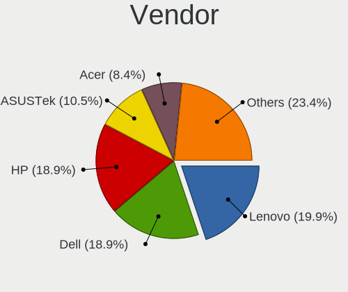
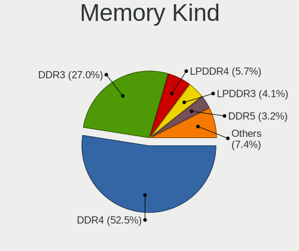

Ubuntu - Tested Hardware & Statistics (Notebooks)
-------------------------------------------------

A project to collect tested hardware configurations for Ubuntu.

Anyone can contribute to this report by the [hw-probe](https://github.com/linuxhw/hw-probe) tool:

    sudo -E hw-probe -all -upload

Please contribute! Especially if your hardware is rare.

Contents
--------

* [ Test Cases ](#test-cases)

* [ System ](#system)
  - [ OS                       ](#os)
  - [ OS Family                ](#os-family)
  - [ Kernel                   ](#kernel)
  - [ Kernel Family            ](#kernel-family)
  - [ Kernel Major Ver.        ](#kernel-major-ver)
  - [ Arch                     ](#arch)
  - [ DE                       ](#de)
  - [ Display Server           ](#display-server)
  - [ Display Manager          ](#display-manager)
  - [ OS Lang                  ](#os-lang)
  - [ Boot Mode                ](#boot-mode)
  - [ Filesystem               ](#filesystem)
  - [ Part. scheme             ](#part-scheme)
  - [ Dual Boot with Linux/BSD ](#dual-boot-with-linuxbsd)
  - [ Dual Boot (Win)          ](#dual-boot-win)

* [ Board ](#board)
  - [ Vendor                   ](#vendor)
  - [ Model                    ](#model)
  - [ Model Family             ](#model-family)
  - [ MFG Year                 ](#mfg-year)
  - [ Form Factor              ](#form-factor)
  - [ Secure Boot              ](#secure-boot)
  - [ Coreboot                 ](#coreboot)
  - [ RAM Size                 ](#ram-size)
  - [ RAM Used                 ](#ram-used)
  - [ Total Drives             ](#total-drives)
  - [ Has CD-ROM               ](#has-cd-rom)
  - [ Has Ethernet             ](#has-ethernet)
  - [ Has WiFi                 ](#has-wifi)
  - [ Has Bluetooth            ](#has-bluetooth)

* [ Location ](#location)
  - [ Country                  ](#country)
  - [ City                     ](#city)

* [ Drives ](#drives)
  - [ Drive Vendor             ](#drive-vendor)
  - [ Drive Model              ](#drive-model)
  - [ HDD Vendor               ](#hdd-vendor)
  - [ SSD Vendor               ](#ssd-vendor)
  - [ Drive Kind               ](#drive-kind)
  - [ Drive Connector          ](#drive-connector)
  - [ Drive Size               ](#drive-size)
  - [ Space Total              ](#space-total)
  - [ Space Used               ](#space-used)
  - [ Malfunc. Drives          ](#malfunc-drives)
  - [ Malfunc. Drive Vendor    ](#malfunc-drive-vendor)
  - [ Malfunc. HDD Vendor      ](#malfunc-hdd-vendor)
  - [ Malfunc. Drive Kind      ](#malfunc-drive-kind)
  - [ Failed Drives            ](#failed-drives)
  - [ Failed Drive Vendor      ](#failed-drive-vendor)
  - [ Drive Status             ](#drive-status)

* [ Storage controller ](#storage-controller)
  - [ Storage Vendor           ](#storage-vendor)
  - [ Storage Model            ](#storage-model)
  - [ Storage Kind             ](#storage-kind)

* [ Processor ](#processor)
  - [ CPU Vendor               ](#cpu-vendor)
  - [ CPU Model                ](#cpu-model)
  - [ CPU Model Family         ](#cpu-model-family)
  - [ CPU Cores                ](#cpu-cores)
  - [ CPU Sockets              ](#cpu-sockets)
  - [ CPU Threads              ](#cpu-threads)
  - [ CPU Op-Modes             ](#cpu-op-modes)
  - [ CPU Microcode            ](#cpu-microcode)
  - [ CPU Microarch            ](#cpu-microarch)

* [ Graphics ](#graphics)
  - [ GPU Vendor               ](#gpu-vendor)
  - [ GPU Model                ](#gpu-model)
  - [ GPU Combo                ](#gpu-combo)
  - [ GPU Driver               ](#gpu-driver)
  - [ GPU Memory               ](#gpu-memory)

* [ Monitor ](#monitor)
  - [ Monitor Vendor           ](#monitor-vendor)
  - [ Monitor Model            ](#monitor-model)
  - [ Monitor Resolution       ](#monitor-resolution)
  - [ Monitor Diagonal         ](#monitor-diagonal)
  - [ Monitor Width            ](#monitor-width)
  - [ Aspect Ratio             ](#aspect-ratio)
  - [ Monitor Area             ](#monitor-area)
  - [ Pixel Density            ](#pixel-density)
  - [ Multiple Monitors        ](#multiple-monitors)

* [ Network ](#network)
  - [ Net Controller Vendor    ](#net-controller-vendor)
  - [ Net Controller Model     ](#net-controller-model)
  - [ Wireless Vendor          ](#wireless-vendor)
  - [ Wireless Model           ](#wireless-model)
  - [ Ethernet Vendor          ](#ethernet-vendor)
  - [ Ethernet Model           ](#ethernet-model)
  - [ Net Controller Kind      ](#net-controller-kind)
  - [ Used Controller          ](#used-controller)
  - [ NICs                     ](#nics)
  - [ IPv6                     ](#ipv6)

* [ Bluetooth ](#bluetooth)
  - [ Bluetooth Vendor         ](#bluetooth-vendor)
  - [ Bluetooth Model          ](#bluetooth-model)

* [ Sound ](#sound)
  - [ Sound Vendor             ](#sound-vendor)
  - [ Sound Model              ](#sound-model)

* [ Memory ](#memory)
  - [ Memory Vendor            ](#memory-vendor)
  - [ Memory Model             ](#memory-model)
  - [ Memory Kind              ](#memory-kind)
  - [ Memory Form Factor       ](#memory-form-factor)
  - [ Memory Size              ](#memory-size)
  - [ Memory Speed             ](#memory-speed)

* [ Printers & scanners ](#printers--scanners)
  - [ Printer Vendor           ](#printer-vendor)
  - [ Printer Model            ](#printer-model)
  - [ Scanner Vendor           ](#scanner-vendor)
  - [ Scanner Model            ](#scanner-model)

* [ Camera ](#camera)
  - [ Camera Vendor            ](#camera-vendor)
  - [ Camera Model             ](#camera-model)

* [ Security ](#security)
  - [ Fingerprint Vendor       ](#fingerprint-vendor)
  - [ Fingerprint Model        ](#fingerprint-model)
  - [ Chipcard Vendor          ](#chipcard-vendor)
  - [ Chipcard Model           ](#chipcard-model)

* [ Unsupported ](#unsupported)
  - [ Unsupported Devices      ](#unsupported-devices)
  - [ Unsupported Device Types ](#unsupported-device-types)

Test Cases
----------

Total: 40433

| Vendor        | Model                       | Probe                                                      | Date         |
|---------------|-----------------------------|------------------------------------------------------------|--------------|
| Dell          | G15 5510                    | [78f2f5c95a](https://linux-hardware.org/?probe=78f2f5c95a) | Sep 01, 2022 |
| Lenovo        | ThinkPad T14 Gen 2i 20W1... | [12abd434b5](https://linux-hardware.org/?probe=12abd434b5) | Sep 01, 2022 |
| HP            | Pavilion 14                 | [b35151af0c](https://linux-hardware.org/?probe=b35151af0c) | Sep 01, 2022 |
| Lenovo        | G50-80 80E5                 | [ec5bb450ff](https://linux-hardware.org/?probe=ec5bb450ff) | Sep 01, 2022 |
| Dell          | Latitude 5521               | [dcf7869cf6](https://linux-hardware.org/?probe=dcf7869cf6) | Sep 01, 2022 |
| Lenovo        | ThinkBook 14 G2 ITL 20VD    | [02ec70b604](https://linux-hardware.org/?probe=02ec70b604) | Sep 01, 2022 |
| HP            | Pavilion dv6                | [25e9e892e7](https://linux-hardware.org/?probe=25e9e892e7) | Sep 01, 2022 |
| Lenovo        | ThinkPad T400 6474W7T       | [f9a9b12b37](https://linux-hardware.org/?probe=f9a9b12b37) | Sep 01, 2022 |
| HP            | Laptop 15-db0xxx            | [de848d928c](https://linux-hardware.org/?probe=de848d928c) | Sep 01, 2022 |
| Lenovo        | ThinkPad P15 Gen 1 20STC... | [0a5a3fa67e](https://linux-hardware.org/?probe=0a5a3fa67e) | Sep 01, 2022 |
| HP            | Pavilion m6                 | [83b6eb0119](https://linux-hardware.org/?probe=83b6eb0119) | Sep 01, 2022 |
| Casper        | NIRVANA NOTEBOOK            | [7a5978071e](https://linux-hardware.org/?probe=7a5978071e) | Sep 01, 2022 |
| Avell High... | C62 MOB                     | [ab93c1f314](https://linux-hardware.org/?probe=ab93c1f314) | Sep 01, 2022 |
| Notebook      | NL40_50CU                   | [af0da080ec](https://linux-hardware.org/?probe=af0da080ec) | Sep 01, 2022 |
| Dell          | Latitude 3340               | [d64525742a](https://linux-hardware.org/?probe=d64525742a) | Sep 01, 2022 |
| Dell          | Latitude 3340               | [b9d472b965](https://linux-hardware.org/?probe=b9d472b965) | Sep 01, 2022 |
| ASUSTek       | ZenBook UX431DA_UM431DA     | [cc30fbdce2](https://linux-hardware.org/?probe=cc30fbdce2) | Sep 01, 2022 |
| LG Electro... | 14Z990-V.AP72B              | [8c67c188a1](https://linux-hardware.org/?probe=8c67c188a1) | Sep 01, 2022 |
| Dell          | XPS 9320                    | [525a1bd6b6](https://linux-hardware.org/?probe=525a1bd6b6) | Sep 01, 2022 |
| Lenovo        | ThinkPad T400 6474W7T       | [b52974ac00](https://linux-hardware.org/?probe=b52974ac00) | Sep 01, 2022 |
| Lenovo        | G50-45 80E3                 | [3080895149](https://linux-hardware.org/?probe=3080895149) | Sep 01, 2022 |
| Dell          | Latitude 5591               | [b860997149](https://linux-hardware.org/?probe=b860997149) | Sep 01, 2022 |
| HP            | ProBook 6460b               | [a0e3db2eed](https://linux-hardware.org/?probe=a0e3db2eed) | Sep 01, 2022 |
| Samsung       | 950XEE                      | [454b67dd88](https://linux-hardware.org/?probe=454b67dd88) | Sep 01, 2022 |
| Acer          | Aspire E5-571               | [7759e41b1d](https://linux-hardware.org/?probe=7759e41b1d) | Sep 01, 2022 |
| HP            | OMEN by Laptop 15-ce0xx     | [85d4f11486](https://linux-hardware.org/?probe=85d4f11486) | Sep 01, 2022 |
| HP            | EliteBook 840 G2            | [4da3485e34](https://linux-hardware.org/?probe=4da3485e34) | Sep 01, 2022 |
| HP            | ENVY Laptop 13-ba1xxx       | [5a4e2225a8](https://linux-hardware.org/?probe=5a4e2225a8) | Sep 01, 2022 |
| HP            | G42                         | [a79b07fcd0](https://linux-hardware.org/?probe=a79b07fcd0) | Sep 01, 2022 |
| HP            | ENVY Laptop 15-ep0xxx       | [93ff04a07b](https://linux-hardware.org/?probe=93ff04a07b) | Sep 01, 2022 |
| Dell          | Latitude 7390               | [571b195a12](https://linux-hardware.org/?probe=571b195a12) | Aug 31, 2022 |
| Dell          | Latitude 7390               | [3c3f6114f6](https://linux-hardware.org/?probe=3c3f6114f6) | Aug 31, 2022 |
| HP            | Laptop 15-db0xxx            | [42879ce5cf](https://linux-hardware.org/?probe=42879ce5cf) | Aug 31, 2022 |
| HP            | Laptop 15-db0xxx            | [3c7e97b769](https://linux-hardware.org/?probe=3c7e97b769) | Aug 31, 2022 |
| Acer          | Aspire V3-571G              | [8f4a2b603a](https://linux-hardware.org/?probe=8f4a2b603a) | Aug 31, 2022 |
| Toshiba       | Satellite Pro L500          | [7f523718cf](https://linux-hardware.org/?probe=7f523718cf) | Aug 31, 2022 |
| Dell          | Latitude 7280               | [e71e9350b4](https://linux-hardware.org/?probe=e71e9350b4) | Aug 31, 2022 |
| HP            | EliteBook 840 G8 Noteboo... | [4808984401](https://linux-hardware.org/?probe=4808984401) | Aug 31, 2022 |
| Lenovo        | ThinkPad L14 Gen 1 20U5S... | [eb79e6b28e](https://linux-hardware.org/?probe=eb79e6b28e) | Aug 31, 2022 |
| HP            | Pavilion 15                 | [19c7cae23c](https://linux-hardware.org/?probe=19c7cae23c) | Aug 31, 2022 |
| HP            | Notebook                    | [ee135c3930](https://linux-hardware.org/?probe=ee135c3930) | Aug 31, 2022 |
| HUAWEI        | HVY-WXX9                    | [193310218d](https://linux-hardware.org/?probe=193310218d) | Aug 31, 2022 |
| Samsung       | RV410/RV510/S3510/E3510     | [d36b7bb077](https://linux-hardware.org/?probe=d36b7bb077) | Aug 31, 2022 |
| HUAWEI        | CREF-XX                     | [4ea2674cd8](https://linux-hardware.org/?probe=4ea2674cd8) | Aug 31, 2022 |
| Lenovo        | ThinkPad P43s 20RJS0D100    | [afbf0f6021](https://linux-hardware.org/?probe=afbf0f6021) | Aug 31, 2022 |
| HP            | Presario F500 (GM639LA#A... | [7323caa631](https://linux-hardware.org/?probe=7323caa631) | Aug 31, 2022 |
| Dell          | Vostro 3550                 | [c26bf23cdd](https://linux-hardware.org/?probe=c26bf23cdd) | Aug 31, 2022 |
| Samsung       | 670Z5E                      | [c72797ddaa](https://linux-hardware.org/?probe=c72797ddaa) | Aug 31, 2022 |
| Dell          | Inspiron 3543               | [a557da948a](https://linux-hardware.org/?probe=a557da948a) | Aug 31, 2022 |
| Lenovo        | ThinkPad X1 Carbon Gen 8... | [646afc5f72](https://linux-hardware.org/?probe=646afc5f72) | Aug 31, 2022 |
| Dell          | Inspiron 5502               | [1bb776feab](https://linux-hardware.org/?probe=1bb776feab) | Aug 31, 2022 |
| Lenovo        | V15-IIL 82C5                | [2a9e478284](https://linux-hardware.org/?probe=2a9e478284) | Aug 30, 2022 |
| HP            | Compaq 6830s (FR883LA#AB... | [bceac5a658](https://linux-hardware.org/?probe=bceac5a658) | Aug 30, 2022 |
| Lenovo        | ThinkPad Edge E530 62724... | [87cad1c0b0](https://linux-hardware.org/?probe=87cad1c0b0) | Aug 30, 2022 |
| Avell High... | B.ON                        | [dbc18dad43](https://linux-hardware.org/?probe=dbc18dad43) | Aug 30, 2022 |
| HP            | Pavilion Gaming Laptop 1... | [20da9d42a4](https://linux-hardware.org/?probe=20da9d42a4) | Aug 30, 2022 |
| Medion        | P7649 MD60817               | [3a703e2be0](https://linux-hardware.org/?probe=3a703e2be0) | Aug 30, 2022 |
| Lenovo        | ThinkPad L512 259756M       | [3990fcfeed](https://linux-hardware.org/?probe=3990fcfeed) | Aug 30, 2022 |
| Dell          | XPS 15 9570                 | [6c35aeda10](https://linux-hardware.org/?probe=6c35aeda10) | Aug 30, 2022 |
| Lenovo        | ThinkPad T490s 20NYS4HL0... | [273e5229a4](https://linux-hardware.org/?probe=273e5229a4) | Aug 30, 2022 |
| HP            | Pavilion Gaming Laptop 1... | [11efd3dbe0](https://linux-hardware.org/?probe=11efd3dbe0) | Aug 30, 2022 |
| HP            | EliteBook 840 G2            | [5ba91d8167](https://linux-hardware.org/?probe=5ba91d8167) | Aug 30, 2022 |
| HP            | EliteBook 840 G1            | [23d73aa95c](https://linux-hardware.org/?probe=23d73aa95c) | Aug 30, 2022 |
| ASUSTek       | ZenBook UX334FAC_UX333FA... | [ae84021e13](https://linux-hardware.org/?probe=ae84021e13) | Aug 30, 2022 |
| Lenovo        | ThinkPad L15 Gen 2a 20X8... | [df33320d10](https://linux-hardware.org/?probe=df33320d10) | Aug 30, 2022 |
| ASUSTek       | GL552JX                     | [d477c2cd47](https://linux-hardware.org/?probe=d477c2cd47) | Aug 30, 2022 |
| Toshiba       | Satellite A300              | [f90886ae85](https://linux-hardware.org/?probe=f90886ae85) | Aug 30, 2022 |
| HP            | EliteBook 840 G2            | [bed3be5142](https://linux-hardware.org/?probe=bed3be5142) | Aug 30, 2022 |
| HP            | EliteBook 840 G2            | [b588415d06](https://linux-hardware.org/?probe=b588415d06) | Aug 30, 2022 |
| Lenovo        | ThinkPad T470 20HES3370A    | [3b1630e4bc](https://linux-hardware.org/?probe=3b1630e4bc) | Aug 30, 2022 |
| Lenovo        | ThinkPad E15 Gen 3 20YG0... | [6393abc859](https://linux-hardware.org/?probe=6393abc859) | Aug 30, 2022 |
| Dell          | Latitude 5520               | [26434099b3](https://linux-hardware.org/?probe=26434099b3) | Aug 30, 2022 |
| HP            | EliteBook 830 G6            | [897046248f](https://linux-hardware.org/?probe=897046248f) | Aug 30, 2022 |
| Dell          | Inspiron 5502               | [28a1dd084e](https://linux-hardware.org/?probe=28a1dd084e) | Aug 30, 2022 |
| Dell          | Inspiron 5502               | [df0098010e](https://linux-hardware.org/?probe=df0098010e) | Aug 30, 2022 |
| Chuwi         | GemiBook                    | [abca00f582](https://linux-hardware.org/?probe=abca00f582) | Aug 30, 2022 |
| ASUSTek       | K501LX                      | [993e5d9848](https://linux-hardware.org/?probe=993e5d9848) | Aug 29, 2022 |
| HP            | EliteBook 650 15.6 inch ... | [918418e0fc](https://linux-hardware.org/?probe=918418e0fc) | Aug 29, 2022 |
| Apple         | MacBookPro7,1               | [a879fb8249](https://linux-hardware.org/?probe=a879fb8249) | Aug 29, 2022 |
| Lenovo        | ThinkPad X1 Carbon 6th 2... | [636a7f710c](https://linux-hardware.org/?probe=636a7f710c) | Aug 29, 2022 |
| ASUSTek       | ROG Zephyrus G14 GA401QE... | [4b56f15871](https://linux-hardware.org/?probe=4b56f15871) | Aug 29, 2022 |
| Dell          | Latitude E5450              | [9dad9e784f](https://linux-hardware.org/?probe=9dad9e784f) | Aug 29, 2022 |
| Lenovo        | ThinkPad P1 20MDS0FC00      | [dcdde00f17](https://linux-hardware.org/?probe=dcdde00f17) | Aug 29, 2022 |
| Dell          | G15 5515                    | [708ef41c02](https://linux-hardware.org/?probe=708ef41c02) | Aug 29, 2022 |
| Monster       | Huma H5 V3.2                | [ea050f24db](https://linux-hardware.org/?probe=ea050f24db) | Aug 29, 2022 |
| Fujitsu       | LIFEBOOK E746               | [5b0eba15c2](https://linux-hardware.org/?probe=5b0eba15c2) | Aug 29, 2022 |
| ASUSTek       | X751LJC                     | [36c35406c9](https://linux-hardware.org/?probe=36c35406c9) | Aug 29, 2022 |
| Apple         | MacBookPro11,4              | [dc1f806296](https://linux-hardware.org/?probe=dc1f806296) | Aug 29, 2022 |
| HP            | ProBook 440 14 inch G9 N... | [0a08f13779](https://linux-hardware.org/?probe=0a08f13779) | Aug 29, 2022 |
| System76      | Galago Pro                  | [df2c4ae77c](https://linux-hardware.org/?probe=df2c4ae77c) | Aug 29, 2022 |
| Samsung       | 670Z5E                      | [59959102e0](https://linux-hardware.org/?probe=59959102e0) | Aug 29, 2022 |
| ASUSTek       | X553MA                      | [108e0c7803](https://linux-hardware.org/?probe=108e0c7803) | Aug 29, 2022 |
| Sony          | VPCEB36GM                   | [4495872308](https://linux-hardware.org/?probe=4495872308) | Aug 29, 2022 |
| HP            | ZBook 15u G4                | [39f4830019](https://linux-hardware.org/?probe=39f4830019) | Aug 28, 2022 |
| Lenovo        | G50-45 80E3                 | [239e5612ee](https://linux-hardware.org/?probe=239e5612ee) | Aug 28, 2022 |
| Notebook      | NL4x_NL5xLU                 | [df4630db27](https://linux-hardware.org/?probe=df4630db27) | Aug 28, 2022 |
| Panasonic     | CF-30KTPAZAE                | [61a8f4a768](https://linux-hardware.org/?probe=61a8f4a768) | Aug 28, 2022 |
| Dell          | Inspiron N5010              | [3239a22fc0](https://linux-hardware.org/?probe=3239a22fc0) | Aug 28, 2022 |
| Lenovo        | IdeaPad 320-14ISK 80XG      | [8fac02d016](https://linux-hardware.org/?probe=8fac02d016) | Aug 28, 2022 |
| HP            | ZBook 15u G4                | [2115d02bfd](https://linux-hardware.org/?probe=2115d02bfd) | Aug 28, 2022 |
| Dell          | Inspiron N5010              | [e4cdaf6b35](https://linux-hardware.org/?probe=e4cdaf6b35) | Aug 28, 2022 |
| Lenovo        | IdeaPad 320-14ISK 80XG      | [d281087322](https://linux-hardware.org/?probe=d281087322) | Aug 28, 2022 |
| Samsung       | 670Z5E                      | [8d86f689b4](https://linux-hardware.org/?probe=8d86f689b4) | Aug 28, 2022 |
| Lenovo        | IdeaPad C340-14API 81N6     | [c8c04ce5db](https://linux-hardware.org/?probe=c8c04ce5db) | Aug 28, 2022 |
| Dell          | Latitude E7470              | [568c9bfd40](https://linux-hardware.org/?probe=568c9bfd40) | Aug 28, 2022 |
| Dell          | Inspiron 3543               | [68d1385b7e](https://linux-hardware.org/?probe=68d1385b7e) | Aug 28, 2022 |
| HP            | Pavilion Laptop 14-ec0xx... | [73db272ecb](https://linux-hardware.org/?probe=73db272ecb) | Aug 28, 2022 |
| Microtech     | CoreBook                    | [7507a104b7](https://linux-hardware.org/?probe=7507a104b7) | Aug 28, 2022 |
| Dell          | Inspiron N5010              | [1a76248bf8](https://linux-hardware.org/?probe=1a76248bf8) | Aug 28, 2022 |
| Dell          | Inspiron 5567               | [09d8066f44](https://linux-hardware.org/?probe=09d8066f44) | Aug 28, 2022 |
| IT Channel... | NH5xAx                      | [66573b4b48](https://linux-hardware.org/?probe=66573b4b48) | Aug 28, 2022 |
| Alienware     | 15                          | [f85646920a](https://linux-hardware.org/?probe=f85646920a) | Aug 28, 2022 |
| Lenovo        | ThinkPad L440 20ASS3A300    | [fbf3d4a87a](https://linux-hardware.org/?probe=fbf3d4a87a) | Aug 27, 2022 |
| Lenovo        | ThinkBook 13s-IWL 20R9      | [98bb5817f6](https://linux-hardware.org/?probe=98bb5817f6) | Aug 27, 2022 |
| HP            | Pavilion Notebook           | [0e4eab04c0](https://linux-hardware.org/?probe=0e4eab04c0) | Aug 27, 2022 |
| HP            | Pavilion Notebook           | [65e832cb2f](https://linux-hardware.org/?probe=65e832cb2f) | Aug 27, 2022 |
| ASUSTek       | VivoBook_ASUSLaptop X512... | [65f638768e](https://linux-hardware.org/?probe=65f638768e) | Aug 27, 2022 |
| Alienware     | M14xR1                      | [498d5f5254](https://linux-hardware.org/?probe=498d5f5254) | Aug 27, 2022 |
| Acer          | Nitro AN515-57              | [decd7daef2](https://linux-hardware.org/?probe=decd7daef2) | Aug 27, 2022 |
| BESSTAR Te... | X400                        | [ab70086ae7](https://linux-hardware.org/?probe=ab70086ae7) | Aug 27, 2022 |
| Dell          | Latitude E5470              | [7d49878b0d](https://linux-hardware.org/?probe=7d49878b0d) | Aug 27, 2022 |
| Lenovo        | IdeaPad 110-15ISK 80UD      | [608a16dc64](https://linux-hardware.org/?probe=608a16dc64) | Aug 27, 2022 |
| HP            | Pavilion Gaming Laptop 1... | [f4d9682f50](https://linux-hardware.org/?probe=f4d9682f50) | Aug 27, 2022 |
| BESSTAR Te... | X400                        | [f8d3611cf0](https://linux-hardware.org/?probe=f8d3611cf0) | Aug 27, 2022 |
| Acer          | Nitro AN515-54              | [975f6a801d](https://linux-hardware.org/?probe=975f6a801d) | Aug 27, 2022 |
| HP            | Unknown                     | [9b22ce41e3](https://linux-hardware.org/?probe=9b22ce41e3) | Aug 27, 2022 |
| Lenovo        | YangTian V340-15-IIL 81X... | [f26ee3814c](https://linux-hardware.org/?probe=f26ee3814c) | Aug 27, 2022 |
| Fujitsu       | LIFEBOOK A530               | [5534f20f99](https://linux-hardware.org/?probe=5534f20f99) | Aug 27, 2022 |
| Fujitsu       | LIFEBOOK A530               | [df9aa3eab2](https://linux-hardware.org/?probe=df9aa3eab2) | Aug 27, 2022 |
| Lenovo        | ThinkPad E14 Gen 4 21E4C... | [cf1b2ff13c](https://linux-hardware.org/?probe=cf1b2ff13c) | Aug 27, 2022 |
| Positivo      | C14CR01                     | [bb9a4c427a](https://linux-hardware.org/?probe=bb9a4c427a) | Aug 27, 2022 |
| speedmaste... | E131x series                | [69d287c029](https://linux-hardware.org/?probe=69d287c029) | Aug 26, 2022 |
| Dell          | Latitude E6510              | [846791d8b9](https://linux-hardware.org/?probe=846791d8b9) | Aug 26, 2022 |
| Dell          | Vostro 1520                 | [b51f7dfba6](https://linux-hardware.org/?probe=b51f7dfba6) | Aug 26, 2022 |
| HP            | Pavilion Laptop 15-cd0xx    | [62ce95ce9c](https://linux-hardware.org/?probe=62ce95ce9c) | Aug 26, 2022 |
| Lenovo        | ThinkPad T440p 20AW007QM... | [b24bbedfc1](https://linux-hardware.org/?probe=b24bbedfc1) | Aug 26, 2022 |
| Acer          | Aspire V5-531               | [75b841b0b8](https://linux-hardware.org/?probe=75b841b0b8) | Aug 26, 2022 |
| Lenovo        | IdeaPad 3 15IIL05 81WE      | [f945f778b2](https://linux-hardware.org/?probe=f945f778b2) | Aug 26, 2022 |
| Apple         | MacBookPro9,2               | [49b01e516c](https://linux-hardware.org/?probe=49b01e516c) | Aug 26, 2022 |
| ASUSTek       | S551LB                      | [efd20dadd0](https://linux-hardware.org/?probe=efd20dadd0) | Aug 26, 2022 |
| Acer          | Aspire A315-34              | [d71a1ce240](https://linux-hardware.org/?probe=d71a1ce240) | Aug 26, 2022 |
| Timi          | Redmi Book Pro 14 2022      | [3f61df6540](https://linux-hardware.org/?probe=3f61df6540) | Aug 26, 2022 |
| HP            | ENVY m7                     | [cf21038fd7](https://linux-hardware.org/?probe=cf21038fd7) | Aug 26, 2022 |
| Lenovo        | ThinkPad P14s Gen 2a 21A... | [83377b24dc](https://linux-hardware.org/?probe=83377b24dc) | Aug 25, 2022 |
| Lenovo        | IdeaPad 320-15ABR 80XS      | [34dd0d912a](https://linux-hardware.org/?probe=34dd0d912a) | Aug 25, 2022 |
| Lenovo        | ThinkPad T420s 417152U      | [73a97b425c](https://linux-hardware.org/?probe=73a97b425c) | Aug 25, 2022 |
| Lenovo        | IdeaPad 330-15IKB 81DE      | [cbae91bec7](https://linux-hardware.org/?probe=cbae91bec7) | Aug 25, 2022 |
| Gateway       | NV53A                       | [618b8506e2](https://linux-hardware.org/?probe=618b8506e2) | Aug 25, 2022 |
| Lenovo        | ThinkPad P14s Gen 2a 21A... | [d2e2d5484c](https://linux-hardware.org/?probe=d2e2d5484c) | Aug 25, 2022 |
| Google        | Kip                         | [1283f3d283](https://linux-hardware.org/?probe=1283f3d283) | Aug 25, 2022 |
| Dell          | Latitude 5511               | [22c835a93a](https://linux-hardware.org/?probe=22c835a93a) | Aug 25, 2022 |
| HUAWEI        | BOM-WXX9                    | [06ba6b75b4](https://linux-hardware.org/?probe=06ba6b75b4) | Aug 25, 2022 |
| Lenovo        | ThinkPad L490 20Q5S0LF00    | [3c1287dfd2](https://linux-hardware.org/?probe=3c1287dfd2) | Aug 25, 2022 |
| Dell          | Inspiron N5010              | [f4862a3793](https://linux-hardware.org/?probe=f4862a3793) | Aug 25, 2022 |
| Dell          | Inspiron 5459               | [398f6d4b78](https://linux-hardware.org/?probe=398f6d4b78) | Aug 25, 2022 |
| HP            | ProBook 430 G5              | [6a7db587c7](https://linux-hardware.org/?probe=6a7db587c7) | Aug 25, 2022 |
| Acer          | Aspire V5-531               | [4ae228e219](https://linux-hardware.org/?probe=4ae228e219) | Aug 25, 2022 |
| Gigabyte      | AORUS 17 YE5                | [130df57914](https://linux-hardware.org/?probe=130df57914) | Aug 25, 2022 |
| Toshiba       | PORTEGE Z10t-A              | [ba23396754](https://linux-hardware.org/?probe=ba23396754) | Aug 25, 2022 |
| Notebook      | W65_67SZ                    | [0bf839f496](https://linux-hardware.org/?probe=0bf839f496) | Aug 25, 2022 |
| Acer          | Aspire 5742G                | [dfe17e89f1](https://linux-hardware.org/?probe=dfe17e89f1) | Aug 25, 2022 |
| Dell          | XPS 15 9560                 | [28323e5398](https://linux-hardware.org/?probe=28323e5398) | Aug 25, 2022 |
| ASUSTek       | P81IJ                       | [7ab324abea](https://linux-hardware.org/?probe=7ab324abea) | Aug 25, 2022 |
| Lenovo        | ThinkPad L440 20ASS3A300    | [09feb7053d](https://linux-hardware.org/?probe=09feb7053d) | Aug 25, 2022 |
| HP            | ZBook 15u G4                | [dcdc803214](https://linux-hardware.org/?probe=dcdc803214) | Aug 24, 2022 |
| ASUSTek       | ProArt StudioBook W700G3... | [72f873111c](https://linux-hardware.org/?probe=72f873111c) | Aug 24, 2022 |
| HP            | Pavilion Notebook           | [70ca4aae12](https://linux-hardware.org/?probe=70ca4aae12) | Aug 24, 2022 |
| Dell          | Inspiron 3583               | [37c79f953b](https://linux-hardware.org/?probe=37c79f953b) | Aug 24, 2022 |
| Linx          | LINX1010B                   | [07194b77d4](https://linux-hardware.org/?probe=07194b77d4) | Aug 24, 2022 |
| Lenovo        | IdeaPad S540-15IML D 81N... | [a0c40a81ec](https://linux-hardware.org/?probe=a0c40a81ec) | Aug 24, 2022 |
| HUAWEI        | NBLB-WAX9N                  | [69281b6cc3](https://linux-hardware.org/?probe=69281b6cc3) | Aug 24, 2022 |
| Dell          | Latitude 5400               | [fce2c90c7e](https://linux-hardware.org/?probe=fce2c90c7e) | Aug 24, 2022 |
| HP            | 255 G6 Notebook PC          | [a476ba5a83](https://linux-hardware.org/?probe=a476ba5a83) | Aug 24, 2022 |
| Dell          | Inspiron 3543               | [000b034e01](https://linux-hardware.org/?probe=000b034e01) | Aug 24, 2022 |
| Lenovo        | ThinkPad E15 Gen 3 20YGC... | [d642f87765](https://linux-hardware.org/?probe=d642f87765) | Aug 24, 2022 |
| HP            | ZBook 15u G4                | [8b26a63aa2](https://linux-hardware.org/?probe=8b26a63aa2) | Aug 24, 2022 |
| Packard Be... | EasyNote LJ65               | [dcd6540e36](https://linux-hardware.org/?probe=dcd6540e36) | Aug 24, 2022 |
| Lenovo        | IdeaPad 5 14ALC05 82LM      | [421ab76c43](https://linux-hardware.org/?probe=421ab76c43) | Aug 24, 2022 |
| Lenovo        | B50-50 80S2                 | [45f5a72c59](https://linux-hardware.org/?probe=45f5a72c59) | Aug 24, 2022 |
| Lenovo        | Legion S7 15IMH5 82BC       | [594d5d4209](https://linux-hardware.org/?probe=594d5d4209) | Aug 24, 2022 |
| Lenovo        | Legion S7 15IMH5 82BC       | [f50f2a36d5](https://linux-hardware.org/?probe=f50f2a36d5) | Aug 24, 2022 |
| Dell          | Inspiron 5402               | [936ea503c8](https://linux-hardware.org/?probe=936ea503c8) | Aug 24, 2022 |
| Lenovo        | Legion Y540-15IRH-PG0 81... | [c7d603acb8](https://linux-hardware.org/?probe=c7d603acb8) | Aug 24, 2022 |
| HP            | ProBook 430 G8 Notebook ... | [17260bd4fb](https://linux-hardware.org/?probe=17260bd4fb) | Aug 24, 2022 |
| Dell          | Precision 7550              | [7a88756a0f](https://linux-hardware.org/?probe=7a88756a0f) | Aug 24, 2022 |
| Toshiba       | Satellite C55-B             | [eaabc96ff1](https://linux-hardware.org/?probe=eaabc96ff1) | Aug 24, 2022 |
| Lenovo        | V330-15IKB 81AX             | [c3ddddae2c](https://linux-hardware.org/?probe=c3ddddae2c) | Aug 24, 2022 |
| Acer          | Aspire A315-42G             | [d5b057d1c9](https://linux-hardware.org/?probe=d5b057d1c9) | Aug 23, 2022 |
| Lenovo        | ThinkPad P53 20QNCTO1WW     | [27d62fafaf](https://linux-hardware.org/?probe=27d62fafaf) | Aug 23, 2022 |
| Dell          | Inspiron 3583               | [d394d086d9](https://linux-hardware.org/?probe=d394d086d9) | Aug 23, 2022 |
| Apple         | MacBookPro16,2              | [3c6266b13d](https://linux-hardware.org/?probe=3c6266b13d) | Aug 23, 2022 |
| Packard Be... | EasyNote LJ65               | [6493743ace](https://linux-hardware.org/?probe=6493743ace) | Aug 23, 2022 |
| Dell          | Precision M4800             | [dbe7bfeb57](https://linux-hardware.org/?probe=dbe7bfeb57) | Aug 23, 2022 |
| Dell          | Inspiron 3501               | [514172ddcc](https://linux-hardware.org/?probe=514172ddcc) | Aug 23, 2022 |
| Dell          | Precision M4800             | [b8edb4a562](https://linux-hardware.org/?probe=b8edb4a562) | Aug 23, 2022 |
| HP            | Stream 11 Pro               | [de889aa178](https://linux-hardware.org/?probe=de889aa178) | Aug 23, 2022 |
| HP            | Pavilion g6                 | [ae65121050](https://linux-hardware.org/?probe=ae65121050) | Aug 23, 2022 |
| Lenovo        | ThinkPad T440s 20ARS1UTA... | [8faf9cc68b](https://linux-hardware.org/?probe=8faf9cc68b) | Aug 23, 2022 |
| Lenovo        | 14w 81MQ000JUS              | [3866b50e6e](https://linux-hardware.org/?probe=3866b50e6e) | Aug 23, 2022 |
| Lenovo        | IdeaPad 510S-14ISK 80TK     | [a48fff902b](https://linux-hardware.org/?probe=a48fff902b) | Aug 23, 2022 |
| HP            | Laptop 15s-eq0xxx           | [29db41fc1b](https://linux-hardware.org/?probe=29db41fc1b) | Aug 23, 2022 |
| Dell          | Vostro 5481                 | [749e6c3622](https://linux-hardware.org/?probe=749e6c3622) | Aug 23, 2022 |
| TEKNOSERVI... | PORTATIL TTL 15             | [054d000bb1](https://linux-hardware.org/?probe=054d000bb1) | Aug 23, 2022 |
| ASUSTek       | X556UF                      | [23316377ee](https://linux-hardware.org/?probe=23316377ee) | Aug 23, 2022 |
| HP            | EliteBook 8470p             | [0b017b90c9](https://linux-hardware.org/?probe=0b017b90c9) | Aug 23, 2022 |
| Lenovo        | Legion 5 15IMH05H 81Y6      | [62db26b1b4](https://linux-hardware.org/?probe=62db26b1b4) | Aug 23, 2022 |
| Lenovo        | IdeaPad 3 15ITL6 82H8       | [284d2fd5c1](https://linux-hardware.org/?probe=284d2fd5c1) | Aug 23, 2022 |
| Acer          | Aspire E5-571               | [659e36b0ed](https://linux-hardware.org/?probe=659e36b0ed) | Aug 23, 2022 |
| ECS           | SF20PA2                     | [67dd8af18f](https://linux-hardware.org/?probe=67dd8af18f) | Aug 23, 2022 |
| Acer          | Aspire A515-56              | [6243ea9fb0](https://linux-hardware.org/?probe=6243ea9fb0) | Aug 23, 2022 |
| Fujitsu       | FMVA42CW                    | [f50babde6a](https://linux-hardware.org/?probe=f50babde6a) | Aug 23, 2022 |
| Dell          | Latitude D630               | [be9c4025cb](https://linux-hardware.org/?probe=be9c4025cb) | Aug 23, 2022 |
| Lenovo        | Legion 5 15IMH05H 81Y6      | [b008c35b2b](https://linux-hardware.org/?probe=b008c35b2b) | Aug 23, 2022 |
| Lenovo        | G580 20150                  | [6c0183592b](https://linux-hardware.org/?probe=6c0183592b) | Aug 23, 2022 |
| ASUSTek       | VivoBook_ASUSLaptop X515... | [3c41ecc4e0](https://linux-hardware.org/?probe=3c41ecc4e0) | Aug 23, 2022 |
| Acer          | Aspire E1-571               | [b2c1a1b4ff](https://linux-hardware.org/?probe=b2c1a1b4ff) | Aug 23, 2022 |
| Samsung       | 340XAA/350XAA/550XAA        | [323faca611](https://linux-hardware.org/?probe=323faca611) | Aug 22, 2022 |
| HP            | Compaq nc6400 (EH522AV)     | [1c583ce5d2](https://linux-hardware.org/?probe=1c583ce5d2) | Aug 22, 2022 |
| Samsung       | RV411/RV511/E3511/S3511/... | [ee5962ca1e](https://linux-hardware.org/?probe=ee5962ca1e) | Aug 22, 2022 |
| Lenovo        | ThinkPad X230 23252UG       | [149419b2df](https://linux-hardware.org/?probe=149419b2df) | Aug 22, 2022 |
| Lenovo        | B570e 476022G               | [ad4a4c25d5](https://linux-hardware.org/?probe=ad4a4c25d5) | Aug 22, 2022 |
| Lenovo        | ThinkPad X230 23252UG       | [09505ab893](https://linux-hardware.org/?probe=09505ab893) | Aug 22, 2022 |
| Acer          | Aspire 5742                 | [97c61c3095](https://linux-hardware.org/?probe=97c61c3095) | Aug 22, 2022 |
| HUAWEI        | NBD-WXX9                    | [4391428197](https://linux-hardware.org/?probe=4391428197) | Aug 22, 2022 |
| Dell          | Latitude E6400              | [51f384a71c](https://linux-hardware.org/?probe=51f384a71c) | Aug 22, 2022 |
| HP            | EliteBook 840 G8 Noteboo... | [2aa681b773](https://linux-hardware.org/?probe=2aa681b773) | Aug 22, 2022 |
| HP            | EliteBook 840 G8 Noteboo... | [a51a82210b](https://linux-hardware.org/?probe=a51a82210b) | Aug 22, 2022 |
| Acer          | Aspire 5741G                | [dfa9c7ced0](https://linux-hardware.org/?probe=dfa9c7ced0) | Aug 22, 2022 |
| Dell          | Latitude E7240              | [4adf6ab444](https://linux-hardware.org/?probe=4adf6ab444) | Aug 22, 2022 |
| HP            | ProBook 440 G8 Notebook ... | [6fcc3e058d](https://linux-hardware.org/?probe=6fcc3e058d) | Aug 22, 2022 |
| HP            | EliteBook 8440p             | [f85ff90a58](https://linux-hardware.org/?probe=f85ff90a58) | Aug 22, 2022 |
| HP            | EliteBook 8440p             | [3842f0e711](https://linux-hardware.org/?probe=3842f0e711) | Aug 22, 2022 |
| Dell          | XPS 15 9560                 | [29d52f610c](https://linux-hardware.org/?probe=29d52f610c) | Aug 22, 2022 |
| Lenovo        | ThinkPad E580 20KS0009AD    | [ba4d785a29](https://linux-hardware.org/?probe=ba4d785a29) | Aug 22, 2022 |
| Toshiba       | Satellite L875D             | [45ed0eb61a](https://linux-hardware.org/?probe=45ed0eb61a) | Aug 22, 2022 |
| Acer          | Aspire E1-410               | [e7d78093ba](https://linux-hardware.org/?probe=e7d78093ba) | Aug 22, 2022 |
| Dell          | Latitude E6500              | [defd0003bc](https://linux-hardware.org/?probe=defd0003bc) | Aug 22, 2022 |
| Lenovo        | M30-70 80H8                 | [d254ca63b4](https://linux-hardware.org/?probe=d254ca63b4) | Aug 22, 2022 |
| Acer          | Aspire E1-410               | [d2ba4edba4](https://linux-hardware.org/?probe=d2ba4edba4) | Aug 22, 2022 |
| ASUSTek       | VivoBook_ASUSLaptop X760... | [f1fa32b507](https://linux-hardware.org/?probe=f1fa32b507) | Aug 22, 2022 |
| Dell          | Inspiron 3501               | [2f3937854b](https://linux-hardware.org/?probe=2f3937854b) | Aug 22, 2022 |
| Dell          | Latitude 7410               | [ae90ce90ed](https://linux-hardware.org/?probe=ae90ce90ed) | Aug 22, 2022 |
| Lenovo        | ThinkPad T400 6474B84       | [f8a6513790](https://linux-hardware.org/?probe=f8a6513790) | Aug 22, 2022 |
| ASUSTek       | X540NA                      | [1fa4b8b58a](https://linux-hardware.org/?probe=1fa4b8b58a) | Aug 21, 2022 |
| Dell          | Latitude 5490               | [a37eabe03f](https://linux-hardware.org/?probe=a37eabe03f) | Aug 21, 2022 |
| ASUSTek       | X540NA                      | [e9bcb08163](https://linux-hardware.org/?probe=e9bcb08163) | Aug 21, 2022 |
| Dell          | Inspiron 3583               | [d9ab8accea](https://linux-hardware.org/?probe=d9ab8accea) | Aug 21, 2022 |
| Dell          | Inspiron 3583               | [6ff066abac](https://linux-hardware.org/?probe=6ff066abac) | Aug 21, 2022 |
| MSI           | GE60 0NC/GE60 0ND           | [838dcef1f9](https://linux-hardware.org/?probe=838dcef1f9) | Aug 21, 2022 |
| HP            | Laptop 17-bs0xx             | [3dda19880c](https://linux-hardware.org/?probe=3dda19880c) | Aug 21, 2022 |
| Dell          | XPS 13 9370                 | [79d380d4af](https://linux-hardware.org/?probe=79d380d4af) | Aug 21, 2022 |
| Dell          | XPS 13 9350                 | [e663637449](https://linux-hardware.org/?probe=e663637449) | Aug 21, 2022 |
| ASUSTek       | X556UF                      | [9630e2d4f5](https://linux-hardware.org/?probe=9630e2d4f5) | Aug 21, 2022 |
| HUAWEI        | HLY-WX9XX                   | [287788013b](https://linux-hardware.org/?probe=287788013b) | Aug 21, 2022 |
| Samsung       | R519/R719                   | [c0720d7924](https://linux-hardware.org/?probe=c0720d7924) | Aug 21, 2022 |
| Dell          | G5 5587                     | [327f035c11](https://linux-hardware.org/?probe=327f035c11) | Aug 21, 2022 |
| ASUSTek       | Zenbook UM5401QA_UM5401Q... | [1380621999](https://linux-hardware.org/?probe=1380621999) | Aug 21, 2022 |
| ASUSTek       | K53SD                       | [1b2c4f25a7](https://linux-hardware.org/?probe=1b2c4f25a7) | Aug 21, 2022 |
| Samsung       | 550P5C/550P7C               | [75f94f8fa5](https://linux-hardware.org/?probe=75f94f8fa5) | Aug 21, 2022 |
| Dell          | Inspiron 5447               | [aa44fba5de](https://linux-hardware.org/?probe=aa44fba5de) | Aug 21, 2022 |
| ASUSTek       | ZenBook UX431DA_UM431DA     | [2e77015116](https://linux-hardware.org/?probe=2e77015116) | Aug 21, 2022 |
| Dell          | Inspiron 1520               | [052b6ab02c](https://linux-hardware.org/?probe=052b6ab02c) | Aug 21, 2022 |
| ASUSTek       | ZenBook UX534FTC_UX534FT    | [d4a7a111a7](https://linux-hardware.org/?probe=d4a7a111a7) | Aug 21, 2022 |
| Samsung       | 550P5C/550P7C               | [c369daf6b0](https://linux-hardware.org/?probe=c369daf6b0) | Aug 21, 2022 |
| Timi          | TM1701                      | [4591dee526](https://linux-hardware.org/?probe=4591dee526) | Aug 21, 2022 |
| Dell          | Latitude 5420               | [e8ccf9922e](https://linux-hardware.org/?probe=e8ccf9922e) | Aug 21, 2022 |
| Dell          | Latitude 5420               | [f44e5a1241](https://linux-hardware.org/?probe=f44e5a1241) | Aug 21, 2022 |
| Dell          | Inspiron 5447               | [21d9982f20](https://linux-hardware.org/?probe=21d9982f20) | Aug 21, 2022 |
| ASUSTek       | K53SJ                       | [63c2bb76a0](https://linux-hardware.org/?probe=63c2bb76a0) | Aug 20, 2022 |
| HUAWEI        | BOM-WXX9                    | [53f5ad0f1e](https://linux-hardware.org/?probe=53f5ad0f1e) | Aug 20, 2022 |
| Sony          | VPCEB12FD                   | [f98be4240a](https://linux-hardware.org/?probe=f98be4240a) | Aug 20, 2022 |
| ASUSTek       | VivoBook_ASUSLaptop X415... | [342bd47a5a](https://linux-hardware.org/?probe=342bd47a5a) | Aug 20, 2022 |
| Samsung       | R59P/R60P/R61P              | [552d907afc](https://linux-hardware.org/?probe=552d907afc) | Aug 20, 2022 |
| ASUSTek       | N56VZ                       | [e9e40a7df5](https://linux-hardware.org/?probe=e9e40a7df5) | Aug 20, 2022 |
| HP            | ProBook 440 G3              | [e51d4ae241](https://linux-hardware.org/?probe=e51d4ae241) | Aug 20, 2022 |
| HP            | Pavilion dv6                | [5d8ca491cf](https://linux-hardware.org/?probe=5d8ca491cf) | Aug 20, 2022 |
| HP            | 15                          | [4d736aca15](https://linux-hardware.org/?probe=4d736aca15) | Aug 20, 2022 |
| MSI           | GS65 Stealth Thin 8RE       | [90aed4d5d1](https://linux-hardware.org/?probe=90aed4d5d1) | Aug 20, 2022 |
| Toshiba       | PORTEGE M780                | [8b7e72c5d9](https://linux-hardware.org/?probe=8b7e72c5d9) | Aug 20, 2022 |
| Dell          | Latitude E6430              | [30a702dcec](https://linux-hardware.org/?probe=30a702dcec) | Aug 20, 2022 |
| HP            | Compaq 6730b (KE718AV)      | [2bb0221a17](https://linux-hardware.org/?probe=2bb0221a17) | Aug 19, 2022 |
| Unknown       | Unknown                     | [937afb80d6](https://linux-hardware.org/?probe=937afb80d6) | Aug 19, 2022 |
| HP            | EliteBook 850 G3            | [bb313c5b5e](https://linux-hardware.org/?probe=bb313c5b5e) | Aug 19, 2022 |
| HUAWEI        | NBD-WXX9                    | [b7c760ecee](https://linux-hardware.org/?probe=b7c760ecee) | Aug 19, 2022 |
| HP            | EliteBook 850 G3            | [a81d513d7c](https://linux-hardware.org/?probe=a81d513d7c) | Aug 19, 2022 |
| Positivo      | Q4128C-S                    | [abe16f9b0c](https://linux-hardware.org/?probe=abe16f9b0c) | Aug 19, 2022 |
| ASUSTek       | VivoBook_ASUSLaptop X421... | [87fcf5d702](https://linux-hardware.org/?probe=87fcf5d702) | Aug 19, 2022 |
| HP            | 250 G7 Notebook PC          | [ec15e7b0c5](https://linux-hardware.org/?probe=ec15e7b0c5) | Aug 19, 2022 |
| Lenovo        | V110-15IAP 80TG             | [65bb270b4e](https://linux-hardware.org/?probe=65bb270b4e) | Aug 19, 2022 |
| Lenovo        | ThinkPad T520 4239CTO       | [c88fbf8cc5](https://linux-hardware.org/?probe=c88fbf8cc5) | Aug 19, 2022 |
| HP            | Laptop 14s-fq1xxx           | [61f9640136](https://linux-hardware.org/?probe=61f9640136) | Aug 19, 2022 |
| Lenovo        | ThinkPad L440 20ASS3A300    | [1a0800fc4a](https://linux-hardware.org/?probe=1a0800fc4a) | Aug 19, 2022 |
| Lenovo        | ThinkPad X1 Carbon 4th 2... | [bdb88a532f](https://linux-hardware.org/?probe=bdb88a532f) | Aug 19, 2022 |
| HP            | ElitePad 1000 G2            | [ed06ba603c](https://linux-hardware.org/?probe=ed06ba603c) | Aug 19, 2022 |
| Lenovo        | ThinkPad X13 Gen 1 20UFS... | [8834646a81](https://linux-hardware.org/?probe=8834646a81) | Aug 19, 2022 |
| Acer          | Aspire E5-475               | [f21f1687d5](https://linux-hardware.org/?probe=f21f1687d5) | Aug 19, 2022 |
| HP            | EliteBook 6930p             | [ee6cfb6de5](https://linux-hardware.org/?probe=ee6cfb6de5) | Aug 19, 2022 |
| Acer          | Aspire E5-475               | [04b38f1dfd](https://linux-hardware.org/?probe=04b38f1dfd) | Aug 19, 2022 |
| Lenovo        | ThinkPad X201 3626FAG       | [0271f9018f](https://linux-hardware.org/?probe=0271f9018f) | Aug 19, 2022 |
| HP            | Laptop 15-da0xxx            | [7a9624c968](https://linux-hardware.org/?probe=7a9624c968) | Aug 19, 2022 |
| Acer          | Aspire E5-571               | [12371a2f0b](https://linux-hardware.org/?probe=12371a2f0b) | Aug 19, 2022 |
| Dell          | Inspiron 5535               | [b62b002b47](https://linux-hardware.org/?probe=b62b002b47) | Aug 19, 2022 |
| Dell          | Latitude E6410              | [3304a70394](https://linux-hardware.org/?probe=3304a70394) | Aug 19, 2022 |
| Compaq        | Presario 21 VerX            | [97aa39b2ca](https://linux-hardware.org/?probe=97aa39b2ca) | Aug 19, 2022 |
| ASUSTek       | VivoBook_ASUSLaptop X509... | [f9ec8eaac3](https://linux-hardware.org/?probe=f9ec8eaac3) | Aug 18, 2022 |
| TUXEDO        | W65_W67RZ1                  | [cdecb1ca2f](https://linux-hardware.org/?probe=cdecb1ca2f) | Aug 18, 2022 |
| Sony          | VPCEB1S1E                   | [45dbb67d02](https://linux-hardware.org/?probe=45dbb67d02) | Aug 18, 2022 |
| Acer          | Nitro AN515-43              | [59f87a8821](https://linux-hardware.org/?probe=59f87a8821) | Aug 18, 2022 |
| Dell          | Inspiron 7570               | [7d353117aa](https://linux-hardware.org/?probe=7d353117aa) | Aug 18, 2022 |
| Dell          | Inspiron 7570               | [10609a18a8](https://linux-hardware.org/?probe=10609a18a8) | Aug 18, 2022 |
| Apple         | MacBookAir6,2               | [f27c089486](https://linux-hardware.org/?probe=f27c089486) | Aug 18, 2022 |
| HP            | Stream 11 Pro               | [76b11a4ddb](https://linux-hardware.org/?probe=76b11a4ddb) | Aug 18, 2022 |
| MSI           | Katana GF66 11UG            | [74da710e26](https://linux-hardware.org/?probe=74da710e26) | Aug 18, 2022 |
| HP            | ProBook 640 G4              | [d4da530f4b](https://linux-hardware.org/?probe=d4da530f4b) | Aug 18, 2022 |
| ASUSTek       | ZenBook UX434FAC_UX433FA... | [a3da16034e](https://linux-hardware.org/?probe=a3da16034e) | Aug 18, 2022 |
| Lenovo        | G50-80 80E5                 | [1a392021c7](https://linux-hardware.org/?probe=1a392021c7) | Aug 18, 2022 |
| ASUSTek       | ZenBook UX425IA_UM425IA     | [2bf774fae7](https://linux-hardware.org/?probe=2bf774fae7) | Aug 18, 2022 |
| Dell          | Latitude 3420               | [49300ca856](https://linux-hardware.org/?probe=49300ca856) | Aug 18, 2022 |
| Lenovo        | ThinkPad X1 Carbon 6th 2... | [c32d69a956](https://linux-hardware.org/?probe=c32d69a956) | Aug 18, 2022 |
| Dynabook      | Satellite Pro C50-G-10M     | [92acf22491](https://linux-hardware.org/?probe=92acf22491) | Aug 18, 2022 |
| Dynabook      | Satellite Pro C50-G-10M     | [f1c882f6f9](https://linux-hardware.org/?probe=f1c882f6f9) | Aug 18, 2022 |
| Lenovo        | IdeaPad 5 15IIL05 81YK      | [658569ca5e](https://linux-hardware.org/?probe=658569ca5e) | Aug 18, 2022 |
| Dell          | Inspiron 5559               | [ae2d8ade73](https://linux-hardware.org/?probe=ae2d8ade73) | Aug 18, 2022 |
| Acer          | Aspire E5-471G              | [3179053060](https://linux-hardware.org/?probe=3179053060) | Aug 18, 2022 |
| Acer          | TMP255-M                    | [ec78f44540](https://linux-hardware.org/?probe=ec78f44540) | Aug 18, 2022 |
| Acer          | TMP255-M                    | [b0bf845535](https://linux-hardware.org/?probe=b0bf845535) | Aug 18, 2022 |
| Acer          | Aspire A515-52G             | [00a40c053e](https://linux-hardware.org/?probe=00a40c053e) | Aug 18, 2022 |
| Packard Be... | EasyNote TJ65               | [df3b457c00](https://linux-hardware.org/?probe=df3b457c00) | Aug 18, 2022 |
| Lenovo        | G580 20150                  | [3c18536e95](https://linux-hardware.org/?probe=3c18536e95) | Aug 18, 2022 |
| Apple         | MacBookPro8,2               | [5200949f98](https://linux-hardware.org/?probe=5200949f98) | Aug 18, 2022 |
| Dell          | XPS MXC062                  | [d6c0b9b085](https://linux-hardware.org/?probe=d6c0b9b085) | Aug 18, 2022 |
| Samsung       | 670Z5E                      | [039ab9ead1](https://linux-hardware.org/?probe=039ab9ead1) | Aug 17, 2022 |
| HP            | EliteBook 8470p             | [8f5ed294e7](https://linux-hardware.org/?probe=8f5ed294e7) | Aug 17, 2022 |
| HP            | Laptop 14-cm0xxx            | [e6b2ec9760](https://linux-hardware.org/?probe=e6b2ec9760) | Aug 17, 2022 |
| Acer          | Aspire E1-431               | [d4132b425f](https://linux-hardware.org/?probe=d4132b425f) | Aug 17, 2022 |
| Dell          | Inspiron 7520               | [96349ba82a](https://linux-hardware.org/?probe=96349ba82a) | Aug 17, 2022 |
| ASUSTek       | X556UQ                      | [cc792932e6](https://linux-hardware.org/?probe=cc792932e6) | Aug 17, 2022 |
| ASUSTek       | K55A                        | [be90796111](https://linux-hardware.org/?probe=be90796111) | Aug 17, 2022 |
| Lenovo        | IdeaPad 3 15ALC6 82KU       | [e9d1b72a88](https://linux-hardware.org/?probe=e9d1b72a88) | Aug 17, 2022 |
| Lenovo        | IdeaPad Gaming 3 15IHU6 ... | [f3731f8754](https://linux-hardware.org/?probe=f3731f8754) | Aug 17, 2022 |
| HP            | Laptop 15-dw3xxx            | [f0d245ec0f](https://linux-hardware.org/?probe=f0d245ec0f) | Aug 17, 2022 |
| Dell          | XPS 15 9560                 | [d971bbde47](https://linux-hardware.org/?probe=d971bbde47) | Aug 17, 2022 |
| Dell          | XPS 15 9520                 | [7e75c31235](https://linux-hardware.org/?probe=7e75c31235) | Aug 17, 2022 |
| HUAWEI        | NBLB-WAX9N                  | [9003287b49](https://linux-hardware.org/?probe=9003287b49) | Aug 17, 2022 |
| Packard Be... | EasyNote TS11HR             | [9d82dca288](https://linux-hardware.org/?probe=9d82dca288) | Aug 17, 2022 |
| Toshiba       | Satellite C870-1F3          | [6738afe025](https://linux-hardware.org/?probe=6738afe025) | Aug 17, 2022 |
| Lenovo        | B50-50 80S2                 | [5163e0015e](https://linux-hardware.org/?probe=5163e0015e) | Aug 17, 2022 |
| Dell          | G15 5515                    | [3a7c8ea452](https://linux-hardware.org/?probe=3a7c8ea452) | Aug 17, 2022 |
| Gigabyte      | AORUS 17 YE5                | [0d78cd8f9a](https://linux-hardware.org/?probe=0d78cd8f9a) | Aug 17, 2022 |
| Gigabyte      | AORUS 17 YE5                | [95b5329e08](https://linux-hardware.org/?probe=95b5329e08) | Aug 17, 2022 |
| HP            | ZBook 15 G3                 | [f89a185aa6](https://linux-hardware.org/?probe=f89a185aa6) | Aug 17, 2022 |
| Toshiba       | Satellite C55-A             | [b5108145be](https://linux-hardware.org/?probe=b5108145be) | Aug 17, 2022 |
| Toshiba       | Satellite C55-A             | [0db7961f5a](https://linux-hardware.org/?probe=0db7961f5a) | Aug 17, 2022 |
| Dell          | Latitude 3420               | [33a254b0e0](https://linux-hardware.org/?probe=33a254b0e0) | Aug 17, 2022 |
| Dell          | Latitude 7400               | [7f870ac8c2](https://linux-hardware.org/?probe=7f870ac8c2) | Aug 17, 2022 |
| HP            | ProBook 4440s               | [5f3b887159](https://linux-hardware.org/?probe=5f3b887159) | Aug 17, 2022 |
| ASUSTek       | K72Jr                       | [604b0356b1](https://linux-hardware.org/?probe=604b0356b1) | Aug 17, 2022 |
| Lenovo        | ThinkPad X1 Carbon 3rd 2... | [dcfef0a5d7](https://linux-hardware.org/?probe=dcfef0a5d7) | Aug 17, 2022 |
| MSI           | PS63 Modern 8RD             | [ad3134e010](https://linux-hardware.org/?probe=ad3134e010) | Aug 17, 2022 |
| HP            | Compaq 6720s                | [bf767707b2](https://linux-hardware.org/?probe=bf767707b2) | Aug 17, 2022 |
| MSI           | Modern 14 A10RAS            | [1cdee0174f](https://linux-hardware.org/?probe=1cdee0174f) | Aug 16, 2022 |
| Lenovo        | ThinkBook 15-IML 20RW       | [41b423fd24](https://linux-hardware.org/?probe=41b423fd24) | Aug 16, 2022 |
| Lenovo        | ThinkBook 15-IML 20RW       | [ef2fc9c5fa](https://linux-hardware.org/?probe=ef2fc9c5fa) | Aug 16, 2022 |
| HP            | ProBook 455 G8 Notebook ... | [96c0510005](https://linux-hardware.org/?probe=96c0510005) | Aug 16, 2022 |
| Lenovo        | ThinkBook 15-IML 20RW       | [56b424e53e](https://linux-hardware.org/?probe=56b424e53e) | Aug 16, 2022 |
| TrekStor      | Notebook Slim S130          | [2b5689655d](https://linux-hardware.org/?probe=2b5689655d) | Aug 16, 2022 |
| TrekStor      | Notebook Slim S130          | [baf685c170](https://linux-hardware.org/?probe=baf685c170) | Aug 16, 2022 |
| HP            | OMEN by Laptop 15-dc1xxx    | [364ebb944a](https://linux-hardware.org/?probe=364ebb944a) | Aug 16, 2022 |
| Notebook      | NS5x_NS7xPU                 | [9c61455acb](https://linux-hardware.org/?probe=9c61455acb) | Aug 16, 2022 |
| Lenovo        | ThinkBook 16p Gen 2 20YM    | [2b746c613f](https://linux-hardware.org/?probe=2b746c613f) | Aug 16, 2022 |
| Samsung       | SP55S                       | [da13a56b12](https://linux-hardware.org/?probe=da13a56b12) | Aug 16, 2022 |
| HP            | 255 G7 Notebook PC          | [035f9c4b4a](https://linux-hardware.org/?probe=035f9c4b4a) | Aug 16, 2022 |
| Lenovo        | G50-80 80E5                 | [112c52fe0c](https://linux-hardware.org/?probe=112c52fe0c) | Aug 16, 2022 |
| ASUSTek       | VivoBook_ASUSLaptop X415... | [b9e32d8f94](https://linux-hardware.org/?probe=b9e32d8f94) | Aug 16, 2022 |
| HP            | Stream Laptop 14-ax0XX      | [a6b5ac708a](https://linux-hardware.org/?probe=a6b5ac708a) | Aug 16, 2022 |
| Notebook      | NS5x_NS7xPU                 | [9f6a6e3775](https://linux-hardware.org/?probe=9f6a6e3775) | Aug 16, 2022 |
| Apple         | MacBookPro9,2               | [565bb62364](https://linux-hardware.org/?probe=565bb62364) | Aug 16, 2022 |
| HP            | Pavilion Notebook           | [4f32a1c7c6](https://linux-hardware.org/?probe=4f32a1c7c6) | Aug 16, 2022 |
| HP            | Pavilion Notebook           | [d588c06efc](https://linux-hardware.org/?probe=d588c06efc) | Aug 16, 2022 |
| HP            | Pavilion g6                 | [ddc9a7396e](https://linux-hardware.org/?probe=ddc9a7396e) | Aug 16, 2022 |
| HP            | Pavilion g6                 | [ef1cbed5a4](https://linux-hardware.org/?probe=ef1cbed5a4) | Aug 16, 2022 |
| HP            | 630                         | [5f438aea36](https://linux-hardware.org/?probe=5f438aea36) | Aug 16, 2022 |
| Lenovo        | ThinkPad X1 Carbon Gen 8... | [2824bd0dbd](https://linux-hardware.org/?probe=2824bd0dbd) | Aug 16, 2022 |
| Lenovo        | IdeaPad 130-15AST 81H5      | [c62eb0135b](https://linux-hardware.org/?probe=c62eb0135b) | Aug 15, 2022 |
| Dell          | Latitude E6510              | [2a4c496cce](https://linux-hardware.org/?probe=2a4c496cce) | Aug 15, 2022 |
| Lenovo        | ThinkPad T470s 20HFCTO1W... | [4d5eb5e332](https://linux-hardware.org/?probe=4d5eb5e332) | Aug 15, 2022 |
| VALE          | Notebook Classic C170       | [e1563aa775](https://linux-hardware.org/?probe=e1563aa775) | Aug 15, 2022 |
| Lenovo        | ThinkPad L440 20ASS25V00    | [97bae0f572](https://linux-hardware.org/?probe=97bae0f572) | Aug 15, 2022 |
| Samsung       | 350V5C/351V5C/3540VC/344... | [88fc37216d](https://linux-hardware.org/?probe=88fc37216d) | Aug 15, 2022 |
| ASUSTek       | X501A1                      | [d021969767](https://linux-hardware.org/?probe=d021969767) | Aug 15, 2022 |
| HP            | ZBook 15u G3                | [1c78927cbc](https://linux-hardware.org/?probe=1c78927cbc) | Aug 15, 2022 |
| ASUSTek       | ROG Zephyrus G14 GA401II... | [6c757dee54](https://linux-hardware.org/?probe=6c757dee54) | Aug 15, 2022 |
| Dell          | Precision 3571              | [ba2a6f6d10](https://linux-hardware.org/?probe=ba2a6f6d10) | Aug 15, 2022 |
| Dell          | Latitude 3510               | [97e3f5102d](https://linux-hardware.org/?probe=97e3f5102d) | Aug 15, 2022 |
| HP            | ProBook 450 G3              | [b359d6e711](https://linux-hardware.org/?probe=b359d6e711) | Aug 15, 2022 |
| ASUSTek       | GL552VW                     | [ae85f68d58](https://linux-hardware.org/?probe=ae85f68d58) | Aug 15, 2022 |
| Lenovo        | Legion 5 17ACH6H 82JY       | [ffe1757df5](https://linux-hardware.org/?probe=ffe1757df5) | Aug 15, 2022 |
| HP            | Pavilion Laptop 15-eh1xx... | [caf6393a95](https://linux-hardware.org/?probe=caf6393a95) | Aug 15, 2022 |
| Dell          | Latitude 5531               | [4697382760](https://linux-hardware.org/?probe=4697382760) | Aug 15, 2022 |
| Dell          | Precision 3571              | [0aefc564d4](https://linux-hardware.org/?probe=0aefc564d4) | Aug 15, 2022 |
| Apple         | MacBookPro15,1              | [ce03a2383e](https://linux-hardware.org/?probe=ce03a2383e) | Aug 15, 2022 |
| Notebook      | NS5x_NS7xPU                 | [b85f9a8cfd](https://linux-hardware.org/?probe=b85f9a8cfd) | Aug 15, 2022 |
| Apple         | MacBook4,1                  | [1c9628e804](https://linux-hardware.org/?probe=1c9628e804) | Aug 15, 2022 |
| Apple         | MacBookPro15,1              | [cb10c34587](https://linux-hardware.org/?probe=cb10c34587) | Aug 15, 2022 |
| HP            | Laptop 15-da1xxx            | [dd375c139f](https://linux-hardware.org/?probe=dd375c139f) | Aug 14, 2022 |
| Packard Be... | EasyNote TS11HR             | [837159c07a](https://linux-hardware.org/?probe=837159c07a) | Aug 14, 2022 |
| Lenovo        | G50-80 80E5                 | [29724f5a3f](https://linux-hardware.org/?probe=29724f5a3f) | Aug 14, 2022 |
| Timi          | TM1701                      | [f54a2ca3bc](https://linux-hardware.org/?probe=f54a2ca3bc) | Aug 14, 2022 |
| MSI           | Alpha 15 A3DD               | [fd548daf00](https://linux-hardware.org/?probe=fd548daf00) | Aug 14, 2022 |
| HP            | Pavilion Laptop 15-eh2xx... | [da2935226c](https://linux-hardware.org/?probe=da2935226c) | Aug 14, 2022 |
| Apple         | MacBook4,1                  | [12a6ae992a](https://linux-hardware.org/?probe=12a6ae992a) | Aug 14, 2022 |
| HP            | EliteBook 840 G3            | [81b8b0400d](https://linux-hardware.org/?probe=81b8b0400d) | Aug 14, 2022 |
| Lenovo        | G50-80 80E5                 | [132a476896](https://linux-hardware.org/?probe=132a476896) | Aug 14, 2022 |
| Lenovo        | ThinkPad E550 20DF0040CA    | [0f657d4798](https://linux-hardware.org/?probe=0f657d4798) | Aug 14, 2022 |
| Notebook      | NL40_50CU                   | [dc6838dde5](https://linux-hardware.org/?probe=dc6838dde5) | Aug 14, 2022 |
| Notebook      | NL40_50CU                   | [84a0545593](https://linux-hardware.org/?probe=84a0545593) | Aug 14, 2022 |
| Acer          | Aspire V5-471PG             | [c91dcf26c8](https://linux-hardware.org/?probe=c91dcf26c8) | Aug 14, 2022 |
| Lenovo        | ThinkBook 15 G2 ITL 20VE    | [852395ae7a](https://linux-hardware.org/?probe=852395ae7a) | Aug 14, 2022 |
| Dell          | Latitude 5531               | [aaac45c3dd](https://linux-hardware.org/?probe=aaac45c3dd) | Aug 14, 2022 |
| Lenovo        | V130-15IKB 81HN             | [b479c93d90](https://linux-hardware.org/?probe=b479c93d90) | Aug 14, 2022 |
| MSI           | CX705                       | [d2c7d43ba9](https://linux-hardware.org/?probe=d2c7d43ba9) | Aug 14, 2022 |
| Timi          | TM1701                      | [dc4d12ca83](https://linux-hardware.org/?probe=dc4d12ca83) | Aug 14, 2022 |
| Acer          | Nitro AN515-42              | [f4626d5fde](https://linux-hardware.org/?probe=f4626d5fde) | Aug 14, 2022 |
| Lenovo        | Y520-15IKBN 80WK            | [66a759db9c](https://linux-hardware.org/?probe=66a759db9c) | Aug 14, 2022 |
| HP            | Laptop 14s-dq2xxx           | [0260df8c36](https://linux-hardware.org/?probe=0260df8c36) | Aug 14, 2022 |
| Lenovo        | IdeaPad S540-13IML 81XA     | [9ee2e85959](https://linux-hardware.org/?probe=9ee2e85959) | Aug 14, 2022 |
| Lenovo        | IdeaPad 5 14ITL05 82FE      | [fa12e95e32](https://linux-hardware.org/?probe=fa12e95e32) | Aug 14, 2022 |
| A-DATA Tec... | XENIA 14                    | [51cc14cc1f](https://linux-hardware.org/?probe=51cc14cc1f) | Aug 14, 2022 |
| HP            | Pavilion Gaming Laptop 1... | [f4fedfb271](https://linux-hardware.org/?probe=f4fedfb271) | Aug 14, 2022 |
| ASUSTek       | N53SN                       | [6cb4ac4247](https://linux-hardware.org/?probe=6cb4ac4247) | Aug 14, 2022 |
| HUAWEI        | BOHK-WAX9X                  | [e7783dda18](https://linux-hardware.org/?probe=e7783dda18) | Aug 13, 2022 |
| Notebook      | PCx0Dx                      | [b3df6d2bd8](https://linux-hardware.org/?probe=b3df6d2bd8) | Aug 13, 2022 |
| Notebook      | PCx0Dx                      | [a92687ac04](https://linux-hardware.org/?probe=a92687ac04) | Aug 13, 2022 |
| HP            | ProBook 640 G1              | [7f8289a8f3](https://linux-hardware.org/?probe=7f8289a8f3) | Aug 13, 2022 |
| HP            | 470 G7 Notebook PC          | [adae536639](https://linux-hardware.org/?probe=adae536639) | Aug 13, 2022 |
| HP            | 470 G7 Notebook PC          | [5a319a7a29](https://linux-hardware.org/?probe=5a319a7a29) | Aug 13, 2022 |
| BESSTAR Te... | X400                        | [b6dcf79292](https://linux-hardware.org/?probe=b6dcf79292) | Aug 13, 2022 |
| HP            | Pavilion 15                 | [a5ef05aaff](https://linux-hardware.org/?probe=a5ef05aaff) | Aug 13, 2022 |
| System76      | Gazelle                     | [aeb90ad300](https://linux-hardware.org/?probe=aeb90ad300) | Aug 13, 2022 |
| HP            | Pavilion 15                 | [bafa6bfcb8](https://linux-hardware.org/?probe=bafa6bfcb8) | Aug 13, 2022 |
| Apple         | MacBookPro16,1              | [720b74b4f8](https://linux-hardware.org/?probe=720b74b4f8) | Aug 13, 2022 |
| Acer          | Nitro AN515-42              | [ca0a82cb87](https://linux-hardware.org/?probe=ca0a82cb87) | Aug 13, 2022 |
| HP            | EliteBook 745 G3            | [913928c7ee](https://linux-hardware.org/?probe=913928c7ee) | Aug 13, 2022 |
| ASUSTek       | TUF Gaming FX505DT_FX505... | [298cf4b527](https://linux-hardware.org/?probe=298cf4b527) | Aug 13, 2022 |
| Samsung       | 300E5M/300E5L               | [e39c1b59a6](https://linux-hardware.org/?probe=e39c1b59a6) | Aug 13, 2022 |
| Acer          | Aspire V5-471PG             | [5c2d9bf35f](https://linux-hardware.org/?probe=5c2d9bf35f) | Aug 13, 2022 |
| Dell          | Inspiron 1545               | [039ac79042](https://linux-hardware.org/?probe=039ac79042) | Aug 13, 2022 |
| HP            | EliteBook 745 G3            | [bfc035a690](https://linux-hardware.org/?probe=bfc035a690) | Aug 13, 2022 |
| Acer          | Aspire E5-575               | [60580d80c4](https://linux-hardware.org/?probe=60580d80c4) | Aug 13, 2022 |
| Toshiba       | PORTEGE M780                | [b7304a84fd](https://linux-hardware.org/?probe=b7304a84fd) | Aug 13, 2022 |
| Lenovo        | Yoga Slim 7 14ITL05 82A3    | [e71b330285](https://linux-hardware.org/?probe=e71b330285) | Aug 13, 2022 |
| Lenovo        | IdeaPad 330S-15AST 81F9     | [0f367345a0](https://linux-hardware.org/?probe=0f367345a0) | Aug 12, 2022 |
| HUAWEI        | HVY-WXX9                    | [1caa3886f8](https://linux-hardware.org/?probe=1caa3886f8) | Aug 12, 2022 |
| HP            | Laptop 15-bs0xx             | [3e63b30226](https://linux-hardware.org/?probe=3e63b30226) | Aug 12, 2022 |
| HP            | Pavilion Gaming Laptop 1... | [73a3d7c1cf](https://linux-hardware.org/?probe=73a3d7c1cf) | Aug 12, 2022 |
| HP            | 15                          | [30a35c4e04](https://linux-hardware.org/?probe=30a35c4e04) | Aug 12, 2022 |
| HP            | ZBook 15u G3                | [e0f8e83181](https://linux-hardware.org/?probe=e0f8e83181) | Aug 12, 2022 |
| Lenovo        | IdeaPad 3 15ADA05 81W1      | [f8a6209b06](https://linux-hardware.org/?probe=f8a6209b06) | Aug 12, 2022 |
| Lenovo        | ThinkPad T490s 20NYS79X0... | [5fe4fba501](https://linux-hardware.org/?probe=5fe4fba501) | Aug 12, 2022 |
| Lenovo        | IdeaPad 1 15ALC7 82R4       | [db6af6dbfc](https://linux-hardware.org/?probe=db6af6dbfc) | Aug 12, 2022 |
| Acer          | Aspire A514-54              | [be52876050](https://linux-hardware.org/?probe=be52876050) | Aug 12, 2022 |
| BESSTAR Te... | X400                        | [e8424e153d](https://linux-hardware.org/?probe=e8424e153d) | Aug 12, 2022 |
| HP            | 255 G6 Notebook PC          | [d53db96c14](https://linux-hardware.org/?probe=d53db96c14) | Aug 12, 2022 |
| HP            | 255 G6 Notebook PC          | [1eaceda85f](https://linux-hardware.org/?probe=1eaceda85f) | Aug 12, 2022 |
| ASUSTek       | ZenBook UX534FAC            | [419660b78b](https://linux-hardware.org/?probe=419660b78b) | Aug 12, 2022 |
| ASUSTek       | T100HAN                     | [4159616818](https://linux-hardware.org/?probe=4159616818) | Aug 12, 2022 |
| HP            | Laptop 15-db0xxx            | [c27b579cb2](https://linux-hardware.org/?probe=c27b579cb2) | Aug 12, 2022 |
| HP            | ProBook 6570b               | [335eb52112](https://linux-hardware.org/?probe=335eb52112) | Aug 12, 2022 |
| ASUSTek       | VivoBook_ASUSLaptop X509... | [0c3e294d06](https://linux-hardware.org/?probe=0c3e294d06) | Aug 12, 2022 |
| Lenovo        | ThinkPad T580 20L9S14S00    | [aa4b21b3a7](https://linux-hardware.org/?probe=aa4b21b3a7) | Aug 12, 2022 |
| Lenovo        | ThinkPad P50 20EQS4QM00     | [9779cc7396](https://linux-hardware.org/?probe=9779cc7396) | Aug 12, 2022 |
| Notebook      | NS5x_NS7xPU                 | [ee9c6679ca](https://linux-hardware.org/?probe=ee9c6679ca) | Aug 12, 2022 |
| HP            | Pavilion Aero Laptop 13-... | [818d0c73e8](https://linux-hardware.org/?probe=818d0c73e8) | Aug 12, 2022 |
| HP            | EliteBook 840 G5            | [a16106e5b2](https://linux-hardware.org/?probe=a16106e5b2) | Aug 11, 2022 |
| HUAWEI        | CREM-WXX9                   | [dbdcafa667](https://linux-hardware.org/?probe=dbdcafa667) | Aug 11, 2022 |
| Apple         | MacBookPro11,3              | [1091d27582](https://linux-hardware.org/?probe=1091d27582) | Aug 11, 2022 |
| HP            | ProBook 450 G5              | [846e1d6c9f](https://linux-hardware.org/?probe=846e1d6c9f) | Aug 11, 2022 |
| Dell          | XPS 9320                    | [2c76534231](https://linux-hardware.org/?probe=2c76534231) | Aug 11, 2022 |
| HP            | ZBook 15u G3                | [16b6731497](https://linux-hardware.org/?probe=16b6731497) | Aug 11, 2022 |
| Avell High... | B.ON                        | [b057c64850](https://linux-hardware.org/?probe=b057c64850) | Aug 11, 2022 |
| Dell          | Vostro 15 3515              | [087818a904](https://linux-hardware.org/?probe=087818a904) | Aug 11, 2022 |
| Dell          | G15 5520                    | [07feaad5d2](https://linux-hardware.org/?probe=07feaad5d2) | Aug 11, 2022 |
| HP            | ZBook Fury 15 G7 Mobile ... | [ec75cc090b](https://linux-hardware.org/?probe=ec75cc090b) | Aug 11, 2022 |
| HP            | ProBook 455 G8 Notebook ... | [f3a7c88015](https://linux-hardware.org/?probe=f3a7c88015) | Aug 11, 2022 |
| Dell          | Inspiron 3584               | [3ba16dc3e1](https://linux-hardware.org/?probe=3ba16dc3e1) | Aug 11, 2022 |
| ASUSTek       | ZenBook UX435EG_UX435EG     | [4360427600](https://linux-hardware.org/?probe=4360427600) | Aug 11, 2022 |
| Lenovo        | ThinkPad X201 3626FAG       | [34938e0949](https://linux-hardware.org/?probe=34938e0949) | Aug 11, 2022 |
| HP            | Stream Notebook PC 13       | [09b81bbcc4](https://linux-hardware.org/?probe=09b81bbcc4) | Aug 11, 2022 |
| MSI           | Modern 14 A10RB             | [9979c66e3e](https://linux-hardware.org/?probe=9979c66e3e) | Aug 11, 2022 |
| Lenovo        | ThinkPad Edge E530 62724... | [53ad80ce0d](https://linux-hardware.org/?probe=53ad80ce0d) | Aug 11, 2022 |
| HP            | Pavilion g6                 | [3f462439ed](https://linux-hardware.org/?probe=3f462439ed) | Aug 11, 2022 |
| ASUSTek       | X510UR                      | [3faeed2cc1](https://linux-hardware.org/?probe=3faeed2cc1) | Aug 11, 2022 |
| Notebook      | PD5x_7xPNP_PNN_PNT          | [4a34f7697a](https://linux-hardware.org/?probe=4a34f7697a) | Aug 11, 2022 |
| HP            | Pavilion g6                 | [a03cc7e650](https://linux-hardware.org/?probe=a03cc7e650) | Aug 11, 2022 |
| ASUSTek       | ZenBook UX431DA_UM431DA     | [8b0ede5e40](https://linux-hardware.org/?probe=8b0ede5e40) | Aug 10, 2022 |
| Dell          | Precision 5530              | [08137fb7ea](https://linux-hardware.org/?probe=08137fb7ea) | Aug 10, 2022 |
| Lenovo        | ThinkBook 15 G3 ACL 21A4    | [bd5bfb000b](https://linux-hardware.org/?probe=bd5bfb000b) | Aug 10, 2022 |
| Alienware     | M17xR4                      | [a9d3769b5b](https://linux-hardware.org/?probe=a9d3769b5b) | Aug 10, 2022 |
| Sony          | VPCYB20AL                   | [f886e2ff98](https://linux-hardware.org/?probe=f886e2ff98) | Aug 10, 2022 |
| Dell          | Latitude E7450              | [3992650626](https://linux-hardware.org/?probe=3992650626) | Aug 10, 2022 |
| Lenovo        | IdeaPad S145-15IWL 81S9     | [3151f7847e](https://linux-hardware.org/?probe=3151f7847e) | Aug 10, 2022 |
| Lenovo        | ThinkPad E14 Gen 2 20TAS... | [5931b46fe1](https://linux-hardware.org/?probe=5931b46fe1) | Aug 10, 2022 |
| Dell          | Vostro 3480                 | [31b062c315](https://linux-hardware.org/?probe=31b062c315) | Aug 10, 2022 |
| ASUSTek       | VivoBook_ASUSLaptop X509... | [a36a32eb0e](https://linux-hardware.org/?probe=a36a32eb0e) | Aug 10, 2022 |
| ASUSTek       | X555LAB                     | [9c41cf4c2c](https://linux-hardware.org/?probe=9c41cf4c2c) | Aug 10, 2022 |
| HP            | EliteBook 840 G8 Noteboo... | [0f33fa05f5](https://linux-hardware.org/?probe=0f33fa05f5) | Aug 10, 2022 |
| Dell          | XPS 9320                    | [f1ce1578ed](https://linux-hardware.org/?probe=f1ce1578ed) | Aug 10, 2022 |
| Dell          | Inspiron 5523               | [6a6928a8a5](https://linux-hardware.org/?probe=6a6928a8a5) | Aug 10, 2022 |
| Samsung       | 305E4A/305E5A/305E7A        | [b188230a8a](https://linux-hardware.org/?probe=b188230a8a) | Aug 10, 2022 |
| Samsung       | 305E4A/305E5A/305E7A        | [7586fd5a58](https://linux-hardware.org/?probe=7586fd5a58) | Aug 10, 2022 |
| HP            | 2000                        | [f933964387](https://linux-hardware.org/?probe=f933964387) | Aug 10, 2022 |
| Dell          | G3 3500                     | [69f594bb80](https://linux-hardware.org/?probe=69f594bb80) | Aug 10, 2022 |
| Lenovo        | L340-15API 81LW             | [50eca7fa1e](https://linux-hardware.org/?probe=50eca7fa1e) | Aug 10, 2022 |
| Dell          | Latitude E6400              | [b1d21aa667](https://linux-hardware.org/?probe=b1d21aa667) | Aug 10, 2022 |
| HUAWEI        | MACHR-WX9                   | [19f2f18728](https://linux-hardware.org/?probe=19f2f18728) | Aug 10, 2022 |
| Apple         | MacBookPro16,4              | [7571d6d783](https://linux-hardware.org/?probe=7571d6d783) | Aug 09, 2022 |
| MSI           | Creator 15 A11UE            | [9685c95f42](https://linux-hardware.org/?probe=9685c95f42) | Aug 09, 2022 |
| Lenovo        | V330-15IKB 81AX             | [39922e64f8](https://linux-hardware.org/?probe=39922e64f8) | Aug 09, 2022 |
| ASUSTek       | ASUS TUF Gaming A15 FA50... | [364f2e0a23](https://linux-hardware.org/?probe=364f2e0a23) | Aug 09, 2022 |
| Lenovo        | ThinkPad T460p 20FWCTO1W... | [2ac0968200](https://linux-hardware.org/?probe=2ac0968200) | Aug 09, 2022 |
| ASUSTek       | ASUS TUF Dash F15 FX516P... | [63a6df97b9](https://linux-hardware.org/?probe=63a6df97b9) | Aug 09, 2022 |
| ASUSTek       | K56CB                       | [0ec4449fe2](https://linux-hardware.org/?probe=0ec4449fe2) | Aug 09, 2022 |
| ASUSTek       | X555UJ                      | [782ac491fb](https://linux-hardware.org/?probe=782ac491fb) | Aug 09, 2022 |
| HUAWEI        | KLVC-WXX9                   | [fa0e4ba168](https://linux-hardware.org/?probe=fa0e4ba168) | Aug 09, 2022 |
| Notebook      | N230WU                      | [f00a446001](https://linux-hardware.org/?probe=f00a446001) | Aug 09, 2022 |
| HP            | Pavilion Aero Laptop 13-... | [832967e639](https://linux-hardware.org/?probe=832967e639) | Aug 09, 2022 |
| HP            | Pavilion g6                 | [4b6fc67f06](https://linux-hardware.org/?probe=4b6fc67f06) | Aug 09, 2022 |
| ASUSTek       | X510UNR                     | [a6f68827fb](https://linux-hardware.org/?probe=a6f68827fb) | Aug 09, 2022 |
| Lenovo        | G585 2181                   | [6955ec5d32](https://linux-hardware.org/?probe=6955ec5d32) | Aug 09, 2022 |
| Lenovo        | IdeaPad 330-15IKB 81DE      | [759c9dee6b](https://linux-hardware.org/?probe=759c9dee6b) | Aug 09, 2022 |
| Dell          | Inspiron 5593               | [1b59fcaefb](https://linux-hardware.org/?probe=1b59fcaefb) | Aug 09, 2022 |
| Lenovo        | IdeaPad S340-14API 81NB     | [8a7ce6e755](https://linux-hardware.org/?probe=8a7ce6e755) | Aug 09, 2022 |
| HP            | Laptop 15-dy1xxx            | [38d16fe95a](https://linux-hardware.org/?probe=38d16fe95a) | Aug 09, 2022 |
| Dell          | Latitude 5531               | [64998a7d5a](https://linux-hardware.org/?probe=64998a7d5a) | Aug 09, 2022 |
| Acer          | Nitro AN515-54              | [bb2e5a2390](https://linux-hardware.org/?probe=bb2e5a2390) | Aug 09, 2022 |
| HP            | ENVY 17                     | [eb03bdafd7](https://linux-hardware.org/?probe=eb03bdafd7) | Aug 09, 2022 |
| HP            | ENVY 17                     | [9cefe73d95](https://linux-hardware.org/?probe=9cefe73d95) | Aug 09, 2022 |
| ASUSTek       | ROG Zephyrus G15 GA503RM... | [e4be834b9b](https://linux-hardware.org/?probe=e4be834b9b) | Aug 09, 2022 |
| ASUSTek       | ROG Zephyrus G15 GA503RM... | [032e3470a6](https://linux-hardware.org/?probe=032e3470a6) | Aug 09, 2022 |
| ASUSTek       | VivoBook 15_ASUS Laptop ... | [9a06c0c10c](https://linux-hardware.org/?probe=9a06c0c10c) | Aug 09, 2022 |
| Lenovo        | ThinkPad X230 23259T0       | [04b33f4a65](https://linux-hardware.org/?probe=04b33f4a65) | Aug 08, 2022 |
| Dell          | Inspiron 7370               | [17d8e571fa](https://linux-hardware.org/?probe=17d8e571fa) | Aug 08, 2022 |
| MSI           | Creator 15 A11UE            | [45702835fc](https://linux-hardware.org/?probe=45702835fc) | Aug 08, 2022 |
| Acer          | Aspire 7720                 | [0ceb259a2f](https://linux-hardware.org/?probe=0ceb259a2f) | Aug 08, 2022 |
| Lenovo        | IdeaPad 3 15ITL6 82H8       | [114ada270e](https://linux-hardware.org/?probe=114ada270e) | Aug 08, 2022 |
| Lenovo        | ThinkPad P15s Gen 1 20T4... | [59250f2c2f](https://linux-hardware.org/?probe=59250f2c2f) | Aug 08, 2022 |
| Dell          | XPS 15 9520                 | [50420ea12f](https://linux-hardware.org/?probe=50420ea12f) | Aug 08, 2022 |
| Dell          | Inspiron 5515               | [6f3674f2b9](https://linux-hardware.org/?probe=6f3674f2b9) | Aug 08, 2022 |
| ASUSTek       | X540NA                      | [c37ee0a700](https://linux-hardware.org/?probe=c37ee0a700) | Aug 08, 2022 |
| Fujitsu       | LIFEBOOK E5412              | [daa7780efb](https://linux-hardware.org/?probe=daa7780efb) | Aug 08, 2022 |
| Acer          | Aspire A315-56              | [742452483f](https://linux-hardware.org/?probe=742452483f) | Aug 08, 2022 |
| Lenovo        | ThinkPad L450 20DSS0DH1N    | [1aa79c3fef](https://linux-hardware.org/?probe=1aa79c3fef) | Aug 08, 2022 |
| Dell          | Latitude 3510               | [5dd81ae3c1](https://linux-hardware.org/?probe=5dd81ae3c1) | Aug 08, 2022 |
| Apple         | MacBookPro11,3              | [c530c6e2cb](https://linux-hardware.org/?probe=c530c6e2cb) | Aug 08, 2022 |
| Dell          | Inspiron 5447               | [65b4e485ad](https://linux-hardware.org/?probe=65b4e485ad) | Aug 08, 2022 |
| HP            | 250 G8 Notebook PC          | [c4a93d7701](https://linux-hardware.org/?probe=c4a93d7701) | Aug 08, 2022 |
| Lenovo        | ThinkPad E15 Gen 2 20TD0... | [21e646de39](https://linux-hardware.org/?probe=21e646de39) | Aug 08, 2022 |
| HP            | 15                          | [0dc4269577](https://linux-hardware.org/?probe=0dc4269577) | Aug 08, 2022 |
| Intel         | JV10_CS                     | [07ca100ab3](https://linux-hardware.org/?probe=07ca100ab3) | Aug 08, 2022 |
| Lenovo        | ThinkPad L14 Gen 2a 20X5... | [1d97fa15fb](https://linux-hardware.org/?probe=1d97fa15fb) | Aug 08, 2022 |
| Lenovo        | ThinkPad Edge 030244U       | [b8b2ea30e1](https://linux-hardware.org/?probe=b8b2ea30e1) | Aug 08, 2022 |
| Apple         | MacBookPro14,1              | [7115af1c63](https://linux-hardware.org/?probe=7115af1c63) | Aug 08, 2022 |
| ASUSTek       | 1015PX                      | [af43595e7b](https://linux-hardware.org/?probe=af43595e7b) | Aug 08, 2022 |
| Dell          | Vostro 3500                 | [71390cb3ec](https://linux-hardware.org/?probe=71390cb3ec) | Aug 07, 2022 |
| Lenovo        | B570e HuronRiver Platfor... | [2d4b30ec72](https://linux-hardware.org/?probe=2d4b30ec72) | Aug 07, 2022 |
| Framework     | Laptop                      | [c52019fe10](https://linux-hardware.org/?probe=c52019fe10) | Aug 07, 2022 |
| Dell          | Inspiron 5570               | [c57b484523](https://linux-hardware.org/?probe=c57b484523) | Aug 07, 2022 |
| HP            | ProBook 440 G8 Notebook ... | [dff2dcd497](https://linux-hardware.org/?probe=dff2dcd497) | Aug 07, 2022 |
| PC Special... | Recoil II                   | [1e05c3546f](https://linux-hardware.org/?probe=1e05c3546f) | Aug 07, 2022 |
| MSI           | CR70 2M/CX70 2OC/CX70 2O... | [023d68a796](https://linux-hardware.org/?probe=023d68a796) | Aug 07, 2022 |
| Timi          | RedmiBook 16                | [d1e515a491](https://linux-hardware.org/?probe=d1e515a491) | Aug 07, 2022 |
| ASUSTek       | VivoBook 15_ASUS Laptop ... | [977159d1d8](https://linux-hardware.org/?probe=977159d1d8) | Aug 07, 2022 |
| HP            | Pavilion g6                 | [aa437aea14](https://linux-hardware.org/?probe=aa437aea14) | Aug 07, 2022 |
| ASUSTek       | N550JV                      | [f0c5f6a834](https://linux-hardware.org/?probe=f0c5f6a834) | Aug 07, 2022 |
| ASUSTek       | N56VZ                       | [3ee621b609](https://linux-hardware.org/?probe=3ee621b609) | Aug 07, 2022 |
| Toshiba       | Satellite C55-B             | [ceb5ef998f](https://linux-hardware.org/?probe=ceb5ef998f) | Aug 07, 2022 |
| MSI           | Vector GP66 12UH            | [561191fa0e](https://linux-hardware.org/?probe=561191fa0e) | Aug 07, 2022 |
| Toshiba       | Satellite C55-B             | [330d4aa711](https://linux-hardware.org/?probe=330d4aa711) | Aug 07, 2022 |
| Acer          | Aspire A315-41              | [6a9c811ea3](https://linux-hardware.org/?probe=6a9c811ea3) | Aug 07, 2022 |
| Samsung       | R59P/R60P/R61P              | [0ebff09d2b](https://linux-hardware.org/?probe=0ebff09d2b) | Aug 07, 2022 |
| HP            | Pavilion g6                 | [7543f383ad](https://linux-hardware.org/?probe=7543f383ad) | Aug 07, 2022 |
| ASUSTek       | ROG Strix G533ZW_G533ZW     | [8f7ef1d997](https://linux-hardware.org/?probe=8f7ef1d997) | Aug 07, 2022 |
| ASUSTek       | ROG Strix G533ZW_G533ZW     | [ffab2b901d](https://linux-hardware.org/?probe=ffab2b901d) | Aug 07, 2022 |
| HUAWEI        | KLVD-WXX9                   | [ba034abead](https://linux-hardware.org/?probe=ba034abead) | Aug 07, 2022 |
| Lenovo        | ThinkPad X1 Carbon Gen 9... | [8e2366679b](https://linux-hardware.org/?probe=8e2366679b) | Aug 07, 2022 |
| Lenovo        | ThinkPad Twist 33477RG      | [9b826e7361](https://linux-hardware.org/?probe=9b826e7361) | Aug 07, 2022 |
| AZW           | GT-R                        | [5d6effabbd](https://linux-hardware.org/?probe=5d6effabbd) | Aug 06, 2022 |
| AZW           | GT-R                        | [c121b194be](https://linux-hardware.org/?probe=c121b194be) | Aug 06, 2022 |
| Dell          | XPS 13 9310                 | [7e9a6b9e85](https://linux-hardware.org/?probe=7e9a6b9e85) | Aug 06, 2022 |
| HP            | 255 G6 Notebook PC          | [de1dd136e8](https://linux-hardware.org/?probe=de1dd136e8) | Aug 06, 2022 |
| Apple         | MacBookPro11,5              | [968cdd1444](https://linux-hardware.org/?probe=968cdd1444) | Aug 06, 2022 |
| eMachines     | eM350                       | [a5e028917e](https://linux-hardware.org/?probe=a5e028917e) | Aug 06, 2022 |
| HP            | EliteBook 830 G5            | [28857efeeb](https://linux-hardware.org/?probe=28857efeeb) | Aug 06, 2022 |
| MSI           | Katana GF76 11UC            | [4b4e4d693e](https://linux-hardware.org/?probe=4b4e4d693e) | Aug 06, 2022 |
| Dell          | Inspiron 7577               | [5e097e67b3](https://linux-hardware.org/?probe=5e097e67b3) | Aug 06, 2022 |
| HP            | Pavilion g6                 | [955d372528](https://linux-hardware.org/?probe=955d372528) | Aug 06, 2022 |
| MSI           | GL63 8SD                    | [2034714c18](https://linux-hardware.org/?probe=2034714c18) | Aug 06, 2022 |
| ASUSTek       | VivoBook_ASUSLaptop X712... | [13a118ae0b](https://linux-hardware.org/?probe=13a118ae0b) | Aug 06, 2022 |
| HP            | ProBook 6470b               | [24feae3534](https://linux-hardware.org/?probe=24feae3534) | Aug 06, 2022 |
| TrekStor      | Notebook Slim S130          | [d2c7e85bf4](https://linux-hardware.org/?probe=d2c7e85bf4) | Aug 06, 2022 |
| Acer          | Aspire V3-372T              | [9dc2882992](https://linux-hardware.org/?probe=9dc2882992) | Aug 06, 2022 |
| Lenovo        | ThinkPad SL500 27464DG      | [b9c35e80d2](https://linux-hardware.org/?probe=b9c35e80d2) | Aug 06, 2022 |
| HP            | Notebook                    | [d9806ef95e](https://linux-hardware.org/?probe=d9806ef95e) | Aug 06, 2022 |
| Dell          | Precision 3570              | [fd1c9b5ad9](https://linux-hardware.org/?probe=fd1c9b5ad9) | Aug 06, 2022 |
| Lenovo        | ThinkPad T540p 20BFA06P0... | [2f51f6572f](https://linux-hardware.org/?probe=2f51f6572f) | Aug 06, 2022 |
| Dell          | Inspiron 15-3567            | [2ac3b9a2f1](https://linux-hardware.org/?probe=2ac3b9a2f1) | Aug 06, 2022 |
| Monster       | ABRA A5 V13.1               | [557923ae7f](https://linux-hardware.org/?probe=557923ae7f) | Aug 06, 2022 |
| Positivo      | Mobile                      | [017b8eeb6b](https://linux-hardware.org/?probe=017b8eeb6b) | Aug 06, 2022 |
| Positivo      | Mobile                      | [fe169d2119](https://linux-hardware.org/?probe=fe169d2119) | Aug 06, 2022 |
| HP            | ZBook 17 G3                 | [bc4cf926f2](https://linux-hardware.org/?probe=bc4cf926f2) | Aug 06, 2022 |
| ASUSTek       | ZenBook UX435EG_UX435EG     | [969a86f47b](https://linux-hardware.org/?probe=969a86f47b) | Aug 06, 2022 |
| Lenovo        | ThinkPad W541 20EGS19S00    | [74fd80fb86](https://linux-hardware.org/?probe=74fd80fb86) | Aug 06, 2022 |
| Acer          | Swift SF314-511             | [39b2c17704](https://linux-hardware.org/?probe=39b2c17704) | Aug 06, 2022 |
| HP            | ZBook 15 G5 QEB19B          | [16b73fe45d](https://linux-hardware.org/?probe=16b73fe45d) | Aug 06, 2022 |
| Toshiba       | PORTEGE Z930                | [6cec3fa330](https://linux-hardware.org/?probe=6cec3fa330) | Aug 06, 2022 |
| Toshiba       | Satellite C55-A             | [08591d01e0](https://linux-hardware.org/?probe=08591d01e0) | Aug 06, 2022 |
| Dell          | Latitude 5520               | [33888d0477](https://linux-hardware.org/?probe=33888d0477) | Aug 06, 2022 |
| Acer          | Aspire 5742                 | [b1ec54ce80](https://linux-hardware.org/?probe=b1ec54ce80) | Aug 05, 2022 |
| HP            | 430                         | [c30f00d442](https://linux-hardware.org/?probe=c30f00d442) | Aug 05, 2022 |
| Lenovo        | IdeaPad L340-15API 81LW     | [eedde9d976](https://linux-hardware.org/?probe=eedde9d976) | Aug 05, 2022 |
| Google        | Phaser360                   | [9f3c85a1bc](https://linux-hardware.org/?probe=9f3c85a1bc) | Aug 05, 2022 |
| Google        | Phaser360                   | [6b98625e69](https://linux-hardware.org/?probe=6b98625e69) | Aug 05, 2022 |
| Lenovo        | IdeaPad S130-14IGM 81J2     | [cec068adea](https://linux-hardware.org/?probe=cec068adea) | Aug 05, 2022 |
| ASUSTek       | ZenBook UX435EG_UX435EG     | [d336fed4fb](https://linux-hardware.org/?probe=d336fed4fb) | Aug 05, 2022 |
| Acer          | Aspire M3-581TG             | [5c73e4c75b](https://linux-hardware.org/?probe=5c73e4c75b) | Aug 05, 2022 |
| ASUSTek       | X556UQK                     | [55af061736](https://linux-hardware.org/?probe=55af061736) | Aug 05, 2022 |
| HP            | EliteBook 845 G7 Noteboo... | [32172c2866](https://linux-hardware.org/?probe=32172c2866) | Aug 05, 2022 |
| HP            | Pavilion Notebook           | [705f31df94](https://linux-hardware.org/?probe=705f31df94) | Aug 05, 2022 |
| MSI           | Creator Z17 A12UHST         | [ccbb6bb183](https://linux-hardware.org/?probe=ccbb6bb183) | Aug 05, 2022 |
| Lenovo        | ThinkPad E14 Gen 3 20YDS... | [4c2c7e2d33](https://linux-hardware.org/?probe=4c2c7e2d33) | Aug 05, 2022 |
| Apple         | MacBookAir6,1               | [154468415c](https://linux-hardware.org/?probe=154468415c) | Aug 05, 2022 |
| Lenovo        | ThinkPad T460s 20FAS16J0... | [f3d3d0eb8f](https://linux-hardware.org/?probe=f3d3d0eb8f) | Aug 05, 2022 |
| Lenovo        | IdeaPad 120S-14IAP 81A5     | [a284074100](https://linux-hardware.org/?probe=a284074100) | Aug 05, 2022 |
| ASUSTek       | ASUS TUF Gaming A15 FA50... | [209cd4bc66](https://linux-hardware.org/?probe=209cd4bc66) | Aug 05, 2022 |
| Acer          | Nitro AN515-52              | [8b737740c3](https://linux-hardware.org/?probe=8b737740c3) | Aug 05, 2022 |
| ASUSTek       | ROG Strix G513QY_G513QY     | [96a3fde20d](https://linux-hardware.org/?probe=96a3fde20d) | Aug 05, 2022 |
| ASUSTek       | ROG Strix G513QY_G513QY     | [ed1d208252](https://linux-hardware.org/?probe=ed1d208252) | Aug 05, 2022 |
| Lenovo        | ThinkPad E15 Gen 2 20T80... | [9edf66f0ec](https://linux-hardware.org/?probe=9edf66f0ec) | Aug 05, 2022 |
| Lenovo        | ThinkPad T440s 20AR003SM... | [e835f1eca5](https://linux-hardware.org/?probe=e835f1eca5) | Aug 04, 2022 |
| HP            | ProBook 4440s               | [cb7b9336ac](https://linux-hardware.org/?probe=cb7b9336ac) | Aug 04, 2022 |
| Lenovo        | ThinkPad E15 Gen 4 21E6C... | [ea83ab47fe](https://linux-hardware.org/?probe=ea83ab47fe) | Aug 04, 2022 |
| Lenovo        | IdeaPad Y410P 20216         | [ac44b0735b](https://linux-hardware.org/?probe=ac44b0735b) | Aug 04, 2022 |
| ASUSTek       | ZenBook UX534FTC_UX534FT    | [1ff9a1956f](https://linux-hardware.org/?probe=1ff9a1956f) | Aug 04, 2022 |
| ASUSTek       | VivoBook_ASUS Laptop X50... | [e2545a7011](https://linux-hardware.org/?probe=e2545a7011) | Aug 04, 2022 |
| Dell          | Inspiron 5559               | [3e02305524](https://linux-hardware.org/?probe=3e02305524) | Aug 04, 2022 |
| Dell          | Studio 1558                 | [edbc28c477](https://linux-hardware.org/?probe=edbc28c477) | Aug 04, 2022 |
| Apple         | MacBookAir6,1               | [6f355de994](https://linux-hardware.org/?probe=6f355de994) | Aug 04, 2022 |
| HUAWEI        | BOHB-WAX9                   | [fcc8ebfb00](https://linux-hardware.org/?probe=fcc8ebfb00) | Aug 04, 2022 |
| Lenovo        | ThinkBook 16 G4+ ARA 21D... | [28eaeed6dd](https://linux-hardware.org/?probe=28eaeed6dd) | Aug 04, 2022 |
| Toshiba       | Satellite U840              | [5ebf9417bf](https://linux-hardware.org/?probe=5ebf9417bf) | Aug 04, 2022 |
| HP            | ProBook 440 G7              | [830c827eb0](https://linux-hardware.org/?probe=830c827eb0) | Aug 04, 2022 |
| Apple         | MacBookAir7,2               | [3e5f261f2a](https://linux-hardware.org/?probe=3e5f261f2a) | Aug 04, 2022 |
| Google        | Dratini                     | [e61c92a95b](https://linux-hardware.org/?probe=e61c92a95b) | Aug 04, 2022 |
| Dell          | Latitude E7470              | [16fd81987c](https://linux-hardware.org/?probe=16fd81987c) | Aug 04, 2022 |
| Dell          | Latitude 5420               | [d4717e9bb1](https://linux-hardware.org/?probe=d4717e9bb1) | Aug 04, 2022 |
| ASUSTek       | S551LB                      | [f8b7647e77](https://linux-hardware.org/?probe=f8b7647e77) | Aug 04, 2022 |
| Apple         | MacBookPro11,3              | [debdaa7876](https://linux-hardware.org/?probe=debdaa7876) | Aug 04, 2022 |
| Apple         | MacBookAir7,2               | [ea623ea5b4](https://linux-hardware.org/?probe=ea623ea5b4) | Aug 04, 2022 |
| Dell          | Inspiron 3558               | [febed4db37](https://linux-hardware.org/?probe=febed4db37) | Aug 04, 2022 |
| Toshiba       | Satellite C55-A             | [6c1d20af90](https://linux-hardware.org/?probe=6c1d20af90) | Aug 04, 2022 |
| Sony          | VPCCW13FB                   | [34db85d2d4](https://linux-hardware.org/?probe=34db85d2d4) | Aug 04, 2022 |
| Apple         | MacBookPro16,1              | [0886c5ef7f](https://linux-hardware.org/?probe=0886c5ef7f) | Aug 04, 2022 |
| Dell          | Inspiron 5566               | [91ecf4a05f](https://linux-hardware.org/?probe=91ecf4a05f) | Aug 04, 2022 |
| Toshiba       | Satellite C55-A             | [721b989a1c](https://linux-hardware.org/?probe=721b989a1c) | Aug 03, 2022 |
| Star Labs     | LabTop                      | [a32c7d706c](https://linux-hardware.org/?probe=a32c7d706c) | Aug 03, 2022 |
| HUAWEI        | NBLBZ-WAX9N                 | [0aa70716b7](https://linux-hardware.org/?probe=0aa70716b7) | Aug 03, 2022 |
| ASUSTek       | Zenbook UM3402YA_UM3402Y... | [277b793b7c](https://linux-hardware.org/?probe=277b793b7c) | Aug 03, 2022 |
| Lenovo        | ThinkBook 15-IIL 20SM       | [c29778d816](https://linux-hardware.org/?probe=c29778d816) | Aug 03, 2022 |
| HP            | Laptop 14-dg0xxx            | [365fe3e266](https://linux-hardware.org/?probe=365fe3e266) | Aug 03, 2022 |
| Lenovo        | Yoga 900-13ISK 80MK         | [1d0650ff70](https://linux-hardware.org/?probe=1d0650ff70) | Aug 03, 2022 |
| HUAWEI        | BOHB-WAX9                   | [76087f7441](https://linux-hardware.org/?probe=76087f7441) | Aug 03, 2022 |
| Apple         | MacBookPro9,2               | [a1eb69af2d](https://linux-hardware.org/?probe=a1eb69af2d) | Aug 03, 2022 |
| Lenovo        | ThinkPad T450 20BUS0100G    | [0b4eaa2b43](https://linux-hardware.org/?probe=0b4eaa2b43) | Aug 03, 2022 |
| HP            | ZBook 15 G3                 | [06e06f9c67](https://linux-hardware.org/?probe=06e06f9c67) | Aug 03, 2022 |
| Lenovo        | ThinkPad T450 20BUS0100G    | [beaaaa6f6e](https://linux-hardware.org/?probe=beaaaa6f6e) | Aug 03, 2022 |
| Dell          | Latitude E6500              | [5beb896e02](https://linux-hardware.org/?probe=5beb896e02) | Aug 03, 2022 |
| Lenovo        | ThinkPad E14 Gen 4 21ECS... | [8f934de8ef](https://linux-hardware.org/?probe=8f934de8ef) | Aug 03, 2022 |
| Dell          | Latitude E7440              | [4d132a5fd7](https://linux-hardware.org/?probe=4d132a5fd7) | Aug 03, 2022 |
| MSI           | Creator Z17 A12UHST         | [87533b4847](https://linux-hardware.org/?probe=87533b4847) | Aug 03, 2022 |
| Teclast       | F15 Plus                    | [c816a74a84](https://linux-hardware.org/?probe=c816a74a84) | Aug 03, 2022 |
| Lenovo        | ThinkPad T14s Gen 2i 20W... | [a864e2aa46](https://linux-hardware.org/?probe=a864e2aa46) | Aug 03, 2022 |
| Timi          | TM1701                      | [5b62dea22f](https://linux-hardware.org/?probe=5b62dea22f) | Aug 03, 2022 |
| Timi          | TM1701                      | [cddc7cb825](https://linux-hardware.org/?probe=cddc7cb825) | Aug 03, 2022 |
| Lenovo        | ThinkPad E15 Gen 3 20YJ0... | [4302e59af6](https://linux-hardware.org/?probe=4302e59af6) | Aug 03, 2022 |
| HP            | 625                         | [1c59a9a3d3](https://linux-hardware.org/?probe=1c59a9a3d3) | Aug 03, 2022 |
| HP            | 625                         | [02db8f5852](https://linux-hardware.org/?probe=02db8f5852) | Aug 03, 2022 |
| Dell          | Precision 14 5470           | [089d1a151f](https://linux-hardware.org/?probe=089d1a151f) | Aug 03, 2022 |
| Notebook      | NH5xAx                      | [7716e60398](https://linux-hardware.org/?probe=7716e60398) | Aug 03, 2022 |
| Dell          | Vostro 3525                 | [d6630abc3a](https://linux-hardware.org/?probe=d6630abc3a) | Aug 03, 2022 |
| MOTILE        | M141                        | [7cdc678c70](https://linux-hardware.org/?probe=7cdc678c70) | Aug 03, 2022 |
| Positivo      | Smash                       | [fd44d353d3](https://linux-hardware.org/?probe=fd44d353d3) | Aug 03, 2022 |
| Dell          | XPS 15 9560                 | [82b1c0b54f](https://linux-hardware.org/?probe=82b1c0b54f) | Aug 03, 2022 |
| Acer          | TravelMate P643-M           | [33254cfb1e](https://linux-hardware.org/?probe=33254cfb1e) | Aug 03, 2022 |
| MSI           | Stealth GS77 12UGS          | [7502f1d760](https://linux-hardware.org/?probe=7502f1d760) | Aug 03, 2022 |
| HP            | ENVY Laptop 13-ba1xxx       | [7497e54b50](https://linux-hardware.org/?probe=7497e54b50) | Aug 03, 2022 |
| Sony          | VPCCW13FB                   | [2d36ec46e0](https://linux-hardware.org/?probe=2d36ec46e0) | Aug 03, 2022 |
| Dell          | Latitude E6500              | [0407131fba](https://linux-hardware.org/?probe=0407131fba) | Aug 02, 2022 |
| Dell          | Inspiron 5547               | [cd42712c4c](https://linux-hardware.org/?probe=cd42712c4c) | Aug 02, 2022 |
| Lenovo        | IdeaPad Gaming 3 15IHU6 ... | [8a4208caa8](https://linux-hardware.org/?probe=8a4208caa8) | Aug 02, 2022 |
| Lenovo        | ThinkPad T440 20B7004KUS    | [3c9535cf5b](https://linux-hardware.org/?probe=3c9535cf5b) | Aug 02, 2022 |
| Dell          | Inspiron 5547               | [be6e34d630](https://linux-hardware.org/?probe=be6e34d630) | Aug 02, 2022 |
| Lenovo        | Legion 5 15IMH05H 81Y6      | [882cec3541](https://linux-hardware.org/?probe=882cec3541) | Aug 02, 2022 |
| HP            | ProBook 440 G1              | [fc4f66c2de](https://linux-hardware.org/?probe=fc4f66c2de) | Aug 02, 2022 |
| ASUSTek       | TUF Gaming FX505DT_FX505... | [0c0aec3e36](https://linux-hardware.org/?probe=0c0aec3e36) | Aug 02, 2022 |
| Acer          | Aspire E5-771G              | [b9ae819b8a](https://linux-hardware.org/?probe=b9ae819b8a) | Aug 02, 2022 |
| MSI           | Modern 14 A10RB             | [abf1fcf08b](https://linux-hardware.org/?probe=abf1fcf08b) | Aug 02, 2022 |
| Toshiba       | PORTEGE R30-A               | [89d09548e4](https://linux-hardware.org/?probe=89d09548e4) | Aug 02, 2022 |
| Lenovo        | ThinkPad X1 Carbon 6th 2... | [0df3af0bc5](https://linux-hardware.org/?probe=0df3af0bc5) | Aug 02, 2022 |
| HP            | Pavilion Laptop 15-eg0xx... | [91581d4ecd](https://linux-hardware.org/?probe=91581d4ecd) | Aug 02, 2022 |
| HUAWEI        | BOHB-WAX9                   | [6d65ac3351](https://linux-hardware.org/?probe=6d65ac3351) | Aug 02, 2022 |
| Alienware     | x17 R2                      | [606b777651](https://linux-hardware.org/?probe=606b777651) | Aug 02, 2022 |
| Acer          | TravelMate P214-53          | [41f0d0b264](https://linux-hardware.org/?probe=41f0d0b264) | Aug 02, 2022 |
| HP            | Notebook                    | [8bfc6db465](https://linux-hardware.org/?probe=8bfc6db465) | Aug 02, 2022 |
| ASUSTek       | X751LJC                     | [e71a9f6a85](https://linux-hardware.org/?probe=e71a9f6a85) | Aug 02, 2022 |
| Dell          | XPS 13 9360                 | [f34ae117a3](https://linux-hardware.org/?probe=f34ae117a3) | Aug 02, 2022 |
| ASUSTek       | VivoBook 15_ASUS Laptop ... | [93ae3bfcfd](https://linux-hardware.org/?probe=93ae3bfcfd) | Aug 02, 2022 |
| ASUSTek       | ZenBook UX482EAR_UX482EA... | [716563c78c](https://linux-hardware.org/?probe=716563c78c) | Aug 02, 2022 |
| HUAWEI        | BOD-WXX9                    | [7fdd86e71f](https://linux-hardware.org/?probe=7fdd86e71f) | Aug 01, 2022 |
| HP            | Elite x2 1012 G1            | [52002fd1e6](https://linux-hardware.org/?probe=52002fd1e6) | Aug 01, 2022 |
| Dell          | Latitude 3150               | [aecf1fe543](https://linux-hardware.org/?probe=aecf1fe543) | Aug 01, 2022 |
| Dell          | XPS 15 7590                 | [8a4cc1f177](https://linux-hardware.org/?probe=8a4cc1f177) | Aug 01, 2022 |
| Dell          | Latitude E6500              | [012df8dc46](https://linux-hardware.org/?probe=012df8dc46) | Aug 01, 2022 |
| Dell          | XPS 13 9380                 | [d4524b40db](https://linux-hardware.org/?probe=d4524b40db) | Aug 01, 2022 |
| Dell          | Latitude E6500              | [5cbd654078](https://linux-hardware.org/?probe=5cbd654078) | Aug 01, 2022 |
| Lenovo        | ThinkPad X1 Carbon 6th 2... | [ef6649eea3](https://linux-hardware.org/?probe=ef6649eea3) | Aug 01, 2022 |
| ASUSTek       | ROG Strix G713RM_G713RM     | [41b26f984c](https://linux-hardware.org/?probe=41b26f984c) | Aug 01, 2022 |
| Lenovo        | ThinkPad E14 Gen 3 20Y70... | [110c94eb72](https://linux-hardware.org/?probe=110c94eb72) | Aug 01, 2022 |
| Acer          | Aspire 5560                 | [d5b8ae56fd](https://linux-hardware.org/?probe=d5b8ae56fd) | Aug 01, 2022 |
| ASUSTek       | GL553VE                     | [d67cc48957](https://linux-hardware.org/?probe=d67cc48957) | Aug 01, 2022 |
| HP            | EliteBook 745 G6            | [2546e4a593](https://linux-hardware.org/?probe=2546e4a593) | Aug 01, 2022 |
| Dell          | XPS 13 9380                 | [75f131a86a](https://linux-hardware.org/?probe=75f131a86a) | Aug 01, 2022 |
| Dell          | Latitude E7470              | [0851479f6b](https://linux-hardware.org/?probe=0851479f6b) | Aug 01, 2022 |
| Positivo      | Q232A                       | [da99b8ab1e](https://linux-hardware.org/?probe=da99b8ab1e) | Aug 01, 2022 |
| Positivo      | Q232A                       | [7d860e8f5d](https://linux-hardware.org/?probe=7d860e8f5d) | Aug 01, 2022 |
| ASUSTek       | G73Jh                       | [ec1e513893](https://linux-hardware.org/?probe=ec1e513893) | Aug 01, 2022 |
| Lenovo        | ThinkPad X131e 336799U      | [a06f0caf24](https://linux-hardware.org/?probe=a06f0caf24) | Aug 01, 2022 |
| Lenovo        | ThinkPad E590 20NB0032CD    | [502b0eeb39](https://linux-hardware.org/?probe=502b0eeb39) | Aug 01, 2022 |
| HP            | Laptop 14s-dq2xxx           | [7137ca1923](https://linux-hardware.org/?probe=7137ca1923) | Aug 01, 2022 |
| Samsung       | R59P/R60P/R61P              | [93794bf0b1](https://linux-hardware.org/?probe=93794bf0b1) | Aug 01, 2022 |
| HP            | Laptop 14s-dq2xxx           | [9a5e39bf87](https://linux-hardware.org/?probe=9a5e39bf87) | Aug 01, 2022 |
| Lenovo        | ThinkPad E555 20DHCTO1WW    | [c376def8c9](https://linux-hardware.org/?probe=c376def8c9) | Aug 01, 2022 |
| Acer          | Aspire E5-576               | [a31ceb9a36](https://linux-hardware.org/?probe=a31ceb9a36) | Jul 31, 2022 |
| Sony          | VPCCW13FB                   | [453d0f75cc](https://linux-hardware.org/?probe=453d0f75cc) | Jul 31, 2022 |
| Lenovo        | IdeaPad 3 15ITL6 82H8       | [7ae6c1826c](https://linux-hardware.org/?probe=7ae6c1826c) | Jul 31, 2022 |
| HP            | OMEN Notebook               | [a31203500e](https://linux-hardware.org/?probe=a31203500e) | Jul 31, 2022 |
| Sony          | VGN-FW51ZF_H                | [f42e9458c7](https://linux-hardware.org/?probe=f42e9458c7) | Jul 31, 2022 |
| HP            | Pavilion dv2000 (RQ116PA... | [c6ce2d4317](https://linux-hardware.org/?probe=c6ce2d4317) | Jul 31, 2022 |
| ASUSTek       | E200HA                      | [86ef744d76](https://linux-hardware.org/?probe=86ef744d76) | Jul 31, 2022 |
| HP            | Pavilion dv2000 (RQ116PA... | [eca5fa0c39](https://linux-hardware.org/?probe=eca5fa0c39) | Jul 31, 2022 |
| Acer          | Aspire V5-591G              | [80396b28bf](https://linux-hardware.org/?probe=80396b28bf) | Jul 31, 2022 |
| Lenovo        | V14-IIL 82C4                | [8707ea39a2](https://linux-hardware.org/?probe=8707ea39a2) | Jul 31, 2022 |
| HP            | Pavilion Laptop 15-cd0xx    | [b3dc6e72d5](https://linux-hardware.org/?probe=b3dc6e72d5) | Jul 31, 2022 |
| Dell          | XPS 15 9520                 | [ca95b48036](https://linux-hardware.org/?probe=ca95b48036) | Jul 31, 2022 |
| Fujitsu       | LIFEBOOK E754               | [7875967525](https://linux-hardware.org/?probe=7875967525) | Jul 31, 2022 |
| Fujitsu       | LIFEBOOK E754               | [14be18819f](https://linux-hardware.org/?probe=14be18819f) | Jul 31, 2022 |
| Dell          | XPS 15 9520                 | [4a7830a606](https://linux-hardware.org/?probe=4a7830a606) | Jul 31, 2022 |
| Dell          | G3 3579                     | [75dd5203c6](https://linux-hardware.org/?probe=75dd5203c6) | Jul 31, 2022 |
| HP            | OMEN Notebook               | [74803dd358](https://linux-hardware.org/?probe=74803dd358) | Jul 31, 2022 |
| HP            | Laptop 15s-eq2xxx           | [e6ccfdf23c](https://linux-hardware.org/?probe=e6ccfdf23c) | Jul 31, 2022 |
| HP            | Notebook                    | [2268ecaee2](https://linux-hardware.org/?probe=2268ecaee2) | Jul 31, 2022 |
| Lenovo        | ThinkPad X270 W10DG 20K6... | [dd7a9dcb05](https://linux-hardware.org/?probe=dd7a9dcb05) | Jul 31, 2022 |
| HP            | Pavilion Laptop 15-cd0xx    | [521b86d8af](https://linux-hardware.org/?probe=521b86d8af) | Jul 31, 2022 |
| ASUSTek       | N53SN                       | [efcc58fd20](https://linux-hardware.org/?probe=efcc58fd20) | Jul 30, 2022 |
| HP            | ProBook 4520s               | [8e03860e5f](https://linux-hardware.org/?probe=8e03860e5f) | Jul 30, 2022 |
| HP            | EliteBook 8460p             | [c9ce430b56](https://linux-hardware.org/?probe=c9ce430b56) | Jul 30, 2022 |
| HP            | Laptop 15-bs1xx             | [8fe6a402e7](https://linux-hardware.org/?probe=8fe6a402e7) | Jul 30, 2022 |
| Sony          | VPCEA36FG                   | [6c742b6234](https://linux-hardware.org/?probe=6c742b6234) | Jul 30, 2022 |
| Samsung       | R59P/R60P/R61P              | [b0b9ddad28](https://linux-hardware.org/?probe=b0b9ddad28) | Jul 30, 2022 |
| Dell          | Latitude E7470              | [ca7878faab](https://linux-hardware.org/?probe=ca7878faab) | Jul 30, 2022 |
| Acer          | ConceptD CN315-71P          | [c7ed484a1f](https://linux-hardware.org/?probe=c7ed484a1f) | Jul 30, 2022 |
| HP            | Notebook                    | [ac46775f8b](https://linux-hardware.org/?probe=ac46775f8b) | Jul 30, 2022 |
| Acer          | Aspire A515-57G             | [a44d178033](https://linux-hardware.org/?probe=a44d178033) | Jul 30, 2022 |
| Dell          | Precision 5550              | [e11d4be493](https://linux-hardware.org/?probe=e11d4be493) | Jul 30, 2022 |
| Apple         | MacBookPro14,1              | [a6cba0b6de](https://linux-hardware.org/?probe=a6cba0b6de) | Jul 29, 2022 |
| HP            | Pavilion dm4                | [2bde69365c](https://linux-hardware.org/?probe=2bde69365c) | Jul 29, 2022 |
| HP            | ENVY Laptop 17-ce1xxx       | [3f1e6ca5cb](https://linux-hardware.org/?probe=3f1e6ca5cb) | Jul 29, 2022 |
| Positivo      | C4128E-S                    | [03150bf5fa](https://linux-hardware.org/?probe=03150bf5fa) | Jul 29, 2022 |
| Lenovo        | IdeaPad 5 Pro 16ACH6 82L... | [4fa56bac04](https://linux-hardware.org/?probe=4fa56bac04) | Jul 29, 2022 |
| Samsung       | 340XAA/350XAA/550XAA        | [c8609ab506](https://linux-hardware.org/?probe=c8609ab506) | Jul 29, 2022 |
| Lenovo        | ThinkPad X270 W10DG 20K5... | [8abcb43cb6](https://linux-hardware.org/?probe=8abcb43cb6) | Jul 29, 2022 |
| Lenovo        | IdeaPad L340-17API 81LY     | [398fb75cec](https://linux-hardware.org/?probe=398fb75cec) | Jul 29, 2022 |
| HP            | Pavilion Aero Laptop 13-... | [74626c2a4d](https://linux-hardware.org/?probe=74626c2a4d) | Jul 29, 2022 |
| Lenovo        | Z50-75 80EC                 | [44f505647d](https://linux-hardware.org/?probe=44f505647d) | Jul 29, 2022 |
| Intel         | IS80 V117                   | [cf45970313](https://linux-hardware.org/?probe=cf45970313) | Jul 29, 2022 |
| Lenovo        | ThinkPad T540p 20BFA06P0... | [824d231d52](https://linux-hardware.org/?probe=824d231d52) | Jul 29, 2022 |
| Lenovo        | ThinkPad E565 20EY000CUS    | [f8e7f7acc4](https://linux-hardware.org/?probe=f8e7f7acc4) | Jul 29, 2022 |
| Lenovo        | ThinkPad P17 Gen 2i 20YU... | [9996781aa7](https://linux-hardware.org/?probe=9996781aa7) | Jul 29, 2022 |
| Dell          | Inspiron 3501               | [be3c46490f](https://linux-hardware.org/?probe=be3c46490f) | Jul 29, 2022 |
| Toshiba       | Satellite U840              | [c3f00f5b90](https://linux-hardware.org/?probe=c3f00f5b90) | Jul 29, 2022 |
| Linx          | LINX1010B                   | [60a5211d09](https://linux-hardware.org/?probe=60a5211d09) | Jul 28, 2022 |
| Dell          | Latitude 5590               | [ab7d6b9f02](https://linux-hardware.org/?probe=ab7d6b9f02) | Jul 28, 2022 |
| Dell          | Inspiron 7348               | [5d6e6f5c03](https://linux-hardware.org/?probe=5d6e6f5c03) | Jul 28, 2022 |
| HP            | 245 G6                      | [ae4b0ce17e](https://linux-hardware.org/?probe=ae4b0ce17e) | Jul 28, 2022 |
| Panasonic     | CF-31-5                     | [65cb399ac7](https://linux-hardware.org/?probe=65cb399ac7) | Jul 28, 2022 |
| Lenovo        | ThinkPad T470s 20HGS36K0... | [caf10d48a0](https://linux-hardware.org/?probe=caf10d48a0) | Jul 28, 2022 |
| Lenovo        | IdeaPad 330-15IKB 81DE      | [072d897eda](https://linux-hardware.org/?probe=072d897eda) | Jul 28, 2022 |
| HP            | Laptop 15-da0xxx            | [76490ed70b](https://linux-hardware.org/?probe=76490ed70b) | Jul 28, 2022 |
| Notebook      | NH5x_NH7xHP                 | [e4e9ceb6ed](https://linux-hardware.org/?probe=e4e9ceb6ed) | Jul 28, 2022 |
| A14CR         | Unknown                     | [6315deeec1](https://linux-hardware.org/?probe=6315deeec1) | Jul 28, 2022 |
| Lenovo        | IdeaPad 5 Pro 16ARH7 82S... | [0342de9530](https://linux-hardware.org/?probe=0342de9530) | Jul 28, 2022 |
| Dell          | Latitude 5420               | [3e0d6fec55](https://linux-hardware.org/?probe=3e0d6fec55) | Jul 28, 2022 |
| Dell          | Latitude E7470              | [9f4d55071c](https://linux-hardware.org/?probe=9f4d55071c) | Jul 28, 2022 |
| Lenovo        | ThinkPad X1 Carbon Gen 8... | [50da53281b](https://linux-hardware.org/?probe=50da53281b) | Jul 28, 2022 |
| Lenovo        | ThinkPad T15g Gen 2i 20Y... | [387255a978](https://linux-hardware.org/?probe=387255a978) | Jul 28, 2022 |
| Lenovo        | ThinkPad P50 20EQS2J900     | [87bc2728b0](https://linux-hardware.org/?probe=87bc2728b0) | Jul 28, 2022 |
| Dell          | Latitude 3350               | [adea850f9f](https://linux-hardware.org/?probe=adea850f9f) | Jul 28, 2022 |
| Dell          | Latitude 3350               | [2d5e7ae919](https://linux-hardware.org/?probe=2d5e7ae919) | Jul 28, 2022 |
| HP            | Pavilion 15                 | [512f5ada4a](https://linux-hardware.org/?probe=512f5ada4a) | Jul 28, 2022 |
| HP            | Pavilion 15                 | [b74fec46a0](https://linux-hardware.org/?probe=b74fec46a0) | Jul 28, 2022 |
| Lenovo        | IdeaPad 5 Pro 16ARH7 82S... | [e3c3370769](https://linux-hardware.org/?probe=e3c3370769) | Jul 28, 2022 |
| Apple         | MacBookPro11,3              | [e4d5f5d092](https://linux-hardware.org/?probe=e4d5f5d092) | Jul 28, 2022 |
| Dell          | XPS 15 9570                 | [3b312ebf00](https://linux-hardware.org/?probe=3b312ebf00) | Jul 28, 2022 |
| GPU Compan... | GWTN141-10                  | [acc16b54d2](https://linux-hardware.org/?probe=acc16b54d2) | Jul 28, 2022 |
| GPU Compan... | GWTN141-10                  | [38c3ffc86a](https://linux-hardware.org/?probe=38c3ffc86a) | Jul 28, 2022 |
| Lenovo        | IdeaPad 320-15IKB 80YH      | [0439161423](https://linux-hardware.org/?probe=0439161423) | Jul 28, 2022 |
| Acer          | Aspire 5253                 | [ab25bc90e6](https://linux-hardware.org/?probe=ab25bc90e6) | Jul 28, 2022 |
| ASUSTek       | N53SN                       | [2e35ef4a8a](https://linux-hardware.org/?probe=2e35ef4a8a) | Jul 28, 2022 |
| MSI           | GF63 Thin 9SC               | [323db48d16](https://linux-hardware.org/?probe=323db48d16) | Jul 27, 2022 |
| Dell          | Vostro 3500                 | [c8562d4bac](https://linux-hardware.org/?probe=c8562d4bac) | Jul 27, 2022 |
| Dell          | Latitude D830               | [59dd23cfcb](https://linux-hardware.org/?probe=59dd23cfcb) | Jul 27, 2022 |
| Lenovo        | ThinkPad T440 20B7S3UD00    | [a24d38402a](https://linux-hardware.org/?probe=a24d38402a) | Jul 27, 2022 |
| Dell          | Inspiron 5567               | [059231751f](https://linux-hardware.org/?probe=059231751f) | Jul 27, 2022 |
| Lenovo        | V145-15AST 81MT             | [ee800b1d9e](https://linux-hardware.org/?probe=ee800b1d9e) | Jul 27, 2022 |
| HP            | Laptop 14-dg0xxx            | [fa46d23eda](https://linux-hardware.org/?probe=fa46d23eda) | Jul 27, 2022 |
| Lenovo        | ThinkPad P51 20HH001RMZ     | [3fee9267ba](https://linux-hardware.org/?probe=3fee9267ba) | Jul 27, 2022 |
| ASUSTek       | P552LA                      | [b47b03db47](https://linux-hardware.org/?probe=b47b03db47) | Jul 27, 2022 |
| Lenovo        | B560 43308UG                | [72c6b28a01](https://linux-hardware.org/?probe=72c6b28a01) | Jul 27, 2022 |
| Dell          | Vostro 5471                 | [be2f2c9f98](https://linux-hardware.org/?probe=be2f2c9f98) | Jul 27, 2022 |
| Lenovo        | ThinkPad P1 Gen 4i 20Y4S... | [44a5e2107e](https://linux-hardware.org/?probe=44a5e2107e) | Jul 27, 2022 |
| Lenovo        | Legion R9000P2021H 82JQ     | [2ed7d049e7](https://linux-hardware.org/?probe=2ed7d049e7) | Jul 27, 2022 |
| HP            | Stream Laptop 14-cb1XX      | [f8d4b7a1c8](https://linux-hardware.org/?probe=f8d4b7a1c8) | Jul 27, 2022 |
| Apple         | MacBookPro11,3              | [664f9fe49b](https://linux-hardware.org/?probe=664f9fe49b) | Jul 27, 2022 |
| Acer          | Aspire VN7-792G             | [4d80f84b58](https://linux-hardware.org/?probe=4d80f84b58) | Jul 27, 2022 |
| Dell          | XPS 17 9720                 | [5f7787d9e3](https://linux-hardware.org/?probe=5f7787d9e3) | Jul 27, 2022 |
| Avell High... | B.ON                        | [182df5e0c6](https://linux-hardware.org/?probe=182df5e0c6) | Jul 26, 2022 |
| Lenovo        | IdeaPad 1 15ALC7 82R4       | [45a7d95010](https://linux-hardware.org/?probe=45a7d95010) | Jul 26, 2022 |
| HP            | 15                          | [9177a1f411](https://linux-hardware.org/?probe=9177a1f411) | Jul 26, 2022 |
| HP            | ProBook 4520s               | [80024f9b67](https://linux-hardware.org/?probe=80024f9b67) | Jul 26, 2022 |
| Timi          | Mi Laptop Air 12.5          | [52764ae22f](https://linux-hardware.org/?probe=52764ae22f) | Jul 26, 2022 |
| Lenovo        | ThinkPad E550 20DF0040CA    | [f54dc4ee78](https://linux-hardware.org/?probe=f54dc4ee78) | Jul 26, 2022 |
| Lenovo        | ThinkPad E14 Gen 2 20TAS... | [f9203ffeed](https://linux-hardware.org/?probe=f9203ffeed) | Jul 26, 2022 |
| ASUSTek       | K50IJ                       | [0d908da71a](https://linux-hardware.org/?probe=0d908da71a) | Jul 26, 2022 |
| Lenovo        | ThinkPad P1 Gen 4i 20Y30... | [fda3911bdb](https://linux-hardware.org/?probe=fda3911bdb) | Jul 26, 2022 |
| A-DATA Tec... | XENIAXe15TI7G11GXELX        | [a2c2f04e29](https://linux-hardware.org/?probe=a2c2f04e29) | Jul 26, 2022 |
| Lenovo        | B560 43308UG                | [4f9d97753e](https://linux-hardware.org/?probe=4f9d97753e) | Jul 26, 2022 |
| HP            | Stream Laptop 14-cb1XX      | [d3799adb65](https://linux-hardware.org/?probe=d3799adb65) | Jul 26, 2022 |
| Dell          | Latitude 3410               | [20636bf80f](https://linux-hardware.org/?probe=20636bf80f) | Jul 26, 2022 |
| Toshiba       | IS 1413G                    | [adfacec492](https://linux-hardware.org/?probe=adfacec492) | Jul 26, 2022 |
| Acer          | Aspire 5739G                | [aef89fc83f](https://linux-hardware.org/?probe=aef89fc83f) | Jul 26, 2022 |
| Dell          | XPS 15 7590                 | [f1c4c81832](https://linux-hardware.org/?probe=f1c4c81832) | Jul 26, 2022 |
| ASUSTek       | VivoBook_ASUSLaptop X760... | [6ae47baf6d](https://linux-hardware.org/?probe=6ae47baf6d) | Jul 26, 2022 |
| HP            | Pavilion Laptop 15-eh2xx... | [c9534903a2](https://linux-hardware.org/?probe=c9534903a2) | Jul 26, 2022 |
| HP            | ProBook 450 G5              | [3aa6e1da26](https://linux-hardware.org/?probe=3aa6e1da26) | Jul 26, 2022 |
| Dell          | Inspiron 1545               | [9ca89e5baa](https://linux-hardware.org/?probe=9ca89e5baa) | Jul 26, 2022 |
| Dell          | XPS 15 9520                 | [007bab123f](https://linux-hardware.org/?probe=007bab123f) | Jul 26, 2022 |
| Dell          | XPS 15 9520                 | [b45acaf9b7](https://linux-hardware.org/?probe=b45acaf9b7) | Jul 26, 2022 |
| SLIMBOOK      | PROX14-10                   | [875d1f7812](https://linux-hardware.org/?probe=875d1f7812) | Jul 26, 2022 |
| HP            | Pavilion Gaming Laptop 1... | [e95cafce19](https://linux-hardware.org/?probe=e95cafce19) | Jul 26, 2022 |
| HUAWEI        | HLYL-WXX9                   | [338fa23f66](https://linux-hardware.org/?probe=338fa23f66) | Jul 25, 2022 |
| Acer          | Aspire 5251                 | [5b1dba6e1e](https://linux-hardware.org/?probe=5b1dba6e1e) | Jul 25, 2022 |
| ASUSTek       | X550ZA                      | [00126a3052](https://linux-hardware.org/?probe=00126a3052) | Jul 25, 2022 |
| Dell          | Inspiron 15-3567            | [06fd282e9d](https://linux-hardware.org/?probe=06fd282e9d) | Jul 25, 2022 |
| Lenovo        | M4400s 20282                | [b47bce191a](https://linux-hardware.org/?probe=b47bce191a) | Jul 25, 2022 |
| ASUSTek       | ROG Strix G533ZM_G533ZM     | [f47a0ecbf5](https://linux-hardware.org/?probe=f47a0ecbf5) | Jul 25, 2022 |
| Gigabyte      | AORUS 17 XE4                | [0bddb42774](https://linux-hardware.org/?probe=0bddb42774) | Jul 25, 2022 |
| HP            | Laptop 15s-eq0xxx           | [aabcc30a17](https://linux-hardware.org/?probe=aabcc30a17) | Jul 25, 2022 |
| HP            | ProBook 450 G2              | [3e2f9e1e86](https://linux-hardware.org/?probe=3e2f9e1e86) | Jul 25, 2022 |
| ASUSTek       | GL502VMZ                    | [5fbc1992e5](https://linux-hardware.org/?probe=5fbc1992e5) | Jul 25, 2022 |
| Acer          | Aspire E5-573G              | [7fbe649805](https://linux-hardware.org/?probe=7fbe649805) | Jul 25, 2022 |
| Toshiba       | Satellite C875D             | [4e2e9dd71a](https://linux-hardware.org/?probe=4e2e9dd71a) | Jul 25, 2022 |
| Lenovo        | ThinkPad E550 20DF0040CA    | [276e2a32dc](https://linux-hardware.org/?probe=276e2a32dc) | Jul 25, 2022 |
| ASUSTek       | K53SJ                       | [65ab921933](https://linux-hardware.org/?probe=65ab921933) | Jul 25, 2022 |
| GMKtec        | NucBox5                     | [d51a4aaa8d](https://linux-hardware.org/?probe=d51a4aaa8d) | Jul 25, 2022 |
| Dell          | Vostro 1510                 | [e4814062ec](https://linux-hardware.org/?probe=e4814062ec) | Jul 25, 2022 |
| Positivo      | C14CU51                     | [1bc38897f0](https://linux-hardware.org/?probe=1bc38897f0) | Jul 25, 2022 |
| HP            | EliteBook 855 G8 Noteboo... | [600f37786e](https://linux-hardware.org/?probe=600f37786e) | Jul 25, 2022 |
| HP            | Pavilion Laptop 14-ec0xx... | [ae16c8863a](https://linux-hardware.org/?probe=ae16c8863a) | Jul 25, 2022 |
| Dell          | Vostro 3500                 | [4e757278be](https://linux-hardware.org/?probe=4e757278be) | Jul 24, 2022 |
| Dell          | Precision 5550              | [c385488cf1](https://linux-hardware.org/?probe=c385488cf1) | Jul 24, 2022 |
| ASUSTek       | X550JX                      | [52fba9d147](https://linux-hardware.org/?probe=52fba9d147) | Jul 24, 2022 |
| ASUSTek       | VivoBook_ASUSLaptop X509... | [fb442470d4](https://linux-hardware.org/?probe=fb442470d4) | Jul 24, 2022 |
| Dell          | G15 5515                    | [2d7ddd400c](https://linux-hardware.org/?probe=2d7ddd400c) | Jul 24, 2022 |
| ASUSTek       | ROG Zephyrus G15 GA503QM... | [e902922ed5](https://linux-hardware.org/?probe=e902922ed5) | Jul 24, 2022 |
| Dell          | Inspiron 3537               | [df25f468ef](https://linux-hardware.org/?probe=df25f468ef) | Jul 24, 2022 |
| Dell          | Inspiron 3537               | [acc1cd1dcf](https://linux-hardware.org/?probe=acc1cd1dcf) | Jul 24, 2022 |
| ASUSTek       | X751MA                      | [4986a5eabc](https://linux-hardware.org/?probe=4986a5eabc) | Jul 24, 2022 |
| MSI           | CX62 6QD                    | [d0c23fefca](https://linux-hardware.org/?probe=d0c23fefca) | Jul 24, 2022 |
| ASUSTek       | GL702VI                     | [7bb350de7e](https://linux-hardware.org/?probe=7bb350de7e) | Jul 24, 2022 |
| HP            | EliteBook 2530p             | [894cec649e](https://linux-hardware.org/?probe=894cec649e) | Jul 24, 2022 |
| ASUSTek       | VivoBook_ASUSLaptop X512... | [6740b94551](https://linux-hardware.org/?probe=6740b94551) | Jul 24, 2022 |
| Monster       | ABRA A5 V16.6               | [d26a2b3f0a](https://linux-hardware.org/?probe=d26a2b3f0a) | Jul 24, 2022 |
| Toshiba       | Satellite C650D             | [50e201ffd2](https://linux-hardware.org/?probe=50e201ffd2) | Jul 24, 2022 |
| HP            | Pavilion Aero Laptop 13-... | [e1850b16b9](https://linux-hardware.org/?probe=e1850b16b9) | Jul 24, 2022 |
| Lenovo        | ThinkPad T470 W10DG 20JM... | [acc848feda](https://linux-hardware.org/?probe=acc848feda) | Jul 24, 2022 |
| Dell          | Latitude E5570              | [fa3d675cde](https://linux-hardware.org/?probe=fa3d675cde) | Jul 24, 2022 |
| Lenovo        | ThinkPad T470 W10DG 20JM... | [0084e69574](https://linux-hardware.org/?probe=0084e69574) | Jul 24, 2022 |
| Acer          | Aspire F5-573               | [922044b473](https://linux-hardware.org/?probe=922044b473) | Jul 24, 2022 |
| HP            | Laptop 15-db1xxx            | [7c0eb9b401](https://linux-hardware.org/?probe=7c0eb9b401) | Jul 24, 2022 |
| Lenovo        | ThinkPad E14 Gen 3 20YDS... | [7ffde486ac](https://linux-hardware.org/?probe=7ffde486ac) | Jul 24, 2022 |
| ASUSTek       | Zephyrus G GU502DU_GA502... | [6d61fa0728](https://linux-hardware.org/?probe=6d61fa0728) | Jul 24, 2022 |
| ASUSTek       | VivoBook_ASUSLaptop X515... | [f84af529bb](https://linux-hardware.org/?probe=f84af529bb) | Jul 24, 2022 |
| HP            | Pavilion Aero Laptop 13-... | [a58ae4eb60](https://linux-hardware.org/?probe=a58ae4eb60) | Jul 24, 2022 |
| Toshiba       | IS-1253                     | [d7bfcb65bf](https://linux-hardware.org/?probe=d7bfcb65bf) | Jul 23, 2022 |
| Acer          | Nitro AN515-55              | [b121274e4f](https://linux-hardware.org/?probe=b121274e4f) | Jul 23, 2022 |
| NEC Comput... | PC-VJ24LLZCB                | [9b0955cfe2](https://linux-hardware.org/?probe=9b0955cfe2) | Jul 23, 2022 |
| Acer          | Aspire E5-573G              | [2e10f53e9d](https://linux-hardware.org/?probe=2e10f53e9d) | Jul 23, 2022 |
| HP            | Laptop 14q-bu1xx            | [7fa58abd22](https://linux-hardware.org/?probe=7fa58abd22) | Jul 23, 2022 |
| HP            | EliteBook 840 G4            | [d8d889ef85](https://linux-hardware.org/?probe=d8d889ef85) | Jul 23, 2022 |
| Dell          | XPS 13 9370                 | [21e10aa056](https://linux-hardware.org/?probe=21e10aa056) | Jul 23, 2022 |
| Dell          | Inspiron 5537               | [04dc3112b3](https://linux-hardware.org/?probe=04dc3112b3) | Jul 23, 2022 |
| Dell          | Inspiron 13-7378            | [757d6a8cd5](https://linux-hardware.org/?probe=757d6a8cd5) | Jul 23, 2022 |
| Toshiba       | NB205                       | [343c825bc3](https://linux-hardware.org/?probe=343c825bc3) | Jul 23, 2022 |
| HP            | EliteBook 8540w             | [3a29c1db1d](https://linux-hardware.org/?probe=3a29c1db1d) | Jul 23, 2022 |
| Dell          | Inspiron 13-7378            | [3fed26243d](https://linux-hardware.org/?probe=3fed26243d) | Jul 23, 2022 |
| Lenovo        | IdeaPad 330-15IKB 81FD      | [6b6a156202](https://linux-hardware.org/?probe=6b6a156202) | Jul 23, 2022 |
| Apple         | MacBookPro9,2               | [2ba1ac3ec9](https://linux-hardware.org/?probe=2ba1ac3ec9) | Jul 23, 2022 |
| HP            | ZBook 15 G6                 | [6163ad2ce6](https://linux-hardware.org/?probe=6163ad2ce6) | Jul 22, 2022 |
| ASUSTek       | GL702VI                     | [ca8b9fbf8f](https://linux-hardware.org/?probe=ca8b9fbf8f) | Jul 22, 2022 |
| MouseCompu... | L140MU                      | [5206d679a2](https://linux-hardware.org/?probe=5206d679a2) | Jul 22, 2022 |
| Dell          | XPS 15 9500                 | [51963194e9](https://linux-hardware.org/?probe=51963194e9) | Jul 22, 2022 |
| ASUSTek       | X556UQK                     | [3e6c333747](https://linux-hardware.org/?probe=3e6c333747) | Jul 22, 2022 |
| ASUSTek       | K53SJ                       | [59f427d2dd](https://linux-hardware.org/?probe=59f427d2dd) | Jul 22, 2022 |
| ASUSTek       | BU201LA                     | [0b78bea31f](https://linux-hardware.org/?probe=0b78bea31f) | Jul 22, 2022 |
| Toshiba       | EQUIUM A110                 | [4b6ace9122](https://linux-hardware.org/?probe=4b6ace9122) | Jul 22, 2022 |
| HP            | Laptop 14-dk1xxx            | [4eb7e0d085](https://linux-hardware.org/?probe=4eb7e0d085) | Jul 22, 2022 |
| Acer          | Predator PH315-54           | [e06076002a](https://linux-hardware.org/?probe=e06076002a) | Jul 22, 2022 |
| HP            | Laptop 14-dk1xxx            | [c4637b4ecd](https://linux-hardware.org/?probe=c4637b4ecd) | Jul 22, 2022 |
| Lenovo        | ThinkPad W541 20EGS1TB00    | [899b18b07f](https://linux-hardware.org/?probe=899b18b07f) | Jul 22, 2022 |
| Dell          | Latitude 5420               | [eecbd6aeec](https://linux-hardware.org/?probe=eecbd6aeec) | Jul 22, 2022 |
| Packard Be... | EasyNote TE11BZ             | [e1099c5342](https://linux-hardware.org/?probe=e1099c5342) | Jul 22, 2022 |
| Dell          | G7 7500                     | [f5e6475121](https://linux-hardware.org/?probe=f5e6475121) | Jul 22, 2022 |
| ASUSTek       | VivoBook_ASUSLaptop X509... | [edfabf845b](https://linux-hardware.org/?probe=edfabf845b) | Jul 22, 2022 |
| Dell          | Latitude E6420              | [07a671ae31](https://linux-hardware.org/?probe=07a671ae31) | Jul 22, 2022 |
| Lenovo        | ThinkPad T490 20RYS01J00    | [415229917b](https://linux-hardware.org/?probe=415229917b) | Jul 22, 2022 |
| Dell          | Precision 3561              | [ca88539127](https://linux-hardware.org/?probe=ca88539127) | Jul 22, 2022 |
| Toshiba       | Satellite Pro L500          | [5dd6e66215](https://linux-hardware.org/?probe=5dd6e66215) | Jul 22, 2022 |
| Dell          | Inspiron 3505               | [5bec1168d0](https://linux-hardware.org/?probe=5bec1168d0) | Jul 22, 2022 |
| Dell          | Vostro 1400                 | [3c76ef94e8](https://linux-hardware.org/?probe=3c76ef94e8) | Jul 22, 2022 |
| Unknown       | Unknown                     | [fdd0edb248](https://linux-hardware.org/?probe=fdd0edb248) | Jul 22, 2022 |
| HP            | OMEN by Gaming Laptop 16... | [1a0ea0050f](https://linux-hardware.org/?probe=1a0ea0050f) | Jul 22, 2022 |
| Acer          | ConceptD CN315-71P          | [2723b19c18](https://linux-hardware.org/?probe=2723b19c18) | Jul 22, 2022 |
| Lenovo        | IdeaPad 3 17ALC6 82KV       | [82252d7530](https://linux-hardware.org/?probe=82252d7530) | Jul 22, 2022 |
| Samsung       | 270E5K/270E5Q/271E5K/257... | [2c8cd53533](https://linux-hardware.org/?probe=2c8cd53533) | Jul 22, 2022 |
| Dell          | XPS 15 9510                 | [6b6e8fd2da](https://linux-hardware.org/?probe=6b6e8fd2da) | Jul 21, 2022 |
| HUAWEI        | NBLK-WAX9X                  | [83a8a7c32d](https://linux-hardware.org/?probe=83a8a7c32d) | Jul 21, 2022 |
| ASUSTek       | N53SV                       | [635f096b70](https://linux-hardware.org/?probe=635f096b70) | Jul 21, 2022 |
| Lenovo        | IdeaPad 3 17ALC6 82KV       | [078e9ebcfa](https://linux-hardware.org/?probe=078e9ebcfa) | Jul 21, 2022 |
| Google        | Peppy                       | [3bfdae8e5e](https://linux-hardware.org/?probe=3bfdae8e5e) | Jul 21, 2022 |
| Dell          | Precision 7560              | [c76f72f8c7](https://linux-hardware.org/?probe=c76f72f8c7) | Jul 21, 2022 |
| Lenovo        | ThinkPad E15 Gen 2 20TDS... | [b0a8b9eb01](https://linux-hardware.org/?probe=b0a8b9eb01) | Jul 21, 2022 |
| Dell          | Latitude E6510              | [83c4ec7108](https://linux-hardware.org/?probe=83c4ec7108) | Jul 21, 2022 |
| Acer          | Acadia V1.45                | [f3e470d7cf](https://linux-hardware.org/?probe=f3e470d7cf) | Jul 21, 2022 |
| Lenovo        | ThinkPad E580 20KSS0GK01    | [b2d902cbc6](https://linux-hardware.org/?probe=b2d902cbc6) | Jul 21, 2022 |
| Dell          | Vostro 15 3515              | [722f543885](https://linux-hardware.org/?probe=722f543885) | Jul 21, 2022 |
| Dell          | Latitude 7490               | [9b66106776](https://linux-hardware.org/?probe=9b66106776) | Jul 21, 2022 |
| Samsung       | 750XED                      | [546562ffbb](https://linux-hardware.org/?probe=546562ffbb) | Jul 21, 2022 |
| Schenker      | XMG CORE 17(M20, GTX 165... | [c63392708b](https://linux-hardware.org/?probe=c63392708b) | Jul 21, 2022 |
| Dell          | Latitude E7250              | [5fdb8cad05](https://linux-hardware.org/?probe=5fdb8cad05) | Jul 21, 2022 |
| Lenovo        | G50-80 80E5                 | [08eac34b26](https://linux-hardware.org/?probe=08eac34b26) | Jul 20, 2022 |
| Unknown       | Unknown                     | [12ef7e83a2](https://linux-hardware.org/?probe=12ef7e83a2) | Jul 20, 2022 |
| Apple         | MacBookAir7,2               | [b0cdba7434](https://linux-hardware.org/?probe=b0cdba7434) | Jul 20, 2022 |
| Unknown       | Unknown                     | [ff3afb51a1](https://linux-hardware.org/?probe=ff3afb51a1) | Jul 20, 2022 |
| Lenovo        | ThinkPad E14 20RA000KFE     | [7193e153ff](https://linux-hardware.org/?probe=7193e153ff) | Jul 20, 2022 |
| Teclast       | F15 Plus                    | [d77f56c032](https://linux-hardware.org/?probe=d77f56c032) | Jul 20, 2022 |
| HP            | ProBook 440 G1              | [a0ebe8cf5a](https://linux-hardware.org/?probe=a0ebe8cf5a) | Jul 20, 2022 |
| Acer          | Aspire K50-20               | [1f4543c39e](https://linux-hardware.org/?probe=1f4543c39e) | Jul 20, 2022 |
| Dell          | Latitude 3420               | [07c70a9430](https://linux-hardware.org/?probe=07c70a9430) | Jul 20, 2022 |
| Acer          | Aspire K50-20               | [3f0e68ecf5](https://linux-hardware.org/?probe=3f0e68ecf5) | Jul 20, 2022 |
| AZW           | SEi                         | [55109c037b](https://linux-hardware.org/?probe=55109c037b) | Jul 20, 2022 |
| Lenovo        | ThinkPad T15p Gen 2i 21A... | [cf2da4e2da](https://linux-hardware.org/?probe=cf2da4e2da) | Jul 20, 2022 |
| Dell          | XPS 15 9500                 | [6886cd26f5](https://linux-hardware.org/?probe=6886cd26f5) | Jul 20, 2022 |
| ASUSTek       | X401A1                      | [ef7a69dc7d](https://linux-hardware.org/?probe=ef7a69dc7d) | Jul 20, 2022 |
| HP            | EliteBook 855 G8 Noteboo... | [c000bcc566](https://linux-hardware.org/?probe=c000bcc566) | Jul 20, 2022 |
| Dell          | XPS 15 9510                 | [cf3548c6b4](https://linux-hardware.org/?probe=cf3548c6b4) | Jul 20, 2022 |
| GHIA          | Notebook                    | [2193ab1cd3](https://linux-hardware.org/?probe=2193ab1cd3) | Jul 20, 2022 |
| AMI           | Intel                       | [2cc77b0777](https://linux-hardware.org/?probe=2cc77b0777) | Jul 20, 2022 |
| Gigabyte      | AERO 15 XD                  | [771779a0fb](https://linux-hardware.org/?probe=771779a0fb) | Jul 20, 2022 |
| Lenovo        | ThinkPad X240 20AMS0PB11    | [a6e3ee128e](https://linux-hardware.org/?probe=a6e3ee128e) | Jul 20, 2022 |
| HP            | ZBook Power G7 Mobile Wo... | [9a5f11c4b9](https://linux-hardware.org/?probe=9a5f11c4b9) | Jul 19, 2022 |
| Acer          | Aspire ES1-531              | [45be1164f5](https://linux-hardware.org/?probe=45be1164f5) | Jul 19, 2022 |
| Dell          | Inspiron 5447               | [a0b16f7a10](https://linux-hardware.org/?probe=a0b16f7a10) | Jul 19, 2022 |
| Dell          | Inspiron 5447               | [e5b80a7f5e](https://linux-hardware.org/?probe=e5b80a7f5e) | Jul 19, 2022 |
| Dell          | Inspiron 5558               | [c20f045904](https://linux-hardware.org/?probe=c20f045904) | Jul 19, 2022 |
| Panasonic     | FZ55-2                      | [f82054fd4f](https://linux-hardware.org/?probe=f82054fd4f) | Jul 19, 2022 |
| Panasonic     | FZ55-2                      | [4b3a1972f4](https://linux-hardware.org/?probe=4b3a1972f4) | Jul 19, 2022 |
| Acer          | Aspire 5742G                | [832c41d36c](https://linux-hardware.org/?probe=832c41d36c) | Jul 19, 2022 |
| Apple         | MacBookAir7,2               | [5ac0670954](https://linux-hardware.org/?probe=5ac0670954) | Jul 19, 2022 |
| HP            | Laptop 15-db0xxx            | [500de0ae26](https://linux-hardware.org/?probe=500de0ae26) | Jul 19, 2022 |
| Dell          | Latitude 3450               | [970985b513](https://linux-hardware.org/?probe=970985b513) | Jul 19, 2022 |
| HP            | 15 Notebook PC              | [0ce333723c](https://linux-hardware.org/?probe=0ce333723c) | Jul 19, 2022 |
| Lenovo        | ThinkPad T14 Gen 1 20S1S... | [94d45277af](https://linux-hardware.org/?probe=94d45277af) | Jul 19, 2022 |
| Acer          | TravelMate P643-M           | [0357bf32d7](https://linux-hardware.org/?probe=0357bf32d7) | Jul 19, 2022 |
| HP            | ProBook 440 G3              | [04b2ed9273](https://linux-hardware.org/?probe=04b2ed9273) | Jul 19, 2022 |
| HUAWEI        | HVY-WXX9                    | [b3073d8188](https://linux-hardware.org/?probe=b3073d8188) | Jul 19, 2022 |
| Avell High... | B.ON                        | [6bd67d621f](https://linux-hardware.org/?probe=6bd67d621f) | Jul 19, 2022 |
| Lenovo        | ThinkPad T470s W10DG 20J... | [5528f26010](https://linux-hardware.org/?probe=5528f26010) | Jul 19, 2022 |
| Dell          | XPS 13 9370                 | [3222136926](https://linux-hardware.org/?probe=3222136926) | Jul 19, 2022 |
| Lenovo        | ThinkPad E495 20NE000BGE    | [bad36e8ab5](https://linux-hardware.org/?probe=bad36e8ab5) | Jul 19, 2022 |
| HP            | G62                         | [bc85466c3f](https://linux-hardware.org/?probe=bc85466c3f) | Jul 19, 2022 |
| ASUSTek       | X556UQK                     | [2ddc53797a](https://linux-hardware.org/?probe=2ddc53797a) | Jul 19, 2022 |
| ASUSTek       | K50IJ                       | [cda673cd62](https://linux-hardware.org/?probe=cda673cd62) | Jul 19, 2022 |
| ASUSTek       | K50IJ                       | [c1d4ce2667](https://linux-hardware.org/?probe=c1d4ce2667) | Jul 19, 2022 |
| ASUSTek       | VivoBook_ASUSLaptop X515... | [1b97d31fb6](https://linux-hardware.org/?probe=1b97d31fb6) | Jul 19, 2022 |
| HP            | EliteBook 2530p             | [8dd11387c6](https://linux-hardware.org/?probe=8dd11387c6) | Jul 19, 2022 |
| Lenovo        | 81VS                        | [03a3d3c58b](https://linux-hardware.org/?probe=03a3d3c58b) | Jul 19, 2022 |
| Gateway       | NV53A                       | [5db57ce463](https://linux-hardware.org/?probe=5db57ce463) | Jul 19, 2022 |
| Dell          | Inspiron 5566               | [f653a494f3](https://linux-hardware.org/?probe=f653a494f3) | Jul 18, 2022 |
| ASUSTek       | ASUS TUF Gaming F15 FX50... | [a6b8e7dd03](https://linux-hardware.org/?probe=a6b8e7dd03) | Jul 18, 2022 |
| ASUSTek       | X555QA                      | [a34b1c5684](https://linux-hardware.org/?probe=a34b1c5684) | Jul 18, 2022 |
| Dell          | Precision 3561              | [7dfa6ede1e](https://linux-hardware.org/?probe=7dfa6ede1e) | Jul 18, 2022 |
| HP            | EliteBook 850 G5            | [753ec36553](https://linux-hardware.org/?probe=753ec36553) | Jul 18, 2022 |
| HP            | EliteBook 855 G8 Noteboo... | [7af8f86704](https://linux-hardware.org/?probe=7af8f86704) | Jul 18, 2022 |
| HP            | ProBook 450 G3              | [96c65556bb](https://linux-hardware.org/?probe=96c65556bb) | Jul 18, 2022 |
| Acer          | Aspire 5750G                | [08beab61a7](https://linux-hardware.org/?probe=08beab61a7) | Jul 18, 2022 |
| Gateway       | NV53A                       | [88fd4b2778](https://linux-hardware.org/?probe=88fd4b2778) | Jul 18, 2022 |
| Lenovo        | ThinkPad T440 20B7S1QQ1P    | [b8220c7bb8](https://linux-hardware.org/?probe=b8220c7bb8) | Jul 18, 2022 |
| Dell          | Vostro 15 3510              | [bcb8dbf459](https://linux-hardware.org/?probe=bcb8dbf459) | Jul 18, 2022 |
| Dell          | Latitude E6420              | [77501652df](https://linux-hardware.org/?probe=77501652df) | Jul 18, 2022 |
| Dell          | XPS 15 7590                 | [528f562110](https://linux-hardware.org/?probe=528f562110) | Jul 18, 2022 |
| Sony          | VPCEA1C5E                   | [4592d973d6](https://linux-hardware.org/?probe=4592d973d6) | Jul 18, 2022 |
| HP            | ProBook 450 G5              | [47c85dbefd](https://linux-hardware.org/?probe=47c85dbefd) | Jul 18, 2022 |
| Acer          | Swift SF314-42              | [b4d21f89ed](https://linux-hardware.org/?probe=b4d21f89ed) | Jul 18, 2022 |
| Packard Be... | EasyNote LV11HC             | [c0693d5f9a](https://linux-hardware.org/?probe=c0693d5f9a) | Jul 18, 2022 |
| HP            | Pavilion g7                 | [5129e33508](https://linux-hardware.org/?probe=5129e33508) | Jul 18, 2022 |
| Lenovo        | ThinkPad T60 200749G        | [d5918ccb22](https://linux-hardware.org/?probe=d5918ccb22) | Jul 18, 2022 |
| Lenovo        | ThinkPad E15 Gen 3 20YJC... | [ce2df1e866](https://linux-hardware.org/?probe=ce2df1e866) | Jul 18, 2022 |
| Lenovo        | IdeaPad Gaming 3 15IMH05... | [5510f2d904](https://linux-hardware.org/?probe=5510f2d904) | Jul 18, 2022 |
| HP            | Laptop 15-dy2xxx            | [5f048b2be1](https://linux-hardware.org/?probe=5f048b2be1) | Jul 18, 2022 |
| HP            | 15 Notebook PC              | [cdadaf1ff1](https://linux-hardware.org/?probe=cdadaf1ff1) | Jul 18, 2022 |
| Fujitsu       | LIFEBOOK AH512              | [de59ca3757](https://linux-hardware.org/?probe=de59ca3757) | Jul 17, 2022 |
| Dell          | Vostro 3500                 | [27a7c25204](https://linux-hardware.org/?probe=27a7c25204) | Jul 17, 2022 |
| ASUSTek       | VivoBook_ASUSLaptop X512... | [75990d47d7](https://linux-hardware.org/?probe=75990d47d7) | Jul 17, 2022 |
| Acer          | Swift SF314-43              | [61b8fb7c41](https://linux-hardware.org/?probe=61b8fb7c41) | Jul 17, 2022 |
| Intel Clie... | LAPKC71F                    | [f2bfdb1f13](https://linux-hardware.org/?probe=f2bfdb1f13) | Jul 17, 2022 |
| Dell          | Inspiron 15 3511            | [257823caa8](https://linux-hardware.org/?probe=257823caa8) | Jul 17, 2022 |
| HUAWEI        | HVY-WXX9                    | [5bf07dadc2](https://linux-hardware.org/?probe=5bf07dadc2) | Jul 17, 2022 |
| Dell          | Latitude E6430              | [e81f3e9d34](https://linux-hardware.org/?probe=e81f3e9d34) | Jul 17, 2022 |
| Lenovo        | ThinkBook 15-IIL 20SM       | [662b422bcd](https://linux-hardware.org/?probe=662b422bcd) | Jul 17, 2022 |
| Dell          | Latitude 7390               | [fca3ed2ef5](https://linux-hardware.org/?probe=fca3ed2ef5) | Jul 17, 2022 |
| ASUSTek       | N73SV                       | [db493240aa](https://linux-hardware.org/?probe=db493240aa) | Jul 17, 2022 |
| Lenovo        | ThinkPad L13 Gen 2 20VH0... | [d0fd783bca](https://linux-hardware.org/?probe=d0fd783bca) | Jul 17, 2022 |
| Lenovo        | Legion 5 15ACH6H 82JU       | [fb9a47e37f](https://linux-hardware.org/?probe=fb9a47e37f) | Jul 17, 2022 |
| ASUSTek       | N751JK                      | [4a614fcc98](https://linux-hardware.org/?probe=4a614fcc98) | Jul 17, 2022 |
| Dell          | Latitude 5420               | [fb08361409](https://linux-hardware.org/?probe=fb08361409) | Jul 17, 2022 |
| ASUSTek       | VivoBook_ASUSLaptop X515... | [5089cb3d81](https://linux-hardware.org/?probe=5089cb3d81) | Jul 17, 2022 |
| Acer          | Aspire E5-575G              | [78023056af](https://linux-hardware.org/?probe=78023056af) | Jul 17, 2022 |
| Toshiba       | PORTEGE R930                | [0e8e3b5a24](https://linux-hardware.org/?probe=0e8e3b5a24) | Jul 17, 2022 |
| ASUSTek       | 1201N                       | [05eb1e3b1b](https://linux-hardware.org/?probe=05eb1e3b1b) | Jul 17, 2022 |
| ASUSTek       | X510UAR                     | [56298c2c32](https://linux-hardware.org/?probe=56298c2c32) | Jul 17, 2022 |
| Acer          | Nitro AN515-55              | [c9e61ec6c4](https://linux-hardware.org/?probe=c9e61ec6c4) | Jul 16, 2022 |
| Dell          | Latitude 7480               | [bca86186a4](https://linux-hardware.org/?probe=bca86186a4) | Jul 16, 2022 |
| Toshiba       | Satellite L670              | [d753323f22](https://linux-hardware.org/?probe=d753323f22) | Jul 16, 2022 |
| HP            | ZBook Firefly 15 G7 Mobi... | [8f556b89fc](https://linux-hardware.org/?probe=8f556b89fc) | Jul 16, 2022 |
| Dell          | Latitude E6510              | [42fcd7f8c8](https://linux-hardware.org/?probe=42fcd7f8c8) | Jul 16, 2022 |
| Acer          | Aspire A317-53              | [020dfc5580](https://linux-hardware.org/?probe=020dfc5580) | Jul 16, 2022 |
| Acer          | Aspire A317-53              | [d8838cbae7](https://linux-hardware.org/?probe=d8838cbae7) | Jul 16, 2022 |
| HUAWEI        | CREM-WXX9                   | [01c6a390fe](https://linux-hardware.org/?probe=01c6a390fe) | Jul 16, 2022 |
| HP            | 350 G1                      | [a95c89dfa1](https://linux-hardware.org/?probe=a95c89dfa1) | Jul 16, 2022 |
| HP            | 350 G1                      | [9a154ddcf2](https://linux-hardware.org/?probe=9a154ddcf2) | Jul 16, 2022 |
| HP            | Laptop 15-gw0xxx            | [a7f15d1696](https://linux-hardware.org/?probe=a7f15d1696) | Jul 16, 2022 |
| HP            | EliteBook 850 G6            | [26ea1094c8](https://linux-hardware.org/?probe=26ea1094c8) | Jul 16, 2022 |
| Lenovo        | IdeaPad 330-15IKB 81FE      | [79b4ccf8b3](https://linux-hardware.org/?probe=79b4ccf8b3) | Jul 16, 2022 |
| Lenovo        | IdeaPad 330-15IKB 81FE      | [99f294736d](https://linux-hardware.org/?probe=99f294736d) | Jul 16, 2022 |
| ASUSTek       | G752VY                      | [c6ec6114a4](https://linux-hardware.org/?probe=c6ec6114a4) | Jul 16, 2022 |
| Dell          | Vostro 3700                 | [2b7a37d662](https://linux-hardware.org/?probe=2b7a37d662) | Jul 16, 2022 |
| Dell          | XPS 13 9380                 | [f253678639](https://linux-hardware.org/?probe=f253678639) | Jul 16, 2022 |
| ASUSTek       | ROG Zephyrus G14 GA401QM... | [970aa6e4a8](https://linux-hardware.org/?probe=970aa6e4a8) | Jul 16, 2022 |
| Dell          | Inspiron 5577               | [54fda2d2bc](https://linux-hardware.org/?probe=54fda2d2bc) | Jul 16, 2022 |
| Apple         | MacBookPro14,3              | [8ebe778d86](https://linux-hardware.org/?probe=8ebe778d86) | Jul 16, 2022 |
| Lenovo        | ThinkPad X1 Carbon 7th 2... | [50c5c54f5a](https://linux-hardware.org/?probe=50c5c54f5a) | Jul 16, 2022 |
| HP            | Notebook                    | [8ef9afa771](https://linux-hardware.org/?probe=8ef9afa771) | Jul 16, 2022 |
| Lenovo        | IdeaPad Gaming 3 15IHU6 ... | [3884be1bc0](https://linux-hardware.org/?probe=3884be1bc0) | Jul 15, 2022 |
| HP            | Laptop 15-ra0xx             | [2ba7d6af57](https://linux-hardware.org/?probe=2ba7d6af57) | Jul 15, 2022 |
| Apple         | MacBookPro8,3               | [1a8945938d](https://linux-hardware.org/?probe=1a8945938d) | Jul 15, 2022 |
| Dell          | Latitude E6440              | [eabdcd7622](https://linux-hardware.org/?probe=eabdcd7622) | Jul 15, 2022 |
| MSI           | Creator Z17 A12UHST         | [ef0c958c66](https://linux-hardware.org/?probe=ef0c958c66) | Jul 15, 2022 |
| Lenovo        | ThinkPad T470s W10DG 20J... | [41c6118825](https://linux-hardware.org/?probe=41c6118825) | Jul 15, 2022 |
| Avell High... | B.ON                        | [54cb0cfd97](https://linux-hardware.org/?probe=54cb0cfd97) | Jul 15, 2022 |
| ASUSTek       | A9T                         | [402b5e43d1](https://linux-hardware.org/?probe=402b5e43d1) | Jul 15, 2022 |
| Lenovo        | ThinkPad T570 W10DG 20JX... | [24c803a5fc](https://linux-hardware.org/?probe=24c803a5fc) | Jul 15, 2022 |
| Samsung       | 750XED                      | [eb7c27f7ff](https://linux-hardware.org/?probe=eb7c27f7ff) | Jul 15, 2022 |
| HP            | ProBook 430 G5              | [cf3b0313ea](https://linux-hardware.org/?probe=cf3b0313ea) | Jul 15, 2022 |
| Samsung       | 760XDA                      | [2e6c4cc51e](https://linux-hardware.org/?probe=2e6c4cc51e) | Jul 15, 2022 |
| Samsung       | 760XDA                      | [f1c9bdd913](https://linux-hardware.org/?probe=f1c9bdd913) | Jul 15, 2022 |
| Lenovo        | ThinkPad T14 Gen 2i 20W0... | [179267a713](https://linux-hardware.org/?probe=179267a713) | Jul 15, 2022 |
| Dell          | Vostro 5620                 | [92c267f273](https://linux-hardware.org/?probe=92c267f273) | Jul 15, 2022 |
| Dell          | Vostro 5620                 | [845432a1d3](https://linux-hardware.org/?probe=845432a1d3) | Jul 15, 2022 |
| Lenovo        | IdeaPad 3 15IIL05 Ua 81W... | [513e2ede59](https://linux-hardware.org/?probe=513e2ede59) | Jul 15, 2022 |
| Acer          | ConceptD CN315-71P          | [de83d4ef43](https://linux-hardware.org/?probe=de83d4ef43) | Jul 15, 2022 |
| Apple         | MacBookPro14,3              | [35855733a4](https://linux-hardware.org/?probe=35855733a4) | Jul 15, 2022 |
| Acer          | Aspire A515-57G             | [43a9aeb04d](https://linux-hardware.org/?probe=43a9aeb04d) | Jul 15, 2022 |
| Acer          | ConceptD CN315-71P          | [01e6c30eff](https://linux-hardware.org/?probe=01e6c30eff) | Jul 15, 2022 |
| Lenovo        | ThinkPad T440 20B7S1QQ1P    | [01fae3a07c](https://linux-hardware.org/?probe=01fae3a07c) | Jul 15, 2022 |
| Lenovo        | IdeaPad Gaming 3 15IHU6 ... | [e992a45818](https://linux-hardware.org/?probe=e992a45818) | Jul 15, 2022 |
| Toshiba       | Satellite C50-A             | [1e9ec46863](https://linux-hardware.org/?probe=1e9ec46863) | Jul 15, 2022 |
| Fusion5       | S14+                        | [64668fa44f](https://linux-hardware.org/?probe=64668fa44f) | Jul 15, 2022 |
| Acer          | Aspire 7740                 | [243f8e0be2](https://linux-hardware.org/?probe=243f8e0be2) | Jul 14, 2022 |
| Apple         | MacBookPro6,1               | [31e791b52a](https://linux-hardware.org/?probe=31e791b52a) | Jul 14, 2022 |
| ASUSTek       | ASUS TUF Gaming F15 FX50... | [46ef1a2cd6](https://linux-hardware.org/?probe=46ef1a2cd6) | Jul 14, 2022 |
| Apple         | MacBookAir7,2               | [19c5e2272a](https://linux-hardware.org/?probe=19c5e2272a) | Jul 14, 2022 |
| Lenovo        | ThinkPad T430 2342A19       | [54c99c7f2f](https://linux-hardware.org/?probe=54c99c7f2f) | Jul 14, 2022 |
| Acer          | Aspire E5-571               | [9cd0caeff2](https://linux-hardware.org/?probe=9cd0caeff2) | Jul 14, 2022 |
| ASUSTek       | A9T                         | [5132e70756](https://linux-hardware.org/?probe=5132e70756) | Jul 14, 2022 |
| Lenovo        | V145-15AST 81MT             | [8b3e5af205](https://linux-hardware.org/?probe=8b3e5af205) | Jul 14, 2022 |
| Lenovo        | IdeaPad 3 15ITL6 82H8       | [cf41c08ea5](https://linux-hardware.org/?probe=cf41c08ea5) | Jul 14, 2022 |
| Lenovo        | IdeaPad 3 15ITL6 82H8       | [d651eb1f7d](https://linux-hardware.org/?probe=d651eb1f7d) | Jul 14, 2022 |
| Lenovo        | IdeaPad 3 15ITL6 82H8       | [b04b2741a0](https://linux-hardware.org/?probe=b04b2741a0) | Jul 14, 2022 |
| Dell          | Inspiron 16 Plus 7620       | [73be4f7864](https://linux-hardware.org/?probe=73be4f7864) | Jul 14, 2022 |
| HP            | Notebook -15q-bu004tu       | [b15814c3b1](https://linux-hardware.org/?probe=b15814c3b1) | Jul 14, 2022 |
| Acer          | Aspire A315-41              | [366f3c9611](https://linux-hardware.org/?probe=366f3c9611) | Jul 14, 2022 |
| Acer          | Aspire A315-41              | [27f2c99f99](https://linux-hardware.org/?probe=27f2c99f99) | Jul 14, 2022 |
| Lenovo        | IdeaPad 5 14ITL05 82FE      | [1cf6844d33](https://linux-hardware.org/?probe=1cf6844d33) | Jul 14, 2022 |
| Dell          | XPS 13 9305                 | [3e8681cfea](https://linux-hardware.org/?probe=3e8681cfea) | Jul 14, 2022 |
| Lenovo        | IdeaPad 5 Pro 16IHU6 82L... | [bad418e134](https://linux-hardware.org/?probe=bad418e134) | Jul 14, 2022 |
| Dell          | Latitude E6420              | [fadad1be46](https://linux-hardware.org/?probe=fadad1be46) | Jul 14, 2022 |
| Acer          | Aspire R3-131T              | [f4efe63bf8](https://linux-hardware.org/?probe=f4efe63bf8) | Jul 13, 2022 |
| Acer          | Aspire R3-131T              | [a06c4e1f6b](https://linux-hardware.org/?probe=a06c4e1f6b) | Jul 13, 2022 |
| Avell High... | B.ON                        | [1e954ba2ad](https://linux-hardware.org/?probe=1e954ba2ad) | Jul 13, 2022 |
| Dell          | Latitude E6420              | [6963ab7f61](https://linux-hardware.org/?probe=6963ab7f61) | Jul 13, 2022 |
| Lenovo        | ThinkPad T420s 417152U      | [e5c9e4e4d9](https://linux-hardware.org/?probe=e5c9e4e4d9) | Jul 13, 2022 |
| Toshiba       | Satellite L550              | [cb3f0e6381](https://linux-hardware.org/?probe=cb3f0e6381) | Jul 13, 2022 |
| HP            | ProBook 650 G1              | [a9ad150187](https://linux-hardware.org/?probe=a9ad150187) | Jul 13, 2022 |
| HP            | ProBook 650 G1              | [780f5c575e](https://linux-hardware.org/?probe=780f5c575e) | Jul 13, 2022 |
| HP            | EliteBook 2560p             | [444a7e921c](https://linux-hardware.org/?probe=444a7e921c) | Jul 13, 2022 |
| Dell          | Inspiron 11 - 3147          | [983f95105e](https://linux-hardware.org/?probe=983f95105e) | Jul 13, 2022 |
| Lenovo        | V15-IIL 82C5                | [fc969f7c75](https://linux-hardware.org/?probe=fc969f7c75) | Jul 13, 2022 |
| HP            | ProBook 440 G3              | [c546e3b537](https://linux-hardware.org/?probe=c546e3b537) | Jul 13, 2022 |
| Lenovo        | IdeaPad 3 15IIL05 Ua 81W... | [f0a069d567](https://linux-hardware.org/?probe=f0a069d567) | Jul 13, 2022 |
| HP            | EliteBook 840 G2            | [c4e14fe01a](https://linux-hardware.org/?probe=c4e14fe01a) | Jul 13, 2022 |
| HP            | Notebook -15q-bu004tu       | [f45fde1a93](https://linux-hardware.org/?probe=f45fde1a93) | Jul 13, 2022 |
| Lenovo        | ThinkPad E15 Gen 2 20TD0... | [fc99c10d57](https://linux-hardware.org/?probe=fc99c10d57) | Jul 13, 2022 |
| HP            | ZBook Fury 15.6 inch G8 ... | [baa6fdeed9](https://linux-hardware.org/?probe=baa6fdeed9) | Jul 13, 2022 |
| ASUSTek       | ROG Zephyrus G14 GA401IV... | [b00361cdbd](https://linux-hardware.org/?probe=b00361cdbd) | Jul 13, 2022 |
| HP            | ENVY dv7                    | [679f3c3a9f](https://linux-hardware.org/?probe=679f3c3a9f) | Jul 13, 2022 |
| ASUSTek       | X555LD                      | [afcccf6436](https://linux-hardware.org/?probe=afcccf6436) | Jul 13, 2022 |
| HP            | ENVY dv7                    | [d68b60f5cf](https://linux-hardware.org/?probe=d68b60f5cf) | Jul 13, 2022 |
| HP            | Notebook                    | [1358a12fdf](https://linux-hardware.org/?probe=1358a12fdf) | Jul 13, 2022 |
| Lenovo        | IdeaPad 320S-14IKB 81BN     | [cde5f69fef](https://linux-hardware.org/?probe=cde5f69fef) | Jul 13, 2022 |
| Apple         | MacBookPro15,1              | [42d81e0803](https://linux-hardware.org/?probe=42d81e0803) | Jul 13, 2022 |
| HP            | ENVY m7 Notebook            | [4709f46402](https://linux-hardware.org/?probe=4709f46402) | Jul 13, 2022 |
| Dell          | Latitude E5430 non-vPro     | [dc32ae0278](https://linux-hardware.org/?probe=dc32ae0278) | Jul 13, 2022 |
| Dell          | Latitude E5430 non-vPro     | [3d91fc51aa](https://linux-hardware.org/?probe=3d91fc51aa) | Jul 13, 2022 |
| HP            | 14                          | [99f3adaa02](https://linux-hardware.org/?probe=99f3adaa02) | Jul 13, 2022 |
| Lenovo        | V15-IIL 82C5                | [c9842baa35](https://linux-hardware.org/?probe=c9842baa35) | Jul 12, 2022 |
| Lenovo        | ThinkBook 14-IIL 20SL       | [9703351d30](https://linux-hardware.org/?probe=9703351d30) | Jul 12, 2022 |
| Lenovo        | ThinkPad E480 20KQ000EBR    | [399639e6a0](https://linux-hardware.org/?probe=399639e6a0) | Jul 12, 2022 |
| Toshiba       | TECRA R940                  | [ae9720d59b](https://linux-hardware.org/?probe=ae9720d59b) | Jul 12, 2022 |
| ASUSTek       | ROG Zephyrus G15 GA502IV... | [5f3670ea60](https://linux-hardware.org/?probe=5f3670ea60) | Jul 12, 2022 |
| ASUSTek       | TUF Gaming FX705DT_FX705... | [1d5a0f6177](https://linux-hardware.org/?probe=1d5a0f6177) | Jul 12, 2022 |
| Apple         | MacBook4,1                  | [69d676f7be](https://linux-hardware.org/?probe=69d676f7be) | Jul 12, 2022 |
| Apple         | MacBook4,1                  | [9d8195a435](https://linux-hardware.org/?probe=9d8195a435) | Jul 12, 2022 |
| Dell          | Latitude E7470              | [c649e1a469](https://linux-hardware.org/?probe=c649e1a469) | Jul 12, 2022 |
| Dell          | Latitude E5530 non-vPro     | [0ab6a30f98](https://linux-hardware.org/?probe=0ab6a30f98) | Jul 12, 2022 |
| Dell          | Latitude 5501               | [176fdb0767](https://linux-hardware.org/?probe=176fdb0767) | Jul 12, 2022 |
| Dell          | Precision 3560              | [b0a21a0132](https://linux-hardware.org/?probe=b0a21a0132) | Jul 12, 2022 |
| Dell          | Latitude E6530              | [aa6cd1337f](https://linux-hardware.org/?probe=aa6cd1337f) | Jul 12, 2022 |
| Dell          | Latitude E6410              | [cde668d556](https://linux-hardware.org/?probe=cde668d556) | Jul 12, 2022 |
| Dell          | Latitude E6410              | [a15b38ef5e](https://linux-hardware.org/?probe=a15b38ef5e) | Jul 12, 2022 |
| Lenovo        | G50-30 80G0                 | [4de601fe45](https://linux-hardware.org/?probe=4de601fe45) | Jul 12, 2022 |
| ASUSTek       | N53SV                       | [2af75f4744](https://linux-hardware.org/?probe=2af75f4744) | Jul 12, 2022 |
| MSI           | Prestige 14Evo A11M         | [292a5032e3](https://linux-hardware.org/?probe=292a5032e3) | Jul 11, 2022 |
| Dell          | Precision 5750              | [213817ad67](https://linux-hardware.org/?probe=213817ad67) | Jul 11, 2022 |
| eMachines     | eME443                      | [9197e8ef17](https://linux-hardware.org/?probe=9197e8ef17) | Jul 11, 2022 |
| HP            | Pavilion 15                 | [2bfb2ba391](https://linux-hardware.org/?probe=2bfb2ba391) | Jul 11, 2022 |
| Acer          | Aspire E5-553               | [e7cdc97a90](https://linux-hardware.org/?probe=e7cdc97a90) | Jul 11, 2022 |
| Lenovo        | IdeaPad 3 15IIL05 81WE      | [41b46c06f1](https://linux-hardware.org/?probe=41b46c06f1) | Jul 11, 2022 |
| HP            | 355 G2                      | [55239c5062](https://linux-hardware.org/?probe=55239c5062) | Jul 11, 2022 |
| HP            | 355 G2                      | [9b5e64b838](https://linux-hardware.org/?probe=9b5e64b838) | Jul 11, 2022 |
| Lenovo        | ThinkPad P15s Gen 1 20T4... | [718dc2177b](https://linux-hardware.org/?probe=718dc2177b) | Jul 11, 2022 |
| Jumper        | EZbook                      | [4b0935af93](https://linux-hardware.org/?probe=4b0935af93) | Jul 11, 2022 |
| Dell          | Vostro 3525                 | [2174c6314a](https://linux-hardware.org/?probe=2174c6314a) | Jul 11, 2022 |
| Dell          | Vostro 3525                 | [ff38c8714c](https://linux-hardware.org/?probe=ff38c8714c) | Jul 11, 2022 |
| ASUSTek       | VivoBook_ASUSLaptop X409... | [1755faf164](https://linux-hardware.org/?probe=1755faf164) | Jul 11, 2022 |
| HP            | Laptop 15-ef1xxx            | [b6a7451086](https://linux-hardware.org/?probe=b6a7451086) | Jul 11, 2022 |
| Positivo      | C14CU51                     | [5888159062](https://linux-hardware.org/?probe=5888159062) | Jul 11, 2022 |
| Dell          | Latitude E6330              | [2bfc958793](https://linux-hardware.org/?probe=2bfc958793) | Jul 11, 2022 |
| Dell          | Latitude E5430 non-vPro     | [68b5b6a964](https://linux-hardware.org/?probe=68b5b6a964) | Jul 11, 2022 |
| Dell          | Latitude E5430 non-vPro     | [44c295c1bb](https://linux-hardware.org/?probe=44c295c1bb) | Jul 11, 2022 |
| Google        | Lindar                      | [2e12af7cf7](https://linux-hardware.org/?probe=2e12af7cf7) | Jul 11, 2022 |
| ASUSTek       | VivoBook_ASUSLaptop X515... | [3ac0019f4e](https://linux-hardware.org/?probe=3ac0019f4e) | Jul 11, 2022 |
| Dell          | Inspiron 1520               | [23b309a911](https://linux-hardware.org/?probe=23b309a911) | Jul 10, 2022 |
| Lenovo        | IdeaPad 330-15ARR 81D2      | [f3de47ac1f](https://linux-hardware.org/?probe=f3de47ac1f) | Jul 10, 2022 |
| Sony          | SVE1513R1EB                 | [9d74a4a9cb](https://linux-hardware.org/?probe=9d74a4a9cb) | Jul 10, 2022 |
| ASUSTek       | UX310UAK                    | [2574834337](https://linux-hardware.org/?probe=2574834337) | Jul 10, 2022 |
| Sony          | VPCYB20AL                   | [c9645d6952](https://linux-hardware.org/?probe=c9645d6952) | Jul 10, 2022 |
| ASUSTek       | UX310UAK                    | [9cc9bae948](https://linux-hardware.org/?probe=9cc9bae948) | Jul 10, 2022 |
| Dell          | Inspiron 5421               | [8fda6f0cbc](https://linux-hardware.org/?probe=8fda6f0cbc) | Jul 10, 2022 |
| Lenovo        | V340-17IWL 81RG             | [c2a9e04e5e](https://linux-hardware.org/?probe=c2a9e04e5e) | Jul 10, 2022 |
| Dell          | Latitude 5420               | [1cc724cf75](https://linux-hardware.org/?probe=1cc724cf75) | Jul 10, 2022 |
| HP            | Pavilion dv7                | [0dcf6b98e8](https://linux-hardware.org/?probe=0dcf6b98e8) | Jul 10, 2022 |
| Insyde        | Skylake                     | [3c3afd7b46](https://linux-hardware.org/?probe=3c3afd7b46) | Jul 10, 2022 |
| HP            | ProBook 470 G2              | [318374978e](https://linux-hardware.org/?probe=318374978e) | Jul 10, 2022 |
| HP            | ProBook 4740s               | [18ff2d02bd](https://linux-hardware.org/?probe=18ff2d02bd) | Jul 10, 2022 |
| Dell          | Latitude E7470              | [091218a766](https://linux-hardware.org/?probe=091218a766) | Jul 10, 2022 |
| Dell          | Venue 11 Pro 7130 MS        | [a42903b516](https://linux-hardware.org/?probe=a42903b516) | Jul 10, 2022 |
| Dell          | Venue 11 Pro 7130 MS        | [404e81318c](https://linux-hardware.org/?probe=404e81318c) | Jul 10, 2022 |
| HUAWEI        | NBLK-WAX9X                  | [6ed9abc24e](https://linux-hardware.org/?probe=6ed9abc24e) | Jul 10, 2022 |
| Unknown       | Unknown                     | [2a33e52de4](https://linux-hardware.org/?probe=2a33e52de4) | Jul 10, 2022 |
| Dell          | Inspiron 16 7610            | [25dce193df](https://linux-hardware.org/?probe=25dce193df) | Jul 10, 2022 |
| ASUSTek       | VivoBook_ASUSLaptop X513... | [ab7a7b0d04](https://linux-hardware.org/?probe=ab7a7b0d04) | Jul 10, 2022 |
| Dell          | Inspiron 3543               | [0a4fd044e4](https://linux-hardware.org/?probe=0a4fd044e4) | Jul 10, 2022 |
| Lenovo        | ThinkPad T470s 20HFCTO1W... | [2894597236](https://linux-hardware.org/?probe=2894597236) | Jul 10, 2022 |
| Gigabyte      | X570 I AORUS PRO WIFI       | [e621e42c4c](https://linux-hardware.org/?probe=e621e42c4c) | Jul 10, 2022 |
| Unknown       | Unknown                     | [ca41cf88fc](https://linux-hardware.org/?probe=ca41cf88fc) | Jul 10, 2022 |
| Lenovo        | V14-ADA 82C6                | [bad44ee029](https://linux-hardware.org/?probe=bad44ee029) | Jul 10, 2022 |
| BANGHO        | W240HU/W250HUQ              | [4f064a8dbc](https://linux-hardware.org/?probe=4f064a8dbc) | Jul 10, 2022 |
| Dell          | G15 5511                    | [78d96f0cd9](https://linux-hardware.org/?probe=78d96f0cd9) | Jul 10, 2022 |
| HP            | 250 G5 Notebook PC          | [fff2d717b1](https://linux-hardware.org/?probe=fff2d717b1) | Jul 09, 2022 |
| MSI           | Prestige 14Evo A11M         | [670abf3d2b](https://linux-hardware.org/?probe=670abf3d2b) | Jul 09, 2022 |
| Lenovo        | IdeaPad 320-15IKB 80YH      | [d8d42d690f](https://linux-hardware.org/?probe=d8d42d690f) | Jul 09, 2022 |
| HUAWEI        | KLVL-WXXW                   | [0e5d573899](https://linux-hardware.org/?probe=0e5d573899) | Jul 09, 2022 |
| Lenovo        | IdeaPad 320-15IKB 80YH      | [2d5d0efe6d](https://linux-hardware.org/?probe=2d5d0efe6d) | Jul 09, 2022 |
| Acer          | Aspire E5-574               | [6565916b6f](https://linux-hardware.org/?probe=6565916b6f) | Jul 09, 2022 |
| ASUSTek       | VivoBook_ASUSLaptop X512... | [7881b7d351](https://linux-hardware.org/?probe=7881b7d351) | Jul 09, 2022 |
| Dell          | Inspiron 3537               | [36305f7936](https://linux-hardware.org/?probe=36305f7936) | Jul 09, 2022 |
| ASUSTek       | X507UB                      | [53a07e58b8](https://linux-hardware.org/?probe=53a07e58b8) | Jul 09, 2022 |
| HP            | Laptop 14s-fq0xxx           | [5a009407d9](https://linux-hardware.org/?probe=5a009407d9) | Jul 09, 2022 |
| Lenovo        | IdeaPad 305-15IBD 80NJ      | [95ff55839b](https://linux-hardware.org/?probe=95ff55839b) | Jul 09, 2022 |
| Acer          | Aspire E1-410               | [109c532d9c](https://linux-hardware.org/?probe=109c532d9c) | Jul 09, 2022 |
| Toshiba       | Satellite L655              | [d8990c4f88](https://linux-hardware.org/?probe=d8990c4f88) | Jul 09, 2022 |
| Lenovo        | ThinkPad T570 W10DG 20JX... | [b9c939b2e2](https://linux-hardware.org/?probe=b9c939b2e2) | Jul 09, 2022 |
| Lenovo        | ThinkPad T570 W10DG 20JX... | [88cc242e02](https://linux-hardware.org/?probe=88cc242e02) | Jul 09, 2022 |
| Lenovo        | ThinkPad L14 Gen 1 20U5S... | [87edfcaadf](https://linux-hardware.org/?probe=87edfcaadf) | Jul 09, 2022 |
| ASUSTek       | VivoBook_ASUSLaptop X409... | [b3cdd2b6f6](https://linux-hardware.org/?probe=b3cdd2b6f6) | Jul 09, 2022 |
| Toshiba       | TECRA R850                  | [b72495f75b](https://linux-hardware.org/?probe=b72495f75b) | Jul 09, 2022 |
| HP            | EliteBook 840 G1            | [57517e2dc2](https://linux-hardware.org/?probe=57517e2dc2) | Jul 09, 2022 |
| Packard Be... | EasyNote TS44HR             | [2961959421](https://linux-hardware.org/?probe=2961959421) | Jul 09, 2022 |
| Lenovo        | ThinkBook 14-IIL 20SL       | [54187f60f4](https://linux-hardware.org/?probe=54187f60f4) | Jul 09, 2022 |
| Lenovo        | IdeaPad Gaming 3 15IMH05... | [977cf239f9](https://linux-hardware.org/?probe=977cf239f9) | Jul 08, 2022 |
| HP            | Laptop 15-ef1xxx            | [264b084b00](https://linux-hardware.org/?probe=264b084b00) | Jul 08, 2022 |
| Lenovo        | ThinkPad R61 8932FJG        | [d783a022b3](https://linux-hardware.org/?probe=d783a022b3) | Jul 08, 2022 |
| ASUSTek       | VivoBook_ASUSLaptop X705... | [82ddcf66ec](https://linux-hardware.org/?probe=82ddcf66ec) | Jul 08, 2022 |
| Dell          | Precision 5570              | [e4409961fd](https://linux-hardware.org/?probe=e4409961fd) | Jul 08, 2022 |
| Dell          | Inspiron 1564               | [0fbabbb83d](https://linux-hardware.org/?probe=0fbabbb83d) | Jul 08, 2022 |
| ASUSTek       | ZenBook UX434FLC_UX434FL    | [99172a6e6f](https://linux-hardware.org/?probe=99172a6e6f) | Jul 08, 2022 |
| HP            | Presario V2000 (EC158UA#... | [d46bb41a18](https://linux-hardware.org/?probe=d46bb41a18) | Jul 08, 2022 |
| HP            | Presario V2000 (EC158UA#... | [c55a6d7cca](https://linux-hardware.org/?probe=c55a6d7cca) | Jul 08, 2022 |
| Acer          | Aspire 5736Z                | [81cc040232](https://linux-hardware.org/?probe=81cc040232) | Jul 08, 2022 |
| HP            | 15                          | [a7bfa741b3](https://linux-hardware.org/?probe=a7bfa741b3) | Jul 08, 2022 |
| Lenovo        | ThinkPad P15 Gen 1 20ST0... | [5cf26aa015](https://linux-hardware.org/?probe=5cf26aa015) | Jul 08, 2022 |
| Samsung       | R59P/R60P/R61P              | [c09a3e0c24](https://linux-hardware.org/?probe=c09a3e0c24) | Jul 08, 2022 |
| ASUSTek       | X751LX                      | [56c2e31457](https://linux-hardware.org/?probe=56c2e31457) | Jul 08, 2022 |
| Dell          | Precision 7560              | [3a5fc098c4](https://linux-hardware.org/?probe=3a5fc098c4) | Jul 08, 2022 |
| Dell          | Latitude 5420               | [cb302e010e](https://linux-hardware.org/?probe=cb302e010e) | Jul 08, 2022 |
| Dell          | XPS 15 9520                 | [c6bd8beda4](https://linux-hardware.org/?probe=c6bd8beda4) | Jul 08, 2022 |
| Apple         | MacBookPro15,1              | [8526010078](https://linux-hardware.org/?probe=8526010078) | Jul 08, 2022 |
| Samsung       | 305V4A/305V5A/3415VA        | [bcb40b4a21](https://linux-hardware.org/?probe=bcb40b4a21) | Jul 08, 2022 |
| Alienware     | m15 R7                      | [4eb6ee73e4](https://linux-hardware.org/?probe=4eb6ee73e4) | Jul 07, 2022 |
| HP            | Pavilion Laptop 15-cs3xx... | [2c457a6e4e](https://linux-hardware.org/?probe=2c457a6e4e) | Jul 07, 2022 |
| Dell          | Inspiron 3583               | [f413588311](https://linux-hardware.org/?probe=f413588311) | Jul 07, 2022 |
| Dell          | XPS 15 9500                 | [f59cdbcb8d](https://linux-hardware.org/?probe=f59cdbcb8d) | Jul 07, 2022 |
| Dell          | XPS 15 9500                 | [36c7cff92d](https://linux-hardware.org/?probe=36c7cff92d) | Jul 07, 2022 |
| ASUSTek       | X705UAP                     | [cf63a63e99](https://linux-hardware.org/?probe=cf63a63e99) | Jul 07, 2022 |
| ASUSTek       | X542UQR                     | [04cc10b779](https://linux-hardware.org/?probe=04cc10b779) | Jul 07, 2022 |
| Dell          | Latitude 3520               | [8439c98834](https://linux-hardware.org/?probe=8439c98834) | Jul 07, 2022 |
| Dell          | Latitude 7420               | [e58ad8c0e6](https://linux-hardware.org/?probe=e58ad8c0e6) | Jul 07, 2022 |
| Dell          | Latitude 7480               | [1a973cec94](https://linux-hardware.org/?probe=1a973cec94) | Jul 07, 2022 |
| Dell          | Latitude 7480               | [8f2db74749](https://linux-hardware.org/?probe=8f2db74749) | Jul 07, 2022 |
| HP            | EliteBook 840 G1            | [acf48e8ab1](https://linux-hardware.org/?probe=acf48e8ab1) | Jul 07, 2022 |
| HP            | ProBook 455 G7              | [ddb273e392](https://linux-hardware.org/?probe=ddb273e392) | Jul 07, 2022 |
| HP            | 14                          | [816a62dde0](https://linux-hardware.org/?probe=816a62dde0) | Jul 07, 2022 |
| Samsung       | 300E4A/300E5A/300E7A        | [f52d09ef30](https://linux-hardware.org/?probe=f52d09ef30) | Jul 07, 2022 |
| Dell          | Latitude D531               | [008236dd11](https://linux-hardware.org/?probe=008236dd11) | Jul 07, 2022 |
| LG Electro... | 14ZT980-L.AM11U             | [ed8f6f3569](https://linux-hardware.org/?probe=ed8f6f3569) | Jul 07, 2022 |
| Dell          | Latitude 5420               | [9601fde79c](https://linux-hardware.org/?probe=9601fde79c) | Jul 07, 2022 |
| Dell          | Vostro 15 3515              | [f23b893f56](https://linux-hardware.org/?probe=f23b893f56) | Jul 06, 2022 |
| Lenovo        | ThinkPad X1 Carbon Gen 1... | [6606cb7d46](https://linux-hardware.org/?probe=6606cb7d46) | Jul 06, 2022 |
| ASUSTek       | G53JW                       | [2090800f5c](https://linux-hardware.org/?probe=2090800f5c) | Jul 06, 2022 |
| Dell          | Vostro 15 3515              | [b88a240504](https://linux-hardware.org/?probe=b88a240504) | Jul 06, 2022 |
| Acer          | Aspire A515-56G             | [e7ff5c2e3a](https://linux-hardware.org/?probe=e7ff5c2e3a) | Jul 06, 2022 |
| Dell          | XPS 13 9360                 | [b08ab62885](https://linux-hardware.org/?probe=b08ab62885) | Jul 06, 2022 |
| Samsung       | R430/R480/R440              | [70260c78a2](https://linux-hardware.org/?probe=70260c78a2) | Jul 06, 2022 |
| Samsung       | R430/R480/R440              | [347519269f](https://linux-hardware.org/?probe=347519269f) | Jul 06, 2022 |
| HP            | EliteBook 840 G1            | [55239d353e](https://linux-hardware.org/?probe=55239d353e) | Jul 06, 2022 |
| Lenovo        | Yoga 3 Pro-1370 80HE        | [3509bb39ac](https://linux-hardware.org/?probe=3509bb39ac) | Jul 06, 2022 |
| HUAWEI        | NBLK-WAX9X                  | [c983c66fca](https://linux-hardware.org/?probe=c983c66fca) | Jul 06, 2022 |
| HP            | EliteBook 850 G1            | [1a2485b399](https://linux-hardware.org/?probe=1a2485b399) | Jul 06, 2022 |
| Dell          | Precision 5520              | [6e0069c450](https://linux-hardware.org/?probe=6e0069c450) | Jul 06, 2022 |
| ASUSTek       | VivoBook_ASUSLaptop X515... | [244b168c32](https://linux-hardware.org/?probe=244b168c32) | Jul 06, 2022 |
| HP            | EliteBook 840 G5            | [6eca49476a](https://linux-hardware.org/?probe=6eca49476a) | Jul 06, 2022 |
| Samsung       | 300E4A/300E5A/300E7A/343... | [a78014db07](https://linux-hardware.org/?probe=a78014db07) | Jul 06, 2022 |
| ASUSTek       | ASUS TUF Gaming F15 FX50... | [7e53f712c5](https://linux-hardware.org/?probe=7e53f712c5) | Jul 06, 2022 |
| Lenovo        | C315 10038                  | [62fdbe3d73](https://linux-hardware.org/?probe=62fdbe3d73) | Jul 06, 2022 |
| Toshiba       | Satellite Pro S500          | [cb61224ec8](https://linux-hardware.org/?probe=cb61224ec8) | Jul 06, 2022 |
| Megaware      | Mega netbook IP-M10.6F.2... | [286852aacb](https://linux-hardware.org/?probe=286852aacb) | Jul 06, 2022 |
| MSI           | Raider GE66 12UH            | [59726526b6](https://linux-hardware.org/?probe=59726526b6) | Jul 06, 2022 |
| Lenovo        | ThinkPad T470s W10DG 20J... | [ce6d3ec137](https://linux-hardware.org/?probe=ce6d3ec137) | Jul 06, 2022 |
| Acer          | Aspire E1-531               | [ead9f24980](https://linux-hardware.org/?probe=ead9f24980) | Jul 06, 2022 |
| Dell          | Latitude 7490               | [b456bca385](https://linux-hardware.org/?probe=b456bca385) | Jul 06, 2022 |
| Toshiba       | PORTEGE Z930                | [292aa38957](https://linux-hardware.org/?probe=292aa38957) | Jul 05, 2022 |
| Google        | Candy                       | [c9d2cff4cd](https://linux-hardware.org/?probe=c9d2cff4cd) | Jul 05, 2022 |
| Toshiba       | PORTEGE Z930                | [4df74c5b84](https://linux-hardware.org/?probe=4df74c5b84) | Jul 05, 2022 |
| Razer         | Blade 15 (2022) - RZ09-0... | [3997cbeaa7](https://linux-hardware.org/?probe=3997cbeaa7) | Jul 05, 2022 |
| Alienware     | x17 R2                      | [1ab946220b](https://linux-hardware.org/?probe=1ab946220b) | Jul 05, 2022 |
| Toshiba       | Satellite L350              | [0991e50be1](https://linux-hardware.org/?probe=0991e50be1) | Jul 05, 2022 |
| Dell          | Inspiron 15 7000 Gaming     | [b1d77e2a01](https://linux-hardware.org/?probe=b1d77e2a01) | Jul 05, 2022 |
| Dell          | Inspiron 15 7000 Gaming     | [8e2249c595](https://linux-hardware.org/?probe=8e2249c595) | Jul 05, 2022 |
| Dell          | Inspiron 3537               | [bfe2aed3aa](https://linux-hardware.org/?probe=bfe2aed3aa) | Jul 05, 2022 |
| HP            | ENVY 17                     | [4f8ce15117](https://linux-hardware.org/?probe=4f8ce15117) | Jul 05, 2022 |
| MSI           | GS65 Stealth Thin 8RF       | [fb6e1047d3](https://linux-hardware.org/?probe=fb6e1047d3) | Jul 05, 2022 |
| Dell          | Inspiron 3558               | [09fd55b256](https://linux-hardware.org/?probe=09fd55b256) | Jul 05, 2022 |
| ASUSTek       | VivoBook_ASUS Laptop X50... | [c01cf9f7fc](https://linux-hardware.org/?probe=c01cf9f7fc) | Jul 05, 2022 |
| Dell          | Latitude 5520               | [edcca16846](https://linux-hardware.org/?probe=edcca16846) | Jul 05, 2022 |
| Lenovo        | G50-45 80E3                 | [b539ac9609](https://linux-hardware.org/?probe=b539ac9609) | Jul 05, 2022 |
| Lenovo        | IdeaPad S340-14IIL 81VV     | [c7c8a9031c](https://linux-hardware.org/?probe=c7c8a9031c) | Jul 05, 2022 |
| BenQ          | Joybook P51                 | [488deb3d40](https://linux-hardware.org/?probe=488deb3d40) | Jul 05, 2022 |
| Acer          | ConceptD CN315-71P          | [76d6073818](https://linux-hardware.org/?probe=76d6073818) | Jul 05, 2022 |
| Toshiba       | KIRA                        | [142283a7ac](https://linux-hardware.org/?probe=142283a7ac) | Jul 05, 2022 |
| Dell          | Precision 5530              | [cbe37ac52f](https://linux-hardware.org/?probe=cbe37ac52f) | Jul 05, 2022 |
| ASUSTek       | G550JK                      | [ab366fcbe6](https://linux-hardware.org/?probe=ab366fcbe6) | Jul 05, 2022 |
| Lenovo        | ThinkPad P53 20QNS00Y00     | [64dc631691](https://linux-hardware.org/?probe=64dc631691) | Jul 05, 2022 |
| Dell          | Latitude 3540               | [a689d5019b](https://linux-hardware.org/?probe=a689d5019b) | Jul 05, 2022 |
| Google        | Candy                       | [f238084845](https://linux-hardware.org/?probe=f238084845) | Jul 05, 2022 |
| Lenovo        | ThinkBook 14-IIL 20SL       | [ff169d8f9d](https://linux-hardware.org/?probe=ff169d8f9d) | Jul 05, 2022 |
| Lenovo        | IdeaPad Y510P 20217         | [697729549b](https://linux-hardware.org/?probe=697729549b) | Jul 04, 2022 |
| Dell          | Vostro 3550                 | [d0cfec8d80](https://linux-hardware.org/?probe=d0cfec8d80) | Jul 04, 2022 |
| Dell          | XPS 13 7390                 | [c5155b28a7](https://linux-hardware.org/?probe=c5155b28a7) | Jul 04, 2022 |
| Toshiba       | Satellite P50-A-12P         | [6fc4be2ae8](https://linux-hardware.org/?probe=6fc4be2ae8) | Jul 04, 2022 |
| ASUSTek       | N550JK                      | [bc0c9431e1](https://linux-hardware.org/?probe=bc0c9431e1) | Jul 04, 2022 |
| Lenovo        | Legion 5 17ACH6 82K0        | [2afdf76afd](https://linux-hardware.org/?probe=2afdf76afd) | Jul 04, 2022 |
| ASUSTek       | N550JK                      | [539ce50149](https://linux-hardware.org/?probe=539ce50149) | Jul 04, 2022 |
| Lenovo        | Legion 5 17ACH6 82K0        | [be7fd47ea1](https://linux-hardware.org/?probe=be7fd47ea1) | Jul 04, 2022 |
| Dell          | Latitude 5520               | [1f96e13be2](https://linux-hardware.org/?probe=1f96e13be2) | Jul 04, 2022 |
| HUAWEI        | HLY-WX9XX                   | [d9d2579ae7](https://linux-hardware.org/?probe=d9d2579ae7) | Jul 04, 2022 |
| Apple         | MacBookAir6,2               | [072608d8d8](https://linux-hardware.org/?probe=072608d8d8) | Jul 04, 2022 |
| ASUSTek       | ASUS TUF Dash F15 FX516P... | [dee20b535f](https://linux-hardware.org/?probe=dee20b535f) | Jul 04, 2022 |
| HUAWEI        | HLY-WX9XX                   | [c23629d8d9](https://linux-hardware.org/?probe=c23629d8d9) | Jul 04, 2022 |
| Timi          | TM1613                      | [6d3f245289](https://linux-hardware.org/?probe=6d3f245289) | Jul 04, 2022 |
| HP            | Unknown                     | [4c05aaaab8](https://linux-hardware.org/?probe=4c05aaaab8) | Jul 04, 2022 |
| Lenovo        | IdeaPad 510-15IKB 80SV      | [e8bc566971](https://linux-hardware.org/?probe=e8bc566971) | Jul 04, 2022 |
| Lenovo        | Z40-70 80E6                 | [39acb88627](https://linux-hardware.org/?probe=39acb88627) | Jul 04, 2022 |
| Lenovo        | Z40-70 80E6                 | [9dd807f08d](https://linux-hardware.org/?probe=9dd807f08d) | Jul 04, 2022 |
| NEC Comput... | NEC Versa M370              | [d4dbd6878c](https://linux-hardware.org/?probe=d4dbd6878c) | Jul 04, 2022 |
| Fujitsu Si... | ESPRIMO Mobile V5535        | [60e5b2ef2c](https://linux-hardware.org/?probe=60e5b2ef2c) | Jul 04, 2022 |
| HP            | EliteBook 840 G4            | [342facf96e](https://linux-hardware.org/?probe=342facf96e) | Jul 04, 2022 |
| Acer          | Predator PT516-52s          | [3992d41a65](https://linux-hardware.org/?probe=3992d41a65) | Jul 04, 2022 |
| HP            | 470 G7 Notebook PC          | [49d49283d6](https://linux-hardware.org/?probe=49d49283d6) | Jul 04, 2022 |
| Lenovo        | ThinkBook 14 G4 IAP 21DH    | [ad60f0abf2](https://linux-hardware.org/?probe=ad60f0abf2) | Jul 04, 2022 |
| Dell          | Latitude 7280               | [5333012df2](https://linux-hardware.org/?probe=5333012df2) | Jul 04, 2022 |
| HP            | Unknown                     | [ed13c5f0f5](https://linux-hardware.org/?probe=ed13c5f0f5) | Jul 04, 2022 |
| Novatech      | C141WP-I5HS                 | [c487164618](https://linux-hardware.org/?probe=c487164618) | Jul 04, 2022 |
| Unknown       | Unknown                     | [df0722af87](https://linux-hardware.org/?probe=df0722af87) | Jul 04, 2022 |
| Dell          | Latitude 7520               | [531ccedcf2](https://linux-hardware.org/?probe=531ccedcf2) | Jul 04, 2022 |
| Linx          | LINX1010B                   | [ae94ac08d9](https://linux-hardware.org/?probe=ae94ac08d9) | Jul 03, 2022 |
| Dell          | Vostro 15 3515              | [129ffffad2](https://linux-hardware.org/?probe=129ffffad2) | Jul 03, 2022 |
| Acer          | Aspire E5-575G              | [c1ca95889d](https://linux-hardware.org/?probe=c1ca95889d) | Jul 03, 2022 |
| Dell          | Vostro 5568                 | [c3e4fb87d2](https://linux-hardware.org/?probe=c3e4fb87d2) | Jul 03, 2022 |
| HP            | ZBook 14 G2                 | [557028fe6a](https://linux-hardware.org/?probe=557028fe6a) | Jul 03, 2022 |
| Lenovo        | ThinkPad T460 20FMS1VC00    | [473d2621b5](https://linux-hardware.org/?probe=473d2621b5) | Jul 03, 2022 |
| ASUSTek       | K401UQK                     | [5540b74d09](https://linux-hardware.org/?probe=5540b74d09) | Jul 03, 2022 |
| ASUSTek       | K401UQK                     | [c793608515](https://linux-hardware.org/?probe=c793608515) | Jul 03, 2022 |
| Timi          | TM1613                      | [38d9919cfd](https://linux-hardware.org/?probe=38d9919cfd) | Jul 03, 2022 |
| Dell          | XPS 15 9500                 | [23e78da47f](https://linux-hardware.org/?probe=23e78da47f) | Jul 03, 2022 |
| Dell          | XPS 15 9500                 | [8066e2a603](https://linux-hardware.org/?probe=8066e2a603) | Jul 03, 2022 |
| Dell          | Inspiron N5040              | [2459fb8d6e](https://linux-hardware.org/?probe=2459fb8d6e) | Jul 03, 2022 |
| Toshiba       | Satellite L350              | [3e85cc6a46](https://linux-hardware.org/?probe=3e85cc6a46) | Jul 03, 2022 |
| Lenovo        | ThinkPad E15 Gen 2 20TD0... | [c9d2a76068](https://linux-hardware.org/?probe=c9d2a76068) | Jul 03, 2022 |
| HP            | Pavilion dv6                | [2af60cfc8e](https://linux-hardware.org/?probe=2af60cfc8e) | Jul 03, 2022 |
| ASUSTek       | VivoBook_ASUSLaptop X412... | [d9d59c6f19](https://linux-hardware.org/?probe=d9d59c6f19) | Jul 03, 2022 |
| Dell          | Latitude E7450              | [33c3831e59](https://linux-hardware.org/?probe=33c3831e59) | Jul 03, 2022 |
| Dell          | Inspiron 3501               | [6b6b2abba6](https://linux-hardware.org/?probe=6b6b2abba6) | Jul 03, 2022 |
| HP            | ENVY dv7                    | [75393deb26](https://linux-hardware.org/?probe=75393deb26) | Jul 03, 2022 |
| Dell          | Inspiron N5040              | [81e318d1d5](https://linux-hardware.org/?probe=81e318d1d5) | Jul 03, 2022 |
| Lenovo        | ThinkPad E470 20H1007MPB    | [7a20748cc1](https://linux-hardware.org/?probe=7a20748cc1) | Jul 03, 2022 |
| Dell          | XPS 13 7390                 | [00370cb2ff](https://linux-hardware.org/?probe=00370cb2ff) | Jul 03, 2022 |
| Lenovo        | IdeaPad 320S-14IKB 80X4     | [172847b24c](https://linux-hardware.org/?probe=172847b24c) | Jul 03, 2022 |
| Lenovo        | ThinkPad Edge E430 3254A... | [8b717c6bdf](https://linux-hardware.org/?probe=8b717c6bdf) | Jul 02, 2022 |
| Acer          | Aspire 5742Z                | [46f56997be](https://linux-hardware.org/?probe=46f56997be) | Jul 02, 2022 |
| Lenovo        | IdeaPad Z460 0913           | [90ea533adb](https://linux-hardware.org/?probe=90ea533adb) | Jul 02, 2022 |
| Lenovo        | ThinkPad T450 20BUS0VH06    | [c6cff6b5b5](https://linux-hardware.org/?probe=c6cff6b5b5) | Jul 02, 2022 |
| Dell          | Latitude E6330              | [a4616b3d97](https://linux-hardware.org/?probe=a4616b3d97) | Jul 02, 2022 |
| Lenovo        | IdeaPad 110-14IBR 80T6      | [c364b347a5](https://linux-hardware.org/?probe=c364b347a5) | Jul 02, 2022 |
| Acer          | Aspire A515-54G             | [c0975c6877](https://linux-hardware.org/?probe=c0975c6877) | Jul 02, 2022 |
| AWOW          | AL34                        | [be240349b7](https://linux-hardware.org/?probe=be240349b7) | Jul 02, 2022 |
| AXDIA Inte... | WINPAD 12                   | [c263197569](https://linux-hardware.org/?probe=c263197569) | Jul 02, 2022 |
| Jumper        | EZbook                      | [5e7336ee93](https://linux-hardware.org/?probe=5e7336ee93) | Jul 02, 2022 |
| Lenovo        | IdeaPad Z460 0913           | [2d50c0ffab](https://linux-hardware.org/?probe=2d50c0ffab) | Jul 02, 2022 |
| HP            | EliteBook 840 G8 Noteboo... | [cfa0dde1d0](https://linux-hardware.org/?probe=cfa0dde1d0) | Jul 02, 2022 |
| HP            | EliteBook 830 G5            | [01ca4e5726](https://linux-hardware.org/?probe=01ca4e5726) | Jul 02, 2022 |
| Sony          | SVE1513R1EB                 | [d352a1c731](https://linux-hardware.org/?probe=d352a1c731) | Jul 02, 2022 |
| Lenovo        | Erazer Y50-70               | [c147e10488](https://linux-hardware.org/?probe=c147e10488) | Jul 02, 2022 |
| Acer          | Aspire A515-54G             | [92d695d6be](https://linux-hardware.org/?probe=92d695d6be) | Jul 02, 2022 |
| Apple         | MacBookPro16,1              | [8a2f139794](https://linux-hardware.org/?probe=8a2f139794) | Jul 01, 2022 |
| Lenovo        | ThinkPad T14 Gen 1 20S00... | [06d4d79742](https://linux-hardware.org/?probe=06d4d79742) | Jul 01, 2022 |
| Apple         | MacBookPro16,1              | [05c07aba75](https://linux-hardware.org/?probe=05c07aba75) | Jul 01, 2022 |
| Dell          | Inspiron 1501               | [f6efa72c1f](https://linux-hardware.org/?probe=f6efa72c1f) | Jul 01, 2022 |
| Apple         | MacBookPro16,1              | [3eb50f5177](https://linux-hardware.org/?probe=3eb50f5177) | Jul 01, 2022 |
| HP            | OMEN by Laptop 15-dc1xxx    | [b7fedc25e4](https://linux-hardware.org/?probe=b7fedc25e4) | Jul 01, 2022 |
| Toshiba       | Satellite L350              | [06df7a6c59](https://linux-hardware.org/?probe=06df7a6c59) | Jul 01, 2022 |
| HP            | Laptop 15s-fq1xxx           | [bd9caa15d5](https://linux-hardware.org/?probe=bd9caa15d5) | Jul 01, 2022 |
| Lenovo        | ThinkPad T480 20L5000UUS    | [60c86ea9e1](https://linux-hardware.org/?probe=60c86ea9e1) | Jul 01, 2022 |
| Toshiba       | Satellite L350              | [49c8c1b96a](https://linux-hardware.org/?probe=49c8c1b96a) | Jul 01, 2022 |
| Lenovo        | Z70-80 80FG                 | [eaf34443c7](https://linux-hardware.org/?probe=eaf34443c7) | Jul 01, 2022 |
| Dell          | Latitude 3420               | [1e31a0ce68](https://linux-hardware.org/?probe=1e31a0ce68) | Jul 01, 2022 |
| Lenovo        | IdeaPad 510-15IKB 80SV      | [0532069637](https://linux-hardware.org/?probe=0532069637) | Jul 01, 2022 |
| Lenovo        | V110-15IAP 80TG             | [05d0271371](https://linux-hardware.org/?probe=05d0271371) | Jul 01, 2022 |
| Dell          | XPS 15 9520                 | [ca7efa311a](https://linux-hardware.org/?probe=ca7efa311a) | Jul 01, 2022 |
| Lenovo        | V110-15IAP 80TG             | [23519c6427](https://linux-hardware.org/?probe=23519c6427) | Jul 01, 2022 |
| Timi          | Mi NoteBook Ultra           | [0364230bc7](https://linux-hardware.org/?probe=0364230bc7) | Jul 01, 2022 |
| ASUSTek       | N43JQ                       | [d73f714472](https://linux-hardware.org/?probe=d73f714472) | Jul 01, 2022 |
| Lenovo        | Z70-80 80FG                 | [de5734cbe0](https://linux-hardware.org/?probe=de5734cbe0) | Jul 01, 2022 |
| Lenovo        | Z70-80 80FG                 | [dd8c266ad2](https://linux-hardware.org/?probe=dd8c266ad2) | Jul 01, 2022 |
| HP            | ProBook 450 G5              | [5a27519612](https://linux-hardware.org/?probe=5a27519612) | Jul 01, 2022 |
| Lenovo        | ThinkPad E14 Gen 2 20T6S... | [430c2e6760](https://linux-hardware.org/?probe=430c2e6760) | Jul 01, 2022 |
| Timi          | RedmiBook 14 II             | [bf58ea7c43](https://linux-hardware.org/?probe=bf58ea7c43) | Jul 01, 2022 |
| Timi          | RedmiBook 14 II             | [4c7e17e7ba](https://linux-hardware.org/?probe=4c7e17e7ba) | Jul 01, 2022 |
| HUAWEI        | NBM-WXX9                    | [6ed674f77e](https://linux-hardware.org/?probe=6ed674f77e) | Jul 01, 2022 |
| ASUSTek       | F3JR                        | [b56d8007d7](https://linux-hardware.org/?probe=b56d8007d7) | Jul 01, 2022 |
| Dell          | Latitude E5430 non-vPro     | [ae786e567a](https://linux-hardware.org/?probe=ae786e567a) | Jun 30, 2022 |
| Dell          | Latitude E5430 non-vPro     | [c4942af0bc](https://linux-hardware.org/?probe=c4942af0bc) | Jun 30, 2022 |
| Dell          | Inspiron 1720               | [bbd0bf2dc0](https://linux-hardware.org/?probe=bbd0bf2dc0) | Jun 30, 2022 |
| Lenovo        | IdeaPad 5 Pro 14ACN6 82L... | [54f7fcc588](https://linux-hardware.org/?probe=54f7fcc588) | Jun 30, 2022 |
| Dell          | G5 5500                     | [edfdebf28d](https://linux-hardware.org/?probe=edfdebf28d) | Jun 30, 2022 |
| MSI           | EX705                       | [d85dfacff5](https://linux-hardware.org/?probe=d85dfacff5) | Jun 30, 2022 |
| MSI           | EX705                       | [3de108279f](https://linux-hardware.org/?probe=3de108279f) | Jun 30, 2022 |
| Unknown       | Unknown                     | [b1a8d360fb](https://linux-hardware.org/?probe=b1a8d360fb) | Jun 30, 2022 |
| HP            | Laptop 15s-du2xxx           | [13e85826c2](https://linux-hardware.org/?probe=13e85826c2) | Jun 30, 2022 |
| HP            | Laptop 15s-du2xxx           | [bb4df4398e](https://linux-hardware.org/?probe=bb4df4398e) | Jun 30, 2022 |
| Matsushita... | CF-52AJCBDBM                | [19a4ef134d](https://linux-hardware.org/?probe=19a4ef134d) | Jun 30, 2022 |
| Acer          | Nitro AN515-44              | [2112b8aff3](https://linux-hardware.org/?probe=2112b8aff3) | Jun 30, 2022 |
| Dell          | XPS 15 9520                 | [0cb6549f23](https://linux-hardware.org/?probe=0cb6549f23) | Jun 30, 2022 |
| Acer          | Nitro AN515-44              | [09659e3083](https://linux-hardware.org/?probe=09659e3083) | Jun 30, 2022 |
| Dell          | Latitude 3520               | [da25da1ece](https://linux-hardware.org/?probe=da25da1ece) | Jun 30, 2022 |
| Apple         | MacBookAir3,2               | [ee189c9ba2](https://linux-hardware.org/?probe=ee189c9ba2) | Jun 30, 2022 |
| Lenovo        | ThinkBook 15 G2 ITL 20VE    | [82ca4386ae](https://linux-hardware.org/?probe=82ca4386ae) | Jun 30, 2022 |
| HP            | Laptop 14s-dk0xxx           | [97d88d7e00](https://linux-hardware.org/?probe=97d88d7e00) | Jun 30, 2022 |
| Dell          | Inspiron 7572               | [a6c34895e2](https://linux-hardware.org/?probe=a6c34895e2) | Jun 30, 2022 |
| System76      | Gazelle                     | [9cc76ec569](https://linux-hardware.org/?probe=9cc76ec569) | Jun 30, 2022 |
| Apple         | MacBookPro12,1              | [3cec3cffbb](https://linux-hardware.org/?probe=3cec3cffbb) | Jun 30, 2022 |
| Dell          | Inspiron 5521               | [e9948fff52](https://linux-hardware.org/?probe=e9948fff52) | Jun 30, 2022 |
| Apple         | MacBookPro12,1              | [bac4b49e55](https://linux-hardware.org/?probe=bac4b49e55) | Jun 30, 2022 |
| Dell          | Latitude E5430 non-vPro     | [c4ef403aed](https://linux-hardware.org/?probe=c4ef403aed) | Jun 30, 2022 |
| Dell          | Inspiron 5570               | [de7ac7a3a5](https://linux-hardware.org/?probe=de7ac7a3a5) | Jun 30, 2022 |
| HP            | 1000                        | [65ae23140e](https://linux-hardware.org/?probe=65ae23140e) | Jun 30, 2022 |
| Acer          | Swift SF314-43              | [14f9c7d4c5](https://linux-hardware.org/?probe=14f9c7d4c5) | Jun 29, 2022 |
| Lenovo        | ThinkPad E14 Gen 3 20Y70... | [03854f8307](https://linux-hardware.org/?probe=03854f8307) | Jun 29, 2022 |
| Lenovo        | Z70-80 80FG                 | [bef849e3d1](https://linux-hardware.org/?probe=bef849e3d1) | Jun 29, 2022 |
| Lenovo        | ThinkPad T470 20HES2141Z    | [53010a4be8](https://linux-hardware.org/?probe=53010a4be8) | Jun 29, 2022 |
| Lenovo        | ThinkBook 15 G2 ITL 20VE    | [42462e221b](https://linux-hardware.org/?probe=42462e221b) | Jun 29, 2022 |
| Lenovo        | ThinkPad T470 20HES2141Z    | [8e9c8e62b1](https://linux-hardware.org/?probe=8e9c8e62b1) | Jun 29, 2022 |
| Lenovo        | ThinkPad S5-S540 20B3001... | [d5be9c4fca](https://linux-hardware.org/?probe=d5be9c4fca) | Jun 29, 2022 |
| Dell          | Inspiron M5040              | [64c8f1ad3f](https://linux-hardware.org/?probe=64c8f1ad3f) | Jun 29, 2022 |
| HP            | Pavilion dm1                | [927f5b38e0](https://linux-hardware.org/?probe=927f5b38e0) | Jun 29, 2022 |
| Acer          | Swift SF314-43              | [de32150701](https://linux-hardware.org/?probe=de32150701) | Jun 29, 2022 |
| Toshiba       | Satellite C850-1NU          | [2b83cb161e](https://linux-hardware.org/?probe=2b83cb161e) | Jun 29, 2022 |
| Dell          | Inspiron 5405               | [73ec2d1277](https://linux-hardware.org/?probe=73ec2d1277) | Jun 29, 2022 |
| Lenovo        | IdeaPad Flex-14API 81SS     | [828f0b9ef1](https://linux-hardware.org/?probe=828f0b9ef1) | Jun 29, 2022 |
| Prestigio     | Multipad Visconte V         | [fd38a70070](https://linux-hardware.org/?probe=fd38a70070) | Jun 29, 2022 |
| HP            | ENVY dv7                    | [9f64d5f095](https://linux-hardware.org/?probe=9f64d5f095) | Jun 29, 2022 |
| Lenovo        | ThinkPad E590 20NB001AUK    | [f52aacfbfe](https://linux-hardware.org/?probe=f52aacfbfe) | Jun 29, 2022 |
| HP            | Laptop 17-ca1xxx            | [10620fe30b](https://linux-hardware.org/?probe=10620fe30b) | Jun 29, 2022 |
| Toshiba       | Satellite C50t-B            | [2fd1180edb](https://linux-hardware.org/?probe=2fd1180edb) | Jun 29, 2022 |
| Toshiba       | Satellite C50t-B            | [e767357cdf](https://linux-hardware.org/?probe=e767357cdf) | Jun 29, 2022 |
| HP            | EliteBook 840 G4            | [0244eb4fde](https://linux-hardware.org/?probe=0244eb4fde) | Jun 29, 2022 |
| Toshiba       | Satellite L755D             | [87bdccce5e](https://linux-hardware.org/?probe=87bdccce5e) | Jun 29, 2022 |
| MSI           | PE60 6QE                    | [4c7beba4e2](https://linux-hardware.org/?probe=4c7beba4e2) | Jun 29, 2022 |
| Acer          | Aspire 5740                 | [1db26fc575](https://linux-hardware.org/?probe=1db26fc575) | Jun 29, 2022 |
| Toshiba       | Satellite M305              | [0f42d5a8ef](https://linux-hardware.org/?probe=0f42d5a8ef) | Jun 29, 2022 |
| Acer          | Aspire 5740                 | [44a72b9a94](https://linux-hardware.org/?probe=44a72b9a94) | Jun 29, 2022 |
| Lenovo        | IdeaPad 100S-14IBR 80R9     | [e8d42a5f3b](https://linux-hardware.org/?probe=e8d42a5f3b) | Jun 29, 2022 |
| Dell          | Inspiron 11 - 3147          | [82e2b1519c](https://linux-hardware.org/?probe=82e2b1519c) | Jun 29, 2022 |
| Dell          | Inspiron 11 - 3147          | [c661afa5d3](https://linux-hardware.org/?probe=c661afa5d3) | Jun 29, 2022 |
| MSI           | Stealth GS66 12UGS          | [8c8ad7136d](https://linux-hardware.org/?probe=8c8ad7136d) | Jun 29, 2022 |
| HP            | EliteBook 840 G2            | [018b6945e1](https://linux-hardware.org/?probe=018b6945e1) | Jun 28, 2022 |
| Dell          | Inspiron M5040              | [a9522b8288](https://linux-hardware.org/?probe=a9522b8288) | Jun 28, 2022 |
| Toshiba       | Satellite L750              | [e01155e6ba](https://linux-hardware.org/?probe=e01155e6ba) | Jun 28, 2022 |
| System76      | Bonobo Extreme              | [8872466072](https://linux-hardware.org/?probe=8872466072) | Jun 28, 2022 |
| Dell          | Inspiron 5570               | [bb61360dae](https://linux-hardware.org/?probe=bb61360dae) | Jun 28, 2022 |
| Dell          | Inspiron 5570               | [4119b5740c](https://linux-hardware.org/?probe=4119b5740c) | Jun 28, 2022 |
| Dell          | Latitude 5520               | [0504660b50](https://linux-hardware.org/?probe=0504660b50) | Jun 28, 2022 |
| HP            | Laptop 15-da2xxx            | [cb262785dc](https://linux-hardware.org/?probe=cb262785dc) | Jun 28, 2022 |
| HP            | Laptop 15-da2xxx            | [5efb0cb1c5](https://linux-hardware.org/?probe=5efb0cb1c5) | Jun 28, 2022 |
| HP            | G60                         | [a56da1a08a](https://linux-hardware.org/?probe=a56da1a08a) | Jun 28, 2022 |
| Acer          | Aspire A515-51G             | [4178b8c79f](https://linux-hardware.org/?probe=4178b8c79f) | Jun 28, 2022 |
| Acer          | Aspire A515-51G             | [1571a4ab8e](https://linux-hardware.org/?probe=1571a4ab8e) | Jun 28, 2022 |
| Lenovo        | ThinkPad E15 Gen 2 20TD0... | [18fbe5a2d0](https://linux-hardware.org/?probe=18fbe5a2d0) | Jun 28, 2022 |
| Dell          | XPS 13 9300                 | [8ecea7fce7](https://linux-hardware.org/?probe=8ecea7fce7) | Jun 28, 2022 |
| Dell          | Latitude 5420               | [58838b9e58](https://linux-hardware.org/?probe=58838b9e58) | Jun 28, 2022 |
| HP            | ENVY dv7                    | [00ce30e950](https://linux-hardware.org/?probe=00ce30e950) | Jun 28, 2022 |
| HP            | 340S G7                     | [6695a6a5ed](https://linux-hardware.org/?probe=6695a6a5ed) | Jun 28, 2022 |
| Lenovo        | B41-80 80LG                 | [30f6e726bd](https://linux-hardware.org/?probe=30f6e726bd) | Jun 28, 2022 |
| ASUSTek       | VivoBook_ASUSLaptop E410... | [464a37068f](https://linux-hardware.org/?probe=464a37068f) | Jun 28, 2022 |
| Apple         | MacBookPro12,1              | [ed7338a47a](https://linux-hardware.org/?probe=ed7338a47a) | Jun 28, 2022 |
| HP            | G60                         | [94e4b7d021](https://linux-hardware.org/?probe=94e4b7d021) | Jun 28, 2022 |
| Login Info... | LOG-MB47II7                 | [332f799fe9](https://linux-hardware.org/?probe=332f799fe9) | Jun 28, 2022 |
| HP            | Pavilion TS 14              | [f851b6a57b](https://linux-hardware.org/?probe=f851b6a57b) | Jun 28, 2022 |
| HP            | Pavilion 15                 | [468a953a80](https://linux-hardware.org/?probe=468a953a80) | Jun 27, 2022 |
| Lenovo        | IdeaPad 330-17IKB 81DK      | [2304f26a21](https://linux-hardware.org/?probe=2304f26a21) | Jun 27, 2022 |
| HP            | Laptop 15s-du3xxx           | [404e9daae2](https://linux-hardware.org/?probe=404e9daae2) | Jun 27, 2022 |
| Dell          | Latitude 7420               | [3730ffb739](https://linux-hardware.org/?probe=3730ffb739) | Jun 27, 2022 |
| Lenovo        | ThinkPad P15 Gen 2i 20YQ... | [6df70abc9a](https://linux-hardware.org/?probe=6df70abc9a) | Jun 27, 2022 |
| Dell          | Latitude 7480               | [87a2e9762f](https://linux-hardware.org/?probe=87a2e9762f) | Jun 27, 2022 |
| Dell          | Latitude E5570              | [ea7aa4f4ab](https://linux-hardware.org/?probe=ea7aa4f4ab) | Jun 27, 2022 |
| HP            | Pavilion 15                 | [9e7a0c1889](https://linux-hardware.org/?probe=9e7a0c1889) | Jun 27, 2022 |
| Lenovo        | G550 20023                  | [0a2aa10fd1](https://linux-hardware.org/?probe=0a2aa10fd1) | Jun 27, 2022 |
| Dell          | G3 3500                     | [0df1b9607c](https://linux-hardware.org/?probe=0df1b9607c) | Jun 27, 2022 |
| HP            | ProBook 450 G8 Notebook ... | [409ca4eba4](https://linux-hardware.org/?probe=409ca4eba4) | Jun 27, 2022 |
| Gigabyte      | RC14UD                      | [1f3a4dad7a](https://linux-hardware.org/?probe=1f3a4dad7a) | Jun 27, 2022 |
| Dell          | Latitude 5510               | [06199cdfe6](https://linux-hardware.org/?probe=06199cdfe6) | Jun 27, 2022 |
| Lenovo        | ThinkPad E15 Gen 2 20T80... | [90a56ffa69](https://linux-hardware.org/?probe=90a56ffa69) | Jun 27, 2022 |
| ASUSTek       | ROG Strix G713QE_G713QE     | [65782f9daa](https://linux-hardware.org/?probe=65782f9daa) | Jun 27, 2022 |
| Lenovo        | ThinkPad E14 Gen 2 20TA0... | [6491230956](https://linux-hardware.org/?probe=6491230956) | Jun 27, 2022 |
| Dell          | Latitude E5530 non-vPro     | [613ca6c2b5](https://linux-hardware.org/?probe=613ca6c2b5) | Jun 27, 2022 |
| ASUSTek       | P552LA                      | [4e4b2838e7](https://linux-hardware.org/?probe=4e4b2838e7) | Jun 27, 2022 |
| ASUSTek       | ROG Strix G713QE_G713QE     | [e881903397](https://linux-hardware.org/?probe=e881903397) | Jun 27, 2022 |
| Lenovo        | IdeaPad 330-17IKB 81DK      | [850cc358f4](https://linux-hardware.org/?probe=850cc358f4) | Jun 27, 2022 |
| Dell          | Latitude E5530 non-vPro     | [c4da661982](https://linux-hardware.org/?probe=c4da661982) | Jun 27, 2022 |
| Fujitsu       | LIFEBOOK U938               | [c959653e4f](https://linux-hardware.org/?probe=c959653e4f) | Jun 27, 2022 |
| Lenovo        | ThinkPad X1 Carbon 4th 2... | [aa51c70192](https://linux-hardware.org/?probe=aa51c70192) | Jun 27, 2022 |
| Fujitsu       | LIFEBOOK U938               | [be4fb4ad71](https://linux-hardware.org/?probe=be4fb4ad71) | Jun 27, 2022 |
| ASUSTek       | X550IU                      | [785dae349d](https://linux-hardware.org/?probe=785dae349d) | Jun 27, 2022 |
| Lenovo        | IdeaPad Gaming 3 15ACH6 ... | [569faf34f1](https://linux-hardware.org/?probe=569faf34f1) | Jun 27, 2022 |
| Dell          | Inspiron 5770               | [431ad8bfb0](https://linux-hardware.org/?probe=431ad8bfb0) | Jun 27, 2022 |
| Lenovo        | ThinkPad X230 2325U5P       | [5b8770aaf7](https://linux-hardware.org/?probe=5b8770aaf7) | Jun 27, 2022 |
| Lenovo        | ThinkPad X230 2325U5P       | [d80f5059d2](https://linux-hardware.org/?probe=d80f5059d2) | Jun 27, 2022 |
| Lenovo        | ThinkPad X230 2325U5P       | [89b9650228](https://linux-hardware.org/?probe=89b9650228) | Jun 27, 2022 |
| ASUSTek       | VivoBook_ASUSLaptop X515... | [78d7beacec](https://linux-hardware.org/?probe=78d7beacec) | Jun 27, 2022 |
| ASUSTek       | VivoBook_ASUSLaptop X515... | [c4351d9d15](https://linux-hardware.org/?probe=c4351d9d15) | Jun 27, 2022 |
| Toshiba       | Satellite A200              | [932496f041](https://linux-hardware.org/?probe=932496f041) | Jun 27, 2022 |
| Dell          | Precision M3800             | [95a0805f35](https://linux-hardware.org/?probe=95a0805f35) | Jun 27, 2022 |
| HP            | Pavilion Gaming Laptop 1... | [13c3e19573](https://linux-hardware.org/?probe=13c3e19573) | Jun 26, 2022 |
| HP            | Laptop 15g-br1xx            | [aef95d312f](https://linux-hardware.org/?probe=aef95d312f) | Jun 26, 2022 |
| Dell          | Latitude E5550              | [efea5d8fab](https://linux-hardware.org/?probe=efea5d8fab) | Jun 26, 2022 |
| Fujitsu       | LIFEBOOK E752               | [8ddfe8d07b](https://linux-hardware.org/?probe=8ddfe8d07b) | Jun 26, 2022 |
| Medion        | S6445 MD61351               | [c99e2d656f](https://linux-hardware.org/?probe=c99e2d656f) | Jun 26, 2022 |
| Medion        | S6445 MD61351               | [d0e2e3232c](https://linux-hardware.org/?probe=d0e2e3232c) | Jun 26, 2022 |
| ASUSTek       | X510UNR                     | [d5f3803a24](https://linux-hardware.org/?probe=d5f3803a24) | Jun 26, 2022 |
| Dell          | Inspiron 3580               | [dfab1b501e](https://linux-hardware.org/?probe=dfab1b501e) | Jun 26, 2022 |
| Acer          | Swift SF314-512             | [510f23fce0](https://linux-hardware.org/?probe=510f23fce0) | Jun 26, 2022 |
| Google        | Delbin                      | [26becdfc83](https://linux-hardware.org/?probe=26becdfc83) | Jun 26, 2022 |
| ASUSTek       | ASUS EXPERTBOOK B9450FA_... | [88681cbb38](https://linux-hardware.org/?probe=88681cbb38) | Jun 26, 2022 |
| ASUSTek       | ROG Strix G733ZX_G733ZX     | [fc3e083086](https://linux-hardware.org/?probe=fc3e083086) | Jun 26, 2022 |
| HP            | Pavilion Laptop 15-eh1xx... | [e006119954](https://linux-hardware.org/?probe=e006119954) | Jun 26, 2022 |
| Samsung       | 300E5K/300E5Q               | [6fdcfe2be7](https://linux-hardware.org/?probe=6fdcfe2be7) | Jun 26, 2022 |
| Acer          | TravelMate P214-53          | [d93da606dc](https://linux-hardware.org/?probe=d93da606dc) | Jun 26, 2022 |
| HP            | Laptop 15-dy0xxx            | [125a4a06bf](https://linux-hardware.org/?probe=125a4a06bf) | Jun 26, 2022 |
| Samsung       | 300E5K/300E5Q               | [1b7010c05b](https://linux-hardware.org/?probe=1b7010c05b) | Jun 26, 2022 |
| Toshiba       | TECRA M11                   | [27cafca97e](https://linux-hardware.org/?probe=27cafca97e) | Jun 25, 2022 |
| Acer          | Aspire E5-571G              | [f8c41984c9](https://linux-hardware.org/?probe=f8c41984c9) | Jun 25, 2022 |
| MSI           | Stealth GS66 12UHS          | [4cee5507af](https://linux-hardware.org/?probe=4cee5507af) | Jun 25, 2022 |
| Dell          | Latitude D630               | [9b1cf4028b](https://linux-hardware.org/?probe=9b1cf4028b) | Jun 25, 2022 |
| Acer          | Aspire V5-551               | [d792c36a43](https://linux-hardware.org/?probe=d792c36a43) | Jun 25, 2022 |
| Acer          | Aspire V5-551               | [b2a4a606b0](https://linux-hardware.org/?probe=b2a4a606b0) | Jun 25, 2022 |
| Chuwi         | GemiBook Pro                | [160062e69a](https://linux-hardware.org/?probe=160062e69a) | Jun 25, 2022 |
| Samsung       | RV420/RV520/RV720/E3530/... | [8645b52b02](https://linux-hardware.org/?probe=8645b52b02) | Jun 25, 2022 |
| Dell          | Latitude D630               | [b3eef0f278](https://linux-hardware.org/?probe=b3eef0f278) | Jun 25, 2022 |
| HP            | OMEN by Laptop 15-dc1xxx    | [6902fe8b8a](https://linux-hardware.org/?probe=6902fe8b8a) | Jun 25, 2022 |
| Lenovo        | ThinkPad X1 Carbon 5th 2... | [044be44d33](https://linux-hardware.org/?probe=044be44d33) | Jun 25, 2022 |
| Dell          | Precision 3541              | [816c91b81b](https://linux-hardware.org/?probe=816c91b81b) | Jun 25, 2022 |
| Lenovo        | IdeaPad S540-14API 81NH     | [8f9e6e12b1](https://linux-hardware.org/?probe=8f9e6e12b1) | Jun 25, 2022 |
| HP            | EliteBook 8740w             | [3d88d48a84](https://linux-hardware.org/?probe=3d88d48a84) | Jun 25, 2022 |
| Lenovo        | G570 20079                  | [5ec853b08c](https://linux-hardware.org/?probe=5ec853b08c) | Jun 25, 2022 |
| GPU Compan... | GWTC116-2                   | [c90d6bd560](https://linux-hardware.org/?probe=c90d6bd560) | Jun 25, 2022 |
| Samsung       | 300E4A/300E5A/300E7A        | [bb4f0d2bce](https://linux-hardware.org/?probe=bb4f0d2bce) | Jun 25, 2022 |
| GPU Compan... | GWTC116-2                   | [52404c379f](https://linux-hardware.org/?probe=52404c379f) | Jun 25, 2022 |
| Lenovo        | ThinkPad Edge 0301GXG       | [19ccbec274](https://linux-hardware.org/?probe=19ccbec274) | Jun 25, 2022 |
| HP            | Pavilion dv7                | [a0c6c78c33](https://linux-hardware.org/?probe=a0c6c78c33) | Jun 25, 2022 |
| Toshiba       | Satellite C655D             | [35596a473f](https://linux-hardware.org/?probe=35596a473f) | Jun 24, 2022 |
| Lenovo        | ThinkPad E14 Gen 2 20TBS... | [0adc011c8b](https://linux-hardware.org/?probe=0adc011c8b) | Jun 24, 2022 |
| HP            | ZBook 15 G5 QEB19A          | [87a3d94edb](https://linux-hardware.org/?probe=87a3d94edb) | Jun 24, 2022 |
| HP            | ZBook 15 G5 QEB19A          | [09b12eda27](https://linux-hardware.org/?probe=09b12eda27) | Jun 24, 2022 |
| HUAWEI        | BOD-WXX9                    | [d306afd176](https://linux-hardware.org/?probe=d306afd176) | Jun 24, 2022 |
| HUAWEI        | BOD-WXX9                    | [f3742fcee5](https://linux-hardware.org/?probe=f3742fcee5) | Jun 24, 2022 |
| Dell          | Vostro 15 3515              | [93427bd0bf](https://linux-hardware.org/?probe=93427bd0bf) | Jun 24, 2022 |
| Dell          | Latitude E7450              | [a03ea66786](https://linux-hardware.org/?probe=a03ea66786) | Jun 24, 2022 |
| Samsung       | 300E5EV/300E4EV/270E5EV/... | [ce17a478c3](https://linux-hardware.org/?probe=ce17a478c3) | Jun 24, 2022 |
| Dell          | XPS 13 9370                 | [b1447080a3](https://linux-hardware.org/?probe=b1447080a3) | Jun 24, 2022 |
| Acer          | Aspire E5-571G              | [6eb35edbfd](https://linux-hardware.org/?probe=6eb35edbfd) | Jun 24, 2022 |
| Dell          | Latitude 5521               | [2fda374f06](https://linux-hardware.org/?probe=2fda374f06) | Jun 24, 2022 |
| NCS-Tech      | B300                        | [ff8382e269](https://linux-hardware.org/?probe=ff8382e269) | Jun 24, 2022 |
| Lenovo        | Legion 5 15ACH6H 82JU       | [b450b0c2dc](https://linux-hardware.org/?probe=b450b0c2dc) | Jun 24, 2022 |
| HP            | Pavilion dv7                | [334a6079e5](https://linux-hardware.org/?probe=334a6079e5) | Jun 24, 2022 |
| Acer          | Aspire A315-23              | [45c9b081c5](https://linux-hardware.org/?probe=45c9b081c5) | Jun 24, 2022 |
| ASUSTek       | X411UN                      | [d4543f64dc](https://linux-hardware.org/?probe=d4543f64dc) | Jun 24, 2022 |
| Sony          | VPCEH2J1E                   | [7dde3ae196](https://linux-hardware.org/?probe=7dde3ae196) | Jun 23, 2022 |
| Medion        | Erazer P6661 MD60303        | [a678044765](https://linux-hardware.org/?probe=a678044765) | Jun 23, 2022 |
| Medion        | Erazer P6661 MD60303        | [babd561a16](https://linux-hardware.org/?probe=babd561a16) | Jun 23, 2022 |
| Dell          | Inspiron 3580               | [22c8672cea](https://linux-hardware.org/?probe=22c8672cea) | Jun 23, 2022 |
| HP            | EliteBook 8540w             | [b2d1469a45](https://linux-hardware.org/?probe=b2d1469a45) | Jun 23, 2022 |
| HP            | EliteBook 830 G5            | [91feaf70cc](https://linux-hardware.org/?probe=91feaf70cc) | Jun 23, 2022 |
| Fujitsu       | LIFEBOOK U7411              | [2bbef77636](https://linux-hardware.org/?probe=2bbef77636) | Jun 23, 2022 |
| Lenovo        | ThinkPad E15 Gen 2 20TD0... | [b7d2767b67](https://linux-hardware.org/?probe=b7d2767b67) | Jun 23, 2022 |
| Acer          | Swift SFX14-41G             | [5efac1a416](https://linux-hardware.org/?probe=5efac1a416) | Jun 23, 2022 |
| Dell          | XPS 13 9360                 | [cfe7123071](https://linux-hardware.org/?probe=cfe7123071) | Jun 23, 2022 |
| Dell          | Inspiron 5579               | [139199cbc7](https://linux-hardware.org/?probe=139199cbc7) | Jun 23, 2022 |
| HP            | EliteBook 8470p             | [f9895656b6](https://linux-hardware.org/?probe=f9895656b6) | Jun 23, 2022 |
| MSI           | GE76 Raider 10UH            | [77ef5acb4c](https://linux-hardware.org/?probe=77ef5acb4c) | Jun 23, 2022 |
| NCS-Tech      | B300                        | [d0b0703736](https://linux-hardware.org/?probe=d0b0703736) | Jun 23, 2022 |
| ASUSTek       | X411UN                      | [57e0198d3a](https://linux-hardware.org/?probe=57e0198d3a) | Jun 23, 2022 |
| Toshiba       | TECRA A40-D                 | [6307594332](https://linux-hardware.org/?probe=6307594332) | Jun 23, 2022 |
| HP            | EliteBook 8470p             | [2e2bcb63d7](https://linux-hardware.org/?probe=2e2bcb63d7) | Jun 23, 2022 |
| Acer          | Aspire A515-56G             | [2afcb99af2](https://linux-hardware.org/?probe=2afcb99af2) | Jun 23, 2022 |
| Sony          | SVS1312J3EW                 | [95e0cb21c4](https://linux-hardware.org/?probe=95e0cb21c4) | Jun 23, 2022 |
| Dell          | XPS 15 7590                 | [28b27f6df4](https://linux-hardware.org/?probe=28b27f6df4) | Jun 23, 2022 |
| ASUSTek       | ROG Zephyrus G15 GA503RW... | [43a27bb2dd](https://linux-hardware.org/?probe=43a27bb2dd) | Jun 23, 2022 |
| Apple         | MacBookPro11,1              | [58bec264ab](https://linux-hardware.org/?probe=58bec264ab) | Jun 23, 2022 |
| HP            | 255 G7 Notebook PC          | [30ef749cae](https://linux-hardware.org/?probe=30ef749cae) | Jun 23, 2022 |
| HP            | Laptop 15-dy1xxx            | [00b3a0e19d](https://linux-hardware.org/?probe=00b3a0e19d) | Jun 23, 2022 |
| ASUSTek       | VivoBook_ASUSLaptop X510... | [5188bfb9d3](https://linux-hardware.org/?probe=5188bfb9d3) | Jun 23, 2022 |
| Lenovo        | ThinkPad T460s 20F90076U... | [f6a965ff8c](https://linux-hardware.org/?probe=f6a965ff8c) | Jun 22, 2022 |
| Dell          | Latitude E5430 non-vPro     | [8c556790c6](https://linux-hardware.org/?probe=8c556790c6) | Jun 22, 2022 |
| Lenovo        | IdeaPad S510p 20298         | [3ddae75872](https://linux-hardware.org/?probe=3ddae75872) | Jun 22, 2022 |
| Dell          | Precision M4500             | [e41b9f3386](https://linux-hardware.org/?probe=e41b9f3386) | Jun 22, 2022 |
| ASUSTek       | ROG Zephyrus G15 GA503RW... | [f993d31672](https://linux-hardware.org/?probe=f993d31672) | Jun 22, 2022 |
| Teclast       | F7S                         | [dba66e9d34](https://linux-hardware.org/?probe=dba66e9d34) | Jun 22, 2022 |
| Lenovo        | ThinkPad W510 431963G       | [672749ef0e](https://linux-hardware.org/?probe=672749ef0e) | Jun 22, 2022 |
| Lenovo        | V15-ADA 82C7                | [98350f1274](https://linux-hardware.org/?probe=98350f1274) | Jun 22, 2022 |
| Dell          | Inspiron 14 5425            | [16e98704b5](https://linux-hardware.org/?probe=16e98704b5) | Jun 22, 2022 |
| Acer          | NC-V3-771G-736B8G75BDWAI    | [5f0a81582c](https://linux-hardware.org/?probe=5f0a81582c) | Jun 22, 2022 |
| Acer          | Aspire E1-571               | [d863d34426](https://linux-hardware.org/?probe=d863d34426) | Jun 22, 2022 |
| Toshiba       | Satellite Pro L500          | [e745bcf24b](https://linux-hardware.org/?probe=e745bcf24b) | Jun 22, 2022 |
| Acer          | Aspire 5750G                | [958b381973](https://linux-hardware.org/?probe=958b381973) | Jun 22, 2022 |
| HP            | ZBook 15 G6                 | [2e4663e8c3](https://linux-hardware.org/?probe=2e4663e8c3) | Jun 22, 2022 |
| Lenovo        | ThinkPad T495 20NKS01W06    | [d1a1093555](https://linux-hardware.org/?probe=d1a1093555) | Jun 22, 2022 |
| HP            | Pavilion 15                 | [18a1195bbc](https://linux-hardware.org/?probe=18a1195bbc) | Jun 22, 2022 |
| Apple         | MacBookPro5,5               | [6d6e301920](https://linux-hardware.org/?probe=6d6e301920) | Jun 22, 2022 |
| Dell          | Inspiron 5770               | [64eab36ead](https://linux-hardware.org/?probe=64eab36ead) | Jun 22, 2022 |
| Dell          | Latitude 5431               | [000b99b243](https://linux-hardware.org/?probe=000b99b243) | Jun 22, 2022 |
| Acer          | Aspire A315-53              | [e18983e0d8](https://linux-hardware.org/?probe=e18983e0d8) | Jun 22, 2022 |
| Dell          | Latitude E6420              | [35f1a1ea69](https://linux-hardware.org/?probe=35f1a1ea69) | Jun 21, 2022 |
| Acer          | Aspire A315-53              | [d59ef2842d](https://linux-hardware.org/?probe=d59ef2842d) | Jun 21, 2022 |
| Samsung       | 950XDB/951XDB/950XDY        | [f51131f21a](https://linux-hardware.org/?probe=f51131f21a) | Jun 21, 2022 |
| Lenovo        | ThinkBook 14 G2 ITL Ub 2... | [93f08af289](https://linux-hardware.org/?probe=93f08af289) | Jun 21, 2022 |
| HP            | ProBook 645 G1              | [1157ee7e3a](https://linux-hardware.org/?probe=1157ee7e3a) | Jun 21, 2022 |
| Lenovo        | ThinkPad W510 431963G       | [f395d01890](https://linux-hardware.org/?probe=f395d01890) | Jun 21, 2022 |
| eMachines     | eMG420                      | [bcbb4fab5b](https://linux-hardware.org/?probe=bcbb4fab5b) | Jun 21, 2022 |
| Lenovo        | ThinkBook 15 G2 ITL 20VE    | [96c4f21509](https://linux-hardware.org/?probe=96c4f21509) | Jun 21, 2022 |
| Lenovo        | IdeaPad 500-15ISK 80NT      | [d4896fb036](https://linux-hardware.org/?probe=d4896fb036) | Jun 21, 2022 |
| Dell          | Latitude E7270              | [5b1c572f56](https://linux-hardware.org/?probe=5b1c572f56) | Jun 21, 2022 |
| ASUSTek       | ROG G703GXR_G703GXR         | [34dd35ae85](https://linux-hardware.org/?probe=34dd35ae85) | Jun 21, 2022 |
| HP            | EliteBook 850 G8 Noteboo... | [d6c4bb6995](https://linux-hardware.org/?probe=d6c4bb6995) | Jun 21, 2022 |
| HP            | EliteBook 850 G8 Noteboo... | [23f396c697](https://linux-hardware.org/?probe=23f396c697) | Jun 21, 2022 |
| IPASON        | SMN86A                      | [834382148b](https://linux-hardware.org/?probe=834382148b) | Jun 21, 2022 |
| ASUSTek       | ASUS TUF Gaming F15 FX50... | [b248434bc6](https://linux-hardware.org/?probe=b248434bc6) | Jun 21, 2022 |
| HP            | 250 G5 Notebook PC          | [0b40800023](https://linux-hardware.org/?probe=0b40800023) | Jun 21, 2022 |
| Acer          | Aspire A315-41              | [00a254b4ff](https://linux-hardware.org/?probe=00a254b4ff) | Jun 21, 2022 |
| Acer          | TravelMate B113             | [5033415091](https://linux-hardware.org/?probe=5033415091) | Jun 21, 2022 |
| Lenovo        | IdeaPad 5 15ITL05 82FG      | [6eb841aab1](https://linux-hardware.org/?probe=6eb841aab1) | Jun 21, 2022 |
| Samsung       | 750XED                      | [49322b3456](https://linux-hardware.org/?probe=49322b3456) | Jun 21, 2022 |
| HP            | ZBook Firefly 15 G7 Mobi... | [36fdd87ff3](https://linux-hardware.org/?probe=36fdd87ff3) | Jun 21, 2022 |
| HUAWEI        | BOD-WXX9                    | [b0d232a3c9](https://linux-hardware.org/?probe=b0d232a3c9) | Jun 20, 2022 |
| Lenovo        | ThinkPad X1 Extreme Gen ... | [6d9cd593ce](https://linux-hardware.org/?probe=6d9cd593ce) | Jun 20, 2022 |
| Dell          | Vostro 3490                 | [c203985c20](https://linux-hardware.org/?probe=c203985c20) | Jun 20, 2022 |
| GPU Compan... | GWTC116-2                   | [bafe5e1b83](https://linux-hardware.org/?probe=bafe5e1b83) | Jun 20, 2022 |
| Dell          | Vostro 3490                 | [e0968d0d2b](https://linux-hardware.org/?probe=e0968d0d2b) | Jun 20, 2022 |
| Samsung       | 300E5EV/300E4EV/270E5EV/... | [926b001aa9](https://linux-hardware.org/?probe=926b001aa9) | Jun 20, 2022 |
| HUAWEI        | HVY-WXX9                    | [171b0a5437](https://linux-hardware.org/?probe=171b0a5437) | Jun 20, 2022 |
| Acer          | Aspire A315-41              | [4ca3721cbb](https://linux-hardware.org/?probe=4ca3721cbb) | Jun 20, 2022 |
| Lenovo        | G50-80 80E5                 | [d4aa7ef4a3](https://linux-hardware.org/?probe=d4aa7ef4a3) | Jun 20, 2022 |
| Dell          | Vostro 1720                 | [8ef7de0a23](https://linux-hardware.org/?probe=8ef7de0a23) | Jun 20, 2022 |
| HP            | Pavilion Notebook           | [9b350b9918](https://linux-hardware.org/?probe=9b350b9918) | Jun 20, 2022 |
| ASUSTek       | X555LJ                      | [ee2a9b3c87](https://linux-hardware.org/?probe=ee2a9b3c87) | Jun 20, 2022 |
| Dell          | Vostro 1720                 | [d8e7c4c263](https://linux-hardware.org/?probe=d8e7c4c263) | Jun 20, 2022 |
| HP            | Pavilion Laptop 13-an0xx... | [b845bd6003](https://linux-hardware.org/?probe=b845bd6003) | Jun 20, 2022 |
| Dell          | Precision 3561              | [fab553a2b2](https://linux-hardware.org/?probe=fab553a2b2) | Jun 20, 2022 |
| ASUSTek       | X450CC                      | [4d5fb8a789](https://linux-hardware.org/?probe=4d5fb8a789) | Jun 20, 2022 |
| ASUSTek       | X450CC                      | [9f7b97f22f](https://linux-hardware.org/?probe=9f7b97f22f) | Jun 20, 2022 |
| Lenovo        | ThinkPad T14 Gen 2i 20W0... | [755c2fc534](https://linux-hardware.org/?probe=755c2fc534) | Jun 20, 2022 |
| Dell          | Latitude E4310              | [180f09a85f](https://linux-hardware.org/?probe=180f09a85f) | Jun 20, 2022 |
| Lenovo        | Legion 7 16ACHg6 82N6       | [c434fdda77](https://linux-hardware.org/?probe=c434fdda77) | Jun 20, 2022 |
| Samsung       | 530U3BI/530U4BI/530U4BH     | [eb34e8db14](https://linux-hardware.org/?probe=eb34e8db14) | Jun 20, 2022 |
| Dell          | Vostro 14-3468              | [1f0ee8f5fd](https://linux-hardware.org/?probe=1f0ee8f5fd) | Jun 20, 2022 |
| Acer          | Predator G3-572             | [10466efc20](https://linux-hardware.org/?probe=10466efc20) | Jun 20, 2022 |
| A14CR         | Unknown                     | [8ecee0a59e](https://linux-hardware.org/?probe=8ecee0a59e) | Jun 19, 2022 |
| Sony          | SVD1321Z9RW                 | [adc9da6fe8](https://linux-hardware.org/?probe=adc9da6fe8) | Jun 19, 2022 |
| HP            | Pavilion dv6                | [53a1dbd5d7](https://linux-hardware.org/?probe=53a1dbd5d7) | Jun 19, 2022 |
| Panasonic     | CF-31-5                     | [01297ef169](https://linux-hardware.org/?probe=01297ef169) | Jun 19, 2022 |
| Lenovo        | IdeaPad 330-15AST 81D6      | [90f4bec7db](https://linux-hardware.org/?probe=90f4bec7db) | Jun 19, 2022 |
| Lenovo        | ThinkPad S1 Yoga 12 20DK... | [f23b75e3ca](https://linux-hardware.org/?probe=f23b75e3ca) | Jun 19, 2022 |
| HP            | EliteBook 820 G3            | [4eadb7ee17](https://linux-hardware.org/?probe=4eadb7ee17) | Jun 19, 2022 |
| Dell          | Inspiron 1720               | [8cc15a5651](https://linux-hardware.org/?probe=8cc15a5651) | Jun 19, 2022 |
| Acer          | Aspire V3-772               | [8ad1bd0a32](https://linux-hardware.org/?probe=8ad1bd0a32) | Jun 19, 2022 |
| Fujitsu       | LIFEBOOK E752               | [c434320a62](https://linux-hardware.org/?probe=c434320a62) | Jun 19, 2022 |
| HP            | ProBook 4440s               | [14d2048e71](https://linux-hardware.org/?probe=14d2048e71) | Jun 19, 2022 |
| ASUSTek       | U46E                        | [ba4afe1c9e](https://linux-hardware.org/?probe=ba4afe1c9e) | Jun 19, 2022 |
| Lenovo        | IdeaPad 5 15ITL05 82FG      | [0953b74855](https://linux-hardware.org/?probe=0953b74855) | Jun 19, 2022 |
| Acer          | Aspire E1-571               | [7e2a57a9a2](https://linux-hardware.org/?probe=7e2a57a9a2) | Jun 19, 2022 |
| ASUSTek       | TUF Gaming FX504GD_FX80G... | [4b10fd12ae](https://linux-hardware.org/?probe=4b10fd12ae) | Jun 19, 2022 |
| ASUSTek       | UX410UAK                    | [0d2e384ebf](https://linux-hardware.org/?probe=0d2e384ebf) | Jun 19, 2022 |
| ASUSTek       | T100HAN                     | [9e58d9ae77](https://linux-hardware.org/?probe=9e58d9ae77) | Jun 19, 2022 |
| Lenovo        | IdeaPad 5 15ITL05 82FG      | [b12c8ae0c2](https://linux-hardware.org/?probe=b12c8ae0c2) | Jun 18, 2022 |
| MSI           | GT75VR 7RF                  | [a7f5bea429](https://linux-hardware.org/?probe=a7f5bea429) | Jun 18, 2022 |
| HP            | Laptop 14-ck0xxx            | [234a9c1523](https://linux-hardware.org/?probe=234a9c1523) | Jun 18, 2022 |
| HUAWEI        | WRTD-WXX9                   | [15d402e40c](https://linux-hardware.org/?probe=15d402e40c) | Jun 18, 2022 |
| Dell          | G5 5587                     | [9f2ca6b48b](https://linux-hardware.org/?probe=9f2ca6b48b) | Jun 18, 2022 |
| HUAWEI        | CREM-WXX9                   | [da5eba7c85](https://linux-hardware.org/?probe=da5eba7c85) | Jun 18, 2022 |
| Dell          | Latitude 5420               | [14f75e40fd](https://linux-hardware.org/?probe=14f75e40fd) | Jun 18, 2022 |
| Dell          | Inspiron 5402               | [13967d8a50](https://linux-hardware.org/?probe=13967d8a50) | Jun 18, 2022 |
| ASUSTek       | ROG Zephyrus G14 GA401QM... | [65359ef780](https://linux-hardware.org/?probe=65359ef780) | Jun 18, 2022 |
| Lenovo        | ThinkPad L13 Gen 2 20VH0... | [215c48dcc4](https://linux-hardware.org/?probe=215c48dcc4) | Jun 18, 2022 |
| MSI           | Creator Z16 A11UET          | [0a6d214b2e](https://linux-hardware.org/?probe=0a6d214b2e) | Jun 18, 2022 |
| HP            | EliteBook 840 G4            | [d42c64a985](https://linux-hardware.org/?probe=d42c64a985) | Jun 18, 2022 |
| Lenovo        | ThinkPad S1 Yoga 12 20DK... | [8f2740e70e](https://linux-hardware.org/?probe=8f2740e70e) | Jun 18, 2022 |
| Acer          | Aspire E5-571               | [e82a61eb39](https://linux-hardware.org/?probe=e82a61eb39) | Jun 18, 2022 |
| HP            | EliteBook 1050 G1           | [731ecfced1](https://linux-hardware.org/?probe=731ecfced1) | Jun 18, 2022 |
| ASUSTek       | N53SV                       | [444af845ca](https://linux-hardware.org/?probe=444af845ca) | Jun 18, 2022 |
| Dell          | Latitude E5470              | [e18ba2b5d7](https://linux-hardware.org/?probe=e18ba2b5d7) | Jun 18, 2022 |
| Lenovo        | ThinkPad E15 Gen 3 20YHS... | [a56ff0b014](https://linux-hardware.org/?probe=a56ff0b014) | Jun 18, 2022 |
| Acer          | ConceptD CN315-71P          | [66d09f029f](https://linux-hardware.org/?probe=66d09f029f) | Jun 18, 2022 |
| Lenovo        | ThinkPad E490 20N8S01H00    | [7f96502192](https://linux-hardware.org/?probe=7f96502192) | Jun 18, 2022 |
| ASUSTek       | VivoBook_ASUSLaptop X510... | [f76be8391b](https://linux-hardware.org/?probe=f76be8391b) | Jun 18, 2022 |
| Dell          | Latitude E7270              | [bdf2e224f1](https://linux-hardware.org/?probe=bdf2e224f1) | Jun 18, 2022 |
| Packard Be... | EasyNote TS44HR             | [bc731a2920](https://linux-hardware.org/?probe=bc731a2920) | Jun 18, 2022 |
| Samsung       | R530/R730                   | [c745adb212](https://linux-hardware.org/?probe=c745adb212) | Jun 17, 2022 |
| HP            | Pavilion dv7                | [7b7e3113e0](https://linux-hardware.org/?probe=7b7e3113e0) | Jun 17, 2022 |
| HP            | ProBook 430 G8 Notebook ... | [e9494c5d21](https://linux-hardware.org/?probe=e9494c5d21) | Jun 17, 2022 |
| HP            | Compaq nc6120 (PN936AV)     | [c1ecdd7b5a](https://linux-hardware.org/?probe=c1ecdd7b5a) | Jun 17, 2022 |
| Dell          | Latitude 5310               | [d34d939bae](https://linux-hardware.org/?probe=d34d939bae) | Jun 17, 2022 |
| Lenovo        | ThinkPad T540p 20BE003NU... | [e05c2e42c2](https://linux-hardware.org/?probe=e05c2e42c2) | Jun 17, 2022 |
| Toshiba       | NB305                       | [1280ac15ba](https://linux-hardware.org/?probe=1280ac15ba) | Jun 17, 2022 |
| Dell          | Inspiron 7590               | [2e4fc22b64](https://linux-hardware.org/?probe=2e4fc22b64) | Jun 17, 2022 |
| Lenovo        | ThinkPad E15 Gen 3 20YHS... | [9481bad179](https://linux-hardware.org/?probe=9481bad179) | Jun 17, 2022 |
| Lenovo        | B570e HuronRiver Platfor... | [f944290604](https://linux-hardware.org/?probe=f944290604) | Jun 17, 2022 |
| Dell          | Latitude E7440              | [4faafe71fa](https://linux-hardware.org/?probe=4faafe71fa) | Jun 17, 2022 |
| HUAWEI        | CREM-WXX9                   | [e1bada171a](https://linux-hardware.org/?probe=e1bada171a) | Jun 17, 2022 |
| HUAWEI        | BOM-WXX9                    | [afc1d78a8f](https://linux-hardware.org/?probe=afc1d78a8f) | Jun 17, 2022 |
| HUAWEI        | CREM-WXX9                   | [14e28bc7f9](https://linux-hardware.org/?probe=14e28bc7f9) | Jun 17, 2022 |
| HP            | Laptop 17-cp0xxx            | [124d4a2353](https://linux-hardware.org/?probe=124d4a2353) | Jun 17, 2022 |
| HP            | Laptop 15-da0xxx            | [9182c204be](https://linux-hardware.org/?probe=9182c204be) | Jun 17, 2022 |
| ASUSTek       | K46CB                       | [a6cc4351be](https://linux-hardware.org/?probe=a6cc4351be) | Jun 17, 2022 |
| Dell          | Precision 7760              | [f80762d743](https://linux-hardware.org/?probe=f80762d743) | Jun 17, 2022 |
| Lenovo        | G500 20236                  | [512450d910](https://linux-hardware.org/?probe=512450d910) | Jun 17, 2022 |
| Lenovo        | G400s VILG1                 | [e27b84df4b](https://linux-hardware.org/?probe=e27b84df4b) | Jun 17, 2022 |
| Acer          | Predator PT315-52           | [32cac99918](https://linux-hardware.org/?probe=32cac99918) | Jun 16, 2022 |
| ASUSTek       | VivoBook_ASUS Laptop X50... | [70d6947d54](https://linux-hardware.org/?probe=70d6947d54) | Jun 16, 2022 |
| Apple         | MacBookPro8,2               | [15eb6c4eb1](https://linux-hardware.org/?probe=15eb6c4eb1) | Jun 16, 2022 |
| Lenovo        | ThinkBook 15 G3 ACL 21A4    | [7331d28044](https://linux-hardware.org/?probe=7331d28044) | Jun 16, 2022 |
| Acer          | ConceptD CN315-71P          | [9b162f339b](https://linux-hardware.org/?probe=9b162f339b) | Jun 16, 2022 |
| HP            | Pavilion Notebook           | [8f1d8fcd39](https://linux-hardware.org/?probe=8f1d8fcd39) | Jun 16, 2022 |
| Acer          | Acadia V1.45                | [198f6e8fca](https://linux-hardware.org/?probe=198f6e8fca) | Jun 16, 2022 |
| ASUSTek       | VivoBook_ASUSLaptop X350... | [6ebb8676bf](https://linux-hardware.org/?probe=6ebb8676bf) | Jun 16, 2022 |
| Lenovo        | IdeaPad 5 14ALC05 82LM      | [e21faf995b](https://linux-hardware.org/?probe=e21faf995b) | Jun 16, 2022 |
| HP            | Pavilion Notebook           | [d9b85c0e15](https://linux-hardware.org/?probe=d9b85c0e15) | Jun 16, 2022 |
| HP            | Stream Laptop 14-cb1xxx     | [ae0f4dd18b](https://linux-hardware.org/?probe=ae0f4dd18b) | Jun 16, 2022 |
| HP            | Stream Laptop 14-cb1xxx     | [71b772c834](https://linux-hardware.org/?probe=71b772c834) | Jun 16, 2022 |
| Dell          | Precision 5540              | [860282ced4](https://linux-hardware.org/?probe=860282ced4) | Jun 16, 2022 |
| Chuwi         | GemiBook Pro                | [ba5ab976e2](https://linux-hardware.org/?probe=ba5ab976e2) | Jun 16, 2022 |
| Chuwi         | GemiBook Pro                | [d2b608c230](https://linux-hardware.org/?probe=d2b608c230) | Jun 16, 2022 |
| Google        | Lick                        | [4afa3f3535](https://linux-hardware.org/?probe=4afa3f3535) | Jun 16, 2022 |
| Alienware     | m15 R7                      | [9775a12e11](https://linux-hardware.org/?probe=9775a12e11) | Jun 16, 2022 |
| Lenovo        | ThinkPad X1 Carbon 6th 2... | [d2ec826b81](https://linux-hardware.org/?probe=d2ec826b81) | Jun 16, 2022 |
| Lenovo        | ThinkPad X1 Carbon 6th 2... | [e889572d35](https://linux-hardware.org/?probe=e889572d35) | Jun 16, 2022 |
| Unknown       | Unknown                     | [2c6bf60a83](https://linux-hardware.org/?probe=2c6bf60a83) | Jun 16, 2022 |
| Dell          | Inspiron 7520               | [a8f3b0235a](https://linux-hardware.org/?probe=a8f3b0235a) | Jun 16, 2022 |
| HP            | Pavilion Notebook           | [5e7d518df1](https://linux-hardware.org/?probe=5e7d518df1) | Jun 16, 2022 |
| HP            | Stream Laptop 11-y0XX       | [1ab0513045](https://linux-hardware.org/?probe=1ab0513045) | Jun 15, 2022 |
| GPD           | MicroPC                     | [f6470f2f08](https://linux-hardware.org/?probe=f6470f2f08) | Jun 15, 2022 |
| Lenovo        | ThinkPad L13 Gen 2 20VH0... | [50686b72cf](https://linux-hardware.org/?probe=50686b72cf) | Jun 15, 2022 |
| Lenovo        | Legion 7 15IMH05 81YT       | [cba78f563c](https://linux-hardware.org/?probe=cba78f563c) | Jun 15, 2022 |
| ASUSTek       | ROG Strix G531GT_G531GT     | [4b1946451e](https://linux-hardware.org/?probe=4b1946451e) | Jun 15, 2022 |
| HP            | Laptop 17-ak0xx             | [7065eb875e](https://linux-hardware.org/?probe=7065eb875e) | Jun 15, 2022 |
| ASUSTek       | VivoBook_ASUSLaptop X740... | [1e88796016](https://linux-hardware.org/?probe=1e88796016) | Jun 15, 2022 |
| Dell          | Latitude E6410              | [6194911b41](https://linux-hardware.org/?probe=6194911b41) | Jun 15, 2022 |
| Dell          | Vostro 3525                 | [97e8f44feb](https://linux-hardware.org/?probe=97e8f44feb) | Jun 15, 2022 |
| ASUSTek       | UX310UQK                    | [2dd7f9c906](https://linux-hardware.org/?probe=2dd7f9c906) | Jun 15, 2022 |
| Lenovo        | ThinkPad T430 2349AZ6       | [7369a5bd6b](https://linux-hardware.org/?probe=7369a5bd6b) | Jun 15, 2022 |
| Dell          | Inspiron 15-3567            | [16168604f0](https://linux-hardware.org/?probe=16168604f0) | Jun 15, 2022 |
| Notebook      | PB50_70DFx,DDx              | [21206dd6bf](https://linux-hardware.org/?probe=21206dd6bf) | Jun 14, 2022 |
| Dell          | Inspiron 7590               | [a9a7f681bc](https://linux-hardware.org/?probe=a9a7f681bc) | Jun 14, 2022 |
| Dell          | Latitude E6430s             | [a1043bd5bf](https://linux-hardware.org/?probe=a1043bd5bf) | Jun 14, 2022 |
| HUAWEI        | BOHB-WAX9                   | [850d5001c5](https://linux-hardware.org/?probe=850d5001c5) | Jun 14, 2022 |
| ASUSTek       | K50AB                       | [7cb494bd03](https://linux-hardware.org/?probe=7cb494bd03) | Jun 14, 2022 |
| HP            | ProBook 430 G6              | [c7b3318ac4](https://linux-hardware.org/?probe=c7b3318ac4) | Jun 14, 2022 |
| Dell          | Latitude E5430 non-vPro     | [8ea353673b](https://linux-hardware.org/?probe=8ea353673b) | Jun 14, 2022 |
| Lenovo        | V15-IIL 82C5                | [bf09de57ad](https://linux-hardware.org/?probe=bf09de57ad) | Jun 14, 2022 |
| Lenovo        | IdeaPad Z460 0913           | [8e6757afda](https://linux-hardware.org/?probe=8e6757afda) | Jun 14, 2022 |
| ASUSTek       | ASUS TUF Dash F15 FX516P... | [5b6f3d52c5](https://linux-hardware.org/?probe=5b6f3d52c5) | Jun 14, 2022 |
| Lenovo        | IdeaPad Z460 0913           | [40b40205cd](https://linux-hardware.org/?probe=40b40205cd) | Jun 14, 2022 |
| HP            | ProBook 4540s               | [934a74329f](https://linux-hardware.org/?probe=934a74329f) | Jun 14, 2022 |
| Avell High... | B.ON                        | [dc7a4710c5](https://linux-hardware.org/?probe=dc7a4710c5) | Jun 14, 2022 |
| Lenovo        | IdeaPad S400 VIUS3          | [a3f29fd594](https://linux-hardware.org/?probe=a3f29fd594) | Jun 14, 2022 |
| Lenovo        | IdeaPad 700-17ISK 80RV      | [ba10f6ee4f](https://linux-hardware.org/?probe=ba10f6ee4f) | Jun 14, 2022 |
| Google        | sentry                      | [15c61aaa04](https://linux-hardware.org/?probe=15c61aaa04) | Jun 14, 2022 |
| ASUSTek       | VivoBook E14 E402WAS        | [2570d889fd](https://linux-hardware.org/?probe=2570d889fd) | Jun 14, 2022 |
| Acer          | Aspire A715-71G             | [3eee5b9cf4](https://linux-hardware.org/?probe=3eee5b9cf4) | Jun 14, 2022 |
| Lenovo        | IdeaPad Gaming 3 15ACH6 ... | [78310f030f](https://linux-hardware.org/?probe=78310f030f) | Jun 14, 2022 |
| ASUSTek       | VivoBook_ASUSLaptop E410... | [31cc15c58b](https://linux-hardware.org/?probe=31cc15c58b) | Jun 14, 2022 |
| Apple         | MacBookPro11,1              | [57b90afcda](https://linux-hardware.org/?probe=57b90afcda) | Jun 14, 2022 |
| HP            | EliteBook 850 G8 Noteboo... | [6b697edde2](https://linux-hardware.org/?probe=6b697edde2) | Jun 14, 2022 |
| Acer          | Aspire 7738                 | [39646d89f1](https://linux-hardware.org/?probe=39646d89f1) | Jun 14, 2022 |
| Samsung       | RV411                       | [ce2e4a5a04](https://linux-hardware.org/?probe=ce2e4a5a04) | Jun 13, 2022 |
| Lenovo        | ThinkPad T470 W10DG 20JN... | [c1be5f13af](https://linux-hardware.org/?probe=c1be5f13af) | Jun 13, 2022 |
| Apple         | MacBookPro11,1              | [d40967b111](https://linux-hardware.org/?probe=d40967b111) | Jun 13, 2022 |
| Dell          | Studio XPS 1640             | [aac66b6b7b](https://linux-hardware.org/?probe=aac66b6b7b) | Jun 13, 2022 |
| Lenovo        | ThinkPad X201 4492BT6       | [d9b6635c28](https://linux-hardware.org/?probe=d9b6635c28) | Jun 13, 2022 |
| Dell          | Latitude 5590               | [94ae0e9ac7](https://linux-hardware.org/?probe=94ae0e9ac7) | Jun 13, 2022 |
| Lenovo        | ThinkPad X201 4492BT6       | [f2a221c48b](https://linux-hardware.org/?probe=f2a221c48b) | Jun 13, 2022 |
| Dell          | Latitude 5590               | [d32d19aad4](https://linux-hardware.org/?probe=d32d19aad4) | Jun 13, 2022 |
| Lenovo        | ThinkPad T470s W10DG 20J... | [0ac0a212e0](https://linux-hardware.org/?probe=0ac0a212e0) | Jun 13, 2022 |
| Acer          | Aspire VN7-792G             | [bfef414773](https://linux-hardware.org/?probe=bfef414773) | Jun 13, 2022 |
| Toshiba       | Satellite C655              | [e0d79b002e](https://linux-hardware.org/?probe=e0d79b002e) | Jun 13, 2022 |
| HP            | ENVY m6                     | [f8a6325caa](https://linux-hardware.org/?probe=f8a6325caa) | Jun 13, 2022 |
| HP            | Pavilion Laptop 14-dv1xx... | [7aaeea9280](https://linux-hardware.org/?probe=7aaeea9280) | Jun 13, 2022 |
| HP            | EliteBook 830 G7 Noteboo... | [8153e1c68e](https://linux-hardware.org/?probe=8153e1c68e) | Jun 13, 2022 |
| HP            | EliteBook 830 G6            | [12fb5f93c9](https://linux-hardware.org/?probe=12fb5f93c9) | Jun 13, 2022 |
| MSI           | Bravo 17 A4DDR              | [fc31a9ec53](https://linux-hardware.org/?probe=fc31a9ec53) | Jun 13, 2022 |
| MSI           | Bravo 17 A4DDR              | [916ce4be3b](https://linux-hardware.org/?probe=916ce4be3b) | Jun 13, 2022 |
| Toshiba       | Satellite C55-C             | [6eef40304f](https://linux-hardware.org/?probe=6eef40304f) | Jun 13, 2022 |
| HP            | EliteBook 840 G3            | [e18df87b93](https://linux-hardware.org/?probe=e18df87b93) | Jun 13, 2022 |
| Dell          | Inspiron 7520               | [e678cd4f8e](https://linux-hardware.org/?probe=e678cd4f8e) | Jun 13, 2022 |
| Dell          | Vostro 3500                 | [cd4a50586f](https://linux-hardware.org/?probe=cd4a50586f) | Jun 13, 2022 |
| Dell          | Vostro 3500                 | [ab6653d9a1](https://linux-hardware.org/?probe=ab6653d9a1) | Jun 13, 2022 |
| Lenovo        | IdeaPad 330-15AST 81D6      | [e9bb69a4bd](https://linux-hardware.org/?probe=e9bb69a4bd) | Jun 13, 2022 |
| Lenovo        | IdeaPad 330-15AST 81D6      | [a577ed815b](https://linux-hardware.org/?probe=a577ed815b) | Jun 13, 2022 |
| Acer          | Swift SF315-52G             | [f21482cb7c](https://linux-hardware.org/?probe=f21482cb7c) | Jun 13, 2022 |
| Acer          | Swift SF315-52G             | [3505bfdb60](https://linux-hardware.org/?probe=3505bfdb60) | Jun 13, 2022 |
| Gigabyte      | P65                         | [5cc975e1a1](https://linux-hardware.org/?probe=5cc975e1a1) | Jun 13, 2022 |
| HP            | Laptop 14-cm1xxx            | [269af04437](https://linux-hardware.org/?probe=269af04437) | Jun 13, 2022 |
| ASUSTek       | Q550LF                      | [d484b61500](https://linux-hardware.org/?probe=d484b61500) | Jun 13, 2022 |
| Dell          | Inspiron 14 5410            | [51223823bd](https://linux-hardware.org/?probe=51223823bd) | Jun 13, 2022 |
| ASUSTek       | Q550LF                      | [8849df72cf](https://linux-hardware.org/?probe=8849df72cf) | Jun 13, 2022 |
| ECS           | ClassMate                   | [c86fa72fe1](https://linux-hardware.org/?probe=c86fa72fe1) | Jun 13, 2022 |
| Monster       | HUMA H5 V2.2                | [062a54a327](https://linux-hardware.org/?probe=062a54a327) | Jun 13, 2022 |
| Apple         | MacBookPro8,2               | [9773f14f9b](https://linux-hardware.org/?probe=9773f14f9b) | Jun 12, 2022 |
| Apple         | MacBookPro8,2               | [99d8f8ebb4](https://linux-hardware.org/?probe=99d8f8ebb4) | Jun 12, 2022 |
| Dell          | Latitude E7440              | [6bbb1944af](https://linux-hardware.org/?probe=6bbb1944af) | Jun 12, 2022 |
| Lenovo        | IdeaPad Slim 1-14AST-05 ... | [fa3f4da9a8](https://linux-hardware.org/?probe=fa3f4da9a8) | Jun 12, 2022 |
| Apple         | MacBookPro14,1              | [4b6c230717](https://linux-hardware.org/?probe=4b6c230717) | Jun 12, 2022 |
| HP            | Notebook                    | [3862d56f64](https://linux-hardware.org/?probe=3862d56f64) | Jun 12, 2022 |
| Lenovo        | ThinkPad T440s 20AQ007SM... | [d4bfcc2d6d](https://linux-hardware.org/?probe=d4bfcc2d6d) | Jun 12, 2022 |
| Lenovo        | ThinkPad E14 Gen 4 21ECS... | [b35f8d011f](https://linux-hardware.org/?probe=b35f8d011f) | Jun 12, 2022 |
| Daten Tecn... | DT02-M4                     | [3b6da08af2](https://linux-hardware.org/?probe=3b6da08af2) | Jun 12, 2022 |
| HP            | 15 Notebook PC              | [7f939e6bec](https://linux-hardware.org/?probe=7f939e6bec) | Jun 12, 2022 |
| Inter Sale... | NID-11125DE                 | [6dee31bf20](https://linux-hardware.org/?probe=6dee31bf20) | Jun 12, 2022 |
| Dell          | Vostro 1500                 | [748a8a831b](https://linux-hardware.org/?probe=748a8a831b) | Jun 12, 2022 |
| HP            | Laptop 15-bs0xx             | [a5474363da](https://linux-hardware.org/?probe=a5474363da) | Jun 12, 2022 |
| HP            | ProBook 450 G0              | [34d266accd](https://linux-hardware.org/?probe=34d266accd) | Jun 12, 2022 |
| Dell          | Latitude 5511               | [93210ee531](https://linux-hardware.org/?probe=93210ee531) | Jun 12, 2022 |
| Lenovo        | ThinkPad T460s 20F90039U... | [13c169d0d3](https://linux-hardware.org/?probe=13c169d0d3) | Jun 12, 2022 |
| Lenovo        | IdeaPad 3 14IIL05 81WD      | [bd97975917](https://linux-hardware.org/?probe=bd97975917) | Jun 12, 2022 |
| HP            | EliteBook 8540w             | [e608a37bdf](https://linux-hardware.org/?probe=e608a37bdf) | Jun 12, 2022 |
| HP            | EliteBook 8540w             | [9a6d5b6597](https://linux-hardware.org/?probe=9a6d5b6597) | Jun 12, 2022 |
| Dell          | XPS 13 9380                 | [af2362a1e4](https://linux-hardware.org/?probe=af2362a1e4) | Jun 12, 2022 |
| HP            | ElitePad 1000 G2            | [9ff02a8c0c](https://linux-hardware.org/?probe=9ff02a8c0c) | Jun 12, 2022 |
| HP            | ElitePad 1000 G2            | [9273aa4844](https://linux-hardware.org/?probe=9273aa4844) | Jun 12, 2022 |
| Lenovo        | ThinkPad X1 Carbon 7th 2... | [6db07f5434](https://linux-hardware.org/?probe=6db07f5434) | Jun 11, 2022 |
| Dell          | Latitude E6430              | [f1f41d19bd](https://linux-hardware.org/?probe=f1f41d19bd) | Jun 11, 2022 |
| MSI           | P65 Creator 9SE             | [da30629803](https://linux-hardware.org/?probe=da30629803) | Jun 11, 2022 |
| HUAWEI        | BOM-WXX9                    | [f58bb7a98a](https://linux-hardware.org/?probe=f58bb7a98a) | Jun 11, 2022 |
| Dell          | Inspiron N4030              | [c5c59c0b45](https://linux-hardware.org/?probe=c5c59c0b45) | Jun 11, 2022 |
| ASUSTek       | Zenbook UM3402YA_UM3402Y... | [4a8b021e76](https://linux-hardware.org/?probe=4a8b021e76) | Jun 11, 2022 |
| HP            | 15 Notebook PC              | [c76783e6c4](https://linux-hardware.org/?probe=c76783e6c4) | Jun 11, 2022 |
| HP            | ProBook 4530s               | [8162a82eba](https://linux-hardware.org/?probe=8162a82eba) | Jun 11, 2022 |
| Dell          | Inspiron 15-3567            | [ad093b7b31](https://linux-hardware.org/?probe=ad093b7b31) | Jun 11, 2022 |
| Dell          | Inspiron 16 7610            | [9967260c3c](https://linux-hardware.org/?probe=9967260c3c) | Jun 11, 2022 |
| HP            | OMEN Laptop 15-en1xxx       | [cae8181e7d](https://linux-hardware.org/?probe=cae8181e7d) | Jun 11, 2022 |
| HP            | 255 G8 Notebook PC          | [b31c452186](https://linux-hardware.org/?probe=b31c452186) | Jun 11, 2022 |
| Dell          | Vostro 1720                 | [c2d78fc426](https://linux-hardware.org/?probe=c2d78fc426) | Jun 11, 2022 |
| Dell          | Latitude E6540              | [b1cc75656e](https://linux-hardware.org/?probe=b1cc75656e) | Jun 11, 2022 |
| Sony          | SVE1711C5E                  | [2123c26290](https://linux-hardware.org/?probe=2123c26290) | Jun 11, 2022 |
| Lenovo        | E50-70 80JA                 | [2eb0d9bb23](https://linux-hardware.org/?probe=2eb0d9bb23) | Jun 11, 2022 |
| Lenovo        | IdeaPad S340-14IIL 81VV     | [5e7659e141](https://linux-hardware.org/?probe=5e7659e141) | Jun 11, 2022 |
| Dell          | Latitude E6330              | [ddc13ef10e](https://linux-hardware.org/?probe=ddc13ef10e) | Jun 11, 2022 |
| ASUSTek       | ROG Strix G533QS_G533QS     | [0f2467dc08](https://linux-hardware.org/?probe=0f2467dc08) | Jun 11, 2022 |
| Lenovo        | ThinkPad T470 W10DG 20JN... | [83f46a355b](https://linux-hardware.org/?probe=83f46a355b) | Jun 11, 2022 |
| Dell          | Latitude E6410              | [6449b60d3e](https://linux-hardware.org/?probe=6449b60d3e) | Jun 11, 2022 |
| Dell          | Inspiron 14 5410            | [4f422725bc](https://linux-hardware.org/?probe=4f422725bc) | Jun 11, 2022 |
| Dell          | Inspiron 13 5310            | [b27aa3ff7c](https://linux-hardware.org/?probe=b27aa3ff7c) | Jun 10, 2022 |
| HP            | Laptop 14-cm1xxx            | [77e3d238c1](https://linux-hardware.org/?probe=77e3d238c1) | Jun 10, 2022 |
| ASUSTek       | X556UAK                     | [a6a1a232ac](https://linux-hardware.org/?probe=a6a1a232ac) | Jun 10, 2022 |
| ASUSTek       | VivoBook_ASUSLaptop X509... | [2893254eb3](https://linux-hardware.org/?probe=2893254eb3) | Jun 10, 2022 |
| Dell          | Latitude E5550              | [381a88b9fb](https://linux-hardware.org/?probe=381a88b9fb) | Jun 10, 2022 |
| AVITA         | NE14A2                      | [3ac292714a](https://linux-hardware.org/?probe=3ac292714a) | Jun 10, 2022 |
| Dell          | XPS 15 9560                 | [56356db832](https://linux-hardware.org/?probe=56356db832) | Jun 10, 2022 |
| ASUSTek       | VivoBook_ASUSLaptop X509... | [e64a2a0eeb](https://linux-hardware.org/?probe=e64a2a0eeb) | Jun 10, 2022 |
| Dell          | XPS 15 9560                 | [2b5507c4c1](https://linux-hardware.org/?probe=2b5507c4c1) | Jun 10, 2022 |
| Dell          | Latitude E6400              | [f3f4bd0c13](https://linux-hardware.org/?probe=f3f4bd0c13) | Jun 10, 2022 |
| Fujitsu       | LIFEBOOK E754               | [b63ca266ac](https://linux-hardware.org/?probe=b63ca266ac) | Jun 10, 2022 |
| Razer         | Blade                       | [df8f6881a7](https://linux-hardware.org/?probe=df8f6881a7) | Jun 10, 2022 |
| Acer          | Swift SF314-43              | [56258106c4](https://linux-hardware.org/?probe=56258106c4) | Jun 10, 2022 |
| Apple         | MacBookAir5,1               | [d35d8ec2b2](https://linux-hardware.org/?probe=d35d8ec2b2) | Jun 10, 2022 |
| Lenovo        | IdeaPad 510-15ISK 80SR      | [53c2e38d14](https://linux-hardware.org/?probe=53c2e38d14) | Jun 10, 2022 |
| Dell          | Vostro 14-5480              | [823fc39be6](https://linux-hardware.org/?probe=823fc39be6) | Jun 10, 2022 |
| HP            | Laptop 14-cm0xxx            | [e931a06edd](https://linux-hardware.org/?probe=e931a06edd) | Jun 10, 2022 |
| HP            | EliteBook 850 G5            | [085f5c458d](https://linux-hardware.org/?probe=085f5c458d) | Jun 10, 2022 |
| Lenovo        | ThinkBook 14 G2 ITL 20VD    | [ffd6243fea](https://linux-hardware.org/?probe=ffd6243fea) | Jun 10, 2022 |
| HP            | Stream 11 Pro               | [c41b9d6ea0](https://linux-hardware.org/?probe=c41b9d6ea0) | Jun 10, 2022 |
| Sony          | VPCEA3S1E                   | [8d74b7bb55](https://linux-hardware.org/?probe=8d74b7bb55) | Jun 10, 2022 |
| Lenovo        | ThinkPad X230 Tablet 343... | [d1bf229e12](https://linux-hardware.org/?probe=d1bf229e12) | Jun 10, 2022 |
| Samsung       | RV411                       | [d547fdc1ff](https://linux-hardware.org/?probe=d547fdc1ff) | Jun 10, 2022 |
| Corporativ... | Neuron LT                   | [84ed262694](https://linux-hardware.org/?probe=84ed262694) | Jun 10, 2022 |
| Corporativ... | Neuron LT                   | [ad265d5197](https://linux-hardware.org/?probe=ad265d5197) | Jun 10, 2022 |
| Acer          | Swift SF314-43              | [2a3a49ac86](https://linux-hardware.org/?probe=2a3a49ac86) | Jun 10, 2022 |
| Lenovo        | E50-70 80JA                 | [1391106844](https://linux-hardware.org/?probe=1391106844) | Jun 10, 2022 |
| MSI           | Katana GF66 11UD            | [61c5f26bf8](https://linux-hardware.org/?probe=61c5f26bf8) | Jun 10, 2022 |
| Lenovo        | ThinkPad P52s 20LBS04700    | [96e3e051da](https://linux-hardware.org/?probe=96e3e051da) | Jun 09, 2022 |
| ASUSTek       | ZenBook UX325EA_UX325EA     | [eb4a496e95](https://linux-hardware.org/?probe=eb4a496e95) | Jun 09, 2022 |
| Lenovo        | ThinkPad P52s 20LBS04700    | [547e2586ca](https://linux-hardware.org/?probe=547e2586ca) | Jun 09, 2022 |
| ASUSTek       | ZenBook UX325EA_UX325EA     | [24b293410c](https://linux-hardware.org/?probe=24b293410c) | Jun 09, 2022 |
| Google        | Ekko                        | [9ef19da0ca](https://linux-hardware.org/?probe=9ef19da0ca) | Jun 09, 2022 |
| Google        | Ekko                        | [92af4a5d59](https://linux-hardware.org/?probe=92af4a5d59) | Jun 09, 2022 |
| ASUSTek       | TUF Gaming FX505DY_FX505... | [e20ce4899d](https://linux-hardware.org/?probe=e20ce4899d) | Jun 09, 2022 |
| Lenovo        | ThinkPad T500 2241A87       | [96b00f450d](https://linux-hardware.org/?probe=96b00f450d) | Jun 09, 2022 |
| HP            | OMEN by Laptop 16-c0xxx     | [d29d3120fb](https://linux-hardware.org/?probe=d29d3120fb) | Jun 09, 2022 |
| HP            | EliteBook 2560p             | [5f1e0dfee7](https://linux-hardware.org/?probe=5f1e0dfee7) | Jun 09, 2022 |
| Acer          | Aspire 5738                 | [58b312c382](https://linux-hardware.org/?probe=58b312c382) | Jun 09, 2022 |
| ASUSTek       | E502NA                      | [d65dd8fc52](https://linux-hardware.org/?probe=d65dd8fc52) | Jun 09, 2022 |
| Samsung       | 340XAA/350XAA/550XAA        | [642d9c06bc](https://linux-hardware.org/?probe=642d9c06bc) | Jun 09, 2022 |
| Dell          | Latitude 7389               | [88dad6a75c](https://linux-hardware.org/?probe=88dad6a75c) | Jun 09, 2022 |
| Dell          | Inspiron 5567               | [ca630dadfe](https://linux-hardware.org/?probe=ca630dadfe) | Jun 09, 2022 |
| ASUSTek       | E502NA                      | [d3d64dcb5b](https://linux-hardware.org/?probe=d3d64dcb5b) | Jun 09, 2022 |
| HP            | 470 G8 Notebook PC          | [95e9e13957](https://linux-hardware.org/?probe=95e9e13957) | Jun 09, 2022 |
| HUAWEI        | BOM-WXX9                    | [ed3f107ae1](https://linux-hardware.org/?probe=ed3f107ae1) | Jun 09, 2022 |
| MSI           | Prestige 14 A11SC           | [ea39fa65a1](https://linux-hardware.org/?probe=ea39fa65a1) | Jun 09, 2022 |
| HP            | ProBook 450 G6              | [898eff4fae](https://linux-hardware.org/?probe=898eff4fae) | Jun 09, 2022 |
| Lenovo        | ThinkPad T530 2429B68       | [86e92f8a19](https://linux-hardware.org/?probe=86e92f8a19) | Jun 09, 2022 |
| HP            | EliteBook 845 G7 Noteboo... | [c450ce865f](https://linux-hardware.org/?probe=c450ce865f) | Jun 09, 2022 |
| Dell          | XPS 13 9305                 | [e373d39f20](https://linux-hardware.org/?probe=e373d39f20) | Jun 09, 2022 |
| ASUSTek       | K43E                        | [cd9e7dab5e](https://linux-hardware.org/?probe=cd9e7dab5e) | Jun 09, 2022 |
| MSI           | Prestige 15 A12UD           | [b431907e86](https://linux-hardware.org/?probe=b431907e86) | Jun 09, 2022 |
| Lenovo        | G50-30 80G0                 | [063ed87d63](https://linux-hardware.org/?probe=063ed87d63) | Jun 09, 2022 |
| HP            | Stream 11 Pro               | [dad1114af5](https://linux-hardware.org/?probe=dad1114af5) | Jun 09, 2022 |
| Lenovo        | ThinkPad P50 20EN001PUS     | [52ef9383a4](https://linux-hardware.org/?probe=52ef9383a4) | Jun 09, 2022 |
| HP            | EliteBook 2560p             | [cf8d972149](https://linux-hardware.org/?probe=cf8d972149) | Jun 09, 2022 |
| Lenovo        | G50-30 80G0                 | [0de0854560](https://linux-hardware.org/?probe=0de0854560) | Jun 08, 2022 |
| Acer          | Aspire ES1-523              | [242fc61e3a](https://linux-hardware.org/?probe=242fc61e3a) | Jun 08, 2022 |
| Acer          | Aspire 5732Z                | [b9a30cba65](https://linux-hardware.org/?probe=b9a30cba65) | Jun 08, 2022 |
| Dell          | G7 7588                     | [fee04ee1cb](https://linux-hardware.org/?probe=fee04ee1cb) | Jun 08, 2022 |
| Acer          | Aspire 5749Z                | [d7020510e2](https://linux-hardware.org/?probe=d7020510e2) | Jun 08, 2022 |
| HP            | Compaq 8710w                | [666f2ebcf0](https://linux-hardware.org/?probe=666f2ebcf0) | Jun 08, 2022 |
| Lenovo        | ThinkPad X1 Carbon 4th 2... | [6d9c3da618](https://linux-hardware.org/?probe=6d9c3da618) | Jun 08, 2022 |
| HP            | G62                         | [de2464c378](https://linux-hardware.org/?probe=de2464c378) | Jun 08, 2022 |
| Lenovo        | ThinkPad T530 2359CTO       | [80f593be1b](https://linux-hardware.org/?probe=80f593be1b) | Jun 08, 2022 |
| ASUSTek       | ASUS TUF Gaming F17 FX70... | [7e3c31382f](https://linux-hardware.org/?probe=7e3c31382f) | Jun 08, 2022 |
| Lenovo        | IdeaPad Y510P 20217         | [f0b7599192](https://linux-hardware.org/?probe=f0b7599192) | Jun 08, 2022 |
| Acer          | Swift SF314-42              | [5af5c89f5e](https://linux-hardware.org/?probe=5af5c89f5e) | Jun 08, 2022 |
| Acer          | Predator PH317-52           | [fe23e710a3](https://linux-hardware.org/?probe=fe23e710a3) | Jun 08, 2022 |
| Gigabyte      | RC14UD                      | [0abbc978f1](https://linux-hardware.org/?probe=0abbc978f1) | Jun 08, 2022 |
| HUAWEI        | KLVL-WXX9                   | [992f232db5](https://linux-hardware.org/?probe=992f232db5) | Jun 08, 2022 |
| Lenovo        | ThinkPad X240 20AMS4XT01    | [3be7b8370b](https://linux-hardware.org/?probe=3be7b8370b) | Jun 08, 2022 |
| Alienware     | x17 R2                      | [78b867a06e](https://linux-hardware.org/?probe=78b867a06e) | Jun 08, 2022 |
| Lenovo        | ThinkBook 14-IIL 20SL       | [fce3696537](https://linux-hardware.org/?probe=fce3696537) | Jun 08, 2022 |
| Sony          | VPCCA15FG                   | [d155f5ee52](https://linux-hardware.org/?probe=d155f5ee52) | Jun 08, 2022 |
| Acer          | Swift SF313-53              | [68dff2bc8e](https://linux-hardware.org/?probe=68dff2bc8e) | Jun 08, 2022 |
| Google        | Cyan                        | [8000f8c752](https://linux-hardware.org/?probe=8000f8c752) | Jun 08, 2022 |
| Standard      | Unknown                     | [1806e7f770](https://linux-hardware.org/?probe=1806e7f770) | Jun 08, 2022 |
| Samsung       | 270E5K/270E5Q/271E5K/257... | [ce022cae76](https://linux-hardware.org/?probe=ce022cae76) | Jun 08, 2022 |
| Dell          | Inspiron 5458               | [39ebbf309c](https://linux-hardware.org/?probe=39ebbf309c) | Jun 08, 2022 |
| Acer          | Aspire 5732Z                | [3c14a5bf10](https://linux-hardware.org/?probe=3c14a5bf10) | Jun 08, 2022 |
| Acer          | Aspire E5-521               | [62f3062226](https://linux-hardware.org/?probe=62f3062226) | Jun 08, 2022 |
| Dell          | Inspiron 3583               | [c9368800c7](https://linux-hardware.org/?probe=c9368800c7) | Jun 08, 2022 |
| Dell          | Latitude E6510              | [083f1d576d](https://linux-hardware.org/?probe=083f1d576d) | Jun 07, 2022 |
| HP            | EliteBook 8740w             | [a835c8f6c8](https://linux-hardware.org/?probe=a835c8f6c8) | Jun 07, 2022 |
| Alienware     | m15                         | [0e4b4aaefa](https://linux-hardware.org/?probe=0e4b4aaefa) | Jun 07, 2022 |
| Lenovo        | ThinkPad L15 Gen 2 20X30... | [82222c1913](https://linux-hardware.org/?probe=82222c1913) | Jun 07, 2022 |
| ASUSTek       | UL50Vg                      | [04b9e14817](https://linux-hardware.org/?probe=04b9e14817) | Jun 07, 2022 |
| HP            | EliteBook 850 G7 Noteboo... | [685df41f04](https://linux-hardware.org/?probe=685df41f04) | Jun 07, 2022 |
| Lenovo        | Legion 5 15IMH05H 81Y6      | [bdb3bbe37f](https://linux-hardware.org/?probe=bdb3bbe37f) | Jun 07, 2022 |
| Dell          | Inspiron 3505               | [9ae6cc8594](https://linux-hardware.org/?probe=9ae6cc8594) | Jun 07, 2022 |
| Dell          | Inspiron 13-7359            | [c46dcc9b6f](https://linux-hardware.org/?probe=c46dcc9b6f) | Jun 07, 2022 |
| Lenovo        | V310-15ISK 80SY             | [2218dd9966](https://linux-hardware.org/?probe=2218dd9966) | Jun 07, 2022 |
| Acer          | Aspire A315-53              | [5e073fcdf7](https://linux-hardware.org/?probe=5e073fcdf7) | Jun 07, 2022 |
| ASUSTek       | X551CA                      | [15532b1663](https://linux-hardware.org/?probe=15532b1663) | Jun 07, 2022 |
| Acer          | Aspire A315-53              | [0940f4a80e](https://linux-hardware.org/?probe=0940f4a80e) | Jun 07, 2022 |
| Lenovo        | ThinkPad X1 Carbon Gen 9... | [1c8e5b49d3](https://linux-hardware.org/?probe=1c8e5b49d3) | Jun 07, 2022 |
| Dell          | XPS 13 9380                 | [6a14acf011](https://linux-hardware.org/?probe=6a14acf011) | Jun 07, 2022 |
| Dell          | XPS 13 9380                 | [0fbc627b7e](https://linux-hardware.org/?probe=0fbc627b7e) | Jun 07, 2022 |
| Acer          | Aspire A515-51              | [e19276f596](https://linux-hardware.org/?probe=e19276f596) | Jun 07, 2022 |
| Dell          | Latitude E6420              | [b2a364340d](https://linux-hardware.org/?probe=b2a364340d) | Jun 07, 2022 |
| Panasonic     | CF-52VDA131M                | [aa40370193](https://linux-hardware.org/?probe=aa40370193) | Jun 07, 2022 |
| Lenovo        | ThinkPad T580 20L9S14S00    | [a8c7fc9c3a](https://linux-hardware.org/?probe=a8c7fc9c3a) | Jun 07, 2022 |
| Lenovo        | ThinkBook 15 G3 ACL 21A4    | [3160d1890a](https://linux-hardware.org/?probe=3160d1890a) | Jun 07, 2022 |
| HP            | Pavilion dv6700             | [a688137dd3](https://linux-hardware.org/?probe=a688137dd3) | Jun 07, 2022 |
| Dell          | Inspiron N4050              | [ee7e6966f5](https://linux-hardware.org/?probe=ee7e6966f5) | Jun 07, 2022 |
| Lenovo        | ThinkPad E14 20RA0011RT     | [3a26a66b9b](https://linux-hardware.org/?probe=3a26a66b9b) | Jun 07, 2022 |
| HP            | Notebook                    | [e0d3324088](https://linux-hardware.org/?probe=e0d3324088) | Jun 06, 2022 |
| HP            | Pavilion Laptop 15-eh2xx... | [15884c96c2](https://linux-hardware.org/?probe=15884c96c2) | Jun 06, 2022 |
| ASUSTek       | VivoBook_ASUSLaptop M760... | [09d190612b](https://linux-hardware.org/?probe=09d190612b) | Jun 06, 2022 |
| Toshiba       | Satellite C850D-115         | [35f95dcc1c](https://linux-hardware.org/?probe=35f95dcc1c) | Jun 06, 2022 |
| Notebook      | NS50MU                      | [d54906a6c5](https://linux-hardware.org/?probe=d54906a6c5) | Jun 06, 2022 |
| Dell          | Inspiron 7520               | [5e9bacbd4e](https://linux-hardware.org/?probe=5e9bacbd4e) | Jun 06, 2022 |
| ASUSTek       | X55U                        | [66e1c7ed1d](https://linux-hardware.org/?probe=66e1c7ed1d) | Jun 06, 2022 |
| Lenovo        | Legion 5 15IMH05 82AU       | [cd7bc92bcd](https://linux-hardware.org/?probe=cd7bc92bcd) | Jun 06, 2022 |
| Lenovo        | ThinkPad T14 Gen 1 20S00... | [00d3a71a00](https://linux-hardware.org/?probe=00d3a71a00) | Jun 06, 2022 |
| ASUSTek       | UX410UAK                    | [7ce061a516](https://linux-hardware.org/?probe=7ce061a516) | Jun 06, 2022 |
| Dell          | Inspiron 15 3515            | [c1aa502d9d](https://linux-hardware.org/?probe=c1aa502d9d) | Jun 06, 2022 |
| Dell          | Inspiron 15 3515            | [14f8f1c91b](https://linux-hardware.org/?probe=14f8f1c91b) | Jun 06, 2022 |
| Notebook      | NS50MU                      | [bf6d177bf1](https://linux-hardware.org/?probe=bf6d177bf1) | Jun 06, 2022 |
| Lenovo        | ThinkPad E15 Gen 2 20TD0... | [91abfe378e](https://linux-hardware.org/?probe=91abfe378e) | Jun 06, 2022 |
| HP            | Pavilion Gaming Laptop 1... | [0ee8c9ed95](https://linux-hardware.org/?probe=0ee8c9ed95) | Jun 06, 2022 |
| ASUSTek       | X556UQK                     | [caa9a0cf2f](https://linux-hardware.org/?probe=caa9a0cf2f) | Jun 06, 2022 |
| Dell          | Inspiron 3583               | [40a0e3f1a6](https://linux-hardware.org/?probe=40a0e3f1a6) | Jun 06, 2022 |
| Dell          | Inspiron 3583               | [3d3fc96968](https://linux-hardware.org/?probe=3d3fc96968) | Jun 06, 2022 |
| GPU Compan... | GWTN156-11                  | [3923104fee](https://linux-hardware.org/?probe=3923104fee) | Jun 06, 2022 |
| ASUSTek       | VivoBook S13 X330UA         | [014c9a184e](https://linux-hardware.org/?probe=014c9a184e) | Jun 06, 2022 |
| Acer          | Aspire ES1-711              | [05ae07a51a](https://linux-hardware.org/?probe=05ae07a51a) | Jun 05, 2022 |
| HP            | Laptop 15-db0xxx            | [e5998cb70e](https://linux-hardware.org/?probe=e5998cb70e) | Jun 05, 2022 |
| HP            | ProBook 6570b               | [4b8265532d](https://linux-hardware.org/?probe=4b8265532d) | Jun 05, 2022 |
| Monster       | TULPAR T7                   | [d7001b6ceb](https://linux-hardware.org/?probe=d7001b6ceb) | Jun 05, 2022 |
| Lenovo        | IdeaPad S145-15IKB 81XM     | [4f9d7a297e](https://linux-hardware.org/?probe=4f9d7a297e) | Jun 05, 2022 |
| Acer          | Aspire A315-21              | [43ba232aa8](https://linux-hardware.org/?probe=43ba232aa8) | Jun 05, 2022 |
| Dell          | G7 7588                     | [b3081f079f](https://linux-hardware.org/?probe=b3081f079f) | Jun 05, 2022 |
| Samsung       | RF510/RF410/RF710           | [0747526a1c](https://linux-hardware.org/?probe=0747526a1c) | Jun 05, 2022 |
| MSI           | GP72 7QF                    | [ad0e85dbf9](https://linux-hardware.org/?probe=ad0e85dbf9) | Jun 05, 2022 |
| Positivo      | S14CT01                     | [5ba1c09b38](https://linux-hardware.org/?probe=5ba1c09b38) | Jun 05, 2022 |
| ASUSTek       | X550JX                      | [05094a5491](https://linux-hardware.org/?probe=05094a5491) | Jun 05, 2022 |
| Dell          | Latitude E6420              | [01eb3f0d4b](https://linux-hardware.org/?probe=01eb3f0d4b) | Jun 05, 2022 |
| ASUSTek       | K53TK                       | [3d9406cb79](https://linux-hardware.org/?probe=3d9406cb79) | Jun 05, 2022 |
| Lenovo        | ThinkPad T470 20HES1SA00    | [805fb427ef](https://linux-hardware.org/?probe=805fb427ef) | Jun 05, 2022 |
| HP            | EliteBook 8540w             | [241652096d](https://linux-hardware.org/?probe=241652096d) | Jun 05, 2022 |
| Dell          | Inspiron 15-7568            | [ea49cd1e8d](https://linux-hardware.org/?probe=ea49cd1e8d) | Jun 05, 2022 |
| IP3 Tech      | KN1-NB133                   | [88a8285f6d](https://linux-hardware.org/?probe=88a8285f6d) | Jun 04, 2022 |
| GPU Compan... | GWTN156-11                  | [3593ab268c](https://linux-hardware.org/?probe=3593ab268c) | Jun 04, 2022 |
| HP            | Laptop 15-bs1xx             | [e579d912d0](https://linux-hardware.org/?probe=e579d912d0) | Jun 04, 2022 |
| Razer         | Blade 15 (2022) - RZ09-0... | [1c0171143f](https://linux-hardware.org/?probe=1c0171143f) | Jun 04, 2022 |
| Acer          | Nitro AN515-57              | [ecef8fb98e](https://linux-hardware.org/?probe=ecef8fb98e) | Jun 04, 2022 |
| Positivo      | C4120F-AX                   | [3d98e9959e](https://linux-hardware.org/?probe=3d98e9959e) | Jun 04, 2022 |
| HP            | 15                          | [3e96827fe7](https://linux-hardware.org/?probe=3e96827fe7) | Jun 04, 2022 |
| Lenovo        | ThinkBook 15p Gen 2 21B1    | [5f55de3d8e](https://linux-hardware.org/?probe=5f55de3d8e) | Jun 04, 2022 |
| Medion        | E6222                       | [a3d392b7ee](https://linux-hardware.org/?probe=a3d392b7ee) | Jun 04, 2022 |
| Lenovo        | ThinkBook 15p Gen 2 21B1    | [db08be8e6c](https://linux-hardware.org/?probe=db08be8e6c) | Jun 04, 2022 |
| Lenovo        | ThinkPad T14s Gen 1 20UH... | [818930c012](https://linux-hardware.org/?probe=818930c012) | Jun 04, 2022 |
| Dell          | Inspiron 3584               | [843797dc80](https://linux-hardware.org/?probe=843797dc80) | Jun 04, 2022 |
| ASUSTek       | N61Vg                       | [5593b63d10](https://linux-hardware.org/?probe=5593b63d10) | Jun 04, 2022 |
| Medion        | E6222                       | [97812075bf](https://linux-hardware.org/?probe=97812075bf) | Jun 04, 2022 |
| HUAWEI        | NBLB-WAX9N                  | [3dd8394bb5](https://linux-hardware.org/?probe=3dd8394bb5) | Jun 04, 2022 |
| Lenovo        | ThinkPad X230 23259T0       | [d0bb09f4ee](https://linux-hardware.org/?probe=d0bb09f4ee) | Jun 04, 2022 |
| Lenovo        | ThinkPad P15 Gen 2i 20YQ... | [57e7433cc5](https://linux-hardware.org/?probe=57e7433cc5) | Jun 04, 2022 |
| HP            | 15                          | [b256b9e839](https://linux-hardware.org/?probe=b256b9e839) | Jun 04, 2022 |
| ASUSTek       | ASUS TUF Gaming F15 FX50... | [83b786e73a](https://linux-hardware.org/?probe=83b786e73a) | Jun 04, 2022 |
| Lenovo        | ThinkPad P14s Gen 2a 21A... | [41f2ca65e1](https://linux-hardware.org/?probe=41f2ca65e1) | Jun 04, 2022 |
| Acer          | Aspire E1-571               | [9920f1203b](https://linux-hardware.org/?probe=9920f1203b) | Jun 04, 2022 |
| Lenovo        | Yoga Slim 7 14ITL05 82A3    | [1368d41e8e](https://linux-hardware.org/?probe=1368d41e8e) | Jun 04, 2022 |
| Dell          | Precision 7740              | [641a9a19f4](https://linux-hardware.org/?probe=641a9a19f4) | Jun 04, 2022 |
| Dell          | Latitude E5430 non-vPro     | [222fe6c73e](https://linux-hardware.org/?probe=222fe6c73e) | Jun 03, 2022 |
| Dell          | Latitude E5430 non-vPro     | [5c161b1f0a](https://linux-hardware.org/?probe=5c161b1f0a) | Jun 03, 2022 |
| Acer          | Swift SF314-42              | [8816abcee8](https://linux-hardware.org/?probe=8816abcee8) | Jun 03, 2022 |
| HP            | Notebook                    | [7fdb15a4cc](https://linux-hardware.org/?probe=7fdb15a4cc) | Jun 03, 2022 |
| Acer          | Swift SF314-42              | [fbfcffd093](https://linux-hardware.org/?probe=fbfcffd093) | Jun 03, 2022 |
| HP            | ProBook 450 G0              | [b3399223ef](https://linux-hardware.org/?probe=b3399223ef) | Jun 03, 2022 |
| HP            | ProBook 6450b               | [52467822a6](https://linux-hardware.org/?probe=52467822a6) | Jun 03, 2022 |
| ASUSTek       | ROG Zephyrus G15 GA502IV... | [cae8761200](https://linux-hardware.org/?probe=cae8761200) | Jun 03, 2022 |
| Lenovo        | IdeaPad 3 15ADA05 81W1      | [befecc30e3](https://linux-hardware.org/?probe=befecc30e3) | Jun 03, 2022 |
| Lenovo        | ThinkPad T430 2349LTU       | [2c80cec3c3](https://linux-hardware.org/?probe=2c80cec3c3) | Jun 03, 2022 |
| Acer          | Aspire ES1-711              | [905c30ff0e](https://linux-hardware.org/?probe=905c30ff0e) | Jun 03, 2022 |
| HP            | Pavilion dm1                | [a808588581](https://linux-hardware.org/?probe=a808588581) | Jun 03, 2022 |
| Jumper        | EZpad                       | [60f1126e6b](https://linux-hardware.org/?probe=60f1126e6b) | Jun 03, 2022 |
| Acer          | Aspire A515-51              | [fe3077da22](https://linux-hardware.org/?probe=fe3077da22) | Jun 03, 2022 |
| Acer          | Aspire A515-51              | [da6a60caab](https://linux-hardware.org/?probe=da6a60caab) | Jun 03, 2022 |
| ASUSTek       | Zenbook UM3402YA_UM3402Y... | [ac88b5f927](https://linux-hardware.org/?probe=ac88b5f927) | Jun 03, 2022 |
| Chuwi         | GemiBook Pro                | [a0fd3260c3](https://linux-hardware.org/?probe=a0fd3260c3) | Jun 03, 2022 |
| HP            | ProBook 470 G1              | [ea56369709](https://linux-hardware.org/?probe=ea56369709) | Jun 03, 2022 |
| Lenovo        | IdeaPad V15-ADA             | [94971f4968](https://linux-hardware.org/?probe=94971f4968) | Jun 03, 2022 |
| Lenovo        | S21e-20 80M4                | [f58679fbe0](https://linux-hardware.org/?probe=f58679fbe0) | Jun 03, 2022 |
| Lenovo        | S21e-20 80M4                | [e33c821418](https://linux-hardware.org/?probe=e33c821418) | Jun 03, 2022 |
| Lenovo        | IdeaPad Yoga 13 20175       | [b7e4b7a2ec](https://linux-hardware.org/?probe=b7e4b7a2ec) | Jun 03, 2022 |
| HP            | Pavilion g7                 | [4b91aeb69b](https://linux-hardware.org/?probe=4b91aeb69b) | Jun 03, 2022 |
| Dell          | Inspiron 5567               | [3ede7ad313](https://linux-hardware.org/?probe=3ede7ad313) | Jun 02, 2022 |
| ASUSTek       | X411UN                      | [70d24e4237](https://linux-hardware.org/?probe=70d24e4237) | Jun 02, 2022 |
| Dell          | Inspiron 5567               | [e8e9948f71](https://linux-hardware.org/?probe=e8e9948f71) | Jun 02, 2022 |
| Dell          | Vostro 3550                 | [9eaa432fcd](https://linux-hardware.org/?probe=9eaa432fcd) | Jun 02, 2022 |
| Dell          | Inspiron 7520               | [ce5fd575ee](https://linux-hardware.org/?probe=ce5fd575ee) | Jun 02, 2022 |
| LG Electro... | Z360-GH6SK                  | [cb91c2c2bd](https://linux-hardware.org/?probe=cb91c2c2bd) | Jun 02, 2022 |
| Samsung       | 350V5C/351V5C/3540VC/344... | [e75d068a21](https://linux-hardware.org/?probe=e75d068a21) | Jun 02, 2022 |
| Lenovo        | IdeaPad L340-15API 81LW     | [b47b9118af](https://linux-hardware.org/?probe=b47b9118af) | Jun 02, 2022 |
| Dell          | Inspiron 7520               | [9e55bb8c5b](https://linux-hardware.org/?probe=9e55bb8c5b) | Jun 02, 2022 |
| Lenovo        | ThinkPad X230 23259T0       | [54fffce502](https://linux-hardware.org/?probe=54fffce502) | Jun 02, 2022 |
| HP            | ProBook 4720s               | [686dfdc2c0](https://linux-hardware.org/?probe=686dfdc2c0) | Jun 02, 2022 |
| ASUSTek       | K43E                        | [fae9f12beb](https://linux-hardware.org/?probe=fae9f12beb) | Jun 02, 2022 |
| Lenovo        | V330-14ARR 81B1             | [dad2acbf49](https://linux-hardware.org/?probe=dad2acbf49) | Jun 02, 2022 |
| Lenovo        | IdeaPad 5 15ITL05 82FG      | [8ae3d27771](https://linux-hardware.org/?probe=8ae3d27771) | Jun 02, 2022 |
| Dell          | G15 5515                    | [24ddbd70dc](https://linux-hardware.org/?probe=24ddbd70dc) | Jun 02, 2022 |
| HP            | ProBook 450 G0              | [ac99467383](https://linux-hardware.org/?probe=ac99467383) | Jun 02, 2022 |
| Lenovo        | ThinkPad P14s Gen 2a 21A... | [2db8072ec9](https://linux-hardware.org/?probe=2db8072ec9) | Jun 02, 2022 |
| Lenovo        | ThinkPad P14s Gen 2a 21A... | [5b88aad243](https://linux-hardware.org/?probe=5b88aad243) | Jun 02, 2022 |
| HP            | ProBook 4720s               | [6bb3cec68c](https://linux-hardware.org/?probe=6bb3cec68c) | Jun 02, 2022 |
| HP            | EliteBook 2560p             | [f666d8a4bc](https://linux-hardware.org/?probe=f666d8a4bc) | Jun 02, 2022 |
| EVOO          | EV-C-116-7                  | [1955955afc](https://linux-hardware.org/?probe=1955955afc) | Jun 02, 2022 |
| Acer          | Aspire A315-58              | [b63e54900e](https://linux-hardware.org/?probe=b63e54900e) | Jun 02, 2022 |
| ASUSTek       | S550CA                      | [e683ab1965](https://linux-hardware.org/?probe=e683ab1965) | Jun 02, 2022 |
| Avell High... | 1513                        | [d2088a55fb](https://linux-hardware.org/?probe=d2088a55fb) | Jun 02, 2022 |
| Acer          | Aspire E1-571               | [6ccdc6dda4](https://linux-hardware.org/?probe=6ccdc6dda4) | Jun 02, 2022 |
| Lenovo        | ThinkBook 15 G2 ITL 20VE    | [1f92039342](https://linux-hardware.org/?probe=1f92039342) | Jun 02, 2022 |
| Acer          | Aspire ES1-711              | [56a1826c02](https://linux-hardware.org/?probe=56a1826c02) | Jun 01, 2022 |
| Avell High... | B.ON                        | [25890a0c50](https://linux-hardware.org/?probe=25890a0c50) | Jun 01, 2022 |
| ASUSTek       | UL50Vg                      | [0a520c949f](https://linux-hardware.org/?probe=0a520c949f) | Jun 01, 2022 |
| Dell          | Precision 3560              | [61a40987bb](https://linux-hardware.org/?probe=61a40987bb) | Jun 01, 2022 |
| Lenovo        | ThinkPad L412 0553A13       | [5eaab81b28](https://linux-hardware.org/?probe=5eaab81b28) | Jun 01, 2022 |
| Lenovo        | ThinkPad L412 0553A13       | [3468475871](https://linux-hardware.org/?probe=3468475871) | Jun 01, 2022 |
| Lenovo        | ThinkPad E420 1141E9G       | [48b5588cbd](https://linux-hardware.org/?probe=48b5588cbd) | Jun 01, 2022 |
| HP            | ProBook 6450b               | [26bce40d20](https://linux-hardware.org/?probe=26bce40d20) | Jun 01, 2022 |
| Alienware     | M11x R2                     | [0b6837debb](https://linux-hardware.org/?probe=0b6837debb) | Jun 01, 2022 |
| HP            | Pavilion Laptop 14-ec0xx... | [029a55ffb4](https://linux-hardware.org/?probe=029a55ffb4) | Jun 01, 2022 |
| Toshiba       | Satellite C660              | [927caeb015](https://linux-hardware.org/?probe=927caeb015) | Jun 01, 2022 |
| Dell          | Precision 3530              | [0371c8be1b](https://linux-hardware.org/?probe=0371c8be1b) | Jun 01, 2022 |
| Dynabook      | Satellite Pro C50-G-10G     | [a4d02be05d](https://linux-hardware.org/?probe=a4d02be05d) | Jun 01, 2022 |
| HP            | Laptop 14-dk1xxx            | [c996bce6b5](https://linux-hardware.org/?probe=c996bce6b5) | Jun 01, 2022 |
| ASUSTek       | ASUS EXPERTBOOK P3540FA_... | [46c75dbe1d](https://linux-hardware.org/?probe=46c75dbe1d) | Jun 01, 2022 |
| Lenovo        | IdeaPad S400 VIUS3          | [6f33d222cc](https://linux-hardware.org/?probe=6f33d222cc) | Jun 01, 2022 |
| Lenovo        | IdeaPad S400 VIUS3          | [873d9df408](https://linux-hardware.org/?probe=873d9df408) | Jun 01, 2022 |
| MSI           | MS-1688                     | [529c9c591a](https://linux-hardware.org/?probe=529c9c591a) | Jun 01, 2022 |
| Prestigio     | PSB141C04CGP                | [4fa2ee47c0](https://linux-hardware.org/?probe=4fa2ee47c0) | Jun 01, 2022 |
| Razer         | Blade 17 (Mid 2021) - RZ... | [929a363cba](https://linux-hardware.org/?probe=929a363cba) | Jun 01, 2022 |
| Dell          | Inspiron 7577               | [3709bf11a9](https://linux-hardware.org/?probe=3709bf11a9) | Jun 01, 2022 |
| Fujitsu       | LIFEBOOK U758               | [fe1d5a2b6b](https://linux-hardware.org/?probe=fe1d5a2b6b) | Jun 01, 2022 |
| Lenovo        | ThinkPad E14 Gen 3 20YFC... | [ac0d3882ca](https://linux-hardware.org/?probe=ac0d3882ca) | Jun 01, 2022 |
| Lenovo        | IdeaPad Y700-15ISK 80NV     | [d12c2f9f7c](https://linux-hardware.org/?probe=d12c2f9f7c) | Jun 01, 2022 |
| Lenovo        | ThinkPad T440s 20ARS29U0... | [50de8ad2e9](https://linux-hardware.org/?probe=50de8ad2e9) | Jun 01, 2022 |
| Acer          | Swift SF314-42              | [f4906f3799](https://linux-hardware.org/?probe=f4906f3799) | Jun 01, 2022 |
| HP            | Laptop 15s-fq1xxx           | [08fe1f2d0f](https://linux-hardware.org/?probe=08fe1f2d0f) | May 31, 2022 |
| ASUSTek       | ROG Strix G533QS_G533QS     | [7099867859](https://linux-hardware.org/?probe=7099867859) | May 31, 2022 |
| Maibenben     | XiaoMai5                    | [db343bc7eb](https://linux-hardware.org/?probe=db343bc7eb) | May 31, 2022 |
| Toshiba       | Satellite C70D-A            | [70313d6ed4](https://linux-hardware.org/?probe=70313d6ed4) | May 31, 2022 |
| HP            | ProBook 470 G1              | [ef73457d51](https://linux-hardware.org/?probe=ef73457d51) | May 31, 2022 |
| Dell          | Inspiron 14 7420 2-in-1     | [131a117ca2](https://linux-hardware.org/?probe=131a117ca2) | May 31, 2022 |
| Lenovo        | ThinkPad Edge E530 32597... | [4cf2bedfe7](https://linux-hardware.org/?probe=4cf2bedfe7) | May 31, 2022 |
| Dell          | XPS 13 9310                 | [726e3b4cd7](https://linux-hardware.org/?probe=726e3b4cd7) | May 31, 2022 |
| Dell          | Inspiron 5520               | [199523cb84](https://linux-hardware.org/?probe=199523cb84) | May 31, 2022 |
| Samsung       | RF511/RF411/RF711           | [ddafd23ad4](https://linux-hardware.org/?probe=ddafd23ad4) | May 31, 2022 |
| Lenovo        | Z50-75 80EC                 | [11f3206539](https://linux-hardware.org/?probe=11f3206539) | May 31, 2022 |
| Lenovo        | Erazer Y50-70               | [abb6af451d](https://linux-hardware.org/?probe=abb6af451d) | May 31, 2022 |
| Dell          | Latitude 3420               | [70b898ae27](https://linux-hardware.org/?probe=70b898ae27) | May 31, 2022 |
| Lenovo        | IdeaPad S400 VIUS3          | [474a9da762](https://linux-hardware.org/?probe=474a9da762) | May 31, 2022 |
| Acer          | Swift SF515-51T             | [d4283c0b8b](https://linux-hardware.org/?probe=d4283c0b8b) | May 31, 2022 |
| Lenovo        | IdeaPad S400 VIUS3          | [ec364402d8](https://linux-hardware.org/?probe=ec364402d8) | May 31, 2022 |
| Dell          | Inspiron 15 3511            | [3fbca187e7](https://linux-hardware.org/?probe=3fbca187e7) | May 31, 2022 |
| Acer          | Aspire 5739G                | [6f6f16ee08](https://linux-hardware.org/?probe=6f6f16ee08) | May 31, 2022 |
| ASUSTek       | N550JV                      | [37af34e2e7](https://linux-hardware.org/?probe=37af34e2e7) | May 31, 2022 |
| HUAWEI        | BOM-WXX9                    | [0d21170323](https://linux-hardware.org/?probe=0d21170323) | May 31, 2022 |
| ASUSTek       | G73Jh                       | [b7db998ac4](https://linux-hardware.org/?probe=b7db998ac4) | May 31, 2022 |
| HP            | ProBook 455 G8 Notebook ... | [e0d6b45da8](https://linux-hardware.org/?probe=e0d6b45da8) | May 31, 2022 |
| ASUSTek       | N550JV                      | [2652284f1a](https://linux-hardware.org/?probe=2652284f1a) | May 31, 2022 |
| Acer          | One Z1402                   | [4278b806cf](https://linux-hardware.org/?probe=4278b806cf) | May 31, 2022 |
| HP            | ProBook 455 15.6 inch G9... | [d4698d909e](https://linux-hardware.org/?probe=d4698d909e) | May 31, 2022 |
| HP            | EliteBook 2560p             | [4ad762abcb](https://linux-hardware.org/?probe=4ad762abcb) | May 31, 2022 |
| Toshiba       | Satellite M305D             | [6d558c3665](https://linux-hardware.org/?probe=6d558c3665) | May 31, 2022 |
| Toshiba       | Satellite M305D             | [43315304ac](https://linux-hardware.org/?probe=43315304ac) | May 31, 2022 |
| ASUSTek       | ROG Strix G533QS_G533QS     | [aeb3a20df7](https://linux-hardware.org/?probe=aeb3a20df7) | May 31, 2022 |
| Toshiba       | Satellite C850D-115         | [fca373e327](https://linux-hardware.org/?probe=fca373e327) | May 31, 2022 |
| Alienware     | M11x R2                     | [4a364390a6](https://linux-hardware.org/?probe=4a364390a6) | May 31, 2022 |
| Alienware     | M11x R2                     | [87e8835eba](https://linux-hardware.org/?probe=87e8835eba) | May 30, 2022 |
| Lenovo        | ThinkPad X13 Gen 1 20UGS... | [7899887373](https://linux-hardware.org/?probe=7899887373) | May 30, 2022 |
| HP            | Spectre 13 x2 PC            | [9b67243691](https://linux-hardware.org/?probe=9b67243691) | May 30, 2022 |
| Dell          | Latitude 7400               | [685a5a8006](https://linux-hardware.org/?probe=685a5a8006) | May 30, 2022 |
| HP            | Pavilion Laptop 15-cw1xx... | [be0f84abb3](https://linux-hardware.org/?probe=be0f84abb3) | May 30, 2022 |
| Toshiba       | Satellite C50D-B            | [ce4eb9abc2](https://linux-hardware.org/?probe=ce4eb9abc2) | May 30, 2022 |
| ASUSTek       | VivoBook_ASUSLaptop X580... | [aa1cb34c55](https://linux-hardware.org/?probe=aa1cb34c55) | May 30, 2022 |
| HP            | ZBook Firefly 14 inch G8... | [55e99cb697](https://linux-hardware.org/?probe=55e99cb697) | May 30, 2022 |
| Dell          | Inspiron MM061              | [904ddbbbb1](https://linux-hardware.org/?probe=904ddbbbb1) | May 30, 2022 |
| Lenovo        | ThinkPad E14 Gen 3 20YFC... | [784e1ca4cc](https://linux-hardware.org/?probe=784e1ca4cc) | May 30, 2022 |
| HP            | ENVY Laptop 15-ep1xxx       | [e6145c7453](https://linux-hardware.org/?probe=e6145c7453) | May 30, 2022 |
| HP            | Pavilion Laptop 14-ec0xx... | [f47dbc0616](https://linux-hardware.org/?probe=f47dbc0616) | May 30, 2022 |
| Toshiba       | Satellite C70D-A            | [820a9fb182](https://linux-hardware.org/?probe=820a9fb182) | May 30, 2022 |
| Acer          | Aspire 4720Z                | [a1dd5003f5](https://linux-hardware.org/?probe=a1dd5003f5) | May 30, 2022 |
| AXIOO         | NEON HNM MODEL              | [0fbd1cf4af](https://linux-hardware.org/?probe=0fbd1cf4af) | May 30, 2022 |
| HP            | EliteBook 8470p             | [d5d9d52b83](https://linux-hardware.org/?probe=d5d9d52b83) | May 30, 2022 |
| Dell          | Latitude E6540              | [ece4d207f3](https://linux-hardware.org/?probe=ece4d207f3) | May 30, 2022 |
| Lenovo        | IdeaPad Z480                | [b1cf8ca505](https://linux-hardware.org/?probe=b1cf8ca505) | May 30, 2022 |
| HP            | Laptop 15-da0xxx            | [1780281b4c](https://linux-hardware.org/?probe=1780281b4c) | May 30, 2022 |
| Toshiba       | Satellite L50D-B            | [860be26e14](https://linux-hardware.org/?probe=860be26e14) | May 29, 2022 |
| Acer          | Aspire A515-51              | [4c1c5915bc](https://linux-hardware.org/?probe=4c1c5915bc) | May 29, 2022 |
| Lenovo        | IdeaPad 330-17IKB 81DK      | [84f8bf29fd](https://linux-hardware.org/?probe=84f8bf29fd) | May 29, 2022 |
| Acer          | Aspire A515-51              | [443f0579bb](https://linux-hardware.org/?probe=443f0579bb) | May 29, 2022 |
| Chuwi         | GemiBook                    | [432c1135b8](https://linux-hardware.org/?probe=432c1135b8) | May 29, 2022 |
| Dell          | Inspiron 3420               | [2e79e10052](https://linux-hardware.org/?probe=2e79e10052) | May 29, 2022 |
| Lenovo        | ThinkPad T480s 20L8S34C0... | [c272fc283f](https://linux-hardware.org/?probe=c272fc283f) | May 29, 2022 |
| HUAWEI        | HLYL-WXX9                   | [b1670ac481](https://linux-hardware.org/?probe=b1670ac481) | May 29, 2022 |
| HUAWEI        | HLYL-WXX9                   | [4fec6454b4](https://linux-hardware.org/?probe=4fec6454b4) | May 29, 2022 |
| HP            | Pavilion g6                 | [a82494e1f3](https://linux-hardware.org/?probe=a82494e1f3) | May 29, 2022 |
| Samsung       | RV410/RV510/S3510/E3510     | [d7800ffe07](https://linux-hardware.org/?probe=d7800ffe07) | May 29, 2022 |
| Lenovo        | ThinkPad T440s 20AQ007SM... | [6e41ef26bf](https://linux-hardware.org/?probe=6e41ef26bf) | May 29, 2022 |
| ASUSTek       | UX360CA                     | [63fac2dc9b](https://linux-hardware.org/?probe=63fac2dc9b) | May 29, 2022 |
| Acer          | Aspire E5-571               | [8767a79d4a](https://linux-hardware.org/?probe=8767a79d4a) | May 29, 2022 |
| Lenovo        | Legion S7 15ACH6 82K8       | [10ade1b182](https://linux-hardware.org/?probe=10ade1b182) | May 29, 2022 |
| HP            | Pavilion Laptop 15t-eg10... | [e24b789c03](https://linux-hardware.org/?probe=e24b789c03) | May 29, 2022 |
| Lenovo        | IdeaPad 320-15AST 80XV      | [55dfdf01c6](https://linux-hardware.org/?probe=55dfdf01c6) | May 29, 2022 |
| ASUSTek       | X555LAB                     | [24d84de091](https://linux-hardware.org/?probe=24d84de091) | May 29, 2022 |
| Dell          | Latitude E6410              | [72345f9352](https://linux-hardware.org/?probe=72345f9352) | May 28, 2022 |
| HP            | EliteBook 8460p             | [5388187aa2](https://linux-hardware.org/?probe=5388187aa2) | May 28, 2022 |
| Acer          | Swift SF314-43              | [44b220163b](https://linux-hardware.org/?probe=44b220163b) | May 28, 2022 |
| HP            | Pavilion dv6                | [3623a980f8](https://linux-hardware.org/?probe=3623a980f8) | May 28, 2022 |
| Dell          | XPS 13 9380                 | [7220b6a007](https://linux-hardware.org/?probe=7220b6a007) | May 28, 2022 |
| Dell          | XPS 13 9380                 | [962defa2c3](https://linux-hardware.org/?probe=962defa2c3) | May 28, 2022 |
| Medion        | P6613                       | [715486413e](https://linux-hardware.org/?probe=715486413e) | May 28, 2022 |
| Lenovo        | ThinkPad P14s Gen 2a 21A... | [61cbe48681](https://linux-hardware.org/?probe=61cbe48681) | May 28, 2022 |
| HP            | Unknown                     | [521124e0e2](https://linux-hardware.org/?probe=521124e0e2) | May 28, 2022 |
| HP            | ProBook 650 G1              | [b32a949b01](https://linux-hardware.org/?probe=b32a949b01) | May 28, 2022 |
| ASUSTek       | ROG Strix G513QY_G513QY     | [ee508ca972](https://linux-hardware.org/?probe=ee508ca972) | May 28, 2022 |
| HP            | Pavilion dv8                | [e2e28a055e](https://linux-hardware.org/?probe=e2e28a055e) | May 28, 2022 |
| HP            | ProBook 470 G4              | [6049c10c3c](https://linux-hardware.org/?probe=6049c10c3c) | May 28, 2022 |
| HP            | ProBook 450 G0              | [0086280448](https://linux-hardware.org/?probe=0086280448) | May 28, 2022 |
| Lenovo        | IdeaPad 320-15IKB 80XL      | [9d9d577f12](https://linux-hardware.org/?probe=9d9d577f12) | May 28, 2022 |
| HP            | 15                          | [d44aca33f7](https://linux-hardware.org/?probe=d44aca33f7) | May 28, 2022 |
| ASUSTek       | VivoBook E14 E402WAS        | [9f3d329e42](https://linux-hardware.org/?probe=9f3d329e42) | May 28, 2022 |
| ASUSTek       | Zenbook UM3402YA_UM3402Y... | [1a31d93797](https://linux-hardware.org/?probe=1a31d93797) | May 28, 2022 |
| ASUSTek       | ROG Zephyrus G14 GA401QM... | [114a036605](https://linux-hardware.org/?probe=114a036605) | May 28, 2022 |
| Google        | Phaser360                   | [1795c158e4](https://linux-hardware.org/?probe=1795c158e4) | May 28, 2022 |
| HP            | G60                         | [a577d64352](https://linux-hardware.org/?probe=a577d64352) | May 28, 2022 |
| HP            | Pavilion dv6000 (GP639EA... | [3a472b96d3](https://linux-hardware.org/?probe=3a472b96d3) | May 27, 2022 |
| HP            | EliteBook 840 G1            | [07b116767e](https://linux-hardware.org/?probe=07b116767e) | May 27, 2022 |
| HP            | Pavilion dv6000 (GP639EA... | [7f3e3aada0](https://linux-hardware.org/?probe=7f3e3aada0) | May 27, 2022 |
| Dell          | Inspiron 5521               | [84cc31cb32](https://linux-hardware.org/?probe=84cc31cb32) | May 27, 2022 |
| Lenovo        | Legion 7 15IMH05 81YT       | [602f942afc](https://linux-hardware.org/?probe=602f942afc) | May 27, 2022 |
| Lenovo        | Legion 7 15IMH05 81YT       | [a7cb65fb76](https://linux-hardware.org/?probe=a7cb65fb76) | May 27, 2022 |
| HP            | Pavilion Laptop 15-eh0xx... | [0000ab45a7](https://linux-hardware.org/?probe=0000ab45a7) | May 27, 2022 |
| Dell          | Inspiron 15 7000 Gaming     | [665b1b35a9](https://linux-hardware.org/?probe=665b1b35a9) | May 27, 2022 |
| Dell          | Studio 1749                 | [ac564826fe](https://linux-hardware.org/?probe=ac564826fe) | May 27, 2022 |
| Dell          | Vostro 15-3568              | [ee23f2618c](https://linux-hardware.org/?probe=ee23f2618c) | May 27, 2022 |
| HP            | Presario CQ62               | [fe3cac8868](https://linux-hardware.org/?probe=fe3cac8868) | May 27, 2022 |
| Dell          | XPS 13 9305                 | [5dc9e065e3](https://linux-hardware.org/?probe=5dc9e065e3) | May 27, 2022 |
| Lenovo        | ThinkPad T580 20L9CTO1WW    | [397d64e10c](https://linux-hardware.org/?probe=397d64e10c) | May 27, 2022 |
| Dell          | Inspiron 15 7000 Gaming     | [a945f4d12f](https://linux-hardware.org/?probe=a945f4d12f) | May 27, 2022 |
| Medion        | S6421 MD60703               | [9fffed019c](https://linux-hardware.org/?probe=9fffed019c) | May 27, 2022 |
| Lenovo        | ThinkPad T580 20L9CTO1WW    | [a74cc1410a](https://linux-hardware.org/?probe=a74cc1410a) | May 27, 2022 |
| Lenovo        | ThinkPad T580 20L9S14S00    | [63bc3a2ce5](https://linux-hardware.org/?probe=63bc3a2ce5) | May 27, 2022 |
| Lenovo        | G505s 20255                 | [578aee86ed](https://linux-hardware.org/?probe=578aee86ed) | May 27, 2022 |
| ASUSTek       | VivoBook E14 E402WAS        | [8234e83675](https://linux-hardware.org/?probe=8234e83675) | May 27, 2022 |
| Dell          | Inspiron 15 3510            | [860cd7b1f5](https://linux-hardware.org/?probe=860cd7b1f5) | May 27, 2022 |
| Dell          | Inspiron 15 3510            | [3d9ff1d25f](https://linux-hardware.org/?probe=3d9ff1d25f) | May 27, 2022 |
| HUAWEI        | NBM-WXX9                    | [d7adff5a41](https://linux-hardware.org/?probe=d7adff5a41) | May 27, 2022 |
| Acer          | Aspire 7750G                | [d059ef8864](https://linux-hardware.org/?probe=d059ef8864) | May 26, 2022 |
| HP            | ProBook 6450b               | [8c35a4c278](https://linux-hardware.org/?probe=8c35a4c278) | May 26, 2022 |
| Lenovo        | ThinkPad T14s Gen 2i 20W... | [9bfee4c94e](https://linux-hardware.org/?probe=9bfee4c94e) | May 26, 2022 |
| Acer          | Swift SF113-31              | [2bdba73cfa](https://linux-hardware.org/?probe=2bdba73cfa) | May 26, 2022 |
| Lenovo        | IdeaPad 5 14ALC05 82LM      | [8a4d6e798d](https://linux-hardware.org/?probe=8a4d6e798d) | May 26, 2022 |
| Dell          | Latitude E7440              | [975715a96b](https://linux-hardware.org/?probe=975715a96b) | May 26, 2022 |
| HP            | ProBook 6450b               | [863987eb13](https://linux-hardware.org/?probe=863987eb13) | May 26, 2022 |
| HP            | Compaq 6730s                | [4dabec8399](https://linux-hardware.org/?probe=4dabec8399) | May 26, 2022 |
| HP            | Laptop 14-dq0xxx            | [f1707ab670](https://linux-hardware.org/?probe=f1707ab670) | May 26, 2022 |
| Alienware     | 15 R3                       | [84df370117](https://linux-hardware.org/?probe=84df370117) | May 26, 2022 |
| Gateway       | NV57H                       | [75c484ec74](https://linux-hardware.org/?probe=75c484ec74) | May 26, 2022 |
| Fujitsu Si... | ESPRIMO Mobile U9200        | [7e370a9b3a](https://linux-hardware.org/?probe=7e370a9b3a) | May 26, 2022 |
| Lenovo        | ThinkPad L490 20Q5002GPG    | [9e1d2f7e8a](https://linux-hardware.org/?probe=9e1d2f7e8a) | May 26, 2022 |
| Fujitsu Si... | ESPRIMO Mobile U9200        | [a207ad4b72](https://linux-hardware.org/?probe=a207ad4b72) | May 26, 2022 |
| Lenovo        | ThinkPad E15 Gen 2 20T80... | [143ca380f9](https://linux-hardware.org/?probe=143ca380f9) | May 26, 2022 |
| HP            | Laptop 14-dq0xxx            | [d55ccb53e4](https://linux-hardware.org/?probe=d55ccb53e4) | May 26, 2022 |
| Dell          | Inspiron 3420               | [a3509450fc](https://linux-hardware.org/?probe=a3509450fc) | May 26, 2022 |
| Dell          | Inspiron 3420               | [63592b1c26](https://linux-hardware.org/?probe=63592b1c26) | May 26, 2022 |
| Hometech      | Alfa 430C                   | [4f0e4e240d](https://linux-hardware.org/?probe=4f0e4e240d) | May 26, 2022 |
| HP            | ProBook 650 G1              | [1e3cb9027d](https://linux-hardware.org/?probe=1e3cb9027d) | May 26, 2022 |
| Panasonic     | CF53-4                      | [5ca3312ac9](https://linux-hardware.org/?probe=5ca3312ac9) | May 26, 2022 |
| Lenovo        | Yoga Slim 7 14ITL05 82A3    | [159819d677](https://linux-hardware.org/?probe=159819d677) | May 26, 2022 |
| Acer          | TravelMate 5742Z            | [fd6407ece1](https://linux-hardware.org/?probe=fd6407ece1) | May 26, 2022 |
| HP            | Pavilion tx2500             | [4f5faea87f](https://linux-hardware.org/?probe=4f5faea87f) | May 26, 2022 |
| HP            | ZBook 15 G5                 | [4f083f0d35](https://linux-hardware.org/?probe=4f083f0d35) | May 25, 2022 |
| Dell          | Inspiron 5521               | [69cec459af](https://linux-hardware.org/?probe=69cec459af) | May 25, 2022 |
| Acer          | Nitro AN515-54              | [4c0609eff4](https://linux-hardware.org/?probe=4c0609eff4) | May 25, 2022 |
| Lenovo        | IdeaPad S540-15IWL GTX 8... | [cff9e3245c](https://linux-hardware.org/?probe=cff9e3245c) | May 25, 2022 |
| Lenovo        | ThinkPad S1 Yoga 12 20DK... | [fc05deca82](https://linux-hardware.org/?probe=fc05deca82) | May 25, 2022 |
| Dell          | Vostro 15 3515              | [6a41815a3a](https://linux-hardware.org/?probe=6a41815a3a) | May 25, 2022 |
| Positivo      | AT510                       | [2845c5ebd6](https://linux-hardware.org/?probe=2845c5ebd6) | May 25, 2022 |
| HP            | Pavilion Gaming Laptop 1... | [74796bddc6](https://linux-hardware.org/?probe=74796bddc6) | May 25, 2022 |
| Alienware     | m15 R7                      | [d8155181ec](https://linux-hardware.org/?probe=d8155181ec) | May 25, 2022 |
| Lenovo        | ThinkPad L540 20AUS39X00    | [6a294d74f4](https://linux-hardware.org/?probe=6a294d74f4) | May 25, 2022 |
| HP            | Pavilion Laptop 15-eh2xx... | [364356854c](https://linux-hardware.org/?probe=364356854c) | May 25, 2022 |
| HP            | EliteBook 850 G6            | [25e4d08ac2](https://linux-hardware.org/?probe=25e4d08ac2) | May 25, 2022 |
| HP            | Notebook                    | [87460a83e8](https://linux-hardware.org/?probe=87460a83e8) | May 25, 2022 |
| MouseCompu... | B5-R5RENASW11               | [35eae81eca](https://linux-hardware.org/?probe=35eae81eca) | May 25, 2022 |
| Lenovo        | V15 G2 ITL 82KB             | [afa36e649d](https://linux-hardware.org/?probe=afa36e649d) | May 25, 2022 |
| HP            | ProBook 450 G6              | [3f78a19968](https://linux-hardware.org/?probe=3f78a19968) | May 25, 2022 |
| ASUSTek       | X540LA                      | [2015df99d9](https://linux-hardware.org/?probe=2015df99d9) | May 25, 2022 |
| HP            | 250 G8 Notebook PC          | [ce09b72069](https://linux-hardware.org/?probe=ce09b72069) | May 25, 2022 |
| ASUSTek       | ROG Strix G512LU_G512LU     | [24b9b9fc85](https://linux-hardware.org/?probe=24b9b9fc85) | May 25, 2022 |
| ASUSTek       | ROG Strix G512LU_G512LU     | [7d581f520f](https://linux-hardware.org/?probe=7d581f520f) | May 25, 2022 |
| HP            | 250 G8 Notebook PC          | [cee3591bcd](https://linux-hardware.org/?probe=cee3591bcd) | May 25, 2022 |
| Dell          | Latitude 5520               | [45f6ad8868](https://linux-hardware.org/?probe=45f6ad8868) | May 25, 2022 |
| ASUSTek       | TP500LA                     | [d72b249f1a](https://linux-hardware.org/?probe=d72b249f1a) | May 25, 2022 |
| AMI           | Intel                       | [6f43f8000f](https://linux-hardware.org/?probe=6f43f8000f) | May 25, 2022 |
| Dell          | Precision 5560              | [117f0ea357](https://linux-hardware.org/?probe=117f0ea357) | May 25, 2022 |
| Dell          | Precision 5560              | [326ecde715](https://linux-hardware.org/?probe=326ecde715) | May 25, 2022 |
| Acer          | TravelMate 8372             | [fda4340056](https://linux-hardware.org/?probe=fda4340056) | May 25, 2022 |
| Dell          | Vostro 3590                 | [911d4f5b0c](https://linux-hardware.org/?probe=911d4f5b0c) | May 25, 2022 |
| Dell          | Vostro 3590                 | [84edfb2984](https://linux-hardware.org/?probe=84edfb2984) | May 24, 2022 |
| HUAWEI        | NBLK-WAX9X                  | [0517751353](https://linux-hardware.org/?probe=0517751353) | May 24, 2022 |
| Dell          | G15 5520                    | [6725c0ec16](https://linux-hardware.org/?probe=6725c0ec16) | May 24, 2022 |
| HP            | Laptop 14-fq0xxx            | [cce2c3d087](https://linux-hardware.org/?probe=cce2c3d087) | May 24, 2022 |
| HP            | Laptop 14-fq0xxx            | [a26b5f2e62](https://linux-hardware.org/?probe=a26b5f2e62) | May 24, 2022 |
| HP            | ZBook 15 G5                 | [fea70c6484](https://linux-hardware.org/?probe=fea70c6484) | May 24, 2022 |
| LG Electro... | 17Z90N-V.AA77G              | [701a55dbe1](https://linux-hardware.org/?probe=701a55dbe1) | May 24, 2022 |
| Toshiba       | Satellite Pro C665          | [23fd853a45](https://linux-hardware.org/?probe=23fd853a45) | May 24, 2022 |
| Dell          | G15 5520                    | [93c48c8560](https://linux-hardware.org/?probe=93c48c8560) | May 24, 2022 |
| Dell          | Latitude 5420               | [28c0f1ba96](https://linux-hardware.org/?probe=28c0f1ba96) | May 24, 2022 |
| Apple         | MacBook6,1                  | [683ff3ab1a](https://linux-hardware.org/?probe=683ff3ab1a) | May 24, 2022 |
| Dell          | Vostro 3500                 | [9dff398fa9](https://linux-hardware.org/?probe=9dff398fa9) | May 24, 2022 |
| Lenovo        | IdeaPad 330S-14IKB 81F4     | [7e4dbd239c](https://linux-hardware.org/?probe=7e4dbd239c) | May 24, 2022 |
| LG Electro... | 15Z95P-P.AAE8U1             | [b6f94c26a6](https://linux-hardware.org/?probe=b6f94c26a6) | May 24, 2022 |
| MSI           | Prestige 15 A11SCS          | [2433529434](https://linux-hardware.org/?probe=2433529434) | May 24, 2022 |
| Toshiba       | Satellite Pro U400          | [4aeeca648d](https://linux-hardware.org/?probe=4aeeca648d) | May 24, 2022 |
| HP            | 250 G8 Notebook PC          | [2f4c72e2a9](https://linux-hardware.org/?probe=2f4c72e2a9) | May 24, 2022 |
| Lenovo        | G50-70 20351                | [e3247c6066](https://linux-hardware.org/?probe=e3247c6066) | May 24, 2022 |
| PC Special... | NH5x_NH7x_HHx_HJx_HKx       | [edbc299690](https://linux-hardware.org/?probe=edbc299690) | May 24, 2022 |
| Medion        | P7649 MD60817               | [afcecb3b4e](https://linux-hardware.org/?probe=afcecb3b4e) | May 24, 2022 |
| Allview       | Allbook H                   | [9ea4897c6b](https://linux-hardware.org/?probe=9ea4897c6b) | May 24, 2022 |
| Dell          | Latitude D830               | [f2f09cee8c](https://linux-hardware.org/?probe=f2f09cee8c) | May 24, 2022 |
| ASUSTek       | Zenbook UM3402YA_UM3402Y... | [9f202f07cd](https://linux-hardware.org/?probe=9f202f07cd) | May 24, 2022 |
| HP            | EliteBook 845 G8 Noteboo... | [ddd705ecaf](https://linux-hardware.org/?probe=ddd705ecaf) | May 24, 2022 |
| Dell          | Latitude E7470              | [b01633e1ae](https://linux-hardware.org/?probe=b01633e1ae) | May 24, 2022 |
| ASUSTek       | VivoBook_ASUSLaptop X512... | [8d8d5ff5e1](https://linux-hardware.org/?probe=8d8d5ff5e1) | May 24, 2022 |
| Dell          | Latitude E5440              | [21f0eba93a](https://linux-hardware.org/?probe=21f0eba93a) | May 24, 2022 |
| Apple         | MacBookPro8,2               | [764a660c33](https://linux-hardware.org/?probe=764a660c33) | May 24, 2022 |
| Dell          | Inspiron 5557               | [1b07902e70](https://linux-hardware.org/?probe=1b07902e70) | May 24, 2022 |
| ASUSTek       | Zephyrus G GU502DU_GA502... | [bd95cdf1cd](https://linux-hardware.org/?probe=bd95cdf1cd) | May 24, 2022 |
| Unknown       | Aspire E                    | [d437b15b97](https://linux-hardware.org/?probe=d437b15b97) | May 24, 2022 |
| Lenovo        | IdeaPad 5 Pro 16IHU6 82L... | [322f05198a](https://linux-hardware.org/?probe=322f05198a) | May 24, 2022 |
| Unknown       | Aspire E                    | [f46b38824f](https://linux-hardware.org/?probe=f46b38824f) | May 24, 2022 |
| Dell          | Vostro 3550                 | [eb16993291](https://linux-hardware.org/?probe=eb16993291) | May 24, 2022 |
| HP            | ProBook 6460b               | [7af90825ff](https://linux-hardware.org/?probe=7af90825ff) | May 23, 2022 |
| HP            | Laptop 15-da2xxx            | [7dd1f5b528](https://linux-hardware.org/?probe=7dd1f5b528) | May 23, 2022 |
| Dell          | Vostro 3550                 | [b40dbcb6e4](https://linux-hardware.org/?probe=b40dbcb6e4) | May 23, 2022 |
| Dell          | XPS 15 9560                 | [7152b312be](https://linux-hardware.org/?probe=7152b312be) | May 23, 2022 |
| Dell          | Latitude 5410               | [3fce888577](https://linux-hardware.org/?probe=3fce888577) | May 23, 2022 |
| ASUSTek       | N550JV                      | [7b3acdb5ac](https://linux-hardware.org/?probe=7b3acdb5ac) | May 23, 2022 |
| Dell          | Latitude E7470              | [815dbb114b](https://linux-hardware.org/?probe=815dbb114b) | May 23, 2022 |
| HP            | ProBook 6460b               | [e3819153ed](https://linux-hardware.org/?probe=e3819153ed) | May 23, 2022 |
| Lenovo        | IdeaPad 330-15IKB 81FD      | [77ff0216c6](https://linux-hardware.org/?probe=77ff0216c6) | May 23, 2022 |
| Acer          | Aspire 5736Z                | [78318327dd](https://linux-hardware.org/?probe=78318327dd) | May 23, 2022 |
| Acer          | Aspire 5736Z                | [621183d005](https://linux-hardware.org/?probe=621183d005) | May 23, 2022 |
| Toshiba       | Satellite Pro T130          | [2771a53784](https://linux-hardware.org/?probe=2771a53784) | May 23, 2022 |
| ASUSTek       | ROG Zephyrus G14 GA401QM... | [43a374c1d4](https://linux-hardware.org/?probe=43a374c1d4) | May 23, 2022 |
| Entroware     | Apollo                      | [30881be24b](https://linux-hardware.org/?probe=30881be24b) | May 23, 2022 |
| Acer          | Aspire 5739G                | [428631aa4a](https://linux-hardware.org/?probe=428631aa4a) | May 23, 2022 |
| SANTECH       | NHx0EH_EJ_EK                | [72b5c6d06b](https://linux-hardware.org/?probe=72b5c6d06b) | May 23, 2022 |
| Lenovo        | S20-30 20421                | [58d0509bff](https://linux-hardware.org/?probe=58d0509bff) | May 23, 2022 |
| Dell          | Inspiron M5030              | [e59616f367](https://linux-hardware.org/?probe=e59616f367) | May 23, 2022 |
| HP            | Notebook                    | [efacf04654](https://linux-hardware.org/?probe=efacf04654) | May 23, 2022 |
| Dell          | Inspiron 15-3552            | [a97b4f8a75](https://linux-hardware.org/?probe=a97b4f8a75) | May 22, 2022 |
| ASUSTek       | VivoBook_ASUS Laptop E21... | [601cffe31d](https://linux-hardware.org/?probe=601cffe31d) | May 22, 2022 |
| Acer          | Swift SF314-54              | [fc1233f258](https://linux-hardware.org/?probe=fc1233f258) | May 22, 2022 |
| Apple         | MacBookPro11,4              | [1f931afa11](https://linux-hardware.org/?probe=1f931afa11) | May 22, 2022 |
| Lenovo        | V14-IIL 82C4                | [1ca9184b98](https://linux-hardware.org/?probe=1ca9184b98) | May 22, 2022 |
| Lenovo        | ThinkPad Edge 03193TG       | [1ef9886070](https://linux-hardware.org/?probe=1ef9886070) | May 22, 2022 |
| Toshiba       | Satellite L755D             | [3614e30a7e](https://linux-hardware.org/?probe=3614e30a7e) | May 22, 2022 |
| HP            | Compaq 6720s                | [b7ea743814](https://linux-hardware.org/?probe=b7ea743814) | May 22, 2022 |
| HP            | Laptop 15-db0xxx            | [fcc0ac8546](https://linux-hardware.org/?probe=fcc0ac8546) | May 22, 2022 |
| Toshiba       | Satellite C55-C             | [46f7672c43](https://linux-hardware.org/?probe=46f7672c43) | May 22, 2022 |
| Lenovo        | IdeaPad 700-15ISK 80RU      | [8949bc2cf8](https://linux-hardware.org/?probe=8949bc2cf8) | May 22, 2022 |
| Lenovo        | ThinkPad T530 2359CTO       | [277734b1fe](https://linux-hardware.org/?probe=277734b1fe) | May 22, 2022 |
| Lenovo        | ThinkPad T420 42362L0       | [3aa17b879d](https://linux-hardware.org/?probe=3aa17b879d) | May 22, 2022 |
| ASUSTek       | X705UAP                     | [bd15f53ec3](https://linux-hardware.org/?probe=bd15f53ec3) | May 22, 2022 |
| Lenovo        | Yoga Slim 9 14ITL5 82D1     | [d728114b9b](https://linux-hardware.org/?probe=d728114b9b) | May 22, 2022 |
| Acer          | Aspire A715-75G             | [10d158c79e](https://linux-hardware.org/?probe=10d158c79e) | May 22, 2022 |
| Acer          | Aspire A715-75G             | [4e1e3e6863](https://linux-hardware.org/?probe=4e1e3e6863) | May 22, 2022 |
| Lenovo        | ThinkBook 14-IML 20RV       | [6f5d1c9f06](https://linux-hardware.org/?probe=6f5d1c9f06) | May 22, 2022 |
| Lenovo        | ThinkPad T530 2359CTO       | [9a7b6da037](https://linux-hardware.org/?probe=9a7b6da037) | May 22, 2022 |
| Lenovo        | ThinkPad X1 Carbon 6th 2... | [ae7670331c](https://linux-hardware.org/?probe=ae7670331c) | May 22, 2022 |
| HP            | Compaq 6720s                | [c0b723e185](https://linux-hardware.org/?probe=c0b723e185) | May 22, 2022 |
| ASUSTek       | VivoBook_ASUSLaptop X513... | [c986b274be](https://linux-hardware.org/?probe=c986b274be) | May 22, 2022 |
| Lenovo        | ThinkPad T530 2429F86       | [e7c83773f1](https://linux-hardware.org/?probe=e7c83773f1) | May 22, 2022 |
| Lenovo        | G780 2182                   | [4ba22e506c](https://linux-hardware.org/?probe=4ba22e506c) | May 22, 2022 |
| Apple         | MacBookPro5,5               | [8d2abc6eb8](https://linux-hardware.org/?probe=8d2abc6eb8) | May 22, 2022 |
| Lenovo        | ThinkBook 14-IML 20RV       | [6f780776df](https://linux-hardware.org/?probe=6f780776df) | May 22, 2022 |
| Dell          | G15 5510                    | [0ca1f736f9](https://linux-hardware.org/?probe=0ca1f736f9) | May 22, 2022 |
| HP            | Laptop 15-bs0xx             | [40e9bdb15d](https://linux-hardware.org/?probe=40e9bdb15d) | May 22, 2022 |
| Dell          | Latitude 3490               | [36a2ce11ef](https://linux-hardware.org/?probe=36a2ce11ef) | May 22, 2022 |
| Toshiba       | Satellite C55-C             | [6f6a96c1cb](https://linux-hardware.org/?probe=6f6a96c1cb) | May 22, 2022 |
| Lenovo        | ThinkBook 14-IML 20RV       | [6e46286500](https://linux-hardware.org/?probe=6e46286500) | May 21, 2022 |
| Dell          | Latitude E7470              | [9a6c29a243](https://linux-hardware.org/?probe=9a6c29a243) | May 21, 2022 |
| HP            | Pavilion g6                 | [3b904a10e3](https://linux-hardware.org/?probe=3b904a10e3) | May 21, 2022 |
| Toshiba       | Satellite L655              | [3ea531093a](https://linux-hardware.org/?probe=3ea531093a) | May 21, 2022 |
| MSI           | CX61 2PC                    | [0efd671877](https://linux-hardware.org/?probe=0efd671877) | May 21, 2022 |
| HP            | Pavilion g6                 | [e165a36a31](https://linux-hardware.org/?probe=e165a36a31) | May 21, 2022 |
| Dell          | Inspiron 5521               | [59c909c05e](https://linux-hardware.org/?probe=59c909c05e) | May 21, 2022 |
| Google        | Atlas                       | [d9406ed20d](https://linux-hardware.org/?probe=d9406ed20d) | May 21, 2022 |
| ASUSTek       | VivoBook_ASUSLaptop M350... | [f1f75187e1](https://linux-hardware.org/?probe=f1f75187e1) | May 21, 2022 |
| Lenovo        | ThinkPad X1 Carbon Gen 9... | [62486fe8d6](https://linux-hardware.org/?probe=62486fe8d6) | May 21, 2022 |
| Lenovo        | ThinkPad X1 Carbon Gen 9... | [f0f481f187](https://linux-hardware.org/?probe=f0f481f187) | May 21, 2022 |
| Acer          | One Z1402                   | [ae69c0fdbd](https://linux-hardware.org/?probe=ae69c0fdbd) | May 21, 2022 |
| Acer          | Swift SF514-54T             | [29b06de977](https://linux-hardware.org/?probe=29b06de977) | May 21, 2022 |
| HP            | Notebook                    | [a1be02b2d6](https://linux-hardware.org/?probe=a1be02b2d6) | May 21, 2022 |
| HUAWEI        | HVY-WXX9                    | [93bb32d1b2](https://linux-hardware.org/?probe=93bb32d1b2) | May 21, 2022 |
| Dell          | Inspiron 3541               | [9869bcac0c](https://linux-hardware.org/?probe=9869bcac0c) | May 21, 2022 |
| Dell          | System Inspiron N7110       | [d96cf27a36](https://linux-hardware.org/?probe=d96cf27a36) | May 21, 2022 |
| HP            | Laptop 15-dw3xxx            | [dad32d6137](https://linux-hardware.org/?probe=dad32d6137) | May 21, 2022 |
| HP            | Laptop 15-dw3xxx            | [395e3badb3](https://linux-hardware.org/?probe=395e3badb3) | May 21, 2022 |
| HP            | 635                         | [2421582549](https://linux-hardware.org/?probe=2421582549) | May 21, 2022 |
| ASUSTek       | N550JV                      | [8a1f2ffc65](https://linux-hardware.org/?probe=8a1f2ffc65) | May 20, 2022 |
| Lenovo        | V320-17ISK 81B6             | [7035b51dc0](https://linux-hardware.org/?probe=7035b51dc0) | May 20, 2022 |
| ASUSTek       | N550JV                      | [286611f4de](https://linux-hardware.org/?probe=286611f4de) | May 20, 2022 |
| Entroware     | Triton                      | [2bfa3e5cc8](https://linux-hardware.org/?probe=2bfa3e5cc8) | May 20, 2022 |
| MSI           | Stealth GS66 12UE           | [98bccdf1f2](https://linux-hardware.org/?probe=98bccdf1f2) | May 20, 2022 |
| HP            | Laptop 15-dw2xxx            | [1e441cdd81](https://linux-hardware.org/?probe=1e441cdd81) | May 20, 2022 |
| HP            | Laptop 15-dw2xxx            | [12b3ea9a8b](https://linux-hardware.org/?probe=12b3ea9a8b) | May 20, 2022 |
| HP            | EliteBook 840 G8 Noteboo... | [42bb303b25](https://linux-hardware.org/?probe=42bb303b25) | May 20, 2022 |
| Lenovo        | ThinkPad L13 Yoga Gen 2a... | [59279fc1ba](https://linux-hardware.org/?probe=59279fc1ba) | May 20, 2022 |
| Dell          | Inspiron 5452               | [6d7d7710a8](https://linux-hardware.org/?probe=6d7d7710a8) | May 20, 2022 |
| Lenovo        | ThinkPad E15 Gen 3 20YG0... | [20309ca84a](https://linux-hardware.org/?probe=20309ca84a) | May 20, 2022 |
| HP            | 255 G7 Notebook PC          | [f11383a8cc](https://linux-hardware.org/?probe=f11383a8cc) | May 20, 2022 |
| HP            | 255 G7 Notebook PC          | [5d2713e2f0](https://linux-hardware.org/?probe=5d2713e2f0) | May 20, 2022 |
| Alienware     | x17 R2                      | [019dbb46a4](https://linux-hardware.org/?probe=019dbb46a4) | May 20, 2022 |
| ASUSTek       | VivoBook_ASUSLaptop M740... | [4d2d33c41c](https://linux-hardware.org/?probe=4d2d33c41c) | May 20, 2022 |
| Dell          | Vostro 3500                 | [617edab20c](https://linux-hardware.org/?probe=617edab20c) | May 20, 2022 |
| Lenovo        | ThinkPad T14s Gen 2i 20W... | [3447cfbef2](https://linux-hardware.org/?probe=3447cfbef2) | May 20, 2022 |
| Lenovo        | ThinkPad X1 Carbon 4th 2... | [e876753143](https://linux-hardware.org/?probe=e876753143) | May 20, 2022 |
| MSI           | Modern 14 B11MO             | [c3b01c8c1b](https://linux-hardware.org/?probe=c3b01c8c1b) | May 20, 2022 |
| HP            | Mini 210-1000               | [f4d6735690](https://linux-hardware.org/?probe=f4d6735690) | May 20, 2022 |
| HP            | EliteBook 850 G6            | [1b672f1faa](https://linux-hardware.org/?probe=1b672f1faa) | May 20, 2022 |
| HP            | Laptop 15-bs0xx             | [5c989cad8d](https://linux-hardware.org/?probe=5c989cad8d) | May 20, 2022 |
| HP            | EliteBook 850 G6            | [d2232927a7](https://linux-hardware.org/?probe=d2232927a7) | May 20, 2022 |
| ASUSTek       | VivoBook_ASUSLaptop X515... | [586933cfe0](https://linux-hardware.org/?probe=586933cfe0) | May 20, 2022 |
| HP            | Pavilion dv6                | [b83a85cdbb](https://linux-hardware.org/?probe=b83a85cdbb) | May 19, 2022 |
| HP            | ZBook Studio 16.0 inch G... | [7b11b85bc2](https://linux-hardware.org/?probe=7b11b85bc2) | May 19, 2022 |
| Dell          | Latitude E6410              | [39be06dd23](https://linux-hardware.org/?probe=39be06dd23) | May 19, 2022 |
| HP            | Pavilion Gaming Laptop 1... | [342929d56c](https://linux-hardware.org/?probe=342929d56c) | May 19, 2022 |
| ASUSTek       | ZenBook UX333FA_UX333FA     | [9f4f14ebd1](https://linux-hardware.org/?probe=9f4f14ebd1) | May 19, 2022 |
| Positivo      | S14CT01                     | [66c43e49bf](https://linux-hardware.org/?probe=66c43e49bf) | May 19, 2022 |
| HP            | EliteBook 840 G5            | [48e5424ecb](https://linux-hardware.org/?probe=48e5424ecb) | May 19, 2022 |
| Apple         | MacBook6,1                  | [97e7c3fd74](https://linux-hardware.org/?probe=97e7c3fd74) | May 19, 2022 |
| HP            | EliteBook 8540w             | [2f973c22ec](https://linux-hardware.org/?probe=2f973c22ec) | May 19, 2022 |
| Acer          | Swift SF314-42              | [6ea1e6d50a](https://linux-hardware.org/?probe=6ea1e6d50a) | May 19, 2022 |
| MSI           | Prestige 14 A12UC           | [189b62a372](https://linux-hardware.org/?probe=189b62a372) | May 19, 2022 |
| Apple         | MacBookPro5,5               | [af3a0c021a](https://linux-hardware.org/?probe=af3a0c021a) | May 19, 2022 |
| HP            | 250 G4 Notebook PC          | [1472f65ca0](https://linux-hardware.org/?probe=1472f65ca0) | May 19, 2022 |
| SLIMBOOK      | PROX14-10                   | [b0d5e9b290](https://linux-hardware.org/?probe=b0d5e9b290) | May 19, 2022 |
| Lenovo        | IdeaPad 110S-11IBR 80WG     | [c17842aaa6](https://linux-hardware.org/?probe=c17842aaa6) | May 19, 2022 |
| Dell          | Vostro 3500                 | [d30a648e90](https://linux-hardware.org/?probe=d30a648e90) | May 19, 2022 |
| Lenovo        | ThinkPad E595 20NFA000AU    | [5d150789cb](https://linux-hardware.org/?probe=5d150789cb) | May 19, 2022 |
| Dell          | XPS 15 9510                 | [c913032cb7](https://linux-hardware.org/?probe=c913032cb7) | May 19, 2022 |
| Dell          | Inspiron 5565               | [d5a8629a31](https://linux-hardware.org/?probe=d5a8629a31) | May 19, 2022 |
| Acer          | Swift SF314-52              | [4c199417ea](https://linux-hardware.org/?probe=4c199417ea) | May 19, 2022 |
| Lenovo        | ThinkPad T490 20N2005VMX    | [736bd1ab68](https://linux-hardware.org/?probe=736bd1ab68) | May 18, 2022 |
| Alienware     | m15                         | [88f12bc13a](https://linux-hardware.org/?probe=88f12bc13a) | May 18, 2022 |
| Lenovo        | ThinkPad T490 20N2005VMX    | [6c41f73e8a](https://linux-hardware.org/?probe=6c41f73e8a) | May 18, 2022 |
| Dell          | Vostro 15 3515              | [90d9ac6bf3](https://linux-hardware.org/?probe=90d9ac6bf3) | May 18, 2022 |
| ASUSTek       | TUF Gaming FX505DY_FX505... | [dba5104e21](https://linux-hardware.org/?probe=dba5104e21) | May 18, 2022 |
| HP            | 635                         | [3168b50a90](https://linux-hardware.org/?probe=3168b50a90) | May 18, 2022 |
| Acer          | Nitro AN515-54              | [8ab9ee4b18](https://linux-hardware.org/?probe=8ab9ee4b18) | May 18, 2022 |
| ASUSTek       | VivoBook E14 E402WAS        | [df0ca9457c](https://linux-hardware.org/?probe=df0ca9457c) | May 18, 2022 |
| Dell          | Latitude 5400               | [402603a522](https://linux-hardware.org/?probe=402603a522) | May 18, 2022 |
| Unknown       | Unknown                     | [f3395963a9](https://linux-hardware.org/?probe=f3395963a9) | May 18, 2022 |
| Notebook      | NS50_70MU                   | [382192bd2c](https://linux-hardware.org/?probe=382192bd2c) | May 18, 2022 |
| Dell          | Inspiron 14 7420 2-in-1     | [6ce320a4ac](https://linux-hardware.org/?probe=6ce320a4ac) | May 18, 2022 |
| Dell          | Inspiron 14 7420 2-in-1     | [63e24c7f2d](https://linux-hardware.org/?probe=63e24c7f2d) | May 18, 2022 |
| Lenovo        | ThinkBook 14 G2 ITL 20VD    | [1ef52e97fa](https://linux-hardware.org/?probe=1ef52e97fa) | May 18, 2022 |
| HP            | OMEN by Laptop              | [0a25740096](https://linux-hardware.org/?probe=0a25740096) | May 18, 2022 |
| Lenovo        | V145-15AST 81MT             | [badf4d0a88](https://linux-hardware.org/?probe=badf4d0a88) | May 18, 2022 |
| Lenovo        | ThinkPad T490 20N2CTO1WW    | [9ff24e3f8b](https://linux-hardware.org/?probe=9ff24e3f8b) | May 18, 2022 |
| ASUSTek       | X555LD                      | [66a07f5e71](https://linux-hardware.org/?probe=66a07f5e71) | May 18, 2022 |
| ASUSTek       | X555LD                      | [3856a337bb](https://linux-hardware.org/?probe=3856a337bb) | May 18, 2022 |
| Acer          | Aspire 5250                 | [7ca9e60266](https://linux-hardware.org/?probe=7ca9e60266) | May 17, 2022 |
| HP            | Pavilion Notebook           | [2b8318661b](https://linux-hardware.org/?probe=2b8318661b) | May 17, 2022 |
| Acer          | Aspire one 1-431            | [216bdf2075](https://linux-hardware.org/?probe=216bdf2075) | May 17, 2022 |
| MSI           | Stealth GS66 12UGS          | [f92e29b330](https://linux-hardware.org/?probe=f92e29b330) | May 17, 2022 |
| Dell          | Latitude 7480               | [b30f6ca8ed](https://linux-hardware.org/?probe=b30f6ca8ed) | May 17, 2022 |
| HP            | ProBook 430 G1              | [5fee96836d](https://linux-hardware.org/?probe=5fee96836d) | May 17, 2022 |
| ASUSTek       | VivoBook 15 ASUS Laptop ... | [1bce5b14e3](https://linux-hardware.org/?probe=1bce5b14e3) | May 17, 2022 |
| Dell          | Inspiron 5577               | [d14ee897f2](https://linux-hardware.org/?probe=d14ee897f2) | May 17, 2022 |
| Lenovo        | ThinkPad X1 Carbon 6th 2... | [a76c24b01b](https://linux-hardware.org/?probe=a76c24b01b) | May 17, 2022 |
| Acer          | Aspire A515-51G             | [9a945a6cf5](https://linux-hardware.org/?probe=9a945a6cf5) | May 17, 2022 |
| Apple         | MacBookPro11,4              | [8bf515d1d3](https://linux-hardware.org/?probe=8bf515d1d3) | May 17, 2022 |
| Dell          | XPS 15 9570                 | [ce6b14cd55](https://linux-hardware.org/?probe=ce6b14cd55) | May 17, 2022 |
| Dell          | XPS 13 9370                 | [6459eab7e8](https://linux-hardware.org/?probe=6459eab7e8) | May 17, 2022 |
| HP            | Pavilion dm3                | [2cbaf3ea69](https://linux-hardware.org/?probe=2cbaf3ea69) | May 17, 2022 |
| HP            | Pavilion Aero Laptop 13-... | [6efbcdabfc](https://linux-hardware.org/?probe=6efbcdabfc) | May 17, 2022 |
| Dell          | Latitude 5580               | [18cefe0718](https://linux-hardware.org/?probe=18cefe0718) | May 17, 2022 |
| Dell          | Inspiron 5735               | [b678e46de2](https://linux-hardware.org/?probe=b678e46de2) | May 17, 2022 |
| Lex           | 3I610DW                     | [145688ea36](https://linux-hardware.org/?probe=145688ea36) | May 17, 2022 |
| Lex           | 3I610DW                     | [8baf27bb6a](https://linux-hardware.org/?probe=8baf27bb6a) | May 17, 2022 |
| Lenovo        | Legion 5 15ACH6H 82JU       | [124aa63eaf](https://linux-hardware.org/?probe=124aa63eaf) | May 17, 2022 |
| Acer          | Swift SF314-52              | [a532101bbf](https://linux-hardware.org/?probe=a532101bbf) | May 17, 2022 |
| Lenovo        | Legion 5 15ACH6A 82NW       | [e0697c999e](https://linux-hardware.org/?probe=e0697c999e) | May 17, 2022 |
| ASUSTek       | ASUS TUF Gaming A17 FA70... | [f437686d40](https://linux-hardware.org/?probe=f437686d40) | May 17, 2022 |
| Lex           | 3I610DW                     | [6c61eabd7c](https://linux-hardware.org/?probe=6c61eabd7c) | May 17, 2022 |
| Toshiba       | Satellite L655              | [7709c37037](https://linux-hardware.org/?probe=7709c37037) | May 17, 2022 |
| Lex           | 3I610DW                     | [8a75530d17](https://linux-hardware.org/?probe=8a75530d17) | May 17, 2022 |
| Acer          | Aspire one 1-431            | [33b2da3e70](https://linux-hardware.org/?probe=33b2da3e70) | May 17, 2022 |
| Acer          | Aspire V3-571G              | [e7e00fe579](https://linux-hardware.org/?probe=e7e00fe579) | May 17, 2022 |
| Dell          | Precision 5560              | [f7b7c1b7ac](https://linux-hardware.org/?probe=f7b7c1b7ac) | May 17, 2022 |
| Toshiba       | Satellite L655              | [1d12d6b59a](https://linux-hardware.org/?probe=1d12d6b59a) | May 17, 2022 |
| Lenovo        | ThinkPad T480 20L6S14Y01    | [d3f3fff089](https://linux-hardware.org/?probe=d3f3fff089) | May 16, 2022 |
| Dell          | Latitude E6410              | [0d8d2a0cef](https://linux-hardware.org/?probe=0d8d2a0cef) | May 16, 2022 |
| Lenovo        | IdeaPad 5 14ALC05 82LM      | [247fc8ed78](https://linux-hardware.org/?probe=247fc8ed78) | May 16, 2022 |
| Lenovo        | G50-70 20351                | [d32b43f39a](https://linux-hardware.org/?probe=d32b43f39a) | May 16, 2022 |
| HP            | Laptop 15s-eq3xxx           | [2298d45b84](https://linux-hardware.org/?probe=2298d45b84) | May 16, 2022 |
| Toshiba       | Satellite S70-B             | [784d691393](https://linux-hardware.org/?probe=784d691393) | May 16, 2022 |
| ASUSTek       | ROG Zephyrus G14 GA401QM... | [031c2ec486](https://linux-hardware.org/?probe=031c2ec486) | May 16, 2022 |
| ASUSTek       | ROG Zephyrus G14 GA401QM... | [d4f9f894b6](https://linux-hardware.org/?probe=d4f9f894b6) | May 16, 2022 |
| Lenovo        | ThinkPad X1 Carbon 4th 2... | [1454db93a0](https://linux-hardware.org/?probe=1454db93a0) | May 16, 2022 |
| Teclast       | F15 Plus                    | [1163da6e09](https://linux-hardware.org/?probe=1163da6e09) | May 16, 2022 |
| Dell          | Inspiron 15-3567            | [6d5340f5fa](https://linux-hardware.org/?probe=6d5340f5fa) | May 16, 2022 |
| Lenovo        | V14-ADA 82C6                | [5f3fea62ab](https://linux-hardware.org/?probe=5f3fea62ab) | May 16, 2022 |
| Lenovo        | G580 2189                   | [e7de790c8a](https://linux-hardware.org/?probe=e7de790c8a) | May 16, 2022 |
| MSI           | Summit E13FlipEvo A11MT     | [2b5c24c068](https://linux-hardware.org/?probe=2b5c24c068) | May 16, 2022 |
| Dell          | Inspiron 5570               | [faf97fa9a0](https://linux-hardware.org/?probe=faf97fa9a0) | May 16, 2022 |
| Lenovo        | ThinkPad T420 4236JV8       | [93ea3c3211](https://linux-hardware.org/?probe=93ea3c3211) | May 16, 2022 |
| HP            | ProBook 640 G1              | [caa55abb77](https://linux-hardware.org/?probe=caa55abb77) | May 16, 2022 |
| BenQ          | Joybook P51                 | [458b13f9d4](https://linux-hardware.org/?probe=458b13f9d4) | May 16, 2022 |
| Chuwi         | GemiBook Pro                | [b9b65db051](https://linux-hardware.org/?probe=b9b65db051) | May 16, 2022 |
| Dell          | Inspiron 15 3511            | [0095bc3389](https://linux-hardware.org/?probe=0095bc3389) | May 16, 2022 |
| Dell          | Latitude 5420               | [113be79613](https://linux-hardware.org/?probe=113be79613) | May 16, 2022 |
| ASUSTek       | VivoBook E14 E402WAS        | [4961cf3603](https://linux-hardware.org/?probe=4961cf3603) | May 16, 2022 |
| Alienware     | x17 R2                      | [b755419e26](https://linux-hardware.org/?probe=b755419e26) | May 16, 2022 |
| HP            | ZBook 15 G6                 | [6c433b3b60](https://linux-hardware.org/?probe=6c433b3b60) | May 16, 2022 |
| Lenovo        | IdeaPad 5 14ALC05 82LM      | [8a9646dc78](https://linux-hardware.org/?probe=8a9646dc78) | May 16, 2022 |
| MSI           | Alpha 15 A4DEK              | [71b7fc78c3](https://linux-hardware.org/?probe=71b7fc78c3) | May 15, 2022 |
| Lenovo        | IdeaPad 330-15ARR 81D2      | [8026841674](https://linux-hardware.org/?probe=8026841674) | May 15, 2022 |
| Alienware     | m15                         | [1cadce5105](https://linux-hardware.org/?probe=1cadce5105) | May 15, 2022 |
| ASUSTek       | X550VX                      | [ff41e5356a](https://linux-hardware.org/?probe=ff41e5356a) | May 15, 2022 |
| Lenovo        | S20-30 20421                | [7436d81709](https://linux-hardware.org/?probe=7436d81709) | May 15, 2022 |
| MSI           | GS73VR 7RG                  | [3815425b08](https://linux-hardware.org/?probe=3815425b08) | May 15, 2022 |
| Dell          | XPS 15 9570                 | [7de7df5240](https://linux-hardware.org/?probe=7de7df5240) | May 15, 2022 |
| Dell          | Latitude E5420              | [12b3efbfad](https://linux-hardware.org/?probe=12b3efbfad) | May 15, 2022 |
| Dell          | Latitude E5420              | [f6050892da](https://linux-hardware.org/?probe=f6050892da) | May 15, 2022 |
| Acer          | Aspire E5-571               | [99976087b6](https://linux-hardware.org/?probe=99976087b6) | May 15, 2022 |
| Dell          | Latitude 5420               | [5cf4c006b2](https://linux-hardware.org/?probe=5cf4c006b2) | May 15, 2022 |
| Lenovo        | IdeaPad 320-15IKB 80XL      | [70cde2437b](https://linux-hardware.org/?probe=70cde2437b) | May 15, 2022 |
| MSI           | GX60 1AC                    | [5d29d3316a](https://linux-hardware.org/?probe=5d29d3316a) | May 15, 2022 |
| Acer          | Aspire E5-571               | [8eff9fb0c8](https://linux-hardware.org/?probe=8eff9fb0c8) | May 15, 2022 |
| Lenovo        | ThinkPad X250 20CLS0LE00    | [59eecf466b](https://linux-hardware.org/?probe=59eecf466b) | May 15, 2022 |
| TUXEDO        | P95_HR                      | [05d8136964](https://linux-hardware.org/?probe=05d8136964) | May 15, 2022 |
| Lenovo        | ThinkPad X1 Carbon 4th 2... | [232160541d](https://linux-hardware.org/?probe=232160541d) | May 15, 2022 |
| Acer          | Aspire A317-32              | [8a8e910ffc](https://linux-hardware.org/?probe=8a8e910ffc) | May 15, 2022 |
| Toshiba       | Satellite L50-A-115         | [186b630cd2](https://linux-hardware.org/?probe=186b630cd2) | May 15, 2022 |
| Samsung       | 340XAA/350XAA/550XAA        | [3d2e586d03](https://linux-hardware.org/?probe=3d2e586d03) | May 15, 2022 |
| HP            | Laptop 15-bs1xx             | [d247cf55a1](https://linux-hardware.org/?probe=d247cf55a1) | May 15, 2022 |
| ASUSTek       | VivoBook_ASUSLaptop X515... | [ad5bd78c6e](https://linux-hardware.org/?probe=ad5bd78c6e) | May 15, 2022 |
| ASUSTek       | K52De                       | [83206ce723](https://linux-hardware.org/?probe=83206ce723) | May 14, 2022 |
| ASUSTek       | ROG Strix G733QS_G733QS     | [b28d047360](https://linux-hardware.org/?probe=b28d047360) | May 14, 2022 |
| ASUSTek       | ROG Strix G733QS_G733QS     | [36ccfac84d](https://linux-hardware.org/?probe=36ccfac84d) | May 14, 2022 |
| Lenovo        | ThinkPad T500 2241W2B       | [2bd7b2d9a4](https://linux-hardware.org/?probe=2bd7b2d9a4) | May 14, 2022 |
| LG Electro... | 15Z990-HA50K                | [e5cf57d2f4](https://linux-hardware.org/?probe=e5cf57d2f4) | May 14, 2022 |
| ASUSTek       | ROG Zephyrus G14 GA401QM... | [0f4e4f3887](https://linux-hardware.org/?probe=0f4e4f3887) | May 14, 2022 |
| Lenovo        | ThinkPad L14 Gen 2 20X10... | [bf7abc840c](https://linux-hardware.org/?probe=bf7abc840c) | May 14, 2022 |
| Lenovo        | ThinkPad T420s 4174C18      | [d251703ac0](https://linux-hardware.org/?probe=d251703ac0) | May 14, 2022 |
| Lenovo        | ThinkPad E560 20EV000YIX    | [d4bcf0bed9](https://linux-hardware.org/?probe=d4bcf0bed9) | May 14, 2022 |
| Lenovo        | ThinkPad E15 Gen 2 20TD0... | [d4ea8d2b79](https://linux-hardware.org/?probe=d4ea8d2b79) | May 14, 2022 |
| Acer          | Predator G9-593             | [ab4bc72022](https://linux-hardware.org/?probe=ab4bc72022) | May 14, 2022 |
| Lenovo        | ThinkPad T420s 4174C18      | [e252999ba5](https://linux-hardware.org/?probe=e252999ba5) | May 14, 2022 |
| ASUSTek       | N73SV                       | [062b80185f](https://linux-hardware.org/?probe=062b80185f) | May 14, 2022 |
| Lenovo        | ThinkPad L14 Gen 2 20X10... | [107ca55bd4](https://linux-hardware.org/?probe=107ca55bd4) | May 14, 2022 |
| Dell          | Precision 3551              | [8685d59ac6](https://linux-hardware.org/?probe=8685d59ac6) | May 14, 2022 |
| Lenovo        | IdeaPad 5 14ITL05 82FE      | [1090b6739e](https://linux-hardware.org/?probe=1090b6739e) | May 14, 2022 |
| Lenovo        | IdeaPad L340-15IWL 81LG     | [4fe9787a82](https://linux-hardware.org/?probe=4fe9787a82) | May 14, 2022 |
| Dell          | Vostro 3500                 | [f784f7eb95](https://linux-hardware.org/?probe=f784f7eb95) | May 14, 2022 |
| Toshiba       | IS 1413G                    | [6c320568d0](https://linux-hardware.org/?probe=6c320568d0) | May 14, 2022 |
| HUAWEI        | MACH-WX9                    | [6af47b6a1c](https://linux-hardware.org/?probe=6af47b6a1c) | May 14, 2022 |
| Lenovo        | ThinkPad L430 2464A26       | [b93f002c6e](https://linux-hardware.org/?probe=b93f002c6e) | May 14, 2022 |
| HP            | Laptop 15-da0xxx            | [3700b9d8b6](https://linux-hardware.org/?probe=3700b9d8b6) | May 14, 2022 |
| Lenovo        | Legion Y7000P 2019 81Q5     | [2b7a0725f0](https://linux-hardware.org/?probe=2b7a0725f0) | May 14, 2022 |
| HP            | Pavilion g7                 | [d08c014458](https://linux-hardware.org/?probe=d08c014458) | May 14, 2022 |
| Samsung       | 270E5J/2570EJ               | [3eaceb3a18](https://linux-hardware.org/?probe=3eaceb3a18) | May 14, 2022 |
| Samsung       | 270E5J/2570EJ               | [1fbf8759b0](https://linux-hardware.org/?probe=1fbf8759b0) | May 14, 2022 |
| Lenovo        | IdeaPad 320-15AST 80XV      | [4316b121b1](https://linux-hardware.org/?probe=4316b121b1) | May 14, 2022 |
| Dell          | Precision M6300             | [874055cf5b](https://linux-hardware.org/?probe=874055cf5b) | May 14, 2022 |
| Toshiba       | Satellite L45-B             | [7f46e36f35](https://linux-hardware.org/?probe=7f46e36f35) | May 14, 2022 |
| Toshiba       | Satellite L45-B             | [81b3317aa8](https://linux-hardware.org/?probe=81b3317aa8) | May 14, 2022 |
| Lenovo        | IdeaPad 5 14ITL05 82FE      | [8c1e37b6e8](https://linux-hardware.org/?probe=8c1e37b6e8) | May 14, 2022 |
| Acer          | Aspire R5-571T              | [4d1362123c](https://linux-hardware.org/?probe=4d1362123c) | May 14, 2022 |
| Dell          | Inspiron 7380               | [ce19144efb](https://linux-hardware.org/?probe=ce19144efb) | May 14, 2022 |
| Dell          | Inspiron 5584               | [88414fb6bb](https://linux-hardware.org/?probe=88414fb6bb) | May 13, 2022 |
| ASUSTek       | VivoBook_ASUSLaptop X705... | [58f371c0d7](https://linux-hardware.org/?probe=58f371c0d7) | May 13, 2022 |
| Apple         | MacBookPro13,2              | [5693f5ee45](https://linux-hardware.org/?probe=5693f5ee45) | May 13, 2022 |
| HP            | 15                          | [32a7709448](https://linux-hardware.org/?probe=32a7709448) | May 13, 2022 |
| Dell          | XPS 15 9510                 | [836b9e0442](https://linux-hardware.org/?probe=836b9e0442) | May 13, 2022 |
| Toshiba       | Satellite S70-B             | [d60db182f9](https://linux-hardware.org/?probe=d60db182f9) | May 13, 2022 |
| HP            | 250 G4 Notebook PC          | [996bc01199](https://linux-hardware.org/?probe=996bc01199) | May 13, 2022 |
| Sony          | VPCEH1M0E                   | [eefe7eee06](https://linux-hardware.org/?probe=eefe7eee06) | May 13, 2022 |
| HP            | ProBook 470 G1              | [06030eee20](https://linux-hardware.org/?probe=06030eee20) | May 13, 2022 |
| AVITA         | NS14A8                      | [bc86f7a17e](https://linux-hardware.org/?probe=bc86f7a17e) | May 13, 2022 |
| Lenovo        | ThinkPad Edge E430 3254A... | [761f1a1cbd](https://linux-hardware.org/?probe=761f1a1cbd) | May 13, 2022 |
| ASUSTek       | X551MA                      | [6a39b7b0da](https://linux-hardware.org/?probe=6a39b7b0da) | May 13, 2022 |
| Chuwi         | GemiBook Pro                | [4bc9a160a1](https://linux-hardware.org/?probe=4bc9a160a1) | May 13, 2022 |
| ASUSTek       | ROG Zephyrus G14 GA401QM... | [6251446c92](https://linux-hardware.org/?probe=6251446c92) | May 13, 2022 |
| HP            | ZBook Fury 15.6 inch G8 ... | [b5427ece11](https://linux-hardware.org/?probe=b5427ece11) | May 13, 2022 |
| Dell          | G3 3779                     | [c1da54a43b](https://linux-hardware.org/?probe=c1da54a43b) | May 13, 2022 |
| HP            | ZBook Fury 15.6 inch G8 ... | [7fb3e20399](https://linux-hardware.org/?probe=7fb3e20399) | May 13, 2022 |
| Lenovo        | ThinkPad S2 5th Gen 20R7... | [a4ba7cbcfa](https://linux-hardware.org/?probe=a4ba7cbcfa) | May 13, 2022 |
| ASUSTek       | X580VD                      | [1d71c877c7](https://linux-hardware.org/?probe=1d71c877c7) | May 13, 2022 |
| ASUSTek       | VivoBook_ASUSLaptop X415... | [f7d3a9220c](https://linux-hardware.org/?probe=f7d3a9220c) | May 13, 2022 |
| Acer          | Nitro AN515-45              | [7269373063](https://linux-hardware.org/?probe=7269373063) | May 13, 2022 |
| HP            | Pavilion 17                 | [60fbd20766](https://linux-hardware.org/?probe=60fbd20766) | May 13, 2022 |
| ASUSTek       | VivoBook_ASUSLaptop E410... | [24d4683d52](https://linux-hardware.org/?probe=24d4683d52) | May 13, 2022 |
| ASUSTek       | VivoBook_ASUSLaptop E410... | [c109401c09](https://linux-hardware.org/?probe=c109401c09) | May 13, 2022 |
| ASUSTek       | VivoBook_ASUSLaptop E410... | [1b312c5c1d](https://linux-hardware.org/?probe=1b312c5c1d) | May 13, 2022 |
| Lenovo        | ThinkPad T420s 4170CTO      | [4e58c3e210](https://linux-hardware.org/?probe=4e58c3e210) | May 13, 2022 |
| Dell          | Latitude 3400               | [caa5d59cbd](https://linux-hardware.org/?probe=caa5d59cbd) | May 13, 2022 |
| HUAWEI        | HVY-WXX9                    | [2bd7babedc](https://linux-hardware.org/?probe=2bd7babedc) | May 13, 2022 |
| ASUSTek       | ROG Strix G533QS_G533QS     | [a2abab3a72](https://linux-hardware.org/?probe=a2abab3a72) | May 13, 2022 |
| Lenovo        | ThinkPad P53 20QNS01900     | [158f212b30](https://linux-hardware.org/?probe=158f212b30) | May 13, 2022 |
| HP            | ZBook Studio G5             | [32358d7f08](https://linux-hardware.org/?probe=32358d7f08) | May 13, 2022 |
| Dell          | Inspiron 3541               | [7873185850](https://linux-hardware.org/?probe=7873185850) | May 12, 2022 |
| ASUSTek       | ASUS TUF Gaming F15 FX50... | [5ea934bd19](https://linux-hardware.org/?probe=5ea934bd19) | May 12, 2022 |
| Lenovo        | Yoga 2 13 20344             | [bdd61986c1](https://linux-hardware.org/?probe=bdd61986c1) | May 12, 2022 |
| Apple         | MacBookPro8,1               | [f3ad419505](https://linux-hardware.org/?probe=f3ad419505) | May 12, 2022 |
| Acer          | Aspire E5-571               | [1dcd852fff](https://linux-hardware.org/?probe=1dcd852fff) | May 12, 2022 |
| ASUSTek       | ROG Strix G533QS_G533QS     | [1c358bb926](https://linux-hardware.org/?probe=1c358bb926) | May 12, 2022 |
| ASUSTek       | ZenBook UX325EA_UX325EA     | [2e7753a944](https://linux-hardware.org/?probe=2e7753a944) | May 12, 2022 |
| HP            | Pavilion Gaming Laptop 1... | [eb297f3c7b](https://linux-hardware.org/?probe=eb297f3c7b) | May 12, 2022 |
| Dell          | Latitude E6330              | [0065ab0681](https://linux-hardware.org/?probe=0065ab0681) | May 12, 2022 |
| Lenovo        | IdeaPad 5 15ALC05 82LN      | [3eaf81c13c](https://linux-hardware.org/?probe=3eaf81c13c) | May 12, 2022 |
| HP            | EliteBook 850 G8 Noteboo... | [c64195c6bb](https://linux-hardware.org/?probe=c64195c6bb) | May 12, 2022 |
| TUXEDO        | N2x0WU                      | [b70a08c999](https://linux-hardware.org/?probe=b70a08c999) | May 12, 2022 |
| Notebook      | NS50_70MU                   | [cff8de13ce](https://linux-hardware.org/?probe=cff8de13ce) | May 12, 2022 |
| Notebook      | NS50_70MU                   | [ebf71be1f5](https://linux-hardware.org/?probe=ebf71be1f5) | May 12, 2022 |
| HP            | EliteBook 840 G3            | [4d2b2c6a3c](https://linux-hardware.org/?probe=4d2b2c6a3c) | May 12, 2022 |
| Lenovo        | IdeaPad S400 VIUS3          | [40d9831b29](https://linux-hardware.org/?probe=40d9831b29) | May 12, 2022 |
| Google        | Atlas                       | [ae85df2f65](https://linux-hardware.org/?probe=ae85df2f65) | May 12, 2022 |
| Dell          | Latitude D830               | [d19fc99d54](https://linux-hardware.org/?probe=d19fc99d54) | May 12, 2022 |
| MSI           | GT72VR 6RD                  | [c4cf6c9cd0](https://linux-hardware.org/?probe=c4cf6c9cd0) | May 12, 2022 |
| Dell          | Inspiron 1525               | [a9e9868b12](https://linux-hardware.org/?probe=a9e9868b12) | May 12, 2022 |
| Alienware     | x17 R2                      | [0a81fc619e](https://linux-hardware.org/?probe=0a81fc619e) | May 12, 2022 |
| MSI           | GF63 Thin 9SCSR             | [a80ef1636d](https://linux-hardware.org/?probe=a80ef1636d) | May 12, 2022 |
| Acer          | Nitro AN515-55              | [eaefbf2773](https://linux-hardware.org/?probe=eaefbf2773) | May 12, 2022 |
| HP            | ZBook 15 G6                 | [a4ce7187a6](https://linux-hardware.org/?probe=a4ce7187a6) | May 12, 2022 |
| Dell          | Latitude 5520               | [927a4b0ed0](https://linux-hardware.org/?probe=927a4b0ed0) | May 12, 2022 |
| Toshiba       | IS 1413G                    | [d4fa91d7b4](https://linux-hardware.org/?probe=d4fa91d7b4) | May 12, 2022 |
| Lenovo        | IdeaPad 330S-15ARR 81FB     | [38bc924977](https://linux-hardware.org/?probe=38bc924977) | May 12, 2022 |
| ASUSTek       | K55DR                       | [12c3e32108](https://linux-hardware.org/?probe=12c3e32108) | May 12, 2022 |
| Acer          | Swift SF314-51              | [5b2cacdf1a](https://linux-hardware.org/?probe=5b2cacdf1a) | May 12, 2022 |
| Acer          | Swift SF514-55T             | [02cae91736](https://linux-hardware.org/?probe=02cae91736) | May 12, 2022 |
| HP            | ZBook Power 15.6 inch G8... | [c195f80f3c](https://linux-hardware.org/?probe=c195f80f3c) | May 12, 2022 |
| Chuwi         | MiniBook X                  | [541609a32e](https://linux-hardware.org/?probe=541609a32e) | May 12, 2022 |
| HP            | Pavilion dv6                | [9e5da14b9f](https://linux-hardware.org/?probe=9e5da14b9f) | May 11, 2022 |
| HP            | Pavilion g6                 | [4f5ac891f4](https://linux-hardware.org/?probe=4f5ac891f4) | May 11, 2022 |
| Lenovo        | ThinkPad L380 Yoga 20M70... | [dd8a564470](https://linux-hardware.org/?probe=dd8a564470) | May 11, 2022 |
| Dell          | Precision 7530              | [d97721b6cf](https://linux-hardware.org/?probe=d97721b6cf) | May 11, 2022 |
| Dell          | G3 3590                     | [4dbfe959b2](https://linux-hardware.org/?probe=4dbfe959b2) | May 11, 2022 |
| Lenovo        | ThinkPad X230 23253QU       | [fde2b81a1c](https://linux-hardware.org/?probe=fde2b81a1c) | May 11, 2022 |
| ASUSTek       | VivoBook_ASUSLaptop X321... | [7360a98fae](https://linux-hardware.org/?probe=7360a98fae) | May 11, 2022 |
| Lenovo        | ThinkPad T440s 20AQ006HU... | [65fce47240](https://linux-hardware.org/?probe=65fce47240) | May 11, 2022 |
| Unknown       | Unknown                     | [c01cff4387](https://linux-hardware.org/?probe=c01cff4387) | May 11, 2022 |
| Dell          | Precision M6600             | [730205ec1e](https://linux-hardware.org/?probe=730205ec1e) | May 11, 2022 |
| ASUSTek       | K54LY                       | [9e60c12b38](https://linux-hardware.org/?probe=9e60c12b38) | May 11, 2022 |
| Dell          | Latitude E6430              | [52f06b3b9e](https://linux-hardware.org/?probe=52f06b3b9e) | May 11, 2022 |
| Lenovo        | IdeaPad 330-15ICH 81FK      | [50a9e37008](https://linux-hardware.org/?probe=50a9e37008) | May 11, 2022 |
| Lenovo        | ThinkBook 14-IML 20RV       | [17dda821a0](https://linux-hardware.org/?probe=17dda821a0) | May 11, 2022 |
| ASUSTek       | X556UV                      | [39b927dfdc](https://linux-hardware.org/?probe=39b927dfdc) | May 11, 2022 |
| Sony          | SVE1513R1EB                 | [c378efbd3d](https://linux-hardware.org/?probe=c378efbd3d) | May 11, 2022 |
| HUAWEI        | KLVL-WXX9                   | [62c6121a76](https://linux-hardware.org/?probe=62c6121a76) | May 11, 2022 |
| MSI           | GT60 2OC/2OD                | [aa055927a2](https://linux-hardware.org/?probe=aa055927a2) | May 11, 2022 |
| Dell          | Latitude 5421               | [3b2e352ea9](https://linux-hardware.org/?probe=3b2e352ea9) | May 11, 2022 |
| Dell          | Latitude 5421               | [105382c79b](https://linux-hardware.org/?probe=105382c79b) | May 11, 2022 |
| HP            | Pavilion Aero Laptop 13-... | [dae406c3b6](https://linux-hardware.org/?probe=dae406c3b6) | May 11, 2022 |
| Fujitsu       | LIFEBOOK E754               | [1fac04b678](https://linux-hardware.org/?probe=1fac04b678) | May 11, 2022 |
| Acer          | V1.24                       | [186531d4d8](https://linux-hardware.org/?probe=186531d4d8) | May 11, 2022 |
| Dell          | G3 3579                     | [eff2c45d12](https://linux-hardware.org/?probe=eff2c45d12) | May 11, 2022 |
| Apple         | MacBookPro12,1              | [0d9616886e](https://linux-hardware.org/?probe=0d9616886e) | May 11, 2022 |
| ASUSTek       | ROG Zephyrus G14 GA401QC... | [7286fd4e36](https://linux-hardware.org/?probe=7286fd4e36) | May 11, 2022 |
| ASUSTek       | ASUS TUF Gaming F15 FX50... | [04df39ea84](https://linux-hardware.org/?probe=04df39ea84) | May 11, 2022 |
| MSI           | GF63 Thin 9SC               | [a6f5c6215d](https://linux-hardware.org/?probe=a6f5c6215d) | May 11, 2022 |
| HP            | 15                          | [c54400b509](https://linux-hardware.org/?probe=c54400b509) | May 11, 2022 |
| Lenovo        | IdeaPad 330-15ICH 81FK      | [7f7d102a33](https://linux-hardware.org/?probe=7f7d102a33) | May 10, 2022 |
| Google        | Rabbid                      | [2cabce6789](https://linux-hardware.org/?probe=2cabce6789) | May 10, 2022 |
| Lenovo        | ThinkPad T490s 20NX000AM... | [f07b38c5f9](https://linux-hardware.org/?probe=f07b38c5f9) | May 10, 2022 |
| ASUSTek       | ASUS TUF Gaming A15 FA50... | [65e46938b9](https://linux-hardware.org/?probe=65e46938b9) | May 10, 2022 |
| Dell          | Precision M4400             | [e6329a5fba](https://linux-hardware.org/?probe=e6329a5fba) | May 10, 2022 |
| HP            | Pavilion Notebook           | [9bb460dd86](https://linux-hardware.org/?probe=9bb460dd86) | May 10, 2022 |
| HP            | 15                          | [fdef27b310](https://linux-hardware.org/?probe=fdef27b310) | May 10, 2022 |
| Dell          | Latitude 5290               | [f83f9858f3](https://linux-hardware.org/?probe=f83f9858f3) | May 10, 2022 |
| Dell          | Precision 5750              | [11e888b7d9](https://linux-hardware.org/?probe=11e888b7d9) | May 10, 2022 |
| HP            | 2000                        | [d0e74bfff6](https://linux-hardware.org/?probe=d0e74bfff6) | May 10, 2022 |
| ASUSTek       | ROG Zephyrus G14 GA401QM... | [ce3addb8a4](https://linux-hardware.org/?probe=ce3addb8a4) | May 10, 2022 |
| HP            | EliteBook 840 G8 Noteboo... | [47b730f9bd](https://linux-hardware.org/?probe=47b730f9bd) | May 10, 2022 |
| Toshiba       | PORTEGE Z930                | [fff817aea6](https://linux-hardware.org/?probe=fff817aea6) | May 10, 2022 |
| Lenovo        | ThinkBook 15-IIL 20SM       | [4932c3cd73](https://linux-hardware.org/?probe=4932c3cd73) | May 10, 2022 |
| ASUSTek       | VivoBook_ASUSLaptop X412... | [e6d579fd5b](https://linux-hardware.org/?probe=e6d579fd5b) | May 10, 2022 |
| Lenovo        | ThinkPad T14s Gen 1 20UH... | [a63f7cf593](https://linux-hardware.org/?probe=a63f7cf593) | May 10, 2022 |
| ASUSTek       | N751JK                      | [bfdc40105f](https://linux-hardware.org/?probe=bfdc40105f) | May 10, 2022 |
| HP            | ProBook 450 G8 Notebook ... | [02925e8fac](https://linux-hardware.org/?probe=02925e8fac) | May 10, 2022 |
| HP            | Pavilion Laptop 15z-cw10... | [67b3694f6a](https://linux-hardware.org/?probe=67b3694f6a) | May 10, 2022 |
| Lenovo        | Legion S7 15ACH6 82K8       | [37806600f2](https://linux-hardware.org/?probe=37806600f2) | May 10, 2022 |
| HP            | ZBook 15 G3                 | [82bbcd17e8](https://linux-hardware.org/?probe=82bbcd17e8) | May 10, 2022 |
| Acer          | TravelMate 6592             | [353516147d](https://linux-hardware.org/?probe=353516147d) | May 10, 2022 |
| HP            | Laptop 15s-eq2xxx           | [ae80aa69fe](https://linux-hardware.org/?probe=ae80aa69fe) | May 09, 2022 |
| HP            | Laptop 15-bs0xx             | [ed1e3083d6](https://linux-hardware.org/?probe=ed1e3083d6) | May 09, 2022 |
| Lenovo        | ThinkPad T430s 2356JR1      | [2c97326b6b](https://linux-hardware.org/?probe=2c97326b6b) | May 09, 2022 |
| Acer          | Aspire E1-571               | [65d7984ad4](https://linux-hardware.org/?probe=65d7984ad4) | May 09, 2022 |
| Notebook      | W65_W67RC                   | [9174f5a532](https://linux-hardware.org/?probe=9174f5a532) | May 09, 2022 |
| ASUSTek       | ZenBook UX325EA_UX325EA     | [34a4a272f5](https://linux-hardware.org/?probe=34a4a272f5) | May 09, 2022 |
| Acer          | Nitro AN515-57              | [b93966ec3c](https://linux-hardware.org/?probe=b93966ec3c) | May 09, 2022 |
| ASUSTek       | K95VJ                       | [5e07819ad6](https://linux-hardware.org/?probe=5e07819ad6) | May 09, 2022 |
| ASUSTek       | VivoBook_ASUSLaptop X740... | [f48ef1adaf](https://linux-hardware.org/?probe=f48ef1adaf) | May 09, 2022 |
| Dell          | Precision 5540              | [1744609574](https://linux-hardware.org/?probe=1744609574) | May 09, 2022 |
| HP            | Pavilion g6                 | [267b134fdd](https://linux-hardware.org/?probe=267b134fdd) | May 09, 2022 |
| Acer          | Aspire E5-575G              | [71e7f1c760](https://linux-hardware.org/?probe=71e7f1c760) | May 09, 2022 |
| Lenovo        | ThinkPad P15 Gen 1 20STS... | [3e171a4858](https://linux-hardware.org/?probe=3e171a4858) | May 09, 2022 |
| HP            | EliteBook 840 G2            | [df57c0ad60](https://linux-hardware.org/?probe=df57c0ad60) | May 09, 2022 |
| Gateway       | P-7805u                     | [0192b23d62](https://linux-hardware.org/?probe=0192b23d62) | May 09, 2022 |
| HP            | EliteBook 1040 G4           | [17118505eb](https://linux-hardware.org/?probe=17118505eb) | May 09, 2022 |
| Lenovo        | IdeaPad 3 15ADA05 81W1      | [d18df271fd](https://linux-hardware.org/?probe=d18df271fd) | May 09, 2022 |
| HP            | Compaq 6830s (FR883LA#AB... | [9b6892ebed](https://linux-hardware.org/?probe=9b6892ebed) | May 09, 2022 |
| Dell          | Precision 7510              | [5f3136d1fd](https://linux-hardware.org/?probe=5f3136d1fd) | May 09, 2022 |
| Dell          | Precision M6300             | [6cb903a178](https://linux-hardware.org/?probe=6cb903a178) | May 09, 2022 |
| Dell          | Studio 1555                 | [2c7f124d3f](https://linux-hardware.org/?probe=2c7f124d3f) | May 09, 2022 |
| Google        | Blooglet                    | [64b4f18c1c](https://linux-hardware.org/?probe=64b4f18c1c) | May 09, 2022 |
| Google        | Blooglet                    | [f3dc91bf66](https://linux-hardware.org/?probe=f3dc91bf66) | May 09, 2022 |
| Dell          | Inspiron 3501               | [e7ed86ad09](https://linux-hardware.org/?probe=e7ed86ad09) | May 09, 2022 |
| HP            | Laptop 15s-eq2xxx           | [f269fd3294](https://linux-hardware.org/?probe=f269fd3294) | May 09, 2022 |
| HP            | ProBook 650 G2              | [aa7c15cb1a](https://linux-hardware.org/?probe=aa7c15cb1a) | May 09, 2022 |
| Toshiba       | IS 1413G                    | [fbb3e61ebf](https://linux-hardware.org/?probe=fbb3e61ebf) | May 09, 2022 |
| HP            | ProBook 650 G2              | [a42f9094ec](https://linux-hardware.org/?probe=a42f9094ec) | May 09, 2022 |
| Samsung       | 300V3A/300V4A/300V5A/200... | [c302d389bc](https://linux-hardware.org/?probe=c302d389bc) | May 08, 2022 |
| Sony          | VGN-FZ21M                   | [92a40fa5c6](https://linux-hardware.org/?probe=92a40fa5c6) | May 08, 2022 |
| HP            | Pavilion 14                 | [99c0dd134c](https://linux-hardware.org/?probe=99c0dd134c) | May 08, 2022 |
| HP            | Pavilion 14                 | [d14c7541e0](https://linux-hardware.org/?probe=d14c7541e0) | May 08, 2022 |
| Dell          | Inspiron 5482               | [fb9b420ea8](https://linux-hardware.org/?probe=fb9b420ea8) | May 08, 2022 |
| HP            | Laptop 17z-ca300            | [c43f2b0e29](https://linux-hardware.org/?probe=c43f2b0e29) | May 08, 2022 |
| Dell          | Inspiron N4030              | [38f8e3954b](https://linux-hardware.org/?probe=38f8e3954b) | May 08, 2022 |
| HP            | Pavilion g6                 | [69406bff46](https://linux-hardware.org/?probe=69406bff46) | May 08, 2022 |
| HP            | Pavilion g6                 | [56ca785331](https://linux-hardware.org/?probe=56ca785331) | May 08, 2022 |
| Acer          | Aspire A515-54              | [1d37964706](https://linux-hardware.org/?probe=1d37964706) | May 08, 2022 |
| Dell          | Vostro 1440                 | [a44eb19e96](https://linux-hardware.org/?probe=a44eb19e96) | May 08, 2022 |
| MSI           | GE62 2QD                    | [cef8637026](https://linux-hardware.org/?probe=cef8637026) | May 08, 2022 |
| Dell          | Vostro 1440                 | [356b0ae168](https://linux-hardware.org/?probe=356b0ae168) | May 08, 2022 |
| HP            | ProBook 4520s               | [06e044a425](https://linux-hardware.org/?probe=06e044a425) | May 08, 2022 |
| Lenovo        | IdeaPad 3 15ITL6 82H8       | [9a1a0ce2f1](https://linux-hardware.org/?probe=9a1a0ce2f1) | May 08, 2022 |
| Lenovo        | Z50-75 80EC                 | [691a4c0ca5](https://linux-hardware.org/?probe=691a4c0ca5) | May 08, 2022 |
| Apple         | MacBookPro7,1               | [7ff6997105](https://linux-hardware.org/?probe=7ff6997105) | May 08, 2022 |
| Dell          | Latitude E6420              | [fc0e9182b3](https://linux-hardware.org/?probe=fc0e9182b3) | May 08, 2022 |
| Acer          | Aspire 5253G                | [6f6b26ee56](https://linux-hardware.org/?probe=6f6b26ee56) | May 08, 2022 |
| HP            | Laptop 14-dk1xxx            | [fa6da4906f](https://linux-hardware.org/?probe=fa6da4906f) | May 07, 2022 |
| Dell          | Inspiron 3180               | [30cfb22760](https://linux-hardware.org/?probe=30cfb22760) | May 07, 2022 |
| ASUSTek       | ASUS TUF Gaming F17 FX70... | [52c2a321a4](https://linux-hardware.org/?probe=52c2a321a4) | May 07, 2022 |
| Lenovo        | IdeaPad 330-15IKB 81DE      | [3227adfd1a](https://linux-hardware.org/?probe=3227adfd1a) | May 07, 2022 |
| Dell          | Latitude E6400              | [be975db380](https://linux-hardware.org/?probe=be975db380) | May 07, 2022 |
| Lenovo        | ThinkPad T440 20B7S1QX01    | [68fbf0cacb](https://linux-hardware.org/?probe=68fbf0cacb) | May 07, 2022 |
| HP            | OMEN Laptop 15-en0xxx       | [880b5d5853](https://linux-hardware.org/?probe=880b5d5853) | May 07, 2022 |
| mPTech        | ARC 11.6 128GB HD           | [aafa7cb1cb](https://linux-hardware.org/?probe=aafa7cb1cb) | May 07, 2022 |
| HP            | Notebook                    | [04f5e602de](https://linux-hardware.org/?probe=04f5e602de) | May 07, 2022 |
| ASUSTek       | K53SD                       | [0c04c6cb24](https://linux-hardware.org/?probe=0c04c6cb24) | May 07, 2022 |
| Lenovo        | ThinkPad E15 Gen 3 20YJS... | [fb11780c46](https://linux-hardware.org/?probe=fb11780c46) | May 07, 2022 |
| Packard Be... | EasyNote TE69BM             | [ed538d5b79](https://linux-hardware.org/?probe=ed538d5b79) | May 07, 2022 |
| Lenovo        | G510 20238                  | [7f0c87b783](https://linux-hardware.org/?probe=7f0c87b783) | May 07, 2022 |
| Lenovo        | G510 20238                  | [c1143872e6](https://linux-hardware.org/?probe=c1143872e6) | May 07, 2022 |
| ASUSTek       | N550JV                      | [09480b1677](https://linux-hardware.org/?probe=09480b1677) | May 07, 2022 |
| Dell          | Inspiron 3543               | [3bc2a1e87e](https://linux-hardware.org/?probe=3bc2a1e87e) | May 07, 2022 |
| Dell          | Inspiron 3521               | [9ba6326bdc](https://linux-hardware.org/?probe=9ba6326bdc) | May 07, 2022 |
| Acer          | Aspire E5-575G              | [654d58c254](https://linux-hardware.org/?probe=654d58c254) | May 07, 2022 |
| Samsung       | 670Z5E                      | [3ded76a717](https://linux-hardware.org/?probe=3ded76a717) | May 07, 2022 |
| PC Special... | Recoil II                   | [4eeb154eea](https://linux-hardware.org/?probe=4eeb154eea) | May 07, 2022 |
| HP            | 340S G7 Notebook PC         | [c0d0f6435b](https://linux-hardware.org/?probe=c0d0f6435b) | May 06, 2022 |
| HP            | ProBook 430 G4              | [cae67b53da](https://linux-hardware.org/?probe=cae67b53da) | May 06, 2022 |
| Toshiba       | Satellite C70-C-11L         | [32fd52cba1](https://linux-hardware.org/?probe=32fd52cba1) | May 06, 2022 |
| HUAWEI        | BOHK-WAX9X                  | [ec38b16f17](https://linux-hardware.org/?probe=ec38b16f17) | May 06, 2022 |
| Toshiba       | Satellite C70-C-11L         | [bda878ed3a](https://linux-hardware.org/?probe=bda878ed3a) | May 06, 2022 |
| Toshiba       | dynabook R731/37EK          | [10ed6c8741](https://linux-hardware.org/?probe=10ed6c8741) | May 06, 2022 |
| HP            | Pavilion 14                 | [2bd48eeb41](https://linux-hardware.org/?probe=2bd48eeb41) | May 06, 2022 |
| Medion        | E7222                       | [658905b8e4](https://linux-hardware.org/?probe=658905b8e4) | May 06, 2022 |
| HP            | Pavilion Laptop 15-eh1xx... | [0ff6d83ec3](https://linux-hardware.org/?probe=0ff6d83ec3) | May 06, 2022 |
| Gateway       | NV55C                       | [2cbbfa9c42](https://linux-hardware.org/?probe=2cbbfa9c42) | May 06, 2022 |
| ASUSTek       | Strix GL504GM_GL504GM       | [cf1b0002d6](https://linux-hardware.org/?probe=cf1b0002d6) | May 06, 2022 |
| Dell          | Inspiron 1720               | [e95b0172b4](https://linux-hardware.org/?probe=e95b0172b4) | May 06, 2022 |
| Dell          | Inspiron 1720               | [a888a93774](https://linux-hardware.org/?probe=a888a93774) | May 06, 2022 |
| HP            | Laptop 15-dw3xxx            | [7d4d1cb642](https://linux-hardware.org/?probe=7d4d1cb642) | May 06, 2022 |
| Dell          | Inspiron 15 5510            | [c927d230e7](https://linux-hardware.org/?probe=c927d230e7) | May 06, 2022 |
| ASUSTek       | VivoBook_ASUSLaptop K340... | [1863683cb7](https://linux-hardware.org/?probe=1863683cb7) | May 06, 2022 |
| Lenovo        | ThinkPad X200 7459N40       | [f3a5a2e374](https://linux-hardware.org/?probe=f3a5a2e374) | May 06, 2022 |
| Acer          | Aspire A317-32              | [ae2c984a96](https://linux-hardware.org/?probe=ae2c984a96) | May 06, 2022 |
| HP            | Mini 110-1000               | [e1a5afc203](https://linux-hardware.org/?probe=e1a5afc203) | May 06, 2022 |
| HP            | EliteBook 2560p             | [ef54ce0eda](https://linux-hardware.org/?probe=ef54ce0eda) | May 06, 2022 |
| HP            | EliteBook 2560p             | [94a92586e6](https://linux-hardware.org/?probe=94a92586e6) | May 06, 2022 |
| Lenovo        | ThinkPad L13 20R3S10R00     | [b173909e06](https://linux-hardware.org/?probe=b173909e06) | May 06, 2022 |
| HP            | Laptop 15-ef1xxx            | [d2eb5ae290](https://linux-hardware.org/?probe=d2eb5ae290) | May 05, 2022 |
| Lenovo        | IdeaPad 3 17IIL05 81WF      | [f9bb1a20a9](https://linux-hardware.org/?probe=f9bb1a20a9) | May 05, 2022 |
| Lenovo        | ThinkPad P1 Gen 2 20QT00... | [5f62eb4b30](https://linux-hardware.org/?probe=5f62eb4b30) | May 05, 2022 |
| Lenovo        | ThinkPad X270 W10DG 20K6... | [1467c3bb41](https://linux-hardware.org/?probe=1467c3bb41) | May 05, 2022 |
| Toshiba       | Satellite C655              | [791bf14da8](https://linux-hardware.org/?probe=791bf14da8) | May 05, 2022 |
| ASUSTek       | X751LX                      | [0d71865f68](https://linux-hardware.org/?probe=0d71865f68) | May 05, 2022 |
| HP            | EliteBook 850 G8 Noteboo... | [503e18f6cb](https://linux-hardware.org/?probe=503e18f6cb) | May 05, 2022 |
| HP            | EliteBook 850 G8 Noteboo... | [76d61df983](https://linux-hardware.org/?probe=76d61df983) | May 05, 2022 |
| HUAWEI        | BOM-WXX9                    | [6a3b618bb9](https://linux-hardware.org/?probe=6a3b618bb9) | May 05, 2022 |
| Samsung       | 3570R/370R/470R/450R/510... | [443d537d91](https://linux-hardware.org/?probe=443d537d91) | May 05, 2022 |
| Dell          | Inspiron 14 5410            | [8cf21cf03f](https://linux-hardware.org/?probe=8cf21cf03f) | May 05, 2022 |
| Medion        | E7222                       | [1e12090b57](https://linux-hardware.org/?probe=1e12090b57) | May 05, 2022 |
| Dell          | Inspiron 3576               | [85901f28cb](https://linux-hardware.org/?probe=85901f28cb) | May 05, 2022 |
| HP            | Stream Laptop 14-ds0xxx     | [13c20da3be](https://linux-hardware.org/?probe=13c20da3be) | May 05, 2022 |
| Toshiba       | Satellite C70D-B            | [0bc5a5fb9f](https://linux-hardware.org/?probe=0bc5a5fb9f) | May 05, 2022 |
| HP            | Pavilion Laptop 14-ec0xx... | [d24187e845](https://linux-hardware.org/?probe=d24187e845) | May 05, 2022 |
| Dell          | Latitude 7420               | [7fd2239abb](https://linux-hardware.org/?probe=7fd2239abb) | May 05, 2022 |
| HP            | EliteBook 840 G6            | [f26171e0fb](https://linux-hardware.org/?probe=f26171e0fb) | May 05, 2022 |
| Google        | Atlas                       | [dce87f3691](https://linux-hardware.org/?probe=dce87f3691) | May 05, 2022 |
| HP            | ProBook 440 G6              | [94684071ed](https://linux-hardware.org/?probe=94684071ed) | May 05, 2022 |
| Acer          | Aspire 7740                 | [b7f708e626](https://linux-hardware.org/?probe=b7f708e626) | May 05, 2022 |
| Vestel        | V Note 1341                 | [d5a260dc00](https://linux-hardware.org/?probe=d5a260dc00) | May 05, 2022 |
| Lenovo        | G50-30 80G0                 | [3d1c0ef2f0](https://linux-hardware.org/?probe=3d1c0ef2f0) | May 05, 2022 |
| HP            | Laptop 14-fq0xxx            | [5be2ebf3e2](https://linux-hardware.org/?probe=5be2ebf3e2) | May 05, 2022 |
| Dell          | Studio 1749                 | [aa0fee4460](https://linux-hardware.org/?probe=aa0fee4460) | May 05, 2022 |
| Acer          | TravelMate P653-M           | [221d943970](https://linux-hardware.org/?probe=221d943970) | May 04, 2022 |
| HP            | Laptop 15-dw0xxx            | [8d561055ba](https://linux-hardware.org/?probe=8d561055ba) | May 04, 2022 |
| HP            | ProBook 650 G2              | [b07b2b3c9d](https://linux-hardware.org/?probe=b07b2b3c9d) | May 04, 2022 |
| Medion        | E13203                      | [2a8cf1f516](https://linux-hardware.org/?probe=2a8cf1f516) | May 04, 2022 |
| Dell          | Inspiron N4010              | [f1e24327ba](https://linux-hardware.org/?probe=f1e24327ba) | May 04, 2022 |
| HP            | ProBook 430 G1              | [280a764142](https://linux-hardware.org/?probe=280a764142) | May 04, 2022 |
| Lenovo        | ThinkPad L412 0553A13       | [bd3cf16002](https://linux-hardware.org/?probe=bd3cf16002) | May 04, 2022 |
| TUXEDO        | Pulse 15 Gen1               | [eeb6685345](https://linux-hardware.org/?probe=eeb6685345) | May 04, 2022 |
| Dell          | Inspiron 5502               | [ccc57cd99e](https://linux-hardware.org/?probe=ccc57cd99e) | May 04, 2022 |
| Sony          | VGN-FW56J                   | [92f7897c3c](https://linux-hardware.org/?probe=92f7897c3c) | May 04, 2022 |
| Dell          | Precision 3541              | [feaee0b7ff](https://linux-hardware.org/?probe=feaee0b7ff) | May 04, 2022 |
| Dell          | Vostro 5402                 | [ff11e148fd](https://linux-hardware.org/?probe=ff11e148fd) | May 04, 2022 |
| ASUSTek       | T300FA                      | [af1316bab5](https://linux-hardware.org/?probe=af1316bab5) | May 04, 2022 |
| Dell          | Latitude E6530              | [089da6b706](https://linux-hardware.org/?probe=089da6b706) | May 04, 2022 |
| Dell          | Inspiron 3501               | [2b5958e2dd](https://linux-hardware.org/?probe=2b5958e2dd) | May 04, 2022 |
| Lenovo        | ThinkPad W541 20EFCTO1WW    | [b812cd9eb1](https://linux-hardware.org/?probe=b812cd9eb1) | May 04, 2022 |
| HP            | Compaq 6830s (FR883LA#AB... | [a3eb29c75d](https://linux-hardware.org/?probe=a3eb29c75d) | May 04, 2022 |
| Dell          | Studio 1749                 | [c72c5ef974](https://linux-hardware.org/?probe=c72c5ef974) | May 04, 2022 |
| ASUSTek       | K53Z                        | [0d68cb4fdd](https://linux-hardware.org/?probe=0d68cb4fdd) | May 04, 2022 |
| HP            | EliteBook 840 G5            | [47aaf6f556](https://linux-hardware.org/?probe=47aaf6f556) | May 04, 2022 |
| Lenovo        | ThinkPad L14 Gen 1 20U2S... | [64eb136705](https://linux-hardware.org/?probe=64eb136705) | May 03, 2022 |
| HP            | Pavilion Laptop 15z-cw10... | [923eb0c417](https://linux-hardware.org/?probe=923eb0c417) | May 03, 2022 |
| Dell          | XPS 13 7390                 | [8deb85f8e2](https://linux-hardware.org/?probe=8deb85f8e2) | May 03, 2022 |
| HP            | EliteBook 820 G2            | [0e78293e95](https://linux-hardware.org/?probe=0e78293e95) | May 03, 2022 |
| Acer          | Aspire V5-552G              | [caa6467c0e](https://linux-hardware.org/?probe=caa6467c0e) | May 03, 2022 |
| Acer          | Aspire V5-552G              | [c3255ca484](https://linux-hardware.org/?probe=c3255ca484) | May 03, 2022 |
| Dell          | Latitude E6420              | [19833f6b84](https://linux-hardware.org/?probe=19833f6b84) | May 03, 2022 |
| Dell          | Latitude E6420              | [593afa280b](https://linux-hardware.org/?probe=593afa280b) | May 03, 2022 |
| HP            | Pavilion Laptop 15-cs0xx... | [0a6358dc13](https://linux-hardware.org/?probe=0a6358dc13) | May 03, 2022 |
| Lenovo        | Legion Y540-15IRH 81SX      | [840bfcee31](https://linux-hardware.org/?probe=840bfcee31) | May 03, 2022 |
| Dell          | XPS 17 9710                 | [5d62fcaf51](https://linux-hardware.org/?probe=5d62fcaf51) | May 03, 2022 |
| Lenovo        | Z50-75 80EC                 | [d16211782e](https://linux-hardware.org/?probe=d16211782e) | May 03, 2022 |
| Dell          | Latitude 7420               | [a0bd1ee0f4](https://linux-hardware.org/?probe=a0bd1ee0f4) | May 03, 2022 |
| Lenovo        | ThinkPad T460 20FMS6LB00    | [3d7e88cdae](https://linux-hardware.org/?probe=3d7e88cdae) | May 03, 2022 |
| HUAWEI        | BOHK-WAX9X                  | [329673fcbf](https://linux-hardware.org/?probe=329673fcbf) | May 03, 2022 |
| Dell          | Inspiron 3583               | [bd62b32976](https://linux-hardware.org/?probe=bd62b32976) | May 03, 2022 |
| HP            | ProBook 450 G8 Notebook ... | [ecc7f176ff](https://linux-hardware.org/?probe=ecc7f176ff) | May 03, 2022 |
| Lenovo        | IdeaPad Y470 20090          | [690c12e995](https://linux-hardware.org/?probe=690c12e995) | May 03, 2022 |
| Lenovo        | ThinkPad E595 20NFA000AU    | [43dcfa4094](https://linux-hardware.org/?probe=43dcfa4094) | May 03, 2022 |
| Lenovo        | ThinkPad T430 2349AK5       | [78f64f92f3](https://linux-hardware.org/?probe=78f64f92f3) | May 03, 2022 |
| Microtech     | CoreBookLite                | [5e4647a5c4](https://linux-hardware.org/?probe=5e4647a5c4) | May 03, 2022 |
| HP            | 255 G6 Notebook PC          | [af004a928f](https://linux-hardware.org/?probe=af004a928f) | May 03, 2022 |
| MSI           | Katana GF66 11UE            | [ca68b014a7](https://linux-hardware.org/?probe=ca68b014a7) | May 03, 2022 |
| ASUSTek       | VivoBook_ASUSLaptop X712... | [0a01ebfdb1](https://linux-hardware.org/?probe=0a01ebfdb1) | May 03, 2022 |
| ASUSTek       | VivoBook_ASUSLaptop X712... | [93f01096ca](https://linux-hardware.org/?probe=93f01096ca) | May 03, 2022 |
| Dell          | Inspiron 5755               | [5ae0d07e61](https://linux-hardware.org/?probe=5ae0d07e61) | May 03, 2022 |
| Dell          | Latitude E6520              | [fa055124dd](https://linux-hardware.org/?probe=fa055124dd) | May 03, 2022 |
| Acer          | Nitro AN515-57              | [b32500381a](https://linux-hardware.org/?probe=b32500381a) | May 03, 2022 |
| Acer          | Aspire one 1-131            | [ade813cf7f](https://linux-hardware.org/?probe=ade813cf7f) | May 03, 2022 |
| Dell          | Inspiron 5566               | [ba926f40d8](https://linux-hardware.org/?probe=ba926f40d8) | May 02, 2022 |
| Toshiba       | Satellite L735              | [cb523c0933](https://linux-hardware.org/?probe=cb523c0933) | May 02, 2022 |
| Notebook      | NL40_50CU                   | [6cbd46444f](https://linux-hardware.org/?probe=6cbd46444f) | May 02, 2022 |
| Lenovo        | G450 2949                   | [8a97581747](https://linux-hardware.org/?probe=8a97581747) | May 02, 2022 |
| Dell          | Precision 5520              | [bcd6d0d584](https://linux-hardware.org/?probe=bcd6d0d584) | May 02, 2022 |
| ASUSTek       | ZenBook UX325EA_UX325EA     | [62f1d13e63](https://linux-hardware.org/?probe=62f1d13e63) | May 02, 2022 |
| Packard Be... | EasyNote ENTG81BA           | [f3791f34b1](https://linux-hardware.org/?probe=f3791f34b1) | May 02, 2022 |
| Toshiba       | Satellite C55t-C            | [7c1211e221](https://linux-hardware.org/?probe=7c1211e221) | May 02, 2022 |
| Acer          | Aspire 6930                 | [ab42c723ad](https://linux-hardware.org/?probe=ab42c723ad) | May 02, 2022 |
| Dell          | Precision M4800             | [266c0c151d](https://linux-hardware.org/?probe=266c0c151d) | May 02, 2022 |
| Samsung       | 700Z3A/700Z4A/700Z5A/700... | [1c94d4293a](https://linux-hardware.org/?probe=1c94d4293a) | May 02, 2022 |
| Toshiba       | Satellite Pro S500          | [09eded1793](https://linux-hardware.org/?probe=09eded1793) | May 02, 2022 |
| HUAWEI        | CREM-WXX9                   | [4e6ed2eaa3](https://linux-hardware.org/?probe=4e6ed2eaa3) | May 02, 2022 |
| Dell          | XPS 15 9570                 | [01a95b61fe](https://linux-hardware.org/?probe=01a95b61fe) | May 02, 2022 |
| Lenovo        | ThinkBook 15 G2 ITL 20VE    | [2cf6d0c3f9](https://linux-hardware.org/?probe=2cf6d0c3f9) | May 02, 2022 |
| HP            | Presario CQ42               | [93ac0fd52a](https://linux-hardware.org/?probe=93ac0fd52a) | May 02, 2022 |
| Sony          | VPCS13V9E                   | [0b565d3fac](https://linux-hardware.org/?probe=0b565d3fac) | May 02, 2022 |
| Dell          | XPS 13 9380                 | [aa294d2650](https://linux-hardware.org/?probe=aa294d2650) | May 02, 2022 |
| Dell          | Precision 7530              | [ef011e846b](https://linux-hardware.org/?probe=ef011e846b) | May 02, 2022 |
| Toshiba       | Satellite P850              | [8e97662196](https://linux-hardware.org/?probe=8e97662196) | May 02, 2022 |
| Samsung       | 700Z3A/700Z4A/700Z5A/700... | [b61c12247c](https://linux-hardware.org/?probe=b61c12247c) | May 02, 2022 |
| Avell High... | B.ON                        | [5de402efe5](https://linux-hardware.org/?probe=5de402efe5) | May 02, 2022 |
| Dell          | Latitude E6510              | [916f405c55](https://linux-hardware.org/?probe=916f405c55) | May 02, 2022 |
| HP            | ZBook 15 G5                 | [334e009f9c](https://linux-hardware.org/?probe=334e009f9c) | May 02, 2022 |
| Toshiba       | Satellite C650D             | [6a29f83afe](https://linux-hardware.org/?probe=6a29f83afe) | May 02, 2022 |
| HP            | EliteBook 840 G3            | [88f6586c4b](https://linux-hardware.org/?probe=88f6586c4b) | May 02, 2022 |
| Toshiba       | Satellite C650D             | [dd85719ec6](https://linux-hardware.org/?probe=dd85719ec6) | May 02, 2022 |
| Lenovo        | ThinkPad T480 20L50000RT    | [b636694d0c](https://linux-hardware.org/?probe=b636694d0c) | May 02, 2022 |
| Lenovo        | ThinkPad T480 20L50000RT    | [142fb350da](https://linux-hardware.org/?probe=142fb350da) | May 02, 2022 |
| Framework     | Laptop                      | [4de04607db](https://linux-hardware.org/?probe=4de04607db) | May 02, 2022 |
| Lenovo        | N22 80S6                    | [f08359857b](https://linux-hardware.org/?probe=f08359857b) | May 01, 2022 |
| ASUSTek       | X550LD                      | [5625deb6aa](https://linux-hardware.org/?probe=5625deb6aa) | May 01, 2022 |
| Notebook      | PB50_70RF,RD,RC             | [43afa2936d](https://linux-hardware.org/?probe=43afa2936d) | May 01, 2022 |
| Dell          | Vostro 5470                 | [85d403928b](https://linux-hardware.org/?probe=85d403928b) | May 01, 2022 |
| HP            | ProBook 455 G8 Notebook ... | [0b847ba92b](https://linux-hardware.org/?probe=0b847ba92b) | May 01, 2022 |
| HP            | ProBook 4520s               | [ba430a31ae](https://linux-hardware.org/?probe=ba430a31ae) | May 01, 2022 |
| ASUSTek       | ZenBook UX325EA_UX325EA     | [c37aaf2585](https://linux-hardware.org/?probe=c37aaf2585) | May 01, 2022 |
| Avell High... | A70 MOB                     | [cb532b211e](https://linux-hardware.org/?probe=cb532b211e) | May 01, 2022 |
| Lenovo        | IdeaPad 3 15IIL05 81WE      | [0eb277ff80](https://linux-hardware.org/?probe=0eb277ff80) | May 01, 2022 |
| HP            | Laptop 15-bw0xx             | [549ca9da46](https://linux-hardware.org/?probe=549ca9da46) | May 01, 2022 |
| Lenovo        | IdeaPad Gaming 3 15ARH05... | [6537fb670a](https://linux-hardware.org/?probe=6537fb670a) | May 01, 2022 |
| HP            | Laptop 15-bw0xx             | [ec3ccc4967](https://linux-hardware.org/?probe=ec3ccc4967) | May 01, 2022 |
| HP            | Laptop 14-dk0xxx            | [c59146fbec](https://linux-hardware.org/?probe=c59146fbec) | May 01, 2022 |
| Toshiba       | Satellite C55t-C            | [dd21a03b63](https://linux-hardware.org/?probe=dd21a03b63) | May 01, 2022 |
| Acer          | TravelMate P253             | [89812a5d4a](https://linux-hardware.org/?probe=89812a5d4a) | May 01, 2022 |
| Dell          | Latitude 3490               | [ff6e81ce15](https://linux-hardware.org/?probe=ff6e81ce15) | May 01, 2022 |
| Acer          | F5-573                      | [47c8b0dd51](https://linux-hardware.org/?probe=47c8b0dd51) | May 01, 2022 |
| HP            | ProBook 450 G5              | [5e885fee40](https://linux-hardware.org/?probe=5e885fee40) | May 01, 2022 |
| Dell          | Vostro 1720                 | [fd52613ee2](https://linux-hardware.org/?probe=fd52613ee2) | May 01, 2022 |
| Lenovo        | Legion Y9000X 2020 81TH     | [c335cbb270](https://linux-hardware.org/?probe=c335cbb270) | May 01, 2022 |
| Acer          | Aspire A715-75G             | [50d37d9cf7](https://linux-hardware.org/?probe=50d37d9cf7) | May 01, 2022 |
| HP            | G42                         | [6ee2b19fc7](https://linux-hardware.org/?probe=6ee2b19fc7) | May 01, 2022 |
| Lenovo        | B50-30 20382                | [1eb95bb123](https://linux-hardware.org/?probe=1eb95bb123) | May 01, 2022 |
| Acer          | Aspire A515-45              | [a5fd51cc39](https://linux-hardware.org/?probe=a5fd51cc39) | May 01, 2022 |
| Dell          | Latitude 3410               | [1f33e5ca08](https://linux-hardware.org/?probe=1f33e5ca08) | May 01, 2022 |
| ASUSTek       | Zephyrus G GU502DU_GA502... | [36bd67db48](https://linux-hardware.org/?probe=36bd67db48) | May 01, 2022 |
| HP            | G42                         | [731ba8d968](https://linux-hardware.org/?probe=731ba8d968) | May 01, 2022 |
| Dell          | Latitude E6420              | [8c12f58910](https://linux-hardware.org/?probe=8c12f58910) | May 01, 2022 |
| ASUSTek       | VivoBook_ASUSLaptop E510... | [f7b04a093f](https://linux-hardware.org/?probe=f7b04a093f) | May 01, 2022 |
| HP            | Pavilion 13 x2 PC           | [fbb6d3b97e](https://linux-hardware.org/?probe=fbb6d3b97e) | May 01, 2022 |
| HP            | Pavilion 13 x2 PC           | [d594f3335c](https://linux-hardware.org/?probe=d594f3335c) | May 01, 2022 |
| Lenovo        | ThinkPad L15 Gen 1 20U3S... | [74eec8c684](https://linux-hardware.org/?probe=74eec8c684) | May 01, 2022 |
| ASUSTek       | PU551LA                     | [19e1b6041b](https://linux-hardware.org/?probe=19e1b6041b) | May 01, 2022 |
| Fujitsu Si... | AMILO A1650G                | [fbf6d9db93](https://linux-hardware.org/?probe=fbf6d9db93) | Apr 30, 2022 |
| Fujitsu Si... | AMILO A1650G                | [134f0a947b](https://linux-hardware.org/?probe=134f0a947b) | Apr 30, 2022 |
| Lenovo        | G700 20251                  | [94272db5ec](https://linux-hardware.org/?probe=94272db5ec) | Apr 30, 2022 |
| Alienware     | x17 R2                      | [d78db966bc](https://linux-hardware.org/?probe=d78db966bc) | Apr 30, 2022 |
| Dell          | Vostro 1720                 | [bc8f50b9fb](https://linux-hardware.org/?probe=bc8f50b9fb) | Apr 30, 2022 |
| Dell          | Vostro 1720                 | [56cc7a9a54](https://linux-hardware.org/?probe=56cc7a9a54) | Apr 30, 2022 |
| HP            | ProBook 440 G8 Notebook ... | [a4adaba544](https://linux-hardware.org/?probe=a4adaba544) | Apr 30, 2022 |
| Lenovo        | 81VS                        | [1ff46f7cdc](https://linux-hardware.org/?probe=1ff46f7cdc) | Apr 30, 2022 |
| Dell          | G3 3500                     | [df72f36c52](https://linux-hardware.org/?probe=df72f36c52) | Apr 30, 2022 |
| Lenovo        | 81VS                        | [ea23b0e852](https://linux-hardware.org/?probe=ea23b0e852) | Apr 30, 2022 |
| HP            | Pavilion Laptop 14-ec0xx... | [3a7cd290f6](https://linux-hardware.org/?probe=3a7cd290f6) | Apr 30, 2022 |
| Dell          | System XPS L502X            | [77e1846d8d](https://linux-hardware.org/?probe=77e1846d8d) | Apr 30, 2022 |
| Lenovo        | IdeaPad Flex-14API 81SS     | [f5d70fb9d3](https://linux-hardware.org/?probe=f5d70fb9d3) | Apr 30, 2022 |
| Itautec       | Infoway w7535               | [ac87d9e508](https://linux-hardware.org/?probe=ac87d9e508) | Apr 30, 2022 |
| HP            | G42                         | [e23740df6e](https://linux-hardware.org/?probe=e23740df6e) | Apr 30, 2022 |
| HUAWEI        | HVY-WXX9                    | [d7913302d5](https://linux-hardware.org/?probe=d7913302d5) | Apr 30, 2022 |
| Dell          | G7 7700                     | [462862ed56](https://linux-hardware.org/?probe=462862ed56) | Apr 30, 2022 |
| HP            | G42                         | [f6ca4559f5](https://linux-hardware.org/?probe=f6ca4559f5) | Apr 30, 2022 |
| Dell          | Precision 7520              | [2dc98a1a8d](https://linux-hardware.org/?probe=2dc98a1a8d) | Apr 30, 2022 |
| Lenovo        | ThinkBook 15 G2 ITL 20VE    | [31b081b116](https://linux-hardware.org/?probe=31b081b116) | Apr 30, 2022 |
| Toshiba       | Dakar10FW8                  | [fbe2aaac31](https://linux-hardware.org/?probe=fbe2aaac31) | Apr 30, 2022 |
| Dell          | G5 5590                     | [4738729947](https://linux-hardware.org/?probe=4738729947) | Apr 30, 2022 |
| Acer          | Aspire ES1-512              | [642d72d06d](https://linux-hardware.org/?probe=642d72d06d) | Apr 30, 2022 |
| Lenovo        | ThinkBook 14 G2 ARE 20VF    | [b6cbc6e523](https://linux-hardware.org/?probe=b6cbc6e523) | Apr 30, 2022 |
| Lenovo        | ThinkPad T540p 20BFS26E0... | [06738e7bb8](https://linux-hardware.org/?probe=06738e7bb8) | Apr 30, 2022 |
| MSI           | GP65 Leopard 10SFK          | [4523d433d4](https://linux-hardware.org/?probe=4523d433d4) | Apr 30, 2022 |
| MSI           | GP65 Leopard 10SFK          | [a30f4b3e9f](https://linux-hardware.org/?probe=a30f4b3e9f) | Apr 30, 2022 |
| NSX           | SB1402                      | [c9d79a4fe5](https://linux-hardware.org/?probe=c9d79a4fe5) | Apr 30, 2022 |
| Lenovo        | G50-30 80G0                 | [bc333fe437](https://linux-hardware.org/?probe=bc333fe437) | Apr 30, 2022 |
| Dell          | G3 3500                     | [c9ee387b32](https://linux-hardware.org/?probe=c9ee387b32) | Apr 30, 2022 |
| ASUSTek       | X550VC                      | [16223d208e](https://linux-hardware.org/?probe=16223d208e) | Apr 30, 2022 |
| HP            | Laptop 15-dw3xxx            | [889f1cba36](https://linux-hardware.org/?probe=889f1cba36) | Apr 30, 2022 |
| HP            | ProBook 440 G8 Notebook ... | [a7fe3cb0f6](https://linux-hardware.org/?probe=a7fe3cb0f6) | Apr 30, 2022 |
| Positivo      | S14CT01                     | [7260e4f199](https://linux-hardware.org/?probe=7260e4f199) | Apr 30, 2022 |
| Lenovo        | G40-70 80GA                 | [fcd20cb250](https://linux-hardware.org/?probe=fcd20cb250) | Apr 30, 2022 |
| eMachines     | eME730                      | [ac985950eb](https://linux-hardware.org/?probe=ac985950eb) | Apr 30, 2022 |
| HP            | ProBook 4520s               | [60eab2c6c5](https://linux-hardware.org/?probe=60eab2c6c5) | Apr 30, 2022 |
| Positivo      | S14CT01                     | [dec0b170c2](https://linux-hardware.org/?probe=dec0b170c2) | Apr 30, 2022 |
| HP            | Pavilion Notebook           | [995ea9538b](https://linux-hardware.org/?probe=995ea9538b) | Apr 30, 2022 |
| Dell          | Latitude 5480               | [ba1ff8183e](https://linux-hardware.org/?probe=ba1ff8183e) | Apr 30, 2022 |
| Dell          | Latitude 9420               | [4ba28afe84](https://linux-hardware.org/?probe=4ba28afe84) | Apr 30, 2022 |
| Pegatron      | Spring Peak                 | [66a1692171](https://linux-hardware.org/?probe=66a1692171) | Apr 30, 2022 |
| Lenovo        | ThinkBook 15 G2 ITL 20VE    | [1abef3591b](https://linux-hardware.org/?probe=1abef3591b) | Apr 30, 2022 |
| HP            | ZBook 15 G6                 | [f948921cba](https://linux-hardware.org/?probe=f948921cba) | Apr 30, 2022 |
| Acer          | Aspire E5-571               | [ebdc8b1380](https://linux-hardware.org/?probe=ebdc8b1380) | Apr 30, 2022 |
| Lenovo        | IdeaPad 5 14ITL05 82FE      | [51625474b7](https://linux-hardware.org/?probe=51625474b7) | Apr 30, 2022 |
| Acer          | Aspire A315-23              | [865091bbc1](https://linux-hardware.org/?probe=865091bbc1) | Apr 30, 2022 |
| Acer          | Aspire A315-23              | [5ee29c3982](https://linux-hardware.org/?probe=5ee29c3982) | Apr 30, 2022 |
| HP            | Laptop 17-by3xxx            | [087399e252](https://linux-hardware.org/?probe=087399e252) | Apr 30, 2022 |
| ASUSTek       | X556UR                      | [3f920954f7](https://linux-hardware.org/?probe=3f920954f7) | Apr 30, 2022 |
| HP            | Pavilion Sleekbook 15       | [0003f9342e](https://linux-hardware.org/?probe=0003f9342e) | Apr 30, 2022 |
| HP            | Laptop 14-dq1xxx            | [7c9e2f4d8f](https://linux-hardware.org/?probe=7c9e2f4d8f) | Apr 30, 2022 |
| Lenovo        | ThinkPad L15 Gen 1 20U4S... | [55e76f131d](https://linux-hardware.org/?probe=55e76f131d) | Apr 30, 2022 |
| Acer          | TM4750                      | [b515682692](https://linux-hardware.org/?probe=b515682692) | Apr 30, 2022 |
| HP            | 255 G6 Notebook PC          | [f639c7c8f5](https://linux-hardware.org/?probe=f639c7c8f5) | Apr 29, 2022 |
| HP            | ZBook 15 G5                 | [aac5097e2a](https://linux-hardware.org/?probe=aac5097e2a) | Apr 29, 2022 |
| HP            | ENVY Laptop 15-ep0xxx       | [96dbfb494e](https://linux-hardware.org/?probe=96dbfb494e) | Apr 29, 2022 |
| Sony          | SVE1513R1EB                 | [d1e0096b2d](https://linux-hardware.org/?probe=d1e0096b2d) | Apr 29, 2022 |
| Dell          | Inspiron N4010              | [e1369b0428](https://linux-hardware.org/?probe=e1369b0428) | Apr 29, 2022 |
| Dell          | Latitude E6330              | [c78066bc19](https://linux-hardware.org/?probe=c78066bc19) | Apr 29, 2022 |
| HP            | EliteBook 8570w             | [e6f47edf47](https://linux-hardware.org/?probe=e6f47edf47) | Apr 29, 2022 |
| Dell          | Precision 3551              | [b146dc2249](https://linux-hardware.org/?probe=b146dc2249) | Apr 29, 2022 |
| Toshiba       | Satellite P50-B-103         | [6df44e9098](https://linux-hardware.org/?probe=6df44e9098) | Apr 29, 2022 |
| Dell          | Precision 3551              | [d5a3a490f4](https://linux-hardware.org/?probe=d5a3a490f4) | Apr 29, 2022 |
| Lenovo        | ThinkPad T450 20BV001YMS    | [f38b762c83](https://linux-hardware.org/?probe=f38b762c83) | Apr 29, 2022 |
| Lenovo        | Yoga S740-14IIL 81RS        | [6affdcee0f](https://linux-hardware.org/?probe=6affdcee0f) | Apr 29, 2022 |
| HP            | Pavilion Gaming Laptop 1... | [f842336794](https://linux-hardware.org/?probe=f842336794) | Apr 29, 2022 |
| Acer          | TravelMate 6592             | [7d4878ff33](https://linux-hardware.org/?probe=7d4878ff33) | Apr 29, 2022 |
| HP            | ENVY dv7                    | [dbd8feaee0](https://linux-hardware.org/?probe=dbd8feaee0) | Apr 29, 2022 |
| Lenovo        | ThinkPad T470 W10DG 20JN... | [e7ca44864b](https://linux-hardware.org/?probe=e7ca44864b) | Apr 29, 2022 |
| HP            | ZBook 15 G3                 | [ced6ab1ae8](https://linux-hardware.org/?probe=ced6ab1ae8) | Apr 29, 2022 |
| Dell          | Inspiron 7400               | [0c0af6919d](https://linux-hardware.org/?probe=0c0af6919d) | Apr 29, 2022 |
| Lenovo        | ThinkPad T450 20BUS1MN00    | [4e2b073a5c](https://linux-hardware.org/?probe=4e2b073a5c) | Apr 29, 2022 |
| MSI           | GE66 Raider 11UH            | [9bdf866ebc](https://linux-hardware.org/?probe=9bdf866ebc) | Apr 29, 2022 |
| Teclast       | F7 Plus                     | [8096cf3295](https://linux-hardware.org/?probe=8096cf3295) | Apr 29, 2022 |
| Dell          | Latitude 3540               | [a97573f3cf](https://linux-hardware.org/?probe=a97573f3cf) | Apr 29, 2022 |
| Dell          | Latitude 3540               | [a6b8509194](https://linux-hardware.org/?probe=a6b8509194) | Apr 29, 2022 |
| HP            | EliteBook 840 G1            | [411c79850c](https://linux-hardware.org/?probe=411c79850c) | Apr 29, 2022 |
| Acer          | Aspire A515-54              | [4ff968ef61](https://linux-hardware.org/?probe=4ff968ef61) | Apr 28, 2022 |
| Dell          | Precision 7510              | [afaea67857](https://linux-hardware.org/?probe=afaea67857) | Apr 28, 2022 |
| Dell          | Inspiron 7400               | [8e5289a5e7](https://linux-hardware.org/?probe=8e5289a5e7) | Apr 28, 2022 |
| Dell          | Inspiron 3505               | [1f6bbce46b](https://linux-hardware.org/?probe=1f6bbce46b) | Apr 28, 2022 |
| Dell          | Latitude 5411               | [34c470e595](https://linux-hardware.org/?probe=34c470e595) | Apr 28, 2022 |
| Apple         | MacBook3,1                  | [5c90931c74](https://linux-hardware.org/?probe=5c90931c74) | Apr 28, 2022 |
| Lenovo        | ThinkPad Edge E430 3254A... | [00474d7e97](https://linux-hardware.org/?probe=00474d7e97) | Apr 28, 2022 |
| Dell          | Inspiron 3542               | [6e00a18a0f](https://linux-hardware.org/?probe=6e00a18a0f) | Apr 28, 2022 |
| Lenovo        | ThinkPad Edge E430 3254A... | [3c9c9f209d](https://linux-hardware.org/?probe=3c9c9f209d) | Apr 28, 2022 |
| Lenovo        | IdeaPad 320S-14IKB 80X4     | [06ef070e40](https://linux-hardware.org/?probe=06ef070e40) | Apr 28, 2022 |
| Lenovo        | IdeaPad 320S-14IKB 80X4     | [8ef803f8c9](https://linux-hardware.org/?probe=8ef803f8c9) | Apr 28, 2022 |
| Dell          | Latitude 5420               | [26abde11eb](https://linux-hardware.org/?probe=26abde11eb) | Apr 28, 2022 |
| Samsung       | 670Z5E                      | [39efe61675](https://linux-hardware.org/?probe=39efe61675) | Apr 28, 2022 |
| Lenovo        | ThinkPad T440s 20ARS3640... | [13ec979f89](https://linux-hardware.org/?probe=13ec979f89) | Apr 28, 2022 |
| HP            | Pavilion 17                 | [d865ef2ed1](https://linux-hardware.org/?probe=d865ef2ed1) | Apr 28, 2022 |
| ASUSTek       | VivoBook_ASUSLaptop X521... | [e8349bba13](https://linux-hardware.org/?probe=e8349bba13) | Apr 28, 2022 |
| Sony          | VGN-FW56J                   | [45c6c458bc](https://linux-hardware.org/?probe=45c6c458bc) | Apr 28, 2022 |
| Dell          | Latitude 7420               | [8e3bcab404](https://linux-hardware.org/?probe=8e3bcab404) | Apr 28, 2022 |
| Dell          | Latitude 7400               | [7f20623ac0](https://linux-hardware.org/?probe=7f20623ac0) | Apr 28, 2022 |
| Toshiba       | Satellite C855              | [703a704f72](https://linux-hardware.org/?probe=703a704f72) | Apr 28, 2022 |
| Dell          | Vostro 3560                 | [56d52ea265](https://linux-hardware.org/?probe=56d52ea265) | Apr 28, 2022 |
| Lenovo        | Z50-75 80EC                 | [3e88e21f3c](https://linux-hardware.org/?probe=3e88e21f3c) | Apr 28, 2022 |
| Lenovo        | IdeaPad 320-15ABR 80XS      | [94defd50ef](https://linux-hardware.org/?probe=94defd50ef) | Apr 28, 2022 |
| Dell          | Inspiron 5566               | [49396d0706](https://linux-hardware.org/?probe=49396d0706) | Apr 28, 2022 |
| Lenovo        | ThinkPad T470 W10DG 20JN... | [16f0860d82](https://linux-hardware.org/?probe=16f0860d82) | Apr 28, 2022 |
| HP            | ProBook 4510s               | [d020eac67a](https://linux-hardware.org/?probe=d020eac67a) | Apr 27, 2022 |
| Toshiba       | Satellite Pro S500          | [eb4ae51e74](https://linux-hardware.org/?probe=eb4ae51e74) | Apr 27, 2022 |
| Acer          | Aspire E1-570               | [efcd6be006](https://linux-hardware.org/?probe=efcd6be006) | Apr 27, 2022 |
| Dell          | XPS 15 9560                 | [92e903308e](https://linux-hardware.org/?probe=92e903308e) | Apr 27, 2022 |
| Dell          | Inspiron N4010              | [820098c075](https://linux-hardware.org/?probe=820098c075) | Apr 27, 2022 |
| HP            | Pavilion g6                 | [b79730a7af](https://linux-hardware.org/?probe=b79730a7af) | Apr 27, 2022 |
| Dell          | Latitude 5310               | [1bfa3e6f27](https://linux-hardware.org/?probe=1bfa3e6f27) | Apr 27, 2022 |
| HP            | 255 G8 Notebook PC          | [782eef0bbe](https://linux-hardware.org/?probe=782eef0bbe) | Apr 27, 2022 |
| Apple         | MacBook3,1                  | [c7da3d4c4f](https://linux-hardware.org/?probe=c7da3d4c4f) | Apr 27, 2022 |
| Lenovo        | Unknown                     | [869b7e6d8d](https://linux-hardware.org/?probe=869b7e6d8d) | Apr 27, 2022 |
| Acer          | TM4750                      | [8254e2b47d](https://linux-hardware.org/?probe=8254e2b47d) | Apr 27, 2022 |
| SANTECH       | NHx0EH_EJ_EK                | [f10828c0a8](https://linux-hardware.org/?probe=f10828c0a8) | Apr 27, 2022 |
| Dell          | Inspiron N4010              | [4d84b677ae](https://linux-hardware.org/?probe=4d84b677ae) | Apr 27, 2022 |
| Lenovo        | ThinkPad P14s Gen 1 20Y1... | [3314e78ec8](https://linux-hardware.org/?probe=3314e78ec8) | Apr 27, 2022 |
| Lenovo        | IdeaPad Gaming 3 15ARH05... | [8ece944a7b](https://linux-hardware.org/?probe=8ece944a7b) | Apr 27, 2022 |
| ASUSTek       | Zephyrus S GX531GXR_GX53... | [882dbf87c5](https://linux-hardware.org/?probe=882dbf87c5) | Apr 27, 2022 |
| HP            | Laptop 15-bw0xx             | [dc46901a64](https://linux-hardware.org/?probe=dc46901a64) | Apr 27, 2022 |
| Lenovo        | ThinkPad L460 20FVS3X800    | [adbec7ed2e](https://linux-hardware.org/?probe=adbec7ed2e) | Apr 27, 2022 |
| Dell          | Latitude E6510              | [10d60e00c2](https://linux-hardware.org/?probe=10d60e00c2) | Apr 27, 2022 |
| Samsung       | 350V5C/351V5C/3540VC/344... | [6e793edd01](https://linux-hardware.org/?probe=6e793edd01) | Apr 27, 2022 |

...

See full list of test cases in the file [Test_Cases.md](</Dist/Ubuntu/Notebook/Test_Cases.md>).

System
------

OS
--

Installed operating systems

| Name            | Notebooks | Percent |
|-----------------|-----------|---------|
| Ubuntu 20.04    | 13182     | 46.87%  |
| Ubuntu 18.04    | 6910      | 24.57%  |
| Ubuntu 22.04    | 1487      | 5.29%   |
| Ubuntu 19.10    | 1163      | 4.14%   |
| Ubuntu 21.10    | 1115      | 3.96%   |
| Ubuntu 20.10    | 1084      | 3.85%   |
| Ubuntu 19.04    | 1037      | 3.69%   |
| Ubuntu 21.04    | 912       | 3.24%   |
| Ubuntu 16.04    | 635       | 2.26%   |
| Ubuntu 18.10    | 461       | 1.64%   |
| Ubuntu          | 48        | 0.17%   |
| Ubuntu 17.10    | 29        | 0.1%    |
| Ubuntu Core 16  | 19        | 0.07%   |
| Ubuntu 22.10    | 13        | 0.05%   |
| Ubuntu Core 18  | 9         | 0.03%   |
| Ubuntu 14.04    | 8         | 0.03%   |
| Ubuntu 17.04    | 3         | 0.01%   |
| Ubuntu 18.08    | 2         | 0.01%   |
| Ubuntu Core 20  | 1         | 0.004%  |
| Ubuntu 6.0      | 1         | 0.004%  |
| Ubuntu 19.1     | 1         | 0.004%  |
| Ubuntu 18.08.38 | 1         | 0.004%  |
| Ubuntu 18.08.36 | 1         | 0.004%  |
| Ubuntu 18.08.34 | 1         | 0.004%  |
| Ubuntu 16.10    | 1         | 0.004%  |
| Ubuntu 12.04    | 1         | 0.004%  |

OS Family
---------

OS without a version

| Name   | Notebooks | Percent |
|--------|-----------|---------|
| Ubuntu | 26932     | 100%    |

Kernel
------

Version of the Linux kernel

| Version           | Notebooks | Percent |
|-------------------|-----------|---------|
| 5.4.0-42-generic  | 1402      | 4.46%   |
| 5.4.0-29-generic  | 570       | 1.81%   |
| 5.4.0-48-generic  | 566       | 1.8%    |
| 5.4.0-26-generic  | 555       | 1.76%   |
| 5.4.0-52-generic  | 510       | 1.62%   |
| 5.4.0-40-generic  | 467       | 1.48%   |
| 5.8.0-43-generic  | 462       | 1.47%   |
| 5.4.0-58-generic  | 456       | 1.45%   |
| 5.4.0-37-generic  | 390       | 1.24%   |
| 5.11.0-27-generic | 383       | 1.22%   |
| 5.3.0-40-generic  | 372       | 1.18%   |
| 5.4.0-33-generic  | 366       | 1.16%   |
| 5.3.0-46-generic  | 353       | 1.12%   |
| 5.8.0-50-generic  | 349       | 1.11%   |
| 5.11.0-37-generic | 338       | 1.07%   |
| 5.11.0-38-generic | 326       | 1.04%   |
| 5.4.0-47-generic  | 322       | 1.02%   |
| 5.8.0-48-generic  | 314       | 1%      |
| 5.8.0-44-generic  | 310       | 0.99%   |
| 5.4.0-54-generic  | 307       | 0.98%   |
| 5.4.0-31-generic  | 306       | 0.97%   |
| 5.0.0-37-generic  | 306       | 0.97%   |
| 5.0.0-23-generic  | 303       | 0.96%   |
| 4.18.0-15-generic | 287       | 0.91%   |
| 5.3.0-28-generic  | 274       | 0.87%   |
| 5.3.0-42-generic  | 271       | 0.86%   |
| 5.11.0-40-generic | 268       | 0.85%   |
| 5.0.0-13-generic  | 268       | 0.85%   |
| 5.15.0-46-generic | 261       | 0.83%   |
| 5.13.0-39-generic | 259       | 0.82%   |
| 5.8.0-59-generic  | 254       | 0.81%   |
| 5.13.0-30-generic | 250       | 0.79%   |
| 4.18.0-25-generic | 249       | 0.79%   |
| 5.8.0-41-generic  | 246       | 0.78%   |
| 5.13.0-28-generic | 246       | 0.78%   |
| 5.11.0-25-generic | 245       | 0.78%   |
| 5.8.0-53-generic  | 243       | 0.77%   |
| 5.0.0-25-generic  | 238       | 0.76%   |
| 5.15.0-41-generic | 237       | 0.75%   |
| 5.11.0-34-generic | 232       | 0.74%   |
| 5.4.0-56-generic  | 230       | 0.73%   |
| 5.4.0-28-generic  | 227       | 0.72%   |
| 4.18.0-17-generic | 222       | 0.71%   |
| 5.11.0-43-generic | 208       | 0.66%   |
| 4.15.0-29-generic | 208       | 0.66%   |
| 5.11.0-41-generic | 197       | 0.63%   |
| 5.8.0-55-generic  | 195       | 0.62%   |
| 5.13.0-40-generic | 194       | 0.62%   |
| 5.4.0-45-generic  | 190       | 0.6%    |
| 5.13.0-27-generic | 188       | 0.6%    |
| 5.15.0-43-generic | 180       | 0.57%   |
| 5.3.0-26-generic  | 179       | 0.57%   |
| 5.15.0-27-generic | 175       | 0.56%   |
| 4.15.0-43-generic | 174       | 0.55%   |
| 5.13.0-22-generic | 173       | 0.55%   |
| 5.3.0-51-generic  | 165       | 0.52%   |
| 5.8.0-63-generic  | 164       | 0.52%   |
| 5.4.0-53-generic  | 164       | 0.52%   |
| 5.4.0-39-generic  | 164       | 0.52%   |
| 4.18.0-16-generic | 164       | 0.52%   |

Kernel Family
-------------

Linux kernel without a distro release

| Version | Notebooks | Percent |
|---------|-----------|---------|
| 5.4.0   | 8166      | 28.27%  |
| 5.8.0   | 3545      | 12.27%  |
| 4.15.0  | 3185      | 11.02%  |
| 5.11.0  | 2861      | 9.9%    |
| 5.3.0   | 2465      | 8.53%   |
| 5.13.0  | 2273      | 7.87%   |
| 5.0.0   | 2160      | 7.48%   |
| 5.15.0  | 1576      | 5.46%   |
| 4.18.0  | 1470      | 5.09%   |
| 4.4.0   | 223       | 0.77%   |
| 5.14.0  | 95        | 0.33%   |
| 5.10.0  | 88        | 0.3%    |
| 5.6.0   | 57        | 0.2%    |
| 4.13.0  | 55        | 0.19%   |
| 5.17.0  | 24        | 0.08%   |
| 5.9.0   | 20        | 0.07%   |
| 5.7.1   | 18        | 0.06%   |
| 4.10.0  | 15        | 0.05%   |
| 5.12.0  | 13        | 0.04%   |
| 4.16.18 | 11        | 0.04%   |
| 5.19.0  | 10        | 0.03%   |
| 5.18.0  | 10        | 0.03%   |
| 5.16.0  | 9         | 0.03%   |
| 5.1.0   | 9         | 0.03%   |
| 5.8.1   | 8         | 0.03%   |
| 5.2.0   | 8         | 0.03%   |
| 5.10.2  | 8         | 0.03%   |
| 4.19.0  | 8         | 0.03%   |
| 5.9.6   | 7         | 0.02%   |
| 5.8.18  | 7         | 0.02%   |
| 5.8.14  | 7         | 0.02%   |
| 5.7.0   | 7         | 0.02%   |
| 5.10.4  | 6         | 0.02%   |
| 4.8.0   | 6         | 0.02%   |
| 5.9.12  | 5         | 0.02%   |
| 5.5.13  | 5         | 0.02%   |
| 5.17.1  | 5         | 0.02%   |
| 5.15.4  | 5         | 0.02%   |
| 5.15.2  | 5         | 0.02%   |
| 5.0.4   | 5         | 0.02%   |
| 4.20.0  | 5         | 0.02%   |
| 5.9.1   | 4         | 0.01%   |
| 5.6.14  | 4         | 0.01%   |
| 5.17.2  | 4         | 0.01%   |
| 5.14.9  | 4         | 0.01%   |
| 5.12.12 | 4         | 0.01%   |
| 5.11.11 | 4         | 0.01%   |
| 5.10.1  | 4         | 0.01%   |
| 5.0.7   | 4         | 0.01%   |
| 5.9.10  | 3         | 0.01%   |
| 5.8.7   | 3         | 0.01%   |
| 5.8.10  | 3         | 0.01%   |
| 5.7.9   | 3         | 0.01%   |
| 5.7.8   | 3         | 0.01%   |
| 5.7.19  | 3         | 0.01%   |
| 5.5.5   | 3         | 0.01%   |
| 5.5.2   | 3         | 0.01%   |
| 5.5.19  | 3         | 0.01%   |
| 5.5.0   | 3         | 0.01%   |
| 5.19.3  | 3         | 0.01%   |

Kernel Major Ver.
-----------------

Linux kernel major version

| Version | Notebooks | Percent |
|---------|-----------|---------|
| 5.4     | 8181      | 28.33%  |
| 5.8     | 3586      | 12.42%  |
| 4.15    | 3188      | 11.04%  |
| 5.11    | 2884      | 9.99%   |
| 5.3     | 2474      | 8.57%   |
| 5.13    | 2295      | 7.95%   |
| 5.0     | 2182      | 7.56%   |
| 5.15    | 1613      | 5.59%   |
| 4.18    | 1473      | 5.1%    |
| 4.4     | 225       | 0.78%   |
| 5.10    | 137       | 0.47%   |
| 5.14    | 115       | 0.4%    |
| 5.6     | 78        | 0.27%   |
| 4.13    | 55        | 0.19%   |
| 5.17    | 50        | 0.17%   |
| 5.9     | 46        | 0.16%   |
| 5.7     | 46        | 0.16%   |
| 5.12    | 30        | 0.1%    |
| 5.5     | 25        | 0.09%   |
| 5.16    | 25        | 0.09%   |
| 5.18    | 24        | 0.08%   |
| 4.19    | 20        | 0.07%   |
| 5.2     | 19        | 0.07%   |
| 5.1     | 19        | 0.07%   |
| 4.16    | 15        | 0.05%   |
| 4.10    | 15        | 0.05%   |
| 5.19    | 13        | 0.05%   |
| 4.20    | 10        | 0.03%   |
| 4.17    | 9         | 0.03%   |
| 4.8     | 7         | 0.02%   |
| 4.14    | 4         | 0.01%   |
| 4.12    | 3         | 0.01%   |
| 3.16    | 3         | 0.01%   |
| 3.13    | 3         | 0.01%   |
| Unknown | 2         | 0.01%   |
| 4.9     | 1         | 0.003%  |
| 3.2     | 1         | 0.003%  |

Arch
----

OS architecture (x86_64, i586, etc.)

| Name    | Notebooks | Percent |
|---------|-----------|---------|
| x86_64  | 26160     | 97.12%  |
| i686    | 772       | 2.87%   |
| Unknown | 2         | 0.01%   |
| aarch64 | 1         | 0.004%  |

DE
--

Desktop Environment

| Name              | Notebooks | Percent |
|-------------------|-----------|---------|
| GNOME             | 19985     | 72.5%   |
| Unknown           | 6492      | 23.55%  |
| Unity             | 560       | 2.03%   |
| GNOME Flashback   | 166       | 0.6%    |
| X-Cinnamon        | 159       | 0.58%   |
| Cinnamon          | 93        | 0.34%   |
| i3                | 35        | 0.13%   |
| Enlightenment     | 17        | 0.06%   |
| GNOME Classic     | 13        | 0.05%   |
| xubuntu           | 6         | 0.02%   |
| openbox           | 5         | 0.02%   |
| Deepin            | 5         | 0.02%   |
| GNUstep           | 4         | 0.01%   |
| awesome           | 4         | 0.01%   |
| Yaru:ubuntu:GNOME | 2         | 0.01%   |
| Trinity           | 2         | 0.01%   |
| Pantheon          | 2         | 0.01%   |
| Lubuntu           | 2         | 0.01%   |
| ICEWM             | 2         | 0.01%   |
| dwm               | 2         | 0.01%   |
| Cutefish          | 2         | 0.01%   |
| xmonad            | 1         | 0.004%  |
| wmaker-common     | 1         | 0.004%  |
| ubuntu            | 1         | 0.004%  |
| sway              | 1         | 0.004%  |
| Core              | 1         | 0.004%  |
| bspwm             | 1         | 0.004%  |

Display Server
--------------

X11 or Wayland

| Name    | Notebooks | Percent |
|---------|-----------|---------|
| X11     | 20671     | 74.38%  |
| Unknown | 3971      | 14.29%  |
| Wayland | 3059      | 11.01%  |
| Tty     | 90        | 0.32%   |

Display Manager
---------------

SDDM, LightDM, etc.

| Name    | Notebooks | Percent |
|---------|-----------|---------|
| Unknown | 18032     | 65.25%  |
| GDM     | 5127      | 18.55%  |
| GDM3    | 4060      | 14.69%  |
| LightDM | 224       | 0.81%   |
| TDM     | 151       | 0.55%   |
| SDDM    | 34        | 0.12%   |
| XDM     | 2         | 0.01%   |
| NODM    | 2         | 0.01%   |
| SLiM    | 1         | 0.004%  |
| Ly      | 1         | 0.004%  |

OS Lang
-------

Language

| Lang    | Notebooks | Percent |
|---------|-----------|---------|
| en_US   | 9291      | 33.87%  |
| Unknown | 5215      | 19.01%  |
| de_DE   | 1830      | 6.67%   |
| fr_FR   | 1247      | 4.55%   |
| pt_BR   | 1183      | 4.31%   |
| en_GB   | 1105      | 4.03%   |
| en_IN   | 989       | 3.61%   |
| it_IT   | 671       | 2.45%   |
| ru_RU   | 642       | 2.34%   |
| es_ES   | 586       | 2.14%   |
| en_CA   | 462       | 1.68%   |
| pl_PL   | 367       | 1.34%   |
| en_AU   | 298       | 1.09%   |
| C       | 282       | 1.03%   |
| nl_NL   | 217       | 0.79%   |
| cs_CZ   | 181       | 0.66%   |
| hu_HU   | 179       | 0.65%   |
| es_MX   | 179       | 0.65%   |
| en_ZA   | 139       | 0.51%   |
| pt_PT   | 135       | 0.49%   |
| tr_TR   | 132       | 0.48%   |
| es_AR   | 121       | 0.44%   |
| zh_CN   | 119       | 0.43%   |
| de_AT   | 94        | 0.34%   |
| ja_JP   | 93        | 0.34%   |
| es_CL   | 88        | 0.32%   |
| es_CO   | 84        | 0.31%   |
| sv_SE   | 80        | 0.29%   |
| fi_FI   | 80        | 0.29%   |
| ru_UA   | 75        | 0.27%   |
| en_IL   | 67        | 0.24%   |
| de_CH   | 67        | 0.24%   |
| da_DK   | 63        | 0.23%   |
| el_GR   | 56        | 0.2%    |
| fr_CA   | 55        | 0.2%    |
| ro_RO   | 53        | 0.19%   |
| en_IE   | 53        | 0.19%   |
| nb_NO   | 49        | 0.18%   |
| fr_BE   | 49        | 0.18%   |
| en_NZ   | 46        | 0.17%   |
| en_PH   | 43        | 0.16%   |
| ca_ES   | 42        | 0.15%   |
| sk_SK   | 40        | 0.15%   |
| ko_KR   | 38        | 0.14%   |
| nl_BE   | 36        | 0.13%   |
| uk_UA   | 34        | 0.12%   |
| en_SG   | 33        | 0.12%   |
| bg_BG   | 30        | 0.11%   |
| zh_TW   | 28        | 0.1%    |
| es_UY   | 27        | 0.1%    |
| es_PE   | 26        | 0.09%   |
| en_NG   | 25        | 0.09%   |
| hr_HR   | 22        | 0.08%   |
| es_EC   | 22        | 0.08%   |
| en_HK   | 20        | 0.07%   |
| sl_SI   | 16        | 0.06%   |
| id_ID   | 15        | 0.05%   |
| es_CR   | 13        | 0.05%   |
| ar_EG   | 13        | 0.05%   |
| lt_LT   | 12        | 0.04%   |

Boot Mode
---------

EFI or BIOS

| Mode | Notebooks | Percent |
|------|-----------|---------|
| EFI  | 13830     | 50.46%  |
| BIOS | 13579     | 49.54%  |

Filesystem
----------

Type of filesystem

| Type     | Notebooks | Percent |
|----------|-----------|---------|
| Ext4     | 24868     | 91.84%  |
| Overlay  | 740       | 2.73%   |
| Unknown  | 696       | 2.57%   |
| Zfs      | 332       | 1.23%   |
| Btrfs    | 156       | 0.58%   |
| Ext2     | 148       | 0.55%   |
| Ext3     | 64        | 0.24%   |
| Xfs      | 56        | 0.21%   |
| Aufs     | 11        | 0.04%   |
| Reiserfs | 3         | 0.01%   |
| SquasXfs | 1         | 0.004%  |
| Nfs      | 1         | 0.004%  |
| Jfs      | 1         | 0.004%  |

Part. scheme
------------

Scheme of partitioning

| Type    | Notebooks | Percent |
|---------|-----------|---------|
| Unknown | 20893     | 77.11%  |
| GPT     | 5156      | 19.03%  |
| MBR     | 1047      | 3.86%   |

Dual Boot with Linux/BSD
------------------------

Hosting more than one Linux/BSD

| Dual boot | Notebooks | Percent |
|-----------|-----------|---------|
| No        | 24780     | 91.2%   |
| Yes       | 2392      | 8.8%    |

Dual Boot (Win)
---------------

Hosting Linux and Windows

| Dual boot | Notebooks | Percent |
|-----------|-----------|---------|
| No        | 17380     | 63.81%  |
| Yes       | 9859      | 36.19%  |

Board
-----

Vendor
------

Motherboard manufacturer

| Name                           | Notebooks | Percent |
|--------------------------------|-----------|---------|
| Dell                           | 5313      | 19.73%  |
| Hewlett-Packard                | 5309      | 19.71%  |
| Lenovo                         | 5187      | 19.26%  |
| ASUSTek Computer               | 2663      | 9.89%   |
| Acer                           | 2337      | 8.68%   |
| Toshiba                        | 970       | 3.6%    |
| Apple                          | 595       | 2.21%   |
| Samsung Electronics            | 562       | 2.09%   |
| MSI                            | 487       | 1.81%   |
| Sony                           | 482       | 1.79%   |
| HUAWEI                         | 223       | 0.83%   |
| Fujitsu                        | 206       | 0.76%   |
| Medion                         | 157       | 0.58%   |
| Positivo                       | 152       | 0.56%   |
| Unknown                        | 150       | 0.56%   |
| Packard Bell                   | 141       | 0.52%   |
| Notebook                       | 141       | 0.52%   |
| Timi                           | 101       | 0.38%   |
| Fujitsu Siemens                | 88        | 0.33%   |
| Google                         | 82        | 0.3%    |
| Alienware                      | 82        | 0.3%    |
| LG Electronics                 | 73        | 0.27%   |
| Clevo                          | 67        | 0.25%   |
| TUXEDO                         | 62        | 0.23%   |
| Gateway                        | 62        | 0.23%   |
| System76                       | 57        | 0.21%   |
| Panasonic                      | 53        | 0.2%    |
| Intel                          | 46        | 0.17%   |
| Gigabyte Technology            | 39        | 0.14%   |
| Razer                          | 36        | 0.13%   |
| eMachines                      | 36        | 0.13%   |
| PC Specialist                  | 29        | 0.11%   |
| Chuwi                          | 29        | 0.11%   |
| Semp Toshiba                   | 21        | 0.08%   |
| AMI                            | 21        | 0.08%   |
| Avell High Performance         | 19        | 0.07%   |
| Teclast                        | 18        | 0.07%   |
| Itautec                        | 17        | 0.06%   |
| Wortmann AG                    | 16        | 0.06%   |
| TrekStor                       | 16        | 0.06%   |
| NEC Computers                  | 16        | 0.06%   |
| Monster                        | 16        | 0.06%   |
| Compal                         | 16        | 0.06%   |
| Schenker                       | 15        | 0.06%   |
| ECS                            | 15        | 0.06%   |
| Digibras                       | 15        | 0.06%   |
| SLIMBOOK                       | 14        | 0.05%   |
| Pegatron                       | 12        | 0.04%   |
| OEM                            | 12        | 0.04%   |
| Mediacom                       | 12        | 0.04%   |
| Jumper                         | 12        | 0.04%   |
| BANGHO                         | 12        | 0.04%   |
| AVITA                          | 12        | 0.04%   |
| VIT                            | 11        | 0.04%   |
| Insyde                         | 11        | 0.04%   |
| HONOR                          | 11        | 0.04%   |
| Thomson                        | 10        | 0.04%   |
| Quanta                         | 10        | 0.04%   |
| Multilaser                     | 10        | 0.04%   |
| Matsushita Electric Industrial | 10        | 0.04%   |

Model
-----

Motherboard model

| Name                          | Notebooks | Percent |
|-------------------------------|-----------|---------|
| Unknown                       | 285       | 1.06%   |
| HP Notebook                   | 227       | 0.84%   |
| HP Pavilion dv6               | 149       | 0.55%   |
| HP Pavilion g6                | 128       | 0.48%   |
| HP Pavilion dv7               | 102       | 0.38%   |
| HP Pavilion Notebook          | 90        | 0.33%   |
| HP Pavilion 15                | 85        | 0.32%   |
| Dell XPS 15 7590              | 81        | 0.3%    |
| Dell Latitude E6410           | 81        | 0.3%    |
| Dell Latitude E6420           | 78        | 0.29%   |
| Dell Inspiron 15-3567         | 77        | 0.29%   |
| Dell XPS 15 9570              | 74        | 0.27%   |
| Dell Latitude E6430           | 71        | 0.26%   |
| HP 15                         | 69        | 0.26%   |
| Dell Latitude E6400           | 66        | 0.25%   |
| Dell XPS 13 7390              | 65        | 0.24%   |
| HP Laptop 15-bs0xx            | 64        | 0.24%   |
| Dell Inspiron 5570            | 64        | 0.24%   |
| Dell XPS 13 9370              | 61        | 0.23%   |
| HP Laptop 15-db0xxx           | 60        | 0.22%   |
| Dell Inspiron 1545            | 60        | 0.22%   |
| HP EliteBook 840 G3           | 58        | 0.22%   |
| HP EliteBook 8460p            | 57        | 0.21%   |
| Dell XPS 13 9360              | 57        | 0.21%   |
| Dell XPS 13 9380              | 56        | 0.21%   |
| HP Laptop 15-bw0xx            | 55        | 0.2%    |
| Apple MacBookPro9,2           | 54        | 0.2%    |
| HP Laptop 15-da0xxx           | 53        | 0.2%    |
| HP Pavilion g7                | 51        | 0.19%   |
| HP EliteBook 8470p            | 51        | 0.19%   |
| Dell XPS 15 9500              | 50        | 0.19%   |
| HUAWEI NBLK-WAX9X             | 48        | 0.18%   |
| HP EliteBook 840 G1           | 48        | 0.18%   |
| HP EliteBook 840 G2           | 46        | 0.17%   |
| Dell XPS 15 9560              | 45        | 0.17%   |
| Dell Latitude D630            | 45        | 0.17%   |
| Dell Latitude 7490            | 44        | 0.16%   |
| Dell Inspiron 3521            | 43        | 0.16%   |
| Apple MacBookPro8,1           | 43        | 0.16%   |
| Dell XPS 13 9310              | 42        | 0.16%   |
| Dell G3 3590                  | 42        | 0.16%   |
| Lenovo IdeaPad 330-15IKB 81DE | 41        | 0.15%   |
| Dell G3 3579                  | 41        | 0.15%   |
| Positivo Mobile               | 40        | 0.15%   |
| HP Pavilion 17                | 38        | 0.14%   |
| Dell Precision 5540           | 38        | 0.14%   |
| Dell Inspiron N5110           | 38        | 0.14%   |
| Dell Inspiron 5567            | 38        | 0.14%   |
| Dell Latitude E7440           | 37        | 0.14%   |
| Dell Latitude E6540           | 37        | 0.14%   |
| Dell Inspiron 3583            | 37        | 0.14%   |
| Lenovo G50-45 80E3            | 36        | 0.13%   |
| Dell Latitude E7470           | 36        | 0.13%   |
| HP EliteBook 8440p            | 35        | 0.13%   |
| HP EliteBook 840 G6           | 35        | 0.13%   |
| HP 255 G7 Notebook PC         | 35        | 0.13%   |
| Dell Inspiron 1525            | 35        | 0.13%   |
| HP ProBook 650 G1             | 34        | 0.13%   |
| HP G62                        | 34        | 0.13%   |
| Dell XPS 13 9300              | 34        | 0.13%   |

Model Family
------------

Motherboard model prefix

| Name                  | Notebooks | Percent |
|-----------------------|-----------|---------|
| Lenovo ThinkPad       | 2630      | 9.77%   |
| Dell Inspiron         | 1733      | 6.43%   |
| Dell Latitude         | 1693      | 6.29%   |
| Acer Aspire           | 1645      | 6.11%   |
| Lenovo IdeaPad        | 1222      | 4.54%   |
| HP Pavilion           | 1202      | 4.46%   |
| HP EliteBook          | 936       | 3.48%   |
| Toshiba Satellite     | 819       | 3.04%   |
| HP ProBook            | 772       | 2.87%   |
| Dell XPS              | 714       | 2.65%   |
| HP Laptop             | 658       | 2.44%   |
| Dell Precision        | 403       | 1.5%    |
| Dell Vostro           | 388       | 1.44%   |
| ASUS VivoBook         | 368       | 1.37%   |
| Unknown               | 285       | 1.06%   |
| HP Notebook           | 229       | 0.85%   |
| Acer Swift            | 217       | 0.81%   |
| HP Compaq             | 208       | 0.77%   |
| HP ZBook              | 188       | 0.7%    |
| Fujitsu LIFEBOOK      | 182       | 0.68%   |
| HP ENVY               | 174       | 0.65%   |
| Lenovo ThinkBook      | 145       | 0.54%   |
| Lenovo Legion         | 145       | 0.54%   |
| Packard Bell EasyNote | 129       | 0.48%   |
| ASUS ZenBook          | 125       | 0.46%   |
| Acer TravelMate       | 117       | 0.43%   |
| ASUS ROG              | 116       | 0.43%   |
| Dell G3               | 113       | 0.42%   |
| HP 250                | 111       | 0.41%   |
| Acer Nitro            | 110       | 0.41%   |
| HP 15                 | 97        | 0.36%   |
| ASUS TUF              | 96        | 0.36%   |
| Dell System           | 93        | 0.35%   |
| Apple MacBookPro8     | 83        | 0.31%   |
| Lenovo Yoga           | 80        | 0.3%    |
| HP 255                | 79        | 0.29%   |
| HP OMEN               | 75        | 0.28%   |
| Acer Extensa          | 72        | 0.27%   |
| HP Presario           | 66        | 0.25%   |
| HP Stream             | 60        | 0.22%   |
| Dell Studio           | 59        | 0.22%   |
| Apple MacBookPro9     | 58        | 0.22%   |
| Dell G5               | 51        | 0.19%   |
| Toshiba PORTEGE       | 50        | 0.19%   |
| Apple MacBookPro5     | 49        | 0.18%   |
| HUAWEI NBLK-WAX9X     | 48        | 0.18%   |
| ASUS ASUS             | 48        | 0.18%   |
| Apple MacBookPro11    | 41        | 0.15%   |
| Positivo Mobile       | 40        | 0.15%   |
| Acer Predator         | 40        | 0.15%   |
| MSI Prestige          | 39        | 0.14%   |
| Lenovo G50-45         | 38        | 0.14%   |
| Toshiba TECRA         | 36        | 0.13%   |
| Razer Blade           | 36        | 0.13%   |
| Lenovo G580           | 36        | 0.13%   |
| HP G62                | 34        | 0.13%   |
| Fujitsu Siemens AMILO | 34        | 0.13%   |
| Medion Akoya          | 32        | 0.12%   |
| Lenovo G500           | 32        | 0.12%   |
| Lenovo G50-80         | 32        | 0.12%   |

MFG Year
--------

Motherboard manufacture year

| Year    | Notebooks | Percent |
|---------|-----------|---------|
| 2019    | 2773      | 10.3%   |
| 2018    | 2661      | 9.88%   |
| 2011    | 2377      | 8.83%   |
| 2012    | 2253      | 8.37%   |
| 2020    | 2032      | 7.54%   |
| 2013    | 1977      | 7.34%   |
| 2017    | 1931      | 7.17%   |
| 2015    | 1721      | 6.39%   |
| 2014    | 1622      | 6.02%   |
| 2016    | 1604      | 5.96%   |
| 2010    | 1596      | 5.93%   |
| 2008    | 1305      | 4.85%   |
| 2021    | 1048      | 3.89%   |
| 2009    | 983       | 3.65%   |
| 2007    | 601       | 2.23%   |
| 2006    | 224       | 0.83%   |
| 2022    | 113       | 0.42%   |
| 2005    | 67        | 0.25%   |
| Unknown | 29        | 0.11%   |
| 2004    | 10        | 0.04%   |
| 2002    | 3         | 0.01%   |
| 2003    | 2         | 0.01%   |

Form Factor
-----------

Physical design of the computer

| Name     | Notebooks | Percent |
|----------|-----------|---------|
| Notebook | 26932     | 100%    |

Secure Boot
-----------

Enabled or disabled

| State    | Notebooks | Percent |
|----------|-----------|---------|
| Disabled | 23103     | 84.93%  |
| Enabled  | 4100      | 15.07%  |

Coreboot
--------

Have coreboot on board

| Used | Notebooks | Percent |
|------|-----------|---------|
| No   | 26819     | 99.58%  |
| Yes  | 113       | 0.42%   |

RAM Size
--------

Total RAM memory

| Size in GB  | Notebooks | Percent |
|-------------|-----------|---------|
| 4.01-8.0    | 7546      | 27.75%  |
| 3.01-4.0    | 6876      | 25.29%  |
| 8.01-16.0   | 4463      | 16.42%  |
| 16.01-24.0  | 4399      | 16.18%  |
| 1.01-2.0    | 1408      | 5.18%   |
| 32.01-64.0  | 1362      | 5.01%   |
| 2.01-3.0    | 541       | 1.99%   |
| 64.01-256.0 | 206       | 0.76%   |
| 24.01-32.0  | 205       | 0.75%   |
| 0.51-1.0    | 173       | 0.64%   |
| 0.01-0.5    | 7         | 0.03%   |
| Unknown     | 2         | 0.01%   |

RAM Used
--------

Used RAM memory

| Used GB    | Notebooks | Percent |
|------------|-----------|---------|
| 1.01-2.0   | 11532     | 39.38%  |
| 2.01-3.0   | 8394      | 28.66%  |
| 3.01-4.0   | 3646      | 12.45%  |
| 4.01-8.0   | 3541      | 12.09%  |
| 0.51-1.0   | 1024      | 3.5%    |
| 8.01-16.0  | 914       | 3.12%   |
| 0.01-0.5   | 115       | 0.39%   |
| 16.01-24.0 | 82        | 0.28%   |
| 24.01-32.0 | 26        | 0.09%   |
| 32.01-64.0 | 6         | 0.02%   |
| Unknown    | 6         | 0.02%   |

Total Drives
------------

Number of drives on board

| Drives | Notebooks | Percent |
|--------|-----------|---------|
| 1      | 20609     | 75.27%  |
| 2      | 5699      | 20.82%  |
| 3      | 602       | 2.2%    |
| 0      | 375       | 1.37%   |
| 4      | 66        | 0.24%   |
| 5      | 16        | 0.06%   |
| 7      | 4         | 0.01%   |
| 6      | 4         | 0.01%   |
| 8      | 2         | 0.01%   |
| 10     | 1         | 0.004%  |
| 9      | 1         | 0.004%  |

Has CD-ROM
----------

Has CD-ROM on board

| Presented | Notebooks | Percent |
|-----------|-----------|---------|
| No        | 15218     | 56.24%  |
| Yes       | 11842     | 43.76%  |

Has Ethernet
------------

Has Ethernet on board

| Presented | Notebooks | Percent |
|-----------|-----------|---------|
| Yes       | 22827     | 84.55%  |
| No        | 4170      | 15.45%  |

Has WiFi
--------

Has WiFi module

| Presented | Notebooks | Percent |
|-----------|-----------|---------|
| Yes       | 26418     | 98.02%  |
| No        | 533       | 1.98%   |

Has Bluetooth
-------------

Has Bluetooth module

| Presented | Notebooks | Percent |
|-----------|-----------|---------|
| Yes       | 19953     | 73.19%  |
| No        | 7310      | 26.81%  |

Location
--------

Country
-------

Geographic location (country)

| Country      | Notebooks | Percent |
|--------------|-----------|---------|
| USA          | 3975      | 14.68%  |
| Germany      | 2715      | 10.03%  |
| Brazil       | 2008      | 7.42%   |
| France       | 1536      | 5.67%   |
| India        | 1243      | 4.59%   |
| UK           | 1132      | 4.18%   |
| Italy        | 1089      | 4.02%   |
| Russia       | 1006      | 3.72%   |
| Spain        | 844       | 3.12%   |
| Canada       | 721       | 2.66%   |
| Poland       | 659       | 2.43%   |
| Netherlands  | 584       | 2.16%   |
| Ukraine      | 426       | 1.57%   |
| Australia    | 380       | 1.4%    |
| Mexico       | 375       | 1.39%   |
| Turkey       | 360       | 1.33%   |
| Czechia      | 342       | 1.26%   |
| Hungary      | 311       | 1.15%   |
| Belgium      | 306       | 1.13%   |
| Sweden       | 296       | 1.09%   |
| Argentina    | 285       | 1.05%   |
| Portugal     | 284       | 1.05%   |
| Romania      | 278       | 1.03%   |
| Austria      | 273       | 1.01%   |
| Switzerland  | 266       | 0.98%   |
| China        | 214       | 0.79%   |
| Finland      | 213       | 0.79%   |
| Indonesia    | 201       | 0.74%   |
| Greece       | 193       | 0.71%   |
| Colombia     | 189       | 0.7%    |
| South Africa | 179       | 0.66%   |
| Chile        | 177       | 0.65%   |
| Denmark      | 175       | 0.65%   |
| Japan        | 171       | 0.63%   |
| Iran         | 171       | 0.63%   |
| Norway       | 150       | 0.55%   |
| Bulgaria     | 149       | 0.55%   |
| Israel       | 123       | 0.45%   |
| Egypt        | 123       | 0.45%   |
| Pakistan     | 110       | 0.41%   |
| Slovakia     | 109       | 0.4%    |
| Vietnam      | 106       | 0.39%   |
| Serbia       | 102       | 0.38%   |
| Ireland      | 97        | 0.36%   |
| Belarus      | 88        | 0.33%   |
| Croatia      | 84        | 0.31%   |
| Taiwan       | 80        | 0.3%    |
| South Korea  | 79        | 0.29%   |
| New Zealand  | 76        | 0.28%   |
| Singapore    | 75        | 0.28%   |
| Philippines  | 64        | 0.24%   |
| Kenya        | 62        | 0.23%   |
| Malaysia     | 61        | 0.23%   |
| Morocco      | 60        | 0.22%   |
| Tunisia      | 59        | 0.22%   |
| Peru         | 58        | 0.21%   |
| Lithuania    | 58        | 0.21%   |
| Uruguay      | 55        | 0.2%    |
| Thailand     | 54        | 0.2%    |
| Algeria      | 53        | 0.2%    |

City
----

Geographic location (city)

| City              | Notebooks | Percent |
|-------------------|-----------|---------|
| Berlin            | 296       | 1.04%   |
| Moscow            | 288       | 1.01%   |
| Paris             | 268       | 0.94%   |
| Sao Paulo         | 248       | 0.87%   |
| Warsaw            | 184       | 0.64%   |
| Vienna            | 166       | 0.58%   |
| Rome              | 162       | 0.57%   |
| Budapest          | 152       | 0.53%   |
| Munich            | 146       | 0.51%   |
| Bengaluru         | 146       | 0.51%   |
| Kyiv              | 144       | 0.5%    |
| Istanbul          | 143       | 0.5%    |
| Milan             | 142       | 0.5%    |
| St Petersburg     | 133       | 0.47%   |
| Madrid            | 131       | 0.46%   |
| Prague            | 128       | 0.45%   |
| Barcelona         | 114       | 0.4%    |
| Rio de Janeiro    | 109       | 0.38%   |
| Athens            | 106       | 0.37%   |
| Bucharest         | 102       | 0.36%   |
| Helsinki          | 101       | 0.35%   |
| Sofia             | 96        | 0.34%   |
| Tehran            | 93        | 0.33%   |
| Hamburg           | 90        | 0.31%   |
| Chennai           | 89        | 0.31%   |
| Sydney            | 88        | 0.31%   |
| Mumbai            | 88        | 0.31%   |
| Melbourne         | 88        | 0.31%   |
| Amsterdam         | 86        | 0.3%    |
| Montreal          | 81        | 0.28%   |
| Mexico City       | 81        | 0.28%   |
| Frankfurt am Main | 79        | 0.28%   |
| Bogot           | 78        | 0.27%   |
| Toronto           | 76        | 0.27%   |
| Braslia         | 76        | 0.27%   |
| Cairo             | 74        | 0.26%   |
| Singapore         | 72        | 0.25%   |
| Hyderabad         | 72        | 0.25%   |
| New Delhi         | 71        | 0.25%   |
| Dublin            | 70        | 0.24%   |
| Buenos Aires      | 70        | 0.24%   |
| Stuttgart         | 68        | 0.24%   |
| Curitiba          | 68        | 0.24%   |
| Ankara            | 65        | 0.23%   |
| Tel Aviv          | 64        | 0.22%   |
| Minsk             | 64        | 0.22%   |
| London            | 64        | 0.22%   |
| Pune              | 63        | 0.22%   |
| Delhi             | 63        | 0.22%   |
| Cologne           | 63        | 0.22%   |
| Zagreb            | 62        | 0.22%   |
| Belo Horizonte    | 62        | 0.22%   |
| Belgrade          | 62        | 0.22%   |
| Jakarta           | 61        | 0.21%   |
| Stockholm         | 58        | 0.2%    |
| Nairobi           | 58        | 0.2%    |
| Brisbane          | 56        | 0.2%    |
| Zurich            | 55        | 0.19%   |
| Lisbon            | 55        | 0.19%   |
| Krakow            | 54        | 0.19%   |

Drives
------

Drive Vendor
------------

Hard drive vendors

| Vendor                         | Notebooks | Drives | Percent |
|--------------------------------|-----------|--------|---------|
| Samsung Electronics            | 4596      | 5790   | 14.38%  |
| Seagate                        | 4355      | 5368   | 13.63%  |
| WDC                            | 4346      | 5294   | 13.6%   |
| Toshiba                        | 3343      | 4052   | 10.46%  |
| SanDisk                        | 1784      | 2191   | 5.58%   |
| Unknown                        | 1614      | 2063   | 5.05%   |
| Kingston                       | 1607      | 1924   | 5.03%   |
| Hitachi                        | 1291      | 1530   | 4.04%   |
| SK hynix                       | 1253      | 1479   | 3.92%   |
| HGST                           | 1123      | 1362   | 3.51%   |
| Intel                          | 961       | 1216   | 3.01%   |
| Crucial                        | 824       | 1046   | 2.58%   |
| Micron Technology              | 649       | 749    | 2.03%   |
| A-DATA Technology              | 384       | 455    | 1.2%    |
| Fujitsu                        | 275       | 322    | 0.86%   |
| Apple                          | 263       | 326    | 0.82%   |
| KIOXIA                         | 253       | 306    | 0.79%   |
| LITEON                         | 237       | 281    | 0.74%   |
| China                          | 163       | 193    | 0.51%   |
| Phison                         | 141       | 171    | 0.44%   |
| SPCC                           | 119       | 148    | 0.37%   |
| LITEONIT                       | 119       | 146    | 0.37%   |
| Transcend                      | 116       | 131    | 0.36%   |
| Intenso                        | 108       | 136    | 0.34%   |
| PNY                            | 104       | 129    | 0.33%   |
| OCZ                            | 84        | 95     | 0.26%   |
| Silicon Motion                 | 74        | 94     | 0.23%   |
| Patriot                        | 74        | 92     | 0.23%   |
| JMicron Technology             | 72        | 81     | 0.23%   |
| GOODRAM                        | 66        | 74     | 0.21%   |
| KingSpec                       | 55        | 68     | 0.17%   |
| Micron/Crucial Technology      | 51        | 57     | 0.16%   |
| Hewlett-Packard                | 51        | 68     | 0.16%   |
| ASMT                           | 46        | 76     | 0.14%   |
| Unknown                        | 46        | 51     | 0.14%   |
| Lenovo                         | 45        | 53     | 0.14%   |
| Corsair                        | 43        | 53     | 0.13%   |
| Team                           | 40        | 47     | 0.13%   |
| Plextor                        | 39        | 50     | 0.12%   |
| Netac                          | 38        | 46     | 0.12%   |
| Lite-On                        | 36        | 44     | 0.11%   |
| Apacer                         | 35        | 39     | 0.11%   |
| SABRENT                        | 34        | 37     | 0.11%   |
| ADATA Technology               | 32        | 36     | 0.1%    |
| Realtek Semiconductor          | 29        | 34     | 0.09%   |
| KingDian                       | 29        | 35     | 0.09%   |
| Lexar                          | 27        | 31     | 0.08%   |
| Gigabyte Technology            | 24        | 28     | 0.08%   |
| FORESEE                        | 24        | 25     | 0.08%   |
| BHT                            | 24        | 30     | 0.08%   |
| External                       | 23        | 30     | 0.07%   |
| Union Memory (Shenzhen)        | 22        | 23     | 0.07%   |
| SSSTC                          | 18        | 20     | 0.06%   |
| Union Memory                   | 17        | 17     | 0.05%   |
| BIWIN                          | 17        | 18     | 0.05%   |
| UMIS                           | 16        | 18     | 0.05%   |
| YMTC                           | 14        | 14     | 0.04%   |
| TO Exter                       | 14        | 16     | 0.04%   |
| Solid State Storage Technology | 14        | 14     | 0.04%   |
| Mushkin                        | 14        | 16     | 0.04%   |

Drive Model
-----------

Hard drive models

| Model                                   | Notebooks | Percent |
|-----------------------------------------|-----------|---------|
| Seagate ST1000LM035-1RK172 1TB          | 678       | 2.06%   |
| Toshiba MQ01ABD100 1TB                  | 547       | 1.66%   |
| Seagate ST1000LM024 HN-M101MBB 1TB      | 508       | 1.54%   |
| Unknown MMC Card  32GB                  | 350       | 1.06%   |
| Toshiba MQ04ABF100 1TB                  | 346       | 1.05%   |
| Samsung NVMe SSD Drive 512GB            | 338       | 1.03%   |
| Kingston SA400S37240G 240GB SSD         | 335       | 1.02%   |
| Toshiba MQ01ABF050 500GB                | 328       | 1%      |
| Seagate ST500LT012-1DG142 500GB         | 325       | 0.99%   |
| Seagate ST9500325AS 500GB               | 290       | 0.88%   |
| HGST HTS721010A9E630 1TB                | 277       | 0.84%   |
| Samsung NVMe SSD Drive 256GB            | 274       | 0.83%   |
| SanDisk NVMe SSD Drive 512GB            | 262       | 0.8%    |
| Intel NVMe SSD Drive 512GB              | 230       | 0.7%    |
| Samsung SSD 860 EVO 500GB               | 215       | 0.65%   |
| Unknown MMC Card  64GB                  | 197       | 0.6%    |
| Kingston SA400S37120G 120GB SSD         | 190       | 0.58%   |
| SK hynix NVMe SSD Drive 512GB           | 187       | 0.57%   |
| HGST HTS545050A7E680 500GB              | 180       | 0.55%   |
| HGST HTS541010A9E680 1TB                | 177       | 0.54%   |
| SanDisk NVMe SSD Drive 256GB            | 172       | 0.52%   |
| Kingston SA400S37480G 480GB SSD         | 169       | 0.51%   |
| Toshiba NVMe SSD Drive 512GB            | 166       | 0.5%    |
| Samsung SSD 850 EVO 250GB               | 164       | 0.5%    |
| HGST HTS725050A7E630 500GB              | 163       | 0.5%    |
| Toshiba KBG30ZMS128G 128GB NVMe SSD     | 160       | 0.49%   |
| Samsung SM963 2.5" NVMe PCIe SSD 1024GB | 154       | 0.47%   |
| SK hynix NVMe SSD Drive 256GB           | 153       | 0.47%   |
| Samsung SSD 850 EVO 500GB               | 153       | 0.47%   |
| WDC WD10JPVX-22JC3T0 1TB                | 150       | 0.46%   |
| Seagate ST500LM012 HN-M500MBB 500GB     | 146       | 0.44%   |
| Seagate ST500LT012-9WS142 500GB         | 130       | 0.4%    |
| Seagate ST2000LM007-1R8174 2TB          | 129       | 0.39%   |
| Kingston SV300S37A120G 120GB SSD        | 127       | 0.39%   |
| Unknown MMC Card  16GB                  | 124       | 0.38%   |
| Crucial CT500MX500SSD1 500GB            | 124       | 0.38%   |
| Crucial CT240BX500SSD1 240GB            | 120       | 0.36%   |
| WDC WD10SPZX-21Z10T0 1TB                | 117       | 0.36%   |
| Samsung SSD 860 EVO 250GB               | 114       | 0.35%   |
| Seagate ST1000LM048-2E7172 1TB          | 109       | 0.33%   |
| Seagate ST1000LM049-2GH172 1TB          | 108       | 0.33%   |
| WDC WDS240G2G0A-00JH30 240GB SSD        | 107       | 0.33%   |
| Toshiba MQ01ABD075 752GB                | 107       | 0.33%   |
| WDC WD10SPZX-24Z10 1TB                  | 103       | 0.31%   |
| Samsung SSD 860 EVO 1TB                 | 102       | 0.31%   |
| Hitachi HTS545050A7E380 500GB           | 102       | 0.31%   |
| Seagate ST9500420AS 500GB               | 97        | 0.29%   |
| Seagate ST500LM021-1KJ152 500GB         | 97        | 0.29%   |
| Seagate Expansion 500GB                 | 96        | 0.29%   |
| Hitachi HTS547575A9E384 752GB           | 96        | 0.29%   |
| Seagate ST1000LX015-1U7172 1TB          | 95        | 0.29%   |
| SanDisk SSD PLUS 240GB                  | 92        | 0.28%   |
| Unknown MMC Card  128GB                 | 91        | 0.28%   |
| Hitachi HTS545050B9A300 500GB           | 91        | 0.28%   |
| HGST HTS545050A7E380 500GB              | 91        | 0.28%   |
| WDC WD5000LPVX-22V0TT0 500GB            | 88        | 0.27%   |
| Toshiba MQ01ABD050 500GB                | 88        | 0.27%   |
| WDC WD10SPZX-60Z10T0 1TB                | 87        | 0.26%   |
| WDC WD10JPCX-24UE4T0 1TB                | 83        | 0.25%   |
| Micron 1100_MTFDDAV256TBN 256GB SSD     | 81        | 0.25%   |

HDD Vendor
----------

Hard disk drive vendors

| Vendor              | Notebooks | Drives  | Percent |
|---------------------|-----------|---------|---------|
| Seagate             | 4288      | 5257    | 32.1%   |
| WDC                 | 3282      | 3961    | 24.57%  |
| Toshiba             | 2465      | 2948    | 18.45%  |
| Hitachi             | 1290      | 1529    | 9.66%   |
| HGST                | 1123      | 1362    | 8.41%   |
| Samsung Electronics | 348       | 403     | 2.61%   |
| Fujitsu             | 271       | 316     | 2.03%   |
| Unknown             | 85        | 104     | 0.64%   |
| Apple               | 46        | 51      | 0.34%   |
| ASMT                | 37        | 66      | 0.28%   |
| SABRENT             | 31        | 33      | 0.23%   |
| Intenso             | 19        | 24      | 0.14%   |
| IBM/Hitachi         | 11        | 12      | 0.08%   |
| JMicron Technology  | 9         | 16      | 0.07%   |
| LaCie               | 8         | 12      | 0.06%   |
| USB3.0              | 5         | 6       | 0.04%   |
| USB                 | 5         | 6       | 0.04%   |
| StoreJet            | 4         | 4       | 0.03%   |
| ASMedia             | 4         | 5       | 0.03%   |
| PHD 3.0             | 3         | 3       | 0.02%   |
| MARSHAL             | 3         | 3       | 0.02%   |
| KESU                | 3         | 3       | 0.02%   |
| HGST HTS            | 3         | 3       | 0.02%   |
| Maxone              | 2         | 2       | 0.01%   |
| Hewlett-Packard     | 2         | 2       | 0.01%   |
| SILICONMOTION       | 1         | 1       | 0.01%   |
| SAGE                | 1         | 1       | 0.01%   |
| RSH-339             | 1         | 1       | 0.01%   |
| Maxtor 6            | 1         | 1       | 0.01%   |
| Generic-            | 1         | 1       | 0.01%   |
| External            | 1         | 1       | 0.01%   |
| Dell                | 1         | 1       | 0.01%   |
| DAS                 | 1         | 5       | 0.01%   |
| Apricorn            | 1         | 1       | 0.01%   |
| AAPL                | 1         | Unknown | 0.01%   |

SSD Vendor
----------

Solid state drive vendors

| Vendor              | Notebooks | Drives | Percent |
|---------------------|-----------|--------|---------|
| Samsung Electronics | 2326      | 2925   | 23.79%  |
| Kingston            | 1326      | 1590   | 13.56%  |
| SanDisk             | 1090      | 1347   | 11.15%  |
| Crucial             | 782       | 1000   | 8%      |
| WDC                 | 557       | 679    | 5.7%    |
| Micron Technology   | 353       | 421    | 3.61%   |
| Intel               | 339       | 399    | 3.47%   |
| A-DATA Technology   | 314       | 375    | 3.21%   |
| SK hynix            | 313       | 381    | 3.2%    |
| Toshiba             | 238       | 294    | 2.43%   |
| LITEON              | 221       | 265    | 2.26%   |
| China               | 158       | 188    | 1.62%   |
| Apple               | 153       | 173    | 1.57%   |
| LITEONIT            | 119       | 146    | 1.22%   |
| SPCC                | 111       | 139    | 1.14%   |
| Transcend           | 108       | 123    | 1.1%    |
| PNY                 | 98        | 123    | 1%      |
| OCZ                 | 84        | 95     | 0.86%   |
| Patriot             | 73        | 90     | 0.75%   |
| Intenso             | 70        | 89     | 0.72%   |
| GOODRAM             | 66        | 74     | 0.68%   |
| KingSpec            | 49        | 60     | 0.5%    |
| Hewlett-Packard     | 40        | 52     | 0.41%   |
| Team                | 38        | 45     | 0.39%   |
| Plextor             | 38        | 49     | 0.39%   |
| JMicron Technology  | 38        | 41     | 0.39%   |
| Corsair             | 36        | 45     | 0.37%   |
| Netac               | 35        | 43     | 0.36%   |
| Apacer              | 34        | 38     | 0.35%   |
| Seagate             | 27        | 32     | 0.28%   |
| Lexar               | 27        | 31     | 0.28%   |
| KingDian            | 27        | 33     | 0.28%   |
| BHT                 | 24        | 30     | 0.25%   |
| FORESEE             | 23        | 24     | 0.24%   |
| Gigabyte Technology | 21        | 23     | 0.21%   |
| Unknown             | 17        | 21     | 0.17%   |
| Unknown             | 15        | 16     | 0.15%   |
| TO Exter            | 14        | 16     | 0.14%   |
| Mushkin             | 12        | 13     | 0.12%   |
| BIWIN               | 12        | 12     | 0.12%   |
| Teclast             | 11        | 13     | 0.11%   |
| Verbatim            | 10        | 11     | 0.1%    |
| OWC                 | 10        | 12     | 0.1%    |
| Emtec               | 10        | 12     | 0.1%    |
| Leven               | 9         | 13     | 0.09%   |
| LDLC                | 9         | 9      | 0.09%   |
| Dogfish             | 9         | 10     | 0.09%   |
| Dell                | 8         | 8      | 0.08%   |
| Smart               | 7         | 8      | 0.07%   |
| Phison              | 7         | 8      | 0.07%   |
| Maxtor              | 7         | 7      | 0.07%   |
| INNOVATION IT       | 7         | 10     | 0.07%   |
| Drevo               | 7         | 7      | 0.07%   |
| Vaseky              | 6         | 9      | 0.06%   |
| TCSUNBOW            | 6         | 6      | 0.06%   |
| KIOXIA-EXCERIA      | 6         | 9      | 0.06%   |
| Zheino              | 5         | 5      | 0.05%   |
| StoreJet            | 5         | 5      | 0.05%   |
| Smartbuy            | 5         | 5      | 0.05%   |
| OSCOO               | 5         | 7      | 0.05%   |

Drive Kind
----------

HDD or SSD

| Kind    | Notebooks | Drives | Percent |
|---------|-----------|--------|---------|
| HDD     | 12990     | 16144  | 42.05%  |
| SSD     | 9225      | 11946  | 29.86%  |
| NVMe    | 6812      | 8611   | 22.05%  |
| MMC     | 1494      | 1938   | 4.84%   |
| Unknown | 374       | 444    | 1.21%   |

Drive Connector
---------------

SATA, SAS, NVMe, etc.

| Type | Notebooks | Drives | Percent |
|------|-----------|--------|---------|
| SATA | 20199     | 27400  | 68.68%  |
| NVMe | 6792      | 8571   | 23.09%  |
| MMC  | 1494      | 1938   | 5.08%   |
| SAS  | 924       | 1174   | 3.14%   |

Drive Size
----------

Size of hard drive

| Size in TB | Notebooks | Drives | Percent |
|------------|-----------|--------|---------|
| 0.01-0.5   | 14847     | 19347  | 67.77%  |
| 0.51-1.0   | 6469      | 7979   | 29.53%  |
| 1.01-2.0   | 485       | 619    | 2.21%   |
| 4.01-10.0  | 57        | 74     | 0.26%   |
| 3.01-4.0   | 37        | 56     | 0.17%   |
| 2.01-3.0   | 9         | 11     | 0.04%   |
| 10.01-20.0 | 4         | 4      | 0.02%   |

Space Total
-----------

Amount of disk space available on the file system

| Size in GB     | Notebooks | Percent |
|----------------|-----------|---------|
| 101-250        | 8965      | 32.22%  |
| 251-500        | 7765      | 27.91%  |
| 501-1000       | 4077      | 14.65%  |
| 51-100         | 2220      | 7.98%   |
| 21-50          | 1507      | 5.42%   |
| 1-20           | 1365      | 4.91%   |
| 1001-2000      | 1122      | 4.03%   |
| Unknown        | 296       | 1.06%   |
| 2001-3000      | 266       | 0.96%   |
| More than 3000 | 238       | 0.86%   |

Space Used
----------

Amount of used disk space

| Used GB        | Notebooks | Percent |
|----------------|-----------|---------|
| 1-20           | 13603     | 46.77%  |
| 21-50          | 5345      | 18.38%  |
| 51-100         | 3543      | 12.18%  |
| 101-250        | 3432      | 11.8%   |
| 251-500        | 1591      | 5.47%   |
| 501-1000       | 873       | 3%      |
| Unknown        | 296       | 1.02%   |
| 1001-2000      | 269       | 0.92%   |
| More than 3000 | 71        | 0.24%   |
| 2001-3000      | 64        | 0.22%   |

Malfunc. Drives
---------------

Drive models with a malfunction

| Model                                          | Notebooks | Drives | Percent |
|------------------------------------------------|-----------|--------|---------|
| Seagate ST1000LM024 HN-M101MBB 1TB             | 30        | 32     | 3.55%   |
| Seagate ST1000LM035-1RK172 1TB                 | 25        | 26     | 2.96%   |
| Toshiba MQ01ABD100 1TB                         | 23        | 24     | 2.72%   |
| Seagate ST9500325AS 500GB                      | 22        | 22     | 2.6%    |
| HGST HTS541010A9E680 1TB                       | 20        | 21     | 2.37%   |
| HGST HTS725050A7E630 500GB                     | 18        | 18     | 2.13%   |
| HGST HTS721010A9E630 1TB                       | 16        | 16     | 1.89%   |
| HGST HTS545050A7E680 500GB                     | 16        | 16     | 1.89%   |
| Seagate ST500LT012-1DG142 500GB                | 13        | 14     | 1.54%   |
| Seagate ST9500420AS 500GB                      | 11        | 11     | 1.3%    |
| Seagate ST500LT012-9WS142 500GB                | 10        | 11     | 1.18%   |
| Seagate ST500LM021-1KJ152 500GB                | 10        | 10     | 1.18%   |
| Toshiba MQ04ABF100 1TB                         | 9         | 9      | 1.07%   |
| HGST HTS545050A7E380 500GB                     | 9         | 10     | 1.07%   |
| Toshiba MQ01ABF050 500GB                       | 8         | 8      | 0.95%   |
| Hitachi HTS543232A7A384 320GB                  | 8         | 8      | 0.95%   |
| Toshiba MQ01ABD075 752GB                       | 7         | 8      | 0.83%   |
| Hitachi HTS545050B9A300 500GB                  | 7         | 9      | 0.83%   |
| Hitachi HTS545050A7E380 500GB                  | 7         | 8      | 0.83%   |
| SK hynix HFS256G39TND-N210A 256GB SSD          | 6         | 6      | 0.71%   |
| Seagate ST9320423AS 320GB                      | 6         | 6      | 0.71%   |
| Seagate ST1000LX015-1U7172 1TB                 | 6         | 6      | 0.71%   |
| Hitachi HTS723232A7A364 320GB                  | 6         | 7      | 0.71%   |
| Hitachi HTS547575A9E384 752GB                  | 6         | 6      | 0.71%   |
| Hitachi HTS547550A9E384 500GB                  | 6         | 6      | 0.71%   |
| WDC WD10JPCX-24UE4T0 1TB                       | 5         | 5      | 0.59%   |
| SK hynix HFS128G39TND-N210A 128GB SSD          | 5         | 5      | 0.59%   |
| Seagate ST320LT020-9YG142 320GB                | 5         | 8      | 0.59%   |
| Seagate ST320LT007-9ZV142 320GB                | 5         | 5      | 0.59%   |
| Seagate ST1000LM014-1EJ164 1TB                 | 5         | 5      | 0.59%   |
| Micron Technology 1100_MTFDDAV256TBN 256GB SSD | 5         | 6      | 0.59%   |
| Hitachi HTS547564A9E384 640GB                  | 5         | 5      | 0.59%   |
| Hitachi HTS543216L9A300 160GB                  | 5         | 5      | 0.59%   |
| HGST HTS541010A7E630 1TB                       | 5         | 6      | 0.59%   |
| WDC WDS240G2G0A-00JH30 240GB SSD               | 4         | 4      | 0.47%   |
| WDC WD5000LPVX-22V0TT0 500GB                   | 4         | 4      | 0.47%   |
| Toshiba MQ01ACF050 500GB                       | 4         | 4      | 0.47%   |
| Toshiba MK3259GSXP 320GB                       | 4         | 4      | 0.47%   |
| Toshiba MK3252GSX 320GB                        | 4         | 5      | 0.47%   |
| SK hynix BC711 HFM512GD3JX013N 512GB           | 4         | 4      | 0.47%   |
| Seagate ST9320325AS 320GB                      | 4         | 4      | 0.47%   |
| Seagate ST500LM000-1EJ162 500GB                | 4         | 4      | 0.47%   |
| Kingston SA400S37240G 240GB SSD                | 4         | 4      | 0.47%   |
| HGST HTS541075A9E680 752GB                     | 4         | 4      | 0.47%   |
| Crucial CT525MX300SSD1 528GB                   | 4         | 4      | 0.47%   |
| WDC WDS240G2G0B-00EPW0 240GB SSD               | 3         | 3      | 0.36%   |
| WDC WD5000LPLX-60ZNTT1 500GB                   | 3         | 3      | 0.36%   |
| WDC WD10JPVX-75JC3T0 1TB                       | 3         | 3      | 0.36%   |
| WDC WD10JPVX-22JC3T0 1TB                       | 3         | 3      | 0.36%   |
| Toshiba MQ01ABD050 500GB                       | 3         | 3      | 0.36%   |
| Seagate ST9750420AS 752GB                      | 3         | 3      | 0.36%   |
| Seagate ST9250315AS 250GB                      | 3         | 3      | 0.36%   |
| Seagate ST9120822AS 120GB                      | 3         | 3      | 0.36%   |
| Seagate ST500LM012 HN-M500MBB 500GB            | 3         | 3      | 0.36%   |
| Seagate ST2000LM007-1R8174 2TB                 | 3         | 3      | 0.36%   |
| Seagate ST1000LM048-2E7172 1TB                 | 3         | 3      | 0.36%   |
| SanDisk SSD PLUS 480GB                         | 3         | 3      | 0.36%   |
| SanDisk SD9SN8W-256G-1006 256GB SSD            | 3         | 3      | 0.36%   |
| SanDisk SD9SN8W-128G-1006 128GB SSD            | 3         | 3      | 0.36%   |
| Samsung Electronics HM250HI 250GB              | 3         | 3      | 0.36%   |

Malfunc. Drive Vendor
---------------------

Vendors of faulty drives

| Vendor              | Notebooks | Drives | Percent |
|---------------------|-----------|--------|---------|
| Seagate             | 208       | 221    | 24.7%   |
| Toshiba             | 105       | 113    | 12.47%  |
| WDC                 | 102       | 104    | 12.11%  |
| HGST                | 93        | 98     | 11.05%  |
| Hitachi             | 89        | 94     | 10.57%  |
| SK hynix            | 41        | 41     | 4.87%   |
| Samsung Electronics | 35        | 38     | 4.16%   |
| SanDisk             | 31        | 33     | 3.68%   |
| Micron Technology   | 30        | 32     | 3.56%   |
| Intel               | 24        | 24     | 2.85%   |
| Kingston            | 20        | 27     | 2.38%   |
| A-DATA Technology   | 18        | 20     | 2.14%   |
| Crucial             | 14        | 15     | 1.66%   |
| Fujitsu             | 8         | 8      | 0.95%   |
| LITEON              | 7         | 8      | 0.83%   |
| Apple               | 3         | 4      | 0.36%   |
| Unknown             | 2         | 2      | 0.24%   |
| OCZ                 | 2         | 2      | 0.24%   |
| LITEONIT            | 2         | 4      | 0.24%   |
| Team                | 1         | 1      | 0.12%   |
| OWC                 | 1         | 1      | 0.12%   |
| OCZ-AGIL            | 1         | 1      | 0.12%   |
| KingSpec            | 1         | 1      | 0.12%   |
| JMicron Technology  | 1         | 1      | 0.12%   |
| ASMT                | 1         | 1      | 0.12%   |
| ASMedia             | 1         | 1      | 0.12%   |
| Apacer              | 1         | 1      | 0.12%   |

Malfunc. HDD Vendor
-------------------

Vendors of faulty HDD drives

| Vendor              | Notebooks | Drives | Percent |
|---------------------|-----------|--------|---------|
| Seagate             | 208       | 221    | 34.32%  |
| Toshiba             | 100       | 108    | 16.5%   |
| HGST                | 93        | 98     | 15.35%  |
| Hitachi             | 89        | 94     | 14.69%  |
| WDC                 | 87        | 89     | 14.36%  |
| Samsung Electronics | 14        | 15     | 2.31%   |
| Fujitsu             | 8         | 8      | 1.32%   |
| Apple               | 3         | 4      | 0.5%    |
| Unknown             | 2         | 2      | 0.33%   |
| ASMT                | 1         | 1      | 0.17%   |
| ASMedia             | 1         | 1      | 0.17%   |

Malfunc. Drive Kind
-------------------

Kinds of faulty drives

| Kind    | Notebooks | Drives | Percent |
|---------|-----------|--------|---------|
| HDD     | 599       | 641    | 71.82%  |
| SSD     | 201       | 219    | 24.1%   |
| NVMe    | 33        | 35     | 3.96%   |
| Unknown | 1         | 1      | 0.12%   |

Failed Drives
-------------

Failed drive models

| Model                                      | Notebooks | Drives | Percent |
|--------------------------------------------|-----------|--------|---------|
| WDC WD7500BPVT-22HXZT1 752GB               | 2         | 2      | 12.5%   |
| WDC WD10SPZX-21Z10T0 1TB                   | 2         | 2      | 12.5%   |
| Seagate ST500LT012-1DG142 500GB            | 2         | 2      | 12.5%   |
| Toshiba MQ02ABF050H 500GB                  | 1         | 1      | 6.25%   |
| Toshiba MK5065GSXN 500GB                   | 1         | 1      | 6.25%   |
| Toshiba MK3265GSX 320GB                    | 1         | 1      | 6.25%   |
| Seagate ST9500420AS 500GB                  | 1         | 3      | 6.25%   |
| Seagate ST1000LM048-2E7172 1TB             | 1         | 1      | 6.25%   |
| Samsung Electronics MZVLB1T0HALR-00000 1TB | 1         | 1      | 6.25%   |
| Intel SSDSCKGF256A5 SATA 256GB             | 1         | 1      | 6.25%   |
| Hitachi HTS545050A7E380 500GB              | 1         | 1      | 6.25%   |
| Hitachi HTS541010A9E680 1TB                | 1         | 1      | 6.25%   |
| HGST HTS721010A9E630 1TB                   | 1         | 1      | 6.25%   |

Failed Drive Vendor
-------------------

Failed drive vendors

| Vendor              | Notebooks | Drives | Percent |
|---------------------|-----------|--------|---------|
| WDC                 | 4         | 4      | 25%     |
| Seagate             | 4         | 6      | 25%     |
| Toshiba             | 3         | 3      | 18.75%  |
| Hitachi             | 2         | 2      | 12.5%   |
| Samsung Electronics | 1         | 1      | 6.25%   |
| Intel               | 1         | 1      | 6.25%   |
| HGST                | 1         | 1      | 6.25%   |

Drive Status
------------

Number of failed and malfunc. drives

| Status   | Notebooks | Drives | Percent |
|----------|-----------|--------|---------|
| Detected | 20653     | 30556  | 75.13%  |
| Works    | 5996      | 7612   | 21.81%  |
| Malfunc  | 825       | 896    | 3%      |
| Failed   | 16        | 18     | 0.06%   |
| Limited  | 1         | 1      | 0.004%  |

Storage controller
------------------

Storage Vendor
--------------

Storage controller vendors

| Vendor                           | Notebooks | Percent |
|----------------------------------|-----------|---------|
| Intel                            | 20315     | 66.98%  |
| AMD                              | 2894      | 9.54%   |
| Samsung Electronics              | 2203      | 7.26%   |
| SanDisk                          | 1160      | 3.82%   |
| SK hynix                         | 906       | 2.99%   |
| Toshiba America Info Systems     | 683       | 2.25%   |
| Micron Technology                | 295       | 0.97%   |
| KIOXIA                           | 282       | 0.93%   |
| Kingston Technology Company      | 282       | 0.93%   |
| Nvidia                           | 245       | 0.81%   |
| Phison Electronics               | 160       | 0.53%   |
| ADATA Technology                 | 117       | 0.39%   |
| Silicon Integrated Systems [SiS] | 104       | 0.34%   |
| Silicon Motion                   | 101       | 0.33%   |
| Micron/Crucial Technology        | 88        | 0.29%   |
| Union Memory (Shenzhen)          | 76        | 0.25%   |
| Apple                            | 65        | 0.21%   |
| Solid State Storage Technology   | 54        | 0.18%   |
| Lite-On Technology               | 51        | 0.17%   |
| Realtek Semiconductor            | 44        | 0.15%   |
| Lenovo                           | 40        | 0.13%   |
| Marvell Technology Group         | 39        | 0.13%   |
| VIA Technologies                 | 29        | 0.1%    |
| JMicron Technology               | 23        | 0.08%   |
| Yangtze Memory Technologies      | 18        | 0.06%   |
| ASMedia Technology               | 17        | 0.06%   |
| Silicon Image                    | 12        | 0.04%   |
| Shenzhen Longsys Electronics     | 7         | 0.02%   |
| Seagate Technology               | 7         | 0.02%   |
| MAXIO Technology (Hangzhou)      | 6         | 0.02%   |
| Unknown                          | 5         | 0.02%   |
| Biwin Storage Technology         | 2         | 0.01%   |
| Zhaoxin                          | 1         | 0.003%  |
| ULi Electronics                  | 1         | 0.003%  |

Storage Model
-------------

Storage controller models

| Model                                                                                  | Notebooks | Percent |
|----------------------------------------------------------------------------------------|-----------|---------|
| Intel Sunrise Point-LP SATA Controller [AHCI mode]                                     | 2467      | 7.56%   |
| AMD FCH SATA Controller [AHCI mode]                                                    | 2342      | 7.18%   |
| Intel 7 Series Chipset Family 6-port SATA Controller [AHCI mode]                       | 2310      | 7.08%   |
| Intel 82801 Mobile SATA Controller [RAID mode]                                         | 1895      | 5.81%   |
| Intel 6 Series/C200 Series Chipset Family 6 port Mobile SATA AHCI Controller           | 1757      | 5.39%   |
| Samsung NVMe SSD Controller SM981/PM981/PM983                                          | 1134      | 3.48%   |
| Intel 8 Series SATA Controller 1 [AHCI mode]                                           | 1129      | 3.46%   |
| Intel 82801IBM/IEM (ICH9M/ICH9M-E) 4 port SATA Controller [AHCI mode]                  | 1127      | 3.46%   |
| Intel Wildcat Point-LP SATA Controller [AHCI Mode]                                     | 918       | 2.81%   |
| Intel Cannon Lake Mobile PCH SATA AHCI Controller                                      | 910       | 2.79%   |
| Intel 5 Series/3400 Series Chipset 4 port SATA AHCI Controller                         | 836       | 2.56%   |
| Intel 8 Series/C220 Series Chipset Family 6-port SATA Controller 1 [AHCI mode]         | 747       | 2.29%   |
| Intel 82801HM/HEM (ICH8M/ICH8M-E) IDE Controller                                       | 623       | 1.91%   |
| Intel 82801HM/HEM (ICH8M/ICH8M-E) SATA Controller [AHCI mode]                          | 513       | 1.57%   |
| Intel HM170/QM170 Chipset SATA Controller [AHCI Mode]                                  | 510       | 1.56%   |
| Samsung NVMe SSD Controller 980                                                        | 502       | 1.54%   |
| Intel Volume Management Device NVMe RAID Controller                                    | 494       | 1.51%   |
| Intel 5 Series/3400 Series Chipset 6 port SATA AHCI Controller                         | 488       | 1.5%    |
| Intel Cannon Point-LP SATA Controller [AHCI Mode]                                      | 430       | 1.32%   |
| Intel Comet Lake SATA AHCI Controller                                                  | 415       | 1.27%   |
| Intel Atom Processor E3800 Series SATA AHCI Controller                                 | 397       | 1.22%   |
| AMD SB7x0/SB8x0/SB9x0 SATA Controller [AHCI mode]                                      | 385       | 1.18%   |
| SanDisk WD Black SN750 / PC SN730 NVMe SSD                                             | 316       | 0.97%   |
| Intel SSD 660P Series                                                                  | 314       | 0.96%   |
| Samsung NVMe SSD Controller SM961/PM961/SM963                                          | 307       | 0.94%   |
| Micron Non-Volatile memory controller                                                  | 295       | 0.9%    |
| Intel Atom/Celeron/Pentium Processor x5-E8000/J3xxx/N3xxx Series SATA Controller       | 285       | 0.87%   |
| KIOXIA NVMe SSD Controller BG4                                                         | 262       | 0.8%    |
| Toshiba America Info Systems XG6 NVMe SSD Controller                                   | 258       | 0.79%   |
| Intel Celeron/Pentium Silver Processor SATA Controller                                 | 241       | 0.74%   |
| SanDisk WD Blue SN500 / PC SN520 NVMe SSD                                              | 219       | 0.67%   |
| Intel Tiger Lake-LP SATA Controller                                                    | 216       | 0.66%   |
| Intel Celeron N3350/Pentium N4200/Atom E3900 Series SATA AHCI Controller               | 211       | 0.65%   |
| SanDisk WD Blue SN550 NVMe SSD                                                         | 209       | 0.64%   |
| SK hynix Gold P31 SSD                                                                  | 208       | 0.64%   |
| SK hynix BC501 NVMe Solid State Drive                                                  | 203       | 0.62%   |
| SK hynix Non-Volatile memory controller                                                | 197       | 0.6%    |
| Intel 82801GBM/GHM (ICH7-M Family) SATA Controller [IDE mode]                          | 195       | 0.6%    |
| Intel Ice Lake-LP SATA Controller [AHCI mode]                                          | 184       | 0.56%   |
| Toshiba America Info Systems Toshiba America Info Non-Volatile memory controller       | 176       | 0.54%   |
| SK hynix BC511                                                                         | 175       | 0.54%   |
| Intel 82801G (ICH7 Family) IDE Controller                                              | 173       | 0.53%   |
| Intel 400 Series Chipset Family SATA AHCI Controller                                   | 157       | 0.48%   |
| Intel 82801HM/HEM (ICH8M/ICH8M-E) SATA Controller [IDE mode]                           | 156       | 0.48%   |
| Intel SSD Pro 7600p/760p/E 6100p Series                                                | 149       | 0.46%   |
| Intel Q170/Q150/B150/H170/H110/Z170/CM236 Chipset SATA Controller [AHCI Mode]          | 149       | 0.46%   |
| Toshiba America Info Systems BG3 NVMe SSD Controller                                   | 148       | 0.45%   |
| SanDisk PC SN520 NVMe SSD                                                              | 148       | 0.45%   |
| Intel NM10/ICH7 Family SATA Controller [AHCI mode]                                     | 138       | 0.42%   |
| Intel 82801GBM/GHM (ICH7-M Family) SATA Controller [AHCI mode]                         | 138       | 0.42%   |
| Intel 82801IBM/IEM (ICH9M/ICH9M-E) 2 port SATA Controller [IDE mode]                   | 135       | 0.41%   |
| SanDisk WD Black 2018/SN750 / PC SN720 NVMe SSD                                        | 131       | 0.4%    |
| Intel 7 Series Chipset Family 4-port SATA Controller [IDE mode]                        | 125       | 0.38%   |
| Intel 7 Series Chipset Family 2-port SATA Controller [IDE mode]                        | 125       | 0.38%   |
| Intel 5 Series/3400 Series Chipset 4 port SATA IDE Controller                          | 120       | 0.37%   |
| Samsung NVMe SSD Controller PM9A1/PM9A3/980PRO                                         | 119       | 0.36%   |
| Kingston Company U-SNS8154P3 NVMe SSD                                                  | 116       | 0.36%   |
| Intel 6 Series/C200 Series Chipset Family Mobile SATA Controller (IDE mode, ports 0-3) | 116       | 0.36%   |
| Intel 5 Series/3400 Series Chipset 2 port SATA IDE Controller                          | 113       | 0.35%   |
| SanDisk Non-Volatile memory controller                                                 | 111       | 0.34%   |

Storage Kind
------------

Kind of storage controller (IDE, SATA, NVMe, SAS, ...)

| Kind | Notebooks | Percent |
|------|-----------|---------|
| SATA | 19931     | 63.23%  |
| NVMe | 6925      | 21.97%  |
| RAID | 2467      | 7.83%   |
| IDE  | 2196      | 6.97%   |

Processor
---------

CPU Vendor
----------

Processor vendors

| Vendor       | Notebooks | Percent |
|--------------|-----------|---------|
| Intel        | 23205     | 86.16%  |
| AMD          | 3720      | 13.81%  |
| CentaurHauls | 5         | 0.02%   |
| ARM          | 1         | 0.004%  |
| Unknown      | 1         | 0.004%  |

CPU Model
---------

Processor models

| Model                                         | Notebooks | Percent |
|-----------------------------------------------|-----------|---------|
| Intel Core i5-8250U CPU @ 1.60GHz             | 590       | 2.19%   |
| Intel Core i7-8550U CPU @ 1.80GHz             | 504       | 1.87%   |
| Intel Core i5-7200U CPU @ 2.50GHz             | 460       | 1.71%   |
| Intel Core i7-8565U CPU @ 1.80GHz             | 430       | 1.6%    |
| Intel Core i5-8265U CPU @ 1.60GHz             | 401       | 1.49%   |
| Intel Core i7-8750H CPU @ 2.20GHz             | 388       | 1.44%   |
| Intel Core i7-9750H CPU @ 2.60GHz             | 350       | 1.3%    |
| Intel Core i7-10510U CPU @ 1.80GHz            | 326       | 1.21%   |
| Intel Core i5-5200U CPU @ 2.20GHz             | 318       | 1.18%   |
| Intel Core i7-7700HQ CPU @ 2.80GHz            | 301       | 1.12%   |
| Intel Core i5-3210M CPU @ 2.50GHz             | 299       | 1.11%   |
| Intel Core i5-6200U CPU @ 2.30GHz             | 297       | 1.1%    |
| Intel 11th Gen Core i7-1165G7 @ 2.80GHz       | 293       | 1.09%   |
| Intel Core i5-2520M CPU @ 2.50GHz             | 289       | 1.07%   |
| Intel Core i7-7500U CPU @ 2.70GHz             | 287       | 1.06%   |
| Intel Core i5-10210U CPU @ 1.60GHz            | 263       | 0.98%   |
| AMD Ryzen 5 3500U with Radeon Vega Mobile Gfx | 253       | 0.94%   |
| Intel 11th Gen Core i5-1135G7 @ 2.40GHz       | 252       | 0.94%   |
| Intel Core i5-3320M CPU @ 2.60GHz             | 242       | 0.9%    |
| Intel Core i5-2410M CPU @ 2.30GHz             | 212       | 0.79%   |
| Intel Core i5-4210U CPU @ 1.70GHz             | 209       | 0.78%   |
| Intel Core i5-3230M CPU @ 2.60GHz             | 209       | 0.78%   |
| Intel Core i7-6700HQ CPU @ 2.60GHz            | 206       | 0.76%   |
| Intel Core i7-6500U CPU @ 2.50GHz             | 197       | 0.73%   |
| Intel Core i5-4200U CPU @ 1.60GHz             | 195       | 0.72%   |
| Intel Core i5-2450M CPU @ 2.50GHz             | 191       | 0.71%   |
| Intel Core i7-10750H CPU @ 2.60GHz            | 184       | 0.68%   |
| Intel Core i7-5500U CPU @ 2.40GHz             | 181       | 0.67%   |
| Intel Core i5-1035G1 CPU @ 1.00GHz            | 180       | 0.67%   |
| Intel Core i5-6300U CPU @ 2.40GHz             | 178       | 0.66%   |
| Intel Core i3-6006U CPU @ 2.00GHz             | 174       | 0.65%   |
| Intel Core i3-3110M CPU @ 2.40GHz             | 174       | 0.65%   |
| Intel Celeron CPU N3060 @ 1.60GHz             | 164       | 0.61%   |
| Intel Core i7-2670QM CPU @ 2.20GHz            | 161       | 0.6%    |
| Intel Core i5-2430M CPU @ 2.40GHz             | 156       | 0.58%   |
| Intel Core i5 CPU M 520 @ 2.40GHz             | 156       | 0.58%   |
| Intel Core 2 Duo CPU P8600 @ 2.40GHz          | 154       | 0.57%   |
| Intel Core i3 CPU M 370 @ 2.40GHz             | 151       | 0.56%   |
| Intel Core i3-5005U CPU @ 2.00GHz             | 149       | 0.55%   |
| Intel Core i5-5300U CPU @ 2.30GHz             | 146       | 0.54%   |
| Intel Core i3-2350M CPU @ 2.30GHz             | 142       | 0.53%   |
| Intel Core i5-8300H CPU @ 2.30GHz             | 141       | 0.52%   |
| Intel Celeron CPU N2840 @ 2.16GHz             | 141       | 0.52%   |
| Intel Atom x5-Z8350 CPU @ 1.44GHz             | 137       | 0.51%   |
| Intel Celeron CPU N3350 @ 1.10GHz             | 135       | 0.5%    |
| Intel Core i7-4510U CPU @ 2.00GHz             | 134       | 0.5%    |
| Intel Core i5-4300U CPU @ 1.90GHz             | 134       | 0.5%    |
| Intel Core i3-2310M CPU @ 2.10GHz             | 134       | 0.5%    |
| Intel Core i7-3630QM CPU @ 2.40GHz            | 125       | 0.46%   |
| Intel Core i7-1065G7 CPU @ 1.30GHz            | 125       | 0.46%   |
| Intel Core i3-4005U CPU @ 1.70GHz             | 123       | 0.46%   |
| Intel Core i7-2630QM CPU @ 2.00GHz            | 122       | 0.45%   |
| Intel Core 2 Duo CPU P8700 @ 2.53GHz          | 122       | 0.45%   |
| Intel Core i7-6600U CPU @ 2.60GHz             | 118       | 0.44%   |
| Intel Core i3-3217U CPU @ 1.80GHz             | 116       | 0.43%   |
| AMD Ryzen 5 2500U with Radeon Vega Mobile Gfx | 116       | 0.43%   |
| Intel Celeron N4000 CPU @ 1.10GHz             | 113       | 0.42%   |
| Intel Core i5-3337U CPU @ 1.80GHz             | 108       | 0.4%    |
| Intel Core 2 Duo CPU P8400 @ 2.26GHz          | 106       | 0.39%   |
| Intel Pentium CPU N3540 @ 2.16GHz             | 105       | 0.39%   |

CPU Model Family
----------------

Processor model prefix

| Model                                | Notebooks | Percent |
|--------------------------------------|-----------|---------|
| Intel Core i5                        | 7276      | 27.01%  |
| Intel Core i7                        | 6788      | 25.2%   |
| Intel Core i3                        | 2555      | 9.48%   |
| Intel Core 2 Duo                     | 1587      | 5.89%   |
| Intel Celeron                        | 1325      | 4.92%   |
| Other                                | 1156      | 4.29%   |
| Intel Pentium                        | 773       | 2.87%   |
| AMD Ryzen 5                          | 741       | 2.75%   |
| Intel Atom                           | 563       | 2.09%   |
| AMD Ryzen 7                          | 467       | 1.73%   |
| AMD A6                               | 337       | 1.25%   |
| Intel Pentium Dual-Core              | 293       | 1.09%   |
| AMD A8                               | 226       | 0.84%   |
| AMD A4                               | 202       | 0.75%   |
| AMD A10                              | 198       | 0.73%   |
| Intel Pentium Dual                   | 193       | 0.72%   |
| Intel Core 2                         | 161       | 0.6%    |
| AMD Ryzen 3                          | 160       | 0.59%   |
| Intel Genuine                        | 146       | 0.54%   |
| AMD E                                | 145       | 0.54%   |
| Intel Core i9                        | 130       | 0.48%   |
| AMD E2                               | 130       | 0.48%   |
| AMD E1                               | 130       | 0.48%   |
| AMD Ryzen 7 PRO                      | 108       | 0.4%    |
| AMD Ryzen 9                          | 72        | 0.27%   |
| Intel Pentium Silver                 | 67        | 0.25%   |
| AMD Turion 64 X2 Mobile              | 66        | 0.24%   |
| Intel Xeon                           | 64        | 0.24%   |
| Intel Celeron M                      | 57        | 0.21%   |
| AMD Athlon II                        | 53        | 0.2%    |
| Intel Pentium M                      | 51        | 0.19%   |
| AMD Athlon                           | 50        | 0.19%   |
| AMD A12                              | 50        | 0.19%   |
| AMD Ryzen 5 PRO                      | 44        | 0.16%   |
| Intel Celeron Dual-Core              | 40        | 0.15%   |
| Intel Core m3                        | 37        | 0.14%   |
| AMD Turion X2 Dual-Core Mobile       | 32        | 0.12%   |
| AMD Athlon X2                        | 31        | 0.12%   |
| AMD C-60                             | 30        | 0.11%   |
| AMD FX                               | 29        | 0.11%   |
| AMD Phenom II                        | 28        | 0.1%    |
| Intel Core M                         | 26        | 0.1%    |
| AMD Athlon 64 X2                     | 26        | 0.1%    |
| AMD Athlon II Dual-Core              | 23        | 0.09%   |
| AMD Turion 64 Mobile                 | 21        | 0.08%   |
| AMD Sempron                          | 21        | 0.08%   |
| AMD Mobile Sempron                   | 19        | 0.07%   |
| AMD C-50                             | 18        | 0.07%   |
| AMD C-70                             | 15        | 0.06%   |
| AMD Turion II                        | 14        | 0.05%   |
| Intel Core Duo                       | 13        | 0.05%   |
| AMD PRO A10                          | 13        | 0.05%   |
| Intel Core m5                        | 12        | 0.04%   |
| AMD V140                             | 10        | 0.04%   |
| AMD Turion II Dual-Core              | 10        | 0.04%   |
| Intel Core 2 Quad                    | 8         | 0.03%   |
| Intel Core 2 Solo                    | 7         | 0.03%   |
| AMD Turion X2 Ultra Dual-Core Mobile | 7         | 0.03%   |
| AMD V120                             | 6         | 0.02%   |
| Intel Core m7                        | 5         | 0.02%   |

CPU Cores
---------

Number of processor cores

| Number  | Notebooks | Percent |
|---------|-----------|---------|
| 2       | 15300     | 56.79%  |
| 4       | 8507      | 31.58%  |
| 6       | 1567      | 5.82%   |
| 8       | 819       | 3.04%   |
| 1       | 656       | 2.43%   |
| 14      | 53        | 0.2%    |
| 12      | 15        | 0.06%   |
| 10      | 11        | 0.04%   |
| 3       | 10        | 0.04%   |
| Unknown | 2         | 0.01%   |
| 16      | 1         | 0.004%  |
| 5       | 1         | 0.004%  |

CPU Sockets
-----------

Number of sockets

| Number  | Notebooks | Percent |
|---------|-----------|---------|
| 1       | 26929     | 99.99%  |
| Unknown | 2         | 0.01%   |
| 2       | 1         | 0.004%  |

CPU Threads
-----------

Threads per core (Hyper-Threading)

| Number  | Notebooks | Percent |
|---------|-----------|---------|
| 2       | 19826     | 73.58%  |
| 1       | 7116      | 26.41%  |
| Unknown | 2         | 0.01%   |

CPU Op-Modes
------------

CPU Operation Modes (32-bit, 64-bit)

| Op mode        | Notebooks | Percent |
|----------------|-----------|---------|
| 32-bit, 64-bit | 26551     | 98.52%  |
| 32-bit         | 289       | 1.07%   |
| Unknown        | 107       | 0.4%    |
| 64-bit         | 2         | 0.01%   |

CPU Microcode
-------------

Microcode number

| Number     | Notebooks | Percent |
|------------|-----------|---------|
| Unknown    | 4637      | 16.75%  |
| 0x206a7    | 2064      | 7.46%   |
| 0x306a9    | 2007      | 7.25%   |
| 0x806ea    | 1157      | 4.18%   |
| 0x806ec    | 1153      | 4.17%   |
| 0x40651    | 1090      | 3.94%   |
| 0x1067a    | 992       | 3.58%   |
| 0x806e9    | 927       | 3.35%   |
| 0x406e3    | 927       | 3.35%   |
| 0x906ea    | 911       | 3.29%   |
| 0x306d4    | 908       | 3.28%   |
| 0x20655    | 882       | 3.19%   |
| 0x306c3    | 716       | 2.59%   |
| 0x806c1    | 642       | 2.32%   |
| 0x6fd      | 504       | 1.82%   |
| 0x30678    | 404       | 1.46%   |
| 0x906e9    | 373       | 1.35%   |
| 0x806eb    | 352       | 1.27%   |
| 0x20652    | 336       | 1.21%   |
| 0x10676    | 335       | 1.21%   |
| 0xa0652    | 331       | 1.2%    |
| 0x706e5    | 331       | 1.2%    |
| 0x406c4    | 319       | 1.15%   |
| 0x506e3    | 308       | 1.11%   |
| 0x08108102 | 279       | 1.01%   |
| 0x08108109 | 231       | 0.83%   |
| 0x06006705 | 230       | 0.83%   |
| 0x05000119 | 208       | 0.75%   |
| 0x406c3    | 206       | 0.74%   |
| 0x07030105 | 194       | 0.7%    |
| 0x06001119 | 177       | 0.64%   |
| 0x506c9    | 176       | 0.64%   |
| 0x08600106 | 165       | 0.6%    |
| 0x706a1    | 164       | 0.59%   |
| 0x0a50000c | 157       | 0.57%   |
| 0x906ed    | 137       | 0.49%   |
| 0x0700010f | 127       | 0.46%   |
| 0x106e5    | 126       | 0.46%   |
| 0x806d1    | 122       | 0.44%   |
| 0x0810100b | 121       | 0.44%   |
| 0x6f6      | 114       | 0.41%   |
| 0x106ca    | 112       | 0.4%    |
| 0x08600104 | 109       | 0.39%   |
| 0x03000027 | 107       | 0.39%   |
| 0x6fb      | 105       | 0.38%   |
| 0x010000c8 | 105       | 0.38%   |
| 0x08600103 | 93        | 0.34%   |
| 0x06006704 | 87        | 0.31%   |
| 0x08608103 | 86        | 0.31%   |
| 0x106c2    | 83        | 0.3%    |
| 0x6e8      | 67        | 0.24%   |
| 0x0600611a | 64        | 0.23%   |
| 0x6d8      | 63        | 0.23%   |
| 0x706a8    | 61        | 0.22%   |
| 0x906a3    | 57        | 0.21%   |
| 0x10661    | 56        | 0.2%    |
| 0xa0660    | 52        | 0.19%   |
| 0x02000057 | 52        | 0.19%   |
| 0x6fa      | 50        | 0.18%   |
| 0x08101007 | 48        | 0.17%   |

CPU Microarch
-------------

Microarchitecture

| Name             | Notebooks | Percent |
|------------------|-----------|---------|
| KabyLake         | 5908      | 21.93%  |
| SandyBridge      | 2375      | 8.82%   |
| IvyBridge        | 2299      | 8.53%   |
| Haswell          | 2133      | 7.92%   |
| Penryn           | 1527      | 5.67%   |
| Skylake          | 1463      | 5.43%   |
| Westmere         | 1388      | 5.15%   |
| Silvermont       | 1141      | 4.24%   |
| Broadwell        | 1053      | 3.91%   |
| Core             | 955       | 3.55%   |
| TigerLake        | 785       | 2.91%   |
| Zen+             | 582       | 2.16%   |
| Excavator        | 532       | 1.97%   |
| IceLake          | 531       | 1.97%   |
| Zen 2            | 491       | 1.82%   |
| CometLake        | 459       | 1.7%    |
| Puma             | 300       | 1.11%   |
| Bobcat           | 292       | 1.08%   |
| Goldmont plus    | 272       | 1.01%   |
| Bonnell          | 245       | 0.91%   |
| Goldmont         | 217       | 0.81%   |
| Unknown          | 217       | 0.81%   |
| Zen 3            | 216       | 0.8%    |
| Piledriver       | 208       | 0.77%   |
| Zen              | 206       | 0.76%   |
| P6               | 180       | 0.67%   |
| K10              | 161       | 0.6%    |
| K8 Hammer        | 156       | 0.58%   |
| Jaguar           | 155       | 0.58%   |
| Nehalem          | 141       | 0.52%   |
| K10 Llano        | 123       | 0.46%   |
| K8 & K10 hybrid  | 98        | 0.36%   |
| Steamroller      | 55        | 0.2%    |
| Alderlake Hybrid | 55        | 0.2%    |
| NetBurst         | 10        | 0.04%   |
| Tremont          | 9         | 0.03%   |

Graphics
--------

GPU Vendor
----------

Vendors of graphics cards

| Vendor                           | Notebooks | Percent |
|----------------------------------|-----------|---------|
| Intel                            | 20905     | 60.73%  |
| Nvidia                           | 7464      | 21.68%  |
| AMD                              | 5925      | 17.21%  |
| Silicon Integrated Systems [SiS] | 89        | 0.26%   |
| VIA Technologies                 | 28        | 0.08%   |
| ATI Technologies                 | 8         | 0.02%   |
| ASPEED Technology                | 2         | 0.01%   |
| Zhaoxin                          | 1         | 0.003%  |

GPU Model
---------

Graphics card models

| Model                                                                                    | Notebooks | Percent |
|------------------------------------------------------------------------------------------|-----------|---------|
| Intel 3rd Gen Core processor Graphics Controller                                         | 2173      | 6.1%    |
| Intel 2nd Generation Core Processor Family Integrated Graphics Controller                | 2155      | 6.05%   |
| Intel UHD Graphics 620                                                                   | 1328      | 3.73%   |
| Intel Haswell-ULT Integrated Graphics Controller                                         | 1241      | 3.48%   |
| Intel CoffeeLake-H GT2 [UHD Graphics 630]                                                | 1093      | 3.07%   |
| Intel WhiskeyLake-U GT2 [UHD Graphics 620]                                               | 1030      | 2.89%   |
| Intel Core Processor Integrated Graphics Controller                                      | 1000      | 2.81%   |
| Intel Skylake GT2 [HD Graphics 520]                                                      | 980       | 2.75%   |
| Intel HD Graphics 620                                                                    | 980       | 2.75%   |
| Intel HD Graphics 5500                                                                   | 924       | 2.59%   |
| Intel Mobile 4 Series Chipset Integrated Graphics Controller                             | 901       | 2.53%   |
| Intel 4th Gen Core Processor Integrated Graphics Controller                              | 776       | 2.18%   |
| Intel TigerLake-LP GT2 [Iris Xe Graphics]                                                | 736       | 2.07%   |
| Intel CometLake-U GT2 [UHD Graphics]                                                     | 686       | 1.93%   |
| Intel Atom/Celeron/Pentium Processor x5-E8000/J3xxx/N3xxx Integrated Graphics Controller | 625       | 1.75%   |
| AMD Picasso/Raven 2 [Radeon Vega Series / Radeon Vega Mobile Series]                     | 592       | 1.66%   |
| Intel Atom Processor Z36xxx/Z37xxx Series Graphics & Display                             | 516       | 1.45%   |
| AMD Renoir                                                                               | 473       | 1.33%   |
| Intel Mobile GM965/GL960 Integrated Graphics Controller (secondary)                      | 431       | 1.21%   |
| Intel Mobile GM965/GL960 Integrated Graphics Controller (primary)                        | 431       | 1.21%   |
| Intel HD Graphics 630                                                                    | 380       | 1.07%   |
| AMD Topaz XT [Radeon R7 M260/M265 / M340/M360 / M440/M445 / 530/535 / 620/625 Mobile]    | 375       | 1.05%   |
| Intel CometLake-H GT2 [UHD Graphics]                                                     | 369       | 1.04%   |
| AMD Stoney [Radeon R2/R3/R4/R5 Graphics]                                                 | 354       | 0.99%   |
| Nvidia GP107M [GeForce GTX 1050 Mobile]                                                  | 349       | 0.98%   |
| Intel HD Graphics 530                                                                    | 319       | 0.9%    |
| Nvidia GF117M [GeForce 610M/710M/810M/820M / GT 620M/625M/630M/720M]                     | 302       | 0.85%   |
| AMD Sun XT [Radeon HD 8670A/8670M/8690M / R5 M330 / M430 / Radeon 520 Mobile]            | 299       | 0.84%   |
| Nvidia GP107M [GeForce GTX 1050 Ti Mobile]                                               | 286       | 0.8%    |
| Nvidia GP108M [GeForce MX150]                                                            | 283       | 0.79%   |
| Nvidia TU117M [GeForce GTX 1650 Mobile / Max-Q]                                          | 275       | 0.77%   |
| Intel Mobile 945GM/GMS/GME, 943/940GML Express Integrated Graphics Controller            | 259       | 0.73%   |
| Intel Iris Plus Graphics G1 (Ice Lake)                                                   | 258       | 0.72%   |
| AMD Seymour [Radeon HD 6400M/7400M Series]                                               | 234       | 0.66%   |
| Intel GeminiLake [UHD Graphics 600]                                                      | 212       | 0.6%    |
| AMD Mullins [Radeon R4/R5 Graphics]                                                      | 208       | 0.58%   |
| AMD Cezanne                                                                              | 192       | 0.54%   |
| AMD Raven Ridge [Radeon Vega Series / Radeon Vega Mobile Series]                         | 191       | 0.54%   |
| Nvidia GP106M [GeForce GTX 1060 Mobile]                                                  | 180       | 0.51%   |
| Intel Mobile 945GM/GMS, 943/940GML Express Integrated Graphics Controller                | 180       | 0.51%   |
| AMD Wani [Radeon R5/R6/R7 Graphics]                                                      | 178       | 0.5%    |
| Nvidia GM108M [GeForce 940MX]                                                            | 176       | 0.49%   |
| Intel HD Graphics 500                                                                    | 173       | 0.49%   |
| Nvidia GP108M [GeForce MX250]                                                            | 164       | 0.46%   |
| Intel TigerLake-H GT1 [UHD Graphics]                                                     | 148       | 0.42%   |
| Nvidia GM107M [GeForce GTX 960M]                                                         | 142       | 0.4%    |
| AMD Thames [Radeon HD 7500M/7600M Series]                                                | 142       | 0.4%    |
| AMD Lucienne                                                                             | 139       | 0.39%   |
| AMD Park [Mobility Radeon HD 5430/5450/5470]                                             | 137       | 0.38%   |
| Nvidia TU116M [GeForce GTX 1660 Ti Mobile]                                               | 135       | 0.38%   |
| Intel Iris Plus Graphics G7                                                              | 134       | 0.38%   |
| Nvidia GF108M [GeForce GT 540M]                                                          | 132       | 0.37%   |
| Nvidia GM107M [GeForce GTX 950M]                                                         | 130       | 0.37%   |
| Nvidia GM108M [GeForce 840M]                                                             | 124       | 0.35%   |
| AMD RS880M [Mobility Radeon HD 4225/4250]                                                | 124       | 0.35%   |
| Intel Atom Processor D4xx/D5xx/N4xx/N5xx Integrated Graphics Controller                  | 121       | 0.34%   |
| Nvidia GK208M [GeForce GT 740M]                                                          | 117       | 0.33%   |
| Nvidia TU117M [GeForce GTX 1650 Ti Mobile]                                               | 115       | 0.32%   |
| Nvidia TU106M [GeForce RTX 2060 Mobile]                                                  | 115       | 0.32%   |
| Nvidia GM108M [GeForce MX130]                                                            | 112       | 0.31%   |

GPU Combo
---------

Combinations of graphics cards

| Name                     | Notebooks | Percent |
|--------------------------|-----------|---------|
| 1 x Intel                | 13714     | 50.84%  |
| Intel + Nvidia           | 5627      | 20.86%  |
| 1 x AMD                  | 3626      | 13.44%  |
| Intel + AMD              | 1555      | 5.77%   |
| 1 x Nvidia               | 1532      | 5.68%   |
| 2 x AMD                  | 469       | 1.74%   |
| AMD + Nvidia             | 285       | 1.06%   |
| 1 x SiS                  | 89        | 0.33%   |
| 1 x VIA                  | 28        | 0.1%    |
| 2 x Nvidia               | 25        | 0.09%   |
| Other                    | 17        | 0.06%   |
| Intel + 2 x Nvidia       | 2         | 0.01%   |
| 1 x Zhaoxin              | 1         | 0.004%  |
| Nvidia + ASPEED          | 1         | 0.004%  |
| Intel + ASPEED           | 1         | 0.004%  |
| Intel + AMD + 1 x Nvidia | 1         | 0.004%  |

GPU Driver
----------

Free vs proprietary

| Driver      | Notebooks | Percent |
|-------------|-----------|---------|
| Free        | 22846     | 83.88%  |
| Proprietary | 3628      | 13.32%  |
| Unknown     | 761       | 2.79%   |

GPU Memory
----------

Total video memory

| Size in GB | Notebooks | Percent |
|------------|-----------|---------|
| Unknown    | 15750     | 57.16%  |
| 1.01-2.0   | 4132      | 14.99%  |
| 0.01-0.5   | 3384      | 12.28%  |
| 3.01-4.0   | 1948      | 7.07%   |
| 0.51-1.0   | 1682      | 6.1%    |
| 5.01-6.0   | 377       | 1.37%   |
| 7.01-8.0   | 184       | 0.67%   |
| 2.01-3.0   | 82        | 0.3%    |
| 8.01-16.0  | 17        | 0.06%   |

Monitor
-------

Monitor Vendor
--------------

Monitor vendors

| Vendor                  | Notebooks | Percent |
|-------------------------|-----------|---------|
| AU Optronics            | 6024      | 20.11%  |
| LG Display              | 4776      | 15.94%  |
| Chimei Innolux          | 3810      | 12.72%  |
| BOE                     | 3496      | 11.67%  |
| Samsung Electronics     | 3307      | 11.04%  |
| Sharp                   | 899       | 3%      |
| Chi Mei Optoelectronics | 873       | 2.91%   |
| Dell                    | 746       | 2.49%   |
| Lenovo                  | 634       | 2.12%   |
| Apple                   | 586       | 1.96%   |
| Goldstar                | 569       | 1.9%    |
| Hewlett-Packard         | 385       | 1.29%   |
| LG Philips              | 316       | 1.05%   |
| PANDA                   | 314       | 1.05%   |
| Acer                    | 270       | 0.9%    |
| InfoVision              | 240       | 0.8%    |
| BenQ                    | 216       | 0.72%   |
| Philips                 | 212       | 0.71%   |
| AOC                     | 205       | 0.68%   |
| Ancor Communications    | 152       | 0.51%   |
| Sony                    | 148       | 0.49%   |
| Iiyama                  | 123       | 0.41%   |
| HannStar                | 111       | 0.37%   |
| CPT                     | 99        | 0.33%   |
| LGD                     | 91        | 0.3%    |
| Seiko/Epson             | 75        | 0.25%   |
| ASUSTek Computer        | 72        | 0.24%   |
| ViewSonic               | 70        | 0.23%   |
| InnoLux Display         | 65        | 0.22%   |
| Toshiba                 | 63        | 0.21%   |
| Panasonic               | 51        | 0.17%   |
| CSO                     | 51        | 0.17%   |
| Unknown                 | 43        | 0.14%   |
| Quanta Display          | 39        | 0.13%   |
| Vizio                   | 31        | 0.1%    |
| Lenovo Group Limited    | 28        | 0.09%   |
| Vestel Elektronik       | 27        | 0.09%   |
| NEC Computers           | 23        | 0.08%   |
| Fujitsu Siemens         | 23        | 0.08%   |
| KDC                     | 22        | 0.07%   |
| Eizo                    | 22        | 0.07%   |
| Hitachi                 | 20        | 0.07%   |
| LPL                     | 19        | 0.06%   |
| JDI                     | 19        | 0.06%   |
| TMX                     | 17        | 0.06%   |
| Insignia                | 17        | 0.06%   |
| IBM                     | 16        | 0.05%   |
| MSI                     | 15        | 0.05%   |
| BOE Technology Group    | 15        | 0.05%   |
| Sceptre Tech            | 14        | 0.05%   |
| Nvidia                  | 14        | 0.05%   |
| CMN                     | 13        | 0.04%   |
| MStar                   | 12        | 0.04%   |
| Medion                  | 12        | 0.04%   |
| HKC                     | 11        | 0.04%   |
| RTK                     | 10        | 0.03%   |
| GDH                     | 10        | 0.03%   |
| ___                     | 9         | 0.03%   |
| Unknown (XXX)           | 9         | 0.03%   |
| AGO                     | 9         | 0.03%   |

Monitor Model
-------------

Monitor models

| Model                                                                     | Notebooks | Percent |
|---------------------------------------------------------------------------|-----------|---------|
| AU Optronics LCD Monitor AUO38ED 1920x1080 344x193mm 15.5-inch            | 277       | 0.91%   |
| Samsung Electronics LCD Monitor SEC5441 1366x768 344x194mm 15.5-inch      | 261       | 0.86%   |
| Chimei Innolux LCD Monitor CMN14D4 1920x1080 309x173mm 13.9-inch          | 225       | 0.74%   |
| Chimei Innolux LCD Monitor CMN15DB 1366x768 344x193mm 15.5-inch           | 216       | 0.71%   |
| LG Display LCD Monitor LGD02DC 1366x768 344x194mm 15.5-inch               | 211       | 0.7%    |
| AU Optronics LCD Monitor AUO21ED 1920x1080 344x193mm 15.5-inch            | 189       | 0.62%   |
| AU Optronics LCD Monitor AUO22EC 1366x768 344x193mm 15.5-inch             | 175       | 0.58%   |
| Chimei Innolux LCD Monitor CMN15F5 1920x1080 344x193mm 15.5-inch          | 145       | 0.48%   |
| Chi Mei Optoelectronics LCD Monitor CMO15A7 1366x768 344x193mm 15.5-inch  | 138       | 0.46%   |
| AU Optronics LCD Monitor AUO26EC 1366x768 344x193mm 15.5-inch             | 130       | 0.43%   |
| AU Optronics LCD Monitor AUO403D 1920x1080 309x173mm 13.9-inch            | 128       | 0.42%   |
| AU Optronics LCD Monitor AUO61ED 1920x1080 344x193mm 15.5-inch            | 125       | 0.41%   |
| BOE LCD Monitor BOE06A4 1366x768 344x194mm 15.5-inch                      | 124       | 0.41%   |
| LG Display LCD Monitor LGD033A 1366x768 344x194mm 15.5-inch               | 123       | 0.41%   |
| AU Optronics LCD Monitor AUO45EC 1366x768 344x193mm 15.5-inch             | 113       | 0.37%   |
| AU Optronics LCD Monitor AUO71EC 1366x768 344x193mm 15.5-inch             | 112       | 0.37%   |
| AU Optronics LCD Monitor AUO10EC 1366x768 344x193mm 15.5-inch             | 107       | 0.35%   |
| Chimei Innolux LCD Monitor CMN15D5 1920x1080 344x193mm 15.5-inch          | 102       | 0.34%   |
| BOE LCD Monitor BOE0687 1920x1080 344x193mm 15.5-inch                     | 102       | 0.34%   |
| Chimei Innolux LCD Monitor CMN15CA 1366x768 344x193mm 15.5-inch           | 93        | 0.31%   |
| LG Display LCD Monitor LGD0456 1366x768 344x194mm 15.5-inch               | 92        | 0.3%    |
| Chimei Innolux LCD Monitor CMN15E8 1920x1080 344x193mm 15.5-inch          | 91        | 0.3%    |
| Chimei Innolux LCD Monitor CMN15DC 1366x768 344x193mm 15.5-inch           | 89        | 0.29%   |
| BOE LCD Monitor BOE06A5 1366x768 344x194mm 15.5-inch                      | 87        | 0.29%   |
| AU Optronics LCD Monitor AUO70EC 1366x768 344x193mm 15.5-inch             | 87        | 0.29%   |
| LG Display LCD Monitor LGD046F 1920x1080 345x194mm 15.6-inch              | 84        | 0.28%   |
| AU Optronics LCD Monitor AUO313C 1366x768 309x173mm 13.9-inch             | 83        | 0.27%   |
| Chimei Innolux LCD Monitor CMN15C4 1920x1080 344x193mm 15.5-inch          | 78        | 0.26%   |
| LG Display LCD Monitor LGD039F 1366x768 345x194mm 15.6-inch               | 76        | 0.25%   |
| Chi Mei Optoelectronics LCD Monitor CMO1592 1366x768 350x190mm 15.7-inch  | 76        | 0.25%   |
| AU Optronics LCD Monitor AUO2E3C 1366x768 309x173mm 13.9-inch             | 76        | 0.25%   |
| AU Optronics LCD Monitor AUO106C 1366x768 277x156mm 12.5-inch             | 76        | 0.25%   |
| Samsung Electronics LCD Monitor SEC544B 1600x900 382x215mm 17.3-inch      | 75        | 0.25%   |
| AU Optronics LCD Monitor AUO21EC 1366x768 340x190mm 15.3-inch             | 75        | 0.25%   |
| Chimei Innolux LCD Monitor CMN15E6 1366x768 344x193mm 15.5-inch           | 74        | 0.24%   |
| Chimei Innolux LCD Monitor CMN15AB 1366x768 344x193mm 15.5-inch           | 74        | 0.24%   |
| Chimei Innolux LCD Monitor CMN1735 1920x1080 382x215mm 17.3-inch          | 73        | 0.24%   |
| AU Optronics LCD Monitor AUO20EC 1366x768 344x193mm 15.5-inch             | 72        | 0.24%   |
| LG Display LCD Monitor LGD05E5 1920x1080 344x194mm 15.5-inch              | 71        | 0.23%   |
| AU Optronics LCD Monitor AUO5B2D 1920x1080 293x162mm 13.2-inch            | 71        | 0.23%   |
| AU Optronics LCD Monitor AUO183C 1366x768 309x173mm 13.9-inch             | 71        | 0.23%   |
| AU Optronics LCD Monitor AUO139E 1600x900 382x214mm 17.2-inch             | 70        | 0.23%   |
| Chimei Innolux LCD Monitor CMN14C9 1920x1080 309x173mm 13.9-inch          | 68        | 0.22%   |
| Chimei Innolux LCD Monitor CMN14C3 1366x768 309x173mm 13.9-inch           | 68        | 0.22%   |
| LG Display LCD Monitor LGD053F 1920x1080 344x194mm 15.5-inch              | 67        | 0.22%   |
| Chimei Innolux LCD Monitor CMN15E7 1920x1080 344x193mm 15.5-inch          | 67        | 0.22%   |
| AU Optronics LCD Monitor AUO46EC 1366x768 344x193mm 15.5-inch             | 67        | 0.22%   |
| Lenovo LCD Monitor LEN40BA 1920x1080 344x194mm 15.5-inch                  | 65        | 0.21%   |
| Chimei Innolux LCD Monitor CMN14D5 1920x1080 309x173mm 13.9-inch          | 64        | 0.21%   |
| AU Optronics LCD Monitor AUO23ED 1920x1080 344x194mm 15.5-inch            | 64        | 0.21%   |
| Chimei Innolux LCD Monitor CMN1490 1366x768 309x173mm 13.9-inch           | 63        | 0.21%   |
| AU Optronics LCD Monitor AUO23EC 1366x768 344x193mm 15.5-inch             | 63        | 0.21%   |
| Sharp LCD Monitor SHP149A 1920x1080 344x194mm 15.5-inch                   | 62        | 0.2%    |
| LG Display LCD Monitor LGD02E9 1366x768 309x174mm 14.0-inch               | 62        | 0.2%    |
| Chi Mei Optoelectronics LCD Monitor CMO1720 1920x1080 382x215mm 17.3-inch | 61        | 0.2%    |
| AU Optronics LCD Monitor AUO133D 1920x1080 309x173mm 13.9-inch            | 61        | 0.2%    |
| Chimei Innolux LCD Monitor CMN14D6 1366x768 309x173mm 13.9-inch           | 60        | 0.2%    |
| AU Optronics LCD Monitor AUO213E 1600x900 309x174mm 14.0-inch             | 60        | 0.2%    |
| Sharp LCD Monitor SHP14BA 1920x1080 344x194mm 15.5-inch                   | 57        | 0.19%   |
| Samsung Electronics LCD Monitor SEC4251 1366x768 344x194mm 15.5-inch      | 56        | 0.18%   |

Monitor Resolution
------------------

Monitor screen resolution

| Resolution         | Notebooks | Percent |
|--------------------|-----------|---------|
| 1920x1080 (FHD)    | 10849     | 38.16%  |
| 1366x768 (WXGA)    | 9971      | 35.07%  |
| 1600x900 (HD+)     | 1812      | 6.37%   |
| 1280x800 (WXGA)    | 1304      | 4.59%   |
| 3840x2160 (4K)     | 963       | 3.39%   |
| 1440x900 (WXGA+)   | 606       | 2.13%   |
| 2560x1440 (QHD)    | 491       | 1.73%   |
| 1920x1200 (WUXGA)  | 394       | 1.39%   |
| 1680x1050 (WSXGA+) | 283       | 1%      |
| 1280x1024 (SXGA)   | 210       | 0.74%   |
| 1024x600           | 182       | 0.64%   |
| 2560x1600          | 137       | 0.48%   |
| 3200x1800 (QHD+)   | 104       | 0.37%   |
| 2560x1080          | 104       | 0.37%   |
| 1360x768           | 104       | 0.37%   |
| 3840x2400          | 102       | 0.36%   |
| 3440x1440          | 96        | 0.34%   |
| Unknown            | 84        | 0.3%    |
| 2880x1800          | 81        | 0.28%   |
| 1024x768 (XGA)     | 77        | 0.27%   |
| 2160x1440          | 59        | 0.21%   |
| 1920x540           | 48        | 0.17%   |
| 1680x945           | 28        | 0.1%    |
| 3000x2000          | 26        | 0.09%   |
| 3840x1080          | 25        | 0.09%   |
| 3072x1920          | 23        | 0.08%   |
| 1600x1200          | 22        | 0.08%   |
| 1400x1050          | 20        | 0.07%   |
| 1280x720 (HD)      | 17        | 0.06%   |
| 2256x1504          | 16        | 0.06%   |
| 3456x2160          | 15        | 0.05%   |
| 2288x1287          | 14        | 0.05%   |
| 3200x2000          | 12        | 0.04%   |
| 1920x1280          | 12        | 0.04%   |
| 3840x1600          | 9         | 0.03%   |
| 2304x1440          | 8         | 0.03%   |
| 3840x1200          | 5         | 0.02%   |
| 3286x1080          | 5         | 0.02%   |
| 2240x1400          | 5         | 0.02%   |
| 2048x1152          | 5         | 0.02%   |
| 1280x960           | 5         | 0.02%   |
| 1024x576           | 5         | 0.02%   |
| 5760x2160          | 4         | 0.01%   |
| 3840x1100          | 4         | 0.01%   |
| 3520x1080          | 4         | 0.01%   |
| 3200x1080          | 4         | 0.01%   |
| 2880x1920          | 4         | 0.01%   |
| 2520x1680          | 4         | 0.01%   |
| 1280x768           | 4         | 0.01%   |
| 2560x1024          | 3         | 0.01%   |
| 1920x515           | 3         | 0.01%   |
| 1720x1440          | 3         | 0.01%   |
| 800x480            | 2         | 0.01%   |
| 7680x2160          | 2         | 0.01%   |
| 6400x2160          | 2         | 0.01%   |
| 5440x1800          | 2         | 0.01%   |
| 3600x1080          | 2         | 0.01%   |
| 3360x1080          | 2         | 0.01%   |
| 3046x1050          | 2         | 0.01%   |
| 2880x900           | 2         | 0.01%   |

Monitor Diagonal
----------------

Diagonal size in inches

| Inches  | Notebooks | Percent |
|---------|-----------|---------|
| 15      | 13032     | 43.58%  |
| 13      | 4276      | 14.3%   |
| 14      | 3599      | 12.04%  |
| 17      | 2274      | 7.6%    |
| 24      | 843       | 2.82%   |
| 27      | 706       | 2.36%   |
| 12      | 703       | 2.35%   |
| 23      | 674       | 2.25%   |
| 21      | 572       | 1.91%   |
| Unknown | 563       | 1.88%   |
| 11      | 451       | 1.51%   |
| 18      | 291       | 0.97%   |
| 10      | 228       | 0.76%   |
| 31      | 210       | 0.7%    |
| 19      | 200       | 0.67%   |
| 34      | 187       | 0.63%   |
| 16      | 157       | 0.53%   |
| 22      | 144       | 0.48%   |
| 20      | 122       | 0.41%   |
| 84      | 87        | 0.29%   |
| 72      | 80        | 0.27%   |
| 54      | 63        | 0.21%   |
| 32      | 58        | 0.19%   |
| 40      | 45        | 0.15%   |
| 25      | 42        | 0.14%   |
| 26      | 33        | 0.11%   |
| 52      | 27        | 0.09%   |
| 48      | 22        | 0.07%   |
| 46      | 22        | 0.07%   |
| 8       | 21        | 0.07%   |
| 37      | 20        | 0.07%   |
| 28      | 19        | 0.06%   |
| 43      | 14        | 0.05%   |
| 47      | 12        | 0.04%   |
| 42      | 12        | 0.04%   |
| 29      | 10        | 0.03%   |
| 49      | 9         | 0.03%   |
| 33      | 8         | 0.03%   |
| 65      | 7         | 0.02%   |
| 39      | 7         | 0.02%   |
| 35      | 7         | 0.02%   |
| 74      | 6         | 0.02%   |
| 60      | 6         | 0.02%   |
| 41      | 6         | 0.02%   |
| 142     | 5         | 0.02%   |
| 57      | 4         | 0.01%   |
| 36      | 4         | 0.01%   |
| 64      | 2         | 0.01%   |
| 55      | 2         | 0.01%   |
| 50      | 2         | 0.01%   |
| 44      | 2         | 0.01%   |
| 86      | 1         | 0.003%  |
| 75      | 1         | 0.003%  |
| 69      | 1         | 0.003%  |
| 59      | 1         | 0.003%  |
| 30      | 1         | 0.003%  |
| 7       | 1         | 0.003%  |
| 6       | 1         | 0.003%  |

Monitor Width
-------------

Physical width

| Width in mm    | Notebooks | Percent |
|----------------|-----------|---------|
| 301-350        | 18679     | 62.9%   |
| 201-300        | 3272      | 11.02%  |
| 351-400        | 2782      | 9.37%   |
| 501-600        | 2093      | 7.05%   |
| 401-500        | 1226      | 4.13%   |
| Unknown        | 563       | 1.9%    |
| 601-700        | 328       | 1.1%    |
| 701-800        | 257       | 0.87%   |
| 1001-1500      | 180       | 0.61%   |
| 1501-2000      | 175       | 0.59%   |
| 801-900        | 80        | 0.27%   |
| 901-1000       | 32        | 0.11%   |
| 101-200        | 23        | 0.08%   |
| More than 2000 | 5         | 0.02%   |
| 1-100          | 1         | 0.003%  |

Aspect Ratio
------------

Proportional relationship between the width and the height

| Ratio   | Notebooks | Percent |
|---------|-----------|---------|
| 16/9    | 22524     | 84.39%  |
| 16/10   | 2881      | 10.79%  |
| Unknown | 457       | 1.71%   |
| 21/9    | 210       | 0.79%   |
| 3/2     | 200       | 0.75%   |
| 5/4     | 187       | 0.7%    |
| 4/3     | 165       | 0.62%   |
| 32/9    | 18        | 0.07%   |
| 6/5     | 15        | 0.06%   |
| 1.96    | 7         | 0.03%   |
| 1.00    | 6         | 0.02%   |
| 0.62    | 5         | 0.02%   |
| 3.40    | 4         | 0.01%   |
| 3.73    | 3         | 0.01%   |
| 3.20    | 2         | 0.01%   |
| 2.50    | 1         | 0.004%  |
| 2.01    | 1         | 0.004%  |
| 0.89    | 1         | 0.004%  |
| 0.65    | 1         | 0.004%  |
| 0.00    | 1         | 0.004%  |

Monitor Area
------------

Area in inch

| Area in inch | Notebooks | Percent |
|----------------|-----------|---------|
| 101-110        | 13017     | 43.58%  |
| 81-90          | 6307      | 21.12%  |
| 201-250        | 1850      | 6.19%   |
| 121-130        | 1833      | 6.14%   |
| 71-80          | 1548      | 5.18%   |
| 301-350        | 730       | 2.44%   |
| 61-70          | 678       | 2.27%   |
| Unknown        | 564       | 1.89%   |
| 351-500        | 481       | 1.61%   |
| 151-200        | 472       | 1.58%   |
| 51-60          | 460       | 1.54%   |
| 131-140        | 359       | 1.2%    |
| 141-150        | 353       | 1.18%   |
| More than 1000 | 311       | 1.04%   |
| 251-300        | 286       | 0.96%   |
| 41-50          | 222       | 0.74%   |
| 501-1000       | 158       | 0.53%   |
| 111-120        | 122       | 0.41%   |
| 91-100         | 94        | 0.31%   |
| 1-40           | 23        | 0.08%   |

Pixel Density
-------------

Pixels per inch

| Density       | Notebooks | Percent |
|---------------|-----------|---------|
| 101-120       | 10903     | 37.15%  |
| 121-160       | 10452     | 35.62%  |
| 51-100        | 4837      | 16.48%  |
| 161-240       | 1456      | 4.96%   |
| More than 240 | 800       | 2.73%   |
| Unknown       | 563       | 1.92%   |
| 1-50          | 334       | 1.14%   |

Multiple Monitors
-----------------

Total monitors connected

| Total | Notebooks | Percent |
|-------|-----------|---------|
| 1     | 22281     | 80.92%  |
| 2     | 3983      | 14.46%  |
| 0     | 849       | 3.08%   |
| 3     | 399       | 1.45%   |
| 4     | 22        | 0.08%   |
| 6     | 1         | 0.004%  |
| 5     | 1         | 0.004%  |

Network
-------

Net Controller Vendor
---------------------

Controller vendors

| Vendor                                 | Notebooks | Percent |
|----------------------------------------|-----------|---------|
| Realtek Semiconductor                  | 14269     | 32.8%   |
| Intel                                  | 13674     | 31.43%  |
| Qualcomm Atheros                       | 7154      | 16.44%  |
| Broadcom                               | 3181      | 7.31%   |
| Broadcom Limited                       | 742       | 1.71%   |
| Marvell Technology Group               | 595       | 1.37%   |
| Ralink                                 | 493       | 1.13%   |
| Ralink Technology                      | 236       | 0.54%   |
| MediaTek                               | 222       | 0.51%   |
| Dell                                   | 220       | 0.51%   |
| TP-Link                                | 214       | 0.49%   |
| Nvidia                                 | 177       | 0.41%   |
| Ericsson Business Mobile Networks      | 175       | 0.4%    |
| Samsung Electronics                    | 163       | 0.37%   |
| Hewlett-Packard                        | 149       | 0.34%   |
| JMicron Technology                     | 145       | 0.33%   |
| ASIX Electronics                       | 141       | 0.32%   |
| DisplayLink                            | 138       | 0.32%   |
| Sierra Wireless                        | 136       | 0.31%   |
| Huawei Technologies                    | 124       | 0.29%   |
| Xiaomi                                 | 106       | 0.24%   |
| Lenovo                                 | 106       | 0.24%   |
| Silicon Integrated Systems [SiS]       | 95        | 0.22%   |
| Qualcomm Atheros Communications        | 62        | 0.14%   |
| Qualcomm                               | 49        | 0.11%   |
| NetGear                                | 49        | 0.11%   |
| Fibocom                                | 44        | 0.1%    |
| ASUSTek Computer                       | 43        | 0.1%    |
| D-Link                                 | 39        | 0.09%   |
| Motorola PCS                           | 34        | 0.08%   |
| Edimax Technology                      | 33        | 0.08%   |
| Attansic Technology                    | 29        | 0.07%   |
| Apple                                  | 28        | 0.06%   |
| Arduino SA                             | 26        | 0.06%   |
| ICS Advent                             | 25        | 0.06%   |
| VIA Technologies                       | 24        | 0.06%   |
| OPPO Electronics                       | 19        | 0.04%   |
| Linksys                                | 19        | 0.04%   |
| Google                                 | 19        | 0.04%   |
| D-Link System                          | 19        | 0.04%   |
| ZTE WCDMA Technologies MSM             | 16        | 0.04%   |
| U-Blox                                 | 14        | 0.03%   |
| OnePlus Technology (Shenzhen)          | 14        | 0.03%   |
| Belkin Components                      | 14        | 0.03%   |
| AMD                                    | 11        | 0.03%   |
| ZyXEL Communications                   | 9         | 0.02%   |
| Toshiba                                | 9         | 0.02%   |
| Microsoft                              | 9         | 0.02%   |
| Microchip Technology                   | 9         | 0.02%   |
| HMD Global                             | 7         | 0.02%   |
| BUFFALO                                | 7         | 0.02%   |
| Aquantia                               | 7         | 0.02%   |
| Sitecom Europe                         | 6         | 0.01%   |
| Realtek                                | 6         | 0.01%   |
| LG Electronics                         | 6         | 0.01%   |
| Foxconn / Hon Hai                      | 6         | 0.01%   |
| T & A Mobile Phones                    | 5         | 0.01%   |
| STMicroelectronics                     | 5         | 0.01%   |
| ZyDAS                                  | 4         | 0.01%   |
| Sony Ericsson Mobile Communications AB | 4         | 0.01%   |

Net Controller Model
--------------------

Controller models

| Model                                                                   | Notebooks | Percent |
|-------------------------------------------------------------------------|-----------|---------|
| Realtek RTL8111/8168/8411 PCI Express Gigabit Ethernet Controller       | 8649      | 16.54%  |
| Realtek RTL810xE PCI Express Fast Ethernet controller                   | 3420      | 6.54%   |
| Qualcomm Atheros QCA9377 802.11ac Wireless Network Adapter              | 1207      | 2.31%   |
| Intel 82579LM Gigabit Network Connection (Lewisville)                   | 1147      | 2.19%   |
| Qualcomm Atheros QCA9565 / AR9565 Wireless Network Adapter              | 1141      | 2.18%   |
| Qualcomm Atheros AR9485 Wireless Network Adapter                        | 1031      | 1.97%   |
| Intel Wireless 8265 / 8275                                              | 1017      | 1.95%   |
| Qualcomm Atheros AR9285 Wireless Network Adapter (PCI-Express)          | 999       | 1.91%   |
| Intel Wi-Fi 6 AX200                                                     | 944       | 1.81%   |
| Intel Wireless 7260                                                     | 860       | 1.64%   |
| Intel Wireless 7265                                                     | 833       | 1.59%   |
| Intel Centrino Advanced-N 6205 [Taylor Peak]                            | 747       | 1.43%   |
| Qualcomm Atheros QCA6174 802.11ac Wireless Network Adapter              | 725       | 1.39%   |
| Realtek RTL8153 Gigabit Ethernet Adapter                                | 688       | 1.32%   |
| Realtek RTL8821CE 802.11ac PCIe Wireless Network Adapter                | 664       | 1.27%   |
| Broadcom BCM4313 802.11bgn Wireless Network Adapter                     | 641       | 1.23%   |
| Intel Wireless 8260                                                     | 622       | 1.19%   |
| Intel Wi-Fi 6 AX201                                                     | 606       | 1.16%   |
| Intel Cannon Point-LP CNVi [Wireless-AC]                                | 592       | 1.13%   |
| Intel Cannon Lake PCH CNVi WiFi                                         | 584       | 1.12%   |
| Intel Comet Lake PCH-LP CNVi WiFi                                       | 539       | 1.03%   |
| Intel Wireless 3165                                                     | 518       | 0.99%   |
| Realtek RTL8723BE PCIe Wireless Network Adapter                         | 503       | 0.96%   |
| Broadcom BCM43142 802.11b/g/n                                           | 463       | 0.89%   |
| Realtek RTL8822CE 802.11ac PCIe Wireless Network Adapter                | 444       | 0.85%   |
| Intel 82577LM Gigabit Network Connection                                | 410       | 0.78%   |
| Intel Wireless 3160                                                     | 404       | 0.77%   |
| Realtek RTL8188CE 802.11b/g/n WiFi Adapter                              | 361       | 0.69%   |
| Intel Comet Lake PCH CNVi WiFi                                          | 358       | 0.68%   |
| Intel PRO/Wireless 3945ABG [Golan] Network Connection                   | 347       | 0.66%   |
| Intel WiFi Link 5100                                                    | 341       | 0.65%   |
| Qualcomm Atheros AR8151 v2.0 Gigabit Ethernet                           | 335       | 0.64%   |
| Intel Centrino Ultimate-N 6300                                          | 332       | 0.63%   |
| Intel Centrino Advanced-N 6200                                          | 325       | 0.62%   |
| Qualcomm Atheros AR242x / AR542x Wireless Network Adapter (PCI-Express) | 324       | 0.62%   |
| Intel Ethernet Connection I218-LM                                       | 323       | 0.62%   |
| Intel Dual Band Wireless-AC 3165 Plus Bluetooth                         | 322       | 0.62%   |
| Realtek RTL8723DE Wireless Network Adapter                              | 308       | 0.59%   |
| Intel Ethernet Connection (4) I219-LM                                   | 289       | 0.55%   |
| Realtek RTL8822BE 802.11a/b/g/n/ac WiFi adapter                         | 285       | 0.55%   |
| Intel Ethernet Connection I219-LM                                       | 284       | 0.54%   |
| Intel 82567LM Gigabit Network Connection                                | 283       | 0.54%   |
| Intel Wireless-AC 9260                                                  | 268       | 0.51%   |
| Intel Centrino Advanced-N 6235                                          | 262       | 0.5%    |
| Intel Centrino Wireless-N 2230                                          | 261       | 0.5%    |
| Intel Ethernet Connection (3) I218-LM                                   | 259       | 0.5%    |
| Intel Ethernet Connection I217-LM                                       | 251       | 0.48%   |
| Ralink RT3290 Wireless 802.11n 1T/1R PCIe                               | 248       | 0.47%   |
| Broadcom NetLink BCM57785 Gigabit Ethernet PCIe                         | 237       | 0.45%   |
| Intel Ice Lake-LP PCH CNVi WiFi                                         | 227       | 0.43%   |
| Realtek RTL8188EE Wireless Network Adapter                              | 225       | 0.43%   |
| Qualcomm Atheros AR9462 Wireless Network Adapter                        | 225       | 0.43%   |
| Intel Ethernet Connection (4) I219-V                                    | 216       | 0.41%   |
| Intel Dual Band Wireless-AC 3168NGW [Stone Peak]                        | 216       | 0.41%   |
| Qualcomm Atheros AR9287 Wireless Network Adapter (PCI-Express)          | 209       | 0.4%    |
| Intel PRO/Wireless 4965 AG or AGN [Kedron] Network Connection           | 205       | 0.39%   |
| Qualcomm Atheros AR8131 Gigabit Ethernet                                | 190       | 0.36%   |
| Qualcomm Atheros AR928X Wireless Network Adapter (PCI-Express)          | 187       | 0.36%   |
| Intel PRO/Wireless 5100 AGN [Shiloh] Network Connection                 | 183       | 0.35%   |
| Intel Centrino Wireless-N 1000 [Condor Peak]                            | 181       | 0.35%   |

Wireless Vendor
---------------

Wireless vendors

| Vendor                                | Notebooks | Percent |
|---------------------------------------|-----------|---------|
| Intel                                 | 13018     | 47.02%  |
| Qualcomm Atheros                      | 6127      | 22.13%  |
| Realtek Semiconductor                 | 3862      | 13.95%  |
| Broadcom                              | 2397      | 8.66%   |
| Ralink                                | 493       | 1.78%   |
| Broadcom Limited                      | 484       | 1.75%   |
| Ralink Technology                     | 236       | 0.85%   |
| MediaTek                              | 196       | 0.71%   |
| TP-Link                               | 164       | 0.59%   |
| Dell                                  | 127       | 0.46%   |
| Sierra Wireless                       | 105       | 0.38%   |
| Qualcomm Atheros Communications       | 62        | 0.22%   |
| NetGear                               | 48        | 0.17%   |
| Fibocom                               | 41        | 0.15%   |
| ASUSTek Computer                      | 39        | 0.14%   |
| D-Link                                | 36        | 0.13%   |
| Edimax Technology                     | 33        | 0.12%   |
| Qualcomm                              | 31        | 0.11%   |
| Hewlett-Packard                       | 30        | 0.11%   |
| Ericsson Business Mobile Networks     | 29        | 0.1%    |
| D-Link System                         | 19        | 0.07%   |
| Linksys                               | 17        | 0.06%   |
| Belkin Components                     | 12        | 0.04%   |
| ZyXEL Communications                  | 7         | 0.03%   |
| Microsoft                             | 7         | 0.03%   |
| BUFFALO                               | 7         | 0.03%   |
| Sitecom Europe                        | 6         | 0.02%   |
| Realtek                               | 6         | 0.02%   |
| ZyDAS                                 | 4         | 0.01%   |
| AVM                                   | 4         | 0.01%   |
| Qcom                                  | 3         | 0.01%   |
| Micro Star International              | 3         | 0.01%   |
| Fujitsu Siemens Computers             | 3         | 0.01%   |
| Wacom                                 | 2         | 0.01%   |
| TRENDnet                              | 2         | 0.01%   |
| Samsung Electronics                   | 2         | 0.01%   |
| PLANEX                                | 2         | 0.01%   |
| Marvell Technology Group              | 2         | 0.01%   |
| InProComm                             | 2         | 0.01%   |
| IMC Networks                          | 2         | 0.01%   |
| Guillemot                             | 2         | 0.01%   |
| Encore Electronics                    | 2         | 0.01%   |
| Accton Technology                     | 2         | 0.01%   |
| 802.11g Adapter [Linksys WUSB54GC v3] | 2         | 0.01%   |
| Xiaomi                                | 1         | 0.004%  |
| U.S. Robotics                         | 1         | 0.004%  |
| Quectel Wireless Solutions            | 1         | 0.004%  |
| Panasonic (Matsushita)                | 1         | 0.004%  |
| Hawking Technologies                  | 1         | 0.004%  |
| Gemtek                                | 1         | 0.004%  |
| Elecom                                | 1         | 0.004%  |
| Belkin                                | 1         | 0.004%  |
| Apple                                 | 1         | 0.004%  |
| AboCom Systems                        | 1         | 0.004%  |
| 3Com                                  | 1         | 0.004%  |

Wireless Model
--------------

Wireless models

| Model                                                                   | Notebooks | Percent |
|-------------------------------------------------------------------------|-----------|---------|
| Qualcomm Atheros QCA9377 802.11ac Wireless Network Adapter              | 1207      | 4.34%   |
| Qualcomm Atheros QCA9565 / AR9565 Wireless Network Adapter              | 1141      | 4.1%    |
| Qualcomm Atheros AR9485 Wireless Network Adapter                        | 1031      | 3.7%    |
| Intel Wireless 8265 / 8275                                              | 1017      | 3.65%   |
| Qualcomm Atheros AR9285 Wireless Network Adapter (PCI-Express)          | 999       | 3.59%   |
| Intel Wi-Fi 6 AX200                                                     | 944       | 3.39%   |
| Intel Wireless 7260                                                     | 860       | 3.09%   |
| Intel Wireless 7265                                                     | 833       | 2.99%   |
| Intel Centrino Advanced-N 6205 [Taylor Peak]                            | 747       | 2.68%   |
| Qualcomm Atheros QCA6174 802.11ac Wireless Network Adapter              | 725       | 2.6%    |
| Realtek RTL8821CE 802.11ac PCIe Wireless Network Adapter                | 664       | 2.39%   |
| Broadcom BCM4313 802.11bgn Wireless Network Adapter                     | 641       | 2.3%    |
| Intel Wireless 8260                                                     | 622       | 2.23%   |
| Intel Wi-Fi 6 AX201                                                     | 606       | 2.18%   |
| Intel Cannon Point-LP CNVi [Wireless-AC]                                | 592       | 2.13%   |
| Intel Cannon Lake PCH CNVi WiFi                                         | 584       | 2.1%    |
| Intel Comet Lake PCH-LP CNVi WiFi                                       | 539       | 1.94%   |
| Intel Wireless 3165                                                     | 518       | 1.86%   |
| Realtek RTL8723BE PCIe Wireless Network Adapter                         | 503       | 1.81%   |
| Broadcom BCM43142 802.11b/g/n                                           | 463       | 1.66%   |
| Realtek RTL8822CE 802.11ac PCIe Wireless Network Adapter                | 444       | 1.59%   |
| Intel Wireless 3160                                                     | 404       | 1.45%   |
| Realtek RTL8188CE 802.11b/g/n WiFi Adapter                              | 361       | 1.3%    |
| Intel Comet Lake PCH CNVi WiFi                                          | 358       | 1.29%   |
| Intel PRO/Wireless 3945ABG [Golan] Network Connection                   | 347       | 1.25%   |
| Intel WiFi Link 5100                                                    | 341       | 1.22%   |
| Intel Centrino Ultimate-N 6300                                          | 332       | 1.19%   |
| Intel Centrino Advanced-N 6200                                          | 325       | 1.17%   |
| Qualcomm Atheros AR242x / AR542x Wireless Network Adapter (PCI-Express) | 324       | 1.16%   |
| Intel Dual Band Wireless-AC 3165 Plus Bluetooth                         | 322       | 1.16%   |
| Realtek RTL8723DE Wireless Network Adapter                              | 308       | 1.11%   |
| Realtek RTL8822BE 802.11a/b/g/n/ac WiFi adapter                         | 285       | 1.02%   |
| Intel Wireless-AC 9260                                                  | 268       | 0.96%   |
| Intel Centrino Advanced-N 6235                                          | 262       | 0.94%   |
| Intel Centrino Wireless-N 2230                                          | 261       | 0.94%   |
| Ralink RT3290 Wireless 802.11n 1T/1R PCIe                               | 248       | 0.89%   |
| Intel Ice Lake-LP PCH CNVi WiFi                                         | 227       | 0.82%   |
| Realtek RTL8188EE Wireless Network Adapter                              | 225       | 0.81%   |
| Qualcomm Atheros AR9462 Wireless Network Adapter                        | 225       | 0.81%   |
| Intel Dual Band Wireless-AC 3168NGW [Stone Peak]                        | 216       | 0.78%   |
| Qualcomm Atheros AR9287 Wireless Network Adapter (PCI-Express)          | 209       | 0.75%   |
| Intel PRO/Wireless 4965 AG or AGN [Kedron] Network Connection           | 205       | 0.74%   |
| Qualcomm Atheros AR928X Wireless Network Adapter (PCI-Express)          | 187       | 0.67%   |
| Intel PRO/Wireless 5100 AGN [Shiloh] Network Connection                 | 183       | 0.66%   |
| Intel Centrino Wireless-N 1000 [Condor Peak]                            | 181       | 0.65%   |
| Broadcom BCM4312 802.11b/g LP-PHY                                       | 173       | 0.62%   |
| Broadcom BCM43228 802.11a/b/g/n                                         | 162       | 0.58%   |
| Broadcom Limited BCM4312 802.11b/g LP-PHY                               | 160       | 0.57%   |
| Intel Centrino Wireless-N 1030 [Rainbow Peak]                           | 150       | 0.54%   |
| Broadcom BCM4322 802.11a/b/g/n Wireless LAN Controller                  | 150       | 0.54%   |
| Broadcom BCM4331 802.11a/b/g/n                                          | 149       | 0.54%   |
| Broadcom BCM43224 802.11a/b/g/n                                         | 138       | 0.5%    |
| Realtek RTL8191SEvB Wireless LAN Controller                             | 133       | 0.48%   |
| MediaTek MT7921 802.11ax PCI Express Wireless Network Adapter           | 129       | 0.46%   |
| Realtek RTL8821AE 802.11ac PCIe Wireless Network Adapter                | 121       | 0.43%   |
| Intel Ultimate N WiFi Link 5300                                         | 119       | 0.43%   |
| Intel Tiger Lake PCH CNVi WiFi                                          | 104       | 0.37%   |
| Realtek RTL8723AE PCIe Wireless Network Adapter                         | 103       | 0.37%   |
| Realtek RTL8188EUS 802.11n Wireless Network Adapter                     | 100       | 0.36%   |
| Broadcom BCM4311 802.11b/g WLAN                                         | 98        | 0.35%   |

Ethernet Vendor
---------------

Ethernet vendors

| Vendor                                 | Notebooks | Percent |
|----------------------------------------|-----------|---------|
| Realtek Semiconductor                  | 12978     | 54.71%  |
| Intel                                  | 5198      | 21.91%  |
| Qualcomm Atheros                       | 1831      | 7.72%   |
| Broadcom                               | 1253      | 5.28%   |
| Marvell Technology Group               | 593       | 2.5%    |
| Broadcom Limited                       | 279       | 1.18%   |
| Nvidia                                 | 175       | 0.74%   |
| Samsung Electronics                    | 160       | 0.67%   |
| JMicron Technology                     | 145       | 0.61%   |
| ASIX Electronics                       | 141       | 0.59%   |
| DisplayLink                            | 138       | 0.58%   |
| Xiaomi                                 | 105       | 0.44%   |
| Lenovo                                 | 105       | 0.44%   |
| Silicon Integrated Systems [SiS]       | 94        | 0.4%    |
| Huawei Technologies                    | 89        | 0.38%   |
| TP-Link                                | 48        | 0.2%    |
| Hewlett-Packard                        | 33        | 0.14%   |
| Sierra Wireless                        | 31        | 0.13%   |
| Attansic Technology                    | 29        | 0.12%   |
| Motorola PCS                           | 27        | 0.11%   |
| Apple                                  | 27        | 0.11%   |
| ICS Advent                             | 25        | 0.11%   |
| VIA Technologies                       | 24        | 0.1%    |
| MediaTek                               | 23        | 0.1%    |
| OPPO Electronics                       | 19        | 0.08%   |
| Google                                 | 19        | 0.08%   |
| Qualcomm                               | 18        | 0.08%   |
| OnePlus Technology (Shenzhen)          | 11        | 0.05%   |
| ZTE WCDMA Technologies MSM             | 9         | 0.04%   |
| HMD Global                             | 7         | 0.03%   |
| Aquantia                               | 7         | 0.03%   |
| Microchip Technology                   | 6         | 0.03%   |
| LG Electronics                         | 6         | 0.03%   |
| T & A Mobile Phones                    | 5         | 0.02%   |
| Foxconn / Hon Hai                      | 4         | 0.02%   |
| ADMtek                                 | 4         | 0.02%   |
| Sony Ericsson Mobile Communications AB | 3         | 0.01%   |
| HTC (High Tech Computer)               | 3         | 0.01%   |
| Fibocom                                | 3         | 0.01%   |
| Davicom Semiconductor                  | 3         | 0.01%   |
| D-Link                                 | 3         | 0.01%   |
| ASUSTek Computer                       | 3         | 0.01%   |
| ZyXEL Communications                   | 2         | 0.01%   |
| Vimtron Electronics                    | 2         | 0.01%   |
| Spreadtrum Communications              | 2         | 0.01%   |
| Research In Motion                     | 2         | 0.01%   |
| Microsoft                              | 2         | 0.01%   |
| LSI                                    | 2         | 0.01%   |
| Linksys                                | 2         | 0.01%   |
| Gemtek                                 | 2         | 0.01%   |
| Belkin Components                      | 2         | 0.01%   |
| Android                                | 2         | 0.01%   |
| 3Com                                   | 2         | 0.01%   |
| ULi Electronics                        | 1         | 0.004%  |
| Trendchip Technologies                 | 1         | 0.004%  |
| Quanta                                 | 1         | 0.004%  |
| Prolific Technology                    | 1         | 0.004%  |
| NetGear                                | 1         | 0.004%  |
| National Semiconductor                 | 1         | 0.004%  |
| MosChip Semiconductor                  | 1         | 0.004%  |

Ethernet Model
--------------

Ethernet models

| Model                                                                          | Notebooks | Percent |
|--------------------------------------------------------------------------------|-----------|---------|
| Realtek RTL8111/8168/8411 PCI Express Gigabit Ethernet Controller              | 8649      | 36.22%  |
| Realtek RTL810xE PCI Express Fast Ethernet controller                          | 3420      | 14.32%  |
| Intel 82579LM Gigabit Network Connection (Lewisville)                          | 1147      | 4.8%    |
| Realtek RTL8153 Gigabit Ethernet Adapter                                       | 688       | 2.88%   |
| Intel 82577LM Gigabit Network Connection                                       | 410       | 1.72%   |
| Qualcomm Atheros AR8151 v2.0 Gigabit Ethernet                                  | 335       | 1.4%    |
| Intel Ethernet Connection I218-LM                                              | 323       | 1.35%   |
| Intel Ethernet Connection (4) I219-LM                                          | 289       | 1.21%   |
| Intel Ethernet Connection I219-LM                                              | 284       | 1.19%   |
| Intel 82567LM Gigabit Network Connection                                       | 283       | 1.18%   |
| Intel Ethernet Connection (3) I218-LM                                          | 259       | 1.08%   |
| Intel Ethernet Connection I217-LM                                              | 251       | 1.05%   |
| Broadcom NetLink BCM57785 Gigabit Ethernet PCIe                                | 237       | 0.99%   |
| Intel Ethernet Connection (4) I219-V                                           | 216       | 0.9%    |
| Qualcomm Atheros AR8131 Gigabit Ethernet                                       | 190       | 0.8%    |
| Intel Ethernet Connection (6) I219-V                                           | 170       | 0.71%   |
| Marvell Group 88E8040 PCI-E Fast Ethernet Controller                           | 169       | 0.71%   |
| Qualcomm Atheros AR8161 Gigabit Ethernet                                       | 159       | 0.67%   |
| Intel Ethernet Connection (7) I219-LM                                          | 155       | 0.65%   |
| Qualcomm Atheros AR8152 v2.0 Fast Ethernet                                     | 153       | 0.64%   |
| Broadcom NetLink BCM57780 Gigabit Ethernet PCIe                                | 151       | 0.63%   |
| Qualcomm Atheros QCA8171 Gigabit Ethernet                                      | 149       | 0.62%   |
| Qualcomm Atheros AR8162 Fast Ethernet                                          | 145       | 0.61%   |
| Broadcom NetXtreme BCM57765 Gigabit Ethernet PCIe                              | 140       | 0.59%   |
| Intel 82579V Gigabit Network Connection                                        | 131       | 0.55%   |
| Qualcomm Atheros QCA8172 Fast Ethernet                                         | 130       | 0.54%   |
| JMicron JMC250 PCI Express Gigabit Ethernet Controller                         | 122       | 0.51%   |
| Intel Ethernet Connection I219-V                                               | 114       | 0.48%   |
| Samsung Galaxy series, misc. (tethering mode)                                  | 111       | 0.46%   |
| Intel Ethernet Connection (6) I219-LM                                          | 110       | 0.46%   |
| Intel Ethernet Connection (2) I219-LM                                          | 108       | 0.45%   |
| Qualcomm Atheros Killer E2400 Gigabit Ethernet Controller                      | 106       | 0.44%   |
| Qualcomm Atheros AR8132 Fast Ethernet                                          | 102       | 0.43%   |
| Broadcom NetLink BCM5784M Gigabit Ethernet PCIe                                | 99        | 0.41%   |
| ASIX AX88179 Gigabit Ethernet                                                  | 99        | 0.41%   |
| Broadcom NetXtreme BCM5764M Gigabit Ethernet PCIe                              | 98        | 0.41%   |
| Marvell Group 88E8055 PCI-E Gigabit Ethernet Controller                        | 95        | 0.4%    |
| Broadcom NetLink BCM5787M Gigabit Ethernet PCI Express                         | 95        | 0.4%    |
| Realtek RTL-8100/8101L/8139 PCI Fast Ethernet Adapter                          | 93        | 0.39%   |
| Qualcomm Atheros Killer E2500 Gigabit Ethernet Controller                      | 91        | 0.38%   |
| Nvidia MCP79 Ethernet                                                          | 91        | 0.38%   |
| Silicon Integrated Systems [SiS] 191 Gigabit Ethernet Adapter                  | 90        | 0.38%   |
| Marvell Group Yukon Optima 88E8059 [PCIe Gigabit Ethernet Controller with AVB] | 84        | 0.35%   |
| Xiaomi Mi/Redmi series (RNDIS)                                                 | 82        | 0.34%   |
| Intel 82566MM Gigabit Network Connection                                       | 82        | 0.34%   |
| Qualcomm Atheros Killer E220x Gigabit Ethernet Controller                      | 80        | 0.33%   |
| Realtek RTL8152 Fast Ethernet Adapter                                          | 74        | 0.31%   |
| Intel Ethernet Connection (10) I219-V                                          | 74        | 0.31%   |
| Qualcomm Atheros AR8121/AR8113/AR8114 Gigabit or Fast Ethernet                 | 72        | 0.3%    |
| Broadcom NetXtreme BCM57786 Gigabit Ethernet PCIe                              | 72        | 0.3%    |
| Qualcomm Atheros AR8152 v1.1 Fast Ethernet                                     | 69        | 0.29%   |
| Broadcom Limited NetLink BCM57780 Gigabit Ethernet PCIe                        | 69        | 0.29%   |
| Broadcom NetXtreme BCM5761 Gigabit Ethernet PCIe                               | 65        | 0.27%   |
| Intel Ethernet Connection I217-V                                               | 63        | 0.26%   |
| Huawei JNY-LX1                                                                 | 62        | 0.26%   |
| Intel Ethernet Connection (7) I219-V                                           | 57        | 0.24%   |
| Broadcom BCM4401-B0 100Base-TX                                                 | 56        | 0.23%   |
| Intel Ethernet Connection (13) I219-LM                                         | 55        | 0.23%   |
| Intel Ethernet Connection (11) I219-LM                                         | 53        | 0.22%   |
| Intel Ethernet Connection (10) I219-LM                                         | 52        | 0.22%   |

Net Controller Kind
-------------------

Ethernet, WiFi or modem

| Kind     | Notebooks | Percent |
|----------|-----------|---------|
| WiFi     | 26422     | 53.09%  |
| Ethernet | 22788     | 45.79%  |
| Modem    | 523       | 1.05%   |
| Unknown  | 38        | 0.08%   |

Used Controller
---------------

Currently used network controller

| Kind     | Notebooks | Percent |
|----------|-----------|---------|
| WiFi     | 22351     | 78.65%  |
| Ethernet | 6058      | 21.32%  |
| Unknown  | 5         | 0.02%   |
| Modem    | 4         | 0.01%   |

NICs
----

Total network controllers on board

| Total | Notebooks | Percent |
|-------|-----------|---------|
| 2     | 21242     | 78.79%  |
| 1     | 5173      | 19.19%  |
| 0     | 384       | 1.42%   |
| 3     | 149       | 0.55%   |
| 4     | 7         | 0.03%   |
| 10    | 1         | 0.004%  |
| 8     | 1         | 0.004%  |
| 6     | 1         | 0.004%  |
| 5     | 1         | 0.004%  |

IPv6
----

IPv6 vs IPv4

| Used    | Notebooks | Percent |
|---------|-----------|---------|
| No      | 24324     | 89.1%   |
| Yes     | 2971      | 10.88%  |
| Unknown | 5         | 0.02%   |

Bluetooth
---------

Bluetooth Vendor
----------------

Controller vendors

| Vendor                          | Notebooks | Percent |
|---------------------------------|-----------|---------|
| Intel                           | 9291      | 46.29%  |
| Qualcomm Atheros Communications | 2380      | 11.86%  |
| Realtek Semiconductor           | 1923      | 9.58%   |
| Broadcom                        | 1274      | 6.35%   |
| Lite-On Technology              | 856       | 4.26%   |
| IMC Networks                    | 823       | 4.1%    |
| Foxconn / Hon Hai               | 742       | 3.7%    |
| Apple                           | 522       | 2.6%    |
| Dell                            | 460       | 2.29%   |
| Hewlett-Packard                 | 345       | 1.72%   |
| Cambridge Silicon Radio         | 287       | 1.43%   |
| Toshiba                         | 255       | 1.27%   |
| Ralink                          | 248       | 1.24%   |
| Realtek                         | 150       | 0.75%   |
| ASUSTek Computer                | 116       | 0.58%   |
| Alps Electric                   | 99        | 0.49%   |
| Foxconn International           | 84        | 0.42%   |
| Ralink Technology               | 58        | 0.29%   |
| Askey Computer                  | 31        | 0.15%   |
| MediaTek                        | 19        | 0.09%   |
| Chicony Electronics             | 18        | 0.09%   |
| Taiyo Yuden                     | 16        | 0.08%   |
| Unknown                         | 15        | 0.07%   |
| Qcom                            | 9         | 0.04%   |
| Micro Star International        | 8         | 0.04%   |
| Edimax Technology               | 6         | 0.03%   |
| Sitecom Europe                  | 4         | 0.02%   |
| Integrated System Solution      | 4         | 0.02%   |
| Belkin Components               | 4         | 0.02%   |
| USI                             | 3         | 0.01%   |
| Opticis                         | 3         | 0.01%   |
| Syntek                          | 2         | 0.01%   |
| Primax Electronics              | 2         | 0.01%   |
| Logitech                        | 2         | 0.01%   |
| Kensington                      | 2         | 0.01%   |
| Fujitsu                         | 2         | 0.01%   |
| Dynex                           | 2         | 0.01%   |
| SINO WEALTH                     | 1         | 0.005%  |
| Mobile Action Technology        | 1         | 0.005%  |
| i.Tech Dynamic Limited          | 1         | 0.005%  |
| D-Link System                   | 1         | 0.005%  |
| Creative Technology             | 1         | 0.005%  |
| Conwise Technology              | 1         | 0.005%  |

Bluetooth Model
---------------

Controller models

| Model                                                                               | Notebooks | Percent |
|-------------------------------------------------------------------------------------|-----------|---------|
| Intel Bluetooth wireless interface                                                  | 4141      | 20.63%  |
| Intel Bluetooth 9460/9560 Jefferson Peak (JfP)                                      | 1541      | 7.68%   |
| Intel AX201 Bluetooth                                                               | 1411      | 7.03%   |
| Qualcomm Atheros  Bluetooth Device                                                  | 1191      | 5.93%   |
| Realtek Bluetooth Radio                                                             | 959       | 4.78%   |
| Intel AX200 Bluetooth                                                               | 907       | 4.52%   |
| Realtek  Bluetooth 4.2 Adapter                                                      | 665       | 3.31%   |
| Intel Centrino Bluetooth Wireless Transceiver                                       | 484       | 2.41%   |
| Qualcomm Atheros AR3012 Bluetooth 4.0                                               | 358       | 1.78%   |
| Foxconn / Hon Hai Bluetooth Device                                                  | 305       | 1.52%   |
| Qualcomm Atheros AR3011 Bluetooth                                                   | 289       | 1.44%   |
| Apple Bluetooth Host Controller                                                     | 288       | 1.43%   |
| Cambridge Silicon Radio Bluetooth Dongle (HCI mode)                                 | 287       | 1.43%   |
| IMC Networks Bluetooth Device                                                       | 280       | 1.39%   |
| Lite-On Qualcomm Atheros QCA9377 Bluetooth                                          | 277       | 1.38%   |
| Ralink RT3290 Bluetooth                                                             | 248       | 1.24%   |
| IMC Networks Bluetooth Radio                                                        | 247       | 1.23%   |
| Intel Wireless-AC 9260 Bluetooth Adapter                                            | 234       | 1.17%   |
| Lite-On Bluetooth Device                                                            | 225       | 1.12%   |
| Broadcom BCM2045B (BDC-2.1)                                                         | 220       | 1.1%    |
| Intel Centrino Advanced-N 6230 Bluetooth adapter                                    | 219       | 1.09%   |
| Qualcomm Atheros QCA61x4 Bluetooth 4.0                                              | 216       | 1.08%   |
| Intel Wireless-AC 3168 Bluetooth                                                    | 213       | 1.06%   |
| HP Broadcom 2070 Bluetooth Combo                                                    | 195       | 0.97%   |
| Lite-On Atheros AR3012 Bluetooth                                                    | 180       | 0.9%    |
| Dell DW375 Bluetooth Module                                                         | 154       | 0.77%   |
| Realtek Bluetooth Radio                                                             | 150       | 0.75%   |
| Qualcomm Atheros AR9462 Bluetooth                                                   | 150       | 0.75%   |
| Broadcom BCM20702 Bluetooth 4.0 [ThinkPad]                                          | 147       | 0.73%   |
| HP Bluetooth 2.0 Interface [Broadcom BCM2045]                                       | 141       | 0.7%    |
| Apple Bluetooth USB Host Controller                                                 | 133       | 0.66%   |
| Broadcom HP Portable SoftSailing                                                    | 116       | 0.58%   |
| Realtek RTL8723B Bluetooth                                                          | 110       | 0.55%   |
| IMC Networks Atheros AR3012 Bluetooth 4.0 Adapter                                   | 105       | 0.52%   |
| Dell BCM20702A0 Bluetooth Module                                                    | 105       | 0.52%   |
| Broadcom BCM2070 Bluetooth 2.1 + EDR                                                | 97        | 0.48%   |
| Realtek RTL8822BE Bluetooth 4.2 Adapter                                             | 96        | 0.48%   |
| Broadcom BCM43142A0 Bluetooth 4.0                                                   | 91        | 0.45%   |
| Intel AX210 Bluetooth                                                               | 86        | 0.43%   |
| Qualcomm Atheros Bluetooth USB Host Controller                                      | 84        | 0.42%   |
| Foxconn International BCM43142A0 Bluetooth module                                   | 84        | 0.42%   |
| Foxconn / Hon Hai BCM20702A0                                                        | 84        | 0.42%   |
| Realtek RTL8821A Bluetooth                                                          | 79        | 0.39%   |
| Dell Wireless 365 Bluetooth                                                         | 78        | 0.39%   |
| Broadcom BCM2045 Bluetooth                                                          | 78        | 0.39%   |
| Toshiba Bluetooth Device                                                            | 74        | 0.37%   |
| IMC Networks Wireless_Device                                                        | 74        | 0.37%   |
| Broadcom BCM43142 Bluetooth 4.0                                                     | 71        | 0.35%   |
| Foxconn / Hon Hai Foxconn T77H114 BCM2070 [Single-Chip Bluetooth 2.1 + EDR Adapter] | 70        | 0.35%   |
| Apple Bluetooth HCI                                                                 | 69        | 0.34%   |
| Broadcom BCM2045B (BDC-2.1) [Bluetooth Controller]                                  | 66        | 0.33%   |
| Intel Bluetooth Device                                                              | 59        | 0.29%   |
| Foxconn / Hon Hai Bluetooth USB Host Controller                                     | 57        | 0.28%   |
| Qualcomm Atheros Bluetooth                                                          | 56        | 0.28%   |
| Broadcom BCM2070 Bluetooth Device                                                   | 56        | 0.28%   |
| Broadcom HP Portable Bumble Bee                                                     | 51        | 0.25%   |
| Toshiba Integrated Bluetooth HCI                                                    | 46        | 0.23%   |
| Lite-On Broadcom BCM43142A0 Bluetooth Device                                        | 46        | 0.23%   |
| Broadcom BCM43142A0 Bluetooth Device                                                | 46        | 0.23%   |
| Broadcom BCM20702A0                                                                 | 43        | 0.21%   |

Sound
-----

Sound Vendor
------------

Sound card vendors

| Vendor                                          | Notebooks | Percent |
|-------------------------------------------------|-----------|---------|
| Intel                                           | 22554     | 70.84%  |
| AMD                                             | 4420      | 13.88%  |
| Nvidia                                          | 3338      | 10.48%  |
| C-Media Electronics                             | 161       | 0.51%   |
| Realtek Semiconductor                           | 138       | 0.43%   |
| Logitech                                        | 135       | 0.42%   |
| GN Netcom                                       | 112       | 0.35%   |
| Silicon Integrated Systems [SiS]                | 104       | 0.33%   |
| Lenovo                                          | 94        | 0.3%    |
| Plantronics                                     | 87        | 0.27%   |
| JMTek                                           | 48        | 0.15%   |
| Apple                                           | 44        | 0.14%   |
| Hewlett-Packard                                 | 35        | 0.11%   |
| Generalplus Technology                          | 34        | 0.11%   |
| Creative Technology                             | 34        | 0.11%   |
| VIA Technologies                                | 30        | 0.09%   |
| Texas Instruments                               | 29        | 0.09%   |
| Sennheiser Communications                       | 25        | 0.08%   |
| Razer USA                                       | 20        | 0.06%   |
| SteelSeries ApS                                 | 19        | 0.06%   |
| Kingston Technology                             | 19        | 0.06%   |
| Focusrite-Novation                              | 18        | 0.06%   |
| Conexant Systems                                | 18        | 0.06%   |
| No brand                                        | 16        | 0.05%   |
| Corsair                                         | 14        | 0.04%   |
| Microsoft                                       | 12        | 0.04%   |
| M-Audio                                         | 11        | 0.03%   |
| Dell                                            | 9         | 0.03%   |
| BEHRINGER International                         | 9         | 0.03%   |
| Samsung Electronics                             | 8         | 0.03%   |
| Blue Microphones                                | 8         | 0.03%   |
| Samson Technologies                             | 7         | 0.02%   |
| RODE Microphones                                | 7         | 0.02%   |
| Cambridge Silicon Radio                         | 7         | 0.02%   |
| Tenx Technology                                 | 6         | 0.02%   |
| Sony                                            | 6         | 0.02%   |
| GYROCOM C&C                                     | 6         | 0.02%   |
| Licensed by Sony Computer Entertainment America | 5         | 0.02%   |
| JBL                                             | 5         | 0.02%   |
| Google                                          | 5         | 0.02%   |
| DigiTech                                        | 5         | 0.02%   |
| ASUSTek Computer                                | 5         | 0.02%   |
| AKAI Professional M.I.                          | 5         | 0.02%   |
| Microchip Technology                            | 4         | 0.01%   |
| Fujitsu                                         | 4         | 0.01%   |
| FiiO Electronics Technology                     | 4         | 0.01%   |
| Cambridge Audio                                 | 4         | 0.01%   |
| Audio-Technica                                  | 4         | 0.01%   |
| Yamaha                                          | 3         | 0.01%   |
| XMOS                                            | 3         | 0.01%   |
| Thesycon Systemsoftware & Consulting            | 3         | 0.01%   |
| TerraTec Electronic                             | 3         | 0.01%   |
| Syntek                                          | 3         | 0.01%   |
| Shenzhen Riitek Technology                      | 3         | 0.01%   |
| Native Instruments                              | 3         | 0.01%   |
| Harman                                          | 3         | 0.01%   |
| Guillemot                                       | 3         | 0.01%   |
| Elitegroup Computer Systems (ECS)               | 3         | 0.01%   |
| Elite Silicon                                   | 3         | 0.01%   |
| Creative Labs                                   | 3         | 0.01%   |

Sound Model
-----------

Sound card models

| Model                                                                                             | Notebooks | Percent |
|---------------------------------------------------------------------------------------------------|-----------|---------|
| Intel Sunrise Point-LP HD Audio                                                                   | 3528      | 9.24%   |
| Intel 7 Series/C216 Chipset Family High Definition Audio Controller                               | 2678      | 7.01%   |
| Intel 6 Series/C200 Series Chipset Family High Definition Audio Controller                        | 1990      | 5.21%   |
| AMD Family 17h/19h HD Audio Controller                                                            | 1593      | 4.17%   |
| Intel 5 Series/3400 Series Chipset High Definition Audio                                          | 1525      | 3.99%   |
| Intel 82801I (ICH9 Family) HD Audio Controller                                                    | 1347      | 3.53%   |
| Intel 8 Series HD Audio Controller                                                                | 1256      | 3.29%   |
| Intel Haswell-ULT HD Audio Controller                                                             | 1254      | 3.28%   |
| Intel Cannon Lake PCH cAVS                                                                        | 1221      | 3.2%    |
| Intel Cannon Point-LP High Definition Audio Controller                                            | 1066      | 2.79%   |
| Intel Broadwell-U Audio Controller                                                                | 1052      | 2.76%   |
| Intel Wildcat Point-LP High Definition Audio Controller                                           | 1040      | 2.72%   |
| AMD FCH Azalia Controller                                                                         | 967       | 2.53%   |
| Intel 8 Series/C220 Series Chipset High Definition Audio Controller                               | 874       | 2.29%   |
| Intel Tiger Lake-LP Smart Sound Technology Audio Controller                                       | 785       | 2.06%   |
| Intel Comet Lake PCH-LP cAVS                                                                      | 753       | 1.97%   |
| Intel Xeon E3-1200 v3/4th Gen Core Processor HD Audio Controller                                  | 750       | 1.96%   |
| AMD Raven/Raven2/Fenghuang HDMI/DP Audio Controller                                               | 736       | 1.93%   |
| AMD Renoir Radeon High Definition Audio Controller                                                | 715       | 1.87%   |
| Intel 82801H (ICH8 Family) HD Audio Controller                                                    | 675       | 1.77%   |
| AMD Kabini HDMI/DP Audio                                                                          | 630       | 1.65%   |
| AMD Family 15h (Models 60h-6fh) Audio Controller                                                  | 526       | 1.38%   |
| Intel NM10/ICH7 Family High Definition Audio Controller                                           | 506       | 1.33%   |
| AMD SBx00 Azalia (Intel HDA)                                                                      | 471       | 1.23%   |
| Intel CM238 HD Audio Controller                                                                   | 445       | 1.17%   |
| Intel Atom Processor Z36xxx/Z37xxx Series High Definition Audio Controller                        | 440       | 1.15%   |
| Nvidia GF108 High Definition Audio Controller                                                     | 410       | 1.07%   |
| Intel Comet Lake PCH cAVS                                                                         | 404       | 1.06%   |
| Intel Ice Lake-LP Smart Sound Technology Audio Controller                                         | 400       | 1.05%   |
| Intel Atom/Celeron/Pentium Processor x5-E8000/J3xxx/N3xxx Series High Definition Audio Controller | 389       | 1.02%   |
| Intel 100 Series/C230 Series Chipset Family HD Audio Controller                                   | 363       | 0.95%   |
| AMD High Definition Audio Controller                                                              | 354       | 0.93%   |
| Nvidia TU107 GeForce GTX 1650 High Definition Audio Controller                                    | 347       | 0.91%   |
| Nvidia GP107GL High Definition Audio Controller                                                   | 339       | 0.89%   |
| Intel Celeron/Pentium Silver Processor High Definition Audio                                      | 272       | 0.71%   |
| AMD Wrestler HDMI Audio                                                                           | 230       | 0.6%    |
| Nvidia TU106 High Definition Audio Controller                                                     | 226       | 0.59%   |
| Intel Celeron N3350/Pentium N4200/Atom E3900 Series Audio Cluster                                 | 216       | 0.57%   |
| AMD Trinity HDMI Audio Controller                                                                 | 208       | 0.54%   |
| Nvidia High Definition Audio Controller                                                           | 202       | 0.53%   |
| AMD RV710/730 HDMI Audio [Radeon HD 4000 series]                                                  | 185       | 0.48%   |
| Nvidia GT216 HDMI Audio Controller                                                                | 183       | 0.48%   |
| Nvidia GP106 High Definition Audio Controller                                                     | 163       | 0.43%   |
| Intel Tiger Lake-H HD Audio Controller                                                            | 158       | 0.41%   |
| Nvidia GK107 HDMI Audio Controller                                                                | 155       | 0.41%   |
| AMD Cedar HDMI Audio [Radeon HD 5400/6300/7300 Series]                                            | 154       | 0.4%    |
| Nvidia TU116 High Definition Audio Controller                                                     | 141       | 0.37%   |
| Realtek Semiconductor USB Audio                                                                   | 133       | 0.35%   |
| AMD BeaverCreek HDMI Audio [Radeon HD 6500D and 6400G-6600G series]                               | 122       | 0.32%   |
| Nvidia MCP79 High Definition Audio                                                                | 121       | 0.32%   |
| AMD Turks HDMI Audio [Radeon HD 6500/6600 / 6700M Series]                                         | 120       | 0.31%   |
| Nvidia GM107 High Definition Audio Controller [GeForce 940MX]                                     | 117       | 0.31%   |
| Nvidia GK208 HDMI/DP Audio Controller                                                             | 111       | 0.29%   |
| Nvidia GF119 HDMI Audio Controller                                                                | 109       | 0.29%   |
| AMD Redwood HDMI Audio [Radeon HD 5000 Series]                                                    | 104       | 0.27%   |
| Silicon Integrated Systems [SiS] Azalia Audio Controller                                          | 99        | 0.26%   |
| Nvidia GA106 High Definition Audio Controller                                                     | 95        | 0.25%   |
| Nvidia GA104 High Definition Audio Controller                                                     | 91        | 0.24%   |
| AMD RS880 HDMI Audio [Radeon HD 4200 Series]                                                      | 91        | 0.24%   |
| Intel Alder Lake PCH-P High Definition Audio Controller                                           | 75        | 0.2%    |

Memory
------

Memory Vendor
-------------

Memory module vendors

| Vendor              | Notebooks | Percent |
|---------------------|-----------|---------|
| Samsung Electronics | 3871      | 30.18%  |
| SK hynix            | 3140      | 24.48%  |
| Micron Technology   | 1572      | 12.25%  |
| Kingston            | 1105      | 8.61%   |
| Unknown             | 718       | 5.6%    |
| Crucial             | 525       | 4.09%   |
| Ramaxel Technology  | 304       | 2.37%   |
| A-DATA Technology   | 289       | 2.25%   |
| Elpida              | 211       | 1.64%   |
| Corsair             | 142       | 1.11%   |
| Nanya Technology    | 134       | 1.04%   |
| Smart               | 121       | 0.94%   |
| Unknown (ABCD)      | 85        | 0.66%   |
| G.Skill             | 85        | 0.66%   |
| Transcend           | 50        | 0.39%   |
| Teikon              | 39        | 0.3%    |
| Team                | 39        | 0.3%    |
| Patriot             | 34        | 0.27%   |
| GOODRAM             | 31        | 0.24%   |
| Smart Brazil        | 22        | 0.17%   |
| Apacer              | 22        | 0.17%   |
| ASint Technology    | 19        | 0.15%   |
| High Bridge         | 17        | 0.13%   |
| Unknown             | 17        | 0.13%   |
| CSX                 | 13        | 0.1%    |
| Qimonda             | 12        | 0.09%   |
| Goldkey             | 12        | 0.09%   |
| Silicon Power       | 11        | 0.09%   |
| SHARETRONIC         | 11        | 0.09%   |
| PNY                 | 11        | 0.09%   |
| Avant               | 11        | 0.09%   |
| Toshiba             | 9         | 0.07%   |
| AMD                 | 8         | 0.06%   |
| Lexar               | 7         | 0.05%   |
| Neo Forza           | 6         | 0.05%   |
| Multilaser          | 6         | 0.05%   |
| Kllisre             | 5         | 0.04%   |
| V-GeN               | 4         | 0.03%   |
| HT Micron           | 4         | 0.03%   |
| Golden Empire       | 4         | 0.03%   |
| 48spaces            | 4         | 0.03%   |
| Wilk                | 3         | 0.02%   |
| Unknown (768A)      | 3         | 0.02%   |
| Unknown (09D5)      | 3         | 0.02%   |
| SanMax              | 3         | 0.02%   |
| Memox               | 3         | 0.02%   |
| Innodisk            | 3         | 0.02%   |
| V-Color             | 2         | 0.02%   |
| Timetec             | 2         | 0.02%   |
| Super Talent        | 2         | 0.02%   |
| Strontium           | 2         | 0.02%   |
| Spectek             | 2         | 0.02%   |
| Smart Modular       | 2         | 0.02%   |
| Sesame              | 2         | 0.02%   |
| Qumo                | 2         | 0.02%   |
| Kreton              | 2         | 0.02%   |
| Hikvision           | 2         | 0.02%   |
| HBS                 | 2         | 0.02%   |
| GeIL                | 2         | 0.02%   |
| G-Alantic           | 2         | 0.02%   |

Memory Model
------------

Memory module models

| Model                                                               | Notebooks | Percent |
|---------------------------------------------------------------------|-----------|---------|
| SK hynix RAM HMA81GS6AFR8N-UH 8GB SODIMM DDR4 2667MT/s              | 222       | 1.64%   |
| Samsung RAM M471A5244CB0-CTD 4096MB SODIMM DDR4 3266MT/s            | 176       | 1.3%    |
| Samsung RAM M471A1G44AB0-CWE 8GB SODIMM DDR4 3200MT/s               | 158       | 1.16%   |
| Samsung RAM M471A5244CB0-CRC 4GB SODIMM DDR4 2667MT/s               | 149       | 1.1%    |
| SK hynix RAM HMT451S6BFR8A-PB 4GB SODIMM DDR3 1600MT/s              | 136       | 1%      |
| Samsung RAM M471B5173DB0-YK0 4096MB SODIMM DDR3 1600MT/s            | 134       | 0.99%   |
| Samsung RAM M471A1K43CB1-CTD 8GB SODIMM DDR4 2667MT/s               | 130       | 0.96%   |
| Samsung RAM M471B5273DH0-CH9 4096MB SODIMM DDR3 1334MT/s            | 129       | 0.95%   |
| Samsung RAM M471B5173QH0-YK0 4GB SODIMM DDR3 1600MT/s               | 129       | 0.95%   |
| SK hynix RAM HMT351S6CFR8C-PB 4GB SODIMM DDR3 1600MT/s              | 116       | 0.85%   |
| Samsung RAM M471A1K43DB1-CTD 8GB SODIMM DDR4 2667MT/s               | 116       | 0.85%   |
| SK hynix RAM HMA81GS6CJR8N-VK 8GB SODIMM DDR4 2667MT/s              | 113       | 0.83%   |
| Samsung RAM M471A1K43CB1-CRC 8GB SODIMM DDR4 2667MT/s               | 113       | 0.83%   |
| SK hynix RAM HMT41GS6BFR8A-PB 8GB SODIMM DDR3 1600MT/s              | 108       | 0.8%    |
| Samsung RAM M471A1K43DB1-CWE 8GB SODIMM DDR4 3200MT/s               | 105       | 0.77%   |
| Samsung RAM M471B1G73DB0-YK0 8GB SODIMM DDR3 1600MT/s               | 103       | 0.76%   |
| SK hynix RAM HMA81GS6JJR8N-VK 8GB SODIMM DDR4 2667MT/s              | 99        | 0.73%   |
| Samsung RAM M471B5273CH0-CH9 4096MB SODIMM DDR3 1334MT/s            | 99        | 0.73%   |
| Micron RAM 4ATF51264HZ-2G6E1 4GB SODIMM DDR4 2667MT/s               | 96        | 0.71%   |
| SK hynix RAM HMA851S6AFR6N-UH 4GB SODIMM DDR4 2667MT/s              | 94        | 0.69%   |
| Samsung RAM M471B5173EB0-YK0 4GB SODIMM DDR3 1600MT/s               | 94        | 0.69%   |
| Samsung RAM M471B1G73QH0-YK0 8GB SODIMM DDR3 1600MT/s               | 93        | 0.69%   |
| Samsung RAM M471A2K43CB1-CTD 16GB SODIMM DDR4 8400MT/s              | 92        | 0.68%   |
| SK hynix RAM H9CCNNNCLGALAR-NVD 8GB Row Of Chips LPDDR3 2133MT/s    | 86        | 0.63%   |
| SK hynix RAM HMA81GS6DJR8N-XN 8GB SODIMM DDR4 3200MT/s              | 85        | 0.63%   |
| Samsung RAM M471A2K43DB1-CWE 16GB SODIMM DDR4 3200MT/s              | 85        | 0.63%   |
| Micron RAM 8ATF1G64HZ-2G6E1 8GB SODIMM DDR4 2667MT/s                | 82        | 0.6%    |
| Samsung RAM M471A1K43BB1-CRC 8GB SODIMM DDR4 2667MT/s               | 80        | 0.59%   |
| Samsung RAM M471A2K43CB1-CRC 16GB SODIMM DDR4 2667MT/s              | 77        | 0.57%   |
| SK hynix RAM HMA851S6CJR6N-VK 4GB SODIMM DDR4 2667MT/s              | 75        | 0.55%   |
| Unknown (ABCD) RAM 123456789012345678 2048MB SODIMM LPDDR4 2400MT/s | 74        | 0.55%   |
| SK hynix RAM HMA82GS6JJR8N-VK 16GB SODIMM DDR4 2667MT/s             | 73        | 0.54%   |
| SK hynix RAM HMT351S6EFR8A-PB 4GB SODIMM DDR3 1600MT/s              | 71        | 0.52%   |
| SK hynix RAM HMAA1GS6CJR6N-XN 8GB SODIMM DDR4 3200MT/s              | 71        | 0.52%   |
| SK hynix RAM HMA41GS6AFR8N-TF 8GB SODIMM DDR4 2667MT/s              | 70        | 0.52%   |
| Micron RAM 8ATF1G64HZ-3G2J1 8GB SODIMM DDR4 3200MT/s                | 69        | 0.51%   |
| Micron RAM 4ATF1G64HZ-3G2E1 8GB SODIMM DDR4 3200MT/s                | 66        | 0.49%   |
| Samsung RAM M471B1G73EB0-YK0 8GB SODIMM DDR3 1600MT/s               | 64        | 0.47%   |
| SK hynix RAM HMA82GS6AFR8N-UH 16GB SODIMM DDR4 2667MT/s             | 63        | 0.46%   |
| SK hynix RAM HMT451S6AFR8A-PB 4096MB SODIMM DDR3 1600MT/s           | 59        | 0.43%   |
| Samsung RAM M471A2K43DB1-CTD 16GB SODIMM DDR4 2667MT/s              | 58        | 0.43%   |
| Samsung RAM M471B5773CHS-CH9 2GB SODIMM DDR3 4199MT/s               | 55        | 0.41%   |
| Samsung RAM Module 16384MB SODIMM DDR4 2667MT/s                     | 53        | 0.39%   |
| Samsung RAM M471B5273DH0-CK0 4GB SODIMM DDR3 1600MT/s               | 52        | 0.38%   |
| Samsung RAM M471A1G44AB0-CWE 8GB Row Of Chips DDR4 3200MT/s         | 50        | 0.37%   |
| SK hynix RAM HMA82GS6CJR8N-VK 16GB SODIMM DDR4 2667MT/s             | 48        | 0.35%   |
| Micron RAM 4ATF1G64HZ-3G2E2 8GB SODIMM DDR4 3200MT/s                | 48        | 0.35%   |
| Unknown RAM Module 4096MB SODIMM DDR3                               | 46        | 0.34%   |
| Samsung RAM M471A5244CB0-CWE 4GB SODIMM DDR4 3200MT/s               | 46        | 0.34%   |
| Micron RAM MT52L1G32D4PG-093 8GB Row Of Chips LPDDR3 2133MT/s       | 46        | 0.34%   |
| Samsung RAM M471A1K43BB0-CPB 8GB SODIMM DDR4 2133MT/s               | 44        | 0.32%   |
| SK hynix RAM HMT41GS6AFR8A-PB 8GB SODIMM DDR3 1600MT/s              | 43        | 0.32%   |
| Samsung RAM M471B5773DH0-CH9 2048MB SODIMM DDR3 1600MT/s            | 43        | 0.32%   |
| Micron RAM 4ATF1G64HZ-3G2E1 8GB Row Of Chips DDR4 3200MT/s          | 43        | 0.32%   |
| Samsung RAM Module 8192MB SODIMM DDR4 2133MT/s                      | 42        | 0.31%   |
| Samsung RAM M471A4G43MB1-CTD 32GB SODIMM DDR4 2667MT/s              | 42        | 0.31%   |
| Samsung RAM M471A5244BB0-CRC 4GB SODIMM DDR4 2667MT/s               | 41        | 0.3%    |
| Samsung RAM K4EBE304EB-EGCG 8GB Row Of Chips LPDDR3 2133MT/s        | 41        | 0.3%    |
| Micron RAM 4ATF51264HZ-3G2J1 4GB SODIMM DDR4 3200MT/s               | 41        | 0.3%    |
| SK hynix RAM HMA82GS6DJR8N-XN 16GB SODIMM DDR4 3200MT/s             | 40        | 0.29%   |

Memory Kind
-----------

Memory module kinds

| Kind    | Notebooks | Percent |
|---------|-----------|---------|
| DDR4    | 5608      | 51.55%  |
| DDR3    | 3536      | 32.5%   |
| LPDDR3  | 514       | 4.72%   |
| LPDDR4  | 485       | 4.46%   |
| DDR2    | 395       | 3.63%   |
| SDRAM   | 188       | 1.73%   |
| Unknown | 67        | 0.62%   |
| DDR     | 41        | 0.38%   |
| DRAM    | 27        | 0.25%   |
| DDR5    | 15        | 0.14%   |
| LPDDR5  | 3         | 0.03%   |

Memory Form Factor
------------------

Physical design of the memory module

| Name         | Notebooks | Percent |
|--------------|-----------|---------|
| SODIMM       | 9659      | 88.9%   |
| Row Of Chips | 1036      | 9.54%   |
| Chip         | 81        | 0.75%   |
| DIMM         | 50        | 0.46%   |
| Unknown      | 39        | 0.36%   |

Memory Size
-----------

Memory module size

| Size    | Notebooks | Percent |
|---------|-----------|---------|
| 8192    | 4513      | 38.21%  |
| 4096    | 3799      | 32.16%  |
| 16384   | 1713      | 14.5%   |
| 2048    | 1242      | 10.51%  |
| 1024    | 265       | 2.24%   |
| 32768   | 244       | 2.07%   |
| 512     | 27        | 0.23%   |
| 256     | 5         | 0.04%   |
| 6144    | 2         | 0.02%   |
| 1536    | 1         | 0.01%   |
| Unknown | 1         | 0.01%   |

Memory Speed
------------

Memory module speed

| Speed   | Notebooks | Percent |
|---------|-----------|---------|
| 2667    | 3051      | 25.92%  |
| 1600    | 2496      | 21.2%   |
| 3200    | 1690      | 14.36%  |
| 2400    | 957       | 8.13%   |
| 2133    | 777       | 6.6%    |
| 1334    | 564       | 4.79%   |
| 1333    | 421       | 3.58%   |
| 667     | 205       | 1.74%   |
| 4267    | 204       | 1.73%   |
| Unknown | 200       | 1.7%    |
| 3266    | 176       | 1.5%    |
| 1867    | 169       | 1.44%   |
| 1067    | 161       | 1.37%   |
| 4199    | 107       | 0.91%   |
| 8400    | 100       | 0.85%   |
| 800     | 88        | 0.75%   |
| 1066    | 70        | 0.59%   |
| 2048    | 56        | 0.48%   |
| 975     | 54        | 0.46%   |
| 4800    | 49        | 0.42%   |
| 533     | 47        | 0.4%    |
| 4266    | 38        | 0.32%   |
| 3733    | 32        | 0.27%   |
| 2933    | 9         | 0.08%   |
| 6400    | 8         | 0.07%   |
| 333     | 8         | 0.07%   |
| 1866    | 6         | 0.05%   |
| 1639    | 5         | 0.04%   |
| 3000    | 3         | 0.03%   |
| 2267    | 3         | 0.03%   |
| 1777    | 3         | 0.03%   |
| 400     | 3         | 0.03%   |
| 2666    | 2         | 0.02%   |
| 1200    | 2         | 0.02%   |
| 31582   | 1         | 0.01%   |
| 2800    | 1         | 0.01%   |
| 2000    | 1         | 0.01%   |
| 1776    | 1         | 0.01%   |
| 933     | 1         | 0.01%   |
| 666     | 1         | 0.01%   |
| 266     | 1         | 0.01%   |
| 166     | 1         | 0.01%   |

Printers & scanners
-------------------

Printer Vendor
--------------

Printer device vendors

| Vendor                 | Notebooks | Percent |
|------------------------|-----------|---------|
| Hewlett-Packard        | 102       | 33.22%  |
| Canon                  | 48        | 15.64%  |
| Brother Industries     | 47        | 15.31%  |
| Samsung Electronics    | 44        | 14.33%  |
| Seiko Epson            | 30        | 9.77%   |
| Prolific Technology    | 5         | 1.63%   |
| Lexmark International  | 5         | 1.63%   |
| STMicroelectronics     | 4         | 1.3%    |
| Ricoh                  | 4         | 1.3%    |
| QinHeng Electronics    | 3         | 0.98%   |
| Zebra                  | 2         | 0.65%   |
| Xerox                  | 2         | 0.65%   |
| TSC Auto ID Technology | 2         | 0.65%   |
| Oki Data               | 2         | 0.65%   |
| Kyocera                | 2         | 0.65%   |
| Pantum                 | 1         | 0.33%   |
| Panasonic (Matsushita) | 1         | 0.33%   |
| Konica Minolta         | 1         | 0.33%   |
| Dell                   | 1         | 0.33%   |
| BIXOLON                | 1         | 0.33%   |

Printer Model
-------------

Printer device models

| Model                                                     | Notebooks | Percent |
|-----------------------------------------------------------|-----------|---------|
| HP LaserJet 3050                                          | 11        | 3.56%   |
| Samsung M2020 Series                                      | 9         | 2.91%   |
| HP LaserJet 1018                                          | 6         | 1.94%   |
| HP DeskJet 2620 All-in-One Printer                        | 6         | 1.94%   |
| Samsung M2070 Series                                      | 5         | 1.62%   |
| Prolific PL2305 Parallel Port                             | 5         | 1.62%   |
| HP OfficeJet 3830 series                                  | 5         | 1.62%   |
| HP LaserJet Professional P1102w                           | 4         | 1.29%   |
| HP DeskJet 2700 series                                    | 4         | 1.29%   |
| HP Deskjet 2540 series                                    | 4         | 1.29%   |
| Canon PIXMA MG2500 Series                                 | 4         | 1.29%   |
| STMicroelectronics LED badge -- mini LED display -- 11x44 | 3         | 0.97%   |
| Samsung ML-216x Series Laser Printer                      | 3         | 0.97%   |
| QinHeng CH340S                                            | 3         | 0.97%   |
| HP Printing Support                                       | 3         | 0.97%   |
| HP ENVY 4520 series                                       | 3         | 0.97%   |
| HP Deskjet 1050 J410                                      | 3         | 0.97%   |
| Canon PIXMA MG2900 Series                                 | 3         | 0.97%   |
| Brother MFC-L2710DW series                                | 3         | 0.97%   |
| Brother HL-2030 Laser Printer                             | 3         | 0.97%   |
| TSC Auto ID Printer                                       | 2         | 0.65%   |
| Seiko Epson XP-4100 Series                                | 2         | 0.65%   |
| Seiko Epson XP-230 Series                                 | 2         | 0.65%   |
| Seiko Epson XP-202 203 206 Series                         | 2         | 0.65%   |
| Seiko Epson L555 Series                                   | 2         | 0.65%   |
| Seiko Epson L3150 Series                                  | 2         | 0.65%   |
| Seiko Epson L3110 Series                                  | 2         | 0.65%   |
| Seiko Epson L220 Series                                   | 2         | 0.65%   |
| Seiko Epson ET-2720 Series                                | 2         | 0.65%   |
| Samsung SCX-4623 Series                                   | 2         | 0.65%   |
| Samsung SCX-4300 Series                                   | 2         | 0.65%   |
| Samsung SCX-3200 Series                                   | 2         | 0.65%   |
| Samsung Composite Device                                  | 2         | 0.65%   |
| Oki Data USB Device                                       | 2         | 0.65%   |
| Lexmark International InkJet Color Printer                | 2         | 0.65%   |
| HP Officejet 2620 series                                  | 2         | 0.65%   |
| HP LaserJet P1102                                         | 2         | 0.65%   |
| HP LaserJet 1320                                          | 2         | 0.65%   |
| HP LaserJet 1020                                          | 2         | 0.65%   |
| HP LaserJet 1010                                          | 2         | 0.65%   |
| HP Deskjet F4500 series                                   | 2         | 0.65%   |
| HP Deskjet F2280 series                                   | 2         | 0.65%   |
| HP Deskjet 3520 series                                    | 2         | 0.65%   |
| HP Deskjet 3050A                                          | 2         | 0.65%   |
| Canon TR8500 series                                       | 2         | 0.65%   |
| Canon PIXMA MX490 Series                                  | 2         | 0.65%   |
| Canon PIXMA MP250                                         | 2         | 0.65%   |
| Canon PIXMA MG3600 Series                                 | 2         | 0.65%   |
| Brother HL-3140CW series                                  | 2         | 0.65%   |
| Brother HL-1210W series                                   | 2         | 0.65%   |
| Brother HL-1200 series                                    | 2         | 0.65%   |
| Brother HL-1110 series                                    | 2         | 0.65%   |
| Brother DCP-7030                                          | 2         | 0.65%   |
| Brother DCP-1600                                          | 2         | 0.65%   |
| Brother DCP-1510                                          | 2         | 0.65%   |
| Zebra ZTC ZP 500 (ZPL)                                    | 1         | 0.32%   |
| Zebra ZTC GX420t                                          | 1         | 0.32%   |
| Xerox WorkCentre 3119 Series                              | 1         | 0.32%   |
| Xerox Phaser 3010                                         | 1         | 0.32%   |
| STMicroelectronics USB Printer P                          | 1         | 0.32%   |

Scanner Vendor
--------------

Scanner device vendors

| Vendor                                         | Notebooks | Percent |
|------------------------------------------------|-----------|---------|
| Canon                                          | 34        | 58.62%  |
| Seiko Epson                                    | 10        | 17.24%  |
| Hewlett-Packard                                | 5         | 8.62%   |
| Mustek Systems                                 | 4         | 6.9%    |
| Plustek                                        | 2         | 3.45%   |
| Ultima Electronics                             | 1         | 1.72%   |
| Siemens Information and Communication Products | 1         | 1.72%   |
| Microtek International                         | 1         | 1.72%   |

Scanner Model
-------------

Scanner device models

| Model                                                                           | Notebooks | Percent |
|---------------------------------------------------------------------------------|-----------|---------|
| Canon CanoScan LiDE 110                                                         | 8         | 13.79%  |
| Canon CanoScan N670U/N676U/LiDE 20                                              | 4         | 6.9%    |
| Canon CanoScan LIDE 25                                                          | 4         | 6.9%    |
| Canon CanoScan LiDE 220                                                         | 4         | 6.9%    |
| Seiko Epson GT-F730 [GT-S630/Perfection V33/V330 Photo]                         | 2         | 3.45%   |
| Mustek Systems SNAPSCAN e22                                                     | 2         | 3.45%   |
| Mustek Systems BearPaw 1200 CU Plus                                             | 2         | 3.45%   |
| Canon CanoScan LiDE 60                                                          | 2         | 3.45%   |
| Canon CanoScan LiDE 210                                                         | 2         | 3.45%   |
| Ultima Artec Ultima 2000                                                        | 1         | 1.72%   |
| Siemens Information and Communication Products ID-Mouse with Fingerprint Reader | 1         | 1.72%   |
| Seiko Epson Scanner                                                             | 1         | 1.72%   |
| Seiko Epson GT-X820 [Perfection V600 Photo]                                     | 1         | 1.72%   |
| Seiko Epson GT-X770 [Perfection V500]                                           | 1         | 1.72%   |
| Seiko Epson GT-F720 [GT-S620/Perfection V30/V300 Photo]                         | 1         | 1.72%   |
| Seiko Epson GT-8200U/GT-8200UF [Perfection 1650/1650 PHOTO]                     | 1         | 1.72%   |
| Seiko Epson GT-7300U [Perfection 1260/1260 PHOTO]                               | 1         | 1.72%   |
| Seiko Epson GT-7200U [Perfection 1250/1250 PHOTO]                               | 1         | 1.72%   |
| Seiko Epson ES-D400 [GT-S80]                                                    | 1         | 1.72%   |
| Plustek OpticSlim 1200 Scanner                                                  | 1         | 1.72%   |
| Plustek OpticPro UT12/16/24 Scanner                                             | 1         | 1.72%   |
| Microtek International ScanMaker V6USL                                          | 1         | 1.72%   |
| HP Scanjet G2710                                                                | 1         | 1.72%   |
| HP scanjet 8270                                                                 | 1         | 1.72%   |
| HP ScanJet 4300c                                                                | 1         | 1.72%   |
| HP ScanJet 3570c                                                                | 1         | 1.72%   |
| HP HP4470C                                                                      | 1         | 1.72%   |
| Canon CanoScan N1240U/LiDE 30                                                   | 1         | 1.72%   |
| Canon CanoScan LiDE 70                                                          | 1         | 1.72%   |
| Canon CanoScan LiDE 600F                                                        | 1         | 1.72%   |
| Canon CanoScan LiDE 200                                                         | 1         | 1.72%   |
| Canon CanoScan LiDE 120                                                         | 1         | 1.72%   |
| Canon CanoScan LiDE 100                                                         | 1         | 1.72%   |
| Canon CanoScan 5600F                                                            | 1         | 1.72%   |
| Canon CanoScan 4400F                                                            | 1         | 1.72%   |
| Canon CanoScan 4200F                                                            | 1         | 1.72%   |
| Canon CanoScan 3200F                                                            | 1         | 1.72%   |

Camera
------

Camera Vendor
-------------

Camera device vendors

| Vendor                                 | Notebooks | Percent |
|----------------------------------------|-----------|---------|
| Chicony Electronics                    | 5912      | 24.61%  |
| Microdia                               | 2505      | 10.43%  |
| Realtek Semiconductor                  | 2320      | 9.66%   |
| IMC Networks                           | 2158      | 8.98%   |
| Acer                                   | 1843      | 7.67%   |
| Sunplus Innovation Technology          | 1560      | 6.49%   |
| Cheng Uei Precision Industry (Foxlink) | 1090      | 4.54%   |
| Suyin                                  | 1026      | 4.27%   |
| Quanta                                 | 991       | 4.13%   |
| Lite-On Technology                     | 625       | 2.6%    |
| Apple                                  | 550       | 2.29%   |
| Syntek                                 | 505       | 2.1%    |
| Silicon Motion                         | 447       | 1.86%   |
| Alcor Micro                            | 351       | 1.46%   |
| Ricoh                                  | 308       | 1.28%   |
| Logitech                               | 234       | 0.97%   |
| Luxvisions Innotech Limited            | 202       | 0.84%   |
| Samsung Electronics                    | 187       | 0.78%   |
| Lenovo                                 | 182       | 0.76%   |
| Importek                               | 116       | 0.48%   |
| Primax Electronics                     | 96        | 0.4%    |
| ALi                                    | 93        | 0.39%   |
| Z-Star Microelectronics                | 80        | 0.33%   |
| OmniVision Technologies                | 63        | 0.26%   |
| DigiTech                               | 45        | 0.19%   |
| Intel                                  | 41        | 0.17%   |
| Sunplus Technology                     | 33        | 0.14%   |
| Unknown                                | 31        | 0.13%   |
| Microsoft                              | 31        | 0.13%   |
| GEMBIRD                                | 30        | 0.12%   |
| Generalplus Technology                 | 28        | 0.12%   |
| Sonix Technology                       | 26        | 0.11%   |
| Genesys Logic                          | 20        | 0.08%   |
| Pixart Imaging                         | 16        | 0.07%   |
| Jieli Technology                       | 15        | 0.06%   |
| Vimicro                                | 14        | 0.06%   |
| SunplusIT                              | 13        | 0.05%   |
| LG Electronics                         | 13        | 0.05%   |
| icSpring                               | 13        | 0.05%   |
| Creative Technology                    | 12        | 0.05%   |
| Alpha Imaging Technology               | 11        | 0.05%   |
| eMPIA Technology                       | 10        | 0.04%   |
| Cubeternet                             | 10        | 0.04%   |
| ARC International                      | 10        | 0.04%   |
| Foxconn / Hon Hai                      | 8         | 0.03%   |
| Y Media                                | 7         | 0.03%   |
| webcam                                 | 6         | 0.02%   |
| MacroSilicon                           | 5         | 0.02%   |
| Leap Motion                            | 5         | 0.02%   |
| KYE Systems (Mouse Systems)            | 5         | 0.02%   |
| GenesysLogic Technology                | 5         | 0.02%   |
| kingcome                               | 4         | 0.02%   |
| Hewlett-Packard                        | 4         | 0.02%   |
| Arkmicro Technologies                  | 4         | 0.02%   |
| Trust                                  | 3         | 0.01%   |
| Technologies                           | 3         | 0.01%   |
| Razer USA                              | 3         | 0.01%   |
| Nebraska Furniture Mart                | 3         | 0.01%   |
| Guillemot                              | 3         | 0.01%   |
| Goodong                                | 3         | 0.01%   |

Camera Model
------------

Camera device models

| Model                                                          | Notebooks | Percent |
|----------------------------------------------------------------|-----------|---------|
| Microdia Integrated_Webcam_HD                                  | 1208      | 5.01%   |
| Realtek Integrated_Webcam_HD                                   | 899       | 3.73%   |
| Chicony Integrated Camera                                      | 898       | 3.72%   |
| Chicony HD Webcam                                              | 572       | 2.37%   |
| IMC Networks Integrated Camera                                 | 522       | 2.16%   |
| Sunplus Integrated_Webcam_HD                                   | 479       | 1.99%   |
| IMC Networks USB2.0 HD UVC WebCam                              | 435       | 1.8%    |
| Acer Integrated Camera                                         | 410       | 1.7%    |
| IMC Networks USB2.0 VGA UVC WebCam                             | 271       | 1.12%   |
| Acer Lenovo EasyCamera                                         | 265       | 1.1%    |
| Realtek USB Camera                                             | 249       | 1.03%   |
| Microdia Integrated Webcam                                     | 242       | 1%      |
| Chicony HP HD Camera                                           | 233       | 0.97%   |
| Chicony HP TrueVision HD                                       | 214       | 0.89%   |
| Sunplus HD WebCam                                              | 213       | 0.88%   |
| Chicony TOSHIBA Web Camera - HD                                | 211       | 0.87%   |
| Chicony USB 2.0 Camera                                         | 199       | 0.83%   |
| Lite-On Integrated Camera                                      | 198       | 0.82%   |
| Syntek Integrated Camera                                       | 195       | 0.81%   |
| Apple iPhone 5/5C/5S/6/SE                                      | 189       | 0.78%   |
| Chicony HP Truevision HD camera                                | 188       | 0.78%   |
| Samsung Galaxy series, misc. (MTP mode)                        | 186       | 0.77%   |
| Chicony USB2.0 HD UVC WebCam                                   | 185       | 0.77%   |
| Realtek Integrated Webcam                                      | 181       | 0.75%   |
| Chicony Lenovo EasyCamera                                      | 177       | 0.73%   |
| Chicony EasyCamera                                             | 175       | 0.73%   |
| Chicony USB2.0 VGA UVC WebCam                                  | 171       | 0.71%   |
| Quanta HP TrueVision HD Camera                                 | 169       | 0.7%    |
| Acer SunplusIT Integrated Camera                               | 161       | 0.67%   |
| Lite-On HP HD Camera                                           | 160       | 0.66%   |
| Quanta HD User Facing                                          | 158       | 0.66%   |
| Chicony HP HD Webcam                                           | 153       | 0.63%   |
| Chicony USB2.0 Camera                                          | 151       | 0.63%   |
| Chicony Integrated Camera (1280x720@30)                        | 145       | 0.6%    |
| Acer EasyCamera                                                | 143       | 0.59%   |
| Apple Built-in iSight                                          | 141       | 0.58%   |
| Microdia Laptop_Integrated_Webcam_HD                           | 140       | 0.58%   |
| Cheng Uei Precision Industry (Foxlink) HP Truevision HD        | 138       | 0.57%   |
| Acer BisonCam, NB Pro                                          | 138       | 0.57%   |
| Chicony VGA WebCam                                             | 137       | 0.57%   |
| Apple FaceTime HD Camera                                       | 136       | 0.56%   |
| Chicony HP Webcam                                              | 133       | 0.55%   |
| Suyin HP TrueVision HD                                         | 132       | 0.55%   |
| Acer HD Webcam                                                 | 131       | 0.54%   |
| Syntek Lenovo EasyCamera                                       | 128       | 0.53%   |
| Quanta HP HD Camera                                            | 127       | 0.53%   |
| Cheng Uei Precision Industry (Foxlink) Webcam                  | 127       | 0.53%   |
| Alcor Micro USB 2.0 Camera                                     | 125       | 0.52%   |
| Quanta HP Webcam                                               | 123       | 0.51%   |
| Cheng Uei Precision Industry (Foxlink) HP Webcam               | 121       | 0.5%    |
| Syntek EasyCamera                                              | 116       | 0.48%   |
| Suyin Acer/HP Integrated Webcam [CN0314]                       | 114       | 0.47%   |
| Chicony FJ Camera                                              | 114       | 0.47%   |
| Chicony Integrated HP HD Webcam                                | 112       | 0.46%   |
| Cheng Uei Precision Industry (Foxlink) HP TrueVision HD Camera | 111       | 0.46%   |
| Quanta HD Webcam                                               | 109       | 0.45%   |
| Acer Lenovo Integrated Webcam                                  | 108       | 0.45%   |
| Realtek Lenovo EasyCamera                                      | 106       | 0.44%   |
| Chicony HD User Facing                                         | 104       | 0.43%   |
| Realtek Integrated Webcam HD                                   | 100       | 0.41%   |

Security
--------

Fingerprint Vendor
------------------

Fingerprint sensor vendors

| Vendor                     | Notebooks | Percent |
|----------------------------|-----------|---------|
| Validity Sensors           | 2050      | 38.95%  |
| Synaptics                  | 1145      | 21.76%  |
| Shenzhen Goodix Technology | 715       | 13.59%  |
| AuthenTec                  | 405       | 7.7%    |
| Upek                       | 325       | 6.18%   |
| LighTuning Technology      | 272       | 5.17%   |
| Elan Microelectronics      | 247       | 4.69%   |
| STMicroelectronics         | 70        | 1.33%   |
| Samsung Electronics        | 15        | 0.29%   |
| Focal-systems.Corp         | 12        | 0.23%   |
| HOLTEK                     | 2         | 0.04%   |
| DigitalPersona             | 2         | 0.04%   |
| Microsoft                  | 1         | 0.02%   |
| Futronic Technology        | 1         | 0.02%   |
| Dell                       | 1         | 0.02%   |

Fingerprint Model
-----------------

Fingerprint sensor models

| Model                                                                      | Notebooks | Percent |
|----------------------------------------------------------------------------|-----------|---------|
| Validity Sensors VFS495 Fingerprint Reader                                 | 527       | 10.01%  |
| Shenzhen Goodix  FingerPrint Device                                        | 369       | 7.01%   |
| Synaptics Prometheus MIS Touch Fingerprint Reader                          | 335       | 6.37%   |
| Upek Biometric Touchchip/Touchstrip Fingerprint Sensor                     | 306       | 5.81%   |
| Unknown                                                                    | 224       | 4.26%   |
| Validity Sensors VFS5011 Fingerprint Reader                                | 213       | 4.05%   |
| Synaptics Metallica MIS Touch Fingerprint Reader                           | 198       | 3.76%   |
| Shenzhen Goodix Fingerprint Reader                                         | 189       | 3.59%   |
| Validity Sensors VFS 5011 fingerprint sensor                               | 173       | 3.29%   |
| LighTuning EgisTec Touch Fingerprint Sensor                                | 161       | 3.06%   |
| Validity Sensors VFS491                                                    | 159       | 3.02%   |
| Shenzhen Goodix FingerPrint                                                | 157       | 2.98%   |
| Validity Sensors VFS471 Fingerprint Reader                                 | 156       | 2.96%   |
| Elan ELAN:Fingerprint                                                      | 150       | 2.85%   |
| AuthenTec AES2810                                                          | 139       | 2.64%   |
| Validity Sensors Fingerprint scanner                                       | 118       | 2.24%   |
| Validity Sensors VFS451 Fingerprint Reader                                 | 113       | 2.15%   |
| Validity Sensors Synaptics WBDI                                            | 107       | 2.03%   |
| Synaptics  VFS7552 Touch Fingerprint Sensor with PurePrint                 | 103       | 1.96%   |
| Validity Sensors Synaptics VFS7552 Touch Fingerprint Sensor with PurePrint | 101       | 1.92%   |
| AuthenTec AES2501 Fingerprint Sensor                                       | 101       | 1.92%   |
| Synaptics Metallica MOH Touch Fingerprint Reader                           | 98        | 1.86%   |
| Elan ELAN:ARM-M4                                                           | 93        | 1.77%   |
| Validity Sensors Swipe Fingerprint Sensor                                  | 88        | 1.67%   |
| Synaptics  FS7604 Touch Fingerprint Sensor with PurePrint                  | 86        | 1.63%   |
| Validity Sensors VFS7500 Touch Fingerprint Sensor                          | 74        | 1.41%   |
| LighTuning ES603 Swipe Fingerprint Sensor                                  | 73        | 1.39%   |
| STMicroelectronics Fingerprint Reader                                      | 70        | 1.33%   |
| Synaptics  WBDI                                                            | 69        | 1.31%   |
| AuthenTec Fingerprint Sensor                                               | 64        | 1.22%   |
| Validity Sensors VFS301 Fingerprint Reader                                 | 57        | 1.08%   |
| AuthenTec AES1600                                                          | 56        | 1.06%   |
| Validity Sensors VFS101 Fingerprint Reader                                 | 55        | 1.05%   |
| Validity Sensors VFS7552 Touch Fingerprint Sensor                          | 37        | 0.7%    |
| Validity Sensors VFS Fingerprint sensor                                    | 35        | 0.67%   |
| LighTuning Fingerprint Reader                                              | 35        | 0.67%   |
| Synaptics WBDI Device                                                      | 27        | 0.51%   |
| AuthenTec AES2550 Fingerprint Sensor                                       | 23        | 0.44%   |
| Validity Sensors Synaptics VFS7552 Touch Fingerprint Sensor                | 22        | 0.42%   |
| AuthenTec AES1660 Fingerprint Sensor                                       | 21        | 0.4%    |
| Upek TCS5B Fingerprint sensor                                              | 18        | 0.34%   |
| Validity Sensors VFS300 Fingerprint Reader                                 | 15        | 0.29%   |
| Focal-systems.Corp FT9201Fingerprint.                                      | 12        | 0.23%   |
| Samsung Fingerprint Device                                                 | 10        | 0.19%   |
| Synaptics  WBDI Fingerprint Reader - USB 052                               | 5         | 0.1%    |
| Samsung Fingerprint Sensor Device - 730B                                   | 5         | 0.1%    |
| Elan fingerprint sensor [FeinTech FPS00200]                                | 4         | 0.08%   |
| LighTuning Fingerprint Sensor                                              | 3         | 0.06%   |
| HOLTEK FocalTech Fingerprint Device                                        | 2         | 0.04%   |
| DigitalPersona Fingerprint Reader                                          | 2         | 0.04%   |
| Upek TouchStrip Fingerprint Sensor                                         | 1         | 0.02%   |
| Microsoft Fingerprint Reader                                               | 1         | 0.02%   |
| Futronic Fingerprint Scanner Model FS88                                    | 1         | 0.02%   |
| Dell MS819 Wired Mouse With Fingerprint Reader                             | 1         | 0.02%   |
| AuthenTec AES2660 Fingerprint Sensor                                       | 1         | 0.02%   |

Chipcard Vendor
---------------

Chipcard module vendors

| Vendor                            | Notebooks | Percent |
|-----------------------------------|-----------|---------|
| Broadcom                          | 1164      | 52.77%  |
| Alcor Micro                       | 507       | 22.98%  |
| O2 Micro                          | 188       | 8.52%   |
| Lenovo                            | 131       | 5.94%   |
| Upek                              | 125       | 5.67%   |
| Gemalto (was Gemplus)             | 30        | 1.36%   |
| SCM Microsystems                  | 12        | 0.54%   |
| Advanced Card Systems             | 8         | 0.36%   |
| Yubico.com                        | 5         | 0.23%   |
| Giesecke & Devrient               | 5         | 0.23%   |
| OmniKey                           | 4         | 0.18%   |
| Cherry                            | 4         | 0.18%   |
| VASCO Data Security International | 3         | 0.14%   |
| Bit4id                            | 3         | 0.14%   |
| Aladdin Knowledge Systems         | 3         | 0.14%   |
| Watchdata                         | 2         | 0.09%   |
| NXP Semiconductors                | 2         | 0.09%   |
| Chicony Electronics               | 2         | 0.09%   |
| SpringCard                        | 1         | 0.05%   |
| Realtek Semiconductor             | 1         | 0.05%   |
| Kobil Systems                     | 1         | 0.05%   |
| Integrated Technology Express     | 1         | 0.05%   |
| Hewlett-Packard                   | 1         | 0.05%   |
| Clay Logic                        | 1         | 0.05%   |
| C3PO                              | 1         | 0.05%   |
| Aladdin R.D.                      | 1         | 0.05%   |

Chipcard Model
--------------

Chipcard module models

| Model                                                                        | Notebooks | Percent |
|------------------------------------------------------------------------------|-----------|---------|
| Alcor Micro AU9540 Smartcard Reader                                          | 504       | 22.84%  |
| Broadcom BCM5880 Secure Applications Processor                               | 452       | 20.48%  |
| Broadcom 5880                                                                | 256       | 11.6%   |
| Broadcom 58200                                                               | 244       | 11.06%  |
| Broadcom BCM5880 Secure Applications Processor with fingerprint swipe sensor | 205       | 9.29%   |
| O2 Micro OZ776 CCID Smartcard Reader                                         | 166       | 7.52%   |
| Lenovo Integrated Smart Card Reader                                          | 131       | 5.94%   |
| Upek TouchChip Fingerprint Coprocessor (WBF advanced mode)                   | 125       | 5.66%   |
| O2 Micro Oz776 SmartCard Reader                                              | 22        | 1%      |
| Gemalto (was Gemplus) Compact Smart Card Reader Writer                       | 14        | 0.63%   |
| Gemalto (was Gemplus) GemPC Twin SmartCard Reader                            | 13        | 0.59%   |
| Broadcom BCM5880 Secure Applications Processor with fingerprint touch sensor | 8         | 0.36%   |
| Yubico.com Yubikey 4 U2F+CCID                                                | 5         | 0.23%   |
| SCM Microsystems SCR3340 - ExpressCard54 Smart Card Reader                   | 5         | 0.23%   |
| Advanced Card Systems ACR38 SmartCard Reader                                 | 5         | 0.23%   |
| SCM Microsystems SCR35xx Smart Card Reader                                   | 4         | 0.18%   |
| OmniKey CardMan 4321                                                         | 3         | 0.14%   |
| Giesecke & Devrient StarSign CUT S                                           | 3         | 0.14%   |
| Gemalto (was Gemplus) GemPC Key SmartCard Reader                             | 3         | 0.14%   |
| Cherry SmartTerminal XX1X                                                    | 3         | 0.14%   |
| Bit4id miniLector EVO                                                        | 3         | 0.14%   |
| Alcor Micro Watchdata W 1981                                                 | 3         | 0.14%   |
| Aladdin Knowledge Systems Token JC                                           | 3         | 0.14%   |
| Advanced Card Systems ACR122U                                                | 3         | 0.14%   |
| Watchdata USB Key                                                            | 2         | 0.09%   |
| VASCO Data Security International DIGIPASS 870                               | 2         | 0.09%   |
| SCM Microsystems SCR331-LC1 / SCR3310 SmartCard Reader                       | 2         | 0.09%   |
| NXP Semiconductors PR533                                                     | 2         | 0.09%   |
| Giesecke & Devrient StarSign CUT                                             | 2         | 0.09%   |
| Chicony Electronics HP Skylab USB Smartcard Keyboard                         | 2         | 0.09%   |
| VASCO Data Security International Digipass 905 SmartCard Reader              | 1         | 0.05%   |
| SpringCard Two                                                               | 1         | 0.05%   |
| SCM Microsystems SCR3311 Smart Card Reader                                   | 1         | 0.05%   |
| Realtek Semiconductor Smart Card Reader Interface                            | 1         | 0.05%   |
| OmniKey 3x21 Smart Card Reader                                               | 1         | 0.05%   |
| Kobil Systems Smart Token                                                    | 1         | 0.05%   |
| Integrated Technology Express SmartCard Reader                               | 1         | 0.05%   |
| Hewlett-Packard SC Keyboard - Apollo (Liteon)                                | 1         | 0.05%   |
| Clay Logic Nitrokey Pro                                                      | 1         | 0.05%   |
| Cherry SmartCard Reader Keyboard KC 1000 SC                                  | 1         | 0.05%   |
| C3PO LTC31v2                                                                 | 1         | 0.05%   |
| Aladdin R.D. JaCarta                                                         | 1         | 0.05%   |

Unsupported
-----------

Unsupported Devices
-------------------

Total unsupported devices on board

| Total | Notebooks | Percent |
|-------|-----------|---------|
| 0     | 16876     | 61.48%  |
| 1     | 8634      | 31.45%  |
| 2     | 1648      | 6%      |
| 3     | 202       | 0.74%   |
| 4     | 41        | 0.15%   |
| 5     | 20        | 0.07%   |
| 7     | 12        | 0.04%   |
| 8     | 7         | 0.03%   |
| 6     | 7         | 0.03%   |
| 9     | 2         | 0.01%   |
| 10    | 1         | 0.004%  |

Unsupported Device Types
------------------------

Types of unsupported devices

| Type                     | Notebooks | Percent |
|--------------------------|-----------|---------|
| Fingerprint reader       | 5197      | 41.47%  |
| Graphics card            | 2232      | 17.81%  |
| Chipcard                 | 2102      | 16.77%  |
| Net/wireless             | 1322      | 10.55%  |
| Bluetooth                | 337       | 2.69%   |
| Storage                  | 301       | 2.4%    |
| Multimedia controller    | 252       | 2.01%   |
| Camera                   | 174       | 1.39%   |
| Communication controller | 151       | 1.21%   |
| Sound                    | 125       | 1%      |
| Card reader              | 111       | 0.89%   |
| Net/ethernet             | 76        | 0.61%   |
| Modem                    | 62        | 0.49%   |
| Flash memory             | 46        | 0.37%   |
| Network                  | 15        | 0.12%   |
| Unassigned class         | 8         | 0.06%   |
| Dvb card                 | 6         | 0.05%   |
| Storage/nvme             | 4         | 0.03%   |
| Storage/raid             | 3         | 0.02%   |
| Storage/ata              | 3         | 0.02%   |
| Tv card                  | 2         | 0.02%   |
| Firewire controller      | 2         | 0.02%   |

