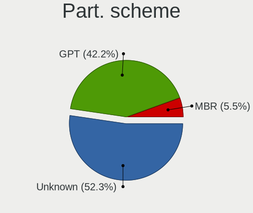

Ubuntu - Tested Hardware & Statistics (Notebooks)
-------------------------------------------------

A project to collect tested hardware configurations for Ubuntu.

Anyone can contribute to this report by the [hw-probe](https://github.com/linuxhw/hw-probe) tool:

    sudo -E hw-probe -all -upload

Please contribute! Especially if your hardware is rare.

Contents
--------

* [ Test Cases ](#test-cases)

* [ System ](#system)
  - [ OS                       ](#os)
  - [ OS Family                ](#os-family)
  - [ Kernel                   ](#kernel)
  - [ Kernel Family            ](#kernel-family)
  - [ Kernel Major Ver.        ](#kernel-major-ver)
  - [ Arch                     ](#arch)
  - [ DE                       ](#de)
  - [ Display Server           ](#display-server)
  - [ Display Manager          ](#display-manager)
  - [ OS Lang                  ](#os-lang)
  - [ Boot Mode                ](#boot-mode)
  - [ Filesystem               ](#filesystem)
  - [ Part. scheme             ](#part-scheme)
  - [ Dual Boot with Linux/BSD ](#dual-boot-with-linuxbsd)
  - [ Dual Boot (Win)          ](#dual-boot-win)

* [ Board ](#board)
  - [ Vendor                   ](#vendor)
  - [ Model                    ](#model)
  - [ Model Family             ](#model-family)
  - [ MFG Year                 ](#mfg-year)
  - [ Form Factor              ](#form-factor)
  - [ Secure Boot              ](#secure-boot)
  - [ Coreboot                 ](#coreboot)
  - [ RAM Size                 ](#ram-size)
  - [ RAM Used                 ](#ram-used)
  - [ Total Drives             ](#total-drives)
  - [ Has CD-ROM               ](#has-cd-rom)
  - [ Has Ethernet             ](#has-ethernet)
  - [ Has WiFi                 ](#has-wifi)
  - [ Has Bluetooth            ](#has-bluetooth)

* [ Location ](#location)
  - [ Country                  ](#country)
  - [ City                     ](#city)

* [ Drives ](#drives)
  - [ Drive Vendor             ](#drive-vendor)
  - [ Drive Model              ](#drive-model)
  - [ HDD Vendor               ](#hdd-vendor)
  - [ SSD Vendor               ](#ssd-vendor)
  - [ Drive Kind               ](#drive-kind)
  - [ Drive Connector          ](#drive-connector)
  - [ Drive Size               ](#drive-size)
  - [ Space Total              ](#space-total)
  - [ Space Used               ](#space-used)
  - [ Malfunc. Drives          ](#malfunc-drives)
  - [ Malfunc. Drive Vendor    ](#malfunc-drive-vendor)
  - [ Malfunc. HDD Vendor      ](#malfunc-hdd-vendor)
  - [ Malfunc. Drive Kind      ](#malfunc-drive-kind)
  - [ Failed Drives            ](#failed-drives)
  - [ Failed Drive Vendor      ](#failed-drive-vendor)
  - [ Drive Status             ](#drive-status)

* [ Storage controller ](#storage-controller)
  - [ Storage Vendor           ](#storage-vendor)
  - [ Storage Model            ](#storage-model)
  - [ Storage Kind             ](#storage-kind)

* [ Processor ](#processor)
  - [ CPU Vendor               ](#cpu-vendor)
  - [ CPU Model                ](#cpu-model)
  - [ CPU Model Family         ](#cpu-model-family)
  - [ CPU Cores                ](#cpu-cores)
  - [ CPU Sockets              ](#cpu-sockets)
  - [ CPU Threads              ](#cpu-threads)
  - [ CPU Op-Modes             ](#cpu-op-modes)
  - [ CPU Microcode            ](#cpu-microcode)
  - [ CPU Microarch            ](#cpu-microarch)

* [ Graphics ](#graphics)
  - [ GPU Vendor               ](#gpu-vendor)
  - [ GPU Model                ](#gpu-model)
  - [ GPU Combo                ](#gpu-combo)
  - [ GPU Driver               ](#gpu-driver)
  - [ GPU Memory               ](#gpu-memory)

* [ Monitor ](#monitor)
  - [ Monitor Vendor           ](#monitor-vendor)
  - [ Monitor Model            ](#monitor-model)
  - [ Monitor Resolution       ](#monitor-resolution)
  - [ Monitor Diagonal         ](#monitor-diagonal)
  - [ Monitor Width            ](#monitor-width)
  - [ Aspect Ratio             ](#aspect-ratio)
  - [ Monitor Area             ](#monitor-area)
  - [ Pixel Density            ](#pixel-density)
  - [ Multiple Monitors        ](#multiple-monitors)

* [ Network ](#network)
  - [ Net Controller Vendor    ](#net-controller-vendor)
  - [ Net Controller Model     ](#net-controller-model)
  - [ Wireless Vendor          ](#wireless-vendor)
  - [ Wireless Model           ](#wireless-model)
  - [ Ethernet Vendor          ](#ethernet-vendor)
  - [ Ethernet Model           ](#ethernet-model)
  - [ Net Controller Kind      ](#net-controller-kind)
  - [ Used Controller          ](#used-controller)
  - [ NICs                     ](#nics)
  - [ IPv6                     ](#ipv6)

* [ Bluetooth ](#bluetooth)
  - [ Bluetooth Vendor         ](#bluetooth-vendor)
  - [ Bluetooth Model          ](#bluetooth-model)

* [ Sound ](#sound)
  - [ Sound Vendor             ](#sound-vendor)
  - [ Sound Model              ](#sound-model)

* [ Memory ](#memory)
  - [ Memory Vendor            ](#memory-vendor)
  - [ Memory Model             ](#memory-model)
  - [ Memory Kind              ](#memory-kind)
  - [ Memory Form Factor       ](#memory-form-factor)
  - [ Memory Size              ](#memory-size)
  - [ Memory Speed             ](#memory-speed)

* [ Printers & scanners ](#printers--scanners)
  - [ Printer Vendor           ](#printer-vendor)
  - [ Printer Model            ](#printer-model)
  - [ Scanner Vendor           ](#scanner-vendor)
  - [ Scanner Model            ](#scanner-model)

* [ Camera ](#camera)
  - [ Camera Vendor            ](#camera-vendor)
  - [ Camera Model             ](#camera-model)

* [ Security ](#security)
  - [ Fingerprint Vendor       ](#fingerprint-vendor)
  - [ Fingerprint Model        ](#fingerprint-model)
  - [ Chipcard Vendor          ](#chipcard-vendor)
  - [ Chipcard Model           ](#chipcard-model)

* [ Unsupported ](#unsupported)
  - [ Unsupported Devices      ](#unsupported-devices)
  - [ Unsupported Device Types ](#unsupported-device-types)

Test Cases
----------

Total: 44807

| Vendor        | Model                       | Probe                                                      | Date         |
|---------------|-----------------------------|------------------------------------------------------------|--------------|
| HP            | Pavilion dv6                | [c937edbfcd](https://linux-hardware.org/?probe=c937edbfcd) | Mar 01, 2023 |
| HP            | Pavilion 14                 | [ae0e65f5d1](https://linux-hardware.org/?probe=ae0e65f5d1) | Feb 28, 2023 |
| TCL Commun... | 8090                        | [d1f86443c7](https://linux-hardware.org/?probe=d1f86443c7) | Feb 28, 2023 |
| Dell          | Latitude 5420               | [0596aff5c4](https://linux-hardware.org/?probe=0596aff5c4) | Feb 28, 2023 |
| Alienware     | 15 R2                       | [f242145858](https://linux-hardware.org/?probe=f242145858) | Feb 28, 2023 |
| HP            | Pavilion dv7                | [e40593f800](https://linux-hardware.org/?probe=e40593f800) | Feb 28, 2023 |
| Timi          | RedmiBook 16                | [2d713931d2](https://linux-hardware.org/?probe=2d713931d2) | Feb 28, 2023 |
| Acer          | Aspire V3-371               | [bbc0d58ef1](https://linux-hardware.org/?probe=bbc0d58ef1) | Feb 28, 2023 |
| Lenovo        | IdeaPad 3 15ABA7 82RN       | [d8b58a8ea1](https://linux-hardware.org/?probe=d8b58a8ea1) | Feb 28, 2023 |
| Alienware     | 15 R2                       | [5e29609544](https://linux-hardware.org/?probe=5e29609544) | Feb 28, 2023 |
| HP            | ENVY Laptop 17-ch1xxx       | [b518eb9925](https://linux-hardware.org/?probe=b518eb9925) | Feb 28, 2023 |
| Dell          | Latitude 5400               | [00cd14a724](https://linux-hardware.org/?probe=00cd14a724) | Feb 28, 2023 |
| HP            | Laptop 17-by3xxx            | [5beb40c486](https://linux-hardware.org/?probe=5beb40c486) | Feb 28, 2023 |
| Lenovo        | ThinkPad X1 Carbon Gen 8... | [76645fa513](https://linux-hardware.org/?probe=76645fa513) | Feb 28, 2023 |
| Dell          | G15 5511                    | [1859d13517](https://linux-hardware.org/?probe=1859d13517) | Feb 28, 2023 |
| HP            | EliteBook 830 G5            | [b82fdfbe47](https://linux-hardware.org/?probe=b82fdfbe47) | Feb 28, 2023 |
| Dell          | G5 5590                     | [75f2235434](https://linux-hardware.org/?probe=75f2235434) | Feb 28, 2023 |
| ASUSTek       | ROG Zephyrus G14 GA401QM... | [7b7df086e0](https://linux-hardware.org/?probe=7b7df086e0) | Feb 28, 2023 |
| Samsung       | 370E4K                      | [aba5535c2a](https://linux-hardware.org/?probe=aba5535c2a) | Feb 28, 2023 |
| Apple         | MacBookPro5,5               | [e20478d60e](https://linux-hardware.org/?probe=e20478d60e) | Feb 28, 2023 |
| ASUSTek       | K52Je                       | [03857fde28](https://linux-hardware.org/?probe=03857fde28) | Feb 28, 2023 |
| Timi          | TM1701                      | [ab658664bb](https://linux-hardware.org/?probe=ab658664bb) | Feb 28, 2023 |
| Lenovo        | Yoga710-14ISK 80TY          | [756e003316](https://linux-hardware.org/?probe=756e003316) | Feb 28, 2023 |
| Dell          | Inspiron 15 3511            | [99462eae5e](https://linux-hardware.org/?probe=99462eae5e) | Feb 28, 2023 |
| HP            | Pavilion Laptop 15-cc5xx    | [4a5d167c96](https://linux-hardware.org/?probe=4a5d167c96) | Feb 28, 2023 |
| Lenovo        | Slim 7 ProX 14ARH7 82V2     | [1c61d820ff](https://linux-hardware.org/?probe=1c61d820ff) | Feb 28, 2023 |
| Alienware     | x15 R2                      | [f0335542ce](https://linux-hardware.org/?probe=f0335542ce) | Feb 28, 2023 |
| HP            | Pavilion dv7                | [1dbb82f9ff](https://linux-hardware.org/?probe=1dbb82f9ff) | Feb 28, 2023 |
| AZW           | SEi                         | [6d0814dc9f](https://linux-hardware.org/?probe=6d0814dc9f) | Feb 28, 2023 |
| Lenovo        | ThinkPad X1 Carbon 6th 2... | [886f442040](https://linux-hardware.org/?probe=886f442040) | Feb 28, 2023 |
| HP            | ProBook 450 G8 Notebook ... | [009eefdc1d](https://linux-hardware.org/?probe=009eefdc1d) | Feb 28, 2023 |
| HP            | ProBook 450 G8 Notebook ... | [17a7ee80ac](https://linux-hardware.org/?probe=17a7ee80ac) | Feb 28, 2023 |
| Lenovo        | ThinkPad S1 Yoga 20C0S23... | [3cd99ed8f4](https://linux-hardware.org/?probe=3cd99ed8f4) | Feb 28, 2023 |
| Dell          | Latitude E7470              | [51deaef7a0](https://linux-hardware.org/?probe=51deaef7a0) | Feb 28, 2023 |
| Lenovo        | ThinkPad E560 20EV000UUK    | [7060b60651](https://linux-hardware.org/?probe=7060b60651) | Feb 27, 2023 |
| HP            | ProBook 430 G6              | [a184aa7141](https://linux-hardware.org/?probe=a184aa7141) | Feb 27, 2023 |
| Packard Be... | EasyNote TJ66               | [bd15540982](https://linux-hardware.org/?probe=bd15540982) | Feb 27, 2023 |
| Dell          | Inspiron 5537               | [25fa030105](https://linux-hardware.org/?probe=25fa030105) | Feb 27, 2023 |
| Samsung       | 370E4K                      | [d66bcd2bc8](https://linux-hardware.org/?probe=d66bcd2bc8) | Feb 27, 2023 |
| HP            | Laptop 15t-dy200            | [3ea4171270](https://linux-hardware.org/?probe=3ea4171270) | Feb 27, 2023 |
| Lenovo        | ThinkPad T460s 20FAS55Q1... | [815b6ea9f2](https://linux-hardware.org/?probe=815b6ea9f2) | Feb 27, 2023 |
| Lenovo        | IdeaPad 1 15ALC7 82R4       | [47f7b39f3a](https://linux-hardware.org/?probe=47f7b39f3a) | Feb 27, 2023 |
| Apple         | MacBookPro15,1              | [e1ce7bab5a](https://linux-hardware.org/?probe=e1ce7bab5a) | Feb 27, 2023 |
| Dell          | XPS 13 9300                 | [fc803f9205](https://linux-hardware.org/?probe=fc803f9205) | Feb 27, 2023 |
| HUAWEI        | BOM-WXX9                    | [43a5dbf393](https://linux-hardware.org/?probe=43a5dbf393) | Feb 27, 2023 |
| Dell          | Inspiron 3537               | [78f270b35a](https://linux-hardware.org/?probe=78f270b35a) | Feb 27, 2023 |
| Dell          | Latitude E4310              | [2b2255a5b4](https://linux-hardware.org/?probe=2b2255a5b4) | Feb 27, 2023 |
| ASUSTek       | FX503VD                     | [46954919f7](https://linux-hardware.org/?probe=46954919f7) | Feb 27, 2023 |
| Dell          | Latitude 7420               | [d3af27a0ac](https://linux-hardware.org/?probe=d3af27a0ac) | Feb 27, 2023 |
| ASUSTek       | X75VC                       | [8d629c0ed3](https://linux-hardware.org/?probe=8d629c0ed3) | Feb 27, 2023 |
| Acer          | Aspire E1-531               | [a52b94c2d5](https://linux-hardware.org/?probe=a52b94c2d5) | Feb 27, 2023 |
| Dell          | Inspiron 3537               | [bb1ffc3498](https://linux-hardware.org/?probe=bb1ffc3498) | Feb 27, 2023 |
| Lenovo        | ThinkPad T480 20L6SEH700    | [4a187e016b](https://linux-hardware.org/?probe=4a187e016b) | Feb 27, 2023 |
| Lenovo        | ThinkPad X260 20F5S1MN00    | [db0d3b74bd](https://linux-hardware.org/?probe=db0d3b74bd) | Feb 27, 2023 |
| UMAX          | VisionBook-N12R             | [2477ae9a0e](https://linux-hardware.org/?probe=2477ae9a0e) | Feb 27, 2023 |
| HP            | Pavilion m6                 | [1e9d802ab6](https://linux-hardware.org/?probe=1e9d802ab6) | Feb 27, 2023 |
| ASUSTek       | FX503VD                     | [60e1742e7e](https://linux-hardware.org/?probe=60e1742e7e) | Feb 27, 2023 |
| Apple         | MacBookAir4,2               | [a9605bf85e](https://linux-hardware.org/?probe=a9605bf85e) | Feb 27, 2023 |
| HP            | Pavilion m6                 | [0d35b0b080](https://linux-hardware.org/?probe=0d35b0b080) | Feb 27, 2023 |
| Lenovo        | ThinkPad P14s Gen 2a 21A... | [d57bb59dee](https://linux-hardware.org/?probe=d57bb59dee) | Feb 27, 2023 |
| Acer          | Aspire F5-573G              | [ce2bc0c00d](https://linux-hardware.org/?probe=ce2bc0c00d) | Feb 27, 2023 |
| Toshiba       | IS 1413G                    | [c361aabb21](https://linux-hardware.org/?probe=c361aabb21) | Feb 27, 2023 |
| Dell          | Inspiron 14-3467            | [5bf68a313d](https://linux-hardware.org/?probe=5bf68a313d) | Feb 27, 2023 |
| Toshiba       | IS 1413G                    | [17338cbd01](https://linux-hardware.org/?probe=17338cbd01) | Feb 27, 2023 |
| Dell          | XPS L521X                   | [f9598ce828](https://linux-hardware.org/?probe=f9598ce828) | Feb 27, 2023 |
| Acer          | Aspire E5-571               | [04c721038a](https://linux-hardware.org/?probe=04c721038a) | Feb 27, 2023 |
| Dell          | Latitude E6430              | [b75c4a18b3](https://linux-hardware.org/?probe=b75c4a18b3) | Feb 27, 2023 |
| Apple         | MacBookPro15,1              | [caf6dc6f16](https://linux-hardware.org/?probe=caf6dc6f16) | Feb 27, 2023 |
| Lenovo        | G50-80 80L0                 | [19727a16be](https://linux-hardware.org/?probe=19727a16be) | Feb 26, 2023 |
| Acer          | Aspire V3-772G              | [83dce8f92d](https://linux-hardware.org/?probe=83dce8f92d) | Feb 26, 2023 |
| Acer          | Predator PT515-51           | [b5da2905fb](https://linux-hardware.org/?probe=b5da2905fb) | Feb 26, 2023 |
| HP            | Pavilion Laptop 15-cc5xx    | [13f87401ca](https://linux-hardware.org/?probe=13f87401ca) | Feb 26, 2023 |
| ASUSTek       | ASUS TUF Gaming F15 FX50... | [e763fc25e7](https://linux-hardware.org/?probe=e763fc25e7) | Feb 26, 2023 |
| HP            | Pavilion dv7                | [3d8c3db030](https://linux-hardware.org/?probe=3d8c3db030) | Feb 26, 2023 |
| HONOR         | BBR-WAX9                    | [3fe348fb3f](https://linux-hardware.org/?probe=3fe348fb3f) | Feb 26, 2023 |
| HP            | 250 15.6 inch G9 Noteboo... | [2cea6ee649](https://linux-hardware.org/?probe=2cea6ee649) | Feb 26, 2023 |
| Lenovo        | 3000 N200 0769EAG           | [28056b6929](https://linux-hardware.org/?probe=28056b6929) | Feb 26, 2023 |
| Dell          | Latitude 7350               | [a8bbed94ce](https://linux-hardware.org/?probe=a8bbed94ce) | Feb 26, 2023 |
| HP            | ProBook 430 G4              | [05a6a84b50](https://linux-hardware.org/?probe=05a6a84b50) | Feb 26, 2023 |
| Lenovo        | ThinkPad T420 4236EJ3       | [d0b043c11b](https://linux-hardware.org/?probe=d0b043c11b) | Feb 26, 2023 |
| Apple         | MacBookPro15,4              | [41330b2783](https://linux-hardware.org/?probe=41330b2783) | Feb 26, 2023 |
| HP            | Laptop 15-ef2xxx            | [54c4b4eb4e](https://linux-hardware.org/?probe=54c4b4eb4e) | Feb 26, 2023 |
| HP            | ENVY 17                     | [dea1551bf3](https://linux-hardware.org/?probe=dea1551bf3) | Feb 26, 2023 |
| HP            | Laptop 15-ef2xxx            | [a9e58a8737](https://linux-hardware.org/?probe=a9e58a8737) | Feb 26, 2023 |
| Gigabyte      | MMLP5AP-00                  | [eb5ca5bb8d](https://linux-hardware.org/?probe=eb5ca5bb8d) | Feb 26, 2023 |
| HP            | ENVY 17                     | [0f347a1b6c](https://linux-hardware.org/?probe=0f347a1b6c) | Feb 26, 2023 |
| Toshiba       | Satellite C855-2J5          | [6a55b5a6b3](https://linux-hardware.org/?probe=6a55b5a6b3) | Feb 26, 2023 |
| Dell          | Latitude E7250              | [db6ac786ef](https://linux-hardware.org/?probe=db6ac786ef) | Feb 26, 2023 |
| Apple         | MacBookPro10,1              | [816a4eb27e](https://linux-hardware.org/?probe=816a4eb27e) | Feb 26, 2023 |
| Lenovo        | ThinkPad E490 20N8000XRT    | [b9e64d9f86](https://linux-hardware.org/?probe=b9e64d9f86) | Feb 26, 2023 |
| ASUSTek       | TUF Gaming FX705DT_FX705... | [8a3c646d1f](https://linux-hardware.org/?probe=8a3c646d1f) | Feb 26, 2023 |
| Dell          | Latitude E6420              | [b35fdc2f10](https://linux-hardware.org/?probe=b35fdc2f10) | Feb 26, 2023 |
| HP            | Pavilion 14                 | [c9b9f213b5](https://linux-hardware.org/?probe=c9b9f213b5) | Feb 26, 2023 |
| Intel         | HuronRiver Platform         | [2168c2bb5c](https://linux-hardware.org/?probe=2168c2bb5c) | Feb 26, 2023 |
| Dell          | G15 5520                    | [d68c28ea8d](https://linux-hardware.org/?probe=d68c28ea8d) | Feb 26, 2023 |
| Lenovo        | G500 20236                  | [93f09b28d6](https://linux-hardware.org/?probe=93f09b28d6) | Feb 26, 2023 |
| Lenovo        | ThinkPad E14 Gen 2 20T7S... | [054cce6e78](https://linux-hardware.org/?probe=054cce6e78) | Feb 26, 2023 |
| Lenovo        | G500 20236                  | [51bd5c9f21](https://linux-hardware.org/?probe=51bd5c9f21) | Feb 26, 2023 |
| Lenovo        | ThinkPad T430s 235368U      | [58a8ada163](https://linux-hardware.org/?probe=58a8ada163) | Feb 26, 2023 |
| HP            | EliteBook 745 G3            | [8cee2ac27a](https://linux-hardware.org/?probe=8cee2ac27a) | Feb 26, 2023 |
| Toshiba       | Satellite C660D             | [d5e4af2957](https://linux-hardware.org/?probe=d5e4af2957) | Feb 26, 2023 |
| HP            | Notebook                    | [4a72575c17](https://linux-hardware.org/?probe=4a72575c17) | Feb 25, 2023 |
| HP            | 250 15.6 inch G9 Noteboo... | [84750f9d96](https://linux-hardware.org/?probe=84750f9d96) | Feb 25, 2023 |
| Acer          | Aspire V3-571G              | [b02e34a7f9](https://linux-hardware.org/?probe=b02e34a7f9) | Feb 25, 2023 |
| Acer          | Aspire ES1-521              | [e5f0a23afd](https://linux-hardware.org/?probe=e5f0a23afd) | Feb 25, 2023 |
| Fujitsu       | LIFEBOOK AH530              | [fd743448ae](https://linux-hardware.org/?probe=fd743448ae) | Feb 25, 2023 |
| Dell          | Latitude 5580               | [cd4a13ce32](https://linux-hardware.org/?probe=cd4a13ce32) | Feb 25, 2023 |
| Apple         | MacBookPro7,1               | [7505d49d88](https://linux-hardware.org/?probe=7505d49d88) | Feb 25, 2023 |
| Apple         | MacBook5,1                  | [fbb2478f8c](https://linux-hardware.org/?probe=fbb2478f8c) | Feb 25, 2023 |
| Dell          | Latitude 5580               | [79da5a8efd](https://linux-hardware.org/?probe=79da5a8efd) | Feb 25, 2023 |
| HP            | ProBook 430 G4              | [0a2c7cca00](https://linux-hardware.org/?probe=0a2c7cca00) | Feb 25, 2023 |
| Lenovo        | ThinkPad T400 6475KF3       | [92f3e0b9dd](https://linux-hardware.org/?probe=92f3e0b9dd) | Feb 25, 2023 |
| Lenovo        | ThinkPad X220 4290EC5       | [d72d87e4ae](https://linux-hardware.org/?probe=d72d87e4ae) | Feb 25, 2023 |
| Dell          | Inspiron 3420               | [e13f9bfc8f](https://linux-hardware.org/?probe=e13f9bfc8f) | Feb 25, 2023 |
| Lenovo        | IdeaPad 3 15ALC6 82MF       | [af95b24466](https://linux-hardware.org/?probe=af95b24466) | Feb 25, 2023 |
| Acer          | Aspire V3-772G              | [f137fa0797](https://linux-hardware.org/?probe=f137fa0797) | Feb 25, 2023 |
| Chuwi         | GemiBook Pro                | [9894743527](https://linux-hardware.org/?probe=9894743527) | Feb 25, 2023 |
| Apple         | MacBookPro8,1               | [60ab083fe9](https://linux-hardware.org/?probe=60ab083fe9) | Feb 25, 2023 |
| ASUSTek       | VivoBook_ASUSLaptop M350... | [22cf774ac0](https://linux-hardware.org/?probe=22cf774ac0) | Feb 25, 2023 |
| Dell          | Vostro 3501                 | [ed459712f6](https://linux-hardware.org/?probe=ed459712f6) | Feb 25, 2023 |
| HP            | Pavilion Laptop 14-ec0xx... | [7b59cbd067](https://linux-hardware.org/?probe=7b59cbd067) | Feb 25, 2023 |
| ASUSTek       | X556URK                     | [fc80e01794](https://linux-hardware.org/?probe=fc80e01794) | Feb 25, 2023 |
| HUAWEI        | NBLK-WAX9X                  | [2978ec71b8](https://linux-hardware.org/?probe=2978ec71b8) | Feb 25, 2023 |
| BESSTAR Te... | X400                        | [e1c05e0782](https://linux-hardware.org/?probe=e1c05e0782) | Feb 25, 2023 |
| Dell          | Inspiron 5537               | [0496ce1146](https://linux-hardware.org/?probe=0496ce1146) | Feb 25, 2023 |
| Dell          | Inspiron 5537               | [cb4b91f80c](https://linux-hardware.org/?probe=cb4b91f80c) | Feb 25, 2023 |
| Lenovo        | ThinkPad P50s 20FKS0A300    | [2b9ed74f9d](https://linux-hardware.org/?probe=2b9ed74f9d) | Feb 25, 2023 |
| HP            | Pavilion Aero Laptop 13-... | [af87e6ea4c](https://linux-hardware.org/?probe=af87e6ea4c) | Feb 25, 2023 |
| HP            | EliteBook 840 14 inch G9... | [9c0775a106](https://linux-hardware.org/?probe=9c0775a106) | Feb 25, 2023 |
| Hampoo        | I2W6_AP135 Reserved         | [c5cdb97c5b](https://linux-hardware.org/?probe=c5cdb97c5b) | Feb 25, 2023 |
| HP            | ProBook 645 G1              | [329c0a65eb](https://linux-hardware.org/?probe=329c0a65eb) | Feb 25, 2023 |
| Lenovo        | Legion Y530-15ICH 81FV      | [0b239fec52](https://linux-hardware.org/?probe=0b239fec52) | Feb 25, 2023 |
| HP            | ENVY 17                     | [7baf81c4e8](https://linux-hardware.org/?probe=7baf81c4e8) | Feb 25, 2023 |
| HP            | Victus by 16 Laptop PC      | [05ef574a7c](https://linux-hardware.org/?probe=05ef574a7c) | Feb 25, 2023 |
| HP            | ENVY 17                     | [8790ad53d8](https://linux-hardware.org/?probe=8790ad53d8) | Feb 25, 2023 |
| Apple         | MacBookPro16,2              | [c4cab43483](https://linux-hardware.org/?probe=c4cab43483) | Feb 25, 2023 |
| Lenovo        | ThinkPad X270 W10DG 20K5... | [c2c5da60c3](https://linux-hardware.org/?probe=c2c5da60c3) | Feb 25, 2023 |
| HP            | 15                          | [04741afb27](https://linux-hardware.org/?probe=04741afb27) | Feb 25, 2023 |
| HP            | Laptop 15s-fq1xxx           | [ca2ef50547](https://linux-hardware.org/?probe=ca2ef50547) | Feb 25, 2023 |
| HP            | Pavilion Laptop 15-cd0xx    | [dfb5281dfb](https://linux-hardware.org/?probe=dfb5281dfb) | Feb 25, 2023 |
| Gateway       | NV47H                       | [4168112a0a](https://linux-hardware.org/?probe=4168112a0a) | Feb 25, 2023 |
| Gateway       | NV47H                       | [8faf0d384e](https://linux-hardware.org/?probe=8faf0d384e) | Feb 25, 2023 |
| HP            | EliteBook 840 G2            | [33dc8202e9](https://linux-hardware.org/?probe=33dc8202e9) | Feb 25, 2023 |
| ASUSTek       | N53SM                       | [6606121f31](https://linux-hardware.org/?probe=6606121f31) | Feb 25, 2023 |
| Sony          | VPCCW13FB                   | [1772a3987b](https://linux-hardware.org/?probe=1772a3987b) | Feb 25, 2023 |
| ASUSTek       | ZenBook UX425QA_UM425QA     | [02608a8288](https://linux-hardware.org/?probe=02608a8288) | Feb 25, 2023 |
| Hampoo        | I2W6_AP135 Reserved         | [976a29944a](https://linux-hardware.org/?probe=976a29944a) | Feb 25, 2023 |
| Lenovo        | IdeaPad 5 15IAL7 82SF       | [12d979b047](https://linux-hardware.org/?probe=12d979b047) | Feb 25, 2023 |
| Lenovo        | ThinkPad T15 Gen 2i 20W4... | [3b757c7c9c](https://linux-hardware.org/?probe=3b757c7c9c) | Feb 25, 2023 |
| ASUSTek       | ZenBook UX425EA_UX425EA     | [f0fa613cd2](https://linux-hardware.org/?probe=f0fa613cd2) | Feb 25, 2023 |
| Sony          | VGN-FZ31M                   | [6b830e36f1](https://linux-hardware.org/?probe=6b830e36f1) | Feb 25, 2023 |
| HP            | EliteBook 840 Aero G8 No... | [f24e6a55c4](https://linux-hardware.org/?probe=f24e6a55c4) | Feb 24, 2023 |
| HP            | Laptop 15s-fq1xxx           | [3899b2f13e](https://linux-hardware.org/?probe=3899b2f13e) | Feb 24, 2023 |
| HP            | Laptop 17-by2xxx            | [d6a91a338c](https://linux-hardware.org/?probe=d6a91a338c) | Feb 24, 2023 |
| Lenovo        | IdeaPad 3 15ALC6 82MF       | [d3354bd88c](https://linux-hardware.org/?probe=d3354bd88c) | Feb 24, 2023 |
| ASUSTek       | K53U                        | [5b343010e7](https://linux-hardware.org/?probe=5b343010e7) | Feb 24, 2023 |
| Lenovo        | IdeaPad Z580                | [cf2ff6c04b](https://linux-hardware.org/?probe=cf2ff6c04b) | Feb 24, 2023 |
| ASUSTek       | VivoBook_ASUSLaptop M650... | [d99e163be6](https://linux-hardware.org/?probe=d99e163be6) | Feb 24, 2023 |
| Dell          | Inspiron 3793               | [8e85683aae](https://linux-hardware.org/?probe=8e85683aae) | Feb 24, 2023 |
| Fujitsu       | LIFEBOOK U749               | [ba7cdc6018](https://linux-hardware.org/?probe=ba7cdc6018) | Feb 24, 2023 |
| ASUSTek       | X555LA                      | [502020fe52](https://linux-hardware.org/?probe=502020fe52) | Feb 24, 2023 |
| ASUSTek       | X510UQR                     | [075081e4ad](https://linux-hardware.org/?probe=075081e4ad) | Feb 24, 2023 |
| Lenovo        | ThinkPad T470s 20HGS0AE0... | [7f8c9de1aa](https://linux-hardware.org/?probe=7f8c9de1aa) | Feb 24, 2023 |
| Acer          | Aspire A315-23              | [e0fcd4e578](https://linux-hardware.org/?probe=e0fcd4e578) | Feb 24, 2023 |
| Lenovo        | ThinkPad T495s 20QJS0GG0... | [6186149a54](https://linux-hardware.org/?probe=6186149a54) | Feb 24, 2023 |
| Chuwi         | HeroBook Air                | [8daed679c2](https://linux-hardware.org/?probe=8daed679c2) | Feb 24, 2023 |
| Dell          | Vostro 15 7510              | [38085af23d](https://linux-hardware.org/?probe=38085af23d) | Feb 24, 2023 |
| Acer          | Aspire E1-531               | [4526585d29](https://linux-hardware.org/?probe=4526585d29) | Feb 24, 2023 |
| HP            | EliteBook 840 14 inch G9... | [8ce6b54b09](https://linux-hardware.org/?probe=8ce6b54b09) | Feb 24, 2023 |
| HP            | Pavilion Notebook           | [fee146aaa1](https://linux-hardware.org/?probe=fee146aaa1) | Feb 24, 2023 |
| Toshiba       | Satellite A205              | [07e63c8b75](https://linux-hardware.org/?probe=07e63c8b75) | Feb 24, 2023 |
| Toshiba       | Satellite L775D             | [d8b2acd038](https://linux-hardware.org/?probe=d8b2acd038) | Feb 24, 2023 |
| HP            | EliteBook 840 G2            | [f1fa3164f9](https://linux-hardware.org/?probe=f1fa3164f9) | Feb 24, 2023 |
| ASUSTek       | ROG Strix G713RM_G713RM     | [4f7bbbdd28](https://linux-hardware.org/?probe=4f7bbbdd28) | Feb 24, 2023 |
| HP            | 250 15.6 inch G9 Noteboo... | [cddc383ff9](https://linux-hardware.org/?probe=cddc383ff9) | Feb 23, 2023 |
| ASUSTek       | ROG GU501GM                 | [5f0eaa8696](https://linux-hardware.org/?probe=5f0eaa8696) | Feb 23, 2023 |
| Dell          | Vostro 3700                 | [a37b20471b](https://linux-hardware.org/?probe=a37b20471b) | Feb 23, 2023 |
| Acer          | Aspire SW3-013              | [771b90caaa](https://linux-hardware.org/?probe=771b90caaa) | Feb 23, 2023 |
| Lenovo        | ThinkPad P51s 20HB0012US    | [3135124837](https://linux-hardware.org/?probe=3135124837) | Feb 23, 2023 |
| Lenovo        | Legion 5 Pro 16ACH6H 82J... | [a85b9d1452](https://linux-hardware.org/?probe=a85b9d1452) | Feb 23, 2023 |
| Lenovo        | ThinkPad P70 20ESS2J700     | [5a94dfa289](https://linux-hardware.org/?probe=5a94dfa289) | Feb 23, 2023 |
| HP            | Laptop 15-bs0xx             | [dbab0ba93c](https://linux-hardware.org/?probe=dbab0ba93c) | Feb 23, 2023 |
| Dell          | Inspiron N5010              | [5b4def0870](https://linux-hardware.org/?probe=5b4def0870) | Feb 23, 2023 |
| ASUSTek       | X550LB                      | [736bb83bb8](https://linux-hardware.org/?probe=736bb83bb8) | Feb 23, 2023 |
| HUAWEI        | MACH-WX9                    | [fd61d34d74](https://linux-hardware.org/?probe=fd61d34d74) | Feb 23, 2023 |
| Lenovo        | ThinkPad T540p 20BFS26E0... | [24219efe34](https://linux-hardware.org/?probe=24219efe34) | Feb 23, 2023 |
| HP            | ProBook 440 G7              | [224a9e7278](https://linux-hardware.org/?probe=224a9e7278) | Feb 23, 2023 |
| MSI           | MS-7C02                     | [e2cdf5625c](https://linux-hardware.org/?probe=e2cdf5625c) | Feb 23, 2023 |
| HP            | ProBook 440 G7              | [618e46eb82](https://linux-hardware.org/?probe=618e46eb82) | Feb 23, 2023 |
| Acer          | Aspire E5-521               | [7ffff246ca](https://linux-hardware.org/?probe=7ffff246ca) | Feb 23, 2023 |
| ASUSTek       | X441UA                      | [cd870fc3d3](https://linux-hardware.org/?probe=cd870fc3d3) | Feb 23, 2023 |
| Apple         | MacBookAir4,1               | [bc134b45c7](https://linux-hardware.org/?probe=bc134b45c7) | Feb 23, 2023 |
| Dell          | XPS 9320                    | [94e7c2d282](https://linux-hardware.org/?probe=94e7c2d282) | Feb 23, 2023 |
| MSI           | MS-7C02                     | [bfbb3aab2c](https://linux-hardware.org/?probe=bfbb3aab2c) | Feb 23, 2023 |
| MSI           | GF75 Thin 10SCXK            | [a64a363f58](https://linux-hardware.org/?probe=a64a363f58) | Feb 23, 2023 |
| MSI           | GF75 Thin 10SCXK            | [3647a78d88](https://linux-hardware.org/?probe=3647a78d88) | Feb 23, 2023 |
| Lenovo        | IdeaPad S340-15API 81NC     | [d03f3a8806](https://linux-hardware.org/?probe=d03f3a8806) | Feb 23, 2023 |
| Lenovo        | IdeaPad S340-15API 81NC     | [ca79eee760](https://linux-hardware.org/?probe=ca79eee760) | Feb 23, 2023 |
| Lenovo        | ThinkPad P70 20ESS2J700     | [869614f52a](https://linux-hardware.org/?probe=869614f52a) | Feb 23, 2023 |
| Lenovo        | ThinkPad T14 Gen 1 20UES... | [296b314a4a](https://linux-hardware.org/?probe=296b314a4a) | Feb 23, 2023 |
| Acer          | TravelMate P253             | [b99414b6de](https://linux-hardware.org/?probe=b99414b6de) | Feb 23, 2023 |
| Dell          | XPS 13 9370                 | [8923d5940e](https://linux-hardware.org/?probe=8923d5940e) | Feb 23, 2023 |
| ASUSTek       | X553SA                      | [bf6718f1d0](https://linux-hardware.org/?probe=bf6718f1d0) | Feb 22, 2023 |
| Sony          | SVE15125CBW                 | [5b173518b5](https://linux-hardware.org/?probe=5b173518b5) | Feb 22, 2023 |
| Sony          | SVE15125CBW                 | [107bd5b235](https://linux-hardware.org/?probe=107bd5b235) | Feb 22, 2023 |
| Dell          | XPS 13 9370                 | [452bd46c01](https://linux-hardware.org/?probe=452bd46c01) | Feb 22, 2023 |
| Apple         | MacBookPro8,2               | [fd4b8d6419](https://linux-hardware.org/?probe=fd4b8d6419) | Feb 22, 2023 |
| Dell          | XPS 13 9370                 | [fe78ef8424](https://linux-hardware.org/?probe=fe78ef8424) | Feb 22, 2023 |
| Toshiba       | Satellite L655              | [2b16b06c7f](https://linux-hardware.org/?probe=2b16b06c7f) | Feb 22, 2023 |
| Lenovo        | ThinkPad X230 2325EJ0       | [3a2c22e22b](https://linux-hardware.org/?probe=3a2c22e22b) | Feb 22, 2023 |
| Lenovo        | Flex 2-14 20404             | [49445991dc](https://linux-hardware.org/?probe=49445991dc) | Feb 22, 2023 |
| HP            | Pavilion g6                 | [c76844f9a1](https://linux-hardware.org/?probe=c76844f9a1) | Feb 22, 2023 |
| Samsung       | 760XDA                      | [efa040a93f](https://linux-hardware.org/?probe=efa040a93f) | Feb 22, 2023 |
| Samsung       | 760XDA                      | [1ba36d420d](https://linux-hardware.org/?probe=1ba36d420d) | Feb 22, 2023 |
| Dell          | Precision M4800             | [9fb203c728](https://linux-hardware.org/?probe=9fb203c728) | Feb 22, 2023 |
| Notebook      | NS50_70MU                   | [a213ec0ba4](https://linux-hardware.org/?probe=a213ec0ba4) | Feb 22, 2023 |
| Lenovo        | G50-80 80E5                 | [51b83f1e27](https://linux-hardware.org/?probe=51b83f1e27) | Feb 22, 2023 |
| Dell          | Inspiron 3583               | [ad766a4190](https://linux-hardware.org/?probe=ad766a4190) | Feb 22, 2023 |
| Lenovo        | IdeaPad 5 15ABA7 82SG       | [99d4f0df73](https://linux-hardware.org/?probe=99d4f0df73) | Feb 22, 2023 |
| Lenovo        | ThinkPad E14 Gen 4 21EB0... | [1bc13bfa0c](https://linux-hardware.org/?probe=1bc13bfa0c) | Feb 22, 2023 |
| Lenovo        | ThinkPad X230 2325EJ0       | [06c8604990](https://linux-hardware.org/?probe=06c8604990) | Feb 22, 2023 |
| Lenovo        | IdeaPad 5 15ABA7 82SG       | [71928c5a75](https://linux-hardware.org/?probe=71928c5a75) | Feb 22, 2023 |
| Lenovo        | Legion 5 15ACH6H 82JU       | [7380033a44](https://linux-hardware.org/?probe=7380033a44) | Feb 22, 2023 |
| HP            | ENVY TS 17                  | [69075ec507](https://linux-hardware.org/?probe=69075ec507) | Feb 22, 2023 |
| Lenovo        | IdeaPad 5 15ALC05 82LN      | [57e007d035](https://linux-hardware.org/?probe=57e007d035) | Feb 22, 2023 |
| Dell          | Latitude 3189               | [3a9dc7e02c](https://linux-hardware.org/?probe=3a9dc7e02c) | Feb 22, 2023 |
| HP            | EliteBook 830 G5            | [a5f65720f5](https://linux-hardware.org/?probe=a5f65720f5) | Feb 22, 2023 |
| ASUSTek       | VivoBook_ASUSLaptop X515... | [8110c575e9](https://linux-hardware.org/?probe=8110c575e9) | Feb 22, 2023 |
| Acer          | Swift SF514-54T             | [ebbff689ba](https://linux-hardware.org/?probe=ebbff689ba) | Feb 22, 2023 |
| Notebook      | N8xEJEK                     | [1548ea7cab](https://linux-hardware.org/?probe=1548ea7cab) | Feb 21, 2023 |
| Notebook      | N8xEJEK                     | [a8a28d6f2b](https://linux-hardware.org/?probe=a8a28d6f2b) | Feb 21, 2023 |
| HUAWEI        | BOD-WXX9                    | [05f20bac2d](https://linux-hardware.org/?probe=05f20bac2d) | Feb 21, 2023 |
| HP            | Laptop 15-da2xxx            | [76cbc7df6d](https://linux-hardware.org/?probe=76cbc7df6d) | Feb 21, 2023 |
| Timi          | Redmi Book Pro 15 2022      | [818012d7ef](https://linux-hardware.org/?probe=818012d7ef) | Feb 21, 2023 |
| Chuwi         | CoreBook XPro               | [c1f8c947d4](https://linux-hardware.org/?probe=c1f8c947d4) | Feb 21, 2023 |
| HP            | Pavilion Laptop 15-eh1xx... | [dc6a6f7872](https://linux-hardware.org/?probe=dc6a6f7872) | Feb 21, 2023 |
| Dell          | Latitude E5570              | [47a066467a](https://linux-hardware.org/?probe=47a066467a) | Feb 21, 2023 |
| HUAWEI        | CREM-WXX9                   | [643d79fd46](https://linux-hardware.org/?probe=643d79fd46) | Feb 21, 2023 |
| Lenovo        | ThinkPad P15v Gen 3 21D9... | [da461191e8](https://linux-hardware.org/?probe=da461191e8) | Feb 21, 2023 |
| Exo           | Smart XL4                   | [6e97a3ff67](https://linux-hardware.org/?probe=6e97a3ff67) | Feb 21, 2023 |
| Acer          | Swift SF314-42              | [48817e62c6](https://linux-hardware.org/?probe=48817e62c6) | Feb 21, 2023 |
| Unknown       | Unknown                     | [08eab2bac4](https://linux-hardware.org/?probe=08eab2bac4) | Feb 21, 2023 |
| Avell High... | 1513                        | [0b46cb6de1](https://linux-hardware.org/?probe=0b46cb6de1) | Feb 21, 2023 |
| Dell          | Latitude 5580               | [91567566be](https://linux-hardware.org/?probe=91567566be) | Feb 21, 2023 |
| HP            | Pavilion 15                 | [9aee694156](https://linux-hardware.org/?probe=9aee694156) | Feb 21, 2023 |
| ASUSTek       | ZenBook UX393EA_UX393EA     | [546763e7aa](https://linux-hardware.org/?probe=546763e7aa) | Feb 21, 2023 |
| Toshiba       | Satellite C855-2J5          | [91dd183dae](https://linux-hardware.org/?probe=91dd183dae) | Feb 21, 2023 |
| BESSTAR Te... | X400                        | [f7f9004058](https://linux-hardware.org/?probe=f7f9004058) | Feb 21, 2023 |
| Toshiba       | Satellite C855-2J5          | [b78b4b8d5d](https://linux-hardware.org/?probe=b78b4b8d5d) | Feb 21, 2023 |
| Lenovo        | ThinkPad X1 Extreme Gen ... | [5d62c279d2](https://linux-hardware.org/?probe=5d62c279d2) | Feb 21, 2023 |
| Samsung       | R430/P430                   | [3bbea19ca4](https://linux-hardware.org/?probe=3bbea19ca4) | Feb 21, 2023 |
| Dell          | Latitude 5430               | [69fd82c453](https://linux-hardware.org/?probe=69fd82c453) | Feb 21, 2023 |
| Lenovo        | ThinkPad E580 20KS003ULM    | [d7e85ca408](https://linux-hardware.org/?probe=d7e85ca408) | Feb 21, 2023 |
| ECS           | SF20PA2                     | [f0ad83686f](https://linux-hardware.org/?probe=f0ad83686f) | Feb 21, 2023 |
| Unknown       | Unknown                     | [46d473b3e5](https://linux-hardware.org/?probe=46d473b3e5) | Feb 21, 2023 |
| Lenovo        | ThinkPad S430 336457G       | [3a525ce932](https://linux-hardware.org/?probe=3a525ce932) | Feb 21, 2023 |
| Lenovo        | ThinkPad S430 336457G       | [f845d181ec](https://linux-hardware.org/?probe=f845d181ec) | Feb 20, 2023 |
| HP            | Laptop 15s-eq2xxx           | [788044d53c](https://linux-hardware.org/?probe=788044d53c) | Feb 20, 2023 |
| Lenovo        | IdeaPad 3 15ALC6 82KU       | [da5050e2f8](https://linux-hardware.org/?probe=da5050e2f8) | Feb 20, 2023 |
| Lenovo        | ThinkPad T410s 2924W3S      | [24081de7f1](https://linux-hardware.org/?probe=24081de7f1) | Feb 20, 2023 |
| Fujitsu       | LIFEBOOK P702               | [4f446d8fed](https://linux-hardware.org/?probe=4f446d8fed) | Feb 20, 2023 |
| Dell          | Latitude 7300               | [65690f7efc](https://linux-hardware.org/?probe=65690f7efc) | Feb 20, 2023 |
| Acer          | Aspire E5-771G              | [6ae684b9fd](https://linux-hardware.org/?probe=6ae684b9fd) | Feb 20, 2023 |
| Lenovo        | ThinkPad X1 Carbon 4th 2... | [ba0144c710](https://linux-hardware.org/?probe=ba0144c710) | Feb 20, 2023 |
| HP            | Laptop 17-by0xxx            | [b712a17c72](https://linux-hardware.org/?probe=b712a17c72) | Feb 20, 2023 |
| Lenovo        | ThinkPad P14s Gen 2a 21A... | [008d5e19e1](https://linux-hardware.org/?probe=008d5e19e1) | Feb 20, 2023 |
| Lenovo        | ThinkPad Edge E540 20C60... | [cd5dcaaf88](https://linux-hardware.org/?probe=cd5dcaaf88) | Feb 20, 2023 |
| Lenovo        | ThinkPad X1 Carbon 7th 2... | [5b33608a35](https://linux-hardware.org/?probe=5b33608a35) | Feb 20, 2023 |
| Lenovo        | ThinkPad E590 20NB001AMX    | [ec529ac1bd](https://linux-hardware.org/?probe=ec529ac1bd) | Feb 20, 2023 |
| Dell          | Precision M4800             | [8f41cc730e](https://linux-hardware.org/?probe=8f41cc730e) | Feb 20, 2023 |
| Lenovo        | B570e HuronRiver Platfor... | [3ddfaa902f](https://linux-hardware.org/?probe=3ddfaa902f) | Feb 20, 2023 |
| Lenovo        | ThinkPad E550 20DF004TGE    | [f6cf4e902d](https://linux-hardware.org/?probe=f6cf4e902d) | Feb 20, 2023 |
| HP            | Laptop 14-dq1xxx            | [37c6221f28](https://linux-hardware.org/?probe=37c6221f28) | Feb 20, 2023 |
| Samsung       | 535U3C                      | [ec173f014b](https://linux-hardware.org/?probe=ec173f014b) | Feb 20, 2023 |
| Dell          | Latitude E6320              | [0b5bcfefc5](https://linux-hardware.org/?probe=0b5bcfefc5) | Feb 20, 2023 |
| Dell          | XPS 15 9570                 | [81cfc27f9e](https://linux-hardware.org/?probe=81cfc27f9e) | Feb 20, 2023 |
| Lenovo        | ThinkPad E495 20NEA001GE    | [87857c46e9](https://linux-hardware.org/?probe=87857c46e9) | Feb 20, 2023 |
| Lenovo        | ThinkPad X1 Carbon 7th 2... | [48dd80f1b1](https://linux-hardware.org/?probe=48dd80f1b1) | Feb 20, 2023 |
| Lenovo        | IdeaPad S145-15IWL 81MV     | [e9dd0e6f5e](https://linux-hardware.org/?probe=e9dd0e6f5e) | Feb 20, 2023 |
| HP            | ZBook Firefly 14 inch G9... | [12bb4f91ae](https://linux-hardware.org/?probe=12bb4f91ae) | Feb 20, 2023 |
| HP            | ZBook Firefly 14 inch G9... | [a4404180b7](https://linux-hardware.org/?probe=a4404180b7) | Feb 20, 2023 |
| ASUSTek       | G501VW                      | [6e014311b2](https://linux-hardware.org/?probe=6e014311b2) | Feb 20, 2023 |
| Acer          | Peppy                       | [0049af485a](https://linux-hardware.org/?probe=0049af485a) | Feb 20, 2023 |
| HP            | ProBook 440 G4              | [d495b4eb1e](https://linux-hardware.org/?probe=d495b4eb1e) | Feb 20, 2023 |
| HP            | Pavilion dv7                | [21e9d5e341](https://linux-hardware.org/?probe=21e9d5e341) | Feb 20, 2023 |
| Dell          | XPS 15 9570                 | [248fb5acc6](https://linux-hardware.org/?probe=248fb5acc6) | Feb 20, 2023 |
| HP            | 15 Notebook PC              | [c5256638eb](https://linux-hardware.org/?probe=c5256638eb) | Feb 20, 2023 |
| HP            | EliteBook 8570w             | [a6fd2ffc5b](https://linux-hardware.org/?probe=a6fd2ffc5b) | Feb 20, 2023 |
| ASUSTek       | X555LA                      | [51d702d217](https://linux-hardware.org/?probe=51d702d217) | Feb 19, 2023 |
| Dell          | Inspiron 3793               | [760270eadc](https://linux-hardware.org/?probe=760270eadc) | Feb 19, 2023 |
| Toshiba       | Satellite L655              | [a5124a64e6](https://linux-hardware.org/?probe=a5124a64e6) | Feb 19, 2023 |
| HP            | Compaq Presario CQ42        | [001f2f1a86](https://linux-hardware.org/?probe=001f2f1a86) | Feb 19, 2023 |
| Acer          | Aspire A515-51G             | [ca537a9b24](https://linux-hardware.org/?probe=ca537a9b24) | Feb 19, 2023 |
| Acer          | Aspire A515-51G             | [d5dbc5770a](https://linux-hardware.org/?probe=d5dbc5770a) | Feb 19, 2023 |
| Dell          | Inspiron 7520               | [1489b9779a](https://linux-hardware.org/?probe=1489b9779a) | Feb 19, 2023 |
| HP            | Pavilion g6                 | [876f755425](https://linux-hardware.org/?probe=876f755425) | Feb 19, 2023 |
| Sony          | VPCCB16FG                   | [0a6224bcc3](https://linux-hardware.org/?probe=0a6224bcc3) | Feb 19, 2023 |
| Dell          | Precision 7730              | [b39937f461](https://linux-hardware.org/?probe=b39937f461) | Feb 19, 2023 |
| Dell          | XPS M1530                   | [c2f2509941](https://linux-hardware.org/?probe=c2f2509941) | Feb 19, 2023 |
| Dell          | XPS 15 9520                 | [631e48a0e5](https://linux-hardware.org/?probe=631e48a0e5) | Feb 19, 2023 |
| Dell          | Precision 3510              | [b20156e847](https://linux-hardware.org/?probe=b20156e847) | Feb 19, 2023 |
| Dell          | Vostro 5502                 | [49252b4695](https://linux-hardware.org/?probe=49252b4695) | Feb 19, 2023 |
| HP            | ProBook 440 G7              | [9caa421a49](https://linux-hardware.org/?probe=9caa421a49) | Feb 19, 2023 |
| ASUSTek       | X555LA                      | [2ffc7c4a96](https://linux-hardware.org/?probe=2ffc7c4a96) | Feb 19, 2023 |
| ASUSTek       | VivoBook 15_ASUS Laptop ... | [faa600d8e5](https://linux-hardware.org/?probe=faa600d8e5) | Feb 19, 2023 |
| HP            | 2000                        | [5fae52af82](https://linux-hardware.org/?probe=5fae52af82) | Feb 19, 2023 |
| HP            | ProBook 440 G4              | [f6372e6b96](https://linux-hardware.org/?probe=f6372e6b96) | Feb 19, 2023 |
| HP            | Laptop 14-dq2xxx            | [83bef528a7](https://linux-hardware.org/?probe=83bef528a7) | Feb 19, 2023 |
| Dell          | Latitude E6320              | [467b45072e](https://linux-hardware.org/?probe=467b45072e) | Feb 19, 2023 |
| Core Innov... | CLT1564                     | [5a2d99678f](https://linux-hardware.org/?probe=5a2d99678f) | Feb 19, 2023 |
| Apple         | MacBookPro9,2               | [baa725d110](https://linux-hardware.org/?probe=baa725d110) | Feb 19, 2023 |
| Core Innov... | CLT1564                     | [6802e51afd](https://linux-hardware.org/?probe=6802e51afd) | Feb 19, 2023 |
| Lenovo        | ThinkPad X61 7673D13        | [b5399b39de](https://linux-hardware.org/?probe=b5399b39de) | Feb 19, 2023 |
| Dell          | Inspiron 15-3567            | [c2e0245ec5](https://linux-hardware.org/?probe=c2e0245ec5) | Feb 19, 2023 |
| HP            | 240 G8 Notebook PC          | [4a31ad70ba](https://linux-hardware.org/?probe=4a31ad70ba) | Feb 19, 2023 |
| ASUSTek       | VivoBook_ASUSLaptop X712... | [29d880eac0](https://linux-hardware.org/?probe=29d880eac0) | Feb 19, 2023 |
| Lenovo        | ThinkBook 15 G2 ITL 20VE    | [1104c148d1](https://linux-hardware.org/?probe=1104c148d1) | Feb 19, 2023 |
| Dell          | Latitude E6320              | [8110ff7717](https://linux-hardware.org/?probe=8110ff7717) | Feb 19, 2023 |
| Dell          | Precision M4800             | [d19947e42e](https://linux-hardware.org/?probe=d19947e42e) | Feb 19, 2023 |
| Lenovo        | ThinkPad T14 Gen 3 21AH0... | [c205da78c9](https://linux-hardware.org/?probe=c205da78c9) | Feb 19, 2023 |
| MSI           | Katana GF66 11UC            | [ef6f60f0a8](https://linux-hardware.org/?probe=ef6f60f0a8) | Feb 19, 2023 |
| Mediacom      | SmartBook 14 FullHD - SB... | [eb9f3822a0](https://linux-hardware.org/?probe=eb9f3822a0) | Feb 18, 2023 |
| Lenovo        | G770 1037                   | [2897d93885](https://linux-hardware.org/?probe=2897d93885) | Feb 18, 2023 |
| ASUSTek       | VivoBook_ASUSLaptop X515... | [9978dc62b3](https://linux-hardware.org/?probe=9978dc62b3) | Feb 18, 2023 |
| HP            | Notebook                    | [047fd0d69e](https://linux-hardware.org/?probe=047fd0d69e) | Feb 18, 2023 |
| Fujitsu       | STYLISTIC Q704              | [9d36ad089c](https://linux-hardware.org/?probe=9d36ad089c) | Feb 18, 2023 |
| ASUSTek       | VivoBook_ASUSLaptop X513... | [84d8598da2](https://linux-hardware.org/?probe=84d8598da2) | Feb 18, 2023 |
| Dell          | G7 7588                     | [caf1cd6176](https://linux-hardware.org/?probe=caf1cd6176) | Feb 18, 2023 |
| HP            | OMEN by Laptop 15-dh0xxx    | [cadd20aaff](https://linux-hardware.org/?probe=cadd20aaff) | Feb 18, 2023 |
| Dell          | Latitude E6520              | [b04c6e8984](https://linux-hardware.org/?probe=b04c6e8984) | Feb 18, 2023 |
| Schenker      | XMG CORE 17(M20, GTX 165... | [abf7c4c33c](https://linux-hardware.org/?probe=abf7c4c33c) | Feb 18, 2023 |
| HUAWEI        | BOHB-WAX9                   | [387aa81d4c](https://linux-hardware.org/?probe=387aa81d4c) | Feb 18, 2023 |
| HUAWEI        | BOHB-WAX9                   | [ebaa8145e1](https://linux-hardware.org/?probe=ebaa8145e1) | Feb 18, 2023 |
| Dell          | Latitude 3520               | [8df8f4c6fc](https://linux-hardware.org/?probe=8df8f4c6fc) | Feb 18, 2023 |
| MSI           | Raider GE76 12UGS           | [041cf0d3d8](https://linux-hardware.org/?probe=041cf0d3d8) | Feb 18, 2023 |
| MSI           | Raider GE76 12UGS           | [20dc6d6c5c](https://linux-hardware.org/?probe=20dc6d6c5c) | Feb 18, 2023 |
| Dell          | Latitude E6410              | [a08165ca92](https://linux-hardware.org/?probe=a08165ca92) | Feb 18, 2023 |
| HP            | EliteBook 8440p             | [24e71c037b](https://linux-hardware.org/?probe=24e71c037b) | Feb 18, 2023 |
| ASUSTek       | VivoBook_ASUSLaptop X515... | [beff031939](https://linux-hardware.org/?probe=beff031939) | Feb 18, 2023 |
| Dell          | Inspiron 5579               | [ba48a0f893](https://linux-hardware.org/?probe=ba48a0f893) | Feb 18, 2023 |
| HP            | 15                          | [d148c16ade](https://linux-hardware.org/?probe=d148c16ade) | Feb 18, 2023 |
| Toshiba       | Satellite Pro L300          | [c2168db120](https://linux-hardware.org/?probe=c2168db120) | Feb 18, 2023 |
| Dell          | Inspiron 5575               | [aaa83a4af0](https://linux-hardware.org/?probe=aaa83a4af0) | Feb 18, 2023 |
| Dell          | Inspiron 5575               | [18b6274238](https://linux-hardware.org/?probe=18b6274238) | Feb 18, 2023 |
| TUXEDO        | Stellaris/Polaris AMD Ge... | [87be6c6120](https://linux-hardware.org/?probe=87be6c6120) | Feb 18, 2023 |
| Unknown       | Unknown                     | [ec840e7d97](https://linux-hardware.org/?probe=ec840e7d97) | Feb 18, 2023 |
| Lenovo        | ThinkPad P15 Gen 1 20ST0... | [3886d9287f](https://linux-hardware.org/?probe=3886d9287f) | Feb 17, 2023 |
| Lenovo        | ThinkPad P15 Gen 1 20ST0... | [1b401aa3cf](https://linux-hardware.org/?probe=1b401aa3cf) | Feb 17, 2023 |
| HP            | Pavilion Gaming Laptop 1... | [764c7eaffe](https://linux-hardware.org/?probe=764c7eaffe) | Feb 17, 2023 |
| ASUSTek       | K501UW                      | [6d64083839](https://linux-hardware.org/?probe=6d64083839) | Feb 17, 2023 |
| HP            | Laptop 17-cn0xxx            | [0e2199617b](https://linux-hardware.org/?probe=0e2199617b) | Feb 17, 2023 |
| Dell          | Inspiron 5570               | [be29883368](https://linux-hardware.org/?probe=be29883368) | Feb 17, 2023 |
| HP            | Pavilion Laptop 15-eh1xx... | [dfa8cae135](https://linux-hardware.org/?probe=dfa8cae135) | Feb 17, 2023 |
| Lenovo        | ThinkPad X201 3680A27       | [b84fe99b8a](https://linux-hardware.org/?probe=b84fe99b8a) | Feb 17, 2023 |
| Dell          | Latitude 3420               | [bbe23c0a58](https://linux-hardware.org/?probe=bbe23c0a58) | Feb 17, 2023 |
| HP            | Pavilion Gaming Laptop 1... | [0cd82bf0c0](https://linux-hardware.org/?probe=0cd82bf0c0) | Feb 17, 2023 |
| Dell          | Latitude 5511               | [5c3a80271b](https://linux-hardware.org/?probe=5c3a80271b) | Feb 17, 2023 |
| Fujitsu       | LIFEBOOK E736               | [60cf64693e](https://linux-hardware.org/?probe=60cf64693e) | Feb 17, 2023 |
| HP            | Pavilion dv7                | [5fd9a2f9c5](https://linux-hardware.org/?probe=5fd9a2f9c5) | Feb 17, 2023 |
| MSI           | Summit E13FlipEvo A11MT     | [b29933336d](https://linux-hardware.org/?probe=b29933336d) | Feb 17, 2023 |
| MSI           | Summit E13FlipEvo A11MT     | [d97ee3d7d1](https://linux-hardware.org/?probe=d97ee3d7d1) | Feb 17, 2023 |
| Unknown       | Unknown                     | [c59694e05c](https://linux-hardware.org/?probe=c59694e05c) | Feb 17, 2023 |
| Unknown       | Unknown                     | [c614caec4a](https://linux-hardware.org/?probe=c614caec4a) | Feb 17, 2023 |
| Alienware     | 15 R3                       | [c273319d9d](https://linux-hardware.org/?probe=c273319d9d) | Feb 17, 2023 |
| Acer          | Aspire E5-571G              | [7a47fab9f3](https://linux-hardware.org/?probe=7a47fab9f3) | Feb 17, 2023 |
| Dell          | Latitude 5300               | [371d693177](https://linux-hardware.org/?probe=371d693177) | Feb 17, 2023 |
| Dell          | Latitude 5300               | [323f21bb1e](https://linux-hardware.org/?probe=323f21bb1e) | Feb 17, 2023 |
| Dell          | Latitude 5300               | [ca02606bea](https://linux-hardware.org/?probe=ca02606bea) | Feb 17, 2023 |
| Lenovo        | ThinkPad T14 Gen 1 20S00... | [02d91d3f00](https://linux-hardware.org/?probe=02d91d3f00) | Feb 17, 2023 |
| HP            | EliteBook 840 G8 Noteboo... | [fcbec20556](https://linux-hardware.org/?probe=fcbec20556) | Feb 17, 2023 |
| Lenovo        | IdeaPad 5 Pro 16ACH6 82L... | [e614d24613](https://linux-hardware.org/?probe=e614d24613) | Feb 17, 2023 |
| ASUSTek       | K501UX                      | [4663e9136a](https://linux-hardware.org/?probe=4663e9136a) | Feb 17, 2023 |
| Lenovo        | ThinkPad T430s 235368U      | [70741e8808](https://linux-hardware.org/?probe=70741e8808) | Feb 17, 2023 |
| Dell          | Latitude E7240              | [fb6daef60c](https://linux-hardware.org/?probe=fb6daef60c) | Feb 17, 2023 |
| Lenovo        | ThinkPad E14 Gen 4 21E30... | [4e0e31fd72](https://linux-hardware.org/?probe=4e0e31fd72) | Feb 17, 2023 |
| ASUSTek       | VivoBook_ASUS Laptop E40... | [74621881b6](https://linux-hardware.org/?probe=74621881b6) | Feb 17, 2023 |
| ASUSTek       | N73SV                       | [ba03be55f6](https://linux-hardware.org/?probe=ba03be55f6) | Feb 17, 2023 |
| HP            | 15 Notebook PC              | [4a502b4e1d](https://linux-hardware.org/?probe=4a502b4e1d) | Feb 17, 2023 |
| HP            | EliteBook 840 G3            | [f8b182d99b](https://linux-hardware.org/?probe=f8b182d99b) | Feb 17, 2023 |
| HP            | ENVY Laptop 13-aq1xxx       | [be8a45ca16](https://linux-hardware.org/?probe=be8a45ca16) | Feb 17, 2023 |
| HP            | EliteBook 845 G8 Noteboo... | [6c8bdf1f73](https://linux-hardware.org/?probe=6c8bdf1f73) | Feb 17, 2023 |
| HP            | EliteBook 845 G8 Noteboo... | [89f9d45c66](https://linux-hardware.org/?probe=89f9d45c66) | Feb 17, 2023 |
| Lenovo        | IdeaPad Z585 20152          | [e03f8ffaf1](https://linux-hardware.org/?probe=e03f8ffaf1) | Feb 17, 2023 |
| Lenovo        | ThinkPad X220 4291ZD8       | [9dbad47bf0](https://linux-hardware.org/?probe=9dbad47bf0) | Feb 16, 2023 |
| Apple         | MacBookAir6,1               | [c96e404e3f](https://linux-hardware.org/?probe=c96e404e3f) | Feb 16, 2023 |
| HP            | EliteBook 840 G5            | [fb9eb2345d](https://linux-hardware.org/?probe=fb9eb2345d) | Feb 16, 2023 |
| Lenovo        | IdeaPad 5 15ABA7 82SG       | [7d6dcd9cd1](https://linux-hardware.org/?probe=7d6dcd9cd1) | Feb 16, 2023 |
| Toshiba       | Satellite C50D-A-10E        | [85f5db38b7](https://linux-hardware.org/?probe=85f5db38b7) | Feb 16, 2023 |
| Dell          | Latitude 7480               | [1a6c8a3c5f](https://linux-hardware.org/?probe=1a6c8a3c5f) | Feb 16, 2023 |
| Dell          | Inspiron 3583               | [9200702bb7](https://linux-hardware.org/?probe=9200702bb7) | Feb 16, 2023 |
| ASUSTek       | N73SV                       | [cfd40d0e29](https://linux-hardware.org/?probe=cfd40d0e29) | Feb 16, 2023 |
| ASUSTek       | ROG Strix G713RM_G713RM     | [5ad2fae7bc](https://linux-hardware.org/?probe=5ad2fae7bc) | Feb 16, 2023 |
| Lenovo        | ThinkPad T430 2349IF8       | [4b6268364f](https://linux-hardware.org/?probe=4b6268364f) | Feb 16, 2023 |
| HP            | EliteBook 2570p             | [4fe16ec4fe](https://linux-hardware.org/?probe=4fe16ec4fe) | Feb 16, 2023 |
| Lenovo        | ThinkPad T14 Gen 3 21AH0... | [3f21ded506](https://linux-hardware.org/?probe=3f21ded506) | Feb 16, 2023 |
| ASUSTek       | K501UW                      | [7857666504](https://linux-hardware.org/?probe=7857666504) | Feb 16, 2023 |
| MSI           | Creator Z17 A12UHST         | [a70040c510](https://linux-hardware.org/?probe=a70040c510) | Feb 16, 2023 |
| Dell          | Inspiron 13-5378            | [cf5749e5be](https://linux-hardware.org/?probe=cf5749e5be) | Feb 16, 2023 |
| HP            | Notebook                    | [682935bcda](https://linux-hardware.org/?probe=682935bcda) | Feb 16, 2023 |
| HP            | Notebook                    | [1ea98ae976](https://linux-hardware.org/?probe=1ea98ae976) | Feb 16, 2023 |
| Dell          | Vostro 1510                 | [a9e4d33e06](https://linux-hardware.org/?probe=a9e4d33e06) | Feb 16, 2023 |
| Dell          | Precision 5750              | [7b814aee7c](https://linux-hardware.org/?probe=7b814aee7c) | Feb 16, 2023 |
| HP            | Stream Laptop 14-ax0XX      | [7a5d71a66a](https://linux-hardware.org/?probe=7a5d71a66a) | Feb 16, 2023 |
| ASUSTek       | Zenbook UX3402ZA_Q409ZA     | [af928b3ac7](https://linux-hardware.org/?probe=af928b3ac7) | Feb 16, 2023 |
| Timi          | RedmiBook Pro 14S           | [5c807c8516](https://linux-hardware.org/?probe=5c807c8516) | Feb 16, 2023 |
| Dell          | Latitude 7490               | [796443d889](https://linux-hardware.org/?probe=796443d889) | Feb 16, 2023 |
| Lenovo        | Legion Y530-15ICH 81FV      | [66218c2375](https://linux-hardware.org/?probe=66218c2375) | Feb 16, 2023 |
| Lenovo        | ThinkBook 14-IIL 20SL       | [cec962a8f4](https://linux-hardware.org/?probe=cec962a8f4) | Feb 16, 2023 |
| Lenovo        | Y430P 20435                 | [da3030daae](https://linux-hardware.org/?probe=da3030daae) | Feb 16, 2023 |
| HP            | ProBook 450 G3              | [02972b276a](https://linux-hardware.org/?probe=02972b276a) | Feb 16, 2023 |
| Lenovo        | IdeaPad 5 Pro 16ACH6 82L... | [0e694f49fe](https://linux-hardware.org/?probe=0e694f49fe) | Feb 16, 2023 |
| Lenovo        | ThinkPad T510 43147VG       | [16b032ccc3](https://linux-hardware.org/?probe=16b032ccc3) | Feb 16, 2023 |
| HP            | Stream Notebook PC 14       | [ba59b583d2](https://linux-hardware.org/?probe=ba59b583d2) | Feb 16, 2023 |
| Lenovo        | ThinkBook 15 G4 IAP 21DJ    | [b30708ce75](https://linux-hardware.org/?probe=b30708ce75) | Feb 15, 2023 |
| Lenovo        | ThinkPad P1 Gen 4i 20Y3S... | [580215c6bb](https://linux-hardware.org/?probe=580215c6bb) | Feb 15, 2023 |
| HP            | EliteBook 850 G8 Noteboo... | [aa3655a17e](https://linux-hardware.org/?probe=aa3655a17e) | Feb 15, 2023 |
| HUAWEI        | BOD-WXX9                    | [514bbe20b5](https://linux-hardware.org/?probe=514bbe20b5) | Feb 15, 2023 |
| Lenovo        | ThinkPad T16 Gen 1 21BV0... | [2c40f43461](https://linux-hardware.org/?probe=2c40f43461) | Feb 15, 2023 |
| Dell          | XPS 13 9360                 | [8c73abe0ee](https://linux-hardware.org/?probe=8c73abe0ee) | Feb 15, 2023 |
| ASUSTek       | VivoBook_ASUSLaptop X421... | [f6e519323b](https://linux-hardware.org/?probe=f6e519323b) | Feb 15, 2023 |
| Fujitsu Si... | LIFEBOOK E8310              | [eac9c046ac](https://linux-hardware.org/?probe=eac9c046ac) | Feb 15, 2023 |
| Unknown       | Unknown                     | [7fd524ac5b](https://linux-hardware.org/?probe=7fd524ac5b) | Feb 15, 2023 |
| ASUSTek       | X553MA                      | [56ee76d678](https://linux-hardware.org/?probe=56ee76d678) | Feb 15, 2023 |
| Fujitsu Si... | LIFEBOOK E8310              | [3717c2476f](https://linux-hardware.org/?probe=3717c2476f) | Feb 15, 2023 |
| ASUSTek       | X553MA                      | [1f8387dde4](https://linux-hardware.org/?probe=1f8387dde4) | Feb 15, 2023 |
| ASUSTek       | K501UW                      | [45e719d7c0](https://linux-hardware.org/?probe=45e719d7c0) | Feb 15, 2023 |
| HP            | OMEN by Laptop              | [849a50c7fd](https://linux-hardware.org/?probe=849a50c7fd) | Feb 15, 2023 |
| HP            | ENVY 17                     | [7700a1f6ef](https://linux-hardware.org/?probe=7700a1f6ef) | Feb 15, 2023 |
| Acer          | Nitro AN517-52              | [c320f9d360](https://linux-hardware.org/?probe=c320f9d360) | Feb 15, 2023 |
| HP            | ENVY 17                     | [484c95f203](https://linux-hardware.org/?probe=484c95f203) | Feb 15, 2023 |
| Samsung       | 530U3BI/530U4BI/530U4BH     | [44e18a0f72](https://linux-hardware.org/?probe=44e18a0f72) | Feb 15, 2023 |
| Samsung       | SP55S                       | [0b125a359a](https://linux-hardware.org/?probe=0b125a359a) | Feb 15, 2023 |
| HUAWEI        | KLVL-WXX9                   | [a4f13f23ce](https://linux-hardware.org/?probe=a4f13f23ce) | Feb 15, 2023 |
| Apple         | MacBookPro10,2              | [178ef8e028](https://linux-hardware.org/?probe=178ef8e028) | Feb 15, 2023 |
| Dell          | G15 5520                    | [a5966eaac0](https://linux-hardware.org/?probe=a5966eaac0) | Feb 15, 2023 |
| Samsung       | 730U3E/740U3E               | [9763d78500](https://linux-hardware.org/?probe=9763d78500) | Feb 15, 2023 |
| Lenovo        | IdeaPad 3 15ALC6 82MF       | [e42ed53dcf](https://linux-hardware.org/?probe=e42ed53dcf) | Feb 15, 2023 |
| HP            | Laptop 14-dq2xxx            | [54f7f241bf](https://linux-hardware.org/?probe=54f7f241bf) | Feb 15, 2023 |
| Acer          | Aspire A315-33              | [38a92c4ace](https://linux-hardware.org/?probe=38a92c4ace) | Feb 15, 2023 |
| Lenovo        | IdeaPad Z585 20152          | [bc95a7befb](https://linux-hardware.org/?probe=bc95a7befb) | Feb 15, 2023 |
| HP            | Laptop 14-dq2xxx            | [8fc284c3b5](https://linux-hardware.org/?probe=8fc284c3b5) | Feb 15, 2023 |
| Lenovo        | Yoga S740-14IIL 81RS        | [e2720c14b7](https://linux-hardware.org/?probe=e2720c14b7) | Feb 15, 2023 |
| HP            | Notebook                    | [88703a5913](https://linux-hardware.org/?probe=88703a5913) | Feb 15, 2023 |
| HP            | Laptop 15-dw3xxx            | [5dbb939c28](https://linux-hardware.org/?probe=5dbb939c28) | Feb 15, 2023 |
| Apple         | MacBookPro10,2              | [6650047151](https://linux-hardware.org/?probe=6650047151) | Feb 15, 2023 |
| Lenovo        | ThinkPad A485 20MVS0C300    | [269420c3fe](https://linux-hardware.org/?probe=269420c3fe) | Feb 15, 2023 |
| MSI           | GE60 2OC\2OD\2OE            | [1a8f01fabe](https://linux-hardware.org/?probe=1a8f01fabe) | Feb 15, 2023 |
| ASUSTek       | ROG Strix G512LI_G512LI     | [0488cd4f01](https://linux-hardware.org/?probe=0488cd4f01) | Feb 15, 2023 |
| HP            | 250 G6 Notebook PC          | [a1c5081488](https://linux-hardware.org/?probe=a1c5081488) | Feb 14, 2023 |
| Acer          | Predator G3-572             | [410a9aae8c](https://linux-hardware.org/?probe=410a9aae8c) | Feb 14, 2023 |
| Lenovo        | ThinkPad P15 Gen 1 20ST0... | [3039ccd4b0](https://linux-hardware.org/?probe=3039ccd4b0) | Feb 14, 2023 |
| HP            | Pavilion Gaming Laptop 1... | [247ab26b54](https://linux-hardware.org/?probe=247ab26b54) | Feb 14, 2023 |
| HP            | 14                          | [38554cf215](https://linux-hardware.org/?probe=38554cf215) | Feb 14, 2023 |
| Lenovo        | IdeaPad 330-15AST 81D6      | [6cda8724a4](https://linux-hardware.org/?probe=6cda8724a4) | Feb 14, 2023 |
| Lenovo        | G780 2182                   | [d63c64e709](https://linux-hardware.org/?probe=d63c64e709) | Feb 14, 2023 |
| Acer          | Aspire E1-572G              | [6f1041afa1](https://linux-hardware.org/?probe=6f1041afa1) | Feb 14, 2023 |
| Alienware     | m15 Ryzen Ed. R5            | [542f27e209](https://linux-hardware.org/?probe=542f27e209) | Feb 14, 2023 |
| Lenovo        | ThinkPad X1 Carbon Gen 9... | [85ad798500](https://linux-hardware.org/?probe=85ad798500) | Feb 14, 2023 |
| Fujitsu       | FMVU14003                   | [0101f48644](https://linux-hardware.org/?probe=0101f48644) | Feb 14, 2023 |
| Acer          | Aspire A315-35              | [971fa91888](https://linux-hardware.org/?probe=971fa91888) | Feb 14, 2023 |
| Dell          | Latitude E6420              | [bf4ea90e58](https://linux-hardware.org/?probe=bf4ea90e58) | Feb 14, 2023 |
| Dell          | Latitude E6330              | [8fe849a8ff](https://linux-hardware.org/?probe=8fe849a8ff) | Feb 14, 2023 |
| Lenovo        | IdeaPad 5 Pro 14ACN6 82L... | [488e3928c6](https://linux-hardware.org/?probe=488e3928c6) | Feb 14, 2023 |
| Dell          | XPS 13 9370                 | [4b81995ab0](https://linux-hardware.org/?probe=4b81995ab0) | Feb 14, 2023 |
| Toshiba       | Satellite L500              | [da3617cc40](https://linux-hardware.org/?probe=da3617cc40) | Feb 14, 2023 |
| HP            | EliteBook 8570w             | [0d16c9013f](https://linux-hardware.org/?probe=0d16c9013f) | Feb 14, 2023 |
| Lenovo        | IdeaPad 5 Pro 16ARH7 82S... | [8ba717ec45](https://linux-hardware.org/?probe=8ba717ec45) | Feb 13, 2023 |
| Thomson       | N17V3C4WH128                | [57eacd1a37](https://linux-hardware.org/?probe=57eacd1a37) | Feb 13, 2023 |
| Acer          | Extensa 5220                | [87682be3fd](https://linux-hardware.org/?probe=87682be3fd) | Feb 13, 2023 |
| Acer          | Swift SF114-33              | [14cd72be0e](https://linux-hardware.org/?probe=14cd72be0e) | Feb 13, 2023 |
| Timi          | TM1613                      | [ce33c5c02e](https://linux-hardware.org/?probe=ce33c5c02e) | Feb 13, 2023 |
| Dell          | XPS 13 9370                 | [36bf8af789](https://linux-hardware.org/?probe=36bf8af789) | Feb 13, 2023 |
| Dell          | Latitude E6320              | [32ad32fb45](https://linux-hardware.org/?probe=32ad32fb45) | Feb 13, 2023 |
| Acer          | Aspire ES1-512              | [01df899745](https://linux-hardware.org/?probe=01df899745) | Feb 13, 2023 |
| Apple         | MacBookPro9,2               | [ca1a34e5a2](https://linux-hardware.org/?probe=ca1a34e5a2) | Feb 13, 2023 |
| Sony          | VPCCW23FX                   | [e252f11a47](https://linux-hardware.org/?probe=e252f11a47) | Feb 13, 2023 |
| Sony          | VPCCW23FX                   | [e39b62323e](https://linux-hardware.org/?probe=e39b62323e) | Feb 13, 2023 |
| ASUSTek       | X553MA                      | [ac4aeb4356](https://linux-hardware.org/?probe=ac4aeb4356) | Feb 13, 2023 |
| Sony          | VPCF13M1E                   | [4700e4a0c6](https://linux-hardware.org/?probe=4700e4a0c6) | Feb 13, 2023 |
| ASUSTek       | T100HAN                     | [dc44ec25dc](https://linux-hardware.org/?probe=dc44ec25dc) | Feb 13, 2023 |
| Dell          | Latitude 3410               | [7ccc73c7bf](https://linux-hardware.org/?probe=7ccc73c7bf) | Feb 13, 2023 |
| Lenovo        | G780 2182                   | [02a8db28cf](https://linux-hardware.org/?probe=02a8db28cf) | Feb 13, 2023 |
| Acer          | TravelMate P215-53          | [7c1423b767](https://linux-hardware.org/?probe=7c1423b767) | Feb 13, 2023 |
| Dell          | Latitude 3410               | [374ddffec8](https://linux-hardware.org/?probe=374ddffec8) | Feb 13, 2023 |
| Apple         | MacBookPro13,3              | [628feb8b19](https://linux-hardware.org/?probe=628feb8b19) | Feb 13, 2023 |
| Apple         | MacBookPro13,3              | [2f591ee9e3](https://linux-hardware.org/?probe=2f591ee9e3) | Feb 13, 2023 |
| Pegatron      | H36ST                       | [2b0e74ca00](https://linux-hardware.org/?probe=2b0e74ca00) | Feb 13, 2023 |
| HP            | EliteBook 840 G5            | [2d99eeaca6](https://linux-hardware.org/?probe=2d99eeaca6) | Feb 13, 2023 |
| ASUSTek       | X556UQ                      | [b2f1a951a1](https://linux-hardware.org/?probe=b2f1a951a1) | Feb 13, 2023 |
| Unknown       | Unknown                     | [23a611650b](https://linux-hardware.org/?probe=23a611650b) | Feb 13, 2023 |
| TrekStor      | Surfbook W2                 | [f43f606f80](https://linux-hardware.org/?probe=f43f606f80) | Feb 13, 2023 |
| Lenovo        | ThinkPad X220 4290CTO       | [1e9debee03](https://linux-hardware.org/?probe=1e9debee03) | Feb 13, 2023 |
| HP            | ZBook Firefly 15 inch G8... | [5091f3fec7](https://linux-hardware.org/?probe=5091f3fec7) | Feb 13, 2023 |
| Dell          | Inspiron 14 5420            | [7fc3c03910](https://linux-hardware.org/?probe=7fc3c03910) | Feb 13, 2023 |
| HP            | ZBook Studio G3             | [f58543bc89](https://linux-hardware.org/?probe=f58543bc89) | Feb 13, 2023 |
| Unknown       | Unknown                     | [e3de71f1bb](https://linux-hardware.org/?probe=e3de71f1bb) | Feb 13, 2023 |
| HP            | Pavilion Laptop 15-cc5xx    | [ec5a60f94f](https://linux-hardware.org/?probe=ec5a60f94f) | Feb 13, 2023 |
| Dell          | Latitude 5414               | [ded684adbe](https://linux-hardware.org/?probe=ded684adbe) | Feb 13, 2023 |
| Unknown       | Unknown                     | [56244520e5](https://linux-hardware.org/?probe=56244520e5) | Feb 13, 2023 |
| Dell          | Latitude E5410              | [d724e9bb4d](https://linux-hardware.org/?probe=d724e9bb4d) | Feb 13, 2023 |
| Panasonic     | CF-C2CCEZXCM                | [c435502e6e](https://linux-hardware.org/?probe=c435502e6e) | Feb 13, 2023 |
| Acer          | Aspire 5349                 | [8407710a28](https://linux-hardware.org/?probe=8407710a28) | Feb 12, 2023 |
| Framework     | Laptop                      | [9a122792c7](https://linux-hardware.org/?probe=9a122792c7) | Feb 12, 2023 |
| Lenovo        | ThinkPad X260 20F5S8JT00    | [856bc9371a](https://linux-hardware.org/?probe=856bc9371a) | Feb 12, 2023 |
| Toshiba       | Satellite L510              | [706759d61d](https://linux-hardware.org/?probe=706759d61d) | Feb 12, 2023 |
| HP            | 14                          | [610e26434d](https://linux-hardware.org/?probe=610e26434d) | Feb 12, 2023 |
| Acer          | Swift SF514-51              | [16e29cd411](https://linux-hardware.org/?probe=16e29cd411) | Feb 12, 2023 |
| Acer          | Swift SF514-51              | [4f13a044da](https://linux-hardware.org/?probe=4f13a044da) | Feb 12, 2023 |
| Panasonic     | CF-C2CCEZXCM                | [3a0ce0730a](https://linux-hardware.org/?probe=3a0ce0730a) | Feb 12, 2023 |
| Toshiba       | IS 1413G                    | [75f2859a68](https://linux-hardware.org/?probe=75f2859a68) | Feb 12, 2023 |
| Acer          | Aspire 7740                 | [caeb61e835](https://linux-hardware.org/?probe=caeb61e835) | Feb 12, 2023 |
| Lenovo        | IdeaPad Gaming 3 15IMH05... | [4c191fe9c2](https://linux-hardware.org/?probe=4c191fe9c2) | Feb 12, 2023 |
| Toshiba       | IS 1413G                    | [ec0e0c6dc2](https://linux-hardware.org/?probe=ec0e0c6dc2) | Feb 12, 2023 |
| HUAWEI        | MRGF-XX                     | [eb1a1cd25b](https://linux-hardware.org/?probe=eb1a1cd25b) | Feb 12, 2023 |
| Fujitsu       | LIFEBOOK S760               | [e60b719e85](https://linux-hardware.org/?probe=e60b719e85) | Feb 12, 2023 |
| HP            | ZBook Firefly 14 inch G9... | [26ea96167c](https://linux-hardware.org/?probe=26ea96167c) | Feb 12, 2023 |
| ASUSTek       | VivoBook_ASUSLaptop X760... | [96dfdd671c](https://linux-hardware.org/?probe=96dfdd671c) | Feb 12, 2023 |
| Lenovo        | V310-15ISK 80SY             | [b96dc1b089](https://linux-hardware.org/?probe=b96dc1b089) | Feb 12, 2023 |
| Dell          | Vostro 3558                 | [bb53ff2532](https://linux-hardware.org/?probe=bb53ff2532) | Feb 12, 2023 |
| ASUSTek       | UX31LA                      | [289ceedf30](https://linux-hardware.org/?probe=289ceedf30) | Feb 12, 2023 |
| ASUSTek       | UX31LA                      | [2c6fb8e625](https://linux-hardware.org/?probe=2c6fb8e625) | Feb 12, 2023 |
| Lenovo        | ThinkPad T460p 20FWS0A60... | [c059bdf126](https://linux-hardware.org/?probe=c059bdf126) | Feb 12, 2023 |
| Dell          | Latitude E7470              | [9b58106fd6](https://linux-hardware.org/?probe=9b58106fd6) | Feb 12, 2023 |
| TUXEDO        | Pulse 14 Gen1               | [f9865dfb5b](https://linux-hardware.org/?probe=f9865dfb5b) | Feb 12, 2023 |
| Lenovo        | ThinkPad T540p 20BFA183A... | [2705e3d0c5](https://linux-hardware.org/?probe=2705e3d0c5) | Feb 12, 2023 |
| Unknown       | Unknown                     | [e28dc371df](https://linux-hardware.org/?probe=e28dc371df) | Feb 12, 2023 |
| Lenovo        | ThinkPad P73 20QR002PMZ     | [458447fa93](https://linux-hardware.org/?probe=458447fa93) | Feb 12, 2023 |
| Dell          | Inspiron 5737               | [35062dd963](https://linux-hardware.org/?probe=35062dd963) | Feb 12, 2023 |
| HP            | 430                         | [9350af0a6b](https://linux-hardware.org/?probe=9350af0a6b) | Feb 12, 2023 |
| HP            | Laptop 17-by1xxx            | [371e8cf9f1](https://linux-hardware.org/?probe=371e8cf9f1) | Feb 12, 2023 |
| ASUSTek       | ZenBook UX431DA_UM431DA     | [3982ec4e74](https://linux-hardware.org/?probe=3982ec4e74) | Feb 12, 2023 |
| Dell          | Studio XPS 1640             | [dfb8064df6](https://linux-hardware.org/?probe=dfb8064df6) | Feb 12, 2023 |
| Apple         | MacBookPro13,3              | [29ad514920](https://linux-hardware.org/?probe=29ad514920) | Feb 11, 2023 |
| Dell          | Studio XPS 1640             | [deff8d7055](https://linux-hardware.org/?probe=deff8d7055) | Feb 11, 2023 |
| Toshiba       | Satellite Pro C850-10N      | [d45ac3e79c](https://linux-hardware.org/?probe=d45ac3e79c) | Feb 11, 2023 |
| HP            | 15 Notebook PC              | [1bfd430898](https://linux-hardware.org/?probe=1bfd430898) | Feb 11, 2023 |
| Micro Elec... | MG-VCP2-17A3070T            | [36512228a1](https://linux-hardware.org/?probe=36512228a1) | Feb 11, 2023 |
| Dell          | Vostro 3446                 | [e3784684f4](https://linux-hardware.org/?probe=e3784684f4) | Feb 11, 2023 |
| Lenovo        | ThinkPad T440p 20AW007QM... | [7a74052d7c](https://linux-hardware.org/?probe=7a74052d7c) | Feb 11, 2023 |
| HP            | 15 Notebook PC              | [807a099da1](https://linux-hardware.org/?probe=807a099da1) | Feb 11, 2023 |
| MSI           | Prestige 15 A12UD           | [9688180ef7](https://linux-hardware.org/?probe=9688180ef7) | Feb 11, 2023 |
| HP            | 15                          | [162c6f9186](https://linux-hardware.org/?probe=162c6f9186) | Feb 11, 2023 |
| Acer          | Nitro AN517-52              | [0df307b097](https://linux-hardware.org/?probe=0df307b097) | Feb 11, 2023 |
| ASUSTek       | ROG Zephyrus G14 GA401IH... | [aa3647e8cb](https://linux-hardware.org/?probe=aa3647e8cb) | Feb 11, 2023 |
| Acer          | Swift SF314-43              | [60fed002e2](https://linux-hardware.org/?probe=60fed002e2) | Feb 11, 2023 |
| Toshiba       | IS 1413G                    | [e32070b494](https://linux-hardware.org/?probe=e32070b494) | Feb 11, 2023 |
| ASUSTek       | K52F                        | [6820e56394](https://linux-hardware.org/?probe=6820e56394) | Feb 11, 2023 |
| Toshiba       | TECRA R850                  | [d3f5128132](https://linux-hardware.org/?probe=d3f5128132) | Feb 11, 2023 |
| Lenovo        | ThinkPad E490 20N8002AUS    | [51492c137f](https://linux-hardware.org/?probe=51492c137f) | Feb 11, 2023 |
| Dell          | Inspiron 5590               | [594e3be773](https://linux-hardware.org/?probe=594e3be773) | Feb 11, 2023 |
| Lenovo        | IdeaPad S145-15IIL 82DJ     | [2dca851444](https://linux-hardware.org/?probe=2dca851444) | Feb 11, 2023 |
| HP            | ZBook Firefly 14 inch G9... | [ab928273ba](https://linux-hardware.org/?probe=ab928273ba) | Feb 11, 2023 |
| HP            | ZBook Firefly 14 inch G9... | [5995e0b36b](https://linux-hardware.org/?probe=5995e0b36b) | Feb 11, 2023 |
| HP            | Laptop 15-dw3xxx            | [04f66764c7](https://linux-hardware.org/?probe=04f66764c7) | Feb 11, 2023 |
| Lenovo        | IdeaPad Gaming 3 15IMH05... | [70643a8be9](https://linux-hardware.org/?probe=70643a8be9) | Feb 11, 2023 |
| Lenovo        | ThinkPad T14 Gen 1 20S00... | [b6b590fcdf](https://linux-hardware.org/?probe=b6b590fcdf) | Feb 11, 2023 |
| Dell          | Inspiron N5030              | [7e7c838be0](https://linux-hardware.org/?probe=7e7c838be0) | Feb 11, 2023 |
| Apple         | MacBookPro5,4               | [b7e924b0cd](https://linux-hardware.org/?probe=b7e924b0cd) | Feb 11, 2023 |
| Acer          | Aspire E5-771G              | [44d18b7733](https://linux-hardware.org/?probe=44d18b7733) | Feb 10, 2023 |
| Lenovo        | ThinkPad T470s W10DG 20J... | [c9f0a04fcf](https://linux-hardware.org/?probe=c9f0a04fcf) | Feb 10, 2023 |
| Lenovo        | ThinkPad T480s 20L7001PF... | [f6d2fc27d1](https://linux-hardware.org/?probe=f6d2fc27d1) | Feb 10, 2023 |
| Acer          | Aspire V5-122               | [99fd12250b](https://linux-hardware.org/?probe=99fd12250b) | Feb 10, 2023 |
| Acer          | Aspire 5742G                | [ddde9bf34e](https://linux-hardware.org/?probe=ddde9bf34e) | Feb 10, 2023 |
| Toshiba       | Satellite Pro S300L         | [fb13ee6731](https://linux-hardware.org/?probe=fb13ee6731) | Feb 10, 2023 |
| HP            | Laptop 14s-fq0xxx           | [eb1f7dfd26](https://linux-hardware.org/?probe=eb1f7dfd26) | Feb 10, 2023 |
| Dell          | Precision M4700             | [74f62c6131](https://linux-hardware.org/?probe=74f62c6131) | Feb 10, 2023 |
| BANGHO        | GM-15Z11 GF1650 i5          | [6cdb04950c](https://linux-hardware.org/?probe=6cdb04950c) | Feb 10, 2023 |
| HP            | ProBook 430 G3              | [e995a466a1](https://linux-hardware.org/?probe=e995a466a1) | Feb 10, 2023 |
| Lenovo        | IdeaPad 320-17IKB 80XM      | [a830b15868](https://linux-hardware.org/?probe=a830b15868) | Feb 10, 2023 |
| HP            | 250 G4                      | [1c2413a114](https://linux-hardware.org/?probe=1c2413a114) | Feb 10, 2023 |
| Dell          | Precision M4700             | [797b766595](https://linux-hardware.org/?probe=797b766595) | Feb 10, 2023 |
| Dell          | Latitude 7430               | [3807975438](https://linux-hardware.org/?probe=3807975438) | Feb 10, 2023 |
| ASUSTek       | GL552VW                     | [c9ed530a00](https://linux-hardware.org/?probe=c9ed530a00) | Feb 10, 2023 |
| Google        | Droid                       | [33dbb43623](https://linux-hardware.org/?probe=33dbb43623) | Feb 10, 2023 |
| Lenovo        | ThinkPad L15 Gen 1 20U3S... | [ad0b876d84](https://linux-hardware.org/?probe=ad0b876d84) | Feb 10, 2023 |
| Teclast       | F15S                        | [951ded8432](https://linux-hardware.org/?probe=951ded8432) | Feb 10, 2023 |
| Timi          | RedmiBook 15                | [6dffda8f11](https://linux-hardware.org/?probe=6dffda8f11) | Feb 10, 2023 |
| Timi          | Mi NoteBook Pro             | [34e8df3dea](https://linux-hardware.org/?probe=34e8df3dea) | Feb 10, 2023 |
| HP            | ZBook Studio G3             | [076b6947c6](https://linux-hardware.org/?probe=076b6947c6) | Feb 10, 2023 |
| Acer          | Aspire E1-570               | [df85a15b13](https://linux-hardware.org/?probe=df85a15b13) | Feb 10, 2023 |
| HP            | Pavilion 15                 | [408fd874e7](https://linux-hardware.org/?probe=408fd874e7) | Feb 10, 2023 |
| ASUSTek       | VivoBook_ASUSLaptop X415... | [b3eaee0a71](https://linux-hardware.org/?probe=b3eaee0a71) | Feb 10, 2023 |
| HP            | EliteBook 840 14 inch G9... | [40c7c2e40b](https://linux-hardware.org/?probe=40c7c2e40b) | Feb 10, 2023 |
| ASUSTek       | ASUS TUF Gaming A15 FA50... | [e2661330b8](https://linux-hardware.org/?probe=e2661330b8) | Feb 10, 2023 |
| Lenovo        | ThinkPad X1 Carbon Gen 9... | [501effae28](https://linux-hardware.org/?probe=501effae28) | Feb 10, 2023 |
| HP            | Notebook                    | [17664bf689](https://linux-hardware.org/?probe=17664bf689) | Feb 10, 2023 |
| Unknown       | Unknown                     | [770938dc90](https://linux-hardware.org/?probe=770938dc90) | Feb 10, 2023 |
| HP            | 15                          | [3f8f165c55](https://linux-hardware.org/?probe=3f8f165c55) | Feb 10, 2023 |
| Lenovo        | ThinkPad T15 Gen 2i 20W4... | [2643447783](https://linux-hardware.org/?probe=2643447783) | Feb 10, 2023 |
| ASUSTek       | VivoBook_ASUSLaptop E410... | [0c03e3d9f6](https://linux-hardware.org/?probe=0c03e3d9f6) | Feb 10, 2023 |
| HP            | Pavilion Laptop 15-eg2xx... | [c4ba4f3bc6](https://linux-hardware.org/?probe=c4ba4f3bc6) | Feb 10, 2023 |
| HP            | Pavilion Laptop 15-eg2xx... | [812df42bc4](https://linux-hardware.org/?probe=812df42bc4) | Feb 10, 2023 |
| Acer          | Aspire 4739Z                | [cc795627da](https://linux-hardware.org/?probe=cc795627da) | Feb 10, 2023 |
| Lenovo        | Yoga Slim 7 13ITL5 82CU     | [7f4c6d1757](https://linux-hardware.org/?probe=7f4c6d1757) | Feb 10, 2023 |
| Samsung       | 535U3C                      | [66946352ce](https://linux-hardware.org/?probe=66946352ce) | Feb 10, 2023 |
| HP            | EliteBook 840 14 inch G9... | [ddd47ed4b7](https://linux-hardware.org/?probe=ddd47ed4b7) | Feb 10, 2023 |
| HP            | Victus by Laptop 16-e0xx... | [16d6cdad97](https://linux-hardware.org/?probe=16d6cdad97) | Feb 09, 2023 |
| HP            | ENVY 17                     | [0cbb03092e](https://linux-hardware.org/?probe=0cbb03092e) | Feb 09, 2023 |
| Timi          | TM1701                      | [b3015735e6](https://linux-hardware.org/?probe=b3015735e6) | Feb 09, 2023 |
| HP            | ProBook 440 G5              | [0f111bd12b](https://linux-hardware.org/?probe=0f111bd12b) | Feb 09, 2023 |
| HP            | ENVY 17                     | [358fa805f7](https://linux-hardware.org/?probe=358fa805f7) | Feb 09, 2023 |
| HP            | OMEN by Laptop 15-dc0xxx    | [181833b556](https://linux-hardware.org/?probe=181833b556) | Feb 09, 2023 |
| Lenovo        | ThinkPad E14 Gen 2 20TA0... | [353bd3a5b2](https://linux-hardware.org/?probe=353bd3a5b2) | Feb 09, 2023 |
| Acer          | TravelMate P215-53          | [f3eb8a2592](https://linux-hardware.org/?probe=f3eb8a2592) | Feb 09, 2023 |
| HP            | OMEN Laptop 15-en1xxx       | [5da4717c82](https://linux-hardware.org/?probe=5da4717c82) | Feb 09, 2023 |
| HP            | EliteBook Folio 1040 G3     | [3209372a9d](https://linux-hardware.org/?probe=3209372a9d) | Feb 09, 2023 |
| Lenovo        | ThinkBook 14 G2 ITL 20VD    | [a55211363f](https://linux-hardware.org/?probe=a55211363f) | Feb 09, 2023 |
| Dell          | G3 3579                     | [4721b18608](https://linux-hardware.org/?probe=4721b18608) | Feb 09, 2023 |
| Dell          | Inspiron 7460               | [2c17efbcd7](https://linux-hardware.org/?probe=2c17efbcd7) | Feb 09, 2023 |
| Lenovo        | ThinkPad L512 4444PV3       | [8965eee02f](https://linux-hardware.org/?probe=8965eee02f) | Feb 09, 2023 |
| Lenovo        | IdeaPad 3 15ADA05 81W1      | [a77dd320a8](https://linux-hardware.org/?probe=a77dd320a8) | Feb 09, 2023 |
| Lenovo        | ThinkPad T480 20L50005GE    | [8a259d8e20](https://linux-hardware.org/?probe=8a259d8e20) | Feb 09, 2023 |
| MSI           | Creator Z17 A12UHST         | [8885828bb8](https://linux-hardware.org/?probe=8885828bb8) | Feb 09, 2023 |
| Lenovo        | ThinkPad P53s 20N6CTO1WW    | [6b74ce317f](https://linux-hardware.org/?probe=6b74ce317f) | Feb 09, 2023 |
| Dell          | Precision 5570              | [52cd3af211](https://linux-hardware.org/?probe=52cd3af211) | Feb 09, 2023 |
| HP            | ENVY 15                     | [ff7562cd96](https://linux-hardware.org/?probe=ff7562cd96) | Feb 09, 2023 |
| Toshiba       | IS 1413G                    | [c5c9fb9b41](https://linux-hardware.org/?probe=c5c9fb9b41) | Feb 09, 2023 |
| Acer          | Aspire A315-53G             | [e2a551b06b](https://linux-hardware.org/?probe=e2a551b06b) | Feb 09, 2023 |
| HP            | 2000                        | [4efa73f02b](https://linux-hardware.org/?probe=4efa73f02b) | Feb 09, 2023 |
| ASUSTek       | GL753VD                     | [e7b8536ad4](https://linux-hardware.org/?probe=e7b8536ad4) | Feb 09, 2023 |
| Dell          | Studio XPS 1340             | [4c96fdcf99](https://linux-hardware.org/?probe=4c96fdcf99) | Feb 09, 2023 |
| Lenovo        | ThinkPad T440 20B7S06N00    | [689f67186c](https://linux-hardware.org/?probe=689f67186c) | Feb 09, 2023 |
| Lenovo        | IdeaPad 5 14IAL7 82SD       | [86297e5638](https://linux-hardware.org/?probe=86297e5638) | Feb 09, 2023 |
| Acer          | Predator PH315-55           | [452c65c04b](https://linux-hardware.org/?probe=452c65c04b) | Feb 09, 2023 |
| HP            | 2000                        | [1c7db18eff](https://linux-hardware.org/?probe=1c7db18eff) | Feb 09, 2023 |
| Acer          | Aspire E5-573G              | [8400619736](https://linux-hardware.org/?probe=8400619736) | Feb 09, 2023 |
| Lenovo        | ThinkPad L512 2550WC7       | [8b8efe2813](https://linux-hardware.org/?probe=8b8efe2813) | Feb 09, 2023 |
| HP            | ProBook 640 G2              | [8d3d7dd25e](https://linux-hardware.org/?probe=8d3d7dd25e) | Feb 09, 2023 |
| Unknown       | Unknown                     | [b541173c03](https://linux-hardware.org/?probe=b541173c03) | Feb 09, 2023 |
| Dell          | Latitude 5410               | [08ab3250ae](https://linux-hardware.org/?probe=08ab3250ae) | Feb 08, 2023 |
| Dell          | Vostro 1500                 | [a7acdb0855](https://linux-hardware.org/?probe=a7acdb0855) | Feb 08, 2023 |
| Sony          | VGN-NS38E_S                 | [891c180950](https://linux-hardware.org/?probe=891c180950) | Feb 08, 2023 |
| Lenovo        | ThinkBook 15 G2 ITL 20VE    | [f8de6e450a](https://linux-hardware.org/?probe=f8de6e450a) | Feb 08, 2023 |
| Gateway       | NV570P                      | [dde44ff8ee](https://linux-hardware.org/?probe=dde44ff8ee) | Feb 08, 2023 |
| Lenovo        | IdeaPad 3 15IML05 82BS      | [74f2ac0aeb](https://linux-hardware.org/?probe=74f2ac0aeb) | Feb 08, 2023 |
| HP            | Laptop 15-dw3xxx            | [6a29b69b32](https://linux-hardware.org/?probe=6a29b69b32) | Feb 08, 2023 |
| ASUSTek       | VivoBook_ASUSLaptop X421... | [f6276d350a](https://linux-hardware.org/?probe=f6276d350a) | Feb 08, 2023 |
| Lenovo        | IdeaPad Gaming 3 15IMH05... | [ce71e8ab61](https://linux-hardware.org/?probe=ce71e8ab61) | Feb 08, 2023 |
| Lenovo        | V14 G2 ALC 82KC             | [a1c831925b](https://linux-hardware.org/?probe=a1c831925b) | Feb 08, 2023 |
| Lenovo        | V14 G2 ALC 82KC             | [86c4416049](https://linux-hardware.org/?probe=86c4416049) | Feb 08, 2023 |
| Lenovo        | ThinkPad E495 20NEA001GE    | [2fcd1f1a24](https://linux-hardware.org/?probe=2fcd1f1a24) | Feb 08, 2023 |
| Lenovo        | Legion 5 Pro 16ITH6H 82J... | [b085d3bbbb](https://linux-hardware.org/?probe=b085d3bbbb) | Feb 08, 2023 |
| HP            | EliteBook Folio 1040 G3     | [fa77bac136](https://linux-hardware.org/?probe=fa77bac136) | Feb 08, 2023 |
| Fujitsu       | LIFEBOOK U7411              | [fcd6a27cd6](https://linux-hardware.org/?probe=fcd6a27cd6) | Feb 08, 2023 |
| Lenovo        | IdeaPad 300-15ISK 80Q7      | [534e91923b](https://linux-hardware.org/?probe=534e91923b) | Feb 08, 2023 |
| Lenovo        | Yoga 3 Pro-1370 80HE        | [842956e023](https://linux-hardware.org/?probe=842956e023) | Feb 08, 2023 |
| Google        | Grunt                       | [84ecb8aaf1](https://linux-hardware.org/?probe=84ecb8aaf1) | Feb 08, 2023 |
| Infinix       | INBOOK X2 GEN11             | [afcd0ead29](https://linux-hardware.org/?probe=afcd0ead29) | Feb 08, 2023 |
| Infinix       | INBOOK X2 GEN11             | [45686da556](https://linux-hardware.org/?probe=45686da556) | Feb 08, 2023 |
| ASUSTek       | VivoBook_ASUSLaptop X350... | [b07e05a4ed](https://linux-hardware.org/?probe=b07e05a4ed) | Feb 08, 2023 |
| Dell          | G15 5515                    | [3b0208199f](https://linux-hardware.org/?probe=3b0208199f) | Feb 08, 2023 |
| Lenovo        | IdeaPad 5 Pro 16ACH6 82L... | [5bacc02d41](https://linux-hardware.org/?probe=5bacc02d41) | Feb 08, 2023 |
| Samsung       | 950XED                      | [3e940be7c6](https://linux-hardware.org/?probe=3e940be7c6) | Feb 08, 2023 |
| Lenovo        | Y520-15IKBN 80WK            | [e1fc422565](https://linux-hardware.org/?probe=e1fc422565) | Feb 08, 2023 |
| Toshiba       | Satellite L735              | [99f282862c](https://linux-hardware.org/?probe=99f282862c) | Feb 08, 2023 |
| ASUSTek       | ROG Zephyrus G14 GA401QE... | [b82ad16853](https://linux-hardware.org/?probe=b82ad16853) | Feb 08, 2023 |
| ASUSTek       | ROG Zephyrus G14 GA401QE... | [76dd43711a](https://linux-hardware.org/?probe=76dd43711a) | Feb 08, 2023 |
| HP            | ENVY 15                     | [641ce1347d](https://linux-hardware.org/?probe=641ce1347d) | Feb 08, 2023 |
| Lenovo        | IdeaPad 5 Pro 16ACH6 82L... | [30db5b00f4](https://linux-hardware.org/?probe=30db5b00f4) | Feb 08, 2023 |
| Toshiba       | Satellite Pro S300L         | [a3929d7109](https://linux-hardware.org/?probe=a3929d7109) | Feb 08, 2023 |
| Lenovo        | IdeaPad 5 Pro 16ACH6 82L... | [e9fac81aa1](https://linux-hardware.org/?probe=e9fac81aa1) | Feb 08, 2023 |
| Lenovo        | IdeaPad 5 Pro 16ACH6 82L... | [0e4bbcc317](https://linux-hardware.org/?probe=0e4bbcc317) | Feb 07, 2023 |
| ASUSTek       | K55A                        | [3faca30fb5](https://linux-hardware.org/?probe=3faca30fb5) | Feb 07, 2023 |
| MSI           | GX70 3CC                    | [c9abc5f038](https://linux-hardware.org/?probe=c9abc5f038) | Feb 07, 2023 |
| Medion        | E6234                       | [3599c03a1c](https://linux-hardware.org/?probe=3599c03a1c) | Feb 07, 2023 |
| ASUSTek       | TUF Gaming FX505DU_FX505... | [0713732442](https://linux-hardware.org/?probe=0713732442) | Feb 07, 2023 |
| Notebook      | NL5xNU                      | [b7fb43ba75](https://linux-hardware.org/?probe=b7fb43ba75) | Feb 07, 2023 |
| Lenovo        | Unknown                     | [67c2761551](https://linux-hardware.org/?probe=67c2761551) | Feb 07, 2023 |
| HP            | Pavilion Gaming Laptop 1... | [234f1c81c2](https://linux-hardware.org/?probe=234f1c81c2) | Feb 07, 2023 |
| MSI           | GF63 Thin 11UC              | [722d0ce3be](https://linux-hardware.org/?probe=722d0ce3be) | Feb 07, 2023 |
| Lenovo        | ThinkPad T430 2347G7G       | [925017105d](https://linux-hardware.org/?probe=925017105d) | Feb 07, 2023 |
| Dell          | Latitude E6520              | [c9c89084e8](https://linux-hardware.org/?probe=c9c89084e8) | Feb 07, 2023 |
| HP            | OMEN Notebook               | [2c038a285e](https://linux-hardware.org/?probe=2c038a285e) | Feb 07, 2023 |
| HP            | 2000                        | [efa0cc6bff](https://linux-hardware.org/?probe=efa0cc6bff) | Feb 07, 2023 |
| Lenovo        | Legion 5 Pro 16ITH6H 82J... | [a1549a7701](https://linux-hardware.org/?probe=a1549a7701) | Feb 07, 2023 |
| Packard Be... | SJV50MV                     | [930ac749ca](https://linux-hardware.org/?probe=930ac749ca) | Feb 07, 2023 |
| TUXEDO        | Pulse 15 Gen2               | [203b42b148](https://linux-hardware.org/?probe=203b42b148) | Feb 07, 2023 |
| Dell          | Precision M4800             | [267039959b](https://linux-hardware.org/?probe=267039959b) | Feb 07, 2023 |
| HP            | EliteBook 8460p             | [311514a737](https://linux-hardware.org/?probe=311514a737) | Feb 07, 2023 |
| Toshiba       | Satellite Pro S300L         | [974e141513](https://linux-hardware.org/?probe=974e141513) | Feb 07, 2023 |
| Lenovo        | IdeaPad 320-15IKB 81BG      | [307d491fc8](https://linux-hardware.org/?probe=307d491fc8) | Feb 07, 2023 |
| Lenovo        | ThinkBook 13s G2 ITL 20V... | [fa97fe509b](https://linux-hardware.org/?probe=fa97fe509b) | Feb 07, 2023 |
| HP            | ZBook Fury 15 G7 Mobile ... | [940552c46d](https://linux-hardware.org/?probe=940552c46d) | Feb 07, 2023 |
| ASUSTek       | X705UA                      | [cc59e95283](https://linux-hardware.org/?probe=cc59e95283) | Feb 07, 2023 |
| Toshiba       | Satellite Pro S300L         | [f26d6fdb4d](https://linux-hardware.org/?probe=f26d6fdb4d) | Feb 07, 2023 |
| Tactus        | GeoBook 140                 | [cffb78b471](https://linux-hardware.org/?probe=cffb78b471) | Feb 07, 2023 |
| ASUSTek       | X705UA                      | [25188e7cfa](https://linux-hardware.org/?probe=25188e7cfa) | Feb 07, 2023 |
| Lenovo        | ThinkPad P51 20HH0002ZA     | [db1061d4db](https://linux-hardware.org/?probe=db1061d4db) | Feb 07, 2023 |
| MSI           | S12T 3M/S12 3M              | [787543930a](https://linux-hardware.org/?probe=787543930a) | Feb 07, 2023 |
| ASUSTek       | X556UQ                      | [8521058f7c](https://linux-hardware.org/?probe=8521058f7c) | Feb 07, 2023 |
| HP            | ProBook 6465b               | [2e1281bdcf](https://linux-hardware.org/?probe=2e1281bdcf) | Feb 07, 2023 |
| HP            | 250 G5 Notebook PC          | [91b05d223a](https://linux-hardware.org/?probe=91b05d223a) | Feb 07, 2023 |
| MSI           | GT72 6QE                    | [bd02e4c770](https://linux-hardware.org/?probe=bd02e4c770) | Feb 07, 2023 |
| Lenovo        | B50-70 80EU                 | [637336f0d0](https://linux-hardware.org/?probe=637336f0d0) | Feb 07, 2023 |
| MSI           | GT72 6QE                    | [43a7194d4b](https://linux-hardware.org/?probe=43a7194d4b) | Feb 07, 2023 |
| Lenovo        | IdeaPad S340-15IIL 81VW     | [f7c5e9e498](https://linux-hardware.org/?probe=f7c5e9e498) | Feb 06, 2023 |
| Unknown       | Unknown                     | [556a341257](https://linux-hardware.org/?probe=556a341257) | Feb 06, 2023 |
| Google        | Phaser360                   | [1ca89d2ba2](https://linux-hardware.org/?probe=1ca89d2ba2) | Feb 06, 2023 |
| Dell          | Latitude 3520               | [d7569fa081](https://linux-hardware.org/?probe=d7569fa081) | Feb 06, 2023 |
| ASUSTek       | K72JT                       | [9620d41f62](https://linux-hardware.org/?probe=9620d41f62) | Feb 06, 2023 |
| Dell          | Latitude E6320              | [6d1fe4f041](https://linux-hardware.org/?probe=6d1fe4f041) | Feb 06, 2023 |
| Lenovo        | ThinkPad T510 4349AF5       | [5d737e59ae](https://linux-hardware.org/?probe=5d737e59ae) | Feb 06, 2023 |
| Lenovo        | IdeaPad 510S-14ISK 80TK     | [a1f33b7267](https://linux-hardware.org/?probe=a1f33b7267) | Feb 06, 2023 |
| Irbis         | NB143                       | [ab3b895f6e](https://linux-hardware.org/?probe=ab3b895f6e) | Feb 06, 2023 |
| Lenovo        | ThinkPad T490s 20NX002HU... | [b5fea78b50](https://linux-hardware.org/?probe=b5fea78b50) | Feb 06, 2023 |
| Lenovo        | IdeaPad Gaming 3 15ACH6 ... | [0edeee4ba6](https://linux-hardware.org/?probe=0edeee4ba6) | Feb 06, 2023 |
| Lenovo        | IdeaPad 510S-14ISK 80TK     | [5ae73f08c5](https://linux-hardware.org/?probe=5ae73f08c5) | Feb 06, 2023 |
| Machcreato... | 14                          | [2fd1f39db5](https://linux-hardware.org/?probe=2fd1f39db5) | Feb 06, 2023 |
| ASUSTek       | ZenBook UX425UG_Q408UG      | [6ebe1835fe](https://linux-hardware.org/?probe=6ebe1835fe) | Feb 06, 2023 |
| HP            | Pavilion Laptop 14-dv1xx... | [fcd4f7a01a](https://linux-hardware.org/?probe=fcd4f7a01a) | Feb 06, 2023 |
| Lenovo        | ThinkPad T430 2349UXH       | [aea2246107](https://linux-hardware.org/?probe=aea2246107) | Feb 06, 2023 |
| Lenovo        | ThinkPad T430 2349UXH       | [24d1d2fa52](https://linux-hardware.org/?probe=24d1d2fa52) | Feb 06, 2023 |
| Google        | Samus                       | [0817ec0be1](https://linux-hardware.org/?probe=0817ec0be1) | Feb 06, 2023 |
| Dell          | Latitude 5511               | [57e8ce4f20](https://linux-hardware.org/?probe=57e8ce4f20) | Feb 06, 2023 |
| Lenovo        | ThinkPad T490 20N3S11B0V    | [3b35d51bfb](https://linux-hardware.org/?probe=3b35d51bfb) | Feb 06, 2023 |
| Dell          | Latitude 5520               | [e9782f4262](https://linux-hardware.org/?probe=e9782f4262) | Feb 06, 2023 |
| Lenovo        | IdeaPad 110-15IBR 80T7      | [12a77748a0](https://linux-hardware.org/?probe=12a77748a0) | Feb 06, 2023 |
| Acer          | Aspire E3-111               | [a7c14e51ff](https://linux-hardware.org/?probe=a7c14e51ff) | Feb 06, 2023 |
| Dell          | Latitude 7480               | [850e6ed168](https://linux-hardware.org/?probe=850e6ed168) | Feb 06, 2023 |
| System76      | Lemur                       | [1d1b2b225f](https://linux-hardware.org/?probe=1d1b2b225f) | Feb 06, 2023 |
| Notebook      | NLx0MU                      | [9a05c88c59](https://linux-hardware.org/?probe=9a05c88c59) | Feb 06, 2023 |
| Google        | Akemi                       | [34b368075f](https://linux-hardware.org/?probe=34b368075f) | Feb 06, 2023 |
| HP            | 2000                        | [314142237a](https://linux-hardware.org/?probe=314142237a) | Feb 06, 2023 |
| Apple         | MacBookPro16,1              | [88ed117ac7](https://linux-hardware.org/?probe=88ed117ac7) | Feb 06, 2023 |
| HP            | 15 Notebook PC              | [1f81c7fc69](https://linux-hardware.org/?probe=1f81c7fc69) | Feb 06, 2023 |
| Acer          | Aspire E5-571               | [a50f302f00](https://linux-hardware.org/?probe=a50f302f00) | Feb 06, 2023 |
| Dell          | Inspiron 5593               | [6c09a62b19](https://linux-hardware.org/?probe=6c09a62b19) | Feb 06, 2023 |
| Lenovo        | ThinkBook 14-IIL 20SL       | [d9401dac6d](https://linux-hardware.org/?probe=d9401dac6d) | Feb 05, 2023 |
| Dell          | Inspiron 1520               | [74adfc8d41](https://linux-hardware.org/?probe=74adfc8d41) | Feb 05, 2023 |
| HP            | EliteBook Folio 1040 G3     | [67d2b1fd55](https://linux-hardware.org/?probe=67d2b1fd55) | Feb 05, 2023 |
| ASUSTek       | N55SF                       | [5b81cbed5f](https://linux-hardware.org/?probe=5b81cbed5f) | Feb 05, 2023 |
| Dell          | G15 5510                    | [41bbdf84c2](https://linux-hardware.org/?probe=41bbdf84c2) | Feb 05, 2023 |
| HP            | Pavilion g7                 | [e64e08ebd4](https://linux-hardware.org/?probe=e64e08ebd4) | Feb 05, 2023 |
| HP            | ProBook 430 G3              | [f23e88d6a1](https://linux-hardware.org/?probe=f23e88d6a1) | Feb 05, 2023 |
| Dell          | Inspiron 15 3525            | [2f47f8d73d](https://linux-hardware.org/?probe=2f47f8d73d) | Feb 05, 2023 |
| Acer          | Aspire E1-572               | [02d439f664](https://linux-hardware.org/?probe=02d439f664) | Feb 05, 2023 |
| ASUSTek       | X751MA                      | [1dad1d740d](https://linux-hardware.org/?probe=1dad1d740d) | Feb 05, 2023 |
| Apple         | MacBookPro11,5              | [3407774ba7](https://linux-hardware.org/?probe=3407774ba7) | Feb 05, 2023 |
| HP            | Pavilion 10 TS              | [522345a482](https://linux-hardware.org/?probe=522345a482) | Feb 05, 2023 |
| HP            | OMEN by Laptop 16-c0xxx     | [b6333de3ab](https://linux-hardware.org/?probe=b6333de3ab) | Feb 05, 2023 |
| Google        | Rabbid                      | [e309afd2d9](https://linux-hardware.org/?probe=e309afd2d9) | Feb 05, 2023 |
| Sony          | VGN-Z31MN_B                 | [bfb9a55ce9](https://linux-hardware.org/?probe=bfb9a55ce9) | Feb 05, 2023 |
| Unknown       | Unknown                     | [a1d5804885](https://linux-hardware.org/?probe=a1d5804885) | Feb 05, 2023 |
| Dell          | Inspiron 3585               | [8da4ffdd5c](https://linux-hardware.org/?probe=8da4ffdd5c) | Feb 05, 2023 |
| Unknown       | Unknown                     | [73ace1ae6c](https://linux-hardware.org/?probe=73ace1ae6c) | Feb 05, 2023 |
| Google        | Rabbid                      | [3afddd7ab1](https://linux-hardware.org/?probe=3afddd7ab1) | Feb 05, 2023 |
| ASUSTek       | TUF Gaming FX504GE_FX80G... | [400b29056d](https://linux-hardware.org/?probe=400b29056d) | Feb 05, 2023 |
| Lenovo        | IdeaPad 3 15ADA05 81W1      | [a0fc4f78ea](https://linux-hardware.org/?probe=a0fc4f78ea) | Feb 05, 2023 |
| Google        | Akemi                       | [8a5ee40d58](https://linux-hardware.org/?probe=8a5ee40d58) | Feb 05, 2023 |
| Lenovo        | IdeaPad 3 15ADA05 81W1      | [5a7ae4b151](https://linux-hardware.org/?probe=5a7ae4b151) | Feb 05, 2023 |
| Dell          | Inspiron 5570               | [eb399b4ffa](https://linux-hardware.org/?probe=eb399b4ffa) | Feb 05, 2023 |
| Dell          | Latitude 7490               | [b8ecfb712c](https://linux-hardware.org/?probe=b8ecfb712c) | Feb 05, 2023 |
| Dell          | Latitude E6530              | [664b65c6a2](https://linux-hardware.org/?probe=664b65c6a2) | Feb 05, 2023 |
| Dell          | Latitude 7490               | [aa51c3690f](https://linux-hardware.org/?probe=aa51c3690f) | Feb 05, 2023 |
| Lenovo        | ThinkBook 13s-IWL 20R9      | [66c0635cd4](https://linux-hardware.org/?probe=66c0635cd4) | Feb 05, 2023 |
| Lenovo        | Legion S7 15ACH6 82K8       | [cd175d0d0a](https://linux-hardware.org/?probe=cd175d0d0a) | Feb 05, 2023 |
| ASUSTek       | UX32LN                      | [5b16a4a572](https://linux-hardware.org/?probe=5b16a4a572) | Feb 05, 2023 |
| Lenovo        | IdeaPad Y580                | [f396fdb21f](https://linux-hardware.org/?probe=f396fdb21f) | Feb 05, 2023 |
| Lenovo        | ThinkPad T580 20L90024GE    | [56ca260fb1](https://linux-hardware.org/?probe=56ca260fb1) | Feb 05, 2023 |
| Dell          | XPS 13 9360                 | [19014f6f55](https://linux-hardware.org/?probe=19014f6f55) | Feb 05, 2023 |
| Google        | Coral                       | [cb8a412211](https://linux-hardware.org/?probe=cb8a412211) | Feb 05, 2023 |
| MSI           | GE620/GE620DX/FX620DX/FX... | [e9082b6ebf](https://linux-hardware.org/?probe=e9082b6ebf) | Feb 04, 2023 |
| Dell          | Inspiron 5570               | [6e8ab1a5cb](https://linux-hardware.org/?probe=6e8ab1a5cb) | Feb 04, 2023 |
| HP            | 255 G7 Notebook PC          | [cbec062cd5](https://linux-hardware.org/?probe=cbec062cd5) | Feb 04, 2023 |
| HP            | Laptop 15-dw1xxx            | [452216b5ed](https://linux-hardware.org/?probe=452216b5ed) | Feb 04, 2023 |
| Acer          | Aspire E5-774G              | [5e147e4fe1](https://linux-hardware.org/?probe=5e147e4fe1) | Feb 04, 2023 |
| HP            | EliteBook 840 G4            | [61e7932855](https://linux-hardware.org/?probe=61e7932855) | Feb 04, 2023 |
| HP            | EliteBook 840 G4            | [8db1be52dc](https://linux-hardware.org/?probe=8db1be52dc) | Feb 04, 2023 |
| Fujitsu       | LIFEBOOK E736               | [a8fea59f32](https://linux-hardware.org/?probe=a8fea59f32) | Feb 04, 2023 |
| HP            | Laptop 15-dw1xxx            | [f265a0e81e](https://linux-hardware.org/?probe=f265a0e81e) | Feb 04, 2023 |
| Dell          | MXG061                      | [40883298a9](https://linux-hardware.org/?probe=40883298a9) | Feb 04, 2023 |
| Dell          | Vostro 3550                 | [4f1125bc93](https://linux-hardware.org/?probe=4f1125bc93) | Feb 04, 2023 |
| ASUSTek       | UX331UA                     | [4b5a781cb4](https://linux-hardware.org/?probe=4b5a781cb4) | Feb 04, 2023 |
| Lenovo        | G510 20238                  | [a385ff6f36](https://linux-hardware.org/?probe=a385ff6f36) | Feb 04, 2023 |
| Packard Be... | SJV50MV                     | [ff862a12ae](https://linux-hardware.org/?probe=ff862a12ae) | Feb 04, 2023 |
| Monster       | TULPAR T5 V20.3             | [82f58f57c0](https://linux-hardware.org/?probe=82f58f57c0) | Feb 04, 2023 |
| Fujitsu       | LIFEBOOK E736               | [67c2139481](https://linux-hardware.org/?probe=67c2139481) | Feb 04, 2023 |
| Lenovo        | ThinkPad X250 20CLS2GD00    | [b80bfcae04](https://linux-hardware.org/?probe=b80bfcae04) | Feb 04, 2023 |
| Dell          | Inspiron 5593               | [e08416e7a9](https://linux-hardware.org/?probe=e08416e7a9) | Feb 04, 2023 |
| Lenovo        | IdeaPad Gaming 3 15IMH05... | [b3eac5c97d](https://linux-hardware.org/?probe=b3eac5c97d) | Feb 04, 2023 |
| Lenovo        | G780 2182                   | [217d487f92](https://linux-hardware.org/?probe=217d487f92) | Feb 04, 2023 |
| Apple         | MacBookPro16,2              | [03da047c21](https://linux-hardware.org/?probe=03da047c21) | Feb 04, 2023 |
| Dell          | Inspiron 15-3567            | [7659183894](https://linux-hardware.org/?probe=7659183894) | Feb 04, 2023 |
| Acer          | Aspire V3-574G              | [5ce729f67f](https://linux-hardware.org/?probe=5ce729f67f) | Feb 04, 2023 |
| Lenovo        | ThinkPad E490 20N8005TRT    | [d9aca3e679](https://linux-hardware.org/?probe=d9aca3e679) | Feb 04, 2023 |
| HP            | Pavilion dv6700             | [d3755b3636](https://linux-hardware.org/?probe=d3755b3636) | Feb 04, 2023 |
| Dell          | Precision M4600             | [a0d6749416](https://linux-hardware.org/?probe=a0d6749416) | Feb 04, 2023 |
| Acer          | Aspire E1-572               | [6f3ba6b805](https://linux-hardware.org/?probe=6f3ba6b805) | Feb 04, 2023 |
| Lenovo        | Legion 5 15IMH05 82AU       | [c20b6ee7d2](https://linux-hardware.org/?probe=c20b6ee7d2) | Feb 04, 2023 |
| Dell          | Precision 5570              | [11d65e48fa](https://linux-hardware.org/?probe=11d65e48fa) | Feb 04, 2023 |
| Dell          | Precision 5570              | [5378f40d0d](https://linux-hardware.org/?probe=5378f40d0d) | Feb 04, 2023 |
| HP            | OMEN by Laptop              | [330da24dc9](https://linux-hardware.org/?probe=330da24dc9) | Feb 04, 2023 |
| Dell          | Inspiron 15 5510            | [4af8568b93](https://linux-hardware.org/?probe=4af8568b93) | Feb 03, 2023 |
| Dell          | XPS 9320                    | [596347688a](https://linux-hardware.org/?probe=596347688a) | Feb 03, 2023 |
| Toshiba       | Satellite L550              | [4fe84fc9ec](https://linux-hardware.org/?probe=4fe84fc9ec) | Feb 03, 2023 |
| Dell          | XPS 13 9380                 | [495ff876cf](https://linux-hardware.org/?probe=495ff876cf) | Feb 03, 2023 |
| HP            | ProBook 4530s               | [9ff88cbe9a](https://linux-hardware.org/?probe=9ff88cbe9a) | Feb 03, 2023 |
| HP            | OMEN by Laptop              | [922ee5ede0](https://linux-hardware.org/?probe=922ee5ede0) | Feb 03, 2023 |
| Acer          | Aspire E1-572               | [f99e3aa76d](https://linux-hardware.org/?probe=f99e3aa76d) | Feb 03, 2023 |
| HP            | Laptop 15-db0xxx            | [6ff5d8109e](https://linux-hardware.org/?probe=6ff5d8109e) | Feb 03, 2023 |
| Lenovo        | IdeaPad 510S-14ISK 80TK     | [86667a843f](https://linux-hardware.org/?probe=86667a843f) | Feb 03, 2023 |
| Lenovo        | ThinkPad L15 Gen 3 21C7C... | [e23aca8e4b](https://linux-hardware.org/?probe=e23aca8e4b) | Feb 03, 2023 |
| Dell          | G3 3500                     | [a25e0c9862](https://linux-hardware.org/?probe=a25e0c9862) | Feb 03, 2023 |
| Toshiba       | Satellite Pro S500          | [9274080d89](https://linux-hardware.org/?probe=9274080d89) | Feb 03, 2023 |
| Unknown       | Unknown                     | [8a95ab4f06](https://linux-hardware.org/?probe=8a95ab4f06) | Feb 03, 2023 |
| HP            | EliteBook 850 G8 Noteboo... | [001a819e3d](https://linux-hardware.org/?probe=001a819e3d) | Feb 03, 2023 |
| HP            | Laptop 14s-fq2xxx           | [f63797ea26](https://linux-hardware.org/?probe=f63797ea26) | Feb 03, 2023 |
| Lenovo        | ThinkPad P53 20QNCTO1WW     | [cc7e8a75d3](https://linux-hardware.org/?probe=cc7e8a75d3) | Feb 03, 2023 |
| Acer          | Aspire V3-571G              | [b7b8a9927a](https://linux-hardware.org/?probe=b7b8a9927a) | Feb 03, 2023 |
| Dell          | Latitude 5480               | [da9f98059c](https://linux-hardware.org/?probe=da9f98059c) | Feb 03, 2023 |
| Lenovo        | IdeaPad 5 Pro 16ARH7 82S... | [8d6a42cd26](https://linux-hardware.org/?probe=8d6a42cd26) | Feb 03, 2023 |
| MSI           | GS66 Stealth 10SF           | [1d3a68b4a0](https://linux-hardware.org/?probe=1d3a68b4a0) | Feb 03, 2023 |
| Lenovo        | ThinkPad P43s 20RH0023UK    | [9968b839f2](https://linux-hardware.org/?probe=9968b839f2) | Feb 03, 2023 |
| HP            | Pavilion Laptop 15-cc1xx    | [d693442f27](https://linux-hardware.org/?probe=d693442f27) | Feb 03, 2023 |
| HP            | ProBook 6560b               | [a66e882be4](https://linux-hardware.org/?probe=a66e882be4) | Feb 03, 2023 |
| Lenovo        | B50-30 80ES                 | [3fb480c029](https://linux-hardware.org/?probe=3fb480c029) | Feb 03, 2023 |
| Acer          | Aspire 8935G                | [44ab3ebac0](https://linux-hardware.org/?probe=44ab3ebac0) | Feb 03, 2023 |
| Samsung       | 530U3C/530U4C/532U3C        | [b82450078c](https://linux-hardware.org/?probe=b82450078c) | Feb 03, 2023 |
| HUAWEI        | BOM-WXX9                    | [9b453ade5b](https://linux-hardware.org/?probe=9b453ade5b) | Feb 03, 2023 |
| HP            | Laptop 17-by2xxx            | [6cbed82b57](https://linux-hardware.org/?probe=6cbed82b57) | Feb 03, 2023 |
| Dell          | Latitude 5420               | [019540839e](https://linux-hardware.org/?probe=019540839e) | Feb 03, 2023 |
| Insyde        | CherryTrail                 | [052464225a](https://linux-hardware.org/?probe=052464225a) | Feb 03, 2023 |
| HUAWEI        | NBLK-WAX9X                  | [f544702336](https://linux-hardware.org/?probe=f544702336) | Feb 03, 2023 |
| HUAWEI        | BOHK-WAX9X                  | [50d19e4206](https://linux-hardware.org/?probe=50d19e4206) | Feb 03, 2023 |
| HUAWEI        | BOM-WXX9                    | [2d0b0d4330](https://linux-hardware.org/?probe=2d0b0d4330) | Feb 02, 2023 |
| Insyde        | CherryTrail                 | [1705ff48be](https://linux-hardware.org/?probe=1705ff48be) | Feb 02, 2023 |
| Lenovo        | ThinkBook 15 G2 ITL 20VE    | [03540bd8e5](https://linux-hardware.org/?probe=03540bd8e5) | Feb 02, 2023 |
| Lenovo        | IdeaPad 510S-14ISK 80TK     | [a6584159ac](https://linux-hardware.org/?probe=a6584159ac) | Feb 02, 2023 |
| HP            | OMEN by Laptop              | [3bcca39276](https://linux-hardware.org/?probe=3bcca39276) | Feb 02, 2023 |
| HP            | Laptop 15-da0xxx            | [21227757d0](https://linux-hardware.org/?probe=21227757d0) | Feb 02, 2023 |
| Toshiba       | Satellite L50D-B            | [457faa2485](https://linux-hardware.org/?probe=457faa2485) | Feb 02, 2023 |
| Unknown       | Unknown                     | [d1da7498da](https://linux-hardware.org/?probe=d1da7498da) | Feb 02, 2023 |
| Notebook      | NL5xNU                      | [8bec95eb42](https://linux-hardware.org/?probe=8bec95eb42) | Feb 02, 2023 |
| HP            | OMEN by Laptop              | [1651e1e5af](https://linux-hardware.org/?probe=1651e1e5af) | Feb 02, 2023 |
| Alienware     | M14xR2                      | [d7e3d61744](https://linux-hardware.org/?probe=d7e3d61744) | Feb 02, 2023 |
| Dell          | Latitude 3400               | [c954aad23a](https://linux-hardware.org/?probe=c954aad23a) | Feb 02, 2023 |
| Acer          | Aspire 5349                 | [edf1e65f78](https://linux-hardware.org/?probe=edf1e65f78) | Feb 02, 2023 |
| Apple         | MacBookPro6,2               | [2375b37957](https://linux-hardware.org/?probe=2375b37957) | Feb 02, 2023 |
| Samsung       | 530U3C/530U4C/532U3C        | [4b1dc3d64b](https://linux-hardware.org/?probe=4b1dc3d64b) | Feb 02, 2023 |
| HP            | ProBook 450 G8 Notebook ... | [72bdb7165c](https://linux-hardware.org/?probe=72bdb7165c) | Feb 02, 2023 |
| Acer          | Aspire VN7-592G             | [a313fa3b83](https://linux-hardware.org/?probe=a313fa3b83) | Feb 02, 2023 |
| Dell          | Vostro 3550                 | [17a4a2e5fd](https://linux-hardware.org/?probe=17a4a2e5fd) | Feb 02, 2023 |
| HP            | EliteBook 840 G1            | [b6f1c93413](https://linux-hardware.org/?probe=b6f1c93413) | Feb 02, 2023 |
| Acer          | Aspire V3-771               | [f4d2245f7c](https://linux-hardware.org/?probe=f4d2245f7c) | Feb 02, 2023 |
| Acer          | Aspire V5-552G              | [2750863407](https://linux-hardware.org/?probe=2750863407) | Feb 02, 2023 |
| Dell          | XPS 13 9380                 | [3609dd4352](https://linux-hardware.org/?probe=3609dd4352) | Feb 02, 2023 |
| HUAWEI        | KLVD-WXX9                   | [6546c6e279](https://linux-hardware.org/?probe=6546c6e279) | Feb 02, 2023 |
| HP            | Pavilion Gaming Laptop 1... | [73230e9490](https://linux-hardware.org/?probe=73230e9490) | Feb 02, 2023 |
| Dell          | Inspiron 14 5420            | [deec906907](https://linux-hardware.org/?probe=deec906907) | Feb 02, 2023 |
| Lenovo        | ThinkPad E14 Gen 3 20Y7C... | [a778c402bb](https://linux-hardware.org/?probe=a778c402bb) | Feb 02, 2023 |
| Dell          | Precision M6800             | [ca822058b9](https://linux-hardware.org/?probe=ca822058b9) | Feb 02, 2023 |
| HP            | Victus by Laptop 16-e0xx... | [5c0569a417](https://linux-hardware.org/?probe=5c0569a417) | Feb 02, 2023 |
| Acer          | Aspire A515-56              | [5ccded6685](https://linux-hardware.org/?probe=5ccded6685) | Feb 02, 2023 |
| Framework     | Laptop                      | [7a49bc3cd5](https://linux-hardware.org/?probe=7a49bc3cd5) | Feb 02, 2023 |
| SmbiosType... | SmbiosType1_SystemProduc... | [721bc8fb78](https://linux-hardware.org/?probe=721bc8fb78) | Feb 02, 2023 |
| Lenovo        | B560 433028U                | [1d90c24ad0](https://linux-hardware.org/?probe=1d90c24ad0) | Feb 02, 2023 |
| Dell          | Latitude E6540              | [7523e8a46d](https://linux-hardware.org/?probe=7523e8a46d) | Feb 02, 2023 |
| Toshiba       | Satellite Pro S500          | [19a2c05804](https://linux-hardware.org/?probe=19a2c05804) | Feb 02, 2023 |
| Toshiba       | Satellite C660              | [2a25e1c4d6](https://linux-hardware.org/?probe=2a25e1c4d6) | Feb 02, 2023 |
| Lenovo        | Yoga 3 Pro-1370 80HE        | [ac6a930ffc](https://linux-hardware.org/?probe=ac6a930ffc) | Feb 02, 2023 |
| Apple         | MacBookPro15,2              | [7c17db143e](https://linux-hardware.org/?probe=7c17db143e) | Feb 01, 2023 |
| Dell          | Vostro 15 3515              | [82f0e79ac7](https://linux-hardware.org/?probe=82f0e79ac7) | Feb 01, 2023 |
| MSI           | GF63 8RD                    | [2b4a96c03d](https://linux-hardware.org/?probe=2b4a96c03d) | Feb 01, 2023 |
| Lenovo        | B560 433028U                | [693ffbd672](https://linux-hardware.org/?probe=693ffbd672) | Feb 01, 2023 |
| MSI           | GF63 8RD                    | [5b208256b0](https://linux-hardware.org/?probe=5b208256b0) | Feb 01, 2023 |
| Apple         | MacBookPro8,1               | [13467e9e83](https://linux-hardware.org/?probe=13467e9e83) | Feb 01, 2023 |
| Dell          | XPS 17 9710                 | [f6d37d568c](https://linux-hardware.org/?probe=f6d37d568c) | Feb 01, 2023 |
| Lenovo        | IdeaPad 5 14ARE05 81YM      | [e477495ef6](https://linux-hardware.org/?probe=e477495ef6) | Feb 01, 2023 |
| Dell          | XPS 17 9710                 | [9fab32d6a5](https://linux-hardware.org/?probe=9fab32d6a5) | Feb 01, 2023 |
| Samsung       | SQ35S                       | [7ad1c8a94b](https://linux-hardware.org/?probe=7ad1c8a94b) | Feb 01, 2023 |
| MSI           | Stealth GS66 12UGS          | [aeb57895a4](https://linux-hardware.org/?probe=aeb57895a4) | Feb 01, 2023 |
| Dell          | Inspiron 5566               | [b2dd8d93c7](https://linux-hardware.org/?probe=b2dd8d93c7) | Feb 01, 2023 |
| Dell          | Latitude 7420               | [f0b8816283](https://linux-hardware.org/?probe=f0b8816283) | Feb 01, 2023 |
| Lenovo        | ThinkPad T470s 20HF0000U... | [d7a5b537d9](https://linux-hardware.org/?probe=d7a5b537d9) | Feb 01, 2023 |
| Dell          | Latitude 5430               | [2afa57d0fa](https://linux-hardware.org/?probe=2afa57d0fa) | Feb 01, 2023 |
| Lenovo        | ThinkPad X220 4286CTO       | [465114aa14](https://linux-hardware.org/?probe=465114aa14) | Feb 01, 2023 |
| Dell          | Vostro 3500                 | [fa4104f438](https://linux-hardware.org/?probe=fa4104f438) | Feb 01, 2023 |
| HP            | EliteBook 8570p             | [2f7f3a5b93](https://linux-hardware.org/?probe=2f7f3a5b93) | Feb 01, 2023 |
| Lenovo        | ThinkPad T520 4243WRK       | [924a321452](https://linux-hardware.org/?probe=924a321452) | Feb 01, 2023 |
| Lenovo        | ThinkPad E14 20RAS1RA00     | [8360c9e13f](https://linux-hardware.org/?probe=8360c9e13f) | Feb 01, 2023 |
| Dell          | Vostro 3500                 | [ec80fcb8a5](https://linux-hardware.org/?probe=ec80fcb8a5) | Feb 01, 2023 |
| Lenovo        | ThinkPad E520 1143JYG       | [87735dd3b0](https://linux-hardware.org/?probe=87735dd3b0) | Feb 01, 2023 |
| HUAWEI        | BOHK-WAX9X                  | [07b498f669](https://linux-hardware.org/?probe=07b498f669) | Feb 01, 2023 |
| Dell          | Inspiron 15-3567            | [2f6f4bc8c7](https://linux-hardware.org/?probe=2f6f4bc8c7) | Feb 01, 2023 |
| Lenovo        | ThinkPad X270 20HMS0T000    | [e9854b7cf8](https://linux-hardware.org/?probe=e9854b7cf8) | Feb 01, 2023 |
| Apple         | MacBookPro11,1              | [44f90bc9ab](https://linux-hardware.org/?probe=44f90bc9ab) | Feb 01, 2023 |
| HP            | Presario CQ57               | [0e34caefa3](https://linux-hardware.org/?probe=0e34caefa3) | Feb 01, 2023 |
| Schenker      | VISION 16 Pro (L22)         | [0979a6ca2a](https://linux-hardware.org/?probe=0979a6ca2a) | Jan 31, 2023 |
| Lenovo        | Legion 5 17ACH6H 82JY       | [62f941075c](https://linux-hardware.org/?probe=62f941075c) | Jan 31, 2023 |
| Acer          | Aspire E1-522               | [af61a3d9c8](https://linux-hardware.org/?probe=af61a3d9c8) | Jan 31, 2023 |
| Dell          | Inspiron 15-7579            | [b5bd231bf3](https://linux-hardware.org/?probe=b5bd231bf3) | Jan 31, 2023 |
| ASUSTek       | VivoBook_ASUSLaptop X150... | [e2ad5b033f](https://linux-hardware.org/?probe=e2ad5b033f) | Jan 31, 2023 |
| Dell          | G3 3500                     | [4b519ab8a8](https://linux-hardware.org/?probe=4b519ab8a8) | Jan 31, 2023 |
| Timi          | TM1701                      | [a474c92380](https://linux-hardware.org/?probe=a474c92380) | Jan 31, 2023 |
| Dell          | XPS 13 7390                 | [5479d8c85b](https://linux-hardware.org/?probe=5479d8c85b) | Jan 31, 2023 |
| HP            | Laptop 15-bw0xx             | [b7fce61d74](https://linux-hardware.org/?probe=b7fce61d74) | Jan 31, 2023 |
| Dell          | XPS 13 9370                 | [cd12cbdc16](https://linux-hardware.org/?probe=cd12cbdc16) | Jan 31, 2023 |
| HUAWEI        | KLVL-WXXW                   | [4c8bff0f95](https://linux-hardware.org/?probe=4c8bff0f95) | Jan 31, 2023 |
| Lenovo        | ThinkPad E15 Gen 2 20T9S... | [51d249d102](https://linux-hardware.org/?probe=51d249d102) | Jan 31, 2023 |
| ASUSTek       | VivoBook_ASUSLaptop M340... | [cd9b7d5796](https://linux-hardware.org/?probe=cd9b7d5796) | Jan 31, 2023 |
| Dell          | Latitude 7420               | [55f81648a1](https://linux-hardware.org/?probe=55f81648a1) | Jan 31, 2023 |
| Dell          | XPS 15 9570                 | [896d7f2fbd](https://linux-hardware.org/?probe=896d7f2fbd) | Jan 31, 2023 |
| Timi          | A34R                        | [18ab422614](https://linux-hardware.org/?probe=18ab422614) | Jan 31, 2023 |
| HP            | EliteBook 840 G2            | [bf4741c8ad](https://linux-hardware.org/?probe=bf4741c8ad) | Jan 31, 2023 |
| Dell          | Latitude 5410               | [717012530d](https://linux-hardware.org/?probe=717012530d) | Jan 31, 2023 |
| Dell          | Latitude 7410               | [fd07971a70](https://linux-hardware.org/?probe=fd07971a70) | Jan 31, 2023 |
| Lenovo        | ThinkPad P15 Gen 2i 20YQ... | [ea48b6870c](https://linux-hardware.org/?probe=ea48b6870c) | Jan 31, 2023 |
| Google        | Casta                       | [db372f6a5f](https://linux-hardware.org/?probe=db372f6a5f) | Jan 31, 2023 |
| Lenovo        | ThinkPad T410 2518BPG       | [011f53deaa](https://linux-hardware.org/?probe=011f53deaa) | Jan 31, 2023 |
| Lenovo        | ThinkBook 13s G2 ITL 20V... | [74bf135ed9](https://linux-hardware.org/?probe=74bf135ed9) | Jan 31, 2023 |
| Lenovo        | ThinkBook 13s G2 ITL 20V... | [e0c723e305](https://linux-hardware.org/?probe=e0c723e305) | Jan 31, 2023 |
| System76      | Lemur                       | [6dac0a5b94](https://linux-hardware.org/?probe=6dac0a5b94) | Jan 31, 2023 |
| Dell          | Latitude D630               | [ff0aa8c4ed](https://linux-hardware.org/?probe=ff0aa8c4ed) | Jan 31, 2023 |
| Dell          | XPS 13 9360                 | [3aa64bf1ec](https://linux-hardware.org/?probe=3aa64bf1ec) | Jan 31, 2023 |
| Acer          | Aspire E5-571               | [615ee3d3fd](https://linux-hardware.org/?probe=615ee3d3fd) | Jan 31, 2023 |
| Lenovo        | ThinkPad P51 20HJS0BR00     | [6c05048c9d](https://linux-hardware.org/?probe=6c05048c9d) | Jan 31, 2023 |
| Acer          | Aspire E5-571               | [6498b44bcc](https://linux-hardware.org/?probe=6498b44bcc) | Jan 31, 2023 |
| Lenovo        | ThinkPad T430 2349A44       | [9f8528c5da](https://linux-hardware.org/?probe=9f8528c5da) | Jan 31, 2023 |
| Lenovo        | ThinkPad L540 20AVCTO1WW    | [d08beb0c26](https://linux-hardware.org/?probe=d08beb0c26) | Jan 31, 2023 |
| HP            | ENVY dv6                    | [4d8c55a82f](https://linux-hardware.org/?probe=4d8c55a82f) | Jan 31, 2023 |
| Apple         | MacBookPro8,1               | [0eac708be5](https://linux-hardware.org/?probe=0eac708be5) | Jan 31, 2023 |
| Acer          | Swift SF114-32              | [8e8ae85d60](https://linux-hardware.org/?probe=8e8ae85d60) | Jan 31, 2023 |
| Apple         | MacBookPro14,2              | [ff0dfe765e](https://linux-hardware.org/?probe=ff0dfe765e) | Jan 31, 2023 |
| Toshiba       | Satellite U845W             | [6735a45763](https://linux-hardware.org/?probe=6735a45763) | Jan 30, 2023 |
| Lenovo        | ThinkPad P50 20EN0013US     | [d3bf9fe9e3](https://linux-hardware.org/?probe=d3bf9fe9e3) | Jan 30, 2023 |
| Acer          | Predator PH315-52           | [457b7cf5f0](https://linux-hardware.org/?probe=457b7cf5f0) | Jan 30, 2023 |
| HP            | Notebook                    | [fc93f8e357](https://linux-hardware.org/?probe=fc93f8e357) | Jan 30, 2023 |
| Acer          | Aspire V3-772G              | [fce1ba6f6b](https://linux-hardware.org/?probe=fce1ba6f6b) | Jan 30, 2023 |
| Sony          | VPCCB16FG                   | [837588c9eb](https://linux-hardware.org/?probe=837588c9eb) | Jan 30, 2023 |
| HP            | ProBook 4720s               | [b6edbaeae1](https://linux-hardware.org/?probe=b6edbaeae1) | Jan 30, 2023 |
| Acer          | Aspire M5-581TG             | [970a402846](https://linux-hardware.org/?probe=970a402846) | Jan 30, 2023 |
| Acer          | Aspire M5-581TG             | [c2d425d254](https://linux-hardware.org/?probe=c2d425d254) | Jan 30, 2023 |
| HP            | ProBook 6465b               | [de7999a824](https://linux-hardware.org/?probe=de7999a824) | Jan 30, 2023 |
| HUAWEI        | BOHB-WAX9                   | [f4916a0bd5](https://linux-hardware.org/?probe=f4916a0bd5) | Jan 30, 2023 |
| Dell          | Precision 3560              | [3d5432deef](https://linux-hardware.org/?probe=3d5432deef) | Jan 30, 2023 |
| Dell          | Precision 3560              | [c250c935bd](https://linux-hardware.org/?probe=c250c935bd) | Jan 30, 2023 |
| Dell          | Precision 3571              | [55f371f4ef](https://linux-hardware.org/?probe=55f371f4ef) | Jan 30, 2023 |
| Dell          | Latitude 5480               | [ee87ac218f](https://linux-hardware.org/?probe=ee87ac218f) | Jan 30, 2023 |
| Dell          | Latitude 5480               | [3cbac640e1](https://linux-hardware.org/?probe=3cbac640e1) | Jan 30, 2023 |
| ASUSTek       | Zenbook UM3402YA_UM3402Y... | [9b17a7541e](https://linux-hardware.org/?probe=9b17a7541e) | Jan 30, 2023 |
| HP            | Compaq CQ58                 | [63dfd6ca48](https://linux-hardware.org/?probe=63dfd6ca48) | Jan 30, 2023 |
| Fujitsu       | LIFEBOOK A530               | [0698054de0](https://linux-hardware.org/?probe=0698054de0) | Jan 30, 2023 |
| Toshiba       | PORTEGE X30-E               | [01f74415b0](https://linux-hardware.org/?probe=01f74415b0) | Jan 30, 2023 |
| Fujitsu       | LIFEBOOK A530               | [122005ade3](https://linux-hardware.org/?probe=122005ade3) | Jan 30, 2023 |
| HP            | 15                          | [409a15bdf3](https://linux-hardware.org/?probe=409a15bdf3) | Jan 30, 2023 |
| Dell          | Latitude 7390               | [b154892be4](https://linux-hardware.org/?probe=b154892be4) | Jan 30, 2023 |
| HP            | ENVY Laptop 13-ah1xxx       | [360756b46a](https://linux-hardware.org/?probe=360756b46a) | Jan 30, 2023 |
| Lenovo        | IdeaPad 310-15ABR 80ST      | [2469884587](https://linux-hardware.org/?probe=2469884587) | Jan 30, 2023 |
| Dell          | Precision 5560              | [c994bfa3a7](https://linux-hardware.org/?probe=c994bfa3a7) | Jan 30, 2023 |
| TUXEDO        | Unknown                     | [81566e6fc9](https://linux-hardware.org/?probe=81566e6fc9) | Jan 30, 2023 |
| Acer          | Swift SF314-71              | [41c052436a](https://linux-hardware.org/?probe=41c052436a) | Jan 30, 2023 |
| Dell          | Latitude E6520              | [81717ed3df](https://linux-hardware.org/?probe=81717ed3df) | Jan 30, 2023 |
| Lenovo        | ThinkPad T480 20L5001KAU    | [4b7046e26c](https://linux-hardware.org/?probe=4b7046e26c) | Jan 30, 2023 |
| Dell          | XPS 13 9380                 | [ec00530842](https://linux-hardware.org/?probe=ec00530842) | Jan 30, 2023 |
| Acer          | Aspire A715-75G             | [59a0c6f08f](https://linux-hardware.org/?probe=59a0c6f08f) | Jan 30, 2023 |
| Lenovo        | ThinkPad T480 20L5000UUS    | [d356c9846a](https://linux-hardware.org/?probe=d356c9846a) | Jan 30, 2023 |
| HP            | G62                         | [166ddbe627](https://linux-hardware.org/?probe=166ddbe627) | Jan 29, 2023 |
| Lenovo        | IdeaPad S145-15IWL 81S9     | [1c62beb905](https://linux-hardware.org/?probe=1c62beb905) | Jan 29, 2023 |
| Lenovo        | IdeaPad 320-15ISK 80XH      | [7bc88d72f0](https://linux-hardware.org/?probe=7bc88d72f0) | Jan 29, 2023 |
| HP            | Laptop 15-dy2xxx            | [97e6b9cb60](https://linux-hardware.org/?probe=97e6b9cb60) | Jan 29, 2023 |
| HP            | Laptop 15-dy2xxx            | [e5e795e7a2](https://linux-hardware.org/?probe=e5e795e7a2) | Jan 29, 2023 |
| Sony          | VPCCB16FG                   | [7307480466](https://linux-hardware.org/?probe=7307480466) | Jan 29, 2023 |
| Google        | Lillipup                    | [194cec66f5](https://linux-hardware.org/?probe=194cec66f5) | Jan 29, 2023 |
| Lenovo        | ThinkPad T420 4236PN3       | [3b5c51e8b8](https://linux-hardware.org/?probe=3b5c51e8b8) | Jan 29, 2023 |
| Lenovo        | IdeaPad 5 15ITL05 82FG      | [4b8206c892](https://linux-hardware.org/?probe=4b8206c892) | Jan 29, 2023 |
| HUAWEI        | BOHB-WAX9                   | [ee6b0e54f7](https://linux-hardware.org/?probe=ee6b0e54f7) | Jan 29, 2023 |
| Dell          | Inspiron 3501               | [7bb7fe1a4f](https://linux-hardware.org/?probe=7bb7fe1a4f) | Jan 29, 2023 |
| HP            | ZBook 14 G2                 | [4b1e1bc7e1](https://linux-hardware.org/?probe=4b1e1bc7e1) | Jan 29, 2023 |
| Apple         | MacBookPro5,5               | [678b6fa5f6](https://linux-hardware.org/?probe=678b6fa5f6) | Jan 29, 2023 |
| Lenovo        | IdeaPad 510-15ISK 80SR      | [debdb8208f](https://linux-hardware.org/?probe=debdb8208f) | Jan 29, 2023 |
| Lenovo        | ThinkPad T14 Gen 2i 20W1... | [5122097b1e](https://linux-hardware.org/?probe=5122097b1e) | Jan 29, 2023 |
| Lenovo        | IdeaPad 100-15IBD 80QQ      | [84c2710911](https://linux-hardware.org/?probe=84c2710911) | Jan 29, 2023 |
| HP            | ProBook 4520s               | [6a16110b08](https://linux-hardware.org/?probe=6a16110b08) | Jan 29, 2023 |
| HP            | ProBook 4520s               | [e973aeb114](https://linux-hardware.org/?probe=e973aeb114) | Jan 29, 2023 |
| HP            | Pavilion Sleekbook 15       | [d17dc00a8a](https://linux-hardware.org/?probe=d17dc00a8a) | Jan 29, 2023 |
| ASUSTek       | ASUS TUF Gaming F15 FX50... | [90644628b4](https://linux-hardware.org/?probe=90644628b4) | Jan 29, 2023 |
| HP            | Laptop 14-fq0xxx            | [0b7bcda17a](https://linux-hardware.org/?probe=0b7bcda17a) | Jan 29, 2023 |
| Timi          | RedmiBook Pro 15S           | [21cf912e1c](https://linux-hardware.org/?probe=21cf912e1c) | Jan 29, 2023 |
| Dell          | Inspiron 5520               | [c869e74605](https://linux-hardware.org/?probe=c869e74605) | Jan 29, 2023 |
| HP            | EliteBook 8460p             | [caedc4c130](https://linux-hardware.org/?probe=caedc4c130) | Jan 29, 2023 |
| HP            | Pavilion dv6                | [1e739ddc0d](https://linux-hardware.org/?probe=1e739ddc0d) | Jan 29, 2023 |
| Motion Com... | C5t                         | [200be33adc](https://linux-hardware.org/?probe=200be33adc) | Jan 29, 2023 |
| Acer          | Aspire A315-41              | [f8ef554d85](https://linux-hardware.org/?probe=f8ef554d85) | Jan 29, 2023 |
| HP            | Laptop 15-da0xxx            | [959a9a17dd](https://linux-hardware.org/?probe=959a9a17dd) | Jan 29, 2023 |
| System76      | Lemur                       | [a6fc9167f7](https://linux-hardware.org/?probe=a6fc9167f7) | Jan 29, 2023 |
| Acer          | E1-510                      | [659bb96537](https://linux-hardware.org/?probe=659bb96537) | Jan 29, 2023 |
| Apple         | MacBookPro7,1               | [615e9f22e4](https://linux-hardware.org/?probe=615e9f22e4) | Jan 29, 2023 |
| Alienware     | x15 R2                      | [51bb7a8c39](https://linux-hardware.org/?probe=51bb7a8c39) | Jan 29, 2023 |
| System76      | Darter Pro                  | [5d97ec522f](https://linux-hardware.org/?probe=5d97ec522f) | Jan 29, 2023 |
| Dell          | Precision 7510              | [4f56174991](https://linux-hardware.org/?probe=4f56174991) | Jan 29, 2023 |
| Lenovo        | ThinkPad E14 Gen 3 20Y7C... | [4b4d53bcc1](https://linux-hardware.org/?probe=4b4d53bcc1) | Jan 29, 2023 |
| Gateway       | NV570P                      | [f7d900c26c](https://linux-hardware.org/?probe=f7d900c26c) | Jan 29, 2023 |
| AXDIA Inte... | WINPAD V10                  | [c5f4838490](https://linux-hardware.org/?probe=c5f4838490) | Jan 29, 2023 |
| Timi          | TM1703                      | [6bb85263a7](https://linux-hardware.org/?probe=6bb85263a7) | Jan 29, 2023 |
| ASUSTek       | X550LB                      | [9590dd2f30](https://linux-hardware.org/?probe=9590dd2f30) | Jan 28, 2023 |
| ASUSTek       | X555LD                      | [3a3e1fafdf](https://linux-hardware.org/?probe=3a3e1fafdf) | Jan 28, 2023 |
| Lenovo        | G550 2958                   | [8bee986aca](https://linux-hardware.org/?probe=8bee986aca) | Jan 28, 2023 |
| Dell          | XPS 13 9380                 | [ed99ed692d](https://linux-hardware.org/?probe=ed99ed692d) | Jan 28, 2023 |
| Dell          | Latitude 7280               | [358f4c431f](https://linux-hardware.org/?probe=358f4c431f) | Jan 28, 2023 |
| ASUSTek       | ROG Strix G733QS_G733QS     | [e789456756](https://linux-hardware.org/?probe=e789456756) | Jan 28, 2023 |
| Dell          | Latitude 7280               | [903e0489c4](https://linux-hardware.org/?probe=903e0489c4) | Jan 28, 2023 |

...

See full list of test cases in the file [Test_Cases.md](</Dist/Ubuntu/Notebook/Test_Cases.md>).

System
------

OS
--

Installed operating systems

| Name            | Notebooks | Percent |
|-----------------|-----------|---------|
| Ubuntu 20.04    | 13509     | 43.16%  |
| Ubuntu 18.04    | 6902      | 22.05%  |
| Ubuntu 22.04    | 4029      | 12.87%  |
| Ubuntu 19.10    | 1159      | 3.7%    |
| Ubuntu 21.10    | 1118      | 3.57%   |
| Ubuntu 20.10    | 1087      | 3.47%   |
| Ubuntu 19.04    | 1037      | 3.31%   |
| Ubuntu 21.04    | 910       | 2.91%   |
| Ubuntu 22.10    | 596       | 1.9%    |
| Ubuntu 18.10    | 460       | 1.47%   |
| Ubuntu 16.04    | 343       | 1.1%    |
| Ubuntu          | 48        | 0.15%   |
| Ubuntu 17.10    | 29        | 0.09%   |
| Ubuntu 23.04    | 20        | 0.06%   |
| Ubuntu Core 16  | 19        | 0.06%   |
| Ubuntu Core 18  | 11        | 0.04%   |
| Ubuntu 14.04    | 7         | 0.02%   |
| Ubuntu 17.04    | 3         | 0.01%   |
| Ubuntu 18.08    | 2         | 0.01%   |
| Ubuntu Core 20  | 1         | 0.003%  |
| Ubuntu 6.0      | 1         | 0.003%  |
| Ubuntu 19.1     | 1         | 0.003%  |
| Ubuntu 18.08.38 | 1         | 0.003%  |
| Ubuntu 18.08.36 | 1         | 0.003%  |
| Ubuntu 18.08.34 | 1         | 0.003%  |
| Ubuntu 16.10    | 1         | 0.003%  |
| Ubuntu 12.04    | 1         | 0.003%  |

OS Family
---------

OS without a version

| Name   | Notebooks | Percent |
|--------|-----------|---------|
| Ubuntu | 29832     | 100%    |

Kernel
------

Version of the Linux kernel

| Version           | Notebooks | Percent |
|-------------------|-----------|---------|
| 5.4.0-42-generic  | 1391      | 3.98%   |
| 5.4.0-29-generic  | 568       | 1.63%   |
| 5.4.0-48-generic  | 555       | 1.59%   |
| 5.4.0-26-generic  | 554       | 1.59%   |
| 5.4.0-52-generic  | 505       | 1.45%   |
| 5.15.0-56-generic | 482       | 1.38%   |
| 5.8.0-43-generic  | 465       | 1.33%   |
| 5.4.0-40-generic  | 463       | 1.33%   |
| 5.4.0-58-generic  | 451       | 1.29%   |
| 5.15.0-52-generic | 415       | 1.19%   |
| 5.4.0-37-generic  | 388       | 1.11%   |
| 5.11.0-27-generic | 384       | 1.1%    |
| 5.15.0-58-generic | 377       | 1.08%   |
| 5.3.0-40-generic  | 371       | 1.06%   |
| 5.4.0-33-generic  | 366       | 1.05%   |
| 5.3.0-46-generic  | 353       | 1.01%   |
| 5.8.0-50-generic  | 349       | 1%      |
| 5.11.0-37-generic | 337       | 0.96%   |
| 5.15.0-48-generic | 329       | 0.94%   |
| 5.15.0-46-generic | 327       | 0.94%   |
| 5.15.0-43-generic | 325       | 0.93%   |
| 5.11.0-38-generic | 324       | 0.93%   |
| 5.4.0-47-generic  | 316       | 0.9%    |
| 5.8.0-48-generic  | 314       | 0.9%    |
| 5.8.0-44-generic  | 310       | 0.89%   |
| 5.4.0-31-generic  | 307       | 0.88%   |
| 5.4.0-54-generic  | 305       | 0.87%   |
| 5.0.0-23-generic  | 304       | 0.87%   |
| 5.0.0-37-generic  | 303       | 0.87%   |
| 4.18.0-15-generic | 286       | 0.82%   |
| 5.3.0-28-generic  | 274       | 0.78%   |
| 5.11.0-40-generic | 270       | 0.77%   |
| 5.3.0-42-generic  | 269       | 0.77%   |
| 5.0.0-13-generic  | 269       | 0.77%   |
| 5.13.0-39-generic | 259       | 0.74%   |
| 5.13.0-30-generic | 256       | 0.73%   |
| 5.15.0-47-generic | 255       | 0.73%   |
| 5.8.0-59-generic  | 253       | 0.72%   |
| 4.18.0-25-generic | 249       | 0.71%   |
| 5.13.0-28-generic | 247       | 0.71%   |

Kernel Family
-------------

Linux kernel without a distro release

| Version | Notebooks | Percent |
|---------|-----------|---------|
| 5.4.0   | 8200      | 25.53%  |
| 5.15.0  | 4168      | 12.98%  |
| 5.8.0   | 3540      | 11.02%  |
| 4.15.0  | 2944      | 9.17%   |
| 5.11.0  | 2864      | 8.92%   |
| 5.3.0   | 2457      | 7.65%   |
| 5.13.0  | 2304      | 7.17%   |
| 5.0.0   | 2157      | 6.72%   |
| 4.18.0  | 1468      | 4.57%   |
| 5.19.0  | 738       | 2.3%    |
| 5.14.0  | 145       | 0.45%   |
| 4.4.0   | 135       | 0.42%   |
| 5.10.0  | 89        | 0.28%   |
| 5.6.0   | 57        | 0.18%   |
| 5.17.0  | 55        | 0.17%   |
| 4.13.0  | 51        | 0.16%   |
| 5.9.0   | 20        | 0.06%   |
| 6.0.0   | 17        | 0.05%   |
| 5.7.1   | 17        | 0.05%   |
| 4.10.0  | 16        | 0.05%   |
| 6.0.9   | 15        | 0.05%   |
| 5.18.0  | 12        | 0.04%   |
| 5.12.0  | 12        | 0.04%   |
| 4.16.18 | 11        | 0.03%   |
| 5.17.1  | 10        | 0.03%   |
| 5.16.0  | 10        | 0.03%   |
| 5.1.0   | 9         | 0.03%   |
| 5.8.1   | 8         | 0.02%   |
| 5.2.0   | 8         | 0.02%   |
| 5.19.5  | 8         | 0.02%   |
| 5.10.2  | 8         | 0.02%   |
| 4.19.0  | 8         | 0.02%   |
| 6.1.0   | 7         | 0.02%   |
| 5.8.18  | 7         | 0.02%   |
| 5.8.14  | 7         | 0.02%   |
| 5.7.0   | 7         | 0.02%   |
| 5.9.6   | 6         | 0.02%   |
| 5.15.2  | 6         | 0.02%   |
| 5.10.4  | 6         | 0.02%   |
| 6.0.6   | 5         | 0.02%   |

Kernel Major Ver.
-----------------

Linux kernel major version

| Version | Notebooks | Percent |
|---------|-----------|---------|
| 5.4     | 8216      | 25.59%  |
| 5.15    | 4212      | 13.12%  |
| 5.8     | 3581      | 11.16%  |
| 4.15    | 2947      | 9.18%   |
| 5.11    | 2887      | 8.99%   |
| 5.3     | 2466      | 7.68%   |
| 5.13    | 2328      | 7.25%   |
| 5.0     | 2178      | 6.78%   |
| 4.18    | 1471      | 4.58%   |
| 5.19    | 755       | 2.35%   |
| 5.14    | 165       | 0.51%   |
| 5.10    | 138       | 0.43%   |
| 4.4     | 137       | 0.43%   |
| 5.17    | 87        | 0.27%   |
| 5.6     | 78        | 0.24%   |
| 6.0     | 53        | 0.17%   |
| 4.13    | 51        | 0.16%   |
| 5.9     | 45        | 0.14%   |
| 5.7     | 44        | 0.14%   |
| 5.18    | 33        | 0.1%    |
| 5.12    | 28        | 0.09%   |
| 5.5     | 26        | 0.08%   |
| 5.16    | 24        | 0.07%   |
| 6.1     | 22        | 0.07%   |
| 5.2     | 19        | 0.06%   |
| 5.1     | 19        | 0.06%   |
| 4.19    | 18        | 0.06%   |
| 4.10    | 16        | 0.05%   |
| 4.16    | 15        | 0.05%   |
| 4.20    | 10        | 0.03%   |
| 4.17    | 9         | 0.03%   |
| 4.8     | 4         | 0.01%   |
| 4.14    | 4         | 0.01%   |
| 6.2     | 3         | 0.01%   |
| 4.12    | 3         | 0.01%   |
| 3.16    | 3         | 0.01%   |
| 3.13    | 2         | 0.01%   |
| Unknown | 2         | 0.01%   |
| 6       | 1         | 0.003%  |
| 4.9     | 1         | 0.003%  |

Arch
----

OS architecture (x86_64, i586, etc.)

| Name    | Notebooks | Percent |
|---------|-----------|---------|
| x86_64  | 29211     | 97.91%  |
| i686    | 619       | 2.07%   |
| aarch64 | 2         | 0.01%   |
| Unknown | 2         | 0.01%   |

DE
--

Desktop Environment

| Name              | Notebooks | Percent |
|-------------------|-----------|---------|
| GNOME             | 23249     | 76.32%  |
| Unknown           | 6596      | 21.65%  |
| GNOME Flashback   | 200       | 0.66%   |
| X-Cinnamon        | 181       | 0.59%   |
| Cinnamon          | 97        | 0.32%   |
| i3                | 45        | 0.15%   |
| enlightenment     | 23        | 0.08%   |
| GNOME Classic     | 16        | 0.05%   |
| awesome           | 8         | 0.03%   |
| xubuntu           | 6         | 0.02%   |
| openbox           | 5         | 0.02%   |
| Deepin            | 5         | 0.02%   |
| sway              | 4         | 0.01%   |
| GNUstep           | 4         | 0.01%   |
| Lubuntu           | 3         | 0.01%   |
| dwm               | 3         | 0.01%   |
| Yaru:ubuntu:GNOME | 2         | 0.01%   |
| Trinity           | 2         | 0.01%   |
| Pantheon          | 2         | 0.01%   |
| ICEWM             | 2         | 0.01%   |
| Cutefish          | 2         | 0.01%   |
| xmonad            | 1         | 0.003%  |
| wmaker-common     | 1         | 0.003%  |
| ubuntu            | 1         | 0.003%  |
| fluxbox           | 1         | 0.003%  |
| Core              | 1         | 0.003%  |
| bspwm             | 1         | 0.003%  |

Display Server
--------------

X11 or Wayland

| Name    | Notebooks | Percent |
|---------|-----------|---------|
| X11     | 21517     | 69.67%  |
| Wayland | 5199      | 16.83%  |
| Unknown | 4051      | 13.12%  |
| Tty     | 118       | 0.38%   |

Display Manager
---------------

SDDM, LightDM, etc.

| Name    | Notebooks | Percent |
|---------|-----------|---------|
| Unknown | 17894     | 58.29%  |
| GDM3    | 7116      | 23.18%  |
| GDM     | 5276      | 17.19%  |
| LightDM | 231       | 0.75%   |
| TDM     | 130       | 0.42%   |
| SDDM    | 42        | 0.14%   |
| SLiM    | 4         | 0.01%   |
| XDM     | 2         | 0.01%   |
| NODM    | 2         | 0.01%   |
| Ly      | 1         | 0.003%  |
| GREETD  | 1         | 0.003%  |

OS Lang
-------

Language

| Lang    | Notebooks | Percent |
|---------|-----------|---------|
| en_US   | 10704     | 35.27%  |
| Unknown | 5226      | 17.22%  |
| de_DE   | 2072      | 6.83%   |
| fr_FR   | 1431      | 4.71%   |
| pt_BR   | 1255      | 4.13%   |
| en_GB   | 1253      | 4.13%   |
| en_IN   | 1052      | 3.47%   |
| it_IT   | 810       | 2.67%   |
| ru_RU   | 739       | 2.43%   |
| es_ES   | 657       | 2.16%   |
| en_CA   | 529       | 1.74%   |
| pl_PL   | 417       | 1.37%   |
| en_AU   | 325       | 1.07%   |
| C       | 300       | 0.99%   |
| nl_NL   | 243       | 0.8%    |
| es_MX   | 198       | 0.65%   |
| cs_CZ   | 197       | 0.65%   |
| hu_HU   | 194       | 0.64%   |
| en_ZA   | 158       | 0.52%   |
| zh_CN   | 140       | 0.46%   |
| tr_TR   | 139       | 0.46%   |
| pt_PT   | 137       | 0.45%   |
| es_AR   | 134       | 0.44%   |
| de_AT   | 114       | 0.38%   |
| es_CO   | 97        | 0.32%   |
| ja_JP   | 95        | 0.31%   |
| es_CL   | 94        | 0.31%   |
| sv_SE   | 85        | 0.28%   |
| fi_FI   | 83        | 0.27%   |
| ru_UA   | 77        | 0.25%   |
| de_CH   | 75        | 0.25%   |
| en_IL   | 74        | 0.24%   |
| da_DK   | 64        | 0.21%   |
| fr_CA   | 61        | 0.2%    |
| ro_RO   | 59        | 0.19%   |
| fr_BE   | 58        | 0.19%   |
| el_GR   | 57        | 0.19%   |
| en_NZ   | 56        | 0.18%   |
| en_IE   | 56        | 0.18%   |
| nb_NO   | 55        | 0.18%   |

Boot Mode
---------

EFI or BIOS

| Mode | Notebooks | Percent |
|------|-----------|---------|
| EFI  | 15309     | 50.34%  |
| BIOS | 15103     | 49.66%  |

Filesystem
----------

Type of filesystem

| Type     | Notebooks | Percent |
|----------|-----------|---------|
| Ext4     | 27508     | 91.71%  |
| Overlay  | 853       | 2.84%   |
| Unknown  | 696       | 2.32%   |
| Zfs      | 415       | 1.38%   |
| Btrfs    | 226       | 0.75%   |
| Ext2     | 151       | 0.5%    |
| Ext3     | 67        | 0.22%   |
| Xfs      | 62        | 0.21%   |
| Aufs     | 9         | 0.03%   |
| Reiserfs | 3         | 0.01%   |
| XXX4     | 1         | 0.003%  |
| Tmpfs    | 1         | 0.003%  |
| Nfs      | 1         | 0.003%  |
| Jfs      | 1         | 0.003%  |
| F2fs     | 1         | 0.003%  |

Part. scheme
------------

Scheme of partitioning

| Type    | Notebooks | Percent |
|---------|-----------|---------|
| Unknown | 20920     | 69.1%   |
| GPT     | 7931      | 26.2%   |
| MBR     | 1425      | 4.71%   |

Dual Boot with Linux/BSD
------------------------

Hosting more than one Linux/BSD

| Dual boot | Notebooks | Percent |
|-----------|-----------|---------|
| No        | 27450     | 91.17%  |
| Yes       | 2658      | 8.83%   |

Dual Boot (Win)
---------------

Hosting Linux and Windows

| Dual boot | Notebooks | Percent |
|-----------|-----------|---------|
| No        | 19218     | 63.69%  |
| Yes       | 10956     | 36.31%  |

Board
-----

Vendor
------

Motherboard manufacturer

| Name                   | Notebooks | Percent |
|------------------------|-----------|---------|
| Hewlett-Packard        | 5838      | 19.57%  |
| Dell                   | 5837      | 19.57%  |
| Lenovo                 | 5801      | 19.45%  |
| ASUSTek Computer       | 2959      | 9.92%   |
| Acer                   | 2560      | 8.58%   |
| Toshiba                | 1000      | 3.35%   |
| Apple                  | 697       | 2.34%   |
| Samsung Electronics    | 612       | 2.05%   |
| MSI                    | 566       | 1.9%    |
| Sony                   | 502       | 1.68%   |
| HUAWEI                 | 297       | 1%      |
| Fujitsu                | 223       | 0.75%   |
| Unknown                | 182       | 0.61%   |
| Medion                 | 164       | 0.55%   |
| Notebook               | 163       | 0.55%   |
| Positivo               | 154       | 0.52%   |
| Packard Bell           | 148       | 0.5%    |
| Timi                   | 123       | 0.41%   |
| Google                 | 110       | 0.37%   |
| Alienware              | 105       | 0.35%   |
| LG Electronics         | 85        | 0.28%   |
| Fujitsu Siemens        | 83        | 0.28%   |
| TUXEDO                 | 72        | 0.24%   |
| System76               | 71        | 0.24%   |
| Gateway                | 67        | 0.22%   |
| Clevo                  | 67        | 0.22%   |
| Panasonic              | 54        | 0.18%   |
| Intel                  | 48        | 0.16%   |
| Gigabyte Technology    | 48        | 0.16%   |
| Razer                  | 44        | 0.15%   |
| Chuwi                  | 42        | 0.14%   |
| eMachines              | 36        | 0.12%   |
| PC Specialist          | 34        | 0.11%   |
| Avell High Performance | 23        | 0.08%   |
| AMI                    | 23        | 0.08%   |
| Semp Toshiba           | 21        | 0.07%   |
| Schenker               | 21        | 0.07%   |
| Monster                | 21        | 0.07%   |
| Teclast                | 20        | 0.07%   |
| Wortmann AG            | 18        | 0.06%   |

Model
-----

Motherboard model

| Name                  | Notebooks | Percent |
|-----------------------|-----------|---------|
| Unknown               | 325       | 1.09%   |
| HP Notebook           | 241       | 0.81%   |
| HP Pavilion dv6       | 154       | 0.52%   |
| HP Pavilion g6        | 135       | 0.45%   |
| HP Pavilion dv7       | 111       | 0.37%   |
| HP Pavilion Notebook  | 101       | 0.34%   |
| HP Pavilion 15        | 91        | 0.31%   |
| Dell XPS 15 7590      | 89        | 0.3%    |
| Dell Latitude E6420   | 86        | 0.29%   |
| Dell Latitude E6410   | 85        | 0.28%   |
| Dell Inspiron 15-3567 | 81        | 0.27%   |
| Dell XPS 15 9570      | 80        | 0.27%   |
| Dell Latitude E6430   | 76        | 0.25%   |
| HP 15                 | 75        | 0.25%   |
| Dell XPS 13 7390      | 70        | 0.23%   |
| HP EliteBook 840 G3   | 69        | 0.23%   |
| Dell XPS 13 9370      | 67        | 0.22%   |
| Dell Inspiron 5570    | 67        | 0.22%   |
| Dell Latitude E6400   | 66        | 0.22%   |
| HP Laptop 15-bs0xx    | 65        | 0.22%   |
| Apple MacBookPro9,2   | 63        | 0.21%   |
| HP Laptop 15-db0xxx   | 62        | 0.21%   |
| HP EliteBook 8460p    | 61        | 0.2%    |
| Dell XPS 13 9380      | 61        | 0.2%    |
| HP Pavilion g7        | 59        | 0.2%    |
| HP Laptop 15-bw0xx    | 59        | 0.2%    |
| Dell XPS 13 9360      | 59        | 0.2%    |
| Dell Inspiron 1545    | 59        | 0.2%    |
| HP Laptop 15-da0xxx   | 58        | 0.19%   |
| Dell XPS 15 9500      | 58        | 0.19%   |
| HP EliteBook 8470p    | 57        | 0.19%   |
| HUAWEI NBLK-WAX9X     | 54        | 0.18%   |
| Apple MacBookPro8,1   | 54        | 0.18%   |
| HP EliteBook 840 G1   | 52        | 0.17%   |
| HP EliteBook 840 G2   | 51        | 0.17%   |
| Dell Latitude 7490    | 47        | 0.16%   |
| Dell XPS 15 9560      | 46        | 0.15%   |
| HP Pavilion 17        | 45        | 0.15%   |
| Dell XPS 13 9310      | 45        | 0.15%   |
| Dell Latitude D630    | 45        | 0.15%   |

Model Family
------------

Motherboard model prefix

| Name                  | Notebooks | Percent |
|-----------------------|-----------|---------|
| Lenovo ThinkPad       | 2950      | 9.89%   |
| Dell Latitude         | 1896      | 6.36%   |
| Dell Inspiron         | 1835      | 6.15%   |
| Acer Aspire           | 1808      | 6.06%   |
| Lenovo IdeaPad        | 1363      | 4.57%   |
| HP Pavilion           | 1305      | 4.37%   |
| HP EliteBook          | 1066      | 3.57%   |
| Toshiba Satellite     | 847       | 2.84%   |
| HP ProBook            | 839       | 2.81%   |
| Dell XPS              | 803       | 2.69%   |
| HP Laptop             | 738       | 2.47%   |
| Dell Precision        | 457       | 1.53%   |
| ASUS VivoBook         | 451       | 1.51%   |
| Dell Vostro           | 430       | 1.44%   |
| Unknown               | 325       | 1.09%   |
| Acer Swift            | 246       | 0.82%   |
| HP Notebook           | 243       | 0.81%   |
| HP ZBook              | 209       | 0.7%    |
| HP ENVY               | 204       | 0.68%   |
| HP Compaq             | 202       | 0.68%   |
| Fujitsu LIFEBOOK      | 198       | 0.66%   |
| Lenovo ThinkBook      | 182       | 0.61%   |
| Lenovo Legion         | 180       | 0.6%    |
| ASUS ZenBook          | 161       | 0.54%   |
| ASUS ROG              | 143       | 0.48%   |
| Packard Bell EasyNote | 135       | 0.45%   |
| HP 250                | 127       | 0.43%   |
| Acer Nitro            | 125       | 0.42%   |
| Acer TravelMate       | 120       | 0.4%    |
| Dell G3               | 116       | 0.39%   |
| HP 15                 | 107       | 0.36%   |
| ASUS TUF              | 103       | 0.35%   |
| Apple MacBookPro8     | 98        | 0.33%   |
| Dell System           | 93        | 0.31%   |
| Lenovo Yoga           | 91        | 0.31%   |
| HP OMEN               | 91        | 0.31%   |
| HP 255                | 85        | 0.28%   |
| Acer Extensa          | 71        | 0.24%   |
| HP Stream             | 68        | 0.23%   |
| Apple MacBookPro9     | 68        | 0.23%   |

MFG Year
--------

Motherboard manufacture year

| Year    | Notebooks | Percent |
|---------|-----------|---------|
| 2019    | 3028      | 10.15%  |
| 2018    | 2859      | 9.58%   |
| 2011    | 2532      | 8.49%   |
| 2012    | 2436      | 8.17%   |
| 2020    | 2406      | 8.07%   |
| 2013    | 2165      | 7.26%   |
| 2017    | 2089      | 7%      |
| 2015    | 1855      | 6.22%   |
| 2014    | 1756      | 5.89%   |
| 2016    | 1736      | 5.82%   |
| 2010    | 1706      | 5.72%   |
| 2021    | 1584      | 5.31%   |
| 2008    | 1340      | 4.49%   |
| 2009    | 994       | 3.33%   |
| 2007    | 598       | 2%      |
| 2022    | 439       | 1.47%   |
| 2006    | 210       | 0.7%    |
| 2005    | 54        | 0.18%   |
| Unknown | 29        | 0.1%    |
| 2004    | 10        | 0.03%   |
| 2023    | 2         | 0.01%   |
| 2003    | 2         | 0.01%   |
| 2002    | 2         | 0.01%   |

Form Factor
-----------

Physical design of the computer

| Name     | Notebooks | Percent |
|----------|-----------|---------|
| Notebook | 29832     | 100%    |

Secure Boot
-----------

Enabled or disabled

| State    | Notebooks | Percent |
|----------|-----------|---------|
| Disabled | 25593     | 84.9%   |
| Enabled  | 4553      | 15.1%   |

Coreboot
--------

Have coreboot on board

| Used | Notebooks | Percent |
|------|-----------|---------|
| No   | 29680     | 99.49%  |
| Yes  | 152       | 0.51%   |

RAM Size
--------

Total RAM memory

| Size in GB  | Notebooks | Percent |
|-------------|-----------|---------|
| 4.01-8.0    | 8460      | 28.08%  |
| 3.01-4.0    | 7335      | 24.35%  |
| 16.01-24.0  | 5080      | 16.86%  |
| 8.01-16.0   | 4954      | 16.44%  |
| 32.01-64.0  | 1689      | 5.61%   |
| 1.01-2.0    | 1393      | 4.62%   |
| 2.01-3.0    | 544       | 1.81%   |
| 64.01-256.0 | 264       | 0.88%   |
| 24.01-32.0  | 258       | 0.86%   |
| 0.51-1.0    | 144       | 0.48%   |
| 0.01-0.5    | 5         | 0.02%   |
| Unknown     | 2         | 0.01%   |

RAM Used
--------

Used RAM memory

| Used GB    | Notebooks | Percent |
|------------|-----------|---------|
| 1.01-2.0   | 12305     | 37.91%  |
| 2.01-3.0   | 9477      | 29.2%   |
| 4.01-8.0   | 4180      | 12.88%  |
| 3.01-4.0   | 4162      | 12.82%  |
| 8.01-16.0  | 1114      | 3.43%   |
| 0.51-1.0   | 960       | 2.96%   |
| 0.01-0.5   | 110       | 0.34%   |
| 16.01-24.0 | 106       | 0.33%   |
| 24.01-32.0 | 35        | 0.11%   |
| 32.01-64.0 | 6         | 0.02%   |
| Unknown    | 5         | 0.02%   |

Total Drives
------------

Number of drives on board

| Drives | Notebooks | Percent |
|--------|-----------|---------|
| 1      | 22876     | 75.37%  |
| 2      | 6328      | 20.85%  |
| 3      | 649       | 2.14%   |
| 0      | 396       | 1.3%    |
| 4      | 75        | 0.25%   |
| 5      | 16        | 0.05%   |
| 7      | 4         | 0.01%   |
| 6      | 4         | 0.01%   |
| 8      | 2         | 0.01%   |
| 10     | 1         | 0.003%  |
| 9      | 1         | 0.003%  |

Has CD-ROM
----------

Has CD-ROM on board

| Presented | Notebooks | Percent |
|-----------|-----------|---------|
| No        | 17509     | 58.42%  |
| Yes       | 12463     | 41.58%  |

Has Ethernet
------------

Has Ethernet on board

| Presented | Notebooks | Percent |
|-----------|-----------|---------|
| Yes       | 24978     | 83.51%  |
| No        | 4932      | 16.49%  |

Has WiFi
--------

Has WiFi module

| Presented | Notebooks | Percent |
|-----------|-----------|---------|
| Yes       | 29240     | 97.94%  |
| No        | 614       | 2.06%   |

Has Bluetooth
-------------

Has Bluetooth module

| Presented | Notebooks | Percent |
|-----------|-----------|---------|
| Yes       | 22486     | 74.44%  |
| No        | 7720      | 25.56%  |

Location
--------

Country
-------

Geographic location (country)

| Country      | Notebooks | Percent |
|--------------|-----------|---------|
| USA          | 4396      | 14.65%  |
| Germany      | 3043      | 10.14%  |
| Brazil       | 2125      | 7.08%   |
| France       | 1772      | 5.91%   |
| India        | 1312      | 4.37%   |
| Italy        | 1303      | 4.34%   |
| UK           | 1245      | 4.15%   |
| Russia       | 1123      | 3.74%   |
| Spain        | 937       | 3.12%   |
| Canada       | 797       | 2.66%   |
| Poland       | 764       | 2.55%   |
| Netherlands  | 662       | 2.21%   |
| Ukraine      | 432       | 1.44%   |
| Mexico       | 417       | 1.39%   |
| Australia    | 402       | 1.34%   |
| Turkey       | 398       | 1.33%   |
| Czechia      | 369       | 1.23%   |
| Hungary      | 344       | 1.15%   |
| Belgium      | 333       | 1.11%   |
| Sweden       | 330       | 1.1%    |
| Austria      | 315       | 1.05%   |
| Argentina    | 314       | 1.05%   |
| Portugal     | 308       | 1.03%   |
| Romania      | 306       | 1.02%   |
| Switzerland  | 301       | 1%      |
| China        | 243       | 0.81%   |
| Indonesia    | 230       | 0.77%   |
| Finland      | 226       | 0.75%   |
| Greece       | 213       | 0.71%   |
| Colombia     | 209       | 0.7%    |
| South Africa | 200       | 0.67%   |
| Denmark      | 193       | 0.64%   |
| Chile        | 191       | 0.64%   |
| Iran         | 184       | 0.61%   |
| Japan        | 181       | 0.6%    |
| Norway       | 167       | 0.56%   |
| Bulgaria     | 163       | 0.54%   |
| Egypt        | 141       | 0.47%   |
| Israel       | 134       | 0.45%   |
| Pakistan     | 120       | 0.4%    |

City
----

Geographic location (city)

| City              | Notebooks | Percent |
|-------------------|-----------|---------|
| Berlin            | 328       | 1.03%   |
| Moscow            | 327       | 1.03%   |
| Paris             | 298       | 0.94%   |
| Sao Paulo         | 257       | 0.81%   |
| Warsaw            | 209       | 0.66%   |
| Vienna            | 192       | 0.6%    |
| Rome              | 181       | 0.57%   |
| Milan             | 181       | 0.57%   |
| Budapest          | 169       | 0.53%   |
| Munich            | 163       | 0.51%   |
| Bengaluru         | 161       | 0.51%   |
| Istanbul          | 158       | 0.5%    |
| St Petersburg     | 156       | 0.49%   |
| Madrid            | 154       | 0.48%   |
| Kyiv              | 146       | 0.46%   |
| Prague            | 142       | 0.45%   |
| Barcelona         | 129       | 0.41%   |
| Rio de Janeiro    | 115       | 0.36%   |
| Athens            | 115       | 0.36%   |
| Helsinki          | 109       | 0.34%   |
| Bucharest         | 109       | 0.34%   |
| Sofia             | 107       | 0.34%   |
| Hamburg           | 105       | 0.33%   |
| Tehran            | 102       | 0.32%   |
| Melbourne         | 95        | 0.3%    |
| Amsterdam         | 95        | 0.3%    |
| Chennai           | 94        | 0.3%    |
| Sydney            | 93        | 0.29%   |
| Mumbai            | 93        | 0.29%   |
| Mexico City       | 93        | 0.29%   |
| Frankfurt am Main | 90        | 0.28%   |
| Bogot           | 88        | 0.28%   |
| Montreal          | 87        | 0.27%   |
| Cairo             | 85        | 0.27%   |
| London            | 82        | 0.26%   |
| Toronto           | 81        | 0.26%   |
| Singapore         | 80        | 0.25%   |
| Dublin            | 79        | 0.25%   |
| Buenos Aires      | 77        | 0.24%   |
| Stuttgart         | 74        | 0.23%   |

Drives
------

Drive Vendor
------------

Hard drive vendors

| Vendor                    | Notebooks | Drives | Percent |
|---------------------------|-----------|--------|---------|
| Samsung Electronics       | 5270      | 6645   | 14.84%  |
| WDC                       | 4659      | 5682   | 13.12%  |
| Seagate                   | 4590      | 5681   | 12.93%  |
| Toshiba                   | 3558      | 4310   | 10.02%  |
| SanDisk                   | 2011      | 2502   | 5.66%   |
| Unknown                   | 1812      | 2316   | 5.1%    |
| Kingston                  | 1799      | 2142   | 5.07%   |
| SK hynix                  | 1448      | 1709   | 4.08%   |
| Hitachi                   | 1337      | 1591   | 3.77%   |
| HGST                      | 1176      | 1426   | 3.31%   |
| Intel                     | 1105      | 1407   | 3.11%   |
| Crucial                   | 936       | 1191   | 2.64%   |
| Micron Technology         | 797       | 914    | 2.24%   |
| A-DATA Technology         | 437       | 511    | 1.23%   |
| KIOXIA                    | 345       | 414    | 0.97%   |
| Apple                     | 324       | 395    | 0.91%   |
| Fujitsu                   | 278       | 327    | 0.78%   |
| LITEON                    | 260       | 312    | 0.73%   |
| China                     | 205       | 250    | 0.58%   |
| Phison                    | 168       | 199    | 0.47%   |
| SPCC                      | 133       | 169    | 0.37%   |
| Transcend                 | 125       | 141    | 0.35%   |
| LITEONIT                  | 125       | 154    | 0.35%   |
| Intenso                   | 123       | 161    | 0.35%   |
| PNY                       | 119       | 150    | 0.34%   |
| Silicon Motion            | 96        | 119    | 0.27%   |
| Patriot                   | 85        | 105    | 0.24%   |
| OCZ                       | 85        | 97     | 0.24%   |
| JMicron Technology        | 81        | 92     | 0.23%   |
| GOODRAM                   | 75        | 87     | 0.21%   |
| Unknown                   | 70        | 78     | 0.2%    |
| Micron/Crucial Technology | 68        | 76     | 0.19%   |
| Netac                     | 60        | 69     | 0.17%   |
| KingSpec                  | 60        | 75     | 0.17%   |
| Hewlett-Packard           | 57        | 75     | 0.16%   |
| ASMT                      | 53        | 85     | 0.15%   |
| Corsair                   | 48        | 59     | 0.14%   |
| Team                      | 47        | 54     | 0.13%   |
| Lenovo                    | 46        | 56     | 0.13%   |
| Apacer                    | 43        | 48     | 0.12%   |

Drive Model
-----------

Hard drive models

| Model                                  | Notebooks | Percent |
|----------------------------------------|-----------|---------|
| Seagate ST1000LM035-1RK172 1TB         | 714       | 1.95%   |
| Toshiba MQ01ABD100 1TB                 | 595       | 1.63%   |
| Seagate ST1000LM024 HN-M101MBB 1TB     | 529       | 1.44%   |
| Unknown MMC Card  32GB                 | 392       | 1.07%   |
| Kingston SA400S37240G 240GB SSD        | 378       | 1.03%   |
| Toshiba MQ04ABF100 1TB                 | 377       | 1.03%   |
| Toshiba MQ01ABF050 500GB               | 353       | 0.96%   |
| Samsung NVMe SSD Drive 512GB           | 339       | 0.93%   |
| Seagate ST500LT012-1DG142 500GB        | 333       | 0.91%   |
| Seagate ST9500325AS 500GB              | 306       | 0.84%   |
| HGST HTS721010A9E630 1TB               | 293       | 0.8%    |
| Samsung SM963 2.5" NVMe PCIe SSD 256GB | 274       | 0.75%   |
| SanDisk NVMe SSD Drive 512GB           | 270       | 0.74%   |
| Unknown MMC Card  64GB                 | 247       | 0.67%   |
| Intel NVMe SSD Drive 512GB             | 231       | 0.63%   |
| Samsung SSD 860 EVO 500GB              | 229       | 0.63%   |
| Kingston SA400S37120G 120GB SSD        | 198       | 0.54%   |
| Kingston SA400S37480G 480GB SSD        | 191       | 0.52%   |
| SK hynix NVMe SSD Drive 512GB          | 189       | 0.52%   |
| HGST HTS541010A9E680 1TB               | 189       | 0.52%   |
| HGST HTS545050A7E680 500GB             | 184       | 0.5%    |
| Samsung SSD 850 EVO 250GB              | 175       | 0.48%   |
| SanDisk NVMe SSD Drive 256GB           | 173       | 0.47%   |
| Samsung SSD 850 EVO 500GB              | 172       | 0.47%   |
| WDC WD10JPVX-22JC3T0 1TB               | 168       | 0.46%   |
| Toshiba NVMe SSD Drive 512GB           | 164       | 0.45%   |
| HGST HTS725050A7E630 500GB             | 164       | 0.45%   |
| Samsung NVMe SSD Drive 1024GB          | 157       | 0.43%   |
| SK hynix NVMe SSD Drive 256GB          | 153       | 0.42%   |
| Seagate ST500LM012 HN-M500MBB 500GB    | 153       | 0.42%   |
| Crucial CT500MX500SSD1 500GB           | 143       | 0.39%   |
| Unknown MMC Card  16GB                 | 139       | 0.38%   |
| Toshiba NVMe SSD Drive 256GB           | 139       | 0.38%   |
| Crucial CT240BX500SSD1 240GB           | 138       | 0.38%   |
| Seagate ST2000LM007-1R8174 2TB         | 135       | 0.37%   |
| Kingston SV300S37A120G 120GB SSD       | 134       | 0.37%   |
| Seagate ST500LT012-9WS142 500GB        | 132       | 0.36%   |
| WDC WD10SPZX-21Z10T0 1TB               | 123       | 0.34%   |
| Seagate ST1000LM049-2GH172 1TB         | 121       | 0.33%   |
| WDC WDS240G2G0A-00JH30 240GB SSD       | 117       | 0.32%   |

HDD Vendor
----------

Hard disk drive vendors

| Vendor              | Notebooks | Drives  | Percent |
|---------------------|-----------|---------|---------|
| Seagate             | 4514      | 5555    | 32.13%  |
| WDC                 | 3439      | 4158    | 24.48%  |
| Toshiba             | 2601      | 3109    | 18.52%  |
| Hitachi             | 1336      | 1590    | 9.51%   |
| HGST                | 1176      | 1426    | 8.37%   |
| Samsung Electronics | 356       | 419     | 2.53%   |
| Fujitsu             | 274       | 321     | 1.95%   |
| Unknown             | 96        | 115     | 0.68%   |
| JMicron Technology  | 54        | 64      | 0.38%   |
| Apple               | 52        | 57      | 0.37%   |
| SABRENT             | 35        | 37      | 0.25%   |
| Intenso             | 20        | 26      | 0.14%   |
| ASMT                | 20        | 48      | 0.14%   |
| LaCie               | 9         | 13      | 0.06%   |
| IBM/Hitachi         | 9         | 10      | 0.06%   |
| ASMedia             | 9         | 10      | 0.06%   |
| USB3.0              | 7         | 8       | 0.05%   |
| HGST HTS            | 5         | 6       | 0.04%   |
| USB                 | 4         | 4       | 0.03%   |
| StoreJet            | 4         | 4       | 0.03%   |
| MARSHAL             | 4         | 4       | 0.03%   |
| PHD 3.0             | 3         | 3       | 0.02%   |
| KESU                | 3         | 3       | 0.02%   |
| Pioneer             | 2         | 2       | 0.01%   |
| Maxone              | 2         | 2       | 0.01%   |
| Hewlett-Packard     | 2         | 2       | 0.01%   |
| SILICONMOTION       | 1         | 1       | 0.01%   |
| SAGE                | 1         | 1       | 0.01%   |
| RSH-339             | 1         | 1       | 0.01%   |
| Phison              | 1         | 1       | 0.01%   |
| Maxtor 6            | 1         | 1       | 0.01%   |
| Generic-            | 1         | 1       | 0.01%   |
| External            | 1         | 1       | 0.01%   |
| Dell                | 1         | 1       | 0.01%   |
| DAS                 | 1         | 5       | 0.01%   |
| Apricorn            | 1         | 1       | 0.01%   |
| AAPL                | 1         | Unknown | 0.01%   |

SSD Vendor
----------

Solid state drive vendors

| Vendor              | Notebooks | Drives | Percent |
|---------------------|-----------|--------|---------|
| Samsung Electronics | 2542      | 3188   | 23.53%  |
| Kingston            | 1458      | 1745   | 13.5%   |
| SanDisk             | 1191      | 1493   | 11.02%  |
| Crucial             | 877       | 1123   | 8.12%   |
| WDC                 | 625       | 764    | 5.78%   |
| Micron Technology   | 381       | 455    | 3.53%   |
| Intel               | 362       | 428    | 3.35%   |
| SK hynix            | 339       | 418    | 3.14%   |
| A-DATA Technology   | 334       | 395    | 3.09%   |
| Toshiba             | 254       | 312    | 2.35%   |
| LITEON              | 242       | 294    | 2.24%   |
| China               | 200       | 244    | 1.85%   |
| Apple               | 181       | 204    | 1.68%   |
| LITEONIT            | 125       | 154    | 1.16%   |
| SPCC                | 123       | 158    | 1.14%   |
| Transcend           | 118       | 134    | 1.09%   |
| PNY                 | 111       | 141    | 1.03%   |
| OCZ                 | 85        | 97     | 0.79%   |
| Patriot             | 83        | 102    | 0.77%   |
| Intenso             | 79        | 100    | 0.73%   |
| GOODRAM             | 74        | 86     | 0.68%   |
| Netac               | 57        | 65     | 0.53%   |
| KingSpec            | 54        | 67     | 0.5%    |
| Team                | 44        | 50     | 0.41%   |
| Hewlett-Packard     | 44        | 57     | 0.41%   |
| Apacer              | 42        | 47     | 0.39%   |
| Corsair             | 41        | 51     | 0.38%   |
| Plextor             | 39        | 50     | 0.36%   |
| Lexar               | 30        | 35     | 0.28%   |
| ASMT                | 30        | 34     | 0.28%   |
| Seagate             | 29        | 36     | 0.27%   |
| KingDian            | 26        | 32     | 0.24%   |
| Gigabyte Technology | 26        | 28     | 0.24%   |
| BHT                 | 26        | 34     | 0.24%   |
| FORESEE             | 25        | 26     | 0.23%   |
| Unknown             | 25        | 29     | 0.23%   |
| TO Exter            | 18        | 20     | 0.17%   |
| Unknown             | 17        | 18     | 0.16%   |
| BIWIN               | 16        | 16     | 0.15%   |
| Teclast             | 13        | 15     | 0.12%   |

Drive Kind
----------

HDD or SSD

| Kind    | Notebooks | Drives | Percent |
|---------|-----------|--------|---------|
| HDD     | 13646     | 17010  | 39.77%  |
| SSD     | 10211     | 13231  | 29.76%  |
| NVMe    | 8342      | 10536  | 24.31%  |
| MMC     | 1690      | 2192   | 4.93%   |
| Unknown | 424       | 512    | 1.24%   |

Drive Connector
---------------

SATA, SAS, NVMe, etc.

| Type | Notebooks | Drives | Percent |
|------|-----------|--------|---------|
| SATA | 21615     | 29464  | 66.15%  |
| NVMe | 8321      | 10494  | 25.46%  |
| MMC  | 1690      | 2192   | 5.17%   |
| SAS  | 1052      | 1331   | 3.22%   |

Drive Size
----------

Size of hard drive

| Size in TB      | Notebooks | Drives | Percent |
|-----------------|-----------|--------|---------|
| 0.01-0.5        | 15763     | 20566  | 67.02%  |
| 0.51-1.0        | 7107      | 8828   | 30.22%  |
| 1.01-2.0        | 512       | 652    | 2.18%   |
| 4.01-10.0       | 70        | 96     | 0.3%    |
| 3.01-4.0        | 41        | 64     | 0.17%   |
| 2.01-3.0        | 20        | 29     | 0.09%   |
| 10.01-20.0      | 3         | 3      | 0.01%   |
| More than 100.0 | 2         | 2      | 0.01%   |
| 0               | 1         | 1      | 0.004%  |

Space Total
-----------

Amount of disk space available on the file system

| Size in GB     | Notebooks | Percent |
|----------------|-----------|---------|
| 101-250        | 9854      | 31.94%  |
| 251-500        | 8639      | 28%     |
| 501-1000       | 4629      | 15%     |
| 51-100         | 2381      | 7.72%   |
| 21-50          | 1623      | 5.26%   |
| 1-20           | 1544      | 5%      |
| 1001-2000      | 1266      | 4.1%    |
| Unknown        | 341       | 1.11%   |
| 2001-3000      | 295       | 0.96%   |
| More than 3000 | 279       | 0.9%    |

Space Used
----------

Amount of used disk space

| Used GB        | Notebooks | Percent |
|----------------|-----------|---------|
| 1-20           | 14679     | 45.47%  |
| 21-50          | 6065      | 18.79%  |
| 51-100         | 3975      | 12.31%  |
| 101-250        | 3953      | 12.24%  |
| 251-500        | 1825      | 5.65%   |
| 501-1000       | 992       | 3.07%   |
| Unknown        | 341       | 1.06%   |
| 1001-2000      | 302       | 0.94%   |
| More than 3000 | 83        | 0.26%   |
| 2001-3000      | 70        | 0.22%   |

Malfunc. Drives
---------------

Drive models with a malfunction

| Model                                          | Notebooks | Drives | Percent |
|------------------------------------------------|-----------|--------|---------|
| Seagate ST1000LM035-1RK172 1TB                 | 33        | 34     | 3.34%   |
| Seagate ST1000LM024 HN-M101MBB 1TB             | 31        | 33     | 3.13%   |
| Toshiba MQ01ABD100 1TB                         | 28        | 29     | 2.83%   |
| HGST HTS541010A9E680 1TB                       | 25        | 27     | 2.53%   |
| Seagate ST9500325AS 500GB                      | 24        | 24     | 2.43%   |
| HGST HTS725050A7E630 500GB                     | 19        | 19     | 1.92%   |
| HGST HTS721010A9E630 1TB                       | 17        | 18     | 1.72%   |
| Seagate ST500LT012-1DG142 500GB                | 15        | 16     | 1.52%   |
| HGST HTS545050A7E680 500GB                     | 14        | 14     | 1.42%   |
| Toshiba MQ04ABF100 1TB                         | 13        | 13     | 1.31%   |
| Seagate ST500LM021-1KJ152 500GB                | 13        | 13     | 1.31%   |
| Seagate ST9500420AS 500GB                      | 12        | 12     | 1.21%   |
| Hitachi HTS543232A7A384 320GB                  | 11        | 11     | 1.11%   |
| SK hynix BC711 HFM512GD3JX013N 512GB           | 9         | 12     | 0.91%   |
| Seagate ST500LT012-9WS142 500GB                | 9         | 10     | 0.91%   |
| Hitachi HTS545050A7E380 500GB                  | 9         | 10     | 0.91%   |
| HGST HTS545050A7E380 500GB                     | 9         | 10     | 0.91%   |
| Toshiba MQ01ABF050 500GB                       | 8         | 8      | 0.81%   |
| Seagate ST9320423AS 320GB                      | 8         | 8      | 0.81%   |
| Seagate ST1000LX015-1U7172 1TB                 | 8         | 8      | 0.81%   |
| SK hynix HFS256G39TND-N210A 256GB SSD          | 7         | 7      | 0.71%   |
| Seagate ST1000LM014-1EJ164 1TB                 | 7         | 8      | 0.71%   |
| Hitachi HTS547550A9E384 500GB                  | 7         | 7      | 0.71%   |
| Hitachi HTS545050B9A300 500GB                  | 7         | 9      | 0.71%   |
| WDC WDS240G2G0A-00JH30 240GB SSD               | 6         | 6      | 0.61%   |
| Toshiba MQ01ABD075 752GB                       | 6         | 7      | 0.61%   |
| Toshiba MQ01ABD050 500GB                       | 6         | 6      | 0.61%   |
| Seagate ST320LT007-9ZV142 320GB                | 6         | 6      | 0.61%   |
| Hitachi HTS723232A7A364 320GB                  | 6         | 7      | 0.61%   |
| Hitachi HTS547575A9E384 752GB                  | 6         | 7      | 0.61%   |
| HGST HTS541010A7E630 1TB                       | 6         | 7      | 0.61%   |
| SK hynix HFS128G39TND-N210A 128GB SSD          | 5         | 5      | 0.51%   |
| Seagate ST9320325AS 320GB                      | 5         | 5      | 0.51%   |
| Seagate ST320LT020-9YG142 320GB                | 5         | 8      | 0.51%   |
| Micron Technology 1100_MTFDDAV256TBN 256GB SSD | 5         | 6      | 0.51%   |
| Hitachi HTS547564A9E384 640GB                  | 5         | 5      | 0.51%   |
| Hitachi HTS543216L9A300 160GB                  | 5         | 5      | 0.51%   |
| HGST HTS541075A9E680 752GB                     | 5         | 5      | 0.51%   |
| WDC WD5000LPVX-22V0TT0 500GB                   | 4         | 4      | 0.4%    |
| WDC WD10JPCX-24UE4T0 1TB                       | 4         | 4      | 0.4%    |

Malfunc. Drive Vendor
---------------------

Vendors of faulty drives

| Vendor                      | Notebooks | Drives | Percent |
|-----------------------------|-----------|--------|---------|
| Seagate                     | 241       | 256    | 24.47%  |
| Toshiba                     | 122       | 129    | 12.39%  |
| WDC                         | 114       | 117    | 11.57%  |
| HGST                        | 102       | 109    | 10.36%  |
| Hitachi                     | 99        | 105    | 10.05%  |
| SK hynix                    | 54        | 57     | 5.48%   |
| Samsung Electronics         | 44        | 47     | 4.47%   |
| SanDisk                     | 35        | 39     | 3.55%   |
| Micron Technology           | 32        | 34     | 3.25%   |
| Intel                       | 28        | 28     | 2.84%   |
| Kingston                    | 24        | 32     | 2.44%   |
| A-DATA Technology           | 22        | 24     | 2.23%   |
| Crucial                     | 16        | 18     | 1.62%   |
| LITEON                      | 10        | 11     | 1.02%   |
| Fujitsu                     | 9         | 9      | 0.91%   |
| Apple                       | 5         | 6      | 0.51%   |
| Unknown                     | 2         | 2      | 0.2%    |
| OCZ                         | 2         | 2      | 0.2%    |
| LITEONIT                    | 2         | 4      | 0.2%    |
| KingSpec                    | 2         | 2      | 0.2%    |
| Yangtze Memory Technologies | 1         | 1      | 0.1%    |
| WALRAM                      | 1         | 1      | 0.1%    |
| VISIPRO                     | 1         | 1      | 0.1%    |
| tecmiyo                     | 1         | 1      | 0.1%    |
| Team                        | 1         | 1      | 0.1%    |
| Super Talent                | 1         | 1      | 0.1%    |
| SPCC                        | 1         | 1      | 0.1%    |
| ShiJi                       | 1         | 1      | 0.1%    |
| RX7                         | 1         | 1      | 0.1%    |
| OWC                         | 1         | 1      | 0.1%    |
| OCZ-AGIL                    | 1         | 1      | 0.1%    |
| Netac                       | 1         | 1      | 0.1%    |
| JMicron Technology          | 1         | 1      | 0.1%    |
| Intenso                     | 1         | 1      | 0.1%    |
| HS-SSD-E100                 | 1         | 1      | 0.1%    |
| Corsair                     | 1         | 1      | 0.1%    |
| ASMT                        | 1         | 1      | 0.1%    |
| ASMedia                     | 1         | 1      | 0.1%    |
| Apacer                      | 1         | 1      | 0.1%    |
| Unknown                     | 1         | 1      | 0.1%    |

Malfunc. HDD Vendor
-------------------

Vendors of faulty HDD drives

| Vendor              | Notebooks | Drives | Percent |
|---------------------|-----------|--------|---------|
| Seagate             | 241       | 256    | 35.29%  |
| Toshiba             | 116       | 123    | 16.98%  |
| HGST                | 102       | 109    | 14.93%  |
| Hitachi             | 99        | 105    | 14.49%  |
| WDC                 | 94        | 97     | 13.76%  |
| Samsung Electronics | 14        | 15     | 2.05%   |
| Fujitsu             | 9         | 9      | 1.32%   |
| Apple               | 5         | 6      | 0.73%   |
| Unknown             | 2         | 2      | 0.29%   |
| ASMedia             | 1         | 1      | 0.15%   |

Malfunc. Drive Kind
-------------------

Kinds of faulty drives

| Kind    | Notebooks | Drives | Percent |
|---------|-----------|--------|---------|
| HDD     | 676       | 723    | 69.19%  |
| SSD     | 247       | 269    | 25.28%  |
| NVMe    | 53        | 58     | 5.42%   |
| Unknown | 1         | 1      | 0.1%    |

Failed Drives
-------------

Failed drive models

| Model                                                           | Notebooks | Drives | Percent |
|-----------------------------------------------------------------|-----------|--------|---------|
| WDC WD7500BPVT-22HXZT1 752GB                                    | 2         | 3      | 10%     |
| WDC WD10SPZX-21Z10T0 1TB                                        | 2         | 2      | 10%     |
| Seagate ST500LT012-1DG142 500GB                                 | 2         | 2      | 10%     |
| HGST HTS721010A9E630 1TB                                        | 2         | 2      | 10%     |
| WDC WD5000BEVT-22A0RT0 500GB                                    | 1         | 1      | 5%      |
| Toshiba MQ02ABF050H 500GB                                       | 1         | 1      | 5%      |
| Toshiba MK5065GSXN 500GB                                        | 1         | 1      | 5%      |
| Toshiba MK3265GSX 320GB                                         | 1         | 1      | 5%      |
| Seagate ST9500420AS 500GB                                       | 1         | 3      | 5%      |
| Seagate ST1000LM048-2E7172 1TB                                  | 1         | 1      | 5%      |
| Samsung Electronics NVMe SSD Controller SM961/PM961/SM963 512GB | 1         | 1      | 5%      |
| Samsung Electronics MZVLB1T0HALR-00000 1TB                      | 1         | 1      | 5%      |
| Intel SSDSCKGF256A5 SATA 256GB                                  | 1         | 1      | 5%      |
| Hitachi HTS545050A7E380 500GB                                   | 1         | 1      | 5%      |
| Hitachi HTS541010A9E680 1TB                                     | 1         | 1      | 5%      |
| Crucial M4-CT256M4SSD3 256GB                                    | 1         | 1      | 5%      |

Failed Drive Vendor
-------------------

Failed drive vendors

| Vendor              | Notebooks | Drives | Percent |
|---------------------|-----------|--------|---------|
| WDC                 | 5         | 6      | 25%     |
| Seagate             | 4         | 6      | 20%     |
| Toshiba             | 3         | 3      | 15%     |
| Samsung Electronics | 2         | 2      | 10%     |
| Hitachi             | 2         | 2      | 10%     |
| HGST                | 2         | 2      | 10%     |
| Intel               | 1         | 1      | 5%      |
| Crucial             | 1         | 1      | 5%      |

Drive Status
------------

Number of failed and malfunc. drives

| Status   | Notebooks | Drives | Percent |
|----------|-----------|--------|---------|
| Detected | 22280     | 33166  | 72.94%  |
| Works    | 7276      | 9239   | 23.82%  |
| Malfunc  | 966       | 1051   | 3.16%   |
| Failed   | 20        | 23     | 0.07%   |
| Limited  | 2         | 2      | 0.01%   |

Storage controller
------------------

Storage Vendor
--------------

Storage controller vendors

| Vendor                               | Notebooks | Percent |
|--------------------------------------|-----------|---------|
| Intel                                | 22120     | 65.19%  |
| AMD                                  | 3186      | 9.39%   |
| Samsung Electronics                  | 2682      | 7.9%    |
| SanDisk                              | 1374      | 4.05%   |
| SK hynix                             | 1073      | 3.16%   |
| Toshiba America Info Systems         | 752       | 2.22%   |
| Micron Technology                    | 417       | 1.23%   |
| KIOXIA                               | 367       | 1.08%   |
| Kingston Technology Company          | 360       | 1.06%   |
| Nvidia                               | 267       | 0.79%   |
| Phison Electronics                   | 218       | 0.64%   |
| ADATA Technology                     | 153       | 0.45%   |
| Silicon Motion                       | 132       | 0.39%   |
| Micron/Crucial Technology            | 122       | 0.36%   |
| Silicon Integrated Systems [SiS]     | 98        | 0.29%   |
| Solid State Storage Technology       | 90        | 0.27%   |
| Union Memory (Shenzhen)              | 89        | 0.26%   |
| Apple                                | 89        | 0.26%   |
| Lite-On Technology                   | 59        | 0.17%   |
| Realtek Semiconductor                | 55        | 0.16%   |
| Marvell Technology Group             | 44        | 0.13%   |
| Lenovo                               | 40        | 0.12%   |
| VIA Technologies                     | 25        | 0.07%   |
| JMicron Technology                   | 25        | 0.07%   |
| Yangtze Memory Technologies          | 21        | 0.06%   |
| ASMedia Technology                   | 17        | 0.05%   |
| Silicon Image                        | 13        | 0.04%   |
| Shenzhen Longsys Electronics         | 11        | 0.03%   |
| Seagate Technology                   | 8         | 0.02%   |
| MAXIO Technology (Hangzhou)          | 8         | 0.02%   |
| Transcend                            | 4         | 0.01%   |
| Biwin Storage Technology             | 4         | 0.01%   |
| Unknown                              | 3         | 0.01%   |
| Zhaoxin                              | 2         | 0.01%   |
| Ramaxel Technology(Shenzhen) Limited | 2         | 0.01%   |
| INNOGRIT                             | 2         | 0.01%   |
| ULi Electronics                      | 1         | 0.003%  |
| Netac Technology                     | 1         | 0.003%  |

Storage Model
-------------

Storage controller models

| Model                                                                            | Notebooks | Percent |
|----------------------------------------------------------------------------------|-----------|---------|
| Intel Sunrise Point-LP SATA Controller [AHCI mode]                               | 2676      | 7.35%   |
| AMD FCH SATA Controller [AHCI mode]                                              | 2612      | 7.18%   |
| Intel 7 Series Chipset Family 6-port SATA Controller [AHCI mode]                 | 2482      | 6.82%   |
| Intel 82801 Mobile SATA Controller [RAID mode]                                   | 2060      | 5.66%   |
| Intel 6 Series/C200 Series Chipset Family 6 port Mobile SATA AHCI Controller     | 1883      | 5.17%   |
| Samsung NVMe SSD Controller SM981/PM981/PM983                                    | 1319      | 3.62%   |
| Intel 8 Series SATA Controller 1 [AHCI mode]                                     | 1232      | 3.39%   |
| Intel 82801IBM/IEM (ICH9M/ICH9M-E) 4 port SATA Controller [AHCI mode]            | 1159      | 3.18%   |
| Intel Wildcat Point-LP SATA Controller [AHCI Mode]                               | 999       | 2.74%   |
| Intel Cannon Lake Mobile PCH SATA AHCI Controller                                | 973       | 2.67%   |
| Intel 5 Series/3400 Series Chipset 4 port SATA AHCI Controller                   | 879       | 2.42%   |
| Intel 8 Series/C220 Series Chipset Family 6-port SATA Controller 1 [AHCI mode]   | 834       | 2.29%   |
| Intel Volume Management Device NVMe RAID Controller                              | 744       | 2.04%   |
| Samsung NVMe SSD Controller 980                                                  | 629       | 1.73%   |
| Intel 82801HM/HEM (ICH8M/ICH8M-E) IDE Controller                                 | 625       | 1.72%   |
| Intel HM170/QM170 Chipset SATA Controller [AHCI Mode]                            | 545       | 1.5%    |
| Intel 82801HM/HEM (ICH8M/ICH8M-E) SATA Controller [AHCI mode]                    | 519       | 1.43%   |
| Intel 5 Series/3400 Series Chipset 6 port SATA AHCI Controller                   | 519       | 1.43%   |
| Intel Cannon Point-LP SATA Controller [AHCI Mode]                                | 469       | 1.29%   |
| Intel Comet Lake SATA AHCI Controller                                            | 465       | 1.28%   |
| Intel Atom Processor E3800 Series SATA AHCI Controller                           | 423       | 1.16%   |
| Micron Non-Volatile memory controller                                            | 417       | 1.15%   |
| AMD SB7x0/SB8x0/SB9x0 SATA Controller [AHCI mode]                                | 396       | 1.09%   |
| SanDisk WD Black SN750 / PC SN730 NVMe SSD                                       | 364       | 1%      |
| Intel SSD 660P Series                                                            | 358       | 0.98%   |
| Samsung NVMe SSD Controller SM961/PM961/SM963                                    | 345       | 0.95%   |
| KIOXIA NVMe SSD Controller BG4                                                   | 326       | 0.9%    |
| Intel Celeron/Pentium Silver Processor SATA Controller                           | 313       | 0.86%   |
| Intel Atom/Celeron/Pentium Processor x5-E8000/J3xxx/N3xxx Series SATA Controller | 300       | 0.82%   |
| Intel Tiger Lake-LP SATA Controller                                              | 297       | 0.82%   |
| SK hynix Gold P31/PC711 NVMe Solid State Drive                                   | 293       | 0.81%   |
| Toshiba America Info Systems XG6 NVMe SSD Controller                             | 288       | 0.79%   |
| SanDisk WD Blue SN550 NVMe SSD                                                   | 253       | 0.7%    |
| SanDisk WD Blue SN500 / PC SN520 NVMe SSD                                        | 237       | 0.65%   |
| Samsung NVMe SSD Controller PM9A1/PM9A3/980PRO                                   | 235       | 0.65%   |
| Intel Celeron N3350/Pentium N4200/Atom E3900 Series SATA AHCI Controller         | 235       | 0.65%   |
| Intel Ice Lake-LP SATA Controller [AHCI mode]                                    | 221       | 0.61%   |
| SK hynix BC501 NVMe Solid State Drive                                            | 220       | 0.6%    |
| SK hynix Non-Volatile memory controller                                          | 216       | 0.59%   |
| SK hynix BC511                                                                   | 193       | 0.53%   |

Storage Kind
------------

Kind of storage controller (IDE, SATA, NVMe, SAS, ...)

| Kind | Notebooks | Percent |
|------|-----------|---------|
| SATA | 21685     | 61.61%  |
| NVMe | 8451      | 24.01%  |
| RAID | 2891      | 8.21%   |
| IDE  | 2170      | 6.17%   |

Processor
---------

CPU Vendor
----------

Processor vendors

| Vendor       | Notebooks | Percent |
|--------------|-----------|---------|
| Intel        | 25579     | 85.74%  |
| AMD          | 4245      | 14.23%  |
| CentaurHauls | 5         | 0.02%   |
| Phytium      | 1         | 0.003%  |
| ARM          | 1         | 0.003%  |
| Unknown      | 1         | 0.003%  |

CPU Model
---------

Processor models

| Model                                         | Notebooks | Percent |
|-----------------------------------------------|-----------|---------|
| Intel Core i5-8250U CPU @ 1.60GHz             | 634       | 2.12%   |
| Intel Core i7-8550U CPU @ 1.80GHz             | 540       | 1.81%   |
| Intel Core i5-7200U CPU @ 2.50GHz             | 491       | 1.64%   |
| Intel Core i7-8565U CPU @ 1.80GHz             | 469       | 1.57%   |
| Intel Core i5-8265U CPU @ 1.60GHz             | 435       | 1.46%   |
| Intel Core i7-8750H CPU @ 2.20GHz             | 416       | 1.39%   |
| Intel 11th Gen Core i7-1165G7 @ 2.80GHz       | 384       | 1.29%   |
| Intel Core i7-9750H CPU @ 2.60GHz             | 372       | 1.25%   |
| Intel Core i7-10510U CPU @ 1.80GHz            | 355       | 1.19%   |
| Intel Core i5-5200U CPU @ 2.20GHz             | 342       | 1.15%   |
| Intel 11th Gen Core i5-1135G7 @ 2.40GHz       | 340       | 1.14%   |
| Intel Core i5-6200U CPU @ 2.30GHz             | 327       | 1.1%    |
| Intel Core i5-3210M CPU @ 2.50GHz             | 325       | 1.09%   |
| Intel Core i7-7700HQ CPU @ 2.80GHz            | 317       | 1.06%   |
| Intel Core i5-2520M CPU @ 2.50GHz             | 314       | 1.05%   |
| Intel Core i5-10210U CPU @ 1.60GHz            | 300       | 1%      |
| Intel Core i7-7500U CPU @ 2.70GHz             | 298       | 1%      |
| AMD Ryzen 5 3500U with Radeon Vega Mobile Gfx | 282       | 0.94%   |
| Intel Core i5-3320M CPU @ 2.60GHz             | 259       | 0.87%   |
| Intel Core i5-4210U CPU @ 1.70GHz             | 229       | 0.77%   |
| Intel Core i7-6700HQ CPU @ 2.60GHz            | 227       | 0.76%   |
| Intel Core i5-2410M CPU @ 2.30GHz             | 223       | 0.75%   |
| Intel Core i5-3230M CPU @ 2.60GHz             | 217       | 0.73%   |
| Intel Core i7-10750H CPU @ 2.60GHz            | 213       | 0.71%   |
| Intel Core i5-6300U CPU @ 2.40GHz             | 212       | 0.71%   |
| Intel Core i5-4200U CPU @ 1.60GHz             | 210       | 0.7%    |
| Intel Core i7-6500U CPU @ 2.50GHz             | 205       | 0.69%   |
| Intel Core i5-1035G1 CPU @ 1.00GHz            | 205       | 0.69%   |
| Intel Core i5-2450M CPU @ 2.50GHz             | 204       | 0.68%   |
| Intel Core i7-5500U CPU @ 2.40GHz             | 198       | 0.66%   |
| Intel Core i3-3110M CPU @ 2.40GHz             | 189       | 0.63%   |
| Intel Core i3-6006U CPU @ 2.00GHz             | 186       | 0.62%   |
| Intel Celeron CPU N3060 @ 1.60GHz             | 175       | 0.59%   |
| Intel Core i7-2670QM CPU @ 2.20GHz            | 168       | 0.56%   |
| Intel Core i5-2430M CPU @ 2.40GHz             | 167       | 0.56%   |
| Intel Core i3-5005U CPU @ 2.00GHz             | 165       | 0.55%   |
| Intel Core 2 Duo CPU P8600 @ 2.40GHz          | 163       | 0.55%   |
| Intel Core i5 CPU M 520 @ 2.40GHz             | 160       | 0.54%   |
| Intel Core i3 CPU M 370 @ 2.40GHz             | 159       | 0.53%   |
| Intel Celeron CPU N3350 @ 1.10GHz             | 158       | 0.53%   |

CPU Model Family
----------------

Processor model prefix

| Model                          | Notebooks | Percent |
|--------------------------------|-----------|---------|
| Intel Core i5                  | 7947      | 26.63%  |
| Intel Core i7                  | 7421      | 24.87%  |
| Intel Core i3                  | 2745      | 9.2%    |
| Other                          | 1760      | 5.9%    |
| Intel Core 2 Duo               | 1633      | 5.47%   |
| Intel Celeron                  | 1501      | 5.03%   |
| AMD Ryzen 5                    | 891       | 2.99%   |
| Intel Pentium                  | 826       | 2.77%   |
| AMD Ryzen 7                    | 613       | 2.05%   |
| Intel Atom                     | 570       | 1.91%   |
| AMD A6                         | 358       | 1.2%    |
| Intel Pentium Dual-Core        | 297       | 1%      |
| AMD A8                         | 244       | 0.82%   |
| AMD A4                         | 214       | 0.72%   |
| AMD A10                        | 207       | 0.69%   |
| Intel Pentium Dual             | 196       | 0.66%   |
| AMD Ryzen 3                    | 195       | 0.65%   |
| Intel Core 2                   | 161       | 0.54%   |
| AMD E                          | 153       | 0.51%   |
| Intel Core i9                  | 150       | 0.5%    |
| AMD E1                         | 144       | 0.48%   |
| AMD E2                         | 139       | 0.47%   |
| Intel Genuine                  | 131       | 0.44%   |
| AMD Ryzen 7 PRO                | 131       | 0.44%   |
| AMD Ryzen 9                    | 106       | 0.36%   |
| Intel Xeon                     | 75        | 0.25%   |
| Intel Pentium Silver           | 72        | 0.24%   |
| AMD Turion 64 X2 Mobile        | 71        | 0.24%   |
| AMD Athlon II                  | 54        | 0.18%   |
| AMD A12                        | 54        | 0.18%   |
| AMD Athlon                     | 53        | 0.18%   |
| AMD Ryzen 5 PRO                | 51        | 0.17%   |
| Intel Celeron M                | 47        | 0.16%   |
| Intel Core m3                  | 41        | 0.14%   |
| Intel Pentium M                | 40        | 0.13%   |
| Intel Celeron Dual-Core        | 40        | 0.13%   |
| AMD FX                         | 31        | 0.1%    |
| AMD Athlon X2                  | 31        | 0.1%    |
| Intel Core M                   | 30        | 0.1%    |
| AMD Turion X2 Dual-Core Mobile | 30        | 0.1%    |

CPU Cores
---------

Number of processor cores

| Number  | Notebooks | Percent |
|---------|-----------|---------|
| 2       | 16459     | 55.15%  |
| 4       | 9546      | 31.99%  |
| 6       | 1807      | 6.06%   |
| 8       | 1114      | 3.73%   |
| 1       | 617       | 2.07%   |
| 14      | 131       | 0.44%   |
| 12      | 84        | 0.28%   |
| 10      | 65        | 0.22%   |
| 3       | 11        | 0.04%   |
| 16      | 5         | 0.02%   |
| 5       | 2         | 0.01%   |
| Unknown | 2         | 0.01%   |

CPU Sockets
-----------

Number of sockets

| Number  | Notebooks | Percent |
|---------|-----------|---------|
| 1       | 29829     | 99.99%  |
| Unknown | 2         | 0.01%   |
| 2       | 1         | 0.003%  |

CPU Threads
-----------

Threads per core (Hyper-Threading)

| Number  | Notebooks | Percent |
|---------|-----------|---------|
| 2       | 22238     | 74.5%   |
| 1       | 7608      | 25.49%  |
| Unknown | 2         | 0.01%   |

CPU Op-Modes
------------

CPU Operation Modes (32-bit, 64-bit)

| Op mode        | Notebooks | Percent |
|----------------|-----------|---------|
| 32-bit, 64-bit | 29508     | 98.86%  |
| 32-bit         | 232       | 0.78%   |
| Unknown        | 107       | 0.36%   |
| 64-bit         | 2         | 0.01%   |

CPU Microcode
-------------

Microcode number

| Number     | Notebooks | Percent |
|------------|-----------|---------|
| Unknown    | 6292      | 20.44%  |
| 0x206a7    | 2120      | 6.89%   |
| 0x306a9    | 2070      | 6.73%   |
| 0x806ec    | 1260      | 4.09%   |
| 0x806ea    | 1231      | 4%      |
| 0x40651    | 1131      | 3.67%   |
| 0x1067a    | 981       | 3.19%   |
| 0x406e3    | 976       | 3.17%   |
| 0x806e9    | 964       | 3.13%   |
| 0x306d4    | 957       | 3.11%   |
| 0x906ea    | 955       | 3.1%    |
| 0x20655    | 895       | 2.91%   |
| 0x806c1    | 830       | 2.7%    |
| 0x306c3    | 757       | 2.46%   |
| 0x6fd      | 493       | 1.6%    |
| 0x30678    | 417       | 1.35%   |
| 0x906e9    | 386       | 1.25%   |
| 0xa0652    | 380       | 1.23%   |
| 0x706e5    | 374       | 1.22%   |
| 0x806eb    | 365       | 1.19%   |
| 0x20652    | 340       | 1.1%    |
| 0x10676    | 338       | 1.1%    |
| 0x506e3    | 326       | 1.06%   |
| 0x406c4    | 326       | 1.06%   |
| 0x08108102 | 287       | 0.93%   |
| 0x08108109 | 259       | 0.84%   |
| 0x06006705 | 235       | 0.76%   |
| 0x0a50000c | 213       | 0.69%   |
| 0x406c3    | 208       | 0.68%   |
| 0x05000119 | 206       | 0.67%   |
| 0x07030105 | 197       | 0.64%   |
| 0x506c9    | 193       | 0.63%   |
| 0x08600106 | 189       | 0.61%   |
| 0x806d1    | 182       | 0.59%   |
| 0x06001119 | 181       | 0.59%   |
| 0x706a1    | 175       | 0.57%   |
| 0x906a3    | 165       | 0.54%   |
| 0x906ed    | 152       | 0.49%   |
| 0x08608103 | 141       | 0.46%   |
| 0x106e5    | 135       | 0.44%   |

CPU Microarch
-------------

Microarchitecture

| Name             | Notebooks | Percent |
|------------------|-----------|---------|
| KabyLake         | 6452      | 21.62%  |
| SandyBridge      | 2549      | 8.54%   |
| IvyBridge        | 2475      | 8.29%   |
| Haswell          | 2351      | 7.88%   |
| Skylake          | 1614      | 5.41%   |
| Penryn           | 1573      | 5.27%   |
| Westmere         | 1467      | 4.92%   |
| Silvermont       | 1221      | 4.09%   |
| Broadwell        | 1149      | 3.85%   |
| TigerLake        | 1077      | 3.61%   |
| Core             | 964       | 3.23%   |
| IceLake          | 662       | 2.22%   |
| Zen+             | 656       | 2.2%    |
| Excavator        | 568       | 1.9%    |
| Zen 2            | 562       | 1.88%   |
| CometLake        | 529       | 1.77%   |
| Unknown          | 453       | 1.52%   |
| Goldmont plus    | 352       | 1.18%   |
| Zen 3            | 327       | 1.1%    |
| Puma             | 324       | 1.09%   |
| Bobcat           | 302       | 1.01%   |
| Goldmont         | 247       | 0.83%   |
| Zen              | 225       | 0.75%   |
| Bonnell          | 224       | 0.75%   |
| Piledriver       | 223       | 0.75%   |
| Alderlake Hybrid | 200       | 0.67%   |
| K10              | 170       | 0.57%   |
| Jaguar           | 169       | 0.57%   |
| K8 Hammer        | 158       | 0.53%   |
| Nehalem          | 151       | 0.51%   |
| P6               | 140       | 0.47%   |
| K10 Llano        | 129       | 0.43%   |
| K8 & K10 hybrid  | 96        | 0.32%   |
| Steamroller      | 61        | 0.2%    |
| Tremont          | 14        | 0.05%   |
| NetBurst         | 9         | 0.03%   |

Graphics
--------

GPU Vendor
----------

Vendors of graphics cards

| Vendor                           | Notebooks | Percent |
|----------------------------------|-----------|---------|
| Intel                            | 23152     | 60.61%  |
| Nvidia                           | 8340      | 21.83%  |
| AMD                              | 6587      | 17.24%  |
| Silicon Integrated Systems [SiS] | 83        | 0.22%   |
| VIA Technologies                 | 24        | 0.06%   |
| ATI Technologies                 | 8         | 0.02%   |
| Zhaoxin                          | 2         | 0.01%   |
| ASPEED Technology                | 2         | 0.01%   |
| Silicon Motion                   | 1         | 0.003%  |

GPU Model
---------

Graphics card models

| Model                                                                                    | Notebooks | Percent |
|------------------------------------------------------------------------------------------|-----------|---------|
| Intel 3rd Gen Core processor Graphics Controller                                         | 2333      | 5.92%   |
| Intel 2nd Generation Core Processor Family Integrated Graphics Controller                | 2318      | 5.88%   |
| Intel UHD Graphics 620                                                                   | 1443      | 3.66%   |
| Intel Haswell-ULT Integrated Graphics Controller                                         | 1355      | 3.44%   |
| Intel CoffeeLake-H GT2 [UHD Graphics 630]                                                | 1174      | 2.98%   |
| Intel WhiskeyLake-U GT2 [UHD Graphics 620]                                               | 1126      | 2.86%   |
| Intel HD Graphics 620                                                                    | 1097      | 2.78%   |
| Intel Skylake GT2 [HD Graphics 520]                                                      | 1090      | 2.77%   |
| Intel Core Processor Integrated Graphics Controller                                      | 1055      | 2.68%   |
| Intel HD Graphics 5500                                                                   | 1008      | 2.56%   |
| Intel TigerLake-LP GT2 [Iris Xe Graphics]                                                | 998       | 2.53%   |
| Intel Mobile 4 Series Chipset Integrated Graphics Controller                             | 923       | 2.34%   |
| Intel 4th Gen Core Processor Integrated Graphics Controller                              | 870       | 2.21%   |
| Intel CometLake-U GT2 [UHD Graphics]                                                     | 783       | 1.99%   |
| Intel Atom/Celeron/Pentium Processor x5-E8000/J3xxx/N3xxx Integrated Graphics Controller | 671       | 1.7%    |
| AMD Picasso/Raven 2 [Radeon Vega Series / Radeon Vega Mobile Series]                     | 671       | 1.7%    |
| Intel Atom Processor Z36xxx/Z37xxx Series Graphics & Display                             | 550       | 1.4%    |
| AMD Renoir                                                                               | 541       | 1.37%   |
| Intel Mobile GM965/GL960 Integrated Graphics Controller (secondary)                      | 429       | 1.09%   |
| Intel Mobile GM965/GL960 Integrated Graphics Controller (primary)                        | 429       | 1.09%   |
| Intel CometLake-H GT2 [UHD Graphics]                                                     | 429       | 1.09%   |
| Intel HD Graphics 630                                                                    | 402       | 1.02%   |
| AMD Topaz XT [Radeon R7 M260/M265 / M340/M360 / M440/M445 / 530/535 / 620/625 Mobile]    | 388       | 0.98%   |
| AMD Stoney [Radeon R2/R3/R4/R5 Graphics]                                                 | 379       | 0.96%   |
| Nvidia GP107M [GeForce GTX 1050 Mobile]                                                  | 374       | 0.95%   |
| Intel HD Graphics 530                                                                    | 348       | 0.88%   |
| Nvidia GF117M [GeForce 610M/710M/810M/820M / GT 620M/625M/630M/720M]                     | 324       | 0.82%   |
| AMD Sun XT [Radeon HD 8670A/8670M/8690M / R5 M330 / M430 / Radeon 520 Mobile]            | 312       | 0.79%   |
| Nvidia TU117M [GeForce GTX 1650 Mobile / Max-Q]                                          | 306       | 0.78%   |
| Nvidia GP107M [GeForce GTX 1050 Ti Mobile]                                               | 304       | 0.77%   |
| Nvidia GP108M [GeForce MX150]                                                            | 303       | 0.77%   |
| Intel Iris Plus Graphics G1 (Ice Lake)                                                   | 300       | 0.76%   |
| Intel GeminiLake [UHD Graphics 600]                                                      | 288       | 0.73%   |
| AMD Cezanne [Radeon Vega Series / Radeon Vega Mobile Series]                             | 276       | 0.7%    |
| AMD Seymour [Radeon HD 6400M/7400M Series]                                               | 247       | 0.63%   |
| Intel TigerLake-H GT1 [UHD Graphics]                                                     | 233       | 0.59%   |
| AMD Lucienne                                                                             | 233       | 0.59%   |
| Intel Mobile 945GM/GMS/GME, 943/940GML Express Integrated Graphics Controller            | 226       | 0.57%   |
| AMD Mullins [Radeon R4/R5 Graphics]                                                      | 221       | 0.56%   |
| Intel Alder Lake-P Integrated Graphics Controller                                        | 211       | 0.54%   |

GPU Combo
---------

Combinations of graphics cards

| Name                     | Notebooks | Percent |
|--------------------------|-----------|---------|
| 1 x Intel                | 15169     | 50.77%  |
| Intel + Nvidia           | 6308      | 21.11%  |
| 1 x AMD                  | 4066      | 13.61%  |
| Intel + AMD              | 1654      | 5.54%   |
| 1 x Nvidia               | 1640      | 5.49%   |
| 2 x AMD                  | 502       | 1.68%   |
| AMD + Nvidia             | 373       | 1.25%   |
| 1 x SiS                  | 83        | 0.28%   |
| 2 x Nvidia               | 27        | 0.09%   |
| 1 x VIA                  | 24        | 0.08%   |
| Other                    | 23        | 0.08%   |
| 1 x Zhaoxin              | 2         | 0.01%   |
| Intel + 2 x Nvidia       | 2         | 0.01%   |
| Intel + AMD + 1 x Nvidia | 2         | 0.01%   |
| 2 x Intel                | 1         | 0.003%  |
| 1 x Silicon Motion       | 1         | 0.003%  |
| Nvidia + ASPEED          | 1         | 0.003%  |
| Intel + ASPEED           | 1         | 0.003%  |

GPU Driver
----------

Free vs proprietary

| Driver      | Notebooks | Percent |
|-------------|-----------|---------|
| Free        | 25274     | 83.77%  |
| Proprietary | 4088      | 13.55%  |
| Unknown     | 807       | 2.67%   |

GPU Memory
----------

Total video memory

| Size in GB | Notebooks | Percent |
|------------|-----------|---------|
| Unknown    | 18406     | 60.24%  |
| 1.01-2.0   | 4215      | 13.79%  |
| 0.01-0.5   | 3456      | 11.31%  |
| 3.01-4.0   | 1984      | 6.49%   |
| 0.51-1.0   | 1780      | 5.83%   |
| 5.01-6.0   | 402       | 1.32%   |
| 7.01-8.0   | 206       | 0.67%   |
| 2.01-3.0   | 85        | 0.28%   |
| 8.01-16.0  | 21        | 0.07%   |

Monitor
-------

Monitor Vendor
--------------

Monitor vendors

| Vendor                  | Notebooks | Percent |
|-------------------------|-----------|---------|
| AU Optronics            | 6637      | 19.82%  |
| LG Display              | 5213      | 15.56%  |
| Chimei Innolux          | 4290      | 12.81%  |
| BOE                     | 4112      | 12.28%  |
| Samsung Electronics     | 3614      | 10.79%  |
| Sharp                   | 1016      | 3.03%   |
| Chi Mei Optoelectronics | 922       | 2.75%   |
| Dell                    | 886       | 2.65%   |
| Lenovo                  | 701       | 2.09%   |
| Apple                   | 686       | 2.05%   |
| Goldstar                | 655       | 1.96%   |
| Hewlett-Packard         | 442       | 1.32%   |
| PANDA                   | 372       | 1.11%   |
| LG Philips              | 316       | 0.94%   |
| Acer                    | 296       | 0.88%   |
| InfoVision              | 277       | 0.83%   |
| Philips                 | 242       | 0.72%   |
| BenQ                    | 238       | 0.71%   |
| AOC                     | 236       | 0.7%    |
| Ancor Communications    | 175       | 0.52%   |
| Sony                    | 159       | 0.47%   |
| Iiyama                  | 150       | 0.45%   |
| HannStar                | 107       | 0.32%   |
| CPT                     | 101       | 0.3%    |
| LGD                     | 94        | 0.28%   |
| CSO                     | 92        | 0.27%   |
| ASUSTek Computer        | 91        | 0.27%   |
| ViewSonic               | 79        | 0.24%   |
| Seiko/Epson             | 71        | 0.21%   |
| Toshiba                 | 69        | 0.21%   |
| InnoLux Display         | 60        | 0.18%   |
| Panasonic               | 56        | 0.17%   |
| Unknown                 | 43        | 0.13%   |
| Vizio                   | 39        | 0.12%   |
| Quanta Display          | 35        | 0.1%    |
| Vestel Elektronik       | 31        | 0.09%   |
| TMX                     | 29        | 0.09%   |
| NEC Computers           | 28        | 0.08%   |
| Lenovo Group Limited    | 28        | 0.08%   |
| Fujitsu Siemens         | 28        | 0.08%   |

Monitor Model
-------------

Monitor models

| Model                                                                    | Notebooks | Percent |
|--------------------------------------------------------------------------|-----------|---------|
| AU Optronics LCD Monitor AUO38ED 1920x1080 344x193mm 15.5-inch           | 300       | 0.89%   |
| Samsung Electronics LCD Monitor SEC5441 1366x768 293x165mm 13.2-inch     | 279       | 0.82%   |
| Chimei Innolux LCD Monitor CMN14D4 1920x1080 309x173mm 13.9-inch         | 249       | 0.73%   |
| LG Display LCD Monitor LGD02DC 1366x768 344x194mm 15.5-inch              | 233       | 0.69%   |
| Chimei Innolux LCD Monitor CMN15DB 1366x768 344x193mm 15.5-inch          | 223       | 0.66%   |
| AU Optronics LCD Monitor AUO21ED 1920x1080 344x193mm 15.5-inch           | 206       | 0.61%   |
| AU Optronics LCD Monitor AUO22EC 1366x768 344x193mm 15.5-inch            | 181       | 0.53%   |
| Chimei Innolux LCD Monitor CMN15F5 1920x1080 344x193mm 15.5-inch         | 167       | 0.49%   |
| Chi Mei Optoelectronics LCD Monitor CMO15A7 1366x768 344x193mm 15.5-inch | 147       | 0.43%   |
| AU Optronics LCD Monitor AUO403D 1920x1080 309x173mm 13.9-inch           | 147       | 0.43%   |
| AU Optronics LCD Monitor AUO26EC 1366x768 344x193mm 15.5-inch            | 139       | 0.41%   |
| AU Optronics LCD Monitor AUO61ED 1920x1080 344x193mm 15.5-inch           | 136       | 0.4%    |
| LG Display LCD Monitor LGD033A 1366x768 344x194mm 15.5-inch              | 130       | 0.38%   |
| BOE LCD Monitor BOE06A4 1366x768 344x194mm 15.5-inch                     | 128       | 0.38%   |
| AU Optronics LCD Monitor AUO71EC 1366x768 344x193mm 15.5-inch            | 124       | 0.37%   |
| AU Optronics LCD Monitor AUO45EC 1366x768 344x193mm 15.5-inch            | 116       | 0.34%   |
| AU Optronics LCD Monitor AUO10EC 1366x768 344x193mm 15.5-inch            | 114       | 0.34%   |
| Chimei Innolux LCD Monitor CMN15D5 1920x1080 344x193mm 15.5-inch         | 106       | 0.31%   |
| BOE LCD Monitor BOE0687 1920x1080 344x193mm 15.5-inch                    | 106       | 0.31%   |
| Chimei Innolux LCD Monitor CMN15CA 1366x768 344x193mm 15.5-inch          | 99        | 0.29%   |
| LG Display LCD Monitor LGD0456 1366x768 344x194mm 15.5-inch              | 97        | 0.29%   |
| Chimei Innolux LCD Monitor CMN15E8 1920x1080 344x193mm 15.5-inch         | 96        | 0.28%   |
| Chimei Innolux LCD Monitor CMN15DC 1366x768 344x193mm 15.5-inch          | 95        | 0.28%   |
| AU Optronics LCD Monitor AUO70EC 1366x768 344x193mm 15.5-inch            | 95        | 0.28%   |
| LG Display LCD Monitor LGD046F 1920x1080 344x194mm 15.5-inch             | 92        | 0.27%   |
| BOE LCD Monitor BOE06A5 1366x768 344x194mm 15.5-inch                     | 92        | 0.27%   |
| AU Optronics LCD Monitor AUO313C 1366x768 309x173mm 13.9-inch            | 88        | 0.26%   |
| Chimei Innolux LCD Monitor CMN15E7 1920x1080 344x193mm 15.5-inch         | 85        | 0.25%   |
| Chimei Innolux LCD Monitor CMN15E6 1366x768 344x193mm 15.5-inch          | 85        | 0.25%   |
| LG Display LCD Monitor LGD05E5 1920x1080 344x194mm 15.5-inch             | 84        | 0.25%   |
| Chimei Innolux LCD Monitor CMN1735 1920x1080 382x215mm 17.3-inch         | 84        | 0.25%   |
| Chimei Innolux LCD Monitor CMN15C4 1920x1080 344x193mm 15.5-inch         | 83        | 0.24%   |
| Chi Mei Optoelectronics LCD Monitor CMO1592 1366x768 344x193mm 15.5-inch | 83        | 0.24%   |
| Samsung Electronics LCD Monitor SEC544B 1600x900 382x214mm 17.2-inch     | 82        | 0.24%   |
| AU Optronics LCD Monitor AUO2E3C 1366x768 309x173mm 13.9-inch            | 82        | 0.24%   |
| LG Display LCD Monitor LGD039F 1366x768 345x194mm 15.6-inch              | 80        | 0.24%   |
| AU Optronics LCD Monitor AUO106C 1366x768 277x156mm 12.5-inch            | 80        | 0.24%   |
| AU Optronics LCD Monitor AUO5B2D 1920x1080 293x162mm 13.2-inch           | 79        | 0.23%   |
| AU Optronics LCD Monitor AUO21EC 1366x768 344x193mm 15.5-inch            | 79        | 0.23%   |
| Chimei Innolux LCD Monitor CMN14C3 1366x768 309x173mm 13.9-inch          | 78        | 0.23%   |

Monitor Resolution
------------------

Monitor screen resolution

| Resolution         | Notebooks | Percent |
|--------------------|-----------|---------|
| 1920x1080 (FHD)    | 12457     | 39.29%  |
| 1366x768 (WXGA)    | 10695     | 33.73%  |
| 1600x900 (HD+)     | 1979      | 6.24%   |
| 1280x800 (WXGA)    | 1351      | 4.26%   |
| 3840x2160 (4K)     | 1102      | 3.48%   |
| 1440x900 (WXGA+)   | 638       | 2.01%   |
| 2560x1440 (QHD)    | 633       | 2%      |
| 1920x1200 (WUXGA)  | 514       | 1.62%   |
| 1680x1050 (WSXGA+) | 312       | 0.98%   |
| 1280x1024 (SXGA)   | 222       | 0.7%    |
| 2560x1600          | 211       | 0.67%   |
| 1024x600           | 163       | 0.51%   |
| 3840x2400          | 134       | 0.42%   |
| 2560x1080          | 130       | 0.41%   |
| 3440x1440          | 125       | 0.39%   |
| 2880x1800          | 121       | 0.38%   |
| 1360x768           | 107       | 0.34%   |
| 3200x1800 (QHD+)   | 106       | 0.33%   |
| Unknown            | 84        | 0.26%   |
| 2160x1440          | 77        | 0.24%   |
| 1024x768 (XGA)     | 73        | 0.23%   |
| 1920x540           | 51        | 0.16%   |
| 3072x1920          | 30        | 0.09%   |
| 3000x2000          | 30        | 0.09%   |
| 3840x1080          | 29        | 0.09%   |
| 1680x945           | 28        | 0.09%   |
| 1600x1200          | 22        | 0.07%   |
| 3456x2160          | 20        | 0.06%   |
| 2256x1504          | 20        | 0.06%   |
| 1400x1050          | 20        | 0.06%   |
| 3200x2000          | 16        | 0.05%   |
| 1280x720 (HD)      | 15        | 0.05%   |
| 2288x1287          | 14        | 0.04%   |
| 1920x1280          | 13        | 0.04%   |
| 3840x1600          | 12        | 0.04%   |
| 2304x1440          | 10        | 0.03%   |
| 2520x1680          | 8         | 0.03%   |
| 2240x1400          | 8         | 0.03%   |
| 1280x960           | 6         | 0.02%   |
| 3840x1200          | 5         | 0.02%   |

Monitor Diagonal
----------------

Diagonal size in inches

| Inches  | Notebooks | Percent |
|---------|-----------|---------|
| 15      | 14375     | 42.98%  |
| 13      | 4812      | 14.39%  |
| 14      | 4033      | 12.06%  |
| 17      | 2544      | 7.61%   |
| 24      | 999       | 2.99%   |
| 27      | 830       | 2.48%   |
| 23      | 777       | 2.32%   |
| 12      | 765       | 2.29%   |
| 21      | 634       | 1.9%    |
| Unknown | 576       | 1.72%   |
| 11      | 514       | 1.54%   |
| 18      | 318       | 0.95%   |
| 16      | 258       | 0.77%   |
| 31      | 254       | 0.76%   |
| 34      | 232       | 0.69%   |
| 19      | 216       | 0.65%   |
| 10      | 215       | 0.64%   |
| 22      | 158       | 0.47%   |
| 20      | 130       | 0.39%   |
| 84      | 99        | 0.3%    |
| 72      | 86        | 0.26%   |
| 40      | 85        | 0.25%   |
| 54      | 73        | 0.22%   |
| 32      | 66        | 0.2%    |
| 25      | 49        | 0.15%   |
| 26      | 39        | 0.12%   |
| 52      | 26        | 0.08%   |
| 28      | 25        | 0.07%   |
| 48      | 24        | 0.07%   |
| 37      | 24        | 0.07%   |
| 8       | 21        | 0.06%   |
| 46      | 19        | 0.06%   |
| 43      | 16        | 0.05%   |
| 47      | 14        | 0.04%   |
| 49      | 13        | 0.04%   |
| 29      | 12        | 0.04%   |
| 65      | 11        | 0.03%   |
| 42      | 11        | 0.03%   |
| 38      | 10        | 0.03%   |
| 35      | 10        | 0.03%   |

Monitor Width
-------------

Physical width

| Width in mm    | Notebooks | Percent |
|----------------|-----------|---------|
| 301-350        | 20773     | 62.57%  |
| 201-300        | 3652      | 11%     |
| 351-400        | 3105      | 9.35%   |
| 501-600        | 2446      | 7.37%   |
| 401-500        | 1348      | 4.06%   |
| Unknown        | 576       | 1.73%   |
| 601-700        | 389       | 1.17%   |
| 701-800        | 311       | 0.94%   |
| 1001-1500      | 204       | 0.61%   |
| 1501-2000      | 196       | 0.59%   |
| 801-900        | 138       | 0.42%   |
| 901-1000       | 32        | 0.1%    |
| 101-200        | 24        | 0.07%   |
| More than 2000 | 5         | 0.02%   |
| 1-100          | 1         | 0.003%  |

Aspect Ratio
------------

Proportional relationship between the width and the height

| Ratio   | Notebooks | Percent |
|---------|-----------|---------|
| 16/9    | 25064     | 84.24%  |
| 16/10   | 3281      | 11.03%  |
| Unknown | 463       | 1.56%   |
| 21/9    | 268       | 0.9%    |
| 3/2     | 241       | 0.81%   |
| 5/4     | 196       | 0.66%   |
| 4/3     | 161       | 0.54%   |
| 32/9    | 21        | 0.07%   |
| 6/5     | 17        | 0.06%   |
| 0.62    | 8         | 0.03%   |
| 1.96    | 7         | 0.02%   |
| 1.00    | 6         | 0.02%   |
| 3.73    | 5         | 0.02%   |
| 3.40    | 4         | 0.01%   |
| 3.20    | 2         | 0.01%   |
| 0.89    | 2         | 0.01%   |
| 0.56    | 2         | 0.01%   |
| 2.50    | 1         | 0.003%  |
| 2.12    | 1         | 0.003%  |
| 2.01    | 1         | 0.003%  |
| 2.00    | 1         | 0.003%  |
| 0.65    | 1         | 0.003%  |
| 0.00    | 1         | 0.003%  |

Monitor Area
------------

Area in inch

| Area in inch | Notebooks | Percent |
|----------------|-----------|---------|
| 101-110        | 14366     | 43.02%  |
| 81-90          | 7073      | 21.18%  |
| 201-250        | 2113      | 6.33%   |
| 121-130        | 2078      | 6.22%   |
| 71-80          | 1751      | 5.24%   |
| 301-350        | 858       | 2.57%   |
| 61-70          | 736       | 2.2%    |
| 351-500        | 586       | 1.75%   |
| Unknown        | 577       | 1.73%   |
| 51-60          | 524       | 1.57%   |
| 151-200        | 504       | 1.51%   |
| 131-140        | 383       | 1.15%   |
| 141-150        | 381       | 1.14%   |
| More than 1000 | 355       | 1.06%   |
| 251-300        | 351       | 1.05%   |
| 501-1000       | 213       | 0.64%   |
| 41-50          | 209       | 0.63%   |
| 111-120        | 208       | 0.62%   |
| 91-100         | 103       | 0.31%   |
| 1-40           | 23        | 0.07%   |

Pixel Density
-------------

Pixels per inch

| Density       | Notebooks | Percent |
|---------------|-----------|---------|
| 121-160       | 12009     | 36.62%  |
| 101-120       | 11766     | 35.88%  |
| 51-100        | 5334      | 16.27%  |
| 161-240       | 1808      | 5.51%   |
| More than 240 | 937       | 2.86%   |
| Unknown       | 576       | 1.76%   |
| 1-50          | 363       | 1.11%   |

Multiple Monitors
-----------------

Total monitors connected

| Total | Notebooks | Percent |
|-------|-----------|---------|
| 1     | 24546     | 80.43%  |
| 2     | 4553      | 14.92%  |
| 0     | 908       | 2.98%   |
| 3     | 483       | 1.58%   |
| 4     | 27        | 0.09%   |
| 6     | 1         | 0.003%  |
| 5     | 1         | 0.003%  |

Network
-------

Net Controller Vendor
---------------------

Controller vendors

| Vendor                            | Notebooks | Percent |
|-----------------------------------|-----------|---------|
| Realtek Semiconductor             | 15843     | 32.99%  |
| Intel                             | 15378     | 32.02%  |
| Qualcomm Atheros                  | 7599      | 15.82%  |
| Broadcom                          | 3430      | 7.14%   |
| Broadcom Limited                  | 794       | 1.65%   |
| Marvell Technology Group          | 595       | 1.24%   |
| Ralink                            | 522       | 1.09%   |
| MediaTek                          | 335       | 0.7%    |
| Ralink Technology                 | 251       | 0.52%   |
| Dell                              | 247       | 0.51%   |
| TP-Link                           | 246       | 0.51%   |
| ASIX Electronics                  | 197       | 0.41%   |
| Nvidia                            | 194       | 0.4%    |
| Samsung Electronics               | 189       | 0.39%   |
| Ericsson Business Mobile Networks | 184       | 0.38%   |
| Hewlett-Packard                   | 165       | 0.34%   |
| DisplayLink                       | 162       | 0.34%   |
| Sierra Wireless                   | 150       | 0.31%   |
| JMicron Technology                | 144       | 0.3%    |
| Huawei Technologies               | 131       | 0.27%   |
| Lenovo                            | 125       | 0.26%   |
| Xiaomi                            | 113       | 0.24%   |
| Silicon Integrated Systems [SiS]  | 89        | 0.19%   |
| Qualcomm Atheros Communications   | 69        | 0.14%   |
| Qualcomm                          | 66        | 0.14%   |
| NetGear                           | 63        | 0.13%   |
| Fibocom                           | 46        | 0.1%    |
| ASUSTek Computer                  | 43        | 0.09%   |
| D-Link                            | 42        | 0.09%   |
| Edimax Technology                 | 36        | 0.07%   |
| Apple                             | 36        | 0.07%   |
| Motorola PCS                      | 35        | 0.07%   |
| Attansic Technology               | 29        | 0.06%   |
| ICS Advent                        | 27        | 0.06%   |
| Arduino SA                        | 27        | 0.06%   |
| OPPO                              | 25        | 0.05%   |
| Google                            | 22        | 0.05%   |
| VIA Technologies                  | 21        | 0.04%   |
| Linksys                           | 20        | 0.04%   |
| D-Link System                     | 20        | 0.04%   |

Net Controller Model
--------------------

Controller models

| Model                                                                   | Notebooks | Percent |
|-------------------------------------------------------------------------|-----------|---------|
| Realtek RTL8111/8168/8411 PCI Express Gigabit Ethernet Controller       | 9510      | 16.5%   |
| Realtek RTL810xE PCI Express Fast Ethernet controller                   | 3635      | 6.31%   |
| Qualcomm Atheros QCA9377 802.11ac Wireless Network Adapter              | 1315      | 2.28%   |
| Intel 82579LM Gigabit Network Connection (Lewisville)                   | 1242      | 2.15%   |
| Qualcomm Atheros QCA9565 / AR9565 Wireless Network Adapter              | 1225      | 2.12%   |
| Intel Wireless 8265 / 8275                                              | 1152      | 2%      |
| Qualcomm Atheros AR9485 Wireless Network Adapter                        | 1106      | 1.92%   |
| Intel Wi-Fi 6 AX200                                                     | 1081      | 1.88%   |
| Qualcomm Atheros AR9285 Wireless Network Adapter (PCI-Express)          | 1030      | 1.79%   |
| Intel Wireless 7260                                                     | 937       | 1.63%   |
| Intel Wireless 7265                                                     | 924       | 1.6%    |
| Realtek RTL8153 Gigabit Ethernet Adapter                                | 881       | 1.53%   |
| Intel Wi-Fi 6 AX201                                                     | 825       | 1.43%   |
| Intel Centrino Advanced-N 6205 [Taylor Peak]                            | 799       | 1.39%   |
| Qualcomm Atheros QCA6174 802.11ac Wireless Network Adapter              | 796       | 1.38%   |
| Realtek RTL8821CE 802.11ac PCIe Wireless Network Adapter                | 769       | 1.33%   |
| Intel Wireless 8260                                                     | 698       | 1.21%   |
| Broadcom BCM4313 802.11bgn Wireless Network Adapter                     | 682       | 1.18%   |
| Intel Cannon Point-LP CNVi [Wireless-AC]                                | 640       | 1.11%   |
| Intel Comet Lake PCH-LP CNVi WiFi                                       | 628       | 1.09%   |
| Intel Cannon Lake PCH CNVi WiFi                                         | 627       | 1.09%   |
| Intel Wireless 3165                                                     | 560       | 0.97%   |
| Realtek RTL8822CE 802.11ac PCIe Wireless Network Adapter                | 552       | 0.96%   |
| Realtek RTL8723BE PCIe Wireless Network Adapter                         | 525       | 0.91%   |
| Broadcom BCM43142 802.11b/g/n                                           | 505       | 0.88%   |
| Intel 82577LM Gigabit Network Connection                                | 438       | 0.76%   |
| Intel Wireless 3160                                                     | 434       | 0.75%   |
| Intel Comet Lake PCH CNVi WiFi                                          | 413       | 0.72%   |
| Realtek RTL8188CE 802.11b/g/n WiFi Adapter                              | 379       | 0.66%   |
| Qualcomm Atheros AR8151 v2.0 Gigabit Ethernet                           | 358       | 0.62%   |
| Intel Centrino Ultimate-N 6300                                          | 358       | 0.62%   |
| Intel WiFi Link 5100                                                    | 356       | 0.62%   |
| Intel Ethernet Connection (4) I219-LM                                   | 355       | 0.62%   |
| Intel Ethernet Connection I218-LM                                       | 351       | 0.61%   |
| Intel Dual Band Wireless-AC 3165 Plus Bluetooth                         | 345       | 0.6%    |
| Intel PRO/Wireless 3945ABG [Golan] Network Connection                   | 339       | 0.59%   |
| Intel Centrino Advanced-N 6200                                          | 339       | 0.59%   |
| Intel Ethernet Connection I219-LM                                       | 332       | 0.58%   |
| Realtek RTL8723DE Wireless Network Adapter                              | 323       | 0.56%   |
| Qualcomm Atheros AR242x / AR542x Wireless Network Adapter (PCI-Express) | 310       | 0.54%   |

Wireless Vendor
---------------

Wireless vendors

| Vendor                            | Notebooks | Percent |
|-----------------------------------|-----------|---------|
| Intel                             | 14649     | 47.75%  |
| Qualcomm Atheros                  | 6520      | 21.25%  |
| Realtek Semiconductor             | 4323      | 14.09%  |
| Broadcom                          | 2617      | 8.53%   |
| Ralink                            | 522       | 1.7%    |
| Broadcom Limited                  | 520       | 1.69%   |
| MediaTek                          | 258       | 0.84%   |
| Ralink Technology                 | 251       | 0.82%   |
| TP-Link                           | 184       | 0.6%    |
| Sierra Wireless                   | 150       | 0.49%   |
| Dell                              | 145       | 0.47%   |
| Qualcomm Atheros Communications   | 69        | 0.22%   |
| NetGear                           | 61        | 0.2%    |
| Qualcomm                          | 47        | 0.15%   |
| Fibocom                           | 46        | 0.15%   |
| D-Link                            | 39        | 0.13%   |
| ASUSTek Computer                  | 39        | 0.13%   |
| Edimax Technology                 | 36        | 0.12%   |
| Hewlett-Packard                   | 35        | 0.11%   |
| Ericsson Business Mobile Networks | 33        | 0.11%   |
| D-Link System                     | 20        | 0.07%   |
| Linksys                           | 18        | 0.06%   |
| Belkin Components                 | 13        | 0.04%   |
| Microsoft                         | 8         | 0.03%   |
| ZyXEL Communications              | 7         | 0.02%   |
| BUFFALO                           | 7         | 0.02%   |
| Sitecom Europe                    | 6         | 0.02%   |
| AVM                               | 5         | 0.02%   |
| Micro Star International          | 4         | 0.01%   |
| ZyDAS                             | 3         | 0.01%   |
| TRENDnet                          | 3         | 0.01%   |
| Tenda                             | 3         | 0.01%   |
| Qcom                              | 3         | 0.01%   |
| Fujitsu Siemens Computers         | 3         | 0.01%   |
| Wacom                             | 2         | 0.01%   |
| PLANEX                            | 2         | 0.01%   |
| Marvell Technology Group          | 2         | 0.01%   |
| InProComm                         | 2         | 0.01%   |
| IMC Networks                      | 2         | 0.01%   |
| Guillemot                         | 2         | 0.01%   |

Wireless Model
--------------

Wireless models

| Model                                                                   | Notebooks | Percent |
|-------------------------------------------------------------------------|-----------|---------|
| Qualcomm Atheros QCA9377 802.11ac Wireless Network Adapter              | 1315      | 4.26%   |
| Qualcomm Atheros QCA9565 / AR9565 Wireless Network Adapter              | 1225      | 3.97%   |
| Intel Wireless 8265 / 8275                                              | 1152      | 3.74%   |
| Qualcomm Atheros AR9485 Wireless Network Adapter                        | 1106      | 3.59%   |
| Intel Wi-Fi 6 AX200                                                     | 1081      | 3.5%    |
| Qualcomm Atheros AR9285 Wireless Network Adapter (PCI-Express)          | 1030      | 3.34%   |
| Intel Wireless 7260                                                     | 937       | 3.04%   |
| Intel Wireless 7265                                                     | 924       | 3%      |
| Intel Wi-Fi 6 AX201                                                     | 825       | 2.67%   |
| Intel Centrino Advanced-N 6205 [Taylor Peak]                            | 799       | 2.59%   |
| Qualcomm Atheros QCA6174 802.11ac Wireless Network Adapter              | 796       | 2.58%   |
| Realtek RTL8821CE 802.11ac PCIe Wireless Network Adapter                | 769       | 2.49%   |
| Intel Wireless 8260                                                     | 698       | 2.26%   |
| Broadcom BCM4313 802.11bgn Wireless Network Adapter                     | 682       | 2.21%   |
| Intel Cannon Point-LP CNVi [Wireless-AC]                                | 640       | 2.08%   |
| Intel Comet Lake PCH-LP CNVi WiFi                                       | 628       | 2.04%   |
| Intel Cannon Lake PCH CNVi WiFi                                         | 627       | 2.03%   |
| Intel Wireless 3165                                                     | 560       | 1.82%   |
| Realtek RTL8822CE 802.11ac PCIe Wireless Network Adapter                | 552       | 1.79%   |
| Realtek RTL8723BE PCIe Wireless Network Adapter                         | 525       | 1.7%    |
| Broadcom BCM43142 802.11b/g/n                                           | 505       | 1.64%   |
| Intel Wireless 3160                                                     | 434       | 1.41%   |
| Intel Comet Lake PCH CNVi WiFi                                          | 413       | 1.34%   |
| Realtek RTL8188CE 802.11b/g/n WiFi Adapter                              | 379       | 1.23%   |
| Intel Centrino Ultimate-N 6300                                          | 358       | 1.16%   |
| Intel WiFi Link 5100                                                    | 356       | 1.15%   |
| Intel Dual Band Wireless-AC 3165 Plus Bluetooth                         | 345       | 1.12%   |
| Intel PRO/Wireless 3945ABG [Golan] Network Connection                   | 339       | 1.1%    |
| Intel Centrino Advanced-N 6200                                          | 339       | 1.1%    |
| Realtek RTL8723DE Wireless Network Adapter                              | 323       | 1.05%   |
| Qualcomm Atheros AR242x / AR542x Wireless Network Adapter (PCI-Express) | 310       | 1.01%   |
| Intel Wireless-AC 9260                                                  | 304       | 0.99%   |
| Realtek RTL8822BE 802.11a/b/g/n/ac WiFi adapter                         | 301       | 0.98%   |
| Intel Centrino Wireless-N 2230                                          | 290       | 0.94%   |
| Intel Centrino Advanced-N 6235                                          | 287       | 0.93%   |
| Ralink RT3290 Wireless 802.11n 1T/1R PCIe                               | 264       | 0.86%   |
| Intel Ice Lake-LP PCH CNVi WiFi                                         | 262       | 0.85%   |
| Qualcomm Atheros AR9462 Wireless Network Adapter                        | 249       | 0.81%   |
| Intel Alder Lake-P PCH CNVi WiFi                                        | 240       | 0.78%   |
| Realtek RTL8188EE Wireless Network Adapter                              | 238       | 0.77%   |

Ethernet Vendor
---------------

Ethernet vendors

| Vendor                                 | Notebooks | Percent |
|----------------------------------------|-----------|---------|
| Realtek Semiconductor                  | 14319     | 55.05%  |
| Intel                                  | 5756      | 22.13%  |
| Qualcomm Atheros                       | 1918      | 7.37%   |
| Broadcom                               | 1330      | 5.11%   |
| Marvell Technology Group               | 593       | 2.28%   |
| Broadcom Limited                       | 296       | 1.14%   |
| ASIX Electronics                       | 197       | 0.76%   |
| Nvidia                                 | 191       | 0.73%   |
| Samsung Electronics                    | 185       | 0.71%   |
| DisplayLink                            | 162       | 0.62%   |
| JMicron Technology                     | 144       | 0.55%   |
| Lenovo                                 | 125       | 0.48%   |
| Xiaomi                                 | 112       | 0.43%   |
| Huawei Technologies                    | 92        | 0.35%   |
| Silicon Integrated Systems [SiS]       | 88        | 0.34%   |
| MediaTek                               | 72        | 0.28%   |
| TP-Link                                | 60        | 0.23%   |
| Hewlett-Packard                        | 38        | 0.15%   |
| Apple                                  | 35        | 0.13%   |
| Attansic Technology                    | 29        | 0.11%   |
| Motorola PCS                           | 28        | 0.11%   |
| ICS Advent                             | 27        | 0.1%    |
| OPPO                                   | 25        | 0.1%    |
| Google                                 | 22        | 0.08%   |
| VIA Technologies                       | 21        | 0.08%   |
| Qualcomm                               | 19        | 0.07%   |
| ZTE WCDMA Technologies MSM             | 14        | 0.05%   |
| OnePlus Technology (Shenzhen)          | 14        | 0.05%   |
| HMD Global                             | 8         | 0.03%   |
| LG Electronics                         | 7         | 0.03%   |
| Aquantia                               | 7         | 0.03%   |
| Microchip Technology                   | 6         | 0.02%   |
| T & A Mobile Phones                    | 5         | 0.02%   |
| Spreadtrum Communications              | 4         | 0.02%   |
| HTC (High Tech Computer)               | 4         | 0.02%   |
| Foxconn / Hon Hai                      | 4         | 0.02%   |
| ADMtek                                 | 4         | 0.02%   |
| Sony Ericsson Mobile Communications AB | 3         | 0.01%   |
| Davicom Semiconductor                  | 3         | 0.01%   |
| D-Link                                 | 3         | 0.01%   |

Ethernet Model
--------------

Ethernet models

| Model                                                             | Notebooks | Percent |
|-------------------------------------------------------------------|-----------|---------|
| Realtek RTL8111/8168/8411 PCI Express Gigabit Ethernet Controller | 9510      | 36.28%  |
| Realtek RTL810xE PCI Express Fast Ethernet controller             | 3635      | 13.87%  |
| Intel 82579LM Gigabit Network Connection (Lewisville)             | 1242      | 4.74%   |
| Realtek RTL8153 Gigabit Ethernet Adapter                          | 881       | 3.36%   |
| Intel 82577LM Gigabit Network Connection                          | 438       | 1.67%   |
| Qualcomm Atheros AR8151 v2.0 Gigabit Ethernet                     | 358       | 1.37%   |
| Intel Ethernet Connection (4) I219-LM                             | 355       | 1.35%   |
| Intel Ethernet Connection I218-LM                                 | 351       | 1.34%   |
| Intel Ethernet Connection I219-LM                                 | 332       | 1.27%   |
| Intel 82567LM Gigabit Network Connection                          | 286       | 1.09%   |
| Intel Ethernet Connection I217-LM                                 | 284       | 1.08%   |
| Intel Ethernet Connection (3) I218-LM                             | 284       | 1.08%   |
| Broadcom NetLink BCM57785 Gigabit Ethernet PCIe                   | 259       | 0.99%   |
| Intel Ethernet Connection (4) I219-V                              | 239       | 0.91%   |
| Qualcomm Atheros AR8131 Gigabit Ethernet                          | 197       | 0.75%   |
| Intel Ethernet Connection (6) I219-V                              | 185       | 0.71%   |
| Marvell Group 88E8040 PCI-E Fast Ethernet Controller              | 172       | 0.66%   |
| Intel Ethernet Connection (7) I219-LM                             | 171       | 0.65%   |
| Qualcomm Atheros AR8161 Gigabit Ethernet                          | 165       | 0.63%   |
| Broadcom NetXtreme BCM57765 Gigabit Ethernet PCIe                 | 165       | 0.63%   |
| Broadcom NetLink BCM57780 Gigabit Ethernet PCIe                   | 162       | 0.62%   |
| Qualcomm Atheros AR8152 v2.0 Fast Ethernet                        | 161       | 0.61%   |
| Qualcomm Atheros QCA8171 Gigabit Ethernet                         | 159       | 0.61%   |
| ASIX AX88179 Gigabit Ethernet                                     | 150       | 0.57%   |
| Qualcomm Atheros AR8162 Fast Ethernet                             | 149       | 0.57%   |
| Intel 82579V Gigabit Network Connection                           | 146       | 0.56%   |
| Qualcomm Atheros QCA8172 Fast Ethernet                            | 142       | 0.54%   |
| Samsung Galaxy series, misc. (tethering mode)                     | 131       | 0.5%    |
| JMicron JMC250 PCI Express Gigabit Ethernet Controller            | 123       | 0.47%   |
| Intel Ethernet Connection I219-V                                  | 123       | 0.47%   |
| Intel Ethernet Connection (6) I219-LM                             | 123       | 0.47%   |
| Intel Ethernet Connection (2) I219-LM                             | 120       | 0.46%   |
| Qualcomm Atheros Killer E2400 Gigabit Ethernet Controller         | 115       | 0.44%   |
| Nvidia MCP79 Ethernet                                             | 106       | 0.4%    |
| Broadcom NetXtreme BCM5764M Gigabit Ethernet PCIe                 | 106       | 0.4%    |
| Broadcom NetLink BCM5784M Gigabit Ethernet PCIe                   | 102       | 0.39%   |
| Realtek RTL8152 Fast Ethernet Adapter                             | 99        | 0.38%   |
| Qualcomm Atheros AR8132 Fast Ethernet                             | 98        | 0.37%   |
| Qualcomm Atheros Killer E2500 Gigabit Ethernet Controller         | 96        | 0.37%   |
| Marvell Group 88E8055 PCI-E Gigabit Ethernet Controller           | 94        | 0.36%   |

Net Controller Kind
-------------------

Ethernet, WiFi or modem

| Kind     | Notebooks | Percent |
|----------|-----------|---------|
| WiFi     | 29245     | 53.41%  |
| Ethernet | 24929     | 45.53%  |
| Modem    | 541       | 0.99%   |
| Unknown  | 42        | 0.08%   |

Used Controller
---------------

Currently used network controller

| Kind     | Notebooks | Percent |
|----------|-----------|---------|
| WiFi     | 24777     | 78.6%   |
| Ethernet | 6739      | 21.38%  |
| Unknown  | 5         | 0.02%   |
| Modem    | 1         | 0.003%  |

NICs
----

Total network controllers on board

| Total | Notebooks | Percent |
|-------|-----------|---------|
| 2     | 23096     | 77.35%  |
| 1     | 6150      | 20.6%   |
| 0     | 436       | 1.46%   |
| 3     | 170       | 0.57%   |
| 4     | 5         | 0.02%   |
| 10    | 1         | 0.003%  |
| 8     | 1         | 0.003%  |
| 6     | 1         | 0.003%  |
| 5     | 1         | 0.003%  |

IPv6
----

IPv6 vs IPv4

| Used    | Notebooks | Percent |
|---------|-----------|---------|
| No      | 26296     | 86.83%  |
| Yes     | 3982      | 13.15%  |
| Unknown | 5         | 0.02%   |

Bluetooth
---------

Bluetooth Vendor
----------------

Controller vendors

| Vendor                          | Notebooks | Percent |
|---------------------------------|-----------|---------|
| Intel                           | 10729     | 47.42%  |
| Qualcomm Atheros Communications | 2548      | 11.26%  |
| Realtek Semiconductor           | 2204      | 9.74%   |
| Broadcom                        | 1375      | 6.08%   |
| Lite-On Technology              | 966       | 4.27%   |
| IMC Networks                    | 938       | 4.15%   |
| Foxconn / Hon Hai               | 836       | 3.69%   |
| Apple                           | 597       | 2.64%   |
| Dell                            | 499       | 2.21%   |
| Hewlett-Packard                 | 364       | 1.61%   |
| Cambridge Silicon Radio         | 296       | 1.31%   |
| Toshiba                         | 267       | 1.18%   |
| Ralink                          | 264       | 1.17%   |
| Realtek                         | 187       | 0.83%   |
| ASUSTek Computer                | 127       | 0.56%   |
| Alps Electric                   | 102       | 0.45%   |
| Foxconn International           | 90        | 0.4%    |
| Ralink Technology               | 63        | 0.28%   |
| Askey Computer                  | 34        | 0.15%   |
| MediaTek                        | 23        | 0.1%    |
| Chicony Electronics             | 17        | 0.08%   |
| Taiyo Yuden                     | 15        | 0.07%   |
| Unknown                         | 14        | 0.06%   |
| USI                             | 9         | 0.04%   |
| Qcom                            | 8         | 0.04%   |
| Micro Star International        | 8         | 0.04%   |
| Opticis                         | 7         | 0.03%   |
| Edimax Technology               | 7         | 0.03%   |
| Integrated System Solution      | 5         | 0.02%   |
| Sitecom Europe                  | 4         | 0.02%   |
| Belkin Components               | 4         | 0.02%   |
| Syntek                          | 2         | 0.01%   |
| Primax Electronics              | 2         | 0.01%   |
| Logitech                        | 2         | 0.01%   |
| Kensington                      | 2         | 0.01%   |
| Fujitsu                         | 2         | 0.01%   |
| Dynex                           | 2         | 0.01%   |
| TP-Link                         | 1         | 0.004%  |
| SINO WEALTH                     | 1         | 0.004%  |
| Mobile Action Technology        | 1         | 0.004%  |

Bluetooth Model
---------------

Controller models

| Model                                               | Notebooks | Percent |
|-----------------------------------------------------|-----------|---------|
| Intel Bluetooth wireless interface                  | 4577      | 20.22%  |
| Intel AX201 Bluetooth                               | 1826      | 8.07%   |
| Intel Bluetooth 9460/9560 Jefferson Peak (JfP)      | 1708      | 7.55%   |
| Qualcomm Atheros  Bluetooth Device                  | 1286      | 5.68%   |
| Realtek Bluetooth Radio                             | 1173      | 5.18%   |
| Intel AX200 Bluetooth                               | 1041      | 4.6%    |
| Realtek  Bluetooth 4.2 Adapter                      | 716       | 3.16%   |
| Intel Centrino Bluetooth Wireless Transceiver       | 537       | 2.37%   |
| Qualcomm Atheros AR3012 Bluetooth 4.0               | 386       | 1.71%   |
| Foxconn / Hon Hai Bluetooth Device                  | 341       | 1.51%   |
| Apple Bluetooth Host Controller                     | 334       | 1.48%   |
| Lite-On Qualcomm Atheros QCA9377 Bluetooth          | 312       | 1.38%   |
| Qualcomm Atheros AR3011 Bluetooth                   | 296       | 1.31%   |
| IMC Networks Bluetooth Device                       | 296       | 1.31%   |
| Cambridge Silicon Radio Bluetooth Dongle (HCI mode) | 296       | 1.31%   |
| IMC Networks Bluetooth Radio                        | 275       | 1.21%   |
| Intel Wireless-AC 9260 Bluetooth Adapter            | 269       | 1.19%   |
| Ralink RT3290 Bluetooth                             | 264       | 1.17%   |
| Lite-On Bluetooth Device                            | 249       | 1.1%    |
| Qualcomm Atheros QCA61x4 Bluetooth 4.0              | 240       | 1.06%   |
| Broadcom BCM2045B (BDC-2.1)                         | 234       | 1.03%   |
| Intel Wireless-AC 3168 Bluetooth                    | 232       | 1.03%   |
| Intel Centrino Advanced-N 6230 Bluetooth adapter    | 232       | 1.03%   |
| HP Broadcom 2070 Bluetooth Combo                    | 213       | 0.94%   |
| Lite-On Atheros AR3012 Bluetooth                    | 201       | 0.89%   |
| Intel Bluetooth Device                              | 195       | 0.86%   |
| Dell DW375 Bluetooth Module                         | 171       | 0.76%   |
| Realtek 802.11ac WLAN Adapter                       | 161       | 0.71%   |
| Qualcomm Atheros AR9462 Bluetooth                   | 158       | 0.7%    |
| Broadcom BCM20702 Bluetooth 4.0 [ThinkPad]          | 158       | 0.7%    |
| Apple Bluetooth USB Host Controller                 | 157       | 0.69%   |
| HP Bluetooth 2.0 Interface [Broadcom BCM2045]       | 143       | 0.63%   |
| IMC Networks Wireless_Device                        | 129       | 0.57%   |
| Broadcom HP Portable SoftSailing                    | 129       | 0.57%   |
| Intel AX210 Bluetooth                               | 117       | 0.52%   |
| Dell BCM20702A0 Bluetooth Module                    | 116       | 0.51%   |
| Realtek RTL8723B Bluetooth                          | 115       | 0.51%   |
| IMC Networks Atheros AR3012 Bluetooth 4.0 Adapter   | 108       | 0.48%   |
| Broadcom BCM2070 Bluetooth 2.1 + EDR                | 104       | 0.46%   |
| Realtek RTL8822BE Bluetooth 4.2 Adapter             | 102       | 0.45%   |

Sound
-----

Sound Vendor
------------

Sound card vendors

| Vendor                           | Notebooks | Percent |
|----------------------------------|-----------|---------|
| Intel                            | 24883     | 70.01%  |
| AMD                              | 5014      | 14.11%  |
| Nvidia                           | 3828      | 10.77%  |
| C-Media Electronics              | 191       | 0.54%   |
| Realtek Semiconductor            | 177       | 0.5%    |
| Logitech                         | 162       | 0.46%   |
| GN Netcom                        | 136       | 0.38%   |
| Lenovo                           | 115       | 0.32%   |
| Plantronics                      | 100       | 0.28%   |
| Silicon Integrated Systems [SiS] | 98        | 0.28%   |
| Apple                            | 65        | 0.18%   |
| JMTek                            | 54        | 0.15%   |
| Hewlett-Packard                  | 50        | 0.14%   |
| Generalplus Technology           | 45        | 0.13%   |
| Creative Technology              | 39        | 0.11%   |
| Texas Instruments                | 37        | 0.1%    |
| Kingston Technology              | 29        | 0.08%   |
| VIA Technologies                 | 26        | 0.07%   |
| SteelSeries ApS                  | 22        | 0.06%   |
| Razer USA                        | 22        | 0.06%   |
| DSEA A/S                         | 21        | 0.06%   |
| Focusrite-Novation               | 20        | 0.06%   |
| Conexant Systems                 | 20        | 0.06%   |
| Corsair                          | 19        | 0.05%   |
| No brand                         | 16        | 0.05%   |
| Microsoft                        | 14        | 0.04%   |
| Dell                             | 12        | 0.03%   |
| RODE Microphones                 | 11        | 0.03%   |
| M-Audio                          | 11        | 0.03%   |
| Sennheiser Communications        | 10        | 0.03%   |
| ASUSTek Computer                 | 10        | 0.03%   |
| Sony                             | 9         | 0.03%   |
| Samsung Electronics              | 9         | 0.03%   |
| BEHRINGER International          | 9         | 0.03%   |
| Samson Technologies              | 8         | 0.02%   |
| Cambridge Silicon Radio          | 7         | 0.02%   |
| Blue Microphones                 | 7         | 0.02%   |
| JBL                              | 6         | 0.02%   |
| GYROCOM C&C                      | 6         | 0.02%   |
| Google                           | 6         | 0.02%   |

Sound Model
-----------

Sound card models

| Model                                                                                             | Notebooks | Percent |
|---------------------------------------------------------------------------------------------------|-----------|---------|
| Intel Sunrise Point-LP HD Audio                                                                   | 3855      | 9.04%   |
| Intel 7 Series/C216 Chipset Family High Definition Audio Controller                               | 2882      | 6.76%   |
| Intel 6 Series/C200 Series Chipset Family High Definition Audio Controller                        | 2134      | 5%      |
| AMD Family 17h/19h HD Audio Controller                                                            | 1971      | 4.62%   |
| Intel 5 Series/3400 Series Chipset High Definition Audio                                          | 1614      | 3.78%   |
| Intel 82801I (ICH9 Family) HD Audio Controller                                                    | 1379      | 3.23%   |
| Intel 8 Series HD Audio Controller                                                                | 1372      | 3.22%   |
| Intel Haswell-ULT HD Audio Controller                                                             | 1370      | 3.21%   |
| Intel Cannon Lake PCH cAVS                                                                        | 1311      | 3.07%   |
| Intel Cannon Point-LP High Definition Audio Controller                                            | 1176      | 2.76%   |
| Intel Broadwell-U Audio Controller                                                                | 1148      | 2.69%   |
| Intel Wildcat Point-LP High Definition Audio Controller                                           | 1131      | 2.65%   |
| Intel Tiger Lake-LP Smart Sound Technology Audio Controller                                       | 1077      | 2.53%   |
| AMD FCH Azalia Controller                                                                         | 1034      | 2.42%   |
| Intel 8 Series/C220 Series Chipset High Definition Audio Controller                               | 977       | 2.29%   |
| AMD Renoir Radeon High Definition Audio Controller                                                | 958       | 2.25%   |
| Intel Comet Lake PCH-LP cAVS                                                                      | 854       | 2%      |
| Intel Xeon E3-1200 v3/4th Gen Core Processor HD Audio Controller                                  | 837       | 1.96%   |
| AMD Raven/Raven2/Fenghuang HDMI/DP Audio Controller                                               | 824       | 1.93%   |
| Intel 82801H (ICH8 Family) HD Audio Controller                                                    | 681       | 1.6%    |
| AMD Kabini HDMI/DP Audio                                                                          | 679       | 1.59%   |
| AMD Family 15h (Models 60h-6fh) Audio Controller                                                  | 560       | 1.31%   |
| AMD SBx00 Azalia (Intel HDA)                                                                      | 488       | 1.14%   |
| Intel Comet Lake PCH cAVS                                                                         | 471       | 1.1%    |
| Intel CM238 HD Audio Controller                                                                   | 471       | 1.1%    |
| Intel Atom Processor Z36xxx/Z37xxx Series High Definition Audio Controller                        | 469       | 1.1%    |
| Intel Ice Lake-LP Smart Sound Technology Audio Controller                                         | 467       | 1.09%   |
| Intel NM10/ICH7 Family High Definition Audio Controller                                           | 463       | 1.09%   |
| Nvidia GF108 High Definition Audio Controller                                                     | 443       | 1.04%   |
| Intel Atom/Celeron/Pentium Processor x5-E8000/J3xxx/N3xxx Series High Definition Audio Controller | 415       | 0.97%   |
| Intel 100 Series/C230 Series Chipset Family HD Audio Controller                                   | 401       | 0.94%   |
| Nvidia TU107 GeForce GTX 1650 High Definition Audio Controller                                    | 390       | 0.91%   |
| AMD High Definition Audio Controller                                                              | 379       | 0.89%   |
| Nvidia GP107GL High Definition Audio Controller                                                   | 368       | 0.86%   |
| Intel Celeron/Pentium Silver Processor High Definition Audio                                      | 352       | 0.83%   |
| Intel Alder Lake PCH-P High Definition Audio Controller                                           | 278       | 0.65%   |
| Nvidia TU106 High Definition Audio Controller                                                     | 269       | 0.63%   |
| Intel Tiger Lake-H HD Audio Controller                                                            | 246       | 0.58%   |
| Intel Celeron N3350/Pentium N4200/Atom E3900 Series Audio Cluster                                 | 246       | 0.58%   |
| AMD Wrestler HDMI Audio                                                                           | 236       | 0.55%   |

Memory
------

Memory Vendor
-------------

Memory module vendors

| Vendor              | Notebooks | Percent |
|---------------------|-----------|---------|
| Samsung Electronics | 4540      | 30.43%  |
| SK hynix            | 3647      | 24.45%  |
| Micron Technology   | 1850      | 12.4%   |
| Kingston            | 1254      | 8.41%   |
| Unknown             | 776       | 5.2%    |
| Crucial             | 628       | 4.21%   |
| Ramaxel Technology  | 345       | 2.31%   |
| A-DATA Technology   | 324       | 2.17%   |
| Elpida              | 231       | 1.55%   |
| Corsair             | 163       | 1.09%   |
| Nanya Technology    | 162       | 1.09%   |
| Smart               | 133       | 0.89%   |
| Unknown (ABCD)      | 120       | 0.8%    |
| G.Skill             | 98        | 0.66%   |
| Transcend           | 55        | 0.37%   |
| Unknown             | 46        | 0.31%   |
| Team                | 43        | 0.29%   |
| Teikon              | 42        | 0.28%   |
| Patriot             | 36        | 0.24%   |
| Goodram             | 35        | 0.23%   |
| Smart Brazil        | 28        | 0.19%   |
| Apacer              | 23        | 0.15%   |
| Goldkey             | 19        | 0.13%   |
| ASint Technology    | 19        | 0.13%   |
| High Bridge         | 17        | 0.11%   |
| PNY                 | 14        | 0.09%   |
| CSX                 | 14        | 0.09%   |
| Qimonda             | 13        | 0.09%   |
| Avant               | 13        | 0.09%   |
| SHARETRONIC         | 12        | 0.08%   |
| Toshiba             | 11        | 0.07%   |
| Silicon Power       | 11        | 0.07%   |
| Neo Forza           | 11        | 0.07%   |
| Lexar               | 9         | 0.06%   |
| AMD                 | 8         | 0.05%   |
| Wilk                | 7         | 0.05%   |
| ChangXin Memory     | 7         | 0.05%   |
| Multilaser          | 6         | 0.04%   |
| Kllisre             | 6         | 0.04%   |
| V-GeN               | 5         | 0.03%   |

Memory Model
------------

Memory module models

| Model                                                            | Notebooks | Percent |
|------------------------------------------------------------------|-----------|---------|
| SK hynix RAM HMA81GS6AFR8N-UH 8GB SODIMM DDR4 2667MT/s           | 247       | 1.57%   |
| Samsung RAM M471A1G44AB0-CWE 8GB SODIMM DDR4 3200MT/s            | 207       | 1.31%   |
| Samsung RAM M471A5244CB0-CTD 4GB SODIMM DDR4 3266MT/s            | 199       | 1.26%   |
| Samsung RAM M471A5244CB0-CRC 4GB SODIMM DDR4 2667MT/s            | 155       | 0.98%   |
| SK hynix RAM HMT451S6BFR8A-PB 4GB SODIMM DDR3 1600MT/s           | 149       | 0.94%   |
| Samsung RAM M471B5173DB0-YK0 4GB SODIMM DDR3 1600MT/s            | 148       | 0.94%   |
| Samsung RAM M471B5273DH0-CH9 4GB SODIMM DDR3 1334MT/s            | 145       | 0.92%   |
| Samsung RAM M471B5173QH0-YK0 4GB SODIMM DDR3 1600MT/s            | 143       | 0.91%   |
| Samsung RAM M471A1K43CB1-CTD 8GB SODIMM DDR4 2667MT/s            | 140       | 0.89%   |
| Samsung RAM M471A1K43DB1-CTD 8GB SODIMM DDR4 2667MT/s            | 132       | 0.84%   |
| Samsung RAM M471A1K43CB1-CRC 8GB SODIMM DDR4 2667MT/s            | 128       | 0.81%   |
| SK hynix RAM HMT351S6CFR8C-PB 4GB SODIMM DDR3 1600MT/s           | 127       | 0.8%    |
| SK hynix RAM HMA81GS6CJR8N-VK 8GB SODIMM DDR4 2667MT/s           | 126       | 0.8%    |
| Samsung RAM M471A1K43DB1-CWE 8GB SODIMM DDR4 3200MT/s            | 123       | 0.78%   |
| Samsung RAM M471B1G73DB0-YK0 8192MB SODIMM DDR3 1600MT/s         | 116       | 0.74%   |
| SK hynix RAM HMT41GS6BFR8A-PB 8GB SODIMM DDR3 1600MT/s           | 113       | 0.72%   |
| Samsung RAM M471B5173EB0-YK0 4GB SODIMM DDR3 1600MT/s            | 111       | 0.7%    |
| Samsung RAM M471B5273CH0-CH9 4GB SODIMM DDR3 1334MT/s            | 110       | 0.7%    |
| Unknown (ABCD) RAM 123456789012345678 2GB SODIMM LPDDR4 2400MT/s | 108       | 0.68%   |
| SK hynix RAM HMA81GS6JJR8N-VK 8GB SODIMM DDR4 2667MT/s           | 108       | 0.68%   |
| Micron RAM 4ATF51264HZ-2G6E1 4GB SODIMM DDR4 2667MT/s            | 107       | 0.68%   |
| SK hynix RAM HMA81GS6DJR8N-XN 8GB SODIMM DDR4 3200MT/s           | 105       | 0.67%   |
| Samsung RAM M471A2K43DB1-CWE 16GB SODIMM DDR4 3200MT/s           | 104       | 0.66%   |
| SK hynix RAM HMA851S6AFR6N-UH 4GB SODIMM DDR4 2667MT/s           | 103       | 0.65%   |
| Samsung RAM M471B1G73QH0-YK0 8GB SODIMM DDR3 1867MT/s            | 102       | 0.65%   |
| Samsung RAM M471A2K43CB1-CTD 16GB SODIMM DDR4 8400MT/s           | 98        | 0.62%   |
| Samsung RAM M471A1K43BB1-CRC 8GB SODIMM DDR4 2667MT/s            | 98        | 0.62%   |
| SK hynix RAM H9CCNNNCLGALAR-NVD 8GB Row Of Chips LPDDR3 2133MT/s | 95        | 0.6%    |
| Micron RAM 8ATF1G64HZ-2G6E1 8GB SODIMM DDR4 2667MT/s             | 87        | 0.55%   |
| Samsung RAM M471A2K43CB1-CRC 16GB SODIMM DDR4 2667MT/s           | 86        | 0.54%   |
| SK hynix RAM HMA851S6CJR6N-VK 4GB SODIMM DDR4 2667MT/s           | 81        | 0.51%   |
| Micron RAM 8ATF1G64HZ-3G2J1 8GB SODIMM DDR4 3200MT/s             | 79        | 0.5%    |
| Micron RAM 4ATF1G64HZ-3G2E1 8GB SODIMM DDR4 3200MT/s             | 79        | 0.5%    |
| SK hynix RAM HMT451S6AFR8A-PB 4GB SODIMM DDR3 1600MT/s           | 78        | 0.49%   |
| SK hynix RAM HMT351S6EFR8A-PB 4GB SODIMM DDR3 1600MT/s           | 78        | 0.49%   |
| SK hynix RAM HMA41GS6AFR8N-TF 8GB SODIMM DDR4 2667MT/s           | 78        | 0.49%   |
| SK hynix RAM HMA82GS6JJR8N-VK 16GB SODIMM DDR4 2667MT/s          | 76        | 0.48%   |
| Samsung RAM M471B1G73EB0-YK0 8192MB SODIMM DDR3 1600MT/s         | 74        | 0.47%   |
| Samsung RAM M471A5244CB0-CWE 4GB SODIMM DDR4 3200MT/s            | 68        | 0.43%   |
| Samsung RAM M471A1G44AB0-CWE 8GB Row Of Chips DDR4 3200MT/s      | 68        | 0.43%   |

Memory Kind
-----------

Memory module kinds

| Kind    | Notebooks | Percent |
|---------|-----------|---------|
| DDR4    | 6600      | 52.15%  |
| DDR3    | 3950      | 31.21%  |
| LPDDR4  | 642       | 5.07%   |
| LPDDR3  | 583       | 4.61%   |
| DDR2    | 405       | 3.2%    |
| SDRAM   | 199       | 1.57%   |
| DDR5    | 117       | 0.92%   |
| LPDDR5  | 48        | 0.38%   |
| Unknown | 45        | 0.36%   |
| DDR     | 40        | 0.32%   |
| DRAM    | 28        | 0.22%   |

Memory Form Factor
------------------

Physical design of the memory module

| Name         | Notebooks | Percent |
|--------------|-----------|---------|
| SODIMM       | 11130     | 87.91%  |
| Row Of Chips | 1333      | 10.53%  |
| Chip         | 91        | 0.72%   |
| DIMM         | 54        | 0.43%   |
| Unknown      | 52        | 0.41%   |

Memory Size
-----------

Memory module size

| Size    | Notebooks | Percent |
|---------|-----------|---------|
| 8192    | 5467      | 39.67%  |
| 4096    | 4144      | 30.07%  |
| 16384   | 2164      | 15.7%   |
| 2048    | 1372      | 9.96%   |
| 32768   | 313       | 2.27%   |
| 1024    | 284       | 2.06%   |
| 512     | 26        | 0.19%   |
| 256     | 5         | 0.04%   |
| 6144    | 2         | 0.01%   |
| 1536    | 2         | 0.01%   |
| Unknown | 1         | 0.01%   |

Memory Speed
------------

Memory module speed

| Speed   | Notebooks | Percent |
|---------|-----------|---------|
| 2667    | 3407      | 24.99%  |
| 1600    | 2816      | 20.65%  |
| 3200    | 2243      | 16.45%  |
| 2400    | 1082      | 7.93%   |
| 2133    | 861       | 6.31%   |
| 1334    | 625       | 4.58%   |
| 1333    | 449       | 3.29%   |
| 4267    | 275       | 2.02%   |
| Unknown | 208       | 1.53%   |
| 667     | 203       | 1.49%   |
| 3266    | 199       | 1.46%   |
| 1867    | 194       | 1.42%   |
| 1067    | 180       | 1.32%   |
| 4800    | 130       | 0.95%   |
| 4199    | 118       | 0.87%   |
| 8400    | 106       | 0.78%   |
| 800     | 90        | 0.66%   |
| 1066    | 75        | 0.55%   |
| 2048    | 59        | 0.43%   |
| 975     | 58        | 0.43%   |
| 6400    | 51        | 0.37%   |
| 4266    | 51        | 0.37%   |
| 533     | 47        | 0.34%   |
| 3733    | 41        | 0.3%    |
| 2933    | 16        | 0.12%   |
| 333     | 11        | 0.08%   |
| 1866    | 8         | 0.06%   |
| 1639    | 5         | 0.04%   |
| 1200    | 4         | 0.03%   |
| 3000    | 3         | 0.02%   |
| 2666    | 3         | 0.02%   |
| 2267    | 3         | 0.02%   |
| 400     | 3         | 0.02%   |
| 2800    | 2         | 0.01%   |
| 1776    | 2         | 0.01%   |
| 933     | 2         | 0.01%   |
| 31582   | 1         | 0.01%   |
| 2000    | 1         | 0.01%   |
| 1777    | 1         | 0.01%   |
| 666     | 1         | 0.01%   |

Printers & scanners
-------------------

Printer Vendor
--------------

Printer device vendors

| Vendor                 | Notebooks | Percent |
|------------------------|-----------|---------|
| Hewlett-Packard        | 113       | 33.53%  |
| Canon                  | 56        | 16.62%  |
| Brother Industries     | 52        | 15.43%  |
| Samsung Electronics    | 45        | 13.35%  |
| Seiko Epson            | 30        | 8.9%    |
| Lexmark International  | 6         | 1.78%   |
| Prolific Technology    | 5         | 1.48%   |
| STMicroelectronics     | 4         | 1.19%   |
| Ricoh                  | 4         | 1.19%   |
| QinHeng Electronics    | 4         | 1.19%   |
| Xerox                  | 3         | 0.89%   |
| Kyocera                | 3         | 0.89%   |
| Zebra                  | 2         | 0.59%   |
| TSC Auto ID Technology | 2         | 0.59%   |
| Oki Data               | 2         | 0.59%   |
| Pantum                 | 1         | 0.3%    |
| Panasonic (Matsushita) | 1         | 0.3%    |
| Konica Minolta         | 1         | 0.3%    |
| Dell                   | 1         | 0.3%    |
| BIXOLON                | 1         | 0.3%    |
| Unknown                | 1         | 0.3%    |

Printer Model
-------------

Printer device models

| Model                                                     | Notebooks | Percent |
|-----------------------------------------------------------|-----------|---------|
| HP LaserJet 3050                                          | 11        | 3.24%   |
| Samsung M2020 Series                                      | 9         | 2.65%   |
| HP DeskJet 2620 All-in-One Printer                        | 6         | 1.76%   |
| Samsung M2070 Series                                      | 5         | 1.47%   |
| Prolific PL2305 Parallel Port                             | 5         | 1.47%   |
| HP LaserJet 1018                                          | 5         | 1.47%   |
| Canon PIXMA MG2500 Series                                 | 5         | 1.47%   |
| QinHeng CH340S                                            | 4         | 1.18%   |
| HP OfficeJet 3830 series                                  | 4         | 1.18%   |
| HP LaserJet Professional P1102w                           | 4         | 1.18%   |
| HP LaserJet 1020                                          | 4         | 1.18%   |
| HP DeskJet 2700 series                                    | 4         | 1.18%   |
| HP Deskjet 2540 series                                    | 4         | 1.18%   |
| HP Deskjet 1050 J410                                      | 4         | 1.18%   |
| STMicroelectronics LED badge -- mini LED display -- 11x44 | 3         | 0.88%   |
| Samsung ML-216x Series Laser Printer                      | 3         | 0.88%   |
| HP Printing Support                                       | 3         | 0.88%   |
| HP ENVY 4520 series                                       | 3         | 0.88%   |
| HP DeskJet 2300 series                                    | 3         | 0.88%   |
| Canon PIXMA MG2900 Series                                 | 3         | 0.88%   |
| Brother MFC-L2710DW series                                | 3         | 0.88%   |
| Brother HL-2030 Laser Printer                             | 3         | 0.88%   |
| TSC Auto ID Printer                                       | 2         | 0.59%   |
| Seiko Epson XP-4100 Series                                | 2         | 0.59%   |
| Seiko Epson XP-230 Series                                 | 2         | 0.59%   |
| Seiko Epson XP-200 Series                                 | 2         | 0.59%   |
| Seiko Epson L555 Series                                   | 2         | 0.59%   |
| Seiko Epson L3110 Series                                  | 2         | 0.59%   |
| Seiko Epson L220 Series                                   | 2         | 0.59%   |
| Seiko Epson ET-2720 Series                                | 2         | 0.59%   |
| Seiko Epson ET-2710 Series                                | 2         | 0.59%   |
| Samsung SCX-4623 Series                                   | 2         | 0.59%   |
| Samsung SCX-4300 Series                                   | 2         | 0.59%   |
| Samsung SCX-3200 Series                                   | 2         | 0.59%   |
| Samsung Composite Device                                  | 2         | 0.59%   |
| Oki Data USB Device                                       | 2         | 0.59%   |
| Lexmark International InkJet Color Printer                | 2         | 0.59%   |
| HP Officejet 4630 series                                  | 2         | 0.59%   |
| HP Officejet 2620 series                                  | 2         | 0.59%   |
| HP LaserJet P1102                                         | 2         | 0.59%   |

Scanner Vendor
--------------

Scanner device vendors

| Vendor                                         | Notebooks | Percent |
|------------------------------------------------|-----------|---------|
| Canon                                          | 35        | 56.45%  |
| Seiko Epson                                    | 12        | 19.35%  |
| Hewlett-Packard                                | 6         | 9.68%   |
| Mustek Systems                                 | 4         | 6.45%   |
| Plustek                                        | 2         | 3.23%   |
| Ultima Electronics                             | 1         | 1.61%   |
| Siemens Information and Communication Products | 1         | 1.61%   |
| Microtek International                         | 1         | 1.61%   |

Scanner Model
-------------

Scanner device models

| Model                                                                           | Notebooks | Percent |
|---------------------------------------------------------------------------------|-----------|---------|
| Canon CanoScan LiDE 110                                                         | 8         | 12.9%   |
| Canon CanoScan LIDE 25                                                          | 5         | 8.06%   |
| Canon CanoScan N670U/N676U/LiDE 20                                              | 4         | 6.45%   |
| Canon CanoScan LiDE 220                                                         | 4         | 6.45%   |
| Seiko Epson GT-F730 [GT-S630/Perfection V33/V330 Photo]                         | 2         | 3.23%   |
| Seiko Epson GT-7300U [Perfection 1260/1260 PHOTO]                               | 2         | 3.23%   |
| Mustek Systems SNAPSCAN e22                                                     | 2         | 3.23%   |
| Mustek Systems BearPaw 1200 CU Plus                                             | 2         | 3.23%   |
| Canon CanoScan LiDE 60                                                          | 2         | 3.23%   |
| Canon CanoScan LiDE 210                                                         | 2         | 3.23%   |
| Ultima Artec Ultima 2000                                                        | 1         | 1.61%   |
| Siemens Information and Communication Products ID-Mouse with Fingerprint Reader | 1         | 1.61%   |
| Seiko Epson Scanner                                                             | 1         | 1.61%   |
| Seiko Epson GT-X820 [Perfection V600 Photo]                                     | 1         | 1.61%   |
| Seiko Epson GT-X770 [Perfection V500]                                           | 1         | 1.61%   |
| Seiko Epson GT-F720 [GT-S620/Perfection V30/V300 Photo]                         | 1         | 1.61%   |
| Seiko Epson GT-8200U/GT-8200UF [Perfection 1650/1650 PHOTO]                     | 1         | 1.61%   |
| Seiko Epson GT-7200U [Perfection 1250/1250 PHOTO]                               | 1         | 1.61%   |
| Seiko Epson ES-D400 [GT-S80]                                                    | 1         | 1.61%   |
| Seiko Epson ES-D200 [GT-S50]                                                    | 1         | 1.61%   |
| Plustek OpticSlim 1200 Scanner                                                  | 1         | 1.61%   |
| Plustek OpticPro UT12/16/24 Scanner                                             | 1         | 1.61%   |
| Microtek International ScanMaker V6USL                                          | 1         | 1.61%   |
| HP Scanjet G2710                                                                | 1         | 1.61%   |
| HP scanjet 8270                                                                 | 1         | 1.61%   |
| HP ScanJet 4300c                                                                | 1         | 1.61%   |
| HP ScanJet 3570c                                                                | 1         | 1.61%   |
| HP OfficeJet 6110                                                               | 1         | 1.61%   |
| HP HP4470C                                                                      | 1         | 1.61%   |
| Canon CanoScan N1240U/LiDE 30                                                   | 1         | 1.61%   |
| Canon CanoScan LiDE 70                                                          | 1         | 1.61%   |
| Canon CanoScan LiDE 600F                                                        | 1         | 1.61%   |
| Canon CanoScan LiDE 200                                                         | 1         | 1.61%   |
| Canon CanoScan LiDE 120                                                         | 1         | 1.61%   |
| Canon CanoScan LiDE 100                                                         | 1         | 1.61%   |
| Canon CanoScan 5600F                                                            | 1         | 1.61%   |
| Canon CanoScan 4400F                                                            | 1         | 1.61%   |
| Canon CanoScan 4200F                                                            | 1         | 1.61%   |
| Canon CanoScan 3200F                                                            | 1         | 1.61%   |

Camera
------

Camera Vendor
-------------

Camera device vendors

| Vendor                                 | Notebooks | Percent |
|----------------------------------------|-----------|---------|
| Chicony Electronics                    | 6511      | 24.31%  |
| Microdia                               | 2797      | 10.44%  |
| Realtek Semiconductor                  | 2512      | 9.38%   |
| IMC Networks                           | 2469      | 9.22%   |
| Acer                                   | 2016      | 7.53%   |
| Sunplus Innovation Technology          | 1739      | 6.49%   |
| Cheng Uei Precision Industry (Foxlink) | 1209      | 4.51%   |
| Quanta                                 | 1181      | 4.41%   |
| Suyin                                  | 1089      | 4.07%   |
| Lite-On Technology                     | 689       | 2.57%   |
| Apple                                  | 634       | 2.37%   |
| Syntek                                 | 573       | 2.14%   |
| Silicon Motion                         | 480       | 1.79%   |
| Alcor Micro                            | 375       | 1.4%    |
| Ricoh                                  | 331       | 1.24%   |
| Logitech                               | 282       | 1.05%   |
| Luxvisions Innotech Limited            | 263       | 0.98%   |
| Samsung Electronics                    | 210       | 0.78%   |
| Lenovo                                 | 194       | 0.72%   |
| Importek                               | 114       | 0.43%   |
| Primax Electronics                     | 109       | 0.41%   |
| ALi                                    | 99        | 0.37%   |
| Z-Star Microelectronics                | 88        | 0.33%   |
| OmniVision Technologies                | 66        | 0.25%   |
| DigiTech                               | 48        | 0.18%   |
| Sonix Technology                       | 46        | 0.17%   |
| Intel                                  | 39        | 0.15%   |
| Bison Electronics                      | 38        | 0.14%   |
| Sunplus Technology                     | 37        | 0.14%   |
| Microsoft                              | 36        | 0.13%   |
| Unknown                                | 34        | 0.13%   |
| DLEQNA19IFK6G2                         | 32        | 0.12%   |
| icSpring                               | 31        | 0.12%   |
| GEMBIRD                                | 31        | 0.12%   |
| Generalplus Technology                 | 30        | 0.11%   |
| SunplusIT                              | 27        | 0.1%    |
| Genesys Logic                          | 20        | 0.07%   |
| Jieli Technology                       | 18        | 0.07%   |
| Y Media                                | 15        | 0.06%   |
| Pixart Imaging                         | 15        | 0.06%   |

Camera Model
------------

Camera device models

| Model                                   | Notebooks | Percent |
|-----------------------------------------|-----------|---------|
| Microdia Integrated_Webcam_HD           | 1353      | 5.03%   |
| Chicony Integrated Camera               | 1042      | 3.87%   |
| Realtek Integrated_Webcam_HD            | 972       | 3.61%   |
| Chicony HD WebCam                       | 660       | 2.45%   |
| IMC Networks Integrated Camera          | 607       | 2.26%   |
| IMC Networks USB2.0 HD UVC WebCam       | 535       | 1.99%   |
| Sunplus Integrated_Webcam_HD            | 530       | 1.97%   |
| Acer Integrated Camera                  | 469       | 1.74%   |
| IMC Networks USB2.0 VGA UVC WebCam      | 297       | 1.1%    |
| Acer Lenovo EasyCamera                  | 281       | 1.04%   |
| Chicony HP HD Camera                    | 263       | 0.98%   |
| Microdia Integrated Webcam              | 261       | 0.97%   |
| Syntek Integrated Camera                | 249       | 0.93%   |
| Sunplus HD WebCam                       | 239       | 0.89%   |
| Chicony HP Truevision HD                | 235       | 0.87%   |
| Chicony TOSHIBA Web Camera - HD         | 223       | 0.83%   |
| Lite-On Integrated Camera               | 217       | 0.81%   |
| Apple iPhone 5/5C/5S/6/SE               | 211       | 0.78%   |
| Samsung Galaxy A5 (MTP)                 | 209       | 0.78%   |
| Realtek USB Camera                      | 209       | 0.78%   |
| Chicony HP TrueVision HD Camera         | 209       | 0.78%   |
| Chicony USB2.0 HD UVC WebCam            | 202       | 0.75%   |
| Chicony USB 2.0 Camera                  | 196       | 0.73%   |
| Realtek Integrated Webcam               | 193       | 0.72%   |
| Chicony EasyCamera                      | 187       | 0.7%    |
| Quanta HP TrueVision HD Camera          | 186       | 0.69%   |
| Quanta HD User Facing                   | 186       | 0.69%   |
| Chicony Lenovo EasyCamera               | 184       | 0.68%   |
| Chicony USB2.0 VGA UVC WebCam           | 182       | 0.68%   |
| Lite-On HP HD Camera                    | 181       | 0.67%   |
| Acer SunplusIT Integrated Camera        | 177       | 0.66%   |
| Chicony USB2.0 Camera                   | 173       | 0.64%   |
| Chicony HP HD Webcam                    | 166       | 0.62%   |
| Apple Built-in iSight                   | 164       | 0.61%   |
| Chicony Integrated Camera (1280x720@30) | 162       | 0.6%    |
| Microdia Laptop_Integrated_Webcam_HD    | 159       | 0.59%   |
| Apple FaceTime HD Camera                | 158       | 0.59%   |
| Quanta HP HD Camera                     | 153       | 0.57%   |
| Chicony VGA Webcam                      | 153       | 0.57%   |
| Acer EasyCamera                         | 150       | 0.56%   |

Security
--------

Fingerprint Vendor
------------------

Fingerprint sensor vendors

| Vendor                             | Notebooks | Percent |
|------------------------------------|-----------|---------|
| Validity Sensors                   | 2220      | 37.77%  |
| Synaptics                          | 1335      | 22.72%  |
| Shenzhen Goodix Technology         | 852       | 14.5%   |
| AuthenTec                          | 412       | 7.01%   |
| Upek                               | 348       | 5.92%   |
| Elan Microelectronics              | 307       | 5.22%   |
| LighTuning Technology              | 283       | 4.82%   |
| STMicroelectronics                 | 71        | 1.21%   |
| Samsung Electronics                | 17        | 0.29%   |
| Focal-systems.Corp                 | 16        | 0.27%   |
| Realtek USB2.0 Finger Print Bridge | 8         | 0.14%   |
| HOLTEK                             | 3         | 0.05%   |
| DigitalPersona                     | 2         | 0.03%   |
| Microsoft                          | 1         | 0.02%   |
| Futronic Technology                | 1         | 0.02%   |
| Dell                               | 1         | 0.02%   |

Fingerprint Model
-----------------

Fingerprint sensor models

| Model                                                                      | Notebooks | Percent |
|----------------------------------------------------------------------------|-----------|---------|
| Validity Sensors VFS495 Fingerprint Reader                                 | 578       | 9.83%   |
| Shenzhen Goodix  Fingerprint Device                                        | 472       | 8.03%   |
| Synaptics Prometheus MIS Touch Fingerprint Reader                          | 382       | 6.5%    |
| Upek Biometric Touchchip/Touchstrip Fingerprint Sensor                     | 327       | 5.56%   |
| Unknown                                                                    | 293       | 4.99%   |
| Synaptics Metallica MIS Touch Fingerprint Reader                           | 231       | 3.93%   |
| Validity Sensors VFS5011 Fingerprint Reader                                | 228       | 3.88%   |
| Shenzhen Goodix Fingerprint Reader                                         | 205       | 3.49%   |
| Validity Sensors VFS 5011 fingerprint sensor                               | 187       | 3.18%   |
| Shenzhen Goodix FingerPrint                                                | 175       | 2.98%   |
| Validity Sensors VFS491                                                    | 173       | 2.94%   |
| Validity Sensors VFS471 Fingerprint Reader                                 | 173       | 2.94%   |
| Elan ELAN:Fingerprint                                                      | 173       | 2.94%   |
| LighTuning EgisTec Touch Fingerprint Sensor                                | 167       | 2.84%   |
| AuthenTec AES2810                                                          | 143       | 2.43%   |
| Elan ELAN:ARM-M4                                                           | 130       | 2.21%   |
| Validity Sensors Fingerprint scanner                                       | 127       | 2.16%   |
| Validity Sensors Synaptics WBDI                                            | 121       | 2.06%   |
| Validity Sensors VFS451 Fingerprint Reader                                 | 115       | 1.96%   |
| Synaptics  VFS7552 Touch Fingerprint Sensor with PurePrint                 | 113       | 1.92%   |
| Validity Sensors Synaptics VFS7552 Touch Fingerprint Sensor with PurePrint | 112       | 1.91%   |
| Synaptics Metallica MOH Touch Fingerprint Reader                           | 110       | 1.87%   |
| Synaptics  FS7604 Touch Fingerprint Sensor with PurePrint                  | 100       | 1.7%    |
| AuthenTec AES2501 Fingerprint Sensor                                       | 99        | 1.68%   |
| Validity Sensors Swipe Fingerprint Sensor                                  | 98        | 1.67%   |
| Validity Sensors VFS7500 Touch Fingerprint Sensor                          | 81        | 1.38%   |
| LighTuning ES603 Swipe Fingerprint Sensor                                  | 76        | 1.29%   |
| Synaptics  WBDI                                                            | 72        | 1.23%   |
| STMicroelectronics Fingerprint Reader                                      | 71        | 1.21%   |
| AuthenTec Fingerprint Sensor                                               | 68        | 1.16%   |
| Validity Sensors VFS301 Fingerprint Reader                                 | 61        | 1.04%   |
| AuthenTec AES1600                                                          | 57        | 0.97%   |
| Validity Sensors VFS101 Fingerprint Reader                                 | 51        | 0.87%   |
| Validity Sensors VFS Fingerprint sensor                                    | 38        | 0.65%   |
| Validity Sensors VFS7552 Touch Fingerprint Sensor                          | 37        | 0.63%   |
| LighTuning Fingerprint Reader                                              | 37        | 0.63%   |
| Synaptics WBDI Device                                                      | 28        | 0.48%   |
| Validity Sensors Synaptics VFS7552 Touch Fingerprint Sensor                | 24        | 0.41%   |
| AuthenTec AES2550 Fingerprint Sensor                                       | 23        | 0.39%   |
| AuthenTec AES1660 Fingerprint Sensor                                       | 21        | 0.36%   |

Chipcard Vendor
---------------

Chipcard module vendors

| Vendor                            | Notebooks | Percent |
|-----------------------------------|-----------|---------|
| Broadcom                          | 1305      | 53.07%  |
| Alcor Micro                       | 582       | 23.67%  |
| O2 Micro                          | 194       | 7.89%   |
| Lenovo                            | 138       | 5.61%   |
| Upek                              | 134       | 5.45%   |
| Gemalto (was Gemplus)             | 35        | 1.42%   |
| SCM Microsystems                  | 12        | 0.49%   |
| Advanced Card Systems             | 8         | 0.33%   |
| Yubico.com                        | 5         | 0.2%    |
| Giesecke & Devrient               | 5         | 0.2%    |
| Aladdin Knowledge Systems         | 5         | 0.2%    |
| Watchdata                         | 4         | 0.16%   |
| OmniKey                           | 4         | 0.16%   |
| Chicony Electronics               | 4         | 0.16%   |
| Cherry                            | 4         | 0.16%   |
| VASCO Data Security International | 3         | 0.12%   |
| BIT4ID                            | 3         | 0.12%   |
| NXP Semiconductors                | 2         | 0.08%   |
| C3PO                              | 2         | 0.08%   |
| SpringCard                        | 1         | 0.04%   |
| Reiner SCT Kartensysteme          | 1         | 0.04%   |
| Realtek Semiconductor             | 1         | 0.04%   |
| Kobil Systems                     | 1         | 0.04%   |
| Integrated Technology Express     | 1         | 0.04%   |
| Hewlett-Packard                   | 1         | 0.04%   |
| Fujitsu Siemens Computers         | 1         | 0.04%   |
| Clay Logic                        | 1         | 0.04%   |
| Aladdin R.D.                      | 1         | 0.04%   |
| Aktiv                             | 1         | 0.04%   |

Chipcard Model
--------------

Chipcard module models

| Model                                                                        | Notebooks | Percent |
|------------------------------------------------------------------------------|-----------|---------|
| Alcor Micro AU9540 Smartcard Reader                                          | 579       | 23.53%  |
| Broadcom BCM5880 Secure Applications Processor                               | 491       | 19.95%  |
| Broadcom 58200                                                               | 300       | 12.19%  |
| Broadcom 5880                                                                | 285       | 11.58%  |
| Broadcom BCM5880 Secure Applications Processor with fingerprint swipe sensor | 222       | 9.02%   |
| O2 Micro OZ776 CCID Smartcard Reader                                         | 172       | 6.99%   |
| Lenovo Integrated Smart Card Reader                                          | 138       | 5.61%   |
| Upek TouchChip Fingerprint Coprocessor (WBF advanced mode)                   | 134       | 5.44%   |
| O2 Micro Oz776 SmartCard Reader                                              | 22        | 0.89%   |
| Gemalto (was Gemplus) GemPC Twin SmartCard Reader                            | 17        | 0.69%   |
| Gemalto (was Gemplus) Compact Smart Card Reader Writer                       | 15        | 0.61%   |
| Broadcom BCM5880 Secure Applications Processor with fingerprint touch sensor | 9         | 0.37%   |
| Yubico.com Yubikey 4 U2F+CCID                                                | 5         | 0.2%    |
| Aladdin Knowledge Systems Token JC                                           | 5         | 0.2%    |
| Advanced Card Systems ACR38 SmartCard Reader                                 | 5         | 0.2%    |
| Watchdata USB Key                                                            | 4         | 0.16%   |
| SCM Microsystems SCR3340 - ExpressCard54 Smart Card Reader                   | 4         | 0.16%   |
| SCM Microsystems SCR331-LC1 / SCR3310 SmartCard Reader                       | 4         | 0.16%   |
| Chicony Electronics HP Skylab USB Smartcard Keyboard                         | 4         | 0.16%   |
| SCM Microsystems SCR35xx Smart Card Reader                                   | 3         | 0.12%   |
| OmniKey CardMan 4321                                                         | 3         | 0.12%   |
| Giesecke & Devrient StarSign CUT S                                           | 3         | 0.12%   |
| Gemalto (was Gemplus) GemPC Key SmartCard Reader                             | 3         | 0.12%   |
| Cherry SmartTerminal XX1X                                                    | 3         | 0.12%   |
| BIT4ID miniLector EVO                                                        | 3         | 0.12%   |
| Alcor Micro Watchdata W 1981                                                 | 3         | 0.12%   |
| Advanced Card Systems ACR122U                                                | 3         | 0.12%   |
| VASCO Data Security International DIGIPASS 870                               | 2         | 0.08%   |
| NXP Semiconductors PR533                                                     | 2         | 0.08%   |
| Giesecke & Devrient StarSign CUT                                             | 2         | 0.08%   |
| C3PO LTC31v2                                                                 | 2         | 0.08%   |
| VASCO Data Security International Digipass 905 SmartCard Reader              | 1         | 0.04%   |
| SpringCard Two                                                               | 1         | 0.04%   |
| SCM Microsystems SCR3311 Smart Card Reader                                   | 1         | 0.04%   |
| Reiner SCT Kartensysteme cyberJack RFID basis contactless smartcard reader   | 1         | 0.04%   |
| Realtek Semiconductor Smart Card Reader Interface                            | 1         | 0.04%   |
| OmniKey 3x21 Smart Card Reader                                               | 1         | 0.04%   |
| Kobil Systems Smart Token                                                    | 1         | 0.04%   |
| Integrated Technology Express SmartCard Reader                               | 1         | 0.04%   |
| Hewlett-Packard SC Keyboard - Apollo (Liteon)                                | 1         | 0.04%   |

Unsupported
-----------

Unsupported Devices
-------------------

Total unsupported devices on board

| Total | Notebooks | Percent |
|-------|-----------|---------|
| 0     | 18383     | 60.4%   |
| 1     | 9727      | 31.96%  |
| 2     | 1987      | 6.53%   |
| 3     | 242       | 0.8%    |
| 4     | 42        | 0.14%   |
| 5     | 22        | 0.07%   |
| 7     | 10        | 0.03%   |
| 6     | 9         | 0.03%   |
| 8     | 8         | 0.03%   |
| 9     | 4         | 0.01%   |
| 10    | 1         | 0.003%  |

Unsupported Device Types
------------------------

Types of unsupported devices

| Type                     | Notebooks | Percent |
|--------------------------|-----------|---------|
| Fingerprint reader       | 5799      | 40.32%  |
| Graphics card            | 2855      | 19.85%  |
| Chipcard                 | 2338      | 16.26%  |
| Net/wireless             | 1454      | 10.11%  |
| Bluetooth                | 376       | 2.61%   |
| Storage                  | 318       | 2.21%   |
| Multimedia controller    | 305       | 2.12%   |
| Camera                   | 267       | 1.86%   |
| Communication controller | 151       | 1.05%   |
| Sound                    | 147       | 1.02%   |
| Card reader              | 130       | 0.9%    |
| Net/ethernet             | 90        | 0.63%   |
| Modem                    | 52        | 0.36%   |
| Flash memory             | 46        | 0.32%   |
| Network                  | 25        | 0.17%   |
| Unassigned class         | 8         | 0.06%   |
| Dvb card                 | 7         | 0.05%   |
| Storage/nvme             | 4         | 0.03%   |
| Storage/raid             | 3         | 0.02%   |
| Storage/ata              | 3         | 0.02%   |
| Tv card                  | 2         | 0.01%   |
| Firewire controller      | 2         | 0.01%   |

