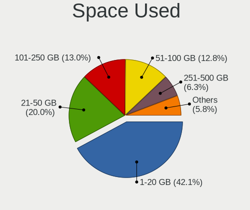
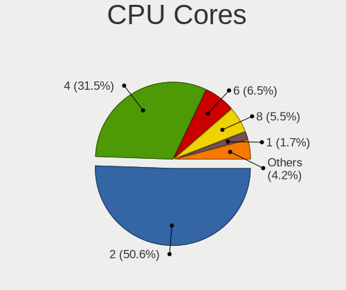
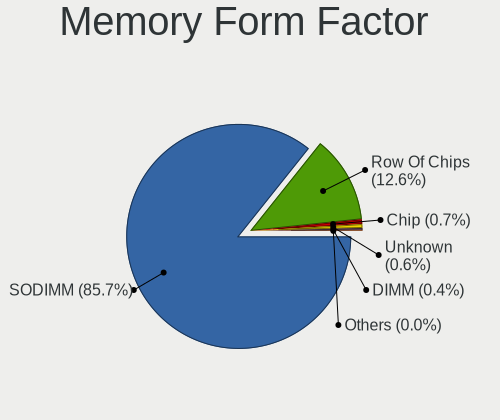

Ubuntu - Tested Hardware & Statistics (Notebooks)
-------------------------------------------------

A project to collect tested hardware configurations for Ubuntu.

Anyone can contribute to this report by the [hw-probe](https://github.com/linuxhw/hw-probe) tool:

    sudo -E hw-probe -all -upload

Please contribute! Especially if your hardware is rare.

Contents
--------

* [ Test Cases ](#test-cases)

* [ System ](#system)
  - [ OS                       ](#os)
  - [ OS Family                ](#os-family)
  - [ Kernel                   ](#kernel)
  - [ Kernel Family            ](#kernel-family)
  - [ Kernel Major Ver.        ](#kernel-major-ver)
  - [ Arch                     ](#arch)
  - [ DE                       ](#de)
  - [ Display Server           ](#display-server)
  - [ Display Manager          ](#display-manager)
  - [ OS Lang                  ](#os-lang)
  - [ Boot Mode                ](#boot-mode)
  - [ Filesystem               ](#filesystem)
  - [ Part. scheme             ](#part-scheme)
  - [ Dual Boot with Linux/BSD ](#dual-boot-with-linuxbsd)
  - [ Dual Boot (Win)          ](#dual-boot-win)

* [ Board ](#board)
  - [ Vendor                   ](#vendor)
  - [ Model                    ](#model)
  - [ Model Family             ](#model-family)
  - [ MFG Year                 ](#mfg-year)
  - [ Form Factor              ](#form-factor)
  - [ Secure Boot              ](#secure-boot)
  - [ Coreboot                 ](#coreboot)
  - [ RAM Size                 ](#ram-size)
  - [ RAM Used                 ](#ram-used)
  - [ Total Drives             ](#total-drives)
  - [ Has CD-ROM               ](#has-cd-rom)
  - [ Has Ethernet             ](#has-ethernet)
  - [ Has WiFi                 ](#has-wifi)
  - [ Has Bluetooth            ](#has-bluetooth)

* [ Location ](#location)
  - [ Country                  ](#country)
  - [ City                     ](#city)

* [ Drives ](#drives)
  - [ Drive Vendor             ](#drive-vendor)
  - [ Drive Model              ](#drive-model)
  - [ HDD Vendor               ](#hdd-vendor)
  - [ SSD Vendor               ](#ssd-vendor)
  - [ Drive Kind               ](#drive-kind)
  - [ Drive Connector          ](#drive-connector)
  - [ Drive Size               ](#drive-size)
  - [ Space Total              ](#space-total)
  - [ Space Used               ](#space-used)
  - [ Malfunc. Drives          ](#malfunc-drives)
  - [ Malfunc. Drive Vendor    ](#malfunc-drive-vendor)
  - [ Malfunc. HDD Vendor      ](#malfunc-hdd-vendor)
  - [ Malfunc. Drive Kind      ](#malfunc-drive-kind)
  - [ Failed Drives            ](#failed-drives)
  - [ Failed Drive Vendor      ](#failed-drive-vendor)
  - [ Drive Status             ](#drive-status)

* [ Storage controller ](#storage-controller)
  - [ Storage Vendor           ](#storage-vendor)
  - [ Storage Model            ](#storage-model)
  - [ Storage Kind             ](#storage-kind)

* [ Processor ](#processor)
  - [ CPU Vendor               ](#cpu-vendor)
  - [ CPU Model                ](#cpu-model)
  - [ CPU Model Family         ](#cpu-model-family)
  - [ CPU Cores                ](#cpu-cores)
  - [ CPU Sockets              ](#cpu-sockets)
  - [ CPU Threads              ](#cpu-threads)
  - [ CPU Op-Modes             ](#cpu-op-modes)
  - [ CPU Microcode            ](#cpu-microcode)
  - [ CPU Microarch            ](#cpu-microarch)

* [ Graphics ](#graphics)
  - [ GPU Vendor               ](#gpu-vendor)
  - [ GPU Model                ](#gpu-model)
  - [ GPU Combo                ](#gpu-combo)
  - [ GPU Driver               ](#gpu-driver)
  - [ GPU Memory               ](#gpu-memory)

* [ Monitor ](#monitor)
  - [ Monitor Vendor           ](#monitor-vendor)
  - [ Monitor Model            ](#monitor-model)
  - [ Monitor Resolution       ](#monitor-resolution)
  - [ Monitor Diagonal         ](#monitor-diagonal)
  - [ Monitor Width            ](#monitor-width)
  - [ Aspect Ratio             ](#aspect-ratio)
  - [ Monitor Area             ](#monitor-area)
  - [ Pixel Density            ](#pixel-density)
  - [ Multiple Monitors        ](#multiple-monitors)

* [ Network ](#network)
  - [ Net Controller Vendor    ](#net-controller-vendor)
  - [ Net Controller Model     ](#net-controller-model)
  - [ Wireless Vendor          ](#wireless-vendor)
  - [ Wireless Model           ](#wireless-model)
  - [ Ethernet Vendor          ](#ethernet-vendor)
  - [ Ethernet Model           ](#ethernet-model)
  - [ Net Controller Kind      ](#net-controller-kind)
  - [ Used Controller          ](#used-controller)
  - [ NICs                     ](#nics)
  - [ IPv6                     ](#ipv6)

* [ Bluetooth ](#bluetooth)
  - [ Bluetooth Vendor         ](#bluetooth-vendor)
  - [ Bluetooth Model          ](#bluetooth-model)

* [ Sound ](#sound)
  - [ Sound Vendor             ](#sound-vendor)
  - [ Sound Model              ](#sound-model)

* [ Memory ](#memory)
  - [ Memory Vendor            ](#memory-vendor)
  - [ Memory Model             ](#memory-model)
  - [ Memory Kind              ](#memory-kind)
  - [ Memory Form Factor       ](#memory-form-factor)
  - [ Memory Size              ](#memory-size)
  - [ Memory Speed             ](#memory-speed)

* [ Printers & scanners ](#printers--scanners)
  - [ Printer Vendor           ](#printer-vendor)
  - [ Printer Model            ](#printer-model)
  - [ Scanner Vendor           ](#scanner-vendor)
  - [ Scanner Model            ](#scanner-model)

* [ Camera ](#camera)
  - [ Camera Vendor            ](#camera-vendor)
  - [ Camera Model             ](#camera-model)

* [ Security ](#security)
  - [ Fingerprint Vendor       ](#fingerprint-vendor)
  - [ Fingerprint Model        ](#fingerprint-model)
  - [ Chipcard Vendor          ](#chipcard-vendor)
  - [ Chipcard Model           ](#chipcard-model)

* [ Unsupported ](#unsupported)
  - [ Unsupported Devices      ](#unsupported-devices)
  - [ Unsupported Device Types ](#unsupported-device-types)

Test Cases
----------

Total: 47993

| Vendor        | Model                       | Probe                                                      | Date         |
|---------------|-----------------------------|------------------------------------------------------------|--------------|
| Dell          | Inspiron 3537               | [43b81e38cd](https://linux-hardware.org/?probe=43b81e38cd) | Jul 01, 2023 |
| Dell          | Precision M4800             | [d85b2b94d6](https://linux-hardware.org/?probe=d85b2b94d6) | Jun 30, 2023 |
| ASUSTek       | K52Dr                       | [f97425ba5f](https://linux-hardware.org/?probe=f97425ba5f) | Jun 30, 2023 |
| Acer          | Aspire E5-575G              | [f127804b4a](https://linux-hardware.org/?probe=f127804b4a) | Jun 30, 2023 |
| Sony          | VGN-NS38E_S                 | [270e8b9fb7](https://linux-hardware.org/?probe=270e8b9fb7) | Jun 30, 2023 |
| Sony          | VGN-NS38E_S                 | [ca33cfbc67](https://linux-hardware.org/?probe=ca33cfbc67) | Jun 30, 2023 |
| Timi          | Redmi Book Pro 14 2022      | [b5d1a7e115](https://linux-hardware.org/?probe=b5d1a7e115) | Jun 30, 2023 |
| Lenovo        | ThinkPad T430 2347AT2       | [951adb91cd](https://linux-hardware.org/?probe=951adb91cd) | Jun 30, 2023 |
| Apple         | MacBookPro8,2               | [8386acaa29](https://linux-hardware.org/?probe=8386acaa29) | Jun 30, 2023 |
| Samsung       | R528/R728                   | [dc84de44ff](https://linux-hardware.org/?probe=dc84de44ff) | Jun 30, 2023 |
| HP            | Laptop 15s-eq1xxx           | [00442193a6](https://linux-hardware.org/?probe=00442193a6) | Jun 30, 2023 |
| HP            | 15                          | [2d80407689](https://linux-hardware.org/?probe=2d80407689) | Jun 30, 2023 |
| HP            | ProBook 650 G5              | [99a03772fb](https://linux-hardware.org/?probe=99a03772fb) | Jun 30, 2023 |
| HP            | 15                          | [398d659d8c](https://linux-hardware.org/?probe=398d659d8c) | Jun 30, 2023 |
| Gateway       | MD7309U                     | [e21ff27153](https://linux-hardware.org/?probe=e21ff27153) | Jun 30, 2023 |
| HP            | Laptop 17-cp2xxx            | [2012cd2c37](https://linux-hardware.org/?probe=2012cd2c37) | Jun 30, 2023 |
| HP            | EliteBook 8460p             | [d4a008aefb](https://linux-hardware.org/?probe=d4a008aefb) | Jun 30, 2023 |
| HP            | 245 G6 Notebook PC          | [22a896d74b](https://linux-hardware.org/?probe=22a896d74b) | Jun 30, 2023 |
| Gateway       | MD7309U                     | [8d97d507d1](https://linux-hardware.org/?probe=8d97d507d1) | Jun 30, 2023 |
| MSI           | Katana GF66 11UG            | [e9f98cc102](https://linux-hardware.org/?probe=e9f98cc102) | Jun 30, 2023 |
| Dell          | Latitude 7350               | [95fc412b55](https://linux-hardware.org/?probe=95fc412b55) | Jun 30, 2023 |
| ASUSTek       | VivoBook_ASUSLaptop X321... | [05cb990f84](https://linux-hardware.org/?probe=05cb990f84) | Jun 30, 2023 |
| Dell          | Latitude 5440               | [7868400967](https://linux-hardware.org/?probe=7868400967) | Jun 30, 2023 |
| Dell          | Precision M4800             | [769a982a68](https://linux-hardware.org/?probe=769a982a68) | Jun 30, 2023 |
| HP            | Pavilion Laptop 15-eh1xx... | [1e4c2cf905](https://linux-hardware.org/?probe=1e4c2cf905) | Jun 30, 2023 |
| Apple         | MacBookAir9,1               | [bd5c030739](https://linux-hardware.org/?probe=bd5c030739) | Jun 30, 2023 |
| Apple         | MacBookAir9,1               | [ce486a5063](https://linux-hardware.org/?probe=ce486a5063) | Jun 30, 2023 |
| HP            | Laptop 15-ef2xxx            | [d0ea6a2d9d](https://linux-hardware.org/?probe=d0ea6a2d9d) | Jun 30, 2023 |
| HP            | EliteBook 2540p             | [7b546735a4](https://linux-hardware.org/?probe=7b546735a4) | Jun 30, 2023 |
| Acer          | Aspire 5737Z                | [842aa57faf](https://linux-hardware.org/?probe=842aa57faf) | Jun 30, 2023 |
| Samsung       | R430/R480                   | [485a09a0d2](https://linux-hardware.org/?probe=485a09a0d2) | Jun 30, 2023 |
| HP            | Pavilion Laptop 15-cc5xx    | [39f7adb927](https://linux-hardware.org/?probe=39f7adb927) | Jun 30, 2023 |
| Monster       | TULPAR T7 V21.7             | [046803a297](https://linux-hardware.org/?probe=046803a297) | Jun 30, 2023 |
| Timi          | Redmi Book Pro 14 2022      | [b98433fa84](https://linux-hardware.org/?probe=b98433fa84) | Jun 29, 2023 |
| Lenovo        | Legion 5 15ACH6 82JW        | [7f9164d1e0](https://linux-hardware.org/?probe=7f9164d1e0) | Jun 29, 2023 |
| HP            | ProBook 4530s               | [d1c3bf37ff](https://linux-hardware.org/?probe=d1c3bf37ff) | Jun 29, 2023 |
| Dell          | XPS 15 9570                 | [e0492d6173](https://linux-hardware.org/?probe=e0492d6173) | Jun 29, 2023 |
| Dell          | Latitude 7350               | [8ae13e8fdb](https://linux-hardware.org/?probe=8ae13e8fdb) | Jun 29, 2023 |
| Acer          | NC-A515-51G-59DM            | [a521f2cc60](https://linux-hardware.org/?probe=a521f2cc60) | Jun 29, 2023 |
| Intel         | Whiskey Platform            | [1caca06d89](https://linux-hardware.org/?probe=1caca06d89) | Jun 29, 2023 |
| ASUSTek       | K56CB                       | [952909bc80](https://linux-hardware.org/?probe=952909bc80) | Jun 29, 2023 |
| HP            | ProBook 6560b               | [e8e8e6881d](https://linux-hardware.org/?probe=e8e8e6881d) | Jun 29, 2023 |
| MSI           | Modern 14 B5M               | [cb0eb574da](https://linux-hardware.org/?probe=cb0eb574da) | Jun 29, 2023 |
| Lenovo        | ThinkPad X1 Carbon 6th 2... | [93e0628fbe](https://linux-hardware.org/?probe=93e0628fbe) | Jun 29, 2023 |
| HP            | Pavilion dv6                | [a24ee9a903](https://linux-hardware.org/?probe=a24ee9a903) | Jun 29, 2023 |
| ASUSTek       | X751MA                      | [b36ca5687c](https://linux-hardware.org/?probe=b36ca5687c) | Jun 29, 2023 |
| Acer          | TravelMate B113             | [04738ce824](https://linux-hardware.org/?probe=04738ce824) | Jun 29, 2023 |
| Acer          | TravelMate B113             | [9cfe4d5036](https://linux-hardware.org/?probe=9cfe4d5036) | Jun 29, 2023 |
| ASUSTek       | VivoBook_ASUSLaptop X512... | [0f0defbd9c](https://linux-hardware.org/?probe=0f0defbd9c) | Jun 29, 2023 |
| HP            | EliteBook 845 G7 Noteboo... | [61930889dc](https://linux-hardware.org/?probe=61930889dc) | Jun 29, 2023 |
| Unknown       | Unknown                     | [d358089f32](https://linux-hardware.org/?probe=d358089f32) | Jun 29, 2023 |
| Dell          | Precision M6500             | [199e90722c](https://linux-hardware.org/?probe=199e90722c) | Jun 29, 2023 |
| HP            | Laptop 17-cp2xxx            | [f1a1aa76e2](https://linux-hardware.org/?probe=f1a1aa76e2) | Jun 29, 2023 |
| HP            | Pavilion g6                 | [ef275e1249](https://linux-hardware.org/?probe=ef275e1249) | Jun 29, 2023 |
| Lenovo        | ThinkPad Edge E545 20B2S... | [c7e71c8c0b](https://linux-hardware.org/?probe=c7e71c8c0b) | Jun 29, 2023 |
| Lenovo        | ThinkPad Edge E545 20B2S... | [0c3b48af38](https://linux-hardware.org/?probe=0c3b48af38) | Jun 29, 2023 |
| Sony          | SVE17137CXB                 | [ed6f82dc16](https://linux-hardware.org/?probe=ed6f82dc16) | Jun 29, 2023 |
| Lenovo        | ThinkBook 14s-IML 20RS      | [e3d095fc9f](https://linux-hardware.org/?probe=e3d095fc9f) | Jun 29, 2023 |
| Acer          | Nitro AN515-55              | [a41ff8c573](https://linux-hardware.org/?probe=a41ff8c573) | Jun 29, 2023 |
| Lenovo        | ThinkPad X240 20AL00C7MD    | [5c5334f633](https://linux-hardware.org/?probe=5c5334f633) | Jun 28, 2023 |
| Acer          | Aspire 5750G                | [3c4acbf380](https://linux-hardware.org/?probe=3c4acbf380) | Jun 28, 2023 |
| Lenovo        | IdeaPad 5 15ARE05 81YQ      | [ff560998d8](https://linux-hardware.org/?probe=ff560998d8) | Jun 28, 2023 |
| Lenovo        | IdeaPad 5 15ALC05 82LN      | [7017964456](https://linux-hardware.org/?probe=7017964456) | Jun 28, 2023 |
| Dell          | XPS 15 9570                 | [34df27504f](https://linux-hardware.org/?probe=34df27504f) | Jun 28, 2023 |
| Toshiba       | TECRA R950                  | [cab34ec3dc](https://linux-hardware.org/?probe=cab34ec3dc) | Jun 28, 2023 |
| Toshiba       | Satellite X200              | [4a3e7008cf](https://linux-hardware.org/?probe=4a3e7008cf) | Jun 28, 2023 |
| Acer          | Aspire 5750G                | [8ae62960d8](https://linux-hardware.org/?probe=8ae62960d8) | Jun 28, 2023 |
| HP            | ProBook 470 G3              | [1025bf4027](https://linux-hardware.org/?probe=1025bf4027) | Jun 28, 2023 |
| HP            | ProBook 470 G3              | [b8453a6830](https://linux-hardware.org/?probe=b8453a6830) | Jun 28, 2023 |
| Acer          | Nitro AN515-54              | [b30ff15571](https://linux-hardware.org/?probe=b30ff15571) | Jun 28, 2023 |
| ASUSTek       | GL553VD                     | [884a5ecd03](https://linux-hardware.org/?probe=884a5ecd03) | Jun 28, 2023 |
| Lenovo        | ThinkPad X240 20AL007LUK    | [ee0761a131](https://linux-hardware.org/?probe=ee0761a131) | Jun 28, 2023 |
| Dell          | Latitude 7440               | [24f85667ac](https://linux-hardware.org/?probe=24f85667ac) | Jun 28, 2023 |
| MSI           | GE66 Dragonshield 10SF      | [42f6b46bb1](https://linux-hardware.org/?probe=42f6b46bb1) | Jun 28, 2023 |
| ASUSTek       | N75SF                       | [eda2a0d726](https://linux-hardware.org/?probe=eda2a0d726) | Jun 28, 2023 |
| Lenovo        | ThinkPad Z13 Gen 1 21D2C... | [90a10ed8ed](https://linux-hardware.org/?probe=90a10ed8ed) | Jun 28, 2023 |
| HP            | Pavilion Laptop 15-eh2xx... | [5d30ae9d05](https://linux-hardware.org/?probe=5d30ae9d05) | Jun 28, 2023 |
| ASUSTek       | VivoBook_ASUSLaptop X170... | [4e40b350ca](https://linux-hardware.org/?probe=4e40b350ca) | Jun 28, 2023 |
| Toshiba       | PORTEGE R500                | [2c6448083e](https://linux-hardware.org/?probe=2c6448083e) | Jun 28, 2023 |
| Lenovo        | ThinkPad T470s 20HF005QM... | [fee1e04033](https://linux-hardware.org/?probe=fee1e04033) | Jun 28, 2023 |
| HP            | EliteBook 745 G2            | [f64e6dd56e](https://linux-hardware.org/?probe=f64e6dd56e) | Jun 28, 2023 |
| Lenovo        | XiaoXinPro 16 ARP8 83AS     | [1d6bf708ce](https://linux-hardware.org/?probe=1d6bf708ce) | Jun 28, 2023 |
| Acer          | Aspire A315-51              | [771e2e233a](https://linux-hardware.org/?probe=771e2e233a) | Jun 28, 2023 |
| Sony          | Unknown                     | [59cedce53d](https://linux-hardware.org/?probe=59cedce53d) | Jun 28, 2023 |
| Sony          | Unknown                     | [d7bf706b4e](https://linux-hardware.org/?probe=d7bf706b4e) | Jun 28, 2023 |
| ASUSTek       | F5SR                        | [3722cfa5fb](https://linux-hardware.org/?probe=3722cfa5fb) | Jun 27, 2023 |
| Lenovo        | ThinkPad 13 2nd Gen 20J2... | [46e3ea33a3](https://linux-hardware.org/?probe=46e3ea33a3) | Jun 27, 2023 |
| Dell          | Latitude E6530              | [f015f73aef](https://linux-hardware.org/?probe=f015f73aef) | Jun 27, 2023 |
| HP            | ZBook Studio G3             | [f51bc4a275](https://linux-hardware.org/?probe=f51bc4a275) | Jun 27, 2023 |
| Samsung       | 550XCJ/550XCR               | [bca3e799e0](https://linux-hardware.org/?probe=bca3e799e0) | Jun 27, 2023 |
| HP            | Laptop 15s-eq2xxx           | [5922b4d31f](https://linux-hardware.org/?probe=5922b4d31f) | Jun 27, 2023 |
| UNOWHY        | Y13G002S4EI                 | [dae5fc72df](https://linux-hardware.org/?probe=dae5fc72df) | Jun 27, 2023 |
| UNOWHY        | Y13G002S4EI                 | [c91c09307d](https://linux-hardware.org/?probe=c91c09307d) | Jun 27, 2023 |
| Lenovo        | ThinkPad SL 2746EDG         | [7f0ae1c657](https://linux-hardware.org/?probe=7f0ae1c657) | Jun 27, 2023 |
| Dell          | XPS 15 9500                 | [8ea6d92813](https://linux-hardware.org/?probe=8ea6d92813) | Jun 27, 2023 |
| Packard Be... | EasyNote ENTF71BM           | [8ef6f6f24a](https://linux-hardware.org/?probe=8ef6f6f24a) | Jun 27, 2023 |
| HP            | ProBook 455 15.6 inch G9... | [d4c9f8de35](https://linux-hardware.org/?probe=d4c9f8de35) | Jun 27, 2023 |
| HP            | Pavilion Laptop 15-eh2xx... | [fc7f2b378b](https://linux-hardware.org/?probe=fc7f2b378b) | Jun 27, 2023 |
| Lenovo        | ThinkPad X13 Gen 1 20UGS... | [3928ad0893](https://linux-hardware.org/?probe=3928ad0893) | Jun 27, 2023 |
| HP            | ENVY 15                     | [0d46d829d2](https://linux-hardware.org/?probe=0d46d829d2) | Jun 27, 2023 |
| HP            | ENVY 15                     | [189cf01c37](https://linux-hardware.org/?probe=189cf01c37) | Jun 27, 2023 |
| HP            | Laptop 15s-eq2xxx           | [7497c404d4](https://linux-hardware.org/?probe=7497c404d4) | Jun 27, 2023 |
| Lenovo        | IdeaPad S145-15API 81V7     | [ec69000909](https://linux-hardware.org/?probe=ec69000909) | Jun 27, 2023 |
| Acer          | Nitro AN515-45              | [0bfb7dc30a](https://linux-hardware.org/?probe=0bfb7dc30a) | Jun 27, 2023 |
| Daten Tecn... | ESTELAR                     | [0052df6a90](https://linux-hardware.org/?probe=0052df6a90) | Jun 27, 2023 |
| Apple         | MacBookPro8,2               | [3e5baaaa01](https://linux-hardware.org/?probe=3e5baaaa01) | Jun 27, 2023 |
| ASUSTek       | Zenbook UX5401EA_UX5401E... | [0defa5c92d](https://linux-hardware.org/?probe=0defa5c92d) | Jun 27, 2023 |
| MSI           | GE66 Dragonshield 10SF      | [00fd5b9706](https://linux-hardware.org/?probe=00fd5b9706) | Jun 26, 2023 |
| Acer          | AOA150                      | [61f8e3c7d2](https://linux-hardware.org/?probe=61f8e3c7d2) | Jun 26, 2023 |
| Apple         | MacBook4,1                  | [fe27e643ac](https://linux-hardware.org/?probe=fe27e643ac) | Jun 26, 2023 |
| Daten Tecn... | ESTELAR                     | [d5f99bced6](https://linux-hardware.org/?probe=d5f99bced6) | Jun 26, 2023 |
| Lenovo        | ThinkPad W520 428425G       | [48d9a1b9fc](https://linux-hardware.org/?probe=48d9a1b9fc) | Jun 26, 2023 |
| Lenovo        | ThinkPad W520 428425G       | [813d5adfd5](https://linux-hardware.org/?probe=813d5adfd5) | Jun 26, 2023 |
| ASUSTek       | VivoBook_ASUSLaptop X321... | [cde6a94b92](https://linux-hardware.org/?probe=cde6a94b92) | Jun 26, 2023 |
| HP            | Pavilion dv6                | [fe7974bbc9](https://linux-hardware.org/?probe=fe7974bbc9) | Jun 26, 2023 |
| HP            | Pavilion dv6                | [3051c4ac4e](https://linux-hardware.org/?probe=3051c4ac4e) | Jun 26, 2023 |
| MSI           | Prestige 14H B12UCX         | [abf425c8d7](https://linux-hardware.org/?probe=abf425c8d7) | Jun 26, 2023 |
| MSI           | Crosshair 15 A11UEK         | [8ce4fd5481](https://linux-hardware.org/?probe=8ce4fd5481) | Jun 26, 2023 |
| Lenovo        | ThinkPad P51 20HJS16Q0J     | [d328a1e8f3](https://linux-hardware.org/?probe=d328a1e8f3) | Jun 26, 2023 |
| MSI           | Crosshair 15 A11UEK         | [bdb7d2c45e](https://linux-hardware.org/?probe=bdb7d2c45e) | Jun 26, 2023 |
| Lenovo        | IdeaPad S145-15IWL 81S9     | [e89c1b2b89](https://linux-hardware.org/?probe=e89c1b2b89) | Jun 26, 2023 |
| ASUSTek       | GL752VW                     | [1256645a67](https://linux-hardware.org/?probe=1256645a67) | Jun 26, 2023 |
| HP            | ProBook 455 15.6 inch G9... | [eeb516967a](https://linux-hardware.org/?probe=eeb516967a) | Jun 26, 2023 |
| HP            | EliteBook 8540w             | [2f2e5281ef](https://linux-hardware.org/?probe=2f2e5281ef) | Jun 26, 2023 |
| Acer          | Aspire A715-51G             | [08ba4bf92b](https://linux-hardware.org/?probe=08ba4bf92b) | Jun 26, 2023 |
| Acer          | Aspire A715-51G             | [3dc15705c8](https://linux-hardware.org/?probe=3dc15705c8) | Jun 26, 2023 |
| HP            | EliteBook 8540w             | [ca160c2c1c](https://linux-hardware.org/?probe=ca160c2c1c) | Jun 26, 2023 |
| HUAWEI        | BOM-WXX9                    | [2e9bc10188](https://linux-hardware.org/?probe=2e9bc10188) | Jun 26, 2023 |
| Dell          | Latitude E5470              | [c463ab7b16](https://linux-hardware.org/?probe=c463ab7b16) | Jun 26, 2023 |
| ASUSTek       | F5SR                        | [059a0b2611](https://linux-hardware.org/?probe=059a0b2611) | Jun 26, 2023 |
| Gateway       | NV57H                       | [a49db45595](https://linux-hardware.org/?probe=a49db45595) | Jun 26, 2023 |
| HP            | EliteBook 2540p             | [f5e04da161](https://linux-hardware.org/?probe=f5e04da161) | Jun 26, 2023 |
| ASUSTek       | ASUS EXPERTBOOK B1402CBA    | [8a764f6629](https://linux-hardware.org/?probe=8a764f6629) | Jun 26, 2023 |
| ASUSTek       | VivoBook_ASUSLaptop N740... | [44f08646c1](https://linux-hardware.org/?probe=44f08646c1) | Jun 26, 2023 |
| Gateway       | NV57H                       | [ee84597590](https://linux-hardware.org/?probe=ee84597590) | Jun 26, 2023 |
| Dell          | Precision 7670              | [4138a39697](https://linux-hardware.org/?probe=4138a39697) | Jun 26, 2023 |
| Lenovo        | ThinkPad T460s 20F90036U... | [70a6547925](https://linux-hardware.org/?probe=70a6547925) | Jun 26, 2023 |
| Dell          | Inspiron 15 7000 Gaming     | [8db0a77e13](https://linux-hardware.org/?probe=8db0a77e13) | Jun 26, 2023 |
| Star Labs     | LabTop                      | [87a0d9dc09](https://linux-hardware.org/?probe=87a0d9dc09) | Jun 26, 2023 |
| HP            | Laptop 14s-dq2xxx           | [23499b1838](https://linux-hardware.org/?probe=23499b1838) | Jun 25, 2023 |
| Lenovo        | ThinkPad T480s 20L8S1R70... | [047bdacac5](https://linux-hardware.org/?probe=047bdacac5) | Jun 25, 2023 |
| Star Labs     | LabTop                      | [a413031ef8](https://linux-hardware.org/?probe=a413031ef8) | Jun 25, 2023 |
| Acer          | TravelMate 6493             | [490906b996](https://linux-hardware.org/?probe=490906b996) | Jun 25, 2023 |
| ASUSTek       | VivoBook_ASUSLaptop X415... | [286826f3b2](https://linux-hardware.org/?probe=286826f3b2) | Jun 25, 2023 |
| ASUSTek       | VivoBook_ASUSLaptop X415... | [b15f68a294](https://linux-hardware.org/?probe=b15f68a294) | Jun 25, 2023 |
| Acer          | Nitro AN517-54              | [9a87719748](https://linux-hardware.org/?probe=9a87719748) | Jun 25, 2023 |
| HASEE Comp... | PB50_70DFx,DDx              | [3690bcb661](https://linux-hardware.org/?probe=3690bcb661) | Jun 25, 2023 |
| Acer          | Aspire E5-575G              | [2f5357533f](https://linux-hardware.org/?probe=2f5357533f) | Jun 25, 2023 |
| Razer         | Blade 16 - RZ09-0483        | [9f1f9757a2](https://linux-hardware.org/?probe=9f1f9757a2) | Jun 25, 2023 |
| Dell          | Latitude 7420               | [d5cb3d4bfa](https://linux-hardware.org/?probe=d5cb3d4bfa) | Jun 25, 2023 |
| HUAWEI        | NBLB-WAX9N                  | [3a045583a7](https://linux-hardware.org/?probe=3a045583a7) | Jun 25, 2023 |
| Lenovo        | Yoga Slim 7 14ARE05 82A2    | [223911e8f0](https://linux-hardware.org/?probe=223911e8f0) | Jun 25, 2023 |
| Lenovo        | ThinkPad T460s 20F90036U... | [1809b4709e](https://linux-hardware.org/?probe=1809b4709e) | Jun 25, 2023 |
| ASUSTek       | K54C                        | [38e6ce020c](https://linux-hardware.org/?probe=38e6ce020c) | Jun 25, 2023 |
| Dell          | Precision 5540              | [7d6c1fe39d](https://linux-hardware.org/?probe=7d6c1fe39d) | Jun 25, 2023 |
| HP            | Laptop 15-db0xxx            | [79979ceac7](https://linux-hardware.org/?probe=79979ceac7) | Jun 25, 2023 |
| HP            | EliteBook 840 G4            | [2e20ab8996](https://linux-hardware.org/?probe=2e20ab8996) | Jun 25, 2023 |
| Sony          | VGN-AR74DB                  | [c51cc05c0a](https://linux-hardware.org/?probe=c51cc05c0a) | Jun 25, 2023 |
| Dell          | Latitude E5470              | [e8f8b7e986](https://linux-hardware.org/?probe=e8f8b7e986) | Jun 25, 2023 |
| Dell          | Latitude E5470              | [e218b300b7](https://linux-hardware.org/?probe=e218b300b7) | Jun 25, 2023 |
| Toshiba       | PORTEGE R500                | [e327093da9](https://linux-hardware.org/?probe=e327093da9) | Jun 25, 2023 |
| HP            | EliteBook 855 G8 Noteboo... | [0ec7fedf29](https://linux-hardware.org/?probe=0ec7fedf29) | Jun 24, 2023 |
| HP            | Laptop 15-dy2xxx            | [0ff31b18c2](https://linux-hardware.org/?probe=0ff31b18c2) | Jun 24, 2023 |
| Dell          | Inspiron N4030              | [a6c7992001](https://linux-hardware.org/?probe=a6c7992001) | Jun 24, 2023 |
| HP            | EliteBook 840 G1            | [37239831de](https://linux-hardware.org/?probe=37239831de) | Jun 24, 2023 |
| Razer         | Blade 16 - RZ09-0483        | [7d8f0212e9](https://linux-hardware.org/?probe=7d8f0212e9) | Jun 24, 2023 |
| Acer          | Aspire A315-22              | [5e2e395efd](https://linux-hardware.org/?probe=5e2e395efd) | Jun 24, 2023 |
| Notebook      | NLxxPUx                     | [ade3806ebb](https://linux-hardware.org/?probe=ade3806ebb) | Jun 24, 2023 |
| Lenovo        | IdeaPad 5 15ABA7 82SG       | [8a22a7fba4](https://linux-hardware.org/?probe=8a22a7fba4) | Jun 24, 2023 |
| Notebook      | NLxxPUx                     | [b82cc440a0](https://linux-hardware.org/?probe=b82cc440a0) | Jun 24, 2023 |
| Dell          | Latitude E6500              | [2b1720ad90](https://linux-hardware.org/?probe=2b1720ad90) | Jun 24, 2023 |
| Dell          | G5 5590                     | [6d6974b0eb](https://linux-hardware.org/?probe=6d6974b0eb) | Jun 24, 2023 |
| Dell          | Inspiron 3576               | [c756e98d81](https://linux-hardware.org/?probe=c756e98d81) | Jun 24, 2023 |
| HP            | Pavilion g6                 | [b8d79ce295](https://linux-hardware.org/?probe=b8d79ce295) | Jun 24, 2023 |
| HP            | Pavilion dv7                | [ab7310809d](https://linux-hardware.org/?probe=ab7310809d) | Jun 24, 2023 |
| Toshiba       | Satellite L655              | [6ed0182e96](https://linux-hardware.org/?probe=6ed0182e96) | Jun 24, 2023 |
| Dell          | Inspiron 3576               | [874b84ce94](https://linux-hardware.org/?probe=874b84ce94) | Jun 24, 2023 |
| Lenovo        | ThinkPad L15 Gen 2a 20X7... | [09419812ab](https://linux-hardware.org/?probe=09419812ab) | Jun 24, 2023 |
| HP            | 15 Notebook PC              | [440f4bbf29](https://linux-hardware.org/?probe=440f4bbf29) | Jun 24, 2023 |
| Lenovo        | ThinkPad P53s 20N6001UUS    | [0834c21488](https://linux-hardware.org/?probe=0834c21488) | Jun 24, 2023 |
| Alienware     | 17                          | [63b34ffc64](https://linux-hardware.org/?probe=63b34ffc64) | Jun 24, 2023 |
| Lenovo        | IdeaPad Gaming 3 16IAH7 ... | [ef5eb06f90](https://linux-hardware.org/?probe=ef5eb06f90) | Jun 24, 2023 |
| Dell          | Inspiron 3501               | [60034feb35](https://linux-hardware.org/?probe=60034feb35) | Jun 23, 2023 |
| Medion        | P6624                       | [49bd227ded](https://linux-hardware.org/?probe=49bd227ded) | Jun 23, 2023 |
| HP            | ENVY 15                     | [3918cca1e5](https://linux-hardware.org/?probe=3918cca1e5) | Jun 23, 2023 |
| eMachines     | eMG520                      | [2a33e0b985](https://linux-hardware.org/?probe=2a33e0b985) | Jun 23, 2023 |
| Lenovo        | ThinkPad L390 20NSS04400    | [feced26491](https://linux-hardware.org/?probe=feced26491) | Jun 23, 2023 |
| Packard Be... | EN Butterfly m              | [70bae75df2](https://linux-hardware.org/?probe=70bae75df2) | Jun 23, 2023 |
| Dell          | XPS 9320                    | [2dcfa6718b](https://linux-hardware.org/?probe=2dcfa6718b) | Jun 23, 2023 |
| Lenovo        | G500s 20245                 | [515f5a5392](https://linux-hardware.org/?probe=515f5a5392) | Jun 23, 2023 |
| Lenovo        | IdeaPad L340-15IRH Gamin... | [4429a0f659](https://linux-hardware.org/?probe=4429a0f659) | Jun 23, 2023 |
| ASUSTek       | VivoBook_ASUSLaptop X321... | [bb559685e3](https://linux-hardware.org/?probe=bb559685e3) | Jun 23, 2023 |
| Notebook      | W54_55SU1,SUW               | [622462c1d1](https://linux-hardware.org/?probe=622462c1d1) | Jun 23, 2023 |
| Notebook      | W54_55SU1,SUW               | [117e92a397](https://linux-hardware.org/?probe=117e92a397) | Jun 23, 2023 |
| Lenovo        | Legion 5 15ACH6 82JW        | [c75670186a](https://linux-hardware.org/?probe=c75670186a) | Jun 23, 2023 |
| Lenovo        | G500s 20245                 | [4d9c9f9bd0](https://linux-hardware.org/?probe=4d9c9f9bd0) | Jun 23, 2023 |
| Lenovo        | IdeaPad 3 15ITL6 82H8       | [32f2a1756a](https://linux-hardware.org/?probe=32f2a1756a) | Jun 23, 2023 |
| Acer          | Aspire A315-59              | [bd39971c52](https://linux-hardware.org/?probe=bd39971c52) | Jun 23, 2023 |
| HP            | Pavilion g6                 | [fa58c1a1fd](https://linux-hardware.org/?probe=fa58c1a1fd) | Jun 22, 2023 |
| Acer          | Aspire 7720G                | [a8e44a5ab1](https://linux-hardware.org/?probe=a8e44a5ab1) | Jun 22, 2023 |
| HP            | Pavilion g6                 | [a58868d782](https://linux-hardware.org/?probe=a58868d782) | Jun 22, 2023 |
| HP            | EliteBook 2540p             | [b33e52fa0a](https://linux-hardware.org/?probe=b33e52fa0a) | Jun 22, 2023 |
| Acer          | Aspire E5-575G              | [5c76172491](https://linux-hardware.org/?probe=5c76172491) | Jun 22, 2023 |
| Dell          | XPS 17 9710                 | [892620ac83](https://linux-hardware.org/?probe=892620ac83) | Jun 22, 2023 |
| Lenovo        | Legion 5 15ARH05H 82B1      | [4b866ca19f](https://linux-hardware.org/?probe=4b866ca19f) | Jun 22, 2023 |
| ASUSTek       | K55VD                       | [223967ea1d](https://linux-hardware.org/?probe=223967ea1d) | Jun 22, 2023 |
| Acer          | Swift SFE16-42              | [9afa4fb174](https://linux-hardware.org/?probe=9afa4fb174) | Jun 22, 2023 |
| Lenovo        | IdeaPad 3 15IGL05 81WQ      | [44050251e9](https://linux-hardware.org/?probe=44050251e9) | Jun 22, 2023 |
| Acer          | Aspire A515-57              | [0ee3dcbbb5](https://linux-hardware.org/?probe=0ee3dcbbb5) | Jun 22, 2023 |
| HP            | Pavilion dv6                | [fa9045c36f](https://linux-hardware.org/?probe=fa9045c36f) | Jun 22, 2023 |
| Acer          | Aspire V5-552G              | [adeea10c6c](https://linux-hardware.org/?probe=adeea10c6c) | Jun 22, 2023 |
| Timi          | RedmiBook 14-APCS           | [3dadb16806](https://linux-hardware.org/?probe=3dadb16806) | Jun 22, 2023 |
| Lenovo        | V15 G2 ITL Ua 82KB          | [110c366456](https://linux-hardware.org/?probe=110c366456) | Jun 22, 2023 |
| HP            | Dragonfly 13.5 inch G4 N... | [22c2768f76](https://linux-hardware.org/?probe=22c2768f76) | Jun 22, 2023 |
| Medion        | Erazer P6661 MD60303        | [22fb03fe41](https://linux-hardware.org/?probe=22fb03fe41) | Jun 22, 2023 |
| Toshiba       | PORTEGE Z930                | [0cad0d9955](https://linux-hardware.org/?probe=0cad0d9955) | Jun 22, 2023 |
| Lenovo        | ThinkPad L380 20M5000UGE    | [06db720b62](https://linux-hardware.org/?probe=06db720b62) | Jun 22, 2023 |
| ASUSTek       | VivoBook_ASUSLaptop X350... | [6c260b1543](https://linux-hardware.org/?probe=6c260b1543) | Jun 22, 2023 |
| HP            | Pavilion dv5                | [4a0db4b1ba](https://linux-hardware.org/?probe=4a0db4b1ba) | Jun 22, 2023 |
| HP            | Pavilion dv5                | [902335f2cb](https://linux-hardware.org/?probe=902335f2cb) | Jun 22, 2023 |
| Dell          | Inspiron 11-3168            | [8407c1d3cb](https://linux-hardware.org/?probe=8407c1d3cb) | Jun 22, 2023 |
| Samsung       | 550XDA                      | [f20386ccdd](https://linux-hardware.org/?probe=f20386ccdd) | Jun 22, 2023 |
| Lenovo        | IdeaPad Gaming 3 15ACH6 ... | [42cb7025f1](https://linux-hardware.org/?probe=42cb7025f1) | Jun 22, 2023 |
| Dell          | Inspiron 15 3511            | [0ef8557b4d](https://linux-hardware.org/?probe=0ef8557b4d) | Jun 22, 2023 |
| Positivo      | Mobile                      | [f9a55866f0](https://linux-hardware.org/?probe=f9a55866f0) | Jun 22, 2023 |
| Positivo      | Mobile                      | [25df2e5abc](https://linux-hardware.org/?probe=25df2e5abc) | Jun 22, 2023 |
| Dell          | Latitude 3520               | [ada304545e](https://linux-hardware.org/?probe=ada304545e) | Jun 22, 2023 |
| System76      | Gazelle                     | [858e408027](https://linux-hardware.org/?probe=858e408027) | Jun 21, 2023 |
| Lenovo        | ThinkPad X1 Carbon 5th 2... | [079f84c10d](https://linux-hardware.org/?probe=079f84c10d) | Jun 21, 2023 |
| Lenovo        | IdeaPad Pro 5 16ARP8 83A... | [017f0476b0](https://linux-hardware.org/?probe=017f0476b0) | Jun 21, 2023 |
| Acer          | Aspire E1-572G              | [c4af4bf38c](https://linux-hardware.org/?probe=c4af4bf38c) | Jun 21, 2023 |
| Lenovo        | ThinkPad L440 20ASS19B03    | [3acd887212](https://linux-hardware.org/?probe=3acd887212) | Jun 21, 2023 |
| Lenovo        | ThinkPad E15 Gen 4 21E60... | [7de42486fb](https://linux-hardware.org/?probe=7de42486fb) | Jun 21, 2023 |
| Lenovo        | ThinkPad E15 Gen 4 21E60... | [b61cc560f8](https://linux-hardware.org/?probe=b61cc560f8) | Jun 21, 2023 |
| Acer          | Aspire E5-575G              | [0fb6c61a2b](https://linux-hardware.org/?probe=0fb6c61a2b) | Jun 21, 2023 |
| Timi          | RedmiBook Pro 14S           | [e6b0f20906](https://linux-hardware.org/?probe=e6b0f20906) | Jun 21, 2023 |
| Google        | Barla                       | [43df74a8c1](https://linux-hardware.org/?probe=43df74a8c1) | Jun 21, 2023 |
| Acer          | Aspire A515-53G             | [430cfefc6a](https://linux-hardware.org/?probe=430cfefc6a) | Jun 21, 2023 |
| Dell          | Latitude 5430               | [458a2111da](https://linux-hardware.org/?probe=458a2111da) | Jun 21, 2023 |
| Lenovo        | ThinkPad L380 20M50011MZ    | [223c8d15d4](https://linux-hardware.org/?probe=223c8d15d4) | Jun 21, 2023 |
| Toshiba       | Satellite Pro C70-B         | [f96a1a3552](https://linux-hardware.org/?probe=f96a1a3552) | Jun 21, 2023 |
| Dell          | XPS 9320                    | [6a60a308d1](https://linux-hardware.org/?probe=6a60a308d1) | Jun 21, 2023 |
| Toshiba       | Satellite Pro C70-B         | [52c4c32098](https://linux-hardware.org/?probe=52c4c32098) | Jun 21, 2023 |
| MSI           | GE75 Raider 10SF            | [b3ce37b2cb](https://linux-hardware.org/?probe=b3ce37b2cb) | Jun 21, 2023 |
| ASUSTek       | GL552VW                     | [592b7aa556](https://linux-hardware.org/?probe=592b7aa556) | Jun 21, 2023 |
| Lenovo        | IdeaPad Pro 5 16ARP8 83A... | [4af402b7c9](https://linux-hardware.org/?probe=4af402b7c9) | Jun 21, 2023 |
| Apple         | MacBookPro6,2               | [3beb323b62](https://linux-hardware.org/?probe=3beb323b62) | Jun 21, 2023 |
| ASUSTek       | ZenBook UX434IQ_UM433IQ     | [caaf6ce403](https://linux-hardware.org/?probe=caaf6ce403) | Jun 21, 2023 |
| HP            | EliteBook 830 G6            | [7a29f3d086](https://linux-hardware.org/?probe=7a29f3d086) | Jun 20, 2023 |
| ASUSTek       | K55VD                       | [49f6cc6986](https://linux-hardware.org/?probe=49f6cc6986) | Jun 20, 2023 |
| MSI           | Katana GF76 12UD            | [1897f5f0cb](https://linux-hardware.org/?probe=1897f5f0cb) | Jun 20, 2023 |
| Lenovo        | ThinkPad SL 2746EDG         | [42ba3d75e5](https://linux-hardware.org/?probe=42ba3d75e5) | Jun 20, 2023 |
| Dell          | Latitude E6410              | [b34442d8c3](https://linux-hardware.org/?probe=b34442d8c3) | Jun 20, 2023 |
| Lenovo        | ThinkPad L15 Gen 1 20U70... | [513165d4f6](https://linux-hardware.org/?probe=513165d4f6) | Jun 20, 2023 |
| Apple         | MacBookPro11,1              | [4850296b9d](https://linux-hardware.org/?probe=4850296b9d) | Jun 20, 2023 |
| Lenovo        | B570 HuronRiver Platform    | [b51dda105a](https://linux-hardware.org/?probe=b51dda105a) | Jun 20, 2023 |
| Acer          | Predator PHN16-71           | [16f2ca887d](https://linux-hardware.org/?probe=16f2ca887d) | Jun 20, 2023 |
| Apple         | MacBookPro13,1              | [95a82b40ce](https://linux-hardware.org/?probe=95a82b40ce) | Jun 20, 2023 |
| Lenovo        | ThinkPad E15 Gen 3 20YG0... | [bff08fbf94](https://linux-hardware.org/?probe=bff08fbf94) | Jun 20, 2023 |
| HP            | Pavilion dv8                | [e728738ec6](https://linux-hardware.org/?probe=e728738ec6) | Jun 20, 2023 |
| Lenovo        | ThinkPad E14 Gen 2 20TA0... | [7c906bbd1c](https://linux-hardware.org/?probe=7c906bbd1c) | Jun 20, 2023 |
| Lenovo        | ThinkPad L15 Gen 1 20U70... | [15e75e17fc](https://linux-hardware.org/?probe=15e75e17fc) | Jun 20, 2023 |
| Dell          | Precision 5560              | [ee53248c8c](https://linux-hardware.org/?probe=ee53248c8c) | Jun 20, 2023 |
| Google        | Blooguard                   | [f1d90deb53](https://linux-hardware.org/?probe=f1d90deb53) | Jun 20, 2023 |
| Alienware     | x17 R2                      | [632fbfe682](https://linux-hardware.org/?probe=632fbfe682) | Jun 20, 2023 |
| Lenovo        | ThinkPad T460s 20F9005BU... | [59a527c934](https://linux-hardware.org/?probe=59a527c934) | Jun 20, 2023 |
| HP            | Laptop 14s-dq2xxx           | [68d3aeda15](https://linux-hardware.org/?probe=68d3aeda15) | Jun 20, 2023 |
| Lenovo        | IdeaPad 100-15IBD 80QQ      | [5b07ca8390](https://linux-hardware.org/?probe=5b07ca8390) | Jun 20, 2023 |
| HP            | OMEN by Laptop 15-dh0xxx    | [6e2f7d8295](https://linux-hardware.org/?probe=6e2f7d8295) | Jun 20, 2023 |
| ASUSTek       | VivoBook_ASUSLaptop X712... | [67c63af138](https://linux-hardware.org/?probe=67c63af138) | Jun 19, 2023 |
| Lenovo        | IdeaPad 3 14ITL6 82H7       | [6dea148dd7](https://linux-hardware.org/?probe=6dea148dd7) | Jun 19, 2023 |
| Lenovo        | IdeaPad 3 17IIL05 81WF      | [f52b994470](https://linux-hardware.org/?probe=f52b994470) | Jun 19, 2023 |
| HP            | Pavilion dv6                | [09d49049bf](https://linux-hardware.org/?probe=09d49049bf) | Jun 19, 2023 |
| Samsung       | RC420/RC520/RC720           | [406b650f19](https://linux-hardware.org/?probe=406b650f19) | Jun 19, 2023 |
| Lenovo        | ThinkPad L440 20ASS19B03    | [a881db7c2b](https://linux-hardware.org/?probe=a881db7c2b) | Jun 19, 2023 |
| Dell          | Inspiron 3185               | [f53e8d1094](https://linux-hardware.org/?probe=f53e8d1094) | Jun 19, 2023 |
| ASUSTek       | ZenBook UX325EA_UX325EA     | [91f85b5bb5](https://linux-hardware.org/?probe=91f85b5bb5) | Jun 19, 2023 |
| ASUSTek       | X756UVK                     | [8ac304b302](https://linux-hardware.org/?probe=8ac304b302) | Jun 19, 2023 |
| ASUSTek       | X756UVK                     | [beb200bb6b](https://linux-hardware.org/?probe=beb200bb6b) | Jun 19, 2023 |
| ASUSTek       | ZenBook UX325EA_UX325EA     | [93f576698e](https://linux-hardware.org/?probe=93f576698e) | Jun 19, 2023 |
| Acer          | Aspire A515-57G             | [b783c040ee](https://linux-hardware.org/?probe=b783c040ee) | Jun 19, 2023 |
| Dell          | Inspiron 7347               | [026935ac8f](https://linux-hardware.org/?probe=026935ac8f) | Jun 19, 2023 |
| HP            | ProBook 450 15.6 inch G9... | [bcd39f0607](https://linux-hardware.org/?probe=bcd39f0607) | Jun 19, 2023 |
| HP            | Pavilion Laptop 13-an0xx... | [0f68ace67c](https://linux-hardware.org/?probe=0f68ace67c) | Jun 19, 2023 |
| Samsung       | RF510/RF410/RF710           | [6131e6746c](https://linux-hardware.org/?probe=6131e6746c) | Jun 19, 2023 |
| Lenovo        | ThinkPad T450s 20BWS11H0... | [596055aa43](https://linux-hardware.org/?probe=596055aa43) | Jun 19, 2023 |
| Dell          | G7 7588                     | [2cdb34b778](https://linux-hardware.org/?probe=2cdb34b778) | Jun 19, 2023 |
| Timi          | A34R                        | [da4d787d75](https://linux-hardware.org/?probe=da4d787d75) | Jun 19, 2023 |
| HP            | Laptop 15-db0xxx            | [c67d08fe43](https://linux-hardware.org/?probe=c67d08fe43) | Jun 19, 2023 |
| HP            | Laptop 15-rb0xx             | [067eeb10e5](https://linux-hardware.org/?probe=067eeb10e5) | Jun 19, 2023 |
| Acer          | Aspire ES1-420              | [76aab864d4](https://linux-hardware.org/?probe=76aab864d4) | Jun 19, 2023 |
| HP            | Laptop 14s-fq0xxx           | [6ff28ccac1](https://linux-hardware.org/?probe=6ff28ccac1) | Jun 19, 2023 |
| Acer          | Aspire 7739                 | [eda7fb180a](https://linux-hardware.org/?probe=eda7fb180a) | Jun 19, 2023 |
| Dell          | Precision 5520              | [8d5ec720c1](https://linux-hardware.org/?probe=8d5ec720c1) | Jun 19, 2023 |
| Dell          | Latitude E6540              | [3721b0046f](https://linux-hardware.org/?probe=3721b0046f) | Jun 19, 2023 |
| Dell          | Inspiron 7352               | [dd9c020f92](https://linux-hardware.org/?probe=dd9c020f92) | Jun 19, 2023 |
| HP            | ProBook 440 G4              | [4b20fef62f](https://linux-hardware.org/?probe=4b20fef62f) | Jun 19, 2023 |
| HP            | Notebook                    | [6df5e3f6ff](https://linux-hardware.org/?probe=6df5e3f6ff) | Jun 19, 2023 |
| HP            | Pavilion Laptop 15-eh1xx... | [948225d98e](https://linux-hardware.org/?probe=948225d98e) | Jun 18, 2023 |
| ASUSTek       | X541NA                      | [2fa7c42c59](https://linux-hardware.org/?probe=2fa7c42c59) | Jun 18, 2023 |
| Acer          | Aspire 7739                 | [34854e20dd](https://linux-hardware.org/?probe=34854e20dd) | Jun 18, 2023 |
| Dell          | Latitude 5430               | [7c591ed7d8](https://linux-hardware.org/?probe=7c591ed7d8) | Jun 18, 2023 |
| Toshiba       | Satellite-L845              | [cfe5a81354](https://linux-hardware.org/?probe=cfe5a81354) | Jun 18, 2023 |
| Lenovo        | ThinkPad X1 Carbon 2nd 2... | [d237a2bfe6](https://linux-hardware.org/?probe=d237a2bfe6) | Jun 18, 2023 |
| ASUSTek       | X555LJ                      | [a4bea0f3e3](https://linux-hardware.org/?probe=a4bea0f3e3) | Jun 18, 2023 |
| ASUSTek       | Zenbook UM5302TA_UM5302T... | [8bf2dd01d7](https://linux-hardware.org/?probe=8bf2dd01d7) | Jun 18, 2023 |
| Samsung       | 950XCJ/951XCJ/950XCR        | [4777b096a3](https://linux-hardware.org/?probe=4777b096a3) | Jun 18, 2023 |
| Panasonic     | CF-54-2                     | [48b7e4f212](https://linux-hardware.org/?probe=48b7e4f212) | Jun 18, 2023 |
| HP            | Notebook                    | [e53b70bcac](https://linux-hardware.org/?probe=e53b70bcac) | Jun 18, 2023 |
| HP            | Pavilion Notebook           | [5d417b3d76](https://linux-hardware.org/?probe=5d417b3d76) | Jun 18, 2023 |
| Hampoo        | Cherry Trail CR Hampoo_r... | [e4a3b14c4c](https://linux-hardware.org/?probe=e4a3b14c4c) | Jun 18, 2023 |
| Acer          | Aspire A515-57              | [e7f63885d1](https://linux-hardware.org/?probe=e7f63885d1) | Jun 18, 2023 |
| Dell          | Latitude 5531               | [bf22616526](https://linux-hardware.org/?probe=bf22616526) | Jun 18, 2023 |
| HP            | Pavilion dv6                | [f47b055767](https://linux-hardware.org/?probe=f47b055767) | Jun 18, 2023 |
| HUAWEI        | MACHC-WAX9                  | [8f32e75d6e](https://linux-hardware.org/?probe=8f32e75d6e) | Jun 18, 2023 |
| Hampoo        | Cherry Trail CR Hampoo_r... | [68f03108e5](https://linux-hardware.org/?probe=68f03108e5) | Jun 18, 2023 |
| Dell          | Vostro 1015                 | [e195f838c3](https://linux-hardware.org/?probe=e195f838c3) | Jun 18, 2023 |
| Toshiba       | Satellite Pro L500          | [14765b8284](https://linux-hardware.org/?probe=14765b8284) | Jun 18, 2023 |
| Dell          | Latitude 3189               | [c7f2d1b100](https://linux-hardware.org/?probe=c7f2d1b100) | Jun 17, 2023 |
| HP            | EliteBook 840 G3            | [75bb32cc26](https://linux-hardware.org/?probe=75bb32cc26) | Jun 17, 2023 |
| HP            | Notebook                    | [f01887f9d6](https://linux-hardware.org/?probe=f01887f9d6) | Jun 17, 2023 |
| Dell          | Latitude 5430               | [1797038bf6](https://linux-hardware.org/?probe=1797038bf6) | Jun 17, 2023 |
| Dell          | Latitude 5420               | [f7c9224ef1](https://linux-hardware.org/?probe=f7c9224ef1) | Jun 17, 2023 |
| Dell          | Latitude 5420               | [f553a4e5e7](https://linux-hardware.org/?probe=f553a4e5e7) | Jun 17, 2023 |
| HP            | 250 G4                      | [f25c49812b](https://linux-hardware.org/?probe=f25c49812b) | Jun 17, 2023 |
| Medion        | S15449                      | [9ee17b411b](https://linux-hardware.org/?probe=9ee17b411b) | Jun 17, 2023 |
| Unknown       | Unknown                     | [c3aaea0987](https://linux-hardware.org/?probe=c3aaea0987) | Jun 17, 2023 |
| HP            | EliteBook 2540p             | [a62dc4b2ed](https://linux-hardware.org/?probe=a62dc4b2ed) | Jun 17, 2023 |
| Acer          | Aspire A515-46              | [dc64dc75dc](https://linux-hardware.org/?probe=dc64dc75dc) | Jun 17, 2023 |
| Samsung       | RV415/RV515/E3415           | [b17c80df83](https://linux-hardware.org/?probe=b17c80df83) | Jun 17, 2023 |
| Acer          | Aspire A515-46              | [42ab827d04](https://linux-hardware.org/?probe=42ab827d04) | Jun 17, 2023 |
| HP            | ENVY 15                     | [10a4cb8865](https://linux-hardware.org/?probe=10a4cb8865) | Jun 17, 2023 |
| Apple         | MacBookPro5,5               | [22e0a1e0cc](https://linux-hardware.org/?probe=22e0a1e0cc) | Jun 17, 2023 |
| Dell          | Inspiron 15-7568            | [4d0efefd7c](https://linux-hardware.org/?probe=4d0efefd7c) | Jun 17, 2023 |
| BANGHO        | MAX L5                      | [47f4fd7822](https://linux-hardware.org/?probe=47f4fd7822) | Jun 17, 2023 |
| ASUSTek       | VivoBook_ASUSLaptop X571... | [e2357f72af](https://linux-hardware.org/?probe=e2357f72af) | Jun 17, 2023 |
| Acer          | Aspire A715-71G             | [0ef00ccccc](https://linux-hardware.org/?probe=0ef00ccccc) | Jun 16, 2023 |
| Toshiba       | Satellite C870-199          | [cc18b4ff53](https://linux-hardware.org/?probe=cc18b4ff53) | Jun 16, 2023 |
| Lenovo        | V15 G4 AMN 82YU             | [45d3e053e3](https://linux-hardware.org/?probe=45d3e053e3) | Jun 16, 2023 |
| Fujitsu       | FMVA42CW                    | [673cf6831d](https://linux-hardware.org/?probe=673cf6831d) | Jun 16, 2023 |
| HP            | Laptop 15-fc0xxx            | [af90ec4131](https://linux-hardware.org/?probe=af90ec4131) | Jun 16, 2023 |
| Lenovo        | ThinkPad T470 20HES2SH2B    | [2c6d49788f](https://linux-hardware.org/?probe=2c6d49788f) | Jun 16, 2023 |
| MSI           | GF63 Thin 10SC              | [cd928f7cc4](https://linux-hardware.org/?probe=cd928f7cc4) | Jun 16, 2023 |
| Lenovo        | ThinkPad X1 Carbon Gen 1... | [ea2e8604af](https://linux-hardware.org/?probe=ea2e8604af) | Jun 16, 2023 |
| Acer          | Aspire V3-572P              | [49302da0a9](https://linux-hardware.org/?probe=49302da0a9) | Jun 16, 2023 |
| HP            | ZBook Fury 15.6 inch G8 ... | [a210e832a8](https://linux-hardware.org/?probe=a210e832a8) | Jun 16, 2023 |
| MSI           | GF63 Thin 10SC              | [3204bd2215](https://linux-hardware.org/?probe=3204bd2215) | Jun 16, 2023 |
| HP            | ZBook Fury 15.6 inch G8 ... | [eb6365c303](https://linux-hardware.org/?probe=eb6365c303) | Jun 16, 2023 |
| Toshiba       | Satellite C55D-B            | [341da36529](https://linux-hardware.org/?probe=341da36529) | Jun 16, 2023 |
| Chuwi         | LarkBook X                  | [1869c3f4dc](https://linux-hardware.org/?probe=1869c3f4dc) | Jun 16, 2023 |
| Chuwi         | LarkBook X                  | [2aed95c237](https://linux-hardware.org/?probe=2aed95c237) | Jun 16, 2023 |
| BANGHO        | MAX L5                      | [5027ce5059](https://linux-hardware.org/?probe=5027ce5059) | Jun 16, 2023 |
| Lenovo        | IdeaPad 5 14ALC05 82LM      | [0d90e728fe](https://linux-hardware.org/?probe=0d90e728fe) | Jun 16, 2023 |
| Dell          | Inspiron 5548               | [547ffd8db7](https://linux-hardware.org/?probe=547ffd8db7) | Jun 16, 2023 |
| Acer          | Aspire ES1-522              | [25f52202b2](https://linux-hardware.org/?probe=25f52202b2) | Jun 16, 2023 |
| HUAWEI        | BOM-WXX9                    | [130605379e](https://linux-hardware.org/?probe=130605379e) | Jun 15, 2023 |
| Dell          | Precision 3551              | [f65ccf6171](https://linux-hardware.org/?probe=f65ccf6171) | Jun 15, 2023 |
| Dell          | Precision 3551              | [bc3299a9d7](https://linux-hardware.org/?probe=bc3299a9d7) | Jun 15, 2023 |
| Beelink       | Gemini X                    | [f95615a561](https://linux-hardware.org/?probe=f95615a561) | Jun 15, 2023 |
| Beelink       | Gemini X                    | [3f69d07a3e](https://linux-hardware.org/?probe=3f69d07a3e) | Jun 15, 2023 |
| Samsung       | 350V5C/351V5C/3540VC/344... | [41d5c8b913](https://linux-hardware.org/?probe=41d5c8b913) | Jun 15, 2023 |
| Lenovo        | ThinkPad T490 20N20032US    | [3df7663e0d](https://linux-hardware.org/?probe=3df7663e0d) | Jun 15, 2023 |
| Apple         | MacBookPro8,2               | [d254709437](https://linux-hardware.org/?probe=d254709437) | Jun 15, 2023 |
| ASUSTek       | K70AC                       | [b9dc7d0b00](https://linux-hardware.org/?probe=b9dc7d0b00) | Jun 15, 2023 |
| Dell          | Latitude E7450              | [05ebaf45ae](https://linux-hardware.org/?probe=05ebaf45ae) | Jun 15, 2023 |
| Packard Be... | EasyNote TK87               | [eeb1bdc4d1](https://linux-hardware.org/?probe=eeb1bdc4d1) | Jun 15, 2023 |
| Packard Be... | EasyNote TK87               | [3ba89fb405](https://linux-hardware.org/?probe=3ba89fb405) | Jun 15, 2023 |
| ASUSTek       | VivoBook_ASUSLaptop K650... | [fe65868ffe](https://linux-hardware.org/?probe=fe65868ffe) | Jun 15, 2023 |
| Dell          | Precision 5570              | [76bbf6a26f](https://linux-hardware.org/?probe=76bbf6a26f) | Jun 15, 2023 |
| HUAWEI        | BOHB-WAX9                   | [1858e12df4](https://linux-hardware.org/?probe=1858e12df4) | Jun 15, 2023 |
| HP            | Laptop 15s-fq0xxx           | [bbc15bef9c](https://linux-hardware.org/?probe=bbc15bef9c) | Jun 15, 2023 |
| Dell          | Inspiron 5505               | [7747deeb57](https://linux-hardware.org/?probe=7747deeb57) | Jun 15, 2023 |
| Lenovo        | ThinkPad P15v Gen 3 21D8... | [b9eac1e0b6](https://linux-hardware.org/?probe=b9eac1e0b6) | Jun 15, 2023 |
| Toshiba       | Satellite X200              | [d57a63387d](https://linux-hardware.org/?probe=d57a63387d) | Jun 15, 2023 |
| Lenovo        | IdeaPad 3 15IML05 81WB      | [affb2b7e01](https://linux-hardware.org/?probe=affb2b7e01) | Jun 15, 2023 |
| Lenovo        | IdeaPad 3 15IML05 81WB      | [850c71b72c](https://linux-hardware.org/?probe=850c71b72c) | Jun 15, 2023 |
| Acer          | Aspire V5-472               | [58dc632831](https://linux-hardware.org/?probe=58dc632831) | Jun 15, 2023 |
| Razer         | Blade 16 - RZ09-0483        | [a8cc966bac](https://linux-hardware.org/?probe=a8cc966bac) | Jun 15, 2023 |
| MSI           | Stealth GS77 12UE           | [48df655e45](https://linux-hardware.org/?probe=48df655e45) | Jun 15, 2023 |
| Dell          | Latitude E6410              | [5eff7cff21](https://linux-hardware.org/?probe=5eff7cff21) | Jun 15, 2023 |
| Lenovo        | ThinkPad E14 Gen 2 20T60... | [f92cfc0ad7](https://linux-hardware.org/?probe=f92cfc0ad7) | Jun 15, 2023 |
| Lenovo        | IdeaPad 310-15IKB 80TV      | [1f5222a92f](https://linux-hardware.org/?probe=1f5222a92f) | Jun 15, 2023 |
| Lenovo        | IdeaPad 330S-15IKB 81F5     | [5b85dc34c6](https://linux-hardware.org/?probe=5b85dc34c6) | Jun 15, 2023 |
| Lenovo        | G470 20078                  | [cc77cad35d](https://linux-hardware.org/?probe=cc77cad35d) | Jun 14, 2023 |
| Apple         | MacBookPro7,1               | [ae4444566b](https://linux-hardware.org/?probe=ae4444566b) | Jun 14, 2023 |
| Lenovo        | ThinkPad A275 20KDS01T00    | [e9aeb26aeb](https://linux-hardware.org/?probe=e9aeb26aeb) | Jun 14, 2023 |
| HP            | ENVY 17                     | [269ca0c6e9](https://linux-hardware.org/?probe=269ca0c6e9) | Jun 14, 2023 |
| Lenovo        | ThinkPad A275 20KDS01T00    | [f675b70f23](https://linux-hardware.org/?probe=f675b70f23) | Jun 14, 2023 |
| HUAWEI        | MACH-WX9                    | [b6998602c8](https://linux-hardware.org/?probe=b6998602c8) | Jun 14, 2023 |
| HP            | ProBook 430 G4              | [fe39c9b2ce](https://linux-hardware.org/?probe=fe39c9b2ce) | Jun 14, 2023 |
| HP            | ProBook 430 G4              | [2b4d088695](https://linux-hardware.org/?probe=2b4d088695) | Jun 14, 2023 |
| Dell          | XPS 15 9510                 | [9a8a71741e](https://linux-hardware.org/?probe=9a8a71741e) | Jun 14, 2023 |
| Sony          | SVS1312J3EW                 | [6668ed0dbe](https://linux-hardware.org/?probe=6668ed0dbe) | Jun 14, 2023 |
| Lenovo        | ThinkPad T14 Gen 1 20UES... | [7d329c0bee](https://linux-hardware.org/?probe=7d329c0bee) | Jun 14, 2023 |
| HUAWEI        | BOHB-WAX9                   | [40ec446343](https://linux-hardware.org/?probe=40ec446343) | Jun 14, 2023 |
| Lenovo        | ThinkPad T14 Gen 1 20UES... | [acf5c5a440](https://linux-hardware.org/?probe=acf5c5a440) | Jun 14, 2023 |
| Acer          | Aspire A315-54K             | [472d8bc7df](https://linux-hardware.org/?probe=472d8bc7df) | Jun 14, 2023 |
| PC Special... | P65_P67RGRERA               | [49773a4767](https://linux-hardware.org/?probe=49773a4767) | Jun 14, 2023 |
| ASUSTek       | N73SV                       | [b3b70ef13b](https://linux-hardware.org/?probe=b3b70ef13b) | Jun 14, 2023 |
| HP            | ZBook Power 15.6 inch G9... | [467be092e4](https://linux-hardware.org/?probe=467be092e4) | Jun 14, 2023 |
| Apple         | MacBookAir4,1               | [ac4f715f77](https://linux-hardware.org/?probe=ac4f715f77) | Jun 14, 2023 |
| Toshiba       | PORTEGE X30-D               | [9f26d41d53](https://linux-hardware.org/?probe=9f26d41d53) | Jun 14, 2023 |
| Acer          | Aspire ES1-420              | [5c3a2078ca](https://linux-hardware.org/?probe=5c3a2078ca) | Jun 14, 2023 |
| Toshiba       | Satellite L650              | [d92c0dea02](https://linux-hardware.org/?probe=d92c0dea02) | Jun 14, 2023 |
| Samsung       | 670Z5E                      | [20f84530c7](https://linux-hardware.org/?probe=20f84530c7) | Jun 14, 2023 |
| Dell          | XPS 15 9560                 | [f3b25c0959](https://linux-hardware.org/?probe=f3b25c0959) | Jun 14, 2023 |
| MSI           | GE62 2QF                    | [aabf8f661a](https://linux-hardware.org/?probe=aabf8f661a) | Jun 14, 2023 |
| Acer          | Nitro AN517-54              | [d0187875be](https://linux-hardware.org/?probe=d0187875be) | Jun 13, 2023 |
| Fujitsu       | LIFEBOOK U747               | [aea3f705ed](https://linux-hardware.org/?probe=aea3f705ed) | Jun 13, 2023 |
| Dell          | XPS 9320                    | [a6567a0c58](https://linux-hardware.org/?probe=a6567a0c58) | Jun 13, 2023 |
| Dell          | XPS 15 9500                 | [77ce1af9f8](https://linux-hardware.org/?probe=77ce1af9f8) | Jun 13, 2023 |
| Framework     | Laptop (12th Gen Intel C... | [6dadff138b](https://linux-hardware.org/?probe=6dadff138b) | Jun 13, 2023 |
| Dell          | Vostro 3420                 | [1ede32fb28](https://linux-hardware.org/?probe=1ede32fb28) | Jun 13, 2023 |
| Acer          | Aspire V3-572P              | [12f6b82789](https://linux-hardware.org/?probe=12f6b82789) | Jun 13, 2023 |
| Medion        | E7424 MD60150               | [c8d6acdb6f](https://linux-hardware.org/?probe=c8d6acdb6f) | Jun 13, 2023 |
| Medion        | E7424 MD60150               | [9f4ec54afd](https://linux-hardware.org/?probe=9f4ec54afd) | Jun 13, 2023 |
| ASUSTek       | ZenBook UX425EA_BX425EA     | [a0b003c3b1](https://linux-hardware.org/?probe=a0b003c3b1) | Jun 13, 2023 |
| Dell          | Latitude E5540              | [029d51e57f](https://linux-hardware.org/?probe=029d51e57f) | Jun 13, 2023 |
| Dell          | Inspiron 13-7359            | [3ddafcad45](https://linux-hardware.org/?probe=3ddafcad45) | Jun 13, 2023 |
| Lenovo        | IdeaPad 5 15IAL7 82SF       | [5e636c4693](https://linux-hardware.org/?probe=5e636c4693) | Jun 13, 2023 |
| ASUSTek       | VivoBook_ASUSLaptop X150... | [f47c4b27fe](https://linux-hardware.org/?probe=f47c4b27fe) | Jun 13, 2023 |
| Alienware     | m15 R7                      | [c4a2634a83](https://linux-hardware.org/?probe=c4a2634a83) | Jun 13, 2023 |
| Alienware     | m15 R7                      | [7b53840b8b](https://linux-hardware.org/?probe=7b53840b8b) | Jun 13, 2023 |
| Apple         | MacBookPro5,5               | [b303846ade](https://linux-hardware.org/?probe=b303846ade) | Jun 13, 2023 |
| HP            | Laptop 15s-eq1xxx           | [680fe3ebbf](https://linux-hardware.org/?probe=680fe3ebbf) | Jun 13, 2023 |
| Unknown       | Unknown                     | [8c81783d26](https://linux-hardware.org/?probe=8c81783d26) | Jun 13, 2023 |
| Toshiba       | Satellite P755              | [3b0c830987](https://linux-hardware.org/?probe=3b0c830987) | Jun 13, 2023 |
| Apple         | MacBookPro7,1               | [c1f5bf2148](https://linux-hardware.org/?probe=c1f5bf2148) | Jun 13, 2023 |
| Acer          | Aspire V5-471P              | [b00b3b8570](https://linux-hardware.org/?probe=b00b3b8570) | Jun 13, 2023 |
| Gateway       | NE572                       | [771f8d0d63](https://linux-hardware.org/?probe=771f8d0d63) | Jun 13, 2023 |
| HUAWEI        | HKF-WXX                     | [ad88913ce4](https://linux-hardware.org/?probe=ad88913ce4) | Jun 13, 2023 |
| Dell          | Latitude E7250              | [cc9fc2bace](https://linux-hardware.org/?probe=cc9fc2bace) | Jun 13, 2023 |
| Lenovo        | Legion Y530-15ICH-1060 8... | [1c33fe3f61](https://linux-hardware.org/?probe=1c33fe3f61) | Jun 12, 2023 |
| Lenovo        | Yoga 300-11IBY 80M0         | [40d06bae85](https://linux-hardware.org/?probe=40d06bae85) | Jun 12, 2023 |
| Apple         | MacBookAir7,2               | [8ea9d60a21](https://linux-hardware.org/?probe=8ea9d60a21) | Jun 12, 2023 |
| ASUSTek       | X451MA                      | [bfa5493aa2](https://linux-hardware.org/?probe=bfa5493aa2) | Jun 12, 2023 |
| Dell          | XPS 15 9560                 | [ca84981180](https://linux-hardware.org/?probe=ca84981180) | Jun 12, 2023 |
| Acer          | Aspire F5-573G              | [c85f08223b](https://linux-hardware.org/?probe=c85f08223b) | Jun 12, 2023 |
| HP            | EliteBook 840 G7 Noteboo... | [4df7edf5e2](https://linux-hardware.org/?probe=4df7edf5e2) | Jun 12, 2023 |
| HP            | ProBook 440 14 inch G9 N... | [39d97bb85b](https://linux-hardware.org/?probe=39d97bb85b) | Jun 12, 2023 |
| Lenovo        | ThinkPad X250 20CLS45J00    | [64bbeab44d](https://linux-hardware.org/?probe=64bbeab44d) | Jun 12, 2023 |
| Lenovo        | ThinkPad X250 20CLS45J00    | [a08326363f](https://linux-hardware.org/?probe=a08326363f) | Jun 12, 2023 |
| Lenovo        | ThinkPad T490 20RY0002US    | [2a6a7f9099](https://linux-hardware.org/?probe=2a6a7f9099) | Jun 12, 2023 |
| HP            | ProBook 440 14 inch G9 N... | [aca09b2a54](https://linux-hardware.org/?probe=aca09b2a54) | Jun 12, 2023 |
| Lenovo        | ThinkPad E590 20NB0029GE    | [f3dae81611](https://linux-hardware.org/?probe=f3dae81611) | Jun 12, 2023 |
| Lenovo        | ThinkPad E590 20NB0029GE    | [f19d062310](https://linux-hardware.org/?probe=f19d062310) | Jun 12, 2023 |
| Dell          | 500                         | [b220c5553e](https://linux-hardware.org/?probe=b220c5553e) | Jun 12, 2023 |
| HP            | Pavilion Notebook           | [4c5907abd5](https://linux-hardware.org/?probe=4c5907abd5) | Jun 12, 2023 |
| Lenovo        | Legion 5 15IMH05H 81Y6      | [d4da1625e2](https://linux-hardware.org/?probe=d4da1625e2) | Jun 12, 2023 |
| Razer         | Blade                       | [108bd4a5d6](https://linux-hardware.org/?probe=108bd4a5d6) | Jun 12, 2023 |
| Lenovo        | IdeaPad 5 Pro 16ACH6 82L... | [88fc978934](https://linux-hardware.org/?probe=88fc978934) | Jun 12, 2023 |
| Dell          | Precision 7560              | [fc461aad87](https://linux-hardware.org/?probe=fc461aad87) | Jun 12, 2023 |
| HP            | Laptop 15-da1xxx            | [5bc14dc937](https://linux-hardware.org/?probe=5bc14dc937) | Jun 12, 2023 |
| Lenovo        | ThinkBook 14-IIL 20SL       | [0b737be0c6](https://linux-hardware.org/?probe=0b737be0c6) | Jun 12, 2023 |
| Notebook      | PCX0DX                      | [9030773fa9](https://linux-hardware.org/?probe=9030773fa9) | Jun 12, 2023 |
| HUAWEI        | HVY-WXX9                    | [4cf431ecc8](https://linux-hardware.org/?probe=4cf431ecc8) | Jun 12, 2023 |
| Notebook      | PCX0DX                      | [689901fd34](https://linux-hardware.org/?probe=689901fd34) | Jun 12, 2023 |
| ASUSTek       | ROG Zephyrus G15 GA503RM... | [455727703e](https://linux-hardware.org/?probe=455727703e) | Jun 12, 2023 |
| Fujitsu       | T900                        | [4716750f3f](https://linux-hardware.org/?probe=4716750f3f) | Jun 12, 2023 |
| Dell          | Latitude 7350               | [1f5f117feb](https://linux-hardware.org/?probe=1f5f117feb) | Jun 12, 2023 |
| Lenovo        | Yoga 300-11IBY 80M0         | [0b42de0b42](https://linux-hardware.org/?probe=0b42de0b42) | Jun 12, 2023 |
| Dell          | Latitude 7350               | [bad2e8b0b2](https://linux-hardware.org/?probe=bad2e8b0b2) | Jun 12, 2023 |
| HP            | Pavilion 17                 | [e6279cb0df](https://linux-hardware.org/?probe=e6279cb0df) | Jun 12, 2023 |
| MSI           | Stealth 15M B12UE           | [aabb8192ee](https://linux-hardware.org/?probe=aabb8192ee) | Jun 12, 2023 |
| HP            | Pavilion Notebook           | [b31d9c8e55](https://linux-hardware.org/?probe=b31d9c8e55) | Jun 12, 2023 |
| HUAWEI        | KLVL-WXX9                   | [235239b42b](https://linux-hardware.org/?probe=235239b42b) | Jun 11, 2023 |
| ASUSTek       | Zenbook UM3402YA_UM3402Y... | [7b48584062](https://linux-hardware.org/?probe=7b48584062) | Jun 11, 2023 |
| Apple         | MacBookPro5,5               | [cba5fb51f8](https://linux-hardware.org/?probe=cba5fb51f8) | Jun 11, 2023 |
| Dell          | Latitude 5520               | [f0fc9a8003](https://linux-hardware.org/?probe=f0fc9a8003) | Jun 11, 2023 |
| Lenovo        | ThinkPad P1 Gen 3 20TH00... | [d2c4574d58](https://linux-hardware.org/?probe=d2c4574d58) | Jun 11, 2023 |
| Notebook      | NJx0MU                      | [d2cb2b5360](https://linux-hardware.org/?probe=d2cb2b5360) | Jun 11, 2023 |
| ASUSTek       | G750JM                      | [da1f33a87b](https://linux-hardware.org/?probe=da1f33a87b) | Jun 11, 2023 |
| Dell          | Latitude E6400              | [c1f065966d](https://linux-hardware.org/?probe=c1f065966d) | Jun 11, 2023 |
| Dell          | XPS 13 9310                 | [740fb14b2f](https://linux-hardware.org/?probe=740fb14b2f) | Jun 11, 2023 |
| ASUSTek       | VivoBook_ASUSLaptop M150... | [8a3bd0a576](https://linux-hardware.org/?probe=8a3bd0a576) | Jun 11, 2023 |
| Lenovo        | IdeaPad 3 15IGL05 81WQ      | [a67c1e25b2](https://linux-hardware.org/?probe=a67c1e25b2) | Jun 11, 2023 |
| Dell          | Latitude 7480               | [03b8f5a162](https://linux-hardware.org/?probe=03b8f5a162) | Jun 11, 2023 |
| Dell          | Precision 5570              | [32975fdf08](https://linux-hardware.org/?probe=32975fdf08) | Jun 11, 2023 |
| ASUSTek       | GX501VIK                    | [e54a895262](https://linux-hardware.org/?probe=e54a895262) | Jun 11, 2023 |
| HP            | ZBook 15 G6                 | [180abd0b90](https://linux-hardware.org/?probe=180abd0b90) | Jun 11, 2023 |
| Acer          | Aspire E5-572G              | [6f58cbafdd](https://linux-hardware.org/?probe=6f58cbafdd) | Jun 10, 2023 |
| ASUSTek       | X751LD                      | [89aee96c82](https://linux-hardware.org/?probe=89aee96c82) | Jun 10, 2023 |
| Lenovo        | ThinkPad T480 20L50010US    | [aa44c2c8b9](https://linux-hardware.org/?probe=aa44c2c8b9) | Jun 10, 2023 |
| Acer          | Aspire E5-574G              | [8ca78da386](https://linux-hardware.org/?probe=8ca78da386) | Jun 10, 2023 |
| Beelink       | Gemini X                    | [adcb5e774d](https://linux-hardware.org/?probe=adcb5e774d) | Jun 10, 2023 |
| HUAWEI        | HVY-WXX9                    | [d6be89e452](https://linux-hardware.org/?probe=d6be89e452) | Jun 10, 2023 |
| Lenovo        | ThinkPad T480 20L50010US    | [398d708c85](https://linux-hardware.org/?probe=398d708c85) | Jun 10, 2023 |
| HP            | EliteBook 1040 G4           | [98aa06475b](https://linux-hardware.org/?probe=98aa06475b) | Jun 10, 2023 |
| Lenovo        | ThinkPad X240 20AMS5XY00    | [3b98c592e0](https://linux-hardware.org/?probe=3b98c592e0) | Jun 10, 2023 |
| HP            | Laptop 17-by3xxx            | [421ff52b0b](https://linux-hardware.org/?probe=421ff52b0b) | Jun 10, 2023 |
| Lenovo        | ThinkPad T550 20CJS1XB00    | [3d3375df75](https://linux-hardware.org/?probe=3d3375df75) | Jun 10, 2023 |
| Lenovo        | ThinkPad P1 Gen 3 20TH00... | [65a47406b0](https://linux-hardware.org/?probe=65a47406b0) | Jun 10, 2023 |
| Lenovo        | ThinkPad T470p 20J7S0XV0... | [b2f7d876c7](https://linux-hardware.org/?probe=b2f7d876c7) | Jun 10, 2023 |
| MSI           | Prestige 13Evo A13M         | [3feb3bce01](https://linux-hardware.org/?probe=3feb3bce01) | Jun 10, 2023 |
| Lenovo        | ThinkPad W500 4058CTO       | [4b6aa9a912](https://linux-hardware.org/?probe=4b6aa9a912) | Jun 10, 2023 |
| Apple         | MacBookAir5,2               | [6adee93e47](https://linux-hardware.org/?probe=6adee93e47) | Jun 10, 2023 |
| HP            | Pavilion Gaming Laptop 1... | [7c9662b5eb](https://linux-hardware.org/?probe=7c9662b5eb) | Jun 10, 2023 |
| Dell          | Vostro 3560                 | [86f646e00f](https://linux-hardware.org/?probe=86f646e00f) | Jun 10, 2023 |
| Dell          | Vostro 3560                 | [1bb9178df2](https://linux-hardware.org/?probe=1bb9178df2) | Jun 10, 2023 |
| Dell          | Latitude E5500              | [41ad12c465](https://linux-hardware.org/?probe=41ad12c465) | Jun 10, 2023 |
| Exo           | Smart Serie LT              | [bbecad1cea](https://linux-hardware.org/?probe=bbecad1cea) | Jun 10, 2023 |
| Apple         | MacBookPro9,2               | [f502f89e9d](https://linux-hardware.org/?probe=f502f89e9d) | Jun 10, 2023 |
| Lenovo        | ThinkPad P16 Gen 1 21D7S... | [246facab73](https://linux-hardware.org/?probe=246facab73) | Jun 10, 2023 |
| Sony          | VPCF120FD                   | [47f02bd498](https://linux-hardware.org/?probe=47f02bd498) | Jun 10, 2023 |
| HP            | ProBook 6360b               | [cdef37cb2d](https://linux-hardware.org/?probe=cdef37cb2d) | Jun 09, 2023 |
| Lenovo        | ThinkPad P16 Gen 1 21D7S... | [233dac6c68](https://linux-hardware.org/?probe=233dac6c68) | Jun 09, 2023 |
| Dell          | Vostro 3500                 | [3d694e1b9a](https://linux-hardware.org/?probe=3d694e1b9a) | Jun 09, 2023 |
| Dell          | Vostro 3558                 | [15185698e7](https://linux-hardware.org/?probe=15185698e7) | Jun 09, 2023 |
| HUAWEI        | MACHC-WAX9                  | [6f26f51ef6](https://linux-hardware.org/?probe=6f26f51ef6) | Jun 09, 2023 |
| HP            | Victus by Laptop 16-e0xx... | [9cb24f9445](https://linux-hardware.org/?probe=9cb24f9445) | Jun 09, 2023 |
| HP            | Stream Laptop 14-ds0xxx     | [fb9e2f9fc8](https://linux-hardware.org/?probe=fb9e2f9fc8) | Jun 09, 2023 |
| HP            | ProBook 4510s               | [43a29ea83e](https://linux-hardware.org/?probe=43a29ea83e) | Jun 09, 2023 |
| HP            | Laptop 17-bs0xx             | [c93d52343c](https://linux-hardware.org/?probe=c93d52343c) | Jun 09, 2023 |
| Google        | Akali 360                   | [1f7d5f8bc5](https://linux-hardware.org/?probe=1f7d5f8bc5) | Jun 09, 2023 |
| Dell          | Latitude E7470              | [c5457da74f](https://linux-hardware.org/?probe=c5457da74f) | Jun 09, 2023 |
| Dell          | Inspiron 3583               | [adcb3b193a](https://linux-hardware.org/?probe=adcb3b193a) | Jun 09, 2023 |
| Dell          | XPS 9320                    | [c9f26e18c2](https://linux-hardware.org/?probe=c9f26e18c2) | Jun 09, 2023 |
| HUAWEI        | BOHB-WAX9                   | [aa0b439e8d](https://linux-hardware.org/?probe=aa0b439e8d) | Jun 09, 2023 |
| Lenovo        | ThinkPad T460s 20FAS11X0... | [23568da401](https://linux-hardware.org/?probe=23568da401) | Jun 09, 2023 |
| Apple         | MacBookPro5,5               | [09344fa63e](https://linux-hardware.org/?probe=09344fa63e) | Jun 09, 2023 |
| Dell          | Inspiron 15-5568            | [19b686b7d7](https://linux-hardware.org/?probe=19b686b7d7) | Jun 09, 2023 |
| Dell          | Latitude E7240              | [1d8eb4fce4](https://linux-hardware.org/?probe=1d8eb4fce4) | Jun 09, 2023 |
| Dell          | Latitude E7240              | [da22551dca](https://linux-hardware.org/?probe=da22551dca) | Jun 09, 2023 |
| Lenovo        | ThinkPad X1 Carbon Gen 8... | [531e3f124d](https://linux-hardware.org/?probe=531e3f124d) | Jun 09, 2023 |
| HP            | ZBook Studio G3             | [4fb38ec480](https://linux-hardware.org/?probe=4fb38ec480) | Jun 08, 2023 |
| HP            | ZBook Studio G3             | [09260f0742](https://linux-hardware.org/?probe=09260f0742) | Jun 08, 2023 |
| HP            | Laptop 15s-fq2xxx           | [09ba95bf3b](https://linux-hardware.org/?probe=09ba95bf3b) | Jun 08, 2023 |
| HP            | ENVY 15                     | [3776ac93b3](https://linux-hardware.org/?probe=3776ac93b3) | Jun 08, 2023 |
| Samsung       | 910S3L                      | [f8e59b4c0f](https://linux-hardware.org/?probe=f8e59b4c0f) | Jun 08, 2023 |
| Lenovo        | Legion Y740-17IRHg 81UJ     | [c98ac6e82c](https://linux-hardware.org/?probe=c98ac6e82c) | Jun 08, 2023 |
| HUAWEI        | HKD-WXX                     | [d6a8e02362](https://linux-hardware.org/?probe=d6a8e02362) | Jun 08, 2023 |
| ASUSTek       | X455LA                      | [583596672d](https://linux-hardware.org/?probe=583596672d) | Jun 08, 2023 |
| MSI           | GE66 Raider 10UE            | [38a5122d9c](https://linux-hardware.org/?probe=38a5122d9c) | Jun 08, 2023 |
| Lenovo        | ThinkPad T490 20N2CTO1WW    | [8fa2e2acc9](https://linux-hardware.org/?probe=8fa2e2acc9) | Jun 08, 2023 |
| HUAWEI        | HKD-WXX                     | [fdb80f6e89](https://linux-hardware.org/?probe=fdb80f6e89) | Jun 08, 2023 |
| Lenovo        | ThinkPad X1 Carbon 3444C... | [4e5e1d4052](https://linux-hardware.org/?probe=4e5e1d4052) | Jun 08, 2023 |
| Lenovo        | Legion Y740-17IRHg 81UJ     | [7879db73f8](https://linux-hardware.org/?probe=7879db73f8) | Jun 08, 2023 |
| Acer          | Aspire ES1-711              | [79bb8d8e39](https://linux-hardware.org/?probe=79bb8d8e39) | Jun 08, 2023 |
| Dell          | Inspiron 5379               | [b161b2177a](https://linux-hardware.org/?probe=b161b2177a) | Jun 08, 2023 |
| HONOR         | NBR-WAX9                    | [697f2b18e8](https://linux-hardware.org/?probe=697f2b18e8) | Jun 08, 2023 |
| Gigabyte      | P2542                       | [12a2415432](https://linux-hardware.org/?probe=12a2415432) | Jun 08, 2023 |
| Lenovo        | IdeaPad 5 Pro 14ACN6 82L... | [292625f2da](https://linux-hardware.org/?probe=292625f2da) | Jun 08, 2023 |
| HP            | 2000                        | [4ae1384345](https://linux-hardware.org/?probe=4ae1384345) | Jun 07, 2023 |
| Beelink       | Gemini X                    | [49aca69972](https://linux-hardware.org/?probe=49aca69972) | Jun 07, 2023 |
| Dell          | Latitude E6420              | [011dadb850](https://linux-hardware.org/?probe=011dadb850) | Jun 07, 2023 |
| Dell          | Latitude E6420              | [a1c7c69a05](https://linux-hardware.org/?probe=a1c7c69a05) | Jun 07, 2023 |
| Lenovo        | ThinkPad X220 Tablet 429... | [ea8584cbda](https://linux-hardware.org/?probe=ea8584cbda) | Jun 07, 2023 |
| Acer          | Aspire E5-553               | [76ca69b8cc](https://linux-hardware.org/?probe=76ca69b8cc) | Jun 07, 2023 |
| Dell          | Latitude 3350               | [ef85473c50](https://linux-hardware.org/?probe=ef85473c50) | Jun 07, 2023 |
| Acer          | Aspire E5-553               | [3932ac5190](https://linux-hardware.org/?probe=3932ac5190) | Jun 07, 2023 |
| MSI           | Stealth 15M B12UE           | [ff2ebbb0ae](https://linux-hardware.org/?probe=ff2ebbb0ae) | Jun 07, 2023 |
| Dell          | XPS 9320                    | [ff5fc17acc](https://linux-hardware.org/?probe=ff5fc17acc) | Jun 07, 2023 |
| Lenovo        | ThinkPad X201 3680Y4F       | [7823148e7d](https://linux-hardware.org/?probe=7823148e7d) | Jun 07, 2023 |
| Dell          | XPS 13 9370                 | [f70195a177](https://linux-hardware.org/?probe=f70195a177) | Jun 07, 2023 |
| Onda TLC      | ONDA Oliver                 | [bbfcf4a3be](https://linux-hardware.org/?probe=bbfcf4a3be) | Jun 07, 2023 |
| Lenovo        | Yoga Slim 7 Pro 16ARH7 8... | [265c19be27](https://linux-hardware.org/?probe=265c19be27) | Jun 07, 2023 |
| Apple         | MacBookPro14,1              | [b0435761df](https://linux-hardware.org/?probe=b0435761df) | Jun 07, 2023 |
| Apple         | MacBookPro14,1              | [a76212cc40](https://linux-hardware.org/?probe=a76212cc40) | Jun 07, 2023 |
| HP            | EliteBook 2560p             | [1b491bcfeb](https://linux-hardware.org/?probe=1b491bcfeb) | Jun 07, 2023 |
| HP            | EliteBook 2560p             | [f1060e2b5d](https://linux-hardware.org/?probe=f1060e2b5d) | Jun 07, 2023 |
| Acer          | Nitro AN515-55              | [99b42755e8](https://linux-hardware.org/?probe=99b42755e8) | Jun 07, 2023 |
| Dell          | Inspiron 5547               | [7775c4c871](https://linux-hardware.org/?probe=7775c4c871) | Jun 07, 2023 |
| Dell          | Inspiron 5547               | [3a43778152](https://linux-hardware.org/?probe=3a43778152) | Jun 07, 2023 |
| Dell          | Latitude E7250              | [a80182e728](https://linux-hardware.org/?probe=a80182e728) | Jun 06, 2023 |
| HP            | Laptop 15s-fq2xxx           | [9d0aa12b81](https://linux-hardware.org/?probe=9d0aa12b81) | Jun 06, 2023 |
| Sony          | VPCEH3N6E                   | [788ddd35a8](https://linux-hardware.org/?probe=788ddd35a8) | Jun 06, 2023 |
| Acer          | Aspire A715-51G             | [dbde8636bb](https://linux-hardware.org/?probe=dbde8636bb) | Jun 06, 2023 |
| Acer          | Aspire A315-31              | [d5da1b4b30](https://linux-hardware.org/?probe=d5da1b4b30) | Jun 06, 2023 |
| ASUSTek       | VivoBook_ASUSLaptop M160... | [e4335c33f6](https://linux-hardware.org/?probe=e4335c33f6) | Jun 06, 2023 |
| ASUSTek       | VivoBook_ASUSLaptop M350... | [bf403bb6d8](https://linux-hardware.org/?probe=bf403bb6d8) | Jun 06, 2023 |
| HUAWEI        | NBLB-WAX9N                  | [e56988bf8e](https://linux-hardware.org/?probe=e56988bf8e) | Jun 06, 2023 |
| Samsung       | 910S3L                      | [2db0ae25d8](https://linux-hardware.org/?probe=2db0ae25d8) | Jun 06, 2023 |
| Lenovo        | ThinkPad T590 20N5000AMH    | [91c0d99427](https://linux-hardware.org/?probe=91c0d99427) | Jun 06, 2023 |
| Dell          | Latitude 7400               | [9968377d89](https://linux-hardware.org/?probe=9968377d89) | Jun 06, 2023 |
| Dell          | XPS 13 9370                 | [82aba8957b](https://linux-hardware.org/?probe=82aba8957b) | Jun 06, 2023 |
| Dell          | Latitude 7480               | [61c800a3b4](https://linux-hardware.org/?probe=61c800a3b4) | Jun 06, 2023 |
| HP            | EliteBook 840 G3            | [18eeac2fc1](https://linux-hardware.org/?probe=18eeac2fc1) | Jun 06, 2023 |
| Dell          | Latitude E6400              | [ced90af89e](https://linux-hardware.org/?probe=ced90af89e) | Jun 06, 2023 |
| ASUSTek       | ROG Strix G531GT_G531GT     | [503bc1f4cc](https://linux-hardware.org/?probe=503bc1f4cc) | Jun 06, 2023 |
| ASUSTek       | ROG Strix G531GT_G531GT     | [31a814cd0e](https://linux-hardware.org/?probe=31a814cd0e) | Jun 06, 2023 |
| Lenovo        | IdeaPad 3 14ITL6 82H7       | [5159be9e2b](https://linux-hardware.org/?probe=5159be9e2b) | Jun 06, 2023 |
| HP            | Laptop 14s-dq1xxx           | [8f99826bf1](https://linux-hardware.org/?probe=8f99826bf1) | Jun 06, 2023 |
| Notebook      | P65xHP                      | [bf35e218d7](https://linux-hardware.org/?probe=bf35e218d7) | Jun 06, 2023 |
| ASUSTek       | TUF Gaming FX505DT_FX505... | [fc49284b9f](https://linux-hardware.org/?probe=fc49284b9f) | Jun 06, 2023 |
| Lenovo        | IdeaPad 5 14ALC05 82LM      | [53cb8df21f](https://linux-hardware.org/?probe=53cb8df21f) | Jun 06, 2023 |
| Toshiba       | PORTEGE X30-D               | [262ee566e1](https://linux-hardware.org/?probe=262ee566e1) | Jun 06, 2023 |
| Dell          | Precision 3571              | [35f408bce4](https://linux-hardware.org/?probe=35f408bce4) | Jun 06, 2023 |
| HP            | EliteBook 840 G6            | [0763f751ac](https://linux-hardware.org/?probe=0763f751ac) | Jun 05, 2023 |
| Notebook      | P65xHP                      | [51834b893c](https://linux-hardware.org/?probe=51834b893c) | Jun 05, 2023 |
| HP            | ZBook Studio G3             | [09f2ec5511](https://linux-hardware.org/?probe=09f2ec5511) | Jun 05, 2023 |
| Dell          | Latitude 5530               | [a302ecd3cd](https://linux-hardware.org/?probe=a302ecd3cd) | Jun 05, 2023 |
| Lenovo        | ThinkPad X250 20CLS02K00    | [fc306205a7](https://linux-hardware.org/?probe=fc306205a7) | Jun 05, 2023 |
| Dell          | XPS 13 9305                 | [450d20f29d](https://linux-hardware.org/?probe=450d20f29d) | Jun 05, 2023 |
| ASUSTek       | VivoBook_ASUSLaptop X515... | [a06e6ab7ad](https://linux-hardware.org/?probe=a06e6ab7ad) | Jun 05, 2023 |
| HP            | Pavilion Laptop 15-eh1xx... | [c8ca6e8787](https://linux-hardware.org/?probe=c8ca6e8787) | Jun 05, 2023 |
| ASUSTek       | G750JM                      | [cdb3539c93](https://linux-hardware.org/?probe=cdb3539c93) | Jun 05, 2023 |
| HP            | ENVY m6 Notebook            | [5bc28b7062](https://linux-hardware.org/?probe=5bc28b7062) | Jun 05, 2023 |
| HP            | ENVY m6 Notebook            | [aff6da41b8](https://linux-hardware.org/?probe=aff6da41b8) | Jun 05, 2023 |
| HP            | Pavilion Laptop 15-eh0xx... | [b969b91080](https://linux-hardware.org/?probe=b969b91080) | Jun 05, 2023 |
| Lenovo        | ThinkPad E14 Gen 4 21E3S... | [6528b4bffe](https://linux-hardware.org/?probe=6528b4bffe) | Jun 05, 2023 |
| HP            | Notebook                    | [1605419ae0](https://linux-hardware.org/?probe=1605419ae0) | Jun 05, 2023 |
| Dell          | Latitude 3460               | [1a92cd0779](https://linux-hardware.org/?probe=1a92cd0779) | Jun 05, 2023 |
| Lenovo        | ThinkPad E14 Gen 4 21E3S... | [dbc9b8df0b](https://linux-hardware.org/?probe=dbc9b8df0b) | Jun 05, 2023 |
| Lenovo        | IdeaPad 3 14ITL6 82H7       | [ceab55a00c](https://linux-hardware.org/?probe=ceab55a00c) | Jun 05, 2023 |
| HP            | Laptop 14-fq0xxx            | [02614f184c](https://linux-hardware.org/?probe=02614f184c) | Jun 05, 2023 |
| Infinix       | INBOOK X2                   | [0a82b1aed3](https://linux-hardware.org/?probe=0a82b1aed3) | Jun 05, 2023 |
| Lenovo        | Legion 5 15ACH6H 82JU       | [ea07821e39](https://linux-hardware.org/?probe=ea07821e39) | Jun 05, 2023 |
| Lenovo        | ThinkPad T480 20L5S1RY00    | [56c173d205](https://linux-hardware.org/?probe=56c173d205) | Jun 05, 2023 |
| HP            | Pavilion dm4                | [63bd248ea6](https://linux-hardware.org/?probe=63bd248ea6) | Jun 05, 2023 |
| Lenovo        | IdeaPad 100-15IBD 80QQ      | [c3892d9477](https://linux-hardware.org/?probe=c3892d9477) | Jun 05, 2023 |
| Toshiba       | Satellite Pro C70-B         | [d4bc6d6c8c](https://linux-hardware.org/?probe=d4bc6d6c8c) | Jun 04, 2023 |
| Sony          | VPCEH2H4E                   | [793e883d0c](https://linux-hardware.org/?probe=793e883d0c) | Jun 04, 2023 |
| Lenovo        | ThinkPad T460p 20FXS0DR0... | [6fad1535c3](https://linux-hardware.org/?probe=6fad1535c3) | Jun 04, 2023 |
| Toshiba       | Satellite L655              | [1b9656a4a1](https://linux-hardware.org/?probe=1b9656a4a1) | Jun 04, 2023 |
| Dell          | Inspiron 3442               | [5c1f2cc0d3](https://linux-hardware.org/?probe=5c1f2cc0d3) | Jun 04, 2023 |
| Acer          | Swift SF314-43              | [969354604a](https://linux-hardware.org/?probe=969354604a) | Jun 04, 2023 |
| ASUSTek       | G750JM                      | [f492ab6829](https://linux-hardware.org/?probe=f492ab6829) | Jun 04, 2023 |
| HP            | 2000                        | [7b24eaf0d9](https://linux-hardware.org/?probe=7b24eaf0d9) | Jun 04, 2023 |
| HP            | 2000                        | [dfee85b8e7](https://linux-hardware.org/?probe=dfee85b8e7) | Jun 04, 2023 |
| Dell          | Latitude E5520              | [7e2d1fdd22](https://linux-hardware.org/?probe=7e2d1fdd22) | Jun 04, 2023 |
| Acer          | Swift SF314-512             | [f39742476c](https://linux-hardware.org/?probe=f39742476c) | Jun 04, 2023 |
| Acer          | Swift SF314-512             | [efa49bf468](https://linux-hardware.org/?probe=efa49bf468) | Jun 04, 2023 |
| IP3 Tech      | AP1                         | [d24ecf10e2](https://linux-hardware.org/?probe=d24ecf10e2) | Jun 04, 2023 |
| HUAWEI        | BOHB-WAX9                   | [8fa7afa4a1](https://linux-hardware.org/?probe=8fa7afa4a1) | Jun 04, 2023 |
| Dell          | Latitude E5510              | [353a2174af](https://linux-hardware.org/?probe=353a2174af) | Jun 04, 2023 |
| Lenovo        | ThinkPad T14 Gen 1 20S00... | [a00b8e7d13](https://linux-hardware.org/?probe=a00b8e7d13) | Jun 04, 2023 |
| Apple         | MacBookPro13,3              | [885709a33f](https://linux-hardware.org/?probe=885709a33f) | Jun 04, 2023 |
| Lenovo        | ThinkPad T450 20BU000FUS    | [a0181fbf52](https://linux-hardware.org/?probe=a0181fbf52) | Jun 04, 2023 |
| Samsung       | 950XED                      | [185834c02e](https://linux-hardware.org/?probe=185834c02e) | Jun 04, 2023 |
| Lenovo        | IdeaPad Gaming 3 16IAH7 ... | [6d8d7f6384](https://linux-hardware.org/?probe=6d8d7f6384) | Jun 04, 2023 |
| Lanix         | AL V9                       | [3bd23fdde7](https://linux-hardware.org/?probe=3bd23fdde7) | Jun 04, 2023 |
| Lenovo        | ThinkPad P72 20MBCTO1WW     | [4f62d33d84](https://linux-hardware.org/?probe=4f62d33d84) | Jun 04, 2023 |
| MSI           | Modern 14 B5M               | [da21766a5c](https://linux-hardware.org/?probe=da21766a5c) | Jun 04, 2023 |
| HP            | Pavilion 15                 | [dc8f67bb03](https://linux-hardware.org/?probe=dc8f67bb03) | Jun 03, 2023 |
| ASUSTek       | K52Je                       | [0190eef08c](https://linux-hardware.org/?probe=0190eef08c) | Jun 03, 2023 |
| Schenker      | XMG FOCUS (M22)             | [31203c3645](https://linux-hardware.org/?probe=31203c3645) | Jun 03, 2023 |
| Dell          | Inspiron 13-5368            | [33bb0f34df](https://linux-hardware.org/?probe=33bb0f34df) | Jun 03, 2023 |
| ASUSTek       | X553MA                      | [d07b3215b1](https://linux-hardware.org/?probe=d07b3215b1) | Jun 03, 2023 |
| ASUSTek       | VivoBook_ASUSLaptop X515... | [f12b791748](https://linux-hardware.org/?probe=f12b791748) | Jun 03, 2023 |
| Lenovo        | ThinkPad P16s Gen 1 21BT... | [8678eeac9b](https://linux-hardware.org/?probe=8678eeac9b) | Jun 03, 2023 |
| ASUSTek       | K52Je                       | [c6f78ba2aa](https://linux-hardware.org/?probe=c6f78ba2aa) | Jun 03, 2023 |
| Dell          | Inspiron 5559               | [9e1fe43cf9](https://linux-hardware.org/?probe=9e1fe43cf9) | Jun 03, 2023 |
| Acer          | Aspire A114-31              | [7a760e7ad6](https://linux-hardware.org/?probe=7a760e7ad6) | Jun 03, 2023 |
| Dell          | Latitude E6420              | [069b512b91](https://linux-hardware.org/?probe=069b512b91) | Jun 03, 2023 |
| Lenovo        | ThinkPad T420 4236WQD       | [69a63f31e1](https://linux-hardware.org/?probe=69a63f31e1) | Jun 03, 2023 |
| Dell          | Latitude E5430 non-vPro     | [ba2dfac7ae](https://linux-hardware.org/?probe=ba2dfac7ae) | Jun 03, 2023 |
| Dell          | Latitude E7450              | [fe7cb1e53f](https://linux-hardware.org/?probe=fe7cb1e53f) | Jun 03, 2023 |
| Lenovo        | Yoga S740-14IIL 81RS        | [1e4ffa48ce](https://linux-hardware.org/?probe=1e4ffa48ce) | Jun 03, 2023 |
| HP            | ENVY 17                     | [79fd438f05](https://linux-hardware.org/?probe=79fd438f05) | Jun 03, 2023 |
| Dell          | Inspiron 5490               | [a0cc355293](https://linux-hardware.org/?probe=a0cc355293) | Jun 03, 2023 |
| Dell          | G15 5520                    | [b77b760dfe](https://linux-hardware.org/?probe=b77b760dfe) | Jun 03, 2023 |
| Dell          | Vostro 3550                 | [3b25dd60b3](https://linux-hardware.org/?probe=3b25dd60b3) | Jun 03, 2023 |
| NCS-Tech      | B300                        | [895395765b](https://linux-hardware.org/?probe=895395765b) | Jun 03, 2023 |
| Dell          | Latitude 5491               | [6a8a7e6188](https://linux-hardware.org/?probe=6a8a7e6188) | Jun 03, 2023 |
| Toshiba       | Satellite L655              | [9b83a4575b](https://linux-hardware.org/?probe=9b83a4575b) | Jun 02, 2023 |
| HP            | Notebook                    | [9b12c54cf2](https://linux-hardware.org/?probe=9b12c54cf2) | Jun 02, 2023 |
| Acer          | Aspire 7750G                | [160d4525c6](https://linux-hardware.org/?probe=160d4525c6) | Jun 02, 2023 |
| Notebook      | NL40_50CU                   | [47b838db36](https://linux-hardware.org/?probe=47b838db36) | Jun 02, 2023 |
| ASUSTek       | TUF Gaming FX505DT_FX505... | [fa4bd41f4b](https://linux-hardware.org/?probe=fa4bd41f4b) | Jun 02, 2023 |
| Dell          | Latitude 6430U              | [3104417f5e](https://linux-hardware.org/?probe=3104417f5e) | Jun 02, 2023 |
| ASUSTek       | ASUS TUF Gaming F17 FX70... | [959b76650d](https://linux-hardware.org/?probe=959b76650d) | Jun 02, 2023 |
| ASUSTek       | VivoBook_ASUSLaptop K650... | [a6d6fdfe4f](https://linux-hardware.org/?probe=a6d6fdfe4f) | Jun 02, 2023 |
| Dell          | Inspiron 15 7000 Gaming     | [664282cc84](https://linux-hardware.org/?probe=664282cc84) | Jun 02, 2023 |
| Lenovo        | Legion 5 15ACH6H 82JU       | [4d170e024e](https://linux-hardware.org/?probe=4d170e024e) | Jun 02, 2023 |
| Acer          | Aspire ES1-523              | [a080a07f52](https://linux-hardware.org/?probe=a080a07f52) | Jun 02, 2023 |
| Acer          | Aspire 7750G                | [e94cab5008](https://linux-hardware.org/?probe=e94cab5008) | Jun 02, 2023 |
| Acer          | Aspire 7745G                | [7739f949e1](https://linux-hardware.org/?probe=7739f949e1) | Jun 02, 2023 |
| ASUSTek       | VivoBook_ASUSLaptop X513... | [109dbbfff0](https://linux-hardware.org/?probe=109dbbfff0) | Jun 02, 2023 |
| ASUSTek       | VivoBook_ASUSLaptop M350... | [1aea71b6c0](https://linux-hardware.org/?probe=1aea71b6c0) | Jun 02, 2023 |
| Lenovo        | ThinkBook 15 G3 ACL 21A4    | [b8c8f96b56](https://linux-hardware.org/?probe=b8c8f96b56) | Jun 02, 2023 |
| HUAWEI        | MACHC-WAX9                  | [c87d784c98](https://linux-hardware.org/?probe=c87d784c98) | Jun 02, 2023 |
| Lenovo        | IdeaPad 1 15IGL7 82V7       | [a7c067f896](https://linux-hardware.org/?probe=a7c067f896) | Jun 02, 2023 |
| Lenovo        | ThinkBook 15 G4 ABA 21DL    | [6b1168349b](https://linux-hardware.org/?probe=6b1168349b) | Jun 02, 2023 |
| HP            | Laptop 15s-eq2xxx           | [302ae0e2dc](https://linux-hardware.org/?probe=302ae0e2dc) | Jun 02, 2023 |
| Lenovo        | ThinkBook 15 G4 ABA 21DL    | [3da98cc9bb](https://linux-hardware.org/?probe=3da98cc9bb) | Jun 02, 2023 |
| Unknown       | Unknown                     | [655398fc94](https://linux-hardware.org/?probe=655398fc94) | Jun 02, 2023 |
| ASUSTek       | VivoBook_ASUSLaptop M350... | [1bdb74a8ba](https://linux-hardware.org/?probe=1bdb74a8ba) | Jun 02, 2023 |
| Apple         | MacBookPro5,5               | [29c4ba7312](https://linux-hardware.org/?probe=29c4ba7312) | Jun 01, 2023 |
| Unknown       | Unknown                     | [fa6344a8eb](https://linux-hardware.org/?probe=fa6344a8eb) | Jun 01, 2023 |
| Lenovo        | ThinkPad T530 2392AHG       | [05c41c8464](https://linux-hardware.org/?probe=05c41c8464) | Jun 01, 2023 |
| Lenovo        | ThinkBook 15 G4 IAP 21DJ    | [98b0b355db](https://linux-hardware.org/?probe=98b0b355db) | Jun 01, 2023 |
| Apple         | MacBookAir4,1               | [42b1507aa8](https://linux-hardware.org/?probe=42b1507aa8) | Jun 01, 2023 |
| Samsung       | 300E4C/300E5C/300E7C        | [fcc2d0ed39](https://linux-hardware.org/?probe=fcc2d0ed39) | Jun 01, 2023 |
| HP            | EliteBook 820 G2            | [c9409c532d](https://linux-hardware.org/?probe=c9409c532d) | Jun 01, 2023 |
| Lenovo        | G400s VILG1                 | [fee541ee18](https://linux-hardware.org/?probe=fee541ee18) | Jun 01, 2023 |
| Lenovo        | IdeaPad 330-15IKB 81FD      | [33e440f44f](https://linux-hardware.org/?probe=33e440f44f) | Jun 01, 2023 |
| HP            | ZBook Studio G3             | [d6d7da0907](https://linux-hardware.org/?probe=d6d7da0907) | Jun 01, 2023 |
| Dell          | Vostro 3520                 | [473145db98](https://linux-hardware.org/?probe=473145db98) | Jun 01, 2023 |
| MSI           | Prestige 15 A12UC           | [9324563727](https://linux-hardware.org/?probe=9324563727) | Jun 01, 2023 |
| MSI           | Prestige 15 A12UC           | [778e78d2a5](https://linux-hardware.org/?probe=778e78d2a5) | Jun 01, 2023 |
| HP            | ProBook 440 G4              | [af2f742bc5](https://linux-hardware.org/?probe=af2f742bc5) | Jun 01, 2023 |
| Dell          | Vostro 3520                 | [088f4d3536](https://linux-hardware.org/?probe=088f4d3536) | Jun 01, 2023 |
| HP            | EliteBook 650 15.6 inch ... | [3ca0d2f1a7](https://linux-hardware.org/?probe=3ca0d2f1a7) | Jun 01, 2023 |
| HP            | ProBook 6450b               | [d3d4e45f9d](https://linux-hardware.org/?probe=d3d4e45f9d) | Jun 01, 2023 |
| ASUSTek       | X550CA                      | [fe31674f48](https://linux-hardware.org/?probe=fe31674f48) | Jun 01, 2023 |
| ASUSTek       | VivoBook_ASUSLaptop M160... | [1334997a22](https://linux-hardware.org/?probe=1334997a22) | Jun 01, 2023 |
| ASUSTek       | VivoBook_ASUSLaptop X580... | [f66667b7fb](https://linux-hardware.org/?probe=f66667b7fb) | Jun 01, 2023 |
| ASUSTek       | ROG Strix G731GT_GL731GT    | [0afa6e53d0](https://linux-hardware.org/?probe=0afa6e53d0) | Jun 01, 2023 |
| Dell          | XPS 15 9570                 | [6d7803788d](https://linux-hardware.org/?probe=6d7803788d) | Jun 01, 2023 |
| Dell          | Vostro 15 3515              | [8a69d6c123](https://linux-hardware.org/?probe=8a69d6c123) | Jun 01, 2023 |
| Dell          | Vostro 15 3515              | [ecfe7565f4](https://linux-hardware.org/?probe=ecfe7565f4) | Jun 01, 2023 |
| HP            | EliteBook 2560p             | [e822eb4072](https://linux-hardware.org/?probe=e822eb4072) | Jun 01, 2023 |
| ASUSTek       | K53SK                       | [9b376cdd45](https://linux-hardware.org/?probe=9b376cdd45) | Jun 01, 2023 |
| Apple         | MacBook4,1                  | [996b318420](https://linux-hardware.org/?probe=996b318420) | Jun 01, 2023 |
| HP            | Pavilion Laptop 15-cc5xx    | [3e49e329d3](https://linux-hardware.org/?probe=3e49e329d3) | Jun 01, 2023 |
| Packard Be... | EasyNote LJ75               | [95c733d00f](https://linux-hardware.org/?probe=95c733d00f) | May 31, 2023 |
| HP            | Pavilion Notebook           | [3fb05bfb0b](https://linux-hardware.org/?probe=3fb05bfb0b) | May 31, 2023 |
| HP            | Pavilion Laptop 15-cw1xx... | [560680687c](https://linux-hardware.org/?probe=560680687c) | May 31, 2023 |
| Lenovo        | Yoga S740-14IIL 81RS        | [b7032438d2](https://linux-hardware.org/?probe=b7032438d2) | May 31, 2023 |
| MSI           | GE70 2QE                    | [a075b8b77d](https://linux-hardware.org/?probe=a075b8b77d) | May 31, 2023 |
| Lenovo        | ThinkPad T480 20L6S7PE0G    | [239faf8c55](https://linux-hardware.org/?probe=239faf8c55) | May 31, 2023 |
| HONOR         | BBR-WAX9                    | [8630cfad52](https://linux-hardware.org/?probe=8630cfad52) | May 31, 2023 |
| HP            | Laptop 15s-fq5xxx           | [bfcb7f950d](https://linux-hardware.org/?probe=bfcb7f950d) | May 31, 2023 |
| Lenovo        | Yoga S740-14IIL 81RS        | [2c315764a9](https://linux-hardware.org/?probe=2c315764a9) | May 31, 2023 |
| Dell          | Inspiron 3502               | [3c734d2900](https://linux-hardware.org/?probe=3c734d2900) | May 31, 2023 |
| Toshiba       | Satellite L850              | [cee0a13d3f](https://linux-hardware.org/?probe=cee0a13d3f) | May 31, 2023 |
| Acer          | Nitro AN515-54              | [7c031081c5](https://linux-hardware.org/?probe=7c031081c5) | May 31, 2023 |
| Dell          | Precision 7670              | [77b039b486](https://linux-hardware.org/?probe=77b039b486) | May 31, 2023 |
| Acer          | Swift SF314-512             | [a8c97baf10](https://linux-hardware.org/?probe=a8c97baf10) | May 31, 2023 |
| ASUSTek       | ROG Strix G513RS_G513RS     | [69b1782cce](https://linux-hardware.org/?probe=69b1782cce) | May 31, 2023 |
| AXIOO         | Mybook-14E                  | [cb04b551d8](https://linux-hardware.org/?probe=cb04b551d8) | May 31, 2023 |
| Acer          | Swift SF314-512             | [5c9a2502db](https://linux-hardware.org/?probe=5c9a2502db) | May 31, 2023 |
| Apple         | MacBookPro7,1               | [4fc174a983](https://linux-hardware.org/?probe=4fc174a983) | May 31, 2023 |
| Lenovo        | ThinkBook 15 G4 ABA 21DL    | [7210e5c07e](https://linux-hardware.org/?probe=7210e5c07e) | May 31, 2023 |
| Lenovo        | ThinkPad T14s Gen 3 21BR... | [0ead50ad49](https://linux-hardware.org/?probe=0ead50ad49) | May 31, 2023 |
| Jumper        | EZbook                      | [3ccf2e1365](https://linux-hardware.org/?probe=3ccf2e1365) | May 31, 2023 |
| Lenovo        | ThinkPad X1 Carbon 7th 2... | [742ae62ba6](https://linux-hardware.org/?probe=742ae62ba6) | May 30, 2023 |
| ASUSTek       | K53SK                       | [bfd926c8da](https://linux-hardware.org/?probe=bfd926c8da) | May 30, 2023 |
| Acer          | Aspire V3-574G              | [728459dd4a](https://linux-hardware.org/?probe=728459dd4a) | May 30, 2023 |
| VALE          | Notebook Classic C140       | [cdc6168586](https://linux-hardware.org/?probe=cdc6168586) | May 30, 2023 |
| Gigabyte      | P2542                       | [b1064cae7a](https://linux-hardware.org/?probe=b1064cae7a) | May 30, 2023 |
| Lenovo        | Legion 5 15ACH6H 82JU       | [86e04155f2](https://linux-hardware.org/?probe=86e04155f2) | May 30, 2023 |
| Dell          | Inspiron 15-3567            | [e51e0ef0da](https://linux-hardware.org/?probe=e51e0ef0da) | May 30, 2023 |
| Gigabyte      | P2542                       | [7cded000f2](https://linux-hardware.org/?probe=7cded000f2) | May 30, 2023 |
| Framework     | Laptop (12th Gen Intel C... | [ada20f1f6a](https://linux-hardware.org/?probe=ada20f1f6a) | May 30, 2023 |
| HP            | ENVY 15                     | [5acbfb03f4](https://linux-hardware.org/?probe=5acbfb03f4) | May 30, 2023 |
| Toshiba       | Satellite C665              | [c6149a6430](https://linux-hardware.org/?probe=c6149a6430) | May 30, 2023 |
| Lenovo        | IdeaPad 5 14ALC05 82LM      | [bb50e13268](https://linux-hardware.org/?probe=bb50e13268) | May 30, 2023 |
| Dell          | Vostro 3520                 | [4c50880385](https://linux-hardware.org/?probe=4c50880385) | May 30, 2023 |
| Lenovo        | ThinkPad X1 Carbon 4th 2... | [8002face48](https://linux-hardware.org/?probe=8002face48) | May 30, 2023 |
| ASUSTek       | VivoBook_ASUSLaptop M350... | [cddd43859b](https://linux-hardware.org/?probe=cddd43859b) | May 30, 2023 |
| Lenovo        | IdeaPad 5 14ALC05 82LM      | [46f455ce35](https://linux-hardware.org/?probe=46f455ce35) | May 30, 2023 |
| Apple         | MacBookPro11,1              | [b881639bef](https://linux-hardware.org/?probe=b881639bef) | May 30, 2023 |
| HP            | Pavilion 15                 | [ca18fafda8](https://linux-hardware.org/?probe=ca18fafda8) | May 29, 2023 |
| Acer          | Aspire A515-57              | [e9f91331b2](https://linux-hardware.org/?probe=e9f91331b2) | May 29, 2023 |
| HP            | Elite Dragonfly 13.5 inc... | [1e0fbe86da](https://linux-hardware.org/?probe=1e0fbe86da) | May 29, 2023 |
| ASUSTek       | VivoBook_ASUSLaptop X512... | [ea06bd5806](https://linux-hardware.org/?probe=ea06bd5806) | May 29, 2023 |
| ASUSTek       | X456URK                     | [6de2588617](https://linux-hardware.org/?probe=6de2588617) | May 29, 2023 |
| ASUSTek       | X456URK                     | [369aa4fc93](https://linux-hardware.org/?probe=369aa4fc93) | May 29, 2023 |
| ASUSTek       | VivoBook_ASUSLaptop X712... | [509bb7aae7](https://linux-hardware.org/?probe=509bb7aae7) | May 29, 2023 |
| MSI           | Katana GF76 12UD            | [b1b1816b59](https://linux-hardware.org/?probe=b1b1816b59) | May 29, 2023 |
| Alienware     | x15 R1                      | [19e9b8e338](https://linux-hardware.org/?probe=19e9b8e338) | May 29, 2023 |
| Lenovo        | ThinkPad E14 20RAS1RA00     | [087565aed3](https://linux-hardware.org/?probe=087565aed3) | May 29, 2023 |
| Notebook      | NV4XMB,ME,MZ                | [6fdc7285f2](https://linux-hardware.org/?probe=6fdc7285f2) | May 29, 2023 |
| Lenovo        | ThinkBook 16p Gen 4 21J8    | [202bf4f657](https://linux-hardware.org/?probe=202bf4f657) | May 29, 2023 |
| Lenovo        | ThinkBook 16p Gen 4 21J8    | [bb60c42e07](https://linux-hardware.org/?probe=bb60c42e07) | May 29, 2023 |
| Lenovo        | ThinkPad T480 20L6S42000    | [ea6330526c](https://linux-hardware.org/?probe=ea6330526c) | May 29, 2023 |
| Sony          | VPCEA45FG                   | [873ca04445](https://linux-hardware.org/?probe=873ca04445) | May 29, 2023 |
| MSI           | Raider GE76 12UE            | [5e8f375846](https://linux-hardware.org/?probe=5e8f375846) | May 29, 2023 |
| ASUSTek       | ROG Strix G733PY_G733PY     | [7518e057f8](https://linux-hardware.org/?probe=7518e057f8) | May 29, 2023 |
| ASUSTek       | ROG Strix G733PY_G733PY     | [6d07d843c5](https://linux-hardware.org/?probe=6d07d843c5) | May 29, 2023 |
| Dell          | Inspiron 15-7568            | [227930e25d](https://linux-hardware.org/?probe=227930e25d) | May 29, 2023 |
| Apple         | MacBookPro7,1               | [81a267d02b](https://linux-hardware.org/?probe=81a267d02b) | May 28, 2023 |
| Lenovo        | IdeaPad 320-15IAP 80XR      | [4353f50548](https://linux-hardware.org/?probe=4353f50548) | May 28, 2023 |
| Lenovo        | ThinkPad T540p 20BE00AKZ... | [f9bc4694e4](https://linux-hardware.org/?probe=f9bc4694e4) | May 28, 2023 |
| Lenovo        | IdeaPad 320-15IAP 80XR      | [d993490e5a](https://linux-hardware.org/?probe=d993490e5a) | May 28, 2023 |
| HONOR         | BBR-WAX9                    | [e57b9850f8](https://linux-hardware.org/?probe=e57b9850f8) | May 28, 2023 |
| ALLDOCUBE     | i1405C                      | [7e4475ef13](https://linux-hardware.org/?probe=7e4475ef13) | May 28, 2023 |
| Apple         | MacBookAir4,1               | [25c6965a47](https://linux-hardware.org/?probe=25c6965a47) | May 28, 2023 |
| Apple         | MacBookAir4,1               | [e950caa0ce](https://linux-hardware.org/?probe=e950caa0ce) | May 28, 2023 |
| Lenovo        | IdeaPad Gaming 3 15IMH05... | [95793a85de](https://linux-hardware.org/?probe=95793a85de) | May 28, 2023 |
| Lenovo        | IdeaPad Gaming 3 15IMH05... | [7c9addaf1c](https://linux-hardware.org/?probe=7c9addaf1c) | May 28, 2023 |
| HP            | EliteBook 850 G8 Noteboo... | [9178413d40](https://linux-hardware.org/?probe=9178413d40) | May 28, 2023 |
| Samsung       | 300E4Z/300E5Z/300E7Z        | [c5b13d6ea2](https://linux-hardware.org/?probe=c5b13d6ea2) | May 28, 2023 |
| HP            | Pavilion Gaming Laptop 1... | [960ddf4eaf](https://linux-hardware.org/?probe=960ddf4eaf) | May 28, 2023 |
| Lenovo        | V130-15IKB 81HN             | [e50700f8be](https://linux-hardware.org/?probe=e50700f8be) | May 28, 2023 |
| Lenovo        | IdeaPad 100-15IBD 80QQ      | [c2408a1885](https://linux-hardware.org/?probe=c2408a1885) | May 28, 2023 |
| Apple         | MacBookPro10,2              | [34d96aa1df](https://linux-hardware.org/?probe=34d96aa1df) | May 28, 2023 |
| HP            | EliteBook 840 G1            | [a1aa06298d](https://linux-hardware.org/?probe=a1aa06298d) | May 28, 2023 |
| HUAWEI        | BOHB-WAX9                   | [c7afdbbd76](https://linux-hardware.org/?probe=c7afdbbd76) | May 28, 2023 |
| TUXEDO        | Unknown                     | [21be23e012](https://linux-hardware.org/?probe=21be23e012) | May 28, 2023 |
| ASUSTek       | VivoBook_ASUSLaptop X415... | [86876e9715](https://linux-hardware.org/?probe=86876e9715) | May 28, 2023 |
| HUAWEI        | HVY-WXX9                    | [412b42ae92](https://linux-hardware.org/?probe=412b42ae92) | May 28, 2023 |
| AVITA         | NE14A2                      | [89c5edafbc](https://linux-hardware.org/?probe=89c5edafbc) | May 28, 2023 |
| Shuttle       | X50V5                       | [277cc7ca36](https://linux-hardware.org/?probe=277cc7ca36) | May 28, 2023 |
| Acer          | Aspire A515-56              | [4d8767d94b](https://linux-hardware.org/?probe=4d8767d94b) | May 28, 2023 |
| Lenovo        | IdeaPad Gaming 3 15IAH7 ... | [c2125f60d2](https://linux-hardware.org/?probe=c2125f60d2) | May 28, 2023 |
| Apple         | MacBookPro6,2               | [db9c87ce89](https://linux-hardware.org/?probe=db9c87ce89) | May 28, 2023 |
| Apple         | MacBookAir8,1               | [47b2ee3c0d](https://linux-hardware.org/?probe=47b2ee3c0d) | May 28, 2023 |
| Dell          | Vostro 5402                 | [41a9c1dcf2](https://linux-hardware.org/?probe=41a9c1dcf2) | May 28, 2023 |
| Lenovo        | ThinkPad T460 20FMS1JA00    | [618a907425](https://linux-hardware.org/?probe=618a907425) | May 27, 2023 |
| Dell          | Vostro 15 3515              | [2fadb86df4](https://linux-hardware.org/?probe=2fadb86df4) | May 27, 2023 |
| ASUSTek       | ROG Strix G634JY_G634JY     | [026cf06ce5](https://linux-hardware.org/?probe=026cf06ce5) | May 27, 2023 |
| Lenovo        | V130-15IGM 81HL             | [76a357994a](https://linux-hardware.org/?probe=76a357994a) | May 27, 2023 |
| HP            | Laptop 15s-fq5xxx           | [c6309fc374](https://linux-hardware.org/?probe=c6309fc374) | May 27, 2023 |
| Lenovo        | IdeaPad 5 15IIL05 81YK      | [1eecbd5808](https://linux-hardware.org/?probe=1eecbd5808) | May 27, 2023 |
| Dell          | Latitude 5440               | [9ed4f0e7ac](https://linux-hardware.org/?probe=9ed4f0e7ac) | May 27, 2023 |
| Lenovo        | G50-70 20351                | [ee0a9f666c](https://linux-hardware.org/?probe=ee0a9f666c) | May 27, 2023 |
| HUAWEI        | HVY-WXX9                    | [3f6fc3ec0c](https://linux-hardware.org/?probe=3f6fc3ec0c) | May 27, 2023 |
| HP            | Laptop 15-bs0xx             | [9605e313ac](https://linux-hardware.org/?probe=9605e313ac) | May 27, 2023 |
| HP            | Laptop 15-bs0xx             | [0a8ae92c13](https://linux-hardware.org/?probe=0a8ae92c13) | May 27, 2023 |
| HP            | ENVY TS 15                  | [15762c5ca7](https://linux-hardware.org/?probe=15762c5ca7) | May 27, 2023 |
| Apple         | MacBookPro8,1               | [f969629640](https://linux-hardware.org/?probe=f969629640) | May 27, 2023 |
| Apple         | MacBookPro8,1               | [229873404d](https://linux-hardware.org/?probe=229873404d) | May 27, 2023 |
| HP            | ProBook 650 G1              | [8b2266868a](https://linux-hardware.org/?probe=8b2266868a) | May 27, 2023 |
| Dell          | Latitude 5480               | [c7566d1ab9](https://linux-hardware.org/?probe=c7566d1ab9) | May 27, 2023 |
| Dell          | Latitude 5480               | [5327e82af6](https://linux-hardware.org/?probe=5327e82af6) | May 27, 2023 |
| Lenovo        | ThinkPad T14s Gen 3 21BR... | [57b9304725](https://linux-hardware.org/?probe=57b9304725) | May 27, 2023 |
| Dell          | Inspiron 7537               | [9433d17d5e](https://linux-hardware.org/?probe=9433d17d5e) | May 27, 2023 |
| Dell          | Inspiron 7537               | [1fce30c12e](https://linux-hardware.org/?probe=1fce30c12e) | May 27, 2023 |
| Acer          | Aspire A315-22              | [18a13174aa](https://linux-hardware.org/?probe=18a13174aa) | May 27, 2023 |
| Dell          | Latitude 7480               | [2c74ec8198](https://linux-hardware.org/?probe=2c74ec8198) | May 27, 2023 |
| Dell          | Latitude 7490               | [fbad4c1a53](https://linux-hardware.org/?probe=fbad4c1a53) | May 27, 2023 |
| Dell          | Latitude 7490               | [00c44ed00c](https://linux-hardware.org/?probe=00c44ed00c) | May 27, 2023 |
| Apple         | MacBookPro5,5               | [f1b7ea69ea](https://linux-hardware.org/?probe=f1b7ea69ea) | May 27, 2023 |
| Lenovo        | ThinkBook 15 G4 ABA 21DL    | [cc9d03264f](https://linux-hardware.org/?probe=cc9d03264f) | May 27, 2023 |
| Toshiba       | Satellite Pro C70-B         | [3058a75499](https://linux-hardware.org/?probe=3058a75499) | May 26, 2023 |
| Samsung       | 910S3G/910S3T               | [e041a5365e](https://linux-hardware.org/?probe=e041a5365e) | May 26, 2023 |
| MSI           | Raider GE76 12UE            | [25bcdc17b0](https://linux-hardware.org/?probe=25bcdc17b0) | May 26, 2023 |
| Dell          | Inspiron N4020              | [6350805cd6](https://linux-hardware.org/?probe=6350805cd6) | May 26, 2023 |
| Dell          | Inspiron N4020              | [801ec6309f](https://linux-hardware.org/?probe=801ec6309f) | May 26, 2023 |
| Acer          | Aspire A515-52G             | [433b367e58](https://linux-hardware.org/?probe=433b367e58) | May 26, 2023 |
| Acer          | Aspire A515-52G             | [ac85063e46](https://linux-hardware.org/?probe=ac85063e46) | May 26, 2023 |
| HP            | EliteBook 820 G1            | [1498cf091b](https://linux-hardware.org/?probe=1498cf091b) | May 26, 2023 |
| ASUSTek       | K52Je                       | [3b40aeae90](https://linux-hardware.org/?probe=3b40aeae90) | May 26, 2023 |
| HP            | Pavilion Notebook           | [1c67718bdb](https://linux-hardware.org/?probe=1c67718bdb) | May 26, 2023 |
| Dell          | Latitude E6330              | [e7477af1a5](https://linux-hardware.org/?probe=e7477af1a5) | May 26, 2023 |
| Lenovo        | ThinkPad T470 20HES6HC00    | [d67930c691](https://linux-hardware.org/?probe=d67930c691) | May 26, 2023 |
| HP            | ZBook Firefly 14 inch G8... | [b8bb801b93](https://linux-hardware.org/?probe=b8bb801b93) | May 26, 2023 |
| HP            | ZBook Firefly 14 inch G8... | [a8c4cf6158](https://linux-hardware.org/?probe=a8c4cf6158) | May 26, 2023 |
| Dell          | Latitude E7450              | [4a88622321](https://linux-hardware.org/?probe=4a88622321) | May 26, 2023 |
| ASUSTek       | X550CA                      | [3aebf9eb7c](https://linux-hardware.org/?probe=3aebf9eb7c) | May 26, 2023 |
| Acer          | Predator PT316-51s          | [0242988287](https://linux-hardware.org/?probe=0242988287) | May 26, 2023 |
| Lenovo        | ThinkBook 14 G4 IAP 21DH    | [98308c882b](https://linux-hardware.org/?probe=98308c882b) | May 26, 2023 |
| Toshiba       | Satellite S55-A             | [2b9beaf4a6](https://linux-hardware.org/?probe=2b9beaf4a6) | May 25, 2023 |
| Clevo         | P150HMx                     | [d6c90a2c0c](https://linux-hardware.org/?probe=d6c90a2c0c) | May 25, 2023 |
| MSI           | GE75 Raider 10SF            | [5ee0afea25](https://linux-hardware.org/?probe=5ee0afea25) | May 25, 2023 |
| HP            | ENVY Laptop 13-ah0503na     | [cdf2d7b4b4](https://linux-hardware.org/?probe=cdf2d7b4b4) | May 25, 2023 |
| Timi          | Xiaomi NoteBook Pro         | [0316f8d274](https://linux-hardware.org/?probe=0316f8d274) | May 25, 2023 |
| Lenovo        | ThinkPad T580 20LAS62M07    | [48ad025649](https://linux-hardware.org/?probe=48ad025649) | May 25, 2023 |
| ASUSTek       | N75SF                       | [38840055c8](https://linux-hardware.org/?probe=38840055c8) | May 25, 2023 |
| Dell          | Latitude 5480               | [adb6ba25f1](https://linux-hardware.org/?probe=adb6ba25f1) | May 25, 2023 |
| ASUSTek       | GL552VW                     | [0466edde83](https://linux-hardware.org/?probe=0466edde83) | May 25, 2023 |
| Google        | Akali 360                   | [2a4bbc5d81](https://linux-hardware.org/?probe=2a4bbc5d81) | May 25, 2023 |
| HP            | Pavilion Notebook           | [945b06d022](https://linux-hardware.org/?probe=945b06d022) | May 25, 2023 |
| HP            | EliteBook 820 G1            | [46a6988c7a](https://linux-hardware.org/?probe=46a6988c7a) | May 25, 2023 |
| ASUSTek       | ROG Zephyrus G15 GA503RW... | [270540781d](https://linux-hardware.org/?probe=270540781d) | May 25, 2023 |
| Dell          | G15 5510                    | [325fcf6e78](https://linux-hardware.org/?probe=325fcf6e78) | May 25, 2023 |
| Dell          | Latitude 5440               | [5a27bd40e7](https://linux-hardware.org/?probe=5a27bd40e7) | May 25, 2023 |
| Acer          | Aspire A715-51G             | [53cbfa6255](https://linux-hardware.org/?probe=53cbfa6255) | May 25, 2023 |
| Toshiba       | Satellite Pro C650          | [50fc04b16c](https://linux-hardware.org/?probe=50fc04b16c) | May 25, 2023 |
| Samsung       | 900X5T                      | [9f1d226c85](https://linux-hardware.org/?probe=9f1d226c85) | May 25, 2023 |
| Dell          | Latitude 5480               | [45b63ce664](https://linux-hardware.org/?probe=45b63ce664) | May 25, 2023 |
| Mediacom      | SMARTBOOK ONE               | [ad010a6b3e](https://linux-hardware.org/?probe=ad010a6b3e) | May 25, 2023 |
| HP            | Laptop 14-dq2xxx            | [589112cb44](https://linux-hardware.org/?probe=589112cb44) | May 25, 2023 |
| Dell          | Inspiron 15-7568            | [161ed53585](https://linux-hardware.org/?probe=161ed53585) | May 25, 2023 |
| Acer          | Aspire A514-55              | [17996395f4](https://linux-hardware.org/?probe=17996395f4) | May 25, 2023 |
| HP            | Stream Laptop 14-ds0xxx     | [5d83c85225](https://linux-hardware.org/?probe=5d83c85225) | May 25, 2023 |
| Fujitsu       | LIFEBOOK AH530              | [c885a13922](https://linux-hardware.org/?probe=c885a13922) | May 25, 2023 |
| Fujitsu       | LIFEBOOK AH530              | [897b688aba](https://linux-hardware.org/?probe=897b688aba) | May 25, 2023 |
| Dell          | Latitude 5420               | [a4690b7476](https://linux-hardware.org/?probe=a4690b7476) | May 25, 2023 |
| HP            | ZBook Studio G3             | [fadf4f9112](https://linux-hardware.org/?probe=fadf4f9112) | May 25, 2023 |
| HP            | Laptop 14-dq1xxx            | [dddde1dc45](https://linux-hardware.org/?probe=dddde1dc45) | May 25, 2023 |
| HP            | ZBook Studio G3             | [a7274d19af](https://linux-hardware.org/?probe=a7274d19af) | May 24, 2023 |
| Dell          | Latitude 7390               | [999bb94a31](https://linux-hardware.org/?probe=999bb94a31) | May 24, 2023 |
| HP            | Pavilion 17                 | [792ac6919d](https://linux-hardware.org/?probe=792ac6919d) | May 24, 2023 |
| Alienware     | 17 R3                       | [a567b379a1](https://linux-hardware.org/?probe=a567b379a1) | May 24, 2023 |
| HUAWEI        | BOD-WXX9                    | [9486b7ca4f](https://linux-hardware.org/?probe=9486b7ca4f) | May 24, 2023 |
| Apple         | MacBookPro6,2               | [6858db4f73](https://linux-hardware.org/?probe=6858db4f73) | May 24, 2023 |
| MSI           | GF63 Thin 9RC               | [aef2c48b64](https://linux-hardware.org/?probe=aef2c48b64) | May 24, 2023 |
| ASUSTek       | K55VJ                       | [2b12b33767](https://linux-hardware.org/?probe=2b12b33767) | May 24, 2023 |
| HP            | Laptop 14-dq1xxx            | [d8261039f8](https://linux-hardware.org/?probe=d8261039f8) | May 24, 2023 |
| HP            | EliteBook 840 G3            | [06333c9c97](https://linux-hardware.org/?probe=06333c9c97) | May 24, 2023 |
| HP            | EliteBook 850 G8 Noteboo... | [cb3e4d2c2b](https://linux-hardware.org/?probe=cb3e4d2c2b) | May 24, 2023 |
| HP            | Laptop 15s-fq4xxx           | [810c2ac411](https://linux-hardware.org/?probe=810c2ac411) | May 24, 2023 |
| Dell          | XPS 15 9500                 | [4c512786cc](https://linux-hardware.org/?probe=4c512786cc) | May 24, 2023 |
| Dell          | XPS 15 9500                 | [da0b980bc3](https://linux-hardware.org/?probe=da0b980bc3) | May 24, 2023 |
| Allview       | Allbook H                   | [8b0c0a3436](https://linux-hardware.org/?probe=8b0c0a3436) | May 24, 2023 |
| Dell          | Precision 3571              | [3806fcdb9c](https://linux-hardware.org/?probe=3806fcdb9c) | May 24, 2023 |
| Dell          | Precision 5520              | [a5e0cc8586](https://linux-hardware.org/?probe=a5e0cc8586) | May 24, 2023 |
| Lenovo        | ThinkPad W530 24472BG       | [6431c2bb45](https://linux-hardware.org/?probe=6431c2bb45) | May 24, 2023 |
| Dell          | G15 5510                    | [730985e467](https://linux-hardware.org/?probe=730985e467) | May 24, 2023 |
| HP            | Stream Laptop 14-ds0xxx     | [587ab1857a](https://linux-hardware.org/?probe=587ab1857a) | May 24, 2023 |
| Lenovo        | ThinkPad T480 20L50005GE    | [306ecade71](https://linux-hardware.org/?probe=306ecade71) | May 24, 2023 |
| Dell          | Inspiron 5720               | [c9eaabeb95](https://linux-hardware.org/?probe=c9eaabeb95) | May 24, 2023 |
| HP            | Pavilion dv5                | [2906e3ff3b](https://linux-hardware.org/?probe=2906e3ff3b) | May 24, 2023 |
| HP            | 15                          | [b62229cac1](https://linux-hardware.org/?probe=b62229cac1) | May 24, 2023 |
| Lenovo        | Unknown                     | [e7148e7a18](https://linux-hardware.org/?probe=e7148e7a18) | May 23, 2023 |
| Lenovo        | IdeaPad 1 15IGL7 82V7       | [0c665ebdd8](https://linux-hardware.org/?probe=0c665ebdd8) | May 23, 2023 |
| HP            | G60                         | [443fda4fac](https://linux-hardware.org/?probe=443fda4fac) | May 23, 2023 |
| Lenovo        | ThinkPad T440s 20AQ007SM... | [a81e627367](https://linux-hardware.org/?probe=a81e627367) | May 23, 2023 |
| Lenovo        | V130-15IGM 81HL             | [5a4cf4d2e3](https://linux-hardware.org/?probe=5a4cf4d2e3) | May 23, 2023 |
| HUAWEI        | KLVD-WXX9                   | [4c3c861f80](https://linux-hardware.org/?probe=4c3c861f80) | May 23, 2023 |
| Lenovo        | IdeaPad 110-15ISK 80UD      | [3e2ccc8b5e](https://linux-hardware.org/?probe=3e2ccc8b5e) | May 23, 2023 |
| ASUSTek       | VivoBook_ASUSLaptop E203... | [47c0ef11d2](https://linux-hardware.org/?probe=47c0ef11d2) | May 23, 2023 |
| ASUSTek       | VivoBook_ASUSLaptop E203... | [0f7e3e95a2](https://linux-hardware.org/?probe=0f7e3e95a2) | May 23, 2023 |
| Lenovo        | ThinkPad T470s 20HGS4RU0... | [ac8df81694](https://linux-hardware.org/?probe=ac8df81694) | May 23, 2023 |
| Lenovo        | ThinkPad Helix 36986DG      | [77f092da32](https://linux-hardware.org/?probe=77f092da32) | May 23, 2023 |
| HP            | ENVY Laptop 13-ba1xxx       | [a11fdd0361](https://linux-hardware.org/?probe=a11fdd0361) | May 23, 2023 |
| Lenovo        | IdeaPad 330S-15IKB 81F5     | [d704fd9efd](https://linux-hardware.org/?probe=d704fd9efd) | May 23, 2023 |
| Dell          | Vostro 5402                 | [e6834866ba](https://linux-hardware.org/?probe=e6834866ba) | May 23, 2023 |
| HP            | ProBook 450 G3              | [4400f1205b](https://linux-hardware.org/?probe=4400f1205b) | May 23, 2023 |
| Dell          | Inspiron 1525               | [a92437f5aa](https://linux-hardware.org/?probe=a92437f5aa) | May 23, 2023 |
| ASUSTek       | X751MA                      | [674b64f381](https://linux-hardware.org/?probe=674b64f381) | May 23, 2023 |
| HP            | Laptop 14s-fq1xxx           | [73d0ff64b6](https://linux-hardware.org/?probe=73d0ff64b6) | May 23, 2023 |
| Lenovo        | ThinkPad T14 Gen 3 21AH0... | [2fffd70abb](https://linux-hardware.org/?probe=2fffd70abb) | May 23, 2023 |
| Acer          | Aspire E5-553               | [3740264eb0](https://linux-hardware.org/?probe=3740264eb0) | May 23, 2023 |
| HP            | 250 G6 Notebook PC          | [431f2db1fc](https://linux-hardware.org/?probe=431f2db1fc) | May 23, 2023 |
| Apple         | MacBookPro13,2              | [8b87a13f50](https://linux-hardware.org/?probe=8b87a13f50) | May 23, 2023 |
| Dell          | Inspiron 5575               | [7d93944943](https://linux-hardware.org/?probe=7d93944943) | May 23, 2023 |
| Apple         | MacBookPro13,2              | [f0ef45dcf3](https://linux-hardware.org/?probe=f0ef45dcf3) | May 23, 2023 |
| Chuwi         | HeroBook Air                | [724db856f3](https://linux-hardware.org/?probe=724db856f3) | May 23, 2023 |
| ASUSTek       | VivoBook_ASUS Laptop E21... | [0197aaf79a](https://linux-hardware.org/?probe=0197aaf79a) | May 23, 2023 |
| ASUSTek       | VivoBook_ASUS Laptop E21... | [bb39617225](https://linux-hardware.org/?probe=bb39617225) | May 23, 2023 |
| Lenovo        | ThinkBook 15 G4 ABA 21DL    | [c77cb59a5c](https://linux-hardware.org/?probe=c77cb59a5c) | May 23, 2023 |
| Lenovo        | ThinkPad T540p 20BF001NU... | [2a770d2eac](https://linux-hardware.org/?probe=2a770d2eac) | May 23, 2023 |
| Dell          | Latitude E5570              | [3b1aaa683d](https://linux-hardware.org/?probe=3b1aaa683d) | May 23, 2023 |
| HP            | Laptop 14-dq2xxx            | [fe7d1e1f90](https://linux-hardware.org/?probe=fe7d1e1f90) | May 22, 2023 |
| Dell          | Inspiron 1525               | [2afda2396c](https://linux-hardware.org/?probe=2afda2396c) | May 22, 2023 |
| Acer          | Nitro AN515-46              | [702a597b36](https://linux-hardware.org/?probe=702a597b36) | May 22, 2023 |
| Lenovo        | ThinkPad T450 20BUS0100G    | [069d442d0d](https://linux-hardware.org/?probe=069d442d0d) | May 22, 2023 |
| Acer          | Aspire A715-42G             | [39bb190ac7](https://linux-hardware.org/?probe=39bb190ac7) | May 22, 2023 |
| Acer          | Swift SF514-56T             | [81a0e002b7](https://linux-hardware.org/?probe=81a0e002b7) | May 22, 2023 |
| ASUSTek       | X555LNB                     | [a1aa3cf4b2](https://linux-hardware.org/?probe=a1aa3cf4b2) | May 22, 2023 |
| HUAWEI        | KLVL-WXXW                   | [6ca579ee78](https://linux-hardware.org/?probe=6ca579ee78) | May 22, 2023 |
| Lenovo        | ThinkPad E14 20RAS1RA00     | [33773ecf4d](https://linux-hardware.org/?probe=33773ecf4d) | May 22, 2023 |
| HP            | EliteBook 850 G6            | [b38d6399b4](https://linux-hardware.org/?probe=b38d6399b4) | May 22, 2023 |
| ASUSTek       | UX301LAB                    | [69f7b4ae4f](https://linux-hardware.org/?probe=69f7b4ae4f) | May 22, 2023 |
| MSI           | Modern 14 B10MW             | [895bca272b](https://linux-hardware.org/?probe=895bca272b) | May 22, 2023 |
| Apple         | MacBookPro5,5               | [7978c97691](https://linux-hardware.org/?probe=7978c97691) | May 22, 2023 |
| HUAWEI        | NBLB-WAX9N                  | [14b20068ca](https://linux-hardware.org/?probe=14b20068ca) | May 22, 2023 |
| Dell          | Latitude 3420               | [d598f2634f](https://linux-hardware.org/?probe=d598f2634f) | May 22, 2023 |
| Apple         | MacBookPro15,1              | [f1d994fa47](https://linux-hardware.org/?probe=f1d994fa47) | May 22, 2023 |
| HP            | ZBook Fury 15.6 inch G8 ... | [117bc29848](https://linux-hardware.org/?probe=117bc29848) | May 22, 2023 |
| Lenovo        | ThinkPad T450 20BUS1GQ00    | [1ea9bac322](https://linux-hardware.org/?probe=1ea9bac322) | May 22, 2023 |
| Lenovo        | ThinkPad L13 Gen 2 20VH0... | [21f52b0bc9](https://linux-hardware.org/?probe=21f52b0bc9) | May 22, 2023 |
| Dell          | XPS 9315                    | [6c3fdbf590](https://linux-hardware.org/?probe=6c3fdbf590) | May 22, 2023 |
| HP            | ZBook Fury 15.6 inch G8 ... | [e3af81180a](https://linux-hardware.org/?probe=e3af81180a) | May 22, 2023 |
| Dell          | Inspiron 7520               | [eeca18ff12](https://linux-hardware.org/?probe=eeca18ff12) | May 22, 2023 |
| HP            | Pavilion g4                 | [3324fbbbaa](https://linux-hardware.org/?probe=3324fbbbaa) | May 22, 2023 |
| ASUSTek       | VivoBook_ASUSLaptop E410... | [dedcc1bb3f](https://linux-hardware.org/?probe=dedcc1bb3f) | May 22, 2023 |
| MSI           | Stealth 15M B12UE           | [4051f4b27d](https://linux-hardware.org/?probe=4051f4b27d) | May 22, 2023 |
| HUAWEI        | NBM-WXX9                    | [e3ea42dd02](https://linux-hardware.org/?probe=e3ea42dd02) | May 22, 2023 |
| HUAWEI        | KLVL-WXX9                   | [5cb11eee20](https://linux-hardware.org/?probe=5cb11eee20) | May 22, 2023 |
| Dell          | Inspiron 5770               | [4c16a00ef6](https://linux-hardware.org/?probe=4c16a00ef6) | May 22, 2023 |
| HUAWEI        | MACHC-WAX9                  | [536b91dce1](https://linux-hardware.org/?probe=536b91dce1) | May 21, 2023 |
| Acer          | Aspire E5-575G              | [d27d5d547e](https://linux-hardware.org/?probe=d27d5d547e) | May 21, 2023 |
| Acer          | Aspire 1410                 | [ddfda379c8](https://linux-hardware.org/?probe=ddfda379c8) | May 21, 2023 |
| Sony          | VPCF120FD                   | [a438459d06](https://linux-hardware.org/?probe=a438459d06) | May 21, 2023 |
| MSI           | PS63 Modern 8MO             | [5d6f78bfbb](https://linux-hardware.org/?probe=5d6f78bfbb) | May 21, 2023 |
| Lenovo        | ThinkPad X395 20NLCTO1WW    | [55a289b426](https://linux-hardware.org/?probe=55a289b426) | May 21, 2023 |
| Apple         | MacBookPro14,2              | [d29f7a36f9](https://linux-hardware.org/?probe=d29f7a36f9) | May 21, 2023 |
| Apple         | MacBookPro16,2              | [e4adcd71f1](https://linux-hardware.org/?probe=e4adcd71f1) | May 21, 2023 |
| Apple         | MacBookPro16,2              | [09f37f2540](https://linux-hardware.org/?probe=09f37f2540) | May 21, 2023 |
| HP            | EliteBook 640 14 inch G9... | [32e623c724](https://linux-hardware.org/?probe=32e623c724) | May 21, 2023 |
| Dell          | Latitude E6530              | [7c04efc558](https://linux-hardware.org/?probe=7c04efc558) | May 21, 2023 |
| HP            | Pavilion 15                 | [548626d011](https://linux-hardware.org/?probe=548626d011) | May 21, 2023 |
| HP            | Pavilion 15                 | [05f3c4f274](https://linux-hardware.org/?probe=05f3c4f274) | May 21, 2023 |
| HP            | Pavilion 15                 | [7afbe545bc](https://linux-hardware.org/?probe=7afbe545bc) | May 21, 2023 |
| Apple         | MacBook4,1                  | [d404dc5e03](https://linux-hardware.org/?probe=d404dc5e03) | May 21, 2023 |
| Acer          | Aspire V3-572G              | [8f1be2d961](https://linux-hardware.org/?probe=8f1be2d961) | May 21, 2023 |
| ASUSTek       | UX430UAR                    | [7815f47a45](https://linux-hardware.org/?probe=7815f47a45) | May 21, 2023 |
| ASUSTek       | K56CA                       | [6ae76c1553](https://linux-hardware.org/?probe=6ae76c1553) | May 21, 2023 |
| Lenovo        | IdeaPad 1 15IGL7 82V7       | [3a448141db](https://linux-hardware.org/?probe=3a448141db) | May 21, 2023 |
| HP            | Pavilion Laptop 15-cc5xx    | [dda7ad1c16](https://linux-hardware.org/?probe=dda7ad1c16) | May 21, 2023 |
| Toshiba       | Satellite Pro S500          | [b08ca84ea8](https://linux-hardware.org/?probe=b08ca84ea8) | May 20, 2023 |
| Unknown       | Unknown                     | [2d705adeaa](https://linux-hardware.org/?probe=2d705adeaa) | May 20, 2023 |
| Dell          | G3 3500                     | [29f1b0fbda](https://linux-hardware.org/?probe=29f1b0fbda) | May 20, 2023 |
| Acer          | Aspire E1-571               | [cce6eaa028](https://linux-hardware.org/?probe=cce6eaa028) | May 20, 2023 |
| Lenovo        | IdeaPad 1 15IGL7 82V7       | [6bce5f1ff0](https://linux-hardware.org/?probe=6bce5f1ff0) | May 20, 2023 |
| Dell          | Latitude E7450              | [51f34cd446](https://linux-hardware.org/?probe=51f34cd446) | May 20, 2023 |
| Dell          | Inspiron 3542               | [166b73ef05](https://linux-hardware.org/?probe=166b73ef05) | May 20, 2023 |
| Lenovo        | ThinkPad P14s Gen 1 20Y1... | [c5fee7bb50](https://linux-hardware.org/?probe=c5fee7bb50) | May 20, 2023 |
| Acer          | Aspire S3                   | [b6841c9aeb](https://linux-hardware.org/?probe=b6841c9aeb) | May 20, 2023 |
| Acer          | Aspire S3                   | [3fafb0df5d](https://linux-hardware.org/?probe=3fafb0df5d) | May 20, 2023 |
| HP            | Pavilion dv6                | [17ac43247a](https://linux-hardware.org/?probe=17ac43247a) | May 20, 2023 |
| Unknown       | Unknown                     | [c7157cc723](https://linux-hardware.org/?probe=c7157cc723) | May 20, 2023 |
| Lenovo        | IdeaPad 310-15ISK 80SM      | [7d4516eff2](https://linux-hardware.org/?probe=7d4516eff2) | May 20, 2023 |
| ASUSTek       | VivoBook_ASUSLaptop M350... | [de162ff16c](https://linux-hardware.org/?probe=de162ff16c) | May 20, 2023 |
| Acer          | Nitro AN517-54              | [105fb43fc1](https://linux-hardware.org/?probe=105fb43fc1) | May 20, 2023 |
| Samsung       | 300E5EV/300E4EV/270E5EV/... | [42ab4c7e67](https://linux-hardware.org/?probe=42ab4c7e67) | May 20, 2023 |
| HP            | ProBook 450 G4              | [054ec4f1cb](https://linux-hardware.org/?probe=054ec4f1cb) | May 20, 2023 |
| Dell          | Latitude 7280               | [9b98a88e3d](https://linux-hardware.org/?probe=9b98a88e3d) | May 19, 2023 |
| HP            | Laptop 15s-dr3xxx           | [4c44db2d32](https://linux-hardware.org/?probe=4c44db2d32) | May 19, 2023 |
| Dell          | Latitude E7450              | [e844aeb177](https://linux-hardware.org/?probe=e844aeb177) | May 19, 2023 |
| Lenovo        | G50-30 80G0                 | [03c6d7a815](https://linux-hardware.org/?probe=03c6d7a815) | May 19, 2023 |
| HUAWEI        | BOHB-WAX9                   | [f69b95b887](https://linux-hardware.org/?probe=f69b95b887) | May 19, 2023 |
| ASUSTek       | VivoBook_ASUSLaptop K660... | [3ad05eed61](https://linux-hardware.org/?probe=3ad05eed61) | May 19, 2023 |
| ASUSTek       | VivoBook_ASUSLaptop X512... | [73aafcfb9c](https://linux-hardware.org/?probe=73aafcfb9c) | May 19, 2023 |
| Acer          | Aspire E5-771G              | [0dadbeca5b](https://linux-hardware.org/?probe=0dadbeca5b) | May 19, 2023 |
| TUXEDO        | Pulse 15 Gen2               | [c0e3ea54c0](https://linux-hardware.org/?probe=c0e3ea54c0) | May 19, 2023 |
| Lenovo        | IdeaPad 5 15IAL7 82SF       | [b0ed659e7d](https://linux-hardware.org/?probe=b0ed659e7d) | May 19, 2023 |
| Lenovo        | ThinkPad E590 20NB0029GE    | [749d31d44a](https://linux-hardware.org/?probe=749d31d44a) | May 19, 2023 |
| Lenovo        | ThinkPad E590 20NB0029GE    | [85da505294](https://linux-hardware.org/?probe=85da505294) | May 19, 2023 |
| MSI           | GE75 Raider 10SF            | [8aaec63d14](https://linux-hardware.org/?probe=8aaec63d14) | May 19, 2023 |
| MSI           | VR601                       | [7f9381407d](https://linux-hardware.org/?probe=7f9381407d) | May 19, 2023 |
| Lenovo        | IdeaPad U530 Touch 20289    | [72e254e4ee](https://linux-hardware.org/?probe=72e254e4ee) | May 19, 2023 |
| ASUSTek       | ASUS TUF Gaming A17 FA70... | [5bac34a5f5](https://linux-hardware.org/?probe=5bac34a5f5) | May 19, 2023 |
| Dell          | Inspiron 3442               | [a8bb37c78e](https://linux-hardware.org/?probe=a8bb37c78e) | May 19, 2023 |
| MSI           | GE75 Raider 10SF            | [f3724cb7da](https://linux-hardware.org/?probe=f3724cb7da) | May 19, 2023 |
| HP            | HDX18                       | [fbfe87f9b5](https://linux-hardware.org/?probe=fbfe87f9b5) | May 19, 2023 |

...

See full list of test cases in the file [Test_Cases.md](</Dist/Ubuntu/Notebook/Test_Cases.md>).

System
------

OS
--

Installed operating systems

| Name            | Notebooks | Percent |
|-----------------|-----------|---------|
| Ubuntu 20.04    | 13715     | 40.97%  |
| Ubuntu 18.04    | 6934      | 20.71%  |
| Ubuntu 22.04    | 5342      | 15.96%  |
| Ubuntu 19.10    | 1159      | 3.46%   |
| Ubuntu 21.10    | 1121      | 3.35%   |
| Ubuntu 20.10    | 1090      | 3.26%   |
| Ubuntu 19.04    | 1037      | 3.1%    |
| Ubuntu 21.04    | 910       | 2.72%   |
| Ubuntu 22.10    | 845       | 2.52%   |
| Ubuntu 18.10    | 460       | 1.37%   |
| Ubuntu 23.04    | 387       | 1.16%   |
| Ubuntu 16.04    | 343       | 1.02%   |
| Ubuntu          | 48        | 0.14%   |
| Ubuntu 17.10    | 29        | 0.09%   |
| Ubuntu Core 16  | 19        | 0.06%   |
| Ubuntu Core 18  | 15        | 0.04%   |
| Ubuntu 14.04    | 7         | 0.02%   |
| Ubuntu 17.04    | 3         | 0.01%   |
| Ubuntu 23.10    | 2         | 0.01%   |
| Ubuntu 18.08    | 2         | 0.01%   |
| Ubuntu Core 22  | 1         | 0.003%  |
| Ubuntu Core 20  | 1         | 0.003%  |
| Ubuntu 6.0      | 1         | 0.003%  |
| Ubuntu 19.1     | 1         | 0.003%  |
| Ubuntu 18.08.38 | 1         | 0.003%  |
| Ubuntu 18.08.36 | 1         | 0.003%  |
| Ubuntu 18.08.34 | 1         | 0.003%  |
| Ubuntu 16.10    | 1         | 0.003%  |
| Ubuntu 12.04    | 1         | 0.003%  |

OS Family
---------

OS without a version

| Name   | Notebooks | Percent |
|--------|-----------|---------|
| Ubuntu | 31875     | 100%    |

Kernel
------

Version of the Linux kernel

| Version           | Notebooks | Percent |
|-------------------|-----------|---------|
| 5.4.0-42-generic  | 1392      | 3.73%   |
| 5.4.0-29-generic  | 568       | 1.52%   |
| 5.4.0-26-generic  | 556       | 1.49%   |
| 5.4.0-48-generic  | 555       | 1.49%   |
| 5.4.0-52-generic  | 505       | 1.35%   |
| 5.15.0-56-generic | 487       | 1.3%    |
| 5.8.0-43-generic  | 468       | 1.25%   |
| 5.4.0-40-generic  | 463       | 1.24%   |
| 5.4.0-58-generic  | 451       | 1.21%   |
| 5.15.0-52-generic | 420       | 1.12%   |
| 5.4.0-37-generic  | 388       | 1.04%   |
| 5.11.0-27-generic | 385       | 1.03%   |
| 5.15.0-58-generic | 382       | 1.02%   |
| 5.3.0-40-generic  | 371       | 0.99%   |
| 5.19.0-35-generic | 367       | 0.98%   |
| 5.4.0-33-generic  | 366       | 0.98%   |
| 5.3.0-46-generic  | 353       | 0.94%   |
| 5.8.0-50-generic  | 349       | 0.93%   |
| 5.11.0-37-generic | 337       | 0.9%    |
| 5.15.0-43-generic | 334       | 0.89%   |
| 5.15.0-46-generic | 333       | 0.89%   |
| 5.15.0-48-generic | 330       | 0.88%   |
| 5.11.0-38-generic | 325       | 0.87%   |
| 5.4.0-47-generic  | 317       | 0.85%   |
| 5.8.0-48-generic  | 314       | 0.84%   |
| 5.8.0-44-generic  | 310       | 0.83%   |
| 5.4.0-31-generic  | 307       | 0.82%   |
| 5.4.0-54-generic  | 305       | 0.82%   |
| 5.0.0-23-generic  | 305       | 0.82%   |
| 5.0.0-37-generic  | 303       | 0.81%   |
| 4.18.0-15-generic | 286       | 0.77%   |
| 5.19.0-38-generic | 277       | 0.74%   |
| 5.3.0-28-generic  | 274       | 0.73%   |
| 5.19.0-32-generic | 273       | 0.73%   |
| 5.11.0-40-generic | 270       | 0.72%   |
| 5.3.0-42-generic  | 269       | 0.72%   |
| 5.0.0-13-generic  | 269       | 0.72%   |
| 6.2.0-20-generic  | 263       | 0.7%    |
| 5.13.0-39-generic | 260       | 0.7%    |
| 5.13.0-30-generic | 258       | 0.69%   |

Kernel Family
-------------

Linux kernel without a distro release

| Version | Notebooks | Percent |
|---------|-----------|---------|
| 5.4.0   | 8253      | 23.99%  |
| 5.15.0  | 4462      | 12.97%  |
| 5.8.0   | 3546      | 10.31%  |
| 4.15.0  | 2957      | 8.6%    |
| 5.11.0  | 2867      | 8.33%   |
| 5.3.0   | 2458      | 7.15%   |
| 5.13.0  | 2310      | 6.71%   |
| 5.19.0  | 2161      | 6.28%   |
| 5.0.0   | 2158      | 6.27%   |
| 4.18.0  | 1468      | 4.27%   |
| 6.2.0   | 336       | 0.98%   |
| 5.14.0  | 164       | 0.48%   |
| 4.4.0   | 135       | 0.39%   |
| 5.10.0  | 89        | 0.26%   |
| 5.17.0  | 62        | 0.18%   |
| 5.6.0   | 58        | 0.17%   |
| 4.13.0  | 51        | 0.15%   |
| 6.0.0   | 21        | 0.06%   |
| 5.9.0   | 20        | 0.06%   |
| 6.1.0   | 18        | 0.05%   |
| 5.7.1   | 17        | 0.05%   |
| 4.10.0  | 16        | 0.05%   |
| 6.0.9   | 15        | 0.04%   |
| 5.18.0  | 13        | 0.04%   |
| 5.12.0  | 12        | 0.03%   |
| 4.16.18 | 11        | 0.03%   |
| 6.2.11  | 10        | 0.03%   |
| 5.17.1  | 10        | 0.03%   |
| 5.16.0  | 10        | 0.03%   |
| 5.1.0   | 9         | 0.03%   |
| 6.3.1   | 8         | 0.02%   |
| 6.2.9   | 8         | 0.02%   |
| 6.2.8   | 8         | 0.02%   |
| 5.8.1   | 8         | 0.02%   |
| 5.2.0   | 8         | 0.02%   |
| 5.19.5  | 8         | 0.02%   |
| 5.10.2  | 8         | 0.02%   |
| 4.19.0  | 8         | 0.02%   |
| 6.2.2   | 7         | 0.02%   |
| 5.8.18  | 7         | 0.02%   |

Kernel Major Ver.
-----------------

Linux kernel major version

| Version | Notebooks | Percent |
|---------|-----------|---------|
| 5.4     | 8270      | 24.06%  |
| 5.15    | 4507      | 13.11%  |
| 5.8     | 3587      | 10.43%  |
| 4.15    | 2960      | 8.61%   |
| 5.11    | 2890      | 8.41%   |
| 5.3     | 2467      | 7.18%   |
| 5.13    | 2335      | 6.79%   |
| 5.19    | 2181      | 6.34%   |
| 5.0     | 2179      | 6.34%   |
| 4.18    | 1471      | 4.28%   |
| 6.2     | 388       | 1.13%   |
| 5.14    | 184       | 0.54%   |
| 5.10    | 139       | 0.4%    |
| 4.4     | 137       | 0.4%    |
| 5.17    | 95        | 0.28%   |
| 5.6     | 79        | 0.23%   |
| 6.0     | 60        | 0.17%   |
| 4.13    | 51        | 0.15%   |
| 5.9     | 45        | 0.13%   |
| 5.7     | 44        | 0.13%   |
| 6.1     | 40        | 0.12%   |
| 5.18    | 34        | 0.1%    |
| 5.12    | 28        | 0.08%   |
| 6.3     | 26        | 0.08%   |
| 5.5     | 26        | 0.08%   |
| 5.16    | 25        | 0.07%   |
| 5.2     | 19        | 0.06%   |
| 5.1     | 19        | 0.06%   |
| 4.19    | 18        | 0.05%   |
| 4.10    | 16        | 0.05%   |
| 4.16    | 15        | 0.04%   |
| 4.20    | 10        | 0.03%   |
| 4.17    | 9         | 0.03%   |
| 4.8     | 4         | 0.01%   |
| 4.14    | 4         | 0.01%   |
| 6.4     | 3         | 0.01%   |
| 4.12    | 3         | 0.01%   |
| 3.16    | 3         | 0.01%   |
| 3.13    | 2         | 0.01%   |
| Unknown | 2         | 0.01%   |

Arch
----

OS architecture (x86_64, i586, etc.)

| Name    | Notebooks | Percent |
|---------|-----------|---------|
| x86_64  | 31245     | 98.02%  |
| i686    | 628       | 1.97%   |
| aarch64 | 2         | 0.01%   |
| Unknown | 2         | 0.01%   |

DE
--

Desktop Environment

| Name              | Notebooks | Percent |
|-------------------|-----------|---------|
| GNOME             | 25208     | 77.52%  |
| Unknown           | 6638      | 20.41%  |
| GNOME Flashback   | 215       | 0.66%   |
| X-Cinnamon        | 204       | 0.63%   |
| Cinnamon          | 97        | 0.3%    |
| i3                | 52        | 0.16%   |
| Enlightenment     | 23        | 0.07%   |
| GNOME Classic     | 20        | 0.06%   |
| awesome           | 8         | 0.02%   |
| sway              | 7         | 0.02%   |
| xubuntu           | 6         | 0.02%   |
| Openbox           | 5         | 0.02%   |
| Deepin            | 5         | 0.02%   |
| GNUstep           | 4         | 0.01%   |
| DWM               | 4         | 0.01%   |
| Pantheon          | 3         | 0.01%   |
| Lubuntu           | 3         | 0.01%   |
| Yaru:ubuntu:GNOME | 2         | 0.01%   |
| Trinity           | 2         | 0.01%   |
| ICEWM             | 2         | 0.01%   |
| Cutefish          | 2         | 0.01%   |
| xsession          | 1         | 0.003%  |
| xmonad            | 1         | 0.003%  |
| wmaker-common     | 1         | 0.003%  |
| ubuntu            | 1         | 0.003%  |
| ratflow           | 1         | 0.003%  |
| fluxbox           | 1         | 0.003%  |
| Core              | 1         | 0.003%  |
| bspwm             | 1         | 0.003%  |

Display Server
--------------

X11 or Wayland

| Name    | Notebooks | Percent |
|---------|-----------|---------|
| X11     | 22284     | 67.5%   |
| Wayland | 6507      | 19.71%  |
| Unknown | 4093      | 12.4%   |
| Tty     | 131       | 0.4%    |

Display Manager
---------------

SDDM, LightDM, etc.

| Name    | Notebooks | Percent |
|---------|-----------|---------|
| Unknown | 18081     | 55.11%  |
| GDM3    | 8883      | 27.08%  |
| GDM     | 5389      | 16.43%  |
| LightDM | 263       | 0.8%    |
| TDM     | 130       | 0.4%    |
| SDDM    | 48        | 0.15%   |
| SLiM    | 6         | 0.02%   |
| XDM     | 2         | 0.01%   |
| NODM    | 2         | 0.01%   |
| Ly      | 1         | 0.003%  |
| GREETD  | 1         | 0.003%  |

OS Lang
-------

Language

| Lang    | Notebooks | Percent |
|---------|-----------|---------|
| en_US   | 11631     | 35.88%  |
| Unknown | 5256      | 16.21%  |
| de_DE   | 2239      | 6.91%   |
| fr_FR   | 1567      | 4.83%   |
| en_GB   | 1344      | 4.15%   |
| pt_BR   | 1331      | 4.11%   |
| en_IN   | 1130      | 3.49%   |
| it_IT   | 873       | 2.69%   |
| ru_RU   | 790       | 2.44%   |
| es_ES   | 717       | 2.21%   |
| en_CA   | 567       | 1.75%   |
| pl_PL   | 442       | 1.36%   |
| en_AU   | 350       | 1.08%   |
| C       | 327       | 1.01%   |
| nl_NL   | 264       | 0.81%   |
| es_MX   | 219       | 0.68%   |
| hu_HU   | 208       | 0.64%   |
| cs_CZ   | 206       | 0.64%   |
| en_ZA   | 169       | 0.52%   |
| zh_CN   | 155       | 0.48%   |
| pt_PT   | 149       | 0.46%   |
| es_AR   | 148       | 0.46%   |
| tr_TR   | 146       | 0.45%   |
| de_AT   | 119       | 0.37%   |
| es_CL   | 104       | 0.32%   |
| es_CO   | 100       | 0.31%   |
| sv_SE   | 99        | 0.31%   |
| ja_JP   | 99        | 0.31%   |
| fi_FI   | 88        | 0.27%   |
| de_CH   | 84        | 0.26%   |
| en_IL   | 79        | 0.24%   |
| ru_UA   | 77        | 0.24%   |
| da_DK   | 67        | 0.21%   |
| fr_CA   | 65        | 0.2%    |
| el_GR   | 65        | 0.2%    |
| en_IE   | 64        | 0.2%    |
| ro_RO   | 63        | 0.19%   |
| fr_BE   | 60        | 0.19%   |
| nb_NO   | 59        | 0.18%   |
| en_PH   | 57        | 0.18%   |

Boot Mode
---------

EFI or BIOS

| Mode | Notebooks | Percent |
|------|-----------|---------|
| EFI  | 16333     | 50.25%  |
| BIOS | 16172     | 49.75%  |

Filesystem
----------

Type of filesystem

| Type     | Notebooks | Percent |
|----------|-----------|---------|
| Ext4     | 28917     | 89.91%  |
| Overlay  | 906       | 2.82%   |
| Unknown  | 697       | 2.17%   |
| Tmpfs    | 604       | 1.88%   |
| Zfs      | 452       | 1.41%   |
| Btrfs    | 283       | 0.88%   |
| Ext2     | 153       | 0.48%   |
| Ext3     | 68        | 0.21%   |
| Xfs      | 65        | 0.2%    |
| Aufs     | 9         | 0.03%   |
| Reiserfs | 3         | 0.01%   |
| XXX4     | 1         | 0.003%  |
| Nfs      | 1         | 0.003%  |
| Jfs      | 1         | 0.003%  |
| F2fs     | 1         | 0.003%  |

Part. scheme
------------

Scheme of partitioning

| Type    | Notebooks | Percent |
|---------|-----------|---------|
| Unknown | 21075     | 65.02%  |
| GPT     | 9715      | 29.97%  |
| MBR     | 1623      | 5.01%   |

Dual Boot with Linux/BSD
------------------------

Hosting more than one Linux/BSD

| Dual boot | Notebooks | Percent |
|-----------|-----------|---------|
| No        | 29328     | 91.15%  |
| Yes       | 2849      | 8.85%   |

Dual Boot (Win)
---------------

Hosting Linux and Windows

| Dual boot | Notebooks | Percent |
|-----------|-----------|---------|
| No        | 20590     | 63.85%  |
| Yes       | 11657     | 36.15%  |

Board
-----

Vendor
------

Motherboard manufacturer

| Name                   | Notebooks | Percent |
|------------------------|-----------|---------|
| Lenovo                 | 6228      | 19.54%  |
| Hewlett-Packard        | 6205      | 19.47%  |
| Dell                   | 6173      | 19.37%  |
| ASUSTek Computer       | 3169      | 9.94%   |
| Acer                   | 2716      | 8.52%   |
| Toshiba                | 1037      | 3.25%   |
| Apple                  | 762       | 2.39%   |
| Samsung Electronics    | 649       | 2.04%   |
| MSI                    | 636       | 2%      |
| Sony                   | 529       | 1.66%   |
| HUAWEI                 | 357       | 1.12%   |
| Fujitsu                | 232       | 0.73%   |
| Unknown                | 199       | 0.62%   |
| Notebook               | 182       | 0.57%   |
| Medion                 | 175       | 0.55%   |
| Positivo               | 159       | 0.5%    |
| Packard Bell           | 155       | 0.49%   |
| Timi                   | 134       | 0.42%   |
| Google                 | 123       | 0.39%   |
| Alienware              | 115       | 0.36%   |
| LG Electronics         | 88        | 0.28%   |
| Fujitsu Siemens        | 85        | 0.27%   |
| TUXEDO                 | 82        | 0.26%   |
| Gateway                | 74        | 0.23%   |
| System76               | 73        | 0.23%   |
| Clevo                  | 70        | 0.22%   |
| Panasonic              | 57        | 0.18%   |
| Gigabyte Technology    | 55        | 0.17%   |
| Intel                  | 54        | 0.17%   |
| Razer                  | 50        | 0.16%   |
| Chuwi                  | 46        | 0.14%   |
| eMachines              | 39        | 0.12%   |
| PC Specialist          | 35        | 0.11%   |
| HONOR                  | 27        | 0.08%   |
| Avell High Performance | 26        | 0.08%   |
| Schenker               | 24        | 0.08%   |
| AMI                    | 24        | 0.08%   |
| Teclast                | 22        | 0.07%   |
| Semp Toshiba           | 22        | 0.07%   |
| Monster                | 21        | 0.07%   |

Model
-----

Motherboard model

| Name                          | Notebooks | Percent |
|-------------------------------|-----------|---------|
| Unknown                       | 346       | 1.09%   |
| HP Notebook                   | 254       | 0.8%    |
| HP Pavilion dv6               | 161       | 0.51%   |
| HP Pavilion g6                | 143       | 0.45%   |
| HP Pavilion dv7               | 118       | 0.37%   |
| HP Pavilion Notebook          | 107       | 0.34%   |
| HP Pavilion 15                | 95        | 0.3%    |
| Dell XPS 15 7590              | 90        | 0.28%   |
| Dell Latitude E6410           | 89        | 0.28%   |
| Dell Latitude E6420           | 87        | 0.27%   |
| Dell XPS 15 9570              | 85        | 0.27%   |
| Dell Inspiron 15-3567         | 83        | 0.26%   |
| HP 15                         | 79        | 0.25%   |
| Dell Latitude E6430           | 77        | 0.24%   |
| HP EliteBook 840 G3           | 75        | 0.24%   |
| Dell XPS 13 7390              | 71        | 0.22%   |
| Dell Latitude E6400           | 70        | 0.22%   |
| Apple MacBookPro9,2           | 70        | 0.22%   |
| HP Laptop 15-bs0xx            | 68        | 0.21%   |
| Dell XPS 13 9370              | 68        | 0.21%   |
| Dell Inspiron 5570            | 67        | 0.21%   |
| HP Laptop 15-db0xxx           | 66        | 0.21%   |
| Dell XPS 13 9380              | 65        | 0.2%    |
| Dell XPS 15 9500              | 64        | 0.2%    |
| HP EliteBook 8460p            | 62        | 0.19%   |
| HP Pavilion g7                | 61        | 0.19%   |
| HP EliteBook 8470p            | 60        | 0.19%   |
| HP Laptop 15-bw0xx            | 59        | 0.19%   |
| Dell XPS 13 9360              | 59        | 0.19%   |
| Dell Inspiron 1545            | 59        | 0.19%   |
| HP Laptop 15-da0xxx           | 58        | 0.18%   |
| HUAWEI NBLK-WAX9X             | 56        | 0.18%   |
| HP EliteBook 840 G1           | 55        | 0.17%   |
| Apple MacBookPro8,1           | 55        | 0.17%   |
| HP EliteBook 840 G2           | 51        | 0.16%   |
| Dell XPS 13 9310              | 50        | 0.16%   |
| Dell Latitude 7490            | 49        | 0.15%   |
| HP Pavilion 17                | 48        | 0.15%   |
| Dell XPS 15 9560              | 47        | 0.15%   |
| Lenovo IdeaPad 330-15IKB 81DE | 46        | 0.14%   |

Model Family
------------

Motherboard model prefix

| Name                  | Notebooks | Percent |
|-----------------------|-----------|---------|
| Lenovo ThinkPad       | 3186      | 10%     |
| Dell Latitude         | 2020      | 6.34%   |
| Dell Inspiron         | 1913      | 6%      |
| Acer Aspire           | 1908      | 5.99%   |
| Lenovo IdeaPad        | 1459      | 4.58%   |
| HP Pavilion           | 1378      | 4.32%   |
| HP EliteBook          | 1127      | 3.54%   |
| HP ProBook            | 884       | 2.77%   |
| Toshiba Satellite     | 872       | 2.74%   |
| Dell XPS              | 849       | 2.66%   |
| HP Laptop             | 805       | 2.53%   |
| ASUS VivoBook         | 518       | 1.63%   |
| Dell Precision        | 493       | 1.55%   |
| Dell Vostro           | 460       | 1.44%   |
| Unknown               | 346       | 1.09%   |
| Acer Swift            | 262       | 0.82%   |
| HP Notebook           | 256       | 0.8%    |
| HP ZBook              | 226       | 0.71%   |
| HP ENVY               | 217       | 0.68%   |
| HP Compaq             | 212       | 0.67%   |
| Fujitsu LIFEBOOK      | 205       | 0.64%   |
| Lenovo ThinkBook      | 200       | 0.63%   |
| Lenovo Legion         | 198       | 0.62%   |
| ASUS ZenBook          | 181       | 0.57%   |
| ASUS ROG              | 160       | 0.5%    |
| Acer Nitro            | 143       | 0.45%   |
| Packard Bell EasyNote | 141       | 0.44%   |
| HP 250                | 138       | 0.43%   |
| Acer TravelMate       | 130       | 0.41%   |
| Dell G3               | 119       | 0.37%   |
| HP 15                 | 111       | 0.35%   |
| ASUS TUF              | 108       | 0.34%   |
| Apple MacBookPro8     | 102       | 0.32%   |
| Lenovo Yoga           | 101       | 0.32%   |
| HP OMEN               | 101       | 0.32%   |
| Dell System           | 94        | 0.29%   |
| HP 255                | 92        | 0.29%   |
| ASUS ASUS             | 88        | 0.28%   |
| Apple MacBookPro9     | 76        | 0.24%   |
| Acer Extensa          | 75        | 0.24%   |

MFG Year
--------

Motherboard manufacture year

| Year    | Notebooks | Percent |
|---------|-----------|---------|
| 2019    | 3203      | 10.05%  |
| 2018    | 2989      | 9.38%   |
| 2020    | 2647      | 8.3%    |
| 2011    | 2641      | 8.29%   |
| 2012    | 2547      | 7.99%   |
| 2013    | 2265      | 7.11%   |
| 2017    | 2189      | 6.87%   |
| 2015    | 1935      | 6.07%   |
| 2021    | 1880      | 5.9%    |
| 2014    | 1869      | 5.86%   |
| 2016    | 1827      | 5.73%   |
| 2010    | 1783      | 5.59%   |
| 2008    | 1393      | 4.37%   |
| 2009    | 1033      | 3.24%   |
| 2022    | 700       | 2.2%    |
| 2007    | 612       | 1.92%   |
| 2006    | 215       | 0.67%   |
| 2005    | 54        | 0.17%   |
| 2023    | 47        | 0.15%   |
| Unknown | 31        | 0.1%    |
| 2004    | 11        | 0.03%   |
| 2003    | 2         | 0.01%   |
| 2002    | 2         | 0.01%   |

Form Factor
-----------

Physical design of the computer

| Name     | Notebooks | Percent |
|----------|-----------|---------|
| Notebook | 31875     | 100%    |

Secure Boot
-----------

Enabled or disabled

| State    | Notebooks | Percent |
|----------|-----------|---------|
| Disabled | 27379     | 84.98%  |
| Enabled  | 4839      | 15.02%  |

Coreboot
--------

Have coreboot on board

| Used | Notebooks | Percent |
|------|-----------|---------|
| No   | 31705     | 99.47%  |
| Yes  | 170       | 0.53%   |

RAM Size
--------

Total RAM memory

| Size in GB  | Notebooks | Percent |
|-------------|-----------|---------|
| 4.01-8.0    | 9070      | 28.17%  |
| 3.01-4.0    | 7653      | 23.77%  |
| 16.01-24.0  | 5518      | 17.14%  |
| 8.01-16.0   | 5321      | 16.53%  |
| 32.01-64.0  | 1891      | 5.87%   |
| 1.01-2.0    | 1429      | 4.44%   |
| 2.01-3.0    | 566       | 1.76%   |
| 24.01-32.0  | 298       | 0.93%   |
| 64.01-256.0 | 296       | 0.92%   |
| 0.51-1.0    | 146       | 0.45%   |
| 0.01-0.5    | 5         | 0.02%   |
| Unknown     | 2         | 0.01%   |

RAM Used
--------

Used RAM memory

| Used GB    | Notebooks | Percent |
|------------|-----------|---------|
| 1.01-2.0   | 12841     | 37.01%  |
| 2.01-3.0   | 10137     | 29.22%  |
| 4.01-8.0   | 4650      | 13.4%   |
| 3.01-4.0   | 4550      | 13.11%  |
| 8.01-16.0  | 1248      | 3.6%    |
| 0.51-1.0   | 982       | 2.83%   |
| 16.01-24.0 | 125       | 0.36%   |
| 0.01-0.5   | 112       | 0.32%   |
| 24.01-32.0 | 39        | 0.11%   |
| 32.01-64.0 | 7         | 0.02%   |
| Unknown    | 5         | 0.01%   |

Total Drives
------------

Number of drives on board

| Drives | Notebooks | Percent |
|--------|-----------|---------|
| 1      | 24501     | 75.54%  |
| 2      | 6723      | 20.73%  |
| 3      | 690       | 2.13%   |
| 0      | 407       | 1.25%   |
| 4      | 81        | 0.25%   |
| 5      | 18        | 0.06%   |
| 7      | 5         | 0.02%   |
| 6      | 4         | 0.01%   |
| 8      | 2         | 0.01%   |
| 10     | 1         | 0.003%  |
| 9      | 1         | 0.003%  |

Has CD-ROM
----------

Has CD-ROM on board

| Presented | Notebooks | Percent |
|-----------|-----------|---------|
| No        | 19049     | 59.48%  |
| Yes       | 12975     | 40.52%  |

Has Ethernet
------------

Has Ethernet on board

| Presented | Notebooks | Percent |
|-----------|-----------|---------|
| Yes       | 26470     | 82.82%  |
| No        | 5492      | 17.18%  |

Has WiFi
--------

Has WiFi module

| Presented | Notebooks | Percent |
|-----------|-----------|---------|
| Yes       | 31288     | 98.09%  |
| No        | 610       | 1.91%   |

Has Bluetooth
-------------

Has Bluetooth module

| Presented | Notebooks | Percent |
|-----------|-----------|---------|
| Yes       | 24212     | 75.02%  |
| No        | 8060      | 24.98%  |

Location
--------

Country
-------

Geographic location (country)

| Country      | Notebooks | Percent |
|--------------|-----------|---------|
| USA          | 4668      | 14.56%  |
| Germany      | 3263      | 10.18%  |
| Brazil       | 2240      | 6.99%   |
| France       | 1940      | 6.05%   |
| India        | 1405      | 4.38%   |
| Italy        | 1392      | 4.34%   |
| UK           | 1322      | 4.12%   |
| Russia       | 1214      | 3.79%   |
| Spain        | 1009      | 3.15%   |
| Canada       | 845       | 2.64%   |
| Poland       | 822       | 2.56%   |
| Netherlands  | 709       | 2.21%   |
| Mexico       | 454       | 1.42%   |
| Ukraine      | 438       | 1.37%   |
| Australia    | 429       | 1.34%   |
| Turkey       | 419       | 1.31%   |
| Czechia      | 386       | 1.2%    |
| Hungary      | 366       | 1.14%   |
| Sweden       | 358       | 1.12%   |
| Belgium      | 355       | 1.11%   |
| Argentina    | 339       | 1.06%   |
| Portugal     | 331       | 1.03%   |
| Switzerland  | 329       | 1.03%   |
| Austria      | 329       | 1.03%   |
| Romania      | 321       | 1%      |
| China        | 258       | 0.8%    |
| Indonesia    | 243       | 0.76%   |
| Finland      | 236       | 0.74%   |
| Greece       | 228       | 0.71%   |
| Colombia     | 220       | 0.69%   |
| South Africa | 212       | 0.66%   |
| Chile        | 209       | 0.65%   |
| Denmark      | 204       | 0.64%   |
| Iran         | 195       | 0.61%   |
| Japan        | 190       | 0.59%   |
| Norway       | 178       | 0.56%   |
| Bulgaria     | 177       | 0.55%   |
| Egypt        | 154       | 0.48%   |
| Israel       | 143       | 0.45%   |
| Pakistan     | 133       | 0.41%   |

City
----

Geographic location (city)

| City              | Notebooks | Percent |
|-------------------|-----------|---------|
| Berlin            | 356       | 1.05%   |
| Moscow            | 351       | 1.03%   |
| Paris             | 331       | 0.97%   |
| Sao Paulo         | 274       | 0.81%   |
| Warsaw            | 218       | 0.64%   |
| Milan             | 198       | 0.58%   |
| Vienna            | 197       | 0.58%   |
| Rome              | 197       | 0.58%   |
| Budapest          | 181       | 0.53%   |
| Madrid            | 173       | 0.51%   |
| Munich            | 171       | 0.5%    |
| Bengaluru         | 171       | 0.5%    |
| St Petersburg     | 166       | 0.49%   |
| Istanbul          | 164       | 0.48%   |
| Kyiv              | 150       | 0.44%   |
| Prague            | 149       | 0.44%   |
| Barcelona         | 143       | 0.42%   |
| Rio de Janeiro    | 127       | 0.37%   |
| Athens            | 122       | 0.36%   |
| Helsinki          | 114       | 0.34%   |
| Hamburg           | 113       | 0.33%   |
| Tehran            | 112       | 0.33%   |
| Sofia             | 112       | 0.33%   |
| Bucharest         | 109       | 0.32%   |
| Amsterdam         | 106       | 0.31%   |
| Melbourne         | 104       | 0.31%   |
| Frankfurt am Main | 101       | 0.3%    |
| Mexico City       | 100       | 0.29%   |
| Chennai           | 100       | 0.29%   |
| Sydney            | 99        | 0.29%   |
| Mumbai            | 99        | 0.29%   |
| Cairo             | 95        | 0.28%   |
| Montreal          | 94        | 0.28%   |
| Bogot           | 93        | 0.27%   |
| Toronto           | 88        | 0.26%   |
| Dublin            | 87        | 0.26%   |
| Singapore         | 85        | 0.25%   |
| London            | 83        | 0.24%   |
| Belgrade          | 83        | 0.24%   |
| Stuttgart         | 80        | 0.24%   |

Drives
------

Drive Vendor
------------

Hard drive vendors

| Vendor                    | Notebooks | Drives | Percent |
|---------------------------|-----------|--------|---------|
| Samsung Electronics       | 5708      | 7214   | 15.03%  |
| WDC                       | 4905      | 5987   | 12.91%  |
| Seagate                   | 4776      | 5922   | 12.57%  |
| Toshiba                   | 3706      | 4504   | 9.76%   |
| SanDisk                   | 2174      | 2701   | 5.72%   |
| Kingston                  | 1928      | 2291   | 5.08%   |
| Unknown                   | 1916      | 2449   | 5.04%   |
| SK hynix                  | 1579      | 1864   | 4.16%   |
| Hitachi                   | 1388      | 1659   | 3.65%   |
| HGST                      | 1227      | 1485   | 3.23%   |
| Intel                     | 1196      | 1522   | 3.15%   |
| Crucial                   | 1013      | 1287   | 2.67%   |
| Micron Technology         | 924       | 1055   | 2.43%   |
| A-DATA Technology         | 463       | 546    | 1.22%   |
| KIOXIA                    | 406       | 484    | 1.07%   |
| Apple                     | 363       | 446    | 0.96%   |
| Fujitsu                   | 286       | 335    | 0.75%   |
| LITEON                    | 271       | 327    | 0.71%   |
| China                     | 228       | 284    | 0.6%    |
| Phison                    | 188       | 220    | 0.49%   |
| SPCC                      | 146       | 187    | 0.38%   |
| Intenso                   | 133       | 175    | 0.35%   |
| Transcend                 | 132       | 149    | 0.35%   |
| LITEONIT                  | 132       | 169    | 0.35%   |
| PNY                       | 129       | 160    | 0.34%   |
| Silicon Motion            | 111       | 138    | 0.29%   |
| JMicron Technology        | 90        | 101    | 0.24%   |
| Patriot                   | 88        | 109    | 0.23%   |
| OCZ                       | 86        | 98     | 0.23%   |
| Unknown                   | 83        | 95     | 0.22%   |
| GOODRAM                   | 80        | 92     | 0.21%   |
| Micron/Crucial Technology | 78        | 86     | 0.21%   |
| Netac                     | 68        | 79     | 0.18%   |
| KingSpec                  | 64        | 80     | 0.17%   |
| Hewlett-Packard           | 57        | 79     | 0.15%   |
| Team                      | 56        | 63     | 0.15%   |
| ASMT                      | 56        | 88     | 0.15%   |
| Phison Electronics        | 51        | 60     | 0.13%   |
| ADATA Technology          | 51        | 58     | 0.13%   |
| Lenovo                    | 50        | 60     | 0.13%   |

Drive Model
-----------

Hard drive models

| Model                                               | Notebooks | Percent |
|-----------------------------------------------------|-----------|---------|
| Seagate ST1000LM035-1RK172 1TB                      | 743       | 1.9%    |
| Toshiba MQ01ABD100 1TB                              | 610       | 1.56%   |
| Seagate ST1000LM024 HN-M101MBB 1TB                  | 548       | 1.4%    |
| Unknown MMC Card  32GB                              | 418       | 1.07%   |
| Kingston SA400S37240G 240GB SSD                     | 397       | 1.01%   |
| Toshiba MQ04ABF100 1TB                              | 396       | 1.01%   |
| Toshiba MQ01ABF050 500GB                            | 368       | 0.94%   |
| Seagate ST500LT012-1DG142 500GB                     | 352       | 0.9%    |
| Samsung NVMe SSD Drive 512GB                        | 339       | 0.87%   |
| Seagate ST9500325AS 500GB                           | 314       | 0.8%    |
| HGST HTS721010A9E630 1TB                            | 308       | 0.79%   |
| SanDisk NVMe SSD Drive 512GB                        | 284       | 0.72%   |
| Samsung NVMe SSD Drive 256GB                        | 274       | 0.7%    |
| Unknown MMC Card  64GB                              | 272       | 0.69%   |
| Samsung SSD 860 EVO 500GB                           | 242       | 0.62%   |
| Intel NVMe SSD Drive 512GB                          | 231       | 0.59%   |
| Kingston SA400S37480G 480GB SSD                     | 213       | 0.54%   |
| Kingston SA400S37120G 120GB SSD                     | 208       | 0.53%   |
| HGST HTS541010A9E680 1TB                            | 202       | 0.52%   |
| HGST HTS545050A7E680 500GB                          | 192       | 0.49%   |
| SK hynix NVMe SSD Drive 512GB                       | 189       | 0.48%   |
| Samsung SSD 850 EVO 250GB                           | 187       | 0.48%   |
| Samsung SSD 850 EVO 500GB                           | 178       | 0.45%   |
| SanDisk NVMe SSD Drive 256GB                        | 175       | 0.45%   |
| WDC WD10JPVX-22JC3T0 1TB                            | 172       | 0.44%   |
| HGST HTS725050A7E630 500GB                          | 171       | 0.44%   |
| Toshiba NVMe SSD Drive 512GB                        | 164       | 0.42%   |
| Seagate ST500LM012 HN-M500MBB 500GB                 | 160       | 0.41%   |
| Samsung NVMe SSD Drive 1024GB                       | 157       | 0.4%    |
| Crucial CT500MX500SSD1 500GB                        | 154       | 0.39%   |
| SK hynix NVMe SSD Drive 256GB                       | 153       | 0.39%   |
| Unknown MMC Card  16GB                              | 147       | 0.38%   |
| Seagate ST2000LM007-1R8174 2TB                      | 145       | 0.37%   |
| Crucial CT240BX500SSD1 240GB                        | 145       | 0.37%   |
| Toshiba KBG30ZMS128G 128GB NVMe SSD                 | 139       | 0.35%   |
| Kingston SV300S37A120G 120GB SSD                    | 137       | 0.35%   |
| Seagate ST500LT012-9WS142 500GB                     | 134       | 0.34%   |
| Samsung NVMe SSD Controller SM981/PM981/PM983 250GB | 130       | 0.33%   |
| Seagate ST1000LM049-2GH172 1TB                      | 128       | 0.33%   |
| WDC WD10SPZX-21Z10T0 1TB                            | 126       | 0.32%   |

HDD Vendor
----------

Hard disk drive vendors

| Vendor              | Notebooks | Drives  | Percent |
|---------------------|-----------|---------|---------|
| Seagate             | 4693      | 5786    | 32.29%  |
| WDC                 | 3576      | 4333    | 24.61%  |
| Toshiba             | 2697      | 3236    | 18.56%  |
| Hitachi             | 1387      | 1658    | 9.54%   |
| HGST                | 1227      | 1485    | 8.44%   |
| Samsung Electronics | 370       | 435     | 2.55%   |
| Fujitsu             | 282       | 329     | 1.94%   |
| Unknown             | 105       | 124     | 0.72%   |
| Apple               | 55        | 60      | 0.38%   |
| ASMT                | 22        | 50      | 0.15%   |
| Intenso             | 21        | 27      | 0.14%   |
| JMicron Technology  | 11        | 20      | 0.08%   |
| LaCie               | 10        | 14      | 0.07%   |
| IBM/Hitachi         | 9         | 10      | 0.06%   |
| ASMedia             | 9         | 10      | 0.06%   |
| USB3.0              | 8         | 9       | 0.06%   |
| SSK                 | 5         | 5       | 0.03%   |
| HGST HTS            | 5         | 7       | 0.03%   |
| USB                 | 4         | 4       | 0.03%   |
| StoreJet            | 4         | 4       | 0.03%   |
| PHD 3.0             | 4         | 4       | 0.03%   |
| MARSHAL             | 4         | 4       | 0.03%   |
| KESU                | 3         | 3       | 0.02%   |
| SABRENT             | 2         | 3       | 0.01%   |
| Pioneer             | 2         | 2       | 0.01%   |
| Maxone              | 2         | 2       | 0.01%   |
| Inateck             | 2         | 2       | 0.01%   |
| Hewlett-Packard     | 2         | 2       | 0.01%   |
| Super Talent        | 1         | 1       | 0.01%   |
| SILICONMOTION       | 1         | 1       | 0.01%   |
| SAGE                | 1         | 1       | 0.01%   |
| RSH-339             | 1         | 1       | 0.01%   |
| Phison              | 1         | 1       | 0.01%   |
| Maxtor 6            | 1         | 1       | 0.01%   |
| Generic-            | 1         | 1       | 0.01%   |
| External            | 1         | 1       | 0.01%   |
| Dell                | 1         | 1       | 0.01%   |
| DAS                 | 1         | 5       | 0.01%   |
| Apricorn            | 1         | 1       | 0.01%   |
| AAPL                | 1         | Unknown | 0.01%   |

SSD Vendor
----------

Solid state drive vendors

| Vendor              | Notebooks | Drives | Percent |
|---------------------|-----------|--------|---------|
| Samsung Electronics | 2687      | 3380   | 23.34%  |
| Kingston            | 1546      | 1848   | 13.43%  |
| SanDisk             | 1252      | 1566   | 10.88%  |
| Crucial             | 940       | 1203   | 8.17%   |
| WDC                 | 658       | 807    | 5.72%   |
| Micron Technology   | 398       | 476    | 3.46%   |
| Intel               | 381       | 450    | 3.31%   |
| SK hynix            | 362       | 446    | 3.14%   |
| A-DATA Technology   | 348       | 411    | 3.02%   |
| Toshiba             | 267       | 329    | 2.32%   |
| LITEON              | 251       | 307    | 2.18%   |
| China               | 222       | 274    | 1.93%   |
| Apple               | 199       | 226    | 1.73%   |
| SPCC                | 135       | 175    | 1.17%   |
| LITEONIT            | 132       | 169    | 1.15%   |
| Transcend           | 123       | 140    | 1.07%   |
| PNY                 | 121       | 151    | 1.05%   |
| Patriot             | 86        | 106    | 0.75%   |
| OCZ                 | 86        | 98     | 0.75%   |
| Intenso             | 85        | 109    | 0.74%   |
| GOODRAM             | 78        | 90     | 0.68%   |
| Netac               | 63        | 73     | 0.55%   |
| KingSpec            | 59        | 73     | 0.51%   |
| Team                | 53        | 59     | 0.46%   |
| Hewlett-Packard     | 44        | 61     | 0.38%   |
| Corsair             | 43        | 53     | 0.37%   |
| Apacer              | 42        | 47     | 0.36%   |
| Plextor             | 41        | 52     | 0.36%   |
| Lexar               | 35        | 41     | 0.3%    |
| Seagate             | 33        | 42     | 0.29%   |
| Gigabyte Technology | 33        | 37     | 0.29%   |
| ASMT                | 31        | 35     | 0.27%   |
| BHT                 | 29        | 38     | 0.25%   |
| FORESEE             | 28        | 29     | 0.24%   |
| Unknown             | 28        | 32     | 0.24%   |
| KingDian            | 26        | 33     | 0.23%   |
| External            | 22        | 31     | 0.19%   |
| TO Exter            | 18        | 20     | 0.16%   |
| Unknown             | 17        | 18     | 0.15%   |
| Teclast             | 16        | 18     | 0.14%   |

Drive Kind
----------

HDD or SSD

| Kind    | Notebooks | Drives | Percent |
|---------|-----------|--------|---------|
| HDD     | 14135     | 17643  | 38.57%  |
| SSD     | 10860     | 14127  | 29.63%  |
| NVMe    | 9421      | 11926  | 25.71%  |
| MMC     | 1788      | 2325   | 4.88%   |
| Unknown | 445       | 540    | 1.21%   |

Drive Connector
---------------

SATA, SAS, NVMe, etc.

| Type | Notebooks | Drives | Percent |
|------|-----------|--------|---------|
| SATA | 22661     | 30971  | 64.84%  |
| NVMe | 9364      | 11821  | 26.79%  |
| MMC  | 1788      | 2325   | 5.12%   |
| SAS  | 1135      | 1444   | 3.25%   |

Drive Size
----------

Size of hard drive

| Size in TB | Notebooks | Drives | Percent |
|------------|-----------|--------|---------|
| 0.01-0.5   | 16462     | 21489  | 66.76%  |
| 0.51-1.0   | 7514      | 9360   | 30.47%  |
| 1.01-2.0   | 545       | 704    | 2.21%   |
| 4.01-10.0  | 96        | 132    | 0.39%   |
| 3.01-4.0   | 29        | 64     | 0.12%   |
| 2.01-3.0   | 10        | 17     | 0.04%   |
| 10.01-20.0 | 3         | 3      | 0.01%   |
| 0          | 1         | 1      | 0.004%  |

Space Total
-----------

Amount of disk space available on the file system

| Size in GB     | Notebooks | Percent |
|----------------|-----------|---------|
| 101-250        | 10468     | 31.74%  |
| 251-500        | 9343      | 28.32%  |
| 501-1000       | 4971      | 15.07%  |
| 51-100         | 2525      | 7.65%   |
| 21-50          | 1690      | 5.12%   |
| 1-20           | 1643      | 4.98%   |
| 1001-2000      | 1348      | 4.09%   |
| Unknown        | 373       | 1.13%   |
| 2001-3000      | 317       | 0.96%   |
| More than 3000 | 307       | 0.93%   |

Space Used
----------

Amount of used disk space

| Used GB        | Notebooks | Percent |
|----------------|-----------|---------|
| 1-20           | 15399     | 44.61%  |
| 21-50          | 6605      | 19.14%  |
| 51-100         | 4294      | 12.44%  |
| 101-250        | 4284      | 12.41%  |
| 251-500        | 2008      | 5.82%   |
| 501-1000       | 1061      | 3.07%   |
| Unknown        | 373       | 1.08%   |
| 1001-2000      | 325       | 0.94%   |
| More than 3000 | 89        | 0.26%   |
| 2001-3000      | 79        | 0.23%   |

Malfunc. Drives
---------------

Drive models with a malfunction

| Model                                          | Notebooks | Drives | Percent |
|------------------------------------------------|-----------|--------|---------|
| Seagate ST1000LM035-1RK172 1TB                 | 36        | 37     | 3.34%   |
| Seagate ST1000LM024 HN-M101MBB 1TB             | 34        | 36     | 3.15%   |
| Toshiba MQ01ABD100 1TB                         | 29        | 30     | 2.69%   |
| HGST HTS541010A9E680 1TB                       | 27        | 29     | 2.5%    |
| Seagate ST9500325AS 500GB                      | 25        | 26     | 2.32%   |
| HGST HTS721010A9E630 1TB                       | 20        | 21     | 1.86%   |
| HGST HTS725050A7E630 500GB                     | 19        | 19     | 1.76%   |
| Toshiba MQ04ABF100 1TB                         | 16        | 16     | 1.48%   |
| Seagate ST500LT012-1DG142 500GB                | 16        | 17     | 1.48%   |
| HGST HTS545050A7E680 500GB                     | 14        | 14     | 1.3%    |
| Seagate ST500LM021-1KJ152 500GB                | 13        | 13     | 1.21%   |
| Seagate ST9500420AS 500GB                      | 12        | 12     | 1.11%   |
| Hitachi HTS543232A7A384 320GB                  | 11        | 11     | 1.02%   |
| SK hynix HFS256G39TND-N210A 256GB SSD          | 10        | 10     | 0.93%   |
| Seagate ST500LT012-9WS142 500GB                | 10        | 11     | 0.93%   |
| Seagate ST1000LX015-1U7172 1TB                 | 10        | 10     | 0.93%   |
| Hitachi HTS545050A7E380 500GB                  | 10        | 11     | 0.93%   |
| Toshiba MQ01ABF050 500GB                       | 9         | 9      | 0.83%   |
| SK hynix BC711 HFM512GD3JX013N 512GB           | 9         | 13     | 0.83%   |
| HGST HTS545050A7E380 500GB                     | 9         | 10     | 0.83%   |
| Seagate ST9320423AS 320GB                      | 8         | 8      | 0.74%   |
| Seagate ST1000LM014-1EJ164 1TB                 | 8         | 9      | 0.74%   |
| Hitachi HTS547575A9E384 752GB                  | 8         | 9      | 0.74%   |
| Hitachi HTS547564A9E384 640GB                  | 8         | 8      | 0.74%   |
| Hitachi HTS547550A9E384 500GB                  | 8         | 8      | 0.74%   |
| Seagate ST9320325AS 320GB                      | 7         | 7      | 0.65%   |
| Hitachi HTS723232A7A364 320GB                  | 7         | 8      | 0.65%   |
| Hitachi HTS545050B9A300 500GB                  | 7         | 9      | 0.65%   |
| WDC WDS240G2G0A-00JH30 240GB SSD               | 6         | 6      | 0.56%   |
| Toshiba MQ01ABD075 752GB                       | 6         | 7      | 0.56%   |
| Toshiba MQ01ABD050 500GB                       | 6         | 6      | 0.56%   |
| SK hynix HFS128G39TND-N210A 128GB SSD          | 6         | 6      | 0.56%   |
| Seagate ST500LM012 HN-M500MBB 500GB            | 6         | 7      | 0.56%   |
| Seagate ST320LT007-9ZV142 320GB                | 6         | 6      | 0.56%   |
| HGST HTS541010A7E630 1TB                       | 6         | 7      | 0.56%   |
| WDC WD10JPCX-24UE4T0 1TB                       | 5         | 5      | 0.46%   |
| Seagate ST320LT020-9YG142 320GB                | 5         | 8      | 0.46%   |
| Micron Technology 1100_MTFDDAV256TBN 256GB SSD | 5         | 6      | 0.46%   |
| Hitachi HTS543216L9A300 160GB                  | 5         | 5      | 0.46%   |
| HGST HTS541075A9E680 752GB                     | 5         | 5      | 0.46%   |

Malfunc. Drive Vendor
---------------------

Vendors of faulty drives

| Vendor                      | Notebooks | Drives | Percent |
|-----------------------------|-----------|--------|---------|
| Seagate                     | 263       | 281    | 24.49%  |
| Toshiba                     | 128       | 135    | 11.92%  |
| WDC                         | 125       | 128    | 11.64%  |
| Hitachi                     | 110       | 116    | 10.24%  |
| HGST                        | 107       | 114    | 9.96%   |
| SK hynix                    | 61        | 65     | 5.68%   |
| Samsung Electronics         | 47        | 50     | 4.38%   |
| SanDisk                     | 39        | 43     | 3.63%   |
| Intel                       | 34        | 34     | 3.17%   |
| Micron Technology           | 33        | 35     | 3.07%   |
| Kingston                    | 26        | 34     | 2.42%   |
| A-DATA Technology           | 22        | 26     | 2.05%   |
| Crucial                     | 17        | 19     | 1.58%   |
| LITEON                      | 12        | 13     | 1.12%   |
| Fujitsu                     | 11        | 11     | 1.02%   |
| Apple                       | 5         | 6      | 0.47%   |
| LITEONIT                    | 3         | 5      | 0.28%   |
| Unknown                     | 2         | 2      | 0.19%   |
| OCZ                         | 2         | 2      | 0.19%   |
| Netac                       | 2         | 2      | 0.19%   |
| KingSpec                    | 2         | 2      | 0.19%   |
| China                       | 2         | 2      | 0.19%   |
| Unknown                     | 2         | 2      | 0.19%   |
| Yangtze Memory Technologies | 1         | 1      | 0.09%   |
| WALRAM                      | 1         | 1      | 0.09%   |
| VISIPRO                     | 1         | 1      | 0.09%   |
| tecmiyo                     | 1         | 1      | 0.09%   |
| Team                        | 1         | 1      | 0.09%   |
| Super Talent                | 1         | 1      | 0.09%   |
| SSSTC                       | 1         | 1      | 0.09%   |
| SPCC                        | 1         | 1      | 0.09%   |
| ShiJi                       | 1         | 1      | 0.09%   |
| RX7                         | 1         | 1      | 0.09%   |
| OWC                         | 1         | 1      | 0.09%   |
| OCZ-AGIL                    | 1         | 1      | 0.09%   |
| JMicron Technology          | 1         | 1      | 0.09%   |
| Intenso                     | 1         | 1      | 0.09%   |
| HS-SSD-E100                 | 1         | 1      | 0.09%   |
| Corsair                     | 1         | 1      | 0.09%   |
| ASMT                        | 1         | 1      | 0.09%   |

Malfunc. HDD Vendor
-------------------

Vendors of faulty HDD drives

| Vendor              | Notebooks | Drives | Percent |
|---------------------|-----------|--------|---------|
| Seagate             | 263       | 281    | 35.59%  |
| Toshiba             | 121       | 128    | 16.37%  |
| Hitachi             | 110       | 116    | 14.88%  |
| HGST                | 107       | 114    | 14.48%  |
| WDC                 | 104       | 107    | 14.07%  |
| Samsung Electronics | 15        | 16     | 2.03%   |
| Fujitsu             | 11        | 11     | 1.49%   |
| Apple               | 5         | 6      | 0.68%   |
| Unknown             | 2         | 2      | 0.27%   |
| ASMedia             | 1         | 1      | 0.14%   |

Malfunc. Drive Kind
-------------------

Kinds of faulty drives

| Kind    | Notebooks | Drives | Percent |
|---------|-----------|--------|---------|
| HDD     | 732       | 782    | 68.67%  |
| SSD     | 274       | 296    | 25.7%   |
| NVMe    | 59        | 67     | 5.53%   |
| Unknown | 1         | 1      | 0.09%   |

Failed Drives
-------------

Failed drive models

| Model                                                           | Notebooks | Drives | Percent |
|-----------------------------------------------------------------|-----------|--------|---------|
| WDC WD7500BPVT-22HXZT1 752GB                                    | 2         | 3      | 10%     |
| WDC WD10SPZX-21Z10T0 1TB                                        | 2         | 2      | 10%     |
| Seagate ST500LT012-1DG142 500GB                                 | 2         | 2      | 10%     |
| HGST HTS721010A9E630 1TB                                        | 2         | 2      | 10%     |
| WDC WD5000BEVT-22A0RT0 500GB                                    | 1         | 1      | 5%      |
| Toshiba MQ02ABF050H 500GB                                       | 1         | 1      | 5%      |
| Toshiba MK5065GSXN 500GB                                        | 1         | 1      | 5%      |
| Toshiba MK3265GSX 320GB                                         | 1         | 1      | 5%      |
| Seagate ST9500420AS 500GB                                       | 1         | 3      | 5%      |
| Seagate ST1000LM048-2E7172 1TB                                  | 1         | 1      | 5%      |
| Samsung Electronics NVMe SSD Controller SM961/PM961/SM963 256GB | 1         | 1      | 5%      |
| Samsung Electronics MZVLB1T0HALR-00000 1TB                      | 1         | 1      | 5%      |
| Intel SSDSCKGF256A5 SATA 256GB                                  | 1         | 1      | 5%      |
| Hitachi HTS545050A7E380 500GB                                   | 1         | 1      | 5%      |
| Hitachi HTS541010A9E680 1TB                                     | 1         | 1      | 5%      |
| Crucial M4-CT256M4SSD3 256GB                                    | 1         | 1      | 5%      |

Failed Drive Vendor
-------------------

Failed drive vendors

| Vendor              | Notebooks | Drives | Percent |
|---------------------|-----------|--------|---------|
| WDC                 | 5         | 6      | 25%     |
| Seagate             | 4         | 6      | 20%     |
| Toshiba             | 3         | 3      | 15%     |
| Samsung Electronics | 2         | 2      | 10%     |
| Hitachi             | 2         | 2      | 10%     |
| HGST                | 2         | 2      | 10%     |
| Intel               | 1         | 1      | 5%      |
| Crucial             | 1         | 1      | 5%      |

Drive Status
------------

Number of failed and malfunc. drives

| Status   | Notebooks | Drives | Percent |
|----------|-----------|--------|---------|
| Detected | 23414     | 35004  | 71.64%  |
| Works    | 8191      | 10385  | 25.06%  |
| Malfunc  | 1054      | 1146   | 3.23%   |
| Failed   | 20        | 23     | 0.06%   |
| Limited  | 2         | 2      | 0.01%   |
| Fixed    | 1         | 1      | 0.003%  |

Storage controller
------------------

Storage Vendor
--------------

Storage controller vendors

| Vendor                                  | Notebooks | Percent |
|-----------------------------------------|-----------|---------|
| Intel                                   | 23438     | 64.2%   |
| AMD                                     | 3386      | 9.28%   |
| Samsung Electronics                     | 2981      | 8.17%   |
| Sandisk                                 | 1549      | 4.24%   |
| SK hynix                                | 1178      | 3.23%   |
| Toshiba America Info Systems            | 798       | 2.19%   |
| Micron Technology                       | 527       | 1.44%   |
| KIOXIA                                  | 422       | 1.16%   |
| Kingston Technology Company             | 415       | 1.14%   |
| Nvidia                                  | 279       | 0.76%   |
| Phison Electronics                      | 258       | 0.71%   |
| ADATA Technology                        | 176       | 0.48%   |
| Silicon Motion                          | 149       | 0.41%   |
| Micron/Crucial Technology               | 147       | 0.4%    |
| Solid State Storage Technology          | 110       | 0.3%    |
| Apple                                   | 107       | 0.29%   |
| Union Memory (Shenzhen)                 | 101       | 0.28%   |
| Silicon Integrated Systems [SiS]        | 99        | 0.27%   |
| Lite-On Technology                      | 62        | 0.17%   |
| Realtek Semiconductor                   | 58        | 0.16%   |
| Marvell Technology Group                | 45        | 0.12%   |
| Lenovo                                  | 43        | 0.12%   |
| Yangtze Memory Technologies             | 30        | 0.08%   |
| VIA Technologies                        | 26        | 0.07%   |
| JMicron Technology                      | 25        | 0.07%   |
| ASMedia Technology                      | 18        | 0.05%   |
| Shenzhen Longsys Electronics            | 16        | 0.04%   |
| Silicon Image                           | 13        | 0.04%   |
| Seagate Technology                      | 9         | 0.02%   |
| MAXIO Technology (Hangzhou)             | 9         | 0.02%   |
| Transcend                               | 7         | 0.02%   |
| Biwin Storage Technology                | 5         | 0.01%   |
| Unknown                                 | 5         | 0.01%   |
| Zhaoxin                                 | 3         | 0.01%   |
| Ramaxel Technology(Shenzhen) Limited    | 3         | 0.01%   |
| INNOGRIT                                | 3         | 0.01%   |
| Shenzhen Unionmemory Information System | 2         | 0.01%   |
| Netac Technology                        | 2         | 0.01%   |
| ULi Electronics                         | 1         | 0.003%  |
| Shenzhen Shichuangyi Electronics        | 1         | 0.003%  |

Storage Model
-------------

Storage controller models

| Model                                                                            | Notebooks | Percent |
|----------------------------------------------------------------------------------|-----------|---------|
| Intel Sunrise Point-LP SATA Controller [AHCI mode]                               | 2833      | 7.24%   |
| AMD FCH SATA Controller [AHCI mode]                                              | 2787      | 7.12%   |
| Intel 7 Series Chipset Family 6-port SATA Controller [AHCI mode]                 | 2597      | 6.64%   |
| Intel 82801 Mobile SATA Controller [RAID mode]                                   | 2158      | 5.51%   |
| Intel 6 Series/C200 Series Chipset Family 6 port Mobile SATA AHCI Controller     | 1967      | 5.03%   |
| Samsung NVMe SSD Controller SM981/PM981/PM983                                    | 1408      | 3.6%    |
| Intel 8 Series SATA Controller 1 [AHCI mode]                                     | 1290      | 3.3%    |
| Intel 82801IBM/IEM (ICH9M/ICH9M-E) 4 port SATA Controller [AHCI mode]            | 1193      | 3.05%   |
| Intel Wildcat Point-LP SATA Controller [AHCI Mode]                               | 1053      | 2.69%   |
| Intel Cannon Lake Mobile PCH SATA AHCI Controller                                | 1026      | 2.62%   |
| Intel 5 Series/3400 Series Chipset 4 port SATA AHCI Controller                   | 915       | 2.34%   |
| Intel Volume Management Device NVMe RAID Controller                              | 901       | 2.3%    |
| Intel 8 Series/C220 Series Chipset Family 6-port SATA Controller 1 [AHCI mode]   | 875       | 2.24%   |
| Samsung NVMe SSD Controller 980                                                  | 721       | 1.84%   |
| Intel 82801HM/HEM (ICH8M/ICH8M-E) IDE Controller                                 | 649       | 1.66%   |
| Intel HM170/QM170 Chipset SATA Controller [AHCI Mode]                            | 561       | 1.43%   |
| Intel 5 Series/3400 Series Chipset 6 port SATA AHCI Controller                   | 548       | 1.4%    |
| Intel 82801HM/HEM (ICH8M/ICH8M-E) SATA Controller [AHCI mode]                    | 536       | 1.37%   |
| Intel Comet Lake SATA AHCI Controller                                            | 521       | 1.33%   |
| Intel Cannon Point-LP SATA Controller [AHCI Mode]                                | 490       | 1.25%   |
| Intel Atom Processor E3800 Series SATA AHCI Controller                           | 438       | 1.12%   |
| AMD SB7x0/SB8x0/SB9x0 SATA Controller [AHCI mode]                                | 413       | 1.06%   |
| SanDisk WD Black SN750 / PC SN730 NVMe SSD                                       | 405       | 1.03%   |
| Intel SSD 660P Series                                                            | 379       | 0.97%   |
| Samsung NVMe SSD Controller SM961/PM961/SM963                                    | 369       | 0.94%   |
| KIOXIA NVMe SSD Controller BG4                                                   | 366       | 0.94%   |
| Intel Tiger Lake-LP SATA Controller                                              | 356       | 0.91%   |
| Intel Celeron/Pentium Silver Processor SATA Controller                           | 354       | 0.9%    |
| SK hynix Gold P31/BC711/PC711 NVMe Solid State Drive                             | 345       | 0.88%   |
| Toshiba America Info Systems XG6 NVMe SSD Controller                             | 314       | 0.8%    |
| Intel Atom/Celeron/Pentium Processor x5-E8000/J3xxx/N3xxx Series SATA Controller | 311       | 0.79%   |
| Micron NVMe Storage Controller                                                   | 306       | 0.78%   |
| Samsung NVMe SSD Controller PM9A1/PM9A3/980PRO                                   | 304       | 0.78%   |
| SanDisk WD Blue SN550 NVMe SSD                                                   | 292       | 0.75%   |
| Intel Celeron N3350/Pentium N4200/Atom E3900 Series SATA AHCI Controller         | 254       | 0.65%   |
| SanDisk WD Blue SN500 / PC SN520 NVMe SSD                                        | 246       | 0.63%   |
| Intel Ice Lake-LP SATA Controller [AHCI mode]                                    | 232       | 0.59%   |
| SK hynix BC501 NVMe Solid State Drive                                            | 225       | 0.57%   |
| Intel 400 Series Chipset Family SATA AHCI Controller                             | 216       | 0.55%   |
| SK hynix BC511 NVMe SSD                                                          | 201       | 0.51%   |

Storage Kind
------------

Kind of storage controller (IDE, SATA, NVMe, SAS, ...)

| Kind | Notebooks | Percent |
|------|-----------|---------|
| SATA | 22947     | 60.65%  |
| NVMe | 9490      | 25.08%  |
| RAID | 3164      | 8.36%   |
| IDE  | 2236      | 5.91%   |

Processor
---------

CPU Vendor
----------

Processor vendors

| Vendor       | Notebooks | Percent |
|--------------|-----------|---------|
| Intel        | 27251     | 85.49%  |
| AMD          | 4615      | 14.48%  |
| CentaurHauls | 6         | 0.02%   |
| Phytium      | 1         | 0.003%  |
| ARM          | 1         | 0.003%  |
| Unknown      | 1         | 0.003%  |

CPU Model
---------

Processor models

| Model                                         | Notebooks | Percent |
|-----------------------------------------------|-----------|---------|
| Intel Core i5-8250U CPU @ 1.60GHz             | 652       | 2.04%   |
| Intel Core i7-8550U CPU @ 1.80GHz             | 567       | 1.78%   |
| Intel Core i5-7200U CPU @ 2.50GHz             | 518       | 1.62%   |
| Intel Core i7-8565U CPU @ 1.80GHz             | 496       | 1.55%   |
| Intel Core i5-8265U CPU @ 1.60GHz             | 458       | 1.44%   |
| Intel Core i7-8750H CPU @ 2.20GHz             | 433       | 1.36%   |
| Intel 11th Gen Core i7-1165G7 @ 2.80GHz       | 424       | 1.33%   |
| Intel 11th Gen Core i5-1135G7 @ 2.40GHz       | 398       | 1.25%   |
| Intel Core i7-9750H CPU @ 2.60GHz             | 391       | 1.23%   |
| Intel Core i7-10510U CPU @ 1.80GHz            | 379       | 1.19%   |
| Intel Core i5-5200U CPU @ 2.20GHz             | 360       | 1.13%   |
| Intel Core i5-3210M CPU @ 2.50GHz             | 343       | 1.08%   |
| Intel Core i5-6200U CPU @ 2.30GHz             | 339       | 1.06%   |
| Intel Core i5-10210U CPU @ 1.60GHz            | 333       | 1.04%   |
| Intel Core i7-7700HQ CPU @ 2.80GHz            | 327       | 1.03%   |
| Intel Core i5-2520M CPU @ 2.50GHz             | 325       | 1.02%   |
| Intel Core i7-7500U CPU @ 2.70GHz             | 310       | 0.97%   |
| AMD Ryzen 5 3500U with Radeon Vega Mobile Gfx | 297       | 0.93%   |
| Intel Core i5-3320M CPU @ 2.60GHz             | 266       | 0.83%   |
| Intel Core i5-4210U CPU @ 1.70GHz             | 242       | 0.76%   |
| Intel Core i5-6300U CPU @ 2.40GHz             | 238       | 0.75%   |
| Intel Core i7-6700HQ CPU @ 2.60GHz            | 235       | 0.74%   |
| Intel Core i7-10750H CPU @ 2.60GHz            | 234       | 0.73%   |
| Intel Core i5-2410M CPU @ 2.30GHz             | 231       | 0.72%   |
| Intel Core i5-3230M CPU @ 2.60GHz             | 229       | 0.72%   |
| Intel Core i5-4200U CPU @ 1.60GHz             | 218       | 0.68%   |
| Intel Core i5-1035G1 CPU @ 1.00GHz            | 218       | 0.68%   |
| Intel Core i7-6500U CPU @ 2.50GHz             | 215       | 0.67%   |
| Intel Core i5-2450M CPU @ 2.50GHz             | 209       | 0.66%   |
| Intel Core i7-5500U CPU @ 2.40GHz             | 206       | 0.65%   |
| Intel Core i3-3110M CPU @ 2.40GHz             | 197       | 0.62%   |
| Intel Core i3-6006U CPU @ 2.00GHz             | 193       | 0.61%   |
| Intel Celeron CPU N3060 @ 1.60GHz             | 179       | 0.56%   |
| Intel Core i7-2670QM CPU @ 2.20GHz            | 175       | 0.55%   |
| Intel Core i5-2430M CPU @ 2.40GHz             | 174       | 0.55%   |
| Intel Core i5-5300U CPU @ 2.30GHz             | 171       | 0.54%   |
| Intel Core i3-5005U CPU @ 2.00GHz             | 171       | 0.54%   |
| Intel Celeron CPU N3350 @ 1.10GHz             | 168       | 0.53%   |
| Intel Core i3 CPU M 370 @ 2.40GHz             | 167       | 0.52%   |
| Intel Core i5 CPU M 520 @ 2.40GHz             | 166       | 0.52%   |

CPU Model Family
----------------

Processor model prefix

| Model                          | Notebooks | Percent |
|--------------------------------|-----------|---------|
| Intel Core i5                  | 8390      | 26.31%  |
| Intel Core i7                  | 7822      | 24.53%  |
| Intel Core i3                  | 2892      | 9.07%   |
| Other                          | 2175      | 6.82%   |
| Intel Core 2 Duo               | 1692      | 5.31%   |
| Intel Celeron                  | 1603      | 5.03%   |
| AMD Ryzen 5                    | 998       | 3.13%   |
| Intel Pentium                  | 873       | 2.74%   |
| AMD Ryzen 7                    | 721       | 2.26%   |
| Intel Atom                     | 587       | 1.84%   |
| AMD A6                         | 373       | 1.17%   |
| Intel Pentium Dual-Core        | 304       | 0.95%   |
| AMD A8                         | 258       | 0.81%   |
| AMD A4                         | 223       | 0.7%    |
| AMD A10                        | 215       | 0.67%   |
| AMD Ryzen 3                    | 207       | 0.65%   |
| Intel Pentium Dual             | 202       | 0.63%   |
| Intel Core 2                   | 162       | 0.51%   |
| AMD E                          | 159       | 0.5%    |
| Intel Core i9                  | 156       | 0.49%   |
| AMD E2                         | 150       | 0.47%   |
| AMD E1                         | 148       | 0.46%   |
| AMD Ryzen 7 PRO                | 147       | 0.46%   |
| Intel Genuine                  | 135       | 0.42%   |
| AMD Ryzen 9                    | 123       | 0.39%   |
| Intel Xeon                     | 80        | 0.25%   |
| Intel Pentium Silver           | 78        | 0.24%   |
| AMD Turion 64 X2 Mobile        | 74        | 0.23%   |
| AMD Athlon                     | 60        | 0.19%   |
| AMD Ryzen 5 PRO                | 58        | 0.18%   |
| AMD Athlon II                  | 58        | 0.18%   |
| AMD A12                        | 55        | 0.17%   |
| Intel Celeron M                | 47        | 0.15%   |
| Intel Core m3                  | 43        | 0.13%   |
| Intel Celeron Dual-Core        | 43        | 0.13%   |
| Intel Pentium M                | 40        | 0.13%   |
| Intel Core M                   | 33        | 0.1%    |
| AMD FX                         | 32        | 0.1%    |
| AMD Athlon X2                  | 32        | 0.1%    |
| AMD Turion X2 Dual-Core Mobile | 31        | 0.1%    |

CPU Cores
---------

Number of processor cores

| Number  | Notebooks | Percent |
|---------|-----------|---------|
| 2       | 17282     | 54.2%   |
| 4       | 10205     | 32%     |
| 6       | 1984      | 6.22%   |
| 8       | 1295      | 4.06%   |
| 1       | 629       | 1.97%   |
| 14      | 193       | 0.61%   |
| 12      | 137       | 0.43%   |
| 10      | 127       | 0.4%    |
| 16      | 13        | 0.04%   |
| 3       | 11        | 0.03%   |
| 24      | 5         | 0.02%   |
| 5       | 3         | 0.01%   |
| Unknown | 2         | 0.01%   |

CPU Sockets
-----------

Number of sockets

| Number  | Notebooks | Percent |
|---------|-----------|---------|
| 1       | 31872     | 99.99%  |
| Unknown | 2         | 0.01%   |
| 2       | 1         | 0.003%  |

CPU Threads
-----------

Threads per core (Hyper-Threading)

| Number  | Notebooks | Percent |
|---------|-----------|---------|
| 2       | 23851     | 74.78%  |
| 1       | 8041      | 25.21%  |
| Unknown | 2         | 0.01%   |

CPU Op-Modes
------------

CPU Operation Modes (32-bit, 64-bit)

| Op mode        | Notebooks | Percent |
|----------------|-----------|---------|
| 32-bit, 64-bit | 31549     | 98.92%  |
| 32-bit         | 234       | 0.73%   |
| Unknown        | 107       | 0.34%   |
| 64-bit         | 2         | 0.01%   |

CPU Microcode
-------------

Microcode number

| Number     | Notebooks | Percent |
|------------|-----------|---------|
| Unknown    | 7429      | 22.56%  |
| 0x206a7    | 2159      | 6.56%   |
| 0x306a9    | 2113      | 6.42%   |
| 0x806ec    | 1338      | 4.06%   |
| 0x806ea    | 1266      | 3.85%   |
| 0x40651    | 1163      | 3.53%   |
| 0x406e3    | 1010      | 3.07%   |
| 0x1067a    | 997       | 3.03%   |
| 0x806e9    | 984       | 2.99%   |
| 0x906ea    | 980       | 2.98%   |
| 0x306d4    | 980       | 2.98%   |
| 0x806c1    | 934       | 2.84%   |
| 0x20655    | 916       | 2.78%   |
| 0x306c3    | 775       | 2.35%   |
| 0x6fd      | 499       | 1.52%   |
| 0x30678    | 421       | 1.28%   |
| 0xa0652    | 411       | 1.25%   |
| 0x906e9    | 399       | 1.21%   |
| 0x706e5    | 391       | 1.19%   |
| 0x806eb    | 378       | 1.15%   |
| 0x20652    | 344       | 1.04%   |
| 0x10676    | 343       | 1.04%   |
| 0x506e3    | 337       | 1.02%   |
| 0x406c4    | 331       | 1.01%   |
| 0x08108102 | 295       | 0.9%    |
| 0x08108109 | 281       | 0.85%   |
| 0x0a50000c | 254       | 0.77%   |
| 0x06006705 | 243       | 0.74%   |
| 0x906a3    | 230       | 0.7%    |
| 0x08600106 | 212       | 0.64%   |
| 0x05000119 | 211       | 0.64%   |
| 0x406c3    | 210       | 0.64%   |
| 0x806d1    | 202       | 0.61%   |
| 0x07030105 | 200       | 0.61%   |
| 0x506c9    | 196       | 0.6%    |
| 0x06001119 | 183       | 0.56%   |
| 0x706a1    | 180       | 0.55%   |
| 0x08608103 | 168       | 0.51%   |
| 0x906ed    | 160       | 0.49%   |
| 0x106e5    | 135       | 0.41%   |

CPU Microarch
-------------

Microarchitecture

| Name             | Notebooks | Percent |
|------------------|-----------|---------|
| KabyLake         | 6834      | 21.43%  |
| SandyBridge      | 2657      | 8.33%   |
| IvyBridge        | 2592      | 8.13%   |
| Haswell          | 2467      | 7.74%   |
| Skylake          | 1718      | 5.39%   |
| Penryn           | 1627      | 5.1%    |
| Westmere         | 1529      | 4.79%   |
| Silvermont       | 1267      | 3.97%   |
| TigerLake        | 1251      | 3.92%   |
| Broadwell        | 1216      | 3.81%   |
| Core             | 991       | 3.11%   |
| IceLake          | 712       | 2.23%   |
| Zen+             | 701       | 2.2%    |
| Unknown          | 641       | 2.01%   |
| Zen 2            | 608       | 1.91%   |
| Excavator        | 598       | 1.88%   |
| CometLake        | 588       | 1.84%   |
| Zen 3            | 411       | 1.29%   |
| Goldmont plus    | 401       | 1.26%   |
| Puma             | 338       | 1.06%   |
| Alderlake Hybrid | 332       | 1.04%   |
| Bobcat           | 316       | 0.99%   |
| Goldmont         | 266       | 0.83%   |
| Zen              | 233       | 0.73%   |
| Piledriver       | 231       | 0.72%   |
| Bonnell          | 226       | 0.71%   |
| K10              | 176       | 0.55%   |
| Jaguar           | 174       | 0.55%   |
| K8 Hammer        | 164       | 0.51%   |
| Nehalem          | 161       | 0.5%    |
| P6               | 141       | 0.44%   |
| K10 Llano        | 133       | 0.42%   |
| K8 & K10 hybrid  | 103       | 0.32%   |
| Steamroller      | 65        | 0.2%    |
| Tremont          | 16        | 0.05%   |
| NetBurst         | 9         | 0.03%   |

Graphics
--------

GPU Vendor
----------

Vendors of graphics cards

| Vendor                           | Notebooks | Percent |
|----------------------------------|-----------|---------|
| Intel                            | 24710     | 60.5%   |
| Nvidia                           | 8955      | 21.92%  |
| AMD                              | 7058      | 17.28%  |
| Silicon Integrated Systems [SiS] | 83        | 0.2%    |
| VIA Technologies                 | 25        | 0.06%   |
| ATI Technologies                 | 8         | 0.02%   |
| Zhaoxin                          | 3         | 0.01%   |
| ASPEED Technology                | 2         | 0.005%  |
| Silicon Motion                   | 1         | 0.002%  |

GPU Model
---------

Graphics card models

| Model                                                                                    | Notebooks | Percent |
|------------------------------------------------------------------------------------------|-----------|---------|
| Intel 3rd Gen Core processor Graphics Controller                                         | 2439      | 5.8%    |
| Intel 2nd Generation Core Processor Family Integrated Graphics Controller                | 2416      | 5.74%   |
| Intel UHD Graphics 620                                                                   | 1512      | 3.59%   |
| Intel Haswell-ULT Integrated Graphics Controller                                         | 1417      | 3.37%   |
| Intel CoffeeLake-H GT2 [UHD Graphics 630]                                                | 1235      | 2.94%   |
| Intel WhiskeyLake-U GT2 [UHD Graphics 620]                                               | 1187      | 2.82%   |
| Intel HD Graphics 620                                                                    | 1161      | 2.76%   |
| Intel Skylake GT2 [HD Graphics 520]                                                      | 1157      | 2.75%   |
| Intel TigerLake-LP GT2 [Iris Xe Graphics]                                                | 1145      | 2.72%   |
| Intel Core Processor Integrated Graphics Controller                                      | 1101      | 2.62%   |
| Intel HD Graphics 5500                                                                   | 1059      | 2.52%   |
| Intel Mobile 4 Series Chipset Integrated Graphics Controller                             | 954       | 2.27%   |
| Intel 4th Gen Core Processor Integrated Graphics Controller                              | 913       | 2.17%   |
| Intel CometLake-U GT2 [UHD Graphics]                                                     | 864       | 2.05%   |
| AMD Picasso/Raven 2 [Radeon Vega Series / Radeon Vega Mobile Series]                     | 717       | 1.7%    |
| Intel Atom/Celeron/Pentium Processor x5-E8000/J3xxx/N3xxx Integrated Graphics Controller | 696       | 1.65%   |
| AMD Renoir                                                                               | 585       | 1.39%   |
| Intel Atom Processor Z36xxx/Z37xxx Series Graphics & Display                             | 571       | 1.36%   |
| Intel CometLake-H GT2 [UHD Graphics]                                                     | 480       | 1.14%   |
| Intel Mobile GM965/GL960 Integrated Graphics Controller (secondary)                      | 440       | 1.05%   |
| Intel Mobile GM965/GL960 Integrated Graphics Controller (primary)                        | 440       | 1.05%   |
| Intel HD Graphics 630                                                                    | 420       | 1%      |
| AMD Topaz XT [Radeon R7 M260/M265 / M340/M360 / M440/M445 / 530/535 / 620/625 Mobile]    | 402       | 0.96%   |
| AMD Stoney [Radeon R2/R3/R4/R5 Graphics]                                                 | 402       | 0.96%   |
| Nvidia GP107M [GeForce GTX 1050 Mobile]                                                  | 392       | 0.93%   |
| Intel HD Graphics 530                                                                    | 362       | 0.86%   |
| Nvidia GF117M [GeForce 610M/710M/810M/820M / GT 620M/625M/630M/720M]                     | 343       | 0.82%   |
| Nvidia TU117M [GeForce GTX 1650 Mobile / Max-Q]                                          | 342       | 0.81%   |
| AMD Cezanne [Radeon Vega Series / Radeon Vega Mobile Series]                             | 333       | 0.79%   |
| Intel GeminiLake [UHD Graphics 600]                                                      | 331       | 0.79%   |
| AMD Sun XT [Radeon HD 8670A/8670M/8690M / R5 M330 / M430 / Radeon 520 Mobile]            | 324       | 0.77%   |
| Nvidia GP108M [GeForce MX150]                                                            | 322       | 0.77%   |
| Intel Iris Plus Graphics G1 (Ice Lake)                                                   | 321       | 0.76%   |
| Nvidia GP107M [GeForce GTX 1050 Ti Mobile]                                               | 312       | 0.74%   |
| Intel Alder Lake-P Integrated Graphics Controller                                        | 312       | 0.74%   |
| AMD Lucienne                                                                             | 284       | 0.67%   |
| Intel TigerLake-H GT1 [UHD Graphics]                                                     | 269       | 0.64%   |
| AMD Seymour [Radeon HD 6400M/7400M Series]                                               | 257       | 0.61%   |
| AMD Mullins [Radeon R4/R5 Graphics]                                                      | 233       | 0.55%   |
| Intel Mobile 945GM/GMS/GME, 943/940GML Express Integrated Graphics Controller            | 229       | 0.54%   |

GPU Combo
---------

Combinations of graphics cards

| Name                     | Notebooks | Percent |
|--------------------------|-----------|---------|
| 1 x Intel                | 16183     | 50.69%  |
| Intel + Nvidia           | 6776      | 21.22%  |
| 1 x AMD                  | 4384      | 13.73%  |
| Intel + AMD              | 1725      | 5.4%    |
| 1 x Nvidia               | 1723      | 5.4%    |
| 2 x AMD                  | 523       | 1.64%   |
| AMD + Nvidia             | 434       | 1.36%   |
| 1 x SiS                  | 83        | 0.26%   |
| 2 x Nvidia               | 28        | 0.09%   |
| Other                    | 26        | 0.08%   |
| 1 x VIA                  | 25        | 0.08%   |
| 2 x Intel                | 5         | 0.02%   |
| 1 x Zhaoxin              | 3         | 0.01%   |
| Intel + 2 x Nvidia       | 2         | 0.01%   |
| Intel + AMD + 1 x Nvidia | 2         | 0.01%   |
| 1 x Silicon Motion       | 1         | 0.003%  |
| Nvidia + ASPEED          | 1         | 0.003%  |
| Intel + ASPEED           | 1         | 0.003%  |

GPU Driver
----------

Free vs proprietary

| Driver      | Notebooks | Percent |
|-------------|-----------|---------|
| Free        | 26959     | 83.63%  |
| Proprietary | 4419      | 13.71%  |
| Unknown     | 858       | 2.66%   |

GPU Memory
----------

Total video memory

| Size in GB | Notebooks | Percent |
|------------|-----------|---------|
| Unknown    | 20076     | 61.5%   |
| 1.01-2.0   | 4321      | 13.24%  |
| 0.01-0.5   | 3617      | 11.08%  |
| 3.01-4.0   | 2058      | 6.3%    |
| 0.51-1.0   | 1829      | 5.6%    |
| 5.01-6.0   | 421       | 1.29%   |
| 7.01-8.0   | 212       | 0.65%   |
| 2.01-3.0   | 86        | 0.26%   |
| 8.01-16.0  | 22        | 0.07%   |

Monitor
-------

Monitor Vendor
--------------

Monitor vendors

| Vendor                  | Notebooks | Percent |
|-------------------------|-----------|---------|
| AU Optronics            | 6932      | 19.41%  |
| LG Display              | 5484      | 15.36%  |
| Chimei Innolux          | 4633      | 12.97%  |
| BOE                     | 4489      | 12.57%  |
| Samsung Electronics     | 3833      | 10.73%  |
| Sharp                   | 1084      | 3.04%   |
| Chi Mei Optoelectronics | 966       | 2.71%   |
| Dell                    | 958       | 2.68%   |
| Apple                   | 747       | 2.09%   |
| Lenovo                  | 732       | 2.05%   |
| Goldstar                | 686       | 1.92%   |
| Hewlett-Packard         | 475       | 1.33%   |
| PANDA                   | 417       | 1.17%   |
| LG Philips              | 326       | 0.91%   |
| Acer                    | 326       | 0.91%   |
| InfoVision              | 299       | 0.84%   |
| Philips                 | 257       | 0.72%   |
| AOC                     | 257       | 0.72%   |
| BenQ                    | 248       | 0.69%   |
| Ancor Communications    | 188       | 0.53%   |
| Sony                    | 175       | 0.49%   |
| Iiyama                  | 162       | 0.45%   |
| CSO                     | 122       | 0.34%   |
| HannStar                | 107       | 0.3%    |
| CPT                     | 104       | 0.29%   |
| ASUSTek Computer        | 103       | 0.29%   |
| LGD                     | 98        | 0.27%   |
| ViewSonic               | 94        | 0.26%   |
| Toshiba                 | 73        | 0.2%    |
| Seiko/Epson             | 71        | 0.2%    |
| InnoLux Display         | 63        | 0.18%   |
| Panasonic               | 62        | 0.17%   |
| Unknown                 | 44        | 0.12%   |
| Vizio                   | 40        | 0.11%   |
| TMX                     | 37        | 0.1%    |
| Quanta Display          | 37        | 0.1%    |
| Vestel Elektronik       | 34        | 0.1%    |
| MSI                     | 31        | 0.09%   |
| Eizo                    | 31        | 0.09%   |
| NEC Computers           | 29        | 0.08%   |

Monitor Model
-------------

Monitor models

| Model                                                                    | Notebooks | Percent |
|--------------------------------------------------------------------------|-----------|---------|
| AU Optronics LCD Monitor AUO38ED 1920x1080 344x193mm 15.5-inch           | 308       | 0.85%   |
| Samsung Electronics LCD Monitor SEC5441 1366x768 293x165mm 13.2-inch     | 290       | 0.8%    |
| Chimei Innolux LCD Monitor CMN14D4 1920x1080 309x173mm 13.9-inch         | 265       | 0.73%   |
| LG Display LCD Monitor LGD02DC 1366x768 344x194mm 15.5-inch              | 244       | 0.68%   |
| Chimei Innolux LCD Monitor CMN15DB 1366x768 344x193mm 15.5-inch          | 237       | 0.66%   |
| AU Optronics LCD Monitor AUO21ED 1920x1080 344x194mm 15.5-inch           | 220       | 0.61%   |
| AU Optronics LCD Monitor AUO22EC 1366x768 344x193mm 15.5-inch            | 187       | 0.52%   |
| Chimei Innolux LCD Monitor CMN15F5 1920x1080 344x193mm 15.5-inch         | 185       | 0.51%   |
| AU Optronics LCD Monitor AUO403D 1920x1080 309x174mm 14.0-inch           | 159       | 0.44%   |
| Chi Mei Optoelectronics LCD Monitor CMO15A7 1366x768 344x193mm 15.5-inch | 153       | 0.42%   |
| AU Optronics LCD Monitor AUO26EC 1366x768 344x193mm 15.5-inch            | 147       | 0.41%   |
| LG Display LCD Monitor LGD033A 1366x768 344x194mm 15.5-inch              | 136       | 0.38%   |
| BOE LCD Monitor BOE06A4 1366x768 344x194mm 15.5-inch                     | 132       | 0.37%   |
| AU Optronics LCD Monitor AUO71EC 1366x768 344x193mm 15.5-inch            | 127       | 0.35%   |
| AU Optronics LCD Monitor AUO45EC 1366x768 344x193mm 15.5-inch            | 121       | 0.33%   |
| AU Optronics LCD Monitor AUO10EC 1366x768 344x193mm 15.5-inch            | 119       | 0.33%   |
| Chimei Innolux LCD Monitor CMN15D5 1920x1080 344x193mm 15.5-inch         | 108       | 0.3%    |
| BOE LCD Monitor BOE0687 1920x1080 344x193mm 15.5-inch                    | 107       | 0.3%    |
| Chimei Innolux LCD Monitor CMN15E7 1920x1080 344x193mm 15.5-inch         | 105       | 0.29%   |
| Chimei Innolux LCD Monitor CMN15CA 1366x768 344x193mm 15.5-inch          | 104       | 0.29%   |
| LG Display LCD Monitor LGD0456 1366x768 344x194mm 15.5-inch              | 101       | 0.28%   |
| Chimei Innolux LCD Monitor CMN15E8 1920x1080 344x193mm 15.5-inch         | 98        | 0.27%   |
| BOE LCD Monitor BOE06A5 1366x768 344x194mm 15.5-inch                     | 98        | 0.27%   |
| AU Optronics LCD Monitor AUO70EC 1366x768 344x193mm 15.5-inch            | 97        | 0.27%   |
| Chimei Innolux LCD Monitor CMN15E6 1366x768 344x193mm 15.5-inch          | 96        | 0.27%   |
| Chimei Innolux LCD Monitor CMN15DC 1366x768 344x193mm 15.5-inch          | 96        | 0.27%   |
| LG Display LCD Monitor LGD046F 1920x1080 350x190mm 15.7-inch             | 94        | 0.26%   |
| AU Optronics LCD Monitor AUO313C 1366x768 309x173mm 13.9-inch            | 91        | 0.25%   |
| Chimei Innolux LCD Monitor CMN1735 1920x1080 382x215mm 17.3-inch         | 90        | 0.25%   |
| LG Display LCD Monitor LGD05E5 1920x1080 344x194mm 15.5-inch             | 89        | 0.25%   |
| AU Optronics LCD Monitor AUO2E3C 1366x768 309x173mm 13.9-inch            | 89        | 0.25%   |
| Chi Mei Optoelectronics LCD Monitor CMO1592 1366x768 344x193mm 15.5-inch | 87        | 0.24%   |
| Chimei Innolux LCD Monitor CMN15C4 1920x1080 344x193mm 15.5-inch         | 86        | 0.24%   |
| AU Optronics LCD Monitor AUO106C 1366x768 277x156mm 12.5-inch            | 86        | 0.24%   |
| LG Display LCD Monitor LGD039F 1366x768 345x194mm 15.6-inch              | 85        | 0.24%   |
| Samsung Electronics LCD Monitor SEC544B 1600x900 382x215mm 17.3-inch     | 84        | 0.23%   |
| Lenovo LCD Monitor LEN40BA 1920x1080 344x194mm 15.5-inch                 | 83        | 0.23%   |
| AU Optronics LCD Monitor AUO139E 1600x900 382x214mm 17.2-inch            | 83        | 0.23%   |
| Chimei Innolux LCD Monitor CMN14C3 1366x768 309x173mm 13.9-inch          | 82        | 0.23%   |
| AU Optronics LCD Monitor AUO5B2D 1920x1080 293x162mm 13.2-inch           | 82        | 0.23%   |

Monitor Resolution
------------------

Monitor screen resolution

| Resolution         | Notebooks | Percent |
|--------------------|-----------|---------|
| 1920x1080 (FHD)    | 13369     | 39.57%  |
| 1366x768 (WXGA)    | 11232     | 33.25%  |
| 1600x900 (HD+)     | 2078      | 6.15%   |
| 1280x800 (WXGA)    | 1400      | 4.14%   |
| 3840x2160 (4K)     | 1165      | 3.45%   |
| 2560x1440 (QHD)    | 720       | 2.13%   |
| 1440x900 (WXGA+)   | 672       | 1.99%   |
| 1920x1200 (WUXGA)  | 573       | 1.7%    |
| 1680x1050 (WSXGA+) | 327       | 0.97%   |
| 2560x1600          | 255       | 0.75%   |
| 1280x1024 (SXGA)   | 229       | 0.68%   |
| 1024x600           | 164       | 0.49%   |
| 2880x1800          | 163       | 0.48%   |
| 3840x2400          | 155       | 0.46%   |
| 3440x1440          | 145       | 0.43%   |
| 2560x1080          | 145       | 0.43%   |
| 1360x768           | 111       | 0.33%   |
| 3200x1800 (QHD+)   | 110       | 0.33%   |
| 2160x1440          | 93        | 0.28%   |
| Unknown            | 86        | 0.25%   |
| 1024x768 (XGA)     | 73        | 0.22%   |
| 1920x540           | 54        | 0.16%   |
| 3072x1920          | 33        | 0.1%    |
| 3000x2000          | 33        | 0.1%    |
| 3840x1080          | 30        | 0.09%   |
| 1680x945           | 30        | 0.09%   |
| 2256x1504          | 27        | 0.08%   |
| 3456x2160          | 22        | 0.07%   |
| 3200x2000          | 20        | 0.06%   |
| 1600x1200          | 20        | 0.06%   |
| 1400x1050          | 20        | 0.06%   |
| 1920x1280          | 16        | 0.05%   |
| 1280x720 (HD)      | 16        | 0.05%   |
| 3840x1600          | 15        | 0.04%   |
| 2288x1287          | 14        | 0.04%   |
| 2520x1680          | 12        | 0.04%   |
| 2240x1400          | 12        | 0.04%   |
| 2304x1440          | 11        | 0.03%   |
| 2880x1620          | 7         | 0.02%   |
| 1280x960           | 6         | 0.02%   |

Monitor Diagonal
----------------

Diagonal size in inches

| Inches  | Notebooks | Percent |
|---------|-----------|---------|
| 15      | 15195     | 42.6%   |
| 13      | 5128      | 14.38%  |
| 14      | 4331      | 12.14%  |
| 17      | 2713      | 7.61%   |
| 24      | 1083      | 3.04%   |
| 27      | 910       | 2.55%   |
| 23      | 827       | 2.32%   |
| 12      | 812       | 2.28%   |
| 21      | 709       | 1.99%   |
| Unknown | 596       | 1.67%   |
| 11      | 553       | 1.55%   |
| 18      | 328       | 0.92%   |
| 16      | 328       | 0.92%   |
| 31      | 261       | 0.73%   |
| 34      | 259       | 0.73%   |
| 19      | 223       | 0.63%   |
| 10      | 219       | 0.61%   |
| 22      | 168       | 0.47%   |
| 20      | 140       | 0.39%   |
| 84      | 106       | 0.3%    |
| 72      | 93        | 0.26%   |
| 40      | 89        | 0.25%   |
| 54      | 76        | 0.21%   |
| 32      | 73        | 0.2%    |
| 25      | 52        | 0.15%   |
| 26      | 44        | 0.12%   |
| 52      | 30        | 0.08%   |
| 28      | 30        | 0.08%   |
| 37      | 28        | 0.08%   |
| 48      | 24        | 0.07%   |
| 8       | 24        | 0.07%   |
| 46      | 21        | 0.06%   |
| 43      | 18        | 0.05%   |
| 47      | 16        | 0.04%   |
| 49      | 15        | 0.04%   |
| 65      | 13        | 0.04%   |
| 42      | 13        | 0.04%   |
| 35      | 13        | 0.04%   |
| 29      | 13        | 0.04%   |
| 38      | 11        | 0.03%   |

Monitor Width
-------------

Physical width

| Width in mm    | Notebooks | Percent |
|----------------|-----------|---------|
| 301-350        | 22067     | 62.3%   |
| 201-300        | 3920      | 11.07%  |
| 351-400        | 3309      | 9.34%   |
| 501-600        | 2660      | 7.51%   |
| 401-500        | 1458      | 4.12%   |
| Unknown        | 596       | 1.68%   |
| 601-700        | 405       | 1.14%   |
| 701-800        | 350       | 0.99%   |
| 1001-1500      | 222       | 0.63%   |
| 1501-2000      | 210       | 0.59%   |
| 801-900        | 150       | 0.42%   |
| 901-1000       | 37        | 0.1%    |
| 101-200        | 27        | 0.08%   |
| More than 2000 | 5         | 0.01%   |
| 1-100          | 2         | 0.01%   |

Aspect Ratio
------------

Proportional relationship between the width and the height

| Ratio   | Notebooks | Percent |
|---------|-----------|---------|
| 16/9    | 26632     | 84.01%  |
| 16/10   | 3554      | 11.21%  |
| Unknown | 476       | 1.5%    |
| 21/9    | 307       | 0.97%   |
| 3/2     | 280       | 0.88%   |
| 5/4     | 201       | 0.63%   |
| 4/3     | 165       | 0.52%   |
| 32/9    | 24        | 0.08%   |
| 6/5     | 19        | 0.06%   |
| 0.62    | 9         | 0.03%   |
| 1.96    | 7         | 0.02%   |
| 1.00    | 6         | 0.02%   |
| 3.73    | 5         | 0.02%   |
| 3.40    | 4         | 0.01%   |
| 3.20    | 2         | 0.01%   |
| 0.89    | 2         | 0.01%   |
| 0.56    | 2         | 0.01%   |
| 3.33    | 1         | 0.003%  |
| 2.50    | 1         | 0.003%  |
| 2.12    | 1         | 0.003%  |
| 2.01    | 1         | 0.003%  |
| 2.00    | 1         | 0.003%  |
| 0.65    | 1         | 0.003%  |
| 0.00    | 1         | 0.003%  |

Monitor Area
------------

Area in inch

| Area in inch | Notebooks | Percent |
|----------------|-----------|---------|
| 101-110        | 15137     | 42.5%   |
| 81-90          | 7577      | 21.28%  |
| 201-250        | 2299      | 6.46%   |
| 121-130        | 2204      | 6.19%   |
| 71-80          | 1857      | 5.21%   |
| 301-350        | 943       | 2.65%   |
| 61-70          | 781       | 2.19%   |
| 351-500        | 632       | 1.77%   |
| Unknown        | 597       | 1.68%   |
| 51-60          | 563       | 1.58%   |
| 151-200        | 547       | 1.54%   |
| 131-140        | 427       | 1.2%    |
| 141-150        | 392       | 1.1%    |
| More than 1000 | 381       | 1.07%   |
| 251-300        | 362       | 1.02%   |
| 111-120        | 323       | 0.91%   |
| 501-1000       | 234       | 0.66%   |
| 41-50          | 213       | 0.6%    |
| 91-100         | 117       | 0.33%   |
| 1-40           | 27        | 0.08%   |

Pixel Density
-------------

Pixels per inch

| Density       | Notebooks | Percent |
|---------------|-----------|---------|
| 121-160       | 12874     | 36.81%  |
| 101-120       | 12409     | 35.48%  |
| 51-100        | 5666      | 16.2%   |
| 161-240       | 2017      | 5.77%   |
| More than 240 | 1025      | 2.93%   |
| Unknown       | 596       | 1.7%    |
| 1-50          | 387       | 1.11%   |

Multiple Monitors
-----------------

Total monitors connected

| Total | Notebooks | Percent |
|-------|-----------|---------|
| 1     | 26119     | 80.1%   |
| 2     | 4946      | 15.17%  |
| 0     | 973       | 2.98%   |
| 3     | 535       | 1.64%   |
| 4     | 30        | 0.09%   |
| 5     | 3         | 0.01%   |
| 6     | 1         | 0.003%  |

Network
-------

Net Controller Vendor
---------------------

Controller vendors

| Vendor                            | Notebooks | Percent |
|-----------------------------------|-----------|---------|
| Realtek Semiconductor             | 16916     | 33.04%  |
| Intel                             | 16496     | 32.22%  |
| Qualcomm Atheros                  | 7933      | 15.49%  |
| Broadcom                          | 3613      | 7.06%   |
| Broadcom Limited                  | 831       | 1.62%   |
| Marvell Technology Group          | 623       | 1.22%   |
| Ralink                            | 538       | 1.05%   |
| MediaTek                          | 450       | 0.88%   |
| Ralink Technology                 | 266       | 0.52%   |
| TP-Link                           | 264       | 0.52%   |
| Dell                              | 259       | 0.51%   |
| ASIX Electronics                  | 221       | 0.43%   |
| Samsung Electronics               | 208       | 0.41%   |
| Nvidia                            | 203       | 0.4%    |
| Ericsson Business Mobile Networks | 197       | 0.38%   |
| DisplayLink                       | 187       | 0.37%   |
| Hewlett-Packard                   | 169       | 0.33%   |
| Sierra Wireless                   | 162       | 0.32%   |
| JMicron Technology                | 148       | 0.29%   |
| Lenovo                            | 139       | 0.27%   |
| Huawei Technologies               | 138       | 0.27%   |
| Xiaomi                            | 129       | 0.25%   |
| Silicon Integrated Systems [SiS]  | 90        | 0.18%   |
| Qualcomm                          | 83        | 0.16%   |
| Qualcomm Atheros Communications   | 71        | 0.14%   |
| NetGear                           | 66        | 0.13%   |
| D-Link                            | 47        | 0.09%   |
| Fibocom                           | 46        | 0.09%   |
| ASUSTek Computer                  | 44        | 0.09%   |
| Apple                             | 41        | 0.08%   |
| Motorola PCS                      | 38        | 0.07%   |
| Edimax Technology                 | 37        | 0.07%   |
| OPPO Electronics                  | 32        | 0.06%   |
| ICS Advent                        | 29        | 0.06%   |
| Attansic Technology               | 29        | 0.06%   |
| Arduino SA                        | 28        | 0.05%   |
| Google                            | 26        | 0.05%   |
| D-Link System                     | 23        | 0.04%   |
| VIA Technologies                  | 22        | 0.04%   |
| U-Blox                            | 20        | 0.04%   |

Net Controller Model
--------------------

Controller models

| Model                                                             | Notebooks | Percent |
|-------------------------------------------------------------------|-----------|---------|
| Realtek RTL8111/8168/8411 PCI Express Gigabit Ethernet Controller | 10122     | 16.47%  |
| Realtek RTL810xE PCI Express Fast Ethernet controller             | 3767      | 6.13%   |
| Qualcomm Atheros QCA9377 802.11ac Wireless Network Adapter        | 1372      | 2.23%   |
| Intel 82579LM Gigabit Network Connection (Lewisville)             | 1286      | 2.09%   |
| Qualcomm Atheros QCA9565 / AR9565 Wireless Network Adapter        | 1280      | 2.08%   |
| Intel Wireless 8265 / 8275                                        | 1236      | 2.01%   |
| Qualcomm Atheros AR9485 Wireless Network Adapter                  | 1158      | 1.88%   |
| Intel Wi-Fi 6 AX200                                               | 1146      | 1.86%   |
| Qualcomm Atheros AR9285 Wireless Network Adapter (PCI-Express)    | 1065      | 1.73%   |
| Realtek RTL8153 Gigabit Ethernet Adapter                          | 977       | 1.59%   |
| Intel Wireless 7260                                               | 973       | 1.58%   |
| Intel Wireless 7265                                               | 968       | 1.58%   |
| Intel Wi-Fi 6 AX201                                               | 964       | 1.57%   |
| Qualcomm Atheros QCA6174 802.11ac Wireless Network Adapter        | 838       | 1.36%   |
| Intel Centrino Advanced-N 6205 [Taylor Peak]                      | 836       | 1.36%   |
| Realtek RTL8821CE 802.11ac PCIe Wireless Network Adapter          | 833       | 1.36%   |
| Intel Wireless 8260                                               | 748       | 1.22%   |
| Broadcom BCM4313 802.11bgn Wireless Network Adapter               | 714       | 1.16%   |
| Intel Comet Lake PCH-LP CNVi WiFi                                 | 699       | 1.14%   |
| Intel Cannon Point-LP CNVi [Wireless-AC]                          | 674       | 1.1%    |
| Intel Cannon Lake PCH CNVi WiFi                                   | 660       | 1.07%   |
| Realtek RTL8822CE 802.11ac PCIe Wireless Network Adapter          | 642       | 1.04%   |
| Intel Wireless 3165                                               | 590       | 0.96%   |
| Realtek RTL8723BE PCIe Wireless Network Adapter                   | 552       | 0.9%    |
| Broadcom BCM43142 802.11b/g/n                                     | 529       | 0.86%   |
| Intel Comet Lake PCH CNVi WiFi                                    | 461       | 0.75%   |
| Intel 82577LM Gigabit Network Connection                          | 457       | 0.74%   |
| Intel Wireless 3160                                               | 451       | 0.73%   |
| Realtek RTL8188CE 802.11b/g/n WiFi Adapter                        | 396       | 0.64%   |
| Intel Ethernet Connection (4) I219-LM                             | 393       | 0.64%   |
| Intel Centrino Ultimate-N 6300                                    | 371       | 0.6%    |
| Intel Ethernet Connection I218-LM                                 | 369       | 0.6%    |
| Qualcomm Atheros AR8151 v2.0 Gigabit Ethernet                     | 368       | 0.6%    |
| Intel Ethernet Connection I219-LM                                 | 368       | 0.6%    |
| Intel WiFi Link 5100                                              | 367       | 0.6%    |
| Intel Dual Band Wireless-AC 3165 Plus Bluetooth                   | 362       | 0.59%   |
| Intel Alder Lake-P PCH CNVi WiFi                                  | 360       | 0.59%   |
| Intel Centrino Advanced-N 6200                                    | 356       | 0.58%   |
| Intel PRO/Wireless 3945ABG [Golan] Network Connection             | 342       | 0.56%   |
| Realtek RTL8723DE Wireless Network Adapter                        | 331       | 0.54%   |

Wireless Vendor
---------------

Wireless vendors

| Vendor                          | Notebooks | Percent |
|---------------------------------|-----------|---------|
| Intel                           | 15724     | 47.93%  |
| Qualcomm Atheros                | 6801      | 20.73%  |
| Realtek Semiconductor           | 4688      | 14.29%  |
| Broadcom                        | 2765      | 8.43%   |
| Broadcom Limited                | 546       | 1.66%   |
| Ralink                          | 538       | 1.64%   |
| MediaTek                        | 418       | 1.27%   |
| Ralink Technology               | 266       | 0.81%   |
| TP-Link                         | 201       | 0.61%   |
| Sierra Wireless                 | 162       | 0.49%   |
| Dell                            | 154       | 0.47%   |
| Qualcomm Atheros Communications | 71        | 0.22%   |
| NetGear                         | 64        | 0.2%    |
| Qualcomm                        | 61        | 0.19%   |
| Fibocom                         | 46        | 0.14%   |
| D-Link                          | 43        | 0.13%   |
| ASUSTek Computer                | 40        | 0.12%   |
| Edimax Technology               | 37        | 0.11%   |
| Hewlett-Packard                 | 35        | 0.11%   |
| D-Link System                   | 23        | 0.07%   |
| Linksys                         | 18        | 0.05%   |
| Belkin Components               | 15        | 0.05%   |
| Microsoft                       | 8         | 0.02%   |
| ZyXEL Communications            | 7         | 0.02%   |
| BUFFALO                         | 7         | 0.02%   |
| Sitecom Europe                  | 6         | 0.02%   |
| AVM                             | 5         | 0.02%   |
| TRENDnet                        | 4         | 0.01%   |
| Micro Star International        | 4         | 0.01%   |
| Fujitsu Siemens Computers       | 4         | 0.01%   |
| ZyDAS                           | 3         | 0.01%   |
| Realtek                         | 3         | 0.01%   |
| Qcom                            | 3         | 0.01%   |
| Guillemot                       | 3         | 0.01%   |
| Wacom                           | 2         | 0.01%   |
| Quectel Wireless Solutions      | 2         | 0.01%   |
| PLANEX                          | 2         | 0.01%   |
| Marvell Technology Group        | 2         | 0.01%   |
| InProComm                       | 2         | 0.01%   |
| IMC Networks                    | 2         | 0.01%   |

Wireless Model
--------------

Wireless models

| Model                                                                   | Notebooks | Percent |
|-------------------------------------------------------------------------|-----------|---------|
| Qualcomm Atheros QCA9377 802.11ac Wireless Network Adapter              | 1372      | 4.16%   |
| Qualcomm Atheros QCA9565 / AR9565 Wireless Network Adapter              | 1280      | 3.88%   |
| Intel Wireless 8265 / 8275                                              | 1236      | 3.75%   |
| Qualcomm Atheros AR9485 Wireless Network Adapter                        | 1158      | 3.51%   |
| Intel Wi-Fi 6 AX200                                                     | 1146      | 3.47%   |
| Qualcomm Atheros AR9285 Wireless Network Adapter (PCI-Express)          | 1065      | 3.23%   |
| Intel Wireless 7260                                                     | 973       | 2.95%   |
| Intel Wireless 7265                                                     | 968       | 2.93%   |
| Intel Wi-Fi 6 AX201                                                     | 964       | 2.92%   |
| Qualcomm Atheros QCA6174 802.11ac Wireless Network Adapter              | 838       | 2.54%   |
| Intel Centrino Advanced-N 6205 [Taylor Peak]                            | 836       | 2.53%   |
| Realtek RTL8821CE 802.11ac PCIe Wireless Network Adapter                | 833       | 2.52%   |
| Intel Wireless 8260                                                     | 748       | 2.27%   |
| Broadcom BCM4313 802.11bgn Wireless Network Adapter                     | 714       | 2.16%   |
| Intel Comet Lake PCH-LP CNVi WiFi                                       | 699       | 2.12%   |
| Intel Cannon Point-LP CNVi [Wireless-AC]                                | 674       | 2.04%   |
| Intel Cannon Lake PCH CNVi WiFi                                         | 660       | 2%      |
| Realtek RTL8822CE 802.11ac PCIe Wireless Network Adapter                | 642       | 1.95%   |
| Intel Wireless 3165                                                     | 590       | 1.79%   |
| Realtek RTL8723BE PCIe Wireless Network Adapter                         | 552       | 1.67%   |
| Broadcom BCM43142 802.11b/g/n                                           | 529       | 1.6%    |
| Intel Comet Lake PCH CNVi WiFi                                          | 461       | 1.4%    |
| Intel Wireless 3160                                                     | 451       | 1.37%   |
| Realtek RTL8188CE 802.11b/g/n WiFi Adapter                              | 396       | 1.2%    |
| Intel Centrino Ultimate-N 6300                                          | 371       | 1.12%   |
| Intel WiFi Link 5100                                                    | 367       | 1.11%   |
| Intel Dual Band Wireless-AC 3165 Plus Bluetooth                         | 362       | 1.1%    |
| Intel Alder Lake-P PCH CNVi WiFi                                        | 360       | 1.09%   |
| Intel Centrino Advanced-N 6200                                          | 356       | 1.08%   |
| Intel PRO/Wireless 3945ABG [Golan] Network Connection                   | 342       | 1.04%   |
| Realtek RTL8723DE Wireless Network Adapter                              | 331       | 1%      |
| Qualcomm Atheros AR242x / AR542x Wireless Network Adapter (PCI-Express) | 319       | 0.97%   |
| Intel Wireless-AC 9260                                                  | 317       | 0.96%   |
| Realtek RTL8822BE 802.11a/b/g/n/ac WiFi adapter                         | 311       | 0.94%   |
| Intel Centrino Advanced-N 6235                                          | 303       | 0.92%   |
| Intel Centrino Wireless-N 2230                                          | 300       | 0.91%   |
| Intel Ice Lake-LP PCH CNVi WiFi                                         | 278       | 0.84%   |
| MediaTek MT7921 802.11ax PCI Express Wireless Network Adapter           | 275       | 0.83%   |
| Ralink RT3290 Wireless 802.11n 1T/1R PCIe                               | 269       | 0.82%   |
| Qualcomm Atheros AR9462 Wireless Network Adapter                        | 265       | 0.8%    |

Ethernet Vendor
---------------

Ethernet vendors

| Vendor                           | Notebooks | Percent |
|----------------------------------|-----------|---------|
| Realtek Semiconductor            | 15213     | 55.29%  |
| Intel                            | 6132      | 22.29%  |
| Qualcomm Atheros                 | 2002      | 7.28%   |
| Broadcom                         | 1395      | 5.07%   |
| Marvell Technology Group         | 621       | 2.26%   |
| Broadcom Limited                 | 308       | 1.12%   |
| ASIX Electronics                 | 221       | 0.8%    |
| Nvidia                           | 200       | 0.73%   |
| DisplayLink                      | 187       | 0.68%   |
| Samsung Electronics              | 149       | 0.54%   |
| JMicron Technology               | 148       | 0.54%   |
| Lenovo                           | 139       | 0.51%   |
| Xiaomi                           | 128       | 0.47%   |
| Huawei Technologies              | 97        | 0.35%   |
| Silicon Integrated Systems [SiS] | 89        | 0.32%   |
| TP-Link                          | 62        | 0.23%   |
| Hewlett-Packard                  | 40        | 0.15%   |
| Apple                            | 40        | 0.15%   |
| OPPO Electronics                 | 32        | 0.12%   |
| Motorola PCS                     | 30        | 0.11%   |
| ICS Advent                       | 29        | 0.11%   |
| Attansic Technology              | 29        | 0.11%   |
| MediaTek                         | 28        | 0.1%    |
| Google                           | 26        | 0.09%   |
| VIA Technologies                 | 22        | 0.08%   |
| Qualcomm                         | 22        | 0.08%   |
| OnePlus Technology (Shenzhen)    | 14        | 0.05%   |
| ZTE WCDMA Technologies MSM       | 8         | 0.03%   |
| HMD Global                       | 8         | 0.03%   |
| Microchip Technology             | 7         | 0.03%   |
| LG Electronics                   | 7         | 0.03%   |
| Aquantia                         | 7         | 0.03%   |
| T & A Mobile Phones              | 5         | 0.02%   |
| Spreadtrum Communications        | 5         | 0.02%   |
| HTC (High Tech Computer)         | 5         | 0.02%   |
| Foxconn / Hon Hai                | 4         | 0.01%   |
| Davicom Semiconductor            | 4         | 0.01%   |
| D-Link                           | 4         | 0.01%   |
| ADMtek                           | 4         | 0.01%   |
| Vimtron Electronics              | 3         | 0.01%   |

Ethernet Model
--------------

Ethernet models

| Model                                                             | Notebooks | Percent |
|-------------------------------------------------------------------|-----------|---------|
| Realtek RTL8111/8168/8411 PCI Express Gigabit Ethernet Controller | 10122     | 36.48%  |
| Realtek RTL810xE PCI Express Fast Ethernet controller             | 3767      | 13.58%  |
| Intel 82579LM Gigabit Network Connection (Lewisville)             | 1286      | 4.64%   |
| Realtek RTL8153 Gigabit Ethernet Adapter                          | 977       | 3.52%   |
| Intel 82577LM Gigabit Network Connection                          | 457       | 1.65%   |
| Intel Ethernet Connection (4) I219-LM                             | 393       | 1.42%   |
| Intel Ethernet Connection I218-LM                                 | 369       | 1.33%   |
| Qualcomm Atheros AR8151 v2.0 Gigabit Ethernet                     | 368       | 1.33%   |
| Intel Ethernet Connection I219-LM                                 | 368       | 1.33%   |
| Intel Ethernet Connection (3) I218-LM                             | 301       | 1.08%   |
| Intel Ethernet Connection I217-LM                                 | 296       | 1.07%   |
| Intel 82567LM Gigabit Network Connection                          | 294       | 1.06%   |
| Broadcom NetLink BCM57785 Gigabit Ethernet PCIe                   | 273       | 0.98%   |
| Intel Ethernet Connection (4) I219-V                              | 250       | 0.9%    |
| Intel Ethernet Connection (6) I219-V                              | 202       | 0.73%   |
| Qualcomm Atheros AR8131 Gigabit Ethernet                          | 201       | 0.72%   |
| Intel Ethernet Connection (7) I219-LM                             | 183       | 0.66%   |
| Marvell Group 88E8040 PCI-E Fast Ethernet Controller              | 177       | 0.64%   |
| Broadcom NetXtreme BCM57765 Gigabit Ethernet PCIe                 | 177       | 0.64%   |
| Qualcomm Atheros AR8161 Gigabit Ethernet                          | 174       | 0.63%   |
| ASIX AX88179 Gigabit Ethernet                                     | 173       | 0.62%   |
| Qualcomm Atheros AR8152 v2.0 Fast Ethernet                        | 169       | 0.61%   |
| Qualcomm Atheros QCA8171 Gigabit Ethernet                         | 167       | 0.6%    |
| Broadcom NetLink BCM57780 Gigabit Ethernet PCIe                   | 165       | 0.59%   |
| Qualcomm Atheros AR8162 Fast Ethernet                             | 156       | 0.56%   |
| Intel 82579V Gigabit Network Connection                           | 153       | 0.55%   |
| Qualcomm Atheros QCA8172 Fast Ethernet                            | 149       | 0.54%   |
| Samsung Galaxy series, misc. (tethering mode)                     | 144       | 0.52%   |
| Intel Ethernet Connection (6) I219-LM                             | 131       | 0.47%   |
| Intel Ethernet Connection (2) I219-LM                             | 129       | 0.46%   |
| Intel Ethernet Connection I219-V                                  | 128       | 0.46%   |
| JMicron JMC250 PCI Express Gigabit Ethernet Controller            | 126       | 0.45%   |
| Qualcomm Atheros Killer E2400 Gigabit Ethernet Controller         | 121       | 0.44%   |
| Broadcom NetXtreme BCM5764M Gigabit Ethernet PCIe                 | 115       | 0.41%   |
| Nvidia MCP79 Ethernet                                             | 112       | 0.4%    |
| Realtek RTL8152 Fast Ethernet Adapter                             | 106       | 0.38%   |
| Realtek RTL8125 2.5GbE Controller                                 | 105       | 0.38%   |
| Broadcom NetLink BCM5784M Gigabit Ethernet PCIe                   | 103       | 0.37%   |
| Qualcomm Atheros AR8132 Fast Ethernet                             | 102       | 0.37%   |
| Qualcomm Atheros Killer E2500 Gigabit Ethernet Controller         | 99        | 0.36%   |

Net Controller Kind
-------------------

Ethernet, WiFi or modem

| Kind     | Notebooks | Percent |
|----------|-----------|---------|
| WiFi     | 31294     | 53.57%  |
| Ethernet | 26419     | 45.22%  |
| Modem    | 661       | 1.13%   |
| Unknown  | 47        | 0.08%   |

Used Controller
---------------

Currently used network controller

| Kind     | Notebooks | Percent |
|----------|-----------|---------|
| WiFi     | 26519     | 78.77%  |
| Ethernet | 7134      | 21.19%  |
| Modem    | 7         | 0.02%   |
| Unknown  | 5         | 0.01%   |

NICs
----

Total network controllers on board

| Total | Notebooks | Percent |
|-------|-----------|---------|
| 2     | 24443     | 76.61%  |
| 1     | 6797      | 21.3%   |
| 0     | 475       | 1.49%   |
| 3     | 182       | 0.57%   |
| 4     | 5         | 0.02%   |
| 10    | 1         | 0.003%  |
| 8     | 1         | 0.003%  |
| 6     | 1         | 0.003%  |
| 5     | 1         | 0.003%  |

IPv6
----

IPv6 vs IPv4

| Used    | Notebooks | Percent |
|---------|-----------|---------|
| No      | 27734     | 85.66%  |
| Yes     | 4636      | 14.32%  |
| Unknown | 5         | 0.02%   |

Bluetooth
---------

Bluetooth Vendor
----------------

Controller vendors

| Vendor                          | Notebooks | Percent |
|---------------------------------|-----------|---------|
| Intel                           | 11646     | 47.8%   |
| Qualcomm Atheros Communications | 2669      | 10.95%  |
| Realtek Semiconductor           | 2424      | 9.95%   |
| Broadcom                        | 1439      | 5.91%   |
| Lite-On Technology              | 1027      | 4.22%   |
| IMC Networks                    | 1023      | 4.2%    |
| Foxconn / Hon Hai               | 913       | 3.75%   |
| Apple                           | 644       | 2.64%   |
| Dell                            | 523       | 2.15%   |
| Hewlett-Packard                 | 386       | 1.58%   |
| Cambridge Silicon Radio         | 316       | 1.3%    |
| Toshiba                         | 278       | 1.14%   |
| Ralink                          | 269       | 1.1%    |
| Realtek                         | 208       | 0.85%   |
| ASUSTek Computer                | 130       | 0.53%   |
| Alps Electric                   | 108       | 0.44%   |
| Foxconn International           | 92        | 0.38%   |
| Ralink Technology               | 67        | 0.27%   |
| Askey Computer                  | 36        | 0.15%   |
| MediaTek                        | 29        | 0.12%   |
| Chicony Electronics             | 17        | 0.07%   |
| Taiyo Yuden                     | 16        | 0.07%   |
| USI                             | 14        | 0.06%   |
| Smart Modular Technologies      | 14        | 0.06%   |
| Opticis                         | 11        | 0.05%   |
| Qcom                            | 9         | 0.04%   |
| Micro Star International        | 8         | 0.03%   |
| Integrated System Solution      | 7         | 0.03%   |
| Edimax Technology               | 7         | 0.03%   |
| Fujitsu                         | 5         | 0.02%   |
| Sitecom Europe                  | 4         | 0.02%   |
| Belkin Components               | 4         | 0.02%   |
| TP-Link                         | 2         | 0.01%   |
| Syntek                          | 2         | 0.01%   |
| Primax Electronics              | 2         | 0.01%   |
| Logitech                        | 2         | 0.01%   |
| Kensington                      | 2         | 0.01%   |
| ISSC                            | 2         | 0.01%   |
| Dynex                           | 2         | 0.01%   |
| SINO WEALTH                     | 1         | 0.004%  |

Bluetooth Model
---------------

Controller models

| Model                                               | Notebooks | Percent |
|-----------------------------------------------------|-----------|---------|
| Intel Bluetooth wireless interface                  | 4836      | 19.84%  |
| Intel AX201 Bluetooth                               | 2095      | 8.6%    |
| Intel Bluetooth 9460/9560 Jefferson Peak (JfP)      | 1864      | 7.65%   |
| Qualcomm Atheros  Bluetooth Device                  | 1349      | 5.53%   |
| Realtek Bluetooth Radio                             | 1341      | 5.5%    |
| Intel AX200 Bluetooth                               | 1104      | 4.53%   |
| Realtek  Bluetooth 4.2 Adapter                      | 747       | 3.06%   |
| Intel Centrino Bluetooth Wireless Transceiver       | 563       | 2.31%   |
| Qualcomm Atheros AR3012 Bluetooth 4.0               | 401       | 1.65%   |
| Apple Bluetooth Host Controller                     | 361       | 1.48%   |
| Foxconn / Hon Hai Bluetooth Device                  | 359       | 1.47%   |
| Lite-On Qualcomm Atheros QCA9377 Bluetooth          | 327       | 1.34%   |
| Cambridge Silicon Radio Bluetooth Dongle (HCI mode) | 316       | 1.3%    |
| IMC Networks Bluetooth Device                       | 310       | 1.27%   |
| Qualcomm Atheros AR3011 Bluetooth                   | 308       | 1.26%   |
| IMC Networks Bluetooth Radio                        | 294       | 1.21%   |
| Intel Bluetooth Device                              | 289       | 1.19%   |
| Intel Wireless-AC 9260 Bluetooth Adapter            | 282       | 1.16%   |
| Ralink RT3290 Bluetooth                             | 269       | 1.1%    |
| Lite-On Bluetooth Device                            | 257       | 1.05%   |
| Qualcomm Atheros QCA61x4 Bluetooth 4.0              | 255       | 1.05%   |
| Broadcom BCM2045B (BDC-2.1)                         | 248       | 1.02%   |
| Intel Wireless-AC 3168 Bluetooth                    | 245       | 1.01%   |
| Intel Centrino Advanced-N 6230 Bluetooth adapter    | 237       | 0.97%   |
| HP Broadcom 2070 Bluetooth Combo                    | 230       | 0.94%   |
| Lite-On Atheros AR3012 Bluetooth                    | 214       | 0.88%   |
| Realtek Bluetooth Radio                             | 208       | 0.85%   |
| Dell DW375 Bluetooth Module                         | 178       | 0.73%   |
| IMC Networks Wireless_Device                        | 173       | 0.71%   |
| Apple Bluetooth USB Host Controller                 | 172       | 0.71%   |
| Qualcomm Atheros AR9462 Bluetooth                   | 167       | 0.69%   |
| Broadcom BCM20702 Bluetooth 4.0 [ThinkPad]          | 165       | 0.68%   |
| HP Bluetooth 2.0 Interface [Broadcom BCM2045]       | 147       | 0.6%    |
| Intel AX210 Bluetooth                               | 136       | 0.56%   |
| Broadcom HP Portable SoftSailing                    | 132       | 0.54%   |
| Dell BCM20702A0 Bluetooth Module                    | 122       | 0.5%    |
| Realtek RTL8723B Bluetooth                          | 120       | 0.49%   |
| IMC Networks Atheros AR3012 Bluetooth 4.0 Adapter   | 113       | 0.46%   |
| Realtek RTL8822BE Bluetooth 4.2 Adapter             | 110       | 0.45%   |
| Broadcom BCM2070 Bluetooth 2.1 + EDR                | 110       | 0.45%   |

Sound
-----

Sound Vendor
------------

Sound card vendors

| Vendor                           | Notebooks | Percent |
|----------------------------------|-----------|---------|
| Intel                            | 26525     | 69.57%  |
| AMD                              | 5427      | 14.23%  |
| Nvidia                           | 4151      | 10.89%  |
| C-Media Electronics              | 213       | 0.56%   |
| Realtek Semiconductor            | 195       | 0.51%   |
| Logitech                         | 177       | 0.46%   |
| GN Netcom                        | 154       | 0.4%    |
| Lenovo                           | 130       | 0.34%   |
| Plantronics                      | 110       | 0.29%   |
| Silicon Integrated Systems [SiS] | 99        | 0.26%   |
| Apple                            | 78        | 0.2%    |
| Hewlett-Packard                  | 66        | 0.17%   |
| JMTek                            | 62        | 0.16%   |
| Generalplus Technology           | 54        | 0.14%   |
| Creative Technology              | 41        | 0.11%   |
| Texas Instruments                | 40        | 0.1%    |
| Kingston Technology              | 31        | 0.08%   |
| Razer USA                        | 29        | 0.08%   |
| VIA Technologies                 | 28        | 0.07%   |
| Sennheiser Communications        | 25        | 0.07%   |
| SteelSeries ApS                  | 24        | 0.06%   |
| Focusrite-Novation               | 22        | 0.06%   |
| Corsair                          | 21        | 0.06%   |
| Conexant Systems                 | 20        | 0.05%   |
| No brand                         | 16        | 0.04%   |
| Microsoft                        | 15        | 0.04%   |
| Dell                             | 13        | 0.03%   |
| Sony                             | 12        | 0.03%   |
| M-Audio                          | 12        | 0.03%   |
| DSEA A/S                         | 12        | 0.03%   |
| ASUSTek Computer                 | 12        | 0.03%   |
| Samsung Electronics              | 11        | 0.03%   |
| RODE Microphones                 | 11        | 0.03%   |
| BEHRINGER International          | 10        | 0.03%   |
| Samson Technologies              | 8         | 0.02%   |
| Jieli Technology                 | 7         | 0.02%   |
| Cambridge Silicon Radio          | 7         | 0.02%   |
| Blue Microphones                 | 7         | 0.02%   |
| Tenx Technology                  | 6         | 0.02%   |
| JBL                              | 6         | 0.02%   |

Sound Model
-----------

Sound card models

| Model                                                                                             | Notebooks | Percent |
|---------------------------------------------------------------------------------------------------|-----------|---------|
| Intel Sunrise Point-LP HD Audio                                                                   | 4078      | 8.92%   |
| Intel 7 Series/C216 Chipset Family High Definition Audio Controller                               | 3014      | 6.59%   |
| Intel 6 Series/C200 Series Chipset Family High Definition Audio Controller                        | 2227      | 4.87%   |
| AMD Family 17h/19h HD Audio Controller                                                            | 2225      | 4.87%   |
| Intel 5 Series/3400 Series Chipset High Definition Audio                                          | 1686      | 3.69%   |
| Intel 8 Series HD Audio Controller                                                                | 1436      | 3.14%   |
| Intel Haswell-ULT HD Audio Controller                                                             | 1434      | 3.14%   |
| Intel 82801I (ICH9 Family) HD Audio Controller                                                    | 1423      | 3.11%   |
| Intel Cannon Lake PCH cAVS                                                                        | 1376      | 3.01%   |
| Intel Tiger Lake-LP Smart Sound Technology Audio Controller                                       | 1251      | 2.74%   |
| Intel Cannon Point-LP High Definition Audio Controller                                            | 1245      | 2.72%   |
| Intel Broadwell-U Audio Controller                                                                | 1215      | 2.66%   |
| Intel Wildcat Point-LP High Definition Audio Controller                                           | 1196      | 2.62%   |
| AMD Renoir Radeon High Definition Audio Controller                                                | 1117      | 2.44%   |
| AMD FCH Azalia Controller                                                                         | 1075      | 2.35%   |
| Intel 8 Series/C220 Series Chipset High Definition Audio Controller                               | 1029      | 2.25%   |
| Intel Comet Lake PCH-LP cAVS                                                                      | 937       | 2.05%   |
| Intel Xeon E3-1200 v3/4th Gen Core Processor HD Audio Controller                                  | 877       | 1.92%   |
| AMD Raven/Raven2/Fenghuang HDMI/DP Audio Controller                                               | 871       | 1.9%    |
| Intel 82801H (ICH8 Family) HD Audio Controller                                                    | 705       | 1.54%   |
| AMD Kabini HDMI/DP Audio                                                                          | 705       | 1.54%   |
| AMD Family 15h (Models 60h-6fh) Audio Controller                                                  | 589       | 1.29%   |
| Intel Comet Lake PCH cAVS                                                                         | 528       | 1.15%   |
| AMD SBx00 Azalia (Intel HDA)                                                                      | 510       | 1.12%   |
| Intel CM238 HD Audio Controller                                                                   | 495       | 1.08%   |
| Intel Ice Lake-LP Smart Sound Technology Audio Controller                                         | 492       | 1.08%   |
| Intel Atom Processor Z36xxx/Z37xxx Series High Definition Audio Controller                        | 487       | 1.06%   |
| Intel NM10/ICH7 Family High Definition Audio Controller                                           | 468       | 1.02%   |
| Nvidia GF108 High Definition Audio Controller                                                     | 460       | 1.01%   |
| Intel Alder Lake PCH-P High Definition Audio Controller                                           | 444       | 0.97%   |
| Nvidia TU107 GeForce GTX 1650 High Definition Audio Controller                                    | 435       | 0.95%   |
| Intel Atom/Celeron/Pentium Processor x5-E8000/J3xxx/N3xxx Series High Definition Audio Controller | 428       | 0.94%   |
| Intel 100 Series/C230 Series Chipset Family HD Audio Controller                                   | 420       | 0.92%   |
| AMD High Definition Audio Controller                                                              | 402       | 0.88%   |
| Intel Celeron/Pentium Silver Processor High Definition Audio                                      | 401       | 0.88%   |
| Nvidia GP107GL High Definition Audio Controller                                                   | 385       | 0.84%   |
| Nvidia TU106 High Definition Audio Controller                                                     | 287       | 0.63%   |
| Intel Tiger Lake-H HD Audio Controller                                                            | 285       | 0.62%   |
| Intel Celeron N3350/Pentium N4200/Atom E3900 Series Audio Cluster                                 | 265       | 0.58%   |
| AMD Wrestler HDMI Audio                                                                           | 246       | 0.54%   |

Memory
------

Memory Vendor
-------------

Memory module vendors

| Vendor              | Notebooks | Percent |
|---------------------|-----------|---------|
| Samsung Electronics | 4942      | 30.31%  |
| SK hynix            | 3958      | 24.28%  |
| Micron Technology   | 2094      | 12.84%  |
| Kingston            | 1355      | 8.31%   |
| Unknown             | 824       | 5.05%   |
| Crucial             | 700       | 4.29%   |
| Ramaxel Technology  | 367       | 2.25%   |
| A-DATA Technology   | 366       | 2.24%   |
| Elpida              | 248       | 1.52%   |
| Corsair             | 174       | 1.07%   |
| Nanya Technology    | 170       | 1.04%   |
| Unknown (ABCD)      | 142       | 0.87%   |
| Smart               | 139       | 0.85%   |
| G.Skill             | 103       | 0.63%   |
| Transcend           | 63        | 0.39%   |
| Unknown             | 54        | 0.33%   |
| Team                | 52        | 0.32%   |
| Teikon              | 44        | 0.27%   |
| GOODRAM             | 40        | 0.25%   |
| Patriot             | 39        | 0.24%   |
| Smart Brazil        | 31        | 0.19%   |
| Apacer              | 25        | 0.15%   |
| Goldkey             | 19        | 0.12%   |
| ASint Technology    | 19        | 0.12%   |
| High Bridge         | 17        | 0.1%    |
| PNY                 | 16        | 0.1%    |
| CSX                 | 14        | 0.09%   |
| SHARETRONIC         | 13        | 0.08%   |
| Qimonda             | 13        | 0.08%   |
| Avant               | 13        | 0.08%   |
| Toshiba             | 12        | 0.07%   |
| Silicon Power       | 12        | 0.07%   |
| Neo Forza           | 12        | 0.07%   |
| ChangXin Memory     | 10        | 0.06%   |
| Lexar               | 9         | 0.06%   |
| AMD                 | 9         | 0.06%   |
| Wilk                | 7         | 0.04%   |
| Timetec             | 6         | 0.04%   |
| Multilaser          | 6         | 0.04%   |
| Kllisre             | 6         | 0.04%   |

Memory Model
------------

Memory module models

| Model                                                            | Notebooks | Percent |
|------------------------------------------------------------------|-----------|---------|
| SK hynix RAM HMA81GS6AFR8N-UH 8GB SODIMM DDR4 2667MT/s           | 262       | 1.52%   |
| Samsung RAM M471A1G44AB0-CWE 8GB SODIMM DDR4 3200MT/s            | 225       | 1.31%   |
| Samsung RAM M471A5244CB0-CTD 4GB SODIMM DDR4 3266MT/s            | 211       | 1.22%   |
| SK hynix RAM HMT451S6BFR8A-PB 4GB SODIMM DDR3 1600MT/s           | 162       | 0.94%   |
| Samsung RAM M471A5244CB0-CRC 4GB SODIMM DDR4 2667MT/s            | 161       | 0.93%   |
| Samsung RAM M471B5173DB0-YK0 4GB SODIMM DDR3 1600MT/s            | 160       | 0.93%   |
| Samsung RAM M471B5273DH0-CH9 4GB SODIMM DDR3 1334MT/s            | 151       | 0.88%   |
| Samsung RAM M471A1K43CB1-CTD 8GB SODIMM DDR4 2667MT/s            | 149       | 0.86%   |
| Samsung RAM M471B5173QH0-YK0 4GB SODIMM DDR3 1600MT/s            | 148       | 0.86%   |
| Samsung RAM M471A1K43DB1-CTD 8GB SODIMM DDR4 2667MT/s            | 142       | 0.82%   |
| Samsung RAM M471A1K43DB1-CWE 8GB SODIMM DDR4 3200MT/s            | 136       | 0.79%   |
| Samsung RAM M471A1K43CB1-CRC 8GB SODIMM DDR4 2667MT/s            | 136       | 0.79%   |
| SK hynix RAM HMT351S6CFR8C-PB 4GB SODIMM DDR3 1600MT/s           | 135       | 0.78%   |
| Unknown (ABCD) RAM 123456789012345678 3GB SODIMM LPDDR4 2400MT/s | 130       | 0.75%   |
| SK hynix RAM HMAA1GS6CJR6N-XN 8GB SODIMM DDR4 3200MT/s           | 127       | 0.74%   |
| SK hynix RAM HMA81GS6DJR8N-XN 8GB SODIMM DDR4 3200MT/s           | 122       | 0.71%   |
| SK hynix RAM HMA81GS6CJR8N-VK 8192MB SODIMM DDR4 2667MT/s        | 121       | 0.7%    |
| Samsung RAM M471B1G73DB0-YK0 8GB SODIMM DDR3 1600MT/s            | 121       | 0.7%    |
| SK hynix RAM HMT41GS6BFR8A-PB 8GB SODIMM DDR3 1600MT/s           | 120       | 0.7%    |
| Samsung RAM M471B5273CH0-CH9 4GB SODIMM DDR3 1334MT/s            | 119       | 0.69%   |
| Samsung RAM M471B5173EB0-YK0 4096MB SODIMM DDR3 1600MT/s         | 116       | 0.67%   |
| SK hynix RAM HMA81GS6JJR8N-VK 8GB SODIMM DDR4 2667MT/s           | 114       | 0.66%   |
| Micron RAM 4ATF51264HZ-2G6E1 4GB SODIMM DDR4 2667MT/s            | 111       | 0.64%   |
| Samsung RAM M471B1G73QH0-YK0 8GB SODIMM DDR3 1867MT/s            | 110       | 0.64%   |
| Samsung RAM M471A2K43DB1-CWE 16GB SODIMM DDR4 3200MT/s           | 110       | 0.64%   |
| SK hynix RAM HMA851S6AFR6N-UH 4GB SODIMM DDR4 2667MT/s           | 106       | 0.61%   |
| Samsung RAM M471A2K43CB1-CTD 16GB SODIMM DDR4 8400MT/s           | 103       | 0.6%    |
| Samsung RAM M471A1K43BB1-CRC 8GB SODIMM DDR4 2667MT/s            | 101       | 0.59%   |
| SK hynix RAM H9CCNNNCLGALAR-NVD 8GB Row Of Chips LPDDR3 2133MT/s | 100       | 0.58%   |
| Micron RAM 8ATF1G64HZ-2G6E1 8GB SODIMM DDR4 2667MT/s             | 92        | 0.53%   |
| Micron RAM 4ATF1G64HZ-3G2E1 8GB SODIMM DDR4 3200MT/s             | 91        | 0.53%   |
| Samsung RAM M471A2K43CB1-CRC 16GB SODIMM DDR4 2667MT/s           | 88        | 0.51%   |
| SK hynix RAM HMA41GS6AFR8N-TF 8GB SODIMM DDR4 2667MT/s           | 85        | 0.49%   |
| SK hynix RAM HMT351S6EFR8A-PB 4GB SODIMM DDR3 1600MT/s           | 84        | 0.49%   |
| Samsung RAM M471A5244CB0-CWE 4GB SODIMM DDR4 3200MT/s            | 84        | 0.49%   |
| Micron RAM 8ATF1G64HZ-3G2J1 8GB SODIMM DDR4 3200MT/s             | 84        | 0.49%   |
| SK hynix RAM HMT451S6AFR8A-PB 4GB SODIMM DDR3 1600MT/s           | 80        | 0.46%   |
| SK hynix RAM HMA82GS6JJR8N-VK 16GB SODIMM DDR4 2667MT/s          | 79        | 0.46%   |
| Samsung RAM M471B1G73EB0-YK0 8GB SODIMM DDR3 1600MT/s            | 77        | 0.45%   |
| SK hynix RAM HMA82GS6AFR8N-UH 16GB SODIMM DDR4 2667MT/s          | 74        | 0.43%   |

Memory Kind
-----------

Memory module kinds

| Kind    | Notebooks | Percent |
|---------|-----------|---------|
| DDR4    | 7266      | 52.5%   |
| DDR3    | 4202      | 30.36%  |
| LPDDR4  | 730       | 5.27%   |
| LPDDR3  | 619       | 4.47%   |
| DDR2    | 428       | 3.09%   |
| SDRAM   | 207       | 1.5%    |
| DDR5    | 174       | 1.26%   |
| LPDDR5  | 98        | 0.71%   |
| Unknown | 47        | 0.34%   |
| DDR     | 40        | 0.29%   |
| DRAM    | 28        | 0.2%    |

Memory Form Factor
------------------

Physical design of the memory module

| Name            | Notebooks | Percent |
|-----------------|-----------|---------|
| SODIMM          | 12120     | 87.43%  |
| Row Of Chips    | 1519      | 10.96%  |
| Chip            | 105       | 0.76%   |
| Unknown         | 60        | 0.43%   |
| DIMM            | 57        | 0.41%   |
| Proprietary Car | 2         | 0.01%   |

Memory Size
-----------

Memory module size

| Size    | Notebooks | Percent |
|---------|-----------|---------|
| 8192    | 6044      | 40.06%  |
| 4096    | 4426      | 29.33%  |
| 16384   | 2487      | 16.48%  |
| 2048    | 1440      | 9.54%   |
| 32768   | 352       | 2.33%   |
| 1024    | 301       | 1.99%   |
| 512     | 26        | 0.17%   |
| 256     | 5         | 0.03%   |
| 1536    | 3         | 0.02%   |
| 6144    | 2         | 0.01%   |
| 131072  | 1         | 0.01%   |
| 65536   | 1         | 0.01%   |
| Unknown | 1         | 0.01%   |

Memory Speed
------------

Memory module speed

| Speed   | Notebooks | Percent |
|---------|-----------|---------|
| 2667    | 3639      | 24.43%  |
| 1600    | 2998      | 20.13%  |
| 3200    | 2649      | 17.78%  |
| 2400    | 1147      | 7.7%    |
| 2133    | 920       | 6.18%   |
| 1334    | 670       | 4.5%    |
| 1333    | 470       | 3.16%   |
| 4267    | 312       | 2.09%   |
| 667     | 219       | 1.47%   |
| Unknown | 213       | 1.43%   |
| 3266    | 211       | 1.42%   |
| 1867    | 204       | 1.37%   |
| 1067    | 190       | 1.28%   |
| 4800    | 179       | 1.2%    |
| 4199    | 125       | 0.84%   |
| 8400    | 112       | 0.75%   |
| 6400    | 103       | 0.69%   |
| 800     | 94        | 0.63%   |
| 1066    | 79        | 0.53%   |
| 4266    | 62        | 0.42%   |
| 2048    | 60        | 0.4%    |
| 975     | 60        | 0.4%    |
| 3733    | 51        | 0.34%   |
| 533     | 48        | 0.32%   |
| 2933    | 16        | 0.11%   |
| 333     | 11        | 0.07%   |
| 1866    | 8         | 0.05%   |
| 1639    | 5         | 0.03%   |
| 5600    | 4         | 0.03%   |
| 3000    | 4         | 0.03%   |
| 2666    | 4         | 0.03%   |
| 1777    | 4         | 0.03%   |
| 1200    | 4         | 0.03%   |
| 2800    | 3         | 0.02%   |
| 2267    | 3         | 0.02%   |
| 400     | 3         | 0.02%   |
| 5200    | 2         | 0.01%   |
| 1776    | 2         | 0.01%   |
| 933     | 2         | 0.01%   |
| 31582   | 1         | 0.01%   |

Printers & scanners
-------------------

Printer Vendor
--------------

Printer device vendors

| Vendor                 | Notebooks | Percent |
|------------------------|-----------|---------|
| Hewlett-Packard        | 119       | 33.33%  |
| Canon                  | 60        | 16.81%  |
| Brother Industries     | 54        | 15.13%  |
| Samsung Electronics    | 47        | 13.17%  |
| Seiko Epson            | 33        | 9.24%   |
| Lexmark International  | 6         | 1.68%   |
| STMicroelectronics     | 5         | 1.4%    |
| QinHeng Electronics    | 5         | 1.4%    |
| Prolific Technology    | 5         | 1.4%    |
| Ricoh                  | 4         | 1.12%   |
| Xerox                  | 3         | 0.84%   |
| Kyocera                | 3         | 0.84%   |
| Zebra                  | 2         | 0.56%   |
| TSC Auto ID Technology | 2         | 0.56%   |
| Oki Data               | 2         | 0.56%   |
| Xiaomi                 | 1         | 0.28%   |
| Pantum                 | 1         | 0.28%   |
| Panasonic (Matsushita) | 1         | 0.28%   |
| Konica Minolta         | 1         | 0.28%   |
| Dell                   | 1         | 0.28%   |
| BIXOLON                | 1         | 0.28%   |
| Unknown                | 1         | 0.28%   |

Printer Model
-------------

Printer device models

| Model                                                     | Notebooks | Percent |
|-----------------------------------------------------------|-----------|---------|
| HP LaserJet 3050                                          | 11        | 3.06%   |
| Samsung M2020 Series                                      | 10        | 2.78%   |
| HP DeskJet 2620 All-in-One Printer                        | 6         | 1.67%   |
| Samsung M2070 Series                                      | 5         | 1.39%   |
| QinHeng CH340S                                            | 5         | 1.39%   |
| Prolific PL2305 Parallel Port                             | 5         | 1.39%   |
| HP LaserJet 1020                                          | 5         | 1.39%   |
| HP LaserJet 1018                                          | 5         | 1.39%   |
| Canon PIXMA MG2500 Series                                 | 5         | 1.39%   |
| STMicroelectronics LED badge -- mini LED display -- 11x44 | 4         | 1.11%   |
| Samsung ML-216x Series Laser Printer                      | 4         | 1.11%   |
| HP OfficeJet 3830 series                                  | 4         | 1.11%   |
| HP LaserJet Professional P1102w                           | 4         | 1.11%   |
| HP DeskJet 2700 series                                    | 4         | 1.11%   |
| HP Deskjet 2540 series                                    | 4         | 1.11%   |
| HP DeskJet 2300 series                                    | 4         | 1.11%   |
| HP Deskjet 1050 J410                                      | 4         | 1.11%   |
| HP Printing Support                                       | 3         | 0.83%   |
| HP ENVY 4520 series                                       | 3         | 0.83%   |
| Canon PIXMA MG2900 Series                                 | 3         | 0.83%   |
| Brother MFC-L2710DW series                                | 3         | 0.83%   |
| Brother HL-2030 Laser Printer                             | 3         | 0.83%   |
| TSC Auto ID Printer                                       | 2         | 0.56%   |
| Seiko Epson XP-4100 Series                                | 2         | 0.56%   |
| Seiko Epson XP-230 Series                                 | 2         | 0.56%   |
| Seiko Epson XP-200 Series                                 | 2         | 0.56%   |
| Seiko Epson L555 Series                                   | 2         | 0.56%   |
| Seiko Epson L3110 Series                                  | 2         | 0.56%   |
| Seiko Epson L220 Series                                   | 2         | 0.56%   |
| Seiko Epson ET-2720 Series                                | 2         | 0.56%   |
| Seiko Epson ET-2710 Series                                | 2         | 0.56%   |
| Samsung SCX-4623 Series                                   | 2         | 0.56%   |
| Samsung SCX-4300 Series                                   | 2         | 0.56%   |
| Samsung SCX-3200 Series                                   | 2         | 0.56%   |
| Samsung Composite Device                                  | 2         | 0.56%   |
| Oki Data USB Device                                       | 2         | 0.56%   |
| Lexmark International InkJet Color Printer                | 2         | 0.56%   |
| HP OfficeJet 5600 (USBHUB)                                | 2         | 0.56%   |
| HP Officejet 4630 series                                  | 2         | 0.56%   |
| HP Officejet 2620 series                                  | 2         | 0.56%   |

Scanner Vendor
--------------

Scanner device vendors

| Vendor                                         | Notebooks | Percent |
|------------------------------------------------|-----------|---------|
| Canon                                          | 37        | 55.22%  |
| Seiko Epson                                    | 12        | 17.91%  |
| Hewlett-Packard                                | 6         | 8.96%   |
| Mustek Systems                                 | 5         | 7.46%   |
| Ultima Electronics                             | 2         | 2.99%   |
| Plustek                                        | 2         | 2.99%   |
| Siemens Information and Communication Products | 1         | 1.49%   |
| Microtek International                         | 1         | 1.49%   |
| AGFA-Gevaert NV                                | 1         | 1.49%   |

Scanner Model
-------------

Scanner device models

| Model                                                                                 | Notebooks | Percent |
|---------------------------------------------------------------------------------------|-----------|---------|
| Canon CanoScan LiDE 110                                                               | 9         | 13.43%  |
| Canon CanoScan LIDE 25                                                                | 5         | 7.46%   |
| Canon CanoScan N670U/N676U/LiDE 20                                                    | 4         | 5.97%   |
| Canon CanoScan LiDE 220                                                               | 4         | 5.97%   |
| Seiko Epson GT-F730 [GT-S630/Perfection V33/V330 Photo]                               | 2         | 2.99%   |
| Seiko Epson GT-7300U [Perfection 1260/1260 PHOTO]                                     | 2         | 2.99%   |
| Mustek Systems SNAPSCAN e22                                                           | 2         | 2.99%   |
| Mustek Systems BearPaw 1200 CU Plus                                                   | 2         | 2.99%   |
| Canon CanoScan LiDE 60                                                                | 2         | 2.99%   |
| Canon CanoScan LiDE 210                                                               | 2         | 2.99%   |
| Canon CanoScan LiDE 100                                                               | 2         | 2.99%   |
| Ultima Artec Ultima 2000 (GT6801 based)/Lifetec LT9385/ScanMagic 1200 UB Plus Scanner | 1         | 1.49%   |
| Ultima Artec Ultima 2000                                                              | 1         | 1.49%   |
| Siemens Information and Communication Products ID-Mouse with Fingerprint Reader       | 1         | 1.49%   |
| Seiko Epson Scanner                                                                   | 1         | 1.49%   |
| Seiko Epson GT-X820 [Perfection V600 Photo]                                           | 1         | 1.49%   |
| Seiko Epson GT-X770 [Perfection V500]                                                 | 1         | 1.49%   |
| Seiko Epson GT-F720 [GT-S620/Perfection V30/V300 Photo]                               | 1         | 1.49%   |
| Seiko Epson GT-8200U/GT-8200UF [Perfection 1650/1650 PHOTO]                           | 1         | 1.49%   |
| Seiko Epson GT-7200U [Perfection 1250/1250 PHOTO]                                     | 1         | 1.49%   |
| Seiko Epson ES-D400 [GT-S80]                                                          | 1         | 1.49%   |
| Seiko Epson ES-D200 [GT-S50]                                                          | 1         | 1.49%   |
| Plustek OpticSlim 1200 Scanner                                                        | 1         | 1.49%   |
| Plustek OpticPro UT12/16/24 Scanner                                                   | 1         | 1.49%   |
| Mustek Systems BearPaw 2448 CU Pro                                                    | 1         | 1.49%   |
| Microtek International ScanMaker V6USL                                                | 1         | 1.49%   |
| HP Scanjet G2710                                                                      | 1         | 1.49%   |
| HP scanjet 8270                                                                       | 1         | 1.49%   |
| HP ScanJet 4300c                                                                      | 1         | 1.49%   |
| HP ScanJet 3570c                                                                      | 1         | 1.49%   |
| HP OfficeJet 6110                                                                     | 1         | 1.49%   |
| HP HP4470C                                                                            | 1         | 1.49%   |
| Canon CanoScan N1240U/LiDE 30                                                         | 1         | 1.49%   |
| Canon CanoScan LiDE 70                                                                | 1         | 1.49%   |
| Canon CanoScan LiDE 600F                                                              | 1         | 1.49%   |
| Canon CanoScan LiDE 200                                                               | 1         | 1.49%   |
| Canon CanoScan LiDE 120                                                               | 1         | 1.49%   |
| Canon CanoScan 5600F                                                                  | 1         | 1.49%   |
| Canon CanoScan 4400F                                                                  | 1         | 1.49%   |
| Canon CanoScan 4200F                                                                  | 1         | 1.49%   |

Camera
------

Camera Vendor
-------------

Camera device vendors

| Vendor                                 | Notebooks | Percent |
|----------------------------------------|-----------|---------|
| Chicony Electronics                    | 6880      | 23.97%  |
| Microdia                               | 2977      | 10.37%  |
| IMC Networks                           | 2693      | 9.38%   |
| Realtek Semiconductor                  | 2666      | 9.29%   |
| Sunplus Innovation Technology          | 1844      | 6.43%   |
| Bison Electronics                      | 1343      | 4.68%   |
| Quanta                                 | 1328      | 4.63%   |
| Cheng Uei Precision Industry (Foxlink) | 1274      | 4.44%   |
| Suyin                                  | 1141      | 3.98%   |
| Acer                                   | 895       | 3.12%   |
| Lite-On Technology                     | 726       | 2.53%   |
| Apple                                  | 678       | 2.36%   |
| Syntek                                 | 623       | 2.17%   |
| Silicon Motion                         | 503       | 1.75%   |
| Alcor Micro                            | 398       | 1.39%   |
| Luxvisions Innotech Limited            | 360       | 1.25%   |
| Ricoh                                  | 344       | 1.2%    |
| Logitech                               | 316       | 1.1%    |
| Samsung Electronics                    | 227       | 0.79%   |
| Lenovo                                 | 205       | 0.71%   |
| Importek                               | 124       | 0.43%   |
| Primax Electronics                     | 114       | 0.4%    |
| ALi                                    | 100       | 0.35%   |
| Z-Star Microelectronics                | 92        | 0.32%   |
| Sonix Technology                       | 75        | 0.26%   |
| OmniVision Technologies                | 66        | 0.23%   |
| DigiTech                               | 51        | 0.18%   |
| Sunplus Technology                     | 40        | 0.14%   |
| Intel                                  | 40        | 0.14%   |
| SunplusIT                              | 39        | 0.14%   |
| Microsoft                              | 39        | 0.14%   |
| USB Camera                             | 37        | 0.13%   |
| Generalplus Technology                 | 32        | 0.11%   |
| GEMBIRD                                | 31        | 0.11%   |
| Y Media                                | 24        | 0.08%   |
| Genesys Logic                          | 22        | 0.08%   |
| Unknown                                | 20        | 0.07%   |
| Jieli Technology                       | 18        | 0.06%   |
| Pixart Imaging                         | 16        | 0.06%   |
| Shenzhen Kingcome Optoelectronic       | 15        | 0.05%   |

Camera Model
------------

Camera device models

| Model                                                   | Notebooks | Percent |
|---------------------------------------------------------|-----------|---------|
| Microdia Integrated_Webcam_HD                           | 1439      | 5%      |
| Chicony Integrated Camera                               | 1127      | 3.91%   |
| Realtek Integrated_Webcam_HD                            | 1031      | 3.58%   |
| IMC Networks Integrated Camera                          | 669       | 2.32%   |
| Chicony HD WebCam                                       | 651       | 2.26%   |
| IMC Networks USB2.0 HD UVC WebCam                       | 605       | 2.1%    |
| Sunplus Integrated_Webcam_HD                            | 561       | 1.95%   |
| Bison Integrated Camera                                 | 318       | 1.1%    |
| IMC Networks USB2.0 VGA UVC WebCam                      | 315       | 1.09%   |
| Chicony HP HD Camera                                    | 296       | 1.03%   |
| Syntek Integrated Camera                                | 289       | 1%      |
| Microdia Integrated Webcam                              | 274       | 0.95%   |
| Sunplus HD WebCam                                       | 254       | 0.88%   |
| Chicony HP Truevision HD                                | 247       | 0.86%   |
| Lite-On Integrated Camera                               | 233       | 0.81%   |
| Chicony TOSHIBA Web Camera - HD                         | 233       | 0.81%   |
| Chicony HP Truevision HD camera                         | 227       | 0.79%   |
| Acer Integrated Camera                                  | 227       | 0.79%   |
| Samsung Galaxy A5 (MTP)                                 | 226       | 0.78%   |
| Realtek USB Camera                                      | 224       | 0.78%   |
| Apple iPhone 5/5C/5S/6/SE/7/8/X                         | 224       | 0.78%   |
| Chicony USB2.0 HD UVC WebCam                            | 213       | 0.74%   |
| Quanta HP TrueVision HD Camera                          | 209       | 0.73%   |
| Quanta HD User Facing                                   | 206       | 0.72%   |
| Realtek Integrated Webcam                               | 202       | 0.7%    |
| Chicony USB 2.0 Camera                                  | 200       | 0.69%   |
| Chicony EasyCamera                                      | 195       | 0.68%   |
| Chicony USB2.0 VGA UVC WebCam                           | 191       | 0.66%   |
| Chicony USB2.0 Camera                                   | 191       | 0.66%   |
| Bison SunplusIT Integrated Camera                       | 190       | 0.66%   |
| Chicony Lenovo EasyCamera                               | 187       | 0.65%   |
| Lite-On HP HD Camera                                    | 185       | 0.64%   |
| Quanta HP HD Camera                                     | 175       | 0.61%   |
| Apple Built-in iSight                                   | 175       | 0.61%   |
| Chicony HP HD Webcam                                    | 173       | 0.6%    |
| Acer Lenovo EasyCamera                                  | 171       | 0.59%   |
| Apple FaceTime HD Camera                                | 170       | 0.59%   |
| Chicony Integrated Camera (1280x720@30)                 | 166       | 0.58%   |
| Chicony VGA Webcam                                      | 158       | 0.55%   |
| Cheng Uei Precision Industry (Foxlink) HP TrueVision HD | 157       | 0.55%   |

Security
--------

Fingerprint Vendor
------------------

Fingerprint sensor vendors

| Vendor                             | Notebooks | Percent |
|------------------------------------|-----------|---------|
| Validity Sensors                   | 2346      | 37.32%  |
| Synaptics                          | 1442      | 22.94%  |
| Shenzhen Goodix Technology         | 940       | 14.95%  |
| AuthenTec                          | 422       | 6.71%   |
| Upek                               | 371       | 5.9%    |
| Elan Microelectronics              | 340       | 5.41%   |
| LighTuning Technology              | 289       | 4.6%    |
| STMicroelectronics                 | 72        | 1.15%   |
| Samsung Electronics                | 20        | 0.32%   |
| Realtek USB2.0 Finger Print Bridge | 18        | 0.29%   |
| Focal-systems.Corp                 | 17        | 0.27%   |
| HOLTEK                             | 5         | 0.08%   |
| DigitalPersona                     | 2         | 0.03%   |
| Microsoft                          | 1         | 0.02%   |
| Futronic Technology                | 1         | 0.02%   |
| Dell                               | 1         | 0.02%   |

Fingerprint Model
-----------------

Fingerprint sensor models

| Model                                                                      | Notebooks | Percent |
|----------------------------------------------------------------------------|-----------|---------|
| Validity Sensors VFS495 Fingerprint Reader                                 | 606       | 9.64%   |
| Shenzhen Goodix  FingerPrint Device                                        | 538       | 8.56%   |
| Synaptics Prometheus MIS Touch Fingerprint Reader                          | 419       | 6.66%   |
| Upek Biometric Touchchip/Touchstrip Fingerprint Sensor                     | 347       | 5.52%   |
| Synaptics Metallica MIS Touch Fingerprint Reader                           | 247       | 3.93%   |
| Validity Sensors VFS5011 Fingerprint Reader                                | 240       | 3.82%   |
| Shenzhen Goodix Fingerprint Reader                                         | 214       | 3.4%    |
| Validity Sensors VFS 5011 fingerprint sensor                               | 200       | 3.18%   |
| Shenzhen Goodix FingerPrint                                                | 188       | 2.99%   |
| Elan ELAN:Fingerprint                                                      | 186       | 2.96%   |
| Validity Sensors VFS471 Fingerprint Reader                                 | 183       | 2.91%   |
| Validity Sensors VFS491                                                    | 177       | 2.82%   |
| LighTuning EgisTec Touch Fingerprint Sensor                                | 171       | 2.72%   |
| Elan ELAN:ARM-M4                                                           | 150       | 2.39%   |
| AuthenTec AES2810                                                          | 144       | 2.29%   |
| Validity Sensors Fingerprint scanner                                       | 134       | 2.13%   |
| Validity Sensors Synaptics WBDI                                            | 133       | 2.12%   |
| Validity Sensors VFS451 Fingerprint Reader                                 | 122       | 1.94%   |
| Synaptics  VFS7552 Touch Fingerprint Sensor with PurePrint                 | 120       | 1.91%   |
| Validity Sensors Synaptics VFS7552 Touch Fingerprint Sensor with PurePrint | 118       | 1.88%   |
| Synaptics Metallica MOH Touch Fingerprint Reader                           | 117       | 1.86%   |
| Synaptics  FS7604 Touch Fingerprint Sensor with PurePrint                  | 109       | 1.73%   |
| Validity Sensors Swipe Fingerprint Sensor                                  | 105       | 1.67%   |
| AuthenTec AES2501 Fingerprint Sensor                                       | 101       | 1.61%   |
| Validity Sensors VFS7500 Touch Fingerprint Sensor                          | 91        | 1.45%   |
| Synaptics WBDI Fingerprint Reader USB 086                                  | 87        | 1.38%   |
| LighTuning ES603 Swipe Fingerprint Sensor                                  | 78        | 1.24%   |
| Synaptics  WBDI                                                            | 74        | 1.18%   |
| Synaptics FS7604 Touch Fingerprint Sensor with PurePrint                   | 74        | 1.18%   |
| STMicroelectronics Fingerprint Reader                                      | 72        | 1.15%   |
| AuthenTec Fingerprint Sensor                                               | 71        | 1.13%   |
| Validity Sensors VFS301 Fingerprint Reader                                 | 64        | 1.02%   |
| AuthenTec AES1600                                                          | 59        | 0.94%   |
| Validity Sensors VFS101 Fingerprint Reader                                 | 53        | 0.84%   |
| Synaptics WBDI                                                             | 49        | 0.78%   |
| Synaptics UWP WBDI                                                         | 47        | 0.75%   |
| Validity Sensors VFS Fingerprint sensor                                    | 42        | 0.67%   |
| Unknown                                                                    | 40        | 0.64%   |
| Validity Sensors VFS7552 Touch Fingerprint Sensor                          | 37        | 0.59%   |
| LighTuning Fingerprint Reader                                              | 37        | 0.59%   |

Chipcard Vendor
---------------

Chipcard module vendors

| Vendor                            | Notebooks | Percent |
|-----------------------------------|-----------|---------|
| Broadcom                          | 1392      | 53.17%  |
| Alcor Micro                       | 623       | 23.8%   |
| O2 Micro                          | 206       | 7.87%   |
| Lenovo                            | 142       | 5.42%   |
| Upek                              | 141       | 5.39%   |
| Gemalto (was Gemplus)             | 36        | 1.38%   |
| SCM Microsystems                  | 12        | 0.46%   |
| Advanced Card Systems             | 8         | 0.31%   |
| Yubico.com                        | 7         | 0.27%   |
| Giesecke & Devrient               | 6         | 0.23%   |
| Cherry                            | 6         | 0.23%   |
| OmniKey                           | 5         | 0.19%   |
| Aladdin Knowledge Systems         | 5         | 0.19%   |
| Watchdata                         | 4         | 0.15%   |
| Chicony Electronics               | 4         | 0.15%   |
| VASCO Data Security International | 3         | 0.11%   |
| BIT4ID                            | 3         | 0.11%   |
| NXP Semiconductors                | 2         | 0.08%   |
| Hewlett-Packard                   | 2         | 0.08%   |
| C3PO                              | 2         | 0.08%   |
| SpringCard                        | 1         | 0.04%   |
| Reiner SCT Kartensysteme          | 1         | 0.04%   |
| Realtek Semiconductor             | 1         | 0.04%   |
| Kobil Systems                     | 1         | 0.04%   |
| Integrated Technology Express     | 1         | 0.04%   |
| Fujitsu Siemens Computers         | 1         | 0.04%   |
| Clay Logic                        | 1         | 0.04%   |
| Aladdin R.D.                      | 1         | 0.04%   |
| Aktiv                             | 1         | 0.04%   |

Chipcard Model
--------------

Chipcard module models

| Model                                                                        | Notebooks | Percent |
|------------------------------------------------------------------------------|-----------|---------|
| Alcor Micro AU9540 Smartcard Reader                                          | 620       | 23.66%  |
| Broadcom BCM5880 Secure Applications Processor                               | 510       | 19.47%  |
| Broadcom 58200                                                               | 336       | 12.82%  |
| Broadcom 5880                                                                | 308       | 11.76%  |
| Broadcom BCM5880 Secure Applications Processor with fingerprint swipe sensor | 231       | 8.82%   |
| O2 Micro OZ776 CCID Smartcard Reader                                         | 183       | 6.98%   |
| Lenovo Integrated Smart Card Reader                                          | 142       | 5.42%   |
| Upek TouchChip Fingerprint Coprocessor (WBF advanced mode)                   | 141       | 5.38%   |
| O2 Micro Oz776 SmartCard Reader                                              | 23        | 0.88%   |
| Gemalto (was Gemplus) GemPC Twin SmartCard Reader                            | 18        | 0.69%   |
| Gemalto (was Gemplus) Compact Smart Card Reader Writer                       | 15        | 0.57%   |
| Broadcom BCM5880 Secure Applications Processor with fingerprint touch sensor | 9         | 0.34%   |
| Yubico.com Yubikey 4/5 U2F+CCID                                              | 7         | 0.27%   |
| Aladdin Knowledge Systems Token JC                                           | 5         | 0.19%   |
| Advanced Card Systems ACR38 SmartCard Reader                                 | 5         | 0.19%   |
| Watchdata USB Key                                                            | 4         | 0.15%   |
| SCM Microsystems SCR3340 - ExpressCard54 Smart Card Reader                   | 4         | 0.15%   |
| SCM Microsystems SCR331-LC1 / SCR3310 SmartCard Reader                       | 4         | 0.15%   |
| Chicony Electronics HP Skylab USB Smartcard Keyboard                         | 4         | 0.15%   |
| SCM Microsystems SCR35xx Smart Card Reader                                   | 3         | 0.11%   |
| OmniKey CardMan 4321                                                         | 3         | 0.11%   |
| Giesecke & Devrient StarSign CUT S                                           | 3         | 0.11%   |
| Giesecke & Devrient StarSign CUT                                             | 3         | 0.11%   |
| Gemalto (was Gemplus) GemPC Key SmartCard Reader                             | 3         | 0.11%   |
| Cherry SmartTerminal XX1X                                                    | 3         | 0.11%   |
| Cherry SmartCard Reader Keyboard KC 1000 SC                                  | 3         | 0.11%   |
| BIT4ID miniLector EVO                                                        | 3         | 0.11%   |
| Alcor Micro Watchdata W 1981                                                 | 3         | 0.11%   |
| Advanced Card Systems ACR122U                                                | 3         | 0.11%   |
| VASCO Data Security International DIGIPASS 870                               | 2         | 0.08%   |
| NXP Semiconductors PR533                                                     | 2         | 0.08%   |
| Hewlett-Packard SC Keyboard - Apollo (Liteon)                                | 2         | 0.08%   |
| C3PO LTC31v2                                                                 | 2         | 0.08%   |
| VASCO Data Security International Digipass 905 SmartCard Reader              | 1         | 0.04%   |
| SpringCard Two                                                               | 1         | 0.04%   |
| SCM Microsystems SCR3311 Smart Card Reader                                   | 1         | 0.04%   |
| Reiner SCT Kartensysteme cyberJack RFID basis contactless smartcard reader   | 1         | 0.04%   |
| Realtek Semiconductor Smart Card Reader Interface                            | 1         | 0.04%   |
| OmniKey CardMan 3121 (HID Technologies)                                      | 1         | 0.04%   |
| OmniKey 3x21 Smart Card Reader                                               | 1         | 0.04%   |

Unsupported
-----------

Unsupported Devices
-------------------

Total unsupported devices on board

| Total | Notebooks | Percent |
|-------|-----------|---------|
| 0     | 19561     | 60.13%  |
| 1     | 10493     | 32.25%  |
| 2     | 2104      | 6.47%   |
| 3     | 266       | 0.82%   |
| 4     | 48        | 0.15%   |
| 5     | 23        | 0.07%   |
| 8     | 11        | 0.03%   |
| 7     | 10        | 0.03%   |
| 6     | 10        | 0.03%   |
| 9     | 4         | 0.01%   |
| 10    | 2         | 0.01%   |

Unsupported Device Types
------------------------

Types of unsupported devices

| Type                     | Notebooks | Percent |
|--------------------------|-----------|---------|
| Fingerprint reader       | 6202      | 40.08%  |
| Graphics card            | 3040      | 19.65%  |
| Chipcard                 | 2485      | 16.06%  |
| Net/wireless             | 1565      | 10.11%  |
| Bluetooth                | 394       | 2.55%   |
| Camera                   | 359       | 2.32%   |
| Multimedia controller    | 352       | 2.27%   |
| Storage                  | 332       | 2.15%   |
| Sound                    | 172       | 1.11%   |
| Communication controller | 168       | 1.09%   |
| Card reader              | 143       | 0.92%   |
| Net/ethernet             | 100       | 0.65%   |
| Modem                    | 55        | 0.36%   |
| Flash memory             | 47        | 0.3%    |
| Network                  | 30        | 0.19%   |
| Unassigned class         | 8         | 0.05%   |
| Dvb card                 | 7         | 0.05%   |
| Storage/nvme             | 4         | 0.03%   |
| Storage/raid             | 3         | 0.02%   |
| Storage/ata              | 3         | 0.02%   |
| Tv card                  | 2         | 0.01%   |
| Firewire controller      | 2         | 0.01%   |
| Wireless                 | 1         | 0.01%   |

