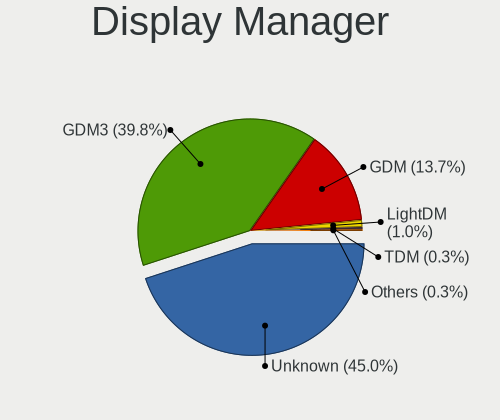
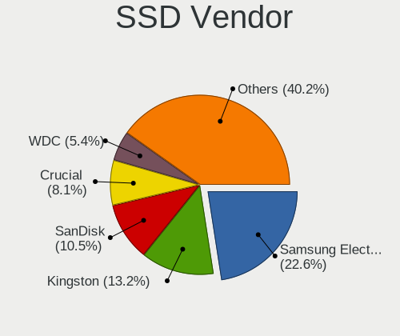
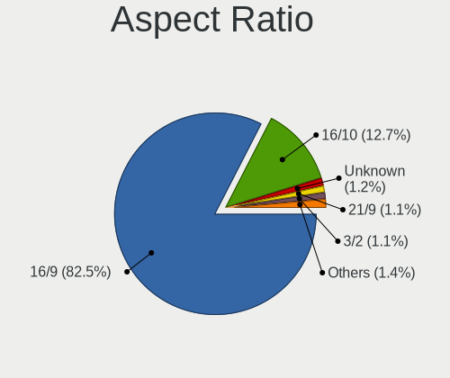
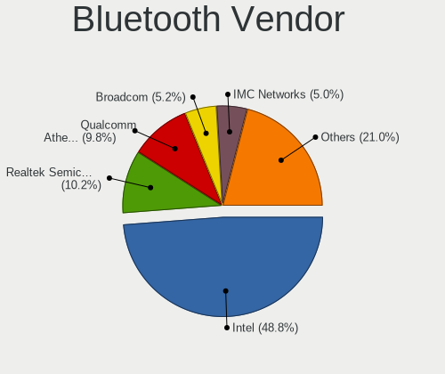

Ubuntu - Tested Hardware & Statistics (Notebooks)
-------------------------------------------------

A project to collect tested hardware configurations for Ubuntu.

Anyone can contribute to this report by the [hw-probe](https://github.com/linuxhw/hw-probe) tool:

    sudo -E hw-probe -all -upload

Please contribute! Especially if your hardware is rare.

Contents
--------

* [ Test Cases ](#test-cases)

* [ System ](#system)
  - [ OS                       ](#os)
  - [ OS Family                ](#os-family)
  - [ Kernel                   ](#kernel)
  - [ Kernel Family            ](#kernel-family)
  - [ Kernel Major Ver.        ](#kernel-major-ver)
  - [ Arch                     ](#arch)
  - [ DE                       ](#de)
  - [ Display Server           ](#display-server)
  - [ Display Manager          ](#display-manager)
  - [ OS Lang                  ](#os-lang)
  - [ Boot Mode                ](#boot-mode)
  - [ Filesystem               ](#filesystem)
  - [ Part. scheme             ](#part-scheme)
  - [ Dual Boot with Linux/BSD ](#dual-boot-with-linuxbsd)
  - [ Dual Boot (Win)          ](#dual-boot-win)

* [ Board ](#board)
  - [ Vendor                   ](#vendor)
  - [ Model                    ](#model)
  - [ Model Family             ](#model-family)
  - [ MFG Year                 ](#mfg-year)
  - [ Form Factor              ](#form-factor)
  - [ Secure Boot              ](#secure-boot)
  - [ Coreboot                 ](#coreboot)
  - [ RAM Size                 ](#ram-size)
  - [ RAM Used                 ](#ram-used)
  - [ Total Drives             ](#total-drives)
  - [ Has CD-ROM               ](#has-cd-rom)
  - [ Has Ethernet             ](#has-ethernet)
  - [ Has WiFi                 ](#has-wifi)
  - [ Has Bluetooth            ](#has-bluetooth)

* [ Location ](#location)
  - [ Country                  ](#country)
  - [ City                     ](#city)

* [ Drives ](#drives)
  - [ Drive Vendor             ](#drive-vendor)
  - [ Drive Model              ](#drive-model)
  - [ HDD Vendor               ](#hdd-vendor)
  - [ SSD Vendor               ](#ssd-vendor)
  - [ Drive Kind               ](#drive-kind)
  - [ Drive Connector          ](#drive-connector)
  - [ Drive Size               ](#drive-size)
  - [ Space Total              ](#space-total)
  - [ Space Used               ](#space-used)
  - [ Malfunc. Drives          ](#malfunc-drives)
  - [ Malfunc. Drive Vendor    ](#malfunc-drive-vendor)
  - [ Malfunc. HDD Vendor      ](#malfunc-hdd-vendor)
  - [ Malfunc. Drive Kind      ](#malfunc-drive-kind)
  - [ Failed Drives            ](#failed-drives)
  - [ Failed Drive Vendor      ](#failed-drive-vendor)
  - [ Drive Status             ](#drive-status)

* [ Storage controller ](#storage-controller)
  - [ Storage Vendor           ](#storage-vendor)
  - [ Storage Model            ](#storage-model)
  - [ Storage Kind             ](#storage-kind)

* [ Processor ](#processor)
  - [ CPU Vendor               ](#cpu-vendor)
  - [ CPU Model                ](#cpu-model)
  - [ CPU Model Family         ](#cpu-model-family)
  - [ CPU Cores                ](#cpu-cores)
  - [ CPU Sockets              ](#cpu-sockets)
  - [ CPU Threads              ](#cpu-threads)
  - [ CPU Op-Modes             ](#cpu-op-modes)
  - [ CPU Microcode            ](#cpu-microcode)
  - [ CPU Microarch            ](#cpu-microarch)

* [ Graphics ](#graphics)
  - [ GPU Vendor               ](#gpu-vendor)
  - [ GPU Model                ](#gpu-model)
  - [ GPU Combo                ](#gpu-combo)
  - [ GPU Driver               ](#gpu-driver)
  - [ GPU Memory               ](#gpu-memory)

* [ Monitor ](#monitor)
  - [ Monitor Vendor           ](#monitor-vendor)
  - [ Monitor Model            ](#monitor-model)
  - [ Monitor Resolution       ](#monitor-resolution)
  - [ Monitor Diagonal         ](#monitor-diagonal)
  - [ Monitor Width            ](#monitor-width)
  - [ Aspect Ratio             ](#aspect-ratio)
  - [ Monitor Area             ](#monitor-area)
  - [ Pixel Density            ](#pixel-density)
  - [ Multiple Monitors        ](#multiple-monitors)

* [ Network ](#network)
  - [ Net Controller Vendor    ](#net-controller-vendor)
  - [ Net Controller Model     ](#net-controller-model)
  - [ Wireless Vendor          ](#wireless-vendor)
  - [ Wireless Model           ](#wireless-model)
  - [ Ethernet Vendor          ](#ethernet-vendor)
  - [ Ethernet Model           ](#ethernet-model)
  - [ Net Controller Kind      ](#net-controller-kind)
  - [ Used Controller          ](#used-controller)
  - [ NICs                     ](#nics)
  - [ IPv6                     ](#ipv6)

* [ Bluetooth ](#bluetooth)
  - [ Bluetooth Vendor         ](#bluetooth-vendor)
  - [ Bluetooth Model          ](#bluetooth-model)

* [ Sound ](#sound)
  - [ Sound Vendor             ](#sound-vendor)
  - [ Sound Model              ](#sound-model)

* [ Memory ](#memory)
  - [ Memory Vendor            ](#memory-vendor)
  - [ Memory Model             ](#memory-model)
  - [ Memory Kind              ](#memory-kind)
  - [ Memory Form Factor       ](#memory-form-factor)
  - [ Memory Size              ](#memory-size)
  - [ Memory Speed             ](#memory-speed)

* [ Printers & scanners ](#printers--scanners)
  - [ Printer Vendor           ](#printer-vendor)
  - [ Printer Model            ](#printer-model)
  - [ Scanner Vendor           ](#scanner-vendor)
  - [ Scanner Model            ](#scanner-model)

* [ Camera ](#camera)
  - [ Camera Vendor            ](#camera-vendor)
  - [ Camera Model             ](#camera-model)

* [ Security ](#security)
  - [ Fingerprint Vendor       ](#fingerprint-vendor)
  - [ Fingerprint Model        ](#fingerprint-model)
  - [ Chipcard Vendor          ](#chipcard-vendor)
  - [ Chipcard Model           ](#chipcard-model)

* [ Unsupported ](#unsupported)
  - [ Unsupported Devices      ](#unsupported-devices)
  - [ Unsupported Device Types ](#unsupported-device-types)

Test Cases
----------

Total: 45733

| Vendor        | Model                       | Probe                                                      | Date         |
|---------------|-----------------------------|------------------------------------------------------------|--------------|
| Dell          | Latitude 5530               | [e4688e2ef8](https://linux-hardware.org/?probe=e4688e2ef8) | Apr 01, 2023 |
| HP            | Pavilion Laptop 14-ec0xx... | [1da5570114](https://linux-hardware.org/?probe=1da5570114) | Apr 01, 2023 |
| Lenovo        | V15 G2 IJL 82QY             | [8582f4e86e](https://linux-hardware.org/?probe=8582f4e86e) | Apr 01, 2023 |
| Lenovo        | V15 G2 IJL 82QY             | [e94e2e397e](https://linux-hardware.org/?probe=e94e2e397e) | Apr 01, 2023 |
| Lenovo        | V310-14ISK 80SX             | [cd6dee4651](https://linux-hardware.org/?probe=cd6dee4651) | Apr 01, 2023 |
| ASUSTek       | ZenBook UX325EA_UX325EA     | [4191279e7e](https://linux-hardware.org/?probe=4191279e7e) | Apr 01, 2023 |
| Apple         | MacBookPro9,2               | [111eeac3b3](https://linux-hardware.org/?probe=111eeac3b3) | Apr 01, 2023 |
| Lenovo        | V110-15ISK 80TL             | [db058df07b](https://linux-hardware.org/?probe=db058df07b) | Apr 01, 2023 |
| Apple         | MacBookPro9,2               | [2fcab6a925](https://linux-hardware.org/?probe=2fcab6a925) | Apr 01, 2023 |
| Lenovo        | V110-15ISK 80TL             | [3691be13e8](https://linux-hardware.org/?probe=3691be13e8) | Apr 01, 2023 |
| Lenovo        | ThinkPad E14 20RA004YUS     | [36b592e607](https://linux-hardware.org/?probe=36b592e607) | Apr 01, 2023 |
| Samsung       | R530/R730/R540              | [714ed0f007](https://linux-hardware.org/?probe=714ed0f007) | Apr 01, 2023 |
| Dell          | Vostro 15-3568              | [d93b1d27e1](https://linux-hardware.org/?probe=d93b1d27e1) | Apr 01, 2023 |
| Unknown       | Unknown                     | [702a241ca6](https://linux-hardware.org/?probe=702a241ca6) | Apr 01, 2023 |
| Itautec       | Infoway w7535               | [48a539f108](https://linux-hardware.org/?probe=48a539f108) | Apr 01, 2023 |
| Novatech      | NL40_50CU                   | [caaa544589](https://linux-hardware.org/?probe=caaa544589) | Apr 01, 2023 |
| HP            | Laptop 14-dq2xxx            | [c90d525ee8](https://linux-hardware.org/?probe=c90d525ee8) | Mar 31, 2023 |
| HP            | Laptop 15-bs0xx             | [a5cb1375c4](https://linux-hardware.org/?probe=a5cb1375c4) | Mar 31, 2023 |
| HP            | Laptop 15-bs0xx             | [60a6b11ce0](https://linux-hardware.org/?probe=60a6b11ce0) | Mar 31, 2023 |
| Lenovo        | ThinkPad T431s 20AA0016G... | [13e8d4f50b](https://linux-hardware.org/?probe=13e8d4f50b) | Mar 31, 2023 |
| Samsung       | 950XED                      | [c3b37a213a](https://linux-hardware.org/?probe=c3b37a213a) | Mar 31, 2023 |
| HP            | Pavilion g7                 | [3b0b792078](https://linux-hardware.org/?probe=3b0b792078) | Mar 31, 2023 |
| Acer          | Extensa 215-31              | [b1601e6747](https://linux-hardware.org/?probe=b1601e6747) | Mar 31, 2023 |
| Dell          | Vostro V131                 | [53538c2ae9](https://linux-hardware.org/?probe=53538c2ae9) | Mar 31, 2023 |
| ASUSTek       | K53SD                       | [81d03c3707](https://linux-hardware.org/?probe=81d03c3707) | Mar 31, 2023 |
| Lenovo        | ThinkPad E14 20RA0016IX     | [685f18f5b3](https://linux-hardware.org/?probe=685f18f5b3) | Mar 31, 2023 |
| MSI           | Modern 15 A5M               | [2a00bed043](https://linux-hardware.org/?probe=2a00bed043) | Mar 31, 2023 |
| HP            | OMEN by Laptop 17-cb1xxx    | [db1a67682b](https://linux-hardware.org/?probe=db1a67682b) | Mar 31, 2023 |
| HP            | Pavilion Laptop 15-eh1xx... | [b56e2a41ed](https://linux-hardware.org/?probe=b56e2a41ed) | Mar 31, 2023 |
| Lenovo        | ThinkPad Edge E545 20B20... | [c2061eeeb8](https://linux-hardware.org/?probe=c2061eeeb8) | Mar 31, 2023 |
| Lenovo        | ThinkPad Edge E545 20B20... | [9a866f03fd](https://linux-hardware.org/?probe=9a866f03fd) | Mar 31, 2023 |
| Lenovo        | ThinkPad T490 20N2CTO1WW    | [17fb0ed43a](https://linux-hardware.org/?probe=17fb0ed43a) | Mar 31, 2023 |
| HP            | Pavilion Gaming Laptop 1... | [0014e52bf3](https://linux-hardware.org/?probe=0014e52bf3) | Mar 31, 2023 |
| ASUSTek       | X751SA                      | [5d8ad91642](https://linux-hardware.org/?probe=5d8ad91642) | Mar 31, 2023 |
| Lenovo        | ThinkPad X270 20HMS0T000    | [702223a4b1](https://linux-hardware.org/?probe=702223a4b1) | Mar 31, 2023 |
| EVOO          | EVC156-1                    | [8e665ae8b2](https://linux-hardware.org/?probe=8e665ae8b2) | Mar 31, 2023 |
| ASUSTek       | VivoBook 15_ASUS Laptop ... | [03da618edb](https://linux-hardware.org/?probe=03da618edb) | Mar 31, 2023 |
| Lenovo        | IdeaPad 530S-14IKB 81EU     | [fe51f2c62f](https://linux-hardware.org/?probe=fe51f2c62f) | Mar 31, 2023 |
| ASUSTek       | ASUS BR1100CKA BR1100CKA... | [d7f3354ce9](https://linux-hardware.org/?probe=d7f3354ce9) | Mar 31, 2023 |
| Toshiba       | Satellite Pro S500          | [b2e60d9170](https://linux-hardware.org/?probe=b2e60d9170) | Mar 31, 2023 |
| HP            | Pavilion Laptop 15-cc5xx    | [c6bbbbb7d8](https://linux-hardware.org/?probe=c6bbbbb7d8) | Mar 31, 2023 |
| Lenovo        | ThinkPad T14s Gen 2a 20X... | [0ffc78eac6](https://linux-hardware.org/?probe=0ffc78eac6) | Mar 30, 2023 |
| Medion        | E15407                      | [b863362865](https://linux-hardware.org/?probe=b863362865) | Mar 30, 2023 |
| Medion        | E15407                      | [641091a85d](https://linux-hardware.org/?probe=641091a85d) | Mar 30, 2023 |
| Apple         | MacBookAir7,2               | [d9cbbe0a35](https://linux-hardware.org/?probe=d9cbbe0a35) | Mar 30, 2023 |
| Lenovo        | IdeaPad 330S-15ARR 81FB     | [1dc323a9e9](https://linux-hardware.org/?probe=1dc323a9e9) | Mar 30, 2023 |
| Lenovo        | ThinkPad E595 20NF0000GE    | [95a77f6dcc](https://linux-hardware.org/?probe=95a77f6dcc) | Mar 30, 2023 |
| ASUSTek       | X555LAB                     | [f1b87ecc62](https://linux-hardware.org/?probe=f1b87ecc62) | Mar 30, 2023 |
| Apple         | MacBookPro10,2              | [2f56ac98c1](https://linux-hardware.org/?probe=2f56ac98c1) | Mar 30, 2023 |
| Lenovo        | Legion Y530-15ICH 81FV      | [0f8c22b288](https://linux-hardware.org/?probe=0f8c22b288) | Mar 30, 2023 |
| Lenovo        | ThinkBook 15-IIL 20SM       | [31d333ecc9](https://linux-hardware.org/?probe=31d333ecc9) | Mar 30, 2023 |
| ASUSTek       | K55A                        | [cf40bdccfc](https://linux-hardware.org/?probe=cf40bdccfc) | Mar 30, 2023 |
| ASUSTek       | K55A                        | [b6c168d185](https://linux-hardware.org/?probe=b6c168d185) | Mar 30, 2023 |
| Dell          | Vostro 5402                 | [27b9c84cbe](https://linux-hardware.org/?probe=27b9c84cbe) | Mar 30, 2023 |
| Google        | Caroline                    | [8018db87e9](https://linux-hardware.org/?probe=8018db87e9) | Mar 30, 2023 |
| Dell          | Inspiron 3421               | [5418efd855](https://linux-hardware.org/?probe=5418efd855) | Mar 30, 2023 |
| Lenovo        | Yoga 510-14ISK 80UK         | [722c1e9d68](https://linux-hardware.org/?probe=722c1e9d68) | Mar 30, 2023 |
| HP            | Pavilion Gaming Laptop 1... | [252d340923](https://linux-hardware.org/?probe=252d340923) | Mar 30, 2023 |
| Dell          | Precision 5510              | [15954887b1](https://linux-hardware.org/?probe=15954887b1) | Mar 30, 2023 |
| Dell          | Precision 3560              | [f6ef5c1a2c](https://linux-hardware.org/?probe=f6ef5c1a2c) | Mar 30, 2023 |
| HP            | Pavilion 17                 | [46e0a0aed1](https://linux-hardware.org/?probe=46e0a0aed1) | Mar 30, 2023 |
| HP            | Pavilion 17                 | [3da4500905](https://linux-hardware.org/?probe=3da4500905) | Mar 30, 2023 |
| Dell          | Latitude 3490               | [16d4f0954b](https://linux-hardware.org/?probe=16d4f0954b) | Mar 30, 2023 |
| Lenovo        | IdeaPad 3 15ITL6 82H8       | [faa3d2b7ad](https://linux-hardware.org/?probe=faa3d2b7ad) | Mar 30, 2023 |
| Lenovo        | ThinkPad X220 Tablet 429... | [a2e324fd92](https://linux-hardware.org/?probe=a2e324fd92) | Mar 30, 2023 |
| HUAWEI        | RLEF-XX                     | [e9988edacd](https://linux-hardware.org/?probe=e9988edacd) | Mar 30, 2023 |
| Alienware     | m15 Ryzen Ed. R5            | [0f273e6227](https://linux-hardware.org/?probe=0f273e6227) | Mar 30, 2023 |
| Intel         | H81U                        | [43d7179dc3](https://linux-hardware.org/?probe=43d7179dc3) | Mar 30, 2023 |
| ASUSTek       | ASUS TUF Gaming F17 FX70... | [da1e07f122](https://linux-hardware.org/?probe=da1e07f122) | Mar 30, 2023 |
| ASUSTek       | ASUS TUF Gaming F17 FX70... | [492d575f31](https://linux-hardware.org/?probe=492d575f31) | Mar 30, 2023 |
| HP            | ProBook 450 G5              | [89dfecad7e](https://linux-hardware.org/?probe=89dfecad7e) | Mar 30, 2023 |
| Dell          | XPS 15 9570                 | [8d0c93e1a8](https://linux-hardware.org/?probe=8d0c93e1a8) | Mar 30, 2023 |
| Dell          | Vostro 3480                 | [83cb13ffb4](https://linux-hardware.org/?probe=83cb13ffb4) | Mar 30, 2023 |
| Lenovo        | N22 80S6                    | [c6cbeeb984](https://linux-hardware.org/?probe=c6cbeeb984) | Mar 30, 2023 |
| Acer          | Aspire A514-54              | [94da64753b](https://linux-hardware.org/?probe=94da64753b) | Mar 30, 2023 |
| Acer          | Aspire 8943G                | [e1d172011e](https://linux-hardware.org/?probe=e1d172011e) | Mar 30, 2023 |
| ASUSTek       | K53SD                       | [81710aaa51](https://linux-hardware.org/?probe=81710aaa51) | Mar 30, 2023 |
| Lenovo        | Yoga Slim 7 Pro 16ACH6 8... | [889ef05f86](https://linux-hardware.org/?probe=889ef05f86) | Mar 30, 2023 |
| Apple         | MacBookAir9,1               | [1fe20bdfcb](https://linux-hardware.org/?probe=1fe20bdfcb) | Mar 30, 2023 |
| Lenovo        | G470 20078                  | [1e510aad42](https://linux-hardware.org/?probe=1e510aad42) | Mar 30, 2023 |
| Notebook      | N650DU                      | [e8ec3c6462](https://linux-hardware.org/?probe=e8ec3c6462) | Mar 30, 2023 |
| Lenovo        | G700 20251                  | [7580b631a9](https://linux-hardware.org/?probe=7580b631a9) | Mar 29, 2023 |
| Dell          | Inspiron 5566               | [7b53b4da78](https://linux-hardware.org/?probe=7b53b4da78) | Mar 29, 2023 |
| Dell          | Latitude E6530              | [eb7392d1ae](https://linux-hardware.org/?probe=eb7392d1ae) | Mar 29, 2023 |
| MSI           | GT70 2PE                    | [493cabf3f8](https://linux-hardware.org/?probe=493cabf3f8) | Mar 29, 2023 |
| Medion        | P8614                       | [a66fe7042e](https://linux-hardware.org/?probe=a66fe7042e) | Mar 29, 2023 |
| Lenovo        | ThinkPad E14 Gen 2 20TA0... | [e9600e8bfe](https://linux-hardware.org/?probe=e9600e8bfe) | Mar 29, 2023 |
| ASUSTek       | TUF Gaming FX705DT_FX705... | [803a180064](https://linux-hardware.org/?probe=803a180064) | Mar 29, 2023 |
| Dell          | Inspiron 5767               | [1c80487906](https://linux-hardware.org/?probe=1c80487906) | Mar 29, 2023 |
| Acer          | Extensa 215-23              | [bf5730d468](https://linux-hardware.org/?probe=bf5730d468) | Mar 29, 2023 |
| ASUSTek       | X751LJ                      | [cf5d71e2b3](https://linux-hardware.org/?probe=cf5d71e2b3) | Mar 29, 2023 |
| ASUSTek       | TUF Gaming FX705DT_FX705... | [f33059ab6b](https://linux-hardware.org/?probe=f33059ab6b) | Mar 29, 2023 |
| Lenovo        | IdeaPadFlex 10 20324        | [40b3e68058](https://linux-hardware.org/?probe=40b3e68058) | Mar 29, 2023 |
| HP            | ProBook 450 G2              | [6599d32d74](https://linux-hardware.org/?probe=6599d32d74) | Mar 29, 2023 |
| HP            | ProBook 450 G2              | [64bef0aff5](https://linux-hardware.org/?probe=64bef0aff5) | Mar 29, 2023 |
| Timi          | TM1701                      | [16ca4bcb7f](https://linux-hardware.org/?probe=16ca4bcb7f) | Mar 29, 2023 |
| Sony          | VGN-AW330J                  | [f5afc7ab6f](https://linux-hardware.org/?probe=f5afc7ab6f) | Mar 29, 2023 |
| Lenovo        | ThinkPad T14 Gen 1 20UD0... | [bfa850ddad](https://linux-hardware.org/?probe=bfa850ddad) | Mar 29, 2023 |
| HUAWEI        | HVY-WXX9                    | [31d94ffb5f](https://linux-hardware.org/?probe=31d94ffb5f) | Mar 29, 2023 |
| Dell          | Vostro 15 3515              | [7b4a51d5e3](https://linux-hardware.org/?probe=7b4a51d5e3) | Mar 29, 2023 |
| Dell          | Inspiron 7520               | [8258074853](https://linux-hardware.org/?probe=8258074853) | Mar 28, 2023 |
| HP            | Compaq Presario CQ40        | [7f2e65257c](https://linux-hardware.org/?probe=7f2e65257c) | Mar 28, 2023 |
| Google        | Caroline                    | [80f01f2a87](https://linux-hardware.org/?probe=80f01f2a87) | Mar 28, 2023 |
| HP            | Compaq Presario CQ40        | [9ee954843e](https://linux-hardware.org/?probe=9ee954843e) | Mar 28, 2023 |
| HP            | 250 G7 Notebook PC          | [fcb8359930](https://linux-hardware.org/?probe=fcb8359930) | Mar 28, 2023 |
| Lenovo        | IdeaPad 510S-14ISK 80TK     | [25cc7bfca2](https://linux-hardware.org/?probe=25cc7bfca2) | Mar 28, 2023 |
| HP            | 250 G7 Notebook PC          | [2558605a4b](https://linux-hardware.org/?probe=2558605a4b) | Mar 28, 2023 |
| HP            | Pavilion g6                 | [c5b99ffdb0](https://linux-hardware.org/?probe=c5b99ffdb0) | Mar 28, 2023 |
| HP            | OMEN by Laptop 15-dc0xxx    | [b7a0579d38](https://linux-hardware.org/?probe=b7a0579d38) | Mar 28, 2023 |
| Acer          | TravelMate P215-52          | [b6184e813b](https://linux-hardware.org/?probe=b6184e813b) | Mar 28, 2023 |
| Notebook      | L140CU                      | [98b71e9790](https://linux-hardware.org/?probe=98b71e9790) | Mar 28, 2023 |
| Dell          | G15 5511                    | [7f15a1e2c7](https://linux-hardware.org/?probe=7f15a1e2c7) | Mar 28, 2023 |
| Dell          | Precision 5540              | [f9e20de07f](https://linux-hardware.org/?probe=f9e20de07f) | Mar 28, 2023 |
| Lenovo        | ThinkPad E14 20RA004YUS     | [18226d4ded](https://linux-hardware.org/?probe=18226d4ded) | Mar 28, 2023 |
| HP            | ProBook 450 G7              | [8b27d78a17](https://linux-hardware.org/?probe=8b27d78a17) | Mar 28, 2023 |
| MSI           | B450 TOMAHAWK MAX           | [856b789461](https://linux-hardware.org/?probe=856b789461) | Mar 28, 2023 |
| Lenovo        | IdeaPad 5 Pro 16ACH6 82L... | [577947c9d3](https://linux-hardware.org/?probe=577947c9d3) | Mar 28, 2023 |
| HUAWEI        | NBLB-WAX9N                  | [9fbd9476b2](https://linux-hardware.org/?probe=9fbd9476b2) | Mar 28, 2023 |
| Lenovo        | ThinkPad T540p 20BE004EU... | [988731ac8d](https://linux-hardware.org/?probe=988731ac8d) | Mar 28, 2023 |
| Lenovo        | ThinkPad T540p 20BE004EU... | [8406000835](https://linux-hardware.org/?probe=8406000835) | Mar 28, 2023 |
| HP            | Pavilion Gaming Laptop 1... | [4c2dd89a20](https://linux-hardware.org/?probe=4c2dd89a20) | Mar 28, 2023 |
| ASUSTek       | X550CA                      | [a449827256](https://linux-hardware.org/?probe=a449827256) | Mar 28, 2023 |
| Dell          | Latitude 7350               | [de44a7d43c](https://linux-hardware.org/?probe=de44a7d43c) | Mar 28, 2023 |
| HP            | Compaq 610                  | [dc9383200e](https://linux-hardware.org/?probe=dc9383200e) | Mar 28, 2023 |
| Dell          | Latitude 7350               | [8ef24a8281](https://linux-hardware.org/?probe=8ef24a8281) | Mar 28, 2023 |
| HP            | Pavilion Laptop 15-cs2xx... | [8921171c40](https://linux-hardware.org/?probe=8921171c40) | Mar 28, 2023 |
| HP            | ZBook Studio G3             | [3da1eddc9e](https://linux-hardware.org/?probe=3da1eddc9e) | Mar 28, 2023 |
| HP            | ProBook 450 G3              | [f0e6089a6e](https://linux-hardware.org/?probe=f0e6089a6e) | Mar 28, 2023 |
| ASUSTek       | N53SV                       | [77aa77b2a3](https://linux-hardware.org/?probe=77aa77b2a3) | Mar 28, 2023 |
| HP            | Pavilion Laptop 15-cc5xx    | [7a9cf507e6](https://linux-hardware.org/?probe=7a9cf507e6) | Mar 28, 2023 |
| HP            | Pavilion Laptop 14-ec0xx... | [88d5c3bb9f](https://linux-hardware.org/?probe=88d5c3bb9f) | Mar 28, 2023 |
| Unknown       | Unknown                     | [26d819f9fc](https://linux-hardware.org/?probe=26d819f9fc) | Mar 27, 2023 |
| HP            | Laptop 14s-fq2xxx           | [8b64ddb550](https://linux-hardware.org/?probe=8b64ddb550) | Mar 27, 2023 |
| Acer          | Extensa 2530                | [e39fe56d67](https://linux-hardware.org/?probe=e39fe56d67) | Mar 27, 2023 |
| Dell          | Inspiron 13-5378            | [2aff972d11](https://linux-hardware.org/?probe=2aff972d11) | Mar 27, 2023 |
| HUAWEI        | NBD-WXX9                    | [e7788fd2a4](https://linux-hardware.org/?probe=e7788fd2a4) | Mar 27, 2023 |
| HUAWEI        | NBD-WXX9                    | [d723ff0fa9](https://linux-hardware.org/?probe=d723ff0fa9) | Mar 27, 2023 |
| Lenovo        | ThinkPad T460s 20FAS1U20... | [99ea485cee](https://linux-hardware.org/?probe=99ea485cee) | Mar 27, 2023 |
| Dell          | XPS 13 9305                 | [2f96abf16a](https://linux-hardware.org/?probe=2f96abf16a) | Mar 27, 2023 |
| Dell          | XPS 13 7390                 | [e1d01990f4](https://linux-hardware.org/?probe=e1d01990f4) | Mar 27, 2023 |
| HUAWEI        | KLVD-WXX9                   | [574bb4272c](https://linux-hardware.org/?probe=574bb4272c) | Mar 27, 2023 |
| Dell          | XPS 13 9305                 | [07caea9176](https://linux-hardware.org/?probe=07caea9176) | Mar 27, 2023 |
| MSI           | GS66 Stealth 10SF           | [cb72b15b20](https://linux-hardware.org/?probe=cb72b15b20) | Mar 27, 2023 |
| HUAWEI        | BOHB-WAX9                   | [d7b0ec58d5](https://linux-hardware.org/?probe=d7b0ec58d5) | Mar 27, 2023 |
| Lenovo        | IdeaPad Gaming 3 15IMH05... | [08627c5990](https://linux-hardware.org/?probe=08627c5990) | Mar 27, 2023 |
| Dell          | Precision 7530              | [d5687ef764](https://linux-hardware.org/?probe=d5687ef764) | Mar 27, 2023 |
| Lenovo        | ThinkPad E14 Gen 4 21E3S... | [d484c5e138](https://linux-hardware.org/?probe=d484c5e138) | Mar 27, 2023 |
| Lenovo        | ThinkPad X1 Carbon Gen 9... | [bddc9116d1](https://linux-hardware.org/?probe=bddc9116d1) | Mar 27, 2023 |
| Acer          | Aspire 4820TG               | [e634227889](https://linux-hardware.org/?probe=e634227889) | Mar 27, 2023 |
| Lenovo        | IdeaPadFlex 10 20324        | [629579e7f2](https://linux-hardware.org/?probe=629579e7f2) | Mar 27, 2023 |
| Lenovo        | ThinkPad L14 Gen 3 21C10... | [6a8962feba](https://linux-hardware.org/?probe=6a8962feba) | Mar 27, 2023 |
| Dell          | Precision 7670              | [eece926391](https://linux-hardware.org/?probe=eece926391) | Mar 27, 2023 |
| HP            | EliteBook 2570p             | [d5ba09feb1](https://linux-hardware.org/?probe=d5ba09feb1) | Mar 27, 2023 |
| Dell          | Precision 7670              | [5b8f0590ec](https://linux-hardware.org/?probe=5b8f0590ec) | Mar 27, 2023 |
| Dell          | Latitude E5570              | [350e781679](https://linux-hardware.org/?probe=350e781679) | Mar 27, 2023 |
| Fujitsu       | LIFEBOOK E736               | [03df3679d3](https://linux-hardware.org/?probe=03df3679d3) | Mar 26, 2023 |
| ASUSTek       | X751SA                      | [bef27b5a10](https://linux-hardware.org/?probe=bef27b5a10) | Mar 26, 2023 |
| ASUSTek       | X751SA                      | [daac2899b2](https://linux-hardware.org/?probe=daac2899b2) | Mar 26, 2023 |
| Lenovo        | IdeaPad 320-15ISK 80XH      | [c3dbea760e](https://linux-hardware.org/?probe=c3dbea760e) | Mar 26, 2023 |
| Apple         | MacBook5,1                  | [f403538019](https://linux-hardware.org/?probe=f403538019) | Mar 26, 2023 |
| Lenovo        | ThinkPad X230 2325BA3       | [9022b333bd](https://linux-hardware.org/?probe=9022b333bd) | Mar 26, 2023 |
| Fujitsu       | LIFEBOOK E736               | [f7d3c52f58](https://linux-hardware.org/?probe=f7d3c52f58) | Mar 26, 2023 |
| HUAWEI        | RLEF-XX                     | [b860e76ead](https://linux-hardware.org/?probe=b860e76ead) | Mar 26, 2023 |
| Acer          | Aspire VN7-791              | [eb75a9c480](https://linux-hardware.org/?probe=eb75a9c480) | Mar 26, 2023 |
| Lenovo        | ThinkPad T440s 20AQ009DG... | [6f3481adc0](https://linux-hardware.org/?probe=6f3481adc0) | Mar 26, 2023 |
| Dell          | XPS 15 7590                 | [aeec5e2588](https://linux-hardware.org/?probe=aeec5e2588) | Mar 26, 2023 |
| Apple         | MacBookPro16,2              | [cf7ab8adb4](https://linux-hardware.org/?probe=cf7ab8adb4) | Mar 26, 2023 |
| HUAWEI        | KLVD-WXX9                   | [ca83615d40](https://linux-hardware.org/?probe=ca83615d40) | Mar 26, 2023 |
| HUAWEI        | KLVD-WXX9                   | [285462b197](https://linux-hardware.org/?probe=285462b197) | Mar 26, 2023 |
| HUAWEI        | KLVD-WXX9                   | [fc40632056](https://linux-hardware.org/?probe=fc40632056) | Mar 26, 2023 |
| Positivo      | Smash2                      | [b61791c478](https://linux-hardware.org/?probe=b61791c478) | Mar 26, 2023 |
| Apple         | MacBookPro11,5              | [0c2be4a34c](https://linux-hardware.org/?probe=0c2be4a34c) | Mar 26, 2023 |
| Lenovo        | ThinkPad T550 20CK000GCA    | [946f550eb7](https://linux-hardware.org/?probe=946f550eb7) | Mar 26, 2023 |
| Acer          | V5-131                      | [f35bd55401](https://linux-hardware.org/?probe=f35bd55401) | Mar 26, 2023 |
| ASUSTek       | Zephyrus M GM501GS          | [68017924d7](https://linux-hardware.org/?probe=68017924d7) | Mar 26, 2023 |
| MSI           | Creator Z16 A11UET          | [0133ab37af](https://linux-hardware.org/?probe=0133ab37af) | Mar 26, 2023 |
| Dell          | XPS 13 9305                 | [5b29fbd6ac](https://linux-hardware.org/?probe=5b29fbd6ac) | Mar 26, 2023 |
| Lenovo        | Yoga Slim 7 14ITL05 82A3    | [d7b97732fa](https://linux-hardware.org/?probe=d7b97732fa) | Mar 26, 2023 |
| Lenovo        | ThinkPad T430 4237ZC7       | [845a2ed117](https://linux-hardware.org/?probe=845a2ed117) | Mar 26, 2023 |
| MSI           | MAG Z490 TOMAHAWK           | [f9c5ae93de](https://linux-hardware.org/?probe=f9c5ae93de) | Mar 26, 2023 |
| Samsung       | 300E4C/300E5C/300E7C        | [dca4079e12](https://linux-hardware.org/?probe=dca4079e12) | Mar 26, 2023 |
| MSI           | MAG Z490 TOMAHAWK           | [414c36eb9d](https://linux-hardware.org/?probe=414c36eb9d) | Mar 26, 2023 |
| Dell          | Latitude E6430              | [912e5e8577](https://linux-hardware.org/?probe=912e5e8577) | Mar 26, 2023 |
| Dell          | Latitude E6430              | [237dabb566](https://linux-hardware.org/?probe=237dabb566) | Mar 26, 2023 |
| LG Electro... | 16Z90Q-K.AA78A1             | [009542d035](https://linux-hardware.org/?probe=009542d035) | Mar 26, 2023 |
| Sony          | SVF14215CXB                 | [624af23eb4](https://linux-hardware.org/?probe=624af23eb4) | Mar 26, 2023 |
| Lenovo        | G510 20238                  | [f406bad420](https://linux-hardware.org/?probe=f406bad420) | Mar 26, 2023 |
| Notebook      | NL40_50CU                   | [4870d52d1e](https://linux-hardware.org/?probe=4870d52d1e) | Mar 25, 2023 |
| HP            | Laptop 14-dk0xxx            | [a6d543292b](https://linux-hardware.org/?probe=a6d543292b) | Mar 25, 2023 |
| HP            | Laptop 14-dk0xxx            | [d334e1dd57](https://linux-hardware.org/?probe=d334e1dd57) | Mar 25, 2023 |
| HP            | G42                         | [f1b5695907](https://linux-hardware.org/?probe=f1b5695907) | Mar 25, 2023 |
| HP            | ZBook Studio G5             | [3e4bb7249f](https://linux-hardware.org/?probe=3e4bb7249f) | Mar 25, 2023 |
| Lenovo        | ThinkPad W520 4282PQ7       | [ff42aa158f](https://linux-hardware.org/?probe=ff42aa158f) | Mar 25, 2023 |
| Timi          | TM1701                      | [f5dfd4628e](https://linux-hardware.org/?probe=f5dfd4628e) | Mar 25, 2023 |
| HP            | ProBook 650 G1              | [d1baffa910](https://linux-hardware.org/?probe=d1baffa910) | Mar 25, 2023 |
| Acer          | Aspire ES1-731              | [927cc86995](https://linux-hardware.org/?probe=927cc86995) | Mar 25, 2023 |
| Acer          | Aspire E1-731               | [667456015e](https://linux-hardware.org/?probe=667456015e) | Mar 25, 2023 |
| Lenovo        | IdeaPad 3 15ITL6 82H8       | [05b2003fc0](https://linux-hardware.org/?probe=05b2003fc0) | Mar 25, 2023 |
| Apple         | MacBook9,1                  | [9639f02d57](https://linux-hardware.org/?probe=9639f02d57) | Mar 25, 2023 |
| Samsung       | R530/R730/R540              | [7e37be5b8c](https://linux-hardware.org/?probe=7e37be5b8c) | Mar 25, 2023 |
| Lenovo        | ThinkPad X201 3680W81       | [02821ba817](https://linux-hardware.org/?probe=02821ba817) | Mar 25, 2023 |
| Timi          | TM1701                      | [17e055a118](https://linux-hardware.org/?probe=17e055a118) | Mar 25, 2023 |
| Dell          | XPS 13 9380                 | [72bf3db096](https://linux-hardware.org/?probe=72bf3db096) | Mar 25, 2023 |
| MSI           | PE62 7RD                    | [de18d40d94](https://linux-hardware.org/?probe=de18d40d94) | Mar 25, 2023 |
| HP            | OMEN by Laptop 16-b0xxx     | [22aa7f3036](https://linux-hardware.org/?probe=22aa7f3036) | Mar 25, 2023 |
| Apple         | MacBookPro9,1               | [61948072a5](https://linux-hardware.org/?probe=61948072a5) | Mar 25, 2023 |
| Toshiba       | TECRA M10                   | [41e2f08c6b](https://linux-hardware.org/?probe=41e2f08c6b) | Mar 25, 2023 |
| Shanghai Z... | ZXE CRB                     | [aafbb2815f](https://linux-hardware.org/?probe=aafbb2815f) | Mar 25, 2023 |
| Lenovo        | G500s 20245                 | [bad00d337f](https://linux-hardware.org/?probe=bad00d337f) | Mar 25, 2023 |
| Acer          | Aspire A315-56              | [143eed380e](https://linux-hardware.org/?probe=143eed380e) | Mar 25, 2023 |
| Lenovo        | V130-15IKB 81HN             | [0bfaf1252f](https://linux-hardware.org/?probe=0bfaf1252f) | Mar 25, 2023 |
| ASUSTek       | VivoBook_ASUSLaptop X150... | [e09dc41124](https://linux-hardware.org/?probe=e09dc41124) | Mar 25, 2023 |
| HP            | 255 G7 Notebook PC          | [2097578b64](https://linux-hardware.org/?probe=2097578b64) | Mar 25, 2023 |
| Lenovo        | ThinkPad X1 Carbon 5th 2... | [4f2d3a2402](https://linux-hardware.org/?probe=4f2d3a2402) | Mar 25, 2023 |
| Insyde        | CherryTrail                 | [9e658f67a2](https://linux-hardware.org/?probe=9e658f67a2) | Mar 25, 2023 |
| Getac         | B300-H                      | [28a9b0b0c7](https://linux-hardware.org/?probe=28a9b0b0c7) | Mar 25, 2023 |
| HP            | OMEN by Laptop 17-cb1xxx    | [b1cab7b897](https://linux-hardware.org/?probe=b1cab7b897) | Mar 25, 2023 |
| Dell          | Latitude E7450              | [7154586794](https://linux-hardware.org/?probe=7154586794) | Mar 25, 2023 |
| Dell          | Inspiron N5110              | [f8fc6c74da](https://linux-hardware.org/?probe=f8fc6c74da) | Mar 25, 2023 |
| Acer          | Aspire 4740                 | [c4e47e53dc](https://linux-hardware.org/?probe=c4e47e53dc) | Mar 25, 2023 |
| TUXEDO        | InfinityBook Pro 14 v4      | [74c22c45c4](https://linux-hardware.org/?probe=74c22c45c4) | Mar 25, 2023 |
| ASUSTek       | ASUS TUF Gaming A15 FA50... | [9e45f992a1](https://linux-hardware.org/?probe=9e45f992a1) | Mar 25, 2023 |
| Dell          | Vostro 5581                 | [d2ebb46bea](https://linux-hardware.org/?probe=d2ebb46bea) | Mar 25, 2023 |
| Acer          | Swift SF113-31              | [698b73783e](https://linux-hardware.org/?probe=698b73783e) | Mar 24, 2023 |
| Apple         | MacBook4,1                  | [7ade2b1d1a](https://linux-hardware.org/?probe=7ade2b1d1a) | Mar 24, 2023 |
| Lenovo        | IdeaPad Gaming 3 15ARH05... | [548c06032b](https://linux-hardware.org/?probe=548c06032b) | Mar 24, 2023 |
| HP            | ProBook 450 G5              | [c4b7067187](https://linux-hardware.org/?probe=c4b7067187) | Mar 24, 2023 |
| Dell          | XPS 13 9350                 | [d1ba8cb8e9](https://linux-hardware.org/?probe=d1ba8cb8e9) | Mar 24, 2023 |
| Dell          | Precision 3510              | [2ea0671f5d](https://linux-hardware.org/?probe=2ea0671f5d) | Mar 24, 2023 |
| Lenovo        | QIWG5                       | [3136edbf1d](https://linux-hardware.org/?probe=3136edbf1d) | Mar 24, 2023 |
| HP            | Pavilion 11 x360 PC         | [2c3c5a65a5](https://linux-hardware.org/?probe=2c3c5a65a5) | Mar 24, 2023 |
| Lenovo        | ThinkPad T470 20HES4EG00    | [20f698f6d1](https://linux-hardware.org/?probe=20f698f6d1) | Mar 24, 2023 |
| ASUSTek       | ROG Strix G513IE_G513IE     | [bc6baa37ef](https://linux-hardware.org/?probe=bc6baa37ef) | Mar 24, 2023 |
| Lenovo        | IdeaPad 320-15AST 80XV      | [9edd5002f0](https://linux-hardware.org/?probe=9edd5002f0) | Mar 24, 2023 |
| MSI           | Creator Z17 A12UHST         | [47814b01b6](https://linux-hardware.org/?probe=47814b01b6) | Mar 24, 2023 |
| HP            | ProBook 5330m               | [6844efa448](https://linux-hardware.org/?probe=6844efa448) | Mar 24, 2023 |
| HP            | Laptop 15-dw0xxx            | [299c20969c](https://linux-hardware.org/?probe=299c20969c) | Mar 24, 2023 |
| Dell          | XPS 13 9305                 | [c7e354ffe3](https://linux-hardware.org/?probe=c7e354ffe3) | Mar 24, 2023 |
| Apple         | MacBookPro11,5              | [9fd6508caf](https://linux-hardware.org/?probe=9fd6508caf) | Mar 24, 2023 |
| Lenovo        | ThinkPad T14s Gen 2i 20W... | [7dfb215d39](https://linux-hardware.org/?probe=7dfb215d39) | Mar 24, 2023 |
| HP            | Laptop 15s-du2xxx           | [882f1dbee1](https://linux-hardware.org/?probe=882f1dbee1) | Mar 24, 2023 |
| Dell          | Latitude E6420              | [b1516dde2f](https://linux-hardware.org/?probe=b1516dde2f) | Mar 24, 2023 |
| Shanghai Z... | ZXE CRB                     | [7f98044a04](https://linux-hardware.org/?probe=7f98044a04) | Mar 24, 2023 |
| HP            | ProBook 470 G5              | [1672158957](https://linux-hardware.org/?probe=1672158957) | Mar 24, 2023 |
| HP            | ProBook 470 G5              | [383b333f72](https://linux-hardware.org/?probe=383b333f72) | Mar 24, 2023 |
| HUAWEI        | NBLB-WAX9N                  | [e14a63a1e4](https://linux-hardware.org/?probe=e14a63a1e4) | Mar 24, 2023 |
| Dell          | Latitude E6530              | [e1bd7a9751](https://linux-hardware.org/?probe=e1bd7a9751) | Mar 24, 2023 |
| Dell          | Vostro 3500                 | [a375452089](https://linux-hardware.org/?probe=a375452089) | Mar 23, 2023 |
| Lenovo        | G780                        | [1ad87e5add](https://linux-hardware.org/?probe=1ad87e5add) | Mar 23, 2023 |
| Dell          | Inspiron 5590               | [f9651795c2](https://linux-hardware.org/?probe=f9651795c2) | Mar 23, 2023 |
| Dell          | Latitude 5420               | [9e55d83acd](https://linux-hardware.org/?probe=9e55d83acd) | Mar 23, 2023 |
| Dell          | Latitude D630               | [95a44067f1](https://linux-hardware.org/?probe=95a44067f1) | Mar 23, 2023 |
| ASUSTek       | X75A1                       | [a4b87d85da](https://linux-hardware.org/?probe=a4b87d85da) | Mar 23, 2023 |
| ASUSTek       | X75A1                       | [654683dd2b](https://linux-hardware.org/?probe=654683dd2b) | Mar 23, 2023 |
| Dell          | Latitude D630               | [45e100abf8](https://linux-hardware.org/?probe=45e100abf8) | Mar 23, 2023 |
| Lenovo        | ThinkPad T570 W10DG 20JX... | [d40284254e](https://linux-hardware.org/?probe=d40284254e) | Mar 23, 2023 |
| Lenovo        | ThinkPad T570 W10DG 20JX... | [26521abccd](https://linux-hardware.org/?probe=26521abccd) | Mar 23, 2023 |
| Lenovo        | V130-15IGM 81HL             | [177fa734fc](https://linux-hardware.org/?probe=177fa734fc) | Mar 23, 2023 |
| Dell          | XPS 15 9520                 | [06d6af1db0](https://linux-hardware.org/?probe=06d6af1db0) | Mar 23, 2023 |
| Toshiba       | Satellite U845W             | [27e67eea9d](https://linux-hardware.org/?probe=27e67eea9d) | Mar 23, 2023 |
| HP            | Laptop 15s-eq2xxx           | [c17f20a679](https://linux-hardware.org/?probe=c17f20a679) | Mar 23, 2023 |
| Notebook      | W510LU                      | [076125acc3](https://linux-hardware.org/?probe=076125acc3) | Mar 23, 2023 |
| HP            | Pavilion Gaming Laptop 1... | [d956770153](https://linux-hardware.org/?probe=d956770153) | Mar 23, 2023 |
| Avell High... | B.ON                        | [0fe36e1e74](https://linux-hardware.org/?probe=0fe36e1e74) | Mar 23, 2023 |
| HP            | ProBook 650 G5              | [028c91d344](https://linux-hardware.org/?probe=028c91d344) | Mar 23, 2023 |
| HUAWEI        | BOD-WXX9                    | [088494906d](https://linux-hardware.org/?probe=088494906d) | Mar 23, 2023 |
| Dell          | XPS 15 9510                 | [e6db3c2c26](https://linux-hardware.org/?probe=e6db3c2c26) | Mar 23, 2023 |
| HONOR         | NMH-WCX9                    | [21f61b5987](https://linux-hardware.org/?probe=21f61b5987) | Mar 23, 2023 |
| Lenovo        | ThinkPad P70 20ESS2VP00     | [bb6fdb6236](https://linux-hardware.org/?probe=bb6fdb6236) | Mar 23, 2023 |
| ASUSTek       | ASUS TUF Gaming F15 FX50... | [e4a3f70cbf](https://linux-hardware.org/?probe=e4a3f70cbf) | Mar 23, 2023 |
| ASUSTek       | ASUS TUF Gaming F15 FX50... | [d55de052b1](https://linux-hardware.org/?probe=d55de052b1) | Mar 23, 2023 |
| Dell          | Latitude 5400               | [4e17f4827d](https://linux-hardware.org/?probe=4e17f4827d) | Mar 23, 2023 |
| Timi          | TM1613                      | [3016a40df3](https://linux-hardware.org/?probe=3016a40df3) | Mar 23, 2023 |
| Timi          | TM1613                      | [ddbc83a8d3](https://linux-hardware.org/?probe=ddbc83a8d3) | Mar 23, 2023 |
| Dell          | Latitude 5400               | [c85d243d8a](https://linux-hardware.org/?probe=c85d243d8a) | Mar 23, 2023 |
| Lenovo        | ThinkPad L450 20DSA25V01    | [68b1ae2c5d](https://linux-hardware.org/?probe=68b1ae2c5d) | Mar 23, 2023 |
| Lenovo        | IdeaPad 3 15ABA7 82RN       | [c91fa425a5](https://linux-hardware.org/?probe=c91fa425a5) | Mar 23, 2023 |
| Teclast       | F15Plus 2                   | [70a7bfb366](https://linux-hardware.org/?probe=70a7bfb366) | Mar 23, 2023 |
| Lenovo        | G500 20236                  | [8688a57db6](https://linux-hardware.org/?probe=8688a57db6) | Mar 22, 2023 |
| Dell          | Latitude E6420              | [6da9274d93](https://linux-hardware.org/?probe=6da9274d93) | Mar 22, 2023 |
| Acer          | ConceptD CN315-71P          | [14b71e7a26](https://linux-hardware.org/?probe=14b71e7a26) | Mar 22, 2023 |
| ASUSTek       | ASUS TUF Gaming A15 FA50... | [34fd631d2b](https://linux-hardware.org/?probe=34fd631d2b) | Mar 22, 2023 |
| Acer          | Aspire A515-55              | [ebbb5efcbc](https://linux-hardware.org/?probe=ebbb5efcbc) | Mar 22, 2023 |
| IGEL Techn... | M340C                       | [0a16ce19bb](https://linux-hardware.org/?probe=0a16ce19bb) | Mar 22, 2023 |
| Lenovo        | ThinkPad P50 20EQS3BT1R     | [9e8aaf974f](https://linux-hardware.org/?probe=9e8aaf974f) | Mar 22, 2023 |
| ASUSTek       | ASUS EXPERTBOOK B1400CEA... | [4cbcbc3025](https://linux-hardware.org/?probe=4cbcbc3025) | Mar 22, 2023 |
| Toshiba       | Satellite U845W             | [65958975b3](https://linux-hardware.org/?probe=65958975b3) | Mar 22, 2023 |
| Toshiba       | Satellite C870-198          | [7969002105](https://linux-hardware.org/?probe=7969002105) | Mar 22, 2023 |
| ASUSTek       | VivoBook_ASUSLaptop K650... | [ba101f37d0](https://linux-hardware.org/?probe=ba101f37d0) | Mar 22, 2023 |
| ASUSTek       | ROG Strix G512LW_G512LW     | [c27a11ed35](https://linux-hardware.org/?probe=c27a11ed35) | Mar 22, 2023 |
| Lenovo        | IdeaPad 320-15AST 80XV      | [8c5fde8c1e](https://linux-hardware.org/?probe=8c5fde8c1e) | Mar 22, 2023 |
| Hampoo        | Cherry Trail CR             | [b293f3ba3e](https://linux-hardware.org/?probe=b293f3ba3e) | Mar 22, 2023 |
| Sony          | VGN-AR51M                   | [ae55922eae](https://linux-hardware.org/?probe=ae55922eae) | Mar 22, 2023 |
| HP            | ProBook 450 G2              | [47992266f4](https://linux-hardware.org/?probe=47992266f4) | Mar 22, 2023 |
| HP            | ProBook 450 G2              | [dc56e35adc](https://linux-hardware.org/?probe=dc56e35adc) | Mar 22, 2023 |
| Lenovo        | ThinkPad X1 Carbon 4th 2... | [d39b3565ca](https://linux-hardware.org/?probe=d39b3565ca) | Mar 22, 2023 |
| HP            | Laptop 17-by2xxx            | [e8c5422a4f](https://linux-hardware.org/?probe=e8c5422a4f) | Mar 22, 2023 |
| Notebook      | P15SM                       | [082e2c3c16](https://linux-hardware.org/?probe=082e2c3c16) | Mar 21, 2023 |
| Toshiba       | Satellite Pro S500          | [2bb2519c2c](https://linux-hardware.org/?probe=2bb2519c2c) | Mar 21, 2023 |
| Toshiba       | Satellite Pro S500          | [a45c7086e5](https://linux-hardware.org/?probe=a45c7086e5) | Mar 21, 2023 |
| ASUSTek       | VivoBook_ASUSLaptop M760... | [8606a64427](https://linux-hardware.org/?probe=8606a64427) | Mar 21, 2023 |
| Acer          | Aspire E5-553               | [3d591cd190](https://linux-hardware.org/?probe=3d591cd190) | Mar 21, 2023 |
| ASUSTek       | VivoBook E14 E402WAS        | [95154b40cc](https://linux-hardware.org/?probe=95154b40cc) | Mar 21, 2023 |
| HUAWEI        | CREM-WXX9                   | [64a63f42bf](https://linux-hardware.org/?probe=64a63f42bf) | Mar 21, 2023 |
| Dell          | G15 5510                    | [3ddfc82bcd](https://linux-hardware.org/?probe=3ddfc82bcd) | Mar 21, 2023 |
| Framework     | Laptop (12th Gen Intel C... | [3a8692d4cf](https://linux-hardware.org/?probe=3a8692d4cf) | Mar 21, 2023 |
| MSI           | GF63 Thin 10SCSR            | [45610ce6bf](https://linux-hardware.org/?probe=45610ce6bf) | Mar 21, 2023 |
| Avell High... | A62 LIV                     | [14dab05208](https://linux-hardware.org/?probe=14dab05208) | Mar 21, 2023 |
| HP            | 255 15.6 inch G9 Noteboo... | [42629ad13b](https://linux-hardware.org/?probe=42629ad13b) | Mar 21, 2023 |
| New IT Pro... | C156EP-C8RVTH               | [556d5020f8](https://linux-hardware.org/?probe=556d5020f8) | Mar 21, 2023 |
| New IT Pro... | C156EP-C8RVTH               | [96e84a3c49](https://linux-hardware.org/?probe=96e84a3c49) | Mar 21, 2023 |
| ASUSTek       | GL553VD                     | [ea7e302020](https://linux-hardware.org/?probe=ea7e302020) | Mar 21, 2023 |
| ASUSTek       | GL553VD                     | [8ed4a1e3ba](https://linux-hardware.org/?probe=8ed4a1e3ba) | Mar 21, 2023 |
| Lenovo        | IdeaPad 3 15ARE05 81W4      | [c5b2997e80](https://linux-hardware.org/?probe=c5b2997e80) | Mar 21, 2023 |
| Dell          | Latitude E6520              | [857fdb4095](https://linux-hardware.org/?probe=857fdb4095) | Mar 21, 2023 |
| Medion        | X783X                       | [d9b4733dd0](https://linux-hardware.org/?probe=d9b4733dd0) | Mar 21, 2023 |
| HP            | EliteBook 840 G5            | [a204a0f2c0](https://linux-hardware.org/?probe=a204a0f2c0) | Mar 21, 2023 |
| Lenovo        | Legion Y530-15ICH 81FV      | [a8b511cdb0](https://linux-hardware.org/?probe=a8b511cdb0) | Mar 21, 2023 |
| ASUSTek       | TUF Gaming FX504GE_FX80G... | [d068d67f2d](https://linux-hardware.org/?probe=d068d67f2d) | Mar 21, 2023 |
| Dell          | Inspiron 5559               | [6f98b39459](https://linux-hardware.org/?probe=6f98b39459) | Mar 21, 2023 |
| Framework     | Laptop                      | [a7dc7b28c9](https://linux-hardware.org/?probe=a7dc7b28c9) | Mar 21, 2023 |
| Acer          | Aspire A515-44              | [923686eb97](https://linux-hardware.org/?probe=923686eb97) | Mar 21, 2023 |
| Dell          | Inspiron 7520               | [330f307e06](https://linux-hardware.org/?probe=330f307e06) | Mar 21, 2023 |
| Hampoo        | Cherry Trail CR             | [aef19ecbd7](https://linux-hardware.org/?probe=aef19ecbd7) | Mar 21, 2023 |
| Dell          | XPS 15 9510                 | [d23fb1d0f6](https://linux-hardware.org/?probe=d23fb1d0f6) | Mar 21, 2023 |
| Hampoo        | Cherry Trail CR             | [82d9122ebf](https://linux-hardware.org/?probe=82d9122ebf) | Mar 20, 2023 |
| Tactus        | GeoBook 140                 | [5efd6f0674](https://linux-hardware.org/?probe=5efd6f0674) | Mar 20, 2023 |
| HP            | EliteBook 8440p             | [580c62b3b8](https://linux-hardware.org/?probe=580c62b3b8) | Mar 20, 2023 |
| IGEL Techn... | M340C                       | [2785bf290e](https://linux-hardware.org/?probe=2785bf290e) | Mar 20, 2023 |
| HP            | Pavilion dv6                | [43940eb778](https://linux-hardware.org/?probe=43940eb778) | Mar 20, 2023 |
| Fujitsu Si... | AMILO Xi 3670               | [bb018988d6](https://linux-hardware.org/?probe=bb018988d6) | Mar 20, 2023 |
| Dell          | Inspiron 3442               | [33137a049e](https://linux-hardware.org/?probe=33137a049e) | Mar 20, 2023 |
| HP            | 250 G4                      | [46e0314fb1](https://linux-hardware.org/?probe=46e0314fb1) | Mar 20, 2023 |
| Dell          | Latitude 7420               | [ac9a26d11c](https://linux-hardware.org/?probe=ac9a26d11c) | Mar 20, 2023 |
| Lenovo        | ThinkPad P15s Gen 2i 20W... | [c9c86f1e79](https://linux-hardware.org/?probe=c9c86f1e79) | Mar 20, 2023 |
| Lenovo        | ThinkPad T14s Gen 1 20T0... | [f0eb91b635](https://linux-hardware.org/?probe=f0eb91b635) | Mar 20, 2023 |
| ASUSTek       | VivoBook_ASUSLaptop M560... | [c87313bdd4](https://linux-hardware.org/?probe=c87313bdd4) | Mar 20, 2023 |
| HP            | Pavilion dm4                | [7983ee084c](https://linux-hardware.org/?probe=7983ee084c) | Mar 20, 2023 |
| Lenovo        | IdeaPad Gaming 3 15IAH7 ... | [882f82cf2c](https://linux-hardware.org/?probe=882f82cf2c) | Mar 20, 2023 |
| Lenovo        | ThinkPad P15s Gen 2i 20W... | [29a6e93a49](https://linux-hardware.org/?probe=29a6e93a49) | Mar 20, 2023 |
| HP            | Laptop 15s-eq1xxx           | [3aee61f2bb](https://linux-hardware.org/?probe=3aee61f2bb) | Mar 20, 2023 |
| Acer          | Aspire M3-581T              | [a9a586ef2d](https://linux-hardware.org/?probe=a9a586ef2d) | Mar 20, 2023 |
| ASUSTek       | X55VDR                      | [b4eb9dbf58](https://linux-hardware.org/?probe=b4eb9dbf58) | Mar 20, 2023 |
| Sony          | VPCEH3N6E                   | [9de8a9a50a](https://linux-hardware.org/?probe=9de8a9a50a) | Mar 20, 2023 |
| Acer          | Aspire M3-581T              | [51e5415bb0](https://linux-hardware.org/?probe=51e5415bb0) | Mar 19, 2023 |
| Dell          | Inspiron 5737               | [77d32b8b3a](https://linux-hardware.org/?probe=77d32b8b3a) | Mar 19, 2023 |
| Notebook      | PCx0Dx                      | [cd5adbbfc0](https://linux-hardware.org/?probe=cd5adbbfc0) | Mar 19, 2023 |
| Dell          | Latitude 5520               | [4153e72c6b](https://linux-hardware.org/?probe=4153e72c6b) | Mar 19, 2023 |
| Notebook      | P15SM                       | [00d7786f9f](https://linux-hardware.org/?probe=00d7786f9f) | Mar 19, 2023 |
| HP            | Pavilion Gaming Laptop 1... | [3387f1f1c8](https://linux-hardware.org/?probe=3387f1f1c8) | Mar 19, 2023 |
| Acer          | Swift SF514-53T             | [9d37ace881](https://linux-hardware.org/?probe=9d37ace881) | Mar 19, 2023 |
| Acer          | Swift SF514-53T             | [93ce0e9d73](https://linux-hardware.org/?probe=93ce0e9d73) | Mar 19, 2023 |
| Lenovo        | IdeaPad L3 15IML05 81Y3     | [95ae633abb](https://linux-hardware.org/?probe=95ae633abb) | Mar 19, 2023 |
| Acer          | Aspire V3-772               | [64b17e8d2c](https://linux-hardware.org/?probe=64b17e8d2c) | Mar 19, 2023 |
| Teclast       | F15Plus 2                   | [17558890e2](https://linux-hardware.org/?probe=17558890e2) | Mar 19, 2023 |
| Lenovo        | IdeaPad L3 15IML05 81Y3     | [54025a10f5](https://linux-hardware.org/?probe=54025a10f5) | Mar 19, 2023 |
| Lenovo        | ThinkPad E15 Gen 2 20TD0... | [92ae74e13d](https://linux-hardware.org/?probe=92ae74e13d) | Mar 19, 2023 |
| Toshiba       | Satellite Pro C50-A-1EM     | [a49e9997f1](https://linux-hardware.org/?probe=a49e9997f1) | Mar 19, 2023 |
| Lenovo        | ThinkBook 14p Gen 3 21EJ    | [dfc02dad7e](https://linux-hardware.org/?probe=dfc02dad7e) | Mar 19, 2023 |
| Notebook      | PCx0Dx                      | [63a8165aff](https://linux-hardware.org/?probe=63a8165aff) | Mar 19, 2023 |
| ASUSTek       | VivoBook_ASUSLaptop M650... | [74b67b2037](https://linux-hardware.org/?probe=74b67b2037) | Mar 19, 2023 |
| ASUSTek       | X550VX                      | [dcc37300fd](https://linux-hardware.org/?probe=dcc37300fd) | Mar 19, 2023 |
| Dell          | Latitude E7470              | [d9108aaeab](https://linux-hardware.org/?probe=d9108aaeab) | Mar 19, 2023 |
| Dell          | Inspiron 7520               | [f587cfd0f1](https://linux-hardware.org/?probe=f587cfd0f1) | Mar 19, 2023 |
| Lenovo        | ThinkPad T420 4180H34       | [9764f25017](https://linux-hardware.org/?probe=9764f25017) | Mar 19, 2023 |
| Lenovo        | ThinkPad E560 20EV0010UK    | [f60325ef42](https://linux-hardware.org/?probe=f60325ef42) | Mar 19, 2023 |
| Schenker      | XMG FUSION 15 (XFU15L19)    | [dc8d19f73a](https://linux-hardware.org/?probe=dc8d19f73a) | Mar 19, 2023 |
| HUAWEI        | NBLK-WAX9X                  | [5c0e12ebd0](https://linux-hardware.org/?probe=5c0e12ebd0) | Mar 19, 2023 |
| Acer          | Extensa 7620                | [59bb9967c2](https://linux-hardware.org/?probe=59bb9967c2) | Mar 19, 2023 |
| HP            | 245 G5 Notebook PC          | [713b724060](https://linux-hardware.org/?probe=713b724060) | Mar 18, 2023 |
| HP            | ProBook 450 G8 Notebook ... | [f5c5712df1](https://linux-hardware.org/?probe=f5c5712df1) | Mar 18, 2023 |
| Apple         | MacBookPro14,1              | [00f4c23b35](https://linux-hardware.org/?probe=00f4c23b35) | Mar 18, 2023 |
| HP            | OMEN by Laptop 17-an0xx     | [5a11bc39d5](https://linux-hardware.org/?probe=5a11bc39d5) | Mar 18, 2023 |
| Dell          | G15 5510                    | [a154aa0e8e](https://linux-hardware.org/?probe=a154aa0e8e) | Mar 18, 2023 |
| Lenovo        | ThinkPad Edge E330 33541... | [4f0ddac461](https://linux-hardware.org/?probe=4f0ddac461) | Mar 18, 2023 |
| Dell          | Inspiron 5521               | [4f90aa2a13](https://linux-hardware.org/?probe=4f90aa2a13) | Mar 18, 2023 |
| Schenker      | VISION 14                   | [85200e20d8](https://linux-hardware.org/?probe=85200e20d8) | Mar 18, 2023 |
| HP            | Laptop 15-db0xxx            | [bb43e46d71](https://linux-hardware.org/?probe=bb43e46d71) | Mar 18, 2023 |
| Lenovo        | ThinkPad T14 Gen 2i 20W1... | [8c8a87616c](https://linux-hardware.org/?probe=8c8a87616c) | Mar 18, 2023 |
| ASUSTek       | ROG Strix G733QS_G733QS     | [32ba732ef0](https://linux-hardware.org/?probe=32ba732ef0) | Mar 18, 2023 |
| Apple         | MacBookPro9,2               | [e996669ec1](https://linux-hardware.org/?probe=e996669ec1) | Mar 18, 2023 |
| HP            | ProBook 6475b               | [1b7a5f385c](https://linux-hardware.org/?probe=1b7a5f385c) | Mar 18, 2023 |
| HP            | ProBook 6475b               | [0fd12da29b](https://linux-hardware.org/?probe=0fd12da29b) | Mar 18, 2023 |
| HP            | ProBook 6475b               | [701aca7f61](https://linux-hardware.org/?probe=701aca7f61) | Mar 18, 2023 |
| Gigabyte      | X570S AORUS ELITE AX        | [2a6ded1018](https://linux-hardware.org/?probe=2a6ded1018) | Mar 18, 2023 |
| Acer          | Aspire 8730                 | [bc63e0d2c1](https://linux-hardware.org/?probe=bc63e0d2c1) | Mar 18, 2023 |
| Lenovo        | ThinkBook 16p Gen 2 20YM    | [837ed83646](https://linux-hardware.org/?probe=837ed83646) | Mar 18, 2023 |
| Sony          | VPCEH3N6E                   | [9c677b7a7b](https://linux-hardware.org/?probe=9c677b7a7b) | Mar 18, 2023 |
| Sony          | VPCEH3N6E                   | [703cc66d3e](https://linux-hardware.org/?probe=703cc66d3e) | Mar 18, 2023 |
| Positivo      | C14CU51                     | [02fe8f2e3b](https://linux-hardware.org/?probe=02fe8f2e3b) | Mar 18, 2023 |
| Hampoo        | Cherry Trail CR             | [fcb7a079cf](https://linux-hardware.org/?probe=fcb7a079cf) | Mar 18, 2023 |
| ASUSTek       | TUF Gaming FX504GE_FX80G... | [928a8fe84e](https://linux-hardware.org/?probe=928a8fe84e) | Mar 18, 2023 |
| ASUSTek       | TUF Gaming FX504GE_FX80G... | [00dc1c3b6e](https://linux-hardware.org/?probe=00dc1c3b6e) | Mar 18, 2023 |
| HP            | Pavilion Laptop 15-cc5xx    | [5ede1a1bf2](https://linux-hardware.org/?probe=5ede1a1bf2) | Mar 18, 2023 |
| Lenovo        | IdeaPad Y510P 20217         | [d7acdc8bf3](https://linux-hardware.org/?probe=d7acdc8bf3) | Mar 18, 2023 |
| Lenovo        | ThinkPad Edge E335 33556... | [463dac90ba](https://linux-hardware.org/?probe=463dac90ba) | Mar 18, 2023 |
| Google        | Lillipup                    | [3eca64113c](https://linux-hardware.org/?probe=3eca64113c) | Mar 18, 2023 |
| Dell          | XPS 9320                    | [d52e0d9e06](https://linux-hardware.org/?probe=d52e0d9e06) | Mar 18, 2023 |
| Lenovo        | ThinkPad T590 20N4000DXS    | [c145898fae](https://linux-hardware.org/?probe=c145898fae) | Mar 17, 2023 |
| Lenovo        | V580c 20160                 | [b7f2837ccd](https://linux-hardware.org/?probe=b7f2837ccd) | Mar 17, 2023 |
| Notebook      | N150CU                      | [284a367641](https://linux-hardware.org/?probe=284a367641) | Mar 17, 2023 |
| HONOR         | HYM-WXX                     | [279e932275](https://linux-hardware.org/?probe=279e932275) | Mar 17, 2023 |
| Lenovo        | ThinkPad P50 20EN0006GE     | [6364c78054](https://linux-hardware.org/?probe=6364c78054) | Mar 17, 2023 |
| Acer          | Aspire V7-482PG             | [9ba6bdc643](https://linux-hardware.org/?probe=9ba6bdc643) | Mar 17, 2023 |
| Lenovo        | ThinkPad T590 20N4000DXS    | [293fe8b4ab](https://linux-hardware.org/?probe=293fe8b4ab) | Mar 17, 2023 |
| Lenovo        | ThinkPad W510 4389AP5       | [1825764856](https://linux-hardware.org/?probe=1825764856) | Mar 17, 2023 |
| HP            | ZBook Studio G3             | [d71ca99f7c](https://linux-hardware.org/?probe=d71ca99f7c) | Mar 17, 2023 |
| Dell          | XPS 9320                    | [b48509f3c6](https://linux-hardware.org/?probe=b48509f3c6) | Mar 17, 2023 |
| Toshiba       | QOSMIO X500                 | [2ce878e92e](https://linux-hardware.org/?probe=2ce878e92e) | Mar 17, 2023 |
| Medion        | GUARDIAN X10                | [f30ef18641](https://linux-hardware.org/?probe=f30ef18641) | Mar 17, 2023 |
| Dell          | Precision 7540              | [9ce80342cf](https://linux-hardware.org/?probe=9ce80342cf) | Mar 17, 2023 |
| Dell          | Precision 7540              | [445287508e](https://linux-hardware.org/?probe=445287508e) | Mar 17, 2023 |
| Acer          | Aspire 9410                 | [b124194b0c](https://linux-hardware.org/?probe=b124194b0c) | Mar 17, 2023 |
| ASUSTek       | VivoBook_ASUSLaptop X509... | [51ec4d252f](https://linux-hardware.org/?probe=51ec4d252f) | Mar 17, 2023 |
| Lenovo        | IdeaPad S145-15IIL 82DJ     | [353d82cd61](https://linux-hardware.org/?probe=353d82cd61) | Mar 17, 2023 |
| Dell          | Latitude 7310               | [6b5de5fe3c](https://linux-hardware.org/?probe=6b5de5fe3c) | Mar 17, 2023 |
| Medion        | GUARDIAN X10                | [76798fdb55](https://linux-hardware.org/?probe=76798fdb55) | Mar 17, 2023 |
| MSI           | GP62 6QE                    | [3db109542c](https://linux-hardware.org/?probe=3db109542c) | Mar 17, 2023 |
| Dell          | Latitude 5420               | [a0555ea0f6](https://linux-hardware.org/?probe=a0555ea0f6) | Mar 17, 2023 |
| Dell          | Inspiron 3593               | [d983398383](https://linux-hardware.org/?probe=d983398383) | Mar 17, 2023 |
| Lenovo        | ThinkPad A485 20MVS0C300    | [70812fb9c8](https://linux-hardware.org/?probe=70812fb9c8) | Mar 17, 2023 |
| Dell          | Inspiron 7520               | [1cedff3f90](https://linux-hardware.org/?probe=1cedff3f90) | Mar 17, 2023 |
| HP            | ZBook Studio G3             | [db6c4ae697](https://linux-hardware.org/?probe=db6c4ae697) | Mar 17, 2023 |
| Dell          | Latitude E7440              | [edf7e8521c](https://linux-hardware.org/?probe=edf7e8521c) | Mar 17, 2023 |
| Lenovo        | ThinkPad T480s 20L8S88M0... | [2ad89b7995](https://linux-hardware.org/?probe=2ad89b7995) | Mar 16, 2023 |
| HP            | Pavilion Laptop 15-ck0xx    | [6a1e908693](https://linux-hardware.org/?probe=6a1e908693) | Mar 16, 2023 |
| Dell          | XPS 13 9310                 | [0d1834afd1](https://linux-hardware.org/?probe=0d1834afd1) | Mar 16, 2023 |
| Acer          | Aspire 5820TZG              | [9f08995104](https://linux-hardware.org/?probe=9f08995104) | Mar 16, 2023 |
| Lenovo        | ThinkPad W510 43892AG       | [4012d2fb1f](https://linux-hardware.org/?probe=4012d2fb1f) | Mar 16, 2023 |
| Dell          | Inspiron 14 5425            | [1128b14745](https://linux-hardware.org/?probe=1128b14745) | Mar 16, 2023 |
| HP            | EliteBook 1050 G1           | [6dcfa134ac](https://linux-hardware.org/?probe=6dcfa134ac) | Mar 16, 2023 |
| Unknown       | Unknown                     | [7a44108d05](https://linux-hardware.org/?probe=7a44108d05) | Mar 16, 2023 |
| Dell          | Latitude 5511               | [7444a8c723](https://linux-hardware.org/?probe=7444a8c723) | Mar 16, 2023 |
| HUAWEI        | NDZ-WXX9                    | [82687f32c9](https://linux-hardware.org/?probe=82687f32c9) | Mar 16, 2023 |
| Lenovo        | Flex 2-15                   | [6bea7b508e](https://linux-hardware.org/?probe=6bea7b508e) | Mar 16, 2023 |
| Lenovo        | ThinkPad W510 43892AG       | [f2f8796262](https://linux-hardware.org/?probe=f2f8796262) | Mar 16, 2023 |
| HP            | Laptop 15-dw3xxx            | [87046cb547](https://linux-hardware.org/?probe=87046cb547) | Mar 16, 2023 |
| Acer          | Aspire M3-581T              | [dfb8518fa9](https://linux-hardware.org/?probe=dfb8518fa9) | Mar 16, 2023 |
| Acer          | Aspire M3-581T              | [bb4f0202b7](https://linux-hardware.org/?probe=bb4f0202b7) | Mar 16, 2023 |
| HUAWEI        | BOD-WXX9                    | [ef98a330e6](https://linux-hardware.org/?probe=ef98a330e6) | Mar 16, 2023 |
| Lenovo        | ThinkPad E14 Gen 2 20TAC... | [8ba3fe51e4](https://linux-hardware.org/?probe=8ba3fe51e4) | Mar 16, 2023 |
| Lenovo        | ThinkPad E15 Gen 4 21E60... | [eb0beb38eb](https://linux-hardware.org/?probe=eb0beb38eb) | Mar 16, 2023 |
| Dell          | Latitude 7520               | [09c8e699d3](https://linux-hardware.org/?probe=09c8e699d3) | Mar 16, 2023 |
| Acer          | TravelMate P215-53          | [3fc3403dfd](https://linux-hardware.org/?probe=3fc3403dfd) | Mar 16, 2023 |
| MSI           | GT72 2PE                    | [0483315836](https://linux-hardware.org/?probe=0483315836) | Mar 16, 2023 |
| Dell          | Inspiron 5579               | [2854150d6e](https://linux-hardware.org/?probe=2854150d6e) | Mar 16, 2023 |
| Dell          | Inspiron 15-3552            | [10e835b353](https://linux-hardware.org/?probe=10e835b353) | Mar 16, 2023 |
| Dell          | Latitude 7280               | [d793cea3ba](https://linux-hardware.org/?probe=d793cea3ba) | Mar 16, 2023 |
| Lenovo        | IdeaPad Y700-15ISK 80NV     | [c54f2ca880](https://linux-hardware.org/?probe=c54f2ca880) | Mar 16, 2023 |
| Matsushita... | CF-18KH2ZXBC                | [9aa73891cd](https://linux-hardware.org/?probe=9aa73891cd) | Mar 15, 2023 |
| Samsung       | RV411/RV511/E3511/S3511/... | [f4374c5a2b](https://linux-hardware.org/?probe=f4374c5a2b) | Mar 15, 2023 |
| Lenovo        | IdeaPad 1 15IGL7 82V7       | [a01912ff82](https://linux-hardware.org/?probe=a01912ff82) | Mar 15, 2023 |
| HP            | ProBook 450 G8 Notebook ... | [7af2ed2e31](https://linux-hardware.org/?probe=7af2ed2e31) | Mar 15, 2023 |
| HP            | Laptop 15-bs0xx             | [be76f3a0a3](https://linux-hardware.org/?probe=be76f3a0a3) | Mar 15, 2023 |
| Sony          | SVE17137CXB                 | [acf08014f7](https://linux-hardware.org/?probe=acf08014f7) | Mar 15, 2023 |
| Lenovo        | ThinkPad E560 20EV0010UK    | [c6c5f88e4b](https://linux-hardware.org/?probe=c6c5f88e4b) | Mar 15, 2023 |
| Lenovo        | ThinkPad E560 20EV0010UK    | [3c632e35c3](https://linux-hardware.org/?probe=3c632e35c3) | Mar 15, 2023 |
| Toshiba       | PORTEGE Z30-B               | [06db6fa9b3](https://linux-hardware.org/?probe=06db6fa9b3) | Mar 15, 2023 |
| HUAWEI        | NBLB-WAX9N                  | [f13da06079](https://linux-hardware.org/?probe=f13da06079) | Mar 15, 2023 |
| Dell          | Latitude 5401               | [4944e9a44c](https://linux-hardware.org/?probe=4944e9a44c) | Mar 15, 2023 |
| Razer         | Blade 14 (2022) - RZ09-0... | [428ea81050](https://linux-hardware.org/?probe=428ea81050) | Mar 15, 2023 |
| Apple         | MacBookPro15,2              | [26ab8620d9](https://linux-hardware.org/?probe=26ab8620d9) | Mar 15, 2023 |
| Lenovo        | ThinkPad P14s Gen 2a 21A... | [c454542aaa](https://linux-hardware.org/?probe=c454542aaa) | Mar 15, 2023 |
| Lenovo        | IdeaPad S145-15IIL 82DJ     | [3028035868](https://linux-hardware.org/?probe=3028035868) | Mar 15, 2023 |
| Apple         | MacBookPro9,2               | [6640fe0d6f](https://linux-hardware.org/?probe=6640fe0d6f) | Mar 15, 2023 |
| Lenovo        | Yoga 300-11IBR 80M1         | [a78f938382](https://linux-hardware.org/?probe=a78f938382) | Mar 15, 2023 |
| HP            | Laptop 15s-fq5xxx           | [f84f8c068b](https://linux-hardware.org/?probe=f84f8c068b) | Mar 15, 2023 |
| TUXEDO        | InfinityBook Pro Gen7 (M... | [f5a6ecdae0](https://linux-hardware.org/?probe=f5a6ecdae0) | Mar 15, 2023 |
| HP            | ProBook 450 G8 Notebook ... | [890aa0e0d3](https://linux-hardware.org/?probe=890aa0e0d3) | Mar 15, 2023 |
| HP            | ProBook 450 G8 Notebook ... | [d28c932c13](https://linux-hardware.org/?probe=d28c932c13) | Mar 15, 2023 |
| HP            | ZBook 15                    | [c34b49ba46](https://linux-hardware.org/?probe=c34b49ba46) | Mar 15, 2023 |
| Dell          | Vostro 3500                 | [2a85ee4871](https://linux-hardware.org/?probe=2a85ee4871) | Mar 15, 2023 |
| HP            | 250 15.6 inch G9 Noteboo... | [0ee987e184](https://linux-hardware.org/?probe=0ee987e184) | Mar 15, 2023 |
| Acer          | Aspire E5-573G              | [a24986d87d](https://linux-hardware.org/?probe=a24986d87d) | Mar 15, 2023 |
| Toshiba       | Satellite Pro S500          | [0065669867](https://linux-hardware.org/?probe=0065669867) | Mar 15, 2023 |
| Acer          | Swift SF314-42              | [67500cfa07](https://linux-hardware.org/?probe=67500cfa07) | Mar 15, 2023 |
| HP            | EliteBook 2570p             | [1c6475f7da](https://linux-hardware.org/?probe=1c6475f7da) | Mar 15, 2023 |
| Apple         | MacBookPro9,2               | [9b01d90367](https://linux-hardware.org/?probe=9b01d90367) | Mar 14, 2023 |
| HUAWEI        | MACHC-WAX9                  | [fcb50f0e4f](https://linux-hardware.org/?probe=fcb50f0e4f) | Mar 14, 2023 |
| HUAWEI        | MACHC-WAX9                  | [fc7320db54](https://linux-hardware.org/?probe=fc7320db54) | Mar 14, 2023 |
| Lenovo        | Y520-15IKBN 80WK            | [48370f2817](https://linux-hardware.org/?probe=48370f2817) | Mar 14, 2023 |
| HP            | Laptop 17-ca0xxx            | [016f5cd3be](https://linux-hardware.org/?probe=016f5cd3be) | Mar 14, 2023 |
| Intel         | powered classmate PC        | [891664a0ae](https://linux-hardware.org/?probe=891664a0ae) | Mar 14, 2023 |
| Lenovo        | Yoga Slim 7 14ITL05 82A3    | [66f69d578c](https://linux-hardware.org/?probe=66f69d578c) | Mar 14, 2023 |
| Lenovo        | ThinkPad P53 20QN002LUS     | [77022cf63c](https://linux-hardware.org/?probe=77022cf63c) | Mar 14, 2023 |
| Acer          | Aspire 5100                 | [5142811e2b](https://linux-hardware.org/?probe=5142811e2b) | Mar 14, 2023 |
| TUXEDO        | InfinityBook S 15 Gen6      | [7e90a81e0b](https://linux-hardware.org/?probe=7e90a81e0b) | Mar 14, 2023 |
| Lenovo        | ThinkPad E495 20NECTO1WW    | [283bbe97cc](https://linux-hardware.org/?probe=283bbe97cc) | Mar 14, 2023 |
| HP            | EliteBook 840 G8 Noteboo... | [b3d9dfdb16](https://linux-hardware.org/?probe=b3d9dfdb16) | Mar 14, 2023 |
| Lenovo        | ThinkPad X1 Carbon 6th 2... | [0f6370d7f7](https://linux-hardware.org/?probe=0f6370d7f7) | Mar 14, 2023 |
| Lenovo        | ThinkPad X1 Carbon Gen 9... | [31ac227c9f](https://linux-hardware.org/?probe=31ac227c9f) | Mar 14, 2023 |
| Lenovo        | ThinkPad T520 4242BC5       | [328620a2d3](https://linux-hardware.org/?probe=328620a2d3) | Mar 14, 2023 |
| Dell          | Inspiron 3583               | [9eaa09faf0](https://linux-hardware.org/?probe=9eaa09faf0) | Mar 14, 2023 |
| Hampoo        | Cherry Trail CR             | [c9936da6ba](https://linux-hardware.org/?probe=c9936da6ba) | Mar 14, 2023 |
| Samsung       | 750XDA                      | [c6b76619bf](https://linux-hardware.org/?probe=c6b76619bf) | Mar 14, 2023 |
| Acer          | Swift SFX14-41G             | [59478f318e](https://linux-hardware.org/?probe=59478f318e) | Mar 14, 2023 |
| Dell          | Precision 5570              | [f0d98798a2](https://linux-hardware.org/?probe=f0d98798a2) | Mar 14, 2023 |
| Lenovo        | ThinkPad A485 20MVS0C300    | [f3dd1409f6](https://linux-hardware.org/?probe=f3dd1409f6) | Mar 14, 2023 |
| Lenovo        | ThinkPad L15 Gen 3 21C30... | [e6d2f2a3b4](https://linux-hardware.org/?probe=e6d2f2a3b4) | Mar 14, 2023 |
| Acer          | Aspire 5750Z                | [3ea59ee8c5](https://linux-hardware.org/?probe=3ea59ee8c5) | Mar 14, 2023 |
| Lenovo        | ThinkPad X1 Carbon 3448B... | [b428d6d41a](https://linux-hardware.org/?probe=b428d6d41a) | Mar 14, 2023 |
| Dell          | G3 3579                     | [e548fa074e](https://linux-hardware.org/?probe=e548fa074e) | Mar 14, 2023 |
| HP            | EliteBook 8470p             | [ff14bacd9a](https://linux-hardware.org/?probe=ff14bacd9a) | Mar 14, 2023 |
| Gateway       | M-1634U                     | [2c8551dd63](https://linux-hardware.org/?probe=2c8551dd63) | Mar 14, 2023 |
| ASUSTek       | VivoBook_ASUSLaptop X512... | [a6dfc47e7b](https://linux-hardware.org/?probe=a6dfc47e7b) | Mar 14, 2023 |
| Lenovo        | IdeaPad 110-17ACL 80UM      | [04fcb41bb8](https://linux-hardware.org/?probe=04fcb41bb8) | Mar 14, 2023 |
| Lenovo        | G70-70 80HW0089GE           | [bb14c24b24](https://linux-hardware.org/?probe=bb14c24b24) | Mar 13, 2023 |
| MSI           | GE63 Raider RGB 8RE         | [9332803ca3](https://linux-hardware.org/?probe=9332803ca3) | Mar 13, 2023 |
| HP            | ZBook 15 G2                 | [e262c9e978](https://linux-hardware.org/?probe=e262c9e978) | Mar 13, 2023 |
| HP            | Pavilion dv6                | [b5746d500d](https://linux-hardware.org/?probe=b5746d500d) | Mar 13, 2023 |
| Dell          | G15 5510                    | [fa6a50c541](https://linux-hardware.org/?probe=fa6a50c541) | Mar 13, 2023 |
| Dell          | Precision 7560              | [0b0c4e4b1c](https://linux-hardware.org/?probe=0b0c4e4b1c) | Mar 13, 2023 |
| Lenovo        | ThinkPad T14 Gen 2i 20W1... | [4c6424525e](https://linux-hardware.org/?probe=4c6424525e) | Mar 13, 2023 |
| Lenovo        | ThinkPad E15 Gen 4 21E60... | [fdb6080ba5](https://linux-hardware.org/?probe=fdb6080ba5) | Mar 13, 2023 |
| HP            | Laptop 14-fq0xxx            | [bd0549ec48](https://linux-hardware.org/?probe=bd0549ec48) | Mar 13, 2023 |
| Lenovo        | ThinkPad E15 Gen 4 21E60... | [bc375a2ddd](https://linux-hardware.org/?probe=bc375a2ddd) | Mar 13, 2023 |
| HP            | ZBook Studio G4             | [2e04fad893](https://linux-hardware.org/?probe=2e04fad893) | Mar 13, 2023 |
| HP            | ZBook Studio G3             | [9c71a73687](https://linux-hardware.org/?probe=9c71a73687) | Mar 13, 2023 |
| Chuwi         | GemiBook Pro                | [f30cf91b1c](https://linux-hardware.org/?probe=f30cf91b1c) | Mar 13, 2023 |
| HP            | Pavilion Notebook           | [34e902c00b](https://linux-hardware.org/?probe=34e902c00b) | Mar 13, 2023 |
| Jumper        | EZbook                      | [a6114c514f](https://linux-hardware.org/?probe=a6114c514f) | Mar 13, 2023 |
| Lenovo        | ThinkPad T495s 20QJCTO1W... | [ee01825196](https://linux-hardware.org/?probe=ee01825196) | Mar 13, 2023 |
| Dell          | Latitude E5440              | [fe81dc02b0](https://linux-hardware.org/?probe=fe81dc02b0) | Mar 13, 2023 |
| HP            | Pavilion dm1                | [9ed7d80abb](https://linux-hardware.org/?probe=9ed7d80abb) | Mar 13, 2023 |
| Acer          | Nitro AN517-52              | [43c96b4e3e](https://linux-hardware.org/?probe=43c96b4e3e) | Mar 13, 2023 |
| Dell          | Latitude E7470              | [09bef8e5cd](https://linux-hardware.org/?probe=09bef8e5cd) | Mar 13, 2023 |
| Dell          | Latitude 5400               | [0c8a47fde6](https://linux-hardware.org/?probe=0c8a47fde6) | Mar 13, 2023 |
| ASUSTek       | X202EV                      | [db21e9ac28](https://linux-hardware.org/?probe=db21e9ac28) | Mar 13, 2023 |
| HP            | 255 G6 Notebook PC          | [47df31e0fb](https://linux-hardware.org/?probe=47df31e0fb) | Mar 13, 2023 |
| Lenovo        | ThinkPad T540p 20BFS3BR0... | [6218acf76f](https://linux-hardware.org/?probe=6218acf76f) | Mar 12, 2023 |
| Lenovo        | 3000 N500 423353U           | [240375d7f3](https://linux-hardware.org/?probe=240375d7f3) | Mar 12, 2023 |
| Samsung       | R780/R778                   | [6c10b62663](https://linux-hardware.org/?probe=6c10b62663) | Mar 12, 2023 |
| OEGStone      | W240EU/W250EUQ/W270EUQ      | [45ea3c4094](https://linux-hardware.org/?probe=45ea3c4094) | Mar 12, 2023 |
| Intel         | STCK1A8LFC H67494-302       | [bbce56dcee](https://linux-hardware.org/?probe=bbce56dcee) | Mar 12, 2023 |
| HP            | Pavilion dv7                | [66f70aa8f4](https://linux-hardware.org/?probe=66f70aa8f4) | Mar 12, 2023 |
| HP            | Laptop 14-ck0xxx            | [2be528d875](https://linux-hardware.org/?probe=2be528d875) | Mar 12, 2023 |
| Toshiba       | Satellite Pro L500          | [303f47547b](https://linux-hardware.org/?probe=303f47547b) | Mar 12, 2023 |
| Lenovo        | ThinkPad E15 Gen 3 20YG0... | [f1749d153b](https://linux-hardware.org/?probe=f1749d153b) | Mar 12, 2023 |
| HP            | G62                         | [cf9714246a](https://linux-hardware.org/?probe=cf9714246a) | Mar 12, 2023 |
| Dell          | Inspiron 3593               | [ee9887a6a5](https://linux-hardware.org/?probe=ee9887a6a5) | Mar 12, 2023 |
| Lenovo        | ThinkPad L15 Gen 3 21C30... | [eb987f6db2](https://linux-hardware.org/?probe=eb987f6db2) | Mar 12, 2023 |
| HP            | Laptop 15s-du0xxx           | [8c91461d71](https://linux-hardware.org/?probe=8c91461d71) | Mar 12, 2023 |
| Lenovo        | B560 433028U                | [58753ca6d7](https://linux-hardware.org/?probe=58753ca6d7) | Mar 12, 2023 |
| Samsung       | NP770                       | [ab2677e28e](https://linux-hardware.org/?probe=ab2677e28e) | Mar 12, 2023 |
| ASUSTek       | X751MA                      | [f697401630](https://linux-hardware.org/?probe=f697401630) | Mar 12, 2023 |
| Dell          | Vostro 1014                 | [624ce4db36](https://linux-hardware.org/?probe=624ce4db36) | Mar 12, 2023 |
| Acer          | Aspire 8930                 | [7434247d21](https://linux-hardware.org/?probe=7434247d21) | Mar 12, 2023 |
| Gigabyte      | AORUS 17G XC                | [fb998b9957](https://linux-hardware.org/?probe=fb998b9957) | Mar 12, 2023 |
| Dell          | Latitude E4200              | [ee5731713f](https://linux-hardware.org/?probe=ee5731713f) | Mar 12, 2023 |
| Google        | Droid                       | [b2a41c71ac](https://linux-hardware.org/?probe=b2a41c71ac) | Mar 12, 2023 |
| ASUSTek       | K501UW                      | [322b5bf476](https://linux-hardware.org/?probe=322b5bf476) | Mar 12, 2023 |
| Samsung       | 550XDA                      | [c42ead0ecf](https://linux-hardware.org/?probe=c42ead0ecf) | Mar 12, 2023 |
| Toshiba       | Satellite L735              | [0c5b1ebe0a](https://linux-hardware.org/?probe=0c5b1ebe0a) | Mar 11, 2023 |
| Lenovo        | IdeaPad 330S-15IKB 81F5     | [da2665fca0](https://linux-hardware.org/?probe=da2665fca0) | Mar 11, 2023 |
| Toshiba       | Satellite L735              | [5371ec61c1](https://linux-hardware.org/?probe=5371ec61c1) | Mar 11, 2023 |
| Lenovo        | ThinkPad W510 4389AP5       | [2c01c1fd0e](https://linux-hardware.org/?probe=2c01c1fd0e) | Mar 11, 2023 |
| Positivo      | Q464B                       | [513b08857c](https://linux-hardware.org/?probe=513b08857c) | Mar 11, 2023 |
| Lenovo        | Y520-15IKBN 80WK            | [f91bf005b0](https://linux-hardware.org/?probe=f91bf005b0) | Mar 11, 2023 |
| ASUSTek       | K56CB                       | [b9690b513d](https://linux-hardware.org/?probe=b9690b513d) | Mar 11, 2023 |
| ASUSTek       | ZenBook UX434IQ_Q407IQ      | [315750ea63](https://linux-hardware.org/?probe=315750ea63) | Mar 11, 2023 |
| HP            | EliteBook 840 G2            | [40bda215a2](https://linux-hardware.org/?probe=40bda215a2) | Mar 11, 2023 |
| HP            | EliteBook 840 G4            | [c4792e57b9](https://linux-hardware.org/?probe=c4792e57b9) | Mar 11, 2023 |
| HP            | Pavilion Laptop 15-eh2xx... | [66094e937a](https://linux-hardware.org/?probe=66094e937a) | Mar 11, 2023 |
| Infinix       | INBOOK X2 PLUS              | [62b4169c3e](https://linux-hardware.org/?probe=62b4169c3e) | Mar 11, 2023 |
| Apple         | MacBookPro15,2              | [b6dc707f97](https://linux-hardware.org/?probe=b6dc707f97) | Mar 11, 2023 |
| VALE          | Notebook Classic C140       | [4e25d5eb76](https://linux-hardware.org/?probe=4e25d5eb76) | Mar 11, 2023 |
| Dell          | G15 Special Edition 5521    | [f6b2a6bfe0](https://linux-hardware.org/?probe=f6b2a6bfe0) | Mar 11, 2023 |
| Dell          | G15 Special Edition 5521    | [9fab787ede](https://linux-hardware.org/?probe=9fab787ede) | Mar 11, 2023 |
| HP            | Laptop 17-ca0xxx            | [c22a046fc6](https://linux-hardware.org/?probe=c22a046fc6) | Mar 11, 2023 |
| HP            | 250 G6 Notebook PC          | [d173735b81](https://linux-hardware.org/?probe=d173735b81) | Mar 11, 2023 |
| LTD Delovo... | EVE 14 C414 NA9144BXW01     | [f7bda1bf30](https://linux-hardware.org/?probe=f7bda1bf30) | Mar 11, 2023 |
| HP            | Laptop 15s-du0xxx           | [36133f02b8](https://linux-hardware.org/?probe=36133f02b8) | Mar 11, 2023 |
| ASUSTek       | UX430UAR                    | [a2b1839fd1](https://linux-hardware.org/?probe=a2b1839fd1) | Mar 11, 2023 |
| Acer          | Aspire A515-51G             | [607171cb69](https://linux-hardware.org/?probe=607171cb69) | Mar 11, 2023 |
| HP            | Pavilion Gaming Laptop 1... | [87779bfdea](https://linux-hardware.org/?probe=87779bfdea) | Mar 11, 2023 |
| ASUSTek       | VivoBook_ASUSLaptop X412... | [3823c10f89](https://linux-hardware.org/?probe=3823c10f89) | Mar 11, 2023 |
| Lenovo        | ThinkPad P53 20QN0007FR     | [960d07f083](https://linux-hardware.org/?probe=960d07f083) | Mar 11, 2023 |
| Shanghai Z... | ZXE CRB                     | [49130084c4](https://linux-hardware.org/?probe=49130084c4) | Mar 11, 2023 |
| Shanghai Z... | ZXE CRB                     | [a6091bc2e2](https://linux-hardware.org/?probe=a6091bc2e2) | Mar 11, 2023 |
| Lenovo        | ThinkPad T460s 20FAS55Q1... | [302abad9dc](https://linux-hardware.org/?probe=302abad9dc) | Mar 11, 2023 |
| ASUSTek       | ZenBook UX434IQ_Q407IQ      | [c45a0f2220](https://linux-hardware.org/?probe=c45a0f2220) | Mar 11, 2023 |
| Star Labs     | StarBook                    | [04d0c2826a](https://linux-hardware.org/?probe=04d0c2826a) | Mar 11, 2023 |
| IGEL Techn... | M340C                       | [878b5f0965](https://linux-hardware.org/?probe=878b5f0965) | Mar 11, 2023 |
| Acer          | Aspire A515-55              | [037961f7a1](https://linux-hardware.org/?probe=037961f7a1) | Mar 11, 2023 |
| Apple         | MacBookPro9,2               | [2d0a8398ee](https://linux-hardware.org/?probe=2d0a8398ee) | Mar 11, 2023 |
| HP            | Notebook                    | [a51df23e13](https://linux-hardware.org/?probe=a51df23e13) | Mar 10, 2023 |
| Google        | Ampton                      | [641b7d64fc](https://linux-hardware.org/?probe=641b7d64fc) | Mar 10, 2023 |
| HP            | Notebook                    | [6065109591](https://linux-hardware.org/?probe=6065109591) | Mar 10, 2023 |
| ASUSTek       | K52Je                       | [f964ad4a66](https://linux-hardware.org/?probe=f964ad4a66) | Mar 10, 2023 |
| Lenovo        | Y520-15IKBN 80WK            | [e770c2f24c](https://linux-hardware.org/?probe=e770c2f24c) | Mar 10, 2023 |
| ASUSTek       | VivoBook_ASUSLaptop M350... | [96e374345a](https://linux-hardware.org/?probe=96e374345a) | Mar 10, 2023 |
| ASUSTek       | VivoBook_ASUSLaptop M350... | [b5f8598cfd](https://linux-hardware.org/?probe=b5f8598cfd) | Mar 10, 2023 |
| HP            | EliteBook 840 G1            | [1315898b67](https://linux-hardware.org/?probe=1315898b67) | Mar 10, 2023 |
| ASUSTek       | VivoBook_ASUSLaptop M760... | [ffcc55bb14](https://linux-hardware.org/?probe=ffcc55bb14) | Mar 10, 2023 |
| Dell          | Latitude 5530               | [335933aedb](https://linux-hardware.org/?probe=335933aedb) | Mar 10, 2023 |
| HP            | EliteBook 8470p             | [1c2bbbfbae](https://linux-hardware.org/?probe=1c2bbbfbae) | Mar 10, 2023 |
| Notebook      | N150CU                      | [3b891fe927](https://linux-hardware.org/?probe=3b891fe927) | Mar 10, 2023 |
| Lenovo        | Legion 5 15ARH7 82RE        | [99e2790846](https://linux-hardware.org/?probe=99e2790846) | Mar 10, 2023 |
| ASUSTek       | VivoBook 15_ASUS Laptop ... | [53649dddb6](https://linux-hardware.org/?probe=53649dddb6) | Mar 10, 2023 |
| Notebook      | N150CU                      | [b7fbec9613](https://linux-hardware.org/?probe=b7fbec9613) | Mar 10, 2023 |
| HP            | ProBook 445 G8 Notebook ... | [a62abba552](https://linux-hardware.org/?probe=a62abba552) | Mar 10, 2023 |
| Lenovo        | ThinkPad T495s 20QJCTO1W... | [420b463f4d](https://linux-hardware.org/?probe=420b463f4d) | Mar 10, 2023 |
| HP            | ZBook Firefly 15 G7 Mobi... | [18fba066d8](https://linux-hardware.org/?probe=18fba066d8) | Mar 10, 2023 |
| HP            | EliteBook 840 G3            | [41bf4fb877](https://linux-hardware.org/?probe=41bf4fb877) | Mar 10, 2023 |
| Dell          | Latitude E5420              | [9b346e0658](https://linux-hardware.org/?probe=9b346e0658) | Mar 10, 2023 |
| HP            | Laptop 17-by3xxx            | [4528da8a2c](https://linux-hardware.org/?probe=4528da8a2c) | Mar 10, 2023 |
| MSI           | WP65 9TH                    | [a0c8fb9e49](https://linux-hardware.org/?probe=a0c8fb9e49) | Mar 10, 2023 |
| Acer          | Aspire 5750G                | [b4af1eb2cb](https://linux-hardware.org/?probe=b4af1eb2cb) | Mar 10, 2023 |
| ASUSTek       | VivoBook_ASUSLaptop X512... | [f7a6e810c6](https://linux-hardware.org/?probe=f7a6e810c6) | Mar 10, 2023 |
| HP            | ProBook 430 G2              | [4f689d1291](https://linux-hardware.org/?probe=4f689d1291) | Mar 10, 2023 |
| HP            | ProBook 4330s               | [00d887061a](https://linux-hardware.org/?probe=00d887061a) | Mar 10, 2023 |
| Lenovo        | ThinkPad Z16 Gen 1 21D40... | [2d99e047c9](https://linux-hardware.org/?probe=2d99e047c9) | Mar 10, 2023 |
| HP            | ProBook 430 G4              | [9c3d2e652a](https://linux-hardware.org/?probe=9c3d2e652a) | Mar 09, 2023 |
| Toshiba       | TECRA Z40-A                 | [43c7df46f9](https://linux-hardware.org/?probe=43c7df46f9) | Mar 09, 2023 |
| HUAWEI        | HN-WX9X                     | [e55325be18](https://linux-hardware.org/?probe=e55325be18) | Mar 09, 2023 |
| Acer          | Aspire ES1-531              | [bf2d3857fd](https://linux-hardware.org/?probe=bf2d3857fd) | Mar 09, 2023 |
| HP            | ProBook 430 G2              | [21595cd5ed](https://linux-hardware.org/?probe=21595cd5ed) | Mar 09, 2023 |
| Lenovo        | ThinkPad X201 36806V4       | [1921dc6d6b](https://linux-hardware.org/?probe=1921dc6d6b) | Mar 09, 2023 |
| Lenovo        | ThinkPad E15 20RD0011UK     | [026c39773a](https://linux-hardware.org/?probe=026c39773a) | Mar 09, 2023 |
| Lenovo        | ThinkPad X220 4290W1B       | [129bfe8c92](https://linux-hardware.org/?probe=129bfe8c92) | Mar 09, 2023 |
| HP            | Presario CQ57               | [87bbd773ac](https://linux-hardware.org/?probe=87bbd773ac) | Mar 09, 2023 |
| MSI           | Alpha 15 A3DDK              | [1815783cfe](https://linux-hardware.org/?probe=1815783cfe) | Mar 09, 2023 |
| HP            | ProBook 6475b               | [be06cdc105](https://linux-hardware.org/?probe=be06cdc105) | Mar 09, 2023 |
| Lenovo        | Legion 5 Pro 16ACH6H 82J... | [7236313c80](https://linux-hardware.org/?probe=7236313c80) | Mar 09, 2023 |
| HP            | EliteBook 8470p             | [4b88826804](https://linux-hardware.org/?probe=4b88826804) | Mar 09, 2023 |
| ASUSTek       | X580VD                      | [8cb2ac6f38](https://linux-hardware.org/?probe=8cb2ac6f38) | Mar 09, 2023 |
| Lenovo        | ThinkPad Edge E330 3354D... | [b741a79767](https://linux-hardware.org/?probe=b741a79767) | Mar 09, 2023 |
| HP            | 250 G7 Notebook PC          | [149a0b40c6](https://linux-hardware.org/?probe=149a0b40c6) | Mar 09, 2023 |
| Timi          | Xiaomi NoteBook Pro         | [07f4220473](https://linux-hardware.org/?probe=07f4220473) | Mar 09, 2023 |
| Acer          | Aspire A515-47              | [3920049dfb](https://linux-hardware.org/?probe=3920049dfb) | Mar 09, 2023 |
| HP            | Laptop 15s-du3xxx           | [bdfaf09cd0](https://linux-hardware.org/?probe=bdfaf09cd0) | Mar 09, 2023 |
| Toshiba       | Satellite L855              | [3832889508](https://linux-hardware.org/?probe=3832889508) | Mar 09, 2023 |
| ASUSTek       | ASUS EXPERTBOOK L1500CDA... | [36987c495a](https://linux-hardware.org/?probe=36987c495a) | Mar 09, 2023 |
| Lenovo        | ThinkPad X13 Gen 3 21CMA... | [f15426402c](https://linux-hardware.org/?probe=f15426402c) | Mar 09, 2023 |
| HP            | EliteBook 845 G8 Noteboo... | [fdc32a6871](https://linux-hardware.org/?probe=fdc32a6871) | Mar 09, 2023 |
| ASUSTek       | VivoBook_ASUSLaptop X512... | [426d2aa89b](https://linux-hardware.org/?probe=426d2aa89b) | Mar 09, 2023 |
| Lenovo        | ThinkBook 14 G2 ITL Ub 2... | [3e32daea8a](https://linux-hardware.org/?probe=3e32daea8a) | Mar 09, 2023 |
| Unknown       | M-140BI5                    | [bb3776e45d](https://linux-hardware.org/?probe=bb3776e45d) | Mar 09, 2023 |
| ASUSTek       | UX32LN                      | [39805e4790](https://linux-hardware.org/?probe=39805e4790) | Mar 09, 2023 |
| ASUSTek       | UX32LN                      | [d12e99f5d2](https://linux-hardware.org/?probe=d12e99f5d2) | Mar 09, 2023 |
| Lenovo        | B570e HuronRiver Platfor... | [c7519d4c79](https://linux-hardware.org/?probe=c7519d4c79) | Mar 09, 2023 |
| HP            | Pavilion Gaming Laptop 1... | [da38390eca](https://linux-hardware.org/?probe=da38390eca) | Mar 09, 2023 |
| ASUSTek       | UX410UAR                    | [4fa93928b1](https://linux-hardware.org/?probe=4fa93928b1) | Mar 09, 2023 |
| Lenovo        | ThinkPad E15 Gen 4 21EDC... | [fd15fc475a](https://linux-hardware.org/?probe=fd15fc475a) | Mar 08, 2023 |
| Dell          | Latitude E5430 non-vPro     | [1456a6c45f](https://linux-hardware.org/?probe=1456a6c45f) | Mar 08, 2023 |
| Lenovo        | ThinkPad E15 Gen 4 21EDC... | [0e054a9861](https://linux-hardware.org/?probe=0e054a9861) | Mar 08, 2023 |
| Fujitsu       | LIFEBOOK E734               | [a4e6e8e566](https://linux-hardware.org/?probe=a4e6e8e566) | Mar 08, 2023 |
| HP            | Laptop 15s-eq1xxx           | [fc2ee93757](https://linux-hardware.org/?probe=fc2ee93757) | Mar 08, 2023 |
| HP            | Laptop 15s-eq1xxx           | [e1ce357347](https://linux-hardware.org/?probe=e1ce357347) | Mar 08, 2023 |
| Lenovo        | ThinkPad T495s 20QJCTO1W... | [8faa1d14ca](https://linux-hardware.org/?probe=8faa1d14ca) | Mar 08, 2023 |
| Apple         | MacBookPro15,1              | [af6a474ce9](https://linux-hardware.org/?probe=af6a474ce9) | Mar 08, 2023 |
| HP            | Presario CQ57               | [ffa117dde1](https://linux-hardware.org/?probe=ffa117dde1) | Mar 08, 2023 |
| HONOR         | BMH-WCX9                    | [9ec3d187fd](https://linux-hardware.org/?probe=9ec3d187fd) | Mar 08, 2023 |
| HP            | Pavilion g7                 | [c5c1815bc8](https://linux-hardware.org/?probe=c5c1815bc8) | Mar 08, 2023 |
| ASUSTek       | X705UAR                     | [21ea5828e3](https://linux-hardware.org/?probe=21ea5828e3) | Mar 08, 2023 |
| Dell          | XPS 15 9510                 | [d8fee2b6b1](https://linux-hardware.org/?probe=d8fee2b6b1) | Mar 08, 2023 |
| Samsung       | 550XDA                      | [65093a6cf5](https://linux-hardware.org/?probe=65093a6cf5) | Mar 08, 2023 |
| Entroware     | Apollo                      | [d1576010b3](https://linux-hardware.org/?probe=d1576010b3) | Mar 08, 2023 |
| Lenovo        | ThinkPad X1 Carbon Gen 8... | [082ebd072a](https://linux-hardware.org/?probe=082ebd072a) | Mar 08, 2023 |
| Lenovo        | ThinkPad L440 20ASS29900    | [fda0cb7297](https://linux-hardware.org/?probe=fda0cb7297) | Mar 08, 2023 |
| Lenovo        | ThinkPad T14s Gen 3 21CQ... | [2756d8312f](https://linux-hardware.org/?probe=2756d8312f) | Mar 08, 2023 |
| Dell          | Inspiron 15 3520            | [face0290e3](https://linux-hardware.org/?probe=face0290e3) | Mar 08, 2023 |
| Acer          | Aspire E5-571G              | [74404a823b](https://linux-hardware.org/?probe=74404a823b) | Mar 08, 2023 |
| HP            | Pavilion Aero Laptop 13-... | [3c5ca39c55](https://linux-hardware.org/?probe=3c5ca39c55) | Mar 08, 2023 |
| Dell          | Latitude 5521               | [550860917e](https://linux-hardware.org/?probe=550860917e) | Mar 08, 2023 |
| Lenovo        | IdeaPad 330S-15IKB 81F5     | [3087a03cb5](https://linux-hardware.org/?probe=3087a03cb5) | Mar 08, 2023 |
| Lenovo        | ThinkPad P73 20QSS1M700     | [f97fd31dd0](https://linux-hardware.org/?probe=f97fd31dd0) | Mar 08, 2023 |
| Intel         | Raptor Lake Client Platf... | [f52d925104](https://linux-hardware.org/?probe=f52d925104) | Mar 08, 2023 |
| Dell          | Inspiron 3442               | [8900b65d0b](https://linux-hardware.org/?probe=8900b65d0b) | Mar 08, 2023 |
| ADVAN         | 1405                        | [7f96f0214f](https://linux-hardware.org/?probe=7f96f0214f) | Mar 08, 2023 |
| Toshiba       | Satellite P755              | [091eec0edf](https://linux-hardware.org/?probe=091eec0edf) | Mar 08, 2023 |
| Dell          | XPS 13 9380                 | [1edca5142c](https://linux-hardware.org/?probe=1edca5142c) | Mar 07, 2023 |
| Sony          | SVD11225CXB                 | [b5b755e185](https://linux-hardware.org/?probe=b5b755e185) | Mar 07, 2023 |
| Acer          | Swift SFX14-51G             | [54d0c16597](https://linux-hardware.org/?probe=54d0c16597) | Mar 07, 2023 |
| Sony          | VGN-FZ485U                  | [85a29aaa46](https://linux-hardware.org/?probe=85a29aaa46) | Mar 07, 2023 |
| Lenovo        | 3000 N200 0769AUU           | [faaa24cfbf](https://linux-hardware.org/?probe=faaa24cfbf) | Mar 07, 2023 |
| HP            | Laptop 15s-dr1xxx           | [be222c3e23](https://linux-hardware.org/?probe=be222c3e23) | Mar 07, 2023 |
| MSI           | GL73 9SD                    | [0913746f16](https://linux-hardware.org/?probe=0913746f16) | Mar 07, 2023 |
| Lenovo        | ThinkPad T460 20FMS49100    | [285589b568](https://linux-hardware.org/?probe=285589b568) | Mar 07, 2023 |
| Apple         | MacBookPro9,2               | [9d9396bbfe](https://linux-hardware.org/?probe=9d9396bbfe) | Mar 07, 2023 |
| Lenovo        | ThinkPad L440 20ASS29900    | [707155405b](https://linux-hardware.org/?probe=707155405b) | Mar 07, 2023 |
| Unknown       | Unknown                     | [fdc4f4d3c6](https://linux-hardware.org/?probe=fdc4f4d3c6) | Mar 07, 2023 |
| Dell          | Latitude E5530 non-vPro     | [a490496acc](https://linux-hardware.org/?probe=a490496acc) | Mar 07, 2023 |
| Fujitsu       | CELSIUS H780                | [7080d07525](https://linux-hardware.org/?probe=7080d07525) | Mar 07, 2023 |
| HP            | ZBook 15 G4                 | [0f1c657481](https://linux-hardware.org/?probe=0f1c657481) | Mar 07, 2023 |
| ASUSTek       | ASUS TUF Gaming F15 FX50... | [85701c7290](https://linux-hardware.org/?probe=85701c7290) | Mar 07, 2023 |
| HP            | Pavilion Laptop 15-eh1xx... | [48dc89b146](https://linux-hardware.org/?probe=48dc89b146) | Mar 07, 2023 |
| HP            | ProBook 450 G2              | [546d7b3f27](https://linux-hardware.org/?probe=546d7b3f27) | Mar 07, 2023 |
| Dell          | Latitude E5570              | [5a5d668611](https://linux-hardware.org/?probe=5a5d668611) | Mar 07, 2023 |
| Acer          | Aspire E1-731               | [02ddf5c151](https://linux-hardware.org/?probe=02ddf5c151) | Mar 07, 2023 |
| HP            | EliteBook 840 G1            | [f56dc75b4e](https://linux-hardware.org/?probe=f56dc75b4e) | Mar 07, 2023 |
| MSI           | Katana GF66 11UD            | [f464d5be92](https://linux-hardware.org/?probe=f464d5be92) | Mar 07, 2023 |
| Lenovo        | B570e HuronRiver Platfor... | [070c644d4f](https://linux-hardware.org/?probe=070c644d4f) | Mar 07, 2023 |
| Clevo         | P370EM                      | [4ac46a0dab](https://linux-hardware.org/?probe=4ac46a0dab) | Mar 07, 2023 |
| Acer          | Nitro AN517-52              | [fd6cb5c68a](https://linux-hardware.org/?probe=fd6cb5c68a) | Mar 07, 2023 |
| Dell          | Inspiron N5010              | [16d683966c](https://linux-hardware.org/?probe=16d683966c) | Mar 07, 2023 |
| Lenovo        | 3000 N200 0769AUU           | [fe3f99601c](https://linux-hardware.org/?probe=fe3f99601c) | Mar 07, 2023 |
| Sony          | VPCF23EFX                   | [c32313c7c4](https://linux-hardware.org/?probe=c32313c7c4) | Mar 07, 2023 |
| Dell          | Vostro 3400                 | [33b5924e71](https://linux-hardware.org/?probe=33b5924e71) | Mar 07, 2023 |
| Sony          | VGN-FZ485U                  | [6b62e702f1](https://linux-hardware.org/?probe=6b62e702f1) | Mar 07, 2023 |
| Lenovo        | ThinkPad X220 4286CTO       | [5c33d1feca](https://linux-hardware.org/?probe=5c33d1feca) | Mar 07, 2023 |
| LG Electro... | A530-U.BE54P1               | [c0260c82db](https://linux-hardware.org/?probe=c0260c82db) | Mar 07, 2023 |
| Lenovo        | IdeaPad S540-14IWL 81ND     | [745898b5de](https://linux-hardware.org/?probe=745898b5de) | Mar 06, 2023 |
| Acer          | Aspire 8943G                | [914975f33e](https://linux-hardware.org/?probe=914975f33e) | Mar 06, 2023 |
| Samsung       | 550XDA                      | [f73f29bd0b](https://linux-hardware.org/?probe=f73f29bd0b) | Mar 06, 2023 |
| Dell          | XPS 13 9310                 | [5abae1d66c](https://linux-hardware.org/?probe=5abae1d66c) | Mar 06, 2023 |
| HP            | ProBook 450 G6              | [b27b730e8f](https://linux-hardware.org/?probe=b27b730e8f) | Mar 06, 2023 |
| HP            | Presario CQ57               | [33b1812664](https://linux-hardware.org/?probe=33b1812664) | Mar 06, 2023 |
| HP            | Presario CQ57               | [26ec55c2cb](https://linux-hardware.org/?probe=26ec55c2cb) | Mar 06, 2023 |
| HP            | Stream Laptop 14-ds0xxx     | [d00485842a](https://linux-hardware.org/?probe=d00485842a) | Mar 06, 2023 |
| Dell          | Latitude 5400               | [9e2592768b](https://linux-hardware.org/?probe=9e2592768b) | Mar 06, 2023 |
| Acer          | Aspire E1-731               | [adece9ef93](https://linux-hardware.org/?probe=adece9ef93) | Mar 06, 2023 |
| ASUSTek       | VivoBook_ASUSLaptop X515... | [7fb36218d9](https://linux-hardware.org/?probe=7fb36218d9) | Mar 06, 2023 |
| Dell          | Latitude 7420               | [00ef839a27](https://linux-hardware.org/?probe=00ef839a27) | Mar 06, 2023 |
| HP            | G72                         | [64009d0874](https://linux-hardware.org/?probe=64009d0874) | Mar 06, 2023 |
| HP            | Pavilion Laptop 15-eh1xx... | [e682158c7f](https://linux-hardware.org/?probe=e682158c7f) | Mar 06, 2023 |
| HONOR         | HYM-WXX                     | [f9f277d226](https://linux-hardware.org/?probe=f9f277d226) | Mar 06, 2023 |
| HP            | ProBook 430 G5              | [aaebada0ca](https://linux-hardware.org/?probe=aaebada0ca) | Mar 06, 2023 |
| ASUSTek       | K50IJ                       | [332dfd3499](https://linux-hardware.org/?probe=332dfd3499) | Mar 06, 2023 |
| Lenovo        | ThinkPad X1 Carbon Gen 9... | [c5361191ff](https://linux-hardware.org/?probe=c5361191ff) | Mar 06, 2023 |
| Dell          | Latitude 7420               | [18b4bfe200](https://linux-hardware.org/?probe=18b4bfe200) | Mar 06, 2023 |
| Lenovo        | ThinkPad X1 Carbon Gen 9... | [f2ab4fd7d0](https://linux-hardware.org/?probe=f2ab4fd7d0) | Mar 06, 2023 |
| HP            | EliteBook 845 G7 Noteboo... | [8961f32cc5](https://linux-hardware.org/?probe=8961f32cc5) | Mar 06, 2023 |
| Sony          | VGN-FZ485U                  | [4022e4a48a](https://linux-hardware.org/?probe=4022e4a48a) | Mar 06, 2023 |
| Sony          | VGN-FZ485U                  | [bb495e7468](https://linux-hardware.org/?probe=bb495e7468) | Mar 06, 2023 |
| ASUSTek       | VivoBook_ASUSLaptop X170... | [ddeeba335b](https://linux-hardware.org/?probe=ddeeba335b) | Mar 06, 2023 |
| Dell          | Latitude E6330              | [408b8ccbd0](https://linux-hardware.org/?probe=408b8ccbd0) | Mar 05, 2023 |
| ASUSTek       | K501UW                      | [9a61fd62b3](https://linux-hardware.org/?probe=9a61fd62b3) | Mar 05, 2023 |
| Lenovo        | ThinkPad E590 20NB000YMZ    | [fb05511be8](https://linux-hardware.org/?probe=fb05511be8) | Mar 05, 2023 |
| Sony          | SVE1513I4E                  | [76d0570787](https://linux-hardware.org/?probe=76d0570787) | Mar 05, 2023 |
| Lenovo        | ThinkPad X240 20AMA1KEIX    | [addfa0676d](https://linux-hardware.org/?probe=addfa0676d) | Mar 05, 2023 |
| Lenovo        | ThinkPad T470s 20HF0000U... | [f6863db7ca](https://linux-hardware.org/?probe=f6863db7ca) | Mar 05, 2023 |
| HP            | EliteBook 845 G7 Noteboo... | [d1a37d82cb](https://linux-hardware.org/?probe=d1a37d82cb) | Mar 05, 2023 |
| HUAWEI        | MACHC-WAX9                  | [53b112adac](https://linux-hardware.org/?probe=53b112adac) | Mar 05, 2023 |
| Dell          | Latitude E7450              | [1c1d26f569](https://linux-hardware.org/?probe=1c1d26f569) | Mar 05, 2023 |
| Dell          | Precision M3800             | [517ad8c0bf](https://linux-hardware.org/?probe=517ad8c0bf) | Mar 05, 2023 |
| Medion        | Akoya E6412T                | [deed3f963d](https://linux-hardware.org/?probe=deed3f963d) | Mar 05, 2023 |
| HP            | Compaq 6735b                | [8c664182a2](https://linux-hardware.org/?probe=8c664182a2) | Mar 05, 2023 |
| Lenovo        | ThinkPad T431s 20AA0016G... | [89e2fd827d](https://linux-hardware.org/?probe=89e2fd827d) | Mar 05, 2023 |
| Acer          | Aspire 5750G                | [1c918f0aa3](https://linux-hardware.org/?probe=1c918f0aa3) | Mar 05, 2023 |
| Avell High... | A70 MOB                     | [79d3147035](https://linux-hardware.org/?probe=79d3147035) | Mar 05, 2023 |
| Lenovo        | G50-80 80R0                 | [6d4a93e1d8](https://linux-hardware.org/?probe=6d4a93e1d8) | Mar 05, 2023 |
| Avell High... | A70 MOB                     | [38bf7fda89](https://linux-hardware.org/?probe=38bf7fda89) | Mar 05, 2023 |
| Lenovo        | G505s 20255                 | [b338e704d9](https://linux-hardware.org/?probe=b338e704d9) | Mar 05, 2023 |
| Lenovo        | G50-80 80R0                 | [5e640d57d8](https://linux-hardware.org/?probe=5e640d57d8) | Mar 05, 2023 |
| Shanghai Z... | ZXE CRB                     | [bb68a61939](https://linux-hardware.org/?probe=bb68a61939) | Mar 05, 2023 |
| Apple         | MacBookPro9,2               | [64d9894f5e](https://linux-hardware.org/?probe=64d9894f5e) | Mar 05, 2023 |
| Lenovo        | G50-80 80L0                 | [6e4cec1477](https://linux-hardware.org/?probe=6e4cec1477) | Mar 05, 2023 |
| HP            | ZBook 15 G4                 | [94f5848c13](https://linux-hardware.org/?probe=94f5848c13) | Mar 05, 2023 |
| Acer          | Aspire A315-51              | [4f87025cfe](https://linux-hardware.org/?probe=4f87025cfe) | Mar 05, 2023 |
| HP            | 620                         | [d272a54b5d](https://linux-hardware.org/?probe=d272a54b5d) | Mar 05, 2023 |
| Acer          | Predator PH315-52           | [d95904900e](https://linux-hardware.org/?probe=d95904900e) | Mar 05, 2023 |
| Acer          | Swift SFX16-52G             | [fb45390054](https://linux-hardware.org/?probe=fb45390054) | Mar 05, 2023 |
| Acer          | Swift SFX16-52G             | [b86acec192](https://linux-hardware.org/?probe=b86acec192) | Mar 05, 2023 |
| HP            | ZBook Studio G3             | [9e88975fe1](https://linux-hardware.org/?probe=9e88975fe1) | Mar 05, 2023 |
| MSI           | B450 TOMAHAWK MAX           | [8b36c984f8](https://linux-hardware.org/?probe=8b36c984f8) | Mar 05, 2023 |
| LG Electro... | R580-K.APC4BE1              | [9cac5bdcfc](https://linux-hardware.org/?probe=9cac5bdcfc) | Mar 05, 2023 |
| HP            | ZBook 15 G4                 | [fa70608ed8](https://linux-hardware.org/?probe=fa70608ed8) | Mar 05, 2023 |
| HP            | Laptop 14-dq2xxx            | [1a46276700](https://linux-hardware.org/?probe=1a46276700) | Mar 05, 2023 |
| Dell          | Latitude 3150               | [f1554a5df0](https://linux-hardware.org/?probe=f1554a5df0) | Mar 05, 2023 |
| MSI           | PS42 8RB                    | [effde33b49](https://linux-hardware.org/?probe=effde33b49) | Mar 05, 2023 |
| Apple         | MacBookPro16,2              | [9897b46cbd](https://linux-hardware.org/?probe=9897b46cbd) | Mar 05, 2023 |
| Acer          | Predator PH315-52           | [ec79844b81](https://linux-hardware.org/?probe=ec79844b81) | Mar 05, 2023 |
| HP            | ZBook Power 15.6 inch G9... | [51aacc46ce](https://linux-hardware.org/?probe=51aacc46ce) | Mar 05, 2023 |
| Lenovo        | IdeaPad 3 15IML05 81WB      | [0f0f44b0ee](https://linux-hardware.org/?probe=0f0f44b0ee) | Mar 05, 2023 |
| Lenovo        | IdeaPad 3 15ADA6 82KR       | [c112aacdb6](https://linux-hardware.org/?probe=c112aacdb6) | Mar 05, 2023 |
| Lenovo        | IdeaPad 3 15ADA6 82KR       | [ccd91fb0c7](https://linux-hardware.org/?probe=ccd91fb0c7) | Mar 05, 2023 |
| Dell          | Precision M4800             | [b014753659](https://linux-hardware.org/?probe=b014753659) | Mar 05, 2023 |
| ASUSTek       | ROG Strix G513RM_G513RM     | [3c5d0610bb](https://linux-hardware.org/?probe=3c5d0610bb) | Mar 05, 2023 |
| Acer          | TravelMate 7730             | [86db818e06](https://linux-hardware.org/?probe=86db818e06) | Mar 05, 2023 |
| MSI           | GS70 2QE                    | [3c8e62e276](https://linux-hardware.org/?probe=3c8e62e276) | Mar 04, 2023 |
| Sony          | SVE1713Q1EB                 | [27268e9025](https://linux-hardware.org/?probe=27268e9025) | Mar 04, 2023 |
| Notebook      | N150CU                      | [99f9fb1cb3](https://linux-hardware.org/?probe=99f9fb1cb3) | Mar 04, 2023 |
| Acer          | Aspire A515-47              | [3b1c7f5e26](https://linux-hardware.org/?probe=3b1c7f5e26) | Mar 04, 2023 |
| HP            | 15                          | [0efd9be7ae](https://linux-hardware.org/?probe=0efd9be7ae) | Mar 04, 2023 |
| MSI           | GS70 2QE                    | [5c059744df](https://linux-hardware.org/?probe=5c059744df) | Mar 04, 2023 |
| Lenovo        | ThinkPad T470s 20HF0000U... | [89de1a18fe](https://linux-hardware.org/?probe=89de1a18fe) | Mar 04, 2023 |
| Dell          | Vostro 3400                 | [c5d5b5f2c9](https://linux-hardware.org/?probe=c5d5b5f2c9) | Mar 04, 2023 |
| HP            | 15                          | [b8a33a3d73](https://linux-hardware.org/?probe=b8a33a3d73) | Mar 04, 2023 |
| HP            | 250 G4                      | [3912b0e13e](https://linux-hardware.org/?probe=3912b0e13e) | Mar 04, 2023 |
| Acer          | Aspire A515-57T             | [0407d35133](https://linux-hardware.org/?probe=0407d35133) | Mar 04, 2023 |
| Apple         | MacBookPro10,1              | [7b7aa513b8](https://linux-hardware.org/?probe=7b7aa513b8) | Mar 04, 2023 |
| Lenovo        | IdeaPad 5 15ITL05 82FG      | [2a93373173](https://linux-hardware.org/?probe=2a93373173) | Mar 04, 2023 |
| HP            | ProBook 430 G4              | [4ee8ecac35](https://linux-hardware.org/?probe=4ee8ecac35) | Mar 04, 2023 |
| HP            | EliteBook 840 G5            | [948a77b264](https://linux-hardware.org/?probe=948a77b264) | Mar 04, 2023 |
| Lenovo        | IdeaPad 5 15ITL05 82FG      | [5871fdcf26](https://linux-hardware.org/?probe=5871fdcf26) | Mar 04, 2023 |
| HUAWEI        | NBLK-WAX9X                  | [afe8ef7318](https://linux-hardware.org/?probe=afe8ef7318) | Mar 04, 2023 |
| HP            | ProBook 430 G4              | [91ad7a5414](https://linux-hardware.org/?probe=91ad7a5414) | Mar 04, 2023 |
| HP            | G72                         | [a094ef43f1](https://linux-hardware.org/?probe=a094ef43f1) | Mar 04, 2023 |
| HP            | EliteBook 840 G5            | [f245db2b9a](https://linux-hardware.org/?probe=f245db2b9a) | Mar 04, 2023 |
| Lenovo        | IdeaPad Y510P 20217         | [a987f40464](https://linux-hardware.org/?probe=a987f40464) | Mar 04, 2023 |
| Lenovo        | IdeaPad Y510P 20217         | [6cd1e0a746](https://linux-hardware.org/?probe=6cd1e0a746) | Mar 04, 2023 |
| Lenovo        | ThinkPad T495s 20QJCTO1W... | [4816618219](https://linux-hardware.org/?probe=4816618219) | Mar 04, 2023 |
| ASUSTek       | ROG Zephyrus M16 GU603HM... | [1e17ecfcca](https://linux-hardware.org/?probe=1e17ecfcca) | Mar 04, 2023 |
| Dell          | Inspiron 16 7610            | [1121d93a65](https://linux-hardware.org/?probe=1121d93a65) | Mar 04, 2023 |
| Dell          | Latitude 5300               | [a77b29e10d](https://linux-hardware.org/?probe=a77b29e10d) | Mar 04, 2023 |
| Lenovo        | ThinkPad T580 20LAS35M00    | [2cdcded03e](https://linux-hardware.org/?probe=2cdcded03e) | Mar 04, 2023 |
| HUAWEI        | NBLB-WAX9N                  | [737ed0a45d](https://linux-hardware.org/?probe=737ed0a45d) | Mar 04, 2023 |
| HP            | Presario CQ56               | [683be42a73](https://linux-hardware.org/?probe=683be42a73) | Mar 04, 2023 |
| Acer          | Aspire E5-521               | [124f9a3e4a](https://linux-hardware.org/?probe=124f9a3e4a) | Mar 04, 2023 |
| Acer          | Aspire E5-521               | [abf6824274](https://linux-hardware.org/?probe=abf6824274) | Mar 04, 2023 |
| HP            | ProBook 440 G7              | [ada5bd893b](https://linux-hardware.org/?probe=ada5bd893b) | Mar 04, 2023 |
| Acer          | Aspire VN7-791              | [8655b798d8](https://linux-hardware.org/?probe=8655b798d8) | Mar 04, 2023 |
| HP            | ProBook 440 G7              | [ce3d086582](https://linux-hardware.org/?probe=ce3d086582) | Mar 04, 2023 |
| Acer          | Aspire VN7-791              | [7502c125de](https://linux-hardware.org/?probe=7502c125de) | Mar 04, 2023 |
| Apple         | MacBookPro8,2               | [0b0c5a6895](https://linux-hardware.org/?probe=0b0c5a6895) | Mar 04, 2023 |
| Alienware     | m17 R4                      | [36c6089f00](https://linux-hardware.org/?probe=36c6089f00) | Mar 04, 2023 |
| HP            | Pavilion Gaming Laptop 1... | [fa94a404fa](https://linux-hardware.org/?probe=fa94a404fa) | Mar 04, 2023 |
| HP            | Presario CQ61               | [912b79009b](https://linux-hardware.org/?probe=912b79009b) | Mar 04, 2023 |
| HP            | EliteBook 8560w             | [c4c272fa3e](https://linux-hardware.org/?probe=c4c272fa3e) | Mar 04, 2023 |
| HP            | EliteBook 840 G2            | [be9b47dc08](https://linux-hardware.org/?probe=be9b47dc08) | Mar 04, 2023 |
| Lenovo        | IdeaPad 320-15ABR 80XS      | [9aebf534a5](https://linux-hardware.org/?probe=9aebf534a5) | Mar 04, 2023 |
| ASUSTek       | VivoBook_ASUSLaptop S540... | [0228fd4ab1](https://linux-hardware.org/?probe=0228fd4ab1) | Mar 04, 2023 |
| Prestigio     | B10T                        | [140230a6ad](https://linux-hardware.org/?probe=140230a6ad) | Mar 04, 2023 |
| Lenovo        | ThinkPad T430 2347AT2       | [4291caa1e6](https://linux-hardware.org/?probe=4291caa1e6) | Mar 03, 2023 |
| Apple         | MacBookPro5,4               | [fa4ef70ef1](https://linux-hardware.org/?probe=fa4ef70ef1) | Mar 03, 2023 |
| Apple         | MacBookPro5,4               | [69a6118dde](https://linux-hardware.org/?probe=69a6118dde) | Mar 03, 2023 |
| Acer          | Aspire 7741                 | [ad7765c51c](https://linux-hardware.org/?probe=ad7765c51c) | Mar 03, 2023 |
| Fujitsu       | LIFEBOOK S760               | [ad73d4c8d8](https://linux-hardware.org/?probe=ad73d4c8d8) | Mar 03, 2023 |
| Apple         | MacBookPro16,1              | [5dac5286b0](https://linux-hardware.org/?probe=5dac5286b0) | Mar 03, 2023 |
| Timi          | Xiaomi NoteBook Pro         | [20dc6b7a10](https://linux-hardware.org/?probe=20dc6b7a10) | Mar 03, 2023 |
| Dell          | Precision 3551              | [7c1bc8355a](https://linux-hardware.org/?probe=7c1bc8355a) | Mar 03, 2023 |
| Lenovo        | ThinkPad T495s 20QJCTO1W... | [17f1328add](https://linux-hardware.org/?probe=17f1328add) | Mar 03, 2023 |
| Dell          | XPS 15 9560                 | [11572533c2](https://linux-hardware.org/?probe=11572533c2) | Mar 03, 2023 |
| Lenovo        | ThinkPad T580 20LAS35M00    | [9857559bb5](https://linux-hardware.org/?probe=9857559bb5) | Mar 03, 2023 |
| Lenovo        | ThinkPad T580 20LAS35M00    | [096c600c1d](https://linux-hardware.org/?probe=096c600c1d) | Mar 03, 2023 |
| HP            | Compaq 6720s                | [b422954b5a](https://linux-hardware.org/?probe=b422954b5a) | Mar 03, 2023 |
| Lenovo        | ThinkPad T580 20LAS35M00    | [cd8d61c1b6](https://linux-hardware.org/?probe=cd8d61c1b6) | Mar 03, 2023 |
| Lenovo        | E51-80 80QB                 | [824ece168f](https://linux-hardware.org/?probe=824ece168f) | Mar 03, 2023 |
| HP            | Compaq 615                  | [a700e4efc5](https://linux-hardware.org/?probe=a700e4efc5) | Mar 03, 2023 |
| HP            | Pavilion 17                 | [de3dcf402a](https://linux-hardware.org/?probe=de3dcf402a) | Mar 03, 2023 |
| Lenovo        | E51-80 80QB                 | [73794bde33](https://linux-hardware.org/?probe=73794bde33) | Mar 03, 2023 |
| Packard Be... | EasyNote TJ65               | [18f0877a2e](https://linux-hardware.org/?probe=18f0877a2e) | Mar 03, 2023 |
| Google        | Vorticon                    | [7e9f3425ab](https://linux-hardware.org/?probe=7e9f3425ab) | Mar 03, 2023 |
| Google        | Vorticon                    | [aaa620e932](https://linux-hardware.org/?probe=aaa620e932) | Mar 03, 2023 |
| Lenovo        | ThinkPad E14 20RAS1AQ00     | [4cb64cfa8f](https://linux-hardware.org/?probe=4cb64cfa8f) | Mar 03, 2023 |
| Lenovo        | ThinkPad P1 Gen 2 20QTCT... | [38623506fd](https://linux-hardware.org/?probe=38623506fd) | Mar 03, 2023 |
| MSI           | GF63 Thin 10SC              | [29fae9ef99](https://linux-hardware.org/?probe=29fae9ef99) | Mar 03, 2023 |
| Lenovo        | ThinkPad T480s 20L8S2B50... | [8268a3bbf3](https://linux-hardware.org/?probe=8268a3bbf3) | Mar 03, 2023 |
| MSI           | GF63 Thin 10SC              | [36078cfcb3](https://linux-hardware.org/?probe=36078cfcb3) | Mar 03, 2023 |
| HP            | ENVY Sleekbook 4            | [d771874d8b](https://linux-hardware.org/?probe=d771874d8b) | Mar 03, 2023 |
| Lenovo        | G550 20023                  | [e8325b5ff1](https://linux-hardware.org/?probe=e8325b5ff1) | Mar 03, 2023 |
| HP            | EliteBook 840 G7 Noteboo... | [5e4e9bde6f](https://linux-hardware.org/?probe=5e4e9bde6f) | Mar 03, 2023 |
| Samsung       | 930XDA                      | [684b448b3a](https://linux-hardware.org/?probe=684b448b3a) | Mar 03, 2023 |
| MSI           | Sword 15 A11UD              | [3b4a6e4d12](https://linux-hardware.org/?probe=3b4a6e4d12) | Mar 03, 2023 |
| ASUSTek       | TUF Gaming FX504GD_FX80G... | [4ead3fc236](https://linux-hardware.org/?probe=4ead3fc236) | Mar 03, 2023 |
| HP            | ProBook 6360b               | [8b6826988f](https://linux-hardware.org/?probe=8b6826988f) | Mar 03, 2023 |
| Acer          | Aspire 5750                 | [d1e6cecff5](https://linux-hardware.org/?probe=d1e6cecff5) | Mar 03, 2023 |
| Dell          | Inspiron N5010              | [5043ee2124](https://linux-hardware.org/?probe=5043ee2124) | Mar 03, 2023 |
| Dell          | Inspiron N5010              | [1139097eb7](https://linux-hardware.org/?probe=1139097eb7) | Mar 03, 2023 |
| Lenovo        | ThinkPad Edge E330 33541... | [4c2c80f8a5](https://linux-hardware.org/?probe=4c2c80f8a5) | Mar 03, 2023 |
| Core Innov... | CLT1564                     | [ecb25b10e8](https://linux-hardware.org/?probe=ecb25b10e8) | Mar 03, 2023 |
| Lenovo        | IdeaPad 110-17ACL 80UM      | [d5022534ed](https://linux-hardware.org/?probe=d5022534ed) | Mar 03, 2023 |
| MSI           | GF63 Thin 10SC              | [3603c7c3e9](https://linux-hardware.org/?probe=3603c7c3e9) | Mar 03, 2023 |
| ASUSTek       | VivoBook_ASUSLaptop X340... | [ac5cf996d9](https://linux-hardware.org/?probe=ac5cf996d9) | Mar 03, 2023 |
| HUAWEI        | NBLB-WAX9N                  | [22010e24cd](https://linux-hardware.org/?probe=22010e24cd) | Mar 02, 2023 |
| Lenovo        | IdeaPad 110-15IBR 80T7      | [970bb66449](https://linux-hardware.org/?probe=970bb66449) | Mar 02, 2023 |
| HP            | Pavilion dv7                | [62ac92528a](https://linux-hardware.org/?probe=62ac92528a) | Mar 02, 2023 |
| HP            | ZBook Studio G3             | [68fec159a3](https://linux-hardware.org/?probe=68fec159a3) | Mar 02, 2023 |
| HP            | ProBook 6450b               | [3def91ca84](https://linux-hardware.org/?probe=3def91ca84) | Mar 02, 2023 |
| HP            | ZBook Studio G3             | [a9f6f86ae7](https://linux-hardware.org/?probe=a9f6f86ae7) | Mar 02, 2023 |
| Alienware     | m15                         | [180a0251f5](https://linux-hardware.org/?probe=180a0251f5) | Mar 02, 2023 |
| Teclast       | F7                          | [1d5ad73ccb](https://linux-hardware.org/?probe=1d5ad73ccb) | Mar 02, 2023 |
| Lenovo        | ThinkPad W530 2447C83       | [c5f046d2fb](https://linux-hardware.org/?probe=c5f046d2fb) | Mar 02, 2023 |
| HP            | ProBook 635 Aero G8 Note... | [b94e0bbd03](https://linux-hardware.org/?probe=b94e0bbd03) | Mar 02, 2023 |
| Lenovo        | ThinkPad E560 20EV002FUS    | [922aa02f9a](https://linux-hardware.org/?probe=922aa02f9a) | Mar 02, 2023 |
| Lenovo        | ThinkPad T14 Gen 1 20S0C... | [525be1bcbe](https://linux-hardware.org/?probe=525be1bcbe) | Mar 02, 2023 |
| Lenovo        | ThinkPad E490 20N8002ASP    | [9b91ef4633](https://linux-hardware.org/?probe=9b91ef4633) | Mar 02, 2023 |
| Acer          | Aspire 7745G                | [09f6357232](https://linux-hardware.org/?probe=09f6357232) | Mar 02, 2023 |
| Lenovo        | IdeaPad 5 15ARE05 81YQ      | [af18559468](https://linux-hardware.org/?probe=af18559468) | Mar 02, 2023 |
| Lenovo        | ThinkPad T431s 20AA0016G... | [830a8a94e2](https://linux-hardware.org/?probe=830a8a94e2) | Mar 02, 2023 |
| HP            | OMEN by Laptop 15-dc1xxx    | [c34c6d8786](https://linux-hardware.org/?probe=c34c6d8786) | Mar 02, 2023 |
| Samsung       | 3570R/370R/470R/450R/510... | [2629f1915d](https://linux-hardware.org/?probe=2629f1915d) | Mar 02, 2023 |
| HP            | OMEN by Laptop 15-dc1xxx    | [2a1515aaa3](https://linux-hardware.org/?probe=2a1515aaa3) | Mar 02, 2023 |
| Dell          | Latitude 3490               | [e23ef8765b](https://linux-hardware.org/?probe=e23ef8765b) | Mar 02, 2023 |
| Acer          | TravelMate P253             | [aa56b7749c](https://linux-hardware.org/?probe=aa56b7749c) | Mar 02, 2023 |
| Dell          | Vostro 15 5510              | [96a16581c6](https://linux-hardware.org/?probe=96a16581c6) | Mar 02, 2023 |
| Lenovo        | IdeaPad Gaming 3 15ARH05... | [726752f23a](https://linux-hardware.org/?probe=726752f23a) | Mar 02, 2023 |
| Dell          | Latitude 7420               | [49bdd8711f](https://linux-hardware.org/?probe=49bdd8711f) | Mar 02, 2023 |
| Dell          | Vostro 3550                 | [1427d9ce74](https://linux-hardware.org/?probe=1427d9ce74) | Mar 02, 2023 |
| Lenovo        | ThinkPad E15 Gen 3 20YG0... | [05e7af9004](https://linux-hardware.org/?probe=05e7af9004) | Mar 02, 2023 |
| Dell          | Vostro 3550                 | [eebbe0447e](https://linux-hardware.org/?probe=eebbe0447e) | Mar 02, 2023 |
| Lenovo        | G710 20252                  | [80e85b4e85](https://linux-hardware.org/?probe=80e85b4e85) | Mar 02, 2023 |
| Lenovo        | ThinkPad T431s 20AA0016G... | [0bf8c9ca74](https://linux-hardware.org/?probe=0bf8c9ca74) | Mar 02, 2023 |
| Dell          | Precision 5550              | [2015d4072e](https://linux-hardware.org/?probe=2015d4072e) | Mar 02, 2023 |
| Lenovo        | ThinkPad T460s 20FAS2G90... | [d1bc4257dc](https://linux-hardware.org/?probe=d1bc4257dc) | Mar 02, 2023 |
| Lenovo        | ThinkPad T460s 20FAS2G90... | [604151f821](https://linux-hardware.org/?probe=604151f821) | Mar 02, 2023 |
| Dell          | Precision 5550              | [d00337c66e](https://linux-hardware.org/?probe=d00337c66e) | Mar 02, 2023 |
| Lenovo        | IdeaPad 330-15IKB 81DE      | [68ea374074](https://linux-hardware.org/?probe=68ea374074) | Mar 02, 2023 |
| Lenovo        | IdeaPad 330-15IKB 81DE      | [9b4ed72eaa](https://linux-hardware.org/?probe=9b4ed72eaa) | Mar 02, 2023 |
| Lenovo        | ThinkBook 15 G2 ITL 20VE    | [a5288ab43b](https://linux-hardware.org/?probe=a5288ab43b) | Mar 02, 2023 |
| Lenovo        | Legion Y530-15ICH 81FV      | [dd4def5710](https://linux-hardware.org/?probe=dd4def5710) | Mar 02, 2023 |
| Lenovo        | ThinkPad E490 20N8002AUS    | [ab7dcbd45e](https://linux-hardware.org/?probe=ab7dcbd45e) | Mar 02, 2023 |
| ASUSTek       | ROG Strix G731GT_GL731GT    | [3c378a3736](https://linux-hardware.org/?probe=3c378a3736) | Mar 02, 2023 |
| Timi          | TM1707                      | [beb354ae38](https://linux-hardware.org/?probe=beb354ae38) | Mar 02, 2023 |
| Dell          | Inspiron 7773               | [594591d4d4](https://linux-hardware.org/?probe=594591d4d4) | Mar 02, 2023 |
| Dell          | Inspiron 7773               | [11f02e9f67](https://linux-hardware.org/?probe=11f02e9f67) | Mar 02, 2023 |
| Dell          | Inspiron 3442               | [3a56892391](https://linux-hardware.org/?probe=3a56892391) | Mar 02, 2023 |
| Dell          | Precision 7520              | [1a937434ba](https://linux-hardware.org/?probe=1a937434ba) | Mar 01, 2023 |
| Dell          | Inspiron 7786               | [bb140e0dd3](https://linux-hardware.org/?probe=bb140e0dd3) | Mar 01, 2023 |
| MSI           | GP60 2OD                    | [62cfeec194](https://linux-hardware.org/?probe=62cfeec194) | Mar 01, 2023 |
| Lenovo        | ThinkPad T495s 20QJCTO1W... | [98e86d41d1](https://linux-hardware.org/?probe=98e86d41d1) | Mar 01, 2023 |
| HP            | Laptop 15-gw0xxx            | [319dab64f8](https://linux-hardware.org/?probe=319dab64f8) | Mar 01, 2023 |
| HP            | EliteBook 6930p             | [9e30e71f02](https://linux-hardware.org/?probe=9e30e71f02) | Mar 01, 2023 |
| Dell          | XPS 15 9520                 | [e28307db49](https://linux-hardware.org/?probe=e28307db49) | Mar 01, 2023 |
| Lenovo        | ThinkPad T440s 20ARS2T40... | [c068117b39](https://linux-hardware.org/?probe=c068117b39) | Mar 01, 2023 |
| Lenovo        | ThinkPad Edge E531 6885D... | [0780656106](https://linux-hardware.org/?probe=0780656106) | Mar 01, 2023 |
| Dell          | Latitude 5530               | [b1d7964fc7](https://linux-hardware.org/?probe=b1d7964fc7) | Mar 01, 2023 |
| Lenovo        | IdeaPad Gaming 3 15IHU6 ... | [23d5a9e0a8](https://linux-hardware.org/?probe=23d5a9e0a8) | Mar 01, 2023 |
| Lenovo        | ThinkPad T495s 20QJCTO1W... | [61fe88e268](https://linux-hardware.org/?probe=61fe88e268) | Mar 01, 2023 |
| ASUSTek       | N550JK                      | [1a041d0aad](https://linux-hardware.org/?probe=1a041d0aad) | Mar 01, 2023 |
| Positivo      | S14CT01                     | [312e70e158](https://linux-hardware.org/?probe=312e70e158) | Mar 01, 2023 |
| Apple         | MacBookPro14,3              | [6f952b4c9b](https://linux-hardware.org/?probe=6f952b4c9b) | Mar 01, 2023 |
| Toshiba       | Satellite Pro R50-E         | [b039ed22c6](https://linux-hardware.org/?probe=b039ed22c6) | Mar 01, 2023 |
| Notebook      | NS50_70MU                   | [18ff6f22a6](https://linux-hardware.org/?probe=18ff6f22a6) | Mar 01, 2023 |
| HUAWEI        | BOHB-WAX9                   | [73c765dbe2](https://linux-hardware.org/?probe=73c765dbe2) | Mar 01, 2023 |
| Lenovo        | ThinkPad T430s 235368U      | [e94f669bb3](https://linux-hardware.org/?probe=e94f669bb3) | Mar 01, 2023 |
| Lenovo        | IdeaPad 720-15IKB 81AG      | [704b0f3226](https://linux-hardware.org/?probe=704b0f3226) | Mar 01, 2023 |
| Sony          | SVE1713Q1EB                 | [37ebb32a24](https://linux-hardware.org/?probe=37ebb32a24) | Mar 01, 2023 |
| Acer          | Aspire E5-521               | [cad95bc917](https://linux-hardware.org/?probe=cad95bc917) | Mar 01, 2023 |
| HP            | EliteBook 2740p             | [dee37a9bd9](https://linux-hardware.org/?probe=dee37a9bd9) | Mar 01, 2023 |
| ASUSTek       | VivoBook_ASUSLaptop X512... | [aed9ad9e40](https://linux-hardware.org/?probe=aed9ad9e40) | Mar 01, 2023 |
| HP            | Pavilion 15                 | [78f570552a](https://linux-hardware.org/?probe=78f570552a) | Mar 01, 2023 |
| HP            | ProBook 635 Aero G8 Note... | [7813a4dff3](https://linux-hardware.org/?probe=7813a4dff3) | Mar 01, 2023 |
| Toshiba       | IS 1413G                    | [05ad6c694b](https://linux-hardware.org/?probe=05ad6c694b) | Mar 01, 2023 |
| Unknown       | X133                        | [36f455c1af](https://linux-hardware.org/?probe=36f455c1af) | Mar 01, 2023 |
| HP            | Pavilion dv6                | [c937edbfcd](https://linux-hardware.org/?probe=c937edbfcd) | Mar 01, 2023 |
| HP            | Pavilion 14                 | [ae0e65f5d1](https://linux-hardware.org/?probe=ae0e65f5d1) | Feb 28, 2023 |
| TCL Commun... | 8090                        | [d1f86443c7](https://linux-hardware.org/?probe=d1f86443c7) | Feb 28, 2023 |
| Dell          | Latitude 5420               | [0596aff5c4](https://linux-hardware.org/?probe=0596aff5c4) | Feb 28, 2023 |
| Alienware     | 15 R2                       | [f242145858](https://linux-hardware.org/?probe=f242145858) | Feb 28, 2023 |
| HP            | Pavilion dv7                | [e40593f800](https://linux-hardware.org/?probe=e40593f800) | Feb 28, 2023 |
| Timi          | RedmiBook 16                | [2d713931d2](https://linux-hardware.org/?probe=2d713931d2) | Feb 28, 2023 |
| Acer          | Aspire V3-371               | [bbc0d58ef1](https://linux-hardware.org/?probe=bbc0d58ef1) | Feb 28, 2023 |
| Lenovo        | IdeaPad 3 15ABA7 82RN       | [d8b58a8ea1](https://linux-hardware.org/?probe=d8b58a8ea1) | Feb 28, 2023 |
| Alienware     | 15 R2                       | [5e29609544](https://linux-hardware.org/?probe=5e29609544) | Feb 28, 2023 |
| HP            | ENVY Laptop 17-ch1xxx       | [b518eb9925](https://linux-hardware.org/?probe=b518eb9925) | Feb 28, 2023 |
| Dell          | Latitude 5400               | [00cd14a724](https://linux-hardware.org/?probe=00cd14a724) | Feb 28, 2023 |
| HP            | Laptop 17-by3xxx            | [5beb40c486](https://linux-hardware.org/?probe=5beb40c486) | Feb 28, 2023 |
| Lenovo        | ThinkPad X1 Carbon Gen 8... | [76645fa513](https://linux-hardware.org/?probe=76645fa513) | Feb 28, 2023 |
| Dell          | G15 5511                    | [1859d13517](https://linux-hardware.org/?probe=1859d13517) | Feb 28, 2023 |
| HP            | EliteBook 830 G5            | [b82fdfbe47](https://linux-hardware.org/?probe=b82fdfbe47) | Feb 28, 2023 |
| Dell          | G5 5590                     | [75f2235434](https://linux-hardware.org/?probe=75f2235434) | Feb 28, 2023 |
| ASUSTek       | ROG Zephyrus G14 GA401QM... | [7b7df086e0](https://linux-hardware.org/?probe=7b7df086e0) | Feb 28, 2023 |
| Samsung       | 370E4K                      | [aba5535c2a](https://linux-hardware.org/?probe=aba5535c2a) | Feb 28, 2023 |
| Apple         | MacBookPro5,5               | [e20478d60e](https://linux-hardware.org/?probe=e20478d60e) | Feb 28, 2023 |
| ASUSTek       | K52Je                       | [03857fde28](https://linux-hardware.org/?probe=03857fde28) | Feb 28, 2023 |
| Timi          | TM1701                      | [ab658664bb](https://linux-hardware.org/?probe=ab658664bb) | Feb 28, 2023 |
| Lenovo        | Yoga710-14ISK 80TY          | [756e003316](https://linux-hardware.org/?probe=756e003316) | Feb 28, 2023 |
| Dell          | Inspiron 15 3511            | [99462eae5e](https://linux-hardware.org/?probe=99462eae5e) | Feb 28, 2023 |
| HP            | Pavilion Laptop 15-cc5xx    | [4a5d167c96](https://linux-hardware.org/?probe=4a5d167c96) | Feb 28, 2023 |
| Lenovo        | Slim 7 ProX 14ARH7 82V2     | [1c61d820ff](https://linux-hardware.org/?probe=1c61d820ff) | Feb 28, 2023 |
| Alienware     | x15 R2                      | [f0335542ce](https://linux-hardware.org/?probe=f0335542ce) | Feb 28, 2023 |
| HP            | Pavilion dv7                | [1dbb82f9ff](https://linux-hardware.org/?probe=1dbb82f9ff) | Feb 28, 2023 |
| AZW           | SEi                         | [6d0814dc9f](https://linux-hardware.org/?probe=6d0814dc9f) | Feb 28, 2023 |
| Lenovo        | ThinkPad X1 Carbon 6th 2... | [886f442040](https://linux-hardware.org/?probe=886f442040) | Feb 28, 2023 |
| HP            | ProBook 450 G8 Notebook ... | [009eefdc1d](https://linux-hardware.org/?probe=009eefdc1d) | Feb 28, 2023 |
| HP            | ProBook 450 G8 Notebook ... | [17a7ee80ac](https://linux-hardware.org/?probe=17a7ee80ac) | Feb 28, 2023 |
| Lenovo        | ThinkPad S1 Yoga 20C0S23... | [3cd99ed8f4](https://linux-hardware.org/?probe=3cd99ed8f4) | Feb 28, 2023 |
| Dell          | Latitude E7470              | [51deaef7a0](https://linux-hardware.org/?probe=51deaef7a0) | Feb 28, 2023 |
| Lenovo        | ThinkPad E560 20EV000UUK    | [7060b60651](https://linux-hardware.org/?probe=7060b60651) | Feb 27, 2023 |
| HP            | ProBook 430 G6              | [a184aa7141](https://linux-hardware.org/?probe=a184aa7141) | Feb 27, 2023 |
| Packard Be... | EasyNote TJ66               | [bd15540982](https://linux-hardware.org/?probe=bd15540982) | Feb 27, 2023 |
| Dell          | Inspiron 5537               | [25fa030105](https://linux-hardware.org/?probe=25fa030105) | Feb 27, 2023 |
| Samsung       | 370E4K                      | [d66bcd2bc8](https://linux-hardware.org/?probe=d66bcd2bc8) | Feb 27, 2023 |
| HP            | Laptop 15t-dy200            | [3ea4171270](https://linux-hardware.org/?probe=3ea4171270) | Feb 27, 2023 |
| Lenovo        | ThinkPad T460s 20FAS55Q1... | [815b6ea9f2](https://linux-hardware.org/?probe=815b6ea9f2) | Feb 27, 2023 |
| Lenovo        | IdeaPad 1 15ALC7 82R4       | [47f7b39f3a](https://linux-hardware.org/?probe=47f7b39f3a) | Feb 27, 2023 |
| Apple         | MacBookPro15,1              | [e1ce7bab5a](https://linux-hardware.org/?probe=e1ce7bab5a) | Feb 27, 2023 |
| Dell          | XPS 13 9300                 | [fc803f9205](https://linux-hardware.org/?probe=fc803f9205) | Feb 27, 2023 |
| HUAWEI        | BOM-WXX9                    | [43a5dbf393](https://linux-hardware.org/?probe=43a5dbf393) | Feb 27, 2023 |
| Dell          | Inspiron 3537               | [78f270b35a](https://linux-hardware.org/?probe=78f270b35a) | Feb 27, 2023 |
| Dell          | Latitude E4310              | [2b2255a5b4](https://linux-hardware.org/?probe=2b2255a5b4) | Feb 27, 2023 |
| ASUSTek       | FX503VD                     | [46954919f7](https://linux-hardware.org/?probe=46954919f7) | Feb 27, 2023 |
| Dell          | Latitude 7420               | [d3af27a0ac](https://linux-hardware.org/?probe=d3af27a0ac) | Feb 27, 2023 |
| ASUSTek       | X75VC                       | [8d629c0ed3](https://linux-hardware.org/?probe=8d629c0ed3) | Feb 27, 2023 |
| Acer          | Aspire E1-531               | [a52b94c2d5](https://linux-hardware.org/?probe=a52b94c2d5) | Feb 27, 2023 |
| Dell          | Inspiron 3537               | [bb1ffc3498](https://linux-hardware.org/?probe=bb1ffc3498) | Feb 27, 2023 |
| Lenovo        | ThinkPad T480 20L6SEH700    | [4a187e016b](https://linux-hardware.org/?probe=4a187e016b) | Feb 27, 2023 |
| Lenovo        | ThinkPad X260 20F5S1MN00    | [db0d3b74bd](https://linux-hardware.org/?probe=db0d3b74bd) | Feb 27, 2023 |
| UMAX          | VisionBook-N12R             | [2477ae9a0e](https://linux-hardware.org/?probe=2477ae9a0e) | Feb 27, 2023 |
| HP            | Pavilion m6                 | [1e9d802ab6](https://linux-hardware.org/?probe=1e9d802ab6) | Feb 27, 2023 |
| ASUSTek       | FX503VD                     | [60e1742e7e](https://linux-hardware.org/?probe=60e1742e7e) | Feb 27, 2023 |
| Apple         | MacBookAir4,2               | [a9605bf85e](https://linux-hardware.org/?probe=a9605bf85e) | Feb 27, 2023 |
| HP            | Pavilion m6                 | [0d35b0b080](https://linux-hardware.org/?probe=0d35b0b080) | Feb 27, 2023 |
| Lenovo        | ThinkPad P14s Gen 2a 21A... | [d57bb59dee](https://linux-hardware.org/?probe=d57bb59dee) | Feb 27, 2023 |
| Acer          | Aspire F5-573G              | [ce2bc0c00d](https://linux-hardware.org/?probe=ce2bc0c00d) | Feb 27, 2023 |
| Toshiba       | IS 1413G                    | [c361aabb21](https://linux-hardware.org/?probe=c361aabb21) | Feb 27, 2023 |
| Dell          | Inspiron 14-3467            | [5bf68a313d](https://linux-hardware.org/?probe=5bf68a313d) | Feb 27, 2023 |
| Toshiba       | IS 1413G                    | [17338cbd01](https://linux-hardware.org/?probe=17338cbd01) | Feb 27, 2023 |
| Dell          | XPS L521X                   | [f9598ce828](https://linux-hardware.org/?probe=f9598ce828) | Feb 27, 2023 |
| Acer          | Aspire E5-571               | [04c721038a](https://linux-hardware.org/?probe=04c721038a) | Feb 27, 2023 |
| Dell          | Latitude E6430              | [b75c4a18b3](https://linux-hardware.org/?probe=b75c4a18b3) | Feb 27, 2023 |
| Apple         | MacBookPro15,1              | [caf6dc6f16](https://linux-hardware.org/?probe=caf6dc6f16) | Feb 27, 2023 |
| Lenovo        | G50-80 80L0                 | [19727a16be](https://linux-hardware.org/?probe=19727a16be) | Feb 26, 2023 |
| Acer          | Aspire V3-772G              | [83dce8f92d](https://linux-hardware.org/?probe=83dce8f92d) | Feb 26, 2023 |
| Acer          | Predator PT515-51           | [b5da2905fb](https://linux-hardware.org/?probe=b5da2905fb) | Feb 26, 2023 |
| HP            | Pavilion Laptop 15-cc5xx    | [13f87401ca](https://linux-hardware.org/?probe=13f87401ca) | Feb 26, 2023 |
| ASUSTek       | ASUS TUF Gaming F15 FX50... | [e763fc25e7](https://linux-hardware.org/?probe=e763fc25e7) | Feb 26, 2023 |
| HP            | Pavilion dv7                | [3d8c3db030](https://linux-hardware.org/?probe=3d8c3db030) | Feb 26, 2023 |
| HONOR         | BBR-WAX9                    | [3fe348fb3f](https://linux-hardware.org/?probe=3fe348fb3f) | Feb 26, 2023 |

...

See full list of test cases in the file [Test_Cases.md](</Dist/Ubuntu/Notebook/Test_Cases.md>).

System
------

OS
--

Installed operating systems

| Name            | Notebooks | Percent |
|-----------------|-----------|---------|
| Ubuntu 20.04    | 13572     | 42.52%  |
| Ubuntu 18.04    | 6911      | 21.65%  |
| Ubuntu 22.04    | 4433      | 13.89%  |
| Ubuntu 19.10    | 1159      | 3.63%   |
| Ubuntu 21.10    | 1119      | 3.51%   |
| Ubuntu 20.10    | 1088      | 3.41%   |
| Ubuntu 19.04    | 1037      | 3.25%   |
| Ubuntu 21.04    | 910       | 2.85%   |
| Ubuntu 22.10    | 727       | 2.28%   |
| Ubuntu 18.10    | 460       | 1.44%   |
| Ubuntu 16.04    | 343       | 1.07%   |
| Ubuntu          | 48        | 0.15%   |
| Ubuntu 23.04    | 30        | 0.09%   |
| Ubuntu 17.10    | 29        | 0.09%   |
| Ubuntu Core 16  | 19        | 0.06%   |
| Ubuntu Core 18  | 14        | 0.04%   |
| Ubuntu 14.04    | 7         | 0.02%   |
| Ubuntu 17.04    | 3         | 0.01%   |
| Ubuntu 18.08    | 2         | 0.01%   |
| Ubuntu Core 20  | 1         | 0.003%  |
| Ubuntu 6.0      | 1         | 0.003%  |
| Ubuntu 19.1     | 1         | 0.003%  |
| Ubuntu 18.08.38 | 1         | 0.003%  |
| Ubuntu 18.08.36 | 1         | 0.003%  |
| Ubuntu 18.08.34 | 1         | 0.003%  |
| Ubuntu 16.10    | 1         | 0.003%  |
| Ubuntu 12.04    | 1         | 0.003%  |

OS Family
---------

OS without a version

| Name   | Notebooks | Percent |
|--------|-----------|---------|
| Ubuntu | 30416     | 100%    |

Kernel
------

Version of the Linux kernel

| Version           | Notebooks | Percent |
|-------------------|-----------|---------|
| 5.4.0-42-generic  | 1392      | 3.91%   |
| 5.4.0-29-generic  | 568       | 1.59%   |
| 5.4.0-48-generic  | 555       | 1.56%   |
| 5.4.0-26-generic  | 554       | 1.56%   |
| 5.4.0-52-generic  | 505       | 1.42%   |
| 5.15.0-56-generic | 484       | 1.36%   |
| 5.8.0-43-generic  | 466       | 1.31%   |
| 5.4.0-40-generic  | 463       | 1.3%    |
| 5.4.0-58-generic  | 451       | 1.27%   |
| 5.15.0-52-generic | 417       | 1.17%   |
| 5.4.0-37-generic  | 388       | 1.09%   |
| 5.11.0-27-generic | 384       | 1.08%   |
| 5.15.0-58-generic | 382       | 1.07%   |
| 5.3.0-40-generic  | 371       | 1.04%   |
| 5.4.0-33-generic  | 366       | 1.03%   |
| 5.19.0-35-generic | 359       | 1.01%   |
| 5.3.0-46-generic  | 353       | 0.99%   |
| 5.8.0-50-generic  | 349       | 0.98%   |
| 5.11.0-37-generic | 337       | 0.95%   |
| 5.15.0-46-generic | 331       | 0.93%   |
| 5.15.0-43-generic | 331       | 0.93%   |
| 5.15.0-48-generic | 329       | 0.92%   |
| 5.11.0-38-generic | 325       | 0.91%   |
| 5.4.0-47-generic  | 316       | 0.89%   |
| 5.8.0-48-generic  | 314       | 0.88%   |
| 5.8.0-44-generic  | 310       | 0.87%   |
| 5.4.0-31-generic  | 307       | 0.86%   |
| 5.4.0-54-generic  | 305       | 0.86%   |
| 5.0.0-23-generic  | 305       | 0.86%   |
| 5.0.0-37-generic  | 303       | 0.85%   |
| 4.18.0-15-generic | 286       | 0.8%    |
| 5.3.0-28-generic  | 274       | 0.77%   |
| 5.11.0-40-generic | 270       | 0.76%   |
| 5.3.0-42-generic  | 269       | 0.76%   |
| 5.0.0-13-generic  | 269       | 0.76%   |
| 5.13.0-39-generic | 260       | 0.73%   |
| 5.13.0-30-generic | 257       | 0.72%   |
| 5.15.0-47-generic | 255       | 0.72%   |
| 5.8.0-59-generic  | 253       | 0.71%   |
| 4.18.0-25-generic | 249       | 0.7%    |

Kernel Family
-------------

Linux kernel without a distro release

| Version | Notebooks | Percent |
|---------|-----------|---------|
| 5.4.0   | 8217      | 25.06%  |
| 5.15.0  | 4263      | 13%     |
| 5.8.0   | 3542      | 10.8%   |
| 4.15.0  | 2947      | 8.99%   |
| 5.11.0  | 2865      | 8.74%   |
| 5.3.0   | 2457      | 7.49%   |
| 5.13.0  | 2307      | 7.04%   |
| 5.0.0   | 2158      | 6.58%   |
| 4.18.0  | 1468      | 4.48%   |
| 5.19.0  | 1233      | 3.76%   |
| 5.14.0  | 153       | 0.47%   |
| 4.4.0   | 135       | 0.41%   |
| 5.10.0  | 89        | 0.27%   |
| 5.6.0   | 57        | 0.17%   |
| 5.17.0  | 57        | 0.17%   |
| 4.13.0  | 51        | 0.16%   |
| 5.9.0   | 20        | 0.06%   |
| 6.0.0   | 19        | 0.06%   |
| 5.7.1   | 17        | 0.05%   |
| 4.10.0  | 16        | 0.05%   |
| 6.0.9   | 15        | 0.05%   |
| 6.1.0   | 13        | 0.04%   |
| 5.18.0  | 12        | 0.04%   |
| 5.12.0  | 12        | 0.04%   |
| 4.16.18 | 11        | 0.03%   |
| 5.17.1  | 10        | 0.03%   |
| 5.16.0  | 10        | 0.03%   |
| 5.1.0   | 9         | 0.03%   |
| 5.8.1   | 8         | 0.02%   |
| 5.2.0   | 8         | 0.02%   |
| 5.19.5  | 8         | 0.02%   |
| 5.10.2  | 8         | 0.02%   |
| 4.19.0  | 8         | 0.02%   |
| 6.2.2   | 7         | 0.02%   |
| 5.8.18  | 7         | 0.02%   |
| 5.8.14  | 7         | 0.02%   |
| 5.7.0   | 7         | 0.02%   |
| 6.0.6   | 6         | 0.02%   |
| 5.9.6   | 6         | 0.02%   |
| 5.15.2  | 6         | 0.02%   |

Kernel Major Ver.
-----------------

Linux kernel major version

| Version | Notebooks | Percent |
|---------|-----------|---------|
| 5.4     | 8234      | 25.12%  |
| 5.15    | 4307      | 13.14%  |
| 5.8     | 3583      | 10.93%  |
| 4.15    | 2950      | 9%      |
| 5.11    | 2888      | 8.81%   |
| 5.3     | 2466      | 7.52%   |
| 5.13    | 2331      | 7.11%   |
| 5.0     | 2179      | 6.65%   |
| 4.18    | 1471      | 4.49%   |
| 5.19    | 1252      | 3.82%   |
| 5.14    | 173       | 0.53%   |
| 5.10    | 138       | 0.42%   |
| 4.4     | 137       | 0.42%   |
| 5.17    | 90        | 0.27%   |
| 5.6     | 78        | 0.24%   |
| 6.0     | 57        | 0.17%   |
| 4.13    | 51        | 0.16%   |
| 5.9     | 45        | 0.14%   |
| 5.7     | 44        | 0.13%   |
| 5.18    | 33        | 0.1%    |
| 6.1     | 32        | 0.1%    |
| 6.2     | 29        | 0.09%   |
| 5.12    | 28        | 0.09%   |
| 5.5     | 26        | 0.08%   |
| 5.16    | 24        | 0.07%   |
| 5.2     | 19        | 0.06%   |
| 5.1     | 19        | 0.06%   |
| 4.19    | 18        | 0.05%   |
| 4.10    | 16        | 0.05%   |
| 4.16    | 15        | 0.05%   |
| 4.20    | 10        | 0.03%   |
| 4.17    | 9         | 0.03%   |
| 4.8     | 4         | 0.01%   |
| 4.14    | 4         | 0.01%   |
| 4.12    | 3         | 0.01%   |
| 3.16    | 3         | 0.01%   |
| 3.13    | 2         | 0.01%   |
| Unknown | 2         | 0.01%   |
| 6       | 1         | 0.003%  |
| 4.9     | 1         | 0.003%  |

Arch
----

OS architecture (x86_64, i586, etc.)

| Name    | Notebooks | Percent |
|---------|-----------|---------|
| x86_64  | 29793     | 97.95%  |
| i686    | 621       | 2.04%   |
| aarch64 | 2         | 0.01%   |
| Unknown | 2         | 0.01%   |

DE
--

Desktop Environment

| Name              | Notebooks | Percent |
|-------------------|-----------|---------|
| GNOME             | 23812     | 76.68%  |
| Unknown           | 6609      | 21.28%  |
| GNOME Flashback   | 203       | 0.65%   |
| X-Cinnamon        | 188       | 0.61%   |
| Cinnamon          | 97        | 0.31%   |
| i3                | 47        | 0.15%   |
| Enlightenment     | 23        | 0.07%   |
| GNOME Classic     | 17        | 0.05%   |
| awesome           | 8         | 0.03%   |
| xubuntu           | 6         | 0.02%   |
| sway              | 5         | 0.02%   |
| openbox           | 5         | 0.02%   |
| Deepin            | 5         | 0.02%   |
| GNUstep           | 4         | 0.01%   |
| DWM               | 4         | 0.01%   |
| Lubuntu           | 3         | 0.01%   |
| Yaru:ubuntu:GNOME | 2         | 0.01%   |
| Trinity           | 2         | 0.01%   |
| Pantheon          | 2         | 0.01%   |
| ICEWM             | 2         | 0.01%   |
| Cutefish          | 2         | 0.01%   |
| xsession          | 1         | 0.003%  |
| xmonad            | 1         | 0.003%  |
| wmaker-common     | 1         | 0.003%  |
| ubuntu            | 1         | 0.003%  |
| fluxbox           | 1         | 0.003%  |
| Core              | 1         | 0.003%  |
| bspwm             | 1         | 0.003%  |

Display Server
--------------

X11 or Wayland

| Name    | Notebooks | Percent |
|---------|-----------|---------|
| X11     | 21747     | 69.02%  |
| Wayland | 5570      | 17.68%  |
| Unknown | 4066      | 12.91%  |
| Tty     | 124       | 0.39%   |

Display Manager
---------------

SDDM, LightDM, etc.

| Name    | Notebooks | Percent |
|---------|-----------|---------|
| Unknown | 17950     | 57.34%  |
| GDM3    | 7625      | 24.36%  |
| GDM     | 5309      | 16.96%  |
| LightDM | 237       | 0.76%   |
| TDM     | 130       | 0.42%   |
| SDDM    | 44        | 0.14%   |
| SLiM    | 4         | 0.01%   |
| XDM     | 2         | 0.01%   |
| NODM    | 2         | 0.01%   |
| Ly      | 1         | 0.003%  |
| GREETD  | 1         | 0.003%  |

OS Lang
-------

Language

| Lang    | Notebooks | Percent |
|---------|-----------|---------|
| en_US   | 10970     | 35.45%  |
| Unknown | 5233      | 16.91%  |
| de_DE   | 2133      | 6.89%   |
| fr_FR   | 1461      | 4.72%   |
| en_GB   | 1285      | 4.15%   |
| pt_BR   | 1278      | 4.13%   |
| en_IN   | 1074      | 3.47%   |
| it_IT   | 825       | 2.67%   |
| ru_RU   | 753       | 2.43%   |
| es_ES   | 670       | 2.17%   |
| en_CA   | 539       | 1.74%   |
| pl_PL   | 421       | 1.36%   |
| en_AU   | 331       | 1.07%   |
| C       | 307       | 0.99%   |
| nl_NL   | 249       | 0.8%    |
| es_MX   | 202       | 0.65%   |
| cs_CZ   | 202       | 0.65%   |
| hu_HU   | 198       | 0.64%   |
| en_ZA   | 162       | 0.52%   |
| zh_CN   | 144       | 0.47%   |
| tr_TR   | 143       | 0.46%   |
| pt_PT   | 140       | 0.45%   |
| es_AR   | 136       | 0.44%   |
| de_AT   | 117       | 0.38%   |
| es_CO   | 99        | 0.32%   |
| es_CL   | 97        | 0.31%   |
| ja_JP   | 96        | 0.31%   |
| sv_SE   | 87        | 0.28%   |
| fi_FI   | 84        | 0.27%   |
| de_CH   | 80        | 0.26%   |
| ru_UA   | 77        | 0.25%   |
| en_IL   | 74        | 0.24%   |
| da_DK   | 65        | 0.21%   |
| ro_RO   | 61        | 0.2%    |
| fr_CA   | 61        | 0.2%    |
| fr_BE   | 59        | 0.19%   |
| en_IE   | 59        | 0.19%   |
| nb_NO   | 58        | 0.19%   |
| el_GR   | 58        | 0.19%   |
| en_PH   | 56        | 0.18%   |

Boot Mode
---------

EFI or BIOS

| Mode | Notebooks | Percent |
|------|-----------|---------|
| EFI  | 15605     | 50.31%  |
| BIOS | 15415     | 49.69%  |

Filesystem
----------

Type of filesystem

| Type     | Notebooks | Percent |
|----------|-----------|---------|
| Ext4     | 28033     | 91.66%  |
| Overlay  | 875       | 2.86%   |
| Unknown  | 697       | 2.28%   |
| Zfs      | 431       | 1.41%   |
| Btrfs    | 247       | 0.81%   |
| Ext2     | 153       | 0.5%    |
| Ext3     | 68        | 0.22%   |
| Xfs      | 63        | 0.21%   |
| Aufs     | 9         | 0.03%   |
| Reiserfs | 3         | 0.01%   |
| XXX4     | 1         | 0.003%  |
| Tmpfs    | 1         | 0.003%  |
| Nfs      | 1         | 0.003%  |
| Jfs      | 1         | 0.003%  |
| F2fs     | 1         | 0.003%  |

Part. scheme
------------

Scheme of partitioning

| Type    | Notebooks | Percent |
|---------|-----------|---------|
| Unknown | 20967     | 67.87%  |
| GPT     | 8431      | 27.29%  |
| MBR     | 1493      | 4.83%   |

Dual Boot with Linux/BSD
------------------------

Hosting more than one Linux/BSD

| Dual boot | Notebooks | Percent |
|-----------|-----------|---------|
| No        | 27979     | 91.13%  |
| Yes       | 2722      | 8.87%   |

Dual Boot (Win)
---------------

Hosting Linux and Windows

| Dual boot | Notebooks | Percent |
|-----------|-----------|---------|
| No        | 19604     | 63.72%  |
| Yes       | 11164     | 36.28%  |

Board
-----

Vendor
------

Motherboard manufacturer

| Name                   | Notebooks | Percent |
|------------------------|-----------|---------|
| Hewlett-Packard        | 5947      | 19.55%  |
| Lenovo                 | 5942      | 19.54%  |
| Dell                   | 5928      | 19.49%  |
| ASUSTek Computer       | 3006      | 9.88%   |
| Acer                   | 2599      | 8.54%   |
| Toshiba                | 1008      | 3.31%   |
| Apple                  | 718       | 2.36%   |
| Samsung Electronics    | 623       | 2.05%   |
| MSI                    | 582       | 1.91%   |
| Sony                   | 510       | 1.68%   |
| HUAWEI                 | 312       | 1.03%   |
| Fujitsu                | 226       | 0.74%   |
| Unknown                | 187       | 0.61%   |
| Notebook               | 170       | 0.56%   |
| Medion                 | 167       | 0.55%   |
| Positivo               | 158       | 0.52%   |
| Packard Bell           | 148       | 0.49%   |
| Timi                   | 127       | 0.42%   |
| Google                 | 114       | 0.37%   |
| Alienware              | 108       | 0.36%   |
| LG Electronics         | 87        | 0.29%   |
| Fujitsu Siemens        | 84        | 0.28%   |
| TUXEDO                 | 74        | 0.24%   |
| System76               | 71        | 0.23%   |
| Gateway                | 68        | 0.22%   |
| Clevo                  | 68        | 0.22%   |
| Panasonic              | 54        | 0.18%   |
| Intel                  | 52        | 0.17%   |
| Gigabyte Technology    | 50        | 0.16%   |
| Razer                  | 45        | 0.15%   |
| Chuwi                  | 43        | 0.14%   |
| eMachines              | 36        | 0.12%   |
| PC Specialist          | 34        | 0.11%   |
| Avell High Performance | 25        | 0.08%   |
| Schenker               | 23        | 0.08%   |
| AMI                    | 23        | 0.08%   |
| Teclast                | 22        | 0.07%   |
| HONOR                  | 22        | 0.07%   |
| Semp Toshiba           | 21        | 0.07%   |
| Monster                | 21        | 0.07%   |

Model
-----

Motherboard model

| Name                  | Notebooks | Percent |
|-----------------------|-----------|---------|
| Unknown               | 330       | 1.08%   |
| HP Notebook           | 242       | 0.8%    |
| HP Pavilion dv6       | 155       | 0.51%   |
| HP Pavilion g6        | 136       | 0.45%   |
| HP Pavilion dv7       | 113       | 0.37%   |
| HP Pavilion Notebook  | 102       | 0.34%   |
| HP Pavilion 15        | 92        | 0.3%    |
| Dell XPS 15 7590      | 89        | 0.29%   |
| Dell Latitude E6420   | 86        | 0.28%   |
| Dell Latitude E6410   | 85        | 0.28%   |
| Dell XPS 15 9570      | 81        | 0.27%   |
| Dell Inspiron 15-3567 | 81        | 0.27%   |
| Dell Latitude E6430   | 77        | 0.25%   |
| HP 15                 | 76        | 0.25%   |
| HP EliteBook 840 G3   | 70        | 0.23%   |
| Dell XPS 13 7390      | 70        | 0.23%   |
| HP Laptop 15-bs0xx    | 67        | 0.22%   |
| Dell XPS 13 9370      | 67        | 0.22%   |
| Dell Inspiron 5570    | 67        | 0.22%   |
| Apple MacBookPro9,2   | 67        | 0.22%   |
| Dell Latitude E6400   | 66        | 0.22%   |
| Dell XPS 13 9380      | 63        | 0.21%   |
| HP Laptop 15-db0xxx   | 62        | 0.2%    |
| HP Pavilion g7        | 61        | 0.2%    |
| HP EliteBook 8460p    | 61        | 0.2%    |
| HP Laptop 15-bw0xx    | 59        | 0.19%   |
| HP EliteBook 8470p    | 59        | 0.19%   |
| Dell XPS 13 9360      | 59        | 0.19%   |
| Dell Inspiron 1545    | 59        | 0.19%   |
| HP Laptop 15-da0xxx   | 58        | 0.19%   |
| Dell XPS 15 9500      | 58        | 0.19%   |
| HUAWEI NBLK-WAX9X     | 55        | 0.18%   |
| Apple MacBookPro8,1   | 54        | 0.18%   |
| HP EliteBook 840 G1   | 53        | 0.17%   |
| HP EliteBook 840 G2   | 51        | 0.17%   |
| HP Pavilion 17        | 47        | 0.15%   |
| Dell XPS 13 9310      | 47        | 0.15%   |
| Dell Latitude 7490    | 47        | 0.15%   |
| Dell XPS 15 9560      | 46        | 0.15%   |
| Dell Latitude D630    | 46        | 0.15%   |

Model Family
------------

Motherboard model prefix

| Name                  | Notebooks | Percent |
|-----------------------|-----------|---------|
| Lenovo ThinkPad       | 3033      | 9.97%   |
| Dell Latitude         | 1926      | 6.33%   |
| Dell Inspiron         | 1855      | 6.1%    |
| Acer Aspire           | 1833      | 6.03%   |
| Lenovo IdeaPad        | 1390      | 4.57%   |
| HP Pavilion           | 1325      | 4.36%   |
| HP EliteBook          | 1083      | 3.56%   |
| HP ProBook            | 857       | 2.82%   |
| Toshiba Satellite     | 852       | 2.8%    |
| Dell XPS              | 814       | 2.68%   |
| HP Laptop             | 757       | 2.49%   |
| Dell Precision        | 471       | 1.55%   |
| ASUS VivoBook         | 466       | 1.53%   |
| Dell Vostro           | 441       | 1.45%   |
| Unknown               | 330       | 1.08%   |
| Acer Swift            | 249       | 0.82%   |
| HP Notebook           | 244       | 0.8%    |
| HP ZBook              | 216       | 0.71%   |
| HP Compaq             | 207       | 0.68%   |
| HP ENVY               | 204       | 0.67%   |
| Fujitsu LIFEBOOK      | 200       | 0.66%   |
| Lenovo ThinkBook      | 187       | 0.61%   |
| Lenovo Legion         | 182       | 0.6%    |
| ASUS ZenBook          | 162       | 0.53%   |
| ASUS ROG              | 148       | 0.49%   |
| Packard Bell EasyNote | 135       | 0.44%   |
| HP 250                | 131       | 0.43%   |
| Acer Nitro            | 127       | 0.42%   |
| Acer TravelMate       | 124       | 0.41%   |
| Dell G3               | 116       | 0.38%   |
| HP 15                 | 108       | 0.36%   |
| ASUS TUF              | 105       | 0.35%   |
| Apple MacBookPro8     | 99        | 0.33%   |
| Lenovo Yoga           | 95        | 0.31%   |
| HP OMEN               | 95        | 0.31%   |
| Dell System           | 93        | 0.31%   |
| HP 255                | 88        | 0.29%   |
| Acer Extensa          | 75        | 0.25%   |
| ASUS ASUS             | 73        | 0.24%   |
| Apple MacBookPro9     | 73        | 0.24%   |

MFG Year
--------

Motherboard manufacture year

| Year    | Notebooks | Percent |
|---------|-----------|---------|
| 2019    | 3084      | 10.14%  |
| 2018    | 2896      | 9.52%   |
| 2011    | 2563      | 8.43%   |
| 2020    | 2481      | 8.16%   |
| 2012    | 2475      | 8.14%   |
| 2013    | 2195      | 7.22%   |
| 2017    | 2117      | 6.96%   |
| 2015    | 1881      | 6.18%   |
| 2014    | 1778      | 5.85%   |
| 2016    | 1768      | 5.81%   |
| 2010    | 1730      | 5.69%   |
| 2021    | 1666      | 5.48%   |
| 2008    | 1352      | 4.45%   |
| 2009    | 1010      | 3.32%   |
| 2007    | 604       | 1.99%   |
| 2022    | 499       | 1.64%   |
| 2006    | 212       | 0.7%    |
| 2005    | 54        | 0.18%   |
| Unknown | 30        | 0.1%    |
| 2004    | 10        | 0.03%   |
| 2023    | 7         | 0.02%   |
| 2003    | 2         | 0.01%   |
| 2002    | 2         | 0.01%   |

Form Factor
-----------

Physical design of the computer

| Name     | Notebooks | Percent |
|----------|-----------|---------|
| Notebook | 30416     | 100%    |

Secure Boot
-----------

Enabled or disabled

| State    | Notebooks | Percent |
|----------|-----------|---------|
| Disabled | 26120     | 84.97%  |
| Enabled  | 4620      | 15.03%  |

Coreboot
--------

Have coreboot on board

| Used | Notebooks | Percent |
|------|-----------|---------|
| No   | 30259     | 99.48%  |
| Yes  | 157       | 0.52%   |

RAM Size
--------

Total RAM memory

| Size in GB  | Notebooks | Percent |
|-------------|-----------|---------|
| 4.01-8.0    | 8631      | 28.1%   |
| 3.01-4.0    | 7429      | 24.18%  |
| 16.01-24.0  | 5212      | 16.97%  |
| 8.01-16.0   | 5050      | 16.44%  |
| 32.01-64.0  | 1745      | 5.68%   |
| 1.01-2.0    | 1402      | 4.56%   |
| 2.01-3.0    | 558       | 1.82%   |
| 64.01-256.0 | 271       | 0.88%   |
| 24.01-32.0  | 269       | 0.88%   |
| 0.51-1.0    | 146       | 0.48%   |
| 0.01-0.5    | 5         | 0.02%   |
| Unknown     | 2         | 0.01%   |

RAM Used
--------

Used RAM memory

| Used GB    | Notebooks | Percent |
|------------|-----------|---------|
| 1.01-2.0   | 12463     | 37.65%  |
| 2.01-3.0   | 9668      | 29.21%  |
| 4.01-8.0   | 4317      | 13.04%  |
| 3.01-4.0   | 4257      | 12.86%  |
| 8.01-16.0  | 1154      | 3.49%   |
| 0.51-1.0   | 971       | 2.93%   |
| 16.01-24.0 | 115       | 0.35%   |
| 0.01-0.5   | 111       | 0.34%   |
| 24.01-32.0 | 35        | 0.11%   |
| 32.01-64.0 | 6         | 0.02%   |
| Unknown    | 5         | 0.02%   |

Total Drives
------------

Number of drives on board

| Drives | Notebooks | Percent |
|--------|-----------|---------|
| 1      | 23330     | 75.38%  |
| 2      | 6447      | 20.83%  |
| 3      | 665       | 2.15%   |
| 0      | 398       | 1.29%   |
| 4      | 78        | 0.25%   |
| 5      | 18        | 0.06%   |
| 7      | 4         | 0.01%   |
| 6      | 4         | 0.01%   |
| 8      | 2         | 0.01%   |
| 10     | 1         | 0.003%  |
| 9      | 1         | 0.003%  |

Has CD-ROM
----------

Has CD-ROM on board

| Presented | Notebooks | Percent |
|-----------|-----------|---------|
| No        | 17947     | 58.72%  |
| Yes       | 12615     | 41.28%  |

Has Ethernet
------------

Has Ethernet on board

| Presented | Notebooks | Percent |
|-----------|-----------|---------|
| Yes       | 25435     | 83.4%   |
| No        | 5064      | 16.6%   |

Has WiFi
--------

Has WiFi module

| Presented | Notebooks | Percent |
|-----------|-----------|---------|
| Yes       | 29853     | 98.08%  |
| No        | 585       | 1.92%   |

Has Bluetooth
-------------

Has Bluetooth module

| Presented | Notebooks | Percent |
|-----------|-----------|---------|
| Yes       | 22965     | 74.57%  |
| No        | 7832      | 25.43%  |

Location
--------

Country
-------

Geographic location (country)

| Country      | Notebooks | Percent |
|--------------|-----------|---------|
| USA          | 4469      | 14.61%  |
| Germany      | 3118      | 10.19%  |
| Brazil       | 2163      | 7.07%   |
| France       | 1819      | 5.95%   |
| India        | 1339      | 4.38%   |
| Italy        | 1326      | 4.34%   |
| UK           | 1272      | 4.16%   |
| Russia       | 1146      | 3.75%   |
| Spain        | 961       | 3.14%   |
| Canada       | 809       | 2.64%   |
| Poland       | 783       | 2.56%   |
| Netherlands  | 672       | 2.2%    |
| Ukraine      | 435       | 1.42%   |
| Mexico       | 422       | 1.38%   |
| Australia    | 409       | 1.34%   |
| Turkey       | 407       | 1.33%   |
| Czechia      | 374       | 1.22%   |
| Hungary      | 351       | 1.15%   |
| Belgium      | 337       | 1.1%    |
| Sweden       | 336       | 1.1%    |
| Austria      | 321       | 1.05%   |
| Argentina    | 319       | 1.04%   |
| Portugal     | 314       | 1.03%   |
| Switzerland  | 312       | 1.02%   |
| Romania      | 310       | 1.01%   |
| China        | 246       | 0.8%    |
| Indonesia    | 236       | 0.77%   |
| Finland      | 227       | 0.74%   |
| Greece       | 214       | 0.7%    |
| Colombia     | 213       | 0.7%    |
| South Africa | 204       | 0.67%   |
| Denmark      | 198       | 0.65%   |
| Chile        | 195       | 0.64%   |
| Iran         | 187       | 0.61%   |
| Japan        | 185       | 0.6%    |
| Norway       | 170       | 0.56%   |
| Bulgaria     | 167       | 0.55%   |
| Egypt        | 145       | 0.47%   |
| Israel       | 135       | 0.44%   |
| Pakistan     | 122       | 0.4%    |

City
----

Geographic location (city)

| City              | Notebooks | Percent |
|-------------------|-----------|---------|
| Berlin            | 339       | 1.05%   |
| Moscow            | 335       | 1.03%   |
| Paris             | 306       | 0.94%   |
| Sao Paulo         | 261       | 0.81%   |
| Warsaw            | 210       | 0.65%   |
| Vienna            | 192       | 0.59%   |
| Milan             | 186       | 0.57%   |
| Rome              | 184       | 0.57%   |
| Budapest          | 173       | 0.53%   |
| Munich            | 165       | 0.51%   |
| Madrid            | 164       | 0.51%   |
| Bengaluru         | 163       | 0.5%    |
| Istanbul          | 160       | 0.49%   |
| St Petersburg     | 158       | 0.49%   |
| Kyiv              | 148       | 0.46%   |
| Prague            | 143       | 0.44%   |
| Barcelona         | 132       | 0.41%   |
| Rio de Janeiro    | 118       | 0.36%   |
| Athens            | 115       | 0.36%   |
| Helsinki          | 109       | 0.34%   |
| Bucharest         | 109       | 0.34%   |
| Sofia             | 108       | 0.33%   |
| Hamburg           | 107       | 0.33%   |
| Tehran            | 105       | 0.32%   |
| Sydney            | 97        | 0.3%    |
| Melbourne         | 96        | 0.3%    |
| Mumbai            | 95        | 0.29%   |
| Chennai           | 95        | 0.29%   |
| Amsterdam         | 95        | 0.29%   |
| Mexico City       | 94        | 0.29%   |
| Frankfurt am Main | 94        | 0.29%   |
| Bogot           | 91        | 0.28%   |
| Montreal          | 89        | 0.27%   |
| London            | 88        | 0.27%   |
| Cairo             | 88        | 0.27%   |
| Dublin            | 83        | 0.26%   |
| Toronto           | 81        | 0.25%   |
| Singapore         | 80        | 0.25%   |
| Buenos Aires      | 78        | 0.24%   |
| Stuttgart         | 76        | 0.23%   |

Drives
------

Drive Vendor
------------

Hard drive vendors

| Vendor                    | Notebooks | Drives | Percent |
|---------------------------|-----------|--------|---------|
| Samsung Electronics       | 5418      | 6839   | 14.95%  |
| WDC                       | 4739      | 5785   | 13.08%  |
| Seagate                   | 4657      | 5765   | 12.85%  |
| Toshiba                   | 3610      | 4382   | 9.96%   |
| SanDisk                   | 2051      | 2553   | 5.66%   |
| Unknown                   | 1840      | 2354   | 5.08%   |
| Kingston                  | 1833      | 2183   | 5.06%   |
| SK hynix                  | 1484      | 1749   | 4.1%    |
| Hitachi                   | 1351      | 1609   | 3.73%   |
| HGST                      | 1192      | 1443   | 3.29%   |
| Intel                     | 1124      | 1432   | 3.1%    |
| Crucial                   | 958       | 1217   | 2.64%   |
| Micron Technology         | 823       | 943    | 2.27%   |
| A-DATA Technology         | 445       | 524    | 1.23%   |
| KIOXIA                    | 359       | 431    | 0.99%   |
| Apple                     | 335       | 408    | 0.92%   |
| Fujitsu                   | 278       | 327    | 0.77%   |
| LITEON                    | 260       | 313    | 0.72%   |
| China                     | 211       | 262    | 0.58%   |
| Phison                    | 171       | 202    | 0.47%   |
| SPCC                      | 138       | 174    | 0.38%   |
| Intenso                   | 128       | 166    | 0.35%   |
| Transcend                 | 126       | 142    | 0.35%   |
| LITEONIT                  | 125       | 157    | 0.35%   |
| PNY                       | 122       | 153    | 0.34%   |
| Silicon Motion            | 100       | 123    | 0.28%   |
| Patriot                   | 86        | 106    | 0.24%   |
| OCZ                       | 86        | 98     | 0.24%   |
| JMicron Technology        | 84        | 95     | 0.23%   |
| GOODRAM                   | 77        | 89     | 0.21%   |
| Unknown                   | 74        | 83     | 0.2%    |
| Micron/Crucial Technology | 72        | 80     | 0.2%    |
| Netac                     | 61        | 71     | 0.17%   |
| KingSpec                  | 61        | 76     | 0.17%   |
| Hewlett-Packard           | 57        | 75     | 0.16%   |
| ASMT                      | 53        | 85     | 0.15%   |
| Corsair                   | 50        | 61     | 0.14%   |
| Team                      | 49        | 56     | 0.14%   |
| Lenovo                    | 46        | 56     | 0.13%   |
| Apacer                    | 44        | 49     | 0.12%   |

Drive Model
-----------

Hard drive models

| Model                                  | Notebooks | Percent |
|----------------------------------------|-----------|---------|
| Seagate ST1000LM035-1RK172 1TB         | 723       | 1.93%   |
| Toshiba MQ01ABD100 1TB                 | 601       | 1.61%   |
| Seagate ST1000LM024 HN-M101MBB 1TB     | 535       | 1.43%   |
| Unknown MMC Card  32GB                 | 399       | 1.07%   |
| Toshiba MQ04ABF100 1TB                 | 384       | 1.03%   |
| Kingston SA400S37240G 240GB SSD        | 383       | 1.02%   |
| Toshiba MQ01ABF050 500GB               | 361       | 0.97%   |
| Seagate ST500LT012-1DG142 500GB        | 340       | 0.91%   |
| Samsung NVMe SSD Drive 512GB           | 339       | 0.91%   |
| Seagate ST9500325AS 500GB              | 310       | 0.83%   |
| HGST HTS721010A9E630 1TB               | 299       | 0.8%    |
| SanDisk NVMe SSD Drive 512GB           | 274       | 0.73%   |
| Samsung SM963 2.5" NVMe PCIe SSD 256GB | 274       | 0.73%   |
| Unknown MMC Card  64GB                 | 255       | 0.68%   |
| Samsung SSD 860 EVO 500GB              | 235       | 0.63%   |
| Intel NVMe SSD Drive 512GB             | 231       | 0.62%   |
| Kingston SA400S37120G 120GB SSD        | 200       | 0.54%   |
| Kingston SA400S37480G 480GB SSD        | 198       | 0.53%   |
| HGST HTS541010A9E680 1TB               | 192       | 0.51%   |
| SK hynix NVMe SSD Drive 512GB          | 189       | 0.51%   |
| HGST HTS545050A7E680 500GB             | 184       | 0.49%   |
| Samsung SSD 850 EVO 250GB              | 179       | 0.48%   |
| Samsung SSD 850 EVO 500GB              | 176       | 0.47%   |
| SanDisk NVMe SSD Drive 256GB           | 173       | 0.46%   |
| WDC WD10JPVX-22JC3T0 1TB               | 168       | 0.45%   |
| HGST HTS725050A7E630 500GB             | 167       | 0.45%   |
| Toshiba NVMe SSD Drive 512GB           | 164       | 0.44%   |
| Seagate ST500LM012 HN-M500MBB 500GB    | 157       | 0.42%   |
| Samsung NVMe SSD Drive 1024GB          | 157       | 0.42%   |
| SK hynix NVMe SSD Drive 256GB          | 153       | 0.41%   |
| Crucial CT500MX500SSD1 500GB           | 146       | 0.39%   |
| Crucial CT240BX500SSD1 240GB           | 140       | 0.37%   |
| Unknown MMC Card  16GB                 | 139       | 0.37%   |
| Toshiba NVMe SSD Drive 256GB           | 139       | 0.37%   |
| Seagate ST2000LM007-1R8174 2TB         | 138       | 0.37%   |
| Kingston SV300S37A120G 120GB SSD       | 135       | 0.36%   |
| Seagate ST500LT012-9WS142 500GB        | 132       | 0.35%   |
| WDC WD10SPZX-21Z10T0 1TB               | 123       | 0.33%   |
| Seagate ST1000LM049-2GH172 1TB         | 123       | 0.33%   |
| WDC WDS240G2G0A-00JH30 240GB SSD       | 119       | 0.32%   |

HDD Vendor
----------

Hard disk drive vendors

| Vendor              | Notebooks | Drives  | Percent |
|---------------------|-----------|---------|---------|
| Seagate             | 4577      | 5634    | 32.19%  |
| WDC                 | 3487      | 4220    | 24.53%  |
| Toshiba             | 2637      | 3156    | 18.55%  |
| Hitachi             | 1350      | 1608    | 9.5%    |
| HGST                | 1192      | 1443    | 8.38%   |
| Samsung Electronics | 361       | 424     | 2.54%   |
| Fujitsu             | 274       | 321     | 1.93%   |
| Unknown             | 101       | 120     | 0.71%   |
| Apple               | 52        | 57      | 0.37%   |
| ASMT                | 44        | 74      | 0.31%   |
| SABRENT             | 35        | 37      | 0.25%   |
| Intenso             | 20        | 26      | 0.14%   |
| JMicron Technology  | 10        | 17      | 0.07%   |
| LaCie               | 9         | 13      | 0.06%   |
| IBM/Hitachi         | 9         | 10      | 0.06%   |
| ASMedia             | 9         | 10      | 0.06%   |
| USB3.0              | 8         | 9       | 0.06%   |
| HGST HTS            | 5         | 6       | 0.04%   |
| USB                 | 4         | 4       | 0.03%   |
| StoreJet            | 4         | 4       | 0.03%   |
| PHD 3.0             | 4         | 4       | 0.03%   |
| MARSHAL             | 4         | 4       | 0.03%   |
| KESU                | 3         | 3       | 0.02%   |
| Pioneer             | 2         | 2       | 0.01%   |
| Maxone              | 2         | 2       | 0.01%   |
| Hewlett-Packard     | 2         | 2       | 0.01%   |
| Super Talent        | 1         | 1       | 0.01%   |
| SILICONMOTION       | 1         | 1       | 0.01%   |
| SAGE                | 1         | 1       | 0.01%   |
| RSH-339             | 1         | 1       | 0.01%   |
| Phison              | 1         | 1       | 0.01%   |
| Maxtor 6            | 1         | 1       | 0.01%   |
| Generic-            | 1         | 1       | 0.01%   |
| External            | 1         | 1       | 0.01%   |
| Dell                | 1         | 1       | 0.01%   |
| DAS                 | 1         | 5       | 0.01%   |
| Apricorn            | 1         | 1       | 0.01%   |
| AAPL                | 1         | Unknown | 0.01%   |

SSD Vendor
----------

Solid state drive vendors

| Vendor              | Notebooks | Drives | Percent |
|---------------------|-----------|--------|---------|
| Samsung Electronics | 2584      | 3246   | 23.44%  |
| Kingston            | 1483      | 1776   | 13.45%  |
| SanDisk             | 1211      | 1517   | 10.98%  |
| Crucial             | 896       | 1146   | 8.13%   |
| WDC                 | 634       | 776    | 5.75%   |
| Micron Technology   | 385       | 459    | 3.49%   |
| Intel               | 366       | 433    | 3.32%   |
| SK hynix            | 343       | 423    | 3.11%   |
| A-DATA Technology   | 338       | 399    | 3.07%   |
| Toshiba             | 259       | 319    | 2.35%   |
| LITEON              | 242       | 295    | 2.2%    |
| China               | 205       | 255    | 1.86%   |
| Apple               | 184       | 208    | 1.67%   |
| SPCC                | 127       | 162    | 1.15%   |
| LITEONIT            | 125       | 157    | 1.13%   |
| Transcend           | 119       | 135    | 1.08%   |
| PNY                 | 114       | 144    | 1.03%   |
| OCZ                 | 86        | 98     | 0.78%   |
| Patriot             | 84        | 103    | 0.76%   |
| Intenso             | 82        | 103    | 0.74%   |
| GOODRAM             | 76        | 88     | 0.69%   |
| Netac               | 58        | 67     | 0.53%   |
| KingSpec            | 56        | 69     | 0.51%   |
| Team                | 46        | 52     | 0.42%   |
| JMicron Technology  | 46        | 49     | 0.42%   |
| Hewlett-Packard     | 44        | 57     | 0.4%    |
| Corsair             | 43        | 53     | 0.39%   |
| Apacer              | 42        | 47     | 0.38%   |
| Plextor             | 39        | 50     | 0.35%   |
| Seagate             | 31        | 39     | 0.28%   |
| Lexar               | 31        | 36     | 0.28%   |
| Gigabyte Technology | 31        | 35     | 0.28%   |
| BHT                 | 27        | 36     | 0.24%   |
| KingDian            | 26        | 32     | 0.24%   |
| FORESEE             | 26        | 27     | 0.24%   |
| Unknown             | 26        | 30     | 0.24%   |
| TO Exter            | 18        | 20     | 0.16%   |
| Unknown             | 17        | 18     | 0.15%   |
| Teclast             | 16        | 18     | 0.15%   |
| BIWIN               | 16        | 16     | 0.15%   |

Drive Kind
----------

HDD or SSD

| Kind    | Notebooks | Drives | Percent |
|---------|-----------|--------|---------|
| HDD     | 13811     | 17225  | 39.48%  |
| SSD     | 10400     | 13510  | 29.73%  |
| NVMe    | 8622      | 10914  | 24.65%  |
| MMC     | 1714      | 2228   | 4.9%    |
| Unknown | 432       | 521    | 1.24%   |

Drive Connector
---------------

SATA, SAS, NVMe, etc.

| Type | Notebooks | Drives | Percent |
|------|-----------|--------|---------|
| SATA | 21936     | 29939  | 65.81%  |
| NVMe | 8601      | 10864  | 25.81%  |
| MMC  | 1714      | 2228   | 5.14%   |
| SAS  | 1079      | 1367   | 3.24%   |

Drive Size
----------

Size of hard drive

| Size in TB      | Notebooks | Drives | Percent |
|-----------------|-----------|--------|---------|
| 0.01-0.5        | 15973     | 20852  | 66.8%   |
| 0.51-1.0        | 7179      | 8909   | 30.02%  |
| 1.01-2.0        | 615       | 774    | 2.57%   |
| 4.01-10.0       | 73        | 98     | 0.31%   |
| 3.01-4.0        | 36        | 52     | 0.15%   |
| 2.01-3.0        | 28        | 41     | 0.12%   |
| More than 100.0 | 5         | 5      | 0.02%   |
| 10.01-20.0      | 3         | 3      | 0.01%   |
| 0               | 1         | 1      | 0.004%  |

Space Total
-----------

Amount of disk space available on the file system

| Size in GB     | Notebooks | Percent |
|----------------|-----------|---------|
| 101-250        | 10031     | 31.89%  |
| 251-500        | 8834      | 28.08%  |
| 501-1000       | 4730      | 15.04%  |
| 51-100         | 2423      | 7.7%    |
| 21-50          | 1645      | 5.23%   |
| 1-20           | 1575      | 5.01%   |
| 1001-2000      | 1286      | 4.09%   |
| Unknown        | 350       | 1.11%   |
| 2001-3000      | 300       | 0.95%   |
| More than 3000 | 285       | 0.91%   |

Space Used
----------

Amount of used disk space

| Used GB        | Notebooks | Percent |
|----------------|-----------|---------|
| 1-20           | 14888     | 45.22%  |
| 21-50          | 6208      | 18.85%  |
| 51-100         | 4070      | 12.36%  |
| 101-250        | 4049      | 12.3%   |
| 251-500        | 1881      | 5.71%   |
| 501-1000       | 1014      | 3.08%   |
| Unknown        | 350       | 1.06%   |
| 1001-2000      | 310       | 0.94%   |
| More than 3000 | 85        | 0.26%   |
| 2001-3000      | 72        | 0.22%   |

Malfunc. Drives
---------------

Drive models with a malfunction

| Model                                          | Notebooks | Drives | Percent |
|------------------------------------------------|-----------|--------|---------|
| Seagate ST1000LM035-1RK172 1TB                 | 33        | 34     | 3.23%   |
| Seagate ST1000LM024 HN-M101MBB 1TB             | 32        | 34     | 3.13%   |
| Toshiba MQ01ABD100 1TB                         | 29        | 30     | 2.84%   |
| Seagate ST9500325AS 500GB                      | 25        | 26     | 2.45%   |
| HGST HTS541010A9E680 1TB                       | 25        | 27     | 2.45%   |
| HGST HTS725050A7E630 500GB                     | 19        | 19     | 1.86%   |
| HGST HTS721010A9E630 1TB                       | 18        | 19     | 1.76%   |
| Toshiba MQ04ABF100 1TB                         | 15        | 15     | 1.47%   |
| Seagate ST500LT012-1DG142 500GB                | 15        | 16     | 1.47%   |
| HGST HTS545050A7E680 500GB                     | 14        | 14     | 1.37%   |
| Seagate ST500LM021-1KJ152 500GB                | 13        | 13     | 1.27%   |
| Seagate ST9500420AS 500GB                      | 12        | 12     | 1.17%   |
| Hitachi HTS543232A7A384 320GB                  | 11        | 11     | 1.08%   |
| Hitachi HTS545050A7E380 500GB                  | 10        | 11     | 0.98%   |
| Toshiba MQ01ABF050 500GB                       | 9         | 9      | 0.88%   |
| SK hynix BC711 HFM512GD3JX013N 512GB           | 9         | 12     | 0.88%   |
| Seagate ST500LT012-9WS142 500GB                | 9         | 10     | 0.88%   |
| Seagate ST1000LX015-1U7172 1TB                 | 9         | 9      | 0.88%   |
| HGST HTS545050A7E380 500GB                     | 9         | 10     | 0.88%   |
| SK hynix HFS256G39TND-N210A 256GB SSD          | 8         | 8      | 0.78%   |
| Seagate ST9320423AS 320GB                      | 8         | 8      | 0.78%   |
| Seagate ST1000LM014-1EJ164 1TB                 | 7         | 8      | 0.68%   |
| Hitachi HTS547550A9E384 500GB                  | 7         | 7      | 0.68%   |
| Hitachi HTS545050B9A300 500GB                  | 7         | 9      | 0.68%   |
| WDC WDS240G2G0A-00JH30 240GB SSD               | 6         | 6      | 0.59%   |
| Toshiba MQ01ABD075 752GB                       | 6         | 7      | 0.59%   |
| Toshiba MQ01ABD050 500GB                       | 6         | 6      | 0.59%   |
| SK hynix HFS128G39TND-N210A 128GB SSD          | 6         | 6      | 0.59%   |
| Seagate ST9320325AS 320GB                      | 6         | 6      | 0.59%   |
| Seagate ST500LM012 HN-M500MBB 500GB            | 6         | 6      | 0.59%   |
| Seagate ST320LT007-9ZV142 320GB                | 6         | 6      | 0.59%   |
| Hitachi HTS723232A7A364 320GB                  | 6         | 7      | 0.59%   |
| Hitachi HTS547575A9E384 752GB                  | 6         | 7      | 0.59%   |
| HGST HTS541010A7E630 1TB                       | 6         | 7      | 0.59%   |
| WDC WD10JPCX-24UE4T0 1TB                       | 5         | 5      | 0.49%   |
| Seagate ST320LT020-9YG142 320GB                | 5         | 8      | 0.49%   |
| Micron Technology 1100_MTFDDAV256TBN 256GB SSD | 5         | 6      | 0.49%   |
| Hitachi HTS547564A9E384 640GB                  | 5         | 5      | 0.49%   |
| Hitachi HTS543216L9A300 160GB                  | 5         | 5      | 0.49%   |
| HGST HTS541075A9E680 752GB                     | 5         | 5      | 0.49%   |

Malfunc. Drive Vendor
---------------------

Vendors of faulty drives

| Vendor                      | Notebooks | Drives | Percent |
|-----------------------------|-----------|--------|---------|
| Seagate                     | 251       | 268    | 24.66%  |
| Toshiba                     | 126       | 133    | 12.38%  |
| WDC                         | 119       | 122    | 11.69%  |
| HGST                        | 103       | 110    | 10.12%  |
| Hitachi                     | 100       | 106    | 9.82%   |
| SK hynix                    | 57        | 60     | 5.6%    |
| Samsung Electronics         | 45        | 48     | 4.42%   |
| SanDisk                     | 36        | 40     | 3.54%   |
| Micron Technology           | 33        | 35     | 3.24%   |
| Intel                       | 30        | 30     | 2.95%   |
| Kingston                    | 24        | 32     | 2.36%   |
| A-DATA Technology           | 22        | 25     | 2.16%   |
| Crucial                     | 17        | 19     | 1.67%   |
| LITEON                      | 10        | 11     | 0.98%   |
| Fujitsu                     | 9         | 9      | 0.88%   |
| Apple                       | 5         | 6      | 0.49%   |
| Unknown                     | 2         | 2      | 0.2%    |
| OCZ                         | 2         | 2      | 0.2%    |
| LITEONIT                    | 2         | 4      | 0.2%    |
| KingSpec                    | 2         | 2      | 0.2%    |
| China                       | 2         | 2      | 0.2%    |
| Yangtze Memory Technologies | 1         | 1      | 0.1%    |
| WALRAM                      | 1         | 1      | 0.1%    |
| VISIPRO                     | 1         | 1      | 0.1%    |
| tecmiyo                     | 1         | 1      | 0.1%    |
| Team                        | 1         | 1      | 0.1%    |
| Super Talent                | 1         | 1      | 0.1%    |
| SSSTC                       | 1         | 1      | 0.1%    |
| SPCC                        | 1         | 1      | 0.1%    |
| ShiJi                       | 1         | 1      | 0.1%    |
| RX7                         | 1         | 1      | 0.1%    |
| OWC                         | 1         | 1      | 0.1%    |
| OCZ-AGIL                    | 1         | 1      | 0.1%    |
| Netac                       | 1         | 1      | 0.1%    |
| JMicron Technology          | 1         | 1      | 0.1%    |
| Intenso                     | 1         | 1      | 0.1%    |
| HS-SSD-E100                 | 1         | 1      | 0.1%    |
| Corsair                     | 1         | 1      | 0.1%    |
| ASMT                        | 1         | 1      | 0.1%    |
| ASMedia                     | 1         | 1      | 0.1%    |

Malfunc. HDD Vendor
-------------------

Vendors of faulty HDD drives

| Vendor              | Notebooks | Drives | Percent |
|---------------------|-----------|--------|---------|
| Seagate             | 251       | 268    | 35.55%  |
| Toshiba             | 120       | 127    | 17%     |
| HGST                | 103       | 110    | 14.59%  |
| WDC                 | 100       | 103    | 14.16%  |
| Hitachi             | 100       | 106    | 14.16%  |
| Samsung Electronics | 14        | 15     | 1.98%   |
| Fujitsu             | 9         | 9      | 1.27%   |
| Apple               | 5         | 6      | 0.71%   |
| Unknown             | 2         | 2      | 0.28%   |
| ASMT                | 1         | 1      | 0.14%   |
| ASMedia             | 1         | 1      | 0.14%   |

Malfunc. Drive Kind
-------------------

Kinds of faulty drives

| Kind    | Notebooks | Drives | Percent |
|---------|-----------|--------|---------|
| HDD     | 699       | 748    | 69.21%  |
| SSD     | 255       | 277    | 25.25%  |
| NVMe    | 55        | 61     | 5.45%   |
| Unknown | 1         | 1      | 0.1%    |

Failed Drives
-------------

Failed drive models

| Model                                                           | Notebooks | Drives | Percent |
|-----------------------------------------------------------------|-----------|--------|---------|
| WDC WD7500BPVT-22HXZT1 752GB                                    | 2         | 3      | 10%     |
| WDC WD10SPZX-21Z10T0 1TB                                        | 2         | 2      | 10%     |
| Seagate ST500LT012-1DG142 500GB                                 | 2         | 2      | 10%     |
| HGST HTS721010A9E630 1TB                                        | 2         | 2      | 10%     |
| WDC WD5000BEVT-22A0RT0 500GB                                    | 1         | 1      | 5%      |
| Toshiba MQ02ABF050H 500GB                                       | 1         | 1      | 5%      |
| Toshiba MK5065GSXN 500GB                                        | 1         | 1      | 5%      |
| Toshiba MK3265GSX 320GB                                         | 1         | 1      | 5%      |
| Seagate ST9500420AS 500GB                                       | 1         | 3      | 5%      |
| Seagate ST1000LM048-2E7172 1TB                                  | 1         | 1      | 5%      |
| Samsung Electronics NVMe SSD Controller SM961/PM961/SM963 256GB | 1         | 1      | 5%      |
| Samsung Electronics MZVLB1T0HALR-00000 1TB                      | 1         | 1      | 5%      |
| Intel SSDSCKGF256A5 SATA 256GB                                  | 1         | 1      | 5%      |
| Hitachi HTS545050A7E380 500GB                                   | 1         | 1      | 5%      |
| Hitachi HTS541010A9E680 1TB                                     | 1         | 1      | 5%      |
| Crucial M4-CT256M4SSD3 256GB                                    | 1         | 1      | 5%      |

Failed Drive Vendor
-------------------

Failed drive vendors

| Vendor              | Notebooks | Drives | Percent |
|---------------------|-----------|--------|---------|
| WDC                 | 5         | 6      | 25%     |
| Seagate             | 4         | 6      | 20%     |
| Toshiba             | 3         | 3      | 15%     |
| Samsung Electronics | 2         | 2      | 10%     |
| Hitachi             | 2         | 2      | 10%     |
| HGST                | 2         | 2      | 10%     |
| Intel               | 1         | 1      | 5%      |
| Crucial             | 1         | 1      | 5%      |

Drive Status
------------

Number of failed and malfunc. drives

| Status   | Notebooks | Drives | Percent |
|----------|-----------|--------|---------|
| Detected | 22595     | 33704  | 72.52%  |
| Works    | 7544      | 9582   | 24.21%  |
| Malfunc  | 998       | 1087   | 3.2%    |
| Failed   | 20        | 23     | 0.06%   |
| Limited  | 2         | 2      | 0.01%   |

Storage controller
------------------

Storage Vendor
--------------

Storage controller vendors

| Vendor                               | Notebooks | Percent |
|--------------------------------------|-----------|---------|
| Intel                                | 22508     | 64.94%  |
| AMD                                  | 3239      | 9.35%   |
| Samsung Electronics                  | 2784      | 8.03%   |
| SanDisk                              | 1417      | 4.09%   |
| SK hynix                             | 1104      | 3.19%   |
| Toshiba America Info Systems         | 765       | 2.21%   |
| Micron Technology                    | 439       | 1.27%   |
| KIOXIA                               | 379       | 1.09%   |
| Kingston Technology Company          | 372       | 1.07%   |
| Nvidia                               | 269       | 0.78%   |
| Phison Electronics                   | 222       | 0.64%   |
| ADATA Technology                     | 158       | 0.46%   |
| Silicon Motion                       | 137       | 0.4%    |
| Micron/Crucial Technology            | 129       | 0.37%   |
| Silicon Integrated Systems [SiS]     | 98        | 0.28%   |
| Apple                                | 97        | 0.28%   |
| Solid State Storage Technology       | 96        | 0.28%   |
| Union Memory (Shenzhen)              | 93        | 0.27%   |
| Lite-On Technology                   | 59        | 0.17%   |
| Realtek Semiconductor                | 56        | 0.16%   |
| Marvell Technology Group             | 44        | 0.13%   |
| Lenovo                               | 40        | 0.12%   |
| VIA Technologies                     | 25        | 0.07%   |
| JMicron Technology                   | 25        | 0.07%   |
| Yangtze Memory Technologies          | 23        | 0.07%   |
| ASMedia Technology                   | 17        | 0.05%   |
| Silicon Image                        | 13        | 0.04%   |
| Shenzhen Longsys Electronics         | 12        | 0.03%   |
| Seagate Technology                   | 9         | 0.03%   |
| MAXIO Technology (Hangzhou)          | 8         | 0.02%   |
| Biwin Storage Technology             | 5         | 0.01%   |
| Transcend                            | 4         | 0.01%   |
| Unknown                              | 3         | 0.01%   |
| Zhaoxin                              | 2         | 0.01%   |
| Ramaxel Technology(Shenzhen) Limited | 2         | 0.01%   |
| INNOGRIT                             | 2         | 0.01%   |
| ULi Electronics                      | 1         | 0.003%  |
| Shenzhen Shichuangyi Electronics     | 1         | 0.003%  |
| Netac Technology                     | 1         | 0.003%  |

Storage Model
-------------

Storage controller models

| Model                                                                            | Notebooks | Percent |
|----------------------------------------------------------------------------------|-----------|---------|
| Intel Sunrise Point-LP SATA Controller [AHCI mode]                               | 2714      | 7.3%    |
| AMD FCH SATA Controller [AHCI mode]                                              | 2655      | 7.14%   |
| Intel 7 Series Chipset Family 6-port SATA Controller [AHCI mode]                 | 2527      | 6.8%    |
| Intel 82801 Mobile SATA Controller [RAID mode]                                   | 2093      | 5.63%   |
| Intel 6 Series/C200 Series Chipset Family 6 port Mobile SATA AHCI Controller     | 1909      | 5.14%   |
| Samsung NVMe SSD Controller SM981/PM981/PM983                                    | 1349      | 3.63%   |
| Intel 8 Series SATA Controller 1 [AHCI mode]                                     | 1244      | 3.35%   |
| Intel 82801IBM/IEM (ICH9M/ICH9M-E) 4 port SATA Controller [AHCI mode]            | 1170      | 3.15%   |
| Intel Wildcat Point-LP SATA Controller [AHCI Mode]                               | 1010      | 2.72%   |
| Intel Cannon Lake Mobile PCH SATA AHCI Controller                                | 992       | 2.67%   |
| Intel 5 Series/3400 Series Chipset 4 port SATA AHCI Controller                   | 889       | 2.39%   |
| Intel 8 Series/C220 Series Chipset Family 6-port SATA Controller 1 [AHCI mode]   | 849       | 2.28%   |
| Intel Volume Management Device NVMe RAID Controller                              | 776       | 2.09%   |
| Samsung NVMe SSD Controller 980                                                  | 665       | 1.79%   |
| Intel 82801HM/HEM (ICH8M/ICH8M-E) IDE Controller                                 | 633       | 1.7%    |
| Intel HM170/QM170 Chipset SATA Controller [AHCI Mode]                            | 549       | 1.48%   |
| Intel 5 Series/3400 Series Chipset 6 port SATA AHCI Controller                   | 531       | 1.43%   |
| Intel 82801HM/HEM (ICH8M/ICH8M-E) SATA Controller [AHCI mode]                    | 525       | 1.41%   |
| Intel Comet Lake SATA AHCI Controller                                            | 484       | 1.3%    |
| Intel Cannon Point-LP SATA Controller [AHCI Mode]                                | 477       | 1.28%   |
| Micron NVMe Storage Controller                                                   | 439       | 1.18%   |
| Intel Atom Processor E3800 Series SATA AHCI Controller                           | 426       | 1.15%   |
| AMD SB7x0/SB8x0/SB9x0 SATA Controller [AHCI mode]                                | 403       | 1.08%   |
| SanDisk WD Black SN750 / PC SN730 NVMe SSD                                       | 374       | 1.01%   |
| Intel SSD 660P Series                                                            | 362       | 0.97%   |
| Samsung NVMe SSD Controller SM961/PM961/SM963                                    | 357       | 0.96%   |
| KIOXIA NVMe SSD Controller BG4                                                   | 336       | 0.9%    |
| Intel Celeron/Pentium Silver Processor SATA Controller                           | 323       | 0.87%   |
| Intel Tiger Lake-LP SATA Controller                                              | 316       | 0.85%   |
| SK hynix Gold P31/PC711 NVMe Solid State Drive                                   | 310       | 0.83%   |
| Intel Atom/Celeron/Pentium Processor x5-E8000/J3xxx/N3xxx Series SATA Controller | 306       | 0.82%   |
| Toshiba America Info Systems XG6 NVMe SSD Controller                             | 295       | 0.79%   |
| SanDisk WD Blue SN550 NVMe SSD                                                   | 264       | 0.71%   |
| Samsung NVMe SSD Controller PM9A1/PM9A3/980PRO                                   | 255       | 0.69%   |
| SanDisk WD Blue SN500 / PC SN520 NVMe SSD                                        | 240       | 0.65%   |
| Intel Celeron N3350/Pentium N4200/Atom E3900 Series SATA AHCI Controller         | 239       | 0.64%   |
| Intel Ice Lake-LP SATA Controller [AHCI mode]                                    | 225       | 0.61%   |
| SK hynix BC501 NVMe Solid State Drive                                            | 222       | 0.6%    |
| SK hynix Non-Volatile memory controller                                          | 219       | 0.59%   |
| SK hynix BC511                                                                   | 196       | 0.53%   |

Storage Kind
------------

Kind of storage controller (IDE, SATA, NVMe, SAS, ...)

| Kind | Notebooks | Percent |
|------|-----------|---------|
| SATA | 22051     | 61.37%  |
| NVMe | 8729      | 24.29%  |
| RAID | 2959      | 8.23%   |
| IDE  | 2195      | 6.11%   |

Processor
---------

CPU Vendor
----------

Processor vendors

| Vendor       | Notebooks | Percent |
|--------------|-----------|---------|
| Intel        | 26067     | 85.7%   |
| AMD          | 4341      | 14.27%  |
| CentaurHauls | 5         | 0.02%   |
| Phytium      | 1         | 0.003%  |
| ARM          | 1         | 0.003%  |
| Unknown      | 1         | 0.003%  |

CPU Model
---------

Processor models

| Model                                         | Notebooks | Percent |
|-----------------------------------------------|-----------|---------|
| Intel Core i5-8250U CPU @ 1.60GHz             | 640       | 2.1%    |
| Intel Core i7-8550U CPU @ 1.80GHz             | 547       | 1.8%    |
| Intel Core i5-7200U CPU @ 2.50GHz             | 499       | 1.64%   |
| Intel Core i7-8565U CPU @ 1.80GHz             | 479       | 1.57%   |
| Intel Core i5-8265U CPU @ 1.60GHz             | 443       | 1.46%   |
| Intel Core i7-8750H CPU @ 2.20GHz             | 421       | 1.38%   |
| Intel 11th Gen Core i7-1165G7 @ 2.80GHz       | 397       | 1.3%    |
| Intel Core i7-9750H CPU @ 2.60GHz             | 379       | 1.25%   |
| Intel Core i7-10510U CPU @ 1.80GHz            | 364       | 1.2%    |
| Intel 11th Gen Core i5-1135G7 @ 2.40GHz       | 362       | 1.19%   |
| Intel Core i5-5200U CPU @ 2.20GHz             | 347       | 1.14%   |
| Intel Core i5-6200U CPU @ 2.30GHz             | 331       | 1.09%   |
| Intel Core i5-3210M CPU @ 2.50GHz             | 331       | 1.09%   |
| Intel Core i7-7700HQ CPU @ 2.80GHz            | 319       | 1.05%   |
| Intel Core i5-2520M CPU @ 2.50GHz             | 318       | 1.04%   |
| Intel Core i5-10210U CPU @ 1.60GHz            | 311       | 1.02%   |
| Intel Core i7-7500U CPU @ 2.70GHz             | 298       | 0.98%   |
| AMD Ryzen 5 3500U with Radeon Vega Mobile Gfx | 286       | 0.94%   |
| Intel Core i5-3320M CPU @ 2.60GHz             | 263       | 0.86%   |
| Intel Core i5-4210U CPU @ 1.70GHz             | 232       | 0.76%   |
| Intel Core i7-6700HQ CPU @ 2.60GHz            | 228       | 0.75%   |
| Intel Core i5-2410M CPU @ 2.30GHz             | 226       | 0.74%   |
| Intel Core i5-3230M CPU @ 2.60GHz             | 221       | 0.73%   |
| Intel Core i7-10750H CPU @ 2.60GHz            | 217       | 0.71%   |
| Intel Core i5-6300U CPU @ 2.40GHz             | 217       | 0.71%   |
| Intel Core i5-4200U CPU @ 1.60GHz             | 211       | 0.69%   |
| Intel Core i7-6500U CPU @ 2.50GHz             | 209       | 0.69%   |
| Intel Core i5-1035G1 CPU @ 1.00GHz            | 208       | 0.68%   |
| Intel Core i5-2450M CPU @ 2.50GHz             | 205       | 0.67%   |
| Intel Core i7-5500U CPU @ 2.40GHz             | 198       | 0.65%   |
| Intel Core i3-3110M CPU @ 2.40GHz             | 192       | 0.63%   |
| Intel Core i3-6006U CPU @ 2.00GHz             | 189       | 0.62%   |
| Intel Celeron CPU N3060 @ 1.60GHz             | 177       | 0.58%   |
| Intel Core i7-2670QM CPU @ 2.20GHz            | 170       | 0.56%   |
| Intel Core i5-2430M CPU @ 2.40GHz             | 169       | 0.56%   |
| Intel Core i3-5005U CPU @ 2.00GHz             | 166       | 0.55%   |
| Intel Core i5 CPU M 520 @ 2.40GHz             | 163       | 0.54%   |
| Intel Core 2 Duo CPU P8600 @ 2.40GHz          | 163       | 0.54%   |
| Intel Core i3 CPU M 370 @ 2.40GHz             | 162       | 0.53%   |
| Intel Celeron CPU N3350 @ 1.10GHz             | 160       | 0.53%   |

CPU Model Family
----------------

Processor model prefix

| Model                          | Notebooks | Percent |
|--------------------------------|-----------|---------|
| Intel Core i5                  | 8080      | 26.56%  |
| Intel Core i7                  | 7548      | 24.81%  |
| Intel Core i3                  | 2784      | 9.15%   |
| Other                          | 1863      | 6.12%   |
| Intel Core 2 Duo               | 1649      | 5.42%   |
| Intel Celeron                  | 1533      | 5.04%   |
| AMD Ryzen 5                    | 912       | 3%      |
| Intel Pentium                  | 843       | 2.77%   |
| AMD Ryzen 7                    | 639       | 2.1%    |
| Intel Atom                     | 578       | 1.9%    |
| AMD A6                         | 361       | 1.19%   |
| Intel Pentium Dual-Core        | 299       | 0.98%   |
| AMD A8                         | 248       | 0.82%   |
| AMD A4                         | 216       | 0.71%   |
| AMD A10                        | 210       | 0.69%   |
| Intel Pentium Dual             | 198       | 0.65%   |
| AMD Ryzen 3                    | 198       | 0.65%   |
| Intel Core 2                   | 161       | 0.53%   |
| AMD E                          | 155       | 0.51%   |
| Intel Core i9                  | 152       | 0.5%    |
| AMD E1                         | 144       | 0.47%   |
| AMD E2                         | 143       | 0.47%   |
| AMD Ryzen 7 PRO                | 138       | 0.45%   |
| Intel Genuine                  | 132       | 0.43%   |
| AMD Ryzen 9                    | 111       | 0.36%   |
| Intel Xeon                     | 77        | 0.25%   |
| Intel Pentium Silver           | 73        | 0.24%   |
| AMD Turion 64 X2 Mobile        | 73        | 0.24%   |
| AMD Athlon II                  | 55        | 0.18%   |
| AMD A12                        | 55        | 0.18%   |
| AMD Ryzen 5 PRO                | 54        | 0.18%   |
| AMD Athlon                     | 53        | 0.17%   |
| Intel Celeron M                | 47        | 0.15%   |
| Intel Core m3                  | 43        | 0.14%   |
| Intel Celeron Dual-Core        | 42        | 0.14%   |
| Intel Pentium M                | 40        | 0.13%   |
| Intel Core M                   | 31        | 0.1%    |
| AMD FX                         | 31        | 0.1%    |
| AMD Athlon X2                  | 31        | 0.1%    |
| AMD Turion X2 Dual-Core Mobile | 30        | 0.1%    |

CPU Cores
---------

Number of processor cores

| Number  | Notebooks | Percent |
|---------|-----------|---------|
| 2       | 16693     | 54.86%  |
| 4       | 9767      | 32.1%   |
| 6       | 1852      | 6.09%   |
| 8       | 1168      | 3.84%   |
| 1       | 620       | 2.04%   |
| 14      | 140       | 0.46%   |
| 12      | 92        | 0.3%    |
| 10      | 74        | 0.24%   |
| 3       | 11        | 0.04%   |
| 16      | 6         | 0.02%   |
| 5       | 2         | 0.01%   |
| Unknown | 2         | 0.01%   |

CPU Sockets
-----------

Number of sockets

| Number  | Notebooks | Percent |
|---------|-----------|---------|
| 1       | 30413     | 99.99%  |
| Unknown | 2         | 0.01%   |
| 2       | 1         | 0.003%  |

CPU Threads
-----------

Threads per core (Hyper-Threading)

| Number  | Notebooks | Percent |
|---------|-----------|---------|
| 2       | 22701     | 74.59%  |
| 1       | 7730      | 25.4%   |
| Unknown | 2         | 0.01%   |

CPU Op-Modes
------------

CPU Operation Modes (32-bit, 64-bit)

| Op mode        | Notebooks | Percent |
|----------------|-----------|---------|
| 32-bit, 64-bit | 30091     | 98.88%  |
| 32-bit         | 233       | 0.77%   |
| Unknown        | 107       | 0.35%   |
| 64-bit         | 2         | 0.01%   |

CPU Microcode
-------------

Microcode number

| Number     | Notebooks | Percent |
|------------|-----------|---------|
| Unknown    | 6601      | 21.02%  |
| 0x206a7    | 2134      | 6.8%    |
| 0x306a9    | 2091      | 6.66%   |
| 0x806ec    | 1289      | 4.11%   |
| 0x806ea    | 1244      | 3.96%   |
| 0x40651    | 1138      | 3.62%   |
| 0x406e3    | 984       | 3.13%   |
| 0x1067a    | 984       | 3.13%   |
| 0x806e9    | 966       | 3.08%   |
| 0x306d4    | 964       | 3.07%   |
| 0x906ea    | 962       | 3.06%   |
| 0x20655    | 904       | 2.88%   |
| 0x806c1    | 868       | 2.76%   |
| 0x306c3    | 764       | 2.43%   |
| 0x6fd      | 494       | 1.57%   |
| 0x30678    | 419       | 1.33%   |
| 0xa0652    | 392       | 1.25%   |
| 0x906e9    | 391       | 1.25%   |
| 0x706e5    | 380       | 1.21%   |
| 0x806eb    | 371       | 1.18%   |
| 0x20652    | 341       | 1.09%   |
| 0x10676    | 338       | 1.08%   |
| 0x506e3    | 331       | 1.05%   |
| 0x406c4    | 328       | 1.04%   |
| 0x08108102 | 289       | 0.92%   |
| 0x08108109 | 268       | 0.85%   |
| 0x06006705 | 237       | 0.75%   |
| 0x0a50000c | 230       | 0.73%   |
| 0x406c3    | 209       | 0.67%   |
| 0x05000119 | 207       | 0.66%   |
| 0x07030105 | 198       | 0.63%   |
| 0x506c9    | 194       | 0.62%   |
| 0x08600106 | 192       | 0.61%   |
| 0x806d1    | 186       | 0.59%   |
| 0x06001119 | 182       | 0.58%   |
| 0x906a3    | 176       | 0.56%   |
| 0x706a1    | 175       | 0.56%   |
| 0x906ed    | 156       | 0.5%    |
| 0x08608103 | 146       | 0.46%   |
| 0x106e5    | 135       | 0.43%   |

CPU Microarch
-------------

Microarchitecture

| Name             | Notebooks | Percent |
|------------------|-----------|---------|
| KabyLake         | 6569      | 21.59%  |
| SandyBridge      | 2584      | 8.49%   |
| IvyBridge        | 2521      | 8.28%   |
| Haswell          | 2382      | 7.83%   |
| Skylake          | 1647      | 5.41%   |
| Penryn           | 1589      | 5.22%   |
| Westmere         | 1487      | 4.89%   |
| Silvermont       | 1237      | 4.07%   |
| Broadwell        | 1161      | 3.82%   |
| TigerLake        | 1135      | 3.73%   |
| Core             | 971       | 3.19%   |
| Icelake          | 677       | 2.22%   |
| Zen+             | 670       | 2.2%    |
| Excavator        | 577       | 1.9%    |
| Zen 2            | 573       | 1.88%   |
| CometLake        | 547       | 1.8%    |
| Unknown          | 489       | 1.61%   |
| Goldmont plus    | 364       | 1.2%    |
| Zen 3            | 351       | 1.15%   |
| Puma             | 329       | 1.08%   |
| Bobcat           | 306       | 1.01%   |
| Goldmont         | 251       | 0.82%   |
| Zen              | 227       | 0.75%   |
| Piledriver       | 226       | 0.74%   |
| Bonnell          | 225       | 0.74%   |
| Alderlake Hybrid | 223       | 0.73%   |
| K10              | 173       | 0.57%   |
| Jaguar           | 169       | 0.56%   |
| K8 Hammer        | 160       | 0.53%   |
| Nehalem          | 154       | 0.51%   |
| P6               | 141       | 0.46%   |
| K10 Llano        | 130       | 0.43%   |
| K8 & K10 hybrid  | 98        | 0.32%   |
| Steamroller      | 62        | 0.2%    |
| Tremont          | 16        | 0.05%   |
| NetBurst         | 9         | 0.03%   |

Graphics
--------

GPU Vendor
----------

Vendors of graphics cards

| Vendor                           | Notebooks | Percent |
|----------------------------------|-----------|---------|
| Intel                            | 23607     | 60.61%  |
| Nvidia                           | 8505      | 21.84%  |
| AMD                              | 6717      | 17.25%  |
| Silicon Integrated Systems [SiS] | 83        | 0.21%   |
| VIA Technologies                 | 24        | 0.06%   |
| ATI Technologies                 | 8         | 0.02%   |
| Zhaoxin                          | 2         | 0.01%   |
| ASPEED Technology                | 2         | 0.01%   |
| Silicon Motion                   | 1         | 0.003%  |

GPU Model
---------

Graphics card models

| Model                                                                                    | Notebooks | Percent |
|------------------------------------------------------------------------------------------|-----------|---------|
| Intel 3rd Gen Core processor Graphics Controller                                         | 2375      | 5.92%   |
| Intel 2nd Generation Core Processor Family Integrated Graphics Controller                | 2352      | 5.86%   |
| Intel UHD Graphics 620                                                                   | 1462      | 3.64%   |
| Intel Haswell-ULT Integrated Graphics Controller                                         | 1367      | 3.4%    |
| Intel CoffeeLake-H GT2 [UHD Graphics 630]                                                | 1196      | 2.98%   |
| Intel WhiskeyLake-U GT2 [UHD Graphics 620]                                               | 1148      | 2.86%   |
| Intel HD Graphics 620                                                                    | 1110      | 2.76%   |
| Intel Skylake GT2 [HD Graphics 520]                                                      | 1109      | 2.76%   |
| Intel Core Processor Integrated Graphics Controller                                      | 1071      | 2.67%   |
| Intel TigerLake-LP GT2 [Iris Xe Graphics]                                                | 1049      | 2.61%   |
| Intel HD Graphics 5500                                                                   | 1018      | 2.54%   |
| Intel Mobile 4 Series Chipset Integrated Graphics Controller                             | 932       | 2.32%   |
| Intel 4th Gen Core Processor Integrated Graphics Controller                              | 885       | 2.2%    |
| Intel CometLake-U GT2 [UHD Graphics]                                                     | 809       | 2.01%   |
| AMD Picasso/Raven 2 [Radeon Vega Series / Radeon Vega Mobile Series]                     | 686       | 1.71%   |
| Intel Atom/Celeron/Pentium Processor x5-E8000/J3xxx/N3xxx Integrated Graphics Controller | 683       | 1.7%    |
| Intel Atom Processor Z36xxx/Z37xxx Series Graphics & Display                             | 554       | 1.38%   |
| AMD Renoir                                                                               | 552       | 1.37%   |
| Intel CometLake-H GT2 [UHD Graphics]                                                     | 446       | 1.11%   |
| Intel Mobile GM965/GL960 Integrated Graphics Controller (secondary)                      | 432       | 1.08%   |
| Intel Mobile GM965/GL960 Integrated Graphics Controller (primary)                        | 432       | 1.08%   |
| Intel HD Graphics 630                                                                    | 407       | 1.01%   |
| AMD Topaz XT [Radeon R7 M260/M265 / M340/M360 / M440/M445 / 530/535 / 620/625 Mobile]    | 390       | 0.97%   |
| AMD Stoney [Radeon R2/R3/R4/R5 Graphics]                                                 | 386       | 0.96%   |
| Nvidia GP107M [GeForce GTX 1050 Mobile]                                                  | 381       | 0.95%   |
| Intel HD Graphics 530                                                                    | 353       | 0.88%   |
| Nvidia GF117M [GeForce 610M/710M/810M/820M / GT 620M/625M/630M/720M]                     | 329       | 0.82%   |
| AMD Sun XT [Radeon HD 8670A/8670M/8690M / R5 M330 / M430 / Radeon 520 Mobile]            | 315       | 0.78%   |
| Nvidia TU117M [GeForce GTX 1650 Mobile / Max-Q]                                          | 314       | 0.78%   |
| Nvidia GP108M [GeForce MX150]                                                            | 308       | 0.77%   |
| Nvidia GP107M [GeForce GTX 1050 Ti Mobile]                                               | 306       | 0.76%   |
| Intel Iris Plus Graphics G1 (Ice Lake)                                                   | 306       | 0.76%   |
| Intel GeminiLake [UHD Graphics 600]                                                      | 299       | 0.74%   |
| AMD Cezanne [Radeon Vega Series / Radeon Vega Mobile Series]                             | 293       | 0.73%   |
| AMD Seymour [Radeon HD 6400M/7400M Series]                                               | 248       | 0.62%   |
| Intel TigerLake-H GT1 [UHD Graphics]                                                     | 243       | 0.61%   |
| AMD Lucienne                                                                             | 240       | 0.6%    |
| Intel Mobile 945GM/GMS/GME, 943/940GML Express Integrated Graphics Controller            | 227       | 0.57%   |
| Intel Alder Lake-P Integrated Graphics Controller                                        | 227       | 0.57%   |
| AMD Mullins [Radeon R4/R5 Graphics]                                                      | 225       | 0.56%   |

GPU Combo
---------

Combinations of graphics cards

| Name                     | Notebooks | Percent |
|--------------------------|-----------|---------|
| 1 x Intel                | 15476     | 50.8%   |
| Intel + Nvidia           | 6432      | 21.11%  |
| 1 x AMD                  | 4151      | 13.63%  |
| Intel + AMD              | 1678      | 5.51%   |
| 1 x Nvidia               | 1663      | 5.46%   |
| 2 x AMD                  | 506       | 1.66%   |
| AMD + Nvidia             | 390       | 1.28%   |
| 1 x SiS                  | 83        | 0.27%   |
| 2 x Nvidia               | 27        | 0.09%   |
| Other                    | 24        | 0.08%   |
| 1 x VIA                  | 24        | 0.08%   |
| 1 x Zhaoxin              | 2         | 0.01%   |
| Intel + 2 x Nvidia       | 2         | 0.01%   |
| Intel + AMD + 1 x Nvidia | 2         | 0.01%   |
| 2 x Intel                | 1         | 0.003%  |
| 1 x Silicon Motion       | 1         | 0.003%  |
| Nvidia + ASPEED          | 1         | 0.003%  |
| Intel + ASPEED           | 1         | 0.003%  |

GPU Driver
----------

Free vs proprietary

| Driver      | Notebooks | Percent |
|-------------|-----------|---------|
| Free        | 25766     | 83.77%  |
| Proprietary | 4169      | 13.55%  |
| Unknown     | 823       | 2.68%   |

GPU Memory
----------

Total video memory

| Size in GB | Notebooks | Percent |
|------------|-----------|---------|
| Unknown    | 18889     | 60.63%  |
| 1.01-2.0   | 4247      | 13.63%  |
| 0.01-0.5   | 3491      | 11.21%  |
| 3.01-4.0   | 2006      | 6.44%   |
| 0.51-1.0   | 1798      | 5.77%   |
| 5.01-6.0   | 407       | 1.31%   |
| 7.01-8.0   | 208       | 0.67%   |
| 2.01-3.0   | 85        | 0.27%   |
| 8.01-16.0  | 21        | 0.07%   |

Monitor
-------

Monitor Vendor
--------------

Monitor vendors

| Vendor                  | Notebooks | Percent |
|-------------------------|-----------|---------|
| AU Optronics            | 6617      | 19.46%  |
| LG Display              | 5302      | 15.6%   |
| Chimei Innolux          | 4374      | 12.87%  |
| BOE                     | 4211      | 12.39%  |
| Samsung Electronics     | 3669      | 10.79%  |
| Sharp                   | 1034      | 3.04%   |
| Chi Mei Optoelectronics | 942       | 2.77%   |
| Dell                    | 906       | 2.67%   |
| Lenovo                  | 711       | 2.09%   |
| Apple                   | 704       | 2.07%   |
| Goldstar                | 652       | 1.92%   |
| Hewlett-Packard         | 450       | 1.32%   |
| PANDA                   | 384       | 1.13%   |
| LG Philips              | 318       | 0.94%   |
| Acer                    | 312       | 0.92%   |
| InfoVision              | 283       | 0.83%   |
| Philips                 | 246       | 0.72%   |
| AOC                     | 244       | 0.72%   |
| BenQ                    | 238       | 0.7%    |
| Ancor Communications    | 174       | 0.51%   |
| Sony                    | 160       | 0.47%   |
| Iiyama                  | 150       | 0.44%   |
| HannStar                | 107       | 0.31%   |
| CPT                     | 102       | 0.3%    |
| CSO                     | 99        | 0.29%   |
| LGD                     | 97        | 0.29%   |
| ASUSTek Computer        | 95        | 0.28%   |
| ViewSonic               | 87        | 0.26%   |
| Seiko/Epson             | 71        | 0.21%   |
| Toshiba                 | 70        | 0.21%   |
| InnoLux Display         | 61        | 0.18%   |
| Panasonic               | 58        | 0.17%   |
| Unknown                 | 43        | 0.13%   |
| Vizio                   | 39        | 0.11%   |
| Quanta Display          | 36        | 0.11%   |
| TMX                     | 32        | 0.09%   |
| Vestel Elektronik       | 31        | 0.09%   |
| Eizo                    | 30        | 0.09%   |
| NEC Computers           | 29        | 0.09%   |
| Lenovo Group Limited    | 29        | 0.09%   |

Monitor Model
-------------

Monitor models

| Model                                                                    | Notebooks | Percent |
|--------------------------------------------------------------------------|-----------|---------|
| AU Optronics LCD Monitor AUO38ED 1920x1080 344x193mm 15.5-inch           | 302       | 0.88%   |
| Samsung Electronics LCD Monitor SEC5441 1366x768 344x194mm 15.5-inch     | 282       | 0.82%   |
| Chimei Innolux LCD Monitor CMN14D4 1920x1080 309x173mm 13.9-inch         | 254       | 0.74%   |
| LG Display LCD Monitor LGD02DC 1366x768 344x194mm 15.5-inch              | 234       | 0.68%   |
| Chimei Innolux LCD Monitor CMN15DB 1366x768 344x193mm 15.5-inch          | 227       | 0.66%   |
| AU Optronics LCD Monitor AUO21ED 1920x1080 344x194mm 15.5-inch           | 212       | 0.62%   |
| AU Optronics LCD Monitor AUO22EC 1366x768 344x193mm 15.5-inch            | 183       | 0.53%   |
| Chimei Innolux LCD Monitor CMN15F5 1920x1080 344x193mm 15.5-inch         | 174       | 0.51%   |
| AU Optronics LCD Monitor AUO403D 1920x1080 309x173mm 13.9-inch           | 149       | 0.43%   |
| Chi Mei Optoelectronics LCD Monitor CMO15A7 1366x768 344x193mm 15.5-inch | 148       | 0.43%   |
| AU Optronics LCD Monitor AUO26EC 1366x768 344x193mm 15.5-inch            | 140       | 0.41%   |
| LG Display LCD Monitor LGD033A 1366x768 344x194mm 15.5-inch              | 133       | 0.39%   |
| BOE LCD Monitor BOE06A4 1366x768 344x194mm 15.5-inch                     | 128       | 0.37%   |
| AU Optronics LCD Monitor AUO71EC 1366x768 344x193mm 15.5-inch            | 126       | 0.37%   |
| AU Optronics LCD Monitor AUO45EC 1366x768 344x193mm 15.5-inch            | 116       | 0.34%   |
| AU Optronics LCD Monitor AUO10EC 1366x768 344x193mm 15.5-inch            | 115       | 0.33%   |
| BOE LCD Monitor BOE0687 1920x1080 344x193mm 15.5-inch                    | 107       | 0.31%   |
| Chimei Innolux LCD Monitor CMN15D5 1920x1080 344x193mm 15.5-inch         | 106       | 0.31%   |
| Chimei Innolux LCD Monitor CMN15CA 1366x768 344x193mm 15.5-inch          | 99        | 0.29%   |
| LG Display LCD Monitor LGD0456 1366x768 344x194mm 15.5-inch              | 98        | 0.29%   |
| Chimei Innolux LCD Monitor CMN15E8 1920x1080 344x193mm 15.5-inch         | 96        | 0.28%   |
| AU Optronics LCD Monitor AUO70EC 1366x768 344x193mm 15.5-inch            | 96        | 0.28%   |
| Chimei Innolux LCD Monitor CMN15DC 1366x768 344x193mm 15.5-inch          | 95        | 0.28%   |
| BOE LCD Monitor BOE06A5 1366x768 344x194mm 15.5-inch                     | 94        | 0.27%   |
| LG Display LCD Monitor LGD046F 1920x1080 344x194mm 15.5-inch             | 93        | 0.27%   |
| Chimei Innolux LCD Monitor CMN15E6 1366x768 344x193mm 15.5-inch          | 89        | 0.26%   |
| AU Optronics LCD Monitor AUO313C 1366x768 309x173mm 13.9-inch            | 89        | 0.26%   |
| Chimei Innolux LCD Monitor CMN15E7 1920x1080 344x193mm 15.5-inch         | 88        | 0.26%   |
| LG Display LCD Monitor LGD05E5 1920x1080 344x194mm 15.5-inch             | 86        | 0.25%   |
| Chimei Innolux LCD Monitor CMN1735 1920x1080 382x215mm 17.3-inch         | 86        | 0.25%   |
| Chi Mei Optoelectronics LCD Monitor CMO1592 1366x768 344x193mm 15.5-inch | 85        | 0.25%   |
| AU Optronics LCD Monitor AUO2E3C 1366x768 309x173mm 13.9-inch            | 85        | 0.25%   |
| Samsung Electronics LCD Monitor SEC544B 1600x900 310x174mm 14.0-inch     | 83        | 0.24%   |
| Chimei Innolux LCD Monitor CMN15C4 1920x1080 344x193mm 15.5-inch         | 83        | 0.24%   |
| LG Display LCD Monitor LGD039F 1366x768 345x194mm 15.6-inch              | 82        | 0.24%   |
| AU Optronics LCD Monitor AUO5B2D 1920x1080 293x162mm 13.2-inch           | 81        | 0.24%   |
| Lenovo LCD Monitor LEN40BA 1920x1080 344x194mm 15.5-inch                 | 80        | 0.23%   |
| AU Optronics LCD Monitor AUO21EC 1366x768 344x193mm 15.5-inch            | 80        | 0.23%   |
| AU Optronics LCD Monitor AUO106C 1366x768 276x155mm 12.5-inch            | 80        | 0.23%   |
| Chimei Innolux LCD Monitor CMN14C3 1366x768 309x173mm 13.9-inch          | 79        | 0.23%   |

Monitor Resolution
------------------

Monitor screen resolution

| Resolution         | Notebooks | Percent |
|--------------------|-----------|---------|
| 1920x1080 (FHD)    | 12630     | 39.25%  |
| 1366x768 (WXGA)    | 10845     | 33.71%  |
| 1600x900 (HD+)     | 2011      | 6.25%   |
| 1280x800 (WXGA)    | 1367      | 4.25%   |
| 3840x2160 (4K)     | 1105      | 3.43%   |
| 2560x1440 (QHD)    | 649       | 2.02%   |
| 1440x900 (WXGA+)   | 645       | 2%      |
| 1920x1200 (WUXGA)  | 521       | 1.62%   |
| 1680x1050 (WSXGA+) | 318       | 0.99%   |
| 1280x1024 (SXGA)   | 224       | 0.7%    |
| 2560x1600          | 221       | 0.69%   |
| 1024x600           | 163       | 0.51%   |
| 3840x2400          | 142       | 0.44%   |
| 2560x1080          | 135       | 0.42%   |
| 3440x1440          | 131       | 0.41%   |
| 2880x1800          | 129       | 0.4%    |
| 1360x768           | 110       | 0.34%   |
| 3200x1800 (QHD+)   | 107       | 0.33%   |
| Unknown            | 85        | 0.26%   |
| 2160x1440          | 82        | 0.25%   |
| 1024x768 (XGA)     | 73        | 0.23%   |
| 1920x540           | 51        | 0.16%   |
| 3072x1920          | 31        | 0.1%    |
| 3000x2000          | 31        | 0.1%    |
| 3840x1080          | 30        | 0.09%   |
| 1680x945           | 30        | 0.09%   |
| 2256x1504          | 22        | 0.07%   |
| 1600x1200          | 22        | 0.07%   |
| 3456x2160          | 20        | 0.06%   |
| 1400x1050          | 20        | 0.06%   |
| 3200x2000          | 17        | 0.05%   |
| 1280x720 (HD)      | 15        | 0.05%   |
| 2288x1287          | 14        | 0.04%   |
| 1920x1280          | 13        | 0.04%   |
| 3840x1600          | 12        | 0.04%   |
| 2304x1440          | 10        | 0.03%   |
| 2240x1400          | 9         | 0.03%   |
| 2520x1680          | 8         | 0.02%   |
| 1280x960           | 6         | 0.02%   |
| 3840x1200          | 5         | 0.02%   |

Monitor Diagonal
----------------

Diagonal size in inches

| Inches  | Notebooks | Percent |
|---------|-----------|---------|
| 15      | 14515     | 42.75%  |
| 13      | 4908      | 14.46%  |
| 14      | 4113      | 12.11%  |
| 17      | 2596      | 7.65%   |
| 24      | 1014      | 2.99%   |
| 27      | 841       | 2.48%   |
| 23      | 794       | 2.34%   |
| 12      | 776       | 2.29%   |
| 21      | 658       | 1.94%   |
| Unknown | 583       | 1.72%   |
| 11      | 523       | 1.54%   |
| 18      | 319       | 0.94%   |
| 16      | 275       | 0.81%   |
| 31      | 249       | 0.73%   |
| 34      | 240       | 0.71%   |
| 19      | 218       | 0.64%   |
| 10      | 216       | 0.64%   |
| 22      | 164       | 0.48%   |
| 20      | 130       | 0.38%   |
| 84      | 100       | 0.29%   |
| 72      | 87        | 0.26%   |
| 40      | 87        | 0.26%   |
| 54      | 70        | 0.21%   |
| 32      | 66        | 0.19%   |
| 25      | 50        | 0.15%   |
| 26      | 40        | 0.12%   |
| 52      | 27        | 0.08%   |
| 28      | 27        | 0.08%   |
| 37      | 24        | 0.07%   |
| 48      | 23        | 0.07%   |
| 8       | 21        | 0.06%   |
| 46      | 19        | 0.06%   |
| 43      | 16        | 0.05%   |
| 49      | 15        | 0.04%   |
| 47      | 14        | 0.04%   |
| 29      | 13        | 0.04%   |
| 65      | 12        | 0.04%   |
| 42      | 11        | 0.03%   |
| 38      | 10        | 0.03%   |
| 35      | 10        | 0.03%   |

Monitor Width
-------------

Physical width

| Width in mm    | Notebooks | Percent |
|----------------|-----------|---------|
| 301-350        | 21054     | 62.45%  |
| 201-300        | 3720      | 11.03%  |
| 351-400        | 3165      | 9.39%   |
| 501-600        | 2492      | 7.39%   |
| 401-500        | 1382      | 4.1%    |
| Unknown        | 583       | 1.73%   |
| 601-700        | 386       | 1.15%   |
| 701-800        | 324       | 0.96%   |
| 1001-1500      | 205       | 0.61%   |
| 1501-2000      | 198       | 0.59%   |
| 801-900        | 140       | 0.42%   |
| 901-1000       | 32        | 0.09%   |
| 101-200        | 24        | 0.07%   |
| More than 2000 | 5         | 0.01%   |
| 1-100          | 1         | 0.003%  |

Aspect Ratio
------------

Proportional relationship between the width and the height

| Ratio   | Notebooks | Percent |
|---------|-----------|---------|
| 16/9    | 25426     | 84.16%  |
| 16/10   | 3347      | 11.08%  |
| Unknown | 470       | 1.56%   |
| 21/9    | 279       | 0.92%   |
| 3/2     | 251       | 0.83%   |
| 5/4     | 198       | 0.66%   |
| 4/3     | 161       | 0.53%   |
| 32/9    | 21        | 0.07%   |
| 6/5     | 17        | 0.06%   |
| 0.62    | 8         | 0.03%   |
| 1.96    | 7         | 0.02%   |
| 1.00    | 6         | 0.02%   |
| 3.73    | 5         | 0.02%   |
| 3.40    | 4         | 0.01%   |
| 3.20    | 2         | 0.01%   |
| 0.89    | 2         | 0.01%   |
| 0.56    | 2         | 0.01%   |
| 2.50    | 1         | 0.003%  |
| 2.12    | 1         | 0.003%  |
| 2.01    | 1         | 0.003%  |
| 2.00    | 1         | 0.003%  |
| 0.65    | 1         | 0.003%  |
| 0.00    | 1         | 0.003%  |

Monitor Area
------------

Area in inch

| Area in inch | Notebooks | Percent |
|----------------|-----------|---------|
| 101-110        | 14509     | 42.8%   |
| 81-90          | 7216      | 21.29%  |
| 201-250        | 2176      | 6.42%   |
| 121-130        | 2119      | 6.25%   |
| 71-80          | 1784      | 5.26%   |
| 301-350        | 870       | 2.57%   |
| 61-70          | 747       | 2.2%    |
| 351-500        | 590       | 1.74%   |
| Unknown        | 584       | 1.72%   |
| 51-60          | 533       | 1.57%   |
| 151-200        | 512       | 1.51%   |
| 131-140        | 393       | 1.16%   |
| 141-150        | 383       | 1.13%   |
| More than 1000 | 358       | 1.06%   |
| 251-300        | 345       | 1.02%   |
| 111-120        | 223       | 0.66%   |
| 501-1000       | 219       | 0.65%   |
| 41-50          | 210       | 0.62%   |
| 91-100         | 104       | 0.31%   |
| 1-40           | 23        | 0.07%   |

Pixel Density
-------------

Pixels per inch

| Density       | Notebooks | Percent |
|---------------|-----------|---------|
| 121-160       | 12159     | 36.53%  |
| 101-120       | 11953     | 35.91%  |
| 51-100        | 5415      | 16.27%  |
| 161-240       | 1847      | 5.55%   |
| More than 240 | 962       | 2.89%   |
| Unknown       | 583       | 1.75%   |
| 1-50          | 365       | 1.1%    |

Multiple Monitors
-----------------

Total monitors connected

| Total | Notebooks | Percent |
|-------|-----------|---------|
| 1     | 24990     | 80.31%  |
| 2     | 4673      | 15.02%  |
| 0     | 929       | 2.99%   |
| 3     | 497       | 1.6%    |
| 4     | 27        | 0.09%   |
| 6     | 1         | 0.003%  |
| 5     | 1         | 0.003%  |

Network
-------

Net Controller Vendor
---------------------

Controller vendors

| Vendor                            | Notebooks | Percent |
|-----------------------------------|-----------|---------|
| Realtek Semiconductor             | 16144     | 33%     |
| Intel                             | 15698     | 32.09%  |
| Qualcomm Atheros                  | 7698      | 15.73%  |
| Broadcom                          | 3491      | 7.14%   |
| Broadcom Limited                  | 805       | 1.65%   |
| Marvell Technology Group          | 603       | 1.23%   |
| Ralink                            | 528       | 1.08%   |
| MediaTek                          | 360       | 0.74%   |
| Ralink Technology                 | 254       | 0.52%   |
| TP-Link                           | 250       | 0.51%   |
| Dell                              | 249       | 0.51%   |
| ASIX Electronics                  | 204       | 0.42%   |
| Samsung Electronics               | 197       | 0.4%    |
| Nvidia                            | 196       | 0.4%    |
| Ericsson Business Mobile Networks | 185       | 0.38%   |
| Hewlett-Packard                   | 166       | 0.34%   |
| DisplayLink                       | 165       | 0.34%   |
| Sierra Wireless                   | 153       | 0.31%   |
| JMicron Technology                | 146       | 0.3%    |
| Lenovo                            | 131       | 0.27%   |
| Huawei Technologies               | 131       | 0.27%   |
| Xiaomi                            | 116       | 0.24%   |
| Silicon Integrated Systems [SiS]  | 89        | 0.18%   |
| Qualcomm                          | 73        | 0.15%   |
| Qualcomm Atheros Communications   | 70        | 0.14%   |
| NetGear                           | 64        | 0.13%   |
| Fibocom                           | 46        | 0.09%   |
| D-Link                            | 44        | 0.09%   |
| ASUSTek Computer                  | 43        | 0.09%   |
| Apple                             | 39        | 0.08%   |
| Motorola PCS                      | 36        | 0.07%   |
| Edimax Technology                 | 36        | 0.07%   |
| Attansic Technology               | 29        | 0.06%   |
| ICS Advent                        | 28        | 0.06%   |
| Arduino SA                        | 27        | 0.06%   |
| OPPO Electronics                  | 25        | 0.05%   |
| Google                            | 23        | 0.05%   |
| D-Link System                     | 22        | 0.04%   |
| VIA Technologies                  | 21        | 0.04%   |
| Linksys                           | 20        | 0.04%   |

Net Controller Model
--------------------

Controller models

| Model                                                                   | Notebooks | Percent |
|-------------------------------------------------------------------------|-----------|---------|
| Realtek RTL8111/8168/8411 PCI Express Gigabit Ethernet Controller       | 9693      | 16.5%   |
| Realtek RTL810xE PCI Express Fast Ethernet controller                   | 3674      | 6.25%   |
| Qualcomm Atheros QCA9377 802.11ac Wireless Network Adapter              | 1332      | 2.27%   |
| Intel 82579LM Gigabit Network Connection (Lewisville)                   | 1260      | 2.14%   |
| Qualcomm Atheros QCA9565 / AR9565 Wireless Network Adapter              | 1243      | 2.12%   |
| Intel Wireless 8265 / 8275                                              | 1173      | 2%      |
| Qualcomm Atheros AR9485 Wireless Network Adapter                        | 1119      | 1.9%    |
| Intel Wi-Fi 6 AX200                                                     | 1096      | 1.87%   |
| Qualcomm Atheros AR9285 Wireless Network Adapter (PCI-Express)          | 1041      | 1.77%   |
| Intel Wireless 7260                                                     | 947       | 1.61%   |
| Intel Wireless 7265                                                     | 936       | 1.59%   |
| Realtek RTL8153 Gigabit Ethernet Adapter                                | 917       | 1.56%   |
| Intel Wi-Fi 6 AX201                                                     | 874       | 1.49%   |
| Intel Centrino Advanced-N 6205 [Taylor Peak]                            | 813       | 1.38%   |
| Qualcomm Atheros QCA6174 802.11ac Wireless Network Adapter              | 808       | 1.38%   |
| Realtek RTL8821CE 802.11ac PCIe Wireless Network Adapter                | 791       | 1.35%   |
| Intel Wireless 8260                                                     | 713       | 1.21%   |
| Broadcom BCM4313 802.11bgn Wireless Network Adapter                     | 692       | 1.18%   |
| Intel Comet Lake PCH-LP CNVi WiFi                                       | 651       | 1.11%   |
| Intel Cannon Point-LP CNVi [Wireless-AC]                                | 651       | 1.11%   |
| Intel Cannon Lake PCH CNVi WiFi                                         | 638       | 1.09%   |
| Realtek RTL8822CE 802.11ac PCIe Wireless Network Adapter                | 578       | 0.98%   |
| Intel Wireless 3165                                                     | 569       | 0.97%   |
| Realtek RTL8723BE PCIe Wireless Network Adapter                         | 529       | 0.9%    |
| Broadcom BCM43142 802.11b/g/n                                           | 511       | 0.87%   |
| Intel 82577LM Gigabit Network Connection                                | 445       | 0.76%   |
| Intel Wireless 3160                                                     | 438       | 0.75%   |
| Intel Comet Lake PCH CNVi WiFi                                          | 428       | 0.73%   |
| Realtek RTL8188CE 802.11b/g/n WiFi Adapter                              | 386       | 0.66%   |
| Intel Ethernet Connection (4) I219-LM                                   | 364       | 0.62%   |
| Qualcomm Atheros AR8151 v2.0 Gigabit Ethernet                           | 361       | 0.61%   |
| Intel WiFi Link 5100                                                    | 361       | 0.61%   |
| Intel Centrino Ultimate-N 6300                                          | 360       | 0.61%   |
| Intel Ethernet Connection I218-LM                                       | 355       | 0.6%    |
| Intel Dual Band Wireless-AC 3165 Plus Bluetooth                         | 350       | 0.6%    |
| Intel Centrino Advanced-N 6200                                          | 344       | 0.59%   |
| Intel PRO/Wireless 3945ABG [Golan] Network Connection                   | 341       | 0.58%   |
| Intel Ethernet Connection I219-LM                                       | 340       | 0.58%   |
| Realtek RTL8723DE Wireless Network Adapter                              | 325       | 0.55%   |
| Qualcomm Atheros AR242x / AR542x Wireless Network Adapter (PCI-Express) | 311       | 0.53%   |

Wireless Vendor
---------------

Wireless vendors

| Vendor                          | Notebooks | Percent |
|---------------------------------|-----------|---------|
| Intel                           | 14955     | 47.8%   |
| Qualcomm Atheros                | 6601      | 21.1%   |
| Realtek Semiconductor           | 4416      | 14.12%  |
| Broadcom                        | 2665      | 8.52%   |
| Ralink                          | 528       | 1.69%   |
| Broadcom Limited                | 527       | 1.68%   |
| MediaTek                        | 332       | 1.06%   |
| Ralink Technology               | 254       | 0.81%   |
| TP-Link                         | 188       | 0.6%    |
| Sierra Wireless                 | 153       | 0.49%   |
| Dell                            | 147       | 0.47%   |
| Qualcomm Atheros Communications | 70        | 0.22%   |
| NetGear                         | 62        | 0.2%    |
| Qualcomm                        | 54        | 0.17%   |
| Fibocom                         | 46        | 0.15%   |
| D-Link                          | 40        | 0.13%   |
| ASUSTek Computer                | 39        | 0.12%   |
| Edimax Technology               | 36        | 0.12%   |
| Hewlett-Packard                 | 35        | 0.11%   |
| D-Link System                   | 22        | 0.07%   |
| Linksys                         | 18        | 0.06%   |
| Belkin Components               | 13        | 0.04%   |
| Microsoft                       | 8         | 0.03%   |
| ZyXEL Communications            | 7         | 0.02%   |
| BUFFALO                         | 7         | 0.02%   |
| Sitecom Europe                  | 6         | 0.02%   |
| AVM                             | 5         | 0.02%   |
| Micro Star International        | 4         | 0.01%   |
| ZyDAS                           | 3         | 0.01%   |
| TRENDnet                        | 3         | 0.01%   |
| Tenda                           | 3         | 0.01%   |
| Qcom                            | 3         | 0.01%   |
| Fujitsu Siemens Computers       | 3         | 0.01%   |
| Wacom                           | 2         | 0.01%   |
| PLANEX                          | 2         | 0.01%   |
| Marvell Technology Group        | 2         | 0.01%   |
| InProComm                       | 2         | 0.01%   |
| IMC Networks                    | 2         | 0.01%   |
| Guillemot                       | 2         | 0.01%   |
| Encore Electronics              | 2         | 0.01%   |

Wireless Model
--------------

Wireless models

| Model                                                                   | Notebooks | Percent |
|-------------------------------------------------------------------------|-----------|---------|
| Qualcomm Atheros QCA9377 802.11ac Wireless Network Adapter              | 1332      | 4.23%   |
| Qualcomm Atheros QCA9565 / AR9565 Wireless Network Adapter              | 1243      | 3.95%   |
| Intel Wireless 8265 / 8275                                              | 1173      | 3.73%   |
| Qualcomm Atheros AR9485 Wireless Network Adapter                        | 1119      | 3.56%   |
| Intel Wi-Fi 6 AX200                                                     | 1096      | 3.48%   |
| Qualcomm Atheros AR9285 Wireless Network Adapter (PCI-Express)          | 1041      | 3.31%   |
| Intel Wireless 7260                                                     | 947       | 3.01%   |
| Intel Wireless 7265                                                     | 936       | 2.98%   |
| Intel Wi-Fi 6 AX201                                                     | 874       | 2.78%   |
| Intel Centrino Advanced-N 6205 [Taylor Peak]                            | 813       | 2.58%   |
| Qualcomm Atheros QCA6174 802.11ac Wireless Network Adapter              | 808       | 2.57%   |
| Realtek RTL8821CE 802.11ac PCIe Wireless Network Adapter                | 791       | 2.51%   |
| Intel Wireless 8260                                                     | 713       | 2.27%   |
| Broadcom BCM4313 802.11bgn Wireless Network Adapter                     | 692       | 2.2%    |
| Intel Comet Lake PCH-LP CNVi WiFi                                       | 651       | 2.07%   |
| Intel Cannon Point-LP CNVi [Wireless-AC]                                | 651       | 2.07%   |
| Intel Cannon Lake PCH CNVi WiFi                                         | 638       | 2.03%   |
| Realtek RTL8822CE 802.11ac PCIe Wireless Network Adapter                | 578       | 1.84%   |
| Intel Wireless 3165                                                     | 569       | 1.81%   |
| Realtek RTL8723BE PCIe Wireless Network Adapter                         | 529       | 1.68%   |
| Broadcom BCM43142 802.11b/g/n                                           | 511       | 1.62%   |
| Intel Wireless 3160                                                     | 438       | 1.39%   |
| Intel Comet Lake PCH CNVi WiFi                                          | 428       | 1.36%   |
| Realtek RTL8188CE 802.11b/g/n WiFi Adapter                              | 386       | 1.23%   |
| Intel WiFi Link 5100                                                    | 361       | 1.15%   |
| Intel Centrino Ultimate-N 6300                                          | 360       | 1.14%   |
| Intel Dual Band Wireless-AC 3165 Plus Bluetooth                         | 350       | 1.11%   |
| Intel Centrino Advanced-N 6200                                          | 344       | 1.09%   |
| Intel PRO/Wireless 3945ABG [Golan] Network Connection                   | 341       | 1.08%   |
| Realtek RTL8723DE Wireless Network Adapter                              | 325       | 1.03%   |
| Qualcomm Atheros AR242x / AR542x Wireless Network Adapter (PCI-Express) | 311       | 0.99%   |
| Intel Wireless-AC 9260                                                  | 309       | 0.98%   |
| Realtek RTL8822BE 802.11a/b/g/n/ac WiFi adapter                         | 305       | 0.97%   |
| Intel Centrino Wireless-N 2230                                          | 294       | 0.93%   |
| Intel Centrino Advanced-N 6235                                          | 293       | 0.93%   |
| Intel Ice Lake-LP PCH CNVi WiFi                                         | 266       | 0.85%   |
| Ralink RT3290 Wireless 802.11n 1T/1R PCIe                               | 265       | 0.84%   |
| Intel Alder Lake-P PCH CNVi WiFi                                        | 261       | 0.83%   |
| Qualcomm Atheros AR9462 Wireless Network Adapter                        | 252       | 0.8%    |
| Intel Dual Band Wireless-AC 3168NGW [Stone Peak]                        | 241       | 0.77%   |

Ethernet Vendor
---------------

Ethernet vendors

| Vendor                                 | Notebooks | Percent |
|----------------------------------------|-----------|---------|
| Realtek Semiconductor                  | 14584     | 55.14%  |
| Intel                                  | 5871      | 22.2%   |
| Qualcomm Atheros                       | 1950      | 7.37%   |
| Broadcom                               | 1355      | 5.12%   |
| Marvell Technology Group               | 601       | 2.27%   |
| Broadcom Limited                       | 300       | 1.13%   |
| ASIX Electronics                       | 204       | 0.77%   |
| Samsung Electronics                    | 193       | 0.73%   |
| Nvidia                                 | 193       | 0.73%   |
| DisplayLink                            | 165       | 0.62%   |
| JMicron Technology                     | 146       | 0.55%   |
| Lenovo                                 | 131       | 0.5%    |
| Xiaomi                                 | 115       | 0.43%   |
| Huawei Technologies                    | 92        | 0.35%   |
| Silicon Integrated Systems [SiS]       | 88        | 0.33%   |
| TP-Link                                | 60        | 0.23%   |
| Hewlett-Packard                        | 38        | 0.14%   |
| Apple                                  | 38        | 0.14%   |
| Motorola PCS                           | 29        | 0.11%   |
| Attansic Technology                    | 29        | 0.11%   |
| ICS Advent                             | 28        | 0.11%   |
| OPPO Electronics                       | 25        | 0.09%   |
| MediaTek                               | 24        | 0.09%   |
| Google                                 | 23        | 0.09%   |
| VIA Technologies                       | 21        | 0.08%   |
| Qualcomm                               | 19        | 0.07%   |
| ZTE WCDMA Technologies MSM             | 14        | 0.05%   |
| OnePlus Technology (Shenzhen)          | 14        | 0.05%   |
| HMD Global                             | 8         | 0.03%   |
| Microchip Technology                   | 7         | 0.03%   |
| LG Electronics                         | 7         | 0.03%   |
| Aquantia                               | 7         | 0.03%   |
| T & A Mobile Phones                    | 5         | 0.02%   |
| Spreadtrum Communications              | 5         | 0.02%   |
| HTC (High Tech Computer)               | 4         | 0.02%   |
| Foxconn / Hon Hai                      | 4         | 0.02%   |
| D-Link                                 | 4         | 0.02%   |
| ADMtek                                 | 4         | 0.02%   |
| Sony Ericsson Mobile Communications AB | 3         | 0.01%   |
| Research In Motion                     | 3         | 0.01%   |

Ethernet Model
--------------

Ethernet models

| Model                                                             | Notebooks | Percent |
|-------------------------------------------------------------------|-----------|---------|
| Realtek RTL8111/8168/8411 PCI Express Gigabit Ethernet Controller | 9693      | 36.35%  |
| Realtek RTL810xE PCI Express Fast Ethernet controller             | 3674      | 13.78%  |
| Intel 82579LM Gigabit Network Connection (Lewisville)             | 1260      | 4.72%   |
| Realtek RTL8153 Gigabit Ethernet Adapter                          | 917       | 3.44%   |
| Intel 82577LM Gigabit Network Connection                          | 445       | 1.67%   |
| Intel Ethernet Connection (4) I219-LM                             | 364       | 1.36%   |
| Qualcomm Atheros AR8151 v2.0 Gigabit Ethernet                     | 361       | 1.35%   |
| Intel Ethernet Connection I218-LM                                 | 355       | 1.33%   |
| Intel Ethernet Connection I219-LM                                 | 340       | 1.27%   |
| Intel Ethernet Connection I217-LM                                 | 289       | 1.08%   |
| Intel Ethernet Connection (3) I218-LM                             | 287       | 1.08%   |
| Intel 82567LM Gigabit Network Connection                          | 287       | 1.08%   |
| Broadcom NetLink BCM57785 Gigabit Ethernet PCIe                   | 265       | 0.99%   |
| Intel Ethernet Connection (4) I219-V                              | 241       | 0.9%    |
| Qualcomm Atheros AR8131 Gigabit Ethernet                          | 198       | 0.74%   |
| Intel Ethernet Connection (6) I219-V                              | 188       | 0.7%    |
| Intel Ethernet Connection (7) I219-LM                             | 177       | 0.66%   |
| Marvell Group 88E8040 PCI-E Fast Ethernet Controller              | 173       | 0.65%   |
| Broadcom NetXtreme BCM57765 Gigabit Ethernet PCIe                 | 171       | 0.64%   |
| Qualcomm Atheros AR8161 Gigabit Ethernet                          | 168       | 0.63%   |
| Broadcom NetLink BCM57780 Gigabit Ethernet PCIe                   | 164       | 0.61%   |
| Qualcomm Atheros QCA8171 Gigabit Ethernet                         | 162       | 0.61%   |
| Qualcomm Atheros AR8152 v2.0 Fast Ethernet                        | 161       | 0.6%    |
| ASIX AX88179 Gigabit Ethernet                                     | 157       | 0.59%   |
| Qualcomm Atheros AR8162 Fast Ethernet                             | 153       | 0.57%   |
| Qualcomm Atheros QCA8172 Fast Ethernet                            | 147       | 0.55%   |
| Intel 82579V Gigabit Network Connection                           | 147       | 0.55%   |
| Samsung Galaxy series, misc. (tethering mode)                     | 135       | 0.51%   |
| Intel Ethernet Connection I219-V                                  | 126       | 0.47%   |
| Intel Ethernet Connection (6) I219-LM                             | 126       | 0.47%   |
| Intel Ethernet Connection (2) I219-LM                             | 126       | 0.47%   |
| JMicron JMC250 PCI Express Gigabit Ethernet Controller            | 124       | 0.46%   |
| Qualcomm Atheros Killer E2400 Gigabit Ethernet Controller         | 117       | 0.44%   |
| Nvidia MCP79 Ethernet                                             | 108       | 0.4%    |
| Broadcom NetXtreme BCM5764M Gigabit Ethernet PCIe                 | 108       | 0.4%    |
| Realtek RTL8152 Fast Ethernet Adapter                             | 102       | 0.38%   |
| Broadcom NetLink BCM5784M Gigabit Ethernet PCIe                   | 102       | 0.38%   |
| Qualcomm Atheros Killer E2500 Gigabit Ethernet Controller         | 98        | 0.37%   |
| Qualcomm Atheros AR8132 Fast Ethernet                             | 98        | 0.37%   |
| Marvell Group 88E8055 PCI-E Gigabit Ethernet Controller           | 95        | 0.36%   |

Net Controller Kind
-------------------

Ethernet, WiFi or modem

| Kind     | Notebooks | Percent |
|----------|-----------|---------|
| WiFi     | 29859     | 53.45%  |
| Ethernet | 25385     | 45.44%  |
| Modem    | 576       | 1.03%   |
| Unknown  | 44        | 0.08%   |

Used Controller
---------------

Currently used network controller

| Kind     | Notebooks | Percent |
|----------|-----------|---------|
| WiFi     | 25293     | 78.69%  |
| Ethernet | 6844      | 21.29%  |
| Unknown  | 5         | 0.02%   |
| Modem    | 1         | 0.003%  |

NICs
----

Total network controllers on board

| Total | Notebooks | Percent |
|-------|-----------|---------|
| 2     | 23510     | 77.22%  |
| 1     | 6307      | 20.72%  |
| 0     | 446       | 1.46%   |
| 3     | 173       | 0.57%   |
| 4     | 5         | 0.02%   |
| 10    | 1         | 0.003%  |
| 8     | 1         | 0.003%  |
| 6     | 1         | 0.003%  |
| 5     | 1         | 0.003%  |

IPv6
----

IPv6 vs IPv4

| Used    | Notebooks | Percent |
|---------|-----------|---------|
| No      | 26706     | 86.48%  |
| Yes     | 4171      | 13.51%  |
| Unknown | 5         | 0.02%   |

Bluetooth
---------

Bluetooth Vendor
----------------

Controller vendors

| Vendor                          | Notebooks | Percent |
|---------------------------------|-----------|---------|
| Intel                           | 10984     | 47.54%  |
| Qualcomm Atheros Communications | 2587      | 11.2%   |
| Realtek Semiconductor           | 2263      | 9.79%   |
| Broadcom                        | 1395      | 6.04%   |
| Lite-On Technology              | 975       | 4.22%   |
| IMC Networks                    | 959       | 4.15%   |
| Foxconn / Hon Hai               | 856       | 3.7%    |
| Apple                           | 609       | 2.64%   |
| Dell                            | 507       | 2.19%   |
| Hewlett-Packard                 | 371       | 1.61%   |
| Cambridge Silicon Radio         | 302       | 1.31%   |
| Toshiba                         | 269       | 1.16%   |
| Ralink                          | 265       | 1.15%   |
| Realtek                         | 190       | 0.82%   |
| ASUSTek Computer                | 127       | 0.55%   |
| Alps Electric                   | 105       | 0.45%   |
| Foxconn International           | 91        | 0.39%   |
| Ralink Technology               | 64        | 0.28%   |
| Askey Computer                  | 35        | 0.15%   |
| MediaTek                        | 25        | 0.11%   |
| Chicony Electronics             | 17        | 0.07%   |
| Taiyo Yuden                     | 15        | 0.06%   |
| Smart Modular Technologies      | 14        | 0.06%   |
| USI                             | 12        | 0.05%   |
| Qcom                            | 9         | 0.04%   |
| Opticis                         | 9         | 0.04%   |
| Micro Star International        | 8         | 0.03%   |
| Edimax Technology               | 7         | 0.03%   |
| Integrated System Solution      | 6         | 0.03%   |
| Sitecom Europe                  | 4         | 0.02%   |
| Belkin Components               | 4         | 0.02%   |
| Fujitsu                         | 3         | 0.01%   |
| Syntek                          | 2         | 0.01%   |
| Primax Electronics              | 2         | 0.01%   |
| Logitech                        | 2         | 0.01%   |
| Kensington                      | 2         | 0.01%   |
| Dynex                           | 2         | 0.01%   |
| TP-Link                         | 1         | 0.004%  |
| SINO WEALTH                     | 1         | 0.004%  |
| Roper                           | 1         | 0.004%  |

Bluetooth Model
---------------

Controller models

| Model                                               | Notebooks | Percent |
|-----------------------------------------------------|-----------|---------|
| Intel Bluetooth wireless interface                  | 4646      | 20.1%   |
| Intel AX201 Bluetooth                               | 1913      | 8.28%   |
| Intel Bluetooth 9460/9560 Jefferson Peak (JfP)      | 1754      | 7.59%   |
| Qualcomm Atheros  Bluetooth Device                  | 1305      | 5.65%   |
| Realtek Bluetooth Radio                             | 1212      | 5.24%   |
| Intel AX200 Bluetooth                               | 1056      | 4.57%   |
| Realtek  Bluetooth 4.2 Adapter                      | 727       | 3.15%   |
| Intel Centrino Bluetooth Wireless Transceiver       | 547       | 2.37%   |
| Qualcomm Atheros AR3012 Bluetooth 4.0               | 394       | 1.7%    |
| Foxconn / Hon Hai Bluetooth Device                  | 350       | 1.51%   |
| Apple Bluetooth Host Controller                     | 342       | 1.48%   |
| Lite-On Qualcomm Atheros QCA9377 Bluetooth          | 313       | 1.35%   |
| Cambridge Silicon Radio Bluetooth Dongle (HCI mode) | 302       | 1.31%   |
| Qualcomm Atheros AR3011 Bluetooth                   | 299       | 1.29%   |
| IMC Networks Bluetooth Device                       | 299       | 1.29%   |
| IMC Networks Bluetooth Radio                        | 280       | 1.21%   |
| Intel Wireless-AC 9260 Bluetooth Adapter            | 274       | 1.19%   |
| Ralink RT3290 Bluetooth                             | 265       | 1.15%   |
| Lite-On Bluetooth Device                            | 250       | 1.08%   |
| Qualcomm Atheros QCA61x4 Bluetooth 4.0              | 244       | 1.06%   |
| Broadcom BCM2045B (BDC-2.1)                         | 239       | 1.03%   |
| Intel Wireless-AC 3168 Bluetooth                    | 238       | 1.03%   |
| Intel Centrino Advanced-N 6230 Bluetooth adapter    | 234       | 1.01%   |
| HP Broadcom 2070 Bluetooth Combo                    | 220       | 0.95%   |
| Intel Bluetooth Device                              | 206       | 0.89%   |
| Lite-On Atheros AR3012 Bluetooth                    | 204       | 0.88%   |
| Realtek Bluetooth Radio                             | 190       | 0.82%   |
| Dell DW375 Bluetooth Module                         | 173       | 0.75%   |
| Qualcomm Atheros AR9462 Bluetooth                   | 162       | 0.7%    |
| Broadcom BCM20702 Bluetooth 4.0 [ThinkPad]          | 162       | 0.7%    |
| Apple Bluetooth USB Host Controller                 | 160       | 0.69%   |
| HP Bluetooth 2.0 Interface [Broadcom BCM2045]       | 143       | 0.62%   |
| IMC Networks Wireless_Device                        | 142       | 0.61%   |
| Broadcom HP Portable SoftSailing                    | 131       | 0.57%   |
| Intel AX210 Bluetooth                               | 121       | 0.52%   |
| Dell BCM20702A0 Bluetooth Module                    | 118       | 0.51%   |
| Realtek RTL8723B Bluetooth                          | 115       | 0.5%    |
| IMC Networks Atheros AR3012 Bluetooth 4.0 Adapter   | 108       | 0.47%   |
| Broadcom BCM2070 Bluetooth 2.1 + EDR                | 106       | 0.46%   |
| Realtek RTL8822BE Bluetooth 4.2 Adapter             | 105       | 0.45%   |

Sound
-----

Sound Vendor
------------

Sound card vendors

| Vendor                           | Notebooks | Percent |
|----------------------------------|-----------|---------|
| Intel                            | 25360     | 69.87%  |
| AMD                              | 5127      | 14.12%  |
| Nvidia                           | 3913      | 10.78%  |
| C-Media Electronics              | 199       | 0.55%   |
| Realtek Semiconductor            | 186       | 0.51%   |
| Logitech                         | 165       | 0.45%   |
| GN Netcom                        | 143       | 0.39%   |
| Lenovo                           | 122       | 0.34%   |
| Plantronics                      | 106       | 0.29%   |
| Silicon Integrated Systems [SiS] | 98        | 0.27%   |
| Apple                            | 72        | 0.2%    |
| Hewlett-Packard                  | 58        | 0.16%   |
| JMTek                            | 57        | 0.16%   |
| Generalplus Technology           | 47        | 0.13%   |
| Creative Technology              | 40        | 0.11%   |
| Texas Instruments                | 37        | 0.1%    |
| Kingston Technology              | 30        | 0.08%   |
| VIA Technologies                 | 26        | 0.07%   |
| Razer USA                        | 26        | 0.07%   |
| SteelSeries ApS                  | 23        | 0.06%   |
| Sennheiser Communications        | 22        | 0.06%   |
| Focusrite-Novation               | 20        | 0.06%   |
| Corsair                          | 20        | 0.06%   |
| Conexant Systems                 | 20        | 0.06%   |
| No brand                         | 16        | 0.04%   |
| Microsoft                        | 14        | 0.04%   |
| Dell                             | 12        | 0.03%   |
| Sony                             | 11        | 0.03%   |
| RODE Microphones                 | 11        | 0.03%   |
| M-Audio                          | 11        | 0.03%   |
| DSEA A/S                         | 11        | 0.03%   |
| Samsung Electronics              | 10        | 0.03%   |
| ASUSTek Computer                 | 10        | 0.03%   |
| BEHRINGER International          | 9         | 0.02%   |
| Samson Technologies              | 8         | 0.02%   |
| Cambridge Silicon Radio          | 7         | 0.02%   |
| Blue Microphones                 | 7         | 0.02%   |
| Tenx Technology                  | 6         | 0.02%   |
| JBL                              | 6         | 0.02%   |
| GYROCOM C&C                      | 6         | 0.02%   |

Sound Model
-----------

Sound card models

| Model                                                                                             | Notebooks | Percent |
|---------------------------------------------------------------------------------------------------|-----------|---------|
| Intel Sunrise Point-LP HD Audio                                                                   | 3912      | 8.99%   |
| Intel 7 Series/C216 Chipset Family High Definition Audio Controller                               | 2935      | 6.74%   |
| Intel 6 Series/C200 Series Chipset Family High Definition Audio Controller                        | 2162      | 4.97%   |
| AMD Family 17h/19h HD Audio Controller                                                            | 2036      | 4.68%   |
| Intel 5 Series/3400 Series Chipset High Definition Audio                                          | 1637      | 3.76%   |
| Intel 82801I (ICH9 Family) HD Audio Controller                                                    | 1392      | 3.2%    |
| Intel 8 Series HD Audio Controller                                                                | 1384      | 3.18%   |
| Intel Haswell-ULT HD Audio Controller                                                             | 1382      | 3.18%   |
| Intel Cannon Lake PCH cAVS                                                                        | 1335      | 3.07%   |
| Intel Cannon Point-LP High Definition Audio Controller                                            | 1201      | 2.76%   |
| Intel Broadwell-U Audio Controller                                                                | 1160      | 2.67%   |
| Intel Wildcat Point-LP High Definition Audio Controller                                           | 1142      | 2.62%   |
| Intel Tiger Lake-LP Smart Sound Technology Audio Controller                                       | 1135      | 2.61%   |
| AMD FCH Azalia Controller                                                                         | 1045      | 2.4%    |
| Intel 8 Series/C220 Series Chipset High Definition Audio Controller                               | 996       | 2.29%   |
| AMD Renoir Radeon High Definition Audio Controller                                                | 992       | 2.28%   |
| Intel Comet Lake PCH-LP cAVS                                                                      | 880       | 2.02%   |
| Intel Xeon E3-1200 v3/4th Gen Core Processor HD Audio Controller                                  | 849       | 1.95%   |
| AMD Raven/Raven2/Fenghuang HDMI/DP Audio Controller                                               | 837       | 1.92%   |
| Intel 82801H (ICH8 Family) HD Audio Controller                                                    | 689       | 1.58%   |
| AMD Kabini HDMI/DP Audio                                                                          | 686       | 1.58%   |
| AMD Family 15h (Models 60h-6fh) Audio Controller                                                  | 569       | 1.31%   |
| AMD SBx00 Azalia (Intel HDA)                                                                      | 497       | 1.14%   |
| Intel Comet Lake PCH cAVS                                                                         | 489       | 1.12%   |
| Intel CM238 HD Audio Controller                                                                   | 478       | 1.1%    |
| Intel Ice Lake-LP Smart Sound Technology Audio Controller                                         | 474       | 1.09%   |
| Intel Atom Processor Z36xxx/Z37xxx Series High Definition Audio Controller                        | 472       | 1.08%   |
| Intel NM10/ICH7 Family High Definition Audio Controller                                           | 465       | 1.07%   |
| Nvidia GF108 High Definition Audio Controller                                                     | 448       | 1.03%   |
| Intel Atom/Celeron/Pentium Processor x5-E8000/J3xxx/N3xxx Series High Definition Audio Controller | 421       | 0.97%   |
| Nvidia TU107 GeForce GTX 1650 High Definition Audio Controller                                    | 409       | 0.94%   |
| Intel 100 Series/C230 Series Chipset Family HD Audio Controller                                   | 409       | 0.94%   |
| AMD High Definition Audio Controller                                                              | 386       | 0.89%   |
| Nvidia GP107GL High Definition Audio Controller                                                   | 375       | 0.86%   |
| Intel Celeron/Pentium Silver Processor High Definition Audio                                      | 364       | 0.84%   |
| Intel Alder Lake PCH-P High Definition Audio Controller                                           | 308       | 0.71%   |
| Nvidia TU106 High Definition Audio Controller                                                     | 271       | 0.62%   |
| Intel Tiger Lake-H HD Audio Controller                                                            | 257       | 0.59%   |
| Intel Celeron N3350/Pentium N4200/Atom E3900 Series Audio Cluster                                 | 250       | 0.57%   |
| AMD Wrestler HDMI Audio                                                                           | 238       | 0.55%   |

Memory
------

Memory Vendor
-------------

Memory module vendors

| Vendor              | Notebooks | Percent |
|---------------------|-----------|---------|
| Samsung Electronics | 4673      | 30.47%  |
| SK hynix            | 3733      | 24.34%  |
| Micron Technology   | 1922      | 12.53%  |
| Kingston            | 1281      | 8.35%   |
| Unknown             | 790       | 5.15%   |
| Crucial             | 657       | 4.28%   |
| Ramaxel Technology  | 350       | 2.28%   |
| A-DATA Technology   | 333       | 2.17%   |
| Elpida              | 234       | 1.53%   |
| Corsair             | 167       | 1.09%   |
| Nanya Technology    | 165       | 1.08%   |
| Smart               | 135       | 0.88%   |
| Unknown (ABCD)      | 126       | 0.82%   |
| G.Skill             | 99        | 0.65%   |
| Transcend           | 57        | 0.37%   |
| Unknown             | 46        | 0.3%    |
| Team                | 45        | 0.29%   |
| Teikon              | 43        | 0.28%   |
| Patriot             | 37        | 0.24%   |
| GOODRAM             | 37        | 0.24%   |
| Smart Brazil        | 29        | 0.19%   |
| Apacer              | 25        | 0.16%   |
| Goldkey             | 19        | 0.12%   |
| ASint Technology    | 19        | 0.12%   |
| High Bridge         | 17        | 0.11%   |
| PNY                 | 15        | 0.1%    |
| CSX                 | 14        | 0.09%   |
| Qimonda             | 13        | 0.08%   |
| Avant               | 13        | 0.08%   |
| Silicon Power       | 12        | 0.08%   |
| SHARETRONIC         | 12        | 0.08%   |
| Toshiba             | 11        | 0.07%   |
| Neo Forza           | 11        | 0.07%   |
| Lexar               | 9         | 0.06%   |
| ChangXin Memory     | 8         | 0.05%   |
| AMD                 | 8         | 0.05%   |
| Wilk                | 7         | 0.05%   |
| Multilaser          | 6         | 0.04%   |
| Kllisre             | 6         | 0.04%   |
| V-GeN               | 5         | 0.03%   |

Memory Model
------------

Memory module models

| Model                                                            | Notebooks | Percent |
|------------------------------------------------------------------|-----------|---------|
| SK hynix RAM HMA81GS6AFR8N-UH 8GB SODIMM DDR4 2667MT/s           | 249       | 1.53%   |
| Samsung RAM M471A1G44AB0-CWE 8GB SODIMM DDR4 3200MT/s            | 211       | 1.3%    |
| Samsung RAM M471A5244CB0-CTD 4GB SODIMM DDR4 3266MT/s            | 203       | 1.25%   |
| Samsung RAM M471A5244CB0-CRC 4GB SODIMM DDR4 2667MT/s            | 158       | 0.97%   |
| SK hynix RAM HMT451S6BFR8A-PB 4GB SODIMM DDR3 1600MT/s           | 153       | 0.94%   |
| Samsung RAM M471B5173DB0-YK0 4GB SODIMM DDR3 1600MT/s            | 149       | 0.92%   |
| Samsung RAM M471B5273DH0-CH9 4GB SODIMM DDR3 1334MT/s            | 146       | 0.9%    |
| Samsung RAM M471B5173QH0-YK0 4GB SODIMM DDR3 1600MT/s            | 144       | 0.89%   |
| Samsung RAM M471A1K43CB1-CTD 8GB SODIMM DDR4 2667MT/s            | 141       | 0.87%   |
| Samsung RAM M471A1K43DB1-CTD 8GB SODIMM DDR4 2667MT/s            | 136       | 0.84%   |
| Samsung RAM M471A1K43CB1-CRC 8GB SODIMM DDR4 2667MT/s            | 132       | 0.81%   |
| SK hynix RAM HMA81GS6CJR8N-VK 8GB SODIMM DDR4 2667MT/s           | 129       | 0.8%    |
| Samsung RAM M471A1K43DB1-CWE 8GB SODIMM DDR4 3200MT/s            | 126       | 0.78%   |
| SK hynix RAM HMT41GS6BFR8A-PB 8GB SODIMM DDR3 1600MT/s           | 117       | 0.72%   |
| SK hynix RAM HMT351S6CFR8C-PB 4GB SODIMM DDR3 1600MT/s           | 116       | 0.72%   |
| Samsung RAM M471B1G73DB0-YK0 8GB SODIMM DDR3 1600MT/s            | 116       | 0.72%   |
| Unknown (ABCD) RAM 123456789012345678 2GB SODIMM LPDDR4 2400MT/s | 114       | 0.7%    |
| Samsung RAM M471B5273CH0-CH9 4GB SODIMM DDR3 1334MT/s            | 112       | 0.69%   |
| SK hynix RAM HMA81GS6JJR8N-VK 8GB SODIMM DDR4 2667MT/s           | 111       | 0.68%   |
| Samsung RAM M471B5173EB0-YK0 4GB SODIMM DDR3 1600MT/s            | 111       | 0.68%   |
| SK hynix RAM HMAA1GS6CJR6N-XN 8GB SODIMM DDR4 3200MT/s           | 110       | 0.68%   |
| SK hynix RAM HMA81GS6DJR8N-XN 8GB SODIMM DDR4 3200MT/s           | 110       | 0.68%   |
| Samsung RAM M471A2K43DB1-CWE 16GB SODIMM DDR4 3200MT/s           | 107       | 0.66%   |
| Micron RAM 4ATF51264HZ-2G6E1 4GB SODIMM DDR4 2667MT/s            | 107       | 0.66%   |
| Samsung RAM M471B1G73QH0-YK0 8GB SODIMM DDR3 1867MT/s            | 106       | 0.65%   |
| SK hynix RAM HMA851S6AFR6N-UH 4GB SODIMM DDR4 2667MT/s           | 104       | 0.64%   |
| SK hynix RAM H9CCNNNCLGALAR-NVD 8GB Row Of Chips LPDDR3 2133MT/s | 98        | 0.6%    |
| Samsung RAM M471A2K43CB1-CTD 16GB SODIMM DDR4 8400MT/s           | 98        | 0.6%    |
| Samsung RAM M471A1K43BB1-CRC 8GB SODIMM DDR4 2667MT/s            | 98        | 0.6%    |
| Micron RAM 8ATF1G64HZ-2G6E1 8GB SODIMM DDR4 2667MT/s             | 88        | 0.54%   |
| Samsung RAM M471A2K43CB1-CRC 16GB SODIMM DDR4 2667MT/s           | 86        | 0.53%   |
| Micron RAM 4ATF1G64HZ-3G2E1 8GB SODIMM DDR4 3200MT/s             | 83        | 0.51%   |
| SK hynix RAM HMT451S6AFR8A-PB 4GB SODIMM DDR3 1600MT/s           | 80        | 0.49%   |
| SK hynix RAM HMT351S6EFR8A-PB 4GB SODIMM DDR3 1600MT/s           | 79        | 0.49%   |
| SK hynix RAM HMA41GS6AFR8N-TF 8GB SODIMM DDR4 2667MT/s           | 79        | 0.49%   |
| Micron RAM 8ATF1G64HZ-3G2J1 8GB SODIMM DDR4 3200MT/s             | 79        | 0.49%   |
| SK hynix RAM HMA82GS6JJR8N-VK 16GB SODIMM DDR4 2667MT/s          | 78        | 0.48%   |
| Samsung RAM M471B1G73EB0-YK0 8GB SODIMM DDR3 1600MT/s            | 75        | 0.46%   |
| SK hynix RAM HMA82GS6AFR8N-UH 16GB SODIMM DDR4 2667MT/s          | 70        | 0.43%   |
| Samsung RAM M471A5244CB0-CWE 4GB SODIMM DDR4 3200MT/s            | 70        | 0.43%   |

Memory Kind
-----------

Memory module kinds

| Kind    | Notebooks | Percent |
|---------|-----------|---------|
| DDR4    | 6803      | 52.29%  |
| DDR3    | 4036      | 31.02%  |
| LPDDR4  | 673       | 5.17%   |
| LPDDR3  | 592       | 4.55%   |
| DDR2    | 411       | 3.16%   |
| SDRAM   | 202       | 1.55%   |
| DDR5    | 126       | 0.97%   |
| LPDDR5  | 56        | 0.43%   |
| Unknown | 44        | 0.34%   |
| DDR     | 40        | 0.31%   |
| DRAM    | 28        | 0.22%   |

Memory Form Factor
------------------

Physical design of the memory module

| Name            | Notebooks | Percent |
|-----------------|-----------|---------|
| SODIMM          | 11428     | 87.77%  |
| Row Of Chips    | 1384      | 10.63%  |
| Chip            | 97        | 0.74%   |
| DIMM            | 56        | 0.43%   |
| Unknown         | 55        | 0.42%   |
| Proprietary Car | 1         | 0.01%   |

Memory Size
-----------

Memory module size

| Size    | Notebooks | Percent |
|---------|-----------|---------|
| 8192    | 5632      | 39.77%  |
| 4096    | 4236      | 29.91%  |
| 16384   | 2242      | 15.83%  |
| 2048    | 1400      | 9.89%   |
| 32768   | 322       | 2.27%   |
| 1024    | 293       | 2.07%   |
| 512     | 26        | 0.18%   |
| 256     | 5         | 0.04%   |
| 6144    | 2         | 0.01%   |
| 1536    | 2         | 0.01%   |
| 131072  | 1         | 0.01%   |
| Unknown | 1         | 0.01%   |

Memory Speed
------------

Memory module speed

| Speed   | Notebooks | Percent |
|---------|-----------|---------|
| 2667    | 3477      | 24.8%   |
| 1600    | 2875      | 20.51%  |
| 3200    | 2364      | 16.86%  |
| 2400    | 1108      | 7.9%    |
| 2133    | 881       | 6.28%   |
| 1334    | 638       | 4.55%   |
| 1333    | 460       | 3.28%   |
| 4267    | 287       | 2.05%   |
| 667     | 208       | 1.48%   |
| Unknown | 208       | 1.48%   |
| 3266    | 203       | 1.45%   |
| 1867    | 197       | 1.41%   |
| 1067    | 184       | 1.31%   |
| 4800    | 137       | 0.98%   |
| 4199    | 121       | 0.86%   |
| 8400    | 106       | 0.76%   |
| 800     | 90        | 0.64%   |
| 1066    | 77        | 0.55%   |
| 6400    | 60        | 0.43%   |
| 2048    | 59        | 0.42%   |
| 975     | 58        | 0.41%   |
| 4266    | 54        | 0.39%   |
| 533     | 48        | 0.34%   |
| 3733    | 46        | 0.33%   |
| 2933    | 16        | 0.11%   |
| 333     | 11        | 0.08%   |
| 1866    | 8         | 0.06%   |
| 1639    | 5         | 0.04%   |
| 3000    | 4         | 0.03%   |
| 1200    | 4         | 0.03%   |
| 2800    | 3         | 0.02%   |
| 2666    | 3         | 0.02%   |
| 2267    | 3         | 0.02%   |
| 1777    | 3         | 0.02%   |
| 400     | 3         | 0.02%   |
| 1776    | 2         | 0.01%   |
| 933     | 2         | 0.01%   |
| 31582   | 1         | 0.01%   |
| 2000    | 1         | 0.01%   |
| 666     | 1         | 0.01%   |

Printers & scanners
-------------------

Printer Vendor
--------------

Printer device vendors

| Vendor                 | Notebooks | Percent |
|------------------------|-----------|---------|
| Hewlett-Packard        | 115       | 33.33%  |
| Canon                  | 57        | 16.52%  |
| Brother Industries     | 54        | 15.65%  |
| Samsung Electronics    | 46        | 13.33%  |
| Seiko Epson            | 32        | 9.28%   |
| Lexmark International  | 6         | 1.74%   |
| Prolific Technology    | 5         | 1.45%   |
| STMicroelectronics     | 4         | 1.16%   |
| Ricoh                  | 4         | 1.16%   |
| QinHeng Electronics    | 4         | 1.16%   |
| Xerox                  | 3         | 0.87%   |
| Kyocera                | 3         | 0.87%   |
| Zebra                  | 2         | 0.58%   |
| TSC Auto ID Technology | 2         | 0.58%   |
| Oki Data               | 2         | 0.58%   |
| Pantum                 | 1         | 0.29%   |
| Panasonic (Matsushita) | 1         | 0.29%   |
| Konica Minolta         | 1         | 0.29%   |
| Dell                   | 1         | 0.29%   |
| BIXOLON                | 1         | 0.29%   |
| Unknown                | 1         | 0.29%   |

Printer Model
-------------

Printer device models

| Model                                                     | Notebooks | Percent |
|-----------------------------------------------------------|-----------|---------|
| HP LaserJet 3050                                          | 11        | 3.16%   |
| Samsung M2020 Series                                      | 10        | 2.87%   |
| HP DeskJet 2600 series                                    | 6         | 1.72%   |
| Samsung M2070 Series                                      | 5         | 1.44%   |
| Prolific PL2305 Parallel Port                             | 5         | 1.44%   |
| HP LaserJet 1018                                          | 5         | 1.44%   |
| Canon PIXMA MG2500 Series                                 | 5         | 1.44%   |
| QinHeng CH340S                                            | 4         | 1.15%   |
| HP OfficeJet 3830 series                                  | 4         | 1.15%   |
| HP LaserJet Professional P1102w                           | 4         | 1.15%   |
| HP LaserJet 1020                                          | 4         | 1.15%   |
| HP DeskJet 2700 series                                    | 4         | 1.15%   |
| HP Deskjet 2540 series                                    | 4         | 1.15%   |
| HP DeskJet 2300 series                                    | 4         | 1.15%   |
| HP Deskjet 1050 J410                                      | 4         | 1.15%   |
| STMicroelectronics LED badge -- mini LED display -- 11x44 | 3         | 0.86%   |
| Samsung ML-216x Series Laser Printer                      | 3         | 0.86%   |
| HP Printing Support                                       | 3         | 0.86%   |
| HP ENVY 4520 series                                       | 3         | 0.86%   |
| Canon PIXMA MG2900 Series                                 | 3         | 0.86%   |
| Brother MFC-L2710DW series                                | 3         | 0.86%   |
| Brother HL-2030 Laser Printer                             | 3         | 0.86%   |
| TSC Auto ID Printer                                       | 2         | 0.57%   |
| Seiko Epson XP-4100 Series                                | 2         | 0.57%   |
| Seiko Epson XP-230 Series                                 | 2         | 0.57%   |
| Seiko Epson XP-200 Series                                 | 2         | 0.57%   |
| Seiko Epson L555 Series                                   | 2         | 0.57%   |
| Seiko Epson L3110 Series                                  | 2         | 0.57%   |
| Seiko Epson L220 Series                                   | 2         | 0.57%   |
| Seiko Epson ET-2720 Series                                | 2         | 0.57%   |
| Seiko Epson ET-2710 Series                                | 2         | 0.57%   |
| Samsung SCX-4623 Series                                   | 2         | 0.57%   |
| Samsung SCX-4300 Series                                   | 2         | 0.57%   |
| Samsung SCX-3200 Series                                   | 2         | 0.57%   |
| Samsung Composite Device                                  | 2         | 0.57%   |
| Oki Data USB Device                                       | 2         | 0.57%   |
| Lexmark International InkJet Color Printer                | 2         | 0.57%   |
| HP Officejet 4630 series                                  | 2         | 0.57%   |
| HP Officejet 2620 series                                  | 2         | 0.57%   |
| HP LaserJet P1102                                         | 2         | 0.57%   |

Scanner Vendor
--------------

Scanner device vendors

| Vendor                                         | Notebooks | Percent |
|------------------------------------------------|-----------|---------|
| Canon                                          | 36        | 57.14%  |
| Seiko Epson                                    | 12        | 19.05%  |
| Hewlett-Packard                                | 6         | 9.52%   |
| Mustek Systems                                 | 4         | 6.35%   |
| Plustek                                        | 2         | 3.17%   |
| Ultima Electronics                             | 1         | 1.59%   |
| Siemens Information and Communication Products | 1         | 1.59%   |
| Microtek International                         | 1         | 1.59%   |

Scanner Model
-------------

Scanner device models

| Model                                                                           | Notebooks | Percent |
|---------------------------------------------------------------------------------|-----------|---------|
| Canon CanoScan LiDE 110                                                         | 9         | 14.29%  |
| Canon CanoScan LIDE 25                                                          | 5         | 7.94%   |
| Canon CanoScan N670U/N676U/LiDE 20                                              | 4         | 6.35%   |
| Canon CanoScan LiDE 220                                                         | 4         | 6.35%   |
| Seiko Epson GT-F730 [GT-S630/Perfection V33/V330 Photo]                         | 2         | 3.17%   |
| Seiko Epson GT-7300U [Perfection 1260/1260 PHOTO]                               | 2         | 3.17%   |
| Mustek Systems SNAPSCAN e22                                                     | 2         | 3.17%   |
| Mustek Systems BearPaw 1200 CU Plus                                             | 2         | 3.17%   |
| Canon CanoScan LiDE 60                                                          | 2         | 3.17%   |
| Canon CanoScan LiDE 210                                                         | 2         | 3.17%   |
| Ultima Artec Ultima 2000                                                        | 1         | 1.59%   |
| Siemens Information and Communication Products ID-Mouse with Fingerprint Reader | 1         | 1.59%   |
| Seiko Epson Scanner                                                             | 1         | 1.59%   |
| Seiko Epson GT-X820 [Perfection V600 Photo]                                     | 1         | 1.59%   |
| Seiko Epson GT-X770 [Perfection V500]                                           | 1         | 1.59%   |
| Seiko Epson GT-F720 [GT-S620/Perfection V30/V300 Photo]                         | 1         | 1.59%   |
| Seiko Epson GT-8200U/GT-8200UF [Perfection 1650/1650 PHOTO]                     | 1         | 1.59%   |
| Seiko Epson GT-7200U [Perfection 1250/1250 PHOTO]                               | 1         | 1.59%   |
| Seiko Epson ES-D400 [GT-S80]                                                    | 1         | 1.59%   |
| Seiko Epson ES-D200 [GT-S50]                                                    | 1         | 1.59%   |
| Plustek OpticSlim 1200 Scanner                                                  | 1         | 1.59%   |
| Plustek OpticPro UT12/16/24 Scanner                                             | 1         | 1.59%   |
| Microtek International ScanMaker V6USL                                          | 1         | 1.59%   |
| HP Scanjet G2710                                                                | 1         | 1.59%   |
| HP scanjet 8270                                                                 | 1         | 1.59%   |
| HP ScanJet 4300c                                                                | 1         | 1.59%   |
| HP ScanJet 3570c                                                                | 1         | 1.59%   |
| HP OfficeJet 6110                                                               | 1         | 1.59%   |
| HP HP4470C                                                                      | 1         | 1.59%   |
| Canon CanoScan N1240U/LiDE 30                                                   | 1         | 1.59%   |
| Canon CanoScan LiDE 70                                                          | 1         | 1.59%   |
| Canon CanoScan LiDE 600F                                                        | 1         | 1.59%   |
| Canon CanoScan LiDE 200                                                         | 1         | 1.59%   |
| Canon CanoScan LiDE 120                                                         | 1         | 1.59%   |
| Canon CanoScan LiDE 100                                                         | 1         | 1.59%   |
| Canon CanoScan 5600F                                                            | 1         | 1.59%   |
| Canon CanoScan 4400F                                                            | 1         | 1.59%   |
| Canon CanoScan 4200F                                                            | 1         | 1.59%   |
| Canon CanoScan 3200F                                                            | 1         | 1.59%   |

Camera
------

Camera Vendor
-------------

Camera device vendors

| Vendor                                 | Notebooks | Percent |
|----------------------------------------|-----------|---------|
| Chicony Electronics                    | 6623      | 24.23%  |
| Microdia                               | 2847      | 10.42%  |
| Realtek Semiconductor                  | 2557      | 9.36%   |
| IMC Networks                           | 2536      | 9.28%   |
| Acer                                   | 1813      | 6.63%   |
| Sunplus Innovation Technology          | 1767      | 6.47%   |
| Cheng Uei Precision Industry (Foxlink) | 1228      | 4.49%   |
| Quanta                                 | 1211      | 4.43%   |
| Suyin                                  | 1104      | 4.04%   |
| Lite-On Technology                     | 699       | 2.56%   |
| Apple                                  | 649       | 2.37%   |
| Syntek                                 | 591       | 2.16%   |
| Silicon Motion                         | 487       | 1.78%   |
| Alcor Micro                            | 382       | 1.4%    |
| Ricoh                                  | 336       | 1.23%   |
| Luxvisions Innotech Limited            | 310       | 1.13%   |
| Logitech                               | 296       | 1.08%   |
| Bison Electronics                      | 288       | 1.05%   |
| Samsung Electronics                    | 213       | 0.78%   |
| Lenovo                                 | 199       | 0.73%   |
| Importek                               | 115       | 0.42%   |
| Primax Electronics                     | 112       | 0.41%   |
| ALi                                    | 99        | 0.36%   |
| Z-Star Microelectronics                | 89        | 0.33%   |
| OmniVision Technologies                | 66        | 0.24%   |
| Sonix Technology                       | 53        | 0.19%   |
| DigiTech                               | 49        | 0.18%   |
| Intel                                  | 40        | 0.15%   |
| Sunplus Technology                     | 39        | 0.14%   |
| Microsoft                              | 36        | 0.13%   |
| USB Camera                             | 34        | 0.12%   |
| SunplusIT                              | 34        | 0.12%   |
| GEMBIRD                                | 31        | 0.11%   |
| Generalplus Technology                 | 30        | 0.11%   |
| Unknown                                | 20        | 0.07%   |
| Genesys Logic                          | 20        | 0.07%   |
| Jieli Technology                       | 18        | 0.07%   |
| Y Media                                | 16        | 0.06%   |
| Pixart Imaging                         | 15        | 0.05%   |
| LG Electronics                         | 15        | 0.05%   |

Camera Model
------------

Camera device models

| Model                                   | Notebooks | Percent |
|-----------------------------------------|-----------|---------|
| Microdia Integrated_Webcam_HD           | 1381      | 5.03%   |
| Chicony Integrated Camera               | 1125      | 4.1%    |
| Realtek Integrated_Webcam_HD            | 1010      | 3.68%   |
| Chicony HD WebCam                       | 636       | 2.32%   |
| IMC Networks Integrated Camera          | 627       | 2.28%   |
| IMC Networks USB2.0 HD UVC WebCam       | 553       | 2.02%   |
| Sunplus Integrated_Webcam_HD            | 537       | 1.96%   |
| Acer Integrated Camera                  | 347       | 1.26%   |
| IMC Networks USB2.0 VGA UVC WebCam      | 301       | 1.1%    |
| Chicony HP HD Camera                    | 274       | 1%      |
| Acer Lenovo EasyCamera                  | 265       | 0.97%   |
| Syntek Integrated Camera                | 264       | 0.96%   |
| Microdia Integrated Webcam              | 264       | 0.96%   |
| Sunplus HD WebCam                       | 241       | 0.88%   |
| Chicony HP Truevision HD                | 236       | 0.86%   |
| Chicony TOSHIBA Web Camera - HD         | 225       | 0.82%   |
| Lite-On Integrated Camera               | 218       | 0.79%   |
| Chicony HP TrueVision HD Camera         | 214       | 0.78%   |
| Apple iPhone 5/5C/5S/6/SE/7/8/X         | 214       | 0.78%   |
| Samsung Galaxy A5 (MTP)                 | 212       | 0.77%   |
| Realtek USB Camera                      | 212       | 0.77%   |
| Chicony USB2.0 HD UVC WebCam            | 203       | 0.74%   |
| Chicony USB 2.0 Camera                  | 198       | 0.72%   |
| Realtek Integrated Webcam               | 193       | 0.7%    |
| Quanta HP TrueVision HD Camera          | 192       | 0.7%    |
| Chicony EasyCamera                      | 191       | 0.7%    |
| Quanta HD User Facing                   | 189       | 0.69%   |
| Chicony Lenovo EasyCamera               | 186       | 0.68%   |
| Lite-On HP HD Camera                    | 182       | 0.66%   |
| Chicony USB2.0 VGA UVC WebCam           | 182       | 0.66%   |
| Acer SunplusIT Integrated Camera        | 181       | 0.66%   |
| Chicony USB2.0 Camera                   | 178       | 0.65%   |
| Chicony HP HD Webcam                    | 168       | 0.61%   |
| Apple Built-in iSight                   | 166       | 0.6%    |
| Chicony Integrated Camera (1280x720@30) | 164       | 0.6%    |
| Apple FaceTime HD Camera                | 164       | 0.6%    |
| Microdia Laptop_Integrated_Webcam_HD    | 161       | 0.59%   |
| Quanta HP HD Camera                     | 159       | 0.58%   |
| Acer EasyCamera                         | 158       | 0.58%   |
| Chicony VGA Webcam                      | 153       | 0.56%   |

Security
--------

Fingerprint Vendor
------------------

Fingerprint sensor vendors

| Vendor                             | Notebooks | Percent |
|------------------------------------|-----------|---------|
| Validity Sensors                   | 2267      | 37.77%  |
| Synaptics                          | 1369      | 22.81%  |
| Shenzhen Goodix Technology         | 873       | 14.55%  |
| AuthenTec                          | 415       | 6.91%   |
| Upek                               | 354       | 5.9%    |
| Elan Microelectronics              | 313       | 5.21%   |
| LighTuning Technology              | 285       | 4.75%   |
| STMicroelectronics                 | 71        | 1.18%   |
| Samsung Electronics                | 18        | 0.3%    |
| Focal-systems.Corp                 | 16        | 0.27%   |
| Realtek USB2.0 Finger Print Bridge | 12        | 0.2%    |
| HOLTEK                             | 4         | 0.07%   |
| DigitalPersona                     | 2         | 0.03%   |
| Microsoft                          | 1         | 0.02%   |
| Futronic Technology                | 1         | 0.02%   |
| Dell                               | 1         | 0.02%   |

Fingerprint Model
-----------------

Fingerprint sensor models

| Model                                                                      | Notebooks | Percent |
|----------------------------------------------------------------------------|-----------|---------|
| Validity Sensors VFS495 Fingerprint Reader                                 | 588       | 9.8%    |
| Shenzhen Goodix  FingerPrint Device                                        | 488       | 8.13%   |
| Synaptics Prometheus MIS Touch Fingerprint Reader                          | 396       | 6.6%    |
| Upek Biometric Touchchip/Touchstrip Fingerprint Sensor                     | 333       | 5.55%   |
| Synaptics Metallica MIS Touch Fingerprint Reader                           | 235       | 3.92%   |
| Validity Sensors VFS5011 Fingerprint Reader                                | 234       | 3.9%    |
| Shenzhen Goodix Fingerprint Reader                                         | 207       | 3.45%   |
| Validity Sensors VFS 5011 fingerprint sensor                               | 191       | 3.18%   |
| Validity Sensors VFS471 Fingerprint Reader                                 | 178       | 2.97%   |
| Shenzhen Goodix FingerPrint                                                | 178       | 2.97%   |
| Elan ELAN:Fingerprint                                                      | 176       | 2.93%   |
| Validity Sensors VFS491                                                    | 175       | 2.92%   |
| LighTuning EgisTec Touch Fingerprint Sensor                                | 169       | 2.82%   |
| AuthenTec AES2810                                                          | 144       | 2.4%    |
| Elan ELAN:ARM-M4                                                           | 133       | 2.22%   |
| Validity Sensors Fingerprint scanner                                       | 128       | 2.13%   |
| Validity Sensors Synaptics WBDI                                            | 125       | 2.08%   |
| Validity Sensors VFS451 Fingerprint Reader                                 | 117       | 1.95%   |
| Validity Sensors Synaptics VFS7552 Touch Fingerprint Sensor with PurePrint | 116       | 1.93%   |
| Synaptics  VFS7552 Touch Fingerprint Sensor with PurePrint                 | 114       | 1.9%    |
| Synaptics Metallica MOH Touch Fingerprint Reader                           | 112       | 1.87%   |
| Synaptics  FS7604 Touch Fingerprint Sensor with PurePrint                  | 104       | 1.73%   |
| AuthenTec AES2501 Fingerprint Sensor                                       | 100       | 1.67%   |
| Validity Sensors Swipe Fingerprint Sensor                                  | 98        | 1.63%   |
| Validity Sensors VFS7500 Touch Fingerprint Sensor                          | 86        | 1.43%   |
| Synaptics WBDI Fingerprint Reader USB 086                                  | 85        | 1.42%   |
| LighTuning ES603 Swipe Fingerprint Sensor                                  | 76        | 1.27%   |
| Synaptics  WBDI                                                            | 74        | 1.23%   |
| STMicroelectronics Fingerprint Reader                                      | 71        | 1.18%   |
| AuthenTec Fingerprint Sensor                                               | 68        | 1.13%   |
| Synaptics FS7604 Touch Fingerprint Sensor with PurePrint                   | 66        | 1.1%    |
| Validity Sensors VFS301 Fingerprint Reader                                 | 62        | 1.03%   |
| AuthenTec AES1600                                                          | 57        | 0.95%   |
| Validity Sensors VFS101 Fingerprint Reader                                 | 52        | 0.87%   |
| Synaptics WBDI                                                             | 47        | 0.78%   |
| Synaptics UWP WBDI                                                         | 45        | 0.75%   |
| Validity Sensors VFS Fingerprint sensor                                    | 40        | 0.67%   |
| Validity Sensors VFS7552 Touch Fingerprint Sensor                          | 37        | 0.62%   |
| LighTuning Fingerprint Reader                                              | 37        | 0.62%   |
| Unknown                                                                    | 37        | 0.62%   |

Chipcard Vendor
---------------

Chipcard module vendors

| Vendor                            | Notebooks | Percent |
|-----------------------------------|-----------|---------|
| Broadcom                          | 1332      | 52.92%  |
| Alcor Micro                       | 599       | 23.8%   |
| O2 Micro                          | 200       | 7.95%   |
| Lenovo                            | 139       | 5.52%   |
| Upek                              | 137       | 5.44%   |
| Gemalto (was Gemplus)             | 35        | 1.39%   |
| SCM Microsystems                  | 12        | 0.48%   |
| Advanced Card Systems             | 8         | 0.32%   |
| Yubico.com                        | 6         | 0.24%   |
| Cherry                            | 6         | 0.24%   |
| OmniKey                           | 5         | 0.2%    |
| Giesecke & Devrient               | 5         | 0.2%    |
| Aladdin Knowledge Systems         | 5         | 0.2%    |
| Watchdata                         | 4         | 0.16%   |
| Chicony Electronics               | 4         | 0.16%   |
| VASCO Data Security International | 3         | 0.12%   |
| BIT4ID                            | 3         | 0.12%   |
| NXP Semiconductors                | 2         | 0.08%   |
| C3PO                              | 2         | 0.08%   |
| SpringCard                        | 1         | 0.04%   |
| Reiner SCT Kartensysteme          | 1         | 0.04%   |
| Realtek Semiconductor             | 1         | 0.04%   |
| Kobil Systems                     | 1         | 0.04%   |
| Integrated Technology Express     | 1         | 0.04%   |
| Hewlett-Packard                   | 1         | 0.04%   |
| Fujitsu Siemens Computers         | 1         | 0.04%   |
| Clay Logic                        | 1         | 0.04%   |
| Aladdin R.D.                      | 1         | 0.04%   |
| Aktiv                             | 1         | 0.04%   |

Chipcard Model
--------------

Chipcard module models

| Model                                                                        | Notebooks | Percent |
|------------------------------------------------------------------------------|-----------|---------|
| Alcor Micro AU9540 Smartcard Reader                                          | 596       | 23.66%  |
| Broadcom BCM5880 Secure Applications Processor                               | 493       | 19.57%  |
| Broadcom 58200                                                               | 317       | 12.58%  |
| Broadcom 5880                                                                | 291       | 11.55%  |
| Broadcom BCM5880 Secure Applications Processor with fingerprint swipe sensor | 224       | 8.89%   |
| O2 Micro OZ776 CCID Smartcard Reader                                         | 178       | 7.07%   |
| Lenovo Integrated Smart Card Reader                                          | 139       | 5.52%   |
| Upek TouchChip Fingerprint Coprocessor (WBF advanced mode)                   | 137       | 5.44%   |
| O2 Micro Oz776 SmartCard Reader                                              | 22        | 0.87%   |
| Gemalto (was Gemplus) GemPC Twin SmartCard Reader                            | 17        | 0.67%   |
| Gemalto (was Gemplus) Compact Smart Card Reader Writer                       | 15        | 0.6%    |
| Broadcom BCM5880 Secure Applications Processor with fingerprint touch sensor | 9         | 0.36%   |
| Yubico.com Yubikey 4/5 U2F+CCID                                              | 6         | 0.24%   |
| Aladdin Knowledge Systems Token JC                                           | 5         | 0.2%    |
| Advanced Card Systems ACR38 SmartCard Reader                                 | 5         | 0.2%    |
| Watchdata USB Key                                                            | 4         | 0.16%   |
| SCM Microsystems SCR3340 - ExpressCard54 Smart Card Reader                   | 4         | 0.16%   |
| SCM Microsystems SCR331-LC1 / SCR3310 SmartCard Reader                       | 4         | 0.16%   |
| Chicony Electronics HP Skylab USB Smartcard Keyboard                         | 4         | 0.16%   |
| SCM Microsystems SCR35xx Smart Card Reader                                   | 3         | 0.12%   |
| OmniKey CardMan 4321                                                         | 3         | 0.12%   |
| Giesecke & Devrient StarSign CUT S                                           | 3         | 0.12%   |
| Gemalto (was Gemplus) GemPC Key SmartCard Reader                             | 3         | 0.12%   |
| Cherry SmartTerminal XX1X                                                    | 3         | 0.12%   |
| Cherry SmartCard Reader Keyboard KC 1000 SC                                  | 3         | 0.12%   |
| BIT4ID miniLector EVO                                                        | 3         | 0.12%   |
| Alcor Micro Watchdata W 1981                                                 | 3         | 0.12%   |
| Advanced Card Systems ACR122U                                                | 3         | 0.12%   |
| VASCO Data Security International DIGIPASS 870                               | 2         | 0.08%   |
| NXP Semiconductors PR533                                                     | 2         | 0.08%   |
| Giesecke & Devrient StarSign CUT                                             | 2         | 0.08%   |
| C3PO LTC31v2                                                                 | 2         | 0.08%   |
| VASCO Data Security International Digipass 905 SmartCard Reader              | 1         | 0.04%   |
| SpringCard Two                                                               | 1         | 0.04%   |
| SCM Microsystems SCR3311 Smart Card Reader                                   | 1         | 0.04%   |
| Reiner SCT Kartensysteme cyberJack RFID basis contactless smartcard reader   | 1         | 0.04%   |
| Realtek Semiconductor Smart Card Reader Interface                            | 1         | 0.04%   |
| OmniKey CardMan 3121 (HID Technologies)                                      | 1         | 0.04%   |
| OmniKey 3x21 Smart Card Reader                                               | 1         | 0.04%   |
| Kobil Systems Smart Token                                                    | 1         | 0.04%   |

Unsupported
-----------

Unsupported Devices
-------------------

Total unsupported devices on board

| Total | Notebooks | Percent |
|-------|-----------|---------|
| 0     | 18566     | 59.83%  |
| 1     | 10015     | 32.27%  |
| 2     | 2104      | 6.78%   |
| 3     | 251       | 0.81%   |
| 4     | 41        | 0.13%   |
| 5     | 22        | 0.07%   |
| 7     | 10        | 0.03%   |
| 8     | 9         | 0.03%   |
| 6     | 9         | 0.03%   |
| 9     | 4         | 0.01%   |
| 10    | 1         | 0.003%  |

Unsupported Device Types
------------------------

Types of unsupported devices

| Type                     | Notebooks | Percent |
|--------------------------|-----------|---------|
| Fingerprint reader       | 5922      | 39.69%  |
| Graphics card            | 3141      | 21.05%  |
| Chipcard                 | 2391      | 16.03%  |
| Net/wireless             | 1485      | 9.95%   |
| Bluetooth                | 379       | 2.54%   |
| Storage                  | 321       | 2.15%   |
| Multimedia controller    | 313       | 2.1%    |
| Camera                   | 282       | 1.89%   |
| Communication controller | 154       | 1.03%   |
| Sound                    | 152       | 1.02%   |
| Card reader              | 134       | 0.9%    |
| Net/ethernet             | 92        | 0.62%   |
| Modem                    | 52        | 0.35%   |
| Flash memory             | 47        | 0.32%   |
| Network                  | 25        | 0.17%   |
| Unassigned class         | 8         | 0.05%   |
| Dvb card                 | 7         | 0.05%   |
| Storage/nvme             | 4         | 0.03%   |
| Storage/raid             | 3         | 0.02%   |
| Storage/ata              | 3         | 0.02%   |
| Tv card                  | 2         | 0.01%   |
| Firewire controller      | 2         | 0.01%   |
| Wireless                 | 1         | 0.01%   |

