Ubuntu - Tested Hardware & Statistics
-------------------------------------

A project to collect tested hardware configurations for Ubuntu.

Anyone can contribute to this report by the [hw-probe](https://github.com/linuxhw/hw-probe) tool:

    sudo -E hw-probe -all -upload

Please contribute! Especially if your hardware is rare.

This is a report for all computer types. See also reports for [desktops](/Dist/Ubuntu/Desktop/README.md) and [notebooks](/Dist/Ubuntu/Notebook/README.md).

Contents
--------

* [ Test Cases ](#test-cases)

* [ System ](#system)
  - [ OS                       ](#os)
  - [ OS Family                ](#os-family)
  - [ Kernel                   ](#kernel)
  - [ Kernel Family            ](#kernel-family)
  - [ Kernel Major Ver.        ](#kernel-major-ver)
  - [ Arch                     ](#arch)
  - [ DE                       ](#de)
  - [ Display Server           ](#display-server)
  - [ Display Manager          ](#display-manager)
  - [ OS Lang                  ](#os-lang)
  - [ Boot Mode                ](#boot-mode)
  - [ Filesystem               ](#filesystem)
  - [ Part. scheme             ](#part-scheme)
  - [ Dual Boot with Linux/BSD ](#dual-boot-with-linuxbsd)
  - [ Dual Boot (Win)          ](#dual-boot-win)

* [ Board ](#board)
  - [ Vendor                   ](#vendor)
  - [ Model                    ](#model)
  - [ Model Family             ](#model-family)
  - [ MFG Year                 ](#mfg-year)
  - [ Form Factor              ](#form-factor)
  - [ Secure Boot              ](#secure-boot)
  - [ Coreboot                 ](#coreboot)
  - [ RAM Size                 ](#ram-size)
  - [ RAM Used                 ](#ram-used)
  - [ Total Drives             ](#total-drives)
  - [ Has CD-ROM               ](#has-cd-rom)
  - [ Has Ethernet             ](#has-ethernet)
  - [ Has WiFi                 ](#has-wifi)
  - [ Has Bluetooth            ](#has-bluetooth)

* [ Location ](#location)
  - [ Country                  ](#country)
  - [ City                     ](#city)

* [ Drives ](#drives)
  - [ Drive Vendor             ](#drive-vendor)
  - [ Drive Model              ](#drive-model)
  - [ HDD Vendor               ](#hdd-vendor)
  - [ SSD Vendor               ](#ssd-vendor)
  - [ Drive Kind               ](#drive-kind)
  - [ Drive Connector          ](#drive-connector)
  - [ Drive Size               ](#drive-size)
  - [ Space Total              ](#space-total)
  - [ Space Used               ](#space-used)
  - [ Malfunc. Drives          ](#malfunc-drives)
  - [ Malfunc. Drive Vendor    ](#malfunc-drive-vendor)
  - [ Malfunc. HDD Vendor      ](#malfunc-hdd-vendor)
  - [ Malfunc. Drive Kind      ](#malfunc-drive-kind)
  - [ Failed Drives            ](#failed-drives)
  - [ Failed Drive Vendor      ](#failed-drive-vendor)
  - [ Drive Status             ](#drive-status)

* [ Storage controller ](#storage-controller)
  - [ Storage Vendor           ](#storage-vendor)
  - [ Storage Model            ](#storage-model)
  - [ Storage Kind             ](#storage-kind)

* [ Processor ](#processor)
  - [ CPU Vendor               ](#cpu-vendor)
  - [ CPU Model                ](#cpu-model)
  - [ CPU Model Family         ](#cpu-model-family)
  - [ CPU Cores                ](#cpu-cores)
  - [ CPU Sockets              ](#cpu-sockets)
  - [ CPU Threads              ](#cpu-threads)
  - [ CPU Op-Modes             ](#cpu-op-modes)
  - [ CPU Microcode            ](#cpu-microcode)
  - [ CPU Microarch            ](#cpu-microarch)

* [ Graphics ](#graphics)
  - [ GPU Vendor               ](#gpu-vendor)
  - [ GPU Model                ](#gpu-model)
  - [ GPU Combo                ](#gpu-combo)
  - [ GPU Driver               ](#gpu-driver)
  - [ GPU Memory               ](#gpu-memory)

* [ Monitor ](#monitor)
  - [ Monitor Vendor           ](#monitor-vendor)
  - [ Monitor Model            ](#monitor-model)
  - [ Monitor Resolution       ](#monitor-resolution)
  - [ Monitor Diagonal         ](#monitor-diagonal)
  - [ Monitor Width            ](#monitor-width)
  - [ Aspect Ratio             ](#aspect-ratio)
  - [ Monitor Area             ](#monitor-area)
  - [ Pixel Density            ](#pixel-density)
  - [ Multiple Monitors        ](#multiple-monitors)

* [ Network ](#network)
  - [ Net Controller Vendor    ](#net-controller-vendor)
  - [ Net Controller Model     ](#net-controller-model)
  - [ Wireless Vendor          ](#wireless-vendor)
  - [ Wireless Model           ](#wireless-model)
  - [ Ethernet Vendor          ](#ethernet-vendor)
  - [ Ethernet Model           ](#ethernet-model)
  - [ Net Controller Kind      ](#net-controller-kind)
  - [ Used Controller          ](#used-controller)
  - [ NICs                     ](#nics)
  - [ IPv6                     ](#ipv6)

* [ Bluetooth ](#bluetooth)
  - [ Bluetooth Vendor         ](#bluetooth-vendor)
  - [ Bluetooth Model          ](#bluetooth-model)

* [ Sound ](#sound)
  - [ Sound Vendor             ](#sound-vendor)
  - [ Sound Model              ](#sound-model)

* [ Memory ](#memory)
  - [ Memory Vendor            ](#memory-vendor)
  - [ Memory Model             ](#memory-model)
  - [ Memory Kind              ](#memory-kind)
  - [ Memory Form Factor       ](#memory-form-factor)
  - [ Memory Size              ](#memory-size)
  - [ Memory Speed             ](#memory-speed)

* [ Printers & scanners ](#printers--scanners)
  - [ Printer Vendor           ](#printer-vendor)
  - [ Printer Model            ](#printer-model)
  - [ Scanner Vendor           ](#scanner-vendor)
  - [ Scanner Model            ](#scanner-model)

* [ Camera ](#camera)
  - [ Camera Vendor            ](#camera-vendor)
  - [ Camera Model             ](#camera-model)

* [ Security ](#security)
  - [ Fingerprint Vendor       ](#fingerprint-vendor)
  - [ Fingerprint Model        ](#fingerprint-model)
  - [ Chipcard Vendor          ](#chipcard-vendor)
  - [ Chipcard Model           ](#chipcard-model)

* [ Unsupported ](#unsupported)
  - [ Unsupported Devices      ](#unsupported-devices)
  - [ Unsupported Device Types ](#unsupported-device-types)

Test Cases
----------

Total: 128224

| Vendor        | Model                       | Form-Factor | Probe                                                      | Date         |
|---------------|-----------------------------|-------------|------------------------------------------------------------|--------------|
| Fujitsu Si... | AMILO M7440D                | Notebook    | [dd140c1d5e](https://linux-hardware.org/?probe=dd140c1d5e) | Jan 03, 2026 |
| Sony          | SVF14212SGW                 | Notebook    | [5bbc92047d](https://linux-hardware.org/?probe=5bbc92047d) | Jan 03, 2026 |
| HP            | Laptop 15-dw3xxx            | Notebook    | [59701f1e01](https://linux-hardware.org/?probe=59701f1e01) | Jan 03, 2026 |
| MSI           | MAG B550 TOMAHAWK           | Desktop     | [8ae82d1a94](https://linux-hardware.org/?probe=8ae82d1a94) | Jan 03, 2026 |
| MSI           | MAG B550 TOMAHAWK           | Desktop     | [7a41f2433d](https://linux-hardware.org/?probe=7a41f2433d) | Jan 03, 2026 |
| Lenovo        | ThinkPad T440s 20ARS14S0... | Notebook    | [560a2610f2](https://linux-hardware.org/?probe=560a2610f2) | Jan 03, 2026 |
| Lenovo        | ThinkPad T440s 20ARS14S0... | Notebook    | [c45cc3ffc6](https://linux-hardware.org/?probe=c45cc3ffc6) | Jan 03, 2026 |
| Dell          | Inspiron 15 7510            | Notebook    | [afbf561791](https://linux-hardware.org/?probe=afbf561791) | Jan 03, 2026 |
| ASRock        | P67 Pro3                    | Desktop     | [046f4b4b67](https://linux-hardware.org/?probe=046f4b4b67) | Jan 03, 2026 |
| HUAWEI        | BOHK-WAX9X                  | Notebook    | [ebdf349ead](https://linux-hardware.org/?probe=ebdf349ead) | Jan 03, 2026 |
| HP            | EliteBook 8460p             | Notebook    | [e5a7edcec3](https://linux-hardware.org/?probe=e5a7edcec3) | Jan 03, 2026 |
| ASUSTek       | M5A78L-M LX                 | Desktop     | [a43d8eddfa](https://linux-hardware.org/?probe=a43d8eddfa) | Jan 03, 2026 |
| Shuttle       | FS81                        | Desktop     | [204acb0e6e](https://linux-hardware.org/?probe=204acb0e6e) | Jan 03, 2026 |
| Acer          | Aspire VN7-792G             | Notebook    | [877c97847e](https://linux-hardware.org/?probe=877c97847e) | Jan 03, 2026 |
| Acer          | Aspire VN7-792G             | Notebook    | [3f2175f501](https://linux-hardware.org/?probe=3f2175f501) | Jan 03, 2026 |
| Apple         | Mac-031AEE4D24BFF0B1 Mac... | Mini pc     | [19442657fc](https://linux-hardware.org/?probe=19442657fc) | Jan 03, 2026 |
| Dell          | 16 Premium DA16250          | Notebook    | [f36e95cd9a](https://linux-hardware.org/?probe=f36e95cd9a) | Jan 03, 2026 |
| Gigabyte      | Z77-DS3H                    | Desktop     | [a042cb3c43](https://linux-hardware.org/?probe=a042cb3c43) | Jan 03, 2026 |
| ASRock        | Z390 Pro4                   | Desktop     | [142f8a178c](https://linux-hardware.org/?probe=142f8a178c) | Jan 03, 2026 |
| Apple         | Mac-031B6874CF7F642A iMa... | All in one  | [5400e90cdd](https://linux-hardware.org/?probe=5400e90cdd) | Jan 03, 2026 |
| Dell          | Inspiron 3521               | Notebook    | [3b155d8c56](https://linux-hardware.org/?probe=3b155d8c56) | Jan 03, 2026 |
| HP            | ProBook 450 15.6 inch G9... | Notebook    | [e0629e7d73](https://linux-hardware.org/?probe=e0629e7d73) | Jan 03, 2026 |
| ASUSTek       | PRIME B360M-K               | Desktop     | [240414693b](https://linux-hardware.org/?probe=240414693b) | Jan 03, 2026 |
| Pegatron      | IPXSB-H61                   | Desktop     | [b74f15758f](https://linux-hardware.org/?probe=b74f15758f) | Jan 02, 2026 |
| ASUSTek       | K30BF_M32BF_A_F_K31BF_6     | Desktop     | [817b603100](https://linux-hardware.org/?probe=817b603100) | Jan 02, 2026 |
| HP            | EliteBook 840 G1            | Notebook    | [1173175078](https://linux-hardware.org/?probe=1173175078) | Jan 02, 2026 |
| HP            | 22F8                        | Desktop     | [da8d4d86ff](https://linux-hardware.org/?probe=da8d4d86ff) | Jan 02, 2026 |
| Casper        | NIRVANA NB X600             | Notebook    | [daa2265e30](https://linux-hardware.org/?probe=daa2265e30) | Jan 02, 2026 |
| Casper        | NIRVANA NB X600             | Notebook    | [49ebf42228](https://linux-hardware.org/?probe=49ebf42228) | Jan 02, 2026 |
| Lenovo        | IdeaPad 3 15ITL6 82MD       | Notebook    | [b3e8c508e6](https://linux-hardware.org/?probe=b3e8c508e6) | Jan 02, 2026 |
| Gigabyte      | H97-HD3                     | Desktop     | [72a45285fb](https://linux-hardware.org/?probe=72a45285fb) | Jan 02, 2026 |
| Lenovo        | G50-30 80G0                 | Notebook    | [a1e7cd6d47](https://linux-hardware.org/?probe=a1e7cd6d47) | Jan 02, 2026 |
| ASUSTek       | P7P55D-E                    | Desktop     | [e317cf27ff](https://linux-hardware.org/?probe=e317cf27ff) | Jan 02, 2026 |
| HP            | ProBook 450 G7              | Notebook    | [b660996b56](https://linux-hardware.org/?probe=b660996b56) | Jan 02, 2026 |
| HP            | ProBook 450 G7              | Notebook    | [8dfaafc0ec](https://linux-hardware.org/?probe=8dfaafc0ec) | Jan 02, 2026 |
| Gigabyte      | H67A-UD3H-B3                | Desktop     | [0ba3258f3e](https://linux-hardware.org/?probe=0ba3258f3e) | Jan 02, 2026 |
| HP            | EliteBook 840 G1            | Notebook    | [a6ba51d1c1](https://linux-hardware.org/?probe=a6ba51d1c1) | Jan 02, 2026 |
| ASUSTek       | Z97-K                       | Desktop     | [11fdb57821](https://linux-hardware.org/?probe=11fdb57821) | Jan 02, 2026 |
| Acer          | Aspire 5750G                | Notebook    | [9c51173486](https://linux-hardware.org/?probe=9c51173486) | Jan 02, 2026 |
| Acer          | Aspire 5750G                | Notebook    | [118f3a1d96](https://linux-hardware.org/?probe=118f3a1d96) | Jan 02, 2026 |
| Lenovo        | IdeaPad Slim 3 15AMN8 82... | Notebook    | [66e0de5cce](https://linux-hardware.org/?probe=66e0de5cce) | Jan 02, 2026 |
| ASUSTek       | Z97-K                       | Desktop     | [56dfc5d390](https://linux-hardware.org/?probe=56dfc5d390) | Jan 02, 2026 |
| Lenovo        | 1036 SDK0Q40104 WIN 3305... | Desktop     | [efad00deb8](https://linux-hardware.org/?probe=efad00deb8) | Jan 02, 2026 |
| ASUSTek       | ROG STRIX B550-F GAMING     | Desktop     | [1788176335](https://linux-hardware.org/?probe=1788176335) | Jan 02, 2026 |
| Dell          | Precision 5570              | Notebook    | [13dd453699](https://linux-hardware.org/?probe=13dd453699) | Jan 02, 2026 |
| ASUSTek       | VivoBook_ASUSLaptop X513... | Notebook    | [d8c9a2c73d](https://linux-hardware.org/?probe=d8c9a2c73d) | Jan 02, 2026 |
| MSI           | A320M BAZOOKA               | Desktop     | [5bba275ca5](https://linux-hardware.org/?probe=5bba275ca5) | Jan 01, 2026 |
| ASUSTek       | VivoBook_ASUSLaptop X150... | Notebook    | [ddc22ba8c0](https://linux-hardware.org/?probe=ddc22ba8c0) | Jan 01, 2026 |
| HP            | 8882                        | Mini pc     | [8402c546ba](https://linux-hardware.org/?probe=8402c546ba) | Jan 01, 2026 |
| HP            | EliteBook 820 G2            | Notebook    | [800d119ed2](https://linux-hardware.org/?probe=800d119ed2) | Jan 01, 2026 |
| Dell          | 14 Plus DB14250             | Notebook    | [8fb27ccba1](https://linux-hardware.org/?probe=8fb27ccba1) | Jan 01, 2026 |
| ASUSTek       | PRIME B550M-A WIFI II       | Desktop     | [66d1dcd7d5](https://linux-hardware.org/?probe=66d1dcd7d5) | Jan 01, 2026 |
| Dell          | Latitude 7410               | Notebook    | [2521b6bcea](https://linux-hardware.org/?probe=2521b6bcea) | Jan 01, 2026 |
| ASUSTek       | P8Z77-V PRO                 | Desktop     | [a85cfbe842](https://linux-hardware.org/?probe=a85cfbe842) | Jan 01, 2026 |
| Gigabyte      | GAMING A16 3VH              | Notebook    | [edd64ded98](https://linux-hardware.org/?probe=edd64ded98) | Jan 01, 2026 |
| ASUSTek       | ProArt X870E-CREATOR WIF... | Desktop     | [322e141a7d](https://linux-hardware.org/?probe=322e141a7d) | Dec 31, 2025 |
| Medion        | A17                         | Notebook    | [7f5ac8f94f](https://linux-hardware.org/?probe=7f5ac8f94f) | Dec 31, 2025 |
| Lenovo        | SHARKBAY 0B98401 WIN        | Desktop     | [f106f3b650](https://linux-hardware.org/?probe=f106f3b650) | Dec 31, 2025 |
| Microsoft     | Surface Pro                 | Tablet      | [2d53140a45](https://linux-hardware.org/?probe=2d53140a45) | Dec 31, 2025 |
| ASUSTek       | Vivobook Go E1504FA_L150... | Notebook    | [2a192339c9](https://linux-hardware.org/?probe=2a192339c9) | Dec 31, 2025 |
| ASUSTek       | Z97-K                       | Desktop     | [978c878097](https://linux-hardware.org/?probe=978c878097) | Dec 31, 2025 |
| MSI           | CX62 7QL                    | Notebook    | [f8d7b911fe](https://linux-hardware.org/?probe=f8d7b911fe) | Dec 31, 2025 |
| LG Electro... | 17Z90SP-G.AD7BG             | Notebook    | [d956e63618](https://linux-hardware.org/?probe=d956e63618) | Dec 31, 2025 |
| ASUSTek       | ASUS EXPERTBOOK P1503CVA    | Notebook    | [486d613881](https://linux-hardware.org/?probe=486d613881) | Dec 31, 2025 |
| Fujitsu       | LIFEBOOK E751               | Notebook    | [377f73575c](https://linux-hardware.org/?probe=377f73575c) | Dec 31, 2025 |
| Medion        | Akoya E7226T                | Notebook    | [830f6de180](https://linux-hardware.org/?probe=830f6de180) | Dec 31, 2025 |
| ASUSTek       | STRIX B250H GAMING          | Desktop     | [379fc63b3a](https://linux-hardware.org/?probe=379fc63b3a) | Dec 31, 2025 |
| ASUSTek       | PRIME H610M-K D4            | Desktop     | [84b7be2db5](https://linux-hardware.org/?probe=84b7be2db5) | Dec 31, 2025 |
| Dell          | Latitude 7370               | Notebook    | [721acfdd3a](https://linux-hardware.org/?probe=721acfdd3a) | Dec 31, 2025 |
| ASUSTek       | PRIME H610M-K D4            | Desktop     | [d515fbdbf2](https://linux-hardware.org/?probe=d515fbdbf2) | Dec 31, 2025 |
| HP            | Laptop 15-dy2xxx            | Notebook    | [41990a70e6](https://linux-hardware.org/?probe=41990a70e6) | Dec 31, 2025 |
| Gigabyte      | X870E AORUS MASTER          | Desktop     | [8c7d334222](https://linux-hardware.org/?probe=8c7d334222) | Dec 31, 2025 |
| HP            | Pavilion g6                 | Notebook    | [53050c8e69](https://linux-hardware.org/?probe=53050c8e69) | Dec 31, 2025 |
| Toshiba       | Satellite C55-C             | Notebook    | [573018dd49](https://linux-hardware.org/?probe=573018dd49) | Dec 30, 2025 |
| ASUSTek       | VivoBook_ASUSLaptop M350... | Notebook    | [7e501724d2](https://linux-hardware.org/?probe=7e501724d2) | Dec 30, 2025 |
| ASUSTek       | Z97-K                       | Desktop     | [e8580f42cb](https://linux-hardware.org/?probe=e8580f42cb) | Dec 30, 2025 |
| Medion        | MS-7616                     | Desktop     | [5311226d26](https://linux-hardware.org/?probe=5311226d26) | Dec 30, 2025 |
| Lenovo        | ThinkPad X240 20AMS08816    | Notebook    | [8afdfdc809](https://linux-hardware.org/?probe=8afdfdc809) | Dec 30, 2025 |
| Chuwi         | UBox                        | Mini pc     | [191bd2a5ca](https://linux-hardware.org/?probe=191bd2a5ca) | Dec 30, 2025 |
| Dell          | Latitude 7370               | Notebook    | [2590249f06](https://linux-hardware.org/?probe=2590249f06) | Dec 30, 2025 |
| Lenovo        | Legion Pro 5 16IRX9 83DF    | Notebook    | [6d710e1d66](https://linux-hardware.org/?probe=6d710e1d66) | Dec 30, 2025 |
| Dell          | Inspiron 7720               | Notebook    | [53382922db](https://linux-hardware.org/?probe=53382922db) | Dec 30, 2025 |
| Medion        | MS-7616                     | Desktop     | [75eef37c9d](https://linux-hardware.org/?probe=75eef37c9d) | Dec 30, 2025 |
| Lenovo        | Legion Slim 5 16AHP9 83D... | Notebook    | [ff042d3ff4](https://linux-hardware.org/?probe=ff042d3ff4) | Dec 30, 2025 |
| Dell          | Latitude E6410              | Notebook    | [e597155cc1](https://linux-hardware.org/?probe=e597155cc1) | Dec 30, 2025 |
| Dell          | 0HHV7N A00                  | Desktop     | [c28ce9f23a](https://linux-hardware.org/?probe=c28ce9f23a) | Dec 30, 2025 |
| Dell          | Latitude E6410              | Notebook    | [c383aec759](https://linux-hardware.org/?probe=c383aec759) | Dec 30, 2025 |
| HP            | EliteBook 2560p             | Notebook    | [a747a895ec](https://linux-hardware.org/?probe=a747a895ec) | Dec 30, 2025 |
| ASUSTek       | ROG STRIX X870E-H GAMING... | Desktop     | [671ce4322d](https://linux-hardware.org/?probe=671ce4322d) | Dec 30, 2025 |
| MSI           | Z77 MPower                  | Desktop     | [4d7fb78fa5](https://linux-hardware.org/?probe=4d7fb78fa5) | Dec 30, 2025 |
| Gigabyte      | X99-Phoenix SLI-CF          | Desktop     | [77926ceeef](https://linux-hardware.org/?probe=77926ceeef) | Dec 30, 2025 |
| ASUSTek       | X870 AYW GAMING WIFI W      | Desktop     | [23c665b5c0](https://linux-hardware.org/?probe=23c665b5c0) | Dec 30, 2025 |
| ASUSTek       | X870 AYW GAMING WIFI W      | Desktop     | [8b33491860](https://linux-hardware.org/?probe=8b33491860) | Dec 30, 2025 |
| ASUSTek       | VivoBook_ASUSLaptop M150... | Notebook    | [535965644c](https://linux-hardware.org/?probe=535965644c) | Dec 30, 2025 |
| Lenovo        | Slim 7 14IMH9 83D8          | Notebook    | [d9b16d1c36](https://linux-hardware.org/?probe=d9b16d1c36) | Dec 30, 2025 |
| ASUSTek       | X870 AYW GAMING WIFI W      | Desktop     | [5bed698159](https://linux-hardware.org/?probe=5bed698159) | Dec 30, 2025 |
| Quanta        | 2ABB 101                    | Desktop     | [a6af373ff1](https://linux-hardware.org/?probe=a6af373ff1) | Dec 30, 2025 |
| Quanta        | 2ABB 101                    | Desktop     | [7e6a7330df](https://linux-hardware.org/?probe=7e6a7330df) | Dec 30, 2025 |
| Gigabyte      | U2142                       | Tablet      | [68ad67453f](https://linux-hardware.org/?probe=68ad67453f) | Dec 30, 2025 |
| Acer          | Aspire A314-23P             | Notebook    | [5452aa342a](https://linux-hardware.org/?probe=5452aa342a) | Dec 30, 2025 |
| ASUSTek       | ROG STRIX Z690-F GAMING ... | Desktop     | [2c97d36b4b](https://linux-hardware.org/?probe=2c97d36b4b) | Dec 30, 2025 |
| Acer          | Aspire A314-23P             | Notebook    | [ef59712365](https://linux-hardware.org/?probe=ef59712365) | Dec 30, 2025 |
| Chuwi         | CoreBook Pro                | Notebook    | [5801398938](https://linux-hardware.org/?probe=5801398938) | Dec 30, 2025 |
| HP            | 1905                        | Desktop     | [6df27d6e04](https://linux-hardware.org/?probe=6df27d6e04) | Dec 29, 2025 |
| Gigabyte      | Z890 UD WIFI6E              | Desktop     | [aa428980b6](https://linux-hardware.org/?probe=aa428980b6) | Dec 29, 2025 |
| Gigabyte      | Z890 UD WIFI6E              | Desktop     | [cb52130f00](https://linux-hardware.org/?probe=cb52130f00) | Dec 29, 2025 |
| Lenovo        | V130-15IGM 81HL             | Notebook    | [e413f44919](https://linux-hardware.org/?probe=e413f44919) | Dec 29, 2025 |
| ASUSTek       | ProArt Z690-CREATOR WIFI    | Desktop     | [b5f7dc8a80](https://linux-hardware.org/?probe=b5f7dc8a80) | Dec 29, 2025 |
| Apple         | MacBookAir7,2               | Notebook    | [62b3582f58](https://linux-hardware.org/?probe=62b3582f58) | Dec 29, 2025 |
| Lenovo        | ThinkPad X12 Detachable ... | Tablet      | [9f8a1d63ef](https://linux-hardware.org/?probe=9f8a1d63ef) | Dec 29, 2025 |
| Raspberry ... | Raspberry Pi                | Soc         | [fb86fc84a4](https://linux-hardware.org/?probe=fb86fc84a4) | Dec 29, 2025 |
| HP            | EliteBook Folio 1040 G2     | Notebook    | [46bf923068](https://linux-hardware.org/?probe=46bf923068) | Dec 29, 2025 |
| MSI           | B760M BOMBER WIFI           | Desktop     | [a1d4199be1](https://linux-hardware.org/?probe=a1d4199be1) | Dec 29, 2025 |
| HP            | Pavilion 15                 | Notebook    | [073a5d761f](https://linux-hardware.org/?probe=073a5d761f) | Dec 29, 2025 |
| ASUSTek       | VivoBook_ASUSLaptop X160... | Notebook    | [5aacfe0f1f](https://linux-hardware.org/?probe=5aacfe0f1f) | Dec 29, 2025 |
| ASUSTek       | TUF Gaming B560M-PLUS       | Desktop     | [ca41065bdd](https://linux-hardware.org/?probe=ca41065bdd) | Dec 29, 2025 |
| MSI           | B850 GAMING PLUS WIFI       | Desktop     | [981b4727a0](https://linux-hardware.org/?probe=981b4727a0) | Dec 29, 2025 |
| Dell          | Latitude E6230              | Notebook    | [04f348dd14](https://linux-hardware.org/?probe=04f348dd14) | Dec 29, 2025 |
| Apple         | MacBookAir5,2               | Notebook    | [f1e12362de](https://linux-hardware.org/?probe=f1e12362de) | Dec 29, 2025 |
| ASUSTek       | K52JT                       | Notebook    | [707aef0cc5](https://linux-hardware.org/?probe=707aef0cc5) | Dec 29, 2025 |
| Raspberry ... | Raspberry Pi 5 Model B R... | Soc         | [cc9dbafd6d](https://linux-hardware.org/?probe=cc9dbafd6d) | Dec 29, 2025 |
| ASUSTek       | ROG STRIX X870E-E GAMING... | Desktop     | [cfa122640f](https://linux-hardware.org/?probe=cfa122640f) | Dec 29, 2025 |
| ASRock        | H81M-HDS                    | Desktop     | [1228ab46c3](https://linux-hardware.org/?probe=1228ab46c3) | Dec 29, 2025 |
| Supermicro    | X8DTU                       | Server      | [18f2893feb](https://linux-hardware.org/?probe=18f2893feb) | Dec 29, 2025 |
| Gigabyte      | B450 AORUS ELITE            | Desktop     | [08be31f6a6](https://linux-hardware.org/?probe=08be31f6a6) | Dec 29, 2025 |
| ASUSTek       | G551JX                      | Notebook    | [f05fff7a33](https://linux-hardware.org/?probe=f05fff7a33) | Dec 29, 2025 |
| MAXHUB        | BPAN03                      | Mini pc     | [d8763daf35](https://linux-hardware.org/?probe=d8763daf35) | Dec 29, 2025 |
| Apple         | MacBookAir4,1               | Notebook    | [c3797947db](https://linux-hardware.org/?probe=c3797947db) | Dec 29, 2025 |
| ASUSTek       | X870 AYW GAMING WIFI W      | Desktop     | [c69224dd1b](https://linux-hardware.org/?probe=c69224dd1b) | Dec 29, 2025 |
| Apple         | MacBookAir7,1               | Notebook    | [c03ac9aaca](https://linux-hardware.org/?probe=c03ac9aaca) | Dec 29, 2025 |
| HP            | Laptop 17-cp2xxx            | Notebook    | [a71068fa79](https://linux-hardware.org/?probe=a71068fa79) | Dec 29, 2025 |
| HP            | ENVY x360 2-in-1 Laptop ... | Convertible | [545d2edf64](https://linux-hardware.org/?probe=545d2edf64) | Dec 29, 2025 |
| HP            | ProBook 430 G2              | Notebook    | [c03541779b](https://linux-hardware.org/?probe=c03541779b) | Dec 29, 2025 |
| Lenovo        | ThinkPad T14s Gen 2i 20W... | Notebook    | [9377664358](https://linux-hardware.org/?probe=9377664358) | Dec 29, 2025 |
| HP            | Notebook                    | Notebook    | [7c05b04e15](https://linux-hardware.org/?probe=7c05b04e15) | Dec 29, 2025 |
| ASUSTek       | P8Z77-V PRO                 | Desktop     | [5c9d91ca94](https://linux-hardware.org/?probe=5c9d91ca94) | Dec 29, 2025 |
| Intel         | NUC8BEB J72692-308          | Mini pc     | [f5e3e3b60a](https://linux-hardware.org/?probe=f5e3e3b60a) | Dec 29, 2025 |
| MSI           | MAG B760M MORTAR WIFI II    | Desktop     | [1fa537195f](https://linux-hardware.org/?probe=1fa537195f) | Dec 29, 2025 |
| ASUSTek       | VivoBook_ASUSLaptop X515... | Notebook    | [2aa89c0038](https://linux-hardware.org/?probe=2aa89c0038) | Dec 29, 2025 |
| ASUSTek       | VivoBook_ASUSLaptop X515... | Notebook    | [81b18e2732](https://linux-hardware.org/?probe=81b18e2732) | Dec 29, 2025 |
| Acer          | Aspire A517-52              | Notebook    | [441e05e813](https://linux-hardware.org/?probe=441e05e813) | Dec 28, 2025 |
| HP            | 876C SMVB                   | Desktop     | [88d2954498](https://linux-hardware.org/?probe=88d2954498) | Dec 28, 2025 |
| Gigabyte      | Z790 AORUS ELITE X WIFI7    | Desktop     | [8aaf822dfb](https://linux-hardware.org/?probe=8aaf822dfb) | Dec 28, 2025 |
| HP            | 876C SMVB                   | Desktop     | [26dc3f944c](https://linux-hardware.org/?probe=26dc3f944c) | Dec 28, 2025 |
| Intel         | ETH-B75                     | Desktop     | [43e675ab52](https://linux-hardware.org/?probe=43e675ab52) | Dec 28, 2025 |
| Toshiba       | Satellite L70-A             | Notebook    | [52994acee9](https://linux-hardware.org/?probe=52994acee9) | Dec 28, 2025 |
| Gigabyte      | Z790 AORUS MASTER X         | Desktop     | [d60ee79e6f](https://linux-hardware.org/?probe=d60ee79e6f) | Dec 28, 2025 |
| Sony          | VAIO                        | All in one  | [074a4d7aae](https://linux-hardware.org/?probe=074a4d7aae) | Dec 28, 2025 |
| Acer          | Aspire 5750G                | Notebook    | [7e26321ea2](https://linux-hardware.org/?probe=7e26321ea2) | Dec 28, 2025 |
| Huanan        | X99-F8D PLUS V1.32          | Desktop     | [c7f8f1e4b5](https://linux-hardware.org/?probe=c7f8f1e4b5) | Dec 28, 2025 |
| MSI           | GL75 Leopard 10SDK          | Notebook    | [6ebdfa28db](https://linux-hardware.org/?probe=6ebdfa28db) | Dec 28, 2025 |
| Gigabyte      | B650M AORUS ELITE AX        | Desktop     | [1bd546d478](https://linux-hardware.org/?probe=1bd546d478) | Dec 28, 2025 |
| ASUSTek       | ROG STRIX Z370-F GAMING     | Desktop     | [d4cb70dbd2](https://linux-hardware.org/?probe=d4cb70dbd2) | Dec 28, 2025 |
| Dell          | Inspiron 15 7000 Gaming     | Notebook    | [bb43d15909](https://linux-hardware.org/?probe=bb43d15909) | Dec 28, 2025 |
| ASUSTek       | ROG STRIX X870E-E GAMING... | Desktop     | [8c9be3a3ba](https://linux-hardware.org/?probe=8c9be3a3ba) | Dec 28, 2025 |
| MSI           | MAG B760M MORTAR WIFI II    | Desktop     | [7e9dd90892](https://linux-hardware.org/?probe=7e9dd90892) | Dec 28, 2025 |
| Gigabyte      | Z87-HD3                     | Desktop     | [5c045be16d](https://linux-hardware.org/?probe=5c045be16d) | Dec 28, 2025 |
| Medion        | MS-7797                     | Desktop     | [1803e1a4a4](https://linux-hardware.org/?probe=1803e1a4a4) | Dec 28, 2025 |
| Sony          | VPCEG10EL                   | Notebook    | [3613da0a34](https://linux-hardware.org/?probe=3613da0a34) | Dec 28, 2025 |
| Lenovo        | Yoga Duet 7 13IML05 82AS    | Tablet      | [6703ae1d99](https://linux-hardware.org/?probe=6703ae1d99) | Dec 28, 2025 |
| Lenovo        | Z51-70 80K6                 | Notebook    | [ea057123cf](https://linux-hardware.org/?probe=ea057123cf) | Dec 28, 2025 |
| Dell          | 03X6X0 A06                  | Server      | [cf0670b93c](https://linux-hardware.org/?probe=cf0670b93c) | Dec 28, 2025 |
| Lenovo        | Z51-70 80K6                 | Notebook    | [4423a0f909](https://linux-hardware.org/?probe=4423a0f909) | Dec 28, 2025 |
| Dell          | Inspiron 15 3515            | Notebook    | [cbb6bf1dec](https://linux-hardware.org/?probe=cbb6bf1dec) | Dec 28, 2025 |
| Dell          | 0R790T A00                  | Desktop     | [4b5f2f0d77](https://linux-hardware.org/?probe=4b5f2f0d77) | Dec 28, 2025 |
| Gigabyte      | X870E AORUS ELITE WIFI7     | Desktop     | [450934971f](https://linux-hardware.org/?probe=450934971f) | Dec 28, 2025 |
| Dell          | 0R790T A00                  | Desktop     | [276a5377e5](https://linux-hardware.org/?probe=276a5377e5) | Dec 28, 2025 |
| Google        | Kench                       | Desktop     | [f46d338b71](https://linux-hardware.org/?probe=f46d338b71) | Dec 28, 2025 |
| Lenovo        | LOQ 15ARP9 83JC             | Notebook    | [0a86d4838a](https://linux-hardware.org/?probe=0a86d4838a) | Dec 28, 2025 |
| Chuwi         | UBox                        | Mini pc     | [2223c6c91b](https://linux-hardware.org/?probe=2223c6c91b) | Dec 28, 2025 |
| HP            | 339A                        | Desktop     | [5d06134198](https://linux-hardware.org/?probe=5d06134198) | Dec 28, 2025 |
| Intel         | E5-A99 V1.2                 | Desktop     | [f83080ae09](https://linux-hardware.org/?probe=f83080ae09) | Dec 28, 2025 |
| ASUSTek       | ROG STRIX X870E-H GAMING... | Desktop     | [253fa68ba1](https://linux-hardware.org/?probe=253fa68ba1) | Dec 28, 2025 |
| Medion        | P6612                       | Notebook    | [01ffda6266](https://linux-hardware.org/?probe=01ffda6266) | Dec 28, 2025 |
| Lenovo        | 375A No DPK                 | All in one  | [1017684d2e](https://linux-hardware.org/?probe=1017684d2e) | Dec 27, 2025 |
| Lenovo        | Y50-70 15IKB 80V5           | Convertible | [0f202271d4](https://linux-hardware.org/?probe=0f202271d4) | Dec 27, 2025 |
| Toshiba       | Satellite L70-A             | Notebook    | [2baa6e4e25](https://linux-hardware.org/?probe=2baa6e4e25) | Dec 27, 2025 |
| Samsung       | 950XCJ/951XCJ/950XCR        | Notebook    | [304b46260d](https://linux-hardware.org/?probe=304b46260d) | Dec 27, 2025 |
| ASUSTek       | X555LA                      | Notebook    | [1d40254aa7](https://linux-hardware.org/?probe=1d40254aa7) | Dec 27, 2025 |
| ASUSTek       | X555LA                      | Notebook    | [5e4fc8a531](https://linux-hardware.org/?probe=5e4fc8a531) | Dec 27, 2025 |
| HP            | ProBook 6450b               | Notebook    | [c6f3fb28bc](https://linux-hardware.org/?probe=c6f3fb28bc) | Dec 27, 2025 |
| HP            | 8463                        | Desktop     | [e5efd305e9](https://linux-hardware.org/?probe=e5efd305e9) | Dec 27, 2025 |
| Gigabyte      | H410M S2H V3                | Desktop     | [f604c56b6e](https://linux-hardware.org/?probe=f604c56b6e) | Dec 27, 2025 |
| LZ            | LZ1004_3                    | Notebook    | [ffb23d772e](https://linux-hardware.org/?probe=ffb23d772e) | Dec 27, 2025 |
| Cloud Hype... | cloud-hypervisor            | Server      | [debf537103](https://linux-hardware.org/?probe=debf537103) | Dec 27, 2025 |
| Gigabyte      | B650M AORUS ELITE AX        | Desktop     | [7472e3a1ce](https://linux-hardware.org/?probe=7472e3a1ce) | Dec 27, 2025 |
| MSI           | B550M PRO-VDH WIFI          | Desktop     | [0e7d6df7de](https://linux-hardware.org/?probe=0e7d6df7de) | Dec 27, 2025 |
| ASUSTek       | ROG Zephyrus G14 GA401QM... | Notebook    | [5c305ed8dd](https://linux-hardware.org/?probe=5c305ed8dd) | Dec 27, 2025 |
| Huanan        | X99-F8D PLUS V1.32          | Desktop     | [91353cb4b8](https://linux-hardware.org/?probe=91353cb4b8) | Dec 27, 2025 |
| Huanan        | X99-F8D PLUS V1.32          | Desktop     | [9b14c494bd](https://linux-hardware.org/?probe=9b14c494bd) | Dec 27, 2025 |
| Vizio         | CT15T-B1                    | Notebook    | [b558f0c6a6](https://linux-hardware.org/?probe=b558f0c6a6) | Dec 27, 2025 |
| Lenovo        | 3111 SDK0J40697 WIN 3305... | Mini pc     | [7d7079533a](https://linux-hardware.org/?probe=7d7079533a) | Dec 27, 2025 |
| Acer          | Aspire 5820TG               | Notebook    | [2b39dd1053](https://linux-hardware.org/?probe=2b39dd1053) | Dec 26, 2025 |
| Lenovo        | IdeaPad 3 15ITL6 82H8       | Notebook    | [b01ad086ad](https://linux-hardware.org/?probe=b01ad086ad) | Dec 26, 2025 |
| Apple         | MacBookPro13,3              | Notebook    | [209b23cfa9](https://linux-hardware.org/?probe=209b23cfa9) | Dec 26, 2025 |
| Lenovo        | 1030 SDK0J40705 WIN 3425... | Desktop     | [98aea8f9e1](https://linux-hardware.org/?probe=98aea8f9e1) | Dec 26, 2025 |
| Lenovo        | 1030 SDK0J40705 WIN 3425... | Desktop     | [4eab10a028](https://linux-hardware.org/?probe=4eab10a028) | Dec 26, 2025 |
| Lenovo        | ThinkPad X1 Carbon Gen 9... | Notebook    | [7059532656](https://linux-hardware.org/?probe=7059532656) | Dec 26, 2025 |
| Chuwi         | CW129-6 N150 V2             | Notebook    | [057fa264c3](https://linux-hardware.org/?probe=057fa264c3) | Dec 26, 2025 |
| Acer          | Swift SFG16-74              | Notebook    | [8d279161e4](https://linux-hardware.org/?probe=8d279161e4) | Dec 26, 2025 |
| ASUSTek       | TUF Gaming B550-PLUS        | Desktop     | [880111656f](https://linux-hardware.org/?probe=880111656f) | Dec 26, 2025 |
| Gigabyte      | X870E AORUS PRO             | Desktop     | [aa02177e5c](https://linux-hardware.org/?probe=aa02177e5c) | Dec 26, 2025 |
| Hardkernel    | ODROID-M1                   | Soc         | [ccb3b607bf](https://linux-hardware.org/?probe=ccb3b607bf) | Dec 26, 2025 |
| Gigabyte      | 970-GAMING                  | Desktop     | [ae09a4f096](https://linux-hardware.org/?probe=ae09a4f096) | Dec 26, 2025 |
| Lenovo        | ThinkPad X13 Gen 3 21BQA... | Notebook    | [53c2a58a67](https://linux-hardware.org/?probe=53c2a58a67) | Dec 26, 2025 |
| Apple         | MacBookAir7,2               | Notebook    | [a30664f212](https://linux-hardware.org/?probe=a30664f212) | Dec 26, 2025 |
| Packard Be... | EasyNote ML65               | Notebook    | [dd117fc69d](https://linux-hardware.org/?probe=dd117fc69d) | Dec 26, 2025 |
| Packard Be... | EasyNote ML65               | Notebook    | [a318f46686](https://linux-hardware.org/?probe=a318f46686) | Dec 26, 2025 |
| ASUSTek       | A4320A6420                  | Desktop     | [0b492872a5](https://linux-hardware.org/?probe=0b492872a5) | Dec 26, 2025 |
| Dell          | Precision 7520              | Notebook    | [5e42554185](https://linux-hardware.org/?probe=5e42554185) | Dec 26, 2025 |
| ASUSTek       | ASUS TUF Gaming A15 FA50... | Notebook    | [e29657305b](https://linux-hardware.org/?probe=e29657305b) | Dec 26, 2025 |
| Dell          | Precision M4800             | Notebook    | [d8258a6d66](https://linux-hardware.org/?probe=d8258a6d66) | Dec 26, 2025 |
| ASUSTek       | ASUS TUF Gaming A15 FA50... | Notebook    | [5f971cb857](https://linux-hardware.org/?probe=5f971cb857) | Dec 26, 2025 |
| AMI           | Intel                       | Desktop     | [ffd40388c4](https://linux-hardware.org/?probe=ffd40388c4) | Dec 26, 2025 |
| Fujitsu Si... | AMILO Xa 2528               | Notebook    | [03b95b8a3b](https://linux-hardware.org/?probe=03b95b8a3b) | Dec 26, 2025 |
| Lenovo        | Yoga 3 Pro-1370 80HE        | Notebook    | [3d9a36379e](https://linux-hardware.org/?probe=3d9a36379e) | Dec 26, 2025 |
| Dell          | 0TWW5Y A01                  | Server      | [7f0b8db0db](https://linux-hardware.org/?probe=7f0b8db0db) | Dec 26, 2025 |
| KaiTian       | LXCF-ZXE-ZX200-mATX ZZX2... | Desktop     | [ad4e532296](https://linux-hardware.org/?probe=ad4e532296) | Dec 26, 2025 |
| Gigabyte      | Z690 AORUS ELITE DDR4       | Desktop     | [20cd35f478](https://linux-hardware.org/?probe=20cd35f478) | Dec 26, 2025 |
| Chuwi         | HeroBook Pro                | Notebook    | [22d2538717](https://linux-hardware.org/?probe=22d2538717) | Dec 26, 2025 |
| Dell          | XPS 13 9350                 | Notebook    | [78bd4e05c3](https://linux-hardware.org/?probe=78bd4e05c3) | Dec 26, 2025 |
| Gigabyte      | U2142                       | Tablet      | [925705e5d9](https://linux-hardware.org/?probe=925705e5d9) | Dec 26, 2025 |
| Lenovo        | B320-14IKB 81CC             | Notebook    | [84456b17f2](https://linux-hardware.org/?probe=84456b17f2) | Dec 26, 2025 |
| Schenker      | XMG EVO (E25)               | Notebook    | [bed3c72aa9](https://linux-hardware.org/?probe=bed3c72aa9) | Dec 26, 2025 |
| HP            | ProBook 445 G8 Notebook ... | Notebook    | [914c552027](https://linux-hardware.org/?probe=914c552027) | Dec 26, 2025 |
| Dell          | Latitude 5330               | Notebook    | [31ec455c5d](https://linux-hardware.org/?probe=31ec455c5d) | Dec 26, 2025 |
| Dell          | Precision 7520              | Notebook    | [0b1367a35d](https://linux-hardware.org/?probe=0b1367a35d) | Dec 25, 2025 |
| Lenovo        | Yoga Slim 6 14IAP8 82WU     | Notebook    | [c6bf04735c](https://linux-hardware.org/?probe=c6bf04735c) | Dec 25, 2025 |
| Gigabyte      | X570 I AORUS PRO WIFI       | Desktop     | [9d74bb300d](https://linux-hardware.org/?probe=9d74bb300d) | Dec 25, 2025 |
| ASUSTek       | X510UNR                     | Notebook    | [25e9969a2a](https://linux-hardware.org/?probe=25e9969a2a) | Dec 25, 2025 |
| Lenovo        | ThinkPad X1 Carbon 7th 2... | Notebook    | [42366daa7e](https://linux-hardware.org/?probe=42366daa7e) | Dec 25, 2025 |
| HP            | 1589                        | Desktop     | [4399c94189](https://linux-hardware.org/?probe=4399c94189) | Dec 25, 2025 |
| Lenovo        | Yoga Slim 6 14IAP8 82WU     | Notebook    | [9ca214ebcc](https://linux-hardware.org/?probe=9ca214ebcc) | Dec 25, 2025 |
| Apple         | Mac-FC02E91DDD3FA6A4 iMa... | All in one  | [c26cfe6f84](https://linux-hardware.org/?probe=c26cfe6f84) | Dec 25, 2025 |
| Lenovo        | Yoga 3 Pro-1370 80HE        | Notebook    | [59a4178a25](https://linux-hardware.org/?probe=59a4178a25) | Dec 25, 2025 |
| Acer          | Aspire AG15-42P             | Notebook    | [657798edfc](https://linux-hardware.org/?probe=657798edfc) | Dec 25, 2025 |
| ASUSTek       | ASUS TUF Gaming F15 FX50... | Notebook    | [2be1598ded](https://linux-hardware.org/?probe=2be1598ded) | Dec 25, 2025 |
| Dell          | Inspiron 7591               | Notebook    | [9a71c0819e](https://linux-hardware.org/?probe=9a71c0819e) | Dec 25, 2025 |
| Gigabyte      | F2A88XM-D3H                 | Desktop     | [a17ea4e799](https://linux-hardware.org/?probe=a17ea4e799) | Dec 25, 2025 |
| Dell          | Latitude 7280               | Notebook    | [24add8751a](https://linux-hardware.org/?probe=24add8751a) | Dec 25, 2025 |
| Samsung       | 270E5G/270E5U               | Notebook    | [a4cd4e3d1a](https://linux-hardware.org/?probe=a4cd4e3d1a) | Dec 25, 2025 |
| Medion        | D3F3-EM                     | Desktop     | [f1b0dbb508](https://linux-hardware.org/?probe=f1b0dbb508) | Dec 25, 2025 |
| AZW           | SER                         | Mini pc     | [4572b43224](https://linux-hardware.org/?probe=4572b43224) | Dec 25, 2025 |
| Intel         | H81                         | Desktop     | [514c6a7933](https://linux-hardware.org/?probe=514c6a7933) | Dec 25, 2025 |
| ASUSTek       | M5A97 R2.0                  | Desktop     | [5b1e1c26d3](https://linux-hardware.org/?probe=5b1e1c26d3) | Dec 25, 2025 |
| ASUSTek       | PRIME H310M-E/BR            | Desktop     | [1a3941dc1c](https://linux-hardware.org/?probe=1a3941dc1c) | Dec 25, 2025 |
| HUAWEI        | NBLB-WAX9N                  | Notebook    | [f9cc95fe93](https://linux-hardware.org/?probe=f9cc95fe93) | Dec 25, 2025 |
| MSI           | B350M MORTAR ARCTIC         | Desktop     | [04572f242c](https://linux-hardware.org/?probe=04572f242c) | Dec 25, 2025 |
| Intel         | H61                         | Desktop     | [72e71e73ee](https://linux-hardware.org/?probe=72e71e73ee) | Dec 25, 2025 |
| Intel         | H61                         | Desktop     | [5427d0a14c](https://linux-hardware.org/?probe=5427d0a14c) | Dec 25, 2025 |
| Dell          | 16 Plus 2-in-1 DB06250      | Notebook    | [6384794c69](https://linux-hardware.org/?probe=6384794c69) | Dec 25, 2025 |
| Apple         | Mac-AA95B1DDAB278B95 iMa... | All in one  | [1986827fe0](https://linux-hardware.org/?probe=1986827fe0) | Dec 25, 2025 |
| Microsoft     | Surface 3                   | Tablet      | [41b3476106](https://linux-hardware.org/?probe=41b3476106) | Dec 25, 2025 |
| Apple         | Mac-AA95B1DDAB278B95 iMa... | All in one  | [2ba44f2e61](https://linux-hardware.org/?probe=2ba44f2e61) | Dec 24, 2025 |
| HP            | Notebook                    | Notebook    | [dc6e7e7a26](https://linux-hardware.org/?probe=dc6e7e7a26) | Dec 24, 2025 |
| Lenovo        | ThinkPad T480s 20L8S8KS0... | Notebook    | [454a8ae092](https://linux-hardware.org/?probe=454a8ae092) | Dec 24, 2025 |
| HP            | ProLiant DL360 Gen9         | Server      | [5785450005](https://linux-hardware.org/?probe=5785450005) | Dec 24, 2025 |
| Dell          | Inspiron N5110              | Notebook    | [f5bc2f1cb8](https://linux-hardware.org/?probe=f5bc2f1cb8) | Dec 24, 2025 |
| Dell          | Latitude 5330               | Notebook    | [2474bba60a](https://linux-hardware.org/?probe=2474bba60a) | Dec 24, 2025 |
| ASUSTek       | Vivobook Go E1404GAB_E14... | Notebook    | [4c326c5a9e](https://linux-hardware.org/?probe=4c326c5a9e) | Dec 24, 2025 |
| Lenovo        | G50-70 20351                | Notebook    | [315527b2ed](https://linux-hardware.org/?probe=315527b2ed) | Dec 24, 2025 |
| ASUSTek       | ROG STRIX X570-E GAMING     | Desktop     | [e53bb732f4](https://linux-hardware.org/?probe=e53bb732f4) | Dec 24, 2025 |
| Medion        | Akoya E7226T                | Notebook    | [4067cc65a0](https://linux-hardware.org/?probe=4067cc65a0) | Dec 24, 2025 |
| Biostar       | A68N-5600E                  | Desktop     | [c788ac433a](https://linux-hardware.org/?probe=c788ac433a) | Dec 24, 2025 |
| MSI           | Modern 15 A5M               | Notebook    | [4e49258835](https://linux-hardware.org/?probe=4e49258835) | Dec 24, 2025 |
| MSI           | H270 GAMING M3              | Desktop     | [6b84409bb6](https://linux-hardware.org/?probe=6b84409bb6) | Dec 24, 2025 |
| ASUSTek       | B760M-AYW WIFI              | Desktop     | [183c4b09e8](https://linux-hardware.org/?probe=183c4b09e8) | Dec 24, 2025 |
| ASUSTek       | B760M-AYW WIFI              | Desktop     | [a1a741f665](https://linux-hardware.org/?probe=a1a741f665) | Dec 24, 2025 |
| Fujitsu       | JIM76YK3                    | Desktop     | [38e37e4978](https://linux-hardware.org/?probe=38e37e4978) | Dec 24, 2025 |
| Fujitsu       | JIM76YK3                    | Desktop     | [65d187f09a](https://linux-hardware.org/?probe=65d187f09a) | Dec 24, 2025 |
| Unknown       | Unknown                     | Desktop     | [bb81c8fdb5](https://linux-hardware.org/?probe=bb81c8fdb5) | Dec 24, 2025 |
| Unknown       | Unknown                     | Desktop     | [c118183251](https://linux-hardware.org/?probe=c118183251) | Dec 24, 2025 |
| HP            | ProBook 460 16 inch G11 ... | Notebook    | [2e6e830e0a](https://linux-hardware.org/?probe=2e6e830e0a) | Dec 24, 2025 |
| Sony          | VPCEH3N6E                   | Notebook    | [5fd14f8637](https://linux-hardware.org/?probe=5fd14f8637) | Dec 24, 2025 |
| HP            | ENVY x360 Convertible 15... | Convertible | [6138a24b83](https://linux-hardware.org/?probe=6138a24b83) | Dec 24, 2025 |
| Dell          | 0XHGV1 A00                  | Desktop     | [439363b22e](https://linux-hardware.org/?probe=439363b22e) | Dec 24, 2025 |
| HP            | EliteBook 840 G8 Noteboo... | Notebook    | [04d26d5c13](https://linux-hardware.org/?probe=04d26d5c13) | Dec 24, 2025 |
| GMKtec        | NucBoxG9                    | Other       | [ed326e3e00](https://linux-hardware.org/?probe=ed326e3e00) | Dec 23, 2025 |
| HP            | EliteBook 860 16 inch G1... | Notebook    | [9219479764](https://linux-hardware.org/?probe=9219479764) | Dec 23, 2025 |
| Dell          | Inspiron 7547               | Notebook    | [bfbe815e06](https://linux-hardware.org/?probe=bfbe815e06) | Dec 23, 2025 |
| Microsoft     | Surface Go                  | Tablet      | [50aa73889b](https://linux-hardware.org/?probe=50aa73889b) | Dec 23, 2025 |
| Acer          | WG43M                       | Desktop     | [37412d99fc](https://linux-hardware.org/?probe=37412d99fc) | Dec 23, 2025 |
| Acer          | WG43M                       | Desktop     | [f186e48545](https://linux-hardware.org/?probe=f186e48545) | Dec 23, 2025 |
| Gigabyte      | A320M-S2H V2-CF             | Desktop     | [cf2162dec3](https://linux-hardware.org/?probe=cf2162dec3) | Dec 23, 2025 |
| Acer          | Aspire 7250                 | Notebook    | [7fb56d3527](https://linux-hardware.org/?probe=7fb56d3527) | Dec 23, 2025 |
| Apple         | MacBookPro10,1              | Notebook    | [6d535dd1b0](https://linux-hardware.org/?probe=6d535dd1b0) | Dec 23, 2025 |
| Dell          | Latitude 7490               | Notebook    | [ececad4e3f](https://linux-hardware.org/?probe=ececad4e3f) | Dec 23, 2025 |
| Dell          | 0T7D40 A01                  | Desktop     | [adc1a2ad3d](https://linux-hardware.org/?probe=adc1a2ad3d) | Dec 23, 2025 |
| ASUSTek       | ASUS TUF Gaming F15 FX50... | Notebook    | [7d0acf82d1](https://linux-hardware.org/?probe=7d0acf82d1) | Dec 23, 2025 |
| Biostar       | B450MHP                     | Desktop     | [92ea7a0e1c](https://linux-hardware.org/?probe=92ea7a0e1c) | Dec 23, 2025 |
| Fujitsu Si... | AMILO Xa 2528               | Notebook    | [6b0a0a470f](https://linux-hardware.org/?probe=6b0a0a470f) | Dec 23, 2025 |
| Huanan        | X99-QD4 V0.1 693H           | Desktop     | [c46def18fd](https://linux-hardware.org/?probe=c46def18fd) | Dec 23, 2025 |
| ASRock        | Z87 Extreme4                | Desktop     | [889c6d3ab3](https://linux-hardware.org/?probe=889c6d3ab3) | Dec 23, 2025 |
| ASUSTek       | STRIX B250F GAMING          | Desktop     | [4630548f71](https://linux-hardware.org/?probe=4630548f71) | Dec 23, 2025 |
| HP            | 3396                        | Desktop     | [ff90c16a4e](https://linux-hardware.org/?probe=ff90c16a4e) | Dec 23, 2025 |
| Lenovo        | IdeaPad 1 15AMN7 82VG       | Notebook    | [7c17f012f9](https://linux-hardware.org/?probe=7c17f012f9) | Dec 23, 2025 |
| Dream Mach... | NH5x_NH7xHP                 | Notebook    | [c9941d66e2](https://linux-hardware.org/?probe=c9941d66e2) | Dec 23, 2025 |
| Intel         | DQ57TM AAE70931-403         | Desktop     | [e7b61d89e2](https://linux-hardware.org/?probe=e7b61d89e2) | Dec 23, 2025 |
| Lenovo        | ThinkPad T470s 20HGS15V0... | Notebook    | [6b61040ac9](https://linux-hardware.org/?probe=6b61040ac9) | Dec 23, 2025 |
| Intel         | DQ57TM AAE70931-403         | Desktop     | [26cee44397](https://linux-hardware.org/?probe=26cee44397) | Dec 23, 2025 |
| HP            | EliteBook 840 G8 Noteboo... | Notebook    | [46a0f29377](https://linux-hardware.org/?probe=46a0f29377) | Dec 23, 2025 |
| Apple         | MacBookPro12,1              | Notebook    | [895aafbe0a](https://linux-hardware.org/?probe=895aafbe0a) | Dec 23, 2025 |
| Lenovo        | ThinkPad P16s Gen 2 21K9... | Notebook    | [beb94d346f](https://linux-hardware.org/?probe=beb94d346f) | Dec 23, 2025 |
| Microsoft     | Surface Book                | Tablet      | [f8a66bf645](https://linux-hardware.org/?probe=f8a66bf645) | Dec 23, 2025 |
| HP            | 255 15.6 inch G10           | Notebook    | [7d8001e4e5](https://linux-hardware.org/?probe=7d8001e4e5) | Dec 23, 2025 |
| ASRock        | A520M-HVS                   | Desktop     | [8fb8ca5968](https://linux-hardware.org/?probe=8fb8ca5968) | Dec 23, 2025 |
| Lenovo        | LOQ 15IAX9E 83LK            | Notebook    | [00e187d641](https://linux-hardware.org/?probe=00e187d641) | Dec 23, 2025 |
| MSI           | MPG B550 GAMING CARBON W... | Desktop     | [9cdfede9ce](https://linux-hardware.org/?probe=9cdfede9ce) | Dec 23, 2025 |
| Framework     | Laptop 16 (AMD Ryzen 704... | Notebook    | [88911d379a](https://linux-hardware.org/?probe=88911d379a) | Dec 23, 2025 |
| Gigabyte      | X570 AORUS MASTER           | Desktop     | [8f3e1c0109](https://linux-hardware.org/?probe=8f3e1c0109) | Dec 23, 2025 |
| ASRock        | P67 Transformer             | Desktop     | [a14bc3ed00](https://linux-hardware.org/?probe=a14bc3ed00) | Dec 22, 2025 |
| HP            | ProLiant ML350p Gen8        | Desktop     | [73a79eefd7](https://linux-hardware.org/?probe=73a79eefd7) | Dec 22, 2025 |
| ASUSTek       | PRIME B450M-A II            | Desktop     | [bd68cfa16d](https://linux-hardware.org/?probe=bd68cfa16d) | Dec 22, 2025 |
| Medion        | E3216 MD60900               | Convertible | [4ccba64348](https://linux-hardware.org/?probe=4ccba64348) | Dec 22, 2025 |
| Dell          | 0J32FG A05                  | Desktop     | [c49a287cd5](https://linux-hardware.org/?probe=c49a287cd5) | Dec 22, 2025 |
| PELADN        | WI-6                        | Desktop     | [c0587aa839](https://linux-hardware.org/?probe=c0587aa839) | Dec 22, 2025 |
| Gigabyte      | A320MA-M.2-CF               | Desktop     | [f0ccb46541](https://linux-hardware.org/?probe=f0ccb46541) | Dec 22, 2025 |
| HP            | Notebook                    | Notebook    | [0c7a4b028f](https://linux-hardware.org/?probe=0c7a4b028f) | Dec 22, 2025 |
| Dell          | Latitude 7450               | Notebook    | [3fd0c9e8d3](https://linux-hardware.org/?probe=3fd0c9e8d3) | Dec 22, 2025 |
| Dell          | Pro 16 Plus PB16250         | Notebook    | [f692fc3459](https://linux-hardware.org/?probe=f692fc3459) | Dec 22, 2025 |
| MSI           | MAG B650 TOMAHAWK WIFI      | Desktop     | [b8d8dad208](https://linux-hardware.org/?probe=b8d8dad208) | Dec 22, 2025 |
| Dell          | 0F6X5P A00                  | Desktop     | [27a84cbde9](https://linux-hardware.org/?probe=27a84cbde9) | Dec 22, 2025 |
| Toshiba       | Satellite C45-A             | Notebook    | [77b66b2e02](https://linux-hardware.org/?probe=77b66b2e02) | Dec 22, 2025 |
| ASRock        | A520M-HVS                   | Desktop     | [c6b245496c](https://linux-hardware.org/?probe=c6b245496c) | Dec 22, 2025 |
| Microsoft     | Surface Book                | Tablet      | [57c23aba82](https://linux-hardware.org/?probe=57c23aba82) | Dec 22, 2025 |
| Gigabyte      | H310MD2P-CF                 | Desktop     | [9728659a16](https://linux-hardware.org/?probe=9728659a16) | Dec 22, 2025 |
| Acer          | Aspire 5741G                | Notebook    | [e4e0eec765](https://linux-hardware.org/?probe=e4e0eec765) | Dec 22, 2025 |
| Gigabyte      | H310MD2P-CF                 | Desktop     | [135c69055c](https://linux-hardware.org/?probe=135c69055c) | Dec 22, 2025 |
| Gigabyte      | H310MD2P-CF                 | Desktop     | [ed57cd425f](https://linux-hardware.org/?probe=ed57cd425f) | Dec 22, 2025 |
| Microsoft     | Surface Pro 3               | Tablet      | [aae40af55f](https://linux-hardware.org/?probe=aae40af55f) | Dec 22, 2025 |
| Lenovo        | ThinkPad P14s Gen 4 21K6... | Notebook    | [fbddc97f92](https://linux-hardware.org/?probe=fbddc97f92) | Dec 22, 2025 |
| Google        | Apel                        | Notebook    | [c125c2e367](https://linux-hardware.org/?probe=c125c2e367) | Dec 22, 2025 |
| Lenovo        | IdeaPad 3 14IIL05 81WD      | Notebook    | [7315a4dacb](https://linux-hardware.org/?probe=7315a4dacb) | Dec 22, 2025 |
| HP            | EliteBook 840 G8 Noteboo... | Notebook    | [fb04f3e827](https://linux-hardware.org/?probe=fb04f3e827) | Dec 22, 2025 |
| MSI           | MAG B550 TOMAHAWK           | Desktop     | [0c512107fb](https://linux-hardware.org/?probe=0c512107fb) | Dec 22, 2025 |
| Acer          | Aspire 7741                 | Notebook    | [057e78bbc6](https://linux-hardware.org/?probe=057e78bbc6) | Dec 22, 2025 |
| HP            | ZBook 15 G6                 | Notebook    | [d632610ba4](https://linux-hardware.org/?probe=d632610ba4) | Dec 22, 2025 |
| Acer          | Aspire XC-603               | Desktop     | [dba7add0c3](https://linux-hardware.org/?probe=dba7add0c3) | Dec 22, 2025 |
| ASUSTek       | UX32VD                      | Notebook    | [834dce9cde](https://linux-hardware.org/?probe=834dce9cde) | Dec 21, 2025 |
| Gigabyte      | A320M-HD2-CF                | Desktop     | [d2c6a6bd77](https://linux-hardware.org/?probe=d2c6a6bd77) | Dec 21, 2025 |
| Dell          | 0D6H9T A00                  | Desktop     | [aecd54e8ec](https://linux-hardware.org/?probe=aecd54e8ec) | Dec 21, 2025 |
| Gigabyte      | B360M-D3P-WG-CF             | Desktop     | [9ec1954d1c](https://linux-hardware.org/?probe=9ec1954d1c) | Dec 21, 2025 |
| ASRock        | FM2A55M-HD+                 | Desktop     | [eed46ebce5](https://linux-hardware.org/?probe=eed46ebce5) | Dec 21, 2025 |
| Gigabyte      | Z390 AORUS PRO WIFI-CF      | Desktop     | [ee1630f17c](https://linux-hardware.org/?probe=ee1630f17c) | Dec 21, 2025 |
| ASRock        | B85M-HDS                    | Desktop     | [aca612e83f](https://linux-hardware.org/?probe=aca612e83f) | Dec 21, 2025 |
| ASUSTek       | K56CM                       | Notebook    | [f25271eb41](https://linux-hardware.org/?probe=f25271eb41) | Dec 21, 2025 |
| HP            | ProLiant ML350p Gen8        | Desktop     | [c795691759](https://linux-hardware.org/?probe=c795691759) | Dec 21, 2025 |
| MSI           | 2AE0                        | Desktop     | [bd29fdc205](https://linux-hardware.org/?probe=bd29fdc205) | Dec 21, 2025 |
| ASUSTek       | PRIME B450-PLUS             | Desktop     | [799a0e0fae](https://linux-hardware.org/?probe=799a0e0fae) | Dec 21, 2025 |
| HONOR         | GOH-X                       | Notebook    | [35b61f915f](https://linux-hardware.org/?probe=35b61f915f) | Dec 21, 2025 |
| ASUSTek       | TUF Gaming Z790-PLUS WIF... | Desktop     | [ddf2cd8d93](https://linux-hardware.org/?probe=ddf2cd8d93) | Dec 21, 2025 |
| ASUSTek       | TUF Gaming X570-PLUS        | Desktop     | [33970d8c8c](https://linux-hardware.org/?probe=33970d8c8c) | Dec 21, 2025 |
| ASUSTek       | ZenBook UX325EA_UX325EA     | Notebook    | [83f288396c](https://linux-hardware.org/?probe=83f288396c) | Dec 21, 2025 |
| Gigabyte      | B250M-Gaming5-CF            | Desktop     | [20c39d7de2](https://linux-hardware.org/?probe=20c39d7de2) | Dec 21, 2025 |
| ASUSTek       | TUF Gaming B650-PLUS WIF... | Desktop     | [faea44bbda](https://linux-hardware.org/?probe=faea44bbda) | Dec 21, 2025 |
| Dell          | Latitude 3500               | Notebook    | [5b3060fa2e](https://linux-hardware.org/?probe=5b3060fa2e) | Dec 21, 2025 |
| HUAWEI        | BC11HGSC0 V100R003          | Server      | [2fd7d5a4fa](https://linux-hardware.org/?probe=2fd7d5a4fa) | Dec 21, 2025 |
| Acer          | Aspire TC-780               | Desktop     | [60f960f4e4](https://linux-hardware.org/?probe=60f960f4e4) | Dec 21, 2025 |
| HP            | ZBook 15u G2                | Notebook    | [a2f5547959](https://linux-hardware.org/?probe=a2f5547959) | Dec 21, 2025 |
| HP            | EliteBook 8460p             | Notebook    | [05f0132c07](https://linux-hardware.org/?probe=05f0132c07) | Dec 21, 2025 |
| Dell          | Inspiron 3521               | Notebook    | [aca2e82d53](https://linux-hardware.org/?probe=aca2e82d53) | Dec 21, 2025 |
| ASUSTek       | Vivobook Go E1504GA_E150... | Notebook    | [0bcfeb0324](https://linux-hardware.org/?probe=0bcfeb0324) | Dec 21, 2025 |
| Nvidia        | Jetson Orin Nano Enginee... | Soc         | [ec48b6d0ff](https://linux-hardware.org/?probe=ec48b6d0ff) | Dec 21, 2025 |
| Acer          | Aspire A515-57              | Notebook    | [4f6eb2489b](https://linux-hardware.org/?probe=4f6eb2489b) | Dec 21, 2025 |
| Gigabyte      | H87-HD3                     | Desktop     | [3db5ef91f6](https://linux-hardware.org/?probe=3db5ef91f6) | Dec 21, 2025 |
| Dell          | Inspiron 15 3530            | Notebook    | [b3db4b0203](https://linux-hardware.org/?probe=b3db4b0203) | Dec 21, 2025 |
| Acer          | Aspire AG15-71P             | Notebook    | [1886ba408d](https://linux-hardware.org/?probe=1886ba408d) | Dec 21, 2025 |
| ASUSTek       | Vivobook Go E1504FA_E150... | Notebook    | [0b4ae1e06e](https://linux-hardware.org/?probe=0b4ae1e06e) | Dec 21, 2025 |
| Lenovo        | Legion 5 15ARH05H 82B1      | Notebook    | [0596a2866e](https://linux-hardware.org/?probe=0596a2866e) | Dec 21, 2025 |
| Samsung       | 960QFG                      | Convertible | [6fdbe8577f](https://linux-hardware.org/?probe=6fdbe8577f) | Dec 21, 2025 |
| Dell          | Latitude E7250              | Notebook    | [a120bf9a16](https://linux-hardware.org/?probe=a120bf9a16) | Dec 20, 2025 |
| MSI           | Stealth GS77 12UGS          | Notebook    | [6c1fdec02c](https://linux-hardware.org/?probe=6c1fdec02c) | Dec 20, 2025 |
| Apple         | MacBookPro8,1               | Notebook    | [b30409e79b](https://linux-hardware.org/?probe=b30409e79b) | Dec 20, 2025 |
| TongFang      | GX5HRXL                     | Notebook    | [99faa2a422](https://linux-hardware.org/?probe=99faa2a422) | Dec 20, 2025 |
| Dell          | Latitude 5300               | Notebook    | [4c9115523b](https://linux-hardware.org/?probe=4c9115523b) | Dec 20, 2025 |
| ASUSTek       | P5KPL-AM SE                 | Desktop     | [c33dc4cac5](https://linux-hardware.org/?probe=c33dc4cac5) | Dec 20, 2025 |
| HP            | ProLiant DL360 Gen9         | Server      | [d22c8353eb](https://linux-hardware.org/?probe=d22c8353eb) | Dec 20, 2025 |
| ETegro Tec... | ETRS125G4 31S2MMB0040       | Server      | [7e76ea4716](https://linux-hardware.org/?probe=7e76ea4716) | Dec 20, 2025 |
| HP            | OMEN MAX 16 inch Gaming ... | Notebook    | [2c7980f2bd](https://linux-hardware.org/?probe=2c7980f2bd) | Dec 20, 2025 |
| Supermicro    | X8DTU                       | Server      | [f3f5a830cf](https://linux-hardware.org/?probe=f3f5a830cf) | Dec 20, 2025 |
| Supermicro    | X8DTN+-F                    | Server      | [670eb216fd](https://linux-hardware.org/?probe=670eb216fd) | Dec 20, 2025 |
| Lenovo        | IdeaPad 5 15ARE05 81YQ      | Notebook    | [fc53512614](https://linux-hardware.org/?probe=fc53512614) | Dec 20, 2025 |
| Fujitsu       | LIFEBOOK E754               | Notebook    | [6cad29e696](https://linux-hardware.org/?probe=6cad29e696) | Dec 20, 2025 |
| ASUSTek       | PRIME Z270-P                | Desktop     | [7e214697a1](https://linux-hardware.org/?probe=7e214697a1) | Dec 20, 2025 |
| HP            | 829D                        | Desktop     | [a15ae41d8d](https://linux-hardware.org/?probe=a15ae41d8d) | Dec 20, 2025 |
| Unknown       | Unknown                     | Mini pc     | [20249fdcf6](https://linux-hardware.org/?probe=20249fdcf6) | Dec 20, 2025 |
| Microsoft     | Surface Pro 4               | Tablet      | [eb84143dd8](https://linux-hardware.org/?probe=eb84143dd8) | Dec 20, 2025 |
| ETegro Tec... | ETRS125G4 31S2MMB0040       | Server      | [860df0b5dc](https://linux-hardware.org/?probe=860df0b5dc) | Dec 20, 2025 |
| Lenovo        | G50-80 80E5                 | Notebook    | [e34326cd99](https://linux-hardware.org/?probe=e34326cd99) | Dec 20, 2025 |
| Lenovo        | G50-80 80E5                 | Notebook    | [0849ddf4e0](https://linux-hardware.org/?probe=0849ddf4e0) | Dec 20, 2025 |
| Dell          | Latitude 5401               | Notebook    | [2a1cb1ae44](https://linux-hardware.org/?probe=2a1cb1ae44) | Dec 20, 2025 |
| IDN228        | Unknown                     | Notebook    | [c212988e24](https://linux-hardware.org/?probe=c212988e24) | Dec 20, 2025 |
| Lenovo        | SHARKBAY SDK0E50512 STD     | Desktop     | [1180c6f846](https://linux-hardware.org/?probe=1180c6f846) | Dec 20, 2025 |
| Dell          | Latitude 5401               | Notebook    | [74be8a16b2](https://linux-hardware.org/?probe=74be8a16b2) | Dec 20, 2025 |
| Apple         | MacBookAir4,1               | Notebook    | [046de1d3cf](https://linux-hardware.org/?probe=046de1d3cf) | Dec 20, 2025 |
| ASUSTek       | P9X79 LE                    | Desktop     | [6c1171d687](https://linux-hardware.org/?probe=6c1171d687) | Dec 20, 2025 |
| ASUSTek       | PRIME A520M-K               | Desktop     | [2ee6860666](https://linux-hardware.org/?probe=2ee6860666) | Dec 20, 2025 |
| HP            | Laptop 15-dy2xxx            | Notebook    | [a7a715ed04](https://linux-hardware.org/?probe=a7a715ed04) | Dec 20, 2025 |
| Lenovo        | ThinkPad X270 W10DG 20K5... | Notebook    | [f9c12d391f](https://linux-hardware.org/?probe=f9c12d391f) | Dec 20, 2025 |
| Dell          | Inspiron 3793               | Notebook    | [cd18e1d803](https://linux-hardware.org/?probe=cd18e1d803) | Dec 20, 2025 |
| Apple         | MacBookAir4,1               | Notebook    | [5f975f6818](https://linux-hardware.org/?probe=5f975f6818) | Dec 20, 2025 |
| ASUSTek       | X550LA                      | Notebook    | [b11061c3f6](https://linux-hardware.org/?probe=b11061c3f6) | Dec 20, 2025 |
| Lenovo        | IdeaPad 5 2-in-1 14AHP9 ... | Convertible | [dadcc5c1d5](https://linux-hardware.org/?probe=dadcc5c1d5) | Dec 20, 2025 |
| Gigabyte      | X570 I AORUS PRO WIFI       | Desktop     | [26418de8bf](https://linux-hardware.org/?probe=26418de8bf) | Dec 20, 2025 |
| Lenovo        | 3111 SDK0K13476 WIN 3306... | Desktop     | [fdbba923b5](https://linux-hardware.org/?probe=fdbba923b5) | Dec 19, 2025 |
| Acer          | Aspire AG15-71P             | Notebook    | [c1ec5dcea8](https://linux-hardware.org/?probe=c1ec5dcea8) | Dec 19, 2025 |
| By O.E.M.     | H81BD3G V2.0                | Desktop     | [3ed30edefc](https://linux-hardware.org/?probe=3ed30edefc) | Dec 19, 2025 |
| Dell          | Inspiron 7786               | Notebook    | [e68c12e09d](https://linux-hardware.org/?probe=e68c12e09d) | Dec 19, 2025 |
| MSI           | P67A-GD80                   | Desktop     | [83ee5e3d15](https://linux-hardware.org/?probe=83ee5e3d15) | Dec 19, 2025 |
| Dell          | Inspiron 7786               | Notebook    | [ed7205d03f](https://linux-hardware.org/?probe=ed7205d03f) | Dec 19, 2025 |
| MSI           | P67A-GD80                   | Desktop     | [281af40ed2](https://linux-hardware.org/?probe=281af40ed2) | Dec 19, 2025 |
| HP            | 8906 SMVB                   | Desktop     | [2b7ea480fe](https://linux-hardware.org/?probe=2b7ea480fe) | Dec 19, 2025 |
| MSI           | PRO B650M-B                 | Desktop     | [87a12e220f](https://linux-hardware.org/?probe=87a12e220f) | Dec 19, 2025 |
| Fujitsu       | D3600-A1 S26361-D3600-A1    | Desktop     | [89483e730b](https://linux-hardware.org/?probe=89483e730b) | Dec 19, 2025 |
| Lenovo        | ThinkPad X270 20HMS1N700    | Notebook    | [e778ff0145](https://linux-hardware.org/?probe=e778ff0145) | Dec 19, 2025 |
| MSI           | B450M MORTAR MAX            | Desktop     | [4f88301f4f](https://linux-hardware.org/?probe=4f88301f4f) | Dec 19, 2025 |
| HP            | 255 G7 Notebook PC          | Notebook    | [e19940b575](https://linux-hardware.org/?probe=e19940b575) | Dec 19, 2025 |
| Lenovo        | ThinkPad P15v Gen 3 21D9... | Notebook    | [e35e69883f](https://linux-hardware.org/?probe=e35e69883f) | Dec 19, 2025 |
| Apple         | MacBook5,1                  | Notebook    | [e6139ae662](https://linux-hardware.org/?probe=e6139ae662) | Dec 19, 2025 |
| Lenovo        | Yoga 7 16IAH7 82UF          | Convertible | [a93b01a114](https://linux-hardware.org/?probe=a93b01a114) | Dec 19, 2025 |
| IDN228        | Unknown                     | Notebook    | [905714dca9](https://linux-hardware.org/?probe=905714dca9) | Dec 19, 2025 |
| Medion        | E7214                       | Notebook    | [feacd90e5c](https://linux-hardware.org/?probe=feacd90e5c) | Dec 19, 2025 |
| Lenovo        | ThinkPad X13 Gen 6 21RLS... | Notebook    | [9800401e9c](https://linux-hardware.org/?probe=9800401e9c) | Dec 19, 2025 |
| HP            | 3396                        | Desktop     | [dab642e85c](https://linux-hardware.org/?probe=dab642e85c) | Dec 19, 2025 |
| Fujitsu       | D3600-A1 S26361-D3600-A1    | Desktop     | [ec3831ad3d](https://linux-hardware.org/?probe=ec3831ad3d) | Dec 19, 2025 |
| HP            | 3396                        | Desktop     | [2a58d46ce1](https://linux-hardware.org/?probe=2a58d46ce1) | Dec 19, 2025 |
| Sony          | SVF1521Q1EW                 | Notebook    | [8bdd4a1931](https://linux-hardware.org/?probe=8bdd4a1931) | Dec 19, 2025 |
| Microsoft     | Surface Book 3              | Tablet      | [00dedf9b0b](https://linux-hardware.org/?probe=00dedf9b0b) | Dec 19, 2025 |
| Lenovo        | LOQ 15ARP9 83JC             | Notebook    | [37a4c24427](https://linux-hardware.org/?probe=37a4c24427) | Dec 19, 2025 |
| Apple         | MacBookAir7,2               | Notebook    | [67709ef12f](https://linux-hardware.org/?probe=67709ef12f) | Dec 19, 2025 |
| ASUSTek       | VC60                        | Desktop     | [3b2c042638](https://linux-hardware.org/?probe=3b2c042638) | Dec 19, 2025 |
| HP            | Notebook                    | Notebook    | [d5fa61bdd5](https://linux-hardware.org/?probe=d5fa61bdd5) | Dec 19, 2025 |
| Dell          | Latitude E5420              | Notebook    | [bb939c7ee6](https://linux-hardware.org/?probe=bb939c7ee6) | Dec 19, 2025 |
| Dell          | 04FF21 A01                  | Desktop     | [e73e732fe7](https://linux-hardware.org/?probe=e73e732fe7) | Dec 19, 2025 |
| Lenovo        | ThinkPad T450s 20BWS0HT0... | Notebook    | [66b7d175a6](https://linux-hardware.org/?probe=66b7d175a6) | Dec 18, 2025 |
| ASUSTek       | PRIME B450M-K II            | Desktop     | [5d3d83f3fa](https://linux-hardware.org/?probe=5d3d83f3fa) | Dec 18, 2025 |
| Gigabyte      | H610M H V3 DDR4             | Desktop     | [aab37fad74](https://linux-hardware.org/?probe=aab37fad74) | Dec 18, 2025 |
| Dell          | Latitude 7380               | Notebook    | [7ff3e5e001](https://linux-hardware.org/?probe=7ff3e5e001) | Dec 18, 2025 |
| Dell          | 0C3YXR A01                  | Desktop     | [380f2ec3d2](https://linux-hardware.org/?probe=380f2ec3d2) | Dec 18, 2025 |
| Lenovo        | Aptio CRB SDK0F82993 WIN    | Mini pc     | [ca74e1268a](https://linux-hardware.org/?probe=ca74e1268a) | Dec 18, 2025 |
| Dell          | Inspiron 3501               | Notebook    | [58860d3567](https://linux-hardware.org/?probe=58860d3567) | Dec 18, 2025 |
| Inspur        | X10DRT-PS                   | Desktop     | [90bd582547](https://linux-hardware.org/?probe=90bd582547) | Dec 18, 2025 |
| ASUSTek       | P5KPL-AM SE                 | Desktop     | [fec883c788](https://linux-hardware.org/?probe=fec883c788) | Dec 18, 2025 |
| Microsoft     | Surface Laptop              | Tablet      | [a42ed283a2](https://linux-hardware.org/?probe=a42ed283a2) | Dec 18, 2025 |
| Acer          | Aspire ES1-431              | Notebook    | [99faafef7a](https://linux-hardware.org/?probe=99faafef7a) | Dec 18, 2025 |
| HP            | Laptop 15s-eq2xxx           | Notebook    | [4ea9951f32](https://linux-hardware.org/?probe=4ea9951f32) | Dec 18, 2025 |
| Dell          | Precision 7540              | Notebook    | [b97fc320de](https://linux-hardware.org/?probe=b97fc320de) | Dec 18, 2025 |
| Gigabyte      | F2A78M-HD2                  | Desktop     | [cb634fe229](https://linux-hardware.org/?probe=cb634fe229) | Dec 18, 2025 |
| Apple         | MacBook5,1                  | Notebook    | [5ac3eb62ce](https://linux-hardware.org/?probe=5ac3eb62ce) | Dec 18, 2025 |
| Lenovo        | IdeaPad 100-15IBD 80QQ      | Notebook    | [d74065d1db](https://linux-hardware.org/?probe=d74065d1db) | Dec 18, 2025 |
| Supermicro    | X8DTN+-F                    | Server      | [b53e0e0de9](https://linux-hardware.org/?probe=b53e0e0de9) | Dec 18, 2025 |
| Dell          | Precision 5550              | Notebook    | [c7c63bdd6a](https://linux-hardware.org/?probe=c7c63bdd6a) | Dec 18, 2025 |
| HP            | 339A                        | Desktop     | [60c613b3a1](https://linux-hardware.org/?probe=60c613b3a1) | Dec 18, 2025 |
| Dell          | 03D1TV A00                  | Desktop     | [196f4d0114](https://linux-hardware.org/?probe=196f4d0114) | Dec 17, 2025 |
| Dell          | Latitude 5591               | Notebook    | [8389fee272](https://linux-hardware.org/?probe=8389fee272) | Dec 17, 2025 |
| ASUSTek       | Vivobook Go E1504FA_E150... | Notebook    | [7402223e0a](https://linux-hardware.org/?probe=7402223e0a) | Dec 17, 2025 |
| HP            | ProLiant DL360 Gen9         | Server      | [d3e1453b1a](https://linux-hardware.org/?probe=d3e1453b1a) | Dec 17, 2025 |
| Intel         | D54250WYK H13922-303        | Desktop     | [7ed3d24054](https://linux-hardware.org/?probe=7ed3d24054) | Dec 17, 2025 |
| Dell          | Latitude 5490               | Notebook    | [10ba12bec6](https://linux-hardware.org/?probe=10ba12bec6) | Dec 17, 2025 |
| HP            | OMEN by Laptop 15-dc1xxx    | Notebook    | [c673b77a51](https://linux-hardware.org/?probe=c673b77a51) | Dec 17, 2025 |
| MSI           | MPG Z490 GAMING PLUS        | Desktop     | [f7c9dd958d](https://linux-hardware.org/?probe=f7c9dd958d) | Dec 17, 2025 |
| Dell          | Inspiron 15 5501            | Notebook    | [c439609451](https://linux-hardware.org/?probe=c439609451) | Dec 17, 2025 |
| Acer          | Aspire A315-23G             | Notebook    | [3b17a1d2df](https://linux-hardware.org/?probe=3b17a1d2df) | Dec 17, 2025 |
| Lenovo        | 3743 SDK0J40709 WIN 3259... | Desktop     | [0549125aab](https://linux-hardware.org/?probe=0549125aab) | Dec 17, 2025 |
| HP            | ProLiant DL360 Gen9         | Server      | [41c8472868](https://linux-hardware.org/?probe=41c8472868) | Dec 17, 2025 |
| HP            | EliteBook 840 G6            | Notebook    | [75e3843d17](https://linux-hardware.org/?probe=75e3843d17) | Dec 17, 2025 |
| Inspur        | X10DRT-PS                   | Desktop     | [484401f82f](https://linux-hardware.org/?probe=484401f82f) | Dec 17, 2025 |
| Inspur        | X10DRT-PS                   | Desktop     | [a3491a6394](https://linux-hardware.org/?probe=a3491a6394) | Dec 17, 2025 |
| Inspur        | X10DRT-PS                   | Desktop     | [09ba019174](https://linux-hardware.org/?probe=09ba019174) | Dec 17, 2025 |
| Inspur        | X10DRT-PS                   | Desktop     | [6bed482abc](https://linux-hardware.org/?probe=6bed482abc) | Dec 17, 2025 |
| ASUSTek       | VivoBook_ASUSLaptop X160... | Notebook    | [773cf8e719](https://linux-hardware.org/?probe=773cf8e719) | Dec 17, 2025 |
| TYAN Compu... | S7002                       | Server      | [9803e2e119](https://linux-hardware.org/?probe=9803e2e119) | Dec 17, 2025 |
| HP            | EliteBook X G1a 14 inch ... | Notebook    | [d29a73eb09](https://linux-hardware.org/?probe=d29a73eb09) | Dec 17, 2025 |
| HP            | Laptop 15s-fq2xxx           | Notebook    | [6d614e8aee](https://linux-hardware.org/?probe=6d614e8aee) | Dec 17, 2025 |
| HP            | Laptop 15-bs1xx             | Notebook    | [80552dfaf1](https://linux-hardware.org/?probe=80552dfaf1) | Dec 17, 2025 |
| ASUSTek       | U46E                        | Notebook    | [1cd8dade65](https://linux-hardware.org/?probe=1cd8dade65) | Dec 17, 2025 |
| ASUSTek       | U46E                        | Notebook    | [0674206b92](https://linux-hardware.org/?probe=0674206b92) | Dec 17, 2025 |
| ASUSTek       | Zenbook UX3402ZA_Q409ZA     | Notebook    | [2a9db6dfa0](https://linux-hardware.org/?probe=2a9db6dfa0) | Dec 17, 2025 |
| ASUSTek       | Zenbook UX3402ZA_Q409ZA     | Notebook    | [57c6d38aef](https://linux-hardware.org/?probe=57c6d38aef) | Dec 17, 2025 |
| Supermicro    | X8SIL                       | Desktop     | [d65cc03c6f](https://linux-hardware.org/?probe=d65cc03c6f) | Dec 17, 2025 |
| Supermicro    | X8SIL                       | Desktop     | [7f6e08598f](https://linux-hardware.org/?probe=7f6e08598f) | Dec 17, 2025 |
| Dell          | 05YDCW A01                  | Desktop     | [f9c736c129](https://linux-hardware.org/?probe=f9c736c129) | Dec 17, 2025 |
| Dell          | 05YDCW A01                  | Desktop     | [0b5ca58f67](https://linux-hardware.org/?probe=0b5ca58f67) | Dec 17, 2025 |
| HP            | ProBook 4540s               | Notebook    | [c32de14444](https://linux-hardware.org/?probe=c32de14444) | Dec 17, 2025 |
| Dell          | Precision 5490              | Notebook    | [1a952384d1](https://linux-hardware.org/?probe=1a952384d1) | Dec 17, 2025 |
| ASRock        | B650E PG-ITX WiFi           | Desktop     | [bf76ceaf10](https://linux-hardware.org/?probe=bf76ceaf10) | Dec 17, 2025 |
| HP            | 82A5                        | Mini pc     | [e10120c7a8](https://linux-hardware.org/?probe=e10120c7a8) | Dec 16, 2025 |
| Dell          | Latitude 3490               | Notebook    | [5f0b742cb5](https://linux-hardware.org/?probe=5f0b742cb5) | Dec 16, 2025 |
| Gigabyte      | 970A-DS3P                   | Desktop     | [2fd86393b3](https://linux-hardware.org/?probe=2fd86393b3) | Dec 16, 2025 |
| Toshiba       | Satellite Pro L500          | Notebook    | [ec41269973](https://linux-hardware.org/?probe=ec41269973) | Dec 16, 2025 |
| HP            | Laptop 15-bs1xx             | Notebook    | [0ee4317c48](https://linux-hardware.org/?probe=0ee4317c48) | Dec 16, 2025 |
| HP            | ENVY x360 m6 Convertible    | Convertible | [4afb621131](https://linux-hardware.org/?probe=4afb621131) | Dec 16, 2025 |
| MSI           | Z370-A PRO                  | Desktop     | [e30d63afb3](https://linux-hardware.org/?probe=e30d63afb3) | Dec 16, 2025 |
| ASUSTek       | ROG STRIX X870E-E GAMING... | Desktop     | [120d017996](https://linux-hardware.org/?probe=120d017996) | Dec 16, 2025 |
| AZW           | MINI S                      | Desktop     | [669317bdf8](https://linux-hardware.org/?probe=669317bdf8) | Dec 16, 2025 |
| Lenovo        | ThinkPad T16 Gen 2 21K8S... | Notebook    | [ed385d6b92](https://linux-hardware.org/?probe=ed385d6b92) | Dec 16, 2025 |
| Dell          | XPS 13 7390 2-in-1          | Convertible | [9664c96fcf](https://linux-hardware.org/?probe=9664c96fcf) | Dec 16, 2025 |
| HP            | Laptop 15q-by0xx            | Notebook    | [279fb15bbb](https://linux-hardware.org/?probe=279fb15bbb) | Dec 16, 2025 |
| ASUSTek       | VivoBook_ASUSLaptop X140... | Notebook    | [fc4ff325a7](https://linux-hardware.org/?probe=fc4ff325a7) | Dec 16, 2025 |
| Acer          | Aspire A515-45              | Notebook    | [9bd1b5a6d7](https://linux-hardware.org/?probe=9bd1b5a6d7) | Dec 16, 2025 |
| ETegro Tec... | ETRS125G4 31S2MMB0040       | Server      | [b793cae975](https://linux-hardware.org/?probe=b793cae975) | Dec 16, 2025 |
| Inspur        | X10DRT-PS                   | Desktop     | [8b1fbbb8ef](https://linux-hardware.org/?probe=8b1fbbb8ef) | Dec 16, 2025 |
| Acer          | Aspire A515-45              | Notebook    | [6734accf07](https://linux-hardware.org/?probe=6734accf07) | Dec 16, 2025 |
| ASUSTek       | PRIME B550M-A WIFI II       | Desktop     | [de7894ef05](https://linux-hardware.org/?probe=de7894ef05) | Dec 16, 2025 |
| ASUSTek       | ROG STRIX B660-F GAMING ... | Desktop     | [d01e9f1bee](https://linux-hardware.org/?probe=d01e9f1bee) | Dec 16, 2025 |
| ASUSTek       | VivoBook_ASUSLaptop X421... | Notebook    | [74a97a5eff](https://linux-hardware.org/?probe=74a97a5eff) | Dec 16, 2025 |
| Intel         | H61                         | Desktop     | [7646f9b486](https://linux-hardware.org/?probe=7646f9b486) | Dec 16, 2025 |
| Dell          | Latitude 5580               | Notebook    | [57dc26bf72](https://linux-hardware.org/?probe=57dc26bf72) | Dec 16, 2025 |
| Lenovo        | IdeaPad Slim 3 15AMN8 82... | Notebook    | [75ba37bfd7](https://linux-hardware.org/?probe=75ba37bfd7) | Dec 16, 2025 |
| Hungaro Fl... | Navon Loop 360              | Notebook    | [f1806ac0ae](https://linux-hardware.org/?probe=f1806ac0ae) | Dec 16, 2025 |
| Gigabyte      | H610M H V3 DDR4             | Desktop     | [3023b38faf](https://linux-hardware.org/?probe=3023b38faf) | Dec 16, 2025 |
| Gigabyte      | B550 AORUS PRO              | Desktop     | [e2c95430eb](https://linux-hardware.org/?probe=e2c95430eb) | Dec 16, 2025 |
| Lenovo        | ThinkPad X1 Carbon Gen 8... | Notebook    | [9252a59ffb](https://linux-hardware.org/?probe=9252a59ffb) | Dec 16, 2025 |
| HP            | 1905                        | Desktop     | [df6d959cc2](https://linux-hardware.org/?probe=df6d959cc2) | Dec 16, 2025 |
| Intel         | S2600WT2R H21573-373        | Server      | [a44bffbcc1](https://linux-hardware.org/?probe=a44bffbcc1) | Dec 16, 2025 |
| ASUSTek       | VivoBook_ASUSLaptop X170... | Notebook    | [24aa658305](https://linux-hardware.org/?probe=24aa658305) | Dec 16, 2025 |
| ASUSTek       | ROG CROSSHAIR X870E HERO    | Desktop     | [2c79b4517f](https://linux-hardware.org/?probe=2c79b4517f) | Dec 16, 2025 |
| Gigabyte      | AB350M-Gaming 3-CF          | Desktop     | [20e72c0672](https://linux-hardware.org/?probe=20e72c0672) | Dec 16, 2025 |
| ZRD           | H618D3G V10                 | Desktop     | [459aa28ab4](https://linux-hardware.org/?probe=459aa28ab4) | Dec 16, 2025 |
| Lenovo        | V130-15IKB 81HN             | Notebook    | [53d52ab6f4](https://linux-hardware.org/?probe=53d52ab6f4) | Dec 15, 2025 |
| Lenovo        | V130-15IKB 81HN             | Notebook    | [b0a374b4a4](https://linux-hardware.org/?probe=b0a374b4a4) | Dec 15, 2025 |
| AZW           | MINI S                      | Desktop     | [934e78aec8](https://linux-hardware.org/?probe=934e78aec8) | Dec 15, 2025 |
| ASUSTek       | ROG STRIX B550-A GAMING     | Desktop     | [54e9ac249c](https://linux-hardware.org/?probe=54e9ac249c) | Dec 15, 2025 |
| Pegatron      | 2A86E01                     | Desktop     | [9c6b15f8a2](https://linux-hardware.org/?probe=9c6b15f8a2) | Dec 15, 2025 |
| TianBei       | WTR PRO                     | Desktop     | [023010f1bf](https://linux-hardware.org/?probe=023010f1bf) | Dec 15, 2025 |
| Apple         | Mac-F2238BAE iMac11,3       | All in one  | [2841c32d19](https://linux-hardware.org/?probe=2841c32d19) | Dec 15, 2025 |
| ASRock        | H81 Pro BTC R2.0            | Desktop     | [4b5d4bb9ec](https://linux-hardware.org/?probe=4b5d4bb9ec) | Dec 15, 2025 |
| MSI           | Z97 GAMING 7                | Desktop     | [0ef5f1560d](https://linux-hardware.org/?probe=0ef5f1560d) | Dec 15, 2025 |
| Lenovo        | IdeaPad L340-15API 81LW     | Notebook    | [bd9a28d7a1](https://linux-hardware.org/?probe=bd9a28d7a1) | Dec 15, 2025 |
| Lenovo        | 335A NOK                    | Desktop     | [74794406c0](https://linux-hardware.org/?probe=74794406c0) | Dec 15, 2025 |
| Dell          | 03KWTV A00                  | Desktop     | [105f14d366](https://linux-hardware.org/?probe=105f14d366) | Dec 15, 2025 |
| Avell         | 560                         | Notebook    | [6e81681486](https://linux-hardware.org/?probe=6e81681486) | Dec 15, 2025 |
| Supermicro    | X8DTU                       | Server      | [8dc517fc79](https://linux-hardware.org/?probe=8dc517fc79) | Dec 15, 2025 |
| ASUSTek       | PRIME B450M-A               | Desktop     | [0a98c395be](https://linux-hardware.org/?probe=0a98c395be) | Dec 15, 2025 |
| ASUSTek       | 970 PRO GAMING/AURA         | Desktop     | [7ab2e6d219](https://linux-hardware.org/?probe=7ab2e6d219) | Dec 15, 2025 |
| HP            | Pavilion g7                 | Notebook    | [45e8445eaf](https://linux-hardware.org/?probe=45e8445eaf) | Dec 15, 2025 |
| ASUSTek       | PRIME B450M-A               | Desktop     | [884050e954](https://linux-hardware.org/?probe=884050e954) | Dec 15, 2025 |
| Unknown       | Unknown                     | Desktop     | [624c91fdaf](https://linux-hardware.org/?probe=624c91fdaf) | Dec 15, 2025 |
| Unknown       | Unknown                     | Desktop     | [fb40fa405b](https://linux-hardware.org/?probe=fb40fa405b) | Dec 15, 2025 |
| HP            | EliteBook 8570p             | Notebook    | [7795da2267](https://linux-hardware.org/?probe=7795da2267) | Dec 15, 2025 |
| Dell          | Inspiron 3542               | Notebook    | [3a3a5136d5](https://linux-hardware.org/?probe=3a3a5136d5) | Dec 15, 2025 |
| Dell          | Inspiron 3542               | Notebook    | [e0a39253d3](https://linux-hardware.org/?probe=e0a39253d3) | Dec 15, 2025 |
| Intel         | S2600WT2R H21573-373        | Server      | [3ccc4fdced](https://linux-hardware.org/?probe=3ccc4fdced) | Dec 15, 2025 |
| Inspur        | X10DRT-PS                   | Desktop     | [c18fea0aff](https://linux-hardware.org/?probe=c18fea0aff) | Dec 15, 2025 |
| Acer          | B560H6-M7                   | Desktop     | [e09492f8e3](https://linux-hardware.org/?probe=e09492f8e3) | Dec 15, 2025 |
| Lenovo        | MAHOBAY NO DPK              | Desktop     | [6c7262f853](https://linux-hardware.org/?probe=6c7262f853) | Dec 15, 2025 |
| Nvidia        | Jetson AGX Orin Develope... | Soc         | [4df8424ebc](https://linux-hardware.org/?probe=4df8424ebc) | Dec 15, 2025 |
| Maibenben     | XiaoMai5                    | Notebook    | [d3ae6b11b4](https://linux-hardware.org/?probe=d3ae6b11b4) | Dec 15, 2025 |
| Acer          | Aspire 5820TG               | Notebook    | [d282f488e1](https://linux-hardware.org/?probe=d282f488e1) | Dec 15, 2025 |
| Apple         | MacBookPro12,1              | Notebook    | [bef201d666](https://linux-hardware.org/?probe=bef201d666) | Dec 15, 2025 |
| Acer          | Nitro AN515-54              | Notebook    | [0a749a6f18](https://linux-hardware.org/?probe=0a749a6f18) | Dec 15, 2025 |
| Apple         | MacBookPro10,1              | Notebook    | [b12f1c4749](https://linux-hardware.org/?probe=b12f1c4749) | Dec 14, 2025 |
| Dell          | Latitude 5420               | Notebook    | [f5e7b86431](https://linux-hardware.org/?probe=f5e7b86431) | Dec 14, 2025 |
| Gigabyte      | A520 AORUS ELITE            | Desktop     | [67aa1d3e43](https://linux-hardware.org/?probe=67aa1d3e43) | Dec 14, 2025 |
| HP            | EliteBook 830 G5            | Notebook    | [b3cd2fb315](https://linux-hardware.org/?probe=b3cd2fb315) | Dec 14, 2025 |
| Alienware     | 17 R3                       | Notebook    | [bc6c537139](https://linux-hardware.org/?probe=bc6c537139) | Dec 14, 2025 |
| MSI           | MAG Z790 TOMAHAWK WIFI      | Desktop     | [b5fedca6e4](https://linux-hardware.org/?probe=b5fedca6e4) | Dec 14, 2025 |
| HP            | Pavilion Laptop 15-eg3xx... | Notebook    | [464ba510fe](https://linux-hardware.org/?probe=464ba510fe) | Dec 14, 2025 |
| Supermicro    | X10DDW-i                    | Desktop     | [677ce10793](https://linux-hardware.org/?probe=677ce10793) | Dec 14, 2025 |
| Lenovo        | ThinkPad T480 20L6S0CG08    | Notebook    | [c2376368f5](https://linux-hardware.org/?probe=c2376368f5) | Dec 14, 2025 |
| Dell          | Latitude 7480               | Notebook    | [ff36d1a289](https://linux-hardware.org/?probe=ff36d1a289) | Dec 14, 2025 |
| Biostar       | H410MH S2                   | Desktop     | [02955d5c2c](https://linux-hardware.org/?probe=02955d5c2c) | Dec 14, 2025 |
| HP            | 8D1D                        | Mini pc     | [926d104fed](https://linux-hardware.org/?probe=926d104fed) | Dec 14, 2025 |
| Lenovo        | 310B SDK0J40697 WIN 3305... | Mini pc     | [0d6066c693](https://linux-hardware.org/?probe=0d6066c693) | Dec 14, 2025 |
| Gigabyte      | 970A-DS3P                   | Desktop     | [3b24c2a2c5](https://linux-hardware.org/?probe=3b24c2a2c5) | Dec 14, 2025 |
| ASUSTek       | Maximus IX HERO             | Desktop     | [70bf099fa7](https://linux-hardware.org/?probe=70bf099fa7) | Dec 14, 2025 |
| ASRock        | B550 Phantom Gaming 4/ac    | Desktop     | [2b6b9529d5](https://linux-hardware.org/?probe=2b6b9529d5) | Dec 14, 2025 |
| HP            | 89D8 SMVB                   | Desktop     | [bd163bff28](https://linux-hardware.org/?probe=bd163bff28) | Dec 14, 2025 |
| Acer          | Aspire TC-705               | Desktop     | [077bec4751](https://linux-hardware.org/?probe=077bec4751) | Dec 14, 2025 |
| MSI           | Vector 17 HX A14VIG         | Notebook    | [fb4398c9c9](https://linux-hardware.org/?probe=fb4398c9c9) | Dec 14, 2025 |
| ASUSTek       | M5A78L-M/USB3               | Desktop     | [87c1ddfb1c](https://linux-hardware.org/?probe=87c1ddfb1c) | Dec 14, 2025 |
| Lenovo        | Legion 5 16IAX10 83NX       | Notebook    | [a3ae294cdb](https://linux-hardware.org/?probe=a3ae294cdb) | Dec 14, 2025 |
| HP            | 1589                        | Desktop     | [7f20cc74f2](https://linux-hardware.org/?probe=7f20cc74f2) | Dec 14, 2025 |
| Gigabyte      | A520 AORUS ELITE            | Desktop     | [927947ad03](https://linux-hardware.org/?probe=927947ad03) | Dec 14, 2025 |
| MSI           | MAG Z890 TOMAHAWK WIFI      | Desktop     | [81271061d1](https://linux-hardware.org/?probe=81271061d1) | Dec 13, 2025 |
| Acer          | Aspire TC-705               | Desktop     | [74dcbd5a17](https://linux-hardware.org/?probe=74dcbd5a17) | Dec 13, 2025 |
| Toshiba       | dynabook AB65/NW            | Notebook    | [6a30be8d77](https://linux-hardware.org/?probe=6a30be8d77) | Dec 13, 2025 |
| MSI           | MAG Z890 TOMAHAWK WIFI      | Desktop     | [3f1ac52bfd](https://linux-hardware.org/?probe=3f1ac52bfd) | Dec 13, 2025 |
| Toshiba       | dynabook AB65/NW            | Notebook    | [08df5561b8](https://linux-hardware.org/?probe=08df5561b8) | Dec 13, 2025 |
| Apple         | Mac-AA95B1DDAB278B95 iMa... | All in one  | [10f22a915e](https://linux-hardware.org/?probe=10f22a915e) | Dec 13, 2025 |
| Gigabyte      | B650 EAGLE AX               | Desktop     | [8bce745e5b](https://linux-hardware.org/?probe=8bce745e5b) | Dec 13, 2025 |
| ASUSTek       | ASUS TUF Gaming A15 FA50... | Notebook    | [284b0c2ca7](https://linux-hardware.org/?probe=284b0c2ca7) | Dec 13, 2025 |
| Lenovo        | ThinkPad E14 Gen 3 20YDS... | Notebook    | [01b8e60563](https://linux-hardware.org/?probe=01b8e60563) | Dec 13, 2025 |
| MECHREVO      | CODE Series                 | Notebook    | [9bf271153e](https://linux-hardware.org/?probe=9bf271153e) | Dec 13, 2025 |
| ASUSTek       | ROG CROSSHAIR X870E APEX    | Desktop     | [35a247d46f](https://linux-hardware.org/?probe=35a247d46f) | Dec 13, 2025 |
| ASUSTek       | ET2011E                     | All in one  | [8ebca4ca12](https://linux-hardware.org/?probe=8ebca4ca12) | Dec 13, 2025 |
| Dell          | Latitude 9440 2-in-1        | Convertible | [f043c579ce](https://linux-hardware.org/?probe=f043c579ce) | Dec 13, 2025 |
| Lenovo        | ThinkPad E16 Gen 2 21MA0... | Notebook    | [15d617b937](https://linux-hardware.org/?probe=15d617b937) | Dec 13, 2025 |
| ASUSTek       | ASUS TUF Gaming A17 FA70... | Notebook    | [e127ba2db3](https://linux-hardware.org/?probe=e127ba2db3) | Dec 13, 2025 |
| ASUSTek       | ASUS TUF Gaming A17 FA70... | Notebook    | [bd0a848f26](https://linux-hardware.org/?probe=bd0a848f26) | Dec 13, 2025 |
| HONOR         | FMI-XX                      | Notebook    | [03db472275](https://linux-hardware.org/?probe=03db472275) | Dec 13, 2025 |
| Dell          | 0XHGV1 A00                  | Desktop     | [0cbee3ef68](https://linux-hardware.org/?probe=0cbee3ef68) | Dec 13, 2025 |
| ASUSTek       | GL752VW                     | Notebook    | [30d5cd259c](https://linux-hardware.org/?probe=30d5cd259c) | Dec 13, 2025 |
| Apple         | Mac-81E3E92DD6088272 iMa... | All in one  | [c90235f9a6](https://linux-hardware.org/?probe=c90235f9a6) | Dec 13, 2025 |
| ASUSTek       | PRIME B450-PLUS             | Desktop     | [491aadc825](https://linux-hardware.org/?probe=491aadc825) | Dec 13, 2025 |
| Lenovo        | ThinkPad T480 20L5A00PCD    | Notebook    | [598f3890d0](https://linux-hardware.org/?probe=598f3890d0) | Dec 13, 2025 |
| ASRock        | 990FX Killer                | Desktop     | [d29cff17da](https://linux-hardware.org/?probe=d29cff17da) | Dec 13, 2025 |
| Framework     | Laptop 16 (AMD Ryzen 704... | Notebook    | [0df4b5c0b6](https://linux-hardware.org/?probe=0df4b5c0b6) | Dec 13, 2025 |
| Lenovo        | ThinkPad T480s 20L8S21K0... | Notebook    | [c7279e3d25](https://linux-hardware.org/?probe=c7279e3d25) | Dec 13, 2025 |
| AMI           | Aptio CRB                   | Mini pc     | [2ca9e28658](https://linux-hardware.org/?probe=2ca9e28658) | Dec 13, 2025 |
| ASUSTek       | ZenBook 13 UX310UFR         | Notebook    | [1c744c7cea](https://linux-hardware.org/?probe=1c744c7cea) | Dec 13, 2025 |
| HP            | Victus by Gaming Laptop ... | Notebook    | [67ddd7d385](https://linux-hardware.org/?probe=67ddd7d385) | Dec 13, 2025 |
| HP            | 2ADC                        | Desktop     | [94f850443f](https://linux-hardware.org/?probe=94f850443f) | Dec 13, 2025 |
| Acer          | Aspire M5-481PT             | Notebook    | [8afade9a4f](https://linux-hardware.org/?probe=8afade9a4f) | Dec 13, 2025 |
| Gigabyte      | B760M D2H DDR4              | Desktop     | [7c24790dd6](https://linux-hardware.org/?probe=7c24790dd6) | Dec 13, 2025 |
| Lenovo        | Y50-70 15IKB 80V5           | Convertible | [2eb3d756bd](https://linux-hardware.org/?probe=2eb3d756bd) | Dec 13, 2025 |
| Dell          | Latitude 5410               | Notebook    | [cf89ab1c7d](https://linux-hardware.org/?probe=cf89ab1c7d) | Dec 13, 2025 |
| Lenovo        | Yoga 520-14IKB 80X8         | Convertible | [45acbf72a0](https://linux-hardware.org/?probe=45acbf72a0) | Dec 13, 2025 |
| HP            | 250 15.6 inch G9 Noteboo... | Notebook    | [9eca30b85e](https://linux-hardware.org/?probe=9eca30b85e) | Dec 13, 2025 |
| Gigabyte      | H510M K V2                  | Desktop     | [14e138d333](https://linux-hardware.org/?probe=14e138d333) | Dec 13, 2025 |
| ASUSTek       | VivoBook_ASUSLaptop X580... | Notebook    | [2919b760d9](https://linux-hardware.org/?probe=2919b760d9) | Dec 13, 2025 |
| Dell          | 073MMW A02                  | Desktop     | [d8bf229930](https://linux-hardware.org/?probe=d8bf229930) | Dec 13, 2025 |
| Infinix       | Y3 Max                      | Notebook    | [7bbe9da30b](https://linux-hardware.org/?probe=7bbe9da30b) | Dec 12, 2025 |
| Lenovo        | Legion Pro 5 16IRX9 83DF    | Notebook    | [ffa2cddaaf](https://linux-hardware.org/?probe=ffa2cddaaf) | Dec 12, 2025 |
| HP            | Unknown                     | Notebook    | [3847ce1101](https://linux-hardware.org/?probe=3847ce1101) | Dec 12, 2025 |
| Dell          | 04YP6J A01                  | Desktop     | [78576cd51c](https://linux-hardware.org/?probe=78576cd51c) | Dec 12, 2025 |
| ASUSTek       | PRIME H670-PLUS D4          | Desktop     | [35431cdf1b](https://linux-hardware.org/?probe=35431cdf1b) | Dec 12, 2025 |
| HP            | EliteBook 8760w             | Notebook    | [ea20e5afb6](https://linux-hardware.org/?probe=ea20e5afb6) | Dec 12, 2025 |
| MECHREVO      | CODE Series                 | Notebook    | [facb14264a](https://linux-hardware.org/?probe=facb14264a) | Dec 12, 2025 |
| Lenovo        | V15 G3 IAP CTO 83C4         | Notebook    | [bdb938d9b6](https://linux-hardware.org/?probe=bdb938d9b6) | Dec 12, 2025 |
| Unknown       | Unknown                     | Desktop     | [9de551b072](https://linux-hardware.org/?probe=9de551b072) | Dec 12, 2025 |
| Dell          | Latitude 5580               | Notebook    | [c9cb67909e](https://linux-hardware.org/?probe=c9cb67909e) | Dec 12, 2025 |
| Dell          | 0J3C2F A00                  | Desktop     | [0d17669a0d](https://linux-hardware.org/?probe=0d17669a0d) | Dec 12, 2025 |
| HP            | Laptop 15-bw0xx             | Notebook    | [337a308d37](https://linux-hardware.org/?probe=337a308d37) | Dec 12, 2025 |
| Rockchip      | RK3566 BOX DEMO             | Soc         | [be7c20b33e](https://linux-hardware.org/?probe=be7c20b33e) | Dec 12, 2025 |
| ASUSTek       | ASUS Zenbook Duo UX8406M... | Tablet      | [0919c1a419](https://linux-hardware.org/?probe=0919c1a419) | Dec 12, 2025 |
| HP            | Notebook                    | Notebook    | [f503a2d628](https://linux-hardware.org/?probe=f503a2d628) | Dec 12, 2025 |
| ASUSTek       | Pro WS WRX90E-SAGE SE       | Desktop     | [c2de2aa2f9](https://linux-hardware.org/?probe=c2de2aa2f9) | Dec 12, 2025 |
| Dell          | Latitude 5420               | Notebook    | [f34a10f9f5](https://linux-hardware.org/?probe=f34a10f9f5) | Dec 12, 2025 |
| ASUSTek       | ROG STRIX X870E-H GAMING... | Desktop     | [f45293f101](https://linux-hardware.org/?probe=f45293f101) | Dec 12, 2025 |
| ASUSTek       | ROG STRIX X870E-H GAMING... | Desktop     | [9cdd43764f](https://linux-hardware.org/?probe=9cdd43764f) | Dec 12, 2025 |
| Dell          | Latitude 5410               | Notebook    | [751422bd28](https://linux-hardware.org/?probe=751422bd28) | Dec 12, 2025 |
| ASUSTek       | PRIME B560M-A AC            | Desktop     | [c47593f976](https://linux-hardware.org/?probe=c47593f976) | Dec 12, 2025 |
| Dell          | 0KWVT8 A03                  | Desktop     | [0ab3673180](https://linux-hardware.org/?probe=0ab3673180) | Dec 12, 2025 |
| Fujitsu       | D3161-A1 S26361-D3161-A1    | Desktop     | [94d06a8c90](https://linux-hardware.org/?probe=94d06a8c90) | Dec 12, 2025 |
| Apple         | MacBookAir7,2               | Notebook    | [90878cabe4](https://linux-hardware.org/?probe=90878cabe4) | Dec 12, 2025 |
| Acer          | Aspire E1-572               | Notebook    | [2b5dfce65a](https://linux-hardware.org/?probe=2b5dfce65a) | Dec 12, 2025 |
| Gigabyte      | Z390 AORUS PRO WIFI-CF      | Desktop     | [df745ab51f](https://linux-hardware.org/?probe=df745ab51f) | Dec 12, 2025 |
| Acer          | Aspire E5-475G              | Notebook    | [5aab283242](https://linux-hardware.org/?probe=5aab283242) | Dec 12, 2025 |
| Lenovo        | G510 20238                  | Notebook    | [fcb2f0a6b9](https://linux-hardware.org/?probe=fcb2f0a6b9) | Dec 12, 2025 |
| Lenovo        | ThinkPad T530 24292DG       | Notebook    | [91bdfa01e6](https://linux-hardware.org/?probe=91bdfa01e6) | Dec 12, 2025 |
| ASUSTek       | TUF Gaming B850-PLUS WIF... | Desktop     | [e66b9cee3f](https://linux-hardware.org/?probe=e66b9cee3f) | Dec 12, 2025 |
| Dell          | 08NPPY A00                  | Desktop     | [d4f4435059](https://linux-hardware.org/?probe=d4f4435059) | Dec 11, 2025 |
| Acer          | Aspire VN7-792G             | Notebook    | [fc910a3f34](https://linux-hardware.org/?probe=fc910a3f34) | Dec 11, 2025 |
| ASUSTek       | M2N68-AM Plus               | Desktop     | [70c1473b8d](https://linux-hardware.org/?probe=70c1473b8d) | Dec 11, 2025 |
| Lenovo        | V15 G3 IAP CTO 83C4         | Notebook    | [acba59e950](https://linux-hardware.org/?probe=acba59e950) | Dec 11, 2025 |
| HP            | Laptop 15-da0xxx            | Notebook    | [01a6ba4299](https://linux-hardware.org/?probe=01a6ba4299) | Dec 11, 2025 |
| Supermicro    | X10DRU-i+                   | Server      | [c9bc8c46cd](https://linux-hardware.org/?probe=c9bc8c46cd) | Dec 11, 2025 |
| HP            | 83F2                        | Desktop     | [b7c67af69b](https://linux-hardware.org/?probe=b7c67af69b) | Dec 11, 2025 |
| HP            | EliteBook 820 G3            | Notebook    | [96ccbb365c](https://linux-hardware.org/?probe=96ccbb365c) | Dec 11, 2025 |
| ASUSTek       | TUF Gaming B850-PLUS WIF... | Desktop     | [806edbcb03](https://linux-hardware.org/?probe=806edbcb03) | Dec 11, 2025 |
| Acer          | TravelMate P216-41-TCO      | Notebook    | [3daa6db1d9](https://linux-hardware.org/?probe=3daa6db1d9) | Dec 11, 2025 |
| ASUSTek       | ASUS TUF Gaming A15 FA50... | Notebook    | [77fe6ba8a5](https://linux-hardware.org/?probe=77fe6ba8a5) | Dec 11, 2025 |
| Dell          | 042P49 A02                  | Desktop     | [24ba7ef4dc](https://linux-hardware.org/?probe=24ba7ef4dc) | Dec 11, 2025 |
| Fusionstor    | Pro WS WRX80E-SAGE SE WI... | Desktop     | [7a9036b677](https://linux-hardware.org/?probe=7a9036b677) | Dec 11, 2025 |
| HP            | 83EC                        | Desktop     | [5d8888af12](https://linux-hardware.org/?probe=5d8888af12) | Dec 11, 2025 |
| Gigabyte      | Z68X-UD3H-B3                | Desktop     | [ed89428f51](https://linux-hardware.org/?probe=ed89428f51) | Dec 11, 2025 |
| Samsung       | 700T1C                      | Notebook    | [3edd57c4c2](https://linux-hardware.org/?probe=3edd57c4c2) | Dec 11, 2025 |
| Fujitsu       | D3400-A1 S26361-D3400-A1    | Desktop     | [43a088fff2](https://linux-hardware.org/?probe=43a088fff2) | Dec 11, 2025 |
| ASUSTek       | M4A785TD-M EVO              | Desktop     | [e6445d75a9](https://linux-hardware.org/?probe=e6445d75a9) | Dec 10, 2025 |
| Apple         | MacBookPro9,2               | Notebook    | [f10dfee6d4](https://linux-hardware.org/?probe=f10dfee6d4) | Dec 10, 2025 |
| ASUSTek       | PL64                        | Mini pc     | [a1a445b336](https://linux-hardware.org/?probe=a1a445b336) | Dec 10, 2025 |
| Lenovo        | ThinkPad E15 Gen 2 20TD0... | Notebook    | [ed7522d48f](https://linux-hardware.org/?probe=ed7522d48f) | Dec 10, 2025 |
| Lenovo        | Legion Pro 7 16AFR10H 83... | Notebook    | [6750ba8f7d](https://linux-hardware.org/?probe=6750ba8f7d) | Dec 10, 2025 |
| HP            | ZBook Power 15.6 inch G1... | Notebook    | [1957b55163](https://linux-hardware.org/?probe=1957b55163) | Dec 10, 2025 |
| Apple         | MacBookPro14,1              | Notebook    | [ffff679c86](https://linux-hardware.org/?probe=ffff679c86) | Dec 10, 2025 |
| ASUSTek       | TUF Gaming B850-PLUS WIF... | Desktop     | [2e9c01e317](https://linux-hardware.org/?probe=2e9c01e317) | Dec 10, 2025 |
| Lenovo        | ThinkPad P14s Gen 6 AMD ... | Notebook    | [49b3373121](https://linux-hardware.org/?probe=49b3373121) | Dec 10, 2025 |
| HP            | Laptop 14-bs0xx             | Notebook    | [f7acedfd75](https://linux-hardware.org/?probe=f7acedfd75) | Dec 10, 2025 |
| ASUSTek       | P5KPL-AM                    | Desktop     | [34f131f00e](https://linux-hardware.org/?probe=34f131f00e) | Dec 10, 2025 |
| HP            | Laptop 14-bs0xx             | Notebook    | [efe95229e2](https://linux-hardware.org/?probe=efe95229e2) | Dec 10, 2025 |
| HP            | ProLiant DL360 Gen9         | Server      | [ba4efbbb08](https://linux-hardware.org/?probe=ba4efbbb08) | Dec 10, 2025 |
| Acer          | Aspire E5-475G              | Notebook    | [b21fdca8c7](https://linux-hardware.org/?probe=b21fdca8c7) | Dec 10, 2025 |
| ASUSTek       | ProArt X870E-CREATOR WIF... | Desktop     | [1c69fee600](https://linux-hardware.org/?probe=1c69fee600) | Dec 10, 2025 |
| ASRock        | TRX40 Creator               | Desktop     | [566e30fb60](https://linux-hardware.org/?probe=566e30fb60) | Dec 10, 2025 |
| HP            | Pavilion Notebook           | Notebook    | [0e8c468146](https://linux-hardware.org/?probe=0e8c468146) | Dec 10, 2025 |
| HP            | Pavilion Notebook           | Notebook    | [fb43f8ef19](https://linux-hardware.org/?probe=fb43f8ef19) | Dec 10, 2025 |
| HP            | Pavilion Notebook           | Notebook    | [f6a9d6a127](https://linux-hardware.org/?probe=f6a9d6a127) | Dec 10, 2025 |
| Dell          | 0F6X5P A00                  | Desktop     | [42944bfde5](https://linux-hardware.org/?probe=42944bfde5) | Dec 10, 2025 |
| Samsung       | 960QHA                      | Convertible | [a22f617763](https://linux-hardware.org/?probe=a22f617763) | Dec 10, 2025 |
| ASUSTek       | PRIME B550-PLUS             | Desktop     | [d092d97a31](https://linux-hardware.org/?probe=d092d97a31) | Dec 10, 2025 |
| HP            | Victus by Gaming Laptop ... | Notebook    | [f7b83bc950](https://linux-hardware.org/?probe=f7b83bc950) | Dec 10, 2025 |
| ASUSTek       | ROG STRIX Z590-E GAMING ... | Desktop     | [a02d670a41](https://linux-hardware.org/?probe=a02d670a41) | Dec 10, 2025 |
| ASUSTek       | ROG STRIX Z590-E GAMING ... | Desktop     | [ba1f61fde7](https://linux-hardware.org/?probe=ba1f61fde7) | Dec 10, 2025 |
| BOSGAME       | DNB20 series                | Notebook    | [0826f3527e](https://linux-hardware.org/?probe=0826f3527e) | Dec 10, 2025 |
| Dell          | Vostro 1320                 | Notebook    | [b4c3f97876](https://linux-hardware.org/?probe=b4c3f97876) | Dec 10, 2025 |
| Lenovo        | IdeaPad 110-17IKB 80VK      | Notebook    | [7354c73c8e](https://linux-hardware.org/?probe=7354c73c8e) | Dec 09, 2025 |
| AMI           | AMD                         | Desktop     | [535f8fb4e7](https://linux-hardware.org/?probe=535f8fb4e7) | Dec 09, 2025 |
| Lenovo        | IdeaPad S340-14IIL 81VV     | Notebook    | [d28f9c0760](https://linux-hardware.org/?probe=d28f9c0760) | Dec 09, 2025 |
| MSI           | Z97 GAMING 7                | Desktop     | [8b5159b164](https://linux-hardware.org/?probe=8b5159b164) | Dec 09, 2025 |
| Lenovo        | ThinkPad X1 Yoga 4th 20Q... | Convertible | [6b93c980bc](https://linux-hardware.org/?probe=6b93c980bc) | Dec 09, 2025 |
| Lenovo        | ThinkPad X1 Carbon Gen 9... | Notebook    | [0d7dea1a75](https://linux-hardware.org/?probe=0d7dea1a75) | Dec 09, 2025 |
| HP            | Elite Dragonfly             | Convertible | [5fa4b9e09a](https://linux-hardware.org/?probe=5fa4b9e09a) | Dec 09, 2025 |
| AZW           | MINI S 10                   | Desktop     | [487d479628](https://linux-hardware.org/?probe=487d479628) | Dec 09, 2025 |
| HP            | EliteBook 820 G3            | Notebook    | [668faf72ff](https://linux-hardware.org/?probe=668faf72ff) | Dec 09, 2025 |
| Lenovo        | ThinkPad T470 20HD000EUK    | Notebook    | [9f1ad17755](https://linux-hardware.org/?probe=9f1ad17755) | Dec 09, 2025 |
| Acer          | Spin SP513-51               | Convertible | [7f886dcd54](https://linux-hardware.org/?probe=7f886dcd54) | Dec 09, 2025 |
| Apple         | MacBookAir7,2               | Notebook    | [55d44e33a0](https://linux-hardware.org/?probe=55d44e33a0) | Dec 09, 2025 |
| Gigabyte      | GAMING A16 CWH              | Notebook    | [2c5d92676e](https://linux-hardware.org/?probe=2c5d92676e) | Dec 09, 2025 |
| NEC Comput... | PC-VK25LANFN                | Notebook    | [c608adc37a](https://linux-hardware.org/?probe=c608adc37a) | Dec 09, 2025 |
| Gigabyte      | Z68X-UD3H-B3                | Desktop     | [fabd50e911](https://linux-hardware.org/?probe=fabd50e911) | Dec 09, 2025 |
| Intel         | Alpha lite                  | Desktop     | [39e4594fd2](https://linux-hardware.org/?probe=39e4594fd2) | Dec 09, 2025 |
| Unknown       | Oranth Tanix TX3 Mini       | Soc         | [e54048e5c3](https://linux-hardware.org/?probe=e54048e5c3) | Dec 09, 2025 |
| Lenovo        | B490 20207                  | Notebook    | [179ef90451](https://linux-hardware.org/?probe=179ef90451) | Dec 09, 2025 |
| Lenovo        | B490 20207                  | Notebook    | [4b9f602be9](https://linux-hardware.org/?probe=4b9f602be9) | Dec 09, 2025 |
| Gigabyte      | Z790 AORUS PRO X            | Desktop     | [50fe543f66](https://linux-hardware.org/?probe=50fe543f66) | Dec 09, 2025 |
| Acer          | PRO565AM4-M9                | Desktop     | [b802d7f66d](https://linux-hardware.org/?probe=b802d7f66d) | Dec 09, 2025 |
| Acer          | PRO565AM4-M9                | Desktop     | [37107c573b](https://linux-hardware.org/?probe=37107c573b) | Dec 09, 2025 |
| Acer          | PRO565AM4-M9                | Desktop     | [65fbb13445](https://linux-hardware.org/?probe=65fbb13445) | Dec 09, 2025 |
| ASUSTek       | VivoBook_ASUSLaptop K360... | Notebook    | [6e07758276](https://linux-hardware.org/?probe=6e07758276) | Dec 09, 2025 |
| ASUSTek       | Vivobook Slate T3300KA_T... | Tablet      | [d1990ca0c8](https://linux-hardware.org/?probe=d1990ca0c8) | Dec 09, 2025 |
| Intel         | Alpha lite                  | Desktop     | [38dc08f7f4](https://linux-hardware.org/?probe=38dc08f7f4) | Dec 09, 2025 |
| Acer          | Aspire A17-51M              | Notebook    | [2cab1e8890](https://linux-hardware.org/?probe=2cab1e8890) | Dec 08, 2025 |
| Lenovo        | IdeaPad 5 14ALC05 82LM      | Notebook    | [62e7349cef](https://linux-hardware.org/?probe=62e7349cef) | Dec 08, 2025 |
| Acer          | Nitro ANV15-51              | Notebook    | [136a7a0f57](https://linux-hardware.org/?probe=136a7a0f57) | Dec 08, 2025 |
| Lenovo        | ThinkPad T430 2349FS4       | Notebook    | [26644b7651](https://linux-hardware.org/?probe=26644b7651) | Dec 08, 2025 |
| HP            | 250 G7 Notebook PC          | Notebook    | [fa47d53f84](https://linux-hardware.org/?probe=fa47d53f84) | Dec 08, 2025 |
| MSI           | B550M PRO-VDH WIFI          | Desktop     | [61ad7b683e](https://linux-hardware.org/?probe=61ad7b683e) | Dec 08, 2025 |
| HP            | 8597                        | Desktop     | [d52f1722fd](https://linux-hardware.org/?probe=d52f1722fd) | Dec 08, 2025 |
| Lenovo        | 312D SDK0J40697 WIN 3305... | Mini pc     | [07cbf1bb2d](https://linux-hardware.org/?probe=07cbf1bb2d) | Dec 08, 2025 |
| HP            | ProBook 430 G3              | Notebook    | [f195190fdd](https://linux-hardware.org/?probe=f195190fdd) | Dec 08, 2025 |
| ASUSTek       | P5E Deluxe                  | Desktop     | [d135185820](https://linux-hardware.org/?probe=d135185820) | Dec 08, 2025 |
| Dell          | Latitude 5490               | Notebook    | [7ae7f6c7d1](https://linux-hardware.org/?probe=7ae7f6c7d1) | Dec 08, 2025 |
| Dell          | XPS 16 9640                 | Notebook    | [8190e5843a](https://linux-hardware.org/?probe=8190e5843a) | Dec 08, 2025 |
| ASUSTek       | Zenbook UX3402ZA_UX3402Z... | Notebook    | [126221901b](https://linux-hardware.org/?probe=126221901b) | Dec 08, 2025 |
| Dell          | 01W23F A02                  | Server      | [5625bdf688](https://linux-hardware.org/?probe=5625bdf688) | Dec 08, 2025 |
| Gigabyte      | A320M-H-CF                  | Desktop     | [e5817b87e4](https://linux-hardware.org/?probe=e5817b87e4) | Dec 08, 2025 |
| HUAWEI        | BC82AMDDA V200R002C00       | Server      | [4b4782e10f](https://linux-hardware.org/?probe=4b4782e10f) | Dec 08, 2025 |
| Supermicro    | H12DSi-N6                   | Server      | [c3e19ff045](https://linux-hardware.org/?probe=c3e19ff045) | Dec 08, 2025 |
| ASUSTek       | TUF Gaming B550M-PLUS WI... | Desktop     | [d4472ce7f5](https://linux-hardware.org/?probe=d4472ce7f5) | Dec 08, 2025 |
| Fujitsu       | D3091-A1 S26361-D3091-A1    | Desktop     | [a977bcbeca](https://linux-hardware.org/?probe=a977bcbeca) | Dec 08, 2025 |
| Dell          | 0D441T A04                  | Desktop     | [3dbd96278d](https://linux-hardware.org/?probe=3dbd96278d) | Dec 08, 2025 |
| Apple         | MacBookAir6,2               | Notebook    | [e6a82fcad1](https://linux-hardware.org/?probe=e6a82fcad1) | Dec 08, 2025 |
| Lenovo        | ThinkPad P14s Gen 6 AMD ... | Notebook    | [25668cafa6](https://linux-hardware.org/?probe=25668cafa6) | Dec 08, 2025 |
| ASUSTek       | VivoBook_ASUSLaptop X150... | Notebook    | [c733519d76](https://linux-hardware.org/?probe=c733519d76) | Dec 08, 2025 |
| Unknown       | Unknown                     | Soc         | [3709b0e064](https://linux-hardware.org/?probe=3709b0e064) | Dec 08, 2025 |
| Apple         | MacBookPro16,1              | Notebook    | [11e3d48626](https://linux-hardware.org/?probe=11e3d48626) | Dec 08, 2025 |
| HP            | 8597                        | Desktop     | [30ed22e915](https://linux-hardware.org/?probe=30ed22e915) | Dec 08, 2025 |
| Lenovo        | ThinkPad E14 Gen 6 21M3C... | Notebook    | [edf8165c9e](https://linux-hardware.org/?probe=edf8165c9e) | Dec 08, 2025 |
| Dell          | Latitude 7440               | Convertible | [06c27e7370](https://linux-hardware.org/?probe=06c27e7370) | Dec 08, 2025 |
| Dell          | Latitude 7440               | Convertible | [8e14583832](https://linux-hardware.org/?probe=8e14583832) | Dec 08, 2025 |
| HP            | 2B0D A01                    | All in one  | [f52d2de05b](https://linux-hardware.org/?probe=f52d2de05b) | Dec 08, 2025 |
| Unknown       | Unknown                     | Soc         | [8a7339cd55](https://linux-hardware.org/?probe=8a7339cd55) | Dec 08, 2025 |
| Lenovo        | Legion 5 15ARH05H 82B1      | Notebook    | [e5fc57e9ac](https://linux-hardware.org/?probe=e5fc57e9ac) | Dec 08, 2025 |
| Dell          | 0XCR8D A03                  | Desktop     | [8ba38f8a21](https://linux-hardware.org/?probe=8ba38f8a21) | Dec 08, 2025 |
| ASUSTek       | PRIME B550M-K ARGB          | Desktop     | [540db248e9](https://linux-hardware.org/?probe=540db248e9) | Dec 08, 2025 |
| ASUSTek       | PRIME B550M-K ARGB          | Desktop     | [5ddd1903fe](https://linux-hardware.org/?probe=5ddd1903fe) | Dec 08, 2025 |
| ASUSTek       | TUF H370-PRO GAMING         | Desktop     | [db315d2714](https://linux-hardware.org/?probe=db315d2714) | Dec 08, 2025 |
| ASRock        | FM2A88M-HD+ R3.0            | Desktop     | [4813bd7f05](https://linux-hardware.org/?probe=4813bd7f05) | Dec 08, 2025 |
| ASUSTek       | Zenbook UX3402ZA_UX3402Z... | Notebook    | [0899cca7ba](https://linux-hardware.org/?probe=0899cca7ba) | Dec 07, 2025 |
| HP            | 1494                        | Desktop     | [fd3b57c069](https://linux-hardware.org/?probe=fd3b57c069) | Dec 07, 2025 |
| ASUSTek       | ROG CROSSHAIR X870E HERO    | Desktop     | [bf2a86b672](https://linux-hardware.org/?probe=bf2a86b672) | Dec 07, 2025 |
| HP            | 1494                        | Desktop     | [4c4c7768b6](https://linux-hardware.org/?probe=4c4c7768b6) | Dec 07, 2025 |
| Dell          | 0D441T A04                  | Desktop     | [c7b55c6d2d](https://linux-hardware.org/?probe=c7b55c6d2d) | Dec 07, 2025 |
| Dell          | Latitude 7480               | Notebook    | [df9267664c](https://linux-hardware.org/?probe=df9267664c) | Dec 07, 2025 |
| Fujitsu       | D3091-A1 S26361-D3091-A1    | Desktop     | [9641370dcf](https://linux-hardware.org/?probe=9641370dcf) | Dec 07, 2025 |
| Gigabyte      | H270-Gaming 3               | Desktop     | [ea8abb3b89](https://linux-hardware.org/?probe=ea8abb3b89) | Dec 07, 2025 |
| HP            | ProBook 650 G2              | Notebook    | [e6e78db6f6](https://linux-hardware.org/?probe=e6e78db6f6) | Dec 07, 2025 |
| AZW           | MINI S                      | Mini pc     | [09e2501e88](https://linux-hardware.org/?probe=09e2501e88) | Dec 07, 2025 |
| ASUSTek       | M5A78L-M/USB3               | Desktop     | [5e735e9df9](https://linux-hardware.org/?probe=5e735e9df9) | Dec 07, 2025 |
| Gigabyte      | X570 UD                     | Notebook    | [fbc9310f3f](https://linux-hardware.org/?probe=fbc9310f3f) | Dec 07, 2025 |
| ASUSTek       | M4A785TD-V EVO              | Desktop     | [06e29441ab](https://linux-hardware.org/?probe=06e29441ab) | Dec 07, 2025 |
| MSI           | B560M PRO-VDH WIFI          | Desktop     | [8c4b353329](https://linux-hardware.org/?probe=8c4b353329) | Dec 07, 2025 |
| MSI           | MAG B550 TOMAHAWK           | Desktop     | [b04dd76570](https://linux-hardware.org/?probe=b04dd76570) | Dec 07, 2025 |
| HP            | Pavilion g7                 | Notebook    | [ce54d28735](https://linux-hardware.org/?probe=ce54d28735) | Dec 07, 2025 |
| Gigabyte      | 970A-DS3P                   | Desktop     | [1d2a6d6227](https://linux-hardware.org/?probe=1d2a6d6227) | Dec 07, 2025 |
| ASUSTek       | P8H61/USB3                  | Desktop     | [0d12f3a882](https://linux-hardware.org/?probe=0d12f3a882) | Dec 07, 2025 |
| ASUSTek       | P8H61/USB3                  | Desktop     | [2c2bc6962c](https://linux-hardware.org/?probe=2c2bc6962c) | Dec 07, 2025 |
| AZW           | MINI S 10                   | Desktop     | [6faccdb123](https://linux-hardware.org/?probe=6faccdb123) | Dec 07, 2025 |
| Intel         | NUC5i3RYB H41000-503        | Mini pc     | [ddcdaab9fb](https://linux-hardware.org/?probe=ddcdaab9fb) | Dec 07, 2025 |
| MSI           | Summit E14FlipEvo A12MT     | Notebook    | [a6c80ac087](https://linux-hardware.org/?probe=a6c80ac087) | Dec 07, 2025 |
| Gigabyte      | H61MS                       | Desktop     | [8065e3b9bb](https://linux-hardware.org/?probe=8065e3b9bb) | Dec 07, 2025 |
| Acer          | Nitro AN515-52              | Notebook    | [2488811ff1](https://linux-hardware.org/?probe=2488811ff1) | Dec 07, 2025 |
| HP            | EliteBook Ultra G1q 14 i... | Notebook    | [57080c998f](https://linux-hardware.org/?probe=57080c998f) | Dec 07, 2025 |
| HP            | 83F3                        | Desktop     | [877db5390e](https://linux-hardware.org/?probe=877db5390e) | Dec 07, 2025 |
| HP            | 843B                        | Desktop     | [a63784057e](https://linux-hardware.org/?probe=a63784057e) | Dec 07, 2025 |
| Microsoft     | Surface Pro 3               | Tablet      | [83ecf45f65](https://linux-hardware.org/?probe=83ecf45f65) | Dec 07, 2025 |
| Framework     | Laptop 13 (Intel Core Ul... | Notebook    | [20c4cd977a](https://linux-hardware.org/?probe=20c4cd977a) | Dec 07, 2025 |
| Alienware     | 0TYR0X A00                  | Desktop     | [8edeedd7c8](https://linux-hardware.org/?probe=8edeedd7c8) | Dec 07, 2025 |
| ASUSTek       | PRIME X570-P                | Desktop     | [5ff57cb432](https://linux-hardware.org/?probe=5ff57cb432) | Dec 07, 2025 |
| SLIMBOOK      | EVO14-A8                    | Notebook    | [0385d51334](https://linux-hardware.org/?probe=0385d51334) | Dec 07, 2025 |
| SLIMBOOK      | EVO14-A8                    | Notebook    | [9dc42d9da4](https://linux-hardware.org/?probe=9dc42d9da4) | Dec 07, 2025 |
| Gigabyte      | B650 GAMING X AX V2         | Desktop     | [9647fdd3c8](https://linux-hardware.org/?probe=9647fdd3c8) | Dec 07, 2025 |
| HP            | Victus by Gaming Laptop ... | Notebook    | [08d2d1b860](https://linux-hardware.org/?probe=08d2d1b860) | Dec 07, 2025 |
| Lenovo        | IdeaPad 110-17IKB 80VK      | Notebook    | [d6973d7ea7](https://linux-hardware.org/?probe=d6973d7ea7) | Dec 07, 2025 |
| IBM           | 00MU899 STC                 | Server      | [d089082ffe](https://linux-hardware.org/?probe=d089082ffe) | Dec 06, 2025 |
| ASRock        | Z590 Phantom Gaming 4       | Desktop     | [721a465b4c](https://linux-hardware.org/?probe=721a465b4c) | Dec 06, 2025 |
| ASRock        | B560M Pro4                  | Desktop     | [637dda86cc](https://linux-hardware.org/?probe=637dda86cc) | Dec 06, 2025 |
| Dell          | Inspiron 5537               | Notebook    | [d9a75d1588](https://linux-hardware.org/?probe=d9a75d1588) | Dec 06, 2025 |
| ASRock        | B560M Pro4                  | Desktop     | [2ddce42aff](https://linux-hardware.org/?probe=2ddce42aff) | Dec 06, 2025 |
| ASUSTek       | P8Z77-M                     | Desktop     | [8f2c7e100f](https://linux-hardware.org/?probe=8f2c7e100f) | Dec 06, 2025 |
| Dell          | Pro 14 Plus PB14250         | Notebook    | [23cf12c280](https://linux-hardware.org/?probe=23cf12c280) | Dec 06, 2025 |
| HP            | Notebook                    | Notebook    | [89deac9388](https://linux-hardware.org/?probe=89deac9388) | Dec 06, 2025 |
| ASUSTek       | X550LD                      | Notebook    | [7ea11dae32](https://linux-hardware.org/?probe=7ea11dae32) | Dec 06, 2025 |
| HP            | Pavilion 15                 | Notebook    | [bff83f3732](https://linux-hardware.org/?probe=bff83f3732) | Dec 06, 2025 |
| HP            | Pavilion m6                 | Notebook    | [83ae8543ad](https://linux-hardware.org/?probe=83ae8543ad) | Dec 06, 2025 |
| HP            | ZBook Power 15.6 inch G8... | Notebook    | [03ec4bcdb3](https://linux-hardware.org/?probe=03ec4bcdb3) | Dec 06, 2025 |
| Dell          | XPS 13 9305                 | Notebook    | [be14709c35](https://linux-hardware.org/?probe=be14709c35) | Dec 06, 2025 |
| GEEKOM        | A5                          | Desktop     | [2ed10a9773](https://linux-hardware.org/?probe=2ed10a9773) | Dec 06, 2025 |
| Gigabyte      | X570 GAMING X               | Desktop     | [ccf0814d7d](https://linux-hardware.org/?probe=ccf0814d7d) | Dec 06, 2025 |
| Dell          | 040DDP A01                  | Desktop     | [b026707654](https://linux-hardware.org/?probe=b026707654) | Dec 06, 2025 |
| Lenovo        | Legion 5 16IAX10 83NX       | Notebook    | [fdcccf3c01](https://linux-hardware.org/?probe=fdcccf3c01) | Dec 06, 2025 |
| ASUSTek       | Vivobook Go E1504GA_E150... | Notebook    | [004ee88daa](https://linux-hardware.org/?probe=004ee88daa) | Dec 06, 2025 |
| Dell          | 0KWVT8 A03                  | Desktop     | [6da67b15e9](https://linux-hardware.org/?probe=6da67b15e9) | Dec 06, 2025 |
| ASUSTek       | P53E                        | Notebook    | [6093275b6b](https://linux-hardware.org/?probe=6093275b6b) | Dec 06, 2025 |
| Lenovo        | ThinkPad X1 Carbon Gen 1... | Notebook    | [f4eb2ae68c](https://linux-hardware.org/?probe=f4eb2ae68c) | Dec 06, 2025 |
| Acer          | Aspire A515-44G             | Notebook    | [9227ac48a4](https://linux-hardware.org/?probe=9227ac48a4) | Dec 06, 2025 |
| Lenovo        | Legion Slim 5 16AHP9 83D... | Notebook    | [43c0405c7e](https://linux-hardware.org/?probe=43c0405c7e) | Dec 06, 2025 |
| MSI           | A88XM-E35 V2                | Desktop     | [f550516192](https://linux-hardware.org/?probe=f550516192) | Dec 06, 2025 |
| Dell          | Inspiron 5502               | Notebook    | [a16302cc8b](https://linux-hardware.org/?probe=a16302cc8b) | Dec 06, 2025 |
| Dell          | 0Y7WYT A00                  | Desktop     | [ce8b226cc2](https://linux-hardware.org/?probe=ce8b226cc2) | Dec 06, 2025 |
| Gigabyte      | B660 GAMING X DDR4          | Desktop     | [53215c5c23](https://linux-hardware.org/?probe=53215c5c23) | Dec 06, 2025 |
| Lenovo        | G50-70 20351                | Notebook    | [ec18c4db6d](https://linux-hardware.org/?probe=ec18c4db6d) | Dec 06, 2025 |
| Apple         | Mac-F4238CC8 PVT            | All in one  | [f36e44c9fd](https://linux-hardware.org/?probe=f36e44c9fd) | Dec 06, 2025 |
| Lenovo        | ThinkPad T14 Gen 1 20S1S... | Notebook    | [a3b105c0ae](https://linux-hardware.org/?probe=a3b105c0ae) | Dec 06, 2025 |
| Gigabyte      | X570 AORUS ELITE            | Desktop     | [2cc07adcc5](https://linux-hardware.org/?probe=2cc07adcc5) | Dec 06, 2025 |
| MSI           | H110M ECO                   | Desktop     | [274116a7ad](https://linux-hardware.org/?probe=274116a7ad) | Dec 06, 2025 |
| HP            | EliteBook 850 G5            | Notebook    | [e9294a97f8](https://linux-hardware.org/?probe=e9294a97f8) | Dec 06, 2025 |
| ASUSTek       | H110M-E/M.2                 | Desktop     | [5082859414](https://linux-hardware.org/?probe=5082859414) | Dec 06, 2025 |
| Dell          | 0YC03K A02                  | Desktop     | [80185d1a77](https://linux-hardware.org/?probe=80185d1a77) | Dec 05, 2025 |
| Gigabyte      | B550M GAMING X WIFI6        | Desktop     | [68e25db4db](https://linux-hardware.org/?probe=68e25db4db) | Dec 05, 2025 |
| Gigabyte      | H81M-S2H                    | Desktop     | [d98912506c](https://linux-hardware.org/?probe=d98912506c) | Dec 05, 2025 |
| Dell          | 0VFD52 A00                  | Desktop     | [120393ba4a](https://linux-hardware.org/?probe=120393ba4a) | Dec 05, 2025 |
| ASUSTek       | ZenBook Pro Duo UX582HS_... | Notebook    | [bfd95e5bca](https://linux-hardware.org/?probe=bfd95e5bca) | Dec 05, 2025 |
| ASUSTek       | PRIME H310M-K               | Desktop     | [11b367d099](https://linux-hardware.org/?probe=11b367d099) | Dec 05, 2025 |
| Lenovo        | ThinkPad T480 20L6S0CG08    | Notebook    | [933e4b3579](https://linux-hardware.org/?probe=933e4b3579) | Dec 05, 2025 |
| Supermicro    | M12SWA-TF                   | Server      | [9f06c9c6fa](https://linux-hardware.org/?probe=9f06c9c6fa) | Dec 05, 2025 |
| Supermicro    | M12SWA-TF                   | Desktop     | [209781ac90](https://linux-hardware.org/?probe=209781ac90) | Dec 05, 2025 |
| Fujitsu       | D3500-A1 S26361-D3500-A1    | Desktop     | [074d53e7bb](https://linux-hardware.org/?probe=074d53e7bb) | Dec 05, 2025 |
| Fujitsu       | D3230-A1 S26361-D3230-A1    | Desktop     | [fd6ee3c004](https://linux-hardware.org/?probe=fd6ee3c004) | Dec 05, 2025 |
| Dell          | Latitude 5400               | Notebook    | [bed8f704fb](https://linux-hardware.org/?probe=bed8f704fb) | Dec 05, 2025 |
| Dell          | XPS 13 9305                 | Notebook    | [3a2249f776](https://linux-hardware.org/?probe=3a2249f776) | Dec 05, 2025 |
| Acer          | Aspire 7741                 | Notebook    | [3e4788d329](https://linux-hardware.org/?probe=3e4788d329) | Dec 05, 2025 |
| ASUSTek       | P5G41T-M LX                 | Desktop     | [6e26cc8f0b](https://linux-hardware.org/?probe=6e26cc8f0b) | Dec 05, 2025 |
| Dell          | Latitude 5320               | Notebook    | [4d2efc8ffc](https://linux-hardware.org/?probe=4d2efc8ffc) | Dec 05, 2025 |
| ASUSTek       | P8H61-M LE                  | Desktop     | [33d4919eea](https://linux-hardware.org/?probe=33d4919eea) | Dec 05, 2025 |
| ASUSTek       | ASUS TUF Gaming A15 FA50... | Notebook    | [946c4e21d3](https://linux-hardware.org/?probe=946c4e21d3) | Dec 05, 2025 |
| Lenovo        | ThinkPad P1 Gen 8 21Q9S0... | Notebook    | [6b562800a7](https://linux-hardware.org/?probe=6b562800a7) | Dec 05, 2025 |
| HP            | ProBook 650 G2              | Notebook    | [1adcfe694b](https://linux-hardware.org/?probe=1adcfe694b) | Dec 05, 2025 |
| Lenovo        | IdeaPad 1 15ALC7 82R4       | Notebook    | [ccddec71ee](https://linux-hardware.org/?probe=ccddec71ee) | Dec 04, 2025 |
| Gigabyte      | X870I AORUS PRO ICE         | Desktop     | [cdc16c5fa2](https://linux-hardware.org/?probe=cdc16c5fa2) | Dec 04, 2025 |
| Microsoft     | Surface Pro 9               | Tablet      | [0c6f8b1068](https://linux-hardware.org/?probe=0c6f8b1068) | Dec 04, 2025 |
| Microsoft     | Surface Book                | Tablet      | [2a9198636a](https://linux-hardware.org/?probe=2a9198636a) | Dec 04, 2025 |
| AZW           | GTR Pro                     | Mini pc     | [a33d10f212](https://linux-hardware.org/?probe=a33d10f212) | Dec 04, 2025 |
| Dell          | Latitude 7390               | Notebook    | [559ad12fa3](https://linux-hardware.org/?probe=559ad12fa3) | Dec 04, 2025 |
| HP            | Pavilion dv7                | Notebook    | [32b9d89ccb](https://linux-hardware.org/?probe=32b9d89ccb) | Dec 04, 2025 |
| HP            | 8591                        | Desktop     | [b8f280fa6a](https://linux-hardware.org/?probe=b8f280fa6a) | Dec 04, 2025 |
| Gigabyte      | Z77X-D3H                    | Desktop     | [09c5c7d223](https://linux-hardware.org/?probe=09c5c7d223) | Dec 04, 2025 |
| Unknown       | Unknown                     | Desktop     | [9c634829d3](https://linux-hardware.org/?probe=9c634829d3) | Dec 04, 2025 |
| Lenovo        | ThinkPad L15 Gen 2 20X4S... | Notebook    | [2fe11f2584](https://linux-hardware.org/?probe=2fe11f2584) | Dec 04, 2025 |
| WeiBu         | WNFP7R110 V1.0              | Desktop     | [6aab87260a](https://linux-hardware.org/?probe=6aab87260a) | Dec 04, 2025 |
| HP            | ENVY TS 15                  | Notebook    | [5b26bf3b8a](https://linux-hardware.org/?probe=5b26bf3b8a) | Dec 04, 2025 |
| HP            | ProBook x360 435 G7         | Convertible | [c303f05774](https://linux-hardware.org/?probe=c303f05774) | Dec 04, 2025 |
| Supermicro    | X8DTU                       | Server      | [06452a100f](https://linux-hardware.org/?probe=06452a100f) | Dec 04, 2025 |
| Raspberry ... | Raspberry Pi 4 Model B R... | Soc         | [9e4e190829](https://linux-hardware.org/?probe=9e4e190829) | Dec 04, 2025 |
| ASUSTek       | VC60                        | Desktop     | [bc2ce22d69](https://linux-hardware.org/?probe=bc2ce22d69) | Dec 04, 2025 |
| ASUSTek       | G75VW                       | Notebook    | [c71c3af7a2](https://linux-hardware.org/?probe=c71c3af7a2) | Dec 04, 2025 |
| AZW           | SER V1.0                    | Mini pc     | [5c9173205f](https://linux-hardware.org/?probe=5c9173205f) | Dec 04, 2025 |
| MSI           | PRO B650M-E                 | Desktop     | [8709047d78](https://linux-hardware.org/?probe=8709047d78) | Dec 04, 2025 |
| Lenovo        | ThinkPad L380 Yoga 20M70... | Convertible | [31367e7135](https://linux-hardware.org/?probe=31367e7135) | Dec 04, 2025 |
| Dell          | 16 Plus DB16250             | Notebook    | [6c47f4b6e0](https://linux-hardware.org/?probe=6c47f4b6e0) | Dec 04, 2025 |
| Supermicro    | X10SRH-CFA                  | Server      | [e4d6358ece](https://linux-hardware.org/?probe=e4d6358ece) | Dec 04, 2025 |
| HP            | EliteBook 840 G7 Noteboo... | Notebook    | [945d21794f](https://linux-hardware.org/?probe=945d21794f) | Dec 04, 2025 |
| ASUSTek       | PRIME B450M-A               | Desktop     | [24fdb42027](https://linux-hardware.org/?probe=24fdb42027) | Dec 04, 2025 |
| ASUSTek       | ROG STRIX X670E-F GAMING... | Desktop     | [3da7c919b1](https://linux-hardware.org/?probe=3da7c919b1) | Dec 04, 2025 |
| MSI           | PRO Z690-A                  | Desktop     | [5dadc77f5d](https://linux-hardware.org/?probe=5dadc77f5d) | Dec 03, 2025 |
| HP            | Presario CQ57               | Notebook    | [3ff61fadbd](https://linux-hardware.org/?probe=3ff61fadbd) | Dec 03, 2025 |
| Acer          | Aspire AG15-71P             | Notebook    | [22e2f5d18d](https://linux-hardware.org/?probe=22e2f5d18d) | Dec 03, 2025 |
| ETegro Tec... | ETRS125G4 31S2MMB0040       | Server      | [2470e1423d](https://linux-hardware.org/?probe=2470e1423d) | Dec 03, 2025 |
| Dell          | 14 Plus DB14250             | Notebook    | [ff580720f5](https://linux-hardware.org/?probe=ff580720f5) | Dec 03, 2025 |
| Positivo      | CHT14B                      | Notebook    | [6bee4bd390](https://linux-hardware.org/?probe=6bee4bd390) | Dec 03, 2025 |
| HP            | Unknown                     | Notebook    | [801fcc5f48](https://linux-hardware.org/?probe=801fcc5f48) | Dec 03, 2025 |
| Dell          | Inspiron 16 7610            | Notebook    | [353a57c8ec](https://linux-hardware.org/?probe=353a57c8ec) | Dec 03, 2025 |
| Acer          | Nitro ANV15-52              | Notebook    | [03f1e19f52](https://linux-hardware.org/?probe=03f1e19f52) | Dec 03, 2025 |
| HP            | ProLiant DL360 Gen9         | Server      | [db88576188](https://linux-hardware.org/?probe=db88576188) | Dec 03, 2025 |
| Dell          | Latitude 5530               | Notebook    | [f1882dd5f4](https://linux-hardware.org/?probe=f1882dd5f4) | Dec 03, 2025 |
| ASUSTek       | VivoBook_ASUSLaptop X140... | Notebook    | [cc3df6f9e3](https://linux-hardware.org/?probe=cc3df6f9e3) | Dec 03, 2025 |
| Unknown       | AM02                        | Mini pc     | [a969c73089](https://linux-hardware.org/?probe=a969c73089) | Dec 03, 2025 |
| HUAWEI        | BC11HGSC0 V100R003          | Server      | [d59cdcae83](https://linux-hardware.org/?probe=d59cdcae83) | Dec 03, 2025 |
| Microsoft     | Surface Laptop 2            | Tablet      | [2bcba08d97](https://linux-hardware.org/?probe=2bcba08d97) | Dec 03, 2025 |
| HP            | ProLiant DL360 Gen9         | Server      | [ba4b9dfe4f](https://linux-hardware.org/?probe=ba4b9dfe4f) | Dec 03, 2025 |
| ASUSTek       | M2N68-AM Plus               | Desktop     | [c6152c4d96](https://linux-hardware.org/?probe=c6152c4d96) | Dec 03, 2025 |
| HUAWEI        | BC11HGSC0 V100R003          | Server      | [8cf33777ee](https://linux-hardware.org/?probe=8cf33777ee) | Dec 03, 2025 |
| Dell          | Latitude 5540               | Notebook    | [b5a1f6c1d6](https://linux-hardware.org/?probe=b5a1f6c1d6) | Dec 03, 2025 |
| Nvidia        | Jetson Orin NX Engineeri... | Soc         | [1db2346af3](https://linux-hardware.org/?probe=1db2346af3) | Dec 03, 2025 |
| HP            | Spectre x360 Convertible... | Convertible | [4beb027660](https://linux-hardware.org/?probe=4beb027660) | Dec 03, 2025 |
| Lenovo        | IdeaPad 320-15ISK 80XH      | Notebook    | [82b2ea00b5](https://linux-hardware.org/?probe=82b2ea00b5) | Dec 03, 2025 |
| Supermicro    | X10DRU-i+                   | Server      | [5773c60053](https://linux-hardware.org/?probe=5773c60053) | Dec 03, 2025 |
| MSI           | X370 GAMING PRO CARBON      | Desktop     | [85c53cbc79](https://linux-hardware.org/?probe=85c53cbc79) | Dec 03, 2025 |
| HP            | 85BA 01100                  | All in one  | [5bcdf37ae4](https://linux-hardware.org/?probe=5bcdf37ae4) | Dec 03, 2025 |
| Dell          | Inspiron 16 Plus 7620       | Notebook    | [d25d0a0512](https://linux-hardware.org/?probe=d25d0a0512) | Dec 03, 2025 |
| LinuxConta... | Incus pc-q35-10.1           | Desktop     | [9e1c316ffd](https://linux-hardware.org/?probe=9e1c316ffd) | Dec 03, 2025 |
| Packard Be... | IMEDIA S2185                | Desktop     | [8ed3dbfd0a](https://linux-hardware.org/?probe=8ed3dbfd0a) | Dec 03, 2025 |
| HP            | Pavilion dv9535 (GA339UA... | Notebook    | [2e2af29802](https://linux-hardware.org/?probe=2e2af29802) | Dec 03, 2025 |
| Lenovo        | ThinkPad X1 Extreme Gen2... | Notebook    | [8e8d7d6c3c](https://linux-hardware.org/?probe=8e8d7d6c3c) | Dec 03, 2025 |
| Lenovo        | ThinkPad X1 Extreme Gen2... | Notebook    | [a1c20da2bc](https://linux-hardware.org/?probe=a1c20da2bc) | Dec 03, 2025 |
| Microsoft     | Surface Pro 4               | Tablet      | [c077302ce5](https://linux-hardware.org/?probe=c077302ce5) | Dec 03, 2025 |
| GMKtec        | NucBoxG3S                   | Mini pc     | [6abe018478](https://linux-hardware.org/?probe=6abe018478) | Dec 03, 2025 |
| Dell          | 14 Premium DA14250          | Notebook    | [0b94ba5551](https://linux-hardware.org/?probe=0b94ba5551) | Dec 03, 2025 |
| Lenovo        | IdeaPad 100-15IBD 80QQ      | Notebook    | [8c5a09f079](https://linux-hardware.org/?probe=8c5a09f079) | Dec 03, 2025 |
| Apple         | Mac-7BA5B2DFE22DDD8C Mac... | Mini pc     | [089b913f16](https://linux-hardware.org/?probe=089b913f16) | Dec 03, 2025 |
| HP            | Pavilion 15                 | Notebook    | [86b03c3d2f](https://linux-hardware.org/?probe=86b03c3d2f) | Dec 03, 2025 |
| Dell          | Latitude 5480               | Notebook    | [480455bb11](https://linux-hardware.org/?probe=480455bb11) | Dec 03, 2025 |
| Pegatron      | 2AC2                        | Desktop     | [8ab4f6f390](https://linux-hardware.org/?probe=8ab4f6f390) | Dec 03, 2025 |
| Toshiba       | dynabook R82/B              | Notebook    | [9764bfe58d](https://linux-hardware.org/?probe=9764bfe58d) | Dec 03, 2025 |
| Dell          | Latitude 5480               | Notebook    | [e7893478a6](https://linux-hardware.org/?probe=e7893478a6) | Dec 03, 2025 |
| Gigabyte      | X870E AORUS MASTER          | Desktop     | [99d3b5e1c3](https://linux-hardware.org/?probe=99d3b5e1c3) | Dec 03, 2025 |
| Apple         | Mac-F2238BAE iMac11,3       | All in one  | [d9902566c7](https://linux-hardware.org/?probe=d9902566c7) | Dec 03, 2025 |
| Apple         | Mac-F2238BAE iMac11,3       | All in one  | [b31cf2c79e](https://linux-hardware.org/?probe=b31cf2c79e) | Dec 03, 2025 |
| Lenovo        | ThinkPad E15 Gen 2 20T80... | Notebook    | [37c7356608](https://linux-hardware.org/?probe=37c7356608) | Dec 03, 2025 |
| HP            | Pavilion 15                 | Notebook    | [69a42686b8](https://linux-hardware.org/?probe=69a42686b8) | Dec 03, 2025 |
| ASUSTek       | Z97I-PLUS                   | Desktop     | [a3a0f16201](https://linux-hardware.org/?probe=a3a0f16201) | Dec 02, 2025 |
| AZW           | SER V1.0                    | Mini pc     | [98c88a1750](https://linux-hardware.org/?probe=98c88a1750) | Dec 02, 2025 |
| HP            | ZBook 14u G6                | Notebook    | [3ced776d42](https://linux-hardware.org/?probe=3ced776d42) | Dec 02, 2025 |
| Dell          | Inspiron 5502               | Notebook    | [1e0848649b](https://linux-hardware.org/?probe=1e0848649b) | Dec 02, 2025 |
| HP            | ZBook 14u G6                | Notebook    | [999ab0a421](https://linux-hardware.org/?probe=999ab0a421) | Dec 02, 2025 |
| Dell          | 0MK701 A02                  | Server      | [83fd407701](https://linux-hardware.org/?probe=83fd407701) | Dec 02, 2025 |
| Lenovo        | V15 G2 IJL 82QY             | Notebook    | [24e3695c80](https://linux-hardware.org/?probe=24e3695c80) | Dec 02, 2025 |
| Biostar       | A520MHP                     | Desktop     | [d474454ff3](https://linux-hardware.org/?probe=d474454ff3) | Dec 02, 2025 |
| ASRock        | Z390 Pro4                   | Desktop     | [ff99fca8d9](https://linux-hardware.org/?probe=ff99fca8d9) | Dec 02, 2025 |
| Apple         | MacBookPro8,1               | Notebook    | [fa9ebb9027](https://linux-hardware.org/?probe=fa9ebb9027) | Dec 02, 2025 |
| Toshiba       | Satellite C55-C             | Notebook    | [431ee1f8a4](https://linux-hardware.org/?probe=431ee1f8a4) | Dec 02, 2025 |
| HP            | 339A                        | Desktop     | [5eb079b928](https://linux-hardware.org/?probe=5eb079b928) | Dec 02, 2025 |
| Toshiba       | Satellite C55-C             | Notebook    | [a9747fe8c4](https://linux-hardware.org/?probe=a9747fe8c4) | Dec 02, 2025 |
| Lenovo        | IdeaPad 1 15ALC7 82R4       | Notebook    | [94c51cdb38](https://linux-hardware.org/?probe=94c51cdb38) | Dec 02, 2025 |
| MSI           | B850 GAMING PLUS WIFI       | Desktop     | [38e20fe619](https://linux-hardware.org/?probe=38e20fe619) | Dec 02, 2025 |
| HP            | 2129                        | Desktop     | [c7cd0bd662](https://linux-hardware.org/?probe=c7cd0bd662) | Dec 02, 2025 |
| ASUSTek       | ET2321I                     | Notebook    | [345b10c040](https://linux-hardware.org/?probe=345b10c040) | Dec 02, 2025 |
| HP            | 2820h                       | Desktop     | [d967a2e8f9](https://linux-hardware.org/?probe=d967a2e8f9) | Dec 02, 2025 |
| Dell          | XPS 15 9530                 | Notebook    | [9258d29bc1](https://linux-hardware.org/?probe=9258d29bc1) | Dec 02, 2025 |
| Dell          | 16 Plus DB16255             | Notebook    | [ec6bb8b28c](https://linux-hardware.org/?probe=ec6bb8b28c) | Dec 02, 2025 |
| Apple         | MacBookPro8,1               | Notebook    | [1c26637170](https://linux-hardware.org/?probe=1c26637170) | Dec 02, 2025 |
| Lenovo        | ThinkPad T480s 20L7001PM... | Notebook    | [6d88cbdf32](https://linux-hardware.org/?probe=6d88cbdf32) | Dec 02, 2025 |
| ASUSTek       | ROG STRIX X570-F GAMING     | Desktop     | [4d4d052c63](https://linux-hardware.org/?probe=4d4d052c63) | Dec 02, 2025 |
| Dell          | Latitude 7214               | Notebook    | [159e3f41bc](https://linux-hardware.org/?probe=159e3f41bc) | Dec 02, 2025 |
| ASUSTek       | Q170M-C                     | Desktop     | [6ea39d37c9](https://linux-hardware.org/?probe=6ea39d37c9) | Dec 02, 2025 |
| Fujitsu       | D3233-A1 S26361-D3233-A1    | Desktop     | [6b0def8d20](https://linux-hardware.org/?probe=6b0def8d20) | Dec 02, 2025 |
| Gigabyte      | H61M-S1                     | Desktop     | [af29225a39](https://linux-hardware.org/?probe=af29225a39) | Dec 02, 2025 |
| Lenovo        | G50-70 20351                | Notebook    | [9fe4019788](https://linux-hardware.org/?probe=9fe4019788) | Dec 02, 2025 |
| HP            | Notebook                    | Notebook    | [d6fa5d24dd](https://linux-hardware.org/?probe=d6fa5d24dd) | Dec 02, 2025 |
| Lenovo        | IdeaPad 1 15AMN7 82X5       | Notebook    | [406fa2a970](https://linux-hardware.org/?probe=406fa2a970) | Dec 02, 2025 |
| ASUSTek       | M5A78L-M/USB3               | Desktop     | [c72ffa1768](https://linux-hardware.org/?probe=c72ffa1768) | Dec 02, 2025 |
| HP            | Notebook                    | Notebook    | [865798df2c](https://linux-hardware.org/?probe=865798df2c) | Dec 02, 2025 |
| Lenovo        | IdeaPad Slim 3 14AMN8 82... | Notebook    | [ebc3f73cfa](https://linux-hardware.org/?probe=ebc3f73cfa) | Dec 02, 2025 |
| Apple         | MacBookPro10,1              | Notebook    | [11252d03d3](https://linux-hardware.org/?probe=11252d03d3) | Dec 02, 2025 |
| Lenovo        | IdeaPad Slim 3 14AMN8 82... | Notebook    | [88565d3330](https://linux-hardware.org/?probe=88565d3330) | Dec 02, 2025 |
| Medion        | Akoya E7226                 | Notebook    | [9242efe943](https://linux-hardware.org/?probe=9242efe943) | Dec 02, 2025 |
| MSI           | Z590-A PRO                  | Desktop     | [11600f64f8](https://linux-hardware.org/?probe=11600f64f8) | Dec 02, 2025 |
| HP            | mt41                        | Notebook    | [83b52659f0](https://linux-hardware.org/?probe=83b52659f0) | Dec 01, 2025 |
| ASRock        | X470 Taichi                 | Desktop     | [2d6436f2be](https://linux-hardware.org/?probe=2d6436f2be) | Dec 01, 2025 |
| ASUSTek       | VivoBook_ASUSLaptop X140... | Notebook    | [3c0cf9cd28](https://linux-hardware.org/?probe=3c0cf9cd28) | Dec 01, 2025 |
| HUAWEI        | BOHB-WAX9                   | Notebook    | [cdece91992](https://linux-hardware.org/?probe=cdece91992) | Dec 01, 2025 |
| ASUSTek       | Z87-C                       | Desktop     | [d53ed001f0](https://linux-hardware.org/?probe=d53ed001f0) | Dec 01, 2025 |
| Lenovo        | 1048 NOK                    | Desktop     | [f11d583215](https://linux-hardware.org/?probe=f11d583215) | Dec 01, 2025 |
| ASUSTek       | PRIME H370-PLUS             | Desktop     | [e28d041d53](https://linux-hardware.org/?probe=e28d041d53) | Dec 01, 2025 |
| HUAWEI        | MCLG-XX                     | Notebook    | [ab020727c8](https://linux-hardware.org/?probe=ab020727c8) | Dec 01, 2025 |
| Gigabyte      | B650 EAGLE AX               | Desktop     | [accbb365cb](https://linux-hardware.org/?probe=accbb365cb) | Dec 01, 2025 |
| HC Technol... | HCAR5000-MI                 | Desktop     | [7882a04849](https://linux-hardware.org/?probe=7882a04849) | Dec 01, 2025 |
| Samsung       | 530U3C/530U4C               | Notebook    | [3d8df2bfed](https://linux-hardware.org/?probe=3d8df2bfed) | Dec 01, 2025 |
| Gigabyte      | H110M-D2P-WG-CF             | Desktop     | [69556977d2](https://linux-hardware.org/?probe=69556977d2) | Dec 01, 2025 |
| HP            | Pavilion g6                 | Notebook    | [3988736eef](https://linux-hardware.org/?probe=3988736eef) | Dec 01, 2025 |
| HP            | 339A                        | Desktop     | [2ceb8108d6](https://linux-hardware.org/?probe=2ceb8108d6) | Dec 01, 2025 |
| Gigabyte      | B850M D3HP                  | Desktop     | [87be5531ef](https://linux-hardware.org/?probe=87be5531ef) | Dec 01, 2025 |
| Acer          | Aspire ES1-311              | Notebook    | [36ce826e70](https://linux-hardware.org/?probe=36ce826e70) | Dec 01, 2025 |
| Acer          | Aspire ES1-311              | Notebook    | [a66e82ae1b](https://linux-hardware.org/?probe=a66e82ae1b) | Dec 01, 2025 |
| ASRock        | X870 Pro RS WiFi            | Desktop     | [ec60e026ea](https://linux-hardware.org/?probe=ec60e026ea) | Dec 01, 2025 |
| Gigabyte      | B760M GAMING DDR4           | Desktop     | [433cbe164a](https://linux-hardware.org/?probe=433cbe164a) | Dec 01, 2025 |
| ASUSTek       | TUF Gaming B650M-PLUS WI... | Desktop     | [0057b3d5e3](https://linux-hardware.org/?probe=0057b3d5e3) | Dec 01, 2025 |
| ASUSTek       | Vivobook Go E1404GAB_E14... | Notebook    | [6a92791cba](https://linux-hardware.org/?probe=6a92791cba) | Dec 01, 2025 |
| HP            | ProBook 445 14 inch G10 ... | Notebook    | [37e2606c8a](https://linux-hardware.org/?probe=37e2606c8a) | Dec 01, 2025 |
| HP            | OMEN by Laptop              | Notebook    | [40347a4775](https://linux-hardware.org/?probe=40347a4775) | Dec 01, 2025 |
| Gigabyte      | B560M AORUS PRO AX          | Desktop     | [933057eb1a](https://linux-hardware.org/?probe=933057eb1a) | Dec 01, 2025 |
| Apple         | MacBookAir7,2               | Notebook    | [709fa74f81](https://linux-hardware.org/?probe=709fa74f81) | Dec 01, 2025 |
| Dell          | Inspiron 15 3511            | Notebook    | [bada936830](https://linux-hardware.org/?probe=bada936830) | Dec 01, 2025 |
| Dell          | 09KPNV A01                  | Desktop     | [cbd2ef4ccf](https://linux-hardware.org/?probe=cbd2ef4ccf) | Dec 01, 2025 |
| Dell          | Precision 5520              | Notebook    | [b318b8b4f2](https://linux-hardware.org/?probe=b318b8b4f2) | Dec 01, 2025 |
| HP            | 339A                        | Desktop     | [2fd209ddfe](https://linux-hardware.org/?probe=2fd209ddfe) | Dec 01, 2025 |
| Gigabyte      | B660M GAMING DDR4           | Desktop     | [d3f09a0a35](https://linux-hardware.org/?probe=d3f09a0a35) | Dec 01, 2025 |
| MSI           | MAG B650 TOMAHAWK WIFI      | Desktop     | [867ff6bd2d](https://linux-hardware.org/?probe=867ff6bd2d) | Nov 30, 2025 |
| MSI           | B850MPOWER                  | Desktop     | [96354e444f](https://linux-hardware.org/?probe=96354e444f) | Nov 30, 2025 |
| MSI           | MAG X570S TOMAHAWK MAX W... | Desktop     | [bc2933806f](https://linux-hardware.org/?probe=bc2933806f) | Nov 30, 2025 |
| Lenovo        | Y70-70 Touch 80DU           | Notebook    | [f432994b4b](https://linux-hardware.org/?probe=f432994b4b) | Nov 30, 2025 |
| ASUSTek       | Z97-A                       | Desktop     | [998a4e4b37](https://linux-hardware.org/?probe=998a4e4b37) | Nov 30, 2025 |
| Shenzhen M... | F7BSC                       | Desktop     | [3022e8c9e9](https://linux-hardware.org/?probe=3022e8c9e9) | Nov 30, 2025 |
| ASUSTek       | Z97-A                       | Desktop     | [28127b0575](https://linux-hardware.org/?probe=28127b0575) | Nov 30, 2025 |
| MSI           | X99A SLI                    | Desktop     | [09e75c91f0](https://linux-hardware.org/?probe=09e75c91f0) | Nov 30, 2025 |
| ASUSTek       | Z97-K                       | Desktop     | [6f9487e9e8](https://linux-hardware.org/?probe=6f9487e9e8) | Nov 30, 2025 |
| Chuwi         | CoreBook X                  | Notebook    | [ddc7a165e3](https://linux-hardware.org/?probe=ddc7a165e3) | Nov 30, 2025 |
| Lenovo        | ThinkPad P15s Gen 1 20T4... | Notebook    | [4c63bc264e](https://linux-hardware.org/?probe=4c63bc264e) | Nov 30, 2025 |
| HP            | Pavilion Laptop 15-cu0xx... | Notebook    | [4923a4f05f](https://linux-hardware.org/?probe=4923a4f05f) | Nov 30, 2025 |
| Acer          | Aspire A715-71G             | Notebook    | [7108c49e19](https://linux-hardware.org/?probe=7108c49e19) | Nov 30, 2025 |
| Dell          | 0V8WGR A01                  | Desktop     | [8852fe86e1](https://linux-hardware.org/?probe=8852fe86e1) | Nov 30, 2025 |
| Dell          | 03X6X0 A06                  | Server      | [2183daf632](https://linux-hardware.org/?probe=2183daf632) | Nov 30, 2025 |
| Microsoft     | Surface Pro 3               | Tablet      | [cf1d4f7d68](https://linux-hardware.org/?probe=cf1d4f7d68) | Nov 30, 2025 |
| Lenovo        | ThinkPad T520 4243FS9       | Notebook    | [67bb3e0d1f](https://linux-hardware.org/?probe=67bb3e0d1f) | Nov 30, 2025 |
| Apple         | Mac-27ADBB7B4CEE8E61 iMa... | All in one  | [2b27f8c457](https://linux-hardware.org/?probe=2b27f8c457) | Nov 30, 2025 |
| Intel         | NUC5i5RYB H40999-505        | Mini pc     | [b8c8ba1309](https://linux-hardware.org/?probe=b8c8ba1309) | Nov 30, 2025 |
| ASUSTek       | ASUS TUF Gaming F15 FX50... | Notebook    | [faf634944a](https://linux-hardware.org/?probe=faf634944a) | Nov 30, 2025 |
| Apple         | Mac-27ADBB7B4CEE8E61 iMa... | All in one  | [a7283cf6b4](https://linux-hardware.org/?probe=a7283cf6b4) | Nov 30, 2025 |
| HP            | 250 G6 Notebook PC          | Notebook    | [c5519e474d](https://linux-hardware.org/?probe=c5519e474d) | Nov 30, 2025 |
| MSI           | A520M-A PRO                 | Desktop     | [1432227c1b](https://linux-hardware.org/?probe=1432227c1b) | Nov 30, 2025 |

...

See full list of test cases in the file [Test_Cases.md](</Dist/Ubuntu/All/Test_Cases.md>).

System
------

OS
--

Installed operating systems

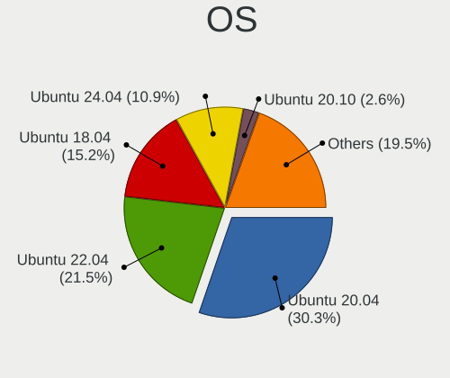

| Name           | Computers | Percent |
|----------------|-----------|---------|
| Ubuntu 20.04   | 26565     | 30.27%  |
| Ubuntu 22.04   | 18907     | 21.54%  |
| Ubuntu 18.04   | 13319     | 15.18%  |
| Ubuntu 24.04   | 9604      | 10.94%  |
| Ubuntu 20.10   | 2239      | 2.55%   |
| Ubuntu 21.10   | 2101      | 2.39%   |
| Ubuntu 19.10   | 2058      | 2.34%   |
| Ubuntu 19.04   | 1904      | 2.17%   |
| Ubuntu 21.04   | 1785      | 2.03%   |
| Ubuntu 23.04   | 1704      | 1.94%   |
| Ubuntu 22.10   | 1690      | 1.93%   |
| Ubuntu 23.10   | 1603      | 1.83%   |
| Ubuntu 24.10   | 950       | 1.08%   |
| Ubuntu 25.04   | 882       | 1%      |
| Ubuntu 18.10   | 856       | 0.98%   |
| Ubuntu 16.04   | 766       | 0.87%   |
| Ubuntu 25.10   | 376       | 0.43%   |
| Ubuntu         | 74        | 0.08%   |
| Ubuntu 17.10   | 56        | 0.06%   |
| Ubuntu Core 16 | 41        | 0.05%   |
| Ubuntu Core 22 | 37        | 0.04%   |
| Ubuntu Core 18 | 35        | 0.04%   |
| Ubuntu 1.3.2   | 26        | 0.03%   |
| Ubuntu 1.3.3   | 23        | 0.03%   |
| Ubuntu 1.3.1   | 23        | 0.03%   |
| Ubuntu 26.04   | 22        | 0.03%   |
| Ubuntu 14.04   | 19        | 0.02%   |
| Ubuntu 1.3.5   | 16        | 0.02%   |
| Ubuntu 1.3.4   | 13        | 0.01%   |
| Ubuntu 1.3.0   | 8         | 0.01%   |
| Ubuntu 1.3.7   | 7         | 0.01%   |
| Ubuntu 24.0    | 6         | 0.01%   |
| Ubuntu 17.04   | 6         | 0.01%   |
| Ubuntu 18.08   | 5         | 0.01%   |
| Ubuntu 1.1.10  | 5         | 0.01%   |
| Ubuntu Core 24 | 3         | 0.003%  |
| Ubuntu Core 20 | 3         | 0.003%  |
| Ubuntu 16.10   | 3         | 0.003%  |
| Ubuntu 12.04   | 3         | 0.003%  |
| Ubuntu 1.1.4   | 3         | 0.003%  |

OS Family
---------

OS without a version

| Name   | Computers | Percent |
|--------|-----------|---------|
| Ubuntu | 82728     | 100%    |

Kernel
------

Version of the Linux kernel

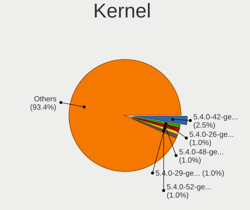

| Version           | Computers | Percent |
|-------------------|-----------|---------|
| 5.4.0-42-generic  | 2522      | 2.54%   |
| 5.4.0-26-generic  | 1026      | 1.03%   |
| 5.4.0-48-generic  | 1021      | 1.03%   |
| 5.4.0-29-generic  | 993       | 1%      |
| 5.4.0-52-generic  | 970       | 0.98%   |
| 5.15.0-56-generic | 909       | 0.91%   |
| 6.2.0-26-generic  | 908       | 0.91%   |
| 5.4.0-40-generic  | 849       | 0.85%   |
| 5.8.0-43-generic  | 844       | 0.85%   |
| 5.4.0-58-generic  | 832       | 0.84%   |
| 6.8.0-31-generic  | 817       | 0.82%   |
| 6.8.0-51-generic  | 778       | 0.78%   |
| 5.4.0-37-generic  | 777       | 0.78%   |
| 5.15.0-52-generic | 770       | 0.77%   |
| 6.8.0-45-generic  | 734       | 0.74%   |
| 5.15.0-58-generic | 721       | 0.73%   |
| 5.19.0-35-generic | 717       | 0.72%   |
| 6.5.0-14-generic  | 697       | 0.7%    |
| 5.3.0-40-generic  | 685       | 0.69%   |
| 5.11.0-27-generic | 685       | 0.69%   |
| 6.8.0-41-generic  | 674       | 0.68%   |
| 5.4.0-33-generic  | 671       | 0.67%   |
| 5.15.0-43-generic | 658       | 0.66%   |
| 5.8.0-50-generic  | 650       | 0.65%   |
| 5.19.0-38-generic | 639       | 0.64%   |
| 5.8.0-44-generic  | 617       | 0.62%   |
| 5.3.0-46-generic  | 615       | 0.62%   |
| 5.15.0-46-generic | 611       | 0.61%   |
| 6.2.0-39-generic  | 610       | 0.61%   |
| 5.15.0-48-generic | 605       | 0.61%   |
| 5.19.0-32-generic | 603       | 0.61%   |
| 5.4.0-54-generic  | 602       | 0.61%   |
| 5.11.0-37-generic | 592       | 0.6%    |
| 5.4.0-31-generic  | 573       | 0.58%   |
| 6.2.0-20-generic  | 571       | 0.57%   |
| 5.4.0-47-generic  | 564       | 0.57%   |
| 5.8.0-48-generic  | 558       | 0.56%   |
| 5.11.0-38-generic | 552       | 0.56%   |
| 5.19.0-46-generic | 544       | 0.55%   |
| 5.0.0-23-generic  | 538       | 0.54%   |

Kernel Family
-------------

Linux kernel without a distro release

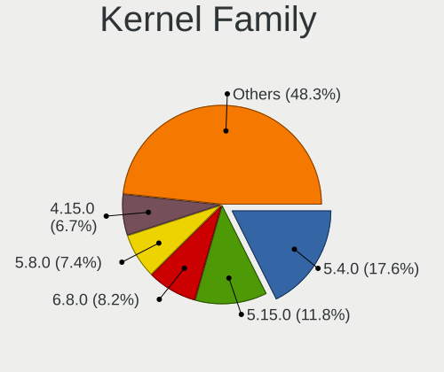

| Version | Computers | Percent |
|---------|-----------|---------|
| 5.4.0   | 16025     | 17.62%  |
| 5.15.0  | 10707     | 11.78%  |
| 6.8.0   | 7422      | 8.16%   |
| 5.8.0   | 6744      | 7.42%   |
| 4.15.0  | 6115      | 6.73%   |
| 5.11.0  | 5202      | 5.72%   |
| 5.19.0  | 4913      | 5.4%    |
| 6.2.0   | 4878      | 5.36%   |
| 6.5.0   | 4468      | 4.91%   |
| 5.3.0   | 4361      | 4.8%    |
| 5.13.0  | 4247      | 4.67%   |
| 5.0.0   | 3867      | 4.25%   |
| 6.11.0  | 2800      | 3.08%   |
| 4.18.0  | 2699      | 2.97%   |
| 6.14.0  | 2631      | 2.89%   |
| 6.17.0  | 383       | 0.42%   |
| 4.4.0   | 289       | 0.32%   |
| 5.14.0  | 219       | 0.24%   |
| 5.10.0  | 132       | 0.15%   |
| 5.17.0  | 107       | 0.12%   |
| 4.13.0  | 101       | 0.11%   |
| 6.1.0   | 95        | 0.1%    |
| 5.6.0   | 82        | 0.09%   |
| 6.0.0   | 43        | 0.05%   |
| 6.12.3  | 33        | 0.04%   |
| 5.9.0   | 33        | 0.04%   |
| 4.10.0  | 29        | 0.03%   |
| 5.7.1   | 27        | 0.03%   |
| 6.6.0   | 26        | 0.03%   |
| 6.9.3   | 24        | 0.03%   |
| 6.0.9   | 24        | 0.03%   |
| 5.18.0  | 23        | 0.03%   |
| 6.8.1   | 22        | 0.02%   |
| 4.9.140 | 22        | 0.02%   |
| 6.4.0   | 21        | 0.02%   |
| 5.12.0  | 21        | 0.02%   |
| 6.3.0   | 20        | 0.02%   |
| 5.7.0   | 19        | 0.02%   |
| 5.16.0  | 19        | 0.02%   |
| 5.2.0   | 18        | 0.02%   |

Kernel Major Ver.
-----------------

Linux kernel major version

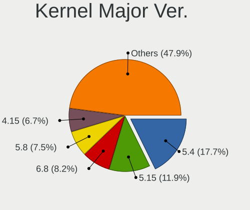

| Version | Computers | Percent |
|---------|-----------|---------|
| 5.4     | 16080     | 17.7%   |
| 5.15    | 10815     | 11.91%  |
| 6.8     | 7465      | 8.22%   |
| 5.8     | 6810      | 7.5%    |
| 4.15    | 6123      | 6.74%   |
| 5.11    | 5243      | 5.77%   |
| 6.2     | 4967      | 5.47%   |
| 5.19    | 4958      | 5.46%   |
| 6.5     | 4511      | 4.97%   |
| 5.3     | 4377      | 4.82%   |
| 5.13    | 4288      | 4.72%   |
| 5.0     | 3906      | 4.3%    |
| 6.11    | 2807      | 3.09%   |
| 4.18    | 2708      | 2.98%   |
| 6.14    | 2648      | 2.92%   |
| 6.17    | 401       | 0.44%   |
| 4.4     | 298       | 0.33%   |
| 5.10    | 284       | 0.31%   |
| 5.14    | 256       | 0.28%   |
| 6.1     | 190       | 0.21%   |
| 5.17    | 164       | 0.18%   |
| 5.6     | 121       | 0.13%   |
| 6.0     | 108       | 0.12%   |
| 4.13    | 104       | 0.11%   |
| 6.6     | 85        | 0.09%   |
| 5.9     | 82        | 0.09%   |
| 5.7     | 81        | 0.09%   |
| 6.12    | 73        | 0.08%   |
| 6.4     | 70        | 0.08%   |
| 6.3     | 64        | 0.07%   |
| 5.18    | 59        | 0.06%   |
| 4.9     | 54        | 0.06%   |
| 4.19    | 53        | 0.06%   |
| 6.9     | 51        | 0.06%   |
| 5.16    | 51        | 0.06%   |
| 5.12    | 44        | 0.05%   |
| 5.1     | 44        | 0.05%   |
| 6.10    | 42        | 0.05%   |
| 5.2     | 41        | 0.05%   |
| 6.7     | 39        | 0.04%   |

Arch
----

OS architecture (x86_64, i586, etc.)

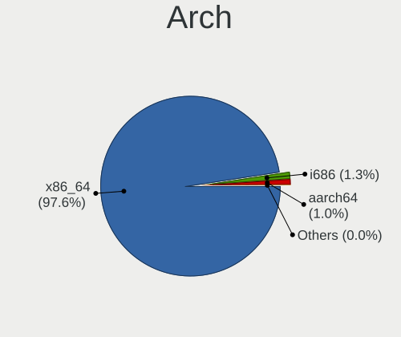

| Name    | Computers | Percent |
|---------|-----------|---------|
| x86_64  | 80728     | 97.57%  |
| i686    | 1078      | 1.3%    |
| aarch64 | 851       | 1.03%   |
| armv7l  | 57        | 0.07%   |
| riscv64 | 19        | 0.02%   |
| Unknown | 2         | 0.002%  |
| s390x   | 1         | 0.001%  |
| i586    | 1         | 0.001%  |

DE
--

Desktop Environment

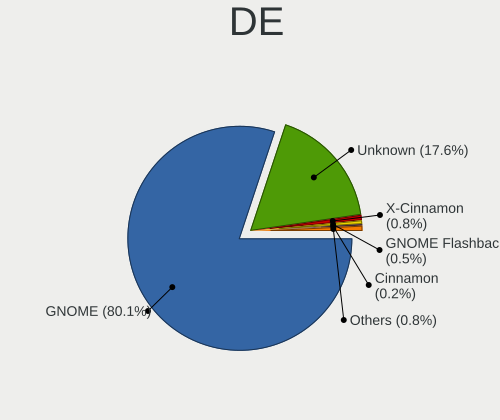

| Name                     | Computers | Percent |
|--------------------------|-----------|---------|
| GNOME                    | 67351     | 80.09%  |
| Unknown                  | 14801     | 17.6%   |
| X-Cinnamon               | 659       | 0.78%   |
| GNOME Flashback          | 460       | 0.55%   |
| Cinnamon                 | 187       | 0.22%   |
| GNUstep                  | 158       | 0.19%   |
| i3                       | 117       | 0.14%   |
| enlightenment            | 96        | 0.11%   |
| GNOME Classic            | 88        | 0.1%    |
| sway                     | 23        | 0.03%   |
| awesome                  | 20        | 0.02%   |
| Openbox                  | 18        | 0.02%   |
| Hyprland                 | 13        | 0.02%   |
| Pantheon                 | 9         | 0.01%   |
| ubuntu                   | 8         | 0.01%   |
| xubuntu                  | 7         | 0.01%   |
| Lubuntu                  | 7         | 0.01%   |
| Deepin                   | 7         | 0.01%   |
| xmonad                   | 6         | 0.01%   |
| Yaru:ubuntu:GNOME        | 5         | 0.01%   |
| Trinity                  | 5         | 0.01%   |
| DWM                      | 5         | 0.01%   |
| DDE                      | 5         | 0.01%   |
| qtile                    | 3         | 0.004%  |
| ICEWM                    | 3         | 0.004%  |
| i3-with-shmlog           | 3         | 0.004%  |
| fluxbox                  | 3         | 0.004%  |
| bspwm                    | 3         | 0.004%  |
| ubuntustudio             | 2         | 0.002%  |
| mwm                      | 2         | 0.002%  |
| kubuntu-live-environment | 2         | 0.002%  |
| jwm                      | 2         | 0.002%  |
| fvwm                     | 2         | 0.002%  |
| Cutefish                 | 2         | 0.002%  |
| Core                     | 2         | 0.002%  |
| Yoyo                     | 1         | 0.001%  |
| xsession                 | 1         | 0.001%  |
| wmaker-common            | 1         | 0.001%  |
| ubuntu=GNOME             | 1         | 0.001%  |
| river                    | 1         | 0.001%  |

Display Server
--------------

X11 or Wayland

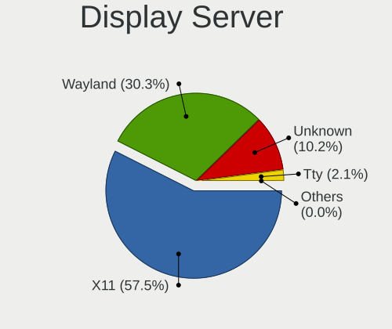

| Name        | Computers | Percent |
|-------------|-----------|---------|
| X11         | 49328     | 57.45%  |
| Wayland     | 25991     | 30.27%  |
| Unknown     | 8755      | 10.2%   |
| Tty         | 1773      | 2.06%   |
| Web         | 13        | 0.02%   |
| Unspecified | 1         | 0.001%  |

Display Manager
---------------

SDDM, LightDM, etc.

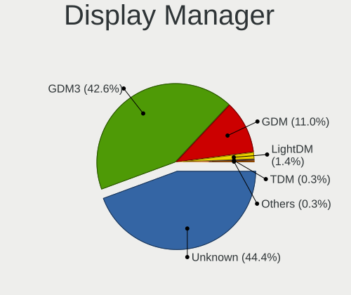

| Name            | Computers | Percent |
|-----------------|-----------|---------|
| Unknown         | 37814     | 44.39%  |
| GDM3            | 36282     | 42.59%  |
| GDM             | 9336      | 10.96%  |
| LightDM         | 1210      | 1.42%   |
| TDM             | 259       | 0.3%    |
| SDDM            | 232       | 0.27%   |
| SLiM            | 31        | 0.04%   |
| XDM             | 7         | 0.01%   |
| LXDM            | 7         | 0.01%   |
| NODM            | 2         | 0.002%  |
| Ly              | 2         | 0.002%  |
| GREETD          | 2         | 0.002%  |
| KODI-STANDALONE | 1         | 0.001%  |

OS Lang
-------

Language

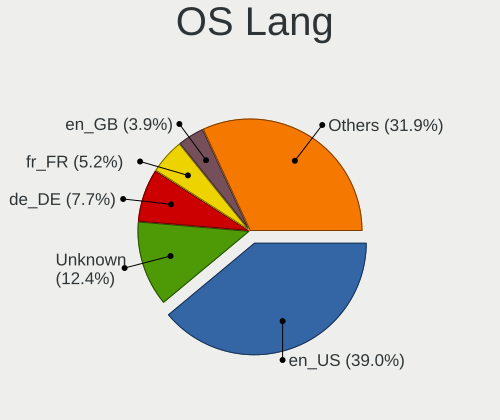

| Lang    | Computers | Percent |
|---------|-----------|---------|
| en_US   | 32757     | 38.95%  |
| Unknown | 10423     | 12.39%  |
| de_DE   | 6479      | 7.7%    |
| fr_FR   | 4340      | 5.16%   |
| en_GB   | 3268      | 3.89%   |
| pt_BR   | 3121      | 3.71%   |
| C       | 2301      | 2.74%   |
| it_IT   | 2281      | 2.71%   |
| es_ES   | 2147      | 2.55%   |
| ru_RU   | 2076      | 2.47%   |
| en_IN   | 1855      | 2.21%   |
| en_CA   | 1553      | 1.85%   |
| pl_PL   | 1066      | 1.27%   |
| en_AU   | 992       | 1.18%   |
| nl_NL   | 735       | 0.87%   |
| zh_CN   | 523       | 0.62%   |
| hu_HU   | 500       | 0.59%   |
| cs_CZ   | 468       | 0.56%   |
| es_MX   | 423       | 0.5%    |
| es_AR   | 378       | 0.45%   |
| ja_JP   | 358       | 0.43%   |
| en_ZA   | 350       | 0.42%   |
| tr_TR   | 325       | 0.39%   |
| pt_PT   | 320       | 0.38%   |
| sv_SE   | 302       | 0.36%   |
| de_AT   | 300       | 0.36%   |
| fi_FI   | 240       | 0.29%   |
| de_CH   | 208       | 0.25%   |
| es_CO   | 192       | 0.23%   |
| en_NZ   | 174       | 0.21%   |
| fr_CA   | 173       | 0.21%   |
| en_IL   | 173       | 0.21%   |
| el_GR   | 167       | 0.2%    |
| es_CL   | 165       | 0.2%    |
| da_DK   | 156       | 0.19%   |
| ko_KR   | 146       | 0.17%   |
| ru_UA   | 145       | 0.17%   |
| fr_BE   | 139       | 0.17%   |
| nb_NO   | 136       | 0.16%   |
| ro_RO   | 135       | 0.16%   |

Boot Mode
---------

EFI or BIOS

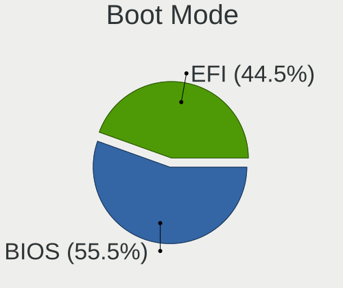

| Mode | Computers | Percent |
|------|-----------|---------|
| BIOS | 46883     | 55.48%  |
| EFI  | 37626     | 44.52%  |

Filesystem
----------

Type of filesystem

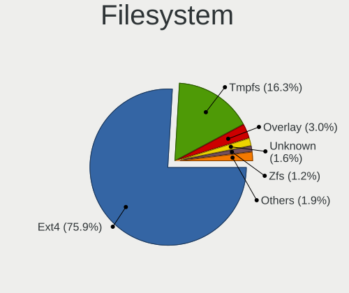

| Type          | Computers | Percent |
|---------------|-----------|---------|
| Ext4          | 64210     | 75.93%  |
| Tmpfs         | 13761     | 16.27%  |
| Overlay       | 2558      | 3.02%   |
| Unknown       | 1373      | 1.62%   |
| Zfs           | 1036      | 1.23%   |
| Btrfs         | 854       | 1.01%   |
| Ext2          | 299       | 0.35%   |
| Xfs           | 249       | 0.29%   |
| Ext3          | 175       | 0.21%   |
| Aufs          | 21        | 0.02%   |
| Reiserfs      | 8         | 0.01%   |
| Jfs           | 8         | 0.01%   |
| XXX4          | 4         | 0.005%  |
| F2fs          | 3         | 0.004%  |
| XXXXXXX       | 1         | 0.001%  |
| XXXX          | 1         | 0.001%  |
| SquXshfs      | 1         | 0.001%  |
| Nfs           | 1         | 0.001%  |
| Lvm           | 1         | 0.001%  |
| Fuse.snapfuse | 1         | 0.001%  |

Part. scheme
------------

Scheme of partitioning

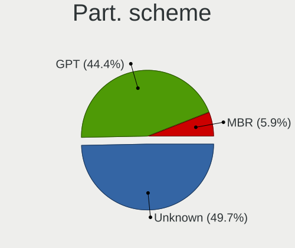

| Type    | Computers | Percent |
|---------|-----------|---------|
| Unknown | 42058     | 49.69%  |
| GPT     | 37542     | 44.36%  |
| MBR     | 5035      | 5.95%   |

Dual Boot with Linux/BSD
------------------------

Hosting more than one Linux/BSD

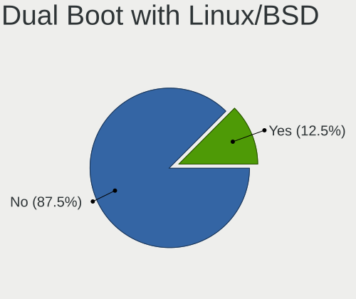

| Dual boot | Computers | Percent |
|-----------|-----------|---------|
| No        | 73618     | 87.47%  |
| Yes       | 10547     | 12.53%  |

Dual Boot (Win)
---------------

Hosting Linux and Windows

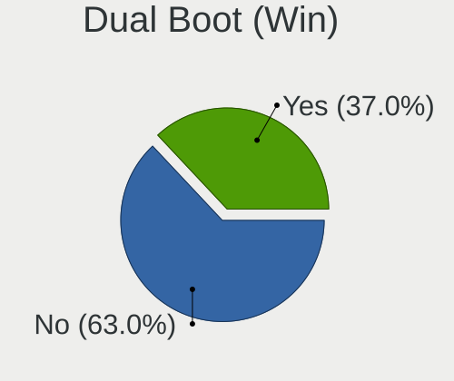

| Dual boot | Computers | Percent |
|-----------|-----------|---------|
| No        | 52954     | 63.01%  |
| Yes       | 31089     | 36.99%  |

Board
-----

Vendor
------

Motherboard manufacturer

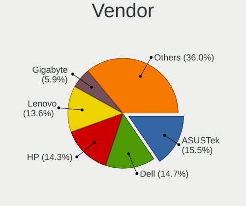

| Name                    | Computers | Percent |
|-------------------------|-----------|---------|
| ASUSTek Computer        | 12806     | 15.48%  |
| Dell                    | 12120     | 14.65%  |
| Hewlett-Packard         | 11867     | 14.34%  |
| Lenovo                  | 11268     | 13.62%  |
| Gigabyte Technology     | 4851      | 5.86%   |
| MSI                     | 4328      | 5.23%   |
| Acer                    | 4326      | 5.23%   |
| ASRock                  | 2445      | 2.96%   |
| Apple                   | 2111      | 2.55%   |
| Intel                   | 1589      | 1.92%   |
| Toshiba                 | 1258      | 1.52%   |
| Unknown                 | 943       | 1.14%   |
| Samsung Electronics     | 921       | 1.11%   |
| Fujitsu                 | 692       | 0.84%   |
| Sony                    | 655       | 0.79%   |
| HUAWEI                  | 652       | 0.79%   |
| Raspberry Pi Foundation | 612       | 0.74%   |
| Supermicro              | 523       | 0.63%   |
| Medion                  | 449       | 0.54%   |
| Microsoft               | 363       | 0.44%   |
| Pegatron                | 329       | 0.4%    |
| Foxconn                 | 298       | 0.36%   |
| Packard Bell            | 279       | 0.34%   |
| Google                  | 278       | 0.34%   |
| Positivo                | 276       | 0.33%   |
| Alienware               | 263       | 0.32%   |
| Biostar                 | 258       | 0.31%   |
| Notebook                | 252       | 0.3%    |
| ECS                     | 206       | 0.25%   |
| Timi                    | 183       | 0.22%   |
| AZW                     | 179       | 0.22%   |
| Fujitsu Siemens         | 167       | 0.2%    |
| AMI                     | 156       | 0.19%   |
| Gateway                 | 151       | 0.18%   |
| LG Electronics          | 143       | 0.17%   |
| TUXEDO                  | 115       | 0.14%   |
| Chuwi                   | 111       | 0.13%   |
| System76                | 101       | 0.12%   |
| eMachines               | 98        | 0.12%   |
| Panasonic               | 97        | 0.12%   |

Model
-----

Motherboard model

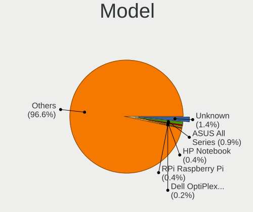

| Name                               | Computers | Percent |
|------------------------------------|-----------|---------|
| Unknown                            | 1184      | 1.43%   |
| ASUS All Series                    | 749       | 0.91%   |
| HP Notebook                        | 339       | 0.41%   |
| RPi Raspberry Pi                   | 307       | 0.37%   |
| Dell OptiPlex 7010                 | 199       | 0.24%   |
| HP Pavilion dv6                    | 190       | 0.23%   |
| HP Pavilion g6                     | 166       | 0.2%    |
| HP Pavilion Notebook               | 140       | 0.17%   |
| HP Pavilion dv7                    | 137       | 0.17%   |
| Dell OptiPlex 9020                 | 132       | 0.16%   |
| HP Pavilion 15                     | 122       | 0.15%   |
| ASUS PRIME A320M-K                 | 121       | 0.15%   |
| MSI MS-7C37                        | 117       | 0.14%   |
| Supermicro Super Server            | 113       | 0.14%   |
| Dell OptiPlex 790                  | 113       | 0.14%   |
| Dell Latitude E6420                | 112       | 0.14%   |
| Dell XPS 15 7590                   | 111       | 0.13%   |
| Apple MacBookPro9,2                | 108       | 0.13%   |
| Gigabyte B450M DS3H                | 106       | 0.13%   |
| HP EliteBook 840 G3                | 105       | 0.13%   |
| Dell XPS 15 9570                   | 103       | 0.12%   |
| Dell Inspiron 15-3567              | 103       | 0.12%   |
| MSI MS-7C02                        | 101       | 0.12%   |
| Dell Latitude E6410                | 101       | 0.12%   |
| HP 15                              | 99        | 0.12%   |
| Dell Latitude E6430                | 99        | 0.12%   |
| Dell OptiPlex 3020                 | 94        | 0.11%   |
| ASUS TUF Gaming X570-PLUS          | 91        | 0.11%   |
| Dell OptiPlex 780                  | 89        | 0.11%   |
| MSI MS-7721                        | 88        | 0.11%   |
| RPi Raspberry Pi 4 Model B Rev 1.4 | 87        | 0.11%   |
| HP Compaq Elite 8300 SFF           | 86        | 0.1%    |
| Dell XPS 13 9370                   | 85        | 0.1%    |
| Dell Inspiron 5570                 | 84        | 0.1%    |
| Dell XPS 15 9500                   | 83        | 0.1%    |
| Dell OptiPlex 990                  | 82        | 0.1%    |
| ASUS M5A78L-M/USB3                 | 82        | 0.1%    |
| HP Laptop 15-db0xxx                | 80        | 0.1%    |
| MSI MS-7817                        | 79        | 0.1%    |
| Dell Latitude 7490                 | 79        | 0.1%    |

Model Family
------------

Motherboard model prefix

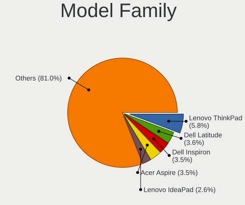

| Name               | Computers | Percent |
|--------------------|-----------|---------|
| Lenovo ThinkPad    | 4781      | 5.78%   |
| Dell Latitude      | 2972      | 3.59%   |
| Dell Inspiron      | 2912      | 3.52%   |
| Acer Aspire        | 2891      | 3.49%   |
| Lenovo IdeaPad     | 2141      | 2.59%   |
| HP Pavilion        | 2015      | 2.44%   |
| Dell OptiPlex      | 1737      | 2.1%    |
| HP EliteBook       | 1642      | 1.98%   |
| Dell XPS           | 1380      | 1.67%   |
| ASUS PRIME         | 1379      | 1.67%   |
| Dell Precision     | 1303      | 1.58%   |
| ASUS ROG           | 1229      | 1.49%   |
| HP ProBook         | 1199      | 1.45%   |
| Unknown            | 1184      | 1.43%   |
| HP Laptop          | 1131      | 1.37%   |
| ASUS VivoBook      | 1093      | 1.32%   |
| Toshiba Satellite  | 1054      | 1.27%   |
| HP Compaq          | 1022      | 1.24%   |
| Lenovo ThinkCentre | 799       | 0.97%   |
| ASUS All           | 749       | 0.91%   |
| Dell Vostro        | 736       | 0.89%   |
| ASUS TUF           | 685       | 0.83%   |
| RPi Raspberry      | 611       | 0.74%   |
| HP ENVY            | 581       | 0.7%    |
| Lenovo Yoga        | 523       | 0.63%   |
| Lenovo Legion      | 392       | 0.47%   |
| Acer Swift         | 371       | 0.45%   |
| Lenovo ThinkBook   | 364       | 0.44%   |
| Microsoft Surface  | 363       | 0.44%   |
| ASUS Zenbook       | 361       | 0.44%   |
| HP ZBook           | 347       | 0.42%   |
| HP Notebook        | 342       | 0.41%   |
| ASUS ASUS          | 337       | 0.41%   |
| Dell PowerEdge     | 329       | 0.4%    |
| HP EliteDesk       | 326       | 0.39%   |
| Acer Nitro         | 283       | 0.34%   |
| Fujitsu LIFEBOOK   | 279       | 0.34%   |
| HP ProDesk         | 263       | 0.32%   |
| HP ProLiant        | 246       | 0.3%    |
| ASUS M5A78L-M      | 238       | 0.29%   |

MFG Year
--------

Motherboard manufacture year

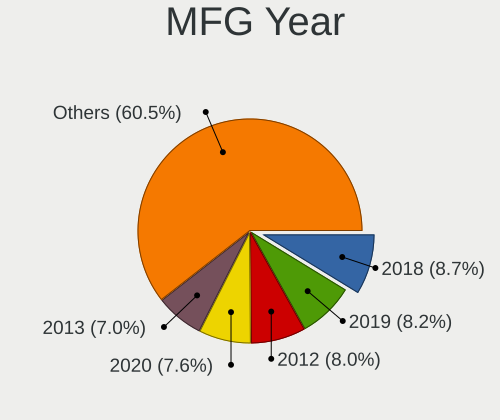

| Year    | Computers | Percent |
|---------|-----------|---------|
| 2018    | 7237      | 8.75%   |
| 2019    | 6761      | 8.17%   |
| 2012    | 6581      | 7.95%   |
| 2020    | 6258      | 7.56%   |
| 2013    | 5800      | 7.01%   |
| 2011    | 5700      | 6.89%   |
| 2017    | 5425      | 6.56%   |
| 2021    | 4920      | 5.95%   |
| 2014    | 4765      | 5.76%   |
| 2015    | 4227      | 5.11%   |
| 2010    | 4068      | 4.92%   |
| 2016    | 4011      | 4.85%   |
| 2022    | 3300      | 3.99%   |
| 2009    | 3202      | 3.87%   |
| 2008    | 2989      | 3.61%   |
| 2023    | 2409      | 2.91%   |
| 2007    | 1702      | 2.06%   |
| 2024    | 1225      | 1.48%   |
| Unknown | 754       | 0.91%   |
| 2006    | 749       | 0.91%   |
| 2025    | 341       | 0.41%   |
| 2005    | 226       | 0.27%   |
| 2004    | 56        | 0.07%   |
| 2003    | 9         | 0.01%   |
| 2002    | 7         | 0.01%   |
| 2001    | 4         | 0.005%  |
| 2000    | 1         | 0.001%  |
| 1999    | 1         | 0.001%  |

Form Factor
-----------

Physical design of the computer

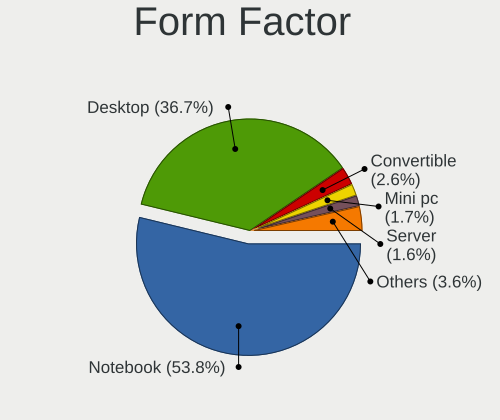

| Name           | Computers | Percent |
|----------------|-----------|---------|
| Notebook       | 44501     | 53.79%  |
| Desktop        | 30394     | 36.74%  |
| Convertible    | 2151      | 2.6%    |
| Mini pc        | 1437      | 1.74%   |
| Server         | 1293      | 1.56%   |
| All in one     | 1231      | 1.49%   |
| System on chip | 878       | 1.06%   |
| Tablet         | 819       | 0.99%   |
| Other          | 18        | 0.02%   |
| Stick pc       | 4         | 0.005%  |
| Firewall       | 2         | 0.002%  |

Secure Boot
-----------

Enabled or disabled

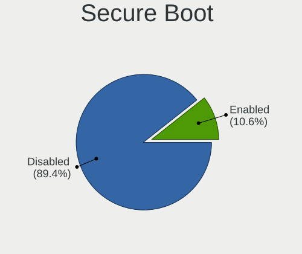

| State    | Computers | Percent |
|----------|-----------|---------|
| Disabled | 74575     | 89.36%  |
| Enabled  | 8876      | 10.64%  |

Coreboot
--------

Have coreboot on board

| Used | Computers | Percent |
|------|-----------|---------|
| No   | 82356     | 99.55%  |
| Yes  | 372       | 0.45%   |

RAM Size
--------

Total RAM memory

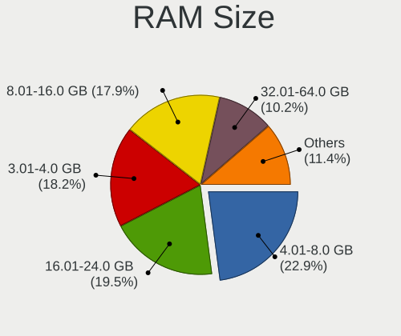

| Size in GB      | Computers | Percent |
|-----------------|-----------|---------|
| 4.01-8.0        | 19298     | 22.93%  |
| 16.01-24.0      | 16400     | 19.49%  |
| 3.01-4.0        | 15279     | 18.15%  |
| 8.01-16.0       | 15051     | 17.88%  |
| 32.01-64.0      | 8555      | 10.16%  |
| 64.01-256.0     | 3267      | 3.88%   |
| 1.01-2.0        | 2676      | 3.18%   |
| 24.01-32.0      | 1967      | 2.34%   |
| 2.01-3.0        | 998       | 1.19%   |
| More than 256.0 | 351       | 0.42%   |
| 0.51-1.0        | 282       | 0.34%   |
| 0.01-0.5        | 35        | 0.04%   |
| Unknown         | 5         | 0.01%   |

RAM Used
--------

Used RAM memory

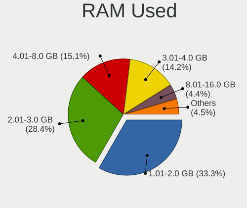

| Used GB         | Computers | Percent |
|-----------------|-----------|---------|
| 1.01-2.0        | 30349     | 33.34%  |
| 2.01-3.0        | 25878     | 28.43%  |
| 4.01-8.0        | 13779     | 15.14%  |
| 3.01-4.0        | 12919     | 14.19%  |
| 8.01-16.0       | 3961      | 4.35%   |
| 0.51-1.0        | 2461      | 2.7%    |
| 16.01-24.0      | 628       | 0.69%   |
| 0.01-0.5        | 482       | 0.53%   |
| 24.01-32.0      | 250       | 0.27%   |
| 32.01-64.0      | 182       | 0.2%    |
| 64.01-256.0     | 98        | 0.11%   |
| Unknown         | 21        | 0.02%   |
| More than 256.0 | 6         | 0.01%   |
| 0               | 4         | 0.004%  |

Total Drives
------------

Number of drives on board

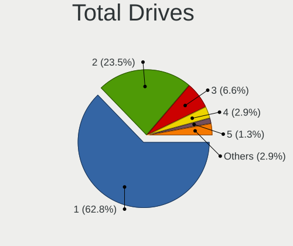

| Drives  | Computers | Percent |
|---------|-----------|---------|
| 1       | 53477     | 62.78%  |
| 2       | 20000     | 23.48%  |
| 3       | 5617      | 6.59%   |
| 4       | 2483      | 2.91%   |
| 5       | 1144      | 1.34%   |
| 0       | 1080      | 1.27%   |
| 6       | 554       | 0.65%   |
| 7       | 278       | 0.33%   |
| 8       | 151       | 0.18%   |
| 9       | 100       | 0.12%   |
| Unknown | 59        | 0.07%   |
| 10      | 52        | 0.06%   |
| 11      | 50        | 0.06%   |
| 14      | 23        | 0.03%   |
| 13      | 23        | 0.03%   |
| 12      | 19        | 0.02%   |
| 17      | 10        | 0.01%   |
| 18      | 9         | 0.01%   |
| 16      | 9         | 0.01%   |
| 25      | 7         | 0.01%   |
| 15      | 6         | 0.01%   |
| 20      | 5         | 0.01%   |
| 21      | 4         | 0.005%  |
| 36      | 3         | 0.004%  |
| 32      | 2         | 0.002%  |
| 26      | 2         | 0.002%  |
| 24      | 2         | 0.002%  |
| 23      | 2         | 0.002%  |
| 22      | 2         | 0.002%  |
| 101     | 1         | 0.001%  |
| 91      | 1         | 0.001%  |
| 87      | 1         | 0.001%  |
| 71      | 1         | 0.001%  |
| 70      | 1         | 0.001%  |
| 45      | 1         | 0.001%  |
| 42      | 1         | 0.001%  |
| 40      | 1         | 0.001%  |
| 38      | 1         | 0.001%  |
| 35      | 1         | 0.001%  |
| 34      | 1         | 0.001%  |

Has CD-ROM
----------

Has CD-ROM on board

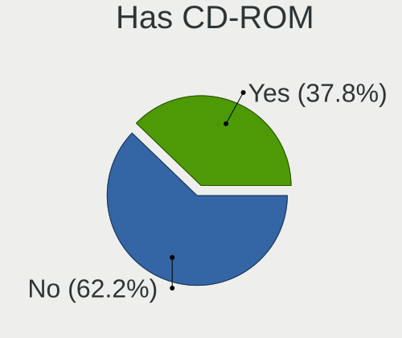

| Presented | Computers | Percent |
|-----------|-----------|---------|
| No        | 51832     | 62.18%  |
| Yes       | 31522     | 37.82%  |

Has Ethernet
------------

Has Ethernet on board

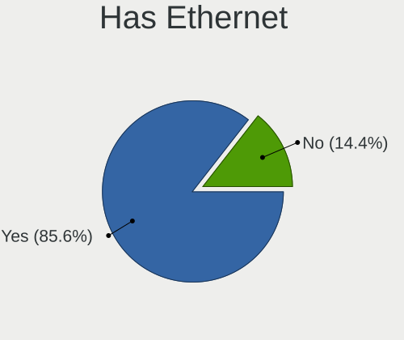

| Presented | Computers | Percent |
|-----------|-----------|---------|
| Yes       | 70988     | 85.56%  |
| No        | 11979     | 14.44%  |

Has WiFi
--------

Has WiFi module

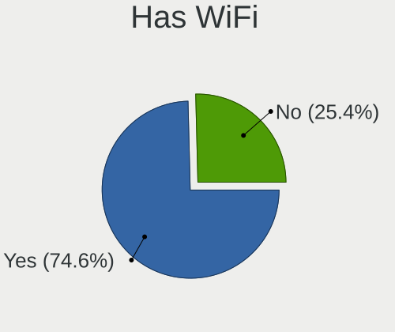

| Presented | Computers | Percent |
|-----------|-----------|---------|
| Yes       | 62117     | 74.6%   |
| No        | 21146     | 25.4%   |

Has Bluetooth
-------------

Has Bluetooth module

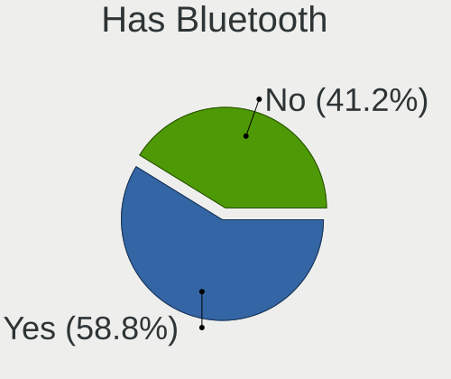

| Presented | Computers | Percent |
|-----------|-----------|---------|
| Yes       | 49234     | 58.78%  |
| No        | 34519     | 41.22%  |

Location
--------

Country
-------

Geographic location (country)

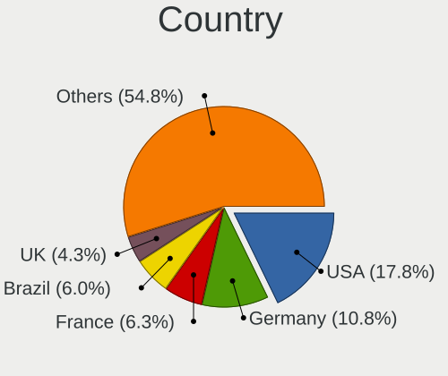

| Country      | Computers | Percent |
|--------------|-----------|---------|
| USA          | 14797     | 17.79%  |
| Germany      | 8953      | 10.76%  |
| France       | 5209      | 6.26%   |
| Brazil       | 5017      | 6.03%   |
| UK           | 3578      | 4.3%    |
| Italy        | 3531      | 4.25%   |
| Russia       | 3424      | 4.12%   |
| India        | 2663      | 3.2%    |
| Canada       | 2639      | 3.17%   |
| Spain        | 2558      | 3.08%   |
| Netherlands  | 1832      | 2.2%    |
| Poland       | 1823      | 2.19%   |
| Australia    | 1390      | 1.67%   |
| Switzerland  | 1145      | 1.38%   |
| Mexico       | 1023      | 1.23%   |
| Sweden       | 962       | 1.16%   |
| Turkey       | 884       | 1.06%   |
| Czechia      | 884       | 1.06%   |
| Belgium      | 880       | 1.06%   |
| China        | 854       | 1.03%   |
| Austria      | 839       | 1.01%   |
| Argentina    | 839       | 1.01%   |
| Hungary      | 838       | 1.01%   |
| Ukraine      | 734       | 0.88%   |
| Portugal     | 692       | 0.83%   |
| Romania      | 656       | 0.79%   |
| Finland      | 634       | 0.76%   |
| Japan        | 595       | 0.72%   |
| Greece       | 565       | 0.68%   |
| Indonesia    | 548       | 0.66%   |
| South Africa | 539       | 0.65%   |
| Norway       | 499       | 0.6%    |
| Denmark      | 471       | 0.57%   |
| Colombia     | 467       | 0.56%   |
| Bulgaria     | 420       | 0.5%    |
| Chile        | 411       | 0.49%   |
| Iran         | 410       | 0.49%   |
| Israel       | 377       | 0.45%   |
| Taiwan       | 338       | 0.41%   |
| New Zealand  | 323       | 0.39%   |

City
----

Geographic location (city)

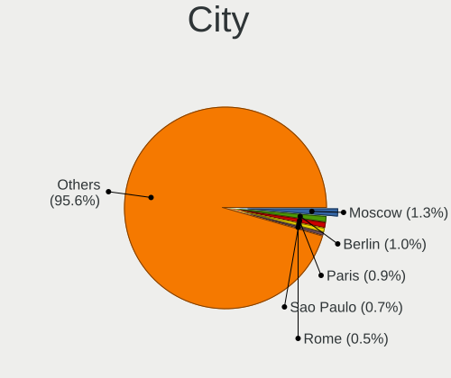

| City              | Computers | Percent |
|-------------------|-----------|---------|
| Moscow            | 1142      | 1.29%   |
| Berlin            | 880       | 0.99%   |
| Paris             | 791       | 0.89%   |
| Sao Paulo         | 640       | 0.72%   |
| Rome              | 470       | 0.53%   |
| Vienna            | 467       | 0.53%   |
| Milan             | 467       | 0.53%   |
| Warsaw            | 451       | 0.51%   |
| St Petersburg     | 451       | 0.51%   |
| Madrid            | 440       | 0.5%    |
| Munich            | 435       | 0.49%   |
| Sydney            | 392       | 0.44%   |
| Budapest          | 385       | 0.44%   |
| Hamburg           | 358       | 0.4%    |
| Istanbul          | 345       | 0.39%   |
| Bengaluru         | 344       | 0.39%   |
| Prague            | 342       | 0.39%   |
| Zurich            | 337       | 0.38%   |
| Amsterdam         | 326       | 0.37%   |
| Barcelona         | 325       | 0.37%   |
| Melbourne         | 317       | 0.36%   |
| Athens            | 317       | 0.36%   |
| Rio de Janeiro    | 304       | 0.34%   |
| Helsinki          | 296       | 0.33%   |
| Toronto           | 291       | 0.33%   |
| Montreal          | 275       | 0.31%   |
| Frankfurt am Main | 269       | 0.3%    |
| Kyiv              | 255       | 0.29%   |
| Los Angeles       | 247       | 0.28%   |
| Tehran            | 241       | 0.27%   |
| Sofia             | 231       | 0.26%   |
| New York          | 229       | 0.26%   |
| Bucharest         | 229       | 0.26%   |
| Singapore         | 218       | 0.25%   |
| Chicago           | 216       | 0.24%   |
| Buenos Aires      | 214       | 0.24%   |
| London            | 212       | 0.24%   |
| Chennai           | 209       | 0.24%   |
| Mexico City       | 204       | 0.23%   |
| Stuttgart         | 201       | 0.23%   |

Drives
------

Drive Vendor
------------

Hard drive vendors

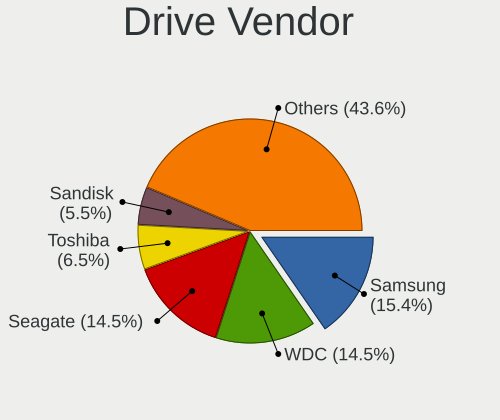

| Vendor                      | Computers | Drives | Percent |
|-----------------------------|-----------|--------|---------|
| Samsung Electronics         | 17689     | 25970  | 15.4%   |
| WDC                         | 16707     | 25701  | 14.55%  |
| Seagate                     | 16649     | 26344  | 14.49%  |
| Toshiba                     | 7409      | 9986   | 6.45%   |
| Sandisk                     | 6310      | 8282   | 5.49%   |
| Kingston                    | 5939      | 7691   | 5.17%   |
| Unknown                     | 4636      | 6311   | 4.04%   |
| Crucial                     | 3668      | 5091   | 3.19%   |
| Hitachi                     | 3534      | 4900   | 3.08%   |
| SK hynix                    | 3230      | 3983   | 2.81%   |
| Intel                       | 3043      | 4550   | 2.65%   |
| Micron Technology           | 2368      | 2931   | 2.06%   |
| HGST                        | 2123      | 3039   | 1.85%   |
| A-DATA Technology           | 1405      | 1765   | 1.22%   |
| KIOXIA                      | 1120      | 1385   | 0.98%   |
| Apple                       | 996       | 1282   | 0.87%   |
| China                       | 938       | 1155   | 0.82%   |
| Phison                      | 716       | 974    | 0.62%   |
| PNY                         | 607       | 770    | 0.53%   |
| Silicon Motion              | 594       | 779    | 0.52%   |
| Micron/Crucial Technology   | 556       | 732    | 0.48%   |
| Intenso                     | 547       | 801    | 0.48%   |
| SPCC                        | 537       | 731    | 0.47%   |
| Fujitsu                     | 517       | 1064   | 0.45%   |
| Phison Electronics          | 485       | 654    | 0.42%   |
| Kingston Technology Company | 485       | 605    | 0.42%   |
| LITEON                      | 474       | 583    | 0.41%   |
| Maxtor                      | 453       | 612    | 0.39%   |
| Unknown                     | 450       | 529    | 0.39%   |
| Transcend                   | 429       | 519    | 0.37%   |
| OCZ                         | 417       | 533    | 0.36%   |
| Hewlett-Packard             | 404       | 914    | 0.35%   |
| Patriot                     | 354       | 432    | 0.31%   |
| JMicron Technology          | 320       | 372    | 0.28%   |
| Corsair                     | 314       | 416    | 0.27%   |
| MAXIO Technology (Hangzhou) | 266       | 328    | 0.23%   |
| GOODRAM                     | 266       | 362    | 0.23%   |
| Team                        | 263       | 353    | 0.23%   |
| Lexar                       | 255       | 301    | 0.22%   |
| ADATA Technology            | 238       | 290    | 0.21%   |

Drive Model
-----------

Hard drive models

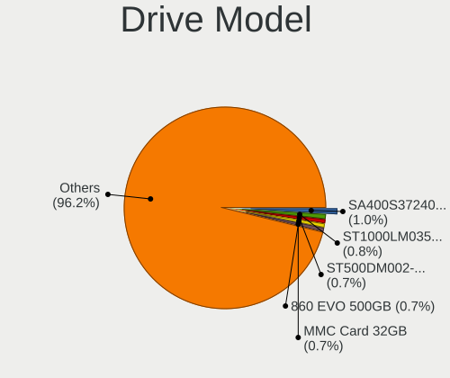

| Model                                              | Computers | Percent |
|----------------------------------------------------|-----------|---------|
| Kingston SA400S37240G 240GB SSD                    | 1222      | 0.97%   |
| Seagate ST1000LM035-1RK172 1TB                     | 1024      | 0.82%   |
| Seagate ST500DM002-1BD142 500GB                    | 864       | 0.69%   |
| Samsung SSD 860 EVO 500GB                          | 850       | 0.68%   |
| Unknown MMC Card  32GB                             | 836       | 0.67%   |
| Samsung NVMe SSD Controller SM981/PM981/PM983 1TB  | 830       | 0.66%   |
| Toshiba MQ01ABD100 1TB                             | 823       | 0.66%   |
| Seagate ST1000LM024 HN-M101MBB 1TB                 | 788       | 0.63%   |
| Samsung SSD 850 EVO 250GB                          | 773       | 0.62%   |
| Unknown MMC Card  64GB                             | 725       | 0.58%   |
| Kingston SA400S37480G 480GB SSD                    | 696       | 0.55%   |
| Kingston SA400S37120G 120GB SSD                    | 689       | 0.55%   |
| Seagate ST1000DM010-2EP102 1TB                     | 636       | 0.51%   |
| Samsung SSD 850 EVO 500GB                          | 590       | 0.47%   |
| Toshiba MQ01ABF050 500GB                           | 544       | 0.43%   |
| Toshiba MQ04ABF100 1TB                             | 523       | 0.42%   |
| Toshiba DT01ACA100 1TB                             | 512       | 0.41%   |
| Samsung NVMe SSD Drive 512GB                       | 508       | 0.4%    |
| Crucial CT500MX500SSD1 500GB                       | 498       | 0.4%    |
| SanDisk NVMe SSD Drive 512GB                       | 489       | 0.39%   |
| Seagate ST2000DM008-2FR102 2TB                     | 478       | 0.38%   |
| Seagate ST500LT012-1DG142 500GB                    | 477       | 0.38%   |
| HGST HTS721010A9E630 1TB                           | 473       | 0.38%   |
| Kingston SV300S37A120G 120GB SSD                   | 468       | 0.37%   |
| SanDisk NVMe SSD Drive 1TB                         | 458       | 0.36%   |
| Unknown                                            | 450       | 0.36%   |
| Samsung NVMe SSD Controller PM9A1/PM9A3/980PRO 1TB | 447       | 0.36%   |
| Samsung SSD 860 EVO 1TB                            | 442       | 0.35%   |
| WDC WD10EZEX-08WN4A0 1TB                           | 441       | 0.35%   |
| Unknown SD/MMC/MS PRO 2GB                          | 435       | 0.35%   |
| Seagate ST9500325AS 500GB                          | 430       | 0.34%   |
| Samsung SSD 860 EVO 250GB                          | 417       | 0.33%   |
| Samsung NVMe SSD Drive 256GB                       | 417       | 0.33%   |
| Crucial CT240BX500SSD1 240GB                       | 411       | 0.33%   |
| Unknown MMC Card  128GB                            | 399       | 0.32%   |
| Seagate ST1000DM003-1CH162 1TB                     | 391       | 0.31%   |
| Samsung NVMe SSD Drive 500GB                       | 389       | 0.31%   |
| Crucial CT1000MX500SSD1 1TB                        | 386       | 0.31%   |
| Seagate ST3500418AS 500GB                          | 377       | 0.3%    |
| Seagate Expansion 2TB                              | 346       | 0.28%   |

HDD Vendor
----------

Hard disk drive vendors

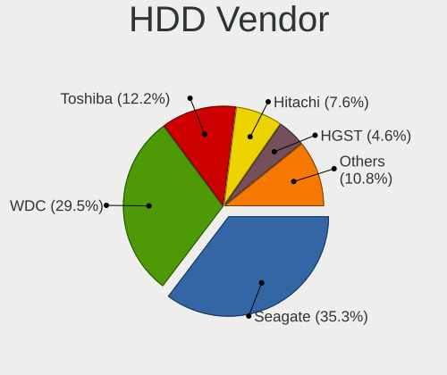

| Vendor              | Computers | Drives | Percent |
|---------------------|-----------|--------|---------|
| Seagate             | 16331     | 25737  | 35.31%  |
| WDC                 | 13663     | 21391  | 29.54%  |
| Toshiba             | 5626      | 7614   | 12.16%  |
| Hitachi             | 3530      | 4895   | 7.63%   |
| HGST                | 2119      | 3006   | 4.58%   |
| Samsung Electronics | 2088      | 2967   | 4.51%   |
| Fujitsu             | 511       | 1053   | 1.1%    |
| Unknown             | 479       | 628    | 1.04%   |
| Maxtor              | 427       | 564    | 0.92%   |
| Apple               | 308       | 342    | 0.67%   |
| Hewlett-Packard     | 206       | 548    | 0.45%   |
| JMicron Technology  | 187       | 220    | 0.4%    |
| Intenso             | 87        | 122    | 0.19%   |
| ASMT                | 80        | 159    | 0.17%   |
| External            | 61        | 81     | 0.13%   |
| TO Exter            | 59        | 71     | 0.13%   |
| USB3.0              | 40        | 45     | 0.09%   |
| ASMedia             | 37        | 45     | 0.08%   |
| ExcelStor           | 27        | 32     | 0.06%   |
| SSK                 | 26        | 27     | 0.06%   |
| LaCie               | 26        | 34     | 0.06%   |
| USB                 | 20        | 21     | 0.04%   |
| HPE                 | 20        | 35     | 0.04%   |
| SABRENT             | 17        | 25     | 0.04%   |
| HGST HTS            | 16        | 19     | 0.03%   |
| WD MediaMax         | 15        | 19     | 0.03%   |
| T-FORCE             | 15        | 19     | 0.03%   |
| MARVELL             | 14        | 18     | 0.03%   |
| Unknown             | 14        | 17     | 0.03%   |
| Inateck             | 13        | 14     | 0.03%   |
| IBM/Hitachi         | 12        | 13     | 0.03%   |
| JetFlash            | 11        | 16     | 0.02%   |
| ASMT109x            | 10        | 18     | 0.02%   |
| KESU                | 9         | 13     | 0.02%   |
| StoreJet            | 8         | 8      | 0.02%   |
| Quantum             | 8         | 13     | 0.02%   |
| SATAFIRM            | 7         | 8      | 0.02%   |
| SAGE                | 7         | 6      | 0.02%   |
| Maxone              | 6         | 7      | 0.01%   |
| Shenzhen            | 5         | 7      | 0.01%   |

SSD Vendor
----------

Solid state drive vendors

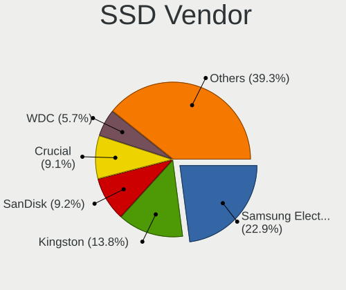

| Vendor              | Computers | Drives | Percent |
|---------------------|-----------|--------|---------|
| Samsung Electronics | 8086      | 11484  | 22.95%  |
| Kingston            | 4859      | 6295   | 13.79%  |
| SanDisk             | 3247      | 4320   | 9.21%   |
| Crucial             | 3199      | 4444   | 9.08%   |
| WDC                 | 2012      | 2577   | 5.71%   |
| Intel               | 1178      | 1903   | 3.34%   |
| A-DATA Technology   | 1111      | 1410   | 3.15%   |
| China               | 917       | 1132   | 2.6%    |
| Micron Technology   | 808       | 1069   | 2.29%   |
| SK hynix            | 674       | 909    | 1.91%   |
| Toshiba             | 571       | 749    | 1.62%   |
| PNY                 | 554       | 704    | 1.57%   |
| SPCC                | 480       | 665    | 1.36%   |
| Apple               | 451       | 520    | 1.28%   |
| LITEON              | 448       | 556    | 1.27%   |
| OCZ                 | 410       | 509    | 1.16%   |
| Transcend           | 392       | 475    | 1.11%   |
| Intenso             | 380       | 555    | 1.08%   |
| Patriot             | 326       | 403    | 0.93%   |
| GOODRAM             | 257       | 351    | 0.73%   |
| LITEONIT            | 237       | 290    | 0.67%   |
| Corsair             | 220       | 292    | 0.62%   |
| Team                | 219       | 293    | 0.62%   |
| KingSpec            | 191       | 236    | 0.54%   |
| Netac               | 176       | 224    | 0.5%    |
| Lexar               | 167       | 201    | 0.47%   |
| Apacer              | 160       | 188    | 0.45%   |
| Hewlett-Packard     | 146       | 265    | 0.41%   |
| SABRENT             | 144       | 177    | 0.41%   |
| Unknown             | 135       | 161    | 0.38%   |
| Gigabyte Technology | 127       | 179    | 0.36%   |
| Plextor             | 123       | 162    | 0.35%   |
| ASMT                | 123       | 150    | 0.35%   |
| Seagate             | 120       | 151    | 0.34%   |
| KingDian            | 84        | 104    | 0.24%   |
| Verbatim            | 75        | 91     | 0.21%   |
| FORESEE             | 75        | 81     | 0.21%   |
| Mushkin             | 73        | 121    | 0.21%   |
| Unknown             | 64        | 76     | 0.18%   |
| Emtec               | 61        | 73     | 0.17%   |

Drive Kind
----------

HDD or SSD

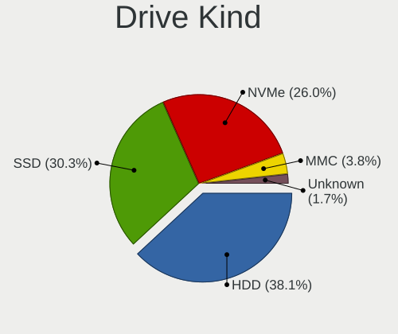

| Kind    | Computers | Drives | Percent |
|---------|-----------|--------|---------|
| HDD     | 39584     | 70083  | 38.09%  |
| SSD     | 31505     | 47233  | 30.31%  |
| NVMe    | 27071     | 37764  | 26.05%  |
| MMC     | 3955      | 5173   | 3.81%   |
| Unknown | 1813      | 2708   | 1.74%   |

Drive Connector
---------------

SATA, SAS, NVMe, etc.

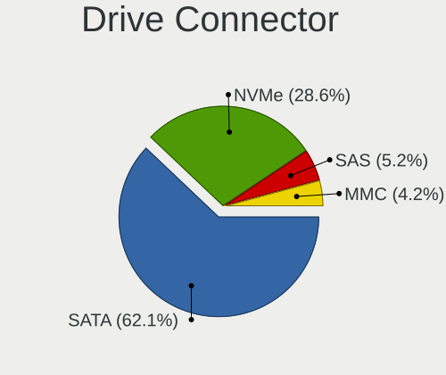

| Type | Computers | Drives | Percent |
|------|-----------|--------|---------|
| SATA | 58656     | 111886 | 62.07%  |
| NVMe | 27021     | 37515  | 28.59%  |
| SAS  | 4873      | 8387   | 5.16%   |
| MMC  | 3955      | 5173   | 4.18%   |

Drive Size
----------

Size of hard drive

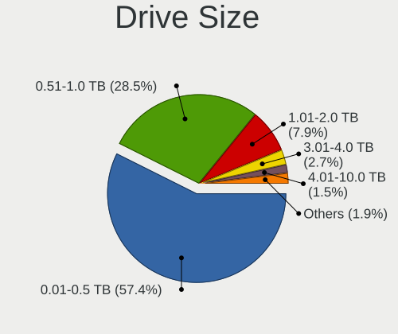

| Size in TB | Computers | Drives | Percent |
|------------|-----------|--------|---------|
| 0.01-0.5   | 42639     | 66651  | 57.39%  |
| 0.51-1.0   | 21161     | 31325  | 28.48%  |
| 1.01-2.0   | 5896      | 9489   | 7.94%   |
| 3.01-4.0   | 2030      | 3793   | 2.73%   |
| 4.01-10.0  | 1144      | 2848   | 1.54%   |
| 2.01-3.0   | 1093      | 2072   | 1.47%   |
| 10.01-20.0 | 318       | 1104   | 0.43%   |
| 20.01-50.0 | 15        | 28     | 0.02%   |
| 0          | 5         | 6      | 0.01%   |

Space Total
-----------

Amount of disk space available on the file system

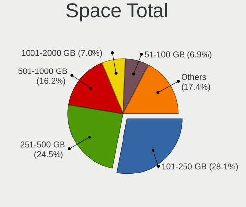

| Size in GB     | Computers | Percent |
|----------------|-----------|---------|
| 101-250        | 24318     | 28.06%  |
| 251-500        | 21228     | 24.5%   |
| 501-1000       | 14032     | 16.19%  |
| 1001-2000      | 6053      | 6.99%   |
| 51-100         | 5939      | 6.85%   |
| 1-20           | 4292      | 4.95%   |
| 21-50          | 3645      | 4.21%   |
| More than 3000 | 3502      | 4.04%   |
| 2001-3000      | 2140      | 2.47%   |
| Unknown        | 1507      | 1.74%   |

Space Used
----------

Amount of used disk space

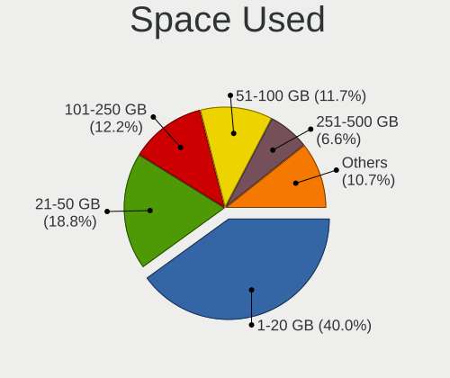

| Used GB        | Computers | Percent |
|----------------|-----------|---------|
| 1-20           | 36254     | 40.03%  |
| 21-50          | 17030     | 18.8%   |
| 101-250        | 11039     | 12.19%  |
| 51-100         | 10555     | 11.65%  |
| 251-500        | 6014      | 6.64%   |
| 501-1000       | 4036      | 4.46%   |
| 1001-2000      | 2117      | 2.34%   |
| Unknown        | 1507      | 1.66%   |
| More than 3000 | 1250      | 1.38%   |
| 2001-3000      | 758       | 0.84%   |
| 0              | 5         | 0.01%   |

Malfunc. Drives
---------------

Drive models with a malfunction

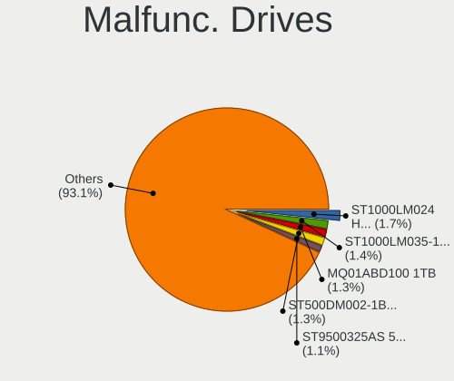

| Model                                 | Computers | Drives | Percent |
|---------------------------------------|-----------|--------|---------|
| Seagate ST1000LM024 HN-M101MBB 1TB    | 65        | 70     | 1.68%   |
| Seagate ST1000LM035-1RK172 1TB        | 54        | 57     | 1.4%    |
| Toshiba MQ01ABD100 1TB                | 52        | 57     | 1.35%   |
| Seagate ST500DM002-1BD142 500GB       | 51        | 54     | 1.32%   |
| Seagate ST9500325AS 500GB             | 43        | 44     | 1.11%   |
| HGST HTS541010A9E680 1TB              | 38        | 41     | 0.98%   |
| HGST HTS721010A9E630 1TB              | 35        | 38     | 0.91%   |
| Seagate ST3500418AS 500GB             | 34        | 44     | 0.88%   |
| HGST HTS725050A7E630 500GB            | 31        | 35     | 0.8%    |
| Seagate ST500LM021-1KJ152 500GB       | 24        | 26     | 0.62%   |
| Seagate ST1000DM003-1CH162 1TB        | 24        | 27     | 0.62%   |
| Kingston SV300S37A120G 120GB SSD      | 23        | 26     | 0.6%    |
| Seagate ST31000528AS 1TB              | 22        | 24     | 0.57%   |
| Seagate ST1000DM010-2EP102 1TB        | 22        | 27     | 0.57%   |
| Toshiba MQ04ABF100 1TB                | 21        | 21     | 0.54%   |
| Seagate ST500LT012-1DG142 500GB       | 21        | 22     | 0.54%   |
| Kingston SA400S37240G 240GB SSD       | 20        | 24     | 0.52%   |
| WDC WDS240G2G0A-00JH30 240GB SSD      | 19        | 21     | 0.49%   |
| SK hynix BC711 HFM512GD3JX013N 512GB  | 19        | 25     | 0.49%   |
| Samsung Electronics SSD 870 EVO 500GB | 19        | 19     | 0.49%   |
| HGST HTS545050A7E380 500GB            | 19        | 20     | 0.49%   |
| Seagate ST9500420AS 500GB             | 18        | 18     | 0.47%   |
| Seagate ST500LT012-9WS142 500GB       | 18        | 20     | 0.47%   |
| HGST HTS545050A7E680 500GB            | 18        | 18     | 0.47%   |
| Samsung Electronics SSD 870 EVO 1TB   | 16        | 19     | 0.41%   |
| Toshiba MQ01ABF050 500GB              | 15        | 15     | 0.39%   |
| Seagate ST1000LX015-1U7172 1TB        | 15        | 15     | 0.39%   |
| Kingston SA400S37480G 480GB SSD       | 15        | 18     | 0.39%   |
| Hitachi HTS543232A7A384 320GB         | 15        | 15     | 0.39%   |
| WDC WD40EFRX-68WT0N0 4TB              | 14        | 21     | 0.36%   |
| SK hynix HFS256G39TND-N210A 256GB SSD | 14        | 14     | 0.36%   |
| Seagate ST2000DM001-1CH164 2TB        | 14        | 14     | 0.36%   |
| Hitachi HTS545050A7E380 500GB         | 14        | 15     | 0.36%   |
| Crucial CT525MX300SSD1 528GB          | 14        | 15     | 0.36%   |
| WDC WD5000AAKX-001CA0 500GB           | 13        | 16     | 0.34%   |
| WDC WD10EARS-00Y5B1 1TB               | 13        | 18     | 0.34%   |
| Seagate ST9320325AS 320GB             | 13        | 13     | 0.34%   |
| Seagate ST9250315AS 250GB             | 13        | 18     | 0.34%   |
| Seagate ST500LM012 HN-M500MBB 500GB   | 13        | 15     | 0.34%   |
| SanDisk SSD PLUS 240GB                | 13        | 17     | 0.34%   |

Malfunc. Drive Vendor
---------------------

Vendors of faulty drives

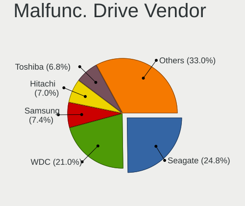

| Vendor                | Computers | Drives | Percent |
|-----------------------|-----------|--------|---------|
| Seagate               | 932       | 1130   | 24.77%  |
| WDC                   | 791       | 969    | 21.02%  |
| Samsung Electronics   | 280       | 335    | 7.44%   |
| Hitachi               | 264       | 295    | 7.02%   |
| Toshiba               | 256       | 291    | 6.8%    |
| HGST                  | 180       | 202    | 4.78%   |
| Intel                 | 146       | 250    | 3.88%   |
| SK hynix              | 129       | 142    | 3.43%   |
| Kingston              | 127       | 154    | 3.37%   |
| SanDisk               | 100       | 117    | 2.66%   |
| Crucial               | 80        | 92     | 2.13%   |
| Micron Technology     | 72        | 96     | 1.91%   |
| A-DATA Technology     | 56        | 69     | 1.49%   |
| Maxtor                | 27        | 37     | 0.72%   |
| Apple                 | 27        | 30     | 0.72%   |
| Fujitsu               | 21        | 21     | 0.56%   |
| LITEON                | 18        | 21     | 0.48%   |
| OCZ                   | 17        | 18     | 0.45%   |
| Corsair               | 16        | 17     | 0.43%   |
| China                 | 16        | 16     | 0.43%   |
| LITEONIT              | 11        | 13     | 0.29%   |
| Unknown               | 10        | 12     | 0.27%   |
| Patriot               | 10        | 10     | 0.27%   |
| Unknown               | 9         | 10     | 0.24%   |
| SPCC                  | 8         | 8      | 0.21%   |
| ASMT                  | 8         | 8      | 0.21%   |
| Netac                 | 7         | 8      | 0.19%   |
| KingSpec              | 7         | 7      | 0.19%   |
| Hewlett-Packard       | 7         | 7      | 0.19%   |
| Transcend             | 6         | 7      | 0.16%   |
| SSSTC                 | 6         | 6      | 0.16%   |
| Intenso               | 6         | 7      | 0.16%   |
| XPG                   | 5         | 5      | 0.13%   |
| LDLC                  | 5         | 6      | 0.13%   |
| 2.5"                  | 5         | 5      | 0.13%   |
| Mushkin               | 4         | 4      | 0.11%   |
| Realtek Semiconductor | 3         | 3      | 0.08%   |
| KIOXIA                | 3         | 4      | 0.08%   |
| JMicron Technology    | 3         | 3      | 0.08%   |
| Gigabyte Technology   | 3         | 4      | 0.08%   |

Malfunc. HDD Vendor
-------------------

Vendors of faulty HDD drives

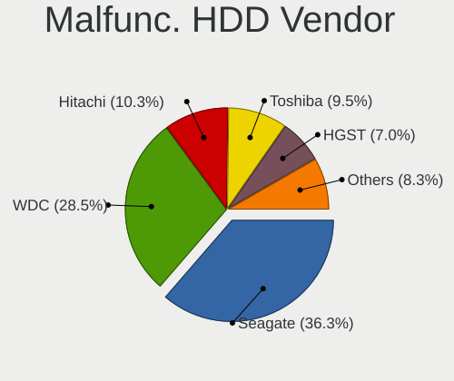

| Vendor              | Computers | Drives | Percent |
|---------------------|-----------|--------|---------|
| Seagate             | 932       | 1130   | 36.35%  |
| WDC                 | 732       | 904    | 28.55%  |
| Hitachi             | 264       | 295    | 10.3%   |
| Toshiba             | 243       | 277    | 9.48%   |
| HGST                | 180       | 202    | 7.02%   |
| Samsung Electronics | 116       | 136    | 4.52%   |
| Maxtor              | 27        | 37     | 1.05%   |
| Apple               | 23        | 26     | 0.9%    |
| Fujitsu             | 21        | 21     | 0.82%   |
| Unknown             | 8         | 10     | 0.31%   |
| Hewlett-Packard     | 4         | 4      | 0.16%   |
| ASMT                | 3         | 3      | 0.12%   |
| WD MediaMax         | 2         | 2      | 0.08%   |
| JMicron Technology  | 2         | 2      | 0.08%   |
| USB3.0              | 1         | 1      | 0.04%   |
| SABRENT             | 1         | 1      | 0.04%   |
| MaxDigital          | 1         | 1      | 0.04%   |
| HPE                 | 1         | 1      | 0.04%   |
| HGST HTS            | 1         | 1      | 0.04%   |
| ExcelStor           | 1         | 1      | 0.04%   |
| ASMedia             | 1         | 1      | 0.04%   |

Malfunc. Drive Kind
-------------------

Kinds of faulty drives

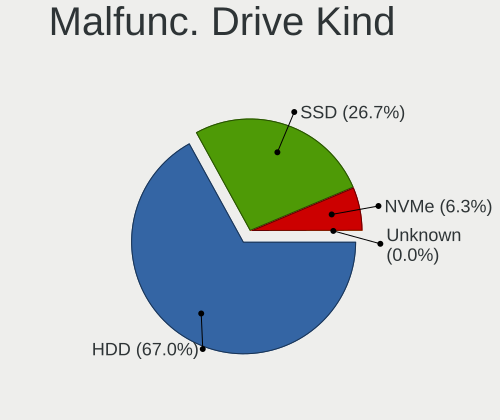

| Kind    | Computers | Drives | Percent |
|---------|-----------|--------|---------|
| HDD     | 2420      | 3056   | 67%     |
| SSD     | 963       | 1211   | 26.66%  |
| NVMe    | 228       | 259    | 6.31%   |
| Unknown | 1         | 1      | 0.03%   |

Failed Drives
-------------

Failed drive models

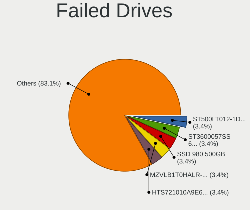

| Model                                      | Computers | Drives | Percent |
|--------------------------------------------|-----------|--------|---------|
| Seagate ST500LT012-1DG142 500GB            | 3         | 3      | 3.37%   |
| Seagate ST3600057SS 600GB                  | 3         | 25     | 3.37%   |
| Samsung Electronics SSD 980 500GB          | 3         | 3      | 3.37%   |
| Samsung Electronics MZVLB1T0HALR-00000 1TB | 3         | 5      | 3.37%   |
| HGST HTS721010A9E630 1TB                   | 3         | 3      | 3.37%   |
| Fujitsu MBE2147RC 147GB                    | 3         | 8      | 3.37%   |
| WDC WD7500BPVT-22HXZT1 752GB               | 2         | 5      | 2.25%   |
| WDC WD10SPZX-21Z10T0 1TB                   | 2         | 2      | 2.25%   |
| SK hynix BC501 HFM256GDJTNG-8310A 256GB    | 2         | 3      | 2.25%   |
| WDC WD800BB-00FJA0 80GB                    | 1         | 1      | 1.12%   |
| WDC WD5000BEVT-22A0RT0 500GB               | 1         | 1      | 1.12%   |
| WDC WD5000AAKS-00UU3A0 500GB               | 1         | 1      | 1.12%   |
| WDC WD40EZRZ-00GXCB0 4TB                   | 1         | 2      | 1.12%   |
| WDC WD3200BEKT-60PVMT0 320GB               | 1         | 1      | 1.12%   |
| WDC WD3200AAJS-60Z0A0 320GB                | 1         | 3      | 1.12%   |
| WDC WD3200AAJS-22VWA0 320GB                | 1         | 1      | 1.12%   |
| WDC WD20PURZ-85GU6Y0 2TB                   | 1         | 1      | 1.12%   |
| WDC WD1500HLFS-01G6U0 150GB                | 1         | 1      | 1.12%   |
| WDC WD10EAVS-00D7B1 1TB                    | 1         | 1      | 1.12%   |
| WDC WD1001FALS-40K1B0 1TB                  | 1         | 1      | 1.12%   |
| WDC PC SN520 SDAPNUW-256G-1006 256GB       | 1         | 1      | 1.12%   |
| Unknown 00000  16GB                        | 1         | 1      | 1.12%   |
| Toshiba THNSN5256GPUK NVMe 256GB           | 1         | 1      | 1.12%   |
| Toshiba NVMe SSD Drive 256GB               | 1         | 1      | 1.12%   |
| Toshiba MQ02ABF050H 500GB                  | 1         | 1      | 1.12%   |
| Toshiba MK5065GSXN 500GB                   | 1         | 1      | 1.12%   |
| Toshiba MK3265GSX 320GB                    | 1         | 1      | 1.12%   |
| Toshiba DT01ACA200 2TB                     | 1         | 1      | 1.12%   |
| Toshiba DT01ACA100 1TB                     | 1         | 1      | 1.12%   |
| SK hynix SC308 SATA 512GB SSD              | 1         | 1      | 1.12%   |
| SK hynix BC501 NVMe 256GB                  | 1         | 1      | 1.12%   |
| Seagate ST9500420AS 500GB                  | 1         | 3      | 1.12%   |
| Seagate ST3500630AS 500GB                  | 1         | 1      | 1.12%   |
| Seagate ST3500418AS 500GB                  | 1         | 1      | 1.12%   |
| Seagate ST332062 0AS 320GB                 | 1         | 1      | 1.12%   |
| Seagate ST3300657SS 304GB                  | 1         | 2      | 1.12%   |
| Seagate ST32000542AS 2TB                   | 1         | 1      | 1.12%   |
| Seagate ST31000528AS 1TB                   | 1         | 1      | 1.12%   |
| Seagate ST31000520AS 1TB                   | 1         | 1      | 1.12%   |
| Seagate ST31000340NS 1TB                   | 1         | 1      | 1.12%   |

Failed Drive Vendor
-------------------

Failed drive vendors

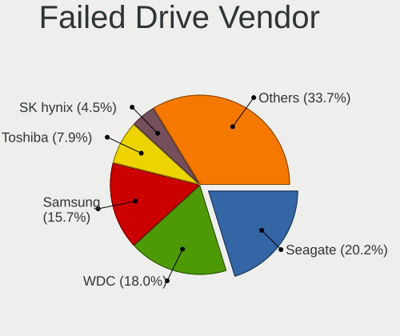

| Vendor              | Computers | Drives | Percent |
|---------------------|-----------|--------|---------|
| Seagate             | 18        | 43     | 20.22%  |
| WDC                 | 16        | 22     | 17.98%  |
| Samsung Electronics | 14        | 16     | 15.73%  |
| Toshiba             | 7         | 7      | 7.87%   |
| SK hynix            | 4         | 5      | 4.49%   |
| Hitachi             | 4         | 4      | 4.49%   |
| HGST                | 4         | 4      | 4.49%   |
| Intel               | 3         | 6      | 3.37%   |
| Fujitsu             | 3         | 8      | 3.37%   |
| Hewlett-Packard     | 2         | 5      | 2.25%   |
| Crucial             | 2         | 2      | 2.25%   |
| Apple               | 2         | 3      | 2.25%   |
| Unknown             | 1         | 1      | 1.12%   |
| PNY                 | 1         | 1      | 1.12%   |
| Mushkin             | 1         | 1      | 1.12%   |
| Maxtor              | 1         | 1      | 1.12%   |
| KIOXIA              | 1         | 1      | 1.12%   |
| Kingston            | 1         | 1      | 1.12%   |
| KingDian            | 1         | 1      | 1.12%   |
| JMicron Technology  | 1         | 1      | 1.12%   |
| aigo                | 1         | 1      | 1.12%   |
| A-DATA Technology   | 1         | 1      | 1.12%   |

Drive Status
------------

Number of failed and malfunc. drives

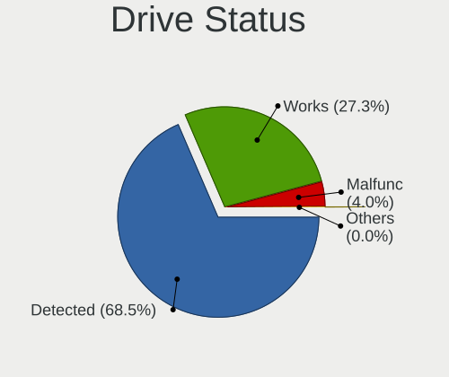

| Status   | Computers | Drives | Percent |
|----------|-----------|--------|---------|
| Detected | 59293     | 117665 | 68.54%  |
| Works    | 23631     | 40629  | 27.32%  |
| Malfunc  | 3492      | 4527   | 4.04%   |
| Failed   | 88        | 135    | 0.1%    |
| Limited  | 4         | 4      | 0.005%  |
| Fixed    | 1         | 1      | 0.001%  |

Storage controller
------------------

Storage Vendor
--------------

Storage controller vendors

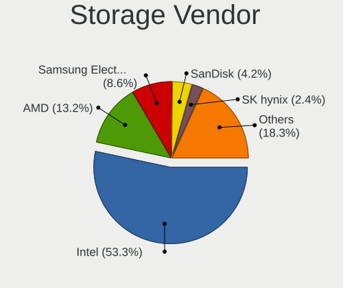

| Vendor                                  | Computers | Percent |
|-----------------------------------------|-----------|---------|
| Intel                                   | 55456     | 53.33%  |
| AMD                                     | 13753     | 13.23%  |
| Samsung Electronics                     | 8951      | 8.61%   |
| SanDisk                                 | 4339      | 4.17%   |
| SK hynix                                | 2509      | 2.41%   |
| Micron Technology                       | 1607      | 1.55%   |
| Kingston Technology Company             | 1583      | 1.52%   |
| ASMedia Technology                      | 1561      | 1.5%    |
| Nvidia                                  | 1406      | 1.35%   |
| Phison Electronics                      | 1394      | 1.34%   |
| Toshiba America Info Systems            | 1347      | 1.3%    |
| Marvell Technology Group                | 1240      | 1.19%   |
| KIOXIA                                  | 1132      | 1.09%   |
| JMicron Technology                      | 1128      | 1.08%   |
| Micron/Crucial Technology               | 992       | 0.95%   |
| Silicon Motion                          | 755       | 0.73%   |
| ADATA Technology                        | 588       | 0.57%   |
| LSI Logic / Symbios Logic               | 462       | 0.44%   |
| Broadcom / LSI                          | 414       | 0.4%    |
| MAXIO Technology (Hangzhou)             | 396       | 0.38%   |
| Realtek Semiconductor                   | 331       | 0.32%   |
| Apple                                   | 250       | 0.24%   |
| VIA Technologies                        | 244       | 0.23%   |
| Shenzhen Longsys Electronics            | 238       | 0.23%   |
| Solid State Storage Technology          | 224       | 0.22%   |
| Union Memory (Shenzhen)                 | 192       | 0.18%   |
| Hewlett-Packard                         | 163       | 0.16%   |
| Silicon Image                           | 143       | 0.14%   |
| Silicon Integrated Systems [SiS]        | 134       | 0.13%   |
| Adaptec                                 | 130       | 0.13%   |
| Yangtze Memory Technologies             | 115       | 0.11%   |
| Lite-On Technology                      | 114       | 0.11%   |
| Seagate Technology                      | 93        | 0.09%   |
| Solidigm                                | 89        | 0.09%   |
| Lenovo                                  | 65        | 0.06%   |
| INNOGRIT                                | 52        | 0.05%   |
| Biwin Storage Technology                | 38        | 0.04%   |
| Integrated Technology Express           | 34        | 0.03%   |
| Shenzhen Unionmemory Information System | 32        | 0.03%   |
| Transcend                               | 30        | 0.03%   |

Storage Model
-------------

Storage controller models

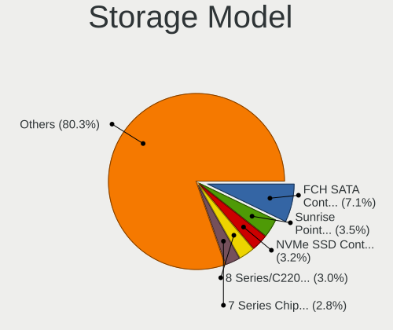

| Model                                                                                   | Computers | Percent |
|-----------------------------------------------------------------------------------------|-----------|---------|
| AMD FCH SATA Controller [AHCI mode]                                                     | 8558      | 7.13%   |
| Intel Sunrise Point-LP SATA Controller [AHCI mode]                                      | 4229      | 3.52%   |
| Samsung NVMe SSD Controller SM981/PM981/PM983                                           | 3812      | 3.18%   |
| Intel 8 Series/C220 Series Chipset Family 6-port SATA Controller 1 [AHCI mode]          | 3606      | 3.01%   |
| Intel 7 Series Chipset Family 6-port SATA Controller [AHCI mode]                        | 3407      | 2.84%   |
| Intel 82801 Mobile SATA Controller [RAID mode]                                          | 2916      | 2.43%   |
| Intel 6 Series/C200 Series Chipset Family 6 port Mobile SATA AHCI Controller            | 2489      | 2.07%   |
| Intel Volume Management Device NVMe RAID Controller                                     | 2257      | 1.88%   |
| Intel Q170/Q150/B150/H170/H110/Z170/CM236 Chipset SATA Controller [AHCI Mode]           | 1895      | 1.58%   |
| Intel 6 Series/C200 Series Chipset Family 6 port Desktop SATA AHCI Controller           | 1822      | 1.52%   |
| Intel 8 Series SATA Controller 1 [AHCI mode]                                            | 1818      | 1.52%   |
| Intel SATA Controller [RAID Mode]                                                       | 1755      | 1.46%   |
| AMD SB7x0/SB8x0/SB9x0 IDE Controller                                                    | 1711      | 1.43%   |
| AMD SB7x0/SB8x0/SB9x0 SATA Controller [AHCI mode]                                       | 1694      | 1.41%   |
| Samsung NVMe SSD Controller 980 (DRAM-less)                                             | 1625      | 1.35%   |
| AMD 400 Series Chipset SATA Controller                                                  | 1554      | 1.3%    |
| Intel 200 Series PCH SATA controller [AHCI mode]                                        | 1442      | 1.2%    |
| Intel Wildcat Point-LP SATA Controller [AHCI Mode]                                      | 1430      | 1.19%   |
| ASMedia ASM1061/ASM1062 Serial ATA Controller                                           | 1396      | 1.16%   |
| Intel 7 Series/C210 Series Chipset Family 6-port SATA Controller [AHCI mode]            | 1384      | 1.15%   |
| Samsung NVMe SSD Controller PM9A1/PM9A3/980PRO                                          | 1372      | 1.14%   |
| Intel 82801IBM/IEM (ICH9M/ICH9M-E) 4 port SATA Controller [AHCI mode]                   | 1363      | 1.14%   |
| Intel NM10/ICH7 Family SATA Controller [IDE mode]                                       | 1358      | 1.13%   |
| Intel Cannon Lake Mobile PCH SATA AHCI Controller                                       | 1301      | 1.08%   |
| Intel 82801G (ICH7 Family) IDE Controller                                               | 1206      | 1.01%   |
| AMD SB7x0/SB8x0/SB9x0 SATA Controller [IDE mode]                                        | 1161      | 0.97%   |
| Intel Cannon Lake PCH SATA AHCI Controller                                              | 1145      | 0.95%   |
| Intel Comet Lake SATA AHCI Controller                                                   | 1136      | 0.95%   |
| Intel 5 Series/3400 Series Chipset 4 port SATA AHCI Controller                          | 1092      | 0.91%   |
| Intel 5 Series/3400 Series Chipset 6 port SATA AHCI Controller                          | 1055      | 0.88%   |
| Samsung NVMe SSD Controller SM961/PM961/SM963                                           | 1023      | 0.85%   |
| AMD 500 Series Chipset SATA Controller                                                  | 949       | 0.79%   |
| Intel Celeron/Pentium Silver Processor SATA Controller                                  | 885       | 0.74%   |
| Intel Cannon Point-LP SATA Controller [AHCI Mode]                                       | 836       | 0.7%    |
| Intel 82801HM/HEM (ICH8M/ICH8M-E) IDE Controller                                        | 824       | 0.69%   |
| SanDisk Extreme Pro / WD Black SN750 / PC SN730 / Red SN700 NVMe SSD                    | 795       | 0.66%   |
| Intel 6 Series/C200 Series Chipset Family Desktop SATA Controller (IDE mode, ports 4-5) | 750       | 0.63%   |
| Intel 6 Series/C200 Series Chipset Family Desktop SATA Controller (IDE mode, ports 0-3) | 749       | 0.62%   |
| Intel Atom Processor E3800 Series SATA AHCI Controller                                  | 743       | 0.62%   |
| Intel Tiger Lake-LP SATA Controller                                                     | 739       | 0.62%   |

Storage Kind
------------

Kind of storage controller (IDE, SATA, NVMe, SAS, ...)

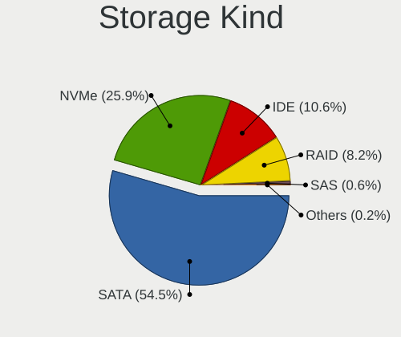

| Kind | Computers | Percent |
|------|-----------|---------|
| SATA | 57366     | 54.5%   |
| NVMe | 27293     | 25.93%  |
| IDE  | 11148     | 10.59%  |
| RAID | 8634      | 8.2%    |
| SAS  | 579       | 0.55%   |
| SCSI | 239       | 0.23%   |

Processor
---------

CPU Vendor
----------

Processor vendors

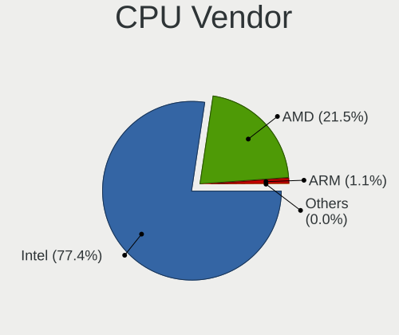

| Vendor        | Computers | Percent |
|---------------|-----------|---------|
| Intel         | 64002     | 77.36%  |
| AMD           | 17775     | 21.49%  |
| ARM           | 871       | 1.05%   |
| CentaurHauls  | 26        | 0.03%   |
| Qualcomm      | 17        | 0.02%   |
| Unknown       | 14        | 0.02%   |
| sifive,u74-mc | 10        | 0.01%   |
| ky,x60        | 7         | 0.01%   |
| Hisilicon     | 4         | 0.005%  |
| Phytium       | 3         | 0.004%  |
| thead,c906    | 1         | 0.001%  |
| IBM/S390      | 1         | 0.001%  |
| eswin,eic770x | 1         | 0.001%  |

CPU Model
---------

Processor models

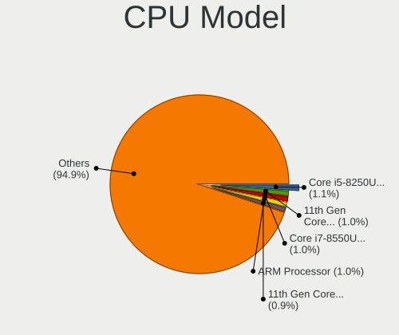

| Model                                         | Computers | Percent |
|-----------------------------------------------|-----------|---------|
| Intel Core i5-8250U CPU @ 1.60GHz             | 945       | 1.14%   |
| Intel 11th Gen Core i7-1165G7 @ 2.80GHz       | 837       | 1.01%   |
| Intel Core i7-8550U CPU @ 1.80GHz             | 836       | 1.01%   |
| ARM Processor                                 | 811       | 0.98%   |
| Intel 11th Gen Core i5-1135G7 @ 2.40GHz       | 768       | 0.93%   |
| Intel Core i5-7200U CPU @ 2.50GHz             | 753       | 0.91%   |
| Intel Core i7-8565U CPU @ 1.80GHz             | 687       | 0.83%   |
| Intel Core i5-8265U CPU @ 1.60GHz             | 616       | 0.74%   |
| Intel Core i7-10510U CPU @ 1.80GHz            | 552       | 0.67%   |
| Intel Core i5-10210U CPU @ 1.60GHz            | 548       | 0.66%   |
| Intel Core i7-8750H CPU @ 2.20GHz             | 507       | 0.61%   |
| Intel Core i5-6200U CPU @ 2.30GHz             | 503       | 0.61%   |
| Intel Core i7-9750H CPU @ 2.60GHz             | 498       | 0.6%    |
| Intel Core i5-3210M CPU @ 2.50GHz             | 473       | 0.57%   |
| Intel Core i7-7500U CPU @ 2.70GHz             | 463       | 0.56%   |
| Intel Core i5-5200U CPU @ 2.20GHz             | 458       | 0.55%   |
| Intel Core i7-7700HQ CPU @ 2.80GHz            | 436       | 0.53%   |
| Intel Core i5-6300U CPU @ 2.40GHz             | 419       | 0.5%    |
| Intel Core i5-3470 CPU @ 3.20GHz              | 408       | 0.49%   |
| Intel Core i5-2520M CPU @ 2.50GHz             | 407       | 0.49%   |
| AMD Ryzen 5 3600 6-Core Processor             | 407       | 0.49%   |
| Intel Core i7-3770 CPU @ 3.40GHz              | 404       | 0.49%   |
| Intel Atom x5-Z8350 CPU @ 1.44GHz             | 398       | 0.48%   |
| AMD Ryzen 5 3500U with Radeon Vega Mobile Gfx | 398       | 0.48%   |
| Intel Core i5-2400 CPU @ 3.10GHz              | 371       | 0.45%   |
| Intel Core i7-10750H CPU @ 2.60GHz            | 345       | 0.42%   |
| Intel Core i7-4790 CPU @ 3.60GHz              | 338       | 0.41%   |
| AMD Ryzen 5 5500U with Radeon Graphics        | 336       | 0.4%    |
| Intel Core i7-2600 CPU @ 3.40GHz              | 325       | 0.39%   |
| Intel Core i5-1035G1 CPU @ 1.00GHz            | 321       | 0.39%   |
| AMD Ryzen 7 5700U with Radeon Graphics        | 320       | 0.39%   |
| Intel Core i5-3320M CPU @ 2.60GHz             | 319       | 0.38%   |
| Intel Core 2 Duo CPU E8400 @ 3.00GHz          | 319       | 0.38%   |
| Intel Core i5-4210U CPU @ 1.70GHz             | 308       | 0.37%   |
| Intel Core i7-6700HQ CPU @ 2.60GHz            | 300       | 0.36%   |
| Intel Core i7-6500U CPU @ 2.50GHz             | 296       | 0.36%   |
| Intel Core i7-1065G7 CPU @ 1.30GHz            | 296       | 0.36%   |
| Intel Core i5-4200U CPU @ 1.60GHz             | 285       | 0.34%   |
| AMD Ryzen 7 3700X 8-Core Processor            | 284       | 0.34%   |
| Intel Core i5-3230M CPU @ 2.60GHz             | 282       | 0.34%   |

CPU Model Family
----------------

Processor model prefix

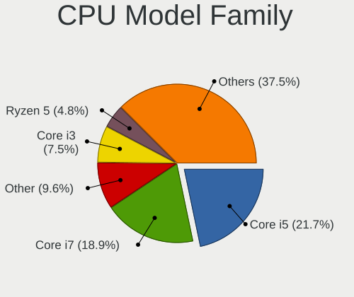

| Model                   | Computers | Percent |
|-------------------------|-----------|---------|
| Intel Core i5           | 18000     | 21.72%  |
| Intel Core i7           | 15656     | 18.9%   |
| Other                   | 7919      | 9.56%   |
| Intel Core i3           | 6238      | 7.53%   |
| AMD Ryzen 5             | 3970      | 4.79%   |
| Intel Celeron           | 3429      | 4.14%   |
| AMD Ryzen 7             | 3293      | 3.97%   |
| Intel Core 2 Duo        | 3229      | 3.9%    |
| Intel Xeon              | 2782      | 3.36%   |
| Intel Pentium           | 1899      | 2.29%   |
| AMD FX                  | 1179      | 1.42%   |
| AMD Ryzen 9             | 1154      | 1.39%   |
| Intel Atom              | 1129      | 1.36%   |
| Intel Pentium Dual-Core | 924       | 1.12%   |
| AMD Ryzen 3             | 784       | 0.95%   |
| Intel Core 2 Quad       | 741       | 0.89%   |
| Intel Core i9           | 674       | 0.81%   |
| AMD A6                  | 656       | 0.79%   |
| AMD A8                  | 622       | 0.75%   |
| AMD A10                 | 563       | 0.68%   |
| Intel Core              | 477       | 0.58%   |
| AMD A4                  | 473       | 0.57%   |
| Intel Core 2            | 433       | 0.52%   |
| AMD Phenom II X4        | 416       | 0.5%    |
| Intel Pentium Dual      | 392       | 0.47%   |
| AMD Athlon II X2        | 367       | 0.44%   |
| AMD Athlon 64 X2        | 347       | 0.42%   |
| AMD Ryzen 7 PRO         | 309       | 0.37%   |
| AMD E                   | 253       | 0.31%   |
| AMD Athlon              | 236       | 0.28%   |
| AMD E1                  | 224       | 0.27%   |
| AMD Ryzen Threadripper  | 223       | 0.27%   |
| Intel Pentium Silver    | 216       | 0.26%   |
| AMD Ryzen 5 PRO         | 208       | 0.25%   |
| AMD E2                  | 205       | 0.25%   |
| Intel Pentium 4         | 199       | 0.24%   |
| Intel Genuine           | 195       | 0.24%   |
| AMD Athlon II X4        | 190       | 0.23%   |
| AMD Phenom II X6        | 172       | 0.21%   |
| Intel Pentium D         | 131       | 0.16%   |

CPU Cores
---------

Number of processor cores

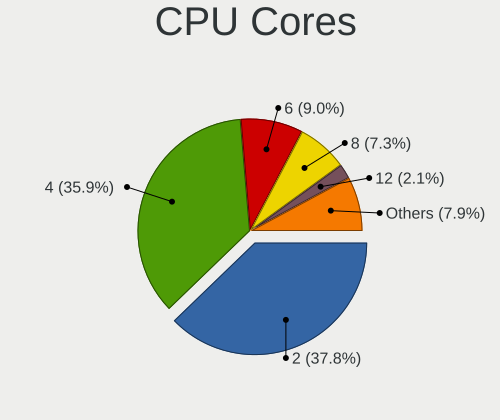

| Number  | Computers | Percent |
|---------|-----------|---------|
| 2       | 31345     | 37.78%  |
| 4       | 29770     | 35.88%  |
| 6       | 7474      | 9.01%   |
| 8       | 6088      | 7.34%   |
| 12      | 1769      | 2.13%   |
| 1       | 1467      | 1.77%   |
| 10      | 1228      | 1.48%   |
| 16      | 1091      | 1.32%   |
| 14      | 842       | 1.01%   |
| 3       | 498       | 0.6%    |
| 24      | 484       | 0.58%   |
| 20      | 255       | 0.31%   |
| 28      | 133       | 0.16%   |
| Unknown | 127       | 0.15%   |
| 32      | 111       | 0.13%   |
| 64      | 49        | 0.06%   |
| 18      | 46        | 0.06%   |
| 40      | 41        | 0.05%   |
| 48      | 30        | 0.04%   |
| 36      | 26        | 0.03%   |
| 5       | 21        | 0.03%   |
| 128     | 18        | 0.02%   |
| 44      | 13        | 0.02%   |
| 192     | 6         | 0.01%   |
| 96      | 5         | 0.01%   |
| 56      | 5         | 0.01%   |
| 52      | 4         | 0.005%  |
| 22      | 4         | 0.005%  |
| 80      | 3         | 0.004%  |
| 104     | 2         | 0.002%  |
| 11      | 2         | 0.002%  |
| 68      | 1         | 0.001%  |
| 26      | 1         | 0.001%  |
| 15      | 1         | 0.001%  |
| 9       | 1         | 0.001%  |
| 7       | 1         | 0.001%  |

CPU Sockets
-----------

Number of sockets

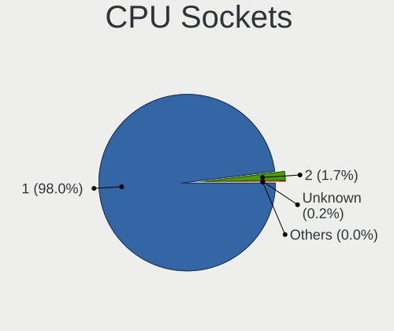

| Number  | Computers | Percent |
|---------|-----------|---------|
| 1       | 81094     | 98.01%  |
| 2       | 1442      | 1.74%   |
| Unknown | 125       | 0.15%   |
| 4       | 47        | 0.06%   |
| 3       | 12        | 0.01%   |
| 16      | 4         | 0.005%  |
| 14      | 4         | 0.005%  |
| 8       | 4         | 0.005%  |
| 20      | 3         | 0.004%  |
| 24      | 2         | 0.002%  |
| 11      | 2         | 0.002%  |
| 6       | 1         | 0.001%  |

CPU Threads
-----------

Threads per core (Hyper-Threading)

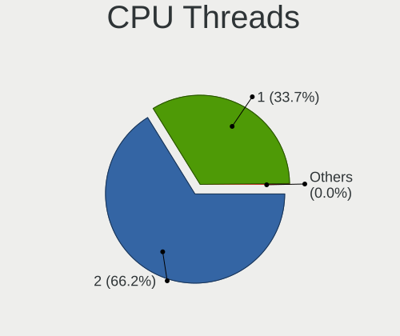

| Number  | Computers | Percent |
|---------|-----------|---------|
| 2       | 54855     | 66.17%  |
| 1       | 27911     | 33.67%  |
| Unknown | 127       | 0.15%   |
| 4       | 3         | 0.004%  |
| 112     | 1         | 0.001%  |
| 6       | 1         | 0.001%  |

CPU Op-Modes
------------

CPU Operation Modes (32-bit, 64-bit)

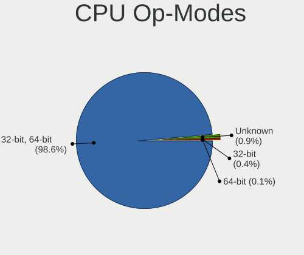

| Op mode        | Computers | Percent |
|----------------|-----------|---------|
| 32-bit, 64-bit | 81593     | 98.59%  |
| Unknown        | 772       | 0.93%   |
| 32-bit         | 332       | 0.4%    |
| 64-bit         | 67        | 0.08%   |

CPU Microcode
-------------

Microcode number

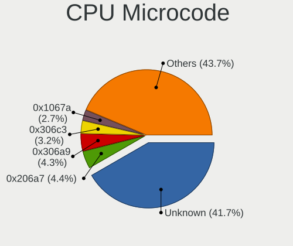

| Number     | Computers | Percent |
|------------|-----------|---------|
| Unknown    | 35720     | 41.69%  |
| 0x206a7    | 3774      | 4.4%    |
| 0x306a9    | 3702      | 4.32%   |
| 0x306c3    | 2771      | 3.23%   |
| 0x1067a    | 2295      | 2.68%   |
| 0x906ea    | 1708      | 1.99%   |
| 0x806ea    | 1621      | 1.89%   |
| 0x806ec    | 1602      | 1.87%   |
| 0x806e9    | 1288      | 1.5%    |
| 0x40651    | 1288      | 1.5%    |
| 0x506e3    | 1234      | 1.44%   |
| 0x806c1    | 1206      | 1.41%   |
| 0x406e3    | 1166      | 1.36%   |
| 0x20655    | 1146      | 1.34%   |
| 0x906e9    | 1095      | 1.28%   |
| 0x306d4    | 1072      | 1.25%   |
| 0x6fd      | 758       | 0.88%   |
| 0x010000c8 | 662       | 0.77%   |
| 0x06000852 | 631       | 0.74%   |
| 0x10676    | 620       | 0.72%   |
| 0x30678    | 575       | 0.67%   |
| 0x08108109 | 563       | 0.66%   |
| 0x406c4    | 541       | 0.63%   |
| 0x06001119 | 539       | 0.63%   |
| 0x706e5    | 509       | 0.59%   |
| 0x20652    | 496       | 0.58%   |
| 0x806eb    | 460       | 0.54%   |
| 0x6fb      | 459       | 0.54%   |
| 0xa0652    | 444       | 0.52%   |
| 0x106e5    | 425       | 0.5%    |
| 0x08701021 | 422       | 0.49%   |
| 0x0a50000c | 418       | 0.49%   |
| 0x906ed    | 416       | 0.49%   |
| 0x0800820d | 375       | 0.44%   |
| 0x08108102 | 357       | 0.42%   |
| 0x08701013 | 327       | 0.38%   |
| 0x08600106 | 320       | 0.37%   |
| 0x706a1    | 317       | 0.37%   |
| 0x506c9    | 317       | 0.37%   |
| 0x0810100b | 309       | 0.36%   |

CPU Microarch
-------------

Microarchitecture

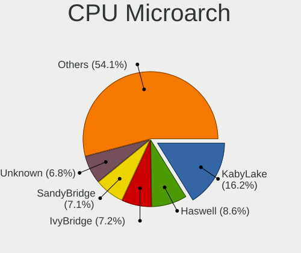

| Name              | Computers | Percent |
|-------------------|-----------|---------|
| KabyLake          | 13407     | 16.16%  |
| Haswell           | 7128      | 8.59%   |
| IvyBridge         | 5976      | 7.21%   |
| SandyBridge       | 5912      | 7.13%   |
| Unknown           | 5650      | 6.81%   |
| Skylake           | 4631      | 5.58%   |
| Penryn            | 4127      | 4.98%   |
| Westmere          | 2713      | 3.27%   |
| Zen 2             | 2486      | 3%      |
| TigerLake         | 2484      | 2.99%   |
| Core              | 2238      | 2.7%    |
| Silvermont        | 2222      | 2.68%   |
| Zen 3             | 2199      | 2.65%   |
| Broadwell         | 2129      | 2.57%   |
| Zen+              | 2107      | 2.54%   |
| Alderlake Hybrid  | 1980      | 2.39%   |
| K10               | 1777      | 2.14%   |
| Piledriver        | 1691      | 2.04%   |
| CometLake         | 1620      | 1.95%   |
| IceLake           | 1334      | 1.61%   |
| Zen               | 1291      | 1.56%   |
| Excavator         | 1006      | 1.21%   |
| Goldmont plus     | 980       | 1.18%   |
| Nehalem           | 977       | 1.18%   |
| K8 Hammer         | 654       | 0.79%   |
| Goldmont          | 573       | 0.69%   |
| Puma              | 519       | 0.63%   |
| Bobcat            | 472       | 0.57%   |
| NetBurst          | 392       | 0.47%   |
| Bonnell           | 353       | 0.43%   |
| Jaguar            | 334       | 0.4%    |
| Steamroller       | 318       | 0.38%   |
| K10 Llano         | 271       | 0.33%   |
| Bulldozer         | 240       | 0.29%   |
| Meteorlake Hybrid | 167       | 0.2%    |
| P6                | 163       | 0.2%    |
| K8 & K10 hybrid   | 117       | 0.14%   |
| Tremont           | 104       | 0.13%   |
| Lunarlake Hybrid  | 87        | 0.1%    |
| Gracemont         | 83        | 0.1%    |

Graphics
--------

GPU Vendor
----------

Vendors of graphics cards

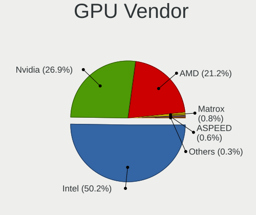

| Vendor                                       | Computers | Percent |
|----------------------------------------------|-----------|---------|
| Intel                                        | 49091     | 50.24%  |
| Nvidia                                       | 26294     | 26.91%  |
| AMD                                          | 20715     | 21.2%   |
| Matrox Electronics Systems                   | 759       | 0.78%   |
| ASPEED Technology                            | 568       | 0.58%   |
| Silicon Integrated Systems [SiS]             | 109       | 0.11%   |
| VIA Technologies                             | 65        | 0.07%   |
| ATI Technologies                             | 43        | 0.04%   |
| XGI Technology (eXtreme Graphics Innovation) | 27        | 0.03%   |
| Huawei Technologies                          | 20        | 0.02%   |
| Zhaoxin                                      | 14        | 0.01%   |
| Silicon Motion                               | 6         | 0.01%   |
| S3 Graphics                                  | 2         | 0.002%  |
| Xilinx                                       | 1         | 0.001%  |
| Red Hat                                      | 1         | 0.001%  |
| Racore Computer Products                     | 1         | 0.001%  |
| NVidia / SGS Thomson (Joint Venture)         | 1         | 0.001%  |
| Moore Threads Technology                     | 1         | 0.001%  |
| Glenfly Tech                                 | 1         | 0.001%  |
| Cirrus Logic                                 | 1         | 0.001%  |

GPU Model
---------

Graphics card models

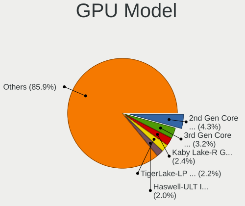

| Model                                                                                    | Computers | Percent |
|------------------------------------------------------------------------------------------|-----------|---------|
| Intel 2nd Generation Core Processor Family Integrated Graphics Controller                | 4297      | 4.28%   |
| Intel 3rd Gen Core processor Graphics Controller                                         | 3198      | 3.19%   |
| Intel Kaby Lake-R GT2 [UHD Graphics 620]                                                 | 2364      | 2.36%   |
| Intel TigerLake-LP GT2 [Iris Xe Graphics]                                                | 2219      | 2.21%   |
| Intel Haswell-ULT Integrated Graphics Controller                                         | 2017      | 2.01%   |
| Intel Kaby Lake-U GT2 [HD Graphics 620]                                                  | 1798      | 1.79%   |
| Intel Skylake-U GT2 [HD Graphics 520]                                                    | 1749      | 1.74%   |
| Intel WhiskeyLake-U GT2 [UHD Graphics 620]                                               | 1709      | 1.7%    |
| Intel Xeon E3-1200 v3/4th Gen Core Processor Integrated Graphics Controller              | 1707      | 1.7%    |
| Intel CoffeeLake-H GT2 [UHD Graphics 630]                                                | 1580      | 1.58%   |
| Intel Core Processor Integrated Graphics Controller                                      | 1512      | 1.51%   |
| Intel CometLake-U GT2 [UHD Graphics]                                                     | 1408      | 1.4%    |
| Intel Broadwell-U GT2 [HD Graphics 5500]                                                 | 1396      | 1.39%   |
| AMD Picasso/Raven 2 [Radeon Vega Series / Radeon Vega Mobile Series]                     | 1357      | 1.35%   |
| Intel Atom/Celeron/Pentium Processor x5-E8000/J3xxx/N3xxx Integrated Graphics Controller | 1244      | 1.24%   |
| Intel 4th Gen Core Processor Integrated Graphics Controller                              | 1187      | 1.18%   |
| Intel Mobile 4 Series Chipset Integrated Graphics Controller                             | 1076      | 1.07%   |
| AMD Ellesmere [Radeon RX 470/480/570/570X/580/580X/590]                                  | 1073      | 1.07%   |
| AMD Renoir [Radeon Vega Series / Radeon Vega Mobile Series]                              | 1063      | 1.06%   |
| Intel Atom Processor Z36xxx/Z37xxx Series Graphics & Display                             | 967       | 0.96%   |
| AMD Cezanne [Radeon Vega Series / Radeon Vega Mobile Series]                             | 945       | 0.94%   |
| Intel CoffeeLake-S GT2 [UHD Graphics 630]                                                | 921       | 0.92%   |
| Intel Xeon E3-1200 v2/3rd Gen Core processor Graphics Controller                         | 912       | 0.91%   |
| Intel Skylake-S GT2 [HD Graphics 530]                                                    | 821       | 0.82%   |
| Intel GeminiLake [UHD Graphics 600]                                                      | 808       | 0.81%   |
| Nvidia GK208B [GeForce GT 710]                                                           | 774       | 0.77%   |
| AMD Lucienne                                                                             | 697       | 0.69%   |
| Nvidia TU117M [GeForce GTX 1650 Mobile / Max-Q]                                          | 696       | 0.69%   |
| Intel CometLake-H GT2 [UHD Graphics]                                                     | 696       | 0.69%   |
| Intel 4 Series Chipset Integrated Graphics Controller                                    | 690       | 0.69%   |
| Intel Alder Lake-P GT2 [Iris Xe Graphics]                                                | 687       | 0.68%   |
| AMD Raven Ridge [Radeon Vega Series / Radeon Vega Mobile Series]                         | 605       | 0.6%    |
| Intel Kaby Lake-H GT2 [HD Graphics 630]                                                  | 603       | 0.6%    |
| Nvidia GP107 [GeForce GTX 1050 Ti]                                                       | 575       | 0.57%   |
| Intel Raptor Lake-P [Iris Xe Graphics]                                                   | 574       | 0.57%   |
| AMD Stoney [Radeon R2/R3/R4/R5 Graphics]                                                 | 573       | 0.57%   |
| ASPEED Technology ASPEED Graphics Family                                                 | 568       | 0.57%   |
| Intel Kaby Lake-S GT2 [HD Graphics 630]                                                  | 514       | 0.51%   |
| Nvidia GP107M [GeForce GTX 1050 Mobile]                                                  | 507       | 0.51%   |
| Nvidia GT218 [GeForce 210]                                                               | 497       | 0.5%    |

GPU Combo
---------

Combinations of graphics cards

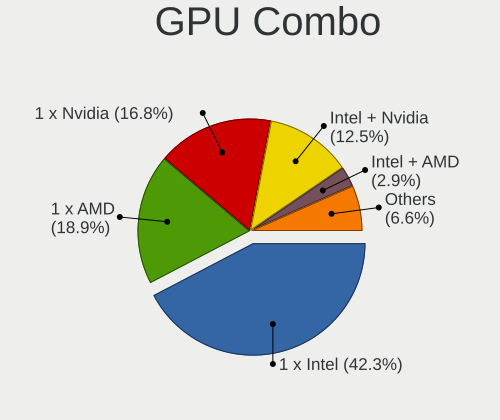

| Name                         | Computers | Percent |
|------------------------------|-----------|---------|
| 1 x Intel                    | 35245     | 42.33%  |
| 1 x AMD                      | 15709     | 18.87%  |
| 1 x Nvidia                   | 13984     | 16.8%   |
| Intel + Nvidia               | 10378     | 12.46%  |
| Intel + AMD                  | 2441      | 2.93%   |
| AMD + Nvidia                 | 1359      | 1.63%   |
| 2 x AMD                      | 1153      | 1.38%   |
| Other                        | 1006      | 1.21%   |
| 1 x Matrox                   | 649       | 0.78%   |
| 1 x ASPEED                   | 371       | 0.45%   |
| 2 x Nvidia                   | 250       | 0.3%    |
| Nvidia + ASPEED              | 158       | 0.19%   |
| 1 x SiS                      | 108       | 0.13%   |
| Nvidia + Matrox              | 82        | 0.1%    |
| 1 x VIA                      | 64        | 0.08%   |
| 2 x Intel                    | 44        | 0.05%   |
| Intel + 2 x Nvidia           | 27        | 0.03%   |
| AMD + ASPEED                 | 24        | 0.03%   |
| 1 x XGI                      | 23        | 0.03%   |
| AMD + Matrox                 | 21        | 0.03%   |
| 1 x Huawei Technologies      | 18        | 0.02%   |
| 1 x Zhaoxin                  | 14        | 0.02%   |
| Intel + AMD + 1 x Nvidia     | 14        | 0.02%   |
| 2 x Nvidia + 1 x ASPEED      | 12        | 0.01%   |
| 3 x AMD                      | 9         | 0.01%   |
| Intel + 2 x AMD              | 9         | 0.01%   |
| AMD + 2 x Nvidia             | 8         | 0.01%   |
| 2 x AMD + 1 x Nvidia         | 7         | 0.01%   |
| Intel + ASPEED               | 7         | 0.01%   |
| 1 x Intel + 3 x Nvidia       | 6         | 0.01%   |
| 3 x Nvidia                   | 5         | 0.01%   |
| 2 x Nvidia + 1 x Matrox      | 5         | 0.01%   |
| 1 x Silicon Motion           | 5         | 0.01%   |
| AMD + XGI                    | 3         | 0.004%  |
| AMD + Nvidia + 1 x ASPEED    | 3         | 0.004%  |
| 4 x Nvidia                   | 2         | 0.002%  |
| 3 x Nvidia + 1 x ASPEED      | 2         | 0.002%  |
| Nvidia + Huawei Technologies | 2         | 0.002%  |
| 1 x Intel + 4 x Nvidia       | 2         | 0.002%  |
| 1 x Intel + 3 x AMD          | 2         | 0.002%  |

GPU Driver
----------

Free vs proprietary

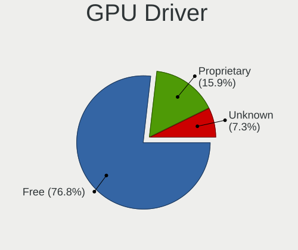

| Driver      | Computers | Percent |
|-------------|-----------|---------|
| Free        | 64565     | 76.81%  |
| Proprietary | 13395     | 15.94%  |
| Unknown     | 6099      | 7.26%   |

GPU Memory
----------

Total video memory

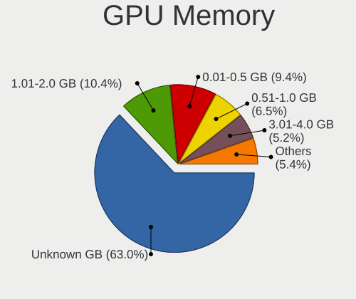

| Size in GB     | Computers | Percent |
|----------------|-----------|---------|
| Unknown        | 53536     | 62.98%  |
| 1.01-2.0       | 8871      | 10.44%  |
| 0.01-0.5       | 8003      | 9.42%   |
| 0.51-1.0       | 5543      | 6.52%   |
| 3.01-4.0       | 4461      | 5.25%   |
| 7.01-8.0       | 2017      | 2.37%   |
| 5.01-6.0       | 1169      | 1.38%   |
| 8.01-16.0      | 744       | 0.88%   |
| 2.01-3.0       | 425       | 0.5%    |
| 16.01-24.0     | 168       | 0.2%    |
| 4.01-5.0       | 29        | 0.03%   |
| 32.01-64.0     | 15        | 0.02%   |
| 24.01-32.0     | 14        | 0.02%   |
| 6.01-7.0       | 2         | 0.002%  |
| 0              | 2         | 0.002%  |
| More than 64.0 | 1         | 0.001%  |

Monitor
-------

Monitor Vendor
--------------

Monitor vendors

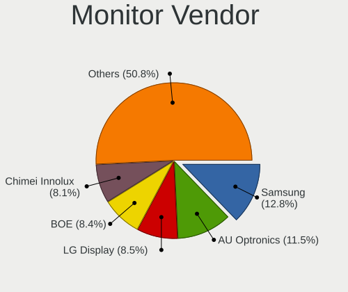

| Vendor                  | Computers | Percent |
|-------------------------|-----------|---------|
| Samsung Electronics     | 11337     | 12.79%  |
| AU Optronics            | 10157     | 11.46%  |
| LG Display              | 7542      | 8.51%   |
| BOE                     | 7441      | 8.39%   |
| Chimei Innolux          | 7166      | 8.08%   |
| Dell                    | 5619      | 6.34%   |
| Goldstar                | 4355      | 4.91%   |
| Hewlett-Packard         | 3295      | 3.72%   |
| Acer                    | 2835      | 3.2%    |
| AOC                     | 1944      | 2.19%   |
| Philips                 | 1801      | 2.03%   |
| Apple                   | 1790      | 2.02%   |
| Ancor Communications    | 1771      | 2%      |
| BenQ                    | 1740      | 1.96%   |
| Lenovo                  | 1715      | 1.93%   |
| Sharp                   | 1713      | 1.93%   |
| Chi Mei Optoelectronics | 1207      | 1.36%   |
| Iiyama                  | 935       | 1.05%   |
| ViewSonic               | 847       | 0.96%   |
| Sony                    | 729       | 0.82%   |
| PANDA                   | 692       | 0.78%   |
| ASUSTek Computer        | 671       | 0.76%   |
| Unknown                 | 625       | 0.7%    |
| InfoVision              | 613       | 0.69%   |
| LG Electronics          | 529       | 0.6%    |
| LG Philips              | 370       | 0.42%   |
| Panasonic               | 304       | 0.34%   |
| Fujitsu Siemens         | 302       | 0.34%   |
| HannStar                | 298       | 0.34%   |
| MSI                     | 297       | 0.33%   |
| NEC Computers           | 295       | 0.33%   |
| Vizio                   | 287       | 0.32%   |
| Eizo                    | 280       | 0.32%   |
| CSO                     | 272       | 0.31%   |
| Toshiba                 | 239       | 0.27%   |
| Sceptre Tech            | 222       | 0.25%   |
| Medion                  | 192       | 0.22%   |
| RTK                     | 171       | 0.19%   |
| HKC                     | 158       | 0.18%   |
| Vestel Elektronik       | 144       | 0.16%   |

Monitor Model
-------------

Monitor models

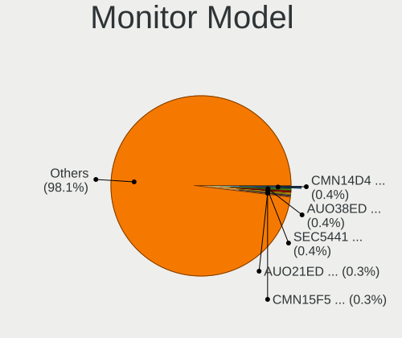

| Model                                                                    | Computers | Percent |
|--------------------------------------------------------------------------|-----------|---------|
| Chimei Innolux LCD Monitor CMN14D4 1920x1080 309x173mm 13.9-inch         | 411       | 0.45%   |
| AU Optronics LCD Monitor AUO38ED 1920x1080 344x193mm 15.5-inch           | 389       | 0.42%   |
| Samsung Electronics LCD Monitor SEC5441 1280x800 331x207mm 15.4-inch     | 336       | 0.37%   |
| AU Optronics LCD Monitor AUO21ED 1920x1080 344x193mm 15.5-inch           | 320       | 0.35%   |
| Chimei Innolux LCD Monitor CMN15F5 1920x1080 344x193mm 15.5-inch         | 307       | 0.33%   |
| LG Display LCD Monitor LGD02DC 1366x768 344x194mm 15.5-inch              | 293       | 0.32%   |
| Chimei Innolux LCD Monitor CMN15DB 1366x768 344x193mm 15.5-inch          | 290       | 0.32%   |
| AU Optronics LCD Monitor AUO403D 1920x1080 309x174mm 14.0-inch           | 237       | 0.26%   |
| Goldstar FULL HD GSM5B55 1920x1080 480x270mm 21.7-inch                   | 236       | 0.26%   |
| Chimei Innolux LCD Monitor CMN15E7 1920x1080 344x193mm 15.5-inch         | 235       | 0.26%   |
| AU Optronics LCD Monitor AUO22EC 1366x768 344x193mm 15.5-inch            | 233       | 0.25%   |
| Chi Mei Optoelectronics LCD Monitor CMO15A7 1366x768 344x193mm 15.5-inch | 195       | 0.21%   |
| Goldstar LG ULTRAWIDE GSM59F1 2560x1080 670x280mm 28.6-inch              | 192       | 0.21%   |
| LG Display LCD Monitor LGD033A 1366x768 344x194mm 15.5-inch              | 173       | 0.19%   |
| Goldstar LG IPS FULLHD GSM5AB8 1920x1080 480x270mm 21.7-inch             | 168       | 0.18%   |
| AU Optronics LCD Monitor AUO26EC 1366x768 344x193mm 15.5-inch            | 167       | 0.18%   |
| Samsung Electronics C24F390 SAM0D2C 1920x1080 521x293mm 23.5-inch        | 162       | 0.18%   |
| AU Optronics LCD Monitor AUO71EC 1366x768 344x193mm 15.5-inch            | 162       | 0.18%   |
| Samsung Electronics C27F390 SAM0D32 1920x1080 598x336mm 27.0-inch        | 161       | 0.18%   |
| BOE LCD Monitor BOE06A4 1366x768 344x194mm 15.5-inch                     | 159       | 0.17%   |
| BOE LCD Monitor BOE0872 1920x1080 344x194mm 15.5-inch                    | 158       | 0.17%   |
| AU Optronics LCD Monitor AUO45EC 1366x768 344x193mm 15.5-inch            | 155       | 0.17%   |
| Chimei Innolux LCD Monitor CMN15E8 1920x1080 344x193mm 15.5-inch         | 149       | 0.16%   |
| Dell U2412M DELA07A 1920x1200 518x324mm 24.1-inch                        | 145       | 0.16%   |
| Vestel Elektronik 40UHD_LCD_TV VES3700 3840x2160 880x500mm 39.8-inch     | 144       | 0.16%   |
| Chimei Innolux LCD Monitor CMN1521 1920x1080 344x193mm 15.5-inch         | 144       | 0.16%   |
| AU Optronics LCD Monitor AUO10EC 1366x768 344x193mm 15.5-inch            | 144       | 0.16%   |
| Chimei Innolux LCD Monitor CMN15E6 1366x768 344x193mm 15.5-inch          | 140       | 0.15%   |
| Samsung Electronics S24F350 SAM0D20 1920x1080 521x293mm 23.5-inch        | 139       | 0.15%   |
| AU Optronics LCD Monitor AUO2E3C 1366x768 309x173mm 13.9-inch            | 130       | 0.14%   |
| Chimei Innolux LCD Monitor CMN15D5 1920x1080 344x193mm 15.5-inch         | 129       | 0.14%   |
| Chimei Innolux LCD Monitor CMN15CA 1366x768 344x193mm 15.5-inch          | 129       | 0.14%   |
| LG Display LCD Monitor LGD0456 1366x768 344x194mm 15.5-inch              | 125       | 0.14%   |
| BOE LCD Monitor BOE0687 1920x1080 344x193mm 15.5-inch                    | 123       | 0.13%   |
| LG Display LCD Monitor LGD046F 1920x1080 344x194mm 15.5-inch             | 121       | 0.13%   |
| PANDA LCD Monitor NCP004D 1920x1080 344x194mm 15.5-inch                  | 120       | 0.13%   |
| Chimei Innolux LCD Monitor CMN15DC 1366x768 344x193mm 15.5-inch          | 120       | 0.13%   |
| Chimei Innolux LCD Monitor CMN14D6 1366x768 309x173mm 13.9-inch          | 120       | 0.13%   |
| Chimei Innolux LCD Monitor CMN14C9 1920x1080 309x173mm 13.9-inch         | 120       | 0.13%   |
| BOE LCD Monitor BOE06A5 1366x768 344x194mm 15.5-inch                     | 119       | 0.13%   |

Monitor Resolution
------------------

Monitor screen resolution

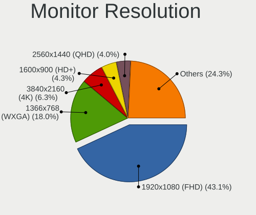

| Resolution         | Computers | Percent |
|--------------------|-----------|---------|
| 1920x1080 (FHD)    | 36675     | 43.1%   |
| 1366x768 (WXGA)    | 15338     | 18.03%  |
| 3840x2160 (4K)     | 5319      | 6.25%   |
| 1600x900 (HD+)     | 3693      | 4.34%   |
| 2560x1440 (QHD)    | 3422      | 4.02%   |
| 1280x1024 (SXGA)   | 2766      | 3.25%   |
| 1920x1200 (WUXGA)  | 2722      | 3.2%    |
| 1680x1050 (WSXGA+) | 2334      | 2.74%   |
| 1440x900 (WXGA+)   | 2037      | 2.39%   |
| 1280x800 (WXGA)    | 1641      | 1.93%   |
| Unknown            | 1038      | 1.22%   |
| 2560x1600          | 886       | 1.04%   |
| 3440x1440          | 750       | 0.88%   |
| 1360x768           | 697       | 0.82%   |
| 2560x1080          | 665       | 0.78%   |
| 2880x1800          | 574       | 0.67%   |
| 3840x1080          | 461       | 0.54%   |
| 1024x768 (XGA)     | 374       | 0.44%   |
| 1920x540           | 339       | 0.4%    |
| 3840x2400          | 307       | 0.36%   |
| 2160x1440          | 248       | 0.29%   |
| 1600x1200          | 198       | 0.23%   |
| 1024x600           | 182       | 0.21%   |
| 3200x1800 (QHD+)   | 151       | 0.18%   |
| 2880x1920          | 148       | 0.17%   |
| 2288x1287          | 128       | 0.15%   |
| 1280x720 (HD)      | 127       | 0.15%   |
| 1920x1280          | 96        | 0.11%   |
| 3200x2000          | 83        | 0.1%    |
| 2256x1504          | 83        | 0.1%    |
| 3840x1600          | 79        | 0.09%   |
| 3072x1920          | 78        | 0.09%   |
| 3000x2000          | 70        | 0.08%   |
| 2736x1824          | 64        | 0.08%   |
| 1400x1050          | 64        | 0.08%   |
| 2880x1620          | 57        | 0.07%   |
| 3456x2160          | 49        | 0.06%   |
| 2240x1400          | 45        | 0.05%   |
| 2048x1152          | 44        | 0.05%   |
| 4480x1440          | 43        | 0.05%   |

Monitor Diagonal
----------------

Diagonal size in inches

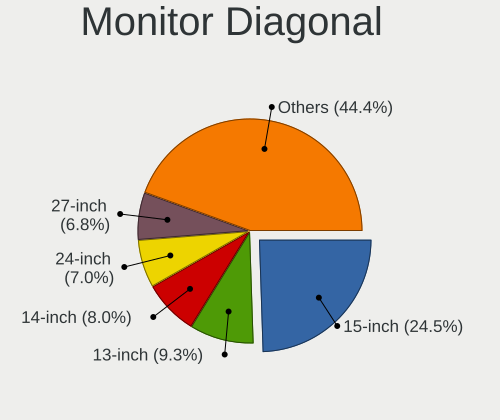

| Inches  | Computers | Percent |
|---------|-----------|---------|
| 15      | 21662     | 24.48%  |
| 13      | 8229      | 9.3%    |
| 14      | 7070      | 7.99%   |
| 24      | 6151      | 6.95%   |
| 27      | 6043      | 6.83%   |
| 23      | 5218      | 5.9%    |
| 17      | 4770      | 5.39%   |
| Unknown | 4633      | 5.24%   |
| 21      | 4540      | 5.13%   |
| 19      | 2728      | 3.08%   |
| 31      | 2134      | 2.41%   |
| 18      | 1737      | 1.96%   |
| 22      | 1483      | 1.68%   |
| 20      | 1452      | 1.64%   |
| 16      | 1339      | 1.51%   |
| 12      | 1296      | 1.46%   |
| 34      | 1110      | 1.25%   |
| 11      | 868       | 0.98%   |
| 84      | 681       | 0.77%   |
| 32      | 547       | 0.62%   |
| 72      | 504       | 0.57%   |
| 40      | 467       | 0.53%   |
| 54      | 442       | 0.5%    |
| 10      | 328       | 0.37%   |
| 25      | 315       | 0.36%   |
| 26      | 260       | 0.29%   |
| 28      | 189       | 0.21%   |
| 48      | 163       | 0.18%   |
| 46      | 150       | 0.17%   |
| 52      | 147       | 0.17%   |
| 63      | 142       | 0.16%   |
| 37      | 140       | 0.16%   |
| 65      | 126       | 0.14%   |
| 49      | 124       | 0.14%   |
| 42      | 117       | 0.13%   |
| 29      | 107       | 0.12%   |
| 43      | 100       | 0.11%   |
| 142     | 99        | 0.11%   |
| 33      | 82        | 0.09%   |
| 39      | 73        | 0.08%   |

Monitor Width
-------------

Physical width

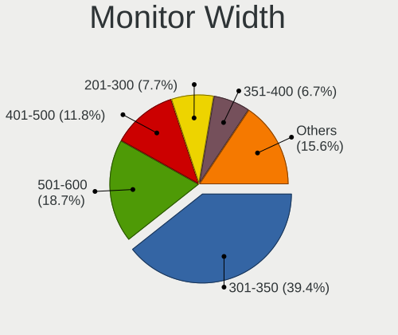

| Width in mm    | Computers | Percent |
|----------------|-----------|---------|
| 301-350        | 34317     | 39.36%  |
| 501-600        | 16341     | 18.74%  |
| 401-500        | 10328     | 11.85%  |
| 201-300        | 6736      | 7.73%   |
| 351-400        | 5850      | 6.71%   |
| Unknown        | 4633      | 5.31%   |
| 601-700        | 3095      | 3.55%   |
| 701-800        | 1800      | 2.06%   |
| 1001-1500      | 1560      | 1.79%   |
| 1501-2000      | 1325      | 1.52%   |
| 801-900        | 778       | 0.89%   |
| 901-1000       | 259       | 0.3%    |
| More than 2000 | 103       | 0.12%   |
| 101-200        | 47        | 0.05%   |
| 1-100          | 6         | 0.01%   |

Aspect Ratio
------------

Proportional relationship between the width and the height

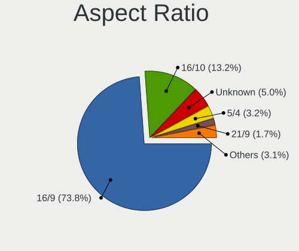

| Ratio   | Computers | Percent |
|---------|-----------|---------|
| 16/9    | 59174     | 73.84%  |
| 16/10   | 10577     | 13.2%   |
| Unknown | 3997      | 4.99%   |
| 5/4     | 2561      | 3.2%    |
| 21/9    | 1328      | 1.66%   |
| 3/2     | 1014      | 1.27%   |
| 4/3     | 797       | 0.99%   |
| 32/9    | 256       | 0.32%   |
| 6/5     | 155       | 0.19%   |
| 1.00    | 107       | 0.13%   |
| 0.56    | 47        | 0.06%   |
| 1.96    | 33        | 0.04%   |
| 3.40    | 16        | 0.02%   |
| 0.62    | 16        | 0.02%   |
| 2.00    | 11        | 0.01%   |
| 3.73    | 10        | 0.01%   |
| 3.20    | 7         | 0.01%   |
| 0.89    | 7         | 0.01%   |
| 2.12    | 4         | 0.005%  |
| 2.69    | 2         | 0.002%  |
| 11/10   | 2         | 0.002%  |
| 0.63    | 2         | 0.002%  |
| 3.76    | 1         | 0.001%  |
| 3.33    | 1         | 0.001%  |
| 2.64    | 1         | 0.001%  |
| 2.50    | 1         | 0.001%  |
| 2.24    | 1         | 0.001%  |
| 2.01    | 1         | 0.001%  |
| 0.79    | 1         | 0.001%  |
| 0.75    | 1         | 0.001%  |
| 0.67    | 1         | 0.001%  |
| 0.65    | 1         | 0.001%  |
| 0.45    | 1         | 0.001%  |
| 0.00    | 1         | 0.001%  |

Monitor Area
------------

Area in inch²

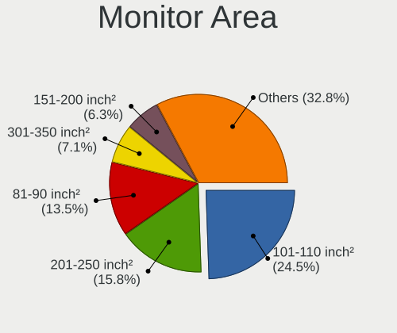

| Area in inch² | Computers | Percent |
|----------------|-----------|---------|
| 101-110        | 21478     | 24.47%  |
| 201-250        | 13898     | 15.84%  |
| 81-90          | 11863     | 13.52%  |
| 301-350        | 6239      | 7.11%   |
| 151-200        | 5544      | 6.32%   |
| Unknown        | 4634      | 5.28%   |
| 351-500        | 4047      | 4.61%   |
| 71-80          | 3351      | 3.82%   |
| 121-130        | 3039      | 3.46%   |
| 141-150        | 2613      | 2.98%   |
| More than 1000 | 2587      | 2.95%   |
| 251-300        | 2328      | 2.65%   |
| 501-1000       | 1462      | 1.67%   |
| 111-120        | 1341      | 1.53%   |
| 61-70          | 1180      | 1.34%   |
| 51-60          | 911       | 1.04%   |
| 131-140        | 626       | 0.71%   |
| 41-50          | 304       | 0.35%   |
| 91-100         | 271       | 0.31%   |
| 1-40           | 50        | 0.06%   |

Pixel Density
-------------

Pixels per inch

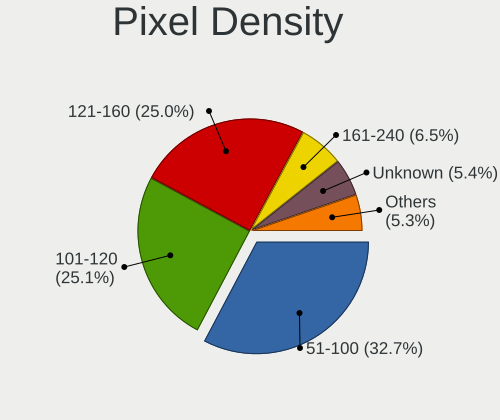

| Density       | Computers | Percent |
|---------------|-----------|---------|
| 51-100        | 27982     | 32.72%  |
| 101-120       | 21493     | 25.13%  |
| 121-160       | 21373     | 24.99%  |
| 161-240       | 5529      | 6.47%   |
| Unknown       | 4634      | 5.42%   |
| 1-50          | 2347      | 2.74%   |
| More than 240 | 2153      | 2.52%   |

Multiple Monitors
-----------------

Total monitors connected

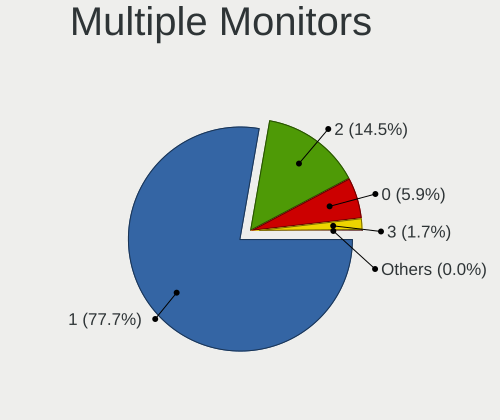

| Total | Computers | Percent |
|-------|-----------|---------|
| 1     | 65926     | 77.74%  |
| 2     | 12306     | 14.51%  |
| 0     | 5030      | 5.93%   |
| 3     | 1408      | 1.66%   |
| 4     | 120       | 0.14%   |
| 5     | 8         | 0.01%   |
| 6     | 4         | 0.005%  |

Network
-------

Net Controller Vendor
---------------------

Controller vendors

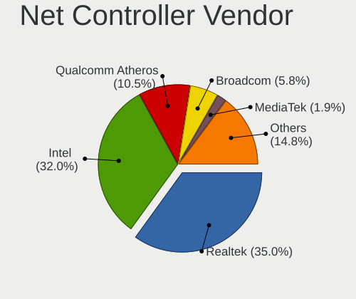

| Vendor                            | Computers | Percent |
|-----------------------------------|-----------|---------|
| Realtek Semiconductor             | 43659     | 34.97%  |
| Intel                             | 39967     | 32.02%  |
| Qualcomm Atheros                  | 13076     | 10.47%  |
| Broadcom                          | 7244      | 5.8%    |
| MediaTek                          | 2427      | 1.94%   |
| Broadcom Limited                  | 1507      | 1.21%   |
| Ralink Technology                 | 1490      | 1.19%   |
| TP-Link                           | 1406      | 1.13%   |
| Marvell Technology Group          | 1384      | 1.11%   |
| Ralink                            | 1208      | 0.97%   |
| Nvidia                            | 1147      | 0.92%   |
| ASIX Electronics                  | 660       | 0.53%   |
| Samsung Electronics               | 650       | 0.52%   |
| Shenzhen Goodix Technology        | 608       | 0.49%   |
| NetGear                           | 391       | 0.31%   |
| Qualcomm Atheros Communications   | 390       | 0.31%   |
| Dell                              | 380       | 0.3%    |
| DisplayLink                       | 376       | 0.3%    |
| Xiaomi                            | 372       | 0.3%    |
| Sierra Wireless                   | 312       | 0.25%   |
| D-Link                            | 293       | 0.23%   |
| Huawei Technologies               | 286       | 0.23%   |
| Aquantia                          | 271       | 0.22%   |
| ASUSTek Computer                  | 255       | 0.2%    |
| Lenovo                            | 254       | 0.2%    |
| Qualcomm                          | 244       | 0.2%    |
| D-Link System                     | 242       | 0.19%   |
| Hewlett-Packard                   | 238       | 0.19%   |
| Ericsson Business Mobile Networks | 235       | 0.19%   |
| Microsoft                         | 219       | 0.18%   |
| JMicron Technology                | 195       | 0.16%   |
| Edimax Technology                 | 187       | 0.15%   |
| Linksys                           | 139       | 0.11%   |
| VIA Technologies                  | 123       | 0.1%    |
| Belkin Components                 | 122       | 0.1%    |
| Motorola PCS                      | 120       | 0.1%    |
| Silicon Integrated Systems [SiS]  | 117       | 0.09%   |
| OPPO Electronics                  | 112       | 0.09%   |
| Mellanox Technologies             | 106       | 0.08%   |
| Apple                             | 105       | 0.08%   |

Net Controller Model
--------------------

Controller models

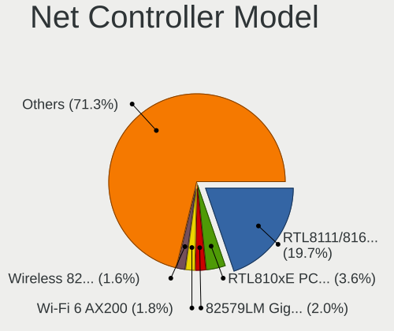

| Model                                                                  | Computers | Percent |
|------------------------------------------------------------------------|-----------|---------|
| Realtek RTL8111/8168/8211/8411 PCI Express Gigabit Ethernet Controller | 28942     | 19.74%  |
| Realtek RTL810xE PCI Express Fast Ethernet controller                  | 5287      | 3.61%   |
| Intel 82579LM Gigabit Network Connection (Lewisville)                  | 2920      | 1.99%   |
| Intel Wi-Fi 6 AX200                                                    | 2622      | 1.79%   |
| Intel Wireless 8265 / 8275                                             | 2365      | 1.61%   |
| Realtek RTL8153 Gigabit Ethernet Adapter                               | 2295      | 1.57%   |
| Qualcomm Atheros QCA9377 802.11ac Wireless Network Adapter             | 1914      | 1.31%   |
| Intel Wi-Fi 6 AX201                                                    | 1912      | 1.3%    |
| Realtek RTL8125 2.5GbE Controller                                      | 1870      | 1.28%   |
| Qualcomm Atheros AR9485 Wireless Network Adapter                       | 1740      | 1.19%   |
| Qualcomm Atheros QCA9565 / AR9565 Wireless Network Adapter             | 1734      | 1.18%   |
| Intel Wireless 7265                                                    | 1671      | 1.14%   |
| Realtek RTL8821CE 802.11ac PCIe Wireless Network Adapter               | 1637      | 1.12%   |
| Intel Wireless 7260                                                    | 1469      | 1%      |
| Qualcomm Atheros AR9285 Wireless Network Adapter (PCI-Express)         | 1393      | 0.95%   |
| Qualcomm Atheros QCA6174 802.11ac Wireless Network Adapter             | 1371      | 0.94%   |
| Intel Wireless 8260                                                    | 1350      | 0.92%   |
| Intel I211 Gigabit Network Connection                                  | 1343      | 0.92%   |
| Realtek RTL8822CE 802.11ac PCIe Wireless Network Adapter               | 1227      | 0.84%   |
| Intel Ethernet Connection (2) I219-V                                   | 1222      | 0.83%   |
| Intel Comet Lake PCH-LP CNVi WiFi                                      | 1220      | 0.83%   |
| Intel Ethernet Connection I217-LM                                      | 1184      | 0.81%   |
| Intel Alder Lake-P PCH CNVi WiFi                                       | 1152      | 0.79%   |
| Intel Cannon Point-LP CNVi [Wireless-AC]                               | 1113      | 0.76%   |
| Intel Wireless 3165                                                    | 1090      | 0.74%   |
| Intel Cannon Lake PCH CNVi WiFi                                        | 1072      | 0.73%   |
| Intel Centrino Advanced-N 6205 [Taylor Peak]                           | 1059      | 0.72%   |
| Broadcom BCM4313 802.11bgn Wireless Network Adapter                    | 869       | 0.59%   |
| Intel Wi-Fi 6E(802.11ax) AX210/AX1675* 2x2 [Typhoon Peak]              | 820       | 0.56%   |
| Realtek RTL8723BE PCIe Wireless Network Adapter                        | 819       | 0.56%   |
| Intel Dual Band Wireless-AC 3168NGW [Stone Peak]                       | 816       | 0.56%   |
| MediaTek MT7921 802.11ax PCIe Wireless Network Adapter [Filogic 330]   | 789       | 0.54%   |
| Intel Comet Lake PCH CNVi WiFi                                         | 788       | 0.54%   |
| Intel 82579V Gigabit Network Connection                                | 784       | 0.53%   |
| Intel Ethernet Controller I225-V                                       | 750       | 0.51%   |
| Broadcom BCM43142 802.11b/g/n                                          | 733       | 0.5%    |
| Intel Ethernet Connection (4) I219-LM                                  | 719       | 0.49%   |
| Intel Ethernet Connection (2) I219-LM                                  | 671       | 0.46%   |
| Qualcomm Atheros AR8151 v2.0 Gigabit Ethernet                          | 664       | 0.45%   |
| Intel Wi-Fi 5(802.11ac) Wireless-AC 9x6x [Thunder Peak]                | 662       | 0.45%   |

Wireless Vendor
---------------

Wireless vendors

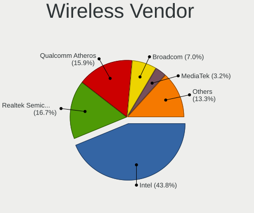

| Vendor                                | Computers | Percent |
|---------------------------------------|-----------|---------|
| Intel                                 | 28689     | 43.79%  |
| Realtek Semiconductor                 | 10956     | 16.72%  |
| Qualcomm Atheros                      | 10443     | 15.94%  |
| Broadcom                              | 4616      | 7.05%   |
| MediaTek                              | 2121      | 3.24%   |
| Ralink Technology                     | 1490      | 2.27%   |
| TP-Link                               | 1268      | 1.94%   |
| Ralink                                | 1206      | 1.84%   |
| Broadcom Limited                      | 979       | 1.49%   |
| Qualcomm Atheros Communications       | 390       | 0.6%    |
| NetGear                               | 385       | 0.59%   |
| Sierra Wireless                       | 312       | 0.48%   |
| D-Link                                | 284       | 0.43%   |
| ASUSTek Computer                      | 235       | 0.36%   |
| Marvell Technology Group              | 233       | 0.36%   |
| Dell                                  | 228       | 0.35%   |
| Edimax Technology                     | 187       | 0.29%   |
| Microsoft                             | 173       | 0.26%   |
| Qualcomm                              | 164       | 0.25%   |
| D-Link System                         | 161       | 0.25%   |
| Linksys                               | 119       | 0.18%   |
| Belkin Components                     | 116       | 0.18%   |
| IMC Networks                          | 79        | 0.12%   |
| Fibocom                               | 76        | 0.12%   |
| AVM                                   | 63        | 0.1%    |
| Hewlett-Packard                       | 60        | 0.09%   |
| ZyDAS                                 | 37        | 0.06%   |
| Sitecom Europe                        | 37        | 0.06%   |
| Qualcomm Technologies                 | 37        | 0.06%   |
| 802.11g Adapter [Linksys WUSB54GC v3] | 31        | 0.05%   |
| BUFFALO                               | 30        | 0.05%   |
| ZyXEL Communications                  | 28        | 0.04%   |
| Gemtek                                | 28        | 0.04%   |
| Mercucys                              | 24        | 0.04%   |
| Micro Star International              | 22        | 0.03%   |
| Wilocity                              | 15        | 0.02%   |
| Realtek                               | 14        | 0.02%   |
| Wacom                                 | 13        | 0.02%   |
| Tenda                                 | 11        | 0.02%   |
| TRENDnet                              | 10        | 0.02%   |

Wireless Model
--------------

Wireless models

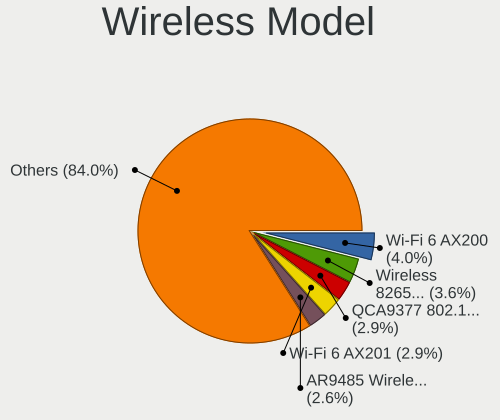

| Model                                                                | Computers | Percent |
|----------------------------------------------------------------------|-----------|---------|
| Intel Wi-Fi 6 AX200                                                  | 2622      | 3.97%   |
| Intel Wireless 8265 / 8275                                           | 2365      | 3.58%   |
| Qualcomm Atheros QCA9377 802.11ac Wireless Network Adapter           | 1914      | 2.9%    |
| Intel Wi-Fi 6 AX201                                                  | 1912      | 2.9%    |
| Qualcomm Atheros AR9485 Wireless Network Adapter                     | 1740      | 2.64%   |
| Qualcomm Atheros QCA9565 / AR9565 Wireless Network Adapter           | 1734      | 2.63%   |
| Intel Wireless 7265                                                  | 1671      | 2.53%   |
| Realtek RTL8821CE 802.11ac PCIe Wireless Network Adapter             | 1637      | 2.48%   |
| Intel Wireless 7260                                                  | 1469      | 2.23%   |
| Qualcomm Atheros AR9285 Wireless Network Adapter (PCI-Express)       | 1393      | 2.11%   |
| Qualcomm Atheros QCA6174 802.11ac Wireless Network Adapter           | 1371      | 2.08%   |
| Intel Wireless 8260                                                  | 1350      | 2.05%   |
| Realtek RTL8822CE 802.11ac PCIe Wireless Network Adapter             | 1227      | 1.86%   |
| Intel Comet Lake PCH-LP CNVi WiFi                                    | 1220      | 1.85%   |
| Intel Cannon Point-LP CNVi [Wireless-AC]                             | 1113      | 1.69%   |
| Intel Wireless 3165                                                  | 1090      | 1.65%   |
| Intel Cannon Lake PCH CNVi WiFi                                      | 1072      | 1.62%   |
| Intel Centrino Advanced-N 6205 [Taylor Peak]                         | 1059      | 1.6%    |
| Broadcom BCM4313 802.11bgn Wireless Network Adapter                  | 869       | 1.32%   |
| Intel Wi-Fi 6E(802.11ax) AX210/AX1675* 2x2 [Typhoon Peak]            | 820       | 1.24%   |
| Realtek RTL8723BE PCIe Wireless Network Adapter                      | 819       | 1.24%   |
| Intel Dual Band Wireless-AC 3168NGW [Stone Peak]                     | 816       | 1.24%   |
| Intel Alder Lake-P PCH CNVi WiFi                                     | 815       | 1.23%   |
| MediaTek MT7921 802.11ax PCIe Wireless Network Adapter [Filogic 330] | 789       | 1.2%    |
| Intel Comet Lake PCH CNVi WiFi                                       | 788       | 1.19%   |
| Broadcom BCM43142 802.11b/g/n                                        | 733       | 1.11%   |
| Intel Wi-Fi 5(802.11ac) Wireless-AC 9x6x [Thunder Peak]              | 662       | 1%      |
| Intel Wireless 3160                                                  | 632       | 0.96%   |
| Realtek RTL8188EUS 802.11n Wireless Network Adapter                  | 622       | 0.94%   |
| Realtek RTL8822BE 802.11a/b/g/n/ac WiFi adapter                      | 614       | 0.93%   |
| Ralink MT7601U Wireless Adapter                                      | 606       | 0.92%   |
| Realtek 802.11ac NIC                                                 | 595       | 0.9%    |
| Realtek RTL8188CE 802.11b/g/n WiFi Adapter                           | 535       | 0.81%   |
| Intel Ice Lake-LP PCH CNVi WiFi                                      | 532       | 0.81%   |
| Intel Dual Band Wireless-AC 3165 Plus Bluetooth                      | 529       | 0.8%    |
| Intel Raptor Lake PCH CNVi WiFi                                      | 525       | 0.8%    |
| MediaTek MT7922 802.11ax PCI Express Wireless Network Adapter        | 518       | 0.78%   |
| Realtek RTL88x2bu [AC1200 Techkey]                                   | 510       | 0.77%   |
| Qualcomm Atheros AR9462 Wireless Network Adapter                     | 472       | 0.72%   |
| Intel Centrino Ultimate-N 6300                                       | 457       | 0.69%   |

Ethernet Vendor
---------------

Ethernet vendors

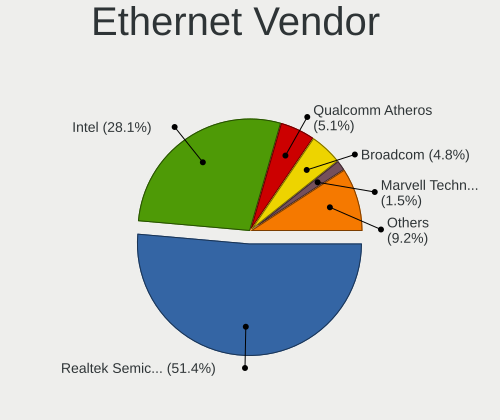

| Vendor                                 | Computers | Percent |
|----------------------------------------|-----------|---------|
| Realtek Semiconductor                  | 39151     | 51.39%  |
| Intel                                  | 21377     | 28.06%  |
| Qualcomm Atheros                       | 3858      | 5.06%   |
| Broadcom                               | 3645      | 4.78%   |
| Marvell Technology Group               | 1152      | 1.51%   |
| Nvidia                                 | 1145      | 1.5%    |
| ASIX Electronics                       | 660       | 0.87%   |
| Samsung Electronics                    | 638       | 0.84%   |
| Broadcom Limited                       | 554       | 0.73%   |
| DisplayLink                            | 376       | 0.49%   |
| Xiaomi                                 | 364       | 0.48%   |
| MediaTek                               | 279       | 0.37%   |
| Aquantia                               | 271       | 0.36%   |
| Lenovo                                 | 249       | 0.33%   |
| Huawei Technologies                    | 207       | 0.27%   |
| JMicron Technology                     | 195       | 0.26%   |
| TP-Link                                | 139       | 0.18%   |
| VIA Technologies                       | 120       | 0.16%   |
| Motorola PCS                           | 120       | 0.16%   |
| Silicon Integrated Systems [SiS]       | 116       | 0.15%   |
| OPPO Electronics                       | 112       | 0.15%   |
| Apple                                  | 98        | 0.13%   |
| Google                                 | 92        | 0.12%   |
| D-Link System                          | 81        | 0.11%   |
| Mellanox Technologies                  | 78        | 0.1%    |
| Hewlett-Packard                        | 78        | 0.1%    |
| Qualcomm                               | 77        | 0.1%    |
| American Megatrends                    | 77        | 0.1%    |
| ICS Advent                             | 67        | 0.09%   |
| Qualcomm Technologies                  | 49        | 0.06%   |
| Microchip Technology                   | 47        | 0.06%   |
| Microsoft                              | 40        | 0.05%   |
| 3Com                                   | 36        | 0.05%   |
| IBM                                    | 33        | 0.04%   |
| Attansic Technology                    | 31        | 0.04%   |
| Insyde Software                        | 30        | 0.04%   |
| Raspberry Pi                           | 28        | 0.04%   |
| OnePlus Technology (Shenzhen)          | 28        | 0.04%   |
| Dell                                   | 28        | 0.04%   |
| Suzhou Motorcomm Electronic Technology | 26        | 0.03%   |

Ethernet Model
--------------

Ethernet models

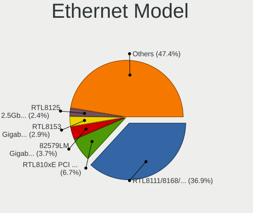

| Model                                                                  | Computers | Percent |
|------------------------------------------------------------------------|-----------|---------|
| Realtek RTL8111/8168/8211/8411 PCI Express Gigabit Ethernet Controller | 28942     | 36.85%  |
| Realtek RTL810xE PCI Express Fast Ethernet controller                  | 5287      | 6.73%   |
| Intel 82579LM Gigabit Network Connection (Lewisville)                  | 2920      | 3.72%   |
| Realtek RTL8153 Gigabit Ethernet Adapter                               | 2295      | 2.92%   |
| Realtek RTL8125 2.5GbE Controller                                      | 1870      | 2.38%   |
| Intel I211 Gigabit Network Connection                                  | 1343      | 1.71%   |
| Intel Ethernet Connection (2) I219-V                                   | 1222      | 1.56%   |
| Intel Ethernet Connection I217-LM                                      | 1184      | 1.51%   |
| Intel 82579V Gigabit Network Connection                                | 784       | 1%      |
| Intel Ethernet Controller I225-V                                       | 750       | 0.95%   |
| Intel Ethernet Connection (4) I219-LM                                  | 719       | 0.92%   |
| Intel Ethernet Connection (2) I219-LM                                  | 671       | 0.85%   |
| Qualcomm Atheros AR8151 v2.0 Gigabit Ethernet                          | 664       | 0.85%   |
| Intel Ethernet Connection (7) I219-V                                   | 623       | 0.79%   |
| Intel I210 Gigabit Network Connection                                  | 593       | 0.76%   |
| Intel Ethernet Connection I219-LM                                      | 583       | 0.74%   |
| Intel 82577LM Gigabit Network Connection                               | 536       | 0.68%   |
| ASIX AX88179 Gigabit Ethernet                                          | 530       | 0.67%   |
| Intel Ethernet Connection (7) I219-LM                                  | 478       | 0.61%   |
| Intel Ethernet Connection I218-LM                                      | 474       | 0.6%    |
| Samsung Galaxy series, misc. (tethering mode)                          | 472       | 0.6%    |
| Intel Ethernet Connection I217-V                                       | 455       | 0.58%   |
| Intel Ethernet Connection (4) I219-V                                   | 434       | 0.55%   |
| Broadcom NetXtreme BCM57765 Gigabit Ethernet PCIe                      | 432       | 0.55%   |
| Qualcomm Atheros AR8161 Gigabit Ethernet                               | 419       | 0.53%   |
| Nvidia MCP61 Ethernet                                                  | 410       | 0.52%   |
| Intel 82574L Gigabit Network Connection                                | 404       | 0.51%   |
| Intel Ethernet Connection (6) I219-V                                   | 398       | 0.51%   |
| Intel Ethernet Connection (3) I218-LM                                  | 393       | 0.5%    |
| Intel 82567LM-3 Gigabit Network Connection                             | 373       | 0.47%   |
| Qualcomm Atheros Killer E220x Gigabit Ethernet Controller              | 369       | 0.47%   |
| Intel Ethernet Connection (2) I218-V                                   | 358       | 0.46%   |
| Realtek RTL-8100/8101L/8139 PCI Fast Ethernet Adapter                  | 356       | 0.45%   |
| Intel I350 Gigabit Network Connection                                  | 352       | 0.45%   |
| Intel Alder Lake-P PCH CNVi WiFi                                       | 337       | 0.43%   |
| Intel 82567LM Gigabit Network Connection                               | 327       | 0.42%   |
| Broadcom NetLink BCM57785 Gigabit Ethernet PCIe                        | 326       | 0.42%   |
| Qualcomm Atheros AR8131 Gigabit Ethernet                               | 316       | 0.4%    |
| Broadcom NetXtreme BCM57766 Gigabit Ethernet PCIe                      | 316       | 0.4%    |
| Qualcomm Atheros QCA8171 Gigabit Ethernet                              | 306       | 0.39%   |

Net Controller Kind
-------------------

Ethernet, WiFi or modem

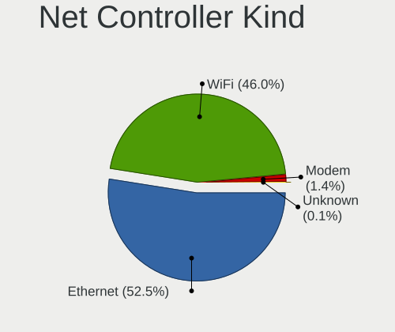

| Kind     | Computers | Percent |
|----------|-----------|---------|
| Ethernet | 70821     | 52.49%  |
| WiFi     | 62079     | 46.02%  |
| Modem    | 1828      | 1.35%   |
| Unknown  | 182       | 0.13%   |

Used Controller
---------------

Currently used network controller

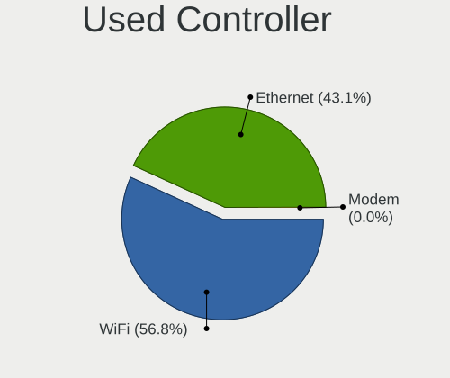

| Kind     | Computers | Percent |
|----------|-----------|---------|
| WiFi     | 48603     | 56.83%  |
| Ethernet | 36879     | 43.12%  |
| Unknown  | 24        | 0.03%   |
| Modem    | 12        | 0.01%   |

NICs
----

Total network controllers on board

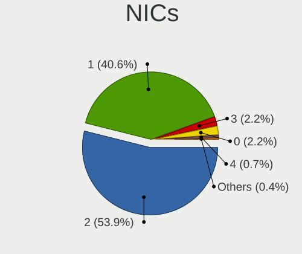

| Total | Computers | Percent |
|-------|-----------|---------|
| 2     | 44762     | 53.91%  |
| 1     | 33678     | 40.56%  |
| 3     | 1855      | 2.23%   |
| 0     | 1804      | 2.17%   |
| 4     | 605       | 0.73%   |
| 5     | 114       | 0.14%   |
| 6     | 113       | 0.14%   |
| 8     | 44        | 0.05%   |
| 7     | 24        | 0.03%   |
| 10    | 16        | 0.02%   |
| 12    | 5         | 0.01%   |
| 11    | 5         | 0.01%   |
| 9     | 5         | 0.01%   |
| 13    | 3         | 0.004%  |
| 18    | 2         | 0.002%  |
| 17    | 2         | 0.002%  |
| 32    | 1         | 0.001%  |

IPv6
----

IPv6 vs IPv4

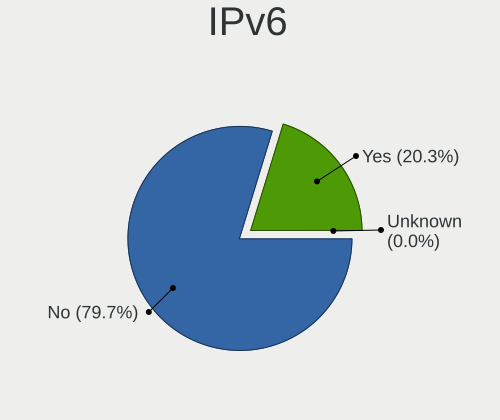

| Used    | Computers | Percent |
|---------|-----------|---------|
| No      | 67247     | 79.72%  |
| Yes     | 17093     | 20.26%  |
| Unknown | 9         | 0.01%   |

Bluetooth
---------

Bluetooth Vendor
----------------

Controller vendors

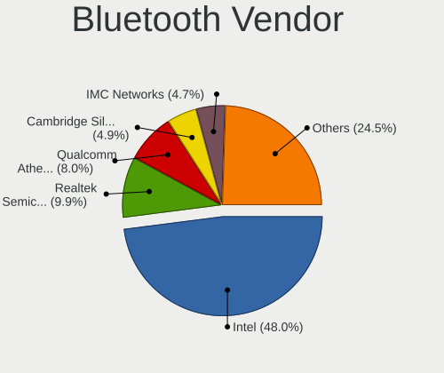

| Vendor                          | Computers | Percent |
|---------------------------------|-----------|---------|
| Intel                           | 23901     | 47.97%  |
| Realtek Semiconductor           | 4947      | 9.93%   |
| Qualcomm Atheros Communications | 3995      | 8.02%   |
| Cambridge Silicon Radio         | 2435      | 4.89%   |
| IMC Networks                    | 2351      | 4.72%   |
| Broadcom                        | 2199      | 4.41%   |
| Foxconn / Hon Hai               | 1853      | 3.72%   |
| Apple                           | 1836      | 3.69%   |
| Lite-On Technology              | 1484      | 2.98%   |
| ASUSTek Computer                | 761       | 1.53%   |
| Dell                            | 666       | 1.34%   |
| Hewlett-Packard                 | 485       | 0.97%   |
| MediaTek                        | 457       | 0.92%   |
| Ralink                          | 361       | 0.72%   |
| Realtek                         | 347       | 0.7%    |
| Toshiba                         | 340       | 0.68%   |
| Marvell Semiconductor           | 228       | 0.46%   |
| TP-Link                         | 173       | 0.35%   |
| Alps Electric                   | 133       | 0.27%   |
| Foxconn International           | 120       | 0.24%   |
| Ralink Technology               | 78        | 0.16%   |
| USI                             | 72        | 0.14%   |
| Integrated System Solution      | 69        | 0.14%   |
| Dynex                           | 49        | 0.1%    |
| Belkin Components               | 49        | 0.1%    |
| Unknown                         | 46        | 0.09%   |
| Askey Computer                  | 41        | 0.08%   |
| Edimax Technology               | 38        | 0.08%   |
| Micro Star International        | 36        | 0.07%   |
| Chicony Electronics             | 27        | 0.05%   |
| Opticis                         | 23        | 0.05%   |
| Logitech                        | 23        | 0.05%   |
| Actions                         | 23        | 0.05%   |
| Taiyo Yuden                     | 21        | 0.04%   |
| Smart Modular Technologies      | 21        | 0.04%   |
| Qcom                            | 14        | 0.03%   |
| HTC (High Tech Computer)        | 13        | 0.03%   |
| Conwise Technology              | 13        | 0.03%   |
| D-Link System                   | 9         | 0.02%   |
| SiW                             | 8         | 0.02%   |

Bluetooth Model
---------------

Controller models

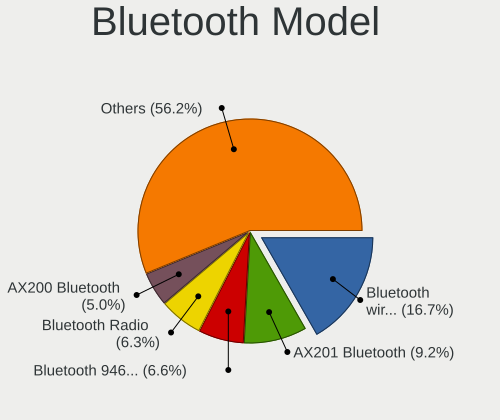

| Model                                               | Computers | Percent |
|-----------------------------------------------------|-----------|---------|
| Intel Bluetooth wireless interface                  | 8344      | 16.73%  |
| Intel AX201 Bluetooth                               | 4567      | 9.16%   |
| Intel Bluetooth 9460/9560 Jefferson Peak (JfP)      | 3287      | 6.59%   |
| Realtek Bluetooth Radio                             | 3164      | 6.35%   |
| Intel AX200 Bluetooth                               | 2474      | 4.96%   |
| Cambridge Silicon Radio Bluetooth Dongle (HCI mode) | 2435      | 4.88%   |
| Intel Bluetooth Device                              | 2002      | 4.02%   |
| Qualcomm Atheros  Bluetooth Device                  | 1903      | 3.82%   |
| Realtek  Bluetooth 4.2 Adapter                      | 1202      | 2.41%   |
| IMC Networks Wireless_Device                        | 841       | 1.69%   |
| Intel Wireless-AC 3168 Bluetooth                    | 799       | 1.6%    |
| Apple Bluetooth Host Controller                     | 777       | 1.56%   |
| Intel AX210 Bluetooth                               | 765       | 1.53%   |
| Intel Centrino Bluetooth Wireless Transceiver       | 755       | 1.51%   |
| IMC Networks Bluetooth Radio                        | 667       | 1.34%   |
| Intel Wireless-AC 9260 Bluetooth Adapter            | 619       | 1.24%   |
| Foxconn / Hon Hai Bluetooth Device                  | 564       | 1.13%   |
| Qualcomm Atheros AR3012 Bluetooth 4.0               | 521       | 1.04%   |
| Qualcomm Atheros AR3011 Bluetooth                   | 519       | 1.04%   |
| IMC Networks Bluetooth Device                       | 480       | 0.96%   |
| Qualcomm Atheros QCA61x4 Bluetooth 4.0              | 472       | 0.95%   |
| Apple Bluetooth USB Host Controller                 | 467       | 0.94%   |
| Lite-On Qualcomm Atheros QCA9377 Bluetooth          | 437       | 0.88%   |
| MediaTek Wireless_Device                            | 436       | 0.87%   |
| Foxconn / Hon Hai Wireless_Device                   | 419       | 0.84%   |
| Lite-On Bluetooth Device                            | 388       | 0.78%   |
| Apple Built-in Bluetooth 2.0+EDR HCI                | 374       | 0.75%   |
| Ralink RT3290 Bluetooth                             | 361       | 0.72%   |
| Realtek Bluetooth Radio                             | 347       | 0.7%    |
| Broadcom BCM2045B (BDC-2.1)                         | 296       | 0.59%   |
| HP Broadcom 2070 Bluetooth Combo                    | 285       | 0.57%   |
| Broadcom BCM20702A0 Bluetooth 4.0                   | 285       | 0.57%   |
| Intel Centrino Advanced-N 6230 Bluetooth adapter    | 282       | 0.57%   |
| Qualcomm Atheros AR9462 Bluetooth                   | 276       | 0.55%   |
| Lite-On Atheros AR3012 Bluetooth                    | 270       | 0.54%   |
| Foxconn / Hon Hai MediaTek Bluetooth Adapter        | 244       | 0.49%   |
| Apple Bluetooth HCI                                 | 216       | 0.43%   |
| Dell DW375 Bluetooth Module                         | 215       | 0.43%   |
| Broadcom BCM20702 Bluetooth 4.0 [ThinkPad]          | 206       | 0.41%   |
| ASUS Broadcom BCM20702A0 Bluetooth                  | 189       | 0.38%   |

Sound
-----

Sound Vendor
------------

Sound card vendors

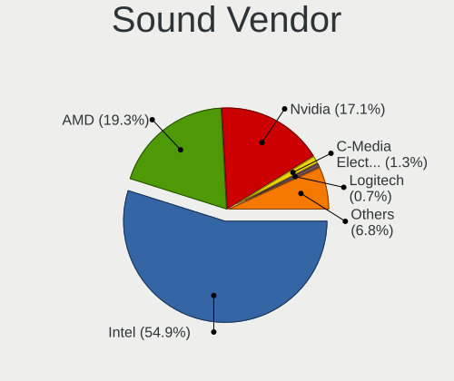

| Vendor                                       | Computers | Percent |
|----------------------------------------------|-----------|---------|
| Intel                                        | 60655     | 54.86%  |
| AMD                                          | 21319     | 19.28%  |
| Nvidia                                       | 18860     | 17.06%  |
| C-Media Electronics                          | 1409      | 1.27%   |
| Logitech                                     | 768       | 0.69%   |
| Creative Labs                                | 542       | 0.49%   |
| GN Netcom                                    | 423       | 0.38%   |
| Realtek Semiconductor                        | 395       | 0.36%   |
| ASUSTek Computer                             | 330       | 0.3%    |
| Texas Instruments                            | 307       | 0.28%   |
| Plantronics                                  | 272       | 0.25%   |
| JMTek                                        | 271       | 0.25%   |
| Generalplus Technology                       | 261       | 0.24%   |
| Lenovo                                       | 249       | 0.23%   |
| Creative Technology                          | 215       | 0.19%   |
| Hewlett-Packard                              | 210       | 0.19%   |
| Kingston Technology                          | 198       | 0.18%   |
| Apple                                        | 181       | 0.16%   |
| VIA Technologies                             | 176       | 0.16%   |
| Razer USA                                    | 172       | 0.16%   |
| Micro Star International                     | 172       | 0.16%   |
| Focusrite-Novation                           | 167       | 0.15%   |
| Corsair                                      | 158       | 0.14%   |
| SteelSeries ApS                              | 142       | 0.13%   |
| Silicon Integrated Systems [SiS]             | 131       | 0.12%   |
| DSEA A/S                                     | 112       | 0.1%    |
| Zoran Co. Personal Media Division (Nogatech) | 91        | 0.08%   |
| Tenx Technology                              | 88        | 0.08%   |
| Dell                                         | 86        | 0.08%   |
| Microsoft                                    | 77        | 0.07%   |
| Blue Microphones                             | 71        | 0.06%   |
| Sony                                         | 68        | 0.06%   |
| Jieli Technology                             | 64        | 0.06%   |
| M-Audio                                      | 59        | 0.05%   |
| BEHRINGER International                      | 54        | 0.05%   |
| KTMicro                                      | 50        | 0.05%   |
| Giga-Byte Technology                         | 50        | 0.05%   |
| Samson Technologies                          | 43        | 0.04%   |
| Conexant Systems                             | 40        | 0.04%   |
| ASRock                                       | 39        | 0.04%   |

Sound Model
-----------

Sound card models

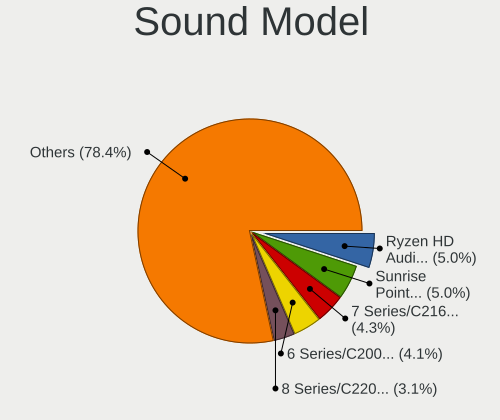

| Model                                                                      | Computers | Percent |
|----------------------------------------------------------------------------|-----------|---------|
| AMD Ryzen HD Audio Controller                                              | 6587      | 5.04%   |
| Intel Sunrise Point-LP HD Audio                                            | 6556      | 5.02%   |
| Intel 7 Series/C216 Chipset Family High Definition Audio Controller        | 5647      | 4.32%   |
| Intel 6 Series/C200 Series Chipset Family High Definition Audio Controller | 5391      | 4.13%   |
| Intel 8 Series/C220 Series Chipset High Definition Audio Controller        | 4039      | 3.09%   |
| Intel Xeon E3-1200 v3/4th Gen Core Processor HD Audio Controller           | 3047      | 2.33%   |
| Intel Cannon Lake PCH cAVS                                                 | 3004      | 2.3%    |
| AMD Renoir/Cezanne HDMI/DP Audio Controller                                | 2963      | 2.27%   |
| AMD SBx00 Azalia (Intel HDA)                                               | 2917      | 2.23%   |
| Intel 5 Series/3400 Series Chipset High Definition Audio                   | 2815      | 2.15%   |
| Intel Tiger Lake-LP Smart Sound Technology Audio Controller                | 2479      | 1.9%    |
| AMD FCH Azalia Controller                                                  | 2378      | 1.82%   |
| Intel 100 Series/C230 Series Chipset Family HD Audio Controller            | 2266      | 1.73%   |
| Intel 82801I (ICH9 Family) HD Audio Controller                             | 2226      | 1.7%    |
| Intel 8 Series HD Audio Controller                                         | 2049      | 1.57%   |
| Intel Haswell-ULT HD Audio Controller                                      | 2042      | 1.56%   |
| AMD Starship/Matisse HD Audio Controller                                   | 2028      | 1.55%   |
| Intel Cannon Point-LP High Definition Audio Controller                     | 1919      | 1.47%   |
| AMD Raven/Raven2/Fenghuang HDMI/DP Audio Controller                        | 1886      | 1.44%   |
| Intel NM10/ICH7 Family High Definition Audio Controller                    | 1866      | 1.43%   |
| Intel Broadwell-U Audio Controller                                         | 1737      | 1.33%   |
| Intel Wildcat Point-LP High Definition Audio Controller                    | 1678      | 1.28%   |
| Intel 200 Series PCH HD Audio                                              | 1631      | 1.25%   |
| Intel Comet Lake PCH-LP cAVS                                               | 1554      | 1.19%   |
| Intel Alder Lake PCH-P High Definition Audio Controller                    | 1458      | 1.12%   |
| Nvidia GP107GL High Definition Audio Controller                            | 1407      | 1.08%   |
| AMD Radeon High Definition Audio Controller                                | 1349      | 1.03%   |
| Nvidia GK208 HDMI/DP Audio Controller                                      | 1303      | 1%      |
| AMD Family 17h (Models 00h-0fh) HD Audio Controller                        | 1279      | 0.98%   |
| AMD Kabini HDMI/DP Audio                                                   | 1186      | 0.91%   |
| AMD Ellesmere HDMI Audio [Radeon RX 470/480 / 570/580/590]                 | 1148      | 0.88%   |
| Intel 82801H (ICH8 Family) HD Audio Controller                             | 1096      | 0.84%   |
| Nvidia GF108 High Definition Audio Controller                              | 1064      | 0.81%   |
| Intel Comet Lake PCH cAVS                                                  | 1047      | 0.8%    |
| Nvidia High Definition Audio Controller                                    | 1031      | 0.79%   |
| Intel Celeron/Pentium Silver Processor High Definition Audio               | 979       | 0.75%   |
| AMD Family 15h (Models 60h-6fh) Audio Controller                           | 965       | 0.74%   |
| Intel 82801JI (ICH10 Family) HD Audio Controller                           | 897       | 0.69%   |
| AMD Oland/Hainan/Cape Verde/Pitcairn HDMI Audio [Radeon HD 7000 Series]    | 897       | 0.69%   |
| Nvidia TU107 GeForce GTX 1650 High Definition Audio Controller             | 869       | 0.67%   |

Memory
------

Memory Vendor
-------------

Memory module vendors

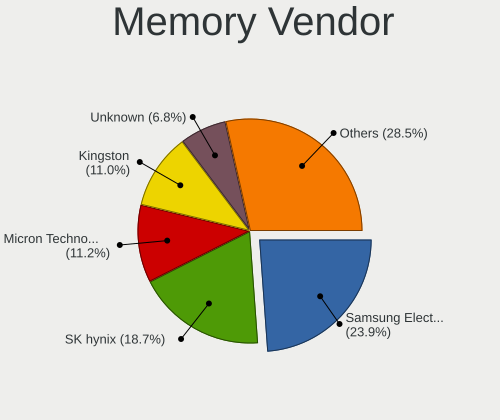

| Vendor                       | Computers | Percent |
|------------------------------|-----------|---------|
| Samsung Electronics          | 10196     | 23.85%  |
| SK hynix                     | 7994      | 18.7%   |
| Micron Technology            | 4791      | 11.21%  |
| Kingston                     | 4682      | 10.95%  |
| Unknown                      | 2892      | 6.77%   |
| Crucial                      | 2457      | 5.75%   |
| Corsair                      | 2165      | 5.06%   |
| G.Skill                      | 1343      | 3.14%   |
| A-DATA Technology            | 912       | 2.13%   |
| Ramaxel Technology           | 661       | 1.55%   |
| Unknown                      | 593       | 1.39%   |
| Elpida                       | 460       | 1.08%   |
| Nanya Technology             | 402       | 0.94%   |
| Unknown (ABCD)               | 362       | 0.85%   |
| Team                         | 295       | 0.69%   |
| Smart                        | 236       | 0.55%   |
| Patriot                      | 219       | 0.51%   |
| Transcend                    | 210       | 0.49%   |
| GOODRAM                      | 110       | 0.26%   |
| Apacer                       | 94        | 0.22%   |
| Hewlett-Packard              | 80        | 0.19%   |
| Teikon                       | 63        | 0.15%   |
| PNY                          | 63        | 0.15%   |
| Avant                        | 51        | 0.12%   |
| Silicon Power                | 50        | 0.12%   |
| ASint Technology             | 48        | 0.11%   |
| AMD                          | 44        | 0.1%    |
| Timetec                      | 43        | 0.1%    |
| Smart Brazil                 | 43        | 0.1%    |
| Lexar                        | 39        | 0.09%   |
| Goldkey                      | 34        | 0.08%   |
| Neo Forza                    | 31        | 0.07%   |
| GeIL                         | 28        | 0.07%   |
| ChangXin Memory              | 27        | 0.06%   |
| Qimonda                      | 26        | 0.06%   |
| Innodisk                     | 26        | 0.06%   |
| Unifosa                      | 24        | 0.06%   |
| Patriot Memory (PDP Systems) | 24        | 0.06%   |
| CSX                          | 23        | 0.05%   |
| Atermiter                    | 20        | 0.05%   |

Memory Model
------------

Memory module models

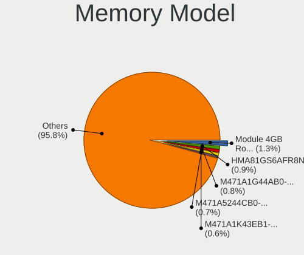

| Model                                                            | Computers | Percent |
|------------------------------------------------------------------|-----------|---------|
| Unknown                                                          | 593       | 1.3%    |
| SK hynix RAM HMA81GS6AFR8N-UH 8GB SODIMM DDR4 2667MT/s           | 399       | 0.87%   |
| Samsung RAM M471A1G44AB0-CWE 8GiB SODIMM DDR4 3200MT/s           | 365       | 0.8%    |
| Samsung RAM M471A5244CB0-CTD 4GB SODIMM DDR4 3266MT/s            | 316       | 0.69%   |
| Samsung RAM M471A1K43EB1-CWE 8GB SODIMM DDR4 3200MT/s            | 253       | 0.55%   |
| Unknown (ABCD) RAM 123456789012345678 2GB SODIMM LPDDR4 2400MT/s | 247       | 0.54%   |
| SK hynix RAM HMAA1GS6CJR6N-XN 8GB SODIMM DDR4 3200MT/s           | 238       | 0.52%   |
| SK hynix RAM HMT451S6BFR8A-PB 4GB SODIMM DDR3 1600MT/s           | 234       | 0.51%   |
| Samsung RAM M471B5173DB0-YK0 4GB SODIMM DDR3 1600MT/s            | 233       | 0.51%   |
| Samsung RAM M471A5244CB0-CRC 4GB SODIMM DDR4 2667MT/s            | 232       | 0.51%   |
| Samsung RAM M471A1K43DB1-CWE 8GB SODIMM DDR4 3200MT/s            | 230       | 0.5%    |
| Samsung RAM M471B5173QH0-YK0 4GB SODIMM DDR3 1600MT/s            | 224       | 0.49%   |
| Samsung RAM M471A1K43CB1-CRC 8GB SODIMM DDR4 8400MT/s            | 222       | 0.49%   |
| Samsung RAM M471A1K43CB1-CTD 8GB SODIMM DDR4 3200MT/s            | 216       | 0.47%   |
| SK hynix RAM HMA81GS6DJR8N-XN 8GB SODIMM DDR4 3200MT/s           | 213       | 0.47%   |
| Samsung RAM M471A1G44BB0-CWE 8GB SODIMM DDR4 3200MT/s            | 210       | 0.46%   |
| Samsung RAM M471A1K43DB1-CTD 8GB SODIMM DDR4 2667MT/s            | 201       | 0.44%   |
| Samsung RAM M471B5273DH0-CH9 4GB SODIMM DDR3 1600MT/s            | 194       | 0.43%   |
| SK hynix RAM HMA81GS6CJR8N-VK 8GB SODIMM DDR4 2667MT/s           | 178       | 0.39%   |
| Samsung RAM M471B1G73QH0-YK0 8GB SODIMM DDR3 1600MT/s            | 173       | 0.38%   |
| Samsung RAM M471A5244CB0-CWE 4GB SODIMM DDR4 3200MT/s            | 172       | 0.38%   |
| SK hynix RAM HMA81GS6JJR8N-VK 8GB SODIMM DDR4 2667MT/s           | 171       | 0.37%   |
| Samsung RAM M471A1G44AB0-CWE 8GB Row Of Chips DDR4 3200MT/s      | 171       | 0.37%   |
| Samsung RAM M471B1G73DB0-YK0 8GB SODIMM DDR3 1600MT/s            | 165       | 0.36%   |
| SK hynix RAM HMT351S6CFR8C-PB 4GB SODIMM DDR3 1600MT/s           | 163       | 0.36%   |
| Samsung RAM M471A1K43BB1-CRC 8GB SODIMM DDR4 2667MT/s            | 161       | 0.35%   |
| Micron RAM 4ATF1G64HZ-3G2F1 8GB SODIMM DDR4 3200MT/s             | 157       | 0.34%   |
| Samsung RAM M471B5273CH0-CH9 4GB SODIMM DDR3 1334MT/s            | 156       | 0.34%   |
| Samsung RAM M471B5173EB0-YK0 4GB SODIMM DDR3 1600MT/s            | 155       | 0.34%   |
| Micron RAM 4ATF51264HZ-2G6E1 4GB SODIMM DDR4 2667MT/s            | 148       | 0.32%   |
| SK hynix RAM HMA851S6AFR6N-UH 4GB SODIMM DDR4 2667MT/s           | 144       | 0.32%   |
| Samsung RAM M471A2K43CB1-CTD 16GB SODIMM DDR4 8400MT/s           | 140       | 0.31%   |
| Micron RAM 4ATF1G64HZ-3G2E1 8GB SODIMM DDR4 3200MT/s             | 140       | 0.31%   |
| SK hynix RAM HMT41GS6BFR8A-PB 8GB SODIMM DDR3 2667MT/s           | 139       | 0.3%    |
| Samsung RAM M471A2K43DB1-CWE 16GB SODIMM DDR4 3200MT/s           | 139       | 0.3%    |
| Micron RAM 4ATF1G64HZ-3G2E1 8GB Row Of Chips DDR4 3200MT/s       | 134       | 0.29%   |
| Corsair RAM CMK16GX4M2B3200C16 8GB DIMM DDR4 3600MT/s            | 134       | 0.29%   |
| SK hynix RAM HMA851S6CJR6N-VK 4GB SODIMM DDR4 2667MT/s           | 129       | 0.28%   |
| SK hynix RAM H9CCNNNCLGALAR-NVD 8GB Row Of Chips LPDDR3 2133MT/s | 129       | 0.28%   |
| Micron RAM 8ATF1G64HZ-2G6E1 8GB SODIMM DDR4 2667MT/s             | 127       | 0.28%   |

Memory Kind
-----------

Memory module kinds

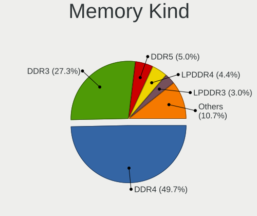

| Kind            | Computers | Percent |
|-----------------|-----------|---------|
| DDR4            | 18473     | 49.67%  |
| DDR3            | 10137     | 27.25%  |
| DDR5            | 1854      | 4.98%   |
| LPDDR4          | 1645      | 4.42%   |
| LPDDR3          | 1098      | 2.95%   |
| DDR2            | 1078      | 2.9%    |
| LPDDR5          | 1007      | 2.71%   |
| SDRAM           | 793       | 2.13%   |
| Unknown         | 756       | 2.03%   |
| DRAM            | 185       | 0.5%    |
| DDR             | 162       | 0.44%   |
| RAM             | 2         | 0.01%   |
| EEPROM          | 2         | 0.01%   |
| Logical non-vol | 1         | 0.003%  |
| DDR2 FB-DIMM    | 1         | 0.003%  |

Memory Form Factor
------------------

Physical design of the memory module

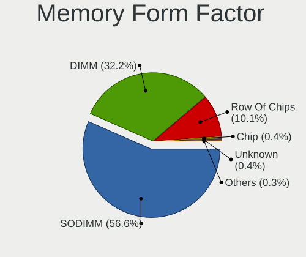

| Name            | Computers | Percent |
|-----------------|-----------|---------|
| SODIMM          | 20907     | 56.56%  |
| DIMM            | 11919     | 32.25%  |
| Row Of Chips    | 3715      | 10.05%  |
| Chip            | 165       | 0.45%   |
| Unknown         | 135       | 0.37%   |
| RIMM            | 61        | 0.17%   |
| FB-DIMM         | 46        | 0.12%   |
| Proprietary Car | 15        | 0.04%   |

Memory Size
-----------

Memory module size

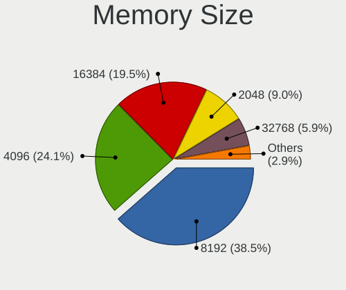

| Size    | Computers | Percent |
|---------|-----------|---------|
| 8192    | 15514     | 38.5%   |
| 4096    | 9711      | 24.1%   |
| 16384   | 7862      | 19.51%  |
| 2048    | 3641      | 9.04%   |
| 32768   | 2391      | 5.93%   |
| 1024    | 836       | 2.07%   |
| 65536   | 99        | 0.25%   |
| 512     | 91        | 0.23%   |
| 49152   | 70        | 0.17%   |
| 12288   | 15        | 0.04%   |
| 256     | 14        | 0.03%   |
| 3072    | 13        | 0.03%   |
| 24576   | 10        | 0.02%   |
| 1536    | 6         | 0.01%   |
| 131072  | 5         | 0.01%   |
| 6144    | 5         | 0.01%   |
| 129408  | 2         | 0.005%  |
| 98304   | 2         | 0.005%  |
| 1       | 2         | 0.005%  |
| Unknown | 2         | 0.005%  |
| 258496  | 1         | 0.002%  |
| 10240   | 1         | 0.002%  |
| 64      | 1         | 0.002%  |
| 32      | 1         | 0.002%  |

Memory Speed
------------

Memory module speed

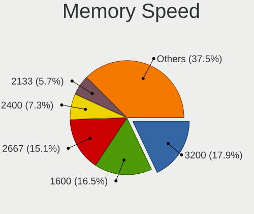

| Speed   | Computers | Percent |
|---------|-----------|---------|
| 3200    | 7154      | 17.86%  |
| 1600    | 6602      | 16.49%  |
| 2667    | 6060      | 15.13%  |
| 2400    | 2929      | 7.31%   |
| 2133    | 2268      | 5.66%   |
| 1333    | 2268      | 5.66%   |
| 3600    | 1008      | 2.52%   |
| 4800    | 793       | 1.98%   |
| 4267    | 752       | 1.88%   |
| 1334    | 693       | 1.73%   |
| 1867    | 679       | 1.7%    |
| 5600    | 669       | 1.67%   |
| 6400    | 645       | 1.61%   |
| 800     | 545       | 1.36%   |
| 667     | 545       | 1.36%   |
| Unknown | 477       | 1.19%   |
| 1067    | 391       | 0.98%   |
| 8400    | 373       | 0.93%   |
| 3266    | 360       | 0.9%    |
| 3733    | 306       | 0.76%   |
| 1066    | 277       | 0.69%   |
| 2666    | 275       | 0.69%   |
| 1866    | 258       | 0.64%   |
| 3000    | 237       | 0.59%   |
| 2933    | 210       | 0.52%   |
| 4199    | 193       | 0.48%   |
| 3800    | 192       | 0.48%   |
| 7500    | 191       | 0.48%   |
| 6000    | 181       | 0.45%   |
| 1800    | 180       | 0.45%   |
| 3400    | 173       | 0.43%   |
| 4000    | 150       | 0.37%   |
| 8533    | 127       | 0.32%   |
| 4266    | 126       | 0.31%   |
| 3466    | 116       | 0.29%   |
| 2048    | 113       | 0.28%   |
| 533     | 96        | 0.24%   |
| 2800    | 83        | 0.21%   |
| 975     | 78        | 0.19%   |
| 400     | 76        | 0.19%   |

Printers & scanners
-------------------

Printer Vendor
--------------

Printer device vendors

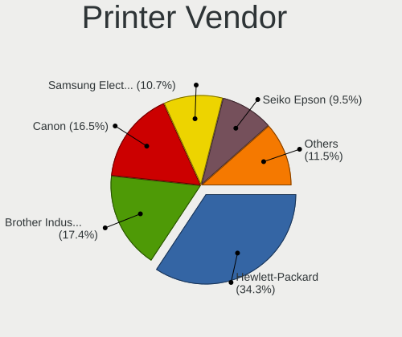

| Vendor                             | Computers | Percent |
|------------------------------------|-----------|---------|
| Hewlett-Packard                    | 761       | 34.28%  |
| Brother Industries                 | 387       | 17.43%  |
| Canon                              | 367       | 16.53%  |
| Samsung Electronics                | 237       | 10.68%  |
| Seiko Epson                        | 212       | 9.55%   |
| Prolific Technology                | 37        | 1.67%   |
| Dymo-CoStar                        | 27        | 1.22%   |
| QinHeng Electronics                | 25        | 1.13%   |
| Lexmark International              | 23        | 1.04%   |
| Xerox                              | 21        | 0.95%   |
| Kyocera                            | 15        | 0.68%   |
| STMicroelectronics                 | 12        | 0.54%   |
| Pantum                             | 12        | 0.54%   |
| Oki Data                           | 11        | 0.5%    |
| Ricoh                              | 10        | 0.45%   |
| Dell                               | 9         | 0.41%   |
| Zebra                              | 8         | 0.36%   |
| Fuji Xerox                         | 5         | 0.23%   |
| Citizen                            | 4         | 0.18%   |
| Zebra Technologies                 | 3         | 0.14%   |
| Custom Engineering SPA             | 3         | 0.14%   |
| BIXOLON                            | 3         | 0.14%   |
| Apple                              | 3         | 0.14%   |
| Xiaomi                             | 2         | 0.09%   |
| TSC Auto ID Technology             | 2         | 0.09%   |
| Star Micronics                     | 2         | 0.09%   |
| Panasonic (Matsushita)             | 2         | 0.09%   |
| Konica Minolta                     | 2         | 0.09%   |
| iDPRT                              | 2         | 0.09%   |
| ATEN International                 | 2         | 0.09%   |
| Zhuhai Poskey Technology           | 1         | 0.05%   |
| Omnidirectional Control Technology | 1         | 0.05%   |
| MIIIW                              | 1         | 0.05%   |
| ICS Advent                         | 1         | 0.05%   |
| GODEX INTERNATIONAL                | 1         | 0.05%   |
| GCC                                | 1         | 0.05%   |
| Datamax-O'Neil                     | 1         | 0.05%   |
| CB Printer                         | 1         | 0.05%   |
| BeiJing LanXum Computer Technology | 1         | 0.05%   |
| ARGOX                              | 1         | 0.05%   |

Printer Model
-------------

Printer device models

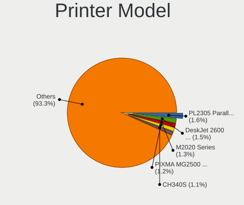

| Model                                                     | Computers | Percent |
|-----------------------------------------------------------|-----------|---------|
| Prolific PL2305 Parallel Port                             | 37        | 1.64%   |
| HP DeskJet 2600 series                                    | 33        | 1.46%   |
| Samsung M2020 Series                                      | 29        | 1.29%   |
| Canon PIXMA MG2500 Series                                 | 27        | 1.2%    |
| QinHeng CH340S                                            | 25        | 1.11%   |
| Samsung M2070 Series                                      | 22        | 0.98%   |
| HP ENVY 4520 series                                       | 22        | 0.98%   |
| HP LaserJet 1020                                          | 21        | 0.93%   |
| Brother Printer                                           | 21        | 0.93%   |
| HP Deskjet 2540 series                                    | 20        | 0.89%   |
| HP LaserJet 1018                                          | 19        | 0.84%   |
| HP DeskJet 3700 series                                    | 19        | 0.84%   |
| HP DeskJet 2130 series                                    | 19        | 0.84%   |
| Brother HL-2030 Laser Printer                             | 19        | 0.84%   |
| Canon PIXMA MG3600 Series                                 | 18        | 0.8%    |
| Canon PIXMA MX920 Series                                  | 17        | 0.75%   |
| HP LaserJet 3050                                          | 16        | 0.71%   |
| HP DeskJet 2700 series                                    | 16        | 0.71%   |
| Samsung ML-216x Series Laser Printer                      | 15        | 0.66%   |
| HP DeskJet 3630 series                                    | 15        | 0.66%   |
| Canon LiDE 300                                            | 15        | 0.66%   |
| HP ENVY 5000 series                                       | 14        | 0.62%   |
| HP OfficeJet 3830 series                                  | 13        | 0.58%   |
| Canon LiDE 400                                            | 13        | 0.58%   |
| Seiko Epson ET-2710 Series                                | 12        | 0.53%   |
| Samsung SCX-3400 Series                                   | 12        | 0.53%   |
| HP LaserJet P1005                                         | 12        | 0.53%   |
| Samsung C48x Series                                       | 11        | 0.49%   |
| HP Printing Support                                       | 11        | 0.49%   |
| HP LaserJet Professional P1102w                           | 11        | 0.49%   |
| HP Deskjet 2050 J510                                      | 11        | 0.49%   |
| HP Deskjet 1050 J410                                      | 11        | 0.49%   |
| Canon TS3100 series                                       | 11        | 0.49%   |
| STMicroelectronics LED badge -- mini LED display -- 11x44 | 10        | 0.44%   |
| Seiko Epson Printer                                       | 10        | 0.44%   |
| HP LaserJet 1022                                          | 10        | 0.44%   |
| HP ENVY 5540 series                                       | 10        | 0.44%   |
| HP Deskjet 3050A                                          | 10        | 0.44%   |
| Dymo-CoStar LabelWriter 400                               | 10        | 0.44%   |
| Canon iP7200 series                                       | 10        | 0.44%   |

Scanner Vendor
--------------

Scanner device vendors

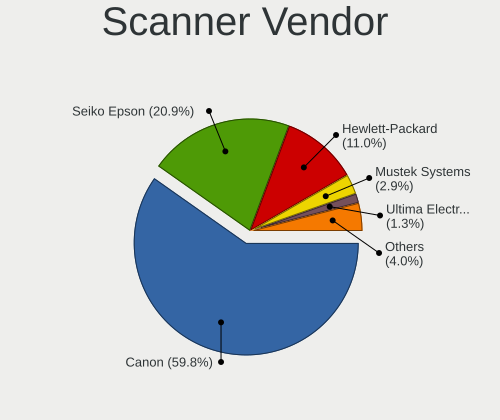

| Vendor                                         | Computers | Percent |
|------------------------------------------------|-----------|---------|
| Canon                                          | 266       | 59.78%  |
| Seiko Epson                                    | 93        | 20.9%   |
| Hewlett-Packard                                | 49        | 11.01%  |
| Mustek Systems                                 | 13        | 2.92%   |
| Ultima Electronics                             | 6         | 1.35%   |
| Plustek                                        | 6         | 1.35%   |
| Microtek International                         | 2         | 0.45%   |
| AGFA-Gevaert NV                                | 2         | 0.45%   |
| Acer Peripherals (now BenQ)                    | 2         | 0.45%   |
| UMAX                                           | 1         | 0.22%   |
| Syscan                                         | 1         | 0.22%   |
| Siemens Information and Communication Products | 1         | 0.22%   |
| Nikon                                          | 1         | 0.22%   |
| Minolta                                        | 1         | 0.22%   |
| KYE Systems (Mouse Systems)                    | 1         | 0.22%   |

Scanner Model
-------------

Scanner device models

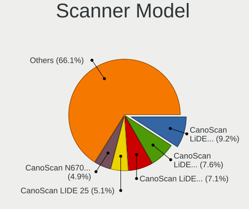

| Model                                                                                 | Computers | Percent |
|---------------------------------------------------------------------------------------|-----------|---------|
| Canon CanoScan LiDE 110                                                               | 41        | 9.15%   |
| Canon CanoScan LiDE 210                                                               | 34        | 7.59%   |
| Canon CanoScan LiDE 220                                                               | 32        | 7.14%   |
| Canon CanoScan LIDE 25                                                                | 23        | 5.13%   |
| Canon CanoScan N670U/N676U/LiDE 20                                                    | 22        | 4.91%   |
| Canon CanoScan LiDE 120                                                               | 20        | 4.46%   |
| Canon CanoScan LiDE 100                                                               | 16        | 3.57%   |
| Canon CanoScan N1240U/LiDE 30                                                         | 15        | 3.35%   |
| Canon CanoScan LiDE 200                                                               | 14        | 3.13%   |
| Seiko Epson GT-X820 [Perfection V600 Photo]                                           | 10        | 2.23%   |
| Seiko Epson GT-X770 [Perfection V500]                                                 | 9         | 2.01%   |
| Seiko Epson GT-F520/GT-F570 [Perfection 3590 PHOTO]                                   | 9         | 2.01%   |
| Canon CanoScan LiDE 50/LiDE 35/LiDE 40                                                | 7         | 1.56%   |
| Seiko Epson GT-F720 [GT-S620/Perfection V30/V300 Photo]                               | 6         | 1.34%   |
| Ultima Artec Ultima 2000 (GT6801 based)/Lifetec LT9385/ScanMagic 1200 UB Plus Scanner | 5         | 1.12%   |
| Seiko Epson Scanner                                                                   | 5         | 1.12%   |
| Seiko Epson Perfection V37/V370                                                       | 5         | 1.12%   |
| Seiko Epson GT-F730 [GT-S630/Perfection V33/V330 Photo]                               | 5         | 1.12%   |
| Seiko Epson GT-8400UF [Perfection 1670/1670 PHOTO]                                    | 5         | 1.12%   |
| Mustek Systems BearPaw 1200 CU Plus                                                   | 5         | 1.12%   |
| Canon CanoScan 9000F Mark II                                                          | 5         | 1.12%   |
| Seiko Epson GT-X750 [Perfection 4490 Photo]                                           | 4         | 0.89%   |
| Seiko Epson GT-9300UF [Perfection 2400 PHOTO]                                         | 4         | 0.89%   |
| Seiko Epson GT-7700U [Perfection 1240U]                                               | 4         | 0.89%   |
| Canon CanoScan LiDE 60                                                                | 4         | 0.89%   |
| Seiko Epson GT-F700 [Perfection V350]                                                 | 3         | 0.67%   |
| Seiko Epson GT-F500/GT-F550 [Perfection 2480/2580 PHOTO]                              | 3         | 0.67%   |
| Mustek Systems SNAPSCAN e22                                                           | 3         | 0.67%   |
| HP ScanJet G4050                                                                      | 3         | 0.67%   |
| HP ScanJet 3970c                                                                      | 3         | 0.67%   |
| HP ScanJet 3400cse                                                                    | 3         | 0.67%   |
| HP ScanJet 3300c                                                                      | 3         | 0.67%   |
| HP HP Scanjet 300                                                                     | 3         | 0.67%   |
| Canon CanoScan N650U/N656U                                                            | 3         | 0.67%   |
| Canon CanoScan LiDE 700F                                                              | 3         | 0.67%   |
| Canon CanoScan LiDE 600F                                                              | 3         | 0.67%   |
| Canon CanoScan 8800F                                                                  | 3         | 0.67%   |
| Canon CanoScan 4400F                                                                  | 3         | 0.67%   |
| Canon CanoScan 4200F                                                                  | 3         | 0.67%   |
| Seiko Epson GT-X800 [Perfection 4990 PHOTO]                                           | 2         | 0.45%   |

Camera
------

Camera Vendor
-------------

Camera device vendors

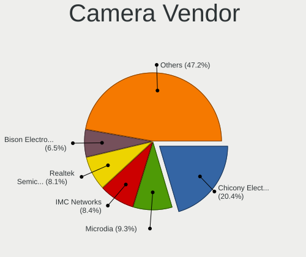

| Vendor                                 | Computers | Percent |
|----------------------------------------|-----------|---------|
| Chicony Electronics                    | 10055     | 20.43%  |
| Microdia                               | 4581      | 9.31%   |
| IMC Networks                           | 4135      | 8.4%    |
| Realtek Semiconductor                  | 4006      | 8.14%   |
| Bison Electronics                      | 3205      | 6.51%   |
| Sunplus Innovation Technology          | 2839      | 5.77%   |
| Logitech                               | 2476      | 5.03%   |
| Quanta                                 | 2339      | 4.75%   |
| Cheng Uei Precision Industry (Foxlink) | 1856      | 3.77%   |
| Apple                                  | 1813      | 3.68%   |
| Suyin                                  | 1414      | 2.87%   |
| Syntek                                 | 1137      | 2.31%   |
| Lite-On Technology                     | 1067      | 2.17%   |
| Luxvisions Innotech Limited            | 972       | 1.98%   |
| Silicon Motion                         | 640       | 1.3%    |
| Alcor Micro                            | 565       | 1.15%   |
| Samsung Electronics                    | 529       | 1.07%   |
| Microsoft                              | 492       | 1%      |
| Ricoh                                  | 422       | 0.86%   |
| Sonix Technology                       | 372       | 0.76%   |
| Z-Star Microelectronics                | 258       | 0.52%   |
| Lenovo                                 | 252       | 0.51%   |
| Shinetech                              | 219       | 0.45%   |
| Acer                                   | 203       | 0.41%   |
| SunplusIT                              | 181       | 0.37%   |
| Generalplus Technology                 | 164       | 0.33%   |
| Importek                               | 162       | 0.33%   |
| Primax Electronics                     | 139       | 0.28%   |
| ALi                                    | 125       | 0.25%   |
| Creative Technology                    | 117       | 0.24%   |
| ARC International                      | 113       | 0.23%   |
| GEMBIRD                                | 102       | 0.21%   |
| OmniVision Technologies                | 98        | 0.2%    |
| Cubeternet                             | 91        | 0.18%   |
| icSpring                               | 76        | 0.15%   |
| Jieli Technology                       | 73        | 0.15%   |
| MacroSilicon                           | 72        | 0.15%   |
| KYE Systems (Mouse Systems)            | 72        | 0.15%   |
| Intel                                  | 71        | 0.14%   |
| Sunplus Technology                     | 67        | 0.14%   |

Camera Model
------------

Camera device models

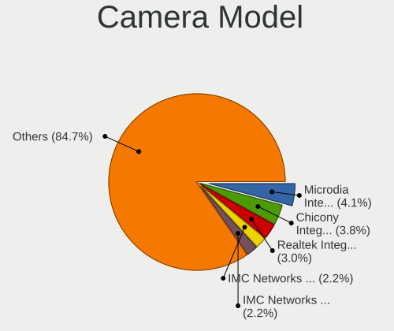

| Model                                         | Computers | Percent |
|-----------------------------------------------|-----------|---------|
| Microdia Integrated_Webcam_HD                 | 2058      | 4.15%   |
| Chicony Integrated Camera                     | 1907      | 3.84%   |
| Realtek Integrated_Webcam_HD                  | 1477      | 2.98%   |
| IMC Networks Integrated Camera                | 1089      | 2.19%   |
| IMC Networks USB2.0 HD UVC WebCam             | 1084      | 2.18%   |
| Bison Integrated Camera                       | 916       | 1.85%   |
| Chicony HD WebCam                             | 848       | 1.71%   |
| Sunplus Integrated_Webcam_HD                  | 789       | 1.59%   |
| Syntek Integrated Camera                      | 673       | 1.36%   |
| Apple iPhone 5/5C/5S/6/SE/7/8/X               | 577       | 1.16%   |
| Logitech Webcam C270                          | 567       | 1.14%   |
| Samsung Galaxy series, misc. (MTP mode)       | 522       | 1.05%   |
| Chicony HP HD Camera                          | 482       | 0.97%   |
| Apple Built-in iSight                         | 462       | 0.93%   |
| Apple FaceTime HD Camera (Built-in)           | 443       | 0.89%   |
| IMC Networks USB2.0 VGA UVC WebCam            | 418       | 0.84%   |
| Logitech HD Pro Webcam C920                   | 388       | 0.78%   |
| Microdia Integrated Webcam                    | 346       | 0.7%    |
| Bison Lenovo EasyCamera                       | 344       | 0.69%   |
| Chicony HP Truevision HD                      | 332       | 0.67%   |
| Lite-On Integrated Camera                     | 326       | 0.66%   |
| Realtek USB Camera                            | 314       | 0.63%   |
| Chicony TOSHIBA Web Camera - HD               | 311       | 0.63%   |
| Chicony HP TrueVision HD Camera               | 311       | 0.63%   |
| Sunplus HD WebCam                             | 310       | 0.62%   |
| Quanta HD User Facing                         | 310       | 0.62%   |
| Quanta HP TrueVision HD Camera                | 305       | 0.61%   |
| Quanta HP HD Camera                           | 298       | 0.6%    |
| Chicony USB2.0 HD UVC WebCam                  | 297       | 0.6%    |
| Chicony EasyCamera                            | 294       | 0.59%   |
| Bison HD Webcam                               | 277       | 0.56%   |
| Quanta HD Webcam                              | 268       | 0.54%   |
| Chicony HP Wide Vision HD Camera              | 261       | 0.53%   |
| Chicony USB2.0 VGA UVC WebCam                 | 259       | 0.52%   |
| Bison SunplusIT Integrated Camera             | 259       | 0.52%   |
| Lite-On HP HD Camera                          | 257       | 0.52%   |
| Apple FaceTime HD Camera                      | 257       | 0.52%   |
| Microdia Laptop_Integrated_Webcam_HD          | 251       | 0.51%   |
| Luxvisions Innotech Limited Integrated Camera | 251       | 0.51%   |
| Realtek Integrated Webcam                     | 242       | 0.49%   |

Security
--------

Fingerprint Vendor
------------------

Fingerprint sensor vendors

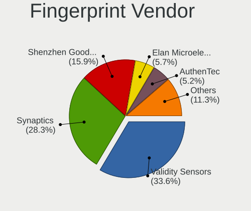

| Vendor                             | Computers | Percent |
|------------------------------------|-----------|---------|
| Validity Sensors                   | 3181      | 33.55%  |
| Synaptics                          | 2683      | 28.3%   |
| Shenzhen Goodix Technology         | 1509      | 15.92%  |
| Elan Microelectronics              | 541       | 5.71%   |
| AuthenTec                          | 493       | 5.2%    |
| Upek                               | 431       | 4.55%   |
| LighTuning Technology              | 378       | 3.99%   |
| STMicroelectronics                 | 87        | 0.92%   |
| Realtek USB2.0 Finger Print Bridge | 57        | 0.6%    |
| Samsung Electronics                | 37        | 0.39%   |
| Focal-systems.Corp                 | 28        | 0.3%    |
| HOLTEK                             | 24        | 0.25%   |
| DigitalPersona                     | 9         | 0.09%   |
| Dell                               | 6         | 0.06%   |
| Microsoft                          | 4         | 0.04%   |
| GDMicroelectronics                 | 4         | 0.04%   |
| Futronic Technology                | 3         | 0.03%   |
| Next Biometrics                    | 2         | 0.02%   |
| Suprema                            | 1         | 0.01%   |
| FocalTech                          | 1         | 0.01%   |
| Unknown                            | 1         | 0.01%   |

Fingerprint Model
-----------------

Fingerprint sensor models

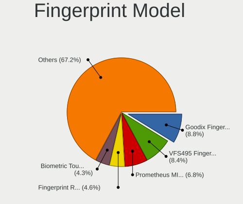

| Model                                                                      | Computers | Percent |
|----------------------------------------------------------------------------|-----------|---------|
| Shenzhen Goodix  Fingerprint Device                                        | 835       | 8.81%   |
| Validity Sensors VFS495 Fingerprint Reader                                 | 794       | 8.37%   |
| Synaptics Prometheus MIS Touch Fingerprint Reader                          | 648       | 6.83%   |
| Shenzhen Goodix Fingerprint Reader                                         | 434       | 4.58%   |
| Upek Biometric Touchchip/Touchstrip Fingerprint Sensor                     | 403       | 4.25%   |
| Synaptics Metallica MIS Touch Fingerprint Reader                           | 346       | 3.65%   |
| Validity Sensors VFS5011 Fingerprint Reader                                | 286       | 3.02%   |
| Validity Sensors Synaptics WBDI                                            | 271       | 2.86%   |
| Validity Sensors VFS 5011 fingerprint sensor                               | 270       | 2.85%   |
| Elan ELAN:Fingerprint                                                      | 268       | 2.83%   |
| Elan ELAN:ARM-M4                                                           | 254       | 2.68%   |
| Shenzhen Goodix FingerPrint                                                | 240       | 2.53%   |
| Validity Sensors VFS471 Fingerprint Reader                                 | 213       | 2.25%   |
| Validity Sensors VFS491                                                    | 209       | 2.2%    |
| LighTuning EgisTec Touch Fingerprint Sensor                                | 209       | 2.2%    |
| Synaptics  WBDI                                                            | 206       | 2.17%   |
| Validity Sensors Synaptics VFS7552 Touch Fingerprint Sensor with PurePrint | 198       | 2.09%   |
| Synaptics WBDI                                                             | 193       | 2.04%   |
| Synaptics FS7604 Touch Fingerprint Sensor with PurePrint                   | 188       | 1.98%   |
| Synaptics Fingerprint reader [HP G6]                                       | 176       | 1.86%   |
| AuthenTec AES2810                                                          | 171       | 1.8%    |
| Synaptics  FS7604 Touch Fingerprint Sensor with PurePrint                  | 164       | 1.73%   |
| Validity Sensors Fingerprint scanner                                       | 160       | 1.69%   |
| Validity Sensors VFS7500 Touch Fingerprint Sensor                          | 153       | 1.61%   |
| Synaptics Metallica MOH Touch Fingerprint Reader                           | 153       | 1.61%   |
| Synaptics UWP WBDI                                                         | 148       | 1.56%   |
| Validity Sensors VFS451 Fingerprint Reader                                 | 142       | 1.5%    |
| Validity Sensors Swipe Fingerprint Sensor                                  | 141       | 1.49%   |
| AuthenTec AES2501 Fingerprint Sensor                                       | 119       | 1.26%   |
| LighTuning ES603 Swipe Fingerprint Sensor                                  | 106       | 1.12%   |
| Synaptics WBDI Fingerprint Reader USB 086                                  | 103       | 1.09%   |
| Synaptics UWP WBDI Device                                                  | 103       | 1.09%   |
| Synaptics Prometheus Fingerprint Reader                                    | 87        | 0.92%   |
| STMicroelectronics Fingerprint Reader                                      | 87        | 0.92%   |
| AuthenTec Fingerprint Sensor                                               | 84        | 0.89%   |
| Validity Sensors VFS301 Fingerprint Reader                                 | 82        | 0.86%   |
| Validity Sensors Synaptics VFS7552 Touch Fingerprint Sensor                | 75        | 0.79%   |
| AuthenTec AES1600                                                          | 64        | 0.68%   |
| Validity Sensors VFS7552 Touch Fingerprint Sensor                          | 59        | 0.62%   |
| Validity Sensors VFS101 Fingerprint Reader                                 | 59        | 0.62%   |

Chipcard Vendor
---------------

Chipcard module vendors

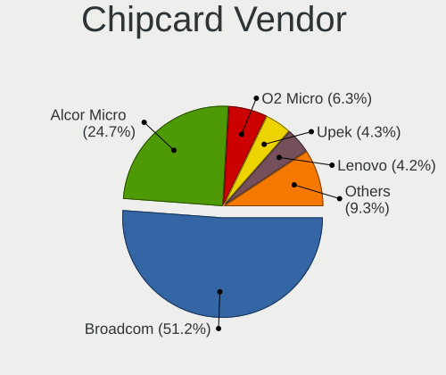

| Vendor                            | Computers | Percent |
|-----------------------------------|-----------|---------|
| Broadcom                          | 2030      | 51.17%  |
| Alcor Micro                       | 981       | 24.73%  |
| O2 Micro                          | 249       | 6.28%   |
| Upek                              | 172       | 4.34%   |
| Lenovo                            | 167       | 4.21%   |
| Gemalto (was Gemplus)             | 68        | 1.71%   |
| Advanced Card Systems             | 48        | 1.21%   |
| SCM Microsystems                  | 46        | 1.16%   |
| OmniKey                           | 24        | 0.6%    |
| Yubico.com                        | 18        | 0.45%   |
| Realtek Semiconductor             | 18        | 0.45%   |
| Reiner SCT Kartensysteme          | 16        | 0.4%    |
| Chicony Electronics               | 15        | 0.38%   |
| Aladdin Knowledge Systems         | 15        | 0.38%   |
| Cherry                            | 14        | 0.35%   |
| Giesecke & Devrient               | 11        | 0.28%   |
| Bit4id                            | 11        | 0.28%   |
| VASCO Data Security International | 9         | 0.23%   |
| Fujitsu Siemens Computers         | 7         | 0.18%   |
| Aktiv                             | 7         | 0.18%   |
| Hewlett-Packard                   | 6         | 0.15%   |
| Watchdata                         | 5         | 0.13%   |
| NXP Semiconductors                | 4         | 0.1%    |
| Aladdin R.D.                      | 4         | 0.1%    |
| Microchip Technology              | 3         | 0.08%   |
| C3PO                              | 3         | 0.08%   |
| Thetis                            | 2         | 0.05%   |
| Clay Logic                        | 2         | 0.05%   |
| Circle                            | 2         | 0.05%   |
| Athena Smartcard Solutions        | 2         | 0.05%   |
| Swissbit                          | 1         | 0.03%   |
| SpringCard                        | 1         | 0.03%   |
| SANHO Digital Electronics         | 1         | 0.03%   |
| Kobil Systems                     | 1         | 0.03%   |
| Jing-Mold Enterprise              | 1         | 0.03%   |
| Integrated Technology Express     | 1         | 0.03%   |
| GHI                               | 1         | 0.03%   |
| Feitian Technologies              | 1         | 0.03%   |

Chipcard Model
--------------

Chipcard module models

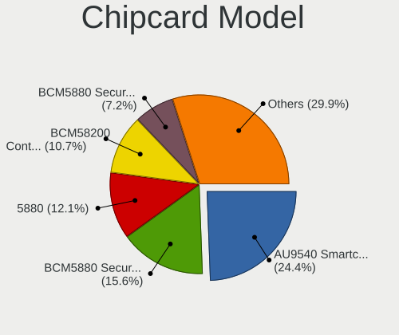

| Model                                                                        | Computers | Percent |
|------------------------------------------------------------------------------|-----------|---------|
| Alcor Micro AU9540 Smartcard Reader                                          | 970       | 24.41%  |
| Broadcom BCM5880 Secure Applications Processor                               | 621       | 15.63%  |
| Broadcom 5880                                                                | 479       | 12.06%  |
| Broadcom BCM58200 ControlVault 3 (FingerPrint sensor + Contacted SmartCard)  | 427       | 10.75%  |
| Broadcom BCM5880 Secure Applications Processor with fingerprint swipe sensor | 288       | 7.25%   |
| O2 Micro OZ776 CCID Smartcard Reader                                         | 222       | 5.59%   |
| Broadcom 58200                                                               | 208       | 5.24%   |
| Upek TouchChip Fingerprint Coprocessor (WBF advanced mode)                   | 172       | 4.33%   |
| Lenovo Integrated Smart Card Reader                                          | 165       | 4.15%   |
| Gemalto (was Gemplus) GemPC Twin SmartCard Reader                            | 46        | 1.16%   |
| Advanced Card Systems ACR38 SmartCard Reader                                 | 28        | 0.7%    |
| O2 Micro Oz776 SmartCard Reader                                              | 27        | 0.68%   |
| SCM Microsystems SCR331-LC1 / SCR3310 SmartCard Reader                       | 22        | 0.55%   |
| Yubico.com Yubikey 4/5 U2F+CCID                                              | 18        | 0.45%   |
| Realtek Semiconductor Smart Card Reader Interface                            | 18        | 0.45%   |
| Gemalto (was Gemplus) Compact Smart Card Reader Writer                       | 16        | 0.4%    |
| Chicony Electronics HP Skylab USB Smartcard Keyboard                         | 15        | 0.38%   |
| Aladdin Knowledge Systems Token JC                                           | 15        | 0.38%   |
| Advanced Card Systems ACR122U                                                | 15        | 0.38%   |
| Broadcom BCM5880 Secure Applications Processor with fingerprint touch sensor | 12        | 0.3%    |
| Reiner SCT Kartensysteme cyberJack RFID basis contactless smartcard reader   | 11        | 0.28%   |
| Alcor Micro Watchdata W 1981                                                 | 11        | 0.28%   |
| Bit4id miniLector EVO                                                        | 10        | 0.25%   |
| Cherry SmartCard Reader Keyboard KC 1000 SC                                  | 9         | 0.23%   |
| SCM Microsystems SCR35xx Smart Card Reader                                   | 7         | 0.18%   |
| OmniKey CardMan 3021 / 3121                                                  | 7         | 0.18%   |
| Giesecke & Devrient StarSign CUT S                                           | 7         | 0.18%   |
| Aktiv Rutoken lite                                                           | 7         | 0.18%   |
| SCM Microsystems SCR3340 - ExpressCard54 Smart Card Reader                   | 6         | 0.15%   |
| Hewlett-Packard SC Keyboard - Apollo (Liteon)                                | 6         | 0.15%   |
| Gemalto (was Gemplus) GemPC Key SmartCard Reader                             | 6         | 0.15%   |
| Watchdata USB Key                                                            | 5         | 0.13%   |
| VASCO Data Security International Digipass 905 SmartCard Reader              | 5         | 0.13%   |
| VASCO Data Security International DIGIPASS 870                               | 4         | 0.1%    |
| Reiner SCT Kartensysteme cyberJack one                                       | 4         | 0.1%    |
| OmniKey CardMan 3121 (HID Technologies)                                      | 4         | 0.1%    |
| NXP Semiconductors PR533                                                     | 4         | 0.1%    |
| Giesecke & Devrient Chipcard Reader                                          | 4         | 0.1%    |
| Fujitsu Siemens Computers SmartCard Reader 2A                                | 4         | 0.1%    |
| Cherry SmartTerminal XX1X                                                    | 4         | 0.1%    |

Unsupported
-----------

Unsupported Devices
-------------------

Total unsupported devices on board

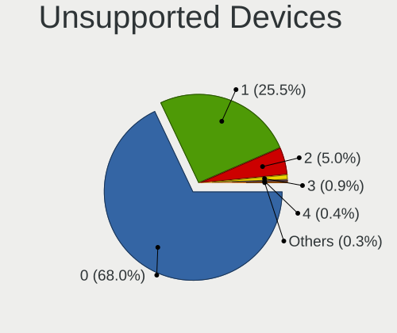

| Total | Computers | Percent |
|-------|-----------|---------|
| 0     | 57456     | 67.95%  |
| 1     | 21585     | 25.53%  |
| 2     | 4196      | 4.96%   |
| 3     | 775       | 0.92%   |
| 4     | 316       | 0.37%   |
| 5     | 94        | 0.11%   |
| 6     | 63        | 0.07%   |
| 7     | 27        | 0.03%   |
| 8     | 22        | 0.03%   |
| 9     | 11        | 0.01%   |
| 10    | 5         | 0.01%   |
| 11    | 1         | 0.001%  |

Unsupported Device Types
------------------------

Types of unsupported devices

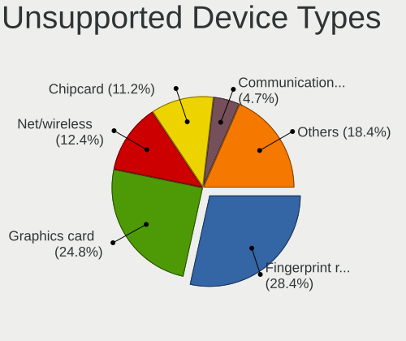

| Type                     | Computers | Percent |
|--------------------------|-----------|---------|
| Fingerprint reader       | 9338      | 28.45%  |
| Graphics card            | 8129      | 24.77%  |
| Net/wireless             | 4079      | 12.43%  |
| Chipcard                 | 3685      | 11.23%  |
| Communication controller | 1539      | 4.69%   |
| Multimedia controller    | 1312      | 4%      |
| Unassigned class         | 1042      | 3.17%   |
| Camera                   | 793       | 2.42%   |
| Bluetooth                | 662       | 2.02%   |
| Sound                    | 597       | 1.82%   |
| Storage                  | 437       | 1.33%   |
| Net/ethernet             | 344       | 1.05%   |
| Card reader              | 309       | 0.94%   |
| Network                  | 142       | 0.43%   |
| Storage/raid             | 129       | 0.39%   |
| Modem                    | 99        | 0.3%    |
| Dvb card                 | 54        | 0.16%   |
| Flash memory             | 51        | 0.16%   |
| Storage/ata              | 16        | 0.05%   |
| Storage/nvme             | 13        | 0.04%   |
| Firewire controller      | 13        | 0.04%   |
| Tv card                  | 12        | 0.04%   |
| Storage/ide              | 12        | 0.04%   |
| Wireless                 | 7         | 0.02%   |
| Video                    | 7         | 0.02%   |
| Unclassified device      | 2         | 0.01%   |

