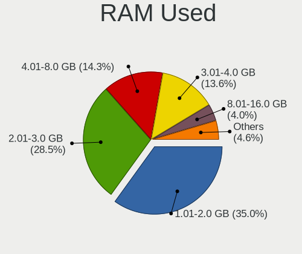
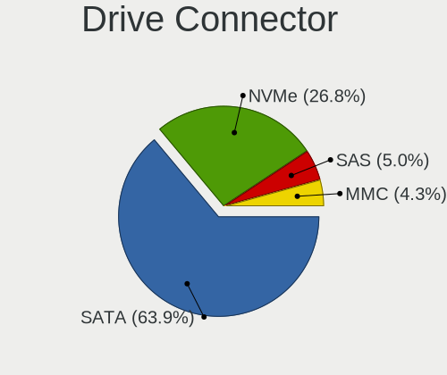
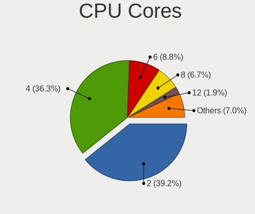
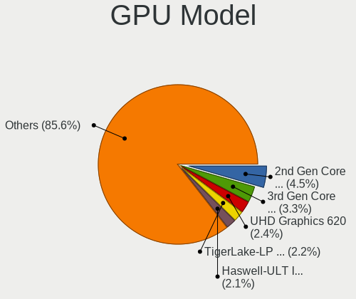
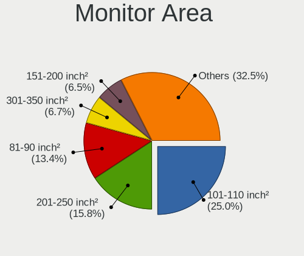

Ubuntu - Tested Hardware & Statistics
-------------------------------------

A project to collect tested hardware configurations for Ubuntu.

Anyone can contribute to this report by the [hw-probe](https://github.com/linuxhw/hw-probe) tool:

    sudo -E hw-probe -all -upload

Please contribute! Especially if your hardware is rare.

This is a report for all computer types. See also reports for [desktops](/Dist/Ubuntu/Desktop/README.md) and [notebooks](/Dist/Ubuntu/Notebook/README.md).

Contents
--------

* [ Test Cases ](#test-cases)

* [ System ](#system)
  - [ OS                       ](#os)
  - [ OS Family                ](#os-family)
  - [ Kernel                   ](#kernel)
  - [ Kernel Family            ](#kernel-family)
  - [ Kernel Major Ver.        ](#kernel-major-ver)
  - [ Arch                     ](#arch)
  - [ DE                       ](#de)
  - [ Display Server           ](#display-server)
  - [ Display Manager          ](#display-manager)
  - [ OS Lang                  ](#os-lang)
  - [ Boot Mode                ](#boot-mode)
  - [ Filesystem               ](#filesystem)
  - [ Part. scheme             ](#part-scheme)
  - [ Dual Boot with Linux/BSD ](#dual-boot-with-linuxbsd)
  - [ Dual Boot (Win)          ](#dual-boot-win)

* [ Board ](#board)
  - [ Vendor                   ](#vendor)
  - [ Model                    ](#model)
  - [ Model Family             ](#model-family)
  - [ MFG Year                 ](#mfg-year)
  - [ Form Factor              ](#form-factor)
  - [ Secure Boot              ](#secure-boot)
  - [ Coreboot                 ](#coreboot)
  - [ RAM Size                 ](#ram-size)
  - [ RAM Used                 ](#ram-used)
  - [ Total Drives             ](#total-drives)
  - [ Has CD-ROM               ](#has-cd-rom)
  - [ Has Ethernet             ](#has-ethernet)
  - [ Has WiFi                 ](#has-wifi)
  - [ Has Bluetooth            ](#has-bluetooth)

* [ Location ](#location)
  - [ Country                  ](#country)
  - [ City                     ](#city)

* [ Drives ](#drives)
  - [ Drive Vendor             ](#drive-vendor)
  - [ Drive Model              ](#drive-model)
  - [ HDD Vendor               ](#hdd-vendor)
  - [ SSD Vendor               ](#ssd-vendor)
  - [ Drive Kind               ](#drive-kind)
  - [ Drive Connector          ](#drive-connector)
  - [ Drive Size               ](#drive-size)
  - [ Space Total              ](#space-total)
  - [ Space Used               ](#space-used)
  - [ Malfunc. Drives          ](#malfunc-drives)
  - [ Malfunc. Drive Vendor    ](#malfunc-drive-vendor)
  - [ Malfunc. HDD Vendor      ](#malfunc-hdd-vendor)
  - [ Malfunc. Drive Kind      ](#malfunc-drive-kind)
  - [ Failed Drives            ](#failed-drives)
  - [ Failed Drive Vendor      ](#failed-drive-vendor)
  - [ Drive Status             ](#drive-status)

* [ Storage controller ](#storage-controller)
  - [ Storage Vendor           ](#storage-vendor)
  - [ Storage Model            ](#storage-model)
  - [ Storage Kind             ](#storage-kind)

* [ Processor ](#processor)
  - [ CPU Vendor               ](#cpu-vendor)
  - [ CPU Model                ](#cpu-model)
  - [ CPU Model Family         ](#cpu-model-family)
  - [ CPU Cores                ](#cpu-cores)
  - [ CPU Sockets              ](#cpu-sockets)
  - [ CPU Threads              ](#cpu-threads)
  - [ CPU Op-Modes             ](#cpu-op-modes)
  - [ CPU Microcode            ](#cpu-microcode)
  - [ CPU Microarch            ](#cpu-microarch)

* [ Graphics ](#graphics)
  - [ GPU Vendor               ](#gpu-vendor)
  - [ GPU Model                ](#gpu-model)
  - [ GPU Combo                ](#gpu-combo)
  - [ GPU Driver               ](#gpu-driver)
  - [ GPU Memory               ](#gpu-memory)

* [ Monitor ](#monitor)
  - [ Monitor Vendor           ](#monitor-vendor)
  - [ Monitor Model            ](#monitor-model)
  - [ Monitor Resolution       ](#monitor-resolution)
  - [ Monitor Diagonal         ](#monitor-diagonal)
  - [ Monitor Width            ](#monitor-width)
  - [ Aspect Ratio             ](#aspect-ratio)
  - [ Monitor Area             ](#monitor-area)
  - [ Pixel Density            ](#pixel-density)
  - [ Multiple Monitors        ](#multiple-monitors)

* [ Network ](#network)
  - [ Net Controller Vendor    ](#net-controller-vendor)
  - [ Net Controller Model     ](#net-controller-model)
  - [ Wireless Vendor          ](#wireless-vendor)
  - [ Wireless Model           ](#wireless-model)
  - [ Ethernet Vendor          ](#ethernet-vendor)
  - [ Ethernet Model           ](#ethernet-model)
  - [ Net Controller Kind      ](#net-controller-kind)
  - [ Used Controller          ](#used-controller)
  - [ NICs                     ](#nics)
  - [ IPv6                     ](#ipv6)

* [ Bluetooth ](#bluetooth)
  - [ Bluetooth Vendor         ](#bluetooth-vendor)
  - [ Bluetooth Model          ](#bluetooth-model)

* [ Sound ](#sound)
  - [ Sound Vendor             ](#sound-vendor)
  - [ Sound Model              ](#sound-model)

* [ Memory ](#memory)
  - [ Memory Vendor            ](#memory-vendor)
  - [ Memory Model             ](#memory-model)
  - [ Memory Kind              ](#memory-kind)
  - [ Memory Form Factor       ](#memory-form-factor)
  - [ Memory Size              ](#memory-size)
  - [ Memory Speed             ](#memory-speed)

* [ Printers & scanners ](#printers--scanners)
  - [ Printer Vendor           ](#printer-vendor)
  - [ Printer Model            ](#printer-model)
  - [ Scanner Vendor           ](#scanner-vendor)
  - [ Scanner Model            ](#scanner-model)

* [ Camera ](#camera)
  - [ Camera Vendor            ](#camera-vendor)
  - [ Camera Model             ](#camera-model)

* [ Security ](#security)
  - [ Fingerprint Vendor       ](#fingerprint-vendor)
  - [ Fingerprint Model        ](#fingerprint-model)
  - [ Chipcard Vendor          ](#chipcard-vendor)
  - [ Chipcard Model           ](#chipcard-model)

* [ Unsupported ](#unsupported)
  - [ Unsupported Devices      ](#unsupported-devices)
  - [ Unsupported Device Types ](#unsupported-device-types)

Test Cases
----------

Total: 87485

| Vendor        | Model                       | Form-Factor | Probe                                                      | Date         |
|---------------|-----------------------------|-------------|------------------------------------------------------------|--------------|
| VENTURER      | WT9L10C44GD1E               | Tablet      | [16d09653ec](https://linux-hardware.org/?probe=16d09653ec) | May 01, 2023 |
| ASUSTek       | X550CC                      | Notebook    | [cc784397f9](https://linux-hardware.org/?probe=cc784397f9) | May 01, 2023 |
| ASUSTek       | PRIME H610M-E D4            | Desktop     | [56db7fc27f](https://linux-hardware.org/?probe=56db7fc27f) | May 01, 2023 |
| ASRock        | 970 Pro3 R2.0               | Desktop     | [577b5e8f51](https://linux-hardware.org/?probe=577b5e8f51) | May 01, 2023 |
| ASUSTek       | PRIME Z690M-PLUS D4         | Desktop     | [27fdafaf01](https://linux-hardware.org/?probe=27fdafaf01) | May 01, 2023 |
| Shuttle       | FS35V4                      | Desktop     | [137fda9bc6](https://linux-hardware.org/?probe=137fda9bc6) | May 01, 2023 |
| ASUSTek       | UX430UNR                    | Notebook    | [4d01364a94](https://linux-hardware.org/?probe=4d01364a94) | May 01, 2023 |
| Medion        | E16402                      | Notebook    | [cff2f785ad](https://linux-hardware.org/?probe=cff2f785ad) | May 01, 2023 |
| Gigabyte      | Z77MX-D3H                   | Desktop     | [fa4e32fe2c](https://linux-hardware.org/?probe=fa4e32fe2c) | May 01, 2023 |
| Dell          | Latitude 3420               | Notebook    | [327be624ce](https://linux-hardware.org/?probe=327be624ce) | May 01, 2023 |
| Toshiba       | Satellite L755              | Notebook    | [3bafb50baa](https://linux-hardware.org/?probe=3bafb50baa) | May 01, 2023 |
| Dell          | 09KPNV A01                  | Desktop     | [45dad4b8e9](https://linux-hardware.org/?probe=45dad4b8e9) | May 01, 2023 |
| Acer          | Aspire A715-51G             | Notebook    | [842333a8da](https://linux-hardware.org/?probe=842333a8da) | May 01, 2023 |
| Dell          | Latitude 3420               | Notebook    | [1ce0c58a17](https://linux-hardware.org/?probe=1ce0c58a17) | May 01, 2023 |
| Dell          | Latitude E6400              | Notebook    | [33b7764234](https://linux-hardware.org/?probe=33b7764234) | May 01, 2023 |
| ASRock        | B660M-HDV                   | Desktop     | [a137e6ab62](https://linux-hardware.org/?probe=a137e6ab62) | May 01, 2023 |
| HP            | ENVY x360 Convertible 13... | Convertible | [5cfdd30fa7](https://linux-hardware.org/?probe=5cfdd30fa7) | May 01, 2023 |
| Lenovo        | ThinkPad T480 20L6A0LJCL    | Notebook    | [f67154866c](https://linux-hardware.org/?probe=f67154866c) | May 01, 2023 |
| Acer          | Nitro AN517-54              | Notebook    | [593a6b247f](https://linux-hardware.org/?probe=593a6b247f) | May 01, 2023 |
| MSI           | A520M-A PRO                 | Desktop     | [aa8e8397f6](https://linux-hardware.org/?probe=aa8e8397f6) | May 01, 2023 |
| Lenovo        | ThinkPad X260 20F5002NAU    | Notebook    | [7fcb72c132](https://linux-hardware.org/?probe=7fcb72c132) | May 01, 2023 |
| Acer          | Aspire A715-51G             | Notebook    | [4f72daaab8](https://linux-hardware.org/?probe=4f72daaab8) | May 01, 2023 |
| HP            | EliteBook 8470p             | Notebook    | [f75b4a9457](https://linux-hardware.org/?probe=f75b4a9457) | May 01, 2023 |
| Unknown       | Unknown                     | Notebook    | [8978b9aa5f](https://linux-hardware.org/?probe=8978b9aa5f) | May 01, 2023 |
| ASUSTek       | PRIME Z690-P WIFI           | Desktop     | [4f0b170b70](https://linux-hardware.org/?probe=4f0b170b70) | May 01, 2023 |
| ASUSTek       | PRIME B450-PLUS             | Desktop     | [56db3a6b44](https://linux-hardware.org/?probe=56db3a6b44) | May 01, 2023 |
| HP            | EliteBook 840 G3            | Notebook    | [c490c44357](https://linux-hardware.org/?probe=c490c44357) | May 01, 2023 |
| ASUSTek       | PRIME B550M-A AC            | Desktop     | [f10c443a56](https://linux-hardware.org/?probe=f10c443a56) | May 01, 2023 |
| PCWare        | IPMH410E                    | Desktop     | [9be4314a33](https://linux-hardware.org/?probe=9be4314a33) | May 01, 2023 |
| Fanless Mi... | Rev GMLR1                   | Mini pc     | [1f1cb63edc](https://linux-hardware.org/?probe=1f1cb63edc) | May 01, 2023 |
| Lenovo        | Legion S7 15IMH5 82BC       | Notebook    | [a57d01b946](https://linux-hardware.org/?probe=a57d01b946) | May 01, 2023 |
| HP            | Unknown                     | Notebook    | [475eb33956](https://linux-hardware.org/?probe=475eb33956) | May 01, 2023 |
| Acer          | Aspire V5-561P              | Notebook    | [8818106a28](https://linux-hardware.org/?probe=8818106a28) | Apr 30, 2023 |
| Dell          | 07PR60 A00                  | Desktop     | [e6f49bbe8a](https://linux-hardware.org/?probe=e6f49bbe8a) | Apr 30, 2023 |
| ASUSTek       | Zenbook UM5302TA_UM5302T... | Notebook    | [4bec088d90](https://linux-hardware.org/?probe=4bec088d90) | Apr 30, 2023 |
| Acer          | Aspire V5-561P              | Notebook    | [fe60e0412d](https://linux-hardware.org/?probe=fe60e0412d) | Apr 30, 2023 |
| Lenovo        | 3111 SDK0J40697 WIN 3305... | Desktop     | [705ff684a9](https://linux-hardware.org/?probe=705ff684a9) | Apr 30, 2023 |
| ASUSTek       | H81-PLUS                    | Desktop     | [3b45144d62](https://linux-hardware.org/?probe=3b45144d62) | Apr 30, 2023 |
| Gigabyte      | EP45-UD3P                   | Desktop     | [8d99ef5cc7](https://linux-hardware.org/?probe=8d99ef5cc7) | Apr 30, 2023 |
| ASUSTek       | H81I-PLUS                   | Desktop     | [01578538eb](https://linux-hardware.org/?probe=01578538eb) | Apr 30, 2023 |
| Dell          | XPS 15 9500                 | Notebook    | [93fef964a7](https://linux-hardware.org/?probe=93fef964a7) | Apr 30, 2023 |
| Unknown       | Unknown                     | Notebook    | [070854df6b](https://linux-hardware.org/?probe=070854df6b) | Apr 30, 2023 |
| ASRock        | Z77 Extreme3                | Desktop     | [1298b74530](https://linux-hardware.org/?probe=1298b74530) | Apr 30, 2023 |
| ASRock        | FM2A68M-HD+                 | Desktop     | [467bb5ded2](https://linux-hardware.org/?probe=467bb5ded2) | Apr 30, 2023 |
| MSI           | PRO Z690-A WIFI             | Desktop     | [bfa4eb5eda](https://linux-hardware.org/?probe=bfa4eb5eda) | Apr 30, 2023 |
| Apple         | Mac-F42C88C8 Proto1         | Desktop     | [ab7b403321](https://linux-hardware.org/?probe=ab7b403321) | Apr 30, 2023 |
| ASRock        | B550M Steel Legend          | Desktop     | [68d85dd28f](https://linux-hardware.org/?probe=68d85dd28f) | Apr 30, 2023 |
| ASRock        | B550M Steel Legend          | Desktop     | [5166f820a6](https://linux-hardware.org/?probe=5166f820a6) | Apr 30, 2023 |
| ASRock        | 960GM-GS3 FX                | Desktop     | [392492c032](https://linux-hardware.org/?probe=392492c032) | Apr 30, 2023 |
| Lenovo        | 370A SDK0J40700 WIN 3258... | Desktop     | [9a1d443928](https://linux-hardware.org/?probe=9a1d443928) | Apr 30, 2023 |
| Lenovo        | IdeaPad 3 15ADA05 81W1      | Notebook    | [eb559d913e](https://linux-hardware.org/?probe=eb559d913e) | Apr 30, 2023 |
| Lenovo        | Z50-75 80EC                 | Notebook    | [af5d37f4f7](https://linux-hardware.org/?probe=af5d37f4f7) | Apr 30, 2023 |
| ATOPNUC       | MA90                        | Mini pc     | [cd65d9e917](https://linux-hardware.org/?probe=cd65d9e917) | Apr 30, 2023 |
| Samsung       | 950XED                      | Notebook    | [41f620de17](https://linux-hardware.org/?probe=41f620de17) | Apr 30, 2023 |
| ASUSTek       | VivoBook_ASUSLaptop X580... | Notebook    | [05251702aa](https://linux-hardware.org/?probe=05251702aa) | Apr 30, 2023 |
| Medion        | H81H3-EM2                   | Desktop     | [c85a3da4ab](https://linux-hardware.org/?probe=c85a3da4ab) | Apr 30, 2023 |
| ASRock        | N68-GS4 FX                  | Desktop     | [354f8689e7](https://linux-hardware.org/?probe=354f8689e7) | Apr 30, 2023 |
| Lenovo        | V15 G2 IJL 82QY             | Notebook    | [1714bffa0e](https://linux-hardware.org/?probe=1714bffa0e) | Apr 30, 2023 |
| Colorful T... | CVN B550M GAMING FROZEN ... | Desktop     | [233ea7cdd8](https://linux-hardware.org/?probe=233ea7cdd8) | Apr 30, 2023 |
| Colorful T... | CVN B550M GAMING FROZEN ... | Desktop     | [177fe2fc00](https://linux-hardware.org/?probe=177fe2fc00) | Apr 30, 2023 |
| Gigabyte      | TRX40 AORUS XTREME          | Desktop     | [a88277b7f9](https://linux-hardware.org/?probe=a88277b7f9) | Apr 30, 2023 |
| Acer          | Peppy                       | Notebook    | [4caf11594a](https://linux-hardware.org/?probe=4caf11594a) | Apr 30, 2023 |
| Lenovo        | IdeaPad L340-17API 81LY     | Notebook    | [44c60dcec2](https://linux-hardware.org/?probe=44c60dcec2) | Apr 30, 2023 |
| ASRock        | H110M-DGS R3.0              | Desktop     | [88e7444fa5](https://linux-hardware.org/?probe=88e7444fa5) | Apr 30, 2023 |
| Dell          | Vostro 3558                 | Notebook    | [5d77d7d922](https://linux-hardware.org/?probe=5d77d7d922) | Apr 30, 2023 |
| ASRock        | H110M-DGS R3.0              | Desktop     | [763e7fa1b6](https://linux-hardware.org/?probe=763e7fa1b6) | Apr 30, 2023 |
| ASUSTek       | B85M-G R2.0                 | Desktop     | [243a170e5a](https://linux-hardware.org/?probe=243a170e5a) | Apr 30, 2023 |
| ASUSTek       | VivoBook_ASUSLaptop X580... | Notebook    | [94118ab632](https://linux-hardware.org/?probe=94118ab632) | Apr 30, 2023 |
| HP            | Pavilion Laptop 14-ec0xx... | Notebook    | [d4cfc1e964](https://linux-hardware.org/?probe=d4cfc1e964) | Apr 30, 2023 |
| HP            | Laptop 15s-eq2xxx           | Notebook    | [7a86bdd993](https://linux-hardware.org/?probe=7a86bdd993) | Apr 30, 2023 |
| Dell          | XPS 13 9350                 | Notebook    | [95b5e79487](https://linux-hardware.org/?probe=95b5e79487) | Apr 30, 2023 |
| HP            | Laptop 15s-eq2xxx           | Notebook    | [6206b317f2](https://linux-hardware.org/?probe=6206b317f2) | Apr 30, 2023 |
| Acer          | Aspire E5-551G              | Notebook    | [bba2f8d1ad](https://linux-hardware.org/?probe=bba2f8d1ad) | Apr 30, 2023 |
| ASRock        | B450M Steel Legend          | Desktop     | [fed083feba](https://linux-hardware.org/?probe=fed083feba) | Apr 30, 2023 |
| Dell          | Vostro 5468                 | Notebook    | [93eb16d30d](https://linux-hardware.org/?probe=93eb16d30d) | Apr 30, 2023 |
| HP            | Pavilion Laptop 15-cc5xx    | Notebook    | [28b11100ac](https://linux-hardware.org/?probe=28b11100ac) | Apr 30, 2023 |
| ATOPNUC       | MA90                        | Mini pc     | [005ec25893](https://linux-hardware.org/?probe=005ec25893) | Apr 30, 2023 |
| HP            | ProLiant ML10 v2            | Desktop     | [3582be2f06](https://linux-hardware.org/?probe=3582be2f06) | Apr 30, 2023 |
| Gateway       | P-7805u                     | Notebook    | [0958f250f2](https://linux-hardware.org/?probe=0958f250f2) | Apr 30, 2023 |
| Maibenben     | MaiBook X series            | Notebook    | [5f97e34b20](https://linux-hardware.org/?probe=5f97e34b20) | Apr 30, 2023 |
| Dell          | G15 5511                    | Notebook    | [7d5f166e7a](https://linux-hardware.org/?probe=7d5f166e7a) | Apr 30, 2023 |
| Dell          | XPS 13 7390                 | Notebook    | [c5000ec967](https://linux-hardware.org/?probe=c5000ec967) | Apr 30, 2023 |
| HP            | ENVY x360 2-in-1 Laptop ... | Convertible | [e59a8bf7d1](https://linux-hardware.org/?probe=e59a8bf7d1) | Apr 30, 2023 |
| Dell          | 0T10XW A02                  | Desktop     | [2cd32d1efe](https://linux-hardware.org/?probe=2cd32d1efe) | Apr 30, 2023 |
| Apple         | Mac-F226BEC8 PVT            | All in one  | [7521d3d742](https://linux-hardware.org/?probe=7521d3d742) | Apr 30, 2023 |
| Apple         | Mac-F226BEC8 PVT            | All in one  | [e3371ae2dc](https://linux-hardware.org/?probe=e3371ae2dc) | Apr 30, 2023 |
| Lenovo        | ThinkPad E580 20KS001JUK    | Notebook    | [da5f050510](https://linux-hardware.org/?probe=da5f050510) | Apr 29, 2023 |
| Lenovo        | ThinkPad E580 20KS001JUK    | Notebook    | [1e65b46a12](https://linux-hardware.org/?probe=1e65b46a12) | Apr 29, 2023 |
| Acer          | Aspire Z5600                | All in one  | [8a9edf5a44](https://linux-hardware.org/?probe=8a9edf5a44) | Apr 29, 2023 |
| Lenovo        | V130-15IGM 81HL             | Notebook    | [ff24454021](https://linux-hardware.org/?probe=ff24454021) | Apr 29, 2023 |
| MSI           | GF63 Thin 9SC               | Notebook    | [f6a250b3e2](https://linux-hardware.org/?probe=f6a250b3e2) | Apr 29, 2023 |
| ASUSTek       | X751MA                      | Notebook    | [c952010dbb](https://linux-hardware.org/?probe=c952010dbb) | Apr 29, 2023 |
| Dell          | 00V62H A00                  | Desktop     | [86cb104ceb](https://linux-hardware.org/?probe=86cb104ceb) | Apr 29, 2023 |
| ASUSTek       | VivoBook_ASUSLaptop X712... | Notebook    | [272103e5a7](https://linux-hardware.org/?probe=272103e5a7) | Apr 29, 2023 |
| Alienware     | x15 R1                      | Notebook    | [6e2d296667](https://linux-hardware.org/?probe=6e2d296667) | Apr 29, 2023 |
| Alienware     | x15 R1                      | Notebook    | [007beb8981](https://linux-hardware.org/?probe=007beb8981) | Apr 29, 2023 |
| Alienware     | x15 R1                      | Notebook    | [79c6a76fb3](https://linux-hardware.org/?probe=79c6a76fb3) | Apr 29, 2023 |
| Acer          | Aspire E5-575G              | Notebook    | [6a102a2c37](https://linux-hardware.org/?probe=6a102a2c37) | Apr 29, 2023 |
| ASUSTek       | G56JR                       | Notebook    | [b7eb868ec4](https://linux-hardware.org/?probe=b7eb868ec4) | Apr 29, 2023 |
| ASUSTek       | PRIME X470-PRO              | Desktop     | [244cfe88a4](https://linux-hardware.org/?probe=244cfe88a4) | Apr 29, 2023 |
| Dell          | Inspiron N5110              | Notebook    | [04da6f1db9](https://linux-hardware.org/?probe=04da6f1db9) | Apr 29, 2023 |
| Gigabyte      | GA-78LMT-USB3               | Desktop     | [f543ce6c65](https://linux-hardware.org/?probe=f543ce6c65) | Apr 29, 2023 |
| ASUSTek       | VivoBook_ASUSLaptop X415... | Notebook    | [dca12f3f6a](https://linux-hardware.org/?probe=dca12f3f6a) | Apr 29, 2023 |
| MSI           | Modern 14 A10M              | Notebook    | [22ad1f6bfb](https://linux-hardware.org/?probe=22ad1f6bfb) | Apr 29, 2023 |
| Hampoo        | I1D6_C109S_Hi10Pro          | Tablet      | [91011c02d6](https://linux-hardware.org/?probe=91011c02d6) | Apr 29, 2023 |
| Acer          | Aspire E5-553               | Notebook    | [ff448e32c3](https://linux-hardware.org/?probe=ff448e32c3) | Apr 29, 2023 |
| Hampoo        | I1D6_C109S_Hi10Pro          | Tablet      | [c374148e49](https://linux-hardware.org/?probe=c374148e49) | Apr 29, 2023 |
| ASUSTek       | SABERTOOTH 990FX            | Desktop     | [4801547d54](https://linux-hardware.org/?probe=4801547d54) | Apr 29, 2023 |
| Acer          | TravelMate 5730             | Notebook    | [e74d115d0d](https://linux-hardware.org/?probe=e74d115d0d) | Apr 29, 2023 |
| ASRock        | N68C-S UCC                  | Desktop     | [13628f3559](https://linux-hardware.org/?probe=13628f3559) | Apr 29, 2023 |
| Lenovo        | V130-15IGM 81HL             | Notebook    | [9081fc703d](https://linux-hardware.org/?probe=9081fc703d) | Apr 29, 2023 |
| HP            | 3647h                       | Desktop     | [a2776d5c24](https://linux-hardware.org/?probe=a2776d5c24) | Apr 29, 2023 |
| Hampoo        | I1D6_C109S_Hi10Pro          | Tablet      | [e70ee6019c](https://linux-hardware.org/?probe=e70ee6019c) | Apr 29, 2023 |
| Apple         | Mac-942B5BF58194151B        | All in one  | [e4718d8b12](https://linux-hardware.org/?probe=e4718d8b12) | Apr 29, 2023 |
| Apple         | Mac-8ED6AF5B48C039E1 Mac... | Mini pc     | [bf82bebb69](https://linux-hardware.org/?probe=bf82bebb69) | Apr 29, 2023 |
| Dell          | Inspiron 7773               | Notebook    | [19741ac2ea](https://linux-hardware.org/?probe=19741ac2ea) | Apr 29, 2023 |
| Acer          | Aspire A515-51G             | Notebook    | [bd4c84da60](https://linux-hardware.org/?probe=bd4c84da60) | Apr 29, 2023 |
| ASUSTek       | H110M-D                     | Desktop     | [81cff8a578](https://linux-hardware.org/?probe=81cff8a578) | Apr 29, 2023 |
| Gigabyte      | Z790 UD                     | Desktop     | [536a24a0e3](https://linux-hardware.org/?probe=536a24a0e3) | Apr 29, 2023 |
| ASRock        | N68C-S UCC                  | Desktop     | [f7f4643b8f](https://linux-hardware.org/?probe=f7f4643b8f) | Apr 29, 2023 |
| Gigabyte      | H310M H x.x                 | Desktop     | [6b44ad5061](https://linux-hardware.org/?probe=6b44ad5061) | Apr 29, 2023 |
| Gigabyte      | H310M H x.x                 | Desktop     | [ce73a703b6](https://linux-hardware.org/?probe=ce73a703b6) | Apr 29, 2023 |
| YANYU         | EPIC-N56_I522E Ver          | Desktop     | [4798ab5c06](https://linux-hardware.org/?probe=4798ab5c06) | Apr 29, 2023 |
| Lenovo        | ThinkPad E14 Gen 2 20TBS... | Notebook    | [21d008c7d8](https://linux-hardware.org/?probe=21d008c7d8) | Apr 29, 2023 |
| Lenovo        | ThinkPad E14 Gen 2 20TBS... | Notebook    | [49557b8214](https://linux-hardware.org/?probe=49557b8214) | Apr 29, 2023 |
| ASUSTek       | PRIME B450M-K               | Desktop     | [3592ce514a](https://linux-hardware.org/?probe=3592ce514a) | Apr 29, 2023 |
| Lenovo        | ThinkPad T16 Gen 1 21CH0... | Notebook    | [7598c18042](https://linux-hardware.org/?probe=7598c18042) | Apr 29, 2023 |
| HUAWEI        | BOHK-WAX9X                  | Notebook    | [4490476bd2](https://linux-hardware.org/?probe=4490476bd2) | Apr 29, 2023 |
| Gigabyte      | G41MT-S2                    | Desktop     | [ba5c65f4e3](https://linux-hardware.org/?probe=ba5c65f4e3) | Apr 29, 2023 |
| Lenovo        | XXXX 3000 H210              | Desktop     | [96644846f5](https://linux-hardware.org/?probe=96644846f5) | Apr 29, 2023 |
| Dell          | Latitude E5470              | Notebook    | [c6c943679f](https://linux-hardware.org/?probe=c6c943679f) | Apr 29, 2023 |
| Dell          | 0HY9JP A02                  | Desktop     | [2ec196dd79](https://linux-hardware.org/?probe=2ec196dd79) | Apr 29, 2023 |
| Samsung       | 930X2K/931X2K               | Notebook    | [bc4f78f7e7](https://linux-hardware.org/?probe=bc4f78f7e7) | Apr 29, 2023 |
| Dell          | 0T0MHW A02                  | Desktop     | [4f08178f96](https://linux-hardware.org/?probe=4f08178f96) | Apr 29, 2023 |
| ASUSTek       | X756UVK                     | Notebook    | [72ba8fbf57](https://linux-hardware.org/?probe=72ba8fbf57) | Apr 29, 2023 |
| Microsoft     | Surface Pro                 | Tablet      | [740c70097e](https://linux-hardware.org/?probe=740c70097e) | Apr 29, 2023 |
| ECS           | H81H3-M4                    | Desktop     | [67da6cebd3](https://linux-hardware.org/?probe=67da6cebd3) | Apr 29, 2023 |
| Dell          | Latitude 3301               | Notebook    | [3a0aad0e75](https://linux-hardware.org/?probe=3a0aad0e75) | Apr 29, 2023 |
| Dell          | Precision M6600             | Notebook    | [39d9af4736](https://linux-hardware.org/?probe=39d9af4736) | Apr 28, 2023 |
| Lenovo        | IdeaPadFlex 5 15IIL05 81... | Convertible | [e1f824b7e1](https://linux-hardware.org/?probe=e1f824b7e1) | Apr 28, 2023 |
| Dell          | Inspiron 3180               | Notebook    | [bc3400a372](https://linux-hardware.org/?probe=bc3400a372) | Apr 28, 2023 |
| Dell          | Inspiron 15-3567            | Notebook    | [5dcd15cacf](https://linux-hardware.org/?probe=5dcd15cacf) | Apr 28, 2023 |
| Gigabyte      | GA-78LMT-S2                 | Desktop     | [16b28befee](https://linux-hardware.org/?probe=16b28befee) | Apr 28, 2023 |
| Dell          | 0773VG A02                  | Desktop     | [bd3dba564e](https://linux-hardware.org/?probe=bd3dba564e) | Apr 28, 2023 |
| Apple         | Mac-F221BEC8                | Desktop     | [033718212c](https://linux-hardware.org/?probe=033718212c) | Apr 28, 2023 |
| Acer          | Aspire E5-575G              | Notebook    | [004e0007e4](https://linux-hardware.org/?probe=004e0007e4) | Apr 28, 2023 |
| Dell          | 0773VG A02                  | Desktop     | [cab1aa59e0](https://linux-hardware.org/?probe=cab1aa59e0) | Apr 28, 2023 |
| MSI           | B550M PRO-VDH WIFI          | Desktop     | [e0367e684f](https://linux-hardware.org/?probe=e0367e684f) | Apr 28, 2023 |
| MSI           | B550M PRO-VDH WIFI          | Desktop     | [fed0a1a719](https://linux-hardware.org/?probe=fed0a1a719) | Apr 28, 2023 |
| Lenovo        | ThinkPad T420 4238AB4       | Notebook    | [3f6a89023c](https://linux-hardware.org/?probe=3f6a89023c) | Apr 28, 2023 |
| Dell          | Latitude E5450              | Notebook    | [85fb3ec2fd](https://linux-hardware.org/?probe=85fb3ec2fd) | Apr 28, 2023 |
| Acer          | Aspire ES1-731              | Notebook    | [140e5eb8fc](https://linux-hardware.org/?probe=140e5eb8fc) | Apr 28, 2023 |
| ASUSTek       | VivoBook_ASUS Laptop E41... | Notebook    | [216a4b9b67](https://linux-hardware.org/?probe=216a4b9b67) | Apr 28, 2023 |
| Fujitsu       | D3500-A1 S26361-D3500-A1    | Desktop     | [77150d1166](https://linux-hardware.org/?probe=77150d1166) | Apr 28, 2023 |
| Lenovo        | 36DB No DPK                 | All in one  | [01458c55a9](https://linux-hardware.org/?probe=01458c55a9) | Apr 28, 2023 |
| Gigabyte      | A520M S2H                   | Desktop     | [fa82c3b6ba](https://linux-hardware.org/?probe=fa82c3b6ba) | Apr 28, 2023 |
| ASUSTek       | VivoBook_ASUS Laptop E41... | Notebook    | [6736f3d911](https://linux-hardware.org/?probe=6736f3d911) | Apr 28, 2023 |
| ASUSTek       | Z87-PLUS                    | Desktop     | [7477be45f8](https://linux-hardware.org/?probe=7477be45f8) | Apr 28, 2023 |
| Lenovo        | 36DB No DPK                 | All in one  | [df53e54c69](https://linux-hardware.org/?probe=df53e54c69) | Apr 28, 2023 |
| ASUSTek       | PRIME X370-PRO              | Desktop     | [ddb48a2def](https://linux-hardware.org/?probe=ddb48a2def) | Apr 28, 2023 |
| Lenovo        | 1048 SDK0Q40104 WIN 3915... | Desktop     | [43942fab0f](https://linux-hardware.org/?probe=43942fab0f) | Apr 28, 2023 |
| Acer          | Swift SF314-57G             | Notebook    | [6fd79b811f](https://linux-hardware.org/?probe=6fd79b811f) | Apr 28, 2023 |
| HP            | Pavilion dv6                | Notebook    | [8bb5802125](https://linux-hardware.org/?probe=8bb5802125) | Apr 28, 2023 |
| ASUSTek       | PRIME X670-P WIFI           | Desktop     | [d97d6d6dff](https://linux-hardware.org/?probe=d97d6d6dff) | Apr 28, 2023 |
| HP            | Laptop 15-ef2xxx            | Notebook    | [f922f80a69](https://linux-hardware.org/?probe=f922f80a69) | Apr 28, 2023 |
| ASUSTek       | PRIME X670-P WIFI           | Desktop     | [a6eba14ab4](https://linux-hardware.org/?probe=a6eba14ab4) | Apr 28, 2023 |
| Pegatron      | A15                         | Notebook    | [e9de945dce](https://linux-hardware.org/?probe=e9de945dce) | Apr 28, 2023 |
| Lenovo        | G50-70 20351                | Notebook    | [a808e47839](https://linux-hardware.org/?probe=a808e47839) | Apr 28, 2023 |
| Lenovo        | G50-70 20351                | Notebook    | [67ae1efc54](https://linux-hardware.org/?probe=67ae1efc54) | Apr 28, 2023 |
| Dell          | 0WMJ54 A01                  | Desktop     | [01c8d89ab9](https://linux-hardware.org/?probe=01c8d89ab9) | Apr 28, 2023 |
| HP            | 158B                        | Desktop     | [ee0297b0ba](https://linux-hardware.org/?probe=ee0297b0ba) | Apr 28, 2023 |
| Lenovo        | Legion Y7000 81FW           | Notebook    | [b1e6130b77](https://linux-hardware.org/?probe=b1e6130b77) | Apr 28, 2023 |
| Acer          | Swift SF314-512             | Notebook    | [2ba1bab0fe](https://linux-hardware.org/?probe=2ba1bab0fe) | Apr 28, 2023 |
| Lenovo        | ThinkPad L480 20LTS1NK27    | Notebook    | [6569669912](https://linux-hardware.org/?probe=6569669912) | Apr 28, 2023 |
| Dell          | Vostro 3500                 | Notebook    | [450682b3fc](https://linux-hardware.org/?probe=450682b3fc) | Apr 28, 2023 |
| MSI           | Katana GF66 12UGS           | Notebook    | [3607ee704e](https://linux-hardware.org/?probe=3607ee704e) | Apr 28, 2023 |
| Lenovo        | NOK                         | Desktop     | [cf3db26781](https://linux-hardware.org/?probe=cf3db26781) | Apr 28, 2023 |
| Lenovo        | V15 G2 ITL Ua 82KB          | Notebook    | [65f390b956](https://linux-hardware.org/?probe=65f390b956) | Apr 28, 2023 |
| Lenovo        | Dory CRB                    | Desktop     | [f8aee85cd4](https://linux-hardware.org/?probe=f8aee85cd4) | Apr 28, 2023 |
| Apple         | Mac-27ADBB7B4CEE8E61 iMa... | All in one  | [00d8186404](https://linux-hardware.org/?probe=00d8186404) | Apr 28, 2023 |
| Gigabyte      | H110M-S2-CF                 | Desktop     | [eb327f9dc8](https://linux-hardware.org/?probe=eb327f9dc8) | Apr 28, 2023 |
| HP            | 802F                        | Desktop     | [b314d41043](https://linux-hardware.org/?probe=b314d41043) | Apr 28, 2023 |
| Apple         | Mac-27ADBB7B4CEE8E61 iMa... | All in one  | [50e1b8e197](https://linux-hardware.org/?probe=50e1b8e197) | Apr 28, 2023 |
| Unknown       | G41                         | Desktop     | [2a6a185bec](https://linux-hardware.org/?probe=2a6a185bec) | Apr 28, 2023 |
| MSI           | H310M PRO-M2 PLUS           | Desktop     | [815dd8e866](https://linux-hardware.org/?probe=815dd8e866) | Apr 28, 2023 |
| Intel         | DZ68DB AAG27985-101         | Desktop     | [b3323dcc11](https://linux-hardware.org/?probe=b3323dcc11) | Apr 28, 2023 |
| HP            | Laptop 15-dy2xxx            | Notebook    | [210ceedb6d](https://linux-hardware.org/?probe=210ceedb6d) | Apr 28, 2023 |
| ASUSTek       | P8H67-M PRO                 | Desktop     | [589810ee4b](https://linux-hardware.org/?probe=589810ee4b) | Apr 28, 2023 |
| Gigabyte      | H110M-S2-CF                 | Desktop     | [ca9179cae4](https://linux-hardware.org/?probe=ca9179cae4) | Apr 28, 2023 |
| Gigabyte      | Z490 AORUS ULTRA            | Desktop     | [96371860f5](https://linux-hardware.org/?probe=96371860f5) | Apr 28, 2023 |
| Lenovo        | SHARKBAY NO DPK             | Desktop     | [9a22f330c4](https://linux-hardware.org/?probe=9a22f330c4) | Apr 28, 2023 |
| Toshiba       | TECRA Z40-C                 | Notebook    | [a72fdebd89](https://linux-hardware.org/?probe=a72fdebd89) | Apr 28, 2023 |
| Lenovo        | NO DPK                      | Desktop     | [d3442220b0](https://linux-hardware.org/?probe=d3442220b0) | Apr 28, 2023 |
| Apple         | Mac-F42C88C8 Proto1         | Desktop     | [7a3cce252f](https://linux-hardware.org/?probe=7a3cce252f) | Apr 28, 2023 |
| Apple         | Mac-F42C88C8 Proto1         | Desktop     | [60bf74f8f9](https://linux-hardware.org/?probe=60bf74f8f9) | Apr 28, 2023 |
| Toshiba       | TECRA Z40-C                 | Notebook    | [31bdde77c9](https://linux-hardware.org/?probe=31bdde77c9) | Apr 28, 2023 |
| Toshiba       | TECRA Z40-C                 | Notebook    | [eb550390c1](https://linux-hardware.org/?probe=eb550390c1) | Apr 28, 2023 |
| Dell          | XPS 15 9570                 | Notebook    | [3479673283](https://linux-hardware.org/?probe=3479673283) | Apr 28, 2023 |
| Dell          | Latitude 3301               | Notebook    | [855564b077](https://linux-hardware.org/?probe=855564b077) | Apr 28, 2023 |
| ASUSTek       | T100TA                      | Notebook    | [7c34e35183](https://linux-hardware.org/?probe=7c34e35183) | Apr 28, 2023 |
| HP            | 21D0                        | Desktop     | [a26451e82c](https://linux-hardware.org/?probe=a26451e82c) | Apr 28, 2023 |
| ASUSTek       | T100TA                      | Notebook    | [266477f792](https://linux-hardware.org/?probe=266477f792) | Apr 28, 2023 |
| ASUSTek       | TUF Gaming Z690-PLUS WIF... | Desktop     | [d138bfdf52](https://linux-hardware.org/?probe=d138bfdf52) | Apr 28, 2023 |
| ASRock        | A75M-HVS                    | Desktop     | [528362dfca](https://linux-hardware.org/?probe=528362dfca) | Apr 28, 2023 |
| Acer          | ConceptD CN315-71P          | Notebook    | [3cc902ff5c](https://linux-hardware.org/?probe=3cc902ff5c) | Apr 28, 2023 |
| Lenovo        | Dory CRB                    | Desktop     | [f4d7a6ed92](https://linux-hardware.org/?probe=f4d7a6ed92) | Apr 28, 2023 |
| Unknown       | RS780-SB700                 | Desktop     | [94f2408a63](https://linux-hardware.org/?probe=94f2408a63) | Apr 28, 2023 |
| Unknown       | RS780-SB700                 | Desktop     | [76c36882d9](https://linux-hardware.org/?probe=76c36882d9) | Apr 28, 2023 |
| Apple         | MacBookPro6,2               | Notebook    | [ceaa38e624](https://linux-hardware.org/?probe=ceaa38e624) | Apr 28, 2023 |
| Lenovo        | Yoga 710-14IKB 80V4         | Convertible | [dbcb0ed35f](https://linux-hardware.org/?probe=dbcb0ed35f) | Apr 27, 2023 |
| Dell          | Latitude E5470              | Notebook    | [caac023f65](https://linux-hardware.org/?probe=caac023f65) | Apr 27, 2023 |
| ASUSTek       | K54C                        | Notebook    | [7223b97463](https://linux-hardware.org/?probe=7223b97463) | Apr 27, 2023 |
| Dell          | XPS 13 9350                 | Notebook    | [aea99797db](https://linux-hardware.org/?probe=aea99797db) | Apr 27, 2023 |
| Valve         | Jupiter                     | Notebook    | [f65ece2859](https://linux-hardware.org/?probe=f65ece2859) | Apr 27, 2023 |
| ASUSTek       | X751MA                      | Notebook    | [eb9967626a](https://linux-hardware.org/?probe=eb9967626a) | Apr 27, 2023 |
| ASUSTek       | ZenBook UX425IA_UM425IA     | Notebook    | [404ec697ac](https://linux-hardware.org/?probe=404ec697ac) | Apr 27, 2023 |
| Dell          | 0WMJ54 A01                  | Desktop     | [3d73e4cd7e](https://linux-hardware.org/?probe=3d73e4cd7e) | Apr 27, 2023 |
| HP            | OMEN by Laptop 16-b1xxx     | Notebook    | [beca0f768b](https://linux-hardware.org/?probe=beca0f768b) | Apr 27, 2023 |
| HP            | ZBook Studio G3             | Notebook    | [f648c14c51](https://linux-hardware.org/?probe=f648c14c51) | Apr 27, 2023 |
| Intel         | DH87RL AAG74240-403         | Desktop     | [54b1c509f2](https://linux-hardware.org/?probe=54b1c509f2) | Apr 27, 2023 |
| Dell          | Inspiron 5567               | Notebook    | [012329ee1f](https://linux-hardware.org/?probe=012329ee1f) | Apr 27, 2023 |
| MSI           | PE60 6QE                    | Notebook    | [1a5ae975ee](https://linux-hardware.org/?probe=1a5ae975ee) | Apr 27, 2023 |
| Apple         | Mac-F60DEB81FF30ACF6 Mac... | Desktop     | [49033dd76c](https://linux-hardware.org/?probe=49033dd76c) | Apr 27, 2023 |
| MSI           | X99A GAMING 9 ACK           | Desktop     | [3d79f67248](https://linux-hardware.org/?probe=3d79f67248) | Apr 27, 2023 |
| HP            | ZBook Studio G3             | Notebook    | [26146530c7](https://linux-hardware.org/?probe=26146530c7) | Apr 27, 2023 |
| Gigabyte      | G5 GD                       | Notebook    | [d09d6fb712](https://linux-hardware.org/?probe=d09d6fb712) | Apr 27, 2023 |
| HP            | Compaq 6910p                | Notebook    | [049253c0c8](https://linux-hardware.org/?probe=049253c0c8) | Apr 27, 2023 |
| Gigabyte      | GA-880GMA-UD2H              | Desktop     | [7f2f7e75b7](https://linux-hardware.org/?probe=7f2f7e75b7) | Apr 27, 2023 |
| TUXEDO        | Unknown                     | Notebook    | [5108a05d49](https://linux-hardware.org/?probe=5108a05d49) | Apr 27, 2023 |
| Dell          | 0HHV7N A00                  | Desktop     | [33517b7bfe](https://linux-hardware.org/?probe=33517b7bfe) | Apr 27, 2023 |
| ASUSTek       | CROSSBLADE RANGER           | Desktop     | [641d7d0398](https://linux-hardware.org/?probe=641d7d0398) | Apr 27, 2023 |
| Dell          | XPS 13 7390                 | Notebook    | [318ea8ad1e](https://linux-hardware.org/?probe=318ea8ad1e) | Apr 27, 2023 |
| Acer          | Aspire 5742G                | Notebook    | [a1391b4372](https://linux-hardware.org/?probe=a1391b4372) | Apr 27, 2023 |
| Lenovo        | ThinkCentre M71e 3129B8G    | Desktop     | [2b6c3d498a](https://linux-hardware.org/?probe=2b6c3d498a) | Apr 27, 2023 |
| MSI           | PRO B760M-A WIFI DDR4       | Desktop     | [de581801e8](https://linux-hardware.org/?probe=de581801e8) | Apr 27, 2023 |
| Gigabyte      | Z97P-D3                     | Desktop     | [40b51d3cae](https://linux-hardware.org/?probe=40b51d3cae) | Apr 27, 2023 |
| HP            | 18E7                        | Desktop     | [c6a760cb50](https://linux-hardware.org/?probe=c6a760cb50) | Apr 27, 2023 |
| Lenovo        | ThinkPad T16 Gen 1 21CH0... | Notebook    | [f0a2365878](https://linux-hardware.org/?probe=f0a2365878) | Apr 27, 2023 |
| Dell          | XPS 15 9520                 | Notebook    | [07572e6599](https://linux-hardware.org/?probe=07572e6599) | Apr 27, 2023 |
| ASUSTek       | H110M-A                     | Desktop     | [1fa553ab02](https://linux-hardware.org/?probe=1fa553ab02) | Apr 27, 2023 |
| Lenovo        | IdeaPad 5 14ALC05 82LM      | Notebook    | [f428173506](https://linux-hardware.org/?probe=f428173506) | Apr 27, 2023 |
| ASUSTek       | TUF Gaming X570-PLUS        | Desktop     | [3e8fe7fed4](https://linux-hardware.org/?probe=3e8fe7fed4) | Apr 27, 2023 |
| Lenovo        | V14 G2 ITL 82NM             | Notebook    | [6a56164bfd](https://linux-hardware.org/?probe=6a56164bfd) | Apr 27, 2023 |
| HP            | Pavilion Laptop 15-cc5xx    | Notebook    | [9344f38032](https://linux-hardware.org/?probe=9344f38032) | Apr 27, 2023 |
| ASUSTek       | TUF Gaming B450M-PLUS II    | Desktop     | [9211d42ee3](https://linux-hardware.org/?probe=9211d42ee3) | Apr 27, 2023 |
| Lenovo        | 318D                        | All in one  | [8cf49b59a5](https://linux-hardware.org/?probe=8cf49b59a5) | Apr 27, 2023 |
| Lenovo        | ThinkPad X1 Carbon Gen 1... | Notebook    | [3f44947226](https://linux-hardware.org/?probe=3f44947226) | Apr 27, 2023 |
| Dell          | Inspiron 5558               | Notebook    | [9f3b8c952d](https://linux-hardware.org/?probe=9f3b8c952d) | Apr 27, 2023 |
| Acer          | Aspire E1-571               | Notebook    | [c95605ef8e](https://linux-hardware.org/?probe=c95605ef8e) | Apr 27, 2023 |
| HP            | 3647h                       | Desktop     | [26d40c9fc3](https://linux-hardware.org/?probe=26d40c9fc3) | Apr 27, 2023 |
| ASUSTek       | ASUS TUF Dash F15 FX516P... | Notebook    | [d49ace71b4](https://linux-hardware.org/?probe=d49ace71b4) | Apr 27, 2023 |
| Dell          | Latitude 5520               | Notebook    | [bec614b168](https://linux-hardware.org/?probe=bec614b168) | Apr 26, 2023 |
| Lenovo        | IdeaPad 3 15ALC6 82MF       | Notebook    | [393c7b06d5](https://linux-hardware.org/?probe=393c7b06d5) | Apr 26, 2023 |
| Lenovo        | IdeaPad Y510P 20217         | Notebook    | [e35780d356](https://linux-hardware.org/?probe=e35780d356) | Apr 26, 2023 |
| HP            | 3047h                       | Desktop     | [3e6dada8a9](https://linux-hardware.org/?probe=3e6dada8a9) | Apr 26, 2023 |
| ECS           | G41T-R3                     | Desktop     | [fcbdd2737a](https://linux-hardware.org/?probe=fcbdd2737a) | Apr 26, 2023 |
| ASRock        | H61M-VG4                    | Desktop     | [a8e7de2e0b](https://linux-hardware.org/?probe=a8e7de2e0b) | Apr 26, 2023 |
| Toshiba       | Satellite Pro S500          | Notebook    | [7a2503959a](https://linux-hardware.org/?probe=7a2503959a) | Apr 26, 2023 |
| Gigabyte      | GA-770TA-UD3                | Desktop     | [6b17eb81f8](https://linux-hardware.org/?probe=6b17eb81f8) | Apr 26, 2023 |
| Lenovo        | ThinkPad X250 20CLA003TA    | Notebook    | [ea8109c2a7](https://linux-hardware.org/?probe=ea8109c2a7) | Apr 26, 2023 |
| Razer         | Blade 17 (2022) - RZ09-0... | Notebook    | [fb624057c9](https://linux-hardware.org/?probe=fb624057c9) | Apr 26, 2023 |
| MSI           | MAG B550M MORTAR            | Desktop     | [f91ac46cfd](https://linux-hardware.org/?probe=f91ac46cfd) | Apr 26, 2023 |
| Sony          | SVD1322X2EW                 | Notebook    | [2574ef07fb](https://linux-hardware.org/?probe=2574ef07fb) | Apr 26, 2023 |
| HP            | 1905                        | Desktop     | [7b15ec2d7d](https://linux-hardware.org/?probe=7b15ec2d7d) | Apr 26, 2023 |
| Gigabyte      | Z97X-UD3H-CF                | Desktop     | [eaac4c0ba0](https://linux-hardware.org/?probe=eaac4c0ba0) | Apr 26, 2023 |
| TUXEDO        | InfinityBook Pro Gen7 (M... | Notebook    | [7274cefe89](https://linux-hardware.org/?probe=7274cefe89) | Apr 26, 2023 |
| HP            | 1825                        | Desktop     | [5a26051aec](https://linux-hardware.org/?probe=5a26051aec) | Apr 26, 2023 |
| Gigabyte      | Z370M D3H-CF                | Desktop     | [ada8ff75dd](https://linux-hardware.org/?probe=ada8ff75dd) | Apr 26, 2023 |
| Acer          | Aspire A515-45              | Notebook    | [d910b01835](https://linux-hardware.org/?probe=d910b01835) | Apr 26, 2023 |
| MSI           | B450-A PRO MAX              | Desktop     | [2d7c2dd8f9](https://linux-hardware.org/?probe=2d7c2dd8f9) | Apr 26, 2023 |
| ASUSTek       | TUF Gaming Z690-PLUS D4     | Desktop     | [8f417742d1](https://linux-hardware.org/?probe=8f417742d1) | Apr 26, 2023 |
| Gigabyte      | X58A-UD3R                   | Desktop     | [80d546064f](https://linux-hardware.org/?probe=80d546064f) | Apr 26, 2023 |
| Lenovo        | V15 G2 IJL 82QY             | Notebook    | [7ca1ebbe7f](https://linux-hardware.org/?probe=7ca1ebbe7f) | Apr 26, 2023 |
| Acer          | Aspire A315-56              | Notebook    | [1fb0741f20](https://linux-hardware.org/?probe=1fb0741f20) | Apr 26, 2023 |
| IBM           | P4M900/VT8251/DME1737       | Desktop     | [8cbd1dce35](https://linux-hardware.org/?probe=8cbd1dce35) | Apr 26, 2023 |
| Acer          | Aspire A315-56              | Notebook    | [f43777b85b](https://linux-hardware.org/?probe=f43777b85b) | Apr 26, 2023 |
| Lenovo        | 36C5 SDK0K17763 WIN 1801... | Desktop     | [45c453eb4e](https://linux-hardware.org/?probe=45c453eb4e) | Apr 26, 2023 |
| Dell          | Latitude 7420               | Notebook    | [513e0f8b18](https://linux-hardware.org/?probe=513e0f8b18) | Apr 26, 2023 |
| MSI           | H110M PRO-VD                | Desktop     | [d9decf6f0a](https://linux-hardware.org/?probe=d9decf6f0a) | Apr 26, 2023 |
| Lenovo        | 36C5 SDK0K17763 WIN 1801... | Desktop     | [b79a40ebdc](https://linux-hardware.org/?probe=b79a40ebdc) | Apr 26, 2023 |
| Dell          | G15 5510                    | Notebook    | [9dcb76f7c1](https://linux-hardware.org/?probe=9dcb76f7c1) | Apr 26, 2023 |
| IBM           | P4M900/VT8251/DME1737       | Desktop     | [ef0df72346](https://linux-hardware.org/?probe=ef0df72346) | Apr 26, 2023 |
| Dell          | G15 5510                    | Notebook    | [4030b4f936](https://linux-hardware.org/?probe=4030b4f936) | Apr 26, 2023 |
| HP            | 1489                        | All in one  | [ebd3760355](https://linux-hardware.org/?probe=ebd3760355) | Apr 26, 2023 |
| ASUSTek       | X99-A                       | Desktop     | [6788eea8d2](https://linux-hardware.org/?probe=6788eea8d2) | Apr 26, 2023 |
| HP            | OMEN by Laptop 15-dh1xxx    | Notebook    | [3c104a89ef](https://linux-hardware.org/?probe=3c104a89ef) | Apr 26, 2023 |
| MSI           | PRO Z690-A WIFI             | Desktop     | [23c9be7614](https://linux-hardware.org/?probe=23c9be7614) | Apr 26, 2023 |
| Dell          | Vostro 15 3510              | Notebook    | [81cae0ba77](https://linux-hardware.org/?probe=81cae0ba77) | Apr 26, 2023 |
| ASUSTek       | X541SA                      | Notebook    | [362ede5435](https://linux-hardware.org/?probe=362ede5435) | Apr 26, 2023 |
| ASUSTek       | ASUS TUF Gaming F17 FX70... | Notebook    | [701fb0df1b](https://linux-hardware.org/?probe=701fb0df1b) | Apr 26, 2023 |
| Dell          | XPS 15 9500                 | Notebook    | [e37d368767](https://linux-hardware.org/?probe=e37d368767) | Apr 26, 2023 |
| ASUSTek       | H110-PLUS                   | Desktop     | [f8317bce7b](https://linux-hardware.org/?probe=f8317bce7b) | Apr 26, 2023 |
| Pegatron      | IPXSB-H61                   | Desktop     | [2b0ee4d542](https://linux-hardware.org/?probe=2b0ee4d542) | Apr 26, 2023 |
| HP            | EliteBook Folio 9470m       | Notebook    | [e0d69966e9](https://linux-hardware.org/?probe=e0d69966e9) | Apr 26, 2023 |
| ASUSTek       | ROG Strix G731GT_GL731GT    | Notebook    | [940cbb6ef0](https://linux-hardware.org/?probe=940cbb6ef0) | Apr 26, 2023 |
| Lenovo        | IdeaPad 3 15IML05 81WR      | Notebook    | [5daf26faca](https://linux-hardware.org/?probe=5daf26faca) | Apr 26, 2023 |
| System76      | Gazelle                     | Notebook    | [dbf4d8b33d](https://linux-hardware.org/?probe=dbf4d8b33d) | Apr 26, 2023 |
| Dell          | Precision M6600             | Notebook    | [4f5cd6d28e](https://linux-hardware.org/?probe=4f5cd6d28e) | Apr 26, 2023 |
| Acer          | Nitro AN517-54              | Notebook    | [9fe0f33003](https://linux-hardware.org/?probe=9fe0f33003) | Apr 26, 2023 |
| HP            | Tablet 11m-be0xxx           | Tablet      | [169454762c](https://linux-hardware.org/?probe=169454762c) | Apr 26, 2023 |
| Apple         | Mac-35C5E08120C7EEAF Mac... | Mini pc     | [e97953e840](https://linux-hardware.org/?probe=e97953e840) | Apr 26, 2023 |
| Lenovo        | Y720-15IKB 80VR             | Notebook    | [c9ef115a29](https://linux-hardware.org/?probe=c9ef115a29) | Apr 26, 2023 |
| Acer          | Swift SF313-53              | Notebook    | [b487229ea2](https://linux-hardware.org/?probe=b487229ea2) | Apr 25, 2023 |
| Raspberry ... | Raspberry Pi 4 Model B R... | Soc         | [37b593294a](https://linux-hardware.org/?probe=37b593294a) | Apr 25, 2023 |
| Lenovo        | ThinkPad T430 2349UKM       | Notebook    | [6adb010c7a](https://linux-hardware.org/?probe=6adb010c7a) | Apr 25, 2023 |
| Acer          | Aspire E1-571               | Notebook    | [c6a1179816](https://linux-hardware.org/?probe=c6a1179816) | Apr 25, 2023 |
| Timi          | Mi NoteBook Ultra           | Notebook    | [b6b7cdfe22](https://linux-hardware.org/?probe=b6b7cdfe22) | Apr 25, 2023 |
| Acer          | Nitro AN517-42              | Notebook    | [5e54d08f91](https://linux-hardware.org/?probe=5e54d08f91) | Apr 25, 2023 |
| Dell          | 0JP3NX A01                  | Desktop     | [2fa64e56ff](https://linux-hardware.org/?probe=2fa64e56ff) | Apr 25, 2023 |
| Intel         | NUC8v7PNB K59971-402        | Mini pc     | [2d07bfb282](https://linux-hardware.org/?probe=2d07bfb282) | Apr 25, 2023 |
| HP            | EliteBook 820 G1            | Notebook    | [7afd2012e8](https://linux-hardware.org/?probe=7afd2012e8) | Apr 25, 2023 |
| MSI           | Modern 14 A10M              | Notebook    | [dc3595e3cc](https://linux-hardware.org/?probe=dc3595e3cc) | Apr 25, 2023 |
| ASRock        | G31M-S                      | Desktop     | [98c2b2c382](https://linux-hardware.org/?probe=98c2b2c382) | Apr 25, 2023 |
| Lenovo        | MAHOBAY                     | Desktop     | [ef2dfc5068](https://linux-hardware.org/?probe=ef2dfc5068) | Apr 25, 2023 |
| ASUSTek       | PRIME B450M-A               | Desktop     | [d8c1be05af](https://linux-hardware.org/?probe=d8c1be05af) | Apr 25, 2023 |
| Avell High... | A70 HYB BS                  | Notebook    | [c7b5f9ef04](https://linux-hardware.org/?probe=c7b5f9ef04) | Apr 25, 2023 |
| Dell          | XPS 13 9310                 | Notebook    | [b9bc4703a8](https://linux-hardware.org/?probe=b9bc4703a8) | Apr 25, 2023 |
| ASUSTek       | PRIME X570-P                | Desktop     | [290f3ebad7](https://linux-hardware.org/?probe=290f3ebad7) | Apr 25, 2023 |
| Acer          | Aspire X3995                | Desktop     | [877c9deb7a](https://linux-hardware.org/?probe=877c9deb7a) | Apr 25, 2023 |
| Biostar       | A68N-5600E                  | Desktop     | [ccaeaae27b](https://linux-hardware.org/?probe=ccaeaae27b) | Apr 25, 2023 |
| Gigabyte      | GA-78LMT-S2P                | Desktop     | [4668a2409b](https://linux-hardware.org/?probe=4668a2409b) | Apr 25, 2023 |
| Acer          | Predator G3-605             | Desktop     | [37cd92a7f0](https://linux-hardware.org/?probe=37cd92a7f0) | Apr 25, 2023 |
| Acer          | Predator G3-605             | Desktop     | [0b966e7b88](https://linux-hardware.org/?probe=0b966e7b88) | Apr 25, 2023 |
| HP            | 240 G8                      | Notebook    | [ab322ed08e](https://linux-hardware.org/?probe=ab322ed08e) | Apr 25, 2023 |
| HP            | 240 G8                      | Notebook    | [8cf9892fe9](https://linux-hardware.org/?probe=8cf9892fe9) | Apr 25, 2023 |
| Gigabyte      | GA-78LMT-S2P                | Desktop     | [7b091628e5](https://linux-hardware.org/?probe=7b091628e5) | Apr 25, 2023 |
| Radxa         | ROCK 5B                     | Soc         | [592fea8754](https://linux-hardware.org/?probe=592fea8754) | Apr 25, 2023 |
| Acer          | Aspire 5920G                | Notebook    | [c6387003fc](https://linux-hardware.org/?probe=c6387003fc) | Apr 25, 2023 |
| Gigabyte      | Z270X-UD3-CF                | Desktop     | [06fbe4d0b6](https://linux-hardware.org/?probe=06fbe4d0b6) | Apr 25, 2023 |
| Dell          | Latitude 5490               | Notebook    | [32ddaf898c](https://linux-hardware.org/?probe=32ddaf898c) | Apr 25, 2023 |
| ASRock        | X670E Pro RS                | Desktop     | [e36216c3c7](https://linux-hardware.org/?probe=e36216c3c7) | Apr 25, 2023 |
| HP            | 255 G5 Notebook PC          | Notebook    | [c542c2df7e](https://linux-hardware.org/?probe=c542c2df7e) | Apr 25, 2023 |
| Lenovo        | ThinkPad E14 Gen 2 20T60... | Notebook    | [3a7c24a13f](https://linux-hardware.org/?probe=3a7c24a13f) | Apr 25, 2023 |
| ASUSTek       | VivoBook 15_ASUS Laptop ... | Notebook    | [7d5bd7e8fa](https://linux-hardware.org/?probe=7d5bd7e8fa) | Apr 25, 2023 |
| ASUSTek       | PRIME Z790-P                | Desktop     | [c7fdbbb95b](https://linux-hardware.org/?probe=c7fdbbb95b) | Apr 25, 2023 |
| ASUSTek       | VivoBook 15_ASUS Laptop ... | Notebook    | [24bf298df5](https://linux-hardware.org/?probe=24bf298df5) | Apr 25, 2023 |
| Intel         | NUC10i7FNB K61360-305       | Mini pc     | [4c775782ea](https://linux-hardware.org/?probe=4c775782ea) | Apr 25, 2023 |
| Lenovo        | ThinkPad Edge E545 20B20... | Notebook    | [fd66f3852a](https://linux-hardware.org/?probe=fd66f3852a) | Apr 25, 2023 |
| ASUSTek       | PRIME Z790-P                | Desktop     | [363bb28966](https://linux-hardware.org/?probe=363bb28966) | Apr 25, 2023 |
| Lenovo        | IdeaPad 5 15ARE05 81YQ      | Notebook    | [e7b20d71b7](https://linux-hardware.org/?probe=e7b20d71b7) | Apr 25, 2023 |
| Lenovo        | V15 G2 IJL 82QY             | Notebook    | [2732f4b096](https://linux-hardware.org/?probe=2732f4b096) | Apr 25, 2023 |
| Dell          | 0WR7PY A01                  | Desktop     | [6eeb692185](https://linux-hardware.org/?probe=6eeb692185) | Apr 25, 2023 |
| ASUSTek       | VivoBook_ASUSLaptop X350... | Notebook    | [7d3b6ba1a3](https://linux-hardware.org/?probe=7d3b6ba1a3) | Apr 25, 2023 |
| Dell          | 0K071D A01                  | Desktop     | [0c7edbd8ea](https://linux-hardware.org/?probe=0c7edbd8ea) | Apr 25, 2023 |
| Notebook      | W650EH                      | Notebook    | [8e848e589e](https://linux-hardware.org/?probe=8e848e589e) | Apr 25, 2023 |
| ASUSTek       | ROG Flow Z13 GZ301VV_GZ3... | Tablet      | [679dc6cbc8](https://linux-hardware.org/?probe=679dc6cbc8) | Apr 25, 2023 |
| OEM           | HN B85 Ver:1.4              | Desktop     | [1da5934b27](https://linux-hardware.org/?probe=1da5934b27) | Apr 25, 2023 |
| Gigabyte      | B450M DS3H WIFI-CF          | Desktop     | [1a58c88206](https://linux-hardware.org/?probe=1a58c88206) | Apr 25, 2023 |
| Lenovo        | Y720-15IKB 80VR             | Notebook    | [1602540ab8](https://linux-hardware.org/?probe=1602540ab8) | Apr 25, 2023 |
| ASUSTek       | ASUS TUF Gaming F17 FX70... | Notebook    | [5fd25f9235](https://linux-hardware.org/?probe=5fd25f9235) | Apr 25, 2023 |
| Microsoft     | Surface Laptop Go           | Tablet      | [c5fa59465b](https://linux-hardware.org/?probe=c5fa59465b) | Apr 25, 2023 |
| Lenovo        | Legion 5 15IMH05H 81Y6      | Notebook    | [93b15a590f](https://linux-hardware.org/?probe=93b15a590f) | Apr 25, 2023 |
| ASUSTek       | M4A78LT-M                   | Desktop     | [11f1e291a7](https://linux-hardware.org/?probe=11f1e291a7) | Apr 25, 2023 |
| HP            | 2B21 A01                    | All in one  | [2eec2836c7](https://linux-hardware.org/?probe=2eec2836c7) | Apr 25, 2023 |
| Apple         | Mac-BE088AF8C5EB4FA2 iMa... | All in one  | [ca4c9d7e6c](https://linux-hardware.org/?probe=ca4c9d7e6c) | Apr 25, 2023 |
| Intel         | NUC12WSBi5 M46425-302       | Mini pc     | [6d981e0d7c](https://linux-hardware.org/?probe=6d981e0d7c) | Apr 25, 2023 |
| Intel         | NUC12WSBi5 M46425-302       | Mini pc     | [2e4cd9799b](https://linux-hardware.org/?probe=2e4cd9799b) | Apr 25, 2023 |
| ASUSTek       | PRIME X670-P                | Notebook    | [37f98c9450](https://linux-hardware.org/?probe=37f98c9450) | Apr 25, 2023 |
| ASUSTek       | M3A                         | Desktop     | [c16000b1e4](https://linux-hardware.org/?probe=c16000b1e4) | Apr 25, 2023 |
| ASUSTek       | Z170 PRO GAMING             | Desktop     | [7d7fd385cc](https://linux-hardware.org/?probe=7d7fd385cc) | Apr 25, 2023 |
| Lenovo        | ThinkPad E15 Gen 2 20TD0... | Notebook    | [5fb905227b](https://linux-hardware.org/?probe=5fb905227b) | Apr 25, 2023 |
| ASUSTek       | P8B75-V                     | Desktop     | [f60927a4d8](https://linux-hardware.org/?probe=f60927a4d8) | Apr 24, 2023 |
| ASUSTek       | ROG STRIX B550-A GAMING     | Desktop     | [cdfcab45e7](https://linux-hardware.org/?probe=cdfcab45e7) | Apr 24, 2023 |
| Dell          | Inspiron 3543               | Notebook    | [2a3020f392](https://linux-hardware.org/?probe=2a3020f392) | Apr 24, 2023 |
| Dell          | XPS 13 9310                 | Notebook    | [65ccee11a0](https://linux-hardware.org/?probe=65ccee11a0) | Apr 24, 2023 |
| Lenovo        | SHARKBAY 0B98401 PRO        | Desktop     | [342918aa38](https://linux-hardware.org/?probe=342918aa38) | Apr 24, 2023 |
| ICL           | RAYbook Si1512              | Notebook    | [4e960cbe90](https://linux-hardware.org/?probe=4e960cbe90) | Apr 24, 2023 |
| ASUSTek       | GL752VW                     | Notebook    | [26c754e5f0](https://linux-hardware.org/?probe=26c754e5f0) | Apr 24, 2023 |
| Dell          | XPS 13 9310                 | Notebook    | [070d7e791f](https://linux-hardware.org/?probe=070d7e791f) | Apr 24, 2023 |
| ASUSTek       | X510UQR                     | Notebook    | [4a2e357ace](https://linux-hardware.org/?probe=4a2e357ace) | Apr 24, 2023 |
| Acer          | Aspire 5742G                | Notebook    | [84679bc442](https://linux-hardware.org/?probe=84679bc442) | Apr 24, 2023 |
| ASUSTek       | VivoBook_ASUSLaptop X515... | Notebook    | [9e926f5c65](https://linux-hardware.org/?probe=9e926f5c65) | Apr 24, 2023 |
| Dell          | Vostro 15 3515              | Notebook    | [13c75fa32e](https://linux-hardware.org/?probe=13c75fa32e) | Apr 24, 2023 |
| Dell          | 0JP3NX A01                  | Desktop     | [609eeb8038](https://linux-hardware.org/?probe=609eeb8038) | Apr 24, 2023 |
| ASUSTek       | A88X-GAMER                  | Desktop     | [f61201c8a5](https://linux-hardware.org/?probe=f61201c8a5) | Apr 24, 2023 |
| INSYS         | PT1-140C                    | Notebook    | [902536abce](https://linux-hardware.org/?probe=902536abce) | Apr 24, 2023 |
| Lenovo        | G700                        | Notebook    | [75ee4cf99d](https://linux-hardware.org/?probe=75ee4cf99d) | Apr 24, 2023 |
| Lenovo        | ThinkPad E15 Gen 2 20TD0... | Notebook    | [9649423c20](https://linux-hardware.org/?probe=9649423c20) | Apr 24, 2023 |
| MSI           | H81M PRO-VD                 | Desktop     | [00ade274cb](https://linux-hardware.org/?probe=00ade274cb) | Apr 24, 2023 |
| Lenovo        | ThinkPad E15 Gen 2 20TD0... | Notebook    | [af486ae4ae](https://linux-hardware.org/?probe=af486ae4ae) | Apr 24, 2023 |
| Lenovo        | 313A NOK                    | Desktop     | [34a521ebad](https://linux-hardware.org/?probe=34a521ebad) | Apr 24, 2023 |
| MSI           | H110M ECO                   | Desktop     | [bfa2b17374](https://linux-hardware.org/?probe=bfa2b17374) | Apr 24, 2023 |
| Dell          | System XPS L502X            | Notebook    | [4fd4992d0f](https://linux-hardware.org/?probe=4fd4992d0f) | Apr 24, 2023 |
| ASUSTek       | ROG Strix G531GT_G531GT     | Notebook    | [253f35c2c3](https://linux-hardware.org/?probe=253f35c2c3) | Apr 24, 2023 |
| Dell          | Inspiron 15 5510            | Notebook    | [c8f22361f6](https://linux-hardware.org/?probe=c8f22361f6) | Apr 24, 2023 |
| Lenovo        | ThinkPad A285 20MXS0NJ00    | Notebook    | [f155ad2bf4](https://linux-hardware.org/?probe=f155ad2bf4) | Apr 24, 2023 |
| Lenovo        | IdeaPad Gaming 3 15IMH05... | Notebook    | [2787d97e6e](https://linux-hardware.org/?probe=2787d97e6e) | Apr 24, 2023 |
| Fujitsu       | LIFEBOOK S751               | Notebook    | [e01b26f35f](https://linux-hardware.org/?probe=e01b26f35f) | Apr 24, 2023 |
| Intel         | DH55HC AAE70933-505         | Desktop     | [a1f92a019f](https://linux-hardware.org/?probe=a1f92a019f) | Apr 24, 2023 |
| Dell          | 0R790T A00                  | Desktop     | [7ca2bb8871](https://linux-hardware.org/?probe=7ca2bb8871) | Apr 24, 2023 |
| HP            | Laptop 17-cp0xxx            | Notebook    | [288f3f709c](https://linux-hardware.org/?probe=288f3f709c) | Apr 24, 2023 |
| ASUSTek       | GL752VW                     | Notebook    | [216aaf8fff](https://linux-hardware.org/?probe=216aaf8fff) | Apr 24, 2023 |
| Dell          | 0VTJVC A00                  | Desktop     | [da7d66917d](https://linux-hardware.org/?probe=da7d66917d) | Apr 24, 2023 |
| Gigabyte      | GA-770TA-UD3                | Desktop     | [2337ae230f](https://linux-hardware.org/?probe=2337ae230f) | Apr 24, 2023 |
| HP            | Laptop 15-db0xxx            | Notebook    | [2ab42d58bf](https://linux-hardware.org/?probe=2ab42d58bf) | Apr 24, 2023 |
| Gigabyte      | Z97X-UD3H-CF                | Desktop     | [88c455761b](https://linux-hardware.org/?probe=88c455761b) | Apr 24, 2023 |
| Gateway       | NV55C                       | Notebook    | [3c560a28cf](https://linux-hardware.org/?probe=3c560a28cf) | Apr 24, 2023 |
| HP            | Laptop 15-db0xxx            | Notebook    | [8c5aea6211](https://linux-hardware.org/?probe=8c5aea6211) | Apr 24, 2023 |
| ASUSTek       | STRIX B250I GAMING          | Desktop     | [beabf00341](https://linux-hardware.org/?probe=beabf00341) | Apr 24, 2023 |
| Fujitsu       | D3221-A1 S26361-D3221-A1    | Desktop     | [e18fd8d449](https://linux-hardware.org/?probe=e18fd8d449) | Apr 24, 2023 |
| ASUSTek       | PRIME B450M-K II            | Desktop     | [2d0269750e](https://linux-hardware.org/?probe=2d0269750e) | Apr 24, 2023 |
| Gigabyte      | Z590 AORUS ELITE AX         | Desktop     | [ed8414c493](https://linux-hardware.org/?probe=ed8414c493) | Apr 24, 2023 |
| Lenovo        | IdeaPad 3 15ALC6 82MF       | Notebook    | [2e7585d261](https://linux-hardware.org/?probe=2e7585d261) | Apr 24, 2023 |
| MSI           | B460M PRO-VDH               | Desktop     | [f7709c23a1](https://linux-hardware.org/?probe=f7709c23a1) | Apr 24, 2023 |
| ASUSTek       | CROSSHAIR V FORMULA-Z       | Desktop     | [267c5b8075](https://linux-hardware.org/?probe=267c5b8075) | Apr 24, 2023 |
| ASUSTek       | PRIME X399-A                | Desktop     | [70d478e2eb](https://linux-hardware.org/?probe=70d478e2eb) | Apr 24, 2023 |
| Dell          | Inspiron 3542               | Notebook    | [9f4ce3c5a4](https://linux-hardware.org/?probe=9f4ce3c5a4) | Apr 24, 2023 |
| ASUSTek       | PRIME X399-A                | Desktop     | [2931b721a3](https://linux-hardware.org/?probe=2931b721a3) | Apr 24, 2023 |
| Gigabyte      | Z590 AORUS ELITE AX         | Desktop     | [695220be38](https://linux-hardware.org/?probe=695220be38) | Apr 24, 2023 |
| Lenovo        | IdeaPad 5 Pro 14ACN6 82L... | Notebook    | [59c225df6e](https://linux-hardware.org/?probe=59c225df6e) | Apr 24, 2023 |
| Lenovo        | 20RD001FHV                  | Notebook    | [782ded0435](https://linux-hardware.org/?probe=782ded0435) | Apr 24, 2023 |
| Samsung       | 950XED                      | Notebook    | [6226147e11](https://linux-hardware.org/?probe=6226147e11) | Apr 24, 2023 |
| LG Electro... | 16Z90Q-G.AD78F              | Notebook    | [99bbc09adb](https://linux-hardware.org/?probe=99bbc09adb) | Apr 24, 2023 |
| Lenovo        | ThinkPad T15g Gen 2i 20Y... | Notebook    | [8bfea5add2](https://linux-hardware.org/?probe=8bfea5add2) | Apr 24, 2023 |
| Apple         | MacBookPro15,2              | Notebook    | [09eb88ba6c](https://linux-hardware.org/?probe=09eb88ba6c) | Apr 24, 2023 |
| Fujitsu       | LIFEBOOK S751               | Notebook    | [07e4819355](https://linux-hardware.org/?probe=07e4819355) | Apr 24, 2023 |
| ASUSTek       | TUF Gaming FX705GD_FX705... | Notebook    | [b1c3492700](https://linux-hardware.org/?probe=b1c3492700) | Apr 24, 2023 |
| Acer          | Aspire A515-47              | Notebook    | [35a591e26a](https://linux-hardware.org/?probe=35a591e26a) | Apr 24, 2023 |
| Apple         | MacBookPro9,2               | Notebook    | [c820da6570](https://linux-hardware.org/?probe=c820da6570) | Apr 24, 2023 |
| Lenovo        | Legion 5 15IMH05H 81Y6      | Notebook    | [e37aab534f](https://linux-hardware.org/?probe=e37aab534f) | Apr 24, 2023 |
| Shanghai Z... | ZXE CRB                     | Notebook    | [298d51ae78](https://linux-hardware.org/?probe=298d51ae78) | Apr 24, 2023 |
| Lenovo        | 32E9 SDK0T76463 WIN 3422... | Desktop     | [9f49daf25a](https://linux-hardware.org/?probe=9f49daf25a) | Apr 24, 2023 |
| Lenovo        | 32E9 SDK0T76463 WIN 3422... | Desktop     | [cc7a31d3d6](https://linux-hardware.org/?probe=cc7a31d3d6) | Apr 24, 2023 |
| Dell          | Latitude E5470              | Notebook    | [bc1dca3c78](https://linux-hardware.org/?probe=bc1dca3c78) | Apr 24, 2023 |
| ASUSTek       | PRIME X370-PRO              | Desktop     | [eb716c53fa](https://linux-hardware.org/?probe=eb716c53fa) | Apr 24, 2023 |
| HP            | ZBook 17 G5                 | Notebook    | [c1d71592a4](https://linux-hardware.org/?probe=c1d71592a4) | Apr 24, 2023 |
| Intel         | NUC7i5DNB J57626-503        | Mini pc     | [861b0673a0](https://linux-hardware.org/?probe=861b0673a0) | Apr 24, 2023 |
| MSI           | Z97S SLI Krait Edition      | Desktop     | [6ed93f8338](https://linux-hardware.org/?probe=6ed93f8338) | Apr 24, 2023 |
| Gigabyte      | G41MT-S2                    | Desktop     | [de1981f9e6](https://linux-hardware.org/?probe=de1981f9e6) | Apr 24, 2023 |
| Acer          | Aspire A317-53              | Notebook    | [c47ec3530e](https://linux-hardware.org/?probe=c47ec3530e) | Apr 24, 2023 |
| ATOPNUC       | MA90                        | Mini pc     | [0e78b7aad8](https://linux-hardware.org/?probe=0e78b7aad8) | Apr 24, 2023 |
| Lenovo        | ThinkPad T440s 20ARS16G0... | Notebook    | [b019f5af89](https://linux-hardware.org/?probe=b019f5af89) | Apr 24, 2023 |
| Gigabyte      | GA-770TA-UD3                | Desktop     | [90db0063b0](https://linux-hardware.org/?probe=90db0063b0) | Apr 24, 2023 |
| HP            | ProBook 450 G7              | Notebook    | [57f0ae7486](https://linux-hardware.org/?probe=57f0ae7486) | Apr 24, 2023 |
| Gigabyte      | B550M AORUS ELITE           | Desktop     | [39fd6ad31f](https://linux-hardware.org/?probe=39fd6ad31f) | Apr 24, 2023 |
| ASUSTek       | PRIME X670-P                | Notebook    | [ebe7f36c99](https://linux-hardware.org/?probe=ebe7f36c99) | Apr 23, 2023 |
| ASUSTek       | Z170 PRO GAMING             | Desktop     | [2a0ee71044](https://linux-hardware.org/?probe=2a0ee71044) | Apr 23, 2023 |
| Lenovo        | IdeaPad 330-15IKB 81FE      | Notebook    | [e562ba35c6](https://linux-hardware.org/?probe=e562ba35c6) | Apr 23, 2023 |
| Dell          | G5 5590                     | Notebook    | [eef3722c35](https://linux-hardware.org/?probe=eef3722c35) | Apr 23, 2023 |
| ASUSTek       | P5G41T-M LX                 | Desktop     | [68d1859c93](https://linux-hardware.org/?probe=68d1859c93) | Apr 23, 2023 |
| Gigabyte      | Z370 HD3P-CF                | Desktop     | [7609d632a4](https://linux-hardware.org/?probe=7609d632a4) | Apr 23, 2023 |
| Gigabyte      | X570 AORUS XTREME           | Desktop     | [0dfc7cce7a](https://linux-hardware.org/?probe=0dfc7cce7a) | Apr 23, 2023 |
| Apple         | Mac-F4238CC8 PVT            | All in one  | [b80d03be6d](https://linux-hardware.org/?probe=b80d03be6d) | Apr 23, 2023 |
| HP            | 350 G2                      | Notebook    | [ffa4ab3dc0](https://linux-hardware.org/?probe=ffa4ab3dc0) | Apr 23, 2023 |
| Apple         | Mac-F4238CC8 PVT            | All in one  | [09d116d762](https://linux-hardware.org/?probe=09d116d762) | Apr 23, 2023 |
| Samsung       | R510/P510                   | Notebook    | [4b58936ad7](https://linux-hardware.org/?probe=4b58936ad7) | Apr 23, 2023 |
| ASUSTek       | M5A78L LE                   | Desktop     | [df70910ec6](https://linux-hardware.org/?probe=df70910ec6) | Apr 23, 2023 |
| HP            | G42                         | Notebook    | [1d5b2eefc3](https://linux-hardware.org/?probe=1d5b2eefc3) | Apr 23, 2023 |
| Lenovo        | ThinkPad X220 4290EC5       | Notebook    | [f6fe80f275](https://linux-hardware.org/?probe=f6fe80f275) | Apr 23, 2023 |
| HP            | ZBook 17 G5                 | Notebook    | [ce9fd79431](https://linux-hardware.org/?probe=ce9fd79431) | Apr 23, 2023 |
| Gigabyte      | X570 AORUS XTREME           | Desktop     | [4e664e5e26](https://linux-hardware.org/?probe=4e664e5e26) | Apr 23, 2023 |
| Dell          | Precision M4400             | Notebook    | [0c367cbf45](https://linux-hardware.org/?probe=0c367cbf45) | Apr 23, 2023 |
| MSI           | Bravo 15 B5DD               | Notebook    | [180f1dd402](https://linux-hardware.org/?probe=180f1dd402) | Apr 23, 2023 |
| Dell          | Latitude 5591               | Notebook    | [b4dfa57eea](https://linux-hardware.org/?probe=b4dfa57eea) | Apr 23, 2023 |
| Gigabyte      | Z97P-D3                     | Desktop     | [5da4c37f75](https://linux-hardware.org/?probe=5da4c37f75) | Apr 23, 2023 |
| Sony          | SVD1322X2EW                 | Notebook    | [1652ce4c8f](https://linux-hardware.org/?probe=1652ce4c8f) | Apr 23, 2023 |
| HP            | EliteBook 840 G8 Noteboo... | Notebook    | [18fc5f09ed](https://linux-hardware.org/?probe=18fc5f09ed) | Apr 23, 2023 |
| Lenovo        | ThinkPad X220 4286A44       | Notebook    | [6b6e909d11](https://linux-hardware.org/?probe=6b6e909d11) | Apr 23, 2023 |
| Dell          | Latitude 5591               | Notebook    | [1a45f96f80](https://linux-hardware.org/?probe=1a45f96f80) | Apr 23, 2023 |
| Acer          | Aspire A515-57              | Notebook    | [23f076b6d3](https://linux-hardware.org/?probe=23f076b6d3) | Apr 23, 2023 |
| Onda TLC      | ONDA Oliver                 | Notebook    | [c59dbdea18](https://linux-hardware.org/?probe=c59dbdea18) | Apr 23, 2023 |
| Lenovo        | 36C5 SDK0K17763 WIN 1801... | Desktop     | [e653a5dd45](https://linux-hardware.org/?probe=e653a5dd45) | Apr 23, 2023 |
| eMachines     | E725                        | Notebook    | [7f35646c99](https://linux-hardware.org/?probe=7f35646c99) | Apr 23, 2023 |
| HP            | Pavilion dv7                | Notebook    | [0ca422761e](https://linux-hardware.org/?probe=0ca422761e) | Apr 23, 2023 |
| Lenovo        | 36C5 SDK0K17763 WIN 1801... | Desktop     | [95e77b87f5](https://linux-hardware.org/?probe=95e77b87f5) | Apr 23, 2023 |
| ASUSTek       | STRIX B250I GAMING          | Desktop     | [0e96ee4471](https://linux-hardware.org/?probe=0e96ee4471) | Apr 23, 2023 |
| Gigabyte      | GA-78LMT-S2P                | Desktop     | [793e094165](https://linux-hardware.org/?probe=793e094165) | Apr 23, 2023 |
| Dell          | Latitude E7240              | Notebook    | [1b5828d441](https://linux-hardware.org/?probe=1b5828d441) | Apr 23, 2023 |
| ASRock        | N68-GS4 FX                  | Desktop     | [58dfb135e4](https://linux-hardware.org/?probe=58dfb135e4) | Apr 23, 2023 |
| ASUSTek       | ASUS TUF Dash F15 FX516P... | Notebook    | [641374c815](https://linux-hardware.org/?probe=641374c815) | Apr 23, 2023 |
| Gigabyte      | Z97X-UD3H-CF                | Desktop     | [a65124c792](https://linux-hardware.org/?probe=a65124c792) | Apr 23, 2023 |
| ASRock        | N68-GS4 FX                  | Desktop     | [6edcfed28d](https://linux-hardware.org/?probe=6edcfed28d) | Apr 23, 2023 |
| MSI           | A88XM-E35                   | Desktop     | [c26812e2e1](https://linux-hardware.org/?probe=c26812e2e1) | Apr 23, 2023 |
| Gigabyte      | TRX40 AORUS XTREME          | Desktop     | [eac9934073](https://linux-hardware.org/?probe=eac9934073) | Apr 23, 2023 |
| HP            | Pavilion Laptop 15-eg0xx... | Notebook    | [aa01246f8b](https://linux-hardware.org/?probe=aa01246f8b) | Apr 23, 2023 |
| ASUSTek       | UX310UA                     | Notebook    | [a7b628ab1c](https://linux-hardware.org/?probe=a7b628ab1c) | Apr 23, 2023 |
| Lenovo        | Yoga 7 14ITL5 82BH          | Convertible | [c9691c3866](https://linux-hardware.org/?probe=c9691c3866) | Apr 23, 2023 |
| ASUSTek       | Maximus VII FORMULA         | Desktop     | [0d45b24479](https://linux-hardware.org/?probe=0d45b24479) | Apr 23, 2023 |
| Gigabyte      | Z97M-DS3H                   | Desktop     | [652e029529](https://linux-hardware.org/?probe=652e029529) | Apr 23, 2023 |
| MSI           | G41M-P26                    | Desktop     | [342a1163ab](https://linux-hardware.org/?probe=342a1163ab) | Apr 23, 2023 |
| Gigabyte      | GA-78LMT-S2P                | Desktop     | [b342cd8fe0](https://linux-hardware.org/?probe=b342cd8fe0) | Apr 23, 2023 |
| Intel         | DH61BE AAG14062-206         | Desktop     | [c1817da6ab](https://linux-hardware.org/?probe=c1817da6ab) | Apr 23, 2023 |
| Lenovo        | ThinkBook 14 G4 IAP 21DH    | Notebook    | [aa23589794](https://linux-hardware.org/?probe=aa23589794) | Apr 23, 2023 |
| ASUSTek       | TUF Gaming B550-PLUS WIF... | Desktop     | [658450824e](https://linux-hardware.org/?probe=658450824e) | Apr 23, 2023 |
| Gigabyte      | 970A-DS3P                   | Desktop     | [4a55a10fd0](https://linux-hardware.org/?probe=4a55a10fd0) | Apr 23, 2023 |
| HP            | 805D                        | Desktop     | [091e90cae0](https://linux-hardware.org/?probe=091e90cae0) | Apr 23, 2023 |
| Lenovo        | ThinkPad E480 20KQ000EBR    | Notebook    | [90b7213592](https://linux-hardware.org/?probe=90b7213592) | Apr 23, 2023 |
| Lenovo        | ThinkPad T14 Gen 1 20UES... | Notebook    | [620334c0fc](https://linux-hardware.org/?probe=620334c0fc) | Apr 23, 2023 |
| Lenovo        | 1036 NO DPK                 | Desktop     | [f5b9a50e56](https://linux-hardware.org/?probe=f5b9a50e56) | Apr 23, 2023 |
| ASUSTek       | ROG Strix G513IM_G513IM     | Notebook    | [99e0054492](https://linux-hardware.org/?probe=99e0054492) | Apr 23, 2023 |
| Lenovo        | 1036 NO DPK                 | Desktop     | [edcf4e959d](https://linux-hardware.org/?probe=edcf4e959d) | Apr 23, 2023 |
| ASUSTek       | PRIME Z390-A                | Desktop     | [3fc4048a96](https://linux-hardware.org/?probe=3fc4048a96) | Apr 23, 2023 |
| ASUSTek       | ROG Strix G513IM_G513IM     | Notebook    | [86b56d3e69](https://linux-hardware.org/?probe=86b56d3e69) | Apr 23, 2023 |
| Toshiba       | Satellite Pro S500          | Notebook    | [fcf8a7bdb4](https://linux-hardware.org/?probe=fcf8a7bdb4) | Apr 23, 2023 |
| Sony          | VPCF13M1E                   | Notebook    | [023cbeeac3](https://linux-hardware.org/?probe=023cbeeac3) | Apr 23, 2023 |
| Dell          | Inspiron MP061              | Notebook    | [2b25a48030](https://linux-hardware.org/?probe=2b25a48030) | Apr 23, 2023 |
| Samsung       | RV411/RV511/E3511/S3511/... | Notebook    | [c8ec222920](https://linux-hardware.org/?probe=c8ec222920) | Apr 23, 2023 |
| Samsung       | RV411/RV511/E3511/S3511/... | Notebook    | [2a02b4695b](https://linux-hardware.org/?probe=2a02b4695b) | Apr 23, 2023 |
| HP            | ENVY x360 2-in-1 Laptop ... | Convertible | [bdfb512e83](https://linux-hardware.org/?probe=bdfb512e83) | Apr 23, 2023 |
| ASUSTek       | Z87-PRO                     | Desktop     | [08ebdd71ab](https://linux-hardware.org/?probe=08ebdd71ab) | Apr 23, 2023 |
| HP            | Pavilion dv6700             | Notebook    | [ec38742f28](https://linux-hardware.org/?probe=ec38742f28) | Apr 23, 2023 |
| Lenovo        | IdeaPadFlex 5 16IAU7 82R... | Convertible | [66cfd6f9a3](https://linux-hardware.org/?probe=66cfd6f9a3) | Apr 23, 2023 |
| ASRock        | A75M-HVS                    | Desktop     | [a4964506f7](https://linux-hardware.org/?probe=a4964506f7) | Apr 23, 2023 |
| Lenovo        | IdeaPadFlex 5 16IAU7 82R... | Convertible | [975df3ff0a](https://linux-hardware.org/?probe=975df3ff0a) | Apr 22, 2023 |
| Fujitsu       | D3161-A1 S26361-D3161-A1    | Desktop     | [67f15c6f4a](https://linux-hardware.org/?probe=67f15c6f4a) | Apr 22, 2023 |
| MSI           | MPG X570S CARBON MAX WIF... | Desktop     | [1c85c89b5d](https://linux-hardware.org/?probe=1c85c89b5d) | Apr 22, 2023 |
| Lenovo        | ThinkPad T420 4236EJ3       | Notebook    | [77a309dcf1](https://linux-hardware.org/?probe=77a309dcf1) | Apr 22, 2023 |
| ASRock        | Z77 Pro3                    | Desktop     | [2f4b412834](https://linux-hardware.org/?probe=2f4b412834) | Apr 22, 2023 |
| HUAWEI        | NBLK-WAX9X                  | Notebook    | [25e942e55c](https://linux-hardware.org/?probe=25e942e55c) | Apr 22, 2023 |
| Dell          | Latitude E6420              | Notebook    | [475a16531a](https://linux-hardware.org/?probe=475a16531a) | Apr 22, 2023 |
| Lenovo        | ThinkPad T420 4236EJ3       | Notebook    | [4c60675864](https://linux-hardware.org/?probe=4c60675864) | Apr 22, 2023 |
| System76      | Thelio thelio-r1            | Desktop     | [d48efc62c4](https://linux-hardware.org/?probe=d48efc62c4) | Apr 22, 2023 |
| Medion        | E2291                       | Convertible | [bd8f1509fd](https://linux-hardware.org/?probe=bd8f1509fd) | Apr 22, 2023 |
| HUAWEI        | KLVL-WXXW                   | Notebook    | [13b6b127e6](https://linux-hardware.org/?probe=13b6b127e6) | Apr 22, 2023 |
| ASUSTek       | Zenbook UX3402ZA_UX3402Z... | Notebook    | [adab9d9f6b](https://linux-hardware.org/?probe=adab9d9f6b) | Apr 22, 2023 |
| Apple         | MacBookPro11,5              | Notebook    | [7a873a7baa](https://linux-hardware.org/?probe=7a873a7baa) | Apr 22, 2023 |
| MSI           | MPG X570S CARBON MAX WIF... | Desktop     | [1404fc66cf](https://linux-hardware.org/?probe=1404fc66cf) | Apr 22, 2023 |
| Dell          | Precision M4400             | Notebook    | [291a0de9a8](https://linux-hardware.org/?probe=291a0de9a8) | Apr 22, 2023 |
| Acer          | Nitro AN515-58              | Notebook    | [60251e08f5](https://linux-hardware.org/?probe=60251e08f5) | Apr 22, 2023 |
| Dell          | Inspiron M5040              | Notebook    | [ae29855106](https://linux-hardware.org/?probe=ae29855106) | Apr 22, 2023 |
| Dell          | Latitude E6500              | Notebook    | [5de8825606](https://linux-hardware.org/?probe=5de8825606) | Apr 22, 2023 |
| HP            | Pavilion g7                 | Notebook    | [785e97ad3d](https://linux-hardware.org/?probe=785e97ad3d) | Apr 22, 2023 |
| HP            | Pavilion g7                 | Notebook    | [0e6f1d6bf7](https://linux-hardware.org/?probe=0e6f1d6bf7) | Apr 22, 2023 |
| Gigabyte      | Z390 UD                     | Desktop     | [c9e17ad011](https://linux-hardware.org/?probe=c9e17ad011) | Apr 22, 2023 |
| ASUSTek       | TUF Gaming X670E-PLUS WI... | Desktop     | [180784b3a2](https://linux-hardware.org/?probe=180784b3a2) | Apr 22, 2023 |
| Medion        | Akoya E7416T                | Notebook    | [da5ea2c44b](https://linux-hardware.org/?probe=da5ea2c44b) | Apr 22, 2023 |
| ASUSTek       | P8Z77-M PRO                 | Desktop     | [2e828158e5](https://linux-hardware.org/?probe=2e828158e5) | Apr 22, 2023 |
| Unknown       | M-140BI5                    | Notebook    | [32ba023e2a](https://linux-hardware.org/?probe=32ba023e2a) | Apr 22, 2023 |
| ASRock        | Z170 Gaming K4              | Desktop     | [8209f53171](https://linux-hardware.org/?probe=8209f53171) | Apr 22, 2023 |
| Intel         | H81                         | Desktop     | [fbc2766f35](https://linux-hardware.org/?probe=fbc2766f35) | Apr 22, 2023 |
| Acer          | Aspire E5-772               | Notebook    | [edfa9fcbef](https://linux-hardware.org/?probe=edfa9fcbef) | Apr 22, 2023 |
| Dell          | 07N90W A00                  | Desktop     | [f6d15dbf35](https://linux-hardware.org/?probe=f6d15dbf35) | Apr 22, 2023 |
| Lenovo        | Z50-70 20354                | Notebook    | [76f54ae42f](https://linux-hardware.org/?probe=76f54ae42f) | Apr 22, 2023 |
| HP            | Notebook                    | Notebook    | [fdf3f7a1cf](https://linux-hardware.org/?probe=fdf3f7a1cf) | Apr 22, 2023 |
| Gigabyte      | Z790 UD                     | Desktop     | [8536a23081](https://linux-hardware.org/?probe=8536a23081) | Apr 22, 2023 |
| ASUSTek       | VivoBook_ASUSLaptop X150... | Notebook    | [ce5e9aad85](https://linux-hardware.org/?probe=ce5e9aad85) | Apr 22, 2023 |
| HP            | EliteBook 2570p             | Notebook    | [a26039eb50](https://linux-hardware.org/?probe=a26039eb50) | Apr 22, 2023 |
| Gigabyte      | 990FXA-UD3                  | Desktop     | [bab80153bf](https://linux-hardware.org/?probe=bab80153bf) | Apr 22, 2023 |
| Gigabyte      | B660M GAMING DDR4           | Desktop     | [2afc5398b8](https://linux-hardware.org/?probe=2afc5398b8) | Apr 22, 2023 |
| HP            | EliteBook 2570p             | Notebook    | [7e7a982c3c](https://linux-hardware.org/?probe=7e7a982c3c) | Apr 22, 2023 |
| Lenovo        | N22 80S6                    | Notebook    | [e915245bfd](https://linux-hardware.org/?probe=e915245bfd) | Apr 22, 2023 |
| Acer          | Aspire 7750G                | Notebook    | [afdab44276](https://linux-hardware.org/?probe=afdab44276) | Apr 22, 2023 |
| Acer          | Aspire 7750G                | Notebook    | [1f6e58080a](https://linux-hardware.org/?probe=1f6e58080a) | Apr 22, 2023 |
| HP            | ProBook 4540s               | Notebook    | [12ee30d786](https://linux-hardware.org/?probe=12ee30d786) | Apr 22, 2023 |
| HP            | Pavilion Laptop 15-eg2xx... | Notebook    | [0f5a55a8d1](https://linux-hardware.org/?probe=0f5a55a8d1) | Apr 22, 2023 |
| ASRock        | Z97E-ITX/ac                 | Desktop     | [f916f697ed](https://linux-hardware.org/?probe=f916f697ed) | Apr 22, 2023 |
| MSI           | Z77A-G41                    | Desktop     | [9cd2294229](https://linux-hardware.org/?probe=9cd2294229) | Apr 22, 2023 |
| Fujitsu       | FMVA42CW                    | Notebook    | [4fb1ab7ab8](https://linux-hardware.org/?probe=4fb1ab7ab8) | Apr 22, 2023 |
| Biostar       | H410MH S2                   | Desktop     | [0f2593dc78](https://linux-hardware.org/?probe=0f2593dc78) | Apr 22, 2023 |
| ASUSTek       | PRIME X570-P                | Desktop     | [f23eeda727](https://linux-hardware.org/?probe=f23eeda727) | Apr 22, 2023 |
| AMI           | Cherry Trail CR             | Notebook    | [325dfde573](https://linux-hardware.org/?probe=325dfde573) | Apr 22, 2023 |
| ASUSTek       | ROG STRIX B650E-I GAMING... | Desktop     | [a60c54ec31](https://linux-hardware.org/?probe=a60c54ec31) | Apr 22, 2023 |
| MSI           | Z370M GAMING PRO AC         | Desktop     | [f22eccea8d](https://linux-hardware.org/?probe=f22eccea8d) | Apr 22, 2023 |
| HP            | ENVY x360 2-in-1 Laptop ... | Convertible | [ff635615f8](https://linux-hardware.org/?probe=ff635615f8) | Apr 22, 2023 |
| Lenovo        | IdeaPadFlex 5 16IAU7 82R... | Convertible | [74252f133b](https://linux-hardware.org/?probe=74252f133b) | Apr 22, 2023 |
| ASUSTek       | H170-PRO                    | Desktop     | [f82191c9cb](https://linux-hardware.org/?probe=f82191c9cb) | Apr 22, 2023 |
| Lenovo        | ThinkPad E15 Gen 4 21E60... | Notebook    | [3056a65306](https://linux-hardware.org/?probe=3056a65306) | Apr 22, 2023 |
| MSI           | B550-A PRO                  | Desktop     | [06bc639254](https://linux-hardware.org/?probe=06bc639254) | Apr 22, 2023 |
| Samsung       | 730QED                      | Convertible | [169e09b4b0](https://linux-hardware.org/?probe=169e09b4b0) | Apr 22, 2023 |
| HP            | Pavilion 15                 | Notebook    | [ac3f0ac1d5](https://linux-hardware.org/?probe=ac3f0ac1d5) | Apr 21, 2023 |
| HP            | Pavilion 15                 | Notebook    | [877b05303e](https://linux-hardware.org/?probe=877b05303e) | Apr 21, 2023 |
| Gigabyte      | TRX40 AORUS XTREME          | Desktop     | [d4d3e7f8d6](https://linux-hardware.org/?probe=d4d3e7f8d6) | Apr 21, 2023 |
| Dell          | XPS 13 9350                 | Notebook    | [63cafebe06](https://linux-hardware.org/?probe=63cafebe06) | Apr 21, 2023 |
| Unknown       | Unknown                     | Notebook    | [69a043bc15](https://linux-hardware.org/?probe=69a043bc15) | Apr 21, 2023 |
| HP            | Pavilion Gaming Laptop 1... | Notebook    | [2a507e00bf](https://linux-hardware.org/?probe=2a507e00bf) | Apr 21, 2023 |
| Gigabyte      | AERO 16 KE5                 | Notebook    | [9e4fe316b8](https://linux-hardware.org/?probe=9e4fe316b8) | Apr 21, 2023 |
| HUAWEI        | NBLB-WAX9N                  | Notebook    | [0e5230d2d2](https://linux-hardware.org/?probe=0e5230d2d2) | Apr 21, 2023 |
| HP            | Compaq 6735s                | Notebook    | [9a23d08368](https://linux-hardware.org/?probe=9a23d08368) | Apr 21, 2023 |
| Lenovo        | IdeaPad 110-15ISK 80UD      | Notebook    | [52cfdbde2d](https://linux-hardware.org/?probe=52cfdbde2d) | Apr 21, 2023 |
| MSI           | IONA                        | Desktop     | [3820fb6576](https://linux-hardware.org/?probe=3820fb6576) | Apr 21, 2023 |
| HP            | Compaq 6735s                | Notebook    | [6b255d5f07](https://linux-hardware.org/?probe=6b255d5f07) | Apr 21, 2023 |
| Apple         | Mac-35C5E08120C7EEAF Mac... | Mini pc     | [18391e6b6e](https://linux-hardware.org/?probe=18391e6b6e) | Apr 21, 2023 |
| Shuttle       | FG45 V10                    | Desktop     | [b5a9d7b1e4](https://linux-hardware.org/?probe=b5a9d7b1e4) | Apr 21, 2023 |
| ASUSTek       | N53SN                       | Notebook    | [7c0a7d4494](https://linux-hardware.org/?probe=7c0a7d4494) | Apr 21, 2023 |
| HP            | Elite Dragonfly 13.5 inc... | Notebook    | [2a5d9adcd4](https://linux-hardware.org/?probe=2a5d9adcd4) | Apr 21, 2023 |
| Dell          | Precision M6600             | Notebook    | [6f80333ca9](https://linux-hardware.org/?probe=6f80333ca9) | Apr 21, 2023 |
| HP            | EliteBook 2540p             | Notebook    | [b2a6b1a66d](https://linux-hardware.org/?probe=b2a6b1a66d) | Apr 21, 2023 |
| ASUSTek       | ROG Strix G513IH_G513IH     | Notebook    | [af72838c03](https://linux-hardware.org/?probe=af72838c03) | Apr 21, 2023 |
| ASUSTek       | ZenBook UX333FN_RX333FN     | Notebook    | [8027ff2b04](https://linux-hardware.org/?probe=8027ff2b04) | Apr 21, 2023 |
| HP            | ZBook Studio G3             | Notebook    | [754a6bd681](https://linux-hardware.org/?probe=754a6bd681) | Apr 21, 2023 |
| ASRock        | H81M-HDS R2.0               | Desktop     | [eaf8476afd](https://linux-hardware.org/?probe=eaf8476afd) | Apr 21, 2023 |
| Dell          | Latitude 7280               | Notebook    | [1359a75ba3](https://linux-hardware.org/?probe=1359a75ba3) | Apr 21, 2023 |
| Medion        | S15449                      | Notebook    | [c63e98624a](https://linux-hardware.org/?probe=c63e98624a) | Apr 21, 2023 |
| HP            | Pavilion Sleekbook 15       | Notebook    | [644ea805a9](https://linux-hardware.org/?probe=644ea805a9) | Apr 21, 2023 |
| Medion        | S15449                      | Notebook    | [914511ca07](https://linux-hardware.org/?probe=914511ca07) | Apr 21, 2023 |
| Dell          | Latitude E6500              | Notebook    | [363b443628](https://linux-hardware.org/?probe=363b443628) | Apr 21, 2023 |
| Unknown       | Unknown                     | Desktop     | [be207ea29f](https://linux-hardware.org/?probe=be207ea29f) | Apr 21, 2023 |
| Apple         | Mac-B809C3757DA9BB8D iMa... | All in one  | [f1227ea669](https://linux-hardware.org/?probe=f1227ea669) | Apr 21, 2023 |
| Apple         | Mac-B809C3757DA9BB8D iMa... | All in one  | [6b0104f339](https://linux-hardware.org/?probe=6b0104f339) | Apr 21, 2023 |
| HP            | Victus by Laptop 16-e0xx... | Notebook    | [85fa6bf3d5](https://linux-hardware.org/?probe=85fa6bf3d5) | Apr 21, 2023 |
| Intel         | NUC11TNBi7 M11895-402       | Mini pc     | [62990532fe](https://linux-hardware.org/?probe=62990532fe) | Apr 21, 2023 |
| Lenovo        | ThinkPad E15 Gen 3 20YG0... | Notebook    | [6dcb6d41ef](https://linux-hardware.org/?probe=6dcb6d41ef) | Apr 21, 2023 |
| Sony          | VGN-SZ640N                  | Notebook    | [659b01c666](https://linux-hardware.org/?probe=659b01c666) | Apr 21, 2023 |
| HP            | 339A                        | Desktop     | [1be48a395d](https://linux-hardware.org/?probe=1be48a395d) | Apr 21, 2023 |
| HP            | 1825                        | Desktop     | [e586a2657b](https://linux-hardware.org/?probe=e586a2657b) | Apr 21, 2023 |
| Lenovo        | IdeaPad 5 Pro 14ACN6 82L... | Notebook    | [6e2da1e766](https://linux-hardware.org/?probe=6e2da1e766) | Apr 21, 2023 |
| Google        | Swanky                      | Notebook    | [92156daf53](https://linux-hardware.org/?probe=92156daf53) | Apr 21, 2023 |
| HP            | 1494                        | Desktop     | [625373a1de](https://linux-hardware.org/?probe=625373a1de) | Apr 21, 2023 |
| Lenovo        | ThinkPad T490 20N2CTO1WW    | Notebook    | [acbe851404](https://linux-hardware.org/?probe=acbe851404) | Apr 21, 2023 |
| ASUSTek       | PRIME B360M-A               | Desktop     | [61d7104ec4](https://linux-hardware.org/?probe=61d7104ec4) | Apr 21, 2023 |
| Dell          | 0RY206                      | Desktop     | [8290af518f](https://linux-hardware.org/?probe=8290af518f) | Apr 21, 2023 |
| Lenovo        | ThinkPad W530 2436CTO       | Notebook    | [74d9f6c0d6](https://linux-hardware.org/?probe=74d9f6c0d6) | Apr 21, 2023 |
| HP            | EliteBook 2540p             | Notebook    | [be19bcd7de](https://linux-hardware.org/?probe=be19bcd7de) | Apr 21, 2023 |
| PC Special... | TN1-156M                    | Notebook    | [ef6b57e807](https://linux-hardware.org/?probe=ef6b57e807) | Apr 21, 2023 |
| Lenovo        | IdeaPad S530-13IWL 81J7     | Notebook    | [167000be9b](https://linux-hardware.org/?probe=167000be9b) | Apr 21, 2023 |
| HP            | Notebook                    | Notebook    | [31d24dfe38](https://linux-hardware.org/?probe=31d24dfe38) | Apr 21, 2023 |
| HP            | 1905                        | Desktop     | [9e047f751d](https://linux-hardware.org/?probe=9e047f751d) | Apr 21, 2023 |
| Dell          | Vostro 3550                 | Notebook    | [21111146cd](https://linux-hardware.org/?probe=21111146cd) | Apr 21, 2023 |
| MSI           | MAG Z490 TOMAHAWK           | Desktop     | [97eec10e18](https://linux-hardware.org/?probe=97eec10e18) | Apr 21, 2023 |
| Multilaser    | PC13X                       | Notebook    | [d1144e31a1](https://linux-hardware.org/?probe=d1144e31a1) | Apr 21, 2023 |
| MSI           | Katana GF66 12UE            | Notebook    | [77725a70a4](https://linux-hardware.org/?probe=77725a70a4) | Apr 21, 2023 |
| MSI           | H310M PRO-VDH PLUS          | Desktop     | [f89cce4966](https://linux-hardware.org/?probe=f89cce4966) | Apr 21, 2023 |
| Lenovo        | 1048 SDK0J40697 WIN 3305... | Desktop     | [aa8e171e50](https://linux-hardware.org/?probe=aa8e171e50) | Apr 21, 2023 |
| Dell          | Latitude E6420              | Notebook    | [5e3466ce98](https://linux-hardware.org/?probe=5e3466ce98) | Apr 21, 2023 |
| Dell          | G15 5510                    | Notebook    | [43d4ce3c37](https://linux-hardware.org/?probe=43d4ce3c37) | Apr 21, 2023 |
| HP            | Notebook                    | Notebook    | [150b1d6ae7](https://linux-hardware.org/?probe=150b1d6ae7) | Apr 21, 2023 |
| Apple         | MacBookAir7,2               | Notebook    | [d34d10b1ad](https://linux-hardware.org/?probe=d34d10b1ad) | Apr 20, 2023 |
| ASUSTek       | PRIME TRX40-PRO S           | Desktop     | [b2ac72f8d9](https://linux-hardware.org/?probe=b2ac72f8d9) | Apr 20, 2023 |
| HP            | ProLiant MicroServer        | Desktop     | [ea76b8632f](https://linux-hardware.org/?probe=ea76b8632f) | Apr 20, 2023 |
| Dell          | Inspiron 7506 2n1           | Convertible | [293cc42c9d](https://linux-hardware.org/?probe=293cc42c9d) | Apr 20, 2023 |
| Lenovo        | ThinkPad X1 Carbon Gen 9... | Notebook    | [cfaa1567db](https://linux-hardware.org/?probe=cfaa1567db) | Apr 20, 2023 |
| Lenovo        | ThinkPad X1 Carbon Gen 9... | Notebook    | [573b371272](https://linux-hardware.org/?probe=573b371272) | Apr 20, 2023 |
| ASUSTek       | PRIME TRX40-PRO S           | Desktop     | [4748a2ce89](https://linux-hardware.org/?probe=4748a2ce89) | Apr 20, 2023 |
| ASRock        | G31M-S                      | Desktop     | [7c2bfcaeca](https://linux-hardware.org/?probe=7c2bfcaeca) | Apr 20, 2023 |
| Acer          | Aspire M3970                | Desktop     | [d43372f3fd](https://linux-hardware.org/?probe=d43372f3fd) | Apr 20, 2023 |
| Lenovo        | ThinkPad T14 Gen 1 20S00... | Notebook    | [083aef9e64](https://linux-hardware.org/?probe=083aef9e64) | Apr 20, 2023 |
| HP            | Pavilion Laptop 15-eh1xx... | Notebook    | [05321d1ddd](https://linux-hardware.org/?probe=05321d1ddd) | Apr 20, 2023 |
| Dell          | Latitude E5510              | Notebook    | [7e57f9e0f0](https://linux-hardware.org/?probe=7e57f9e0f0) | Apr 20, 2023 |
| UMAX          | VisionBook 14Wa Pro         | Notebook    | [525241657b](https://linux-hardware.org/?probe=525241657b) | Apr 20, 2023 |
| Lenovo        | IdeaPadFlex 5 14IAU7 82R... | Convertible | [42ef555f6c](https://linux-hardware.org/?probe=42ef555f6c) | Apr 20, 2023 |
| UMAX          | VisionBook 14Wa Pro         | Notebook    | [07e2728dfe](https://linux-hardware.org/?probe=07e2728dfe) | Apr 20, 2023 |
| Dell          | Inspiron 3501               | Notebook    | [e09f00bead](https://linux-hardware.org/?probe=e09f00bead) | Apr 20, 2023 |
| Infinix       | INBOOK X2 GEN11             | Notebook    | [cac51ecb89](https://linux-hardware.org/?probe=cac51ecb89) | Apr 20, 2023 |
| Infinix       | INBOOK X2 GEN11             | Notebook    | [7fea1a73bc](https://linux-hardware.org/?probe=7fea1a73bc) | Apr 20, 2023 |
| HP            | Pavilion g4                 | Notebook    | [96a0210940](https://linux-hardware.org/?probe=96a0210940) | Apr 20, 2023 |
| ASUSTek       | N53SN                       | Notebook    | [ad32ff5e4a](https://linux-hardware.org/?probe=ad32ff5e4a) | Apr 20, 2023 |
| Gigabyte      | Z97M-DS3H                   | Desktop     | [904089ce14](https://linux-hardware.org/?probe=904089ce14) | Apr 20, 2023 |
| HP            | 250 15.6 inch G9 Noteboo... | Notebook    | [aace924665](https://linux-hardware.org/?probe=aace924665) | Apr 20, 2023 |
| Dell          | 05WNJ2 A02                  | Server      | [a0623dc5a7](https://linux-hardware.org/?probe=a0623dc5a7) | Apr 20, 2023 |
| Dell          | Latitude E6420              | Notebook    | [6b5cc099a0](https://linux-hardware.org/?probe=6b5cc099a0) | Apr 20, 2023 |
| Gigabyte      | X670 AORUS ELITE AX         | Desktop     | [170b38e40f](https://linux-hardware.org/?probe=170b38e40f) | Apr 20, 2023 |
| MSI           | MAG Z390 TOMAHAWK           | Desktop     | [9f81660d12](https://linux-hardware.org/?probe=9f81660d12) | Apr 20, 2023 |
| ASUSTek       | TUF Gaming B560M-PLUS       | Desktop     | [42ca23ca64](https://linux-hardware.org/?probe=42ca23ca64) | Apr 20, 2023 |
| Acer          | Aspire Z5770                | All in one  | [2e34d8a2cc](https://linux-hardware.org/?probe=2e34d8a2cc) | Apr 20, 2023 |
| ASUSTek       | TUF Gaming B560M-PLUS       | Desktop     | [e315ba7088](https://linux-hardware.org/?probe=e315ba7088) | Apr 20, 2023 |
| MSI           | GF63 Thin 9SC               | Notebook    | [fbed7350fc](https://linux-hardware.org/?probe=fbed7350fc) | Apr 20, 2023 |
| Timi          | A34R                        | Notebook    | [310e4d7b63](https://linux-hardware.org/?probe=310e4d7b63) | Apr 20, 2023 |
| ASUSTek       | TUF Gaming B550M-PLUS       | Desktop     | [f5da23bee0](https://linux-hardware.org/?probe=f5da23bee0) | Apr 20, 2023 |
| Dell          | Latitude E5510              | Notebook    | [08e03aa4d8](https://linux-hardware.org/?probe=08e03aa4d8) | Apr 20, 2023 |
| Intel         | NUC10i3FNB M38070-307       | Mini pc     | [bca816c594](https://linux-hardware.org/?probe=bca816c594) | Apr 20, 2023 |
| Dell          | Latitude E6410              | Notebook    | [52ada88fb1](https://linux-hardware.org/?probe=52ada88fb1) | Apr 20, 2023 |
| Dell          | Latitude E7470              | Notebook    | [5695d0ab66](https://linux-hardware.org/?probe=5695d0ab66) | Apr 20, 2023 |
| HP            | OMEN by Gaming Laptop 16... | Notebook    | [65cce76dc9](https://linux-hardware.org/?probe=65cce76dc9) | Apr 20, 2023 |
| ASUSTek       | ROG STRIX X670E-E GAMING... | Desktop     | [e367a9a4ab](https://linux-hardware.org/?probe=e367a9a4ab) | Apr 20, 2023 |
| Intel         | S2600WTTR G92187-366        | Server      | [9bb50174ef](https://linux-hardware.org/?probe=9bb50174ef) | Apr 20, 2023 |
| Dell          | 0DPRKF A01                  | Server      | [51412400ba](https://linux-hardware.org/?probe=51412400ba) | Apr 20, 2023 |
| Fujitsu       | D3498-A1 S26361-D3498-A1    | Desktop     | [f20338e169](https://linux-hardware.org/?probe=f20338e169) | Apr 20, 2023 |
| ASUSTek       | PRIME B550M-A               | Desktop     | [2c6da4e91f](https://linux-hardware.org/?probe=2c6da4e91f) | Apr 20, 2023 |
| ASUSTek       | H87M-PLUS                   | Desktop     | [472922fafd](https://linux-hardware.org/?probe=472922fafd) | Apr 20, 2023 |
| Intel         | DP67BA AAG10219-303         | Desktop     | [a1b9ea4fd9](https://linux-hardware.org/?probe=a1b9ea4fd9) | Apr 20, 2023 |
| Intel         | DX58SO2 AAG10925-207        | Desktop     | [4e31c5af6b](https://linux-hardware.org/?probe=4e31c5af6b) | Apr 20, 2023 |
| Intel         | DP67BA AAG10219-303         | Desktop     | [27a629fd15](https://linux-hardware.org/?probe=27a629fd15) | Apr 20, 2023 |
| ASUSTek       | PRIME B550M-A               | Desktop     | [f3a680d9bc](https://linux-hardware.org/?probe=f3a680d9bc) | Apr 20, 2023 |
| Fujitsu       | D3348-A1 S26361-D3348-A1    | Desktop     | [96d5a26185](https://linux-hardware.org/?probe=96d5a26185) | Apr 20, 2023 |
| Fujitsu       | D3417-A2 S26361-D3417-A2    | Desktop     | [b6306c2e97](https://linux-hardware.org/?probe=b6306c2e97) | Apr 20, 2023 |
| Fujitsu       | D3517-A1 S26361-D3517-A1    | Desktop     | [fbedbcb213](https://linux-hardware.org/?probe=fbedbcb213) | Apr 20, 2023 |
| ASUSTek       | X99-S                       | Desktop     | [6e77ac0ec9](https://linux-hardware.org/?probe=6e77ac0ec9) | Apr 20, 2023 |
| Fujitsu       | D3417-A2 S26361-D3417-A2    | Desktop     | [c1b2a75484](https://linux-hardware.org/?probe=c1b2a75484) | Apr 20, 2023 |
| Fujitsu       | D3617-A1 S26361-D3617-A1    | Desktop     | [756eccb961](https://linux-hardware.org/?probe=756eccb961) | Apr 20, 2023 |
| Gigabyte      | H97-HD3                     | Desktop     | [ef04208d0f](https://linux-hardware.org/?probe=ef04208d0f) | Apr 20, 2023 |
| Fujitsu       | D3417-A2 S26361-D3417-A2    | Desktop     | [c419c9200f](https://linux-hardware.org/?probe=c419c9200f) | Apr 20, 2023 |
| ASUSTek       | X99-S                       | Desktop     | [1be8dc273c](https://linux-hardware.org/?probe=1be8dc273c) | Apr 20, 2023 |
| Intel         | S2600WTTR G92187-366        | Server      | [d765a92052](https://linux-hardware.org/?probe=d765a92052) | Apr 20, 2023 |
| ASUSTek       | PRIME Z490M-PLUS            | Desktop     | [244222ae5c](https://linux-hardware.org/?probe=244222ae5c) | Apr 20, 2023 |
| ASUSTek       | PRIME H270M-PLUS            | Desktop     | [f77fe53c69](https://linux-hardware.org/?probe=f77fe53c69) | Apr 20, 2023 |
| Dell          | 08NPPY A00                  | Desktop     | [7d49aa5207](https://linux-hardware.org/?probe=7d49aa5207) | Apr 20, 2023 |
| ASUSTek       | STRIX Z270F GAMING          | Desktop     | [d53ce13aa3](https://linux-hardware.org/?probe=d53ce13aa3) | Apr 20, 2023 |
| ASRock        | B550M Pro4                  | Desktop     | [ec13e17577](https://linux-hardware.org/?probe=ec13e17577) | Apr 20, 2023 |
| ASUSTek       | PRIME Z390-P                | Desktop     | [9fde2b21fc](https://linux-hardware.org/?probe=9fde2b21fc) | Apr 20, 2023 |
| ASUSTek       | G35CG                       | Desktop     | [ddc7ba8ccb](https://linux-hardware.org/?probe=ddc7ba8ccb) | Apr 20, 2023 |
| Fujitsu       | D3348-A2 S26361-D3348-A2    | Desktop     | [3dbd4f731c](https://linux-hardware.org/?probe=3dbd4f731c) | Apr 20, 2023 |
| ASUSTek       | PRIME X570-PRO              | Desktop     | [d46e9b11d5](https://linux-hardware.org/?probe=d46e9b11d5) | Apr 20, 2023 |
| ASUSTek       | PRIME X570-PRO              | Desktop     | [afbf28c15a](https://linux-hardware.org/?probe=afbf28c15a) | Apr 20, 2023 |
| ASUSTek       | PRIME Z370-A II             | Desktop     | [f185782be2](https://linux-hardware.org/?probe=f185782be2) | Apr 20, 2023 |
| ASUSTek       | PRIME X570-PRO              | Desktop     | [731671f1b8](https://linux-hardware.org/?probe=731671f1b8) | Apr 20, 2023 |
| ASUSTek       | PRIME X570-PRO              | Desktop     | [463c62da83](https://linux-hardware.org/?probe=463c62da83) | Apr 20, 2023 |
| Fujitsu       | D3517-A1 S26361-D3517-A1    | Desktop     | [0356125777](https://linux-hardware.org/?probe=0356125777) | Apr 20, 2023 |
| ASUSTek       | PRIME Z490M-PLUS            | Desktop     | [0a45e9e9af](https://linux-hardware.org/?probe=0a45e9e9af) | Apr 20, 2023 |
| ASUSTek       | PRIME X570-PRO              | Desktop     | [ccf2e2bbc3](https://linux-hardware.org/?probe=ccf2e2bbc3) | Apr 20, 2023 |
| ASUSTek       | PRIME B550M-A               | Desktop     | [3171099090](https://linux-hardware.org/?probe=3171099090) | Apr 20, 2023 |
| ASUSTek       | PRIME X570-PRO              | Desktop     | [032f3a72c6](https://linux-hardware.org/?probe=032f3a72c6) | Apr 20, 2023 |
| Intel         | DH87MC AAG74242-401         | Desktop     | [df7041b726](https://linux-hardware.org/?probe=df7041b726) | Apr 20, 2023 |
| ASUSTek       | P9X79 WS                    | Desktop     | [04e9cd2455](https://linux-hardware.org/?probe=04e9cd2455) | Apr 20, 2023 |
| Intel         | DP55WB AAE64798-207         | Desktop     | [0dd9e12f5a](https://linux-hardware.org/?probe=0dd9e12f5a) | Apr 20, 2023 |
| HP            | 870B                        | Desktop     | [ad6a3cc4d0](https://linux-hardware.org/?probe=ad6a3cc4d0) | Apr 20, 2023 |
| ASRock        | B760M Steel Legend WiFi     | Desktop     | [9e668ff813](https://linux-hardware.org/?probe=9e668ff813) | Apr 20, 2023 |
| Fujitsu       | D3417-A2 S26361-D3417-A2    | Desktop     | [5dc0cb1f28](https://linux-hardware.org/?probe=5dc0cb1f28) | Apr 20, 2023 |
| Medion        | GA-Z170X-Gaming 7           | Desktop     | [706cfb4c50](https://linux-hardware.org/?probe=706cfb4c50) | Apr 20, 2023 |
| Gigabyte      | H97-HD3                     | Desktop     | [b3b27e0fcf](https://linux-hardware.org/?probe=b3b27e0fcf) | Apr 20, 2023 |
| ASUSTek       | PRIME Z370-A II             | Desktop     | [bdbd8d06e2](https://linux-hardware.org/?probe=bdbd8d06e2) | Apr 20, 2023 |
| Fujitsu       | D3227-A1 S26361-D3227-A1    | Desktop     | [ff10999142](https://linux-hardware.org/?probe=ff10999142) | Apr 20, 2023 |
| ASUSTek       | PRIME B550M-A               | Desktop     | [11da8c5d96](https://linux-hardware.org/?probe=11da8c5d96) | Apr 20, 2023 |
| ASUSTek       | PRIME X570-PRO              | Desktop     | [128d16cf7f](https://linux-hardware.org/?probe=128d16cf7f) | Apr 20, 2023 |
| ASUSTek       | PRIME B550M-A               | Desktop     | [c2de2809a0](https://linux-hardware.org/?probe=c2de2809a0) | Apr 20, 2023 |
| Intel         | S2600WFT H48104-860         | Server      | [f5848d1ba2](https://linux-hardware.org/?probe=f5848d1ba2) | Apr 20, 2023 |
| ASUSTek       | PRIME B550M-A               | Desktop     | [c3a3c03c3f](https://linux-hardware.org/?probe=c3a3c03c3f) | Apr 20, 2023 |
| Fujitsu       | D3227-A1 S26361-D3227-A1    | Desktop     | [1ae9258a0d](https://linux-hardware.org/?probe=1ae9258a0d) | Apr 20, 2023 |
| Intel         | SVRBD-ROW_T G30981-503      | Server      | [5fba63c085](https://linux-hardware.org/?probe=5fba63c085) | Apr 20, 2023 |
| ASUSTek       | STRIX Z270F GAMING          | Desktop     | [ab89260502](https://linux-hardware.org/?probe=ab89260502) | Apr 20, 2023 |
| ASUSTek       | PRIME X570-PRO              | Desktop     | [3f99aeec69](https://linux-hardware.org/?probe=3f99aeec69) | Apr 20, 2023 |
| HP            | 870B                        | Desktop     | [50f654b2a0](https://linux-hardware.org/?probe=50f654b2a0) | Apr 20, 2023 |
| Fujitsu       | D3348-A1 S26361-D3348-A1    | Desktop     | [9949a0748f](https://linux-hardware.org/?probe=9949a0748f) | Apr 20, 2023 |
| ASUSTek       | PRIME Z370-A II             | Desktop     | [e3cfbf7435](https://linux-hardware.org/?probe=e3cfbf7435) | Apr 20, 2023 |
| ASUSTek       | PRIME X570-PRO              | Desktop     | [9817f90648](https://linux-hardware.org/?probe=9817f90648) | Apr 20, 2023 |
| ASUSTek       | G35CG                       | Desktop     | [cf4854d704](https://linux-hardware.org/?probe=cf4854d704) | Apr 20, 2023 |
| ASUSTek       | PRIME B550M-A               | Desktop     | [296676f929](https://linux-hardware.org/?probe=296676f929) | Apr 20, 2023 |
| ASUSTek       | PRIME Z370-A II             | Desktop     | [2eeebec1ec](https://linux-hardware.org/?probe=2eeebec1ec) | Apr 20, 2023 |
| Fujitsu       | D3417-A2 S26361-D3417-A2    | Desktop     | [68ac671aab](https://linux-hardware.org/?probe=68ac671aab) | Apr 20, 2023 |
| ASUSTek       | PRIME X370-PRO              | Desktop     | [a069d32b86](https://linux-hardware.org/?probe=a069d32b86) | Apr 20, 2023 |
| ASUSTek       | ROG STRIX Z370-F GAMING     | Desktop     | [1b1a3da7b2](https://linux-hardware.org/?probe=1b1a3da7b2) | Apr 20, 2023 |
| Gigabyte      | MZ12-HD3-00 01010101        | Server      | [def4067c8e](https://linux-hardware.org/?probe=def4067c8e) | Apr 20, 2023 |
| ASUSTek       | X99-S                       | Desktop     | [2a1fcefe29](https://linux-hardware.org/?probe=2a1fcefe29) | Apr 20, 2023 |
| ASUSTek       | PRIME B550M-A               | Desktop     | [5c54edc96d](https://linux-hardware.org/?probe=5c54edc96d) | Apr 20, 2023 |
| ASRock        | B760M Steel Legend WiFi     | Desktop     | [563e45a22a](https://linux-hardware.org/?probe=563e45a22a) | Apr 20, 2023 |
| ASUSTek       | PRIME B550M-A               | Desktop     | [0000720fb6](https://linux-hardware.org/?probe=0000720fb6) | Apr 20, 2023 |
| ASUSTek       | PRIME X570-PRO              | Desktop     | [fdda3d6276](https://linux-hardware.org/?probe=fdda3d6276) | Apr 20, 2023 |
| ASUSTek       | PRIME X570-PRO              | Desktop     | [ee95d83f31](https://linux-hardware.org/?probe=ee95d83f31) | Apr 20, 2023 |
| ASUSTek       | PRIME B550M-A               | Desktop     | [1e49dc0f67](https://linux-hardware.org/?probe=1e49dc0f67) | Apr 20, 2023 |
| Gigabyte      | MZ92-FS0-00 01010101        | Server      | [3e6b182473](https://linux-hardware.org/?probe=3e6b182473) | Apr 20, 2023 |
| MSI           | Creator Z17 A12UHST         | Notebook    | [1396746fba](https://linux-hardware.org/?probe=1396746fba) | Apr 20, 2023 |
| Medion        | E2228T MD61250              | Convertible | [a6458cae56](https://linux-hardware.org/?probe=a6458cae56) | Apr 20, 2023 |
| Lenovo        | E520-15IKB 80WA             | Notebook    | [abd1d98b9b](https://linux-hardware.org/?probe=abd1d98b9b) | Apr 20, 2023 |
| HP            | ZBook Studio x360 G5        | Convertible | [6d24ab2a04](https://linux-hardware.org/?probe=6d24ab2a04) | Apr 20, 2023 |
| HP            | Notebook                    | Notebook    | [36788985ec](https://linux-hardware.org/?probe=36788985ec) | Apr 20, 2023 |
| Apple         | MacBookAir7,2               | Notebook    | [b54a612e76](https://linux-hardware.org/?probe=b54a612e76) | Apr 20, 2023 |
| Apple         | Mac-F221BEC8                | Desktop     | [798a408c25](https://linux-hardware.org/?probe=798a408c25) | Apr 20, 2023 |
| Xunlong       | Orange Pi One               | Soc         | [5542de4f04](https://linux-hardware.org/?probe=5542de4f04) | Apr 19, 2023 |
| ASRock        | A320M-HDV                   | Desktop     | [114bd5a129](https://linux-hardware.org/?probe=114bd5a129) | Apr 19, 2023 |
| Acer          | Veriton X2632G V:1.0        | Desktop     | [0fa4554c3c](https://linux-hardware.org/?probe=0fa4554c3c) | Apr 19, 2023 |
| ASUSTek       | K501LX                      | Notebook    | [00676747c4](https://linux-hardware.org/?probe=00676747c4) | Apr 19, 2023 |
| Raspberry ... | Raspberry Pi Compute Mod... | Soc         | [841c2f241b](https://linux-hardware.org/?probe=841c2f241b) | Apr 19, 2023 |
| ASUSTek       | P5G41T-M LX                 | Desktop     | [b830d8001e](https://linux-hardware.org/?probe=b830d8001e) | Apr 19, 2023 |
| Dell          | Latitude E7440              | Notebook    | [c701c43108](https://linux-hardware.org/?probe=c701c43108) | Apr 19, 2023 |
| TUXEDO        | Book XUX7 Gen11             | Notebook    | [c92f90cd3b](https://linux-hardware.org/?probe=c92f90cd3b) | Apr 19, 2023 |
| HP            | 250 15.6 inch G9 Noteboo... | Notebook    | [f3e3733387](https://linux-hardware.org/?probe=f3e3733387) | Apr 19, 2023 |
| Acer          | TravelMate B115-M           | Notebook    | [178dbe3693](https://linux-hardware.org/?probe=178dbe3693) | Apr 19, 2023 |
| Toshiba       | Satellite C55-C             | Notebook    | [594ceb6023](https://linux-hardware.org/?probe=594ceb6023) | Apr 19, 2023 |
| Gigabyte      | Z97-HD3                     | Desktop     | [8b560b455e](https://linux-hardware.org/?probe=8b560b455e) | Apr 19, 2023 |
| Acer          | TravelMate B115-M           | Notebook    | [973070ca0e](https://linux-hardware.org/?probe=973070ca0e) | Apr 19, 2023 |
| Acer          | Aspire A315-24P             | Notebook    | [f48f292cd5](https://linux-hardware.org/?probe=f48f292cd5) | Apr 19, 2023 |
| Dell          | 0NDYHG A01                  | Desktop     | [64ea7a1e04](https://linux-hardware.org/?probe=64ea7a1e04) | Apr 19, 2023 |
| Lenovo        | ThinkPad L13 Yoga Gen 1 ... | Convertible | [267e2fc732](https://linux-hardware.org/?probe=267e2fc732) | Apr 19, 2023 |
| Lenovo        | Yoga 510-14ISK 80UK         | Convertible | [649afe5f77](https://linux-hardware.org/?probe=649afe5f77) | Apr 19, 2023 |
| HP            | Victus by Gaming Laptop ... | Notebook    | [986e7732bf](https://linux-hardware.org/?probe=986e7732bf) | Apr 19, 2023 |
| Dell          | Latitude E6440              | Notebook    | [027d51d72d](https://linux-hardware.org/?probe=027d51d72d) | Apr 19, 2023 |
| Medion        | E2228T MD61250              | Convertible | [8901a23854](https://linux-hardware.org/?probe=8901a23854) | Apr 19, 2023 |
| HP            | Notebook                    | Notebook    | [072fc2bf12](https://linux-hardware.org/?probe=072fc2bf12) | Apr 19, 2023 |
| HP            | ProBook x360 435 G7         | Convertible | [4c0ef2aa88](https://linux-hardware.org/?probe=4c0ef2aa88) | Apr 19, 2023 |
| HP            | 250 15.6 inch G9 Noteboo... | Notebook    | [9df9b0d25d](https://linux-hardware.org/?probe=9df9b0d25d) | Apr 19, 2023 |
| ASUSTek       | Pro WS WRX80E-SAGE SE WI... | Desktop     | [882d6f625d](https://linux-hardware.org/?probe=882d6f625d) | Apr 19, 2023 |
| HP            | Laptop 15-dw3xxx            | Notebook    | [a0cf4fd00d](https://linux-hardware.org/?probe=a0cf4fd00d) | Apr 19, 2023 |
| HP            | Laptop 15-dw3xxx            | Notebook    | [7ce26d7fd9](https://linux-hardware.org/?probe=7ce26d7fd9) | Apr 19, 2023 |
| Lenovo        | ThinkBook 15-IML 20RW       | Notebook    | [b4c6c1198f](https://linux-hardware.org/?probe=b4c6c1198f) | Apr 19, 2023 |
| Dell          | 040DDP A01                  | Desktop     | [bb212aa105](https://linux-hardware.org/?probe=bb212aa105) | Apr 19, 2023 |
| HP            | 250 15.6 inch G9 Noteboo... | Notebook    | [9db7166b25](https://linux-hardware.org/?probe=9db7166b25) | Apr 19, 2023 |
| HP            | Pavilion dv7                | Notebook    | [f5c84d7a1b](https://linux-hardware.org/?probe=f5c84d7a1b) | Apr 19, 2023 |
| MSI           | PRO Z690-A WIFI             | Desktop     | [26c96a2c4b](https://linux-hardware.org/?probe=26c96a2c4b) | Apr 19, 2023 |
| MSI           | MPG B550 GAMING EDGE WIF... | Desktop     | [2822b1a8c3](https://linux-hardware.org/?probe=2822b1a8c3) | Apr 19, 2023 |
| ASUSTek       | Z87-PRO                     | Desktop     | [7981ad8440](https://linux-hardware.org/?probe=7981ad8440) | Apr 19, 2023 |
| ASUSTek       | PRIME A320M-K               | Desktop     | [8f16bcad94](https://linux-hardware.org/?probe=8f16bcad94) | Apr 19, 2023 |
| ASUSTek       | PRIME A320M-K               | Desktop     | [848607e7f1](https://linux-hardware.org/?probe=848607e7f1) | Apr 19, 2023 |
| Dell          | 040DDP A01                  | Desktop     | [2b839be032](https://linux-hardware.org/?probe=2b839be032) | Apr 19, 2023 |
| Dell          | 0HR330                      | Desktop     | [1619f09258](https://linux-hardware.org/?probe=1619f09258) | Apr 19, 2023 |
| MSI           | Z77A-G45                    | Desktop     | [b9182a4e31](https://linux-hardware.org/?probe=b9182a4e31) | Apr 19, 2023 |
| Crusaders ... | CS14D01                     | Notebook    | [b25acea9f7](https://linux-hardware.org/?probe=b25acea9f7) | Apr 19, 2023 |
| ASUSTek       | PRIME B250M-PLUS/BR         | Desktop     | [c0a82bb35a](https://linux-hardware.org/?probe=c0a82bb35a) | Apr 19, 2023 |
| ASUSTek       | UX430UNR                    | Notebook    | [d8ed935b86](https://linux-hardware.org/?probe=d8ed935b86) | Apr 19, 2023 |
| Intel         | DH61AG AAG23736-504         | Desktop     | [9a853b9c86](https://linux-hardware.org/?probe=9a853b9c86) | Apr 19, 2023 |
| Dell          | Latitude 5520               | Notebook    | [afe27daf93](https://linux-hardware.org/?probe=afe27daf93) | Apr 19, 2023 |
| Samsung       | 730QED                      | Convertible | [5897b751da](https://linux-hardware.org/?probe=5897b751da) | Apr 18, 2023 |
| TECNO         | MEGABOOK T1                 | Notebook    | [733d7d5584](https://linux-hardware.org/?probe=733d7d5584) | Apr 18, 2023 |
| Lenovo        | CRESCENTBAY 31900058 WIN... | All in one  | [529c1ed52a](https://linux-hardware.org/?probe=529c1ed52a) | Apr 18, 2023 |
| ASUSTek       | ROG STRIX B450-F GAMING ... | Desktop     | [a775ede9a0](https://linux-hardware.org/?probe=a775ede9a0) | Apr 18, 2023 |
| ASUSTek       | M5A97 EVO R2.0              | Desktop     | [da85d2406d](https://linux-hardware.org/?probe=da85d2406d) | Apr 18, 2023 |
| Otazak        | iPC45                       | Convertible | [1775e826d8](https://linux-hardware.org/?probe=1775e826d8) | Apr 18, 2023 |
| Samsung       | 730QED                      | Convertible | [84ce1adcfe](https://linux-hardware.org/?probe=84ce1adcfe) | Apr 18, 2023 |
| HP            | Compaq Presario CQ70        | Notebook    | [030eff02bb](https://linux-hardware.org/?probe=030eff02bb) | Apr 18, 2023 |
| LG Electro... | White Tip Mountain FAB3     | All in one  | [5f73a9e985](https://linux-hardware.org/?probe=5f73a9e985) | Apr 18, 2023 |
| Lenovo        | ThinkPad P51 20HJS0V50E     | Notebook    | [39e6be04eb](https://linux-hardware.org/?probe=39e6be04eb) | Apr 18, 2023 |
| MSI           | GP65 Leopard 10SEK          | Notebook    | [3b852bad57](https://linux-hardware.org/?probe=3b852bad57) | Apr 18, 2023 |
| ASUSTek       | ASUS EXPERTBOOK B1400CEA... | Notebook    | [b076a9a807](https://linux-hardware.org/?probe=b076a9a807) | Apr 18, 2023 |
| ASUSTek       | PRIME B250M-PLUS/BR         | Desktop     | [8bb9dc2419](https://linux-hardware.org/?probe=8bb9dc2419) | Apr 18, 2023 |
| Dell          | Inspiron 5406 2n1           | Convertible | [34204ad034](https://linux-hardware.org/?probe=34204ad034) | Apr 18, 2023 |
| HP            | 1825                        | Desktop     | [5c637a9ef6](https://linux-hardware.org/?probe=5c637a9ef6) | Apr 18, 2023 |
| HP            | Pavilion Laptop 15-cw0xx... | Notebook    | [e69d8250d4](https://linux-hardware.org/?probe=e69d8250d4) | Apr 18, 2023 |
| HP            | Laptop 17-cn2xxx            | Notebook    | [5b77cc21f4](https://linux-hardware.org/?probe=5b77cc21f4) | Apr 18, 2023 |
| Toshiba       | Satellite L500              | Notebook    | [0896195ea4](https://linux-hardware.org/?probe=0896195ea4) | Apr 18, 2023 |
| AAEON         | UPS-EHL01 V1.0              | Desktop     | [14471b218c](https://linux-hardware.org/?probe=14471b218c) | Apr 18, 2023 |
| Toshiba       | Satellite L500              | Notebook    | [7105145a87](https://linux-hardware.org/?probe=7105145a87) | Apr 18, 2023 |
| Lenovo        | 3714 SDK0J40709 WIN 3259... | Desktop     | [ae7ea68877](https://linux-hardware.org/?probe=ae7ea68877) | Apr 18, 2023 |
| Dell          | XPS 15 9500                 | Notebook    | [7e8eea0944](https://linux-hardware.org/?probe=7e8eea0944) | Apr 18, 2023 |
| ASRock        | Z270 Taichi                 | Desktop     | [5f3eb929b7](https://linux-hardware.org/?probe=5f3eb929b7) | Apr 18, 2023 |
| Apple         | Mac-35C5E08120C7EEAF Mac... | Mini pc     | [3d5c848955](https://linux-hardware.org/?probe=3d5c848955) | Apr 18, 2023 |
| ASUSTek       | X751BP                      | Notebook    | [0bea82acba](https://linux-hardware.org/?probe=0bea82acba) | Apr 18, 2023 |
| HP            | ProBook 450 15.6 inch G9... | Notebook    | [ec0532e3e3](https://linux-hardware.org/?probe=ec0532e3e3) | Apr 18, 2023 |
| ASUSTek       | PRIME B450-PLUS             | Desktop     | [aa1a6072ce](https://linux-hardware.org/?probe=aa1a6072ce) | Apr 18, 2023 |
| Medion        | BTDD-LT                     | Desktop     | [b26cb60a3f](https://linux-hardware.org/?probe=b26cb60a3f) | Apr 18, 2023 |
| Apple         | MacBook4,1                  | Notebook    | [39057bb60a](https://linux-hardware.org/?probe=39057bb60a) | Apr 18, 2023 |
| Apple         | MacBook4,1                  | Notebook    | [ebfd8fec1b](https://linux-hardware.org/?probe=ebfd8fec1b) | Apr 18, 2023 |
| Acer          | Iconia                      | Notebook    | [1ebc88d3ab](https://linux-hardware.org/?probe=1ebc88d3ab) | Apr 18, 2023 |
| Lenovo        | Yoga Slim 7 Pro 14IHU5 8... | Notebook    | [0dde7d44fb](https://linux-hardware.org/?probe=0dde7d44fb) | Apr 18, 2023 |
| ASUSTek       | PRIME B450-PLUS             | Desktop     | [f3ad72b64d](https://linux-hardware.org/?probe=f3ad72b64d) | Apr 18, 2023 |
| Dell          | XPS 15 9500                 | Notebook    | [470d6fd3a4](https://linux-hardware.org/?probe=470d6fd3a4) | Apr 18, 2023 |
| Pegatron      | 2AD5                        | Desktop     | [245db62c73](https://linux-hardware.org/?probe=245db62c73) | Apr 18, 2023 |
| HP            | ProBook 440 G5              | Notebook    | [329811ff90](https://linux-hardware.org/?probe=329811ff90) | Apr 18, 2023 |
| Dell          | Vostro 3480                 | Notebook    | [f2f48756e6](https://linux-hardware.org/?probe=f2f48756e6) | Apr 18, 2023 |
| ASRock        | B450M Pro4                  | Desktop     | [eb66896af3](https://linux-hardware.org/?probe=eb66896af3) | Apr 18, 2023 |
| Apple         | MacBookPro12,1              | Notebook    | [28f6e6e6c6](https://linux-hardware.org/?probe=28f6e6e6c6) | Apr 18, 2023 |
| ASUSTek       | M5A78L-M LX                 | Desktop     | [c34c1abf02](https://linux-hardware.org/?probe=c34c1abf02) | Apr 18, 2023 |
| Sony          | VPCCW1S1E                   | Notebook    | [49dc80d94c](https://linux-hardware.org/?probe=49dc80d94c) | Apr 18, 2023 |
| ASUSTek       | X550LD                      | Notebook    | [5c07d2203c](https://linux-hardware.org/?probe=5c07d2203c) | Apr 17, 2023 |
| Lenovo        | ThinkPad T480s 20L8S6SV0... | Notebook    | [8f05b53b93](https://linux-hardware.org/?probe=8f05b53b93) | Apr 17, 2023 |
| Acer          | Aspire E1-571               | Notebook    | [4278a9f497](https://linux-hardware.org/?probe=4278a9f497) | Apr 17, 2023 |
| MSI           | PRO B660-A DDR4             | Desktop     | [b274726abd](https://linux-hardware.org/?probe=b274726abd) | Apr 17, 2023 |
| ASUSTek       | K55A                        | Notebook    | [99fe712761](https://linux-hardware.org/?probe=99fe712761) | Apr 17, 2023 |
| HP            | 240 G4 Notebook PC          | Notebook    | [6410232c86](https://linux-hardware.org/?probe=6410232c86) | Apr 17, 2023 |
| HP            | ProBook 4730s               | Notebook    | [1e951f37df](https://linux-hardware.org/?probe=1e951f37df) | Apr 17, 2023 |
| MSI           | Z97 GAMING 5                | Desktop     | [152e32b151](https://linux-hardware.org/?probe=152e32b151) | Apr 17, 2023 |
| Apple         | Mac-F226BEC8 PVT            | All in one  | [88b9080a8c](https://linux-hardware.org/?probe=88b9080a8c) | Apr 17, 2023 |
| ASRock        | A520M TW                    | Desktop     | [0fc8e9ca06](https://linux-hardware.org/?probe=0fc8e9ca06) | Apr 17, 2023 |
| ASUSTek       | ASUS TUF Gaming F17 FX70... | Notebook    | [ad381ae6d8](https://linux-hardware.org/?probe=ad381ae6d8) | Apr 17, 2023 |
| ASUSTek       | PRIME Z590-P                | Desktop     | [79225bdfaf](https://linux-hardware.org/?probe=79225bdfaf) | Apr 17, 2023 |
| ASUSTek       | PRIME Z590-P                | Desktop     | [4d802fb610](https://linux-hardware.org/?probe=4d802fb610) | Apr 17, 2023 |
| ASUSTek       | PRIME Z590-P                | Desktop     | [2b749e898e](https://linux-hardware.org/?probe=2b749e898e) | Apr 17, 2023 |
| ASUSTek       | PRIME Z590-P                | Desktop     | [702377976d](https://linux-hardware.org/?probe=702377976d) | Apr 17, 2023 |
| ASUSTek       | PRIME Z590-P                | Desktop     | [32f7392dce](https://linux-hardware.org/?probe=32f7392dce) | Apr 17, 2023 |
| ASUSTek       | PRIME Z590-P                | Desktop     | [b7f40b0d8e](https://linux-hardware.org/?probe=b7f40b0d8e) | Apr 17, 2023 |
| ASUSTek       | PRIME Z590-P                | Desktop     | [9602690aa2](https://linux-hardware.org/?probe=9602690aa2) | Apr 17, 2023 |
| ASUSTek       | PRIME Z590-P                | Desktop     | [bbf0a5108a](https://linux-hardware.org/?probe=bbf0a5108a) | Apr 17, 2023 |
| ASUSTek       | PRIME Z590-P                | Desktop     | [000ec3362e](https://linux-hardware.org/?probe=000ec3362e) | Apr 17, 2023 |
| ASUSTek       | PRIME Z590-P                | Desktop     | [7d67899067](https://linux-hardware.org/?probe=7d67899067) | Apr 17, 2023 |
| ASUSTek       | PRIME Z590-P                | Desktop     | [256a2110b0](https://linux-hardware.org/?probe=256a2110b0) | Apr 17, 2023 |
| ASUSTek       | PRIME Z590-P                | Desktop     | [9f69cc7127](https://linux-hardware.org/?probe=9f69cc7127) | Apr 17, 2023 |
| ASUSTek       | PRIME Z590-P                | Desktop     | [997c25143e](https://linux-hardware.org/?probe=997c25143e) | Apr 17, 2023 |
| ASUSTek       | PRIME Z590-P                | Desktop     | [71822fdac9](https://linux-hardware.org/?probe=71822fdac9) | Apr 17, 2023 |
| ASUSTek       | PRIME Z590-P                | Desktop     | [b3f9111b79](https://linux-hardware.org/?probe=b3f9111b79) | Apr 17, 2023 |
| ASUSTek       | PRIME Z590-P                | Desktop     | [df314b2a9c](https://linux-hardware.org/?probe=df314b2a9c) | Apr 17, 2023 |
| HP            | EliteBook 8570w             | Notebook    | [317efe55c2](https://linux-hardware.org/?probe=317efe55c2) | Apr 17, 2023 |
| Dell          | Latitude E5430 non-vPro     | Notebook    | [961e1f1908](https://linux-hardware.org/?probe=961e1f1908) | Apr 17, 2023 |
| HP            | ProBook 445 14 inch G9 N... | Notebook    | [877464f534](https://linux-hardware.org/?probe=877464f534) | Apr 17, 2023 |
| Dell          | 0K83V0 A00                  | Desktop     | [9e0514e439](https://linux-hardware.org/?probe=9e0514e439) | Apr 17, 2023 |
| Dell          | 0J4NFV A01                  | Desktop     | [a6b3ac3ff2](https://linux-hardware.org/?probe=a6b3ac3ff2) | Apr 17, 2023 |
| WZA300S2R1... | SA300-D4                    | Desktop     | [e2a6ae91b9](https://linux-hardware.org/?probe=e2a6ae91b9) | Apr 17, 2023 |
| HP            | ProBook 445 14 inch G9 N... | Notebook    | [650deb855e](https://linux-hardware.org/?probe=650deb855e) | Apr 17, 2023 |
| Sony          | SVE1711C5E                  | Notebook    | [e4fbd8fca9](https://linux-hardware.org/?probe=e4fbd8fca9) | Apr 17, 2023 |
| MSI           | PRO X670-P WIFI             | Desktop     | [3fdb4f34e0](https://linux-hardware.org/?probe=3fdb4f34e0) | Apr 17, 2023 |
| MSI           | MAG B650 TOMAHAWK WIFI      | Desktop     | [5109f5c8d9](https://linux-hardware.org/?probe=5109f5c8d9) | Apr 17, 2023 |
| Acer          | Swift SFA16-41              | Notebook    | [1232f86e3e](https://linux-hardware.org/?probe=1232f86e3e) | Apr 17, 2023 |
| Dell          | Inspiron 5559               | Notebook    | [945c1a2fe3](https://linux-hardware.org/?probe=945c1a2fe3) | Apr 17, 2023 |
| Fujitsu       | FujitsuTP7000 -1            | Desktop     | [3154b04b37](https://linux-hardware.org/?probe=3154b04b37) | Apr 17, 2023 |
| LTD Delovo... | EVE 14 C414 ES4060EW        | Notebook    | [a83fb2552a](https://linux-hardware.org/?probe=a83fb2552a) | Apr 17, 2023 |
| Dell          | Inspiron 5559               | Notebook    | [a25bcc21e8](https://linux-hardware.org/?probe=a25bcc21e8) | Apr 17, 2023 |
| LTD Delovo... | EVE 14 C414 ES4060EW        | Notebook    | [a2060000b4](https://linux-hardware.org/?probe=a2060000b4) | Apr 17, 2023 |
| ASUSTek       | ROG STRIX B550-F GAMING ... | Desktop     | [dbd2cfbd81](https://linux-hardware.org/?probe=dbd2cfbd81) | Apr 17, 2023 |
| Lenovo        | 3714 SDK0J40709 WIN 3259... | Desktop     | [6c08e40387](https://linux-hardware.org/?probe=6c08e40387) | Apr 17, 2023 |
| Lenovo        | ThinkPad P14s Gen 2a 21A... | Notebook    | [f3a91915df](https://linux-hardware.org/?probe=f3a91915df) | Apr 17, 2023 |
| Dell          | Latitude 7420               | Notebook    | [1b2360944e](https://linux-hardware.org/?probe=1b2360944e) | Apr 17, 2023 |
| Dell          | Inspiron 13-5378            | Notebook    | [bcb18ae818](https://linux-hardware.org/?probe=bcb18ae818) | Apr 17, 2023 |
| Acer          | Predator G3610              | Desktop     | [3d1841fa41](https://linux-hardware.org/?probe=3d1841fa41) | Apr 17, 2023 |
| Gigabyte      | GA-IMB410TN                 | Desktop     | [44293ba6b9](https://linux-hardware.org/?probe=44293ba6b9) | Apr 17, 2023 |
| ASUSTek       | EX-B560M-V5                 | Desktop     | [243b7b3722](https://linux-hardware.org/?probe=243b7b3722) | Apr 17, 2023 |
| ASUSTek       | ASUS TUF Gaming F17 FX70... | Notebook    | [4644eb92ef](https://linux-hardware.org/?probe=4644eb92ef) | Apr 17, 2023 |
| ASUSTek       | ROG CROSSHAIR X670E EXTR... | Desktop     | [45722c96bb](https://linux-hardware.org/?probe=45722c96bb) | Apr 17, 2023 |
| Gigabyte      | GA-IMB410TN                 | Desktop     | [983906ed11](https://linux-hardware.org/?probe=983906ed11) | Apr 17, 2023 |
| Dell          | 0F896N A03                  | Desktop     | [4ec01d373e](https://linux-hardware.org/?probe=4ec01d373e) | Apr 17, 2023 |
| HP            | 84EE 1100                   | All in one  | [8e1245836b](https://linux-hardware.org/?probe=8e1245836b) | Apr 17, 2023 |
| HP            | 84EE 1100                   | All in one  | [dbe0b09f66](https://linux-hardware.org/?probe=dbe0b09f66) | Apr 17, 2023 |
| ASUSTek       | ROG Strix G513QY_G513QY     | Notebook    | [41e83eedd0](https://linux-hardware.org/?probe=41e83eedd0) | Apr 17, 2023 |
| ASUSTek       | ROG Strix G513QY_G513QY     | Notebook    | [ec36fe087a](https://linux-hardware.org/?probe=ec36fe087a) | Apr 17, 2023 |
| ASRock        | B450M Pro4                  | Desktop     | [ddbe51a022](https://linux-hardware.org/?probe=ddbe51a022) | Apr 17, 2023 |
| Dell          | Inspiron 5566               | Notebook    | [5e9ebca163](https://linux-hardware.org/?probe=5e9ebca163) | Apr 17, 2023 |
| Microsoft     | Surface Go 2                | Tablet      | [8010776c66](https://linux-hardware.org/?probe=8010776c66) | Apr 17, 2023 |
| Lenovo        | IdeaPad 5 15ARE05 81YQ      | Notebook    | [4296a1241d](https://linux-hardware.org/?probe=4296a1241d) | Apr 17, 2023 |
| Dell          | Latitude E7440              | Notebook    | [6264046b14](https://linux-hardware.org/?probe=6264046b14) | Apr 17, 2023 |
| Dell          | 0HJH5X A00                  | All in one  | [22cbd67f5d](https://linux-hardware.org/?probe=22cbd67f5d) | Apr 17, 2023 |
| HP            | 8055                        | Desktop     | [f9b8b05db5](https://linux-hardware.org/?probe=f9b8b05db5) | Apr 17, 2023 |
| HP            | 8055                        | Desktop     | [462446d664](https://linux-hardware.org/?probe=462446d664) | Apr 17, 2023 |
| ASUSTek       | TUF Z390-PRO GAMING         | Desktop     | [64e06d7111](https://linux-hardware.org/?probe=64e06d7111) | Apr 17, 2023 |
| HP            | ProBook x360 11 G3 EE       | Convertible | [34df2ec3f1](https://linux-hardware.org/?probe=34df2ec3f1) | Apr 16, 2023 |
| HP            | ENVY Laptop 17-cg1xxx       | Notebook    | [e4fda598c3](https://linux-hardware.org/?probe=e4fda598c3) | Apr 16, 2023 |
| Apple         | Mac-65CE76090165799A iMa... | All in one  | [8dd4721bd1](https://linux-hardware.org/?probe=8dd4721bd1) | Apr 16, 2023 |
| Multilaser    | PC13X                       | Notebook    | [3b755838a2](https://linux-hardware.org/?probe=3b755838a2) | Apr 16, 2023 |
| Lenovo        | ThinkPad X13 Yoga Gen 1 ... | Convertible | [81030d59bb](https://linux-hardware.org/?probe=81030d59bb) | Apr 16, 2023 |
| Dell          | 09KPNV A00                  | Desktop     | [c55a50526d](https://linux-hardware.org/?probe=c55a50526d) | Apr 16, 2023 |
| Lenovo        | ThinkPad X13 Yoga Gen 1 ... | Convertible | [bd037bcca4](https://linux-hardware.org/?probe=bd037bcca4) | Apr 16, 2023 |
| Apple         | Mac-F2238AC8                | All in one  | [4575b4b8c9](https://linux-hardware.org/?probe=4575b4b8c9) | Apr 16, 2023 |
| Dell          | 0N36HY A09                  | Server      | [0e5cee5637](https://linux-hardware.org/?probe=0e5cee5637) | Apr 16, 2023 |
| MSI           | B450 TOMAHAWK MAX II        | Desktop     | [b70bb5eda3](https://linux-hardware.org/?probe=b70bb5eda3) | Apr 16, 2023 |
| HP            | Laptop 14-dq2xxx            | Notebook    | [ebfde7de62](https://linux-hardware.org/?probe=ebfde7de62) | Apr 16, 2023 |
| Rockchip      | Orange Pi 5                 | Soc         | [17ac97dc37](https://linux-hardware.org/?probe=17ac97dc37) | Apr 16, 2023 |
| ASUSTek       | Z9PA-D8 Series              | Server      | [4ac44c74a3](https://linux-hardware.org/?probe=4ac44c74a3) | Apr 16, 2023 |
| Lenovo        | Yoga Duet 7 13IML05 82AS    | Tablet      | [2c581034eb](https://linux-hardware.org/?probe=2c581034eb) | Apr 16, 2023 |
| ASUSTek       | ROG STRIX Z690-E GAMING ... | Desktop     | [a7f312ea0a](https://linux-hardware.org/?probe=a7f312ea0a) | Apr 16, 2023 |
| Acer          | Aspire V3-772               | Notebook    | [a44b73c5e5](https://linux-hardware.org/?probe=a44b73c5e5) | Apr 16, 2023 |
| ASUSTek       | ROG STRIX Z690-E GAMING ... | Desktop     | [f1afe43806](https://linux-hardware.org/?probe=f1afe43806) | Apr 16, 2023 |
| Acer          | Aspire V3-772               | Notebook    | [5dec93d2ba](https://linux-hardware.org/?probe=5dec93d2ba) | Apr 16, 2023 |
| MSI           | B560M PRO-VDH WIFI          | Desktop     | [fd0b3fe549](https://linux-hardware.org/?probe=fd0b3fe549) | Apr 16, 2023 |
| iQual         | NQ4X                        | Notebook    | [425ccf4057](https://linux-hardware.org/?probe=425ccf4057) | Apr 16, 2023 |
| Dell          | Latitude E6430s             | Notebook    | [5358f67a6d](https://linux-hardware.org/?probe=5358f67a6d) | Apr 16, 2023 |
| Dell          | 0TP412                      | Desktop     | [7491d6d66d](https://linux-hardware.org/?probe=7491d6d66d) | Apr 16, 2023 |
| ASUSTek       | K53BE                       | Notebook    | [f21e7219ce](https://linux-hardware.org/?probe=f21e7219ce) | Apr 16, 2023 |
| Dell          | XPS 15 9500                 | Notebook    | [c3ac9a086e](https://linux-hardware.org/?probe=c3ac9a086e) | Apr 16, 2023 |
| ASUSTek       | P5E Deluxe                  | Desktop     | [ce0a1adc22](https://linux-hardware.org/?probe=ce0a1adc22) | Apr 16, 2023 |
| HP            | ProBook 450 G1              | Notebook    | [000e6c6702](https://linux-hardware.org/?probe=000e6c6702) | Apr 16, 2023 |
| HP            | Spectre Folio Convertibl... | Convertible | [e39dd8fa42](https://linux-hardware.org/?probe=e39dd8fa42) | Apr 16, 2023 |
| Foxconn       | A7DA 3 series               | Desktop     | [a8f557c1c3](https://linux-hardware.org/?probe=a8f557c1c3) | Apr 16, 2023 |
| Apple         | MacBookPro9,2               | Notebook    | [a9f8183365](https://linux-hardware.org/?probe=a9f8183365) | Apr 16, 2023 |
| ASUSTek       | VivoBook_ASUSLaptop X712... | Notebook    | [5f4a346d92](https://linux-hardware.org/?probe=5f4a346d92) | Apr 16, 2023 |
| Lenovo        | 317E SDK0J40700 WIN 3258... | Desktop     | [e8b30a69f9](https://linux-hardware.org/?probe=e8b30a69f9) | Apr 16, 2023 |
| HP            | 8768 A                      | Desktop     | [fcd034f5e0](https://linux-hardware.org/?probe=fcd034f5e0) | Apr 16, 2023 |
| Foxconn       | A7DA 3 series               | Desktop     | [4f7648a3d0](https://linux-hardware.org/?probe=4f7648a3d0) | Apr 16, 2023 |
| Dell          | 0TP412                      | Desktop     | [c5f0ba736e](https://linux-hardware.org/?probe=c5f0ba736e) | Apr 16, 2023 |
| ASUSTek       | ASUS TUF Gaming A15 FA50... | Notebook    | [411186569d](https://linux-hardware.org/?probe=411186569d) | Apr 16, 2023 |
| ASUSTek       | ASUS TUF Gaming A15 FA50... | Notebook    | [d86218a8d1](https://linux-hardware.org/?probe=d86218a8d1) | Apr 16, 2023 |
| HP            | 18E4                        | Desktop     | [bc45bcdf89](https://linux-hardware.org/?probe=bc45bcdf89) | Apr 16, 2023 |
| Dell          | 0MR5MV A00                  | Desktop     | [ed13b58a51](https://linux-hardware.org/?probe=ed13b58a51) | Apr 16, 2023 |
| ASRockRack    | X570D4U                     | Desktop     | [ced0d8f079](https://linux-hardware.org/?probe=ced0d8f079) | Apr 16, 2023 |
| HP            | ProBook 4730s               | Notebook    | [be8f644cc3](https://linux-hardware.org/?probe=be8f644cc3) | Apr 16, 2023 |
| HP            | ENVY x360 Convertible 15... | Convertible | [e490562aa9](https://linux-hardware.org/?probe=e490562aa9) | Apr 16, 2023 |
| HP            | 1850                        | Desktop     | [9ba17e1d9c](https://linux-hardware.org/?probe=9ba17e1d9c) | Apr 16, 2023 |
| Dell          | Vostro 15 7510              | Notebook    | [d9e766f446](https://linux-hardware.org/?probe=d9e766f446) | Apr 16, 2023 |
| Lenovo        | ThinkPad E15 Gen 4 21ED0... | Notebook    | [62399bace9](https://linux-hardware.org/?probe=62399bace9) | Apr 16, 2023 |
| Lenovo        | ThinkPad E15 Gen 4 21ED0... | Notebook    | [1f3ed1329d](https://linux-hardware.org/?probe=1f3ed1329d) | Apr 16, 2023 |
| Dell          | 0VV4V0 A00                  | All in one  | [f1fd38b5c2](https://linux-hardware.org/?probe=f1fd38b5c2) | Apr 16, 2023 |
| Lenovo        | Yoga 6 13ALC7 82UD          | Convertible | [35098c2748](https://linux-hardware.org/?probe=35098c2748) | Apr 16, 2023 |
| Dell          | 0RW203                      | Desktop     | [e1980f2fad](https://linux-hardware.org/?probe=e1980f2fad) | Apr 16, 2023 |
| Lenovo        | IdeaPad 330-15IKB 81FE      | Notebook    | [f7cf140a28](https://linux-hardware.org/?probe=f7cf140a28) | Apr 16, 2023 |
| HP            | Laptop 15s-eq2xxx           | Notebook    | [b1b447dbbf](https://linux-hardware.org/?probe=b1b447dbbf) | Apr 16, 2023 |
| Gigabyte      | B550 AORUS ELITE            | Desktop     | [6d206f88cb](https://linux-hardware.org/?probe=6d206f88cb) | Apr 16, 2023 |
| Pegatron      | A15                         | Notebook    | [7532cb82f5](https://linux-hardware.org/?probe=7532cb82f5) | Apr 16, 2023 |
| Dell          | Latitude E6520              | Notebook    | [4cce894e16](https://linux-hardware.org/?probe=4cce894e16) | Apr 16, 2023 |
| ASRock        | H87 Pro4                    | Desktop     | [e85b3e34b0](https://linux-hardware.org/?probe=e85b3e34b0) | Apr 16, 2023 |
| Lenovo        | ThinkCentre M71z 1782W14    | Desktop     | [c4434a61df](https://linux-hardware.org/?probe=c4434a61df) | Apr 15, 2023 |
| HP            | ProBook 440 G5              | Notebook    | [ff2ad3337b](https://linux-hardware.org/?probe=ff2ad3337b) | Apr 15, 2023 |
| HP            | Laptop 15s-eq2xxx           | Notebook    | [861920db51](https://linux-hardware.org/?probe=861920db51) | Apr 15, 2023 |
| Intel         | B75                         | Desktop     | [18dce6805d](https://linux-hardware.org/?probe=18dce6805d) | Apr 15, 2023 |
| Lenovo        | ThinkPad T410 2522WZN       | Notebook    | [0baff3522f](https://linux-hardware.org/?probe=0baff3522f) | Apr 15, 2023 |
| Lenovo        | ThinkPad P51 20HJS0V50E     | Notebook    | [cc5dfcd5d5](https://linux-hardware.org/?probe=cc5dfcd5d5) | Apr 15, 2023 |
| Acer          | Aspire ES1-731              | Notebook    | [774333b753](https://linux-hardware.org/?probe=774333b753) | Apr 15, 2023 |
| Raspberry ... | Raspberry Pi                | Soc         | [34514d69bd](https://linux-hardware.org/?probe=34514d69bd) | Apr 15, 2023 |
| HP            | 83E2                        | Desktop     | [af01123687](https://linux-hardware.org/?probe=af01123687) | Apr 15, 2023 |
| MSI           | Modern 14 B11MOU            | Notebook    | [fb2586255c](https://linux-hardware.org/?probe=fb2586255c) | Apr 15, 2023 |
| HP            | 83E2                        | Desktop     | [f5052291a4](https://linux-hardware.org/?probe=f5052291a4) | Apr 15, 2023 |
| Lenovo        | ThinkPad X201 33233QM       | Notebook    | [f84da542f6](https://linux-hardware.org/?probe=f84da542f6) | Apr 15, 2023 |
| ASUSTek       | ASUS TUF Gaming A17 FA70... | Notebook    | [0e89a3c19b](https://linux-hardware.org/?probe=0e89a3c19b) | Apr 15, 2023 |
| ASUSTek       | ROG Rampage VI EXTREME      | Desktop     | [fb75806ceb](https://linux-hardware.org/?probe=fb75806ceb) | Apr 15, 2023 |
| Lenovo        | IdeaPad Gaming 3 16ARH7 ... | Notebook    | [6bb9c3439d](https://linux-hardware.org/?probe=6bb9c3439d) | Apr 15, 2023 |
| ASUSTek       | M5A97 LE R2.0               | Desktop     | [6d930e2f8a](https://linux-hardware.org/?probe=6d930e2f8a) | Apr 15, 2023 |
| ASUSTek       | X540YA                      | Notebook    | [8de126d84d](https://linux-hardware.org/?probe=8de126d84d) | Apr 15, 2023 |
| Raspberry ... | Raspberry Pi Compute Mod... | Soc         | [ca89b451bd](https://linux-hardware.org/?probe=ca89b451bd) | Apr 15, 2023 |
| Apple         | MacBookPro16,1              | Notebook    | [bc7d49c64c](https://linux-hardware.org/?probe=bc7d49c64c) | Apr 15, 2023 |
| MSI           | Modern 14 B11MOU            | Notebook    | [5be6d6af31](https://linux-hardware.org/?probe=5be6d6af31) | Apr 15, 2023 |
| Raspberry ... | Raspberry Pi Compute Mod... | Soc         | [df2e4c0c56](https://linux-hardware.org/?probe=df2e4c0c56) | Apr 15, 2023 |
| HUAWEI        | MRC-WX0                     | Notebook    | [5b446c43f3](https://linux-hardware.org/?probe=5b446c43f3) | Apr 15, 2023 |
| ASRock        | A320M-HDV R4.0              | Desktop     | [2c7e1238eb](https://linux-hardware.org/?probe=2c7e1238eb) | Apr 15, 2023 |
| Fujitsu       | D3233-A1 S26361-D3233-A1    | Desktop     | [9deba6cdac](https://linux-hardware.org/?probe=9deba6cdac) | Apr 15, 2023 |
| MSI           | Z390-A PRO                  | Desktop     | [7226bd3eab](https://linux-hardware.org/?probe=7226bd3eab) | Apr 15, 2023 |
| Acer          | EG43LMK                     | Desktop     | [78b389b848](https://linux-hardware.org/?probe=78b389b848) | Apr 15, 2023 |
| ASRock        | B550M-C                     | Desktop     | [9e6e8c3986](https://linux-hardware.org/?probe=9e6e8c3986) | Apr 15, 2023 |
| MSI           | MPG B550 GAMING EDGE WIF... | Desktop     | [7c8e58956e](https://linux-hardware.org/?probe=7c8e58956e) | Apr 15, 2023 |
| HP            | 1850                        | Desktop     | [d30cea781b](https://linux-hardware.org/?probe=d30cea781b) | Apr 15, 2023 |
| Dell          | 0D24M8 A01                  | Desktop     | [5244c86993](https://linux-hardware.org/?probe=5244c86993) | Apr 15, 2023 |
| Dell          | Vostro 3550                 | Notebook    | [e9267e66d3](https://linux-hardware.org/?probe=e9267e66d3) | Apr 15, 2023 |
| ASUSTek       | UX303LN                     | Notebook    | [48f04b1b6e](https://linux-hardware.org/?probe=48f04b1b6e) | Apr 15, 2023 |
| MSI           | 970A-G45                    | Desktop     | [8f62fd1fb1](https://linux-hardware.org/?probe=8f62fd1fb1) | Apr 15, 2023 |
| Lenovo        | 1048 SDK0J40697 WIN 3305... | Desktop     | [389f30d90a](https://linux-hardware.org/?probe=389f30d90a) | Apr 15, 2023 |
| Acer          | Aspire A515-55              | Notebook    | [18414177a2](https://linux-hardware.org/?probe=18414177a2) | Apr 15, 2023 |
| Dell          | Inspiron 5759               | Notebook    | [f3bbb04052](https://linux-hardware.org/?probe=f3bbb04052) | Apr 15, 2023 |
| Gigabyte      | AX370-Gaming K7 se3         | Desktop     | [5439790362](https://linux-hardware.org/?probe=5439790362) | Apr 15, 2023 |
| Toshiba       | TECRA R950                  | Notebook    | [8639e17658](https://linux-hardware.org/?probe=8639e17658) | Apr 14, 2023 |
| Acer          | Aspire V3-772               | Notebook    | [da455f59df](https://linux-hardware.org/?probe=da455f59df) | Apr 14, 2023 |
| Toshiba       | Satellite L655              | Notebook    | [c3c64a7016](https://linux-hardware.org/?probe=c3c64a7016) | Apr 14, 2023 |
| Apple         | MacBookAir7,2               | Notebook    | [ed87c59a92](https://linux-hardware.org/?probe=ed87c59a92) | Apr 14, 2023 |
| BESSTAR Te... | GB7                         | Mini pc     | [91696fe0f2](https://linux-hardware.org/?probe=91696fe0f2) | Apr 14, 2023 |
| Dell          | 0HR330                      | Desktop     | [4fd4f887bd](https://linux-hardware.org/?probe=4fd4f887bd) | Apr 14, 2023 |
| ASUSTek       | ET1612I                     | Desktop     | [f67ace875b](https://linux-hardware.org/?probe=f67ace875b) | Apr 14, 2023 |
| Digma         | EVE 11 C422 ES1068EW        | Notebook    | [a5cce02e71](https://linux-hardware.org/?probe=a5cce02e71) | Apr 14, 2023 |
| Lenovo        | ThinkBook 15 G3 ACL 21A4    | Notebook    | [9206720811](https://linux-hardware.org/?probe=9206720811) | Apr 14, 2023 |
| ASUSTek       | STRIX Z270F GAMING          | Desktop     | [f0552680f0](https://linux-hardware.org/?probe=f0552680f0) | Apr 14, 2023 |
| Acer          | Predator G3610              | Desktop     | [d49e4d680c](https://linux-hardware.org/?probe=d49e4d680c) | Apr 14, 2023 |
| HP            | 2B4B                        | Desktop     | [9103ce1fce](https://linux-hardware.org/?probe=9103ce1fce) | Apr 14, 2023 |
| Lenovo        | Yoga 7 14ARB7 82QF          | Convertible | [41ca71628b](https://linux-hardware.org/?probe=41ca71628b) | Apr 14, 2023 |
| Dell          | XPS 15 7590                 | Notebook    | [f3248c9bca](https://linux-hardware.org/?probe=f3248c9bca) | Apr 14, 2023 |
| Acer          | Aspire M3970                | Desktop     | [0792e082e7](https://linux-hardware.org/?probe=0792e082e7) | Apr 14, 2023 |
| Lenovo        | ThinkPad Edge E135 33596... | Notebook    | [b87471108a](https://linux-hardware.org/?probe=b87471108a) | Apr 14, 2023 |
| Samsung       | 750XDA                      | Notebook    | [e447451a7a](https://linux-hardware.org/?probe=e447451a7a) | Apr 14, 2023 |
| Acer          | Aspire A515-57              | Notebook    | [ea0055d848](https://linux-hardware.org/?probe=ea0055d848) | Apr 14, 2023 |
| Dell          | Latitude E6420              | Notebook    | [7cf2e649e1](https://linux-hardware.org/?probe=7cf2e649e1) | Apr 14, 2023 |
| ASRock        | A75M-HVS                    | Desktop     | [4d217e7a68](https://linux-hardware.org/?probe=4d217e7a68) | Apr 14, 2023 |
| Notebook      | W65_67SH                    | Notebook    | [d84563301e](https://linux-hardware.org/?probe=d84563301e) | Apr 14, 2023 |
| Microsoft     | Surface 3                   | Tablet      | [540a259700](https://linux-hardware.org/?probe=540a259700) | Apr 14, 2023 |

...

See full list of test cases in the file [Test_Cases.md](</Dist/Ubuntu/All/Test_Cases.md>).

System
------

OS
--

Installed operating systems

| Name            | Computers | Percent |
|-----------------|-----------|---------|
| Ubuntu 20.04    | 24947     | 41.44%  |
| Ubuntu 18.04    | 13069     | 21.71%  |
| Ubuntu 22.04    | 8642      | 14.36%  |
| Ubuntu 20.10    | 2220      | 3.69%   |
| Ubuntu 21.10    | 2088      | 3.47%   |
| Ubuntu 19.10    | 2056      | 3.42%   |
| Ubuntu 19.04    | 1903      | 3.16%   |
| Ubuntu 21.04    | 1770      | 2.94%   |
| Ubuntu 22.10    | 1446      | 2.4%    |
| Ubuntu 18.10    | 856       | 1.42%   |
| Ubuntu 16.04    | 749       | 1.24%   |
| Ubuntu 23.04    | 195       | 0.32%   |
| Ubuntu          | 73        | 0.12%   |
| Ubuntu 17.10    | 55        | 0.09%   |
| Ubuntu Core 16  | 41        | 0.07%   |
| Ubuntu Core 18  | 33        | 0.05%   |
| Ubuntu 14.04    | 19        | 0.03%   |
| Ubuntu 17.04    | 6         | 0.01%   |
| Ubuntu 18.08    | 5         | 0.01%   |
| Ubuntu Core 20  | 3         | 0.005%  |
| Ubuntu 16.10    | 3         | 0.005%  |
| Ubuntu 12.04    | 3         | 0.005%  |
| Ubuntu Core 22  | 1         | 0.002%  |
| Ubuntu 6.1      | 1         | 0.002%  |
| Ubuntu 6.0      | 1         | 0.002%  |
| Ubuntu 6        | 1         | 0.002%  |
| Ubuntu 21.12    | 1         | 0.002%  |
| Ubuntu 20.08.3  | 1         | 0.002%  |
| Ubuntu 20.04.3  | 1         | 0.002%  |
| Ubuntu 19.1     | 1         | 0.002%  |
| Ubuntu 18.08.39 | 1         | 0.002%  |
| Ubuntu 18.08.38 | 1         | 0.002%  |
| Ubuntu 18.08.36 | 1         | 0.002%  |
| Ubuntu 18.08.34 | 1         | 0.002%  |
| Ubuntu 10.04    | 1         | 0.002%  |

OS Family
---------

OS without a version

| Name   | Computers | Percent |
|--------|-----------|---------|
| Ubuntu | 57286     | 100%    |

Kernel
------

Version of the Linux kernel

| Version           | Computers | Percent |
|-------------------|-----------|---------|
| 5.4.0-42-generic  | 2516      | 3.72%   |
| 5.4.0-48-generic  | 1019      | 1.51%   |
| 5.4.0-26-generic  | 1017      | 1.5%    |
| 5.4.0-29-generic  | 992       | 1.47%   |
| 5.4.0-52-generic  | 969       | 1.43%   |
| 5.15.0-56-generic | 898       | 1.33%   |
| 5.4.0-40-generic  | 849       | 1.25%   |
| 5.8.0-43-generic  | 841       | 1.24%   |
| 5.4.0-58-generic  | 831       | 1.23%   |
| 5.4.0-37-generic  | 776       | 1.15%   |
| 5.15.0-52-generic | 765       | 1.13%   |
| 5.15.0-58-generic | 707       | 1.04%   |
| 5.19.0-35-generic | 699       | 1.03%   |
| 5.3.0-40-generic  | 686       | 1.01%   |
| 5.4.0-33-generic  | 671       | 0.99%   |
| 5.11.0-27-generic | 671       | 0.99%   |
| 5.8.0-50-generic  | 640       | 0.95%   |
| 5.8.0-44-generic  | 616       | 0.91%   |
| 5.3.0-46-generic  | 614       | 0.91%   |
| 5.15.0-43-generic | 613       | 0.91%   |
| 5.15.0-48-generic | 603       | 0.89%   |
| 5.4.0-54-generic  | 600       | 0.89%   |
| 5.15.0-46-generic | 599       | 0.88%   |
| 5.11.0-37-generic | 591       | 0.87%   |
| 5.4.0-31-generic  | 573       | 0.85%   |
| 5.4.0-47-generic  | 564       | 0.83%   |
| 5.8.0-48-generic  | 558       | 0.82%   |
| 5.11.0-38-generic | 552       | 0.82%   |
| 5.0.0-23-generic  | 538       | 0.79%   |
| 5.0.0-37-generic  | 519       | 0.77%   |
| 4.18.0-15-generic | 511       | 0.75%   |
| 5.19.0-38-generic | 500       | 0.74%   |
| 5.11.0-40-generic | 500       | 0.74%   |
| 5.15.0-47-generic | 491       | 0.73%   |
| 5.3.0-28-generic  | 486       | 0.72%   |
| 5.13.0-39-generic | 486       | 0.72%   |
| 5.8.0-59-generic  | 485       | 0.72%   |
| 5.13.0-30-generic | 477       | 0.7%    |
| 5.8.0-53-generic  | 464       | 0.69%   |
| 5.8.0-41-generic  | 457       | 0.67%   |

Kernel Family
-------------

Linux kernel without a distro release

| Version | Computers | Percent |
|---------|-----------|---------|
| 5.4.0   | 15570     | 25.13%  |
| 5.15.0  | 7951      | 12.83%  |
| 5.8.0   | 6709      | 10.83%  |
| 4.15.0  | 6004      | 9.69%   |
| 5.11.0  | 5163      | 8.33%   |
| 5.3.0   | 4356      | 7.03%   |
| 5.13.0  | 4214      | 6.8%    |
| 5.0.0   | 3865      | 6.24%   |
| 5.19.0  | 2865      | 4.62%   |
| 4.18.0  | 2700      | 4.36%   |
| 4.4.0   | 284       | 0.46%   |
| 5.14.0  | 188       | 0.3%    |
| 6.2.0   | 147       | 0.24%   |
| 5.10.0  | 125       | 0.2%    |
| 4.13.0  | 100       | 0.16%   |
| 5.17.0  | 92        | 0.15%   |
| 5.6.0   | 80        | 0.13%   |
| 6.0.0   | 35        | 0.06%   |
| 5.9.0   | 33        | 0.05%   |
| 4.10.0  | 29        | 0.05%   |
| 5.7.1   | 27        | 0.04%   |
| 6.0.9   | 23        | 0.04%   |
| 6.1.0   | 22        | 0.04%   |
| 5.18.0  | 22        | 0.04%   |
| 4.9.140 | 20        | 0.03%   |
| 5.12.0  | 19        | 0.03%   |
| 5.7.0   | 18        | 0.03%   |
| 5.2.0   | 17        | 0.03%   |
| 5.16.0  | 17        | 0.03%   |
| 4.19.0  | 17        | 0.03%   |
| 5.19.5  | 13        | 0.02%   |
| 5.10.2  | 13        | 0.02%   |
| 4.8.0   | 13        | 0.02%   |
| 5.17.1  | 12        | 0.02%   |
| 5.15.2  | 12        | 0.02%   |
| 5.1.0   | 12        | 0.02%   |
| 4.16.18 | 11        | 0.02%   |
| 6.2.8   | 10        | 0.02%   |
| 6.2.11  | 10        | 0.02%   |
| 5.9.1   | 10        | 0.02%   |

Kernel Major Ver.
-----------------

Linux kernel major version

| Version | Computers | Percent |
|---------|-----------|---------|
| 5.4     | 15622     | 25.24%  |
| 5.15    | 8025      | 12.96%  |
| 5.8     | 6773      | 10.94%  |
| 4.15    | 6012      | 9.71%   |
| 5.11    | 5201      | 8.4%    |
| 5.3     | 4370      | 7.06%   |
| 5.13    | 4254      | 6.87%   |
| 5.0     | 3904      | 6.31%   |
| 5.19    | 2900      | 4.68%   |
| 4.18    | 2709      | 4.38%   |
| 4.4     | 291       | 0.47%   |
| 5.10    | 228       | 0.37%   |
| 5.14    | 223       | 0.36%   |
| 6.2     | 204       | 0.33%   |
| 5.17    | 145       | 0.23%   |
| 5.6     | 117       | 0.19%   |
| 4.13    | 103       | 0.17%   |
| 6.0     | 93        | 0.15%   |
| 5.9     | 82        | 0.13%   |
| 5.7     | 80        | 0.13%   |
| 6.1     | 68        | 0.11%   |
| 5.18    | 57        | 0.09%   |
| 4.19    | 49        | 0.08%   |
| 5.16    | 45        | 0.07%   |
| 5.1     | 44        | 0.07%   |
| 4.9     | 44        | 0.07%   |
| 5.12    | 42        | 0.07%   |
| 5.2     | 40        | 0.06%   |
| 5.5     | 38        | 0.06%   |
| 4.10    | 30        | 0.05%   |
| 4.16    | 18        | 0.03%   |
| 4.8     | 15        | 0.02%   |
| 4.20    | 14        | 0.02%   |
| 4.17    | 11        | 0.02%   |
| 4.14    | 10        | 0.02%   |
| 3.13    | 10        | 0.02%   |
| 6.3     | 8         | 0.01%   |
| 3.16    | 5         | 0.01%   |
| 4.12    | 4         | 0.01%   |
| Unknown | 3         | 0.005%  |

Arch
----

OS architecture (x86_64, i586, etc.)

| Name    | Computers | Percent |
|---------|-----------|---------|
| x86_64  | 55603     | 97.05%  |
| i686    | 1026      | 1.79%   |
| aarch64 | 614       | 1.07%   |
| armv7l  | 41        | 0.07%   |
| Unknown | 3         | 0.01%   |
| riscv64 | 2         | 0.003%  |
| s390x   | 1         | 0.002%  |
| i586    | 1         | 0.002%  |

DE
--

Desktop Environment

| Name              | Computers | Percent |
|-------------------|-----------|---------|
| GNOME             | 43869     | 75.02%  |
| Unknown           | 13281     | 22.71%  |
| X-Cinnamon        | 401       | 0.69%   |
| GNOME Flashback   | 357       | 0.61%   |
| Cinnamon          | 159       | 0.27%   |
| GNUstep           | 156       | 0.27%   |
| i3                | 71        | 0.12%   |
| GNOME Classic     | 45        | 0.08%   |
| Enlightenment     | 39        | 0.07%   |
| awesome           | 16        | 0.03%   |
| Openbox           | 13        | 0.02%   |
| sway              | 9         | 0.02%   |
| xubuntu           | 7         | 0.01%   |
| Pantheon          | 7         | 0.01%   |
| Deepin            | 7         | 0.01%   |
| Yaru:ubuntu:GNOME | 5         | 0.01%   |
| Lubuntu           | 5         | 0.01%   |
| DWM               | 5         | 0.01%   |
| xmonad            | 3         | 0.01%   |
| Trinity           | 3         | 0.01%   |
| ubuntustudio      | 2         | 0.003%  |
| ubuntu            | 2         | 0.003%  |
| ICEWM             | 2         | 0.003%  |
| fvwm              | 2         | 0.003%  |
| fluxbox           | 2         | 0.003%  |
| Cutefish          | 2         | 0.003%  |
| Core              | 2         | 0.003%  |
| bspwm             | 2         | 0.003%  |
| xsession          | 1         | 0.002%  |
| wmaker-common     | 1         | 0.002%  |
| ubuntu=GNOME      | 1         | 0.002%  |
| ratflow           | 1         | 0.002%  |
| kde               | 1         | 0.002%  |
| i3-with-shmlog    | 1         | 0.002%  |

Display Server
--------------

X11 or Wayland

| Name        | Computers | Percent |
|-------------|-----------|---------|
| X11         | 40760     | 68.73%  |
| Wayland     | 10022     | 16.9%   |
| Unknown     | 7654      | 12.91%  |
| Tty         | 862       | 1.45%   |
| Web         | 6         | 0.01%   |
| Unspecified | 1         | 0.002%  |

Display Manager
---------------

SDDM, LightDM, etc.

| Name    | Computers | Percent |
|---------|-----------|---------|
| Unknown | 34704     | 58.79%  |
| GDM3    | 14732     | 24.96%  |
| GDM     | 8545      | 14.48%  |
| LightDM | 679       | 1.15%   |
| TDM     | 257       | 0.44%   |
| SDDM    | 83        | 0.14%   |
| SLiM    | 15        | 0.03%   |
| XDM     | 4         | 0.01%   |
| LXDM    | 3         | 0.01%   |
| NODM    | 2         | 0.003%  |
| Ly      | 2         | 0.003%  |
| GREETD  | 1         | 0.002%  |

OS Lang
-------

Language

| Lang    | Computers | Percent |
|---------|-----------|---------|
| en_US   | 20225     | 34.69%  |
| Unknown | 10129     | 17.37%  |
| de_DE   | 4419      | 7.58%   |
| fr_FR   | 2718      | 4.66%   |
| en_GB   | 2465      | 4.23%   |
| pt_BR   | 2214      | 3.8%    |
| it_IT   | 1598      | 2.74%   |
| en_IN   | 1454      | 2.49%   |
| ru_RU   | 1350      | 2.32%   |
| es_ES   | 1244      | 2.13%   |
| en_CA   | 1181      | 2.03%   |
| C       | 903       | 1.55%   |
| pl_PL   | 777       | 1.33%   |
| en_AU   | 752       | 1.29%   |
| nl_NL   | 512       | 0.88%   |
| cs_CZ   | 351       | 0.6%    |
| hu_HU   | 349       | 0.6%    |
| es_MX   | 324       | 0.56%   |
| es_AR   | 293       | 0.5%    |
| en_ZA   | 288       | 0.49%   |
| ja_JP   | 275       | 0.47%   |
| zh_CN   | 257       | 0.44%   |
| de_AT   | 239       | 0.41%   |
| pt_PT   | 222       | 0.38%   |
| tr_TR   | 205       | 0.35%   |
| sv_SE   | 201       | 0.34%   |
| de_CH   | 175       | 0.3%    |
| fi_FI   | 157       | 0.27%   |
| es_CO   | 142       | 0.24%   |
| es_CL   | 136       | 0.23%   |
| ru_UA   | 134       | 0.23%   |
| en_NZ   | 131       | 0.22%   |
| en_IL   | 131       | 0.22%   |
| fr_CA   | 128       | 0.22%   |
| el_GR   | 127       | 0.22%   |
| fr_BE   | 118       | 0.2%    |
| ro_RO   | 111       | 0.19%   |
| da_DK   | 111       | 0.19%   |
| ko_KR   | 104       | 0.18%   |
| en_IE   | 94        | 0.16%   |

Boot Mode
---------

EFI or BIOS

| Mode | Computers | Percent |
|------|-----------|---------|
| BIOS | 32048     | 54.86%  |
| EFI  | 26367     | 45.14%  |

Filesystem
----------

Type of filesystem

| Type          | Computers | Percent |
|---------------|-----------|---------|
| Ext4          | 52296     | 90.69%  |
| Overlay       | 1699      | 2.95%   |
| Unknown       | 1369      | 2.37%   |
| Zfs           | 833       | 1.44%   |
| Btrfs         | 547       | 0.95%   |
| Ext2          | 289       | 0.5%    |
| Tmpfs         | 233       | 0.4%    |
| Xfs           | 196       | 0.34%   |
| Ext3          | 161       | 0.28%   |
| Aufs          | 19        | 0.03%   |
| Jfs           | 8         | 0.01%   |
| Reiserfs      | 7         | 0.01%   |
| XXXX          | 1         | 0.002%  |
| XXX4          | 1         | 0.002%  |
| SquXshfs      | 1         | 0.002%  |
| Nfs           | 1         | 0.002%  |
| Lvm           | 1         | 0.002%  |
| Fuse.snapfuse | 1         | 0.002%  |
| F2fs          | 1         | 0.002%  |

Part. scheme
------------

Scheme of partitioning

| Type    | Computers | Percent |
|---------|-----------|---------|
| Unknown | 39960     | 68.54%  |
| GPT     | 15297     | 26.24%  |
| MBR     | 3041      | 5.22%   |

Dual Boot with Linux/BSD
------------------------

Hosting more than one Linux/BSD

| Dual boot | Computers | Percent |
|-----------|-----------|---------|
| No        | 50810     | 87.46%  |
| Yes       | 7288      | 12.54%  |

Dual Boot (Win)
---------------

Hosting Linux and Windows

| Dual boot | Computers | Percent |
|-----------|-----------|---------|
| No        | 35908     | 61.76%  |
| Yes       | 22232     | 38.24%  |

Board
-----

Vendor
------

Motherboard manufacturer

| Name                    | Computers | Percent |
|-------------------------|-----------|---------|
| ASUSTek Computer        | 8912      | 15.56%  |
| Dell                    | 8605      | 15.02%  |
| Hewlett-Packard         | 8336      | 14.55%  |
| Lenovo                  | 7500      | 13.09%  |
| Gigabyte Technology     | 3538      | 6.18%   |
| Acer                    | 3135      | 5.47%   |
| MSI                     | 3005      | 5.25%   |
| ASRock                  | 1770      | 3.09%   |
| Apple                   | 1252      | 2.19%   |
| Intel                   | 1145      | 2%      |
| Toshiba                 | 1019      | 1.78%   |
| Samsung Electronics     | 678       | 1.18%   |
| Raspberry Pi Foundation | 538       | 0.94%   |
| Sony                    | 532       | 0.93%   |
| Unknown                 | 515       | 0.9%    |
| Fujitsu                 | 512       | 0.89%   |
| HUAWEI                  | 338       | 0.59%   |
| Medion                  | 330       | 0.58%   |
| Pegatron                | 271       | 0.47%   |
| Foxconn                 | 247       | 0.43%   |
| Supermicro              | 242       | 0.42%   |
| Packard Bell            | 232       | 0.4%    |
| Positivo                | 220       | 0.38%   |
| Microsoft               | 200       | 0.35%   |
| Biostar                 | 197       | 0.34%   |
| ECS                     | 182       | 0.32%   |
| Notebook                | 175       | 0.31%   |
| Alienware               | 169       | 0.3%    |
| Fujitsu Siemens         | 151       | 0.26%   |
| Google                  | 135       | 0.24%   |
| Timi                    | 130       | 0.23%   |
| Gateway                 | 125       | 0.22%   |
| AMI                     | 115       | 0.2%    |
| LG Electronics          | 109       | 0.19%   |
| eMachines               | 80        | 0.14%   |
| TUXEDO                  | 79        | 0.14%   |
| System76                | 75        | 0.13%   |
| Clevo                   | 70        | 0.12%   |
| Chuwi                   | 70        | 0.12%   |
| Shuttle                 | 59        | 0.1%    |

Model
-----

Motherboard model

| Name                               | Computers | Percent |
|------------------------------------|-----------|---------|
| Unknown                            | 705       | 1.23%   |
| ASUS All Series                    | 594       | 1.04%   |
| RPi Raspberry Pi                   | 292       | 0.51%   |
| HP Notebook                        | 247       | 0.43%   |
| HP Pavilion dv6                    | 156       | 0.27%   |
| Dell OptiPlex 7010                 | 143       | 0.25%   |
| HP Pavilion g6                     | 136       | 0.24%   |
| HP Pavilion dv7                    | 116       | 0.2%    |
| ASUS PRIME A320M-K                 | 105       | 0.18%   |
| HP Pavilion Notebook               | 102       | 0.18%   |
| HP Pavilion 15                     | 93        | 0.16%   |
| Dell XPS 15 7590                   | 90        | 0.16%   |
| MSI MS-7C37                        | 89        | 0.16%   |
| Dell OptiPlex 790                  | 88        | 0.15%   |
| Dell Latitude E6420                | 87        | 0.15%   |
| Dell Latitude E6410                | 86        | 0.15%   |
| Gigabyte B450M DS3H                | 83        | 0.14%   |
| Dell XPS 15 9570                   | 83        | 0.14%   |
| Dell OptiPlex 9020                 | 82        | 0.14%   |
| Dell Inspiron 15-3567              | 82        | 0.14%   |
| RPi Raspberry Pi 4 Model B Rev 1.4 | 79        | 0.14%   |
| MSI MS-7C02                        | 78        | 0.14%   |
| Dell OptiPlex 780                  | 77        | 0.13%   |
| Dell Latitude E6430                | 77        | 0.13%   |
| HP 15                              | 76        | 0.13%   |
| MSI MS-7721                        | 74        | 0.13%   |
| ASUS M5A78L-M/USB3                 | 74        | 0.13%   |
| HP EliteBook 840 G3                | 71        | 0.12%   |
| Dell XPS 13 7390                   | 71        | 0.12%   |
| ASUS TUF Gaming X570-PLUS          | 71        | 0.12%   |
| Apple MacBookPro9,2                | 69        | 0.12%   |
| Dell OptiPlex 3020                 | 68        | 0.12%   |
| Dell Latitude E6400                | 68        | 0.12%   |
| HP Laptop 15-bs0xx                 | 67        | 0.12%   |
| Dell XPS 13 9370                   | 67        | 0.12%   |
| Dell Inspiron 5570                 | 67        | 0.12%   |
| MSI MS-7693                        | 66        | 0.12%   |
| HP Compaq Elite 8300 SFF           | 66        | 0.12%   |
| HP Laptop 15-db0xxx                | 64        | 0.11%   |
| Dell XPS 13 9380                   | 64        | 0.11%   |

Model Family
------------

Motherboard model prefix

| Name               | Computers | Percent |
|--------------------|-----------|---------|
| Lenovo ThinkPad    | 3213      | 5.61%   |
| Dell Inspiron      | 2247      | 3.92%   |
| Acer Aspire        | 2159      | 3.77%   |
| Dell Latitude      | 2028      | 3.54%   |
| HP Pavilion        | 1509      | 2.63%   |
| Lenovo IdeaPad     | 1439      | 2.51%   |
| Dell OptiPlex      | 1186      | 2.07%   |
| HP EliteBook       | 1129      | 1.97%   |
| Dell XPS           | 1001      | 1.75%   |
| ASUS PRIME         | 911       | 1.59%   |
| HP ProBook         | 880       | 1.54%   |
| Toshiba Satellite  | 856       | 1.49%   |
| Dell Precision     | 842       | 1.47%   |
| HP Compaq          | 827       | 1.44%   |
| HP Laptop          | 771       | 1.35%   |
| Unknown            | 705       | 1.23%   |
| ASUS ROG           | 652       | 1.14%   |
| ASUS All           | 594       | 1.04%   |
| Dell Vostro        | 559       | 0.98%   |
| RPi Raspberry      | 537       | 0.94%   |
| Lenovo ThinkCentre | 525       | 0.92%   |
| ASUS VivoBook      | 499       | 0.87%   |
| ASUS TUF           | 420       | 0.73%   |
| HP ENVY            | 397       | 0.69%   |
| Lenovo Yoga        | 319       | 0.56%   |
| Acer Swift         | 256       | 0.45%   |
| HP Notebook        | 249       | 0.43%   |
| HP ZBook           | 221       | 0.39%   |
| ASUS M5A78L-M      | 209       | 0.36%   |
| Fujitsu LIFEBOOK   | 205       | 0.36%   |
| Lenovo ThinkBook   | 202       | 0.35%   |
| Microsoft Surface  | 200       | 0.35%   |
| Dell PowerEdge     | 198       | 0.35%   |
| Lenovo Legion      | 197       | 0.34%   |
| ASUS ZenBook       | 195       | 0.34%   |
| HP EliteDesk       | 173       | 0.3%    |
| Fujitsu ESPRIMO    | 169       | 0.3%    |
| HP ProLiant        | 158       | 0.28%   |
| HP Spectre         | 144       | 0.25%   |
| HP ProDesk         | 143       | 0.25%   |

MFG Year
--------

Motherboard manufacture year

| Year    | Computers | Percent |
|---------|-----------|---------|
| 2018    | 5616      | 9.8%    |
| 2019    | 5165      | 9.02%   |
| 2012    | 4957      | 8.65%   |
| 2011    | 4566      | 7.97%   |
| 2020    | 4246      | 7.41%   |
| 2013    | 4235      | 7.39%   |
| 2017    | 3988      | 6.96%   |
| 2014    | 3415      | 5.96%   |
| 2010    | 3350      | 5.85%   |
| 2015    | 3193      | 5.57%   |
| 2016    | 2958      | 5.16%   |
| 2021    | 2651      | 4.63%   |
| 2009    | 2516      | 4.39%   |
| 2008    | 2492      | 4.35%   |
| 2007    | 1508      | 2.63%   |
| 2022    | 924       | 1.61%   |
| 2006    | 611       | 1.07%   |
| Unknown | 579       | 1.01%   |
| 2005    | 215       | 0.38%   |
| 2004    | 48        | 0.08%   |
| 2023    | 34        | 0.06%   |
| 2003    | 7         | 0.01%   |
| 2002    | 7         | 0.01%   |
| 2001    | 4         | 0.01%   |
| 2000    | 1         | 0.002%  |

Form Factor
-----------

Physical design of the computer

| Name           | Computers | Percent |
|----------------|-----------|---------|
| Notebook       | 30921     | 53.98%  |
| Desktop        | 21631     | 37.76%  |
| Convertible    | 1340      | 2.34%   |
| Mini pc        | 793       | 1.38%   |
| All in one     | 759       | 1.32%   |
| Server         | 695       | 1.21%   |
| System on chip | 648       | 1.13%   |
| Tablet         | 496       | 0.87%   |
| Stick pc       | 2         | 0.003%  |
| Firewall       | 1         | 0.002%  |

Secure Boot
-----------

Enabled or disabled

| State    | Computers | Percent |
|----------|-----------|---------|
| Disabled | 51544     | 89.25%  |
| Enabled  | 6211      | 10.75%  |

Coreboot
--------

Have coreboot on board

| Used | Computers | Percent |
|------|-----------|---------|
| No   | 57091     | 99.66%  |
| Yes  | 195       | 0.34%   |

RAM Size
--------

Total RAM memory

| Size in GB      | Computers | Percent |
|-----------------|-----------|---------|
| 4.01-8.0        | 13411     | 23.11%  |
| 3.01-4.0        | 12528     | 21.59%  |
| 16.01-24.0      | 11071     | 19.08%  |
| 8.01-16.0       | 10346     | 17.83%  |
| 32.01-64.0      | 4645      | 8%      |
| 1.01-2.0        | 2413      | 4.16%   |
| 64.01-256.0     | 1551      | 2.67%   |
| 2.01-3.0        | 843       | 1.45%   |
| 24.01-32.0      | 793       | 1.37%   |
| 0.51-1.0        | 263       | 0.45%   |
| More than 256.0 | 136       | 0.23%   |
| 0.01-0.5        | 24        | 0.04%   |
| Unknown         | 5         | 0.01%   |

RAM Used
--------

Used RAM memory

| Used GB         | Computers | Percent |
|-----------------|-----------|---------|
| 1.01-2.0        | 24270     | 38.82%  |
| 2.01-3.0        | 17595     | 28.14%  |
| 4.01-8.0        | 7805      | 12.48%  |
| 3.01-4.0        | 7716      | 12.34%  |
| 8.01-16.0       | 2163      | 3.46%   |
| 0.51-1.0        | 2038      | 3.26%   |
| 0.01-0.5        | 357       | 0.57%   |
| 16.01-24.0      | 298       | 0.48%   |
| 24.01-32.0      | 109       | 0.17%   |
| 32.01-64.0      | 107       | 0.17%   |
| 64.01-256.0     | 43        | 0.07%   |
| Unknown         | 19        | 0.03%   |
| More than 256.0 | 1         | 0.002%  |
| 0               | 1         | 0.002%  |

Total Drives
------------

Number of drives on board

| Drives  | Computers | Percent |
|---------|-----------|---------|
| 1       | 36722     | 62.48%  |
| 2       | 13998     | 23.82%  |
| 3       | 3893      | 6.62%   |
| 4       | 1675      | 2.85%   |
| 0       | 827       | 1.41%   |
| 5       | 770       | 1.31%   |
| 6       | 375       | 0.64%   |
| 7       | 188       | 0.32%   |
| 8       | 84        | 0.14%   |
| 9       | 61        | 0.1%    |
| Unknown | 58        | 0.1%    |
| 10      | 34        | 0.06%   |
| 11      | 24        | 0.04%   |
| 13      | 16        | 0.03%   |
| 16      | 6         | 0.01%   |
| 12      | 6         | 0.01%   |
| 20      | 5         | 0.01%   |
| 18      | 4         | 0.01%   |
| 14      | 4         | 0.01%   |
| 36      | 3         | 0.01%   |
| 25      | 3         | 0.01%   |
| 21      | 3         | 0.01%   |
| 17      | 3         | 0.01%   |
| 32      | 2         | 0.003%  |
| 15      | 2         | 0.003%  |
| 87      | 1         | 0.002%  |
| 45      | 1         | 0.002%  |
| 38      | 1         | 0.002%  |
| 26      | 1         | 0.002%  |
| 24      | 1         | 0.002%  |
| 23      | 1         | 0.002%  |

Has CD-ROM
----------

Has CD-ROM on board

| Presented | Computers | Percent |
|-----------|-----------|---------|
| No        | 32701     | 56.65%  |
| Yes       | 25026     | 43.35%  |

Has Ethernet
------------

Has Ethernet on board

| Presented | Computers | Percent |
|-----------|-----------|---------|
| Yes       | 49983     | 87.07%  |
| No        | 7422      | 12.93%  |

Has WiFi
--------

Has WiFi module

| Presented | Computers | Percent |
|-----------|-----------|---------|
| Yes       | 42635     | 73.97%  |
| No        | 15007     | 26.03%  |

Has Bluetooth
-------------

Has Bluetooth module

| Presented | Computers | Percent |
|-----------|-----------|---------|
| Yes       | 31635     | 54.55%  |
| No        | 26354     | 45.45%  |

Location
--------

Country
-------

Geographic location (country)

| Country      | Computers | Percent |
|--------------|-----------|---------|
| USA          | 10015     | 17.41%  |
| Germany      | 6331      | 11%     |
| Brazil       | 3717      | 6.46%   |
| France       | 3342      | 5.81%   |
| UK           | 2598      | 4.52%   |
| Italy        | 2494      | 4.33%   |
| Russia       | 2109      | 3.67%   |
| India        | 1847      | 3.21%   |
| Canada       | 1808      | 3.14%   |
| Spain        | 1787      | 3.11%   |
| Netherlands  | 1328      | 2.31%   |
| Poland       | 1311      | 2.28%   |
| Australia    | 941       | 1.64%   |
| Switzerland  | 836       | 1.45%   |
| Ukraine      | 686       | 1.19%   |
| Mexico       | 685       | 1.19%   |
| Sweden       | 644       | 1.12%   |
| Czechia      | 644       | 1.12%   |
| Belgium      | 644       | 1.12%   |
| Austria      | 596       | 1.04%   |
| Hungary      | 591       | 1.03%   |
| Argentina    | 589       | 1.02%   |
| Turkey       | 579       | 1.01%   |
| Portugal     | 487       | 0.85%   |
| Romania      | 475       | 0.83%   |
| China        | 469       | 0.82%   |
| Japan        | 456       | 0.79%   |
| Finland      | 434       | 0.75%   |
| Greece       | 424       | 0.74%   |
| South Africa | 374       | 0.65%   |
| Indonesia    | 368       | 0.64%   |
| Denmark      | 346       | 0.6%    |
| Colombia     | 315       | 0.55%   |
| Norway       | 307       | 0.53%   |
| Chile        | 290       | 0.5%    |
| Bulgaria     | 289       | 0.5%    |
| Iran         | 279       | 0.48%   |
| Israel       | 256       | 0.44%   |
| Taiwan       | 239       | 0.42%   |
| Serbia       | 227       | 0.39%   |

City
----

Geographic location (city)

| City              | Computers | Percent |
|-------------------|-----------|---------|
| Berlin            | 616       | 1.01%   |
| Moscow            | 569       | 0.93%   |
| Paris             | 521       | 0.86%   |
| Sao Paulo         | 477       | 0.78%   |
| Vienna            | 339       | 0.56%   |
| Rome              | 336       | 0.55%   |
| Milan             | 329       | 0.54%   |
| Warsaw            | 325       | 0.53%   |
| Madrid            | 306       | 0.5%    |
| Munich            | 304       | 0.5%    |
| St Petersburg     | 285       | 0.47%   |
| Zurich            | 278       | 0.46%   |
| Budapest          | 269       | 0.44%   |
| Hamburg           | 254       | 0.42%   |
| Sydney            | 253       | 0.42%   |
| Prague            | 243       | 0.4%    |
| Kyiv              | 237       | 0.39%   |
| Athens            | 234       | 0.38%   |
| Bengaluru         | 231       | 0.38%   |
| Barcelona         | 231       | 0.38%   |
| Istanbul          | 226       | 0.37%   |
| Rio de Janeiro    | 216       | 0.35%   |
| Amsterdam         | 213       | 0.35%   |
| Helsinki          | 199       | 0.33%   |
| Melbourne         | 196       | 0.32%   |
| Toronto           | 191       | 0.31%   |
| Frankfurt am Main | 190       | 0.31%   |
| Montreal          | 187       | 0.31%   |
| Bucharest         | 170       | 0.28%   |
| London            | 168       | 0.28%   |
| Sofia             | 165       | 0.27%   |
| Tehran            | 162       | 0.27%   |
| Buenos Aires      | 161       | 0.26%   |
| Singapore         | 153       | 0.25%   |
| Stuttgart         | 150       | 0.25%   |
| New York          | 146       | 0.24%   |
| Mumbai            | 143       | 0.23%   |
| Mexico City       | 143       | 0.23%   |
| Brisbane          | 141       | 0.23%   |
| Chicago           | 140       | 0.23%   |

Drives
------

Drive Vendor
------------

Hard drive vendors

| Vendor                    | Computers | Drives | Percent |
|---------------------------|-----------|--------|---------|
| Seagate                   | 12947     | 19664  | 16.44%  |
| WDC                       | 12921     | 19267  | 16.41%  |
| Samsung Electronics       | 11780     | 16739  | 14.96%  |
| Toshiba                   | 5823      | 7590   | 7.39%   |
| Kingston                  | 4143      | 5250   | 5.26%   |
| SanDisk                   | 3777      | 4890   | 4.8%    |
| Unknown                   | 3357      | 4422   | 4.26%   |
| Hitachi                   | 2893      | 3742   | 3.67%   |
| Crucial                   | 2361      | 3213   | 3%      |
| Intel                     | 1971      | 2690   | 2.5%    |
| SK hynix                  | 1915      | 2268   | 2.43%   |
| HGST                      | 1636      | 2166   | 2.08%   |
| Micron Technology         | 1096      | 1315   | 1.39%   |
| A-DATA Technology         | 996       | 1229   | 1.26%   |
| Phison                    | 546       | 723    | 0.69%   |
| Apple                     | 535       | 656    | 0.68%   |
| China                     | 524       | 632    | 0.67%   |
| KIOXIA                    | 509       | 617    | 0.65%   |
| Maxtor                    | 404       | 539    | 0.51%   |
| PNY                       | 371       | 455    | 0.47%   |
| Fujitsu                   | 359       | 430    | 0.46%   |
| SPCC                      | 354       | 463    | 0.45%   |
| LITEON                    | 352       | 422    | 0.45%   |
| Intenso                   | 348       | 472    | 0.44%   |
| OCZ                       | 342       | 429    | 0.43%   |
| Silicon Motion            | 332       | 428    | 0.42%   |
| Transcend                 | 299       | 348    | 0.38%   |
| Corsair                   | 240       | 301    | 0.3%    |
| Patriot                   | 236       | 296    | 0.3%    |
| Micron/Crucial Technology | 218       | 280    | 0.28%   |
| JMicron Technology        | 197       | 229    | 0.25%   |
| GOODRAM                   | 187       | 256    | 0.24%   |
| Hewlett-Packard           | 181       | 310    | 0.23%   |
| LITEONIT                  | 179       | 215    | 0.23%   |
| Unknown                   | 164       | 187    | 0.21%   |
| ASMT                      | 158       | 231    | 0.2%    |
| Team                      | 143       | 184    | 0.18%   |
| Phison Electronics        | 132       | 168    | 0.17%   |
| Apacer                    | 119       | 138    | 0.15%   |
| Realtek Semiconductor     | 117       | 146    | 0.15%   |

Drive Model
-----------

Hard drive models

| Model                              | Computers | Percent |
|------------------------------------|-----------|---------|
| Kingston SA400S37240G 240GB SSD    | 869       | 1.01%   |
| Seagate ST1000LM035-1RK172 970GB   | 805       | 0.94%   |
| Seagate ST500DM002-1BD142 500GB    | 710       | 0.82%   |
| Toshiba MQ01ABD100 1TB             | 678       | 0.79%   |
| Unknown MMC Card  32GB             | 674       | 0.78%   |
| Samsung SSD 860 EVO 500GB          | 667       | 0.77%   |
| Seagate ST1000LM024 HN-M101MBB 1TB | 640       | 0.74%   |
| Samsung SSD 850 EVO 250GB          | 599       | 0.7%    |
| Kingston SA400S37120G 120GB SSD    | 560       | 0.65%   |
| Samsung NVMe SSD Drive 512GB       | 507       | 0.59%   |
| Unknown MMC Card  64GB             | 502       | 0.58%   |
| Seagate ST1000DM010-2EP102 1TB     | 468       | 0.54%   |
| Samsung SSD 850 EVO 500GB          | 462       | 0.54%   |
| Kingston SA400S37480G 480GB SSD    | 438       | 0.51%   |
| Toshiba MQ01ABF050 500GB           | 433       | 0.5%    |
| Samsung NVMe SSD Drive 256GB       | 417       | 0.48%   |
| Toshiba MQ04ABF100 1TB             | 415       | 0.48%   |
| Seagate ST500LT012-1DG142 500GB    | 392       | 0.46%   |
| Toshiba DT01ACA100 1TB             | 389       | 0.45%   |
| Samsung NVMe SSD Drive 500GB       | 388       | 0.45%   |
| Kingston SV300S37A120G 120GB SSD   | 384       | 0.45%   |
| HGST HTS721010A9E630 1TB           | 376       | 0.44%   |
| Seagate ST9500325AS 500GB          | 371       | 0.43%   |
| WDC WD10EZEX-08WN4A0 1TB           | 345       | 0.4%    |
| Seagate ST2000DM008-2FR102 2TB     | 343       | 0.4%    |
| Samsung SSD 860 EVO 250GB          | 335       | 0.39%   |
| SanDisk NVMe SSD Drive 512GB       | 331       | 0.38%   |
| Crucial CT500MX500SSD1 500GB       | 331       | 0.38%   |
| Samsung SSD 860 EVO 1TB            | 330       | 0.38%   |
| Intel NVMe SSD Drive 512GB         | 314       | 0.36%   |
| Seagate ST3500418AS 500GB          | 308       | 0.36%   |
| Seagate ST1000DM003-1CH162 1TB     | 307       | 0.36%   |
| Unknown SD/MMC/MS PRO 249GB        | 294       | 0.34%   |
| Crucial CT240BX500SSD1 240GB       | 292       | 0.34%   |
| Unknown MMC Card  128GB            | 263       | 0.31%   |
| Seagate ST1000DM003-1ER162 1TB     | 259       | 0.3%    |
| Seagate Expansion 4TB              | 257       | 0.3%    |
| Samsung NVMe SSD Drive 1TB         | 255       | 0.3%    |
| WDC WDS240G2G0A-00JH30 240GB SSD   | 254       | 0.3%    |
| HGST HTS541010A9E680 1TB           | 231       | 0.27%   |

HDD Vendor
----------

Hard disk drive vendors

| Vendor              | Computers | Drives | Percent |
|---------------------|-----------|--------|---------|
| Seagate             | 12743     | 19257  | 35.25%  |
| WDC                 | 10794     | 16280  | 29.86%  |
| Toshiba             | 4486      | 5820   | 12.41%  |
| Hitachi             | 2892      | 3741   | 8%      |
| Samsung Electronics | 1788      | 2456   | 4.95%   |
| HGST                | 1634      | 2158   | 4.52%   |
| Maxtor              | 382       | 499    | 1.06%   |
| Fujitsu             | 353       | 419    | 0.98%   |
| Unknown             | 318       | 409    | 0.88%   |
| Apple               | 181       | 197    | 0.5%    |
| JMicron Technology  | 134       | 159    | 0.37%   |
| Hewlett-Packard     | 62        | 122    | 0.17%   |
| Intenso             | 54        | 73     | 0.15%   |
| ASMT                | 51        | 102    | 0.14%   |
| ASMedia             | 26        | 34     | 0.07%   |
| ExcelStor           | 21        | 23     | 0.06%   |
| USB3.0              | 18        | 21     | 0.05%   |
| LaCie               | 17        | 22     | 0.05%   |
| MARVELL             | 13        | 17     | 0.04%   |
| HPE                 | 13        | 25     | 0.04%   |
| WD MediaMax         | 12        | 13     | 0.03%   |
| IBM/Hitachi         | 12        | 13     | 0.03%   |
| HGST HTS            | 12        | 14     | 0.03%   |
| USB                 | 10        | 11     | 0.03%   |
| ASMT109x            | 10        | 18     | 0.03%   |
| PHD 3.0             | 9         | 9      | 0.02%   |
| KESU                | 8         | 12     | 0.02%   |
| Inateck             | 7         | 7      | 0.02%   |
| Quantum             | 6         | 7      | 0.02%   |
| StoreJet            | 5         | 5      | 0.01%   |
| SABRENT             | 5         | 10     | 0.01%   |
| Maxone              | 5         | 6      | 0.01%   |
| External            | 5         | 5      | 0.01%   |
| MARSHAL             | 4         | 4      | 0.01%   |
| DELLBOSS            | 4         | 4      | 0.01%   |
| Apricorn            | 4         | 4      | 0.01%   |
| SAGE                | 3         | 3      | 0.01%   |
| Pioneer             | 3         | 3      | 0.01%   |
| Magnetic Data       | 3         | 3      | 0.01%   |
| Fantom              | 3         | 3      | 0.01%   |

SSD Vendor
----------

Solid state drive vendors

| Vendor              | Computers | Drives | Percent |
|---------------------|-----------|--------|---------|
| Samsung Electronics | 5849      | 8003   | 23.87%  |
| Kingston            | 3547      | 4506   | 14.47%  |
| SanDisk             | 2408      | 3134   | 9.83%   |
| Crucial             | 2206      | 3011   | 9%      |
| WDC                 | 1482      | 1854   | 6.05%   |
| A-DATA Technology   | 824       | 1025   | 3.36%   |
| Intel               | 796       | 1012   | 3.25%   |
| Micron Technology   | 561       | 714    | 2.29%   |
| China               | 513       | 618    | 2.09%   |
| SK hynix            | 464       | 569    | 1.89%   |
| Toshiba             | 437       | 560    | 1.78%   |
| PNY                 | 349       | 431    | 1.42%   |
| OCZ                 | 335       | 405    | 1.37%   |
| SPCC                | 331       | 437    | 1.35%   |
| LITEON              | 331       | 401    | 1.35%   |
| Transcend           | 285       | 334    | 1.16%   |
| Apple               | 241       | 268    | 0.98%   |
| Patriot             | 229       | 288    | 0.93%   |
| Intenso             | 228       | 305    | 0.93%   |
| GOODRAM             | 185       | 253    | 0.75%   |
| Corsair             | 182       | 232    | 0.74%   |
| LITEONIT            | 179       | 215    | 0.73%   |
| Team                | 135       | 171    | 0.55%   |
| Apacer              | 113       | 131    | 0.46%   |
| KingSpec            | 110       | 136    | 0.45%   |
| Plextor             | 103       | 135    | 0.42%   |
| ASMT                | 100       | 121    | 0.41%   |
| Hewlett-Packard     | 95        | 128    | 0.39%   |
| Netac               | 89        | 110    | 0.36%   |
| Lexar               | 87        | 97     | 0.36%   |
| Seagate             | 85        | 109    | 0.35%   |
| Gigabyte Technology | 81        | 109    | 0.33%   |
| KingDian            | 75        | 88     | 0.31%   |
| Mushkin             | 58        | 95     | 0.24%   |
| Unknown             | 57        | 64     | 0.23%   |
| Unknown             | 56        | 64     | 0.23%   |
| FORESEE             | 49        | 52     | 0.2%    |
| TO Exter            | 43        | 53     | 0.18%   |
| Emtec               | 34        | 39     | 0.14%   |
| Dogfish             | 34        | 51     | 0.14%   |

Drive Kind
----------

HDD or SSD

| Kind    | Computers | Drives | Percent |
|---------|-----------|--------|---------|
| HDD     | 31065     | 52052  | 43.46%  |
| SSD     | 22046     | 31729  | 30.84%  |
| NVMe    | 14312     | 19206  | 20.02%  |
| MMC     | 2877      | 3742   | 4.02%   |
| Unknown | 1180      | 1674   | 1.65%   |

Drive Connector
---------------

SATA, SAS, NVMe, etc.

| Type | Computers | Drives | Percent |
|------|-----------|--------|---------|
| SATA | 44211     | 81094  | 68.79%  |
| NVMe | 14249     | 19069  | 22.17%  |
| SAS  | 2933      | 4498   | 4.56%   |
| MMC  | 2877      | 3742   | 4.48%   |

Drive Size
----------

Size of hard drive

| Size in TB | Computers | Drives | Percent |
|------------|-----------|--------|---------|
| 0.01-0.5   | 32539     | 49028  | 58.83%  |
| 0.51-1.0   | 15766     | 22255  | 28.5%   |
| 1.01-2.0   | 3791      | 6045   | 6.85%   |
| 3.01-4.0   | 1287      | 2175   | 2.33%   |
| 2.01-3.0   | 850       | 1559   | 1.54%   |
| 4.01-10.0  | 849       | 2062   | 1.53%   |
| 10.01-20.0 | 228       | 654    | 0.41%   |
| 0          | 3         | 3      | 0.01%   |

Space Total
-----------

Amount of disk space available on the file system

| Size in GB     | Computers | Percent |
|----------------|-----------|---------|
| 101-250        | 17363     | 29.06%  |
| 251-500        | 14469     | 24.22%  |
| 501-1000       | 9154      | 15.32%  |
| 51-100         | 4452      | 7.45%   |
| 1001-2000      | 3868      | 6.47%   |
| 1-20           | 2994      | 5.01%   |
| 21-50          | 2896      | 4.85%   |
| More than 3000 | 2191      | 3.67%   |
| 2001-3000      | 1455      | 2.44%   |
| Unknown        | 899       | 1.5%    |

Space Used
----------

Amount of used disk space

| Used GB        | Computers | Percent |
|----------------|-----------|---------|
| 1-20           | 27267     | 43.83%  |
| 21-50          | 10887     | 17.5%   |
| 101-250        | 7067      | 11.36%  |
| 51-100         | 6948      | 11.17%  |
| 251-500        | 3818      | 6.14%   |
| 501-1000       | 2662      | 4.28%   |
| 1001-2000      | 1377      | 2.21%   |
| Unknown        | 899       | 1.44%   |
| More than 3000 | 790       | 1.27%   |
| 2001-3000      | 496       | 0.8%    |
| 0              | 4         | 0.01%   |

Malfunc. Drives
---------------

Drive models with a malfunction

| Model                                 | Computers | Drives | Percent |
|---------------------------------------|-----------|--------|---------|
| Seagate ST1000LM024 HN-M101MBB 1TB    | 41        | 46     | 1.64%   |
| Seagate ST1000LM035-1RK172 970GB      | 36        | 37     | 1.44%   |
| Seagate ST500DM002-1BD142 500GB       | 35        | 38     | 1.4%    |
| Toshiba MQ01ABD100 1TB                | 34        | 38     | 1.36%   |
| Seagate ST9500325AS 500GB             | 32        | 33     | 1.28%   |
| HGST HTS541010A9E680 1TB              | 27        | 29     | 1.08%   |
| HGST HTS721010A9E630 1TB              | 26        | 28     | 1.04%   |
| Seagate ST3500418AS 500GB             | 22        | 26     | 0.88%   |
| HGST HTS725050A7E630 500GB            | 21        | 21     | 0.84%   |
| Seagate ST1000DM003-1CH162 1TB        | 19        | 20     | 0.76%   |
| Seagate ST500LT012-1DG142 500GB       | 17        | 18     | 0.68%   |
| Seagate ST500LM021-1KJ152 500GB       | 16        | 16     | 0.64%   |
| Toshiba MQ04ABF100 1TB                | 15        | 15     | 0.6%    |
| HGST HTS545050A7E680 500GB            | 15        | 15     | 0.6%    |
| Seagate ST9500420AS 500GB             | 14        | 14     | 0.56%   |
| Seagate ST31000528AS 1TB              | 14        | 16     | 0.56%   |
| Kingston SV300S37A120G 120GB SSD      | 14        | 17     | 0.56%   |
| Kingston SA400S37240G 240GB SSD       | 14        | 17     | 0.56%   |
| HGST HTS545050A7E380 500GB            | 13        | 14     | 0.52%   |
| WDC WDS240G2G0A-00JH30 240GB SSD      | 12        | 12     | 0.48%   |
| WDC WD10EARS-00Y5B1 1TB               | 12        | 16     | 0.48%   |
| Seagate ST500LT012-9WS142 500GB       | 12        | 14     | 0.48%   |
| Hitachi HTS543232A7A384 320GB         | 12        | 12     | 0.48%   |
| Toshiba MQ01ABF050 500GB              | 11        | 11     | 0.44%   |
| SK hynix BC711 HFM512GD3JX013N 512GB  | 11        | 15     | 0.44%   |
| Hitachi HTS545050A7E380 500GB         | 11        | 12     | 0.44%   |
| WDC WD40EFRX-68WT0N0 4TB              | 10        | 16     | 0.4%    |
| WDC WD10EZEX-60ZF5A0 1TB              | 10        | 11     | 0.4%    |
| Seagate ST9320423AS 320GB             | 10        | 10     | 0.4%    |
| Seagate ST1000DM003-9YN162 1TB        | 10        | 10     | 0.4%    |
| Kingston SA400S37480G 480GB SSD       | 10        | 13     | 0.4%    |
| Kingston SA400S37120G 120GB SSD       | 10        | 16     | 0.4%    |
| Hitachi HDS721010CLA332 1TB           | 10        | 12     | 0.4%    |
| WDC WD5000AAKX-001CA0 500GB           | 9         | 11     | 0.36%   |
| Toshiba DT01ACA100 1TB                | 9         | 11     | 0.36%   |
| SK hynix HFS256G39TND-N210A 256GB SSD | 9         | 9      | 0.36%   |
| Seagate ST9320325AS 320GB             | 9         | 9      | 0.36%   |
| Seagate ST2000DM001-1CH164 2TB        | 9         | 9      | 0.36%   |
| Seagate ST1000LX015-1U7172 1TB        | 9         | 9      | 0.36%   |
| Seagate ST1000LM014-1EJ164 1TB        | 9         | 10     | 0.36%   |

Malfunc. Drive Vendor
---------------------

Vendors of faulty drives

| Vendor              | Computers | Drives | Percent |
|---------------------|-----------|--------|---------|
| Seagate             | 638       | 748    | 26.2%   |
| WDC                 | 514       | 603    | 21.11%  |
| Hitachi             | 190       | 205    | 7.8%    |
| Toshiba             | 181       | 202    | 7.43%   |
| Samsung Electronics | 166       | 201    | 6.82%   |
| HGST                | 126       | 135    | 5.17%   |
| SK hynix            | 82        | 89     | 3.37%   |
| Kingston            | 78        | 99     | 3.2%    |
| Intel               | 69        | 72     | 2.83%   |
| SanDisk             | 65        | 73     | 2.67%   |
| Micron Technology   | 49        | 61     | 2.01%   |
| Crucial             | 46        | 53     | 1.89%   |
| A-DATA Technology   | 43        | 51     | 1.77%   |
| Maxtor              | 24        | 30     | 0.99%   |
| Fujitsu             | 14        | 14     | 0.57%   |
| LITEON              | 12        | 13     | 0.49%   |
| Corsair             | 10        | 11     | 0.41%   |
| Apple               | 10        | 13     | 0.41%   |
| OCZ                 | 8         | 9      | 0.33%   |
| Unknown             | 7         | 9      | 0.29%   |
| LITEONIT            | 7         | 9      | 0.29%   |
| Hewlett-Packard     | 7         | 7      | 0.29%   |
| China               | 7         | 7      | 0.29%   |
| KingSpec            | 5         | 5      | 0.21%   |
| Intenso             | 5         | 6      | 0.21%   |
| Mushkin             | 4         | 4      | 0.16%   |
| LDLC                | 4         | 4      | 0.16%   |
| ASMT                | 4         | 4      | 0.16%   |
| Unknown             | 4         | 4      | 0.16%   |
| XPG                 | 3         | 3      | 0.12%   |
| Transcend           | 3         | 3      | 0.12%   |
| SPCC                | 3         | 3      | 0.12%   |
| ASMedia             | 3         | 3      | 0.12%   |
| WD MediaMax         | 2         | 2      | 0.08%   |
| Plextor             | 2         | 2      | 0.08%   |
| Patriot             | 2         | 2      | 0.08%   |
| Netac               | 2         | 2      | 0.08%   |
| Gigabyte Technology | 2         | 2      | 0.08%   |
| Apacer              | 2         | 2      | 0.08%   |
| 2.5"                | 2         | 2      | 0.08%   |

Malfunc. HDD Vendor
-------------------

Vendors of faulty HDD drives

| Vendor              | Computers | Drives | Percent |
|---------------------|-----------|--------|---------|
| Seagate             | 638       | 748    | 36.25%  |
| WDC                 | 484       | 571    | 27.5%   |
| Hitachi             | 190       | 205    | 10.8%   |
| Toshiba             | 172       | 192    | 9.77%   |
| HGST                | 126       | 135    | 7.16%   |
| Samsung Electronics | 85        | 97     | 4.83%   |
| Maxtor              | 24        | 30     | 1.36%   |
| Fujitsu             | 14        | 14     | 0.8%    |
| Apple               | 10        | 13     | 0.57%   |
| Unknown             | 6         | 8      | 0.34%   |
| Hewlett-Packard     | 4         | 4      | 0.23%   |
| ASMedia             | 3         | 3      | 0.17%   |
| WD MediaMax         | 2         | 2      | 0.11%   |
| HPE                 | 1         | 1      | 0.06%   |
| ASMT                | 1         | 1      | 0.06%   |

Malfunc. Drive Kind
-------------------

Kinds of faulty drives

| Kind    | Computers | Drives | Percent |
|---------|-----------|--------|---------|
| HDD     | 1667      | 2024   | 71.33%  |
| SSD     | 559       | 652    | 23.92%  |
| NVMe    | 110       | 122    | 4.71%   |
| Unknown | 1         | 1      | 0.04%   |

Failed Drives
-------------

Failed drive models

| Model                                                           | Computers | Drives | Percent |
|-----------------------------------------------------------------|-----------|--------|---------|
| WDC WD7500BPVT-22HXZT1 752GB                                    | 2         | 3      | 4.35%   |
| WDC WD10SPZX-21Z10T0 1TB                                        | 2         | 2      | 4.35%   |
| Seagate ST500LT012-1DG142 500GB                                 | 2         | 2      | 4.35%   |
| Samsung Electronics MZVLB1T0HALR-00000 1TB                      | 2         | 3      | 4.35%   |
| HGST HTS721010A9E630 1TB                                        | 2         | 2      | 4.35%   |
| WDC WD5000BEVT-22A0RT0 500GB                                    | 1         | 1      | 2.17%   |
| WDC WD40EZRZ-00GXCB0 4TB                                        | 1         | 2      | 2.17%   |
| WDC WD3200BEKT-60PVMT0 320GB                                    | 1         | 1      | 2.17%   |
| WDC WD3200AAJS-22VWA0 320GB                                     | 1         | 1      | 2.17%   |
| WDC PC SN520 SDAPNUW-256G-1006 256GB                            | 1         | 1      | 2.17%   |
| Unknown 00000  16GB                                             | 1         | 1      | 2.17%   |
| Toshiba MQ02ABF050H 500GB                                       | 1         | 1      | 2.17%   |
| Toshiba MK5065GSXN 500GB                                        | 1         | 1      | 2.17%   |
| Toshiba MK3265GSX 320GB                                         | 1         | 1      | 2.17%   |
| Toshiba DT01ACA200 2TB                                          | 1         | 1      | 2.17%   |
| Seagate ST9500420AS 500GB                                       | 1         | 3      | 2.17%   |
| Seagate ST3500418AS 500GB                                       | 1         | 1      | 2.17%   |
| Seagate ST3300657SS 304GB                                       | 1         | 2      | 2.17%   |
| Seagate ST31000520AS 1TB                                        | 1         | 1      | 2.17%   |
| Seagate ST31000340NS 1TB                                        | 1         | 1      | 2.17%   |
| Seagate ST2000DM001-1CH164 2TB                                  | 1         | 1      | 2.17%   |
| Seagate ST1000LM048-2E7172 1TB                                  | 1         | 1      | 2.17%   |
| Samsung Electronics SSD 980 500GB                               | 1         | 1      | 2.17%   |
| Samsung Electronics SSD 960 EVO 250GB                           | 1         | 1      | 2.17%   |
| Samsung Electronics NVMe SSD Controller SM961/PM961/SM963 500GB | 1         | 1      | 2.17%   |
| Samsung Electronics HD502HJ 500GB                               | 1         | 1      | 2.17%   |
| Samsung Electronics HD161GJ 160GB                               | 1         | 1      | 2.17%   |
| Samsung Electronics HD160JJ/ 160GB                              | 1         | 1      | 2.17%   |
| Samsung Electronics HD103SJ 1TB                                 | 1         | 1      | 2.17%   |
| Mushkin MKNSSDCR120GB-7                                         | 1         | 1      | 2.17%   |
| Maxtor STM380211AS 80GB                                         | 1         | 1      | 2.17%   |
| KingDian S400 120GB SSD                                         | 1         | 1      | 2.17%   |
| JMicron Technology Tech 250GB                                   | 1         | 1      | 2.17%   |
| Intel SSDSCKGF256A5 SATA 256GB                                  | 1         | 1      | 2.17%   |
| Intel SSDPEKKW256G7 256GB                                       | 1         | 1      | 2.17%   |
| Hitachi HTS545050A7E380 500GB                                   | 1         | 1      | 2.17%   |
| Hitachi HTS541010A9E680 1TB                                     | 1         | 1      | 2.17%   |
| HGST HUS724040ALA640 4TB                                        | 1         | 1      | 2.17%   |
| Hewlett-Packard EF0450FARMV 450GB                               | 1         | 4      | 2.17%   |
| Crucial M4-CT256M4SSD3 256GB                                    | 1         | 1      | 2.17%   |

Failed Drive Vendor
-------------------

Failed drive vendors

| Vendor              | Computers | Drives | Percent |
|---------------------|-----------|--------|---------|
| WDC                 | 9         | 11     | 19.57%  |
| Seagate             | 9         | 12     | 19.57%  |
| Samsung Electronics | 9         | 10     | 19.57%  |
| Toshiba             | 4         | 4      | 8.7%    |
| HGST                | 3         | 3      | 6.52%   |
| Intel               | 2         | 2      | 4.35%   |
| Hitachi             | 2         | 2      | 4.35%   |
| Crucial             | 2         | 2      | 4.35%   |
| Unknown             | 1         | 1      | 2.17%   |
| Mushkin             | 1         | 1      | 2.17%   |
| Maxtor              | 1         | 1      | 2.17%   |
| KingDian            | 1         | 1      | 2.17%   |
| JMicron Technology  | 1         | 1      | 2.17%   |
| Hewlett-Packard     | 1         | 4      | 2.17%   |

Drive Status
------------

Number of failed and malfunc. drives

| Status   | Computers | Drives | Percent |
|----------|-----------|--------|---------|
| Detected | 43428     | 83463  | 73.39%  |
| Works    | 13439     | 22084  | 22.71%  |
| Malfunc  | 2261      | 2799   | 3.82%   |
| Failed   | 46        | 55     | 0.08%   |
| Limited  | 2         | 2      | 0.003%  |

Storage controller
------------------

Storage Vendor
--------------

Storage controller vendors

| Vendor                           | Computers | Percent |
|----------------------------------|-----------|---------|
| Intel                            | 39967     | 57.68%  |
| AMD                              | 9720      | 14.03%  |
| Samsung Electronics              | 5169      | 7.46%   |
| SanDisk                          | 2158      | 3.11%   |
| SK hynix                         | 1410      | 2.03%   |
| Nvidia                           | 1178      | 1.7%    |
| ASMedia Technology               | 1037      | 1.5%    |
| Toshiba America Info Systems     | 988       | 1.43%   |
| Marvell Technology Group         | 978       | 1.41%   |
| JMicron Technology               | 964       | 1.39%   |
| Phison Electronics               | 758       | 1.09%   |
| Kingston Technology Company      | 683       | 0.99%   |
| Micron Technology                | 540       | 0.78%   |
| KIOXIA                           | 538       | 0.78%   |
| Silicon Motion                   | 410       | 0.59%   |
| Micron/Crucial Technology        | 374       | 0.54%   |
| ADATA Technology                 | 306       | 0.44%   |
| LSI Logic / Symbios Logic        | 274       | 0.4%    |
| Broadcom / LSI                   | 219       | 0.32%   |
| VIA Technologies                 | 215       | 0.31%   |
| Realtek Semiconductor            | 171       | 0.25%   |
| Union Memory (Shenzhen)          | 127       | 0.18%   |
| Silicon Integrated Systems [SiS] | 125       | 0.18%   |
| Silicon Image                    | 121       | 0.17%   |
| Apple                            | 118       | 0.17%   |
| Solid State Storage Technology   | 114       | 0.16%   |
| Hewlett-Packard                  | 101       | 0.15%   |
| Lite-On Technology               | 94        | 0.14%   |
| Adaptec                          | 82        | 0.12%   |
| Seagate Technology               | 51        | 0.07%   |
| Lenovo                           | 43        | 0.06%   |
| Integrated Technology Express    | 31        | 0.04%   |
| Yangtze Memory Technologies      | 30        | 0.04%   |
| Shenzhen Longsys Electronics     | 30        | 0.04%   |
| MAXIO Technology (Hangzhou)      | 25        | 0.04%   |
| Areca Technology                 | 18        | 0.03%   |
| HighPoint Technologies           | 13        | 0.02%   |
| INNOGRIT                         | 12        | 0.02%   |
| OCZ Technology Group             | 10        | 0.01%   |
| Broadcom                         | 7         | 0.01%   |

Storage Model
-------------

Storage controller models

| Model                                                                                   | Computers | Percent |
|-----------------------------------------------------------------------------------------|-----------|---------|
| AMD FCH SATA Controller [AHCI mode]                                                     | 6290      | 7.72%   |
| Intel Sunrise Point-LP SATA Controller [AHCI mode]                                      | 3123      | 3.83%   |
| Samsung NVMe SSD Controller SM981/PM981/PM983                                           | 2669      | 3.28%   |
| Intel 7 Series Chipset Family 6-port SATA Controller [AHCI mode]                        | 2648      | 3.25%   |
| Intel 8 Series/C220 Series Chipset Family 6-port SATA Controller 1 [AHCI mode]          | 2588      | 3.18%   |
| Intel 82801 Mobile SATA Controller [RAID mode]                                          | 2255      | 2.77%   |
| Intel 6 Series/C200 Series Chipset Family 6 port Mobile SATA AHCI Controller            | 1978      | 2.43%   |
| AMD SB7x0/SB8x0/SB9x0 IDE Controller                                                    | 1447      | 1.78%   |
| AMD SB7x0/SB8x0/SB9x0 SATA Controller [AHCI mode]                                       | 1417      | 1.74%   |
| Intel 6 Series/C200 Series Chipset Family 6 port Desktop SATA AHCI Controller           | 1388      | 1.7%    |
| Intel 8 Series SATA Controller 1 [AHCI mode]                                            | 1358      | 1.67%   |
| Intel Q170/Q150/B150/H170/H110/Z170/CM236 Chipset SATA Controller [AHCI Mode]           | 1320      | 1.62%   |
| Intel NM10/ICH7 Family SATA Controller [IDE mode]                                       | 1216      | 1.49%   |
| Intel 82801IBM/IEM (ICH9M/ICH9M-E) 4 port SATA Controller [AHCI mode]                   | 1192      | 1.46%   |
| AMD 400 Series Chipset SATA Controller                                                  | 1135      | 1.39%   |
| Intel Wildcat Point-LP SATA Controller [AHCI Mode]                                      | 1092      | 1.34%   |
| Intel 82801G (ICH7 Family) IDE Controller                                               | 1083      | 1.33%   |
| Intel Volume Management Device NVMe RAID Controller                                     | 1078      | 1.32%   |
| Intel SATA Controller [RAID mode]                                                       | 1058      | 1.3%    |
| Intel 7 Series/C210 Series Chipset Family 6-port SATA Controller [AHCI mode]            | 1042      | 1.28%   |
| Intel Cannon Lake Mobile PCH SATA AHCI Controller                                       | 1024      | 1.26%   |
| Intel 200 Series PCH SATA controller [AHCI mode]                                        | 986       | 1.21%   |
| AMD SB7x0/SB8x0/SB9x0 SATA Controller [IDE mode]                                        | 980       | 1.2%    |
| ASMedia ASM1062 Serial ATA Controller                                                   | 961       | 1.18%   |
| Samsung NVMe SSD Controller 980                                                         | 938       | 1.15%   |
| Intel 5 Series/3400 Series Chipset 4 port SATA AHCI Controller                          | 904       | 1.11%   |
| Intel 5 Series/3400 Series Chipset 6 port SATA AHCI Controller                          | 839       | 1.03%   |
| Intel Cannon Lake PCH SATA AHCI Controller                                              | 773       | 0.95%   |
| Intel Comet Lake SATA AHCI Controller                                                   | 765       | 0.94%   |
| Samsung NVMe SSD Controller SM961/PM961/SM963                                           | 761       | 0.93%   |
| Intel 82801HM/HEM (ICH8M/ICH8M-E) IDE Controller                                        | 710       | 0.87%   |
| Intel Cannon Point-LP SATA Controller [AHCI Mode]                                       | 632       | 0.78%   |
| Intel 6 Series/C200 Series Chipset Family Desktop SATA Controller (IDE mode, ports 4-5) | 592       | 0.73%   |
| Intel 6 Series/C200 Series Chipset Family Desktop SATA Controller (IDE mode, ports 0-3) | 591       | 0.73%   |
| Intel 82801HM/HEM (ICH8M/ICH8M-E) SATA Controller [AHCI mode]                           | 588       | 0.72%   |
| Intel Atom Processor E3800 Series SATA AHCI Controller                                  | 584       | 0.72%   |
| Intel Celeron/Pentium Silver Processor SATA Controller                                  | 571       | 0.7%    |
| Intel HM170/QM170 Chipset SATA Controller [AHCI Mode]                                   | 570       | 0.7%    |
| Micron NVMe Storage Controller                                                          | 534       | 0.66%   |
| Samsung NVMe SSD Controller PM9A1/PM9A3/980PRO                                          | 533       | 0.65%   |

Storage Kind
------------

Kind of storage controller (IDE, SATA, NVMe, SAS, ...)

| Kind | Computers | Percent |
|------|-----------|---------|
| SATA | 40922     | 57.82%  |
| NVMe | 14525     | 20.52%  |
| IDE  | 9502      | 13.43%  |
| RAID | 5358      | 7.57%   |
| SAS  | 298       | 0.42%   |
| SCSI | 166       | 0.23%   |

Processor
---------

CPU Vendor
----------

Processor vendors

| Vendor        | Computers | Percent |
|---------------|-----------|---------|
| Intel         | 44898     | 78.37%  |
| AMD           | 11716     | 20.45%  |
| ARM           | 642       | 1.12%   |
| CentaurHauls  | 14        | 0.02%   |
| Unknown       | 10        | 0.02%   |
| sifive,u74-mc | 2         | 0.003%  |
| HiSilicon     | 2         | 0.003%  |
| QUALCOMM      | 1         | 0.002%  |
| Phytium       | 1         | 0.002%  |
| IBM/S390      | 1         | 0.002%  |

CPU Model
---------

Processor models

| Model                                         | Computers | Percent |
|-----------------------------------------------|-----------|---------|
| Intel Core i5-8250U CPU @ 1.60GHz             | 732       | 1.28%   |
| Intel Core i7-8550U CPU @ 1.80GHz             | 654       | 1.14%   |
| ARM Processor                                 | 598       | 1.04%   |
| Intel Core i5-7200U CPU @ 2.50GHz             | 574       | 1%      |
| Intel Core i7-8565U CPU @ 1.80GHz             | 568       | 0.99%   |
| Intel 11th Gen Core i7-1165G7 @ 2.80GHz       | 545       | 0.95%   |
| Intel Core i5-8265U CPU @ 1.60GHz             | 490       | 0.85%   |
| Intel Core i7-10510U CPU @ 1.80GHz            | 443       | 0.77%   |
| Intel 11th Gen Core i5-1135G7 @ 2.40GHz       | 435       | 0.76%   |
| Intel Core i7-8750H CPU @ 2.20GHz             | 425       | 0.74%   |
| Intel Core i7-9750H CPU @ 2.60GHz             | 394       | 0.69%   |
| Intel Core i5-10210U CPU @ 1.60GHz            | 376       | 0.66%   |
| Intel Core i7-7500U CPU @ 2.70GHz             | 361       | 0.63%   |
| Intel Core i5-5200U CPU @ 2.20GHz             | 361       | 0.63%   |
| Intel Core i5-6200U CPU @ 2.30GHz             | 360       | 0.63%   |
| Intel Core i5-3210M CPU @ 2.50GHz             | 353       | 0.62%   |
| Intel Atom x5-Z8350 CPU @ 1.44GHz             | 332       | 0.58%   |
| Intel Core i5-2520M CPU @ 2.50GHz             | 331       | 0.58%   |
| Intel Core i7-7700HQ CPU @ 2.80GHz            | 328       | 0.57%   |
| Intel Core i5-3470 CPU @ 3.20GHz              | 308       | 0.54%   |
| AMD Ryzen 5 3500U with Radeon Vega Mobile Gfx | 304       | 0.53%   |
| AMD Ryzen 5 3600 6-Core Processor             | 297       | 0.52%   |
| Intel Core i7-3770 CPU @ 3.40GHz              | 294       | 0.51%   |
| Intel Core i5-2400 CPU @ 3.10GHz              | 288       | 0.5%    |
| Intel Core 2 Duo CPU E8400 @ 3.00GHz          | 274       | 0.48%   |
| Intel Core i5-3320M CPU @ 2.60GHz             | 265       | 0.46%   |
| Intel Core i5-6300U CPU @ 2.40GHz             | 249       | 0.43%   |
| Intel Core i7-2600 CPU @ 3.40GHz              | 242       | 0.42%   |
| Intel Core i7-4790 CPU @ 3.60GHz              | 237       | 0.41%   |
| Intel Core i5-4210U CPU @ 1.70GHz             | 235       | 0.41%   |
| Intel Core i5-1035G1 CPU @ 1.00GHz            | 234       | 0.41%   |
| Intel Core i7-10750H CPU @ 2.60GHz            | 233       | 0.41%   |
| Intel Core i5-2410M CPU @ 2.30GHz             | 232       | 0.4%    |
| AMD Ryzen 7 3700X 8-Core Processor            | 232       | 0.4%    |
| Intel Core i7-6700HQ CPU @ 2.60GHz            | 230       | 0.4%    |
| Intel Core i5-3230M CPU @ 2.60GHz             | 227       | 0.4%    |
| Intel Core i7-6500U CPU @ 2.50GHz             | 222       | 0.39%   |
| Intel Core i7-1065G7 CPU @ 1.30GHz            | 220       | 0.38%   |
| Intel Core i5-4200U CPU @ 1.60GHz             | 219       | 0.38%   |
| AMD FX-8350 Eight-Core Processor              | 217       | 0.38%   |

CPU Model Family
----------------

Processor model prefix

| Model                   | Computers | Percent |
|-------------------------|-----------|---------|
| Intel Core i5           | 13011     | 22.68%  |
| Intel Core i7           | 11671     | 20.35%  |
| Intel Core i3           | 4711      | 8.21%   |
| Other                   | 3299      | 5.75%   |
| Intel Core 2 Duo        | 2735      | 4.77%   |
| Intel Celeron           | 2489      | 4.34%   |
| AMD Ryzen 5             | 2355      | 4.11%   |
| Intel Xeon              | 1725      | 3.01%   |
| AMD Ryzen 7             | 1644      | 2.87%   |
| Intel Pentium           | 1485      | 2.59%   |
| AMD FX                  | 996       | 1.74%   |
| Intel Atom              | 947       | 1.65%   |
| Intel Pentium Dual-Core | 803       | 1.4%    |
| Intel Core 2 Quad       | 632       | 1.1%    |
| AMD Ryzen 3             | 563       | 0.98%   |
| AMD A6                  | 518       | 0.9%    |
| AMD Ryzen 9             | 493       | 0.86%   |
| AMD A8                  | 489       | 0.85%   |
| AMD A10                 | 446       | 0.78%   |
| Intel Core 2            | 395       | 0.69%   |
| Intel Core i9           | 388       | 0.68%   |
| AMD A4                  | 376       | 0.66%   |
| Intel Pentium Dual      | 360       | 0.63%   |
| AMD Phenom II X4        | 353       | 0.62%   |
| AMD Athlon II X2        | 320       | 0.56%   |
| AMD Athlon 64 X2        | 310       | 0.54%   |
| AMD E                   | 211       | 0.37%   |
| Intel Pentium 4         | 190       | 0.33%   |
| AMD E1                  | 178       | 0.31%   |
| Intel Genuine           | 172       | 0.3%    |
| AMD E2                  | 166       | 0.29%   |
| AMD Athlon              | 166       | 0.29%   |
| AMD Ryzen 7 PRO         | 164       | 0.29%   |
| AMD Athlon II X4        | 162       | 0.28%   |
| AMD Phenom II X6        | 146       | 0.25%   |
| AMD Ryzen Threadripper  | 145       | 0.25%   |
| Intel Pentium Silver    | 140       | 0.24%   |
| Intel Pentium D         | 124       | 0.22%   |
| AMD Phenom              | 98        | 0.17%   |
| AMD Sempron             | 94        | 0.16%   |

CPU Cores
---------

Number of processor cores

| Number  | Computers | Percent |
|---------|-----------|---------|
| 2       | 24374     | 42.49%  |
| 4       | 21544     | 37.55%  |
| 6       | 4688      | 8.17%   |
| 8       | 3110      | 5.42%   |
| 1       | 1315      | 2.29%   |
| 12      | 705       | 1.23%   |
| 3       | 432       | 0.75%   |
| 16      | 347       | 0.6%    |
| 10      | 263       | 0.46%   |
| 14      | 192       | 0.33%   |
| 24      | 101       | 0.18%   |
| 20      | 69        | 0.12%   |
| 32      | 62        | 0.11%   |
| Unknown | 38        | 0.07%   |
| 40      | 26        | 0.05%   |
| 28      | 21        | 0.04%   |
| 18      | 18        | 0.03%   |
| 48      | 15        | 0.03%   |
| 64      | 12        | 0.02%   |
| 5       | 10        | 0.02%   |
| 128     | 6         | 0.01%   |
| 56      | 4         | 0.01%   |
| 36      | 3         | 0.01%   |
| 96      | 2         | 0.003%  |
| 80      | 2         | 0.003%  |
| 44      | 2         | 0.003%  |
| 22      | 2         | 0.003%  |
| 104     | 1         | 0.002%  |
| 68      | 1         | 0.002%  |
| 52      | 1         | 0.002%  |
| 26      | 1         | 0.002%  |
| 15      | 1         | 0.002%  |

CPU Sockets
-----------

Number of sockets

| Number  | Computers | Percent |
|---------|-----------|---------|
| 1       | 56448     | 98.53%  |
| 2       | 767       | 1.34%   |
| Unknown | 36        | 0.06%   |
| 4       | 31        | 0.05%   |
| 3       | 8         | 0.01%   |
| 6       | 1         | 0.002%  |

CPU Threads
-----------

Threads per core (Hyper-Threading)

| Number  | Computers | Percent |
|---------|-----------|---------|
| 2       | 36752     | 64.09%  |
| 1       | 20553     | 35.84%  |
| Unknown | 38        | 0.07%   |
| 4       | 3         | 0.01%   |
| 112     | 1         | 0.002%  |
| 6       | 1         | 0.002%  |

CPU Op-Modes
------------

CPU Operation Modes (32-bit, 64-bit)

| Op mode        | Computers | Percent |
|----------------|-----------|---------|
| 32-bit, 64-bit | 56249     | 98.14%  |
| Unknown        | 738       | 1.29%   |
| 32-bit         | 314       | 0.55%   |
| 64-bit         | 16        | 0.03%   |

CPU Microcode
-------------

Microcode number

| Number     | Computers | Percent |
|------------|-----------|---------|
| Unknown    | 13742     | 23.19%  |
| 0x206a7    | 3600      | 6.07%   |
| 0x306a9    | 3539      | 5.97%   |
| 0x306c3    | 2618      | 4.42%   |
| 0x1067a    | 2213      | 3.73%   |
| 0x906ea    | 1614      | 2.72%   |
| 0x806ea    | 1539      | 2.6%    |
| 0x806ec    | 1500      | 2.53%   |
| 0x806e9    | 1232      | 2.08%   |
| 0x40651    | 1226      | 2.07%   |
| 0x506e3    | 1154      | 1.95%   |
| 0x406e3    | 1102      | 1.86%   |
| 0x20655    | 1097      | 1.85%   |
| 0x806c1    | 1083      | 1.83%   |
| 0x306d4    | 1033      | 1.74%   |
| 0x906e9    | 1027      | 1.73%   |
| 0x6fd      | 740       | 1.25%   |
| 0x010000c8 | 624       | 1.05%   |
| 0x06000852 | 601       | 1.01%   |
| 0x10676    | 597       | 1.01%   |
| 0x30678    | 544       | 0.92%   |
| 0x406c4    | 519       | 0.88%   |
| 0x06001119 | 508       | 0.86%   |
| 0x08108109 | 487       | 0.82%   |
| 0x20652    | 481       | 0.81%   |
| 0x706e5    | 473       | 0.8%    |
| 0x6fb      | 450       | 0.76%   |
| 0x806eb    | 447       | 0.75%   |
| 0xa0652    | 409       | 0.69%   |
| 0x106e5    | 405       | 0.68%   |
| 0x906ed    | 390       | 0.66%   |
| 0x08701021 | 375       | 0.63%   |
| 0x0800820d | 337       | 0.57%   |
| 0x08108102 | 336       | 0.57%   |
| 0x08701013 | 312       | 0.53%   |
| 0x0a50000c | 309       | 0.52%   |
| 0x506c9    | 301       | 0.51%   |
| 0x706a1    | 297       | 0.5%    |
| 0x0810100b | 295       | 0.5%    |
| 0x406c3    | 287       | 0.48%   |

CPU Microarch
-------------

Microarchitecture

| Name             | Computers | Percent |
|------------------|-----------|---------|
| KabyLake         | 9774      | 17.05%  |
| Haswell          | 5124      | 8.94%   |
| SandyBridge      | 4637      | 8.09%   |
| IvyBridge        | 4512      | 7.87%   |
| Penryn           | 3495      | 6.1%    |
| Skylake          | 3172      | 5.53%   |
| Westmere         | 2172      | 3.79%   |
| Core             | 1995      | 3.48%   |
| Silvermont       | 1788      | 3.12%   |
| Zen 2            | 1729      | 3.02%   |
| Zen+             | 1577      | 2.75%   |
| Unknown          | 1566      | 2.73%   |
| K10              | 1520      | 2.65%   |
| TigerLake        | 1439      | 2.51%   |
| Piledriver       | 1401      | 2.44%   |
| Broadwell        | 1394      | 2.43%   |
| Zen              | 1048      | 1.83%   |
| CometLake        | 1033      | 1.8%    |
| IceLake          | 876       | 1.53%   |
| Zen 3            | 855       | 1.49%   |
| Nehalem          | 777       | 1.36%   |
| Excavator        | 754       | 1.31%   |
| Goldmont plus    | 624       | 1.09%   |
| K8 Hammer        | 587       | 1.02%   |
| Goldmont         | 408       | 0.71%   |
| Bobcat           | 399       | 0.7%    |
| Puma             | 396       | 0.69%   |
| Alderlake Hybrid | 377       | 0.66%   |
| NetBurst         | 373       | 0.65%   |
| Bonnell          | 315       | 0.55%   |
| Steamroller      | 256       | 0.45%   |
| Jaguar           | 251       | 0.44%   |
| K10 Llano        | 219       | 0.38%   |
| Bulldozer        | 199       | 0.35%   |
| P6               | 150       | 0.26%   |
| K8 & K10 hybrid  | 100       | 0.17%   |
| Tremont          | 40        | 0.07%   |
| K6               | 6         | 0.01%   |
| Sapphire Rapids  | 1         | 0.002%  |
| Geode            | 1         | 0.002%  |

Graphics
--------

GPU Vendor
----------

Vendors of graphics cards

| Vendor                                       | Computers | Percent |
|----------------------------------------------|-----------|---------|
| Intel                                        | 33969     | 50.44%  |
| Nvidia                                       | 18334     | 27.22%  |
| AMD                                          | 14134     | 20.99%  |
| Matrox Electronics Systems                   | 405       | 0.6%    |
| ASPEED Technology                            | 258       | 0.38%   |
| Silicon Integrated Systems [SiS]             | 103       | 0.15%   |
| VIA Technologies                             | 62        | 0.09%   |
| ATI Technologies                             | 40        | 0.06%   |
| XGI Technology (eXtreme Graphics Innovation) | 26        | 0.04%   |
| Zhaoxin                                      | 4         | 0.01%   |
| Silicon Motion                               | 4         | 0.01%   |
| Huawei Technologies                          | 3         | 0.004%  |
| S3 Graphics                                  | 2         | 0.003%  |
| NVidia / SGS Thomson (Joint Venture)         | 1         | 0.001%  |
| Moore Threads Technology                     | 1         | 0.001%  |

GPU Model
---------

Graphics card models

| Model                                                                                    | Computers | Percent |
|------------------------------------------------------------------------------------------|-----------|---------|
| Intel 2nd Generation Core Processor Family Integrated Graphics Controller                | 3382      | 4.88%   |
| Intel 3rd Gen Core processor Graphics Controller                                         | 2477      | 3.58%   |
| Intel UHD Graphics 620                                                                   | 1728      | 2.5%    |
| Intel Haswell-ULT Integrated Graphics Controller                                         | 1480      | 2.14%   |
| Intel HD Graphics 620                                                                    | 1353      | 1.95%   |
| Intel TigerLake-LP GT2 [Iris Xe Graphics]                                                | 1323      | 1.91%   |
| Intel WhiskeyLake-U GT2 [UHD Graphics 620]                                               | 1320      | 1.91%   |
| Intel Core Processor Integrated Graphics Controller                                      | 1273      | 1.84%   |
| Intel CoffeeLake-H GT2 [UHD Graphics 630]                                                | 1243      | 1.8%    |
| Intel Skylake GT2 [HD Graphics 520]                                                      | 1222      | 1.76%   |
| Intel Xeon E3-1200 v3/4th Gen Core Processor Integrated Graphics Controller              | 1179      | 1.7%    |
| Intel HD Graphics 5500                                                                   | 1070      | 1.55%   |
| Intel Atom/Celeron/Pentium Processor x5-E8000/J3xxx/N3xxx Integrated Graphics Controller | 1022      | 1.48%   |
| Intel CometLake-U GT2 [UHD Graphics]                                                     | 988       | 1.43%   |
| AMD Picasso/Raven 2 [Radeon Vega Series / Radeon Vega Mobile Series]                     | 976       | 1.41%   |
| Intel Mobile 4 Series Chipset Integrated Graphics Controller                             | 948       | 1.37%   |
| Intel 4th Gen Core Processor Integrated Graphics Controller                              | 903       | 1.3%    |
| Intel HD Graphics 530                                                                    | 832       | 1.2%    |
| AMD Ellesmere [Radeon RX 470/480/570/570X/580/580X/590]                                  | 828       | 1.2%    |
| Intel HD Graphics 630                                                                    | 790       | 1.14%   |
| Intel Atom Processor Z36xxx/Z37xxx Series Graphics & Display                             | 758       | 1.09%   |
| AMD Renoir                                                                               | 705       | 1.02%   |
| Intel Xeon E3-1200 v2/3rd Gen Core processor Graphics Controller                         | 689       | 1%      |
| Nvidia GK208B [GeForce GT 710]                                                           | 601       | 0.87%   |
| Intel 4 Series Chipset Integrated Graphics Controller                                    | 591       | 0.85%   |
| Intel CoffeeLake-S GT2 [UHD Graphics 630]                                                | 590       | 0.85%   |
| Intel GeminiLake [UHD Graphics 600]                                                      | 503       | 0.73%   |
| AMD Raven Ridge [Radeon Vega Series / Radeon Vega Mobile Series]                         | 496       | 0.72%   |
| Intel CometLake-H GT2 [UHD Graphics]                                                     | 468       | 0.68%   |
| Intel Mobile GM965/GL960 Integrated Graphics Controller (secondary)                      | 442       | 0.64%   |
| Intel Mobile GM965/GL960 Integrated Graphics Controller (primary)                        | 442       | 0.64%   |
| Nvidia GP107 [GeForce GTX 1050 Ti]                                                       | 434       | 0.63%   |
| AMD Stoney [Radeon R2/R3/R4/R5 Graphics]                                                 | 434       | 0.63%   |
| AMD Cezanne [Radeon Vega Series / Radeon Vega Mobile Series]                             | 427       | 0.62%   |
| Nvidia GT218 [GeForce 210]                                                               | 413       | 0.6%    |
| Nvidia GP107M [GeForce GTX 1050 Mobile]                                                  | 404       | 0.58%   |
| AMD Topaz XT [Radeon R7 M260/M265 / M340/M360 / M440/M445 / 530/535 / 620/625 Mobile]    | 398       | 0.57%   |
| Nvidia GF117M [GeForce 610M/710M/810M/820M / GT 620M/625M/630M/720M]                     | 343       | 0.5%    |
| Intel Iris Plus Graphics G1 (Ice Lake)                                                   | 338       | 0.49%   |
| Nvidia TU117M [GeForce GTX 1650 Mobile / Max-Q]                                          | 335       | 0.48%   |

GPU Combo
---------

Combinations of graphics cards

| Name                     | Computers | Percent |
|--------------------------|-----------|---------|
| 1 x Intel                | 24287     | 42.16%  |
| 1 x AMD                  | 10803     | 18.75%  |
| 1 x Nvidia               | 10264     | 17.82%  |
| Intel + Nvidia           | 7120      | 12.36%  |
| Intel + AMD              | 1908      | 3.31%   |
| 2 x AMD                  | 805       | 1.4%    |
| Other                    | 704       | 1.22%   |
| AMD + Nvidia             | 576       | 1%      |
| 1 x Matrox               | 340       | 0.59%   |
| 2 x Nvidia               | 180       | 0.31%   |
| 1 x ASPEED               | 160       | 0.28%   |
| 1 x SiS                  | 102       | 0.18%   |
| Nvidia + ASPEED          | 85        | 0.15%   |
| 1 x VIA                  | 61        | 0.11%   |
| Nvidia + Matrox          | 47        | 0.08%   |
| 1 x XGI                  | 22        | 0.04%   |
| AMD + Matrox             | 17        | 0.03%   |
| Intel + 2 x Nvidia       | 15        | 0.03%   |
| 2 x Intel                | 11        | 0.02%   |
| Intel + AMD + 1 x Nvidia | 11        | 0.02%   |
| AMD + ASPEED             | 11        | 0.02%   |
| Intel + 2 x AMD          | 8         | 0.01%   |
| 3 x AMD                  | 6         | 0.01%   |
| 3 x Nvidia               | 5         | 0.01%   |
| 2 x AMD + 1 x Nvidia     | 5         | 0.01%   |
| 1 x Zhaoxin              | 4         | 0.01%   |
| 2 x Nvidia + 1 x ASPEED  | 3         | 0.01%   |
| 1 x Silicon Motion       | 3         | 0.01%   |
| 1 x Intel + 3 x Nvidia   | 3         | 0.01%   |
| 1 x Huawei Technologies  | 3         | 0.01%   |
| AMD + 2 x Nvidia         | 3         | 0.01%   |
| AMD + XGI                | 3         | 0.01%   |
| 4 x Nvidia               | 2         | 0.003%  |
| 1 x Intel + 4 x Nvidia   | 2         | 0.003%  |
| 1 x Intel + 3 x AMD      | 2         | 0.003%  |
| 6 x Nvidia               | 1         | 0.002%  |
| 5 x AMD                  | 1         | 0.002%  |
| 3 x AMD + 1 x Nvidia     | 1         | 0.002%  |
| 2 x Nvidia + 1 x Matrox  | 1         | 0.002%  |
| 2 x AMD + 3 x Nvidia     | 1         | 0.002%  |

GPU Driver
----------

Free vs proprietary

| Driver      | Computers | Percent |
|-------------|-----------|---------|
| Free        | 45567     | 78.44%  |
| Proprietary | 9758      | 16.8%   |
| Unknown     | 2767      | 4.76%   |

GPU Memory
----------

Total video memory

| Size in GB | Computers | Percent |
|------------|-----------|---------|
| Unknown    | 32640     | 55.4%   |
| 1.01-2.0   | 7789      | 13.22%  |
| 0.01-0.5   | 6439      | 10.93%  |
| 0.51-1.0   | 4857      | 8.24%   |
| 3.01-4.0   | 3824      | 6.49%   |
| 7.01-8.0   | 1538      | 2.61%   |
| 5.01-6.0   | 954       | 1.62%   |
| 8.01-16.0  | 423       | 0.72%   |
| 2.01-3.0   | 350       | 0.59%   |
| 16.01-24.0 | 66        | 0.11%   |
| 4.01-5.0   | 22        | 0.04%   |
| 32.01-64.0 | 4         | 0.01%   |
| 24.01-32.0 | 4         | 0.01%   |
| 0          | 2         | 0.003%  |

Monitor
-------

Monitor Vendor
--------------

Monitor vendors

| Vendor                  | Computers | Percent |
|-------------------------|-----------|---------|
| Samsung Electronics     | 7979      | 13.15%  |
| AU Optronics            | 7108      | 11.71%  |
| LG Display              | 5634      | 9.28%   |
| Chimei Innolux          | 4705      | 7.75%   |
| BOE                     | 4592      | 7.57%   |
| Dell                    | 3723      | 6.13%   |
| Goldstar                | 2916      | 4.8%    |
| Hewlett-Packard         | 2315      | 3.81%   |
| Acer                    | 2026      | 3.34%   |
| AOC                     | 1326      | 2.18%   |
| Ancor Communications    | 1322      | 2.18%   |
| Philips                 | 1276      | 2.1%    |
| BenQ                    | 1267      | 2.09%   |
| Sharp                   | 1225      | 2.02%   |
| Lenovo                  | 1117      | 1.84%   |
| Apple                   | 1066      | 1.76%   |
| Chi Mei Optoelectronics | 976       | 1.61%   |
| ViewSonic               | 623       | 1.03%   |
| Iiyama                  | 609       | 1%      |
| Sony                    | 545       | 0.9%    |
| Unknown                 | 503       | 0.83%   |
| LG Electronics          | 485       | 0.8%    |
| PANDA                   | 411       | 0.68%   |
| InfoVision              | 383       | 0.63%   |
| ASUSTek Computer        | 336       | 0.55%   |
| LG Philips              | 323       | 0.53%   |
| HannStar                | 243       | 0.4%    |
| NEC Computers           | 228       | 0.38%   |
| Vizio                   | 217       | 0.36%   |
| Fujitsu Siemens         | 215       | 0.35%   |
| Panasonic               | 211       | 0.35%   |
| Eizo                    | 202       | 0.33%   |
| Toshiba                 | 173       | 0.29%   |
| Medion                  | 150       | 0.25%   |
| CSO                     | 120       | 0.2%    |
| Sceptre Tech            | 118       | 0.19%   |
| CPT                     | 103       | 0.17%   |
| MSI                     | 100       | 0.16%   |
| LGD                     | 98        | 0.16%   |
| Vestel Elektronik       | 95        | 0.16%   |

Monitor Model
-------------

Monitor models

| Model                                                                    | Computers | Percent |
|--------------------------------------------------------------------------|-----------|---------|
| AU Optronics LCD Monitor AUO38ED 1920x1080 344x193mm 15.5-inch           | 304       | 0.48%   |
| Chimei Innolux LCD Monitor CMN14D4 1920x1080 309x173mm 13.9-inch         | 291       | 0.46%   |
| Samsung Electronics LCD Monitor SEC5441 1366x768 344x194mm 15.5-inch     | 286       | 0.46%   |
| LG Display LCD Monitor LGD02DC 1366x768 344x194mm 15.5-inch              | 237       | 0.38%   |
| Chimei Innolux LCD Monitor CMN15DB 1366x768 344x193mm 15.5-inch          | 232       | 0.37%   |
| AU Optronics LCD Monitor AUO21ED 1920x1080 344x193mm 15.5-inch           | 225       | 0.36%   |
| AU Optronics LCD Monitor AUO22EC 1366x768 344x193mm 15.5-inch            | 184       | 0.29%   |
| Chimei Innolux LCD Monitor CMN15F5 1920x1080 344x193mm 15.5-inch         | 178       | 0.28%   |
| AU Optronics LCD Monitor AUO403D 1920x1080 309x174mm 14.0-inch           | 167       | 0.27%   |
| Chi Mei Optoelectronics LCD Monitor CMO15A7 1366x768 344x193mm 15.5-inch | 154       | 0.25%   |
| AU Optronics LCD Monitor AUO26EC 1366x768 344x193mm 15.5-inch            | 144       | 0.23%   |
| Goldstar FULL HD GSM5B55 1920x1080 480x270mm 21.7-inch                   | 143       | 0.23%   |
| Goldstar ULTRAWIDE GSM59F1 2560x1080 673x284mm 28.8-inch                 | 142       | 0.23%   |
| LG Display LCD Monitor LGD033A 1366x768 344x194mm 15.5-inch              | 133       | 0.21%   |
| BOE LCD Monitor BOE06A4 1366x768 344x194mm 15.5-inch                     | 131       | 0.21%   |
| Goldstar IPS FULLHD GSM5AB8 1920x1080 480x270mm 21.7-inch                | 130       | 0.21%   |
| AU Optronics LCD Monitor AUO71EC 1366x768 344x193mm 15.5-inch            | 127       | 0.2%    |
| AU Optronics LCD Monitor AUO45EC 1366x768 344x193mm 15.5-inch            | 118       | 0.19%   |
| AU Optronics LCD Monitor AUO10EC 1366x768 344x193mm 15.5-inch            | 115       | 0.18%   |
| BOE LCD Monitor BOE0687 1920x1080 344x193mm 15.5-inch                    | 107       | 0.17%   |
| Chimei Innolux LCD Monitor CMN15D5 1920x1080 344x193mm 15.5-inch         | 106       | 0.17%   |
| Dell U2412M DELA07A 1920x1200 518x324mm 24.1-inch                        | 105       | 0.17%   |
| Chimei Innolux LCD Monitor CMN15E8 1920x1080 344x193mm 15.5-inch         | 104       | 0.17%   |
| Samsung Electronics C24F390 SAM0D2C 1920x1080 521x293mm 23.5-inch        | 102       | 0.16%   |
| Chimei Innolux LCD Monitor CMN15CA 1366x768 344x193mm 15.5-inch          | 101       | 0.16%   |
| Samsung Electronics C27F390 SAM0D32 1920x1080 598x336mm 27.0-inch        | 100       | 0.16%   |
| Samsung Electronics S24F350 SAM0D20 1920x1080 521x293mm 23.5-inch        | 99        | 0.16%   |
| LG Display LCD Monitor LGD0456 1366x768 344x194mm 15.5-inch              | 99        | 0.16%   |
| Chimei Innolux LCD Monitor CMN15E7 1920x1080 344x193mm 15.5-inch         | 98        | 0.16%   |
| AU Optronics LCD Monitor AUO70EC 1366x768 344x193mm 15.5-inch            | 97        | 0.15%   |
| Vestel Elektronik 55UHD_LCD_TV VES3700 3840x2160 1872x1053mm 84.6-inch   | 95        | 0.15%   |
| Chimei Innolux LCD Monitor CMN15DC 1366x768 344x193mm 15.5-inch          | 95        | 0.15%   |
| BOE LCD Monitor BOE06A5 1366x768 344x194mm 15.5-inch                     | 95        | 0.15%   |
| LG Display LCD Monitor LGD046F 1920x1080 345x194mm 15.6-inch             | 94        | 0.15%   |
| Chimei Innolux LCD Monitor CMN15E6 1366x768 344x193mm 15.5-inch          | 93        | 0.15%   |
| AU Optronics LCD Monitor AUO2E3C 1366x768 309x173mm 13.9-inch            | 93        | 0.15%   |
| AU Optronics LCD Monitor AUO313C 1366x768 309x173mm 13.9-inch            | 90        | 0.14%   |
| LG Display LCD Monitor LGD05E5 1920x1080 344x194mm 15.5-inch             | 88        | 0.14%   |
| Chimei Innolux LCD Monitor CMN1735 1920x1080 381x214mm 17.2-inch         | 88        | 0.14%   |
| LG Display LCD Monitor LGD039F 1366x768 345x194mm 15.6-inch              | 85        | 0.14%   |

Monitor Resolution
------------------

Monitor screen resolution

| Resolution         | Computers | Percent |
|--------------------|-----------|---------|
| 1920x1080 (FHD)    | 24562     | 41.98%  |
| 1366x768 (WXGA)    | 12044     | 20.59%  |
| 3840x2160 (4K)     | 3079      | 5.26%   |
| 1600x900 (HD+)     | 2836      | 4.85%   |
| 1280x1024 (SXGA)   | 2278      | 3.89%   |
| 2560x1440 (QHD)    | 1844      | 3.15%   |
| 1680x1050 (WSXGA+) | 1815      | 3.1%    |
| 1440x900 (WXGA+)   | 1587      | 2.71%   |
| 1280x800 (WXGA)    | 1405      | 2.4%    |
| 1920x1200 (WUXGA)  | 1285      | 2.2%    |
| Unknown            | 904       | 1.55%   |
| 1360x768           | 566       | 0.97%   |
| 2560x1080          | 450       | 0.77%   |
| 3440x1440          | 380       | 0.65%   |
| 3840x1080          | 351       | 0.6%    |
| 1024x768 (XGA)     | 310       | 0.53%   |
| 2560x1600          | 306       | 0.52%   |
| 1920x540           | 240       | 0.41%   |
| 3840x2400          | 172       | 0.29%   |
| 1024x600           | 164       | 0.28%   |
| 1600x1200          | 154       | 0.26%   |
| 2880x1800          | 151       | 0.26%   |
| 2160x1440          | 124       | 0.21%   |
| 3200x1800 (QHD+)   | 116       | 0.2%    |
| 1280x720 (HD)      | 104       | 0.18%   |
| 2736x1824          | 89        | 0.15%   |
| 3000x2000          | 48        | 0.08%   |
| 1400x1050          | 47        | 0.08%   |
| 2288x1287          | 41        | 0.07%   |
| 4480x1440          | 40        | 0.07%   |
| 3840x1200          | 40        | 0.07%   |
| 3840x1600          | 38        | 0.06%   |
| 1920x1280          | 38        | 0.06%   |
| 2048x1152          | 36        | 0.06%   |
| 3072x1920          | 33        | 0.06%   |
| 5760x1080          | 31        | 0.05%   |
| 3200x1080          | 31        | 0.05%   |
| 2256x1504          | 30        | 0.05%   |
| 1680x945           | 30        | 0.05%   |
| 1280x960           | 29        | 0.05%   |

Monitor Diagonal
----------------

Diagonal size in inches

| Inches  | Computers | Percent |
|---------|-----------|---------|
| 15      | 15505     | 25.66%  |
| 13      | 5584      | 9.24%   |
| 14      | 4557      | 7.54%   |
| Unknown | 4073      | 6.74%   |
| 24      | 3815      | 6.31%   |
| 23      | 3685      | 6.1%    |
| 17      | 3670      | 6.07%   |
| 27      | 3465      | 5.73%   |
| 21      | 3253      | 5.38%   |
| 19      | 2041      | 3.38%   |
| 18      | 1342      | 2.22%   |
| 20      | 1103      | 1.83%   |
| 22      | 1102      | 1.82%   |
| 12      | 980       | 1.62%   |
| 31      | 964       | 1.6%    |
| 34      | 653       | 1.08%   |
| 11      | 601       | 0.99%   |
| 84      | 422       | 0.7%    |
| 72      | 363       | 0.6%    |
| 16      | 356       | 0.59%   |
| 32      | 311       | 0.51%   |
| 40      | 303       | 0.5%    |
| 10      | 261       | 0.43%   |
| 54      | 254       | 0.42%   |
| 25      | 210       | 0.35%   |
| 26      | 168       | 0.28%   |
| 28      | 105       | 0.17%   |
| 52      | 101       | 0.17%   |
| 46      | 92        | 0.15%   |
| 37      | 91        | 0.15%   |
| 48      | 88        | 0.15%   |
| 65      | 75        | 0.12%   |
| 42      | 70        | 0.12%   |
| 49      | 64        | 0.11%   |
| 33      | 60        | 0.1%    |
| 29      | 59        | 0.1%    |
| 47      | 55        | 0.09%   |
| 43      | 51        | 0.08%   |
| 39      | 51        | 0.08%   |
| 36      | 47        | 0.08%   |

Monitor Width
-------------

Physical width

| Width in mm    | Computers | Percent |
|----------------|-----------|---------|
| 301-350        | 23593     | 39.53%  |
| 501-600        | 10363     | 17.37%  |
| 401-500        | 7633      | 12.79%  |
| 201-300        | 4558      | 7.64%   |
| 351-400        | 4414      | 7.4%    |
| Unknown        | 4073      | 6.83%   |
| 601-700        | 1547      | 2.59%   |
| 701-800        | 1069      | 1.79%   |
| 1001-1500      | 873       | 1.46%   |
| 1501-2000      | 840       | 1.41%   |
| 801-900        | 511       | 0.86%   |
| 901-1000       | 147       | 0.25%   |
| 101-200        | 31        | 0.05%   |
| More than 2000 | 22        | 0.04%   |
| 1-100          | 3         | 0.01%   |

Aspect Ratio
------------

Proportional relationship between the width and the height

| Ratio   | Computers | Percent |
|---------|-----------|---------|
| 16/9    | 40611     | 73.59%  |
| 16/10   | 6573      | 11.91%  |
| Unknown | 3616      | 6.55%   |
| 5/4     | 2052      | 3.72%   |
| 21/9    | 768       | 1.39%   |
| 4/3     | 663       | 1.2%    |
| 3/2     | 580       | 1.05%   |
| 32/9    | 115       | 0.21%   |
| 6/5     | 114       | 0.21%   |
| 1.96    | 27        | 0.05%   |
| 1.00    | 25        | 0.05%   |
| 0.56    | 9         | 0.02%   |
| 0.62    | 8         | 0.01%   |
| 3.73    | 5         | 0.01%   |
| 3.20    | 5         | 0.01%   |
| 3.40    | 4         | 0.01%   |
| 0.89    | 3         | 0.01%   |
| 11/10   | 2         | 0.004%  |
| 3.76    | 1         | 0.002%  |
| 3.33    | 1         | 0.002%  |
| 2.50    | 1         | 0.002%  |
| 2.12    | 1         | 0.002%  |
| 2.01    | 1         | 0.002%  |
| 2.00    | 1         | 0.002%  |
| 0.65    | 1         | 0.002%  |
| 0.45    | 1         | 0.002%  |
| 0.00    | 1         | 0.002%  |

Monitor Area
------------

Area in inch

| Area in inch | Computers | Percent |
|----------------|-----------|---------|
| 101-110        | 15445     | 25.74%  |
| 201-250        | 9552      | 15.92%  |
| 81-90          | 7864      | 13.11%  |
| 151-200        | 4219      | 7.03%   |
| Unknown        | 4074      | 6.79%   |
| 301-350        | 3595      | 5.99%   |
| 71-80          | 2320      | 3.87%   |
| 121-130        | 2233      | 3.72%   |
| 351-500        | 2086      | 3.48%   |
| 141-150        | 2063      | 3.44%   |
| More than 1000 | 1509      | 2.52%   |
| 251-300        | 1443      | 2.41%   |
| 501-1000       | 910       | 1.52%   |
| 61-70          | 849       | 1.42%   |
| 51-60          | 617       | 1.03%   |
| 131-140        | 482       | 0.8%    |
| 111-120        | 323       | 0.54%   |
| 41-50          | 249       | 0.42%   |
| 91-100         | 135       | 0.23%   |
| 1-40           | 32        | 0.05%   |

Pixel Density
-------------

Pixels per inch

| Density       | Computers | Percent |
|---------------|-----------|---------|
| 51-100        | 19349     | 33.05%  |
| 101-120       | 15786     | 26.96%  |
| 121-160       | 13794     | 23.56%  |
| Unknown       | 4073      | 6.96%   |
| 161-240       | 2753      | 4.7%    |
| 1-50          | 1507      | 2.57%   |
| More than 240 | 1287      | 2.2%    |

Multiple Monitors
-----------------

Total monitors connected

| Total | Computers | Percent |
|-------|-----------|---------|
| 1     | 46460     | 79.33%  |
| 2     | 8073      | 13.78%  |
| 0     | 3148      | 5.38%   |
| 3     | 823       | 1.41%   |
| 4     | 58        | 0.1%    |
| 5     | 3         | 0.01%   |
| 6     | 2         | 0.003%  |

Network
-------

Net Controller Vendor
---------------------

Controller vendors

| Vendor                            | Computers | Percent |
|-----------------------------------|-----------|---------|
| Realtek Semiconductor             | 30401     | 35.38%  |
| Intel                             | 26655     | 31.02%  |
| Qualcomm Atheros                  | 10341     | 12.04%  |
| Broadcom                          | 5350      | 6.23%   |
| Ralink Technology                 | 1195      | 1.39%   |
| Broadcom Limited                  | 1116      | 1.3%    |
| Marvell Technology Group          | 1105      | 1.29%   |
| Ralink                            | 999       | 1.16%   |
| Nvidia                            | 962       | 1.12%   |
| TP-Link                           | 851       | 0.99%   |
| MediaTek                          | 562       | 0.65%   |
| Samsung Electronics               | 414       | 0.48%   |
| ASIX Electronics                  | 329       | 0.38%   |
| Qualcomm Atheros Communications   | 321       | 0.37%   |
| NetGear                           | 305       | 0.35%   |
| Dell                              | 278       | 0.32%   |
| D-Link                            | 225       | 0.26%   |
| Xiaomi                            | 224       | 0.26%   |
| Huawei Technologies               | 223       | 0.26%   |
| DisplayLink                       | 221       | 0.26%   |
| D-Link System                     | 203       | 0.24%   |
| Ericsson Business Mobile Networks | 191       | 0.22%   |
| ASUSTek Computer                  | 187       | 0.22%   |
| Sierra Wireless                   | 182       | 0.21%   |
| Hewlett-Packard                   | 174       | 0.2%    |
| JMicron Technology                | 163       | 0.19%   |
| Lenovo                            | 158       | 0.18%   |
| Microsoft                         | 143       | 0.17%   |
| Edimax Technology                 | 136       | 0.16%   |
| Aquantia                          | 126       | 0.15%   |
| VIA Technologies                  | 114       | 0.13%   |
| Silicon Integrated Systems [SiS]  | 108       | 0.13%   |
| Linksys                           | 107       | 0.12%   |
| Belkin Components                 | 105       | 0.12%   |
| Qualcomm                          | 104       | 0.12%   |
| Motorola PCS                      | 79        | 0.09%   |
| IMC Networks                      | 64        | 0.07%   |
| Arduino SA                        | 64        | 0.07%   |
| Apple                             | 60        | 0.07%   |
| Fibocom                           | 51        | 0.06%   |

Net Controller Model
--------------------

Controller models

| Model                                                             | Computers | Percent |
|-------------------------------------------------------------------|-----------|---------|
| Realtek RTL8111/8168/8411 PCI Express Gigabit Ethernet Controller | 20800     | 20.71%  |
| Realtek RTL810xE PCI Express Fast Ethernet controller             | 4267      | 4.25%   |
| Intel 82579LM Gigabit Network Connection (Lewisville)             | 2295      | 2.28%   |
| Intel Wi-Fi 6 AX200                                               | 1804      | 1.8%    |
| Intel Wireless 8265 / 8275                                        | 1549      | 1.54%   |
| Qualcomm Atheros QCA9377 802.11ac Wireless Network Adapter        | 1480      | 1.47%   |
| Qualcomm Atheros AR9485 Wireless Network Adapter                  | 1370      | 1.36%   |
| Qualcomm Atheros QCA9565 / AR9565 Wireless Network Adapter        | 1367      | 1.36%   |
| Realtek RTL8153 Gigabit Ethernet Adapter                          | 1255      | 1.25%   |
| Intel Wireless 7265                                               | 1159      | 1.15%   |
| Intel Wi-Fi 6 AX201                                               | 1138      | 1.13%   |
| Qualcomm Atheros AR9285 Wireless Network Adapter (PCI-Express)    | 1130      | 1.12%   |
| Intel Wireless 7260                                               | 1115      | 1.11%   |
| Qualcomm Atheros QCA6174 802.11ac Wireless Network Adapter        | 1033      | 1.03%   |
| Intel I211 Gigabit Network Connection                             | 1019      | 1.01%   |
| Realtek RTL8821CE 802.11ac PCIe Wireless Network Adapter          | 998       | 0.99%   |
| Intel Ethernet Connection (2) I219-V                              | 910       | 0.91%   |
| Intel Wireless 8260                                               | 903       | 0.9%    |
| Intel Cannon Point-LP CNVi [Wireless-AC]                          | 868       | 0.86%   |
| Intel Centrino Advanced-N 6205 [Taylor Peak]                      | 846       | 0.84%   |
| Intel Comet Lake PCH-LP CNVi WiFi                                 | 836       | 0.83%   |
| Intel Wireless 3165                                               | 827       | 0.82%   |
| Intel Ethernet Connection I217-LM                                 | 809       | 0.81%   |
| Intel Cannon Lake PCH CNVi WiFi                                   | 809       | 0.81%   |
| Broadcom BCM4313 802.11bgn Wireless Network Adapter               | 722       | 0.72%   |
| Realtek RTL8822CE 802.11ac PCIe Wireless Network Adapter          | 703       | 0.7%    |
| Realtek RTL8125 2.5GbE Controller                                 | 677       | 0.67%   |
| Intel 82579V Gigabit Network Connection                           | 631       | 0.63%   |
| Realtek RTL8723BE PCIe Wireless Network Adapter                   | 614       | 0.61%   |
| Intel Dual Band Wireless-AC 3168NGW [Stone Peak]                  | 578       | 0.58%   |
| Broadcom BCM43142 802.11b/g/n                                     | 541       | 0.54%   |
| Qualcomm Atheros AR8151 v2.0 Gigabit Ethernet                     | 530       | 0.53%   |
| Intel Comet Lake PCH CNVi WiFi                                    | 528       | 0.53%   |
| Intel Wireless-AC 9260                                            | 510       | 0.51%   |
| Intel Wireless 3160                                               | 503       | 0.5%    |
| Realtek RTL8822BE 802.11a/b/g/n/ac WiFi adapter                   | 487       | 0.48%   |
| Ralink MT7601U Wireless Adapter                                   | 477       | 0.47%   |
| Intel 82577LM Gigabit Network Connection                          | 456       | 0.45%   |
| Intel Ethernet Connection (7) I219-V                              | 455       | 0.45%   |
| Realtek RTL8188EUS 802.11n Wireless Network Adapter               | 453       | 0.45%   |

Wireless Vendor
---------------

Wireless vendors

| Vendor                                | Computers | Percent |
|---------------------------------------|-----------|---------|
| Intel                                 | 19225     | 42.86%  |
| Qualcomm Atheros                      | 8206      | 18.3%   |
| Realtek Semiconductor                 | 7297      | 16.27%  |
| Broadcom                              | 3388      | 7.55%   |
| Ralink Technology                     | 1195      | 2.66%   |
| Ralink                                | 997       | 2.22%   |
| TP-Link                               | 760       | 1.69%   |
| Broadcom Limited                      | 674       | 1.5%    |
| MediaTek                              | 495       | 1.1%    |
| Qualcomm Atheros Communications       | 321       | 0.72%   |
| NetGear                               | 299       | 0.67%   |
| D-Link                                | 217       | 0.48%   |
| ASUSTek Computer                      | 178       | 0.4%    |
| Dell                                  | 162       | 0.36%   |
| Sierra Wireless                       | 143       | 0.32%   |
| Marvell Technology Group              | 140       | 0.31%   |
| D-Link System                         | 138       | 0.31%   |
| Edimax Technology                     | 136       | 0.3%    |
| Microsoft                             | 113       | 0.25%   |
| Belkin Components                     | 102       | 0.23%   |
| Linksys                               | 96        | 0.21%   |
| IMC Networks                          | 64        | 0.14%   |
| Qualcomm                              | 57        | 0.13%   |
| Fibocom                               | 51        | 0.11%   |
| AVM                                   | 46        | 0.1%    |
| Hewlett-Packard                       | 35        | 0.08%   |
| Sitecom Europe                        | 29        | 0.06%   |
| ZyDAS                                 | 26        | 0.06%   |
| BUFFALO                               | 25        | 0.06%   |
| Gemtek                                | 24        | 0.05%   |
| 802.11g Adapter [Linksys WUSB54GC v3] | 24        | 0.05%   |
| ZyXEL Communications                  | 22        | 0.05%   |
| Micro Star International              | 20        | 0.04%   |
| Wilocity                              | 14        | 0.03%   |
| Mercucys                              | 10        | 0.02%   |
| Wacom                                 | 9         | 0.02%   |
| Tenda                                 | 9         | 0.02%   |
| PLANEX                                | 8         | 0.02%   |
| TRENDnet                              | 7         | 0.02%   |
| Guillemot                             | 7         | 0.02%   |

Wireless Model
--------------

Wireless models

| Model                                                          | Computers | Percent |
|----------------------------------------------------------------|-----------|---------|
| Intel Wi-Fi 6 AX200                                            | 1804      | 3.99%   |
| Intel Wireless 8265 / 8275                                     | 1549      | 3.43%   |
| Qualcomm Atheros QCA9377 802.11ac Wireless Network Adapter     | 1480      | 3.28%   |
| Qualcomm Atheros AR9485 Wireless Network Adapter               | 1370      | 3.03%   |
| Qualcomm Atheros QCA9565 / AR9565 Wireless Network Adapter     | 1367      | 3.03%   |
| Intel Wireless 7265                                            | 1159      | 2.57%   |
| Intel Wi-Fi 6 AX201                                            | 1138      | 2.52%   |
| Qualcomm Atheros AR9285 Wireless Network Adapter (PCI-Express) | 1130      | 2.5%    |
| Intel Wireless 7260                                            | 1115      | 2.47%   |
| Qualcomm Atheros QCA6174 802.11ac Wireless Network Adapter     | 1033      | 2.29%   |
| Realtek RTL8821CE 802.11ac PCIe Wireless Network Adapter       | 998       | 2.21%   |
| Intel Wireless 8260                                            | 903       | 2%      |
| Intel Cannon Point-LP CNVi [Wireless-AC]                       | 868       | 1.92%   |
| Intel Centrino Advanced-N 6205 [Taylor Peak]                   | 846       | 1.87%   |
| Intel Comet Lake PCH-LP CNVi WiFi                              | 836       | 1.85%   |
| Intel Wireless 3165                                            | 827       | 1.83%   |
| Intel Cannon Lake PCH CNVi WiFi                                | 809       | 1.79%   |
| Broadcom BCM4313 802.11bgn Wireless Network Adapter            | 722       | 1.6%    |
| Realtek RTL8822CE 802.11ac PCIe Wireless Network Adapter       | 703       | 1.56%   |
| Realtek RTL8723BE PCIe Wireless Network Adapter                | 614       | 1.36%   |
| Intel Dual Band Wireless-AC 3168NGW [Stone Peak]               | 578       | 1.28%   |
| Broadcom BCM43142 802.11b/g/n                                  | 541       | 1.2%    |
| Intel Comet Lake PCH CNVi WiFi                                 | 528       | 1.17%   |
| Intel Wireless-AC 9260                                         | 510       | 1.13%   |
| Intel Wireless 3160                                            | 503       | 1.11%   |
| Realtek RTL8822BE 802.11a/b/g/n/ac WiFi adapter                | 487       | 1.08%   |
| Ralink MT7601U Wireless Adapter                                | 477       | 1.06%   |
| Realtek RTL8188EUS 802.11n Wireless Network Adapter            | 453       | 1%      |
| Realtek RTL8188CE 802.11b/g/n WiFi Adapter                     | 438       | 0.97%   |
| Intel Dual Band Wireless-AC 3165 Plus Bluetooth                | 418       | 0.93%   |
| Intel Ice Lake-LP PCH CNVi WiFi                                | 377       | 0.83%   |
| Intel Centrino Ultimate-N 6300                                 | 374       | 0.83%   |
| Intel WiFi Link 5100                                           | 373       | 0.83%   |
| Realtek RTL88x2bu [AC1200 Techkey]                             | 351       | 0.78%   |
| Qualcomm Atheros AR9462 Wireless Network Adapter               | 351       | 0.78%   |
| Intel Centrino Advanced-N 6200                                 | 348       | 0.77%   |
| Intel PRO/Wireless 3945ABG [Golan] Network Connection          | 344       | 0.76%   |
| Intel Alder Lake-P PCH CNVi WiFi                               | 342       | 0.76%   |
| Realtek RTL8188EE Wireless Network Adapter                     | 337       | 0.75%   |
| Realtek RTL8723DE Wireless Network Adapter                     | 333       | 0.74%   |

Ethernet Vendor
---------------

Ethernet vendors

| Vendor                            | Computers | Percent |
|-----------------------------------|-----------|---------|
| Realtek Semiconductor             | 27516     | 51.97%  |
| Intel                             | 14240     | 26.9%   |
| Qualcomm Atheros                  | 3111      | 5.88%   |
| Broadcom                          | 2665      | 5.03%   |
| Marvell Technology Group          | 966       | 1.82%   |
| Nvidia                            | 956       | 1.81%   |
| Broadcom Limited                  | 464       | 0.88%   |
| ASIX Electronics                  | 329       | 0.62%   |
| Samsung Electronics               | 297       | 0.56%   |
| DisplayLink                       | 221       | 0.42%   |
| Xiaomi                            | 218       | 0.41%   |
| JMicron Technology                | 163       | 0.31%   |
| Huawei Technologies               | 163       | 0.31%   |
| Lenovo                            | 155       | 0.29%   |
| Aquantia                          | 126       | 0.24%   |
| VIA Technologies                  | 112       | 0.21%   |
| Silicon Integrated Systems [SiS]  | 107       | 0.2%    |
| TP-Link                           | 91        | 0.17%   |
| D-Link System                     | 65        | 0.12%   |
| Motorola PCS                      | 58        | 0.11%   |
| MediaTek                          | 58        | 0.11%   |
| Apple                             | 58        | 0.11%   |
| Hewlett-Packard                   | 46        | 0.09%   |
| OPPO Electronics                  | 45        | 0.09%   |
| ICS Advent                        | 45        | 0.09%   |
| Google                            | 45        | 0.09%   |
| Qualcomm                          | 43        | 0.08%   |
| Sierra Wireless                   | 39        | 0.07%   |
| American Megatrends               | 31        | 0.06%   |
| Attansic Technology               | 29        | 0.05%   |
| Microsoft                         | 28        | 0.05%   |
| OnePlus Technology (Shenzhen)     | 27        | 0.05%   |
| 3Com                              | 27        | 0.05%   |
| Mellanox Technologies             | 26        | 0.05%   |
| Microchip Technology              | 24        | 0.05%   |
| IBM                               | 24        | 0.05%   |
| ZTE WCDMA Technologies MSM        | 19        | 0.04%   |
| HMD Global                        | 19        | 0.04%   |
| Sundance Technology Inc / IC Plus | 18        | 0.03%   |
| LG Electronics                    | 17        | 0.03%   |

Ethernet Model
--------------

Ethernet models

| Model                                                             | Computers | Percent |
|-------------------------------------------------------------------|-----------|---------|
| Realtek RTL8111/8168/8411 PCI Express Gigabit Ethernet Controller | 20800     | 38.41%  |
| Realtek RTL810xE PCI Express Fast Ethernet controller             | 4267      | 7.88%   |
| Intel 82579LM Gigabit Network Connection (Lewisville)             | 2295      | 4.24%   |
| Realtek RTL8153 Gigabit Ethernet Adapter                          | 1255      | 2.32%   |
| Intel I211 Gigabit Network Connection                             | 1019      | 1.88%   |
| Intel Ethernet Connection (2) I219-V                              | 910       | 1.68%   |
| Intel Ethernet Connection I217-LM                                 | 809       | 1.49%   |
| Realtek RTL8125 2.5GbE Controller                                 | 677       | 1.25%   |
| Intel 82579V Gigabit Network Connection                           | 631       | 1.17%   |
| Qualcomm Atheros AR8151 v2.0 Gigabit Ethernet                     | 530       | 0.98%   |
| Intel 82577LM Gigabit Network Connection                          | 456       | 0.84%   |
| Intel Ethernet Connection (7) I219-V                              | 455       | 0.84%   |
| Intel Ethernet Connection (2) I219-LM                             | 403       | 0.74%   |
| Intel Ethernet Connection (4) I219-LM                             | 399       | 0.74%   |
| Intel Ethernet Connection I219-LM                                 | 378       | 0.7%    |
| Nvidia MCP61 Ethernet                                             | 361       | 0.67%   |
| Intel I210 Gigabit Network Connection                             | 361       | 0.67%   |
| Intel Ethernet Connection I218-LM                                 | 361       | 0.67%   |
| Intel Ethernet Connection I217-V                                  | 345       | 0.64%   |
| Qualcomm Atheros AR8161 Gigabit Ethernet                          | 333       | 0.61%   |
| Realtek RTL-8100/8101L/8139 PCI Fast Ethernet Adapter             | 321       | 0.59%   |
| Intel 82567LM-3 Gigabit Network Connection                        | 316       | 0.58%   |
| Intel Ethernet Connection (7) I219-LM                             | 309       | 0.57%   |
| Intel Ethernet Controller I225-V                                  | 305       | 0.56%   |
| Intel Ethernet Connection (6) I219-V                              | 305       | 0.56%   |
| Intel 82574L Gigabit Network Connection                           | 304       | 0.56%   |
| Intel Ethernet Connection (4) I219-V                              | 296       | 0.55%   |
| Intel Ethernet Connection (3) I218-LM                             | 294       | 0.54%   |
| Samsung Galaxy series, misc. (tethering mode)                     | 291       | 0.54%   |
| Intel 82567LM Gigabit Network Connection                          | 291       | 0.54%   |
| Intel Ethernet Connection (2) I218-V                              | 278       | 0.51%   |
| Qualcomm Atheros AR8131 Gigabit Ethernet                          | 277       | 0.51%   |
| Broadcom NetLink BCM57785 Gigabit Ethernet PCIe                   | 270       | 0.5%    |
| Broadcom NetXtreme BCM57765 Gigabit Ethernet PCIe                 | 267       | 0.49%   |
| Qualcomm Atheros Killer E220x Gigabit Ethernet Controller         | 266       | 0.49%   |
| ASIX AX88179 Gigabit Ethernet                                     | 241       | 0.45%   |
| Qualcomm Atheros QCA8171 Gigabit Ethernet                         | 236       | 0.44%   |
| Broadcom NetLink BCM57780 Gigabit Ethernet PCIe                   | 231       | 0.43%   |
| Broadcom NetXtreme BCM5764M Gigabit Ethernet PCIe                 | 218       | 0.4%    |
| Qualcomm Atheros AR8152 v2.0 Fast Ethernet                        | 210       | 0.39%   |

Net Controller Kind
-------------------

Ethernet, WiFi or modem

| Kind     | Computers | Percent |
|----------|-----------|---------|
| Ethernet | 49907     | 53.31%  |
| WiFi     | 42616     | 45.52%  |
| Modem    | 968       | 1.03%   |
| Unknown  | 130       | 0.14%   |

Used Controller
---------------

Currently used network controller

| Kind     | Computers | Percent |
|----------|-----------|---------|
| WiFi     | 33586     | 56.85%  |
| Ethernet | 25455     | 43.09%  |
| Unknown  | 20        | 0.03%   |
| Modem    | 13        | 0.02%   |

NICs
----

Total network controllers on board

| Total | Computers | Percent |
|-------|-----------|---------|
| 2     | 31443     | 54.72%  |
| 1     | 23017     | 40.06%  |
| 0     | 1412      | 2.46%   |
| 3     | 1075      | 1.87%   |
| 4     | 341       | 0.59%   |
| 5     | 64        | 0.11%   |
| 6     | 59        | 0.1%    |
| 8     | 19        | 0.03%   |
| 7     | 13        | 0.02%   |
| 10    | 9         | 0.02%   |
| 12    | 3         | 0.01%   |
| 18    | 2         | 0.003%  |
| 32    | 1         | 0.002%  |
| 17    | 1         | 0.002%  |
| 13    | 1         | 0.002%  |

IPv6
----

IPv6 vs IPv4

| Used    | Computers | Percent |
|---------|-----------|---------|
| No      | 49992     | 85.93%  |
| Yes     | 8175      | 14.05%  |
| Unknown | 9         | 0.02%   |

Bluetooth
---------

Bluetooth Vendor
----------------

Controller vendors

| Vendor                          | Computers | Percent |
|---------------------------------|-----------|---------|
| Intel                           | 14914     | 46.69%  |
| Qualcomm Atheros Communications | 3102      | 9.71%   |
| Realtek Semiconductor           | 2957      | 9.26%   |
| Cambridge Silicon Radio         | 1836      | 5.75%   |
| Broadcom                        | 1765      | 5.53%   |
| IMC Networks                    | 1153      | 3.61%   |
| Apple                           | 1115      | 3.49%   |
| Lite-On Technology              | 1050      | 3.29%   |
| Foxconn / Hon Hai               | 928       | 2.91%   |
| ASUSTek Computer                | 535       | 1.67%   |
| Dell                            | 529       | 1.66%   |
| Hewlett-Packard                 | 389       | 1.22%   |
| Ralink                          | 279       | 0.87%   |
| Toshiba                         | 277       | 0.87%   |
| Realtek                         | 208       | 0.65%   |
| Marvell Semiconductor           | 136       | 0.43%   |
| Alps Electric                   | 113       | 0.35%   |
| Foxconn International           | 92        | 0.29%   |
| MediaTek                        | 73        | 0.23%   |
| Ralink Technology               | 66        | 0.21%   |
| Integrated System Solution      | 45        | 0.14%   |
| Belkin Components               | 36        | 0.11%   |
| Dynex                           | 35        | 0.11%   |
| Askey Computer                  | 35        | 0.11%   |
| Micro Star International        | 31        | 0.1%    |
| TP-Link                         | 27        | 0.08%   |
| Edimax Technology               | 27        | 0.08%   |
| Logitech                        | 20        | 0.06%   |
| Chicony Electronics             | 17        | 0.05%   |
| USI                             | 16        | 0.05%   |
| Taiyo Yuden                     | 16        | 0.05%   |
| Smart Modular Technologies      | 15        | 0.05%   |
| Qcom                            | 14        | 0.04%   |
| Conwise Technology              | 13        | 0.04%   |
| HTC (High Tech Computer)        | 11        | 0.03%   |
| Opticis                         | 9         | 0.03%   |
| D-Link System                   | 9         | 0.03%   |
| Primax Electronics              | 6         | 0.02%   |
| Roper                           | 5         | 0.02%   |
| Sitecom Europe                  | 4         | 0.01%   |

Bluetooth Model
---------------

Controller models

| Model                                               | Computers | Percent |
|-----------------------------------------------------|-----------|---------|
| Intel Bluetooth wireless interface                  | 5922      | 18.53%  |
| Intel AX201 Bluetooth                               | 2569      | 8.04%   |
| Intel Bluetooth 9460/9560 Jefferson Peak (JfP)      | 2303      | 7.21%   |
| Cambridge Silicon Radio Bluetooth Dongle (HCI mode) | 1836      | 5.74%   |
| Qualcomm Atheros  Bluetooth Device                  | 1827      | 5.72%   |
| Intel AX200 Bluetooth                               | 1686      | 5.28%   |
| Realtek Bluetooth Radio                             | 1633      | 5.11%   |
| Realtek  Bluetooth 4.2 Adapter                      | 924       | 2.89%   |
| Intel Centrino Bluetooth Wireless Transceiver       | 591       | 1.85%   |
| Intel Wireless-AC 3168 Bluetooth                    | 563       | 1.76%   |
| Intel Wireless-AC 9260 Bluetooth Adapter            | 472       | 1.48%   |
| Apple Bluetooth Host Controller                     | 467       | 1.46%   |
| Qualcomm Atheros AR3012 Bluetooth 4.0               | 422       | 1.32%   |
| Qualcomm Atheros AR3011 Bluetooth                   | 408       | 1.28%   |
| Foxconn / Hon Hai Bluetooth Device                  | 369       | 1.15%   |
| IMC Networks Bluetooth Device                       | 365       | 1.14%   |
| IMC Networks Bluetooth Radio                        | 355       | 1.11%   |
| Lite-On Qualcomm Atheros QCA9377 Bluetooth          | 327       | 1.02%   |
| Intel Bluetooth Device                              | 316       | 0.99%   |
| Lite-On Bluetooth Device                            | 287       | 0.9%    |
| Ralink RT3290 Bluetooth                             | 279       | 0.87%   |
| Intel AX210 Bluetooth                               | 261       | 0.82%   |
| Apple Bluetooth USB Host Controller                 | 257       | 0.8%    |
| Broadcom BCM2045B (BDC-2.1)                         | 243       | 0.76%   |
| Intel Centrino Advanced-N 6230 Bluetooth adapter    | 242       | 0.76%   |
| Broadcom BCM20702A0 Bluetooth 4.0                   | 232       | 0.73%   |
| Apple Built-in Bluetooth 2.0+EDR HCI                | 224       | 0.7%    |
| HP Broadcom 2070 Bluetooth Combo                    | 223       | 0.7%    |
| Lite-On Atheros AR3012 Bluetooth                    | 217       | 0.68%   |
| Qualcomm Atheros AR9462 Bluetooth                   | 206       | 0.64%   |
| Dell DW375 Bluetooth Module                         | 176       | 0.55%   |
| Realtek 802.11ac WLAN Adapter                       | 172       | 0.54%   |
| IMC Networks Wireless_Device                        | 167       | 0.52%   |
| Apple Bluetooth HCI                                 | 167       | 0.52%   |
| Broadcom BCM20702 Bluetooth 4.0 [ThinkPad]          | 164       | 0.51%   |
| HP Bluetooth 2.0 Interface [Broadcom BCM2045]       | 154       | 0.48%   |
| ASUS Broadcom BCM20702A0 Bluetooth                  | 141       | 0.44%   |
| Qualcomm Atheros Bluetooth USB Host Controller      | 139       | 0.43%   |
| Realtek RTL8723B Bluetooth                          | 137       | 0.43%   |
| Broadcom HP Portable SoftSailing                    | 132       | 0.41%   |

Sound
-----

Sound Vendor
------------

Sound card vendors

| Vendor                           | Computers | Percent |
|----------------------------------|-----------|---------|
| Intel                            | 42545     | 56.24%  |
| AMD                              | 14330     | 18.94%  |
| Nvidia                           | 12707     | 16.8%   |
| C-Media Electronics              | 980       | 1.3%    |
| Logitech                         | 506       | 0.67%   |
| Creative Labs                    | 451       | 0.6%    |
| GN Netcom                        | 264       | 0.35%   |
| Realtek Semiconductor            | 252       | 0.33%   |
| Texas Instruments                | 203       | 0.27%   |
| Plantronics                      | 190       | 0.25%   |
| JMTek                            | 167       | 0.22%   |
| VIA Technologies                 | 157       | 0.21%   |
| Generalplus Technology           | 155       | 0.2%    |
| Lenovo                           | 139       | 0.18%   |
| Creative Technology              | 137       | 0.18%   |
| Silicon Integrated Systems [SiS] | 122       | 0.16%   |
| Kingston Technology              | 117       | 0.15%   |
| ASUSTek Computer                 | 111       | 0.15%   |
| Focusrite-Novation               | 109       | 0.14%   |
| Corsair                          | 105       | 0.14%   |
| Apple                            | 99        | 0.13%   |
| Razer USA                        | 94        | 0.12%   |
| SteelSeries ApS                  | 78        | 0.1%    |
| Hewlett-Packard                  | 76        | 0.1%    |
| Tenx Technology                  | 66        | 0.09%   |
| Sennheiser Communications        | 56        | 0.07%   |
| Blue Microphones                 | 51        | 0.07%   |
| Dell                             | 50        | 0.07%   |
| Microsoft                        | 49        | 0.06%   |
| Micro Star International         | 46        | 0.06%   |
| M-Audio                          | 43        | 0.06%   |
| BEHRINGER International          | 34        | 0.04%   |
| Samson Technologies              | 33        | 0.04%   |
| GYROCOM C&C                      | 30        | 0.04%   |
| DSEA A/S                         | 30        | 0.04%   |
| Sony                             | 29        | 0.04%   |
| XMOS                             | 28        | 0.04%   |
| Cambridge Silicon Radio          | 28        | 0.04%   |
| ATI Technologies                 | 26        | 0.03%   |
| RODE Microphones                 | 24        | 0.03%   |

Sound Model
-----------

Sound card models

| Model                                                                      | Computers | Percent |
|----------------------------------------------------------------------------|-----------|---------|
| Intel Sunrise Point-LP HD Audio                                            | 4674      | 5.26%   |
| Intel 7 Series/C216 Chipset Family High Definition Audio Controller        | 4354      | 4.9%    |
| Intel 6 Series/C200 Series Chipset Family High Definition Audio Controller | 4219      | 4.75%   |
| AMD Family 17h/19h HD Audio Controller                                     | 3143      | 3.54%   |
| Intel 8 Series/C220 Series Chipset High Definition Audio Controller        | 2866      | 3.23%   |
| AMD SBx00 Azalia (Intel HDA)                                               | 2476      | 2.79%   |
| Intel 5 Series/3400 Series Chipset High Definition Audio                   | 2313      | 2.6%    |
| Intel Cannon Lake PCH cAVS                                                 | 2218      | 2.5%    |
| Intel Xeon E3-1200 v3/4th Gen Core Processor HD Audio Controller           | 2194      | 2.47%   |
| Intel 82801I (ICH9 Family) HD Audio Controller                             | 1943      | 2.19%   |
| AMD FCH Azalia Controller                                                  | 1875      | 2.11%   |
| Intel NM10/ICH7 Family High Definition Audio Controller                    | 1678      | 1.89%   |
| Intel 100 Series/C230 Series Chipset Family HD Audio Controller            | 1603      | 1.81%   |
| Intel 8 Series HD Audio Controller                                         | 1505      | 1.69%   |
| Intel Haswell-ULT HD Audio Controller                                      | 1503      | 1.69%   |
| Intel Cannon Point-LP High Definition Audio Controller                     | 1478      | 1.66%   |
| Intel Tiger Lake-LP Smart Sound Technology Audio Controller                | 1436      | 1.62%   |
| AMD Raven/Raven2/Fenghuang HDMI/DP Audio Controller                        | 1417      | 1.6%    |
| AMD Renoir Radeon High Definition Audio Controller                         | 1401      | 1.58%   |
| AMD Starship/Matisse HD Audio Controller                                   | 1291      | 1.45%   |
| Intel Broadwell-U Audio Controller                                         | 1259      | 1.42%   |
| Intel Wildcat Point-LP High Definition Audio Controller                    | 1226      | 1.38%   |
| Intel 200 Series PCH HD Audio                                              | 1108      | 1.25%   |
| Intel Comet Lake PCH-LP cAVS                                               | 1096      | 1.23%   |
| Nvidia GP107GL High Definition Audio Controller                            | 1062      | 1.2%    |
| AMD Family 17h (Models 00h-0fh) HD Audio Controller                        | 1022      | 1.15%   |
| Nvidia GK208 HDMI/DP Audio Controller                                      | 1000      | 1.13%   |
| Intel 82801H (ICH8 Family) HD Audio Controller                             | 949       | 1.07%   |
| AMD Kabini HDMI/DP Audio                                                   | 884       | 1%      |
| Nvidia High Definition Audio Controller                                    | 851       | 0.96%   |
| AMD Ellesmere HDMI Audio [Radeon RX 470/480 / 570/580/590]                 | 839       | 0.94%   |
| Nvidia GF108 High Definition Audio Controller                              | 826       | 0.93%   |
| Intel 82801JI (ICH10 Family) HD Audio Controller                           | 730       | 0.82%   |
| AMD Family 15h (Models 60h-6fh) Audio Controller                           | 728       | 0.82%   |
| AMD Oland/Hainan/Cape Verde/Pitcairn HDMI Audio [Radeon HD 7000 Series]    | 683       | 0.77%   |
| Intel Comet Lake PCH cAVS                                                  | 675       | 0.76%   |
| Nvidia GP106 High Definition Audio Controller                              | 656       | 0.74%   |
| Intel Atom Processor Z36xxx/Z37xxx Series High Definition Audio Controller | 641       | 0.72%   |
| Intel Celeron/Pentium Silver Processor High Definition Audio               | 623       | 0.7%    |
| Intel Ice Lake-LP Smart Sound Technology Audio Controller                  | 592       | 0.67%   |

Memory
------

Memory Vendor
-------------

Memory module vendors

| Vendor              | Computers | Percent |
|---------------------|-----------|---------|
| Samsung Electronics | 6291      | 23.57%  |
| SK hynix            | 5095      | 19.09%  |
| Kingston            | 3029      | 11.35%  |
| Micron Technology   | 2707      | 10.14%  |
| Unknown             | 2233      | 8.37%   |
| Crucial             | 1506      | 5.64%   |
| Corsair             | 1390      | 5.21%   |
| G.Skill             | 818       | 3.07%   |
| A-DATA Technology   | 555       | 2.08%   |
| Ramaxel Technology  | 445       | 1.67%   |
| Elpida              | 317       | 1.19%   |
| Nanya Technology    | 284       | 1.06%   |
| Unknown (ABCD)      | 205       | 0.77%   |
| Smart               | 178       | 0.67%   |
| Team                | 167       | 0.63%   |
| Patriot             | 154       | 0.58%   |
| Transcend           | 133       | 0.5%    |
| Unknown             | 110       | 0.41%   |
| GOODRAM             | 73        | 0.27%   |
| Apacer              | 60        | 0.22%   |
| Teikon              | 51        | 0.19%   |
| PNY                 | 45        | 0.17%   |
| Silicon Power       | 36        | 0.13%   |
| ASint Technology    | 34        | 0.13%   |
| Hewlett-Packard     | 32        | 0.12%   |
| Avant               | 31        | 0.12%   |
| Smart Brazil        | 30        | 0.11%   |
| AMD                 | 27        | 0.1%    |
| Goldkey             | 26        | 0.1%    |
| Qimonda             | 25        | 0.09%   |
| Neo Forza           | 21        | 0.08%   |
| GeIL                | 21        | 0.08%   |
| Unifosa             | 20        | 0.07%   |
| CSX                 | 19        | 0.07%   |
| High Bridge         | 18        | 0.07%   |
| Innodisk            | 14        | 0.05%   |
| Toshiba             | 12        | 0.04%   |
| Timetec             | 12        | 0.04%   |
| SHARETRONIC         | 12        | 0.04%   |
| Atermiter           | 12        | 0.04%   |

Memory Model
------------

Memory module models

| Model                                                            | Computers | Percent |
|------------------------------------------------------------------|-----------|---------|
| SK hynix RAM HMA81GS6AFR8N-UH 8GB SODIMM DDR4 2667MT/s           | 293       | 1.03%   |
| Samsung RAM M471A5244CB0-CTD 4GB SODIMM DDR4 3266MT/s            | 243       | 0.85%   |
| Samsung RAM M471A1G44AB0-CWE 8GB SODIMM DDR4 3200MT/s            | 230       | 0.8%    |
| Samsung RAM M471A5244CB0-CRC 4GB SODIMM DDR4 2667MT/s            | 174       | 0.61%   |
| SK hynix RAM HMT451S6BFR8A-PB 4GB SODIMM DDR3 1600MT/s           | 169       | 0.59%   |
| Samsung RAM M471B5173DB0-YK0 4GB SODIMM DDR3 1600MT/s            | 167       | 0.58%   |
| Samsung RAM M471B5173QH0-YK0 4GB SODIMM DDR3 1600MT/s            | 162       | 0.57%   |
| Samsung RAM M471A1K43CB1-CTD 8GB SODIMM DDR4 2667MT/s            | 160       | 0.56%   |
| Samsung RAM M471B5273DH0-CH9 4GB SODIMM DDR3 1334MT/s            | 152       | 0.53%   |
| Samsung RAM M471A1K43DB1-CTD 8GB SODIMM DDR4 2667MT/s            | 151       | 0.53%   |
| Samsung RAM M471A1K43DB1-CWE 8GB SODIMM DDR4 3200MT/s            | 150       | 0.52%   |
| SK hynix RAM HMA81GS6CJR8N-VK 8GB SODIMM DDR4 2667MT/s           | 146       | 0.51%   |
| Samsung RAM M471A1K43CB1-CRC 8GB SODIMM DDR4 2667MT/s            | 145       | 0.51%   |
| Unknown (ABCD) RAM 123456789012345678 3GB SODIMM LPDDR4 2400MT/s | 141       | 0.49%   |
| SK hynix RAM HMT351S6CFR8C-PB 4GB SODIMM DDR3 1600MT/s           | 137       | 0.48%   |
| SK hynix RAM HMA81GS6DJR8N-XN 8GB SODIMM DDR4 3200MT/s           | 130       | 0.45%   |
| SK hynix RAM HMT41GS6BFR8A-PB 8GB SODIMM DDR3 1600MT/s           | 125       | 0.44%   |
| SK hynix RAM HMAA1GS6CJR6N-XN 8GB SODIMM DDR4 3200MT/s           | 125       | 0.44%   |
| SK hynix RAM HMA81GS6JJR8N-VK 8GB SODIMM DDR4 2667MT/s           | 123       | 0.43%   |
| Samsung RAM M471B5173EB0-YK0 4GB SODIMM DDR3 1600MT/s            | 120       | 0.42%   |
| Samsung RAM M471B1G73DB0-YK0 8GB SODIMM DDR3 1600MT/s            | 120       | 0.42%   |
| Samsung RAM M471B1G73QH0-YK0 8GB SODIMM DDR3 1867MT/s            | 116       | 0.41%   |
| Samsung RAM M471A1K43BB1-CRC 8GB SODIMM DDR4 2667MT/s            | 115       | 0.4%    |
| Micron RAM 4ATF51264HZ-2G6E1 4GB SODIMM DDR4 2667MT/s            | 115       | 0.4%    |
| SK hynix RAM HMA851S6AFR6N-UH 4GB SODIMM DDR4 2667MT/s           | 113       | 0.4%    |
| Samsung RAM M471B5273CH0-CH9 4GB SODIMM DDR3 1334MT/s            | 113       | 0.4%    |
| Samsung RAM M471A2K43DB1-CWE 16GB SODIMM DDR4 3200MT/s           | 110       | 0.38%   |
| Unknown                                                          | 110       | 0.38%   |
| SK hynix RAM H9CCNNNCLGALAR-NVD 8GB Row Of Chips LPDDR3 2133MT/s | 109       | 0.38%   |
| Samsung RAM M471A2K43CB1-CTD 16384MB SODIMM DDR4 8400MT/s        | 109       | 0.38%   |
| Samsung RAM M471A1G44AB0-CWE 8GB Row Of Chips DDR4 3200MT/s      | 107       | 0.37%   |
| SK hynix RAM HMA851S6CJR6N-VK 4GB SODIMM DDR4 2667MT/s           | 98        | 0.34%   |
| Micron RAM 8ATF1G64HZ-2G6E1 8GB SODIMM DDR4 2667MT/s             | 97        | 0.34%   |
| SK hynix RAM HMA41GS6AFR8N-TF 8GB SODIMM DDR4 2667MT/s           | 94        | 0.33%   |
| Samsung RAM M471A2K43CB1-CRC 16GB SODIMM DDR4 2667MT/s           | 92        | 0.32%   |
| Samsung RAM M471A5244CB0-CWE 4GB SODIMM DDR4 3200MT/s            | 91        | 0.32%   |
| SK hynix RAM HMT451S6AFR8A-PB 4GB SODIMM DDR3 1600MT/s           | 89        | 0.31%   |
| Micron RAM 4ATF1G64HZ-3G2E1 8GB SODIMM DDR4 3200MT/s             | 88        | 0.31%   |
| Micron RAM 8ATF1G64HZ-3G2J1 8GB SODIMM DDR4 3200MT/s             | 86        | 0.3%    |
| SK hynix RAM HMA82GS6JJR8N-VK 16GB SODIMM DDR4 2667MT/s          | 85        | 0.3%    |

Memory Kind
-----------

Memory module kinds

| Kind    | Computers | Percent |
|---------|-----------|---------|
| DDR4    | 11627     | 50.13%  |
| DDR3    | 7360      | 31.73%  |
| LPDDR4  | 962       | 4.15%   |
| DDR2    | 890       | 3.84%   |
| LPDDR3  | 774       | 3.34%   |
| Unknown | 571       | 2.46%   |
| SDRAM   | 535       | 2.31%   |
| DDR5    | 215       | 0.93%   |
| DDR     | 136       | 0.59%   |
| LPDDR5  | 82        | 0.35%   |
| DRAM    | 41        | 0.18%   |
| EEPROM  | 2         | 0.01%   |

Memory Form Factor
------------------

Physical design of the memory module

| Name            | Computers | Percent |
|-----------------|-----------|---------|
| SODIMM          | 13229     | 57.35%  |
| DIMM            | 7673      | 33.26%  |
| Row Of Chips    | 1914      | 8.3%    |
| Chip            | 113       | 0.49%   |
| Unknown         | 62        | 0.27%   |
| FB-DIMM         | 40        | 0.17%   |
| RIMM            | 35        | 0.15%   |
| Proprietary Car | 3         | 0.01%   |

Memory Size
-----------

Memory module size

| Size    | Computers | Percent |
|---------|-----------|---------|
| 8192    | 9634      | 38.39%  |
| 4096    | 6983      | 27.82%  |
| 16384   | 4101      | 16.34%  |
| 2048    | 2797      | 11.14%  |
| 32768   | 793       | 3.16%   |
| 1024    | 651       | 2.59%   |
| 512     | 81        | 0.32%   |
| 65536   | 30        | 0.12%   |
| 256     | 12        | 0.05%   |
| 1536    | 4         | 0.02%   |
| 131072  | 2         | 0.01%   |
| 129408  | 2         | 0.01%   |
| 6144    | 2         | 0.01%   |
| 1       | 2         | 0.01%   |
| Unknown | 2         | 0.01%   |
| 258496  | 1         | 0.004%  |
| 64      | 1         | 0.004%  |

Memory Speed
------------

Memory module speed

| Speed   | Computers | Percent |
|---------|-----------|---------|
| 1600    | 4781      | 19.13%  |
| 2667    | 4387      | 17.55%  |
| 3200    | 3549      | 14.2%   |
| 2400    | 2008      | 8.03%   |
| 1333    | 1713      | 6.85%   |
| 2133    | 1564      | 6.26%   |
| 1334    | 677       | 2.71%   |
| 3600    | 501       | 2%      |
| 1867    | 486       | 1.94%   |
| 667     | 458       | 1.83%   |
| 4267    | 445       | 1.78%   |
| 800     | 440       | 1.76%   |
| Unknown | 380       | 1.52%   |
| 3266    | 286       | 1.14%   |
| 1067    | 275       | 1.1%    |
| 1066    | 227       | 0.91%   |
| 4800    | 195       | 0.78%   |
| 3000    | 176       | 0.7%    |
| 2666    | 157       | 0.63%   |
| 1866    | 152       | 0.61%   |
| 2933    | 146       | 0.58%   |
| 3466    | 136       | 0.54%   |
| 3400    | 136       | 0.54%   |
| 3733    | 132       | 0.53%   |
| 4199    | 123       | 0.49%   |
| 8400    | 118       | 0.47%   |
| 6400    | 96        | 0.38%   |
| 2048    | 94        | 0.38%   |
| 533     | 85        | 0.34%   |
| 1800    | 80        | 0.32%   |
| 2800    | 76        | 0.3%    |
| 3866    | 73        | 0.29%   |
| 400     | 65        | 0.26%   |
| 3800    | 63        | 0.25%   |
| 975     | 59        | 0.24%   |
| 4266    | 57        | 0.23%   |
| 333     | 36        | 0.14%   |
| 2000    | 32        | 0.13%   |
| 3666    | 27        | 0.11%   |
| 3534    | 27        | 0.11%   |

Printers & scanners
-------------------

Printer Vendor
--------------

Printer device vendors

| Vendor                             | Computers | Percent |
|------------------------------------|-----------|---------|
| Hewlett-Packard                    | 596       | 35.31%  |
| Brother Industries                 | 282       | 16.71%  |
| Canon                              | 273       | 16.17%  |
| Samsung Electronics                | 197       | 11.67%  |
| Seiko Epson                        | 144       | 8.53%   |
| Prolific Technology                | 34        | 2.01%   |
| Lexmark International              | 21        | 1.24%   |
| Dymo-CoStar                        | 18        | 1.07%   |
| QinHeng Electronics                | 16        | 0.95%   |
| Xerox                              | 15        | 0.89%   |
| Kyocera                            | 12        | 0.71%   |
| Oki Data                           | 10        | 0.59%   |
| Zebra                              | 9         | 0.53%   |
| Pantum                             | 9         | 0.53%   |
| Ricoh                              | 8         | 0.47%   |
| STMicroelectronics                 | 7         | 0.41%   |
| Dell                               | 7         | 0.41%   |
| Citizen                            | 4         | 0.24%   |
| Fuji Xerox                         | 3         | 0.18%   |
| Apple                              | 3         | 0.18%   |
| TSC Auto ID Technology             | 2         | 0.12%   |
| Konica Minolta                     | 2         | 0.12%   |
| BESTEASY                           | 2         | 0.12%   |
| ATEN International                 | 2         | 0.12%   |
| Zhuhai Poskey Technology           | 1         | 0.06%   |
| Xiaomi                             | 1         | 0.06%   |
| Star Micronics                     | 1         | 0.06%   |
| Panasonic (Matsushita)             | 1         | 0.06%   |
| MIIIW                              | 1         | 0.06%   |
| GODEX INTERNATIONAL                | 1         | 0.06%   |
| GCC                                | 1         | 0.06%   |
| Datamax-O'Neil                     | 1         | 0.06%   |
| BIXOLON                            | 1         | 0.06%   |
| BeiJing LanXum Computer Technology | 1         | 0.06%   |
| ARGOX                              | 1         | 0.06%   |
| Unknown                            | 1         | 0.06%   |

Printer Model
-------------

Printer device models

| Model                                      | Computers | Percent |
|--------------------------------------------|-----------|---------|
| Prolific PL2305 Parallel Port              | 34        | 1.99%   |
| HP DeskJet 2620 All-in-One Printer         | 29        | 1.69%   |
| Samsung M2020 Series                       | 21        | 1.23%   |
| Brother Printer                            | 21        | 1.23%   |
| Canon PIXMA MG2500 Series                  | 20        | 1.17%   |
| HP LaserJet 1020                           | 19        | 1.11%   |
| HP ENVY 4520 series                        | 18        | 1.05%   |
| HP Deskjet 2540 series                     | 18        | 1.05%   |
| Brother HL-2030 Laser Printer              | 17        | 0.99%   |
| Samsung M2070 Series                       | 16        | 0.94%   |
| QinHeng CH340S                             | 16        | 0.94%   |
| Canon PIXMA MX920 Series                   | 16        | 0.94%   |
| HP LaserJet 1018                           | 15        | 0.88%   |
| HP DeskJet 2130 series                     | 15        | 0.88%   |
| Canon PIXMA MG3600 Series                  | 15        | 0.88%   |
| HP LaserJet 3050                           | 14        | 0.82%   |
| HP DeskJet 3700 series                     | 14        | 0.82%   |
| HP DeskJet 3630 series                     | 14        | 0.82%   |
| Samsung ML-216x Series Laser Printer       | 13        | 0.76%   |
| HP LaserJet Professional P1102w            | 11        | 0.64%   |
| Seiko Epson Printer                        | 10        | 0.58%   |
| Samsung SCX-3400 Series                    | 10        | 0.58%   |
| Samsung C48x Series                        | 10        | 0.58%   |
| HP OfficeJet 3830 series                   | 10        | 0.58%   |
| HP Deskjet 1050 J410                       | 10        | 0.58%   |
| Canon LiDE 300                             | 10        | 0.58%   |
| Samsung Composite Device                   | 9         | 0.53%   |
| Oki Data USB Device                        | 9         | 0.53%   |
| HP Printing Support                        | 9         | 0.53%   |
| HP ENVY 5000 series                        | 9         | 0.53%   |
| HP DeskJet 2700 series                     | 9         | 0.53%   |
| HP Deskjet 2050 J510                       | 9         | 0.53%   |
| Canon iP7200 series                        | 9         | 0.53%   |
| Samsung M267x 287x Series                  | 8         | 0.47%   |
| HP LaserJet P1005                          | 8         | 0.47%   |
| Brother HL-2270DW Laser Printer            | 8         | 0.47%   |
| Samsung SCX-4200 series                    | 7         | 0.41%   |
| Lexmark International InkJet Color Printer | 7         | 0.41%   |
| HP OfficeJet 5200 series                   | 7         | 0.41%   |
| HP Officejet 4630 series                   | 7         | 0.41%   |

Scanner Vendor
--------------

Scanner device vendors

| Vendor                                         | Computers | Percent |
|------------------------------------------------|-----------|---------|
| Canon                                          | 218       | 61.76%  |
| Seiko Epson                                    | 72        | 20.4%   |
| Hewlett-Packard                                | 39        | 11.05%  |
| Mustek Systems                                 | 8         | 2.27%   |
| Ultima Electronics                             | 5         | 1.42%   |
| Plustek                                        | 4         | 1.13%   |
| Syscan                                         | 1         | 0.28%   |
| Siemens Information and Communication Products | 1         | 0.28%   |
| Nikon                                          | 1         | 0.28%   |
| Minolta                                        | 1         | 0.28%   |
| Microtek International                         | 1         | 0.28%   |
| AGFA-Gevaert NV                                | 1         | 0.28%   |
| Acer Peripherals (now BenQ)                    | 1         | 0.28%   |

Scanner Model
-------------

Scanner device models

| Model                                                                                 | Computers | Percent |
|---------------------------------------------------------------------------------------|-----------|---------|
| Canon CanoScan LiDE 110                                                               | 34        | 9.58%   |
| Canon CanoScan LiDE 210                                                               | 29        | 8.17%   |
| Canon CanoScan LiDE 220                                                               | 22        | 6.2%    |
| Canon CanoScan N670U/N676U/LiDE 20                                                    | 21        | 5.92%   |
| Canon CanoScan LIDE 25                                                                | 21        | 5.92%   |
| Canon CanoScan N1240U/LiDE 30                                                         | 14        | 3.94%   |
| Canon CanoScan LiDE 120                                                               | 14        | 3.94%   |
| Canon CanoScan LiDE 100                                                               | 11        | 3.1%    |
| Seiko Epson GT-X770 [Perfection V500]                                                 | 9         | 2.54%   |
| Canon CanoScan LiDE 200                                                               | 9         | 2.54%   |
| Seiko Epson GT-X820 [Perfection V600 Photo]                                           | 7         | 1.97%   |
| Seiko Epson GT-F520/GT-F570 [Perfection 3590 PHOTO]                                   | 7         | 1.97%   |
| Canon CanoScan LiDE 50/LiDE 35/LiDE 40                                                | 7         | 1.97%   |
| Seiko Epson Scanner                                                                   | 5         | 1.41%   |
| Seiko Epson GT-F720 [GT-S620/Perfection V30/V300 Photo]                               | 5         | 1.41%   |
| Seiko Epson GT-8400UF [Perfection 1670/1670 PHOTO]                                    | 5         | 1.41%   |
| Canon CanoScan 9000F Mark II                                                          | 5         | 1.41%   |
| Ultima Artec Ultima 2000 (GT6801 based)/Lifetec LT9385/ScanMagic 1200 UB Plus Scanner | 4         | 1.13%   |
| Seiko Epson GT-X750 [Perfection 4490 Photo]                                           | 4         | 1.13%   |
| Seiko Epson GT-7700U [Perfection 1240U]                                               | 4         | 1.13%   |
| Canon CanoScan LiDE 60                                                                | 4         | 1.13%   |
| Seiko Epson GT-F730 [GT-S630/Perfection V33/V330 Photo]                               | 3         | 0.85%   |
| Mustek Systems SNAPSCAN e22                                                           | 3         | 0.85%   |
| Mustek Systems BearPaw 1200 CU Plus                                                   | 3         | 0.85%   |
| HP ScanJet 3970c                                                                      | 3         | 0.85%   |
| HP ScanJet 3300c                                                                      | 3         | 0.85%   |
| Canon CanoScan LiDE 700F                                                              | 3         | 0.85%   |
| Canon CanoScan LiDE 600F                                                              | 3         | 0.85%   |
| Canon CanoScan 4400F                                                                  | 3         | 0.85%   |
| Canon CanoScan 4200F                                                                  | 3         | 0.85%   |
| Seiko Epson GT-F500/GT-F550 [Perfection 2480/2580 PHOTO]                              | 2         | 0.56%   |
| Seiko Epson GT-9300UF [Perfection 2400 PHOTO]                                         | 2         | 0.56%   |
| Seiko Epson GT-7300U [Perfection 1260/1260 PHOTO]                                     | 2         | 0.56%   |
| Seiko Epson GT-7200U [Perfection 1250/1250 PHOTO]                                     | 2         | 0.56%   |
| Seiko Epson ES-D200 [GT-S50]                                                          | 2         | 0.56%   |
| HP Scanjet N6010                                                                      | 2         | 0.56%   |
| HP ScanJet G4050                                                                      | 2         | 0.56%   |
| HP ScanJet 82x0C                                                                      | 2         | 0.56%   |
| HP ScanJet 5470c/5490c                                                                | 2         | 0.56%   |
| HP ScanJet 5300c/5370c                                                                | 2         | 0.56%   |

Camera
------

Camera Vendor
-------------

Camera device vendors

| Vendor                                 | Computers | Percent |
|----------------------------------------|-----------|---------|
| Chicony Electronics                    | 7221      | 21.5%   |
| Microdia                               | 3268      | 9.73%   |
| Realtek Semiconductor                  | 2896      | 8.62%   |
| IMC Networks                           | 2778      | 8.27%   |
| Sunplus Innovation Technology          | 1970      | 5.87%   |
| Logitech                               | 1679      | 5%      |
| Quanta                                 | 1350      | 4.02%   |
| Cheng Uei Precision Industry (Foxlink) | 1348      | 4.01%   |
| Acer                                   | 1215      | 3.62%   |
| Suyin                                  | 1159      | 3.45%   |
| Apple                                  | 1148      | 3.42%   |
| Bison Electronics                      | 1095      | 3.26%   |
| Lite-On Technology                     | 773       | 2.3%    |
| Syntek                                 | 724       | 2.16%   |
| Silicon Motion                         | 515       | 1.53%   |
| Alcor Micro                            | 445       | 1.33%   |
| Samsung Electronics                    | 381       | 1.13%   |
| Ricoh                                  | 352       | 1.05%   |
| Microsoft                              | 350       | 1.04%   |
| Luxvisions Innotech Limited            | 342       | 1.02%   |
| Z-Star Microelectronics                | 212       | 0.63%   |
| Lenovo                                 | 206       | 0.61%   |
| Importek                               | 119       | 0.35%   |
| Primax Electronics                     | 113       | 0.34%   |
| Generalplus Technology                 | 111       | 0.33%   |
| ALi                                    | 99        | 0.29%   |
| Creative Technology                    | 85        | 0.25%   |
| GEMBIRD                                | 84        | 0.25%   |
| OmniVision Technologies                | 81        | 0.24%   |
| Sonix Technology                       | 75        | 0.22%   |
| Cubeternet                             | 72        | 0.21%   |
| ARC International                      | 69        | 0.21%   |
| KYE Systems (Mouse Systems)            | 51        | 0.15%   |
| Jieli Technology                       | 51        | 0.15%   |
| Sunplus Technology                     | 49        | 0.15%   |
| DigiTech                               | 49        | 0.15%   |
| Intel                                  | 48        | 0.14%   |
| SunplusIT                              | 47        | 0.14%   |
| LG Electronics                         | 41        | 0.12%   |
| Aveo Technology                        | 41        | 0.12%   |

Camera Model
------------

Camera device models

| Model                                   | Computers | Percent |
|-----------------------------------------|-----------|---------|
| Microdia Integrated_Webcam_HD           | 1470      | 4.35%   |
| Chicony Integrated Camera               | 1192      | 3.53%   |
| Realtek Integrated_Webcam_HD            | 1091      | 3.23%   |
| IMC Networks Integrated Camera          | 719       | 2.13%   |
| Chicony HD WebCam                       | 684       | 2.02%   |
| IMC Networks USB2.0 HD UVC WebCam       | 610       | 1.8%    |
| Sunplus Integrated_Webcam_HD            | 563       | 1.67%   |
| Logitech Webcam C270                    | 381       | 1.13%   |
| Samsung Galaxy series, misc. (MTP mode) | 376       | 1.11%   |
| Apple iPhone 5/5C/5S/6/SE/7/8/X         | 369       | 1.09%   |
| Syntek Integrated Camera                | 365       | 1.08%   |
| IMC Networks USB2.0 VGA UVC WebCam      | 323       | 0.96%   |
| Acer Integrated Camera                  | 319       | 0.94%   |
| Apple Built-in iSight                   | 309       | 0.91%   |
| Chicony HP HD Camera                    | 302       | 0.89%   |
| Bison Integrated Camera                 | 279       | 0.83%   |
| Microdia Integrated Webcam              | 269       | 0.8%    |
| Logitech HD Pro Webcam C920             | 262       | 0.78%   |
| Sunplus HD WebCam                       | 255       | 0.75%   |
| Apple FaceTime HD Camera (Built-in)     | 246       | 0.73%   |
| Chicony HP Truevision HD                | 245       | 0.72%   |
| Realtek USB Camera                      | 230       | 0.68%   |
| Lite-On Integrated Camera               | 230       | 0.68%   |
| Chicony TOSHIBA Web Camera - HD         | 230       | 0.68%   |
| Chicony EasyCamera                      | 228       | 0.67%   |
| Chicony HP TrueVision HD Camera         | 219       | 0.65%   |
| Chicony USB2.0 HD UVC WebCam            | 216       | 0.64%   |
| Chicony USB 2.0 Camera                  | 216       | 0.64%   |
| Acer Lenovo EasyCamera                  | 212       | 0.63%   |
| Quanta HP TrueVision HD Camera          | 199       | 0.59%   |
| Quanta HD User Facing                   | 199       | 0.59%   |
| Realtek Integrated Webcam               | 198       | 0.59%   |
| Chicony USB2.0 VGA UVC WebCam           | 195       | 0.58%   |
| Chicony Lenovo EasyCamera               | 188       | 0.56%   |
| Lite-On HP HD Camera                    | 185       | 0.55%   |
| Chicony USB2.0 Camera                   | 185       | 0.55%   |
| Bison SunplusIT Integrated Camera       | 185       | 0.55%   |
| Chicony HP Wide Vision HD Camera        | 181       | 0.54%   |
| Chicony Integrated Camera (1280x720@30) | 172       | 0.51%   |
| Chicony HP HD Webcam                    | 171       | 0.51%   |

Security
--------

Fingerprint Vendor
------------------

Fingerprint sensor vendors

| Vendor                             | Computers | Percent |
|------------------------------------|-----------|---------|
| Validity Sensors                   | 2393      | 35.31%  |
| Synaptics                          | 1770      | 26.12%  |
| Shenzhen Goodix Technology         | 1016      | 14.99%  |
| AuthenTec                          | 422       | 6.23%   |
| Elan Microelectronics              | 372       | 5.49%   |
| Upek                               | 365       | 5.39%   |
| LighTuning Technology              | 296       | 4.37%   |
| STMicroelectronics                 | 76        | 1.12%   |
| Samsung Electronics                | 22        | 0.32%   |
| Focal-systems.Corp                 | 16        | 0.24%   |
| Realtek USB2.0 Finger Print Bridge | 12        | 0.18%   |
| HOLTEK                             | 5         | 0.07%   |
| Dell                               | 4         | 0.06%   |
| Microsoft                          | 3         | 0.04%   |
| Futronic Technology                | 2         | 0.03%   |
| DigitalPersona                     | 2         | 0.03%   |
| Suprema                            | 1         | 0.01%   |

Fingerprint Model
-----------------

Fingerprint sensor models

| Model                                                                      | Computers | Percent |
|----------------------------------------------------------------------------|-----------|---------|
| Validity Sensors VFS495 Fingerprint Reader                                 | 596       | 8.79%   |
| Shenzhen Goodix  FingerPrint Device                                        | 522       | 7.7%    |
| Synaptics Prometheus MIS Touch Fingerprint Reader                          | 433       | 6.39%   |
| Upek Biometric Touchchip/Touchstrip Fingerprint Sensor                     | 342       | 5.05%   |
| Shenzhen Goodix Fingerprint Reader                                         | 311       | 4.59%   |
| Synaptics Metallica MIS Touch Fingerprint Reader                           | 247       | 3.64%   |
| Validity Sensors VFS5011 Fingerprint Reader                                | 237       | 3.5%    |
| Elan ELAN:Fingerprint                                                      | 201       | 2.97%   |
| Validity Sensors VFS 5011 fingerprint sensor                               | 195       | 2.88%   |
| Shenzhen Goodix FingerPrint                                                | 183       | 2.7%    |
| Validity Sensors VFS471 Fingerprint Reader                                 | 180       | 2.66%   |
| Validity Sensors VFS491                                                    | 177       | 2.61%   |
| LighTuning EgisTec Touch Fingerprint Sensor                                | 171       | 2.52%   |
| Synaptics  WBDI                                                            | 167       | 2.46%   |
| Validity Sensors Synaptics WBDI                                            | 162       | 2.39%   |
| Elan ELAN:ARM-M4                                                           | 153       | 2.26%   |
| AuthenTec AES2810                                                          | 144       | 2.12%   |
| Synaptics WBDI                                                             | 140       | 2.07%   |
| Synaptics UWP WBDI                                                         | 135       | 1.99%   |
| Validity Sensors Fingerprint scanner                                       | 129       | 1.9%    |
| Validity Sensors Synaptics VFS7552 Touch Fingerprint Sensor with PurePrint | 128       | 1.89%   |
| Synaptics  VFS7552 Touch Fingerprint Sensor with PurePrint                 | 124       | 1.83%   |
| Validity Sensors VFS451 Fingerprint Reader                                 | 119       | 1.76%   |
| Synaptics  FS7604 Touch Fingerprint Sensor with PurePrint                  | 118       | 1.74%   |
| Synaptics Metallica MOH Touch Fingerprint Reader                           | 118       | 1.74%   |
| AuthenTec AES2501 Fingerprint Sensor                                       | 103       | 1.52%   |
| Validity Sensors VFS7500 Touch Fingerprint Sensor                          | 102       | 1.51%   |
| Validity Sensors Swipe Fingerprint Sensor                                  | 99        | 1.46%   |
| Synaptics WBDI Fingerprint Reader USB 086                                  | 85        | 1.25%   |
| LighTuning ES603 Swipe Fingerprint Sensor                                  | 78        | 1.15%   |
| STMicroelectronics Fingerprint Reader                                      | 76        | 1.12%   |
| Synaptics FS7604 Touch Fingerprint Sensor with PurePrint                   | 71        | 1.05%   |
| AuthenTec Fingerprint Sensor                                               | 70        | 1.03%   |
| Validity Sensors VFS301 Fingerprint Reader                                 | 64        | 0.94%   |
| AuthenTec AES1600                                                          | 59        | 0.87%   |
| Validity Sensors VFS101 Fingerprint Reader                                 | 52        | 0.77%   |
| Validity Sensors VFS7552 Touch Fingerprint Sensor                          | 49        | 0.72%   |
| Validity Sensors Synaptics VFS7552 Touch Fingerprint Sensor                | 47        | 0.69%   |
| Validity Sensors VFS Fingerprint sensor                                    | 41        | 0.6%    |
| Unknown                                                                    | 39        | 0.58%   |

Chipcard Vendor
---------------

Chipcard module vendors

| Vendor                            | Computers | Percent |
|-----------------------------------|-----------|---------|
| Broadcom                          | 1390      | 49.93%  |
| Alcor Micro                       | 652       | 23.42%  |
| O2 Micro                          | 204       | 7.33%   |
| Lenovo                            | 142       | 5.1%    |
| Upek                              | 139       | 4.99%   |
| Gemalto (was Gemplus)             | 52        | 1.87%   |
| Advanced Card Systems             | 36        | 1.29%   |
| SCM Microsystems                  | 33        | 1.19%   |
| OmniKey                           | 16        | 0.57%   |
| Realtek Semiconductor             | 12        | 0.43%   |
| Chicony Electronics               | 11        | 0.4%    |
| Reiner SCT Kartensysteme          | 10        | 0.36%   |
| Bit4id                            | 10        | 0.36%   |
| Aladdin Knowledge Systems         | 10        | 0.36%   |
| Yubico.com                        | 9         | 0.32%   |
| VASCO Data Security International | 9         | 0.32%   |
| Cherry                            | 9         | 0.32%   |
| Giesecke & Devrient               | 7         | 0.25%   |
| Fujitsu Siemens Computers         | 6         | 0.22%   |
| Watchdata                         | 5         | 0.18%   |
| Hewlett-Packard                   | 5         | 0.18%   |
| C3PO                              | 3         | 0.11%   |
| Aladdin R.D.                      | 3         | 0.11%   |
| NXP Semiconductors                | 2         | 0.07%   |
| Clay Logic                        | 2         | 0.07%   |
| Athena Smartcard Solutions        | 2         | 0.07%   |
| Aktiv                             | 2         | 0.07%   |
| SpringCard                        | 1         | 0.04%   |
| Kobil Systems                     | 1         | 0.04%   |
| Integrated Technology Express     | 1         | 0.04%   |

Chipcard Model
--------------

Chipcard module models

| Model                                                                        | Computers | Percent |
|------------------------------------------------------------------------------|-----------|---------|
| Alcor Micro AU9540 Smartcard Reader                                          | 642       | 23.04%  |
| Broadcom BCM5880 Secure Applications Processor                               | 503       | 18.05%  |
| Broadcom 58200                                                               | 351       | 12.59%  |
| Broadcom 5880                                                                | 302       | 10.84%  |
| Broadcom BCM5880 Secure Applications Processor with fingerprint swipe sensor | 227       | 8.14%   |
| O2 Micro OZ776 CCID Smartcard Reader                                         | 182       | 6.53%   |
| Lenovo Integrated Smart Card Reader                                          | 141       | 5.06%   |
| Upek TouchChip Fingerprint Coprocessor (WBF advanced mode)                   | 139       | 4.99%   |
| Gemalto (was Gemplus) GemPC Twin SmartCard Reader                            | 33        | 1.18%   |
| Advanced Card Systems ACR38 SmartCard Reader                                 | 24        | 0.86%   |
| O2 Micro Oz776 SmartCard Reader                                              | 22        | 0.79%   |
| SCM Microsystems SCR331-LC1 / SCR3310 SmartCard Reader                       | 17        | 0.61%   |
| Gemalto (was Gemplus) Compact Smart Card Reader Writer                       | 15        | 0.54%   |
| Realtek Semiconductor Smart Card Reader Interface                            | 12        | 0.43%   |
| Chicony Electronics HP Skylab USB Smartcard Keyboard                         | 11        | 0.39%   |
| Bit4id miniLector EVO                                                        | 10        | 0.36%   |
| Alcor Micro Watchdata W 1981                                                 | 10        | 0.36%   |
| Aladdin Knowledge Systems Token JC                                           | 10        | 0.36%   |
| Yubico.com Yubikey 4 U2F+CCID                                                | 9         | 0.32%   |
| Broadcom BCM5880 Secure Applications Processor with fingerprint touch sensor | 9         | 0.32%   |
| Advanced Card Systems ACR122U                                                | 8         | 0.29%   |
| Cherry SmartCard Reader Keyboard KC 1000 SC                                  | 6         | 0.22%   |
| Watchdata USB Key                                                            | 5         | 0.18%   |
| VASCO Data Security International Digipass 905 SmartCard Reader              | 5         | 0.18%   |
| SCM Microsystems SCR35xx Smart Card Reader                                   | 5         | 0.18%   |
| Reiner SCT Kartensysteme cyberJack RFID basis contactless smartcard reader   | 5         | 0.18%   |
| OmniKey CardMan 3021 / 3121                                                  | 5         | 0.18%   |
| Hewlett-Packard SC Keyboard - Apollo (Liteon)                                | 5         | 0.18%   |
| VASCO Data Security International DIGIPASS 870                               | 4         | 0.14%   |
| SCM Microsystems SCR3340 - ExpressCard54 Smart Card Reader                   | 4         | 0.14%   |
| Reiner SCT Kartensysteme cyberJack one                                       | 4         | 0.14%   |
| Giesecke & Devrient StarSign CUT S                                           | 4         | 0.14%   |
| Gemalto (was Gemplus) GemPC Key SmartCard Reader                             | 4         | 0.14%   |
| Fujitsu Siemens Computers SmartCard Reader 2A                                | 4         | 0.14%   |
| SCM Microsystems SCR335 SmartCard Reader                                     | 3         | 0.11%   |
| OmniKey CardMan 4321                                                         | 3         | 0.11%   |
| Giesecke & Devrient StarSign CUT                                             | 3         | 0.11%   |
| Cherry SmartTerminal XX1X                                                    | 3         | 0.11%   |
| C3PO LTC31v2                                                                 | 3         | 0.11%   |
| Aladdin R.D. JaCarta                                                         | 3         | 0.11%   |

Unsupported
-----------

Unsupported Devices
-------------------

Total unsupported devices on board

| Total | Computers | Percent |
|-------|-----------|---------|
| 0     | 40311     | 68.98%  |
| 1     | 14672     | 25.11%  |
| 2     | 2734      | 4.68%   |
| 3     | 444       | 0.76%   |
| 4     | 142       | 0.24%   |
| 5     | 65        | 0.11%   |
| 6     | 29        | 0.05%   |
| 7     | 17        | 0.03%   |
| 8     | 16        | 0.03%   |
| 9     | 5         | 0.01%   |
| 10    | 2         | 0.003%  |

Unsupported Device Types
------------------------

Types of unsupported devices

| Type                     | Computers | Percent |
|--------------------------|-----------|---------|
| Fingerprint reader       | 6683      | 30.9%   |
| Graphics card            | 4981      | 23.03%  |
| Net/wireless             | 2834      | 13.1%   |
| Chipcard                 | 2597      | 12.01%  |
| Communication controller | 907       | 4.19%   |
| Multimedia controller    | 689       | 3.19%   |
| Unassigned class         | 581       | 2.69%   |
| Bluetooth                | 466       | 2.15%   |
| Camera                   | 397       | 1.84%   |
| Sound                    | 369       | 1.71%   |
| Storage                  | 346       | 1.6%    |
| Net/ethernet             | 201       | 0.93%   |
| Card reader              | 195       | 0.9%    |
| Modem                    | 88        | 0.41%   |
| Network                  | 79        | 0.37%   |
| Storage/raid             | 64        | 0.3%    |
| Flash memory             | 47        | 0.22%   |
| Dvb card                 | 41        | 0.19%   |
| Storage/ata              | 13        | 0.06%   |
| Tv card                  | 11        | 0.05%   |
| Storage/nvme             | 11        | 0.05%   |
| Firewire controller      | 10        | 0.05%   |
| Storage/ide              | 8         | 0.04%   |
| Video                    | 7         | 0.03%   |
| Wireless                 | 4         | 0.02%   |
| Unclassified device      | 1         | 0.005%  |

