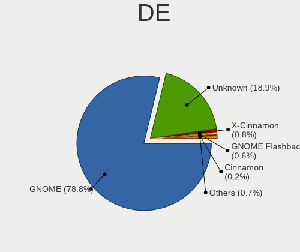
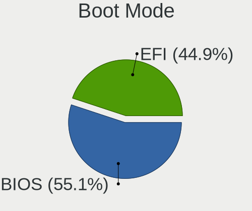
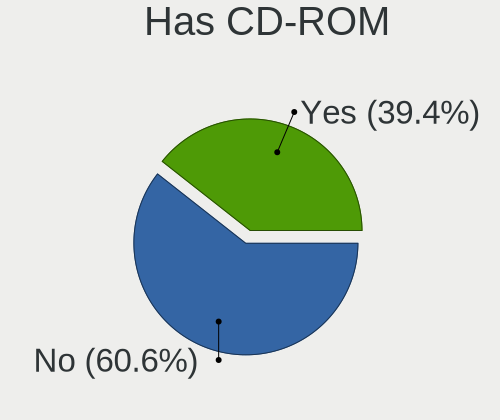
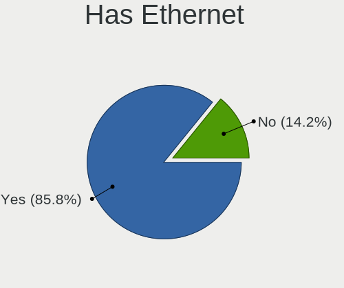
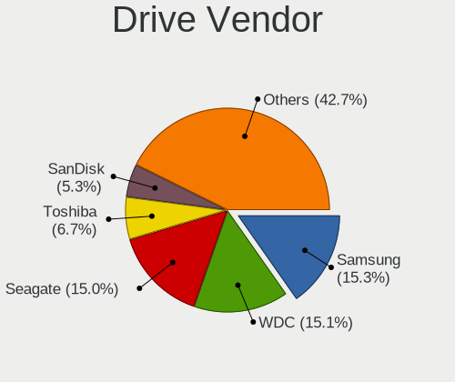
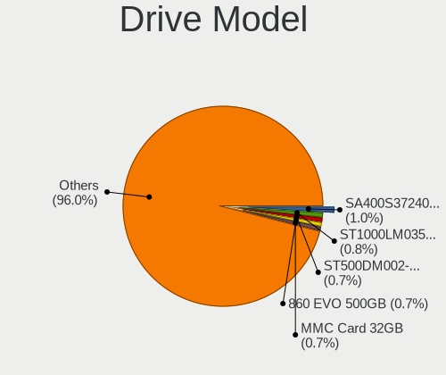
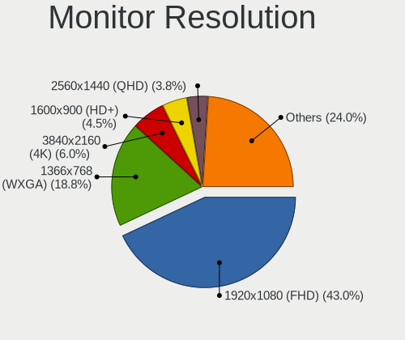
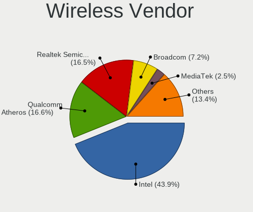
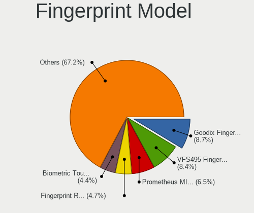

Ubuntu - Tested Hardware & Statistics
-------------------------------------

A project to collect tested hardware configurations for Ubuntu.

Anyone can contribute to this report by the [hw-probe](https://github.com/linuxhw/hw-probe) tool:

    sudo -E hw-probe -all -upload

Please contribute! Especially if your hardware is rare.

This is a report for all computer types. See also reports for [desktops](/Dist/Ubuntu/Desktop/README.md) and [notebooks](/Dist/Ubuntu/Notebook/README.md).

Contents
--------

* [ Test Cases ](#test-cases)

* [ System ](#system)
  - [ OS                       ](#os)
  - [ OS Family                ](#os-family)
  - [ Kernel                   ](#kernel)
  - [ Kernel Family            ](#kernel-family)
  - [ Kernel Major Ver.        ](#kernel-major-ver)
  - [ Arch                     ](#arch)
  - [ DE                       ](#de)
  - [ Display Server           ](#display-server)
  - [ Display Manager          ](#display-manager)
  - [ OS Lang                  ](#os-lang)
  - [ Boot Mode                ](#boot-mode)
  - [ Filesystem               ](#filesystem)
  - [ Part. scheme             ](#part-scheme)
  - [ Dual Boot with Linux/BSD ](#dual-boot-with-linuxbsd)
  - [ Dual Boot (Win)          ](#dual-boot-win)

* [ Board ](#board)
  - [ Vendor                   ](#vendor)
  - [ Model                    ](#model)
  - [ Model Family             ](#model-family)
  - [ MFG Year                 ](#mfg-year)
  - [ Form Factor              ](#form-factor)
  - [ Secure Boot              ](#secure-boot)
  - [ Coreboot                 ](#coreboot)
  - [ RAM Size                 ](#ram-size)
  - [ RAM Used                 ](#ram-used)
  - [ Total Drives             ](#total-drives)
  - [ Has CD-ROM               ](#has-cd-rom)
  - [ Has Ethernet             ](#has-ethernet)
  - [ Has WiFi                 ](#has-wifi)
  - [ Has Bluetooth            ](#has-bluetooth)

* [ Location ](#location)
  - [ Country                  ](#country)
  - [ City                     ](#city)

* [ Drives ](#drives)
  - [ Drive Vendor             ](#drive-vendor)
  - [ Drive Model              ](#drive-model)
  - [ HDD Vendor               ](#hdd-vendor)
  - [ SSD Vendor               ](#ssd-vendor)
  - [ Drive Kind               ](#drive-kind)
  - [ Drive Connector          ](#drive-connector)
  - [ Drive Size               ](#drive-size)
  - [ Space Total              ](#space-total)
  - [ Space Used               ](#space-used)
  - [ Malfunc. Drives          ](#malfunc-drives)
  - [ Malfunc. Drive Vendor    ](#malfunc-drive-vendor)
  - [ Malfunc. HDD Vendor      ](#malfunc-hdd-vendor)
  - [ Malfunc. Drive Kind      ](#malfunc-drive-kind)
  - [ Failed Drives            ](#failed-drives)
  - [ Failed Drive Vendor      ](#failed-drive-vendor)
  - [ Drive Status             ](#drive-status)

* [ Storage controller ](#storage-controller)
  - [ Storage Vendor           ](#storage-vendor)
  - [ Storage Model            ](#storage-model)
  - [ Storage Kind             ](#storage-kind)

* [ Processor ](#processor)
  - [ CPU Vendor               ](#cpu-vendor)
  - [ CPU Model                ](#cpu-model)
  - [ CPU Model Family         ](#cpu-model-family)
  - [ CPU Cores                ](#cpu-cores)
  - [ CPU Sockets              ](#cpu-sockets)
  - [ CPU Threads              ](#cpu-threads)
  - [ CPU Op-Modes             ](#cpu-op-modes)
  - [ CPU Microcode            ](#cpu-microcode)
  - [ CPU Microarch            ](#cpu-microarch)

* [ Graphics ](#graphics)
  - [ GPU Vendor               ](#gpu-vendor)
  - [ GPU Model                ](#gpu-model)
  - [ GPU Combo                ](#gpu-combo)
  - [ GPU Driver               ](#gpu-driver)
  - [ GPU Memory               ](#gpu-memory)

* [ Monitor ](#monitor)
  - [ Monitor Vendor           ](#monitor-vendor)
  - [ Monitor Model            ](#monitor-model)
  - [ Monitor Resolution       ](#monitor-resolution)
  - [ Monitor Diagonal         ](#monitor-diagonal)
  - [ Monitor Width            ](#monitor-width)
  - [ Aspect Ratio             ](#aspect-ratio)
  - [ Monitor Area             ](#monitor-area)
  - [ Pixel Density            ](#pixel-density)
  - [ Multiple Monitors        ](#multiple-monitors)

* [ Network ](#network)
  - [ Net Controller Vendor    ](#net-controller-vendor)
  - [ Net Controller Model     ](#net-controller-model)
  - [ Wireless Vendor          ](#wireless-vendor)
  - [ Wireless Model           ](#wireless-model)
  - [ Ethernet Vendor          ](#ethernet-vendor)
  - [ Ethernet Model           ](#ethernet-model)
  - [ Net Controller Kind      ](#net-controller-kind)
  - [ Used Controller          ](#used-controller)
  - [ NICs                     ](#nics)
  - [ IPv6                     ](#ipv6)

* [ Bluetooth ](#bluetooth)
  - [ Bluetooth Vendor         ](#bluetooth-vendor)
  - [ Bluetooth Model          ](#bluetooth-model)

* [ Sound ](#sound)
  - [ Sound Vendor             ](#sound-vendor)
  - [ Sound Model              ](#sound-model)

* [ Memory ](#memory)
  - [ Memory Vendor            ](#memory-vendor)
  - [ Memory Model             ](#memory-model)
  - [ Memory Kind              ](#memory-kind)
  - [ Memory Form Factor       ](#memory-form-factor)
  - [ Memory Size              ](#memory-size)
  - [ Memory Speed             ](#memory-speed)

* [ Printers & scanners ](#printers--scanners)
  - [ Printer Vendor           ](#printer-vendor)
  - [ Printer Model            ](#printer-model)
  - [ Scanner Vendor           ](#scanner-vendor)
  - [ Scanner Model            ](#scanner-model)

* [ Camera ](#camera)
  - [ Camera Vendor            ](#camera-vendor)
  - [ Camera Model             ](#camera-model)

* [ Security ](#security)
  - [ Fingerprint Vendor       ](#fingerprint-vendor)
  - [ Fingerprint Model        ](#fingerprint-model)
  - [ Chipcard Vendor          ](#chipcard-vendor)
  - [ Chipcard Model           ](#chipcard-model)

* [ Unsupported ](#unsupported)
  - [ Unsupported Devices      ](#unsupported-devices)
  - [ Unsupported Device Types ](#unsupported-device-types)

Test Cases
----------

Total: 90387

| Vendor        | Model                       | Form-Factor | Probe                                                      | Date         |
|---------------|-----------------------------|-------------|------------------------------------------------------------|--------------|
| Dell          | Inspiron 3537               | Notebook    | [43b81e38cd](https://linux-hardware.org/?probe=43b81e38cd) | Jul 01, 2023 |
| ASUSTek       | M4A78LT-M-LE                | Desktop     | [9564e74fb6](https://linux-hardware.org/?probe=9564e74fb6) | Jul 01, 2023 |
| ASRock        | H510M-HDV/M.2               | Desktop     | [ec9ab3662c](https://linux-hardware.org/?probe=ec9ab3662c) | Jul 01, 2023 |
| Dell          | Precision M4800             | Notebook    | [d85b2b94d6](https://linux-hardware.org/?probe=d85b2b94d6) | Jun 30, 2023 |
| ZR            | A320M-F 1005                | Desktop     | [c32d8de777](https://linux-hardware.org/?probe=c32d8de777) | Jun 30, 2023 |
| Apple         | Mac-63001698E7A34814 iMa... | All in one  | [2ee9ffdaa0](https://linux-hardware.org/?probe=2ee9ffdaa0) | Jun 30, 2023 |
| Apple         | Mac-63001698E7A34814 iMa... | All in one  | [6ab7575bed](https://linux-hardware.org/?probe=6ab7575bed) | Jun 30, 2023 |
| ASUSTek       | K52Dr                       | Notebook    | [f97425ba5f](https://linux-hardware.org/?probe=f97425ba5f) | Jun 30, 2023 |
| ASUSTek       | PRIME Z790-A WIFI           | Desktop     | [fa055ceb7c](https://linux-hardware.org/?probe=fa055ceb7c) | Jun 30, 2023 |
| Supermicro    | X10DDW-i                    | Desktop     | [c43e65f1ae](https://linux-hardware.org/?probe=c43e65f1ae) | Jun 30, 2023 |
| Acer          | Aspire E5-575G              | Notebook    | [f127804b4a](https://linux-hardware.org/?probe=f127804b4a) | Jun 30, 2023 |
| Sony          | VGN-NS38E_S                 | Notebook    | [270e8b9fb7](https://linux-hardware.org/?probe=270e8b9fb7) | Jun 30, 2023 |
| Sony          | VGN-NS38E_S                 | Notebook    | [ca33cfbc67](https://linux-hardware.org/?probe=ca33cfbc67) | Jun 30, 2023 |
| ASUSTek       | ROG CROSSHAIR VII HERO      | Desktop     | [d42cdc8551](https://linux-hardware.org/?probe=d42cdc8551) | Jun 30, 2023 |
| Lenovo        | Yoga 530-14IKB 81EK         | Convertible | [4b57a18d9b](https://linux-hardware.org/?probe=4b57a18d9b) | Jun 30, 2023 |
| Timi          | Redmi Book Pro 14 2022      | Notebook    | [b5d1a7e115](https://linux-hardware.org/?probe=b5d1a7e115) | Jun 30, 2023 |
| Lenovo        | Yoga 7 16IAP7 82QG          | Convertible | [5ac29ea67f](https://linux-hardware.org/?probe=5ac29ea67f) | Jun 30, 2023 |
| Intel         | B85 V5.56                   | Desktop     | [a582972a5e](https://linux-hardware.org/?probe=a582972a5e) | Jun 30, 2023 |
| Lenovo        | Yoga 530-14IKB 81EK         | Convertible | [1abd7f9f95](https://linux-hardware.org/?probe=1abd7f9f95) | Jun 30, 2023 |
| Gigabyte      | B760M DS3H AX DDR4          | Desktop     | [0d3ecc7c44](https://linux-hardware.org/?probe=0d3ecc7c44) | Jun 30, 2023 |
| Lenovo        | ThinkPad T430 2347AT2       | Notebook    | [951adb91cd](https://linux-hardware.org/?probe=951adb91cd) | Jun 30, 2023 |
| Pegatron      | 2AB5                        | Desktop     | [f23fa01e43](https://linux-hardware.org/?probe=f23fa01e43) | Jun 30, 2023 |
| Apple         | MacBookPro8,2               | Notebook    | [8386acaa29](https://linux-hardware.org/?probe=8386acaa29) | Jun 30, 2023 |
| Samsung       | R528/R728                   | Notebook    | [dc84de44ff](https://linux-hardware.org/?probe=dc84de44ff) | Jun 30, 2023 |
| HP            | 8158 A01                    | Mini pc     | [6137e1cbbb](https://linux-hardware.org/?probe=6137e1cbbb) | Jun 30, 2023 |
| Supermicro    | X8DTU                       | Server      | [4ff2cd1bcf](https://linux-hardware.org/?probe=4ff2cd1bcf) | Jun 30, 2023 |
| AZW           | SEi                         | Desktop     | [37527da518](https://linux-hardware.org/?probe=37527da518) | Jun 30, 2023 |
| Intel         | X99H                        | Desktop     | [8e8c7e8b20](https://linux-hardware.org/?probe=8e8c7e8b20) | Jun 30, 2023 |
| HP            | Laptop 15s-eq1xxx           | Notebook    | [00442193a6](https://linux-hardware.org/?probe=00442193a6) | Jun 30, 2023 |
| HP            | 15                          | Notebook    | [2d80407689](https://linux-hardware.org/?probe=2d80407689) | Jun 30, 2023 |
| Gigabyte      | B550M AORUS PRO             | Desktop     | [08d14942e4](https://linux-hardware.org/?probe=08d14942e4) | Jun 30, 2023 |
| HP            | ProBook 650 G5              | Notebook    | [99a03772fb](https://linux-hardware.org/?probe=99a03772fb) | Jun 30, 2023 |
| Gigabyte      | B650M AORUS ELITE AX        | Desktop     | [ffcfef2edb](https://linux-hardware.org/?probe=ffcfef2edb) | Jun 30, 2023 |
| HP            | 15                          | Notebook    | [398d659d8c](https://linux-hardware.org/?probe=398d659d8c) | Jun 30, 2023 |
| Gateway       | MD7309U                     | Notebook    | [e21ff27153](https://linux-hardware.org/?probe=e21ff27153) | Jun 30, 2023 |
| HP            | Laptop 17-cp2xxx            | Notebook    | [2012cd2c37](https://linux-hardware.org/?probe=2012cd2c37) | Jun 30, 2023 |
| Timi          | Xiaomi Book Air 13 2022     | Convertible | [2d7ee2c4a8](https://linux-hardware.org/?probe=2d7ee2c4a8) | Jun 30, 2023 |
| HP            | EliteBook 8460p             | Notebook    | [d4a008aefb](https://linux-hardware.org/?probe=d4a008aefb) | Jun 30, 2023 |
| HP            | 245 G6 Notebook PC          | Notebook    | [22a896d74b](https://linux-hardware.org/?probe=22a896d74b) | Jun 30, 2023 |
| Gateway       | MD7309U                     | Notebook    | [8d97d507d1](https://linux-hardware.org/?probe=8d97d507d1) | Jun 30, 2023 |
| MSI           | Katana GF66 11UG            | Notebook    | [e9f98cc102](https://linux-hardware.org/?probe=e9f98cc102) | Jun 30, 2023 |
| AZW           | U59                         | Desktop     | [2b5d4dd033](https://linux-hardware.org/?probe=2b5d4dd033) | Jun 30, 2023 |
| Supermicro    | X8DTU                       | Server      | [a1fa5d4047](https://linux-hardware.org/?probe=a1fa5d4047) | Jun 30, 2023 |
| Dell          | Latitude 7350               | Notebook    | [95fc412b55](https://linux-hardware.org/?probe=95fc412b55) | Jun 30, 2023 |
| Supermicro    | X8DTU                       | Server      | [f62d2cd7ee](https://linux-hardware.org/?probe=f62d2cd7ee) | Jun 30, 2023 |
| ASUSTek       | VivoBook_ASUSLaptop X321... | Notebook    | [05cb990f84](https://linux-hardware.org/?probe=05cb990f84) | Jun 30, 2023 |
| Supermicro    | X9DRW                       | Desktop     | [cb955d7a58](https://linux-hardware.org/?probe=cb955d7a58) | Jun 30, 2023 |
| Dell          | 0H21J3 A07                  | Server      | [621e96507a](https://linux-hardware.org/?probe=621e96507a) | Jun 30, 2023 |
| Dell          | Latitude 5440               | Notebook    | [7868400967](https://linux-hardware.org/?probe=7868400967) | Jun 30, 2023 |
| Dell          | Precision M4800             | Notebook    | [769a982a68](https://linux-hardware.org/?probe=769a982a68) | Jun 30, 2023 |
| HP            | Pavilion Laptop 15-eh1xx... | Notebook    | [1e4c2cf905](https://linux-hardware.org/?probe=1e4c2cf905) | Jun 30, 2023 |
| Apple         | MacBookAir9,1               | Notebook    | [bd5c030739](https://linux-hardware.org/?probe=bd5c030739) | Jun 30, 2023 |
| Lenovo        | 0B98401 WIN                 | Desktop     | [35871c9acc](https://linux-hardware.org/?probe=35871c9acc) | Jun 30, 2023 |
| Apple         | MacBookAir9,1               | Notebook    | [ce486a5063](https://linux-hardware.org/?probe=ce486a5063) | Jun 30, 2023 |
| HP            | Laptop 15-ef2xxx            | Notebook    | [d0ea6a2d9d](https://linux-hardware.org/?probe=d0ea6a2d9d) | Jun 30, 2023 |
| HP            | 1497                        | Desktop     | [4dd582d288](https://linux-hardware.org/?probe=4dd582d288) | Jun 30, 2023 |
| HP            | EliteBook 2540p             | Notebook    | [7b546735a4](https://linux-hardware.org/?probe=7b546735a4) | Jun 30, 2023 |
| Dell          | 0KYJ8C A02                  | Desktop     | [f4fff60df3](https://linux-hardware.org/?probe=f4fff60df3) | Jun 30, 2023 |
| ASUSTek       | M51AC                       | Desktop     | [d32d060e9c](https://linux-hardware.org/?probe=d32d060e9c) | Jun 30, 2023 |
| Acer          | Aspire 5737Z                | Notebook    | [842aa57faf](https://linux-hardware.org/?probe=842aa57faf) | Jun 30, 2023 |
| Dell          | 0KYJ8C A02                  | Desktop     | [c860545122](https://linux-hardware.org/?probe=c860545122) | Jun 30, 2023 |
| Samsung       | R430/R480                   | Notebook    | [485a09a0d2](https://linux-hardware.org/?probe=485a09a0d2) | Jun 30, 2023 |
| HP            | 2129                        | Desktop     | [73daf1de6b](https://linux-hardware.org/?probe=73daf1de6b) | Jun 30, 2023 |
| Shenzhen W... | AERO 5 Lite Mini PC         | Mini pc     | [7375ced625](https://linux-hardware.org/?probe=7375ced625) | Jun 30, 2023 |
| HP            | Pavilion Laptop 15-cc5xx    | Notebook    | [39f7adb927](https://linux-hardware.org/?probe=39f7adb927) | Jun 30, 2023 |
| Medion        | Z370H4-EM                   | Desktop     | [b8327a4d00](https://linux-hardware.org/?probe=b8327a4d00) | Jun 30, 2023 |
| Monster       | TULPAR T7 V21.7             | Notebook    | [046803a297](https://linux-hardware.org/?probe=046803a297) | Jun 30, 2023 |
| Gigabyte      | GA-MA770-DS3                | Desktop     | [5b7bc3205d](https://linux-hardware.org/?probe=5b7bc3205d) | Jun 29, 2023 |
| MSI           | P67A-G43                    | Desktop     | [8e5f71c975](https://linux-hardware.org/?probe=8e5f71c975) | Jun 29, 2023 |
| Timi          | Redmi Book Pro 14 2022      | Notebook    | [b98433fa84](https://linux-hardware.org/?probe=b98433fa84) | Jun 29, 2023 |
| Lenovo        | Legion 5 15ACH6 82JW        | Notebook    | [7f9164d1e0](https://linux-hardware.org/?probe=7f9164d1e0) | Jun 29, 2023 |
| HP            | ProBook 4530s               | Notebook    | [d1c3bf37ff](https://linux-hardware.org/?probe=d1c3bf37ff) | Jun 29, 2023 |
| Dell          | XPS 15 9570                 | Notebook    | [e0492d6173](https://linux-hardware.org/?probe=e0492d6173) | Jun 29, 2023 |
| Dell          | Latitude 7350               | Notebook    | [8ae13e8fdb](https://linux-hardware.org/?probe=8ae13e8fdb) | Jun 29, 2023 |
| ASUSTek       | CM6330_CM6630_CM6730_CM6... | Desktop     | [42624c8bb1](https://linux-hardware.org/?probe=42624c8bb1) | Jun 29, 2023 |
| Intel         | B85 V5.56                   | Desktop     | [e8b15eb823](https://linux-hardware.org/?probe=e8b15eb823) | Jun 29, 2023 |
| Acer          | NC-A515-51G-59DM            | Notebook    | [a521f2cc60](https://linux-hardware.org/?probe=a521f2cc60) | Jun 29, 2023 |
| Apple         | Mac-BE088AF8C5EB4FA2 iMa... | All in one  | [1e30b2ea59](https://linux-hardware.org/?probe=1e30b2ea59) | Jun 29, 2023 |
| Intel         | Whiskey Platform            | Notebook    | [1caca06d89](https://linux-hardware.org/?probe=1caca06d89) | Jun 29, 2023 |
| Acer          | Aspire XC-840               | Desktop     | [76c750aae4](https://linux-hardware.org/?probe=76c750aae4) | Jun 29, 2023 |
| ASUSTek       | K56CB                       | Notebook    | [952909bc80](https://linux-hardware.org/?probe=952909bc80) | Jun 29, 2023 |
| MSI           | MPG Z390 GAMING EDGE AC     | Desktop     | [5a6b149eb4](https://linux-hardware.org/?probe=5a6b149eb4) | Jun 29, 2023 |
| HP            | ProBook 6560b               | Notebook    | [e8e8e6881d](https://linux-hardware.org/?probe=e8e8e6881d) | Jun 29, 2023 |
| Dell          | 0T568R A00                  | Desktop     | [cf98a8a69b](https://linux-hardware.org/?probe=cf98a8a69b) | Jun 29, 2023 |
| ASUSTek       | TUF Gaming X570-PLUS        | Desktop     | [d6cb722f64](https://linux-hardware.org/?probe=d6cb722f64) | Jun 29, 2023 |
| Microsoft     | Surface Pro 2               | Tablet      | [5b92d42213](https://linux-hardware.org/?probe=5b92d42213) | Jun 29, 2023 |
| ASRock        | Z690 Steel Legend WiFi 6... | Desktop     | [d09ee66df1](https://linux-hardware.org/?probe=d09ee66df1) | Jun 29, 2023 |
| MSI           | Modern 14 B5M               | Notebook    | [cb0eb574da](https://linux-hardware.org/?probe=cb0eb574da) | Jun 29, 2023 |
| Lenovo        | ThinkPad X1 Carbon 6th 2... | Notebook    | [93e0628fbe](https://linux-hardware.org/?probe=93e0628fbe) | Jun 29, 2023 |
| HP            | Pavilion dv6                | Notebook    | [a24ee9a903](https://linux-hardware.org/?probe=a24ee9a903) | Jun 29, 2023 |
| ASUSTek       | X751MA                      | Notebook    | [b36ca5687c](https://linux-hardware.org/?probe=b36ca5687c) | Jun 29, 2023 |
| HP            | ProLiant DL360 Gen9         | Server      | [057b246898](https://linux-hardware.org/?probe=057b246898) | Jun 29, 2023 |
| Supermicro    | X8DTU                       | Server      | [1f006cb678](https://linux-hardware.org/?probe=1f006cb678) | Jun 29, 2023 |
| Acer          | TravelMate B113             | Notebook    | [04738ce824](https://linux-hardware.org/?probe=04738ce824) | Jun 29, 2023 |
| Acer          | TravelMate B113             | Notebook    | [9cfe4d5036](https://linux-hardware.org/?probe=9cfe4d5036) | Jun 29, 2023 |
| ASUSTek       | VivoBook_ASUSLaptop X512... | Notebook    | [0f0defbd9c](https://linux-hardware.org/?probe=0f0defbd9c) | Jun 29, 2023 |
| HP            | EliteBook 845 G7 Noteboo... | Notebook    | [61930889dc](https://linux-hardware.org/?probe=61930889dc) | Jun 29, 2023 |
| Unknown       | Unknown                     | Notebook    | [d358089f32](https://linux-hardware.org/?probe=d358089f32) | Jun 29, 2023 |
| Gigabyte      | Z390 AORUS PRO WIFI-CF      | Desktop     | [304ff06fc0](https://linux-hardware.org/?probe=304ff06fc0) | Jun 29, 2023 |
| MSI           | Z87 MPOWER                  | Desktop     | [e34420b76e](https://linux-hardware.org/?probe=e34420b76e) | Jun 29, 2023 |
| Dell          | Precision M6500             | Notebook    | [199e90722c](https://linux-hardware.org/?probe=199e90722c) | Jun 29, 2023 |
| HP            | Laptop 17-cp2xxx            | Notebook    | [f1a1aa76e2](https://linux-hardware.org/?probe=f1a1aa76e2) | Jun 29, 2023 |
| HP            | Pavilion g6                 | Notebook    | [ef275e1249](https://linux-hardware.org/?probe=ef275e1249) | Jun 29, 2023 |
| Lenovo        | ThinkPad Edge E545 20B2S... | Notebook    | [c7e71c8c0b](https://linux-hardware.org/?probe=c7e71c8c0b) | Jun 29, 2023 |
| Lenovo        | ThinkPad Edge E545 20B2S... | Notebook    | [0c3b48af38](https://linux-hardware.org/?probe=0c3b48af38) | Jun 29, 2023 |
| Sony          | SVE17137CXB                 | Notebook    | [ed6f82dc16](https://linux-hardware.org/?probe=ed6f82dc16) | Jun 29, 2023 |
| HP            | ProLiant DL160 G6           | Server      | [8a47bef402](https://linux-hardware.org/?probe=8a47bef402) | Jun 29, 2023 |
| Lenovo        | ThinkBook 14s-IML 20RS      | Notebook    | [e3d095fc9f](https://linux-hardware.org/?probe=e3d095fc9f) | Jun 29, 2023 |
| Acer          | Nitro AN515-55              | Notebook    | [a41ff8c573](https://linux-hardware.org/?probe=a41ff8c573) | Jun 29, 2023 |
| Fujitsu       | D3400-A1 S26361-D3400-A1    | Desktop     | [4ad54ee28d](https://linux-hardware.org/?probe=4ad54ee28d) | Jun 29, 2023 |
| ASUSTek       | PRIME Z590-P                | Desktop     | [6147d58cdf](https://linux-hardware.org/?probe=6147d58cdf) | Jun 29, 2023 |
| Lenovo        | ThinkPad X240 20AL00C7MD    | Notebook    | [5c5334f633](https://linux-hardware.org/?probe=5c5334f633) | Jun 28, 2023 |
| Acer          | Aspire 5750G                | Notebook    | [3c4acbf380](https://linux-hardware.org/?probe=3c4acbf380) | Jun 28, 2023 |
| Lenovo        | IdeaPad 5 15ARE05 81YQ      | Notebook    | [ff560998d8](https://linux-hardware.org/?probe=ff560998d8) | Jun 28, 2023 |
| Lenovo        | IdeaPad 5 15ALC05 82LN      | Notebook    | [7017964456](https://linux-hardware.org/?probe=7017964456) | Jun 28, 2023 |
| Dell          | XPS 15 9570                 | Notebook    | [34df27504f](https://linux-hardware.org/?probe=34df27504f) | Jun 28, 2023 |
| ASUSTek       | H170-PRO                    | Desktop     | [506c909e37](https://linux-hardware.org/?probe=506c909e37) | Jun 28, 2023 |
| Intel         | NUC8BEB J72688-304          | Mini pc     | [5bc93ff20d](https://linux-hardware.org/?probe=5bc93ff20d) | Jun 28, 2023 |
| Dell          | 0WK833                      | Desktop     | [fd4a07e088](https://linux-hardware.org/?probe=fd4a07e088) | Jun 28, 2023 |
| ASUSTek       | F2A85-M PRO                 | Desktop     | [a7617c12c5](https://linux-hardware.org/?probe=a7617c12c5) | Jun 28, 2023 |
| Toshiba       | TECRA R950                  | Notebook    | [cab34ec3dc](https://linux-hardware.org/?probe=cab34ec3dc) | Jun 28, 2023 |
| Lenovo        | Yoga 730-15IWL 81JS         | Convertible | [4eef67e633](https://linux-hardware.org/?probe=4eef67e633) | Jun 28, 2023 |
| Toshiba       | Satellite X200              | Notebook    | [4a3e7008cf](https://linux-hardware.org/?probe=4a3e7008cf) | Jun 28, 2023 |
| Supermicro    | X10DRU-i+                   | Server      | [978c7d9a50](https://linux-hardware.org/?probe=978c7d9a50) | Jun 28, 2023 |
| Supermicro    | X10DRU-i+                   | Server      | [69f1784c40](https://linux-hardware.org/?probe=69f1784c40) | Jun 28, 2023 |
| Supermicro    | X10DRU-i+                   | Server      | [2545527872](https://linux-hardware.org/?probe=2545527872) | Jun 28, 2023 |
| Supermicro    | X10DRU-i+                   | Server      | [9a96d38f8a](https://linux-hardware.org/?probe=9a96d38f8a) | Jun 28, 2023 |
| Acer          | Aspire 5750G                | Notebook    | [8ae62960d8](https://linux-hardware.org/?probe=8ae62960d8) | Jun 28, 2023 |
| HP            | ProBook 470 G3              | Notebook    | [1025bf4027](https://linux-hardware.org/?probe=1025bf4027) | Jun 28, 2023 |
| HP            | ProBook 470 G3              | Notebook    | [b8453a6830](https://linux-hardware.org/?probe=b8453a6830) | Jun 28, 2023 |
| ZR            | A320M-F 1005                | Desktop     | [f70bb41b80](https://linux-hardware.org/?probe=f70bb41b80) | Jun 28, 2023 |
| ATOPNUC       | MA90                        | Mini pc     | [73b2087727](https://linux-hardware.org/?probe=73b2087727) | Jun 28, 2023 |
| HP            | Spectre x360 2-in-1 Lapt... | Convertible | [ad91997e3e](https://linux-hardware.org/?probe=ad91997e3e) | Jun 28, 2023 |
| Acer          | Nitro AN515-54              | Notebook    | [b30ff15571](https://linux-hardware.org/?probe=b30ff15571) | Jun 28, 2023 |
| ASUSTek       | M4N78                       | Desktop     | [03e5d24ba1](https://linux-hardware.org/?probe=03e5d24ba1) | Jun 28, 2023 |
| ASUSTek       | GL553VD                     | Notebook    | [884a5ecd03](https://linux-hardware.org/?probe=884a5ecd03) | Jun 28, 2023 |
| Lenovo        | ThinkPad X240 20AL007LUK    | Notebook    | [ee0761a131](https://linux-hardware.org/?probe=ee0761a131) | Jun 28, 2023 |
| Dell          | Latitude 7440               | Notebook    | [24f85667ac](https://linux-hardware.org/?probe=24f85667ac) | Jun 28, 2023 |
| Lenovo        | NO DPK                      | Desktop     | [2f12ef933e](https://linux-hardware.org/?probe=2f12ef933e) | Jun 28, 2023 |
| ASUSTek       | SABERTOOTH X79              | Desktop     | [e39c7f5f6f](https://linux-hardware.org/?probe=e39c7f5f6f) | Jun 28, 2023 |
| MSI           | GE66 Dragonshield 10SF      | Notebook    | [42f6b46bb1](https://linux-hardware.org/?probe=42f6b46bb1) | Jun 28, 2023 |
| Lenovo        | ThinkPad X1 Tablet Gen 3... | Tablet      | [e2ea94e083](https://linux-hardware.org/?probe=e2ea94e083) | Jun 28, 2023 |
| ASUSTek       | N75SF                       | Notebook    | [eda2a0d726](https://linux-hardware.org/?probe=eda2a0d726) | Jun 28, 2023 |
| Lenovo        | ThinkPad Z13 Gen 1 21D2C... | Notebook    | [90a10ed8ed](https://linux-hardware.org/?probe=90a10ed8ed) | Jun 28, 2023 |
| Supermicro    | H11SSL-i                    | Server      | [2713ca5a34](https://linux-hardware.org/?probe=2713ca5a34) | Jun 28, 2023 |
| Acer          | Aspire Z3-705               | All in one  | [058c58505d](https://linux-hardware.org/?probe=058c58505d) | Jun 28, 2023 |
| HP            | Pavilion Laptop 15-eh2xx... | Notebook    | [5d30ae9d05](https://linux-hardware.org/?probe=5d30ae9d05) | Jun 28, 2023 |
| ASUSTek       | VivoBook_ASUSLaptop X170... | Notebook    | [4e40b350ca](https://linux-hardware.org/?probe=4e40b350ca) | Jun 28, 2023 |
| HP            | 8459                        | Desktop     | [7b60320110](https://linux-hardware.org/?probe=7b60320110) | Jun 28, 2023 |
| Intel         | Unknown                     | Desktop     | [3c85a0c7b9](https://linux-hardware.org/?probe=3c85a0c7b9) | Jun 28, 2023 |
| Gigabyte      | B550M AORUS PRO-P           | Desktop     | [e29021ab76](https://linux-hardware.org/?probe=e29021ab76) | Jun 28, 2023 |
| Toshiba       | PORTEGE R500                | Notebook    | [2c6448083e](https://linux-hardware.org/?probe=2c6448083e) | Jun 28, 2023 |
| Lenovo        | ThinkPad T470s 20HF005QM... | Notebook    | [fee1e04033](https://linux-hardware.org/?probe=fee1e04033) | Jun 28, 2023 |
| ASRock        | X570 Taichi                 | Desktop     | [75cb221d91](https://linux-hardware.org/?probe=75cb221d91) | Jun 28, 2023 |
| ASUSTek       | PRIME B350M-A               | Desktop     | [1f5a11092b](https://linux-hardware.org/?probe=1f5a11092b) | Jun 28, 2023 |
| HP            | EliteBook 745 G2            | Notebook    | [f64e6dd56e](https://linux-hardware.org/?probe=f64e6dd56e) | Jun 28, 2023 |
| Lenovo        | XiaoXinPro 16 ARP8 83AS     | Notebook    | [1d6bf708ce](https://linux-hardware.org/?probe=1d6bf708ce) | Jun 28, 2023 |
| Acer          | Aspire A315-51              | Notebook    | [771e2e233a](https://linux-hardware.org/?probe=771e2e233a) | Jun 28, 2023 |
| HP            | 86F3 00100                  | All in one  | [8895116a7d](https://linux-hardware.org/?probe=8895116a7d) | Jun 28, 2023 |
| MSI           | MAG B550 TOMAHAWK           | Desktop     | [607da926f3](https://linux-hardware.org/?probe=607da926f3) | Jun 28, 2023 |
| HP            | 86F3 00100                  | All in one  | [8e3236446c](https://linux-hardware.org/?probe=8e3236446c) | Jun 28, 2023 |
| Sony          | Unknown                     | Notebook    | [59cedce53d](https://linux-hardware.org/?probe=59cedce53d) | Jun 28, 2023 |
| Sony          | Unknown                     | Notebook    | [d7bf706b4e](https://linux-hardware.org/?probe=d7bf706b4e) | Jun 28, 2023 |
| ASUSTek       | F2A55-M LK                  | Desktop     | [0fcac8a0af](https://linux-hardware.org/?probe=0fcac8a0af) | Jun 28, 2023 |
| ASUSTek       | F5SR                        | Notebook    | [3722cfa5fb](https://linux-hardware.org/?probe=3722cfa5fb) | Jun 27, 2023 |
| Lenovo        | ThinkPad 13 2nd Gen 20J2... | Notebook    | [46e3ea33a3](https://linux-hardware.org/?probe=46e3ea33a3) | Jun 27, 2023 |
| Dell          | Latitude E6530              | Notebook    | [f015f73aef](https://linux-hardware.org/?probe=f015f73aef) | Jun 27, 2023 |
| Intel         | Unknown                     | Desktop     | [dbfbe4b6aa](https://linux-hardware.org/?probe=dbfbe4b6aa) | Jun 27, 2023 |
| MSI           | Z390-A PRO                  | Desktop     | [638d6b4ef3](https://linux-hardware.org/?probe=638d6b4ef3) | Jun 27, 2023 |
| HP            | ZBook Studio G3             | Notebook    | [f51bc4a275](https://linux-hardware.org/?probe=f51bc4a275) | Jun 27, 2023 |
| Samsung       | 550XCJ/550XCR               | Notebook    | [bca3e799e0](https://linux-hardware.org/?probe=bca3e799e0) | Jun 27, 2023 |
| Intel         | NUC6i3SYB H81132-503        | Mini pc     | [07941536c0](https://linux-hardware.org/?probe=07941536c0) | Jun 27, 2023 |
| HP            | 871A                        | Mini pc     | [79b5fd11c3](https://linux-hardware.org/?probe=79b5fd11c3) | Jun 27, 2023 |
| HP            | Laptop 15s-eq2xxx           | Notebook    | [5922b4d31f](https://linux-hardware.org/?probe=5922b4d31f) | Jun 27, 2023 |
| Gigabyte      | H61M-D2-B3                  | Desktop     | [7de1b2a03f](https://linux-hardware.org/?probe=7de1b2a03f) | Jun 27, 2023 |
| UNOWHY        | Y13G002S4EI                 | Notebook    | [dae5fc72df](https://linux-hardware.org/?probe=dae5fc72df) | Jun 27, 2023 |
| UNOWHY        | Y13G002S4EI                 | Notebook    | [c91c09307d](https://linux-hardware.org/?probe=c91c09307d) | Jun 27, 2023 |
| ASRock        | AB350M-HDV                  | Desktop     | [a055db3af3](https://linux-hardware.org/?probe=a055db3af3) | Jun 27, 2023 |
| Dell          | 0WK833                      | Desktop     | [39a5ca93a7](https://linux-hardware.org/?probe=39a5ca93a7) | Jun 27, 2023 |
| ASUSTek       | P8Z77-V                     | Desktop     | [177c923e5a](https://linux-hardware.org/?probe=177c923e5a) | Jun 27, 2023 |
| Dell          | 0KWVT8 A03                  | Desktop     | [8dcd3c3200](https://linux-hardware.org/?probe=8dcd3c3200) | Jun 27, 2023 |
| Lenovo        | ThinkPad SL 2746EDG         | Notebook    | [7f0ae1c657](https://linux-hardware.org/?probe=7f0ae1c657) | Jun 27, 2023 |
| Gigabyte      | H310M M.2 x.x               | Desktop     | [6f9c836bb4](https://linux-hardware.org/?probe=6f9c836bb4) | Jun 27, 2023 |
| Dell          | XPS 15 9500                 | Notebook    | [8ea6d92813](https://linux-hardware.org/?probe=8ea6d92813) | Jun 27, 2023 |
| Lenovo        | 36C5 SDK0K17763 WIN 1801... | Desktop     | [708131b231](https://linux-hardware.org/?probe=708131b231) | Jun 27, 2023 |
| Lenovo        | 36C5 SDK0K17763 WIN 1801... | Desktop     | [ef8f76e9e1](https://linux-hardware.org/?probe=ef8f76e9e1) | Jun 27, 2023 |
| Supermicro    | H11SSL-i                    | Server      | [15e179f857](https://linux-hardware.org/?probe=15e179f857) | Jun 27, 2023 |
| Dell          | 0FXD80 A00                  | Desktop     | [4427c2159c](https://linux-hardware.org/?probe=4427c2159c) | Jun 27, 2023 |
| Packard Be... | EasyNote ENTF71BM           | Notebook    | [8ef6f6f24a](https://linux-hardware.org/?probe=8ef6f6f24a) | Jun 27, 2023 |
| MSI           | MAG Z790 TOMAHAWK WIFI      | Desktop     | [9450fc030e](https://linux-hardware.org/?probe=9450fc030e) | Jun 27, 2023 |
| ASUSTek       | EX-B250M-V3                 | Desktop     | [0746c8e92b](https://linux-hardware.org/?probe=0746c8e92b) | Jun 27, 2023 |
| HP            | ProBook 455 15.6 inch G9... | Notebook    | [d4c9f8de35](https://linux-hardware.org/?probe=d4c9f8de35) | Jun 27, 2023 |
| Pegatron      | 2AB5                        | Desktop     | [8aaaef4a62](https://linux-hardware.org/?probe=8aaaef4a62) | Jun 27, 2023 |
| HP            | Pavilion Laptop 15-eh2xx... | Notebook    | [fc7f2b378b](https://linux-hardware.org/?probe=fc7f2b378b) | Jun 27, 2023 |
| Lenovo        | ThinkPad X13 Gen 1 20UGS... | Notebook    | [3928ad0893](https://linux-hardware.org/?probe=3928ad0893) | Jun 27, 2023 |
| Dell          | 00010C A00                  | Desktop     | [f965b0f028](https://linux-hardware.org/?probe=f965b0f028) | Jun 27, 2023 |
| HP            | ENVY 15                     | Notebook    | [0d46d829d2](https://linux-hardware.org/?probe=0d46d829d2) | Jun 27, 2023 |
| HP            | ENVY 15                     | Notebook    | [189cf01c37](https://linux-hardware.org/?probe=189cf01c37) | Jun 27, 2023 |
| HP            | Laptop 15s-eq2xxx           | Notebook    | [7497c404d4](https://linux-hardware.org/?probe=7497c404d4) | Jun 27, 2023 |
| Lenovo        | IdeaPad S145-15API 81V7     | Notebook    | [ec69000909](https://linux-hardware.org/?probe=ec69000909) | Jun 27, 2023 |
| Acer          | Nitro AN515-45              | Notebook    | [0bfb7dc30a](https://linux-hardware.org/?probe=0bfb7dc30a) | Jun 27, 2023 |
| HP            | 0A9Ch                       | Desktop     | [08eccac462](https://linux-hardware.org/?probe=08eccac462) | Jun 27, 2023 |
| Dell          | 0NDYHG A01                  | Desktop     | [15e9b561e3](https://linux-hardware.org/?probe=15e9b561e3) | Jun 27, 2023 |
| ASRock        | 960GM-VGS3 FX               | Desktop     | [2cd4ef0e5d](https://linux-hardware.org/?probe=2cd4ef0e5d) | Jun 27, 2023 |
| Daten Tecn... | ESTELAR                     | Notebook    | [0052df6a90](https://linux-hardware.org/?probe=0052df6a90) | Jun 27, 2023 |
| Apple         | MacBookPro8,2               | Notebook    | [3e5baaaa01](https://linux-hardware.org/?probe=3e5baaaa01) | Jun 27, 2023 |
| ASUSTek       | Zenbook UX5401EA_UX5401E... | Notebook    | [0defa5c92d](https://linux-hardware.org/?probe=0defa5c92d) | Jun 27, 2023 |
| ASUSTek       | ROG STRIX Z590-E GAMING ... | Desktop     | [962cd7b905](https://linux-hardware.org/?probe=962cd7b905) | Jun 27, 2023 |
| Fujitsu       | D3061-A1 S26361-D3061-A1    | Desktop     | [e1b714fdf1](https://linux-hardware.org/?probe=e1b714fdf1) | Jun 27, 2023 |
| Gigabyte      | AB350M-D3H-CF               | Desktop     | [c73458700f](https://linux-hardware.org/?probe=c73458700f) | Jun 27, 2023 |
| ASUSTek       | ROG ZENITH II EXTREME       | Desktop     | [51f9f56f44](https://linux-hardware.org/?probe=51f9f56f44) | Jun 26, 2023 |
| Gigabyte      | B550M AORUS PRO-P           | Desktop     | [91b5e02477](https://linux-hardware.org/?probe=91b5e02477) | Jun 26, 2023 |
| Biostar       | B550T-SILVER                | Desktop     | [bae0c9a5b0](https://linux-hardware.org/?probe=bae0c9a5b0) | Jun 26, 2023 |
| ASRock        | A320M-DVS R4.0              | Desktop     | [742d015edb](https://linux-hardware.org/?probe=742d015edb) | Jun 26, 2023 |
| ASRock        | X570 Phantom Gaming 4       | Desktop     | [309cb87000](https://linux-hardware.org/?probe=309cb87000) | Jun 26, 2023 |
| Intel         | DH55TC AAE70932-206         | Desktop     | [9ff872e2a3](https://linux-hardware.org/?probe=9ff872e2a3) | Jun 26, 2023 |
| ASRock        | A320M-DVS R4.0              | Desktop     | [6c659f8e1f](https://linux-hardware.org/?probe=6c659f8e1f) | Jun 26, 2023 |
| MSI           | GE66 Dragonshield 10SF      | Notebook    | [00fd5b9706](https://linux-hardware.org/?probe=00fd5b9706) | Jun 26, 2023 |
| Acer          | AOA150                      | Notebook    | [61f8e3c7d2](https://linux-hardware.org/?probe=61f8e3c7d2) | Jun 26, 2023 |
| Apple         | MacBook4,1                  | Notebook    | [fe27e643ac](https://linux-hardware.org/?probe=fe27e643ac) | Jun 26, 2023 |
| HP            | 21F5 0A                     | Desktop     | [dd990a6e99](https://linux-hardware.org/?probe=dd990a6e99) | Jun 26, 2023 |
| Samsung       | 950QED                      | Convertible | [8053ccf4cd](https://linux-hardware.org/?probe=8053ccf4cd) | Jun 26, 2023 |
| Daten Tecn... | ESTELAR                     | Notebook    | [d5f99bced6](https://linux-hardware.org/?probe=d5f99bced6) | Jun 26, 2023 |
| Lenovo        | ThinkPad W520 428425G       | Notebook    | [48d9a1b9fc](https://linux-hardware.org/?probe=48d9a1b9fc) | Jun 26, 2023 |
| Lenovo        | MAHOBAY                     | Desktop     | [46ed210eb0](https://linux-hardware.org/?probe=46ed210eb0) | Jun 26, 2023 |
| Lenovo        | ThinkPad W520 428425G       | Notebook    | [813d5adfd5](https://linux-hardware.org/?probe=813d5adfd5) | Jun 26, 2023 |
| ASUSTek       | VivoBook_ASUSLaptop X321... | Notebook    | [cde6a94b92](https://linux-hardware.org/?probe=cde6a94b92) | Jun 26, 2023 |
| ASUSTek       | B85M-G                      | Desktop     | [5a9f85740e](https://linux-hardware.org/?probe=5a9f85740e) | Jun 26, 2023 |
| HP            | Pavilion dv6                | Notebook    | [fe7974bbc9](https://linux-hardware.org/?probe=fe7974bbc9) | Jun 26, 2023 |
| HP            | Pavilion dv6                | Notebook    | [3051c4ac4e](https://linux-hardware.org/?probe=3051c4ac4e) | Jun 26, 2023 |
| MSI           | Prestige 14H B12UCX         | Notebook    | [abf425c8d7](https://linux-hardware.org/?probe=abf425c8d7) | Jun 26, 2023 |
| MSI           | Crosshair 15 A11UEK         | Notebook    | [8ce4fd5481](https://linux-hardware.org/?probe=8ce4fd5481) | Jun 26, 2023 |
| Lenovo        | ThinkPad P51 20HJS16Q0J     | Notebook    | [d328a1e8f3](https://linux-hardware.org/?probe=d328a1e8f3) | Jun 26, 2023 |
| MSI           | Crosshair 15 A11UEK         | Notebook    | [bdb7d2c45e](https://linux-hardware.org/?probe=bdb7d2c45e) | Jun 26, 2023 |
| Lenovo        | IdeaPad S145-15IWL 81S9     | Notebook    | [e89c1b2b89](https://linux-hardware.org/?probe=e89c1b2b89) | Jun 26, 2023 |
| ASUSTek       | GL752VW                     | Notebook    | [1256645a67](https://linux-hardware.org/?probe=1256645a67) | Jun 26, 2023 |
| HP            | ProBook 455 15.6 inch G9... | Notebook    | [eeb516967a](https://linux-hardware.org/?probe=eeb516967a) | Jun 26, 2023 |
| Lenovo        | IdeaPadFlex 5 14ABR8 82X... | Convertible | [076507dc77](https://linux-hardware.org/?probe=076507dc77) | Jun 26, 2023 |
| Unknown       | Unknown                     | Desktop     | [7c0c11558d](https://linux-hardware.org/?probe=7c0c11558d) | Jun 26, 2023 |
| Neousys Te... | NVS-9000 Rev. ES2           | Server      | [1680be6585](https://linux-hardware.org/?probe=1680be6585) | Jun 26, 2023 |
| HP            | EliteBook 8540w             | Notebook    | [2f2e5281ef](https://linux-hardware.org/?probe=2f2e5281ef) | Jun 26, 2023 |
| Acer          | Aspire A715-51G             | Notebook    | [08ba4bf92b](https://linux-hardware.org/?probe=08ba4bf92b) | Jun 26, 2023 |
| Acer          | Aspire A715-51G             | Notebook    | [3dc15705c8](https://linux-hardware.org/?probe=3dc15705c8) | Jun 26, 2023 |
| HP            | EliteBook 8540w             | Notebook    | [ca160c2c1c](https://linux-hardware.org/?probe=ca160c2c1c) | Jun 26, 2023 |
| HUAWEI        | BOM-WXX9                    | Notebook    | [2e9bc10188](https://linux-hardware.org/?probe=2e9bc10188) | Jun 26, 2023 |
| Dell          | Latitude E5470              | Notebook    | [c463ab7b16](https://linux-hardware.org/?probe=c463ab7b16) | Jun 26, 2023 |
| MSI           | B550M PRO-VDH WIFI          | Desktop     | [544c014552](https://linux-hardware.org/?probe=544c014552) | Jun 26, 2023 |
| Zebra Tech... | ET85B                       | Tablet      | [0ad09dee4f](https://linux-hardware.org/?probe=0ad09dee4f) | Jun 26, 2023 |
| Gigabyte      | Z390 AORUS PRO WIFI-CF      | Desktop     | [baeab145a2](https://linux-hardware.org/?probe=baeab145a2) | Jun 26, 2023 |
| ASUSTek       | F5SR                        | Notebook    | [059a0b2611](https://linux-hardware.org/?probe=059a0b2611) | Jun 26, 2023 |
| Gateway       | NV57H                       | Notebook    | [a49db45595](https://linux-hardware.org/?probe=a49db45595) | Jun 26, 2023 |
| HP            | EliteBook 2540p             | Notebook    | [f5e04da161](https://linux-hardware.org/?probe=f5e04da161) | Jun 26, 2023 |
| ASUSTek       | ASUS EXPERTBOOK B1402CBA    | Notebook    | [8a764f6629](https://linux-hardware.org/?probe=8a764f6629) | Jun 26, 2023 |
| ASUSTek       | VivoBook_ASUSLaptop N740... | Notebook    | [44f08646c1](https://linux-hardware.org/?probe=44f08646c1) | Jun 26, 2023 |
| Dell          | 0NDYHG A01                  | Desktop     | [34cf8e17a2](https://linux-hardware.org/?probe=34cf8e17a2) | Jun 26, 2023 |
| Gateway       | NV57H                       | Notebook    | [ee84597590](https://linux-hardware.org/?probe=ee84597590) | Jun 26, 2023 |
| Lenovo        | 3102 NOK                    | Desktop     | [6277771b08](https://linux-hardware.org/?probe=6277771b08) | Jun 26, 2023 |
| Lenovo        | ThinkCentre M91p 7033A1G    | Desktop     | [a3ca410b6a](https://linux-hardware.org/?probe=a3ca410b6a) | Jun 26, 2023 |
| Dell          | Precision 7670              | Notebook    | [4138a39697](https://linux-hardware.org/?probe=4138a39697) | Jun 26, 2023 |
| Lenovo        | ThinkPad T460s 20F90036U... | Notebook    | [70a6547925](https://linux-hardware.org/?probe=70a6547925) | Jun 26, 2023 |
| Gigabyte      | 970A-DS3P                   | Desktop     | [77e0f0541a](https://linux-hardware.org/?probe=77e0f0541a) | Jun 26, 2023 |
| Dell          | Inspiron 15 7000 Gaming     | Notebook    | [8db0a77e13](https://linux-hardware.org/?probe=8db0a77e13) | Jun 26, 2023 |
| Apple         | Mac-F2238AC8                | All in one  | [b2b20dd3f1](https://linux-hardware.org/?probe=b2b20dd3f1) | Jun 26, 2023 |
| Star Labs     | LabTop                      | Notebook    | [87a0d9dc09](https://linux-hardware.org/?probe=87a0d9dc09) | Jun 26, 2023 |
| HP            | Laptop 14s-dq2xxx           | Notebook    | [23499b1838](https://linux-hardware.org/?probe=23499b1838) | Jun 25, 2023 |
| Lenovo        | ThinkPad T480s 20L8S1R70... | Notebook    | [047bdacac5](https://linux-hardware.org/?probe=047bdacac5) | Jun 25, 2023 |
| Star Labs     | LabTop                      | Notebook    | [a413031ef8](https://linux-hardware.org/?probe=a413031ef8) | Jun 25, 2023 |
| Acer          | TravelMate 6493             | Notebook    | [490906b996](https://linux-hardware.org/?probe=490906b996) | Jun 25, 2023 |
| Dell          | 0KJCC5 A00                  | Desktop     | [3ec1b71f5c](https://linux-hardware.org/?probe=3ec1b71f5c) | Jun 25, 2023 |
| ASUSTek       | VivoBook_ASUSLaptop X415... | Notebook    | [286826f3b2](https://linux-hardware.org/?probe=286826f3b2) | Jun 25, 2023 |
| ASUSTek       | VivoBook_ASUSLaptop X415... | Notebook    | [b15f68a294](https://linux-hardware.org/?probe=b15f68a294) | Jun 25, 2023 |
| Intel         | H61                         | Desktop     | [8af1bf1ada](https://linux-hardware.org/?probe=8af1bf1ada) | Jun 25, 2023 |
| Dell          | 0GY6Y8 A03                  | Desktop     | [a712129580](https://linux-hardware.org/?probe=a712129580) | Jun 25, 2023 |
| Acer          | Nitro AN517-54              | Notebook    | [9a87719748](https://linux-hardware.org/?probe=9a87719748) | Jun 25, 2023 |
| ASRock        | H61M-VG4                    | Desktop     | [7fbf9c4e53](https://linux-hardware.org/?probe=7fbf9c4e53) | Jun 25, 2023 |
| HP            | Pavilion x360 Convertibl... | Convertible | [1fc0c8e328](https://linux-hardware.org/?probe=1fc0c8e328) | Jun 25, 2023 |
| HASEE Comp... | PB50_70DFx,DDx              | Notebook    | [3690bcb661](https://linux-hardware.org/?probe=3690bcb661) | Jun 25, 2023 |
| ASUSTek       | PRIME A320M-K               | Desktop     | [3505659de8](https://linux-hardware.org/?probe=3505659de8) | Jun 25, 2023 |
| Acer          | Aspire E5-575G              | Notebook    | [2f5357533f](https://linux-hardware.org/?probe=2f5357533f) | Jun 25, 2023 |
| Intel         | B75                         | Desktop     | [2456289bbd](https://linux-hardware.org/?probe=2456289bbd) | Jun 25, 2023 |
| Razer         | Blade 16 - RZ09-0483        | Notebook    | [9f1f9757a2](https://linux-hardware.org/?probe=9f1f9757a2) | Jun 25, 2023 |
| Apple         | Mac-F2268CC8                | All in one  | [3ff8f73ac7](https://linux-hardware.org/?probe=3ff8f73ac7) | Jun 25, 2023 |
| ASUSTek       | PRIME B650-PLUS             | Desktop     | [9f89885724](https://linux-hardware.org/?probe=9f89885724) | Jun 25, 2023 |
| Dell          | 07N90W A01                  | Desktop     | [67a12e071e](https://linux-hardware.org/?probe=67a12e071e) | Jun 25, 2023 |
| ASRock        | X570 Extreme4               | Desktop     | [0ab63facb3](https://linux-hardware.org/?probe=0ab63facb3) | Jun 25, 2023 |
| Dell          | Latitude 7420               | Notebook    | [d5cb3d4bfa](https://linux-hardware.org/?probe=d5cb3d4bfa) | Jun 25, 2023 |
| HUAWEI        | NBLB-WAX9N                  | Notebook    | [3a045583a7](https://linux-hardware.org/?probe=3a045583a7) | Jun 25, 2023 |
| Lenovo        | Yoga Slim 7 14ARE05 82A2    | Notebook    | [223911e8f0](https://linux-hardware.org/?probe=223911e8f0) | Jun 25, 2023 |
| Lenovo        | ThinkPad T460s 20F90036U... | Notebook    | [1809b4709e](https://linux-hardware.org/?probe=1809b4709e) | Jun 25, 2023 |
| ASUSTek       | K54C                        | Notebook    | [38e6ce020c](https://linux-hardware.org/?probe=38e6ce020c) | Jun 25, 2023 |
| Gigabyte      | Z390 AORUS PRO WIFI-CF      | Desktop     | [9aa214f70a](https://linux-hardware.org/?probe=9aa214f70a) | Jun 25, 2023 |
| Dell          | Precision 5540              | Notebook    | [7d6c1fe39d](https://linux-hardware.org/?probe=7d6c1fe39d) | Jun 25, 2023 |
| HP            | Laptop 15-db0xxx            | Notebook    | [79979ceac7](https://linux-hardware.org/?probe=79979ceac7) | Jun 25, 2023 |
| Samsung       | Galaxy Book 12 LTE          | Tablet      | [570e99d65f](https://linux-hardware.org/?probe=570e99d65f) | Jun 25, 2023 |
| Lenovo        | 3130 SDK0J40697 WIN 3305... | Mini pc     | [227abe2f5c](https://linux-hardware.org/?probe=227abe2f5c) | Jun 25, 2023 |
| HP            | EliteBook 840 G4            | Notebook    | [2e20ab8996](https://linux-hardware.org/?probe=2e20ab8996) | Jun 25, 2023 |
| Sony          | VGN-AR74DB                  | Notebook    | [c51cc05c0a](https://linux-hardware.org/?probe=c51cc05c0a) | Jun 25, 2023 |
| Foxconn       | 945 7MC Series              | Desktop     | [dc2911bfae](https://linux-hardware.org/?probe=dc2911bfae) | Jun 25, 2023 |
| Dell          | Latitude E5470              | Notebook    | [e8f8b7e986](https://linux-hardware.org/?probe=e8f8b7e986) | Jun 25, 2023 |
| Dell          | Latitude E5470              | Notebook    | [e218b300b7](https://linux-hardware.org/?probe=e218b300b7) | Jun 25, 2023 |
| Foxconn       | 945 7MC Series              | Desktop     | [273bec93a4](https://linux-hardware.org/?probe=273bec93a4) | Jun 25, 2023 |
| ASUSTek       | P8B75-M LX                  | Desktop     | [5d7fd5b529](https://linux-hardware.org/?probe=5d7fd5b529) | Jun 25, 2023 |
| Toshiba       | PORTEGE R500                | Notebook    | [e327093da9](https://linux-hardware.org/?probe=e327093da9) | Jun 25, 2023 |
| Intel         | NUC6i7KYB H90766-402        | Mini pc     | [94afcaf73d](https://linux-hardware.org/?probe=94afcaf73d) | Jun 25, 2023 |
| HP            | EliteBook 855 G8 Noteboo... | Notebook    | [0ec7fedf29](https://linux-hardware.org/?probe=0ec7fedf29) | Jun 24, 2023 |
| HP            | Laptop 15-dy2xxx            | Notebook    | [0ff31b18c2](https://linux-hardware.org/?probe=0ff31b18c2) | Jun 24, 2023 |
| Dell          | Inspiron N4030              | Notebook    | [a6c7992001](https://linux-hardware.org/?probe=a6c7992001) | Jun 24, 2023 |
| Gigabyte      | Z77MX-D3H                   | Desktop     | [ac084eba06](https://linux-hardware.org/?probe=ac084eba06) | Jun 24, 2023 |
| HP            | 805D                        | Desktop     | [d55246de23](https://linux-hardware.org/?probe=d55246de23) | Jun 24, 2023 |
| HP            | EliteBook 840 G1            | Notebook    | [37239831de](https://linux-hardware.org/?probe=37239831de) | Jun 24, 2023 |
| Razer         | Blade 16 - RZ09-0483        | Notebook    | [7d8f0212e9](https://linux-hardware.org/?probe=7d8f0212e9) | Jun 24, 2023 |
| Acer          | Aspire A315-22              | Notebook    | [5e2e395efd](https://linux-hardware.org/?probe=5e2e395efd) | Jun 24, 2023 |
| Notebook      | NLxxPUx                     | Notebook    | [ade3806ebb](https://linux-hardware.org/?probe=ade3806ebb) | Jun 24, 2023 |
| Intel         | DH55HC AAE70933-503         | Desktop     | [8dab0b7f0d](https://linux-hardware.org/?probe=8dab0b7f0d) | Jun 24, 2023 |
| Lenovo        | IdeaPad 5 15ABA7 82SG       | Notebook    | [8a22a7fba4](https://linux-hardware.org/?probe=8a22a7fba4) | Jun 24, 2023 |
| Notebook      | NLxxPUx                     | Notebook    | [b82cc440a0](https://linux-hardware.org/?probe=b82cc440a0) | Jun 24, 2023 |
| Gigabyte      | A520M S2H                   | Desktop     | [cc2b3ff1ad](https://linux-hardware.org/?probe=cc2b3ff1ad) | Jun 24, 2023 |
| ASUSTek       | P5K                         | Desktop     | [c33ff02489](https://linux-hardware.org/?probe=c33ff02489) | Jun 24, 2023 |
| Dell          | Latitude E6500              | Notebook    | [2b1720ad90](https://linux-hardware.org/?probe=2b1720ad90) | Jun 24, 2023 |
| Dell          | G5 5590                     | Notebook    | [6d6974b0eb](https://linux-hardware.org/?probe=6d6974b0eb) | Jun 24, 2023 |
| ASUSTek       | P5K                         | Desktop     | [c87e87b883](https://linux-hardware.org/?probe=c87e87b883) | Jun 24, 2023 |
| Dell          | Inspiron 3576               | Notebook    | [c756e98d81](https://linux-hardware.org/?probe=c756e98d81) | Jun 24, 2023 |
| Raspberry ... | Raspberry Pi                | Soc         | [9151f79ebe](https://linux-hardware.org/?probe=9151f79ebe) | Jun 24, 2023 |
| Unknown       | 2288H V5                    | Server      | [309e947b4d](https://linux-hardware.org/?probe=309e947b4d) | Jun 24, 2023 |
| HP            | Pavilion g6                 | Notebook    | [b8d79ce295](https://linux-hardware.org/?probe=b8d79ce295) | Jun 24, 2023 |
| HP            | Pavilion dv7                | Notebook    | [ab7310809d](https://linux-hardware.org/?probe=ab7310809d) | Jun 24, 2023 |
| Toshiba       | Satellite L655              | Notebook    | [6ed0182e96](https://linux-hardware.org/?probe=6ed0182e96) | Jun 24, 2023 |
| Dell          | Inspiron 3576               | Notebook    | [874b84ce94](https://linux-hardware.org/?probe=874b84ce94) | Jun 24, 2023 |
| Gigabyte      | H61M-DS2                    | Desktop     | [1a8f2401f1](https://linux-hardware.org/?probe=1a8f2401f1) | Jun 24, 2023 |
| Apple         | Mac-63001698E7A34814 iMa... | All in one  | [ed70d540cd](https://linux-hardware.org/?probe=ed70d540cd) | Jun 24, 2023 |
| Apple         | Mac-63001698E7A34814 iMa... | All in one  | [dd17969875](https://linux-hardware.org/?probe=dd17969875) | Jun 24, 2023 |
| Gigabyte      | Z390 AORUS PRO WIFI-CF      | Desktop     | [a19fc9dde8](https://linux-hardware.org/?probe=a19fc9dde8) | Jun 24, 2023 |
| HP            | 0A9Ch                       | Desktop     | [4bd59bd633](https://linux-hardware.org/?probe=4bd59bd633) | Jun 24, 2023 |
| Apple         | Mac-F2268DC8                | All in one  | [1e1660833e](https://linux-hardware.org/?probe=1e1660833e) | Jun 24, 2023 |
| HP            | ENVY x360 2-in-1 Laptop ... | Convertible | [1bee09e212](https://linux-hardware.org/?probe=1bee09e212) | Jun 24, 2023 |
| System76      | Desktop leox5               | Desktop     | [210eb3f1e8](https://linux-hardware.org/?probe=210eb3f1e8) | Jun 24, 2023 |
| Lenovo        | ThinkPad L15 Gen 2a 20X7... | Notebook    | [09419812ab](https://linux-hardware.org/?probe=09419812ab) | Jun 24, 2023 |
| Apple         | Mac-27AD2F918AE68F61 Mac... | Desktop     | [45575cf0cc](https://linux-hardware.org/?probe=45575cf0cc) | Jun 24, 2023 |
| ASUSTek       | TUF H310M-PLUS GAMING/BR    | Desktop     | [e3d196b0b5](https://linux-hardware.org/?probe=e3d196b0b5) | Jun 24, 2023 |
| Apple         | Mac-27AD2F918AE68F61 Mac... | Desktop     | [77d2d05995](https://linux-hardware.org/?probe=77d2d05995) | Jun 24, 2023 |
| ASUSTek       | TUF H310M-PLUS GAMING/BR    | Desktop     | [e5b4e8d2d4](https://linux-hardware.org/?probe=e5b4e8d2d4) | Jun 24, 2023 |
| HP            | 15 Notebook PC              | Notebook    | [440f4bbf29](https://linux-hardware.org/?probe=440f4bbf29) | Jun 24, 2023 |
| Seeed Stud... | ODYSSEY-X86J41X5 CJ41GV2... | Desktop     | [79a2c321e8](https://linux-hardware.org/?probe=79a2c321e8) | Jun 24, 2023 |
| Lenovo        | ThinkPad P53s 20N6001UUS    | Notebook    | [0834c21488](https://linux-hardware.org/?probe=0834c21488) | Jun 24, 2023 |
| Alienware     | 17                          | Notebook    | [63b34ffc64](https://linux-hardware.org/?probe=63b34ffc64) | Jun 24, 2023 |
| Lenovo        | IdeaPad Gaming 3 16IAH7 ... | Notebook    | [ef5eb06f90](https://linux-hardware.org/?probe=ef5eb06f90) | Jun 24, 2023 |
| Gigabyte      | Z590 AORUS ELITE AX         | Desktop     | [0f64e88f33](https://linux-hardware.org/?probe=0f64e88f33) | Jun 23, 2023 |
| Dell          | Inspiron 3501               | Notebook    | [60034feb35](https://linux-hardware.org/?probe=60034feb35) | Jun 23, 2023 |
| HP            | 304Bh                       | Desktop     | [234bedfab1](https://linux-hardware.org/?probe=234bedfab1) | Jun 23, 2023 |
| MSI           | H270-A PRO                  | Desktop     | [169bbe5f04](https://linux-hardware.org/?probe=169bbe5f04) | Jun 23, 2023 |
| Gigabyte      | H61M-DS2                    | Desktop     | [a9079161b0](https://linux-hardware.org/?probe=a9079161b0) | Jun 23, 2023 |
| HP            | 871A                        | Mini pc     | [d0f18a42a4](https://linux-hardware.org/?probe=d0f18a42a4) | Jun 23, 2023 |
| ASUSTek       | Q87M-E                      | Desktop     | [f0ab10725e](https://linux-hardware.org/?probe=f0ab10725e) | Jun 23, 2023 |
| Lenovo        | ThinkPad X1 Titanium Gen... | Convertible | [ac715f3941](https://linux-hardware.org/?probe=ac715f3941) | Jun 23, 2023 |
| Dell          | 0CRH6C A02                  | Desktop     | [7ce8bcbc26](https://linux-hardware.org/?probe=7ce8bcbc26) | Jun 23, 2023 |
| Medion        | P6624                       | Notebook    | [49bd227ded](https://linux-hardware.org/?probe=49bd227ded) | Jun 23, 2023 |
| Supermicro    | X8DTU                       | Server      | [d84b50b0ed](https://linux-hardware.org/?probe=d84b50b0ed) | Jun 23, 2023 |
| Apple         | Mac-AA95B1DDAB278B95 iMa... | All in one  | [3e2928fe9d](https://linux-hardware.org/?probe=3e2928fe9d) | Jun 23, 2023 |
| Gigabyte      | B550M DS3H                  | Desktop     | [088398f2e7](https://linux-hardware.org/?probe=088398f2e7) | Jun 23, 2023 |
| HP            | ENVY 15                     | Notebook    | [3918cca1e5](https://linux-hardware.org/?probe=3918cca1e5) | Jun 23, 2023 |
| eMachines     | eMG520                      | Notebook    | [2a33e0b985](https://linux-hardware.org/?probe=2a33e0b985) | Jun 23, 2023 |
| Lenovo        | ThinkPad L390 20NSS04400    | Notebook    | [feced26491](https://linux-hardware.org/?probe=feced26491) | Jun 23, 2023 |
| Packard Be... | EN Butterfly m              | Notebook    | [70bae75df2](https://linux-hardware.org/?probe=70bae75df2) | Jun 23, 2023 |
| Dell          | XPS 9320                    | Notebook    | [2dcfa6718b](https://linux-hardware.org/?probe=2dcfa6718b) | Jun 23, 2023 |
| Lenovo        | G500s 20245                 | Notebook    | [515f5a5392](https://linux-hardware.org/?probe=515f5a5392) | Jun 23, 2023 |
| Lenovo        | IdeaPad L340-15IRH Gamin... | Notebook    | [4429a0f659](https://linux-hardware.org/?probe=4429a0f659) | Jun 23, 2023 |
| ASRock        | B365M Pro4-F                | Desktop     | [16a5102512](https://linux-hardware.org/?probe=16a5102512) | Jun 23, 2023 |
| ASUSTek       | VivoBook_ASUSLaptop X321... | Notebook    | [bb559685e3](https://linux-hardware.org/?probe=bb559685e3) | Jun 23, 2023 |
| Dell          | XPS 15 9575                 | Convertible | [150b8d631e](https://linux-hardware.org/?probe=150b8d631e) | Jun 23, 2023 |
| Notebook      | W54_55SU1,SUW               | Notebook    | [622462c1d1](https://linux-hardware.org/?probe=622462c1d1) | Jun 23, 2023 |
| Notebook      | W54_55SU1,SUW               | Notebook    | [117e92a397](https://linux-hardware.org/?probe=117e92a397) | Jun 23, 2023 |
| HP            | 2820h                       | Desktop     | [3406c7aac4](https://linux-hardware.org/?probe=3406c7aac4) | Jun 23, 2023 |
| Lenovo        | Legion 5 15ACH6 82JW        | Notebook    | [c75670186a](https://linux-hardware.org/?probe=c75670186a) | Jun 23, 2023 |
| HP            | 2820h                       | Desktop     | [cab2d08c26](https://linux-hardware.org/?probe=cab2d08c26) | Jun 23, 2023 |
| Lenovo        | G500s 20245                 | Notebook    | [4d9c9f9bd0](https://linux-hardware.org/?probe=4d9c9f9bd0) | Jun 23, 2023 |
| Lenovo        | IdeaPad 3 15ITL6 82H8       | Notebook    | [32f2a1756a](https://linux-hardware.org/?probe=32f2a1756a) | Jun 23, 2023 |
| HP            | 3047h                       | Desktop     | [e60df0b6d1](https://linux-hardware.org/?probe=e60df0b6d1) | Jun 23, 2023 |
| Intel         | NUC8BEB J72692-303          | Mini pc     | [521a8a0da0](https://linux-hardware.org/?probe=521a8a0da0) | Jun 23, 2023 |
| ASUSTek       | PRIME B550M-A               | Desktop     | [3789bc7deb](https://linux-hardware.org/?probe=3789bc7deb) | Jun 23, 2023 |
| ASRock        | B550 Phantom Gaming-ITX/... | Desktop     | [c202144225](https://linux-hardware.org/?probe=c202144225) | Jun 23, 2023 |
| ASRock        | X570 Phantom Gaming 4       | Desktop     | [83eb8cda4a](https://linux-hardware.org/?probe=83eb8cda4a) | Jun 23, 2023 |
| ASUSTek       | P8P67 PRO                   | Desktop     | [7b33fc2cb8](https://linux-hardware.org/?probe=7b33fc2cb8) | Jun 23, 2023 |
| Acer          | Aspire A315-59              | Notebook    | [bd39971c52](https://linux-hardware.org/?probe=bd39971c52) | Jun 23, 2023 |
| HP            | 0A9Ch                       | Desktop     | [2f48843246](https://linux-hardware.org/?probe=2f48843246) | Jun 23, 2023 |
| Foxconn       | ALOE X3                     | Desktop     | [ec9afb2155](https://linux-hardware.org/?probe=ec9afb2155) | Jun 23, 2023 |
| HP            | Pavilion g6                 | Notebook    | [fa58c1a1fd](https://linux-hardware.org/?probe=fa58c1a1fd) | Jun 22, 2023 |
| Acer          | Aspire 7720G                | Notebook    | [a8e44a5ab1](https://linux-hardware.org/?probe=a8e44a5ab1) | Jun 22, 2023 |
| HP            | Pavilion g6                 | Notebook    | [a58868d782](https://linux-hardware.org/?probe=a58868d782) | Jun 22, 2023 |
| MSI           | MPG B550 GAMING PLUS        | Desktop     | [d08acec85f](https://linux-hardware.org/?probe=d08acec85f) | Jun 22, 2023 |
| HP            | EliteBook 2540p             | Notebook    | [b33e52fa0a](https://linux-hardware.org/?probe=b33e52fa0a) | Jun 22, 2023 |
| Acer          | Aspire E5-575G              | Notebook    | [5c76172491](https://linux-hardware.org/?probe=5c76172491) | Jun 22, 2023 |
| MSI           | 760GM-E51                   | Desktop     | [078c1805bd](https://linux-hardware.org/?probe=078c1805bd) | Jun 22, 2023 |
| Dell          | XPS 17 9710                 | Notebook    | [892620ac83](https://linux-hardware.org/?probe=892620ac83) | Jun 22, 2023 |
| Supermicro    | X9DRW                       | Desktop     | [3b2f007f67](https://linux-hardware.org/?probe=3b2f007f67) | Jun 22, 2023 |
| Gigabyte      | H110M-A-CF                  | Desktop     | [e2ed397728](https://linux-hardware.org/?probe=e2ed397728) | Jun 22, 2023 |
| HP            | Spectre x360 2-in-1 Lapt... | Convertible | [23ea485e5e](https://linux-hardware.org/?probe=23ea485e5e) | Jun 22, 2023 |
| Lenovo        | Legion 5 15ARH05H 82B1      | Notebook    | [4b866ca19f](https://linux-hardware.org/?probe=4b866ca19f) | Jun 22, 2023 |
| ASUSTek       | K55VD                       | Notebook    | [223967ea1d](https://linux-hardware.org/?probe=223967ea1d) | Jun 22, 2023 |
| MSI           | 760GM -E51                  | Desktop     | [3f0c7f7d21](https://linux-hardware.org/?probe=3f0c7f7d21) | Jun 22, 2023 |
| Acer          | Swift SFE16-42              | Notebook    | [9afa4fb174](https://linux-hardware.org/?probe=9afa4fb174) | Jun 22, 2023 |
| Lenovo        | IdeaPad 3 15IGL05 81WQ      | Notebook    | [44050251e9](https://linux-hardware.org/?probe=44050251e9) | Jun 22, 2023 |
| Acer          | Aspire A515-57              | Notebook    | [0ee3dcbbb5](https://linux-hardware.org/?probe=0ee3dcbbb5) | Jun 22, 2023 |
| HP            | Pavilion dv6                | Notebook    | [fa9045c36f](https://linux-hardware.org/?probe=fa9045c36f) | Jun 22, 2023 |
| Acer          | Aspire V5-552G              | Notebook    | [adeea10c6c](https://linux-hardware.org/?probe=adeea10c6c) | Jun 22, 2023 |
| Timi          | RedmiBook 14-APCS           | Notebook    | [3dadb16806](https://linux-hardware.org/?probe=3dadb16806) | Jun 22, 2023 |
| Unknown       | Unknown                     | Desktop     | [3e25fc74a7](https://linux-hardware.org/?probe=3e25fc74a7) | Jun 22, 2023 |
| Acer          | WG43M                       | Desktop     | [b3eae58854](https://linux-hardware.org/?probe=b3eae58854) | Jun 22, 2023 |
| Lenovo        | V15 G2 ITL Ua 82KB          | Notebook    | [110c366456](https://linux-hardware.org/?probe=110c366456) | Jun 22, 2023 |
| Unknown       | Unknown                     | Desktop     | [c2e0154437](https://linux-hardware.org/?probe=c2e0154437) | Jun 22, 2023 |
| HP            | Dragonfly 13.5 inch G4 N... | Notebook    | [22c2768f76](https://linux-hardware.org/?probe=22c2768f76) | Jun 22, 2023 |
| Supermicro    | X10SRi-F                    | Server      | [3737f3d817](https://linux-hardware.org/?probe=3737f3d817) | Jun 22, 2023 |
| Supermicro    | X10SRi-FB                   | Server      | [b4b0d51700](https://linux-hardware.org/?probe=b4b0d51700) | Jun 22, 2023 |
| ASRock        | X399 Taichi                 | Desktop     | [d9ca7c4369](https://linux-hardware.org/?probe=d9ca7c4369) | Jun 22, 2023 |
| ASUSTek       | PRIME Z790M-PLUS            | Desktop     | [ea7090722f](https://linux-hardware.org/?probe=ea7090722f) | Jun 22, 2023 |
| Medion        | Erazer P6661 MD60303        | Notebook    | [22fb03fe41](https://linux-hardware.org/?probe=22fb03fe41) | Jun 22, 2023 |
| Toshiba       | PORTEGE Z930                | Notebook    | [0cad0d9955](https://linux-hardware.org/?probe=0cad0d9955) | Jun 22, 2023 |
| Lenovo        | ThinkPad L380 20M5000UGE    | Notebook    | [06db720b62](https://linux-hardware.org/?probe=06db720b62) | Jun 22, 2023 |
| ASUSTek       | VivoBook_ASUSLaptop X350... | Notebook    | [6c260b1543](https://linux-hardware.org/?probe=6c260b1543) | Jun 22, 2023 |
| Gigabyte      | X570 AORUS ULTRA            | Desktop     | [d4d7534ac3](https://linux-hardware.org/?probe=d4d7534ac3) | Jun 22, 2023 |
| HP            | Pavilion dv5                | Notebook    | [4a0db4b1ba](https://linux-hardware.org/?probe=4a0db4b1ba) | Jun 22, 2023 |
| ASRock        | H61M-VG3                    | Desktop     | [955228e9e5](https://linux-hardware.org/?probe=955228e9e5) | Jun 22, 2023 |
| HP            | Pavilion dv5                | Notebook    | [902335f2cb](https://linux-hardware.org/?probe=902335f2cb) | Jun 22, 2023 |
| Gigabyte      | H77-D3H                     | Desktop     | [67f3cd78e2](https://linux-hardware.org/?probe=67f3cd78e2) | Jun 22, 2023 |
| Dell          | Inspiron 11-3168            | Notebook    | [8407c1d3cb](https://linux-hardware.org/?probe=8407c1d3cb) | Jun 22, 2023 |
| ASUSTek       | PRIME X670-P WIFI           | Desktop     | [d3a63bb6aa](https://linux-hardware.org/?probe=d3a63bb6aa) | Jun 22, 2023 |
| Gigabyte      | F2A88XM-D3H                 | Desktop     | [6c43b99ec8](https://linux-hardware.org/?probe=6c43b99ec8) | Jun 22, 2023 |
| Samsung       | 550XDA                      | Notebook    | [f20386ccdd](https://linux-hardware.org/?probe=f20386ccdd) | Jun 22, 2023 |
| Lenovo        | IdeaPad Gaming 3 15ACH6 ... | Notebook    | [42cb7025f1](https://linux-hardware.org/?probe=42cb7025f1) | Jun 22, 2023 |
| Dell          | Inspiron 15 3511            | Notebook    | [0ef8557b4d](https://linux-hardware.org/?probe=0ef8557b4d) | Jun 22, 2023 |
| Positivo      | Mobile                      | Notebook    | [f9a55866f0](https://linux-hardware.org/?probe=f9a55866f0) | Jun 22, 2023 |
| Positivo      | Mobile                      | Notebook    | [25df2e5abc](https://linux-hardware.org/?probe=25df2e5abc) | Jun 22, 2023 |
| Dell          | Latitude 3520               | Notebook    | [ada304545e](https://linux-hardware.org/?probe=ada304545e) | Jun 22, 2023 |
| Dell          | 0YXG0N A00                  | Desktop     | [546af4a5d6](https://linux-hardware.org/?probe=546af4a5d6) | Jun 22, 2023 |
| ASRock        | B365 Pro4                   | Desktop     | [46dc8e10a8](https://linux-hardware.org/?probe=46dc8e10a8) | Jun 21, 2023 |
| Dell          | 0NKW6Y A01                  | Desktop     | [def5a35ba4](https://linux-hardware.org/?probe=def5a35ba4) | Jun 21, 2023 |
| Biostar       | H61MGV3                     | Desktop     | [109f8064f6](https://linux-hardware.org/?probe=109f8064f6) | Jun 21, 2023 |
| System76      | Gazelle                     | Notebook    | [858e408027](https://linux-hardware.org/?probe=858e408027) | Jun 21, 2023 |
| Lenovo        | ThinkPad X1 Carbon 5th 2... | Notebook    | [079f84c10d](https://linux-hardware.org/?probe=079f84c10d) | Jun 21, 2023 |
| Lenovo        | IdeaPad Pro 5 16ARP8 83A... | Notebook    | [017f0476b0](https://linux-hardware.org/?probe=017f0476b0) | Jun 21, 2023 |
| Acer          | Aspire E1-572G              | Notebook    | [c4af4bf38c](https://linux-hardware.org/?probe=c4af4bf38c) | Jun 21, 2023 |
| Lenovo        | ThinkPad L440 20ASS19B03    | Notebook    | [3acd887212](https://linux-hardware.org/?probe=3acd887212) | Jun 21, 2023 |
| Lenovo        | ThinkPad E15 Gen 4 21E60... | Notebook    | [7de42486fb](https://linux-hardware.org/?probe=7de42486fb) | Jun 21, 2023 |
| Lenovo        | ThinkPad E15 Gen 4 21E60... | Notebook    | [b61cc560f8](https://linux-hardware.org/?probe=b61cc560f8) | Jun 21, 2023 |
| Acer          | Aspire E5-575G              | Notebook    | [0fb6c61a2b](https://linux-hardware.org/?probe=0fb6c61a2b) | Jun 21, 2023 |
| Timi          | RedmiBook Pro 14S           | Notebook    | [e6b0f20906](https://linux-hardware.org/?probe=e6b0f20906) | Jun 21, 2023 |
| Dell          | 00V62H A01                  | Desktop     | [2e654ead73](https://linux-hardware.org/?probe=2e654ead73) | Jun 21, 2023 |
| ETegro Tec... | ETRS125G4 31S2MMB0040       | Server      | [dd05dd9f39](https://linux-hardware.org/?probe=dd05dd9f39) | Jun 21, 2023 |
| ETegro Tec... | ETRS125G4 31S2MMB0040       | Server      | [a9dc241d86](https://linux-hardware.org/?probe=a9dc241d86) | Jun 21, 2023 |
| ETegro Tec... | ETRS125G4 31S2MMB0040       | Server      | [f1fab285fe](https://linux-hardware.org/?probe=f1fab285fe) | Jun 21, 2023 |
| ETegro Tec... | ETRS125G4 31S2MMB0040       | Server      | [8cf892e60d](https://linux-hardware.org/?probe=8cf892e60d) | Jun 21, 2023 |
| ETegro Tec... | ETRS125G4 31S2MMB0040       | Server      | [03b14ba782](https://linux-hardware.org/?probe=03b14ba782) | Jun 21, 2023 |
| Dell          | 00V62H A01                  | Desktop     | [2ebfd9c347](https://linux-hardware.org/?probe=2ebfd9c347) | Jun 21, 2023 |
| Google        | Barla                       | Notebook    | [43df74a8c1](https://linux-hardware.org/?probe=43df74a8c1) | Jun 21, 2023 |
| Supermicro    | X9DRW                       | Server      | [6d1f71111e](https://linux-hardware.org/?probe=6d1f71111e) | Jun 21, 2023 |
| Supermicro    | X9DRW                       | Server      | [c2eae10d12](https://linux-hardware.org/?probe=c2eae10d12) | Jun 21, 2023 |
| Supermicro    | X9DRW                       | Server      | [9a25e9e1fb](https://linux-hardware.org/?probe=9a25e9e1fb) | Jun 21, 2023 |
| Supermicro    | X9DRW                       | Server      | [336efb6e27](https://linux-hardware.org/?probe=336efb6e27) | Jun 21, 2023 |
| Dell          | 08GXHX A06                  | Server      | [477b8a89fb](https://linux-hardware.org/?probe=477b8a89fb) | Jun 21, 2023 |
| Acer          | Aspire A515-53G             | Notebook    | [430cfefc6a](https://linux-hardware.org/?probe=430cfefc6a) | Jun 21, 2023 |
| MSI           | B450-A PRO MAX              | Desktop     | [589e702758](https://linux-hardware.org/?probe=589e702758) | Jun 21, 2023 |
| Dell          | Latitude 5430               | Notebook    | [458a2111da](https://linux-hardware.org/?probe=458a2111da) | Jun 21, 2023 |
| ASUSTek       | PRIME Z270-K                | Desktop     | [c3961b2aa5](https://linux-hardware.org/?probe=c3961b2aa5) | Jun 21, 2023 |
| Lenovo        | ThinkPad L380 20M50011MZ    | Notebook    | [223c8d15d4](https://linux-hardware.org/?probe=223c8d15d4) | Jun 21, 2023 |
| Toshiba       | Satellite Pro C70-B         | Notebook    | [f96a1a3552](https://linux-hardware.org/?probe=f96a1a3552) | Jun 21, 2023 |
| Lenovo        | 30C0 SDK0J40697 WIN 3305... | Desktop     | [8c4bd347a7](https://linux-hardware.org/?probe=8c4bd347a7) | Jun 21, 2023 |
| Gigabyte      | Z97M-D3H                    | Desktop     | [66e2a42098](https://linux-hardware.org/?probe=66e2a42098) | Jun 21, 2023 |
| Dell          | XPS 9320                    | Notebook    | [6a60a308d1](https://linux-hardware.org/?probe=6a60a308d1) | Jun 21, 2023 |
| Toshiba       | Satellite Pro C70-B         | Notebook    | [52c4c32098](https://linux-hardware.org/?probe=52c4c32098) | Jun 21, 2023 |
| Dell          | 09KPNV A01                  | Desktop     | [ff224b2f9d](https://linux-hardware.org/?probe=ff224b2f9d) | Jun 21, 2023 |
| Dell          | 09KPNV A01                  | Desktop     | [acbd33c5c8](https://linux-hardware.org/?probe=acbd33c5c8) | Jun 21, 2023 |
| Shenzhen M... | F7BFC                       | Desktop     | [f76394a58a](https://linux-hardware.org/?probe=f76394a58a) | Jun 21, 2023 |
| Lenovo        | Yoga 7 15ITL5 82BJ          | Convertible | [53ef3811fc](https://linux-hardware.org/?probe=53ef3811fc) | Jun 21, 2023 |
| MSI           | GE75 Raider 10SF            | Notebook    | [b3ce37b2cb](https://linux-hardware.org/?probe=b3ce37b2cb) | Jun 21, 2023 |
| ASUSTek       | GL552VW                     | Notebook    | [592b7aa556](https://linux-hardware.org/?probe=592b7aa556) | Jun 21, 2023 |
| Lenovo        | IdeaPad Pro 5 16ARP8 83A... | Notebook    | [4af402b7c9](https://linux-hardware.org/?probe=4af402b7c9) | Jun 21, 2023 |
| HP            | 339A                        | Desktop     | [960fd64baa](https://linux-hardware.org/?probe=960fd64baa) | Jun 21, 2023 |
| Apple         | Mac-7BA5B2DFE22DDD8C Mac... | Mini pc     | [35ecc89b13](https://linux-hardware.org/?probe=35ecc89b13) | Jun 21, 2023 |
| Gigabyte      | B550M AORUS PRO-P           | Desktop     | [9bcbbbd906](https://linux-hardware.org/?probe=9bcbbbd906) | Jun 21, 2023 |
| ASRock        | B550 Phantom Gaming-ITX/... | Desktop     | [63f5506bc3](https://linux-hardware.org/?probe=63f5506bc3) | Jun 21, 2023 |
| HP            | 339A                        | Desktop     | [60b0bff872](https://linux-hardware.org/?probe=60b0bff872) | Jun 21, 2023 |
| Apple         | MacBookPro6,2               | Notebook    | [3beb323b62](https://linux-hardware.org/?probe=3beb323b62) | Jun 21, 2023 |
| ASUSTek       | ZenBook UX434IQ_UM433IQ     | Notebook    | [caaf6ce403](https://linux-hardware.org/?probe=caaf6ce403) | Jun 21, 2023 |
| HP            | EliteBook x360 1030 G2      | Convertible | [5c1d7f4578](https://linux-hardware.org/?probe=5c1d7f4578) | Jun 21, 2023 |
| HP            | 339A                        | Desktop     | [420903b9cc](https://linux-hardware.org/?probe=420903b9cc) | Jun 21, 2023 |
| HP            | EliteBook 830 G6            | Notebook    | [7a29f3d086](https://linux-hardware.org/?probe=7a29f3d086) | Jun 20, 2023 |
| Dell          | Inspiron 14 7425 2-in-1     | Convertible | [881e4f3437](https://linux-hardware.org/?probe=881e4f3437) | Jun 20, 2023 |
| Dell          | 0GM819                      | Desktop     | [5823b51b38](https://linux-hardware.org/?probe=5823b51b38) | Jun 20, 2023 |
| Gigabyte      | Z270X-Gaming 7              | Desktop     | [84cab7b427](https://linux-hardware.org/?probe=84cab7b427) | Jun 20, 2023 |
| Gigabyte      | GA-78LMT-USB3               | Desktop     | [6f0b6969bf](https://linux-hardware.org/?probe=6f0b6969bf) | Jun 20, 2023 |
| Dell          | 0WWR83 A05                  | Server      | [f1bf1f7e68](https://linux-hardware.org/?probe=f1bf1f7e68) | Jun 20, 2023 |
| Dell          | 0WWR83 A05                  | Server      | [d1f4b49c8e](https://linux-hardware.org/?probe=d1f4b49c8e) | Jun 20, 2023 |
| ASUSTek       | K55VD                       | Notebook    | [49f6cc6986](https://linux-hardware.org/?probe=49f6cc6986) | Jun 20, 2023 |
| Supermicro    | X9DRT                       | Server      | [5b25db1cae](https://linux-hardware.org/?probe=5b25db1cae) | Jun 20, 2023 |
| Rockchip      | Orange Pi 5                 | Soc         | [3d50367e9f](https://linux-hardware.org/?probe=3d50367e9f) | Jun 20, 2023 |
| Lenovo        | 36C5 SDK0K17763 WIN 1801... | Desktop     | [92f6324f8a](https://linux-hardware.org/?probe=92f6324f8a) | Jun 20, 2023 |
| Lenovo        | ThinkPad X1 Yoga 1st 20F... | Convertible | [7a4754357e](https://linux-hardware.org/?probe=7a4754357e) | Jun 20, 2023 |
| ASUSTek       | PRIME X470-PRO              | Desktop     | [f1acdd3081](https://linux-hardware.org/?probe=f1acdd3081) | Jun 20, 2023 |
| MSI           | Katana GF76 12UD            | Notebook    | [1897f5f0cb](https://linux-hardware.org/?probe=1897f5f0cb) | Jun 20, 2023 |
| MSI           | A68HM-E33 V2                | Desktop     | [8260bcf9b3](https://linux-hardware.org/?probe=8260bcf9b3) | Jun 20, 2023 |
| Supermicro    | X10DRU-i+                   | Server      | [9fd3502acf](https://linux-hardware.org/?probe=9fd3502acf) | Jun 20, 2023 |
| MSI           | MAG B550 TOMAHAWK           | Desktop     | [bbfb6ff07f](https://linux-hardware.org/?probe=bbfb6ff07f) | Jun 20, 2023 |
| HP            | 18E4                        | Desktop     | [9e2ad40fc3](https://linux-hardware.org/?probe=9e2ad40fc3) | Jun 20, 2023 |
| Lenovo        | MAHOBAY Win8 STD MM DPK ... | Desktop     | [19c5a44099](https://linux-hardware.org/?probe=19c5a44099) | Jun 20, 2023 |
| Shenzhen M... | F7BFC                       | Desktop     | [6840ce5f21](https://linux-hardware.org/?probe=6840ce5f21) | Jun 20, 2023 |
| Lenovo        | ThinkPad SL 2746EDG         | Notebook    | [42ba3d75e5](https://linux-hardware.org/?probe=42ba3d75e5) | Jun 20, 2023 |
| ASRock        | X370 Killer SLI             | Desktop     | [10939cb152](https://linux-hardware.org/?probe=10939cb152) | Jun 20, 2023 |
| Dell          | Latitude E6410              | Notebook    | [b34442d8c3](https://linux-hardware.org/?probe=b34442d8c3) | Jun 20, 2023 |
| Lenovo        | ThinkPad L15 Gen 1 20U70... | Notebook    | [513165d4f6](https://linux-hardware.org/?probe=513165d4f6) | Jun 20, 2023 |
| Apple         | MacBookPro11,1              | Notebook    | [4850296b9d](https://linux-hardware.org/?probe=4850296b9d) | Jun 20, 2023 |
| Lenovo        | B570 HuronRiver Platform    | Notebook    | [b51dda105a](https://linux-hardware.org/?probe=b51dda105a) | Jun 20, 2023 |
| Acer          | Predator PHN16-71           | Notebook    | [16f2ca887d](https://linux-hardware.org/?probe=16f2ca887d) | Jun 20, 2023 |
| Apple         | MacBookPro13,1              | Notebook    | [95a82b40ce](https://linux-hardware.org/?probe=95a82b40ce) | Jun 20, 2023 |
| Lenovo        | ThinkPad E15 Gen 3 20YG0... | Notebook    | [bff08fbf94](https://linux-hardware.org/?probe=bff08fbf94) | Jun 20, 2023 |
| HP            | Pavilion dv8                | Notebook    | [e728738ec6](https://linux-hardware.org/?probe=e728738ec6) | Jun 20, 2023 |
| Lenovo        | ThinkPad E14 Gen 2 20TA0... | Notebook    | [7c906bbd1c](https://linux-hardware.org/?probe=7c906bbd1c) | Jun 20, 2023 |
| GPU Compan... | GWTC116-2                   | Convertible | [d043c3bd02](https://linux-hardware.org/?probe=d043c3bd02) | Jun 20, 2023 |
| Lenovo        | ThinkPad L15 Gen 1 20U70... | Notebook    | [15e75e17fc](https://linux-hardware.org/?probe=15e75e17fc) | Jun 20, 2023 |
| ATOPNUC       | MA90                        | Mini pc     | [40cbaad1bf](https://linux-hardware.org/?probe=40cbaad1bf) | Jun 20, 2023 |
| Dell          | Precision 5560              | Notebook    | [ee53248c8c](https://linux-hardware.org/?probe=ee53248c8c) | Jun 20, 2023 |
| GPU Compan... | GWTC116-2                   | Convertible | [d2e3734724](https://linux-hardware.org/?probe=d2e3734724) | Jun 20, 2023 |
| Google        | Blooguard                   | Notebook    | [f1d90deb53](https://linux-hardware.org/?probe=f1d90deb53) | Jun 20, 2023 |
| ASRock        | H270 Pro4                   | Desktop     | [e3b13a5c7f](https://linux-hardware.org/?probe=e3b13a5c7f) | Jun 20, 2023 |
| AMI           | Intel                       | Desktop     | [94c1b63cc6](https://linux-hardware.org/?probe=94c1b63cc6) | Jun 20, 2023 |
| Alienware     | x17 R2                      | Notebook    | [632fbfe682](https://linux-hardware.org/?probe=632fbfe682) | Jun 20, 2023 |
| Lenovo        | ThinkPad T460s 20F9005BU... | Notebook    | [59a527c934](https://linux-hardware.org/?probe=59a527c934) | Jun 20, 2023 |
| Acer          | Veriton X490G               | Desktop     | [a181339180](https://linux-hardware.org/?probe=a181339180) | Jun 20, 2023 |
| Lenovo        | Yoga 720-15IKB 80X7         | Convertible | [226b3173fe](https://linux-hardware.org/?probe=226b3173fe) | Jun 20, 2023 |
| HP            | Laptop 14s-dq2xxx           | Notebook    | [68d3aeda15](https://linux-hardware.org/?probe=68d3aeda15) | Jun 20, 2023 |
| Lenovo        | IdeaPad 100-15IBD 80QQ      | Notebook    | [5b07ca8390](https://linux-hardware.org/?probe=5b07ca8390) | Jun 20, 2023 |
| Lenovo        | Yoga 720-15IKB 80X7         | Convertible | [97fb6e5a1b](https://linux-hardware.org/?probe=97fb6e5a1b) | Jun 20, 2023 |
| HP            | OMEN by Laptop 15-dh0xxx    | Notebook    | [6e2f7d8295](https://linux-hardware.org/?probe=6e2f7d8295) | Jun 20, 2023 |
| Apple         | Mac-F221BEC8                | Desktop     | [05b8720dce](https://linux-hardware.org/?probe=05b8720dce) | Jun 19, 2023 |
| ASUSTek       | VivoBook_ASUSLaptop X712... | Notebook    | [67c63af138](https://linux-hardware.org/?probe=67c63af138) | Jun 19, 2023 |
| Lenovo        | IdeaPad 3 14ITL6 82H7       | Notebook    | [6dea148dd7](https://linux-hardware.org/?probe=6dea148dd7) | Jun 19, 2023 |
| Gigabyte      | Z790 AORUS ELITE AX         | Desktop     | [d9d8f74eca](https://linux-hardware.org/?probe=d9d8f74eca) | Jun 19, 2023 |
| Lenovo        | ThinkServer TS140           | Desktop     | [9210e713ff](https://linux-hardware.org/?probe=9210e713ff) | Jun 19, 2023 |
| Gigabyte      | B150M-D3H DDR3-CF           | Desktop     | [3e5a0aac78](https://linux-hardware.org/?probe=3e5a0aac78) | Jun 19, 2023 |
| Lenovo        | IdeaPad 3 17IIL05 81WF      | Notebook    | [f52b994470](https://linux-hardware.org/?probe=f52b994470) | Jun 19, 2023 |
| HP            | 86F3 00100                  | All in one  | [b80bd491de](https://linux-hardware.org/?probe=b80bd491de) | Jun 19, 2023 |
| Dell          | 0CRH6C A02                  | Desktop     | [6ae5e917b4](https://linux-hardware.org/?probe=6ae5e917b4) | Jun 19, 2023 |
| HP            | Pavilion dv6                | Notebook    | [09d49049bf](https://linux-hardware.org/?probe=09d49049bf) | Jun 19, 2023 |
| Gigabyte      | B365 M AORUS ELITE-CF       | Desktop     | [320272d785](https://linux-hardware.org/?probe=320272d785) | Jun 19, 2023 |
| Samsung       | RC420/RC520/RC720           | Notebook    | [406b650f19](https://linux-hardware.org/?probe=406b650f19) | Jun 19, 2023 |
| Lenovo        | ThinkPad L440 20ASS19B03    | Notebook    | [a881db7c2b](https://linux-hardware.org/?probe=a881db7c2b) | Jun 19, 2023 |
| ASUSTek       | Z170-P                      | Desktop     | [39ed83a165](https://linux-hardware.org/?probe=39ed83a165) | Jun 19, 2023 |
| Dell          | 0DF42J A00                  | Desktop     | [c1db29329c](https://linux-hardware.org/?probe=c1db29329c) | Jun 19, 2023 |
| Supermicro    | H12DSG-O-CPUA               | Server      | [0eff104f09](https://linux-hardware.org/?probe=0eff104f09) | Jun 19, 2023 |
| TYAN Compu... | S7109GM2NR-2T               | Server      | [d65a72f49b](https://linux-hardware.org/?probe=d65a72f49b) | Jun 19, 2023 |
| Dell          | Inspiron 3185               | Notebook    | [f53e8d1094](https://linux-hardware.org/?probe=f53e8d1094) | Jun 19, 2023 |
| Shuttle       | SA76 V10                    | Desktop     | [fbcf156e7e](https://linux-hardware.org/?probe=fbcf156e7e) | Jun 19, 2023 |
| ASUSTek       | ZenBook UX325EA_UX325EA     | Notebook    | [91f85b5bb5](https://linux-hardware.org/?probe=91f85b5bb5) | Jun 19, 2023 |
| ASUSTek       | X756UVK                     | Notebook    | [8ac304b302](https://linux-hardware.org/?probe=8ac304b302) | Jun 19, 2023 |
| ASUSTek       | X756UVK                     | Notebook    | [beb200bb6b](https://linux-hardware.org/?probe=beb200bb6b) | Jun 19, 2023 |
| ASUSTek       | ZenBook UX325EA_UX325EA     | Notebook    | [93f576698e](https://linux-hardware.org/?probe=93f576698e) | Jun 19, 2023 |
| Acer          | Aspire A515-57G             | Notebook    | [b783c040ee](https://linux-hardware.org/?probe=b783c040ee) | Jun 19, 2023 |
| Gigabyte      | Z77MX-D3H                   | Desktop     | [c1aac2f0a4](https://linux-hardware.org/?probe=c1aac2f0a4) | Jun 19, 2023 |
| Dell          | Inspiron 7347               | Notebook    | [026935ac8f](https://linux-hardware.org/?probe=026935ac8f) | Jun 19, 2023 |
| HP            | ProBook 450 15.6 inch G9... | Notebook    | [bcd39f0607](https://linux-hardware.org/?probe=bcd39f0607) | Jun 19, 2023 |
| Supermicro    | X8DTU                       | Server      | [b5c48fea7a](https://linux-hardware.org/?probe=b5c48fea7a) | Jun 19, 2023 |
| Supermicro    | X8DTU                       | Server      | [9c84dae093](https://linux-hardware.org/?probe=9c84dae093) | Jun 19, 2023 |
| Supermicro    | X8DTU                       | Server      | [7be4e075bb](https://linux-hardware.org/?probe=7be4e075bb) | Jun 19, 2023 |
| Gigabyte      | Z690 GAMING X DDR4          | Desktop     | [257c60290f](https://linux-hardware.org/?probe=257c60290f) | Jun 19, 2023 |
| HP            | Pavilion Laptop 13-an0xx... | Notebook    | [0f68ace67c](https://linux-hardware.org/?probe=0f68ace67c) | Jun 19, 2023 |
| HP            | 1497                        | Desktop     | [a922d11f63](https://linux-hardware.org/?probe=a922d11f63) | Jun 19, 2023 |
| ZOTAC         | ZBOX-QCM7T3000/EN072080S... | Mini pc     | [40e085fda3](https://linux-hardware.org/?probe=40e085fda3) | Jun 19, 2023 |
| Lenovo        | ThinkPad X1 Yoga 1st 20F... | Convertible | [8031890e56](https://linux-hardware.org/?probe=8031890e56) | Jun 19, 2023 |
| Lenovo        | NO DPK                      | Desktop     | [fedcf5f651](https://linux-hardware.org/?probe=fedcf5f651) | Jun 19, 2023 |
| Samsung       | RF510/RF410/RF710           | Notebook    | [6131e6746c](https://linux-hardware.org/?probe=6131e6746c) | Jun 19, 2023 |
| Lenovo        | ThinkPad T450s 20BWS11H0... | Notebook    | [596055aa43](https://linux-hardware.org/?probe=596055aa43) | Jun 19, 2023 |
| Dell          | G7 7588                     | Notebook    | [2cdb34b778](https://linux-hardware.org/?probe=2cdb34b778) | Jun 19, 2023 |
| Timi          | A34R                        | Notebook    | [da4d787d75](https://linux-hardware.org/?probe=da4d787d75) | Jun 19, 2023 |
| HP            | Laptop 15-db0xxx            | Notebook    | [c67d08fe43](https://linux-hardware.org/?probe=c67d08fe43) | Jun 19, 2023 |
| HP            | Laptop 15-rb0xx             | Notebook    | [067eeb10e5](https://linux-hardware.org/?probe=067eeb10e5) | Jun 19, 2023 |
| Acer          | Aspire ES1-420              | Notebook    | [76aab864d4](https://linux-hardware.org/?probe=76aab864d4) | Jun 19, 2023 |
| ASUSTek       | ROG STRIX Z690-A GAMING ... | Desktop     | [8a9a60ca4d](https://linux-hardware.org/?probe=8a9a60ca4d) | Jun 19, 2023 |
| HP            | Laptop 14s-fq0xxx           | Notebook    | [6ff28ccac1](https://linux-hardware.org/?probe=6ff28ccac1) | Jun 19, 2023 |
| Otazak        | iPC45                       | Convertible | [5448e32422](https://linux-hardware.org/?probe=5448e32422) | Jun 19, 2023 |
| Acer          | Aspire 7739                 | Notebook    | [eda7fb180a](https://linux-hardware.org/?probe=eda7fb180a) | Jun 19, 2023 |
| Dell          | Precision 5520              | Notebook    | [8d5ec720c1](https://linux-hardware.org/?probe=8d5ec720c1) | Jun 19, 2023 |
| Alienware     | 0CPDXD A00                  | Desktop     | [3e1923b97a](https://linux-hardware.org/?probe=3e1923b97a) | Jun 19, 2023 |
| Unknown       | T3 MRD                      | Desktop     | [0e766af6dd](https://linux-hardware.org/?probe=0e766af6dd) | Jun 19, 2023 |
| ASUSTek       | ROG STRIX Z690-A GAMING ... | Desktop     | [eaca61c801](https://linux-hardware.org/?probe=eaca61c801) | Jun 19, 2023 |
| Dell          | Latitude E6540              | Notebook    | [3721b0046f](https://linux-hardware.org/?probe=3721b0046f) | Jun 19, 2023 |
| Dell          | Inspiron 7352               | Notebook    | [dd9c020f92](https://linux-hardware.org/?probe=dd9c020f92) | Jun 19, 2023 |
| Dell          | 0VV4V0 A00                  | All in one  | [9c22db900e](https://linux-hardware.org/?probe=9c22db900e) | Jun 19, 2023 |
| Intel         | NUC6i7KYB H90766-409        | Mini pc     | [0a2b143bf1](https://linux-hardware.org/?probe=0a2b143bf1) | Jun 19, 2023 |
| HP            | ProBook 440 G4              | Notebook    | [4b20fef62f](https://linux-hardware.org/?probe=4b20fef62f) | Jun 19, 2023 |
| Gigabyte      | Z690 GAMING X DDR4          | Desktop     | [fcec0ed2a4](https://linux-hardware.org/?probe=fcec0ed2a4) | Jun 19, 2023 |
| HP            | Notebook                    | Notebook    | [6df5e3f6ff](https://linux-hardware.org/?probe=6df5e3f6ff) | Jun 19, 2023 |
| Dell          | 0HFG24 A01                  | Server      | [00e6086d35](https://linux-hardware.org/?probe=00e6086d35) | Jun 19, 2023 |
| Supermicro    | X9DRT                       | Server      | [7efb88b5d7](https://linux-hardware.org/?probe=7efb88b5d7) | Jun 19, 2023 |
| ASUSTek       | H110M-A                     | Desktop     | [22fc172f71](https://linux-hardware.org/?probe=22fc172f71) | Jun 18, 2023 |
| HP            | Pavilion Laptop 15-eh1xx... | Notebook    | [948225d98e](https://linux-hardware.org/?probe=948225d98e) | Jun 18, 2023 |
| ASUSTek       | X541NA                      | Notebook    | [2fa7c42c59](https://linux-hardware.org/?probe=2fa7c42c59) | Jun 18, 2023 |
| ASUSTek       | PRIME B660M-A D4            | Desktop     | [eb9aad2d45](https://linux-hardware.org/?probe=eb9aad2d45) | Jun 18, 2023 |
| Acer          | Aspire 7739                 | Notebook    | [34854e20dd](https://linux-hardware.org/?probe=34854e20dd) | Jun 18, 2023 |
| Dell          | Latitude 5430               | Notebook    | [7c591ed7d8](https://linux-hardware.org/?probe=7c591ed7d8) | Jun 18, 2023 |
| Dell          | 0CRH6C A02                  | Desktop     | [3dc796f9d3](https://linux-hardware.org/?probe=3dc796f9d3) | Jun 18, 2023 |
| Gigabyte      | B365 M AORUS ELITE-CF       | Desktop     | [3dacc56dd5](https://linux-hardware.org/?probe=3dacc56dd5) | Jun 18, 2023 |
| ATOPNUC       | MA90                        | Mini pc     | [2b08fa7bf9](https://linux-hardware.org/?probe=2b08fa7bf9) | Jun 18, 2023 |
| Toshiba       | Satellite-L845              | Notebook    | [cfe5a81354](https://linux-hardware.org/?probe=cfe5a81354) | Jun 18, 2023 |
| Apple         | Mac-F227BEC8 PVT            | All in one  | [3bfb1e7b04](https://linux-hardware.org/?probe=3bfb1e7b04) | Jun 18, 2023 |
| Lenovo        | MAHOBAY Win8 STD MM DPK ... | Desktop     | [68e00c1869](https://linux-hardware.org/?probe=68e00c1869) | Jun 18, 2023 |
| Lenovo        | ThinkPad X1 Carbon 2nd 2... | Notebook    | [d237a2bfe6](https://linux-hardware.org/?probe=d237a2bfe6) | Jun 18, 2023 |
| ASUSTek       | X555LJ                      | Notebook    | [a4bea0f3e3](https://linux-hardware.org/?probe=a4bea0f3e3) | Jun 18, 2023 |
| ASUSTek       | Zenbook UM5302TA_UM5302T... | Notebook    | [8bf2dd01d7](https://linux-hardware.org/?probe=8bf2dd01d7) | Jun 18, 2023 |
| Samsung       | 950XCJ/951XCJ/950XCR        | Notebook    | [4777b096a3](https://linux-hardware.org/?probe=4777b096a3) | Jun 18, 2023 |
| ZR            | A320M-F 1005                | Desktop     | [e3c749da2a](https://linux-hardware.org/?probe=e3c749da2a) | Jun 18, 2023 |
| ASUSTek       | PRIME H510M-K               | Desktop     | [6ce49c3f6f](https://linux-hardware.org/?probe=6ce49c3f6f) | Jun 18, 2023 |
| Panasonic     | CF-54-2                     | Notebook    | [48b7e4f212](https://linux-hardware.org/?probe=48b7e4f212) | Jun 18, 2023 |
| HP            | Notebook                    | Notebook    | [e53b70bcac](https://linux-hardware.org/?probe=e53b70bcac) | Jun 18, 2023 |
| HP            | Pavilion Notebook           | Notebook    | [5d417b3d76](https://linux-hardware.org/?probe=5d417b3d76) | Jun 18, 2023 |
| Lenovo        | 30D9 SDK0J40697 WIN 3305... | Desktop     | [02de076b1c](https://linux-hardware.org/?probe=02de076b1c) | Jun 18, 2023 |
| ASUSTek       | TUF Gaming Z590-PLUS WIF... | Desktop     | [c867520de1](https://linux-hardware.org/?probe=c867520de1) | Jun 18, 2023 |
| Hampoo        | Cherry Trail CR Hampoo_r... | Notebook    | [e4a3b14c4c](https://linux-hardware.org/?probe=e4a3b14c4c) | Jun 18, 2023 |
| Acer          | Aspire A515-57              | Notebook    | [e7f63885d1](https://linux-hardware.org/?probe=e7f63885d1) | Jun 18, 2023 |
| Lenovo        | 0x36A017AA SDK0J40709 WI... | Desktop     | [c409de5ebd](https://linux-hardware.org/?probe=c409de5ebd) | Jun 18, 2023 |
| ZOTAC         | ZBOX-MI531 Rev.00           | Mini pc     | [d477167fb3](https://linux-hardware.org/?probe=d477167fb3) | Jun 18, 2023 |
| AMI           | Aptio CRB                   | Mini pc     | [159b20029e](https://linux-hardware.org/?probe=159b20029e) | Jun 18, 2023 |
| ASUSTek       | TUF Gaming Z590-PLUS WIF... | Desktop     | [bc9f4e0f09](https://linux-hardware.org/?probe=bc9f4e0f09) | Jun 18, 2023 |
| Dell          | 06NWYK A00                  | Desktop     | [5e065b17cf](https://linux-hardware.org/?probe=5e065b17cf) | Jun 18, 2023 |
| Dell          | Latitude 5531               | Notebook    | [bf22616526](https://linux-hardware.org/?probe=bf22616526) | Jun 18, 2023 |
| HP            | Pavilion dv6                | Notebook    | [f47b055767](https://linux-hardware.org/?probe=f47b055767) | Jun 18, 2023 |
| HUAWEI        | MACHC-WAX9                  | Notebook    | [8f32e75d6e](https://linux-hardware.org/?probe=8f32e75d6e) | Jun 18, 2023 |
| ASUSTek       | ROG STRIX B450-F GAMING     | Desktop     | [176bffae78](https://linux-hardware.org/?probe=176bffae78) | Jun 18, 2023 |
| ASUSTek       | F2A55-M LK                  | Desktop     | [961b50409f](https://linux-hardware.org/?probe=961b50409f) | Jun 18, 2023 |
| Hampoo        | Cherry Trail CR Hampoo_r... | Notebook    | [68f03108e5](https://linux-hardware.org/?probe=68f03108e5) | Jun 18, 2023 |
| Dell          | Vostro 1015                 | Notebook    | [e195f838c3](https://linux-hardware.org/?probe=e195f838c3) | Jun 18, 2023 |
| Gigabyte      | A320M-S2H-CF                | Desktop     | [7cefb01373](https://linux-hardware.org/?probe=7cefb01373) | Jun 18, 2023 |
| Toshiba       | Satellite Pro L500          | Notebook    | [14765b8284](https://linux-hardware.org/?probe=14765b8284) | Jun 18, 2023 |
| Dell          | Latitude 3189               | Notebook    | [c7f2d1b100](https://linux-hardware.org/?probe=c7f2d1b100) | Jun 17, 2023 |
| HP            | 829A                        | Mini pc     | [dc404251ff](https://linux-hardware.org/?probe=dc404251ff) | Jun 17, 2023 |
| HP            | EliteBook 840 G3            | Notebook    | [75bb32cc26](https://linux-hardware.org/?probe=75bb32cc26) | Jun 17, 2023 |
| PCWare        | IPX1800E1                   | Desktop     | [59b9fa6ff9](https://linux-hardware.org/?probe=59b9fa6ff9) | Jun 17, 2023 |
| Gigabyte      | B450M DS3H V2               | Desktop     | [434d06d1ea](https://linux-hardware.org/?probe=434d06d1ea) | Jun 17, 2023 |
| HP            | Notebook                    | Notebook    | [f01887f9d6](https://linux-hardware.org/?probe=f01887f9d6) | Jun 17, 2023 |
| AZW           | GTi                         | Desktop     | [0aaf2297b4](https://linux-hardware.org/?probe=0aaf2297b4) | Jun 17, 2023 |
| MSI           | B660M BOMBER DDR4           | Desktop     | [bebc7de8d4](https://linux-hardware.org/?probe=bebc7de8d4) | Jun 17, 2023 |
| Dell          | Latitude 5430               | Notebook    | [1797038bf6](https://linux-hardware.org/?probe=1797038bf6) | Jun 17, 2023 |
| ASUSTek       | A55BM-E                     | Desktop     | [98b3d14b06](https://linux-hardware.org/?probe=98b3d14b06) | Jun 17, 2023 |
| MSI           | B660M BOMBER DDR4           | Desktop     | [0a02c36bd6](https://linux-hardware.org/?probe=0a02c36bd6) | Jun 17, 2023 |
| Dell          | Latitude 5420               | Notebook    | [f7c9224ef1](https://linux-hardware.org/?probe=f7c9224ef1) | Jun 17, 2023 |
| Dell          | Latitude 5420               | Notebook    | [f553a4e5e7](https://linux-hardware.org/?probe=f553a4e5e7) | Jun 17, 2023 |
| Intel         | NUC13SBBi9 M58736-302       | Mini pc     | [66ef514141](https://linux-hardware.org/?probe=66ef514141) | Jun 17, 2023 |
| HP            | 250 G4                      | Notebook    | [f25c49812b](https://linux-hardware.org/?probe=f25c49812b) | Jun 17, 2023 |
| Gigabyte      | B550M DS3H                  | Desktop     | [d40a2861ce](https://linux-hardware.org/?probe=d40a2861ce) | Jun 17, 2023 |
| HP            | 84FD                        | Desktop     | [968b4e287f](https://linux-hardware.org/?probe=968b4e287f) | Jun 17, 2023 |
| HP            | 84FD                        | Desktop     | [1711c65b62](https://linux-hardware.org/?probe=1711c65b62) | Jun 17, 2023 |
| Medion        | S15449                      | Notebook    | [9ee17b411b](https://linux-hardware.org/?probe=9ee17b411b) | Jun 17, 2023 |
| Medion        | H110H4-EM                   | Desktop     | [d1cae28722](https://linux-hardware.org/?probe=d1cae28722) | Jun 17, 2023 |
| Lenovo        | Yoga 710-14IKB 80V4         | Convertible | [b61d1afa3c](https://linux-hardware.org/?probe=b61d1afa3c) | Jun 17, 2023 |
| ZR            | A320M-F 1005                | Desktop     | [c190f4fcff](https://linux-hardware.org/?probe=c190f4fcff) | Jun 17, 2023 |
| HP            | 3397                        | Desktop     | [b9fa9f9e43](https://linux-hardware.org/?probe=b9fa9f9e43) | Jun 17, 2023 |
| Dell          | 0P301D A00                  | Desktop     | [91bec0952f](https://linux-hardware.org/?probe=91bec0952f) | Jun 17, 2023 |
| Dell          | 0PU052                      | Desktop     | [93bd9e7b0b](https://linux-hardware.org/?probe=93bd9e7b0b) | Jun 17, 2023 |
| Lenovo        | MAHOBAY 31900005 STD        | All in one  | [dfe01fa6dd](https://linux-hardware.org/?probe=dfe01fa6dd) | Jun 17, 2023 |
| ASUSTek       | ROG STRIX Z690-A GAMING ... | Desktop     | [a585caa218](https://linux-hardware.org/?probe=a585caa218) | Jun 17, 2023 |
| Intel         | NUC9VXQNB K47179-402        | Mini pc     | [f3c7611dd0](https://linux-hardware.org/?probe=f3c7611dd0) | Jun 17, 2023 |
| MSI           | Boston                      | Desktop     | [8bc41737a5](https://linux-hardware.org/?probe=8bc41737a5) | Jun 17, 2023 |
| Dell          | 0PU052                      | Desktop     | [36b0b1204f](https://linux-hardware.org/?probe=36b0b1204f) | Jun 17, 2023 |
| Unknown       | Unknown                     | Notebook    | [c3aaea0987](https://linux-hardware.org/?probe=c3aaea0987) | Jun 17, 2023 |
| HP            | EliteBook 2540p             | Notebook    | [a62dc4b2ed](https://linux-hardware.org/?probe=a62dc4b2ed) | Jun 17, 2023 |
| Acer          | Aspire A515-46              | Notebook    | [dc64dc75dc](https://linux-hardware.org/?probe=dc64dc75dc) | Jun 17, 2023 |
| Dell          | 0HFG24 A01                  | Server      | [1bb6017aaa](https://linux-hardware.org/?probe=1bb6017aaa) | Jun 17, 2023 |
| Samsung       | RV415/RV515/E3415           | Notebook    | [b17c80df83](https://linux-hardware.org/?probe=b17c80df83) | Jun 17, 2023 |
| HP            | 2B3B                        | All in one  | [5e96206d26](https://linux-hardware.org/?probe=5e96206d26) | Jun 17, 2023 |
| Acer          | Aspire A515-46              | Notebook    | [42ab827d04](https://linux-hardware.org/?probe=42ab827d04) | Jun 17, 2023 |
| HP            | ENVY 15                     | Notebook    | [10a4cb8865](https://linux-hardware.org/?probe=10a4cb8865) | Jun 17, 2023 |
| Apple         | MacBookPro5,5               | Notebook    | [22e0a1e0cc](https://linux-hardware.org/?probe=22e0a1e0cc) | Jun 17, 2023 |
| Dell          | Inspiron 15-7568            | Notebook    | [4d0efefd7c](https://linux-hardware.org/?probe=4d0efefd7c) | Jun 17, 2023 |
| BANGHO        | MAX L5                      | Notebook    | [47f4fd7822](https://linux-hardware.org/?probe=47f4fd7822) | Jun 17, 2023 |
| ASUSTek       | VivoBook_ASUSLaptop X571... | Notebook    | [e2357f72af](https://linux-hardware.org/?probe=e2357f72af) | Jun 17, 2023 |
| Acer          | Aspire A715-71G             | Notebook    | [0ef00ccccc](https://linux-hardware.org/?probe=0ef00ccccc) | Jun 16, 2023 |
| Toshiba       | Satellite C870-199          | Notebook    | [cc18b4ff53](https://linux-hardware.org/?probe=cc18b4ff53) | Jun 16, 2023 |
| Apple         | Mac-942B59F58194171B iMa... | All in one  | [e57372edd4](https://linux-hardware.org/?probe=e57372edd4) | Jun 16, 2023 |
| MSI           | B360M PRO-VH                | Desktop     | [e628906fc2](https://linux-hardware.org/?probe=e628906fc2) | Jun 16, 2023 |
| Dell          | 0MN1TX A02                  | Desktop     | [61343d72f2](https://linux-hardware.org/?probe=61343d72f2) | Jun 16, 2023 |
| Dell          | 0PU052                      | Desktop     | [d5d7c6ec90](https://linux-hardware.org/?probe=d5d7c6ec90) | Jun 16, 2023 |
| Lenovo        | V15 G4 AMN 82YU             | Notebook    | [45d3e053e3](https://linux-hardware.org/?probe=45d3e053e3) | Jun 16, 2023 |
| Fujitsu       | FMVA42CW                    | Notebook    | [673cf6831d](https://linux-hardware.org/?probe=673cf6831d) | Jun 16, 2023 |
| ASUSTek       | VivoBook_ASUSLaptop TP40... | Convertible | [cfea5ce0fe](https://linux-hardware.org/?probe=cfea5ce0fe) | Jun 16, 2023 |
| MSI           | X58 Pro-E                   | Desktop     | [abd2765191](https://linux-hardware.org/?probe=abd2765191) | Jun 16, 2023 |
| Gigabyte      | Z490I AORUS ULTRA           | Desktop     | [c5cea5f197](https://linux-hardware.org/?probe=c5cea5f197) | Jun 16, 2023 |
| HP            | Laptop 15-fc0xxx            | Notebook    | [af90ec4131](https://linux-hardware.org/?probe=af90ec4131) | Jun 16, 2023 |
| Gigabyte      | Z97M-DS3H                   | Desktop     | [dc48180bc7](https://linux-hardware.org/?probe=dc48180bc7) | Jun 16, 2023 |
| ASUSTek       | TUF Gaming B550-PRO         | Desktop     | [2543c7b4c9](https://linux-hardware.org/?probe=2543c7b4c9) | Jun 16, 2023 |
| HP            | ENVY x360 Convertible 15... | Convertible | [7d66d312d2](https://linux-hardware.org/?probe=7d66d312d2) | Jun 16, 2023 |
| Lenovo        | ThinkPad T470 20HES2SH2B    | Notebook    | [2c6d49788f](https://linux-hardware.org/?probe=2c6d49788f) | Jun 16, 2023 |
| ASUSTek       | PRIME B550M-A WIFI II       | Desktop     | [c47a9a7bb8](https://linux-hardware.org/?probe=c47a9a7bb8) | Jun 16, 2023 |
| Gigabyte      | B760M DS3H DDR4             | Desktop     | [6a93f8d5d8](https://linux-hardware.org/?probe=6a93f8d5d8) | Jun 16, 2023 |
| ASUSTek       | PRIME B650M-A WIFI          | Desktop     | [2734ce8c5d](https://linux-hardware.org/?probe=2734ce8c5d) | Jun 16, 2023 |
| MSI           | GF63 Thin 10SC              | Notebook    | [cd928f7cc4](https://linux-hardware.org/?probe=cd928f7cc4) | Jun 16, 2023 |
| Lenovo        | ThinkPad X1 Carbon Gen 1... | Notebook    | [ea2e8604af](https://linux-hardware.org/?probe=ea2e8604af) | Jun 16, 2023 |
| Acer          | Aspire V3-572P              | Notebook    | [49302da0a9](https://linux-hardware.org/?probe=49302da0a9) | Jun 16, 2023 |
| HP            | ZBook Fury 15.6 inch G8 ... | Notebook    | [a210e832a8](https://linux-hardware.org/?probe=a210e832a8) | Jun 16, 2023 |
| MSI           | GF63 Thin 10SC              | Notebook    | [3204bd2215](https://linux-hardware.org/?probe=3204bd2215) | Jun 16, 2023 |
| HP            | ZBook Fury 15.6 inch G8 ... | Notebook    | [eb6365c303](https://linux-hardware.org/?probe=eb6365c303) | Jun 16, 2023 |
| ASUSTek       | ROG CROSSHAIR VIII HERO     | Desktop     | [5844f8b39b](https://linux-hardware.org/?probe=5844f8b39b) | Jun 16, 2023 |
| HP            | ProLiant DL360e Gen8        | Server      | [689a7f3ca3](https://linux-hardware.org/?probe=689a7f3ca3) | Jun 16, 2023 |
| OEM           | ALDER LAKE JHS64S           | Desktop     | [0eb1dc0b8e](https://linux-hardware.org/?probe=0eb1dc0b8e) | Jun 16, 2023 |
| MSI           | MS-7176                     | Desktop     | [952dc4b788](https://linux-hardware.org/?probe=952dc4b788) | Jun 16, 2023 |
| Biostar       | A880GZ                      | Desktop     | [0ab2ec8924](https://linux-hardware.org/?probe=0ab2ec8924) | Jun 16, 2023 |
| Toshiba       | Satellite C55D-B            | Notebook    | [341da36529](https://linux-hardware.org/?probe=341da36529) | Jun 16, 2023 |
| Supermicro    | X10DRi                      | Server      | [2adac716cd](https://linux-hardware.org/?probe=2adac716cd) | Jun 16, 2023 |
| HP            | 1496                        | Desktop     | [ccc9943e2d](https://linux-hardware.org/?probe=ccc9943e2d) | Jun 16, 2023 |
| Gigabyte      | Z790 GAMING X AX            | Desktop     | [436b4c3ab9](https://linux-hardware.org/?probe=436b4c3ab9) | Jun 16, 2023 |
| Chuwi         | LarkBook X                  | Notebook    | [1869c3f4dc](https://linux-hardware.org/?probe=1869c3f4dc) | Jun 16, 2023 |
| ASUSTek       | ROG STRIX B650E-I GAMING... | Desktop     | [2a3068b835](https://linux-hardware.org/?probe=2a3068b835) | Jun 16, 2023 |
| Chuwi         | LarkBook X                  | Notebook    | [2aed95c237](https://linux-hardware.org/?probe=2aed95c237) | Jun 16, 2023 |
| BANGHO        | MAX L5                      | Notebook    | [5027ce5059](https://linux-hardware.org/?probe=5027ce5059) | Jun 16, 2023 |
| HP            | 871A                        | Mini pc     | [2935dfbe9b](https://linux-hardware.org/?probe=2935dfbe9b) | Jun 16, 2023 |
| Apple         | Mac-F227BEC8 PVT            | All in one  | [3b94657fa0](https://linux-hardware.org/?probe=3b94657fa0) | Jun 16, 2023 |
| Lenovo        | IdeaPad 5 14ALC05 82LM      | Notebook    | [0d90e728fe](https://linux-hardware.org/?probe=0d90e728fe) | Jun 16, 2023 |
| Dell          | Inspiron 5548               | Notebook    | [547ffd8db7](https://linux-hardware.org/?probe=547ffd8db7) | Jun 16, 2023 |
| Acer          | Aspire ES1-522              | Notebook    | [25f52202b2](https://linux-hardware.org/?probe=25f52202b2) | Jun 16, 2023 |
| HUAWEI        | BOM-WXX9                    | Notebook    | [130605379e](https://linux-hardware.org/?probe=130605379e) | Jun 15, 2023 |
| Dell          | Precision 3551              | Notebook    | [f65ccf6171](https://linux-hardware.org/?probe=f65ccf6171) | Jun 15, 2023 |
| Dell          | Precision 3551              | Notebook    | [bc3299a9d7](https://linux-hardware.org/?probe=bc3299a9d7) | Jun 15, 2023 |
| Unknown       | G41 Series                  | Desktop     | [07122155fa](https://linux-hardware.org/?probe=07122155fa) | Jun 15, 2023 |
| ASUSTek       | ROG STRIX B450-F GAMING     | Desktop     | [96be22e98f](https://linux-hardware.org/?probe=96be22e98f) | Jun 15, 2023 |
| Unknown       | Unknown                     | Desktop     | [f94cf27a96](https://linux-hardware.org/?probe=f94cf27a96) | Jun 15, 2023 |
| Beelink       | Gemini X                    | Notebook    | [f95615a561](https://linux-hardware.org/?probe=f95615a561) | Jun 15, 2023 |
| Beelink       | Gemini X                    | Notebook    | [3f69d07a3e](https://linux-hardware.org/?probe=3f69d07a3e) | Jun 15, 2023 |
| Samsung       | 350V5C/351V5C/3540VC/344... | Notebook    | [41d5c8b913](https://linux-hardware.org/?probe=41d5c8b913) | Jun 15, 2023 |
| Lenovo        | ThinkPad T490 20N20032US    | Notebook    | [3df7663e0d](https://linux-hardware.org/?probe=3df7663e0d) | Jun 15, 2023 |
| Apple         | MacBookPro8,2               | Notebook    | [d254709437](https://linux-hardware.org/?probe=d254709437) | Jun 15, 2023 |
| ASUSTek       | K70AC                       | Notebook    | [b9dc7d0b00](https://linux-hardware.org/?probe=b9dc7d0b00) | Jun 15, 2023 |
| Dell          | Latitude E7450              | Notebook    | [05ebaf45ae](https://linux-hardware.org/?probe=05ebaf45ae) | Jun 15, 2023 |
| Packard Be... | EasyNote TK87               | Notebook    | [eeb1bdc4d1](https://linux-hardware.org/?probe=eeb1bdc4d1) | Jun 15, 2023 |
| Packard Be... | EasyNote TK87               | Notebook    | [3ba89fb405](https://linux-hardware.org/?probe=3ba89fb405) | Jun 15, 2023 |
| ASUSTek       | VivoBook_ASUSLaptop K650... | Notebook    | [fe65868ffe](https://linux-hardware.org/?probe=fe65868ffe) | Jun 15, 2023 |
| Gigabyte      | B760M DS3H DDR4             | Desktop     | [02e4016a2f](https://linux-hardware.org/?probe=02e4016a2f) | Jun 15, 2023 |
| Dell          | Precision 5570              | Notebook    | [76bbf6a26f](https://linux-hardware.org/?probe=76bbf6a26f) | Jun 15, 2023 |
| HUAWEI        | BOHB-WAX9                   | Notebook    | [1858e12df4](https://linux-hardware.org/?probe=1858e12df4) | Jun 15, 2023 |
| HP            | Laptop 15s-fq0xxx           | Notebook    | [bbc15bef9c](https://linux-hardware.org/?probe=bbc15bef9c) | Jun 15, 2023 |
| Dell          | Inspiron 5505               | Notebook    | [7747deeb57](https://linux-hardware.org/?probe=7747deeb57) | Jun 15, 2023 |
| Lenovo        | ThinkPad P15v Gen 3 21D8... | Notebook    | [b9eac1e0b6](https://linux-hardware.org/?probe=b9eac1e0b6) | Jun 15, 2023 |
| Gateway       | SX2110GA                    | Desktop     | [e47130d966](https://linux-hardware.org/?probe=e47130d966) | Jun 15, 2023 |
| Gigabyte      | MX33-BS0-00 00010001        | Server      | [f49cc2ef1e](https://linux-hardware.org/?probe=f49cc2ef1e) | Jun 15, 2023 |
| Toshiba       | Satellite X200              | Notebook    | [d57a63387d](https://linux-hardware.org/?probe=d57a63387d) | Jun 15, 2023 |
| Lenovo        | IdeaPad 3 15IML05 81WB      | Notebook    | [affb2b7e01](https://linux-hardware.org/?probe=affb2b7e01) | Jun 15, 2023 |
| Lenovo        | IdeaPad 3 15IML05 81WB      | Notebook    | [850c71b72c](https://linux-hardware.org/?probe=850c71b72c) | Jun 15, 2023 |
| Dell          | 0HMX8D A01                  | Desktop     | [e96dd04034](https://linux-hardware.org/?probe=e96dd04034) | Jun 15, 2023 |
| Acer          | Aspire V5-472               | Notebook    | [58dc632831](https://linux-hardware.org/?probe=58dc632831) | Jun 15, 2023 |
| Unknown       | EZpad                       | Tablet      | [c45fd9bb4e](https://linux-hardware.org/?probe=c45fd9bb4e) | Jun 15, 2023 |
| Acer          | Spin SP111-32N              | Convertible | [85a66a9924](https://linux-hardware.org/?probe=85a66a9924) | Jun 15, 2023 |
| Apple         | Mac-FFE5EF870D7BA81A iMa... | All in one  | [6b73cb1d75](https://linux-hardware.org/?probe=6b73cb1d75) | Jun 15, 2023 |
| ASUSTek       | Rev                         | Desktop     | [6c5d91db68](https://linux-hardware.org/?probe=6c5d91db68) | Jun 15, 2023 |
| Lenovo        | 375A No DPK                 | All in one  | [c7bf49d8e9](https://linux-hardware.org/?probe=c7bf49d8e9) | Jun 15, 2023 |
| Razer         | Blade 16 - RZ09-0483        | Notebook    | [a8cc966bac](https://linux-hardware.org/?probe=a8cc966bac) | Jun 15, 2023 |
| Dell          | Inspiron 14 7435 2-in-1     | Convertible | [b6b86a1205](https://linux-hardware.org/?probe=b6b86a1205) | Jun 15, 2023 |
| MSI           | Stealth GS77 12UE           | Notebook    | [48df655e45](https://linux-hardware.org/?probe=48df655e45) | Jun 15, 2023 |
| Dell          | Latitude E6410              | Notebook    | [5eff7cff21](https://linux-hardware.org/?probe=5eff7cff21) | Jun 15, 2023 |
| Lenovo        | ThinkPad E14 Gen 2 20T60... | Notebook    | [f92cfc0ad7](https://linux-hardware.org/?probe=f92cfc0ad7) | Jun 15, 2023 |
| Dell          | Inspiron 14 7435 2-in-1     | Convertible | [d6108344f5](https://linux-hardware.org/?probe=d6108344f5) | Jun 15, 2023 |
| Lenovo        | IdeaPad 310-15IKB 80TV      | Notebook    | [1f5222a92f](https://linux-hardware.org/?probe=1f5222a92f) | Jun 15, 2023 |
| ASUSTek       | F2A55-M LK                  | Desktop     | [68965d8ed9](https://linux-hardware.org/?probe=68965d8ed9) | Jun 15, 2023 |
| ASUSTek       | TUF X470-PLUS GAMING        | Desktop     | [7df89b77f2](https://linux-hardware.org/?probe=7df89b77f2) | Jun 15, 2023 |
| ASUSTek       | TUF Gaming Z690-PLUS        | Desktop     | [05923edc6b](https://linux-hardware.org/?probe=05923edc6b) | Jun 15, 2023 |
| Lenovo        | IdeaPad 330S-15IKB 81F5     | Notebook    | [5b85dc34c6](https://linux-hardware.org/?probe=5b85dc34c6) | Jun 15, 2023 |
| HP            | ENVY x360 2-in-1 Laptop ... | Convertible | [2e1608028d](https://linux-hardware.org/?probe=2e1608028d) | Jun 15, 2023 |
| ASUSTek       | ROG STRIX Z490-F GAMING     | Desktop     | [95a5739eda](https://linux-hardware.org/?probe=95a5739eda) | Jun 14, 2023 |
| Lenovo        | G470 20078                  | Notebook    | [cc77cad35d](https://linux-hardware.org/?probe=cc77cad35d) | Jun 14, 2023 |
| ASUSTek       | TUF Gaming X670E-PLUS       | Desktop     | [7ee7ee0f67](https://linux-hardware.org/?probe=7ee7ee0f67) | Jun 14, 2023 |
| Apple         | MacBookPro7,1               | Notebook    | [ae4444566b](https://linux-hardware.org/?probe=ae4444566b) | Jun 14, 2023 |
| Gigabyte      | B450M DS3H-CF               | Desktop     | [dcfab5627c](https://linux-hardware.org/?probe=dcfab5627c) | Jun 14, 2023 |
| Unknown       | Unknown                     | Desktop     | [e6ac28ac73](https://linux-hardware.org/?probe=e6ac28ac73) | Jun 14, 2023 |
| Unknown       | G41T-M7                     | Desktop     | [18a63d3a27](https://linux-hardware.org/?probe=18a63d3a27) | Jun 14, 2023 |
| Unknown       | Unknown                     | Desktop     | [ca27fe4c19](https://linux-hardware.org/?probe=ca27fe4c19) | Jun 14, 2023 |
| Lenovo        | ThinkPad A275 20KDS01T00    | Notebook    | [e9aeb26aeb](https://linux-hardware.org/?probe=e9aeb26aeb) | Jun 14, 2023 |
| HP            | ENVY 17                     | Notebook    | [269ca0c6e9](https://linux-hardware.org/?probe=269ca0c6e9) | Jun 14, 2023 |
| ASUSTek       | M5A99X EVO                  | Desktop     | [5732495ae1](https://linux-hardware.org/?probe=5732495ae1) | Jun 14, 2023 |
| Unknown       | Unknown                     | Desktop     | [613aa12940](https://linux-hardware.org/?probe=613aa12940) | Jun 14, 2023 |
| Lenovo        | ThinkPad A275 20KDS01T00    | Notebook    | [f675b70f23](https://linux-hardware.org/?probe=f675b70f23) | Jun 14, 2023 |
| BESSTAR Te... | GB7                         | Mini pc     | [511317bdbc](https://linux-hardware.org/?probe=511317bdbc) | Jun 14, 2023 |
| HUAWEI        | MACH-WX9                    | Notebook    | [b6998602c8](https://linux-hardware.org/?probe=b6998602c8) | Jun 14, 2023 |
| HP            | ProBook 430 G4              | Notebook    | [fe39c9b2ce](https://linux-hardware.org/?probe=fe39c9b2ce) | Jun 14, 2023 |
| Shenzhen M... | F7BFC                       | Desktop     | [7ae905703c](https://linux-hardware.org/?probe=7ae905703c) | Jun 14, 2023 |
| Gigabyte      | Z77X-UD3H                   | Desktop     | [5cbee4094a](https://linux-hardware.org/?probe=5cbee4094a) | Jun 14, 2023 |
| HP            | ProBook 430 G4              | Notebook    | [2b4d088695](https://linux-hardware.org/?probe=2b4d088695) | Jun 14, 2023 |
| Dell          | XPS 15 9510                 | Notebook    | [9a8a71741e](https://linux-hardware.org/?probe=9a8a71741e) | Jun 14, 2023 |
| Sony          | SVS1312J3EW                 | Notebook    | [6668ed0dbe](https://linux-hardware.org/?probe=6668ed0dbe) | Jun 14, 2023 |
| Apple         | Mac-942B59F58194171B iMa... | All in one  | [a312151081](https://linux-hardware.org/?probe=a312151081) | Jun 14, 2023 |
| Dell          | 0VNM11 A01                  | Desktop     | [a5143e68f8](https://linux-hardware.org/?probe=a5143e68f8) | Jun 14, 2023 |
| Lenovo        | ThinkPad T14 Gen 1 20UES... | Notebook    | [7d329c0bee](https://linux-hardware.org/?probe=7d329c0bee) | Jun 14, 2023 |
| MSI           | Z97 GAMING 3                | Desktop     | [ff01549321](https://linux-hardware.org/?probe=ff01549321) | Jun 14, 2023 |
| Gigabyte      | G41MT-S2PT                  | Desktop     | [bb75cfba76](https://linux-hardware.org/?probe=bb75cfba76) | Jun 14, 2023 |
| HUAWEI        | BOHB-WAX9                   | Notebook    | [40ec446343](https://linux-hardware.org/?probe=40ec446343) | Jun 14, 2023 |
| Lenovo        | ThinkPad T14 Gen 1 20UES... | Notebook    | [acf5c5a440](https://linux-hardware.org/?probe=acf5c5a440) | Jun 14, 2023 |
| Lenovo        | 316C SDK0L22692 WIN 3792... | Mini pc     | [978d60881d](https://linux-hardware.org/?probe=978d60881d) | Jun 14, 2023 |
| Acer          | Aspire A315-54K             | Notebook    | [472d8bc7df](https://linux-hardware.org/?probe=472d8bc7df) | Jun 14, 2023 |
| ASUSTek       | M5A97 PRO                   | Desktop     | [a5cbd2e848](https://linux-hardware.org/?probe=a5cbd2e848) | Jun 14, 2023 |
| Gigabyte      | X79-UD3                     | Desktop     | [3781214e55](https://linux-hardware.org/?probe=3781214e55) | Jun 14, 2023 |
| HP            | ProLiant DL380p Gen8        | Server      | [4919ecc453](https://linux-hardware.org/?probe=4919ecc453) | Jun 14, 2023 |
| HP            | ProLiant DL380p Gen8        | Server      | [911cc1f620](https://linux-hardware.org/?probe=911cc1f620) | Jun 14, 2023 |
| PC Special... | P65_P67RGRERA               | Notebook    | [49773a4767](https://linux-hardware.org/?probe=49773a4767) | Jun 14, 2023 |
| ASUSTek       | P8B75-M LE                  | Desktop     | [2bc004d4b4](https://linux-hardware.org/?probe=2bc004d4b4) | Jun 14, 2023 |
| ASRock        | Z77 Extreme3                | Desktop     | [143672bf6c](https://linux-hardware.org/?probe=143672bf6c) | Jun 14, 2023 |
| ASUSTek       | N73SV                       | Notebook    | [b3b70ef13b](https://linux-hardware.org/?probe=b3b70ef13b) | Jun 14, 2023 |
| HP            | ZBook Power 15.6 inch G9... | Notebook    | [467be092e4](https://linux-hardware.org/?probe=467be092e4) | Jun 14, 2023 |
| Supermicro    | H11SSL-i                    | Server      | [1910e1e8de](https://linux-hardware.org/?probe=1910e1e8de) | Jun 14, 2023 |
| Lenovo        | SHARKBAY 0B98401 WIN        | Desktop     | [c536181b6a](https://linux-hardware.org/?probe=c536181b6a) | Jun 14, 2023 |
| Apple         | MacBookAir4,1               | Notebook    | [ac4f715f77](https://linux-hardware.org/?probe=ac4f715f77) | Jun 14, 2023 |
| ASUSTek       | PRIME X670-P WIFI           | Desktop     | [993f00eca6](https://linux-hardware.org/?probe=993f00eca6) | Jun 14, 2023 |
| Toshiba       | PORTEGE X30-D               | Notebook    | [9f26d41d53](https://linux-hardware.org/?probe=9f26d41d53) | Jun 14, 2023 |
| Dell          | 0WMJ54 A01                  | Desktop     | [3bf8d20351](https://linux-hardware.org/?probe=3bf8d20351) | Jun 14, 2023 |
| Dell          | 0VNM11 A01                  | Desktop     | [138e3687ac](https://linux-hardware.org/?probe=138e3687ac) | Jun 14, 2023 |
| Acer          | Aspire ES1-420              | Notebook    | [5c3a2078ca](https://linux-hardware.org/?probe=5c3a2078ca) | Jun 14, 2023 |
| Toshiba       | Satellite L650              | Notebook    | [d92c0dea02](https://linux-hardware.org/?probe=d92c0dea02) | Jun 14, 2023 |
| Samsung       | 670Z5E                      | Notebook    | [20f84530c7](https://linux-hardware.org/?probe=20f84530c7) | Jun 14, 2023 |
| Dell          | XPS 15 9560                 | Notebook    | [f3b25c0959](https://linux-hardware.org/?probe=f3b25c0959) | Jun 14, 2023 |
| Gigabyte      | Z390 AORUS PRO WIFI-CF      | Desktop     | [f4f3c59e6b](https://linux-hardware.org/?probe=f4f3c59e6b) | Jun 14, 2023 |
| Lenovo        | MAHOBAY Win8 Pro DPK TPG    | Desktop     | [bc10401eda](https://linux-hardware.org/?probe=bc10401eda) | Jun 14, 2023 |
| MSI           | GE62 2QF                    | Notebook    | [aabf8f661a](https://linux-hardware.org/?probe=aabf8f661a) | Jun 14, 2023 |
| Supermicro    | X8DT6                       | Server      | [2aed9ad5fa](https://linux-hardware.org/?probe=2aed9ad5fa) | Jun 14, 2023 |
| Gigabyte      | Z170-HD3P-CF                | Desktop     | [367c951ecf](https://linux-hardware.org/?probe=367c951ecf) | Jun 14, 2023 |
| ASUSTek       | P9X79 PRO                   | Desktop     | [4bab6db53f](https://linux-hardware.org/?probe=4bab6db53f) | Jun 14, 2023 |
| Lenovo        | MAHOBAY NOK                 | Desktop     | [39e2711f1f](https://linux-hardware.org/?probe=39e2711f1f) | Jun 13, 2023 |
| Acer          | Nitro AN517-54              | Notebook    | [d0187875be](https://linux-hardware.org/?probe=d0187875be) | Jun 13, 2023 |
| Fujitsu       | LIFEBOOK U747               | Notebook    | [aea3f705ed](https://linux-hardware.org/?probe=aea3f705ed) | Jun 13, 2023 |
| Medion        | Z370H4-EM                   | Desktop     | [e2df546273](https://linux-hardware.org/?probe=e2df546273) | Jun 13, 2023 |
| Medion        | Z370H4-EM                   | Desktop     | [bcfcd0b59d](https://linux-hardware.org/?probe=bcfcd0b59d) | Jun 13, 2023 |
| Dell          | XPS 9320                    | Notebook    | [a6567a0c58](https://linux-hardware.org/?probe=a6567a0c58) | Jun 13, 2023 |
| Dell          | XPS 15 9500                 | Notebook    | [77ce1af9f8](https://linux-hardware.org/?probe=77ce1af9f8) | Jun 13, 2023 |
| Framework     | Laptop (12th Gen Intel C... | Notebook    | [6dadff138b](https://linux-hardware.org/?probe=6dadff138b) | Jun 13, 2023 |
| Chuwi         | RZBOX                       | Desktop     | [11bb40ef32](https://linux-hardware.org/?probe=11bb40ef32) | Jun 13, 2023 |
| Foxconn       | 2ABF                        | Desktop     | [61a0229bdd](https://linux-hardware.org/?probe=61a0229bdd) | Jun 13, 2023 |
| Apple         | Mac-8ED6AF5B48C039E1 Mac... | Mini pc     | [b559c07f2d](https://linux-hardware.org/?probe=b559c07f2d) | Jun 13, 2023 |
| Dell          | Vostro 3420                 | Notebook    | [1ede32fb28](https://linux-hardware.org/?probe=1ede32fb28) | Jun 13, 2023 |
| Lenovo        | Yoga 6 13ALC7 82UD          | Convertible | [23a30f1056](https://linux-hardware.org/?probe=23a30f1056) | Jun 13, 2023 |
| ASRock        | A520M-HVS                   | Desktop     | [0834ca7236](https://linux-hardware.org/?probe=0834ca7236) | Jun 13, 2023 |
| Gigabyte      | B450 AORUS M                | Desktop     | [aaef0bda82](https://linux-hardware.org/?probe=aaef0bda82) | Jun 13, 2023 |
| ASRock        | X570 Phantom Gaming 4       | Desktop     | [0f19266aaf](https://linux-hardware.org/?probe=0f19266aaf) | Jun 13, 2023 |
| HP            | 18E7                        | Desktop     | [1be1b42bb4](https://linux-hardware.org/?probe=1be1b42bb4) | Jun 13, 2023 |
| Acer          | Aspire V3-572P              | Notebook    | [12f6b82789](https://linux-hardware.org/?probe=12f6b82789) | Jun 13, 2023 |
| Gigabyte      | G41M-Combo                  | Desktop     | [a22e7ac3ea](https://linux-hardware.org/?probe=a22e7ac3ea) | Jun 13, 2023 |
| HP            | 18E7                        | Desktop     | [cbf4019da2](https://linux-hardware.org/?probe=cbf4019da2) | Jun 13, 2023 |
| ASRock        | X570 Phantom Gaming-ITX/... | Desktop     | [7689518326](https://linux-hardware.org/?probe=7689518326) | Jun 13, 2023 |
| Radxa         | ROCK 5B                     | Soc         | [9c70c12c1f](https://linux-hardware.org/?probe=9c70c12c1f) | Jun 13, 2023 |
| Radxa         | ROCK 5B                     | Soc         | [99f7eebfd4](https://linux-hardware.org/?probe=99f7eebfd4) | Jun 13, 2023 |
| Medion        | E7424 MD60150               | Notebook    | [c8d6acdb6f](https://linux-hardware.org/?probe=c8d6acdb6f) | Jun 13, 2023 |
| Medion        | E7424 MD60150               | Notebook    | [9f4ec54afd](https://linux-hardware.org/?probe=9f4ec54afd) | Jun 13, 2023 |
| ASUSTek       | ZenBook UX425EA_BX425EA     | Notebook    | [a0b003c3b1](https://linux-hardware.org/?probe=a0b003c3b1) | Jun 13, 2023 |
| Dell          | Latitude E5540              | Notebook    | [029d51e57f](https://linux-hardware.org/?probe=029d51e57f) | Jun 13, 2023 |
| Dell          | Inspiron 13-7359            | Notebook    | [3ddafcad45](https://linux-hardware.org/?probe=3ddafcad45) | Jun 13, 2023 |
| Lenovo        | IdeaPad 5 15IAL7 82SF       | Notebook    | [5e636c4693](https://linux-hardware.org/?probe=5e636c4693) | Jun 13, 2023 |
| ASUSTek       | VivoBook_ASUSLaptop X150... | Notebook    | [f47c4b27fe](https://linux-hardware.org/?probe=f47c4b27fe) | Jun 13, 2023 |
| Alienware     | m15 R7                      | Notebook    | [c4a2634a83](https://linux-hardware.org/?probe=c4a2634a83) | Jun 13, 2023 |
| Alienware     | m15 R7                      | Notebook    | [7b53840b8b](https://linux-hardware.org/?probe=7b53840b8b) | Jun 13, 2023 |
| Apple         | MacBookPro5,5               | Notebook    | [b303846ade](https://linux-hardware.org/?probe=b303846ade) | Jun 13, 2023 |
| HP            | Laptop 15s-eq1xxx           | Notebook    | [680fe3ebbf](https://linux-hardware.org/?probe=680fe3ebbf) | Jun 13, 2023 |
| Lenovo        | ThinkCentre M58 7360PL9     | Desktop     | [da837e8612](https://linux-hardware.org/?probe=da837e8612) | Jun 13, 2023 |
| ASUSTek       | P9X79 PRO                   | Desktop     | [9e6d8db2d3](https://linux-hardware.org/?probe=9e6d8db2d3) | Jun 13, 2023 |
| ASUSTek       | P7P55D LE                   | Desktop     | [285303d1a0](https://linux-hardware.org/?probe=285303d1a0) | Jun 13, 2023 |
| Unknown       | Unknown                     | Notebook    | [8c81783d26](https://linux-hardware.org/?probe=8c81783d26) | Jun 13, 2023 |
| Toshiba       | Satellite P755              | Notebook    | [3b0c830987](https://linux-hardware.org/?probe=3b0c830987) | Jun 13, 2023 |
| ASRock        | Z77 Extreme3                | Desktop     | [0579a4f6f3](https://linux-hardware.org/?probe=0579a4f6f3) | Jun 13, 2023 |
| Apple         | MacBookPro7,1               | Notebook    | [c1f5bf2148](https://linux-hardware.org/?probe=c1f5bf2148) | Jun 13, 2023 |
| Acer          | Aspire V5-471P              | Notebook    | [b00b3b8570](https://linux-hardware.org/?probe=b00b3b8570) | Jun 13, 2023 |
| Gateway       | NE572                       | Notebook    | [771f8d0d63](https://linux-hardware.org/?probe=771f8d0d63) | Jun 13, 2023 |
| HUAWEI        | HKF-WXX                     | Notebook    | [ad88913ce4](https://linux-hardware.org/?probe=ad88913ce4) | Jun 13, 2023 |
| Dell          | Latitude E7250              | Notebook    | [cc9fc2bace](https://linux-hardware.org/?probe=cc9fc2bace) | Jun 13, 2023 |
| Lenovo        | Legion Y530-15ICH-1060 8... | Notebook    | [1c33fe3f61](https://linux-hardware.org/?probe=1c33fe3f61) | Jun 12, 2023 |
| Lenovo        | Yoga 300-11IBY 80M0         | Notebook    | [40d06bae85](https://linux-hardware.org/?probe=40d06bae85) | Jun 12, 2023 |
| Apple         | MacBookAir7,2               | Notebook    | [8ea9d60a21](https://linux-hardware.org/?probe=8ea9d60a21) | Jun 12, 2023 |
| ASUSTek       | X451MA                      | Notebook    | [bfa5493aa2](https://linux-hardware.org/?probe=bfa5493aa2) | Jun 12, 2023 |
| Dell          | XPS 15 9560                 | Notebook    | [ca84981180](https://linux-hardware.org/?probe=ca84981180) | Jun 12, 2023 |
| Acer          | Aspire F5-573G              | Notebook    | [c85f08223b](https://linux-hardware.org/?probe=c85f08223b) | Jun 12, 2023 |
| Seco          | C40 C                       | Desktop     | [37b8e950d0](https://linux-hardware.org/?probe=37b8e950d0) | Jun 12, 2023 |
| ASRockRack    | B565D4-V1L                  | Desktop     | [34df85cbb3](https://linux-hardware.org/?probe=34df85cbb3) | Jun 12, 2023 |
| MSI           | X470 GAMING PRO             | Desktop     | [5f60b4bbac](https://linux-hardware.org/?probe=5f60b4bbac) | Jun 12, 2023 |
| ASRock        | X570 Phantom Gaming-ITX/... | Desktop     | [e68b78c037](https://linux-hardware.org/?probe=e68b78c037) | Jun 12, 2023 |
| MSI           | 760GM-P23                   | Desktop     | [9abb16943e](https://linux-hardware.org/?probe=9abb16943e) | Jun 12, 2023 |
| HP            | EliteBook 840 G7 Noteboo... | Notebook    | [4df7edf5e2](https://linux-hardware.org/?probe=4df7edf5e2) | Jun 12, 2023 |
| HP            | Spectre x360 2-in-1 Lapt... | Convertible | [794030a707](https://linux-hardware.org/?probe=794030a707) | Jun 12, 2023 |
| HP            | ProBook 440 14 inch G9 N... | Notebook    | [39d97bb85b](https://linux-hardware.org/?probe=39d97bb85b) | Jun 12, 2023 |
| Lenovo        | ThinkPad X250 20CLS45J00    | Notebook    | [64bbeab44d](https://linux-hardware.org/?probe=64bbeab44d) | Jun 12, 2023 |
| Lenovo        | ThinkPad X250 20CLS45J00    | Notebook    | [a08326363f](https://linux-hardware.org/?probe=a08326363f) | Jun 12, 2023 |
| Gigabyte      | GA-A75M-D2H                 | Desktop     | [b870560cb8](https://linux-hardware.org/?probe=b870560cb8) | Jun 12, 2023 |
| Lenovo        | ThinkPad T490 20RY0002US    | Notebook    | [2a6a7f9099](https://linux-hardware.org/?probe=2a6a7f9099) | Jun 12, 2023 |
| HP            | ProBook 440 14 inch G9 N... | Notebook    | [aca09b2a54](https://linux-hardware.org/?probe=aca09b2a54) | Jun 12, 2023 |
| Lenovo        | ThinkPad E590 20NB0029GE    | Notebook    | [f3dae81611](https://linux-hardware.org/?probe=f3dae81611) | Jun 12, 2023 |
| Dell          | 0YF8P5 A00                  | Desktop     | [5ac4a46c16](https://linux-hardware.org/?probe=5ac4a46c16) | Jun 12, 2023 |
| Lenovo        | ThinkPad E590 20NB0029GE    | Notebook    | [f19d062310](https://linux-hardware.org/?probe=f19d062310) | Jun 12, 2023 |
| Dell          | 500                         | Notebook    | [b220c5553e](https://linux-hardware.org/?probe=b220c5553e) | Jun 12, 2023 |
| HP            | Pavilion Notebook           | Notebook    | [4c5907abd5](https://linux-hardware.org/?probe=4c5907abd5) | Jun 12, 2023 |
| Apple         | Mac-942B59F58194171B iMa... | All in one  | [48f92f1f3f](https://linux-hardware.org/?probe=48f92f1f3f) | Jun 12, 2023 |
| Dell          | 0XCR8D A02                  | Desktop     | [d567ae409c](https://linux-hardware.org/?probe=d567ae409c) | Jun 12, 2023 |
| Lenovo        | Legion 5 15IMH05H 81Y6      | Notebook    | [d4da1625e2](https://linux-hardware.org/?probe=d4da1625e2) | Jun 12, 2023 |
| Razer         | Blade                       | Notebook    | [108bd4a5d6](https://linux-hardware.org/?probe=108bd4a5d6) | Jun 12, 2023 |
| Lenovo        | IdeaPad 5 Pro 16ACH6 82L... | Notebook    | [88fc978934](https://linux-hardware.org/?probe=88fc978934) | Jun 12, 2023 |
| Dell          | Precision 7560              | Notebook    | [fc461aad87](https://linux-hardware.org/?probe=fc461aad87) | Jun 12, 2023 |
| HP            | Laptop 15-da1xxx            | Notebook    | [5bc14dc937](https://linux-hardware.org/?probe=5bc14dc937) | Jun 12, 2023 |
| Lenovo        | ThinkBook 14-IIL 20SL       | Notebook    | [0b737be0c6](https://linux-hardware.org/?probe=0b737be0c6) | Jun 12, 2023 |
| Notebook      | PCX0DX                      | Notebook    | [9030773fa9](https://linux-hardware.org/?probe=9030773fa9) | Jun 12, 2023 |
| HUAWEI        | HVY-WXX9                    | Notebook    | [4cf431ecc8](https://linux-hardware.org/?probe=4cf431ecc8) | Jun 12, 2023 |
| Notebook      | PCX0DX                      | Notebook    | [689901fd34](https://linux-hardware.org/?probe=689901fd34) | Jun 12, 2023 |
| Gigabyte      | Z390 AORUS PRO WIFI-CF      | Desktop     | [4b419cd833](https://linux-hardware.org/?probe=4b419cd833) | Jun 12, 2023 |
| ASUSTek       | M5A78L-M LX3 PLUS           | Desktop     | [2b0095133a](https://linux-hardware.org/?probe=2b0095133a) | Jun 12, 2023 |
| ASUSTek       | ROG Zephyrus G15 GA503RM... | Notebook    | [455727703e](https://linux-hardware.org/?probe=455727703e) | Jun 12, 2023 |
| Dell          | 0M5DCD A00                  | Desktop     | [ae7b392070](https://linux-hardware.org/?probe=ae7b392070) | Jun 12, 2023 |
| Fujitsu       | T900                        | Notebook    | [4716750f3f](https://linux-hardware.org/?probe=4716750f3f) | Jun 12, 2023 |
| ASUSTek       | K30AD_M31AD_M51AD_M32AD     | Desktop     | [1364983b69](https://linux-hardware.org/?probe=1364983b69) | Jun 12, 2023 |
| Dell          | Latitude 7350               | Notebook    | [1f5f117feb](https://linux-hardware.org/?probe=1f5f117feb) | Jun 12, 2023 |
| Lenovo        | Yoga 300-11IBY 80M0         | Notebook    | [0b42de0b42](https://linux-hardware.org/?probe=0b42de0b42) | Jun 12, 2023 |
| Dell          | Latitude 7350               | Notebook    | [bad2e8b0b2](https://linux-hardware.org/?probe=bad2e8b0b2) | Jun 12, 2023 |
| HP            | Pavilion 17                 | Notebook    | [e6279cb0df](https://linux-hardware.org/?probe=e6279cb0df) | Jun 12, 2023 |
| MSI           | Stealth 15M B12UE           | Notebook    | [aabb8192ee](https://linux-hardware.org/?probe=aabb8192ee) | Jun 12, 2023 |
| HP            | Pavilion Notebook           | Notebook    | [b31d9c8e55](https://linux-hardware.org/?probe=b31d9c8e55) | Jun 12, 2023 |
| MSI           | B250M MORTAR ARCTIC         | Desktop     | [5e0e6586b7](https://linux-hardware.org/?probe=5e0e6586b7) | Jun 11, 2023 |
| ASUSTek       | ROG STRIX B550-F GAMING ... | Desktop     | [7480d3ed9c](https://linux-hardware.org/?probe=7480d3ed9c) | Jun 11, 2023 |
| HUAWEI        | KLVL-WXX9                   | Notebook    | [235239b42b](https://linux-hardware.org/?probe=235239b42b) | Jun 11, 2023 |
| MSI           | B450M-A PRO MAX             | Desktop     | [de08f65c4d](https://linux-hardware.org/?probe=de08f65c4d) | Jun 11, 2023 |
| Gigabyte      | P55-USB3                    | Desktop     | [33915148d2](https://linux-hardware.org/?probe=33915148d2) | Jun 11, 2023 |
| Dell          | 0D441T A03                  | Desktop     | [f3c0f56e59](https://linux-hardware.org/?probe=f3c0f56e59) | Jun 11, 2023 |
| ASUSTek       | Zenbook UM3402YA_UM3402Y... | Notebook    | [7b48584062](https://linux-hardware.org/?probe=7b48584062) | Jun 11, 2023 |
| Apple         | MacBookPro5,5               | Notebook    | [cba5fb51f8](https://linux-hardware.org/?probe=cba5fb51f8) | Jun 11, 2023 |
| Dell          | Latitude 5520               | Notebook    | [f0fc9a8003](https://linux-hardware.org/?probe=f0fc9a8003) | Jun 11, 2023 |
| ASUSTek       | M4A89GTD-PRO/USB3           | Desktop     | [8363538b57](https://linux-hardware.org/?probe=8363538b57) | Jun 11, 2023 |
| Lenovo        | ThinkPad P1 Gen 3 20TH00... | Notebook    | [d2c4574d58](https://linux-hardware.org/?probe=d2c4574d58) | Jun 11, 2023 |
| Entroware     | Poseidon                    | Desktop     | [506bfb1a08](https://linux-hardware.org/?probe=506bfb1a08) | Jun 11, 2023 |
| ASUSTek       | H110M-PLUS                  | Desktop     | [c544318b46](https://linux-hardware.org/?probe=c544318b46) | Jun 11, 2023 |
| Dell          | 0FDY5C A00                  | Desktop     | [21ad2d85dc](https://linux-hardware.org/?probe=21ad2d85dc) | Jun 11, 2023 |
| HP            | 3398                        | Desktop     | [7523eb041f](https://linux-hardware.org/?probe=7523eb041f) | Jun 11, 2023 |
| ASUSTek       | V-P5G43 R1.04G              | Desktop     | [e2400bfebe](https://linux-hardware.org/?probe=e2400bfebe) | Jun 11, 2023 |
| Lenovo        | 36C5 SDK0K17763 WIN 1801... | Desktop     | [e2673cf04e](https://linux-hardware.org/?probe=e2673cf04e) | Jun 11, 2023 |
| Notebook      | NJx0MU                      | Notebook    | [d2cb2b5360](https://linux-hardware.org/?probe=d2cb2b5360) | Jun 11, 2023 |
| Unknown       | Unknown                     | Desktop     | [fae1758e76](https://linux-hardware.org/?probe=fae1758e76) | Jun 11, 2023 |
| ASUSTek       | G750JM                      | Notebook    | [da1f33a87b](https://linux-hardware.org/?probe=da1f33a87b) | Jun 11, 2023 |
| Gigabyte      | B450 AORUS ELITE            | Desktop     | [baf1f44dc8](https://linux-hardware.org/?probe=baf1f44dc8) | Jun 11, 2023 |
| MSI           | B550M PRO-VDH WIFI          | Desktop     | [5b985144ad](https://linux-hardware.org/?probe=5b985144ad) | Jun 11, 2023 |
| Dell          | Latitude E6400              | Notebook    | [c1f065966d](https://linux-hardware.org/?probe=c1f065966d) | Jun 11, 2023 |
| Dell          | XPS 13 9310                 | Notebook    | [740fb14b2f](https://linux-hardware.org/?probe=740fb14b2f) | Jun 11, 2023 |
| Gigabyte      | A320M-S2H V2-CF             | Desktop     | [1623fa6455](https://linux-hardware.org/?probe=1623fa6455) | Jun 11, 2023 |
| ASUSTek       | VivoBook_ASUSLaptop M150... | Notebook    | [8a3bd0a576](https://linux-hardware.org/?probe=8a3bd0a576) | Jun 11, 2023 |
| ASRock        | B650M PG Riptide            | Desktop     | [0f8fc0513f](https://linux-hardware.org/?probe=0f8fc0513f) | Jun 11, 2023 |
| Lenovo        | IdeaPad 3 15IGL05 81WQ      | Notebook    | [a67c1e25b2](https://linux-hardware.org/?probe=a67c1e25b2) | Jun 11, 2023 |
| Lenovo        | ThinkPad X13 Yoga Gen 3 ... | Convertible | [786dd354ed](https://linux-hardware.org/?probe=786dd354ed) | Jun 11, 2023 |
| Dell          | Latitude 7480               | Notebook    | [03b8f5a162](https://linux-hardware.org/?probe=03b8f5a162) | Jun 11, 2023 |
| Google        | Argo_AR_11 PROD             | Server      | [7a931b2f8d](https://linux-hardware.org/?probe=7a931b2f8d) | Jun 11, 2023 |
| Dell          | 0WMJ54 A01                  | Desktop     | [a6fb35a2d8](https://linux-hardware.org/?probe=a6fb35a2d8) | Jun 11, 2023 |
| Dell          | Precision 5570              | Notebook    | [32975fdf08](https://linux-hardware.org/?probe=32975fdf08) | Jun 11, 2023 |
| Gigabyte      | Z97M-DS3H                   | Desktop     | [d6681f05ec](https://linux-hardware.org/?probe=d6681f05ec) | Jun 11, 2023 |
| Chuwi         | RZBOX                       | Desktop     | [e31b33ae5e](https://linux-hardware.org/?probe=e31b33ae5e) | Jun 11, 2023 |
| ASUSTek       | GX501VIK                    | Notebook    | [e54a895262](https://linux-hardware.org/?probe=e54a895262) | Jun 11, 2023 |
| Raspberry ... | Raspberry Pi                | Soc         | [c733d1a361](https://linux-hardware.org/?probe=c733d1a361) | Jun 11, 2023 |
| ASUSTek       | M5A99FX PRO R2.0            | Desktop     | [2cd4d2c377](https://linux-hardware.org/?probe=2cd4d2c377) | Jun 11, 2023 |
| ASUSTek       | M5A99FX PRO R2.0            | Desktop     | [3544b34815](https://linux-hardware.org/?probe=3544b34815) | Jun 11, 2023 |
| Dell          | 0FDY5C A00                  | Desktop     | [100d556664](https://linux-hardware.org/?probe=100d556664) | Jun 11, 2023 |
| HP            | ZBook 15 G6                 | Notebook    | [180abd0b90](https://linux-hardware.org/?probe=180abd0b90) | Jun 11, 2023 |
| Microsoft     | Surface Laptop Studio       | Tablet      | [58dde53dbd](https://linux-hardware.org/?probe=58dde53dbd) | Jun 11, 2023 |
| Microsoft     | Surface Laptop Studio       | Tablet      | [a2c786f205](https://linux-hardware.org/?probe=a2c786f205) | Jun 11, 2023 |
| Gigabyte      | GA-990XA-UD3                | Desktop     | [82e1661a51](https://linux-hardware.org/?probe=82e1661a51) | Jun 11, 2023 |
| ASUSTek       | M5A78L/USB3                 | Desktop     | [81e4b3fe5c](https://linux-hardware.org/?probe=81e4b3fe5c) | Jun 10, 2023 |
| ASUSTek       | M5A78L/USB3                 | Desktop     | [b5aee5a0a1](https://linux-hardware.org/?probe=b5aee5a0a1) | Jun 10, 2023 |
| Acer          | Aspire E5-572G              | Notebook    | [6f58cbafdd](https://linux-hardware.org/?probe=6f58cbafdd) | Jun 10, 2023 |
| ASUSTek       | X751LD                      | Notebook    | [89aee96c82](https://linux-hardware.org/?probe=89aee96c82) | Jun 10, 2023 |
| ASUSTek       | CROSSHAIR V FORMULA-Z       | Desktop     | [b6a626c812](https://linux-hardware.org/?probe=b6a626c812) | Jun 10, 2023 |
| ASUSTek       | F2A85-V PRO                 | Desktop     | [43991c533e](https://linux-hardware.org/?probe=43991c533e) | Jun 10, 2023 |
| AZW           | SER V1.0                    | Mini pc     | [b9eb9677f5](https://linux-hardware.org/?probe=b9eb9677f5) | Jun 10, 2023 |
| Lenovo        | ThinkPad T480 20L50010US    | Notebook    | [aa44c2c8b9](https://linux-hardware.org/?probe=aa44c2c8b9) | Jun 10, 2023 |
| Intel         | DP45SG AAE27733-404         | Desktop     | [7abba8629e](https://linux-hardware.org/?probe=7abba8629e) | Jun 10, 2023 |
| Acer          | Aspire E5-574G              | Notebook    | [8ca78da386](https://linux-hardware.org/?probe=8ca78da386) | Jun 10, 2023 |
| Intel         | DP45SG AAE27733-404         | Desktop     | [afaced265f](https://linux-hardware.org/?probe=afaced265f) | Jun 10, 2023 |
| Intel         | DH55TC AAE70932-302         | Desktop     | [6090a53f8a](https://linux-hardware.org/?probe=6090a53f8a) | Jun 10, 2023 |
| Beelink       | Gemini X                    | Notebook    | [adcb5e774d](https://linux-hardware.org/?probe=adcb5e774d) | Jun 10, 2023 |
| HUAWEI        | HVY-WXX9                    | Notebook    | [d6be89e452](https://linux-hardware.org/?probe=d6be89e452) | Jun 10, 2023 |
| Lenovo        | ThinkPad T480 20L50010US    | Notebook    | [398d708c85](https://linux-hardware.org/?probe=398d708c85) | Jun 10, 2023 |
| HP            | EliteBook 1040 G4           | Notebook    | [98aa06475b](https://linux-hardware.org/?probe=98aa06475b) | Jun 10, 2023 |
| Lenovo        | ThinkPad X240 20AMS5XY00    | Notebook    | [3b98c592e0](https://linux-hardware.org/?probe=3b98c592e0) | Jun 10, 2023 |
| HP            | 81B4                        | Desktop     | [2d7748536f](https://linux-hardware.org/?probe=2d7748536f) | Jun 10, 2023 |
| Gigabyte      | B650M GAMING X AX           | Desktop     | [5affc12294](https://linux-hardware.org/?probe=5affc12294) | Jun 10, 2023 |
| Dell          | Latitude 9420               | Convertible | [354adf0653](https://linux-hardware.org/?probe=354adf0653) | Jun 10, 2023 |
| HP            | Laptop 17-by3xxx            | Notebook    | [421ff52b0b](https://linux-hardware.org/?probe=421ff52b0b) | Jun 10, 2023 |
| Lenovo        | ThinkPad T550 20CJS1XB00    | Notebook    | [3d3375df75](https://linux-hardware.org/?probe=3d3375df75) | Jun 10, 2023 |
| Lenovo        | ThinkPad P1 Gen 3 20TH00... | Notebook    | [65a47406b0](https://linux-hardware.org/?probe=65a47406b0) | Jun 10, 2023 |
| Lenovo        | ThinkPad T470p 20J7S0XV0... | Notebook    | [b2f7d876c7](https://linux-hardware.org/?probe=b2f7d876c7) | Jun 10, 2023 |
| ASRock        | B450M Pro4                  | Desktop     | [c23450b0df](https://linux-hardware.org/?probe=c23450b0df) | Jun 10, 2023 |
| ASUSTek       | PRIME Z690-P WIFI           | Desktop     | [63c110632a](https://linux-hardware.org/?probe=63c110632a) | Jun 10, 2023 |
| MSI           | Prestige 13Evo A13M         | Notebook    | [3feb3bce01](https://linux-hardware.org/?probe=3feb3bce01) | Jun 10, 2023 |
| ASUSTek       | TUF B450M-PLUS GAMING       | Desktop     | [1f8c419c47](https://linux-hardware.org/?probe=1f8c419c47) | Jun 10, 2023 |
| ASUSTek       | PRIME B460M-K               | Desktop     | [873975925d](https://linux-hardware.org/?probe=873975925d) | Jun 10, 2023 |
| Lenovo        | ThinkPad W500 4058CTO       | Notebook    | [4b6aa9a912](https://linux-hardware.org/?probe=4b6aa9a912) | Jun 10, 2023 |
| Pegatron      | Benicia                     | Desktop     | [c57fee6ea0](https://linux-hardware.org/?probe=c57fee6ea0) | Jun 10, 2023 |
| Apple         | MacBookAir5,2               | Notebook    | [6adee93e47](https://linux-hardware.org/?probe=6adee93e47) | Jun 10, 2023 |
| Gigabyte      | B450M S2H                   | Desktop     | [82adaa06b7](https://linux-hardware.org/?probe=82adaa06b7) | Jun 10, 2023 |
| ASUSTek       | ROG STRIX B650E-I GAMING... | Desktop     | [d58405f7c1](https://linux-hardware.org/?probe=d58405f7c1) | Jun 10, 2023 |
| Apple         | Mac-942B5BF58194151B        | All in one  | [e3cb803f4e](https://linux-hardware.org/?probe=e3cb803f4e) | Jun 10, 2023 |
| ASUSTek       | ROG STRIX B650E-I GAMING... | Desktop     | [86b377710d](https://linux-hardware.org/?probe=86b377710d) | Jun 10, 2023 |
| HP            | Pavilion Gaming Laptop 1... | Notebook    | [7c9662b5eb](https://linux-hardware.org/?probe=7c9662b5eb) | Jun 10, 2023 |
| Unknown       | Unknown                     | Tablet      | [f9d086b77c](https://linux-hardware.org/?probe=f9d086b77c) | Jun 10, 2023 |
| Dell          | XPS 13 7390 2-in-1          | Convertible | [47d37facfc](https://linux-hardware.org/?probe=47d37facfc) | Jun 10, 2023 |
| ASRock        | X570 Phantom Gaming X       | Desktop     | [0c4db9b922](https://linux-hardware.org/?probe=0c4db9b922) | Jun 10, 2023 |
| Dell          | Vostro 3560                 | Notebook    | [86f646e00f](https://linux-hardware.org/?probe=86f646e00f) | Jun 10, 2023 |
| Pegatron      | 2A99                        | Desktop     | [0a25cd49a5](https://linux-hardware.org/?probe=0a25cd49a5) | Jun 10, 2023 |
| HP            | 1496                        | Desktop     | [68db57fde8](https://linux-hardware.org/?probe=68db57fde8) | Jun 10, 2023 |
| Dell          | Vostro 3560                 | Notebook    | [1bb9178df2](https://linux-hardware.org/?probe=1bb9178df2) | Jun 10, 2023 |
| MSI           | AM1M                        | Desktop     | [42a7d49c03](https://linux-hardware.org/?probe=42a7d49c03) | Jun 10, 2023 |
| Intel         | NUC11ATBC2 M53055-202       | Mini pc     | [81aee70d12](https://linux-hardware.org/?probe=81aee70d12) | Jun 10, 2023 |
| Dell          | Latitude E5500              | Notebook    | [41ad12c465](https://linux-hardware.org/?probe=41ad12c465) | Jun 10, 2023 |
| Dell          | 0C4Y3R A02                  | Server      | [976d5e0a08](https://linux-hardware.org/?probe=976d5e0a08) | Jun 10, 2023 |

...

See full list of test cases in the file [Test_Cases.md](</Dist/Ubuntu/All/Test_Cases.md>).

System
------

OS
--

Installed operating systems

| Name            | Computers | Percent |
|-----------------|-----------|---------|
| Ubuntu 20.04    | 25134     | 40.43%  |
| Ubuntu 18.04    | 13097     | 21.07%  |
| Ubuntu 22.04    | 9795      | 15.76%  |
| Ubuntu 20.10    | 2222      | 3.57%   |
| Ubuntu 21.10    | 2090      | 3.36%   |
| Ubuntu 19.10    | 2056      | 3.31%   |
| Ubuntu 19.04    | 1903      | 3.06%   |
| Ubuntu 21.04    | 1771      | 2.85%   |
| Ubuntu 22.10    | 1534      | 2.47%   |
| Ubuntu 18.10    | 856       | 1.38%   |
| Ubuntu 16.04    | 749       | 1.2%    |
| Ubuntu 23.04    | 691       | 1.11%   |
| Ubuntu          | 73        | 0.12%   |
| Ubuntu 17.10    | 55        | 0.09%   |
| Ubuntu Core 16  | 41        | 0.07%   |
| Ubuntu Core 18  | 34        | 0.05%   |
| Ubuntu 14.04    | 19        | 0.03%   |
| Ubuntu 17.04    | 6         | 0.01%   |
| Ubuntu Core 22  | 5         | 0.01%   |
| Ubuntu 18.08    | 5         | 0.01%   |
| Ubuntu 23.10    | 4         | 0.01%   |
| Ubuntu Core 20  | 3         | 0.005%  |
| Ubuntu 16.10    | 3         | 0.005%  |
| Ubuntu 12.04    | 3         | 0.005%  |
| Ubuntu 9.5      | 1         | 0.002%  |
| Ubuntu 6.1      | 1         | 0.002%  |
| Ubuntu 6.0      | 1         | 0.002%  |
| Ubuntu 6        | 1         | 0.002%  |
| Ubuntu 21.12    | 1         | 0.002%  |
| Ubuntu 20.08.3  | 1         | 0.002%  |
| Ubuntu 20.04.3  | 1         | 0.002%  |
| Ubuntu 19.1     | 1         | 0.002%  |
| Ubuntu 18.08.39 | 1         | 0.002%  |
| Ubuntu 18.08.38 | 1         | 0.002%  |
| Ubuntu 18.08.36 | 1         | 0.002%  |
| Ubuntu 18.08.34 | 1         | 0.002%  |
| Ubuntu 10.04    | 1         | 0.002%  |

OS Family
---------

OS without a version

| Name   | Computers | Percent |
|--------|-----------|---------|
| Ubuntu | 59122     | 100%    |

Kernel
------

Version of the Linux kernel

| Version           | Computers | Percent |
|-------------------|-----------|---------|
| 5.4.0-42-generic  | 2518      | 3.6%    |
| 5.4.0-48-generic  | 1019      | 1.46%   |
| 5.4.0-26-generic  | 1019      | 1.46%   |
| 5.4.0-29-generic  | 992       | 1.42%   |
| 5.4.0-52-generic  | 969       | 1.39%   |
| 5.15.0-56-generic | 902       | 1.29%   |
| 5.4.0-40-generic  | 849       | 1.21%   |
| 5.8.0-43-generic  | 842       | 1.2%    |
| 5.4.0-58-generic  | 831       | 1.19%   |
| 5.4.0-37-generic  | 776       | 1.11%   |
| 5.15.0-52-generic | 767       | 1.1%    |
| 5.15.0-58-generic | 710       | 1.02%   |
| 5.19.0-35-generic | 706       | 1.01%   |
| 5.3.0-40-generic  | 686       | 0.98%   |
| 5.11.0-27-generic | 673       | 0.96%   |
| 5.4.0-33-generic  | 671       | 0.96%   |
| 5.8.0-50-generic  | 641       | 0.92%   |
| 5.15.0-43-generic | 621       | 0.89%   |
| 5.8.0-44-generic  | 616       | 0.88%   |
| 5.3.0-46-generic  | 614       | 0.88%   |
| 5.15.0-48-generic | 604       | 0.86%   |
| 5.4.0-54-generic  | 601       | 0.86%   |
| 5.15.0-46-generic | 601       | 0.86%   |
| 5.11.0-37-generic | 591       | 0.85%   |
| 5.4.0-31-generic  | 573       | 0.82%   |
| 5.4.0-47-generic  | 565       | 0.81%   |
| 5.8.0-48-generic  | 558       | 0.8%    |
| 5.11.0-38-generic | 552       | 0.79%   |
| 5.0.0-23-generic  | 538       | 0.77%   |
| 5.0.0-37-generic  | 519       | 0.74%   |
| 5.19.0-38-generic | 513       | 0.73%   |
| 4.18.0-15-generic | 511       | 0.73%   |
| 5.11.0-40-generic | 500       | 0.72%   |
| 5.15.0-47-generic | 492       | 0.7%    |
| 6.2.0-20-generic  | 489       | 0.7%    |
| 5.3.0-28-generic  | 486       | 0.7%    |
| 5.13.0-39-generic | 486       | 0.7%    |
| 5.8.0-59-generic  | 485       | 0.69%   |
| 5.13.0-30-generic | 479       | 0.69%   |
| 5.19.0-32-generic | 478       | 0.68%   |

Kernel Family
-------------

Linux kernel without a distro release

| Version | Computers | Percent |
|---------|-----------|---------|
| 5.4.0   | 15634     | 24.43%  |
| 5.15.0  | 8271      | 12.93%  |
| 5.8.0   | 6713      | 10.49%  |
| 4.15.0  | 6014      | 9.4%    |
| 5.11.0  | 5166      | 8.07%   |
| 5.3.0   | 4357      | 6.81%   |
| 5.13.0  | 4220      | 6.59%   |
| 5.19.0  | 3938      | 6.15%   |
| 5.0.0   | 3865      | 6.04%   |
| 4.18.0  | 2700      | 4.22%   |
| 6.2.0   | 619       | 0.97%   |
| 4.4.0   | 285       | 0.45%   |
| 5.14.0  | 194       | 0.3%    |
| 5.10.0  | 125       | 0.2%    |
| 4.13.0  | 100       | 0.16%   |
| 5.17.0  | 96        | 0.15%   |
| 5.6.0   | 80        | 0.13%   |
| 6.0.0   | 36        | 0.06%   |
| 5.9.0   | 33        | 0.05%   |
| 4.10.0  | 29        | 0.05%   |
| 5.7.1   | 27        | 0.04%   |
| 6.1.0   | 26        | 0.04%   |
| 6.0.9   | 23        | 0.04%   |
| 5.18.0  | 22        | 0.03%   |
| 4.9.140 | 20        | 0.03%   |
| 5.12.0  | 19        | 0.03%   |
| 5.7.0   | 18        | 0.03%   |
| 5.2.0   | 17        | 0.03%   |
| 5.16.0  | 17        | 0.03%   |
| 4.19.0  | 17        | 0.03%   |
| 5.19.5  | 13        | 0.02%   |
| 5.10.2  | 13        | 0.02%   |
| 4.8.0   | 13        | 0.02%   |
| 6.2.11  | 12        | 0.02%   |
| 5.17.1  | 12        | 0.02%   |
| 5.15.2  | 12        | 0.02%   |
| 5.1.0   | 12        | 0.02%   |
| 6.2.8   | 11        | 0.02%   |
| 4.16.18 | 11        | 0.02%   |
| 5.9.1   | 10        | 0.02%   |

Kernel Major Ver.
-----------------

Linux kernel major version

| Version | Computers | Percent |
|---------|-----------|---------|
| 5.4     | 15686     | 24.53%  |
| 5.15    | 8347      | 13.05%  |
| 5.8     | 6777      | 10.6%   |
| 4.15    | 6022      | 9.42%   |
| 5.11    | 5204      | 8.14%   |
| 5.3     | 4371      | 6.84%   |
| 5.13    | 4260      | 6.66%   |
| 5.19    | 3973      | 6.21%   |
| 5.0     | 3904      | 6.11%   |
| 4.18    | 2709      | 4.24%   |
| 6.2     | 686       | 1.07%   |
| 4.4     | 293       | 0.46%   |
| 5.10    | 237       | 0.37%   |
| 5.14    | 229       | 0.36%   |
| 5.17    | 149       | 0.23%   |
| 5.6     | 117       | 0.18%   |
| 4.13    | 103       | 0.16%   |
| 6.0     | 97        | 0.15%   |
| 5.9     | 82        | 0.13%   |
| 5.7     | 80        | 0.13%   |
| 6.1     | 74        | 0.12%   |
| 5.18    | 57        | 0.09%   |
| 4.19    | 49        | 0.08%   |
| 5.16    | 46        | 0.07%   |
| 4.9     | 45        | 0.07%   |
| 6.3     | 44        | 0.07%   |
| 5.1     | 44        | 0.07%   |
| 5.12    | 42        | 0.07%   |
| 5.2     | 40        | 0.06%   |
| 5.5     | 38        | 0.06%   |
| 4.10    | 30        | 0.05%   |
| 4.16    | 18        | 0.03%   |
| 4.8     | 15        | 0.02%   |
| 4.20    | 14        | 0.02%   |
| 4.17    | 11        | 0.02%   |
| 4.14    | 10        | 0.02%   |
| 3.13    | 10        | 0.02%   |
| 3.16    | 5         | 0.01%   |
| 6.4     | 4         | 0.01%   |
| 4.12    | 4         | 0.01%   |

Arch
----

OS architecture (x86_64, i586, etc.)

| Name    | Computers | Percent |
|---------|-----------|---------|
| x86_64  | 57415     | 97.1%   |
| i686    | 1035      | 1.75%   |
| aarch64 | 629       | 1.06%   |
| armv7l  | 42        | 0.07%   |
| Unknown | 3         | 0.01%   |
| riscv64 | 2         | 0.003%  |
| s390x   | 1         | 0.002%  |
| i586    | 1         | 0.002%  |

DE
--

Desktop Environment

| Name              | Computers | Percent |
|-------------------|-----------|---------|
| GNOME             | 45542     | 75.49%  |
| Unknown           | 13406     | 22.22%  |
| X-Cinnamon        | 420       | 0.7%    |
| GNOME Flashback   | 369       | 0.61%   |
| Cinnamon          | 161       | 0.27%   |
| GNUstep           | 156       | 0.26%   |
| i3                | 74        | 0.12%   |
| GNOME Classic     | 52        | 0.09%   |
| Enlightenment     | 40        | 0.07%   |
| awesome           | 16        | 0.03%   |
| Openbox           | 13        | 0.02%   |
| sway              | 10        | 0.02%   |
| xubuntu           | 7         | 0.01%   |
| Pantheon          | 7         | 0.01%   |
| Deepin            | 7         | 0.01%   |
| Yaru:ubuntu:GNOME | 5         | 0.01%   |
| Lubuntu           | 5         | 0.01%   |
| DWM               | 5         | 0.01%   |
| xmonad            | 3         | 0.005%  |
| Trinity           | 3         | 0.005%  |
| ubuntustudio      | 2         | 0.003%  |
| ubuntu            | 2         | 0.003%  |
| ICEWM             | 2         | 0.003%  |
| fvwm              | 2         | 0.003%  |
| fluxbox           | 2         | 0.003%  |
| Cutefish          | 2         | 0.003%  |
| Core              | 2         | 0.003%  |
| bspwm             | 2         | 0.003%  |
| xsession          | 1         | 0.002%  |
| wmaker-common     | 1         | 0.002%  |
| ubuntu=GNOME      | 1         | 0.002%  |
| ratflow           | 1         | 0.002%  |
| mwm               | 1         | 0.002%  |
| kde               | 1         | 0.002%  |
| INPT              | 1         | 0.002%  |
| i3-with-shmlog    | 1         | 0.002%  |

Display Server
--------------

X11 or Wayland

| Name        | Computers | Percent |
|-------------|-----------|---------|
| X11         | 41438     | 67.7%   |
| Wayland     | 11107     | 18.15%  |
| Unknown     | 7730      | 12.63%  |
| Tty         | 929       | 1.52%   |
| Web         | 6         | 0.01%   |
| Unspecified | 1         | 0.002%  |

Display Manager
---------------

SDDM, LightDM, etc.

| Name    | Computers | Percent |
|---------|-----------|---------|
| Unknown | 34956     | 57.38%  |
| GDM3    | 16246     | 26.67%  |
| GDM     | 8624      | 14.16%  |
| LightDM | 717       | 1.18%   |
| TDM     | 257       | 0.42%   |
| SDDM    | 86        | 0.14%   |
| SLiM    | 17        | 0.03%   |
| XDM     | 4         | 0.01%   |
| LXDM    | 3         | 0.005%  |
| NODM    | 2         | 0.003%  |
| Ly      | 2         | 0.003%  |
| GREETD  | 1         | 0.002%  |

OS Lang
-------

Language

| Lang    | Computers | Percent |
|---------|-----------|---------|
| en_US   | 21114     | 35.09%  |
| Unknown | 10152     | 16.87%  |
| de_DE   | 4542      | 7.55%   |
| fr_FR   | 2845      | 4.73%   |
| en_GB   | 2538      | 4.22%   |
| pt_BR   | 2273      | 3.78%   |
| it_IT   | 1648      | 2.74%   |
| en_IN   | 1512      | 2.51%   |
| ru_RU   | 1388      | 2.31%   |
| es_ES   | 1295      | 2.15%   |
| en_CA   | 1222      | 2.03%   |
| C       | 972       | 1.62%   |
| pl_PL   | 795       | 1.32%   |
| en_AU   | 779       | 1.29%   |
| nl_NL   | 532       | 0.88%   |
| hu_HU   | 358       | 0.6%    |
| cs_CZ   | 358       | 0.6%    |
| es_MX   | 339       | 0.56%   |
| es_AR   | 303       | 0.5%    |
| en_ZA   | 295       | 0.49%   |
| ja_JP   | 286       | 0.48%   |
| zh_CN   | 264       | 0.44%   |
| de_AT   | 249       | 0.41%   |
| pt_PT   | 230       | 0.38%   |
| sv_SE   | 211       | 0.35%   |
| tr_TR   | 208       | 0.35%   |
| de_CH   | 177       | 0.29%   |
| fi_FI   | 165       | 0.27%   |
| es_CO   | 145       | 0.24%   |
| es_CL   | 140       | 0.23%   |
| en_IL   | 136       | 0.23%   |
| ru_UA   | 135       | 0.22%   |
| en_NZ   | 134       | 0.22%   |
| fr_CA   | 132       | 0.22%   |
| el_GR   | 131       | 0.22%   |
| fr_BE   | 121       | 0.2%    |
| ro_RO   | 113       | 0.19%   |
| da_DK   | 112       | 0.19%   |
| ko_KR   | 109       | 0.18%   |
| en_IE   | 99        | 0.16%   |

Boot Mode
---------

EFI or BIOS

| Mode | Computers | Percent |
|------|-----------|---------|
| BIOS | 33132     | 54.95%  |
| EFI  | 27158     | 45.05%  |

Filesystem
----------

Type of filesystem

| Type          | Computers | Percent |
|---------------|-----------|---------|
| Ext4          | 53208     | 89.13%  |
| Overlay       | 1776      | 2.98%   |
| Unknown       | 1369      | 2.29%   |
| Tmpfs         | 1194      | 2%      |
| Zfs           | 845       | 1.42%   |
| Btrfs         | 606       | 1.02%   |
| Ext2          | 290       | 0.49%   |
| Xfs           | 204       | 0.34%   |
| Ext3          | 163       | 0.27%   |
| Aufs          | 19        | 0.03%   |
| Jfs           | 8         | 0.01%   |
| Reiserfs      | 7         | 0.01%   |
| XXXX          | 1         | 0.002%  |
| XXX4          | 1         | 0.002%  |
| SquXshfs      | 1         | 0.002%  |
| Nfs           | 1         | 0.002%  |
| Lvm           | 1         | 0.002%  |
| Fuse.snapfuse | 1         | 0.002%  |
| F2fs          | 1         | 0.002%  |

Part. scheme
------------

Scheme of partitioning

| Type    | Computers | Percent |
|---------|-----------|---------|
| Unknown | 40134     | 66.64%  |
| GPT     | 16851     | 27.98%  |
| MBR     | 3240      | 5.38%   |

Dual Boot with Linux/BSD
------------------------

Hosting more than one Linux/BSD

| Dual boot | Computers | Percent |
|-----------|-----------|---------|
| No        | 52432     | 87.44%  |
| Yes       | 7532      | 12.56%  |

Dual Boot (Win)
---------------

Hosting Linux and Windows

| Dual boot | Computers | Percent |
|-----------|-----------|---------|
| No        | 37150     | 61.92%  |
| Yes       | 22850     | 38.08%  |

Board
-----

Vendor
------

Motherboard manufacturer

| Name                    | Computers | Percent |
|-------------------------|-----------|---------|
| ASUSTek Computer        | 9179      | 15.53%  |
| Dell                    | 8874      | 15.01%  |
| Hewlett-Packard         | 8579      | 14.51%  |
| Lenovo                  | 7750      | 13.11%  |
| Gigabyte Technology     | 3639      | 6.16%   |
| Acer                    | 3220      | 5.45%   |
| MSI                     | 3098      | 5.24%   |
| ASRock                  | 1815      | 3.07%   |
| Apple                   | 1309      | 2.21%   |
| Intel                   | 1187      | 2.01%   |
| Toshiba                 | 1042      | 1.76%   |
| Samsung Electronics     | 701       | 1.19%   |
| Unknown                 | 549       | 0.93%   |
| Sony                    | 546       | 0.92%   |
| Raspberry Pi Foundation | 545       | 0.92%   |
| Fujitsu                 | 523       | 0.88%   |
| HUAWEI                  | 367       | 0.62%   |
| Medion                  | 337       | 0.57%   |
| Supermicro              | 282       | 0.48%   |
| Pegatron                | 278       | 0.47%   |
| Foxconn                 | 250       | 0.42%   |
| Packard Bell            | 239       | 0.4%    |
| Positivo                | 222       | 0.38%   |
| Microsoft               | 207       | 0.35%   |
| Biostar                 | 204       | 0.35%   |
| Notebook                | 182       | 0.31%   |
| ECS                     | 182       | 0.31%   |
| Alienware               | 175       | 0.3%    |
| Fujitsu Siemens         | 152       | 0.26%   |
| Google                  | 142       | 0.24%   |
| Timi                    | 136       | 0.23%   |
| Gateway                 | 132       | 0.22%   |
| AMI                     | 117       | 0.2%    |
| LG Electronics          | 109       | 0.18%   |
| eMachines               | 83        | 0.14%   |
| TUXEDO                  | 82        | 0.14%   |
| System76                | 78        | 0.13%   |
| Chuwi                   | 75        | 0.13%   |
| Clevo                   | 71        | 0.12%   |
| Shuttle                 | 60        | 0.1%    |

Model
-----

Motherboard model

| Name                               | Computers | Percent |
|------------------------------------|-----------|---------|
| Unknown                            | 744       | 1.26%   |
| ASUS All Series                    | 601       | 1.02%   |
| RPi Raspberry Pi                   | 295       | 0.5%    |
| HP Notebook                        | 254       | 0.43%   |
| HP Pavilion dv6                    | 161       | 0.27%   |
| Dell OptiPlex 7010                 | 148       | 0.25%   |
| HP Pavilion g6                     | 143       | 0.24%   |
| HP Pavilion dv7                    | 118       | 0.2%    |
| HP Pavilion Notebook               | 107       | 0.18%   |
| ASUS PRIME A320M-K                 | 107       | 0.18%   |
| HP Pavilion 15                     | 95        | 0.16%   |
| MSI MS-7C37                        | 90        | 0.15%   |
| Dell XPS 15 7590                   | 90        | 0.15%   |
| Dell OptiPlex 790                  | 90        | 0.15%   |
| Dell Latitude E6410                | 89        | 0.15%   |
| Dell OptiPlex 9020                 | 88        | 0.15%   |
| Dell Latitude E6420                | 87        | 0.15%   |
| Gigabyte B450M DS3H                | 85        | 0.14%   |
| Dell XPS 15 9570                   | 85        | 0.14%   |
| Dell Inspiron 15-3567              | 83        | 0.14%   |
| Dell OptiPlex 780                  | 81        | 0.14%   |
| MSI MS-7C02                        | 80        | 0.14%   |
| RPi Raspberry Pi 4 Model B Rev 1.4 | 79        | 0.13%   |
| HP 15                              | 79        | 0.13%   |
| Dell Latitude E6430                | 77        | 0.13%   |
| MSI MS-7721                        | 76        | 0.13%   |
| HP EliteBook 840 G3                | 75        | 0.13%   |
| ASUS M5A78L-M/USB3                 | 75        | 0.13%   |
| ASUS TUF Gaming X570-PLUS          | 74        | 0.13%   |
| Dell XPS 13 7390                   | 71        | 0.12%   |
| Dell Latitude E6400                | 70        | 0.12%   |
| Apple MacBookPro9,2                | 70        | 0.12%   |
| HP Compaq Elite 8300 SFF           | 69        | 0.12%   |
| Dell OptiPlex 3020                 | 69        | 0.12%   |
| HP Laptop 15-bs0xx                 | 68        | 0.12%   |
| Dell XPS 13 9370                   | 68        | 0.12%   |
| Supermicro Super Server            | 67        | 0.11%   |
| Dell Inspiron 5570                 | 67        | 0.11%   |
| MSI MS-7693                        | 66        | 0.11%   |
| HP Laptop 15-db0xxx                | 66        | 0.11%   |

Model Family
------------

Motherboard model prefix

| Name               | Computers | Percent |
|--------------------|-----------|---------|
| Lenovo ThinkPad    | 3325      | 5.62%   |
| Dell Inspiron      | 2300      | 3.89%   |
| Acer Aspire        | 2214      | 3.74%   |
| Dell Latitude      | 2093      | 3.54%   |
| HP Pavilion        | 1553      | 2.63%   |
| Lenovo IdeaPad     | 1485      | 2.51%   |
| Dell OptiPlex      | 1239      | 2.1%    |
| HP EliteBook       | 1165      | 1.97%   |
| Dell XPS           | 1029      | 1.74%   |
| ASUS PRIME         | 946       | 1.6%    |
| HP ProBook         | 896       | 1.52%   |
| Dell Precision     | 873       | 1.48%   |
| Toshiba Satellite  | 872       | 1.47%   |
| HP Compaq          | 842       | 1.42%   |
| HP Laptop          | 805       | 1.36%   |
| Unknown            | 744       | 1.26%   |
| ASUS ROG           | 689       | 1.17%   |
| ASUS All           | 601       | 1.02%   |
| Dell Vostro        | 576       | 0.97%   |
| RPi Raspberry      | 544       | 0.92%   |
| Lenovo ThinkCentre | 541       | 0.92%   |
| ASUS VivoBook      | 540       | 0.91%   |
| ASUS TUF           | 437       | 0.74%   |
| HP ENVY            | 415       | 0.7%    |
| Lenovo Yoga        | 336       | 0.57%   |
| Acer Swift         | 262       | 0.44%   |
| HP Notebook        | 256       | 0.43%   |
| HP ZBook           | 230       | 0.39%   |
| Lenovo ThinkBook   | 212       | 0.36%   |
| ASUS M5A78L-M      | 212       | 0.36%   |
| Dell PowerEdge     | 209       | 0.35%   |
| Lenovo Legion      | 208       | 0.35%   |
| Fujitsu LIFEBOOK   | 208       | 0.35%   |
| Microsoft Surface  | 207       | 0.35%   |
| ASUS ZenBook       | 206       | 0.35%   |
| HP EliteDesk       | 185       | 0.31%   |
| Fujitsu ESPRIMO    | 175       | 0.3%    |
| HP ProLiant        | 164       | 0.28%   |
| Acer Nitro         | 150       | 0.25%   |
| HP ProDesk         | 149       | 0.25%   |

MFG Year
--------

Motherboard manufacture year

| Year    | Computers | Percent |
|---------|-----------|---------|
| 2018    | 5756      | 9.74%   |
| 2019    | 5289      | 8.95%   |
| 2012    | 5053      | 8.55%   |
| 2011    | 4683      | 7.92%   |
| 2020    | 4410      | 7.46%   |
| 2013    | 4337      | 7.34%   |
| 2017    | 4087      | 6.91%   |
| 2014    | 3530      | 5.97%   |
| 2010    | 3431      | 5.8%    |
| 2015    | 3263      | 5.52%   |
| 2016    | 3034      | 5.13%   |
| 2021    | 2875      | 4.86%   |
| 2009    | 2569      | 4.35%   |
| 2008    | 2535      | 4.29%   |
| 2007    | 1521      | 2.57%   |
| 2022    | 1169      | 1.98%   |
| 2006    | 614       | 1.04%   |
| Unknown | 596       | 1.01%   |
| 2005    | 215       | 0.36%   |
| 2023    | 86        | 0.15%   |
| 2004    | 49        | 0.08%   |
| 2003    | 8         | 0.01%   |
| 2002    | 7         | 0.01%   |
| 2001    | 4         | 0.01%   |
| 2000    | 1         | 0.002%  |

Form Factor
-----------

Physical design of the computer

| Name           | Computers | Percent |
|----------------|-----------|---------|
| Notebook       | 31875     | 53.91%  |
| Desktop        | 22261     | 37.65%  |
| Convertible    | 1404      | 2.37%   |
| Mini pc        | 839       | 1.42%   |
| All in one     | 794       | 1.34%   |
| Server         | 766       | 1.3%    |
| System on chip | 663       | 1.12%   |
| Tablet         | 517       | 0.87%   |
| Stick pc       | 2         | 0.003%  |
| Firewall       | 1         | 0.002%  |

Secure Boot
-----------

Enabled or disabled

| State    | Computers | Percent |
|----------|-----------|---------|
| Disabled | 53205     | 89.26%  |
| Enabled  | 6402      | 10.74%  |

Coreboot
--------

Have coreboot on board

| Used | Computers | Percent |
|------|-----------|---------|
| No   | 58919     | 99.66%  |
| Yes  | 203       | 0.34%   |

RAM Size
--------

Total RAM memory

| Size in GB      | Computers | Percent |
|-----------------|-----------|---------|
| 4.01-8.0        | 13866     | 23.15%  |
| 3.01-4.0        | 12776     | 21.33%  |
| 16.01-24.0      | 11465     | 19.14%  |
| 8.01-16.0       | 10664     | 17.8%   |
| 32.01-64.0      | 4907      | 8.19%   |
| 1.01-2.0        | 2437      | 4.07%   |
| 64.01-256.0     | 1650      | 2.75%   |
| 2.01-3.0        | 856       | 1.43%   |
| 24.01-32.0      | 837       | 1.4%    |
| 0.51-1.0        | 265       | 0.44%   |
| More than 256.0 | 147       | 0.25%   |
| 0.01-0.5        | 24        | 0.04%   |
| Unknown         | 5         | 0.01%   |

RAM Used
--------

Used RAM memory

| Used GB         | Computers | Percent |
|-----------------|-----------|---------|
| 1.01-2.0        | 24764     | 38.38%  |
| 2.01-3.0        | 18191     | 28.19%  |
| 4.01-8.0        | 8201      | 12.71%  |
| 3.01-4.0        | 8052      | 12.48%  |
| 8.01-16.0       | 2267      | 3.51%   |
| 0.51-1.0        | 2079      | 3.22%   |
| 0.01-0.5        | 367       | 0.57%   |
| 16.01-24.0      | 315       | 0.49%   |
| 24.01-32.0      | 115       | 0.18%   |
| 32.01-64.0      | 112       | 0.17%   |
| 64.01-256.0     | 45        | 0.07%   |
| Unknown         | 19        | 0.03%   |
| 0               | 2         | 0.003%  |
| More than 256.0 | 1         | 0.002%  |

Total Drives
------------

Number of drives on board

| Drives  | Computers | Percent |
|---------|-----------|---------|
| 1       | 37950     | 62.55%  |
| 2       | 14399     | 23.73%  |
| 3       | 4020      | 6.63%   |
| 4       | 1741      | 2.87%   |
| 0       | 844       | 1.39%   |
| 5       | 790       | 1.3%    |
| 6       | 393       | 0.65%   |
| 7       | 193       | 0.32%   |
| 8       | 86        | 0.14%   |
| 9       | 64        | 0.11%   |
| Unknown | 58        | 0.1%    |
| 10      | 35        | 0.06%   |
| 11      | 27        | 0.04%   |
| 13      | 16        | 0.03%   |
| 12      | 9         | 0.01%   |
| 16      | 6         | 0.01%   |
| 20      | 5         | 0.01%   |
| 25      | 4         | 0.01%   |
| 18      | 4         | 0.01%   |
| 14      | 4         | 0.01%   |
| 36      | 3         | 0.005%  |
| 21      | 3         | 0.005%  |
| 17      | 3         | 0.005%  |
| 32      | 2         | 0.003%  |
| 15      | 2         | 0.003%  |
| 87      | 1         | 0.002%  |
| 45      | 1         | 0.002%  |
| 38      | 1         | 0.002%  |
| 27      | 1         | 0.002%  |
| 26      | 1         | 0.002%  |
| 24      | 1         | 0.002%  |
| 23      | 1         | 0.002%  |

Has CD-ROM
----------

Has CD-ROM on board

| Presented | Computers | Percent |
|-----------|-----------|---------|
| No        | 33981     | 57.03%  |
| Yes       | 25605     | 42.97%  |

Has Ethernet
------------

Has Ethernet on board

| Presented | Computers | Percent |
|-----------|-----------|---------|
| Yes       | 51467     | 86.86%  |
| No        | 7784      | 13.14%  |

Has WiFi
--------

Has WiFi module

| Presented | Computers | Percent |
|-----------|-----------|---------|
| Yes       | 44074     | 74.09%  |
| No        | 15414     | 25.91%  |

Has Bluetooth
-------------

Has Bluetooth module

| Presented | Computers | Percent |
|-----------|-----------|---------|
| Yes       | 32837     | 54.87%  |
| No        | 27007     | 45.13%  |

Location
--------

Country
-------

Geographic location (country)

| Country      | Computers | Percent |
|--------------|-----------|---------|
| USA          | 10367     | 17.46%  |
| Germany      | 6495      | 10.94%  |
| Brazil       | 3810      | 6.42%   |
| France       | 3486      | 5.87%   |
| UK           | 2672      | 4.5%    |
| Italy        | 2565      | 4.32%   |
| Russia       | 2210      | 3.72%   |
| India        | 1915      | 3.22%   |
| Canada       | 1872      | 3.15%   |
| Spain        | 1838      | 3.09%   |
| Netherlands  | 1372      | 2.31%   |
| Poland       | 1341      | 2.26%   |
| Australia    | 974       | 1.64%   |
| Switzerland  | 858       | 1.44%   |
| Mexico       | 714       | 1.2%    |
| Ukraine      | 691       | 1.16%   |
| Sweden       | 672       | 1.13%   |
| Belgium      | 660       | 1.11%   |
| Czechia      | 658       | 1.11%   |
| Austria      | 613       | 1.03%   |
| Argentina    | 610       | 1.03%   |
| Hungary      | 605       | 1.02%   |
| Turkey       | 595       | 1%      |
| Portugal     | 505       | 0.85%   |
| Romania      | 491       | 0.83%   |
| China        | 486       | 0.82%   |
| Japan        | 468       | 0.79%   |
| Finland      | 446       | 0.75%   |
| Greece       | 436       | 0.73%   |
| South Africa | 383       | 0.64%   |
| Indonesia    | 379       | 0.64%   |
| Denmark      | 353       | 0.59%   |
| Colombia     | 320       | 0.54%   |
| Norway       | 319       | 0.54%   |
| Chile        | 299       | 0.5%    |
| Bulgaria     | 298       | 0.5%    |
| Iran         | 286       | 0.48%   |
| Israel       | 266       | 0.45%   |
| Taiwan       | 249       | 0.42%   |
| Serbia       | 241       | 0.41%   |

City
----

Geographic location (city)

| City              | Computers | Percent |
|-------------------|-----------|---------|
| Berlin            | 633       | 1.01%   |
| Moscow            | 622       | 0.99%   |
| Paris             | 545       | 0.87%   |
| Sao Paulo         | 496       | 0.79%   |
| Vienna            | 349       | 0.55%   |
| Rome              | 348       | 0.55%   |
| Milan             | 338       | 0.54%   |
| Warsaw            | 331       | 0.53%   |
| Madrid            | 319       | 0.51%   |
| Munich            | 310       | 0.49%   |
| St Petersburg     | 302       | 0.48%   |
| Budapest          | 277       | 0.44%   |
| Zurich            | 268       | 0.43%   |
| Hamburg           | 262       | 0.42%   |
| Sydney            | 255       | 0.41%   |
| Prague            | 251       | 0.4%    |
| Kyiv              | 239       | 0.38%   |
| Barcelona         | 239       | 0.38%   |
| Athens            | 239       | 0.38%   |
| Bengaluru         | 236       | 0.38%   |
| Istanbul          | 234       | 0.37%   |
| Rio de Janeiro    | 225       | 0.36%   |
| Amsterdam         | 223       | 0.35%   |
| Melbourne         | 210       | 0.33%   |
| Helsinki          | 206       | 0.33%   |
| Toronto           | 199       | 0.32%   |
| Montreal          | 195       | 0.31%   |
| Frankfurt am Main | 191       | 0.3%    |
| Bucharest         | 172       | 0.27%   |
| Sofia             | 170       | 0.27%   |
| Tehran            | 168       | 0.27%   |
| Buenos Aires      | 166       | 0.26%   |
| Singapore         | 158       | 0.25%   |
| Stuttgart         | 155       | 0.25%   |
| New York          | 155       | 0.25%   |
| London            | 155       | 0.25%   |
| Mexico City       | 149       | 0.24%   |
| Mumbai            | 147       | 0.23%   |
| Brisbane          | 145       | 0.23%   |
| Chennai           | 142       | 0.23%   |

Drives
------

Drive Vendor
------------

Hard drive vendors

| Vendor                    | Computers | Drives | Percent |
|---------------------------|-----------|--------|---------|
| Seagate                   | 13236     | 20136  | 16.27%  |
| WDC                       | 13229     | 19774  | 16.27%  |
| Samsung Electronics       | 12197     | 17375  | 15%     |
| Toshiba                   | 5934      | 7745   | 7.3%    |
| Kingston                  | 4292      | 5427   | 5.28%   |
| SanDisk                   | 3933      | 5076   | 4.84%   |
| Unknown                   | 3445      | 4531   | 4.24%   |
| Hitachi                   | 2958      | 3841   | 3.64%   |
| Crucial                   | 2463      | 3373   | 3.03%   |
| Intel                     | 2045      | 2797   | 2.51%   |
| SK hynix                  | 2009      | 2386   | 2.47%   |
| HGST                      | 1671      | 2214   | 2.05%   |
| Micron Technology         | 1180      | 1421   | 1.45%   |
| A-DATA Technology         | 1027      | 1271   | 1.26%   |
| Apple                     | 565       | 696    | 0.69%   |
| Phison                    | 560       | 741    | 0.69%   |
| China                     | 556       | 671    | 0.68%   |
| KIOXIA                    | 545       | 662    | 0.67%   |
| Maxtor                    | 408       | 543    | 0.5%    |
| PNY                       | 387       | 476    | 0.48%   |
| Fujitsu                   | 382       | 470    | 0.47%   |
| SPCC                      | 370       | 488    | 0.45%   |
| LITEON                    | 360       | 433    | 0.44%   |
| Intenso                   | 358       | 488    | 0.44%   |
| Silicon Motion            | 348       | 448    | 0.43%   |
| OCZ                       | 348       | 435    | 0.43%   |
| Transcend                 | 313       | 362    | 0.38%   |
| Patriot                   | 243       | 305    | 0.3%    |
| Micron/Crucial Technology | 241       | 306    | 0.3%    |
| Corsair                   | 241       | 303    | 0.3%    |
| JMicron Technology        | 206       | 239    | 0.25%   |
| GOODRAM                   | 191       | 261    | 0.23%   |
| LITEONIT                  | 188       | 228    | 0.23%   |
| Hewlett-Packard           | 187       | 333    | 0.23%   |
| Unknown                   | 184       | 210    | 0.23%   |
| ASMT                      | 166       | 250    | 0.2%    |
| Phison Electronics        | 157       | 202    | 0.19%   |
| Team                      | 151       | 193    | 0.19%   |
| Apacer                    | 124       | 143    | 0.15%   |
| Realtek Semiconductor     | 122       | 153    | 0.15%   |

Drive Model
-----------

Hard drive models

| Model                                               | Computers | Percent |
|-----------------------------------------------------|-----------|---------|
| Kingston SA400S37240G 240GB SSD                     | 895       | 1.01%   |
| Seagate ST1000LM035-1RK172 1TB                      | 824       | 0.93%   |
| Seagate ST500DM002-1BD142 500GB                     | 721       | 0.81%   |
| Unknown MMC Card  32GB                              | 687       | 0.77%   |
| Toshiba MQ01ABD100 1TB                              | 686       | 0.77%   |
| Samsung SSD 860 EVO 500GB                           | 681       | 0.77%   |
| Seagate ST1000LM024 HN-M101MBB 1TB                  | 651       | 0.73%   |
| Samsung SSD 850 EVO 250GB                           | 614       | 0.69%   |
| Kingston SA400S37120G 120GB SSD                     | 571       | 0.64%   |
| Unknown MMC Card  64GB                              | 519       | 0.58%   |
| Samsung NVMe SSD Drive 512GB                        | 507       | 0.57%   |
| Seagate ST1000DM010-2EP102 1TB                      | 483       | 0.54%   |
| Samsung SSD 850 EVO 500GB                           | 469       | 0.53%   |
| Kingston SA400S37480G 480GB SSD                     | 462       | 0.52%   |
| Toshiba MQ01ABF050 500GB                            | 438       | 0.49%   |
| Toshiba MQ04ABF100 1TB                              | 424       | 0.48%   |
| Samsung NVMe SSD Drive 256GB                        | 417       | 0.47%   |
| Seagate ST500LT012-1DG142 500GB                     | 400       | 0.45%   |
| Toshiba DT01ACA100 1TB                              | 398       | 0.45%   |
| Kingston SV300S37A120G 120GB SSD                    | 389       | 0.44%   |
| Samsung NVMe SSD Drive 500GB                        | 388       | 0.44%   |
| HGST HTS721010A9E630 1TB                            | 384       | 0.43%   |
| Seagate ST9500325AS 500GB                           | 373       | 0.42%   |
| Seagate ST2000DM008-2FR102 2TB                      | 357       | 0.4%    |
| WDC WD10EZEX-08WN4A0 1TB                            | 355       | 0.4%    |
| Crucial CT500MX500SSD1 500GB                        | 346       | 0.39%   |
| Samsung SSD 860 EVO 250GB                           | 342       | 0.38%   |
| SanDisk NVMe SSD Drive 512GB                        | 340       | 0.38%   |
| Samsung SSD 860 EVO 1TB                             | 335       | 0.38%   |
| Seagate ST1000DM003-1CH162 1TB                      | 319       | 0.36%   |
| Seagate ST3500418AS 500GB                           | 315       | 0.35%   |
| Intel NVMe SSD Drive 512GB                          | 314       | 0.35%   |
| Unknown SD/MMC/MS PRO 250GB                         | 304       | 0.34%   |
| Crucial CT240BX500SSD1 240GB                        | 303       | 0.34%   |
| Samsung NVMe SSD Controller SM981/PM981/PM983 250GB | 281       | 0.32%   |
| Unknown MMC Card  128GB                             | 275       | 0.31%   |
| Seagate ST1000DM003-1ER162 1TB                      | 263       | 0.3%    |
| Seagate Expansion 1TB                               | 263       | 0.3%    |
| WDC WDS240G2G0A-00JH30 240GB SSD                    | 260       | 0.29%   |
| Samsung NVMe SSD Drive 1TB                          | 255       | 0.29%   |

HDD Vendor
----------

Hard disk drive vendors

| Vendor              | Computers | Drives | Percent |
|---------------------|-----------|--------|---------|
| Seagate             | 13021     | 19716  | 35.35%  |
| WDC                 | 11033     | 16689  | 29.95%  |
| Toshiba             | 4562      | 5932   | 12.38%  |
| Hitachi             | 2956      | 3839   | 8.02%   |
| Samsung Electronics | 1822      | 2507   | 4.95%   |
| HGST                | 1669      | 2206   | 4.53%   |
| Maxtor              | 386       | 503    | 1.05%   |
| Fujitsu             | 376       | 459    | 1.02%   |
| Unknown             | 328       | 420    | 0.89%   |
| Apple               | 191       | 209    | 0.52%   |
| Hewlett-Packard     | 63        | 127    | 0.17%   |
| Intenso             | 56        | 75     | 0.15%   |
| ASMT                | 55        | 110    | 0.15%   |
| ASMedia             | 27        | 35     | 0.07%   |
| JMicron Technology  | 26        | 40     | 0.07%   |
| ExcelStor           | 21        | 23     | 0.06%   |
| LaCie               | 19        | 25     | 0.05%   |
| USB3.0              | 18        | 21     | 0.05%   |
| MARVELL             | 13        | 17     | 0.04%   |
| HPE                 | 13        | 25     | 0.04%   |
| WD MediaMax         | 12        | 13     | 0.03%   |
| SSK                 | 12        | 13     | 0.03%   |
| IBM/Hitachi         | 12        | 13     | 0.03%   |
| HGST HTS            | 12        | 14     | 0.03%   |
| USB                 | 10        | 11     | 0.03%   |
| ASMT109x            | 10        | 18     | 0.03%   |
| PHD 3.0             | 9         | 9      | 0.02%   |
| Inateck             | 9         | 9      | 0.02%   |
| KESU                | 8         | 12     | 0.02%   |
| Quantum             | 6         | 7      | 0.02%   |
| StoreJet            | 5         | 5      | 0.01%   |
| SABRENT             | 5         | 10     | 0.01%   |
| Maxone              | 5         | 6      | 0.01%   |
| External            | 5         | 5      | 0.01%   |
| MARSHAL             | 4         | 4      | 0.01%   |
| DELLBOSS            | 4         | 4      | 0.01%   |
| Apricorn            | 4         | 4      | 0.01%   |
| SAGE                | 3         | 3      | 0.01%   |
| RSH-339             | 3         | 3      | 0.01%   |
| Pioneer             | 3         | 3      | 0.01%   |

SSD Vendor
----------

Solid state drive vendors

| Vendor              | Computers | Drives | Percent |
|---------------------|-----------|--------|---------|
| Samsung Electronics | 6018      | 8265   | 23.79%  |
| Kingston            | 3658      | 4641   | 14.46%  |
| SanDisk             | 2472      | 3212   | 9.77%   |
| Crucial             | 2292      | 3149   | 9.06%   |
| WDC                 | 1519      | 1905   | 6%      |
| A-DATA Technology   | 844       | 1055   | 3.34%   |
| Intel               | 823       | 1055   | 3.25%   |
| Micron Technology   | 571       | 736    | 2.26%   |
| China               | 545       | 655    | 2.15%   |
| SK hynix            | 480       | 590    | 1.9%    |
| Toshiba             | 446       | 573    | 1.76%   |
| PNY                 | 363       | 448    | 1.43%   |
| SPCC                | 346       | 461    | 1.37%   |
| OCZ                 | 341       | 411    | 1.35%   |
| LITEON              | 338       | 411    | 1.34%   |
| Transcend           | 295       | 344    | 1.17%   |
| Apple               | 250       | 279    | 0.99%   |
| Patriot             | 235       | 296    | 0.93%   |
| Intenso             | 233       | 315    | 0.92%   |
| LITEONIT            | 188       | 228    | 0.74%   |
| GOODRAM             | 188       | 257    | 0.74%   |
| Corsair             | 182       | 232    | 0.72%   |
| Team                | 142       | 179    | 0.56%   |
| Apacer              | 117       | 135    | 0.46%   |
| KingSpec            | 115       | 142    | 0.45%   |
| Plextor             | 106       | 139    | 0.42%   |
| ASMT                | 104       | 132    | 0.41%   |
| Hewlett-Packard     | 97        | 135    | 0.38%   |
| Netac               | 96        | 118    | 0.38%   |
| Lexar               | 92        | 102    | 0.36%   |
| Seagate             | 89        | 113    | 0.35%   |
| Gigabyte Technology | 84        | 115    | 0.33%   |
| KingDian            | 75        | 89     | 0.3%    |
| Unknown             | 62        | 69     | 0.25%   |
| Mushkin             | 58        | 96     | 0.23%   |
| Unknown             | 56        | 64     | 0.22%   |
| FORESEE             | 55        | 58     | 0.22%   |
| TO Exter            | 44        | 54     | 0.17%   |
| Emtec               | 35        | 41     | 0.14%   |
| Verbatim            | 34        | 41     | 0.13%   |

Drive Kind
----------

HDD or SSD

| Kind    | Computers | Drives | Percent |
|---------|-----------|--------|---------|
| HDD     | 31692     | 53221  | 42.92%  |
| SSD     | 22759     | 32839  | 30.82%  |
| NVMe    | 15220     | 20465  | 20.61%  |
| MMC     | 2956      | 3844   | 4%      |
| Unknown | 1206      | 1725   | 1.63%   |

Drive Connector
---------------

SATA, SAS, NVMe, etc.

| Type | Computers | Drives | Percent |
|------|-----------|--------|---------|
| SATA | 45334     | 83331  | 68.25%  |
| NVMe | 15072     | 20189  | 22.69%  |
| SAS  | 3063      | 4730   | 4.61%   |
| MMC  | 2956      | 3844   | 4.45%   |

Drive Size
----------

Size of hard drive

| Size in TB      | Computers | Drives | Percent |
|-----------------|-----------|--------|---------|
| 0.01-0.5        | 33360     | 50332  | 58.93%  |
| 0.51-1.0        | 16291     | 23094  | 28.78%  |
| 1.01-2.0        | 3866      | 6201   | 6.83%   |
| 3.01-4.0        | 1104      | 2020   | 1.95%   |
| 4.01-10.0       | 945       | 2238   | 1.67%   |
| 2.01-3.0        | 864       | 1586   | 1.53%   |
| 10.01-20.0      | 177       | 584    | 0.31%   |
| 0               | 3         | 3      | 0.01%   |
| More than 100.0 | 2         | 2      | 0.004%  |

Space Total
-----------

Amount of disk space available on the file system

| Size in GB     | Computers | Percent |
|----------------|-----------|---------|
| 101-250        | 17871     | 28.97%  |
| 251-500        | 14997     | 24.31%  |
| 501-1000       | 9461      | 15.34%  |
| 51-100         | 4568      | 7.41%   |
| 1001-2000      | 4006      | 6.49%   |
| 1-20           | 3073      | 4.98%   |
| 21-50          | 2951      | 4.78%   |
| More than 3000 | 2289      | 3.71%   |
| 2001-3000      | 1506      | 2.44%   |
| Unknown        | 959       | 1.55%   |

Space Used
----------

Amount of used disk space

| Used GB        | Computers | Percent |
|----------------|-----------|---------|
| 1-20           | 27927     | 43.48%  |
| 21-50          | 11329     | 17.64%  |
| 101-250        | 7346      | 11.44%  |
| 51-100         | 7200      | 11.21%  |
| 251-500        | 3961      | 6.17%   |
| 501-1000       | 2734      | 4.26%   |
| 1001-2000      | 1424      | 2.22%   |
| Unknown        | 959       | 1.49%   |
| More than 3000 | 828       | 1.29%   |
| 2001-3000      | 518       | 0.81%   |
| 0              | 4         | 0.01%   |

Malfunc. Drives
---------------

Drive models with a malfunction

| Model                                 | Computers | Drives | Percent |
|---------------------------------------|-----------|--------|---------|
| Seagate ST1000LM024 HN-M101MBB 1TB    | 42        | 47     | 1.61%   |
| Seagate ST1000LM035-1RK172 1TB        | 38        | 39     | 1.46%   |
| Seagate ST500DM002-1BD142 500GB       | 36        | 39     | 1.38%   |
| Toshiba MQ01ABD100 1TB                | 34        | 38     | 1.3%    |
| Seagate ST9500325AS 500GB             | 32        | 33     | 1.23%   |
| HGST HTS541010A9E680 1TB              | 29        | 31     | 1.11%   |
| HGST HTS721010A9E630 1TB              | 28        | 30     | 1.07%   |
| Seagate ST3500418AS 500GB             | 23        | 28     | 0.88%   |
| HGST HTS725050A7E630 500GB            | 22        | 22     | 0.84%   |
| Seagate ST1000DM003-1CH162 1TB        | 19        | 20     | 0.73%   |
| Seagate ST500LT012-1DG142 500GB       | 17        | 18     | 0.65%   |
| Seagate ST500LM021-1KJ152 500GB       | 17        | 17     | 0.65%   |
| Kingston SV300S37A120G 120GB SSD      | 17        | 20     | 0.65%   |
| Toshiba MQ04ABF100 1TB                | 16        | 16     | 0.61%   |
| HGST HTS545050A7E680 500GB            | 15        | 15     | 0.57%   |
| Seagate ST9500420AS 500GB             | 14        | 14     | 0.54%   |
| Seagate ST31000528AS 1TB              | 14        | 16     | 0.54%   |
| Kingston SA400S37240G 240GB SSD       | 14        | 17     | 0.54%   |
| HGST HTS545050A7E380 500GB            | 14        | 15     | 0.54%   |
| Seagate ST500LT012-9WS142 500GB       | 13        | 15     | 0.5%    |
| WDC WDS240G2G0A-00JH30 240GB SSD      | 12        | 12     | 0.46%   |
| WDC WD10EARS-00Y5B1 1TB               | 12        | 16     | 0.46%   |
| Hitachi HTS543232A7A384 320GB         | 12        | 12     | 0.46%   |
| WDC WD40EFRX-68WT0N0 4TB              | 11        | 17     | 0.42%   |
| Toshiba MQ01ABF050 500GB              | 11        | 11     | 0.42%   |
| SK hynix HFS256G39TND-N210A 256GB SSD | 11        | 11     | 0.42%   |
| SK hynix BC711 HFM512GD3JX013N 512GB  | 11        | 15     | 0.42%   |
| Seagate ST2000DM001-1CH164 2TB        | 11        | 11     | 0.42%   |
| Seagate ST1000LX015-1U7172 1TB        | 11        | 11     | 0.42%   |
| Kingston SA400S37480G 480GB SSD       | 11        | 14     | 0.42%   |
| Kingston SA400S37120G 120GB SSD       | 11        | 17     | 0.42%   |
| Hitachi HTS545050A7E380 500GB         | 11        | 12     | 0.42%   |
| WDC WD5000AAKX-001CA0 500GB           | 10        | 12     | 0.38%   |
| WDC WD10EZEX-60ZF5A0 1TB              | 10        | 11     | 0.38%   |
| Seagate ST9320423AS 320GB             | 10        | 10     | 0.38%   |
| Seagate ST1000DM003-9YN162 1TB        | 10        | 10     | 0.38%   |
| Samsung Electronics SSD 870 EVO 500GB | 10        | 10     | 0.38%   |
| Hitachi HDS721010CLA332 1TB           | 10        | 12     | 0.38%   |
| Toshiba DT01ACA100 1TB                | 9         | 11     | 0.34%   |
| Seagate ST9320325AS 320GB             | 9         | 9      | 0.34%   |

Malfunc. Drive Vendor
---------------------

Vendors of faulty drives

| Vendor              | Computers | Drives | Percent |
|---------------------|-----------|--------|---------|
| Seagate             | 656       | 770    | 25.79%  |
| WDC                 | 537       | 627    | 21.11%  |
| Hitachi             | 201       | 216    | 7.9%    |
| Toshiba             | 187       | 209    | 7.35%   |
| Samsung Electronics | 175       | 211    | 6.88%   |
| HGST                | 132       | 141    | 5.19%   |
| SK hynix            | 86        | 93     | 3.38%   |
| Kingston            | 84        | 106    | 3.3%    |
| Intel               | 77        | 84     | 3.03%   |
| SanDisk             | 68        | 77     | 2.67%   |
| Micron Technology   | 49        | 62     | 1.93%   |
| Crucial             | 48        | 56     | 1.89%   |
| A-DATA Technology   | 44        | 53     | 1.73%   |
| Maxtor              | 24        | 30     | 0.94%   |
| Fujitsu             | 16        | 16     | 0.63%   |
| LITEON              | 14        | 15     | 0.55%   |
| Corsair             | 10        | 11     | 0.39%   |
| Apple               | 10        | 13     | 0.39%   |
| OCZ                 | 8         | 9      | 0.31%   |
| LITEONIT            | 8         | 10     | 0.31%   |
| China               | 8         | 8      | 0.31%   |
| Unknown             | 7         | 9      | 0.28%   |
| Hewlett-Packard     | 7         | 7      | 0.28%   |
| KingSpec            | 5         | 5      | 0.2%    |
| Intenso             | 5         | 6      | 0.2%    |
| ASMT                | 5         | 5      | 0.2%    |
| Unknown             | 5         | 5      | 0.2%    |
| Mushkin             | 4         | 4      | 0.16%   |
| LDLC                | 4         | 4      | 0.16%   |
| XPG                 | 3         | 3      | 0.12%   |
| Transcend           | 3         | 3      | 0.12%   |
| SPCC                | 3         | 3      | 0.12%   |
| Patriot             | 3         | 3      | 0.12%   |
| Netac               | 3         | 3      | 0.12%   |
| ASMedia             | 3         | 3      | 0.12%   |
| 2.5"                | 3         | 3      | 0.12%   |
| WD MediaMax         | 2         | 2      | 0.08%   |
| Plextor             | 2         | 2      | 0.08%   |
| Gigabyte Technology | 2         | 2      | 0.08%   |
| Apacer              | 2         | 2      | 0.08%   |

Malfunc. HDD Vendor
-------------------

Vendors of faulty HDD drives

| Vendor              | Computers | Drives | Percent |
|---------------------|-----------|--------|---------|
| Seagate             | 656       | 770    | 35.95%  |
| WDC                 | 503       | 591    | 27.56%  |
| Hitachi             | 201       | 216    | 11.01%  |
| Toshiba             | 177       | 198    | 9.7%    |
| HGST                | 132       | 141    | 7.23%   |
| Samsung Electronics | 88        | 101    | 4.82%   |
| Maxtor              | 24        | 30     | 1.32%   |
| Fujitsu             | 16        | 16     | 0.88%   |
| Apple               | 10        | 13     | 0.55%   |
| Unknown             | 6         | 8      | 0.33%   |
| Hewlett-Packard     | 4         | 4      | 0.22%   |
| ASMedia             | 3         | 3      | 0.16%   |
| WD MediaMax         | 2         | 2      | 0.11%   |
| ASMT                | 2         | 2      | 0.11%   |
| HPE                 | 1         | 1      | 0.05%   |

Malfunc. Drive Kind
-------------------

Kinds of faulty drives

| Kind    | Computers | Drives | Percent |
|---------|-----------|--------|---------|
| HDD     | 1728      | 2096   | 70.76%  |
| SSD     | 597       | 698    | 24.45%  |
| NVMe    | 116       | 129    | 4.75%   |
| Unknown | 1         | 1      | 0.04%   |

Failed Drives
-------------

Failed drive models

| Model                                                           | Computers | Drives | Percent |
|-----------------------------------------------------------------|-----------|--------|---------|
| WDC WD7500BPVT-22HXZT1 752GB                                    | 2         | 3      | 4.17%   |
| WDC WD10SPZX-21Z10T0 1TB                                        | 2         | 2      | 4.17%   |
| Seagate ST500LT012-1DG142 500GB                                 | 2         | 2      | 4.17%   |
| Samsung Electronics SSD 980 500GB                               | 2         | 2      | 4.17%   |
| Samsung Electronics MZVLB1T0HALR-00000 1TB                      | 2         | 3      | 4.17%   |
| HGST HTS721010A9E630 1TB                                        | 2         | 2      | 4.17%   |
| WDC WD800BB-00FJA0 80GB                                         | 1         | 1      | 2.08%   |
| WDC WD5000BEVT-22A0RT0 500GB                                    | 1         | 1      | 2.08%   |
| WDC WD40EZRZ-00GXCB0 4TB                                        | 1         | 2      | 2.08%   |
| WDC WD3200BEKT-60PVMT0 320GB                                    | 1         | 1      | 2.08%   |
| WDC WD3200AAJS-22VWA0 320GB                                     | 1         | 1      | 2.08%   |
| WDC PC SN520 SDAPNUW-256G-1006 256GB                            | 1         | 1      | 2.08%   |
| Unknown 00000  16GB                                             | 1         | 1      | 2.08%   |
| Toshiba MQ02ABF050H 500GB                                       | 1         | 1      | 2.08%   |
| Toshiba MK5065GSXN 500GB                                        | 1         | 1      | 2.08%   |
| Toshiba MK3265GSX 320GB                                         | 1         | 1      | 2.08%   |
| Toshiba DT01ACA200 2TB                                          | 1         | 1      | 2.08%   |
| Seagate ST9500420AS 500GB                                       | 1         | 3      | 2.08%   |
| Seagate ST3500418AS 500GB                                       | 1         | 1      | 2.08%   |
| Seagate ST3300657SS 304GB                                       | 1         | 2      | 2.08%   |
| Seagate ST31000520AS 1TB                                        | 1         | 1      | 2.08%   |
| Seagate ST31000340NS 1TB                                        | 1         | 1      | 2.08%   |
| Seagate ST2000DM001-1CH164 2TB                                  | 1         | 1      | 2.08%   |
| Seagate ST1000LM048-2E7172 1TB                                  | 1         | 1      | 2.08%   |
| Samsung Electronics SSD 960 EVO 250GB                           | 1         | 1      | 2.08%   |
| Samsung Electronics NVMe SSD Controller SM961/PM961/SM963 256GB | 1         | 1      | 2.08%   |
| Samsung Electronics HD502HJ 500GB                               | 1         | 1      | 2.08%   |
| Samsung Electronics HD161GJ 160GB                               | 1         | 1      | 2.08%   |
| Samsung Electronics HD160JJ 160GB                               | 1         | 1      | 2.08%   |
| Samsung Electronics HD103SJ 1TB                                 | 1         | 1      | 2.08%   |
| Mushkin MKNSSDCR120GB-7                                         | 1         | 1      | 2.08%   |
| Maxtor STM380211AS 80GB                                         | 1         | 1      | 2.08%   |
| KingDian S400 120GB                                             | 1         | 1      | 2.08%   |
| JMicron Technology Tech 250GB                                   | 1         | 1      | 2.08%   |
| Intel SSDSCKGF256A5 SATA 256GB                                  | 1         | 1      | 2.08%   |
| Intel SSDPEKKW256G7 256GB                                       | 1         | 1      | 2.08%   |
| Hitachi HTS545050A7E380 500GB                                   | 1         | 1      | 2.08%   |
| Hitachi HTS541010A9E680 1TB                                     | 1         | 1      | 2.08%   |
| HGST HUS724040ALA640 4TB                                        | 1         | 1      | 2.08%   |
| Hewlett-Packard EF0450FARMV 450GB                               | 1         | 4      | 2.08%   |

Failed Drive Vendor
-------------------

Failed drive vendors

| Vendor              | Computers | Drives | Percent |
|---------------------|-----------|--------|---------|
| WDC                 | 10        | 12     | 20.83%  |
| Samsung Electronics | 10        | 11     | 20.83%  |
| Seagate             | 9         | 12     | 18.75%  |
| Toshiba             | 4         | 4      | 8.33%   |
| HGST                | 3         | 3      | 6.25%   |
| Intel               | 2         | 2      | 4.17%   |
| Hitachi             | 2         | 2      | 4.17%   |
| Crucial             | 2         | 2      | 4.17%   |
| Unknown             | 1         | 1      | 2.08%   |
| Mushkin             | 1         | 1      | 2.08%   |
| Maxtor              | 1         | 1      | 2.08%   |
| KingDian            | 1         | 1      | 2.08%   |
| JMicron Technology  | 1         | 1      | 2.08%   |
| Hewlett-Packard     | 1         | 4      | 2.08%   |

Drive Status
------------

Number of failed and malfunc. drives

| Status   | Computers | Drives | Percent |
|----------|-----------|--------|---------|
| Detected | 44559     | 85814  | 72.89%  |
| Works    | 14160     | 23296  | 23.16%  |
| Malfunc  | 2362      | 2924   | 3.86%   |
| Failed   | 48        | 57     | 0.08%   |
| Limited  | 2         | 2      | 0.003%  |
| Fixed    | 1         | 1      | 0.002%  |

Storage controller
------------------

Storage Vendor
--------------

Storage controller vendors

| Vendor                           | Computers | Percent |
|----------------------------------|-----------|---------|
| Intel                            | 41146     | 57.33%  |
| AMD                              | 10029     | 13.97%  |
| Samsung Electronics              | 5417      | 7.55%   |
| SanDisk                          | 2291      | 3.19%   |
| SK hynix                         | 1485      | 2.07%   |
| Nvidia                           | 1195      | 1.66%   |
| ASMedia Technology               | 1072      | 1.49%   |
| Toshiba America Info Systems     | 1016      | 1.42%   |
| Marvell Technology Group         | 998       | 1.39%   |
| JMicron Technology               | 974       | 1.36%   |
| Phison Electronics               | 804       | 1.12%   |
| Kingston Technology Company      | 746       | 1.04%   |
| Micron Technology                | 614       | 0.86%   |
| KIOXIA                           | 575       | 0.8%    |
| Silicon Motion                   | 431       | 0.6%    |
| Micron/Crucial Technology        | 413       | 0.58%   |
| ADATA Technology                 | 324       | 0.45%   |
| LSI Logic / Symbios Logic        | 296       | 0.41%   |
| Broadcom / LSI                   | 235       | 0.33%   |
| VIA Technologies                 | 217       | 0.3%    |
| Realtek Semiconductor            | 177       | 0.25%   |
| Union Memory (Shenzhen)          | 136       | 0.19%   |
| Apple                            | 127       | 0.18%   |
| Silicon Integrated Systems [SiS] | 126       | 0.18%   |
| Solid State Storage Technology   | 124       | 0.17%   |
| Silicon Image                    | 122       | 0.17%   |
| Hewlett-Packard                  | 106       | 0.15%   |
| Lite-On Technology               | 96        | 0.13%   |
| Adaptec                          | 89        | 0.12%   |
| Seagate Technology               | 54        | 0.08%   |
| Lenovo                           | 45        | 0.06%   |
| Shenzhen Longsys Electronics     | 35        | 0.05%   |
| MAXIO Technology (Hangzhou)      | 35        | 0.05%   |
| Yangtze Memory Technologies      | 32        | 0.04%   |
| Integrated Technology Express    | 31        | 0.04%   |
| Areca Technology                 | 18        | 0.03%   |
| HighPoint Technologies           | 14        | 0.02%   |
| INNOGRIT                         | 13        | 0.02%   |
| Transcend                        | 10        | 0.01%   |
| OCZ Technology Group             | 10        | 0.01%   |

Storage Model
-------------

Storage controller models

| Model                                                                                   | Computers | Percent |
|-----------------------------------------------------------------------------------------|-----------|---------|
| AMD FCH SATA Controller [AHCI mode]                                                     | 6513      | 7.73%   |
| Intel Sunrise Point-LP SATA Controller [AHCI mode]                                      | 3218      | 3.82%   |
| Samsung NVMe SSD Controller SM981/PM981/PM983                                           | 2767      | 3.28%   |
| Intel 7 Series Chipset Family 6-port SATA Controller [AHCI mode]                        | 2694      | 3.2%    |
| Intel 8 Series/C220 Series Chipset Family 6-port SATA Controller 1 [AHCI mode]          | 2651      | 3.15%   |
| Intel 82801 Mobile SATA Controller [RAID mode]                                          | 2294      | 2.72%   |
| Intel 6 Series/C200 Series Chipset Family 6 port Mobile SATA AHCI Controller            | 2017      | 2.39%   |
| AMD SB7x0/SB8x0/SB9x0 IDE Controller                                                    | 1470      | 1.74%   |
| AMD SB7x0/SB8x0/SB9x0 SATA Controller [AHCI mode]                                       | 1437      | 1.71%   |
| Intel 6 Series/C200 Series Chipset Family 6 port Desktop SATA AHCI Controller           | 1426      | 1.69%   |
| Intel 8 Series SATA Controller 1 [AHCI mode]                                            | 1395      | 1.66%   |
| Intel Q170/Q150/B150/H170/H110/Z170/CM236 Chipset SATA Controller [AHCI Mode]           | 1366      | 1.62%   |
| Intel NM10/ICH7 Family SATA Controller [IDE mode]                                       | 1230      | 1.46%   |
| Intel 82801IBM/IEM (ICH9M/ICH9M-E) 4 port SATA Controller [AHCI mode]                   | 1206      | 1.43%   |
| Intel Volume Management Device NVMe RAID Controller                                     | 1173      | 1.39%   |
| AMD 400 Series Chipset SATA Controller                                                  | 1166      | 1.38%   |
| Intel Wildcat Point-LP SATA Controller [AHCI Mode]                                      | 1126      | 1.34%   |
| Intel SATA Controller [RAID mode]                                                       | 1099      | 1.3%    |
| Intel 82801G (ICH7 Family) IDE Controller                                               | 1094      | 1.3%    |
| Intel 7 Series/C210 Series Chipset Family 6-port SATA Controller [AHCI mode]            | 1070      | 1.27%   |
| Intel Cannon Lake Mobile PCH SATA AHCI Controller                                       | 1042      | 1.24%   |
| Intel 200 Series PCH SATA controller [AHCI mode]                                        | 1015      | 1.2%    |
| AMD SB7x0/SB8x0/SB9x0 SATA Controller [IDE mode]                                        | 998       | 1.18%   |
| Samsung NVMe SSD Controller 980                                                         | 991       | 1.18%   |
| ASMedia ASM1062 Serial ATA Controller                                                   | 991       | 1.18%   |
| Intel 5 Series/3400 Series Chipset 4 port SATA AHCI Controller                          | 923       | 1.1%    |
| Intel 5 Series/3400 Series Chipset 6 port SATA AHCI Controller                          | 862       | 1.02%   |
| Intel Cannon Lake PCH SATA AHCI Controller                                              | 799       | 0.95%   |
| Intel Comet Lake SATA AHCI Controller                                                   | 793       | 0.94%   |
| Samsung NVMe SSD Controller SM961/PM961/SM963                                           | 781       | 0.93%   |
| Intel 82801HM/HEM (ICH8M/ICH8M-E) IDE Controller                                        | 721       | 0.86%   |
| Intel Cannon Point-LP SATA Controller [AHCI Mode]                                       | 647       | 0.77%   |
| Intel Celeron/Pentium Silver Processor SATA Controller                                  | 607       | 0.72%   |
| Intel 6 Series/C200 Series Chipset Family Desktop SATA Controller (IDE mode, ports 4-5) | 607       | 0.72%   |
| Intel 6 Series/C200 Series Chipset Family Desktop SATA Controller (IDE mode, ports 0-3) | 606       | 0.72%   |
| Intel 82801HM/HEM (ICH8M/ICH8M-E) SATA Controller [AHCI mode]                           | 595       | 0.71%   |
| Intel Atom Processor E3800 Series SATA AHCI Controller                                  | 594       | 0.71%   |
| Samsung NVMe SSD Controller PM9A1/PM9A3/980PRO                                          | 593       | 0.7%    |
| Intel HM170/QM170 Chipset SATA Controller [AHCI Mode]                                   | 578       | 0.69%   |
| SanDisk WD Black SN750 / PC SN730 NVMe SSD                                              | 550       | 0.65%   |

Storage Kind
------------

Kind of storage controller (IDE, SATA, NVMe, SAS, ...)

| Kind | Computers | Percent |
|------|-----------|---------|
| SATA | 42168     | 57.56%  |
| NVMe | 15347     | 20.95%  |
| IDE  | 9656      | 13.18%  |
| RAID | 5579      | 7.62%   |
| SAS  | 329       | 0.45%   |
| SCSI | 177       | 0.24%   |

Processor
---------

CPU Vendor
----------

Processor vendors

| Vendor        | Computers | Percent |
|---------------|-----------|---------|
| Intel         | 46312     | 78.33%  |
| AMD           | 12124     | 20.51%  |
| ARM           | 658       | 1.11%   |
| CentaurHauls  | 14        | 0.02%   |
| Unknown       | 10        | 0.02%   |
| sifive,u74-mc | 2         | 0.003%  |
| HiSilicon     | 2         | 0.003%  |
| QUALCOMM      | 1         | 0.002%  |
| Phytium       | 1         | 0.002%  |
| IBM/S390      | 1         | 0.002%  |

CPU Model
---------

Processor models

| Model                                         | Computers | Percent |
|-----------------------------------------------|-----------|---------|
| Intel Core i5-8250U CPU @ 1.60GHz             | 746       | 1.26%   |
| Intel Core i7-8550U CPU @ 1.80GHz             | 669       | 1.13%   |
| ARM Processor                                 | 613       | 1.03%   |
| Intel Core i5-7200U CPU @ 2.50GHz             | 590       | 1%      |
| Intel Core i7-8565U CPU @ 1.80GHz             | 581       | 0.98%   |
| Intel 11th Gen Core i7-1165G7 @ 2.80GHz       | 561       | 0.95%   |
| Intel Core i5-8265U CPU @ 1.60GHz             | 503       | 0.85%   |
| Intel 11th Gen Core i5-1135G7 @ 2.40GHz       | 463       | 0.78%   |
| Intel Core i7-10510U CPU @ 1.80GHz            | 450       | 0.76%   |
| Intel Core i7-8750H CPU @ 2.20GHz             | 433       | 0.73%   |
| Intel Core i7-9750H CPU @ 2.60GHz             | 400       | 0.68%   |
| Intel Core i5-10210U CPU @ 1.60GHz            | 387       | 0.65%   |
| Intel Core i5-5200U CPU @ 2.20GHz             | 371       | 0.63%   |
| Intel Core i7-7500U CPU @ 2.70GHz             | 368       | 0.62%   |
| Intel Core i5-6200U CPU @ 2.30GHz             | 368       | 0.62%   |
| Intel Core i5-3210M CPU @ 2.50GHz             | 361       | 0.61%   |
| Intel Atom x5-Z8350 CPU @ 1.44GHz             | 341       | 0.58%   |
| Intel Core i7-7700HQ CPU @ 2.80GHz            | 335       | 0.57%   |
| Intel Core i5-2520M CPU @ 2.50GHz             | 334       | 0.56%   |
| Intel Core i5-3470 CPU @ 3.20GHz              | 317       | 0.54%   |
| AMD Ryzen 5 3500U with Radeon Vega Mobile Gfx | 308       | 0.52%   |
| AMD Ryzen 5 3600 6-Core Processor             | 307       | 0.52%   |
| Intel Core i7-3770 CPU @ 3.40GHz              | 303       | 0.51%   |
| Intel Core i5-2400 CPU @ 3.10GHz              | 299       | 0.5%    |
| Intel Core 2 Duo CPU E8400 @ 3.00GHz          | 278       | 0.47%   |
| Intel Core i5-6300U CPU @ 2.40GHz             | 266       | 0.45%   |
| Intel Core i5-3320M CPU @ 2.60GHz             | 266       | 0.45%   |
| Intel Core i7-2600 CPU @ 3.40GHz              | 245       | 0.41%   |
| Intel Core i7-4790 CPU @ 3.60GHz              | 244       | 0.41%   |
| Intel Core i5-4210U CPU @ 1.70GHz             | 243       | 0.41%   |
| Intel Core i7-10750H CPU @ 2.60GHz            | 242       | 0.41%   |
| Intel Core i5-1035G1 CPU @ 1.00GHz            | 240       | 0.41%   |
| Intel Core i7-6700HQ CPU @ 2.60GHz            | 235       | 0.4%    |
| Intel Core i5-2410M CPU @ 2.30GHz             | 235       | 0.4%    |
| AMD Ryzen 7 3700X 8-Core Processor            | 235       | 0.4%    |
| Intel Core i5-3230M CPU @ 2.60GHz             | 229       | 0.39%   |
| Intel Core i7-6500U CPU @ 2.50GHz             | 226       | 0.38%   |
| Intel Core i7-1065G7 CPU @ 1.30GHz            | 226       | 0.38%   |
| Intel Core i5-4200U CPU @ 1.60GHz             | 222       | 0.37%   |
| Intel Core i3-2120 CPU @ 3.30GHz              | 221       | 0.37%   |

CPU Model Family
----------------

Processor model prefix

| Model                   | Computers | Percent |
|-------------------------|-----------|---------|
| Intel Core i5           | 13370     | 22.59%  |
| Intel Core i7           | 11968     | 20.22%  |
| Intel Core i3           | 4859      | 8.21%   |
| Other                   | 3602      | 6.08%   |
| Intel Core 2 Duo        | 2786      | 4.71%   |
| Intel Celeron           | 2570      | 4.34%   |
| AMD Ryzen 5             | 2469      | 4.17%   |
| Intel Xeon              | 1814      | 3.06%   |
| AMD Ryzen 7             | 1737      | 2.93%   |
| Intel Pentium           | 1520      | 2.57%   |
| AMD FX                  | 1013      | 1.71%   |
| Intel Atom              | 961       | 1.62%   |
| Intel Pentium Dual-Core | 810       | 1.37%   |
| Intel Core 2 Quad       | 647       | 1.09%   |
| AMD Ryzen 3             | 578       | 0.98%   |
| AMD Ryzen 9             | 532       | 0.9%    |
| AMD A6                  | 531       | 0.9%    |
| AMD A8                  | 498       | 0.84%   |
| AMD A10                 | 457       | 0.77%   |
| Intel Core i9           | 397       | 0.67%   |
| Intel Core 2            | 397       | 0.67%   |
| AMD A4                  | 386       | 0.65%   |
| Intel Pentium Dual      | 362       | 0.61%   |
| AMD Phenom II X4        | 355       | 0.6%    |
| AMD Athlon II X2        | 325       | 0.55%   |
| AMD Athlon 64 X2        | 310       | 0.52%   |
| AMD E                   | 213       | 0.36%   |
| Intel Pentium 4         | 190       | 0.32%   |
| AMD E1                  | 183       | 0.31%   |
| Intel Genuine           | 176       | 0.3%    |
| AMD Athlon              | 176       | 0.3%    |
| AMD Ryzen 7 PRO         | 171       | 0.29%   |
| AMD E2                  | 170       | 0.29%   |
| AMD Athlon II X4        | 165       | 0.28%   |
| AMD Ryzen Threadripper  | 150       | 0.25%   |
| Intel Pentium Silver    | 148       | 0.25%   |
| AMD Phenom II X6        | 148       | 0.25%   |
| Intel Pentium D         | 124       | 0.21%   |
| AMD Phenom              | 100       | 0.17%   |
| AMD Ryzen 5 PRO         | 98        | 0.17%   |

CPU Cores
---------

Number of processor cores

| Number  | Computers | Percent |
|---------|-----------|---------|
| 2       | 24951     | 42.14%  |
| 4       | 22141     | 37.4%   |
| 6       | 4900      | 8.28%   |
| 8       | 3282      | 5.54%   |
| 1       | 1326      | 2.24%   |
| 12      | 791       | 1.34%   |
| 3       | 442       | 0.75%   |
| 16      | 379       | 0.64%   |
| 10      | 318       | 0.54%   |
| 14      | 232       | 0.39%   |
| 24      | 122       | 0.21%   |
| 20      | 71        | 0.12%   |
| 32      | 65        | 0.11%   |
| Unknown | 43        | 0.07%   |
| 28      | 29        | 0.05%   |
| 40      | 26        | 0.04%   |
| 18      | 19        | 0.03%   |
| 48      | 15        | 0.03%   |
| 64      | 13        | 0.02%   |
| 5       | 10        | 0.02%   |
| 128     | 9         | 0.02%   |
| 56      | 4         | 0.01%   |
| 36      | 4         | 0.01%   |
| 104     | 2         | 0.003%  |
| 96      | 2         | 0.003%  |
| 80      | 2         | 0.003%  |
| 52      | 2         | 0.003%  |
| 44      | 2         | 0.003%  |
| 22      | 2         | 0.003%  |
| 68      | 1         | 0.002%  |
| 26      | 1         | 0.002%  |
| 15      | 1         | 0.002%  |
| 7       | 1         | 0.002%  |

CPU Sockets
-----------

Number of sockets

| Number  | Computers | Percent |
|---------|-----------|---------|
| 1       | 58209     | 98.44%  |
| 2       | 838       | 1.42%   |
| Unknown | 41        | 0.07%   |
| 4       | 32        | 0.05%   |
| 3       | 8         | 0.01%   |
| 6       | 1         | 0.002%  |

CPU Threads
-----------

Threads per core (Hyper-Threading)

| Number  | Computers | Percent |
|---------|-----------|---------|
| 2       | 38039     | 64.27%  |
| 1       | 21101     | 35.65%  |
| Unknown | 43        | 0.07%   |
| 4       | 3         | 0.01%   |
| 112     | 1         | 0.002%  |
| 6       | 1         | 0.002%  |

CPU Op-Modes
------------

CPU Operation Modes (32-bit, 64-bit)

| Op mode        | Computers | Percent |
|----------------|-----------|---------|
| 32-bit, 64-bit | 58081     | 98.19%  |
| Unknown        | 739       | 1.25%   |
| 32-bit         | 316       | 0.53%   |
| 64-bit         | 18        | 0.03%   |

CPU Microcode
-------------

Microcode number

| Number     | Computers | Percent |
|------------|-----------|---------|
| Unknown    | 14832     | 24.24%  |
| 0x206a7    | 3639      | 5.95%   |
| 0x306a9    | 3571      | 5.84%   |
| 0x306c3    | 2646      | 4.32%   |
| 0x1067a    | 2228      | 3.64%   |
| 0x906ea    | 1639      | 2.68%   |
| 0x806ea    | 1560      | 2.55%   |
| 0x806ec    | 1532      | 2.5%    |
| 0x806e9    | 1246      | 2.04%   |
| 0x40651    | 1243      | 2.03%   |
| 0x506e3    | 1176      | 1.92%   |
| 0x806c1    | 1130      | 1.85%   |
| 0x406e3    | 1122      | 1.83%   |
| 0x20655    | 1110      | 1.81%   |
| 0x306d4    | 1042      | 1.7%    |
| 0x906e9    | 1039      | 1.7%    |
| 0x6fd      | 743       | 1.21%   |
| 0x010000c8 | 630       | 1.03%   |
| 0x06000852 | 606       | 0.99%   |
| 0x10676    | 600       | 0.98%   |
| 0x30678    | 546       | 0.89%   |
| 0x406c4    | 525       | 0.86%   |
| 0x06001119 | 509       | 0.83%   |
| 0x08108109 | 502       | 0.82%   |
| 0x20652    | 484       | 0.79%   |
| 0x706e5    | 482       | 0.79%   |
| 0x806eb    | 453       | 0.74%   |
| 0x6fb      | 452       | 0.74%   |
| 0xa0652    | 419       | 0.68%   |
| 0x106e5    | 407       | 0.67%   |
| 0x906ed    | 397       | 0.65%   |
| 0x08701021 | 382       | 0.62%   |
| 0x0800820d | 343       | 0.56%   |
| 0x08108102 | 339       | 0.55%   |
| 0x0a50000c | 323       | 0.53%   |
| 0x08701013 | 316       | 0.52%   |
| 0x506c9    | 305       | 0.5%    |
| 0x706a1    | 303       | 0.5%    |
| 0x0810100b | 298       | 0.49%   |
| 0x406c3    | 290       | 0.47%   |

CPU Microarch
-------------

Microarchitecture

| Name             | Computers | Percent |
|------------------|-----------|---------|
| KabyLake         | 10049     | 16.98%  |
| Haswell          | 5261      | 8.89%   |
| SandyBridge      | 4744      | 8.02%   |
| IvyBridge        | 4621      | 7.81%   |
| Penryn           | 3555      | 6.01%   |
| Skylake          | 3281      | 5.54%   |
| Westmere         | 2232      | 3.77%   |
| Core             | 2021      | 3.41%   |
| Silvermont       | 1821      | 3.08%   |
| Zen 2            | 1786      | 3.02%   |
| Unknown          | 1754      | 2.96%   |
| Zen+             | 1622      | 2.74%   |
| K10              | 1540      | 2.6%    |
| TigerLake        | 1520      | 2.57%   |
| Broadwell        | 1447      | 2.45%   |
| Piledriver       | 1428      | 2.41%   |
| CometLake        | 1082      | 1.83%   |
| Zen              | 1068      | 1.8%    |
| Zen 3            | 950       | 1.61%   |
| IceLake          | 912       | 1.54%   |
| Nehalem          | 800       | 1.35%   |
| Excavator        | 776       | 1.31%   |
| Goldmont plus    | 665       | 1.12%   |
| K8 Hammer        | 589       | 1%      |
| Alderlake Hybrid | 481       | 0.81%   |
| Goldmont         | 424       | 0.72%   |
| Bobcat           | 405       | 0.68%   |
| Puma             | 403       | 0.68%   |
| NetBurst         | 374       | 0.63%   |
| Bonnell          | 316       | 0.53%   |
| Steamroller      | 261       | 0.44%   |
| Jaguar           | 257       | 0.43%   |
| K10 Llano        | 226       | 0.38%   |
| Bulldozer        | 204       | 0.34%   |
| P6               | 150       | 0.25%   |
| K8 & K10 hybrid  | 104       | 0.18%   |
| Tremont          | 43        | 0.07%   |
| K6               | 6         | 0.01%   |
| Sapphire Rapids  | 1         | 0.002%  |
| Gracemont        | 1         | 0.002%  |

Graphics
--------

GPU Vendor
----------

Vendors of graphics cards

| Vendor                                       | Computers | Percent |
|----------------------------------------------|-----------|---------|
| Intel                                        | 35061     | 50.42%  |
| Nvidia                                       | 18896     | 27.18%  |
| AMD                                          | 14595     | 20.99%  |
| Matrox Electronics Systems                   | 443       | 0.64%   |
| ASPEED Technology                            | 289       | 0.42%   |
| Silicon Integrated Systems [SiS]             | 103       | 0.15%   |
| VIA Technologies                             | 62        | 0.09%   |
| ATI Technologies                             | 40        | 0.06%   |
| XGI Technology (eXtreme Graphics Innovation) | 26        | 0.04%   |
| Silicon Motion                               | 5         | 0.01%   |
| Zhaoxin                                      | 4         | 0.01%   |
| Huawei Technologies                          | 4         | 0.01%   |
| S3 Graphics                                  | 2         | 0.003%  |
| NVidia / SGS Thomson (Joint Venture)         | 1         | 0.001%  |
| Moore Threads Technology                     | 1         | 0.001%  |

GPU Model
---------

Graphics card models

| Model                                                                                    | Computers | Percent |
|------------------------------------------------------------------------------------------|-----------|---------|
| Intel 2nd Generation Core Processor Family Integrated Graphics Controller                | 3462      | 4.84%   |
| Intel 3rd Gen Core processor Graphics Controller                                         | 2520      | 3.53%   |
| Intel UHD Graphics 620                                                                   | 1771      | 2.48%   |
| Intel Haswell-ULT Integrated Graphics Controller                                         | 1519      | 2.13%   |
| Intel HD Graphics 620                                                                    | 1398      | 1.96%   |
| Intel TigerLake-LP GT2 [Iris Xe Graphics]                                                | 1387      | 1.94%   |
| Intel WhiskeyLake-U GT2 [UHD Graphics 620]                                               | 1350      | 1.89%   |
| Intel Core Processor Integrated Graphics Controller                                      | 1295      | 1.81%   |
| Intel CoffeeLake-H GT2 [UHD Graphics 630]                                                | 1267      | 1.77%   |
| Intel Skylake GT2 [HD Graphics 520]                                                      | 1261      | 1.76%   |
| Intel Xeon E3-1200 v3/4th Gen Core Processor Integrated Graphics Controller              | 1213      | 1.7%    |
| Intel HD Graphics 5500                                                                   | 1102      | 1.54%   |
| Intel Atom/Celeron/Pentium Processor x5-E8000/J3xxx/N3xxx Integrated Graphics Controller | 1041      | 1.46%   |
| Intel CometLake-U GT2 [UHD Graphics]                                                     | 1021      | 1.43%   |
| AMD Picasso/Raven 2 [Radeon Vega Series / Radeon Vega Mobile Series]                     | 1004      | 1.4%    |
| Intel Mobile 4 Series Chipset Integrated Graphics Controller                             | 963       | 1.35%   |
| Intel 4th Gen Core Processor Integrated Graphics Controller                              | 923       | 1.29%   |
| Intel HD Graphics 530                                                                    | 865       | 1.21%   |
| AMD Ellesmere [Radeon RX 470/480/570/570X/580/580X/590]                                  | 849       | 1.19%   |
| Intel HD Graphics 630                                                                    | 806       | 1.13%   |
| Intel Atom Processor Z36xxx/Z37xxx Series Graphics & Display                             | 772       | 1.08%   |
| AMD Renoir                                                                               | 735       | 1.03%   |
| Intel Xeon E3-1200 v2/3rd Gen Core processor Graphics Controller                         | 712       | 1%      |
| Nvidia GK208B [GeForce GT 710]                                                           | 616       | 0.86%   |
| Intel CoffeeLake-S GT2 [UHD Graphics 630]                                                | 616       | 0.86%   |
| Intel 4 Series Chipset Integrated Graphics Controller                                    | 605       | 0.85%   |
| Intel GeminiLake [UHD Graphics 600]                                                      | 538       | 0.75%   |
| AMD Raven Ridge [Radeon Vega Series / Radeon Vega Mobile Series]                         | 506       | 0.71%   |
| Intel CometLake-H GT2 [UHD Graphics]                                                     | 488       | 0.68%   |
| AMD Cezanne [Radeon Vega Series / Radeon Vega Mobile Series]                             | 468       | 0.65%   |
| AMD Stoney [Radeon R2/R3/R4/R5 Graphics]                                                 | 449       | 0.63%   |
| Nvidia GP107 [GeForce GTX 1050 Ti]                                                       | 447       | 0.63%   |
| Intel Mobile GM965/GL960 Integrated Graphics Controller (secondary)                      | 446       | 0.62%   |
| Intel Mobile GM965/GL960 Integrated Graphics Controller (primary)                        | 446       | 0.62%   |
| Nvidia GT218 [GeForce 210]                                                               | 420       | 0.59%   |
| Nvidia GP107M [GeForce GTX 1050 Mobile]                                                  | 414       | 0.58%   |
| AMD Topaz XT [Radeon R7 M260/M265 / M340/M360 / M440/M445 / 530/535 / 620/625 Mobile]    | 406       | 0.57%   |
| AMD Lucienne                                                                             | 356       | 0.5%    |
| Nvidia TU117M [GeForce GTX 1650 Mobile / Max-Q]                                          | 353       | 0.49%   |
| Nvidia GF117M [GeForce 610M/710M/810M/820M / GT 620M/625M/630M/720M]                     | 353       | 0.49%   |

GPU Combo
---------

Combinations of graphics cards

| Name                     | Computers | Percent |
|--------------------------|-----------|---------|
| 1 x Intel                | 25071     | 42.17%  |
| 1 x AMD                  | 11167     | 18.78%  |
| 1 x Nvidia               | 10533     | 17.72%  |
| Intel + Nvidia           | 7360      | 12.38%  |
| Intel + AMD              | 1942      | 3.27%   |
| 2 x AMD                  | 825       | 1.39%   |
| Other                    | 721       | 1.21%   |
| AMD + Nvidia             | 615       | 1.03%   |
| 1 x Matrox               | 375       | 0.63%   |
| 1 x ASPEED               | 186       | 0.31%   |
| 2 x Nvidia               | 182       | 0.31%   |
| 1 x SiS                  | 102       | 0.17%   |
| Nvidia + ASPEED          | 89        | 0.15%   |
| 1 x VIA                  | 61        | 0.1%    |
| Nvidia + Matrox          | 49        | 0.08%   |
| 1 x XGI                  | 22        | 0.04%   |
| AMD + Matrox             | 17        | 0.03%   |
| Intel + 2 x Nvidia       | 16        | 0.03%   |
| 2 x Intel                | 14        | 0.02%   |
| Intel + AMD + 1 x Nvidia | 12        | 0.02%   |
| AMD + ASPEED             | 11        | 0.02%   |
| Intel + 2 x AMD          | 8         | 0.01%   |
| 3 x AMD                  | 6         | 0.01%   |
| 3 x Nvidia               | 5         | 0.01%   |
| 2 x AMD + 1 x Nvidia     | 5         | 0.01%   |
| 1 x Zhaoxin              | 4         | 0.01%   |
| 1 x Silicon Motion       | 4         | 0.01%   |
| 1 x Intel + 3 x Nvidia   | 4         | 0.01%   |
| 1 x Huawei Technologies  | 4         | 0.01%   |
| AMD + 2 x Nvidia         | 4         | 0.01%   |
| 2 x Nvidia + 1 x ASPEED  | 3         | 0.01%   |
| AMD + XGI                | 3         | 0.01%   |
| 4 x Nvidia               | 2         | 0.003%  |
| 1 x Intel + 4 x Nvidia   | 2         | 0.003%  |
| 1 x Intel + 3 x AMD      | 2         | 0.003%  |
| 6 x Nvidia               | 1         | 0.002%  |
| 5 x AMD                  | 1         | 0.002%  |
| 3 x Nvidia + 1 x ASPEED  | 1         | 0.002%  |
| 3 x AMD + 1 x Nvidia     | 1         | 0.002%  |
| 2 x Nvidia + 1 x Matrox  | 1         | 0.002%  |

GPU Driver
----------

Free vs proprietary

| Driver      | Computers | Percent |
|-------------|-----------|---------|
| Free        | 46964     | 78.33%  |
| Proprietary | 10111     | 16.86%  |
| Unknown     | 2880      | 4.8%    |

GPU Memory
----------

Total video memory

| Size in GB | Computers | Percent |
|------------|-----------|---------|
| Unknown    | 34133     | 56.14%  |
| 1.01-2.0   | 7866      | 12.94%  |
| 0.01-0.5   | 6564      | 10.8%   |
| 0.51-1.0   | 4912      | 8.08%   |
| 3.01-4.0   | 3881      | 6.38%   |
| 7.01-8.0   | 1569      | 2.58%   |
| 5.01-6.0   | 968       | 1.59%   |
| 8.01-16.0  | 442       | 0.73%   |
| 2.01-3.0   | 356       | 0.59%   |
| 16.01-24.0 | 73        | 0.12%   |
| 4.01-5.0   | 23        | 0.04%   |
| 24.01-32.0 | 5         | 0.01%   |
| 32.01-64.0 | 4         | 0.01%   |
| 0          | 2         | 0.003%  |

Monitor
-------

Monitor Vendor
--------------

Monitor vendors

| Vendor                  | Computers | Percent |
|-------------------------|-----------|---------|
| Samsung Electronics     | 8192      | 13.07%  |
| AU Optronics            | 7336      | 11.7%   |
| LG Display              | 5777      | 9.22%   |
| Chimei Innolux          | 4879      | 7.78%   |
| BOE                     | 4793      | 7.65%   |
| Dell                    | 3861      | 6.16%   |
| Goldstar                | 3018      | 4.81%   |
| Hewlett-Packard         | 2379      | 3.8%    |
| Acer                    | 2088      | 3.33%   |
| AOC                     | 1395      | 2.23%   |
| Ancor Communications    | 1362      | 2.17%   |
| Philips                 | 1315      | 2.1%    |
| BenQ                    | 1302      | 2.08%   |
| Sharp                   | 1267      | 2.02%   |
| Lenovo                  | 1151      | 1.84%   |
| Apple                   | 1115      | 1.78%   |
| Chi Mei Optoelectronics | 993       | 1.58%   |
| ViewSonic               | 637       | 1.02%   |
| Iiyama                  | 635       | 1.01%   |
| Sony                    | 563       | 0.9%    |
| Unknown                 | 509       | 0.81%   |
| LG Electronics          | 490       | 0.78%   |
| PANDA                   | 425       | 0.68%   |
| InfoVision              | 400       | 0.64%   |
| ASUSTek Computer        | 357       | 0.57%   |
| LG Philips              | 327       | 0.52%   |
| HannStar                | 246       | 0.39%   |
| NEC Computers           | 234       | 0.37%   |
| Vizio                   | 222       | 0.35%   |
| Fujitsu Siemens         | 220       | 0.35%   |
| Panasonic               | 218       | 0.35%   |
| Eizo                    | 210       | 0.34%   |
| Toshiba                 | 180       | 0.29%   |
| Medion                  | 153       | 0.24%   |
| CSO                     | 136       | 0.22%   |
| Sceptre Tech            | 127       | 0.2%    |
| MSI                     | 113       | 0.18%   |
| CPT                     | 104       | 0.17%   |
| Vestel Elektronik       | 100       | 0.16%   |
| RTK                     | 98        | 0.16%   |

Monitor Model
-------------

Monitor models

| Model                                                                    | Computers | Percent |
|--------------------------------------------------------------------------|-----------|---------|
| AU Optronics LCD Monitor AUO38ED 1920x1080 344x193mm 15.5-inch           | 308       | 0.48%   |
| Chimei Innolux LCD Monitor CMN14D4 1920x1080 309x173mm 13.9-inch         | 301       | 0.46%   |
| Samsung Electronics LCD Monitor SEC5441 1366x768 293x165mm 13.2-inch     | 291       | 0.45%   |
| LG Display LCD Monitor LGD02DC 1366x768 344x194mm 15.5-inch              | 244       | 0.38%   |
| Chimei Innolux LCD Monitor CMN15DB 1366x768 344x193mm 15.5-inch          | 238       | 0.37%   |
| AU Optronics LCD Monitor AUO21ED 1920x1080 344x194mm 15.5-inch           | 230       | 0.36%   |
| AU Optronics LCD Monitor AUO22EC 1366x768 344x193mm 15.5-inch            | 187       | 0.29%   |
| Chimei Innolux LCD Monitor CMN15F5 1920x1080 344x193mm 15.5-inch         | 185       | 0.29%   |
| AU Optronics LCD Monitor AUO403D 1920x1080 309x174mm 14.0-inch           | 172       | 0.27%   |
| Chi Mei Optoelectronics LCD Monitor CMO15A7 1366x768 344x193mm 15.5-inch | 157       | 0.24%   |
| Goldstar FULL HD GSM5B55 1920x1080 480x270mm 21.7-inch                   | 150       | 0.23%   |
| AU Optronics LCD Monitor AUO26EC 1366x768 344x193mm 15.5-inch            | 147       | 0.23%   |
| Goldstar ULTRAWIDE GSM59F1 2560x1080 673x284mm 28.8-inch                 | 146       | 0.23%   |
| LG Display LCD Monitor LGD033A 1366x768 344x194mm 15.5-inch              | 136       | 0.21%   |
| Goldstar LG IPS FULLHD GSM5AB8 1920x1080 480x270mm 21.7-inch             | 134       | 0.21%   |
| BOE LCD Monitor BOE06A4 1366x768 344x194mm 15.5-inch                     | 132       | 0.2%    |
| AU Optronics LCD Monitor AUO71EC 1366x768 344x193mm 15.5-inch            | 128       | 0.2%    |
| AU Optronics LCD Monitor AUO45EC 1366x768 344x193mm 15.5-inch            | 121       | 0.19%   |
| AU Optronics LCD Monitor AUO10EC 1366x768 344x193mm 15.5-inch            | 119       | 0.18%   |
| Chimei Innolux LCD Monitor CMN15E7 1920x1080 344x193mm 15.5-inch         | 110       | 0.17%   |
| Samsung Electronics C24F390 SAM0D2C 1920x1080 521x293mm 23.5-inch        | 108       | 0.17%   |
| Chimei Innolux LCD Monitor CMN15D5 1920x1080 344x193mm 15.5-inch         | 108       | 0.17%   |
| Dell U2412M DELA07A 1920x1200 518x324mm 24.1-inch                        | 107       | 0.17%   |
| BOE LCD Monitor BOE0687 1920x1080 344x193mm 15.5-inch                    | 107       | 0.17%   |
| Chimei Innolux LCD Monitor CMN15E8 1920x1080 344x193mm 15.5-inch         | 105       | 0.16%   |
| Chimei Innolux LCD Monitor CMN15CA 1366x768 344x193mm 15.5-inch          | 104       | 0.16%   |
| Samsung Electronics S24F350 SAM0D20 1920x1080 521x293mm 23.5-inch        | 103       | 0.16%   |
| Samsung Electronics C27F390 SAM0D32 1920x1080 598x336mm 27.0-inch        | 103       | 0.16%   |
| LG Display LCD Monitor LGD0456 1366x768 344x194mm 15.5-inch              | 101       | 0.16%   |
| Vestel Elektronik 32FHD_LCD_TV VES3700 1920x1080 700x400mm 31.7-inch     | 100       | 0.15%   |
| Chimei Innolux LCD Monitor CMN15E6 1366x768 344x193mm 15.5-inch          | 99        | 0.15%   |
| BOE LCD Monitor BOE06A5 1366x768 344x194mm 15.5-inch                     | 98        | 0.15%   |
| AU Optronics LCD Monitor AUO70EC 1366x768 344x193mm 15.5-inch            | 97        | 0.15%   |
| Chimei Innolux LCD Monitor CMN15DC 1366x768 344x193mm 15.5-inch          | 96        | 0.15%   |
| AU Optronics LCD Monitor AUO2E3C 1366x768 309x173mm 13.9-inch            | 96        | 0.15%   |
| LG Display LCD Monitor LGD046F 1920x1080 350x190mm 15.7-inch             | 95        | 0.15%   |
| AU Optronics LCD Monitor AUO313C 1366x768 309x173mm 13.9-inch            | 91        | 0.14%   |
| LG Display LCD Monitor LGD05E5 1920x1080 344x194mm 15.5-inch             | 90        | 0.14%   |
| Chimei Innolux LCD Monitor CMN1735 1920x1080 382x215mm 17.3-inch         | 90        | 0.14%   |
| Chimei Innolux LCD Monitor CMN14C3 1366x768 309x173mm 13.9-inch          | 87        | 0.13%   |

Monitor Resolution
------------------

Monitor screen resolution

| Resolution         | Computers | Percent |
|--------------------|-----------|---------|
| 1920x1080 (FHD)    | 25394     | 42.04%  |
| 1366x768 (WXGA)    | 12342     | 20.43%  |
| 3840x2160 (4K)     | 3209      | 5.31%   |
| 1600x900 (HD+)     | 2906      | 4.81%   |
| 1280x1024 (SXGA)   | 2326      | 3.85%   |
| 2560x1440 (QHD)    | 2000      | 3.31%   |
| 1680x1050 (WSXGA+) | 1844      | 3.05%   |
| 1440x900 (WXGA+)   | 1626      | 2.69%   |
| 1280x800 (WXGA)    | 1426      | 2.36%   |
| 1920x1200 (WUXGA)  | 1346      | 2.23%   |
| Unknown            | 914       | 1.51%   |
| 1360x768           | 581       | 0.96%   |
| 2560x1080          | 474       | 0.78%   |
| 3440x1440          | 408       | 0.68%   |
| 3840x1080          | 357       | 0.59%   |
| 2560x1600          | 334       | 0.55%   |
| 1024x768 (XGA)     | 317       | 0.52%   |
| 1920x540           | 242       | 0.4%    |
| 3840x2400          | 182       | 0.3%    |
| 2880x1800          | 173       | 0.29%   |
| 1024x600           | 165       | 0.27%   |
| 1600x1200          | 159       | 0.26%   |
| 2160x1440          | 133       | 0.22%   |
| 3200x1800 (QHD+)   | 118       | 0.2%    |
| 1280x720 (HD)      | 108       | 0.18%   |
| 2736x1824          | 92        | 0.15%   |
| 3000x2000          | 51        | 0.08%   |
| 1400x1050          | 47        | 0.08%   |
| 3840x1600          | 45        | 0.07%   |
| 2288x1287          | 42        | 0.07%   |
| 4480x1440          | 40        | 0.07%   |
| 3840x1200          | 40        | 0.07%   |
| 1920x1280          | 40        | 0.07%   |
| 2048x1152          | 36        | 0.06%   |
| 3072x1920          | 34        | 0.06%   |
| 2256x1504          | 34        | 0.06%   |
| 5760x1080          | 33        | 0.05%   |
| 3200x1080          | 31        | 0.05%   |
| 1680x945           | 30        | 0.05%   |
| 1280x960           | 30        | 0.05%   |

Monitor Diagonal
----------------

Diagonal size in inches

| Inches  | Computers | Percent |
|---------|-----------|---------|
| 15      | 15978     | 25.6%   |
| 13      | 5774      | 9.25%   |
| 14      | 4707      | 7.54%   |
| Unknown | 4109      | 6.58%   |
| 24      | 3987      | 6.39%   |
| 23      | 3783      | 6.06%   |
| 17      | 3766      | 6.03%   |
| 27      | 3629      | 5.81%   |
| 21      | 3393      | 5.44%   |
| 19      | 2106      | 3.37%   |
| 18      | 1372      | 2.2%    |
| 20      | 1130      | 1.81%   |
| 22      | 1117      | 1.79%   |
| 31      | 1013      | 1.62%   |
| 12      | 1008      | 1.61%   |
| 34      | 695       | 1.11%   |
| 11      | 626       | 1%      |
| 84      | 437       | 0.7%    |
| 16      | 390       | 0.62%   |
| 72      | 375       | 0.6%    |
| 32      | 324       | 0.52%   |
| 40      | 306       | 0.49%   |
| 10      | 266       | 0.43%   |
| 54      | 259       | 0.41%   |
| 25      | 217       | 0.35%   |
| 26      | 180       | 0.29%   |
| 28      | 112       | 0.18%   |
| 52      | 106       | 0.17%   |
| 46      | 106       | 0.17%   |
| 37      | 98        | 0.16%   |
| 48      | 90        | 0.14%   |
| 65      | 79        | 0.13%   |
| 42      | 76        | 0.12%   |
| 49      | 67        | 0.11%   |
| 33      | 63        | 0.1%    |
| 29      | 61        | 0.1%    |
| 47      | 59        | 0.09%   |
| 43      | 55        | 0.09%   |
| 39      | 53        | 0.08%   |
| 36      | 48        | 0.08%   |

Monitor Width
-------------

Physical width

| Width in mm    | Computers | Percent |
|----------------|-----------|---------|
| 301-350        | 24322     | 39.46%  |
| 501-600        | 10773     | 17.48%  |
| 401-500        | 7884      | 12.79%  |
| 201-300        | 4733      | 7.68%   |
| 351-400        | 4537      | 7.36%   |
| Unknown        | 4109      | 6.67%   |
| 601-700        | 1619      | 2.63%   |
| 701-800        | 1129      | 1.83%   |
| 1001-1500      | 917       | 1.49%   |
| 1501-2000      | 868       | 1.41%   |
| 801-900        | 527       | 0.86%   |
| 901-1000       | 159       | 0.26%   |
| 101-200        | 34        | 0.06%   |
| More than 2000 | 22        | 0.04%   |
| 1-100          | 4         | 0.01%   |

Aspect Ratio
------------

Proportional relationship between the width and the height

| Ratio   | Computers | Percent |
|---------|-----------|---------|
| 16/9    | 41963     | 73.68%  |
| 16/10   | 6797      | 11.93%  |
| Unknown | 3641      | 6.39%   |
| 5/4     | 2101      | 3.69%   |
| 21/9    | 823       | 1.45%   |
| 4/3     | 677       | 1.19%   |
| 3/2     | 614       | 1.08%   |
| 32/9    | 121       | 0.21%   |
| 6/5     | 116       | 0.2%    |
| 1.96    | 27        | 0.05%   |
| 1.00    | 25        | 0.04%   |
| 0.56    | 10        | 0.02%   |
| 0.62    | 9         | 0.02%   |
| 3.73    | 5         | 0.01%   |
| 3.20    | 5         | 0.01%   |
| 3.40    | 4         | 0.01%   |
| 2.12    | 3         | 0.01%   |
| 0.89    | 3         | 0.01%   |
| 2.00    | 2         | 0.004%  |
| 11/10   | 2         | 0.004%  |
| 3.76    | 1         | 0.002%  |
| 3.33    | 1         | 0.002%  |
| 2.50    | 1         | 0.002%  |
| 2.01    | 1         | 0.002%  |
| 0.65    | 1         | 0.002%  |
| 0.45    | 1         | 0.002%  |
| 0.00    | 1         | 0.002%  |

Monitor Area
------------

Area in inch

| Area in inch | Computers | Percent |
|----------------|-----------|---------|
| 101-110        | 15862     | 25.59%  |
| 201-250        | 9911      | 15.99%  |
| 81-90          | 8127      | 13.11%  |
| 151-200        | 4320      | 6.97%   |
| Unknown        | 4110      | 6.63%   |
| 301-350        | 3764      | 6.07%   |
| 71-80          | 2395      | 3.86%   |
| 121-130        | 2281      | 3.68%   |
| 351-500        | 2203      | 3.55%   |
| 141-150        | 2116      | 3.41%   |
| More than 1000 | 1559      | 2.52%   |
| 251-300        | 1503      | 2.43%   |
| 501-1000       | 954       | 1.54%   |
| 61-70          | 873       | 1.41%   |
| 51-60          | 642       | 1.04%   |
| 131-140        | 512       | 0.83%   |
| 111-120        | 410       | 0.66%   |
| 41-50          | 254       | 0.41%   |
| 91-100         | 146       | 0.24%   |
| 1-40           | 36        | 0.06%   |

Pixel Density
-------------

Pixels per inch

| Density       | Computers | Percent |
|---------------|-----------|---------|
| 51-100        | 19955     | 33%     |
| 101-120       | 16272     | 26.91%  |
| 121-160       | 14308     | 23.66%  |
| Unknown       | 4109      | 6.79%   |
| 161-240       | 2930      | 4.84%   |
| 1-50          | 1568      | 2.59%   |
| More than 240 | 1335      | 2.21%   |

Multiple Monitors
-----------------

Total monitors connected

| Total | Computers | Percent |
|-------|-----------|---------|
| 1     | 47798     | 79.06%  |
| 2     | 8416      | 13.92%  |
| 0     | 3284      | 5.43%   |
| 3     | 882       | 1.46%   |
| 4     | 69        | 0.11%   |
| 5     | 5         | 0.01%   |
| 6     | 2         | 0.003%  |

Network
-------

Net Controller Vendor
---------------------

Controller vendors

| Vendor                            | Computers | Percent |
|-----------------------------------|-----------|---------|
| Realtek Semiconductor             | 31319     | 35.32%  |
| Intel                             | 27632     | 31.16%  |
| Qualcomm Atheros                  | 10580     | 11.93%  |
| Broadcom                          | 5501      | 6.2%    |
| Ralink Technology                 | 1221      | 1.38%   |
| Broadcom Limited                  | 1141      | 1.29%   |
| Marvell Technology Group          | 1124      | 1.27%   |
| Ralink                            | 1010      | 1.14%   |
| Nvidia                            | 976       | 1.1%    |
| TP-Link                           | 889       | 1%      |
| MediaTek                          | 647       | 0.73%   |
| Samsung Electronics               | 433       | 0.49%   |
| ASIX Electronics                  | 352       | 0.4%    |
| Qualcomm Atheros Communications   | 324       | 0.37%   |
| NetGear                           | 314       | 0.35%   |
| Dell                              | 286       | 0.32%   |
| DisplayLink                       | 243       | 0.27%   |
| Xiaomi                            | 238       | 0.27%   |
| Huawei Technologies               | 230       | 0.26%   |
| D-Link                            | 229       | 0.26%   |
| D-Link System                     | 207       | 0.23%   |
| Ericsson Business Mobile Networks | 199       | 0.22%   |
| ASUSTek Computer                  | 194       | 0.22%   |
| Sierra Wireless                   | 190       | 0.21%   |
| Hewlett-Packard                   | 176       | 0.2%    |
| Lenovo                            | 167       | 0.19%   |
| JMicron Technology                | 165       | 0.19%   |
| Microsoft                         | 152       | 0.17%   |
| Edimax Technology                 | 140       | 0.16%   |
| Aquantia                          | 137       | 0.15%   |
| VIA Technologies                  | 114       | 0.13%   |
| Qualcomm                          | 111       | 0.13%   |
| Silicon Integrated Systems [SiS]  | 109       | 0.12%   |
| Belkin Components                 | 106       | 0.12%   |
| Linksys                           | 105       | 0.12%   |
| Motorola PCS                      | 81        | 0.09%   |
| Arduino SA                        | 65        | 0.07%   |
| IMC Networks                      | 64        | 0.07%   |
| Apple                             | 64        | 0.07%   |
| OPPO Electronics                  | 57        | 0.06%   |

Net Controller Model
--------------------

Controller models

| Model                                                             | Computers | Percent |
|-------------------------------------------------------------------|-----------|---------|
| Realtek RTL8111/8168/8411 PCI Express Gigabit Ethernet Controller | 21370     | 20.6%   |
| Realtek RTL810xE PCI Express Fast Ethernet controller             | 4344      | 4.19%   |
| Intel 82579LM Gigabit Network Connection (Lewisville)             | 2337      | 2.25%   |
| Intel Wi-Fi 6 AX200                                               | 1862      | 1.8%    |
| Intel Wireless 8265 / 8275                                        | 1606      | 1.55%   |
| Qualcomm Atheros QCA9377 802.11ac Wireless Network Adapter        | 1521      | 1.47%   |
| Qualcomm Atheros AR9485 Wireless Network Adapter                  | 1402      | 1.35%   |
| Qualcomm Atheros QCA9565 / AR9565 Wireless Network Adapter        | 1396      | 1.35%   |
| Realtek RTL8153 Gigabit Ethernet Adapter                          | 1313      | 1.27%   |
| Intel Wi-Fi 6 AX201                                               | 1196      | 1.15%   |
| Intel Wireless 7265                                               | 1194      | 1.15%   |
| Qualcomm Atheros AR9285 Wireless Network Adapter (PCI-Express)    | 1150      | 1.11%   |
| Intel Wireless 7260                                               | 1133      | 1.09%   |
| Qualcomm Atheros QCA6174 802.11ac Wireless Network Adapter        | 1058      | 1.02%   |
| Intel I211 Gigabit Network Connection                             | 1048      | 1.01%   |
| Realtek RTL8821CE 802.11ac PCIe Wireless Network Adapter          | 1039      | 1%      |
| Intel Wireless 8260                                               | 933       | 0.9%    |
| Intel Ethernet Connection (2) I219-V                              | 928       | 0.89%   |
| Intel Cannon Point-LP CNVi [Wireless-AC]                          | 888       | 0.86%   |
| Intel Comet Lake PCH-LP CNVi WiFi                                 | 869       | 0.84%   |
| Intel Centrino Advanced-N 6205 [Taylor Peak]                      | 857       | 0.83%   |
| Intel Wireless 3165                                               | 851       | 0.82%   |
| Intel Ethernet Connection I217-LM                                 | 837       | 0.81%   |
| Intel Cannon Lake PCH CNVi WiFi                                   | 832       | 0.8%    |
| Realtek RTL8822CE 802.11ac PCIe Wireless Network Adapter          | 746       | 0.72%   |
| Realtek RTL8125 2.5GbE Controller                                 | 742       | 0.72%   |
| Broadcom BCM4313 802.11bgn Wireless Network Adapter               | 739       | 0.71%   |
| Intel 82579V Gigabit Network Connection                           | 644       | 0.62%   |
| Realtek RTL8723BE PCIe Wireless Network Adapter                   | 627       | 0.6%    |
| Intel Dual Band Wireless-AC 3168NGW [Stone Peak]                  | 593       | 0.57%   |
| Broadcom BCM43142 802.11b/g/n                                     | 554       | 0.53%   |
| Intel Comet Lake PCH CNVi WiFi                                    | 552       | 0.53%   |
| Qualcomm Atheros AR8151 v2.0 Gigabit Ethernet                     | 538       | 0.52%   |
| Intel Wireless-AC 9260                                            | 523       | 0.5%    |
| Intel Wireless 3160                                               | 516       | 0.5%    |
| Realtek RTL8822BE 802.11a/b/g/n/ac WiFi adapter                   | 496       | 0.48%   |
| Ralink MT7601U Wireless Adapter                                   | 488       | 0.47%   |
| Intel Ethernet Connection (7) I219-V                              | 470       | 0.45%   |
| Realtek RTL8188EUS 802.11n Wireless Network Adapter               | 466       | 0.45%   |
| Intel 82577LM Gigabit Network Connection                          | 463       | 0.45%   |

Wireless Vendor
---------------

Wireless vendors

| Vendor                                | Computers | Percent |
|---------------------------------------|-----------|---------|
| Intel                                 | 19933     | 42.95%  |
| Qualcomm Atheros                      | 8399      | 18.1%   |
| Realtek Semiconductor                 | 7582      | 16.34%  |
| Broadcom                              | 3478      | 7.49%   |
| Ralink Technology                     | 1221      | 2.63%   |
| Ralink                                | 1008      | 2.17%   |
| TP-Link                               | 796       | 1.72%   |
| Broadcom Limited                      | 692       | 1.49%   |
| MediaTek                              | 578       | 1.25%   |
| Qualcomm Atheros Communications       | 324       | 0.7%    |
| NetGear                               | 308       | 0.66%   |
| D-Link                                | 221       | 0.48%   |
| Sierra Wireless                       | 190       | 0.41%   |
| ASUSTek Computer                      | 185       | 0.4%    |
| Dell                                  | 165       | 0.36%   |
| Marvell Technology Group              | 142       | 0.31%   |
| D-Link System                         | 141       | 0.3%    |
| Edimax Technology                     | 140       | 0.3%    |
| Microsoft                             | 121       | 0.26%   |
| Belkin Components                     | 103       | 0.22%   |
| Linksys                               | 94        | 0.2%    |
| IMC Networks                          | 64        | 0.14%   |
| Qualcomm                              | 62        | 0.13%   |
| Fibocom                               | 51        | 0.11%   |
| AVM                                   | 48        | 0.1%    |
| Hewlett-Packard                       | 35        | 0.08%   |
| Sitecom Europe                        | 29        | 0.06%   |
| ZyDAS                                 | 28        | 0.06%   |
| 802.11g Adapter [Linksys WUSB54GC v3] | 28        | 0.06%   |
| BUFFALO                               | 25        | 0.05%   |
| Gemtek                                | 24        | 0.05%   |
| ZyXEL Communications                  | 22        | 0.05%   |
| Micro Star International              | 20        | 0.04%   |
| Wilocity                              | 14        | 0.03%   |
| Wacom                                 | 10        | 0.02%   |
| Mercucys                              | 10        | 0.02%   |
| Guillemot                             | 10        | 0.02%   |
| Realtek                               | 9         | 0.02%   |
| TRENDnet                              | 8         | 0.02%   |
| PLANEX                                | 8         | 0.02%   |

Wireless Model
--------------

Wireless models

| Model                                                          | Computers | Percent |
|----------------------------------------------------------------|-----------|---------|
| Intel Wi-Fi 6 AX200                                            | 1862      | 3.98%   |
| Intel Wireless 8265 / 8275                                     | 1606      | 3.44%   |
| Qualcomm Atheros QCA9377 802.11ac Wireless Network Adapter     | 1521      | 3.25%   |
| Qualcomm Atheros AR9485 Wireless Network Adapter               | 1402      | 3%      |
| Qualcomm Atheros QCA9565 / AR9565 Wireless Network Adapter     | 1396      | 2.99%   |
| Intel Wi-Fi 6 AX201                                            | 1196      | 2.56%   |
| Intel Wireless 7265                                            | 1194      | 2.55%   |
| Qualcomm Atheros AR9285 Wireless Network Adapter (PCI-Express) | 1150      | 2.46%   |
| Intel Wireless 7260                                            | 1133      | 2.42%   |
| Qualcomm Atheros QCA6174 802.11ac Wireless Network Adapter     | 1058      | 2.26%   |
| Realtek RTL8821CE 802.11ac PCIe Wireless Network Adapter       | 1039      | 2.22%   |
| Intel Wireless 8260                                            | 933       | 2%      |
| Intel Cannon Point-LP CNVi [Wireless-AC]                       | 888       | 1.9%    |
| Intel Comet Lake PCH-LP CNVi WiFi                              | 869       | 1.86%   |
| Intel Centrino Advanced-N 6205 [Taylor Peak]                   | 857       | 1.83%   |
| Intel Wireless 3165                                            | 851       | 1.82%   |
| Intel Cannon Lake PCH CNVi WiFi                                | 832       | 1.78%   |
| Realtek RTL8822CE 802.11ac PCIe Wireless Network Adapter       | 746       | 1.6%    |
| Broadcom BCM4313 802.11bgn Wireless Network Adapter            | 739       | 1.58%   |
| Realtek RTL8723BE PCIe Wireless Network Adapter                | 627       | 1.34%   |
| Intel Dual Band Wireless-AC 3168NGW [Stone Peak]               | 593       | 1.27%   |
| Broadcom BCM43142 802.11b/g/n                                  | 554       | 1.19%   |
| Intel Comet Lake PCH CNVi WiFi                                 | 552       | 1.18%   |
| Intel Wireless-AC 9260                                         | 523       | 1.12%   |
| Intel Wireless 3160                                            | 516       | 1.1%    |
| Realtek RTL8822BE 802.11a/b/g/n/ac WiFi adapter                | 496       | 1.06%   |
| Ralink MT7601U Wireless Adapter                                | 488       | 1.04%   |
| Realtek RTL8188EUS 802.11n Wireless Network Adapter            | 466       | 1%      |
| Realtek RTL8188CE 802.11b/g/n WiFi Adapter                     | 447       | 0.96%   |
| Intel Dual Band Wireless-AC 3165 Plus Bluetooth                | 425       | 0.91%   |
| Intel Alder Lake-P PCH CNVi WiFi                               | 421       | 0.9%    |
| Intel Ice Lake-LP PCH CNVi WiFi                                | 390       | 0.83%   |
| Intel Centrino Ultimate-N 6300                                 | 381       | 0.81%   |
| Intel WiFi Link 5100                                           | 375       | 0.8%    |
| Qualcomm Atheros AR9462 Wireless Network Adapter               | 363       | 0.78%   |
| Realtek RTL88x2bu [AC1200 Techkey]                             | 361       | 0.77%   |
| Intel Centrino Advanced-N 6200                                 | 357       | 0.76%   |
| Intel PRO/Wireless 3945ABG [Golan] Network Connection          | 344       | 0.74%   |
| Realtek RTL8188EE Wireless Network Adapter                     | 341       | 0.73%   |
| Realtek RTL8723DE Wireless Network Adapter                     | 338       | 0.72%   |

Ethernet Vendor
---------------

Ethernet vendors

| Vendor                            | Computers | Percent |
|-----------------------------------|-----------|---------|
| Realtek Semiconductor             | 28293     | 51.89%  |
| Intel                             | 14754     | 27.06%  |
| Qualcomm Atheros                  | 3176      | 5.82%   |
| Broadcom                          | 2748      | 5.04%   |
| Marvell Technology Group          | 983       | 1.8%    |
| Nvidia                            | 970       | 1.78%   |
| Broadcom Limited                  | 472       | 0.87%   |
| ASIX Electronics                  | 352       | 0.65%   |
| Samsung Electronics               | 313       | 0.57%   |
| DisplayLink                       | 243       | 0.45%   |
| Xiaomi                            | 232       | 0.43%   |
| Huawei Technologies               | 168       | 0.31%   |
| JMicron Technology                | 165       | 0.3%    |
| Lenovo                            | 164       | 0.3%    |
| Aquantia                          | 137       | 0.25%   |
| VIA Technologies                  | 112       | 0.21%   |
| Silicon Integrated Systems [SiS]  | 108       | 0.2%    |
| TP-Link                           | 93        | 0.17%   |
| D-Link System                     | 66        | 0.12%   |
| Apple                             | 61        | 0.11%   |
| MediaTek                          | 60        | 0.11%   |
| Motorola PCS                      | 59        | 0.11%   |
| OPPO Electronics                  | 56        | 0.1%    |
| Google                            | 49        | 0.09%   |
| Hewlett-Packard                   | 47        | 0.09%   |
| ICS Advent                        | 46        | 0.08%   |
| Qualcomm                          | 45        | 0.08%   |
| American Megatrends               | 33        | 0.06%   |
| Mellanox Technologies             | 32        | 0.06%   |
| Microsoft                         | 29        | 0.05%   |
| Attansic Technology               | 29        | 0.05%   |
| OnePlus Technology (Shenzhen)     | 27        | 0.05%   |
| 3Com                              | 27        | 0.05%   |
| IBM                               | 26        | 0.05%   |
| Microchip Technology              | 25        | 0.05%   |
| HMD Global                        | 19        | 0.03%   |
| Sundance Technology Inc / IC Plus | 18        | 0.03%   |
| LG Electronics                    | 17        | 0.03%   |
| Dell                              | 15        | 0.03%   |
| ADMtek                            | 14        | 0.03%   |

Ethernet Model
--------------

Ethernet models

| Model                                                             | Computers | Percent |
|-------------------------------------------------------------------|-----------|---------|
| Realtek RTL8111/8168/8411 PCI Express Gigabit Ethernet Controller | 21370     | 38.3%   |
| Realtek RTL810xE PCI Express Fast Ethernet controller             | 4344      | 7.79%   |
| Intel 82579LM Gigabit Network Connection (Lewisville)             | 2337      | 4.19%   |
| Realtek RTL8153 Gigabit Ethernet Adapter                          | 1313      | 2.35%   |
| Intel I211 Gigabit Network Connection                             | 1048      | 1.88%   |
| Intel Ethernet Connection (2) I219-V                              | 928       | 1.66%   |
| Intel Ethernet Connection I217-LM                                 | 837       | 1.5%    |
| Realtek RTL8125 2.5GbE Controller                                 | 742       | 1.33%   |
| Intel 82579V Gigabit Network Connection                           | 644       | 1.15%   |
| Qualcomm Atheros AR8151 v2.0 Gigabit Ethernet                     | 538       | 0.96%   |
| Intel Ethernet Connection (7) I219-V                              | 470       | 0.84%   |
| Intel 82577LM Gigabit Network Connection                          | 463       | 0.83%   |
| Intel Ethernet Connection (4) I219-LM                             | 426       | 0.76%   |
| Intel Ethernet Connection (2) I219-LM                             | 416       | 0.75%   |
| Intel Ethernet Connection I219-LM                                 | 399       | 0.72%   |
| Intel I210 Gigabit Network Connection                             | 382       | 0.68%   |
| Intel Ethernet Connection I218-LM                                 | 370       | 0.66%   |
| Nvidia MCP61 Ethernet                                             | 364       | 0.65%   |
| Intel Ethernet Connection I217-V                                  | 353       | 0.63%   |
| Qualcomm Atheros AR8161 Gigabit Ethernet                          | 338       | 0.61%   |
| Intel Ethernet Controller I225-V                                  | 334       | 0.6%    |
| Realtek RTL-8100/8101L/8139 PCI Fast Ethernet Adapter             | 323       | 0.58%   |
| Intel 82567LM-3 Gigabit Network Connection                        | 323       | 0.58%   |
| Intel Ethernet Connection (6) I219-V                              | 320       | 0.57%   |
| Intel Ethernet Connection (7) I219-LM                             | 319       | 0.57%   |
| Intel 82574L Gigabit Network Connection                           | 310       | 0.56%   |
| Samsung Galaxy series, misc. (tethering mode)                     | 307       | 0.55%   |
| Intel Ethernet Connection (4) I219-V                              | 304       | 0.54%   |
| Intel Ethernet Connection (3) I218-LM                             | 304       | 0.54%   |
| Intel 82567LM Gigabit Network Connection                          | 294       | 0.53%   |
| Intel Ethernet Connection (2) I218-V                              | 286       | 0.51%   |
| Qualcomm Atheros AR8131 Gigabit Ethernet                          | 283       | 0.51%   |
| Broadcom NetXtreme BCM57765 Gigabit Ethernet PCIe                 | 280       | 0.5%    |
| Qualcomm Atheros Killer E220x Gigabit Ethernet Controller         | 276       | 0.49%   |
| Broadcom NetLink BCM57785 Gigabit Ethernet PCIe                   | 273       | 0.49%   |
| ASIX AX88179 Gigabit Ethernet                                     | 261       | 0.47%   |
| Qualcomm Atheros QCA8171 Gigabit Ethernet                         | 243       | 0.44%   |
| Broadcom NetLink BCM57780 Gigabit Ethernet PCIe                   | 234       | 0.42%   |
| Broadcom NetXtreme BCM5764M Gigabit Ethernet PCIe                 | 230       | 0.41%   |
| Qualcomm Atheros AR8152 v2.0 Fast Ethernet                        | 218       | 0.39%   |

Net Controller Kind
-------------------

Ethernet, WiFi or modem

| Kind     | Computers | Percent |
|----------|-----------|---------|
| Ethernet | 51384     | 53.2%   |
| WiFi     | 44057     | 45.62%  |
| Modem    | 1005      | 1.04%   |
| Unknown  | 135       | 0.14%   |

Used Controller
---------------

Currently used network controller

| Kind     | Computers | Percent |
|----------|-----------|---------|
| WiFi     | 34681     | 56.9%   |
| Ethernet | 26233     | 43.04%  |
| Unknown  | 20        | 0.03%   |
| Modem    | 17        | 0.03%   |

NICs
----

Total network controllers on board

| Total | Computers | Percent |
|-------|-----------|---------|
| 2     | 32391     | 54.61%  |
| 1     | 23798     | 40.13%  |
| 0     | 1449      | 2.44%   |
| 3     | 1119      | 1.89%   |
| 4     | 366       | 0.62%   |
| 5     | 69        | 0.12%   |
| 6     | 64        | 0.11%   |
| 8     | 21        | 0.04%   |
| 7     | 13        | 0.02%   |
| 10    | 9         | 0.02%   |
| 12    | 3         | 0.01%   |
| 18    | 2         | 0.003%  |
| 13    | 2         | 0.003%  |
| 32    | 1         | 0.002%  |
| 17    | 1         | 0.002%  |

IPv6
----

IPv6 vs IPv4

| Used    | Computers | Percent |
|---------|-----------|---------|
| No      | 51264     | 85.35%  |
| Yes     | 8791      | 14.64%  |
| Unknown | 9         | 0.01%   |

Bluetooth
---------

Bluetooth Vendor
----------------

Controller vendors

| Vendor                          | Computers | Percent |
|---------------------------------|-----------|---------|
| Intel                           | 15546     | 46.89%  |
| Qualcomm Atheros Communications | 3177      | 9.58%   |
| Realtek Semiconductor           | 3098      | 9.34%   |
| Cambridge Silicon Radio         | 1880      | 5.67%   |
| Broadcom                        | 1797      | 5.42%   |
| IMC Networks                    | 1215      | 3.66%   |
| Apple                           | 1162      | 3.5%    |
| Lite-On Technology              | 1089      | 3.28%   |
| Foxconn / Hon Hai               | 974       | 2.94%   |
| ASUSTek Computer                | 551       | 1.66%   |
| Dell                            | 541       | 1.63%   |
| Hewlett-Packard                 | 398       | 1.2%    |
| Toshiba                         | 283       | 0.85%   |
| Ralink                          | 281       | 0.85%   |
| Realtek                         | 217       | 0.65%   |
| Marvell Semiconductor           | 139       | 0.42%   |
| Alps Electric                   | 114       | 0.34%   |
| Foxconn International           | 92        | 0.28%   |
| MediaTek                        | 82        | 0.25%   |
| Ralink Technology               | 67        | 0.2%    |
| Integrated System Solution      | 47        | 0.14%   |
| Belkin Components               | 38        | 0.11%   |
| Dynex                           | 36        | 0.11%   |
| Askey Computer                  | 36        | 0.11%   |
| TP-Link                         | 34        | 0.1%    |
| Micro Star International        | 31        | 0.09%   |
| Edimax Technology               | 27        | 0.08%   |
| Logitech                        | 20        | 0.06%   |
| USI                             | 17        | 0.05%   |
| Taiyo Yuden                     | 17        | 0.05%   |
| Chicony Electronics             | 17        | 0.05%   |
| Smart Modular Technologies      | 15        | 0.05%   |
| Qcom                            | 14        | 0.04%   |
| Conwise Technology              | 13        | 0.04%   |
| Opticis                         | 11        | 0.03%   |
| HTC (High Tech Computer)        | 11        | 0.03%   |
| D-Link System                   | 9         | 0.03%   |
| ISSC                            | 8         | 0.02%   |
| Primax Electronics              | 6         | 0.02%   |
| Roper                           | 5         | 0.02%   |

Bluetooth Model
---------------

Controller models

| Model                                               | Computers | Percent |
|-----------------------------------------------------|-----------|---------|
| Intel Bluetooth wireless interface                  | 6096      | 18.38%  |
| Intel AX201 Bluetooth                               | 2705      | 8.15%   |
| Intel Bluetooth 9460/9560 Jefferson Peak (JfP)      | 2397      | 7.23%   |
| Cambridge Silicon Radio Bluetooth Dongle (HCI mode) | 1880      | 5.67%   |
| Realtek Bluetooth Radio                             | 1747      | 5.27%   |
| Intel AX200 Bluetooth                               | 1742      | 5.25%   |
| Qualcomm Atheros  Bluetooth Device                  | 1516      | 4.57%   |
| Realtek  Bluetooth 4.2 Adapter                      | 943       | 2.84%   |
| Intel Centrino Bluetooth Wireless Transceiver       | 606       | 1.83%   |
| Intel Wireless-AC 3168 Bluetooth                    | 578       | 1.74%   |
| Intel Wireless-AC 9260 Bluetooth Adapter            | 485       | 1.46%   |
| Qualcomm Atheros AR3012 Bluetooth 4.0               | 430       | 1.3%    |
| Apple Bluetooth Host Controller                     | 416       | 1.25%   |
| Qualcomm Atheros AR3011 Bluetooth                   | 415       | 1.25%   |
| Intel Bluetooth Device                              | 400       | 1.21%   |
| IMC Networks Bluetooth Device                       | 376       | 1.13%   |
| IMC Networks Bluetooth Radio                        | 375       | 1.13%   |
| Foxconn / Hon Hai Bluetooth Device                  | 374       | 1.13%   |
| Qualcomm Atheros QCA61x4 Bluetooth 4.0              | 361       | 1.09%   |
| Lite-On Qualcomm Atheros QCA9377 Bluetooth          | 340       | 1.02%   |
| Apple Bluetooth USB Host Controller                 | 339       | 1.02%   |
| Intel AX210 Bluetooth                               | 304       | 0.92%   |
| Lite-On Bluetooth Device                            | 293       | 0.88%   |
| Ralink RT3290 Bluetooth                             | 281       | 0.85%   |
| Broadcom BCM2045B (BDC-2.1)                         | 248       | 0.75%   |
| Intel Centrino Advanced-N 6230 Bluetooth adapter    | 244       | 0.74%   |
| Apple Built-in Bluetooth 2.0+EDR HCI                | 238       | 0.72%   |
| Broadcom BCM20702A0 Bluetooth 4.0                   | 236       | 0.71%   |
| HP Broadcom 2070 Bluetooth Combo                    | 230       | 0.69%   |
| Lite-On Atheros AR3012 Bluetooth                    | 224       | 0.68%   |
| Realtek Bluetooth Radio                             | 217       | 0.65%   |
| Qualcomm Atheros AR9462 Bluetooth                   | 211       | 0.64%   |
| IMC Networks Wireless_Device                        | 193       | 0.58%   |
| Dell DW375 Bluetooth Module                         | 178       | 0.54%   |
| Apple Bluetooth HCI                                 | 169       | 0.51%   |
| Broadcom BCM20702 Bluetooth 4.0 [ThinkPad]          | 165       | 0.5%    |
| HP Bluetooth 2.0 Interface [Broadcom BCM2045]       | 156       | 0.47%   |
| ASUS Broadcom BCM20702A0 Bluetooth                  | 143       | 0.43%   |
| Qualcomm Atheros Bluetooth USB Host Controller      | 141       | 0.43%   |
| Realtek RTL8723B Bluetooth                          | 139       | 0.42%   |

Sound
-----

Sound Vendor
------------

Sound card vendors

| Vendor                           | Computers | Percent |
|----------------------------------|-----------|---------|
| Intel                            | 43870     | 56.15%  |
| AMD                              | 14820     | 18.97%  |
| Nvidia                           | 13107     | 16.78%  |
| C-Media Electronics              | 1023      | 1.31%   |
| Logitech                         | 525       | 0.67%   |
| Creative Labs                    | 454       | 0.58%   |
| GN Netcom                        | 280       | 0.36%   |
| Realtek Semiconductor            | 261       | 0.33%   |
| Texas Instruments                | 207       | 0.26%   |
| Plantronics                      | 193       | 0.25%   |
| JMTek                            | 174       | 0.22%   |
| Generalplus Technology           | 167       | 0.21%   |
| VIA Technologies                 | 159       | 0.2%    |
| Lenovo                           | 147       | 0.19%   |
| Creative Technology              | 141       | 0.18%   |
| ASUSTek Computer                 | 124       | 0.16%   |
| Silicon Integrated Systems [SiS] | 123       | 0.16%   |
| Kingston Technology              | 120       | 0.15%   |
| Corsair                          | 110       | 0.14%   |
| Apple                            | 105       | 0.13%   |
| Razer USA                        | 101       | 0.13%   |
| Focusrite-Novation               | 99        | 0.13%   |
| Hewlett-Packard                  | 84        | 0.11%   |
| SteelSeries ApS                  | 82        | 0.1%    |
| Tenx Technology                  | 68        | 0.09%   |
| Sennheiser Communications        | 63        | 0.08%   |
| Dell                             | 53        | 0.07%   |
| Blue Microphones                 | 53        | 0.07%   |
| Microsoft                        | 52        | 0.07%   |
| Micro Star International         | 50        | 0.06%   |
| M-Audio                          | 45        | 0.06%   |
| BEHRINGER International          | 36        | 0.05%   |
| Samson Technologies              | 35        | 0.04%   |
| GYROCOM C&C                      | 31        | 0.04%   |
| XMOS                             | 30        | 0.04%   |
| Sony                             | 29        | 0.04%   |
| Cambridge Silicon Radio          | 28        | 0.04%   |
| DSEA A/S                         | 27        | 0.03%   |
| Conexant Systems                 | 27        | 0.03%   |
| Giga-Byte Technology             | 26        | 0.03%   |

Sound Model
-----------

Sound card models

| Model                                                                      | Computers | Percent |
|----------------------------------------------------------------------------|-----------|---------|
| Intel Sunrise Point-LP HD Audio                                            | 4816      | 5.25%   |
| Intel 7 Series/C216 Chipset Family High Definition Audio Controller        | 4441      | 4.84%   |
| Intel 6 Series/C200 Series Chipset Family High Definition Audio Controller | 4319      | 4.71%   |
| AMD Family 17h/19h HD Audio Controller                                     | 3338      | 3.64%   |
| Intel 8 Series/C220 Series Chipset High Definition Audio Controller        | 2942      | 3.21%   |
| AMD SBx00 Azalia (Intel HDA)                                               | 2514      | 2.74%   |
| Intel 5 Series/3400 Series Chipset High Definition Audio                   | 2369      | 2.58%   |
| Intel Cannon Lake PCH cAVS                                                 | 2279      | 2.48%   |
| Intel Xeon E3-1200 v3/4th Gen Core Processor HD Audio Controller           | 2254      | 2.46%   |
| Intel 82801I (ICH9 Family) HD Audio Controller                             | 1971      | 2.15%   |
| AMD FCH Azalia Controller                                                  | 1919      | 2.09%   |
| Intel NM10/ICH7 Family High Definition Audio Controller                    | 1695      | 1.85%   |
| Intel 100 Series/C230 Series Chipset Family HD Audio Controller            | 1655      | 1.8%    |
| Intel 8 Series HD Audio Controller                                         | 1545      | 1.68%   |
| Intel Haswell-ULT HD Audio Controller                                      | 1543      | 1.68%   |
| Intel Tiger Lake-LP Smart Sound Technology Audio Controller                | 1517      | 1.65%   |
| Intel Cannon Point-LP High Definition Audio Controller                     | 1516      | 1.65%   |
| AMD Renoir Radeon High Definition Audio Controller                         | 1516      | 1.65%   |
| AMD Raven/Raven2/Fenghuang HDMI/DP Audio Controller                        | 1452      | 1.58%   |
| AMD Starship/Matisse HD Audio Controller                                   | 1345      | 1.47%   |
| Intel Broadwell-U Audio Controller                                         | 1300      | 1.42%   |
| Intel Wildcat Point-LP High Definition Audio Controller                    | 1262      | 1.38%   |
| Intel 200 Series PCH HD Audio                                              | 1139      | 1.24%   |
| Intel Comet Lake PCH-LP cAVS                                               | 1130      | 1.23%   |
| Nvidia GP107GL High Definition Audio Controller                            | 1084      | 1.18%   |
| AMD Family 17h (Models 00h-0fh) HD Audio Controller                        | 1047      | 1.14%   |
| Nvidia GK208 HDMI/DP Audio Controller                                      | 1030      | 1.12%   |
| Intel 82801H (ICH8 Family) HD Audio Controller                             | 961       | 1.05%   |
| AMD Kabini HDMI/DP Audio                                                   | 903       | 0.98%   |
| Nvidia High Definition Audio Controller                                    | 868       | 0.95%   |
| AMD Ellesmere HDMI Audio [Radeon RX 470/480 / 570/580/590]                 | 862       | 0.94%   |
| Nvidia GF108 High Definition Audio Controller                              | 839       | 0.91%   |
| Intel 82801JI (ICH10 Family) HD Audio Controller                           | 749       | 0.82%   |
| AMD Family 15h (Models 60h-6fh) Audio Controller                           | 748       | 0.82%   |
| AMD Oland/Hainan/Cape Verde/Pitcairn HDMI Audio [Radeon HD 7000 Series]    | 709       | 0.77%   |
| Intel Comet Lake PCH cAVS                                                  | 706       | 0.77%   |
| Nvidia GP106 High Definition Audio Controller                              | 671       | 0.73%   |
| Intel Celeron/Pentium Silver Processor High Definition Audio               | 664       | 0.72%   |
| Intel Atom Processor Z36xxx/Z37xxx Series High Definition Audio Controller | 654       | 0.71%   |
| Intel Ice Lake-LP Smart Sound Technology Audio Controller                  | 610       | 0.66%   |

Memory
------

Memory Vendor
-------------

Memory module vendors

| Vendor              | Computers | Percent |
|---------------------|-----------|---------|
| Samsung Electronics | 6543      | 23.51%  |
| SK hynix            | 5301      | 19.05%  |
| Kingston            | 3174      | 11.41%  |
| Micron Technology   | 2866      | 10.3%   |
| Unknown             | 2281      | 8.2%    |
| Crucial             | 1573      | 5.65%   |
| Corsair             | 1441      | 5.18%   |
| G.Skill             | 853       | 3.07%   |
| A-DATA Technology   | 580       | 2.08%   |
| Ramaxel Technology  | 463       | 1.66%   |
| Elpida              | 330       | 1.19%   |
| Nanya Technology    | 292       | 1.05%   |
| Unknown (ABCD)      | 228       | 0.82%   |
| Smart               | 180       | 0.65%   |
| Team                | 178       | 0.64%   |
| Patriot             | 158       | 0.57%   |
| Transcend           | 144       | 0.52%   |
| Unknown             | 125       | 0.45%   |
| GOODRAM             | 79        | 0.28%   |
| Apacer              | 62        | 0.22%   |
| Teikon              | 51        | 0.18%   |
| PNY                 | 46        | 0.17%   |
| Silicon Power       | 36        | 0.13%   |
| ASint Technology    | 36        | 0.13%   |
| Hewlett-Packard     | 35        | 0.13%   |
| Avant               | 32        | 0.11%   |
| Smart Brazil        | 31        | 0.11%   |
| AMD                 | 29        | 0.1%    |
| Goldkey             | 26        | 0.09%   |
| Qimonda             | 25        | 0.09%   |
| Neo Forza           | 22        | 0.08%   |
| Unifosa             | 21        | 0.08%   |
| GeIL                | 21        | 0.08%   |
| CSX                 | 20        | 0.07%   |
| High Bridge         | 18        | 0.06%   |
| Timetec             | 15        | 0.05%   |
| Innodisk            | 15        | 0.05%   |
| SHARETRONIC         | 13        | 0.05%   |
| Atermiter           | 13        | 0.05%   |
| Toshiba             | 12        | 0.04%   |

Memory Model
------------

Memory module models

| Model                                                            | Computers | Percent |
|------------------------------------------------------------------|-----------|---------|
| SK hynix RAM HMA81GS6AFR8N-UH 8GB SODIMM DDR4 2667MT/s           | 300       | 1.01%   |
| Samsung RAM M471A5244CB0-CTD 4GB SODIMM DDR4 3266MT/s            | 247       | 0.83%   |
| Samsung RAM M471A1G44AB0-CWE 8GB SODIMM DDR4 3200MT/s            | 239       | 0.8%    |
| SK hynix RAM HMT451S6BFR8A-PB 4GB SODIMM DDR3 1600MT/s           | 178       | 0.6%    |
| Samsung RAM M471B5173DB0-YK0 4GB SODIMM DDR3 1600MT/s            | 176       | 0.59%   |
| Samsung RAM M471A5244CB0-CRC 4GB SODIMM DDR4 2667MT/s            | 176       | 0.59%   |
| Samsung RAM M471B5173QH0-YK0 4GB SODIMM DDR3 1600MT/s            | 165       | 0.55%   |
| Samsung RAM M471A1K43CB1-CTD 8GB SODIMM DDR4 2667MT/s            | 163       | 0.55%   |
| Unknown (ABCD) RAM 123456789012345678 3GB SODIMM LPDDR4 2400MT/s | 156       | 0.52%   |
| Samsung RAM M471B5273DH0-CH9 4GB SODIMM DDR3 1334MT/s            | 156       | 0.52%   |
| Samsung RAM M471A1K43DB1-CWE 8GB SODIMM DDR4 3200MT/s            | 153       | 0.51%   |
| Samsung RAM M471A1K43DB1-CTD 8GB SODIMM DDR4 2667MT/s            | 153       | 0.51%   |
| Samsung RAM M471A1K43CB1-CRC 8GB SODIMM DDR4 2667MT/s            | 147       | 0.49%   |
| SK hynix RAM HMT351S6CFR8C-PB 4GB SODIMM DDR3 1600MT/s           | 141       | 0.47%   |
| SK hynix RAM HMA81GS6DJR8N-XN 8GB SODIMM DDR4 3200MT/s           | 138       | 0.46%   |
| SK hynix RAM HMAA1GS6CJR6N-XN 8GB SODIMM DDR4 3200MT/s           | 137       | 0.46%   |
| SK hynix RAM HMA81GS6CJR8N-VK 8192MB SODIMM DDR4 2667MT/s        | 137       | 0.46%   |
| SK hynix RAM HMT41GS6BFR8A-PB 8GB SODIMM DDR3 1600MT/s           | 127       | 0.43%   |
| Samsung RAM M471B5173EB0-YK0 4096MB SODIMM DDR3 1600MT/s         | 125       | 0.42%   |
| Unknown                                                          | 125       | 0.42%   |
| Samsung RAM M471B1G73DB0-YK0 8GB SODIMM DDR3 1600MT/s            | 124       | 0.42%   |
| SK hynix RAM HMA81GS6JJR8N-VK 8GB SODIMM DDR4 2667MT/s           | 123       | 0.41%   |
| Samsung RAM M471B1G73QH0-YK0 8GB SODIMM DDR3 1867MT/s            | 121       | 0.41%   |
| Samsung RAM M471B5273CH0-CH9 4GB SODIMM DDR3 1334MT/s            | 119       | 0.4%    |
| Samsung RAM M471A1K43BB1-CRC 8GB SODIMM DDR4 2667MT/s            | 119       | 0.4%    |
| Micron RAM 4ATF51264HZ-2G6E1 4GB SODIMM DDR4 2667MT/s            | 119       | 0.4%    |
| SK hynix RAM HMA851S6AFR6N-UH 4GB SODIMM DDR4 2667MT/s           | 115       | 0.39%   |
| Samsung RAM M471A2K43DB1-CWE 16GB SODIMM DDR4 3200MT/s           | 113       | 0.38%   |
| Samsung RAM M471A2K43CB1-CTD 16GB SODIMM DDR4 8400MT/s           | 112       | 0.38%   |
| SK hynix RAM H9CCNNNCLGALAR-NVD 8GB Row Of Chips LPDDR3 2133MT/s | 109       | 0.37%   |
| Samsung RAM M471A1G44AB0-CWE 8GB Row Of Chips DDR4 3200MT/s      | 109       | 0.37%   |
| Samsung RAM M471A5244CB0-CWE 4GB SODIMM DDR4 3200MT/s            | 100       | 0.34%   |
| Micron RAM 8ATF1G64HZ-2G6E1 8GB SODIMM DDR4 2667MT/s             | 100       | 0.34%   |
| SK hynix RAM HMA41GS6AFR8N-TF 8GB SODIMM DDR4 2667MT/s           | 96        | 0.32%   |
| Micron RAM 4ATF1G64HZ-3G2E1 8GB SODIMM DDR4 3200MT/s             | 94        | 0.32%   |
| Samsung RAM M471A2K43CB1-CRC 16GB SODIMM DDR4 2667MT/s           | 93        | 0.31%   |
| Micron RAM 8ATF1G64HZ-3G2J1 8GB SODIMM DDR4 3200MT/s             | 90        | 0.3%    |
| SK hynix RAM HMT451S6AFR8A-PB 4GB SODIMM DDR3 1600MT/s           | 89        | 0.3%    |
| Corsair RAM CMK16GX4M2B3200C16 8192MB DIMM DDR4 3600MT/s         | 89        | 0.3%    |
| SK hynix RAM HMT351S6EFR8A-PB 4GB SODIMM DDR3 1600MT/s           | 88        | 0.3%    |

Memory Kind
-----------

Memory module kinds

| Kind            | Computers | Percent |
|-----------------|-----------|---------|
| DDR4            | 12145     | 50.19%  |
| DDR3            | 7604      | 31.42%  |
| LPDDR4          | 1022      | 4.22%   |
| DDR2            | 907       | 3.75%   |
| LPDDR3          | 796       | 3.29%   |
| Unknown         | 586       | 2.42%   |
| SDRAM           | 558       | 2.31%   |
| DDR5            | 283       | 1.17%   |
| DDR             | 137       | 0.57%   |
| LPDDR5          | 117       | 0.48%   |
| DRAM            | 41        | 0.17%   |
| EEPROM          | 2         | 0.01%   |
| Logical non-vol | 1         | 0.004%  |

Memory Form Factor
------------------

Physical design of the memory module

| Name            | Computers | Percent |
|-----------------|-----------|---------|
| SODIMM          | 13773     | 57.24%  |
| DIMM            | 8005      | 33.27%  |
| Row Of Chips    | 2019      | 8.39%   |
| Chip            | 120       | 0.5%    |
| Unknown         | 66        | 0.27%   |
| FB-DIMM         | 40        | 0.17%   |
| RIMM            | 35        | 0.15%   |
| Proprietary Car | 3         | 0.01%   |

Memory Size
-----------

Memory module size

| Size    | Computers | Percent |
|---------|-----------|---------|
| 8192    | 10060     | 38.39%  |
| 4096    | 7172      | 27.37%  |
| 16384   | 4431      | 16.91%  |
| 2048    | 2869      | 10.95%  |
| 32768   | 857       | 3.27%   |
| 1024    | 668       | 2.55%   |
| 512     | 82        | 0.31%   |
| 65536   | 35        | 0.13%   |
| 256     | 12        | 0.05%   |
| 1536    | 5         | 0.02%   |
| 131072  | 2         | 0.01%   |
| 129408  | 2         | 0.01%   |
| 6144    | 2         | 0.01%   |
| 1       | 2         | 0.01%   |
| Unknown | 2         | 0.01%   |
| 258496  | 1         | 0.004%  |
| 64      | 1         | 0.004%  |

Memory Speed
------------

Memory module speed

| Speed   | Computers | Percent |
|---------|-----------|---------|
| 1600    | 4900      | 18.8%   |
| 2667    | 4528      | 17.37%  |
| 3200    | 3801      | 14.58%  |
| 2400    | 2069      | 7.94%   |
| 1333    | 1783      | 6.84%   |
| 2133    | 1612      | 6.18%   |
| 1334    | 706       | 2.71%   |
| 3600    | 521       | 2%      |
| 1867    | 500       | 1.92%   |
| 667     | 467       | 1.79%   |
| 4267    | 465       | 1.78%   |
| 800     | 449       | 1.72%   |
| Unknown | 387       | 1.48%   |
| 3266    | 292       | 1.12%   |
| 1067    | 283       | 1.09%   |
| 4800    | 238       | 0.91%   |
| 1066    | 229       | 0.88%   |
| 3000    | 186       | 0.71%   |
| 2666    | 170       | 0.65%   |
| 1866    | 156       | 0.6%    |
| 2933    | 154       | 0.59%   |
| 3733    | 144       | 0.55%   |
| 3400    | 141       | 0.54%   |
| 6400    | 132       | 0.51%   |
| 4199    | 127       | 0.49%   |
| 8400    | 122       | 0.47%   |
| 1800    | 115       | 0.44%   |
| 2048    | 97        | 0.37%   |
| 533     | 85        | 0.33%   |
| 2800    | 79        | 0.3%    |
| 3866    | 77        | 0.3%    |
| 3533    | 73        | 0.28%   |
| 3800    | 70        | 0.27%   |
| 3466    | 70        | 0.27%   |
| 400     | 67        | 0.26%   |
| 4266    | 65        | 0.25%   |
| 975     | 61        | 0.23%   |
| 333     | 36        | 0.14%   |
| 2000    | 32        | 0.12%   |
| 3534    | 29        | 0.11%   |

Printers & scanners
-------------------

Printer Vendor
--------------

Printer device vendors

| Vendor                             | Computers | Percent |
|------------------------------------|-----------|---------|
| Hewlett-Packard                    | 609       | 35.3%   |
| Brother Industries                 | 288       | 16.7%   |
| Canon                              | 278       | 16.12%  |
| Samsung Electronics                | 202       | 11.71%  |
| Seiko Epson                        | 147       | 8.52%   |
| Prolific Technology                | 34        | 1.97%   |
| Lexmark International              | 21        | 1.22%   |
| QinHeng Electronics                | 18        | 1.04%   |
| Dymo-CoStar                        | 18        | 1.04%   |
| Xerox                              | 15        | 0.87%   |
| Kyocera                            | 13        | 0.75%   |
| Oki Data                           | 10        | 0.58%   |
| Zebra                              | 9         | 0.52%   |
| Pantum                             | 9         | 0.52%   |
| STMicroelectronics                 | 8         | 0.46%   |
| Ricoh                              | 8         | 0.46%   |
| Dell                               | 7         | 0.41%   |
| Fuji Xerox                         | 4         | 0.23%   |
| Citizen                            | 4         | 0.23%   |
| Apple                              | 3         | 0.17%   |
| TSC Auto ID Technology             | 2         | 0.12%   |
| Konica Minolta                     | 2         | 0.12%   |
| BESTEASY                           | 2         | 0.12%   |
| ATEN International                 | 2         | 0.12%   |
| Zhuhai Poskey Technology           | 1         | 0.06%   |
| Xiaomi                             | 1         | 0.06%   |
| Star Micronics                     | 1         | 0.06%   |
| Panasonic (Matsushita)             | 1         | 0.06%   |
| MIIIW                              | 1         | 0.06%   |
| GODEX INTERNATIONAL                | 1         | 0.06%   |
| GCC                                | 1         | 0.06%   |
| Datamax-O'Neil                     | 1         | 0.06%   |
| BIXOLON                            | 1         | 0.06%   |
| BeiJing LanXum Computer Technology | 1         | 0.06%   |
| ARGOX                              | 1         | 0.06%   |
| Unknown                            | 1         | 0.06%   |

Printer Model
-------------

Printer device models

| Model                                      | Computers | Percent |
|--------------------------------------------|-----------|---------|
| Prolific PL2305 Parallel Port              | 34        | 1.95%   |
| HP DeskJet 2620 All-in-One Printer         | 30        | 1.72%   |
| Samsung M2020 Series                       | 21        | 1.2%    |
| Brother Printer                            | 21        | 1.2%    |
| HP LaserJet 1020                           | 20        | 1.14%   |
| Canon PIXMA MG2500 Series                  | 20        | 1.14%   |
| QinHeng CH340S                             | 18        | 1.03%   |
| HP ENVY 4520 series                        | 18        | 1.03%   |
| HP Deskjet 2540 series                     | 18        | 1.03%   |
| Brother HL-2030 Laser Printer              | 18        | 1.03%   |
| Samsung M2070 Series                       | 16        | 0.92%   |
| HP DeskJet 3700 series                     | 16        | 0.92%   |
| Canon PIXMA MX920 Series                   | 16        | 0.92%   |
| Samsung ML-216x Series Laser Printer       | 15        | 0.86%   |
| HP LaserJet 1018                           | 15        | 0.86%   |
| HP DeskJet 2130 series                     | 15        | 0.86%   |
| Canon PIXMA MG3600 Series                  | 15        | 0.86%   |
| HP LaserJet 3050                           | 14        | 0.8%    |
| HP DeskJet 3630 series                     | 14        | 0.8%    |
| HP LaserJet Professional P1102w            | 11        | 0.63%   |
| HP ENVY 5000 series                        | 11        | 0.63%   |
| Seiko Epson Printer                        | 10        | 0.57%   |
| Samsung SCX-3400 Series                    | 10        | 0.57%   |
| Samsung C48x Series                        | 10        | 0.57%   |
| HP OfficeJet 3830 series                   | 10        | 0.57%   |
| HP Deskjet 1050 J410                       | 10        | 0.57%   |
| Canon CanoScan LiDE 300                    | 10        | 0.57%   |
| Samsung Composite Device                   | 9         | 0.51%   |
| Oki Data USB Device                        | 9         | 0.51%   |
| HP Printing Support                        | 9         | 0.51%   |
| HP DeskJet 2700 series                     | 9         | 0.51%   |
| HP Deskjet 2050 J510                       | 9         | 0.51%   |
| Canon iP7200 series                        | 9         | 0.51%   |
| Samsung M267x 287x Series                  | 8         | 0.46%   |
| HP LaserJet P1005                          | 8         | 0.46%   |
| Brother HL-2270DW Laser Printer            | 8         | 0.46%   |
| Seiko Epson L220 Series                    | 7         | 0.4%    |
| Samsung SCX-4623 Series                    | 7         | 0.4%    |
| Samsung SCX-4200 series                    | 7         | 0.4%    |
| Lexmark International InkJet Color Printer | 7         | 0.4%    |

Scanner Vendor
--------------

Scanner device vendors

| Vendor                                         | Computers | Percent |
|------------------------------------------------|-----------|---------|
| Canon                                          | 221       | 60.88%  |
| Seiko Epson                                    | 75        | 20.66%  |
| Hewlett-Packard                                | 40        | 11.02%  |
| Mustek Systems                                 | 9         | 2.48%   |
| Ultima Electronics                             | 6         | 1.65%   |
| Plustek                                        | 4         | 1.1%    |
| AGFA-Gevaert NV                                | 2         | 0.55%   |
| Syscan                                         | 1         | 0.28%   |
| Siemens Information and Communication Products | 1         | 0.28%   |
| Nikon                                          | 1         | 0.28%   |
| Minolta                                        | 1         | 0.28%   |
| Microtek International                         | 1         | 0.28%   |
| Acer Peripherals (now BenQ)                    | 1         | 0.28%   |

Scanner Model
-------------

Scanner device models

| Model                                                                                 | Computers | Percent |
|---------------------------------------------------------------------------------------|-----------|---------|
| Canon CanoScan LiDE 110                                                               | 34        | 9.32%   |
| Canon CanoScan LiDE 210                                                               | 29        | 7.95%   |
| Canon CanoScan LiDE 220                                                               | 23        | 6.3%    |
| Canon CanoScan N670U/N676U/LiDE 20                                                    | 21        | 5.75%   |
| Canon CanoScan LIDE 25                                                                | 21        | 5.75%   |
| Canon CanoScan LiDE 120                                                               | 15        | 4.11%   |
| Canon CanoScan N1240U/LiDE 30                                                         | 14        | 3.84%   |
| Canon CanoScan LiDE 100                                                               | 12        | 3.29%   |
| Seiko Epson GT-X770 [Perfection V500]                                                 | 9         | 2.47%   |
| Canon CanoScan LiDE 200                                                               | 9         | 2.47%   |
| Seiko Epson GT-F520/GT-F570 [Perfection 3590 PHOTO]                                   | 8         | 2.19%   |
| Seiko Epson GT-X820 [Perfection V600 Photo]                                           | 7         | 1.92%   |
| Canon CanoScan LiDE 50/LiDE 35/LiDE 40                                                | 7         | 1.92%   |
| Ultima Artec Ultima 2000 (GT6801 based)/Lifetec LT9385/ScanMagic 1200 UB Plus Scanner | 5         | 1.37%   |
| Seiko Epson Scanner                                                                   | 5         | 1.37%   |
| Seiko Epson GT-F720 [GT-S620/Perfection V30/V300 Photo]                               | 5         | 1.37%   |
| Seiko Epson GT-8400UF [Perfection 1670/1670 PHOTO]                                    | 5         | 1.37%   |
| Canon CanoScan 9000F Mark II                                                          | 5         | 1.37%   |
| Seiko Epson GT-X750 [Perfection 4490 Photo]                                           | 4         | 1.1%    |
| Seiko Epson GT-7700U [Perfection 1240U]                                               | 4         | 1.1%    |
| Canon CanoScan LiDE 60                                                                | 4         | 1.1%    |
| Seiko Epson GT-F730 [GT-S630/Perfection V33/V330 Photo]                               | 3         | 0.82%   |
| Mustek Systems SNAPSCAN e22                                                           | 3         | 0.82%   |
| Mustek Systems BearPaw 1200 CU Plus                                                   | 3         | 0.82%   |
| HP ScanJet 3970c                                                                      | 3         | 0.82%   |
| HP ScanJet 3300c                                                                      | 3         | 0.82%   |
| Canon CanoScan LiDE 700F                                                              | 3         | 0.82%   |
| Canon CanoScan LiDE 600F                                                              | 3         | 0.82%   |
| Canon CanoScan 4400F                                                                  | 3         | 0.82%   |
| Canon CanoScan 4200F                                                                  | 3         | 0.82%   |
| Seiko Epson GT-F700 [Perfection V350]                                                 | 2         | 0.55%   |
| Seiko Epson GT-F500/GT-F550 [Perfection 2480/2580 PHOTO]                              | 2         | 0.55%   |
| Seiko Epson GT-9300UF [Perfection 2400 PHOTO]                                         | 2         | 0.55%   |
| Seiko Epson GT-7300U [Perfection 1260/1260 PHOTO]                                     | 2         | 0.55%   |
| Seiko Epson GT-7200U [Perfection 1250/1250 PHOTO]                                     | 2         | 0.55%   |
| Seiko Epson ES-D200 [GT-S50]                                                          | 2         | 0.55%   |
| Mustek Systems BearPaw 2448 CU Pro                                                    | 2         | 0.55%   |
| HP Scanjet N6010                                                                      | 2         | 0.55%   |
| HP ScanJet G4050                                                                      | 2         | 0.55%   |
| HP Scanjet G2710                                                                      | 2         | 0.55%   |

Camera
------

Camera Vendor
-------------

Camera device vendors

| Vendor                                 | Computers | Percent |
|----------------------------------------|-----------|---------|
| Chicony Electronics                    | 7402      | 21.33%  |
| Microdia                               | 3383      | 9.75%   |
| Realtek Semiconductor                  | 2977      | 8.58%   |
| IMC Networks                           | 2890      | 8.33%   |
| Sunplus Innovation Technology          | 2025      | 5.83%   |
| Logitech                               | 1738      | 5.01%   |
| Bison Electronics                      | 1450      | 4.18%   |
| Quanta                                 | 1430      | 4.12%   |
| Cheng Uei Precision Industry (Foxlink) | 1379      | 3.97%   |
| Apple                                  | 1201      | 3.46%   |
| Suyin                                  | 1182      | 3.41%   |
| Acer                                   | 938       | 2.7%    |
| Lite-On Technology                     | 795       | 2.29%   |
| Syntek                                 | 746       | 2.15%   |
| Silicon Motion                         | 527       | 1.52%   |
| Alcor Micro                            | 460       | 1.33%   |
| Samsung Electronics                    | 397       | 1.14%   |
| Luxvisions Innotech Limited            | 386       | 1.11%   |
| Microsoft                              | 360       | 1.04%   |
| Ricoh                                  | 356       | 1.03%   |
| Z-Star Microelectronics                | 217       | 0.63%   |
| Lenovo                                 | 211       | 0.61%   |
| Importek                               | 127       | 0.37%   |
| Generalplus Technology                 | 116       | 0.33%   |
| Primax Electronics                     | 114       | 0.33%   |
| ALi                                    | 100       | 0.29%   |
| Sonix Technology                       | 95        | 0.27%   |
| Creative Technology                    | 85        | 0.24%   |
| GEMBIRD                                | 84        | 0.24%   |
| OmniVision Technologies                | 82        | 0.24%   |
| ARC International                      | 74        | 0.21%   |
| Cubeternet                             | 73        | 0.21%   |
| SunplusIT                              | 55        | 0.16%   |
| KYE Systems (Mouse Systems)            | 54        | 0.16%   |
| Jieli Technology                       | 54        | 0.16%   |
| DigiTech                               | 51        | 0.15%   |
| Sunplus Technology                     | 49        | 0.14%   |
| Intel                                  | 48        | 0.14%   |
| MacroSilicon                           | 42        | 0.12%   |
| Aveo Technology                        | 42        | 0.12%   |

Camera Model
------------

Camera device models

| Model                                   | Computers | Percent |
|-----------------------------------------|-----------|---------|
| Microdia Integrated_Webcam_HD           | 1509      | 4.32%   |
| Chicony Integrated Camera               | 1230      | 3.52%   |
| Realtek Integrated_Webcam_HD            | 1142      | 3.27%   |
| IMC Networks Integrated Camera          | 751       | 2.15%   |
| Chicony HD WebCam                       | 660       | 1.89%   |
| IMC Networks USB2.0 HD UVC WebCam       | 644       | 1.84%   |
| Sunplus Integrated_Webcam_HD            | 579       | 1.66%   |
| Logitech Webcam C270                    | 402       | 1.15%   |
| Bison Integrated Camera                 | 394       | 1.13%   |
| Samsung Galaxy A5 (MTP)                 | 391       | 1.12%   |
| Apple iPhone 5/5C/5S/6/SE/7/8/X         | 388       | 1.11%   |
| Syntek Integrated Camera                | 382       | 1.09%   |
| IMC Networks USB2.0 VGA UVC WebCam      | 331       | 0.95%   |
| Apple Built-in iSight                   | 323       | 0.92%   |
| Chicony HP HD Camera                    | 319       | 0.91%   |
| Microdia Integrated Webcam              | 276       | 0.79%   |
| Logitech HD Pro Webcam C920             | 274       | 0.78%   |
| Apple FaceTime HD Camera (Built-in)     | 263       | 0.75%   |
| Sunplus HD WebCam                       | 255       | 0.73%   |
| Chicony HP Truevision HD                | 254       | 0.73%   |
| Acer Integrated Camera                  | 247       | 0.71%   |
| Lite-On Integrated Camera               | 242       | 0.69%   |
| Realtek USB Camera                      | 241       | 0.69%   |
| Chicony TOSHIBA Web Camera - HD         | 235       | 0.67%   |
| Chicony EasyCamera                      | 232       | 0.66%   |
| Chicony HP Truevision HD camera         | 229       | 0.66%   |
| Chicony USB2.0 HD UVC WebCam            | 224       | 0.64%   |
| Chicony USB 2.0 Camera                  | 218       | 0.62%   |
| Quanta HP TrueVision HD Camera          | 211       | 0.6%    |
| Quanta HD User Facing                   | 210       | 0.6%    |
| Realtek Integrated Webcam               | 204       | 0.58%   |
| Chicony USB2.0 VGA UVC WebCam           | 202       | 0.58%   |
| Bison SunplusIT Integrated Camera       | 192       | 0.55%   |
| Chicony USB2.0 Camera                   | 191       | 0.55%   |
| Chicony Lenovo EasyCamera               | 189       | 0.54%   |
| Chicony HP Wide Vision HD Camera        | 187       | 0.54%   |
| Lite-On HP HD Camera                    | 186       | 0.53%   |
| Quanta HP HD Camera                     | 182       | 0.52%   |
| Chicony Integrated Camera (1280x720@30) | 174       | 0.5%    |
| Chicony HP HD Webcam                    | 173       | 0.5%    |

Security
--------

Fingerprint Vendor
------------------

Fingerprint sensor vendors

| Vendor                             | Computers | Percent |
|------------------------------------|-----------|---------|
| Validity Sensors                   | 2459      | 35.15%  |
| Synaptics                          | 1833      | 26.2%   |
| Shenzhen Goodix Technology         | 1057      | 15.11%  |
| AuthenTec                          | 426       | 6.09%   |
| Elan Microelectronics              | 390       | 5.58%   |
| Upek                               | 376       | 5.38%   |
| LighTuning Technology              | 297       | 4.25%   |
| STMicroelectronics                 | 78        | 1.12%   |
| Samsung Electronics                | 24        | 0.34%   |
| Realtek USB2.0 Finger Print Bridge | 20        | 0.29%   |
| Focal-systems.Corp                 | 17        | 0.24%   |
| HOLTEK                             | 5         | 0.07%   |
| Dell                               | 4         | 0.06%   |
| Microsoft                          | 3         | 0.04%   |
| DigitalPersona                     | 3         | 0.04%   |
| Futronic Technology                | 2         | 0.03%   |
| Suprema                            | 1         | 0.01%   |

Fingerprint Model
-----------------

Fingerprint sensor models

| Model                                                                      | Computers | Percent |
|----------------------------------------------------------------------------|-----------|---------|
| Validity Sensors VFS495 Fingerprint Reader                                 | 609       | 8.71%   |
| Shenzhen Goodix  FingerPrint Device                                        | 552       | 7.89%   |
| Synaptics Prometheus MIS Touch Fingerprint Reader                          | 449       | 6.42%   |
| Upek Biometric Touchchip/Touchstrip Fingerprint Sensor                     | 350       | 5%      |
| Shenzhen Goodix Fingerprint Reader                                         | 317       | 4.53%   |
| Synaptics Metallica MIS Touch Fingerprint Reader                           | 257       | 3.67%   |
| Validity Sensors VFS5011 Fingerprint Reader                                | 241       | 3.45%   |
| Elan ELAN:Fingerprint                                                      | 208       | 2.97%   |
| Validity Sensors VFS 5011 fingerprint sensor                               | 201       | 2.87%   |
| Shenzhen Goodix FingerPrint                                                | 188       | 2.69%   |
| Validity Sensors VFS471 Fingerprint Reader                                 | 183       | 2.62%   |
| Validity Sensors VFS491                                                    | 177       | 2.53%   |
| Validity Sensors Synaptics WBDI                                            | 172       | 2.46%   |
| LighTuning EgisTec Touch Fingerprint Sensor                                | 171       | 2.44%   |
| Synaptics  WBDI                                                            | 170       | 2.43%   |
| Elan ELAN:ARM-M4                                                           | 164       | 2.34%   |
| Synaptics WBDI                                                             | 144       | 2.06%   |
| AuthenTec AES2810                                                          | 144       | 2.06%   |
| Synaptics UWP WBDI                                                         | 137       | 1.96%   |
| Validity Sensors Fingerprint scanner                                       | 134       | 1.92%   |
| Validity Sensors Synaptics VFS7552 Touch Fingerprint Sensor with PurePrint | 131       | 1.87%   |
| Synaptics  VFS7552 Touch Fingerprint Sensor with PurePrint                 | 129       | 1.84%   |
| Validity Sensors VFS451 Fingerprint Reader                                 | 122       | 1.74%   |
| Synaptics  FS7604 Touch Fingerprint Sensor with PurePrint                  | 122       | 1.74%   |
| Synaptics Metallica MOH Touch Fingerprint Reader                           | 121       | 1.73%   |
| Validity Sensors VFS7500 Touch Fingerprint Sensor                          | 109       | 1.56%   |
| Validity Sensors Swipe Fingerprint Sensor                                  | 106       | 1.52%   |
| AuthenTec AES2501 Fingerprint Sensor                                       | 103       | 1.47%   |
| Synaptics WBDI Fingerprint Reader USB 086                                  | 87        | 1.24%   |
| Synaptics FS7604 Touch Fingerprint Sensor with PurePrint                   | 79        | 1.13%   |
| LighTuning ES603 Swipe Fingerprint Sensor                                  | 79        | 1.13%   |
| STMicroelectronics Fingerprint Reader                                      | 78        | 1.12%   |
| AuthenTec Fingerprint Sensor                                               | 72        | 1.03%   |
| Validity Sensors VFS301 Fingerprint Reader                                 | 64        | 0.91%   |
| AuthenTec AES1600                                                          | 60        | 0.86%   |
| Validity Sensors VFS101 Fingerprint Reader                                 | 53        | 0.76%   |
| Validity Sensors VFS7552 Touch Fingerprint Sensor                          | 50        | 0.71%   |
| Validity Sensors Synaptics VFS7552 Touch Fingerprint Sensor                | 49        | 0.7%    |
| Validity Sensors VFS Fingerprint sensor                                    | 42        | 0.6%    |
| Unknown                                                                    | 40        | 0.57%   |

Chipcard Vendor
---------------

Chipcard module vendors

| Vendor                            | Computers | Percent |
|-----------------------------------|-----------|---------|
| Broadcom                          | 1426      | 50.09%  |
| Alcor Micro                       | 669       | 23.5%   |
| O2 Micro                          | 207       | 7.27%   |
| Lenovo                            | 143       | 5.02%   |
| Upek                              | 141       | 4.95%   |
| Gemalto (was Gemplus)             | 54        | 1.9%    |
| Advanced Card Systems             | 36        | 1.26%   |
| SCM Microsystems                  | 33        | 1.16%   |
| OmniKey                           | 16        | 0.56%   |
| Realtek Semiconductor             | 12        | 0.42%   |
| Chicony Electronics               | 11        | 0.39%   |
| Reiner SCT Kartensysteme          | 10        | 0.35%   |
| BIT4ID                            | 10        | 0.35%   |
| Aladdin Knowledge Systems         | 10        | 0.35%   |
| Yubico.com                        | 9         | 0.32%   |
| VASCO Data Security International | 9         | 0.32%   |
| Cherry                            | 9         | 0.32%   |
| Giesecke & Devrient               | 8         | 0.28%   |
| Hewlett-Packard                   | 6         | 0.21%   |
| Fujitsu Siemens Computers         | 6         | 0.21%   |
| Watchdata                         | 5         | 0.18%   |
| C3PO                              | 3         | 0.11%   |
| Aladdin R.D.                      | 3         | 0.11%   |
| NXP Semiconductors                | 2         | 0.07%   |
| Clay Logic                        | 2         | 0.07%   |
| Athena Smartcard Solutions        | 2         | 0.07%   |
| Aktiv                             | 2         | 0.07%   |
| SpringCard                        | 1         | 0.04%   |
| Kobil Systems                     | 1         | 0.04%   |
| Integrated Technology Express     | 1         | 0.04%   |

Chipcard Model
--------------

Chipcard module models

| Model                                                                        | Computers | Percent |
|------------------------------------------------------------------------------|-----------|---------|
| Alcor Micro AU9540 Smartcard Reader                                          | 659       | 23.12%  |
| Broadcom BCM5880 Secure Applications Processor                               | 510       | 17.89%  |
| Broadcom 58200                                                               | 365       | 12.81%  |
| Broadcom 5880                                                                | 313       | 10.98%  |
| Broadcom BCM5880 Secure Applications Processor with fingerprint swipe sensor | 231       | 8.11%   |
| O2 Micro OZ776 CCID Smartcard Reader                                         | 184       | 6.46%   |
| Lenovo Integrated Smart Card Reader                                          | 142       | 4.98%   |
| Upek TouchChip Fingerprint Coprocessor (WBF advanced mode)                   | 141       | 4.95%   |
| Gemalto (was Gemplus) GemPC Twin SmartCard Reader                            | 35        | 1.23%   |
| Advanced Card Systems ACR38 SmartCard Reader                                 | 24        | 0.84%   |
| O2 Micro Oz776 SmartCard Reader                                              | 23        | 0.81%   |
| SCM Microsystems SCR331-LC1 / SCR3310 SmartCard Reader                       | 17        | 0.6%    |
| Gemalto (was Gemplus) Compact Smart Card Reader Writer                       | 15        | 0.53%   |
| Realtek Semiconductor Smart Card Reader Interface                            | 12        | 0.42%   |
| Chicony Electronics HP Skylab USB Smartcard Keyboard                         | 11        | 0.39%   |
| BIT4ID miniLector EVO                                                        | 10        | 0.35%   |
| Alcor Micro Watchdata W 1981                                                 | 10        | 0.35%   |
| Aladdin Knowledge Systems Token JC                                           | 10        | 0.35%   |
| Yubico.com Yubikey 4/5 U2F+CCID                                              | 9         | 0.32%   |
| Broadcom BCM5880 Secure Applications Processor with fingerprint touch sensor | 9         | 0.32%   |
| Advanced Card Systems ACR122U                                                | 8         | 0.28%   |
| Hewlett-Packard SC Keyboard - Apollo (Liteon)                                | 6         | 0.21%   |
| Cherry SmartCard Reader Keyboard KC 1000 SC                                  | 6         | 0.21%   |
| Watchdata USB Key                                                            | 5         | 0.18%   |
| VASCO Data Security International Digipass 905 SmartCard Reader              | 5         | 0.18%   |
| SCM Microsystems SCR35xx Smart Card Reader                                   | 5         | 0.18%   |
| Reiner SCT Kartensysteme cyberJack RFID basis contactless smartcard reader   | 5         | 0.18%   |
| OmniKey CardMan 3021 / 3121                                                  | 5         | 0.18%   |
| Giesecke & Devrient StarSign CUT S                                           | 5         | 0.18%   |
| VASCO Data Security International DIGIPASS 870                               | 4         | 0.14%   |
| SCM Microsystems SCR3340 - ExpressCard54 Smart Card Reader                   | 4         | 0.14%   |
| Reiner SCT Kartensysteme cyberJack one                                       | 4         | 0.14%   |
| Gemalto (was Gemplus) GemPC Key SmartCard Reader                             | 4         | 0.14%   |
| Fujitsu Siemens Computers SmartCard Reader 2A                                | 4         | 0.14%   |
| SCM Microsystems SCR335 SmartCard Reader                                     | 3         | 0.11%   |
| OmniKey CardMan 4321                                                         | 3         | 0.11%   |
| Giesecke & Devrient StarSign CUT                                             | 3         | 0.11%   |
| Cherry SmartTerminal XX1X                                                    | 3         | 0.11%   |
| C3PO LTC31v2                                                                 | 3         | 0.11%   |
| Aladdin R.D. JaCarta                                                         | 3         | 0.11%   |

Unsupported
-----------

Unsupported Devices
-------------------

Total unsupported devices on board

| Total | Computers | Percent |
|-------|-----------|---------|
| 0     | 41707     | 69.14%  |
| 1     | 15057     | 24.96%  |
| 2     | 2784      | 4.62%   |
| 3     | 469       | 0.78%   |
| 4     | 164       | 0.27%   |
| 5     | 65        | 0.11%   |
| 6     | 30        | 0.05%   |
| 7     | 18        | 0.03%   |
| 8     | 17        | 0.03%   |
| 9     | 6         | 0.01%   |
| 10    | 2         | 0.003%  |

Unsupported Device Types
------------------------

Types of unsupported devices

| Type                     | Computers | Percent |
|--------------------------|-----------|---------|
| Fingerprint reader       | 6899      | 31.01%  |
| Graphics card            | 4978      | 22.38%  |
| Net/wireless             | 2927      | 13.16%  |
| Chipcard                 | 2657      | 11.94%  |
| Communication controller | 956       | 4.3%    |
| Multimedia controller    | 729       | 3.28%   |
| Unassigned class         | 614       | 2.76%   |
| Bluetooth                | 481       | 2.16%   |
| Camera                   | 453       | 2.04%   |
| Sound                    | 386       | 1.74%   |
| Storage                  | 354       | 1.59%   |
| Net/ethernet             | 211       | 0.95%   |
| Card reader              | 203       | 0.91%   |
| Modem                    | 88        | 0.4%    |
| Network                  | 86        | 0.39%   |
| Storage/raid             | 68        | 0.31%   |
| Flash memory             | 47        | 0.21%   |
| Dvb card                 | 42        | 0.19%   |
| Storage/ata              | 13        | 0.06%   |
| Tv card                  | 11        | 0.05%   |
| Storage/nvme             | 11        | 0.05%   |
| Firewire controller      | 10        | 0.04%   |
| Storage/ide              | 9         | 0.04%   |
| Video                    | 7         | 0.03%   |
| Wireless                 | 4         | 0.02%   |
| Unclassified device      | 1         | 0.004%  |

