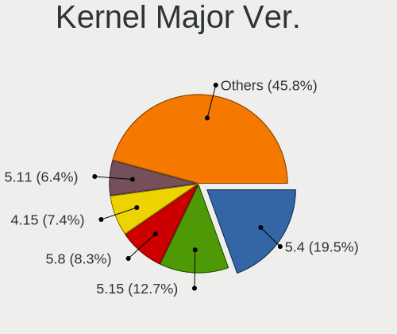
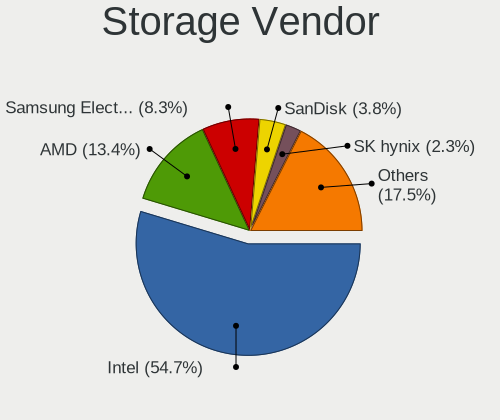
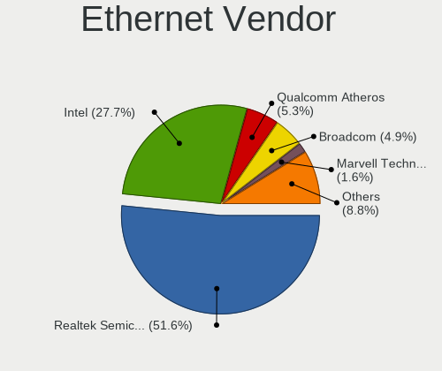

Ubuntu - Tested Hardware & Statistics
-------------------------------------

A project to collect tested hardware configurations for Ubuntu.

Anyone can contribute to this report by the [hw-probe](https://github.com/linuxhw/hw-probe) tool:

    sudo -E hw-probe -all -upload

Please contribute! Especially if your hardware is rare.

This is a report for all computer types. See also reports for [desktops](/Dist/Ubuntu/Desktop/README.md) and [notebooks](/Dist/Ubuntu/Notebook/README.md).

Contents
--------

* [ Test Cases ](#test-cases)

* [ System ](#system)
  - [ OS                       ](#os)
  - [ OS Family                ](#os-family)
  - [ Kernel                   ](#kernel)
  - [ Kernel Family            ](#kernel-family)
  - [ Kernel Major Ver.        ](#kernel-major-ver)
  - [ Arch                     ](#arch)
  - [ DE                       ](#de)
  - [ Display Server           ](#display-server)
  - [ Display Manager          ](#display-manager)
  - [ OS Lang                  ](#os-lang)
  - [ Boot Mode                ](#boot-mode)
  - [ Filesystem               ](#filesystem)
  - [ Part. scheme             ](#part-scheme)
  - [ Dual Boot with Linux/BSD ](#dual-boot-with-linuxbsd)
  - [ Dual Boot (Win)          ](#dual-boot-win)

* [ Board ](#board)
  - [ Vendor                   ](#vendor)
  - [ Model                    ](#model)
  - [ Model Family             ](#model-family)
  - [ MFG Year                 ](#mfg-year)
  - [ Form Factor              ](#form-factor)
  - [ Secure Boot              ](#secure-boot)
  - [ Coreboot                 ](#coreboot)
  - [ RAM Size                 ](#ram-size)
  - [ RAM Used                 ](#ram-used)
  - [ Total Drives             ](#total-drives)
  - [ Has CD-ROM               ](#has-cd-rom)
  - [ Has Ethernet             ](#has-ethernet)
  - [ Has WiFi                 ](#has-wifi)
  - [ Has Bluetooth            ](#has-bluetooth)

* [ Location ](#location)
  - [ Country                  ](#country)
  - [ City                     ](#city)

* [ Drives ](#drives)
  - [ Drive Vendor             ](#drive-vendor)
  - [ Drive Model              ](#drive-model)
  - [ HDD Vendor               ](#hdd-vendor)
  - [ SSD Vendor               ](#ssd-vendor)
  - [ Drive Kind               ](#drive-kind)
  - [ Drive Connector          ](#drive-connector)
  - [ Drive Size               ](#drive-size)
  - [ Space Total              ](#space-total)
  - [ Space Used               ](#space-used)
  - [ Malfunc. Drives          ](#malfunc-drives)
  - [ Malfunc. Drive Vendor    ](#malfunc-drive-vendor)
  - [ Malfunc. HDD Vendor      ](#malfunc-hdd-vendor)
  - [ Malfunc. Drive Kind      ](#malfunc-drive-kind)
  - [ Failed Drives            ](#failed-drives)
  - [ Failed Drive Vendor      ](#failed-drive-vendor)
  - [ Drive Status             ](#drive-status)

* [ Storage controller ](#storage-controller)
  - [ Storage Vendor           ](#storage-vendor)
  - [ Storage Model            ](#storage-model)
  - [ Storage Kind             ](#storage-kind)

* [ Processor ](#processor)
  - [ CPU Vendor               ](#cpu-vendor)
  - [ CPU Model                ](#cpu-model)
  - [ CPU Model Family         ](#cpu-model-family)
  - [ CPU Cores                ](#cpu-cores)
  - [ CPU Sockets              ](#cpu-sockets)
  - [ CPU Threads              ](#cpu-threads)
  - [ CPU Op-Modes             ](#cpu-op-modes)
  - [ CPU Microcode            ](#cpu-microcode)
  - [ CPU Microarch            ](#cpu-microarch)

* [ Graphics ](#graphics)
  - [ GPU Vendor               ](#gpu-vendor)
  - [ GPU Model                ](#gpu-model)
  - [ GPU Combo                ](#gpu-combo)
  - [ GPU Driver               ](#gpu-driver)
  - [ GPU Memory               ](#gpu-memory)

* [ Monitor ](#monitor)
  - [ Monitor Vendor           ](#monitor-vendor)
  - [ Monitor Model            ](#monitor-model)
  - [ Monitor Resolution       ](#monitor-resolution)
  - [ Monitor Diagonal         ](#monitor-diagonal)
  - [ Monitor Width            ](#monitor-width)
  - [ Aspect Ratio             ](#aspect-ratio)
  - [ Monitor Area             ](#monitor-area)
  - [ Pixel Density            ](#pixel-density)
  - [ Multiple Monitors        ](#multiple-monitors)

* [ Network ](#network)
  - [ Net Controller Vendor    ](#net-controller-vendor)
  - [ Net Controller Model     ](#net-controller-model)
  - [ Wireless Vendor          ](#wireless-vendor)
  - [ Wireless Model           ](#wireless-model)
  - [ Ethernet Vendor          ](#ethernet-vendor)
  - [ Ethernet Model           ](#ethernet-model)
  - [ Net Controller Kind      ](#net-controller-kind)
  - [ Used Controller          ](#used-controller)
  - [ NICs                     ](#nics)
  - [ IPv6                     ](#ipv6)

* [ Bluetooth ](#bluetooth)
  - [ Bluetooth Vendor         ](#bluetooth-vendor)
  - [ Bluetooth Model          ](#bluetooth-model)

* [ Sound ](#sound)
  - [ Sound Vendor             ](#sound-vendor)
  - [ Sound Model              ](#sound-model)

* [ Memory ](#memory)
  - [ Memory Vendor            ](#memory-vendor)
  - [ Memory Model             ](#memory-model)
  - [ Memory Kind              ](#memory-kind)
  - [ Memory Form Factor       ](#memory-form-factor)
  - [ Memory Size              ](#memory-size)
  - [ Memory Speed             ](#memory-speed)

* [ Printers & scanners ](#printers--scanners)
  - [ Printer Vendor           ](#printer-vendor)
  - [ Printer Model            ](#printer-model)
  - [ Scanner Vendor           ](#scanner-vendor)
  - [ Scanner Model            ](#scanner-model)

* [ Camera ](#camera)
  - [ Camera Vendor            ](#camera-vendor)
  - [ Camera Model             ](#camera-model)

* [ Security ](#security)
  - [ Fingerprint Vendor       ](#fingerprint-vendor)
  - [ Fingerprint Model        ](#fingerprint-model)
  - [ Chipcard Vendor          ](#chipcard-vendor)
  - [ Chipcard Model           ](#chipcard-model)

* [ Unsupported ](#unsupported)
  - [ Unsupported Devices      ](#unsupported-devices)
  - [ Unsupported Device Types ](#unsupported-device-types)

Test Cases
----------

Total: 92401

| Vendor        | Model                       | Form-Factor | Probe                                                      | Date         |
|---------------|-----------------------------|-------------|------------------------------------------------------------|--------------|
| HP            | OMEN by Laptop 15-dc1xxx    | Notebook    | [fb024a9374](https://linux-hardware.org/?probe=fb024a9374) | Aug 12, 2023 |
| HP            | OMEN by Laptop 15-dc1xxx    | Notebook    | [398f85e94a](https://linux-hardware.org/?probe=398f85e94a) | Aug 12, 2023 |
| Toshiba       | Satellite C50D-A-13G        | Notebook    | [e1a3542078](https://linux-hardware.org/?probe=e1a3542078) | Aug 12, 2023 |
| Lenovo        | IdeaPadFlex 5 14ALC05 82... | Convertible | [4963974f47](https://linux-hardware.org/?probe=4963974f47) | Aug 12, 2023 |
| MSI           | P67A-GD65                   | Desktop     | [1024e95ca9](https://linux-hardware.org/?probe=1024e95ca9) | Aug 12, 2023 |
| Dell          | Inspiron 13 5310            | Notebook    | [d42fa686e5](https://linux-hardware.org/?probe=d42fa686e5) | Aug 12, 2023 |
| Dell          | Inspiron 13 5310            | Notebook    | [45509c2727](https://linux-hardware.org/?probe=45509c2727) | Aug 12, 2023 |
| Dell          | XPS 15 9560                 | Notebook    | [756901f27f](https://linux-hardware.org/?probe=756901f27f) | Aug 12, 2023 |
| Fujitsu       | D2990-A1 S26361-D2990-A1    | Desktop     | [ae7ae594f1](https://linux-hardware.org/?probe=ae7ae594f1) | Aug 12, 2023 |
| Apple         | Mac-F2218EA9                | All in one  | [63861067de](https://linux-hardware.org/?probe=63861067de) | Aug 12, 2023 |
| ASUSTek       | M5A78L-M LE                 | Desktop     | [a68db843ea](https://linux-hardware.org/?probe=a68db843ea) | Aug 12, 2023 |
| Panasonic     | CF-SX1WEVHR                 | Notebook    | [8abafe1b65](https://linux-hardware.org/?probe=8abafe1b65) | Aug 12, 2023 |
| Lenovo        | IdeaPadFlex 5 14ALC05 82... | Convertible | [2939f44178](https://linux-hardware.org/?probe=2939f44178) | Aug 12, 2023 |
| Lenovo        | ThinkBook 14 G3 ACL 21A2    | Notebook    | [5892469c5b](https://linux-hardware.org/?probe=5892469c5b) | Aug 12, 2023 |
| Gigabyte      | Z390 AORUS PRO WIFI-CF      | Desktop     | [7298d533c9](https://linux-hardware.org/?probe=7298d533c9) | Aug 12, 2023 |
| Gigabyte      | Z390 AORUS PRO WIFI-CF      | Desktop     | [13e0e622f3](https://linux-hardware.org/?probe=13e0e622f3) | Aug 12, 2023 |
| HP            | 0A04h                       | Desktop     | [61b0d9bc15](https://linux-hardware.org/?probe=61b0d9bc15) | Aug 12, 2023 |
| Intel         | B85 V5.56                   | Desktop     | [7fb2d45505](https://linux-hardware.org/?probe=7fb2d45505) | Aug 12, 2023 |
| Fujitsu       | JIQ87Y                      | Desktop     | [b11d99014e](https://linux-hardware.org/?probe=b11d99014e) | Aug 12, 2023 |
| ASUSTek       | H81M-PLUS                   | Desktop     | [af419fe003](https://linux-hardware.org/?probe=af419fe003) | Aug 12, 2023 |
| ASUSTek       | H81M-PLUS                   | Desktop     | [16cd37e4fe](https://linux-hardware.org/?probe=16cd37e4fe) | Aug 12, 2023 |
| Dell          | 0Y2MRG A00                  | Desktop     | [04ce264a3e](https://linux-hardware.org/?probe=04ce264a3e) | Aug 12, 2023 |
| Lenovo        | ThinkPad T14 Gen 1 20S00... | Notebook    | [53196a01fa](https://linux-hardware.org/?probe=53196a01fa) | Aug 12, 2023 |
| Dell          | G3 3579                     | Notebook    | [09ba53e3c1](https://linux-hardware.org/?probe=09ba53e3c1) | Aug 12, 2023 |
| Intel         | DG31PR AAE58249-301         | Desktop     | [28bc891b6d](https://linux-hardware.org/?probe=28bc891b6d) | Aug 12, 2023 |
| Intel         | NUC11PABi7 M68262-501       | Mini pc     | [422a91a4eb](https://linux-hardware.org/?probe=422a91a4eb) | Aug 12, 2023 |
| ASUSTek       | J1800I-C/BR                 | Desktop     | [5226916c20](https://linux-hardware.org/?probe=5226916c20) | Aug 12, 2023 |
| HP            | Pavilion g7                 | Notebook    | [325b804863](https://linux-hardware.org/?probe=325b804863) | Aug 12, 2023 |
| ASUSTek       | J1800I-C/BR                 | Desktop     | [f59a93f116](https://linux-hardware.org/?probe=f59a93f116) | Aug 12, 2023 |
| Dell          | 0HD5W2 A01                  | Desktop     | [be4514c366](https://linux-hardware.org/?probe=be4514c366) | Aug 12, 2023 |
| ASUSTek       | T200TA                      | Notebook    | [24d6504b2c](https://linux-hardware.org/?probe=24d6504b2c) | Aug 12, 2023 |
| Intel         | DG31PR AAE58249-301         | Desktop     | [3050db3fbf](https://linux-hardware.org/?probe=3050db3fbf) | Aug 12, 2023 |
| HP            | Laptop 15-dy2xxx            | Notebook    | [bc66f59ac5](https://linux-hardware.org/?probe=bc66f59ac5) | Aug 12, 2023 |
| Lenovo        | ThinkPad W500 4063JR4       | Notebook    | [f8c24a1b02](https://linux-hardware.org/?probe=f8c24a1b02) | Aug 11, 2023 |
| Microsoft     | Surface Pro 4               | Tablet      | [2b46218f49](https://linux-hardware.org/?probe=2b46218f49) | Aug 11, 2023 |
| Microsoft     | Surface Pro 4               | Tablet      | [77714a2920](https://linux-hardware.org/?probe=77714a2920) | Aug 11, 2023 |
| ASUSTek       | K55A                        | Notebook    | [bf260cea2c](https://linux-hardware.org/?probe=bf260cea2c) | Aug 11, 2023 |
| Jumper        | EZpad                       | Notebook    | [5fa2e934c3](https://linux-hardware.org/?probe=5fa2e934c3) | Aug 11, 2023 |
| MSI           | Boston                      | Desktop     | [62ad275a7d](https://linux-hardware.org/?probe=62ad275a7d) | Aug 11, 2023 |
| Apple         | Mac-F2268DAE                | All in one  | [b4a67f9e6d](https://linux-hardware.org/?probe=b4a67f9e6d) | Aug 11, 2023 |
| Intel         | B85 V5.56                   | Desktop     | [f278787ab5](https://linux-hardware.org/?probe=f278787ab5) | Aug 11, 2023 |
| HP            | EliteBook 840 14 inch G1... | Notebook    | [73b7fc1fc9](https://linux-hardware.org/?probe=73b7fc1fc9) | Aug 11, 2023 |
| Acer          | Aspire F5-573G              | Notebook    | [019f3a6d1f](https://linux-hardware.org/?probe=019f3a6d1f) | Aug 11, 2023 |
| MSI           | Boston                      | Desktop     | [a34a89c083](https://linux-hardware.org/?probe=a34a89c083) | Aug 11, 2023 |
| ASUSTek       | PRIME B550-PLUS             | Desktop     | [76078461ae](https://linux-hardware.org/?probe=76078461ae) | Aug 11, 2023 |
| Intel         | B75                         | Desktop     | [17641de345](https://linux-hardware.org/?probe=17641de345) | Aug 11, 2023 |
| Acer          | Extensa 215-55              | Notebook    | [aea9ada5e8](https://linux-hardware.org/?probe=aea9ada5e8) | Aug 11, 2023 |
| ASUSTek       | ROG STRIX X570-E GAMING     | Desktop     | [483fc71762](https://linux-hardware.org/?probe=483fc71762) | Aug 11, 2023 |
| Lenovo        | IdeaPad 320-15AST 80XV      | Notebook    | [359d84713c](https://linux-hardware.org/?probe=359d84713c) | Aug 11, 2023 |
| Dell          | Latitude E6430              | Notebook    | [79f523548b](https://linux-hardware.org/?probe=79f523548b) | Aug 11, 2023 |
| Lenovo        | SHARKBAY SDK0E50510 WIN     | Desktop     | [ab2473ff49](https://linux-hardware.org/?probe=ab2473ff49) | Aug 11, 2023 |
| Dell          | Latitude E6330              | Notebook    | [b3081e041e](https://linux-hardware.org/?probe=b3081e041e) | Aug 11, 2023 |
| Dell          | Latitude E6430              | Notebook    | [fd3c9b15f8](https://linux-hardware.org/?probe=fd3c9b15f8) | Aug 11, 2023 |
| Unknown       | Unknown                     | Desktop     | [62ef56dbab](https://linux-hardware.org/?probe=62ef56dbab) | Aug 11, 2023 |
| Lenovo        | ThinkPad L520 5017BW5       | Notebook    | [1a9bbdc058](https://linux-hardware.org/?probe=1a9bbdc058) | Aug 11, 2023 |
| Dell          | G15 5520                    | Notebook    | [3bec284af8](https://linux-hardware.org/?probe=3bec284af8) | Aug 11, 2023 |
| ASRock        | B450M Pro4                  | Desktop     | [65d55091fa](https://linux-hardware.org/?probe=65d55091fa) | Aug 11, 2023 |
| Sony          | SVE1513I4E                  | Notebook    | [6b8cb6d520](https://linux-hardware.org/?probe=6b8cb6d520) | Aug 11, 2023 |
| Apple         | Mac-F2238BAE iMac11,3       | All in one  | [b50bdc5845](https://linux-hardware.org/?probe=b50bdc5845) | Aug 11, 2023 |
| Apple         | Mac-F2238BAE iMac11,3       | All in one  | [8a3df803a6](https://linux-hardware.org/?probe=8a3df803a6) | Aug 11, 2023 |
| ASUSTek       | VivoBook_ASUSLaptop M140... | Notebook    | [a4a009cd79](https://linux-hardware.org/?probe=a4a009cd79) | Aug 11, 2023 |
| Intel         | D915GEV AAC63667-501        | Desktop     | [4d65f6d8fa](https://linux-hardware.org/?probe=4d65f6d8fa) | Aug 11, 2023 |
| Gigabyte      | B250-HD3P-CF                | Desktop     | [b347883be2](https://linux-hardware.org/?probe=b347883be2) | Aug 11, 2023 |
| HUAWEI        | BOD-WXX9                    | Notebook    | [b21e9793a5](https://linux-hardware.org/?probe=b21e9793a5) | Aug 11, 2023 |
| HP            | ProLiant DL360 Gen9         | Server      | [262bb059eb](https://linux-hardware.org/?probe=262bb059eb) | Aug 11, 2023 |
| Acer          | Extensa 215-55              | Notebook    | [036866525c](https://linux-hardware.org/?probe=036866525c) | Aug 11, 2023 |
| HP            | Pavilion Laptop 14-ec0xx... | Notebook    | [fadee3e38d](https://linux-hardware.org/?probe=fadee3e38d) | Aug 11, 2023 |
| Gigabyte      | B85M-D2V                    | Desktop     | [d8d7d7bad7](https://linux-hardware.org/?probe=d8d7d7bad7) | Aug 11, 2023 |
| ASRock        | B550M-ITX/ac                | Desktop     | [e6624cc619](https://linux-hardware.org/?probe=e6624cc619) | Aug 11, 2023 |
| ASUSTek       | PRIME B550-PLUS             | Desktop     | [7f2903e1a4](https://linux-hardware.org/?probe=7f2903e1a4) | Aug 11, 2023 |
| ASUSTek       | PRIME X670-P WIFI           | Desktop     | [7d31344218](https://linux-hardware.org/?probe=7d31344218) | Aug 11, 2023 |
| Dell          | 0HY9JP A01                  | Desktop     | [48d92d85c7](https://linux-hardware.org/?probe=48d92d85c7) | Aug 11, 2023 |
| Acer          | Aspire ES1-111M             | Notebook    | [3c7140c389](https://linux-hardware.org/?probe=3c7140c389) | Aug 11, 2023 |
| Intel Clie... | LAPQC71A                    | Notebook    | [c87bff1d43](https://linux-hardware.org/?probe=c87bff1d43) | Aug 11, 2023 |
| Acer          | Aspire G7713                | Desktop     | [cb79bdce06](https://linux-hardware.org/?probe=cb79bdce06) | Aug 11, 2023 |
| Fujitsu       | LIFEBOOK S762               | Notebook    | [1ced8ae4d0](https://linux-hardware.org/?probe=1ced8ae4d0) | Aug 11, 2023 |
| Fujitsu       | LIFEBOOK S762               | Notebook    | [cb0b5cbd5d](https://linux-hardware.org/?probe=cb0b5cbd5d) | Aug 11, 2023 |
| Gigabyte      | Z77-D3H                     | Desktop     | [e71fc09944](https://linux-hardware.org/?probe=e71fc09944) | Aug 11, 2023 |
| MSI           | Creator Z16 A11UET          | Notebook    | [7883e9a69d](https://linux-hardware.org/?probe=7883e9a69d) | Aug 11, 2023 |
| HP            | ZBook Studio G7 Mobile W... | Notebook    | [836fcda626](https://linux-hardware.org/?probe=836fcda626) | Aug 11, 2023 |
| HP            | ZBook Studio G7 Mobile W... | Notebook    | [3e208faa6e](https://linux-hardware.org/?probe=3e208faa6e) | Aug 11, 2023 |
| ASUSTek       | PRIME H510M-K               | Desktop     | [3c239efc46](https://linux-hardware.org/?probe=3c239efc46) | Aug 11, 2023 |
| AZW           | Green G4 10                 | Desktop     | [a574280172](https://linux-hardware.org/?probe=a574280172) | Aug 11, 2023 |
| MSI           | MS-7380                     | Desktop     | [584074ca03](https://linux-hardware.org/?probe=584074ca03) | Aug 11, 2023 |
| Lenovo        | B50-70 20384                | Notebook    | [607103b8f5](https://linux-hardware.org/?probe=607103b8f5) | Aug 11, 2023 |
| Alienware     | Area-51 R2                  | Desktop     | [07a6f57292](https://linux-hardware.org/?probe=07a6f57292) | Aug 11, 2023 |
| TYAN Compu... | S8030GM2NE                  | Server      | [bc9cacebe8](https://linux-hardware.org/?probe=bc9cacebe8) | Aug 11, 2023 |
| Intel         | NUC8v5PNB K59997-403        | Mini pc     | [24a49fba6d](https://linux-hardware.org/?probe=24a49fba6d) | Aug 11, 2023 |
| Lenovo        | ThinkPad X1 Carbon 2nd 2... | Notebook    | [97e0c46487](https://linux-hardware.org/?probe=97e0c46487) | Aug 11, 2023 |
| Dell          | Precision 5530              | Notebook    | [f74dac5dcf](https://linux-hardware.org/?probe=f74dac5dcf) | Aug 11, 2023 |
| ASRock        | Z97 Killer                  | Desktop     | [f055a15ccb](https://linux-hardware.org/?probe=f055a15ccb) | Aug 11, 2023 |
| Google        | Bobba360                    | Notebook    | [128700115a](https://linux-hardware.org/?probe=128700115a) | Aug 10, 2023 |
| Dell          | Latitude 5400               | Notebook    | [1ec248c607](https://linux-hardware.org/?probe=1ec248c607) | Aug 10, 2023 |
| Gigabyte      | GA-78LMT-USB3               | Desktop     | [6a1d87f2aa](https://linux-hardware.org/?probe=6a1d87f2aa) | Aug 10, 2023 |
| ASUSTek       | P8P67 PRO                   | Desktop     | [c0d6900ba3](https://linux-hardware.org/?probe=c0d6900ba3) | Aug 10, 2023 |
| ASUSTek       | PRIME B450-PLUS             | Desktop     | [44fe085499](https://linux-hardware.org/?probe=44fe085499) | Aug 10, 2023 |
| Lenovo        | ThinkPad Edge 03193VG       | Notebook    | [abb370836a](https://linux-hardware.org/?probe=abb370836a) | Aug 10, 2023 |
| Lenovo        | G40-45 80E1                 | Notebook    | [d6f18c79f6](https://linux-hardware.org/?probe=d6f18c79f6) | Aug 10, 2023 |
| TYAN Compu... | S8030GM2NE                  | Server      | [99458c04da](https://linux-hardware.org/?probe=99458c04da) | Aug 10, 2023 |
| Fujitsu Si... | G31T-M2 V3.02               | Desktop     | [1c32da7aed](https://linux-hardware.org/?probe=1c32da7aed) | Aug 10, 2023 |
| Dell          | XPS 15 9575                 | Convertible | [48f1354795](https://linux-hardware.org/?probe=48f1354795) | Aug 10, 2023 |
| Lenovo        | ThinkStation S30 056848U    | Desktop     | [e6bc23d815](https://linux-hardware.org/?probe=e6bc23d815) | Aug 10, 2023 |
| HUAWEI        | KLVD-WXX9                   | Notebook    | [19cadaab1b](https://linux-hardware.org/?probe=19cadaab1b) | Aug 10, 2023 |
| Lenovo        | ThinkPad E14 20RA0076US     | Notebook    | [ab98272b50](https://linux-hardware.org/?probe=ab98272b50) | Aug 10, 2023 |
| Gateway       | MD7309U                     | Notebook    | [18dbacfdab](https://linux-hardware.org/?probe=18dbacfdab) | Aug 10, 2023 |
| HP            | OMEN by Laptop 15-dc1xxx    | Notebook    | [9627b6d632](https://linux-hardware.org/?probe=9627b6d632) | Aug 10, 2023 |
| ASUSTek       | VivoBook_ASUSLaptop M350... | Notebook    | [ffa9b97bf7](https://linux-hardware.org/?probe=ffa9b97bf7) | Aug 10, 2023 |
| HP            | OMEN by Laptop 15-dc1xxx    | Notebook    | [099d1ac0de](https://linux-hardware.org/?probe=099d1ac0de) | Aug 10, 2023 |
| BANGHO        | MAX L5                      | Notebook    | [4661b7a0f7](https://linux-hardware.org/?probe=4661b7a0f7) | Aug 10, 2023 |
| Avell High... | A70 HYB                     | Notebook    | [9b03ae1cd3](https://linux-hardware.org/?probe=9b03ae1cd3) | Aug 10, 2023 |
| Avell         | A70 ION                     | Notebook    | [6ab02a34e4](https://linux-hardware.org/?probe=6ab02a34e4) | Aug 10, 2023 |
| Fujitsu       | FMVA42CW                    | Notebook    | [ffb5c4343b](https://linux-hardware.org/?probe=ffb5c4343b) | Aug 10, 2023 |
| ASUSTek       | ROG STRIX B650-A GAMING ... | Desktop     | [6bf6a38fba](https://linux-hardware.org/?probe=6bf6a38fba) | Aug 10, 2023 |
| HP            | Pavilion Laptop 14-dv2xx... | Notebook    | [479f066821](https://linux-hardware.org/?probe=479f066821) | Aug 10, 2023 |
| Dell          | Latitude E6400              | Notebook    | [f28a234c30](https://linux-hardware.org/?probe=f28a234c30) | Aug 10, 2023 |
| Lenovo        | ThinkPad X1 Yoga 20FRS02... | Convertible | [ba520853af](https://linux-hardware.org/?probe=ba520853af) | Aug 10, 2023 |
| Lenovo        | ThinkPad X1 Yoga 20FRS02... | Convertible | [534fd57945](https://linux-hardware.org/?probe=534fd57945) | Aug 10, 2023 |
| Lenovo        | ThinkPad E15 Gen 4 21ED0... | Notebook    | [89e3ef8e6c](https://linux-hardware.org/?probe=89e3ef8e6c) | Aug 10, 2023 |
| Avell         | A70 ION                     | Notebook    | [b71c176ce3](https://linux-hardware.org/?probe=b71c176ce3) | Aug 10, 2023 |
| Gigabyte      | H270N-WIFI-CF               | Desktop     | [bd9c532bbc](https://linux-hardware.org/?probe=bd9c532bbc) | Aug 10, 2023 |
| ASUSTek       | M4A87TD/USB3                | Desktop     | [c7c0f2ad91](https://linux-hardware.org/?probe=c7c0f2ad91) | Aug 10, 2023 |
| Dell          | 04YP6J A02                  | Desktop     | [5d5ce952b3](https://linux-hardware.org/?probe=5d5ce952b3) | Aug 10, 2023 |
| Gigabyte      | B560M DS3H                  | Desktop     | [96d3419a5f](https://linux-hardware.org/?probe=96d3419a5f) | Aug 10, 2023 |
| ASUSTek       | M4A87TD/USB3                | Desktop     | [6aaa92df1c](https://linux-hardware.org/?probe=6aaa92df1c) | Aug 10, 2023 |
| Lenovo        | ThinkBook 14-IIL 20SL       | Notebook    | [e323e9cd7e](https://linux-hardware.org/?probe=e323e9cd7e) | Aug 10, 2023 |
| Gigabyte      | Z390 AORUS ULTRA-CF         | Desktop     | [5264c46571](https://linux-hardware.org/?probe=5264c46571) | Aug 10, 2023 |
| YANYU         | EPIC-C57                    | Desktop     | [6d42c0f9af](https://linux-hardware.org/?probe=6d42c0f9af) | Aug 10, 2023 |
| Dell          | XPS L421X                   | Notebook    | [ba412a439b](https://linux-hardware.org/?probe=ba412a439b) | Aug 10, 2023 |
| MSI           | A320M PRO-VD/S              | Desktop     | [7f7c988470](https://linux-hardware.org/?probe=7f7c988470) | Aug 10, 2023 |
| Gigabyte      | Z390 AORUS PRO WIFI-CF      | Desktop     | [307c7bbe9c](https://linux-hardware.org/?probe=307c7bbe9c) | Aug 10, 2023 |
| Lenovo        | ThinkPad T420 4180X06       | Notebook    | [77e54b4b97](https://linux-hardware.org/?probe=77e54b4b97) | Aug 10, 2023 |
| ASUSTek       | PRIME X570-PRO              | Desktop     | [f7fe8fc7f3](https://linux-hardware.org/?probe=f7fe8fc7f3) | Aug 10, 2023 |
| Google        | Kindred                     | Notebook    | [a45439e295](https://linux-hardware.org/?probe=a45439e295) | Aug 10, 2023 |
| Acer          | Nitro AN517-51              | Notebook    | [bd3b7989f0](https://linux-hardware.org/?probe=bd3b7989f0) | Aug 10, 2023 |
| NEC Comput... | PC-GN246W3A5                | Notebook    | [2f37664ebd](https://linux-hardware.org/?probe=2f37664ebd) | Aug 10, 2023 |
| ASRock        | B450M-HDV R4.0              | Desktop     | [ab3503021a](https://linux-hardware.org/?probe=ab3503021a) | Aug 10, 2023 |
| HP            | Pavilion Laptop 14-dv1xx... | Notebook    | [385c88301b](https://linux-hardware.org/?probe=385c88301b) | Aug 10, 2023 |
| Dell          | Vostro 3501                 | Notebook    | [d606f83745](https://linux-hardware.org/?probe=d606f83745) | Aug 10, 2023 |
| Lenovo        | ThinkPad T420 4180X06       | Notebook    | [ba950eb9e1](https://linux-hardware.org/?probe=ba950eb9e1) | Aug 10, 2023 |
| Google        | Snappy                      | Notebook    | [73ecdd5048](https://linux-hardware.org/?probe=73ecdd5048) | Aug 10, 2023 |
| Gateway       | NV57H                       | Notebook    | [826aaf5dd8](https://linux-hardware.org/?probe=826aaf5dd8) | Aug 10, 2023 |
| Lenovo        | ThinkPad E15 20RD0086UE     | Notebook    | [cb8ad3e0fc](https://linux-hardware.org/?probe=cb8ad3e0fc) | Aug 10, 2023 |
| HPE           | ProLiant DL380 Gen10        | Server      | [1db6058b8f](https://linux-hardware.org/?probe=1db6058b8f) | Aug 10, 2023 |
| Acer          | Aspire V3-571G              | Notebook    | [6c4354fa1c](https://linux-hardware.org/?probe=6c4354fa1c) | Aug 10, 2023 |
| ASUSTek       | ROG Strix G713PI_G713PI     | Notebook    | [92fda27219](https://linux-hardware.org/?probe=92fda27219) | Aug 10, 2023 |
| Lenovo        | IdeaPadFlex 5 14ABR8 82X... | Convertible | [ae87c6938f](https://linux-hardware.org/?probe=ae87c6938f) | Aug 10, 2023 |
| ASUSTek       | ROG Strix G713PI_G713PI     | Notebook    | [3bd085d1a5](https://linux-hardware.org/?probe=3bd085d1a5) | Aug 10, 2023 |
| Dell          | 0JP3NX A01                  | Desktop     | [a9c4812d66](https://linux-hardware.org/?probe=a9c4812d66) | Aug 09, 2023 |
| ASUSTek       | PRIME Z270-A                | Desktop     | [a6eabbbfef](https://linux-hardware.org/?probe=a6eabbbfef) | Aug 09, 2023 |
| Siragon       | MN-50                       | Notebook    | [8eafa43cb5](https://linux-hardware.org/?probe=8eafa43cb5) | Aug 09, 2023 |
| MSI           | 970 GAMING                  | Desktop     | [a499728742](https://linux-hardware.org/?probe=a499728742) | Aug 09, 2023 |
| ASUSTek       | VivoBook_ASUSLaptop X321... | Notebook    | [204b2fa0a0](https://linux-hardware.org/?probe=204b2fa0a0) | Aug 09, 2023 |
| Lenovo        | V145-15AST 81MT             | Notebook    | [304b175b3c](https://linux-hardware.org/?probe=304b175b3c) | Aug 09, 2023 |
| Dell          | Latitude E6420              | Notebook    | [1aaa4997d4](https://linux-hardware.org/?probe=1aaa4997d4) | Aug 09, 2023 |
| Lenovo        | ThinkPad T430 2347AT2       | Notebook    | [a874870955](https://linux-hardware.org/?probe=a874870955) | Aug 09, 2023 |
| Toshiba       | Satellite C70D-B            | Notebook    | [ac775a3228](https://linux-hardware.org/?probe=ac775a3228) | Aug 09, 2023 |
| AMI           | Aptio CRB                   | Mini pc     | [4d79d769d2](https://linux-hardware.org/?probe=4d79d769d2) | Aug 09, 2023 |
| Dell          | Inspiron 15 3520            | Notebook    | [7723e84488](https://linux-hardware.org/?probe=7723e84488) | Aug 09, 2023 |
| Supermicro    | X10DRU-i+                   | Server      | [6ea2dae05b](https://linux-hardware.org/?probe=6ea2dae05b) | Aug 09, 2023 |
| Supermicro    | X10DRU-i+                   | Server      | [1c9d71f553](https://linux-hardware.org/?probe=1c9d71f553) | Aug 09, 2023 |
| Supermicro    | X10DRU-i+                   | Server      | [47da29a7a0](https://linux-hardware.org/?probe=47da29a7a0) | Aug 09, 2023 |
| Supermicro    | X10DRU-i+                   | Server      | [d464f66e20](https://linux-hardware.org/?probe=d464f66e20) | Aug 09, 2023 |
| Supermicro    | X10DRU-i+                   | Server      | [9f725868e8](https://linux-hardware.org/?probe=9f725868e8) | Aug 09, 2023 |
| Supermicro    | X10DRU-i+                   | Server      | [dd82024730](https://linux-hardware.org/?probe=dd82024730) | Aug 09, 2023 |
| Supermicro    | X10DRU-i+                   | Server      | [11d70c86e3](https://linux-hardware.org/?probe=11d70c86e3) | Aug 09, 2023 |
| Supermicro    | X10DRU-i+                   | Server      | [1b3e4092b5](https://linux-hardware.org/?probe=1b3e4092b5) | Aug 09, 2023 |
| Supermicro    | X10DRU-i+                   | Server      | [92f521b3e8](https://linux-hardware.org/?probe=92f521b3e8) | Aug 09, 2023 |
| Supermicro    | X10DRU-i+                   | Server      | [e6cc7a97b6](https://linux-hardware.org/?probe=e6cc7a97b6) | Aug 09, 2023 |
| Dell          | 0WR7PY A03                  | Desktop     | [b97d54f6d8](https://linux-hardware.org/?probe=b97d54f6d8) | Aug 09, 2023 |
| Supermicro    | X9SRE/X9SRE-3F/X9SRi/X9S... | Server      | [52ff19e47c](https://linux-hardware.org/?probe=52ff19e47c) | Aug 09, 2023 |
| ASUSTek       | ASUS TUF Gaming F17 FX70... | Notebook    | [bf81bbf7b4](https://linux-hardware.org/?probe=bf81bbf7b4) | Aug 09, 2023 |
| MSI           | Z590-A PRO                  | Desktop     | [4448c9f2e1](https://linux-hardware.org/?probe=4448c9f2e1) | Aug 09, 2023 |
| Gigabyte      | B150M-D3H DDR3-CF           | Desktop     | [5df6fee2f9](https://linux-hardware.org/?probe=5df6fee2f9) | Aug 09, 2023 |
| MSI           | Z590-A PRO                  | Desktop     | [6e1d11025a](https://linux-hardware.org/?probe=6e1d11025a) | Aug 09, 2023 |
| Acer          | Aspire A317-53              | Notebook    | [de8d362cb8](https://linux-hardware.org/?probe=de8d362cb8) | Aug 09, 2023 |
| MSI           | Z97-G45 GAMING              | Desktop     | [65d491c109](https://linux-hardware.org/?probe=65d491c109) | Aug 09, 2023 |
| ASRock        | H77M-ITX                    | Desktop     | [01dc3bfc4b](https://linux-hardware.org/?probe=01dc3bfc4b) | Aug 09, 2023 |
| Lenovo        | ThinkPad E15 Gen 2 20TD0... | Notebook    | [194ec12831](https://linux-hardware.org/?probe=194ec12831) | Aug 09, 2023 |
| Google        | Bobba360                    | Notebook    | [fa4a78b024](https://linux-hardware.org/?probe=fa4a78b024) | Aug 09, 2023 |
| Lenovo        | ThinkPad X1 Yoga Gen 6 2... | Convertible | [bb7891de93](https://linux-hardware.org/?probe=bb7891de93) | Aug 09, 2023 |
| Dell          | Latitude E6520              | Notebook    | [cb79d1e17c](https://linux-hardware.org/?probe=cb79d1e17c) | Aug 09, 2023 |
| Dell          | Latitude E6520              | Notebook    | [4516b9b475](https://linux-hardware.org/?probe=4516b9b475) | Aug 09, 2023 |
| Medion        | Akoya THE TOUCH 10          | Notebook    | [d45603bb4e](https://linux-hardware.org/?probe=d45603bb4e) | Aug 09, 2023 |
| Toshiba       | Satellite L745D             | Notebook    | [9576dab2b0](https://linux-hardware.org/?probe=9576dab2b0) | Aug 09, 2023 |
| HP            | 894D                        | Desktop     | [e1c397df93](https://linux-hardware.org/?probe=e1c397df93) | Aug 09, 2023 |
| Lenovo        | Legion 5 15ACH6 82JW        | Notebook    | [5bd12768fa](https://linux-hardware.org/?probe=5bd12768fa) | Aug 09, 2023 |
| Toshiba       | Satellite C70D-B            | Notebook    | [e3f3b2fcfb](https://linux-hardware.org/?probe=e3f3b2fcfb) | Aug 09, 2023 |
| HP            | ENVY x360 2-in-1 Laptop ... | Convertible | [37b2f22e1f](https://linux-hardware.org/?probe=37b2f22e1f) | Aug 09, 2023 |
| ASUSTek       | X510URR                     | Notebook    | [abf7479cb8](https://linux-hardware.org/?probe=abf7479cb8) | Aug 09, 2023 |
| MSI           | A78M-E45                    | Desktop     | [d39f224497](https://linux-hardware.org/?probe=d39f224497) | Aug 09, 2023 |
| Acer          | Aspire V3-112P              | Notebook    | [e6305472c5](https://linux-hardware.org/?probe=e6305472c5) | Aug 09, 2023 |
| HP            | EliteBook 830 G8 Noteboo... | Notebook    | [5e79da69ed](https://linux-hardware.org/?probe=5e79da69ed) | Aug 09, 2023 |
| Dell          | Latitude 5520               | Notebook    | [478f0a6a07](https://linux-hardware.org/?probe=478f0a6a07) | Aug 09, 2023 |
| HP            | EliteBook 830 G8 Noteboo... | Notebook    | [c761edfea1](https://linux-hardware.org/?probe=c761edfea1) | Aug 09, 2023 |
| Dell          | XPS 15 9520                 | Notebook    | [0620b6b11a](https://linux-hardware.org/?probe=0620b6b11a) | Aug 09, 2023 |
| MSI           | 970 GAMING                  | Desktop     | [4751920c96](https://linux-hardware.org/?probe=4751920c96) | Aug 09, 2023 |
| Dell          | 08HPGT A01                  | Desktop     | [273e794a99](https://linux-hardware.org/?probe=273e794a99) | Aug 09, 2023 |
| HP            | EliteBook 8470p             | Notebook    | [16acf13ed8](https://linux-hardware.org/?probe=16acf13ed8) | Aug 09, 2023 |
| Dell          | Latitude 3350               | Notebook    | [77100b2ef6](https://linux-hardware.org/?probe=77100b2ef6) | Aug 09, 2023 |
| Lenovo        | 30C1                        | Desktop     | [dda7ed4e8b](https://linux-hardware.org/?probe=dda7ed4e8b) | Aug 09, 2023 |
| HP            | EliteBook 2540p             | Notebook    | [2a02492c01](https://linux-hardware.org/?probe=2a02492c01) | Aug 09, 2023 |
| Dell          | Precision 3551              | Notebook    | [a9b776ade0](https://linux-hardware.org/?probe=a9b776ade0) | Aug 09, 2023 |
| HP            | EliteBook 2540p             | Notebook    | [509b979b88](https://linux-hardware.org/?probe=509b979b88) | Aug 09, 2023 |
| Dell          | 02YYK5 A00                  | Desktop     | [14382141e9](https://linux-hardware.org/?probe=14382141e9) | Aug 09, 2023 |
| HP            | EliteBook 8560w             | Notebook    | [ea34946fbd](https://linux-hardware.org/?probe=ea34946fbd) | Aug 09, 2023 |
| Toshiba       | Satellite C55-C             | Notebook    | [199924c140](https://linux-hardware.org/?probe=199924c140) | Aug 09, 2023 |
| HP            | ENVY Laptop 17-ch0xxx       | Notebook    | [01fe285324](https://linux-hardware.org/?probe=01fe285324) | Aug 09, 2023 |
| Dell          | Latitude 5400               | Notebook    | [773e9320a8](https://linux-hardware.org/?probe=773e9320a8) | Aug 09, 2023 |
| Toshiba       | Satellite C55-C             | Notebook    | [324b952d6b](https://linux-hardware.org/?probe=324b952d6b) | Aug 09, 2023 |
| ASUSTek       | X510URR                     | Notebook    | [f3ee04187f](https://linux-hardware.org/?probe=f3ee04187f) | Aug 09, 2023 |
| Fujitsu       | FMVA42CW                    | Notebook    | [83d5950b7a](https://linux-hardware.org/?probe=83d5950b7a) | Aug 08, 2023 |
| ASUSTek       | ET2011A 0405                | All in one  | [a236196a29](https://linux-hardware.org/?probe=a236196a29) | Aug 08, 2023 |
| Lenovo        | ThinkPad X1 Titanium Gen... | Convertible | [057ef3751d](https://linux-hardware.org/?probe=057ef3751d) | Aug 08, 2023 |
| HP            | OMEN by Laptop              | Notebook    | [b15a5e767a](https://linux-hardware.org/?probe=b15a5e767a) | Aug 08, 2023 |
| ASUSTek       | N56VJ                       | Notebook    | [d552e1a450](https://linux-hardware.org/?probe=d552e1a450) | Aug 08, 2023 |
| BANGHO        | MAX L5                      | Notebook    | [b21781af81](https://linux-hardware.org/?probe=b21781af81) | Aug 08, 2023 |
| MSI           | MAG B760 TOMAHAWK WIFI      | Desktop     | [64fbeeca5e](https://linux-hardware.org/?probe=64fbeeca5e) | Aug 08, 2023 |
| Dell          | Inspiron 15 3511            | Notebook    | [13cec81a99](https://linux-hardware.org/?probe=13cec81a99) | Aug 08, 2023 |
| HP            | EliteBook 820 G1            | Notebook    | [62889fd683](https://linux-hardware.org/?probe=62889fd683) | Aug 08, 2023 |
| Dell          | 0NK5PH A01                  | Desktop     | [eb06b6713d](https://linux-hardware.org/?probe=eb06b6713d) | Aug 08, 2023 |
| Dell          | Latitude 7310               | Notebook    | [19646f8e46](https://linux-hardware.org/?probe=19646f8e46) | Aug 08, 2023 |
| Lenovo        | ThinkPad X1 Yoga Gen 6 2... | Convertible | [c86462ba1b](https://linux-hardware.org/?probe=c86462ba1b) | Aug 08, 2023 |
| Lenovo        | ThinkPad P50 20EQS0T800     | Notebook    | [8316628b28](https://linux-hardware.org/?probe=8316628b28) | Aug 08, 2023 |
| Supermicro    | X10DRU-i+                   | Server      | [42b79d59b6](https://linux-hardware.org/?probe=42b79d59b6) | Aug 08, 2023 |
| Supermicro    | X10DRU-i+                   | Server      | [0503a83389](https://linux-hardware.org/?probe=0503a83389) | Aug 08, 2023 |
| Supermicro    | X10DRU-i+                   | Server      | [29e048b78b](https://linux-hardware.org/?probe=29e048b78b) | Aug 08, 2023 |
| Supermicro    | X10DRU-i+                   | Server      | [9183ba34b1](https://linux-hardware.org/?probe=9183ba34b1) | Aug 08, 2023 |
| Lenovo        | ThinkPad P50 20EQS0T800     | Notebook    | [05d33f11b5](https://linux-hardware.org/?probe=05d33f11b5) | Aug 08, 2023 |
| Supermicro    | X10DRU-i+                   | Server      | [f07e24722e](https://linux-hardware.org/?probe=f07e24722e) | Aug 08, 2023 |
| Supermicro    | X10DRU-i+                   | Server      | [f26c990dc3](https://linux-hardware.org/?probe=f26c990dc3) | Aug 08, 2023 |
| Notebook      | W65_W67RZ1                  | Notebook    | [ab4b3c8f47](https://linux-hardware.org/?probe=ab4b3c8f47) | Aug 08, 2023 |
| Supermicro    | X10DRU-i+                   | Server      | [f190fa8e05](https://linux-hardware.org/?probe=f190fa8e05) | Aug 08, 2023 |
| Supermicro    | X10DRU-i+                   | Server      | [183e9d899a](https://linux-hardware.org/?probe=183e9d899a) | Aug 08, 2023 |
| Supermicro    | X10DRU-i+                   | Server      | [33d78efc8a](https://linux-hardware.org/?probe=33d78efc8a) | Aug 08, 2023 |
| Supermicro    | X10DRU-i+                   | Server      | [7053bcfeac](https://linux-hardware.org/?probe=7053bcfeac) | Aug 08, 2023 |
| Fujitsu       | D2990-A1 S26361-D2990-A1    | Desktop     | [c48e0220d8](https://linux-hardware.org/?probe=c48e0220d8) | Aug 08, 2023 |
| Intel         | D33217GKE G76540-203        | Desktop     | [fa0fbda262](https://linux-hardware.org/?probe=fa0fbda262) | Aug 08, 2023 |
| HP            | EliteBook 840 G3            | Notebook    | [bf56c08196](https://linux-hardware.org/?probe=bf56c08196) | Aug 08, 2023 |
| HP            | ZBook 14 G2                 | Notebook    | [c52b1e963f](https://linux-hardware.org/?probe=c52b1e963f) | Aug 08, 2023 |
| HP            | ProBook 445 G8 Notebook ... | Notebook    | [f69459e15a](https://linux-hardware.org/?probe=f69459e15a) | Aug 08, 2023 |
| Dell          | Latitude 7440               | Notebook    | [0cfa45fbd8](https://linux-hardware.org/?probe=0cfa45fbd8) | Aug 08, 2023 |
| Dell          | 0GWHMW A03                  | Desktop     | [ce5dea2bc6](https://linux-hardware.org/?probe=ce5dea2bc6) | Aug 08, 2023 |
| Dell          | 0GWHMW A03                  | Desktop     | [1ba2de9148](https://linux-hardware.org/?probe=1ba2de9148) | Aug 08, 2023 |
| Lenovo        | ThinkPad X1 Carbon Gen 8... | Notebook    | [5aa44fc15a](https://linux-hardware.org/?probe=5aa44fc15a) | Aug 08, 2023 |
| Intel         | D33217GKE G76540-203        | Desktop     | [f75916b7c7](https://linux-hardware.org/?probe=f75916b7c7) | Aug 08, 2023 |
| Dell          | 08HPGT A01                  | Desktop     | [616f6ba289](https://linux-hardware.org/?probe=616f6ba289) | Aug 08, 2023 |
| Lenovo        | ThinkPad T14 Gen 2a 20XL... | Notebook    | [4148b505d6](https://linux-hardware.org/?probe=4148b505d6) | Aug 08, 2023 |
| Dell          | Latitude 7440               | Notebook    | [e476a3e532](https://linux-hardware.org/?probe=e476a3e532) | Aug 08, 2023 |
| Dell          | Latitude E7450              | Notebook    | [a426887b24](https://linux-hardware.org/?probe=a426887b24) | Aug 08, 2023 |
| HP            | ZBook 14 G2                 | Notebook    | [211978450c](https://linux-hardware.org/?probe=211978450c) | Aug 08, 2023 |
| HP            | EliteBook 840 G3            | Notebook    | [132603d7e2](https://linux-hardware.org/?probe=132603d7e2) | Aug 08, 2023 |
| Dell          | Latitude 7310               | Notebook    | [baab866835](https://linux-hardware.org/?probe=baab866835) | Aug 08, 2023 |
| HP            | ZBook 14 G2                 | Notebook    | [23dd3e572c](https://linux-hardware.org/?probe=23dd3e572c) | Aug 08, 2023 |
| Acer          | Aspire 4820TG               | Notebook    | [49a63e5cc4](https://linux-hardware.org/?probe=49a63e5cc4) | Aug 08, 2023 |
| Supermicro    | X11DDW-L                    | Server      | [d6fe66b73c](https://linux-hardware.org/?probe=d6fe66b73c) | Aug 08, 2023 |
| Supermicro    | X9DRW                       | Server      | [007ab23cd1](https://linux-hardware.org/?probe=007ab23cd1) | Aug 08, 2023 |
| Lenovo        | Bantry CRB SDK0E50510 WI... | Desktop     | [6ffda81a5e](https://linux-hardware.org/?probe=6ffda81a5e) | Aug 08, 2023 |
| HP            | ProLiant DL360 Gen9         | Server      | [d292db651b](https://linux-hardware.org/?probe=d292db651b) | Aug 08, 2023 |
| HP            | ProBook 650 G1              | Notebook    | [b176d8959a](https://linux-hardware.org/?probe=b176d8959a) | Aug 08, 2023 |
| HP            | EliteBook 845 G7 Noteboo... | Notebook    | [6738a625d8](https://linux-hardware.org/?probe=6738a625d8) | Aug 08, 2023 |
| Dell          | Latitude 5540               | Notebook    | [08c875f58b](https://linux-hardware.org/?probe=08c875f58b) | Aug 08, 2023 |
| HP            | EliteBook 840 G6            | Notebook    | [60a28c22c7](https://linux-hardware.org/?probe=60a28c22c7) | Aug 08, 2023 |
| HP            | 2129                        | Desktop     | [f005bdb494](https://linux-hardware.org/?probe=f005bdb494) | Aug 08, 2023 |
| MSI           | Creator Z16 A11UET          | Notebook    | [ea05388cf5](https://linux-hardware.org/?probe=ea05388cf5) | Aug 08, 2023 |
| Gigabyte      | Z97M-DS3H                   | Desktop     | [f2547c0339](https://linux-hardware.org/?probe=f2547c0339) | Aug 08, 2023 |
| ASUSTek       | VivoBook_ASUS Laptop X50... | Notebook    | [58446ba97c](https://linux-hardware.org/?probe=58446ba97c) | Aug 08, 2023 |
| HP            | EliteBook 840 G6            | Notebook    | [9f044dbe9e](https://linux-hardware.org/?probe=9f044dbe9e) | Aug 08, 2023 |
| HP            | EliteBook 845 G7 Noteboo... | Notebook    | [66488bdd81](https://linux-hardware.org/?probe=66488bdd81) | Aug 08, 2023 |
| Dell          | Inspiron 5402               | Notebook    | [9004ee7aa2](https://linux-hardware.org/?probe=9004ee7aa2) | Aug 08, 2023 |
| HP            | 8456                        | Desktop     | [fa8ea86591](https://linux-hardware.org/?probe=fa8ea86591) | Aug 08, 2023 |
| Dell          | Inspiron 5485 2n1           | Convertible | [f4c69a94e9](https://linux-hardware.org/?probe=f4c69a94e9) | Aug 08, 2023 |
| Dell          | Inspiron 5485 2n1           | Convertible | [e5efd1b16c](https://linux-hardware.org/?probe=e5efd1b16c) | Aug 08, 2023 |
| ASUSTek       | PRIME X670-P WIFI           | Desktop     | [2335e10b59](https://linux-hardware.org/?probe=2335e10b59) | Aug 08, 2023 |
| ASUSTek       | ROG Strix G513IH_G513IH     | Notebook    | [b065632006](https://linux-hardware.org/?probe=b065632006) | Aug 08, 2023 |
| Lenovo        | B40-80 80LS                 | Notebook    | [2865a9d402](https://linux-hardware.org/?probe=2865a9d402) | Aug 08, 2023 |
| Lenovo        | Legion 5 15ARH7H 82RD       | Notebook    | [1e2412e487](https://linux-hardware.org/?probe=1e2412e487) | Aug 08, 2023 |
| Khadas        | Edge2                       | Soc         | [e9c9d4e1d3](https://linux-hardware.org/?probe=e9c9d4e1d3) | Aug 08, 2023 |
| Lenovo        | 1037 SDK0Q40104 WIN 3305... | Server      | [f9d26a8832](https://linux-hardware.org/?probe=f9d26a8832) | Aug 08, 2023 |
| ASUSTek       | PRIME B760M-A D4            | Desktop     | [b477184f03](https://linux-hardware.org/?probe=b477184f03) | Aug 08, 2023 |
| Dell          | Latitude E6430              | Notebook    | [313d3616c4](https://linux-hardware.org/?probe=313d3616c4) | Aug 08, 2023 |
| Dell          | XPS 15 9575                 | Convertible | [695f56bfd8](https://linux-hardware.org/?probe=695f56bfd8) | Aug 08, 2023 |
| Google        | Parrot                      | Notebook    | [a0820a5e0c](https://linux-hardware.org/?probe=a0820a5e0c) | Aug 07, 2023 |
| Google        | Parrot                      | Notebook    | [f03c4efc0b](https://linux-hardware.org/?probe=f03c4efc0b) | Aug 07, 2023 |
| Lenovo        | ThinkPad T15 Gen 2i 20W4... | Notebook    | [ce593ff6c7](https://linux-hardware.org/?probe=ce593ff6c7) | Aug 07, 2023 |
| Acer          | Aspire A515-56              | Notebook    | [84b0c88b0a](https://linux-hardware.org/?probe=84b0c88b0a) | Aug 07, 2023 |
| Pegatron      | 2AB5                        | Desktop     | [9579022e6f](https://linux-hardware.org/?probe=9579022e6f) | Aug 07, 2023 |
| HP            | ENVY x360 Convertible 15... | Convertible | [791adb121f](https://linux-hardware.org/?probe=791adb121f) | Aug 07, 2023 |
| HP            | ProBook 455 G7              | Notebook    | [bd9f67ee72](https://linux-hardware.org/?probe=bd9f67ee72) | Aug 07, 2023 |
| MSI           | GL63 8RC                    | Notebook    | [d91d6193e6](https://linux-hardware.org/?probe=d91d6193e6) | Aug 07, 2023 |
| System76      | Serval WS                   | Notebook    | [3cd45493ee](https://linux-hardware.org/?probe=3cd45493ee) | Aug 07, 2023 |
| ASRock        | H610M-ITX/ac                | Desktop     | [205fab2707](https://linux-hardware.org/?probe=205fab2707) | Aug 07, 2023 |
| HP            | Notebook                    | Notebook    | [02ceb78a4f](https://linux-hardware.org/?probe=02ceb78a4f) | Aug 07, 2023 |
| Gigabyte      | B450M DS3H-CF               | Desktop     | [40b0ea74b1](https://linux-hardware.org/?probe=40b0ea74b1) | Aug 07, 2023 |
| Dell          | Inspiron 5721               | Notebook    | [99042a3573](https://linux-hardware.org/?probe=99042a3573) | Aug 07, 2023 |
| HP            | Pavilion Gaming Laptop 1... | Notebook    | [3ec4223487](https://linux-hardware.org/?probe=3ec4223487) | Aug 07, 2023 |
| Fujitsu       | D3062-A1 S26361-D3062-A1    | Desktop     | [873825c261](https://linux-hardware.org/?probe=873825c261) | Aug 07, 2023 |
| Lenovo        | B40-70 20392                | Notebook    | [ebf45c27f4](https://linux-hardware.org/?probe=ebf45c27f4) | Aug 07, 2023 |
| Dell          | Precision M6500             | Notebook    | [054f8ba242](https://linux-hardware.org/?probe=054f8ba242) | Aug 07, 2023 |
| Dell          | Latitude 7300               | Notebook    | [932f04033c](https://linux-hardware.org/?probe=932f04033c) | Aug 07, 2023 |
| ASUSTek       | M5A97 R2.0                  | Desktop     | [783906b878](https://linux-hardware.org/?probe=783906b878) | Aug 07, 2023 |
| Intel         | NUC7i3BNB J22859-314        | Mini pc     | [36410845ea](https://linux-hardware.org/?probe=36410845ea) | Aug 07, 2023 |
| Microsoft     | Surface Book 2              | Tablet      | [ae0cada933](https://linux-hardware.org/?probe=ae0cada933) | Aug 07, 2023 |
| SGIN          | laptop                      | Notebook    | [d80389ea87](https://linux-hardware.org/?probe=d80389ea87) | Aug 07, 2023 |
| Acer          | Swift SF514-53T             | Notebook    | [30d8fefda4](https://linux-hardware.org/?probe=30d8fefda4) | Aug 07, 2023 |
| Dell          | XPS 15 9500                 | Notebook    | [dbefafc94d](https://linux-hardware.org/?probe=dbefafc94d) | Aug 07, 2023 |
| HP            | 8055                        | Desktop     | [5124119ce1](https://linux-hardware.org/?probe=5124119ce1) | Aug 07, 2023 |
| Acer          | Swift SF514-53T             | Notebook    | [f1cef350fb](https://linux-hardware.org/?probe=f1cef350fb) | Aug 07, 2023 |
| ASUSTek       | ROG Strix G513RC_G513RC     | Notebook    | [77840c201a](https://linux-hardware.org/?probe=77840c201a) | Aug 07, 2023 |
| Lenovo        | ThinkPad E15 Gen 2 20TD0... | Notebook    | [ab45ffe407](https://linux-hardware.org/?probe=ab45ffe407) | Aug 07, 2023 |
| HP            | EliteBook 850 G8 Noteboo... | Notebook    | [ce02da2586](https://linux-hardware.org/?probe=ce02da2586) | Aug 07, 2023 |
| Dell          | 00KM0D A00                  | All in one  | [f6d752be40](https://linux-hardware.org/?probe=f6d752be40) | Aug 07, 2023 |
| Lenovo        | ThinkPad E14 Gen 5 21JRS... | Notebook    | [ebcf58253e](https://linux-hardware.org/?probe=ebcf58253e) | Aug 07, 2023 |
| Lenovo        | ThinkPad X1 Carbon Gen 1... | Notebook    | [a3dd4fadf3](https://linux-hardware.org/?probe=a3dd4fadf3) | Aug 07, 2023 |
| Acer          | Nitro AN517-52              | Notebook    | [d24385ceb8](https://linux-hardware.org/?probe=d24385ceb8) | Aug 07, 2023 |
| Dell          | XPS 13 9350                 | Notebook    | [fb1aaeae43](https://linux-hardware.org/?probe=fb1aaeae43) | Aug 07, 2023 |
| Lenovo        | ThinkPad X200 74595FG       | Notebook    | [fe977cc0fe](https://linux-hardware.org/?probe=fe977cc0fe) | Aug 07, 2023 |
| HP            | Laptop 17-ak0xx             | Notebook    | [67749cdc51](https://linux-hardware.org/?probe=67749cdc51) | Aug 07, 2023 |
| Notebook      | NHxxRZQ                     | Notebook    | [0cd17c8b5c](https://linux-hardware.org/?probe=0cd17c8b5c) | Aug 07, 2023 |
| Dell          | 00KM0D A00                  | All in one  | [30324c6293](https://linux-hardware.org/?probe=30324c6293) | Aug 07, 2023 |
| Fujitsu       | LIFEBOOK A359               | Notebook    | [60a09f6ca3](https://linux-hardware.org/?probe=60a09f6ca3) | Aug 07, 2023 |
| Dell          | XPS 15 9500                 | Notebook    | [309b546405](https://linux-hardware.org/?probe=309b546405) | Aug 07, 2023 |
| HP            | Pavilion 15                 | Notebook    | [227895bca8](https://linux-hardware.org/?probe=227895bca8) | Aug 07, 2023 |
| ASUSTek       | ROG Zephyrus G14 GA401IH... | Notebook    | [0b3bf57b84](https://linux-hardware.org/?probe=0b3bf57b84) | Aug 07, 2023 |
| Gigabyte      | Z97M-DS3H                   | Desktop     | [beecacb434](https://linux-hardware.org/?probe=beecacb434) | Aug 07, 2023 |
| Gigabyte      | Z390 AORUS PRO WIFI-CF      | Desktop     | [002014034b](https://linux-hardware.org/?probe=002014034b) | Aug 07, 2023 |
| HP            | ProBook 650 G1              | Notebook    | [b02660749d](https://linux-hardware.org/?probe=b02660749d) | Aug 07, 2023 |
| ASUSTek       | P5N-E SLI                   | Desktop     | [d552e347f5](https://linux-hardware.org/?probe=d552e347f5) | Aug 07, 2023 |
| AZW           | SEi                         | Desktop     | [b38e4eec2e](https://linux-hardware.org/?probe=b38e4eec2e) | Aug 07, 2023 |
| Gigabyte      | Z390 AORUS PRO WIFI-CF      | Desktop     | [fbfc0c60bd](https://linux-hardware.org/?probe=fbfc0c60bd) | Aug 07, 2023 |
| MSI           | GL65 9SD                    | Notebook    | [b3ef4f1363](https://linux-hardware.org/?probe=b3ef4f1363) | Aug 07, 2023 |
| Lenovo        | B40-80 80LS                 | Notebook    | [bfb069ff41](https://linux-hardware.org/?probe=bfb069ff41) | Aug 07, 2023 |
| HP            | EliteBook 840 G3            | Notebook    | [2e239a5f09](https://linux-hardware.org/?probe=2e239a5f09) | Aug 07, 2023 |
| Lenovo        | ThinkPad T480 20L6S42000    | Notebook    | [3e9ce860b6](https://linux-hardware.org/?probe=3e9ce860b6) | Aug 07, 2023 |
| Acer          | Aspire 4750                 | Notebook    | [8491f5fc3b](https://linux-hardware.org/?probe=8491f5fc3b) | Aug 07, 2023 |
| Timi          | TM1607                      | Notebook    | [c545853106](https://linux-hardware.org/?probe=c545853106) | Aug 07, 2023 |
| HP            | EliteBook 840 G6            | Notebook    | [9f230de889](https://linux-hardware.org/?probe=9f230de889) | Aug 07, 2023 |
| Apple         | Mac-F2268DAE                | All in one  | [7c6e6aaaea](https://linux-hardware.org/?probe=7c6e6aaaea) | Aug 07, 2023 |
| Samsung       | 930QED                      | Convertible | [815780e992](https://linux-hardware.org/?probe=815780e992) | Aug 07, 2023 |
| HP            | ProBook 450 G2              | Notebook    | [de0ce7c424](https://linux-hardware.org/?probe=de0ce7c424) | Aug 06, 2023 |
| HP            | ProBook 640 G2              | Notebook    | [8dae611904](https://linux-hardware.org/?probe=8dae611904) | Aug 06, 2023 |
| Apple         | MacBookAir6,1               | Notebook    | [acf60b5aa8](https://linux-hardware.org/?probe=acf60b5aa8) | Aug 06, 2023 |
| HP            | OMEN Laptop 15-en0xxx       | Notebook    | [32c2f39f3a](https://linux-hardware.org/?probe=32c2f39f3a) | Aug 06, 2023 |
| Acer          | E1-510                      | Notebook    | [2d6776c4fe](https://linux-hardware.org/?probe=2d6776c4fe) | Aug 06, 2023 |
| Notebook      | NS5x_NS7xPU                 | Notebook    | [d71ac9524e](https://linux-hardware.org/?probe=d71ac9524e) | Aug 06, 2023 |
| ASUSTek       | PRIME B560M-K               | Desktop     | [a5ae5a237a](https://linux-hardware.org/?probe=a5ae5a237a) | Aug 06, 2023 |
| MSI           | Z97 GAMING 5                | Desktop     | [d076b394d9](https://linux-hardware.org/?probe=d076b394d9) | Aug 06, 2023 |
| Dell          | Latitude 5290 2-in-1        | Notebook    | [62e2743cda](https://linux-hardware.org/?probe=62e2743cda) | Aug 06, 2023 |
| HP            | EliteBook 8540p             | Notebook    | [4709894444](https://linux-hardware.org/?probe=4709894444) | Aug 06, 2023 |
| Intel         | NUC5i7RYB H73774-101        | Mini pc     | [0d4b1c489f](https://linux-hardware.org/?probe=0d4b1c489f) | Aug 06, 2023 |
| ASUSTek       | ROG STRIX X570-E GAMING     | Desktop     | [fe4aa817e1](https://linux-hardware.org/?probe=fe4aa817e1) | Aug 06, 2023 |
| Dell          | 0WMJ54 A01                  | Desktop     | [7f6aa0ed0c](https://linux-hardware.org/?probe=7f6aa0ed0c) | Aug 06, 2023 |
| ASUSTek       | M5A97 R2.0                  | Desktop     | [1d8737323b](https://linux-hardware.org/?probe=1d8737323b) | Aug 06, 2023 |
| Dell          | Latitude E5540              | Notebook    | [928c427cbc](https://linux-hardware.org/?probe=928c427cbc) | Aug 06, 2023 |
| ASUSTek       | UX32VD                      | Notebook    | [298a3261a0](https://linux-hardware.org/?probe=298a3261a0) | Aug 06, 2023 |
| Lenovo        | B40-70 20392                | Notebook    | [221f9de00a](https://linux-hardware.org/?probe=221f9de00a) | Aug 06, 2023 |
| Apple         | Mac-F226BEC8 PVT            | All in one  | [8ee3625d12](https://linux-hardware.org/?probe=8ee3625d12) | Aug 06, 2023 |
| ASUSTek       | P8H61-M LX3                 | Desktop     | [6875c17337](https://linux-hardware.org/?probe=6875c17337) | Aug 06, 2023 |
| MSI           | GL65 9SD                    | Notebook    | [2539f4ad7a](https://linux-hardware.org/?probe=2539f4ad7a) | Aug 06, 2023 |
| Foxconn       | 2AAF                        | Desktop     | [e0b2d4efb6](https://linux-hardware.org/?probe=e0b2d4efb6) | Aug 06, 2023 |
| ASUSTek       | M5A97 EVO R2.0              | Desktop     | [80c705f1a7](https://linux-hardware.org/?probe=80c705f1a7) | Aug 06, 2023 |
| MSI           | 2AE0                        | Desktop     | [9d3b59de32](https://linux-hardware.org/?probe=9d3b59de32) | Aug 06, 2023 |
| HP            | EliteBook 840 G4            | Notebook    | [44d851d327](https://linux-hardware.org/?probe=44d851d327) | Aug 06, 2023 |
| MSI           | H81M-P33                    | Desktop     | [ebed30097f](https://linux-hardware.org/?probe=ebed30097f) | Aug 06, 2023 |
| HP            | ZBook Firefly 15.6 inch ... | Notebook    | [a3c7d29211](https://linux-hardware.org/?probe=a3c7d29211) | Aug 06, 2023 |
| HP            | EliteBook 840 G5            | Notebook    | [9688966097](https://linux-hardware.org/?probe=9688966097) | Aug 06, 2023 |
| ASUSTek       | K54L                        | Notebook    | [3ce0c0b7b2](https://linux-hardware.org/?probe=3ce0c0b7b2) | Aug 06, 2023 |
| HP            | EliteBook 840 G1            | Notebook    | [8a0a837f0b](https://linux-hardware.org/?probe=8a0a837f0b) | Aug 06, 2023 |
| ASUSTek       | K54L                        | Notebook    | [b28f27325f](https://linux-hardware.org/?probe=b28f27325f) | Aug 06, 2023 |
| HP            | Laptop 15-db0xxx            | Notebook    | [51442067d5](https://linux-hardware.org/?probe=51442067d5) | Aug 06, 2023 |
| Acer          | Aspire A515-56              | Notebook    | [dfe905b869](https://linux-hardware.org/?probe=dfe905b869) | Aug 06, 2023 |
| Chuwi         | GemiBook Pro                | Notebook    | [2726702c6a](https://linux-hardware.org/?probe=2726702c6a) | Aug 06, 2023 |
| Panasonic     | CF-SX1WEVHR                 | Notebook    | [4bd753037a](https://linux-hardware.org/?probe=4bd753037a) | Aug 06, 2023 |
| Dell          | Inspiron 15 5510            | Notebook    | [88f7813621](https://linux-hardware.org/?probe=88f7813621) | Aug 06, 2023 |
| Lenovo        | B570e HuronRiver Platfor... | Notebook    | [270c9a3ea0](https://linux-hardware.org/?probe=270c9a3ea0) | Aug 06, 2023 |
| Dell          | Inspiron 7572               | Notebook    | [2509709a1e](https://linux-hardware.org/?probe=2509709a1e) | Aug 06, 2023 |
| HP            | Pavilion TS Sleekbook 15    | Notebook    | [8360dc045f](https://linux-hardware.org/?probe=8360dc045f) | Aug 06, 2023 |
| Apple         | Mac-35C5E08120C7EEAF Mac... | Mini pc     | [feaab502d6](https://linux-hardware.org/?probe=feaab502d6) | Aug 06, 2023 |
| HP            | Pavilion TS Sleekbook 15    | Notebook    | [cad443cf78](https://linux-hardware.org/?probe=cad443cf78) | Aug 06, 2023 |
| Fujitsu       | D3062-A1 S26361-D3062-A1    | Desktop     | [28ee020bed](https://linux-hardware.org/?probe=28ee020bed) | Aug 06, 2023 |
| HUAWEI        | HVY-WXX9                    | Notebook    | [0c8aef568d](https://linux-hardware.org/?probe=0c8aef568d) | Aug 06, 2023 |
| Dell          | Precision 3571              | Notebook    | [fdbbd33ee6](https://linux-hardware.org/?probe=fdbbd33ee6) | Aug 06, 2023 |
| HUAWEI        | HVY-WXX9                    | Notebook    | [597f8ddaf2](https://linux-hardware.org/?probe=597f8ddaf2) | Aug 06, 2023 |
| Dell          | Precision 3571              | Notebook    | [76de48bd02](https://linux-hardware.org/?probe=76de48bd02) | Aug 06, 2023 |
| HP            | 805D                        | Desktop     | [672e431e69](https://linux-hardware.org/?probe=672e431e69) | Aug 06, 2023 |
| Acer          | Aspire 5750G                | Notebook    | [3b589d53bc](https://linux-hardware.org/?probe=3b589d53bc) | Aug 06, 2023 |
| Lenovo        | B570e HuronRiver Platfor... | Notebook    | [db5a797fc0](https://linux-hardware.org/?probe=db5a797fc0) | Aug 06, 2023 |
| HP            | EliteBook 840 G1            | Notebook    | [cc48d8c23e](https://linux-hardware.org/?probe=cc48d8c23e) | Aug 06, 2023 |
| Intel         | B85 V5.56                   | Desktop     | [9c9e999e7f](https://linux-hardware.org/?probe=9c9e999e7f) | Aug 06, 2023 |
| Intel         | B85 V5.56                   | Desktop     | [54f0bde318](https://linux-hardware.org/?probe=54f0bde318) | Aug 06, 2023 |
| Dell          | 08VT7V A01                  | Server      | [422a30cacf](https://linux-hardware.org/?probe=422a30cacf) | Aug 06, 2023 |
| Acer          | Nitro AN515-57              | Notebook    | [dbb09ef76f](https://linux-hardware.org/?probe=dbb09ef76f) | Aug 06, 2023 |
| Acer          | Nitro AN515-57              | Notebook    | [0aa699dc73](https://linux-hardware.org/?probe=0aa699dc73) | Aug 06, 2023 |
| Lenovo        | ThinkPad T430 2342CTO       | Notebook    | [96dae933b5](https://linux-hardware.org/?probe=96dae933b5) | Aug 06, 2023 |
| Dell          | Latitude 7480               | Notebook    | [eeb7f6e8fe](https://linux-hardware.org/?probe=eeb7f6e8fe) | Aug 06, 2023 |
| Lenovo        | IdeaPad 3 15IGL05 82BU      | Notebook    | [52b9918d42](https://linux-hardware.org/?probe=52b9918d42) | Aug 06, 2023 |
| HP            | EliteBook 845 G7 Noteboo... | Notebook    | [d00f65f7f0](https://linux-hardware.org/?probe=d00f65f7f0) | Aug 06, 2023 |
| HP            | Laptop 15-db0xxx            | Notebook    | [5889bc8dc7](https://linux-hardware.org/?probe=5889bc8dc7) | Aug 06, 2023 |
| Acer          | Aspire 5551                 | Notebook    | [4db1866796](https://linux-hardware.org/?probe=4db1866796) | Aug 06, 2023 |
| HP            | EliteBook 845 G7 Noteboo... | Notebook    | [1b7eaa2e00](https://linux-hardware.org/?probe=1b7eaa2e00) | Aug 06, 2023 |
| HP            | EliteBook 8560w             | Notebook    | [b2177d3c55](https://linux-hardware.org/?probe=b2177d3c55) | Aug 06, 2023 |
| Unknown       | Unknown                     | Notebook    | [9431f6f4e8](https://linux-hardware.org/?probe=9431f6f4e8) | Aug 06, 2023 |
| MSI           | MPG X570S EDGE MAX WIFI     | Desktop     | [ffa55735b6](https://linux-hardware.org/?probe=ffa55735b6) | Aug 06, 2023 |
| Dell          | Latitude 5590               | Notebook    | [83d389e795](https://linux-hardware.org/?probe=83d389e795) | Aug 06, 2023 |
| ASUSTek       | PRIME H410M-E               | Desktop     | [8618a7051f](https://linux-hardware.org/?probe=8618a7051f) | Aug 06, 2023 |
| Lenovo        | 110536U ThinkServer TS13... | Desktop     | [5084897812](https://linux-hardware.org/?probe=5084897812) | Aug 05, 2023 |
| HP            | 1791                        | Desktop     | [4a89aab3d6](https://linux-hardware.org/?probe=4a89aab3d6) | Aug 05, 2023 |
| Supermicro    | X8DTU-LN4+                  | Server      | [fe2ea0ea4b](https://linux-hardware.org/?probe=fe2ea0ea4b) | Aug 05, 2023 |
| HP            | Pavilion Laptop 15-cc5xx    | Notebook    | [8baf99b470](https://linux-hardware.org/?probe=8baf99b470) | Aug 05, 2023 |
| ASUSTek       | VivoBook_ASUSLaptop M350... | Notebook    | [c8d1e98a60](https://linux-hardware.org/?probe=c8d1e98a60) | Aug 05, 2023 |
| Lenovo        | IdeaPad S145-15IWL 81S9     | Notebook    | [6de5534e97](https://linux-hardware.org/?probe=6de5534e97) | Aug 05, 2023 |
| Dell          | 0K6VXP A00                  | Mini pc     | [4f0b615c8e](https://linux-hardware.org/?probe=4f0b615c8e) | Aug 05, 2023 |
| Acer          | Aspire ES1-531              | Notebook    | [a03544ae5a](https://linux-hardware.org/?probe=a03544ae5a) | Aug 05, 2023 |
| HP            | ProBook x360 435 G7         | Convertible | [f9a938863a](https://linux-hardware.org/?probe=f9a938863a) | Aug 05, 2023 |
| HP            | 198E                        | Desktop     | [34023c0d62](https://linux-hardware.org/?probe=34023c0d62) | Aug 05, 2023 |
| Gigabyte      | A320M-S2H V2-CF             | Desktop     | [ac7079fac9](https://linux-hardware.org/?probe=ac7079fac9) | Aug 05, 2023 |
| Dell          | Latitude 5410               | Notebook    | [2838e5d74c](https://linux-hardware.org/?probe=2838e5d74c) | Aug 05, 2023 |
| MSI           | B450 GAMING PLUS MAX        | Desktop     | [8cc106746a](https://linux-hardware.org/?probe=8cc106746a) | Aug 05, 2023 |
| ASRock        | B450M Pro4                  | Desktop     | [1e157ae535](https://linux-hardware.org/?probe=1e157ae535) | Aug 05, 2023 |
| HP            | 15                          | Notebook    | [77ae1d8e7e](https://linux-hardware.org/?probe=77ae1d8e7e) | Aug 05, 2023 |
| Dell          | Inspiron 15 5510            | Notebook    | [6d78d72399](https://linux-hardware.org/?probe=6d78d72399) | Aug 05, 2023 |
| Dell          | Latitude 5400               | Notebook    | [e788e3a534](https://linux-hardware.org/?probe=e788e3a534) | Aug 05, 2023 |
| Apple         | Mac-942B5BF58194151B        | All in one  | [ef5d8ca763](https://linux-hardware.org/?probe=ef5d8ca763) | Aug 05, 2023 |
| Toshiba       | Satellite C670D-11P         | Notebook    | [a5c49672d6](https://linux-hardware.org/?probe=a5c49672d6) | Aug 05, 2023 |
| HP            | 829A                        | Mini pc     | [03a93a19f6](https://linux-hardware.org/?probe=03a93a19f6) | Aug 05, 2023 |
| Dell          | Latitude E6420              | Notebook    | [3636e69adb](https://linux-hardware.org/?probe=3636e69adb) | Aug 05, 2023 |
| Apple         | MacBookPro14,1              | Notebook    | [d3630fa2ed](https://linux-hardware.org/?probe=d3630fa2ed) | Aug 05, 2023 |
| ASUSTek       | K52Je                       | Notebook    | [34fa8887dd](https://linux-hardware.org/?probe=34fa8887dd) | Aug 05, 2023 |
| ASUSTek       | Z97-K                       | Desktop     | [5ca4ca286b](https://linux-hardware.org/?probe=5ca4ca286b) | Aug 05, 2023 |
| ASUSTek       | VivoBook_ASUSLaptop M140... | Notebook    | [5f516e849d](https://linux-hardware.org/?probe=5f516e849d) | Aug 05, 2023 |
| MSI           | A78M-E45                    | Desktop     | [988c1f5878](https://linux-hardware.org/?probe=988c1f5878) | Aug 05, 2023 |
| HP            | Spectre x360 2-in-1 Lapt... | Convertible | [6c24c9f7a9](https://linux-hardware.org/?probe=6c24c9f7a9) | Aug 05, 2023 |
| ASUSTek       | WS-C621E-SAGE Series        | Server      | [ae0b8a9e36](https://linux-hardware.org/?probe=ae0b8a9e36) | Aug 05, 2023 |
| Lenovo        | IdeaPad 5 15ARE05 81YQ      | Notebook    | [24dc4f34a2](https://linux-hardware.org/?probe=24dc4f34a2) | Aug 05, 2023 |
| GMKtec        | NucBox K4                   | Desktop     | [64b27a1390](https://linux-hardware.org/?probe=64b27a1390) | Aug 05, 2023 |
| MSI           | B450 GAMING PLUS MAX        | Desktop     | [4f2449c578](https://linux-hardware.org/?probe=4f2449c578) | Aug 05, 2023 |
| Chuwi         | CoreBook XPro               | Notebook    | [776bcc618a](https://linux-hardware.org/?probe=776bcc618a) | Aug 05, 2023 |
| HP            | Notebook                    | Notebook    | [d86cc7b5ba](https://linux-hardware.org/?probe=d86cc7b5ba) | Aug 05, 2023 |
| Fujitsu       | D3011-A1 S26361-D3011-A1    | Desktop     | [597856f529](https://linux-hardware.org/?probe=597856f529) | Aug 05, 2023 |
| ASUSTek       | ASUS TUF Gaming A16 FA61... | Notebook    | [779c23fe06](https://linux-hardware.org/?probe=779c23fe06) | Aug 05, 2023 |
| Dell          | Inspiron 5521               | Notebook    | [21063bc0bb](https://linux-hardware.org/?probe=21063bc0bb) | Aug 05, 2023 |
| Lenovo        | ThinkPad X131e 33671S2      | Notebook    | [3f83b5efac](https://linux-hardware.org/?probe=3f83b5efac) | Aug 05, 2023 |
| MSI           | GF75 Thin 10SCXR            | Notebook    | [21d2f0b558](https://linux-hardware.org/?probe=21d2f0b558) | Aug 05, 2023 |
| HP            | 87A4 10100                  | All in one  | [ac3d0deece](https://linux-hardware.org/?probe=ac3d0deece) | Aug 05, 2023 |
| Lenovo        | ThinkPad T15 Gen 2i 20W5... | Notebook    | [e2dee68ce7](https://linux-hardware.org/?probe=e2dee68ce7) | Aug 05, 2023 |
| HP            | 87A4 10100                  | All in one  | [1dac28eee7](https://linux-hardware.org/?probe=1dac28eee7) | Aug 05, 2023 |
| Gigabyte      | G31M-S2C                    | Desktop     | [9cda5ca576](https://linux-hardware.org/?probe=9cda5ca576) | Aug 05, 2023 |
| ASUSTek       | P5QD TURBO                  | Desktop     | [50be5e5725](https://linux-hardware.org/?probe=50be5e5725) | Aug 05, 2023 |
| ASUSTek       | VivoBook_ASUSLaptop X350... | Notebook    | [364aa911cf](https://linux-hardware.org/?probe=364aa911cf) | Aug 05, 2023 |
| Apple         | MacBookPro14,1              | Notebook    | [08f78bf99a](https://linux-hardware.org/?probe=08f78bf99a) | Aug 05, 2023 |
| ALLDOCUBE     | i1502                       | Notebook    | [1ccf0b8f71](https://linux-hardware.org/?probe=1ccf0b8f71) | Aug 05, 2023 |
| ASUSTek       | ROG Maximus XII EXTREME     | Desktop     | [f5ebaad3b1](https://linux-hardware.org/?probe=f5ebaad3b1) | Aug 05, 2023 |
| HP            | EliteBook 8740w             | Notebook    | [b30001b3fe](https://linux-hardware.org/?probe=b30001b3fe) | Aug 05, 2023 |
| Gigabyte      | H110M-H-CF                  | Desktop     | [17ea53b0c6](https://linux-hardware.org/?probe=17ea53b0c6) | Aug 05, 2023 |
| ASUSTek       | PRIME B450M-K II            | Desktop     | [fed2da6500](https://linux-hardware.org/?probe=fed2da6500) | Aug 05, 2023 |
| ASUSTek       | PRIME B450M-K II            | Desktop     | [2531b9d0db](https://linux-hardware.org/?probe=2531b9d0db) | Aug 05, 2023 |
| HP            | ProBook 450 G5              | Notebook    | [0482630783](https://linux-hardware.org/?probe=0482630783) | Aug 05, 2023 |
| Dell          | Latitude 5421               | Notebook    | [d01013b679](https://linux-hardware.org/?probe=d01013b679) | Aug 05, 2023 |
| Dell          | Latitude 5421               | Notebook    | [5dfde4e6ac](https://linux-hardware.org/?probe=5dfde4e6ac) | Aug 05, 2023 |
| ASUSTek       | VivoBook_ASUSLaptop X512... | Notebook    | [8292d9f518](https://linux-hardware.org/?probe=8292d9f518) | Aug 04, 2023 |
| Dell          | 07THW3 A00                  | Server      | [2e54c9c025](https://linux-hardware.org/?probe=2e54c9c025) | Aug 04, 2023 |
| Supermicro    | X9SRE/X9SRE-3F/X9SRi/X9S... | Server      | [b19db5b96a](https://linux-hardware.org/?probe=b19db5b96a) | Aug 04, 2023 |
| Dell          | Latitude E6330              | Notebook    | [c4b0f9dfd2](https://linux-hardware.org/?probe=c4b0f9dfd2) | Aug 04, 2023 |
| Lenovo        | ThinkPad 13 2nd Gen 20J2... | Notebook    | [ff55512c0e](https://linux-hardware.org/?probe=ff55512c0e) | Aug 04, 2023 |
| Dell          | Latitude E6330              | Notebook    | [3c74e4818b](https://linux-hardware.org/?probe=3c74e4818b) | Aug 04, 2023 |
| Dell          | Latitude E6420              | Notebook    | [4f67a219dc](https://linux-hardware.org/?probe=4f67a219dc) | Aug 04, 2023 |
| HP            | ProBook 450 G8 Notebook ... | Notebook    | [9eac356b0a](https://linux-hardware.org/?probe=9eac356b0a) | Aug 04, 2023 |
| Acer          | Predator PH315-53           | Notebook    | [6c13f7a1f0](https://linux-hardware.org/?probe=6c13f7a1f0) | Aug 04, 2023 |
| Dell          | Latitude 5430 Rugged        | Notebook    | [11a8ce4fba](https://linux-hardware.org/?probe=11a8ce4fba) | Aug 04, 2023 |
| HP            | 829A                        | Mini pc     | [ce4068d660](https://linux-hardware.org/?probe=ce4068d660) | Aug 04, 2023 |
| HP            | ZHAN 99 Mobile Workstati... | Notebook    | [b3422c4e37](https://linux-hardware.org/?probe=b3422c4e37) | Aug 04, 2023 |
| ASUSTek       | VivoBook_ASUSLaptop M650... | Notebook    | [db2732f0e8](https://linux-hardware.org/?probe=db2732f0e8) | Aug 04, 2023 |
| HP            | ZBook Studio G3             | Notebook    | [3f7f45a94e](https://linux-hardware.org/?probe=3f7f45a94e) | Aug 04, 2023 |
| Lenovo        | IdeaPad 5 Pro 14ACN6 82L... | Notebook    | [f7354ee466](https://linux-hardware.org/?probe=f7354ee466) | Aug 04, 2023 |
| ASUSTek       | ROG STRIX Z690-A GAMING ... | Desktop     | [67cea35f6d](https://linux-hardware.org/?probe=67cea35f6d) | Aug 04, 2023 |
| Dell          | Latitude 5430 Rugged        | Notebook    | [4bf16cb575](https://linux-hardware.org/?probe=4bf16cb575) | Aug 04, 2023 |
| ASUSTek       | TUF Z390-PLUS GAMING        | Desktop     | [cc0ea700cc](https://linux-hardware.org/?probe=cc0ea700cc) | Aug 04, 2023 |
| Lenovo        | ThinkPad X1 Carbon Gen 1... | Notebook    | [7abc08a315](https://linux-hardware.org/?probe=7abc08a315) | Aug 04, 2023 |
| Apple         | MacBookAir7,2               | Notebook    | [e21469f818](https://linux-hardware.org/?probe=e21469f818) | Aug 04, 2023 |
| ASUSTek       | VivoBook_ASUSLaptop X509... | Notebook    | [87febc0242](https://linux-hardware.org/?probe=87febc0242) | Aug 04, 2023 |
| Lenovo        | IdeaPad 3 15IML05 81WB      | Notebook    | [2825bbd67b](https://linux-hardware.org/?probe=2825bbd67b) | Aug 04, 2023 |
| Medion        | E3223                       | Convertible | [6202d5444f](https://linux-hardware.org/?probe=6202d5444f) | Aug 04, 2023 |
| Dell          | Vostro 5515                 | Notebook    | [bd17eec0e3](https://linux-hardware.org/?probe=bd17eec0e3) | Aug 04, 2023 |
| ASUSTek       | VivoBook_ASUSLaptop X412... | Notebook    | [d8caf086ad](https://linux-hardware.org/?probe=d8caf086ad) | Aug 04, 2023 |
| Dell          | 00V62H A00                  | Desktop     | [bb98dda003](https://linux-hardware.org/?probe=bb98dda003) | Aug 04, 2023 |
| Biostar       | B350GTN                     | Desktop     | [5ae18cae6c](https://linux-hardware.org/?probe=5ae18cae6c) | Aug 04, 2023 |
| HP            | Spectre x360 Convertible... | Convertible | [ee37fdd75a](https://linux-hardware.org/?probe=ee37fdd75a) | Aug 04, 2023 |
| Dell          | G3 3590                     | Notebook    | [56d5cdc390](https://linux-hardware.org/?probe=56d5cdc390) | Aug 04, 2023 |
| Dell          | Vostro 15 3510              | Notebook    | [bd994e4cc6](https://linux-hardware.org/?probe=bd994e4cc6) | Aug 04, 2023 |
| Apple         | MacBookPro8,2               | Notebook    | [44f5a672b7](https://linux-hardware.org/?probe=44f5a672b7) | Aug 04, 2023 |
| Medion        | Erazer X7841 MD99556        | Notebook    | [c9f4247fc1](https://linux-hardware.org/?probe=c9f4247fc1) | Aug 04, 2023 |
| Dell          | Vostro 15 3510              | Notebook    | [ab2f3b8c7b](https://linux-hardware.org/?probe=ab2f3b8c7b) | Aug 04, 2023 |
| Lenovo        | ThinkPad T480s 20L8S84H0... | Notebook    | [d64e9809fa](https://linux-hardware.org/?probe=d64e9809fa) | Aug 04, 2023 |
| Apple         | MacBookPro8,2               | Notebook    | [a8de87477f](https://linux-hardware.org/?probe=a8de87477f) | Aug 04, 2023 |
| HP            | EliteBook 840 G3            | Notebook    | [9c96e1e114](https://linux-hardware.org/?probe=9c96e1e114) | Aug 04, 2023 |
| ASUSTek       | Zenbook UX3402ZA_Q409ZA     | Notebook    | [8a2dafef83](https://linux-hardware.org/?probe=8a2dafef83) | Aug 04, 2023 |
| Microsoft     | Surface Pro 4               | Tablet      | [2f83556733](https://linux-hardware.org/?probe=2f83556733) | Aug 04, 2023 |
| ASRock        | B450 Gaming-ITX/ac          | Desktop     | [af4ef366cf](https://linux-hardware.org/?probe=af4ef366cf) | Aug 04, 2023 |
| Apple         | MacBookPro9,2               | Notebook    | [cf25fc0b62](https://linux-hardware.org/?probe=cf25fc0b62) | Aug 04, 2023 |
| HP            | ENVY x360 2-in-1 Laptop ... | Convertible | [494d702028](https://linux-hardware.org/?probe=494d702028) | Aug 04, 2023 |
| ASUSTek       | ROG STRIX B450-E GAMING     | Desktop     | [724beebcb2](https://linux-hardware.org/?probe=724beebcb2) | Aug 04, 2023 |
| HP            | 87A4 10100                  | All in one  | [a62908af95](https://linux-hardware.org/?probe=a62908af95) | Aug 04, 2023 |
| HP            | 87A4 10100                  | All in one  | [eb7ae8bbb2](https://linux-hardware.org/?probe=eb7ae8bbb2) | Aug 04, 2023 |
| HP            | 255 G3                      | Notebook    | [c8b3db6b0b](https://linux-hardware.org/?probe=c8b3db6b0b) | Aug 03, 2023 |
| Gigabyte      | GA-MA69VM-S2                | Desktop     | [197a9b0139](https://linux-hardware.org/?probe=197a9b0139) | Aug 03, 2023 |
| MSI           | MS-7380                     | Desktop     | [98aa00b9e1](https://linux-hardware.org/?probe=98aa00b9e1) | Aug 03, 2023 |
| HP            | EliteBook Folio G1          | Notebook    | [b9bb38ddd4](https://linux-hardware.org/?probe=b9bb38ddd4) | Aug 03, 2023 |
| HP            | Laptop 14s-dq2xxx           | Notebook    | [8aad3290a7](https://linux-hardware.org/?probe=8aad3290a7) | Aug 03, 2023 |
| Sony          | VGN-NS38E_S                 | Notebook    | [a21051f2a8](https://linux-hardware.org/?probe=a21051f2a8) | Aug 03, 2023 |
| Lenovo        | ThinkPad X280 20KES3D900    | Notebook    | [865dbfa247](https://linux-hardware.org/?probe=865dbfa247) | Aug 03, 2023 |
| ASUSTek       | M3A78-T                     | Desktop     | [e97447ea9d](https://linux-hardware.org/?probe=e97447ea9d) | Aug 03, 2023 |
| Apple         | MacBookAir7,2               | Notebook    | [89c0c5c135](https://linux-hardware.org/?probe=89c0c5c135) | Aug 03, 2023 |
| Medion        | MS-7616                     | Desktop     | [7b9dae91ad](https://linux-hardware.org/?probe=7b9dae91ad) | Aug 03, 2023 |
| HP            | ZBook Studio G3             | Notebook    | [69b35fdf25](https://linux-hardware.org/?probe=69b35fdf25) | Aug 03, 2023 |
| INET          | Z12B                        | Mini pc     | [6acbb961c7](https://linux-hardware.org/?probe=6acbb961c7) | Aug 03, 2023 |
| Dell          | 0F642F A00                  | Desktop     | [b2c444dc4f](https://linux-hardware.org/?probe=b2c444dc4f) | Aug 03, 2023 |
| Gigabyte      | GA-78LMT-USB3 SEx           | Desktop     | [39e2c1bfad](https://linux-hardware.org/?probe=39e2c1bfad) | Aug 03, 2023 |
| Shanghai Z... | ZXE CRB                     | Notebook    | [2d4fc6f4ce](https://linux-hardware.org/?probe=2d4fc6f4ce) | Aug 03, 2023 |
| Dell          | Latitude 5490               | Notebook    | [e93c786075](https://linux-hardware.org/?probe=e93c786075) | Aug 03, 2023 |
| Acer          | Aspire 7750G                | Notebook    | [71f5ef03f9](https://linux-hardware.org/?probe=71f5ef03f9) | Aug 03, 2023 |
| ZOTAC         | ZBOX-PI335                  | Mini pc     | [8b5204eccf](https://linux-hardware.org/?probe=8b5204eccf) | Aug 03, 2023 |
| Notebook      | NP5x_NP6x_NP7xPNP           | Notebook    | [508c18e563](https://linux-hardware.org/?probe=508c18e563) | Aug 03, 2023 |
| Dell          | Latitude E6400              | Notebook    | [9f3cef93ed](https://linux-hardware.org/?probe=9f3cef93ed) | Aug 03, 2023 |
| Acer          | Aspire A515-57              | Notebook    | [87c4730d07](https://linux-hardware.org/?probe=87c4730d07) | Aug 03, 2023 |
| NEWISYS       | rA3                         | Server      | [44e0df3969](https://linux-hardware.org/?probe=44e0df3969) | Aug 03, 2023 |
| Dell          | 0CRH6C A02                  | Desktop     | [79d26043a0](https://linux-hardware.org/?probe=79d26043a0) | Aug 03, 2023 |
| GIADA         | Unknown                     | Notebook    | [cd8b23468a](https://linux-hardware.org/?probe=cd8b23468a) | Aug 03, 2023 |
| Lenovo        | IdeaPad S130-11IGM 81J1     | Notebook    | [e5be227d11](https://linux-hardware.org/?probe=e5be227d11) | Aug 03, 2023 |
| Supermicro    | X7DWU                       | Desktop     | [beddea6e34](https://linux-hardware.org/?probe=beddea6e34) | Aug 03, 2023 |
| Supermicro    | X7DWN+                      | Desktop     | [92bf3762f2](https://linux-hardware.org/?probe=92bf3762f2) | Aug 03, 2023 |
| Dell          | Latitude E6440              | Notebook    | [c00884f2cd](https://linux-hardware.org/?probe=c00884f2cd) | Aug 03, 2023 |
| Supermicro    | X7DWU                       | Desktop     | [37ebe498c2](https://linux-hardware.org/?probe=37ebe498c2) | Aug 03, 2023 |
| Supermicro    | X7DWN+                      | Desktop     | [53edc778db](https://linux-hardware.org/?probe=53edc778db) | Aug 03, 2023 |
| Supermicro    | X7DWU                       | Desktop     | [dc1c75a471](https://linux-hardware.org/?probe=dc1c75a471) | Aug 03, 2023 |
| Lenovo        | ThinkPad P14s Gen 3 21AK... | Notebook    | [deeafc23f9](https://linux-hardware.org/?probe=deeafc23f9) | Aug 03, 2023 |
| Lenovo        | V510-15IKB 80WQ             | Notebook    | [a3ff56579a](https://linux-hardware.org/?probe=a3ff56579a) | Aug 03, 2023 |
| Supermicro    | X8DAH                       | Server      | [5db60ccf19](https://linux-hardware.org/?probe=5db60ccf19) | Aug 03, 2023 |
| MSI           | Z97 GAMING 3                | Desktop     | [caac03a431](https://linux-hardware.org/?probe=caac03a431) | Aug 03, 2023 |
| Gigabyte      | F2A88XM-D3HP                | Desktop     | [42ac042892](https://linux-hardware.org/?probe=42ac042892) | Aug 03, 2023 |
| MSI           | PRO Z790-P WIFI             | Desktop     | [8f3eaca764](https://linux-hardware.org/?probe=8f3eaca764) | Aug 03, 2023 |
| Dell          | 0GTK4K A10                  | Desktop     | [b6586709f2](https://linux-hardware.org/?probe=b6586709f2) | Aug 03, 2023 |
| HP            | 843E                        | Desktop     | [dbbfb83ae4](https://linux-hardware.org/?probe=dbbfb83ae4) | Aug 03, 2023 |
| HP            | 843E                        | Desktop     | [952db006c3](https://linux-hardware.org/?probe=952db006c3) | Aug 03, 2023 |
| Notebook      | N9x0TD_TF                   | Notebook    | [033c07e1d3](https://linux-hardware.org/?probe=033c07e1d3) | Aug 03, 2023 |
| Notebook      | N9x0TD_TF                   | Notebook    | [3ab98d3af1](https://linux-hardware.org/?probe=3ab98d3af1) | Aug 03, 2023 |
| Acer          | Aspire ES1-520              | Notebook    | [437e15fae7](https://linux-hardware.org/?probe=437e15fae7) | Aug 03, 2023 |
| Acer          | Nitro AN515-44              | Notebook    | [38f33f3878](https://linux-hardware.org/?probe=38f33f3878) | Aug 03, 2023 |
| Gigabyte      | Z390 AORUS PRO WIFI-CF      | Desktop     | [6b22568f3f](https://linux-hardware.org/?probe=6b22568f3f) | Aug 03, 2023 |
| Dell          | 0VWT90 A10                  | Server      | [eb5673e494](https://linux-hardware.org/?probe=eb5673e494) | Aug 03, 2023 |
| Lenovo        | 3102 SDK0J40697 WIN 3305... | Desktop     | [9dcbf7b10c](https://linux-hardware.org/?probe=9dcbf7b10c) | Aug 03, 2023 |
| Dell          | Latitude 5420               | Notebook    | [491cea9604](https://linux-hardware.org/?probe=491cea9604) | Aug 03, 2023 |
| MSI           | Prestige 14Evo A12M         | Notebook    | [c9e4b6dd90](https://linux-hardware.org/?probe=c9e4b6dd90) | Aug 03, 2023 |
| ASUSTek       | ROG STRIX B760-A GAMING ... | Desktop     | [f629b6e16e](https://linux-hardware.org/?probe=f629b6e16e) | Aug 03, 2023 |
| HP            | EliteBook 8570p             | Notebook    | [9b2c783e20](https://linux-hardware.org/?probe=9b2c783e20) | Aug 03, 2023 |
| Samsung       | 930X2K/931X2K               | Notebook    | [5985901bef](https://linux-hardware.org/?probe=5985901bef) | Aug 03, 2023 |
| HP            | EliteBook 8740w             | Notebook    | [49a27fb8fb](https://linux-hardware.org/?probe=49a27fb8fb) | Aug 03, 2023 |
| HP            | EliteBook 8740w             | Notebook    | [e2d58e4a51](https://linux-hardware.org/?probe=e2d58e4a51) | Aug 03, 2023 |
| Dell          | Latitude 5440               | Notebook    | [5791d15bc8](https://linux-hardware.org/?probe=5791d15bc8) | Aug 02, 2023 |
| Win elemen... | M600                        | Desktop     | [b9537c621c](https://linux-hardware.org/?probe=b9537c621c) | Aug 02, 2023 |
| HP            | Notebook                    | Notebook    | [0e8585ef71](https://linux-hardware.org/?probe=0e8585ef71) | Aug 02, 2023 |
| MSI           | A320M-A PRO MAX             | Desktop     | [881ac0a0e0](https://linux-hardware.org/?probe=881ac0a0e0) | Aug 02, 2023 |
| ASUSTek       | TUF H310M-PLUS GAMING/BR    | Desktop     | [11d27dea01](https://linux-hardware.org/?probe=11d27dea01) | Aug 02, 2023 |
| Acer          | Aspire A515-56              | Notebook    | [8b2ffc9837](https://linux-hardware.org/?probe=8b2ffc9837) | Aug 02, 2023 |
| HUAWEI        | HVY-WXX9                    | Notebook    | [906ab3334f](https://linux-hardware.org/?probe=906ab3334f) | Aug 02, 2023 |
| Gigabyte      | B450 AORUS M                | Desktop     | [518512fe78](https://linux-hardware.org/?probe=518512fe78) | Aug 02, 2023 |
| Dell          | Latitude 5540               | Notebook    | [e521b93e2f](https://linux-hardware.org/?probe=e521b93e2f) | Aug 02, 2023 |
| Notebook      | PB50_70RF,RD,RC             | Notebook    | [deb7c70ef0](https://linux-hardware.org/?probe=deb7c70ef0) | Aug 02, 2023 |
| Dell          | Latitude 5440               | Notebook    | [5b0eb512d1](https://linux-hardware.org/?probe=5b0eb512d1) | Aug 02, 2023 |
| MSI           | A320M-A PRO MAX             | Desktop     | [c3beec95b8](https://linux-hardware.org/?probe=c3beec95b8) | Aug 02, 2023 |
| Acer          | Aspire ES1-520              | Notebook    | [1cf260b959](https://linux-hardware.org/?probe=1cf260b959) | Aug 02, 2023 |
| Dell          | 03FV9K A00                  | Server      | [8da3603455](https://linux-hardware.org/?probe=8da3603455) | Aug 02, 2023 |
| Gigabyte      | Z690 AORUS ELITE AX         | Desktop     | [0e28c2aae2](https://linux-hardware.org/?probe=0e28c2aae2) | Aug 02, 2023 |
| Intel         | DH67BL AAG10189-211         | Desktop     | [db043e1572](https://linux-hardware.org/?probe=db043e1572) | Aug 02, 2023 |
| Dell          | 03FV9K A00                  | Server      | [ee17baafc2](https://linux-hardware.org/?probe=ee17baafc2) | Aug 02, 2023 |
| HP            | 255 G8 Notebook PC          | Notebook    | [d0e963d600](https://linux-hardware.org/?probe=d0e963d600) | Aug 02, 2023 |
| ECS           | H61H2-M6                    | Desktop     | [12990c5c80](https://linux-hardware.org/?probe=12990c5c80) | Aug 02, 2023 |
| Supermicro    | X9DAi                       | Desktop     | [d7390704d8](https://linux-hardware.org/?probe=d7390704d8) | Aug 02, 2023 |
| Dell          | 0CRH6C A02                  | Desktop     | [141928d8e2](https://linux-hardware.org/?probe=141928d8e2) | Aug 02, 2023 |
| HUAWEI        | NBLB-WAX9N                  | Notebook    | [28ff7ce482](https://linux-hardware.org/?probe=28ff7ce482) | Aug 02, 2023 |
| Lenovo        | IdeaPad 3 15ALC6 82KU       | Notebook    | [502969280a](https://linux-hardware.org/?probe=502969280a) | Aug 02, 2023 |
| ASUSTek       | X540NA                      | Notebook    | [c7724d9c7c](https://linux-hardware.org/?probe=c7724d9c7c) | Aug 02, 2023 |
| Lenovo        | IdeaPad 3 15ITL6 82H8       | Notebook    | [34ef2db095](https://linux-hardware.org/?probe=34ef2db095) | Aug 02, 2023 |
| Lenovo        | ThinkPad T440p 20AN0079M... | Notebook    | [5bbbd1f3d4](https://linux-hardware.org/?probe=5bbbd1f3d4) | Aug 02, 2023 |
| Lenovo        | Legion 5 Pro 16ACH6H 82J... | Notebook    | [8767df67f4](https://linux-hardware.org/?probe=8767df67f4) | Aug 02, 2023 |
| Dell          | 0FR6WH A01                  | Desktop     | [38feb4d1f7](https://linux-hardware.org/?probe=38feb4d1f7) | Aug 02, 2023 |
| Samsung       | 950XCJ/951XCJ/950XCR        | Notebook    | [dd11fc89fe](https://linux-hardware.org/?probe=dd11fc89fe) | Aug 02, 2023 |
| Dell          | 0R038D A00                  | Desktop     | [fd5fe120fa](https://linux-hardware.org/?probe=fd5fe120fa) | Aug 02, 2023 |
| Gigabyte      | Z97M-DS3H                   | Desktop     | [8bc1531bf6](https://linux-hardware.org/?probe=8bc1531bf6) | Aug 02, 2023 |
| HP            | 8653 A                      | Desktop     | [09f876ab04](https://linux-hardware.org/?probe=09f876ab04) | Aug 02, 2023 |
| ASUSTek       | VivoBook_ASUSLaptop M350... | Notebook    | [5f2529e42b](https://linux-hardware.org/?probe=5f2529e42b) | Aug 02, 2023 |
| ASUSTek       | Zenbook UP5401EA_UP5401E... | Convertible | [c279d0ba16](https://linux-hardware.org/?probe=c279d0ba16) | Aug 02, 2023 |
| Panasonic     | CF-31Q2A731M                | Notebook    | [28a7b62627](https://linux-hardware.org/?probe=28a7b62627) | Aug 02, 2023 |
| Panasonic     | CF-SX1WEVHR                 | Notebook    | [4d0d3b78e7](https://linux-hardware.org/?probe=4d0d3b78e7) | Aug 02, 2023 |
| Lenovo        | Bantry CRB SDK0E50510 WI... | Desktop     | [69cd0aae71](https://linux-hardware.org/?probe=69cd0aae71) | Aug 02, 2023 |
| HP            | ENVY Laptop 13-aq0xxx       | Notebook    | [6fe0b53a1b](https://linux-hardware.org/?probe=6fe0b53a1b) | Aug 02, 2023 |
| Acer          | Aspire E1-572               | Notebook    | [af04d8d764](https://linux-hardware.org/?probe=af04d8d764) | Aug 02, 2023 |
| Gigabyte      | B450 AORUS M                | Desktop     | [0ced83ffed](https://linux-hardware.org/?probe=0ced83ffed) | Aug 02, 2023 |
| Unknown       | Unknown                     | Notebook    | [41ff18df05](https://linux-hardware.org/?probe=41ff18df05) | Aug 02, 2023 |
| Unknown       | Unknown                     | Notebook    | [eb3d428d41](https://linux-hardware.org/?probe=eb3d428d41) | Aug 02, 2023 |
| Dell          | 0GRJJ9 A01                  | Desktop     | [dca7ee3fdc](https://linux-hardware.org/?probe=dca7ee3fdc) | Aug 02, 2023 |
| Lenovo        | ThinkPad T470s W10DG 20J... | Notebook    | [74f1782ead](https://linux-hardware.org/?probe=74f1782ead) | Aug 02, 2023 |
| ASUSTek       | UX430UNR                    | Notebook    | [89c8324528](https://linux-hardware.org/?probe=89c8324528) | Aug 01, 2023 |
| Pegatron      | Benicia                     | Desktop     | [5db4c563c6](https://linux-hardware.org/?probe=5db4c563c6) | Aug 01, 2023 |
| MSI           | MS-7380                     | Desktop     | [6f3e83e5a2](https://linux-hardware.org/?probe=6f3e83e5a2) | Aug 01, 2023 |
| ASRock        | B365M-HDV                   | Desktop     | [994853ef26](https://linux-hardware.org/?probe=994853ef26) | Aug 01, 2023 |
| ASUSTek       | VivoBook_ASUSLaptop X415... | Notebook    | [cbc721a89f](https://linux-hardware.org/?probe=cbc721a89f) | Aug 01, 2023 |
| ASUSTek       | ROG STRIX Z690-E GAMING ... | Desktop     | [9b314ec48b](https://linux-hardware.org/?probe=9b314ec48b) | Aug 01, 2023 |
| Intel         | NUC11PABi7 K90104-302       | Mini pc     | [1fa056944b](https://linux-hardware.org/?probe=1fa056944b) | Aug 01, 2023 |
| Lenovo        | IdeaPad Gaming 3 15ACH6 ... | Notebook    | [d9db031e65](https://linux-hardware.org/?probe=d9db031e65) | Aug 01, 2023 |
| Dell          | Inspiron 5567               | Notebook    | [6f220fcf23](https://linux-hardware.org/?probe=6f220fcf23) | Aug 01, 2023 |
| Gigabyte      | P35-DS4                     | Desktop     | [9116e4042c](https://linux-hardware.org/?probe=9116e4042c) | Aug 01, 2023 |
| HP            | OMEN by Laptop 16-c0xxx     | Notebook    | [8e7e80c44e](https://linux-hardware.org/?probe=8e7e80c44e) | Aug 01, 2023 |
| HP            | Unknown                     | Notebook    | [f7ffb3c085](https://linux-hardware.org/?probe=f7ffb3c085) | Aug 01, 2023 |
| Supermicro    | X8DTT                       | Server      | [246d7ec81b](https://linux-hardware.org/?probe=246d7ec81b) | Aug 01, 2023 |
| Lenovo        | IdeaPad Gaming 3 15ACH6 ... | Notebook    | [7ed6a80c20](https://linux-hardware.org/?probe=7ed6a80c20) | Aug 01, 2023 |
| ASUSTek       | Vivobook ASUSLaptop TP34... | Convertible | [3efa8549a5](https://linux-hardware.org/?probe=3efa8549a5) | Aug 01, 2023 |
| HP            | 18E4                        | Desktop     | [20ebffd9a8](https://linux-hardware.org/?probe=20ebffd9a8) | Aug 01, 2023 |
| Supermicro    | X8DTT                       | Server      | [f3d30d9bdb](https://linux-hardware.org/?probe=f3d30d9bdb) | Aug 01, 2023 |
| Lenovo        | IdeaPad Gaming 3 15ACH6 ... | Notebook    | [bbf2e1b3b3](https://linux-hardware.org/?probe=bbf2e1b3b3) | Aug 01, 2023 |
| Supermicro    | X8DTT                       | Server      | [74803958ac](https://linux-hardware.org/?probe=74803958ac) | Aug 01, 2023 |
| Lenovo        | ThinkPad X250 20CL0007SG    | Notebook    | [f30d61c851](https://linux-hardware.org/?probe=f30d61c851) | Aug 01, 2023 |
| Supermicro    | X8DTT                       | Server      | [b0c1b2fbb0](https://linux-hardware.org/?probe=b0c1b2fbb0) | Aug 01, 2023 |
| Acer          | Aspire A315-23              | Notebook    | [ef1917aa93](https://linux-hardware.org/?probe=ef1917aa93) | Aug 01, 2023 |
| Acer          | Aspire A315-23              | Notebook    | [9164151f28](https://linux-hardware.org/?probe=9164151f28) | Aug 01, 2023 |
| ECS           | H61H2-M6                    | Desktop     | [836267e5f7](https://linux-hardware.org/?probe=836267e5f7) | Aug 01, 2023 |
| HP            | 2B2C                        | Desktop     | [3f0b3f8811](https://linux-hardware.org/?probe=3f0b3f8811) | Aug 01, 2023 |
| Dell          | Latitude E6220              | Notebook    | [5b4b97df21](https://linux-hardware.org/?probe=5b4b97df21) | Aug 01, 2023 |
| HP            | 82B5                        | All in one  | [e63af4a7b9](https://linux-hardware.org/?probe=e63af4a7b9) | Aug 01, 2023 |
| Dell          | 06NWYK A00                  | Desktop     | [1c3a3db0ec](https://linux-hardware.org/?probe=1c3a3db0ec) | Aug 01, 2023 |
| HP            | ProLiant DL380p Gen8        | Server      | [53468c11bf](https://linux-hardware.org/?probe=53468c11bf) | Aug 01, 2023 |
| ASUSTek       | M5A78L-M PLUS/USB3          | Desktop     | [668eb36a4a](https://linux-hardware.org/?probe=668eb36a4a) | Aug 01, 2023 |
| ASUSTek       | TUF Gaming X570-PLUS        | Desktop     | [66000207b0](https://linux-hardware.org/?probe=66000207b0) | Aug 01, 2023 |
| Lenovo        | 1066 SDK0T76528 WIN 3556... | Desktop     | [df0702afb0](https://linux-hardware.org/?probe=df0702afb0) | Aug 01, 2023 |
| Lenovo        | 1066 SDK0T76528 WIN 3556... | Desktop     | [0ac623dd70](https://linux-hardware.org/?probe=0ac623dd70) | Aug 01, 2023 |
| Lenovo        | ThinkPad Helix 2nd 20CG0... | Tablet      | [3775167d2f](https://linux-hardware.org/?probe=3775167d2f) | Aug 01, 2023 |
| Toshiba       | Satellite C850-F74T         | Notebook    | [7756db419e](https://linux-hardware.org/?probe=7756db419e) | Aug 01, 2023 |
| Dell          | Inspiron 5567               | Notebook    | [d6c2eae395](https://linux-hardware.org/?probe=d6c2eae395) | Aug 01, 2023 |
| Dell          | 09KPNV A01                  | Desktop     | [1768a6834a](https://linux-hardware.org/?probe=1768a6834a) | Aug 01, 2023 |
| Dell          | Latitude E7470              | Notebook    | [d377538364](https://linux-hardware.org/?probe=d377538364) | Aug 01, 2023 |
| ASUSTek       | X751LA                      | Notebook    | [928a69b9af](https://linux-hardware.org/?probe=928a69b9af) | Aug 01, 2023 |
| Dell          | OptiPlex 980                | Desktop     | [7ec85c3865](https://linux-hardware.org/?probe=7ec85c3865) | Aug 01, 2023 |
| ASUSTek       | VivoBook_ASUS Laptop E41... | Notebook    | [2dcefa3349](https://linux-hardware.org/?probe=2dcefa3349) | Aug 01, 2023 |
| Unknown       | Orange Pi 5B                | Soc         | [ae416d0390](https://linux-hardware.org/?probe=ae416d0390) | Aug 01, 2023 |
| Itautec       | ST 4271 ST-4271 Padrao 0... | Desktop     | [2e4793aa6c](https://linux-hardware.org/?probe=2e4793aa6c) | Aug 01, 2023 |
| HP            | 3048h                       | Desktop     | [02df08e8ab](https://linux-hardware.org/?probe=02df08e8ab) | Jul 31, 2023 |
| AZW           | SER                         | Mini pc     | [26cf19da86](https://linux-hardware.org/?probe=26cf19da86) | Jul 31, 2023 |
| HP            | Pavilion Laptop 15-cc5xx    | Notebook    | [d1af2e2c9f](https://linux-hardware.org/?probe=d1af2e2c9f) | Jul 31, 2023 |
| HP            | 3398                        | Desktop     | [c271d5d40e](https://linux-hardware.org/?probe=c271d5d40e) | Jul 31, 2023 |
| MSI           | H97 PC Mate                 | Desktop     | [3e200ead3c](https://linux-hardware.org/?probe=3e200ead3c) | Jul 31, 2023 |
| Raspberry ... | Raspberry Pi Compute Mod... | Soc         | [9379499eda](https://linux-hardware.org/?probe=9379499eda) | Jul 31, 2023 |
| HP            | 355 G2                      | Notebook    | [db5f6adcd7](https://linux-hardware.org/?probe=db5f6adcd7) | Jul 31, 2023 |
| Gigabyte      | B85M-D3H                    | Desktop     | [9ddb5c2ea3](https://linux-hardware.org/?probe=9ddb5c2ea3) | Jul 31, 2023 |
| ASUSTek       | VivoBook_ASUSLaptop M650... | Notebook    | [5650f66cd4](https://linux-hardware.org/?probe=5650f66cd4) | Jul 31, 2023 |
| ASRock        | FM2A55M-VG3+                | Desktop     | [ce76d8b410](https://linux-hardware.org/?probe=ce76d8b410) | Jul 31, 2023 |
| HP            | EliteBook 860 16 inch G1... | Notebook    | [9ce45f234a](https://linux-hardware.org/?probe=9ce45f234a) | Jul 31, 2023 |
| Positivo      | POS-PIH110DV                | Desktop     | [faa5c5cda0](https://linux-hardware.org/?probe=faa5c5cda0) | Jul 31, 2023 |
| Dell          | Inspiron 7520               | Notebook    | [b87690f890](https://linux-hardware.org/?probe=b87690f890) | Jul 31, 2023 |
| Raspberry ... | Raspberry Pi 4 Model B R... | Soc         | [16858eae01](https://linux-hardware.org/?probe=16858eae01) | Jul 31, 2023 |
| Google        | Woomax                      | Notebook    | [da717e8156](https://linux-hardware.org/?probe=da717e8156) | Jul 31, 2023 |
| MSI           | H81M-P33                    | Desktop     | [d5cb55a484](https://linux-hardware.org/?probe=d5cb55a484) | Jul 31, 2023 |
| VPU Compan... | VWNC71429-S                 | Notebook    | [2a21ab7b53](https://linux-hardware.org/?probe=2a21ab7b53) | Jul 31, 2023 |
| TUXEDO        | InfinityBook Pro Gen7 (M... | Notebook    | [00c9fab30f](https://linux-hardware.org/?probe=00c9fab30f) | Jul 31, 2023 |
| Lenovo        | ThinkPad E15 Gen 3 20YG0... | Notebook    | [762d07665a](https://linux-hardware.org/?probe=762d07665a) | Jul 31, 2023 |
| Fujitsu       | D3401-H2 S26361-D3401-H2    | Desktop     | [36c7268653](https://linux-hardware.org/?probe=36c7268653) | Jul 31, 2023 |
| Supermicro    | X11SCL-F                    | Server      | [6198182426](https://linux-hardware.org/?probe=6198182426) | Jul 31, 2023 |
| Intel         | NUC11PABi7 K90104-302       | Mini pc     | [1fe93c22b0](https://linux-hardware.org/?probe=1fe93c22b0) | Jul 31, 2023 |
| ASUSTek       | TUF Gaming X570-PLUS        | Desktop     | [4e4e6cd3eb](https://linux-hardware.org/?probe=4e4e6cd3eb) | Jul 31, 2023 |
| ASUSTek       | ROG Strix G513RM_G513RM     | Notebook    | [c42c13e7be](https://linux-hardware.org/?probe=c42c13e7be) | Jul 31, 2023 |
| HP            | Pavilion 17                 | Notebook    | [38fe3ae501](https://linux-hardware.org/?probe=38fe3ae501) | Jul 31, 2023 |
| Lenovo        | ThinkPad L440 20ASS19B03    | Notebook    | [560cd8b4fb](https://linux-hardware.org/?probe=560cd8b4fb) | Jul 31, 2023 |
| Lenovo        | V15-ADA 82C7                | Notebook    | [e3999da810](https://linux-hardware.org/?probe=e3999da810) | Jul 31, 2023 |
| Acer          | Aspire A315-34              | Notebook    | [add6831dcd](https://linux-hardware.org/?probe=add6831dcd) | Jul 31, 2023 |
| Gigabyte      | Z77-DS3H                    | Desktop     | [cd96592ef8](https://linux-hardware.org/?probe=cd96592ef8) | Jul 31, 2023 |
| Supermicro    | X11SCL-F                    | Server      | [89115fb3d2](https://linux-hardware.org/?probe=89115fb3d2) | Jul 31, 2023 |
| Acer          | Aspire E5-573G              | Notebook    | [7e3e1a7ee9](https://linux-hardware.org/?probe=7e3e1a7ee9) | Jul 31, 2023 |
| Lenovo        | IdeaPad 110-15ISK 80UD      | Notebook    | [ad721ddbad](https://linux-hardware.org/?probe=ad721ddbad) | Jul 31, 2023 |
| Medion        | Erazer X7841 MD99556        | Notebook    | [7b9d9dfa25](https://linux-hardware.org/?probe=7b9d9dfa25) | Jul 31, 2023 |
| Dell          | 08NPPY A00                  | Desktop     | [26acefc1b8](https://linux-hardware.org/?probe=26acefc1b8) | Jul 31, 2023 |
| HP            | Pavilion Laptop 14-ec1xx... | Notebook    | [ff6816b285](https://linux-hardware.org/?probe=ff6816b285) | Jul 31, 2023 |
| ASUSTek       | P6T SE                      | Desktop     | [aead9f82b2](https://linux-hardware.org/?probe=aead9f82b2) | Jul 31, 2023 |
| HP            | ProLiant DL360 Gen9         | Server      | [62fd226197](https://linux-hardware.org/?probe=62fd226197) | Jul 31, 2023 |
| ASUSTek       | P6T SE                      | Desktop     | [9e8f131101](https://linux-hardware.org/?probe=9e8f131101) | Jul 31, 2023 |
| Dell          | Latitude E5510              | Notebook    | [b9208e8c08](https://linux-hardware.org/?probe=b9208e8c08) | Jul 31, 2023 |
| ASRock        | FM2A75 Pro4                 | Desktop     | [831157a9ac](https://linux-hardware.org/?probe=831157a9ac) | Jul 31, 2023 |
| Gigabyte      | B550 AORUS ELITE AX V2      | Desktop     | [45405639f5](https://linux-hardware.org/?probe=45405639f5) | Jul 31, 2023 |
| MACHINIST     | E5 MR9A PRO MAX V1.1        | Desktop     | [42a2df4c91](https://linux-hardware.org/?probe=42a2df4c91) | Jul 30, 2023 |
| HP            | 212A                        | Desktop     | [4f81f09718](https://linux-hardware.org/?probe=4f81f09718) | Jul 30, 2023 |
| HP            | 3398                        | Desktop     | [444f9d27d5](https://linux-hardware.org/?probe=444f9d27d5) | Jul 30, 2023 |
| HP            | ProBook 430 G3              | Notebook    | [a42e1c787e](https://linux-hardware.org/?probe=a42e1c787e) | Jul 30, 2023 |
| Dell          | 0CU409                      | Desktop     | [7b665ec8f2](https://linux-hardware.org/?probe=7b665ec8f2) | Jul 30, 2023 |
| Intel         | DH67BL AAG10189-211         | Desktop     | [33ac97b0c6](https://linux-hardware.org/?probe=33ac97b0c6) | Jul 30, 2023 |
| ASUSTek       | VivoBook_ASUSLaptop X513... | Notebook    | [250fc62328](https://linux-hardware.org/?probe=250fc62328) | Jul 30, 2023 |
| Intel         | NUC13ANBi7 M89645-203       | Mini pc     | [42bf6e1e48](https://linux-hardware.org/?probe=42bf6e1e48) | Jul 30, 2023 |
| ASUSTek       | ZenBook UX363EA_UX363EA     | Convertible | [be9923f6d2](https://linux-hardware.org/?probe=be9923f6d2) | Jul 30, 2023 |
| Gigabyte      | X58A-UD7                    | Desktop     | [98759e7a12](https://linux-hardware.org/?probe=98759e7a12) | Jul 30, 2023 |
| Lenovo        | Legion 5 15IAH7 82RC        | Notebook    | [aea2ba0da6](https://linux-hardware.org/?probe=aea2ba0da6) | Jul 30, 2023 |
| Acer          | Aspire G7713                | Desktop     | [e0624d410e](https://linux-hardware.org/?probe=e0624d410e) | Jul 30, 2023 |
| HP            | 355 G2                      | Notebook    | [25362ed5e2](https://linux-hardware.org/?probe=25362ed5e2) | Jul 30, 2023 |
| Timi          | Redmi Book Pro 14 2022      | Notebook    | [71379f70f2](https://linux-hardware.org/?probe=71379f70f2) | Jul 30, 2023 |
| ASUSTek       | PRIME A320M-K               | Desktop     | [de6e904009](https://linux-hardware.org/?probe=de6e904009) | Jul 30, 2023 |
| ASUSTek       | PRIME A320M-K               | Desktop     | [6928788f05](https://linux-hardware.org/?probe=6928788f05) | Jul 30, 2023 |
| Dell          | Latitude E6510              | Notebook    | [f8ebba29c6](https://linux-hardware.org/?probe=f8ebba29c6) | Jul 30, 2023 |
| Lenovo        | SHARKBAY 31900058 STD       | Desktop     | [4ff0e84129](https://linux-hardware.org/?probe=4ff0e84129) | Jul 30, 2023 |
| HP            | ProBook 4540s               | Notebook    | [0fae07b574](https://linux-hardware.org/?probe=0fae07b574) | Jul 30, 2023 |
| ASUSTek       | M5A78L-M PLUS/USB3          | Desktop     | [fe48f2b4d4](https://linux-hardware.org/?probe=fe48f2b4d4) | Jul 30, 2023 |
| ASUSTek       | PRIME Z270-A                | Desktop     | [eb13fb97fb](https://linux-hardware.org/?probe=eb13fb97fb) | Jul 30, 2023 |
| Lenovo        | Legion 5 15IAH7 82RC        | Notebook    | [4299540699](https://linux-hardware.org/?probe=4299540699) | Jul 30, 2023 |
| Apple         | Mac-42FD25EABCABB274 iMa... | All in one  | [2672322c34](https://linux-hardware.org/?probe=2672322c34) | Jul 30, 2023 |
| Dell          | 0RF705                      | Desktop     | [9370437c75](https://linux-hardware.org/?probe=9370437c75) | Jul 30, 2023 |
| ASUSTek       | TUF Gaming B550-PLUS        | Desktop     | [d788283742](https://linux-hardware.org/?probe=d788283742) | Jul 30, 2023 |
| HP            | Spectre x360 Convertible... | Convertible | [1099f63384](https://linux-hardware.org/?probe=1099f63384) | Jul 30, 2023 |
| Lenovo        | 0C48431 WIN                 | Desktop     | [4e0d5538b2](https://linux-hardware.org/?probe=4e0d5538b2) | Jul 30, 2023 |
| Gigabyte      | B460M DS3H V2               | Desktop     | [42b35cd473](https://linux-hardware.org/?probe=42b35cd473) | Jul 30, 2023 |
| Dell          | 0RF705                      | Desktop     | [fe3118bd3c](https://linux-hardware.org/?probe=fe3118bd3c) | Jul 30, 2023 |
| BOSGAME       | U56                         | Notebook    | [39d52e51f5](https://linux-hardware.org/?probe=39d52e51f5) | Jul 30, 2023 |
| MSI           | B85M-E45                    | Desktop     | [dfef6fcff5](https://linux-hardware.org/?probe=dfef6fcff5) | Jul 30, 2023 |
| HPE           | ProLiant DL360 Gen10        | Server      | [84ee3138c6](https://linux-hardware.org/?probe=84ee3138c6) | Jul 30, 2023 |
| HP            | ProBook x360 11 G1 EE       | Notebook    | [ab8efe91ea](https://linux-hardware.org/?probe=ab8efe91ea) | Jul 30, 2023 |
| HP            | ProBook x360 11 G1 EE       | Notebook    | [30784ff697](https://linux-hardware.org/?probe=30784ff697) | Jul 30, 2023 |
| HP            | G60                         | Notebook    | [071fd8bdbe](https://linux-hardware.org/?probe=071fd8bdbe) | Jul 29, 2023 |
| HONOR         | NBR-WAX9                    | Notebook    | [b69caa0c17](https://linux-hardware.org/?probe=b69caa0c17) | Jul 29, 2023 |
| HONOR         | NBR-WAX9                    | Notebook    | [d7434fdb2a](https://linux-hardware.org/?probe=d7434fdb2a) | Jul 29, 2023 |
| ASUSTek       | ROG Zephyrus M16 GU604VZ... | Notebook    | [928fd8c7cb](https://linux-hardware.org/?probe=928fd8c7cb) | Jul 29, 2023 |
| Lenovo        | ThinkPad T470s W10DG 20J... | Notebook    | [74a7a53f6a](https://linux-hardware.org/?probe=74a7a53f6a) | Jul 29, 2023 |
| ASUSTek       | PRIME A320M-K               | Desktop     | [a4d7919584](https://linux-hardware.org/?probe=a4d7919584) | Jul 29, 2023 |
| Gigabyte      | MZAPLBP-00                  | Desktop     | [b70677782d](https://linux-hardware.org/?probe=b70677782d) | Jul 29, 2023 |
| Gigabyte      | MZAPLBP-00                  | Desktop     | [ae8a9f3aaf](https://linux-hardware.org/?probe=ae8a9f3aaf) | Jul 29, 2023 |
| Gigabyte      | H97-Gaming 3                | Desktop     | [c15cd0e6c0](https://linux-hardware.org/?probe=c15cd0e6c0) | Jul 29, 2023 |
| HP            | Laptop 15-dy2xxx            | Notebook    | [3467c205e1](https://linux-hardware.org/?probe=3467c205e1) | Jul 29, 2023 |
| Acer          | TravelMate B115-M           | Notebook    | [ca01eab0e3](https://linux-hardware.org/?probe=ca01eab0e3) | Jul 29, 2023 |
| MSI           | Z270 TOMAHAWK OPT BOOST     | Desktop     | [9cc0db1a3d](https://linux-hardware.org/?probe=9cc0db1a3d) | Jul 29, 2023 |
| HP            | ZBook Fury 16 G9 Mobile ... | Notebook    | [5518dab193](https://linux-hardware.org/?probe=5518dab193) | Jul 29, 2023 |
| ASUSTek       | H110M-R                     | Desktop     | [471516b82e](https://linux-hardware.org/?probe=471516b82e) | Jul 29, 2023 |
| HP            | Compaq 6730b (GW687AV)      | Notebook    | [88ef18dba4](https://linux-hardware.org/?probe=88ef18dba4) | Jul 29, 2023 |
| Intel         | D33217GKE G76540-203        | Desktop     | [d551e6904d](https://linux-hardware.org/?probe=d551e6904d) | Jul 29, 2023 |
| Dell          | Latitude 7380               | Notebook    | [ec068abcb3](https://linux-hardware.org/?probe=ec068abcb3) | Jul 29, 2023 |
| MSI           | MPG Z490 GAMING EDGE WIF... | Desktop     | [f36740f05f](https://linux-hardware.org/?probe=f36740f05f) | Jul 29, 2023 |
| Medion        | H110H4-EM                   | Desktop     | [7c2b005f92](https://linux-hardware.org/?probe=7c2b005f92) | Jul 29, 2023 |
| Lenovo        | SHARKBAY NOK                | Desktop     | [6e89d2949a](https://linux-hardware.org/?probe=6e89d2949a) | Jul 29, 2023 |
| Dell          | Inspiron 7559               | Notebook    | [fad00d6412](https://linux-hardware.org/?probe=fad00d6412) | Jul 29, 2023 |
| Dell          | Latitude 7380               | Notebook    | [a5ea12f136](https://linux-hardware.org/?probe=a5ea12f136) | Jul 29, 2023 |
| Lenovo        | ThinkPad X270 20HMS1N700    | Notebook    | [3486243fd6](https://linux-hardware.org/?probe=3486243fd6) | Jul 29, 2023 |
| Positivo      | POS-EINM70CS POSITIVO       | Desktop     | [bee5e6175b](https://linux-hardware.org/?probe=bee5e6175b) | Jul 29, 2023 |
| ASUSTek       | Pro WS X570-ACE             | Desktop     | [3f09ac4cae](https://linux-hardware.org/?probe=3f09ac4cae) | Jul 29, 2023 |
| Apple         | Mac-F60DEB81FF30ACF6 Mac... | Desktop     | [a69e475106](https://linux-hardware.org/?probe=a69e475106) | Jul 29, 2023 |
| Lenovo        | 3132 NOK                    | Desktop     | [6ab9975946](https://linux-hardware.org/?probe=6ab9975946) | Jul 29, 2023 |
| Dell          | Inspiron 5593               | Notebook    | [6a6420b23e](https://linux-hardware.org/?probe=6a6420b23e) | Jul 29, 2023 |
| Lenovo        | ThinkPad E15 Gen 2 20TES... | Notebook    | [ec5a50d1d8](https://linux-hardware.org/?probe=ec5a50d1d8) | Jul 29, 2023 |
| Lenovo        | ThinkBook 13x G2 IAP 21A... | Notebook    | [bc18b4b7ed](https://linux-hardware.org/?probe=bc18b4b7ed) | Jul 29, 2023 |
| Lenovo        | ThinkBook 13x G2 IAP 21A... | Notebook    | [9b4b9b9d59](https://linux-hardware.org/?probe=9b4b9b9d59) | Jul 29, 2023 |
| Dell          | Inspiron 3501               | Notebook    | [42ca7b346e](https://linux-hardware.org/?probe=42ca7b346e) | Jul 29, 2023 |
| Dell          | Inspiron 3501               | Notebook    | [fdcac9e445](https://linux-hardware.org/?probe=fdcac9e445) | Jul 29, 2023 |
| Lenovo        | G50-45 80E3                 | Notebook    | [002504b8be](https://linux-hardware.org/?probe=002504b8be) | Jul 29, 2023 |
| HP            | 2B1B                        | Desktop     | [8454c98fbb](https://linux-hardware.org/?probe=8454c98fbb) | Jul 29, 2023 |
| HP            | Pavilion x360 2-in-1 Lap... | Convertible | [7642eb12d5](https://linux-hardware.org/?probe=7642eb12d5) | Jul 29, 2023 |
| Dell          | 0PC5F7 A02                  | Desktop     | [3a3477d4bc](https://linux-hardware.org/?probe=3a3477d4bc) | Jul 29, 2023 |
| HP            | 250 G8 Notebook PC          | Notebook    | [502747dd18](https://linux-hardware.org/?probe=502747dd18) | Jul 29, 2023 |
| ASUSTek       | Zenbook UM5302TA_UM5302T... | Notebook    | [579d4eebb8](https://linux-hardware.org/?probe=579d4eebb8) | Jul 29, 2023 |
| Shuttle       | XS35V3                      | Desktop     | [1753d8ab39](https://linux-hardware.org/?probe=1753d8ab39) | Jul 29, 2023 |
| Dell          | Precision 5510              | Notebook    | [56b4073d3f](https://linux-hardware.org/?probe=56b4073d3f) | Jul 29, 2023 |
| Dell          | Inspiron 7520               | Notebook    | [7509644961](https://linux-hardware.org/?probe=7509644961) | Jul 28, 2023 |
| ASUSTek       | PRIME H510M-K R2.0          | Desktop     | [7b5aebd006](https://linux-hardware.org/?probe=7b5aebd006) | Jul 28, 2023 |
| Sony          | VGN-NS38E_S                 | Notebook    | [703b459140](https://linux-hardware.org/?probe=703b459140) | Jul 28, 2023 |
| Gigabyte      | X570S AERO G                | Desktop     | [d500093891](https://linux-hardware.org/?probe=d500093891) | Jul 28, 2023 |
| MSI           | MPG B550I GAMING EDGE WI... | Desktop     | [5473e8bab9](https://linux-hardware.org/?probe=5473e8bab9) | Jul 28, 2023 |
| ASUSTek       | PRIME H370M-PLUS            | Desktop     | [099c883745](https://linux-hardware.org/?probe=099c883745) | Jul 28, 2023 |
| Lenovo        | NO DPK                      | Desktop     | [15d3803dcc](https://linux-hardware.org/?probe=15d3803dcc) | Jul 28, 2023 |
| ASRock        | H81 Pro BTC R2.0            | Desktop     | [b322ef8e74](https://linux-hardware.org/?probe=b322ef8e74) | Jul 28, 2023 |
| Lenovo        | ThinkPad T470s 20HGS0180... | Notebook    | [cde4989301](https://linux-hardware.org/?probe=cde4989301) | Jul 28, 2023 |
| Lenovo        | Yoga 520-14IKB 80X8         | Convertible | [30afe43d32](https://linux-hardware.org/?probe=30afe43d32) | Jul 28, 2023 |
| HP            | Laptop 15-fc0xxx            | Notebook    | [30dabbbc28](https://linux-hardware.org/?probe=30dabbbc28) | Jul 28, 2023 |
| Lenovo        | ThinkPad T14 Gen 2i 20W0... | Notebook    | [03b716e2bf](https://linux-hardware.org/?probe=03b716e2bf) | Jul 28, 2023 |
| MSI           | X370 GAMING PRO CARBON      | Desktop     | [d4774401e3](https://linux-hardware.org/?probe=d4774401e3) | Jul 28, 2023 |
| HP            | OMEN by Laptop 17-cb1xxx    | Notebook    | [b24aea2d95](https://linux-hardware.org/?probe=b24aea2d95) | Jul 28, 2023 |
| MSI           | X370 GAMING PRO CARBON      | Desktop     | [45c79840cc](https://linux-hardware.org/?probe=45c79840cc) | Jul 28, 2023 |
| ASUSTek       | TUF Gaming B550-PLUS        | Desktop     | [735d4f8f84](https://linux-hardware.org/?probe=735d4f8f84) | Jul 28, 2023 |
| Apple         | MacBookAir7,2               | Notebook    | [3e7b8ae52e](https://linux-hardware.org/?probe=3e7b8ae52e) | Jul 28, 2023 |
| Dell          | 0FR6WH A01                  | Desktop     | [d20434fd50](https://linux-hardware.org/?probe=d20434fd50) | Jul 28, 2023 |
| HP            | ZBook Studio G3             | Notebook    | [68618d14ef](https://linux-hardware.org/?probe=68618d14ef) | Jul 28, 2023 |
| MECHREVO      | WUJIE 14                    | Notebook    | [e6c48375f0](https://linux-hardware.org/?probe=e6c48375f0) | Jul 28, 2023 |
| ASUSTek       | ROG Zephyrus G15 GA503RM... | Notebook    | [216622d3d0](https://linux-hardware.org/?probe=216622d3d0) | Jul 28, 2023 |
| ASUSTek       | ROG Zephyrus G15 GA503RM... | Notebook    | [96f70f73b1](https://linux-hardware.org/?probe=96f70f73b1) | Jul 28, 2023 |
| MECHREVO      | WUJIE 14                    | Notebook    | [89b0f29570](https://linux-hardware.org/?probe=89b0f29570) | Jul 28, 2023 |
| Dell          | Vostro 15 3515              | Notebook    | [08990a8da3](https://linux-hardware.org/?probe=08990a8da3) | Jul 28, 2023 |
| HP            | 2B0B 100                    | Desktop     | [586d94bacc](https://linux-hardware.org/?probe=586d94bacc) | Jul 28, 2023 |
| HP            | 2B0B 100                    | Desktop     | [da33776470](https://linux-hardware.org/?probe=da33776470) | Jul 28, 2023 |
| HP            | 0A04h                       | Desktop     | [aaf7bb9453](https://linux-hardware.org/?probe=aaf7bb9453) | Jul 28, 2023 |
| ASUSTek       | VivoBook_ASUS Laptop E41... | Notebook    | [61321e569d](https://linux-hardware.org/?probe=61321e569d) | Jul 28, 2023 |
| Fujitsu       | LIFEBOOK U939X              | Convertible | [354787d766](https://linux-hardware.org/?probe=354787d766) | Jul 28, 2023 |
| Apple         | MacBookPro12,1              | Notebook    | [5bc4bf8334](https://linux-hardware.org/?probe=5bc4bf8334) | Jul 28, 2023 |
| ASUSTek       | PRIME X470-PRO              | Desktop     | [f689c31a17](https://linux-hardware.org/?probe=f689c31a17) | Jul 28, 2023 |
| Apple         | MacBookPro9,1               | Notebook    | [038cfe2fee](https://linux-hardware.org/?probe=038cfe2fee) | Jul 28, 2023 |
| Dell          | Latitude 3410               | Notebook    | [449e4c62f3](https://linux-hardware.org/?probe=449e4c62f3) | Jul 28, 2023 |
| HP            | 829A                        | Mini pc     | [b68367db4c](https://linux-hardware.org/?probe=b68367db4c) | Jul 27, 2023 |
| ASUSTek       | PRIME B450-PLUS             | Desktop     | [ccfe4b2234](https://linux-hardware.org/?probe=ccfe4b2234) | Jul 27, 2023 |
| HUAWEI        | BOM-WXX9                    | Notebook    | [1e0ad64e6f](https://linux-hardware.org/?probe=1e0ad64e6f) | Jul 27, 2023 |
| Google        | Akemi                       | Notebook    | [b6a327a843](https://linux-hardware.org/?probe=b6a327a843) | Jul 27, 2023 |
| Medion        | MS-7797                     | Desktop     | [734c2ae113](https://linux-hardware.org/?probe=734c2ae113) | Jul 27, 2023 |
| MSI           | H97 PC Mate                 | Desktop     | [6b32ba5f5d](https://linux-hardware.org/?probe=6b32ba5f5d) | Jul 27, 2023 |
| ASRock        | X570 Creator                | Desktop     | [892e61c4a5](https://linux-hardware.org/?probe=892e61c4a5) | Jul 27, 2023 |
| Samsung       | 700T                        | Notebook    | [a6c83540ad](https://linux-hardware.org/?probe=a6c83540ad) | Jul 27, 2023 |
| ASRock        | X670E Pro RS                | Desktop     | [27a13f80b2](https://linux-hardware.org/?probe=27a13f80b2) | Jul 27, 2023 |
| Medion        | MS-7616                     | Desktop     | [349360bcba](https://linux-hardware.org/?probe=349360bcba) | Jul 27, 2023 |
| MSI           | MS-B1831                    | Desktop     | [35f0e625f1](https://linux-hardware.org/?probe=35f0e625f1) | Jul 27, 2023 |
| Pegatron      | 2A99                        | Desktop     | [068f8c77fd](https://linux-hardware.org/?probe=068f8c77fd) | Jul 27, 2023 |
| MSI           | B250M PRO-VDH               | Desktop     | [5bcf13119e](https://linux-hardware.org/?probe=5bcf13119e) | Jul 27, 2023 |
| Dell          | Latitude E6410              | Notebook    | [bf77e8581a](https://linux-hardware.org/?probe=bf77e8581a) | Jul 27, 2023 |
| Dell          | Latitude E6410              | Notebook    | [029e692e68](https://linux-hardware.org/?probe=029e692e68) | Jul 27, 2023 |
| ASUSTek       | P5P43TD/USB3                | Desktop     | [60397b779b](https://linux-hardware.org/?probe=60397b779b) | Jul 27, 2023 |
| Dell          | Inspiron 3505               | Notebook    | [4e55f1802d](https://linux-hardware.org/?probe=4e55f1802d) | Jul 27, 2023 |
| Microsoft     | Surface Pro 3               | Tablet      | [2f511d7378](https://linux-hardware.org/?probe=2f511d7378) | Jul 27, 2023 |
| Dell          | XPS 15 9570                 | Notebook    | [af7b522b57](https://linux-hardware.org/?probe=af7b522b57) | Jul 27, 2023 |
| Medion        | H110H4-EM                   | Desktop     | [080a30ad72](https://linux-hardware.org/?probe=080a30ad72) | Jul 27, 2023 |
| Toshiba       | PORTEGE X30-E               | Notebook    | [c610464fb5](https://linux-hardware.org/?probe=c610464fb5) | Jul 27, 2023 |
| Dell          | Inspiron 13-5378            | Notebook    | [cd318f6b75](https://linux-hardware.org/?probe=cd318f6b75) | Jul 27, 2023 |
| Microsoft     | Surface Pro 3               | Tablet      | [a9a2a45ce6](https://linux-hardware.org/?probe=a9a2a45ce6) | Jul 27, 2023 |
| Apple         | MacBookPro11,5              | Notebook    | [57e295e5cf](https://linux-hardware.org/?probe=57e295e5cf) | Jul 27, 2023 |
| Lenovo        | Z50-70 20354                | Notebook    | [f213363233](https://linux-hardware.org/?probe=f213363233) | Jul 27, 2023 |
| Acer          | Aspire A517-58M             | Notebook    | [c39540fbbc](https://linux-hardware.org/?probe=c39540fbbc) | Jul 27, 2023 |
| Gigabyte      | Z490 UD                     | Desktop     | [370243099a](https://linux-hardware.org/?probe=370243099a) | Jul 27, 2023 |
| Lenovo        | ThinkPad T16 Gen 1 21CJC... | Notebook    | [d7fa33e7b1](https://linux-hardware.org/?probe=d7fa33e7b1) | Jul 27, 2023 |
| Gigabyte      | Z97M-DS3H                   | Desktop     | [f0bd5c3409](https://linux-hardware.org/?probe=f0bd5c3409) | Jul 27, 2023 |
| Intel         | NUC8i7HVB J68196-504        | Mini pc     | [1143f5a175](https://linux-hardware.org/?probe=1143f5a175) | Jul 27, 2023 |
| Acer          | E1-510                      | Notebook    | [2a83ad14c0](https://linux-hardware.org/?probe=2a83ad14c0) | Jul 27, 2023 |
| Apple         | MacBookPro8,1               | Notebook    | [d54574b3f8](https://linux-hardware.org/?probe=d54574b3f8) | Jul 27, 2023 |
| MSI           | GF63 Thin 11UC              | Notebook    | [20fff2edd2](https://linux-hardware.org/?probe=20fff2edd2) | Jul 27, 2023 |
| MSI           | PS63 Modern 8M              | Notebook    | [96e7b96787](https://linux-hardware.org/?probe=96e7b96787) | Jul 27, 2023 |
| HP            | Laptop 14s-fq1xxx           | Notebook    | [84ab2faa6f](https://linux-hardware.org/?probe=84ab2faa6f) | Jul 27, 2023 |
| ASUSTek       | P6X58D PREMIUM              | Desktop     | [0a84eeb8e2](https://linux-hardware.org/?probe=0a84eeb8e2) | Jul 26, 2023 |
| Dell          | Latitude 9420               | Notebook    | [03c3ca79c4](https://linux-hardware.org/?probe=03c3ca79c4) | Jul 26, 2023 |
| ASUSTek       | ROG STRIX Z690-E GAMING ... | Desktop     | [d54ad601d0](https://linux-hardware.org/?probe=d54ad601d0) | Jul 26, 2023 |
| Alienware     | 04VWF2 A02                  | Desktop     | [e6c2096ce5](https://linux-hardware.org/?probe=e6c2096ce5) | Jul 26, 2023 |
| HUAWEI        | BOHB-WAX9                   | Notebook    | [44647ce47e](https://linux-hardware.org/?probe=44647ce47e) | Jul 26, 2023 |
| Lenovo        | ThinkPad L380 20M50011MZ    | Notebook    | [03152e1c57](https://linux-hardware.org/?probe=03152e1c57) | Jul 26, 2023 |
| Apple         | MacBookPro8,1               | Notebook    | [d0d94c9be7](https://linux-hardware.org/?probe=d0d94c9be7) | Jul 26, 2023 |
| Lenovo        | ThinkPad X1 Extreme Gen ... | Notebook    | [e305fd173d](https://linux-hardware.org/?probe=e305fd173d) | Jul 26, 2023 |
| Intel         | D33217GKE G76540-203        | Desktop     | [b4089ed499](https://linux-hardware.org/?probe=b4089ed499) | Jul 26, 2023 |
| MSI           | AM1M                        | Desktop     | [408a5dd9fc](https://linux-hardware.org/?probe=408a5dd9fc) | Jul 26, 2023 |
| ASUSTek       | K55DR                       | Notebook    | [47e831a79a](https://linux-hardware.org/?probe=47e831a79a) | Jul 26, 2023 |
| ASUSTek       | PRIME B450M-K II            | Desktop     | [87bb7b0b79](https://linux-hardware.org/?probe=87bb7b0b79) | Jul 26, 2023 |
| HP            | ENVY Laptop 13-aq0xxx       | Notebook    | [6632226064](https://linux-hardware.org/?probe=6632226064) | Jul 26, 2023 |
| Acer          | Nitro AN17-41               | Notebook    | [7909f8c5f3](https://linux-hardware.org/?probe=7909f8c5f3) | Jul 26, 2023 |
| Dell          | XPS 15 9530                 | Notebook    | [d6855eabe2](https://linux-hardware.org/?probe=d6855eabe2) | Jul 26, 2023 |
| Cincoze       | DS-1300.00.001              | Desktop     | [e359107d20](https://linux-hardware.org/?probe=e359107d20) | Jul 26, 2023 |
| Gigabyte      | Z490 UD                     | Desktop     | [29aa67256f](https://linux-hardware.org/?probe=29aa67256f) | Jul 26, 2023 |
| Cincoze       | DS-1300.00.001              | Desktop     | [01309bf370](https://linux-hardware.org/?probe=01309bf370) | Jul 26, 2023 |
| AZW           | SEi                         | Desktop     | [115142c288](https://linux-hardware.org/?probe=115142c288) | Jul 26, 2023 |
| HP            | ProBook 450 G3              | Notebook    | [fef5d6f571](https://linux-hardware.org/?probe=fef5d6f571) | Jul 26, 2023 |
| Lenovo        | ThinkPad W500 4063WPV       | Notebook    | [d750cddcb0](https://linux-hardware.org/?probe=d750cddcb0) | Jul 26, 2023 |
| HP            | Pavilion dv6                | Notebook    | [1ed1c25f7e](https://linux-hardware.org/?probe=1ed1c25f7e) | Jul 26, 2023 |
| ASUSTek       | PRIME X370-PRO              | Desktop     | [45e8471971](https://linux-hardware.org/?probe=45e8471971) | Jul 26, 2023 |
| Chuwi         | GemiBook Pro                | Notebook    | [d626a17105](https://linux-hardware.org/?probe=d626a17105) | Jul 26, 2023 |
| Lenovo        | ThinkPad X380 Yoga 20LJS... | Convertible | [863a5cb9da](https://linux-hardware.org/?probe=863a5cb9da) | Jul 26, 2023 |
| Lenovo        | ThinkPad E560 20EVCTO1WW    | Notebook    | [866a4197cd](https://linux-hardware.org/?probe=866a4197cd) | Jul 26, 2023 |
| Acer          | Aspire A715-42G             | Notebook    | [a6abe36eef](https://linux-hardware.org/?probe=a6abe36eef) | Jul 26, 2023 |
| Gigabyte      | GA-78LMT-USB3 SEx           | Desktop     | [29ffe99ae1](https://linux-hardware.org/?probe=29ffe99ae1) | Jul 26, 2023 |
| Toshiba       | Satellite A135              | Notebook    | [91f5602ed7](https://linux-hardware.org/?probe=91f5602ed7) | Jul 26, 2023 |
| ASUSTek       | PRIME H510M-R               | Desktop     | [8a30480f48](https://linux-hardware.org/?probe=8a30480f48) | Jul 26, 2023 |
| ASUSTek       | PRIME H510M-K R2.0          | Desktop     | [c7ec8db97e](https://linux-hardware.org/?probe=c7ec8db97e) | Jul 26, 2023 |
| Lenovo        | ThinkPad E14 Gen 3 20Y70... | Notebook    | [a060c0999b](https://linux-hardware.org/?probe=a060c0999b) | Jul 26, 2023 |
| Acer          | Aspire A515-57G             | Notebook    | [8a297cb644](https://linux-hardware.org/?probe=8a297cb644) | Jul 26, 2023 |
| HP            | 3646h                       | Desktop     | [fbc7ac7c08](https://linux-hardware.org/?probe=fbc7ac7c08) | Jul 26, 2023 |
| Gigabyte      | B650 AORUS ELITE AX         | Desktop     | [88dd1326f2](https://linux-hardware.org/?probe=88dd1326f2) | Jul 26, 2023 |
| Supermicro    | X10DRH-iT                   | Server      | [d1ff1af77c](https://linux-hardware.org/?probe=d1ff1af77c) | Jul 26, 2023 |
| HP            | 8169                        | Desktop     | [f2885ba2de](https://linux-hardware.org/?probe=f2885ba2de) | Jul 26, 2023 |
| HP            | ProBook 450 G2              | Notebook    | [18eceddda0](https://linux-hardware.org/?probe=18eceddda0) | Jul 26, 2023 |
| Acer          | Aspire A515-45              | Notebook    | [58d8bbebcd](https://linux-hardware.org/?probe=58d8bbebcd) | Jul 26, 2023 |
| Minix         | NEO Z83-4A                  | Notebook    | [3a884d55d3](https://linux-hardware.org/?probe=3a884d55d3) | Jul 26, 2023 |
| Chuwi         | GemiBook Pro                | Notebook    | [01f9930ae2](https://linux-hardware.org/?probe=01f9930ae2) | Jul 26, 2023 |
| Intel         | X79                         | Desktop     | [46434d0a2c](https://linux-hardware.org/?probe=46434d0a2c) | Jul 26, 2023 |
| Gigabyte      | Z390 AORUS PRO WIFI-CF      | Desktop     | [ded7cda68f](https://linux-hardware.org/?probe=ded7cda68f) | Jul 26, 2023 |
| HP            | ProBook 640 G2              | Notebook    | [f6400e37f6](https://linux-hardware.org/?probe=f6400e37f6) | Jul 26, 2023 |
| ASUSTek       | VivoBook_ASUSLaptop TN34... | Convertible | [04aeffbcf4](https://linux-hardware.org/?probe=04aeffbcf4) | Jul 26, 2023 |
| HP            | ProBook 640 G2              | Notebook    | [7814bf14ac](https://linux-hardware.org/?probe=7814bf14ac) | Jul 26, 2023 |
| HP            | ProBook 4540s               | Notebook    | [f41d6c4f4b](https://linux-hardware.org/?probe=f41d6c4f4b) | Jul 26, 2023 |
| HP            | Laptop 14s-fq1xxx           | Notebook    | [ee10ac6c06](https://linux-hardware.org/?probe=ee10ac6c06) | Jul 26, 2023 |
| ASUSTek       | Zenbook UX3402ZA_UX3402Z... | Notebook    | [9878121979](https://linux-hardware.org/?probe=9878121979) | Jul 26, 2023 |
| Lenovo        | ThinkPad L14 Gen 1 20U6S... | Notebook    | [1c52a031c7](https://linux-hardware.org/?probe=1c52a031c7) | Jul 26, 2023 |
| Gigabyte      | B550M DS3H                  | Desktop     | [94a5fdec96](https://linux-hardware.org/?probe=94a5fdec96) | Jul 26, 2023 |
| ASUSTek       | PRIME B450M-K II            | Desktop     | [2fe1d4509a](https://linux-hardware.org/?probe=2fe1d4509a) | Jul 26, 2023 |
| Fujitsu       | D3401-H2 S26361-D3401-H2    | Desktop     | [4f809512a6](https://linux-hardware.org/?probe=4f809512a6) | Jul 26, 2023 |
| Sony          | VPCSB1V9R                   | Notebook    | [12b5777cff](https://linux-hardware.org/?probe=12b5777cff) | Jul 26, 2023 |
| ASUSTek       | VivoBook_ASUSLaptop X415... | Notebook    | [802ba60219](https://linux-hardware.org/?probe=802ba60219) | Jul 25, 2023 |
| ASRock        | B560M Pro4                  | Desktop     | [d96478ff29](https://linux-hardware.org/?probe=d96478ff29) | Jul 25, 2023 |
| ASUSTek       | Rampage II GENE             | Desktop     | [c3df12e6ea](https://linux-hardware.org/?probe=c3df12e6ea) | Jul 25, 2023 |
| Apple         | MacBookPro9,2               | Notebook    | [af0355313e](https://linux-hardware.org/?probe=af0355313e) | Jul 25, 2023 |
| Samsung       | 700T                        | Notebook    | [881cb15d92](https://linux-hardware.org/?probe=881cb15d92) | Jul 25, 2023 |
| MSI           | A68HM-E33 V2                | Desktop     | [858b41037e](https://linux-hardware.org/?probe=858b41037e) | Jul 25, 2023 |
| Gigabyte      | F2A88XM-D3H                 | Desktop     | [86e9608516](https://linux-hardware.org/?probe=86e9608516) | Jul 25, 2023 |
| ASUSTek       | ROG STRIX B550-F GAMING ... | Desktop     | [5e77384bb8](https://linux-hardware.org/?probe=5e77384bb8) | Jul 25, 2023 |
| Lenovo        | MAHOBAY Win8 Pro DPK TPG    | Desktop     | [a08da8df65](https://linux-hardware.org/?probe=a08da8df65) | Jul 25, 2023 |
| ASUSTek       | PRIME B450M-K II            | Desktop     | [32707549f9](https://linux-hardware.org/?probe=32707549f9) | Jul 25, 2023 |
| HP            | Laptop 17-cp0xxx            | Notebook    | [f8720bbd07](https://linux-hardware.org/?probe=f8720bbd07) | Jul 25, 2023 |
| Lenovo        | 36ED SDK0J40700 WIN 3258... | All in one  | [2c730fd2b8](https://linux-hardware.org/?probe=2c730fd2b8) | Jul 25, 2023 |
| Lenovo        | 36ED SDK0J40700 WIN 3258... | All in one  | [d179eaf4eb](https://linux-hardware.org/?probe=d179eaf4eb) | Jul 25, 2023 |
| Gigabyte      | B360M DS3H                  | Desktop     | [73f6f39c67](https://linux-hardware.org/?probe=73f6f39c67) | Jul 25, 2023 |
| Intel         | X79                         | Desktop     | [520788cdc8](https://linux-hardware.org/?probe=520788cdc8) | Jul 25, 2023 |
| Gigabyte      | B360M DS3H                  | Desktop     | [ab11ab8316](https://linux-hardware.org/?probe=ab11ab8316) | Jul 25, 2023 |
| Acer          | Aspire E5-573G              | Notebook    | [2368c6175a](https://linux-hardware.org/?probe=2368c6175a) | Jul 25, 2023 |
| Intel         | DQ965GF AAD41676-601        | Desktop     | [384577dee3](https://linux-hardware.org/?probe=384577dee3) | Jul 25, 2023 |
| Lenovo        | Yoga 9 14IRP8 83B1          | Convertible | [3f563f695c](https://linux-hardware.org/?probe=3f563f695c) | Jul 25, 2023 |
| Lenovo        | B590 62743QG                | Notebook    | [d8bd2493ec](https://linux-hardware.org/?probe=d8bd2493ec) | Jul 25, 2023 |
| Lenovo        | IdeaPadFlex 5 14ABR8 82X... | Convertible | [42ee46f6c4](https://linux-hardware.org/?probe=42ee46f6c4) | Jul 25, 2023 |
| Lenovo        | ThinkPad P16s Gen 2 21HK... | Notebook    | [f22f51832b](https://linux-hardware.org/?probe=f22f51832b) | Jul 25, 2023 |
| Dell          | 0M5DCD A00                  | Desktop     | [f03fba3891](https://linux-hardware.org/?probe=f03fba3891) | Jul 25, 2023 |
| MSI           | WF66 11UJ                   | Notebook    | [305e24e26d](https://linux-hardware.org/?probe=305e24e26d) | Jul 25, 2023 |
| Lenovo        | IdeaPad 5 14ARE05 81YM      | Notebook    | [7970e46266](https://linux-hardware.org/?probe=7970e46266) | Jul 25, 2023 |
| Notebook      | NH50_70RH                   | Notebook    | [12c8f156b9](https://linux-hardware.org/?probe=12c8f156b9) | Jul 25, 2023 |
| Notebook      | NH50_70RH                   | Notebook    | [52d2901ce2](https://linux-hardware.org/?probe=52d2901ce2) | Jul 25, 2023 |
| HP            | ProBook 4540s               | Notebook    | [5c4b165cea](https://linux-hardware.org/?probe=5c4b165cea) | Jul 25, 2023 |
| Lenovo        | Yoga 520-14IKB 80X8         | Convertible | [22c5b2df49](https://linux-hardware.org/?probe=22c5b2df49) | Jul 25, 2023 |
| Gigabyte      | Z390 AORUS PRO WIFI-CF      | Desktop     | [b5380c8836](https://linux-hardware.org/?probe=b5380c8836) | Jul 25, 2023 |
| ASRock        | B450M Pro4                  | Desktop     | [ab5995e72d](https://linux-hardware.org/?probe=ab5995e72d) | Jul 25, 2023 |
| HP            | ProBook 4540s               | Notebook    | [4ad8be01ca](https://linux-hardware.org/?probe=4ad8be01ca) | Jul 25, 2023 |
| ASUSTek       | ROG Strix G731GT_GL731GT    | Notebook    | [df5fa32e56](https://linux-hardware.org/?probe=df5fa32e56) | Jul 25, 2023 |
| Lenovo        | ThinkPad T460 20FMS15W07    | Notebook    | [6a77133959](https://linux-hardware.org/?probe=6a77133959) | Jul 25, 2023 |
| HP            | Pavilion Gaming Laptop 1... | Notebook    | [f3cc428da8](https://linux-hardware.org/?probe=f3cc428da8) | Jul 25, 2023 |
| Apple         | MacBookPro5,1               | Notebook    | [b5771a9e3f](https://linux-hardware.org/?probe=b5771a9e3f) | Jul 25, 2023 |
| HP            | Pavilion Gaming Laptop 1... | Notebook    | [6c03bf1d0d](https://linux-hardware.org/?probe=6c03bf1d0d) | Jul 25, 2023 |
| Gigabyte      | X570 AORUS XTREME           | Desktop     | [9b3ed16747](https://linux-hardware.org/?probe=9b3ed16747) | Jul 25, 2023 |
| Apple         | MacBookPro8,1               | Notebook    | [86c44eb9f0](https://linux-hardware.org/?probe=86c44eb9f0) | Jul 25, 2023 |
| HP            | ENVY Notebook               | Notebook    | [9ab8362949](https://linux-hardware.org/?probe=9ab8362949) | Jul 25, 2023 |
| Dell          | Inspiron 5559               | Notebook    | [08569be07e](https://linux-hardware.org/?probe=08569be07e) | Jul 25, 2023 |
| ASUSTek       | UN45                        | Desktop     | [ea2bebc887](https://linux-hardware.org/?probe=ea2bebc887) | Jul 25, 2023 |
| Microsoft     | Surface Go 3                | Tablet      | [ac0ba8e136](https://linux-hardware.org/?probe=ac0ba8e136) | Jul 25, 2023 |
| MSI           | Z270 TOMAHAWK OPT BOOST     | Desktop     | [6417b2e0e3](https://linux-hardware.org/?probe=6417b2e0e3) | Jul 24, 2023 |
| HUAWEI        | NBLK-WAX9X                  | Notebook    | [f347019f85](https://linux-hardware.org/?probe=f347019f85) | Jul 24, 2023 |
| Dell          | 0U880P A01                  | Desktop     | [91d0931125](https://linux-hardware.org/?probe=91d0931125) | Jul 24, 2023 |
| Lenovo        | ThinkPad T480 20L6S9R600    | Notebook    | [c97957b91a](https://linux-hardware.org/?probe=c97957b91a) | Jul 24, 2023 |
| Lenovo        | ThinkPad T420s 417152U      | Notebook    | [22e09689b0](https://linux-hardware.org/?probe=22e09689b0) | Jul 24, 2023 |
| Pegatron      | Benicia                     | Desktop     | [ad8b67f72e](https://linux-hardware.org/?probe=ad8b67f72e) | Jul 24, 2023 |
| Lenovo        | IdeaPad 5 15ITL05 82FG      | Notebook    | [295d363d3e](https://linux-hardware.org/?probe=295d363d3e) | Jul 24, 2023 |
| ASUSTek       | T303UA                      | Tablet      | [19f4fde1e4](https://linux-hardware.org/?probe=19f4fde1e4) | Jul 24, 2023 |
| ASUSTek       | T303UA                      | Tablet      | [8e189305b3](https://linux-hardware.org/?probe=8e189305b3) | Jul 24, 2023 |
| ASRock        | Z690 Phantom Gaming 4       | Desktop     | [0a334297a5](https://linux-hardware.org/?probe=0a334297a5) | Jul 24, 2023 |
| ASUSTek       | ROG CROSSHAIR VIII DARK ... | Desktop     | [ce1c4f4026](https://linux-hardware.org/?probe=ce1c4f4026) | Jul 24, 2023 |
| HP            | EliteBook 840 G2            | Notebook    | [598e9ca129](https://linux-hardware.org/?probe=598e9ca129) | Jul 24, 2023 |
| Unknown       | 1.2                         | Desktop     | [b18dd168dd](https://linux-hardware.org/?probe=b18dd168dd) | Jul 24, 2023 |
| Dell          | 088DT1 A01                  | Desktop     | [f796a78d27](https://linux-hardware.org/?probe=f796a78d27) | Jul 24, 2023 |
| Dell          | 088DT1 A01                  | Desktop     | [e130e8c0f2](https://linux-hardware.org/?probe=e130e8c0f2) | Jul 24, 2023 |
| ASUSTek       | ASUS TUF Gaming F15 FX50... | Notebook    | [19aa0d748d](https://linux-hardware.org/?probe=19aa0d748d) | Jul 24, 2023 |
| ASUSTek       | PRIME H510M-K R2.0          | Desktop     | [ffee60fde7](https://linux-hardware.org/?probe=ffee60fde7) | Jul 24, 2023 |
| Lenovo        | IdeaPad 3 15ALC6 82MF       | Notebook    | [f1844a5f28](https://linux-hardware.org/?probe=f1844a5f28) | Jul 24, 2023 |
| Gigabyte      | Z370 AORUS Gaming 7         | Desktop     | [01cfac81b4](https://linux-hardware.org/?probe=01cfac81b4) | Jul 24, 2023 |
| Gigabyte      | Z97M-DS3H                   | Desktop     | [816a8d70bb](https://linux-hardware.org/?probe=816a8d70bb) | Jul 24, 2023 |
| Acer          | Nitro AN515-57              | Notebook    | [d4b572d070](https://linux-hardware.org/?probe=d4b572d070) | Jul 24, 2023 |
| Intel         | X79                         | Desktop     | [c0c619638e](https://linux-hardware.org/?probe=c0c619638e) | Jul 24, 2023 |
| Lenovo        | ThinkPad X230 23246V9       | Notebook    | [e7bc7dac48](https://linux-hardware.org/?probe=e7bc7dac48) | Jul 24, 2023 |
| Lenovo        | MAHOBAY NOK                 | Desktop     | [e391e5bca6](https://linux-hardware.org/?probe=e391e5bca6) | Jul 24, 2023 |
| Dell          | Latitude 5420               | Notebook    | [c286ff883f](https://linux-hardware.org/?probe=c286ff883f) | Jul 24, 2023 |
| Gigabyte      | B450 AORUS M                | Desktop     | [858d935d25](https://linux-hardware.org/?probe=858d935d25) | Jul 24, 2023 |
| ASUSTek       | VivoBook_ASUSLaptop X415... | Notebook    | [8377b87a66](https://linux-hardware.org/?probe=8377b87a66) | Jul 24, 2023 |
| HP            | EliteBook 840 G3            | Notebook    | [72a17a2b8f](https://linux-hardware.org/?probe=72a17a2b8f) | Jul 24, 2023 |
| SLIMBOOK      | Executive                   | Notebook    | [2def302827](https://linux-hardware.org/?probe=2def302827) | Jul 24, 2023 |
| SLIMBOOK      | Executive                   | Notebook    | [2f0b072622](https://linux-hardware.org/?probe=2f0b072622) | Jul 24, 2023 |
| Lenovo        | IdeaPad 5 15ARE05 81YQ      | Notebook    | [02cae62d32](https://linux-hardware.org/?probe=02cae62d32) | Jul 24, 2023 |
| Fujitsu       | D3401-H2 S26361-D3401-H2    | Desktop     | [99352602c2](https://linux-hardware.org/?probe=99352602c2) | Jul 24, 2023 |
| Acer          | Aspire A3SP14-31PT          | Convertible | [97f835b6ca](https://linux-hardware.org/?probe=97f835b6ca) | Jul 24, 2023 |
| Intel         | NUC11PABi7 M68262-501       | Mini pc     | [f3d1b0d511](https://linux-hardware.org/?probe=f3d1b0d511) | Jul 24, 2023 |
| Acer          | Nitro AN515-54              | Notebook    | [696b36cfb3](https://linux-hardware.org/?probe=696b36cfb3) | Jul 24, 2023 |
| Lenovo        | E41-25 81FS                 | Notebook    | [d9f18f8f28](https://linux-hardware.org/?probe=d9f18f8f28) | Jul 24, 2023 |
| Lenovo        | ThinkPad T420 4180AQ3       | Notebook    | [823eca937c](https://linux-hardware.org/?probe=823eca937c) | Jul 24, 2023 |
| Apple         | Mac-F226BEC8 PVT            | All in one  | [60c98c273e](https://linux-hardware.org/?probe=60c98c273e) | Jul 24, 2023 |
| HP            | Pavilion Laptop 14-ec1xx... | Notebook    | [e822964466](https://linux-hardware.org/?probe=e822964466) | Jul 24, 2023 |
| Google        | Treeya                      | Notebook    | [808e203694](https://linux-hardware.org/?probe=808e203694) | Jul 24, 2023 |
| Google        | Treeya                      | Notebook    | [db2b782253](https://linux-hardware.org/?probe=db2b782253) | Jul 24, 2023 |
| Lenovo        | IdeaPad 100-15IBD 80QQ      | Notebook    | [af82e34283](https://linux-hardware.org/?probe=af82e34283) | Jul 24, 2023 |
| Dell          | G15 5510                    | Notebook    | [18ceaecd85](https://linux-hardware.org/?probe=18ceaecd85) | Jul 24, 2023 |
| Gigabyte      | X570 AORUS XTREME           | Desktop     | [955c69d2b2](https://linux-hardware.org/?probe=955c69d2b2) | Jul 24, 2023 |
| Dell          | Inspiron 3543               | Notebook    | [3fd49d8f38](https://linux-hardware.org/?probe=3fd49d8f38) | Jul 24, 2023 |
| Fujitsu       | FujitsuTP7000 -1            | Desktop     | [96e8002856](https://linux-hardware.org/?probe=96e8002856) | Jul 24, 2023 |
| Samsung       | R780                        | Notebook    | [5f994aa483](https://linux-hardware.org/?probe=5f994aa483) | Jul 24, 2023 |
| ASUSTek       | PRIME B450M-K II            | Desktop     | [010638f417](https://linux-hardware.org/?probe=010638f417) | Jul 24, 2023 |
| MSI           | X370 GAMING PRO CARBON      | Desktop     | [f6c6668305](https://linux-hardware.org/?probe=f6c6668305) | Jul 23, 2023 |
| Intel         | Unknown                     | Desktop     | [74d458db75](https://linux-hardware.org/?probe=74d458db75) | Jul 23, 2023 |
| Acer          | Aspire 5738                 | Notebook    | [3cc1d4a0cd](https://linux-hardware.org/?probe=3cc1d4a0cd) | Jul 23, 2023 |
| Lenovo        | ThinkPad P50 20EQS2A500     | Notebook    | [d25f59d64d](https://linux-hardware.org/?probe=d25f59d64d) | Jul 23, 2023 |
| Lenovo        | ThinkPad L14 Gen 2 20X2S... | Notebook    | [3f4e603493](https://linux-hardware.org/?probe=3f4e603493) | Jul 23, 2023 |
| Microsoft     | Surface Go 3                | Tablet      | [bc4c439514](https://linux-hardware.org/?probe=bc4c439514) | Jul 23, 2023 |
| ASUSTek       | X45U                        | Notebook    | [53a411cd41](https://linux-hardware.org/?probe=53a411cd41) | Jul 23, 2023 |
| Google        | Lillipup                    | Notebook    | [3915bca457](https://linux-hardware.org/?probe=3915bca457) | Jul 23, 2023 |
| ASUSTek       | PRIME X570-P                | Desktop     | [c052f51a67](https://linux-hardware.org/?probe=c052f51a67) | Jul 23, 2023 |
| Dell          | Inspiron 3541               | Notebook    | [0a146a40d9](https://linux-hardware.org/?probe=0a146a40d9) | Jul 23, 2023 |
| HP            | Pavilion x360 Convertibl... | Convertible | [ea86598c31](https://linux-hardware.org/?probe=ea86598c31) | Jul 23, 2023 |
| Intel         | B75                         | Desktop     | [f6b0d91a50](https://linux-hardware.org/?probe=f6b0d91a50) | Jul 23, 2023 |
| Lenovo        | IdeaPad Pro 5 16ARP8 83A... | Notebook    | [6750fae080](https://linux-hardware.org/?probe=6750fae080) | Jul 23, 2023 |
| Gigabyte      | Z97X-UD5H                   | Desktop     | [3511a9786a](https://linux-hardware.org/?probe=3511a9786a) | Jul 23, 2023 |
| Lenovo        | Legion 5 Pro 16IAH7H 82R... | Notebook    | [de58b924e1](https://linux-hardware.org/?probe=de58b924e1) | Jul 23, 2023 |
| ASUSTek       | TUF Gaming Z790-PLUS D4     | Desktop     | [4c4109b8f3](https://linux-hardware.org/?probe=4c4109b8f3) | Jul 23, 2023 |
| Gigabyte      | Z370P D3-CF                 | Desktop     | [5b4c2db6cf](https://linux-hardware.org/?probe=5b4c2db6cf) | Jul 23, 2023 |
| Lenovo        | Yoga 7 16IAP7 82QG          | Convertible | [d47fdd358d](https://linux-hardware.org/?probe=d47fdd358d) | Jul 23, 2023 |
| HP            | Elite x2 G4                 | Tablet      | [1705d2fd99](https://linux-hardware.org/?probe=1705d2fd99) | Jul 23, 2023 |
| HP            | 81BB                        | Desktop     | [75973dea3f](https://linux-hardware.org/?probe=75973dea3f) | Jul 23, 2023 |
| ASUSTek       | TUF Gaming Z790-PLUS D4     | Desktop     | [d89bdeec87](https://linux-hardware.org/?probe=d89bdeec87) | Jul 23, 2023 |
| Gigabyte      | X570S AERO G                | Desktop     | [8e3dbf7ff9](https://linux-hardware.org/?probe=8e3dbf7ff9) | Jul 23, 2023 |
| ASUSTek       | VivoBook_ASUS Laptop E21... | Notebook    | [a61cd014ac](https://linux-hardware.org/?probe=a61cd014ac) | Jul 23, 2023 |
| Lenovo        | IdeaPad L340-17IRH Gamin... | Notebook    | [383118634e](https://linux-hardware.org/?probe=383118634e) | Jul 23, 2023 |
| ASUSTek       | CG8480                      | Desktop     | [2b839ca54f](https://linux-hardware.org/?probe=2b839ca54f) | Jul 23, 2023 |
| Lenovo        | ThinkPad T470p 20J7S0XV0... | Notebook    | [4a5ded3dcc](https://linux-hardware.org/?probe=4a5ded3dcc) | Jul 23, 2023 |
| Lenovo        | ThinkPad P53 20QN004BCA     | Notebook    | [04a2ed4bd2](https://linux-hardware.org/?probe=04a2ed4bd2) | Jul 23, 2023 |
| MSI           | B550M PRO-VDH WIFI          | Desktop     | [77ee44a9fe](https://linux-hardware.org/?probe=77ee44a9fe) | Jul 23, 2023 |
| MSI           | Cyborg 15 A12VF             | Notebook    | [62efe51727](https://linux-hardware.org/?probe=62efe51727) | Jul 23, 2023 |

...

See full list of test cases in the file [Test_Cases.md](</Dist/Ubuntu/All/Test_Cases.md>).

System
------

OS
--

Installed operating systems

| Name            | Computers | Percent |
|-----------------|-----------|---------|
| Ubuntu 20.04    | 25257     | 39.8%   |
| Ubuntu 18.04    | 13119     | 20.67%  |
| Ubuntu 22.04    | 10562     | 16.64%  |
| Ubuntu 20.10    | 2224      | 3.5%    |
| Ubuntu 21.10    | 2090      | 3.29%   |
| Ubuntu 19.10    | 2056      | 3.24%   |
| Ubuntu 19.04    | 1903      | 3%      |
| Ubuntu 21.04    | 1774      | 2.8%    |
| Ubuntu 22.10    | 1580      | 2.49%   |
| Ubuntu 23.04    | 1013      | 1.6%    |
| Ubuntu 18.10    | 856       | 1.35%   |
| Ubuntu 16.04    | 749       | 1.18%   |
| Ubuntu          | 73        | 0.12%   |
| Ubuntu 17.10    | 55        | 0.09%   |
| Ubuntu Core 16  | 41        | 0.06%   |
| Ubuntu Core 18  | 34        | 0.05%   |
| Ubuntu 14.04    | 19        | 0.03%   |
| Ubuntu 23.10    | 10        | 0.02%   |
| Ubuntu Core 22  | 7         | 0.01%   |
| Ubuntu 17.04    | 6         | 0.01%   |
| Ubuntu 18.08    | 5         | 0.01%   |
| Ubuntu Core 20  | 3         | 0.005%  |
| Ubuntu 16.10    | 3         | 0.005%  |
| Ubuntu 12.04    | 3         | 0.005%  |
| Ubuntu 9.5      | 1         | 0.002%  |
| Ubuntu 6.1      | 1         | 0.002%  |
| Ubuntu 6.0      | 1         | 0.002%  |
| Ubuntu 6        | 1         | 0.002%  |
| Ubuntu 21.12    | 1         | 0.002%  |
| Ubuntu 20.08.3  | 1         | 0.002%  |
| Ubuntu 20.04.3  | 1         | 0.002%  |
| Ubuntu 19.1     | 1         | 0.002%  |
| Ubuntu 18.08.39 | 1         | 0.002%  |
| Ubuntu 18.08.38 | 1         | 0.002%  |
| Ubuntu 18.08.36 | 1         | 0.002%  |
| Ubuntu 18.08.34 | 1         | 0.002%  |
| Ubuntu 10.04    | 1         | 0.002%  |

OS Family
---------

OS without a version

| Name   | Computers | Percent |
|--------|-----------|---------|
| Ubuntu | 60336     | 100%    |

Kernel
------

Version of the Linux kernel

| Version           | Computers | Percent |
|-------------------|-----------|---------|
| 5.4.0-42-generic  | 2519      | 3.53%   |
| 5.4.0-26-generic  | 1020      | 1.43%   |
| 5.4.0-48-generic  | 1019      | 1.43%   |
| 5.4.0-29-generic  | 992       | 1.39%   |
| 5.4.0-52-generic  | 969       | 1.36%   |
| 5.15.0-56-generic | 904       | 1.27%   |
| 5.4.0-40-generic  | 849       | 1.19%   |
| 5.8.0-43-generic  | 843       | 1.18%   |
| 5.4.0-58-generic  | 831       | 1.16%   |
| 5.4.0-37-generic  | 777       | 1.09%   |
| 5.15.0-52-generic | 768       | 1.07%   |
| 5.15.0-58-generic | 712       | 1%      |
| 5.19.0-35-generic | 706       | 0.99%   |
| 5.3.0-40-generic  | 686       | 0.96%   |
| 5.11.0-27-generic | 674       | 0.94%   |
| 5.4.0-33-generic  | 671       | 0.94%   |
| 5.8.0-50-generic  | 641       | 0.9%    |
| 5.15.0-43-generic | 628       | 0.88%   |
| 5.8.0-44-generic  | 617       | 0.86%   |
| 5.3.0-46-generic  | 614       | 0.86%   |
| 5.15.0-48-generic | 604       | 0.85%   |
| 5.15.0-46-generic | 602       | 0.84%   |
| 5.4.0-54-generic  | 601       | 0.84%   |
| 5.11.0-37-generic | 592       | 0.83%   |
| 5.4.0-31-generic  | 573       | 0.8%    |
| 5.4.0-47-generic  | 565       | 0.79%   |
| 5.8.0-48-generic  | 558       | 0.78%   |
| 5.11.0-38-generic | 552       | 0.77%   |
| 5.0.0-23-generic  | 538       | 0.75%   |
| 5.19.0-32-generic | 534       | 0.75%   |
| 5.0.0-37-generic  | 519       | 0.73%   |
| 6.2.0-20-generic  | 518       | 0.72%   |
| 5.19.0-38-generic | 516       | 0.72%   |
| 4.18.0-15-generic | 511       | 0.72%   |
| 5.11.0-40-generic | 500       | 0.7%    |
| 5.15.0-47-generic | 492       | 0.69%   |
| 5.13.0-39-generic | 487       | 0.68%   |
| 5.3.0-28-generic  | 486       | 0.68%   |
| 5.8.0-59-generic  | 485       | 0.68%   |
| 5.19.0-41-generic | 480       | 0.67%   |

Kernel Family
-------------

Linux kernel without a distro release

| Version | Computers | Percent |
|---------|-----------|---------|
| 5.4.0   | 15668     | 23.97%  |
| 5.15.0  | 8478      | 12.97%  |
| 5.8.0   | 6717      | 10.28%  |
| 4.15.0  | 6023      | 9.21%   |
| 5.11.0  | 5172      | 7.91%   |
| 5.19.0  | 4533      | 6.93%   |
| 5.3.0   | 4357      | 6.67%   |
| 5.13.0  | 4222      | 6.46%   |
| 5.0.0   | 3865      | 5.91%   |
| 4.18.0  | 2700      | 4.13%   |
| 6.2.0   | 1067      | 1.63%   |
| 4.4.0   | 285       | 0.44%   |
| 5.14.0  | 197       | 0.3%    |
| 5.10.0  | 125       | 0.19%   |
| 4.13.0  | 100       | 0.15%   |
| 5.17.0  | 97        | 0.15%   |
| 5.6.0   | 80        | 0.12%   |
| 6.0.0   | 38        | 0.06%   |
| 6.1.0   | 35        | 0.05%   |
| 5.9.0   | 33        | 0.05%   |
| 4.10.0  | 29        | 0.04%   |
| 5.7.1   | 27        | 0.04%   |
| 6.0.9   | 23        | 0.04%   |
| 5.18.0  | 22        | 0.03%   |
| 4.9.140 | 20        | 0.03%   |
| 5.12.0  | 19        | 0.03%   |
| 5.7.0   | 18        | 0.03%   |
| 5.2.0   | 17        | 0.03%   |
| 5.16.0  | 17        | 0.03%   |
| 4.19.0  | 17        | 0.03%   |
| 6.4.0   | 16        | 0.02%   |
| 6.3.0   | 14        | 0.02%   |
| 6.2.11  | 14        | 0.02%   |
| 5.19.5  | 14        | 0.02%   |
| 5.10.2  | 13        | 0.02%   |
| 4.8.0   | 13        | 0.02%   |
| 5.17.1  | 12        | 0.02%   |
| 5.15.2  | 12        | 0.02%   |
| 5.1.0   | 12        | 0.02%   |
| 6.2.8   | 11        | 0.02%   |

Kernel Major Ver.
-----------------

Linux kernel major version

| Version | Computers | Percent |
|---------|-----------|---------|
| 5.4     | 15720     | 24.07%  |
| 5.15    | 8555      | 13.1%   |
| 5.8     | 6781      | 10.38%  |
| 4.15    | 6031      | 9.23%   |
| 5.11    | 5210      | 7.98%   |
| 5.19    | 4569      | 7%      |
| 5.3     | 4371      | 6.69%   |
| 5.13    | 4262      | 6.53%   |
| 5.0     | 3904      | 5.98%   |
| 4.18    | 2709      | 4.15%   |
| 6.2     | 1140      | 1.75%   |
| 4.4     | 293       | 0.45%   |
| 5.10    | 241       | 0.37%   |
| 5.14    | 232       | 0.36%   |
| 5.17    | 151       | 0.23%   |
| 5.6     | 117       | 0.18%   |
| 4.13    | 103       | 0.16%   |
| 6.0     | 99        | 0.15%   |
| 6.1     | 87        | 0.13%   |
| 5.9     | 82        | 0.13%   |
| 5.7     | 80        | 0.12%   |
| 5.18    | 57        | 0.09%   |
| 6.3     | 54        | 0.08%   |
| 4.19    | 49        | 0.08%   |
| 5.16    | 46        | 0.07%   |
| 4.9     | 45        | 0.07%   |
| 5.1     | 44        | 0.07%   |
| 5.12    | 42        | 0.06%   |
| 5.2     | 40        | 0.06%   |
| 5.5     | 38        | 0.06%   |
| 6.4     | 31        | 0.05%   |
| 4.10    | 30        | 0.05%   |
| 4.16    | 18        | 0.03%   |
| 4.8     | 15        | 0.02%   |
| 4.20    | 14        | 0.02%   |
| 4.17    | 11        | 0.02%   |
| 4.14    | 11        | 0.02%   |
| 3.13    | 10        | 0.02%   |
| 3.16    | 5         | 0.01%   |
| 4.12    | 4         | 0.01%   |

Arch
----

OS architecture (x86_64, i586, etc.)

| Name    | Computers | Percent |
|---------|-----------|---------|
| x86_64  | 58616     | 97.14%  |
| i686    | 1040      | 1.72%   |
| aarch64 | 637       | 1.06%   |
| armv7l  | 43        | 0.07%   |
| Unknown | 3         | 0.005%  |
| riscv64 | 2         | 0.003%  |
| s390x   | 1         | 0.002%  |
| i586    | 1         | 0.002%  |

DE
--

Desktop Environment

| Name              | Computers | Percent |
|-------------------|-----------|---------|
| GNOME             | 46673     | 75.84%  |
| Unknown           | 13471     | 21.89%  |
| X-Cinnamon        | 435       | 0.71%   |
| GNOME Flashback   | 373       | 0.61%   |
| Cinnamon          | 161       | 0.26%   |
| GNUstep           | 156       | 0.25%   |
| i3                | 75        | 0.12%   |
| GNOME Classic     | 53        | 0.09%   |
| Enlightenment     | 43        | 0.07%   |
| awesome           | 16        | 0.03%   |
| openbox           | 13        | 0.02%   |
| sway              | 10        | 0.02%   |
| xubuntu           | 7         | 0.01%   |
| Pantheon          | 7         | 0.01%   |
| Deepin            | 7         | 0.01%   |
| Yaru:ubuntu:GNOME | 5         | 0.01%   |
| Lubuntu           | 5         | 0.01%   |
| DWM               | 5         | 0.01%   |
| xmonad            | 3         | 0.005%  |
| Trinity           | 3         | 0.005%  |
| ubuntustudio      | 2         | 0.003%  |
| ubuntu            | 2         | 0.003%  |
| ICEWM             | 2         | 0.003%  |
| fvwm              | 2         | 0.003%  |
| fluxbox           | 2         | 0.003%  |
| Cutefish          | 2         | 0.003%  |
| Core              | 2         | 0.003%  |
| bspwm             | 2         | 0.003%  |
| xsession          | 1         | 0.002%  |
| wmaker-common     | 1         | 0.002%  |
| ubuntu=GNOME      | 1         | 0.002%  |
| ratflow           | 1         | 0.002%  |
| mwm               | 1         | 0.002%  |
| kde               | 1         | 0.002%  |
| INPT              | 1         | 0.002%  |
| i3-with-shmlog    | 1         | 0.002%  |

Display Server
--------------

X11 or Wayland

| Name        | Computers | Percent |
|-------------|-----------|---------|
| X11         | 41925     | 67.08%  |
| Wayland     | 11821     | 18.91%  |
| Unknown     | 7785      | 12.46%  |
| Tty         | 960       | 1.54%   |
| Web         | 6         | 0.01%   |
| Unspecified | 1         | 0.002%  |

Display Manager
---------------

SDDM, LightDM, etc.

| Name    | Computers | Percent |
|---------|-----------|---------|
| Unknown | 35101     | 56.46%  |
| GDM3    | 17256     | 27.76%  |
| GDM     | 8686      | 13.97%  |
| LightDM | 752       | 1.21%   |
| TDM     | 257       | 0.41%   |
| SDDM    | 89        | 0.14%   |
| SLiM    | 17        | 0.03%   |
| XDM     | 4         | 0.01%   |
| LXDM    | 3         | 0.005%  |
| NODM    | 2         | 0.003%  |
| Ly      | 2         | 0.003%  |
| GREETD  | 1         | 0.002%  |

OS Lang
-------

Language

| Lang    | Computers | Percent |
|---------|-----------|---------|
| en_US   | 21695     | 35.34%  |
| Unknown | 10165     | 16.56%  |
| de_DE   | 4624      | 7.53%   |
| fr_FR   | 2921      | 4.76%   |
| en_GB   | 2579      | 4.2%    |
| pt_BR   | 2325      | 3.79%   |
| it_IT   | 1674      | 2.73%   |
| en_IN   | 1549      | 2.52%   |
| ru_RU   | 1425      | 2.32%   |
| es_ES   | 1327      | 2.16%   |
| en_CA   | 1247      | 2.03%   |
| C       | 1016      | 1.65%   |
| pl_PL   | 808       | 1.32%   |
| en_AU   | 801       | 1.3%    |
| nl_NL   | 542       | 0.88%   |
| hu_HU   | 366       | 0.6%    |
| cs_CZ   | 363       | 0.59%   |
| es_MX   | 350       | 0.57%   |
| es_AR   | 308       | 0.5%    |
| en_ZA   | 301       | 0.49%   |
| ja_JP   | 290       | 0.47%   |
| zh_CN   | 279       | 0.45%   |
| de_AT   | 256       | 0.42%   |
| pt_PT   | 234       | 0.38%   |
| sv_SE   | 214       | 0.35%   |
| tr_TR   | 211       | 0.34%   |
| de_CH   | 177       | 0.29%   |
| fi_FI   | 167       | 0.27%   |
| es_CO   | 147       | 0.24%   |
| es_CL   | 144       | 0.23%   |
| en_IL   | 140       | 0.23%   |
| en_NZ   | 139       | 0.23%   |
| ru_UA   | 135       | 0.22%   |
| fr_CA   | 135       | 0.22%   |
| el_GR   | 135       | 0.22%   |
| fr_BE   | 121       | 0.2%    |
| ro_RO   | 113       | 0.18%   |
| ko_KR   | 112       | 0.18%   |
| da_DK   | 112       | 0.18%   |
| en_IE   | 101       | 0.16%   |

Boot Mode
---------

EFI or BIOS

| Mode | Computers | Percent |
|------|-----------|---------|
| BIOS | 33858     | 55.01%  |
| EFI  | 27688     | 44.99%  |

Filesystem
----------

Type of filesystem

| Type          | Computers | Percent |
|---------------|-----------|---------|
| Ext4          | 53768     | 88.05%  |
| Tmpfs         | 1894      | 3.1%    |
| Overlay       | 1826      | 2.99%   |
| Unknown       | 1369      | 2.24%   |
| Zfs           | 857       | 1.4%    |
| Btrfs         | 647       | 1.06%   |
| Ext2          | 290       | 0.47%   |
| Xfs           | 205       | 0.34%   |
| Ext3          | 164       | 0.27%   |
| Aufs          | 19        | 0.03%   |
| Jfs           | 8         | 0.01%   |
| Reiserfs      | 7         | 0.01%   |
| XXX4          | 3         | 0.005%  |
| XXXX          | 1         | 0.002%  |
| SquXshfs      | 1         | 0.002%  |
| Nfs           | 1         | 0.002%  |
| Lvm           | 1         | 0.002%  |
| Fuse.snapfuse | 1         | 0.002%  |
| F2fs          | 1         | 0.002%  |

Part. scheme
------------

Scheme of partitioning

| Type    | Computers | Percent |
|---------|-----------|---------|
| Unknown | 40255     | 65.44%  |
| GPT     | 17872     | 29.06%  |
| MBR     | 3383      | 5.5%    |

Dual Boot with Linux/BSD
------------------------

Hosting more than one Linux/BSD

| Dual boot | Computers | Percent |
|-----------|-----------|---------|
| No        | 53530     | 87.46%  |
| Yes       | 7675      | 12.54%  |

Dual Boot (Win)
---------------

Hosting Linux and Windows

| Dual boot | Computers | Percent |
|-----------|-----------|---------|
| No        | 37944     | 61.96%  |
| Yes       | 23299     | 38.04%  |

Board
-----

Vendor
------

Motherboard manufacturer

| Name                    | Computers | Percent |
|-------------------------|-----------|---------|
| ASUSTek Computer        | 9359      | 15.51%  |
| Dell                    | 9056      | 15.01%  |
| Hewlett-Packard         | 8759      | 14.52%  |
| Lenovo                  | 7920      | 13.13%  |
| Gigabyte Technology     | 3704      | 6.14%   |
| Acer                    | 3271      | 5.42%   |
| MSI                     | 3160      | 5.24%   |
| ASRock                  | 1845      | 3.06%   |
| Apple                   | 1352      | 2.24%   |
| Intel                   | 1212      | 2.01%   |
| Toshiba                 | 1053      | 1.75%   |
| Samsung Electronics     | 711       | 1.18%   |
| Unknown                 | 566       | 0.94%   |
| Sony                    | 552       | 0.91%   |
| Raspberry Pi Foundation | 548       | 0.91%   |
| Fujitsu                 | 536       | 0.89%   |
| HUAWEI                  | 379       | 0.63%   |
| Medion                  | 341       | 0.57%   |
| Supermicro              | 302       | 0.5%    |
| Pegatron                | 279       | 0.46%   |
| Foxconn                 | 251       | 0.42%   |
| Packard Bell            | 241       | 0.4%    |
| Positivo                | 229       | 0.38%   |
| Microsoft               | 217       | 0.36%   |
| Biostar                 | 206       | 0.34%   |
| Notebook                | 192       | 0.32%   |
| ECS                     | 184       | 0.3%    |
| Alienware               | 178       | 0.3%    |
| Google                  | 153       | 0.25%   |
| Fujitsu Siemens         | 153       | 0.25%   |
| Timi                    | 141       | 0.23%   |
| Gateway                 | 132       | 0.22%   |
| AMI                     | 118       | 0.2%    |
| LG Electronics          | 110       | 0.18%   |
| TUXEDO                  | 85        | 0.14%   |
| eMachines               | 83        | 0.14%   |
| System76                | 80        | 0.13%   |
| Chuwi                   | 79        | 0.13%   |
| Clevo                   | 72        | 0.12%   |
| Panasonic               | 62        | 0.1%    |

Model
-----

Motherboard model

| Name                               | Computers | Percent |
|------------------------------------|-----------|---------|
| Unknown                            | 765       | 1.27%   |
| ASUS All Series                    | 606       | 1%      |
| RPi Raspberry Pi                   | 295       | 0.49%   |
| HP Notebook                        | 257       | 0.43%   |
| HP Pavilion dv6                    | 162       | 0.27%   |
| Dell OptiPlex 7010                 | 151       | 0.25%   |
| HP Pavilion g6                     | 143       | 0.24%   |
| HP Pavilion dv7                    | 118       | 0.2%    |
| ASUS PRIME A320M-K                 | 110       | 0.18%   |
| HP Pavilion Notebook               | 108       | 0.18%   |
| HP Pavilion 15                     | 96        | 0.16%   |
| Dell OptiPlex 9020                 | 94        | 0.16%   |
| MSI MS-7C37                        | 92        | 0.15%   |
| Dell XPS 15 7590                   | 92        | 0.15%   |
| Dell OptiPlex 790                  | 92        | 0.15%   |
| Dell Latitude E6410                | 92        | 0.15%   |
| Dell Latitude E6420                | 90        | 0.15%   |
| Gigabyte B450M DS3H                | 86        | 0.14%   |
| Dell XPS 15 9570                   | 86        | 0.14%   |
| Dell Inspiron 15-3567              | 83        | 0.14%   |
| Dell OptiPlex 780                  | 81        | 0.13%   |
| RPi Raspberry Pi 4 Model B Rev 1.4 | 80        | 0.13%   |
| MSI MS-7C02                        | 80        | 0.13%   |
| HP 15                              | 80        | 0.13%   |
| MSI MS-7721                        | 77        | 0.13%   |
| HP EliteBook 840 G3                | 77        | 0.13%   |
| Dell Latitude E6430                | 77        | 0.13%   |
| ASUS M5A78L-M/USB3                 | 76        | 0.13%   |
| Supermicro Super Server            | 75        | 0.12%   |
| ASUS TUF Gaming X570-PLUS          | 75        | 0.12%   |
| Apple MacBookPro9,2                | 72        | 0.12%   |
| Dell XPS 13 7390                   | 71        | 0.12%   |
| Dell OptiPlex 3020                 | 71        | 0.12%   |
| Dell Latitude E6400                | 71        | 0.12%   |
| HP Compaq Elite 8300 SFF           | 69        | 0.11%   |
| HP Laptop 15-bs0xx                 | 68        | 0.11%   |
| Dell XPS 13 9370                   | 68        | 0.11%   |
| MSI MS-7693                        | 67        | 0.11%   |
| HP Laptop 15-db0xxx                | 67        | 0.11%   |
| Dell Inspiron 5570                 | 67        | 0.11%   |

Model Family
------------

Motherboard model prefix

| Name               | Computers | Percent |
|--------------------|-----------|---------|
| Lenovo ThinkPad    | 3405      | 5.64%   |
| Dell Inspiron      | 2337      | 3.87%   |
| Acer Aspire        | 2244      | 3.72%   |
| Dell Latitude      | 2143      | 3.55%   |
| HP Pavilion        | 1582      | 2.62%   |
| Lenovo IdeaPad     | 1512      | 2.51%   |
| Dell OptiPlex      | 1268      | 2.1%    |
| HP EliteBook       | 1192      | 1.98%   |
| Dell XPS           | 1048      | 1.74%   |
| ASUS PRIME         | 973       | 1.61%   |
| HP ProBook         | 915       | 1.52%   |
| Dell Precision     | 896       | 1.49%   |
| Toshiba Satellite  | 880       | 1.46%   |
| HP Compaq          | 855       | 1.42%   |
| HP Laptop          | 818       | 1.36%   |
| Unknown            | 765       | 1.27%   |
| ASUS ROG           | 724       | 1.2%    |
| ASUS All           | 606       | 1%      |
| Dell Vostro        | 583       | 0.97%   |
| ASUS VivoBook      | 571       | 0.95%   |
| Lenovo ThinkCentre | 554       | 0.92%   |
| RPi Raspberry      | 547       | 0.91%   |
| ASUS TUF           | 442       | 0.73%   |
| HP ENVY            | 427       | 0.71%   |
| Lenovo Yoga        | 340       | 0.56%   |
| Acer Swift         | 265       | 0.44%   |
| HP Notebook        | 259       | 0.43%   |
| HP ZBook           | 234       | 0.39%   |
| Lenovo Legion      | 219       | 0.36%   |
| ASUS ZenBook       | 218       | 0.36%   |
| Microsoft Surface  | 217       | 0.36%   |
| Lenovo ThinkBook   | 216       | 0.36%   |
| Dell PowerEdge     | 216       | 0.36%   |
| Fujitsu LIFEBOOK   | 214       | 0.35%   |
| ASUS M5A78L-M      | 214       | 0.35%   |
| HP EliteDesk       | 190       | 0.31%   |
| Fujitsu ESPRIMO    | 178       | 0.3%    |
| HP ProLiant        | 169       | 0.28%   |
| Acer Nitro         | 161       | 0.27%   |
| HP ProDesk         | 155       | 0.26%   |

MFG Year
--------

Motherboard manufacture year

| Year    | Computers | Percent |
|---------|-----------|---------|
| 2018    | 5840      | 9.68%   |
| 2019    | 5372      | 8.9%    |
| 2012    | 5142      | 8.52%   |
| 2011    | 4735      | 7.85%   |
| 2020    | 4529      | 7.51%   |
| 2013    | 4419      | 7.32%   |
| 2017    | 4157      | 6.89%   |
| 2014    | 3601      | 5.97%   |
| 2010    | 3480      | 5.77%   |
| 2015    | 3309      | 5.48%   |
| 2016    | 3092      | 5.12%   |
| 2021    | 3002      | 4.98%   |
| 2009    | 2601      | 4.31%   |
| 2008    | 2556      | 4.24%   |
| 2007    | 1529      | 2.53%   |
| 2022    | 1297      | 2.15%   |
| 2006    | 620       | 1.03%   |
| Unknown | 603       | 1%      |
| 2005    | 216       | 0.36%   |
| 2023    | 167       | 0.28%   |
| 2004    | 49        | 0.08%   |
| 2003    | 8         | 0.01%   |
| 2002    | 7         | 0.01%   |
| 2001    | 4         | 0.01%   |
| 2000    | 1         | 0.002%  |

Form Factor
-----------

Physical design of the computer

| Name           | Computers | Percent |
|----------------|-----------|---------|
| Notebook       | 32524     | 53.9%   |
| Desktop        | 22673     | 37.58%  |
| Convertible    | 1452      | 2.41%   |
| Mini pc        | 861       | 1.43%   |
| All in one     | 816       | 1.35%   |
| Server         | 798       | 1.32%   |
| System on chip | 672       | 1.11%   |
| Tablet         | 537       | 0.89%   |
| Stick pc       | 2         | 0.003%  |
| Firewall       | 1         | 0.002%  |

Secure Boot
-----------

Enabled or disabled

| State    | Computers | Percent |
|----------|-----------|---------|
| Disabled | 54306     | 89.27%  |
| Enabled  | 6529      | 10.73%  |

Coreboot
--------

Have coreboot on board

| Used | Computers | Percent |
|------|-----------|---------|
| No   | 60120     | 99.64%  |
| Yes  | 216       | 0.36%   |

RAM Size
--------

Total RAM memory

| Size in GB      | Computers | Percent |
|-----------------|-----------|---------|
| 4.01-8.0        | 14161     | 23.16%  |
| 3.01-4.0        | 12950     | 21.18%  |
| 16.01-24.0      | 11755     | 19.22%  |
| 8.01-16.0       | 10867     | 17.77%  |
| 32.01-64.0      | 5056      | 8.27%   |
| 1.01-2.0        | 2446      | 4%      |
| 64.01-256.0     | 1717      | 2.81%   |
| 2.01-3.0        | 870       | 1.42%   |
| 24.01-32.0      | 869       | 1.42%   |
| 0.51-1.0        | 265       | 0.43%   |
| More than 256.0 | 161       | 0.26%   |
| 0.01-0.5        | 24        | 0.04%   |
| Unknown         | 5         | 0.01%   |

RAM Used
--------

Used RAM memory

| Used GB         | Computers | Percent |
|-----------------|-----------|---------|
| 1.01-2.0        | 25098     | 38.09%  |
| 2.01-3.0        | 18645     | 28.3%   |
| 4.01-8.0        | 8448      | 12.82%  |
| 3.01-4.0        | 8277      | 12.56%  |
| 8.01-16.0       | 2332      | 3.54%   |
| 0.51-1.0        | 2091      | 3.17%   |
| 0.01-0.5        | 370       | 0.56%   |
| 16.01-24.0      | 322       | 0.49%   |
| 24.01-32.0      | 120       | 0.18%   |
| 32.01-64.0      | 116       | 0.18%   |
| 64.01-256.0     | 45        | 0.07%   |
| Unknown         | 19        | 0.03%   |
| 0               | 2         | 0.003%  |
| More than 256.0 | 1         | 0.002%  |

Total Drives
------------

Number of drives on board

| Drives  | Computers | Percent |
|---------|-----------|---------|
| 1       | 38766     | 62.6%   |
| 2       | 14687     | 23.72%  |
| 3       | 4084      | 6.59%   |
| 4       | 1776      | 2.87%   |
| 0       | 860       | 1.39%   |
| 5       | 812       | 1.31%   |
| 6       | 403       | 0.65%   |
| 7       | 198       | 0.32%   |
| 8       | 87        | 0.14%   |
| 9       | 64        | 0.1%    |
| Unknown | 58        | 0.09%   |
| 10      | 37        | 0.06%   |
| 11      | 28        | 0.05%   |
| 13      | 17        | 0.03%   |
| 12      | 9         | 0.01%   |
| 16      | 6         | 0.01%   |
| 20      | 5         | 0.01%   |
| 25      | 4         | 0.01%   |
| 18      | 4         | 0.01%   |
| 14      | 4         | 0.01%   |
| 36      | 3         | 0.005%  |
| 21      | 3         | 0.005%  |
| 17      | 3         | 0.005%  |
| 32      | 2         | 0.003%  |
| 15      | 2         | 0.003%  |
| 87      | 1         | 0.002%  |
| 45      | 1         | 0.002%  |
| 40      | 1         | 0.002%  |
| 38      | 1         | 0.002%  |
| 27      | 1         | 0.002%  |
| 26      | 1         | 0.002%  |
| 24      | 1         | 0.002%  |
| 23      | 1         | 0.002%  |

Has CD-ROM
----------

Has CD-ROM on board

| Presented | Computers | Percent |
|-----------|-----------|---------|
| No        | 34867     | 57.34%  |
| Yes       | 25936     | 42.66%  |

Has Ethernet
------------

Has Ethernet on board

| Presented | Computers | Percent |
|-----------|-----------|---------|
| Yes       | 52468     | 86.77%  |
| No        | 7998      | 13.23%  |

Has WiFi
--------

Has WiFi module

| Presented | Computers | Percent |
|-----------|-----------|---------|
| Yes       | 45008     | 74.14%  |
| No        | 15702     | 25.86%  |

Has Bluetooth
-------------

Has Bluetooth module

| Presented | Computers | Percent |
|-----------|-----------|---------|
| Yes       | 33643     | 55.08%  |
| No        | 27432     | 44.92%  |

Location
--------

Country
-------

Geographic location (country)

| Country      | Computers | Percent |
|--------------|-----------|---------|
| USA          | 10599     | 17.49%  |
| Germany      | 6598      | 10.89%  |
| Brazil       | 3882      | 6.41%   |
| France       | 3576      | 5.9%    |
| UK           | 2717      | 4.48%   |
| Italy        | 2602      | 4.29%   |
| Russia       | 2273      | 3.75%   |
| India        | 1963      | 3.24%   |
| Canada       | 1920      | 3.17%   |
| Spain        | 1866      | 3.08%   |
| Netherlands  | 1400      | 2.31%   |
| Poland       | 1362      | 2.25%   |
| Australia    | 1003      | 1.65%   |
| Switzerland  | 874       | 1.44%   |
| Mexico       | 731       | 1.21%   |
| Ukraine      | 692       | 1.14%   |
| Sweden       | 686       | 1.13%   |
| Belgium      | 671       | 1.11%   |
| Czechia      | 670       | 1.11%   |
| Austria      | 628       | 1.04%   |
| Argentina    | 620       | 1.02%   |
| Hungary      | 614       | 1.01%   |
| Turkey       | 605       | 1%      |
| Portugal     | 518       | 0.85%   |
| China        | 504       | 0.83%   |
| Romania      | 498       | 0.82%   |
| Japan        | 478       | 0.79%   |
| Finland      | 454       | 0.75%   |
| Greece       | 444       | 0.73%   |
| South Africa | 393       | 0.65%   |
| Indonesia    | 389       | 0.64%   |
| Denmark      | 356       | 0.59%   |
| Norway       | 327       | 0.54%   |
| Colombia     | 325       | 0.54%   |
| Chile        | 307       | 0.51%   |
| Bulgaria     | 304       | 0.5%    |
| Iran         | 292       | 0.48%   |
| Israel       | 272       | 0.45%   |
| Taiwan       | 253       | 0.42%   |
| Serbia       | 247       | 0.41%   |

City
----

Geographic location (city)

| City              | Computers | Percent |
|-------------------|-----------|---------|
| Moscow            | 650       | 1.01%   |
| Berlin            | 645       | 1%      |
| Paris             | 561       | 0.87%   |
| Sao Paulo         | 504       | 0.78%   |
| Vienna            | 358       | 0.56%   |
| Rome              | 349       | 0.54%   |
| Milan             | 344       | 0.54%   |
| Warsaw            | 339       | 0.53%   |
| Madrid            | 328       | 0.51%   |
| Munich            | 316       | 0.49%   |
| St Petersburg     | 315       | 0.49%   |
| Budapest          | 279       | 0.43%   |
| Zurich            | 271       | 0.42%   |
| Hamburg           | 267       | 0.42%   |
| Sydney            | 263       | 0.41%   |
| Prague            | 256       | 0.4%    |
| Bengaluru         | 246       | 0.38%   |
| Barcelona         | 244       | 0.38%   |
| Athens            | 243       | 0.38%   |
| Kyiv              | 240       | 0.37%   |
| Istanbul          | 237       | 0.37%   |
| Rio de Janeiro    | 227       | 0.35%   |
| Melbourne         | 224       | 0.35%   |
| Amsterdam         | 223       | 0.35%   |
| Toronto           | 209       | 0.33%   |
| Helsinki          | 209       | 0.33%   |
| Montreal          | 198       | 0.31%   |
| Frankfurt am Main | 192       | 0.3%    |
| Sofia             | 174       | 0.27%   |
| Bucharest         | 174       | 0.27%   |
| Tehran            | 172       | 0.27%   |
| Buenos Aires      | 170       | 0.26%   |
| Singapore         | 161       | 0.25%   |
| New York          | 159       | 0.25%   |
| London            | 159       | 0.25%   |
| Stuttgart         | 155       | 0.24%   |
| Mexico City       | 153       | 0.24%   |
| Mumbai            | 150       | 0.23%   |
| Chicago           | 148       | 0.23%   |
| Brisbane          | 147       | 0.23%   |

Drives
------

Drive Vendor
------------

Hard drive vendors

| Vendor                    | Computers | Drives | Percent |
|---------------------------|-----------|--------|---------|
| Seagate                   | 13441     | 20464  | 16.19%  |
| WDC                       | 13429     | 20134  | 16.18%  |
| Samsung Electronics       | 12466     | 17813  | 15.02%  |
| Toshiba                   | 6006      | 7848   | 7.23%   |
| Kingston                  | 4377      | 5545   | 5.27%   |
| Sandisk                   | 4041      | 5235   | 4.87%   |
| Unknown                   | 3504      | 4605   | 4.22%   |
| Hitachi                   | 2985      | 3889   | 3.6%    |
| Crucial                   | 2528      | 3465   | 3.04%   |
| Intel                     | 2106      | 2887   | 2.54%   |
| SK hynix                  | 2065      | 2453   | 2.49%   |
| HGST                      | 1690      | 2243   | 2.04%   |
| Micron Technology         | 1227      | 1478   | 1.48%   |
| A-DATA Technology         | 1044      | 1295   | 1.26%   |
| Apple                     | 585       | 723    | 0.7%    |
| KIOXIA                    | 573       | 696    | 0.69%   |
| China                     | 573       | 692    | 0.69%   |
| Phison                    | 569       | 750    | 0.69%   |
| Maxtor                    | 413       | 553    | 0.5%    |
| PNY                       | 404       | 496    | 0.49%   |
| Fujitsu                   | 391       | 492    | 0.47%   |
| SPCC                      | 378       | 501    | 0.46%   |
| Intenso                   | 370       | 504    | 0.45%   |
| LITEON                    | 369       | 445    | 0.44%   |
| Silicon Motion            | 361       | 466    | 0.43%   |
| OCZ                       | 353       | 442    | 0.43%   |
| Transcend                 | 316       | 367    | 0.38%   |
| Micron/Crucial Technology | 259       | 330    | 0.31%   |
| Patriot                   | 248       | 310    | 0.3%    |
| Corsair                   | 245       | 310    | 0.3%    |
| JMicron Technology        | 209       | 242    | 0.25%   |
| Unknown                   | 204       | 234    | 0.25%   |
| GOODRAM                   | 198       | 268    | 0.24%   |
| LITEONIT                  | 191       | 232    | 0.23%   |
| Hewlett-Packard           | 190       | 341    | 0.23%   |
| Phison Electronics        | 174       | 225    | 0.21%   |
| ASMT                      | 169       | 255    | 0.2%    |
| Team                      | 156       | 200    | 0.19%   |
| Apacer                    | 127       | 146    | 0.15%   |
| KingSpec                  | 125       | 155    | 0.15%   |

Drive Model
-----------

Hard drive models

| Model                                               | Computers | Percent |
|-----------------------------------------------------|-----------|---------|
| Kingston SA400S37240G 240GB SSD                     | 914       | 1.01%   |
| Seagate ST1000LM035-1RK172 1TB                      | 835       | 0.92%   |
| Seagate ST500DM002-1BD142 500GB                     | 730       | 0.8%    |
| Unknown MMC Card  32GB                              | 696       | 0.77%   |
| Toshiba MQ01ABD100 1TB                              | 690       | 0.76%   |
| Samsung SSD 860 EVO 500GB                           | 686       | 0.76%   |
| Seagate ST1000LM024 HN-M101MBB 1TB                  | 659       | 0.73%   |
| Samsung SSD 850 EVO 250GB                           | 620       | 0.68%   |
| Kingston SA400S37120G 120GB SSD                     | 576       | 0.63%   |
| Unknown MMC Card  64GB                              | 529       | 0.58%   |
| Samsung NVMe SSD Drive 512GB                        | 507       | 0.56%   |
| Seagate ST1000DM010-2EP102 1TB                      | 493       | 0.54%   |
| Samsung SSD 850 EVO 500GB                           | 476       | 0.52%   |
| Kingston SA400S37480G 480GB SSD                     | 473       | 0.52%   |
| Toshiba MQ01ABF050 500GB                            | 443       | 0.49%   |
| Toshiba MQ04ABF100 1TB                              | 430       | 0.47%   |
| Samsung NVMe SSD Drive 256GB                        | 417       | 0.46%   |
| Seagate ST500LT012-1DG142 500GB                     | 404       | 0.45%   |
| Toshiba DT01ACA100 1TB                              | 401       | 0.44%   |
| Kingston SV300S37A120G 120GB SSD                    | 393       | 0.43%   |
| HGST HTS721010A9E630 1TB                            | 390       | 0.43%   |
| Samsung NVMe SSD Drive 500GB                        | 388       | 0.43%   |
| Seagate ST9500325AS 500GB                           | 375       | 0.41%   |
| Seagate ST2000DM008-2FR102 2TB                      | 365       | 0.4%    |
| WDC WD10EZEX-08WN4A0 1TB                            | 362       | 0.4%    |
| Crucial CT500MX500SSD1 500GB                        | 353       | 0.39%   |
| SanDisk NVMe SSD Drive 512GB                        | 344       | 0.38%   |
| Samsung SSD 860 EVO 250GB                           | 344       | 0.38%   |
| Samsung SSD 860 EVO 1TB                             | 340       | 0.37%   |
| Seagate ST1000DM003-1CH162 1TB                      | 322       | 0.35%   |
| Seagate ST3500418AS 500GB                           | 318       | 0.35%   |
| Intel NVMe SSD Drive 512GB                          | 315       | 0.35%   |
| Samsung NVMe SSD Controller SM981/PM981/PM983 500GB | 313       | 0.35%   |
| Unknown SD/MMC/MS PRO 128GB                         | 309       | 0.34%   |
| Crucial CT240BX500SSD1 240GB                        | 307       | 0.34%   |
| Unknown MMC Card  128GB                             | 286       | 0.32%   |
| Seagate ST1000DM003-1ER162 1TB                      | 267       | 0.29%   |
| Seagate Expansion 1TB                               | 267       | 0.29%   |
| WDC WDS240G2G0A-00JH30 240GB SSD                    | 266       | 0.29%   |
| Samsung NVMe SSD Drive 1TB                          | 255       | 0.28%   |

HDD Vendor
----------

Hard disk drive vendors

| Vendor              | Computers | Drives | Percent |
|---------------------|-----------|--------|---------|
| Seagate             | 13218     | 20034  | 35.19%  |
| WDC                 | 11185     | 16977  | 29.78%  |
| Toshiba             | 4613      | 6000   | 12.28%  |
| Hitachi             | 2983      | 3887   | 7.94%   |
| Samsung Electronics | 1838      | 2544   | 4.89%   |
| HGST                | 1688      | 2235   | 4.49%   |
| Maxtor              | 391       | 513    | 1.04%   |
| Fujitsu             | 385       | 481    | 1.02%   |
| Unknown             | 334       | 427    | 0.89%   |
| Apple               | 195       | 214    | 0.52%   |
| JMicron Technology  | 144       | 170    | 0.38%   |
| ASMT                | 131       | 201    | 0.35%   |
| Hewlett-Packard     | 63        | 127    | 0.17%   |
| Intenso             | 58        | 77     | 0.15%   |
| External            | 41        | 52     | 0.11%   |
| ASMedia             | 27        | 35     | 0.07%   |
| LaCie               | 22        | 29     | 0.06%   |
| ExcelStor           | 21        | 23     | 0.06%   |
| USB3.0              | 19        | 22     | 0.05%   |
| MARVELL             | 13        | 17     | 0.03%   |
| HGST HTS            | 13        | 15     | 0.03%   |
| WD MediaMax         | 12        | 13     | 0.03%   |
| SSK                 | 12        | 13     | 0.03%   |
| IBM/Hitachi         | 12        | 13     | 0.03%   |
| HPE                 | 11        | 20     | 0.03%   |
| USB                 | 10        | 11     | 0.03%   |
| ASMT109x            | 10        | 18     | 0.03%   |
| PHD 3.0             | 9         | 9      | 0.02%   |
| Inateck             | 9         | 9      | 0.02%   |
| KESU                | 8         | 12     | 0.02%   |
| SABRENT             | 7         | 12     | 0.02%   |
| Quantum             | 7         | 8      | 0.02%   |
| StoreJet            | 6         | 6      | 0.02%   |
| Maxone              | 5         | 6      | 0.01%   |
| MARSHAL             | 4         | 4      | 0.01%   |
| DELLBOSS            | 4         | 4      | 0.01%   |
| Apricorn            | 4         | 4      | 0.01%   |
| RSH-339             | 3         | 3      | 0.01%   |
| Pioneer             | 3         | 3      | 0.01%   |
| Magnetic Data       | 3         | 3      | 0.01%   |

SSD Vendor
----------

Solid state drive vendors

| Vendor              | Computers | Drives | Percent |
|---------------------|-----------|--------|---------|
| Samsung Electronics | 6126      | 8434   | 23.81%  |
| Kingston            | 3715      | 4728   | 14.44%  |
| SanDisk             | 2519      | 3287   | 9.79%   |
| Crucial             | 2345      | 3224   | 9.11%   |
| WDC                 | 1547      | 1948   | 6.01%   |
| A-DATA Technology   | 856       | 1074   | 3.33%   |
| Intel               | 845       | 1090   | 3.28%   |
| Micron Technology   | 583       | 748    | 2.27%   |
| China               | 562       | 676    | 2.18%   |
| SK hynix            | 490       | 601    | 1.9%    |
| Toshiba             | 452       | 585    | 1.76%   |
| PNY                 | 378       | 466    | 1.47%   |
| SPCC                | 352       | 471    | 1.37%   |
| LITEON              | 347       | 423    | 1.35%   |
| OCZ                 | 346       | 418    | 1.34%   |
| Transcend           | 298       | 349    | 1.16%   |
| Apple               | 259       | 290    | 1.01%   |
| Intenso             | 241       | 327    | 0.94%   |
| Patriot             | 240       | 301    | 0.93%   |
| GOODRAM             | 194       | 263    | 0.75%   |
| LITEONIT            | 191       | 232    | 0.74%   |
| Corsair             | 183       | 233    | 0.71%   |
| Team                | 147       | 186    | 0.57%   |
| Apacer              | 120       | 138    | 0.47%   |
| KingSpec            | 118       | 146    | 0.46%   |
| Plextor             | 109       | 142    | 0.42%   |
| Netac               | 100       | 125    | 0.39%   |
| Hewlett-Packard     | 100       | 143    | 0.39%   |
| Lexar               | 94        | 105    | 0.37%   |
| Seagate             | 91        | 115    | 0.35%   |
| Gigabyte Technology | 86        | 119    | 0.33%   |
| KingDian            | 75        | 89     | 0.29%   |
| Unknown             | 71        | 78     | 0.28%   |
| Mushkin             | 60        | 99     | 0.23%   |
| Unknown             | 56        | 64     | 0.22%   |
| FORESEE             | 55        | 58     | 0.21%   |
| TO Exter            | 44        | 54     | 0.17%   |
| Emtec               | 36        | 42     | 0.14%   |
| Verbatim            | 35        | 46     | 0.14%   |
| Dogfish             | 34        | 52     | 0.13%   |

Drive Kind
----------

HDD or SSD

| Kind    | Computers | Drives | Percent |
|---------|-----------|--------|---------|
| HDD     | 32227     | 54328  | 42.78%  |
| SSD     | 23168     | 33483  | 30.76%  |
| NVMe    | 15688     | 21125  | 20.83%  |
| MMC     | 3014      | 3922   | 4%      |
| Unknown | 1230      | 1752   | 1.63%   |

Drive Connector
---------------

SATA, SAS, NVMe, etc.

| Type | Computers | Drives | Percent |
|------|-----------|--------|---------|
| SATA | 46071     | 84878  | 67.91%  |
| NVMe | 15620     | 20972  | 23.02%  |
| SAS  | 3135      | 4838   | 4.62%   |
| MMC  | 3014      | 3922   | 4.44%   |

Drive Size
----------

Size of hard drive

| Size in TB      | Computers | Drives | Percent |
|-----------------|-----------|--------|---------|
| 0.01-0.5        | 33868     | 51138  | 58.73%  |
| 0.51-1.0        | 16664     | 23713  | 28.9%   |
| 1.01-2.0        | 4001      | 6391   | 6.94%   |
| 3.01-4.0        | 1147      | 2098   | 1.99%   |
| 4.01-10.0       | 930       | 2237   | 1.61%   |
| 2.01-3.0        | 871       | 1598   | 1.51%   |
| 10.01-20.0      | 183       | 630    | 0.32%   |
| 0               | 4         | 4      | 0.01%   |
| More than 100.0 | 2         | 2      | 0.003%  |

Space Total
-----------

Amount of disk space available on the file system

| Size in GB     | Computers | Percent |
|----------------|-----------|---------|
| 101-250        | 18230     | 28.94%  |
| 251-500        | 15342     | 24.36%  |
| 501-1000       | 9674      | 15.36%  |
| 51-100         | 4629      | 7.35%   |
| 1001-2000      | 4126      | 6.55%   |
| 1-20           | 3130      | 4.97%   |
| 21-50          | 2982      | 4.73%   |
| More than 3000 | 2350      | 3.73%   |
| 2001-3000      | 1531      | 2.43%   |
| Unknown        | 989       | 1.57%   |

Space Used
----------

Amount of used disk space

| Used GB        | Computers | Percent |
|----------------|-----------|---------|
| 1-20           | 28338     | 43.19%  |
| 21-50          | 11651     | 17.76%  |
| 101-250        | 7527      | 11.47%  |
| 51-100         | 7386      | 11.26%  |
| 251-500        | 4073      | 6.21%   |
| 501-1000       | 2806      | 4.28%   |
| 1001-2000      | 1456      | 2.22%   |
| Unknown        | 989       | 1.51%   |
| More than 3000 | 846       | 1.29%   |
| 2001-3000      | 534       | 0.81%   |
| 0              | 4         | 0.01%   |

Malfunc. Drives
---------------

Drive models with a malfunction

| Model                                 | Computers | Drives | Percent |
|---------------------------------------|-----------|--------|---------|
| Seagate ST1000LM024 HN-M101MBB 1TB    | 42        | 47     | 1.57%   |
| Seagate ST1000LM035-1RK172 1TB        | 38        | 39     | 1.42%   |
| Toshiba MQ01ABD100 1TB                | 36        | 40     | 1.34%   |
| Seagate ST500DM002-1BD142 500GB       | 36        | 39     | 1.34%   |
| Seagate ST9500325AS 500GB             | 32        | 33     | 1.19%   |
| HGST HTS541010A9E680 1TB              | 30        | 32     | 1.12%   |
| HGST HTS721010A9E630 1TB              | 28        | 31     | 1.05%   |
| Seagate ST3500418AS 500GB             | 24        | 29     | 0.9%    |
| HGST HTS725050A7E630 500GB            | 22        | 22     | 0.82%   |
| Seagate ST1000DM003-1CH162 1TB        | 20        | 21     | 0.75%   |
| Kingston SV300S37A120G 120GB SSD      | 18        | 21     | 0.67%   |
| Seagate ST500LT012-1DG142 500GB       | 17        | 18     | 0.63%   |
| Seagate ST500LM021-1KJ152 500GB       | 17        | 17     | 0.63%   |
| Toshiba MQ04ABF100 1TB                | 16        | 16     | 0.6%    |
| HGST HTS545050A7E680 500GB            | 15        | 15     | 0.56%   |
| Seagate ST9500420AS 500GB             | 14        | 14     | 0.52%   |
| Seagate ST31000528AS 1TB              | 14        | 16     | 0.52%   |
| Kingston SA400S37240G 240GB SSD       | 14        | 17     | 0.52%   |
| HGST HTS545050A7E380 500GB            | 14        | 15     | 0.52%   |
| Seagate ST500LT012-9WS142 500GB       | 13        | 15     | 0.49%   |
| WDC WDS240G2G0A-00JH30 240GB SSD      | 12        | 12     | 0.45%   |
| WDC WD40EFRX-68WT0N0 4TB              | 12        | 19     | 0.45%   |
| WDC WD10EARS-00Y5B1 1TB               | 12        | 16     | 0.45%   |
| Hitachi HTS543232A7A384 320GB         | 12        | 12     | 0.45%   |
| Toshiba MQ01ABF050 500GB              | 11        | 11     | 0.41%   |
| SK hynix HFS256G39TND-N210A 256GB SSD | 11        | 11     | 0.41%   |
| SK hynix BC711 HFM512GD3JX013N 512GB  | 11        | 15     | 0.41%   |
| Seagate ST2000DM001-1CH164 2TB        | 11        | 11     | 0.41%   |
| Seagate ST1000LX015-1U7172 1TB        | 11        | 11     | 0.41%   |
| Samsung Electronics SSD 870 EVO 500GB | 11        | 11     | 0.41%   |
| Kingston SA400S37480G 480GB SSD       | 11        | 14     | 0.41%   |
| Kingston SA400S37120G 120GB SSD       | 11        | 17     | 0.41%   |
| Hitachi HTS545050A7E380 500GB         | 11        | 12     | 0.41%   |
| WDC WD5000AAKX-001CA0 500GB           | 10        | 12     | 0.37%   |
| WDC WD10EZEX-60ZF5A0 1TB              | 10        | 11     | 0.37%   |
| Seagate ST9320423AS 320GB             | 10        | 10     | 0.37%   |
| Seagate ST1000DM003-9YN162 1TB        | 10        | 10     | 0.37%   |
| Hitachi HDS721010CLA332 1TB           | 10        | 12     | 0.37%   |
| WDC WD5000AAKX-00ERMA0 500GB          | 9         | 11     | 0.34%   |
| Toshiba DT01ACA100 1TB                | 9         | 11     | 0.34%   |

Malfunc. Drive Vendor
---------------------

Vendors of faulty drives

| Vendor              | Computers | Drives | Percent |
|---------------------|-----------|--------|---------|
| Seagate             | 667       | 786    | 25.54%  |
| WDC                 | 553       | 648    | 21.17%  |
| Hitachi             | 204       | 219    | 7.81%   |
| Toshiba             | 195       | 217    | 7.47%   |
| Samsung Electronics | 184       | 221    | 7.04%   |
| HGST                | 133       | 144    | 5.09%   |
| SK hynix            | 87        | 94     | 3.33%   |
| Kingston            | 86        | 108    | 3.29%   |
| Intel               | 81        | 89     | 3.1%    |
| SanDisk             | 74        | 84     | 2.83%   |
| Micron Technology   | 51        | 64     | 1.95%   |
| Crucial             | 51        | 59     | 1.95%   |
| A-DATA Technology   | 44        | 53     | 1.68%   |
| Maxtor              | 24        | 31     | 0.92%   |
| Fujitsu             | 16        | 16     | 0.61%   |
| LITEON              | 15        | 16     | 0.57%   |
| Corsair             | 10        | 11     | 0.38%   |
| Apple               | 10        | 13     | 0.38%   |
| OCZ                 | 9         | 10     | 0.34%   |
| LITEONIT            | 8         | 10     | 0.31%   |
| China               | 8         | 8      | 0.31%   |
| Unknown             | 7         | 9      | 0.27%   |
| Hewlett-Packard     | 7         | 7      | 0.27%   |
| KingSpec            | 5         | 5      | 0.19%   |
| Intenso             | 5         | 6      | 0.19%   |
| ASMT                | 5         | 5      | 0.19%   |
| Unknown             | 5         | 5      | 0.19%   |
| Mushkin             | 4         | 4      | 0.15%   |
| LDLC                | 4         | 4      | 0.15%   |
| XPG                 | 3         | 3      | 0.11%   |
| Transcend           | 3         | 3      | 0.11%   |
| SPCC                | 3         | 3      | 0.11%   |
| Patriot             | 3         | 3      | 0.11%   |
| Netac               | 3         | 3      | 0.11%   |
| ASMedia             | 3         | 3      | 0.11%   |
| 2.5"                | 3         | 3      | 0.11%   |
| WD MediaMax         | 2         | 2      | 0.08%   |
| Plextor             | 2         | 2      | 0.08%   |
| Gigabyte Technology | 2         | 2      | 0.08%   |
| Apacer              | 2         | 2      | 0.08%   |

Malfunc. HDD Vendor
-------------------

Vendors of faulty HDD drives

| Vendor              | Computers | Drives | Percent |
|---------------------|-----------|--------|---------|
| Seagate             | 667       | 786    | 35.71%  |
| WDC                 | 519       | 612    | 27.78%  |
| Hitachi             | 204       | 219    | 10.92%  |
| Toshiba             | 185       | 206    | 9.9%    |
| HGST                | 133       | 144    | 7.12%   |
| Samsung Electronics | 90        | 104    | 4.82%   |
| Maxtor              | 24        | 31     | 1.28%   |
| Fujitsu             | 16        | 16     | 0.86%   |
| Apple               | 10        | 13     | 0.54%   |
| Unknown             | 6         | 8      | 0.32%   |
| Hewlett-Packard     | 4         | 4      | 0.21%   |
| ASMT                | 4         | 4      | 0.21%   |
| ASMedia             | 3         | 3      | 0.16%   |
| WD MediaMax         | 2         | 2      | 0.11%   |
| HPE                 | 1         | 1      | 0.05%   |

Malfunc. Drive Kind
-------------------

Kinds of faulty drives

| Kind    | Computers | Drives | Percent |
|---------|-----------|--------|---------|
| HDD     | 1766      | 2153   | 70.5%   |
| SSD     | 616       | 719    | 24.59%  |
| NVMe    | 122       | 135    | 4.87%   |
| Unknown | 1         | 1      | 0.04%   |

Failed Drives
-------------

Failed drive models

| Model                                                           | Computers | Drives | Percent |
|-----------------------------------------------------------------|-----------|--------|---------|
| WDC WD7500BPVT-22HXZT1 752GB                                    | 2         | 3      | 3.92%   |
| WDC WD10SPZX-21Z10T0 1TB                                        | 2         | 2      | 3.92%   |
| Seagate ST500LT012-1DG142 500GB                                 | 2         | 2      | 3.92%   |
| Samsung Electronics SSD 980 500GB                               | 2         | 2      | 3.92%   |
| Samsung Electronics MZVLB1T0HALR-00000 1TB                      | 2         | 3      | 3.92%   |
| HGST HTS721010A9E630 1TB                                        | 2         | 2      | 3.92%   |
| WDC WD800BB-00FJA0 80GB                                         | 1         | 1      | 1.96%   |
| WDC WD5000BEVT-22A0RT0 500GB                                    | 1         | 1      | 1.96%   |
| WDC WD40EZRZ-00GXCB0 4TB                                        | 1         | 2      | 1.96%   |
| WDC WD3200BEKT-60PVMT0 320GB                                    | 1         | 1      | 1.96%   |
| WDC WD3200AAJS-22VWA0 320GB                                     | 1         | 1      | 1.96%   |
| WDC PC SN520 SDAPNUW-256G-1006 256GB                            | 1         | 1      | 1.96%   |
| Unknown 00000  16GB                                             | 1         | 1      | 1.96%   |
| Toshiba MQ02ABF050H 500GB                                       | 1         | 1      | 1.96%   |
| Toshiba MK5065GSXN 500GB                                        | 1         | 1      | 1.96%   |
| Toshiba MK3265GSX 320GB                                         | 1         | 1      | 1.96%   |
| Toshiba KBG30ZMS128G 128GB NVMe SSD                             | 1         | 1      | 1.96%   |
| Toshiba DT01ACA200 2TB                                          | 1         | 1      | 1.96%   |
| Seagate ST9500420AS 500GB                                       | 1         | 3      | 1.96%   |
| Seagate ST3500630AS 500GB                                       | 1         | 1      | 1.96%   |
| Seagate ST3500418AS 500GB                                       | 1         | 1      | 1.96%   |
| Seagate ST3300657SS 304GB                                       | 1         | 2      | 1.96%   |
| Seagate ST31000520AS 1TB                                        | 1         | 1      | 1.96%   |
| Seagate ST31000340NS 1TB                                        | 1         | 1      | 1.96%   |
| Seagate ST2000DM001-1CH164 2TB                                  | 1         | 1      | 1.96%   |
| Seagate ST1000LM048-2E7172 1TB                                  | 1         | 1      | 1.96%   |
| Samsung Electronics SSD 960 EVO 250GB                           | 1         | 1      | 1.96%   |
| Samsung Electronics NVMe SSD Controller SM961/PM961/SM963 256GB | 1         | 1      | 1.96%   |
| Samsung Electronics HD502HJ 500GB                               | 1         | 1      | 1.96%   |
| Samsung Electronics HD161GJ 160GB                               | 1         | 1      | 1.96%   |
| Samsung Electronics HD160JJ/ 160GB                              | 1         | 1      | 1.96%   |
| Samsung Electronics HD103SJ 1TB                                 | 1         | 1      | 1.96%   |
| Mushkin MKNSSDCR120GB-7                                         | 1         | 1      | 1.96%   |
| Maxtor STM380211AS 80GB                                         | 1         | 1      | 1.96%   |
| KingDian S400 120GB                                             | 1         | 1      | 1.96%   |
| JMicron Technology Tech 250GB                                   | 1         | 1      | 1.96%   |
| Intel SSDSCKGF256A5 SATA 256GB                                  | 1         | 1      | 1.96%   |
| Intel SSDPEKKW256G7 256GB                                       | 1         | 1      | 1.96%   |
| Hitachi HTS545050A7E380 500GB                                   | 1         | 1      | 1.96%   |
| Hitachi HTS541010A9E680 1TB                                     | 1         | 1      | 1.96%   |

Failed Drive Vendor
-------------------

Failed drive vendors

| Vendor              | Computers | Drives | Percent |
|---------------------|-----------|--------|---------|
| WDC                 | 10        | 12     | 19.61%  |
| Seagate             | 10        | 13     | 19.61%  |
| Samsung Electronics | 10        | 11     | 19.61%  |
| Toshiba             | 5         | 5      | 9.8%    |
| HGST                | 3         | 3      | 5.88%   |
| Intel               | 2         | 2      | 3.92%   |
| Hitachi             | 2         | 2      | 3.92%   |
| Crucial             | 2         | 2      | 3.92%   |
| Unknown             | 1         | 1      | 1.96%   |
| Mushkin             | 1         | 1      | 1.96%   |
| Maxtor              | 1         | 1      | 1.96%   |
| KingDian            | 1         | 1      | 1.96%   |
| JMicron Technology  | 1         | 1      | 1.96%   |
| Hewlett-Packard     | 1         | 4      | 1.96%   |
| Apple               | 1         | 1      | 1.96%   |

Drive Status
------------

Number of failed and malfunc. drives

| Status   | Computers | Drives | Percent |
|----------|-----------|--------|---------|
| Detected | 45297     | 87424  | 72.55%  |
| Works    | 14658     | 24115  | 23.48%  |
| Malfunc  | 2423      | 3008   | 3.88%   |
| Failed   | 51        | 60     | 0.08%   |
| Limited  | 2         | 2      | 0.003%  |
| Fixed    | 1         | 1      | 0.002%  |

Storage controller
------------------

Storage Vendor
--------------

Storage controller vendors

| Vendor                           | Computers | Percent |
|----------------------------------|-----------|---------|
| Intel                            | 41933     | 57.12%  |
| AMD                              | 10205     | 13.9%   |
| Samsung Electronics              | 5589      | 7.61%   |
| SanDisk                          | 2373      | 3.23%   |
| SK hynix                         | 1530      | 2.08%   |
| Nvidia                           | 1204      | 1.64%   |
| ASMedia Technology               | 1104      | 1.5%    |
| Toshiba America Info Systems     | 1034      | 1.41%   |
| Marvell Technology Group         | 1011      | 1.38%   |
| JMicron Technology               | 989       | 1.35%   |
| Phison Electronics               | 836       | 1.14%   |
| Kingston Technology Company      | 793       | 1.08%   |
| Micron Technology                | 650       | 0.89%   |
| KIOXIA                           | 601       | 0.82%   |
| Silicon Motion                   | 448       | 0.61%   |
| Micron/Crucial Technology        | 444       | 0.6%    |
| ADATA Technology                 | 334       | 0.45%   |
| LSI Logic / Symbios Logic        | 307       | 0.42%   |
| Broadcom / LSI                   | 248       | 0.34%   |
| VIA Technologies                 | 220       | 0.3%    |
| Realtek Semiconductor            | 181       | 0.25%   |
| Union Memory (Shenzhen)          | 140       | 0.19%   |
| Apple                            | 135       | 0.18%   |
| Solid State Storage Technology   | 127       | 0.17%   |
| Silicon Integrated Systems [SiS] | 126       | 0.17%   |
| Silicon Image                    | 123       | 0.17%   |
| Hewlett-Packard                  | 112       | 0.15%   |
| Lite-On Technology               | 96        | 0.13%   |
| Adaptec                          | 93        | 0.13%   |
| Seagate Technology               | 59        | 0.08%   |
| Lenovo                           | 46        | 0.06%   |
| MAXIO Technology (Hangzhou)      | 43        | 0.06%   |
| Shenzhen Longsys Electronics     | 38        | 0.05%   |
| Yangtze Memory Technologies      | 33        | 0.04%   |
| Integrated Technology Express    | 31        | 0.04%   |
| Areca Technology                 | 18        | 0.02%   |
| INNOGRIT                         | 14        | 0.02%   |
| HighPoint Technologies           | 14        | 0.02%   |
| Transcend                        | 10        | 0.01%   |
| OCZ Technology Group             | 10        | 0.01%   |

Storage Model
-------------

Storage controller models

| Model                                                                                   | Computers | Percent |
|-----------------------------------------------------------------------------------------|-----------|---------|
| AMD FCH SATA Controller [AHCI mode]                                                     | 6636      | 7.71%   |
| Intel Sunrise Point-LP SATA Controller [AHCI mode]                                      | 3278      | 3.81%   |
| Samsung NVMe SSD Controller SM981/PM981/PM983                                           | 2827      | 3.28%   |
| Intel 7 Series Chipset Family 6-port SATA Controller [AHCI mode]                        | 2740      | 3.18%   |
| Intel 8 Series/C220 Series Chipset Family 6-port SATA Controller 1 [AHCI mode]          | 2703      | 3.14%   |
| Intel 82801 Mobile SATA Controller [RAID mode]                                          | 2339      | 2.72%   |
| Intel 6 Series/C200 Series Chipset Family 6 port Mobile SATA AHCI Controller            | 2045      | 2.38%   |
| AMD SB7x0/SB8x0/SB9x0 IDE Controller                                                    | 1483      | 1.72%   |
| Intel 6 Series/C200 Series Chipset Family 6 port Desktop SATA AHCI Controller           | 1451      | 1.69%   |
| AMD SB7x0/SB8x0/SB9x0 SATA Controller [AHCI mode]                                       | 1448      | 1.68%   |
| Intel 8 Series SATA Controller 1 [AHCI mode]                                            | 1418      | 1.65%   |
| Intel Q170/Q150/B150/H170/H110/Z170/CM236 Chipset SATA Controller [AHCI Mode]           | 1390      | 1.62%   |
| Intel NM10/ICH7 Family SATA Controller [IDE mode]                                       | 1240      | 1.44%   |
| Intel Volume Management Device NVMe RAID Controller                                     | 1231      | 1.43%   |
| Intel 82801IBM/IEM (ICH9M/ICH9M-E) 4 port SATA Controller [AHCI mode]                   | 1220      | 1.42%   |
| AMD 400 Series Chipset SATA Controller                                                  | 1186      | 1.38%   |
| Intel Wildcat Point-LP SATA Controller [AHCI Mode]                                      | 1140      | 1.32%   |
| Intel SATA Controller [RAID mode]                                                       | 1112      | 1.29%   |
| Intel 82801G (ICH7 Family) IDE Controller                                               | 1102      | 1.28%   |
| Intel 7 Series/C210 Series Chipset Family 6-port SATA Controller [AHCI mode]            | 1087      | 1.26%   |
| Intel Cannon Lake Mobile PCH SATA AHCI Controller                                       | 1060      | 1.23%   |
| Intel 200 Series PCH SATA controller [AHCI mode]                                        | 1039      | 1.21%   |
| Samsung NVMe SSD Controller 980                                                         | 1022      | 1.19%   |
| ASMedia ASM1062 Serial ATA Controller                                                   | 1016      | 1.18%   |
| AMD SB7x0/SB8x0/SB9x0 SATA Controller [IDE mode]                                        | 1011      | 1.17%   |
| Intel 5 Series/3400 Series Chipset 4 port SATA AHCI Controller                          | 936       | 1.09%   |
| Intel 5 Series/3400 Series Chipset 6 port SATA AHCI Controller                          | 875       | 1.02%   |
| Intel Comet Lake SATA AHCI Controller                                                   | 818       | 0.95%   |
| Intel Cannon Lake PCH SATA AHCI Controller                                              | 813       | 0.94%   |
| Samsung NVMe SSD Controller SM961/PM961/SM963                                           | 795       | 0.92%   |
| Intel 82801HM/HEM (ICH8M/ICH8M-E) IDE Controller                                        | 725       | 0.84%   |
| Intel Cannon Point-LP SATA Controller [AHCI Mode]                                       | 659       | 0.77%   |
| Samsung NVMe SSD Controller PM9A1/PM9A3/980PRO                                          | 633       | 0.74%   |
| Intel Celeron/Pentium Silver Processor SATA Controller                                  | 624       | 0.73%   |
| Intel 6 Series/C200 Series Chipset Family Desktop SATA Controller (IDE mode, ports 4-5) | 618       | 0.72%   |
| Intel 6 Series/C200 Series Chipset Family Desktop SATA Controller (IDE mode, ports 0-3) | 617       | 0.72%   |
| Intel Atom Processor E3800 Series SATA AHCI Controller                                  | 604       | 0.7%    |
| Intel 82801HM/HEM (ICH8M/ICH8M-E) SATA Controller [AHCI mode]                           | 600       | 0.7%    |
| Intel HM170/QM170 Chipset SATA Controller [AHCI Mode]                                   | 586       | 0.68%   |
| SanDisk WD Black SN750 / PC SN730 NVMe SSD                                              | 561       | 0.65%   |

Storage Kind
------------

Kind of storage controller (IDE, SATA, NVMe, SAS, ...)

| Kind | Computers | Percent |
|------|-----------|---------|
| SATA | 42978     | 57.4%   |
| NVMe | 15893     | 21.23%  |
| IDE  | 9754      | 13.03%  |
| RAID | 5721      | 7.64%   |
| SAS  | 342       | 0.46%   |
| SCSI | 183       | 0.24%   |

Processor
---------

CPU Vendor
----------

Processor vendors

| Vendor        | Computers | Percent |
|---------------|-----------|---------|
| Intel         | 47249     | 78.31%  |
| AMD           | 12392     | 20.54%  |
| ARM           | 666       | 1.1%    |
| CentaurHauls  | 14        | 0.02%   |
| Unknown       | 11        | 0.02%   |
| sifive,u74-mc | 2         | 0.003%  |
| HiSilicon     | 2         | 0.003%  |
| QUALCOMM      | 1         | 0.002%  |
| Phytium       | 1         | 0.002%  |
| IBM/S390      | 1         | 0.002%  |

CPU Model
---------

Processor models

| Model                                         | Computers | Percent |
|-----------------------------------------------|-----------|---------|
| Intel Core i5-8250U CPU @ 1.60GHz             | 754       | 1.25%   |
| Intel Core i7-8550U CPU @ 1.80GHz             | 676       | 1.12%   |
| ARM Processor                                 | 620       | 1.03%   |
| Intel Core i5-7200U CPU @ 2.50GHz             | 598       | 0.99%   |
| Intel Core i7-8565U CPU @ 1.80GHz             | 589       | 0.97%   |
| Intel 11th Gen Core i7-1165G7 @ 2.80GHz       | 580       | 0.96%   |
| Intel Core i5-8265U CPU @ 1.60GHz             | 510       | 0.84%   |
| Intel 11th Gen Core i5-1135G7 @ 2.40GHz       | 476       | 0.79%   |
| Intel Core i7-10510U CPU @ 1.80GHz            | 462       | 0.76%   |
| Intel Core i7-8750H CPU @ 2.20GHz             | 435       | 0.72%   |
| Intel Core i7-9750H CPU @ 2.60GHz             | 409       | 0.68%   |
| Intel Core i5-10210U CPU @ 1.60GHz            | 394       | 0.65%   |
| Intel Core i5-5200U CPU @ 2.20GHz             | 375       | 0.62%   |
| Intel Core i5-6200U CPU @ 2.30GHz             | 374       | 0.62%   |
| Intel Core i7-7500U CPU @ 2.70GHz             | 373       | 0.62%   |
| Intel Core i5-3210M CPU @ 2.50GHz             | 367       | 0.61%   |
| Intel Atom x5-Z8350 CPU @ 1.44GHz             | 344       | 0.57%   |
| Intel Core i7-7700HQ CPU @ 2.80GHz            | 340       | 0.56%   |
| Intel Core i5-2520M CPU @ 2.50GHz             | 339       | 0.56%   |
| Intel Core i5-3470 CPU @ 3.20GHz              | 323       | 0.53%   |
| AMD Ryzen 5 3500U with Radeon Vega Mobile Gfx | 313       | 0.52%   |
| AMD Ryzen 5 3600 6-Core Processor             | 312       | 0.52%   |
| Intel Core i7-3770 CPU @ 3.40GHz              | 309       | 0.51%   |
| Intel Core i5-2400 CPU @ 3.10GHz              | 300       | 0.5%    |
| Intel Core 2 Duo CPU E8400 @ 3.00GHz          | 280       | 0.46%   |
| Intel Core i5-6300U CPU @ 2.40GHz             | 278       | 0.46%   |
| Intel Core i5-3320M CPU @ 2.60GHz             | 270       | 0.45%   |
| Intel Core i7-4790 CPU @ 3.60GHz              | 251       | 0.42%   |
| Intel Core i7-2600 CPU @ 3.40GHz              | 250       | 0.41%   |
| Intel Core i7-10750H CPU @ 2.60GHz            | 250       | 0.41%   |
| Intel Core i5-1035G1 CPU @ 1.00GHz            | 249       | 0.41%   |
| Intel Core i5-4210U CPU @ 1.70GHz             | 246       | 0.41%   |
| Intel Core i5-2410M CPU @ 2.30GHz             | 238       | 0.39%   |
| Intel Core i7-6700HQ CPU @ 2.60GHz            | 237       | 0.39%   |
| AMD Ryzen 7 3700X 8-Core Processor            | 237       | 0.39%   |
| Intel Core i5-3230M CPU @ 2.60GHz             | 234       | 0.39%   |
| Intel Core i7-6500U CPU @ 2.50GHz             | 233       | 0.39%   |
| Intel Core i7-1065G7 CPU @ 1.30GHz            | 232       | 0.38%   |
| Intel Core i5-4200U CPU @ 1.60GHz             | 224       | 0.37%   |
| AMD FX-8350 Eight-Core Processor              | 223       | 0.37%   |

CPU Model Family
----------------

Processor model prefix

| Model                   | Computers | Percent |
|-------------------------|-----------|---------|
| Intel Core i5           | 13634     | 22.57%  |
| Intel Core i7           | 12175     | 20.15%  |
| Intel Core i3           | 4934      | 8.17%   |
| Other                   | 3800      | 6.29%   |
| Intel Core 2 Duo        | 2813      | 4.66%   |
| Intel Celeron           | 2629      | 4.35%   |
| AMD Ryzen 5             | 2533      | 4.19%   |
| Intel Xeon              | 1874      | 3.1%    |
| AMD Ryzen 7             | 1816      | 3.01%   |
| Intel Pentium           | 1538      | 2.55%   |
| AMD FX                  | 1020      | 1.69%   |
| Intel Atom              | 969       | 1.6%    |
| Intel Pentium Dual-Core | 815       | 1.35%   |
| Intel Core 2 Quad       | 653       | 1.08%   |
| AMD Ryzen 3             | 587       | 0.97%   |
| AMD Ryzen 9             | 566       | 0.94%   |
| AMD A6                  | 538       | 0.89%   |
| AMD A8                  | 502       | 0.83%   |
| AMD A10                 | 464       | 0.77%   |
| Intel Core i9           | 404       | 0.67%   |
| Intel Core 2            | 401       | 0.66%   |
| AMD A4                  | 391       | 0.65%   |
| Intel Pentium Dual      | 364       | 0.6%    |
| AMD Phenom II X4        | 359       | 0.59%   |
| AMD Athlon II X2        | 330       | 0.55%   |
| AMD Athlon 64 X2        | 310       | 0.51%   |
| AMD E                   | 215       | 0.36%   |
| Intel Pentium 4         | 192       | 0.32%   |
| AMD E1                  | 186       | 0.31%   |
| AMD Athlon              | 180       | 0.3%    |
| Intel Genuine           | 176       | 0.29%   |
| AMD Ryzen 7 PRO         | 176       | 0.29%   |
| AMD E2                  | 171       | 0.28%   |
| AMD Athlon II X4        | 165       | 0.27%   |
| AMD Ryzen Threadripper  | 151       | 0.25%   |
| Intel Pentium Silver    | 150       | 0.25%   |
| AMD Phenom II X6        | 148       | 0.24%   |
| Intel Pentium D         | 125       | 0.21%   |
| AMD Ryzen 5 PRO         | 109       | 0.18%   |
| AMD Phenom              | 100       | 0.17%   |

CPU Cores
---------

Number of processor cores

| Number  | Computers | Percent |
|---------|-----------|---------|
| 2       | 25340     | 41.94%  |
| 4       | 22551     | 37.32%  |
| 6       | 5026      | 8.32%   |
| 8       | 3413      | 5.65%   |
| 1       | 1334      | 2.21%   |
| 12      | 833       | 1.38%   |
| 3       | 443       | 0.73%   |
| 16      | 397       | 0.66%   |
| 10      | 350       | 0.58%   |
| 14      | 262       | 0.43%   |
| 24      | 130       | 0.22%   |
| 20      | 73        | 0.12%   |
| 32      | 67        | 0.11%   |
| Unknown | 46        | 0.08%   |
| 28      | 38        | 0.06%   |
| 40      | 27        | 0.04%   |
| 18      | 21        | 0.03%   |
| 48      | 16        | 0.03%   |
| 64      | 13        | 0.02%   |
| 5       | 10        | 0.02%   |
| 128     | 9         | 0.01%   |
| 36      | 5         | 0.01%   |
| 56      | 4         | 0.01%   |
| 44      | 4         | 0.01%   |
| 104     | 2         | 0.003%  |
| 96      | 2         | 0.003%  |
| 80      | 2         | 0.003%  |
| 52      | 2         | 0.003%  |
| 22      | 2         | 0.003%  |
| 68      | 1         | 0.002%  |
| 26      | 1         | 0.002%  |
| 15      | 1         | 0.002%  |
| 7       | 1         | 0.002%  |

CPU Sockets
-----------

Number of sockets

| Number  | Computers | Percent |
|---------|-----------|---------|
| 1       | 59380     | 98.4%   |
| 2       | 876       | 1.45%   |
| Unknown | 44        | 0.07%   |
| 4       | 34        | 0.06%   |
| 3       | 8         | 0.01%   |
| 6       | 1         | 0.002%  |

CPU Threads
-----------

Threads per core (Hyper-Threading)

| Number  | Computers | Percent |
|---------|-----------|---------|
| 2       | 38912     | 64.42%  |
| 1       | 21444     | 35.5%   |
| Unknown | 46        | 0.08%   |
| 4       | 3         | 0.005%  |
| 112     | 1         | 0.002%  |
| 6       | 1         | 0.002%  |

CPU Op-Modes
------------

CPU Operation Modes (32-bit, 64-bit)

| Op mode        | Computers | Percent |
|----------------|-----------|---------|
| 32-bit, 64-bit | 59293     | 98.22%  |
| Unknown        | 740       | 1.23%   |
| 32-bit         | 316       | 0.52%   |
| 64-bit         | 19        | 0.03%   |

CPU Microcode
-------------

Microcode number

| Number     | Computers | Percent |
|------------|-----------|---------|
| Unknown    | 15638     | 25.03%  |
| 0x206a7    | 3661      | 5.86%   |
| 0x306a9    | 3590      | 5.75%   |
| 0x306c3    | 2668      | 4.27%   |
| 0x1067a    | 2241      | 3.59%   |
| 0x906ea    | 1653      | 2.65%   |
| 0x806ea    | 1571      | 2.51%   |
| 0x806ec    | 1549      | 2.48%   |
| 0x806e9    | 1257      | 2.01%   |
| 0x40651    | 1245      | 1.99%   |
| 0x506e3    | 1185      | 1.9%    |
| 0x806c1    | 1153      | 1.85%   |
| 0x406e3    | 1132      | 1.81%   |
| 0x20655    | 1114      | 1.78%   |
| 0x906e9    | 1048      | 1.68%   |
| 0x306d4    | 1048      | 1.68%   |
| 0x6fd      | 745       | 1.19%   |
| 0x010000c8 | 632       | 1.01%   |
| 0x06000852 | 607       | 0.97%   |
| 0x10676    | 604       | 0.97%   |
| 0x30678    | 549       | 0.88%   |
| 0x406c4    | 526       | 0.84%   |
| 0x06001119 | 512       | 0.82%   |
| 0x08108109 | 508       | 0.81%   |
| 0x706e5    | 492       | 0.79%   |
| 0x20652    | 486       | 0.78%   |
| 0x806eb    | 455       | 0.73%   |
| 0x6fb      | 453       | 0.73%   |
| 0xa0652    | 422       | 0.68%   |
| 0x106e5    | 413       | 0.66%   |
| 0x906ed    | 401       | 0.64%   |
| 0x08701021 | 390       | 0.62%   |
| 0x0800820d | 345       | 0.55%   |
| 0x08108102 | 341       | 0.55%   |
| 0x0a50000c | 333       | 0.53%   |
| 0x08701013 | 316       | 0.51%   |
| 0x506c9    | 308       | 0.49%   |
| 0x706a1    | 306       | 0.49%   |
| 0x0810100b | 299       | 0.48%   |
| 0x406c3    | 293       | 0.47%   |

CPU Microarch
-------------

Microarchitecture

| Name             | Computers | Percent |
|------------------|-----------|---------|
| KabyLake         | 10233     | 16.94%  |
| Haswell          | 5363      | 8.88%   |
| SandyBridge      | 4815      | 7.97%   |
| IvyBridge        | 4701      | 7.78%   |
| Penryn           | 3594      | 5.95%   |
| Skylake          | 3357      | 5.56%   |
| Westmere         | 2265      | 3.75%   |
| Core             | 2035      | 3.37%   |
| Unknown          | 1893      | 3.13%   |
| Silvermont       | 1843      | 3.05%   |
| Zen 2            | 1831      | 3.03%   |
| Zen+             | 1644      | 2.72%   |
| TigerLake        | 1579      | 2.61%   |
| K10              | 1554      | 2.57%   |
| Broadwell        | 1482      | 2.45%   |
| Piledriver       | 1441      | 2.39%   |
| CometLake        | 1105      | 1.83%   |
| Zen              | 1084      | 1.79%   |
| Zen 3            | 1007      | 1.67%   |
| Icelake          | 946       | 1.57%   |
| Nehalem          | 817       | 1.35%   |
| Excavator        | 785       | 1.3%    |
| Goldmont plus    | 685       | 1.13%   |
| K8 Hammer        | 593       | 0.98%   |
| Alderlake Hybrid | 536       | 0.89%   |
| Goldmont         | 434       | 0.72%   |
| Bobcat           | 409       | 0.68%   |
| Puma             | 407       | 0.67%   |
| NetBurst         | 377       | 0.62%   |
| Bonnell          | 317       | 0.52%   |
| Steamroller      | 265       | 0.44%   |
| Jaguar           | 263       | 0.44%   |
| K10 Llano        | 226       | 0.37%   |
| Bulldozer        | 205       | 0.34%   |
| P6               | 150       | 0.25%   |
| K8 & K10 hybrid  | 105       | 0.17%   |
| Tremont          | 46        | 0.08%   |
| K6               | 6         | 0.01%   |
| Gracemont        | 3         | 0.005%  |
| Sapphire Rapids  | 1         | 0.002%  |

Graphics
--------

GPU Vendor
----------

Vendors of graphics cards

| Vendor                                       | Computers | Percent |
|----------------------------------------------|-----------|---------|
| Intel                                        | 35791     | 50.42%  |
| Nvidia                                       | 19261     | 27.13%  |
| AMD                                          | 14920     | 21.02%  |
| Matrox Electronics Systems                   | 460       | 0.65%   |
| ASPEED Technology                            | 303       | 0.43%   |
| Silicon Integrated Systems [SiS]             | 103       | 0.15%   |
| VIA Technologies                             | 63        | 0.09%   |
| ATI Technologies                             | 42        | 0.06%   |
| XGI Technology (eXtreme Graphics Innovation) | 26        | 0.04%   |
| Silicon Motion                               | 5         | 0.01%   |
| Zhaoxin                                      | 4         | 0.01%   |
| Huawei Technologies                          | 4         | 0.01%   |
| S3 Graphics                                  | 2         | 0.003%  |
| NVidia / SGS Thomson (Joint Venture)         | 1         | 0.001%  |
| Moore Threads Technology                     | 1         | 0.001%  |

GPU Model
---------

Graphics card models

| Model                                                                                    | Computers | Percent |
|------------------------------------------------------------------------------------------|-----------|---------|
| Intel 2nd Generation Core Processor Family Integrated Graphics Controller                | 3513      | 4.82%   |
| Intel 3rd Gen Core processor Graphics Controller                                         | 2559      | 3.51%   |
| Intel UHD Graphics 620                                                                   | 1796      | 2.46%   |
| Intel Haswell-ULT Integrated Graphics Controller                                         | 1548      | 2.12%   |
| Intel TigerLake-LP GT2 [Iris Xe Graphics]                                                | 1435      | 1.97%   |
| Intel HD Graphics 620                                                                    | 1419      | 1.95%   |
| Intel WhiskeyLake-U GT2 [UHD Graphics 620]                                               | 1374      | 1.88%   |
| Intel Core Processor Integrated Graphics Controller                                      | 1308      | 1.79%   |
| Intel Skylake GT2 [HD Graphics 520]                                                      | 1298      | 1.78%   |
| Intel CoffeeLake-H GT2 [UHD Graphics 630]                                                | 1287      | 1.76%   |
| Intel Xeon E3-1200 v3/4th Gen Core Processor Integrated Graphics Controller              | 1237      | 1.7%    |
| Intel HD Graphics 5500                                                                   | 1115      | 1.53%   |
| Intel Atom/Celeron/Pentium Processor x5-E8000/J3xxx/N3xxx Integrated Graphics Controller | 1049      | 1.44%   |
| Intel CometLake-U GT2 [UHD Graphics]                                                     | 1045      | 1.43%   |
| AMD Picasso/Raven 2 [Radeon Vega Series / Radeon Vega Mobile Series]                     | 1021      | 1.4%    |
| Intel Mobile 4 Series Chipset Integrated Graphics Controller                             | 970       | 1.33%   |
| Intel 4th Gen Core Processor Integrated Graphics Controller                              | 934       | 1.28%   |
| Intel HD Graphics 530                                                                    | 888       | 1.22%   |
| AMD Ellesmere [Radeon RX 470/480/570/570X/580/580X/590]                                  | 857       | 1.17%   |
| Intel HD Graphics 630                                                                    | 831       | 1.14%   |
| Intel Atom Processor Z36xxx/Z37xxx Series Graphics & Display                             | 786       | 1.08%   |
| AMD Renoir                                                                               | 758       | 1.04%   |
| Intel Xeon E3-1200 v2/3rd Gen Core processor Graphics Controller                         | 728       | 1%      |
| Intel CoffeeLake-S GT2 [UHD Graphics 630]                                                | 626       | 0.86%   |
| Nvidia GK208B [GeForce GT 710]                                                           | 621       | 0.85%   |
| Intel 4 Series Chipset Integrated Graphics Controller                                    | 612       | 0.84%   |
| Intel GeminiLake [UHD Graphics 600]                                                      | 556       | 0.76%   |
| AMD Raven Ridge [Radeon Vega Series / Radeon Vega Mobile Series]                         | 518       | 0.71%   |
| Intel CometLake-H GT2 [UHD Graphics]                                                     | 498       | 0.68%   |
| AMD Cezanne [Radeon Vega Series / Radeon Vega Mobile Series]                             | 493       | 0.68%   |
| AMD Stoney [Radeon R2/R3/R4/R5 Graphics]                                                 | 456       | 0.63%   |
| Nvidia GP107 [GeForce GTX 1050 Ti]                                                       | 453       | 0.62%   |
| Intel Mobile GM965/GL960 Integrated Graphics Controller (secondary)                      | 448       | 0.61%   |
| Intel Mobile GM965/GL960 Integrated Graphics Controller (primary)                        | 448       | 0.61%   |
| Nvidia GT218 [GeForce 210]                                                               | 423       | 0.58%   |
| Nvidia GP107M [GeForce GTX 1050 Mobile]                                                  | 418       | 0.57%   |
| AMD Topaz XT [Radeon R7 M260/M265 / M340/M360 / M440/M445 / 530/535 / 620/625 Mobile]    | 409       | 0.56%   |
| Intel Alder Lake-P Integrated Graphics Controller                                        | 377       | 0.52%   |
| AMD Lucienne                                                                             | 377       | 0.52%   |
| Nvidia TU117M [GeForce GTX 1650 Mobile / Max-Q]                                          | 363       | 0.5%    |

GPU Combo
---------

Combinations of graphics cards

| Name                     | Computers | Percent |
|--------------------------|-----------|---------|
| 1 x Intel                | 25615     | 42.22%  |
| 1 x AMD                  | 11399     | 18.79%  |
| 1 x Nvidia               | 10695     | 17.63%  |
| Intel + Nvidia           | 7499      | 12.36%  |
| Intel + AMD              | 1973      | 3.25%   |
| 2 x AMD                  | 836       | 1.38%   |
| Other                    | 732       | 1.21%   |
| AMD + Nvidia             | 667       | 1.1%    |
| 1 x Matrox               | 390       | 0.64%   |
| 1 x ASPEED               | 195       | 0.32%   |
| 2 x Nvidia               | 186       | 0.31%   |
| 1 x SiS                  | 102       | 0.17%   |
| Nvidia + ASPEED          | 94        | 0.15%   |
| 1 x VIA                  | 62        | 0.1%    |
| Nvidia + Matrox          | 51        | 0.08%   |
| 1 x XGI                  | 22        | 0.04%   |
| AMD + Matrox             | 17        | 0.03%   |
| Intel + 2 x Nvidia       | 16        | 0.03%   |
| 2 x Intel                | 15        | 0.02%   |
| Intel + AMD + 1 x Nvidia | 12        | 0.02%   |
| AMD + ASPEED             | 11        | 0.02%   |
| Intel + 2 x AMD          | 9         | 0.01%   |
| 3 x AMD                  | 6         | 0.01%   |
| 3 x Nvidia               | 5         | 0.01%   |
| 2 x AMD + 1 x Nvidia     | 5         | 0.01%   |
| 1 x Zhaoxin              | 4         | 0.01%   |
| 1 x Silicon Motion       | 4         | 0.01%   |
| 1 x Intel + 3 x Nvidia   | 4         | 0.01%   |
| 1 x Huawei Technologies  | 4         | 0.01%   |
| AMD + 2 x Nvidia         | 4         | 0.01%   |
| 2 x Nvidia + 1 x ASPEED  | 3         | 0.005%  |
| AMD + XGI                | 3         | 0.005%  |
| 4 x Nvidia               | 2         | 0.003%  |
| 1 x Intel + 4 x Nvidia   | 2         | 0.003%  |
| 1 x Intel + 3 x AMD      | 2         | 0.003%  |
| 6 x Nvidia               | 1         | 0.002%  |
| 5 x AMD                  | 1         | 0.002%  |
| 3 x Nvidia + 1 x ASPEED  | 1         | 0.002%  |
| 3 x AMD + 1 x Nvidia     | 1         | 0.002%  |
| 2 x Nvidia + 1 x Matrox  | 1         | 0.002%  |

GPU Driver
----------

Free vs proprietary

| Driver      | Computers | Percent |
|-------------|-----------|---------|
| Free        | 47913     | 78.3%   |
| Proprietary | 10321     | 16.87%  |
| Unknown     | 2959      | 4.84%   |

GPU Memory
----------

Total video memory

| Size in GB | Computers | Percent |
|------------|-----------|---------|
| Unknown    | 35139     | 56.63%  |
| 1.01-2.0   | 7909      | 12.75%  |
| 0.01-0.5   | 6651      | 10.72%  |
| 0.51-1.0   | 4950      | 7.98%   |
| 3.01-4.0   | 3909      | 6.3%    |
| 7.01-8.0   | 1595      | 2.57%   |
| 5.01-6.0   | 978       | 1.58%   |
| 8.01-16.0  | 451       | 0.73%   |
| 2.01-3.0   | 359       | 0.58%   |
| 16.01-24.0 | 75        | 0.12%   |
| 4.01-5.0   | 23        | 0.04%   |
| 24.01-32.0 | 5         | 0.01%   |
| 32.01-64.0 | 4         | 0.01%   |
| 0          | 2         | 0.003%  |
| 6.01-7.0   | 1         | 0.002%  |

Monitor
-------

Monitor Vendor
--------------

Monitor vendors

| Vendor                  | Computers | Percent |
|-------------------------|-----------|---------|
| Samsung Electronics     | 8359      | 13.06%  |
| AU Optronics            | 7480      | 11.69%  |
| LG Display              | 5876      | 9.18%   |
| Chimei Innolux          | 4988      | 7.8%    |
| BOE                     | 4926      | 7.7%    |
| Dell                    | 3942      | 6.16%   |
| Goldstar                | 3081      | 4.82%   |
| Hewlett-Packard         | 2425      | 3.79%   |
| Acer                    | 2124      | 3.32%   |
| AOC                     | 1420      | 2.22%   |
| Ancor Communications    | 1380      | 2.16%   |
| Philips                 | 1334      | 2.08%   |
| BenQ                    | 1332      | 2.08%   |
| Sharp                   | 1294      | 2.02%   |
| Lenovo                  | 1172      | 1.83%   |
| Apple                   | 1154      | 1.8%    |
| Chi Mei Optoelectronics | 1001      | 1.56%   |
| Iiyama                  | 657       | 1.03%   |
| ViewSonic               | 647       | 1.01%   |
| Sony                    | 578       | 0.9%    |
| Unknown                 | 511       | 0.8%    |
| LG Electronics          | 491       | 0.77%   |
| PANDA                   | 439       | 0.69%   |
| InfoVision              | 413       | 0.65%   |
| ASUSTek Computer        | 376       | 0.59%   |
| LG Philips              | 328       | 0.51%   |
| HannStar                | 248       | 0.39%   |
| NEC Computers           | 236       | 0.37%   |
| Vizio                   | 226       | 0.35%   |
| Fujitsu Siemens         | 225       | 0.35%   |
| Panasonic               | 223       | 0.35%   |
| Eizo                    | 211       | 0.33%   |
| Toshiba                 | 183       | 0.29%   |
| Medion                  | 153       | 0.24%   |
| CSO                     | 145       | 0.23%   |
| Sceptre Tech            | 131       | 0.2%    |
| MSI                     | 120       | 0.19%   |
| CPT                     | 107       | 0.17%   |
| Vestel Elektronik       | 103       | 0.16%   |
| RTK                     | 103       | 0.16%   |

Monitor Model
-------------

Monitor models

| Model                                                                    | Computers | Percent |
|--------------------------------------------------------------------------|-----------|---------|
| Chimei Innolux LCD Monitor CMN14D4 1920x1080 309x173mm 13.9-inch         | 310       | 0.47%   |
| AU Optronics LCD Monitor AUO38ED 1920x1080 344x193mm 15.5-inch           | 310       | 0.47%   |
| Samsung Electronics LCD Monitor SEC5441 1366x768 344x194mm 15.5-inch     | 294       | 0.44%   |
| LG Display LCD Monitor LGD02DC 1366x768 344x194mm 15.5-inch              | 245       | 0.37%   |
| Chimei Innolux LCD Monitor CMN15DB 1366x768 344x193mm 15.5-inch          | 240       | 0.36%   |
| AU Optronics LCD Monitor AUO21ED 1920x1080 344x194mm 15.5-inch           | 234       | 0.35%   |
| Chimei Innolux LCD Monitor CMN15F5 1920x1080 344x193mm 15.5-inch         | 190       | 0.29%   |
| AU Optronics LCD Monitor AUO22EC 1366x768 344x193mm 15.5-inch            | 188       | 0.28%   |
| AU Optronics LCD Monitor AUO403D 1920x1080 309x174mm 14.0-inch           | 173       | 0.26%   |
| Chi Mei Optoelectronics LCD Monitor CMO15A7 1366x768 344x193mm 15.5-inch | 159       | 0.24%   |
| Goldstar FULL HD GSM5B55 1920x1080 480x270mm 21.7-inch                   | 153       | 0.23%   |
| Goldstar ULTRAWIDE GSM59F1 2560x1080 673x284mm 28.8-inch                 | 149       | 0.23%   |
| AU Optronics LCD Monitor AUO26EC 1366x768 344x193mm 15.5-inch            | 147       | 0.22%   |
| LG Display LCD Monitor LGD033A 1366x768 344x194mm 15.5-inch              | 138       | 0.21%   |
| Goldstar LG IPS FULLHD GSM5AB8 1920x1080 480x270mm 21.7-inch             | 135       | 0.2%    |
| BOE LCD Monitor BOE06A4 1366x768 344x194mm 15.5-inch                     | 133       | 0.2%    |
| AU Optronics LCD Monitor AUO71EC 1366x768 344x193mm 15.5-inch            | 130       | 0.2%    |
| AU Optronics LCD Monitor AUO45EC 1366x768 344x193mm 15.5-inch            | 122       | 0.18%   |
| AU Optronics LCD Monitor AUO10EC 1366x768 344x193mm 15.5-inch            | 121       | 0.18%   |
| Chimei Innolux LCD Monitor CMN15E7 1920x1080 344x193mm 15.5-inch         | 117       | 0.18%   |
| Samsung Electronics C24F390 SAM0D2C 1920x1080 521x293mm 23.5-inch        | 111       | 0.17%   |
| Dell U2412M DELA07A 1920x1200 518x324mm 24.1-inch                        | 111       | 0.17%   |
| Samsung Electronics C27F390 SAM0D32 1920x1080 598x336mm 27.0-inch        | 110       | 0.17%   |
| Chimei Innolux LCD Monitor CMN15E8 1920x1080 344x193mm 15.5-inch         | 109       | 0.16%   |
| Chimei Innolux LCD Monitor CMN15D5 1920x1080 344x193mm 15.5-inch         | 108       | 0.16%   |
| BOE LCD Monitor BOE0687 1920x1080 344x193mm 15.5-inch                    | 108       | 0.16%   |
| Samsung Electronics S24F350 SAM0D20 1920x1080 521x293mm 23.5-inch        | 106       | 0.16%   |
| Chimei Innolux LCD Monitor CMN15CA 1366x768 344x193mm 15.5-inch          | 104       | 0.16%   |
| Vestel Elektronik 42 FHD_LCD-TV VES3700 1920x540                         | 103       | 0.16%   |
| LG Display LCD Monitor LGD0456 1366x768 344x194mm 15.5-inch              | 102       | 0.15%   |
| Chimei Innolux LCD Monitor CMN15E6 1366x768 344x193mm 15.5-inch          | 102       | 0.15%   |
| BOE LCD Monitor BOE06A5 1366x768 344x194mm 15.5-inch                     | 99        | 0.15%   |
| LG Display LCD Monitor LGD046F 1920x1080 344x194mm 15.5-inch             | 97        | 0.15%   |
| Chimei Innolux LCD Monitor CMN15DC 1366x768 344x193mm 15.5-inch          | 97        | 0.15%   |
| AU Optronics LCD Monitor AUO70EC 1366x768 344x193mm 15.5-inch            | 97        | 0.15%   |
| AU Optronics LCD Monitor AUO2E3C 1366x768 309x173mm 13.9-inch            | 96        | 0.15%   |
| LG Display LCD Monitor LGD05E5 1920x1080 344x194mm 15.5-inch             | 91        | 0.14%   |
| Chimei Innolux LCD Monitor CMN1735 1920x1080 382x215mm 17.3-inch         | 91        | 0.14%   |
| AU Optronics LCD Monitor AUO313C 1366x768 309x173mm 13.9-inch            | 91        | 0.14%   |
| AU Optronics LCD Monitor AUO106C 1366x768 277x156mm 12.5-inch            | 89        | 0.13%   |

Monitor Resolution
------------------

Monitor screen resolution

| Resolution         | Computers | Percent |
|--------------------|-----------|---------|
| 1920x1080 (FHD)    | 25956     | 42.12%  |
| 1366x768 (WXGA)    | 12526     | 20.32%  |
| 3840x2160 (4K)     | 3349      | 5.43%   |
| 1600x900 (HD+)     | 2939      | 4.77%   |
| 1280x1024 (SXGA)   | 2350      | 3.81%   |
| 2560x1440 (QHD)    | 2040      | 3.31%   |
| 1680x1050 (WSXGA+) | 1869      | 3.03%   |
| 1440x900 (WXGA+)   | 1652      | 2.68%   |
| 1280x800 (WXGA)    | 1444      | 2.34%   |
| 1920x1200 (WUXGA)  | 1397      | 2.27%   |
| Unknown            | 917       | 1.49%   |
| 1360x768           | 582       | 0.94%   |
| 2560x1080          | 486       | 0.79%   |
| 3440x1440          | 423       | 0.69%   |
| 2560x1600          | 358       | 0.58%   |
| 3840x1080          | 357       | 0.58%   |
| 1024x768 (XGA)     | 319       | 0.52%   |
| 1920x540           | 250       | 0.41%   |
| 2880x1800          | 190       | 0.31%   |
| 3840x2400          | 187       | 0.3%    |
| 1024x600           | 165       | 0.27%   |
| 1600x1200          | 161       | 0.26%   |
| 2160x1440          | 135       | 0.22%   |
| 3200x1800 (QHD+)   | 119       | 0.19%   |
| 1280x720 (HD)      | 108       | 0.18%   |
| 2736x1824          | 98        | 0.16%   |
| 3000x2000          | 52        | 0.08%   |
| 3840x1600          | 47        | 0.08%   |
| 1400x1050          | 47        | 0.08%   |
| 1920x1280          | 44        | 0.07%   |
| 2288x1287          | 42        | 0.07%   |
| 3840x1200          | 41        | 0.07%   |
| 4480x1440          | 40        | 0.06%   |
| 2048x1152          | 36        | 0.06%   |
| 3072x1920          | 35        | 0.06%   |
| 2256x1504          | 34        | 0.06%   |
| 5760x1080          | 33        | 0.05%   |
| 3200x1080          | 31        | 0.05%   |
| 1680x945           | 31        | 0.05%   |
| 1280x960           | 30        | 0.05%   |

Monitor Diagonal
----------------

Diagonal size in inches

| Inches  | Computers | Percent |
|---------|-----------|---------|
| 15      | 16303     | 25.58%  |
| 13      | 5882      | 9.23%   |
| 14      | 4816      | 7.56%   |
| Unknown | 4135      | 6.49%   |
| 24      | 4101      | 6.44%   |
| 23      | 3867      | 6.07%   |
| 17      | 3826      | 6%      |
| 27      | 3733      | 5.86%   |
| 21      | 3448      | 5.41%   |
| 19      | 2131      | 3.34%   |
| 18      | 1388      | 2.18%   |
| 20      | 1145      | 1.8%    |
| 22      | 1139      | 1.79%   |
| 31      | 1046      | 1.64%   |
| 12      | 1035      | 1.62%   |
| 34      | 716       | 1.12%   |
| 11      | 643       | 1.01%   |
| 84      | 456       | 0.72%   |
| 16      | 414       | 0.65%   |
| 72      | 381       | 0.6%    |
| 32      | 330       | 0.52%   |
| 40      | 320       | 0.5%    |
| 10      | 269       | 0.42%   |
| 54      | 260       | 0.41%   |
| 25      | 220       | 0.35%   |
| 26      | 200       | 0.31%   |
| 28      | 119       | 0.19%   |
| 46      | 111       | 0.17%   |
| 52      | 110       | 0.17%   |
| 37      | 100       | 0.16%   |
| 48      | 90        | 0.14%   |
| 65      | 81        | 0.13%   |
| 42      | 81        | 0.13%   |
| 49      | 67        | 0.11%   |
| 29      | 66        | 0.1%    |
| 33      | 63        | 0.1%    |
| 47      | 61        | 0.1%    |
| 43      | 56        | 0.09%   |
| 39      | 56        | 0.09%   |
| 36      | 49        | 0.08%   |

Monitor Width
-------------

Physical width

| Width in mm    | Computers | Percent |
|----------------|-----------|---------|
| 301-350        | 24834     | 39.47%  |
| 501-600        | 11069     | 17.59%  |
| 401-500        | 8006      | 12.72%  |
| 201-300        | 4832      | 7.68%   |
| 351-400        | 4608      | 7.32%   |
| Unknown        | 4135      | 6.57%   |
| 601-700        | 1673      | 2.66%   |
| 701-800        | 1157      | 1.84%   |
| 1001-1500      | 933       | 1.48%   |
| 1501-2000      | 897       | 1.43%   |
| 801-900        | 553       | 0.88%   |
| 901-1000       | 164       | 0.26%   |
| 101-200        | 35        | 0.06%   |
| More than 2000 | 22        | 0.03%   |
| 1-100          | 4         | 0.01%   |

Aspect Ratio
------------

Proportional relationship between the width and the height

| Ratio   | Computers | Percent |
|---------|-----------|---------|
| 16/9    | 42848     | 73.72%  |
| 16/10   | 6976      | 12%     |
| Unknown | 3654      | 6.29%   |
| 5/4     | 2124      | 3.65%   |
| 21/9    | 854       | 1.47%   |
| 4/3     | 687       | 1.18%   |
| 3/2     | 630       | 1.08%   |
| 32/9    | 124       | 0.21%   |
| 6/5     | 118       | 0.2%    |
| 1.96    | 27        | 0.05%   |
| 1.00    | 25        | 0.04%   |
| 0.56    | 10        | 0.02%   |
| 0.62    | 9         | 0.02%   |
| 3.20    | 6         | 0.01%   |
| 3.73    | 5         | 0.01%   |
| 3.40    | 4         | 0.01%   |
| 2.12    | 3         | 0.01%   |
| 2.00    | 3         | 0.01%   |
| 0.89    | 3         | 0.01%   |
| 11/10   | 2         | 0.003%  |
| 3.76    | 1         | 0.002%  |
| 3.33    | 1         | 0.002%  |
| 2.50    | 1         | 0.002%  |
| 2.01    | 1         | 0.002%  |
| 0.65    | 1         | 0.002%  |
| 0.45    | 1         | 0.002%  |
| 0.00    | 1         | 0.002%  |

Monitor Area
------------

Area in inch

| Area in inch | Computers | Percent |
|----------------|-----------|---------|
| 101-110        | 16187     | 25.58%  |
| 201-250        | 10133     | 16.01%  |
| 81-90          | 8307      | 13.13%  |
| 151-200        | 4371      | 6.91%   |
| Unknown        | 4136      | 6.54%   |
| 301-350        | 3891      | 6.15%   |
| 71-80          | 2436      | 3.85%   |
| 121-130        | 2325      | 3.67%   |
| 351-500        | 2277      | 3.6%    |
| 141-150        | 2140      | 3.38%   |
| More than 1000 | 1596      | 2.52%   |
| 251-300        | 1545      | 2.44%   |
| 501-1000       | 987       | 1.56%   |
| 61-70          | 892       | 1.41%   |
| 51-60          | 660       | 1.04%   |
| 131-140        | 516       | 0.82%   |
| 111-120        | 433       | 0.68%   |
| 41-50          | 256       | 0.4%    |
| 91-100         | 151       | 0.24%   |
| 1-40           | 37        | 0.06%   |

Pixel Density
-------------

Pixels per inch

| Density       | Computers | Percent |
|---------------|-----------|---------|
| 51-100        | 20359     | 32.98%  |
| 101-120       | 16539     | 26.79%  |
| 121-160       | 14682     | 23.78%  |
| Unknown       | 4135      | 6.7%    |
| 161-240       | 3046      | 4.93%   |
| 1-50          | 1591      | 2.58%   |
| More than 240 | 1380      | 2.24%   |

Multiple Monitors
-----------------

Total monitors connected

| Total | Computers | Percent |
|-------|-----------|---------|
| 1     | 48723     | 78.95%  |
| 2     | 8611      | 13.95%  |
| 0     | 3396      | 5.5%    |
| 3     | 904       | 1.46%   |
| 4     | 70        | 0.11%   |
| 5     | 5         | 0.01%   |
| 6     | 2         | 0.003%  |

Network
-------

Net Controller Vendor
---------------------

Controller vendors

| Vendor                            | Computers | Percent |
|-----------------------------------|-----------|---------|
| Realtek Semiconductor             | 31930     | 35.28%  |
| Intel                             | 28275     | 31.24%  |
| Qualcomm Atheros                  | 10727     | 11.85%  |
| Broadcom                          | 5602      | 6.19%   |
| Ralink Technology                 | 1231      | 1.36%   |
| Broadcom Limited                  | 1161      | 1.28%   |
| Marvell Technology Group          | 1144      | 1.26%   |
| Ralink                            | 1016      | 1.12%   |
| Nvidia                            | 983       | 1.09%   |
| TP-Link                           | 913       | 1.01%   |
| MediaTek                          | 721       | 0.8%    |
| Samsung Electronics               | 440       | 0.49%   |
| ASIX Electronics                  | 373       | 0.41%   |
| Qualcomm Atheros Communications   | 327       | 0.36%   |
| NetGear                           | 321       | 0.35%   |
| Dell                              | 290       | 0.32%   |
| DisplayLink                       | 248       | 0.27%   |
| Xiaomi                            | 246       | 0.27%   |
| Huawei Technologies               | 233       | 0.26%   |
| D-Link                            | 232       | 0.26%   |
| D-Link System                     | 209       | 0.23%   |
| Ericsson Business Mobile Networks | 200       | 0.22%   |
| Sierra Wireless                   | 198       | 0.22%   |
| ASUSTek Computer                  | 196       | 0.22%   |
| Hewlett-Packard                   | 179       | 0.2%    |
| Lenovo                            | 172       | 0.19%   |
| JMicron Technology                | 168       | 0.19%   |
| Microsoft                         | 158       | 0.17%   |
| Aquantia                          | 144       | 0.16%   |
| Edimax Technology                 | 140       | 0.15%   |
| VIA Technologies                  | 116       | 0.13%   |
| Qualcomm                          | 116       | 0.13%   |
| Silicon Integrated Systems [SiS]  | 109       | 0.12%   |
| Linksys                           | 109       | 0.12%   |
| Belkin Components                 | 106       | 0.12%   |
| Motorola PCS                      | 83        | 0.09%   |
| Apple                             | 69        | 0.08%   |
| Arduino SA                        | 65        | 0.07%   |
| IMC Networks                      | 64        | 0.07%   |
| OPPO Electronics                  | 62        | 0.07%   |

Net Controller Model
--------------------

Controller models

| Model                                                             | Computers | Percent |
|-------------------------------------------------------------------|-----------|---------|
| Realtek RTL8111/8168/8411 PCI Express Gigabit Ethernet Controller | 21762     | 20.56%  |
| Realtek RTL810xE PCI Express Fast Ethernet controller             | 4391      | 4.15%   |
| Intel 82579LM Gigabit Network Connection (Lewisville)             | 2375      | 2.24%   |
| Intel Wi-Fi 6 AX200                                               | 1903      | 1.8%    |
| Intel Wireless 8265 / 8275                                        | 1644      | 1.55%   |
| Qualcomm Atheros QCA9377 802.11ac Wireless Network Adapter        | 1542      | 1.46%   |
| Qualcomm Atheros AR9485 Wireless Network Adapter                  | 1421      | 1.34%   |
| Qualcomm Atheros QCA9565 / AR9565 Wireless Network Adapter        | 1420      | 1.34%   |
| Realtek RTL8153 Gigabit Ethernet Adapter                          | 1360      | 1.28%   |
| Intel Wi-Fi 6 AX201                                               | 1236      | 1.17%   |
| Intel Wireless 7265                                               | 1219      | 1.15%   |
| Qualcomm Atheros AR9285 Wireless Network Adapter (PCI-Express)    | 1161      | 1.1%    |
| Intel Wireless 7260                                               | 1146      | 1.08%   |
| Qualcomm Atheros QCA6174 802.11ac Wireless Network Adapter        | 1077      | 1.02%   |
| Intel I211 Gigabit Network Connection                             | 1068      | 1.01%   |
| Realtek RTL8821CE 802.11ac PCIe Wireless Network Adapter          | 1063      | 1%      |
| Intel Wireless 8260                                               | 956       | 0.9%    |
| Intel Ethernet Connection (2) I219-V                              | 941       | 0.89%   |
| Intel Cannon Point-LP CNVi [Wireless-AC]                          | 904       | 0.85%   |
| Intel Comet Lake PCH-LP CNVi WiFi                                 | 890       | 0.84%   |
| Intel Centrino Advanced-N 6205 [Taylor Peak]                      | 874       | 0.83%   |
| Intel Wireless 3165                                               | 863       | 0.82%   |
| Intel Ethernet Connection I217-LM                                 | 857       | 0.81%   |
| Intel Cannon Lake PCH CNVi WiFi                                   | 842       | 0.8%    |
| Realtek RTL8125 2.5GbE Controller                                 | 782       | 0.74%   |
| Realtek RTL8822CE 802.11ac PCIe Wireless Network Adapter          | 772       | 0.73%   |
| Broadcom BCM4313 802.11bgn Wireless Network Adapter               | 742       | 0.7%    |
| Intel 82579V Gigabit Network Connection                           | 655       | 0.62%   |
| Realtek RTL8723BE PCIe Wireless Network Adapter                   | 637       | 0.6%    |
| Intel Dual Band Wireless-AC 3168NGW [Stone Peak]                  | 607       | 0.57%   |
| Intel Comet Lake PCH CNVi WiFi                                    | 567       | 0.54%   |
| Broadcom BCM43142 802.11b/g/n                                     | 564       | 0.53%   |
| Qualcomm Atheros AR8151 v2.0 Gigabit Ethernet                     | 547       | 0.52%   |
| Intel Wireless-AC 9260                                            | 533       | 0.5%    |
| Intel Wireless 3160                                               | 521       | 0.49%   |
| Realtek RTL8822BE 802.11a/b/g/n/ac WiFi adapter                   | 501       | 0.47%   |
| Ralink MT7601U Wireless Adapter                                   | 491       | 0.46%   |
| Intel Ethernet Connection (7) I219-V                              | 476       | 0.45%   |
| Intel 82577LM Gigabit Network Connection                          | 471       | 0.44%   |
| Realtek RTL8188EUS 802.11n Wireless Network Adapter               | 469       | 0.44%   |

Wireless Vendor
---------------

Wireless vendors

| Vendor                                | Computers | Percent |
|---------------------------------------|-----------|---------|
| Intel                                 | 20407     | 43.02%  |
| Qualcomm Atheros                      | 8517      | 17.95%  |
| Realtek Semiconductor                 | 7747      | 16.33%  |
| Broadcom                              | 3536      | 7.45%   |
| Ralink Technology                     | 1231      | 2.6%    |
| Ralink                                | 1014      | 2.14%   |
| TP-Link                               | 818       | 1.72%   |
| Broadcom Limited                      | 708       | 1.49%   |
| MediaTek                              | 651       | 1.37%   |
| Qualcomm Atheros Communications       | 327       | 0.69%   |
| NetGear                               | 315       | 0.66%   |
| D-Link                                | 224       | 0.47%   |
| Sierra Wireless                       | 198       | 0.42%   |
| ASUSTek Computer                      | 187       | 0.39%   |
| Dell                                  | 167       | 0.35%   |
| Marvell Technology Group              | 149       | 0.31%   |
| D-Link System                         | 142       | 0.3%    |
| Edimax Technology                     | 140       | 0.3%    |
| Microsoft                             | 126       | 0.27%   |
| Belkin Components                     | 103       | 0.22%   |
| Linksys                               | 98        | 0.21%   |
| Qualcomm                              | 64        | 0.13%   |
| IMC Networks                          | 64        | 0.13%   |
| Fibocom                               | 54        | 0.11%   |
| AVM                                   | 49        | 0.1%    |
| Ericsson Business Mobile Networks     | 37        | 0.08%   |
| Hewlett-Packard                       | 36        | 0.08%   |
| Sitecom Europe                        | 29        | 0.06%   |
| ZyDAS                                 | 28        | 0.06%   |
| 802.11g Adapter [Linksys WUSB54GC v3] | 28        | 0.06%   |
| BUFFALO                               | 25        | 0.05%   |
| Gemtek                                | 24        | 0.05%   |
| ZyXEL Communications                  | 22        | 0.05%   |
| Micro Star International              | 21        | 0.04%   |
| Wilocity                              | 14        | 0.03%   |
| Mercucys                              | 11        | 0.02%   |
| Wacom                                 | 10        | 0.02%   |
| TRENDnet                              | 10        | 0.02%   |
| Guillemot                             | 10        | 0.02%   |
| PLANEX                                | 8         | 0.02%   |

Wireless Model
--------------

Wireless models

| Model                                                          | Computers | Percent |
|----------------------------------------------------------------|-----------|---------|
| Intel Wi-Fi 6 AX200                                            | 1903      | 3.98%   |
| Intel Wireless 8265 / 8275                                     | 1644      | 3.44%   |
| Qualcomm Atheros QCA9377 802.11ac Wireless Network Adapter     | 1542      | 3.23%   |
| Qualcomm Atheros AR9485 Wireless Network Adapter               | 1421      | 2.97%   |
| Qualcomm Atheros QCA9565 / AR9565 Wireless Network Adapter     | 1420      | 2.97%   |
| Intel Wi-Fi 6 AX201                                            | 1236      | 2.59%   |
| Intel Wireless 7265                                            | 1219      | 2.55%   |
| Qualcomm Atheros AR9285 Wireless Network Adapter (PCI-Express) | 1161      | 2.43%   |
| Intel Wireless 7260                                            | 1146      | 2.4%    |
| Qualcomm Atheros QCA6174 802.11ac Wireless Network Adapter     | 1077      | 2.25%   |
| Realtek RTL8821CE 802.11ac PCIe Wireless Network Adapter       | 1063      | 2.22%   |
| Intel Wireless 8260                                            | 956       | 2%      |
| Intel Cannon Point-LP CNVi [Wireless-AC]                       | 904       | 1.89%   |
| Intel Comet Lake PCH-LP CNVi WiFi                              | 890       | 1.86%   |
| Intel Centrino Advanced-N 6205 [Taylor Peak]                   | 874       | 1.83%   |
| Intel Wireless 3165                                            | 863       | 1.81%   |
| Intel Cannon Lake PCH CNVi WiFi                                | 842       | 1.76%   |
| Realtek RTL8822CE 802.11ac PCIe Wireless Network Adapter       | 772       | 1.62%   |
| Broadcom BCM4313 802.11bgn Wireless Network Adapter            | 742       | 1.55%   |
| Realtek RTL8723BE PCIe Wireless Network Adapter                | 637       | 1.33%   |
| Intel Dual Band Wireless-AC 3168NGW [Stone Peak]               | 607       | 1.27%   |
| Intel Comet Lake PCH CNVi WiFi                                 | 567       | 1.19%   |
| Broadcom BCM43142 802.11b/g/n                                  | 564       | 1.18%   |
| Intel Wireless-AC 9260                                         | 533       | 1.12%   |
| Intel Wireless 3160                                            | 521       | 1.09%   |
| Realtek RTL8822BE 802.11a/b/g/n/ac WiFi adapter                | 501       | 1.05%   |
| Ralink MT7601U Wireless Adapter                                | 491       | 1.03%   |
| Realtek RTL8188EUS 802.11n Wireless Network Adapter            | 469       | 0.98%   |
| Intel Alder Lake-P PCH CNVi WiFi                               | 467       | 0.98%   |
| Realtek RTL8188CE 802.11b/g/n WiFi Adapter                     | 451       | 0.94%   |
| Intel Dual Band Wireless-AC 3165 Plus Bluetooth                | 431       | 0.9%    |
| Intel Ice Lake-LP PCH CNVi WiFi                                | 402       | 0.84%   |
| Intel Centrino Ultimate-N 6300                                 | 383       | 0.8%    |
| Intel WiFi Link 5100                                           | 377       | 0.79%   |
| Realtek RTL88x2bu [AC1200 Techkey]                             | 371       | 0.78%   |
| Qualcomm Atheros AR9462 Wireless Network Adapter               | 371       | 0.78%   |
| Intel Centrino Advanced-N 6200                                 | 364       | 0.76%   |
| Realtek 802.11ac NIC                                           | 347       | 0.73%   |
| Intel PRO/Wireless 3945ABG [Golan] Network Connection          | 346       | 0.72%   |
| Realtek RTL8188EE Wireless Network Adapter                     | 344       | 0.72%   |

Ethernet Vendor
---------------

Ethernet vendors

| Vendor                            | Computers | Percent |
|-----------------------------------|-----------|---------|
| Realtek Semiconductor             | 28830     | 51.82%  |
| Intel                             | 15093     | 27.13%  |
| Qualcomm Atheros                  | 3218      | 5.78%   |
| Broadcom                          | 2801      | 5.03%   |
| Marvell Technology Group          | 996       | 1.79%   |
| Nvidia                            | 977       | 1.76%   |
| Broadcom Limited                  | 477       | 0.86%   |
| ASIX Electronics                  | 373       | 0.67%   |
| Samsung Electronics               | 319       | 0.57%   |
| DisplayLink                       | 248       | 0.45%   |
| Xiaomi                            | 240       | 0.43%   |
| Lenovo                            | 169       | 0.3%    |
| Huawei Technologies               | 169       | 0.3%    |
| JMicron Technology                | 168       | 0.3%    |
| Aquantia                          | 144       | 0.26%   |
| VIA Technologies                  | 113       | 0.2%    |
| Silicon Integrated Systems [SiS]  | 108       | 0.19%   |
| TP-Link                           | 95        | 0.17%   |
| D-Link System                     | 67        | 0.12%   |
| Apple                             | 66        | 0.12%   |
| OPPO Electronics                  | 61        | 0.11%   |
| Motorola PCS                      | 61        | 0.11%   |
| MediaTek                          | 61        | 0.11%   |
| Google                            | 51        | 0.09%   |
| ICS Advent                        | 49        | 0.09%   |
| Qualcomm                          | 48        | 0.09%   |
| Hewlett-Packard                   | 47        | 0.08%   |
| Mellanox Technologies             | 34        | 0.06%   |
| American Megatrends               | 33        | 0.06%   |
| Microsoft                         | 30        | 0.05%   |
| Attansic Technology               | 29        | 0.05%   |
| 3Com                              | 29        | 0.05%   |
| OnePlus Technology (Shenzhen)     | 27        | 0.05%   |
| Microchip Technology              | 26        | 0.05%   |
| IBM                               | 26        | 0.05%   |
| ZTE WCDMA Technologies MSM        | 21        | 0.04%   |
| HMD Global                        | 19        | 0.03%   |
| Sundance Technology Inc / IC Plus | 18        | 0.03%   |
| LG Electronics                    | 17        | 0.03%   |
| Dell                              | 15        | 0.03%   |

Ethernet Model
--------------

Ethernet models

| Model                                                             | Computers | Percent |
|-------------------------------------------------------------------|-----------|---------|
| Realtek RTL8111/8168/8411 PCI Express Gigabit Ethernet Controller | 21762     | 38.22%  |
| Realtek RTL810xE PCI Express Fast Ethernet controller             | 4391      | 7.71%   |
| Intel 82579LM Gigabit Network Connection (Lewisville)             | 2375      | 4.17%   |
| Realtek RTL8153 Gigabit Ethernet Adapter                          | 1360      | 2.39%   |
| Intel I211 Gigabit Network Connection                             | 1068      | 1.88%   |
| Intel Ethernet Connection (2) I219-V                              | 941       | 1.65%   |
| Intel Ethernet Connection I217-LM                                 | 857       | 1.51%   |
| Realtek RTL8125 2.5GbE Controller                                 | 782       | 1.37%   |
| Intel 82579V Gigabit Network Connection                           | 655       | 1.15%   |
| Qualcomm Atheros AR8151 v2.0 Gigabit Ethernet                     | 547       | 0.96%   |
| Intel Ethernet Connection (7) I219-V                              | 476       | 0.84%   |
| Intel 82577LM Gigabit Network Connection                          | 471       | 0.83%   |
| Intel Ethernet Connection (4) I219-LM                             | 439       | 0.77%   |
| Intel Ethernet Connection (2) I219-LM                             | 430       | 0.76%   |
| Intel Ethernet Connection I219-LM                                 | 413       | 0.73%   |
| Intel I210 Gigabit Network Connection                             | 397       | 0.7%    |
| Intel Ethernet Connection I218-LM                                 | 374       | 0.66%   |
| Nvidia MCP61 Ethernet                                             | 365       | 0.64%   |
| Intel Ethernet Controller I225-V                                  | 359       | 0.63%   |
| Intel Ethernet Connection I217-V                                  | 358       | 0.63%   |
| Qualcomm Atheros AR8161 Gigabit Ethernet                          | 342       | 0.6%    |
| Intel Ethernet Connection (7) I219-LM                             | 327       | 0.57%   |
| Realtek RTL-8100/8101L/8139 PCI Fast Ethernet Adapter             | 326       | 0.57%   |
| Intel Ethernet Connection (6) I219-V                              | 326       | 0.57%   |
| Intel 82567LM-3 Gigabit Network Connection                        | 325       | 0.57%   |
| Samsung Galaxy series, misc. (tethering mode)                     | 313       | 0.55%   |
| Intel Ethernet Connection (4) I219-V                              | 313       | 0.55%   |
| Intel 82574L Gigabit Network Connection                           | 312       | 0.55%   |
| Intel Ethernet Connection (3) I218-LM                             | 309       | 0.54%   |
| Intel 82567LM Gigabit Network Connection                          | 300       | 0.53%   |
| Broadcom NetXtreme BCM57765 Gigabit Ethernet PCIe                 | 291       | 0.51%   |
| Qualcomm Atheros Killer E220x Gigabit Ethernet Controller         | 290       | 0.51%   |
| Intel Ethernet Connection (2) I218-V                              | 287       | 0.5%    |
| Qualcomm Atheros AR8131 Gigabit Ethernet                          | 284       | 0.5%    |
| ASIX AX88179 Gigabit Ethernet                                     | 279       | 0.49%   |
| Broadcom NetLink BCM57785 Gigabit Ethernet PCIe                   | 276       | 0.48%   |
| Qualcomm Atheros QCA8171 Gigabit Ethernet                         | 246       | 0.43%   |
| Broadcom NetLink BCM57780 Gigabit Ethernet PCIe                   | 237       | 0.42%   |
| Broadcom NetXtreme BCM5764M Gigabit Ethernet PCIe                 | 236       | 0.41%   |
| Qualcomm Atheros AR8152 v2.0 Fast Ethernet                        | 220       | 0.39%   |

Net Controller Kind
-------------------

Ethernet, WiFi or modem

| Kind     | Computers | Percent |
|----------|-----------|---------|
| Ethernet | 52383     | 53.19%  |
| WiFi     | 44981     | 45.67%  |
| Modem    | 975       | 0.99%   |
| Unknown  | 146       | 0.15%   |

Used Controller
---------------

Currently used network controller

| Kind     | Computers | Percent |
|----------|-----------|---------|
| WiFi     | 35390     | 56.87%  |
| Ethernet | 26801     | 43.07%  |
| Unknown  | 21        | 0.03%   |
| Modem    | 13        | 0.02%   |

NICs
----

Total network controllers on board

| Total | Computers | Percent |
|-------|-----------|---------|
| 2     | 33013     | 54.54%  |
| 1     | 24316     | 40.17%  |
| 0     | 1464      | 2.42%   |
| 3     | 1158      | 1.91%   |
| 4     | 384       | 0.63%   |
| 5     | 73        | 0.12%   |
| 6     | 65        | 0.11%   |
| 8     | 22        | 0.04%   |
| 7     | 13        | 0.02%   |
| 10    | 10        | 0.02%   |
| 12    | 3         | 0.005%  |
| 18    | 2         | 0.003%  |
| 13    | 2         | 0.003%  |
| 32    | 1         | 0.002%  |
| 17    | 1         | 0.002%  |
| 9     | 1         | 0.002%  |

IPv6
----

IPv6 vs IPv4

| Used    | Computers | Percent |
|---------|-----------|---------|
| No      | 52097     | 84.97%  |
| Yes     | 9208      | 15.02%  |
| Unknown | 9         | 0.01%   |

Bluetooth
---------

Bluetooth Vendor
----------------

Controller vendors

| Vendor                          | Computers | Percent |
|---------------------------------|-----------|---------|
| Intel                           | 15957     | 46.97%  |
| Qualcomm Atheros Communications | 3223      | 9.49%   |
| Realtek Semiconductor           | 3175      | 9.34%   |
| Cambridge Silicon Radio         | 1914      | 5.63%   |
| Broadcom                        | 1825      | 5.37%   |
| IMC Networks                    | 1253      | 3.69%   |
| Apple                           | 1199      | 3.53%   |
| Lite-On Technology              | 1110      | 3.27%   |
| Foxconn / Hon Hai               | 1026      | 3.02%   |
| ASUSTek Computer                | 558       | 1.64%   |
| Dell                            | 548       | 1.61%   |
| Hewlett-Packard                 | 405       | 1.19%   |
| Ralink                          | 286       | 0.84%   |
| Toshiba                         | 285       | 0.84%   |
| Realtek                         | 224       | 0.66%   |
| Marvell Semiconductor           | 146       | 0.43%   |
| Alps Electric                   | 115       | 0.34%   |
| MediaTek                        | 96        | 0.28%   |
| Foxconn International           | 93        | 0.27%   |
| Ralink Technology               | 67        | 0.2%    |
| Integrated System Solution      | 48        | 0.14%   |
| TP-Link                         | 40        | 0.12%   |
| Dynex                           | 38        | 0.11%   |
| Belkin Components               | 38        | 0.11%   |
| Askey Computer                  | 36        | 0.11%   |
| Micro Star International        | 32        | 0.09%   |
| Edimax Technology               | 28        | 0.08%   |
| Logitech                        | 20        | 0.06%   |
| Chicony Electronics             | 19        | 0.06%   |
| USI                             | 18        | 0.05%   |
| Taiyo Yuden                     | 17        | 0.05%   |
| Smart Modular Technologies      | 16        | 0.05%   |
| Qcom                            | 14        | 0.04%   |
| Conwise Technology              | 13        | 0.04%   |
| Opticis                         | 11        | 0.03%   |
| HTC (High Tech Computer)        | 11        | 0.03%   |
| D-Link System                   | 9         | 0.03%   |
| ISSC                            | 8         | 0.02%   |
| Primax Electronics              | 7         | 0.02%   |
| Fujitsu                         | 6         | 0.02%   |

Bluetooth Model
---------------

Controller models

| Model                                               | Computers | Percent |
|-----------------------------------------------------|-----------|---------|
| Intel Bluetooth wireless interface                  | 6204      | 18.25%  |
| Intel AX201 Bluetooth                               | 2802      | 8.24%   |
| Intel Bluetooth 9460/9560 Jefferson Peak (JfP)      | 2449      | 7.2%    |
| Cambridge Silicon Radio Bluetooth Dongle (HCI mode) | 1914      | 5.63%   |
| Realtek Bluetooth Radio                             | 1802      | 5.3%    |
| Intel AX200 Bluetooth                               | 1781      | 5.24%   |
| Qualcomm Atheros  Bluetooth Device                  | 1542      | 4.54%   |
| Realtek  Bluetooth 4.2 Adapter                      | 954       | 2.81%   |
| Intel Centrino Bluetooth Wireless Transceiver       | 619       | 1.82%   |
| Intel Wireless-AC 3168 Bluetooth                    | 593       | 1.74%   |
| Intel Wireless-AC 9260 Bluetooth Adapter            | 496       | 1.46%   |
| Intel Bluetooth Device                              | 456       | 1.34%   |
| Qualcomm Atheros AR3012 Bluetooth 4.0               | 437       | 1.29%   |
| Apple Bluetooth Host Controller                     | 430       | 1.26%   |
| Qualcomm Atheros AR3011 Bluetooth                   | 418       | 1.23%   |
| IMC Networks Bluetooth Radio                        | 389       | 1.14%   |
| Foxconn / Hon Hai Bluetooth Device                  | 385       | 1.13%   |
| IMC Networks Bluetooth Device                       | 379       | 1.11%   |
| Qualcomm Atheros QCA61x4 Bluetooth 4.0              | 365       | 1.07%   |
| Apple Bluetooth USB Host Controller                 | 352       | 1.04%   |
| Lite-On Qualcomm Atheros QCA9377 Bluetooth          | 344       | 1.01%   |
| Intel AX210 Bluetooth                               | 321       | 0.94%   |
| Lite-On Bluetooth Device                            | 299       | 0.88%   |
| Ralink RT3290 Bluetooth                             | 286       | 0.84%   |
| Broadcom BCM2045B (BDC-2.1)                         | 252       | 0.74%   |
| Intel Centrino Advanced-N 6230 Bluetooth adapter    | 248       | 0.73%   |
| Apple Built-in Bluetooth 2.0+EDR HCI                | 245       | 0.72%   |
| Broadcom BCM20702A0 Bluetooth 4.0                   | 241       | 0.71%   |
| HP Broadcom 2070 Bluetooth Combo                    | 233       | 0.69%   |
| Lite-On Atheros AR3012 Bluetooth                    | 225       | 0.66%   |
| Qualcomm Atheros AR9462 Bluetooth                   | 216       | 0.64%   |
| IMC Networks Wireless_Device                        | 208       | 0.61%   |
| Realtek 802.11ac WLAN Adapter                       | 186       | 0.55%   |
| Dell DW375 Bluetooth Module                         | 181       | 0.53%   |
| Apple Bluetooth HCI                                 | 172       | 0.51%   |
| Broadcom BCM20702 Bluetooth 4.0 [ThinkPad]          | 167       | 0.49%   |
| HP Bluetooth 2.0 Interface [Broadcom BCM2045]       | 159       | 0.47%   |
| ASUS Broadcom BCM20702A0 Bluetooth                  | 144       | 0.42%   |
| Qualcomm Atheros Bluetooth USB Host Controller      | 142       | 0.42%   |
| Realtek RTL8723B Bluetooth                          | 141       | 0.41%   |

Sound
-----

Sound Vendor
------------

Sound card vendors

| Vendor                           | Computers | Percent |
|----------------------------------|-----------|---------|
| Intel                            | 44754     | 56.09%  |
| AMD                              | 15142     | 18.98%  |
| Nvidia                           | 13388     | 16.78%  |
| C-Media Electronics              | 1039      | 1.3%    |
| Logitech                         | 539       | 0.68%   |
| Creative Labs                    | 460       | 0.58%   |
| GN Netcom                        | 284       | 0.36%   |
| Realtek Semiconductor            | 268       | 0.34%   |
| Texas Instruments                | 213       | 0.27%   |
| Plantronics                      | 195       | 0.24%   |
| JMTek                            | 178       | 0.22%   |
| Generalplus Technology           | 173       | 0.22%   |
| VIA Technologies                 | 162       | 0.2%    |
| Lenovo                           | 151       | 0.19%   |
| Creative Technology              | 144       | 0.18%   |
| ASUSTek Computer                 | 136       | 0.17%   |
| Kingston Technology              | 127       | 0.16%   |
| Silicon Integrated Systems [SiS] | 123       | 0.15%   |
| Corsair                          | 113       | 0.14%   |
| Apple                            | 110       | 0.14%   |
| Razer USA                        | 103       | 0.13%   |
| Focusrite-Novation               | 101       | 0.13%   |
| Hewlett-Packard                  | 89        | 0.11%   |
| SteelSeries ApS                  | 86        | 0.11%   |
| Tenx Technology                  | 68        | 0.09%   |
| Sennheiser Communications        | 64        | 0.08%   |
| Micro Star International         | 56        | 0.07%   |
| Microsoft                        | 54        | 0.07%   |
| Blue Microphones                 | 54        | 0.07%   |
| Dell                             | 53        | 0.07%   |
| M-Audio                          | 45        | 0.06%   |
| BEHRINGER International          | 37        | 0.05%   |
| Samson Technologies              | 35        | 0.04%   |
| GYROCOM C&C                      | 33        | 0.04%   |
| Sony                             | 32        | 0.04%   |
| XMOS                             | 30        | 0.04%   |
| DSEA A/S                         | 29        | 0.04%   |
| Conexant Systems                 | 29        | 0.04%   |
| Cambridge Silicon Radio          | 28        | 0.04%   |
| Giga-Byte Technology             | 27        | 0.03%   |

Sound Model
-----------

Sound card models

| Model                                                                      | Computers | Percent |
|----------------------------------------------------------------------------|-----------|---------|
| Intel Sunrise Point-LP HD Audio                                            | 4914      | 5.24%   |
| Intel 7 Series/C216 Chipset Family High Definition Audio Controller        | 4508      | 4.81%   |
| Intel 6 Series/C200 Series Chipset Family High Definition Audio Controller | 4386      | 4.68%   |
| AMD Family 17h/19h HD Audio Controller                                     | 3493      | 3.73%   |
| Intel 8 Series/C220 Series Chipset High Definition Audio Controller        | 2997      | 3.2%    |
| AMD SBx00 Azalia (Intel HDA)                                               | 2536      | 2.71%   |
| Intel 5 Series/3400 Series Chipset High Definition Audio                   | 2405      | 2.57%   |
| Intel Cannon Lake PCH cAVS                                                 | 2315      | 2.47%   |
| Intel Xeon E3-1200 v3/4th Gen Core Processor HD Audio Controller           | 2290      | 2.44%   |
| Intel 82801I (ICH9 Family) HD Audio Controller                             | 1989      | 2.12%   |
| AMD FCH Azalia Controller                                                  | 1943      | 2.07%   |
| Intel NM10/ICH7 Family High Definition Audio Controller                    | 1707      | 1.82%   |
| Intel 100 Series/C230 Series Chipset Family HD Audio Controller            | 1679      | 1.79%   |
| AMD Renoir Radeon High Definition Audio Controller                         | 1595      | 1.7%    |
| Intel Tiger Lake-LP Smart Sound Technology Audio Controller                | 1576      | 1.68%   |
| Intel 8 Series HD Audio Controller                                         | 1574      | 1.68%   |
| Intel Haswell-ULT HD Audio Controller                                      | 1572      | 1.68%   |
| Intel Cannon Point-LP High Definition Audio Controller                     | 1544      | 1.65%   |
| AMD Raven/Raven2/Fenghuang HDMI/DP Audio Controller                        | 1481      | 1.58%   |
| AMD Starship/Matisse HD Audio Controller                                   | 1379      | 1.47%   |
| Intel Broadwell-U Audio Controller                                         | 1320      | 1.41%   |
| Intel Wildcat Point-LP High Definition Audio Controller                    | 1280      | 1.37%   |
| Intel 200 Series PCH HD Audio                                              | 1167      | 1.25%   |
| Intel Comet Lake PCH-LP cAVS                                               | 1155      | 1.23%   |
| Nvidia GP107GL High Definition Audio Controller                            | 1103      | 1.18%   |
| AMD Family 17h (Models 00h-0fh) HD Audio Controller                        | 1056      | 1.13%   |
| Nvidia GK208 HDMI/DP Audio Controller                                      | 1043      | 1.11%   |
| Intel 82801H (ICH8 Family) HD Audio Controller                             | 967       | 1.03%   |
| AMD Kabini HDMI/DP Audio                                                   | 915       | 0.98%   |
| Nvidia High Definition Audio Controller                                    | 880       | 0.94%   |
| AMD Ellesmere HDMI Audio [Radeon RX 470/480 / 570/580/590]                 | 873       | 0.93%   |
| Nvidia GF108 High Definition Audio Controller                              | 845       | 0.9%    |
| Intel 82801JI (ICH10 Family) HD Audio Controller                           | 760       | 0.81%   |
| AMD Family 15h (Models 60h-6fh) Audio Controller                           | 756       | 0.81%   |
| AMD Oland/Hainan/Cape Verde/Pitcairn HDMI Audio [Radeon HD 7000 Series]    | 723       | 0.77%   |
| Intel Comet Lake PCH cAVS                                                  | 722       | 0.77%   |
| Intel Celeron/Pentium Silver Processor High Definition Audio               | 684       | 0.73%   |
| Nvidia GP106 High Definition Audio Controller                              | 678       | 0.72%   |
| Intel Atom Processor Z36xxx/Z37xxx Series High Definition Audio Controller | 666       | 0.71%   |
| Intel Ice Lake-LP Smart Sound Technology Audio Controller                  | 628       | 0.67%   |

Memory
------

Memory Vendor
-------------

Memory module vendors

| Vendor              | Computers | Percent |
|---------------------|-----------|---------|
| Samsung Electronics | 6752      | 23.62%  |
| SK hynix            | 5436      | 19.01%  |
| Kingston            | 3250      | 11.37%  |
| Micron Technology   | 2950      | 10.32%  |
| Unknown             | 2318      | 8.11%   |
| Crucial             | 1617      | 5.66%   |
| Corsair             | 1481      | 5.18%   |
| G.Skill             | 878       | 3.07%   |
| A-DATA Technology   | 598       | 2.09%   |
| Ramaxel Technology  | 468       | 1.64%   |
| Elpida              | 337       | 1.18%   |
| Nanya Technology    | 296       | 1.04%   |
| Unknown (ABCD)      | 231       | 0.81%   |
| Smart               | 186       | 0.65%   |
| Team                | 184       | 0.64%   |
| Patriot             | 162       | 0.57%   |
| Transcend           | 145       | 0.51%   |
| Unknown             | 136       | 0.48%   |
| GOODRAM             | 83        | 0.29%   |
| Apacer              | 64        | 0.22%   |
| Teikon              | 53        | 0.19%   |
| PNY                 | 47        | 0.16%   |
| Hewlett-Packard     | 39        | 0.14%   |
| ASint Technology    | 38        | 0.13%   |
| Silicon Power       | 36        | 0.13%   |
| Avant               | 36        | 0.13%   |
| Smart Brazil        | 32        | 0.11%   |
| AMD                 | 30        | 0.1%    |
| Goldkey             | 27        | 0.09%   |
| Qimonda             | 25        | 0.09%   |
| Neo Forza           | 23        | 0.08%   |
| Unifosa             | 21        | 0.07%   |
| GeIL                | 21        | 0.07%   |
| CSX                 | 20        | 0.07%   |
| High Bridge         | 18        | 0.06%   |
| Innodisk            | 17        | 0.06%   |
| Timetec             | 16        | 0.06%   |
| SHARETRONIC         | 13        | 0.05%   |
| Atermiter           | 13        | 0.05%   |
| Toshiba             | 12        | 0.04%   |

Memory Model
------------

Memory module models

| Model                                                            | Computers | Percent |
|------------------------------------------------------------------|-----------|---------|
| SK hynix RAM HMA81GS6AFR8N-UH 8GB SODIMM DDR4 2667MT/s           | 305       | 1%      |
| Samsung RAM M471A5244CB0-CTD 4GB SODIMM DDR4 3266MT/s            | 251       | 0.82%   |
| Samsung RAM M471A1G44AB0-CWE 8GB SODIMM DDR4 3200MT/s            | 245       | 0.8%    |
| SK hynix RAM HMT451S6BFR8A-PB 4GB SODIMM DDR3 1600MT/s           | 182       | 0.59%   |
| Samsung RAM M471B5173DB0-YK0 4GB SODIMM DDR3 1600MT/s            | 180       | 0.59%   |
| Samsung RAM M471A5244CB0-CRC 4GB SODIMM DDR4 2667MT/s            | 177       | 0.58%   |
| Samsung RAM M471B5173QH0-YK0 4096MB SODIMM DDR3 1600MT/s         | 169       | 0.55%   |
| Samsung RAM M471A1K43CB1-CTD 8GB SODIMM DDR4 2667MT/s            | 167       | 0.55%   |
| Samsung RAM M471B5273DH0-CH9 4GB SODIMM DDR3 1334MT/s            | 158       | 0.52%   |
| Unknown (ABCD) RAM 123456789012345678 2GB SODIMM LPDDR4 2400MT/s | 157       | 0.51%   |
| Samsung RAM M471A1K43DB1-CTD 8GB SODIMM DDR4 2667MT/s            | 157       | 0.51%   |
| Samsung RAM M471A1K43DB1-CWE 8192MB SODIMM DDR4 3200MT/s         | 155       | 0.51%   |
| Samsung RAM M471A1K43CB1-CRC 8GB SODIMM DDR4 2667MT/s            | 149       | 0.49%   |
| SK hynix RAM HMA81GS6CJR8N-VK 8GB SODIMM DDR4 2667MT/s           | 147       | 0.48%   |
| SK hynix RAM HMT351S6CFR8C-PB 4GB SODIMM DDR3 1600MT/s           | 143       | 0.47%   |
| SK hynix RAM HMA81GS6DJR8N-XN 8GB SODIMM DDR4 3200MT/s           | 141       | 0.46%   |
| SK hynix RAM HMAA1GS6CJR6N-XN 8GB SODIMM DDR4 3200MT/s           | 140       | 0.46%   |
| Unknown                                                          | 136       | 0.44%   |
| SK hynix RAM HMT41GS6BFR8A-PB 8GB SODIMM DDR3 1600MT/s           | 131       | 0.43%   |
| SK hynix RAM HMA81GS6JJR8N-VK 8GB SODIMM DDR4 2667MT/s           | 126       | 0.41%   |
| Samsung RAM M471B5173EB0-YK0 4GB SODIMM DDR3 1600MT/s            | 126       | 0.41%   |
| Samsung RAM M471B1G73DB0-YK0 8GB SODIMM DDR3 1600MT/s            | 125       | 0.41%   |
| Samsung RAM M471B1G73QH0-YK0 8GB SODIMM DDR3 1867MT/s            | 123       | 0.4%    |
| Samsung RAM M471A1K43BB1-CRC 8GB SODIMM DDR4 2667MT/s            | 123       | 0.4%    |
| Samsung RAM M471B5273CH0-CH9 4GB SODIMM DDR3 1334MT/s            | 121       | 0.4%    |
| Micron RAM 4ATF51264HZ-2G6E1 4GB SODIMM DDR4 2667MT/s            | 119       | 0.39%   |
| SK hynix RAM HMA851S6AFR6N-UH 4096MB SODIMM DDR4 2667MT/s        | 118       | 0.39%   |
| Samsung RAM M471A2K43DB1-CWE 16GB SODIMM DDR4 3200MT/s           | 115       | 0.38%   |
| Samsung RAM M471A1G44AB0-CWE 8GB Row Of Chips DDR4 3200MT/s      | 113       | 0.37%   |
| Samsung RAM M471A2K43CB1-CTD 16GB SODIMM DDR4 8400MT/s           | 112       | 0.37%   |
| SK hynix RAM H9CCNNNCLGALAR-NVD 8GB Row Of Chips LPDDR3 2133MT/s | 110       | 0.36%   |
| Samsung RAM M471A5244CB0-CWE 4GB SODIMM DDR4 3200MT/s            | 107       | 0.35%   |
| SK hynix RAM HMA851S6CJR6N-VK 4GB SODIMM DDR4 2667MT/s           | 103       | 0.34%   |
| Micron RAM 8ATF1G64HZ-2G6E1 8GB SODIMM DDR4 2667MT/s             | 101       | 0.33%   |
| Micron RAM 4ATF1G64HZ-3G2E1 8GB SODIMM DDR4 3200MT/s             | 99        | 0.32%   |
| SK hynix RAM HMA41GS6AFR8N-TF 8GB SODIMM DDR4 2667MT/s           | 97        | 0.32%   |
| Samsung RAM M471A1K43EB1-CWE 8GB SODIMM DDR4 3200MT/s            | 97        | 0.32%   |
| Samsung RAM M471A2K43CB1-CRC 16GB SODIMM DDR4 2667MT/s           | 95        | 0.31%   |
| Micron RAM 8ATF1G64HZ-3G2J1 8GB SODIMM DDR4 3200MT/s             | 93        | 0.3%    |
| Corsair RAM CMK16GX4M2B3200C16 8GB DIMM DDR4 3600MT/s            | 91        | 0.3%    |

Memory Kind
-----------

Memory module kinds

| Kind            | Computers | Percent |
|-----------------|-----------|---------|
| DDR4            | 12490     | 50.22%  |
| DDR3            | 7756      | 31.18%  |
| LPDDR4          | 1048      | 4.21%   |
| DDR2            | 918       | 3.69%   |
| LPDDR3          | 817       | 3.28%   |
| Unknown         | 600       | 2.41%   |
| SDRAM           | 586       | 2.36%   |
| DDR5            | 331       | 1.33%   |
| LPDDR5          | 143       | 0.57%   |
| DDR             | 139       | 0.56%   |
| DRAM            | 41        | 0.16%   |
| EEPROM          | 2         | 0.01%   |
| Logical non-vol | 1         | 0.004%  |
| DDR2 FB-DIMM    | 1         | 0.004%  |

Memory Form Factor
------------------

Physical design of the memory module

| Name            | Computers | Percent |
|-----------------|-----------|---------|
| SODIMM          | 14153     | 57.23%  |
| DIMM            | 8212      | 33.2%   |
| Row Of Chips    | 2090      | 8.45%   |
| Chip            | 124       | 0.5%    |
| Unknown         | 71        | 0.29%   |
| FB-DIMM         | 42        | 0.17%   |
| RIMM            | 37        | 0.15%   |
| Proprietary Car | 3         | 0.01%   |

Memory Size
-----------

Memory module size

| Size    | Computers | Percent |
|---------|-----------|---------|
| 8192    | 10510     | 38.95%  |
| 4096    | 7216      | 26.74%  |
| 16384   | 4596      | 17.03%  |
| 2048    | 2931      | 10.86%  |
| 32768   | 904       | 3.35%   |
| 1024    | 677       | 2.51%   |
| 512     | 82        | 0.3%    |
| 65536   | 38        | 0.14%   |
| 256     | 12        | 0.04%   |
| 1536    | 5         | 0.02%   |
| 6144    | 3         | 0.01%   |
| 131072  | 2         | 0.01%   |
| 129408  | 2         | 0.01%   |
| 1       | 2         | 0.01%   |
| Unknown | 2         | 0.01%   |
| 258496  | 1         | 0.004%  |
| 12288   | 1         | 0.004%  |
| 64      | 1         | 0.004%  |

Memory Speed
------------

Memory module speed

| Speed   | Computers | Percent |
|---------|-----------|---------|
| 1600    | 4982      | 18.6%   |
| 2667    | 4621      | 17.26%  |
| 3200    | 3960      | 14.79%  |
| 2400    | 2125      | 7.94%   |
| 1333    | 1814      | 6.77%   |
| 2133    | 1644      | 6.14%   |
| 1334    | 716       | 2.67%   |
| 3600    | 528       | 1.97%   |
| 1867    | 513       | 1.92%   |
| 4267    | 476       | 1.78%   |
| 667     | 475       | 1.77%   |
| 800     | 458       | 1.71%   |
| Unknown | 396       | 1.48%   |
| 3266    | 300       | 1.12%   |
| 1067    | 291       | 1.09%   |
| 4800    | 272       | 1.02%   |
| 1066    | 233       | 0.87%   |
| 3000    | 189       | 0.71%   |
| 2666    | 171       | 0.64%   |
| 1866    | 161       | 0.6%    |
| 6400    | 160       | 0.6%    |
| 2933    | 159       | 0.59%   |
| 3733    | 150       | 0.56%   |
| 1800    | 146       | 0.55%   |
| 3400    | 142       | 0.53%   |
| 4199    | 131       | 0.49%   |
| 8400    | 123       | 0.46%   |
| 2048    | 99        | 0.37%   |
| 533     | 85        | 0.32%   |
| 2800    | 82        | 0.31%   |
| 3866    | 79        | 0.29%   |
| 3533    | 75        | 0.28%   |
| 3800    | 72        | 0.27%   |
| 3466    | 71        | 0.27%   |
| 400     | 68        | 0.25%   |
| 4266    | 66        | 0.25%   |
| 975     | 62        | 0.23%   |
| 333     | 37        | 0.14%   |
| 3666    | 34        | 0.13%   |
| 2000    | 33        | 0.12%   |

Printers & scanners
-------------------

Printer Vendor
--------------

Printer device vendors

| Vendor                             | Computers | Percent |
|------------------------------------|-----------|---------|
| Hewlett-Packard                    | 620       | 35.41%  |
| Brother Industries                 | 294       | 16.79%  |
| Canon                              | 282       | 16.11%  |
| Samsung Electronics                | 203       | 11.59%  |
| Seiko Epson                        | 149       | 8.51%   |
| Prolific Technology                | 34        | 1.94%   |
| Lexmark International              | 22        | 1.26%   |
| QinHeng Electronics                | 18        | 1.03%   |
| Dymo-CoStar                        | 18        | 1.03%   |
| Xerox                              | 15        | 0.86%   |
| Kyocera                            | 13        | 0.74%   |
| Oki Data                           | 10        | 0.57%   |
| Zebra                              | 9         | 0.51%   |
| Pantum                             | 9         | 0.51%   |
| STMicroelectronics                 | 8         | 0.46%   |
| Ricoh                              | 8         | 0.46%   |
| Dell                               | 7         | 0.4%    |
| Fuji Xerox                         | 4         | 0.23%   |
| Citizen                            | 4         | 0.23%   |
| Apple                              | 3         | 0.17%   |
| TSC Auto ID Technology             | 2         | 0.11%   |
| Konica Minolta                     | 2         | 0.11%   |
| BESTEASY                           | 2         | 0.11%   |
| ATEN International                 | 2         | 0.11%   |
| Zhuhai Poskey Technology           | 1         | 0.06%   |
| Xiaomi                             | 1         | 0.06%   |
| Star Micronics                     | 1         | 0.06%   |
| Panasonic (Matsushita)             | 1         | 0.06%   |
| MIIIW                              | 1         | 0.06%   |
| GODEX INTERNATIONAL                | 1         | 0.06%   |
| GCC                                | 1         | 0.06%   |
| Datamax-O'Neil                     | 1         | 0.06%   |
| Custom Engineering SPA             | 1         | 0.06%   |
| BIXOLON                            | 1         | 0.06%   |
| BeiJing LanXum Computer Technology | 1         | 0.06%   |
| ARGOX                              | 1         | 0.06%   |
| Unknown                            | 1         | 0.06%   |

Printer Model
-------------

Printer device models

| Model                                                 | Computers | Percent |
|-------------------------------------------------------|-----------|---------|
| Prolific PL2305 Parallel Port                         | 34        | 1.92%   |
| HP DeskJet 2620 All-in-One Printer                    | 30        | 1.69%   |
| Samsung M2020 Series                                  | 22        | 1.24%   |
| Brother Printer                                       | 21        | 1.18%   |
| HP LaserJet 1020                                      | 20        | 1.13%   |
| Canon PIXMA MG2500 Series                             | 20        | 1.13%   |
| HP Deskjet 2540 series                                | 19        | 1.07%   |
| QinHeng CH340S                                        | 18        | 1.01%   |
| HP ENVY 4520 series                                   | 18        | 1.01%   |
| Brother HL-2030 Laser Printer                         | 18        | 1.01%   |
| HP DeskJet 2130 series                                | 17        | 0.96%   |
| Samsung M2070 Series                                  | 16        | 0.9%    |
| HP DeskJet 3700 series                                | 16        | 0.9%    |
| Canon PIXMA MX920 Series                              | 16        | 0.9%    |
| Samsung ML-216x Series Laser Printer                  | 15        | 0.85%   |
| HP LaserJet 1018                                      | 15        | 0.85%   |
| Canon PIXMA MG3600 Series                             | 15        | 0.85%   |
| HP LaserJet 3050                                      | 14        | 0.79%   |
| HP DeskJet 3630 series                                | 14        | 0.79%   |
| HP LaserJet Professional P1102w                       | 11        | 0.62%   |
| HP ENVY 5000 series                                   | 11        | 0.62%   |
| Seiko Epson Printer                                   | 10        | 0.56%   |
| Samsung SCX-3400 Series                               | 10        | 0.56%   |
| Samsung C48x Series Color Laser Multifunction Printer | 10        | 0.56%   |
| HP Printing Support                                   | 10        | 0.56%   |
| HP OfficeJet 3830 series                              | 10        | 0.56%   |
| HP Deskjet 1050 J410                                  | 10        | 0.56%   |
| Canon CanoScan LiDE 300                               | 10        | 0.56%   |
| Samsung Composite Device                              | 9         | 0.51%   |
| Oki Data USB Device                                   | 9         | 0.51%   |
| HP DeskJet 2700 series                                | 9         | 0.51%   |
| HP Deskjet 2050 J510                                  | 9         | 0.51%   |
| Canon iP7200 series                                   | 9         | 0.51%   |
| Seiko Epson L360 Series                               | 8         | 0.45%   |
| Samsung M267x 287x Series                             | 8         | 0.45%   |
| HP LaserJet P1005                                     | 8         | 0.45%   |
| HP ENVY 5540 series                                   | 8         | 0.45%   |
| Brother HL-2270DW Laser Printer                       | 8         | 0.45%   |
| Samsung SCX-4623 Series                               | 7         | 0.39%   |
| Samsung SCX-4200 series                               | 7         | 0.39%   |

Scanner Vendor
--------------

Scanner device vendors

| Vendor                                         | Computers | Percent |
|------------------------------------------------|-----------|---------|
| Canon                                          | 224       | 60.7%   |
| Seiko Epson                                    | 76        | 20.6%   |
| Hewlett-Packard                                | 40        | 10.84%  |
| Mustek Systems                                 | 9         | 2.44%   |
| Ultima Electronics                             | 6         | 1.63%   |
| Plustek                                        | 5         | 1.36%   |
| AGFA-Gevaert NV                                | 2         | 0.54%   |
| Syscan                                         | 1         | 0.27%   |
| Siemens Information and Communication Products | 1         | 0.27%   |
| Nikon                                          | 1         | 0.27%   |
| Minolta                                        | 1         | 0.27%   |
| Microtek International                         | 1         | 0.27%   |
| KYE Systems (Mouse Systems)                    | 1         | 0.27%   |
| Acer Peripherals (now BenQ)                    | 1         | 0.27%   |

Scanner Model
-------------

Scanner device models

| Model                                                                                 | Computers | Percent |
|---------------------------------------------------------------------------------------|-----------|---------|
| Canon CanoScan LiDE 110                                                               | 34        | 9.16%   |
| Canon CanoScan LiDE 210                                                               | 29        | 7.82%   |
| Canon CanoScan LiDE 220                                                               | 23        | 6.2%    |
| Canon CanoScan N670U/N676U/LiDE 20                                                    | 21        | 5.66%   |
| Canon CanoScan LIDE 25                                                                | 21        | 5.66%   |
| Canon CanoScan LiDE 120                                                               | 15        | 4.04%   |
| Canon CanoScan N1240U/LiDE 30                                                         | 14        | 3.77%   |
| Canon CanoScan LiDE 100                                                               | 13        | 3.5%    |
| Seiko Epson GT-X770 [Perfection V500]                                                 | 9         | 2.43%   |
| Canon CanoScan LiDE 200                                                               | 9         | 2.43%   |
| Seiko Epson GT-F520/GT-F570 [Perfection 3590 PHOTO]                                   | 8         | 2.16%   |
| Seiko Epson GT-X820 [Perfection V600 Photo]                                           | 7         | 1.89%   |
| Canon CanoScan LiDE 50/LiDE 35/LiDE 40                                                | 7         | 1.89%   |
| Ultima Artec Ultima 2000 (GT6801 based)/Lifetec LT9385/ScanMagic 1200 UB Plus Scanner | 5         | 1.35%   |
| Seiko Epson Scanner                                                                   | 5         | 1.35%   |
| Seiko Epson GT-F720 [GT-S620/Perfection V30/V300 Photo]                               | 5         | 1.35%   |
| Seiko Epson GT-8400UF [Perfection 1670/1670 PHOTO]                                    | 5         | 1.35%   |
| Canon CanoScan 9000F Mark II                                                          | 5         | 1.35%   |
| Seiko Epson GT-X750 [Perfection 4490 Photo]                                           | 4         | 1.08%   |
| Seiko Epson GT-7700U [Perfection 1240U]                                               | 4         | 1.08%   |
| Canon CanoScan LiDE 60                                                                | 4         | 1.08%   |
| Seiko Epson GT-F730 [GT-S630/Perfection V33/V330 Photo]                               | 3         | 0.81%   |
| Seiko Epson GT-F500/GT-F550 [Perfection 2480/2580 PHOTO]                              | 3         | 0.81%   |
| Mustek Systems SNAPSCAN e22                                                           | 3         | 0.81%   |
| Mustek Systems BearPaw 1200 CU Plus                                                   | 3         | 0.81%   |
| HP ScanJet 3970c                                                                      | 3         | 0.81%   |
| HP ScanJet 3300c                                                                      | 3         | 0.81%   |
| Canon CanoScan LiDE 700F                                                              | 3         | 0.81%   |
| Canon CanoScan LiDE 600F                                                              | 3         | 0.81%   |
| Canon CanoScan 8800F                                                                  | 3         | 0.81%   |
| Canon CanoScan 4400F                                                                  | 3         | 0.81%   |
| Canon CanoScan 4200F                                                                  | 3         | 0.81%   |
| Seiko Epson GT-F700 [Perfection V350]                                                 | 2         | 0.54%   |
| Seiko Epson GT-9300UF [Perfection 2400 PHOTO]                                         | 2         | 0.54%   |
| Seiko Epson GT-7300U [Perfection 1260/1260 PHOTO]                                     | 2         | 0.54%   |
| Seiko Epson GT-7200U [Perfection 1250/1250 PHOTO]                                     | 2         | 0.54%   |
| Seiko Epson ES-D200 [GT-S50]                                                          | 2         | 0.54%   |
| Plustek 600dpi USB Scanner                                                            | 2         | 0.54%   |
| Mustek Systems BearPaw 2448 CU Pro                                                    | 2         | 0.54%   |
| HP Scanjet N6010                                                                      | 2         | 0.54%   |

Camera
------

Camera Vendor
-------------

Camera device vendors

| Vendor                                 | Computers | Percent |
|----------------------------------------|-----------|---------|
| Chicony Electronics                    | 7555      | 21.33%  |
| Microdia                               | 3449      | 9.74%   |
| Realtek Semiconductor                  | 3024      | 8.54%   |
| IMC Networks                           | 2965      | 8.37%   |
| Sunplus Innovation Technology          | 2071      | 5.85%   |
| Logitech                               | 1767      | 4.99%   |
| Bison Electronics                      | 1555      | 4.39%   |
| Quanta                                 | 1475      | 4.16%   |
| Cheng Uei Precision Industry (Foxlink) | 1402      | 3.96%   |
| Apple                                  | 1235      | 3.49%   |
| Suyin                                  | 1191      | 3.36%   |
| Acer                                   | 872       | 2.46%   |
| Lite-On Technology                     | 809       | 2.28%   |
| Syntek                                 | 756       | 2.13%   |
| Silicon Motion                         | 533       | 1.5%    |
| Alcor Micro                            | 465       | 1.31%   |
| Samsung Electronics                    | 409       | 1.15%   |
| Luxvisions Innotech Limited            | 409       | 1.15%   |
| Microsoft                              | 367       | 1.04%   |
| Ricoh                                  | 360       | 1.02%   |
| Z-Star Microelectronics                | 217       | 0.61%   |
| Lenovo                                 | 214       | 0.6%    |
| Importek                               | 129       | 0.36%   |
| Generalplus Technology                 | 117       | 0.33%   |
| Primax Electronics                     | 115       | 0.32%   |
| Sonix Technology                       | 106       | 0.3%    |
| ALi                                    | 101       | 0.29%   |
| GEMBIRD                                | 85        | 0.24%   |
| Creative Technology                    | 85        | 0.24%   |
| OmniVision Technologies                | 82        | 0.23%   |
| ARC International                      | 76        | 0.21%   |
| Cubeternet                             | 73        | 0.21%   |
| SunplusIT                              | 62        | 0.18%   |
| Jieli Technology                       | 55        | 0.16%   |
| KYE Systems (Mouse Systems)            | 54        | 0.15%   |
| DigiTech                               | 54        | 0.15%   |
| Sunplus Technology                     | 51        | 0.14%   |
| Intel                                  | 49        | 0.14%   |
| MacroSilicon                           | 44        | 0.12%   |
| LG Electronics                         | 42        | 0.12%   |

Camera Model
------------

Camera device models

| Model                                   | Computers | Percent |
|-----------------------------------------|-----------|---------|
| Microdia Integrated_Webcam_HD           | 1543      | 4.32%   |
| Chicony Integrated Camera               | 1263      | 3.54%   |
| Realtek Integrated_Webcam_HD            | 1153      | 3.23%   |
| IMC Networks Integrated Camera          | 774       | 2.17%   |
| IMC Networks USB2.0 HD UVC WebCam       | 674       | 1.89%   |
| Chicony HD WebCam                       | 666       | 1.87%   |
| Sunplus Integrated_Webcam_HD            | 586       | 1.64%   |
| Logitech Webcam C270                    | 410       | 1.15%   |
| Samsung Galaxy series, misc. (MTP mode) | 402       | 1.13%   |
| Apple iPhone 5/5C/5S/6/SE/7/8/X         | 398       | 1.11%   |
| Syntek Integrated Camera                | 390       | 1.09%   |
| Acer Integrated Camera                  | 342       | 0.96%   |
| IMC Networks USB2.0 VGA UVC WebCam      | 338       | 0.95%   |
| Apple Built-in iSight                   | 333       | 0.93%   |
| Chicony HP HD Camera                    | 331       | 0.93%   |
| Bison Integrated Camera                 | 329       | 0.92%   |
| Sunplus HD WebCam                       | 290       | 0.81%   |
| Realtek USB Camera                      | 283       | 0.79%   |
| Microdia Integrated Webcam              | 280       | 0.78%   |
| Logitech HD Pro Webcam C920             | 276       | 0.77%   |
| Apple FaceTime HD Camera (Built-in)     | 269       | 0.75%   |
| Chicony HP Truevision HD                | 261       | 0.73%   |
| Lite-On Integrated Camera               | 247       | 0.69%   |
| Chicony TOSHIBA Web Camera - HD         | 242       | 0.68%   |
| Chicony EasyCamera                      | 234       | 0.66%   |
| Chicony HP Truevision HD camera         | 232       | 0.65%   |
| Chicony USB2.0 HD UVC WebCam            | 228       | 0.64%   |
| Chicony USB 2.0 Camera                  | 219       | 0.61%   |
| Quanta HP TrueVision HD Camera          | 218       | 0.61%   |
| Quanta HD User Facing                   | 216       | 0.6%    |
| Realtek Integrated Webcam               | 205       | 0.57%   |
| Chicony USB2.0 VGA UVC WebCam           | 202       | 0.57%   |
| Alcor Micro USB 2.0 Camera              | 201       | 0.56%   |
| Chicony HP Wide Vision HD Camera        | 198       | 0.55%   |
| Chicony USB2.0 Camera                   | 197       | 0.55%   |
| Bison SunplusIT Integrated Camera       | 195       | 0.55%   |
| Chicony Lenovo EasyCamera               | 190       | 0.53%   |
| Quanta HP HD Camera                     | 189       | 0.53%   |
| Lite-On HP HD Camera                    | 189       | 0.53%   |
| Bison Lenovo EasyCamera                 | 182       | 0.51%   |

Security
--------

Fingerprint Vendor
------------------

Fingerprint sensor vendors

| Vendor                             | Computers | Percent |
|------------------------------------|-----------|---------|
| Validity Sensors                   | 2507      | 35.05%  |
| Synaptics                          | 1883      | 26.32%  |
| Shenzhen Goodix Technology         | 1085      | 15.17%  |
| AuthenTec                          | 432       | 6.04%   |
| Elan Microelectronics              | 400       | 5.59%   |
| Upek                               | 378       | 5.28%   |
| LighTuning Technology              | 299       | 4.18%   |
| STMicroelectronics                 | 79        | 1.1%    |
| Realtek USB2.0 Finger Print Bridge | 27        | 0.38%   |
| Samsung Electronics                | 25        | 0.35%   |
| Focal-systems.Corp                 | 19        | 0.27%   |
| HOLTEK                             | 5         | 0.07%   |
| Dell                               | 4         | 0.06%   |
| Microsoft                          | 3         | 0.04%   |
| DigitalPersona                     | 3         | 0.04%   |
| Futronic Technology                | 2         | 0.03%   |
| Suprema                            | 1         | 0.01%   |
| GDMicroelectronics                 | 1         | 0.01%   |

Fingerprint Model
-----------------

Fingerprint sensor models

| Model                                                                      | Computers | Percent |
|----------------------------------------------------------------------------|-----------|---------|
| Validity Sensors VFS495 Fingerprint Reader                                 | 624       | 8.72%   |
| Shenzhen Goodix  FingerPrint Device                                        | 571       | 7.98%   |
| Synaptics Prometheus MIS Touch Fingerprint Reader                          | 459       | 6.42%   |
| Upek Biometric Touchchip/Touchstrip Fingerprint Sensor                     | 352       | 4.92%   |
| Shenzhen Goodix Fingerprint Reader                                         | 323       | 4.52%   |
| Synaptics Metallica MIS Touch Fingerprint Reader                           | 259       | 3.62%   |
| Validity Sensors VFS5011 Fingerprint Reader                                | 245       | 3.43%   |
| Elan ELAN:Fingerprint                                                      | 211       | 2.95%   |
| Validity Sensors VFS 5011 fingerprint sensor                               | 205       | 2.87%   |
| Shenzhen Goodix FingerPrint                                                | 191       | 2.67%   |
| Validity Sensors VFS471 Fingerprint Reader                                 | 184       | 2.57%   |
| Validity Sensors VFS491                                                    | 179       | 2.5%    |
| Validity Sensors Synaptics WBDI                                            | 176       | 2.46%   |
| Synaptics  WBDI                                                            | 172       | 2.4%    |
| LighTuning EgisTec Touch Fingerprint Sensor                                | 172       | 2.4%    |
| Elan ELAN:ARM-M4                                                           | 171       | 2.39%   |
| AuthenTec AES2810                                                          | 147       | 2.06%   |
| Synaptics WBDI                                                             | 146       | 2.04%   |
| Synaptics UWP WBDI                                                         | 141       | 1.97%   |
| Validity Sensors Synaptics VFS7552 Touch Fingerprint Sensor with PurePrint | 136       | 1.9%    |
| Validity Sensors Fingerprint scanner                                       | 134       | 1.87%   |
| Synaptics Fingerprint reader [HP G6]                                       | 131       | 1.83%   |
| Validity Sensors VFS451 Fingerprint Reader                                 | 126       | 1.76%   |
| Synaptics  FS7604 Touch Fingerprint Sensor with PurePrint                  | 125       | 1.75%   |
| Synaptics Metallica MOH Touch Fingerprint Reader                           | 121       | 1.69%   |
| Validity Sensors VFS7500 Touch Fingerprint Sensor                          | 113       | 1.58%   |
| Validity Sensors Swipe Fingerprint Sensor                                  | 108       | 1.51%   |
| AuthenTec AES2501 Fingerprint Sensor                                       | 103       | 1.44%   |
| Synaptics WBDI Fingerprint Reader USB 086                                  | 88        | 1.23%   |
| Synaptics FS7604 Touch Fingerprint Sensor with PurePrint                   | 87        | 1.22%   |
| STMicroelectronics Fingerprint Reader                                      | 79        | 1.1%    |
| LighTuning ES603 Swipe Fingerprint Sensor                                  | 79        | 1.1%    |
| AuthenTec Fingerprint Sensor                                               | 73        | 1.02%   |
| Validity Sensors VFS301 Fingerprint Reader                                 | 65        | 0.91%   |
| AuthenTec AES1600                                                          | 60        | 0.84%   |
| Validity Sensors VFS101 Fingerprint Reader                                 | 54        | 0.75%   |
| Validity Sensors VFS7552 Touch Fingerprint Sensor                          | 50        | 0.7%    |
| Validity Sensors Synaptics VFS7552 Touch Fingerprint Sensor                | 49        | 0.69%   |
| Validity Sensors VFS Fingerprint sensor                                    | 42        | 0.59%   |
| Unknown                                                                    | 41        | 0.57%   |

Chipcard Vendor
---------------

Chipcard module vendors

| Vendor                            | Computers | Percent |
|-----------------------------------|-----------|---------|
| Broadcom                          | 1460      | 50.28%  |
| Alcor Micro                       | 682       | 23.48%  |
| O2 Micro                          | 209       | 7.2%    |
| Lenovo                            | 144       | 4.96%   |
| Upek                              | 143       | 4.92%   |
| Gemalto (was Gemplus)             | 54        | 1.86%   |
| Advanced Card Systems             | 37        | 1.27%   |
| SCM Microsystems                  | 35        | 1.21%   |
| OmniKey                           | 16        | 0.55%   |
| Realtek Semiconductor             | 13        | 0.45%   |
| Chicony Electronics               | 11        | 0.38%   |
| Reiner SCT Kartensysteme          | 10        | 0.34%   |
| Cherry                            | 10        | 0.34%   |
| BIT4ID                            | 10        | 0.34%   |
| Aladdin Knowledge Systems         | 10        | 0.34%   |
| Yubico.com                        | 9         | 0.31%   |
| VASCO Data Security International | 9         | 0.31%   |
| Giesecke & Devrient               | 8         | 0.28%   |
| Hewlett-Packard                   | 6         | 0.21%   |
| Fujitsu Siemens Computers         | 6         | 0.21%   |
| Watchdata                         | 5         | 0.17%   |
| C3PO                              | 3         | 0.1%    |
| Aladdin R.D.                      | 3         | 0.1%    |
| NXP Semiconductors                | 2         | 0.07%   |
| Clay Logic                        | 2         | 0.07%   |
| Athena Smartcard Solutions        | 2         | 0.07%   |
| Aktiv                             | 2         | 0.07%   |
| SpringCard                        | 1         | 0.03%   |
| Kobil Systems                     | 1         | 0.03%   |
| Integrated Technology Express     | 1         | 0.03%   |

Chipcard Model
--------------

Chipcard module models

| Model                                                                        | Computers | Percent |
|------------------------------------------------------------------------------|-----------|---------|
| Alcor Micro AU9540 Smartcard Reader                                          | 672       | 23.12%  |
| Broadcom BCM5880 Secure Applications Processor                               | 523       | 17.99%  |
| Broadcom 58200                                                               | 374       | 12.87%  |
| Broadcom 5880                                                                | 321       | 11.04%  |
| Broadcom BCM5880 Secure Applications Processor with fingerprint swipe sensor | 235       | 8.08%   |
| O2 Micro OZ776 CCID Smartcard Reader                                         | 185       | 6.36%   |
| Upek TouchChip Fingerprint Coprocessor (WBF advanced mode)                   | 143       | 4.92%   |
| Lenovo Integrated Smart Card Reader                                          | 143       | 4.92%   |
| Gemalto (was Gemplus) GemPC Twin SmartCard Reader                            | 35        | 1.2%    |
| O2 Micro Oz776 SmartCard Reader                                              | 24        | 0.83%   |
| Advanced Card Systems ACR38 SmartCard Reader                                 | 24        | 0.83%   |
| SCM Microsystems SCR331-LC1 / SCR3310 SmartCard Reader                       | 18        | 0.62%   |
| Gemalto (was Gemplus) Compact Smart Card Reader Writer                       | 15        | 0.52%   |
| Realtek Semiconductor Smart Card Reader Interface                            | 13        | 0.45%   |
| Chicony Electronics HP Skylab USB Smartcard Keyboard                         | 11        | 0.38%   |
| BIT4ID miniLector EVO                                                        | 10        | 0.34%   |
| Alcor Micro Watchdata W 1981                                                 | 10        | 0.34%   |
| Aladdin Knowledge Systems Token JC                                           | 10        | 0.34%   |
| Yubico.com Yubikey 4/5 U2F+CCID                                              | 9         | 0.31%   |
| Broadcom BCM5880 Secure Applications Processor with fingerprint touch sensor | 9         | 0.31%   |
| Advanced Card Systems ACR122U                                                | 9         | 0.31%   |
| Cherry SmartCard Reader Keyboard KC 1000 SC                                  | 7         | 0.24%   |
| Hewlett-Packard SC Keyboard - Apollo (Liteon)                                | 6         | 0.21%   |
| Watchdata USB Key                                                            | 5         | 0.17%   |
| VASCO Data Security International Digipass 905 SmartCard Reader              | 5         | 0.17%   |
| SCM Microsystems SCR35xx Smart Card Reader                                   | 5         | 0.17%   |
| SCM Microsystems SCR3340 - ExpressCard54 Smart Card Reader                   | 5         | 0.17%   |
| Reiner SCT Kartensysteme cyberJack RFID basis contactless smartcard reader   | 5         | 0.17%   |
| OmniKey CardMan 3021 / 3121                                                  | 5         | 0.17%   |
| Giesecke & Devrient StarSign CUT S                                           | 5         | 0.17%   |
| VASCO Data Security International DIGIPASS 870                               | 4         | 0.14%   |
| Reiner SCT Kartensysteme cyberJack one                                       | 4         | 0.14%   |
| Gemalto (was Gemplus) GemPC Key SmartCard Reader                             | 4         | 0.14%   |
| Fujitsu Siemens Computers SmartCard Reader 2A                                | 4         | 0.14%   |
| SCM Microsystems SCR335 SmartCard Reader                                     | 3         | 0.1%    |
| OmniKey CardMan 4321                                                         | 3         | 0.1%    |
| Giesecke & Devrient StarSign CUT                                             | 3         | 0.1%    |
| Cherry SmartTerminal XX1X                                                    | 3         | 0.1%    |
| C3PO LTC31v2                                                                 | 3         | 0.1%    |
| Aladdin R.D. JaCarta                                                         | 3         | 0.1%    |

Unsupported
-----------

Unsupported Devices
-------------------

Total unsupported devices on board

| Total | Computers | Percent |
|-------|-----------|---------|
| 0     | 42471     | 68.99%  |
| 1     | 15376     | 24.98%  |
| 2     | 2906      | 4.72%   |
| 3     | 489       | 0.79%   |
| 4     | 174       | 0.28%   |
| 5     | 70        | 0.11%   |
| 6     | 33        | 0.05%   |
| 8     | 18        | 0.03%   |
| 7     | 18        | 0.03%   |
| 9     | 5         | 0.01%   |
| 10    | 3         | 0.005%  |

Unsupported Device Types
------------------------

Types of unsupported devices

| Type                     | Computers | Percent |
|--------------------------|-----------|---------|
| Fingerprint reader       | 7057      | 30.81%  |
| Graphics card            | 5200      | 22.7%   |
| Net/wireless             | 2989      | 13.05%  |
| Chipcard                 | 2712      | 11.84%  |
| Communication controller | 989       | 4.32%   |
| Multimedia controller    | 759       | 3.31%   |
| Unassigned class         | 643       | 2.81%   |
| Bluetooth                | 491       | 2.14%   |
| Camera                   | 478       | 2.09%   |
| Sound                    | 400       | 1.75%   |
| Storage                  | 362       | 1.58%   |
| Net/ethernet             | 216       | 0.94%   |
| Card reader              | 206       | 0.9%    |
| Network                  | 90        | 0.39%   |
| Modem                    | 88        | 0.38%   |
| Storage/raid             | 71        | 0.31%   |
| Flash memory             | 48        | 0.21%   |
| Dvb card                 | 42        | 0.18%   |
| Storage/ata              | 13        | 0.06%   |
| Tv card                  | 11        | 0.05%   |
| Storage/nvme             | 11        | 0.05%   |
| Storage/ide              | 10        | 0.04%   |
| Firewire controller      | 10        | 0.04%   |
| Video                    | 7         | 0.03%   |
| Wireless                 | 4         | 0.02%   |
| Unclassified device      | 1         | 0.004%  |

