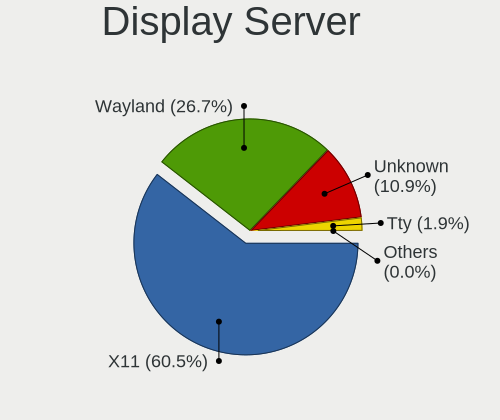
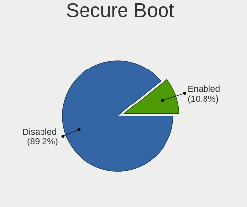
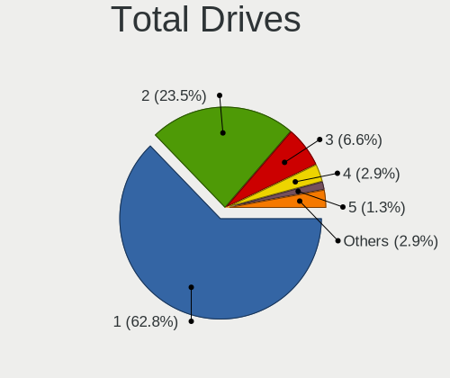
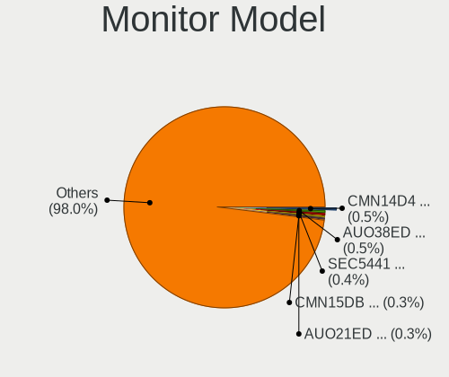
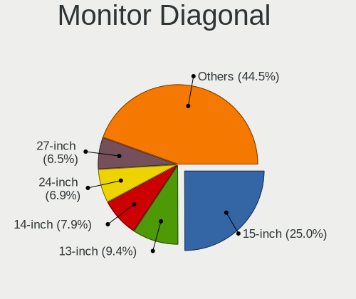
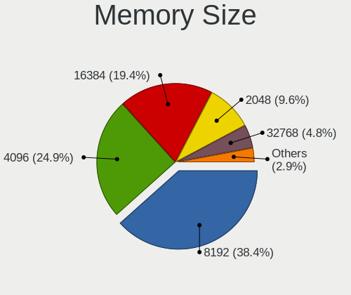
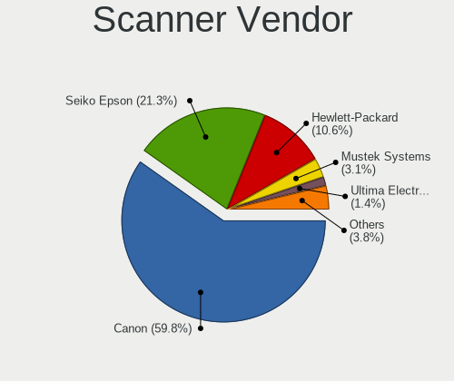

Ubuntu - Tested Hardware & Statistics
-------------------------------------

A project to collect tested hardware configurations for Ubuntu.

Anyone can contribute to this report by the [hw-probe](https://github.com/linuxhw/hw-probe) tool:

    sudo -E hw-probe -all -upload

Please contribute! Especially if your hardware is rare.

This is a report for all computer types. See also reports for [desktops](/Dist/Ubuntu/Desktop/README.md) and [notebooks](/Dist/Ubuntu/Notebook/README.md).

Contents
--------

* [ Test Cases ](#test-cases)

* [ System ](#system)
  - [ OS                       ](#os)
  - [ OS Family                ](#os-family)
  - [ Kernel                   ](#kernel)
  - [ Kernel Family            ](#kernel-family)
  - [ Kernel Major Ver.        ](#kernel-major-ver)
  - [ Arch                     ](#arch)
  - [ DE                       ](#de)
  - [ Display Server           ](#display-server)
  - [ Display Manager          ](#display-manager)
  - [ OS Lang                  ](#os-lang)
  - [ Boot Mode                ](#boot-mode)
  - [ Filesystem               ](#filesystem)
  - [ Part. scheme             ](#part-scheme)
  - [ Dual Boot with Linux/BSD ](#dual-boot-with-linuxbsd)
  - [ Dual Boot (Win)          ](#dual-boot-win)

* [ Board ](#board)
  - [ Vendor                   ](#vendor)
  - [ Model                    ](#model)
  - [ Model Family             ](#model-family)
  - [ MFG Year                 ](#mfg-year)
  - [ Form Factor              ](#form-factor)
  - [ Secure Boot              ](#secure-boot)
  - [ Coreboot                 ](#coreboot)
  - [ RAM Size                 ](#ram-size)
  - [ RAM Used                 ](#ram-used)
  - [ Total Drives             ](#total-drives)
  - [ Has CD-ROM               ](#has-cd-rom)
  - [ Has Ethernet             ](#has-ethernet)
  - [ Has WiFi                 ](#has-wifi)
  - [ Has Bluetooth            ](#has-bluetooth)

* [ Location ](#location)
  - [ Country                  ](#country)
  - [ City                     ](#city)

* [ Drives ](#drives)
  - [ Drive Vendor             ](#drive-vendor)
  - [ Drive Model              ](#drive-model)
  - [ HDD Vendor               ](#hdd-vendor)
  - [ SSD Vendor               ](#ssd-vendor)
  - [ Drive Kind               ](#drive-kind)
  - [ Drive Connector          ](#drive-connector)
  - [ Drive Size               ](#drive-size)
  - [ Space Total              ](#space-total)
  - [ Space Used               ](#space-used)
  - [ Malfunc. Drives          ](#malfunc-drives)
  - [ Malfunc. Drive Vendor    ](#malfunc-drive-vendor)
  - [ Malfunc. HDD Vendor      ](#malfunc-hdd-vendor)
  - [ Malfunc. Drive Kind      ](#malfunc-drive-kind)
  - [ Failed Drives            ](#failed-drives)
  - [ Failed Drive Vendor      ](#failed-drive-vendor)
  - [ Drive Status             ](#drive-status)

* [ Storage controller ](#storage-controller)
  - [ Storage Vendor           ](#storage-vendor)
  - [ Storage Model            ](#storage-model)
  - [ Storage Kind             ](#storage-kind)

* [ Processor ](#processor)
  - [ CPU Vendor               ](#cpu-vendor)
  - [ CPU Model                ](#cpu-model)
  - [ CPU Model Family         ](#cpu-model-family)
  - [ CPU Cores                ](#cpu-cores)
  - [ CPU Sockets              ](#cpu-sockets)
  - [ CPU Threads              ](#cpu-threads)
  - [ CPU Op-Modes             ](#cpu-op-modes)
  - [ CPU Microcode            ](#cpu-microcode)
  - [ CPU Microarch            ](#cpu-microarch)

* [ Graphics ](#graphics)
  - [ GPU Vendor               ](#gpu-vendor)
  - [ GPU Model                ](#gpu-model)
  - [ GPU Combo                ](#gpu-combo)
  - [ GPU Driver               ](#gpu-driver)
  - [ GPU Memory               ](#gpu-memory)

* [ Monitor ](#monitor)
  - [ Monitor Vendor           ](#monitor-vendor)
  - [ Monitor Model            ](#monitor-model)
  - [ Monitor Resolution       ](#monitor-resolution)
  - [ Monitor Diagonal         ](#monitor-diagonal)
  - [ Monitor Width            ](#monitor-width)
  - [ Aspect Ratio             ](#aspect-ratio)
  - [ Monitor Area             ](#monitor-area)
  - [ Pixel Density            ](#pixel-density)
  - [ Multiple Monitors        ](#multiple-monitors)

* [ Network ](#network)
  - [ Net Controller Vendor    ](#net-controller-vendor)
  - [ Net Controller Model     ](#net-controller-model)
  - [ Wireless Vendor          ](#wireless-vendor)
  - [ Wireless Model           ](#wireless-model)
  - [ Ethernet Vendor          ](#ethernet-vendor)
  - [ Ethernet Model           ](#ethernet-model)
  - [ Net Controller Kind      ](#net-controller-kind)
  - [ Used Controller          ](#used-controller)
  - [ NICs                     ](#nics)
  - [ IPv6                     ](#ipv6)

* [ Bluetooth ](#bluetooth)
  - [ Bluetooth Vendor         ](#bluetooth-vendor)
  - [ Bluetooth Model          ](#bluetooth-model)

* [ Sound ](#sound)
  - [ Sound Vendor             ](#sound-vendor)
  - [ Sound Model              ](#sound-model)

* [ Memory ](#memory)
  - [ Memory Vendor            ](#memory-vendor)
  - [ Memory Model             ](#memory-model)
  - [ Memory Kind              ](#memory-kind)
  - [ Memory Form Factor       ](#memory-form-factor)
  - [ Memory Size              ](#memory-size)
  - [ Memory Speed             ](#memory-speed)

* [ Printers & scanners ](#printers--scanners)
  - [ Printer Vendor           ](#printer-vendor)
  - [ Printer Model            ](#printer-model)
  - [ Scanner Vendor           ](#scanner-vendor)
  - [ Scanner Model            ](#scanner-model)

* [ Camera ](#camera)
  - [ Camera Vendor            ](#camera-vendor)
  - [ Camera Model             ](#camera-model)

* [ Security ](#security)
  - [ Fingerprint Vendor       ](#fingerprint-vendor)
  - [ Fingerprint Model        ](#fingerprint-model)
  - [ Chipcard Vendor          ](#chipcard-vendor)
  - [ Chipcard Model           ](#chipcard-model)

* [ Unsupported ](#unsupported)
  - [ Unsupported Devices      ](#unsupported-devices)
  - [ Unsupported Device Types ](#unsupported-device-types)

Test Cases
----------

Total: 94860

| Vendor        | Model                       | Form-Factor | Probe                                                      | Date         |
|---------------|-----------------------------|-------------|------------------------------------------------------------|--------------|
| Colorful T... | BATTLE-AX B365M-D V20       | Desktop     | [f8c7c20100](https://linux-hardware.org/?probe=f8c7c20100) | Oct 01, 2023 |
| Acer          | Predator G9-793             | Notebook    | [fd305490af](https://linux-hardware.org/?probe=fd305490af) | Oct 01, 2023 |
| Colorful T... | BATTLE-AX B365M-D V20       | Desktop     | [c118982282](https://linux-hardware.org/?probe=c118982282) | Oct 01, 2023 |
| ASUSTek       | G73Jh                       | Notebook    | [0b9b84be03](https://linux-hardware.org/?probe=0b9b84be03) | Oct 01, 2023 |
| Dell          | 09KPNV A01                  | Desktop     | [38dba6ab76](https://linux-hardware.org/?probe=38dba6ab76) | Oct 01, 2023 |
| OriginPC      | X170KM-G                    | Notebook    | [2a8752667a](https://linux-hardware.org/?probe=2a8752667a) | Oct 01, 2023 |
| Lenovo        | MIIX 310-10ICR 80SG         | Tablet      | [150d5d9afd](https://linux-hardware.org/?probe=150d5d9afd) | Oct 01, 2023 |
| Apple         | MacBookPro14,3              | Notebook    | [ec90ed2076](https://linux-hardware.org/?probe=ec90ed2076) | Oct 01, 2023 |
| Dell          | Inspiron 11-3168            | Notebook    | [967817b4f8](https://linux-hardware.org/?probe=967817b4f8) | Oct 01, 2023 |
| Gigabyte      | Z68XP-UD3                   | Desktop     | [98fd6eb7c8](https://linux-hardware.org/?probe=98fd6eb7c8) | Oct 01, 2023 |
| ASRock        | FM2A55M-VG3+                | Desktop     | [6faa4fd636](https://linux-hardware.org/?probe=6faa4fd636) | Oct 01, 2023 |
| HP            | ProBook 650 G8 Notebook ... | Notebook    | [b02492c1dd](https://linux-hardware.org/?probe=b02492c1dd) | Oct 01, 2023 |
| GPU Compan... | GWTN156-4                   | Notebook    | [fa5491ff0c](https://linux-hardware.org/?probe=fa5491ff0c) | Oct 01, 2023 |
| Acer          | H57M01                      | Desktop     | [77fd0bf30a](https://linux-hardware.org/?probe=77fd0bf30a) | Sep 30, 2023 |
| ASUSTek       | X756UVK                     | Notebook    | [3bc56b23ef](https://linux-hardware.org/?probe=3bc56b23ef) | Sep 30, 2023 |
| NZXT          | N7 B550                     | Desktop     | [53a99b69e6](https://linux-hardware.org/?probe=53a99b69e6) | Sep 30, 2023 |
| Foxconn       | 2ADA                        | Desktop     | [da117a4e6a](https://linux-hardware.org/?probe=da117a4e6a) | Sep 30, 2023 |
| ASUSTek       | ROG STRIX B450-F GAMING     | Desktop     | [0b4432877e](https://linux-hardware.org/?probe=0b4432877e) | Sep 30, 2023 |
| HP            | ENVY x360 Convertible 15... | Convertible | [9b1cc15d8a](https://linux-hardware.org/?probe=9b1cc15d8a) | Sep 30, 2023 |
| HP            | ENVY x360 Convertible 15... | Convertible | [e2c6027a51](https://linux-hardware.org/?probe=e2c6027a51) | Sep 30, 2023 |
| ASUSTek       | Z450LA                      | Notebook    | [afa96a084e](https://linux-hardware.org/?probe=afa96a084e) | Sep 30, 2023 |
| HP            | EliteBook 820 G4            | Notebook    | [eb46d26ff8](https://linux-hardware.org/?probe=eb46d26ff8) | Sep 30, 2023 |
| ASUSTek       | F7SR                        | Notebook    | [b895fd8bb2](https://linux-hardware.org/?probe=b895fd8bb2) | Sep 30, 2023 |
| ASUSTek       | F7SR                        | Notebook    | [1b7493ae6e](https://linux-hardware.org/?probe=1b7493ae6e) | Sep 30, 2023 |
| Infinix       | INBOOK X3                   | Notebook    | [6b5c2647c2](https://linux-hardware.org/?probe=6b5c2647c2) | Sep 30, 2023 |
| Lenovo        | ThinkPad E15 Gen 4 21E60... | Notebook    | [951a03d2ad](https://linux-hardware.org/?probe=951a03d2ad) | Sep 30, 2023 |
| Fujitsu Si... | AMILO Pa 2548               | Notebook    | [ee2d5e25d3](https://linux-hardware.org/?probe=ee2d5e25d3) | Sep 30, 2023 |
| Colorful T... | BATTLE-AX B365M-D V20       | Desktop     | [e212af9208](https://linux-hardware.org/?probe=e212af9208) | Sep 30, 2023 |
| Entroware     | Hybris                      | Notebook    | [5b124e9b7f](https://linux-hardware.org/?probe=5b124e9b7f) | Sep 30, 2023 |
| UNOWHY        | Y13G012S4EI                 | Notebook    | [2b60435562](https://linux-hardware.org/?probe=2b60435562) | Sep 30, 2023 |
| HUAWEI        | HLYL-WXX9                   | Notebook    | [d39169bf21](https://linux-hardware.org/?probe=d39169bf21) | Sep 30, 2023 |
| Fujitsu Si... | AMILO Pa 2548               | Notebook    | [a291afc6c3](https://linux-hardware.org/?probe=a291afc6c3) | Sep 30, 2023 |
| MSI           | MPG Z390M GAMING EDGE AC    | Desktop     | [04432690a4](https://linux-hardware.org/?probe=04432690a4) | Sep 30, 2023 |
| Dell          | Latitude 5430               | Notebook    | [eee2a34ff5](https://linux-hardware.org/?probe=eee2a34ff5) | Sep 30, 2023 |
| Intel Clie... | LAPBC710                    | Notebook    | [3a29dfa2e3](https://linux-hardware.org/?probe=3a29dfa2e3) | Sep 30, 2023 |
| ASUSTek       | CG8480                      | Desktop     | [dc174e8f73](https://linux-hardware.org/?probe=dc174e8f73) | Sep 30, 2023 |
| Lenovo        | ThinkPad X230 2325KZ5       | Notebook    | [7c10f1a5de](https://linux-hardware.org/?probe=7c10f1a5de) | Sep 30, 2023 |
| Gigabyte      | X99-UD3-CF                  | Desktop     | [f1cc7e5a93](https://linux-hardware.org/?probe=f1cc7e5a93) | Sep 30, 2023 |
| HP            | Pavilion x360 Convertibl... | Convertible | [4074a9c221](https://linux-hardware.org/?probe=4074a9c221) | Sep 30, 2023 |
| Lenovo        | ThinkCentre M58e 7514A2U    | Desktop     | [68f162bf42](https://linux-hardware.org/?probe=68f162bf42) | Sep 30, 2023 |
| Gigabyte      | X99-UD3-CF                  | Desktop     | [51d10770c6](https://linux-hardware.org/?probe=51d10770c6) | Sep 30, 2023 |
| Dell          | Inspiron 15 3525            | Notebook    | [b46d569d14](https://linux-hardware.org/?probe=b46d569d14) | Sep 30, 2023 |
| Dell          | Inspiron 15 3525            | Notebook    | [fb52caaee9](https://linux-hardware.org/?probe=fb52caaee9) | Sep 30, 2023 |
| TECNO         | MEGABOOK T1                 | Notebook    | [9bba77e02b](https://linux-hardware.org/?probe=9bba77e02b) | Sep 30, 2023 |
| MSI           | B550M PRO-VDH WIFI          | Desktop     | [770e7037d3](https://linux-hardware.org/?probe=770e7037d3) | Sep 30, 2023 |
| Samsung       | 305E4A/305E5A/305E7A        | Notebook    | [89d519a3f5](https://linux-hardware.org/?probe=89d519a3f5) | Sep 30, 2023 |
| Apple         | MacBookPro12,1              | Notebook    | [b3617a1e58](https://linux-hardware.org/?probe=b3617a1e58) | Sep 30, 2023 |
| Acer          | Aspire SW3-016              | Notebook    | [62c3855aa7](https://linux-hardware.org/?probe=62c3855aa7) | Sep 30, 2023 |
| HP            | Notebook                    | Notebook    | [873004172f](https://linux-hardware.org/?probe=873004172f) | Sep 30, 2023 |
| MSI           | P67A-C43                    | Desktop     | [22492f6d47](https://linux-hardware.org/?probe=22492f6d47) | Sep 30, 2023 |
| Sony          | VPCEG10EL                   | Notebook    | [8271942cc2](https://linux-hardware.org/?probe=8271942cc2) | Sep 30, 2023 |
| ASUSTek       | ASUS TUF Gaming A15 FA50... | Notebook    | [527c8192a9](https://linux-hardware.org/?probe=527c8192a9) | Sep 30, 2023 |
| Dell          | Inspiron 5521               | Notebook    | [a704dd3c01](https://linux-hardware.org/?probe=a704dd3c01) | Sep 30, 2023 |
| ASRock        | A300M-STX                   | Desktop     | [d8c97108ad](https://linux-hardware.org/?probe=d8c97108ad) | Sep 30, 2023 |
| VALE          | Notebook Classic C140       | Notebook    | [5be7208021](https://linux-hardware.org/?probe=5be7208021) | Sep 30, 2023 |
| Acer          | H57M01                      | Desktop     | [d506730eed](https://linux-hardware.org/?probe=d506730eed) | Sep 30, 2023 |
| Apple         | MacBookPro5,5               | Notebook    | [202a977fce](https://linux-hardware.org/?probe=202a977fce) | Sep 30, 2023 |
| ASRock        | A300M-STX                   | Desktop     | [bcbf0e5bfd](https://linux-hardware.org/?probe=bcbf0e5bfd) | Sep 30, 2023 |
| HP            | Pavilion dv6                | Notebook    | [e2560d6378](https://linux-hardware.org/?probe=e2560d6378) | Sep 30, 2023 |
| ASRockRack    | Z690D4U-2L2T/G5             | Server      | [cc642b859b](https://linux-hardware.org/?probe=cc642b859b) | Sep 30, 2023 |
| HP            | Dragonfly 13.5 inch G4 N... | Notebook    | [2afa933d2a](https://linux-hardware.org/?probe=2afa933d2a) | Sep 30, 2023 |
| Unknown       | Unknown                     | Notebook    | [56580ba351](https://linux-hardware.org/?probe=56580ba351) | Sep 30, 2023 |
| HP            | Dragonfly 13.5 inch G4 N... | Notebook    | [a7a8e627cb](https://linux-hardware.org/?probe=a7a8e627cb) | Sep 30, 2023 |
| ASUSTek       | ZenBook UX425QA_UM425QA     | Notebook    | [306bc123c4](https://linux-hardware.org/?probe=306bc123c4) | Sep 29, 2023 |
| Lenovo        | G770 1037                   | Notebook    | [576bbd3839](https://linux-hardware.org/?probe=576bbd3839) | Sep 29, 2023 |
| Lenovo        | ThinkPad X13 Gen 1 20UGA... | Notebook    | [8c1d3fc469](https://linux-hardware.org/?probe=8c1d3fc469) | Sep 29, 2023 |
| Acer          | Aspire F5-573G              | Notebook    | [dea46b2302](https://linux-hardware.org/?probe=dea46b2302) | Sep 29, 2023 |
| Dell          | XPS 15 9550                 | Notebook    | [587f9a3ff1](https://linux-hardware.org/?probe=587f9a3ff1) | Sep 29, 2023 |
| Dell          | 0WWR83 A05                  | Server      | [f099698b0e](https://linux-hardware.org/?probe=f099698b0e) | Sep 29, 2023 |
| Foxconn       | 2AB1                        | Desktop     | [28ef0f3fbc](https://linux-hardware.org/?probe=28ef0f3fbc) | Sep 29, 2023 |
| Lenovo        | ThinkPad X13 Gen 1 20UGA... | Notebook    | [c38ca27643](https://linux-hardware.org/?probe=c38ca27643) | Sep 29, 2023 |
| Acer          | H57M01                      | Desktop     | [ad7b1bf379](https://linux-hardware.org/?probe=ad7b1bf379) | Sep 29, 2023 |
| Acer          | Nitro N50-610               | Desktop     | [a91f602e4a](https://linux-hardware.org/?probe=a91f602e4a) | Sep 29, 2023 |
| ASUSTek       | ASUS TUF Gaming A15 FA50... | Notebook    | [96e037afc8](https://linux-hardware.org/?probe=96e037afc8) | Sep 29, 2023 |
| Apple         | MacBookAir6,1               | Notebook    | [b77b45ce58](https://linux-hardware.org/?probe=b77b45ce58) | Sep 29, 2023 |
| Dell          | 0804P1 A02                  | Server      | [96b1e41f9c](https://linux-hardware.org/?probe=96b1e41f9c) | Sep 29, 2023 |
| Supermicro    | X8DAH                       | Server      | [fdf4a783aa](https://linux-hardware.org/?probe=fdf4a783aa) | Sep 29, 2023 |
| Apple         | Mac-F221BEC8                | Desktop     | [7b4a0099a9](https://linux-hardware.org/?probe=7b4a0099a9) | Sep 29, 2023 |
| Acer          | Aspire A517-53              | Notebook    | [6023cecfb1](https://linux-hardware.org/?probe=6023cecfb1) | Sep 29, 2023 |
| HP            | ProLiant DL380p Gen8        | Server      | [9c52136f33](https://linux-hardware.org/?probe=9c52136f33) | Sep 29, 2023 |
| Acer          | Aspire 7745G                | Notebook    | [55ea55a771](https://linux-hardware.org/?probe=55ea55a771) | Sep 29, 2023 |
| Acer          | Nitro AN517-54              | Notebook    | [3e1448c388](https://linux-hardware.org/?probe=3e1448c388) | Sep 29, 2023 |
| Acer          | Aspire A517-53              | Notebook    | [05ff23a1a1](https://linux-hardware.org/?probe=05ff23a1a1) | Sep 29, 2023 |
| Dell          | Latitude 5500               | Notebook    | [ea091dbcf2](https://linux-hardware.org/?probe=ea091dbcf2) | Sep 29, 2023 |
| Dell          | 0PRR48 A00                  | Desktop     | [52fd06666a](https://linux-hardware.org/?probe=52fd06666a) | Sep 29, 2023 |
| HP            | ProLiant DL360 Gen9         | Server      | [c7f7de0a3a](https://linux-hardware.org/?probe=c7f7de0a3a) | Sep 29, 2023 |
| HP            | ProLiant DL360 Gen9         | Server      | [380afb179f](https://linux-hardware.org/?probe=380afb179f) | Sep 29, 2023 |
| HP            | ProLiant DL360 Gen9         | Server      | [002155539d](https://linux-hardware.org/?probe=002155539d) | Sep 29, 2023 |
| HP            | ProLiant DL360 Gen9         | Server      | [1395f33f33](https://linux-hardware.org/?probe=1395f33f33) | Sep 29, 2023 |
| HP            | ProLiant DL360 Gen9         | Server      | [1dc72cc274](https://linux-hardware.org/?probe=1dc72cc274) | Sep 29, 2023 |
| Intel         | B75                         | Desktop     | [a30fa8031b](https://linux-hardware.org/?probe=a30fa8031b) | Sep 29, 2023 |
| HP            | OMEN by Laptop 15-dc1xxx    | Notebook    | [2d31a3d858](https://linux-hardware.org/?probe=2d31a3d858) | Sep 29, 2023 |
| Supermicro    | X9DRW                       | Server      | [122a3dfb58](https://linux-hardware.org/?probe=122a3dfb58) | Sep 29, 2023 |
| Supermicro    | X9DRW                       | Server      | [4d0fad3a9e](https://linux-hardware.org/?probe=4d0fad3a9e) | Sep 29, 2023 |
| Getac         | T800G2                      | Tablet      | [ede8155598](https://linux-hardware.org/?probe=ede8155598) | Sep 29, 2023 |
| ASUSTek       | ROG STRIX B550-F GAMING ... | Desktop     | [6177caee37](https://linux-hardware.org/?probe=6177caee37) | Sep 29, 2023 |
| Dell          | 0WWR83 A05                  | Server      | [8df85e28d8](https://linux-hardware.org/?probe=8df85e28d8) | Sep 29, 2023 |
| Alienware     | m16 R1 AMD                  | Notebook    | [710a10efce](https://linux-hardware.org/?probe=710a10efce) | Sep 29, 2023 |
| HP            | ProBook 430 G3              | Notebook    | [5a73271bfd](https://linux-hardware.org/?probe=5a73271bfd) | Sep 29, 2023 |
| GEEKOM        | Mini IT 8                   | Desktop     | [fc5d6092da](https://linux-hardware.org/?probe=fc5d6092da) | Sep 29, 2023 |
| ASUSTek       | H81M-K                      | Desktop     | [16dabb2f6e](https://linux-hardware.org/?probe=16dabb2f6e) | Sep 29, 2023 |
| MSI           | Prestige 15 A12SC           | Notebook    | [d78d241946](https://linux-hardware.org/?probe=d78d241946) | Sep 29, 2023 |
| ASUSTek       | ROG STRIX Z790-A GAMING ... | Desktop     | [a5467c367d](https://linux-hardware.org/?probe=a5467c367d) | Sep 29, 2023 |
| Gigabyte      | Z390 AORUS PRO WIFI-CF      | Desktop     | [8724efb686](https://linux-hardware.org/?probe=8724efb686) | Sep 29, 2023 |
| Gigabyte      | Z390 AORUS PRO WIFI-CF      | Desktop     | [76fc0d8239](https://linux-hardware.org/?probe=76fc0d8239) | Sep 29, 2023 |
| ASUSTek       | VivoBook_ASUSLaptop X412... | Notebook    | [5828bffdb6](https://linux-hardware.org/?probe=5828bffdb6) | Sep 29, 2023 |
| Dell          | Inspiron 15-3552            | Notebook    | [8a8f11edae](https://linux-hardware.org/?probe=8a8f11edae) | Sep 29, 2023 |
| HP            | Laptop 14-fq0xxx            | Notebook    | [52648b0b45](https://linux-hardware.org/?probe=52648b0b45) | Sep 29, 2023 |
| Dell          | 03015M A10                  | Server      | [1c089bce6b](https://linux-hardware.org/?probe=1c089bce6b) | Sep 29, 2023 |
| Foxconn       | 2ADA                        | Desktop     | [0c29af254c](https://linux-hardware.org/?probe=0c29af254c) | Sep 29, 2023 |
| ASUSTek       | M5A97 R2.0                  | Desktop     | [2c2f49b6bf](https://linux-hardware.org/?probe=2c2f49b6bf) | Sep 29, 2023 |
| Lenovo        | ThinkPad E495 20NE0001US    | Notebook    | [a76a94cd2f](https://linux-hardware.org/?probe=a76a94cd2f) | Sep 29, 2023 |
| Supermicro    | X11DPG-QTA                  | Server      | [80db5bcb0e](https://linux-hardware.org/?probe=80db5bcb0e) | Sep 29, 2023 |
| Dell          | Inspiron 5437               | Notebook    | [c0301c2fbb](https://linux-hardware.org/?probe=c0301c2fbb) | Sep 29, 2023 |
| HP            | ENVY Laptop 13-ah0xxx       | Notebook    | [6f19668c91](https://linux-hardware.org/?probe=6f19668c91) | Sep 29, 2023 |
| Lenovo        | 1031 SBB0J05441 WIN 3305... | Desktop     | [26580dc672](https://linux-hardware.org/?probe=26580dc672) | Sep 29, 2023 |
| Gigabyte      | GA-MA780G-UD3H              | Desktop     | [9b86a89bf4](https://linux-hardware.org/?probe=9b86a89bf4) | Sep 29, 2023 |
| Lenovo        | V15 G2 ITL 82KB             | Notebook    | [e87fdc15ed](https://linux-hardware.org/?probe=e87fdc15ed) | Sep 29, 2023 |
| Lenovo        | V15 G2 ITL 82KB             | Notebook    | [b1333a2976](https://linux-hardware.org/?probe=b1333a2976) | Sep 29, 2023 |
| HP            | Stream Laptop 14-ds0xxx     | Notebook    | [bbab7c9f89](https://linux-hardware.org/?probe=bbab7c9f89) | Sep 29, 2023 |
| HP            | Stream Laptop 14-ds0xxx     | Notebook    | [4f23a67b82](https://linux-hardware.org/?probe=4f23a67b82) | Sep 29, 2023 |
| ASUSTek       | ROG STRIX B550-A GAMING     | Desktop     | [cce7c03059](https://linux-hardware.org/?probe=cce7c03059) | Sep 29, 2023 |
| HP            | EliteBook x360 1040 G6      | Convertible | [76c2234d3e](https://linux-hardware.org/?probe=76c2234d3e) | Sep 29, 2023 |
| HP            | EliteBook x360 1040 G6      | Convertible | [6bb37fb224](https://linux-hardware.org/?probe=6bb37fb224) | Sep 29, 2023 |
| HP            | ProLiant DL360 Gen9         | Server      | [b6d98e8f23](https://linux-hardware.org/?probe=b6d98e8f23) | Sep 29, 2023 |
| HP            | ProLiant DL360 Gen9         | Server      | [448463ac0a](https://linux-hardware.org/?probe=448463ac0a) | Sep 29, 2023 |
| HP            | ProLiant DL360 Gen9         | Server      | [b4fa4a9cff](https://linux-hardware.org/?probe=b4fa4a9cff) | Sep 29, 2023 |
| ETegro Tec... | ETRS125G4 31S2MMB0040       | Server      | [68bb1e4021](https://linux-hardware.org/?probe=68bb1e4021) | Sep 29, 2023 |
| Supermicro    | X9DRW                       | Server      | [21757c8129](https://linux-hardware.org/?probe=21757c8129) | Sep 29, 2023 |
| Supermicro    | X9DRW                       | Server      | [e60890ee3e](https://linux-hardware.org/?probe=e60890ee3e) | Sep 29, 2023 |
| Samsung       | 340XAA/350XAA/550XAA        | Notebook    | [ccc715eeb6](https://linux-hardware.org/?probe=ccc715eeb6) | Sep 29, 2023 |
| HP            | EliteBook x360 1040 G6      | Convertible | [50e5cd4da6](https://linux-hardware.org/?probe=50e5cd4da6) | Sep 28, 2023 |
| ASUSTek       | H81M-E                      | Desktop     | [0137140cae](https://linux-hardware.org/?probe=0137140cae) | Sep 28, 2023 |
| Gigabyte      | B150M-D3V-CF                | Desktop     | [75b228c5fb](https://linux-hardware.org/?probe=75b228c5fb) | Sep 28, 2023 |
| ASUSTek       | X99-DELUXE                  | Desktop     | [c608038795](https://linux-hardware.org/?probe=c608038795) | Sep 28, 2023 |
| ETegro Tec... | ETRS125G4 31S2MMB0040       | Server      | [3191feb756](https://linux-hardware.org/?probe=3191feb756) | Sep 28, 2023 |
| HP            | 8923 00100                  | All in one  | [31d524cec8](https://linux-hardware.org/?probe=31d524cec8) | Sep 28, 2023 |
| HP            | ZBook Studio G3             | Notebook    | [0005d20c0d](https://linux-hardware.org/?probe=0005d20c0d) | Sep 28, 2023 |
| HP            | 0AA8h                       | Desktop     | [7c8c8fbb40](https://linux-hardware.org/?probe=7c8c8fbb40) | Sep 28, 2023 |
| ASUSTek       | P7P55 LX                    | Desktop     | [6e4c4376c5](https://linux-hardware.org/?probe=6e4c4376c5) | Sep 28, 2023 |
| MSI           | A520M-A PRO                 | Desktop     | [27d7959e57](https://linux-hardware.org/?probe=27d7959e57) | Sep 28, 2023 |
| Lenovo        | Yoga Slim 7 Carbon 14ACN... | Notebook    | [a5e7296c29](https://linux-hardware.org/?probe=a5e7296c29) | Sep 28, 2023 |
| Gigabyte      | B360M DS3H                  | Desktop     | [1308430981](https://linux-hardware.org/?probe=1308430981) | Sep 28, 2023 |
| Acer          | Aspire 7745G                | Notebook    | [6def421696](https://linux-hardware.org/?probe=6def421696) | Sep 28, 2023 |
| HP            | ENVY 17                     | Notebook    | [184a826bba](https://linux-hardware.org/?probe=184a826bba) | Sep 28, 2023 |
| ETegro Tec... | ETRS125G4 31S2MMB0040       | Server      | [a14ff14954](https://linux-hardware.org/?probe=a14ff14954) | Sep 28, 2023 |
| ETegro Tec... | ETRS125G4 31S2MMB0040       | Server      | [cb9984cefb](https://linux-hardware.org/?probe=cb9984cefb) | Sep 28, 2023 |
| ETegro Tec... | ETRS125G4 31S2MMB0040       | Server      | [1cca0d5263](https://linux-hardware.org/?probe=1cca0d5263) | Sep 28, 2023 |
| ETegro Tec... | ETRS125G4 31S2MMB0040       | Server      | [6732e637aa](https://linux-hardware.org/?probe=6732e637aa) | Sep 28, 2023 |
| ETegro Tec... | ETRS125G4 31S2MMB0040       | Server      | [06e76c2108](https://linux-hardware.org/?probe=06e76c2108) | Sep 28, 2023 |
| ETegro Tec... | ETRS125G4 31S2MMB0040       | Server      | [ce41069e7d](https://linux-hardware.org/?probe=ce41069e7d) | Sep 28, 2023 |
| ETegro Tec... | ETRS125G4 31S2MMB0040       | Server      | [d431883e15](https://linux-hardware.org/?probe=d431883e15) | Sep 28, 2023 |
| I-Life Dig... | ZED AIR PRO                 | Notebook    | [7cb30879f6](https://linux-hardware.org/?probe=7cb30879f6) | Sep 28, 2023 |
| ETegro Tec... | ETRS125G4 31S2MMB0040       | Server      | [ac05e8b898](https://linux-hardware.org/?probe=ac05e8b898) | Sep 28, 2023 |
| ETegro Tec... | ETRS125G4 31S2MMB0040       | Server      | [eb9e748181](https://linux-hardware.org/?probe=eb9e748181) | Sep 28, 2023 |
| ETegro Tec... | ETRS125G4 31S2MMB0040       | Server      | [1d6887b5f3](https://linux-hardware.org/?probe=1d6887b5f3) | Sep 28, 2023 |
| ETegro Tec... | ETRS125G4 31S2MMB0040       | Server      | [4d27130658](https://linux-hardware.org/?probe=4d27130658) | Sep 28, 2023 |
| ETegro Tec... | ETRS125G4 31S2MMB0040       | Server      | [bb562ae3fe](https://linux-hardware.org/?probe=bb562ae3fe) | Sep 28, 2023 |
| ETegro Tec... | ETRS125G4 31S2MMB0040       | Server      | [c27a8913bf](https://linux-hardware.org/?probe=c27a8913bf) | Sep 28, 2023 |
| ETegro Tec... | ETRS125G4 31S2MMB0040       | Server      | [c00c73fa32](https://linux-hardware.org/?probe=c00c73fa32) | Sep 28, 2023 |
| ETegro Tec... | ETRS125G4 31S2MMB0040       | Server      | [abcb83d7b5](https://linux-hardware.org/?probe=abcb83d7b5) | Sep 28, 2023 |
| Dell          | Precision 3560              | Notebook    | [14af02a240](https://linux-hardware.org/?probe=14af02a240) | Sep 28, 2023 |
| FriendlyEl... | NanoPC-T6                   | Soc         | [36905cc47d](https://linux-hardware.org/?probe=36905cc47d) | Sep 28, 2023 |
| MSI           | B550M PRO-VDH WIFI          | Desktop     | [ce357bee14](https://linux-hardware.org/?probe=ce357bee14) | Sep 28, 2023 |
| Supermicro    | X8DTL                       | Server      | [f068e7e4f8](https://linux-hardware.org/?probe=f068e7e4f8) | Sep 28, 2023 |
| Lenovo        | ThinkPad T14 Gen 3 21AJS... | Notebook    | [38e71e4fe9](https://linux-hardware.org/?probe=38e71e4fe9) | Sep 28, 2023 |
| Gigabyte      | EX58-EXTREME                | Desktop     | [4a1a75d0e3](https://linux-hardware.org/?probe=4a1a75d0e3) | Sep 28, 2023 |
| Lenovo        | ThinkPad P15 Gen 1 20ST0... | Notebook    | [1492e2178d](https://linux-hardware.org/?probe=1492e2178d) | Sep 28, 2023 |
| HP            | Laptop 15-fd0xxx            | Notebook    | [0a548c4390](https://linux-hardware.org/?probe=0a548c4390) | Sep 28, 2023 |
| GMKtec        | NucBox3                     | Desktop     | [c99750febd](https://linux-hardware.org/?probe=c99750febd) | Sep 28, 2023 |
| Lenovo        | ThinkPad T510 43142PU       | Notebook    | [30bd29e170](https://linux-hardware.org/?probe=30bd29e170) | Sep 28, 2023 |
| ASUSTek       | ROG Zephyrus G14 GA401IU... | Notebook    | [f86a0719d7](https://linux-hardware.org/?probe=f86a0719d7) | Sep 28, 2023 |
| Lenovo        | ThinkPad T14 Gen 2i 20W0... | Notebook    | [c8dfaf68d0](https://linux-hardware.org/?probe=c8dfaf68d0) | Sep 28, 2023 |
| Gigabyte      | EX58-EXTREME                | Desktop     | [bc2a9ecc6a](https://linux-hardware.org/?probe=bc2a9ecc6a) | Sep 28, 2023 |
| HP            | 1496                        | Desktop     | [3867e7af58](https://linux-hardware.org/?probe=3867e7af58) | Sep 28, 2023 |
| HP            | Pavilion 11 x360 PC         | Notebook    | [b6316ea4df](https://linux-hardware.org/?probe=b6316ea4df) | Sep 28, 2023 |
| HUAWEI        | NBLB-WAX9N                  | Notebook    | [7cbed3fca6](https://linux-hardware.org/?probe=7cbed3fca6) | Sep 28, 2023 |
| HP            | Pavilion 11 x360 PC         | Notebook    | [f75ab187aa](https://linux-hardware.org/?probe=f75ab187aa) | Sep 28, 2023 |
| Supermicro    | X8DTU                       | Server      | [d72f782d8c](https://linux-hardware.org/?probe=d72f782d8c) | Sep 28, 2023 |
| Supermicro    | X8DTU                       | Server      | [3d9123e719](https://linux-hardware.org/?probe=3d9123e719) | Sep 28, 2023 |
| Wistron       | ProLiant ML110 G6           | Desktop     | [4284ef7737](https://linux-hardware.org/?probe=4284ef7737) | Sep 28, 2023 |
| Acer          | Aspire TC-885 V:1.1         | Desktop     | [7aef46e946](https://linux-hardware.org/?probe=7aef46e946) | Sep 28, 2023 |
| Wistron       | ProLiant ML110 G6           | Desktop     | [6282804553](https://linux-hardware.org/?probe=6282804553) | Sep 28, 2023 |
| Lenovo        | ThinkPad E14 Gen 3 20Y70... | Notebook    | [78b1c422c7](https://linux-hardware.org/?probe=78b1c422c7) | Sep 28, 2023 |
| HP            | Notebook                    | Notebook    | [7d55fd8520](https://linux-hardware.org/?probe=7d55fd8520) | Sep 28, 2023 |
| Alienware     | x14                         | Notebook    | [048d5f6f2a](https://linux-hardware.org/?probe=048d5f6f2a) | Sep 28, 2023 |
| Dell          | 00V62H A01                  | Desktop     | [f46006f6ce](https://linux-hardware.org/?probe=f46006f6ce) | Sep 28, 2023 |
| Lenovo        | ThinkServer TS140           | Desktop     | [0e08685628](https://linux-hardware.org/?probe=0e08685628) | Sep 28, 2023 |
| ASUSTek       | X550CC                      | Notebook    | [001231c730](https://linux-hardware.org/?probe=001231c730) | Sep 28, 2023 |
| HP            | Notebook                    | Notebook    | [49192b29a6](https://linux-hardware.org/?probe=49192b29a6) | Sep 28, 2023 |
| Gigabyte      | 970A-DS3P FX                | Desktop     | [627751c21a](https://linux-hardware.org/?probe=627751c21a) | Sep 28, 2023 |
| ASRock        | Z370 Pro4                   | Desktop     | [a70543ae67](https://linux-hardware.org/?probe=a70543ae67) | Sep 28, 2023 |
| Apple         | Mac-A369DDC4E67F1C45 iMa... | All in one  | [4fb593dcca](https://linux-hardware.org/?probe=4fb593dcca) | Sep 28, 2023 |
| HP            | Laptop 15-da0xxx            | Notebook    | [3d996f9823](https://linux-hardware.org/?probe=3d996f9823) | Sep 28, 2023 |
| Acer          | Nitro AN515-52              | Notebook    | [e7fb14ee98](https://linux-hardware.org/?probe=e7fb14ee98) | Sep 28, 2023 |
| Lenovo        | ThinkCentre M57 6075Y3W     | Desktop     | [8e39080ed3](https://linux-hardware.org/?probe=8e39080ed3) | Sep 28, 2023 |
| Intel         | NUC13ANBi7 M89645-203       | Mini pc     | [d9baf0c41d](https://linux-hardware.org/?probe=d9baf0c41d) | Sep 28, 2023 |
| Acer          | Swift SF314-42              | Notebook    | [f436f21240](https://linux-hardware.org/?probe=f436f21240) | Sep 27, 2023 |
| Dell          | Inspiron 5515               | Notebook    | [5889ba673d](https://linux-hardware.org/?probe=5889ba673d) | Sep 27, 2023 |
| Lenovo        | ThinkBook 14-IIL 20SL       | Notebook    | [001d5aa716](https://linux-hardware.org/?probe=001d5aa716) | Sep 27, 2023 |
| HP            | Laptop 15-da0xxx            | Notebook    | [8fb9d5d21f](https://linux-hardware.org/?probe=8fb9d5d21f) | Sep 27, 2023 |
| HP            | ENVY x360 Convertible 15... | Convertible | [13a2717815](https://linux-hardware.org/?probe=13a2717815) | Sep 27, 2023 |
| MiTAC         | PD10EHI                     | Desktop     | [29716ecb18](https://linux-hardware.org/?probe=29716ecb18) | Sep 27, 2023 |
| Medion        | E3221                       | Convertible | [eaa3a2c9ee](https://linux-hardware.org/?probe=eaa3a2c9ee) | Sep 27, 2023 |
| Toshiba       | Satellite L550              | Notebook    | [d93c40647f](https://linux-hardware.org/?probe=d93c40647f) | Sep 27, 2023 |
| Gigabyte      | X570 AORUS PRO WIFI         | Desktop     | [e15856c8f1](https://linux-hardware.org/?probe=e15856c8f1) | Sep 27, 2023 |
| Supermicro    | X8DAH                       | Server      | [ef771077af](https://linux-hardware.org/?probe=ef771077af) | Sep 27, 2023 |
| Supermicro    | X9DRW                       | Server      | [3dcf1261b5](https://linux-hardware.org/?probe=3dcf1261b5) | Sep 27, 2023 |
| ETegro Tec... | ETRS125G4 31S2MMB0040       | Server      | [2b1ce7346b](https://linux-hardware.org/?probe=2b1ce7346b) | Sep 27, 2023 |
| HP            | Laptop 17-by0xxx            | Notebook    | [6eefb5fdd2](https://linux-hardware.org/?probe=6eefb5fdd2) | Sep 27, 2023 |
| Lenovo        | ThinkPad X1 Carbon Gen 8... | Notebook    | [b5dee453a3](https://linux-hardware.org/?probe=b5dee453a3) | Sep 27, 2023 |
| Lenovo        | IdeaPad 1 14IGL7 82V6       | Notebook    | [707c612189](https://linux-hardware.org/?probe=707c612189) | Sep 27, 2023 |
| AMI           | Cherry Trail CR             | Notebook    | [41b2d006c1](https://linux-hardware.org/?probe=41b2d006c1) | Sep 27, 2023 |
| Lenovo        | ThinkPad T460s 20FAS2G90... | Notebook    | [50c8df3b79](https://linux-hardware.org/?probe=50c8df3b79) | Sep 27, 2023 |
| Lenovo        | ThinkPad T460s 20FAS2G90... | Notebook    | [6cfd6e2b34](https://linux-hardware.org/?probe=6cfd6e2b34) | Sep 27, 2023 |
| HP            | 8594                        | Desktop     | [374067df48](https://linux-hardware.org/?probe=374067df48) | Sep 27, 2023 |
| AMI           | Cherry Trail CR             | Notebook    | [050c423c6b](https://linux-hardware.org/?probe=050c423c6b) | Sep 27, 2023 |
| Dell          | Latitude 7390               | Notebook    | [93e22b6fc4](https://linux-hardware.org/?probe=93e22b6fc4) | Sep 27, 2023 |
| HP            | EliteBook 840 G8 Noteboo... | Notebook    | [593ddb6105](https://linux-hardware.org/?probe=593ddb6105) | Sep 27, 2023 |
| ASUSTek       | PRIME X370-PRO              | Desktop     | [e5cd50e4ea](https://linux-hardware.org/?probe=e5cd50e4ea) | Sep 27, 2023 |
| Dell          | Latitude 7390               | Notebook    | [a7bfa2e285](https://linux-hardware.org/?probe=a7bfa2e285) | Sep 27, 2023 |
| Dell          | Latitude 3410               | Notebook    | [7b326dd690](https://linux-hardware.org/?probe=7b326dd690) | Sep 27, 2023 |
| Unknown       | Unknown                     | Desktop     | [cb12d6c853](https://linux-hardware.org/?probe=cb12d6c853) | Sep 27, 2023 |
| MSI           | Z77A-S01                    | Desktop     | [277586f152](https://linux-hardware.org/?probe=277586f152) | Sep 27, 2023 |
| HUAWEI        | KLVL-WXX9                   | Notebook    | [5646b6da22](https://linux-hardware.org/?probe=5646b6da22) | Sep 27, 2023 |
| ASUSTek       | M5A78L-M PLUS/USB3          | Desktop     | [f47347fb9b](https://linux-hardware.org/?probe=f47347fb9b) | Sep 27, 2023 |
| Clevo         | W240EU/W250EUQ/W270EUQ      | Notebook    | [cd5d2fae9e](https://linux-hardware.org/?probe=cd5d2fae9e) | Sep 27, 2023 |
| Dell          | Precision 5570              | Notebook    | [f00d32a04a](https://linux-hardware.org/?probe=f00d32a04a) | Sep 27, 2023 |
| Acer          | Aspire E1-531               | Notebook    | [6b981869d7](https://linux-hardware.org/?probe=6b981869d7) | Sep 27, 2023 |
| Dell          | XPS 15 9510                 | Notebook    | [72bb0c5858](https://linux-hardware.org/?probe=72bb0c5858) | Sep 27, 2023 |
| Sony          | VPCEG10EL                   | Notebook    | [7bfbe9b21d](https://linux-hardware.org/?probe=7bfbe9b21d) | Sep 27, 2023 |
| Dell          | System XPS L502X            | Notebook    | [06d6fd95d1](https://linux-hardware.org/?probe=06d6fd95d1) | Sep 27, 2023 |
| Lenovo        | IdeaPad 320-15IKB 81BG      | Notebook    | [17f9208e1a](https://linux-hardware.org/?probe=17f9208e1a) | Sep 27, 2023 |
| ASUSTek       | PRO H410M-C                 | Desktop     | [6554d255c3](https://linux-hardware.org/?probe=6554d255c3) | Sep 27, 2023 |
| AAEON         | MIX-H310D1 V1.0             | Desktop     | [7a3b3d3b2d](https://linux-hardware.org/?probe=7a3b3d3b2d) | Sep 27, 2023 |
| HP            | Spectre x360 2-in-1 Lapt... | Convertible | [af863ee3d6](https://linux-hardware.org/?probe=af863ee3d6) | Sep 27, 2023 |
| HP            | Elite Dragonfly 13.5 inc... | Notebook    | [7941c7c6cc](https://linux-hardware.org/?probe=7941c7c6cc) | Sep 27, 2023 |
| ASUSTek       | M5A99FX PRO R2.0            | Desktop     | [500909194e](https://linux-hardware.org/?probe=500909194e) | Sep 27, 2023 |
| Acer          | Aspire E1-531               | Notebook    | [d47b59c89b](https://linux-hardware.org/?probe=d47b59c89b) | Sep 27, 2023 |
| HUAWEI        | BOHB-WAX9                   | Notebook    | [054707cbd2](https://linux-hardware.org/?probe=054707cbd2) | Sep 27, 2023 |
| Toshiba       | dynabook T350/46BW          | Notebook    | [26ffaa1c0f](https://linux-hardware.org/?probe=26ffaa1c0f) | Sep 27, 2023 |
| Intel         | X79F1 V2.0                  | Desktop     | [919b208284](https://linux-hardware.org/?probe=919b208284) | Sep 27, 2023 |
| HP            | EliteBook 8470p             | Notebook    | [a1fa543905](https://linux-hardware.org/?probe=a1fa543905) | Sep 27, 2023 |
| Dell          | Vostro 3500                 | Notebook    | [fac9ee2e6e](https://linux-hardware.org/?probe=fac9ee2e6e) | Sep 27, 2023 |
| ASRock        | Z790 Taichi                 | Desktop     | [949be6194e](https://linux-hardware.org/?probe=949be6194e) | Sep 27, 2023 |
| MSI           | B550-A PRO                  | Desktop     | [c60600b4f0](https://linux-hardware.org/?probe=c60600b4f0) | Sep 27, 2023 |
| Gigabyte      | B450M DS3H-CF               | Desktop     | [812b06784e](https://linux-hardware.org/?probe=812b06784e) | Sep 27, 2023 |
| ASUSTek       | VivoBook_ASUSLaptop M350... | Notebook    | [0e32901b18](https://linux-hardware.org/?probe=0e32901b18) | Sep 27, 2023 |
| HUAWEI        | KLVL-WXXW                   | Notebook    | [4f1f07158b](https://linux-hardware.org/?probe=4f1f07158b) | Sep 26, 2023 |
| HP            | ENVY x360 Convertible 15... | Convertible | [ded4cabd95](https://linux-hardware.org/?probe=ded4cabd95) | Sep 26, 2023 |
| HP            | ProBook 450 G8 Notebook ... | Notebook    | [c0607441c1](https://linux-hardware.org/?probe=c0607441c1) | Sep 26, 2023 |
| Lenovo        | ThinkPad T590 20N5S31U02    | Notebook    | [d4137582b5](https://linux-hardware.org/?probe=d4137582b5) | Sep 26, 2023 |
| HP            | Pavilion x360 Convertibl... | Convertible | [a0366d9d2e](https://linux-hardware.org/?probe=a0366d9d2e) | Sep 26, 2023 |
| Google        | Phaser360                   | Notebook    | [95686db08c](https://linux-hardware.org/?probe=95686db08c) | Sep 26, 2023 |
| ASRock        | Z790 Taichi                 | Desktop     | [50ff8d28e4](https://linux-hardware.org/?probe=50ff8d28e4) | Sep 26, 2023 |
| Lenovo        | ThinkPad T590 20N5S31U02    | Notebook    | [aa988ac4df](https://linux-hardware.org/?probe=aa988ac4df) | Sep 26, 2023 |
| HP            | Laptop 15-dy2xxx            | Notebook    | [8fd945e3c5](https://linux-hardware.org/?probe=8fd945e3c5) | Sep 26, 2023 |
| MSI           | MAG B550M MORTAR            | Desktop     | [5a2571575f](https://linux-hardware.org/?probe=5a2571575f) | Sep 26, 2023 |
| Dell          | Inspiron 5423               | Notebook    | [a6a3b2697f](https://linux-hardware.org/?probe=a6a3b2697f) | Sep 26, 2023 |
| ASUSTek       | ProArt X670E-CREATOR WIF... | Desktop     | [9fcff9b281](https://linux-hardware.org/?probe=9fcff9b281) | Sep 26, 2023 |
| Supermicro    | X9DRL-3F/iF                 | Desktop     | [07543468b6](https://linux-hardware.org/?probe=07543468b6) | Sep 26, 2023 |
| Supermicro    | X10DRL-i                    | Desktop     | [4215bb2639](https://linux-hardware.org/?probe=4215bb2639) | Sep 26, 2023 |
| ETegro Tec... | ETRS125G4 31S2MMB0040       | Server      | [c9ce40639d](https://linux-hardware.org/?probe=c9ce40639d) | Sep 26, 2023 |
| Lenovo        | IdeaPadFlex 5 14IAU7 82R... | Convertible | [ab5af00a13](https://linux-hardware.org/?probe=ab5af00a13) | Sep 26, 2023 |
| ASUSTek       | ROG CROSSHAIR VIII HERO     | Desktop     | [ac6d6574e9](https://linux-hardware.org/?probe=ac6d6574e9) | Sep 26, 2023 |
| Medion        | D3F3-EM                     | Desktop     | [82989a21af](https://linux-hardware.org/?probe=82989a21af) | Sep 26, 2023 |
| MSI           | MAG B550M MORTAR            | Desktop     | [efee605c17](https://linux-hardware.org/?probe=efee605c17) | Sep 26, 2023 |
| HP            | EliteBook 840 G3            | Notebook    | [5ab77e3f48](https://linux-hardware.org/?probe=5ab77e3f48) | Sep 26, 2023 |
| Lenovo        | ThinkBook 15 G2 ITL 20VE    | Notebook    | [92eb612b66](https://linux-hardware.org/?probe=92eb612b66) | Sep 26, 2023 |
| Dell          | Latitude 7320               | Notebook    | [2549020a4e](https://linux-hardware.org/?probe=2549020a4e) | Sep 26, 2023 |
| Colorful T... | BATTLE-AX B365M-D V20       | Desktop     | [dfdb4a33bd](https://linux-hardware.org/?probe=dfdb4a33bd) | Sep 26, 2023 |
| Lenovo        | 312D SDK0J40697 WIN 3305... | Mini pc     | [c72c91a073](https://linux-hardware.org/?probe=c72c91a073) | Sep 26, 2023 |
| PC Special... | PCX0DX                      | Notebook    | [935fe5ddb0](https://linux-hardware.org/?probe=935fe5ddb0) | Sep 26, 2023 |
| Lenovo        | 312D SDK0J40697 WIN 3305... | Mini pc     | [c0720a0782](https://linux-hardware.org/?probe=c0720a0782) | Sep 26, 2023 |
| Lenovo        | V15 G2 ALC 82KD             | Notebook    | [21c3145a6a](https://linux-hardware.org/?probe=21c3145a6a) | Sep 26, 2023 |
| Gateway       | FX6840                      | Desktop     | [613810c0ed](https://linux-hardware.org/?probe=613810c0ed) | Sep 26, 2023 |
| Acer          | Aspire E1-572G              | Notebook    | [45b934b885](https://linux-hardware.org/?probe=45b934b885) | Sep 26, 2023 |
| MSI           | X299 RAIDER 2018-10-08      | Desktop     | [8bccf1be8d](https://linux-hardware.org/?probe=8bccf1be8d) | Sep 26, 2023 |
| ASUSTek       | M2N-VM DVI                  | Desktop     | [7b8649cccc](https://linux-hardware.org/?probe=7b8649cccc) | Sep 26, 2023 |
| HP            | 3397                        | Desktop     | [e0396e65c6](https://linux-hardware.org/?probe=e0396e65c6) | Sep 26, 2023 |
| Lenovo        | ThinkPad T14 Gen 3 21AH0... | Notebook    | [2cf86f7f12](https://linux-hardware.org/?probe=2cf86f7f12) | Sep 26, 2023 |
| HP            | Laptop 15s-fq2xxx           | Notebook    | [22294a7a32](https://linux-hardware.org/?probe=22294a7a32) | Sep 26, 2023 |
| Lenovo        | ThinkPad P16s Gen 1 21BT... | Notebook    | [47d912c5a9](https://linux-hardware.org/?probe=47d912c5a9) | Sep 26, 2023 |
| Samsung       | DP300A2A-B01RU SEC_SW_RE... | All in one  | [1e8b7eac5c](https://linux-hardware.org/?probe=1e8b7eac5c) | Sep 26, 2023 |
| Lenovo        | ThinkPad P16s Gen 1 21BT... | Notebook    | [d2a926c703](https://linux-hardware.org/?probe=d2a926c703) | Sep 26, 2023 |
| Lenovo        | Yoga Slim 7 Pro 14ACH5 8... | Notebook    | [b6cd63eedc](https://linux-hardware.org/?probe=b6cd63eedc) | Sep 26, 2023 |
| Samsung       | 305E4A/305E5A/305E7A        | Notebook    | [24a1d008e6](https://linux-hardware.org/?probe=24a1d008e6) | Sep 26, 2023 |
| Acer          | Aspire E1-570               | Notebook    | [98ed9bca40](https://linux-hardware.org/?probe=98ed9bca40) | Sep 26, 2023 |
| Infinix       | INBOOK Y1 PLUS NEO          | Notebook    | [30998449af](https://linux-hardware.org/?probe=30998449af) | Sep 26, 2023 |
| Lenovo        | IdeaPad 5 14ARE05 81YM      | Notebook    | [786338b217](https://linux-hardware.org/?probe=786338b217) | Sep 26, 2023 |
| HP            | Pavilion 14                 | Notebook    | [a7589d8c93](https://linux-hardware.org/?probe=a7589d8c93) | Sep 26, 2023 |
| Notebook      | N2x0WU                      | Notebook    | [49046ef274](https://linux-hardware.org/?probe=49046ef274) | Sep 26, 2023 |
| HP            | Pavilion 14                 | Notebook    | [1aed6aba04](https://linux-hardware.org/?probe=1aed6aba04) | Sep 26, 2023 |
| Lenovo        | ThinkServer TS140           | Desktop     | [461eeadd52](https://linux-hardware.org/?probe=461eeadd52) | Sep 26, 2023 |
| ASRock        | B450 Gaming K4              | Desktop     | [dcd5422d31](https://linux-hardware.org/?probe=dcd5422d31) | Sep 26, 2023 |
| Samsung       | 340XAA/350XAA/550XAA        | Notebook    | [3d8dfdbf80](https://linux-hardware.org/?probe=3d8dfdbf80) | Sep 26, 2023 |
| HP            | ENVY x360 Convertible 15... | Convertible | [b5951d8a34](https://linux-hardware.org/?probe=b5951d8a34) | Sep 26, 2023 |
| Dell          | XPS 9315                    | Notebook    | [11411507e8](https://linux-hardware.org/?probe=11411507e8) | Sep 26, 2023 |
| Apple         | MacBookPro8,1               | Notebook    | [ee86e0d81e](https://linux-hardware.org/?probe=ee86e0d81e) | Sep 26, 2023 |
| Apple         | MacBookPro8,1               | Notebook    | [1630b56fe3](https://linux-hardware.org/?probe=1630b56fe3) | Sep 26, 2023 |
| MSI           | MPG B650I EDGE WIFI         | Desktop     | [fc79d63b87](https://linux-hardware.org/?probe=fc79d63b87) | Sep 26, 2023 |
| HP            | ENVY x360 Convertible 13... | Convertible | [cf4e6d50dd](https://linux-hardware.org/?probe=cf4e6d50dd) | Sep 26, 2023 |
| HP            | G62                         | Notebook    | [50fef7b3fa](https://linux-hardware.org/?probe=50fef7b3fa) | Sep 26, 2023 |
| Lenovo        | IdeaPad 320-15ISK 80XH      | Notebook    | [6a3291f6bf](https://linux-hardware.org/?probe=6a3291f6bf) | Sep 25, 2023 |
| Lenovo        | IdeaPad 320-15ISK 80XH      | Notebook    | [981e7e8ec5](https://linux-hardware.org/?probe=981e7e8ec5) | Sep 25, 2023 |
| Supermicro    | X9DRL-3F/iF                 | Desktop     | [cac5990658](https://linux-hardware.org/?probe=cac5990658) | Sep 25, 2023 |
| Lenovo        | Legion 5 15IMH05H 81Y6      | Notebook    | [c62002acdf](https://linux-hardware.org/?probe=c62002acdf) | Sep 25, 2023 |
| ATOPNUC       | MA90                        | Mini pc     | [be275ae00b](https://linux-hardware.org/?probe=be275ae00b) | Sep 25, 2023 |
| HP            | Laptop 15s-fq2xxx           | Notebook    | [0aa73d620b](https://linux-hardware.org/?probe=0aa73d620b) | Sep 25, 2023 |
| Apple         | Mac-00BE6ED71E35EB86 iMa... | All in one  | [5351027f5e](https://linux-hardware.org/?probe=5351027f5e) | Sep 25, 2023 |
| Apple         | Mac-F60DEB81FF30ACF6 Mac... | Desktop     | [d59518d612](https://linux-hardware.org/?probe=d59518d612) | Sep 25, 2023 |
| HUAWEI        | BOM-WXX9                    | Notebook    | [8d4ba0b939](https://linux-hardware.org/?probe=8d4ba0b939) | Sep 25, 2023 |
| HP            | Pavilion Laptop 14-ec0xx... | Notebook    | [6b0a58d94c](https://linux-hardware.org/?probe=6b0a58d94c) | Sep 25, 2023 |
| Dell          | Vostro 15 5510              | Notebook    | [b2d58819cc](https://linux-hardware.org/?probe=b2d58819cc) | Sep 25, 2023 |
| AZW           | GTR V01                     | Mini pc     | [07e408ce48](https://linux-hardware.org/?probe=07e408ce48) | Sep 25, 2023 |
| AZW           | GTR V01                     | Mini pc     | [f3e5c047af](https://linux-hardware.org/?probe=f3e5c047af) | Sep 25, 2023 |
| VPU Compan... | VWNC71429                   | Notebook    | [285eb8a521](https://linux-hardware.org/?probe=285eb8a521) | Sep 25, 2023 |
| VPU Compan... | VWNC71429                   | Notebook    | [ec5aecc69d](https://linux-hardware.org/?probe=ec5aecc69d) | Sep 25, 2023 |
| Lenovo        | IdeaPad 3 15IIL05 81WE      | Notebook    | [dbe3003db5](https://linux-hardware.org/?probe=dbe3003db5) | Sep 25, 2023 |
| Dell          | Inspiron 1545               | Notebook    | [96508134e8](https://linux-hardware.org/?probe=96508134e8) | Sep 25, 2023 |
| Dell          | Precision M6800             | Notebook    | [027ed86f53](https://linux-hardware.org/?probe=027ed86f53) | Sep 25, 2023 |
| Fujitsu       | FMVA42CW                    | Notebook    | [48a8e36d5f](https://linux-hardware.org/?probe=48a8e36d5f) | Sep 25, 2023 |
| Fujitsu       | FMVA42CW                    | Notebook    | [8427efde7d](https://linux-hardware.org/?probe=8427efde7d) | Sep 25, 2023 |
| HP            | EliteBook 745 G3            | Notebook    | [a814d9fa4b](https://linux-hardware.org/?probe=a814d9fa4b) | Sep 25, 2023 |
| HP            | ProBook 640 G1              | Notebook    | [a941b27d32](https://linux-hardware.org/?probe=a941b27d32) | Sep 25, 2023 |
| Dell          | 0KRC95 A02                  | Desktop     | [c0f2f5244b](https://linux-hardware.org/?probe=c0f2f5244b) | Sep 25, 2023 |
| Acer          | Swift SF314-41              | Notebook    | [ef8b479649](https://linux-hardware.org/?probe=ef8b479649) | Sep 25, 2023 |
| ASUSTek       | G10DK                       | Desktop     | [882b029219](https://linux-hardware.org/?probe=882b029219) | Sep 25, 2023 |
| Acer          | Swift SF314-44              | Notebook    | [6f5d49e16f](https://linux-hardware.org/?probe=6f5d49e16f) | Sep 25, 2023 |
| Acer          | Swift SF14-71T              | Notebook    | [10b657bd75](https://linux-hardware.org/?probe=10b657bd75) | Sep 25, 2023 |
| Acer          | Swift SF314-44              | Notebook    | [12f4ab85f3](https://linux-hardware.org/?probe=12f4ab85f3) | Sep 25, 2023 |
| Apple         | Mac-00BE6ED71E35EB86 iMa... | All in one  | [07ed364391](https://linux-hardware.org/?probe=07ed364391) | Sep 25, 2023 |
| Dell          | 0441XG A04                  | Server      | [60298ae886](https://linux-hardware.org/?probe=60298ae886) | Sep 25, 2023 |
| Lenovo        | ThinkPad T450 20BUS1A100    | Notebook    | [f4887bacc7](https://linux-hardware.org/?probe=f4887bacc7) | Sep 25, 2023 |
| ASUSTek       | M51AC                       | Desktop     | [b4bd7fad24](https://linux-hardware.org/?probe=b4bd7fad24) | Sep 25, 2023 |
| Dell          | 05GD68 A00                  | Desktop     | [7112169fc8](https://linux-hardware.org/?probe=7112169fc8) | Sep 25, 2023 |
| HUAWEI        | BOM-WXX9                    | Notebook    | [ed52653514](https://linux-hardware.org/?probe=ed52653514) | Sep 25, 2023 |
| Apple         | Mac-A369DDC4E67F1C45 iMa... | All in one  | [e749757f1a](https://linux-hardware.org/?probe=e749757f1a) | Sep 25, 2023 |
| Lenovo        | LOQ 15IRH8 82XV             | Notebook    | [a1e01ab80d](https://linux-hardware.org/?probe=a1e01ab80d) | Sep 25, 2023 |
| HP            | EliteBook x360 1030 G2      | Convertible | [8895bccd1c](https://linux-hardware.org/?probe=8895bccd1c) | Sep 25, 2023 |
| Infinix       | INBOOK X1 SLIM              | Notebook    | [bd6f358c7f](https://linux-hardware.org/?probe=bd6f358c7f) | Sep 25, 2023 |
| Apple         | Mac-942B5BF58194151B        | All in one  | [5bf8234727](https://linux-hardware.org/?probe=5bf8234727) | Sep 25, 2023 |
| Lenovo        | Yoga 2 13 20344             | Notebook    | [6a06543ed3](https://linux-hardware.org/?probe=6a06543ed3) | Sep 25, 2023 |
| ASRock        | H81M-DG6                    | Desktop     | [ac6944c3df](https://linux-hardware.org/?probe=ac6944c3df) | Sep 25, 2023 |
| HP            | 255 G8 Notebook PC          | Notebook    | [38b5be59cc](https://linux-hardware.org/?probe=38b5be59cc) | Sep 25, 2023 |
| Acer          | Nitro AN515-54              | Notebook    | [6383f263a8](https://linux-hardware.org/?probe=6383f263a8) | Sep 25, 2023 |
| HP            | ProBook 450 15.6 inch G9... | Notebook    | [2e717c304e](https://linux-hardware.org/?probe=2e717c304e) | Sep 25, 2023 |
| MSI           | Z490-A PRO                  | Desktop     | [7ff4162cbb](https://linux-hardware.org/?probe=7ff4162cbb) | Sep 25, 2023 |
| MSI           | Z490-A PRO                  | Desktop     | [55f54a0aeb](https://linux-hardware.org/?probe=55f54a0aeb) | Sep 25, 2023 |
| Gigabyte      | Z97M-DS3H                   | Desktop     | [2881d9e4ec](https://linux-hardware.org/?probe=2881d9e4ec) | Sep 25, 2023 |
| ASUSTek       | ASUS TUF Gaming F15 FX50... | Notebook    | [b69f53c8fe](https://linux-hardware.org/?probe=b69f53c8fe) | Sep 25, 2023 |
| Dell          | Vostro 15 3510              | Notebook    | [e8868c236d](https://linux-hardware.org/?probe=e8868c236d) | Sep 25, 2023 |
| Dell          | Vostro 15 3510              | Notebook    | [eaa5061963](https://linux-hardware.org/?probe=eaa5061963) | Sep 25, 2023 |
| Acer          | Aspire V3-472P              | Notebook    | [b5ebe3295c](https://linux-hardware.org/?probe=b5ebe3295c) | Sep 25, 2023 |
| Apple         | MacBookPro7,1               | Notebook    | [677446fafa](https://linux-hardware.org/?probe=677446fafa) | Sep 25, 2023 |
| Lenovo        | ThinkPad T14 Gen 2a 20XL... | Notebook    | [336d5fe8c8](https://linux-hardware.org/?probe=336d5fe8c8) | Sep 25, 2023 |
| Intel         | NUC12WSBi5 M46425-302       | Mini pc     | [cb9b76af08](https://linux-hardware.org/?probe=cb9b76af08) | Sep 25, 2023 |
| Acer          | Aspire E5-571               | Notebook    | [c834abf6b2](https://linux-hardware.org/?probe=c834abf6b2) | Sep 25, 2023 |
| HP            | 1589                        | Desktop     | [3d151e09bb](https://linux-hardware.org/?probe=3d151e09bb) | Sep 25, 2023 |
| TUXEDO        | Unknown                     | Notebook    | [6746de397a](https://linux-hardware.org/?probe=6746de397a) | Sep 25, 2023 |
| Dell          | 0JP3NX A01                  | Desktop     | [d42f0f6791](https://linux-hardware.org/?probe=d42f0f6791) | Sep 25, 2023 |
| ASRock        | 970 Extreme4                | Desktop     | [4b78e93dff](https://linux-hardware.org/?probe=4b78e93dff) | Sep 25, 2023 |
| ASRock        | 970 Extreme4                | Desktop     | [e05aa71be7](https://linux-hardware.org/?probe=e05aa71be7) | Sep 25, 2023 |
| MSI           | B250M BAZOOKA               | Desktop     | [425bd32230](https://linux-hardware.org/?probe=425bd32230) | Sep 25, 2023 |
| Acer          | RL100                       | Desktop     | [13755a17ee](https://linux-hardware.org/?probe=13755a17ee) | Sep 25, 2023 |
| ASUSTek       | VivoBook_ASUSLaptop M160... | Notebook    | [811f1951fc](https://linux-hardware.org/?probe=811f1951fc) | Sep 25, 2023 |
| Gigabyte      | P55-UD4                     | Desktop     | [45d1ad03f8](https://linux-hardware.org/?probe=45d1ad03f8) | Sep 25, 2023 |
| Dell          | Precision 5550              | Notebook    | [5a4d44b194](https://linux-hardware.org/?probe=5a4d44b194) | Sep 24, 2023 |
| ASUSTek       | X553MA                      | Notebook    | [b6b370953d](https://linux-hardware.org/?probe=b6b370953d) | Sep 24, 2023 |
| ASUSTek       | PRIME B450-PLUS             | Desktop     | [739be981d6](https://linux-hardware.org/?probe=739be981d6) | Sep 24, 2023 |
| ASUSTek       | X553MA                      | Notebook    | [78977336f9](https://linux-hardware.org/?probe=78977336f9) | Sep 24, 2023 |
| Acer          | Aspire A715-42G             | Notebook    | [868a5abe75](https://linux-hardware.org/?probe=868a5abe75) | Sep 24, 2023 |
| ASUSTek       | N56VZ                       | Notebook    | [3d727dfaf6](https://linux-hardware.org/?probe=3d727dfaf6) | Sep 24, 2023 |
| Dell          | Latitude E6520              | Notebook    | [9fd6a2a84f](https://linux-hardware.org/?probe=9fd6a2a84f) | Sep 24, 2023 |
| Supermicro    | X9DRL-3F/iF                 | Desktop     | [e9f47778b4](https://linux-hardware.org/?probe=e9f47778b4) | Sep 24, 2023 |
| HP            | Laptop 15s-fq2xxx           | Notebook    | [98ad01dfc0](https://linux-hardware.org/?probe=98ad01dfc0) | Sep 24, 2023 |
| Lenovo        | ThinkPad X270 20HMS0EXOO    | Notebook    | [0818b5e737](https://linux-hardware.org/?probe=0818b5e737) | Sep 24, 2023 |
| Lenovo        | ThinkPad E14 Gen 4 21EB0... | Notebook    | [e87fa96814](https://linux-hardware.org/?probe=e87fa96814) | Sep 24, 2023 |
| Lenovo        | ThinkPad E14 Gen 4 21EB0... | Notebook    | [29399bf284](https://linux-hardware.org/?probe=29399bf284) | Sep 24, 2023 |
| Fujitsu       | LIFEBOOK A530               | Notebook    | [dc76c26d4e](https://linux-hardware.org/?probe=dc76c26d4e) | Sep 24, 2023 |
| Samsung       | 550XBE/350XBE               | Notebook    | [cdbacef976](https://linux-hardware.org/?probe=cdbacef976) | Sep 24, 2023 |
| ASUSTek       | ROG STRIX X670E-F GAMING... | Desktop     | [7a121f2a9e](https://linux-hardware.org/?probe=7a121f2a9e) | Sep 24, 2023 |
| HP            | 3047h                       | Desktop     | [03fd91188a](https://linux-hardware.org/?probe=03fd91188a) | Sep 24, 2023 |
| Acer          | Aspire A515-56              | Notebook    | [3d1de53032](https://linux-hardware.org/?probe=3d1de53032) | Sep 24, 2023 |
| Dell          | XPS 13 9305                 | Notebook    | [7c0b883934](https://linux-hardware.org/?probe=7c0b883934) | Sep 24, 2023 |
| Unknown       | X133                        | Notebook    | [eca7c95360](https://linux-hardware.org/?probe=eca7c95360) | Sep 24, 2023 |
| Acer          | Swift SF314-44              | Notebook    | [b7f58e92a0](https://linux-hardware.org/?probe=b7f58e92a0) | Sep 24, 2023 |
| Lenovo        | IdeaPad 3 14ALC6 82KT       | Notebook    | [eef80142a9](https://linux-hardware.org/?probe=eef80142a9) | Sep 24, 2023 |
| ASUSTek       | B85M-E                      | Desktop     | [25c109d366](https://linux-hardware.org/?probe=25c109d366) | Sep 24, 2023 |
| HP            | Laptop 15s-fq2xxx           | Notebook    | [747f5bd882](https://linux-hardware.org/?probe=747f5bd882) | Sep 24, 2023 |
| Lenovo        | ThinkPad P50 20EQS3FS00     | Notebook    | [a3ee3b9ca3](https://linux-hardware.org/?probe=a3ee3b9ca3) | Sep 24, 2023 |
| Biostar       | A68N-2100K                  | Desktop     | [38a92e23c8](https://linux-hardware.org/?probe=38a92e23c8) | Sep 24, 2023 |
| Apple         | Mac-A369DDC4E67F1C45 iMa... | All in one  | [d17b159313](https://linux-hardware.org/?probe=d17b159313) | Sep 24, 2023 |
| HP            | EliteBook 830 G5            | Notebook    | [a6ac161796](https://linux-hardware.org/?probe=a6ac161796) | Sep 24, 2023 |
| Gigabyte      | H77-D3H                     | Desktop     | [3d7d389342](https://linux-hardware.org/?probe=3d7d389342) | Sep 24, 2023 |
| Dell          | 0T10XW A02                  | Desktop     | [5df1a942d9](https://linux-hardware.org/?probe=5df1a942d9) | Sep 24, 2023 |
| Acer          | Aspire 5520                 | Notebook    | [5bcc67211c](https://linux-hardware.org/?probe=5bcc67211c) | Sep 24, 2023 |
| HP            | ZBook 14 G2                 | Notebook    | [1f29f31860](https://linux-hardware.org/?probe=1f29f31860) | Sep 24, 2023 |
| HP            | ENVY x360 Convertible 15... | Convertible | [3e12d88dfd](https://linux-hardware.org/?probe=3e12d88dfd) | Sep 24, 2023 |
| HP            | EliteBook 8560w             | Notebook    | [0e7984242d](https://linux-hardware.org/?probe=0e7984242d) | Sep 24, 2023 |
| Foxconn       | 2ADA                        | Desktop     | [8a1af94640](https://linux-hardware.org/?probe=8a1af94640) | Sep 24, 2023 |
| HP            | Laptop 14-cm0xxx            | Notebook    | [2af47d0dca](https://linux-hardware.org/?probe=2af47d0dca) | Sep 24, 2023 |
| HP            | ZBook 15v G5                | Notebook    | [c01fb4aeb0](https://linux-hardware.org/?probe=c01fb4aeb0) | Sep 24, 2023 |
| MSI           | A78M-E35                    | Desktop     | [894b759057](https://linux-hardware.org/?probe=894b759057) | Sep 24, 2023 |
| HP            | ZBook 15v G5                | Notebook    | [6495e2ad69](https://linux-hardware.org/?probe=6495e2ad69) | Sep 24, 2023 |
| HOUTER        | OROPC                       | Desktop     | [96625070be](https://linux-hardware.org/?probe=96625070be) | Sep 24, 2023 |
| Dell          | Vostro 3350                 | Notebook    | [8bb6c19a73](https://linux-hardware.org/?probe=8bb6c19a73) | Sep 24, 2023 |
| ATOPNUC       | MA90                        | Mini pc     | [22b6740fd0](https://linux-hardware.org/?probe=22b6740fd0) | Sep 24, 2023 |
| ASUSTek       | VivoBook 15 ASUS Laptop ... | Notebook    | [40e72b93b6](https://linux-hardware.org/?probe=40e72b93b6) | Sep 24, 2023 |
| Acer          | Aspire V3-771               | Notebook    | [8d87ce31c5](https://linux-hardware.org/?probe=8d87ce31c5) | Sep 24, 2023 |
| HP            | ENVY x360 Convertible 15... | Convertible | [805fe02457](https://linux-hardware.org/?probe=805fe02457) | Sep 24, 2023 |
| Acer          | Aspire V3-771               | Notebook    | [10dfbbd349](https://linux-hardware.org/?probe=10dfbbd349) | Sep 24, 2023 |
| UMAX          | VisionBook 14Wr             | Notebook    | [5e8b69ec67](https://linux-hardware.org/?probe=5e8b69ec67) | Sep 23, 2023 |
| Positivo      | POS-EIBTPDC                 | Desktop     | [3c2427ba03](https://linux-hardware.org/?probe=3c2427ba03) | Sep 23, 2023 |
| MSI           | MAG B550 TOMAHAWK           | Desktop     | [54ed40361d](https://linux-hardware.org/?probe=54ed40361d) | Sep 23, 2023 |
| Toshiba       | Satellite L855              | Notebook    | [646b34b912](https://linux-hardware.org/?probe=646b34b912) | Sep 23, 2023 |
| Positivo      | POS-EIBTPDC                 | Desktop     | [586c05976a](https://linux-hardware.org/?probe=586c05976a) | Sep 23, 2023 |
| HP            | EliteBook 6930p (KK082AV... | Notebook    | [5e61b319b6](https://linux-hardware.org/?probe=5e61b319b6) | Sep 23, 2023 |
| Dell          | Latitude E7450              | Notebook    | [6ba017a802](https://linux-hardware.org/?probe=6ba017a802) | Sep 23, 2023 |
| Fujitsu       | D2990-A1 S26361-D2990-A1    | Desktop     | [19757abbb8](https://linux-hardware.org/?probe=19757abbb8) | Sep 23, 2023 |
| Lenovo        | ThinkPad W550s 20E1S0VW0... | Notebook    | [e5c12ca1ce](https://linux-hardware.org/?probe=e5c12ca1ce) | Sep 23, 2023 |
| Acer          | TravelMate P215-53G         | Notebook    | [ddda10c87f](https://linux-hardware.org/?probe=ddda10c87f) | Sep 23, 2023 |
| Toshiba       | Satellite L855              | Notebook    | [8384ddec2e](https://linux-hardware.org/?probe=8384ddec2e) | Sep 23, 2023 |
| HP            | EliteBook 840 G2            | Notebook    | [b8d84dc938](https://linux-hardware.org/?probe=b8d84dc938) | Sep 23, 2023 |
| HOUTER        | OROPC                       | Desktop     | [3f78fb9290](https://linux-hardware.org/?probe=3f78fb9290) | Sep 23, 2023 |
| GEEK+         | Mini PC                     | Mini pc     | [18eca24538](https://linux-hardware.org/?probe=18eca24538) | Sep 23, 2023 |
| Lenovo        | Yoga Slim 9 14ITL5 82D1     | Notebook    | [05ef373ef0](https://linux-hardware.org/?probe=05ef373ef0) | Sep 23, 2023 |
| Lenovo        | Yoga Slim 9 14ITL5 82D1     | Notebook    | [a57b236842](https://linux-hardware.org/?probe=a57b236842) | Sep 23, 2023 |
| Dell          | Latitude 9430               | Convertible | [d9199fcb7a](https://linux-hardware.org/?probe=d9199fcb7a) | Sep 23, 2023 |
| Intel         | NUC7i7BNB J31145-306        | Mini pc     | [cc591b762b](https://linux-hardware.org/?probe=cc591b762b) | Sep 23, 2023 |
| MSI           | B450M MORTAR MAX            | Desktop     | [da277c4d5a](https://linux-hardware.org/?probe=da277c4d5a) | Sep 23, 2023 |
| Lenovo        | ThinkPad X1 Carbon Gen 8... | Notebook    | [b5584b2b96](https://linux-hardware.org/?probe=b5584b2b96) | Sep 23, 2023 |
| ASUSTek       | VivoBook_ASUSLaptop M760... | Notebook    | [3b18f2e874](https://linux-hardware.org/?probe=3b18f2e874) | Sep 23, 2023 |
| Gigabyte      | H110N-CF                    | Desktop     | [7655a31997](https://linux-hardware.org/?probe=7655a31997) | Sep 23, 2023 |
| Fujitsu       | LIFEBOOK T730               | Notebook    | [7a0f7921c4](https://linux-hardware.org/?probe=7a0f7921c4) | Sep 23, 2023 |
| Gigabyte      | F2A88XM-D3H                 | Desktop     | [f597ec9360](https://linux-hardware.org/?probe=f597ec9360) | Sep 23, 2023 |
| Gigabyte      | X570 AORUS PRO              | Desktop     | [45c1c156af](https://linux-hardware.org/?probe=45c1c156af) | Sep 23, 2023 |
| Lenovo        | ThinkPad X1 Carbon 7th 2... | Notebook    | [d3322d740d](https://linux-hardware.org/?probe=d3322d740d) | Sep 23, 2023 |
| Dell          | 0C2KJT A00                  | Desktop     | [a6fcc5eb53](https://linux-hardware.org/?probe=a6fcc5eb53) | Sep 23, 2023 |
| MSI           | MS-1651 Ver                 | Notebook    | [93cfb04861](https://linux-hardware.org/?probe=93cfb04861) | Sep 23, 2023 |
| MSI           | MS-1651 Ver                 | Notebook    | [e71155ca01](https://linux-hardware.org/?probe=e71155ca01) | Sep 23, 2023 |
| Acer          | Aspire TC-895 V:1.0         | Desktop     | [6f3c1fed91](https://linux-hardware.org/?probe=6f3c1fed91) | Sep 23, 2023 |
| Pegatron      | 2AB6                        | Desktop     | [9b814d0254](https://linux-hardware.org/?probe=9b814d0254) | Sep 23, 2023 |
| Lenovo        | G50-80 80L0                 | Notebook    | [f08b8528da](https://linux-hardware.org/?probe=f08b8528da) | Sep 23, 2023 |
| UNOWHY        | Y13G002S4EI                 | Notebook    | [c3f95beccb](https://linux-hardware.org/?probe=c3f95beccb) | Sep 23, 2023 |
| Dell          | Precision M6600             | Notebook    | [1cef385aec](https://linux-hardware.org/?probe=1cef385aec) | Sep 23, 2023 |
| ASUSTek       | H81M-K                      | Desktop     | [30a324bad7](https://linux-hardware.org/?probe=30a324bad7) | Sep 23, 2023 |
| HP            | Pavilion g6                 | Notebook    | [226a590989](https://linux-hardware.org/?probe=226a590989) | Sep 23, 2023 |
| ASUSTek       | PRIME X370-PRO              | Desktop     | [1f987f4720](https://linux-hardware.org/?probe=1f987f4720) | Sep 23, 2023 |
| Lenovo        | IdeaPad S145-15IGM 81WT     | Notebook    | [7022eac21d](https://linux-hardware.org/?probe=7022eac21d) | Sep 23, 2023 |
| MACHINIST     | E5-D8-MAX V1.0              | Desktop     | [41ac03cc3a](https://linux-hardware.org/?probe=41ac03cc3a) | Sep 23, 2023 |
| Gigabyte      | B450M DS3H-CF               | Desktop     | [898219c64a](https://linux-hardware.org/?probe=898219c64a) | Sep 23, 2023 |
| MSI           | PRO H410M-B                 | Desktop     | [dd6815e149](https://linux-hardware.org/?probe=dd6815e149) | Sep 23, 2023 |
| Lenovo        | IdeaPadFlex 5 14ABR8 82X... | Convertible | [55281e7e89](https://linux-hardware.org/?probe=55281e7e89) | Sep 23, 2023 |
| Google        | Asuka                       | Notebook    | [cf59aebc4c](https://linux-hardware.org/?probe=cf59aebc4c) | Sep 23, 2023 |
| ASUSTek       | VivoBook_ASUSLaptop M350... | Notebook    | [c4b66b8208](https://linux-hardware.org/?probe=c4b66b8208) | Sep 23, 2023 |
| Panasonic     | FZG1-4                      | Notebook    | [bb4677655e](https://linux-hardware.org/?probe=bb4677655e) | Sep 23, 2023 |
| Lenovo        | ThinkPad X1 Carbon 6th 2... | Notebook    | [e344b05a7a](https://linux-hardware.org/?probe=e344b05a7a) | Sep 23, 2023 |
| Panasonic     | CF-31JHG8M1M                | Notebook    | [3dc21238c6](https://linux-hardware.org/?probe=3dc21238c6) | Sep 23, 2023 |
| ASUSTek       | ROG STRIX B650E-I GAMING... | Desktop     | [2a0c1d15f9](https://linux-hardware.org/?probe=2a0c1d15f9) | Sep 23, 2023 |
| HP            | Notebook                    | Notebook    | [0d03790c02](https://linux-hardware.org/?probe=0d03790c02) | Sep 23, 2023 |
| HP            | Notebook                    | Notebook    | [f9cec347c3](https://linux-hardware.org/?probe=f9cec347c3) | Sep 23, 2023 |
| VPU Compan... | VWNC71429                   | Notebook    | [c601e6192f](https://linux-hardware.org/?probe=c601e6192f) | Sep 23, 2023 |
| Dell          | Latitude 5480               | Notebook    | [30b7787143](https://linux-hardware.org/?probe=30b7787143) | Sep 23, 2023 |
| ATOPNUC       | MA90                        | Mini pc     | [339e0c3d35](https://linux-hardware.org/?probe=339e0c3d35) | Sep 23, 2023 |
| Foxconn       | 2ABF                        | Desktop     | [b566fc3ff3](https://linux-hardware.org/?probe=b566fc3ff3) | Sep 23, 2023 |
| Apple         | MacBookPro10,2              | Notebook    | [3580b7d8d6](https://linux-hardware.org/?probe=3580b7d8d6) | Sep 22, 2023 |
| Google        | Blorb                       | Notebook    | [778d4cb622](https://linux-hardware.org/?probe=778d4cb622) | Sep 22, 2023 |
| ASUSTek       | F1A75-V PRO                 | Desktop     | [ce054bb837](https://linux-hardware.org/?probe=ce054bb837) | Sep 22, 2023 |
| Dell          | Latitude E6440              | Notebook    | [41269356be](https://linux-hardware.org/?probe=41269356be) | Sep 22, 2023 |
| Lenovo        | ThinkPad X220 Tablet 429... | Notebook    | [9323b69b4b](https://linux-hardware.org/?probe=9323b69b4b) | Sep 22, 2023 |
| Google        | Blorb                       | Notebook    | [3a001130af](https://linux-hardware.org/?probe=3a001130af) | Sep 22, 2023 |
| ASUSTek       | VivoBook_ASUSLaptop X321... | Notebook    | [d62c6d340f](https://linux-hardware.org/?probe=d62c6d340f) | Sep 22, 2023 |
| Acer          | Aspire 5520                 | Notebook    | [8329086779](https://linux-hardware.org/?probe=8329086779) | Sep 22, 2023 |
| Sony          | VAIO                        | All in one  | [2e86f27c71](https://linux-hardware.org/?probe=2e86f27c71) | Sep 22, 2023 |
| Sony          | VAIO                        | All in one  | [5355a914a5](https://linux-hardware.org/?probe=5355a914a5) | Sep 22, 2023 |
| ASUSTek       | ASUS TUF Gaming A15 FA50... | Notebook    | [3bb5a0e5a0](https://linux-hardware.org/?probe=3bb5a0e5a0) | Sep 22, 2023 |
| Lenovo        | IdeaPad 3 15ALC6 82KU       | Notebook    | [347b768d57](https://linux-hardware.org/?probe=347b768d57) | Sep 22, 2023 |
| Lenovo        | IdeaPad S145-15IGM 81WT     | Notebook    | [65a21a4968](https://linux-hardware.org/?probe=65a21a4968) | Sep 22, 2023 |
| Lenovo        | IdeaPad 3 15ALC6 82KU       | Notebook    | [6ae9f9d9f2](https://linux-hardware.org/?probe=6ae9f9d9f2) | Sep 22, 2023 |
| HP            | EliteBook 840 G7 Noteboo... | Notebook    | [e63d1ae740](https://linux-hardware.org/?probe=e63d1ae740) | Sep 22, 2023 |
| Supermicro    | X8DTL                       | Server      | [b7b4359941](https://linux-hardware.org/?probe=b7b4359941) | Sep 22, 2023 |
| TUXEDO        | Unknown                     | Notebook    | [07870d9c20](https://linux-hardware.org/?probe=07870d9c20) | Sep 22, 2023 |
| Lenovo        | ThinkPad X220 4290EC5       | Notebook    | [3cb76d839a](https://linux-hardware.org/?probe=3cb76d839a) | Sep 22, 2023 |
| Centerm       | C92                         | Desktop     | [022344ea10](https://linux-hardware.org/?probe=022344ea10) | Sep 22, 2023 |
| ASUSTek       | X540LA                      | Notebook    | [adf0d97721](https://linux-hardware.org/?probe=adf0d97721) | Sep 22, 2023 |
| Panasonic     | CF-SX1WEVHR                 | Notebook    | [be07169f5c](https://linux-hardware.org/?probe=be07169f5c) | Sep 22, 2023 |
| MSI           | MPG Z390 GAMING PRO CARB... | Desktop     | [312172129f](https://linux-hardware.org/?probe=312172129f) | Sep 22, 2023 |
| MSI           | GF65 Thin 9SEXR             | Notebook    | [9fbc54dcb7](https://linux-hardware.org/?probe=9fbc54dcb7) | Sep 22, 2023 |
| HP            | EliteBook 840 G8 Noteboo... | Notebook    | [1893bb3992](https://linux-hardware.org/?probe=1893bb3992) | Sep 22, 2023 |
| ASUSTek       | P5G41T-M LX                 | Desktop     | [988711772b](https://linux-hardware.org/?probe=988711772b) | Sep 22, 2023 |
| Lenovo        | ThinkPad X230 23259T0       | Notebook    | [20286ecb4c](https://linux-hardware.org/?probe=20286ecb4c) | Sep 22, 2023 |
| Dell          | XPS 15 7590                 | Notebook    | [146d33a16d](https://linux-hardware.org/?probe=146d33a16d) | Sep 22, 2023 |
| Lenovo        | ThinkBook 15-IML 20RW       | Notebook    | [a8c067b868](https://linux-hardware.org/?probe=a8c067b868) | Sep 22, 2023 |
| ASUSTek       | PRIME Z370-P                | Desktop     | [fb3ade25c0](https://linux-hardware.org/?probe=fb3ade25c0) | Sep 22, 2023 |
| Acer          | Aspire E5-575G              | Notebook    | [01f346ff26](https://linux-hardware.org/?probe=01f346ff26) | Sep 22, 2023 |
| ASUSTek       | A88X-PLUS                   | Desktop     | [4e3033c305](https://linux-hardware.org/?probe=4e3033c305) | Sep 22, 2023 |
| Acer          | Aspire E5-575G              | Notebook    | [ba1ec3eb6d](https://linux-hardware.org/?probe=ba1ec3eb6d) | Sep 22, 2023 |
| Dell          | Latitude 5290 2-in-1        | Notebook    | [71b5a459b2](https://linux-hardware.org/?probe=71b5a459b2) | Sep 22, 2023 |
| ASUSTek       | Z170-K                      | Desktop     | [4f3d36e0bd](https://linux-hardware.org/?probe=4f3d36e0bd) | Sep 22, 2023 |
| ASUSTek       | Z170-K                      | Desktop     | [be3d2f3d77](https://linux-hardware.org/?probe=be3d2f3d77) | Sep 22, 2023 |
| Dell          | Latitude 5590               | Notebook    | [068de61e23](https://linux-hardware.org/?probe=068de61e23) | Sep 22, 2023 |
| ASUSTek       | X551CAP                     | Notebook    | [b90045e0f9](https://linux-hardware.org/?probe=b90045e0f9) | Sep 22, 2023 |
| Lenovo        | ThinkPad L380 Yoga 20M8S... | Convertible | [e935ac4c0a](https://linux-hardware.org/?probe=e935ac4c0a) | Sep 22, 2023 |
| Dell          | 02YYK5 A01                  | Desktop     | [a204305d1e](https://linux-hardware.org/?probe=a204305d1e) | Sep 22, 2023 |
| AZW           | GTR V21                     | Desktop     | [c3da1f2fd5](https://linux-hardware.org/?probe=c3da1f2fd5) | Sep 22, 2023 |
| Dell          | 02YYK5 A01                  | Desktop     | [d43d654621](https://linux-hardware.org/?probe=d43d654621) | Sep 22, 2023 |
| ASUSTek       | K53TK                       | Notebook    | [65e95a03e9](https://linux-hardware.org/?probe=65e95a03e9) | Sep 22, 2023 |
| Apple         | Mac-031B6874CF7F642A iMa... | All in one  | [28354cb017](https://linux-hardware.org/?probe=28354cb017) | Sep 22, 2023 |
| Dell          | Latitude 5421               | Notebook    | [fd5892945d](https://linux-hardware.org/?probe=fd5892945d) | Sep 21, 2023 |
| ASUSTek       | K53TK                       | Notebook    | [34857762c0](https://linux-hardware.org/?probe=34857762c0) | Sep 21, 2023 |
| Dell          | Latitude 5421               | Notebook    | [50a3d79521](https://linux-hardware.org/?probe=50a3d79521) | Sep 21, 2023 |
| ASUSTek       | VivoBook_ASUSLaptop K650... | Notebook    | [290e0fd96b](https://linux-hardware.org/?probe=290e0fd96b) | Sep 21, 2023 |
| Toshiba       | Satellite L855              | Notebook    | [ee1cb0c5cc](https://linux-hardware.org/?probe=ee1cb0c5cc) | Sep 21, 2023 |
| ASRock        | Z790 Taichi                 | Desktop     | [d1a889a811](https://linux-hardware.org/?probe=d1a889a811) | Sep 21, 2023 |
| ASRock        | AM1B-ITX                    | Desktop     | [95b1c6332b](https://linux-hardware.org/?probe=95b1c6332b) | Sep 21, 2023 |
| Lenovo        | ThinkPad X1 Carbon Gen 9... | Notebook    | [98ab1e6859](https://linux-hardware.org/?probe=98ab1e6859) | Sep 21, 2023 |
| MSI           | Boston                      | Desktop     | [a9fe9241ec](https://linux-hardware.org/?probe=a9fe9241ec) | Sep 21, 2023 |
| Gigabyte      | P55-UD4                     | Desktop     | [16f768ab94](https://linux-hardware.org/?probe=16f768ab94) | Sep 21, 2023 |
| ASUSTek       | Z87-A                       | Desktop     | [97747fb973](https://linux-hardware.org/?probe=97747fb973) | Sep 21, 2023 |
| Acer          | Nitro N50-600 V:1.1         | Desktop     | [34d899f825](https://linux-hardware.org/?probe=34d899f825) | Sep 21, 2023 |
| Dell          | 0XHGV1 A01                  | Desktop     | [eeae4a837e](https://linux-hardware.org/?probe=eeae4a837e) | Sep 21, 2023 |
| Acer          | Aspire 5742G                | Notebook    | [ee84a8d240](https://linux-hardware.org/?probe=ee84a8d240) | Sep 21, 2023 |
| Microsoft     | Surface Pro 7               | Tablet      | [9d97540a6e](https://linux-hardware.org/?probe=9d97540a6e) | Sep 21, 2023 |
| Lenovo        | IdeaPad S340-15IIL 81VW     | Notebook    | [874c33c481](https://linux-hardware.org/?probe=874c33c481) | Sep 21, 2023 |
| MSI           | PRO B650M-A WIFI            | Desktop     | [8e60d0df9c](https://linux-hardware.org/?probe=8e60d0df9c) | Sep 21, 2023 |
| ASUSTek       | ROG STRIX X670E-E GAMING... | Desktop     | [08989d4bba](https://linux-hardware.org/?probe=08989d4bba) | Sep 21, 2023 |
| HP            | ProBook 4540s               | Notebook    | [8c3c6c0ec2](https://linux-hardware.org/?probe=8c3c6c0ec2) | Sep 21, 2023 |
| Acer          | Nitro N50-600 V:1.1         | Desktop     | [b1fd4a61ae](https://linux-hardware.org/?probe=b1fd4a61ae) | Sep 21, 2023 |
| Supermicro    | X9DRW                       | Server      | [4736311b52](https://linux-hardware.org/?probe=4736311b52) | Sep 21, 2023 |
| Lenovo        | ThinkPad T14 Gen 1 20UD0... | Notebook    | [4ab55a6c83](https://linux-hardware.org/?probe=4ab55a6c83) | Sep 21, 2023 |
| DFI           | CH960                       | Desktop     | [a6514c3301](https://linux-hardware.org/?probe=a6514c3301) | Sep 21, 2023 |
| Lenovo        | IdeaPadFlex 15D 20334       | Notebook    | [82b9c0d614](https://linux-hardware.org/?probe=82b9c0d614) | Sep 21, 2023 |
| Gigabyte      | B85M-DS3H-A                 | Desktop     | [6d0e6a863d](https://linux-hardware.org/?probe=6d0e6a863d) | Sep 21, 2023 |
| Lenovo        | IdeaPad 310-15IKB 80TV      | Notebook    | [966f802eb6](https://linux-hardware.org/?probe=966f802eb6) | Sep 21, 2023 |
| HP            | EliteBook 845 G8 Noteboo... | Notebook    | [3847c20962](https://linux-hardware.org/?probe=3847c20962) | Sep 21, 2023 |
| MSI           | Katana GF66 11UC            | Notebook    | [20dfeb32a2](https://linux-hardware.org/?probe=20dfeb32a2) | Sep 21, 2023 |
| Lenovo        | ThinkPad T14 Gen 1 20UD0... | Notebook    | [a41b85a029](https://linux-hardware.org/?probe=a41b85a029) | Sep 21, 2023 |
| Dell          | 0GY6Y8 A02                  | Desktop     | [92b6ccd3ad](https://linux-hardware.org/?probe=92b6ccd3ad) | Sep 21, 2023 |
| Fujitsu       | D3233-A1 S26361-D3233-A1    | Desktop     | [c933105cd8](https://linux-hardware.org/?probe=c933105cd8) | Sep 21, 2023 |
| ASUSTek       | PRIME Z370-A II             | Desktop     | [d348acd6c8](https://linux-hardware.org/?probe=d348acd6c8) | Sep 21, 2023 |
| ASUSTek       | P9X79 PRO                   | Desktop     | [b58de0bed0](https://linux-hardware.org/?probe=b58de0bed0) | Sep 21, 2023 |
| Acer          | Aspire R3-431T              | Notebook    | [510e10a692](https://linux-hardware.org/?probe=510e10a692) | Sep 21, 2023 |
| Lenovo        | ThinkPad T510 43142PU       | Notebook    | [527f5eb1a9](https://linux-hardware.org/?probe=527f5eb1a9) | Sep 21, 2023 |
| EUROCOM       | RAPTOR X17                  | Notebook    | [bbd769440e](https://linux-hardware.org/?probe=bbd769440e) | Sep 21, 2023 |
| ASUSTek       | X550CC                      | Notebook    | [265f8a4dcd](https://linux-hardware.org/?probe=265f8a4dcd) | Sep 21, 2023 |
| Dell          | Precision 5680              | Notebook    | [55deb46665](https://linux-hardware.org/?probe=55deb46665) | Sep 21, 2023 |
| ASUSTek       | P8Z77-M PRO                 | Desktop     | [6fd5940c85](https://linux-hardware.org/?probe=6fd5940c85) | Sep 21, 2023 |
| Lenovo        | XiaoXin Chao7000-14IKBR ... | Notebook    | [454afdd117](https://linux-hardware.org/?probe=454afdd117) | Sep 21, 2023 |
| Lenovo        | IdeaPad 3 15ITL6 82MD       | Notebook    | [dd328a6f1f](https://linux-hardware.org/?probe=dd328a6f1f) | Sep 21, 2023 |
| Lenovo        | XiaoXin Chao7000-14IKBR ... | Notebook    | [a020038e27](https://linux-hardware.org/?probe=a020038e27) | Sep 21, 2023 |
| Lenovo        | IdeaPadFlex 5-1570 81CA     | Convertible | [895d259026](https://linux-hardware.org/?probe=895d259026) | Sep 21, 2023 |
| Acer          | Aspire E5-575               | Notebook    | [3126f2c7c6](https://linux-hardware.org/?probe=3126f2c7c6) | Sep 21, 2023 |
| Gateway       | P-7805u                     | Notebook    | [baae0fec2e](https://linux-hardware.org/?probe=baae0fec2e) | Sep 21, 2023 |
| Acer          | Aspire 5741G                | Notebook    | [b79d8aec76](https://linux-hardware.org/?probe=b79d8aec76) | Sep 21, 2023 |
| AZW           | MINI S 10                   | Desktop     | [4e2cc1421f](https://linux-hardware.org/?probe=4e2cc1421f) | Sep 21, 2023 |
| ASUSTek       | B150M-A                     | Desktop     | [d2e741051e](https://linux-hardware.org/?probe=d2e741051e) | Sep 21, 2023 |
| Dell          | Precision 5550              | Notebook    | [c5183a7443](https://linux-hardware.org/?probe=c5183a7443) | Sep 21, 2023 |
| Acer          | Aspire R3-431T              | Notebook    | [a406b53d93](https://linux-hardware.org/?probe=a406b53d93) | Sep 21, 2023 |
| Dell          | Precision 5550              | Notebook    | [3d927d3dee](https://linux-hardware.org/?probe=3d927d3dee) | Sep 21, 2023 |
| HP            | 81B8 0100                   | All in one  | [c2c1fbebaf](https://linux-hardware.org/?probe=c2c1fbebaf) | Sep 21, 2023 |
| Gateway       | P-7805u                     | Notebook    | [edcd214333](https://linux-hardware.org/?probe=edcd214333) | Sep 21, 2023 |
| Lenovo        | ThinkPad X270 20HMS0DF00    | Notebook    | [276048d4f4](https://linux-hardware.org/?probe=276048d4f4) | Sep 20, 2023 |
| Lenovo        | ThinkPad X1 Tablet Gen 2... | Tablet      | [3aeaec9cee](https://linux-hardware.org/?probe=3aeaec9cee) | Sep 20, 2023 |
| Dell          | Vostro 14-3468              | Notebook    | [bdc4389ae2](https://linux-hardware.org/?probe=bdc4389ae2) | Sep 20, 2023 |
| HP            | 8027                        | Desktop     | [e8568c8f9b](https://linux-hardware.org/?probe=e8568c8f9b) | Sep 20, 2023 |
| ASUSTek       | H81M-K                      | Desktop     | [03c9da6c46](https://linux-hardware.org/?probe=03c9da6c46) | Sep 20, 2023 |
| MSI           | Summit E13FlipEvo A12MT     | Notebook    | [bd096f1ae3](https://linux-hardware.org/?probe=bd096f1ae3) | Sep 20, 2023 |
| HP            | Spectre x360 2-in-1 Lapt... | Convertible | [e04968b0ab](https://linux-hardware.org/?probe=e04968b0ab) | Sep 20, 2023 |
| Lenovo        | ThinkPad E580 20KS001RUK    | Notebook    | [9882734ee2](https://linux-hardware.org/?probe=9882734ee2) | Sep 20, 2023 |
| HP            | 15 Notebook PC              | Notebook    | [c1abb47e39](https://linux-hardware.org/?probe=c1abb47e39) | Sep 20, 2023 |
| ASUSTek       | Zenbook UM3402YA_UM3402Y... | Notebook    | [4064a0898f](https://linux-hardware.org/?probe=4064a0898f) | Sep 20, 2023 |
| Lenovo        | ThinkPad L14 Gen 2 20X10... | Notebook    | [9879896d79](https://linux-hardware.org/?probe=9879896d79) | Sep 20, 2023 |
| Toshiba       | PORTEGE X30-E               | Notebook    | [2225b3687d](https://linux-hardware.org/?probe=2225b3687d) | Sep 20, 2023 |
| Apple         | MacBookPro15,1              | Notebook    | [b74bbced53](https://linux-hardware.org/?probe=b74bbced53) | Sep 20, 2023 |
| Acer          | Swift SF314-512             | Notebook    | [5c5a2a36e2](https://linux-hardware.org/?probe=5c5a2a36e2) | Sep 20, 2023 |
| Gigabyte      | X570 I AORUS PRO WIFI       | Desktop     | [0f28c5cddd](https://linux-hardware.org/?probe=0f28c5cddd) | Sep 20, 2023 |
| Dell          | XPS 9320                    | Notebook    | [611c8a5cc8](https://linux-hardware.org/?probe=611c8a5cc8) | Sep 20, 2023 |
| Apple         | MacBookPro8,1               | Notebook    | [c5e9108ee7](https://linux-hardware.org/?probe=c5e9108ee7) | Sep 20, 2023 |
| Acer          | Veriton S2680G              | Desktop     | [76f872c7bb](https://linux-hardware.org/?probe=76f872c7bb) | Sep 20, 2023 |
| Acer          | Aspire 7750G                | Notebook    | [942c136417](https://linux-hardware.org/?probe=942c136417) | Sep 20, 2023 |
| HP            | Elite x2 1012 G2            | Tablet      | [7c2b50d505](https://linux-hardware.org/?probe=7c2b50d505) | Sep 20, 2023 |
| Dell          | 03NVJ6 A00                  | Desktop     | [af48b03e82](https://linux-hardware.org/?probe=af48b03e82) | Sep 20, 2023 |
| ASUSTek       | M5A78L-M PLUS/USB3          | Desktop     | [f7629203e7](https://linux-hardware.org/?probe=f7629203e7) | Sep 20, 2023 |
| Dell          | Precision 3510              | Notebook    | [2a10a66b9c](https://linux-hardware.org/?probe=2a10a66b9c) | Sep 20, 2023 |
| ASUSTek       | ROG Zephyrus G15 GA503QM... | Notebook    | [2846c7bbed](https://linux-hardware.org/?probe=2846c7bbed) | Sep 20, 2023 |
| Medion        | E6417 MD99252               | Notebook    | [749d8cd6a6](https://linux-hardware.org/?probe=749d8cd6a6) | Sep 20, 2023 |
| HP            | 829A                        | Mini pc     | [af8b89ede9](https://linux-hardware.org/?probe=af8b89ede9) | Sep 20, 2023 |
| Gigabyte      | B450M DS3H-CF               | Desktop     | [f65b051dc9](https://linux-hardware.org/?probe=f65b051dc9) | Sep 20, 2023 |
| Dell          | Inspiron 3521               | Notebook    | [7815e94ca7](https://linux-hardware.org/?probe=7815e94ca7) | Sep 20, 2023 |
| Dell          | 0NK5PH A01                  | Desktop     | [eb3f293f98](https://linux-hardware.org/?probe=eb3f293f98) | Sep 20, 2023 |
| HP            | 1998                        | Desktop     | [27c06c8617](https://linux-hardware.org/?probe=27c06c8617) | Sep 20, 2023 |
| Dell          | Inspiron 15-7579            | Notebook    | [d85124e7d2](https://linux-hardware.org/?probe=d85124e7d2) | Sep 20, 2023 |
| ASUSTek       | VivoBook_ASUSLaptop X512... | Notebook    | [c88b7c27fc](https://linux-hardware.org/?probe=c88b7c27fc) | Sep 20, 2023 |
| Intel         | H61                         | Desktop     | [82a94f86d2](https://linux-hardware.org/?probe=82a94f86d2) | Sep 20, 2023 |
| Toshiba       | Satellite L550              | Notebook    | [f55adbf4eb](https://linux-hardware.org/?probe=f55adbf4eb) | Sep 20, 2023 |
| HP            | EliteBook 8460p             | Notebook    | [7a6c8c1d0a](https://linux-hardware.org/?probe=7a6c8c1d0a) | Sep 20, 2023 |
| Acer          | Aspire A517-52              | Notebook    | [93b7c8d721](https://linux-hardware.org/?probe=93b7c8d721) | Sep 20, 2023 |
| Gigabyte      | B250M-HD3-CF                | Desktop     | [f7280def0d](https://linux-hardware.org/?probe=f7280def0d) | Sep 20, 2023 |
| HP            | EliteBook 8460p             | Notebook    | [6f7974b0f0](https://linux-hardware.org/?probe=6f7974b0f0) | Sep 20, 2023 |
| Dell          | Vostro 15 5510              | Notebook    | [9c3cf02807](https://linux-hardware.org/?probe=9c3cf02807) | Sep 20, 2023 |
| MSI           | X399 GAMING PRO CARBON A... | Desktop     | [040189d6dc](https://linux-hardware.org/?probe=040189d6dc) | Sep 20, 2023 |
| Lenovo        | ThinkPad T470s 20HFCTO1W... | Notebook    | [f8f954cde7](https://linux-hardware.org/?probe=f8f954cde7) | Sep 20, 2023 |
| HP            | EliteBook x360 1030 G3      | Convertible | [2ce9ce73b5](https://linux-hardware.org/?probe=2ce9ce73b5) | Sep 20, 2023 |
| Raspberry ... | Raspberry Pi                | Soc         | [d630bfea5b](https://linux-hardware.org/?probe=d630bfea5b) | Sep 20, 2023 |
| VPU Compan... | VWNC71429                   | Notebook    | [4dd816ef81](https://linux-hardware.org/?probe=4dd816ef81) | Sep 20, 2023 |
| Dell          | Inspiron 15 7000 Gaming     | Notebook    | [16b2b018c1](https://linux-hardware.org/?probe=16b2b018c1) | Sep 20, 2023 |
| Apple         | MacBookPro12,1              | Notebook    | [0c71c0240e](https://linux-hardware.org/?probe=0c71c0240e) | Sep 20, 2023 |
| HP            | 1497                        | Desktop     | [8ea04759fc](https://linux-hardware.org/?probe=8ea04759fc) | Sep 20, 2023 |
| Dell          | 09KPNV A01                  | Desktop     | [4ce81f3886](https://linux-hardware.org/?probe=4ce81f3886) | Sep 20, 2023 |
| Dell          | 0GDG8Y A00                  | Desktop     | [9e6874d35c](https://linux-hardware.org/?probe=9e6874d35c) | Sep 20, 2023 |
| HP            | EliteBook x360 1030 G3      | Convertible | [2d3de22b4b](https://linux-hardware.org/?probe=2d3de22b4b) | Sep 20, 2023 |
| Dell          | Latitude E6430              | Notebook    | [32cf98639a](https://linux-hardware.org/?probe=32cf98639a) | Sep 20, 2023 |
| Chuwi         | LapBook Pro                 | Notebook    | [c3ff4d2f56](https://linux-hardware.org/?probe=c3ff4d2f56) | Sep 20, 2023 |
| Gigabyte      | B365M DS3H                  | Desktop     | [b66d6be0cf](https://linux-hardware.org/?probe=b66d6be0cf) | Sep 19, 2023 |
| Lenovo        | ThinkPad P53 MFG_IN_GO     | Notebook    | [98a32c8241](https://linux-hardware.org/?probe=98a32c8241) | Sep 19, 2023 |
| Apple         | Mac-35C5E08120C7EEAF Mac... | Mini pc     | [43f5468ce8](https://linux-hardware.org/?probe=43f5468ce8) | Sep 19, 2023 |
| Acer          | Aspire A517-52              | Notebook    | [b88d2679f2](https://linux-hardware.org/?probe=b88d2679f2) | Sep 19, 2023 |
| Gateway       | DX4850                      | Desktop     | [ebd6fd7a33](https://linux-hardware.org/?probe=ebd6fd7a33) | Sep 19, 2023 |
| Dell          | Precision M6600             | Notebook    | [ddd4a0bdc5](https://linux-hardware.org/?probe=ddd4a0bdc5) | Sep 19, 2023 |
| Apple         | MacBookPro10,1              | Notebook    | [ccfc281f1a](https://linux-hardware.org/?probe=ccfc281f1a) | Sep 19, 2023 |
| Acer          | Aspire A315-34              | Notebook    | [16c09be7f2](https://linux-hardware.org/?probe=16c09be7f2) | Sep 19, 2023 |
| Lenovo        | IdeaPad S540-14IWL 81ND     | Notebook    | [d48dce11ee](https://linux-hardware.org/?probe=d48dce11ee) | Sep 19, 2023 |
| Supermicro    | X9DRL-3F/iF                 | Desktop     | [419c68293c](https://linux-hardware.org/?probe=419c68293c) | Sep 19, 2023 |
| Gigabyte      | B75M-HD3                    | Desktop     | [fe4ef48e82](https://linux-hardware.org/?probe=fe4ef48e82) | Sep 19, 2023 |
| Lenovo        | ThinkPad E480 20KNS0MM00    | Notebook    | [ef56d33374](https://linux-hardware.org/?probe=ef56d33374) | Sep 19, 2023 |
| Acer          | Aspire E1-572G              | Notebook    | [139fc573bf](https://linux-hardware.org/?probe=139fc573bf) | Sep 19, 2023 |
| Supermicro    | X11DPi-N 123456789          | Server      | [ab60e84146](https://linux-hardware.org/?probe=ab60e84146) | Sep 19, 2023 |
| Medion        | D3F3-EM                     | Desktop     | [6fe93a02c7](https://linux-hardware.org/?probe=6fe93a02c7) | Sep 19, 2023 |
| Huanan        | X99-F8 V2.0                 | Desktop     | [f832424d90](https://linux-hardware.org/?probe=f832424d90) | Sep 19, 2023 |
| Dell          | XPS 15 9530                 | Notebook    | [908d74fdc8](https://linux-hardware.org/?probe=908d74fdc8) | Sep 19, 2023 |
| Dell          | Precision 5550              | Notebook    | [a1c163a7e2](https://linux-hardware.org/?probe=a1c163a7e2) | Sep 19, 2023 |
| HP            | EliteBook 840 G2            | Notebook    | [54aca4b27b](https://linux-hardware.org/?probe=54aca4b27b) | Sep 19, 2023 |
| Daten Tecn... | DT02-M4                     | Notebook    | [67c158a4f1](https://linux-hardware.org/?probe=67c158a4f1) | Sep 19, 2023 |
| Supermicro    | X9DRW                       | Desktop     | [6f4a97a40b](https://linux-hardware.org/?probe=6f4a97a40b) | Sep 19, 2023 |
| Lenovo        | Yoga C740-14IML 81TC        | Convertible | [d3f5dd9d13](https://linux-hardware.org/?probe=d3f5dd9d13) | Sep 19, 2023 |
| Dell          | Latitude E5450              | Notebook    | [6f16759400](https://linux-hardware.org/?probe=6f16759400) | Sep 19, 2023 |
| HP            | ENVY x360 Convertible 13... | Convertible | [6784f50f9d](https://linux-hardware.org/?probe=6784f50f9d) | Sep 19, 2023 |
| Medion        | MS-7848                     | Desktop     | [acbe0e1821](https://linux-hardware.org/?probe=acbe0e1821) | Sep 19, 2023 |
| Lenovo        | ThinkPad T14 Gen 1 20UES... | Notebook    | [16f80f70a8](https://linux-hardware.org/?probe=16f80f70a8) | Sep 19, 2023 |
| TUXEDO        | Stellaris Intel Gen5        | Notebook    | [fb5af8d0d8](https://linux-hardware.org/?probe=fb5af8d0d8) | Sep 19, 2023 |
| MSI           | GF65 Thin 9SEXR             | Notebook    | [d8166ef941](https://linux-hardware.org/?probe=d8166ef941) | Sep 19, 2023 |
| Lenovo        | G550 20023                  | Notebook    | [a79d31d050](https://linux-hardware.org/?probe=a79d31d050) | Sep 19, 2023 |
| Acer          | Aspire 7715Z                | Notebook    | [7abea387dc](https://linux-hardware.org/?probe=7abea387dc) | Sep 19, 2023 |
| TUXEDO        | Stellaris Intel Gen5        | Notebook    | [c75315410e](https://linux-hardware.org/?probe=c75315410e) | Sep 19, 2023 |
| Dell          | Inspiron 7537               | Notebook    | [f3e268a82d](https://linux-hardware.org/?probe=f3e268a82d) | Sep 19, 2023 |
| EUROCOM       | RAPTOR X17                  | Notebook    | [15e2ca1220](https://linux-hardware.org/?probe=15e2ca1220) | Sep 19, 2023 |
| Lenovo        | IdeaPad 110-15IBR 80T7      | Notebook    | [8b2701d6c7](https://linux-hardware.org/?probe=8b2701d6c7) | Sep 19, 2023 |
| ASUSTek       | PRIME B460-PLUS             | Desktop     | [1ac41cc2e4](https://linux-hardware.org/?probe=1ac41cc2e4) | Sep 19, 2023 |
| HP            | 1998                        | Desktop     | [d65f099f06](https://linux-hardware.org/?probe=d65f099f06) | Sep 19, 2023 |
| Dell          | 0CN7X8 A07                  | Server      | [3687b4358b](https://linux-hardware.org/?probe=3687b4358b) | Sep 19, 2023 |
| Apple         | Mac-7BA5B2D9E42DDD94 iMa... | Desktop     | [7c74dca781](https://linux-hardware.org/?probe=7c74dca781) | Sep 19, 2023 |
| Sony          | SVE15137CGW                 | Notebook    | [b454be55a2](https://linux-hardware.org/?probe=b454be55a2) | Sep 19, 2023 |
| Acer          | Aspire A314-35              | Notebook    | [5f584efb57](https://linux-hardware.org/?probe=5f584efb57) | Sep 19, 2023 |
| HP            | Notebook                    | Notebook    | [3c10ef5d72](https://linux-hardware.org/?probe=3c10ef5d72) | Sep 19, 2023 |
| Lenovo        | ThinkPad X13 Gen 2i 20WL... | Notebook    | [7360de2a44](https://linux-hardware.org/?probe=7360de2a44) | Sep 19, 2023 |
| ASUSTek       | X550CL                      | Notebook    | [2d5c5ab820](https://linux-hardware.org/?probe=2d5c5ab820) | Sep 19, 2023 |
| Acer          | Aspire A317-53              | Notebook    | [7dfeb3f7ff](https://linux-hardware.org/?probe=7dfeb3f7ff) | Sep 19, 2023 |
| ASUSTek       | VivoBook_ASUSLaptop X513... | Notebook    | [0ec89ecd46](https://linux-hardware.org/?probe=0ec89ecd46) | Sep 19, 2023 |
| ASUSTek       | ASUS TUF Gaming F15 FX50... | Notebook    | [acd1c47b9d](https://linux-hardware.org/?probe=acd1c47b9d) | Sep 19, 2023 |
| ASUSTek       | P8H61-M LE/USB3             | Desktop     | [8ea05ba99b](https://linux-hardware.org/?probe=8ea05ba99b) | Sep 18, 2023 |
| Lenovo        | IdeaCentre K320 10031       | Desktop     | [35cbc95f9e](https://linux-hardware.org/?probe=35cbc95f9e) | Sep 18, 2023 |
| MSI           | Katana GF76 12UG            | Notebook    | [ee50afcf85](https://linux-hardware.org/?probe=ee50afcf85) | Sep 18, 2023 |
| HP            | Laptop 17-cp0xxx            | Notebook    | [e502a47266](https://linux-hardware.org/?probe=e502a47266) | Sep 18, 2023 |
| ASUSTek       | TUF Gaming B650-PLUS WIF... | Desktop     | [bb285c7da5](https://linux-hardware.org/?probe=bb285c7da5) | Sep 18, 2023 |
| Lenovo        | IdeaCentre K320 10031       | Desktop     | [bc9d2f6691](https://linux-hardware.org/?probe=bc9d2f6691) | Sep 18, 2023 |
| Lenovo        | ThinkPad X1 Yoga Gen 6 2... | Convertible | [3575b7cd3e](https://linux-hardware.org/?probe=3575b7cd3e) | Sep 18, 2023 |
| Gateway       | SX2865 V1.0                 | Desktop     | [5966c7d7e3](https://linux-hardware.org/?probe=5966c7d7e3) | Sep 18, 2023 |
| HP            | EliteBook 840 G6            | Notebook    | [31c7a91b87](https://linux-hardware.org/?probe=31c7a91b87) | Sep 18, 2023 |
| Lenovo        | ThinkPad W520 4284W1D       | Notebook    | [c634509519](https://linux-hardware.org/?probe=c634509519) | Sep 18, 2023 |
| HP            | Compaq Mini 311-1100        | Notebook    | [418d54b71d](https://linux-hardware.org/?probe=418d54b71d) | Sep 18, 2023 |
| HP            | 339A                        | Desktop     | [bb4819d02f](https://linux-hardware.org/?probe=bb4819d02f) | Sep 18, 2023 |
| Lenovo        | IdeaPad 320-15IKB 81BG      | Notebook    | [210a1090b3](https://linux-hardware.org/?probe=210a1090b3) | Sep 18, 2023 |
| Dell          | 076VHM A02                  | Desktop     | [518361bbc5](https://linux-hardware.org/?probe=518361bbc5) | Sep 18, 2023 |
| ASUSTek       | PRIME X670-P                | Desktop     | [766c0407a2](https://linux-hardware.org/?probe=766c0407a2) | Sep 18, 2023 |
| KUU           | Andes II                    | Notebook    | [a104ad8142](https://linux-hardware.org/?probe=a104ad8142) | Sep 18, 2023 |
| Samsung       | 760XDA                      | Notebook    | [28e4f5a8f8](https://linux-hardware.org/?probe=28e4f5a8f8) | Sep 18, 2023 |
| Acer          | Aspire A315-24P             | Notebook    | [f9c346c325](https://linux-hardware.org/?probe=f9c346c325) | Sep 18, 2023 |
| Acer          | Aspire 7741                 | Notebook    | [c1324275ec](https://linux-hardware.org/?probe=c1324275ec) | Sep 18, 2023 |
| Apple         | Mac-942B59F58194171B iMa... | All in one  | [779e737e23](https://linux-hardware.org/?probe=779e737e23) | Sep 18, 2023 |
| ASUSTek       | PRIME B550M-A               | Desktop     | [c6abc7bdf4](https://linux-hardware.org/?probe=c6abc7bdf4) | Sep 18, 2023 |
| HP            | ProBook 4530s               | Notebook    | [251e7cc45b](https://linux-hardware.org/?probe=251e7cc45b) | Sep 18, 2023 |
| Lenovo        | Yoga 530-14ARR 81H9         | Convertible | [bf099dccbc](https://linux-hardware.org/?probe=bf099dccbc) | Sep 18, 2023 |
| Raspberry ... | Raspberry Pi 4 Model B R... | Soc         | [8f32398315](https://linux-hardware.org/?probe=8f32398315) | Sep 18, 2023 |
| HP            | Laptop 15s-fq5xxx           | Notebook    | [11d6fae345](https://linux-hardware.org/?probe=11d6fae345) | Sep 18, 2023 |
| Lenovo        | ThinkPad T61 7661AU5        | Notebook    | [af39839071](https://linux-hardware.org/?probe=af39839071) | Sep 18, 2023 |
| ATOPNUC       | AG40                        | Mini pc     | [2ff27ecb5d](https://linux-hardware.org/?probe=2ff27ecb5d) | Sep 18, 2023 |
| MSI           | H61M-P22                    | Desktop     | [4c32887473](https://linux-hardware.org/?probe=4c32887473) | Sep 18, 2023 |
| ASUSTek       | Zenbook UX3404VA_UX3404V... | Notebook    | [432c1d0b94](https://linux-hardware.org/?probe=432c1d0b94) | Sep 18, 2023 |
| Biostar       | A68N-2100K                  | Desktop     | [56340d8ed4](https://linux-hardware.org/?probe=56340d8ed4) | Sep 18, 2023 |
| TUXEDO        | InfinityBook Pro Gen7 (M... | Notebook    | [c1070eb99b](https://linux-hardware.org/?probe=c1070eb99b) | Sep 18, 2023 |
| ASRock        | X570 Extreme4               | Desktop     | [18bc19acdf](https://linux-hardware.org/?probe=18bc19acdf) | Sep 18, 2023 |
| Dell          | 0PTTT9 A01                  | Desktop     | [35248efbaf](https://linux-hardware.org/?probe=35248efbaf) | Sep 18, 2023 |
| Intel         | NUC7i7DNB J83500-204        | Mini pc     | [5211528563](https://linux-hardware.org/?probe=5211528563) | Sep 18, 2023 |
| ASUSTek       | ROG CROSSHAIR VII HERO      | Desktop     | [111652ff69](https://linux-hardware.org/?probe=111652ff69) | Sep 18, 2023 |
| Acer          | Aspire E1-572G              | Notebook    | [0578825483](https://linux-hardware.org/?probe=0578825483) | Sep 18, 2023 |
| HP            | Pavilion Notebook           | Notebook    | [3b365e2d8e](https://linux-hardware.org/?probe=3b365e2d8e) | Sep 18, 2023 |
| HP            | 8767 A                      | Desktop     | [7698226e84](https://linux-hardware.org/?probe=7698226e84) | Sep 18, 2023 |
| HP            | Pavilion Gaming Laptop 1... | Notebook    | [68c0d7834d](https://linux-hardware.org/?probe=68c0d7834d) | Sep 18, 2023 |
| ASUSTek       | X450CA                      | Notebook    | [b43a3aa61c](https://linux-hardware.org/?probe=b43a3aa61c) | Sep 18, 2023 |
| Dell          | 0NNNCT A01                  | Desktop     | [33ba22818a](https://linux-hardware.org/?probe=33ba22818a) | Sep 18, 2023 |
| ASUSTek       | VivoBook 15 ASUS Laptop ... | Notebook    | [29e5700e25](https://linux-hardware.org/?probe=29e5700e25) | Sep 18, 2023 |
| ASUSTek       | VivoBook 15 ASUS Laptop ... | Notebook    | [6a152b75d5](https://linux-hardware.org/?probe=6a152b75d5) | Sep 18, 2023 |
| Dell          | 0GM819                      | Desktop     | [48495ce23e](https://linux-hardware.org/?probe=48495ce23e) | Sep 18, 2023 |
| Dell          | Latitude 7490               | Notebook    | [91a3ecf449](https://linux-hardware.org/?probe=91a3ecf449) | Sep 18, 2023 |
| ASRock        | B650M PG Riptide            | Desktop     | [8dd27c1671](https://linux-hardware.org/?probe=8dd27c1671) | Sep 18, 2023 |
| Lenovo        | IdeaPadFlex 5 14ABR8 82X... | Convertible | [60e5e9a3db](https://linux-hardware.org/?probe=60e5e9a3db) | Sep 18, 2023 |
| ASRock        | B650M PG Riptide            | Desktop     | [06b00c7739](https://linux-hardware.org/?probe=06b00c7739) | Sep 18, 2023 |
| ASUSTek       | X550LD                      | Notebook    | [a466adc807](https://linux-hardware.org/?probe=a466adc807) | Sep 17, 2023 |
| ASUSTek       | TUF X299 MARK 1             | Desktop     | [502aab1a11](https://linux-hardware.org/?probe=502aab1a11) | Sep 17, 2023 |
| ASUSTek       | X510UAR                     | Notebook    | [1253ebfcfb](https://linux-hardware.org/?probe=1253ebfcfb) | Sep 17, 2023 |
| HUAWEI        | BOM-WXX9                    | Notebook    | [ce88b51f6e](https://linux-hardware.org/?probe=ce88b51f6e) | Sep 17, 2023 |
| Lenovo        | ThinkPad T410 2522AC1       | Notebook    | [693d503481](https://linux-hardware.org/?probe=693d503481) | Sep 17, 2023 |
| Apple         | MacBookPro16,1              | Notebook    | [b34574e76e](https://linux-hardware.org/?probe=b34574e76e) | Sep 17, 2023 |
| Gigabyte      | B450M DS3H V2               | Desktop     | [45c70e0bf9](https://linux-hardware.org/?probe=45c70e0bf9) | Sep 17, 2023 |
| Fujitsu       | LIFEBOOK E752               | Notebook    | [ba8890a377](https://linux-hardware.org/?probe=ba8890a377) | Sep 17, 2023 |
| Lenovo        | ThinkPad T460 20FN003LMS    | Notebook    | [13de66f73a](https://linux-hardware.org/?probe=13de66f73a) | Sep 17, 2023 |
| Shenzhen M... | F6BFC                       | Desktop     | [b45825033c](https://linux-hardware.org/?probe=b45825033c) | Sep 17, 2023 |
| Shenzhen M... | F6BFC                       | Desktop     | [3dae667762](https://linux-hardware.org/?probe=3dae667762) | Sep 17, 2023 |
| Dell          | Latitude E5420              | Notebook    | [56c6b73d62](https://linux-hardware.org/?probe=56c6b73d62) | Sep 17, 2023 |
| ASUSTek       | S551LN                      | Notebook    | [50ad376e75](https://linux-hardware.org/?probe=50ad376e75) | Sep 17, 2023 |
| HP            | ENVY 17                     | Notebook    | [d8e439962f](https://linux-hardware.org/?probe=d8e439962f) | Sep 17, 2023 |
| HP            | Pavilion 15                 | Notebook    | [c16424732a](https://linux-hardware.org/?probe=c16424732a) | Sep 17, 2023 |
| Samsung       | Galaxy Book 12 LTE          | Tablet      | [0866503148](https://linux-hardware.org/?probe=0866503148) | Sep 17, 2023 |
| HP            | Pavilion 15                 | Notebook    | [47df3b9a6e](https://linux-hardware.org/?probe=47df3b9a6e) | Sep 17, 2023 |
| Dell          | Latitude E5420              | Notebook    | [5931b51b00](https://linux-hardware.org/?probe=5931b51b00) | Sep 17, 2023 |
| Acer          | RL100                       | Desktop     | [803bd98e9f](https://linux-hardware.org/?probe=803bd98e9f) | Sep 17, 2023 |
| HP            | ProBook 4540s               | Notebook    | [12465042c9](https://linux-hardware.org/?probe=12465042c9) | Sep 17, 2023 |
| ASUSTek       | TUF Gaming B650-PLUS WIF... | Desktop     | [c323f31788](https://linux-hardware.org/?probe=c323f31788) | Sep 17, 2023 |
| HP            | ZBook Power 15.6 inch G8... | Notebook    | [79142d7f53](https://linux-hardware.org/?probe=79142d7f53) | Sep 17, 2023 |
| Acer          | Nitro AN517-52              | Notebook    | [5fe7196179](https://linux-hardware.org/?probe=5fe7196179) | Sep 17, 2023 |
| ASRock        | A320M-HDV R4.0              | Desktop     | [4cd954351c](https://linux-hardware.org/?probe=4cd954351c) | Sep 17, 2023 |
| Lenovo        | IdeaPad Y500 20193          | Notebook    | [481f317cad](https://linux-hardware.org/?probe=481f317cad) | Sep 17, 2023 |
| Lenovo        | IdeaPad Y500 20193          | Notebook    | [83ae4c6b8e](https://linux-hardware.org/?probe=83ae4c6b8e) | Sep 17, 2023 |
| ASRock        | Z77 Pro4                    | Desktop     | [13f3de6336](https://linux-hardware.org/?probe=13f3de6336) | Sep 17, 2023 |
| Acer          | Veriton L4630G V:1.0        | Desktop     | [4ee96f70b9](https://linux-hardware.org/?probe=4ee96f70b9) | Sep 17, 2023 |
| Acer          | Veriton L4630G V:1.0        | Desktop     | [1a0448ff84](https://linux-hardware.org/?probe=1a0448ff84) | Sep 17, 2023 |
| ASUSTek       | Z87-PLUS                    | Desktop     | [ae6215005e](https://linux-hardware.org/?probe=ae6215005e) | Sep 17, 2023 |
| ASUSTek       | VivoBook 17_ASUS Laptop ... | Notebook    | [757c12636e](https://linux-hardware.org/?probe=757c12636e) | Sep 17, 2023 |
| HC Technol... | HCAR5000-MI                 | Desktop     | [eb9e6551ac](https://linux-hardware.org/?probe=eb9e6551ac) | Sep 17, 2023 |
| Toshiba       | QOSMIO X770                 | Notebook    | [84fc7ea45e](https://linux-hardware.org/?probe=84fc7ea45e) | Sep 17, 2023 |
| HC Technol... | HCAR5000-MI                 | Desktop     | [f3a4ce70fb](https://linux-hardware.org/?probe=f3a4ce70fb) | Sep 17, 2023 |
| ASUSTek       | Z87-PLUS                    | Desktop     | [613d6735a3](https://linux-hardware.org/?probe=613d6735a3) | Sep 17, 2023 |
| Unknown       | Unknown                     | Desktop     | [bd72d25583](https://linux-hardware.org/?probe=bd72d25583) | Sep 17, 2023 |
| Apple         | MacBookAir4,2               | Notebook    | [1e61961aef](https://linux-hardware.org/?probe=1e61961aef) | Sep 17, 2023 |
| Dell          | Vostro 3400                 | Notebook    | [faddcc51a7](https://linux-hardware.org/?probe=faddcc51a7) | Sep 17, 2023 |
| Lenovo        | IdeaPad S540-15IWL D 81N... | Notebook    | [0460fafb99](https://linux-hardware.org/?probe=0460fafb99) | Sep 17, 2023 |
| Apple         | Mac-F42C88C8 Proto1         | Desktop     | [e418aa4e21](https://linux-hardware.org/?probe=e418aa4e21) | Sep 17, 2023 |
| ASUSTek       | ROG Strix G731GT_GL731GT    | Notebook    | [932df74a39](https://linux-hardware.org/?probe=932df74a39) | Sep 17, 2023 |
| ReachingTe... | Dream Quest Office 2021     | Mini pc     | [77c0a6ded9](https://linux-hardware.org/?probe=77c0a6ded9) | Sep 17, 2023 |
| ASUSTek       | PN41                        | Mini pc     | [4b250084f8](https://linux-hardware.org/?probe=4b250084f8) | Sep 17, 2023 |
| Dell          | Precision M6800             | Notebook    | [4bf05e9eae](https://linux-hardware.org/?probe=4bf05e9eae) | Sep 17, 2023 |
| Apple         | MacBookPro9,2               | Notebook    | [8064cec888](https://linux-hardware.org/?probe=8064cec888) | Sep 17, 2023 |
| IP3 Tech      | GB3B                        | Mini pc     | [5f9224d4fd](https://linux-hardware.org/?probe=5f9224d4fd) | Sep 17, 2023 |
| ASUSTek       | TUF Gaming B550M-PLUS       | Desktop     | [88a398f990](https://linux-hardware.org/?probe=88a398f990) | Sep 17, 2023 |
| Lenovo        | G50-45 80E3                 | Notebook    | [cdfa321c48](https://linux-hardware.org/?probe=cdfa321c48) | Sep 17, 2023 |
| ASUSTek       | X555QA                      | Notebook    | [abe8b764d9](https://linux-hardware.org/?probe=abe8b764d9) | Sep 17, 2023 |
| ASUSTek       | X555QA                      | Notebook    | [8d38da1df4](https://linux-hardware.org/?probe=8d38da1df4) | Sep 17, 2023 |
| ASUSTek       | P8Z68-V LX                  | Desktop     | [bc7f403188](https://linux-hardware.org/?probe=bc7f403188) | Sep 16, 2023 |
| HP            | 86C6 0010                   | All in one  | [1a9df16f39](https://linux-hardware.org/?probe=1a9df16f39) | Sep 16, 2023 |
| Lenovo        | ThinkBook 15 G4 IAP 21DJ    | Notebook    | [367454b6bc](https://linux-hardware.org/?probe=367454b6bc) | Sep 16, 2023 |
| Gigabyte      | B650 AORUS ELITE AX         | Desktop     | [bc002722a7](https://linux-hardware.org/?probe=bc002722a7) | Sep 16, 2023 |
| Gigabyte      | B650 AORUS ELITE AX         | Desktop     | [45cfc84d3e](https://linux-hardware.org/?probe=45cfc84d3e) | Sep 16, 2023 |
| Dell          | 0VHWTR A02                  | Desktop     | [c34520d1c2](https://linux-hardware.org/?probe=c34520d1c2) | Sep 16, 2023 |
| HP            | Laptop 15-fc0xxx            | Notebook    | [9720b79b9d](https://linux-hardware.org/?probe=9720b79b9d) | Sep 16, 2023 |
| Lenovo        | ThinkPad T470 W10DG 20JN... | Notebook    | [1212656ddf](https://linux-hardware.org/?probe=1212656ddf) | Sep 16, 2023 |
| Lenovo        | NOK                         | Desktop     | [ead85a1003](https://linux-hardware.org/?probe=ead85a1003) | Sep 16, 2023 |
| Acer          | Aspire 5742G                | Notebook    | [fa6cd2ffd8](https://linux-hardware.org/?probe=fa6cd2ffd8) | Sep 16, 2023 |
| Lenovo        | IdeaPad 3 15ITL6 82H8       | Notebook    | [d37d40b74c](https://linux-hardware.org/?probe=d37d40b74c) | Sep 16, 2023 |
| ASUSTek       | X405UQ                      | Notebook    | [d642c4640f](https://linux-hardware.org/?probe=d642c4640f) | Sep 16, 2023 |
| Lenovo        | IdeaPad Z500 5931           | Notebook    | [8de8aa75cc](https://linux-hardware.org/?probe=8de8aa75cc) | Sep 16, 2023 |
| ASUSTek       | TUF Gaming B550M-PLUS       | Desktop     | [0c7cb04f38](https://linux-hardware.org/?probe=0c7cb04f38) | Sep 16, 2023 |
| HUAWEI        | RLEF-XX                     | Notebook    | [1e8bb82a4a](https://linux-hardware.org/?probe=1e8bb82a4a) | Sep 16, 2023 |
| HP            | EliteBook 840 G1            | Notebook    | [71bcb4c527](https://linux-hardware.org/?probe=71bcb4c527) | Sep 16, 2023 |
| MSI           | H510I PRO WIFI              | Desktop     | [e8f9c86131](https://linux-hardware.org/?probe=e8f9c86131) | Sep 16, 2023 |
| HP            | 829A                        | Mini pc     | [7d701dd0c3](https://linux-hardware.org/?probe=7d701dd0c3) | Sep 16, 2023 |
| HP            | Laptop 15-fc0xxx            | Notebook    | [0f34501ff9](https://linux-hardware.org/?probe=0f34501ff9) | Sep 16, 2023 |
| Acer          | Veriton N4640G              | Desktop     | [73af90ca23](https://linux-hardware.org/?probe=73af90ca23) | Sep 16, 2023 |
| ASUSTek       | ROG STRIX B650E-F GAMING... | Desktop     | [c47a157971](https://linux-hardware.org/?probe=c47a157971) | Sep 16, 2023 |
| HC Technol... | HCAR5000-MI                 | Desktop     | [14ec27ff9d](https://linux-hardware.org/?probe=14ec27ff9d) | Sep 16, 2023 |
| Dell          | XPS 15 7590                 | Notebook    | [8cc60a838d](https://linux-hardware.org/?probe=8cc60a838d) | Sep 16, 2023 |
| Lenovo        | ThinkPad X201 3680W81       | Notebook    | [d241a0b977](https://linux-hardware.org/?probe=d241a0b977) | Sep 16, 2023 |
| ASUSTek       | K55DR                       | Notebook    | [f3b7f92416](https://linux-hardware.org/?probe=f3b7f92416) | Sep 16, 2023 |
| Lenovo        | IdeaPad 5 14ALC05 82LM      | Notebook    | [10e74a88da](https://linux-hardware.org/?probe=10e74a88da) | Sep 16, 2023 |
| Lenovo        | IdeaPad 5 14ALC05 82LM      | Notebook    | [bdfc48de30](https://linux-hardware.org/?probe=bdfc48de30) | Sep 16, 2023 |
| Lenovo        | G50-70 20351                | Notebook    | [036e59efa0](https://linux-hardware.org/?probe=036e59efa0) | Sep 16, 2023 |
| ASUSTek       | CM1740                      | Desktop     | [96b9168216](https://linux-hardware.org/?probe=96b9168216) | Sep 16, 2023 |
| Gigabyte      | Z390 AORUS PRO WIFI-CF      | Desktop     | [87e9bbfef5](https://linux-hardware.org/?probe=87e9bbfef5) | Sep 16, 2023 |
| Lenovo        | Legion R9000X2021R 82K8     | Notebook    | [de832cd47a](https://linux-hardware.org/?probe=de832cd47a) | Sep 16, 2023 |
| Dell          | Inspiron 3501               | Notebook    | [c0723e7eae](https://linux-hardware.org/?probe=c0723e7eae) | Sep 16, 2023 |
| Dell          | Inspiron 1545               | Notebook    | [70f787247a](https://linux-hardware.org/?probe=70f787247a) | Sep 16, 2023 |
| Lenovo        | IdeaPad 320-15IAP 80XR      | Notebook    | [ed9e4c4c7e](https://linux-hardware.org/?probe=ed9e4c4c7e) | Sep 16, 2023 |
| HP            | 245 G8 Notebook PC          | Notebook    | [06e2986bbc](https://linux-hardware.org/?probe=06e2986bbc) | Sep 16, 2023 |
| Gigabyte      | B250M-HD3-CF                | Desktop     | [8bc40fd9f1](https://linux-hardware.org/?probe=8bc40fd9f1) | Sep 16, 2023 |
| Samsung       | 305E4A/305E5A/305E7A        | Notebook    | [c4fd2115bd](https://linux-hardware.org/?probe=c4fd2115bd) | Sep 16, 2023 |
| ASUSTek       | A88XM-E                     | Desktop     | [2dae5fb442](https://linux-hardware.org/?probe=2dae5fb442) | Sep 16, 2023 |
| Dell          | Latitude E6430              | Notebook    | [a426075604](https://linux-hardware.org/?probe=a426075604) | Sep 16, 2023 |
| ASUSTek       | ROG Strix G531GT_G531GT     | Notebook    | [6ab6048e01](https://linux-hardware.org/?probe=6ab6048e01) | Sep 16, 2023 |
| Lenovo        | IdeaPad 330-15IKB 81DE      | Notebook    | [ea4caa0eb4](https://linux-hardware.org/?probe=ea4caa0eb4) | Sep 16, 2023 |
| System76      | Adder WS                    | Notebook    | [9fd6194132](https://linux-hardware.org/?probe=9fd6194132) | Sep 16, 2023 |
| Lenovo        | IdeaPad Y570 0862           | Notebook    | [d818257e87](https://linux-hardware.org/?probe=d818257e87) | Sep 16, 2023 |
| Apple         | MacBook5,2                  | Notebook    | [7cdaac7be4](https://linux-hardware.org/?probe=7cdaac7be4) | Sep 16, 2023 |
| Lenovo        | ThinkPad E14 Gen 2 20T7S... | Notebook    | [3e8e61353c](https://linux-hardware.org/?probe=3e8e61353c) | Sep 15, 2023 |
| Lenovo        | IdeaPad 320-15IAP 80XR      | Notebook    | [1ab3f86345](https://linux-hardware.org/?probe=1ab3f86345) | Sep 15, 2023 |
| Dell          | Latitude 9420               | Notebook    | [35feb16995](https://linux-hardware.org/?probe=35feb16995) | Sep 15, 2023 |
| ASUSTek       | VivoBook_ASUSLaptop X515... | Notebook    | [365a5e674f](https://linux-hardware.org/?probe=365a5e674f) | Sep 15, 2023 |
| Samsung       | 760XDA                      | Notebook    | [fbe630565b](https://linux-hardware.org/?probe=fbe630565b) | Sep 15, 2023 |
| Dell          | Latitude 9420               | Notebook    | [da407d0553](https://linux-hardware.org/?probe=da407d0553) | Sep 15, 2023 |
| Gigabyte      | B450M DS3H V2               | Desktop     | [91ab2c03a2](https://linux-hardware.org/?probe=91ab2c03a2) | Sep 15, 2023 |
| Lenovo        | SHARKBAY SDK0E50510 PRO     | Desktop     | [02bd43e898](https://linux-hardware.org/?probe=02bd43e898) | Sep 15, 2023 |
| ASRock        | B650E Steel Legend WiFi     | Desktop     | [0f87ffad72](https://linux-hardware.org/?probe=0f87ffad72) | Sep 15, 2023 |
| ASUSTek       | ROG STRIX X370-F GAMING     | Desktop     | [c8c55eb300](https://linux-hardware.org/?probe=c8c55eb300) | Sep 15, 2023 |
| HP            | 829A                        | Mini pc     | [d42ad3bd44](https://linux-hardware.org/?probe=d42ad3bd44) | Sep 15, 2023 |
| Gigabyte      | 970A-DS3P                   | Desktop     | [708a3e1ceb](https://linux-hardware.org/?probe=708a3e1ceb) | Sep 15, 2023 |
| Acer          | Aspire XC-780               | Desktop     | [1019ced6e5](https://linux-hardware.org/?probe=1019ced6e5) | Sep 15, 2023 |
| Dell          | 0YXT71 A00                  | Desktop     | [49f912aad2](https://linux-hardware.org/?probe=49f912aad2) | Sep 15, 2023 |
| HP            | Laptop 17-ak0xx             | Notebook    | [b6c9c0ab68](https://linux-hardware.org/?probe=b6c9c0ab68) | Sep 15, 2023 |
| Supermicro    | X10DRU-i+                   | Server      | [5d6d97b855](https://linux-hardware.org/?probe=5d6d97b855) | Sep 15, 2023 |
| Supermicro    | X10DRU-i+A                  | Desktop     | [d0cee7fa36](https://linux-hardware.org/?probe=d0cee7fa36) | Sep 15, 2023 |
| Supermicro    | X10DRU-i+                   | Server      | [1c6bcd12d6](https://linux-hardware.org/?probe=1c6bcd12d6) | Sep 15, 2023 |
| Chuwi         | GemiBook Pro                | Notebook    | [1fcac33942](https://linux-hardware.org/?probe=1fcac33942) | Sep 15, 2023 |
| Dell          | 0Y7JM4 A03                  | Server      | [56dfd417f1](https://linux-hardware.org/?probe=56dfd417f1) | Sep 15, 2023 |
| ASUSTek       | PRIME B660-PLUS D4          | Desktop     | [b6a802c0ac](https://linux-hardware.org/?probe=b6a802c0ac) | Sep 15, 2023 |
| Apple         | MacBookAir7,2               | Notebook    | [2b5ed25fd3](https://linux-hardware.org/?probe=2b5ed25fd3) | Sep 15, 2023 |
| Apple         | MacBookAir7,2               | Notebook    | [5bb7230963](https://linux-hardware.org/?probe=5bb7230963) | Sep 15, 2023 |
| Lenovo        | ThinkPad T530 235927C       | Notebook    | [85c9a93599](https://linux-hardware.org/?probe=85c9a93599) | Sep 15, 2023 |
| ASUSTek       | VivoBook_ASUSLaptop K340... | Notebook    | [de94d54f00](https://linux-hardware.org/?probe=de94d54f00) | Sep 15, 2023 |
| Dell          | Latitude 7310               | Notebook    | [afeaddd126](https://linux-hardware.org/?probe=afeaddd126) | Sep 15, 2023 |
| Dell          | Latitude 7310               | Notebook    | [ab616edf3b](https://linux-hardware.org/?probe=ab616edf3b) | Sep 15, 2023 |
| HP            | EliteBook Revolve 810 G3    | Notebook    | [960947648b](https://linux-hardware.org/?probe=960947648b) | Sep 15, 2023 |
| Dell          | 0TDG4V A01                  | Desktop     | [7c2d7aeafa](https://linux-hardware.org/?probe=7c2d7aeafa) | Sep 15, 2023 |
| ASUSTek       | A88XM-E                     | Desktop     | [a3d82edc9c](https://linux-hardware.org/?probe=a3d82edc9c) | Sep 15, 2023 |
| ASRock        | B450 Pro4                   | Desktop     | [8f1762e098](https://linux-hardware.org/?probe=8f1762e098) | Sep 15, 2023 |
| Apple         | MacBookPro16,2              | Notebook    | [601a3eed6e](https://linux-hardware.org/?probe=601a3eed6e) | Sep 15, 2023 |
| Gigabyte      | B450M DS3H-CF               | Desktop     | [f48f6375b2](https://linux-hardware.org/?probe=f48f6375b2) | Sep 15, 2023 |
| ASUSTek       | ZenBook UX425UA_UM425UA     | Notebook    | [ef5ba3650e](https://linux-hardware.org/?probe=ef5ba3650e) | Sep 15, 2023 |
| Acer          | Aspire VN7-571G             | Notebook    | [4acb50cbaf](https://linux-hardware.org/?probe=4acb50cbaf) | Sep 15, 2023 |
| Dell          | Latitude 5290 2-in-1        | Tablet      | [79847c1412](https://linux-hardware.org/?probe=79847c1412) | Sep 15, 2023 |
| ASUSTek       | P8B75-M LX                  | Desktop     | [cdbfe7dc54](https://linux-hardware.org/?probe=cdbfe7dc54) | Sep 15, 2023 |
| HP            | ENVY x360 Convertible 13... | Convertible | [8df91a5efc](https://linux-hardware.org/?probe=8df91a5efc) | Sep 15, 2023 |
| HP            | EliteBook 840 G1            | Notebook    | [fd6d63df98](https://linux-hardware.org/?probe=fd6d63df98) | Sep 15, 2023 |
| COM1          | NBINF-X5-9G5                | Notebook    | [aca0ed1105](https://linux-hardware.org/?probe=aca0ed1105) | Sep 15, 2023 |
| HP            | ENVY 15                     | Notebook    | [c5c9db023b](https://linux-hardware.org/?probe=c5c9db023b) | Sep 15, 2023 |
| HP            | ENVY 15                     | Notebook    | [9741cff4ca](https://linux-hardware.org/?probe=9741cff4ca) | Sep 15, 2023 |
| Gigabyte      | Z97-HD3                     | Desktop     | [f9e5e93aba](https://linux-hardware.org/?probe=f9e5e93aba) | Sep 15, 2023 |
| Gigabyte      | Z97-HD3                     | Desktop     | [994cdaee5b](https://linux-hardware.org/?probe=994cdaee5b) | Sep 15, 2023 |
| ASUSTek       | ASUS EXPERTBOOK L1500CDA... | Notebook    | [9d68c6c261](https://linux-hardware.org/?probe=9d68c6c261) | Sep 15, 2023 |
| Dell          | 0YXT71 A00                  | Desktop     | [e857239d67](https://linux-hardware.org/?probe=e857239d67) | Sep 15, 2023 |
| Lenovo        | SHARKBAY 0B98401 PRO        | Desktop     | [c424e240c8](https://linux-hardware.org/?probe=c424e240c8) | Sep 15, 2023 |
| ASUSTek       | PRIME B660M-A D4            | Desktop     | [a44de9f197](https://linux-hardware.org/?probe=a44de9f197) | Sep 15, 2023 |
| ASUSTek       | G752VY                      | Notebook    | [7d3353b537](https://linux-hardware.org/?probe=7d3353b537) | Sep 15, 2023 |
| TECNO         | MEGABOOK T1                 | Notebook    | [b15d4ed6b0](https://linux-hardware.org/?probe=b15d4ed6b0) | Sep 15, 2023 |
| Dell          | 066N7P A02                  | Server      | [cbcadefbc8](https://linux-hardware.org/?probe=cbcadefbc8) | Sep 15, 2023 |
| AZW           | N4                          | Desktop     | [4237228bca](https://linux-hardware.org/?probe=4237228bca) | Sep 15, 2023 |
| MSI           | Cyborg 15 A12VF             | Notebook    | [d1ef9fa580](https://linux-hardware.org/?probe=d1ef9fa580) | Sep 15, 2023 |
| Apple         | Mac-F42C88C8 Proto1         | Desktop     | [f87050479d](https://linux-hardware.org/?probe=f87050479d) | Sep 15, 2023 |
| Apple         | MacBook5,2                  | Notebook    | [192e02b434](https://linux-hardware.org/?probe=192e02b434) | Sep 15, 2023 |
| Acer          | Nitro AN515-57              | Notebook    | [953a205758](https://linux-hardware.org/?probe=953a205758) | Sep 15, 2023 |
| Gigabyte      | B450M DS3H-CF               | Desktop     | [27d7589428](https://linux-hardware.org/?probe=27d7589428) | Sep 15, 2023 |
| HP            | EliteBook 840 14 inch G9... | Notebook    | [9390e3d243](https://linux-hardware.org/?probe=9390e3d243) | Sep 15, 2023 |
| HP            | EliteBook 840 14 inch G9... | Notebook    | [9fc334d8b3](https://linux-hardware.org/?probe=9fc334d8b3) | Sep 15, 2023 |
| MSI           | B450 GAMING PLUS MAX        | Desktop     | [5fae508d12](https://linux-hardware.org/?probe=5fae508d12) | Sep 14, 2023 |
| Dell          | 0XJ8C4 A00                  | Desktop     | [35d0557ca0](https://linux-hardware.org/?probe=35d0557ca0) | Sep 14, 2023 |
| Dell          | Inspiron 5770               | Notebook    | [ca5dd06f20](https://linux-hardware.org/?probe=ca5dd06f20) | Sep 14, 2023 |
| Dell          | Inspiron 5593               | Notebook    | [ea3d5cffdb](https://linux-hardware.org/?probe=ea3d5cffdb) | Sep 14, 2023 |
| Dell          | OptiPlex 7010               | Desktop     | [37edc6416e](https://linux-hardware.org/?probe=37edc6416e) | Sep 14, 2023 |
| Gigabyte      | A320M-S2H-CF                | Desktop     | [e484eea129](https://linux-hardware.org/?probe=e484eea129) | Sep 14, 2023 |
| HP            | Pavilion Laptop 14-bf0xx    | Notebook    | [3b71101d09](https://linux-hardware.org/?probe=3b71101d09) | Sep 14, 2023 |
| Lenovo        | Legion 5 Pro 16ACH6H 82J... | Notebook    | [08e8a9a1a7](https://linux-hardware.org/?probe=08e8a9a1a7) | Sep 14, 2023 |
| Dell          | 09WH54 A00                  | Desktop     | [128763445e](https://linux-hardware.org/?probe=128763445e) | Sep 14, 2023 |
| Gigabyte      | 970A-DS3P                   | Desktop     | [3958b55e0e](https://linux-hardware.org/?probe=3958b55e0e) | Sep 14, 2023 |
| ASRock        | N68-S3 UCC                  | Desktop     | [4164e2d7c7](https://linux-hardware.org/?probe=4164e2d7c7) | Sep 14, 2023 |
| Acer          | Veriton N2620G              | Desktop     | [c98439f473](https://linux-hardware.org/?probe=c98439f473) | Sep 14, 2023 |
| Acer          | Aspire 7740                 | Notebook    | [4b5f0872ea](https://linux-hardware.org/?probe=4b5f0872ea) | Sep 14, 2023 |
| HP            | 255 15.6 inch G9 Noteboo... | Notebook    | [6d61c93aef](https://linux-hardware.org/?probe=6d61c93aef) | Sep 14, 2023 |
| ASUSTek       | ROG Strix G713IC_G713IC     | Notebook    | [fd2d28b8af](https://linux-hardware.org/?probe=fd2d28b8af) | Sep 14, 2023 |
| Dell          | XPS 15 7590                 | Notebook    | [dc3d71404d](https://linux-hardware.org/?probe=dc3d71404d) | Sep 14, 2023 |
| HP            | ENVY Laptop 17-ch0xxx       | Notebook    | [e7463cdeb1](https://linux-hardware.org/?probe=e7463cdeb1) | Sep 14, 2023 |
| HP            | ZBook Studio G3             | Notebook    | [0a5342952c](https://linux-hardware.org/?probe=0a5342952c) | Sep 14, 2023 |
| MSI           | B85-G43 GAMING              | Desktop     | [44d14cb672](https://linux-hardware.org/?probe=44d14cb672) | Sep 14, 2023 |
| Acer          | Aspire E5-774               | Notebook    | [3d3f930e69](https://linux-hardware.org/?probe=3d3f930e69) | Sep 14, 2023 |
| Dell          | Latitude E6420              | Notebook    | [3aa2a92dbe](https://linux-hardware.org/?probe=3aa2a92dbe) | Sep 14, 2023 |
| Lenovo        | IdeaPad 1 15IGL7 82V7       | Notebook    | [430657ed88](https://linux-hardware.org/?probe=430657ed88) | Sep 14, 2023 |
| ASUSTek       | PRIME H310M-E R2.0          | Desktop     | [160685ce41](https://linux-hardware.org/?probe=160685ce41) | Sep 14, 2023 |
| Lenovo        | ThinkPad T570 20H90011ZA    | Notebook    | [f59a257ab5](https://linux-hardware.org/?probe=f59a257ab5) | Sep 14, 2023 |
| Lenovo        | ThinkPad E15 Gen 2 20TD0... | Notebook    | [a9cdcdc284](https://linux-hardware.org/?probe=a9cdcdc284) | Sep 14, 2023 |
| Dell          | 0Y7JM4 A03                  | Server      | [a0a91f7553](https://linux-hardware.org/?probe=a0a91f7553) | Sep 14, 2023 |
| Dell          | Precision 7530              | Notebook    | [035a4eb568](https://linux-hardware.org/?probe=035a4eb568) | Sep 14, 2023 |
| Medion        | Akoya E1318T                | Notebook    | [1572639d04](https://linux-hardware.org/?probe=1572639d04) | Sep 14, 2023 |
| Monster       | TULPAR T7 V20.4             | Notebook    | [d83fee9f1b](https://linux-hardware.org/?probe=d83fee9f1b) | Sep 14, 2023 |
| ASUSTek       | ROG Strix G713IC_G713IC     | Notebook    | [1cf96bfa0e](https://linux-hardware.org/?probe=1cf96bfa0e) | Sep 14, 2023 |
| ASUSTek       | GL552VW                     | Notebook    | [8e517319b7](https://linux-hardware.org/?probe=8e517319b7) | Sep 14, 2023 |
| MSI           | MAG B550 TOMAHAWK MAX WI... | Desktop     | [14874e9d32](https://linux-hardware.org/?probe=14874e9d32) | Sep 14, 2023 |
| ASUSTek       | PRIME Z690-P D4             | Desktop     | [3c09b49188](https://linux-hardware.org/?probe=3c09b49188) | Sep 14, 2023 |
| Dell          | Latitude E6320              | Notebook    | [dfeb185798](https://linux-hardware.org/?probe=dfeb185798) | Sep 14, 2023 |
| Lenovo        | ThinkPad T440p 20AWS5260... | Notebook    | [43ff008024](https://linux-hardware.org/?probe=43ff008024) | Sep 14, 2023 |
| Dell          | 0XJ8C4 A00                  | Desktop     | [4f9a4f7031](https://linux-hardware.org/?probe=4f9a4f7031) | Sep 14, 2023 |
| Dell          | 0KRC95 A00                  | Desktop     | [0489e3cb95](https://linux-hardware.org/?probe=0489e3cb95) | Sep 14, 2023 |
| Dell          | Inspiron 5770               | Notebook    | [7056e15dc2](https://linux-hardware.org/?probe=7056e15dc2) | Sep 14, 2023 |
| Dell          | Vostro 1520                 | Notebook    | [5d70233702](https://linux-hardware.org/?probe=5d70233702) | Sep 14, 2023 |
| Lenovo        | ThinkPad T450s 20BWS0BU0... | Notebook    | [40a20d90bd](https://linux-hardware.org/?probe=40a20d90bd) | Sep 14, 2023 |
| KUU           | Andes II                    | Notebook    | [6270750e1e](https://linux-hardware.org/?probe=6270750e1e) | Sep 14, 2023 |
| Lenovo        | ThinkPad T14 Gen 1 20S00... | Notebook    | [2f2e7e3663](https://linux-hardware.org/?probe=2f2e7e3663) | Sep 14, 2023 |
| Dell          | 0GWHMW A00                  | Desktop     | [dd4a374003](https://linux-hardware.org/?probe=dd4a374003) | Sep 13, 2023 |
| Notebook      | NJ5x_NJ7xLU                 | Notebook    | [7ee403f2a2](https://linux-hardware.org/?probe=7ee403f2a2) | Sep 13, 2023 |
| Supermicro    | X10DRU-i+B                  | Desktop     | [3650d44342](https://linux-hardware.org/?probe=3650d44342) | Sep 13, 2023 |
| Lenovo        | ThinkPad E14 20RA005MMX     | Notebook    | [d9d0c012b3](https://linux-hardware.org/?probe=d9d0c012b3) | Sep 13, 2023 |
| Apple         | MacBookPro11,2              | Notebook    | [02b6e4991e](https://linux-hardware.org/?probe=02b6e4991e) | Sep 13, 2023 |
| Apple         | MacBookPro11,2              | Notebook    | [d4a65d06e2](https://linux-hardware.org/?probe=d4a65d06e2) | Sep 13, 2023 |
| Fujitsu       | D3400-A1 S26361-D3400-A1    | Desktop     | [d405b46cb7](https://linux-hardware.org/?probe=d405b46cb7) | Sep 13, 2023 |
| HP            | Pavilion Laptop 15-eh0xx... | Notebook    | [7050f11f50](https://linux-hardware.org/?probe=7050f11f50) | Sep 13, 2023 |
| HP            | ENVY x360 2-in-1 Laptop ... | Convertible | [d1e95788fd](https://linux-hardware.org/?probe=d1e95788fd) | Sep 13, 2023 |
| ASUSTek       | K30BF_M32BF_A_F_K31BF_6     | Desktop     | [38f062407d](https://linux-hardware.org/?probe=38f062407d) | Sep 13, 2023 |
| ASUSTek       | K30BF_M32BF_A_F_K31BF_6     | Desktop     | [177a3dcef5](https://linux-hardware.org/?probe=177a3dcef5) | Sep 13, 2023 |
| Unknown       | Unknown                     | Desktop     | [2035ddd158](https://linux-hardware.org/?probe=2035ddd158) | Sep 13, 2023 |
| Dell          | XPS 15 9570                 | Notebook    | [b8932f0fbd](https://linux-hardware.org/?probe=b8932f0fbd) | Sep 13, 2023 |
| HP            | Pavilion dv6                | Notebook    | [2174e236d6](https://linux-hardware.org/?probe=2174e236d6) | Sep 13, 2023 |
| Dell          | Latitude 7480               | Notebook    | [82ba4e9fde](https://linux-hardware.org/?probe=82ba4e9fde) | Sep 13, 2023 |
| ASRock        | H97 Anniversary             | Desktop     | [37014ea895](https://linux-hardware.org/?probe=37014ea895) | Sep 13, 2023 |
| Fujitsu       | FujitsuTP7000 -1            | Desktop     | [e4a4c070c5](https://linux-hardware.org/?probe=e4a4c070c5) | Sep 13, 2023 |
| Intel         | X99H                        | Desktop     | [e38e67a30c](https://linux-hardware.org/?probe=e38e67a30c) | Sep 13, 2023 |
| HUAWEI        | WRT-WX9                     | Notebook    | [6bc54e3a67](https://linux-hardware.org/?probe=6bc54e3a67) | Sep 13, 2023 |
| Apple         | MacBookPro11,2              | Notebook    | [e9128ceb2a](https://linux-hardware.org/?probe=e9128ceb2a) | Sep 13, 2023 |
| Lenovo        | ThinkPad E470 20H1A0A3CD    | Notebook    | [f71a427eaf](https://linux-hardware.org/?probe=f71a427eaf) | Sep 13, 2023 |
| HP            | 0A9Ch                       | Desktop     | [f18d5b9584](https://linux-hardware.org/?probe=f18d5b9584) | Sep 13, 2023 |
| Microsoft     | Surface Go 3                | Tablet      | [a672cca6e1](https://linux-hardware.org/?probe=a672cca6e1) | Sep 13, 2023 |
| ASUSTek       | K72F                        | Notebook    | [d2f7378a8a](https://linux-hardware.org/?probe=d2f7378a8a) | Sep 13, 2023 |
| Dell          | 0TDG4V A01                  | Desktop     | [7d79af3d22](https://linux-hardware.org/?probe=7d79af3d22) | Sep 13, 2023 |
| ASUSTek       | P8H61-M LX2 R2.0            | Desktop     | [8b55f7f82a](https://linux-hardware.org/?probe=8b55f7f82a) | Sep 13, 2023 |
| ASUSTek       | ZenBook UX325UA_UM325UA     | Notebook    | [262209b6a0](https://linux-hardware.org/?probe=262209b6a0) | Sep 13, 2023 |
| HP            | ProBook 445 G7              | Notebook    | [5210aaa5ee](https://linux-hardware.org/?probe=5210aaa5ee) | Sep 13, 2023 |
| Acer          | TravelMate P215-53G         | Notebook    | [eaa5b75106](https://linux-hardware.org/?probe=eaa5b75106) | Sep 13, 2023 |
| Apple         | MacBookPro8,2               | Notebook    | [32b9d759b2](https://linux-hardware.org/?probe=32b9d759b2) | Sep 13, 2023 |
| ASUSTek       | N75SF                       | Notebook    | [cff971fa54](https://linux-hardware.org/?probe=cff971fa54) | Sep 13, 2023 |
| Dell          | Vostro 14 3435              | Notebook    | [edbdf685d6](https://linux-hardware.org/?probe=edbdf685d6) | Sep 13, 2023 |
| ASRock        | B660-ITX                    | Desktop     | [9d3d4b479e](https://linux-hardware.org/?probe=9d3d4b479e) | Sep 13, 2023 |
| Lenovo        | ThinkPad E14 Gen 2 20T60... | Notebook    | [2a30486273](https://linux-hardware.org/?probe=2a30486273) | Sep 13, 2023 |
| Apple         | Mac-F2268CC8                | All in one  | [78ae1e75e4](https://linux-hardware.org/?probe=78ae1e75e4) | Sep 13, 2023 |
| Dell          | XPS 17 9730                 | Notebook    | [36dea0b716](https://linux-hardware.org/?probe=36dea0b716) | Sep 13, 2023 |
| Lenovo        | ThinkPad E470 20H1A0A3CD    | Notebook    | [1f5e019771](https://linux-hardware.org/?probe=1f5e019771) | Sep 13, 2023 |
| HP            | Pavilion Laptop 15-eh0xx... | Notebook    | [0893eb24cb](https://linux-hardware.org/?probe=0893eb24cb) | Sep 13, 2023 |
| Gigabyte      | MKLP3AP-00                  | Mini pc     | [ca3874e5b8](https://linux-hardware.org/?probe=ca3874e5b8) | Sep 13, 2023 |
| Lenovo        | IdeaPadFlex 5 14IIL05 81... | Convertible | [c2088a6e42](https://linux-hardware.org/?probe=c2088a6e42) | Sep 13, 2023 |
| Dell          | Inspiron N5050              | Notebook    | [9161134ae2](https://linux-hardware.org/?probe=9161134ae2) | Sep 13, 2023 |
| HUAWEI        | KLVL-WXXW                   | Notebook    | [138dfabe47](https://linux-hardware.org/?probe=138dfabe47) | Sep 13, 2023 |
| ASUSTek       | ZenBook UX363EA_UX363EA     | Convertible | [380736a3f4](https://linux-hardware.org/?probe=380736a3f4) | Sep 13, 2023 |
| ALLDOCUBE     | i1502                       | Notebook    | [7315adac50](https://linux-hardware.org/?probe=7315adac50) | Sep 13, 2023 |
| HOUTER        | OROPC                       | Desktop     | [711d8f8d80](https://linux-hardware.org/?probe=711d8f8d80) | Sep 13, 2023 |
| Lenovo        | ThinkPad X13 Gen 1 20T3S... | Notebook    | [62375851b3](https://linux-hardware.org/?probe=62375851b3) | Sep 13, 2023 |
| Lenovo        | ThinkPad X13 Gen 1 20T3S... | Notebook    | [c87b0b463c](https://linux-hardware.org/?probe=c87b0b463c) | Sep 13, 2023 |
| AZW           | SER V01                     | Mini pc     | [bbbc14d0c3](https://linux-hardware.org/?probe=bbbc14d0c3) | Sep 13, 2023 |
| Timi          | Redmi Book Pro 14S          | Notebook    | [261ee2ede0](https://linux-hardware.org/?probe=261ee2ede0) | Sep 13, 2023 |
| AZW           | MINI S                      | Desktop     | [b29be994f6](https://linux-hardware.org/?probe=b29be994f6) | Sep 13, 2023 |
| Gateway       | SX2865 V1.0                 | Desktop     | [6a3aadc121](https://linux-hardware.org/?probe=6a3aadc121) | Sep 13, 2023 |
| ASUSTek       | P5K                         | Desktop     | [e27562d8d0](https://linux-hardware.org/?probe=e27562d8d0) | Sep 12, 2023 |
| Dell          | 0FDT3J A04                  | Server      | [8ea3119992](https://linux-hardware.org/?probe=8ea3119992) | Sep 12, 2023 |
| Apple         | Mac-F2268CC8                | All in one  | [79a3f818f2](https://linux-hardware.org/?probe=79a3f818f2) | Sep 12, 2023 |
| ASUSTek       | VivoBook_ASUSLaptop M160... | Notebook    | [744362d446](https://linux-hardware.org/?probe=744362d446) | Sep 12, 2023 |
| ASUSTek       | VivoBook_ASUSLaptop M160... | Notebook    | [82d4f51421](https://linux-hardware.org/?probe=82d4f51421) | Sep 12, 2023 |
| Dell          | G3 3500                     | Notebook    | [293bbfe2d6](https://linux-hardware.org/?probe=293bbfe2d6) | Sep 12, 2023 |
| ASUSTek       | GL552VW                     | Notebook    | [5ea02e4106](https://linux-hardware.org/?probe=5ea02e4106) | Sep 12, 2023 |
| Dell          | Inspiron 5537               | Notebook    | [4ff9edf944](https://linux-hardware.org/?probe=4ff9edf944) | Sep 12, 2023 |
| Dell          | 0HY9JP A02                  | Desktop     | [ef0bc2bd79](https://linux-hardware.org/?probe=ef0bc2bd79) | Sep 12, 2023 |
| HP            | EliteBook 840 G6            | Notebook    | [4318e0630c](https://linux-hardware.org/?probe=4318e0630c) | Sep 12, 2023 |
| Google        | Tricky                      | Desktop     | [1adc816fcb](https://linux-hardware.org/?probe=1adc816fcb) | Sep 12, 2023 |
| HUAWEI        | BOM-WXX9                    | Notebook    | [546dbbeb91](https://linux-hardware.org/?probe=546dbbeb91) | Sep 12, 2023 |
| HP            | ENVY x360 Convertible 15... | Convertible | [988401f44b](https://linux-hardware.org/?probe=988401f44b) | Sep 12, 2023 |
| Apple         | MacBookAir9,1               | Notebook    | [f6a9e9c18d](https://linux-hardware.org/?probe=f6a9e9c18d) | Sep 12, 2023 |
| Lenovo        | ThinkPad T470s 20HGS0180... | Notebook    | [2f123cee8b](https://linux-hardware.org/?probe=2f123cee8b) | Sep 12, 2023 |
| Intel         | H61                         | Desktop     | [513ebd18a2](https://linux-hardware.org/?probe=513ebd18a2) | Sep 12, 2023 |
| HP            | Laptop 15-dy2xxx            | Notebook    | [eb95acbf23](https://linux-hardware.org/?probe=eb95acbf23) | Sep 12, 2023 |
| Lenovo        | 310B SDK0J40705 WIN 3425... | Desktop     | [863317803b](https://linux-hardware.org/?probe=863317803b) | Sep 12, 2023 |
| Gigabyte      | B365M H                     | Desktop     | [b57846d1cb](https://linux-hardware.org/?probe=b57846d1cb) | Sep 12, 2023 |
| HUAWEI        | NBD-WXX9                    | Notebook    | [663412fd9c](https://linux-hardware.org/?probe=663412fd9c) | Sep 12, 2023 |
| ASUSTek       | VivoBook_ASUSLaptop X150... | Notebook    | [1400ef978f](https://linux-hardware.org/?probe=1400ef978f) | Sep 12, 2023 |
| ASUSTek       | VivoBook_ASUSLaptop M150... | Notebook    | [9f94d7ad84](https://linux-hardware.org/?probe=9f94d7ad84) | Sep 12, 2023 |
| ASUSTek       | VivoBook_ASUSLaptop M150... | Notebook    | [15457ee4ca](https://linux-hardware.org/?probe=15457ee4ca) | Sep 12, 2023 |
| ASUSTek       | PRIME X570-P                | Desktop     | [efc20753cd](https://linux-hardware.org/?probe=efc20753cd) | Sep 12, 2023 |
| Google        | Tricky                      | Desktop     | [369d9cc69f](https://linux-hardware.org/?probe=369d9cc69f) | Sep 12, 2023 |
| Lenovo        | ThinkPad E490 20N8000YUK    | Notebook    | [df9271331c](https://linux-hardware.org/?probe=df9271331c) | Sep 12, 2023 |
| Dell          | Inspiron 3583               | Notebook    | [a8dfa14f71](https://linux-hardware.org/?probe=a8dfa14f71) | Sep 12, 2023 |
| Biostar       | TB360-BTC Expert            | Desktop     | [4ab8e8a944](https://linux-hardware.org/?probe=4ab8e8a944) | Sep 12, 2023 |
| Dell          | Precision 3571              | Notebook    | [cf2bec0e5b](https://linux-hardware.org/?probe=cf2bec0e5b) | Sep 12, 2023 |
| MSI           | Katana GF66 12UC            | Notebook    | [0191ff7bb8](https://linux-hardware.org/?probe=0191ff7bb8) | Sep 12, 2023 |
| Lenovo        | ThinkPad E14 20RA002QRT     | Notebook    | [9aba9182e3](https://linux-hardware.org/?probe=9aba9182e3) | Sep 12, 2023 |
| ASUSTek       | M3N78-VM                    | Desktop     | [79e5a35fa4](https://linux-hardware.org/?probe=79e5a35fa4) | Sep 12, 2023 |
| Dell          | 0GM819                      | Desktop     | [10c8f8313f](https://linux-hardware.org/?probe=10c8f8313f) | Sep 12, 2023 |
| ASRock        | J5005-ITX                   | Desktop     | [1ef1e0a2cb](https://linux-hardware.org/?probe=1ef1e0a2cb) | Sep 12, 2023 |
| Dell          | Latitude E6420              | Notebook    | [2a15e9a8e0](https://linux-hardware.org/?probe=2a15e9a8e0) | Sep 12, 2023 |
| Dell          | XPS 15 9530                 | Notebook    | [26b3fd07ae](https://linux-hardware.org/?probe=26b3fd07ae) | Sep 12, 2023 |
| HUAWEI        | NBM-WXX9                    | Notebook    | [74914c875f](https://linux-hardware.org/?probe=74914c875f) | Sep 12, 2023 |
| Apple         | Mac-F227BEC8 PVT            | All in one  | [89bf6e640b](https://linux-hardware.org/?probe=89bf6e640b) | Sep 12, 2023 |
| Apple         | Mac-F227BEC8 PVT            | All in one  | [7f0de230c8](https://linux-hardware.org/?probe=7f0de230c8) | Sep 12, 2023 |
| Lenovo        | 3102 SDK0J40697 WIN 3305... | Desktop     | [40df085797](https://linux-hardware.org/?probe=40df085797) | Sep 12, 2023 |
| Lenovo        | 3102 SDK0J40697 WIN 3305... | Desktop     | [78f326afa5](https://linux-hardware.org/?probe=78f326afa5) | Sep 12, 2023 |
| Lenovo        | Yoga Pro 14s IAH7 82TK      | Notebook    | [53961bd222](https://linux-hardware.org/?probe=53961bd222) | Sep 12, 2023 |
| HP            | 18E5                        | Desktop     | [0706e3225c](https://linux-hardware.org/?probe=0706e3225c) | Sep 12, 2023 |
| Lenovo        | G565 20071                  | Notebook    | [34149789e7](https://linux-hardware.org/?probe=34149789e7) | Sep 12, 2023 |
| Razer         | Blade 15 Base Model (Ear... | Notebook    | [09ae29ce64](https://linux-hardware.org/?probe=09ae29ce64) | Sep 12, 2023 |
| Lenovo        | Z70-80 80FG                 | Notebook    | [f588051436](https://linux-hardware.org/?probe=f588051436) | Sep 11, 2023 |
| Dell          | 0N185P A02                  | Desktop     | [36318c6f09](https://linux-hardware.org/?probe=36318c6f09) | Sep 11, 2023 |

...

See full list of test cases in the file [Test_Cases.md](</Dist/Ubuntu/All/Test_Cases.md>).

System
------

OS
--

Installed operating systems

| Name            | Computers | Percent |
|-----------------|-----------|---------|
| Ubuntu 20.04    | 25395     | 39.02%  |
| Ubuntu 18.04    | 13146     | 20.2%   |
| Ubuntu 22.04    | 11639     | 17.88%  |
| Ubuntu 20.10    | 2225      | 3.42%   |
| Ubuntu 21.10    | 2090      | 3.21%   |
| Ubuntu 19.10    | 2056      | 3.16%   |
| Ubuntu 19.04    | 1903      | 2.92%   |
| Ubuntu 21.04    | 1778      | 2.73%   |
| Ubuntu 22.10    | 1606      | 2.47%   |
| Ubuntu 23.04    | 1349      | 2.07%   |
| Ubuntu 18.10    | 856       | 1.32%   |
| Ubuntu 16.04    | 750       | 1.15%   |
| Ubuntu          | 73        | 0.11%   |
| Ubuntu 17.10    | 55        | 0.08%   |
| Ubuntu Core 16  | 41        | 0.06%   |
| Ubuntu Core 18  | 34        | 0.05%   |
| Ubuntu 23.10    | 22        | 0.03%   |
| Ubuntu 14.04    | 19        | 0.03%   |
| Ubuntu Core 22  | 9         | 0.01%   |
| Ubuntu 17.04    | 6         | 0.01%   |
| Ubuntu 18.08    | 5         | 0.01%   |
| Ubuntu Core 20  | 3         | 0.005%  |
| Ubuntu 16.10    | 3         | 0.005%  |
| Ubuntu 12.04    | 3         | 0.005%  |
| Ubuntu 9.5      | 1         | 0.002%  |
| Ubuntu 6.1      | 1         | 0.002%  |
| Ubuntu 6.0      | 1         | 0.002%  |
| Ubuntu 6        | 1         | 0.002%  |
| Ubuntu 21.12    | 1         | 0.002%  |
| Ubuntu 20.08.3  | 1         | 0.002%  |
| Ubuntu 20.04.3  | 1         | 0.002%  |
| Ubuntu 19.1     | 1         | 0.002%  |
| Ubuntu 18.08.39 | 1         | 0.002%  |
| Ubuntu 18.08.38 | 1         | 0.002%  |
| Ubuntu 18.08.36 | 1         | 0.002%  |
| Ubuntu 18.08.34 | 1         | 0.002%  |
| Ubuntu 10.04    | 1         | 0.002%  |

OS Family
---------

OS without a version

| Name   | Computers | Percent |
|--------|-----------|---------|
| Ubuntu | 61832     | 100%    |

Kernel
------

Version of the Linux kernel

| Version           | Computers | Percent |
|-------------------|-----------|---------|
| 5.4.0-42-generic  | 2519      | 3.44%   |
| 5.4.0-26-generic  | 1022      | 1.39%   |
| 5.4.0-48-generic  | 1020      | 1.39%   |
| 5.4.0-29-generic  | 992       | 1.35%   |
| 5.4.0-52-generic  | 969       | 1.32%   |
| 5.15.0-56-generic | 905       | 1.23%   |
| 5.4.0-40-generic  | 849       | 1.16%   |
| 5.8.0-43-generic  | 844       | 1.15%   |
| 5.4.0-58-generic  | 831       | 1.13%   |
| 5.4.0-37-generic  | 777       | 1.06%   |
| 5.15.0-52-generic | 768       | 1.05%   |
| 5.15.0-58-generic | 715       | 0.98%   |
| 5.19.0-35-generic | 707       | 0.96%   |
| 5.3.0-40-generic  | 686       | 0.94%   |
| 5.11.0-27-generic | 676       | 0.92%   |
| 5.4.0-33-generic  | 671       | 0.92%   |
| 5.8.0-50-generic  | 641       | 0.87%   |
| 5.15.0-43-generic | 631       | 0.86%   |
| 6.2.0-26-generic  | 621       | 0.85%   |
| 5.8.0-44-generic  | 617       | 0.84%   |
| 5.3.0-46-generic  | 614       | 0.84%   |
| 5.15.0-48-generic | 605       | 0.83%   |
| 5.15.0-46-generic | 605       | 0.83%   |
| 5.4.0-54-generic  | 602       | 0.82%   |
| 5.11.0-37-generic | 592       | 0.81%   |
| 5.4.0-31-generic  | 573       | 0.78%   |
| 5.4.0-47-generic  | 565       | 0.77%   |
| 5.8.0-48-generic  | 558       | 0.76%   |
| 5.11.0-38-generic | 552       | 0.75%   |
| 5.19.0-32-generic | 549       | 0.75%   |
| 6.2.0-20-generic  | 545       | 0.74%   |
| 5.0.0-23-generic  | 538       | 0.73%   |
| 5.19.0-38-generic | 520       | 0.71%   |
| 5.0.0-37-generic  | 519       | 0.71%   |
| 4.18.0-15-generic | 511       | 0.7%    |
| 5.11.0-40-generic | 500       | 0.68%   |
| 5.19.0-46-generic | 493       | 0.67%   |
| 5.15.0-47-generic | 492       | 0.67%   |
| 5.13.0-39-generic | 487       | 0.66%   |
| 5.3.0-28-generic  | 486       | 0.66%   |

Kernel Family
-------------

Linux kernel without a distro release

| Version | Computers | Percent |
|---------|-----------|---------|
| 5.4.0   | 15715     | 23.41%  |
| 5.15.0  | 8709      | 12.97%  |
| 5.8.0   | 6720      | 10.01%  |
| 4.15.0  | 6035      | 8.99%   |
| 5.11.0  | 5179      | 7.71%   |
| 5.19.0  | 4615      | 6.87%   |
| 5.3.0   | 4357      | 6.49%   |
| 5.13.0  | 4224      | 6.29%   |
| 5.0.0   | 3865      | 5.76%   |
| 4.18.0  | 2700      | 4.02%   |
| 6.2.0   | 2350      | 3.5%    |
| 4.4.0   | 285       | 0.42%   |
| 5.14.0  | 200       | 0.3%    |
| 5.10.0  | 126       | 0.19%   |
| 5.17.0  | 102       | 0.15%   |
| 4.13.0  | 100       | 0.15%   |
| 5.6.0   | 80        | 0.12%   |
| 6.0.0   | 41        | 0.06%   |
| 6.1.0   | 38        | 0.06%   |
| 5.9.0   | 33        | 0.05%   |
| 4.10.0  | 29        | 0.04%   |
| 5.7.1   | 27        | 0.04%   |
| 6.0.9   | 23        | 0.03%   |
| 5.18.0  | 22        | 0.03%   |
| 4.9.140 | 20        | 0.03%   |
| 5.12.0  | 19        | 0.03%   |
| 6.3.0   | 18        | 0.03%   |
| 5.7.0   | 18        | 0.03%   |
| 6.5.0   | 17        | 0.03%   |
| 6.4.0   | 17        | 0.03%   |
| 5.2.0   | 17        | 0.03%   |
| 5.16.0  | 17        | 0.03%   |
| 4.19.0  | 17        | 0.03%   |
| 6.2.11  | 14        | 0.02%   |
| 5.19.5  | 14        | 0.02%   |
| 5.10.2  | 13        | 0.02%   |
| 4.8.0   | 13        | 0.02%   |
| 5.17.1  | 12        | 0.02%   |
| 5.15.2  | 12        | 0.02%   |
| 5.1.0   | 12        | 0.02%   |

Kernel Major Ver.
-----------------

Linux kernel major version

| Version | Computers | Percent |
|---------|-----------|---------|
| 5.4     | 15767     | 23.51%  |
| 5.15    | 8788      | 13.1%   |
| 5.8     | 6785      | 10.12%  |
| 4.15    | 6043      | 9.01%   |
| 5.11    | 5217      | 7.78%   |
| 5.19    | 4652      | 6.94%   |
| 5.3     | 4371      | 6.52%   |
| 5.13    | 4264      | 6.36%   |
| 5.0     | 3904      | 5.82%   |
| 4.18    | 2709      | 4.04%   |
| 6.2     | 2427      | 3.62%   |
| 4.4     | 293       | 0.44%   |
| 5.10    | 245       | 0.37%   |
| 5.14    | 235       | 0.35%   |
| 5.17    | 156       | 0.23%   |
| 5.6     | 117       | 0.17%   |
| 4.13    | 103       | 0.15%   |
| 6.0     | 102       | 0.15%   |
| 6.1     | 97        | 0.14%   |
| 5.9     | 82        | 0.12%   |
| 5.7     | 80        | 0.12%   |
| 6.3     | 60        | 0.09%   |
| 5.18    | 57        | 0.08%   |
| 6.4     | 51        | 0.08%   |
| 4.19    | 49        | 0.07%   |
| 5.16    | 46        | 0.07%   |
| 4.9     | 45        | 0.07%   |
| 5.1     | 44        | 0.07%   |
| 5.12    | 42        | 0.06%   |
| 5.2     | 40        | 0.06%   |
| 5.5     | 38        | 0.06%   |
| 6.5     | 34        | 0.05%   |
| 4.10    | 30        | 0.04%   |
| 4.16    | 18        | 0.03%   |
| 4.8     | 15        | 0.02%   |
| 4.20    | 14        | 0.02%   |
| 4.17    | 11        | 0.02%   |
| 4.14    | 11        | 0.02%   |
| 3.13    | 10        | 0.01%   |
| 3.16    | 5         | 0.01%   |

Arch
----

OS architecture (x86_64, i586, etc.)

| Name    | Computers | Percent |
|---------|-----------|---------|
| x86_64  | 60097     | 97.18%  |
| i686    | 1042      | 1.69%   |
| aarch64 | 650       | 1.05%   |
| armv7l  | 43        | 0.07%   |
| Unknown | 3         | 0.005%  |
| riscv64 | 2         | 0.003%  |
| s390x   | 1         | 0.002%  |
| i586    | 1         | 0.002%  |

DE
--

Desktop Environment

| Name              | Computers | Percent |
|-------------------|-----------|---------|
| GNOME             | 48047     | 76.2%   |
| Unknown           | 13569     | 21.52%  |
| X-Cinnamon        | 449       | 0.71%   |
| GNOME Flashback   | 380       | 0.6%    |
| Cinnamon          | 163       | 0.26%   |
| GNUstep           | 156       | 0.25%   |
| i3                | 78        | 0.12%   |
| GNOME Classic     | 55        | 0.09%   |
| Enlightenment     | 48        | 0.08%   |
| awesome           | 17        | 0.03%   |
| openbox           | 13        | 0.02%   |
| sway              | 12        | 0.02%   |
| xubuntu           | 7         | 0.01%   |
| Pantheon          | 7         | 0.01%   |
| Deepin            | 7         | 0.01%   |
| Lubuntu           | 6         | 0.01%   |
| Yaru:ubuntu:GNOME | 5         | 0.01%   |
| DWM               | 5         | 0.01%   |
| xmonad            | 3         | 0.005%  |
| Trinity           | 3         | 0.005%  |
| ubuntustudio      | 2         | 0.003%  |
| ubuntu            | 2         | 0.003%  |
| mwm               | 2         | 0.003%  |
| ICEWM             | 2         | 0.003%  |
| fvwm              | 2         | 0.003%  |
| fluxbox           | 2         | 0.003%  |
| Cutefish          | 2         | 0.003%  |
| Core              | 2         | 0.003%  |
| bspwm             | 2         | 0.003%  |
| xsession          | 1         | 0.002%  |
| wmaker-common     | 1         | 0.002%  |
| ubuntu=GNOME      | 1         | 0.002%  |
| ratflow           | 1         | 0.002%  |
| kde               | 1         | 0.002%  |
| INPT              | 1         | 0.002%  |
| i3-with-shmlog    | 1         | 0.002%  |

Display Server
--------------

X11 or Wayland

| Name        | Computers | Percent |
|-------------|-----------|---------|
| X11         | 42473     | 66.28%  |
| Wayland     | 12736     | 19.88%  |
| Unknown     | 7860      | 12.27%  |
| Tty         | 1003      | 1.57%   |
| Web         | 6         | 0.01%   |
| Unspecified | 1         | 0.002%  |

Display Manager
---------------

SDDM, LightDM, etc.

| Name    | Computers | Percent |
|---------|-----------|---------|
| Unknown | 35264     | 55.34%  |
| GDM3    | 18543     | 29.1%   |
| GDM     | 8755      | 13.74%  |
| LightDM | 782       | 1.23%   |
| TDM     | 257       | 0.4%    |
| SDDM    | 92        | 0.14%   |
| SLiM    | 18        | 0.03%   |
| XDM     | 4         | 0.01%   |
| LXDM    | 3         | 0.005%  |
| NODM    | 2         | 0.003%  |
| Ly      | 2         | 0.003%  |
| GREETD  | 1         | 0.002%  |

OS Lang
-------

Language

| Lang    | Computers | Percent |
|---------|-----------|---------|
| en_US   | 22387     | 35.59%  |
| Unknown | 10185     | 16.19%  |
| de_DE   | 4760      | 7.57%   |
| fr_FR   | 3024      | 4.81%   |
| en_GB   | 2642      | 4.2%    |
| pt_BR   | 2379      | 3.78%   |
| it_IT   | 1715      | 2.73%   |
| en_IN   | 1588      | 2.52%   |
| ru_RU   | 1470      | 2.34%   |
| es_ES   | 1365      | 2.17%   |
| en_CA   | 1278      | 2.03%   |
| C       | 1074      | 1.71%   |
| pl_PL   | 822       | 1.31%   |
| en_AU   | 822       | 1.31%   |
| nl_NL   | 548       | 0.87%   |
| hu_HU   | 372       | 0.59%   |
| cs_CZ   | 367       | 0.58%   |
| es_MX   | 360       | 0.57%   |
| es_AR   | 315       | 0.5%    |
| en_ZA   | 305       | 0.48%   |
| zh_CN   | 295       | 0.47%   |
| ja_JP   | 295       | 0.47%   |
| de_AT   | 259       | 0.41%   |
| pt_PT   | 239       | 0.38%   |
| tr_TR   | 224       | 0.36%   |
| sv_SE   | 220       | 0.35%   |
| de_CH   | 178       | 0.28%   |
| fi_FI   | 170       | 0.27%   |
| es_CO   | 151       | 0.24%   |
| es_CL   | 145       | 0.23%   |
| en_NZ   | 145       | 0.23%   |
| en_IL   | 143       | 0.23%   |
| fr_CA   | 140       | 0.22%   |
| el_GR   | 137       | 0.22%   |
| ru_UA   | 135       | 0.21%   |
| fr_BE   | 125       | 0.2%    |
| ko_KR   | 117       | 0.19%   |
| da_DK   | 115       | 0.18%   |
| ro_RO   | 114       | 0.18%   |
| en_IE   | 101       | 0.16%   |

Boot Mode
---------

EFI or BIOS

| Mode | Computers | Percent |
|------|-----------|---------|
| BIOS | 34724     | 55.03%  |
| EFI  | 28372     | 44.97%  |

Filesystem
----------

Type of filesystem

| Type          | Computers | Percent |
|---------------|-----------|---------|
| Ext4          | 54448     | 86.83%  |
| Tmpfs         | 2748      | 4.38%   |
| Overlay       | 1886      | 3.01%   |
| Unknown       | 1369      | 2.18%   |
| Zfs           | 876       | 1.4%    |
| Btrfs         | 671       | 1.07%   |
| Ext2          | 290       | 0.46%   |
| Xfs           | 212       | 0.34%   |
| Ext3          | 165       | 0.26%   |
| Aufs          | 19        | 0.03%   |
| Jfs           | 8         | 0.01%   |
| Reiserfs      | 7         | 0.01%   |
| XXX4          | 3         | 0.005%  |
| XXXX          | 1         | 0.002%  |
| SquXshfs      | 1         | 0.002%  |
| Nfs           | 1         | 0.002%  |
| Lvm           | 1         | 0.002%  |
| Fuse.snapfuse | 1         | 0.002%  |
| F2fs          | 1         | 0.002%  |

Part. scheme
------------

Scheme of partitioning

| Type    | Computers | Percent |
|---------|-----------|---------|
| Unknown | 40381     | 64.01%  |
| GPT     | 19161     | 30.37%  |
| MBR     | 3548      | 5.62%   |

Dual Boot with Linux/BSD
------------------------

Hosting more than one Linux/BSD

| Dual boot | Computers | Percent |
|-----------|-----------|---------|
| No        | 54867     | 87.45%  |
| Yes       | 7876      | 12.55%  |

Dual Boot (Win)
---------------

Hosting Linux and Windows

| Dual boot | Computers | Percent |
|-----------|-----------|---------|
| No        | 38904     | 61.98%  |
| Yes       | 23863     | 38.02%  |

Board
-----

Vendor
------

Motherboard manufacturer

| Name                    | Computers | Percent |
|-------------------------|-----------|---------|
| ASUSTek Computer        | 9571      | 15.48%  |
| Dell                    | 9263      | 14.98%  |
| Hewlett-Packard         | 8989      | 14.54%  |
| Lenovo                  | 8134      | 13.16%  |
| Gigabyte Technology     | 3759      | 6.08%   |
| Acer                    | 3357      | 5.43%   |
| MSI                     | 3222      | 5.21%   |
| ASRock                  | 1888      | 3.05%   |
| Apple                   | 1414      | 2.29%   |
| Intel                   | 1242      | 2.01%   |
| Toshiba                 | 1067      | 1.73%   |
| Samsung Electronics     | 726       | 1.17%   |
| Unknown                 | 581       | 0.94%   |
| Sony                    | 560       | 0.91%   |
| Raspberry Pi Foundation | 554       | 0.9%    |
| Fujitsu                 | 546       | 0.88%   |
| HUAWEI                  | 406       | 0.66%   |
| Medion                  | 348       | 0.56%   |
| Supermicro              | 322       | 0.52%   |
| Pegatron                | 283       | 0.46%   |
| Foxconn                 | 256       | 0.41%   |
| Packard Bell            | 243       | 0.39%   |
| Positivo                | 233       | 0.38%   |
| Microsoft               | 221       | 0.36%   |
| Biostar                 | 210       | 0.34%   |
| Notebook                | 197       | 0.32%   |
| ECS                     | 186       | 0.3%    |
| Alienware               | 183       | 0.3%    |
| Google                  | 158       | 0.26%   |
| Fujitsu Siemens         | 153       | 0.25%   |
| Timi                    | 146       | 0.24%   |
| Gateway                 | 135       | 0.22%   |
| AMI                     | 121       | 0.2%    |
| LG Electronics          | 112       | 0.18%   |
| TUXEDO                  | 87        | 0.14%   |
| eMachines               | 83        | 0.13%   |
| System76                | 81        | 0.13%   |
| Chuwi                   | 80        | 0.13%   |
| Clevo                   | 74        | 0.12%   |
| Panasonic               | 67        | 0.11%   |

Model
-----

Motherboard model

| Name                               | Computers | Percent |
|------------------------------------|-----------|---------|
| Unknown                            | 780       | 1.26%   |
| ASUS All Series                    | 615       | 0.99%   |
| RPi Raspberry Pi                   | 296       | 0.48%   |
| HP Notebook                        | 263       | 0.43%   |
| HP Pavilion dv6                    | 164       | 0.27%   |
| Dell OptiPlex 7010                 | 155       | 0.25%   |
| HP Pavilion g6                     | 147       | 0.24%   |
| HP Pavilion dv7                    | 118       | 0.19%   |
| ASUS PRIME A320M-K                 | 111       | 0.18%   |
| HP Pavilion Notebook               | 110       | 0.18%   |
| Dell OptiPlex 9020                 | 99        | 0.16%   |
| HP Pavilion 15                     | 98        | 0.16%   |
| Dell XPS 15 7590                   | 97        | 0.16%   |
| Dell Latitude E6410                | 94        | 0.15%   |
| Dell OptiPlex 790                  | 93        | 0.15%   |
| MSI MS-7C37                        | 92        | 0.15%   |
| Dell Latitude E6420                | 92        | 0.15%   |
| Gigabyte B450M DS3H                | 88        | 0.14%   |
| Dell XPS 15 9570                   | 88        | 0.14%   |
| Dell Inspiron 15-3567              | 83        | 0.13%   |
| Dell OptiPlex 780                  | 82        | 0.13%   |
| MSI MS-7C02                        | 81        | 0.13%   |
| RPi Raspberry Pi 4 Model B Rev 1.4 | 80        | 0.13%   |
| HP 15                              | 80        | 0.13%   |
| Dell Latitude E6430                | 80        | 0.13%   |
| HP EliteBook 840 G3                | 79        | 0.13%   |
| MSI MS-7721                        | 77        | 0.12%   |
| Supermicro Super Server            | 76        | 0.12%   |
| ASUS TUF Gaming X570-PLUS          | 76        | 0.12%   |
| ASUS M5A78L-M/USB3                 | 76        | 0.12%   |
| Apple MacBookPro9,2                | 74        | 0.12%   |
| Dell XPS 13 7390                   | 72        | 0.12%   |
| Dell OptiPlex 3020                 | 72        | 0.12%   |
| Dell Latitude E6400                | 71        | 0.11%   |
| HP Compaq Elite 8300 SFF           | 70        | 0.11%   |
| HP Laptop 15-bs0xx                 | 69        | 0.11%   |
| Dell XPS 13 9370                   | 69        | 0.11%   |
| Dell Inspiron 5570                 | 69        | 0.11%   |
| HP Laptop 15-db0xxx                | 68        | 0.11%   |
| MSI MS-7693                        | 67        | 0.11%   |

Model Family
------------

Motherboard model prefix

| Name               | Computers | Percent |
|--------------------|-----------|---------|
| Lenovo ThinkPad    | 3503      | 5.67%   |
| Dell Inspiron      | 2375      | 3.84%   |
| Acer Aspire        | 2301      | 3.72%   |
| Dell Latitude      | 2195      | 3.55%   |
| HP Pavilion        | 1614      | 2.61%   |
| Lenovo IdeaPad     | 1558      | 2.52%   |
| Dell OptiPlex      | 1294      | 2.09%   |
| HP EliteBook       | 1229      | 1.99%   |
| Dell XPS           | 1072      | 1.73%   |
| ASUS PRIME         | 995       | 1.61%   |
| HP ProBook         | 930       | 1.5%    |
| Dell Precision     | 929       | 1.5%    |
| Toshiba Satellite  | 891       | 1.44%   |
| HP Compaq          | 867       | 1.4%    |
| HP Laptop          | 839       | 1.36%   |
| Unknown            | 780       | 1.26%   |
| ASUS ROG           | 758       | 1.23%   |
| ASUS All           | 615       | 0.99%   |
| ASUS VivoBook      | 594       | 0.96%   |
| Dell Vostro        | 592       | 0.96%   |
| Lenovo ThinkCentre | 563       | 0.91%   |
| RPi Raspberry      | 553       | 0.89%   |
| ASUS TUF           | 454       | 0.73%   |
| HP ENVY            | 451       | 0.73%   |
| Lenovo Yoga        | 351       | 0.57%   |
| Acer Swift         | 274       | 0.44%   |
| HP Notebook        | 265       | 0.43%   |
| HP ZBook           | 242       | 0.39%   |
| ASUS ZenBook       | 236       | 0.38%   |
| Dell PowerEdge     | 232       | 0.38%   |
| Lenovo Legion      | 229       | 0.37%   |
| Lenovo ThinkBook   | 224       | 0.36%   |
| Microsoft Surface  | 221       | 0.36%   |
| Fujitsu LIFEBOOK   | 217       | 0.35%   |
| ASUS M5A78L-M      | 217       | 0.35%   |
| HP EliteDesk       | 197       | 0.32%   |
| Fujitsu ESPRIMO    | 184       | 0.3%    |
| HP ProLiant        | 179       | 0.29%   |
| Acer Nitro         | 169       | 0.27%   |
| HP ProDesk         | 160       | 0.26%   |

MFG Year
--------

Motherboard manufacture year

| Year    | Computers | Percent |
|---------|-----------|---------|
| 2018    | 5931      | 9.59%   |
| 2019    | 5462      | 8.83%   |
| 2012    | 5278      | 8.54%   |
| 2011    | 4820      | 7.8%    |
| 2020    | 4656      | 7.53%   |
| 2013    | 4529      | 7.32%   |
| 2017    | 4227      | 6.84%   |
| 2014    | 3738      | 6.05%   |
| 2010    | 3520      | 5.69%   |
| 2015    | 3348      | 5.41%   |
| 2016    | 3150      | 5.09%   |
| 2021    | 3144      | 5.08%   |
| 2009    | 2649      | 4.28%   |
| 2008    | 2574      | 4.16%   |
| 2007    | 1549      | 2.51%   |
| 2022    | 1457      | 2.36%   |
| 2006    | 621       | 1%      |
| Unknown | 616       | 1%      |
| 2023    | 276       | 0.45%   |
| 2005    | 217       | 0.35%   |
| 2004    | 50        | 0.08%   |
| 2003    | 8         | 0.01%   |
| 2002    | 7         | 0.01%   |
| 2001    | 4         | 0.01%   |
| 2000    | 1         | 0.002%  |

Form Factor
-----------

Physical design of the computer

| Name           | Computers | Percent |
|----------------|-----------|---------|
| Notebook       | 33375     | 53.98%  |
| Desktop        | 23119     | 37.39%  |
| Convertible    | 1516      | 2.45%   |
| Mini pc        | 887       | 1.43%   |
| Server         | 850       | 1.37%   |
| All in one     | 846       | 1.37%   |
| System on chip | 685       | 1.11%   |
| Tablet         | 551       | 0.89%   |
| Stick pc       | 2         | 0.003%  |
| Firewall       | 1         | 0.002%  |

Secure Boot
-----------

Enabled or disabled

| State    | Computers | Percent |
|----------|-----------|---------|
| Disabled | 55660     | 89.27%  |
| Enabled  | 6690      | 10.73%  |

Coreboot
--------

Have coreboot on board

| Used | Computers | Percent |
|------|-----------|---------|
| No   | 61610     | 99.64%  |
| Yes  | 222       | 0.36%   |

RAM Size
--------

Total RAM memory

| Size in GB      | Computers | Percent |
|-----------------|-----------|---------|
| 4.01-8.0        | 14514     | 23.16%  |
| 3.01-4.0        | 13131     | 20.95%  |
| 16.01-24.0      | 12115     | 19.33%  |
| 8.01-16.0       | 11134     | 17.76%  |
| 32.01-64.0      | 5232      | 8.35%   |
| 1.01-2.0        | 2470      | 3.94%   |
| 64.01-256.0     | 1801      | 2.87%   |
| 24.01-32.0      | 919       | 1.47%   |
| 2.01-3.0        | 885       | 1.41%   |
| 0.51-1.0        | 267       | 0.43%   |
| More than 256.0 | 175       | 0.28%   |
| 0.01-0.5        | 26        | 0.04%   |
| Unknown         | 5         | 0.01%   |

RAM Used
--------

Used RAM memory

| Used GB         | Computers | Percent |
|-----------------|-----------|---------|
| 1.01-2.0        | 25521     | 37.78%  |
| 2.01-3.0        | 19153     | 28.35%  |
| 4.01-8.0        | 8755      | 12.96%  |
| 3.01-4.0        | 8554      | 12.66%  |
| 8.01-16.0       | 2426      | 3.59%   |
| 0.51-1.0        | 2117      | 3.13%   |
| 0.01-0.5        | 381       | 0.56%   |
| 16.01-24.0      | 333       | 0.49%   |
| 24.01-32.0      | 129       | 0.19%   |
| 32.01-64.0      | 119       | 0.18%   |
| 64.01-256.0     | 47        | 0.07%   |
| Unknown         | 19        | 0.03%   |
| More than 256.0 | 4         | 0.01%   |
| 0               | 2         | 0.003%  |

Total Drives
------------

Number of drives on board

| Drives  | Computers | Percent |
|---------|-----------|---------|
| 1       | 39764     | 62.64%  |
| 2       | 15045     | 23.7%   |
| 3       | 4193      | 6.6%    |
| 4       | 1812      | 2.85%   |
| 0       | 864       | 1.36%   |
| 5       | 827       | 1.3%    |
| 6       | 409       | 0.64%   |
| 7       | 205       | 0.32%   |
| 8       | 89        | 0.14%   |
| 9       | 68        | 0.11%   |
| Unknown | 58        | 0.09%   |
| 10      | 40        | 0.06%   |
| 11      | 36        | 0.06%   |
| 13      | 17        | 0.03%   |
| 12      | 10        | 0.02%   |
| 17      | 7         | 0.01%   |
| 16      | 6         | 0.01%   |
| 20      | 5         | 0.01%   |
| 25      | 4         | 0.01%   |
| 18      | 4         | 0.01%   |
| 14      | 4         | 0.01%   |
| 36      | 3         | 0.005%  |
| 21      | 3         | 0.005%  |
| 32      | 2         | 0.003%  |
| 15      | 2         | 0.003%  |
| 87      | 1         | 0.002%  |
| 45      | 1         | 0.002%  |
| 40      | 1         | 0.002%  |
| 38      | 1         | 0.002%  |
| 27      | 1         | 0.002%  |
| 26      | 1         | 0.002%  |
| 24      | 1         | 0.002%  |
| 23      | 1         | 0.002%  |

Has CD-ROM
----------

Has CD-ROM on board

| Presented | Computers | Percent |
|-----------|-----------|---------|
| No        | 35987     | 57.75%  |
| Yes       | 26330     | 42.25%  |

Has Ethernet
------------

Has Ethernet on board

| Presented | Computers | Percent |
|-----------|-----------|---------|
| Yes       | 53713     | 86.67%  |
| No        | 8263      | 13.33%  |

Has WiFi
--------

Has WiFi module

| Presented | Computers | Percent |
|-----------|-----------|---------|
| Yes       | 46189     | 74.24%  |
| No        | 16028     | 25.76%  |

Has Bluetooth
-------------

Has Bluetooth module

| Presented | Computers | Percent |
|-----------|-----------|---------|
| Yes       | 34655     | 55.37%  |
| No        | 27937     | 44.63%  |

Location
--------

Country
-------

Geographic location (country)

| Country      | Computers | Percent |
|--------------|-----------|---------|
| USA          | 10866     | 17.49%  |
| Germany      | 6761      | 10.88%  |
| Brazil       | 3952      | 6.36%   |
| France       | 3687      | 5.94%   |
| UK           | 2770      | 4.46%   |
| Italy        | 2657      | 4.28%   |
| Russia       | 2365      | 3.81%   |
| India        | 2013      | 3.24%   |
| Canada       | 1970      | 3.17%   |
| Spain        | 1912      | 3.08%   |
| Netherlands  | 1420      | 2.29%   |
| Poland       | 1387      | 2.23%   |
| Australia    | 1029      | 1.66%   |
| Switzerland  | 885       | 1.42%   |
| Mexico       | 753       | 1.21%   |
| Ukraine      | 698       | 1.12%   |
| Sweden       | 698       | 1.12%   |
| Czechia      | 684       | 1.1%    |
| Belgium      | 684       | 1.1%    |
| Austria      | 640       | 1.03%   |
| Argentina    | 637       | 1.03%   |
| Hungary      | 632       | 1.02%   |
| Turkey       | 630       | 1.01%   |
| China        | 529       | 0.85%   |
| Portugal     | 526       | 0.85%   |
| Romania      | 507       | 0.82%   |
| Japan        | 487       | 0.78%   |
| Finland      | 468       | 0.75%   |
| Greece       | 450       | 0.72%   |
| Indonesia    | 399       | 0.64%   |
| South Africa | 397       | 0.64%   |
| Denmark      | 364       | 0.59%   |
| Norway       | 337       | 0.54%   |
| Colombia     | 337       | 0.54%   |
| Chile        | 313       | 0.5%    |
| Bulgaria     | 312       | 0.5%    |
| Iran         | 296       | 0.48%   |
| Israel       | 281       | 0.45%   |
| Taiwan       | 256       | 0.41%   |
| Serbia       | 249       | 0.4%    |

City
----

Geographic location (city)

| City              | Computers | Percent |
|-------------------|-----------|---------|
| Moscow            | 699       | 1.06%   |
| Berlin            | 657       | 1%      |
| Paris             | 573       | 0.87%   |
| Sao Paulo         | 515       | 0.78%   |
| Vienna            | 364       | 0.55%   |
| Rome              | 359       | 0.55%   |
| Milan             | 350       | 0.53%   |
| Warsaw            | 348       | 0.53%   |
| Madrid            | 336       | 0.51%   |
| St Petersburg     | 323       | 0.49%   |
| Munich            | 321       | 0.49%   |
| Budapest          | 287       | 0.44%   |
| Hamburg           | 277       | 0.42%   |
| Zurich            | 276       | 0.42%   |
| Sydney            | 273       | 0.41%   |
| Prague            | 262       | 0.4%    |
| Barcelona         | 252       | 0.38%   |
| Bengaluru         | 250       | 0.38%   |
| Istanbul          | 245       | 0.37%   |
| Athens            | 245       | 0.37%   |
| Kyiv              | 243       | 0.37%   |
| Rio de Janeiro    | 231       | 0.35%   |
| Amsterdam         | 230       | 0.35%   |
| Melbourne         | 228       | 0.35%   |
| Helsinki          | 219       | 0.33%   |
| Toronto           | 212       | 0.32%   |
| Montreal          | 205       | 0.31%   |
| Frankfurt am Main | 196       | 0.3%    |
| Sofia             | 180       | 0.27%   |
| Bucharest         | 176       | 0.27%   |
| Tehran            | 175       | 0.27%   |
| Buenos Aires      | 173       | 0.26%   |
| Singapore         | 170       | 0.26%   |
| New York          | 169       | 0.26%   |
| London            | 167       | 0.25%   |
| Stuttgart         | 158       | 0.24%   |
| Mumbai            | 156       | 0.24%   |
| Mexico City       | 155       | 0.24%   |
| Chicago           | 152       | 0.23%   |
| Brisbane          | 151       | 0.23%   |

Drives
------

Drive Vendor
------------

Hard drive vendors

| Vendor                      | Computers | Drives | Percent |
|-----------------------------|-----------|--------|---------|
| Seagate                     | 13673     | 20837  | 16.07%  |
| WDC                         | 13641     | 20490  | 16.03%  |
| Samsung Electronics         | 12788     | 18311  | 15.03%  |
| Toshiba                     | 6113      | 7988   | 7.18%   |
| Kingston                    | 4487      | 5685   | 5.27%   |
| SanDisk                     | 4178      | 5416   | 4.91%   |
| Unknown                     | 3581      | 4715   | 4.21%   |
| Hitachi                     | 3028      | 3955   | 3.56%   |
| Crucial                     | 2598      | 3562   | 3.05%   |
| Intel                       | 2178      | 2989   | 2.56%   |
| SK hynix                    | 2144      | 2618   | 2.52%   |
| HGST                        | 1716      | 2286   | 2.02%   |
| Micron Technology           | 1284      | 1560   | 1.51%   |
| A-DATA Technology           | 1071      | 1330   | 1.26%   |
| Apple                       | 619       | 764    | 0.73%   |
| KIOXIA                      | 613       | 742    | 0.72%   |
| China                       | 598       | 723    | 0.7%    |
| Phison                      | 582       | 767    | 0.68%   |
| Fujitsu                     | 420       | 563    | 0.49%   |
| Maxtor                      | 415       | 558    | 0.49%   |
| PNY                         | 414       | 510    | 0.49%   |
| SPCC                        | 386       | 513    | 0.45%   |
| LITEON                      | 380       | 458    | 0.45%   |
| Intenso                     | 380       | 524    | 0.45%   |
| Silicon Motion              | 379       | 492    | 0.45%   |
| OCZ                         | 358       | 450    | 0.42%   |
| Transcend                   | 324       | 378    | 0.38%   |
| Micron/Crucial Technology   | 275       | 352    | 0.32%   |
| Patriot                     | 255       | 319    | 0.3%    |
| Corsair                     | 249       | 317    | 0.29%   |
| JMicron Technology          | 218       | 251    | 0.26%   |
| Unknown                     | 215       | 248    | 0.25%   |
| GOODRAM                     | 202       | 275    | 0.24%   |
| Hewlett-Packard             | 201       | 373    | 0.24%   |
| LITEONIT                    | 192       | 233    | 0.23%   |
| Phison Electronics          | 189       | 247    | 0.22%   |
| ASMT                        | 172       | 259    | 0.2%    |
| Team                        | 162       | 207    | 0.19%   |
| Kingston Technology Company | 140       | 169    | 0.16%   |
| Apacer                      | 132       | 152    | 0.16%   |

Drive Model
-----------

Hard drive models

| Model                                               | Computers | Percent |
|-----------------------------------------------------|-----------|---------|
| Kingston SA400S37240G 240GB SSD                     | 940       | 1.01%   |
| Seagate ST1000LM035-1RK172 1TB                      | 852       | 0.92%   |
| Seagate ST500DM002-1BD142 500GB                     | 734       | 0.79%   |
| Unknown MMC Card  32GB                              | 704       | 0.76%   |
| Samsung SSD 860 EVO 500GB                           | 702       | 0.75%   |
| Toshiba MQ01ABD100 1TB                              | 698       | 0.75%   |
| Seagate ST1000LM024 HN-M101MBB 1TB                  | 669       | 0.72%   |
| Samsung SSD 850 EVO 250GB                           | 631       | 0.68%   |
| Kingston SA400S37120G 120GB SSD                     | 584       | 0.63%   |
| Unknown MMC Card  64GB                              | 547       | 0.59%   |
| Samsung NVMe SSD Drive 512GB                        | 507       | 0.55%   |
| Seagate ST1000DM010-2EP102 1TB                      | 500       | 0.54%   |
| Kingston SA400S37480G 480GB SSD                     | 489       | 0.53%   |
| Samsung SSD 850 EVO 500GB                           | 483       | 0.52%   |
| Toshiba MQ01ABF050 500GB                            | 447       | 0.48%   |
| Toshiba MQ04ABF100 1TB                              | 440       | 0.47%   |
| Samsung PM963 2.5" NVMe PCIe SSD 256GB              | 417       | 0.45%   |
| Toshiba DT01ACA100 1TB                              | 410       | 0.44%   |
| Seagate ST500LT012-1DG142 500GB                     | 408       | 0.44%   |
| Kingston SV300S37A120G 120GB SSD                    | 399       | 0.43%   |
| HGST HTS721010A9E630 1TB                            | 395       | 0.42%   |
| Samsung NVMe SSD Drive 500GB                        | 388       | 0.42%   |
| Seagate ST9500325AS 500GB                           | 382       | 0.41%   |
| Seagate ST2000DM008-2FR102 2TB                      | 375       | 0.4%    |
| WDC WD10EZEX-08WN4A0 1TB                            | 364       | 0.39%   |
| Crucial CT500MX500SSD1 500GB                        | 360       | 0.39%   |
| Samsung NVMe SSD Controller SM981/PM981/PM983 256GB | 353       | 0.38%   |
| SanDisk NVMe SSD Drive 512GB                        | 351       | 0.38%   |
| Samsung SSD 860 EVO 250GB                           | 349       | 0.38%   |
| Samsung SSD 860 EVO 1TB                             | 345       | 0.37%   |
| Seagate ST1000DM003-1CH162 1TB                      | 328       | 0.35%   |
| Seagate ST3500418AS 500GB                           | 322       | 0.35%   |
| Unknown SD/MMC/MS PRO 128GB                         | 316       | 0.34%   |
| Crucial CT240BX500SSD1 240GB                        | 316       | 0.34%   |
| Intel NVMe SSD Drive 512GB                          | 315       | 0.34%   |
| Unknown MMC Card  128GB                             | 296       | 0.32%   |
| Seagate ST1000DM003-1ER162 1TB                      | 273       | 0.29%   |
| Seagate Expansion 1TB                               | 271       | 0.29%   |
| WDC WDS240G2G0A-00JH30 240GB SSD                    | 269       | 0.29%   |
| Samsung NVMe SSD Drive 1TB                          | 255       | 0.27%   |

HDD Vendor
----------

Hard disk drive vendors

| Vendor              | Computers | Drives | Percent |
|---------------------|-----------|--------|---------|
| Seagate             | 13443     | 20396  | 35.33%  |
| WDC                 | 11348     | 17261  | 29.83%  |
| Toshiba             | 4688      | 6102   | 12.32%  |
| Hitachi             | 3024      | 3950   | 7.95%   |
| Samsung Electronics | 1860      | 2574   | 4.89%   |
| HGST                | 1714      | 2278   | 4.51%   |
| Fujitsu             | 414       | 552    | 1.09%   |
| Maxtor              | 393       | 517    | 1.03%   |
| Unknown             | 343       | 441    | 0.9%    |
| Apple               | 203       | 223    | 0.53%   |
| SABRENT             | 100       | 130    | 0.26%   |
| Hewlett-Packard     | 66        | 141    | 0.17%   |
| Intenso             | 58        | 78     | 0.15%   |
| ASMT                | 44        | 100    | 0.12%   |
| External            | 41        | 54     | 0.11%   |
| JMicron Technology  | 26        | 40     | 0.07%   |
| LaCie               | 22        | 29     | 0.06%   |
| ExcelStor           | 22        | 24     | 0.06%   |
| USB3.0              | 21        | 24     | 0.06%   |
| ASMedia             | 19        | 24     | 0.05%   |
| USB                 | 15        | 16     | 0.04%   |
| MARVELL             | 13        | 17     | 0.03%   |
| HGST HTS            | 13        | 15     | 0.03%   |
| WD MediaMax         | 12        | 13     | 0.03%   |
| SSK                 | 12        | 13     | 0.03%   |
| IBM/Hitachi         | 12        | 13     | 0.03%   |
| HPE                 | 12        | 22     | 0.03%   |
| ASMT109x            | 10        | 18     | 0.03%   |
| KESU                | 8         | 12     | 0.02%   |
| QUANTUM             | 7         | 8      | 0.02%   |
| StoreJet            | 6         | 6      | 0.02%   |
| Maxone              | 5         | 6      | 0.01%   |
| SAGE                | 4         | 4      | 0.01%   |
| MARSHAL             | 4         | 4      | 0.01%   |
| DELLBOSS            | 4         | 4      | 0.01%   |
| Apricorn            | 4         | 4      | 0.01%   |
| Unknown             | 4         | 6      | 0.01%   |
| TDAS                | 3         | 12     | 0.01%   |
| RSH-339             | 3         | 3      | 0.01%   |
| Pioneer             | 3         | 3      | 0.01%   |

SSD Vendor
----------

Solid state drive vendors

| Vendor              | Computers | Drives | Percent |
|---------------------|-----------|--------|---------|
| Samsung Electronics | 6250      | 8627   | 23.49%  |
| Kingston            | 3796      | 4829   | 14.27%  |
| SanDisk             | 2573      | 3368   | 9.67%   |
| Crucial             | 2401      | 3306   | 9.02%   |
| WDC                 | 1577      | 1989   | 5.93%   |
| A-DATA Technology   | 874       | 1098   | 3.29%   |
| Intel               | 865       | 1118   | 3.25%   |
| Micron Technology   | 595       | 774    | 2.24%   |
| China               | 587       | 707    | 2.21%   |
| SK hynix            | 511       | 688    | 1.92%   |
| Toshiba             | 463       | 599    | 1.74%   |
| PNY                 | 388       | 480    | 1.46%   |
| LITEON              | 358       | 436    | 1.35%   |
| SPCC                | 357       | 480    | 1.34%   |
| OCZ                 | 351       | 426    | 1.32%   |
| Transcend           | 305       | 359    | 1.15%   |
| Apple               | 275       | 307    | 1.03%   |
| Intenso             | 249       | 344    | 0.94%   |
| Patriot             | 247       | 310    | 0.93%   |
| GOODRAM             | 198       | 270    | 0.74%   |
| LITEONIT            | 192       | 233    | 0.72%   |
| Corsair             | 185       | 235    | 0.7%    |
| Team                | 152       | 192    | 0.57%   |
| JMicron Technology  | 126       | 138    | 0.47%   |
| Apacer              | 125       | 144    | 0.47%   |
| KingSpec            | 123       | 153    | 0.46%   |
| ASMT                | 121       | 151    | 0.45%   |
| Plextor             | 109       | 142    | 0.41%   |
| Hewlett-Packard     | 107       | 160    | 0.4%    |
| Netac               | 106       | 133    | 0.4%    |
| Lexar               | 99        | 113    | 0.37%   |
| Seagate             | 94        | 118    | 0.35%   |
| Gigabyte Technology | 93        | 126    | 0.35%   |
| KingDian            | 77        | 91     | 0.29%   |
| Unknown             | 73        | 80     | 0.27%   |
| Mushkin             | 61        | 100    | 0.23%   |
| FORESEE             | 58        | 61     | 0.22%   |
| Unknown             | 56        | 64     | 0.21%   |
| TO Exter            | 45        | 55     | 0.17%   |
| Emtec               | 39        | 45     | 0.15%   |

Drive Kind
----------

HDD or SSD

| Kind    | Computers | Drives | Percent |
|---------|-----------|--------|---------|
| HDD     | 32681     | 55224  | 42.34%  |
| SSD     | 23865     | 34715  | 30.92%  |
| NVMe    | 16305     | 21978  | 21.12%  |
| MMC     | 3084      | 4011   | 4%      |
| Unknown | 1258      | 1783   | 1.63%   |

Drive Connector
---------------

SATA, SAS, NVMe, etc.

| Type | Computers | Drives | Percent |
|------|-----------|--------|---------|
| SATA | 46958     | 86748  | 67.49%  |
| NVMe | 16294     | 21931  | 23.42%  |
| SAS  | 3239      | 5021   | 4.66%   |
| MMC  | 3084      | 4011   | 4.43%   |

Drive Size
----------

Size of hard drive

| Size in TB      | Computers | Drives | Percent |
|-----------------|-----------|--------|---------|
| 0.01-0.5        | 34618     | 52510  | 58.9%   |
| 0.51-1.0        | 16909     | 24137  | 28.77%  |
| 1.01-2.0        | 3984      | 6418   | 6.78%   |
| 3.01-4.0        | 1196      | 2247   | 2.03%   |
| 4.01-10.0       | 926       | 2256   | 1.58%   |
| 2.01-3.0        | 925       | 1689   | 1.57%   |
| 10.01-20.0      | 208       | 676    | 0.35%   |
| 0               | 4         | 4      | 0.01%   |
| More than 100.0 | 2         | 2      | 0.003%  |

Space Total
-----------

Amount of disk space available on the file system

| Size in GB     | Computers | Percent |
|----------------|-----------|---------|
| 101-250        | 18668     | 28.91%  |
| 251-500        | 15748     | 24.39%  |
| 501-1000       | 9945      | 15.4%   |
| 51-100         | 4738      | 7.34%   |
| 1001-2000      | 4230      | 6.55%   |
| 1-20           | 3196      | 4.95%   |
| 21-50          | 3034      | 4.7%    |
| More than 3000 | 2410      | 3.73%   |
| 2001-3000      | 1570      | 2.43%   |
| Unknown        | 1041      | 1.61%   |

Space Used
----------

Amount of used disk space

| Used GB        | Computers | Percent |
|----------------|-----------|---------|
| 1-20           | 28895     | 42.94%  |
| 21-50          | 12001     | 17.84%  |
| 101-250        | 7738      | 11.5%   |
| 51-100         | 7616      | 11.32%  |
| 251-500        | 4203      | 6.25%   |
| 501-1000       | 2880      | 4.28%   |
| 1001-2000      | 1494      | 2.22%   |
| Unknown        | 1041      | 1.55%   |
| More than 3000 | 866       | 1.29%   |
| 2001-3000      | 548       | 0.81%   |
| 0              | 4         | 0.01%   |

Malfunc. Drives
---------------

Drive models with a malfunction

| Model                                 | Computers | Drives | Percent |
|---------------------------------------|-----------|--------|---------|
| Seagate ST1000LM024 HN-M101MBB 1TB    | 43        | 48     | 1.56%   |
| Seagate ST1000LM035-1RK172 1TB        | 40        | 41     | 1.45%   |
| Toshiba MQ01ABD100 1TB                | 39        | 43     | 1.41%   |
| Seagate ST500DM002-1BD142 500GB       | 38        | 41     | 1.38%   |
| Seagate ST9500325AS 500GB             | 34        | 35     | 1.23%   |
| HGST HTS541010A9E680 1TB              | 30        | 32     | 1.09%   |
| HGST HTS721010A9E630 1TB              | 28        | 31     | 1.01%   |
| Seagate ST3500418AS 500GB             | 25        | 30     | 0.91%   |
| HGST HTS725050A7E630 500GB            | 23        | 23     | 0.83%   |
| Seagate ST1000DM003-1CH162 1TB        | 21        | 23     | 0.76%   |
| Seagate ST500LM021-1KJ152 500GB       | 19        | 19     | 0.69%   |
| Toshiba MQ04ABF100 1TB                | 18        | 18     | 0.65%   |
| Kingston SV300S37A120G 120GB SSD      | 18        | 21     | 0.65%   |
| Seagate ST500LT012-1DG142 500GB       | 17        | 18     | 0.62%   |
| Seagate ST31000528AS 1TB              | 15        | 17     | 0.54%   |
| Kingston SA400S37240G 240GB SSD       | 15        | 18     | 0.54%   |
| HGST HTS545050A7E680 500GB            | 15        | 15     | 0.54%   |
| Seagate ST9500420AS 500GB             | 14        | 14     | 0.51%   |
| Seagate ST500LT012-9WS142 500GB       | 14        | 16     | 0.51%   |
| HGST HTS545050A7E380 500GB            | 14        | 15     | 0.51%   |
| WDC WDS240G2G0A-00JH30 240GB SSD      | 13        | 13     | 0.47%   |
| WDC WD40EFRX-68WT0N0 4TB              | 12        | 19     | 0.43%   |
| WDC WD10EARS-00Y5B1 1TB               | 12        | 16     | 0.43%   |
| SK hynix HFS256G39TND-N210A 256GB SSD | 12        | 12     | 0.43%   |
| Samsung Electronics SSD 870 EVO 500GB | 12        | 12     | 0.43%   |
| Hitachi HTS543232A7A384 320GB         | 12        | 12     | 0.43%   |
| Toshiba MQ01ABF050 500GB              | 11        | 11     | 0.4%    |
| SK hynix BC711 HFM512GD3JX013N 512GB  | 11        | 15     | 0.4%    |
| Seagate ST2000DM001-1CH164 2TB        | 11        | 11     | 0.4%    |
| Seagate ST1000LX015-1U7172 1TB        | 11        | 11     | 0.4%    |
| Kingston SA400S37480G 480GB SSD       | 11        | 14     | 0.4%    |
| Kingston SA400S37120G 120GB SSD       | 11        | 17     | 0.4%    |
| Hitachi HTS545050A7E380 500GB         | 11        | 12     | 0.4%    |
| WDC WD5000AAKX-001CA0 500GB           | 10        | 13     | 0.36%   |
| WDC WD10EZEX-60ZF5A0 1TB              | 10        | 11     | 0.36%   |
| Seagate ST9320423AS 320GB             | 10        | 10     | 0.36%   |
| Seagate ST1000DM003-9YN162 1TB        | 10        | 10     | 0.36%   |
| Hitachi HDS721010CLA332 1TB           | 10        | 12     | 0.36%   |
| Crucial CT525MX300SSD1 528GB          | 10        | 11     | 0.36%   |
| WDC WD5000AAKX-00ERMA0 500GB          | 9         | 11     | 0.33%   |

Malfunc. Drive Vendor
---------------------

Vendors of faulty drives

| Vendor              | Computers | Drives | Percent |
|---------------------|-----------|--------|---------|
| Seagate             | 688       | 811    | 25.54%  |
| WDC                 | 572       | 672    | 21.23%  |
| Hitachi             | 208       | 225    | 7.72%   |
| Toshiba             | 203       | 225    | 7.54%   |
| Samsung Electronics | 190       | 229    | 7.05%   |
| HGST                | 135       | 146    | 5.01%   |
| SK hynix            | 89        | 96     | 3.3%    |
| Kingston            | 87        | 109    | 3.23%   |
| Intel               | 86        | 96     | 3.19%   |
| SanDisk             | 76        | 88     | 2.82%   |
| Crucial             | 54        | 62     | 2%      |
| Micron Technology   | 53        | 66     | 1.97%   |
| A-DATA Technology   | 44        | 54     | 1.63%   |
| Maxtor              | 24        | 33     | 0.89%   |
| Fujitsu             | 16        | 16     | 0.59%   |
| LITEON              | 14        | 15     | 0.52%   |
| Apple               | 11        | 14     | 0.41%   |
| OCZ                 | 10        | 11     | 0.37%   |
| Corsair             | 10        | 11     | 0.37%   |
| LITEONIT            | 9         | 11     | 0.33%   |
| China               | 8         | 8      | 0.3%    |
| Unknown             | 7         | 9      | 0.26%   |
| Hewlett-Packard     | 7         | 7      | 0.26%   |
| KingSpec            | 5         | 5      | 0.19%   |
| Intenso             | 5         | 6      | 0.19%   |
| ASMT                | 5         | 5      | 0.19%   |
| Unknown             | 5         | 5      | 0.19%   |
| SPCC                | 4         | 4      | 0.15%   |
| Patriot             | 4         | 4      | 0.15%   |
| Mushkin             | 4         | 4      | 0.15%   |
| LDLC                | 4         | 4      | 0.15%   |
| XPG                 | 3         | 3      | 0.11%   |
| Transcend           | 3         | 3      | 0.11%   |
| Netac               | 3         | 4      | 0.11%   |
| ASMedia             | 3         | 3      | 0.11%   |
| 2.5"                | 3         | 3      | 0.11%   |
| WD MediaMax         | 2         | 2      | 0.07%   |
| SSSTC               | 2         | 2      | 0.07%   |
| Plextor             | 2         | 2      | 0.07%   |
| Gigabyte Technology | 2         | 2      | 0.07%   |

Malfunc. HDD Vendor
-------------------

Vendors of faulty HDD drives

| Vendor              | Computers | Drives | Percent |
|---------------------|-----------|--------|---------|
| Seagate             | 688       | 811    | 35.89%  |
| WDC                 | 535       | 632    | 27.91%  |
| Hitachi             | 208       | 225    | 10.85%  |
| Toshiba             | 193       | 214    | 10.07%  |
| HGST                | 135       | 146    | 7.04%   |
| Samsung Electronics | 93        | 108    | 4.85%   |
| Maxtor              | 24        | 33     | 1.25%   |
| Fujitsu             | 16        | 16     | 0.83%   |
| Apple               | 10        | 13     | 0.52%   |
| Unknown             | 6         | 8      | 0.31%   |
| Hewlett-Packard     | 4         | 4      | 0.21%   |
| WD MediaMax         | 2         | 2      | 0.1%    |
| ASMT                | 2         | 2      | 0.1%    |
| HPE                 | 1         | 1      | 0.05%   |

Malfunc. Drive Kind
-------------------

Kinds of faulty drives

| Kind    | Computers | Drives | Percent |
|---------|-----------|--------|---------|
| HDD     | 1813      | 2215   | 70.14%  |
| SSD     | 645       | 754    | 24.95%  |
| NVMe    | 126       | 141    | 4.87%   |
| Unknown | 1         | 1      | 0.04%   |

Failed Drives
-------------

Failed drive models

| Model                                                           | Computers | Drives | Percent |
|-----------------------------------------------------------------|-----------|--------|---------|
| Samsung Electronics SSD 980 500GB                               | 3         | 3      | 5.66%   |
| WDC WD7500BPVT-22HXZT1 752GB                                    | 2         | 3      | 3.77%   |
| WDC WD10SPZX-21Z10T0 1TB                                        | 2         | 2      | 3.77%   |
| Seagate ST500LT012-1DG142 500GB                                 | 2         | 2      | 3.77%   |
| Samsung Electronics MZVLB1T0HALR-00000 1TB                      | 2         | 3      | 3.77%   |
| HGST HTS721010A9E630 1TB                                        | 2         | 2      | 3.77%   |
| WDC WD800BB-00FJA0 80GB                                         | 1         | 1      | 1.89%   |
| WDC WD5000BEVT-22A0RT0 500GB                                    | 1         | 1      | 1.89%   |
| WDC WD40EZRZ-00GXCB0 4TB                                        | 1         | 2      | 1.89%   |
| WDC WD3200BEKT-60PVMT0 320GB                                    | 1         | 1      | 1.89%   |
| WDC WD3200AAJS-22VWA0 320GB                                     | 1         | 1      | 1.89%   |
| WDC PC SN520 SDAPNUW-256G-1006 256GB                            | 1         | 1      | 1.89%   |
| Unknown 00000  16GB                                             | 1         | 1      | 1.89%   |
| Toshiba MQ02ABF050H 500GB                                       | 1         | 1      | 1.89%   |
| Toshiba MK5065GSXN 500GB                                        | 1         | 1      | 1.89%   |
| Toshiba MK3265GSX 320GB                                         | 1         | 1      | 1.89%   |
| Toshiba KBG30ZMS128G 128GB NVMe SSD                             | 1         | 1      | 1.89%   |
| Toshiba DT01ACA200 2TB                                          | 1         | 1      | 1.89%   |
| Seagate ST9500420AS 500GB                                       | 1         | 3      | 1.89%   |
| Seagate ST3500630AS 500GB                                       | 1         | 1      | 1.89%   |
| Seagate ST3500418AS 500GB                                       | 1         | 1      | 1.89%   |
| Seagate ST3300657SS 304GB                                       | 1         | 2      | 1.89%   |
| Seagate ST31000520AS 1TB                                        | 1         | 1      | 1.89%   |
| Seagate ST31000340NS 1TB                                        | 1         | 1      | 1.89%   |
| Seagate ST2000DM001-1CH164 2TB                                  | 1         | 1      | 1.89%   |
| Seagate ST1000LM048-2E7172 1TB                                  | 1         | 1      | 1.89%   |
| Samsung Electronics SSD 960 EVO 250GB                           | 1         | 1      | 1.89%   |
| Samsung Electronics NVMe SSD Controller SM961/PM961/SM963 500GB | 1         | 1      | 1.89%   |
| Samsung Electronics HD502HJ 500GB                               | 1         | 1      | 1.89%   |
| Samsung Electronics HD161GJ 160GB                               | 1         | 1      | 1.89%   |
| Samsung Electronics HD160JJ/ 160GB                              | 1         | 1      | 1.89%   |
| Samsung Electronics HD103SJ 1TB                                 | 1         | 1      | 1.89%   |
| Mushkin MKNSSDCR120GB-7                                         | 1         | 1      | 1.89%   |
| Maxtor STM380211AS 80GB                                         | 1         | 1      | 1.89%   |
| KingDian S400 120GB                                             | 1         | 1      | 1.89%   |
| JMicron Technology Tech 250GB                                   | 1         | 1      | 1.89%   |
| Intel SSDSCKGF256A5 SATA 256GB                                  | 1         | 1      | 1.89%   |
| Intel SSDPEKKW256G7 256GB                                       | 1         | 1      | 1.89%   |
| Hitachi HTS545050A7E380 500GB                                   | 1         | 1      | 1.89%   |
| Hitachi HTS541010A9E680 1TB                                     | 1         | 1      | 1.89%   |

Failed Drive Vendor
-------------------

Failed drive vendors

| Vendor              | Computers | Drives | Percent |
|---------------------|-----------|--------|---------|
| Samsung Electronics | 11        | 12     | 20.75%  |
| WDC                 | 10        | 12     | 18.87%  |
| Seagate             | 10        | 13     | 18.87%  |
| Toshiba             | 5         | 5      | 9.43%   |
| HGST                | 3         | 3      | 5.66%   |
| Intel               | 2         | 2      | 3.77%   |
| Hitachi             | 2         | 2      | 3.77%   |
| Crucial             | 2         | 2      | 3.77%   |
| Unknown             | 1         | 1      | 1.89%   |
| Mushkin             | 1         | 1      | 1.89%   |
| Maxtor              | 1         | 1      | 1.89%   |
| KingDian            | 1         | 1      | 1.89%   |
| JMicron Technology  | 1         | 1      | 1.89%   |
| Hewlett-Packard     | 1         | 4      | 1.89%   |
| Apple               | 1         | 1      | 1.89%   |
| A-DATA Technology   | 1         | 1      | 1.89%   |

Drive Status
------------

Number of failed and malfunc. drives

| Status   | Computers | Drives | Percent |
|----------|-----------|--------|---------|
| Detected | 46221     | 89358  | 72.17%  |
| Works    | 15271     | 25177  | 23.84%  |
| Malfunc  | 2500      | 3111   | 3.9%    |
| Failed   | 53        | 62     | 0.08%   |
| Limited  | 2         | 2      | 0.003%  |
| Fixed    | 1         | 1      | 0.002%  |

Storage controller
------------------

Storage Vendor
--------------

Storage controller vendors

| Vendor                           | Computers | Percent |
|----------------------------------|-----------|---------|
| Intel                            | 42875     | 56.87%  |
| AMD                              | 10438     | 13.85%  |
| Samsung Electronics              | 5787      | 7.68%   |
| SanDisk                          | 2485      | 3.3%    |
| SK hynix                         | 1588      | 2.11%   |
| Nvidia                           | 1223      | 1.62%   |
| ASMedia Technology               | 1122      | 1.49%   |
| Toshiba America Info Systems     | 1060      | 1.41%   |
| Marvell Technology Group         | 1024      | 1.36%   |
| JMicron Technology               | 997       | 1.32%   |
| Phison Electronics               | 866       | 1.15%   |
| Kingston Technology Company      | 845       | 1.12%   |
| Micron Technology                | 695       | 0.92%   |
| KIOXIA                           | 642       | 0.85%   |
| Micron/Crucial Technology        | 473       | 0.63%   |
| Silicon Motion                   | 472       | 0.63%   |
| ADATA Technology                 | 352       | 0.47%   |
| LSI Logic / Symbios Logic        | 330       | 0.44%   |
| Broadcom / LSI                   | 263       | 0.35%   |
| VIA Technologies                 | 220       | 0.29%   |
| Realtek Semiconductor            | 186       | 0.25%   |
| Apple                            | 147       | 0.19%   |
| Union Memory (Shenzhen)          | 145       | 0.19%   |
| Solid State Storage Technology   | 132       | 0.18%   |
| Silicon Integrated Systems [SiS] | 126       | 0.17%   |
| Silicon Image                    | 125       | 0.17%   |
| Hewlett-Packard                  | 120       | 0.16%   |
| Lite-On Technology               | 97        | 0.13%   |
| Adaptec                          | 95        | 0.13%   |
| Seagate Technology               | 63        | 0.08%   |
| Shenzhen Longsys Electronics     | 53        | 0.07%   |
| MAXIO Technology (Hangzhou)      | 53        | 0.07%   |
| Lenovo                           | 47        | 0.06%   |
| Yangtze Memory Technologies      | 34        | 0.05%   |
| Integrated Technology Express    | 31        | 0.04%   |
| Areca Technology                 | 18        | 0.02%   |
| INNOGRIT                         | 15        | 0.02%   |
| HighPoint Technologies           | 14        | 0.02%   |
| Transcend                        | 11        | 0.01%   |
| OCZ Technology Group             | 11        | 0.01%   |

Storage Model
-------------

Storage controller models

| Model                                                                                   | Computers | Percent |
|-----------------------------------------------------------------------------------------|-----------|---------|
| AMD FCH SATA Controller [AHCI mode]                                                     | 6799      | 7.7%    |
| Intel Sunrise Point-LP SATA Controller [AHCI mode]                                      | 3347      | 3.79%   |
| Samsung NVMe SSD Controller SM981/PM981/PM983                                           | 2899      | 3.28%   |
| Intel 7 Series Chipset Family 6-port SATA Controller [AHCI mode]                        | 2801      | 3.17%   |
| Intel 8 Series/C220 Series Chipset Family 6-port SATA Controller 1 [AHCI mode]          | 2757      | 3.12%   |
| Intel 82801 Mobile SATA Controller [RAID mode]                                          | 2394      | 2.71%   |
| Intel 6 Series/C200 Series Chipset Family 6 port Mobile SATA AHCI Controller            | 2082      | 2.36%   |
| AMD SB7x0/SB8x0/SB9x0 IDE Controller                                                    | 1500      | 1.7%    |
| Intel 6 Series/C200 Series Chipset Family 6 port Desktop SATA AHCI Controller           | 1482      | 1.68%   |
| AMD SB7x0/SB8x0/SB9x0 SATA Controller [AHCI mode]                                       | 1469      | 1.66%   |
| Intel 8 Series SATA Controller 1 [AHCI mode]                                            | 1445      | 1.64%   |
| Intel Q170/Q150/B150/H170/H110/Z170/CM236 Chipset SATA Controller [AHCI Mode]           | 1413      | 1.6%    |
| Intel Volume Management Device NVMe RAID Controller                                     | 1302      | 1.48%   |
| Intel NM10/ICH7 Family SATA Controller [IDE mode]                                       | 1244      | 1.41%   |
| Intel 82801IBM/IEM (ICH9M/ICH9M-E) 4 port SATA Controller [AHCI mode]                   | 1232      | 1.4%    |
| AMD 400 Series Chipset SATA Controller                                                  | 1207      | 1.37%   |
| Intel Wildcat Point-LP SATA Controller [AHCI Mode]                                      | 1164      | 1.32%   |
| Intel SATA Controller [RAID mode]                                                       | 1140      | 1.29%   |
| Intel 82801G (ICH7 Family) IDE Controller                                               | 1107      | 1.25%   |
| Intel 7 Series/C210 Series Chipset Family 6-port SATA Controller [AHCI mode]            | 1106      | 1.25%   |
| Intel Cannon Lake Mobile PCH SATA AHCI Controller                                       | 1085      | 1.23%   |
| Intel 200 Series PCH SATA controller [AHCI mode]                                        | 1062      | 1.2%    |
| Samsung NVMe SSD Controller 980                                                         | 1060      | 1.2%    |
| ASMedia ASM1062 Serial ATA Controller                                                   | 1032      | 1.17%   |
| AMD SB7x0/SB8x0/SB9x0 SATA Controller [IDE mode]                                        | 1018      | 1.15%   |
| Intel 5 Series/3400 Series Chipset 4 port SATA AHCI Controller                          | 951       | 1.08%   |
| Intel 5 Series/3400 Series Chipset 6 port SATA AHCI Controller                          | 889       | 1.01%   |
| Intel Comet Lake SATA AHCI Controller                                                   | 836       | 0.95%   |
| Intel Cannon Lake PCH SATA AHCI Controller                                              | 833       | 0.94%   |
| Samsung NVMe SSD Controller SM961/PM961/SM963                                           | 807       | 0.91%   |
| Intel 82801HM/HEM (ICH8M/ICH8M-E) IDE Controller                                        | 735       | 0.83%   |
| Samsung NVMe SSD Controller PM9A1/PM9A3/980PRO                                          | 685       | 0.78%   |
| Intel Cannon Point-LP SATA Controller [AHCI Mode]                                       | 673       | 0.76%   |
| Intel Celeron/Pentium Silver Processor SATA Controller                                  | 652       | 0.74%   |
| Intel 6 Series/C200 Series Chipset Family Desktop SATA Controller (IDE mode, ports 4-5) | 628       | 0.71%   |
| Intel 6 Series/C200 Series Chipset Family Desktop SATA Controller (IDE mode, ports 0-3) | 627       | 0.71%   |
| Intel Atom Processor E3800 Series SATA AHCI Controller                                  | 616       | 0.7%    |
| Intel 82801HM/HEM (ICH8M/ICH8M-E) SATA Controller [AHCI mode]                           | 610       | 0.69%   |
| Intel HM170/QM170 Chipset SATA Controller [AHCI Mode]                                   | 594       | 0.67%   |
| SanDisk WD Black SN750 / PC SN730 NVMe SSD                                              | 573       | 0.65%   |

Storage Kind
------------

Kind of storage controller (IDE, SATA, NVMe, SAS, ...)

| Kind | Computers | Percent |
|------|-----------|---------|
| SATA | 43956     | 57.21%  |
| NVMe | 16540     | 21.53%  |
| IDE  | 9859      | 12.83%  |
| RAID | 5916      | 7.7%    |
| SAS  | 378       | 0.49%   |
| SCSI | 188       | 0.24%   |

Processor
---------

CPU Vendor
----------

Processor vendors

| Vendor        | Computers | Percent |
|---------------|-----------|---------|
| Intel         | 48395     | 78.26%  |
| AMD           | 12728     | 20.58%  |
| ARM           | 679       | 1.1%    |
| CentaurHauls  | 15        | 0.02%   |
| Unknown       | 11        | 0.02%   |
| sifive,u74-mc | 2         | 0.003%  |
| HiSilicon     | 2         | 0.003%  |
| QUALCOMM      | 1         | 0.002%  |
| Phytium       | 1         | 0.002%  |
| IBM/S390      | 1         | 0.002%  |

CPU Model
---------

Processor models

| Model                                         | Computers | Percent |
|-----------------------------------------------|-----------|---------|
| Intel Core i5-8250U CPU @ 1.60GHz             | 767       | 1.24%   |
| Intel Core i7-8550U CPU @ 1.80GHz             | 693       | 1.12%   |
| ARM Processor                                 | 633       | 1.02%   |
| Intel Core i5-7200U CPU @ 2.50GHz             | 606       | 0.98%   |
| Intel 11th Gen Core i7-1165G7 @ 2.80GHz       | 604       | 0.97%   |
| Intel Core i7-8565U CPU @ 1.80GHz             | 594       | 0.96%   |
| Intel Core i5-8265U CPU @ 1.60GHz             | 520       | 0.84%   |
| Intel 11th Gen Core i5-1135G7 @ 2.40GHz       | 497       | 0.8%    |
| Intel Core i7-10510U CPU @ 1.80GHz            | 471       | 0.76%   |
| Intel Core i7-8750H CPU @ 2.20GHz             | 442       | 0.71%   |
| Intel Core i7-9750H CPU @ 2.60GHz             | 420       | 0.68%   |
| Intel Core i5-10210U CPU @ 1.60GHz            | 406       | 0.66%   |
| Intel Core i5-6200U CPU @ 2.30GHz             | 389       | 0.63%   |
| Intel Core i5-5200U CPU @ 2.20GHz             | 382       | 0.62%   |
| Intel Core i7-7500U CPU @ 2.70GHz             | 379       | 0.61%   |
| Intel Core i5-3210M CPU @ 2.50GHz             | 377       | 0.61%   |
| Intel Atom x5-Z8350 CPU @ 1.44GHz             | 349       | 0.56%   |
| Intel Core i7-7700HQ CPU @ 2.80GHz            | 345       | 0.56%   |
| Intel Core i5-2520M CPU @ 2.50GHz             | 344       | 0.56%   |
| Intel Core i5-3470 CPU @ 3.20GHz              | 326       | 0.53%   |
| AMD Ryzen 5 3600 6-Core Processor             | 320       | 0.52%   |
| AMD Ryzen 5 3500U with Radeon Vega Mobile Gfx | 320       | 0.52%   |
| Intel Core i7-3770 CPU @ 3.40GHz              | 316       | 0.51%   |
| Intel Core i5-2400 CPU @ 3.10GHz              | 305       | 0.49%   |
| Intel Core i5-6300U CPU @ 2.40GHz             | 286       | 0.46%   |
| Intel Core 2 Duo CPU E8400 @ 3.00GHz          | 283       | 0.46%   |
| Intel Core i5-3320M CPU @ 2.60GHz             | 275       | 0.44%   |
| Intel Core i7-10750H CPU @ 2.60GHz            | 260       | 0.42%   |
| Intel Core i7-4790 CPU @ 3.60GHz              | 256       | 0.41%   |
| Intel Core i7-2600 CPU @ 3.40GHz              | 256       | 0.41%   |
| Intel Core i5-1035G1 CPU @ 1.00GHz            | 255       | 0.41%   |
| Intel Core i5-4210U CPU @ 1.70GHz             | 249       | 0.4%    |
| Intel Core i7-6700HQ CPU @ 2.60GHz            | 244       | 0.39%   |
| Intel Core i5-2410M CPU @ 2.30GHz             | 244       | 0.39%   |
| AMD Ryzen 7 3700X 8-Core Processor            | 238       | 0.38%   |
| Intel Core i5-3230M CPU @ 2.60GHz             | 237       | 0.38%   |
| Intel Core i7-6500U CPU @ 2.50GHz             | 236       | 0.38%   |
| Intel Core i7-1065G7 CPU @ 1.30GHz            | 235       | 0.38%   |
| Intel Core i5-4200U CPU @ 1.60GHz             | 227       | 0.37%   |
| AMD FX-8350 Eight-Core Processor              | 226       | 0.36%   |

CPU Model Family
----------------

Processor model prefix

| Model                   | Computers | Percent |
|-------------------------|-----------|---------|
| Intel Core i5           | 13952     | 22.53%  |
| Intel Core i7           | 12424     | 20.07%  |
| Intel Core i3           | 5029      | 8.12%   |
| Other                   | 4041      | 6.53%   |
| Intel Core 2 Duo        | 2847      | 4.6%    |
| Intel Celeron           | 2699      | 4.36%   |
| AMD Ryzen 5             | 2639      | 4.26%   |
| Intel Xeon              | 1961      | 3.17%   |
| AMD Ryzen 7             | 1897      | 3.06%   |
| Intel Pentium           | 1556      | 2.51%   |
| AMD FX                  | 1031      | 1.67%   |
| Intel Atom              | 983       | 1.59%   |
| Intel Pentium Dual-Core | 820       | 1.32%   |
| Intel Core 2 Quad       | 659       | 1.06%   |
| AMD Ryzen 3             | 600       | 0.97%   |
| AMD Ryzen 9             | 597       | 0.96%   |
| AMD A6                  | 546       | 0.88%   |
| AMD A8                  | 509       | 0.82%   |
| AMD A10                 | 473       | 0.76%   |
| Intel Core i9           | 408       | 0.66%   |
| Intel Core 2            | 403       | 0.65%   |
| AMD A4                  | 395       | 0.64%   |
| Intel Pentium Dual      | 367       | 0.59%   |
| AMD Phenom II X4        | 362       | 0.58%   |
| AMD Athlon II X2        | 334       | 0.54%   |
| AMD Athlon 64 X2        | 316       | 0.51%   |
| AMD E                   | 218       | 0.35%   |
| Intel Pentium 4         | 194       | 0.31%   |
| AMD E1                  | 190       | 0.31%   |
| AMD Athlon              | 185       | 0.3%    |
| AMD Ryzen 7 PRO         | 182       | 0.29%   |
| Intel Genuine           | 177       | 0.29%   |
| AMD E2                  | 172       | 0.28%   |
| AMD Athlon II X4        | 165       | 0.27%   |
| Intel Pentium Silver    | 156       | 0.25%   |
| AMD Ryzen Threadripper  | 156       | 0.25%   |
| AMD Phenom II X6        | 151       | 0.24%   |
| Intel Pentium D         | 125       | 0.2%    |
| AMD Ryzen 5 PRO         | 112       | 0.18%   |
| AMD Phenom              | 100       | 0.16%   |

CPU Cores
---------

Number of processor cores

| Number  | Computers | Percent |
|---------|-----------|---------|
| 2       | 25802     | 41.67%  |
| 4       | 23035     | 37.2%   |
| 6       | 5204      | 8.4%    |
| 8       | 3548      | 5.73%   |
| 1       | 1343      | 2.17%   |
| 12      | 901       | 1.46%   |
| 3       | 448       | 0.72%   |
| 16      | 426       | 0.69%   |
| 10      | 385       | 0.62%   |
| 14      | 303       | 0.49%   |
| 24      | 146       | 0.24%   |
| 20      | 76        | 0.12%   |
| 32      | 67        | 0.11%   |
| Unknown | 53        | 0.09%   |
| 28      | 47        | 0.08%   |
| 40      | 30        | 0.05%   |
| 18      | 22        | 0.04%   |
| 48      | 17        | 0.03%   |
| 128     | 14        | 0.02%   |
| 64      | 13        | 0.02%   |
| 5       | 10        | 0.02%   |
| 44      | 8         | 0.01%   |
| 36      | 7         | 0.01%   |
| 56      | 4         | 0.01%   |
| 52      | 3         | 0.005%  |
| 104     | 2         | 0.003%  |
| 96      | 2         | 0.003%  |
| 80      | 2         | 0.003%  |
| 22      | 2         | 0.003%  |
| 68      | 1         | 0.002%  |
| 26      | 1         | 0.002%  |
| 15      | 1         | 0.002%  |
| 7       | 1         | 0.002%  |

CPU Sockets
-----------

Number of sockets

| Number  | Computers | Percent |
|---------|-----------|---------|
| 1       | 60800     | 98.32%  |
| 2       | 943       | 1.52%   |
| Unknown | 51        | 0.08%   |
| 4       | 35        | 0.06%   |
| 3       | 9         | 0.01%   |
| 6       | 1         | 0.002%  |

CPU Threads
-----------

Threads per core (Hyper-Threading)

| Number  | Computers | Percent |
|---------|-----------|---------|
| 2       | 40009     | 64.63%  |
| 1       | 21841     | 35.28%  |
| Unknown | 53        | 0.09%   |
| 4       | 3         | 0.005%  |
| 112     | 1         | 0.002%  |
| 6       | 1         | 0.002%  |

CPU Op-Modes
------------

CPU Operation Modes (32-bit, 64-bit)

| Op mode        | Computers | Percent |
|----------------|-----------|---------|
| 32-bit, 64-bit | 60788     | 98.26%  |
| Unknown        | 740       | 1.2%    |
| 32-bit         | 317       | 0.51%   |
| 64-bit         | 19        | 0.03%   |

CPU Microcode
-------------

Microcode number

| Number     | Computers | Percent |
|------------|-----------|---------|
| Unknown    | 16821     | 26.25%  |
| 0x206a7    | 3683      | 5.75%   |
| 0x306a9    | 3604      | 5.62%   |
| 0x306c3    | 2680      | 4.18%   |
| 0x1067a    | 2245      | 3.5%    |
| 0x906ea    | 1659      | 2.59%   |
| 0x806ea    | 1575      | 2.46%   |
| 0x806ec    | 1555      | 2.43%   |
| 0x806e9    | 1259      | 1.96%   |
| 0x40651    | 1254      | 1.96%   |
| 0x506e3    | 1187      | 1.85%   |
| 0x806c1    | 1161      | 1.81%   |
| 0x406e3    | 1138      | 1.78%   |
| 0x20655    | 1117      | 1.74%   |
| 0x906e9    | 1053      | 1.64%   |
| 0x306d4    | 1051      | 1.64%   |
| 0x6fd      | 746       | 1.16%   |
| 0x010000c8 | 633       | 0.99%   |
| 0x06000852 | 609       | 0.95%   |
| 0x10676    | 606       | 0.95%   |
| 0x30678    | 554       | 0.86%   |
| 0x406c4    | 529       | 0.83%   |
| 0x08108109 | 516       | 0.81%   |
| 0x06001119 | 514       | 0.8%    |
| 0x706e5    | 492       | 0.77%   |
| 0x20652    | 488       | 0.76%   |
| 0x806eb    | 457       | 0.71%   |
| 0x6fb      | 453       | 0.71%   |
| 0xa0652    | 425       | 0.66%   |
| 0x106e5    | 415       | 0.65%   |
| 0x906ed    | 404       | 0.63%   |
| 0x08701021 | 397       | 0.62%   |
| 0x0a50000c | 356       | 0.56%   |
| 0x0800820d | 351       | 0.55%   |
| 0x08108102 | 345       | 0.54%   |
| 0x08701013 | 317       | 0.49%   |
| 0x506c9    | 309       | 0.48%   |
| 0x706a1    | 307       | 0.48%   |
| 0x0810100b | 300       | 0.47%   |
| 0x406c3    | 292       | 0.46%   |

CPU Microarch
-------------

Microarchitecture

| Name             | Computers | Percent |
|------------------|-----------|---------|
| KabyLake         | 10462     | 16.9%   |
| Haswell          | 5485      | 8.86%   |
| SandyBridge      | 4917      | 7.94%   |
| IvyBridge        | 4811      | 7.77%   |
| Penryn           | 3631      | 5.86%   |
| Skylake          | 3440      | 5.56%   |
| Westmere         | 2301      | 3.72%   |
| Core             | 2051      | 3.31%   |
| Unknown          | 2047      | 3.31%   |
| Zen 2            | 1876      | 3.03%   |
| Silvermont       | 1868      | 3.02%   |
| Zen+             | 1677      | 2.71%   |
| TigerLake        | 1655      | 2.67%   |
| K10              | 1569      | 2.53%   |
| Broadwell        | 1529      | 2.47%   |
| Piledriver       | 1456      | 2.35%   |
| CometLake        | 1134      | 1.83%   |
| Zen 3            | 1099      | 1.78%   |
| Zen              | 1094      | 1.77%   |
| IceLake          | 985       | 1.59%   |
| Nehalem          | 825       | 1.33%   |
| Excavator        | 799       | 1.29%   |
| Goldmont plus    | 716       | 1.16%   |
| Alderlake Hybrid | 622       | 1%      |
| K8 Hammer        | 602       | 0.97%   |
| Goldmont         | 443       | 0.72%   |
| Puma             | 415       | 0.67%   |
| Bobcat           | 413       | 0.67%   |
| NetBurst         | 379       | 0.61%   |
| Bonnell          | 320       | 0.52%   |
| Steamroller      | 270       | 0.44%   |
| Jaguar           | 267       | 0.43%   |
| K10 Llano        | 231       | 0.37%   |
| Bulldozer        | 207       | 0.33%   |
| P6               | 150       | 0.24%   |
| K8 & K10 hybrid  | 106       | 0.17%   |
| Tremont          | 51        | 0.08%   |
| K6               | 6         | 0.01%   |
| Gracemont        | 3         | 0.005%  |
| Sapphire Rapids  | 1         | 0.002%  |

Graphics
--------

GPU Vendor
----------

Vendors of graphics cards

| Vendor                                       | Computers | Percent |
|----------------------------------------------|-----------|---------|
| Intel                                        | 36698     | 50.4%   |
| Nvidia                                       | 19731     | 27.1%   |
| AMD                                          | 15302     | 21.02%  |
| Matrox Electronics Systems                   | 499       | 0.69%   |
| ASPEED Technology                            | 327       | 0.45%   |
| Silicon Integrated Systems [SiS]             | 103       | 0.14%   |
| VIA Technologies                             | 63        | 0.09%   |
| ATI Technologies                             | 42        | 0.06%   |
| XGI Technology (eXtreme Graphics Innovation) | 26        | 0.04%   |
| Silicon Motion                               | 6         | 0.01%   |
| Zhaoxin                                      | 5         | 0.01%   |
| Huawei Technologies                          | 4         | 0.01%   |
| S3 Graphics                                  | 2         | 0.003%  |
| NVidia / SGS Thomson (Joint Venture)         | 1         | 0.001%  |
| Moore Threads Technology                     | 1         | 0.001%  |

GPU Model
---------

Graphics card models

| Model                                                                                    | Computers | Percent |
|------------------------------------------------------------------------------------------|-----------|---------|
| Intel 2nd Generation Core Processor Family Integrated Graphics Controller                | 3583      | 4.79%   |
| Intel 3rd Gen Core processor Graphics Controller                                         | 2614      | 3.49%   |
| Intel UHD Graphics 620                                                                   | 1845      | 2.47%   |
| Intel Haswell-ULT Integrated Graphics Controller                                         | 1583      | 2.12%   |
| Intel TigerLake-LP GT2 [Iris Xe Graphics]                                                | 1495      | 2%      |
| Intel HD Graphics 620                                                                    | 1446      | 1.93%   |
| Intel WhiskeyLake-U GT2 [UHD Graphics 620]                                               | 1400      | 1.87%   |
| Intel Skylake GT2 [HD Graphics 520]                                                      | 1329      | 1.78%   |
| Intel Core Processor Integrated Graphics Controller                                      | 1328      | 1.78%   |
| Intel CoffeeLake-H GT2 [UHD Graphics 630]                                                | 1317      | 1.76%   |
| Intel Xeon E3-1200 v3/4th Gen Core Processor Integrated Graphics Controller              | 1261      | 1.69%   |
| Intel HD Graphics 5500                                                                   | 1136      | 1.52%   |
| Intel CometLake-U GT2 [UHD Graphics]                                                     | 1071      | 1.43%   |
| Intel Atom/Celeron/Pentium Processor x5-E8000/J3xxx/N3xxx Integrated Graphics Controller | 1060      | 1.42%   |
| AMD Picasso/Raven 2 [Radeon Vega Series / Radeon Vega Mobile Series]                     | 1046      | 1.4%    |
| Intel Mobile 4 Series Chipset Integrated Graphics Controller                             | 981       | 1.31%   |
| Intel 4th Gen Core Processor Integrated Graphics Controller                              | 951       | 1.27%   |
| Intel HD Graphics 530                                                                    | 916       | 1.22%   |
| AMD Ellesmere [Radeon RX 470/480/570/570X/580/580X/590]                                  | 871       | 1.16%   |
| Intel HD Graphics 630                                                                    | 841       | 1.12%   |
| Intel Atom Processor Z36xxx/Z37xxx Series Graphics & Display                             | 800       | 1.07%   |
| AMD Renoir                                                                               | 783       | 1.05%   |
| Intel Xeon E3-1200 v2/3rd Gen Core processor Graphics Controller                         | 743       | 0.99%   |
| Intel CoffeeLake-S GT2 [UHD Graphics 630]                                                | 646       | 0.86%   |
| Nvidia GK208B [GeForce GT 710]                                                           | 630       | 0.84%   |
| Intel 4 Series Chipset Integrated Graphics Controller                                    | 616       | 0.82%   |
| Intel GeminiLake [UHD Graphics 600]                                                      | 584       | 0.78%   |
| AMD Cezanne [Radeon Vega Series / Radeon Vega Mobile Series]                             | 534       | 0.71%   |
| AMD Raven Ridge [Radeon Vega Series / Radeon Vega Mobile Series]                         | 521       | 0.7%    |
| Intel CometLake-H GT2 [UHD Graphics]                                                     | 513       | 0.69%   |
| AMD Stoney [Radeon R2/R3/R4/R5 Graphics]                                                 | 461       | 0.62%   |
| Nvidia GP107 [GeForce GTX 1050 Ti]                                                       | 460       | 0.61%   |
| Intel Mobile GM965/GL960 Integrated Graphics Controller (secondary)                      | 455       | 0.61%   |
| Intel Mobile GM965/GL960 Integrated Graphics Controller (primary)                        | 455       | 0.61%   |
| Nvidia GT218 [GeForce 210]                                                               | 430       | 0.57%   |
| Nvidia GP107M [GeForce GTX 1050 Mobile]                                                  | 424       | 0.57%   |
| Intel Alder Lake-P Integrated Graphics Controller                                        | 416       | 0.56%   |
| AMD Topaz XT [Radeon R7 M260/M265 / M340/M360 / M440/M445 / 530/535 / 620/625 Mobile]    | 416       | 0.56%   |
| AMD Lucienne                                                                             | 404       | 0.54%   |
| Nvidia TU117M [GeForce GTX 1650 Mobile / Max-Q]                                          | 376       | 0.5%    |

GPU Combo
---------

Combinations of graphics cards

| Name                     | Computers | Percent |
|--------------------------|-----------|---------|
| 1 x Intel                | 26244     | 42.2%   |
| 1 x AMD                  | 11685     | 18.79%  |
| 1 x Nvidia               | 10887     | 17.51%  |
| Intel + Nvidia           | 7725      | 12.42%  |
| Intel + AMD              | 2008      | 3.23%   |
| 2 x AMD                  | 854       | 1.37%   |
| Other                    | 747       | 1.2%    |
| AMD + Nvidia             | 706       | 1.14%   |
| 1 x Matrox               | 424       | 0.68%   |
| 1 x ASPEED               | 211       | 0.34%   |
| 2 x Nvidia               | 190       | 0.31%   |
| 1 x SiS                  | 102       | 0.16%   |
| Nvidia + ASPEED          | 99        | 0.16%   |
| 1 x VIA                  | 62        | 0.1%    |
| Nvidia + Matrox          | 54        | 0.09%   |
| 1 x XGI                  | 22        | 0.04%   |
| AMD + Matrox             | 19        | 0.03%   |
| 2 x Intel                | 17        | 0.03%   |
| Intel + 2 x Nvidia       | 17        | 0.03%   |
| Intel + AMD + 1 x Nvidia | 12        | 0.02%   |
| AMD + ASPEED             | 12        | 0.02%   |
| Intel + 2 x AMD          | 9         | 0.01%   |
| 3 x AMD                  | 6         | 0.01%   |
| 3 x Nvidia               | 5         | 0.01%   |
| 2 x AMD + 1 x Nvidia     | 5         | 0.01%   |
| 1 x Zhaoxin              | 5         | 0.01%   |
| 1 x Silicon Motion       | 5         | 0.01%   |
| 2 x Nvidia + 1 x ASPEED  | 4         | 0.01%   |
| 1 x Intel + 3 x Nvidia   | 4         | 0.01%   |
| 1 x Huawei Technologies  | 4         | 0.01%   |
| AMD + 2 x Nvidia         | 4         | 0.01%   |
| AMD + XGI                | 3         | 0.005%  |
| 4 x Nvidia               | 2         | 0.003%  |
| 1 x Intel + 4 x Nvidia   | 2         | 0.003%  |
| 1 x Intel + 3 x AMD      | 2         | 0.003%  |
| Intel + ASPEED           | 2         | 0.003%  |
| 6 x Nvidia               | 1         | 0.002%  |
| 5 x AMD                  | 1         | 0.002%  |
| 3 x Nvidia + 1 x ASPEED  | 1         | 0.002%  |
| 3 x AMD + 1 x Nvidia     | 1         | 0.002%  |

GPU Driver
----------

Free vs proprietary

| Driver      | Computers | Percent |
|-------------|-----------|---------|
| Free        | 49085     | 78.26%  |
| Proprietary | 10589     | 16.88%  |
| Unknown     | 3049      | 4.86%   |

GPU Memory
----------

Total video memory

| Size in GB | Computers | Percent |
|------------|-----------|---------|
| Unknown    | 36339     | 57.14%  |
| 1.01-2.0   | 7998      | 12.58%  |
| 0.01-0.5   | 6755      | 10.62%  |
| 0.51-1.0   | 4996      | 7.86%   |
| 3.01-4.0   | 3951      | 6.21%   |
| 7.01-8.0   | 1621      | 2.55%   |
| 5.01-6.0   | 991       | 1.56%   |
| 8.01-16.0  | 464       | 0.73%   |
| 2.01-3.0   | 366       | 0.58%   |
| 16.01-24.0 | 80        | 0.13%   |
| 4.01-5.0   | 23        | 0.04%   |
| 24.01-32.0 | 5         | 0.01%   |
| 32.01-64.0 | 4         | 0.01%   |
| 0          | 2         | 0.003%  |
| 6.01-7.0   | 1         | 0.002%  |

Monitor
-------

Monitor Vendor
--------------

Monitor vendors

| Vendor                  | Computers | Percent |
|-------------------------|-----------|---------|
| Samsung Electronics     | 8561      | 13.04%  |
| AU Optronics            | 7695      | 11.72%  |
| LG Display              | 5997      | 9.14%   |
| Chimei Innolux          | 5142      | 7.83%   |
| BOE                     | 5101      | 7.77%   |
| Dell                    | 4036      | 6.15%   |
| Goldstar                | 3171      | 4.83%   |
| Hewlett-Packard         | 2489      | 3.79%   |
| Acer                    | 2167      | 3.3%    |
| AOC                     | 1443      | 2.2%    |
| Ancor Communications    | 1404      | 2.14%   |
| BenQ                    | 1360      | 2.07%   |
| Philips                 | 1355      | 2.06%   |
| Sharp                   | 1325      | 2.02%   |
| Apple                   | 1207      | 1.84%   |
| Lenovo                  | 1202      | 1.83%   |
| Chi Mei Optoelectronics | 1015      | 1.55%   |
| Iiyama                  | 678       | 1.03%   |
| ViewSonic               | 661       | 1.01%   |
| Sony                    | 590       | 0.9%    |
| Unknown                 | 514       | 0.78%   |
| LG Electronics          | 495       | 0.75%   |
| PANDA                   | 460       | 0.7%    |
| InfoVision              | 432       | 0.66%   |
| ASUSTek Computer        | 393       | 0.6%    |
| LG Philips              | 332       | 0.51%   |
| HannStar                | 251       | 0.38%   |
| NEC Computers           | 241       | 0.37%   |
| Vizio                   | 232       | 0.35%   |
| Panasonic               | 231       | 0.35%   |
| Fujitsu Siemens         | 231       | 0.35%   |
| Eizo                    | 213       | 0.32%   |
| Toshiba                 | 185       | 0.28%   |
| Medion                  | 155       | 0.24%   |
| CSO                     | 153       | 0.23%   |
| Sceptre Tech            | 138       | 0.21%   |
| MSI                     | 124       | 0.19%   |
| Vestel Elektronik       | 107       | 0.16%   |
| RTK                     | 107       | 0.16%   |
| CPT                     | 107       | 0.16%   |

Monitor Model
-------------

Monitor models

| Model                                                                    | Computers | Percent |
|--------------------------------------------------------------------------|-----------|---------|
| Chimei Innolux LCD Monitor CMN14D4 1920x1080 309x173mm 13.9-inch         | 325       | 0.48%   |
| AU Optronics LCD Monitor AUO38ED 1920x1080 344x193mm 15.5-inch           | 317       | 0.47%   |
| Samsung Electronics LCD Monitor SEC5441 1366x768 344x194mm 15.5-inch     | 296       | 0.44%   |
| LG Display LCD Monitor LGD02DC 1366x768 344x194mm 15.5-inch              | 249       | 0.37%   |
| Chimei Innolux LCD Monitor CMN15DB 1366x768 344x193mm 15.5-inch          | 245       | 0.36%   |
| AU Optronics LCD Monitor AUO21ED 1920x1080 344x194mm 15.5-inch           | 237       | 0.35%   |
| AU Optronics LCD Monitor AUO22EC 1366x768 344x193mm 15.5-inch            | 198       | 0.29%   |
| Chimei Innolux LCD Monitor CMN15F5 1920x1080 344x193mm 15.5-inch         | 197       | 0.29%   |
| AU Optronics LCD Monitor AUO403D 1920x1080 309x173mm 13.9-inch           | 179       | 0.26%   |
| Chi Mei Optoelectronics LCD Monitor CMO15A7 1366x768 344x193mm 15.5-inch | 163       | 0.24%   |
| Goldstar FULL HD GSM5B55 1920x1080 480x270mm 21.7-inch                   | 158       | 0.23%   |
| Goldstar ULTRAWIDE GSM59F1 2560x1080 673x284mm 28.8-inch                 | 152       | 0.22%   |
| AU Optronics LCD Monitor AUO26EC 1366x768 344x193mm 15.5-inch            | 151       | 0.22%   |
| LG Display LCD Monitor LGD033A 1366x768 344x194mm 15.5-inch              | 137       | 0.2%    |
| Goldstar IPS FULLHD GSM5AB8 1920x1080 480x270mm 21.7-inch                | 137       | 0.2%    |
| BOE LCD Monitor BOE06A4 1366x768 344x194mm 15.5-inch                     | 135       | 0.2%    |
| AU Optronics LCD Monitor AUO71EC 1366x768 344x193mm 15.5-inch            | 133       | 0.2%    |
| AU Optronics LCD Monitor AUO45EC 1366x768 344x193mm 15.5-inch            | 127       | 0.19%   |
| AU Optronics LCD Monitor AUO10EC 1366x768 344x193mm 15.5-inch            | 124       | 0.18%   |
| Chimei Innolux LCD Monitor CMN15E7 1920x1080 344x193mm 15.5-inch         | 122       | 0.18%   |
| Samsung Electronics C24F390 SAM0D2C 1920x1080 521x293mm 23.5-inch        | 114       | 0.17%   |
| Chimei Innolux LCD Monitor CMN15E8 1920x1080 344x193mm 15.5-inch         | 114       | 0.17%   |
| Dell U2412M DELA07A 1920x1200 518x324mm 24.1-inch                        | 113       | 0.17%   |
| Samsung Electronics C27F390 SAM0D32 1920x1080 598x336mm 27.0-inch        | 112       | 0.17%   |
| Samsung Electronics S24F350 SAM0D20 1920x1080 521x293mm 23.5-inch        | 111       | 0.16%   |
| Chimei Innolux LCD Monitor CMN15D5 1920x1080 344x193mm 15.5-inch         | 109       | 0.16%   |
| BOE LCD Monitor BOE0687 1920x1080 344x193mm 15.5-inch                    | 109       | 0.16%   |
| Vestel Elektronik 32W_LCD_TV VES3700 1920x1080 710x400mm 32.1-inch       | 107       | 0.16%   |
| Chimei Innolux LCD Monitor CMN15CA 1366x768 344x193mm 15.5-inch          | 106       | 0.16%   |
| LG Display LCD Monitor LGD0456 1366x768 344x194mm 15.5-inch              | 102       | 0.15%   |
| Chimei Innolux LCD Monitor CMN15E6 1366x768 344x193mm 15.5-inch          | 102       | 0.15%   |
| BOE LCD Monitor BOE06A5 1366x768 344x194mm 15.5-inch                     | 99        | 0.15%   |
| LG Display LCD Monitor LGD046F 1920x1080 345x194mm 15.6-inch             | 98        | 0.14%   |
| Chimei Innolux LCD Monitor CMN15DC 1366x768 344x193mm 15.5-inch          | 98        | 0.14%   |
| AU Optronics LCD Monitor AUO2E3C 1366x768 309x173mm 13.9-inch            | 98        | 0.14%   |
| AU Optronics LCD Monitor AUO70EC 1366x768 340x190mm 15.3-inch            | 97        | 0.14%   |
| AU Optronics LCD Monitor AUO313C 1366x768 309x173mm 13.9-inch            | 93        | 0.14%   |
| LG Display LCD Monitor LGD05E5 1920x1080 344x194mm 15.5-inch             | 92        | 0.14%   |
| Chimei Innolux LCD Monitor CMN1735 1920x1080 381x214mm 17.2-inch         | 92        | 0.14%   |
| AU Optronics LCD Monitor AUO106C 1366x768 277x156mm 12.5-inch            | 92        | 0.14%   |

Monitor Resolution
------------------

Monitor screen resolution

| Resolution         | Computers | Percent |
|--------------------|-----------|---------|
| 1920x1080 (FHD)    | 26691     | 42.24%  |
| 1366x768 (WXGA)    | 12745     | 20.17%  |
| 3840x2160 (4K)     | 3465      | 5.48%   |
| 1600x900 (HD+)     | 3001      | 4.75%   |
| 1280x1024 (SXGA)   | 2361      | 3.74%   |
| 2560x1440 (QHD)    | 2110      | 3.34%   |
| 1680x1050 (WSXGA+) | 1906      | 3.02%   |
| 1440x900 (WXGA+)   | 1679      | 2.66%   |
| 1280x800 (WXGA)    | 1470      | 2.33%   |
| 1920x1200 (WUXGA)  | 1466      | 2.32%   |
| Unknown            | 921       | 1.46%   |
| 1360x768           | 590       | 0.93%   |
| 2560x1080          | 497       | 0.79%   |
| 3440x1440          | 441       | 0.7%    |
| 2560x1600          | 393       | 0.62%   |
| 3840x1080          | 367       | 0.58%   |
| 1024x768 (XGA)     | 323       | 0.51%   |
| 1920x540           | 256       | 0.41%   |
| 2880x1800          | 209       | 0.33%   |
| 3840x2400          | 198       | 0.31%   |
| 1024x600           | 167       | 0.26%   |
| 1600x1200          | 163       | 0.26%   |
| 2160x1440          | 145       | 0.23%   |
| 3200x1800 (QHD+)   | 122       | 0.19%   |
| 1280x720 (HD)      | 111       | 0.18%   |
| 2736x1824          | 101       | 0.16%   |
| 3000x2000          | 56        | 0.09%   |
| 1920x1280          | 52        | 0.08%   |
| 3840x1600          | 50        | 0.08%   |
| 1400x1050          | 49        | 0.08%   |
| 2288x1287          | 42        | 0.07%   |
| 3840x1200          | 41        | 0.06%   |
| 4480x1440          | 40        | 0.06%   |
| 3072x1920          | 38        | 0.06%   |
| 2048x1152          | 38        | 0.06%   |
| 2256x1504          | 36        | 0.06%   |
| 5760x1080          | 33        | 0.05%   |
| 3200x1080          | 31        | 0.05%   |
| 1680x945           | 31        | 0.05%   |
| 1280x960           | 31        | 0.05%   |

Monitor Diagonal
----------------

Diagonal size in inches

| Inches  | Computers | Percent |
|---------|-----------|---------|
| 15      | 16701     | 25.54%  |
| 13      | 6060      | 9.27%   |
| 14      | 4972      | 7.6%    |
| 24      | 4229      | 6.47%   |
| Unknown | 4166      | 6.37%   |
| 23      | 3970      | 6.07%   |
| 17      | 3923      | 6%      |
| 27      | 3863      | 5.91%   |
| 21      | 3534      | 5.4%    |
| 19      | 2165      | 3.31%   |
| 18      | 1403      | 2.15%   |
| 20      | 1171      | 1.79%   |
| 22      | 1161      | 1.78%   |
| 31      | 1091      | 1.67%   |
| 12      | 1063      | 1.63%   |
| 34      | 742       | 1.13%   |
| 11      | 659       | 1.01%   |
| 84      | 472       | 0.72%   |
| 16      | 454       | 0.69%   |
| 72      | 390       | 0.6%    |
| 32      | 338       | 0.52%   |
| 40      | 327       | 0.5%    |
| 54      | 310       | 0.47%   |
| 10      | 276       | 0.42%   |
| 25      | 224       | 0.34%   |
| 26      | 178       | 0.27%   |
| 28      | 125       | 0.19%   |
| 46      | 115       | 0.18%   |
| 52      | 112       | 0.17%   |
| 37      | 103       | 0.16%   |
| 48      | 96        | 0.15%   |
| 65      | 84        | 0.13%   |
| 42      | 83        | 0.13%   |
| 49      | 72        | 0.11%   |
| 29      | 66        | 0.1%    |
| 33      | 63        | 0.1%    |
| 43      | 57        | 0.09%   |
| 39      | 56        | 0.09%   |
| 36      | 49        | 0.07%   |
| 35      | 40        | 0.06%   |

Monitor Width
-------------

Physical width

| Width in mm    | Computers | Percent |
|----------------|-----------|---------|
| 301-350        | 25514     | 39.52%  |
| 501-600        | 11370     | 17.61%  |
| 401-500        | 8172      | 12.66%  |
| 201-300        | 4982      | 7.72%   |
| 351-400        | 4709      | 7.29%   |
| Unknown        | 4166      | 6.45%   |
| 601-700        | 1750      | 2.71%   |
| 701-800        | 1191      | 1.84%   |
| 1001-1500      | 992       | 1.54%   |
| 1501-2000      | 924       | 1.43%   |
| 801-900        | 565       | 0.88%   |
| 901-1000       | 167       | 0.26%   |
| 101-200        | 37        | 0.06%   |
| More than 2000 | 22        | 0.03%   |
| 1-100          | 4         | 0.01%   |

Aspect Ratio
------------

Proportional relationship between the width and the height

| Ratio   | Computers | Percent |
|---------|-----------|---------|
| 16/9    | 43939     | 73.74%  |
| 16/10   | 7207      | 12.09%  |
| Unknown | 3676      | 6.17%   |
| 5/4     | 2156      | 3.62%   |
| 21/9    | 886       | 1.49%   |
| 4/3     | 675       | 1.13%   |
| 3/2     | 664       | 1.11%   |
| 32/9    | 134       | 0.22%   |
| 6/5     | 120       | 0.2%    |
| 0.56    | 35        | 0.06%   |
| 1.96    | 27        | 0.05%   |
| 1.00    | 25        | 0.04%   |
| 0.62    | 9         | 0.02%   |
| 3.40    | 6         | 0.01%   |
| 3.20    | 6         | 0.01%   |
| 3.73    | 5         | 0.01%   |
| 2.00    | 4         | 0.01%   |
| 2.12    | 3         | 0.01%   |
| 0.89    | 3         | 0.01%   |
| 11/10   | 2         | 0.003%  |
| 3.76    | 1         | 0.002%  |
| 3.33    | 1         | 0.002%  |
| 2.50    | 1         | 0.002%  |
| 2.01    | 1         | 0.002%  |
| 0.75    | 1         | 0.002%  |
| 0.65    | 1         | 0.002%  |
| 0.45    | 1         | 0.002%  |
| 0.00    | 1         | 0.002%  |

Monitor Area
------------

Area in inch

| Area in inch | Computers | Percent |
|----------------|-----------|---------|
| 101-110        | 16579     | 25.54%  |
| 201-250        | 10390     | 16%     |
| 81-90          | 8569      | 13.2%   |
| 151-200        | 4456      | 6.86%   |
| Unknown        | 4167      | 6.42%   |
| 301-350        | 3998      | 6.16%   |
| 71-80          | 2507      | 3.86%   |
| 121-130        | 2394      | 3.69%   |
| 351-500        | 2363      | 3.64%   |
| 141-150        | 2172      | 3.35%   |
| More than 1000 | 1709      | 2.63%   |
| 251-300        | 1594      | 2.46%   |
| 501-1000       | 972       | 1.5%    |
| 61-70          | 917       | 1.41%   |
| 51-60          | 679       | 1.05%   |
| 131-140        | 522       | 0.8%    |
| 111-120        | 476       | 0.73%   |
| 41-50          | 263       | 0.41%   |
| 91-100         | 157       | 0.24%   |
| 1-40           | 38        | 0.06%   |

Pixel Density
-------------

Pixels per inch

| Density       | Computers | Percent |
|---------------|-----------|---------|
| 51-100        | 20830     | 32.89%  |
| 101-120       | 16879     | 26.65%  |
| 121-160       | 15164     | 23.94%  |
| Unknown       | 4166      | 6.58%   |
| 161-240       | 3214      | 5.07%   |
| 1-50          | 1652      | 2.61%   |
| More than 240 | 1430      | 2.26%   |

Multiple Monitors
-----------------

Total monitors connected

| Total | Computers | Percent |
|-------|-----------|---------|
| 1     | 49856     | 78.82%  |
| 2     | 8866      | 14.02%  |
| 0     | 3518      | 5.56%   |
| 3     | 934       | 1.48%   |
| 4     | 73        | 0.12%   |
| 5     | 6         | 0.01%   |
| 6     | 2         | 0.003%  |

Network
-------

Net Controller Vendor
---------------------

Controller vendors

| Vendor                            | Computers | Percent |
|-----------------------------------|-----------|---------|
| Realtek Semiconductor             | 32691     | 35.25%  |
| Intel                             | 29054     | 31.33%  |
| Qualcomm Atheros                  | 10906     | 11.76%  |
| Broadcom                          | 5739      | 6.19%   |
| Ralink Technology                 | 1241      | 1.34%   |
| Broadcom Limited                  | 1189      | 1.28%   |
| Marvell Technology Group          | 1158      | 1.25%   |
| Ralink                            | 1031      | 1.11%   |
| Nvidia                            | 997       | 1.08%   |
| TP-Link                           | 942       | 1.02%   |
| MediaTek                          | 801       | 0.86%   |
| Samsung Electronics               | 450       | 0.49%   |
| ASIX Electronics                  | 401       | 0.43%   |
| Qualcomm Atheros Communications   | 334       | 0.36%   |
| NetGear                           | 322       | 0.35%   |
| Dell                              | 300       | 0.32%   |
| DisplayLink                       | 258       | 0.28%   |
| Xiaomi                            | 256       | 0.28%   |
| Huawei Technologies               | 237       | 0.26%   |
| D-Link                            | 235       | 0.25%   |
| D-Link System                     | 213       | 0.23%   |
| Sierra Wireless                   | 209       | 0.23%   |
| Ericsson Business Mobile Networks | 202       | 0.22%   |
| ASUSTek Computer                  | 201       | 0.22%   |
| Hewlett-Packard                   | 185       | 0.2%    |
| Lenovo                            | 176       | 0.19%   |
| JMicron Technology                | 169       | 0.18%   |
| Microsoft                         | 163       | 0.18%   |
| Aquantia                          | 153       | 0.16%   |
| Edimax Technology                 | 144       | 0.16%   |
| Qualcomm                          | 125       | 0.13%   |
| VIA Technologies                  | 117       | 0.13%   |
| Silicon Integrated Systems [SiS]  | 109       | 0.12%   |
| Linksys                           | 109       | 0.12%   |
| Belkin Components                 | 108       | 0.12%   |
| Motorola PCS                      | 84        | 0.09%   |
| Apple                             | 73        | 0.08%   |
| Arduino SA                        | 65        | 0.07%   |
| OPPO Electronics                  | 64        | 0.07%   |
| IMC Networks                      | 64        | 0.07%   |

Net Controller Model
--------------------

Controller models

| Model                                                             | Computers | Percent |
|-------------------------------------------------------------------|-----------|---------|
| Realtek RTL8111/8168/8411 PCI Express Gigabit Ethernet Controller | 22243     | 20.5%   |
| Realtek RTL810xE PCI Express Fast Ethernet controller             | 4462      | 4.11%   |
| Intel 82579LM Gigabit Network Connection (Lewisville)             | 2421      | 2.23%   |
| Intel Wi-Fi 6 AX200                                               | 1948      | 1.79%   |
| Intel Wireless 8265 / 8275                                        | 1701      | 1.57%   |
| Qualcomm Atheros QCA9377 802.11ac Wireless Network Adapter        | 1564      | 1.44%   |
| Qualcomm Atheros AR9485 Wireless Network Adapter                  | 1451      | 1.34%   |
| Qualcomm Atheros QCA9565 / AR9565 Wireless Network Adapter        | 1440      | 1.33%   |
| Realtek RTL8153 Gigabit Ethernet Adapter                          | 1420      | 1.31%   |
| Intel Wi-Fi 6 AX201                                               | 1295      | 1.19%   |
| Intel Wireless 7265                                               | 1248      | 1.15%   |
| Qualcomm Atheros AR9285 Wireless Network Adapter (PCI-Express)    | 1179      | 1.09%   |
| Intel Wireless 7260                                               | 1170      | 1.08%   |
| Qualcomm Atheros QCA6174 802.11ac Wireless Network Adapter        | 1105      | 1.02%   |
| Realtek RTL8821CE 802.11ac PCIe Wireless Network Adapter          | 1093      | 1.01%   |
| Intel I211 Gigabit Network Connection                             | 1088      | 1%      |
| Intel Wireless 8260                                               | 978       | 0.9%    |
| Intel Ethernet Connection (2) I219-V                              | 953       | 0.88%   |
| Intel Cannon Point-LP CNVi [Wireless-AC]                          | 916       | 0.84%   |
| Intel Comet Lake PCH-LP CNVi WiFi                                 | 911       | 0.84%   |
| Intel Centrino Advanced-N 6205 [Taylor Peak]                      | 889       | 0.82%   |
| Intel Ethernet Connection I217-LM                                 | 887       | 0.82%   |
| Intel Wireless 3165                                               | 882       | 0.81%   |
| Intel Cannon Lake PCH CNVi WiFi                                   | 860       | 0.79%   |
| Realtek RTL8125 2.5GbE Controller                                 | 828       | 0.76%   |
| Realtek RTL8822CE 802.11ac PCIe Wireless Network Adapter          | 817       | 0.75%   |
| Broadcom BCM4313 802.11bgn Wireless Network Adapter               | 753       | 0.69%   |
| Intel 82579V Gigabit Network Connection                           | 666       | 0.61%   |
| Realtek RTL8723BE PCIe Wireless Network Adapter                   | 652       | 0.6%    |
| Intel Dual Band Wireless-AC 3168NGW [Stone Peak]                  | 624       | 0.57%   |
| Intel Comet Lake PCH CNVi WiFi                                    | 586       | 0.54%   |
| Broadcom BCM43142 802.11b/g/n                                     | 570       | 0.53%   |
| Qualcomm Atheros AR8151 v2.0 Gigabit Ethernet                     | 557       | 0.51%   |
| Intel Wireless-AC 9260                                            | 545       | 0.5%    |
| Intel Wireless 3160                                               | 528       | 0.49%   |
| Intel Alder Lake-P PCH CNVi WiFi                                  | 521       | 0.48%   |
| Realtek RTL8822BE 802.11a/b/g/n/ac WiFi adapter                   | 512       | 0.47%   |
| Ralink MT7601U Wireless Adapter                                   | 494       | 0.46%   |
| Intel Ethernet Connection (7) I219-V                              | 484       | 0.45%   |
| Intel 82577LM Gigabit Network Connection                          | 479       | 0.44%   |

Wireless Vendor
---------------

Wireless vendors

| Vendor                                | Computers | Percent |
|---------------------------------------|-----------|---------|
| Intel                                 | 20977     | 43.12%  |
| Qualcomm Atheros                      | 8668      | 17.82%  |
| Realtek Semiconductor                 | 7969      | 16.38%  |
| Broadcom                              | 3618      | 7.44%   |
| Ralink Technology                     | 1241      | 2.55%   |
| Ralink                                | 1029      | 2.12%   |
| TP-Link                               | 843       | 1.73%   |
| Broadcom Limited                      | 730       | 1.5%    |
| MediaTek                              | 727       | 1.49%   |
| Qualcomm Atheros Communications       | 334       | 0.69%   |
| NetGear                               | 316       | 0.65%   |
| D-Link                                | 227       | 0.47%   |
| Sierra Wireless                       | 209       | 0.43%   |
| ASUSTek Computer                      | 191       | 0.39%   |
| Dell                                  | 171       | 0.35%   |
| Marvell Technology Group              | 151       | 0.31%   |
| D-Link System                         | 146       | 0.3%    |
| Edimax Technology                     | 144       | 0.3%    |
| Microsoft                             | 131       | 0.27%   |
| Belkin Components                     | 105       | 0.22%   |
| Linksys                               | 98        | 0.2%    |
| Qualcomm                              | 70        | 0.14%   |
| IMC Networks                          | 64        | 0.13%   |
| Fibocom                               | 55        | 0.11%   |
| AVM                                   | 50        | 0.1%    |
| Hewlett-Packard                       | 38        | 0.08%   |
| Sitecom Europe                        | 30        | 0.06%   |
| ZyDAS                                 | 28        | 0.06%   |
| 802.11g Adapter [Linksys WUSB54GC v3] | 28        | 0.06%   |
| Gemtek                                | 25        | 0.05%   |
| BUFFALO                               | 25        | 0.05%   |
| ZyXEL Communications                  | 24        | 0.05%   |
| Micro Star International              | 21        | 0.04%   |
| Wilocity                              | 14        | 0.03%   |
| Mercucys                              | 11        | 0.02%   |
| Wacom                                 | 10        | 0.02%   |
| TRENDnet                              | 10        | 0.02%   |
| Tenda                                 | 10        | 0.02%   |
| Guillemot                             | 10        | 0.02%   |
| PLANEX                                | 8         | 0.02%   |

Wireless Model
--------------

Wireless models

| Model                                                          | Computers | Percent |
|----------------------------------------------------------------|-----------|---------|
| Intel Wi-Fi 6 AX200                                            | 1948      | 3.98%   |
| Intel Wireless 8265 / 8275                                     | 1701      | 3.47%   |
| Qualcomm Atheros QCA9377 802.11ac Wireless Network Adapter     | 1564      | 3.19%   |
| Qualcomm Atheros AR9485 Wireless Network Adapter               | 1451      | 2.96%   |
| Qualcomm Atheros QCA9565 / AR9565 Wireless Network Adapter     | 1440      | 2.94%   |
| Intel Wi-Fi 6 AX201                                            | 1295      | 2.64%   |
| Intel Wireless 7265                                            | 1248      | 2.55%   |
| Qualcomm Atheros AR9285 Wireless Network Adapter (PCI-Express) | 1179      | 2.41%   |
| Intel Wireless 7260                                            | 1170      | 2.39%   |
| Qualcomm Atheros QCA6174 802.11ac Wireless Network Adapter     | 1105      | 2.26%   |
| Realtek RTL8821CE 802.11ac PCIe Wireless Network Adapter       | 1093      | 2.23%   |
| Intel Wireless 8260                                            | 978       | 2%      |
| Intel Cannon Point-LP CNVi [Wireless-AC]                       | 916       | 1.87%   |
| Intel Comet Lake PCH-LP CNVi WiFi                              | 911       | 1.86%   |
| Intel Centrino Advanced-N 6205 [Taylor Peak]                   | 889       | 1.81%   |
| Intel Wireless 3165                                            | 882       | 1.8%    |
| Intel Cannon Lake PCH CNVi WiFi                                | 860       | 1.76%   |
| Realtek RTL8822CE 802.11ac PCIe Wireless Network Adapter       | 817       | 1.67%   |
| Broadcom BCM4313 802.11bgn Wireless Network Adapter            | 753       | 1.54%   |
| Realtek RTL8723BE PCIe Wireless Network Adapter                | 652       | 1.33%   |
| Intel Dual Band Wireless-AC 3168NGW [Stone Peak]               | 624       | 1.27%   |
| Intel Comet Lake PCH CNVi WiFi                                 | 586       | 1.2%    |
| Broadcom BCM43142 802.11b/g/n                                  | 570       | 1.16%   |
| Intel Wireless-AC 9260                                         | 545       | 1.11%   |
| Intel Wireless 3160                                            | 528       | 1.08%   |
| Realtek RTL8822BE 802.11a/b/g/n/ac WiFi adapter                | 512       | 1.05%   |
| Intel Alder Lake-P PCH CNVi WiFi                               | 509       | 1.04%   |
| Ralink MT7601U Wireless Adapter                                | 494       | 1.01%   |
| Realtek RTL8188EUS 802.11n Wireless Network Adapter            | 476       | 0.97%   |
| Realtek RTL8188CE 802.11b/g/n WiFi Adapter                     | 457       | 0.93%   |
| Intel Dual Band Wireless-AC 3165 Plus Bluetooth                | 442       | 0.9%    |
| Intel Ice Lake-LP PCH CNVi WiFi                                | 413       | 0.84%   |
| Intel Centrino Ultimate-N 6300                                 | 390       | 0.8%    |
| Qualcomm Atheros AR9462 Wireless Network Adapter               | 381       | 0.78%   |
| Intel WiFi Link 5100                                           | 380       | 0.78%   |
| Realtek RTL88x2bu [AC1200 Techkey]                             | 378       | 0.77%   |
| Intel Centrino Advanced-N 6200                                 | 368       | 0.75%   |
| MediaTek MT7921 802.11ax PCI Express Wireless Network Adapter  | 359       | 0.73%   |
| Intel Wi-Fi 6 AX210/AX211/AX411 160MHz                         | 359       | 0.73%   |
| Realtek 802.11ac NIC                                           | 356       | 0.73%   |

Ethernet Vendor
---------------

Ethernet vendors

| Vendor                            | Computers | Percent |
|-----------------------------------|-----------|---------|
| Realtek Semiconductor             | 29492     | 51.66%  |
| Intel                             | 15498     | 27.15%  |
| Qualcomm Atheros                  | 3265      | 5.72%   |
| Broadcom                          | 2880      | 5.05%   |
| Marvell Technology Group          | 1008      | 1.77%   |
| Nvidia                            | 991       | 1.74%   |
| Broadcom Limited                  | 483       | 0.85%   |
| Samsung Electronics               | 445       | 0.78%   |
| ASIX Electronics                  | 401       | 0.7%    |
| DisplayLink                       | 258       | 0.45%   |
| Xiaomi                            | 250       | 0.44%   |
| Lenovo                            | 173       | 0.3%    |
| Huawei Technologies               | 173       | 0.3%    |
| JMicron Technology                | 169       | 0.3%    |
| Aquantia                          | 153       | 0.27%   |
| VIA Technologies                  | 114       | 0.2%    |
| Silicon Integrated Systems [SiS]  | 108       | 0.19%   |
| TP-Link                           | 99        | 0.17%   |
| Apple                             | 69        | 0.12%   |
| D-Link System                     | 67        | 0.12%   |
| MediaTek                          | 65        | 0.11%   |
| OPPO Electronics                  | 63        | 0.11%   |
| Motorola PCS                      | 62        | 0.11%   |
| Google                            | 56        | 0.1%    |
| Qualcomm                          | 50        | 0.09%   |
| ICS Advent                        | 50        | 0.09%   |
| Hewlett-Packard                   | 50        | 0.09%   |
| Mellanox Technologies             | 35        | 0.06%   |
| American Megatrends               | 35        | 0.06%   |
| Microsoft                         | 30        | 0.05%   |
| Attansic Technology               | 30        | 0.05%   |
| 3Com                              | 29        | 0.05%   |
| OnePlus Technology (Shenzhen)     | 27        | 0.05%   |
| Microchip Technology              | 26        | 0.05%   |
| IBM                               | 26        | 0.05%   |
| ZTE WCDMA Technologies MSM        | 23        | 0.04%   |
| Dell                              | 20        | 0.04%   |
| HMD Global                        | 19        | 0.03%   |
| Sundance Technology Inc / IC Plus | 18        | 0.03%   |
| LG Electronics                    | 17        | 0.03%   |

Ethernet Model
--------------

Ethernet models

| Model                                                             | Computers | Percent |
|-------------------------------------------------------------------|-----------|---------|
| Realtek RTL8111/8168/8411 PCI Express Gigabit Ethernet Controller | 22243     | 38.06%  |
| Realtek RTL810xE PCI Express Fast Ethernet controller             | 4462      | 7.63%   |
| Intel 82579LM Gigabit Network Connection (Lewisville)             | 2421      | 4.14%   |
| Realtek RTL8153 Gigabit Ethernet Adapter                          | 1420      | 2.43%   |
| Intel I211 Gigabit Network Connection                             | 1088      | 1.86%   |
| Intel Ethernet Connection (2) I219-V                              | 953       | 1.63%   |
| Intel Ethernet Connection I217-LM                                 | 887       | 1.52%   |
| Realtek RTL8125 2.5GbE Controller                                 | 828       | 1.42%   |
| Intel 82579V Gigabit Network Connection                           | 666       | 1.14%   |
| Qualcomm Atheros AR8151 v2.0 Gigabit Ethernet                     | 557       | 0.95%   |
| Intel Ethernet Connection (7) I219-V                              | 484       | 0.83%   |
| Intel 82577LM Gigabit Network Connection                          | 479       | 0.82%   |
| Intel Ethernet Connection (4) I219-LM                             | 459       | 0.79%   |
| Intel Ethernet Connection (2) I219-LM                             | 442       | 0.76%   |
| Intel Ethernet Connection I219-LM                                 | 422       | 0.72%   |
| Intel I210 Gigabit Network Connection                             | 402       | 0.69%   |
| Intel Ethernet Controller I225-V                                  | 382       | 0.65%   |
| Intel Ethernet Connection I218-LM                                 | 380       | 0.65%   |
| Nvidia MCP61 Ethernet                                             | 369       | 0.63%   |
| Intel Ethernet Connection I217-V                                  | 364       | 0.62%   |
| Qualcomm Atheros AR8161 Gigabit Ethernet                          | 351       | 0.6%    |
| Intel Ethernet Connection (7) I219-LM                             | 337       | 0.58%   |
| Intel Ethernet Connection (6) I219-V                              | 330       | 0.56%   |
| Realtek RTL-8100/8101L/8139 PCI Fast Ethernet Adapter             | 329       | 0.56%   |
| Intel 82567LM-3 Gigabit Network Connection                        | 328       | 0.56%   |
| Intel Ethernet Connection (4) I219-V                              | 321       | 0.55%   |
| Intel 82574L Gigabit Network Connection                           | 321       | 0.55%   |
| Samsung Galaxy series, misc. (tethering mode)                     | 319       | 0.55%   |
| Intel Ethernet Connection (3) I218-LM                             | 316       | 0.54%   |
| ASIX AX88179 Gigabit Ethernet                                     | 305       | 0.52%   |
| Intel 82567LM Gigabit Network Connection                          | 303       | 0.52%   |
| Broadcom NetXtreme BCM57765 Gigabit Ethernet PCIe                 | 300       | 0.51%   |
| Qualcomm Atheros Killer E220x Gigabit Ethernet Controller         | 293       | 0.5%    |
| Intel Ethernet Connection (2) I218-V                              | 292       | 0.5%    |
| Qualcomm Atheros AR8131 Gigabit Ethernet                          | 285       | 0.49%   |
| Broadcom NetLink BCM57785 Gigabit Ethernet PCIe                   | 282       | 0.48%   |
| Qualcomm Atheros QCA8171 Gigabit Ethernet                         | 250       | 0.43%   |
| Broadcom NetLink BCM57780 Gigabit Ethernet PCIe                   | 244       | 0.42%   |
| Broadcom NetXtreme BCM5764M Gigabit Ethernet PCIe                 | 240       | 0.41%   |
| Qualcomm Atheros AR8152 v2.0 Fast Ethernet                        | 223       | 0.38%   |

Net Controller Kind
-------------------

Ethernet, WiFi or modem

| Kind     | Computers | Percent |
|----------|-----------|---------|
| Ethernet | 53625     | 53.18%  |
| WiFi     | 46160     | 45.77%  |
| Modem    | 908       | 0.9%    |
| Unknown  | 153       | 0.15%   |

Used Controller
---------------

Currently used network controller

| Kind     | Computers | Percent |
|----------|-----------|---------|
| WiFi     | 36319     | 56.94%  |
| Ethernet | 27439     | 43.02%  |
| Unknown  | 22        | 0.03%   |
| Modem    | 4         | 0.01%   |

NICs
----

Total network controllers on board

| Total | Computers | Percent |
|-------|-----------|---------|
| 2     | 33824     | 54.52%  |
| 1     | 24927     | 40.18%  |
| 0     | 1488      | 2.4%    |
| 3     | 1187      | 1.91%   |
| 4     | 402       | 0.65%   |
| 5     | 75        | 0.12%   |
| 6     | 68        | 0.11%   |
| 8     | 30        | 0.05%   |
| 7     | 13        | 0.02%   |
| 10    | 11        | 0.02%   |
| 12    | 3         | 0.005%  |
| 18    | 2         | 0.003%  |
| 13    | 2         | 0.003%  |
| 32    | 1         | 0.002%  |
| 17    | 1         | 0.002%  |
| 9     | 1         | 0.002%  |

IPv6
----

IPv6 vs IPv4

| Used    | Computers | Percent |
|---------|-----------|---------|
| No      | 53141     | 84.55%  |
| Yes     | 9701      | 15.43%  |
| Unknown | 9         | 0.01%   |

Bluetooth
---------

Bluetooth Vendor
----------------

Controller vendors

| Vendor                          | Computers | Percent |
|---------------------------------|-----------|---------|
| Intel                           | 16465     | 47.04%  |
| Realtek Semiconductor           | 3297      | 9.42%   |
| Qualcomm Atheros Communications | 3284      | 9.38%   |
| Cambridge Silicon Radio         | 1948      | 5.56%   |
| Broadcom                        | 1853      | 5.29%   |
| IMC Networks                    | 1304      | 3.73%   |
| Apple                           | 1250      | 3.57%   |
| Lite-On Technology              | 1136      | 3.25%   |
| Foxconn / Hon Hai               | 1071      | 3.06%   |
| ASUSTek Computer                | 570       | 1.63%   |
| Dell                            | 560       | 1.6%    |
| Hewlett-Packard                 | 413       | 1.18%   |
| Ralink                          | 291       | 0.83%   |
| Toshiba                         | 289       | 0.83%   |
| Realtek                         | 237       | 0.68%   |
| Marvell Semiconductor           | 148       | 0.42%   |
| Alps Electric                   | 120       | 0.34%   |
| MediaTek                        | 110       | 0.31%   |
| Foxconn International           | 94        | 0.27%   |
| Ralink Technology               | 68        | 0.19%   |
| Integrated System Solution      | 49        | 0.14%   |
| TP-Link                         | 46        | 0.13%   |
| Belkin Components               | 43        | 0.12%   |
| Dynex                           | 39        | 0.11%   |
| Askey Computer                  | 38        | 0.11%   |
| Micro Star International        | 33        | 0.09%   |
| Edimax Technology               | 29        | 0.08%   |
| USI                             | 20        | 0.06%   |
| Logitech                        | 20        | 0.06%   |
| Chicony Electronics             | 19        | 0.05%   |
| Taiyo Yuden                     | 17        | 0.05%   |
| Smart Modular Technologies      | 16        | 0.05%   |
| Qcom                            | 14        | 0.04%   |
| Opticis                         | 14        | 0.04%   |
| Conwise Technology              | 13        | 0.04%   |
| HTC (High Tech Computer)        | 12        | 0.03%   |
| D-Link System                   | 9         | 0.03%   |
| ISSC                            | 8         | 0.02%   |
| Primax Electronics              | 7         | 0.02%   |
| Fujitsu                         | 6         | 0.02%   |

Bluetooth Model
---------------

Controller models

| Model                                               | Computers | Percent |
|-----------------------------------------------------|-----------|---------|
| Intel Bluetooth wireless interface                  | 6359      | 18.16%  |
| Intel AX201 Bluetooth                               | 2920      | 8.34%   |
| Intel Bluetooth 9460/9560 Jefferson Peak (JfP)      | 2515      | 7.18%   |
| Cambridge Silicon Radio Bluetooth Dongle (HCI mode) | 1948      | 5.56%   |
| Realtek Bluetooth Radio                             | 1906      | 5.44%   |
| Intel AX200 Bluetooth                               | 1823      | 5.2%    |
| Qualcomm Atheros  Bluetooth Device                  | 1569      | 4.48%   |
| Realtek  Bluetooth 4.2 Adapter                      | 972       | 2.78%   |
| Intel Centrino Bluetooth Wireless Transceiver       | 629       | 1.8%    |
| Intel Wireless-AC 3168 Bluetooth                    | 611       | 1.74%   |
| Apple Bluetooth Host Controller                     | 534       | 1.52%   |
| Intel Bluetooth Device                              | 526       | 1.5%    |
| Intel Wireless-AC 9260 Bluetooth Adapter            | 504       | 1.44%   |
| Qualcomm Atheros AR3012 Bluetooth 4.0               | 442       | 1.26%   |
| Qualcomm Atheros AR3011 Bluetooth                   | 426       | 1.22%   |
| IMC Networks Bluetooth Radio                        | 408       | 1.16%   |
| Foxconn / Hon Hai Bluetooth Device                  | 397       | 1.13%   |
| IMC Networks Bluetooth Device                       | 386       | 1.1%    |
| Qualcomm Atheros QCA61x4 Bluetooth 4.0              | 377       | 1.08%   |
| Lite-On Qualcomm Atheros QCA9377 Bluetooth          | 348       | 0.99%   |
| Intel AX210 Bluetooth                               | 340       | 0.97%   |
| Lite-On Bluetooth Device                            | 306       | 0.87%   |
| Ralink RT3290 Bluetooth                             | 291       | 0.83%   |
| Apple Bluetooth USB Host Controller                 | 287       | 0.82%   |
| Broadcom BCM2045B (BDC-2.1)                         | 256       | 0.73%   |
| Apple Built-in Bluetooth 2.0+EDR HCI                | 255       | 0.73%   |
| Intel Centrino Advanced-N 6230 Bluetooth adapter    | 252       | 0.72%   |
| Broadcom BCM20702A0 Bluetooth 4.0                   | 245       | 0.7%    |
| Realtek Bluetooth Radio                             | 237       | 0.68%   |
| HP Broadcom 2070 Bluetooth Combo                    | 237       | 0.68%   |
| IMC Networks Wireless_Device                        | 233       | 0.67%   |
| Lite-On Atheros AR3012 Bluetooth                    | 232       | 0.66%   |
| Qualcomm Atheros AR9462 Bluetooth                   | 220       | 0.63%   |
| Dell DW375 Bluetooth Module                         | 187       | 0.53%   |
| Apple Bluetooth HCI                                 | 174       | 0.5%    |
| Broadcom BCM20702 Bluetooth 4.0 [ThinkPad]          | 170       | 0.49%   |
| HP Bluetooth 2.0 Interface [Broadcom BCM2045]       | 162       | 0.46%   |
| ASUS Broadcom BCM20702A0 Bluetooth                  | 148       | 0.42%   |
| Qualcomm Atheros Bluetooth USB Host Controller      | 144       | 0.41%   |
| Realtek RTL8723B Bluetooth                          | 143       | 0.41%   |

Sound
-----

Sound Vendor
------------

Sound card vendors

| Vendor                           | Computers | Percent |
|----------------------------------|-----------|---------|
| Intel                            | 45820     | 56.03%  |
| AMD                              | 15534     | 18.99%  |
| Nvidia                           | 13726     | 16.78%  |
| C-Media Electronics              | 1058      | 1.29%   |
| Logitech                         | 554       | 0.68%   |
| Creative Labs                    | 464       | 0.57%   |
| GN Netcom                        | 291       | 0.36%   |
| Realtek Semiconductor            | 278       | 0.34%   |
| Texas Instruments                | 215       | 0.26%   |
| Plantronics                      | 202       | 0.25%   |
| JMTek                            | 183       | 0.22%   |
| Generalplus Technology           | 182       | 0.22%   |
| VIA Technologies                 | 164       | 0.2%    |
| Lenovo                           | 158       | 0.19%   |
| ASUSTek Computer                 | 147       | 0.18%   |
| Creative Technology              | 145       | 0.18%   |
| Kingston Technology              | 133       | 0.16%   |
| Focusrite-Novation               | 126       | 0.15%   |
| Silicon Integrated Systems [SiS] | 123       | 0.15%   |
| Apple                            | 122       | 0.15%   |
| Corsair                          | 113       | 0.14%   |
| Razer USA                        | 108       | 0.13%   |
| Hewlett-Packard                  | 96        | 0.12%   |
| SteelSeries ApS                  | 92        | 0.11%   |
| Tenx Technology                  | 68        | 0.08%   |
| Sennheiser Communications        | 64        | 0.08%   |
| Micro Star International         | 58        | 0.07%   |
| Blue Microphones                 | 55        | 0.07%   |
| Microsoft                        | 54        | 0.07%   |
| Dell                             | 54        | 0.07%   |
| M-Audio                          | 45        | 0.06%   |
| BEHRINGER International          | 37        | 0.05%   |
| Sony                             | 36        | 0.04%   |
| Samson Technologies              | 36        | 0.04%   |
| GYROCOM C&C                      | 33        | 0.04%   |
| XMOS                             | 32        | 0.04%   |
| DSEA A/S                         | 31        | 0.04%   |
| Conexant Systems                 | 30        | 0.04%   |
| Cambridge Silicon Radio          | 28        | 0.03%   |
| Giga-Byte Technology             | 27        | 0.03%   |

Sound Model
-----------

Sound card models

| Model                                                                      | Computers | Percent |
|----------------------------------------------------------------------------|-----------|---------|
| Intel Sunrise Point-LP HD Audio                                            | 5037      | 5.24%   |
| Intel 7 Series/C216 Chipset Family High Definition Audio Controller        | 4602      | 4.79%   |
| Intel 6 Series/C200 Series Chipset Family High Definition Audio Controller | 4470      | 4.65%   |
| AMD Family 17h/19h HD Audio Controller                                     | 3672      | 3.82%   |
| Intel 8 Series/C220 Series Chipset High Definition Audio Controller        | 3066      | 3.19%   |
| AMD SBx00 Azalia (Intel HDA)                                               | 2561      | 2.67%   |
| Intel 5 Series/3400 Series Chipset High Definition Audio                   | 2437      | 2.54%   |
| Intel Cannon Lake PCH cAVS                                                 | 2369      | 2.47%   |
| Intel Xeon E3-1200 v3/4th Gen Core Processor HD Audio Controller           | 2335      | 2.43%   |
| Intel 82801I (ICH9 Family) HD Audio Controller                             | 2009      | 2.09%   |
| AMD FCH Azalia Controller                                                  | 1974      | 2.05%   |
| Intel 100 Series/C230 Series Chipset Family HD Audio Controller            | 1716      | 1.79%   |
| Intel NM10/ICH7 Family High Definition Audio Controller                    | 1714      | 1.78%   |
| AMD Renoir Radeon High Definition Audio Controller                         | 1712      | 1.78%   |
| Intel Tiger Lake-LP Smart Sound Technology Audio Controller                | 1652      | 1.72%   |
| Intel 8 Series HD Audio Controller                                         | 1609      | 1.67%   |
| Intel Haswell-ULT HD Audio Controller                                      | 1607      | 1.67%   |
| Intel Cannon Point-LP High Definition Audio Controller                     | 1573      | 1.64%   |
| AMD Raven/Raven2/Fenghuang HDMI/DP Audio Controller                        | 1509      | 1.57%   |
| AMD Starship/Matisse HD Audio Controller                                   | 1417      | 1.47%   |
| Intel Broadwell-U Audio Controller                                         | 1350      | 1.41%   |
| Intel Wildcat Point-LP High Definition Audio Controller                    | 1308      | 1.36%   |
| Intel 200 Series PCH HD Audio                                              | 1194      | 1.24%   |
| Intel Comet Lake PCH-LP cAVS                                               | 1181      | 1.23%   |
| Nvidia GP107GL High Definition Audio Controller                            | 1125      | 1.17%   |
| AMD Family 17h (Models 00h-0fh) HD Audio Controller                        | 1069      | 1.11%   |
| Nvidia GK208 HDMI/DP Audio Controller                                      | 1059      | 1.1%    |
| Intel 82801H (ICH8 Family) HD Audio Controller                             | 979       | 1.02%   |
| AMD Kabini HDMI/DP Audio                                                   | 933       | 0.97%   |
| Nvidia High Definition Audio Controller                                    | 892       | 0.93%   |
| AMD Ellesmere HDMI Audio [Radeon RX 470/480 / 570/580/590]                 | 888       | 0.92%   |
| Nvidia GF108 High Definition Audio Controller                              | 864       | 0.9%    |
| AMD Family 15h (Models 60h-6fh) Audio Controller                           | 769       | 0.8%    |
| Intel 82801JI (ICH10 Family) HD Audio Controller                           | 767       | 0.8%    |
| Intel Comet Lake PCH cAVS                                                  | 745       | 0.78%   |
| AMD Oland/Hainan/Cape Verde/Pitcairn HDMI Audio [Radeon HD 7000 Series]    | 743       | 0.77%   |
| Intel Celeron/Pentium Silver Processor High Definition Audio               | 715       | 0.74%   |
| Nvidia GP106 High Definition Audio Controller                              | 691       | 0.72%   |
| Intel Atom Processor Z36xxx/Z37xxx Series High Definition Audio Controller | 678       | 0.71%   |
| Intel Ice Lake-LP Smart Sound Technology Audio Controller                  | 644       | 0.67%   |

Memory
------

Memory Vendor
-------------

Memory module vendors

| Vendor              | Computers | Percent |
|---------------------|-----------|---------|
| Samsung Electronics | 6988      | 23.63%  |
| SK hynix            | 5631      | 19.04%  |
| Kingston            | 3353      | 11.34%  |
| Micron Technology   | 3088      | 10.44%  |
| Unknown             | 2357      | 7.97%   |
| Crucial             | 1670      | 5.65%   |
| Corsair             | 1519      | 5.14%   |
| G.Skill             | 907       | 3.07%   |
| A-DATA Technology   | 626       | 2.12%   |
| Ramaxel Technology  | 481       | 1.63%   |
| Elpida              | 344       | 1.16%   |
| Nanya Technology    | 303       | 1.02%   |
| Unknown (ABCD)      | 248       | 0.84%   |
| Team                | 188       | 0.64%   |
| Smart               | 188       | 0.64%   |
| Patriot             | 165       | 0.56%   |
| Unknown             | 154       | 0.52%   |
| Transcend           | 148       | 0.5%    |
| GOODRAM             | 85        | 0.29%   |
| Apacer              | 66        | 0.22%   |
| Teikon              | 53        | 0.18%   |
| PNY                 | 49        | 0.17%   |
| Hewlett-Packard     | 46        | 0.16%   |
| ASint Technology    | 40        | 0.14%   |
| Silicon Power       | 38        | 0.13%   |
| Avant               | 38        | 0.13%   |
| Smart Brazil        | 32        | 0.11%   |
| AMD                 | 30        | 0.1%    |
| Goldkey             | 29        | 0.1%    |
| Qimonda             | 25        | 0.08%   |
| Neo Forza           | 23        | 0.08%   |
| Unifosa             | 21        | 0.07%   |
| GeIL                | 21        | 0.07%   |
| CSX                 | 20        | 0.07%   |
| Innodisk            | 18        | 0.06%   |
| High Bridge         | 18        | 0.06%   |
| Timetec             | 17        | 0.06%   |
| ChangXin Memory     | 17        | 0.06%   |
| Lexar               | 14        | 0.05%   |
| SHARETRONIC         | 13        | 0.04%   |

Memory Model
------------

Memory module models

| Model                                                            | Computers | Percent |
|------------------------------------------------------------------|-----------|---------|
| SK hynix RAM HMA81GS6AFR8N-UH 8GB SODIMM DDR4 2667MT/s           | 310       | 0.98%   |
| Samsung RAM M471A1G44AB0-CWE 8GB SODIMM DDR4 3200MT/s            | 259       | 0.82%   |
| Samsung RAM M471A5244CB0-CTD 4GB SODIMM DDR4 3266MT/s            | 253       | 0.8%    |
| Samsung RAM M471B5173DB0-YK0 4GB SODIMM DDR3 1600MT/s            | 184       | 0.58%   |
| Samsung RAM M471A5244CB0-CRC 4GB SODIMM DDR4 2667MT/s            | 180       | 0.57%   |
| Samsung RAM M471B5173QH0-YK0 4GB SODIMM DDR3 1600MT/s            | 171       | 0.54%   |
| Samsung RAM M471A1K43CB1-CTD 8GB SODIMM DDR4 2667MT/s            | 169       | 0.53%   |
| Unknown (ABCD) RAM 123456789012345678 1GB SODIMM LPDDR4 2400MT/s | 168       | 0.53%   |
| Samsung RAM M471A1K43DB1-CTD 8GB SODIMM DDR4 2667MT/s            | 163       | 0.52%   |
| Samsung RAM M471B5273DH0-CH9 4GB SODIMM DDR3 1334MT/s            | 162       | 0.51%   |
| Samsung RAM M471A1K43DB1-CWE 8GB SODIMM DDR4 3200MT/s            | 158       | 0.5%    |
| Samsung RAM M471A1K43CB1-CRC 8GB SODIMM DDR4 2667MT/s            | 156       | 0.49%   |
| SK hynix RAM HMT451S6BFR8A-PB 4GB SODIMM DDR3 1600MT/s           | 154       | 0.49%   |
| Unknown                                                          | 154       | 0.49%   |
| SK hynix RAM HMAA1GS6CJR6N-XN 8GB SODIMM DDR4 3200MT/s           | 152       | 0.48%   |
| SK hynix RAM HMA81GS6CJR8N-VK 8GB SODIMM DDR4 2667MT/s           | 151       | 0.48%   |
| SK hynix RAM HMT351S6CFR8C-PB 4GB SODIMM DDR3 1600MT/s           | 149       | 0.47%   |
| SK hynix RAM HMT41GS6BFR8A-PB 8GB SODIMM DDR3 1600MT/s           | 135       | 0.43%   |
| Samsung RAM M471B5173EB0-YK0 4GB SODIMM DDR3 1600MT/s            | 130       | 0.41%   |
| Samsung RAM M471B1G73QH0-YK0 8GB SODIMM DDR3 1867MT/s            | 130       | 0.41%   |
| SK hynix RAM HMA81GS6JJR8N-VK 8GB SODIMM DDR4 2667MT/s           | 129       | 0.41%   |
| Samsung RAM M471B1G73DB0-YK0 8GB SODIMM DDR3 1600MT/s            | 129       | 0.41%   |
| Samsung RAM M471A1K43BB1-CRC 8GB SODIMM DDR4 2667MT/s            | 126       | 0.4%    |
| Samsung RAM M471B5273CH0-CH9 4GB SODIMM DDR3 1334MT/s            | 123       | 0.39%   |
| SK hynix RAM HMA851S6AFR6N-UH 4GB SODIMM DDR4 2667MT/s           | 122       | 0.39%   |
| Samsung RAM M471A1G44AB0-CWE 8GB Row Of Chips DDR4 3200MT/s      | 121       | 0.38%   |
| Micron RAM 4ATF51264HZ-2G6E1 4GB SODIMM DDR4 2667MT/s            | 121       | 0.38%   |
| Samsung RAM M471A2K43DB1-CWE 16384MB SODIMM DDR4 3200MT/s        | 117       | 0.37%   |
| Samsung RAM M471A2K43CB1-CTD 16GB SODIMM DDR4 8400MT/s           | 114       | 0.36%   |
| Samsung RAM M471A5244CB0-CWE 4GB SODIMM DDR4 3200MT/s            | 113       | 0.36%   |
| SK hynix RAM H9CCNNNCLGALAR-NVD 8GB Row Of Chips LPDDR3 2133MT/s | 111       | 0.35%   |
| Samsung RAM M471A1K43EB1-CWE 8GB SODIMM DDR4 3200MT/s            | 106       | 0.33%   |
| Micron RAM 8ATF1G64HZ-2G6E1 8GB SODIMM DDR4 2667MT/s             | 105       | 0.33%   |
| Micron RAM 4ATF1G64HZ-3G2E1 8GB SODIMM DDR4 3200MT/s             | 103       | 0.33%   |
| SK hynix RAM HMA81GS6DJR8N-XN 8192MB SODIMM DDR4 3200MT/s        | 101       | 0.32%   |
| SK hynix RAM HMA41GS6AFR8N-TF 8GB SODIMM DDR4 2667MT/s           | 97        | 0.31%   |
| Micron RAM 8ATF1G64HZ-3G2J1 8GB SODIMM DDR4 3200MT/s             | 97        | 0.31%   |
| Samsung RAM M471A2K43CB1-CRC 16GB SODIMM DDR4 2667MT/s           | 96        | 0.3%    |
| Micron RAM 4ATF1G64HZ-3G2E1 8GB Row Of Chips DDR4 3200MT/s       | 94        | 0.3%    |
| SK hynix RAM HMT451S6AFR8A-PB 4GB SODIMM DDR3 1600MT/s           | 92        | 0.29%   |

Memory Kind
-----------

Memory module kinds

| Kind            | Computers | Percent |
|-----------------|-----------|---------|
| DDR4            | 12906     | 50.18%  |
| DDR3            | 7963      | 30.96%  |
| LPDDR4          | 1115      | 4.34%   |
| DDR2            | 934       | 3.63%   |
| LPDDR3          | 839       | 3.26%   |
| Unknown         | 619       | 2.41%   |
| SDRAM           | 590       | 2.29%   |
| DDR5            | 384       | 1.49%   |
| LPDDR5          | 172       | 0.67%   |
| DDR             | 142       | 0.55%   |
| DRAM            | 52        | 0.2%    |
| EEPROM          | 2         | 0.01%   |
| Logical non-vol | 1         | 0.004%  |
| DDR2 FB-DIMM    | 1         | 0.004%  |

Memory Form Factor
------------------

Physical design of the memory module

| Name            | Computers | Percent |
|-----------------|-----------|---------|
| SODIMM          | 14625     | 57.17%  |
| DIMM            | 8458      | 33.06%  |
| Row Of Chips    | 2207      | 8.63%   |
| Chip            | 128       | 0.5%    |
| Unknown         | 79        | 0.31%   |
| FB-DIMM         | 42        | 0.16%   |
| RIMM            | 37        | 0.14%   |
| Proprietary Car | 4         | 0.02%   |

Memory Size
-----------

Memory module size

| Size    | Computers | Percent |
|---------|-----------|---------|
| 8192    | 10907     | 39.09%  |
| 4096    | 7371      | 26.42%  |
| 16384   | 4772      | 17.1%   |
| 2048    | 2974      | 10.66%  |
| 32768   | 1023      | 3.67%   |
| 1024    | 695       | 2.49%   |
| 512     | 83        | 0.3%    |
| 65536   | 46        | 0.16%   |
| 256     | 12        | 0.04%   |
| 1536    | 5         | 0.02%   |
| 6144    | 3         | 0.01%   |
| 131072  | 2         | 0.01%   |
| 129408  | 2         | 0.01%   |
| 1       | 2         | 0.01%   |
| Unknown | 2         | 0.01%   |
| 258496  | 1         | 0.004%  |
| 49152   | 1         | 0.004%  |
| 12288   | 1         | 0.004%  |
| 64      | 1         | 0.004%  |

Memory Speed
------------

Memory module speed

| Speed   | Computers | Percent |
|---------|-----------|---------|
| 1600    | 5110      | 18.45%  |
| 2667    | 4738      | 17.11%  |
| 3200    | 4234      | 15.29%  |
| 2400    | 2150      | 7.76%   |
| 1333    | 1860      | 6.72%   |
| 2133    | 1682      | 6.07%   |
| 1334    | 736       | 2.66%   |
| 3600    | 555       | 2%      |
| 1867    | 524       | 1.89%   |
| 4267    | 501       | 1.81%   |
| 667     | 481       | 1.74%   |
| 800     | 466       | 1.68%   |
| Unknown | 400       | 1.44%   |
| 4800    | 311       | 1.12%   |
| 3266    | 304       | 1.1%    |
| 1067    | 293       | 1.06%   |
| 1066    | 234       | 0.85%   |
| 6400    | 192       | 0.69%   |
| 3000    | 189       | 0.68%   |
| 2666    | 175       | 0.63%   |
| 2933    | 166       | 0.6%    |
| 1866    | 164       | 0.59%   |
| 3733    | 159       | 0.57%   |
| 1800    | 154       | 0.56%   |
| 3400    | 145       | 0.52%   |
| 4199    | 132       | 0.48%   |
| 8400    | 125       | 0.45%   |
| 2048    | 100       | 0.36%   |
| 533     | 85        | 0.31%   |
| 2800    | 82        | 0.3%    |
| 3866    | 80        | 0.29%   |
| 3533    | 77        | 0.28%   |
| 3800    | 76        | 0.27%   |
| 3466    | 74        | 0.27%   |
| 4266    | 73        | 0.26%   |
| 400     | 68        | 0.25%   |
| 975     | 64        | 0.23%   |
| 3666    | 38        | 0.14%   |
| 333     | 38        | 0.14%   |
| 2000    | 33        | 0.12%   |

Printers & scanners
-------------------

Printer Vendor
--------------

Printer device vendors

| Vendor                             | Computers | Percent |
|------------------------------------|-----------|---------|
| Hewlett-Packard                    | 631       | 35.37%  |
| Brother Industries                 | 304       | 17.04%  |
| Canon                              | 286       | 16.03%  |
| Samsung Electronics                | 204       | 11.43%  |
| Seiko Epson                        | 151       | 8.46%   |
| Prolific Technology                | 34        | 1.91%   |
| Lexmark International              | 22        | 1.23%   |
| Dymo-CoStar                        | 19        | 1.07%   |
| QinHeng Electronics                | 18        | 1.01%   |
| Xerox                              | 16        | 0.9%    |
| Kyocera                            | 13        | 0.73%   |
| Pantum                             | 11        | 0.62%   |
| Oki Data                           | 10        | 0.56%   |
| Zebra                              | 9         | 0.5%    |
| STMicroelectronics                 | 8         | 0.45%   |
| Ricoh                              | 8         | 0.45%   |
| Dell                               | 8         | 0.45%   |
| Fuji Xerox                         | 4         | 0.22%   |
| Citizen                            | 4         | 0.22%   |
| Apple                              | 3         | 0.17%   |
| TSC Auto ID Technology             | 2         | 0.11%   |
| Konica Minolta                     | 2         | 0.11%   |
| BESTEASY                           | 2         | 0.11%   |
| ATEN International                 | 2         | 0.11%   |
| Zhuhai Poskey Technology           | 1         | 0.06%   |
| Xiaomi                             | 1         | 0.06%   |
| Star Micronics                     | 1         | 0.06%   |
| Panasonic (Matsushita)             | 1         | 0.06%   |
| MIIIW                              | 1         | 0.06%   |
| GODEX INTERNATIONAL                | 1         | 0.06%   |
| GCC                                | 1         | 0.06%   |
| Datamax-O'Neil                     | 1         | 0.06%   |
| Custom Engineering SPA             | 1         | 0.06%   |
| BIXOLON                            | 1         | 0.06%   |
| BeiJing LanXum Computer Technology | 1         | 0.06%   |
| ARGOX                              | 1         | 0.06%   |
| Unknown                            | 1         | 0.06%   |

Printer Model
-------------

Printer device models

| Model                                | Computers | Percent |
|--------------------------------------|-----------|---------|
| Prolific PL2305 Parallel Port        | 34        | 1.88%   |
| HP DeskJet 2600 series               | 30        | 1.66%   |
| Samsung M2020 Series                 | 22        | 1.22%   |
| Canon PIXMA MG2500 Series            | 21        | 1.16%   |
| Brother Printer                      | 21        | 1.16%   |
| HP LaserJet 1020                     | 20        | 1.11%   |
| HP ENVY 4520 series                  | 19        | 1.05%   |
| HP Deskjet 2540 series               | 19        | 1.05%   |
| QinHeng CH340S                       | 18        | 1%      |
| Brother HL-2030 Laser Printer        | 18        | 1%      |
| HP DeskJet 2130 series               | 17        | 0.94%   |
| Samsung M2070 Series                 | 16        | 0.88%   |
| HP DeskJet 3700 series               | 16        | 0.88%   |
| Canon PIXMA MX920 Series             | 16        | 0.88%   |
| Canon PIXMA MG3600 Series            | 16        | 0.88%   |
| Samsung ML-216x Series Laser Printer | 15        | 0.83%   |
| HP LaserJet 1018                     | 15        | 0.83%   |
| HP DeskJet 3630 series               | 15        | 0.83%   |
| HP LaserJet 3050                     | 14        | 0.77%   |
| HP LaserJet Professional P1102w      | 11        | 0.61%   |
| HP ENVY 5000 series                  | 11        | 0.61%   |
| Seiko Epson Printer                  | 10        | 0.55%   |
| Samsung SCX-3400 Series              | 10        | 0.55%   |
| Samsung C48x Series                  | 10        | 0.55%   |
| HP Printing Support                  | 10        | 0.55%   |
| HP OfficeJet 3830 series             | 10        | 0.55%   |
| HP DeskJet 2700 series               | 10        | 0.55%   |
| HP Deskjet 2050 J510                 | 10        | 0.55%   |
| HP Deskjet 1050 J410                 | 10        | 0.55%   |
| Canon LiDE 300                       | 10        | 0.55%   |
| Samsung Composite Device             | 9         | 0.5%    |
| Oki Data USB Device                  | 9         | 0.5%    |
| Canon iP7200 series                  | 9         | 0.5%    |
| Seiko Epson L360 Series              | 8         | 0.44%   |
| Samsung M267x 287x Series            | 8         | 0.44%   |
| HP LaserJet P1005                    | 8         | 0.44%   |
| HP ENVY 5540 series                  | 8         | 0.44%   |
| Brother HL-2270DW Laser Printer      | 8         | 0.44%   |
| Samsung SCX-4623 Series              | 7         | 0.39%   |
| Samsung SCX-4200 series              | 7         | 0.39%   |

Scanner Vendor
--------------

Scanner device vendors

| Vendor                                         | Computers | Percent |
|------------------------------------------------|-----------|---------|
| Canon                                          | 228       | 61.13%  |
| Seiko Epson                                    | 76        | 20.38%  |
| Hewlett-Packard                                | 40        | 10.72%  |
| Mustek Systems                                 | 9         | 2.41%   |
| Ultima Electronics                             | 6         | 1.61%   |
| Plustek                                        | 5         | 1.34%   |
| AGFA-Gevaert NV                                | 2         | 0.54%   |
| Syscan                                         | 1         | 0.27%   |
| Siemens Information and Communication Products | 1         | 0.27%   |
| Nikon                                          | 1         | 0.27%   |
| Minolta                                        | 1         | 0.27%   |
| Microtek International                         | 1         | 0.27%   |
| KYE Systems (Mouse Systems)                    | 1         | 0.27%   |
| Acer Peripherals (now BenQ)                    | 1         | 0.27%   |

Scanner Model
-------------

Scanner device models

| Model                                                                                 | Computers | Percent |
|---------------------------------------------------------------------------------------|-----------|---------|
| Canon CanoScan LiDE 110                                                               | 35        | 9.33%   |
| Canon CanoScan LiDE 210                                                               | 29        | 7.73%   |
| Canon CanoScan LiDE 220                                                               | 23        | 6.13%   |
| Canon CanoScan N670U/N676U/LiDE 20                                                    | 22        | 5.87%   |
| Canon CanoScan LIDE 25                                                                | 22        | 5.87%   |
| Canon CanoScan LiDE 120                                                               | 15        | 4%      |
| Canon CanoScan N1240U/LiDE 30                                                         | 14        | 3.73%   |
| Canon CanoScan LiDE 100                                                               | 14        | 3.73%   |
| Seiko Epson GT-X770 [Perfection V500]                                                 | 9         | 2.4%    |
| Canon CanoScan LiDE 200                                                               | 9         | 2.4%    |
| Seiko Epson GT-F520/GT-F570 [Perfection 3590 PHOTO]                                   | 8         | 2.13%   |
| Seiko Epson GT-X820 [Perfection V600 Photo]                                           | 7         | 1.87%   |
| Canon CanoScan LiDE 50/LiDE 35/LiDE 40                                                | 7         | 1.87%   |
| Ultima Artec Ultima 2000 (GT6801 based)/Lifetec LT9385/ScanMagic 1200 UB Plus Scanner | 5         | 1.33%   |
| Seiko Epson Scanner                                                                   | 5         | 1.33%   |
| Seiko Epson GT-F720 [GT-S620/Perfection V30/V300 Photo]                               | 5         | 1.33%   |
| Seiko Epson GT-8400UF [Perfection 1670/1670 PHOTO]                                    | 5         | 1.33%   |
| Canon CanoScan 9000F Mark II                                                          | 5         | 1.33%   |
| Seiko Epson GT-X750 [Perfection 4490 Photo]                                           | 4         | 1.07%   |
| Seiko Epson GT-7700U [Perfection 1240U]                                               | 4         | 1.07%   |
| Canon CanoScan LiDE 60                                                                | 4         | 1.07%   |
| Seiko Epson GT-F730 [GT-S630/Perfection V33/V330 Photo]                               | 3         | 0.8%    |
| Seiko Epson GT-F500/GT-F550 [Perfection 2480/2580 PHOTO]                              | 3         | 0.8%    |
| Mustek Systems SNAPSCAN e22                                                           | 3         | 0.8%    |
| Mustek Systems BearPaw 1200 CU Plus                                                   | 3         | 0.8%    |
| HP ScanJet 3970c                                                                      | 3         | 0.8%    |
| HP ScanJet 3300c                                                                      | 3         | 0.8%    |
| Canon CanoScan LiDE 700F                                                              | 3         | 0.8%    |
| Canon CanoScan LiDE 600F                                                              | 3         | 0.8%    |
| Canon CanoScan 8800F                                                                  | 3         | 0.8%    |
| Canon CanoScan 4400F                                                                  | 3         | 0.8%    |
| Canon CanoScan 4200F                                                                  | 3         | 0.8%    |
| Seiko Epson GT-F700 [Perfection V350]                                                 | 2         | 0.53%   |
| Seiko Epson GT-9300UF [Perfection 2400 PHOTO]                                         | 2         | 0.53%   |
| Seiko Epson GT-7300U [Perfection 1260/1260 PHOTO]                                     | 2         | 0.53%   |
| Seiko Epson GT-7200U [Perfection 1250/1250 PHOTO]                                     | 2         | 0.53%   |
| Seiko Epson ES-D200 [GT-S50]                                                          | 2         | 0.53%   |
| Plustek 600dpi USB Scanner                                                            | 2         | 0.53%   |
| Mustek Systems BearPaw 2448 CU Pro                                                    | 2         | 0.53%   |
| HP Scanjet N6010                                                                      | 2         | 0.53%   |

Camera
------

Camera Vendor
-------------

Camera device vendors

| Vendor                                 | Computers | Percent |
|----------------------------------------|-----------|---------|
| Chicony Electronics                    | 7732      | 21.24%  |
| Microdia                               | 3541      | 9.73%   |
| Realtek Semiconductor                  | 3081      | 8.46%   |
| IMC Networks                           | 3050      | 8.38%   |
| Sunplus Innovation Technology          | 2119      | 5.82%   |
| Logitech                               | 1814      | 4.98%   |
| Bison Electronics                      | 1750      | 4.81%   |
| Quanta                                 | 1547      | 4.25%   |
| Cheng Uei Precision Industry (Foxlink) | 1442      | 3.96%   |
| Apple                                  | 1272      | 3.49%   |
| Suyin                                  | 1209      | 3.32%   |
| Lite-On Technology                     | 830       | 2.28%   |
| Syntek                                 | 783       | 2.15%   |
| Acer                                   | 761       | 2.09%   |
| Silicon Motion                         | 549       | 1.51%   |
| Alcor Micro                            | 471       | 1.29%   |
| Luxvisions Innotech Limited            | 429       | 1.18%   |
| Samsung Electronics                    | 420       | 1.15%   |
| Microsoft                              | 372       | 1.02%   |
| Ricoh                                  | 368       | 1.01%   |
| Z-Star Microelectronics                | 221       | 0.61%   |
| Lenovo                                 | 215       | 0.59%   |
| Importek                               | 132       | 0.36%   |
| Generalplus Technology                 | 123       | 0.34%   |
| Sonix Technology                       | 121       | 0.33%   |
| ALi                                    | 104       | 0.29%   |
| Primax Electronics                     | 101       | 0.28%   |
| Creative Technology                    | 86        | 0.24%   |
| OmniVision Technologies                | 85        | 0.23%   |
| GEMBIRD                                | 85        | 0.23%   |
| SunplusIT                              | 82        | 0.23%   |
| ARC International                      | 80        | 0.22%   |
| Cubeternet                             | 75        | 0.21%   |
| Jieli Technology                       | 56        | 0.15%   |
| KYE Systems (Mouse Systems)            | 55        | 0.15%   |
| DigiTech                               | 54        | 0.15%   |
| Sunplus Technology                     | 53        | 0.15%   |
| Intel                                  | 50        | 0.14%   |
| MacroSilicon                           | 46        | 0.13%   |
| icSpring                               | 45        | 0.12%   |

Camera Model
------------

Camera device models

| Model                                   | Computers | Percent |
|-----------------------------------------|-----------|---------|
| Microdia Integrated_Webcam_HD           | 1583      | 4.32%   |
| Chicony Integrated Camera               | 1303      | 3.55%   |
| Realtek Integrated_Webcam_HD            | 1177      | 3.21%   |
| IMC Networks Integrated Camera          | 794       | 2.17%   |
| IMC Networks USB2.0 HD UVC WebCam       | 709       | 1.93%   |
| Sunplus Integrated_Webcam_HD            | 706       | 1.93%   |
| Chicony HD WebCam                       | 609       | 1.66%   |
| Bison Integrated Camera                 | 507       | 1.38%   |
| Logitech Webcam C270                    | 416       | 1.13%   |
| Samsung Galaxy series, misc. (MTP mode) | 413       | 1.13%   |
| Syntek Integrated Camera                | 408       | 1.11%   |
| Apple iPhone 5/5C/5S/6/SE/7/8/X/XR      | 403       | 1.1%    |
| IMC Networks USB2.0 VGA UVC WebCam      | 343       | 0.94%   |
| Chicony HP HD Camera                    | 341       | 0.93%   |
| Apple Built-in iSight                   | 341       | 0.93%   |
| Logitech HD Pro Webcam C920             | 326       | 0.89%   |
| Sunplus HD WebCam                       | 293       | 0.8%    |
| Apple FaceTime HD Camera (Built-in)     | 285       | 0.78%   |
| Microdia Integrated Webcam              | 284       | 0.77%   |
| Chicony HP TrueVision HD                | 264       | 0.72%   |
| Lite-On Integrated Camera               | 256       | 0.7%    |
| Realtek USB Camera                      | 249       | 0.68%   |
| Chicony HP TrueVision HD Camera         | 244       | 0.67%   |
| Chicony EasyCamera                      | 238       | 0.65%   |
| Chicony USB2.0 HD UVC WebCam            | 233       | 0.64%   |
| Chicony USB 2.0 Camera                  | 231       | 0.63%   |
| Quanta HD User Facing                   | 227       | 0.62%   |
| Quanta HP TrueVision HD Camera          | 223       | 0.61%   |
| Realtek Integrated Webcam               | 210       | 0.57%   |
| Chicony HP Wide Vision HD Camera        | 207       | 0.56%   |
| Chicony USB2.0 VGA UVC WebCam           | 206       | 0.56%   |
| Chicony USB2.0 Camera                   | 203       | 0.55%   |
| Bison SunplusIT Integrated Camera       | 201       | 0.55%   |
| Chicony Lenovo EasyCamera               | 194       | 0.53%   |
| Quanta HP HD Camera                     | 192       | 0.52%   |
| Lite-On HP HD Camera                    | 192       | 0.52%   |
| Apple FaceTime HD Camera                | 184       | 0.5%    |
| Bison HD Webcam                         | 180       | 0.49%   |
| Chicony Integrated Camera (1280x720@30) | 179       | 0.49%   |
| Chicony HP HD Webcam                    | 179       | 0.49%   |

Security
--------

Fingerprint Vendor
------------------

Fingerprint sensor vendors

| Vendor                             | Computers | Percent |
|------------------------------------|-----------|---------|
| Validity Sensors                   | 2560      | 34.88%  |
| Synaptics                          | 1946      | 26.52%  |
| Shenzhen Goodix Technology         | 1120      | 15.26%  |
| AuthenTec                          | 439       | 5.98%   |
| Elan Microelectronics              | 410       | 5.59%   |
| Upek                               | 382       | 5.21%   |
| LighTuning Technology              | 303       | 4.13%   |
| STMicroelectronics                 | 81        | 1.1%    |
| Realtek USB2.0 Finger Print Bridge | 31        | 0.42%   |
| Samsung Electronics                | 26        | 0.35%   |
| Focal-systems.Corp                 | 20        | 0.27%   |
| HOLTEK                             | 6         | 0.08%   |
| Dell                               | 4         | 0.05%   |
| Microsoft                          | 3         | 0.04%   |
| DigitalPersona                     | 3         | 0.04%   |
| GDMicroelectronics                 | 2         | 0.03%   |
| Futronic Technology                | 2         | 0.03%   |
| Suprema                            | 1         | 0.01%   |

Fingerprint Model
-----------------

Fingerprint sensor models

| Model                                                                      | Computers | Percent |
|----------------------------------------------------------------------------|-----------|---------|
| Validity Sensors VFS495 Fingerprint Reader                                 | 636       | 8.67%   |
| Shenzhen Goodix  FingerPrint Device                                        | 592       | 8.07%   |
| Synaptics Prometheus MIS Touch Fingerprint Reader                          | 474       | 6.46%   |
| Upek Biometric Touchchip/Touchstrip Fingerprint Sensor                     | 356       | 4.85%   |
| Shenzhen Goodix Fingerprint Reader                                         | 333       | 4.54%   |
| Synaptics Metallica MIS Touch Fingerprint Reader                           | 261       | 3.56%   |
| Validity Sensors VFS5011 Fingerprint Reader                                | 248       | 3.38%   |
| Validity Sensors VFS 5011 fingerprint sensor                               | 212       | 2.89%   |
| Shenzhen Goodix FingerPrint                                                | 195       | 2.66%   |
| Validity Sensors VFS471 Fingerprint Reader                                 | 186       | 2.53%   |
| Validity Sensors VFS491                                                    | 183       | 2.49%   |
| Validity Sensors Synaptics WBDI                                            | 182       | 2.48%   |
| Synaptics  WBDI                                                            | 176       | 2.4%    |
| Elan ELAN:ARM-M4                                                           | 176       | 2.4%    |
| LighTuning EgisTec Touch Fingerprint Sensor                                | 173       | 2.36%   |
| Elan ELAN:Fingerprint                                                      | 173       | 2.36%   |
| Synaptics WBDI                                                             | 152       | 2.07%   |
| AuthenTec AES2810                                                          | 150       | 2.04%   |
| Synaptics UWP WBDI                                                         | 146       | 1.99%   |
| Validity Sensors Synaptics VFS7552 Touch Fingerprint Sensor with PurePrint | 140       | 1.91%   |
| Validity Sensors Fingerprint scanner                                       | 135       | 1.84%   |
| Synaptics Fingerprint reader [HP G6]                                       | 134       | 1.83%   |
| Validity Sensors VFS451 Fingerprint Reader                                 | 129       | 1.76%   |
| Synaptics  FS7604 Touch Fingerprint Sensor with PurePrint                  | 127       | 1.73%   |
| Synaptics Metallica MOH Touch Fingerprint Reader                           | 127       | 1.73%   |
| Validity Sensors VFS7500 Touch Fingerprint Sensor                          | 115       | 1.57%   |
| Validity Sensors Swipe Fingerprint Sensor                                  | 111       | 1.51%   |
| AuthenTec AES2501 Fingerprint Sensor                                       | 106       | 1.44%   |
| Synaptics FS7604 Touch Fingerprint Sensor with PurePrint                   | 96        | 1.31%   |
| Synaptics WBDI Fingerprint Reader USB 086                                  | 90        | 1.23%   |
| STMicroelectronics Fingerprint Reader                                      | 81        | 1.1%    |
| LighTuning ES603 Swipe Fingerprint Sensor                                  | 80        | 1.09%   |
| AuthenTec Fingerprint Sensor                                               | 73        | 0.99%   |
| Validity Sensors VFS301 Fingerprint Reader                                 | 67        | 0.91%   |
| AuthenTec AES1600                                                          | 60        | 0.82%   |
| Validity Sensors VFS101 Fingerprint Reader                                 | 54        | 0.74%   |
| Validity Sensors Synaptics VFS7552 Touch Fingerprint Sensor                | 52        | 0.71%   |
| Validity Sensors VFS7552 Touch Fingerprint Sensor                          | 51        | 0.69%   |
| Elan WBF Fingerprint Sensor                                                | 43        | 0.59%   |
| Validity Sensors VFS Fingerprint sensor                                    | 42        | 0.57%   |

Chipcard Vendor
---------------

Chipcard module vendors

| Vendor                            | Computers | Percent |
|-----------------------------------|-----------|---------|
| Broadcom                          | 1504      | 50.47%  |
| Alcor Micro                       | 703       | 23.59%  |
| O2 Micro                          | 210       | 7.05%   |
| Upek                              | 146       | 4.9%    |
| Lenovo                            | 146       | 4.9%    |
| Gemalto (was Gemplus)             | 55        | 1.85%   |
| Advanced Card Systems             | 38        | 1.28%   |
| SCM Microsystems                  | 37        | 1.24%   |
| OmniKey                           | 17        | 0.57%   |
| Realtek Semiconductor             | 13        | 0.44%   |
| Chicony Electronics               | 11        | 0.37%   |
| Reiner SCT Kartensysteme          | 10        | 0.34%   |
| Cherry                            | 10        | 0.34%   |
| BIT4ID                            | 10        | 0.34%   |
| Aladdin Knowledge Systems         | 10        | 0.34%   |
| Yubico.com                        | 9         | 0.3%    |
| VASCO Data Security International | 9         | 0.3%    |
| Giesecke & Devrient               | 8         | 0.27%   |
| Hewlett-Packard                   | 6         | 0.2%    |
| Fujitsu Siemens Computers         | 6         | 0.2%    |
| Watchdata                         | 5         | 0.17%   |
| C3PO                              | 3         | 0.1%    |
| Aladdin R.D.                      | 3         | 0.1%    |
| NXP Semiconductors                | 2         | 0.07%   |
| Clay Logic                        | 2         | 0.07%   |
| Athena Smartcard Solutions        | 2         | 0.07%   |
| Aktiv                             | 2         | 0.07%   |
| SpringCard                        | 1         | 0.03%   |
| Kobil Systems                     | 1         | 0.03%   |
| Integrated Technology Express     | 1         | 0.03%   |

Chipcard Model
--------------

Chipcard module models

| Model                                                                        | Computers | Percent |
|------------------------------------------------------------------------------|-----------|---------|
| Alcor Micro AU9540 Smartcard Reader                                          | 693       | 23.23%  |
| Broadcom BCM5880 Secure Applications Processor                               | 533       | 17.87%  |
| Broadcom 58200                                                               | 382       | 12.81%  |
| Broadcom 5880                                                                | 338       | 11.33%  |
| Broadcom BCM5880 Secure Applications Processor with fingerprint swipe sensor | 244       | 8.18%   |
| O2 Micro OZ776 CCID Smartcard Reader                                         | 186       | 6.24%   |
| Upek TouchChip Fingerprint Coprocessor (WBF advanced mode)                   | 146       | 4.89%   |
| Lenovo Integrated Smart Card Reader                                          | 145       | 4.86%   |
| Gemalto (was Gemplus) GemPC Twin SmartCard Reader                            | 35        | 1.17%   |
| Advanced Card Systems ACR38 SmartCard Reader                                 | 25        | 0.84%   |
| O2 Micro Oz776 SmartCard Reader                                              | 24        | 0.8%    |
| SCM Microsystems SCR331-LC1 / SCR3310 SmartCard Reader                       | 19        | 0.64%   |
| Gemalto (was Gemplus) Compact Smart Card Reader Writer                       | 16        | 0.54%   |
| Realtek Semiconductor Smart Card Reader Interface                            | 13        | 0.44%   |
| Chicony Electronics HP Skylab USB Smartcard Keyboard                         | 11        | 0.37%   |
| BIT4ID miniLector EVO                                                        | 10        | 0.34%   |
| Alcor Micro Watchdata W 1981                                                 | 10        | 0.34%   |
| Aladdin Knowledge Systems Token JC                                           | 10        | 0.34%   |
| Yubico.com Yubikey 4/5 U2F+CCID                                              | 9         | 0.3%    |
| Broadcom BCM5880 Secure Applications Processor with fingerprint touch sensor | 9         | 0.3%    |
| Advanced Card Systems ACR122U                                                | 9         | 0.3%    |
| Cherry SmartCard Reader Keyboard KC 1000 SC                                  | 7         | 0.23%   |
| Hewlett-Packard SC Keyboard - Apollo (Liteon)                                | 6         | 0.2%    |
| Watchdata USB Key                                                            | 5         | 0.17%   |
| VASCO Data Security International Digipass 905 SmartCard Reader              | 5         | 0.17%   |
| SCM Microsystems SCR35xx Smart Card Reader                                   | 5         | 0.17%   |
| SCM Microsystems SCR3340 - ExpressCard54 Smart Card Reader                   | 5         | 0.17%   |
| Reiner SCT Kartensysteme cyberJack RFID basis contactless smartcard reader   | 5         | 0.17%   |
| OmniKey CardMan 3021 / 3121                                                  | 5         | 0.17%   |
| Giesecke & Devrient StarSign CUT S                                           | 5         | 0.17%   |
| VASCO Data Security International DIGIPASS 870                               | 4         | 0.13%   |
| Reiner SCT Kartensysteme cyberJack one                                       | 4         | 0.13%   |
| Gemalto (was Gemplus) GemPC Key SmartCard Reader                             | 4         | 0.13%   |
| Fujitsu Siemens Computers SmartCard Reader 2A                                | 4         | 0.13%   |
| SCM Microsystems SCR335 SmartCard Reader                                     | 3         | 0.1%    |
| OmniKey CardMan 4321                                                         | 3         | 0.1%    |
| OmniKey CardMan 3121 (HID Technologies)                                      | 3         | 0.1%    |
| Giesecke & Devrient StarSign CUT                                             | 3         | 0.1%    |
| Cherry SmartTerminal XX1X                                                    | 3         | 0.1%    |
| C3PO LTC31v2                                                                 | 3         | 0.1%    |

Unsupported
-----------

Unsupported Devices
-------------------

Total unsupported devices on board

| Total | Computers | Percent |
|-------|-----------|---------|
| 0     | 43348     | 68.69%  |
| 1     | 15795     | 25.03%  |
| 2     | 3099      | 4.91%   |
| 3     | 530       | 0.84%   |
| 4     | 184       | 0.29%   |
| 5     | 71        | 0.11%   |
| 6     | 39        | 0.06%   |
| 7     | 19        | 0.03%   |
| 8     | 16        | 0.03%   |
| 9     | 7         | 0.01%   |
| 10    | 3         | 0.005%  |

Unsupported Device Types
------------------------

Types of unsupported devices

| Type                     | Computers | Percent |
|--------------------------|-----------|---------|
| Fingerprint reader       | 7240      | 30.37%  |
| Graphics card            | 5608      | 23.53%  |
| Net/wireless             | 3038      | 12.74%  |
| Chipcard                 | 2785      | 11.68%  |
| Communication controller | 1043      | 4.38%   |
| Multimedia controller    | 793       | 3.33%   |
| Unassigned class         | 678       | 2.84%   |
| Camera                   | 508       | 2.13%   |
| Bluetooth                | 504       | 2.11%   |
| Sound                    | 419       | 1.76%   |
| Storage                  | 370       | 1.55%   |
| Net/ethernet             | 223       | 0.94%   |
| Card reader              | 210       | 0.88%   |
| Network                  | 93        | 0.39%   |
| Modem                    | 89        | 0.37%   |
| Storage/raid             | 76        | 0.32%   |
| Flash memory             | 48        | 0.2%    |
| Dvb card                 | 43        | 0.18%   |
| Storage/ata              | 13        | 0.05%   |
| Storage/nvme             | 12        | 0.05%   |
| Tv card                  | 11        | 0.05%   |
| Firewire controller      | 11        | 0.05%   |
| Storage/ide              | 10        | 0.04%   |
| Video                    | 7         | 0.03%   |
| Wireless                 | 4         | 0.02%   |
| Unclassified device      | 1         | 0.004%  |

