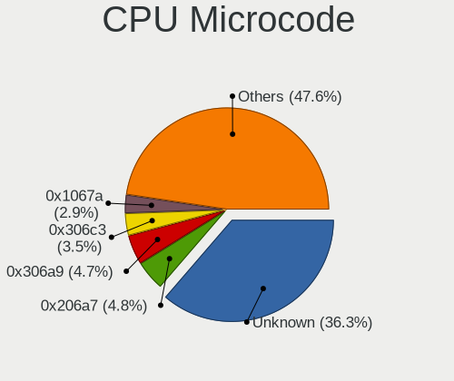
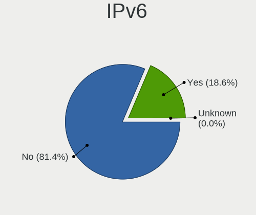
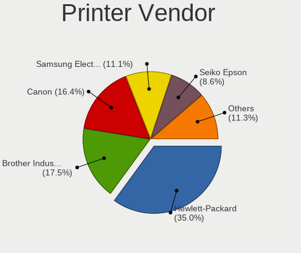

Ubuntu - Tested Hardware & Statistics
-------------------------------------

A project to collect tested hardware configurations for Ubuntu.

Anyone can contribute to this report by the [hw-probe](https://github.com/linuxhw/hw-probe) tool:

    sudo -E hw-probe -all -upload

Please contribute! Especially if your hardware is rare.

This is a report for all computer types. See also reports for [desktops](/Dist/Ubuntu/Desktop/README.md) and [notebooks](/Dist/Ubuntu/Notebook/README.md).

Contents
--------

* [ Test Cases ](#test-cases)

* [ System ](#system)
  - [ OS                       ](#os)
  - [ OS Family                ](#os-family)
  - [ Kernel                   ](#kernel)
  - [ Kernel Family            ](#kernel-family)
  - [ Kernel Major Ver.        ](#kernel-major-ver)
  - [ Arch                     ](#arch)
  - [ DE                       ](#de)
  - [ Display Server           ](#display-server)
  - [ Display Manager          ](#display-manager)
  - [ OS Lang                  ](#os-lang)
  - [ Boot Mode                ](#boot-mode)
  - [ Filesystem               ](#filesystem)
  - [ Part. scheme             ](#part-scheme)
  - [ Dual Boot with Linux/BSD ](#dual-boot-with-linuxbsd)
  - [ Dual Boot (Win)          ](#dual-boot-win)

* [ Board ](#board)
  - [ Vendor                   ](#vendor)
  - [ Model                    ](#model)
  - [ Model Family             ](#model-family)
  - [ MFG Year                 ](#mfg-year)
  - [ Form Factor              ](#form-factor)
  - [ Secure Boot              ](#secure-boot)
  - [ Coreboot                 ](#coreboot)
  - [ RAM Size                 ](#ram-size)
  - [ RAM Used                 ](#ram-used)
  - [ Total Drives             ](#total-drives)
  - [ Has CD-ROM               ](#has-cd-rom)
  - [ Has Ethernet             ](#has-ethernet)
  - [ Has WiFi                 ](#has-wifi)
  - [ Has Bluetooth            ](#has-bluetooth)

* [ Location ](#location)
  - [ Country                  ](#country)
  - [ City                     ](#city)

* [ Drives ](#drives)
  - [ Drive Vendor             ](#drive-vendor)
  - [ Drive Model              ](#drive-model)
  - [ HDD Vendor               ](#hdd-vendor)
  - [ SSD Vendor               ](#ssd-vendor)
  - [ Drive Kind               ](#drive-kind)
  - [ Drive Connector          ](#drive-connector)
  - [ Drive Size               ](#drive-size)
  - [ Space Total              ](#space-total)
  - [ Space Used               ](#space-used)
  - [ Malfunc. Drives          ](#malfunc-drives)
  - [ Malfunc. Drive Vendor    ](#malfunc-drive-vendor)
  - [ Malfunc. HDD Vendor      ](#malfunc-hdd-vendor)
  - [ Malfunc. Drive Kind      ](#malfunc-drive-kind)
  - [ Failed Drives            ](#failed-drives)
  - [ Failed Drive Vendor      ](#failed-drive-vendor)
  - [ Drive Status             ](#drive-status)

* [ Storage controller ](#storage-controller)
  - [ Storage Vendor           ](#storage-vendor)
  - [ Storage Model            ](#storage-model)
  - [ Storage Kind             ](#storage-kind)

* [ Processor ](#processor)
  - [ CPU Vendor               ](#cpu-vendor)
  - [ CPU Model                ](#cpu-model)
  - [ CPU Model Family         ](#cpu-model-family)
  - [ CPU Cores                ](#cpu-cores)
  - [ CPU Sockets              ](#cpu-sockets)
  - [ CPU Threads              ](#cpu-threads)
  - [ CPU Op-Modes             ](#cpu-op-modes)
  - [ CPU Microcode            ](#cpu-microcode)
  - [ CPU Microarch            ](#cpu-microarch)

* [ Graphics ](#graphics)
  - [ GPU Vendor               ](#gpu-vendor)
  - [ GPU Model                ](#gpu-model)
  - [ GPU Combo                ](#gpu-combo)
  - [ GPU Driver               ](#gpu-driver)
  - [ GPU Memory               ](#gpu-memory)

* [ Monitor ](#monitor)
  - [ Monitor Vendor           ](#monitor-vendor)
  - [ Monitor Model            ](#monitor-model)
  - [ Monitor Resolution       ](#monitor-resolution)
  - [ Monitor Diagonal         ](#monitor-diagonal)
  - [ Monitor Width            ](#monitor-width)
  - [ Aspect Ratio             ](#aspect-ratio)
  - [ Monitor Area             ](#monitor-area)
  - [ Pixel Density            ](#pixel-density)
  - [ Multiple Monitors        ](#multiple-monitors)

* [ Network ](#network)
  - [ Net Controller Vendor    ](#net-controller-vendor)
  - [ Net Controller Model     ](#net-controller-model)
  - [ Wireless Vendor          ](#wireless-vendor)
  - [ Wireless Model           ](#wireless-model)
  - [ Ethernet Vendor          ](#ethernet-vendor)
  - [ Ethernet Model           ](#ethernet-model)
  - [ Net Controller Kind      ](#net-controller-kind)
  - [ Used Controller          ](#used-controller)
  - [ NICs                     ](#nics)
  - [ IPv6                     ](#ipv6)

* [ Bluetooth ](#bluetooth)
  - [ Bluetooth Vendor         ](#bluetooth-vendor)
  - [ Bluetooth Model          ](#bluetooth-model)

* [ Sound ](#sound)
  - [ Sound Vendor             ](#sound-vendor)
  - [ Sound Model              ](#sound-model)

* [ Memory ](#memory)
  - [ Memory Vendor            ](#memory-vendor)
  - [ Memory Model             ](#memory-model)
  - [ Memory Kind              ](#memory-kind)
  - [ Memory Form Factor       ](#memory-form-factor)
  - [ Memory Size              ](#memory-size)
  - [ Memory Speed             ](#memory-speed)

* [ Printers & scanners ](#printers--scanners)
  - [ Printer Vendor           ](#printer-vendor)
  - [ Printer Model            ](#printer-model)
  - [ Scanner Vendor           ](#scanner-vendor)
  - [ Scanner Model            ](#scanner-model)

* [ Camera ](#camera)
  - [ Camera Vendor            ](#camera-vendor)
  - [ Camera Model             ](#camera-model)

* [ Security ](#security)
  - [ Fingerprint Vendor       ](#fingerprint-vendor)
  - [ Fingerprint Model        ](#fingerprint-model)
  - [ Chipcard Vendor          ](#chipcard-vendor)
  - [ Chipcard Model           ](#chipcard-model)

* [ Unsupported ](#unsupported)
  - [ Unsupported Devices      ](#unsupported-devices)
  - [ Unsupported Device Types ](#unsupported-device-types)

Test Cases
----------

Total: 75681

| Vendor        | Model                       | Form-Factor | Probe                                                      | Date         |
|---------------|-----------------------------|-------------|------------------------------------------------------------|--------------|
| Supermicro    | X9SCL/X9SCMA                | Desktop     | [fa0d296a6d](https://linux-hardware.org/?probe=fa0d296a6d) | Sep 01, 2022 |
| Dell          | XPS 13 7390 2-in-1          | Convertible | [269a75d1cd](https://linux-hardware.org/?probe=269a75d1cd) | Sep 01, 2022 |
| Dell          | G15 5510                    | Notebook    | [78f2f5c95a](https://linux-hardware.org/?probe=78f2f5c95a) | Sep 01, 2022 |
| Dell          | XPS 13 7390 2-in-1          | Convertible | [d6d616d620](https://linux-hardware.org/?probe=d6d616d620) | Sep 01, 2022 |
| ASRockRack    | X470D4U2/1N1                | Desktop     | [2b524b9c24](https://linux-hardware.org/?probe=2b524b9c24) | Sep 01, 2022 |
| Lenovo        | ThinkPad T14 Gen 2i 20W1... | Notebook    | [12abd434b5](https://linux-hardware.org/?probe=12abd434b5) | Sep 01, 2022 |
| Acer          | Aspire TC-605               | Desktop     | [5ff2a41fcd](https://linux-hardware.org/?probe=5ff2a41fcd) | Sep 01, 2022 |
| Dell          | 0R6PCT A01                  | Desktop     | [02af50752e](https://linux-hardware.org/?probe=02af50752e) | Sep 01, 2022 |
| HP            | Pavilion 14                 | Notebook    | [b35151af0c](https://linux-hardware.org/?probe=b35151af0c) | Sep 01, 2022 |
| Lenovo        | SHARKBAY 31900058 STD       | Desktop     | [f113f959b7](https://linux-hardware.org/?probe=f113f959b7) | Sep 01, 2022 |
| Lenovo        | G50-80 80E5                 | Notebook    | [ec5bb450ff](https://linux-hardware.org/?probe=ec5bb450ff) | Sep 01, 2022 |
| Acer          | Aspire TC-605               | Desktop     | [fdc6b95d8b](https://linux-hardware.org/?probe=fdc6b95d8b) | Sep 01, 2022 |
| Dell          | Inspiron 7591 2n1           | Convertible | [b963be56f5](https://linux-hardware.org/?probe=b963be56f5) | Sep 01, 2022 |
| Dell          | 042P49 A02                  | Desktop     | [3b1c07d561](https://linux-hardware.org/?probe=3b1c07d561) | Sep 01, 2022 |
| ASUSTek       | M2N32-SLI DELUXE            | Desktop     | [d1bb81241c](https://linux-hardware.org/?probe=d1bb81241c) | Sep 01, 2022 |
| Dell          | Latitude 5521               | Notebook    | [dcf7869cf6](https://linux-hardware.org/?probe=dcf7869cf6) | Sep 01, 2022 |
| Lenovo        | 3168 NOK                    | Desktop     | [58c82b01e2](https://linux-hardware.org/?probe=58c82b01e2) | Sep 01, 2022 |
| Dell          | 07PXPY A04                  | Server      | [f0b9cd86ef](https://linux-hardware.org/?probe=f0b9cd86ef) | Sep 01, 2022 |
| Lenovo        | ThinkBook 14 G2 ITL 20VD    | Notebook    | [02ec70b604](https://linux-hardware.org/?probe=02ec70b604) | Sep 01, 2022 |
| HP            | Pavilion dv6                | Notebook    | [25e9e892e7](https://linux-hardware.org/?probe=25e9e892e7) | Sep 01, 2022 |
| Lenovo        | ThinkPad T400 6474W7T       | Notebook    | [f9a9b12b37](https://linux-hardware.org/?probe=f9a9b12b37) | Sep 01, 2022 |
| Intel         | D34010WYB H14771-304        | Desktop     | [47d9609ba8](https://linux-hardware.org/?probe=47d9609ba8) | Sep 01, 2022 |
| HP            | Laptop 15-db0xxx            | Notebook    | [de848d928c](https://linux-hardware.org/?probe=de848d928c) | Sep 01, 2022 |
| Lenovo        | ThinkPad P15 Gen 1 20STC... | Notebook    | [0a5a3fa67e](https://linux-hardware.org/?probe=0a5a3fa67e) | Sep 01, 2022 |
| Intel         | D34010WYB H14771-304        | Desktop     | [fd34481bf8](https://linux-hardware.org/?probe=fd34481bf8) | Sep 01, 2022 |
| HP            | Pavilion m6                 | Notebook    | [83b6eb0119](https://linux-hardware.org/?probe=83b6eb0119) | Sep 01, 2022 |
| Casper        | NIRVANA NOTEBOOK            | Notebook    | [7a5978071e](https://linux-hardware.org/?probe=7a5978071e) | Sep 01, 2022 |
| Avell High... | C62 MOB                     | Notebook    | [ab93c1f314](https://linux-hardware.org/?probe=ab93c1f314) | Sep 01, 2022 |
| Gigabyte      | H81M-WW                     | Desktop     | [2a56f256a3](https://linux-hardware.org/?probe=2a56f256a3) | Sep 01, 2022 |
| Notebook      | NL40_50CU                   | Notebook    | [af0da080ec](https://linux-hardware.org/?probe=af0da080ec) | Sep 01, 2022 |
| Dell          | Latitude 3340               | Notebook    | [d64525742a](https://linux-hardware.org/?probe=d64525742a) | Sep 01, 2022 |
| Dell          | Latitude 3340               | Notebook    | [b9d472b965](https://linux-hardware.org/?probe=b9d472b965) | Sep 01, 2022 |
| ASUSTek       | ZenBook UX431DA_UM431DA     | Notebook    | [cc30fbdce2](https://linux-hardware.org/?probe=cc30fbdce2) | Sep 01, 2022 |
| LG Electro... | 14Z990-V.AP72B              | Notebook    | [8c67c188a1](https://linux-hardware.org/?probe=8c67c188a1) | Sep 01, 2022 |
| Dell          | XPS 9320                    | Notebook    | [525a1bd6b6](https://linux-hardware.org/?probe=525a1bd6b6) | Sep 01, 2022 |
| Gigabyte      | X150M-PRO ECC-CF            | Desktop     | [6db003ed3a](https://linux-hardware.org/?probe=6db003ed3a) | Sep 01, 2022 |
| Lenovo        | ThinkPad T400 6474W7T       | Notebook    | [b52974ac00](https://linux-hardware.org/?probe=b52974ac00) | Sep 01, 2022 |
| Dell          | 0WPG9H A00                  | All in one  | [67aeed6eb1](https://linux-hardware.org/?probe=67aeed6eb1) | Sep 01, 2022 |
| Dell          | 0WPG9H A00                  | All in one  | [b1b4bd6ce0](https://linux-hardware.org/?probe=b1b4bd6ce0) | Sep 01, 2022 |
| Gigabyte      | X150M-PRO ECC-CF            | Desktop     | [2f21cd30ff](https://linux-hardware.org/?probe=2f21cd30ff) | Sep 01, 2022 |
| Lenovo        | G50-45 80E3                 | Notebook    | [3080895149](https://linux-hardware.org/?probe=3080895149) | Sep 01, 2022 |
| Apple         | Mac-FFE5EF870D7BA81A iMa... | All in one  | [52f8474c3a](https://linux-hardware.org/?probe=52f8474c3a) | Sep 01, 2022 |
| Dell          | Latitude 5591               | Notebook    | [b860997149](https://linux-hardware.org/?probe=b860997149) | Sep 01, 2022 |
| HP            | ProBook 6460b               | Notebook    | [a0e3db2eed](https://linux-hardware.org/?probe=a0e3db2eed) | Sep 01, 2022 |
| Samsung       | 950XEE                      | Notebook    | [454b67dd88](https://linux-hardware.org/?probe=454b67dd88) | Sep 01, 2022 |
| Acer          | Aspire E5-571               | Notebook    | [7759e41b1d](https://linux-hardware.org/?probe=7759e41b1d) | Sep 01, 2022 |
| Lenovo        | 36D5 SDK0J40700 WIN 3258... | Desktop     | [87dfd12899](https://linux-hardware.org/?probe=87dfd12899) | Sep 01, 2022 |
| HP            | OMEN by Laptop 15-ce0xx     | Notebook    | [85d4f11486](https://linux-hardware.org/?probe=85d4f11486) | Sep 01, 2022 |
| HP            | EliteBook 840 G2            | Notebook    | [4da3485e34](https://linux-hardware.org/?probe=4da3485e34) | Sep 01, 2022 |
| HP            | ENVY Laptop 13-ba1xxx       | Notebook    | [5a4e2225a8](https://linux-hardware.org/?probe=5a4e2225a8) | Sep 01, 2022 |
| HP            | G42                         | Notebook    | [a79b07fcd0](https://linux-hardware.org/?probe=a79b07fcd0) | Sep 01, 2022 |
| HP            | ENVY Laptop 15-ep0xxx       | Notebook    | [93ff04a07b](https://linux-hardware.org/?probe=93ff04a07b) | Sep 01, 2022 |
| MSI           | B450M-A PRO MAX             | Desktop     | [6462d2370f](https://linux-hardware.org/?probe=6462d2370f) | Aug 31, 2022 |
| Dell          | Latitude 7390               | Notebook    | [571b195a12](https://linux-hardware.org/?probe=571b195a12) | Aug 31, 2022 |
| ASUSTek       | PRIME H510T2/CSM            | Desktop     | [12033c4a8b](https://linux-hardware.org/?probe=12033c4a8b) | Aug 31, 2022 |
| Dell          | Latitude 7390               | Notebook    | [3c3f6114f6](https://linux-hardware.org/?probe=3c3f6114f6) | Aug 31, 2022 |
| HP            | Laptop 15-db0xxx            | Notebook    | [42879ce5cf](https://linux-hardware.org/?probe=42879ce5cf) | Aug 31, 2022 |
| Raspberry ... | Raspberry Pi 400 Rev 1.0    | Soc         | [4d1339ef49](https://linux-hardware.org/?probe=4d1339ef49) | Aug 31, 2022 |
| HP            | Laptop 15-db0xxx            | Notebook    | [3c7e97b769](https://linux-hardware.org/?probe=3c7e97b769) | Aug 31, 2022 |
| HP            | 1906                        | Desktop     | [a23cef9946](https://linux-hardware.org/?probe=a23cef9946) | Aug 31, 2022 |
| Acer          | Aspire V3-571G              | Notebook    | [8f4a2b603a](https://linux-hardware.org/?probe=8f4a2b603a) | Aug 31, 2022 |
| MSI           | MPG B550I GAMING EDGE WI... | Desktop     | [aacd965d80](https://linux-hardware.org/?probe=aacd965d80) | Aug 31, 2022 |
| HP            | 81B4                        | Desktop     | [b81985e04e](https://linux-hardware.org/?probe=b81985e04e) | Aug 31, 2022 |
| HP            | EliteBook x360 1030 G2      | Convertible | [e1b27f8003](https://linux-hardware.org/?probe=e1b27f8003) | Aug 31, 2022 |
| Raspberry ... | Raspberry Pi                | Soc         | [dea44e447f](https://linux-hardware.org/?probe=dea44e447f) | Aug 31, 2022 |
| Toshiba       | Satellite Pro L500          | Notebook    | [7f523718cf](https://linux-hardware.org/?probe=7f523718cf) | Aug 31, 2022 |
| Raspberry ... | Raspberry Pi                | Soc         | [a4fc4ad9e3](https://linux-hardware.org/?probe=a4fc4ad9e3) | Aug 31, 2022 |
| Pegatron      | 2AB6                        | Desktop     | [c4ca3989e0](https://linux-hardware.org/?probe=c4ca3989e0) | Aug 31, 2022 |
| Dell          | Latitude 7280               | Notebook    | [e71e9350b4](https://linux-hardware.org/?probe=e71e9350b4) | Aug 31, 2022 |
| HP            | EliteBook 840 G8 Noteboo... | Notebook    | [4808984401](https://linux-hardware.org/?probe=4808984401) | Aug 31, 2022 |
| Gigabyte      | P85-D3                      | Desktop     | [71ce0b707c](https://linux-hardware.org/?probe=71ce0b707c) | Aug 31, 2022 |
| ASUSTek       | Z170-K                      | Desktop     | [544582fd23](https://linux-hardware.org/?probe=544582fd23) | Aug 31, 2022 |
| Lenovo        | ThinkPad L14 Gen 1 20U5S... | Notebook    | [eb79e6b28e](https://linux-hardware.org/?probe=eb79e6b28e) | Aug 31, 2022 |
| OEM           | Intel H81                   | Desktop     | [4b45e6dc61](https://linux-hardware.org/?probe=4b45e6dc61) | Aug 31, 2022 |
| MSI           | Z390-A PRO                  | Desktop     | [368eff381c](https://linux-hardware.org/?probe=368eff381c) | Aug 31, 2022 |
| HP            | Pavilion 15                 | Notebook    | [19c7cae23c](https://linux-hardware.org/?probe=19c7cae23c) | Aug 31, 2022 |
| Gigabyte      | H110M-S2-CF                 | Desktop     | [6f3bb6200f](https://linux-hardware.org/?probe=6f3bb6200f) | Aug 31, 2022 |
| ASRock        | Z77 Pro4-M                  | Desktop     | [d7c9a106e7](https://linux-hardware.org/?probe=d7c9a106e7) | Aug 31, 2022 |
| HP            | Notebook                    | Notebook    | [ee135c3930](https://linux-hardware.org/?probe=ee135c3930) | Aug 31, 2022 |
| HUAWEI        | HVY-WXX9                    | Notebook    | [193310218d](https://linux-hardware.org/?probe=193310218d) | Aug 31, 2022 |
| HP            | 83E0                        | Desktop     | [af9b15b8e7](https://linux-hardware.org/?probe=af9b15b8e7) | Aug 31, 2022 |
| ASUSTek       | ROG STRIX X299-E GAMING     | Desktop     | [fc3200b967](https://linux-hardware.org/?probe=fc3200b967) | Aug 31, 2022 |
| Samsung       | RV410/RV510/S3510/E3510     | Notebook    | [d36b7bb077](https://linux-hardware.org/?probe=d36b7bb077) | Aug 31, 2022 |
| Packard Be... | WMCP78M                     | Desktop     | [93ead8d396](https://linux-hardware.org/?probe=93ead8d396) | Aug 31, 2022 |
| HUAWEI        | CREF-XX                     | Notebook    | [4ea2674cd8](https://linux-hardware.org/?probe=4ea2674cd8) | Aug 31, 2022 |
| ASRock        | B550M-ITX/ac                | Desktop     | [685e484cbd](https://linux-hardware.org/?probe=685e484cbd) | Aug 31, 2022 |
| Lenovo        | ThinkPad P43s 20RJS0D100    | Notebook    | [afbf0f6021](https://linux-hardware.org/?probe=afbf0f6021) | Aug 31, 2022 |
| HP            | Presario F500 (GM639LA#A... | Notebook    | [7323caa631](https://linux-hardware.org/?probe=7323caa631) | Aug 31, 2022 |
| Dell          | Vostro 3550                 | Notebook    | [c26bf23cdd](https://linux-hardware.org/?probe=c26bf23cdd) | Aug 31, 2022 |
| Samsung       | 670Z5E                      | Notebook    | [c72797ddaa](https://linux-hardware.org/?probe=c72797ddaa) | Aug 31, 2022 |
| Dell          | Inspiron 3543               | Notebook    | [a557da948a](https://linux-hardware.org/?probe=a557da948a) | Aug 31, 2022 |
| ASUSTek       | PRIME X299-DELUXE           | Desktop     | [a76390d5fc](https://linux-hardware.org/?probe=a76390d5fc) | Aug 31, 2022 |
| Lenovo        | ThinkPad X1 Carbon Gen 8... | Notebook    | [646afc5f72](https://linux-hardware.org/?probe=646afc5f72) | Aug 31, 2022 |
| Dell          | Inspiron 5502               | Notebook    | [1bb776feab](https://linux-hardware.org/?probe=1bb776feab) | Aug 31, 2022 |
| HP            | 18E9                        | Desktop     | [2dff78f303](https://linux-hardware.org/?probe=2dff78f303) | Aug 31, 2022 |
| ASUSTek       | Z170 PRO GAMING             | Desktop     | [555e7c0745](https://linux-hardware.org/?probe=555e7c0745) | Aug 30, 2022 |
| Lenovo        | V15-IIL 82C5                | Notebook    | [2a9e478284](https://linux-hardware.org/?probe=2a9e478284) | Aug 30, 2022 |
| HP            | Compaq 6830s (FR883LA#AB... | Notebook    | [bceac5a658](https://linux-hardware.org/?probe=bceac5a658) | Aug 30, 2022 |
| Lenovo        | ThinkPad Edge E530 62724... | Notebook    | [87cad1c0b0](https://linux-hardware.org/?probe=87cad1c0b0) | Aug 30, 2022 |
| Apple         | Mac-F22C86C8                | Mini pc     | [76046f5112](https://linux-hardware.org/?probe=76046f5112) | Aug 30, 2022 |
| Apple         | Mac-F22C86C8                | Mini pc     | [95c8025613](https://linux-hardware.org/?probe=95c8025613) | Aug 30, 2022 |
| Foxconn       | 2AAF                        | Desktop     | [a23b1b0822](https://linux-hardware.org/?probe=a23b1b0822) | Aug 30, 2022 |
| Gigabyte      | B550 AORUS ELITE AX V2      | Desktop     | [98e0a08e65](https://linux-hardware.org/?probe=98e0a08e65) | Aug 30, 2022 |
| Lenovo        | ThinkBook 14s Yoga ITL 2... | Convertible | [cee29232ee](https://linux-hardware.org/?probe=cee29232ee) | Aug 30, 2022 |
| Avell High... | B.ON                        | Notebook    | [dbc18dad43](https://linux-hardware.org/?probe=dbc18dad43) | Aug 30, 2022 |
| HP            | Pavilion Gaming Laptop 1... | Notebook    | [20da9d42a4](https://linux-hardware.org/?probe=20da9d42a4) | Aug 30, 2022 |
| Medion        | P7649 MD60817               | Notebook    | [3a703e2be0](https://linux-hardware.org/?probe=3a703e2be0) | Aug 30, 2022 |
| ASUSTek       | ET2410                      | All in one  | [3cd48cf0ed](https://linux-hardware.org/?probe=3cd48cf0ed) | Aug 30, 2022 |
| Lenovo        | ThinkPad L512 259756M       | Notebook    | [3990fcfeed](https://linux-hardware.org/?probe=3990fcfeed) | Aug 30, 2022 |
| MSI           | MPG B550I GAMING EDGE WI... | Desktop     | [e770273b10](https://linux-hardware.org/?probe=e770273b10) | Aug 30, 2022 |
| Dell          | XPS 15 9570                 | Notebook    | [6c35aeda10](https://linux-hardware.org/?probe=6c35aeda10) | Aug 30, 2022 |
| Lenovo        | ThinkPad T490s 20NYS4HL0... | Notebook    | [273e5229a4](https://linux-hardware.org/?probe=273e5229a4) | Aug 30, 2022 |
| AMI           | Intel                       | Convertible | [0e6916718e](https://linux-hardware.org/?probe=0e6916718e) | Aug 30, 2022 |
| HP            | Pavilion Gaming Laptop 1... | Notebook    | [11efd3dbe0](https://linux-hardware.org/?probe=11efd3dbe0) | Aug 30, 2022 |
| MSI           | X79A-GD45                   | Desktop     | [bb940d6220](https://linux-hardware.org/?probe=bb940d6220) | Aug 30, 2022 |
| ASUSTek       | ROG STRIX B550-I GAMING     | Desktop     | [2fd4ef02b3](https://linux-hardware.org/?probe=2fd4ef02b3) | Aug 30, 2022 |
| Supermicro    | X11SSL-F                    | Server      | [252e3549cd](https://linux-hardware.org/?probe=252e3549cd) | Aug 30, 2022 |
| Supermicro    | X11SSL-F                    | Server      | [b10d7755ee](https://linux-hardware.org/?probe=b10d7755ee) | Aug 30, 2022 |
| HP            | EliteBook 840 G2            | Notebook    | [5ba91d8167](https://linux-hardware.org/?probe=5ba91d8167) | Aug 30, 2022 |
| HP            | EliteBook 840 G1            | Notebook    | [23d73aa95c](https://linux-hardware.org/?probe=23d73aa95c) | Aug 30, 2022 |
| ASUSTek       | ZenBook UX334FAC_UX333FA... | Notebook    | [ae84021e13](https://linux-hardware.org/?probe=ae84021e13) | Aug 30, 2022 |
| Supermicro    | X11SSM-F                    | Server      | [a43842b263](https://linux-hardware.org/?probe=a43842b263) | Aug 30, 2022 |
| Lenovo        | ThinkPad L15 Gen 2a 20X8... | Notebook    | [df33320d10](https://linux-hardware.org/?probe=df33320d10) | Aug 30, 2022 |
| Dell          | Inspiron 7506 2n1           | Convertible | [aa9aef8014](https://linux-hardware.org/?probe=aa9aef8014) | Aug 30, 2022 |
| ASUSTek       | GL552JX                     | Notebook    | [d477c2cd47](https://linux-hardware.org/?probe=d477c2cd47) | Aug 30, 2022 |
| Toshiba       | Satellite A300              | Notebook    | [f90886ae85](https://linux-hardware.org/?probe=f90886ae85) | Aug 30, 2022 |
| HP            | EliteBook 840 G2            | Notebook    | [bed3be5142](https://linux-hardware.org/?probe=bed3be5142) | Aug 30, 2022 |
| HP            | EliteBook 840 G2            | Notebook    | [b588415d06](https://linux-hardware.org/?probe=b588415d06) | Aug 30, 2022 |
| Lenovo        | ThinkPad T470 20HES3370A    | Notebook    | [3b1630e4bc](https://linux-hardware.org/?probe=3b1630e4bc) | Aug 30, 2022 |
| Lenovo        | ThinkPad E15 Gen 3 20YG0... | Notebook    | [6393abc859](https://linux-hardware.org/?probe=6393abc859) | Aug 30, 2022 |
| Dell          | Latitude 5520               | Notebook    | [26434099b3](https://linux-hardware.org/?probe=26434099b3) | Aug 30, 2022 |
| HP            | EliteBook 830 G6            | Notebook    | [897046248f](https://linux-hardware.org/?probe=897046248f) | Aug 30, 2022 |
| ASUSTek       | P5KPL-CM                    | Desktop     | [dc62f3b267](https://linux-hardware.org/?probe=dc62f3b267) | Aug 30, 2022 |
| Dell          | Inspiron 5502               | Notebook    | [28a1dd084e](https://linux-hardware.org/?probe=28a1dd084e) | Aug 30, 2022 |
| Dell          | Inspiron 5502               | Notebook    | [df0098010e](https://linux-hardware.org/?probe=df0098010e) | Aug 30, 2022 |
| Raspberry ... | Raspberry Pi                | Soc         | [d075972bed](https://linux-hardware.org/?probe=d075972bed) | Aug 30, 2022 |
| Raspberry ... | Raspberry Pi 4 Model B      | Soc         | [133dfe9b9e](https://linux-hardware.org/?probe=133dfe9b9e) | Aug 30, 2022 |
| Apple         | Mac-65CE76090165799A iMa... | All in one  | [47049b9a6a](https://linux-hardware.org/?probe=47049b9a6a) | Aug 30, 2022 |
| ASRockRack    | ROMED8-2T                   | Desktop     | [a034a83f72](https://linux-hardware.org/?probe=a034a83f72) | Aug 30, 2022 |
| Dell          | 0J3C2F A00                  | Desktop     | [276ac60713](https://linux-hardware.org/?probe=276ac60713) | Aug 30, 2022 |
| Chuwi         | GemiBook                    | Notebook    | [abca00f582](https://linux-hardware.org/?probe=abca00f582) | Aug 30, 2022 |
| HP            | 2B38                        | Desktop     | [40428ed239](https://linux-hardware.org/?probe=40428ed239) | Aug 30, 2022 |
| ASUSTek       | K501LX                      | Notebook    | [993e5d9848](https://linux-hardware.org/?probe=993e5d9848) | Aug 29, 2022 |
| ASUSTek       | P8P67 PRO                   | Desktop     | [aa43ab7091](https://linux-hardware.org/?probe=aa43ab7091) | Aug 29, 2022 |
| ASUSTek       | PRIME B450-PLUS             | Desktop     | [a01239fd83](https://linux-hardware.org/?probe=a01239fd83) | Aug 29, 2022 |
| ASUSTek       | P8P67 PRO                   | Desktop     | [4882cfb195](https://linux-hardware.org/?probe=4882cfb195) | Aug 29, 2022 |
| HP            | EliteBook 650 15.6 inch ... | Notebook    | [918418e0fc](https://linux-hardware.org/?probe=918418e0fc) | Aug 29, 2022 |
| Apple         | MacBookPro7,1               | Notebook    | [a879fb8249](https://linux-hardware.org/?probe=a879fb8249) | Aug 29, 2022 |
| Dell          | 0773VG A00                  | Desktop     | [576dfabbf6](https://linux-hardware.org/?probe=576dfabbf6) | Aug 29, 2022 |
| ASRock        | X470 Gaming-ITX/ac          | Desktop     | [b65fff0f51](https://linux-hardware.org/?probe=b65fff0f51) | Aug 29, 2022 |
| Supermicro    | X10SLL-F                    | Desktop     | [c3b5857c26](https://linux-hardware.org/?probe=c3b5857c26) | Aug 29, 2022 |
| Intel         | NUC7JYB M37316-500          | Mini pc     | [0d75ce63f8](https://linux-hardware.org/?probe=0d75ce63f8) | Aug 29, 2022 |
| Lenovo        | Bantry CRB SDK0J40709 WI... | Desktop     | [4ba4105869](https://linux-hardware.org/?probe=4ba4105869) | Aug 29, 2022 |
| HP            | 304Ah                       | Desktop     | [3f370524f3](https://linux-hardware.org/?probe=3f370524f3) | Aug 29, 2022 |
| HP            | 18E5                        | Desktop     | [c40ab0e3e3](https://linux-hardware.org/?probe=c40ab0e3e3) | Aug 29, 2022 |
| HP            | ProLiant MicroServer Gen... | Desktop     | [b613af8e42](https://linux-hardware.org/?probe=b613af8e42) | Aug 29, 2022 |
| Lenovo        | ThinkPad X1 Carbon 6th 2... | Notebook    | [636a7f710c](https://linux-hardware.org/?probe=636a7f710c) | Aug 29, 2022 |
| ASUSTek       | ROG Zephyrus G14 GA401QE... | Notebook    | [4b56f15871](https://linux-hardware.org/?probe=4b56f15871) | Aug 29, 2022 |
| MSI           | H310M PRO-M2 PLUS           | Desktop     | [a561fb6354](https://linux-hardware.org/?probe=a561fb6354) | Aug 29, 2022 |
| Dell          | Latitude E5450              | Notebook    | [9dad9e784f](https://linux-hardware.org/?probe=9dad9e784f) | Aug 29, 2022 |
| Lenovo        | ThinkPad P1 20MDS0FC00      | Notebook    | [dcdde00f17](https://linux-hardware.org/?probe=dcdde00f17) | Aug 29, 2022 |
| Lenovo        | MAHOBAY NO DPK              | Desktop     | [2d013c60ed](https://linux-hardware.org/?probe=2d013c60ed) | Aug 29, 2022 |
| Dell          | G15 5515                    | Notebook    | [708ef41c02](https://linux-hardware.org/?probe=708ef41c02) | Aug 29, 2022 |
| MSI           | MAG B550 TORPEDO            | Desktop     | [58f0ba95c3](https://linux-hardware.org/?probe=58f0ba95c3) | Aug 29, 2022 |
| MSI           | B450M MORTAR MAX            | Desktop     | [25e7e97937](https://linux-hardware.org/?probe=25e7e97937) | Aug 29, 2022 |
| Monster       | Huma H5 V3.2                | Notebook    | [ea050f24db](https://linux-hardware.org/?probe=ea050f24db) | Aug 29, 2022 |
| Fujitsu       | LIFEBOOK E746               | Notebook    | [5b0eba15c2](https://linux-hardware.org/?probe=5b0eba15c2) | Aug 29, 2022 |
| ASRock        | A320M-DVS R4.0              | Desktop     | [5140e742a9](https://linux-hardware.org/?probe=5140e742a9) | Aug 29, 2022 |
| ASUSTek       | X751LJC                     | Notebook    | [36c35406c9](https://linux-hardware.org/?probe=36c35406c9) | Aug 29, 2022 |
| Gigabyte      | B550 AORUS ELITE AX V2      | Desktop     | [81bc767d5b](https://linux-hardware.org/?probe=81bc767d5b) | Aug 29, 2022 |
| Gigabyte      | Z97M-DS3H                   | Desktop     | [72c01f3cf1](https://linux-hardware.org/?probe=72c01f3cf1) | Aug 29, 2022 |
| Apple         | MacBookPro11,4              | Notebook    | [dc1f806296](https://linux-hardware.org/?probe=dc1f806296) | Aug 29, 2022 |
| HP            | ProBook 440 14 inch G9 N... | Notebook    | [0a08f13779](https://linux-hardware.org/?probe=0a08f13779) | Aug 29, 2022 |
| Dell          | 0HY9JP A01                  | Desktop     | [b87b0407d9](https://linux-hardware.org/?probe=b87b0407d9) | Aug 29, 2022 |
| System76      | Galago Pro                  | Notebook    | [df2c4ae77c](https://linux-hardware.org/?probe=df2c4ae77c) | Aug 29, 2022 |
| Dell          | 05XGC8 A01                  | Desktop     | [73ac4cc88d](https://linux-hardware.org/?probe=73ac4cc88d) | Aug 29, 2022 |
| Samsung       | 670Z5E                      | Notebook    | [59959102e0](https://linux-hardware.org/?probe=59959102e0) | Aug 29, 2022 |
| Dell          | 0HY9JP A01                  | Desktop     | [fbb579a5d6](https://linux-hardware.org/?probe=fbb579a5d6) | Aug 29, 2022 |
| ASUSTek       | X553MA                      | Notebook    | [108e0c7803](https://linux-hardware.org/?probe=108e0c7803) | Aug 29, 2022 |
| Sony          | VPCEB36GM                   | Notebook    | [4495872308](https://linux-hardware.org/?probe=4495872308) | Aug 29, 2022 |
| HP            | ZBook 15u G4                | Notebook    | [39f4830019](https://linux-hardware.org/?probe=39f4830019) | Aug 28, 2022 |
| Lenovo        | G50-45 80E3                 | Notebook    | [239e5612ee](https://linux-hardware.org/?probe=239e5612ee) | Aug 28, 2022 |
| Lenovo        | 3110 SDK0J40697 WIN 3305... | All in one  | [cde94f0c8e](https://linux-hardware.org/?probe=cde94f0c8e) | Aug 28, 2022 |
| Notebook      | NL4x_NL5xLU                 | Notebook    | [df4630db27](https://linux-hardware.org/?probe=df4630db27) | Aug 28, 2022 |
| Panasonic     | CF-30KTPAZAE                | Notebook    | [61a8f4a768](https://linux-hardware.org/?probe=61a8f4a768) | Aug 28, 2022 |
| Dell          | Inspiron N5010              | Notebook    | [3239a22fc0](https://linux-hardware.org/?probe=3239a22fc0) | Aug 28, 2022 |
| Dell          | 0HY9JP A00                  | Desktop     | [811e87f60b](https://linux-hardware.org/?probe=811e87f60b) | Aug 28, 2022 |
| Lenovo        | IdeaPad 320-14ISK 80XG      | Notebook    | [8fac02d016](https://linux-hardware.org/?probe=8fac02d016) | Aug 28, 2022 |
| Dell          | 0NW6H5 A00                  | Desktop     | [40a706292c](https://linux-hardware.org/?probe=40a706292c) | Aug 28, 2022 |
| HP            | ZBook 15u G4                | Notebook    | [2115d02bfd](https://linux-hardware.org/?probe=2115d02bfd) | Aug 28, 2022 |
| Dell          | Inspiron N5010              | Notebook    | [e4cdaf6b35](https://linux-hardware.org/?probe=e4cdaf6b35) | Aug 28, 2022 |
| Lenovo        | IdeaPad 320-14ISK 80XG      | Notebook    | [d281087322](https://linux-hardware.org/?probe=d281087322) | Aug 28, 2022 |
| Samsung       | 670Z5E                      | Notebook    | [8d86f689b4](https://linux-hardware.org/?probe=8d86f689b4) | Aug 28, 2022 |
| Lenovo        | IdeaPad C340-14API 81N6     | Notebook    | [c8c04ce5db](https://linux-hardware.org/?probe=c8c04ce5db) | Aug 28, 2022 |
| ASRock        | B450M Pro4                  | Desktop     | [8f0f345242](https://linux-hardware.org/?probe=8f0f345242) | Aug 28, 2022 |
| Dell          | Latitude E7470              | Notebook    | [568c9bfd40](https://linux-hardware.org/?probe=568c9bfd40) | Aug 28, 2022 |
| MSI           | B450M MORTAR MAX            | Desktop     | [9b0e2c480f](https://linux-hardware.org/?probe=9b0e2c480f) | Aug 28, 2022 |
| Dell          | Inspiron 3543               | Notebook    | [68d1385b7e](https://linux-hardware.org/?probe=68d1385b7e) | Aug 28, 2022 |
| Lenovo        | Yoga 7 14ITL5 82BH          | Convertible | [bdf0ad8513](https://linux-hardware.org/?probe=bdf0ad8513) | Aug 28, 2022 |
| HP            | Pavilion Laptop 14-ec0xx... | Notebook    | [73db272ecb](https://linux-hardware.org/?probe=73db272ecb) | Aug 28, 2022 |
| MSI           | B450M PRO-M2 MAX            | Desktop     | [5e6e789346](https://linux-hardware.org/?probe=5e6e789346) | Aug 28, 2022 |
| Pegatron      | IPMSB-GS                    | Desktop     | [9edb57e041](https://linux-hardware.org/?probe=9edb57e041) | Aug 28, 2022 |
| Microtech     | CoreBook                    | Notebook    | [7507a104b7](https://linux-hardware.org/?probe=7507a104b7) | Aug 28, 2022 |
| Dell          | Inspiron N5010              | Notebook    | [1a76248bf8](https://linux-hardware.org/?probe=1a76248bf8) | Aug 28, 2022 |
| Apple         | Mac-65CE76090165799A iMa... | All in one  | [dd47181665](https://linux-hardware.org/?probe=dd47181665) | Aug 28, 2022 |
| Dell          | Inspiron 5567               | Notebook    | [09d8066f44](https://linux-hardware.org/?probe=09d8066f44) | Aug 28, 2022 |
| IT Channel... | NH5xAx                      | Notebook    | [66573b4b48](https://linux-hardware.org/?probe=66573b4b48) | Aug 28, 2022 |
| ASUSTek       | B85M-E                      | Desktop     | [a0f47aaaa7](https://linux-hardware.org/?probe=a0f47aaaa7) | Aug 28, 2022 |
| Gigabyte      | F2A68HM-S1                  | Desktop     | [420036f4d6](https://linux-hardware.org/?probe=420036f4d6) | Aug 28, 2022 |
| Dell          | 020M3P A00                  | Desktop     | [424ea42e17](https://linux-hardware.org/?probe=424ea42e17) | Aug 28, 2022 |
| Dell          | OptiPlex 3020M              | Desktop     | [84f424cfb7](https://linux-hardware.org/?probe=84f424cfb7) | Aug 28, 2022 |
| Alienware     | 15                          | Notebook    | [f85646920a](https://linux-hardware.org/?probe=f85646920a) | Aug 28, 2022 |
| HP            | Spectre x360 Convertible... | Convertible | [58b2139536](https://linux-hardware.org/?probe=58b2139536) | Aug 27, 2022 |
| Lenovo        | ThinkPad L440 20ASS3A300    | Notebook    | [fbf3d4a87a](https://linux-hardware.org/?probe=fbf3d4a87a) | Aug 27, 2022 |
| Lenovo        | SHARKBAY NOK                | Desktop     | [8571fd0486](https://linux-hardware.org/?probe=8571fd0486) | Aug 27, 2022 |
| Lenovo        | ThinkBook 13s-IWL 20R9      | Notebook    | [98bb5817f6](https://linux-hardware.org/?probe=98bb5817f6) | Aug 27, 2022 |
| HP            | ENVY x360 Convertible 15... | Convertible | [b592ce837a](https://linux-hardware.org/?probe=b592ce837a) | Aug 27, 2022 |
| HP            | Pavilion Notebook           | Notebook    | [0e4eab04c0](https://linux-hardware.org/?probe=0e4eab04c0) | Aug 27, 2022 |
| HP            | Pavilion Notebook           | Notebook    | [65e832cb2f](https://linux-hardware.org/?probe=65e832cb2f) | Aug 27, 2022 |
| ASUSTek       | VivoBook_ASUSLaptop X512... | Notebook    | [65f638768e](https://linux-hardware.org/?probe=65f638768e) | Aug 27, 2022 |
| Raspberry ... | Raspberry Pi                | Soc         | [acfe0dfffa](https://linux-hardware.org/?probe=acfe0dfffa) | Aug 27, 2022 |
| Alienware     | M14xR1                      | Notebook    | [498d5f5254](https://linux-hardware.org/?probe=498d5f5254) | Aug 27, 2022 |
| Acer          | Nitro AN515-57              | Notebook    | [decd7daef2](https://linux-hardware.org/?probe=decd7daef2) | Aug 27, 2022 |
| BESSTAR Te... | X400                        | Notebook    | [ab70086ae7](https://linux-hardware.org/?probe=ab70086ae7) | Aug 27, 2022 |
| Dell          | Latitude E5470              | Notebook    | [7d49878b0d](https://linux-hardware.org/?probe=7d49878b0d) | Aug 27, 2022 |
| Raspberry ... | Raspberry Pi                | Soc         | [717302bb55](https://linux-hardware.org/?probe=717302bb55) | Aug 27, 2022 |
| HP            | 3647h                       | Desktop     | [c83122d4d4](https://linux-hardware.org/?probe=c83122d4d4) | Aug 27, 2022 |
| Lenovo        | IdeaPad 110-15ISK 80UD      | Notebook    | [608a16dc64](https://linux-hardware.org/?probe=608a16dc64) | Aug 27, 2022 |
| Dell          | 0G3HR7 A00                  | Desktop     | [500cf5a2b4](https://linux-hardware.org/?probe=500cf5a2b4) | Aug 27, 2022 |
| Dell          | 0G3HR7 A00                  | Desktop     | [f9671d44ad](https://linux-hardware.org/?probe=f9671d44ad) | Aug 27, 2022 |
| HP            | Pavilion Gaming Laptop 1... | Notebook    | [f4d9682f50](https://linux-hardware.org/?probe=f4d9682f50) | Aug 27, 2022 |
| Lenovo        | IdeaPadFlex 5 14ITL05 82... | Convertible | [1c87349faa](https://linux-hardware.org/?probe=1c87349faa) | Aug 27, 2022 |
| BESSTAR Te... | X400                        | Notebook    | [f8d3611cf0](https://linux-hardware.org/?probe=f8d3611cf0) | Aug 27, 2022 |
| Acer          | Nitro AN515-54              | Notebook    | [975f6a801d](https://linux-hardware.org/?probe=975f6a801d) | Aug 27, 2022 |
| HP            | Unknown                     | Notebook    | [9b22ce41e3](https://linux-hardware.org/?probe=9b22ce41e3) | Aug 27, 2022 |
| Dell          | Inspiron 7506 2n1           | Convertible | [198a8130dc](https://linux-hardware.org/?probe=198a8130dc) | Aug 27, 2022 |
| Lenovo        | YangTian V340-15-IIL 81X... | Notebook    | [f26ee3814c](https://linux-hardware.org/?probe=f26ee3814c) | Aug 27, 2022 |
| Fujitsu       | LIFEBOOK A530               | Notebook    | [5534f20f99](https://linux-hardware.org/?probe=5534f20f99) | Aug 27, 2022 |
| Fujitsu       | LIFEBOOK A530               | Notebook    | [df9aa3eab2](https://linux-hardware.org/?probe=df9aa3eab2) | Aug 27, 2022 |
| HP            | 18E7                        | Desktop     | [613d55d0e9](https://linux-hardware.org/?probe=613d55d0e9) | Aug 27, 2022 |
| Lenovo        | ThinkPad E14 Gen 4 21E4C... | Notebook    | [cf1b2ff13c](https://linux-hardware.org/?probe=cf1b2ff13c) | Aug 27, 2022 |
| Dell          | XPS 15 9575                 | Convertible | [e18118bf63](https://linux-hardware.org/?probe=e18118bf63) | Aug 27, 2022 |
| Intel         | DH87RL AAG74240-401         | Desktop     | [814718547c](https://linux-hardware.org/?probe=814718547c) | Aug 27, 2022 |
| Lenovo        | ThinkPad X1 Tablet Gen 3... | Tablet      | [87f6fccf0a](https://linux-hardware.org/?probe=87f6fccf0a) | Aug 27, 2022 |
| MSI           | MPG Z690 FORCE WIFI         | Desktop     | [e476312c10](https://linux-hardware.org/?probe=e476312c10) | Aug 27, 2022 |
| Dell          | 020M3P A00                  | Desktop     | [fea059fea0](https://linux-hardware.org/?probe=fea059fea0) | Aug 27, 2022 |
| ASUSTek       | A68HM-PLUS                  | Desktop     | [f585d57226](https://linux-hardware.org/?probe=f585d57226) | Aug 27, 2022 |
| Apple         | Mac-F22C86C8                | Mini pc     | [818b7e0b19](https://linux-hardware.org/?probe=818b7e0b19) | Aug 27, 2022 |
| Apple         | Mac-F22C86C8                | Mini pc     | [df8598d6f6](https://linux-hardware.org/?probe=df8598d6f6) | Aug 27, 2022 |
| Positivo      | C14CR01                     | Notebook    | [bb9a4c427a](https://linux-hardware.org/?probe=bb9a4c427a) | Aug 27, 2022 |
| ASUSTek       | PRIME H310M-E R2.0          | Desktop     | [43fdfb3cf8](https://linux-hardware.org/?probe=43fdfb3cf8) | Aug 27, 2022 |
| ASUSTek       | PRIME H310M-E R2.0          | Desktop     | [a1f434a97c](https://linux-hardware.org/?probe=a1f434a97c) | Aug 27, 2022 |
| Gigabyte      | G41M-Combo                  | Desktop     | [353da69160](https://linux-hardware.org/?probe=353da69160) | Aug 26, 2022 |
| Gigabyte      | GA-78LMT-USB3               | Desktop     | [04474401fc](https://linux-hardware.org/?probe=04474401fc) | Aug 26, 2022 |
| ASRock        | B450M-HDV R4.0              | Desktop     | [a180ab604a](https://linux-hardware.org/?probe=a180ab604a) | Aug 26, 2022 |
| speedmaste... | E131x series                | Notebook    | [69d287c029](https://linux-hardware.org/?probe=69d287c029) | Aug 26, 2022 |
| Dell          | Latitude E6510              | Notebook    | [846791d8b9](https://linux-hardware.org/?probe=846791d8b9) | Aug 26, 2022 |
| Foxconn       | A6VMX 0A                    | Desktop     | [f31fcbf60d](https://linux-hardware.org/?probe=f31fcbf60d) | Aug 26, 2022 |
| Gigabyte      | Z390 AORUS PRO WIFI-CF      | Desktop     | [d0e8962ad5](https://linux-hardware.org/?probe=d0e8962ad5) | Aug 26, 2022 |
| Dell          | 0WG860                      | Desktop     | [989ed2a988](https://linux-hardware.org/?probe=989ed2a988) | Aug 26, 2022 |
| HP            | 8299                        | Desktop     | [37b30a10c2](https://linux-hardware.org/?probe=37b30a10c2) | Aug 26, 2022 |
| Dell          | Vostro 1520                 | Notebook    | [b51f7dfba6](https://linux-hardware.org/?probe=b51f7dfba6) | Aug 26, 2022 |
| Intel         | D2550MUD2 AAG81497-700      | Desktop     | [a181512016](https://linux-hardware.org/?probe=a181512016) | Aug 26, 2022 |
| HP            | Pavilion Laptop 15-cd0xx    | Notebook    | [62ce95ce9c](https://linux-hardware.org/?probe=62ce95ce9c) | Aug 26, 2022 |
| Biostar       | B660MX-E                    | Desktop     | [4fa9d132c2](https://linux-hardware.org/?probe=4fa9d132c2) | Aug 26, 2022 |
| Lenovo        | ThinkPad T440p 20AW007QM... | Notebook    | [b24bbedfc1](https://linux-hardware.org/?probe=b24bbedfc1) | Aug 26, 2022 |
| Acer          | Aspire V5-531               | Notebook    | [75b841b0b8](https://linux-hardware.org/?probe=75b841b0b8) | Aug 26, 2022 |
| Lenovo        | IdeaPad 3 15IIL05 81WE      | Notebook    | [f945f778b2](https://linux-hardware.org/?probe=f945f778b2) | Aug 26, 2022 |
| ASUSTek       | PRIME A520M-K               | Desktop     | [1b322f14b7](https://linux-hardware.org/?probe=1b322f14b7) | Aug 26, 2022 |
| Apple         | MacBookPro9,2               | Notebook    | [49b01e516c](https://linux-hardware.org/?probe=49b01e516c) | Aug 26, 2022 |
| ASUSTek       | P8Z68-V LE                  | Desktop     | [9839e8eeff](https://linux-hardware.org/?probe=9839e8eeff) | Aug 26, 2022 |
| ASUSTek       | Pro WS X570-ACE             | Desktop     | [96a87ada26](https://linux-hardware.org/?probe=96a87ada26) | Aug 26, 2022 |
| ASUSTek       | P8H77-V LE                  | Desktop     | [4bd2fabdc7](https://linux-hardware.org/?probe=4bd2fabdc7) | Aug 26, 2022 |
| ASUSTek       | S551LB                      | Notebook    | [efd20dadd0](https://linux-hardware.org/?probe=efd20dadd0) | Aug 26, 2022 |
| Acer          | Aspire A315-34              | Notebook    | [d71a1ce240](https://linux-hardware.org/?probe=d71a1ce240) | Aug 26, 2022 |
| Timi          | Redmi Book Pro 14 2022      | Notebook    | [3f61df6540](https://linux-hardware.org/?probe=3f61df6540) | Aug 26, 2022 |
| HP            | ENVY m7                     | Notebook    | [cf21038fd7](https://linux-hardware.org/?probe=cf21038fd7) | Aug 26, 2022 |
| Raspberry ... | Raspberry Pi                | Soc         | [28ebe8cc1f](https://linux-hardware.org/?probe=28ebe8cc1f) | Aug 25, 2022 |
| Intel         | DQ965GF AAD41676-601        | Desktop     | [a163a7fc6d](https://linux-hardware.org/?probe=a163a7fc6d) | Aug 25, 2022 |
| Lenovo        | ThinkPad P14s Gen 2a 21A... | Notebook    | [83377b24dc](https://linux-hardware.org/?probe=83377b24dc) | Aug 25, 2022 |
| Lenovo        | IdeaPad 320-15ABR 80XS      | Notebook    | [34dd0d912a](https://linux-hardware.org/?probe=34dd0d912a) | Aug 25, 2022 |
| Foxconn       | P35A01                      | Desktop     | [fa220f1ce6](https://linux-hardware.org/?probe=fa220f1ce6) | Aug 25, 2022 |
| Dell          | 0YXT71 A03                  | Desktop     | [176c458f3a](https://linux-hardware.org/?probe=176c458f3a) | Aug 25, 2022 |
| Lenovo        | ThinkPad T420s 417152U      | Notebook    | [73a97b425c](https://linux-hardware.org/?probe=73a97b425c) | Aug 25, 2022 |
| Lenovo        | IdeaPad 330-15IKB 81DE      | Notebook    | [cbae91bec7](https://linux-hardware.org/?probe=cbae91bec7) | Aug 25, 2022 |
| Gateway       | NV53A                       | Notebook    | [618b8506e2](https://linux-hardware.org/?probe=618b8506e2) | Aug 25, 2022 |
| Lenovo        | ThinkPad P14s Gen 2a 21A... | Notebook    | [d2e2d5484c](https://linux-hardware.org/?probe=d2e2d5484c) | Aug 25, 2022 |
| Google        | Kip                         | Notebook    | [1283f3d283](https://linux-hardware.org/?probe=1283f3d283) | Aug 25, 2022 |
| Dell          | 0F642F A00                  | Desktop     | [832cf31a6f](https://linux-hardware.org/?probe=832cf31a6f) | Aug 25, 2022 |
| Dell          | Latitude 5511               | Notebook    | [22c835a93a](https://linux-hardware.org/?probe=22c835a93a) | Aug 25, 2022 |
| Dell          | 027W48 A03                  | All in one  | [f8b5c9dc29](https://linux-hardware.org/?probe=f8b5c9dc29) | Aug 25, 2022 |
| HUAWEI        | BOM-WXX9                    | Notebook    | [06ba6b75b4](https://linux-hardware.org/?probe=06ba6b75b4) | Aug 25, 2022 |
| Lenovo        | ThinkPad L490 20Q5S0LF00    | Notebook    | [3c1287dfd2](https://linux-hardware.org/?probe=3c1287dfd2) | Aug 25, 2022 |
| Gigabyte      | X58A-UD3R                   | Desktop     | [3ab6c59d4f](https://linux-hardware.org/?probe=3ab6c59d4f) | Aug 25, 2022 |
| Dell          | Inspiron N5010              | Notebook    | [f4862a3793](https://linux-hardware.org/?probe=f4862a3793) | Aug 25, 2022 |
| HP            | 2AF7                        | Desktop     | [7605e926c4](https://linux-hardware.org/?probe=7605e926c4) | Aug 25, 2022 |
| Foxconn       | 2ABF                        | Desktop     | [b19844ee21](https://linux-hardware.org/?probe=b19844ee21) | Aug 25, 2022 |
| Dell          | Inspiron 5459               | Notebook    | [398f6d4b78](https://linux-hardware.org/?probe=398f6d4b78) | Aug 25, 2022 |
| HP            | ProBook 430 G5              | Notebook    | [6a7db587c7](https://linux-hardware.org/?probe=6a7db587c7) | Aug 25, 2022 |
| Acer          | Aspire V5-531               | Notebook    | [4ae228e219](https://linux-hardware.org/?probe=4ae228e219) | Aug 25, 2022 |
| Gigabyte      | AORUS 17 YE5                | Notebook    | [130df57914](https://linux-hardware.org/?probe=130df57914) | Aug 25, 2022 |
| Dell          | 0GY6Y8 A03                  | Desktop     | [cb1949a84c](https://linux-hardware.org/?probe=cb1949a84c) | Aug 25, 2022 |
| Toshiba       | PORTEGE Z10t-A              | Notebook    | [ba23396754](https://linux-hardware.org/?probe=ba23396754) | Aug 25, 2022 |
| Notebook      | W65_67SZ                    | Notebook    | [0bf839f496](https://linux-hardware.org/?probe=0bf839f496) | Aug 25, 2022 |
| MSI           | MAG B550 TOMAHAWK           | Desktop     | [a380176da4](https://linux-hardware.org/?probe=a380176da4) | Aug 25, 2022 |
| MSI           | X370 GAMING PRO CARBON      | Desktop     | [cddae2a9cd](https://linux-hardware.org/?probe=cddae2a9cd) | Aug 25, 2022 |
| Acer          | Aspire 5742G                | Notebook    | [dfe17e89f1](https://linux-hardware.org/?probe=dfe17e89f1) | Aug 25, 2022 |
| Dell          | XPS 15 9560                 | Notebook    | [28323e5398](https://linux-hardware.org/?probe=28323e5398) | Aug 25, 2022 |
| ASUSTek       | P81IJ                       | Notebook    | [7ab324abea](https://linux-hardware.org/?probe=7ab324abea) | Aug 25, 2022 |
| Lenovo        | ThinkPad L440 20ASS3A300    | Notebook    | [09feb7053d](https://linux-hardware.org/?probe=09feb7053d) | Aug 25, 2022 |
| ASUSTek       | TUF B365-PLUS GAMING        | Desktop     | [83e59cf9a5](https://linux-hardware.org/?probe=83e59cf9a5) | Aug 25, 2022 |
| HP            | ZBook 15u G4                | Notebook    | [dcdc803214](https://linux-hardware.org/?probe=dcdc803214) | Aug 24, 2022 |
| Raspberry ... | Raspberry Pi                | Soc         | [d658a9bc25](https://linux-hardware.org/?probe=d658a9bc25) | Aug 24, 2022 |
| ASUSTek       | ProArt StudioBook W700G3... | Notebook    | [72f873111c](https://linux-hardware.org/?probe=72f873111c) | Aug 24, 2022 |
| HP            | 3397                        | Desktop     | [f65d0fdb85](https://linux-hardware.org/?probe=f65d0fdb85) | Aug 24, 2022 |
| HP            | Pavilion Notebook           | Notebook    | [70ca4aae12](https://linux-hardware.org/?probe=70ca4aae12) | Aug 24, 2022 |
| Dell          | Inspiron 3583               | Notebook    | [37c79f953b](https://linux-hardware.org/?probe=37c79f953b) | Aug 24, 2022 |
| Linx          | LINX1010B                   | Notebook    | [07194b77d4](https://linux-hardware.org/?probe=07194b77d4) | Aug 24, 2022 |
| Lenovo        | IdeaPad S540-15IML D 81N... | Notebook    | [a0c40a81ec](https://linux-hardware.org/?probe=a0c40a81ec) | Aug 24, 2022 |
| Lenovo        | Yoga C940-14IIL 81Q9        | Convertible | [f2d59ff085](https://linux-hardware.org/?probe=f2d59ff085) | Aug 24, 2022 |
| ECS           | Asterope3                   | Desktop     | [624bd10b6f](https://linux-hardware.org/?probe=624bd10b6f) | Aug 24, 2022 |
| ASRock        | X470 Gaming-ITX/ac          | Desktop     | [e600ec0f73](https://linux-hardware.org/?probe=e600ec0f73) | Aug 24, 2022 |
| HUAWEI        | NBLB-WAX9N                  | Notebook    | [69281b6cc3](https://linux-hardware.org/?probe=69281b6cc3) | Aug 24, 2022 |
| Dell          | Latitude 5400               | Notebook    | [fce2c90c7e](https://linux-hardware.org/?probe=fce2c90c7e) | Aug 24, 2022 |
| HP            | 255 G6 Notebook PC          | Notebook    | [a476ba5a83](https://linux-hardware.org/?probe=a476ba5a83) | Aug 24, 2022 |
| Dell          | Inspiron 3543               | Notebook    | [000b034e01](https://linux-hardware.org/?probe=000b034e01) | Aug 24, 2022 |
| Lenovo        | ThinkPad E15 Gen 3 20YGC... | Notebook    | [d642f87765](https://linux-hardware.org/?probe=d642f87765) | Aug 24, 2022 |
| HP            | ZBook 15u G4                | Notebook    | [8b26a63aa2](https://linux-hardware.org/?probe=8b26a63aa2) | Aug 24, 2022 |
| ASUSTek       | B85M-E                      | Desktop     | [fda9abd530](https://linux-hardware.org/?probe=fda9abd530) | Aug 24, 2022 |
| HP            | ENVY x360 Convertible 13... | Convertible | [994866ad01](https://linux-hardware.org/?probe=994866ad01) | Aug 24, 2022 |
| Dell          | 073MMW A03                  | Desktop     | [b41e0fcad5](https://linux-hardware.org/?probe=b41e0fcad5) | Aug 24, 2022 |
| Packard Be... | EasyNote LJ65               | Notebook    | [dcd6540e36](https://linux-hardware.org/?probe=dcd6540e36) | Aug 24, 2022 |
| ASUSTek       | PRIME A320M-K               | Desktop     | [a096217ea3](https://linux-hardware.org/?probe=a096217ea3) | Aug 24, 2022 |
| ASUSTek       | H61M-K                      | Desktop     | [26c9be116e](https://linux-hardware.org/?probe=26c9be116e) | Aug 24, 2022 |
| Lenovo        | IdeaPad 5 14ALC05 82LM      | Notebook    | [421ab76c43](https://linux-hardware.org/?probe=421ab76c43) | Aug 24, 2022 |
| Lenovo        | B50-50 80S2                 | Notebook    | [45f5a72c59](https://linux-hardware.org/?probe=45f5a72c59) | Aug 24, 2022 |
| Lenovo        | Legion S7 15IMH5 82BC       | Notebook    | [594d5d4209](https://linux-hardware.org/?probe=594d5d4209) | Aug 24, 2022 |
| Lenovo        | Legion S7 15IMH5 82BC       | Notebook    | [f50f2a36d5](https://linux-hardware.org/?probe=f50f2a36d5) | Aug 24, 2022 |
| Gigabyte      | A320M-H-CF                  | Desktop     | [476ca6c833](https://linux-hardware.org/?probe=476ca6c833) | Aug 24, 2022 |
| HP            | 1905                        | Desktop     | [6693a2b3c7](https://linux-hardware.org/?probe=6693a2b3c7) | Aug 24, 2022 |
| Dell          | Inspiron 5402               | Notebook    | [936ea503c8](https://linux-hardware.org/?probe=936ea503c8) | Aug 24, 2022 |
| Lenovo        | Legion Y540-15IRH-PG0 81... | Notebook    | [c7d603acb8](https://linux-hardware.org/?probe=c7d603acb8) | Aug 24, 2022 |
| Dell          | 0F5C5X A00                  | Desktop     | [5e62f9adde](https://linux-hardware.org/?probe=5e62f9adde) | Aug 24, 2022 |
| HP            | ProBook 430 G8 Notebook ... | Notebook    | [17260bd4fb](https://linux-hardware.org/?probe=17260bd4fb) | Aug 24, 2022 |
| Dell          | Precision 7550              | Notebook    | [7a88756a0f](https://linux-hardware.org/?probe=7a88756a0f) | Aug 24, 2022 |
| Lenovo        | ThinkPad X1 Tablet Gen 3... | Tablet      | [7895013304](https://linux-hardware.org/?probe=7895013304) | Aug 24, 2022 |
| ASRock        | H110M-DVS R2.0              | Desktop     | [adae304d62](https://linux-hardware.org/?probe=adae304d62) | Aug 24, 2022 |
| Dell          | 0200DY A03                  | Desktop     | [9da770b898](https://linux-hardware.org/?probe=9da770b898) | Aug 24, 2022 |
| Toshiba       | Satellite C55-B             | Notebook    | [eaabc96ff1](https://linux-hardware.org/?probe=eaabc96ff1) | Aug 24, 2022 |
| Gigabyte      | GA-MA770T-UD3               | Desktop     | [4ed5107048](https://linux-hardware.org/?probe=4ed5107048) | Aug 24, 2022 |
| Lenovo        | ThinkPad X1 Yoga 2nd 20J... | Convertible | [3df60311dc](https://linux-hardware.org/?probe=3df60311dc) | Aug 24, 2022 |
| Lenovo        | V330-15IKB 81AX             | Notebook    | [c3ddddae2c](https://linux-hardware.org/?probe=c3ddddae2c) | Aug 24, 2022 |
| Acer          | Predator G3620              | Desktop     | [b79ed7b47b](https://linux-hardware.org/?probe=b79ed7b47b) | Aug 23, 2022 |
| Raspberry ... | Raspberry Pi 4 Model B R... | Soc         | [141267e725](https://linux-hardware.org/?probe=141267e725) | Aug 23, 2022 |
| Raspberry ... | Raspberry Pi 4 Model B R... | Soc         | [2a9d448350](https://linux-hardware.org/?probe=2a9d448350) | Aug 23, 2022 |
| Raspberry ... | Raspberry Pi                | Soc         | [c42643096a](https://linux-hardware.org/?probe=c42643096a) | Aug 23, 2022 |
| Acer          | Aspire A315-42G             | Notebook    | [d5b057d1c9](https://linux-hardware.org/?probe=d5b057d1c9) | Aug 23, 2022 |
| Lenovo        | ThinkPad P53 20QNCTO1WW     | Notebook    | [27d62fafaf](https://linux-hardware.org/?probe=27d62fafaf) | Aug 23, 2022 |
| Apple         | Mac-F22C86C8                | Mini pc     | [f7b5d18cbe](https://linux-hardware.org/?probe=f7b5d18cbe) | Aug 23, 2022 |
| ASUSTek       | M5A97 R2.0                  | Desktop     | [fdc1bb0c75](https://linux-hardware.org/?probe=fdc1bb0c75) | Aug 23, 2022 |
| ASUSTek       | PRIME B450-PLUS             | Desktop     | [6e5a434d0d](https://linux-hardware.org/?probe=6e5a434d0d) | Aug 23, 2022 |
| Dell          | 0WR7PY A03                  | Desktop     | [1dd7e73006](https://linux-hardware.org/?probe=1dd7e73006) | Aug 23, 2022 |
| Dell          | 0WR7PY A03                  | Desktop     | [071889c1b4](https://linux-hardware.org/?probe=071889c1b4) | Aug 23, 2022 |
| Dell          | Inspiron 3583               | Notebook    | [d394d086d9](https://linux-hardware.org/?probe=d394d086d9) | Aug 23, 2022 |
| Supermicro    | X7SBi-LN4                   | Desktop     | [ec37ffcc15](https://linux-hardware.org/?probe=ec37ffcc15) | Aug 23, 2022 |
| Apple         | MacBookPro16,2              | Notebook    | [3c6266b13d](https://linux-hardware.org/?probe=3c6266b13d) | Aug 23, 2022 |
| ASRock        | X470 Gaming-ITX/ac          | Desktop     | [90117da22c](https://linux-hardware.org/?probe=90117da22c) | Aug 23, 2022 |
| Packard Be... | EasyNote LJ65               | Notebook    | [6493743ace](https://linux-hardware.org/?probe=6493743ace) | Aug 23, 2022 |
| Dell          | Precision M4800             | Notebook    | [dbe7bfeb57](https://linux-hardware.org/?probe=dbe7bfeb57) | Aug 23, 2022 |
| Dell          | Inspiron 3501               | Notebook    | [514172ddcc](https://linux-hardware.org/?probe=514172ddcc) | Aug 23, 2022 |
| Dell          | Precision M4800             | Notebook    | [b8edb4a562](https://linux-hardware.org/?probe=b8edb4a562) | Aug 23, 2022 |
| HP            | Stream 11 Pro               | Notebook    | [de889aa178](https://linux-hardware.org/?probe=de889aa178) | Aug 23, 2022 |
| MSI           | B450-A PRO MAX              | Desktop     | [47257deb9b](https://linux-hardware.org/?probe=47257deb9b) | Aug 23, 2022 |
| HP            | Pavilion g6                 | Notebook    | [ae65121050](https://linux-hardware.org/?probe=ae65121050) | Aug 23, 2022 |
| Lenovo        | ThinkPad T440s 20ARS1UTA... | Notebook    | [8faf9cc68b](https://linux-hardware.org/?probe=8faf9cc68b) | Aug 23, 2022 |
| ASUSTek       | H61M-K                      | Desktop     | [1f4f742288](https://linux-hardware.org/?probe=1f4f742288) | Aug 23, 2022 |
| Lenovo        | 14w 81MQ000JUS              | Notebook    | [3866b50e6e](https://linux-hardware.org/?probe=3866b50e6e) | Aug 23, 2022 |
| Lenovo        | IdeaPad 510S-14ISK 80TK     | Notebook    | [a48fff902b](https://linux-hardware.org/?probe=a48fff902b) | Aug 23, 2022 |
| HP            | Laptop 15s-eq0xxx           | Notebook    | [29db41fc1b](https://linux-hardware.org/?probe=29db41fc1b) | Aug 23, 2022 |
| MSI           | H310M PRO-VH PLUS           | Desktop     | [b177563e19](https://linux-hardware.org/?probe=b177563e19) | Aug 23, 2022 |
| Dell          | Vostro 5481                 | Notebook    | [749e6c3622](https://linux-hardware.org/?probe=749e6c3622) | Aug 23, 2022 |
| TEKNOSERVI... | PORTATIL TTL 15             | Notebook    | [054d000bb1](https://linux-hardware.org/?probe=054d000bb1) | Aug 23, 2022 |
| ASUSTek       | X556UF                      | Notebook    | [23316377ee](https://linux-hardware.org/?probe=23316377ee) | Aug 23, 2022 |
| HP            | EliteBook 8470p             | Notebook    | [0b017b90c9](https://linux-hardware.org/?probe=0b017b90c9) | Aug 23, 2022 |
| AMI           | Cherry Trail Tablet         | Desktop     | [8cdf70d6e3](https://linux-hardware.org/?probe=8cdf70d6e3) | Aug 23, 2022 |
| Lenovo        | Legion 5 15IMH05H 81Y6      | Notebook    | [62db26b1b4](https://linux-hardware.org/?probe=62db26b1b4) | Aug 23, 2022 |
| Raspberry ... | Raspberry Pi                | Soc         | [65b569c23c](https://linux-hardware.org/?probe=65b569c23c) | Aug 23, 2022 |
| Lenovo        | IdeaPad 3 15ITL6 82H8       | Notebook    | [284d2fd5c1](https://linux-hardware.org/?probe=284d2fd5c1) | Aug 23, 2022 |
| Acer          | Aspire E5-571               | Notebook    | [659e36b0ed](https://linux-hardware.org/?probe=659e36b0ed) | Aug 23, 2022 |
| ECS           | SF20PA2                     | Notebook    | [67dd8af18f](https://linux-hardware.org/?probe=67dd8af18f) | Aug 23, 2022 |
| MSI           | 2AE0                        | Desktop     | [e8f1be4de4](https://linux-hardware.org/?probe=e8f1be4de4) | Aug 23, 2022 |
| Acer          | Aspire A515-56              | Notebook    | [6243ea9fb0](https://linux-hardware.org/?probe=6243ea9fb0) | Aug 23, 2022 |
| ASRock        | G41M-VS3                    | Desktop     | [97772a7cb6](https://linux-hardware.org/?probe=97772a7cb6) | Aug 23, 2022 |
| Fujitsu       | FMVA42CW                    | Notebook    | [f50babde6a](https://linux-hardware.org/?probe=f50babde6a) | Aug 23, 2022 |
| Dell          | Latitude D630               | Notebook    | [be9c4025cb](https://linux-hardware.org/?probe=be9c4025cb) | Aug 23, 2022 |
| Lenovo        | Legion 5 15IMH05H 81Y6      | Notebook    | [b008c35b2b](https://linux-hardware.org/?probe=b008c35b2b) | Aug 23, 2022 |
| Lenovo        | G580 20150                  | Notebook    | [6c0183592b](https://linux-hardware.org/?probe=6c0183592b) | Aug 23, 2022 |
| Gigabyte      | MP32-AR1-00 01010101        | Server      | [a704238781](https://linux-hardware.org/?probe=a704238781) | Aug 23, 2022 |
| ASRock        | B450 Gaming-ITX/ac          | Desktop     | [fca17b512f](https://linux-hardware.org/?probe=fca17b512f) | Aug 23, 2022 |
| ASUSTek       | VivoBook_ASUSLaptop X515... | Notebook    | [3c41ecc4e0](https://linux-hardware.org/?probe=3c41ecc4e0) | Aug 23, 2022 |
| Acer          | Aspire E1-571               | Notebook    | [b2c1a1b4ff](https://linux-hardware.org/?probe=b2c1a1b4ff) | Aug 23, 2022 |
| HP            | Spectre x360 Convertible... | Convertible | [e2f0008c16](https://linux-hardware.org/?probe=e2f0008c16) | Aug 23, 2022 |
| Pegatron      | E60                         | Desktop     | [c1aba90f51](https://linux-hardware.org/?probe=c1aba90f51) | Aug 23, 2022 |
| Gigabyte      | 970A-DS3P                   | Desktop     | [79bc344d85](https://linux-hardware.org/?probe=79bc344d85) | Aug 23, 2022 |
| HP            | EliteBook x360 1030 G4      | Convertible | [5e11bd516d](https://linux-hardware.org/?probe=5e11bd516d) | Aug 23, 2022 |
| Samsung       | 340XAA/350XAA/550XAA        | Notebook    | [323faca611](https://linux-hardware.org/?probe=323faca611) | Aug 22, 2022 |
| Dell          | Inspiron 7506 2n1           | Convertible | [d38d8273b0](https://linux-hardware.org/?probe=d38d8273b0) | Aug 22, 2022 |
| HP            | Compaq nc6400 (EH522AV)     | Notebook    | [1c583ce5d2](https://linux-hardware.org/?probe=1c583ce5d2) | Aug 22, 2022 |
| ASUSTek       | P5Q-PRO                     | Desktop     | [622dac7a01](https://linux-hardware.org/?probe=622dac7a01) | Aug 22, 2022 |
| Samsung       | RV411/RV511/E3511/S3511/... | Notebook    | [ee5962ca1e](https://linux-hardware.org/?probe=ee5962ca1e) | Aug 22, 2022 |
| ASUSTek       | PRIME H410M-E               | Desktop     | [5270930555](https://linux-hardware.org/?probe=5270930555) | Aug 22, 2022 |
| Lenovo        | ThinkPad X230 23252UG       | Notebook    | [149419b2df](https://linux-hardware.org/?probe=149419b2df) | Aug 22, 2022 |
| Raspberry ... | Raspberry Pi                | Soc         | [5a185ff469](https://linux-hardware.org/?probe=5a185ff469) | Aug 22, 2022 |
| Lenovo        | B570e 476022G               | Notebook    | [ad4a4c25d5](https://linux-hardware.org/?probe=ad4a4c25d5) | Aug 22, 2022 |
| Lenovo        | ThinkPad X230 23252UG       | Notebook    | [09505ab893](https://linux-hardware.org/?probe=09505ab893) | Aug 22, 2022 |
| Acer          | Aspire 5742                 | Notebook    | [97c61c3095](https://linux-hardware.org/?probe=97c61c3095) | Aug 22, 2022 |
| ASRock        | A320M-HDV R4.0              | Desktop     | [3cca56dc74](https://linux-hardware.org/?probe=3cca56dc74) | Aug 22, 2022 |
| HUAWEI        | NBD-WXX9                    | Notebook    | [4391428197](https://linux-hardware.org/?probe=4391428197) | Aug 22, 2022 |
| Dell          | Latitude E6400              | Notebook    | [51f384a71c](https://linux-hardware.org/?probe=51f384a71c) | Aug 22, 2022 |
| HP            | EliteBook 840 G8 Noteboo... | Notebook    | [2aa681b773](https://linux-hardware.org/?probe=2aa681b773) | Aug 22, 2022 |
| HP            | EliteBook 840 G8 Noteboo... | Notebook    | [a51a82210b](https://linux-hardware.org/?probe=a51a82210b) | Aug 22, 2022 |
| Dell          | 0J3C2F A00                  | Desktop     | [0ff24f8d0a](https://linux-hardware.org/?probe=0ff24f8d0a) | Aug 22, 2022 |
| Biostar       | H81MHV3 5.0                 | Desktop     | [161cae6726](https://linux-hardware.org/?probe=161cae6726) | Aug 22, 2022 |
| ASRock        | A320M-HDV R4.0              | Desktop     | [82481d6225](https://linux-hardware.org/?probe=82481d6225) | Aug 22, 2022 |
| Intel         | H61                         | Desktop     | [f2a42b45ca](https://linux-hardware.org/?probe=f2a42b45ca) | Aug 22, 2022 |
| ASUSTek       | A78M-E                      | Desktop     | [594e3ae5f4](https://linux-hardware.org/?probe=594e3ae5f4) | Aug 22, 2022 |
| Acer          | Aspire 5741G                | Notebook    | [dfa9c7ced0](https://linux-hardware.org/?probe=dfa9c7ced0) | Aug 22, 2022 |
| MSI           | FM2-A55M-P33                | Desktop     | [3ff97d9be5](https://linux-hardware.org/?probe=3ff97d9be5) | Aug 22, 2022 |
| Dell          | Latitude E7240              | Notebook    | [4adf6ab444](https://linux-hardware.org/?probe=4adf6ab444) | Aug 22, 2022 |
| MSI           | 2A9C                        | Desktop     | [4f15bcded6](https://linux-hardware.org/?probe=4f15bcded6) | Aug 22, 2022 |
| HP            | ProBook 440 G8 Notebook ... | Notebook    | [6fcc3e058d](https://linux-hardware.org/?probe=6fcc3e058d) | Aug 22, 2022 |
| HP            | EliteBook 8440p             | Notebook    | [f85ff90a58](https://linux-hardware.org/?probe=f85ff90a58) | Aug 22, 2022 |
| HP            | EliteBook 8440p             | Notebook    | [3842f0e711](https://linux-hardware.org/?probe=3842f0e711) | Aug 22, 2022 |
| Unknown       | Unknown                     | All in one  | [da8e3c67be](https://linux-hardware.org/?probe=da8e3c67be) | Aug 22, 2022 |
| ASUSTek       | P5B SE                      | Desktop     | [f8291aad0a](https://linux-hardware.org/?probe=f8291aad0a) | Aug 22, 2022 |
| Dell          | XPS 15 9560                 | Notebook    | [29d52f610c](https://linux-hardware.org/?probe=29d52f610c) | Aug 22, 2022 |
| Lenovo        | ThinkPad E580 20KS0009AD    | Notebook    | [ba4d785a29](https://linux-hardware.org/?probe=ba4d785a29) | Aug 22, 2022 |
| ASUSTek       | Pro WS WRX80E-SAGE SE WI... | Desktop     | [a332f284ab](https://linux-hardware.org/?probe=a332f284ab) | Aug 22, 2022 |
| Toshiba       | Satellite L875D             | Notebook    | [45ed0eb61a](https://linux-hardware.org/?probe=45ed0eb61a) | Aug 22, 2022 |
| Acer          | Aspire E1-410               | Notebook    | [e7d78093ba](https://linux-hardware.org/?probe=e7d78093ba) | Aug 22, 2022 |
| Dell          | Latitude E6500              | Notebook    | [defd0003bc](https://linux-hardware.org/?probe=defd0003bc) | Aug 22, 2022 |
| Lenovo        | M30-70 80H8                 | Notebook    | [d254ca63b4](https://linux-hardware.org/?probe=d254ca63b4) | Aug 22, 2022 |
| Acer          | Aspire E1-410               | Notebook    | [d2ba4edba4](https://linux-hardware.org/?probe=d2ba4edba4) | Aug 22, 2022 |
| Dell          | 0427JK A00                  | Desktop     | [8f6a2c8d0b](https://linux-hardware.org/?probe=8f6a2c8d0b) | Aug 22, 2022 |
| Dell          | 0PC5F7 A01                  | Desktop     | [141b155ee9](https://linux-hardware.org/?probe=141b155ee9) | Aug 22, 2022 |
| ASUSTek       | VivoBook_ASUSLaptop X760... | Notebook    | [f1fa32b507](https://linux-hardware.org/?probe=f1fa32b507) | Aug 22, 2022 |
| Dell          | Inspiron 3501               | Notebook    | [2f3937854b](https://linux-hardware.org/?probe=2f3937854b) | Aug 22, 2022 |
| Dell          | Latitude 7410               | Notebook    | [ae90ce90ed](https://linux-hardware.org/?probe=ae90ce90ed) | Aug 22, 2022 |
| Lenovo        | ThinkPad T400 6474B84       | Notebook    | [f8a6513790](https://linux-hardware.org/?probe=f8a6513790) | Aug 22, 2022 |
| ASUSTek       | X540NA                      | Notebook    | [1fa4b8b58a](https://linux-hardware.org/?probe=1fa4b8b58a) | Aug 21, 2022 |
| Dell          | Latitude 5490               | Notebook    | [a37eabe03f](https://linux-hardware.org/?probe=a37eabe03f) | Aug 21, 2022 |
| ASUSTek       | X540NA                      | Notebook    | [e9bcb08163](https://linux-hardware.org/?probe=e9bcb08163) | Aug 21, 2022 |
| Dell          | 0T1D10 A01                  | Desktop     | [8c4bf9344a](https://linux-hardware.org/?probe=8c4bf9344a) | Aug 21, 2022 |
| Dell          | 02M8NY A01                  | Desktop     | [b9fd5fc489](https://linux-hardware.org/?probe=b9fd5fc489) | Aug 21, 2022 |
| HP            | ENVY x360 2-in-1 Laptop ... | Convertible | [29b391197a](https://linux-hardware.org/?probe=29b391197a) | Aug 21, 2022 |
| Dell          | Inspiron 3583               | Notebook    | [d9ab8accea](https://linux-hardware.org/?probe=d9ab8accea) | Aug 21, 2022 |
| Dell          | Inspiron 3583               | Notebook    | [6ff066abac](https://linux-hardware.org/?probe=6ff066abac) | Aug 21, 2022 |
| MSI           | GE60 0NC/GE60 0ND           | Notebook    | [838dcef1f9](https://linux-hardware.org/?probe=838dcef1f9) | Aug 21, 2022 |
| HP            | Laptop 17-bs0xx             | Notebook    | [3dda19880c](https://linux-hardware.org/?probe=3dda19880c) | Aug 21, 2022 |
| Dell          | XPS 13 9370                 | Notebook    | [79d380d4af](https://linux-hardware.org/?probe=79d380d4af) | Aug 21, 2022 |
| Gigabyte      | P35-DS3L                    | Desktop     | [1ee42449ed](https://linux-hardware.org/?probe=1ee42449ed) | Aug 21, 2022 |
| Dell          | XPS 13 9350                 | Notebook    | [e663637449](https://linux-hardware.org/?probe=e663637449) | Aug 21, 2022 |
| ASUSTek       | X556UF                      | Notebook    | [9630e2d4f5](https://linux-hardware.org/?probe=9630e2d4f5) | Aug 21, 2022 |
| HP            | ENVY x360 2-in-1 Laptop ... | Convertible | [f08f69a177](https://linux-hardware.org/?probe=f08f69a177) | Aug 21, 2022 |
| Shuttle       | FS81                        | Desktop     | [4c3be1b1a6](https://linux-hardware.org/?probe=4c3be1b1a6) | Aug 21, 2022 |
| HUAWEI        | HLY-WX9XX                   | Notebook    | [287788013b](https://linux-hardware.org/?probe=287788013b) | Aug 21, 2022 |
| HP            | 3047h                       | Desktop     | [4b36895c4f](https://linux-hardware.org/?probe=4b36895c4f) | Aug 21, 2022 |
| HP            | ENVY x360 2-in-1 Laptop ... | Convertible | [4cdf35c2ca](https://linux-hardware.org/?probe=4cdf35c2ca) | Aug 21, 2022 |
| Samsung       | R519/R719                   | Notebook    | [c0720d7924](https://linux-hardware.org/?probe=c0720d7924) | Aug 21, 2022 |
| Dell          | G5 5587                     | Notebook    | [327f035c11](https://linux-hardware.org/?probe=327f035c11) | Aug 21, 2022 |
| ASUSTek       | Zenbook UM5401QA_UM5401Q... | Notebook    | [1380621999](https://linux-hardware.org/?probe=1380621999) | Aug 21, 2022 |
| Unknown       | X79A                        | Desktop     | [5c545069e2](https://linux-hardware.org/?probe=5c545069e2) | Aug 21, 2022 |
| ASUSTek       | B150M-A                     | Desktop     | [0dac247b92](https://linux-hardware.org/?probe=0dac247b92) | Aug 21, 2022 |
| ASUSTek       | K53SD                       | Notebook    | [1b2c4f25a7](https://linux-hardware.org/?probe=1b2c4f25a7) | Aug 21, 2022 |
| Samsung       | 550P5C/550P7C               | Notebook    | [75f94f8fa5](https://linux-hardware.org/?probe=75f94f8fa5) | Aug 21, 2022 |
| Dell          | Inspiron 5447               | Notebook    | [aa44fba5de](https://linux-hardware.org/?probe=aa44fba5de) | Aug 21, 2022 |
| Biostar       | G31-M7 TE                   | Desktop     | [aaacebef4a](https://linux-hardware.org/?probe=aaacebef4a) | Aug 21, 2022 |
| OEM           | G41 775 ICH7 8712           | Desktop     | [71bfa72a22](https://linux-hardware.org/?probe=71bfa72a22) | Aug 21, 2022 |
| ASUSTek       | ZenBook UX431DA_UM431DA     | Notebook    | [2e77015116](https://linux-hardware.org/?probe=2e77015116) | Aug 21, 2022 |
| Dell          | Inspiron 1520               | Notebook    | [052b6ab02c](https://linux-hardware.org/?probe=052b6ab02c) | Aug 21, 2022 |
| ASUSTek       | ZenBook UX534FTC_UX534FT    | Notebook    | [d4a7a111a7](https://linux-hardware.org/?probe=d4a7a111a7) | Aug 21, 2022 |
| Samsung       | 550P5C/550P7C               | Notebook    | [c369daf6b0](https://linux-hardware.org/?probe=c369daf6b0) | Aug 21, 2022 |
| Timi          | TM1701                      | Notebook    | [4591dee526](https://linux-hardware.org/?probe=4591dee526) | Aug 21, 2022 |
| Dell          | 09M8Y8 A02                  | Desktop     | [0fbe4d3ee0](https://linux-hardware.org/?probe=0fbe4d3ee0) | Aug 21, 2022 |
| Dell          | Latitude 5420               | Notebook    | [e8ccf9922e](https://linux-hardware.org/?probe=e8ccf9922e) | Aug 21, 2022 |
| Dell          | Latitude 5420               | Notebook    | [f44e5a1241](https://linux-hardware.org/?probe=f44e5a1241) | Aug 21, 2022 |
| Dell          | Inspiron 5447               | Notebook    | [21d9982f20](https://linux-hardware.org/?probe=21d9982f20) | Aug 21, 2022 |
| Gigabyte      | Z370 AORUS Gaming K3-CF     | Desktop     | [8047eeecb4](https://linux-hardware.org/?probe=8047eeecb4) | Aug 20, 2022 |
| ASUSTek       | K53SJ                       | Notebook    | [63c2bb76a0](https://linux-hardware.org/?probe=63c2bb76a0) | Aug 20, 2022 |
| ASUSTek       | P7P55D-E                    | Desktop     | [7c83845247](https://linux-hardware.org/?probe=7c83845247) | Aug 20, 2022 |
| HP            | ENVY x360 Convertible 13... | Convertible | [e4869235d8](https://linux-hardware.org/?probe=e4869235d8) | Aug 20, 2022 |
| HUAWEI        | BOM-WXX9                    | Notebook    | [53f5ad0f1e](https://linux-hardware.org/?probe=53f5ad0f1e) | Aug 20, 2022 |
| Sony          | VPCEB12FD                   | Notebook    | [f98be4240a](https://linux-hardware.org/?probe=f98be4240a) | Aug 20, 2022 |
| ASRock        | H310CM-DVS                  | Desktop     | [17f6682bf3](https://linux-hardware.org/?probe=17f6682bf3) | Aug 20, 2022 |
| MSI           | A55M-E33                    | Desktop     | [80d29c4f23](https://linux-hardware.org/?probe=80d29c4f23) | Aug 20, 2022 |
| ASUSTek       | VivoBook_ASUSLaptop X415... | Notebook    | [342bd47a5a](https://linux-hardware.org/?probe=342bd47a5a) | Aug 20, 2022 |
| Samsung       | R59P/R60P/R61P              | Notebook    | [552d907afc](https://linux-hardware.org/?probe=552d907afc) | Aug 20, 2022 |
| ASUSTek       | Maximus III GENE            | Desktop     | [a82adf90dc](https://linux-hardware.org/?probe=a82adf90dc) | Aug 20, 2022 |
| ASUSTek       | Maximus III GENE            | Desktop     | [9cbc8d9f88](https://linux-hardware.org/?probe=9cbc8d9f88) | Aug 20, 2022 |
| ASUSTek       | N56VZ                       | Notebook    | [e9e40a7df5](https://linux-hardware.org/?probe=e9e40a7df5) | Aug 20, 2022 |
| HP            | ProBook 440 G3              | Notebook    | [e51d4ae241](https://linux-hardware.org/?probe=e51d4ae241) | Aug 20, 2022 |
| Packard Be... | WMCP78M                     | Desktop     | [f9cb5cf0a8](https://linux-hardware.org/?probe=f9cb5cf0a8) | Aug 20, 2022 |
| HP            | Pavilion dv6                | Notebook    | [5d8ca491cf](https://linux-hardware.org/?probe=5d8ca491cf) | Aug 20, 2022 |
| HP            | 81C5 MVB                    | Desktop     | [86a0520dc6](https://linux-hardware.org/?probe=86a0520dc6) | Aug 20, 2022 |
| HP            | 15                          | Notebook    | [4d736aca15](https://linux-hardware.org/?probe=4d736aca15) | Aug 20, 2022 |
| MSI           | GS65 Stealth Thin 8RE       | Notebook    | [90aed4d5d1](https://linux-hardware.org/?probe=90aed4d5d1) | Aug 20, 2022 |
| Supermicro    | X10DRT-PT                   | Desktop     | [748c44c44c](https://linux-hardware.org/?probe=748c44c44c) | Aug 20, 2022 |
| Toshiba       | PORTEGE M780                | Notebook    | [8b7e72c5d9](https://linux-hardware.org/?probe=8b7e72c5d9) | Aug 20, 2022 |
| ASUSTek       | A88X-PRO                    | Desktop     | [f3eacd2075](https://linux-hardware.org/?probe=f3eacd2075) | Aug 20, 2022 |
| ASUSTek       | ROG STRIX B450-F GAMING     | Desktop     | [1f85d6a1b9](https://linux-hardware.org/?probe=1f85d6a1b9) | Aug 20, 2022 |
| Dell          | Latitude E6430              | Notebook    | [30a702dcec](https://linux-hardware.org/?probe=30a702dcec) | Aug 20, 2022 |
| MSI           | Boston                      | Desktop     | [4a10f122a2](https://linux-hardware.org/?probe=4a10f122a2) | Aug 19, 2022 |
| HP            | Compaq 6730b (KE718AV)      | Notebook    | [2bb0221a17](https://linux-hardware.org/?probe=2bb0221a17) | Aug 19, 2022 |
| Apple         | Mac-F22C86C8                | Mini pc     | [83bdc1ea13](https://linux-hardware.org/?probe=83bdc1ea13) | Aug 19, 2022 |
| Unknown       | Unknown                     | Notebook    | [937afb80d6](https://linux-hardware.org/?probe=937afb80d6) | Aug 19, 2022 |
| HP            | Stream 7 Tablet             | Tablet      | [9d4dabb130](https://linux-hardware.org/?probe=9d4dabb130) | Aug 19, 2022 |
| HP            | EliteBook 850 G3            | Notebook    | [bb313c5b5e](https://linux-hardware.org/?probe=bb313c5b5e) | Aug 19, 2022 |
| HUAWEI        | NBD-WXX9                    | Notebook    | [b7c760ecee](https://linux-hardware.org/?probe=b7c760ecee) | Aug 19, 2022 |
| HP            | EliteBook 850 G3            | Notebook    | [a81d513d7c](https://linux-hardware.org/?probe=a81d513d7c) | Aug 19, 2022 |
| ASUSTek       | TUF Gaming B450-PLUS II     | Desktop     | [223ee72525](https://linux-hardware.org/?probe=223ee72525) | Aug 19, 2022 |
| Positivo      | Q4128C-S                    | Notebook    | [abe16f9b0c](https://linux-hardware.org/?probe=abe16f9b0c) | Aug 19, 2022 |
| ASUSTek       | TUF H310M-PLUS GAMING/BR    | Desktop     | [2e1445b2c8](https://linux-hardware.org/?probe=2e1445b2c8) | Aug 19, 2022 |
| ASUSTek       | VivoBook_ASUSLaptop X421... | Notebook    | [87fcf5d702](https://linux-hardware.org/?probe=87fcf5d702) | Aug 19, 2022 |
| Dell          | 0RY206                      | Desktop     | [faf3aaf7b6](https://linux-hardware.org/?probe=faf3aaf7b6) | Aug 19, 2022 |
| HP            | 8184 X4                     | Desktop     | [2dcf653d17](https://linux-hardware.org/?probe=2dcf653d17) | Aug 19, 2022 |
| HP            | 8184 X4                     | Desktop     | [080aadafd7](https://linux-hardware.org/?probe=080aadafd7) | Aug 19, 2022 |
| HP            | 250 G7 Notebook PC          | Notebook    | [ec15e7b0c5](https://linux-hardware.org/?probe=ec15e7b0c5) | Aug 19, 2022 |
| ASUSTek       | F2A55                       | Desktop     | [fbeb34e877](https://linux-hardware.org/?probe=fbeb34e877) | Aug 19, 2022 |
| Dell          | 0478VN A00                  | Desktop     | [8f1c3bf1aa](https://linux-hardware.org/?probe=8f1c3bf1aa) | Aug 19, 2022 |
| Dell          | 0WR7PY A03                  | Desktop     | [81f6e6a93d](https://linux-hardware.org/?probe=81f6e6a93d) | Aug 19, 2022 |
| Lenovo        | V110-15IAP 80TG             | Notebook    | [65bb270b4e](https://linux-hardware.org/?probe=65bb270b4e) | Aug 19, 2022 |
| HP            | 1497                        | Desktop     | [580e1a6efe](https://linux-hardware.org/?probe=580e1a6efe) | Aug 19, 2022 |
| MSI           | Z77A-G45                    | Desktop     | [ff3c734303](https://linux-hardware.org/?probe=ff3c734303) | Aug 19, 2022 |
| Lenovo        | ThinkPad T520 4239CTO       | Notebook    | [c88fbf8cc5](https://linux-hardware.org/?probe=c88fbf8cc5) | Aug 19, 2022 |
| HP            | Laptop 14s-fq1xxx           | Notebook    | [61f9640136](https://linux-hardware.org/?probe=61f9640136) | Aug 19, 2022 |
| Lenovo        | 3100 SDK0J40700 WIN 3258... | Desktop     | [d39161dc13](https://linux-hardware.org/?probe=d39161dc13) | Aug 19, 2022 |
| Lenovo        | ThinkPad L440 20ASS3A300    | Notebook    | [1a0800fc4a](https://linux-hardware.org/?probe=1a0800fc4a) | Aug 19, 2022 |
| Lenovo        | ThinkPad X1 Carbon 4th 2... | Notebook    | [bdb88a532f](https://linux-hardware.org/?probe=bdb88a532f) | Aug 19, 2022 |
| HP            | ElitePad 1000 G2            | Notebook    | [ed06ba603c](https://linux-hardware.org/?probe=ed06ba603c) | Aug 19, 2022 |
| Lenovo        | ThinkPad X13 Gen 1 20UFS... | Notebook    | [8834646a81](https://linux-hardware.org/?probe=8834646a81) | Aug 19, 2022 |
| Acer          | Aspire E5-475               | Notebook    | [f21f1687d5](https://linux-hardware.org/?probe=f21f1687d5) | Aug 19, 2022 |
| HP            | EliteBook 6930p             | Notebook    | [ee6cfb6de5](https://linux-hardware.org/?probe=ee6cfb6de5) | Aug 19, 2022 |
| Acer          | Aspire E5-475               | Notebook    | [04b38f1dfd](https://linux-hardware.org/?probe=04b38f1dfd) | Aug 19, 2022 |
| ASUSTek       | A88XM-E                     | Desktop     | [04d716a25d](https://linux-hardware.org/?probe=04d716a25d) | Aug 19, 2022 |
| Gigabyte      | B450 GAMING X               | Desktop     | [699e2fb2ee](https://linux-hardware.org/?probe=699e2fb2ee) | Aug 19, 2022 |
| Lenovo        | ThinkPad X201 3626FAG       | Notebook    | [0271f9018f](https://linux-hardware.org/?probe=0271f9018f) | Aug 19, 2022 |
| HP            | Laptop 15-da0xxx            | Notebook    | [7a9624c968](https://linux-hardware.org/?probe=7a9624c968) | Aug 19, 2022 |
| Acer          | Aspire E5-571               | Notebook    | [12371a2f0b](https://linux-hardware.org/?probe=12371a2f0b) | Aug 19, 2022 |
| Lenovo        | ThinkPad X1 Tablet Gen 2... | Tablet      | [e770166097](https://linux-hardware.org/?probe=e770166097) | Aug 19, 2022 |
| LattePanda    | Delta CDJQ-BI-7-S70GR200... | Desktop     | [78e2d2b06a](https://linux-hardware.org/?probe=78e2d2b06a) | Aug 19, 2022 |
| LattePanda    | Delta CDJQ-BI-7-S70GR200... | Desktop     | [8720690695](https://linux-hardware.org/?probe=8720690695) | Aug 19, 2022 |
| Dell          | Inspiron 5535               | Notebook    | [b62b002b47](https://linux-hardware.org/?probe=b62b002b47) | Aug 19, 2022 |
| Dell          | 06D7TR A00                  | Desktop     | [70876fab99](https://linux-hardware.org/?probe=70876fab99) | Aug 19, 2022 |
| ASUSTek       | ROG STRIX B450-F GAMING     | Desktop     | [ccea67d380](https://linux-hardware.org/?probe=ccea67d380) | Aug 19, 2022 |
| Dell          | Latitude E6410              | Notebook    | [3304a70394](https://linux-hardware.org/?probe=3304a70394) | Aug 19, 2022 |
| Dell          | 06D7TR A00                  | Desktop     | [beaf0daf5a](https://linux-hardware.org/?probe=beaf0daf5a) | Aug 19, 2022 |
| Compaq        | Presario 21 VerX            | Notebook    | [97aa39b2ca](https://linux-hardware.org/?probe=97aa39b2ca) | Aug 19, 2022 |
| ASUSTek       | X99-A/USB                   | Desktop     | [4bfbe43f55](https://linux-hardware.org/?probe=4bfbe43f55) | Aug 19, 2022 |
| ASUSTek       | X99-A/USB                   | Desktop     | [b723cf0362](https://linux-hardware.org/?probe=b723cf0362) | Aug 19, 2022 |
| Intel         | X79M-S                      | Desktop     | [b6746f7b8d](https://linux-hardware.org/?probe=b6746f7b8d) | Aug 18, 2022 |
| ASUSTek       | VivoBook_ASUSLaptop X509... | Notebook    | [f9ec8eaac3](https://linux-hardware.org/?probe=f9ec8eaac3) | Aug 18, 2022 |
| Acer          | Veriton X2631G V:1.0        | Desktop     | [de98920808](https://linux-hardware.org/?probe=de98920808) | Aug 18, 2022 |
| TUXEDO        | W65_W67RZ1                  | Notebook    | [cdecb1ca2f](https://linux-hardware.org/?probe=cdecb1ca2f) | Aug 18, 2022 |
| ASUSTek       | ROG STRIX B550-F GAMING     | Desktop     | [6d2502dc07](https://linux-hardware.org/?probe=6d2502dc07) | Aug 18, 2022 |
| Sony          | VPCEB1S1E                   | Notebook    | [45dbb67d02](https://linux-hardware.org/?probe=45dbb67d02) | Aug 18, 2022 |
| ASRock        | A785GM-LE                   | Desktop     | [139f85aee5](https://linux-hardware.org/?probe=139f85aee5) | Aug 18, 2022 |
| Intel         | D54250WYK H13922-302        | Desktop     | [ba78bd360c](https://linux-hardware.org/?probe=ba78bd360c) | Aug 18, 2022 |
| Acer          | Nitro AN515-43              | Notebook    | [59f87a8821](https://linux-hardware.org/?probe=59f87a8821) | Aug 18, 2022 |
| Gigabyte      | Z370 HD3P-CF                | Desktop     | [410c71e7ef](https://linux-hardware.org/?probe=410c71e7ef) | Aug 18, 2022 |
| Dell          | Inspiron 7570               | Notebook    | [7d353117aa](https://linux-hardware.org/?probe=7d353117aa) | Aug 18, 2022 |
| Dell          | Inspiron 7570               | Notebook    | [10609a18a8](https://linux-hardware.org/?probe=10609a18a8) | Aug 18, 2022 |
| Apple         | MacBookAir6,2               | Notebook    | [f27c089486](https://linux-hardware.org/?probe=f27c089486) | Aug 18, 2022 |
| ECS           | GF8100VM-M5                 | Desktop     | [0dcfde6fc6](https://linux-hardware.org/?probe=0dcfde6fc6) | Aug 18, 2022 |
| HP            | Stream 11 Pro               | Notebook    | [76b11a4ddb](https://linux-hardware.org/?probe=76b11a4ddb) | Aug 18, 2022 |
| MSI           | Katana GF66 11UG            | Notebook    | [74da710e26](https://linux-hardware.org/?probe=74da710e26) | Aug 18, 2022 |
| Supermicro    | X10DRL-i                    | Server      | [2595b11a75](https://linux-hardware.org/?probe=2595b11a75) | Aug 18, 2022 |
| HP            | ENVY x360 Convertible 13... | Convertible | [4817b02964](https://linux-hardware.org/?probe=4817b02964) | Aug 18, 2022 |
| HP            | ProBook 640 G4              | Notebook    | [d4da530f4b](https://linux-hardware.org/?probe=d4da530f4b) | Aug 18, 2022 |
| MSI           | 760GM-P23                   | Desktop     | [42245b8fc8](https://linux-hardware.org/?probe=42245b8fc8) | Aug 18, 2022 |
| Dell          | Inspiron 7506 2n1           | Convertible | [5f96308609](https://linux-hardware.org/?probe=5f96308609) | Aug 18, 2022 |
| ASUSTek       | ZenBook UX434FAC_UX433FA... | Notebook    | [a3da16034e](https://linux-hardware.org/?probe=a3da16034e) | Aug 18, 2022 |
| Lenovo        | G50-80 80E5                 | Notebook    | [1a392021c7](https://linux-hardware.org/?probe=1a392021c7) | Aug 18, 2022 |
| ASUSTek       | ZenBook UX425IA_UM425IA     | Notebook    | [2bf774fae7](https://linux-hardware.org/?probe=2bf774fae7) | Aug 18, 2022 |
| Dell          | Latitude 3420               | Notebook    | [49300ca856](https://linux-hardware.org/?probe=49300ca856) | Aug 18, 2022 |
| Lenovo        | ThinkPad X1 Carbon 6th 2... | Notebook    | [c32d69a956](https://linux-hardware.org/?probe=c32d69a956) | Aug 18, 2022 |
| Dynabook      | Satellite Pro C50-G-10M     | Notebook    | [92acf22491](https://linux-hardware.org/?probe=92acf22491) | Aug 18, 2022 |
| Dynabook      | Satellite Pro C50-G-10M     | Notebook    | [f1c882f6f9](https://linux-hardware.org/?probe=f1c882f6f9) | Aug 18, 2022 |
| ASUSTek       | Z97-E                       | Desktop     | [aa95967c03](https://linux-hardware.org/?probe=aa95967c03) | Aug 18, 2022 |
| Lenovo        | IdeaPad 5 15IIL05 81YK      | Notebook    | [658569ca5e](https://linux-hardware.org/?probe=658569ca5e) | Aug 18, 2022 |
| Dell          | Inspiron 5559               | Notebook    | [ae2d8ade73](https://linux-hardware.org/?probe=ae2d8ade73) | Aug 18, 2022 |
| Acer          | Aspire E5-471G              | Notebook    | [3179053060](https://linux-hardware.org/?probe=3179053060) | Aug 18, 2022 |
| Acer          | TMP255-M                    | Notebook    | [ec78f44540](https://linux-hardware.org/?probe=ec78f44540) | Aug 18, 2022 |
| Acer          | TMP255-M                    | Notebook    | [b0bf845535](https://linux-hardware.org/?probe=b0bf845535) | Aug 18, 2022 |
| Acer          | Aspire A515-52G             | Notebook    | [00a40c053e](https://linux-hardware.org/?probe=00a40c053e) | Aug 18, 2022 |
| MSI           | MPG Z690 FORCE WIFI         | Desktop     | [df94820d80](https://linux-hardware.org/?probe=df94820d80) | Aug 18, 2022 |
| ASUSTek       | ProArt B660-CREATOR D4      | Desktop     | [f9f180ac3a](https://linux-hardware.org/?probe=f9f180ac3a) | Aug 18, 2022 |
| ASUSTek       | PRIME Z590M-PLUS            | Desktop     | [bd7c6f361d](https://linux-hardware.org/?probe=bd7c6f361d) | Aug 18, 2022 |
| Intel         | Unknown                     | Desktop     | [23f3bdae8a](https://linux-hardware.org/?probe=23f3bdae8a) | Aug 18, 2022 |
| Packard Be... | EasyNote TJ65               | Notebook    | [df3b457c00](https://linux-hardware.org/?probe=df3b457c00) | Aug 18, 2022 |
| Intel         | NUC11PABi3 M11790-305       | Mini pc     | [ee575cbed5](https://linux-hardware.org/?probe=ee575cbed5) | Aug 18, 2022 |
| Lenovo        | G580 20150                  | Notebook    | [3c18536e95](https://linux-hardware.org/?probe=3c18536e95) | Aug 18, 2022 |
| Apple         | MacBookPro8,2               | Notebook    | [5200949f98](https://linux-hardware.org/?probe=5200949f98) | Aug 18, 2022 |
| Dell          | XPS MXC062                  | Notebook    | [d6c0b9b085](https://linux-hardware.org/?probe=d6c0b9b085) | Aug 18, 2022 |
| HP            | ENVY x360 Convertible 13... | Convertible | [b5963af4aa](https://linux-hardware.org/?probe=b5963af4aa) | Aug 17, 2022 |
| Lenovo        | Yoga 6 13ALC6 82ND          | Convertible | [5016bc91a3](https://linux-hardware.org/?probe=5016bc91a3) | Aug 17, 2022 |
| Samsung       | 670Z5E                      | Notebook    | [039ab9ead1](https://linux-hardware.org/?probe=039ab9ead1) | Aug 17, 2022 |
| Dell          | 0FDY5C A00                  | Desktop     | [4cd1658b87](https://linux-hardware.org/?probe=4cd1658b87) | Aug 17, 2022 |
| HP            | EliteBook 8470p             | Notebook    | [8f5ed294e7](https://linux-hardware.org/?probe=8f5ed294e7) | Aug 17, 2022 |
| HP            | Laptop 14-cm0xxx            | Notebook    | [e6b2ec9760](https://linux-hardware.org/?probe=e6b2ec9760) | Aug 17, 2022 |
| HP            | ENVY x360 Convertible 13... | Convertible | [9b0baef94d](https://linux-hardware.org/?probe=9b0baef94d) | Aug 17, 2022 |
| Acer          | Aspire E1-431               | Notebook    | [d4132b425f](https://linux-hardware.org/?probe=d4132b425f) | Aug 17, 2022 |
| Dell          | Inspiron 7520               | Notebook    | [96349ba82a](https://linux-hardware.org/?probe=96349ba82a) | Aug 17, 2022 |
| ASUSTek       | X556UQ                      | Notebook    | [cc792932e6](https://linux-hardware.org/?probe=cc792932e6) | Aug 17, 2022 |
| Apple         | Mac-F2208EC8                | Mini pc     | [15ff0db2e3](https://linux-hardware.org/?probe=15ff0db2e3) | Aug 17, 2022 |
| ASUSTek       | K55A                        | Notebook    | [be90796111](https://linux-hardware.org/?probe=be90796111) | Aug 17, 2022 |
| Lenovo        | IdeaPad 3 15ALC6 82KU       | Notebook    | [e9d1b72a88](https://linux-hardware.org/?probe=e9d1b72a88) | Aug 17, 2022 |
| Lenovo        | IdeaPad Gaming 3 15IHU6 ... | Notebook    | [f3731f8754](https://linux-hardware.org/?probe=f3731f8754) | Aug 17, 2022 |
| Dell          | 054KM3 A01                  | Desktop     | [3f966fdafa](https://linux-hardware.org/?probe=3f966fdafa) | Aug 17, 2022 |
| HP            | Laptop 15-dw3xxx            | Notebook    | [f0d245ec0f](https://linux-hardware.org/?probe=f0d245ec0f) | Aug 17, 2022 |
| Dell          | XPS 15 9560                 | Notebook    | [d971bbde47](https://linux-hardware.org/?probe=d971bbde47) | Aug 17, 2022 |
| Dell          | XPS 15 9520                 | Notebook    | [7e75c31235](https://linux-hardware.org/?probe=7e75c31235) | Aug 17, 2022 |
| ASUSTek       | P7H55-M                     | Desktop     | [7596762e80](https://linux-hardware.org/?probe=7596762e80) | Aug 17, 2022 |
| HUAWEI        | NBLB-WAX9N                  | Notebook    | [9003287b49](https://linux-hardware.org/?probe=9003287b49) | Aug 17, 2022 |
| Foxconn       | 2ABF                        | Desktop     | [eaea01215e](https://linux-hardware.org/?probe=eaea01215e) | Aug 17, 2022 |
| Packard Be... | EasyNote TS11HR             | Notebook    | [9d82dca288](https://linux-hardware.org/?probe=9d82dca288) | Aug 17, 2022 |
| ASUSTek       | UX461UN                     | Convertible | [da2ae510f9](https://linux-hardware.org/?probe=da2ae510f9) | Aug 17, 2022 |
| Toshiba       | Satellite C870-1F3          | Notebook    | [6738afe025](https://linux-hardware.org/?probe=6738afe025) | Aug 17, 2022 |
| Lenovo        | B50-50 80S2                 | Notebook    | [5163e0015e](https://linux-hardware.org/?probe=5163e0015e) | Aug 17, 2022 |
| Dell          | G15 5515                    | Notebook    | [3a7c8ea452](https://linux-hardware.org/?probe=3a7c8ea452) | Aug 17, 2022 |
| Gigabyte      | AORUS 17 YE5                | Notebook    | [0d78cd8f9a](https://linux-hardware.org/?probe=0d78cd8f9a) | Aug 17, 2022 |
| LattePanda    | Alpha                       | Desktop     | [b4438af1e7](https://linux-hardware.org/?probe=b4438af1e7) | Aug 17, 2022 |
| Gigabyte      | AORUS 17 YE5                | Notebook    | [95b5329e08](https://linux-hardware.org/?probe=95b5329e08) | Aug 17, 2022 |
| Dell          | 00V62H A01                  | Desktop     | [34b4c61308](https://linux-hardware.org/?probe=34b4c61308) | Aug 17, 2022 |
| HP            | ZBook 15 G3                 | Notebook    | [f89a185aa6](https://linux-hardware.org/?probe=f89a185aa6) | Aug 17, 2022 |
| Toshiba       | Satellite C55-A             | Notebook    | [b5108145be](https://linux-hardware.org/?probe=b5108145be) | Aug 17, 2022 |
| Toshiba       | Satellite C55-A             | Notebook    | [0db7961f5a](https://linux-hardware.org/?probe=0db7961f5a) | Aug 17, 2022 |
| Lenovo        | SHARKBAY SDK0E50510 WIN     | Desktop     | [8911aeaaaf](https://linux-hardware.org/?probe=8911aeaaaf) | Aug 17, 2022 |
| Dell          | Latitude 3420               | Notebook    | [33a254b0e0](https://linux-hardware.org/?probe=33a254b0e0) | Aug 17, 2022 |
| ASUSTek       | T101HA                      | Tablet      | [8e32248e29](https://linux-hardware.org/?probe=8e32248e29) | Aug 17, 2022 |
| Dell          | Latitude 7400               | Notebook    | [7f870ac8c2](https://linux-hardware.org/?probe=7f870ac8c2) | Aug 17, 2022 |
| HP            | ProBook 4440s               | Notebook    | [5f3b887159](https://linux-hardware.org/?probe=5f3b887159) | Aug 17, 2022 |
| Dell          | 0RY206                      | Desktop     | [5dd1ce5c96](https://linux-hardware.org/?probe=5dd1ce5c96) | Aug 17, 2022 |
| ASUSTek       | K72Jr                       | Notebook    | [604b0356b1](https://linux-hardware.org/?probe=604b0356b1) | Aug 17, 2022 |
| Gigabyte      | Z590 UD AC                  | Desktop     | [5ee622e6da](https://linux-hardware.org/?probe=5ee622e6da) | Aug 17, 2022 |
| MSI           | MPG Z390M GAMING EDGE AC    | Desktop     | [d81b4dec2a](https://linux-hardware.org/?probe=d81b4dec2a) | Aug 17, 2022 |
| Dell          | 0WPG9H A00                  | All in one  | [87ba9f4be1](https://linux-hardware.org/?probe=87ba9f4be1) | Aug 17, 2022 |
| Lenovo        | ThinkPad X1 Carbon 3rd 2... | Notebook    | [dcfef0a5d7](https://linux-hardware.org/?probe=dcfef0a5d7) | Aug 17, 2022 |
| Acer          | Aspire TC-885 V:1.1         | Desktop     | [1ab8003e04](https://linux-hardware.org/?probe=1ab8003e04) | Aug 17, 2022 |
| MSI           | PS63 Modern 8RD             | Notebook    | [ad3134e010](https://linux-hardware.org/?probe=ad3134e010) | Aug 17, 2022 |
| Acer          | Aspire TC-885 V:1.1         | Desktop     | [2a3c6446e5](https://linux-hardware.org/?probe=2a3c6446e5) | Aug 17, 2022 |
| Acer          | Veriton X2631G V:1.0        | Desktop     | [a7af0ea5e7](https://linux-hardware.org/?probe=a7af0ea5e7) | Aug 17, 2022 |
| HP            | Compaq 6720s                | Notebook    | [bf767707b2](https://linux-hardware.org/?probe=bf767707b2) | Aug 17, 2022 |
| MSI           | Modern 14 A10RAS            | Notebook    | [1cdee0174f](https://linux-hardware.org/?probe=1cdee0174f) | Aug 16, 2022 |
| MSI           | MAG B660M MORTAR WIFI DD... | Desktop     | [56ba58f5d0](https://linux-hardware.org/?probe=56ba58f5d0) | Aug 16, 2022 |
| Lenovo        | ThinkBook 15-IML 20RW       | Notebook    | [41b423fd24](https://linux-hardware.org/?probe=41b423fd24) | Aug 16, 2022 |
| Dell          | 0U880P A00                  | Desktop     | [926c7c752c](https://linux-hardware.org/?probe=926c7c752c) | Aug 16, 2022 |
| Lenovo        | ThinkBook 15-IML 20RW       | Notebook    | [ef2fc9c5fa](https://linux-hardware.org/?probe=ef2fc9c5fa) | Aug 16, 2022 |
| Dell          | 0U880P A00                  | Desktop     | [bce1a6b1fd](https://linux-hardware.org/?probe=bce1a6b1fd) | Aug 16, 2022 |
| LattePanda    | Alpha                       | Desktop     | [30545049c3](https://linux-hardware.org/?probe=30545049c3) | Aug 16, 2022 |
| Medion        | E3215 MD60929               | Convertible | [b154551278](https://linux-hardware.org/?probe=b154551278) | Aug 16, 2022 |
| Dell          | 0RW199                      | Desktop     | [b3537a967a](https://linux-hardware.org/?probe=b3537a967a) | Aug 16, 2022 |
| Pegatron      | 2A86E01                     | Desktop     | [f726627661](https://linux-hardware.org/?probe=f726627661) | Aug 16, 2022 |
| HP            | ProBook 455 G8 Notebook ... | Notebook    | [96c0510005](https://linux-hardware.org/?probe=96c0510005) | Aug 16, 2022 |
| Lenovo        | ThinkBook 15-IML 20RW       | Notebook    | [56b424e53e](https://linux-hardware.org/?probe=56b424e53e) | Aug 16, 2022 |
| ASUSTek       | PRIME B365M-K               | Desktop     | [bd808084a5](https://linux-hardware.org/?probe=bd808084a5) | Aug 16, 2022 |
| TrekStor      | Notebook Slim S130          | Notebook    | [2b5689655d](https://linux-hardware.org/?probe=2b5689655d) | Aug 16, 2022 |
| TrekStor      | Notebook Slim S130          | Notebook    | [baf685c170](https://linux-hardware.org/?probe=baf685c170) | Aug 16, 2022 |
| Lenovo        | 370A SDK0J40700 WIN 3258... | Desktop     | [ed6155d213](https://linux-hardware.org/?probe=ed6155d213) | Aug 16, 2022 |
| ASUSTek       | P7H55-M                     | Desktop     | [bbcdb246aa](https://linux-hardware.org/?probe=bbcdb246aa) | Aug 16, 2022 |
| ASUSTek       | F2A85-V                     | Desktop     | [cc26af3a41](https://linux-hardware.org/?probe=cc26af3a41) | Aug 16, 2022 |
| Gigabyte      | GA-880GMA-UD2H              | Desktop     | [4dae42f9b2](https://linux-hardware.org/?probe=4dae42f9b2) | Aug 16, 2022 |
| HP            | OMEN by Laptop 15-dc1xxx    | Notebook    | [364ebb944a](https://linux-hardware.org/?probe=364ebb944a) | Aug 16, 2022 |
| HP            | 1497                        | Desktop     | [c0b6759020](https://linux-hardware.org/?probe=c0b6759020) | Aug 16, 2022 |
| Lenovo        | 3102 SDK0L77767 WIN 3423... | Desktop     | [5d884c320f](https://linux-hardware.org/?probe=5d884c320f) | Aug 16, 2022 |
| Notebook      | NS5x_NS7xPU                 | Notebook    | [9c61455acb](https://linux-hardware.org/?probe=9c61455acb) | Aug 16, 2022 |
| Lenovo        | ThinkBook 16p Gen 2 20YM    | Notebook    | [2b746c613f](https://linux-hardware.org/?probe=2b746c613f) | Aug 16, 2022 |
| Samsung       | SP55S                       | Notebook    | [da13a56b12](https://linux-hardware.org/?probe=da13a56b12) | Aug 16, 2022 |
| HP            | 255 G7 Notebook PC          | Notebook    | [035f9c4b4a](https://linux-hardware.org/?probe=035f9c4b4a) | Aug 16, 2022 |
| Intel         | DG33BU AAD79951-408         | Desktop     | [1880ca91f1](https://linux-hardware.org/?probe=1880ca91f1) | Aug 16, 2022 |
| HP            | Spectre x360 Convertible... | Convertible | [1e2a8c815e](https://linux-hardware.org/?probe=1e2a8c815e) | Aug 16, 2022 |
| Lenovo        | G50-80 80E5                 | Notebook    | [112c52fe0c](https://linux-hardware.org/?probe=112c52fe0c) | Aug 16, 2022 |
| ASUSTek       | VivoBook_ASUSLaptop X415... | Notebook    | [b9e32d8f94](https://linux-hardware.org/?probe=b9e32d8f94) | Aug 16, 2022 |
| HP            | Stream Laptop 14-ax0XX      | Notebook    | [a6b5ac708a](https://linux-hardware.org/?probe=a6b5ac708a) | Aug 16, 2022 |
| Fujitsu       | D3219-A1 S26361-D3219-A1    | Desktop     | [79b28d4c5f](https://linux-hardware.org/?probe=79b28d4c5f) | Aug 16, 2022 |
| Notebook      | NS5x_NS7xPU                 | Notebook    | [9f6a6e3775](https://linux-hardware.org/?probe=9f6a6e3775) | Aug 16, 2022 |
| Apple         | MacBookPro9,2               | Notebook    | [565bb62364](https://linux-hardware.org/?probe=565bb62364) | Aug 16, 2022 |
| HP            | Pavilion Notebook           | Notebook    | [4f32a1c7c6](https://linux-hardware.org/?probe=4f32a1c7c6) | Aug 16, 2022 |
| HP            | Pavilion Notebook           | Notebook    | [d588c06efc](https://linux-hardware.org/?probe=d588c06efc) | Aug 16, 2022 |
| Gigabyte      | B660M DS3H AX DDR4          | Desktop     | [171a797c22](https://linux-hardware.org/?probe=171a797c22) | Aug 16, 2022 |
| Gigabyte      | B660M DS3H AX DDR4          | Desktop     | [f882fcbe3a](https://linux-hardware.org/?probe=f882fcbe3a) | Aug 16, 2022 |
| HP            | Pavilion g6                 | Notebook    | [ddc9a7396e](https://linux-hardware.org/?probe=ddc9a7396e) | Aug 16, 2022 |
| HP            | Pavilion g6                 | Notebook    | [ef1cbed5a4](https://linux-hardware.org/?probe=ef1cbed5a4) | Aug 16, 2022 |
| Intel         | B75                         | Desktop     | [8eb918ea53](https://linux-hardware.org/?probe=8eb918ea53) | Aug 16, 2022 |
| Pegatron      | 2A86E01                     | Desktop     | [7ccdbf571b](https://linux-hardware.org/?probe=7ccdbf571b) | Aug 16, 2022 |
| HP            | 630                         | Notebook    | [5f438aea36](https://linux-hardware.org/?probe=5f438aea36) | Aug 16, 2022 |
| Protectli     | FW4B Ver                    | Desktop     | [7720d8187e](https://linux-hardware.org/?probe=7720d8187e) | Aug 16, 2022 |
| Lenovo        | ThinkPad X1 Carbon Gen 8... | Notebook    | [2824bd0dbd](https://linux-hardware.org/?probe=2824bd0dbd) | Aug 16, 2022 |
| ASUSTek       | TUF Gaming X570-PLUS        | Desktop     | [d37152db50](https://linux-hardware.org/?probe=d37152db50) | Aug 16, 2022 |
| Lenovo        | IdeaPad 130-15AST 81H5      | Notebook    | [c62eb0135b](https://linux-hardware.org/?probe=c62eb0135b) | Aug 15, 2022 |
| Dell          | Latitude E6510              | Notebook    | [2a4c496cce](https://linux-hardware.org/?probe=2a4c496cce) | Aug 15, 2022 |
| ASRock        | A785GM-LE                   | Desktop     | [8cc0923273](https://linux-hardware.org/?probe=8cc0923273) | Aug 15, 2022 |
| Lenovo        | ThinkPad T470s 20HFCTO1W... | Notebook    | [4d5eb5e332](https://linux-hardware.org/?probe=4d5eb5e332) | Aug 15, 2022 |
| HP            | 2AB6                        | Desktop     | [bf0c915ea8](https://linux-hardware.org/?probe=bf0c915ea8) | Aug 15, 2022 |
| VALE          | Notebook Classic C170       | Notebook    | [e1563aa775](https://linux-hardware.org/?probe=e1563aa775) | Aug 15, 2022 |
| ASUSTek       | PRIME B450-PLUS             | Desktop     | [d01ce7811a](https://linux-hardware.org/?probe=d01ce7811a) | Aug 15, 2022 |
| HP            | 2AB6                        | Desktop     | [2fe34984da](https://linux-hardware.org/?probe=2fe34984da) | Aug 15, 2022 |
| Gigabyte      | B75M-D3V                    | Desktop     | [cdea2e0afd](https://linux-hardware.org/?probe=cdea2e0afd) | Aug 15, 2022 |
| Gigabyte      | B75M-D3V                    | Desktop     | [87f8cc8553](https://linux-hardware.org/?probe=87f8cc8553) | Aug 15, 2022 |
| ASRock        | H55M                        | Desktop     | [8d0bd0d2d2](https://linux-hardware.org/?probe=8d0bd0d2d2) | Aug 15, 2022 |
| MSI           | MAG B560 TORPEDO            | Desktop     | [4a2ce50049](https://linux-hardware.org/?probe=4a2ce50049) | Aug 15, 2022 |
| Lenovo        | ThinkPad L440 20ASS25V00    | Notebook    | [97bae0f572](https://linux-hardware.org/?probe=97bae0f572) | Aug 15, 2022 |
| ASUSTek       | Z87-PLUS                    | Desktop     | [63d41691ef](https://linux-hardware.org/?probe=63d41691ef) | Aug 15, 2022 |
| Samsung       | 350V5C/351V5C/3540VC/344... | Notebook    | [88fc37216d](https://linux-hardware.org/?probe=88fc37216d) | Aug 15, 2022 |
| Lenovo        | 1046 SDK0T08861 WIN 3305... | Desktop     | [ef66f662b1](https://linux-hardware.org/?probe=ef66f662b1) | Aug 15, 2022 |
| HP            | ENVY x360 Convertible 15... | Convertible | [a8bf15f161](https://linux-hardware.org/?probe=a8bf15f161) | Aug 15, 2022 |
| ASUSTek       | X501A1                      | Notebook    | [d021969767](https://linux-hardware.org/?probe=d021969767) | Aug 15, 2022 |
| HP            | 1495                        | Desktop     | [34b69b08b1](https://linux-hardware.org/?probe=34b69b08b1) | Aug 15, 2022 |
| HP            | ZBook 15u G3                | Notebook    | [1c78927cbc](https://linux-hardware.org/?probe=1c78927cbc) | Aug 15, 2022 |
| MSI           | A320M-A PRO MAX             | Desktop     | [bf211d4e64](https://linux-hardware.org/?probe=bf211d4e64) | Aug 15, 2022 |
| ASUSTek       | ROG Zephyrus G14 GA401II... | Notebook    | [6c757dee54](https://linux-hardware.org/?probe=6c757dee54) | Aug 15, 2022 |
| Dell          | Precision 3571              | Notebook    | [ba2a6f6d10](https://linux-hardware.org/?probe=ba2a6f6d10) | Aug 15, 2022 |
| HP            | 1495                        | Desktop     | [1ace6c9868](https://linux-hardware.org/?probe=1ace6c9868) | Aug 15, 2022 |
| HP            | 1495                        | Desktop     | [af820eee7e](https://linux-hardware.org/?probe=af820eee7e) | Aug 15, 2022 |
| Dell          | Latitude 3510               | Notebook    | [97e3f5102d](https://linux-hardware.org/?probe=97e3f5102d) | Aug 15, 2022 |
| HP            | 1495                        | Desktop     | [6db4307c50](https://linux-hardware.org/?probe=6db4307c50) | Aug 15, 2022 |
| MSI           | Z490-A PRO                  | Desktop     | [b69d60f568](https://linux-hardware.org/?probe=b69d60f568) | Aug 15, 2022 |
| HP            | ProBook 450 G3              | Notebook    | [b359d6e711](https://linux-hardware.org/?probe=b359d6e711) | Aug 15, 2022 |
| HP            | 1495                        | Desktop     | [c122ce06ab](https://linux-hardware.org/?probe=c122ce06ab) | Aug 15, 2022 |
| ASUSTek       | GL552VW                     | Notebook    | [ae85f68d58](https://linux-hardware.org/?probe=ae85f68d58) | Aug 15, 2022 |
| Lenovo        | Legion 5 17ACH6H 82JY       | Notebook    | [ffe1757df5](https://linux-hardware.org/?probe=ffe1757df5) | Aug 15, 2022 |
| HP            | Pavilion Laptop 15-eh1xx... | Notebook    | [caf6393a95](https://linux-hardware.org/?probe=caf6393a95) | Aug 15, 2022 |
| ASUSTek       | Z170 PRO GAMING             | Desktop     | [3d2bd6d842](https://linux-hardware.org/?probe=3d2bd6d842) | Aug 15, 2022 |
| HP            | 0B4Ch D                     | Desktop     | [98ea1068a3](https://linux-hardware.org/?probe=98ea1068a3) | Aug 15, 2022 |
| Dell          | Latitude 5531               | Notebook    | [4697382760](https://linux-hardware.org/?probe=4697382760) | Aug 15, 2022 |
| Dell          | Precision 3571              | Notebook    | [0aefc564d4](https://linux-hardware.org/?probe=0aefc564d4) | Aug 15, 2022 |
| ASUSTek       | P7H55-M                     | Desktop     | [5106d4eda8](https://linux-hardware.org/?probe=5106d4eda8) | Aug 15, 2022 |
| Lenovo        | 3098 0B98401 WIN            | Desktop     | [769802c689](https://linux-hardware.org/?probe=769802c689) | Aug 15, 2022 |
| ASUSTek       | Pro WS WRX80E-SAGE SE WI... | Desktop     | [e322338b55](https://linux-hardware.org/?probe=e322338b55) | Aug 15, 2022 |
| MACHINIST     | X99-K9 V2.0                 | Desktop     | [9193936bdf](https://linux-hardware.org/?probe=9193936bdf) | Aug 15, 2022 |
| Apple         | MacBookPro15,1              | Notebook    | [ce03a2383e](https://linux-hardware.org/?probe=ce03a2383e) | Aug 15, 2022 |
| Pegatron      | 2A86E01                     | Desktop     | [b8ae9ba2da](https://linux-hardware.org/?probe=b8ae9ba2da) | Aug 15, 2022 |
| ASUSTek       | M3A79-T DELUXE              | Desktop     | [6d42c46a57](https://linux-hardware.org/?probe=6d42c46a57) | Aug 15, 2022 |
| ASUSTek       | PRIME Z390-P                | Desktop     | [8e915fc02e](https://linux-hardware.org/?probe=8e915fc02e) | Aug 15, 2022 |
| Acer          | Aspire TC-780A              | Desktop     | [e035957365](https://linux-hardware.org/?probe=e035957365) | Aug 15, 2022 |
| ASUSTek       | K30AD_M31AD_M51AD_M32AD     | Desktop     | [239daef655](https://linux-hardware.org/?probe=239daef655) | Aug 15, 2022 |
| ASUSTek       | ROG Flow Z13 GZ301ZC_GZ3... | Tablet      | [c0c3232fad](https://linux-hardware.org/?probe=c0c3232fad) | Aug 15, 2022 |
| Notebook      | NS5x_NS7xPU                 | Notebook    | [b85f9a8cfd](https://linux-hardware.org/?probe=b85f9a8cfd) | Aug 15, 2022 |
| ASUSTek       | TUF H370-PRO GAMING         | Desktop     | [5cd8255ceb](https://linux-hardware.org/?probe=5cd8255ceb) | Aug 15, 2022 |
| ASUSTek       | ROG Flow Z13 GZ301ZC_GZ3... | Tablet      | [76550f7aef](https://linux-hardware.org/?probe=76550f7aef) | Aug 15, 2022 |
| Dell          | 088DT1 A01                  | Desktop     | [913a24ece3](https://linux-hardware.org/?probe=913a24ece3) | Aug 15, 2022 |
| HP            | 2AFB                        | Desktop     | [7d4ca16239](https://linux-hardware.org/?probe=7d4ca16239) | Aug 15, 2022 |
| Apple         | MacBook4,1                  | Notebook    | [1c9628e804](https://linux-hardware.org/?probe=1c9628e804) | Aug 15, 2022 |
| HP            | 0B4Ch D                     | Desktop     | [deaaa5c32c](https://linux-hardware.org/?probe=deaaa5c32c) | Aug 15, 2022 |
| Apple         | MacBookPro15,1              | Notebook    | [cb10c34587](https://linux-hardware.org/?probe=cb10c34587) | Aug 15, 2022 |
| ASUSTek       | Z87-C                       | Desktop     | [e4ee5f823e](https://linux-hardware.org/?probe=e4ee5f823e) | Aug 15, 2022 |
| Dell          | 0RY206                      | Desktop     | [b6288fd6c7](https://linux-hardware.org/?probe=b6288fd6c7) | Aug 14, 2022 |
| HP            | Laptop 15-da1xxx            | Notebook    | [dd375c139f](https://linux-hardware.org/?probe=dd375c139f) | Aug 14, 2022 |
| Dell          | 0J3C2F A00                  | Desktop     | [3574cfa833](https://linux-hardware.org/?probe=3574cfa833) | Aug 14, 2022 |
| Packard Be... | EasyNote TS11HR             | Notebook    | [837159c07a](https://linux-hardware.org/?probe=837159c07a) | Aug 14, 2022 |
| ASUSTek       | ProArt Z690-CREATOR WIFI    | Desktop     | [3bdf8d4582](https://linux-hardware.org/?probe=3bdf8d4582) | Aug 14, 2022 |
| MSI           | Z170A PC MATE               | Desktop     | [97f14bc24c](https://linux-hardware.org/?probe=97f14bc24c) | Aug 14, 2022 |
| Acer          | Aspire XC-605               | Desktop     | [125a8c791a](https://linux-hardware.org/?probe=125a8c791a) | Aug 14, 2022 |
| ASUSTek       | ROG STRIX X570-E GAMING     | Desktop     | [bd26ce6aa4](https://linux-hardware.org/?probe=bd26ce6aa4) | Aug 14, 2022 |
| Lenovo        | G50-80 80E5                 | Notebook    | [29724f5a3f](https://linux-hardware.org/?probe=29724f5a3f) | Aug 14, 2022 |
| Timi          | TM1701                      | Notebook    | [f54a2ca3bc](https://linux-hardware.org/?probe=f54a2ca3bc) | Aug 14, 2022 |
| MSI           | Alpha 15 A3DD               | Notebook    | [fd548daf00](https://linux-hardware.org/?probe=fd548daf00) | Aug 14, 2022 |
| ASUSTek       | T101HA                      | Tablet      | [9374a96d80](https://linux-hardware.org/?probe=9374a96d80) | Aug 14, 2022 |
| HP            | Pavilion Laptop 15-eh2xx... | Notebook    | [da2935226c](https://linux-hardware.org/?probe=da2935226c) | Aug 14, 2022 |
| ASUSTek       | T101HA                      | Tablet      | [33c14d0936](https://linux-hardware.org/?probe=33c14d0936) | Aug 14, 2022 |
| ASUSTek       | H61M-A/BR                   | Desktop     | [4443a6c129](https://linux-hardware.org/?probe=4443a6c129) | Aug 14, 2022 |
| Apple         | MacBook4,1                  | Notebook    | [12a6ae992a](https://linux-hardware.org/?probe=12a6ae992a) | Aug 14, 2022 |
| ASUSTek       | H61M-A/BR                   | Desktop     | [082a5297bd](https://linux-hardware.org/?probe=082a5297bd) | Aug 14, 2022 |
| HP            | EliteBook 840 G3            | Notebook    | [81b8b0400d](https://linux-hardware.org/?probe=81b8b0400d) | Aug 14, 2022 |
| Lenovo        | G50-80 80E5                 | Notebook    | [132a476896](https://linux-hardware.org/?probe=132a476896) | Aug 14, 2022 |
| Gigabyte      | B460 AORUS PRO AC           | Desktop     | [ab9e6d26d6](https://linux-hardware.org/?probe=ab9e6d26d6) | Aug 14, 2022 |
| Lenovo        | ThinkPad E550 20DF0040CA    | Notebook    | [0f657d4798](https://linux-hardware.org/?probe=0f657d4798) | Aug 14, 2022 |
| Notebook      | NL40_50CU                   | Notebook    | [dc6838dde5](https://linux-hardware.org/?probe=dc6838dde5) | Aug 14, 2022 |
| Notebook      | NL40_50CU                   | Notebook    | [84a0545593](https://linux-hardware.org/?probe=84a0545593) | Aug 14, 2022 |
| Pegatron      | 2A94                        | Desktop     | [81b0cdd377](https://linux-hardware.org/?probe=81b0cdd377) | Aug 14, 2022 |
| Acer          | Aspire V5-471PG             | Notebook    | [c91dcf26c8](https://linux-hardware.org/?probe=c91dcf26c8) | Aug 14, 2022 |
| ASRock        | 970 Pro3 R2.0               | Desktop     | [3c5d50938d](https://linux-hardware.org/?probe=3c5d50938d) | Aug 14, 2022 |
| Lenovo        | ThinkBook 15 G2 ITL 20VE    | Notebook    | [852395ae7a](https://linux-hardware.org/?probe=852395ae7a) | Aug 14, 2022 |
| Dell          | Latitude 5531               | Notebook    | [aaac45c3dd](https://linux-hardware.org/?probe=aaac45c3dd) | Aug 14, 2022 |
| ASUSTek       | TUF B450M-PRO GAMING        | Desktop     | [7cd120b2e1](https://linux-hardware.org/?probe=7cd120b2e1) | Aug 14, 2022 |
| ASRock        | B450M Pro4                  | Desktop     | [ac9e2d3187](https://linux-hardware.org/?probe=ac9e2d3187) | Aug 14, 2022 |
| Lenovo        | V130-15IKB 81HN             | Notebook    | [b479c93d90](https://linux-hardware.org/?probe=b479c93d90) | Aug 14, 2022 |
| HP            | 1493                        | Desktop     | [e5d0f16bbc](https://linux-hardware.org/?probe=e5d0f16bbc) | Aug 14, 2022 |
| MSI           | CX705                       | Notebook    | [d2c7d43ba9](https://linux-hardware.org/?probe=d2c7d43ba9) | Aug 14, 2022 |
| Timi          | TM1701                      | Notebook    | [dc4d12ca83](https://linux-hardware.org/?probe=dc4d12ca83) | Aug 14, 2022 |
| Acer          | Nitro AN515-42              | Notebook    | [f4626d5fde](https://linux-hardware.org/?probe=f4626d5fde) | Aug 14, 2022 |
| Lenovo        | Y520-15IKBN 80WK            | Notebook    | [66a759db9c](https://linux-hardware.org/?probe=66a759db9c) | Aug 14, 2022 |
| HP            | Laptop 14s-dq2xxx           | Notebook    | [0260df8c36](https://linux-hardware.org/?probe=0260df8c36) | Aug 14, 2022 |
| Lenovo        | IdeaPad S540-13IML 81XA     | Notebook    | [9ee2e85959](https://linux-hardware.org/?probe=9ee2e85959) | Aug 14, 2022 |
| Gigabyte      | Z77M-D3H                    | Desktop     | [15633ed7b1](https://linux-hardware.org/?probe=15633ed7b1) | Aug 14, 2022 |
| Lenovo        | IdeaPad 5 14ITL05 82FE      | Notebook    | [fa12e95e32](https://linux-hardware.org/?probe=fa12e95e32) | Aug 14, 2022 |
| Dell          | 088DT1 A01                  | Desktop     | [6394733d05](https://linux-hardware.org/?probe=6394733d05) | Aug 14, 2022 |
| Microsoft     | Surface Pro 6               | Tablet      | [dc9013cc44](https://linux-hardware.org/?probe=dc9013cc44) | Aug 14, 2022 |
| HP            | 2B2E A01                    | All in one  | [c7d0240c1a](https://linux-hardware.org/?probe=c7d0240c1a) | Aug 14, 2022 |
| Biostar       | G31-M7 TE                   | Desktop     | [c5737e52bd](https://linux-hardware.org/?probe=c5737e52bd) | Aug 14, 2022 |
| Intel         | NUC7i5DNB J57626-504        | Mini pc     | [ca49e91e2c](https://linux-hardware.org/?probe=ca49e91e2c) | Aug 14, 2022 |
| HP            | 2B2E A01                    | All in one  | [06966a5844](https://linux-hardware.org/?probe=06966a5844) | Aug 14, 2022 |
| A-DATA Tec... | XENIA 14                    | Notebook    | [51cc14cc1f](https://linux-hardware.org/?probe=51cc14cc1f) | Aug 14, 2022 |
| HP            | Pavilion Gaming Laptop 1... | Notebook    | [f4fedfb271](https://linux-hardware.org/?probe=f4fedfb271) | Aug 14, 2022 |
| ASUSTek       | N53SN                       | Notebook    | [6cb4ac4247](https://linux-hardware.org/?probe=6cb4ac4247) | Aug 14, 2022 |
| HUAWEI        | BOHK-WAX9X                  | Notebook    | [e7783dda18](https://linux-hardware.org/?probe=e7783dda18) | Aug 13, 2022 |
| Lenovo        | HASWELLREFRESHDT 3190005... | All in one  | [80f0ca82d9](https://linux-hardware.org/?probe=80f0ca82d9) | Aug 13, 2022 |
| Notebook      | PCx0Dx                      | Notebook    | [b3df6d2bd8](https://linux-hardware.org/?probe=b3df6d2bd8) | Aug 13, 2022 |
| Notebook      | PCx0Dx                      | Notebook    | [a92687ac04](https://linux-hardware.org/?probe=a92687ac04) | Aug 13, 2022 |
| ASUSTek       | B85M-G                      | Desktop     | [c92d457cd6](https://linux-hardware.org/?probe=c92d457cd6) | Aug 13, 2022 |
| HP            | ProBook 640 G1              | Notebook    | [7f8289a8f3](https://linux-hardware.org/?probe=7f8289a8f3) | Aug 13, 2022 |
| HP            | 470 G7 Notebook PC          | Notebook    | [adae536639](https://linux-hardware.org/?probe=adae536639) | Aug 13, 2022 |
| HP            | 470 G7 Notebook PC          | Notebook    | [5a319a7a29](https://linux-hardware.org/?probe=5a319a7a29) | Aug 13, 2022 |
| Dell          | 0KP561                      | Desktop     | [38f01be008](https://linux-hardware.org/?probe=38f01be008) | Aug 13, 2022 |
| Dell          | 0KP561                      | Desktop     | [293f6f95bb](https://linux-hardware.org/?probe=293f6f95bb) | Aug 13, 2022 |
| BESSTAR Te... | X400                        | Notebook    | [b6dcf79292](https://linux-hardware.org/?probe=b6dcf79292) | Aug 13, 2022 |
| HP            | Pavilion 15                 | Notebook    | [a5ef05aaff](https://linux-hardware.org/?probe=a5ef05aaff) | Aug 13, 2022 |
| System76      | Gazelle                     | Notebook    | [aeb90ad300](https://linux-hardware.org/?probe=aeb90ad300) | Aug 13, 2022 |
| Gigabyte      | Z370 HD3P-CF                | Desktop     | [2162cafc91](https://linux-hardware.org/?probe=2162cafc91) | Aug 13, 2022 |
| MSI           | MAG B660M MORTAR WIFI       | Desktop     | [4e1b75908c](https://linux-hardware.org/?probe=4e1b75908c) | Aug 13, 2022 |
| HP            | ENVY x360 2-in-1 Laptop ... | Convertible | [1c0320fab5](https://linux-hardware.org/?probe=1c0320fab5) | Aug 13, 2022 |
| MSI           | MPG Z690 FORCE WIFI         | Desktop     | [73af2996db](https://linux-hardware.org/?probe=73af2996db) | Aug 13, 2022 |
| MSI           | MPG Z690 FORCE WIFI         | Desktop     | [144b7c2cf1](https://linux-hardware.org/?probe=144b7c2cf1) | Aug 13, 2022 |
| ASUSTek       | P7P55D-E PRO                | Desktop     | [d65110d0e3](https://linux-hardware.org/?probe=d65110d0e3) | Aug 13, 2022 |
| HP            | Pavilion 15                 | Notebook    | [bafa6bfcb8](https://linux-hardware.org/?probe=bafa6bfcb8) | Aug 13, 2022 |
| Dell          | 04YP6J A01                  | Desktop     | [c402ff86c1](https://linux-hardware.org/?probe=c402ff86c1) | Aug 13, 2022 |
| Fujitsu       | D3219-A1 S26361-D3219-A1    | Desktop     | [e59ee250ad](https://linux-hardware.org/?probe=e59ee250ad) | Aug 13, 2022 |
| Lenovo        | Yoga Duet 7 13ITL6 82MA     | Tablet      | [acf8952e47](https://linux-hardware.org/?probe=acf8952e47) | Aug 13, 2022 |
| ASUSTek       | PRIME A320M-K               | Desktop     | [44f3f1991f](https://linux-hardware.org/?probe=44f3f1991f) | Aug 13, 2022 |
| ASRock        | H67M                        | Desktop     | [c09d83ca79](https://linux-hardware.org/?probe=c09d83ca79) | Aug 13, 2022 |
| Dell          | 0CP116 A01                  | All in one  | [9df008bc14](https://linux-hardware.org/?probe=9df008bc14) | Aug 13, 2022 |
| ASUSTek       | ProArt Z690-CREATOR WIFI    | Desktop     | [507fa4d8dc](https://linux-hardware.org/?probe=507fa4d8dc) | Aug 13, 2022 |
| ASUSTek       | ProArt Z690-CREATOR WIFI    | Desktop     | [bc105e1507](https://linux-hardware.org/?probe=bc105e1507) | Aug 13, 2022 |
| Apple         | MacBookPro16,1              | Notebook    | [720b74b4f8](https://linux-hardware.org/?probe=720b74b4f8) | Aug 13, 2022 |
| Acer          | Nitro AN515-42              | Notebook    | [ca0a82cb87](https://linux-hardware.org/?probe=ca0a82cb87) | Aug 13, 2022 |
| HP            | EliteBook 745 G3            | Notebook    | [913928c7ee](https://linux-hardware.org/?probe=913928c7ee) | Aug 13, 2022 |
| ASUSTek       | TUF Gaming FX505DT_FX505... | Notebook    | [298cf4b527](https://linux-hardware.org/?probe=298cf4b527) | Aug 13, 2022 |
| Samsung       | 300E5M/300E5L               | Notebook    | [e39c1b59a6](https://linux-hardware.org/?probe=e39c1b59a6) | Aug 13, 2022 |
| Acer          | Aspire V5-471PG             | Notebook    | [5c2d9bf35f](https://linux-hardware.org/?probe=5c2d9bf35f) | Aug 13, 2022 |
| Dell          | Inspiron 1545               | Notebook    | [039ac79042](https://linux-hardware.org/?probe=039ac79042) | Aug 13, 2022 |
| HP            | EliteBook 745 G3            | Notebook    | [bfc035a690](https://linux-hardware.org/?probe=bfc035a690) | Aug 13, 2022 |
| Acer          | Aspire E5-575               | Notebook    | [60580d80c4](https://linux-hardware.org/?probe=60580d80c4) | Aug 13, 2022 |
| Dell          | Inspiron 7506 2n1           | Convertible | [e4e04dca4c](https://linux-hardware.org/?probe=e4e04dca4c) | Aug 13, 2022 |
| Toshiba       | PORTEGE M780                | Notebook    | [b7304a84fd](https://linux-hardware.org/?probe=b7304a84fd) | Aug 13, 2022 |
| ASUSTek       | TUF Gaming B450M-PRO II     | Desktop     | [f17b91fcb8](https://linux-hardware.org/?probe=f17b91fcb8) | Aug 13, 2022 |
| Lenovo        | Yoga Slim 7 14ITL05 82A3    | Notebook    | [e71b330285](https://linux-hardware.org/?probe=e71b330285) | Aug 13, 2022 |
| Lenovo        | IdeaPad 330S-15AST 81F9     | Notebook    | [0f367345a0](https://linux-hardware.org/?probe=0f367345a0) | Aug 12, 2022 |
| HUAWEI        | HVY-WXX9                    | Notebook    | [1caa3886f8](https://linux-hardware.org/?probe=1caa3886f8) | Aug 12, 2022 |
| Dell          | 0DFRFW A01                  | Desktop     | [9e59d35488](https://linux-hardware.org/?probe=9e59d35488) | Aug 12, 2022 |
| MSI           | MPG X570 GAMING PLUS        | Desktop     | [05cf267a48](https://linux-hardware.org/?probe=05cf267a48) | Aug 12, 2022 |
| Dell          | 08GMV7 A00                  | All in one  | [d796aac0eb](https://linux-hardware.org/?probe=d796aac0eb) | Aug 12, 2022 |
| Dell          | 08GMV7 A00                  | All in one  | [40803a469b](https://linux-hardware.org/?probe=40803a469b) | Aug 12, 2022 |
| Dell          | 0KM5PX A04                  | Server      | [412e9b3819](https://linux-hardware.org/?probe=412e9b3819) | Aug 12, 2022 |
| HP            | Laptop 15-bs0xx             | Notebook    | [3e63b30226](https://linux-hardware.org/?probe=3e63b30226) | Aug 12, 2022 |
| Dell          | 0KWVT8 A02                  | Desktop     | [248a425322](https://linux-hardware.org/?probe=248a425322) | Aug 12, 2022 |
| MSI           | Z97M-G43                    | Desktop     | [6e7d79dac7](https://linux-hardware.org/?probe=6e7d79dac7) | Aug 12, 2022 |
| HP            | Pavilion Gaming Laptop 1... | Notebook    | [73a3d7c1cf](https://linux-hardware.org/?probe=73a3d7c1cf) | Aug 12, 2022 |
| HP            | 15                          | Notebook    | [30a35c4e04](https://linux-hardware.org/?probe=30a35c4e04) | Aug 12, 2022 |
| HP            | ZBook 15u G3                | Notebook    | [e0f8e83181](https://linux-hardware.org/?probe=e0f8e83181) | Aug 12, 2022 |
| Lenovo        | IdeaPad 3 15ADA05 81W1      | Notebook    | [f8a6209b06](https://linux-hardware.org/?probe=f8a6209b06) | Aug 12, 2022 |
| Lenovo        | ThinkPad T490s 20NYS79X0... | Notebook    | [5fe4fba501](https://linux-hardware.org/?probe=5fe4fba501) | Aug 12, 2022 |
| Lenovo        | IdeaPad 1 15ALC7 82R4       | Notebook    | [db6af6dbfc](https://linux-hardware.org/?probe=db6af6dbfc) | Aug 12, 2022 |
| Dell          | 0DFRFW A01                  | Desktop     | [4a9c41e3fd](https://linux-hardware.org/?probe=4a9c41e3fd) | Aug 12, 2022 |
| Acer          | Aspire A514-54              | Notebook    | [be52876050](https://linux-hardware.org/?probe=be52876050) | Aug 12, 2022 |
| BESSTAR Te... | X400                        | Notebook    | [e8424e153d](https://linux-hardware.org/?probe=e8424e153d) | Aug 12, 2022 |
| HP            | 255 G6 Notebook PC          | Notebook    | [d53db96c14](https://linux-hardware.org/?probe=d53db96c14) | Aug 12, 2022 |
| ASRock        | B450M Pro4                  | Desktop     | [57c63e8fb9](https://linux-hardware.org/?probe=57c63e8fb9) | Aug 12, 2022 |
| HP            | 255 G6 Notebook PC          | Notebook    | [1eaceda85f](https://linux-hardware.org/?probe=1eaceda85f) | Aug 12, 2022 |
| ASUSTek       | ZenBook UX534FAC            | Notebook    | [419660b78b](https://linux-hardware.org/?probe=419660b78b) | Aug 12, 2022 |
| HP            | 304Ah                       | Desktop     | [bc1242ecf9](https://linux-hardware.org/?probe=bc1242ecf9) | Aug 12, 2022 |
| ASUSTek       | T100HAN                     | Notebook    | [4159616818](https://linux-hardware.org/?probe=4159616818) | Aug 12, 2022 |
| HP            | 304Ah                       | Desktop     | [82db2a1b27](https://linux-hardware.org/?probe=82db2a1b27) | Aug 12, 2022 |
| HP            | Laptop 15-db0xxx            | Notebook    | [c27b579cb2](https://linux-hardware.org/?probe=c27b579cb2) | Aug 12, 2022 |
| Gigabyte      | B365M DS3H                  | Desktop     | [fd9bae65fa](https://linux-hardware.org/?probe=fd9bae65fa) | Aug 12, 2022 |
| Intel         | DQ67SW AAG12527-309         | Desktop     | [ca6a3b3fba](https://linux-hardware.org/?probe=ca6a3b3fba) | Aug 12, 2022 |
| Intel         | NUC6i5SYB H81131-502        | Mini pc     | [0b62c9a78f](https://linux-hardware.org/?probe=0b62c9a78f) | Aug 12, 2022 |
| ASUSTek       | P12R-M Series 60SB0AU0-S... | Server      | [0c1465ad47](https://linux-hardware.org/?probe=0c1465ad47) | Aug 12, 2022 |
| Dell          | 07PR60 A02                  | Desktop     | [7ed59c8c10](https://linux-hardware.org/?probe=7ed59c8c10) | Aug 12, 2022 |
| HP            | ProBook 6570b               | Notebook    | [335eb52112](https://linux-hardware.org/?probe=335eb52112) | Aug 12, 2022 |
| ASUSTek       | VivoBook_ASUSLaptop X509... | Notebook    | [0c3e294d06](https://linux-hardware.org/?probe=0c3e294d06) | Aug 12, 2022 |
| BESSTAR Te... | TH50                        | Desktop     | [03159c112c](https://linux-hardware.org/?probe=03159c112c) | Aug 12, 2022 |
| Lenovo        | ThinkPad T580 20L9S14S00    | Notebook    | [aa4b21b3a7](https://linux-hardware.org/?probe=aa4b21b3a7) | Aug 12, 2022 |
| Lenovo        | ThinkPad P50 20EQS4QM00     | Notebook    | [9779cc7396](https://linux-hardware.org/?probe=9779cc7396) | Aug 12, 2022 |
| Notebook      | NS5x_NS7xPU                 | Notebook    | [ee9c6679ca](https://linux-hardware.org/?probe=ee9c6679ca) | Aug 12, 2022 |
| Fujitsu       | D3219-A1 S26361-D3219-A1    | Desktop     | [4ec9a5896d](https://linux-hardware.org/?probe=4ec9a5896d) | Aug 12, 2022 |
| ASUSTek       | A88X-PRO                    | Desktop     | [b7d681fafd](https://linux-hardware.org/?probe=b7d681fafd) | Aug 12, 2022 |
| ASUSTek       | PRIME A320M-K               | Desktop     | [1f75df3828](https://linux-hardware.org/?probe=1f75df3828) | Aug 12, 2022 |
| HP            | Pavilion Aero Laptop 13-... | Notebook    | [818d0c73e8](https://linux-hardware.org/?probe=818d0c73e8) | Aug 12, 2022 |
| ASUSTek       | P8H61-M LX3 R2.0            | Desktop     | [98cc4a3075](https://linux-hardware.org/?probe=98cc4a3075) | Aug 12, 2022 |
| Lenovo        | ThinkCentre A58 76117MG     | Desktop     | [d55fd9912c](https://linux-hardware.org/?probe=d55fd9912c) | Aug 12, 2022 |
| Intel         | NUC6i5SYB H81131-502        | Mini pc     | [2487f351d2](https://linux-hardware.org/?probe=2487f351d2) | Aug 12, 2022 |
| Gigabyte      | Z270-Gaming K3              | Desktop     | [792065e2eb](https://linux-hardware.org/?probe=792065e2eb) | Aug 12, 2022 |
| Gigabyte      | Z270-Gaming K3              | Desktop     | [9f4802971d](https://linux-hardware.org/?probe=9f4802971d) | Aug 12, 2022 |
| Nvidia        | FN68PT V10                  | Desktop     | [41303a45d7](https://linux-hardware.org/?probe=41303a45d7) | Aug 11, 2022 |
| HP            | EliteBook 840 G5            | Notebook    | [a16106e5b2](https://linux-hardware.org/?probe=a16106e5b2) | Aug 11, 2022 |
| HUAWEI        | CREM-WXX9                   | Notebook    | [dbdcafa667](https://linux-hardware.org/?probe=dbdcafa667) | Aug 11, 2022 |
| Dell          | 0CNCJW A08                  | Server      | [b961bc0427](https://linux-hardware.org/?probe=b961bc0427) | Aug 11, 2022 |
| Pegatron      | IPMSB-GS                    | Desktop     | [7d2cd4cc35](https://linux-hardware.org/?probe=7d2cd4cc35) | Aug 11, 2022 |
| Pegatron      | IPMSB-GS                    | Desktop     | [7e2bf60517](https://linux-hardware.org/?probe=7e2bf60517) | Aug 11, 2022 |
| Apple         | MacBookPro11,3              | Notebook    | [1091d27582](https://linux-hardware.org/?probe=1091d27582) | Aug 11, 2022 |
| Dell          | 04YP6J A01                  | Desktop     | [43257ffabd](https://linux-hardware.org/?probe=43257ffabd) | Aug 11, 2022 |
| sunxi         | OrangePi 3 (DT)             | Soc         | [1ae0dd5221](https://linux-hardware.org/?probe=1ae0dd5221) | Aug 11, 2022 |
| HP            | ProBook 450 G5              | Notebook    | [846e1d6c9f](https://linux-hardware.org/?probe=846e1d6c9f) | Aug 11, 2022 |
| Lenovo        | ThinkStation C20 4263BA7    | Desktop     | [e5e5d0d3a3](https://linux-hardware.org/?probe=e5e5d0d3a3) | Aug 11, 2022 |
| Lenovo        | ThinkStation C20 4263BA7    | Desktop     | [93ecf84dcf](https://linux-hardware.org/?probe=93ecf84dcf) | Aug 11, 2022 |
| ASUSTek       | P12R-M Series 60SB0AU0-S... | Server      | [617bc80674](https://linux-hardware.org/?probe=617bc80674) | Aug 11, 2022 |
| Dell          | XPS 9320                    | Notebook    | [2c76534231](https://linux-hardware.org/?probe=2c76534231) | Aug 11, 2022 |
| Protectli     | VP2410 10                   | Desktop     | [1638b9914e](https://linux-hardware.org/?probe=1638b9914e) | Aug 11, 2022 |
| HP            | ZBook 15u G3                | Notebook    | [16b6731497](https://linux-hardware.org/?probe=16b6731497) | Aug 11, 2022 |
| ASUSTek       | PRIME B250-PRO              | Desktop     | [0b8d707dbe](https://linux-hardware.org/?probe=0b8d707dbe) | Aug 11, 2022 |
| Avell High... | B.ON                        | Notebook    | [b057c64850](https://linux-hardware.org/?probe=b057c64850) | Aug 11, 2022 |
| Dell          | Vostro 15 3515              | Notebook    | [087818a904](https://linux-hardware.org/?probe=087818a904) | Aug 11, 2022 |
| Dell          | G15 5520                    | Notebook    | [07feaad5d2](https://linux-hardware.org/?probe=07feaad5d2) | Aug 11, 2022 |
| HP            | ZBook Fury 15 G7 Mobile ... | Notebook    | [ec75cc090b](https://linux-hardware.org/?probe=ec75cc090b) | Aug 11, 2022 |
| Foxconn       | 45GM/45CM/45CM-S            | Desktop     | [a6b418356a](https://linux-hardware.org/?probe=a6b418356a) | Aug 11, 2022 |
| HP            | ProBook 455 G8 Notebook ... | Notebook    | [f3a7c88015](https://linux-hardware.org/?probe=f3a7c88015) | Aug 11, 2022 |
| HP            | 87D6 SMVB                   | Desktop     | [8c0df7e19f](https://linux-hardware.org/?probe=8c0df7e19f) | Aug 11, 2022 |
| Dell          | Inspiron 7506 2n1           | Convertible | [68fb0ca2f9](https://linux-hardware.org/?probe=68fb0ca2f9) | Aug 11, 2022 |
| Pegatron      | Benicia                     | Desktop     | [8b8224cb4b](https://linux-hardware.org/?probe=8b8224cb4b) | Aug 11, 2022 |
| Irbis         | TW103                       | Tablet      | [6b3969253f](https://linux-hardware.org/?probe=6b3969253f) | Aug 11, 2022 |
| Dell          | Inspiron 3584               | Notebook    | [3ba16dc3e1](https://linux-hardware.org/?probe=3ba16dc3e1) | Aug 11, 2022 |
| Irbis         | TW103                       | Tablet      | [8f340ccfd4](https://linux-hardware.org/?probe=8f340ccfd4) | Aug 11, 2022 |
| HP            | 87D6 SMVB                   | Desktop     | [948aa1d638](https://linux-hardware.org/?probe=948aa1d638) | Aug 11, 2022 |
| ASUSTek       | ZenBook UX435EG_UX435EG     | Notebook    | [4360427600](https://linux-hardware.org/?probe=4360427600) | Aug 11, 2022 |
| Lenovo        | ThinkPad X201 3626FAG       | Notebook    | [34938e0949](https://linux-hardware.org/?probe=34938e0949) | Aug 11, 2022 |
| MSI           | Z170A GAMING PRO CARBON     | Desktop     | [3cfba5bad8](https://linux-hardware.org/?probe=3cfba5bad8) | Aug 11, 2022 |
| HP            | Stream Notebook PC 13       | Notebook    | [09b81bbcc4](https://linux-hardware.org/?probe=09b81bbcc4) | Aug 11, 2022 |
| MSI           | Modern 14 A10RB             | Notebook    | [9979c66e3e](https://linux-hardware.org/?probe=9979c66e3e) | Aug 11, 2022 |
| Lenovo        | ThinkPad Edge E530 62724... | Notebook    | [53ad80ce0d](https://linux-hardware.org/?probe=53ad80ce0d) | Aug 11, 2022 |
| ASUSTek       | M5A78L-M LX/BR              | Desktop     | [c66de39c4c](https://linux-hardware.org/?probe=c66de39c4c) | Aug 11, 2022 |
| HP            | Pavilion g6                 | Notebook    | [3f462439ed](https://linux-hardware.org/?probe=3f462439ed) | Aug 11, 2022 |
| ASUSTek       | X510UR                      | Notebook    | [3faeed2cc1](https://linux-hardware.org/?probe=3faeed2cc1) | Aug 11, 2022 |
| Notebook      | PD5x_7xPNP_PNN_PNT          | Notebook    | [4a34f7697a](https://linux-hardware.org/?probe=4a34f7697a) | Aug 11, 2022 |
| HP            | Pavilion g6                 | Notebook    | [a03cc7e650](https://linux-hardware.org/?probe=a03cc7e650) | Aug 11, 2022 |
| Dell          | 02C2CP A01                  | Server      | [7cc1fd61f1](https://linux-hardware.org/?probe=7cc1fd61f1) | Aug 10, 2022 |
| ASUSTek       | H170M-PLUS/BR               | Desktop     | [d081204e0a](https://linux-hardware.org/?probe=d081204e0a) | Aug 10, 2022 |
| ASRock        | G41M-VS3                    | Desktop     | [4185ab0f97](https://linux-hardware.org/?probe=4185ab0f97) | Aug 10, 2022 |
| ASUSTek       | ZenBook UX431DA_UM431DA     | Notebook    | [8b0ede5e40](https://linux-hardware.org/?probe=8b0ede5e40) | Aug 10, 2022 |
| Dell          | Inspiron 7306 2n1           | Convertible | [b749c9712e](https://linux-hardware.org/?probe=b749c9712e) | Aug 10, 2022 |
| Dell          | Precision 5530              | Notebook    | [08137fb7ea](https://linux-hardware.org/?probe=08137fb7ea) | Aug 10, 2022 |
| Dell          | 0J3C2F A00                  | Desktop     | [dc5cc9ef0c](https://linux-hardware.org/?probe=dc5cc9ef0c) | Aug 10, 2022 |
| Lenovo        | ThinkBook 15 G3 ACL 21A4    | Notebook    | [bd5bfb000b](https://linux-hardware.org/?probe=bd5bfb000b) | Aug 10, 2022 |
| Alienware     | M17xR4                      | Notebook    | [a9d3769b5b](https://linux-hardware.org/?probe=a9d3769b5b) | Aug 10, 2022 |
| Sony          | VPCYB20AL                   | Notebook    | [f886e2ff98](https://linux-hardware.org/?probe=f886e2ff98) | Aug 10, 2022 |
| Dell          | 042P49 A00                  | Desktop     | [6556e46383](https://linux-hardware.org/?probe=6556e46383) | Aug 10, 2022 |
| Dell          | Latitude E7450              | Notebook    | [3992650626](https://linux-hardware.org/?probe=3992650626) | Aug 10, 2022 |
| Unknown       | Unknown                     | Desktop     | [dc354e0b4f](https://linux-hardware.org/?probe=dc354e0b4f) | Aug 10, 2022 |
| Lenovo        | IdeaPad S145-15IWL 81S9     | Notebook    | [3151f7847e](https://linux-hardware.org/?probe=3151f7847e) | Aug 10, 2022 |
| Lenovo        | ThinkPad E14 Gen 2 20TAS... | Notebook    | [5931b46fe1](https://linux-hardware.org/?probe=5931b46fe1) | Aug 10, 2022 |
| Dell          | Vostro 3480                 | Notebook    | [31b062c315](https://linux-hardware.org/?probe=31b062c315) | Aug 10, 2022 |
| ASUSTek       | VivoBook_ASUSLaptop X509... | Notebook    | [a36a32eb0e](https://linux-hardware.org/?probe=a36a32eb0e) | Aug 10, 2022 |
| ASUSTek       | X555LAB                     | Notebook    | [9c41cf4c2c](https://linux-hardware.org/?probe=9c41cf4c2c) | Aug 10, 2022 |
| HP            | EliteBook 840 G8 Noteboo... | Notebook    | [0f33fa05f5](https://linux-hardware.org/?probe=0f33fa05f5) | Aug 10, 2022 |
| Lenovo        | SHARKBAY NOK                | Desktop     | [9a77cf2f22](https://linux-hardware.org/?probe=9a77cf2f22) | Aug 10, 2022 |
| Dell          | XPS 9320                    | Notebook    | [f1ce1578ed](https://linux-hardware.org/?probe=f1ce1578ed) | Aug 10, 2022 |
| Dell          | Inspiron 5523               | Notebook    | [6a6928a8a5](https://linux-hardware.org/?probe=6a6928a8a5) | Aug 10, 2022 |
| Fujitsu       | D3162-A1 S26361-D3162-A1    | Desktop     | [2696ad6f3e](https://linux-hardware.org/?probe=2696ad6f3e) | Aug 10, 2022 |
| Foxconn       | 2A8C                        | Desktop     | [747ba68b28](https://linux-hardware.org/?probe=747ba68b28) | Aug 10, 2022 |
| MSI           | B365M PRO-VDH               | Desktop     | [213778bd3c](https://linux-hardware.org/?probe=213778bd3c) | Aug 10, 2022 |
| Samsung       | 305E4A/305E5A/305E7A        | Notebook    | [b188230a8a](https://linux-hardware.org/?probe=b188230a8a) | Aug 10, 2022 |
| Samsung       | 305E4A/305E5A/305E7A        | Notebook    | [7586fd5a58](https://linux-hardware.org/?probe=7586fd5a58) | Aug 10, 2022 |
| Sony          | VAIO                        | All in one  | [2defaa2f88](https://linux-hardware.org/?probe=2defaa2f88) | Aug 10, 2022 |
| HP            | 2000                        | Notebook    | [f933964387](https://linux-hardware.org/?probe=f933964387) | Aug 10, 2022 |
| Dell          | G3 3500                     | Notebook    | [69f594bb80](https://linux-hardware.org/?probe=69f594bb80) | Aug 10, 2022 |
| Lenovo        | L340-15API 81LW             | Notebook    | [50eca7fa1e](https://linux-hardware.org/?probe=50eca7fa1e) | Aug 10, 2022 |
| Dell          | Latitude E6400              | Notebook    | [b1d21aa667](https://linux-hardware.org/?probe=b1d21aa667) | Aug 10, 2022 |
| HUAWEI        | MACHR-WX9                   | Notebook    | [19f2f18728](https://linux-hardware.org/?probe=19f2f18728) | Aug 10, 2022 |
| Dell          | 0J3C2F A00                  | Desktop     | [650bca22c4](https://linux-hardware.org/?probe=650bca22c4) | Aug 10, 2022 |
| ASUSTek       | PRIME B450M-K               | Desktop     | [ed054f1da7](https://linux-hardware.org/?probe=ed054f1da7) | Aug 10, 2022 |
| Dell          | XPS 15 9575                 | Convertible | [1d0bc04c70](https://linux-hardware.org/?probe=1d0bc04c70) | Aug 10, 2022 |
| Acer          | Veriton Z4810G              | All in one  | [d85c47c623](https://linux-hardware.org/?probe=d85c47c623) | Aug 10, 2022 |
| Apple         | MacBookPro16,4              | Notebook    | [7571d6d783](https://linux-hardware.org/?probe=7571d6d783) | Aug 09, 2022 |
| Dell          | 0MWYPT A00                  | Desktop     | [9b33533a8d](https://linux-hardware.org/?probe=9b33533a8d) | Aug 09, 2022 |
| HP            | 3048h                       | Desktop     | [9055fb67c5](https://linux-hardware.org/?probe=9055fb67c5) | Aug 09, 2022 |
| MSI           | Creator 15 A11UE            | Notebook    | [9685c95f42](https://linux-hardware.org/?probe=9685c95f42) | Aug 09, 2022 |
| ASUSTek       | Q524UQK                     | Convertible | [245546a99a](https://linux-hardware.org/?probe=245546a99a) | Aug 09, 2022 |
| Lenovo        | V330-15IKB 81AX             | Notebook    | [39922e64f8](https://linux-hardware.org/?probe=39922e64f8) | Aug 09, 2022 |
| ASUSTek       | ASUS TUF Gaming A15 FA50... | Notebook    | [364f2e0a23](https://linux-hardware.org/?probe=364f2e0a23) | Aug 09, 2022 |
| Lenovo        | ThinkPad T460p 20FWCTO1W... | Notebook    | [2ac0968200](https://linux-hardware.org/?probe=2ac0968200) | Aug 09, 2022 |
| Gigabyte      | B550M DS3H                  | Desktop     | [f3aa8208de](https://linux-hardware.org/?probe=f3aa8208de) | Aug 09, 2022 |
| Gigabyte      | A320M-S2H-CF                | Desktop     | [613aea18b5](https://linux-hardware.org/?probe=613aea18b5) | Aug 09, 2022 |
| MSI           | MPG B550I GAMING EDGE WI... | Desktop     | [77396822d3](https://linux-hardware.org/?probe=77396822d3) | Aug 09, 2022 |
| ASUSTek       | ASUS TUF Dash F15 FX516P... | Notebook    | [63a6df97b9](https://linux-hardware.org/?probe=63a6df97b9) | Aug 09, 2022 |
| ASUSTek       | TUF Gaming X570-PLUS        | Desktop     | [e54e09e3cf](https://linux-hardware.org/?probe=e54e09e3cf) | Aug 09, 2022 |
| ASUSTek       | K56CB                       | Notebook    | [0ec4449fe2](https://linux-hardware.org/?probe=0ec4449fe2) | Aug 09, 2022 |
| ASUSTek       | X555UJ                      | Notebook    | [782ac491fb](https://linux-hardware.org/?probe=782ac491fb) | Aug 09, 2022 |
| HUAWEI        | KLVC-WXX9                   | Notebook    | [fa0e4ba168](https://linux-hardware.org/?probe=fa0e4ba168) | Aug 09, 2022 |
| ASUSTek       | PRIME B450M-A               | Desktop     | [d5ddfb6210](https://linux-hardware.org/?probe=d5ddfb6210) | Aug 09, 2022 |
| Notebook      | N230WU                      | Notebook    | [f00a446001](https://linux-hardware.org/?probe=f00a446001) | Aug 09, 2022 |
| HP            | Pavilion Aero Laptop 13-... | Notebook    | [832967e639](https://linux-hardware.org/?probe=832967e639) | Aug 09, 2022 |
| HP            | Pavilion g6                 | Notebook    | [4b6fc67f06](https://linux-hardware.org/?probe=4b6fc67f06) | Aug 09, 2022 |
| ASUSTek       | X510UNR                     | Notebook    | [a6f68827fb](https://linux-hardware.org/?probe=a6f68827fb) | Aug 09, 2022 |
| Lenovo        | G585 2181                   | Notebook    | [6955ec5d32](https://linux-hardware.org/?probe=6955ec5d32) | Aug 09, 2022 |
| ASUSTek       | TUF Gaming X570-PLUS        | Desktop     | [5a84fd5a16](https://linux-hardware.org/?probe=5a84fd5a16) | Aug 09, 2022 |
| ASUSTek       | PRIME B660M-K D4            | Desktop     | [be80ebda16](https://linux-hardware.org/?probe=be80ebda16) | Aug 09, 2022 |
| Lenovo        | IdeaPad 330-15IKB 81DE      | Notebook    | [759c9dee6b](https://linux-hardware.org/?probe=759c9dee6b) | Aug 09, 2022 |
| Dell          | 088DT1 A01                  | Desktop     | [eab28163ce](https://linux-hardware.org/?probe=eab28163ce) | Aug 09, 2022 |
| Dell          | Inspiron 5593               | Notebook    | [1b59fcaefb](https://linux-hardware.org/?probe=1b59fcaefb) | Aug 09, 2022 |
| SHARKBAY      | Unknown                     | Desktop     | [a35fff735f](https://linux-hardware.org/?probe=a35fff735f) | Aug 09, 2022 |
| Lenovo        | IdeaPad S340-14API 81NB     | Notebook    | [8a7ce6e755](https://linux-hardware.org/?probe=8a7ce6e755) | Aug 09, 2022 |
| HP            | Laptop 15-dy1xxx            | Notebook    | [38d16fe95a](https://linux-hardware.org/?probe=38d16fe95a) | Aug 09, 2022 |
| Dell          | Latitude 5531               | Notebook    | [64998a7d5a](https://linux-hardware.org/?probe=64998a7d5a) | Aug 09, 2022 |
| Acer          | Nitro AN515-54              | Notebook    | [bb2e5a2390](https://linux-hardware.org/?probe=bb2e5a2390) | Aug 09, 2022 |
| Gigabyte      | X58A-UD3R                   | Desktop     | [a2a0eab4fb](https://linux-hardware.org/?probe=a2a0eab4fb) | Aug 09, 2022 |
| Gigabyte      | X58A-UD3R                   | Desktop     | [fa0d5bccf4](https://linux-hardware.org/?probe=fa0d5bccf4) | Aug 09, 2022 |
| HP            | ENVY 17                     | Notebook    | [eb03bdafd7](https://linux-hardware.org/?probe=eb03bdafd7) | Aug 09, 2022 |
| HP            | ENVY 17                     | Notebook    | [9cefe73d95](https://linux-hardware.org/?probe=9cefe73d95) | Aug 09, 2022 |
| ASUSTek       | ROG Zephyrus G15 GA503RM... | Notebook    | [e4be834b9b](https://linux-hardware.org/?probe=e4be834b9b) | Aug 09, 2022 |
| ASUSTek       | ROG Zephyrus G15 GA503RM... | Notebook    | [032e3470a6](https://linux-hardware.org/?probe=032e3470a6) | Aug 09, 2022 |
| Dell          | XPS 15 9575                 | Convertible | [4b08e69fe2](https://linux-hardware.org/?probe=4b08e69fe2) | Aug 09, 2022 |
| Gigabyte      | H81M-HD3                    | Desktop     | [ce65c3436f](https://linux-hardware.org/?probe=ce65c3436f) | Aug 09, 2022 |
| ASUSTek       | VivoBook 15_ASUS Laptop ... | Notebook    | [9a06c0c10c](https://linux-hardware.org/?probe=9a06c0c10c) | Aug 09, 2022 |
| ASUSTek       | Z87-C                       | Desktop     | [7427172180](https://linux-hardware.org/?probe=7427172180) | Aug 09, 2022 |
| Protectli     | FW4B                        | Desktop     | [4d37296ebb](https://linux-hardware.org/?probe=4d37296ebb) | Aug 08, 2022 |
| Lenovo        | ThinkPad X230 23259T0       | Notebook    | [04b33f4a65](https://linux-hardware.org/?probe=04b33f4a65) | Aug 08, 2022 |
| Lenovo        | SHARKBAY NOK                | Desktop     | [c9bb066a9b](https://linux-hardware.org/?probe=c9bb066a9b) | Aug 08, 2022 |
| Lenovo        | SHARKBAY NOK                | Desktop     | [7bc9d5090f](https://linux-hardware.org/?probe=7bc9d5090f) | Aug 08, 2022 |
| ASRock        | B450M Pro4                  | Desktop     | [2cef8942ab](https://linux-hardware.org/?probe=2cef8942ab) | Aug 08, 2022 |
| Dell          | Inspiron 7370               | Notebook    | [17d8e571fa](https://linux-hardware.org/?probe=17d8e571fa) | Aug 08, 2022 |
| MSI           | Creator 15 A11UE            | Notebook    | [45702835fc](https://linux-hardware.org/?probe=45702835fc) | Aug 08, 2022 |
| Intel         | NUC11TNBi3 M11908-403       | Mini pc     | [8e83a5b7d3](https://linux-hardware.org/?probe=8e83a5b7d3) | Aug 08, 2022 |
| Acer          | Aspire 7720                 | Notebook    | [0ceb259a2f](https://linux-hardware.org/?probe=0ceb259a2f) | Aug 08, 2022 |
| ASUSTek       | PN52                        | Mini pc     | [3fbc687842](https://linux-hardware.org/?probe=3fbc687842) | Aug 08, 2022 |
| Lenovo        | IdeaPad 3 15ITL6 82H8       | Notebook    | [114ada270e](https://linux-hardware.org/?probe=114ada270e) | Aug 08, 2022 |
| ASUSTek       | A88XM-E                     | Desktop     | [f496954b96](https://linux-hardware.org/?probe=f496954b96) | Aug 08, 2022 |
| ASRock        | H55M-LE                     | Desktop     | [841c63de14](https://linux-hardware.org/?probe=841c63de14) | Aug 08, 2022 |
| Lenovo        | ThinkPad P15s Gen 1 20T4... | Notebook    | [59250f2c2f](https://linux-hardware.org/?probe=59250f2c2f) | Aug 08, 2022 |
| ASRock        | N68-VGS3 FX                 | Desktop     | [18d8a04343](https://linux-hardware.org/?probe=18d8a04343) | Aug 08, 2022 |
| Dell          | XPS 15 9520                 | Notebook    | [50420ea12f](https://linux-hardware.org/?probe=50420ea12f) | Aug 08, 2022 |
| HP            | 0B4Ch D                     | Desktop     | [06422a72b8](https://linux-hardware.org/?probe=06422a72b8) | Aug 08, 2022 |
| Dell          | Inspiron 5515               | Notebook    | [6f3674f2b9](https://linux-hardware.org/?probe=6f3674f2b9) | Aug 08, 2022 |
| ASUSTek       | X540NA                      | Notebook    | [c37ee0a700](https://linux-hardware.org/?probe=c37ee0a700) | Aug 08, 2022 |
| ASUSTek       | A88XM-E                     | Desktop     | [84dcf54ab8](https://linux-hardware.org/?probe=84dcf54ab8) | Aug 08, 2022 |
| Fujitsu       | LIFEBOOK E5412              | Notebook    | [daa7780efb](https://linux-hardware.org/?probe=daa7780efb) | Aug 08, 2022 |
| Acer          | Aspire A315-56              | Notebook    | [742452483f](https://linux-hardware.org/?probe=742452483f) | Aug 08, 2022 |
| Lenovo        | ThinkPad L450 20DSS0DH1N    | Notebook    | [1aa79c3fef](https://linux-hardware.org/?probe=1aa79c3fef) | Aug 08, 2022 |
| MSI           | A320M-A PRO MAX             | Desktop     | [9ee274e581](https://linux-hardware.org/?probe=9ee274e581) | Aug 08, 2022 |
| Dell          | Latitude 3510               | Notebook    | [5dd81ae3c1](https://linux-hardware.org/?probe=5dd81ae3c1) | Aug 08, 2022 |
| Apple         | MacBookPro11,3              | Notebook    | [c530c6e2cb](https://linux-hardware.org/?probe=c530c6e2cb) | Aug 08, 2022 |
| Dell          | Inspiron 5447               | Notebook    | [65b4e485ad](https://linux-hardware.org/?probe=65b4e485ad) | Aug 08, 2022 |
| HP            | 250 G8 Notebook PC          | Notebook    | [c4a93d7701](https://linux-hardware.org/?probe=c4a93d7701) | Aug 08, 2022 |
| Lenovo        | ThinkPad E15 Gen 2 20TD0... | Notebook    | [21e646de39](https://linux-hardware.org/?probe=21e646de39) | Aug 08, 2022 |
| Dell          | Inspiron 7506 2n1           | Convertible | [2d13239cc9](https://linux-hardware.org/?probe=2d13239cc9) | Aug 08, 2022 |
| Lenovo        | MAHOBAY NOK                 | Desktop     | [6018df068b](https://linux-hardware.org/?probe=6018df068b) | Aug 08, 2022 |
| MSI           | MS-AA1511 20                | All in one  | [71c47135fc](https://linux-hardware.org/?probe=71c47135fc) | Aug 08, 2022 |
| ASUSTek       | ROG STRIX Z390-E GAMING     | Desktop     | [7b8b4b5616](https://linux-hardware.org/?probe=7b8b4b5616) | Aug 08, 2022 |
| HP            | 15                          | Notebook    | [0dc4269577](https://linux-hardware.org/?probe=0dc4269577) | Aug 08, 2022 |
| Intel         | JV10_CS                     | Notebook    | [07ca100ab3](https://linux-hardware.org/?probe=07ca100ab3) | Aug 08, 2022 |
| Dell          | 060K5C A06                  | Server      | [56aaa332b3](https://linux-hardware.org/?probe=56aaa332b3) | Aug 08, 2022 |
| Lenovo        | Yoga C640-13IML 81UE        | Convertible | [681326262a](https://linux-hardware.org/?probe=681326262a) | Aug 08, 2022 |
| Lenovo        | ThinkPad L14 Gen 2a 20X5... | Notebook    | [1d97fa15fb](https://linux-hardware.org/?probe=1d97fa15fb) | Aug 08, 2022 |
| ASUSTek       | TUF Gaming X570-PRO WIFI... | Desktop     | [2d41c9a29f](https://linux-hardware.org/?probe=2d41c9a29f) | Aug 08, 2022 |
| Lenovo        | ThinkPad Edge 030244U       | Notebook    | [b8b2ea30e1](https://linux-hardware.org/?probe=b8b2ea30e1) | Aug 08, 2022 |
| Apple         | MacBookPro14,1              | Notebook    | [7115af1c63](https://linux-hardware.org/?probe=7115af1c63) | Aug 08, 2022 |
| ASUSTek       | P7P55D-E PRO                | Desktop     | [b40679a81e](https://linux-hardware.org/?probe=b40679a81e) | Aug 08, 2022 |
| MSI           | B450M GAMING PLUS           | Desktop     | [6208b6c1ef](https://linux-hardware.org/?probe=6208b6c1ef) | Aug 08, 2022 |
| ASUSTek       | 1015PX                      | Notebook    | [af43595e7b](https://linux-hardware.org/?probe=af43595e7b) | Aug 08, 2022 |
| ASUSTek       | PRIME B450M-A II            | Desktop     | [336573c4c8](https://linux-hardware.org/?probe=336573c4c8) | Aug 08, 2022 |
| Acer          | FMP55                       | Desktop     | [89d529dd4b](https://linux-hardware.org/?probe=89d529dd4b) | Aug 07, 2022 |
| Dell          | Vostro 3500                 | Notebook    | [71390cb3ec](https://linux-hardware.org/?probe=71390cb3ec) | Aug 07, 2022 |
| Lenovo        | B570e HuronRiver Platfor... | Notebook    | [2d4b30ec72](https://linux-hardware.org/?probe=2d4b30ec72) | Aug 07, 2022 |
| Framework     | Laptop                      | Notebook    | [c52019fe10](https://linux-hardware.org/?probe=c52019fe10) | Aug 07, 2022 |
| Dell          | Inspiron 5570               | Notebook    | [c57b484523](https://linux-hardware.org/?probe=c57b484523) | Aug 07, 2022 |
| HP            | ProBook 440 G8 Notebook ... | Notebook    | [dff2dcd497](https://linux-hardware.org/?probe=dff2dcd497) | Aug 07, 2022 |
| PC Special... | Recoil II                   | Notebook    | [1e05c3546f](https://linux-hardware.org/?probe=1e05c3546f) | Aug 07, 2022 |
| MSI           | CR70 2M/CX70 2OC/CX70 2O... | Notebook    | [023d68a796](https://linux-hardware.org/?probe=023d68a796) | Aug 07, 2022 |
| Timi          | RedmiBook 16                | Notebook    | [d1e515a491](https://linux-hardware.org/?probe=d1e515a491) | Aug 07, 2022 |
| Gigabyte      | H77N-WIFI                   | Desktop     | [7a37d5e6a5](https://linux-hardware.org/?probe=7a37d5e6a5) | Aug 07, 2022 |
| Foxconn       | 2ACA                        | Desktop     | [2ede4f1763](https://linux-hardware.org/?probe=2ede4f1763) | Aug 07, 2022 |
| Dell          | 0JP3NX A00                  | Desktop     | [531e4340a6](https://linux-hardware.org/?probe=531e4340a6) | Aug 07, 2022 |
| ASUSTek       | VivoBook 15_ASUS Laptop ... | Notebook    | [977159d1d8](https://linux-hardware.org/?probe=977159d1d8) | Aug 07, 2022 |
| HP            | Pavilion g6                 | Notebook    | [aa437aea14](https://linux-hardware.org/?probe=aa437aea14) | Aug 07, 2022 |
| ASUSTek       | ROG Flow X16 GV601RM_GV6... | Convertible | [a35a597a1d](https://linux-hardware.org/?probe=a35a597a1d) | Aug 07, 2022 |
| Dell          | Latitude 9420               | Convertible | [b88831e338](https://linux-hardware.org/?probe=b88831e338) | Aug 07, 2022 |
| ASUSTek       | N550JV                      | Notebook    | [f0c5f6a834](https://linux-hardware.org/?probe=f0c5f6a834) | Aug 07, 2022 |
| ASUSTek       | N56VZ                       | Notebook    | [3ee621b609](https://linux-hardware.org/?probe=3ee621b609) | Aug 07, 2022 |
| Toshiba       | Satellite C55-B             | Notebook    | [ceb5ef998f](https://linux-hardware.org/?probe=ceb5ef998f) | Aug 07, 2022 |
| Alienware     | 0PGRP5 A01                  | Desktop     | [305bf6182f](https://linux-hardware.org/?probe=305bf6182f) | Aug 07, 2022 |
| Gigabyte      | A320M-S2H-CF                | Desktop     | [5ddb15f201](https://linux-hardware.org/?probe=5ddb15f201) | Aug 07, 2022 |
| MSI           | Vector GP66 12UH            | Notebook    | [561191fa0e](https://linux-hardware.org/?probe=561191fa0e) | Aug 07, 2022 |
| Toshiba       | Satellite C55-B             | Notebook    | [330d4aa711](https://linux-hardware.org/?probe=330d4aa711) | Aug 07, 2022 |
| Acer          | Aspire A315-41              | Notebook    | [6a9c811ea3](https://linux-hardware.org/?probe=6a9c811ea3) | Aug 07, 2022 |
| Samsung       | R59P/R60P/R61P              | Notebook    | [0ebff09d2b](https://linux-hardware.org/?probe=0ebff09d2b) | Aug 07, 2022 |
| HP            | Pavilion g6                 | Notebook    | [7543f383ad](https://linux-hardware.org/?probe=7543f383ad) | Aug 07, 2022 |
| ASUSTek       | Rampage V EXTREME           | Desktop     | [d04d31476f](https://linux-hardware.org/?probe=d04d31476f) | Aug 07, 2022 |
| Apple         | Mac-77F17D7DA9285301 iMa... | All in one  | [13d91a1ee2](https://linux-hardware.org/?probe=13d91a1ee2) | Aug 07, 2022 |
| Sony          | VAIO                        | All in one  | [dd9f2633fe](https://linux-hardware.org/?probe=dd9f2633fe) | Aug 07, 2022 |
| Raspberry ... | Raspberry Pi                | Soc         | [e9a845914f](https://linux-hardware.org/?probe=e9a845914f) | Aug 07, 2022 |
| Raspberry ... | Raspberry Pi                | Soc         | [9edfd441ac](https://linux-hardware.org/?probe=9edfd441ac) | Aug 07, 2022 |
| ASUSTek       | TUF Gaming B450M-PRO S      | Desktop     | [3b8f0ef40a](https://linux-hardware.org/?probe=3b8f0ef40a) | Aug 07, 2022 |
| ASUSTek       | ROG Strix G533ZW_G533ZW     | Notebook    | [8f7ef1d997](https://linux-hardware.org/?probe=8f7ef1d997) | Aug 07, 2022 |
| ASUSTek       | ROG Strix G533ZW_G533ZW     | Notebook    | [ffab2b901d](https://linux-hardware.org/?probe=ffab2b901d) | Aug 07, 2022 |
| Raspberry ... | Raspberry Pi 4 Model B R... | Soc         | [a58ef799e8](https://linux-hardware.org/?probe=a58ef799e8) | Aug 07, 2022 |
| Raspberry ... | Raspberry Pi                | Soc         | [7d0b258b93](https://linux-hardware.org/?probe=7d0b258b93) | Aug 07, 2022 |
| MSI           | MAG X570S TOMAHAWK MAX W... | Desktop     | [61e317887a](https://linux-hardware.org/?probe=61e317887a) | Aug 07, 2022 |
| HUAWEI        | KLVD-WXX9                   | Notebook    | [ba034abead](https://linux-hardware.org/?probe=ba034abead) | Aug 07, 2022 |
| Lenovo        | ThinkPad X1 Carbon Gen 9... | Notebook    | [8e2366679b](https://linux-hardware.org/?probe=8e2366679b) | Aug 07, 2022 |
| Lenovo        | ThinkPad Twist 33477RG      | Notebook    | [9b826e7361](https://linux-hardware.org/?probe=9b826e7361) | Aug 07, 2022 |
| AZW           | GT-R                        | Notebook    | [5d6effabbd](https://linux-hardware.org/?probe=5d6effabbd) | Aug 06, 2022 |
| AZW           | GT-R                        | Notebook    | [c121b194be](https://linux-hardware.org/?probe=c121b194be) | Aug 06, 2022 |
| Dell          | XPS 13 9310                 | Notebook    | [7e9a6b9e85](https://linux-hardware.org/?probe=7e9a6b9e85) | Aug 06, 2022 |
| Intel         | NUC5PPYB H76558-107         | Mini pc     | [d3c3e4cc31](https://linux-hardware.org/?probe=d3c3e4cc31) | Aug 06, 2022 |
| HP            | 255 G6 Notebook PC          | Notebook    | [de1dd136e8](https://linux-hardware.org/?probe=de1dd136e8) | Aug 06, 2022 |
| Apple         | MacBookPro11,5              | Notebook    | [968cdd1444](https://linux-hardware.org/?probe=968cdd1444) | Aug 06, 2022 |
| Gigabyte      | H77N-WIFI                   | Desktop     | [db237c843c](https://linux-hardware.org/?probe=db237c843c) | Aug 06, 2022 |
| Gigabyte      | H77N-WIFI                   | Desktop     | [5251e7868a](https://linux-hardware.org/?probe=5251e7868a) | Aug 06, 2022 |
| eMachines     | eM350                       | Notebook    | [a5e028917e](https://linux-hardware.org/?probe=a5e028917e) | Aug 06, 2022 |
| HP            | EliteBook 830 G5            | Notebook    | [28857efeeb](https://linux-hardware.org/?probe=28857efeeb) | Aug 06, 2022 |
| MSI           | Katana GF76 11UC            | Notebook    | [4b4e4d693e](https://linux-hardware.org/?probe=4b4e4d693e) | Aug 06, 2022 |
| Unknown       | Unknown                     | Soc         | [c66faf607d](https://linux-hardware.org/?probe=c66faf607d) | Aug 06, 2022 |
| Dell          | Inspiron 7577               | Notebook    | [5e097e67b3](https://linux-hardware.org/?probe=5e097e67b3) | Aug 06, 2022 |
| HP            | Pavilion g6                 | Notebook    | [955d372528](https://linux-hardware.org/?probe=955d372528) | Aug 06, 2022 |
| MSI           | GL63 8SD                    | Notebook    | [2034714c18](https://linux-hardware.org/?probe=2034714c18) | Aug 06, 2022 |
| AZW           | GTR V01                     | Mini pc     | [f809689834](https://linux-hardware.org/?probe=f809689834) | Aug 06, 2022 |
| ASUSTek       | VivoBook_ASUSLaptop X712... | Notebook    | [13a118ae0b](https://linux-hardware.org/?probe=13a118ae0b) | Aug 06, 2022 |
| HP            | ProBook 6470b               | Notebook    | [24feae3534](https://linux-hardware.org/?probe=24feae3534) | Aug 06, 2022 |
| AZW           | GTR V01                     | Mini pc     | [d1bc4fbc89](https://linux-hardware.org/?probe=d1bc4fbc89) | Aug 06, 2022 |
| MSI           | 2A9C                        | Desktop     | [e279622ca6](https://linux-hardware.org/?probe=e279622ca6) | Aug 06, 2022 |
| MSI           | FM2-A55M-P33                | Desktop     | [d7a868f0af](https://linux-hardware.org/?probe=d7a868f0af) | Aug 06, 2022 |
| Gigabyte      | B550 GAMING X               | Desktop     | [b158696344](https://linux-hardware.org/?probe=b158696344) | Aug 06, 2022 |
| TrekStor      | Notebook Slim S130          | Notebook    | [d2c7e85bf4](https://linux-hardware.org/?probe=d2c7e85bf4) | Aug 06, 2022 |
| Acer          | Aspire V3-372T              | Notebook    | [9dc2882992](https://linux-hardware.org/?probe=9dc2882992) | Aug 06, 2022 |
| ASUSTek       | Rampage V EXTREME           | Desktop     | [000a2985cc](https://linux-hardware.org/?probe=000a2985cc) | Aug 06, 2022 |
| Lenovo        | ThinkPad SL500 27464DG      | Notebook    | [b9c35e80d2](https://linux-hardware.org/?probe=b9c35e80d2) | Aug 06, 2022 |
| Dell          | 0VHWTR A02                  | Desktop     | [61b30cfde0](https://linux-hardware.org/?probe=61b30cfde0) | Aug 06, 2022 |
| HP            | Notebook                    | Notebook    | [d9806ef95e](https://linux-hardware.org/?probe=d9806ef95e) | Aug 06, 2022 |
| Dell          | Precision 3570              | Notebook    | [fd1c9b5ad9](https://linux-hardware.org/?probe=fd1c9b5ad9) | Aug 06, 2022 |
| Lenovo        | ThinkPad T540p 20BFA06P0... | Notebook    | [2f51f6572f](https://linux-hardware.org/?probe=2f51f6572f) | Aug 06, 2022 |
| Dell          | Inspiron 15-3567            | Notebook    | [2ac3b9a2f1](https://linux-hardware.org/?probe=2ac3b9a2f1) | Aug 06, 2022 |
| Monster       | ABRA A5 V13.1               | Notebook    | [557923ae7f](https://linux-hardware.org/?probe=557923ae7f) | Aug 06, 2022 |
| Positivo      | Mobile                      | Notebook    | [017b8eeb6b](https://linux-hardware.org/?probe=017b8eeb6b) | Aug 06, 2022 |
| Positivo      | Mobile                      | Notebook    | [fe169d2119](https://linux-hardware.org/?probe=fe169d2119) | Aug 06, 2022 |
| ASUSTek       | H110M-C/PS                  | Desktop     | [b633163f9f](https://linux-hardware.org/?probe=b633163f9f) | Aug 06, 2022 |
| HP            | ZBook 17 G3                 | Notebook    | [bc4cf926f2](https://linux-hardware.org/?probe=bc4cf926f2) | Aug 06, 2022 |
| Gigabyte      | X570 AORUS MASTER           | Desktop     | [dca6f9dfbd](https://linux-hardware.org/?probe=dca6f9dfbd) | Aug 06, 2022 |
| Gigabyte      | F2A55M-S1                   | Desktop     | [cf3ed2131f](https://linux-hardware.org/?probe=cf3ed2131f) | Aug 06, 2022 |
| ASUSTek       | ZenBook UX435EG_UX435EG     | Notebook    | [969a86f47b](https://linux-hardware.org/?probe=969a86f47b) | Aug 06, 2022 |
| Lenovo        | ThinkPad W541 20EGS19S00    | Notebook    | [74fd80fb86](https://linux-hardware.org/?probe=74fd80fb86) | Aug 06, 2022 |
| Acer          | Swift SF314-511             | Notebook    | [39b2c17704](https://linux-hardware.org/?probe=39b2c17704) | Aug 06, 2022 |
| HP            | ZBook 15 G5 QEB19B          | Notebook    | [16b73fe45d](https://linux-hardware.org/?probe=16b73fe45d) | Aug 06, 2022 |
| ASUSTek       | M52BC_M32BC                 | Desktop     | [e99d1cb05b](https://linux-hardware.org/?probe=e99d1cb05b) | Aug 06, 2022 |
| Toshiba       | PORTEGE Z930                | Notebook    | [6cec3fa330](https://linux-hardware.org/?probe=6cec3fa330) | Aug 06, 2022 |
| Toshiba       | Satellite C55-A             | Notebook    | [08591d01e0](https://linux-hardware.org/?probe=08591d01e0) | Aug 06, 2022 |
| MSI           | X570-A PRO                  | Desktop     | [68a62d4152](https://linux-hardware.org/?probe=68a62d4152) | Aug 06, 2022 |
| ASUSTek       | B85M-G                      | Desktop     | [616c57c367](https://linux-hardware.org/?probe=616c57c367) | Aug 06, 2022 |
| Dell          | Latitude 5520               | Notebook    | [33888d0477](https://linux-hardware.org/?probe=33888d0477) | Aug 06, 2022 |
| Acer          | Veriton N4680G              | Desktop     | [a0f4d75db6](https://linux-hardware.org/?probe=a0f4d75db6) | Aug 06, 2022 |
| Alienware     | 0TYR0X A01                  | Desktop     | [09956ee517](https://linux-hardware.org/?probe=09956ee517) | Aug 05, 2022 |
| Acer          | Aspire 5742                 | Notebook    | [b1ec54ce80](https://linux-hardware.org/?probe=b1ec54ce80) | Aug 05, 2022 |
| HP            | 430                         | Notebook    | [c30f00d442](https://linux-hardware.org/?probe=c30f00d442) | Aug 05, 2022 |
| Dell          | 0YXT71 A02                  | Desktop     | [fbba125591](https://linux-hardware.org/?probe=fbba125591) | Aug 05, 2022 |
| Lenovo        | IdeaPad L340-15API 81LW     | Notebook    | [eedde9d976](https://linux-hardware.org/?probe=eedde9d976) | Aug 05, 2022 |
| MSI           | MPG B550I GAMING EDGE WI... | Desktop     | [255c2dd960](https://linux-hardware.org/?probe=255c2dd960) | Aug 05, 2022 |
| ASUSTek       | M4A88T-V EVO/USB3           | Desktop     | [cb4144185f](https://linux-hardware.org/?probe=cb4144185f) | Aug 05, 2022 |
| ASUSTek       | M4A88T-V EVO/USB3           | Desktop     | [157246e96d](https://linux-hardware.org/?probe=157246e96d) | Aug 05, 2022 |
| BESSTAR Te... | Cherry Trail CR             | Mini pc     | [367e76e916](https://linux-hardware.org/?probe=367e76e916) | Aug 05, 2022 |
| Alienware     | 0TYR0X A01                  | Desktop     | [8e35cff272](https://linux-hardware.org/?probe=8e35cff272) | Aug 05, 2022 |
| MSI           | MAG X570 TOMAHAWK WIFI      | Desktop     | [71949e9f0c](https://linux-hardware.org/?probe=71949e9f0c) | Aug 05, 2022 |
| Fujitsu Si... | MS-7504VP-PV                | Desktop     | [03f6cbc20a](https://linux-hardware.org/?probe=03f6cbc20a) | Aug 05, 2022 |
| Apple         | Mac-AA95B1DDAB278B95 iMa... | All in one  | [09aa47f1f6](https://linux-hardware.org/?probe=09aa47f1f6) | Aug 05, 2022 |
| Google        | Phaser360                   | Notebook    | [9f3c85a1bc](https://linux-hardware.org/?probe=9f3c85a1bc) | Aug 05, 2022 |
| Google        | Phaser360                   | Notebook    | [6b98625e69](https://linux-hardware.org/?probe=6b98625e69) | Aug 05, 2022 |
| Lenovo        | IdeaPad S130-14IGM 81J2     | Notebook    | [cec068adea](https://linux-hardware.org/?probe=cec068adea) | Aug 05, 2022 |
| ASUSTek       | ZenBook UX435EG_UX435EG     | Notebook    | [d336fed4fb](https://linux-hardware.org/?probe=d336fed4fb) | Aug 05, 2022 |
| Acer          | Aspire M3-581TG             | Notebook    | [5c73e4c75b](https://linux-hardware.org/?probe=5c73e4c75b) | Aug 05, 2022 |
| Gigabyte      | B550 GAMING X V2            | Desktop     | [5e1b4032ae](https://linux-hardware.org/?probe=5e1b4032ae) | Aug 05, 2022 |
| Unknown       | 1.0                         | Desktop     | [4394243123](https://linux-hardware.org/?probe=4394243123) | Aug 05, 2022 |
| Pegatron      | 2AED                        | Desktop     | [8edd69e862](https://linux-hardware.org/?probe=8edd69e862) | Aug 05, 2022 |
| MSI           | 2A9C                        | Desktop     | [d125bcbfe9](https://linux-hardware.org/?probe=d125bcbfe9) | Aug 05, 2022 |
| ASUSTek       | X556UQK                     | Notebook    | [55af061736](https://linux-hardware.org/?probe=55af061736) | Aug 05, 2022 |
| Microsoft     | Surface Laptop Studio       | Tablet      | [7da8247e84](https://linux-hardware.org/?probe=7da8247e84) | Aug 05, 2022 |
| HP            | EliteBook 845 G7 Noteboo... | Notebook    | [32172c2866](https://linux-hardware.org/?probe=32172c2866) | Aug 05, 2022 |
| Dell          | 0V0D45 A01                  | All in one  | [7d2f0e045d](https://linux-hardware.org/?probe=7d2f0e045d) | Aug 05, 2022 |
| Foxconn       | 17A0                        | Desktop     | [e5ee3b9531](https://linux-hardware.org/?probe=e5ee3b9531) | Aug 05, 2022 |
| HP            | Pavilion Notebook           | Notebook    | [705f31df94](https://linux-hardware.org/?probe=705f31df94) | Aug 05, 2022 |
| MSI           | MAG B460M BAZOOKA           | Desktop     | [85037ebcb0](https://linux-hardware.org/?probe=85037ebcb0) | Aug 05, 2022 |
| MSI           | Creator Z17 A12UHST         | Notebook    | [ccbb6bb183](https://linux-hardware.org/?probe=ccbb6bb183) | Aug 05, 2022 |
| Lenovo        | ThinkPad E14 Gen 3 20YDS... | Notebook    | [4c2c7e2d33](https://linux-hardware.org/?probe=4c2c7e2d33) | Aug 05, 2022 |
| Apple         | MacBookAir6,1               | Notebook    | [154468415c](https://linux-hardware.org/?probe=154468415c) | Aug 05, 2022 |
| Lenovo        | ThinkPad T460s 20FAS16J0... | Notebook    | [f3d3d0eb8f](https://linux-hardware.org/?probe=f3d3d0eb8f) | Aug 05, 2022 |
| Gigabyte      | Z97M-DS3H                   | Desktop     | [70d84ddbc1](https://linux-hardware.org/?probe=70d84ddbc1) | Aug 05, 2022 |
| Lenovo        | IdeaPad 120S-14IAP 81A5     | Notebook    | [a284074100](https://linux-hardware.org/?probe=a284074100) | Aug 05, 2022 |
| ASUSTek       | ASUS TUF Gaming A15 FA50... | Notebook    | [209cd4bc66](https://linux-hardware.org/?probe=209cd4bc66) | Aug 05, 2022 |
| Raspberry ... | Raspberry Pi 4 Model B R... | Soc         | [2323f659dd](https://linux-hardware.org/?probe=2323f659dd) | Aug 05, 2022 |
| Acer          | Nitro AN515-52              | Notebook    | [8b737740c3](https://linux-hardware.org/?probe=8b737740c3) | Aug 05, 2022 |
| Foxconn       | ALOE X3                     | Desktop     | [abcfa46aae](https://linux-hardware.org/?probe=abcfa46aae) | Aug 05, 2022 |
| Gigabyte      | H61M-D2-B3                  | Desktop     | [e477bf9f83](https://linux-hardware.org/?probe=e477bf9f83) | Aug 05, 2022 |
| ASUSTek       | ROG Strix G513QY_G513QY     | Notebook    | [96a3fde20d](https://linux-hardware.org/?probe=96a3fde20d) | Aug 05, 2022 |
| ASUSTek       | ROG Strix G513QY_G513QY     | Notebook    | [ed1d208252](https://linux-hardware.org/?probe=ed1d208252) | Aug 05, 2022 |
| Lenovo        | ThinkPad E15 Gen 2 20T80... | Notebook    | [9edf66f0ec](https://linux-hardware.org/?probe=9edf66f0ec) | Aug 05, 2022 |
| Hardkernel    | ODROID-M1                   | Soc         | [98ff02ebde](https://linux-hardware.org/?probe=98ff02ebde) | Aug 05, 2022 |
| Lenovo        | ThinkPad T440s 20AR003SM... | Notebook    | [e835f1eca5](https://linux-hardware.org/?probe=e835f1eca5) | Aug 04, 2022 |
| HP            | ProBook 4440s               | Notebook    | [cb7b9336ac](https://linux-hardware.org/?probe=cb7b9336ac) | Aug 04, 2022 |
| ASUSTek       | PRIME B360-PLUS             | Desktop     | [e0129903ae](https://linux-hardware.org/?probe=e0129903ae) | Aug 04, 2022 |
| ASUSTek       | VivoBook_ASUSLaptop TP42... | Convertible | [a10d9772f9](https://linux-hardware.org/?probe=a10d9772f9) | Aug 04, 2022 |
| Lenovo        | ThinkPad E15 Gen 4 21E6C... | Notebook    | [ea83ab47fe](https://linux-hardware.org/?probe=ea83ab47fe) | Aug 04, 2022 |
| Gigabyte      | GA-990X-Gaming SLI-CF       | Desktop     | [eb168cff15](https://linux-hardware.org/?probe=eb168cff15) | Aug 04, 2022 |
| Lenovo        | IdeaPad Y410P 20216         | Notebook    | [ac44b0735b](https://linux-hardware.org/?probe=ac44b0735b) | Aug 04, 2022 |
| HP            | 3398                        | Desktop     | [447e644ae1](https://linux-hardware.org/?probe=447e644ae1) | Aug 04, 2022 |
| ASUSTek       | ZenBook UX534FTC_UX534FT    | Notebook    | [1ff9a1956f](https://linux-hardware.org/?probe=1ff9a1956f) | Aug 04, 2022 |
| ASUSTek       | VivoBook_ASUS Laptop X50... | Notebook    | [e2545a7011](https://linux-hardware.org/?probe=e2545a7011) | Aug 04, 2022 |
| HP            | 3398                        | Desktop     | [07655b848a](https://linux-hardware.org/?probe=07655b848a) | Aug 04, 2022 |
| Unknown       | Unknown                     | Other       | [8330cc179c](https://linux-hardware.org/?probe=8330cc179c) | Aug 04, 2022 |
| Dell          | Inspiron 5559               | Notebook    | [3e02305524](https://linux-hardware.org/?probe=3e02305524) | Aug 04, 2022 |
| Dell          | Studio 1558                 | Notebook    | [edbc28c477](https://linux-hardware.org/?probe=edbc28c477) | Aug 04, 2022 |
| Apple         | MacBookAir6,1               | Notebook    | [6f355de994](https://linux-hardware.org/?probe=6f355de994) | Aug 04, 2022 |
| HP            | 82A2                        | Desktop     | [1db2ba3636](https://linux-hardware.org/?probe=1db2ba3636) | Aug 04, 2022 |
| HUAWEI        | BOHB-WAX9                   | Notebook    | [fcc8ebfb00](https://linux-hardware.org/?probe=fcc8ebfb00) | Aug 04, 2022 |
| Lenovo        | ThinkBook 16 G4+ ARA 21D... | Notebook    | [28eaeed6dd](https://linux-hardware.org/?probe=28eaeed6dd) | Aug 04, 2022 |
| HP            | 8054                        | Desktop     | [888466c84e](https://linux-hardware.org/?probe=888466c84e) | Aug 04, 2022 |
| Dell          | 0HGFJM A00                  | Desktop     | [b1011ae242](https://linux-hardware.org/?probe=b1011ae242) | Aug 04, 2022 |
| Unknown       | 1.0                         | Desktop     | [545d9cf73c](https://linux-hardware.org/?probe=545d9cf73c) | Aug 04, 2022 |
| ASUSTek       | PRIME B450M-A               | Desktop     | [fc5ee0d2f9](https://linux-hardware.org/?probe=fc5ee0d2f9) | Aug 04, 2022 |
| Lenovo        | SDK0E50510 WIN              | Desktop     | [e43f32d47e](https://linux-hardware.org/?probe=e43f32d47e) | Aug 04, 2022 |
| Toshiba       | Satellite U840              | Notebook    | [5ebf9417bf](https://linux-hardware.org/?probe=5ebf9417bf) | Aug 04, 2022 |
| Lenovo        | ThinkCentre M58 7373AJ5     | Desktop     | [adcf756453](https://linux-hardware.org/?probe=adcf756453) | Aug 04, 2022 |
| HP            | ProBook 440 G7              | Notebook    | [830c827eb0](https://linux-hardware.org/?probe=830c827eb0) | Aug 04, 2022 |
| Apple         | MacBookAir7,2               | Notebook    | [3e5f261f2a](https://linux-hardware.org/?probe=3e5f261f2a) | Aug 04, 2022 |
| Google        | Dratini                     | Notebook    | [e61c92a95b](https://linux-hardware.org/?probe=e61c92a95b) | Aug 04, 2022 |
| Foxconn       | 45GM/45CM/45CM-S            | Desktop     | [3d64e8f950](https://linux-hardware.org/?probe=3d64e8f950) | Aug 04, 2022 |
| Dell          | Latitude E7470              | Notebook    | [16fd81987c](https://linux-hardware.org/?probe=16fd81987c) | Aug 04, 2022 |
| Dell          | Latitude 5420               | Notebook    | [d4717e9bb1](https://linux-hardware.org/?probe=d4717e9bb1) | Aug 04, 2022 |
| Acer          | Aspire C27-962              | All in one  | [47144dc3ba](https://linux-hardware.org/?probe=47144dc3ba) | Aug 04, 2022 |
| ASUSTek       | S551LB                      | Notebook    | [f8b7647e77](https://linux-hardware.org/?probe=f8b7647e77) | Aug 04, 2022 |
| Apple         | MacBookPro11,3              | Notebook    | [debdaa7876](https://linux-hardware.org/?probe=debdaa7876) | Aug 04, 2022 |
| Apple         | MacBookAir7,2               | Notebook    | [ea623ea5b4](https://linux-hardware.org/?probe=ea623ea5b4) | Aug 04, 2022 |
| Dell          | Inspiron 3558               | Notebook    | [febed4db37](https://linux-hardware.org/?probe=febed4db37) | Aug 04, 2022 |
| MSI           | H110M PRO-VH                | Desktop     | [8bdd8d91db](https://linux-hardware.org/?probe=8bdd8d91db) | Aug 04, 2022 |
| Toshiba       | Satellite C55-A             | Notebook    | [6c1d20af90](https://linux-hardware.org/?probe=6c1d20af90) | Aug 04, 2022 |
| Sony          | VPCCW13FB                   | Notebook    | [34db85d2d4](https://linux-hardware.org/?probe=34db85d2d4) | Aug 04, 2022 |
| ASUSTek       | CROSSHAIR V FORMULA-Z       | Desktop     | [26a2956fd0](https://linux-hardware.org/?probe=26a2956fd0) | Aug 04, 2022 |
| Apple         | MacBookPro16,1              | Notebook    | [0886c5ef7f](https://linux-hardware.org/?probe=0886c5ef7f) | Aug 04, 2022 |
| Dell          | Inspiron 5566               | Notebook    | [91ecf4a05f](https://linux-hardware.org/?probe=91ecf4a05f) | Aug 04, 2022 |
| Toshiba       | Satellite C55-A             | Notebook    | [721b989a1c](https://linux-hardware.org/?probe=721b989a1c) | Aug 03, 2022 |
| ASUSTek       | P6T                         | Desktop     | [978f8623ff](https://linux-hardware.org/?probe=978f8623ff) | Aug 03, 2022 |
| Star Labs     | LabTop                      | Notebook    | [a32c7d706c](https://linux-hardware.org/?probe=a32c7d706c) | Aug 03, 2022 |
| HUAWEI        | NBLBZ-WAX9N                 | Notebook    | [0aa70716b7](https://linux-hardware.org/?probe=0aa70716b7) | Aug 03, 2022 |
| ASUSTek       | Zenbook UM3402YA_UM3402Y... | Notebook    | [277b793b7c](https://linux-hardware.org/?probe=277b793b7c) | Aug 03, 2022 |
| Lenovo        | ThinkBook 15-IIL 20SM       | Notebook    | [c29778d816](https://linux-hardware.org/?probe=c29778d816) | Aug 03, 2022 |
| HP            | Laptop 14-dg0xxx            | Notebook    | [365fe3e266](https://linux-hardware.org/?probe=365fe3e266) | Aug 03, 2022 |
| Foxconn       | 2ADA                        | Desktop     | [81b60bd487](https://linux-hardware.org/?probe=81b60bd487) | Aug 03, 2022 |
| Lenovo        | Yoga 900-13ISK 80MK         | Notebook    | [1d0650ff70](https://linux-hardware.org/?probe=1d0650ff70) | Aug 03, 2022 |
| Fujitsu       | D2939-B1 S26361-D2939-B1... | Server      | [1f2e7b71dd](https://linux-hardware.org/?probe=1f2e7b71dd) | Aug 03, 2022 |
| HUAWEI        | BOHB-WAX9                   | Notebook    | [76087f7441](https://linux-hardware.org/?probe=76087f7441) | Aug 03, 2022 |
| MSI           | MPG X570 GAMING EDGE WIF... | Desktop     | [d8ac4382e8](https://linux-hardware.org/?probe=d8ac4382e8) | Aug 03, 2022 |
| Lenovo        | 3714 SDK0J40700 WIN 3258... | Desktop     | [e5afdebd04](https://linux-hardware.org/?probe=e5afdebd04) | Aug 03, 2022 |
| Apple         | MacBookPro9,2               | Notebook    | [a1eb69af2d](https://linux-hardware.org/?probe=a1eb69af2d) | Aug 03, 2022 |
| Lenovo        | ThinkPad T450 20BUS0100G    | Notebook    | [0b4eaa2b43](https://linux-hardware.org/?probe=0b4eaa2b43) | Aug 03, 2022 |
| HP            | ZBook 15 G3                 | Notebook    | [06e06f9c67](https://linux-hardware.org/?probe=06e06f9c67) | Aug 03, 2022 |
| Lenovo        | ThinkPad T450 20BUS0100G    | Notebook    | [beaaaa6f6e](https://linux-hardware.org/?probe=beaaaa6f6e) | Aug 03, 2022 |
| Dell          | Latitude E6500              | Notebook    | [5beb896e02](https://linux-hardware.org/?probe=5beb896e02) | Aug 03, 2022 |
| Lenovo        | ThinkPad E14 Gen 4 21ECS... | Notebook    | [8f934de8ef](https://linux-hardware.org/?probe=8f934de8ef) | Aug 03, 2022 |
| Dell          | Latitude E7440              | Notebook    | [4d132a5fd7](https://linux-hardware.org/?probe=4d132a5fd7) | Aug 03, 2022 |
| MSI           | Creator Z17 A12UHST         | Notebook    | [87533b4847](https://linux-hardware.org/?probe=87533b4847) | Aug 03, 2022 |
| Teclast       | F15 Plus                    | Notebook    | [c816a74a84](https://linux-hardware.org/?probe=c816a74a84) | Aug 03, 2022 |
| Lenovo        | ThinkPad T14s Gen 2i 20W... | Notebook    | [a864e2aa46](https://linux-hardware.org/?probe=a864e2aa46) | Aug 03, 2022 |
| HP            | EliteBook x360 1030 G2      | Convertible | [6fca25a5b1](https://linux-hardware.org/?probe=6fca25a5b1) | Aug 03, 2022 |
| Timi          | TM1701                      | Notebook    | [5b62dea22f](https://linux-hardware.org/?probe=5b62dea22f) | Aug 03, 2022 |
| Timi          | TM1701                      | Notebook    | [cddc7cb825](https://linux-hardware.org/?probe=cddc7cb825) | Aug 03, 2022 |
| Lenovo        | ThinkPad E15 Gen 3 20YJ0... | Notebook    | [4302e59af6](https://linux-hardware.org/?probe=4302e59af6) | Aug 03, 2022 |
| HP            | 625                         | Notebook    | [1c59a9a3d3](https://linux-hardware.org/?probe=1c59a9a3d3) | Aug 03, 2022 |
| HP            | 625                         | Notebook    | [02db8f5852](https://linux-hardware.org/?probe=02db8f5852) | Aug 03, 2022 |
| Dell          | 06WXJT A02                  | Server      | [424b1059df](https://linux-hardware.org/?probe=424b1059df) | Aug 03, 2022 |
| Gigabyte      | Z77P-D3                     | Desktop     | [216f67b619](https://linux-hardware.org/?probe=216f67b619) | Aug 03, 2022 |
| Dell          | Precision 14 5470           | Notebook    | [089d1a151f](https://linux-hardware.org/?probe=089d1a151f) | Aug 03, 2022 |
| Notebook      | NH5xAx                      | Notebook    | [7716e60398](https://linux-hardware.org/?probe=7716e60398) | Aug 03, 2022 |
| Supermicro    | X7DCL                       | Desktop     | [4b841e9401](https://linux-hardware.org/?probe=4b841e9401) | Aug 03, 2022 |
| Dell          | 0KW626                      | Desktop     | [629c1c7800](https://linux-hardware.org/?probe=629c1c7800) | Aug 03, 2022 |
| Dell          | 06WXJT A07                  | Server      | [e0b1ede266](https://linux-hardware.org/?probe=e0b1ede266) | Aug 03, 2022 |
| Dell          | 06WXJT A02                  | Server      | [fcf7baab04](https://linux-hardware.org/?probe=fcf7baab04) | Aug 03, 2022 |
| Dell          | Vostro 3525                 | Notebook    | [d6630abc3a](https://linux-hardware.org/?probe=d6630abc3a) | Aug 03, 2022 |
| Gigabyte      | Z390 AORUS ELITE-CF         | Desktop     | [8251f56856](https://linux-hardware.org/?probe=8251f56856) | Aug 03, 2022 |
| Gigabyte      | Z390 AORUS ELITE-CF         | Desktop     | [06c0366665](https://linux-hardware.org/?probe=06c0366665) | Aug 03, 2022 |
| MOTILE        | M141                        | Notebook    | [7cdc678c70](https://linux-hardware.org/?probe=7cdc678c70) | Aug 03, 2022 |
| Positivo      | Smash                       | Notebook    | [fd44d353d3](https://linux-hardware.org/?probe=fd44d353d3) | Aug 03, 2022 |
| HP            | Pavilion x360 Convertibl... | Convertible | [3d3bff3c77](https://linux-hardware.org/?probe=3d3bff3c77) | Aug 03, 2022 |
| Dell          | XPS 15 9560                 | Notebook    | [82b1c0b54f](https://linux-hardware.org/?probe=82b1c0b54f) | Aug 03, 2022 |
| Acer          | TravelMate P643-M           | Notebook    | [33254cfb1e](https://linux-hardware.org/?probe=33254cfb1e) | Aug 03, 2022 |
| MSI           | Stealth GS77 12UGS          | Notebook    | [7502f1d760](https://linux-hardware.org/?probe=7502f1d760) | Aug 03, 2022 |
| Intel         | NUC10i7FNB M38062-307       | Mini pc     | [e44b41ac10](https://linux-hardware.org/?probe=e44b41ac10) | Aug 03, 2022 |
| HP            | ENVY Laptop 13-ba1xxx       | Notebook    | [7497e54b50](https://linux-hardware.org/?probe=7497e54b50) | Aug 03, 2022 |
| Sony          | VPCCW13FB                   | Notebook    | [2d36ec46e0](https://linux-hardware.org/?probe=2d36ec46e0) | Aug 03, 2022 |
| Dell          | Latitude E6500              | Notebook    | [0407131fba](https://linux-hardware.org/?probe=0407131fba) | Aug 02, 2022 |
| ASUSTek       | M5A97                       | Desktop     | [e5b05f8e39](https://linux-hardware.org/?probe=e5b05f8e39) | Aug 02, 2022 |
| Dell          | Inspiron 5547               | Notebook    | [cd42712c4c](https://linux-hardware.org/?probe=cd42712c4c) | Aug 02, 2022 |
| HP            | EliteBook x360 1030 G2      | Convertible | [a43bd517bb](https://linux-hardware.org/?probe=a43bd517bb) | Aug 02, 2022 |
| Lenovo        | IdeaPad Gaming 3 15IHU6 ... | Notebook    | [8a4208caa8](https://linux-hardware.org/?probe=8a4208caa8) | Aug 02, 2022 |
| Acer          | Veriton X2631G V:1.0        | Desktop     | [182bfa1039](https://linux-hardware.org/?probe=182bfa1039) | Aug 02, 2022 |
| Lenovo        | ThinkPad T440 20B7004KUS    | Notebook    | [3c9535cf5b](https://linux-hardware.org/?probe=3c9535cf5b) | Aug 02, 2022 |
| Dell          | Inspiron 5547               | Notebook    | [be6e34d630](https://linux-hardware.org/?probe=be6e34d630) | Aug 02, 2022 |
| Lenovo        | Legion 5 15IMH05H 81Y6      | Notebook    | [882cec3541](https://linux-hardware.org/?probe=882cec3541) | Aug 02, 2022 |
| HP            | ProBook 440 G1              | Notebook    | [fc4f66c2de](https://linux-hardware.org/?probe=fc4f66c2de) | Aug 02, 2022 |
| Lenovo        | SHARKBAY NOK                | Desktop     | [7f574acfee](https://linux-hardware.org/?probe=7f574acfee) | Aug 02, 2022 |
| ASUSTek       | TUF Gaming FX505DT_FX505... | Notebook    | [0c0aec3e36](https://linux-hardware.org/?probe=0c0aec3e36) | Aug 02, 2022 |
| Acer          | Aspire E5-771G              | Notebook    | [b9ae819b8a](https://linux-hardware.org/?probe=b9ae819b8a) | Aug 02, 2022 |
| HP            | 3047h                       | Desktop     | [a8301b8155](https://linux-hardware.org/?probe=a8301b8155) | Aug 02, 2022 |
| MSI           | Modern 14 A10RB             | Notebook    | [abf1fcf08b](https://linux-hardware.org/?probe=abf1fcf08b) | Aug 02, 2022 |
| Fujitsu       | D3011-A1 S26361-D3011-A1    | Desktop     | [9c48743761](https://linux-hardware.org/?probe=9c48743761) | Aug 02, 2022 |
| Toshiba       | PORTEGE R30-A               | Notebook    | [89d09548e4](https://linux-hardware.org/?probe=89d09548e4) | Aug 02, 2022 |
| Fujitsu       | D2939-B1 S26361-D2939-B1... | Server      | [3206a9d886](https://linux-hardware.org/?probe=3206a9d886) | Aug 02, 2022 |
| Lenovo        | ThinkPad X1 Carbon 6th 2... | Notebook    | [0df3af0bc5](https://linux-hardware.org/?probe=0df3af0bc5) | Aug 02, 2022 |
| HP            | Pavilion Laptop 15-eg0xx... | Notebook    | [91581d4ecd](https://linux-hardware.org/?probe=91581d4ecd) | Aug 02, 2022 |
| HUAWEI        | BOHB-WAX9                   | Notebook    | [6d65ac3351](https://linux-hardware.org/?probe=6d65ac3351) | Aug 02, 2022 |
| Intel         | DH55HC AAE70933-502         | Desktop     | [a484fb9cc8](https://linux-hardware.org/?probe=a484fb9cc8) | Aug 02, 2022 |
| Intel         | DQ57TM AAE92694-401         | Desktop     | [d0b939d1ff](https://linux-hardware.org/?probe=d0b939d1ff) | Aug 02, 2022 |
| Alienware     | x17 R2                      | Notebook    | [606b777651](https://linux-hardware.org/?probe=606b777651) | Aug 02, 2022 |
| Acer          | TravelMate P214-53          | Notebook    | [41f0d0b264](https://linux-hardware.org/?probe=41f0d0b264) | Aug 02, 2022 |
| Lenovo        | 314F SDK0Q40112 WIN 3305... | Desktop     | [e906976bea](https://linux-hardware.org/?probe=e906976bea) | Aug 02, 2022 |
| Dell          | Latitude 3190 2-in-1        | Convertible | [9818d8a931](https://linux-hardware.org/?probe=9818d8a931) | Aug 02, 2022 |
| HP            | Notebook                    | Notebook    | [8bfc6db465](https://linux-hardware.org/?probe=8bfc6db465) | Aug 02, 2022 |
| ASUSTek       | SABERTOOTH X79              | Desktop     | [c2e864ac8a](https://linux-hardware.org/?probe=c2e864ac8a) | Aug 02, 2022 |
| Dell          | 0GY6Y8 A03                  | Desktop     | [bd49c779fa](https://linux-hardware.org/?probe=bd49c779fa) | Aug 02, 2022 |
| Acer          | Predator PO3-620            | Desktop     | [ff0507688f](https://linux-hardware.org/?probe=ff0507688f) | Aug 02, 2022 |
| Lenovo        | MAHOBAY NOK                 | Desktop     | [049607c94a](https://linux-hardware.org/?probe=049607c94a) | Aug 02, 2022 |
| ASUSTek       | X751LJC                     | Notebook    | [e71a9f6a85](https://linux-hardware.org/?probe=e71a9f6a85) | Aug 02, 2022 |
| Dell          | 0GY6Y8 A03                  | Desktop     | [09ba22e06b](https://linux-hardware.org/?probe=09ba22e06b) | Aug 02, 2022 |
| Dell          | XPS 13 9360                 | Notebook    | [f34ae117a3](https://linux-hardware.org/?probe=f34ae117a3) | Aug 02, 2022 |
| Gigabyte      | Z87-HD3                     | Desktop     | [01430753da](https://linux-hardware.org/?probe=01430753da) | Aug 02, 2022 |
| Dell          | 027W48 A03                  | All in one  | [33056a2d18](https://linux-hardware.org/?probe=33056a2d18) | Aug 02, 2022 |
| ASUSTek       | P6T6 WS REVOLUTION          | Desktop     | [49195312dd](https://linux-hardware.org/?probe=49195312dd) | Aug 02, 2022 |
| ASUSTek       | VivoBook 15_ASUS Laptop ... | Notebook    | [93ae3bfcfd](https://linux-hardware.org/?probe=93ae3bfcfd) | Aug 02, 2022 |
| Acer          | FIH57                       | Desktop     | [eec3e58c8c](https://linux-hardware.org/?probe=eec3e58c8c) | Aug 02, 2022 |
| Acer          | Veriton X2631G V:1.0        | Desktop     | [e63e46c5a4](https://linux-hardware.org/?probe=e63e46c5a4) | Aug 02, 2022 |
| ASUSTek       | ZenBook UX482EAR_UX482EA... | Notebook    | [716563c78c](https://linux-hardware.org/?probe=716563c78c) | Aug 02, 2022 |
| HUAWEI        | BOD-WXX9                    | Notebook    | [7fdd86e71f](https://linux-hardware.org/?probe=7fdd86e71f) | Aug 01, 2022 |
| HP            | Elite x2 1012 G1            | Notebook    | [52002fd1e6](https://linux-hardware.org/?probe=52002fd1e6) | Aug 01, 2022 |
| Dell          | Latitude 3150               | Notebook    | [aecf1fe543](https://linux-hardware.org/?probe=aecf1fe543) | Aug 01, 2022 |
| ASUSTek       | M5A99FX PRO R2.0            | Desktop     | [42cb82f584](https://linux-hardware.org/?probe=42cb82f584) | Aug 01, 2022 |
| Gigabyte      | A320M-S2H V2-CF             | Desktop     | [8e83e6141d](https://linux-hardware.org/?probe=8e83e6141d) | Aug 01, 2022 |
| Alienware     | 04VWF2 A02                  | Desktop     | [a877f0aa97](https://linux-hardware.org/?probe=a877f0aa97) | Aug 01, 2022 |
| Dell          | XPS 15 7590                 | Notebook    | [8a4cc1f177](https://linux-hardware.org/?probe=8a4cc1f177) | Aug 01, 2022 |
| Dell          | Latitude E6500              | Notebook    | [012df8dc46](https://linux-hardware.org/?probe=012df8dc46) | Aug 01, 2022 |
| Dell          | 0P096C A01                  | Desktop     | [11bc1115f2](https://linux-hardware.org/?probe=11bc1115f2) | Aug 01, 2022 |
| Dell          | XPS 13 9380                 | Notebook    | [d4524b40db](https://linux-hardware.org/?probe=d4524b40db) | Aug 01, 2022 |
| Dell          | Latitude E6500              | Notebook    | [5cbd654078](https://linux-hardware.org/?probe=5cbd654078) | Aug 01, 2022 |
| Lenovo        | ThinkPad X1 Carbon 6th 2... | Notebook    | [ef6649eea3](https://linux-hardware.org/?probe=ef6649eea3) | Aug 01, 2022 |
| HP            | Spectre                     | Convertible | [65226ddc27](https://linux-hardware.org/?probe=65226ddc27) | Aug 01, 2022 |
| ASUSTek       | ROG Strix G713RM_G713RM     | Notebook    | [41b26f984c](https://linux-hardware.org/?probe=41b26f984c) | Aug 01, 2022 |
| Lenovo        | ThinkPad E14 Gen 3 20Y70... | Notebook    | [110c94eb72](https://linux-hardware.org/?probe=110c94eb72) | Aug 01, 2022 |
| HP            | 3646h                       | Desktop     | [7988eaa5e3](https://linux-hardware.org/?probe=7988eaa5e3) | Aug 01, 2022 |
| Lenovo        | ThinkPad P40 Yoga 20GRS0... | Convertible | [2f7e6d56ef](https://linux-hardware.org/?probe=2f7e6d56ef) | Aug 01, 2022 |
| Acer          | Aspire 5560                 | Notebook    | [d5b8ae56fd](https://linux-hardware.org/?probe=d5b8ae56fd) | Aug 01, 2022 |
| MSI           | MEG X570 UNIFY              | Desktop     | [9be9a3e83b](https://linux-hardware.org/?probe=9be9a3e83b) | Aug 01, 2022 |
| ASUSTek       | GL553VE                     | Notebook    | [d67cc48957](https://linux-hardware.org/?probe=d67cc48957) | Aug 01, 2022 |
| HP            | EliteBook 745 G6            | Notebook    | [2546e4a593](https://linux-hardware.org/?probe=2546e4a593) | Aug 01, 2022 |
| Fujitsu       | D2990-A2 S26361-D2990-A2    | Desktop     | [bbeebdd421](https://linux-hardware.org/?probe=bbeebdd421) | Aug 01, 2022 |
| Dell          | XPS 13 9380                 | Notebook    | [75f131a86a](https://linux-hardware.org/?probe=75f131a86a) | Aug 01, 2022 |
| Gigabyte      | H81M-D2V                    | Desktop     | [64da165357](https://linux-hardware.org/?probe=64da165357) | Aug 01, 2022 |
| Dell          | Latitude E7470              | Notebook    | [0851479f6b](https://linux-hardware.org/?probe=0851479f6b) | Aug 01, 2022 |
| QIYIDA        | X99-H9 V2.0                 | Desktop     | [e1fa8ab12b](https://linux-hardware.org/?probe=e1fa8ab12b) | Aug 01, 2022 |
| Positivo      | Q232A                       | Notebook    | [da99b8ab1e](https://linux-hardware.org/?probe=da99b8ab1e) | Aug 01, 2022 |
| Positivo      | Q232A                       | Notebook    | [7d860e8f5d](https://linux-hardware.org/?probe=7d860e8f5d) | Aug 01, 2022 |
| ASUSTek       | G73Jh                       | Notebook    | [ec1e513893](https://linux-hardware.org/?probe=ec1e513893) | Aug 01, 2022 |
| Dell          | 0GXM1W A01                  | Desktop     | [91d2f28256](https://linux-hardware.org/?probe=91d2f28256) | Aug 01, 2022 |
| Lenovo        | ThinkPad X131e 336799U      | Notebook    | [a06f0caf24](https://linux-hardware.org/?probe=a06f0caf24) | Aug 01, 2022 |
| ASUSTek       | M2A-VM                      | Desktop     | [4b1dabbf52](https://linux-hardware.org/?probe=4b1dabbf52) | Aug 01, 2022 |
| PCWare        | IPMH61R1                    | Desktop     | [0843909534](https://linux-hardware.org/?probe=0843909534) | Aug 01, 2022 |
| Lenovo        | ThinkPad E590 20NB0032CD    | Notebook    | [502b0eeb39](https://linux-hardware.org/?probe=502b0eeb39) | Aug 01, 2022 |
| Dell          | 0GXM1W A01                  | Desktop     | [ab895fc1a2](https://linux-hardware.org/?probe=ab895fc1a2) | Aug 01, 2022 |
| HP            | Laptop 14s-dq2xxx           | Notebook    | [7137ca1923](https://linux-hardware.org/?probe=7137ca1923) | Aug 01, 2022 |
| Samsung       | R59P/R60P/R61P              | Notebook    | [93794bf0b1](https://linux-hardware.org/?probe=93794bf0b1) | Aug 01, 2022 |
| HP            | Laptop 14s-dq2xxx           | Notebook    | [9a5e39bf87](https://linux-hardware.org/?probe=9a5e39bf87) | Aug 01, 2022 |
| Lenovo        | ThinkPad E555 20DHCTO1WW    | Notebook    | [c376def8c9](https://linux-hardware.org/?probe=c376def8c9) | Aug 01, 2022 |
| ASUSTek       | P8H67-M PRO                 | Desktop     | [3a3a7c1a8a](https://linux-hardware.org/?probe=3a3a7c1a8a) | Aug 01, 2022 |
| HP            | EliteBook x360 1030 G4      | Convertible | [29295c7c8e](https://linux-hardware.org/?probe=29295c7c8e) | Aug 01, 2022 |
| HP            | EliteBook x360 1030 G4      | Convertible | [a56b47616c](https://linux-hardware.org/?probe=a56b47616c) | Aug 01, 2022 |
| Acer          | Aspire E5-576               | Notebook    | [a31ceb9a36](https://linux-hardware.org/?probe=a31ceb9a36) | Jul 31, 2022 |
| Raspberry ... | Raspberry Pi                | Soc         | [d058d6504b](https://linux-hardware.org/?probe=d058d6504b) | Jul 31, 2022 |
| Sony          | VPCCW13FB                   | Notebook    | [453d0f75cc](https://linux-hardware.org/?probe=453d0f75cc) | Jul 31, 2022 |
| Apple         | Mac-F221BEC8                | Desktop     | [13cbc87486](https://linux-hardware.org/?probe=13cbc87486) | Jul 31, 2022 |
| Lenovo        | IdeaPad 3 15ITL6 82H8       | Notebook    | [7ae6c1826c](https://linux-hardware.org/?probe=7ae6c1826c) | Jul 31, 2022 |
| HP            | OMEN Notebook               | Notebook    | [a31203500e](https://linux-hardware.org/?probe=a31203500e) | Jul 31, 2022 |
| Sony          | VGN-FW51ZF_H                | Notebook    | [f42e9458c7](https://linux-hardware.org/?probe=f42e9458c7) | Jul 31, 2022 |
| Gigabyte      | H81M-DS2V                   | Desktop     | [0645ed0b9e](https://linux-hardware.org/?probe=0645ed0b9e) | Jul 31, 2022 |
| HP            | Pavilion dv2000 (RQ116PA... | Notebook    | [c6ce2d4317](https://linux-hardware.org/?probe=c6ce2d4317) | Jul 31, 2022 |
| Gigabyte      | H81M-DS2V                   | Desktop     | [f5e17ecf3d](https://linux-hardware.org/?probe=f5e17ecf3d) | Jul 31, 2022 |
| ASUSTek       | E200HA                      | Notebook    | [86ef744d76](https://linux-hardware.org/?probe=86ef744d76) | Jul 31, 2022 |
| HP            | Pavilion dv2000 (RQ116PA... | Notebook    | [eca5fa0c39](https://linux-hardware.org/?probe=eca5fa0c39) | Jul 31, 2022 |
| Acer          | Aspire V5-591G              | Notebook    | [80396b28bf](https://linux-hardware.org/?probe=80396b28bf) | Jul 31, 2022 |
| PCWare        | IPMH61R1                    | Desktop     | [7da7204a12](https://linux-hardware.org/?probe=7da7204a12) | Jul 31, 2022 |
| Lenovo        | Yoga C640-13IML LTE 81XL    | Convertible | [ba38f82ab8](https://linux-hardware.org/?probe=ba38f82ab8) | Jul 31, 2022 |
| Lenovo        | V14-IIL 82C4                | Notebook    | [8707ea39a2](https://linux-hardware.org/?probe=8707ea39a2) | Jul 31, 2022 |
| HP            | Pavilion Laptop 15-cd0xx    | Notebook    | [b3dc6e72d5](https://linux-hardware.org/?probe=b3dc6e72d5) | Jul 31, 2022 |
| Dell          | XPS 15 9520                 | Notebook    | [ca95b48036](https://linux-hardware.org/?probe=ca95b48036) | Jul 31, 2022 |
| Fujitsu       | LIFEBOOK E754               | Notebook    | [7875967525](https://linux-hardware.org/?probe=7875967525) | Jul 31, 2022 |
| Fujitsu       | LIFEBOOK E754               | Notebook    | [14be18819f](https://linux-hardware.org/?probe=14be18819f) | Jul 31, 2022 |
| Dell          | XPS 15 9520                 | Notebook    | [4a7830a606](https://linux-hardware.org/?probe=4a7830a606) | Jul 31, 2022 |
| Dell          | G3 3579                     | Notebook    | [75dd5203c6](https://linux-hardware.org/?probe=75dd5203c6) | Jul 31, 2022 |
| HP            | OMEN Notebook               | Notebook    | [74803dd358](https://linux-hardware.org/?probe=74803dd358) | Jul 31, 2022 |
| HP            | Laptop 15s-eq2xxx           | Notebook    | [e6ccfdf23c](https://linux-hardware.org/?probe=e6ccfdf23c) | Jul 31, 2022 |
| HP            | Notebook                    | Notebook    | [2268ecaee2](https://linux-hardware.org/?probe=2268ecaee2) | Jul 31, 2022 |
| Lenovo        | ThinkPad X270 W10DG 20K6... | Notebook    | [dd7a9dcb05](https://linux-hardware.org/?probe=dd7a9dcb05) | Jul 31, 2022 |
| HP            | 2AF7                        | Desktop     | [da51487005](https://linux-hardware.org/?probe=da51487005) | Jul 31, 2022 |
| HP            | Pavilion Laptop 15-cd0xx    | Notebook    | [521b86d8af](https://linux-hardware.org/?probe=521b86d8af) | Jul 31, 2022 |
| ASUSTek       | TUF Gaming X570-PLUS        | Desktop     | [22b4bcc010](https://linux-hardware.org/?probe=22b4bcc010) | Jul 31, 2022 |
| HP            | 3646h                       | Desktop     | [443cfc9c15](https://linux-hardware.org/?probe=443cfc9c15) | Jul 31, 2022 |
| Gigabyte      | F2A68HM-H                   | Desktop     | [047d3c88ad](https://linux-hardware.org/?probe=047d3c88ad) | Jul 31, 2022 |
| ASUSTek       | N53SN                       | Notebook    | [efcc58fd20](https://linux-hardware.org/?probe=efcc58fd20) | Jul 30, 2022 |
| ASUSTek       | M5A78L-M/USB3               | Desktop     | [16f64b6f1a](https://linux-hardware.org/?probe=16f64b6f1a) | Jul 30, 2022 |
| ASUSTek       | M4N68T-M-LE-V2              | Desktop     | [7cc8e19d03](https://linux-hardware.org/?probe=7cc8e19d03) | Jul 30, 2022 |
| HP            | ProBook 4520s               | Notebook    | [8e03860e5f](https://linux-hardware.org/?probe=8e03860e5f) | Jul 30, 2022 |
| Dell          | CS24-TY                     | Server      | [c307dd98ff](https://linux-hardware.org/?probe=c307dd98ff) | Jul 30, 2022 |
| HP            | EliteBook 8460p             | Notebook    | [c9ce430b56](https://linux-hardware.org/?probe=c9ce430b56) | Jul 30, 2022 |
| HP            | Laptop 15-bs1xx             | Notebook    | [8fe6a402e7](https://linux-hardware.org/?probe=8fe6a402e7) | Jul 30, 2022 |
| Sony          | VPCEA36FG                   | Notebook    | [6c742b6234](https://linux-hardware.org/?probe=6c742b6234) | Jul 30, 2022 |
| Acer          | FIH57                       | Desktop     | [a6b9d91f36](https://linux-hardware.org/?probe=a6b9d91f36) | Jul 30, 2022 |
| Lenovo        | 364A SDK0J40700 WIN 3258... | Desktop     | [13eff519f6](https://linux-hardware.org/?probe=13eff519f6) | Jul 30, 2022 |
| Gigabyte      | X570 AORUS MASTER           | Desktop     | [3f20f89397](https://linux-hardware.org/?probe=3f20f89397) | Jul 30, 2022 |
| Samsung       | R59P/R60P/R61P              | Notebook    | [b0b9ddad28](https://linux-hardware.org/?probe=b0b9ddad28) | Jul 30, 2022 |
| ASRock        | Z390 Extreme4               | Desktop     | [670d8c5f1e](https://linux-hardware.org/?probe=670d8c5f1e) | Jul 30, 2022 |
| Dell          | Latitude E7470              | Notebook    | [ca7878faab](https://linux-hardware.org/?probe=ca7878faab) | Jul 30, 2022 |
| Gigabyte      | H81M-HD3                    | Desktop     | [0f83741c2e](https://linux-hardware.org/?probe=0f83741c2e) | Jul 30, 2022 |
| Acer          | ConceptD CN315-71P          | Notebook    | [c7ed484a1f](https://linux-hardware.org/?probe=c7ed484a1f) | Jul 30, 2022 |
| Gigabyte      | G41M-Combo                  | Desktop     | [3ec038d45b](https://linux-hardware.org/?probe=3ec038d45b) | Jul 30, 2022 |
| ASRock        | Z390 Extreme4               | Desktop     | [8130877fa3](https://linux-hardware.org/?probe=8130877fa3) | Jul 30, 2022 |
| ASUSTek       | ROG CROSSHAIR VIII FORMU... | Desktop     | [aa6ae1c12f](https://linux-hardware.org/?probe=aa6ae1c12f) | Jul 30, 2022 |
| ASUSTek       | ROG CROSSHAIR VIII FORMU... | Desktop     | [9fca3b5564](https://linux-hardware.org/?probe=9fca3b5564) | Jul 30, 2022 |
| HP            | Notebook                    | Notebook    | [ac46775f8b](https://linux-hardware.org/?probe=ac46775f8b) | Jul 30, 2022 |
| Acer          | Aspire A515-57G             | Notebook    | [a44d178033](https://linux-hardware.org/?probe=a44d178033) | Jul 30, 2022 |
| ASUSTek       | M5A78L-M/USB3               | Desktop     | [f6ecfb2a51](https://linux-hardware.org/?probe=f6ecfb2a51) | Jul 30, 2022 |
| ASUSTek       | ROG CROSSHAIR VIII FORMU... | Desktop     | [6d72261de7](https://linux-hardware.org/?probe=6d72261de7) | Jul 30, 2022 |
| ASUSTek       | M5A78L-M/USB3               | Desktop     | [7ceff6f032](https://linux-hardware.org/?probe=7ceff6f032) | Jul 30, 2022 |
| Raspberry ... | Raspberry Pi 3 Model B R... | Soc         | [8b1abf25b1](https://linux-hardware.org/?probe=8b1abf25b1) | Jul 30, 2022 |
| Alienware     | 0PGRP5 A01                  | Desktop     | [7c0915ec41](https://linux-hardware.org/?probe=7c0915ec41) | Jul 30, 2022 |
| Dell          | 0VHXCD A01                  | Desktop     | [cbc63a208c](https://linux-hardware.org/?probe=cbc63a208c) | Jul 30, 2022 |
| Dell          | Precision 5550              | Notebook    | [e11d4be493](https://linux-hardware.org/?probe=e11d4be493) | Jul 30, 2022 |
| Apple         | MacBookPro14,1              | Notebook    | [a6cba0b6de](https://linux-hardware.org/?probe=a6cba0b6de) | Jul 29, 2022 |
| MSI           | MAG X570S TOMAHAWK MAX W... | Desktop     | [82d0a7ace6](https://linux-hardware.org/?probe=82d0a7ace6) | Jul 29, 2022 |
| HP            | Pavilion dm4                | Notebook    | [2bde69365c](https://linux-hardware.org/?probe=2bde69365c) | Jul 29, 2022 |
| HP            | ENVY Laptop 17-ce1xxx       | Notebook    | [3f1e6ca5cb](https://linux-hardware.org/?probe=3f1e6ca5cb) | Jul 29, 2022 |
| Positivo      | C4128E-S                    | Notebook    | [03150bf5fa](https://linux-hardware.org/?probe=03150bf5fa) | Jul 29, 2022 |
| Intel         | NUC11TNBv7 M76890-405       | Mini pc     | [9bc1ed9531](https://linux-hardware.org/?probe=9bc1ed9531) | Jul 29, 2022 |
| ASRock        | Z97 Pro4                    | Desktop     | [0db03812df](https://linux-hardware.org/?probe=0db03812df) | Jul 29, 2022 |
| ASUSTek       | ROG STRIX B450-F GAMING     | Desktop     | [38fae80720](https://linux-hardware.org/?probe=38fae80720) | Jul 29, 2022 |
| Lenovo        | IdeaPad 5 Pro 16ACH6 82L... | Notebook    | [4fa56bac04](https://linux-hardware.org/?probe=4fa56bac04) | Jul 29, 2022 |
| ASUSTek       | P6T DELUXE V2               | Desktop     | [3c18081f88](https://linux-hardware.org/?probe=3c18081f88) | Jul 29, 2022 |
| HP            | 1497                        | Desktop     | [1f72cc333a](https://linux-hardware.org/?probe=1f72cc333a) | Jul 29, 2022 |
| Samsung       | 340XAA/350XAA/550XAA        | Notebook    | [c8609ab506](https://linux-hardware.org/?probe=c8609ab506) | Jul 29, 2022 |
| ASRock        | X470 Gaming-ITX/ac          | Desktop     | [1fa7b63218](https://linux-hardware.org/?probe=1fa7b63218) | Jul 29, 2022 |
| ASUSTek       | ROG STRIX B550-F GAMING     | Desktop     | [51893f2237](https://linux-hardware.org/?probe=51893f2237) | Jul 29, 2022 |
| Intel         | H61                         | Desktop     | [7bb7deaca9](https://linux-hardware.org/?probe=7bb7deaca9) | Jul 29, 2022 |
| Lenovo        | ThinkPad X270 W10DG 20K5... | Notebook    | [8abcb43cb6](https://linux-hardware.org/?probe=8abcb43cb6) | Jul 29, 2022 |
| Gigabyte      | H77-D3H                     | Desktop     | [a1b47c2f81](https://linux-hardware.org/?probe=a1b47c2f81) | Jul 29, 2022 |
| Lenovo        | IdeaPad L340-17API 81LY     | Notebook    | [398fb75cec](https://linux-hardware.org/?probe=398fb75cec) | Jul 29, 2022 |
| Dell          | 05XTT1 A01                  | Mini pc     | [c4ce2965af](https://linux-hardware.org/?probe=c4ce2965af) | Jul 29, 2022 |
| HP            | Pavilion Aero Laptop 13-... | Notebook    | [74626c2a4d](https://linux-hardware.org/?probe=74626c2a4d) | Jul 29, 2022 |
| Lenovo        | Z50-75 80EC                 | Notebook    | [44f505647d](https://linux-hardware.org/?probe=44f505647d) | Jul 29, 2022 |
| Intel         | IS80 V117                   | Notebook    | [cf45970313](https://linux-hardware.org/?probe=cf45970313) | Jul 29, 2022 |
| Lenovo        | ThinkPad T540p 20BFA06P0... | Notebook    | [824d231d52](https://linux-hardware.org/?probe=824d231d52) | Jul 29, 2022 |
| ASRock        | B250M Pro4                  | Desktop     | [59704c823a](https://linux-hardware.org/?probe=59704c823a) | Jul 29, 2022 |
| Gigabyte      | Z170XP-SLI-CF               | Desktop     | [5a12531bf9](https://linux-hardware.org/?probe=5a12531bf9) | Jul 29, 2022 |
| Lenovo        | ThinkPad E565 20EY000CUS    | Notebook    | [f8e7f7acc4](https://linux-hardware.org/?probe=f8e7f7acc4) | Jul 29, 2022 |
| HP            | 339A                        | Desktop     | [c19f3d1361](https://linux-hardware.org/?probe=c19f3d1361) | Jul 29, 2022 |
| ASUSTek       | P5G41T-M LX2/BR             | Desktop     | [e84f999c94](https://linux-hardware.org/?probe=e84f999c94) | Jul 29, 2022 |
| Dell          | 0UW457 A03                  | Desktop     | [b09d9907b9](https://linux-hardware.org/?probe=b09d9907b9) | Jul 29, 2022 |
| Dell          | 0KP561                      | Desktop     | [1817f68d31](https://linux-hardware.org/?probe=1817f68d31) | Jul 29, 2022 |
| Dell          | 0M5DCD A00                  | Desktop     | [4da0ebef78](https://linux-hardware.org/?probe=4da0ebef78) | Jul 29, 2022 |
| Lenovo        | ThinkPad P17 Gen 2i 20YU... | Notebook    | [9996781aa7](https://linux-hardware.org/?probe=9996781aa7) | Jul 29, 2022 |
| HP            | 3647h                       | Desktop     | [321f75b5a1](https://linux-hardware.org/?probe=321f75b5a1) | Jul 29, 2022 |
| Dell          | Inspiron 3501               | Notebook    | [be3c46490f](https://linux-hardware.org/?probe=be3c46490f) | Jul 29, 2022 |
| ASUSTek       | PRIME B450M-K               | Desktop     | [aa77364c9c](https://linux-hardware.org/?probe=aa77364c9c) | Jul 29, 2022 |
| Toshiba       | Satellite U840              | Notebook    | [c3f00f5b90](https://linux-hardware.org/?probe=c3f00f5b90) | Jul 29, 2022 |
| Linx          | LINX1010B                   | Notebook    | [60a5211d09](https://linux-hardware.org/?probe=60a5211d09) | Jul 28, 2022 |
| ASRock        | H77M-ITX                    | Desktop     | [ca0d4b7108](https://linux-hardware.org/?probe=ca0d4b7108) | Jul 28, 2022 |
| ASUSTek       | H81M-PLUS                   | Desktop     | [db534130d2](https://linux-hardware.org/?probe=db534130d2) | Jul 28, 2022 |
| Dell          | Latitude 5590               | Notebook    | [ab7d6b9f02](https://linux-hardware.org/?probe=ab7d6b9f02) | Jul 28, 2022 |
| ASUSTek       | Pro B560M-C                 | Desktop     | [c4a4fed104](https://linux-hardware.org/?probe=c4a4fed104) | Jul 28, 2022 |
| Dell          | Inspiron 7348               | Notebook    | [5d6e6f5c03](https://linux-hardware.org/?probe=5d6e6f5c03) | Jul 28, 2022 |
| MSI           | MEG X570 ACE                | Desktop     | [c2741e6f43](https://linux-hardware.org/?probe=c2741e6f43) | Jul 28, 2022 |
| ASUSTek       | Pro B560M-C                 | Desktop     | [61c0b1285b](https://linux-hardware.org/?probe=61c0b1285b) | Jul 28, 2022 |
| HP            | 245 G6                      | Notebook    | [ae4b0ce17e](https://linux-hardware.org/?probe=ae4b0ce17e) | Jul 28, 2022 |
| Panasonic     | CF-31-5                     | Notebook    | [65cb399ac7](https://linux-hardware.org/?probe=65cb399ac7) | Jul 28, 2022 |
| Lenovo        | ThinkPad T470s 20HGS36K0... | Notebook    | [caf10d48a0](https://linux-hardware.org/?probe=caf10d48a0) | Jul 28, 2022 |
| HP            | Spectre x360 Convertible... | Convertible | [526233f774](https://linux-hardware.org/?probe=526233f774) | Jul 28, 2022 |
| Lenovo        | IdeaPad 330-15IKB 81DE      | Notebook    | [072d897eda](https://linux-hardware.org/?probe=072d897eda) | Jul 28, 2022 |
| HP            | 8860 A                      | Desktop     | [10dc51c925](https://linux-hardware.org/?probe=10dc51c925) | Jul 28, 2022 |
| HP            | Laptop 15-da0xxx            | Notebook    | [76490ed70b](https://linux-hardware.org/?probe=76490ed70b) | Jul 28, 2022 |
| Notebook      | NH5x_NH7xHP                 | Notebook    | [e4e9ceb6ed](https://linux-hardware.org/?probe=e4e9ceb6ed) | Jul 28, 2022 |
| MSI           | B250M PRO-VDH               | Desktop     | [737604edb6](https://linux-hardware.org/?probe=737604edb6) | Jul 28, 2022 |
| Intel         | NUC7i5DNB J57626-509        | Mini pc     | [29c75103cc](https://linux-hardware.org/?probe=29c75103cc) | Jul 28, 2022 |
| A14CR         | Unknown                     | Notebook    | [6315deeec1](https://linux-hardware.org/?probe=6315deeec1) | Jul 28, 2022 |
| Lenovo        | IdeaPad 5 Pro 16ARH7 82S... | Notebook    | [0342de9530](https://linux-hardware.org/?probe=0342de9530) | Jul 28, 2022 |
| Dell          | Latitude 5420               | Notebook    | [3e0d6fec55](https://linux-hardware.org/?probe=3e0d6fec55) | Jul 28, 2022 |
| ASUSTek       | Z97-C                       | Desktop     | [e292699b1c](https://linux-hardware.org/?probe=e292699b1c) | Jul 28, 2022 |
| Gigabyte      | X570 AORUS ELITE            | Desktop     | [db241f583d](https://linux-hardware.org/?probe=db241f583d) | Jul 28, 2022 |
| Dell          | Latitude E7470              | Notebook    | [9f4d55071c](https://linux-hardware.org/?probe=9f4d55071c) | Jul 28, 2022 |
| Gigabyte      | B85-HD3                     | Desktop     | [ca37936b6f](https://linux-hardware.org/?probe=ca37936b6f) | Jul 28, 2022 |
| Lenovo        | ThinkPad X1 Carbon Gen 8... | Notebook    | [50da53281b](https://linux-hardware.org/?probe=50da53281b) | Jul 28, 2022 |
| ASUSTek       | B85M-G                      | Desktop     | [cb1458b51e](https://linux-hardware.org/?probe=cb1458b51e) | Jul 28, 2022 |
| HP            | ProLiant ML330 G6           | Desktop     | [7940deabb7](https://linux-hardware.org/?probe=7940deabb7) | Jul 28, 2022 |
| HP            | ProLiant ML330 G6           | Desktop     | [711602c0ac](https://linux-hardware.org/?probe=711602c0ac) | Jul 28, 2022 |
| MSI           | Z97 GAMING 5                | Desktop     | [a834f9f0ed](https://linux-hardware.org/?probe=a834f9f0ed) | Jul 28, 2022 |
| ASUSTek       | B85M-G                      | Desktop     | [48e8d6fba9](https://linux-hardware.org/?probe=48e8d6fba9) | Jul 28, 2022 |
| Lenovo        | ThinkPad T15g Gen 2i 20Y... | Notebook    | [387255a978](https://linux-hardware.org/?probe=387255a978) | Jul 28, 2022 |
| Lenovo        | ThinkPad P50 20EQS2J900     | Notebook    | [87bc2728b0](https://linux-hardware.org/?probe=87bc2728b0) | Jul 28, 2022 |
| Dell          | Latitude 3350               | Notebook    | [adea850f9f](https://linux-hardware.org/?probe=adea850f9f) | Jul 28, 2022 |
| Gigabyte      | GA-970A-UD3                 | Desktop     | [62b86d61af](https://linux-hardware.org/?probe=62b86d61af) | Jul 28, 2022 |
| MSI           | B450 TOMAHAWK MAX           | Desktop     | [df54f79195](https://linux-hardware.org/?probe=df54f79195) | Jul 28, 2022 |
| Dell          | Latitude 3350               | Notebook    | [2d5e7ae919](https://linux-hardware.org/?probe=2d5e7ae919) | Jul 28, 2022 |
| HP            | Pavilion 15                 | Notebook    | [512f5ada4a](https://linux-hardware.org/?probe=512f5ada4a) | Jul 28, 2022 |
| ASUSTek       | P8H67-M LE                  | Desktop     | [08af503a5a](https://linux-hardware.org/?probe=08af503a5a) | Jul 28, 2022 |
| HP            | Pavilion 15                 | Notebook    | [b74fec46a0](https://linux-hardware.org/?probe=b74fec46a0) | Jul 28, 2022 |
| Lenovo        | IdeaPad 5 Pro 16ARH7 82S... | Notebook    | [e3c3370769](https://linux-hardware.org/?probe=e3c3370769) | Jul 28, 2022 |
| ASUSTek       | VC65                        | Desktop     | [b43ad009f1](https://linux-hardware.org/?probe=b43ad009f1) | Jul 28, 2022 |
| Apple         | MacBookPro11,3              | Notebook    | [e4d5f5d092](https://linux-hardware.org/?probe=e4d5f5d092) | Jul 28, 2022 |
| Dell          | XPS 15 9570                 | Notebook    | [3b312ebf00](https://linux-hardware.org/?probe=3b312ebf00) | Jul 28, 2022 |
| GPU Compan... | GWTN141-10                  | Notebook    | [acc16b54d2](https://linux-hardware.org/?probe=acc16b54d2) | Jul 28, 2022 |
| GPU Compan... | GWTN141-10                  | Notebook    | [38c3ffc86a](https://linux-hardware.org/?probe=38c3ffc86a) | Jul 28, 2022 |
| HP            | 81C6 MVB 0C                 | Server      | [7f5bd87d2e](https://linux-hardware.org/?probe=7f5bd87d2e) | Jul 28, 2022 |
| Acer          | EM61SM/EM61PM               | Desktop     | [2de6d95c80](https://linux-hardware.org/?probe=2de6d95c80) | Jul 28, 2022 |
| Dell          | Inspiron 7706 2n1           | Convertible | [8338ef5b67](https://linux-hardware.org/?probe=8338ef5b67) | Jul 28, 2022 |
| Foxconn       | ALOE X3                     | Desktop     | [dd3dd847b8](https://linux-hardware.org/?probe=dd3dd847b8) | Jul 28, 2022 |
| Dell          | Inspiron 7706 2n1           | Convertible | [9cc862e267](https://linux-hardware.org/?probe=9cc862e267) | Jul 28, 2022 |
| HP            | ProLiant DL360 G5           | Server      | [bc1ce319a3](https://linux-hardware.org/?probe=bc1ce319a3) | Jul 28, 2022 |
| ASUSTek       | Rampage IV GENE             | Desktop     | [bf64b6cf98](https://linux-hardware.org/?probe=bf64b6cf98) | Jul 28, 2022 |
| Lenovo        | IdeaPad 320-15IKB 80YH      | Notebook    | [0439161423](https://linux-hardware.org/?probe=0439161423) | Jul 28, 2022 |
| Acer          | Aspire 5253                 | Notebook    | [ab25bc90e6](https://linux-hardware.org/?probe=ab25bc90e6) | Jul 28, 2022 |
| ASUSTek       | N53SN                       | Notebook    | [2e35ef4a8a](https://linux-hardware.org/?probe=2e35ef4a8a) | Jul 28, 2022 |
| MSI           | GF63 Thin 9SC               | Notebook    | [323db48d16](https://linux-hardware.org/?probe=323db48d16) | Jul 27, 2022 |
| Dell          | Vostro 3500                 | Notebook    | [c8562d4bac](https://linux-hardware.org/?probe=c8562d4bac) | Jul 27, 2022 |
| Supermicro    | X11SSE-F                    | Mini pc     | [8dc6b94cbd](https://linux-hardware.org/?probe=8dc6b94cbd) | Jul 27, 2022 |
| Dell          | Latitude D830               | Notebook    | [59dd23cfcb](https://linux-hardware.org/?probe=59dd23cfcb) | Jul 27, 2022 |
| ASUSTek       | Pro B560M-C                 | Desktop     | [d8b47ea062](https://linux-hardware.org/?probe=d8b47ea062) | Jul 27, 2022 |
| ASRock        | X470 Gaming-ITX/ac          | Desktop     | [f8fbf85380](https://linux-hardware.org/?probe=f8fbf85380) | Jul 27, 2022 |
| Dell          | Inspiron 7791 2n1           | Convertible | [bd8bf191fd](https://linux-hardware.org/?probe=bd8bf191fd) | Jul 27, 2022 |
| Lenovo        | ThinkPad T440 20B7S3UD00    | Notebook    | [a24d38402a](https://linux-hardware.org/?probe=a24d38402a) | Jul 27, 2022 |
| Alienware     | 0CPDXD A00                  | Desktop     | [ef82996d48](https://linux-hardware.org/?probe=ef82996d48) | Jul 27, 2022 |
| PCWare        | IPMH61R1                    | Desktop     | [18610dd9f0](https://linux-hardware.org/?probe=18610dd9f0) | Jul 27, 2022 |
| Supermicro    | X11SSE-F                    | Mini pc     | [9b8c296eb2](https://linux-hardware.org/?probe=9b8c296eb2) | Jul 27, 2022 |
| Dell          | Inspiron 5567               | Notebook    | [059231751f](https://linux-hardware.org/?probe=059231751f) | Jul 27, 2022 |
| Lenovo        | V145-15AST 81MT             | Notebook    | [ee800b1d9e](https://linux-hardware.org/?probe=ee800b1d9e) | Jul 27, 2022 |
| HP            | Laptop 14-dg0xxx            | Notebook    | [fa46d23eda](https://linux-hardware.org/?probe=fa46d23eda) | Jul 27, 2022 |
| Lenovo        | ThinkPad P51 20HH001RMZ     | Notebook    | [3fee9267ba](https://linux-hardware.org/?probe=3fee9267ba) | Jul 27, 2022 |
| MSI           | B250 PC MATE                | Desktop     | [dda7519d05](https://linux-hardware.org/?probe=dda7519d05) | Jul 27, 2022 |
| Apple         | Mac-F221BEC8                | Desktop     | [98461afcdb](https://linux-hardware.org/?probe=98461afcdb) | Jul 27, 2022 |
| Apple         | Mac-F221BEC8                | Desktop     | [703ce95e74](https://linux-hardware.org/?probe=703ce95e74) | Jul 27, 2022 |
| HP            | 8054                        | Desktop     | [3b76696319](https://linux-hardware.org/?probe=3b76696319) | Jul 27, 2022 |
| Lenovo        | SHARKBAY 0B98401 PRO        | Desktop     | [55318bcefe](https://linux-hardware.org/?probe=55318bcefe) | Jul 27, 2022 |
| ASUSTek       | P552LA                      | Notebook    | [b47b03db47](https://linux-hardware.org/?probe=b47b03db47) | Jul 27, 2022 |
| Acer          | Aspire XC-830               | Desktop     | [3f67091cd9](https://linux-hardware.org/?probe=3f67091cd9) | Jul 27, 2022 |
| Lenovo        | B560 43308UG                | Notebook    | [72c6b28a01](https://linux-hardware.org/?probe=72c6b28a01) | Jul 27, 2022 |
| Lenovo        | MIIX 310-10ICR 80SG         | Tablet      | [6eec5d972b](https://linux-hardware.org/?probe=6eec5d972b) | Jul 27, 2022 |
| Dell          | Vostro 5471                 | Notebook    | [be2f2c9f98](https://linux-hardware.org/?probe=be2f2c9f98) | Jul 27, 2022 |
| Gigabyte      | Z68P-DS3                    | Desktop     | [a296eed968](https://linux-hardware.org/?probe=a296eed968) | Jul 27, 2022 |
| Gigabyte      | Z68P-DS3                    | Desktop     | [24ad5aed74](https://linux-hardware.org/?probe=24ad5aed74) | Jul 27, 2022 |
| MSI           | X79A-GD45 Plus              | Desktop     | [5496428dac](https://linux-hardware.org/?probe=5496428dac) | Jul 27, 2022 |
| Lenovo        | ThinkPad P1 Gen 4i 20Y4S... | Notebook    | [44a5e2107e](https://linux-hardware.org/?probe=44a5e2107e) | Jul 27, 2022 |
| Lenovo        | Legion R9000P2021H 82JQ     | Notebook    | [2ed7d049e7](https://linux-hardware.org/?probe=2ed7d049e7) | Jul 27, 2022 |
| HP            | Stream Laptop 14-cb1XX      | Notebook    | [f8d4b7a1c8](https://linux-hardware.org/?probe=f8d4b7a1c8) | Jul 27, 2022 |
| Raspberry ... | Raspberry Pi                | Soc         | [a13d9afead](https://linux-hardware.org/?probe=a13d9afead) | Jul 27, 2022 |
| Acer          | Aspire XC-830               | Desktop     | [21032de7c0](https://linux-hardware.org/?probe=21032de7c0) | Jul 27, 2022 |
| Apple         | MacBookPro11,3              | Notebook    | [664f9fe49b](https://linux-hardware.org/?probe=664f9fe49b) | Jul 27, 2022 |
| Acer          | Aspire VN7-792G             | Notebook    | [4d80f84b58](https://linux-hardware.org/?probe=4d80f84b58) | Jul 27, 2022 |
| MSI           | 2A9C                        | Desktop     | [de5a8c7ecd](https://linux-hardware.org/?probe=de5a8c7ecd) | Jul 27, 2022 |
| Dell          | XPS 17 9720                 | Notebook    | [5f7787d9e3](https://linux-hardware.org/?probe=5f7787d9e3) | Jul 27, 2022 |
| Gigabyte      | H410M S2 V3                 | Desktop     | [29d5401a6b](https://linux-hardware.org/?probe=29d5401a6b) | Jul 27, 2022 |
| ASRock        | B550 Phantom Gaming 4/ac    | Desktop     | [0648778462](https://linux-hardware.org/?probe=0648778462) | Jul 26, 2022 |
| Dell          | 01XK1W A00                  | Desktop     | [68159d9d39](https://linux-hardware.org/?probe=68159d9d39) | Jul 26, 2022 |
| Avell High... | B.ON                        | Notebook    | [182df5e0c6](https://linux-hardware.org/?probe=182df5e0c6) | Jul 26, 2022 |
| MSI           | H81M-P33                    | Desktop     | [d47bac5d9d](https://linux-hardware.org/?probe=d47bac5d9d) | Jul 26, 2022 |
| Gigabyte      | 970A-DS3P                   | Desktop     | [5263528b46](https://linux-hardware.org/?probe=5263528b46) | Jul 26, 2022 |
| Lenovo        | IdeaPad 1 15ALC7 82R4       | Notebook    | [45a7d95010](https://linux-hardware.org/?probe=45a7d95010) | Jul 26, 2022 |
| ASRock        | B550 Phantom Gaming 4/ac    | Desktop     | [1e2e0882a8](https://linux-hardware.org/?probe=1e2e0882a8) | Jul 26, 2022 |
| HP            | 15                          | Notebook    | [9177a1f411](https://linux-hardware.org/?probe=9177a1f411) | Jul 26, 2022 |
| HP            | ProBook 4520s               | Notebook    | [80024f9b67](https://linux-hardware.org/?probe=80024f9b67) | Jul 26, 2022 |
| Huanan        | X99-F8                      | Desktop     | [3ba1885fb4](https://linux-hardware.org/?probe=3ba1885fb4) | Jul 26, 2022 |
| Gigabyte      | 970A-DS3P                   | Desktop     | [9f2d322e07](https://linux-hardware.org/?probe=9f2d322e07) | Jul 26, 2022 |
| HP            | Spectre x360 Convertible... | Convertible | [50504c3c58](https://linux-hardware.org/?probe=50504c3c58) | Jul 26, 2022 |
| Gigabyte      | Z370N WIFI-CF               | Desktop     | [eb3c3fceb3](https://linux-hardware.org/?probe=eb3c3fceb3) | Jul 26, 2022 |
| Timi          | Mi Laptop Air 12.5          | Notebook    | [52764ae22f](https://linux-hardware.org/?probe=52764ae22f) | Jul 26, 2022 |
| Lenovo        | ThinkPad E550 20DF0040CA    | Notebook    | [f54dc4ee78](https://linux-hardware.org/?probe=f54dc4ee78) | Jul 26, 2022 |
| Lenovo        | ThinkPad E14 Gen 2 20TAS... | Notebook    | [f9203ffeed](https://linux-hardware.org/?probe=f9203ffeed) | Jul 26, 2022 |
| Gigabyte      | X99-UD3-CF                  | Desktop     | [75dbdd1681](https://linux-hardware.org/?probe=75dbdd1681) | Jul 26, 2022 |
| ASUSTek       | K50IJ                       | Notebook    | [0d908da71a](https://linux-hardware.org/?probe=0d908da71a) | Jul 26, 2022 |
| ASRock        | H77M-ITX                    | Desktop     | [78a53c9be0](https://linux-hardware.org/?probe=78a53c9be0) | Jul 26, 2022 |
| Acer          | FIH57                       | Desktop     | [f351802c52](https://linux-hardware.org/?probe=f351802c52) | Jul 26, 2022 |
| ASRock        | H77M-ITX                    | Desktop     | [8c749dd7e6](https://linux-hardware.org/?probe=8c749dd7e6) | Jul 26, 2022 |
| Lenovo        | ThinkPad P1 Gen 4i 20Y30... | Notebook    | [fda3911bdb](https://linux-hardware.org/?probe=fda3911bdb) | Jul 26, 2022 |
| A-DATA Tec... | XENIAXe15TI7G11GXELX        | Notebook    | [a2c2f04e29](https://linux-hardware.org/?probe=a2c2f04e29) | Jul 26, 2022 |
| Lenovo        | B560 43308UG                | Notebook    | [4f9d97753e](https://linux-hardware.org/?probe=4f9d97753e) | Jul 26, 2022 |
| Gigabyte      | X99-UD3-CF                  | Desktop     | [7eaa9fa16b](https://linux-hardware.org/?probe=7eaa9fa16b) | Jul 26, 2022 |
| HP            | Stream Laptop 14-cb1XX      | Notebook    | [d3799adb65](https://linux-hardware.org/?probe=d3799adb65) | Jul 26, 2022 |
| Dell          | Latitude 3410               | Notebook    | [20636bf80f](https://linux-hardware.org/?probe=20636bf80f) | Jul 26, 2022 |
| Dell          | 0KH290                      | Desktop     | [74934828fa](https://linux-hardware.org/?probe=74934828fa) | Jul 26, 2022 |
| HP            | 870C                        | Desktop     | [b88964a379](https://linux-hardware.org/?probe=b88964a379) | Jul 26, 2022 |
| HP            | 212B                        | Desktop     | [2c34a0df29](https://linux-hardware.org/?probe=2c34a0df29) | Jul 26, 2022 |
| Toshiba       | IS 1413G                    | Notebook    | [adfacec492](https://linux-hardware.org/?probe=adfacec492) | Jul 26, 2022 |
| ASRock        | J5005-ITX                   | Desktop     | [36313bb369](https://linux-hardware.org/?probe=36313bb369) | Jul 26, 2022 |
| Acer          | Aspire 5739G                | Notebook    | [aef89fc83f](https://linux-hardware.org/?probe=aef89fc83f) | Jul 26, 2022 |
| Dell          | XPS 15 7590                 | Notebook    | [f1c4c81832](https://linux-hardware.org/?probe=f1c4c81832) | Jul 26, 2022 |
| ASUSTek       | VivoBook_ASUSLaptop X760... | Notebook    | [6ae47baf6d](https://linux-hardware.org/?probe=6ae47baf6d) | Jul 26, 2022 |
| Dell          | XPS 13 7390 2-in-1          | Convertible | [4a3b630b27](https://linux-hardware.org/?probe=4a3b630b27) | Jul 26, 2022 |
| Dell          | XPS 13 7390 2-in-1          | Convertible | [793c5e80d4](https://linux-hardware.org/?probe=793c5e80d4) | Jul 26, 2022 |
| HP            | Pavilion Laptop 15-eh2xx... | Notebook    | [c9534903a2](https://linux-hardware.org/?probe=c9534903a2) | Jul 26, 2022 |
| Apple         | Mac-F2268DC8                | All in one  | [bd290ac251](https://linux-hardware.org/?probe=bd290ac251) | Jul 26, 2022 |
| Gigabyte      | Z590 D                      | Desktop     | [fe718899cb](https://linux-hardware.org/?probe=fe718899cb) | Jul 26, 2022 |
| HP            | ProBook 450 G5              | Notebook    | [3aa6e1da26](https://linux-hardware.org/?probe=3aa6e1da26) | Jul 26, 2022 |
| Dell          | Inspiron 1545               | Notebook    | [9ca89e5baa](https://linux-hardware.org/?probe=9ca89e5baa) | Jul 26, 2022 |
| ASUSTek       | TUF Gaming A520M-PLUS WI... | Desktop     | [b61b6b5fa5](https://linux-hardware.org/?probe=b61b6b5fa5) | Jul 26, 2022 |
| HP            | 339A                        | Desktop     | [39d7b3c457](https://linux-hardware.org/?probe=39d7b3c457) | Jul 26, 2022 |
| Dell          | XPS 15 9520                 | Notebook    | [007bab123f](https://linux-hardware.org/?probe=007bab123f) | Jul 26, 2022 |
| Dell          | XPS 15 9520                 | Notebook    | [b45acaf9b7](https://linux-hardware.org/?probe=b45acaf9b7) | Jul 26, 2022 |
| Medion        | MS-7800                     | Desktop     | [cb2ef643bb](https://linux-hardware.org/?probe=cb2ef643bb) | Jul 26, 2022 |
| SLIMBOOK      | PROX14-10                   | Notebook    | [875d1f7812](https://linux-hardware.org/?probe=875d1f7812) | Jul 26, 2022 |
| HP            | Pavilion Gaming Laptop 1... | Notebook    | [e95cafce19](https://linux-hardware.org/?probe=e95cafce19) | Jul 26, 2022 |
| Dell          | 0RW199                      | Desktop     | [ffbc03cebd](https://linux-hardware.org/?probe=ffbc03cebd) | Jul 25, 2022 |
| Acer          | FIH57                       | Desktop     | [df3c42e452](https://linux-hardware.org/?probe=df3c42e452) | Jul 25, 2022 |
| HUAWEI        | HLYL-WXX9                   | Notebook    | [338fa23f66](https://linux-hardware.org/?probe=338fa23f66) | Jul 25, 2022 |
| Acer          | Aspire 5251                 | Notebook    | [5b1dba6e1e](https://linux-hardware.org/?probe=5b1dba6e1e) | Jul 25, 2022 |
| ASUSTek       | ET1612I                     | Desktop     | [44ae40113c](https://linux-hardware.org/?probe=44ae40113c) | Jul 25, 2022 |
| HP            | 18E9                        | Desktop     | [8514b39779](https://linux-hardware.org/?probe=8514b39779) | Jul 25, 2022 |
| ASUSTek       | TUF Gaming X570-PLUS        | Desktop     | [b2e54629e5](https://linux-hardware.org/?probe=b2e54629e5) | Jul 25, 2022 |
| ASRock        | X470 Gaming-ITX/ac          | Desktop     | [8ed3a128e2](https://linux-hardware.org/?probe=8ed3a128e2) | Jul 25, 2022 |
| ASUSTek       | X550ZA                      | Notebook    | [00126a3052](https://linux-hardware.org/?probe=00126a3052) | Jul 25, 2022 |
| Dell          | Inspiron 15-3567            | Notebook    | [06fd282e9d](https://linux-hardware.org/?probe=06fd282e9d) | Jul 25, 2022 |
| Lenovo        | M4400s 20282                | Notebook    | [b47bce191a](https://linux-hardware.org/?probe=b47bce191a) | Jul 25, 2022 |
| Medion        | MS-7797                     | Desktop     | [9ad7252b8a](https://linux-hardware.org/?probe=9ad7252b8a) | Jul 25, 2022 |
| Dell          | 0HD5W2 A01                  | Desktop     | [d2f8761a45](https://linux-hardware.org/?probe=d2f8761a45) | Jul 25, 2022 |
| ASUSTek       | ROG Strix G533ZM_G533ZM     | Notebook    | [f47a0ecbf5](https://linux-hardware.org/?probe=f47a0ecbf5) | Jul 25, 2022 |
| Gigabyte      | AORUS 17 XE4                | Notebook    | [0bddb42774](https://linux-hardware.org/?probe=0bddb42774) | Jul 25, 2022 |
| Pegatron      | 2AC3                        | Desktop     | [d5e186e3c1](https://linux-hardware.org/?probe=d5e186e3c1) | Jul 25, 2022 |
| HP            | Laptop 15s-eq0xxx           | Notebook    | [aabcc30a17](https://linux-hardware.org/?probe=aabcc30a17) | Jul 25, 2022 |
| Pegatron      | 2AC3                        | Desktop     | [5484bebf2e](https://linux-hardware.org/?probe=5484bebf2e) | Jul 25, 2022 |
| HP            | ProBook 450 G2              | Notebook    | [3e2f9e1e86](https://linux-hardware.org/?probe=3e2f9e1e86) | Jul 25, 2022 |
| HP            | ENVY x360 Convertible 15... | Convertible | [1578510bc0](https://linux-hardware.org/?probe=1578510bc0) | Jul 25, 2022 |
| ASUSTek       | GL502VMZ                    | Notebook    | [5fbc1992e5](https://linux-hardware.org/?probe=5fbc1992e5) | Jul 25, 2022 |
| ASUSTek       | PRIME Z690-P D4             | Desktop     | [8e94373588](https://linux-hardware.org/?probe=8e94373588) | Jul 25, 2022 |
| Acer          | Aspire E5-573G              | Notebook    | [7fbe649805](https://linux-hardware.org/?probe=7fbe649805) | Jul 25, 2022 |
| ASUSTek       | A78M-E                      | Desktop     | [50b987b79d](https://linux-hardware.org/?probe=50b987b79d) | Jul 25, 2022 |
| Toshiba       | Satellite C875D             | Notebook    | [4e2e9dd71a](https://linux-hardware.org/?probe=4e2e9dd71a) | Jul 25, 2022 |
| Hardkernel    | ODROID-M1                   | Soc         | [ac78b76a30](https://linux-hardware.org/?probe=ac78b76a30) | Jul 25, 2022 |
| Lenovo        | ThinkPad E550 20DF0040CA    | Notebook    | [276e2a32dc](https://linux-hardware.org/?probe=276e2a32dc) | Jul 25, 2022 |
| ASUSTek       | K53SJ                       | Notebook    | [65ab921933](https://linux-hardware.org/?probe=65ab921933) | Jul 25, 2022 |
| GMKtec        | NucBox5                     | Notebook    | [d51a4aaa8d](https://linux-hardware.org/?probe=d51a4aaa8d) | Jul 25, 2022 |
| Dell          | Vostro 1510                 | Notebook    | [e4814062ec](https://linux-hardware.org/?probe=e4814062ec) | Jul 25, 2022 |
| Gigabyte      | X570 AORUS MASTER           | Desktop     | [ede2d6edc6](https://linux-hardware.org/?probe=ede2d6edc6) | Jul 25, 2022 |
| Positivo      | C14CU51                     | Notebook    | [1bc38897f0](https://linux-hardware.org/?probe=1bc38897f0) | Jul 25, 2022 |
| HP            | EliteBook 855 G8 Noteboo... | Notebook    | [600f37786e](https://linux-hardware.org/?probe=600f37786e) | Jul 25, 2022 |
| ASUSTek       | Z97-PRO GAMER               | Desktop     | [ae71cae955](https://linux-hardware.org/?probe=ae71cae955) | Jul 25, 2022 |
| Gigabyte      | X570 AORUS MASTER           | Desktop     | [826e8de82e](https://linux-hardware.org/?probe=826e8de82e) | Jul 25, 2022 |
| MSI           | X470 GAMING PLUS MAX        | Desktop     | [fe6b7362b8](https://linux-hardware.org/?probe=fe6b7362b8) | Jul 25, 2022 |
| HP            | Pavilion Laptop 14-ec0xx... | Notebook    | [ae16c8863a](https://linux-hardware.org/?probe=ae16c8863a) | Jul 25, 2022 |
| HP            | ENVY x360 Convertible 15... | Convertible | [145e9978af](https://linux-hardware.org/?probe=145e9978af) | Jul 24, 2022 |
| Intel         | NUC7i5DNB J57626-509        | Mini pc     | [fd3628a591](https://linux-hardware.org/?probe=fd3628a591) | Jul 24, 2022 |
| Dell          | Vostro 3500                 | Notebook    | [4e757278be](https://linux-hardware.org/?probe=4e757278be) | Jul 24, 2022 |
| Dell          | Precision 5550              | Notebook    | [c385488cf1](https://linux-hardware.org/?probe=c385488cf1) | Jul 24, 2022 |
| ASUSTek       | X550JX                      | Notebook    | [52fba9d147](https://linux-hardware.org/?probe=52fba9d147) | Jul 24, 2022 |
| ASUSTek       | VivoBook_ASUSLaptop X509... | Notebook    | [fb442470d4](https://linux-hardware.org/?probe=fb442470d4) | Jul 24, 2022 |
| Dell          | G15 5515                    | Notebook    | [2d7ddd400c](https://linux-hardware.org/?probe=2d7ddd400c) | Jul 24, 2022 |
| ASUSTek       | ROG Zephyrus G15 GA503QM... | Notebook    | [e902922ed5](https://linux-hardware.org/?probe=e902922ed5) | Jul 24, 2022 |
| ASUSTek       | Maximus VII HERO            | Desktop     | [b44ef13187](https://linux-hardware.org/?probe=b44ef13187) | Jul 24, 2022 |
| HP            | 3646h                       | Desktop     | [65d1da3eba](https://linux-hardware.org/?probe=65d1da3eba) | Jul 24, 2022 |
| Medion        | MS-7800                     | Desktop     | [320071c9a0](https://linux-hardware.org/?probe=320071c9a0) | Jul 24, 2022 |
| Dell          | Inspiron 3537               | Notebook    | [df25f468ef](https://linux-hardware.org/?probe=df25f468ef) | Jul 24, 2022 |
| Dell          | Inspiron 3537               | Notebook    | [acc1cd1dcf](https://linux-hardware.org/?probe=acc1cd1dcf) | Jul 24, 2022 |
| ASUSTek       | X751MA                      | Notebook    | [4986a5eabc](https://linux-hardware.org/?probe=4986a5eabc) | Jul 24, 2022 |
| MSI           | CX62 6QD                    | Notebook    | [d0c23fefca](https://linux-hardware.org/?probe=d0c23fefca) | Jul 24, 2022 |
| ASUSTek       | GL702VI                     | Notebook    | [7bb350de7e](https://linux-hardware.org/?probe=7bb350de7e) | Jul 24, 2022 |
| HP            | EliteBook 2530p             | Notebook    | [894cec649e](https://linux-hardware.org/?probe=894cec649e) | Jul 24, 2022 |
| Dell          | 0KV3RP A00                  | Desktop     | [be029b4d99](https://linux-hardware.org/?probe=be029b4d99) | Jul 24, 2022 |
| Gigabyte      | Z97M-DS3H                   | Desktop     | [542296a447](https://linux-hardware.org/?probe=542296a447) | Jul 24, 2022 |
| ASUSTek       | VivoBook_ASUSLaptop X512... | Notebook    | [6740b94551](https://linux-hardware.org/?probe=6740b94551) | Jul 24, 2022 |
| ASRock        | H81M-HDS                    | Desktop     | [b3f2310571](https://linux-hardware.org/?probe=b3f2310571) | Jul 24, 2022 |
| Monster       | ABRA A5 V16.6               | Notebook    | [d26a2b3f0a](https://linux-hardware.org/?probe=d26a2b3f0a) | Jul 24, 2022 |
| Toshiba       | Satellite C650D             | Notebook    | [50e201ffd2](https://linux-hardware.org/?probe=50e201ffd2) | Jul 24, 2022 |
| MSI           | MPG Z390 GAMING EDGE AC     | Desktop     | [903908877a](https://linux-hardware.org/?probe=903908877a) | Jul 24, 2022 |
| HP            | Pavilion Aero Laptop 13-... | Notebook    | [e1850b16b9](https://linux-hardware.org/?probe=e1850b16b9) | Jul 24, 2022 |
| ASUSTek       | PRIME B360M-C               | Desktop     | [6f2adb5629](https://linux-hardware.org/?probe=6f2adb5629) | Jul 24, 2022 |
| Lenovo        | ThinkPad T470 W10DG 20JM... | Notebook    | [acc848feda](https://linux-hardware.org/?probe=acc848feda) | Jul 24, 2022 |
| Dell          | Latitude E5570              | Notebook    | [fa3d675cde](https://linux-hardware.org/?probe=fa3d675cde) | Jul 24, 2022 |
| Lenovo        | ThinkPad T470 W10DG 20JM... | Notebook    | [0084e69574](https://linux-hardware.org/?probe=0084e69574) | Jul 24, 2022 |
| Acer          | Aspire F5-573               | Notebook    | [922044b473](https://linux-hardware.org/?probe=922044b473) | Jul 24, 2022 |
| HP            | Laptop 15-db1xxx            | Notebook    | [7c0eb9b401](https://linux-hardware.org/?probe=7c0eb9b401) | Jul 24, 2022 |
| GALAX         | H310M-A V2                  | Desktop     | [db46aaa3aa](https://linux-hardware.org/?probe=db46aaa3aa) | Jul 24, 2022 |
| Lenovo        | ThinkPad E14 Gen 3 20YDS... | Notebook    | [7ffde486ac](https://linux-hardware.org/?probe=7ffde486ac) | Jul 24, 2022 |
| Dell          | 042P49 A02                  | Desktop     | [85391d674c](https://linux-hardware.org/?probe=85391d674c) | Jul 24, 2022 |
| ASUSTek       | Zephyrus G GU502DU_GA502... | Notebook    | [6d61fa0728](https://linux-hardware.org/?probe=6d61fa0728) | Jul 24, 2022 |
| ASUSTek       | VivoBook_ASUSLaptop X515... | Notebook    | [f84af529bb](https://linux-hardware.org/?probe=f84af529bb) | Jul 24, 2022 |
| Microsoft     | Surface Book 3              | Tablet      | [7fb6130238](https://linux-hardware.org/?probe=7fb6130238) | Jul 24, 2022 |
| Gateway       | DX4840                      | Desktop     | [0df8a716b1](https://linux-hardware.org/?probe=0df8a716b1) | Jul 24, 2022 |
| HP            | Pavilion Aero Laptop 13-... | Notebook    | [a58ae4eb60](https://linux-hardware.org/?probe=a58ae4eb60) | Jul 24, 2022 |
| Toshiba       | IS-1253                     | Notebook    | [d7bfcb65bf](https://linux-hardware.org/?probe=d7bfcb65bf) | Jul 23, 2022 |
| Acer          | Nitro AN515-55              | Notebook    | [b121274e4f](https://linux-hardware.org/?probe=b121274e4f) | Jul 23, 2022 |
| XDO.AI        | Pantera Pico PC             | Desktop     | [e29f39ad9e](https://linux-hardware.org/?probe=e29f39ad9e) | Jul 23, 2022 |
| Dell          | Inspiron 7300 2n1           | Convertible | [37f63145ef](https://linux-hardware.org/?probe=37f63145ef) | Jul 23, 2022 |
| Gigabyte      | Z97M-DS3H                   | Desktop     | [570348c3f5](https://linux-hardware.org/?probe=570348c3f5) | Jul 23, 2022 |
| Intel         | NUC5i5RYB H40999-503        | Mini pc     | [f2f3a8788e](https://linux-hardware.org/?probe=f2f3a8788e) | Jul 23, 2022 |
| Dell          | 0GX297                      | Desktop     | [7da5324110](https://linux-hardware.org/?probe=7da5324110) | Jul 23, 2022 |
| NEC Comput... | PC-VJ24LLZCB                | Notebook    | [9b0955cfe2](https://linux-hardware.org/?probe=9b0955cfe2) | Jul 23, 2022 |
| Acer          | Aspire E5-573G              | Notebook    | [2e10f53e9d](https://linux-hardware.org/?probe=2e10f53e9d) | Jul 23, 2022 |
| Dell          | 08WKV3 A00                  | Desktop     | [894cbd512c](https://linux-hardware.org/?probe=894cbd512c) | Jul 23, 2022 |
| Raspberry ... | Raspberry Pi 4 Model B R... | Soc         | [cb5c6c9e06](https://linux-hardware.org/?probe=cb5c6c9e06) | Jul 23, 2022 |
| HP            | Laptop 14q-bu1xx            | Notebook    | [7fa58abd22](https://linux-hardware.org/?probe=7fa58abd22) | Jul 23, 2022 |
| Intel         | NUC7i5DNB J57626-509        | Mini pc     | [f11acfdac7](https://linux-hardware.org/?probe=f11acfdac7) | Jul 23, 2022 |
| Dell          | 01XK1W A00                  | Desktop     | [5c8a6b6f90](https://linux-hardware.org/?probe=5c8a6b6f90) | Jul 23, 2022 |
| HP            | EliteBook 840 G4            | Notebook    | [d8d889ef85](https://linux-hardware.org/?probe=d8d889ef85) | Jul 23, 2022 |
| Lenovo        | H330                        | Desktop     | [036609efc3](https://linux-hardware.org/?probe=036609efc3) | Jul 23, 2022 |
| Foxconn       | G41MX/G41MX-K 2.0 1.0       | Desktop     | [d13d96da02](https://linux-hardware.org/?probe=d13d96da02) | Jul 23, 2022 |
| Gigabyte      | Z390 UD                     | Desktop     | [1ee2492f24](https://linux-hardware.org/?probe=1ee2492f24) | Jul 23, 2022 |
| ASUSTek       | P5QPL-AM                    | Desktop     | [79113b8782](https://linux-hardware.org/?probe=79113b8782) | Jul 23, 2022 |
| AZW           | SEi                         | Desktop     | [e2d04ac048](https://linux-hardware.org/?probe=e2d04ac048) | Jul 23, 2022 |
| ASUSTek       | M5A78L-M/USB3               | Desktop     | [4b3a55fc55](https://linux-hardware.org/?probe=4b3a55fc55) | Jul 23, 2022 |
| ECS           | G41T-M7                     | Desktop     | [a531a754a8](https://linux-hardware.org/?probe=a531a754a8) | Jul 23, 2022 |
| ASUSTek       | Z8NA-D6                     | Desktop     | [654303c665](https://linux-hardware.org/?probe=654303c665) | Jul 23, 2022 |
| Dell          | XPS 13 9370                 | Notebook    | [21e10aa056](https://linux-hardware.org/?probe=21e10aa056) | Jul 23, 2022 |
| Dell          | Inspiron 5537               | Notebook    | [04dc3112b3](https://linux-hardware.org/?probe=04dc3112b3) | Jul 23, 2022 |
| ASUSTek       | M5A99FX PRO R2.0            | Desktop     | [7d3501365a](https://linux-hardware.org/?probe=7d3501365a) | Jul 23, 2022 |
| Dell          | Inspiron 13-7378            | Notebook    | [757d6a8cd5](https://linux-hardware.org/?probe=757d6a8cd5) | Jul 23, 2022 |
| Toshiba       | NB205                       | Notebook    | [343c825bc3](https://linux-hardware.org/?probe=343c825bc3) | Jul 23, 2022 |
| Dell          | 0WR7PY A03                  | Desktop     | [6f50420e69](https://linux-hardware.org/?probe=6f50420e69) | Jul 23, 2022 |
| Raspberry ... | Raspberry Pi                | Soc         | [e935ae37ec](https://linux-hardware.org/?probe=e935ae37ec) | Jul 23, 2022 |
| Raspberry ... | Raspberry Pi                | Soc         | [7c33656745](https://linux-hardware.org/?probe=7c33656745) | Jul 23, 2022 |
| HP            | EliteBook 8540w             | Notebook    | [3a29c1db1d](https://linux-hardware.org/?probe=3a29c1db1d) | Jul 23, 2022 |
| Dell          | Inspiron 13-7378            | Notebook    | [3fed26243d](https://linux-hardware.org/?probe=3fed26243d) | Jul 23, 2022 |
| Lenovo        | IdeaPad 330-15IKB 81FD      | Notebook    | [6b6a156202](https://linux-hardware.org/?probe=6b6a156202) | Jul 23, 2022 |
| ASUSTek       | PRIME B450M-A               | Desktop     | [b0e3bc86bc](https://linux-hardware.org/?probe=b0e3bc86bc) | Jul 23, 2022 |
| Apple         | MacBookPro9,2               | Notebook    | [2ba1ac3ec9](https://linux-hardware.org/?probe=2ba1ac3ec9) | Jul 23, 2022 |
| ASUSTek       | PRIME B450M-A               | Desktop     | [8288af270f](https://linux-hardware.org/?probe=8288af270f) | Jul 23, 2022 |
| HP            | ZBook 15 G6                 | Notebook    | [6163ad2ce6](https://linux-hardware.org/?probe=6163ad2ce6) | Jul 22, 2022 |
| ASUSTek       | GL702VI                     | Notebook    | [ca8b9fbf8f](https://linux-hardware.org/?probe=ca8b9fbf8f) | Jul 22, 2022 |
| HP            | 2B2B                        | Desktop     | [14cefcf857](https://linux-hardware.org/?probe=14cefcf857) | Jul 22, 2022 |
| MouseCompu... | L140MU                      | Notebook    | [5206d679a2](https://linux-hardware.org/?probe=5206d679a2) | Jul 22, 2022 |
| Pegatron      | Eureka3                     | Desktop     | [5494e5b3f2](https://linux-hardware.org/?probe=5494e5b3f2) | Jul 22, 2022 |
| ASUSTek       | PRIME H570M-PLUS            | Desktop     | [b3dbd37276](https://linux-hardware.org/?probe=b3dbd37276) | Jul 22, 2022 |
| Gigabyte      | Z690I A ULTRA PLUS D4       | Desktop     | [453b2cce27](https://linux-hardware.org/?probe=453b2cce27) | Jul 22, 2022 |
| Dell          | XPS 15 9500                 | Notebook    | [51963194e9](https://linux-hardware.org/?probe=51963194e9) | Jul 22, 2022 |
| ASUSTek       | Rampage IV GENE             | Desktop     | [f8ce34248a](https://linux-hardware.org/?probe=f8ce34248a) | Jul 22, 2022 |
| Gigabyte      | GA-78LMT-USB3 R2            | Desktop     | [a57ab4e2dc](https://linux-hardware.org/?probe=a57ab4e2dc) | Jul 22, 2022 |
| ASUSTek       | X556UQK                     | Notebook    | [3e6c333747](https://linux-hardware.org/?probe=3e6c333747) | Jul 22, 2022 |
| Samsung       | 930MBE                      | Convertible | [b84a912d4c](https://linux-hardware.org/?probe=b84a912d4c) | Jul 22, 2022 |
| ASUSTek       | K53SJ                       | Notebook    | [59f427d2dd](https://linux-hardware.org/?probe=59f427d2dd) | Jul 22, 2022 |
| ASUSTek       | BU201LA                     | Notebook    | [0b78bea31f](https://linux-hardware.org/?probe=0b78bea31f) | Jul 22, 2022 |
| Gigabyte      | X570 I AORUS PRO WIFI       | Desktop     | [f383b92a53](https://linux-hardware.org/?probe=f383b92a53) | Jul 22, 2022 |
| Toshiba       | EQUIUM A110                 | Notebook    | [4b6ace9122](https://linux-hardware.org/?probe=4b6ace9122) | Jul 22, 2022 |
| MSI           | A78M-E45 V2                 | Desktop     | [c5007c5729](https://linux-hardware.org/?probe=c5007c5729) | Jul 22, 2022 |
| HP            | Laptop 14-dk1xxx            | Notebook    | [4eb7e0d085](https://linux-hardware.org/?probe=4eb7e0d085) | Jul 22, 2022 |
| Acer          | Predator PH315-54           | Notebook    | [e06076002a](https://linux-hardware.org/?probe=e06076002a) | Jul 22, 2022 |
| HP            | Laptop 14-dk1xxx            | Notebook    | [c4637b4ecd](https://linux-hardware.org/?probe=c4637b4ecd) | Jul 22, 2022 |
| X79-1356      | Unknown                     | Desktop     | [2db70d0471](https://linux-hardware.org/?probe=2db70d0471) | Jul 22, 2022 |
| Dell          | 01XK1W A00                  | Desktop     | [91ce7c78ee](https://linux-hardware.org/?probe=91ce7c78ee) | Jul 22, 2022 |
| Lenovo        | ThinkPad W541 20EGS1TB00    | Notebook    | [899b18b07f](https://linux-hardware.org/?probe=899b18b07f) | Jul 22, 2022 |
| Dell          | Latitude 5420               | Notebook    | [eecbd6aeec](https://linux-hardware.org/?probe=eecbd6aeec) | Jul 22, 2022 |
| ASUSTek       | P7H55-M LX                  | Desktop     | [3e14a0baf3](https://linux-hardware.org/?probe=3e14a0baf3) | Jul 22, 2022 |
| Packard Be... | EasyNote TE11BZ             | Notebook    | [e1099c5342](https://linux-hardware.org/?probe=e1099c5342) | Jul 22, 2022 |
| Shuttle       | FH67H                       | Desktop     | [fe77bc1ab0](https://linux-hardware.org/?probe=fe77bc1ab0) | Jul 22, 2022 |
| Dell          | G7 7500                     | Notebook    | [f5e6475121](https://linux-hardware.org/?probe=f5e6475121) | Jul 22, 2022 |
| HP            | EliteBook x360 1040 G8 N... | Convertible | [d4a0fd9637](https://linux-hardware.org/?probe=d4a0fd9637) | Jul 22, 2022 |
| ASUSTek       | VivoBook_ASUSLaptop X509... | Notebook    | [edfabf845b](https://linux-hardware.org/?probe=edfabf845b) | Jul 22, 2022 |
| Dell          | Latitude E6420              | Notebook    | [07a671ae31](https://linux-hardware.org/?probe=07a671ae31) | Jul 22, 2022 |
| Lenovo        | ThinkPad T490 20RYS01J00    | Notebook    | [415229917b](https://linux-hardware.org/?probe=415229917b) | Jul 22, 2022 |
| Dell          | Precision 3561              | Notebook    | [ca88539127](https://linux-hardware.org/?probe=ca88539127) | Jul 22, 2022 |
| Biostar       | A10N-8800E                  | Desktop     | [3f61195f75](https://linux-hardware.org/?probe=3f61195f75) | Jul 22, 2022 |
| Gigabyte      | X570S UD                    | Desktop     | [72ae03a2ab](https://linux-hardware.org/?probe=72ae03a2ab) | Jul 22, 2022 |
| Apple         | Mac-35C5E08120C7EEAF Mac... | Mini pc     | [0e16e20d09](https://linux-hardware.org/?probe=0e16e20d09) | Jul 22, 2022 |
| Toshiba       | Satellite Pro L500          | Notebook    | [5dd6e66215](https://linux-hardware.org/?probe=5dd6e66215) | Jul 22, 2022 |
| Dell          | Inspiron 3505               | Notebook    | [5bec1168d0](https://linux-hardware.org/?probe=5bec1168d0) | Jul 22, 2022 |
| Dell          | Vostro 1400                 | Notebook    | [3c76ef94e8](https://linux-hardware.org/?probe=3c76ef94e8) | Jul 22, 2022 |
| Unknown       | Unknown                     | Notebook    | [fdd0edb248](https://linux-hardware.org/?probe=fdd0edb248) | Jul 22, 2022 |
| HP            | OMEN by Gaming Laptop 16... | Notebook    | [1a0ea0050f](https://linux-hardware.org/?probe=1a0ea0050f) | Jul 22, 2022 |
| Acer          | ConceptD CN315-71P          | Notebook    | [2723b19c18](https://linux-hardware.org/?probe=2723b19c18) | Jul 22, 2022 |
| Lenovo        | IdeaPad 3 17ALC6 82KV       | Notebook    | [82252d7530](https://linux-hardware.org/?probe=82252d7530) | Jul 22, 2022 |
| Samsung       | 270E5K/270E5Q/271E5K/257... | Notebook    | [2c8cd53533](https://linux-hardware.org/?probe=2c8cd53533) | Jul 22, 2022 |
| Fujitsu       | D3128-A1 S26361-D3128-A1    | Desktop     | [85ae8afd7d](https://linux-hardware.org/?probe=85ae8afd7d) | Jul 21, 2022 |
| ASUSTek       | Maximus IX HERO             | Desktop     | [73a12fbe59](https://linux-hardware.org/?probe=73a12fbe59) | Jul 21, 2022 |
| Apple         | Mac-F2208EC8                | Mini pc     | [c3b0b45b0b](https://linux-hardware.org/?probe=c3b0b45b0b) | Jul 21, 2022 |
| Dell          | XPS 15 9510                 | Notebook    | [6b6e8fd2da](https://linux-hardware.org/?probe=6b6e8fd2da) | Jul 21, 2022 |
| Dell          | 0GY6Y8 A03                  | Desktop     | [88d49ee4d4](https://linux-hardware.org/?probe=88d49ee4d4) | Jul 21, 2022 |
| Dell          | Latitude 3190 2-in-1        | Convertible | [dce15b4c00](https://linux-hardware.org/?probe=dce15b4c00) | Jul 21, 2022 |
| HUAWEI        | NBLK-WAX9X                  | Notebook    | [83a8a7c32d](https://linux-hardware.org/?probe=83a8a7c32d) | Jul 21, 2022 |
| HP            | ProBook x360 435 G8 Note... | Convertible | [b008042a10](https://linux-hardware.org/?probe=b008042a10) | Jul 21, 2022 |
| ASUSTek       | N53SV                       | Notebook    | [635f096b70](https://linux-hardware.org/?probe=635f096b70) | Jul 21, 2022 |
| Lenovo        | IdeaPad 3 17ALC6 82KV       | Notebook    | [078e9ebcfa](https://linux-hardware.org/?probe=078e9ebcfa) | Jul 21, 2022 |
| Dell          | 0GY6Y8 A03                  | Desktop     | [636819dfaf](https://linux-hardware.org/?probe=636819dfaf) | Jul 21, 2022 |
| Gigabyte      | Z97-D3H-CF                  | Desktop     | [07be23439c](https://linux-hardware.org/?probe=07be23439c) | Jul 21, 2022 |
| Google        | Peppy                       | Notebook    | [3bfdae8e5e](https://linux-hardware.org/?probe=3bfdae8e5e) | Jul 21, 2022 |
| Dell          | Precision 7560              | Notebook    | [c76f72f8c7](https://linux-hardware.org/?probe=c76f72f8c7) | Jul 21, 2022 |
| Lenovo        | ThinkPad E15 Gen 2 20TDS... | Notebook    | [b0a8b9eb01](https://linux-hardware.org/?probe=b0a8b9eb01) | Jul 21, 2022 |
| Alienware     | 0N43JM A01                  | Desktop     | [c10c50a813](https://linux-hardware.org/?probe=c10c50a813) | Jul 21, 2022 |
| Dell          | Latitude E6510              | Notebook    | [83c4ec7108](https://linux-hardware.org/?probe=83c4ec7108) | Jul 21, 2022 |
| Acer          | Acadia V1.45                | Notebook    | [f3e470d7cf](https://linux-hardware.org/?probe=f3e470d7cf) | Jul 21, 2022 |
| Lenovo        | 312A SDK0J40697 WIN 3305... | Desktop     | [892229b650](https://linux-hardware.org/?probe=892229b650) | Jul 21, 2022 |
| Lenovo        | ThinkPad E580 20KSS0GK01    | Notebook    | [b2d902cbc6](https://linux-hardware.org/?probe=b2d902cbc6) | Jul 21, 2022 |
| Dell          | Vostro 15 3515              | Notebook    | [722f543885](https://linux-hardware.org/?probe=722f543885) | Jul 21, 2022 |
| Dell          | Latitude 7490               | Notebook    | [9b66106776](https://linux-hardware.org/?probe=9b66106776) | Jul 21, 2022 |
| Gigabyte      | 970A-DS3P                   | Desktop     | [4a2e56ae7b](https://linux-hardware.org/?probe=4a2e56ae7b) | Jul 21, 2022 |
| Samsung       | 750XED                      | Notebook    | [546562ffbb](https://linux-hardware.org/?probe=546562ffbb) | Jul 21, 2022 |
| Schenker      | XMG CORE 17(M20, GTX 165... | Notebook    | [c63392708b](https://linux-hardware.org/?probe=c63392708b) | Jul 21, 2022 |
| Dell          | Latitude E7250              | Notebook    | [5fdb8cad05](https://linux-hardware.org/?probe=5fdb8cad05) | Jul 21, 2022 |
| Pegatron      | Benicia                     | Desktop     | [f197aeb457](https://linux-hardware.org/?probe=f197aeb457) | Jul 21, 2022 |
| Supermicro    | X9DRD-7LN4F                 | Server      | [f4be3f5af7](https://linux-hardware.org/?probe=f4be3f5af7) | Jul 20, 2022 |
| Lenovo        | G50-80 80E5                 | Notebook    | [08eac34b26](https://linux-hardware.org/?probe=08eac34b26) | Jul 20, 2022 |
| Unknown       | Unknown                     | Notebook    | [12ef7e83a2](https://linux-hardware.org/?probe=12ef7e83a2) | Jul 20, 2022 |
| Apple         | MacBookAir7,2               | Notebook    | [b0cdba7434](https://linux-hardware.org/?probe=b0cdba7434) | Jul 20, 2022 |
| Unknown       | Unknown                     | Notebook    | [ff3afb51a1](https://linux-hardware.org/?probe=ff3afb51a1) | Jul 20, 2022 |
| Lenovo        | ThinkPad E14 20RA000KFE     | Notebook    | [7193e153ff](https://linux-hardware.org/?probe=7193e153ff) | Jul 20, 2022 |
| Teclast       | F15 Plus                    | Notebook    | [d77f56c032](https://linux-hardware.org/?probe=d77f56c032) | Jul 20, 2022 |
| HP            | ProBook 440 G1              | Notebook    | [a0ebe8cf5a](https://linux-hardware.org/?probe=a0ebe8cf5a) | Jul 20, 2022 |
| Unknown       | T3 MRD                      | Desktop     | [afbe55b100](https://linux-hardware.org/?probe=afbe55b100) | Jul 20, 2022 |
| Acer          | Aspire K50-20               | Notebook    | [1f4543c39e](https://linux-hardware.org/?probe=1f4543c39e) | Jul 20, 2022 |
| Dell          | Latitude 3420               | Notebook    | [07c70a9430](https://linux-hardware.org/?probe=07c70a9430) | Jul 20, 2022 |
| Acer          | Aspire K50-20               | Notebook    | [3f0e68ecf5](https://linux-hardware.org/?probe=3f0e68ecf5) | Jul 20, 2022 |
| AZW           | SEi                         | Notebook    | [55109c037b](https://linux-hardware.org/?probe=55109c037b) | Jul 20, 2022 |
| Lenovo        | ThinkPad T15p Gen 2i 21A... | Notebook    | [cf2da4e2da](https://linux-hardware.org/?probe=cf2da4e2da) | Jul 20, 2022 |
| ASUSTek       | TUF Gaming B550M-PLUS WI... | Desktop     | [7e6502be7c](https://linux-hardware.org/?probe=7e6502be7c) | Jul 20, 2022 |
| ASUSTek       | A88X-PRO                    | Desktop     | [a9fb1104e7](https://linux-hardware.org/?probe=a9fb1104e7) | Jul 20, 2022 |
| ASRock        | X470 Gaming-ITX/ac          | Desktop     | [5131d8c734](https://linux-hardware.org/?probe=5131d8c734) | Jul 20, 2022 |
| Dell          | Latitude 9420               | Convertible | [c12c412f89](https://linux-hardware.org/?probe=c12c412f89) | Jul 20, 2022 |
| ASRock        | B450 Pro4                   | Desktop     | [7037061aed](https://linux-hardware.org/?probe=7037061aed) | Jul 20, 2022 |
| Dell          | XPS 15 9500                 | Notebook    | [6886cd26f5](https://linux-hardware.org/?probe=6886cd26f5) | Jul 20, 2022 |
| ASUSTek       | X401A1                      | Notebook    | [ef7a69dc7d](https://linux-hardware.org/?probe=ef7a69dc7d) | Jul 20, 2022 |
| HP            | EliteBook 855 G8 Noteboo... | Notebook    | [c000bcc566](https://linux-hardware.org/?probe=c000bcc566) | Jul 20, 2022 |
| Gigabyte      | Z590M                       | Desktop     | [b173d6beaa](https://linux-hardware.org/?probe=b173d6beaa) | Jul 20, 2022 |
| Dell          | 04Y8V0 A02                  | Desktop     | [f843e569ed](https://linux-hardware.org/?probe=f843e569ed) | Jul 20, 2022 |
| Dell          | XPS 15 9510                 | Notebook    | [cf3548c6b4](https://linux-hardware.org/?probe=cf3548c6b4) | Jul 20, 2022 |
| Acer          | EQ45M                       | Desktop     | [53a74d39e4](https://linux-hardware.org/?probe=53a74d39e4) | Jul 20, 2022 |
| Gigabyte      | Z97M-DS3H                   | Desktop     | [63d34f24b6](https://linux-hardware.org/?probe=63d34f24b6) | Jul 20, 2022 |
| ASUSTek       | A88X-PRO                    | Desktop     | [400c3cee0d](https://linux-hardware.org/?probe=400c3cee0d) | Jul 20, 2022 |
| Lenovo        | IdeaPadFlex 5 14ALC05 82... | Convertible | [d2f9952337](https://linux-hardware.org/?probe=d2f9952337) | Jul 20, 2022 |
| Intel         | Unknown                     | Desktop     | [19327f830a](https://linux-hardware.org/?probe=19327f830a) | Jul 20, 2022 |
| GHIA          | Notebook                    | Notebook    | [2193ab1cd3](https://linux-hardware.org/?probe=2193ab1cd3) | Jul 20, 2022 |
| ASUSTek       | CM6330_CM6630_CM6730_CM6... | Desktop     | [d88edfec1f](https://linux-hardware.org/?probe=d88edfec1f) | Jul 20, 2022 |
| Raspberry ... | Raspberry Pi                | Soc         | [34bfbe89d9](https://linux-hardware.org/?probe=34bfbe89d9) | Jul 20, 2022 |
| AMI           | Intel                       | Notebook    | [2cc77b0777](https://linux-hardware.org/?probe=2cc77b0777) | Jul 20, 2022 |
| Gigabyte      | AERO 15 XD                  | Notebook    | [771779a0fb](https://linux-hardware.org/?probe=771779a0fb) | Jul 20, 2022 |
| Lenovo        | ThinkPad X240 20AMS0PB11    | Notebook    | [a6e3ee128e](https://linux-hardware.org/?probe=a6e3ee128e) | Jul 20, 2022 |
| Dell          | 0KXN37 A00                  | Desktop     | [cac47c0a17](https://linux-hardware.org/?probe=cac47c0a17) | Jul 20, 2022 |
| Gigabyte      | GA-78LMT-USB3 SEx           | Desktop     | [d5ebe1a737](https://linux-hardware.org/?probe=d5ebe1a737) | Jul 20, 2022 |
| HP            | ZBook Power G7 Mobile Wo... | Notebook    | [9a5f11c4b9](https://linux-hardware.org/?probe=9a5f11c4b9) | Jul 19, 2022 |
| Acer          | Aspire ES1-531              | Notebook    | [45be1164f5](https://linux-hardware.org/?probe=45be1164f5) | Jul 19, 2022 |
| HP            | 3397                        | Desktop     | [81b550875a](https://linux-hardware.org/?probe=81b550875a) | Jul 19, 2022 |
| Dell          | Inspiron 5447               | Notebook    | [a0b16f7a10](https://linux-hardware.org/?probe=a0b16f7a10) | Jul 19, 2022 |
| Dell          | Inspiron 5447               | Notebook    | [e5b80a7f5e](https://linux-hardware.org/?probe=e5b80a7f5e) | Jul 19, 2022 |
| ASUSTek       | Burbank                     | Desktop     | [4932b73e70](https://linux-hardware.org/?probe=4932b73e70) | Jul 19, 2022 |
| Dell          | Inspiron 5558               | Notebook    | [c20f045904](https://linux-hardware.org/?probe=c20f045904) | Jul 19, 2022 |
| Intel         | Unknown                     | Desktop     | [8c87f55927](https://linux-hardware.org/?probe=8c87f55927) | Jul 19, 2022 |
| ASRock        | X470 Gaming-ITX/ac          | Desktop     | [ac9d95f840](https://linux-hardware.org/?probe=ac9d95f840) | Jul 19, 2022 |
| Panasonic     | FZ55-2                      | Notebook    | [f82054fd4f](https://linux-hardware.org/?probe=f82054fd4f) | Jul 19, 2022 |
| Huanan        | X99-TF V2.0                 | Desktop     | [4217957e12](https://linux-hardware.org/?probe=4217957e12) | Jul 19, 2022 |
| Panasonic     | FZ55-2                      | Notebook    | [4b3a1972f4](https://linux-hardware.org/?probe=4b3a1972f4) | Jul 19, 2022 |
| Acer          | Aspire 5742G                | Notebook    | [832c41d36c](https://linux-hardware.org/?probe=832c41d36c) | Jul 19, 2022 |
| HP            | Spectre x360 Convertible... | Convertible | [02dc1da7dc](https://linux-hardware.org/?probe=02dc1da7dc) | Jul 19, 2022 |
| Apple         | MacBookAir7,2               | Notebook    | [5ac0670954](https://linux-hardware.org/?probe=5ac0670954) | Jul 19, 2022 |
| HP            | Laptop 15-db0xxx            | Notebook    | [500de0ae26](https://linux-hardware.org/?probe=500de0ae26) | Jul 19, 2022 |
| Medion        | MS-7797                     | Desktop     | [68faff0dba](https://linux-hardware.org/?probe=68faff0dba) | Jul 19, 2022 |
| Dell          | Latitude 3450               | Notebook    | [970985b513](https://linux-hardware.org/?probe=970985b513) | Jul 19, 2022 |
| HP            | 15 Notebook PC              | Notebook    | [0ce333723c](https://linux-hardware.org/?probe=0ce333723c) | Jul 19, 2022 |
| Lenovo        | ThinkPad T14 Gen 1 20S1S... | Notebook    | [94d45277af](https://linux-hardware.org/?probe=94d45277af) | Jul 19, 2022 |
| Acer          | TravelMate P643-M           | Notebook    | [0357bf32d7](https://linux-hardware.org/?probe=0357bf32d7) | Jul 19, 2022 |
| Lenovo        | 370A SDK0J40700 WIN 3258... | Desktop     | [2c81e24a1a](https://linux-hardware.org/?probe=2c81e24a1a) | Jul 19, 2022 |
| HP            | ProBook 440 G3              | Notebook    | [04b2ed9273](https://linux-hardware.org/?probe=04b2ed9273) | Jul 19, 2022 |
| Lenovo        | 370A SDK0J40700 WIN 3258... | Desktop     | [290d973b31](https://linux-hardware.org/?probe=290d973b31) | Jul 19, 2022 |
| Apple         | Mac-F65AE981FFA204ED Mac... | Mini pc     | [033c284273](https://linux-hardware.org/?probe=033c284273) | Jul 19, 2022 |
| HUAWEI        | HVY-WXX9                    | Notebook    | [b3073d8188](https://linux-hardware.org/?probe=b3073d8188) | Jul 19, 2022 |
| Avell High... | B.ON                        | Notebook    | [6bd67d621f](https://linux-hardware.org/?probe=6bd67d621f) | Jul 19, 2022 |
| ASUSTek       | H81M-E                      | Desktop     | [4696230d64](https://linux-hardware.org/?probe=4696230d64) | Jul 19, 2022 |
| Lenovo        | ThinkPad T470s W10DG 20J... | Notebook    | [5528f26010](https://linux-hardware.org/?probe=5528f26010) | Jul 19, 2022 |
| Dell          | 0DR845                      | Desktop     | [cf4bcf9de8](https://linux-hardware.org/?probe=cf4bcf9de8) | Jul 19, 2022 |
| Dell          | XPS 13 9370                 | Notebook    | [3222136926](https://linux-hardware.org/?probe=3222136926) | Jul 19, 2022 |
| Lenovo        | ThinkPad E495 20NE000BGE    | Notebook    | [bad36e8ab5](https://linux-hardware.org/?probe=bad36e8ab5) | Jul 19, 2022 |
| HP            | G62                         | Notebook    | [bc85466c3f](https://linux-hardware.org/?probe=bc85466c3f) | Jul 19, 2022 |
| ASUSTek       | X556UQK                     | Notebook    | [2ddc53797a](https://linux-hardware.org/?probe=2ddc53797a) | Jul 19, 2022 |
| ASUSTek       | K50IJ                       | Notebook    | [cda673cd62](https://linux-hardware.org/?probe=cda673cd62) | Jul 19, 2022 |
| ASUSTek       | K50IJ                       | Notebook    | [c1d4ce2667](https://linux-hardware.org/?probe=c1d4ce2667) | Jul 19, 2022 |
| Huanan        | X79 VAA1                    | Desktop     | [9069c6e2ad](https://linux-hardware.org/?probe=9069c6e2ad) | Jul 19, 2022 |
| ASUSTek       | VivoBook_ASUSLaptop X515... | Notebook    | [1b97d31fb6](https://linux-hardware.org/?probe=1b97d31fb6) | Jul 19, 2022 |
| Olidata       | Unknown                     | Desktop     | [ac7a530d9d](https://linux-hardware.org/?probe=ac7a530d9d) | Jul 19, 2022 |
| MSI           | Z77A-G43                    | Desktop     | [56afef1d13](https://linux-hardware.org/?probe=56afef1d13) | Jul 19, 2022 |
| MSI           | MEG X570 UNIFY              | Desktop     | [52e5311b5a](https://linux-hardware.org/?probe=52e5311b5a) | Jul 19, 2022 |
| HP            | EliteBook 2530p             | Notebook    | [8dd11387c6](https://linux-hardware.org/?probe=8dd11387c6) | Jul 19, 2022 |
| Dell          | Latitude 7420               | Convertible | [80cbb243f5](https://linux-hardware.org/?probe=80cbb243f5) | Jul 19, 2022 |
| Lenovo        | 81VS                        | Notebook    | [03a3d3c58b](https://linux-hardware.org/?probe=03a3d3c58b) | Jul 19, 2022 |
| Gigabyte      | Z97M-DS3H                   | Desktop     | [ae8bbea84b](https://linux-hardware.org/?probe=ae8bbea84b) | Jul 19, 2022 |
| ASUSTek       | CM6330_CM6630_CM6730_CM6... | Desktop     | [f32b12f921](https://linux-hardware.org/?probe=f32b12f921) | Jul 19, 2022 |
| Gateway       | NV53A                       | Notebook    | [5db57ce463](https://linux-hardware.org/?probe=5db57ce463) | Jul 19, 2022 |
| Dell          | Inspiron 5566               | Notebook    | [f653a494f3](https://linux-hardware.org/?probe=f653a494f3) | Jul 18, 2022 |
| Dell          | 0CRH6C A02                  | Desktop     | [e324e6a67b](https://linux-hardware.org/?probe=e324e6a67b) | Jul 18, 2022 |
| ASUSTek       | ASUS TUF Gaming F15 FX50... | Notebook    | [a6b8e7dd03](https://linux-hardware.org/?probe=a6b8e7dd03) | Jul 18, 2022 |
| Intel         | H55                         | Desktop     | [b58f7300e1](https://linux-hardware.org/?probe=b58f7300e1) | Jul 18, 2022 |
| ASUSTek       | X555QA                      | Notebook    | [a34b1c5684](https://linux-hardware.org/?probe=a34b1c5684) | Jul 18, 2022 |
| Dell          | Precision 3561              | Notebook    | [7dfa6ede1e](https://linux-hardware.org/?probe=7dfa6ede1e) | Jul 18, 2022 |
| HP            | EliteBook 850 G5            | Notebook    | [753ec36553](https://linux-hardware.org/?probe=753ec36553) | Jul 18, 2022 |
| HP            | EliteBook 855 G8 Noteboo... | Notebook    | [7af8f86704](https://linux-hardware.org/?probe=7af8f86704) | Jul 18, 2022 |
| HP            | ProBook 450 G3              | Notebook    | [96c65556bb](https://linux-hardware.org/?probe=96c65556bb) | Jul 18, 2022 |
| Acer          | Aspire 5750G                | Notebook    | [08beab61a7](https://linux-hardware.org/?probe=08beab61a7) | Jul 18, 2022 |
| Gateway       | NV53A                       | Notebook    | [88fd4b2778](https://linux-hardware.org/?probe=88fd4b2778) | Jul 18, 2022 |
| Lenovo        | ThinkPad T440 20B7S1QQ1P    | Notebook    | [b8220c7bb8](https://linux-hardware.org/?probe=b8220c7bb8) | Jul 18, 2022 |
| Dell          | Vostro 15 3510              | Notebook    | [bcb8dbf459](https://linux-hardware.org/?probe=bcb8dbf459) | Jul 18, 2022 |
| Dell          | Latitude E6420              | Notebook    | [77501652df](https://linux-hardware.org/?probe=77501652df) | Jul 18, 2022 |
| Dell          | XPS 15 7590                 | Notebook    | [528f562110](https://linux-hardware.org/?probe=528f562110) | Jul 18, 2022 |
| Dell          | 0WMJ54 A01                  | Desktop     | [03115361be](https://linux-hardware.org/?probe=03115361be) | Jul 18, 2022 |
| Sony          | VPCEA1C5E                   | Notebook    | [4592d973d6](https://linux-hardware.org/?probe=4592d973d6) | Jul 18, 2022 |
| HP            | ProBook 450 G5              | Notebook    | [47c85dbefd](https://linux-hardware.org/?probe=47c85dbefd) | Jul 18, 2022 |
| Acer          | Swift SF314-42              | Notebook    | [b4d21f89ed](https://linux-hardware.org/?probe=b4d21f89ed) | Jul 18, 2022 |
| MSI           | MS-98K3                     | Desktop     | [6cf34c40d4](https://linux-hardware.org/?probe=6cf34c40d4) | Jul 18, 2022 |
| ASUSTek       | M4A88T-M                    | Desktop     | [57ed9f00c7](https://linux-hardware.org/?probe=57ed9f00c7) | Jul 18, 2022 |
| HP            | 82C0                        | Mini pc     | [c35b1db9a1](https://linux-hardware.org/?probe=c35b1db9a1) | Jul 18, 2022 |
| Packard Be... | EasyNote LV11HC             | Notebook    | [c0693d5f9a](https://linux-hardware.org/?probe=c0693d5f9a) | Jul 18, 2022 |
| ASUSTek       | M4A88T-M                    | Desktop     | [f99189e2d0](https://linux-hardware.org/?probe=f99189e2d0) | Jul 18, 2022 |
| PCPartner     | MILANO-P Rev.00             | Desktop     | [1b6d72c5ac](https://linux-hardware.org/?probe=1b6d72c5ac) | Jul 18, 2022 |
| HP            | Pavilion g7                 | Notebook    | [5129e33508](https://linux-hardware.org/?probe=5129e33508) | Jul 18, 2022 |
| Intel         | NUC11TNBi3 M11908-403       | Mini pc     | [97de1889a5](https://linux-hardware.org/?probe=97de1889a5) | Jul 18, 2022 |
| Lenovo        | ThinkPad T60 200749G        | Notebook    | [d5918ccb22](https://linux-hardware.org/?probe=d5918ccb22) | Jul 18, 2022 |
| Gigabyte      | A320M-H-CF                  | Desktop     | [5bdae5b8f7](https://linux-hardware.org/?probe=5bdae5b8f7) | Jul 18, 2022 |
| MSI           | Z97-G43 GAMING              | Desktop     | [f7f43ba6ed](https://linux-hardware.org/?probe=f7f43ba6ed) | Jul 18, 2022 |
| Lenovo        | ThinkPad E15 Gen 3 20YJC... | Notebook    | [ce2df1e866](https://linux-hardware.org/?probe=ce2df1e866) | Jul 18, 2022 |
| Intel         | X79M-S                      | Desktop     | [225309497e](https://linux-hardware.org/?probe=225309497e) | Jul 18, 2022 |
| HP            | 82C0                        | Mini pc     | [dccbcdefd9](https://linux-hardware.org/?probe=dccbcdefd9) | Jul 18, 2022 |
| Intel         | X79M-S                      | Desktop     | [d788e4c74d](https://linux-hardware.org/?probe=d788e4c74d) | Jul 18, 2022 |
| Lenovo        | Aptio CRB SDK0F82993 WIN    | Mini pc     | [ba6f405592](https://linux-hardware.org/?probe=ba6f405592) | Jul 18, 2022 |
| Lenovo        | IdeaPad Gaming 3 15IMH05... | Notebook    | [5510f2d904](https://linux-hardware.org/?probe=5510f2d904) | Jul 18, 2022 |
| HP            | Laptop 15-dy2xxx            | Notebook    | [5f048b2be1](https://linux-hardware.org/?probe=5f048b2be1) | Jul 18, 2022 |
| HP            | 15 Notebook PC              | Notebook    | [cdadaf1ff1](https://linux-hardware.org/?probe=cdadaf1ff1) | Jul 18, 2022 |
| ASUSTek       | P9X79 LE                    | Desktop     | [7927e32f9b](https://linux-hardware.org/?probe=7927e32f9b) | Jul 18, 2022 |
| ASUSTek       | WS X299 SAGE                | Desktop     | [acb31e0818](https://linux-hardware.org/?probe=acb31e0818) | Jul 18, 2022 |
| Fujitsu       | LIFEBOOK AH512              | Notebook    | [de59ca3757](https://linux-hardware.org/?probe=de59ca3757) | Jul 17, 2022 |
| Dell          | Vostro 3500                 | Notebook    | [27a7c25204](https://linux-hardware.org/?probe=27a7c25204) | Jul 17, 2022 |
| Gigabyte      | H310M H x.x                 | Desktop     | [b864280c98](https://linux-hardware.org/?probe=b864280c98) | Jul 17, 2022 |
| ASUSTek       | VivoBook_ASUSLaptop X512... | Notebook    | [75990d47d7](https://linux-hardware.org/?probe=75990d47d7) | Jul 17, 2022 |
| Acer          | Swift SF314-43              | Notebook    | [61b8fb7c41](https://linux-hardware.org/?probe=61b8fb7c41) | Jul 17, 2022 |
| MSI           | MAG B550 TOMAHAWK           | Desktop     | [f8dddd8015](https://linux-hardware.org/?probe=f8dddd8015) | Jul 17, 2022 |
| Intel Clie... | LAPKC71F                    | Notebook    | [f2bfdb1f13](https://linux-hardware.org/?probe=f2bfdb1f13) | Jul 17, 2022 |
| Dell          | Inspiron 15 3511            | Notebook    | [257823caa8](https://linux-hardware.org/?probe=257823caa8) | Jul 17, 2022 |
| Gigabyte      | Z97X-Gaming 3               | Desktop     | [ec770759cd](https://linux-hardware.org/?probe=ec770759cd) | Jul 17, 2022 |
| Gigabyte      | AB350-Gaming 3-CF           | Desktop     | [325fbd84e9](https://linux-hardware.org/?probe=325fbd84e9) | Jul 17, 2022 |
| HUAWEI        | HVY-WXX9                    | Notebook    | [5bf07dadc2](https://linux-hardware.org/?probe=5bf07dadc2) | Jul 17, 2022 |
| Dell          | Latitude E6430              | Notebook    | [e81f3e9d34](https://linux-hardware.org/?probe=e81f3e9d34) | Jul 17, 2022 |
| Lenovo        | ThinkBook 15-IIL 20SM       | Notebook    | [662b422bcd](https://linux-hardware.org/?probe=662b422bcd) | Jul 17, 2022 |
| Gigabyte      | B250M-DS3H-CF               | Desktop     | [236812ea49](https://linux-hardware.org/?probe=236812ea49) | Jul 17, 2022 |
| Dell          | Latitude 7390               | Notebook    | [fca3ed2ef5](https://linux-hardware.org/?probe=fca3ed2ef5) | Jul 17, 2022 |
| Lenovo        | IdeaPadFlex 5 14IIL05 81... | Convertible | [672bba3723](https://linux-hardware.org/?probe=672bba3723) | Jul 17, 2022 |
| HP            | 3397                        | Desktop     | [83bdaea8fc](https://linux-hardware.org/?probe=83bdaea8fc) | Jul 17, 2022 |
| ASUSTek       | N73SV                       | Notebook    | [db493240aa](https://linux-hardware.org/?probe=db493240aa) | Jul 17, 2022 |
| Lenovo        | ThinkPad L13 Gen 2 20VH0... | Notebook    | [d0fd783bca](https://linux-hardware.org/?probe=d0fd783bca) | Jul 17, 2022 |
| Lenovo        | Legion 5 15ACH6H 82JU       | Notebook    | [fb9a47e37f](https://linux-hardware.org/?probe=fb9a47e37f) | Jul 17, 2022 |
| ASUSTek       | N751JK                      | Notebook    | [4a614fcc98](https://linux-hardware.org/?probe=4a614fcc98) | Jul 17, 2022 |
| Dell          | Latitude 5420               | Notebook    | [fb08361409](https://linux-hardware.org/?probe=fb08361409) | Jul 17, 2022 |
| ASRock        | H310CM-HDV                  | Desktop     | [5cad17641f](https://linux-hardware.org/?probe=5cad17641f) | Jul 17, 2022 |
| ASUSTek       | VivoBook_ASUSLaptop X515... | Notebook    | [5089cb3d81](https://linux-hardware.org/?probe=5089cb3d81) | Jul 17, 2022 |
| Acer          | Aspire E5-575G              | Notebook    | [78023056af](https://linux-hardware.org/?probe=78023056af) | Jul 17, 2022 |
| ASUSTek       | ROG STRIX B550-E GAMING     | Desktop     | [1bbf3dcdf6](https://linux-hardware.org/?probe=1bbf3dcdf6) | Jul 17, 2022 |
| ASUSTek       | PRIME X570-PRO              | Desktop     | [b1633a8844](https://linux-hardware.org/?probe=b1633a8844) | Jul 17, 2022 |
| Toshiba       | PORTEGE R930                | Notebook    | [0e8e3b5a24](https://linux-hardware.org/?probe=0e8e3b5a24) | Jul 17, 2022 |
| ASUSTek       | 1201N                       | Notebook    | [05eb1e3b1b](https://linux-hardware.org/?probe=05eb1e3b1b) | Jul 17, 2022 |
| ASUSTek       | X510UAR                     | Notebook    | [56298c2c32](https://linux-hardware.org/?probe=56298c2c32) | Jul 17, 2022 |
| ASUSTek       | Z170-K                      | Desktop     | [094ba7059b](https://linux-hardware.org/?probe=094ba7059b) | Jul 16, 2022 |
| Acer          | Nitro AN515-55              | Notebook    | [c9e61ec6c4](https://linux-hardware.org/?probe=c9e61ec6c4) | Jul 16, 2022 |
| Dell          | Latitude 7480               | Notebook    | [bca86186a4](https://linux-hardware.org/?probe=bca86186a4) | Jul 16, 2022 |
| Dell          | 0WG855                      | Desktop     | [43bfb56962](https://linux-hardware.org/?probe=43bfb56962) | Jul 16, 2022 |
| Toshiba       | Satellite L670              | Notebook    | [d753323f22](https://linux-hardware.org/?probe=d753323f22) | Jul 16, 2022 |
| ZOTAC         | ZBOX-PI335                  | Mini pc     | [b23ac4acf0](https://linux-hardware.org/?probe=b23ac4acf0) | Jul 16, 2022 |
| MSI           | B550M-A PRO                 | Desktop     | [15790ffff1](https://linux-hardware.org/?probe=15790ffff1) | Jul 16, 2022 |
| Gigabyte      | P55-USB3                    | Desktop     | [a974b4bb92](https://linux-hardware.org/?probe=a974b4bb92) | Jul 16, 2022 |
| HP            | ZBook Firefly 15 G7 Mobi... | Notebook    | [8f556b89fc](https://linux-hardware.org/?probe=8f556b89fc) | Jul 16, 2022 |
| MSI           | MPG Z690 FORCE WIFI         | Desktop     | [88f3a17986](https://linux-hardware.org/?probe=88f3a17986) | Jul 16, 2022 |
| Dell          | Latitude E6510              | Notebook    | [42fcd7f8c8](https://linux-hardware.org/?probe=42fcd7f8c8) | Jul 16, 2022 |
| Acer          | Aspire A317-53              | Notebook    | [020dfc5580](https://linux-hardware.org/?probe=020dfc5580) | Jul 16, 2022 |
| Acer          | Aspire A317-53              | Notebook    | [d8838cbae7](https://linux-hardware.org/?probe=d8838cbae7) | Jul 16, 2022 |
| Raspberry ... | Raspberry Pi 4 Model B R... | Soc         | [9b474187be](https://linux-hardware.org/?probe=9b474187be) | Jul 16, 2022 |
| HUAWEI        | CREM-WXX9                   | Notebook    | [01c6a390fe](https://linux-hardware.org/?probe=01c6a390fe) | Jul 16, 2022 |
| HP            | 350 G1                      | Notebook    | [a95c89dfa1](https://linux-hardware.org/?probe=a95c89dfa1) | Jul 16, 2022 |
| HP            | 350 G1                      | Notebook    | [9a154ddcf2](https://linux-hardware.org/?probe=9a154ddcf2) | Jul 16, 2022 |
| HP            | Laptop 15-gw0xxx            | Notebook    | [a7f15d1696](https://linux-hardware.org/?probe=a7f15d1696) | Jul 16, 2022 |
| Lenovo        | ThinkCentre M58 7373AJ5     | Desktop     | [551385298a](https://linux-hardware.org/?probe=551385298a) | Jul 16, 2022 |
| Lenovo        | IdeaPadFlex 5 14IIL05 81... | Convertible | [79168ebd0b](https://linux-hardware.org/?probe=79168ebd0b) | Jul 16, 2022 |
| ASUSTek       | PRIME H610M-E D4            | Desktop     | [66fe37549d](https://linux-hardware.org/?probe=66fe37549d) | Jul 16, 2022 |
| HP            | EliteBook 850 G6            | Notebook    | [26ea1094c8](https://linux-hardware.org/?probe=26ea1094c8) | Jul 16, 2022 |
| Lenovo        | IdeaPad 330-15IKB 81FE      | Notebook    | [79b4ccf8b3](https://linux-hardware.org/?probe=79b4ccf8b3) | Jul 16, 2022 |
| Lenovo        | IdeaPad 330-15IKB 81FE      | Notebook    | [99f294736d](https://linux-hardware.org/?probe=99f294736d) | Jul 16, 2022 |
| AZW           | N4                          | Mini pc     | [b5da6a938d](https://linux-hardware.org/?probe=b5da6a938d) | Jul 16, 2022 |
| ASRock        | H61M-GS                     | Desktop     | [a653521268](https://linux-hardware.org/?probe=a653521268) | Jul 16, 2022 |
| ASRock        | H61M-GS                     | Desktop     | [1d2de44667](https://linux-hardware.org/?probe=1d2de44667) | Jul 16, 2022 |
| ASUSTek       | G752VY                      | Notebook    | [c6ec6114a4](https://linux-hardware.org/?probe=c6ec6114a4) | Jul 16, 2022 |
| Dell          | Vostro 3700                 | Notebook    | [2b7a37d662](https://linux-hardware.org/?probe=2b7a37d662) | Jul 16, 2022 |
| Apple         | Mac-F221BEC8                | Desktop     | [b8edf10280](https://linux-hardware.org/?probe=b8edf10280) | Jul 16, 2022 |
| Dell          | XPS 13 9380                 | Notebook    | [f253678639](https://linux-hardware.org/?probe=f253678639) | Jul 16, 2022 |
| ASUSTek       | ROG Zephyrus G14 GA401QM... | Notebook    | [970aa6e4a8](https://linux-hardware.org/?probe=970aa6e4a8) | Jul 16, 2022 |
| Dell          | Inspiron 5577               | Notebook    | [54fda2d2bc](https://linux-hardware.org/?probe=54fda2d2bc) | Jul 16, 2022 |
| ASUSTek       | ROG STRIX X299-E GAMING ... | Desktop     | [710cf5ff0e](https://linux-hardware.org/?probe=710cf5ff0e) | Jul 16, 2022 |
| Apple         | MacBookPro14,3              | Notebook    | [8ebe778d86](https://linux-hardware.org/?probe=8ebe778d86) | Jul 16, 2022 |
| Lenovo        | ThinkPad X1 Carbon 7th 2... | Notebook    | [50c5c54f5a](https://linux-hardware.org/?probe=50c5c54f5a) | Jul 16, 2022 |
| ASUSTek       | P8H61-M LX2                 | Desktop     | [4b2f1f5d39](https://linux-hardware.org/?probe=4b2f1f5d39) | Jul 16, 2022 |
| HP            | Notebook                    | Notebook    | [8ef9afa771](https://linux-hardware.org/?probe=8ef9afa771) | Jul 16, 2022 |
| Lenovo        | IdeaPad Gaming 3 15IHU6 ... | Notebook    | [3884be1bc0](https://linux-hardware.org/?probe=3884be1bc0) | Jul 15, 2022 |
| HP            | Laptop 15-ra0xx             | Notebook    | [2ba7d6af57](https://linux-hardware.org/?probe=2ba7d6af57) | Jul 15, 2022 |
| Apple         | MacBookPro8,3               | Notebook    | [1a8945938d](https://linux-hardware.org/?probe=1a8945938d) | Jul 15, 2022 |
| Acer          | FIH57                       | Desktop     | [ea25a3cc88](https://linux-hardware.org/?probe=ea25a3cc88) | Jul 15, 2022 |
| Dell          | Latitude E6440              | Notebook    | [eabdcd7622](https://linux-hardware.org/?probe=eabdcd7622) | Jul 15, 2022 |
| Supermicro    | X10DRH-CT                   | Desktop     | [bcf5e02acd](https://linux-hardware.org/?probe=bcf5e02acd) | Jul 15, 2022 |
| LG Electro... | V720                        | All in one  | [15d027d68f](https://linux-hardware.org/?probe=15d027d68f) | Jul 15, 2022 |
| MSI           | MPG B550I GAMING EDGE WI... | Desktop     | [d3a4952274](https://linux-hardware.org/?probe=d3a4952274) | Jul 15, 2022 |
| MSI           | Creator Z17 A12UHST         | Notebook    | [ef0c958c66](https://linux-hardware.org/?probe=ef0c958c66) | Jul 15, 2022 |
| Lenovo        | ThinkPad T470s W10DG 20J... | Notebook    | [41c6118825](https://linux-hardware.org/?probe=41c6118825) | Jul 15, 2022 |
| Avell High... | B.ON                        | Notebook    | [54cb0cfd97](https://linux-hardware.org/?probe=54cb0cfd97) | Jul 15, 2022 |
| Lenovo        | 3102 SDK0K17763 WIN 1801... | Desktop     | [ba13bdb1f7](https://linux-hardware.org/?probe=ba13bdb1f7) | Jul 15, 2022 |
| ASUSTek       | A9T                         | Notebook    | [402b5e43d1](https://linux-hardware.org/?probe=402b5e43d1) | Jul 15, 2022 |
| Lenovo        | ThinkPad T570 W10DG 20JX... | Notebook    | [24c803a5fc](https://linux-hardware.org/?probe=24c803a5fc) | Jul 15, 2022 |
| Raspberry ... | Raspberry Pi 4 Model B R... | Soc         | [00dca5c97f](https://linux-hardware.org/?probe=00dca5c97f) | Jul 15, 2022 |
| ASUSTek       | H81M-E                      | Desktop     | [a227b89fef](https://linux-hardware.org/?probe=a227b89fef) | Jul 15, 2022 |
| MSI           | B450 TOMAHAWK MAX II        | Desktop     | [8f2f28b1c3](https://linux-hardware.org/?probe=8f2f28b1c3) | Jul 15, 2022 |
| Samsung       | 750XED                      | Notebook    | [eb7c27f7ff](https://linux-hardware.org/?probe=eb7c27f7ff) | Jul 15, 2022 |
| HP            | ProBook 430 G5              | Notebook    | [cf3b0313ea](https://linux-hardware.org/?probe=cf3b0313ea) | Jul 15, 2022 |
| Samsung       | 760XDA                      | Notebook    | [2e6c4cc51e](https://linux-hardware.org/?probe=2e6c4cc51e) | Jul 15, 2022 |
| Samsung       | 760XDA                      | Notebook    | [f1c9bdd913](https://linux-hardware.org/?probe=f1c9bdd913) | Jul 15, 2022 |
| Lenovo        | ThinkPad T14 Gen 2i 20W0... | Notebook    | [179267a713](https://linux-hardware.org/?probe=179267a713) | Jul 15, 2022 |
| Raspberry ... | Raspberry Pi 4 Model B R... | Soc         | [eb1699d1b3](https://linux-hardware.org/?probe=eb1699d1b3) | Jul 15, 2022 |
| MSI           | MPG B550I GAMING EDGE WI... | Desktop     | [047f24d3e3](https://linux-hardware.org/?probe=047f24d3e3) | Jul 15, 2022 |
| Lenovo        | 7033EW4                     | Desktop     | [e471fc8ecd](https://linux-hardware.org/?probe=e471fc8ecd) | Jul 15, 2022 |
| Dell          | Vostro 5620                 | Notebook    | [92c267f273](https://linux-hardware.org/?probe=92c267f273) | Jul 15, 2022 |
| Dell          | Vostro 5620                 | Notebook    | [845432a1d3](https://linux-hardware.org/?probe=845432a1d3) | Jul 15, 2022 |
| Lenovo        | IdeaPad 3 15IIL05 Ua 81W... | Notebook    | [513e2ede59](https://linux-hardware.org/?probe=513e2ede59) | Jul 15, 2022 |
| Acer          | ConceptD CN315-71P          | Notebook    | [de83d4ef43](https://linux-hardware.org/?probe=de83d4ef43) | Jul 15, 2022 |
| Intel         | D54250WYK H13922-304        | Desktop     | [2ea167ab24](https://linux-hardware.org/?probe=2ea167ab24) | Jul 15, 2022 |
| Apple         | MacBookPro14,3              | Notebook    | [35855733a4](https://linux-hardware.org/?probe=35855733a4) | Jul 15, 2022 |
| Acer          | Aspire A515-57G             | Notebook    | [43a9aeb04d](https://linux-hardware.org/?probe=43a9aeb04d) | Jul 15, 2022 |
| Dell          | 042P49 A02                  | Desktop     | [bb5748e226](https://linux-hardware.org/?probe=bb5748e226) | Jul 15, 2022 |
| Fanless Mi... | Rev JSL1                    | Mini pc     | [4d57e57019](https://linux-hardware.org/?probe=4d57e57019) | Jul 15, 2022 |
| ASUSTek       | SABERTOOTH Z77              | Desktop     | [48c1d4e141](https://linux-hardware.org/?probe=48c1d4e141) | Jul 15, 2022 |
| Acer          | ConceptD CN315-71P          | Notebook    | [01e6c30eff](https://linux-hardware.org/?probe=01e6c30eff) | Jul 15, 2022 |
| Lenovo        | ThinkPad T440 20B7S1QQ1P    | Notebook    | [01fae3a07c](https://linux-hardware.org/?probe=01fae3a07c) | Jul 15, 2022 |
| Lenovo        | IdeaPad Gaming 3 15IHU6 ... | Notebook    | [e992a45818](https://linux-hardware.org/?probe=e992a45818) | Jul 15, 2022 |
| Toshiba       | Satellite C50-A             | Notebook    | [1e9ec46863](https://linux-hardware.org/?probe=1e9ec46863) | Jul 15, 2022 |
| Lenovo        | ThinkCentre M58p 6234F73    | Desktop     | [c5695a430f](https://linux-hardware.org/?probe=c5695a430f) | Jul 15, 2022 |
| Lenovo        | ThinkCentre M58p 6234F73    | Desktop     | [0a0ad06ece](https://linux-hardware.org/?probe=0a0ad06ece) | Jul 15, 2022 |
| Fusion5       | S14+                        | Notebook    | [64668fa44f](https://linux-hardware.org/?probe=64668fa44f) | Jul 15, 2022 |
| Gigabyte      | X570S AORUS MASTER          | Desktop     | [14a754a395](https://linux-hardware.org/?probe=14a754a395) | Jul 14, 2022 |
| ASRock        | A55M-VS                     | Desktop     | [844ac53526](https://linux-hardware.org/?probe=844ac53526) | Jul 14, 2022 |
| ASRock        | A55M-VS                     | Desktop     | [3b8f491017](https://linux-hardware.org/?probe=3b8f491017) | Jul 14, 2022 |
| Acer          | Aspire 7740                 | Notebook    | [243f8e0be2](https://linux-hardware.org/?probe=243f8e0be2) | Jul 14, 2022 |
| Intel         | NUC11PABi3 M11790-305       | Mini pc     | [b70c08033d](https://linux-hardware.org/?probe=b70c08033d) | Jul 14, 2022 |
| ASUSTek       | M51BC                       | Desktop     | [d5a6b5628b](https://linux-hardware.org/?probe=d5a6b5628b) | Jul 14, 2022 |
| ASRock        | J5005-ITX                   | Desktop     | [800d053735](https://linux-hardware.org/?probe=800d053735) | Jul 14, 2022 |
| Apple         | MacBookPro6,1               | Notebook    | [31e791b52a](https://linux-hardware.org/?probe=31e791b52a) | Jul 14, 2022 |
| ASUSTek       | ASUS TUF Gaming F15 FX50... | Notebook    | [46ef1a2cd6](https://linux-hardware.org/?probe=46ef1a2cd6) | Jul 14, 2022 |
| Intel         | H55                         | Desktop     | [f8e7b20a53](https://linux-hardware.org/?probe=f8e7b20a53) | Jul 14, 2022 |
| Teclast       | TbooK 10 S                  | Tablet      | [127f1fa76a](https://linux-hardware.org/?probe=127f1fa76a) | Jul 14, 2022 |
| Apple         | MacBookAir7,2               | Notebook    | [19c5e2272a](https://linux-hardware.org/?probe=19c5e2272a) | Jul 14, 2022 |
| ASUSTek       | H81M-E                      | Desktop     | [e1ef49be7d](https://linux-hardware.org/?probe=e1ef49be7d) | Jul 14, 2022 |
| ASUSTek       | P8B75-M LE                  | Desktop     | [a4246a1ea8](https://linux-hardware.org/?probe=a4246a1ea8) | Jul 14, 2022 |
| Lenovo        | ThinkPad T430 2342A19       | Notebook    | [54c99c7f2f](https://linux-hardware.org/?probe=54c99c7f2f) | Jul 14, 2022 |
| Raspberry ... | Raspberry Pi                | Soc         | [cae0f57919](https://linux-hardware.org/?probe=cae0f57919) | Jul 14, 2022 |
| Acer          | Aspire E5-571               | Notebook    | [9cd0caeff2](https://linux-hardware.org/?probe=9cd0caeff2) | Jul 14, 2022 |
| Gigabyte      | 990FXA-UD5                  | Desktop     | [7797840c50](https://linux-hardware.org/?probe=7797840c50) | Jul 14, 2022 |
| ASUSTek       | A9T                         | Notebook    | [5132e70756](https://linux-hardware.org/?probe=5132e70756) | Jul 14, 2022 |
| Intel         | NUC10i7FNB M38062-307       | Mini pc     | [34ff1068ca](https://linux-hardware.org/?probe=34ff1068ca) | Jul 14, 2022 |
| Gigabyte      | 970A-DS3P                   | Desktop     | [4de6deb720](https://linux-hardware.org/?probe=4de6deb720) | Jul 14, 2022 |
| Lenovo        | V145-15AST 81MT             | Notebook    | [8b3e5af205](https://linux-hardware.org/?probe=8b3e5af205) | Jul 14, 2022 |
| Lenovo        | IdeaPad 3 15ITL6 82H8       | Notebook    | [cf41c08ea5](https://linux-hardware.org/?probe=cf41c08ea5) | Jul 14, 2022 |
| Lenovo        | IdeaPad 3 15ITL6 82H8       | Notebook    | [d651eb1f7d](https://linux-hardware.org/?probe=d651eb1f7d) | Jul 14, 2022 |
| Lenovo        | IdeaPad 3 15ITL6 82H8       | Notebook    | [b04b2741a0](https://linux-hardware.org/?probe=b04b2741a0) | Jul 14, 2022 |
| MSI           | MS-B0621 100                | All in one  | [2884f81fa1](https://linux-hardware.org/?probe=2884f81fa1) | Jul 14, 2022 |
| Dell          | Inspiron 16 Plus 7620       | Notebook    | [73be4f7864](https://linux-hardware.org/?probe=73be4f7864) | Jul 14, 2022 |
| HP            | Notebook -15q-bu004tu       | Notebook    | [b15814c3b1](https://linux-hardware.org/?probe=b15814c3b1) | Jul 14, 2022 |
| Acer          | Aspire A315-41              | Notebook    | [366f3c9611](https://linux-hardware.org/?probe=366f3c9611) | Jul 14, 2022 |
| Intel         | H55                         | Desktop     | [b199ed9707](https://linux-hardware.org/?probe=b199ed9707) | Jul 14, 2022 |
| Acer          | Aspire A315-41              | Notebook    | [27f2c99f99](https://linux-hardware.org/?probe=27f2c99f99) | Jul 14, 2022 |
| Gigabyte      | GA-MA785GM-US2H             | Desktop     | [639c8172d1](https://linux-hardware.org/?probe=639c8172d1) | Jul 14, 2022 |
| Lenovo        | IdeaPad 5 14ITL05 82FE      | Notebook    | [1cf6844d33](https://linux-hardware.org/?probe=1cf6844d33) | Jul 14, 2022 |
| ASRockRack    | ROMED8-2T                   | Desktop     | [e56577e7d4](https://linux-hardware.org/?probe=e56577e7d4) | Jul 14, 2022 |
| Gigabyte      | GA-MA785GT-UD3H             | Desktop     | [a4f5723ada](https://linux-hardware.org/?probe=a4f5723ada) | Jul 14, 2022 |
| ASRockRack    | ROMED8-2T                   | Desktop     | [d0bfc3e9d3](https://linux-hardware.org/?probe=d0bfc3e9d3) | Jul 14, 2022 |
| Dell          | XPS 13 9305                 | Notebook    | [3e8681cfea](https://linux-hardware.org/?probe=3e8681cfea) | Jul 14, 2022 |
| Lenovo        | IdeaPad 5 Pro 16IHU6 82L... | Notebook    | [bad418e134](https://linux-hardware.org/?probe=bad418e134) | Jul 14, 2022 |
| Dell          | Latitude E6420              | Notebook    | [fadad1be46](https://linux-hardware.org/?probe=fadad1be46) | Jul 14, 2022 |
| Acer          | Aspire R3-131T              | Notebook    | [f4efe63bf8](https://linux-hardware.org/?probe=f4efe63bf8) | Jul 13, 2022 |
| Acer          | Aspire R3-131T              | Notebook    | [a06c4e1f6b](https://linux-hardware.org/?probe=a06c4e1f6b) | Jul 13, 2022 |
| Avell High... | B.ON                        | Notebook    | [1e954ba2ad](https://linux-hardware.org/?probe=1e954ba2ad) | Jul 13, 2022 |
| Dell          | Latitude E6420              | Notebook    | [6963ab7f61](https://linux-hardware.org/?probe=6963ab7f61) | Jul 13, 2022 |
| Lenovo        | ThinkPad T420s 417152U      | Notebook    | [e5c9e4e4d9](https://linux-hardware.org/?probe=e5c9e4e4d9) | Jul 13, 2022 |
| Dell          | 0W2F8G A01                  | Desktop     | [77f2181e08](https://linux-hardware.org/?probe=77f2181e08) | Jul 13, 2022 |
| ASUSTek       | X99-A                       | Desktop     | [6db5d85e5c](https://linux-hardware.org/?probe=6db5d85e5c) | Jul 13, 2022 |
| ASUSTek       | ROG STRIX B350-F GAMING     | Desktop     | [485028ccc5](https://linux-hardware.org/?probe=485028ccc5) | Jul 13, 2022 |
| Toshiba       | Satellite L550              | Notebook    | [cb3f0e6381](https://linux-hardware.org/?probe=cb3f0e6381) | Jul 13, 2022 |
| MSI           | B450 TOMAHAWK               | Desktop     | [6cf3eeb7fc](https://linux-hardware.org/?probe=6cf3eeb7fc) | Jul 13, 2022 |
| HP            | ProBook 650 G1              | Notebook    | [a9ad150187](https://linux-hardware.org/?probe=a9ad150187) | Jul 13, 2022 |
| Lenovo        | ThinkPad Yoga 370 20JJS0... | Convertible | [2fad1ca594](https://linux-hardware.org/?probe=2fad1ca594) | Jul 13, 2022 |
| HP            | ProBook 650 G1              | Notebook    | [780f5c575e](https://linux-hardware.org/?probe=780f5c575e) | Jul 13, 2022 |
| HP            | EliteBook 2560p             | Notebook    | [444a7e921c](https://linux-hardware.org/?probe=444a7e921c) | Jul 13, 2022 |
| Raspberry ... | Raspberry Pi                | Soc         | [f0952d8c25](https://linux-hardware.org/?probe=f0952d8c25) | Jul 13, 2022 |
| HP            | 2B4B                        | Desktop     | [6592fe9157](https://linux-hardware.org/?probe=6592fe9157) | Jul 13, 2022 |
| Dell          | Inspiron 11 - 3147          | Notebook    | [983f95105e](https://linux-hardware.org/?probe=983f95105e) | Jul 13, 2022 |
| Gigabyte      | M68M-S2P                    | Desktop     | [7096026beb](https://linux-hardware.org/?probe=7096026beb) | Jul 13, 2022 |
| Lenovo        | V15-IIL 82C5                | Notebook    | [fc969f7c75](https://linux-hardware.org/?probe=fc969f7c75) | Jul 13, 2022 |
| ASUSTek       | P8H61-M LX3 PLUS R2.0       | Desktop     | [44638b5241](https://linux-hardware.org/?probe=44638b5241) | Jul 13, 2022 |
| HP            | ProBook 440 G3              | Notebook    | [c546e3b537](https://linux-hardware.org/?probe=c546e3b537) | Jul 13, 2022 |
| Raspberry ... | Raspberry Pi                | Soc         | [cdb2b8784c](https://linux-hardware.org/?probe=cdb2b8784c) | Jul 13, 2022 |
| Lenovo        | IdeaPad 3 15IIL05 Ua 81W... | Notebook    | [f0a069d567](https://linux-hardware.org/?probe=f0a069d567) | Jul 13, 2022 |
| HP            | EliteBook 840 G2            | Notebook    | [c4e14fe01a](https://linux-hardware.org/?probe=c4e14fe01a) | Jul 13, 2022 |
| HP            | Notebook -15q-bu004tu       | Notebook    | [f45fde1a93](https://linux-hardware.org/?probe=f45fde1a93) | Jul 13, 2022 |
| ASUSTek       | ROG STRIX B450-F GAMING     | Desktop     | [37890b5158](https://linux-hardware.org/?probe=37890b5158) | Jul 13, 2022 |
| ASUSTek       | PRIME X470-PRO              | Desktop     | [0e195b05bf](https://linux-hardware.org/?probe=0e195b05bf) | Jul 13, 2022 |
| Lenovo        | ThinkPad E15 Gen 2 20TD0... | Notebook    | [fc99c10d57](https://linux-hardware.org/?probe=fc99c10d57) | Jul 13, 2022 |
| HP            | ZBook Fury 15.6 inch G8 ... | Notebook    | [baa6fdeed9](https://linux-hardware.org/?probe=baa6fdeed9) | Jul 13, 2022 |
| Apple         | Mac-F65AE981FFA204ED Mac... | Mini pc     | [f1d3c3a192](https://linux-hardware.org/?probe=f1d3c3a192) | Jul 13, 2022 |
| Intel         | NUC8i5INB K29935-402        | Mini pc     | [27d189d77f](https://linux-hardware.org/?probe=27d189d77f) | Jul 13, 2022 |
| ASUSTek       | ROG Zephyrus G14 GA401IV... | Notebook    | [b00361cdbd](https://linux-hardware.org/?probe=b00361cdbd) | Jul 13, 2022 |
| Acer          | Aspire Z5710                | All in one  | [ebe2bc22a9](https://linux-hardware.org/?probe=ebe2bc22a9) | Jul 13, 2022 |
| MSI           | A320M PRO-VH PLUS           | Desktop     | [e007a2fbc2](https://linux-hardware.org/?probe=e007a2fbc2) | Jul 13, 2022 |
| Gigabyte      | H310M H x.x                 | Desktop     | [78bb4d2a41](https://linux-hardware.org/?probe=78bb4d2a41) | Jul 13, 2022 |
| Nvidia        | Tegra                       | Soc         | [08b3f5414e](https://linux-hardware.org/?probe=08b3f5414e) | Jul 13, 2022 |
| HP            | ENVY dv7                    | Notebook    | [679f3c3a9f](https://linux-hardware.org/?probe=679f3c3a9f) | Jul 13, 2022 |
| ASUSTek       | X555LD                      | Notebook    | [afcccf6436](https://linux-hardware.org/?probe=afcccf6436) | Jul 13, 2022 |
| HP            | ENVY dv7                    | Notebook    | [d68b60f5cf](https://linux-hardware.org/?probe=d68b60f5cf) | Jul 13, 2022 |
| HP            | Notebook                    | Notebook    | [1358a12fdf](https://linux-hardware.org/?probe=1358a12fdf) | Jul 13, 2022 |
| Lenovo        | IdeaPad 320S-14IKB 81BN     | Notebook    | [cde5f69fef](https://linux-hardware.org/?probe=cde5f69fef) | Jul 13, 2022 |
| Apple         | MacBookPro15,1              | Notebook    | [42d81e0803](https://linux-hardware.org/?probe=42d81e0803) | Jul 13, 2022 |
| HP            | ENVY m7 Notebook            | Notebook    | [4709f46402](https://linux-hardware.org/?probe=4709f46402) | Jul 13, 2022 |
| Raspberry ... | Raspberry Pi                | Soc         | [b9a2f1e689](https://linux-hardware.org/?probe=b9a2f1e689) | Jul 13, 2022 |
| Dell          | Latitude E5430 non-vPro     | Notebook    | [dc32ae0278](https://linux-hardware.org/?probe=dc32ae0278) | Jul 13, 2022 |
| Dell          | Latitude E5430 non-vPro     | Notebook    | [3d91fc51aa](https://linux-hardware.org/?probe=3d91fc51aa) | Jul 13, 2022 |
| Raspberry ... | Raspberry Pi                | Soc         | [eee027faf1](https://linux-hardware.org/?probe=eee027faf1) | Jul 13, 2022 |
| HP            | 2B17                        | Desktop     | [c9481d00f3](https://linux-hardware.org/?probe=c9481d00f3) | Jul 13, 2022 |
| Intel         | D34010WYK H14771-304        | Desktop     | [3fe93a38f6](https://linux-hardware.org/?probe=3fe93a38f6) | Jul 13, 2022 |
| HP            | 14                          | Notebook    | [99f3adaa02](https://linux-hardware.org/?probe=99f3adaa02) | Jul 13, 2022 |
| Dell          | 07KY25 A00                  | Desktop     | [14e0ab8eb2](https://linux-hardware.org/?probe=14e0ab8eb2) | Jul 13, 2022 |
| Lenovo        | V15-IIL 82C5                | Notebook    | [c9842baa35](https://linux-hardware.org/?probe=c9842baa35) | Jul 12, 2022 |
| Acer          | EQ45M                       | Desktop     | [22911b2564](https://linux-hardware.org/?probe=22911b2564) | Jul 12, 2022 |
| Lenovo        | ThinkBook 14-IIL 20SL       | Notebook    | [9703351d30](https://linux-hardware.org/?probe=9703351d30) | Jul 12, 2022 |
| Lenovo        | ThinkPad E480 20KQ000EBR    | Notebook    | [399639e6a0](https://linux-hardware.org/?probe=399639e6a0) | Jul 12, 2022 |
| ASRock        | X470 Gaming-ITX/ac          | Desktop     | [6d58e0a74e](https://linux-hardware.org/?probe=6d58e0a74e) | Jul 12, 2022 |
| Toshiba       | TECRA R940                  | Notebook    | [ae9720d59b](https://linux-hardware.org/?probe=ae9720d59b) | Jul 12, 2022 |
| ASUSTek       | ROG Zephyrus G15 GA502IV... | Notebook    | [5f3670ea60](https://linux-hardware.org/?probe=5f3670ea60) | Jul 12, 2022 |
| MSI           | Boston                      | Desktop     | [4966d9bfdf](https://linux-hardware.org/?probe=4966d9bfdf) | Jul 12, 2022 |
| ASUSTek       | TUF Gaming FX705DT_FX705... | Notebook    | [1d5a0f6177](https://linux-hardware.org/?probe=1d5a0f6177) | Jul 12, 2022 |
| Apple         | MacBook4,1                  | Notebook    | [69d676f7be](https://linux-hardware.org/?probe=69d676f7be) | Jul 12, 2022 |
| Apple         | MacBook4,1                  | Notebook    | [9d8195a435](https://linux-hardware.org/?probe=9d8195a435) | Jul 12, 2022 |
| Seeed Stud... | ODYSSEY-X86J41X5 SD-BS-C... | Desktop     | [1ee7228bde](https://linux-hardware.org/?probe=1ee7228bde) | Jul 12, 2022 |
| Seeed Stud... | ODYSSEY-X86J41X5 SD-BS-C... | Desktop     | [11e9e12c1b](https://linux-hardware.org/?probe=11e9e12c1b) | Jul 12, 2022 |
| Gigabyte      | A520M S2H                   | Desktop     | [52aab7f65b](https://linux-hardware.org/?probe=52aab7f65b) | Jul 12, 2022 |
| Dell          | Latitude E7470              | Notebook    | [c649e1a469](https://linux-hardware.org/?probe=c649e1a469) | Jul 12, 2022 |
| Dell          | Latitude E5530 non-vPro     | Notebook    | [0ab6a30f98](https://linux-hardware.org/?probe=0ab6a30f98) | Jul 12, 2022 |
| ASRock        | Wolfdale1333-D667           | Desktop     | [80e47e8ff5](https://linux-hardware.org/?probe=80e47e8ff5) | Jul 12, 2022 |
| Dell          | Latitude 5501               | Notebook    | [176fdb0767](https://linux-hardware.org/?probe=176fdb0767) | Jul 12, 2022 |
| ASUSTek       | TUF Gaming X570-PLUS        | Desktop     | [43e78c262a](https://linux-hardware.org/?probe=43e78c262a) | Jul 12, 2022 |
| Dell          | Precision 3560              | Notebook    | [b0a21a0132](https://linux-hardware.org/?probe=b0a21a0132) | Jul 12, 2022 |
| MSI           | PRO B660M-A WIFI DDR4       | Desktop     | [b33dcf5312](https://linux-hardware.org/?probe=b33dcf5312) | Jul 12, 2022 |
| ASUSTek       | TUF Gaming X570-PLUS        | Desktop     | [063f846aad](https://linux-hardware.org/?probe=063f846aad) | Jul 12, 2022 |
| Dell          | Latitude E6530              | Notebook    | [aa6cd1337f](https://linux-hardware.org/?probe=aa6cd1337f) | Jul 12, 2022 |
| Dell          | Latitude E6410              | Notebook    | [cde668d556](https://linux-hardware.org/?probe=cde668d556) | Jul 12, 2022 |
| Dell          | Latitude E6410              | Notebook    | [a15b38ef5e](https://linux-hardware.org/?probe=a15b38ef5e) | Jul 12, 2022 |
| HP            | 2B2B                        | Desktop     | [3254e734a5](https://linux-hardware.org/?probe=3254e734a5) | Jul 12, 2022 |
| Lenovo        | G50-30 80G0                 | Notebook    | [4de601fe45](https://linux-hardware.org/?probe=4de601fe45) | Jul 12, 2022 |
| Raspberry ... | Raspberry Pi                | Soc         | [6621c08a1e](https://linux-hardware.org/?probe=6621c08a1e) | Jul 12, 2022 |
| Medion        | MS-7708                     | Desktop     | [a8d0368fac](https://linux-hardware.org/?probe=a8d0368fac) | Jul 12, 2022 |
| Intel         | D34010WYK H14771-304        | Desktop     | [26c70348e9](https://linux-hardware.org/?probe=26c70348e9) | Jul 12, 2022 |
| ASUSTek       | N53SV                       | Notebook    | [2af75f4744](https://linux-hardware.org/?probe=2af75f4744) | Jul 12, 2022 |
| Lenovo        | MAHOBAY NO DPK              | Desktop     | [37ee80d118](https://linux-hardware.org/?probe=37ee80d118) | Jul 11, 2022 |
| HP            | 2820h                       | Desktop     | [7303ad365d](https://linux-hardware.org/?probe=7303ad365d) | Jul 11, 2022 |
| ASUSTek       | T101HA                      | Tablet      | [9711445846](https://linux-hardware.org/?probe=9711445846) | Jul 11, 2022 |
| ASUSTek       | T101HA                      | Tablet      | [4a70930dcf](https://linux-hardware.org/?probe=4a70930dcf) | Jul 11, 2022 |
| MSI           | MAG X570S TORPEDO MAX       | Desktop     | [80de38308d](https://linux-hardware.org/?probe=80de38308d) | Jul 11, 2022 |
| Dell          | Inspiron 7306 2n1           | Convertible | [863df811a5](https://linux-hardware.org/?probe=863df811a5) | Jul 11, 2022 |
| MSI           | H81M-P33                    | Desktop     | [e523b324e6](https://linux-hardware.org/?probe=e523b324e6) | Jul 11, 2022 |
| MSI           | Prestige 14Evo A11M         | Notebook    | [292a5032e3](https://linux-hardware.org/?probe=292a5032e3) | Jul 11, 2022 |
| Dell          | Precision 5750              | Notebook    | [213817ad67](https://linux-hardware.org/?probe=213817ad67) | Jul 11, 2022 |
| Dell          | 0782GW A01                  | Desktop     | [20cb4c3e27](https://linux-hardware.org/?probe=20cb4c3e27) | Jul 11, 2022 |
| Lenovo        | MAHOBAY NO DPK              | Desktop     | [1a80abdbf2](https://linux-hardware.org/?probe=1a80abdbf2) | Jul 11, 2022 |
| eMachines     | eME443                      | Notebook    | [9197e8ef17](https://linux-hardware.org/?probe=9197e8ef17) | Jul 11, 2022 |
| HP            | Pavilion 15                 | Notebook    | [2bfb2ba391](https://linux-hardware.org/?probe=2bfb2ba391) | Jul 11, 2022 |
| ASRock        | J5005-ITX                   | Desktop     | [1f6eafefae](https://linux-hardware.org/?probe=1f6eafefae) | Jul 11, 2022 |
| Acer          | Aspire E5-553               | Notebook    | [e7cdc97a90](https://linux-hardware.org/?probe=e7cdc97a90) | Jul 11, 2022 |
| ASUSTek       | P5LD2                       | Desktop     | [933399f6f5](https://linux-hardware.org/?probe=933399f6f5) | Jul 11, 2022 |
| Lenovo        | IdeaPad 3 15IIL05 81WE      | Notebook    | [41b46c06f1](https://linux-hardware.org/?probe=41b46c06f1) | Jul 11, 2022 |
| HP            | 355 G2                      | Notebook    | [55239c5062](https://linux-hardware.org/?probe=55239c5062) | Jul 11, 2022 |
| HP            | 355 G2                      | Notebook    | [9b5e64b838](https://linux-hardware.org/?probe=9b5e64b838) | Jul 11, 2022 |
| MSI           | H81M-P33                    | Desktop     | [05099f85ea](https://linux-hardware.org/?probe=05099f85ea) | Jul 11, 2022 |
| Acer          | Aspire M3920                | Desktop     | [9b12bf66ac](https://linux-hardware.org/?probe=9b12bf66ac) | Jul 11, 2022 |
| Lenovo        | ThinkPad P15s Gen 1 20T4... | Notebook    | [718dc2177b](https://linux-hardware.org/?probe=718dc2177b) | Jul 11, 2022 |
| Jumper        | EZbook                      | Notebook    | [4b0935af93](https://linux-hardware.org/?probe=4b0935af93) | Jul 11, 2022 |
| ASUSTek       | PRIME B360M-C               | Desktop     | [4e8aa38fb4](https://linux-hardware.org/?probe=4e8aa38fb4) | Jul 11, 2022 |
| AWOW          | NY41                        | Mini pc     | [a08b96a066](https://linux-hardware.org/?probe=a08b96a066) | Jul 11, 2022 |
| ASUSTek       | H61M-C                      | Desktop     | [1ff5597164](https://linux-hardware.org/?probe=1ff5597164) | Jul 11, 2022 |
| Dell          | Vostro 3525                 | Notebook    | [2174c6314a](https://linux-hardware.org/?probe=2174c6314a) | Jul 11, 2022 |
| Dell          | Vostro 3525                 | Notebook    | [ff38c8714c](https://linux-hardware.org/?probe=ff38c8714c) | Jul 11, 2022 |
| YANYU         | EPIC-C19                    | Desktop     | [5bda78db57](https://linux-hardware.org/?probe=5bda78db57) | Jul 11, 2022 |
| ASUSTek       | VivoBook_ASUSLaptop X409... | Notebook    | [1755faf164](https://linux-hardware.org/?probe=1755faf164) | Jul 11, 2022 |
| ASUSTek       | PRIME Z590M-PLUS            | Desktop     | [1916df7397](https://linux-hardware.org/?probe=1916df7397) | Jul 11, 2022 |
| HP            | Laptop 15-ef1xxx            | Notebook    | [b6a7451086](https://linux-hardware.org/?probe=b6a7451086) | Jul 11, 2022 |
| AWOW          | NY41                        | Mini pc     | [330ebff5e1](https://linux-hardware.org/?probe=330ebff5e1) | Jul 11, 2022 |
| Positivo      | C14CU51                     | Notebook    | [5888159062](https://linux-hardware.org/?probe=5888159062) | Jul 11, 2022 |
| Dell          | Latitude E6330              | Notebook    | [2bfc958793](https://linux-hardware.org/?probe=2bfc958793) | Jul 11, 2022 |
| Dell          | Latitude E5430 non-vPro     | Notebook    | [68b5b6a964](https://linux-hardware.org/?probe=68b5b6a964) | Jul 11, 2022 |
| Dell          | Latitude E5430 non-vPro     | Notebook    | [44c295c1bb](https://linux-hardware.org/?probe=44c295c1bb) | Jul 11, 2022 |
| Google        | Lindar                      | Notebook    | [2e12af7cf7](https://linux-hardware.org/?probe=2e12af7cf7) | Jul 11, 2022 |
| Gigabyte      | Z97M-DS3H                   | Desktop     | [fd9365ab43](https://linux-hardware.org/?probe=fd9365ab43) | Jul 11, 2022 |
| Biostar       | TZ77A                       | Desktop     | [ee21238738](https://linux-hardware.org/?probe=ee21238738) | Jul 11, 2022 |
| ASUSTek       | VivoBook_ASUSLaptop X515... | Notebook    | [3ac0019f4e](https://linux-hardware.org/?probe=3ac0019f4e) | Jul 11, 2022 |
| Apple         | Mac-F22C86C8                | Mini pc     | [44a7d0bb16](https://linux-hardware.org/?probe=44a7d0bb16) | Jul 11, 2022 |
| ASUSTek       | Burbank                     | Desktop     | [6055a5ffe2](https://linux-hardware.org/?probe=6055a5ffe2) | Jul 10, 2022 |
| Dell          | Inspiron 1520               | Notebook    | [23b309a911](https://linux-hardware.org/?probe=23b309a911) | Jul 10, 2022 |
| ASUSTek       | Burbank                     | Desktop     | [7553a3fc79](https://linux-hardware.org/?probe=7553a3fc79) | Jul 10, 2022 |
| Microsoft     | Surface Pro 2               | Tablet      | [ae0184c434](https://linux-hardware.org/?probe=ae0184c434) | Jul 10, 2022 |
| HP            | 0B4Ch D                     | Desktop     | [f49fb95b26](https://linux-hardware.org/?probe=f49fb95b26) | Jul 10, 2022 |
| Acer          | FIH57                       | Desktop     | [b052eec1d0](https://linux-hardware.org/?probe=b052eec1d0) | Jul 10, 2022 |
| Dell          | 09M8Y8 A02                  | Desktop     | [b4f3b56350](https://linux-hardware.org/?probe=b4f3b56350) | Jul 10, 2022 |
| Lenovo        | IdeaPad 330-15ARR 81D2      | Notebook    | [f3de47ac1f](https://linux-hardware.org/?probe=f3de47ac1f) | Jul 10, 2022 |
| Packard Be... | FIH57                       | Desktop     | [80d6653bb6](https://linux-hardware.org/?probe=80d6653bb6) | Jul 10, 2022 |
| Sony          | SVE1513R1EB                 | Notebook    | [9d74a4a9cb](https://linux-hardware.org/?probe=9d74a4a9cb) | Jul 10, 2022 |
| ASUSTek       | UX310UAK                    | Notebook    | [2574834337](https://linux-hardware.org/?probe=2574834337) | Jul 10, 2022 |
| Sony          | VPCYB20AL                   | Notebook    | [c9645d6952](https://linux-hardware.org/?probe=c9645d6952) | Jul 10, 2022 |
| Acer          | Nitro N50-610               | Desktop     | [48c007b4e2](https://linux-hardware.org/?probe=48c007b4e2) | Jul 10, 2022 |
| Gigabyte      | AB350M-Gaming 3-CF          | Desktop     | [978d27ca8b](https://linux-hardware.org/?probe=978d27ca8b) | Jul 10, 2022 |
| Gigabyte      | AB350M-Gaming 3-CF          | Desktop     | [3209c50980](https://linux-hardware.org/?probe=3209c50980) | Jul 10, 2022 |
| ASUSTek       | UX310UAK                    | Notebook    | [9cc9bae948](https://linux-hardware.org/?probe=9cc9bae948) | Jul 10, 2022 |
| Dell          | Inspiron 5421               | Notebook    | [8fda6f0cbc](https://linux-hardware.org/?probe=8fda6f0cbc) | Jul 10, 2022 |
| ASRock        | J5005-ITX                   | Desktop     | [0eb0582ff4](https://linux-hardware.org/?probe=0eb0582ff4) | Jul 10, 2022 |
| Lenovo        | V340-17IWL 81RG             | Notebook    | [c2a9e04e5e](https://linux-hardware.org/?probe=c2a9e04e5e) | Jul 10, 2022 |
| Dell          | Latitude 5420               | Notebook    | [1cc724cf75](https://linux-hardware.org/?probe=1cc724cf75) | Jul 10, 2022 |
| Biostar       | A68N-5600                   | Desktop     | [6e94343ca2](https://linux-hardware.org/?probe=6e94343ca2) | Jul 10, 2022 |
| HP            | Pavilion dv7                | Notebook    | [0dcf6b98e8](https://linux-hardware.org/?probe=0dcf6b98e8) | Jul 10, 2022 |
| Insyde        | Skylake                     | Notebook    | [3c3afd7b46](https://linux-hardware.org/?probe=3c3afd7b46) | Jul 10, 2022 |
| HP            | ProBook 470 G2              | Notebook    | [318374978e](https://linux-hardware.org/?probe=318374978e) | Jul 10, 2022 |
| Microsoft     | Surface Pro 2               | Tablet      | [42158587b1](https://linux-hardware.org/?probe=42158587b1) | Jul 10, 2022 |
| Medion        | H81H3-EM2                   | Desktop     | [fbe5cf60f0](https://linux-hardware.org/?probe=fbe5cf60f0) | Jul 10, 2022 |
| HP            | ProBook 4740s               | Notebook    | [18ff2d02bd](https://linux-hardware.org/?probe=18ff2d02bd) | Jul 10, 2022 |
| Dell          | Latitude E7470              | Notebook    | [091218a766](https://linux-hardware.org/?probe=091218a766) | Jul 10, 2022 |
| Dell          | Venue 11 Pro 7130 MS        | Notebook    | [a42903b516](https://linux-hardware.org/?probe=a42903b516) | Jul 10, 2022 |
| Dell          | Venue 11 Pro 7130 MS        | Notebook    | [404e81318c](https://linux-hardware.org/?probe=404e81318c) | Jul 10, 2022 |
| HUAWEI        | NBLK-WAX9X                  | Notebook    | [6ed9abc24e](https://linux-hardware.org/?probe=6ed9abc24e) | Jul 10, 2022 |
| Unknown       | Unknown                     | Notebook    | [2a33e52de4](https://linux-hardware.org/?probe=2a33e52de4) | Jul 10, 2022 |
| Dell          | Inspiron 16 7610            | Notebook    | [25dce193df](https://linux-hardware.org/?probe=25dce193df) | Jul 10, 2022 |
| Gigabyte      | PH67A-D3-B3                 | Desktop     | [5ccd729440](https://linux-hardware.org/?probe=5ccd729440) | Jul 10, 2022 |
| ASUSTek       | VivoBook_ASUSLaptop X513... | Notebook    | [ab7a7b0d04](https://linux-hardware.org/?probe=ab7a7b0d04) | Jul 10, 2022 |
| Lenovo        | SKYBAY NOK                  | Desktop     | [5e8f90f865](https://linux-hardware.org/?probe=5e8f90f865) | Jul 10, 2022 |
| ASRock        | H570M Pro4                  | Desktop     | [5965325dd8](https://linux-hardware.org/?probe=5965325dd8) | Jul 10, 2022 |
| Dell          | Inspiron 3543               | Notebook    | [0a4fd044e4](https://linux-hardware.org/?probe=0a4fd044e4) | Jul 10, 2022 |
| AMI           | Aptio CRB                   | Mini pc     | [e9adf47b7a](https://linux-hardware.org/?probe=e9adf47b7a) | Jul 10, 2022 |
| Dell          | 0M5DCD A00                  | Desktop     | [7b2b38479e](https://linux-hardware.org/?probe=7b2b38479e) | Jul 10, 2022 |
| ASRock        | A300M-STX                   | Desktop     | [8cf2a64c6b](https://linux-hardware.org/?probe=8cf2a64c6b) | Jul 10, 2022 |
| ASUSTek       | STRIX B250F GAMING          | Desktop     | [012a999377](https://linux-hardware.org/?probe=012a999377) | Jul 10, 2022 |
| Lenovo        | ThinkPad T470s 20HFCTO1W... | Notebook    | [2894597236](https://linux-hardware.org/?probe=2894597236) | Jul 10, 2022 |
| Gigabyte      | X570 I AORUS PRO WIFI       | Notebook    | [e621e42c4c](https://linux-hardware.org/?probe=e621e42c4c) | Jul 10, 2022 |
| Unknown       | Unknown                     | Notebook    | [ca41cf88fc](https://linux-hardware.org/?probe=ca41cf88fc) | Jul 10, 2022 |
| Apple         | Mac-F221BEC8                | Desktop     | [2efb274f31](https://linux-hardware.org/?probe=2efb274f31) | Jul 10, 2022 |
| Lenovo        | V14-ADA 82C6                | Notebook    | [bad44ee029](https://linux-hardware.org/?probe=bad44ee029) | Jul 10, 2022 |
| BANGHO        | W240HU/W250HUQ              | Notebook    | [4f064a8dbc](https://linux-hardware.org/?probe=4f064a8dbc) | Jul 10, 2022 |
| Lenovo        | MAHOBAY NO DPK              | Desktop     | [cbe2ceab3e](https://linux-hardware.org/?probe=cbe2ceab3e) | Jul 10, 2022 |
| ASRock        | Z77 Pro3                    | Desktop     | [289b6912d0](https://linux-hardware.org/?probe=289b6912d0) | Jul 10, 2022 |
| MSI           | A520M-A PRO                 | Desktop     | [85fe785be5](https://linux-hardware.org/?probe=85fe785be5) | Jul 10, 2022 |
| Lenovo        | 318D                        | All in one  | [6c8aa85c66](https://linux-hardware.org/?probe=6c8aa85c66) | Jul 10, 2022 |
| Lenovo        | 30D2 SDK0J40697 WIN 3305... | Desktop     | [f5d291204f](https://linux-hardware.org/?probe=f5d291204f) | Jul 10, 2022 |
| ASRock        | Z77 Pro3                    | Desktop     | [a03b01d3b5](https://linux-hardware.org/?probe=a03b01d3b5) | Jul 10, 2022 |
| Dell          | G15 5511                    | Notebook    | [78d96f0cd9](https://linux-hardware.org/?probe=78d96f0cd9) | Jul 10, 2022 |
| HP            | 250 G5 Notebook PC          | Notebook    | [fff2d717b1](https://linux-hardware.org/?probe=fff2d717b1) | Jul 09, 2022 |
| MSI           | Prestige 14Evo A11M         | Notebook    | [670abf3d2b](https://linux-hardware.org/?probe=670abf3d2b) | Jul 09, 2022 |
| MSI           | MPG Z690 FORCE WIFI         | Desktop     | [d1eaa06cd9](https://linux-hardware.org/?probe=d1eaa06cd9) | Jul 09, 2022 |
| ABIT          | IP35-E                      | Desktop     | [797026a126](https://linux-hardware.org/?probe=797026a126) | Jul 09, 2022 |
| ABIT          | IP35-E                      | Desktop     | [e217f62c10](https://linux-hardware.org/?probe=e217f62c10) | Jul 09, 2022 |
| Lenovo        | IdeaPad 320-15IKB 80YH      | Notebook    | [d8d42d690f](https://linux-hardware.org/?probe=d8d42d690f) | Jul 09, 2022 |
| HUAWEI        | KLVL-WXXW                   | Notebook    | [0e5d573899](https://linux-hardware.org/?probe=0e5d573899) | Jul 09, 2022 |
| Lenovo        | IdeaPad 320-15IKB 80YH      | Notebook    | [2d5d0efe6d](https://linux-hardware.org/?probe=2d5d0efe6d) | Jul 09, 2022 |
| ASUSTek       | TUF Gaming Z690-PLUS WIF... | Desktop     | [e5316b7d72](https://linux-hardware.org/?probe=e5316b7d72) | Jul 09, 2022 |
| Acer          | Aspire E5-574               | Notebook    | [6565916b6f](https://linux-hardware.org/?probe=6565916b6f) | Jul 09, 2022 |
| MSI           | Z490-A PRO                  | Desktop     | [b40a6c6b15](https://linux-hardware.org/?probe=b40a6c6b15) | Jul 09, 2022 |
| Sony          | VAIO                        | All in one  | [c06597ffc8](https://linux-hardware.org/?probe=c06597ffc8) | Jul 09, 2022 |
| Unknown       | Unknown                     | Desktop     | [e7dfa60f77](https://linux-hardware.org/?probe=e7dfa60f77) | Jul 09, 2022 |
| ASUSTek       | VivoBook_ASUSLaptop X512... | Notebook    | [7881b7d351](https://linux-hardware.org/?probe=7881b7d351) | Jul 09, 2022 |
| ASUSTek       | TUF Gaming Z690-PLUS WIF... | Desktop     | [3df269fec9](https://linux-hardware.org/?probe=3df269fec9) | Jul 09, 2022 |
| Dell          | 0WG855                      | Desktop     | [939b51c5ad](https://linux-hardware.org/?probe=939b51c5ad) | Jul 09, 2022 |
| Dell          | Inspiron 3537               | Notebook    | [36305f7936](https://linux-hardware.org/?probe=36305f7936) | Jul 09, 2022 |
| MSI           | H110M GAMING                | Desktop     | [92f54d6efd](https://linux-hardware.org/?probe=92f54d6efd) | Jul 09, 2022 |
| Gigabyte      | Z390 AORUS ULTRA-CF         | Desktop     | [8ac6704c06](https://linux-hardware.org/?probe=8ac6704c06) | Jul 09, 2022 |
| ASUSTek       | X507UB                      | Notebook    | [53a07e58b8](https://linux-hardware.org/?probe=53a07e58b8) | Jul 09, 2022 |
| ASRock        | J5005-ITX                   | Desktop     | [274cff0a1f](https://linux-hardware.org/?probe=274cff0a1f) | Jul 09, 2022 |
| Gigabyte      | Z690 UD DDR4                | Desktop     | [bcec55fd41](https://linux-hardware.org/?probe=bcec55fd41) | Jul 09, 2022 |
| HP            | Laptop 14s-fq0xxx           | Notebook    | [5a009407d9](https://linux-hardware.org/?probe=5a009407d9) | Jul 09, 2022 |
| Lenovo        | IdeaPad 305-15IBD 80NJ      | Notebook    | [95ff55839b](https://linux-hardware.org/?probe=95ff55839b) | Jul 09, 2022 |
| Acer          | Aspire E1-410               | Notebook    | [109c532d9c](https://linux-hardware.org/?probe=109c532d9c) | Jul 09, 2022 |
| Toshiba       | Satellite L655              | Notebook    | [d8990c4f88](https://linux-hardware.org/?probe=d8990c4f88) | Jul 09, 2022 |
| Gigabyte      | 970A-UD3P                   | Desktop     | [3cbd039b0e](https://linux-hardware.org/?probe=3cbd039b0e) | Jul 09, 2022 |
| HP            | 805E                        | All in one  | [c7570f51e8](https://linux-hardware.org/?probe=c7570f51e8) | Jul 09, 2022 |
| Lenovo        | ThinkPad T570 W10DG 20JX... | Notebook    | [b9c939b2e2](https://linux-hardware.org/?probe=b9c939b2e2) | Jul 09, 2022 |
| Lenovo        | ThinkPad T570 W10DG 20JX... | Notebook    | [88cc242e02](https://linux-hardware.org/?probe=88cc242e02) | Jul 09, 2022 |
| Lenovo        | ThinkPad L14 Gen 1 20U5S... | Notebook    | [87edfcaadf](https://linux-hardware.org/?probe=87edfcaadf) | Jul 09, 2022 |
| ASUSTek       | VivoBook_ASUSLaptop X409... | Notebook    | [b3cdd2b6f6](https://linux-hardware.org/?probe=b3cdd2b6f6) | Jul 09, 2022 |
| HP            | Spectre x360 Convertible... | Convertible | [77d876ae39](https://linux-hardware.org/?probe=77d876ae39) | Jul 09, 2022 |
| Pegatron      | 2AC3                        | Desktop     | [e1d3204cf2](https://linux-hardware.org/?probe=e1d3204cf2) | Jul 09, 2022 |
| Toshiba       | TECRA R850                  | Notebook    | [b72495f75b](https://linux-hardware.org/?probe=b72495f75b) | Jul 09, 2022 |
| HP            | EliteBook 840 G1            | Notebook    | [57517e2dc2](https://linux-hardware.org/?probe=57517e2dc2) | Jul 09, 2022 |
| Packard Be... | EasyNote TS44HR             | Notebook    | [2961959421](https://linux-hardware.org/?probe=2961959421) | Jul 09, 2022 |
| Lenovo        | ThinkBook 14-IIL 20SL       | Notebook    | [54187f60f4](https://linux-hardware.org/?probe=54187f60f4) | Jul 09, 2022 |
| Lenovo        | IdeaPad Gaming 3 15IMH05... | Notebook    | [977cf239f9](https://linux-hardware.org/?probe=977cf239f9) | Jul 08, 2022 |
| HP            | Laptop 15-ef1xxx            | Notebook    | [264b084b00](https://linux-hardware.org/?probe=264b084b00) | Jul 08, 2022 |
| AMI           | Cherry Trail CR             | Desktop     | [193fba9119](https://linux-hardware.org/?probe=193fba9119) | Jul 08, 2022 |
| Lenovo        | ThinkPad R61 8932FJG        | Notebook    | [d783a022b3](https://linux-hardware.org/?probe=d783a022b3) | Jul 08, 2022 |
| ASUSTek       | VivoBook_ASUSLaptop X705... | Notebook    | [82ddcf66ec](https://linux-hardware.org/?probe=82ddcf66ec) | Jul 08, 2022 |
| Gigabyte      | 970A-DS3P                   | Desktop     | [75f0ca97b8](https://linux-hardware.org/?probe=75f0ca97b8) | Jul 08, 2022 |
| ASRock        | A320M-HDV R4.0              | Desktop     | [4f7f102599](https://linux-hardware.org/?probe=4f7f102599) | Jul 08, 2022 |
| Dell          | Precision 5570              | Notebook    | [e4409961fd](https://linux-hardware.org/?probe=e4409961fd) | Jul 08, 2022 |
| Dell          | Inspiron 1564               | Notebook    | [0fbabbb83d](https://linux-hardware.org/?probe=0fbabbb83d) | Jul 08, 2022 |
| ASUSTek       | ZenBook UX434FLC_UX434FL    | Notebook    | [99172a6e6f](https://linux-hardware.org/?probe=99172a6e6f) | Jul 08, 2022 |
| HP            | Presario V2000 (EC158UA#... | Notebook    | [d46bb41a18](https://linux-hardware.org/?probe=d46bb41a18) | Jul 08, 2022 |
| HP            | Presario V2000 (EC158UA#... | Notebook    | [c55a6d7cca](https://linux-hardware.org/?probe=c55a6d7cca) | Jul 08, 2022 |
| Acer          | Aspire 5736Z                | Notebook    | [81cc040232](https://linux-hardware.org/?probe=81cc040232) | Jul 08, 2022 |
| ASUSTek       | TUF Gaming B560-PLUS WIF... | Desktop     | [d66a60be9a](https://linux-hardware.org/?probe=d66a60be9a) | Jul 08, 2022 |
| ASUSTek       | ROG STRIX B660-I GAMING ... | Desktop     | [48bd0906cf](https://linux-hardware.org/?probe=48bd0906cf) | Jul 08, 2022 |
| Gigabyte      | M68M-S2P                    | Desktop     | [ab2da6e00c](https://linux-hardware.org/?probe=ab2da6e00c) | Jul 08, 2022 |
| Gigabyte      | M68M-S2P                    | Desktop     | [b4bfeb947f](https://linux-hardware.org/?probe=b4bfeb947f) | Jul 08, 2022 |
| ECS           | H110M4-C23                  | Desktop     | [4a4af6d2e9](https://linux-hardware.org/?probe=4a4af6d2e9) | Jul 08, 2022 |
| IP3 Tech      | AH215                       | All in one  | [10fb10ae7f](https://linux-hardware.org/?probe=10fb10ae7f) | Jul 08, 2022 |
| HP            | 15                          | Notebook    | [a7bfa741b3](https://linux-hardware.org/?probe=a7bfa741b3) | Jul 08, 2022 |
| Lenovo        | ThinkPad P15 Gen 1 20ST0... | Notebook    | [5cf26aa015](https://linux-hardware.org/?probe=5cf26aa015) | Jul 08, 2022 |
| Samsung       | R59P/R60P/R61P              | Notebook    | [c09a3e0c24](https://linux-hardware.org/?probe=c09a3e0c24) | Jul 08, 2022 |
| ASUSTek       | Z11PG-D24 Series            | Server      | [c874a6d28c](https://linux-hardware.org/?probe=c874a6d28c) | Jul 08, 2022 |
| ASUSTek       | Z11PG-D24 Series            | Server      | [a47b2ecee8](https://linux-hardware.org/?probe=a47b2ecee8) | Jul 08, 2022 |
| ASUSTek       | P8H67                       | Desktop     | [8971b67abc](https://linux-hardware.org/?probe=8971b67abc) | Jul 08, 2022 |
| ASUSTek       | X751LX                      | Notebook    | [56c2e31457](https://linux-hardware.org/?probe=56c2e31457) | Jul 08, 2022 |
| Dell          | Precision 7560              | Notebook    | [3a5fc098c4](https://linux-hardware.org/?probe=3a5fc098c4) | Jul 08, 2022 |
| MSI           | H510M PRO-E                 | Desktop     | [560e81bb64](https://linux-hardware.org/?probe=560e81bb64) | Jul 08, 2022 |
| Dell          | Latitude 5420               | Notebook    | [cb302e010e](https://linux-hardware.org/?probe=cb302e010e) | Jul 08, 2022 |
| MSI           | H510M PRO-E                 | Desktop     | [4f57a8d7f4](https://linux-hardware.org/?probe=4f57a8d7f4) | Jul 08, 2022 |
| HP            | 212B                        | Desktop     | [f5972124a5](https://linux-hardware.org/?probe=f5972124a5) | Jul 08, 2022 |
| HP            | 212B                        | Desktop     | [c6b1d18aec](https://linux-hardware.org/?probe=c6b1d18aec) | Jul 08, 2022 |
| Dell          | Inspiron 7506 2n1           | Convertible | [83316ae404](https://linux-hardware.org/?probe=83316ae404) | Jul 08, 2022 |
| Fujitsu       | D3221-A1 S26361-D3221-A1    | Desktop     | [c16cbf2fd2](https://linux-hardware.org/?probe=c16cbf2fd2) | Jul 08, 2022 |
| Raspberry ... | Raspberry Pi                | Soc         | [27c1dae829](https://linux-hardware.org/?probe=27c1dae829) | Jul 08, 2022 |
| Fujitsu       | D3221-A1 S26361-D3221-A1    | Desktop     | [6adb30e36e](https://linux-hardware.org/?probe=6adb30e36e) | Jul 08, 2022 |
| Dell          | XPS 15 9520                 | Notebook    | [c6bd8beda4](https://linux-hardware.org/?probe=c6bd8beda4) | Jul 08, 2022 |
| Apple         | MacBookPro15,1              | Notebook    | [8526010078](https://linux-hardware.org/?probe=8526010078) | Jul 08, 2022 |
| MSI           | 2A9C                        | Desktop     | [40457980de](https://linux-hardware.org/?probe=40457980de) | Jul 08, 2022 |
| ASUSTek       | P7H55-M PRO                 | Desktop     | [35e1af0d15](https://linux-hardware.org/?probe=35e1af0d15) | Jul 08, 2022 |
| ASRock        | G41M-VS3                    | Desktop     | [fe19bb609e](https://linux-hardware.org/?probe=fe19bb609e) | Jul 08, 2022 |
| ASRock        | G41M-VS3                    | Desktop     | [8dc2d34c99](https://linux-hardware.org/?probe=8dc2d34c99) | Jul 08, 2022 |
| Samsung       | 305V4A/305V5A/3415VA        | Notebook    | [bcb40b4a21](https://linux-hardware.org/?probe=bcb40b4a21) | Jul 08, 2022 |
| Alienware     | m15 R7                      | Notebook    | [4eb6ee73e4](https://linux-hardware.org/?probe=4eb6ee73e4) | Jul 07, 2022 |
| ASUSTek       | T102HA                      | Tablet      | [02a8803d9a](https://linux-hardware.org/?probe=02a8803d9a) | Jul 07, 2022 |
| ASUSTek       | PRIME X570-PRO              | Desktop     | [55e633cda2](https://linux-hardware.org/?probe=55e633cda2) | Jul 07, 2022 |
| MSI           | Z590-A PRO                  | Desktop     | [45155c9045](https://linux-hardware.org/?probe=45155c9045) | Jul 07, 2022 |
| MSI           | Z590-A PRO                  | Desktop     | [2685bc5f4f](https://linux-hardware.org/?probe=2685bc5f4f) | Jul 07, 2022 |
| ASUSTek       | PRIME Z590-P                | Desktop     | [53fbdec1df](https://linux-hardware.org/?probe=53fbdec1df) | Jul 07, 2022 |
| MSI           | MS-AF151 100                | All in one  | [cd5a32135a](https://linux-hardware.org/?probe=cd5a32135a) | Jul 07, 2022 |
| MSI           | MS-AF151 100                | All in one  | [55deb5fb81](https://linux-hardware.org/?probe=55deb5fb81) | Jul 07, 2022 |
| HP            | Pavilion Laptop 15-cs3xx... | Notebook    | [2c457a6e4e](https://linux-hardware.org/?probe=2c457a6e4e) | Jul 07, 2022 |
| Dell          | Inspiron 3583               | Notebook    | [f413588311](https://linux-hardware.org/?probe=f413588311) | Jul 07, 2022 |
| Dell          | XPS 15 9500                 | Notebook    | [f59cdbcb8d](https://linux-hardware.org/?probe=f59cdbcb8d) | Jul 07, 2022 |
| Dell          | XPS 15 9500                 | Notebook    | [36c7cff92d](https://linux-hardware.org/?probe=36c7cff92d) | Jul 07, 2022 |
| ASRock        | X470 Gaming-ITX/ac          | Desktop     | [bb9d365052](https://linux-hardware.org/?probe=bb9d365052) | Jul 07, 2022 |
| ASUSTek       | Pro H510M-C                 | Desktop     | [f991c1fba8](https://linux-hardware.org/?probe=f991c1fba8) | Jul 07, 2022 |
| ASUSTek       | Pro H510M-C                 | Desktop     | [a5f338ae1a](https://linux-hardware.org/?probe=a5f338ae1a) | Jul 07, 2022 |
| ASUSTek       | X705UAP                     | Notebook    | [cf63a63e99](https://linux-hardware.org/?probe=cf63a63e99) | Jul 07, 2022 |
| Dell          | Inspiron 7306 2n1           | Convertible | [28a19510b7](https://linux-hardware.org/?probe=28a19510b7) | Jul 07, 2022 |
| Dell          | Inspiron 7506 2n1           | Convertible | [e7b50d1fdf](https://linux-hardware.org/?probe=e7b50d1fdf) | Jul 07, 2022 |
| ASUSTek       | X542UQR                     | Notebook    | [04cc10b779](https://linux-hardware.org/?probe=04cc10b779) | Jul 07, 2022 |
| ASUSTek       | STRIX Z270F GAMING          | Desktop     | [758112a61d](https://linux-hardware.org/?probe=758112a61d) | Jul 07, 2022 |
| HP            | 2820h                       | Desktop     | [bfc5afa2c8](https://linux-hardware.org/?probe=bfc5afa2c8) | Jul 07, 2022 |
| Dell          | Latitude 3520               | Notebook    | [8439c98834](https://linux-hardware.org/?probe=8439c98834) | Jul 07, 2022 |
| Intel         | NUC11PABi7 K90104-305       | Mini pc     | [15b290d046](https://linux-hardware.org/?probe=15b290d046) | Jul 07, 2022 |
| Dell          | Latitude 7420               | Notebook    | [e58ad8c0e6](https://linux-hardware.org/?probe=e58ad8c0e6) | Jul 07, 2022 |
| Dell          | Latitude 7480               | Notebook    | [1a973cec94](https://linux-hardware.org/?probe=1a973cec94) | Jul 07, 2022 |
| Dell          | Latitude 7480               | Notebook    | [8f2db74749](https://linux-hardware.org/?probe=8f2db74749) | Jul 07, 2022 |
| Intel         | NUC11PABi7 K90104-305       | Mini pc     | [dc3ab840d6](https://linux-hardware.org/?probe=dc3ab840d6) | Jul 07, 2022 |
| ASUSTek       | ROG ZENITH II EXTREME AL... | Desktop     | [50dc2b8c60](https://linux-hardware.org/?probe=50dc2b8c60) | Jul 07, 2022 |
| MSI           | X470 GAMING PRO             | Desktop     | [b94f3f8031](https://linux-hardware.org/?probe=b94f3f8031) | Jul 07, 2022 |
| HP            | EliteBook 840 G1            | Notebook    | [acf48e8ab1](https://linux-hardware.org/?probe=acf48e8ab1) | Jul 07, 2022 |
| ASUSTek       | P8H61-M LE/USB3             | Desktop     | [3fe5bf97c0](https://linux-hardware.org/?probe=3fe5bf97c0) | Jul 07, 2022 |
| HP            | 18E7                        | Desktop     | [68781cd22f](https://linux-hardware.org/?probe=68781cd22f) | Jul 07, 2022 |
| HP            | ProBook 455 G7              | Notebook    | [ddb273e392](https://linux-hardware.org/?probe=ddb273e392) | Jul 07, 2022 |
| HP            | ProBook x360 440 G1         | Convertible | [54bc7bba30](https://linux-hardware.org/?probe=54bc7bba30) | Jul 07, 2022 |
| Dell          | 0GXM1W A00                  | Desktop     | [d25a986124](https://linux-hardware.org/?probe=d25a986124) | Jul 07, 2022 |
| HP            | 14                          | Notebook    | [816a62dde0](https://linux-hardware.org/?probe=816a62dde0) | Jul 07, 2022 |
| Dell          | 0FKVT5 A01                  | Desktop     | [8f61264039](https://linux-hardware.org/?probe=8f61264039) | Jul 07, 2022 |
| Dell          | 0FKVT5 A01                  | Desktop     | [de88b169a1](https://linux-hardware.org/?probe=de88b169a1) | Jul 07, 2022 |
| Samsung       | 300E4A/300E5A/300E7A        | Notebook    | [f52d09ef30](https://linux-hardware.org/?probe=f52d09ef30) | Jul 07, 2022 |
| Intel         | DG35EC AAE29266-205         | Desktop     | [5b90bd12c7](https://linux-hardware.org/?probe=5b90bd12c7) | Jul 07, 2022 |
| Intel         | DG35EC AAE29266-205         | Desktop     | [9c2136e4eb](https://linux-hardware.org/?probe=9c2136e4eb) | Jul 07, 2022 |
| Dell          | Latitude D531               | Notebook    | [008236dd11](https://linux-hardware.org/?probe=008236dd11) | Jul 07, 2022 |
| LG Electro... | 14ZT980-L.AM11U             | Notebook    | [ed8f6f3569](https://linux-hardware.org/?probe=ed8f6f3569) | Jul 07, 2022 |
| Dell          | Latitude 5420               | Notebook    | [9601fde79c](https://linux-hardware.org/?probe=9601fde79c) | Jul 07, 2022 |
| Dell          | Vostro 15 3515              | Notebook    | [f23b893f56](https://linux-hardware.org/?probe=f23b893f56) | Jul 06, 2022 |
| ASUSTek       | PRIME B450M-A               | Desktop     | [a3548b2397](https://linux-hardware.org/?probe=a3548b2397) | Jul 06, 2022 |
| Lenovo        | ThinkPad X1 Carbon Gen 1... | Notebook    | [6606cb7d46](https://linux-hardware.org/?probe=6606cb7d46) | Jul 06, 2022 |
| ASUSTek       | G53JW                       | Notebook    | [2090800f5c](https://linux-hardware.org/?probe=2090800f5c) | Jul 06, 2022 |
| Dell          | Vostro 15 3515              | Notebook    | [b88a240504](https://linux-hardware.org/?probe=b88a240504) | Jul 06, 2022 |
| Lenovo        | Aptio CRB SDK0F82993 WIN    | Mini pc     | [dcbdde4fdf](https://linux-hardware.org/?probe=dcbdde4fdf) | Jul 06, 2022 |
| Acer          | Aspire A515-56G             | Notebook    | [e7ff5c2e3a](https://linux-hardware.org/?probe=e7ff5c2e3a) | Jul 06, 2022 |
| Fujitsu Si... | D2840-A1 S26361-D2840-A1    | Desktop     | [30d2925108](https://linux-hardware.org/?probe=30d2925108) | Jul 06, 2022 |
| Dell          | XPS 13 9360                 | Notebook    | [b08ab62885](https://linux-hardware.org/?probe=b08ab62885) | Jul 06, 2022 |
| Samsung       | R430/R480/R440              | Notebook    | [70260c78a2](https://linux-hardware.org/?probe=70260c78a2) | Jul 06, 2022 |
| Samsung       | R430/R480/R440              | Notebook    | [347519269f](https://linux-hardware.org/?probe=347519269f) | Jul 06, 2022 |
| HP            | EliteBook 840 G1            | Notebook    | [55239d353e](https://linux-hardware.org/?probe=55239d353e) | Jul 06, 2022 |
| Lenovo        | Yoga 3 Pro-1370 80HE        | Notebook    | [3509bb39ac](https://linux-hardware.org/?probe=3509bb39ac) | Jul 06, 2022 |
| MSI           | Z170A GAMING PRO            | Desktop     | [601fa930cd](https://linux-hardware.org/?probe=601fa930cd) | Jul 06, 2022 |
| Dell          | 0M858N A01                  | Desktop     | [36aca635a8](https://linux-hardware.org/?probe=36aca635a8) | Jul 06, 2022 |
| HUAWEI        | NBLK-WAX9X                  | Notebook    | [c983c66fca](https://linux-hardware.org/?probe=c983c66fca) | Jul 06, 2022 |
| Gigabyte      | B660M AORUS PRO AX DDR4     | Desktop     | [21f58df6b0](https://linux-hardware.org/?probe=21f58df6b0) | Jul 06, 2022 |
| MSI           | MS-AA71                     | All in one  | [4e7d1d05d6](https://linux-hardware.org/?probe=4e7d1d05d6) | Jul 06, 2022 |
| Dell          | 0GM819                      | Desktop     | [a366983f6a](https://linux-hardware.org/?probe=a366983f6a) | Jul 06, 2022 |
| Dell          | 0GM819                      | Desktop     | [78e233e42f](https://linux-hardware.org/?probe=78e233e42f) | Jul 06, 2022 |
| HP            | EliteBook 850 G1            | Notebook    | [1a2485b399](https://linux-hardware.org/?probe=1a2485b399) | Jul 06, 2022 |
| Raspberry ... | Raspberry Pi                | Soc         | [9d5cc656da](https://linux-hardware.org/?probe=9d5cc656da) | Jul 06, 2022 |
| Dell          | Precision 5520              | Notebook    | [6e0069c450](https://linux-hardware.org/?probe=6e0069c450) | Jul 06, 2022 |
| Fanless Mi... | Rev JSL1                    | Mini pc     | [f188f66d12](https://linux-hardware.org/?probe=f188f66d12) | Jul 06, 2022 |
| ASUSTek       | VivoBook_ASUSLaptop X515... | Notebook    | [244b168c32](https://linux-hardware.org/?probe=244b168c32) | Jul 06, 2022 |
| MSI           | MPG B560I GAMING EDGE WI... | Desktop     | [ebaa969297](https://linux-hardware.org/?probe=ebaa969297) | Jul 06, 2022 |
| HP            | 870C                        | Desktop     | [17993cf668](https://linux-hardware.org/?probe=17993cf668) | Jul 06, 2022 |
| HP            | EliteBook 840 G5            | Notebook    | [6eca49476a](https://linux-hardware.org/?probe=6eca49476a) | Jul 06, 2022 |
| Samsung       | 300E4A/300E5A/300E7A/343... | Notebook    | [a78014db07](https://linux-hardware.org/?probe=a78014db07) | Jul 06, 2022 |
| ASUSTek       | ASUS TUF Gaming F15 FX50... | Notebook    | [7e53f712c5](https://linux-hardware.org/?probe=7e53f712c5) | Jul 06, 2022 |
| Lenovo        | C315 10038                  | Notebook    | [62fdbe3d73](https://linux-hardware.org/?probe=62fdbe3d73) | Jul 06, 2022 |
| Toshiba       | Satellite Pro S500          | Notebook    | [cb61224ec8](https://linux-hardware.org/?probe=cb61224ec8) | Jul 06, 2022 |
| Megaware      | Mega netbook IP-M10.6F.2... | Notebook    | [286852aacb](https://linux-hardware.org/?probe=286852aacb) | Jul 06, 2022 |
| Dell          | 08WKV3 A00                  | Desktop     | [431252884e](https://linux-hardware.org/?probe=431252884e) | Jul 06, 2022 |
| MSI           | Raider GE66 12UH            | Notebook    | [59726526b6](https://linux-hardware.org/?probe=59726526b6) | Jul 06, 2022 |
| Lenovo        | ThinkPad T470s W10DG 20J... | Notebook    | [ce6d3ec137](https://linux-hardware.org/?probe=ce6d3ec137) | Jul 06, 2022 |
| Acer          | Aspire E1-531               | Notebook    | [ead9f24980](https://linux-hardware.org/?probe=ead9f24980) | Jul 06, 2022 |
| Dell          | Latitude 7490               | Notebook    | [b456bca385](https://linux-hardware.org/?probe=b456bca385) | Jul 06, 2022 |
| Toshiba       | PORTEGE Z930                | Notebook    | [292aa38957](https://linux-hardware.org/?probe=292aa38957) | Jul 05, 2022 |
| Google        | Candy                       | Notebook    | [c9d2cff4cd](https://linux-hardware.org/?probe=c9d2cff4cd) | Jul 05, 2022 |
| Toshiba       | PORTEGE Z930                | Notebook    | [4df74c5b84](https://linux-hardware.org/?probe=4df74c5b84) | Jul 05, 2022 |
| ASUSTek       | P5GC-MX                     | Desktop     | [a3ec66a255](https://linux-hardware.org/?probe=a3ec66a255) | Jul 05, 2022 |
| Razer         | Blade 15 (2022) - RZ09-0... | Notebook    | [3997cbeaa7](https://linux-hardware.org/?probe=3997cbeaa7) | Jul 05, 2022 |
| Alienware     | x17 R2                      | Notebook    | [1ab946220b](https://linux-hardware.org/?probe=1ab946220b) | Jul 05, 2022 |
| Chuwi         | LarkBox Pro                 | Mini pc     | [8e4a14c19c](https://linux-hardware.org/?probe=8e4a14c19c) | Jul 05, 2022 |
| Acer          | Aspire X3950                | Desktop     | [989767c6eb](https://linux-hardware.org/?probe=989767c6eb) | Jul 05, 2022 |
| Acer          | Aspire X3950                | Desktop     | [3bc567dfcf](https://linux-hardware.org/?probe=3bc567dfcf) | Jul 05, 2022 |
| Toshiba       | Satellite L350              | Notebook    | [0991e50be1](https://linux-hardware.org/?probe=0991e50be1) | Jul 05, 2022 |
| Dell          | Inspiron 15 7000 Gaming     | Notebook    | [b1d77e2a01](https://linux-hardware.org/?probe=b1d77e2a01) | Jul 05, 2022 |
| Dell          | Inspiron 15 7000 Gaming     | Notebook    | [8e2249c595](https://linux-hardware.org/?probe=8e2249c595) | Jul 05, 2022 |
| Dell          | Inspiron 3537               | Notebook    | [bfe2aed3aa](https://linux-hardware.org/?probe=bfe2aed3aa) | Jul 05, 2022 |
| HP            | ENVY 17                     | Notebook    | [4f8ce15117](https://linux-hardware.org/?probe=4f8ce15117) | Jul 05, 2022 |
| Acer          | FIH57                       | Desktop     | [75895f96b9](https://linux-hardware.org/?probe=75895f96b9) | Jul 05, 2022 |
| MSI           | GS65 Stealth Thin 8RF       | Notebook    | [fb6e1047d3](https://linux-hardware.org/?probe=fb6e1047d3) | Jul 05, 2022 |
| Dell          | Inspiron 3558               | Notebook    | [09fd55b256](https://linux-hardware.org/?probe=09fd55b256) | Jul 05, 2022 |
| Lenovo        | ThinkCentre M58p 7479AD4    | Desktop     | [c6ed760427](https://linux-hardware.org/?probe=c6ed760427) | Jul 05, 2022 |
| ASUSTek       | VivoBook_ASUS Laptop X50... | Notebook    | [c01cf9f7fc](https://linux-hardware.org/?probe=c01cf9f7fc) | Jul 05, 2022 |
| Microsoft     | Surface Pro 6               | Tablet      | [b264ce6ae7](https://linux-hardware.org/?probe=b264ce6ae7) | Jul 05, 2022 |
| Gigabyte      | H110M-S2H-CF                | Desktop     | [e400d050db](https://linux-hardware.org/?probe=e400d050db) | Jul 05, 2022 |
| Dell          | Latitude 5520               | Notebook    | [edcca16846](https://linux-hardware.org/?probe=edcca16846) | Jul 05, 2022 |
| Lenovo        | G50-45 80E3                 | Notebook    | [b539ac9609](https://linux-hardware.org/?probe=b539ac9609) | Jul 05, 2022 |
| ASRock        | B450M Gaming                | Desktop     | [7da921047e](https://linux-hardware.org/?probe=7da921047e) | Jul 05, 2022 |
| Lenovo        | IdeaPad S340-14IIL 81VV     | Notebook    | [c7c8a9031c](https://linux-hardware.org/?probe=c7c8a9031c) | Jul 05, 2022 |
| BenQ          | Joybook P51                 | Notebook    | [488deb3d40](https://linux-hardware.org/?probe=488deb3d40) | Jul 05, 2022 |
| Acer          | ConceptD CN315-71P          | Notebook    | [76d6073818](https://linux-hardware.org/?probe=76d6073818) | Jul 05, 2022 |
| HP            | 3646h                       | Desktop     | [36c53efdac](https://linux-hardware.org/?probe=36c53efdac) | Jul 05, 2022 |
| Toshiba       | KIRA                        | Notebook    | [142283a7ac](https://linux-hardware.org/?probe=142283a7ac) | Jul 05, 2022 |
| ASUSTek       | PRIME B350-PLUS             | Desktop     | [a64427981a](https://linux-hardware.org/?probe=a64427981a) | Jul 05, 2022 |
| HP            | 3646h                       | Desktop     | [675a46eda3](https://linux-hardware.org/?probe=675a46eda3) | Jul 05, 2022 |
| Dell          | Precision 5530              | Notebook    | [cbe37ac52f](https://linux-hardware.org/?probe=cbe37ac52f) | Jul 05, 2022 |
| ASUSTek       | G550JK                      | Notebook    | [ab366fcbe6](https://linux-hardware.org/?probe=ab366fcbe6) | Jul 05, 2022 |
| HP            | 83EE                        | Desktop     | [a49f00b158](https://linux-hardware.org/?probe=a49f00b158) | Jul 05, 2022 |
| Raspberry ... | Raspberry Pi                | Soc         | [e69b07f3e9](https://linux-hardware.org/?probe=e69b07f3e9) | Jul 05, 2022 |
| Lenovo        | ThinkPad P53 20QNS00Y00     | Notebook    | [64dc631691](https://linux-hardware.org/?probe=64dc631691) | Jul 05, 2022 |
| Dell          | Latitude 3540               | Notebook    | [a689d5019b](https://linux-hardware.org/?probe=a689d5019b) | Jul 05, 2022 |
| Google        | Candy                       | Notebook    | [f238084845](https://linux-hardware.org/?probe=f238084845) | Jul 05, 2022 |
| HP            | 3648h                       | Desktop     | [4d9ef6de51](https://linux-hardware.org/?probe=4d9ef6de51) | Jul 05, 2022 |
| ASRock        | G41C-GS R2.0                | Desktop     | [a9a0f46cc7](https://linux-hardware.org/?probe=a9a0f46cc7) | Jul 05, 2022 |
| Lenovo        | ThinkBook 14-IIL 20SL       | Notebook    | [ff169d8f9d](https://linux-hardware.org/?probe=ff169d8f9d) | Jul 05, 2022 |
| MSI           | Z170-A PRO                  | Desktop     | [24a76119e1](https://linux-hardware.org/?probe=24a76119e1) | Jul 04, 2022 |
| Dell          | 07KY25 A01                  | Desktop     | [35ac60e264](https://linux-hardware.org/?probe=35ac60e264) | Jul 04, 2022 |
| Lenovo        | IdeaPad Y510P 20217         | Notebook    | [697729549b](https://linux-hardware.org/?probe=697729549b) | Jul 04, 2022 |
| Shuttle       | FS61                        | Desktop     | [43d79d98be](https://linux-hardware.org/?probe=43d79d98be) | Jul 04, 2022 |
| Positivo      | DC8CR01TV POSITIVO          | All in one  | [36f69dfd5f](https://linux-hardware.org/?probe=36f69dfd5f) | Jul 04, 2022 |
| Dell          | Vostro 3550                 | Notebook    | [d0cfec8d80](https://linux-hardware.org/?probe=d0cfec8d80) | Jul 04, 2022 |
| Dell          | XPS 13 7390                 | Notebook    | [c5155b28a7](https://linux-hardware.org/?probe=c5155b28a7) | Jul 04, 2022 |
| Toshiba       | Satellite P50-A-12P         | Notebook    | [6fc4be2ae8](https://linux-hardware.org/?probe=6fc4be2ae8) | Jul 04, 2022 |
| ASUSTek       | N550JK                      | Notebook    | [bc0c9431e1](https://linux-hardware.org/?probe=bc0c9431e1) | Jul 04, 2022 |
| Tactus        | GeoPad 220                  | Tablet      | [8af54104e5](https://linux-hardware.org/?probe=8af54104e5) | Jul 04, 2022 |
| Lenovo        | Legion 5 17ACH6 82K0        | Notebook    | [2afdf76afd](https://linux-hardware.org/?probe=2afdf76afd) | Jul 04, 2022 |
| ASUSTek       | N550JK                      | Notebook    | [539ce50149](https://linux-hardware.org/?probe=539ce50149) | Jul 04, 2022 |
| Lenovo        | Legion 5 17ACH6 82K0        | Notebook    | [be7fd47ea1](https://linux-hardware.org/?probe=be7fd47ea1) | Jul 04, 2022 |
| Raspberry ... | Raspberry Pi                | Soc         | [e5e39adae8](https://linux-hardware.org/?probe=e5e39adae8) | Jul 04, 2022 |
| Dell          | Latitude 5520               | Notebook    | [1f96e13be2](https://linux-hardware.org/?probe=1f96e13be2) | Jul 04, 2022 |
| HUAWEI        | HLY-WX9XX                   | Notebook    | [d9d2579ae7](https://linux-hardware.org/?probe=d9d2579ae7) | Jul 04, 2022 |
| Apple         | MacBookAir6,2               | Notebook    | [072608d8d8](https://linux-hardware.org/?probe=072608d8d8) | Jul 04, 2022 |
| ASUSTek       | ASUS TUF Dash F15 FX516P... | Notebook    | [dee20b535f](https://linux-hardware.org/?probe=dee20b535f) | Jul 04, 2022 |
| HUAWEI        | HLY-WX9XX                   | Notebook    | [c23629d8d9](https://linux-hardware.org/?probe=c23629d8d9) | Jul 04, 2022 |
| Timi          | TM1613                      | Notebook    | [6d3f245289](https://linux-hardware.org/?probe=6d3f245289) | Jul 04, 2022 |
| Gigabyte      | 990FXA-UD3                  | Desktop     | [ea048e60eb](https://linux-hardware.org/?probe=ea048e60eb) | Jul 04, 2022 |
| HP            | Unknown                     | Notebook    | [4c05aaaab8](https://linux-hardware.org/?probe=4c05aaaab8) | Jul 04, 2022 |
| Lenovo        | IdeaPad 510-15IKB 80SV      | Notebook    | [e8bc566971](https://linux-hardware.org/?probe=e8bc566971) | Jul 04, 2022 |
| Lenovo        | Z40-70 80E6                 | Notebook    | [39acb88627](https://linux-hardware.org/?probe=39acb88627) | Jul 04, 2022 |
| Lenovo        | Z40-70 80E6                 | Notebook    | [9dd807f08d](https://linux-hardware.org/?probe=9dd807f08d) | Jul 04, 2022 |
| NEC Comput... | NEC Versa M370              | Notebook    | [d4dbd6878c](https://linux-hardware.org/?probe=d4dbd6878c) | Jul 04, 2022 |
| Gigabyte      | B450 AORUS ELITE            | Desktop     | [5c8477b1a3](https://linux-hardware.org/?probe=5c8477b1a3) | Jul 04, 2022 |
| Fujitsu Si... | ESPRIMO Mobile V5535        | Notebook    | [60e5b2ef2c](https://linux-hardware.org/?probe=60e5b2ef2c) | Jul 04, 2022 |
| HP            | EliteBook 840 G4            | Notebook    | [342facf96e](https://linux-hardware.org/?probe=342facf96e) | Jul 04, 2022 |
| Acer          | Predator PT516-52s          | Notebook    | [3992d41a65](https://linux-hardware.org/?probe=3992d41a65) | Jul 04, 2022 |
| ASUSTek       | ROG ZENITH II EXTREME AL... | Desktop     | [6f75b1c1e4](https://linux-hardware.org/?probe=6f75b1c1e4) | Jul 04, 2022 |
| HP            | 470 G7 Notebook PC          | Notebook    | [49d49283d6](https://linux-hardware.org/?probe=49d49283d6) | Jul 04, 2022 |
| Lenovo        | ThinkBook 14 G4 IAP 21DH    | Notebook    | [ad60f0abf2](https://linux-hardware.org/?probe=ad60f0abf2) | Jul 04, 2022 |
| Dell          | Latitude 7280               | Notebook    | [5333012df2](https://linux-hardware.org/?probe=5333012df2) | Jul 04, 2022 |
| Dell          | Inspiron 7506 2n1           | Convertible | [06077fec04](https://linux-hardware.org/?probe=06077fec04) | Jul 04, 2022 |
| Dell          | Inspiron 7306 2n1           | Convertible | [71a102cd02](https://linux-hardware.org/?probe=71a102cd02) | Jul 04, 2022 |
| Dell          | Inspiron 7306 2n1           | Convertible | [61de4b6c7b](https://linux-hardware.org/?probe=61de4b6c7b) | Jul 04, 2022 |
| HP            | Unknown                     | Notebook    | [ed13c5f0f5](https://linux-hardware.org/?probe=ed13c5f0f5) | Jul 04, 2022 |
| MSI           | 970A SLI Krait Edition      | Desktop     | [3199c023cb](https://linux-hardware.org/?probe=3199c023cb) | Jul 04, 2022 |
| Novatech      | C141WP-I5HS                 | Notebook    | [c487164618](https://linux-hardware.org/?probe=c487164618) | Jul 04, 2022 |
| Gigabyte      | X570 AORUS ULTRA            | Desktop     | [c76805b11f](https://linux-hardware.org/?probe=c76805b11f) | Jul 04, 2022 |
| Unknown       | Unknown                     | Notebook    | [df0722af87](https://linux-hardware.org/?probe=df0722af87) | Jul 04, 2022 |
| HP            | 18E7                        | Desktop     | [39c3a381f4](https://linux-hardware.org/?probe=39c3a381f4) | Jul 04, 2022 |
| Dell          | Latitude 7520               | Notebook    | [531ccedcf2](https://linux-hardware.org/?probe=531ccedcf2) | Jul 04, 2022 |
| Raspberry ... | Raspberry Pi                | Soc         | [04c22ac6ed](https://linux-hardware.org/?probe=04c22ac6ed) | Jul 03, 2022 |
| Linx          | LINX1010B                   | Notebook    | [ae94ac08d9](https://linux-hardware.org/?probe=ae94ac08d9) | Jul 03, 2022 |
| Dell          | 084J0R A00                  | Desktop     | [3c1dbbafa8](https://linux-hardware.org/?probe=3c1dbbafa8) | Jul 03, 2022 |
| Dell          | Vostro 15 3515              | Notebook    | [129ffffad2](https://linux-hardware.org/?probe=129ffffad2) | Jul 03, 2022 |
| WinFast       | NF-MCP55 FAB1.0             | Desktop     | [bb066cc2da](https://linux-hardware.org/?probe=bb066cc2da) | Jul 03, 2022 |
| ASRock        | Z87 Extreme4                | Desktop     | [238f7bf18c](https://linux-hardware.org/?probe=238f7bf18c) | Jul 03, 2022 |
| Acer          | Aspire E5-575G              | Notebook    | [c1ca95889d](https://linux-hardware.org/?probe=c1ca95889d) | Jul 03, 2022 |
| Dell          | Vostro 5568                 | Notebook    | [c3e4fb87d2](https://linux-hardware.org/?probe=c3e4fb87d2) | Jul 03, 2022 |
| Lenovo        | ThinkCentre M58p 7220AG4    | Desktop     | [bcd88b5478](https://linux-hardware.org/?probe=bcd88b5478) | Jul 03, 2022 |
| HP            | ZBook 14 G2                 | Notebook    | [557028fe6a](https://linux-hardware.org/?probe=557028fe6a) | Jul 03, 2022 |
| Lenovo        | ThinkPad T460 20FMS1VC00    | Notebook    | [473d2621b5](https://linux-hardware.org/?probe=473d2621b5) | Jul 03, 2022 |
| ASUSTek       | K401UQK                     | Notebook    | [5540b74d09](https://linux-hardware.org/?probe=5540b74d09) | Jul 03, 2022 |
| ASUSTek       | K401UQK                     | Notebook    | [c793608515](https://linux-hardware.org/?probe=c793608515) | Jul 03, 2022 |
| Timi          | TM1613                      | Notebook    | [38d9919cfd](https://linux-hardware.org/?probe=38d9919cfd) | Jul 03, 2022 |
| MSI           | A68HM-E33                   | Desktop     | [262461454a](https://linux-hardware.org/?probe=262461454a) | Jul 03, 2022 |
| Dell          | XPS 15 9500                 | Notebook    | [23e78da47f](https://linux-hardware.org/?probe=23e78da47f) | Jul 03, 2022 |
| Dell          | XPS 15 9500                 | Notebook    | [8066e2a603](https://linux-hardware.org/?probe=8066e2a603) | Jul 03, 2022 |
| Hardkernel    | ODROID-M1                   | Soc         | [577e49b87c](https://linux-hardware.org/?probe=577e49b87c) | Jul 03, 2022 |
| Hardkernel    | ODROID-M1                   | Soc         | [38a248fedd](https://linux-hardware.org/?probe=38a248fedd) | Jul 03, 2022 |
| Dell          | Inspiron N5040              | Notebook    | [2459fb8d6e](https://linux-hardware.org/?probe=2459fb8d6e) | Jul 03, 2022 |
| BESSTAR Te... | VB9                         | All in one  | [3b0d30ff16](https://linux-hardware.org/?probe=3b0d30ff16) | Jul 03, 2022 |
| Toshiba       | Satellite L350              | Notebook    | [3e85cc6a46](https://linux-hardware.org/?probe=3e85cc6a46) | Jul 03, 2022 |
| Lenovo        | ThinkPad E15 Gen 2 20TD0... | Notebook    | [c9d2a76068](https://linux-hardware.org/?probe=c9d2a76068) | Jul 03, 2022 |
| MSI           | MS-7142                     | Desktop     | [6d9191e9ff](https://linux-hardware.org/?probe=6d9191e9ff) | Jul 03, 2022 |
| Gigabyte      | G31M-S2L                    | Desktop     | [d555145d9f](https://linux-hardware.org/?probe=d555145d9f) | Jul 03, 2022 |
| Lenovo        | SHARKBAY NOK                | Desktop     | [15088a414c](https://linux-hardware.org/?probe=15088a414c) | Jul 03, 2022 |
| HP            | EliteBook x360 1030 G2      | Convertible | [ff830000cf](https://linux-hardware.org/?probe=ff830000cf) | Jul 03, 2022 |
| HP            | EliteBook x360 1030 G2      | Convertible | [5f2c58d24a](https://linux-hardware.org/?probe=5f2c58d24a) | Jul 03, 2022 |
| HP            | EliteBook x360 1030 G2      | Convertible | [8a10d711f8](https://linux-hardware.org/?probe=8a10d711f8) | Jul 03, 2022 |
| HP            | Pavilion dv6                | Notebook    | [2af60cfc8e](https://linux-hardware.org/?probe=2af60cfc8e) | Jul 03, 2022 |
| ASUSTek       | VivoBook_ASUSLaptop X412... | Notebook    | [d9d59c6f19](https://linux-hardware.org/?probe=d9d59c6f19) | Jul 03, 2022 |
| Dell          | Latitude E7450              | Notebook    | [33c3831e59](https://linux-hardware.org/?probe=33c3831e59) | Jul 03, 2022 |
| Dell          | Inspiron 3501               | Notebook    | [6b6b2abba6](https://linux-hardware.org/?probe=6b6b2abba6) | Jul 03, 2022 |
| HP            | ENVY dv7                    | Notebook    | [75393deb26](https://linux-hardware.org/?probe=75393deb26) | Jul 03, 2022 |
| Gigabyte      | Z97M-DS3H                   | Desktop     | [6ffcfe37d6](https://linux-hardware.org/?probe=6ffcfe37d6) | Jul 03, 2022 |
| ASUSTek       | M5A99X EVO                  | Desktop     | [f0c71f2614](https://linux-hardware.org/?probe=f0c71f2614) | Jul 03, 2022 |
| Gigabyte      | 990FXA-UD3                  | Desktop     | [8efc75119a](https://linux-hardware.org/?probe=8efc75119a) | Jul 03, 2022 |
| Acer          | EG31M R01-A3                | Desktop     | [7077d69765](https://linux-hardware.org/?probe=7077d69765) | Jul 03, 2022 |
| MSI           | B450M BAZOOKA V2            | Desktop     | [bded0a2071](https://linux-hardware.org/?probe=bded0a2071) | Jul 03, 2022 |
| Acer          | Aspire XC-1660G V:1.1       | Desktop     | [2a709f4166](https://linux-hardware.org/?probe=2a709f4166) | Jul 03, 2022 |
| Dell          | Inspiron N5040              | Notebook    | [81e318d1d5](https://linux-hardware.org/?probe=81e318d1d5) | Jul 03, 2022 |
| Acer          | Aspire TC-280               | Desktop     | [7322461b76](https://linux-hardware.org/?probe=7322461b76) | Jul 03, 2022 |
| Lenovo        | ThinkPad E470 20H1007MPB    | Notebook    | [7a20748cc1](https://linux-hardware.org/?probe=7a20748cc1) | Jul 03, 2022 |
| Raspberry ... | Raspberry Pi                | Soc         | [90fa3b3c0f](https://linux-hardware.org/?probe=90fa3b3c0f) | Jul 03, 2022 |
| HP            | 8643 SMVB                   | Desktop     | [66de926a3d](https://linux-hardware.org/?probe=66de926a3d) | Jul 03, 2022 |
| Dell          | XPS 13 7390                 | Notebook    | [00370cb2ff](https://linux-hardware.org/?probe=00370cb2ff) | Jul 03, 2022 |
| Lenovo        | IdeaPad 320S-14IKB 80X4     | Notebook    | [172847b24c](https://linux-hardware.org/?probe=172847b24c) | Jul 03, 2022 |
| ASUSTek       | ROG Flow X13 GV301RE_GV3... | Convertible | [457aa90e64](https://linux-hardware.org/?probe=457aa90e64) | Jul 02, 2022 |
| Lenovo        | ThinkPad Edge E430 3254A... | Notebook    | [8b717c6bdf](https://linux-hardware.org/?probe=8b717c6bdf) | Jul 02, 2022 |
| Acer          | Aspire 5742Z                | Notebook    | [46f56997be](https://linux-hardware.org/?probe=46f56997be) | Jul 02, 2022 |
| ASUSTek       | B85M-G R2.0                 | Desktop     | [ab0751d062](https://linux-hardware.org/?probe=ab0751d062) | Jul 02, 2022 |
| Lenovo        | IdeaPad Z460 0913           | Notebook    | [90ea533adb](https://linux-hardware.org/?probe=90ea533adb) | Jul 02, 2022 |
| Lenovo        | ThinkPad T450 20BUS0VH06    | Notebook    | [c6cff6b5b5](https://linux-hardware.org/?probe=c6cff6b5b5) | Jul 02, 2022 |
| MSI           | MPG B550I GAMING EDGE WI... | Desktop     | [1e952feb96](https://linux-hardware.org/?probe=1e952feb96) | Jul 02, 2022 |
| ASUSTek       | ROG STRIX B550-F GAMING     | Desktop     | [6fa5768750](https://linux-hardware.org/?probe=6fa5768750) | Jul 02, 2022 |
| Medion        | MS-7797                     | Desktop     | [0fa607f9a5](https://linux-hardware.org/?probe=0fa607f9a5) | Jul 02, 2022 |
| Dell          | 0D28YY A03                  | Desktop     | [de2bbc9ab0](https://linux-hardware.org/?probe=de2bbc9ab0) | Jul 02, 2022 |
| MSI           | Z170A GAMING M7             | Desktop     | [a0d37a0b9f](https://linux-hardware.org/?probe=a0d37a0b9f) | Jul 02, 2022 |
| Dell          | Latitude E6330              | Notebook    | [a4616b3d97](https://linux-hardware.org/?probe=a4616b3d97) | Jul 02, 2022 |
| Lenovo        | IdeaPad 110-14IBR 80T6      | Notebook    | [c364b347a5](https://linux-hardware.org/?probe=c364b347a5) | Jul 02, 2022 |
| Acer          | Aspire A515-54G             | Notebook    | [c0975c6877](https://linux-hardware.org/?probe=c0975c6877) | Jul 02, 2022 |
| AWOW          | AL34                        | Notebook    | [be240349b7](https://linux-hardware.org/?probe=be240349b7) | Jul 02, 2022 |
| Gigabyte      | H81M-S                      | Desktop     | [4a6acd9191](https://linux-hardware.org/?probe=4a6acd9191) | Jul 02, 2022 |
| AXDIA Inte... | WINPAD 12                   | Notebook    | [c263197569](https://linux-hardware.org/?probe=c263197569) | Jul 02, 2022 |
| Jumper        | EZbook                      | Notebook    | [5e7336ee93](https://linux-hardware.org/?probe=5e7336ee93) | Jul 02, 2022 |
| Lenovo        | IdeaPad Z460 0913           | Notebook    | [2d50c0ffab](https://linux-hardware.org/?probe=2d50c0ffab) | Jul 02, 2022 |
| Apple         | Mac-F221BEC8                | Desktop     | [564950d244](https://linux-hardware.org/?probe=564950d244) | Jul 02, 2022 |
| HP            | EliteBook 840 G8 Noteboo... | Notebook    | [cfa0dde1d0](https://linux-hardware.org/?probe=cfa0dde1d0) | Jul 02, 2022 |
| HP            | EliteBook 830 G5            | Notebook    | [01ca4e5726](https://linux-hardware.org/?probe=01ca4e5726) | Jul 02, 2022 |
| Acer          | Aspire TC-280               | Desktop     | [0e497c1c13](https://linux-hardware.org/?probe=0e497c1c13) | Jul 02, 2022 |
| Lenovo        | Yoga 9 14IAP7 82LU          | Convertible | [4044d76f9b](https://linux-hardware.org/?probe=4044d76f9b) | Jul 02, 2022 |
| ASUSTek       | TUF Gaming B550-PLUS        | Desktop     | [c8b31466ed](https://linux-hardware.org/?probe=c8b31466ed) | Jul 02, 2022 |
| MSI           | MPG B550I GAMING EDGE WI... | Desktop     | [ddd3132e39](https://linux-hardware.org/?probe=ddd3132e39) | Jul 02, 2022 |
| Apple         | Mac-AA95B1DDAB278B95 iMa... | All in one  | [9fd7dc8784](https://linux-hardware.org/?probe=9fd7dc8784) | Jul 02, 2022 |
| Fujitsu       | D3162-A1 S26361-D3162-A1    | Desktop     | [dbeb1565c1](https://linux-hardware.org/?probe=dbeb1565c1) | Jul 02, 2022 |
| Sony          | SVE1513R1EB                 | Notebook    | [d352a1c731](https://linux-hardware.org/?probe=d352a1c731) | Jul 02, 2022 |
| MSI           | MAG B560 TORPEDO            | Desktop     | [5db7c13f0f](https://linux-hardware.org/?probe=5db7c13f0f) | Jul 02, 2022 |
| Lenovo        | Erazer Y50-70               | Notebook    | [c147e10488](https://linux-hardware.org/?probe=c147e10488) | Jul 02, 2022 |
| Foxconn       | ALOE X3                     | Desktop     | [754758d432](https://linux-hardware.org/?probe=754758d432) | Jul 02, 2022 |
| ASRock        | N68-VS3 UCC                 | Desktop     | [dd43bf961c](https://linux-hardware.org/?probe=dd43bf961c) | Jul 02, 2022 |
| Dell          | Latitude 3190 2-in-1        | Convertible | [39684e88bc](https://linux-hardware.org/?probe=39684e88bc) | Jul 02, 2022 |
| Acer          | Aspire A515-54G             | Notebook    | [92d695d6be](https://linux-hardware.org/?probe=92d695d6be) | Jul 02, 2022 |
| Apple         | MacBookPro16,1              | Notebook    | [8a2f139794](https://linux-hardware.org/?probe=8a2f139794) | Jul 01, 2022 |
| Fujitsu       | D3162-A1 S26361-D3162-A1    | Desktop     | [060a34b3a1](https://linux-hardware.org/?probe=060a34b3a1) | Jul 01, 2022 |
| Lenovo        | ThinkPad T14 Gen 1 20S00... | Notebook    | [06d4d79742](https://linux-hardware.org/?probe=06d4d79742) | Jul 01, 2022 |
| Fujitsu       | D3162-A1 S26361-D3162-A1    | Desktop     | [630bb92cd8](https://linux-hardware.org/?probe=630bb92cd8) | Jul 01, 2022 |
| Apple         | Mac-27ADBB7B4CEE8E61 iMa... | All in one  | [b78c848494](https://linux-hardware.org/?probe=b78c848494) | Jul 01, 2022 |
| MSI           | Z390 GAM PRO CARB AC        | Desktop     | [a55ab11db7](https://linux-hardware.org/?probe=a55ab11db7) | Jul 01, 2022 |
| ASRock        | H310CM-HDV                  | Desktop     | [4e6539bf57](https://linux-hardware.org/?probe=4e6539bf57) | Jul 01, 2022 |
| Apple         | MacBookPro16,1              | Notebook    | [05c07aba75](https://linux-hardware.org/?probe=05c07aba75) | Jul 01, 2022 |
| Dell          | 042P49 A02                  | Desktop     | [110e5da723](https://linux-hardware.org/?probe=110e5da723) | Jul 01, 2022 |
| Apple         | Mac-27ADBB7B4CEE8E61 iMa... | All in one  | [f0c4468694](https://linux-hardware.org/?probe=f0c4468694) | Jul 01, 2022 |
| Dell          | Inspiron 1501               | Notebook    | [f6efa72c1f](https://linux-hardware.org/?probe=f6efa72c1f) | Jul 01, 2022 |
| Apple         | MacBookPro16,1              | Notebook    | [3eb50f5177](https://linux-hardware.org/?probe=3eb50f5177) | Jul 01, 2022 |
| Intel         | DX58SO AAE29331-703         | Desktop     | [3b22974574](https://linux-hardware.org/?probe=3b22974574) | Jul 01, 2022 |
| Medion        | MS-7797                     | Desktop     | [01ff2f8272](https://linux-hardware.org/?probe=01ff2f8272) | Jul 01, 2022 |
| ASUSTek       | M5A78L LE                   | Desktop     | [19dbe00e60](https://linux-hardware.org/?probe=19dbe00e60) | Jul 01, 2022 |
| HP            | 805D                        | Desktop     | [3610332b9c](https://linux-hardware.org/?probe=3610332b9c) | Jul 01, 2022 |
| HP            | OMEN by Laptop 15-dc1xxx    | Notebook    | [b7fedc25e4](https://linux-hardware.org/?probe=b7fedc25e4) | Jul 01, 2022 |
| Dell          | 042P49 A02                  | Desktop     | [169b7b8c30](https://linux-hardware.org/?probe=169b7b8c30) | Jul 01, 2022 |
| Dell          | 0NRKPK A02                  | Desktop     | [c483bc3c81](https://linux-hardware.org/?probe=c483bc3c81) | Jul 01, 2022 |
| Toshiba       | Satellite L350              | Notebook    | [06df7a6c59](https://linux-hardware.org/?probe=06df7a6c59) | Jul 01, 2022 |
| Gigabyte      | H81M-S2PH                   | Desktop     | [cc62a478ac](https://linux-hardware.org/?probe=cc62a478ac) | Jul 01, 2022 |
| HP            | Laptop 15s-fq1xxx           | Notebook    | [bd9caa15d5](https://linux-hardware.org/?probe=bd9caa15d5) | Jul 01, 2022 |
| Lenovo        | ThinkPad T480 20L5000UUS    | Notebook    | [60c86ea9e1](https://linux-hardware.org/?probe=60c86ea9e1) | Jul 01, 2022 |
| Toshiba       | Satellite L350              | Notebook    | [49c8c1b96a](https://linux-hardware.org/?probe=49c8c1b96a) | Jul 01, 2022 |
| Lenovo        | Z70-80 80FG                 | Notebook    | [eaf34443c7](https://linux-hardware.org/?probe=eaf34443c7) | Jul 01, 2022 |
| Dell          | Latitude 3420               | Notebook    | [1e31a0ce68](https://linux-hardware.org/?probe=1e31a0ce68) | Jul 01, 2022 |
| ASRock        | H570M Pro4                  | Desktop     | [7edf16eeea](https://linux-hardware.org/?probe=7edf16eeea) | Jul 01, 2022 |
| Lenovo        | IdeaPad 510-15IKB 80SV      | Notebook    | [0532069637](https://linux-hardware.org/?probe=0532069637) | Jul 01, 2022 |
| Lenovo        | V110-15IAP 80TG             | Notebook    | [05d0271371](https://linux-hardware.org/?probe=05d0271371) | Jul 01, 2022 |
| Gigabyte      | Z97X-Gaming 3               | Desktop     | [9b8bb163d3](https://linux-hardware.org/?probe=9b8bb163d3) | Jul 01, 2022 |
| Dell          | XPS 15 9520                 | Notebook    | [ca7efa311a](https://linux-hardware.org/?probe=ca7efa311a) | Jul 01, 2022 |
| Lenovo        | V110-15IAP 80TG             | Notebook    | [23519c6427](https://linux-hardware.org/?probe=23519c6427) | Jul 01, 2022 |
| Timi          | Mi NoteBook Ultra           | Notebook    | [0364230bc7](https://linux-hardware.org/?probe=0364230bc7) | Jul 01, 2022 |
| ASUSTek       | N43JQ                       | Notebook    | [d73f714472](https://linux-hardware.org/?probe=d73f714472) | Jul 01, 2022 |
| ASUSTek       | TUF Gaming X570-PLUS        | Desktop     | [987d9aa4d3](https://linux-hardware.org/?probe=987d9aa4d3) | Jul 01, 2022 |
| ECS           | A780GM-A                    | Desktop     | [2cea4325e9](https://linux-hardware.org/?probe=2cea4325e9) | Jul 01, 2022 |
| Lenovo        | Z70-80 80FG                 | Notebook    | [de5734cbe0](https://linux-hardware.org/?probe=de5734cbe0) | Jul 01, 2022 |
| Gigabyte      | Q170M-D3H-CF                | Desktop     | [241f8bd9da](https://linux-hardware.org/?probe=241f8bd9da) | Jul 01, 2022 |
| Lenovo        | Z70-80 80FG                 | Notebook    | [dd8c266ad2](https://linux-hardware.org/?probe=dd8c266ad2) | Jul 01, 2022 |
| Biostar       | B550GTA                     | Desktop     | [5d9da072f0](https://linux-hardware.org/?probe=5d9da072f0) | Jul 01, 2022 |
| HP            | ProBook 450 G5              | Notebook    | [5a27519612](https://linux-hardware.org/?probe=5a27519612) | Jul 01, 2022 |
| Lenovo        | ThinkPad E14 Gen 2 20T6S... | Notebook    | [430c2e6760](https://linux-hardware.org/?probe=430c2e6760) | Jul 01, 2022 |
| Raspberry ... | Raspberry Pi 4 Model B R... | Soc         | [d83a0aa24f](https://linux-hardware.org/?probe=d83a0aa24f) | Jul 01, 2022 |
| Raspberry ... | Raspberry Pi 4 Model B R... | Soc         | [7ffd41ce5c](https://linux-hardware.org/?probe=7ffd41ce5c) | Jul 01, 2022 |
| Timi          | RedmiBook 14 II             | Notebook    | [bf58ea7c43](https://linux-hardware.org/?probe=bf58ea7c43) | Jul 01, 2022 |
| Timi          | RedmiBook 14 II             | Notebook    | [4c7e17e7ba](https://linux-hardware.org/?probe=4c7e17e7ba) | Jul 01, 2022 |
| HUAWEI        | NBM-WXX9                    | Notebook    | [6ed674f77e](https://linux-hardware.org/?probe=6ed674f77e) | Jul 01, 2022 |
| ASUSTek       | F3JR                        | Notebook    | [b56d8007d7](https://linux-hardware.org/?probe=b56d8007d7) | Jul 01, 2022 |
| Gigabyte      | AM1M-S2H                    | Desktop     | [fb2500cc2d](https://linux-hardware.org/?probe=fb2500cc2d) | Jul 01, 2022 |
| Dell          | Latitude E5430 non-vPro     | Notebook    | [ae786e567a](https://linux-hardware.org/?probe=ae786e567a) | Jun 30, 2022 |
| Dell          | Latitude E5430 non-vPro     | Notebook    | [c4942af0bc](https://linux-hardware.org/?probe=c4942af0bc) | Jun 30, 2022 |
| Dell          | Inspiron 1720               | Notebook    | [bbd0bf2dc0](https://linux-hardware.org/?probe=bbd0bf2dc0) | Jun 30, 2022 |
| Lenovo        | IdeaPad 5 Pro 14ACN6 82L... | Notebook    | [54f7fcc588](https://linux-hardware.org/?probe=54f7fcc588) | Jun 30, 2022 |
| Dell          | G5 5500                     | Notebook    | [edfdebf28d](https://linux-hardware.org/?probe=edfdebf28d) | Jun 30, 2022 |
| MSI           | EX705                       | Notebook    | [d85dfacff5](https://linux-hardware.org/?probe=d85dfacff5) | Jun 30, 2022 |
| MSI           | EX705                       | Notebook    | [3de108279f](https://linux-hardware.org/?probe=3de108279f) | Jun 30, 2022 |
| Unknown       | Unknown                     | Notebook    | [b1a8d360fb](https://linux-hardware.org/?probe=b1a8d360fb) | Jun 30, 2022 |
| Unknown       | Unknown                     | Desktop     | [1de34d9bf9](https://linux-hardware.org/?probe=1de34d9bf9) | Jun 30, 2022 |
| HP            | Laptop 15s-du2xxx           | Notebook    | [13e85826c2](https://linux-hardware.org/?probe=13e85826c2) | Jun 30, 2022 |
| HP            | Laptop 15s-du2xxx           | Notebook    | [bb4df4398e](https://linux-hardware.org/?probe=bb4df4398e) | Jun 30, 2022 |
| Matsushita... | CF-52AJCBDBM                | Notebook    | [19a4ef134d](https://linux-hardware.org/?probe=19a4ef134d) | Jun 30, 2022 |
| Dell          | 0GDG8Y A00                  | Desktop     | [4ccd9d239d](https://linux-hardware.org/?probe=4ccd9d239d) | Jun 30, 2022 |
| Acer          | Nitro AN515-44              | Notebook    | [2112b8aff3](https://linux-hardware.org/?probe=2112b8aff3) | Jun 30, 2022 |
| ASUSTek       | P5G41T-M LX2/GB             | Desktop     | [3bbee83307](https://linux-hardware.org/?probe=3bbee83307) | Jun 30, 2022 |
| ASUSTek       | P5G41T-M LX2/GB             | Desktop     | [0b299bea1b](https://linux-hardware.org/?probe=0b299bea1b) | Jun 30, 2022 |
| Dell          | XPS 15 9520                 | Notebook    | [0cb6549f23](https://linux-hardware.org/?probe=0cb6549f23) | Jun 30, 2022 |
| Acer          | Nitro AN515-44              | Notebook    | [09659e3083](https://linux-hardware.org/?probe=09659e3083) | Jun 30, 2022 |
| Dell          | Latitude 3520               | Notebook    | [da25da1ece](https://linux-hardware.org/?probe=da25da1ece) | Jun 30, 2022 |
| ASUSTek       | ROG STRIX X570-F GAMING     | Desktop     | [334719e6a2](https://linux-hardware.org/?probe=334719e6a2) | Jun 30, 2022 |
| Apple         | MacBookAir3,2               | Notebook    | [ee189c9ba2](https://linux-hardware.org/?probe=ee189c9ba2) | Jun 30, 2022 |
| Lenovo        | ThinkBook 15 G2 ITL 20VE    | Notebook    | [82ca4386ae](https://linux-hardware.org/?probe=82ca4386ae) | Jun 30, 2022 |
| Gigabyte      | C621-SD8 M18802             | Server      | [52aeaedd47](https://linux-hardware.org/?probe=52aeaedd47) | Jun 30, 2022 |
| HP            | Laptop 14s-dk0xxx           | Notebook    | [97d88d7e00](https://linux-hardware.org/?probe=97d88d7e00) | Jun 30, 2022 |
| Dell          | Inspiron 7572               | Notebook    | [a6c34895e2](https://linux-hardware.org/?probe=a6c34895e2) | Jun 30, 2022 |
| MSI           | Z68A-GD80                   | Desktop     | [2e2ca703b0](https://linux-hardware.org/?probe=2e2ca703b0) | Jun 30, 2022 |
| System76      | Gazelle                     | Notebook    | [9cc76ec569](https://linux-hardware.org/?probe=9cc76ec569) | Jun 30, 2022 |
| Gigabyte      | MQLP5AP-00                  | Desktop     | [8014a14842](https://linux-hardware.org/?probe=8014a14842) | Jun 30, 2022 |
| Apple         | MacBookPro12,1              | Notebook    | [3cec3cffbb](https://linux-hardware.org/?probe=3cec3cffbb) | Jun 30, 2022 |
| Dell          | Inspiron 5521               | Notebook    | [e9948fff52](https://linux-hardware.org/?probe=e9948fff52) | Jun 30, 2022 |
| Apple         | MacBookPro12,1              | Notebook    | [bac4b49e55](https://linux-hardware.org/?probe=bac4b49e55) | Jun 30, 2022 |
| Supermicro    | X9DBS-F                     | Desktop     | [7aeeacc12c](https://linux-hardware.org/?probe=7aeeacc12c) | Jun 30, 2022 |
| Dell          | Latitude E5430 non-vPro     | Notebook    | [c4ef403aed](https://linux-hardware.org/?probe=c4ef403aed) | Jun 30, 2022 |
| Dell          | Inspiron 5570               | Notebook    | [de7ac7a3a5](https://linux-hardware.org/?probe=de7ac7a3a5) | Jun 30, 2022 |
| HP            | 1000                        | Notebook    | [65ae23140e](https://linux-hardware.org/?probe=65ae23140e) | Jun 30, 2022 |
| Gigabyte      | C1037UN-EU                  | Desktop     | [a2729b2e3b](https://linux-hardware.org/?probe=a2729b2e3b) | Jun 30, 2022 |
| Biostar       | H510MH/E                    | Desktop     | [7b28198a82](https://linux-hardware.org/?probe=7b28198a82) | Jun 30, 2022 |
| Acer          | Swift SF314-43              | Notebook    | [14f9c7d4c5](https://linux-hardware.org/?probe=14f9c7d4c5) | Jun 29, 2022 |
| Lenovo        | ThinkPad E14 Gen 3 20Y70... | Notebook    | [03854f8307](https://linux-hardware.org/?probe=03854f8307) | Jun 29, 2022 |
| Lenovo        | Z70-80 80FG                 | Notebook    | [bef849e3d1](https://linux-hardware.org/?probe=bef849e3d1) | Jun 29, 2022 |
| MSI           | H81M-P33                    | Desktop     | [1a0e20ab20](https://linux-hardware.org/?probe=1a0e20ab20) | Jun 29, 2022 |
| Lenovo        | ThinkPad T470 20HES2141Z    | Notebook    | [53010a4be8](https://linux-hardware.org/?probe=53010a4be8) | Jun 29, 2022 |
| Lenovo        | ThinkBook 15 G2 ITL 20VE    | Notebook    | [42462e221b](https://linux-hardware.org/?probe=42462e221b) | Jun 29, 2022 |
| Lenovo        | ThinkPad T470 20HES2141Z    | Notebook    | [8e9c8e62b1](https://linux-hardware.org/?probe=8e9c8e62b1) | Jun 29, 2022 |
| Lenovo        | ThinkPad S5-S540 20B3001... | Notebook    | [d5be9c4fca](https://linux-hardware.org/?probe=d5be9c4fca) | Jun 29, 2022 |
| Dell          | Inspiron M5040              | Notebook    | [64c8f1ad3f](https://linux-hardware.org/?probe=64c8f1ad3f) | Jun 29, 2022 |
| Protectli     | FW6                         | Desktop     | [c129601645](https://linux-hardware.org/?probe=c129601645) | Jun 29, 2022 |
| ASUSTek       | ROG STRIX Z370-E GAMING     | Desktop     | [349dc94a13](https://linux-hardware.org/?probe=349dc94a13) | Jun 29, 2022 |
| Protectli     | FW6                         | Desktop     | [f7d331dfcb](https://linux-hardware.org/?probe=f7d331dfcb) | Jun 29, 2022 |
| MSI           | MEG Z490 UNIFY              | Desktop     | [2c7a50869d](https://linux-hardware.org/?probe=2c7a50869d) | Jun 29, 2022 |
| HP            | Pavilion dm1                | Notebook    | [927f5b38e0](https://linux-hardware.org/?probe=927f5b38e0) | Jun 29, 2022 |
| Dell          | 0M5DCD A00                  | Desktop     | [7ff0a3f172](https://linux-hardware.org/?probe=7ff0a3f172) | Jun 29, 2022 |
| Acer          | Swift SF314-43              | Notebook    | [de32150701](https://linux-hardware.org/?probe=de32150701) | Jun 29, 2022 |
| Dell          | 0M5DCD A00                  | Desktop     | [483d6a9299](https://linux-hardware.org/?probe=483d6a9299) | Jun 29, 2022 |
| Intel         | NUC11PABi5 K90634-305       | Mini pc     | [d409d12ee2](https://linux-hardware.org/?probe=d409d12ee2) | Jun 29, 2022 |
| Lenovo        | MAHOBAY NOK                 | Desktop     | [20a14662e8](https://linux-hardware.org/?probe=20a14662e8) | Jun 29, 2022 |
| Toshiba       | Satellite C850-1NU          | Notebook    | [2b83cb161e](https://linux-hardware.org/?probe=2b83cb161e) | Jun 29, 2022 |
| Dell          | Inspiron 5405               | Notebook    | [73ec2d1277](https://linux-hardware.org/?probe=73ec2d1277) | Jun 29, 2022 |
| MSI           | MPG Z390I GAMING EDGE AC    | Desktop     | [389293962a](https://linux-hardware.org/?probe=389293962a) | Jun 29, 2022 |
| ASUSTek       | B85M-E                      | Desktop     | [2423d184c0](https://linux-hardware.org/?probe=2423d184c0) | Jun 29, 2022 |
| Lenovo        | IdeaPad Flex-14API 81SS     | Notebook    | [828f0b9ef1](https://linux-hardware.org/?probe=828f0b9ef1) | Jun 29, 2022 |
| Prestigio     | Multipad Visconte V         | Notebook    | [fd38a70070](https://linux-hardware.org/?probe=fd38a70070) | Jun 29, 2022 |
| HP            | ENVY dv7                    | Notebook    | [9f64d5f095](https://linux-hardware.org/?probe=9f64d5f095) | Jun 29, 2022 |
| Gigabyte      | GB-BRR7H-4700               | Desktop     | [5ac6d883d6](https://linux-hardware.org/?probe=5ac6d883d6) | Jun 29, 2022 |
| Apple         | Mac-27ADBB7B4CEE8E61 iMa... | All in one  | [cdc234e3d9](https://linux-hardware.org/?probe=cdc234e3d9) | Jun 29, 2022 |
| Lenovo        | ThinkPad E590 20NB001AUK    | Notebook    | [f52aacfbfe](https://linux-hardware.org/?probe=f52aacfbfe) | Jun 29, 2022 |
| HP            | Laptop 17-ca1xxx            | Notebook    | [10620fe30b](https://linux-hardware.org/?probe=10620fe30b) | Jun 29, 2022 |
| Apple         | Mac-27ADBB7B4CEE8E61 iMa... | All in one  | [a6420a89b6](https://linux-hardware.org/?probe=a6420a89b6) | Jun 29, 2022 |
| ASUSTek       | P5LD2                       | Desktop     | [4fdebc2b9c](https://linux-hardware.org/?probe=4fdebc2b9c) | Jun 29, 2022 |
| ASRock        | B550M-ITX/ac                | Desktop     | [01614433d5](https://linux-hardware.org/?probe=01614433d5) | Jun 29, 2022 |
| Toshiba       | Satellite C50t-B            | Notebook    | [2fd1180edb](https://linux-hardware.org/?probe=2fd1180edb) | Jun 29, 2022 |
| Toshiba       | Satellite C50t-B            | Notebook    | [e767357cdf](https://linux-hardware.org/?probe=e767357cdf) | Jun 29, 2022 |
| HP            | EliteBook 840 G4            | Notebook    | [0244eb4fde](https://linux-hardware.org/?probe=0244eb4fde) | Jun 29, 2022 |
| Toshiba       | Satellite L755D             | Notebook    | [87bdccce5e](https://linux-hardware.org/?probe=87bdccce5e) | Jun 29, 2022 |
| MSI           | PE60 6QE                    | Notebook    | [4c7beba4e2](https://linux-hardware.org/?probe=4c7beba4e2) | Jun 29, 2022 |
| ASUSTek       | P5LD2                       | Desktop     | [c7f67d9347](https://linux-hardware.org/?probe=c7f67d9347) | Jun 29, 2022 |
| ASUSTek       | PRO H410M-C                 | Desktop     | [9f705aea75](https://linux-hardware.org/?probe=9f705aea75) | Jun 29, 2022 |
| Acer          | Aspire 5740                 | Notebook    | [1db26fc575](https://linux-hardware.org/?probe=1db26fc575) | Jun 29, 2022 |
| Dell          | 0D24M8 A00                  | Desktop     | [1588270a58](https://linux-hardware.org/?probe=1588270a58) | Jun 29, 2022 |
| Toshiba       | Satellite M305              | Notebook    | [0f42d5a8ef](https://linux-hardware.org/?probe=0f42d5a8ef) | Jun 29, 2022 |
| Acer          | Aspire 5740                 | Notebook    | [44a72b9a94](https://linux-hardware.org/?probe=44a72b9a94) | Jun 29, 2022 |
| Lenovo        | IdeaPad 100S-14IBR 80R9     | Notebook    | [e8d42a5f3b](https://linux-hardware.org/?probe=e8d42a5f3b) | Jun 29, 2022 |
| ASUSTek       | CROSSHAIR V FORMULA-Z       | Desktop     | [d59692d648](https://linux-hardware.org/?probe=d59692d648) | Jun 29, 2022 |
| Dell          | Inspiron 11 - 3147          | Notebook    | [82e2b1519c](https://linux-hardware.org/?probe=82e2b1519c) | Jun 29, 2022 |
| Dell          | Inspiron 11 - 3147          | Notebook    | [c661afa5d3](https://linux-hardware.org/?probe=c661afa5d3) | Jun 29, 2022 |
| MSI           | Stealth GS66 12UGS          | Notebook    | [8c8ad7136d](https://linux-hardware.org/?probe=8c8ad7136d) | Jun 29, 2022 |
| Dell          | 0VHWTR A02                  | Desktop     | [ee144de507](https://linux-hardware.org/?probe=ee144de507) | Jun 29, 2022 |
| ASUSTek       | ROG STRIX X570-E GAMING     | Desktop     | [5873a7a8dd](https://linux-hardware.org/?probe=5873a7a8dd) | Jun 29, 2022 |
| Apple         | Mac-AA95B1DDAB278B95 iMa... | All in one  | [37e3958fbc](https://linux-hardware.org/?probe=37e3958fbc) | Jun 29, 2022 |
| MSI           | H110M GAMING                | Desktop     | [e33051cbd0](https://linux-hardware.org/?probe=e33051cbd0) | Jun 28, 2022 |
| HP            | EliteBook 840 G2            | Notebook    | [018b6945e1](https://linux-hardware.org/?probe=018b6945e1) | Jun 28, 2022 |
| Dell          | Inspiron M5040              | Notebook    | [a9522b8288](https://linux-hardware.org/?probe=a9522b8288) | Jun 28, 2022 |
| Biostar       | H61MGV3                     | Desktop     | [bb42e29bbb](https://linux-hardware.org/?probe=bb42e29bbb) | Jun 28, 2022 |
| Toshiba       | Satellite L750              | Notebook    | [e01155e6ba](https://linux-hardware.org/?probe=e01155e6ba) | Jun 28, 2022 |
| System76      | Bonobo Extreme              | Notebook    | [8872466072](https://linux-hardware.org/?probe=8872466072) | Jun 28, 2022 |
| Dell          | Inspiron 5570               | Notebook    | [bb61360dae](https://linux-hardware.org/?probe=bb61360dae) | Jun 28, 2022 |
| Dell          | Inspiron 5570               | Notebook    | [4119b5740c](https://linux-hardware.org/?probe=4119b5740c) | Jun 28, 2022 |
| Dell          | Latitude 5520               | Notebook    | [0504660b50](https://linux-hardware.org/?probe=0504660b50) | Jun 28, 2022 |
| HP            | Laptop 15-da2xxx            | Notebook    | [cb262785dc](https://linux-hardware.org/?probe=cb262785dc) | Jun 28, 2022 |
| HP            | Laptop 15-da2xxx            | Notebook    | [5efb0cb1c5](https://linux-hardware.org/?probe=5efb0cb1c5) | Jun 28, 2022 |
| HP            | G60                         | Notebook    | [a56da1a08a](https://linux-hardware.org/?probe=a56da1a08a) | Jun 28, 2022 |
| Dell          | 0NRKPK A01                  | Desktop     | [dca04c3b5b](https://linux-hardware.org/?probe=dca04c3b5b) | Jun 28, 2022 |
| Dell          | 0TP406                      | Desktop     | [4f0f2b2e05](https://linux-hardware.org/?probe=4f0f2b2e05) | Jun 28, 2022 |
| Dell          | 0NRKPK A01                  | Desktop     | [2af61a0a3c](https://linux-hardware.org/?probe=2af61a0a3c) | Jun 28, 2022 |
| Acer          | Aspire A515-51G             | Notebook    | [4178b8c79f](https://linux-hardware.org/?probe=4178b8c79f) | Jun 28, 2022 |
| Acer          | Aspire A515-51G             | Notebook    | [1571a4ab8e](https://linux-hardware.org/?probe=1571a4ab8e) | Jun 28, 2022 |
| Lenovo        | ThinkPad E15 Gen 2 20TD0... | Notebook    | [18fbe5a2d0](https://linux-hardware.org/?probe=18fbe5a2d0) | Jun 28, 2022 |
| Alienware     | 01NYPT A00                  | Desktop     | [97b8d855bd](https://linux-hardware.org/?probe=97b8d855bd) | Jun 28, 2022 |
| ASUSTek       | PRIME A520M-K               | Desktop     | [d8a4ade22e](https://linux-hardware.org/?probe=d8a4ade22e) | Jun 28, 2022 |
| Dell          | XPS 13 9300                 | Notebook    | [8ecea7fce7](https://linux-hardware.org/?probe=8ecea7fce7) | Jun 28, 2022 |
| Dell          | Latitude 5420               | Notebook    | [58838b9e58](https://linux-hardware.org/?probe=58838b9e58) | Jun 28, 2022 |
| HP            | ENVY dv7                    | Notebook    | [00ce30e950](https://linux-hardware.org/?probe=00ce30e950) | Jun 28, 2022 |
| HP            | ENVY x360 Convertible 15... | Convertible | [7877597b47](https://linux-hardware.org/?probe=7877597b47) | Jun 28, 2022 |
| HP            | 340S G7                     | Notebook    | [6695a6a5ed](https://linux-hardware.org/?probe=6695a6a5ed) | Jun 28, 2022 |
| Acer          | H81-M1                      | Desktop     | [9ddfb2ec8d](https://linux-hardware.org/?probe=9ddfb2ec8d) | Jun 28, 2022 |
| ASUSTek       | H110M-R                     | Desktop     | [06f09abf11](https://linux-hardware.org/?probe=06f09abf11) | Jun 28, 2022 |
| Lenovo        | B41-80 80LG                 | Notebook    | [30f6e726bd](https://linux-hardware.org/?probe=30f6e726bd) | Jun 28, 2022 |
| Dell          | XPS 13 9310 2-in-1          | Convertible | [d2034a53b8](https://linux-hardware.org/?probe=d2034a53b8) | Jun 28, 2022 |
| ASUSTek       | VivoBook_ASUSLaptop E410... | Notebook    | [464a37068f](https://linux-hardware.org/?probe=464a37068f) | Jun 28, 2022 |
| Apple         | MacBookPro12,1              | Notebook    | [ed7338a47a](https://linux-hardware.org/?probe=ed7338a47a) | Jun 28, 2022 |
| Raspberry ... | Raspberry Pi                | Soc         | [e841ca8572](https://linux-hardware.org/?probe=e841ca8572) | Jun 28, 2022 |
| HP            | G60                         | Notebook    | [94e4b7d021](https://linux-hardware.org/?probe=94e4b7d021) | Jun 28, 2022 |
| MSI           | X470 GAMING PLUS MAX        | Desktop     | [d399933441](https://linux-hardware.org/?probe=d399933441) | Jun 28, 2022 |
| Login Info... | LOG-MB47II7                 | Notebook    | [332f799fe9](https://linux-hardware.org/?probe=332f799fe9) | Jun 28, 2022 |
| Unknown       | Unknown                     | Desktop     | [8eb0d6165a](https://linux-hardware.org/?probe=8eb0d6165a) | Jun 28, 2022 |
| HP            | Pavilion TS 14              | Notebook    | [f851b6a57b](https://linux-hardware.org/?probe=f851b6a57b) | Jun 28, 2022 |
| Dell          | 0TT740 A00                  | Server      | [14defa3569](https://linux-hardware.org/?probe=14defa3569) | Jun 27, 2022 |
| HP            | Pavilion 15                 | Notebook    | [468a953a80](https://linux-hardware.org/?probe=468a953a80) | Jun 27, 2022 |
| HP            | 0B4Ch D                     | Desktop     | [6e28eeb447](https://linux-hardware.org/?probe=6e28eeb447) | Jun 27, 2022 |
| Lenovo        | IdeaPad 330-17IKB 81DK      | Notebook    | [2304f26a21](https://linux-hardware.org/?probe=2304f26a21) | Jun 27, 2022 |
| Intel         | NUC6i7KYB H90766-402        | Mini pc     | [8e03a02104](https://linux-hardware.org/?probe=8e03a02104) | Jun 27, 2022 |
| HP            | Laptop 15s-du3xxx           | Notebook    | [404e9daae2](https://linux-hardware.org/?probe=404e9daae2) | Jun 27, 2022 |
| Dell          | Latitude 7420               | Notebook    | [3730ffb739](https://linux-hardware.org/?probe=3730ffb739) | Jun 27, 2022 |
| Lenovo        | ThinkPad P15 Gen 2i 20YQ... | Notebook    | [6df70abc9a](https://linux-hardware.org/?probe=6df70abc9a) | Jun 27, 2022 |
| HP            | Pavilion x360 Convertibl... | Convertible | [52299903e5](https://linux-hardware.org/?probe=52299903e5) | Jun 27, 2022 |
| HP            | 805E                        | All in one  | [efbad579d1](https://linux-hardware.org/?probe=efbad579d1) | Jun 27, 2022 |
| Dell          | Latitude 7480               | Notebook    | [87a2e9762f](https://linux-hardware.org/?probe=87a2e9762f) | Jun 27, 2022 |
| Dell          | Latitude E5570              | Notebook    | [ea7aa4f4ab](https://linux-hardware.org/?probe=ea7aa4f4ab) | Jun 27, 2022 |
| Dell          | 0RF703                      | Desktop     | [7b1a5ddcb6](https://linux-hardware.org/?probe=7b1a5ddcb6) | Jun 27, 2022 |
| HP            | Pavilion 15                 | Notebook    | [9e7a0c1889](https://linux-hardware.org/?probe=9e7a0c1889) | Jun 27, 2022 |
| Lenovo        | G550 20023                  | Notebook    | [0a2aa10fd1](https://linux-hardware.org/?probe=0a2aa10fd1) | Jun 27, 2022 |
| Intel         | NUC11PABi5 K90634-305       | Mini pc     | [30672ab543](https://linux-hardware.org/?probe=30672ab543) | Jun 27, 2022 |
| Dell          | G3 3500                     | Notebook    | [0df1b9607c](https://linux-hardware.org/?probe=0df1b9607c) | Jun 27, 2022 |
| HP            | ProBook 450 G8 Notebook ... | Notebook    | [409ca4eba4](https://linux-hardware.org/?probe=409ca4eba4) | Jun 27, 2022 |
| Gigabyte      | RC14UD                      | Notebook    | [1f3a4dad7a](https://linux-hardware.org/?probe=1f3a4dad7a) | Jun 27, 2022 |
| Dell          | Latitude 5510               | Notebook    | [06199cdfe6](https://linux-hardware.org/?probe=06199cdfe6) | Jun 27, 2022 |
| Lenovo        | ThinkPad E15 Gen 2 20T80... | Notebook    | [90a56ffa69](https://linux-hardware.org/?probe=90a56ffa69) | Jun 27, 2022 |
| ZOTAC         | ZBOX-ID84                   | Mini pc     | [6162be584a](https://linux-hardware.org/?probe=6162be584a) | Jun 27, 2022 |
| ASUSTek       | ROG Strix G713QE_G713QE     | Notebook    | [65782f9daa](https://linux-hardware.org/?probe=65782f9daa) | Jun 27, 2022 |
| ASRock        | 970 Pro3 R2.0               | Desktop     | [ba2f829e73](https://linux-hardware.org/?probe=ba2f829e73) | Jun 27, 2022 |
| Dell          | 051FJ8 A02                  | Desktop     | [5b997790f1](https://linux-hardware.org/?probe=5b997790f1) | Jun 27, 2022 |
| Lenovo        | ThinkPad E14 Gen 2 20TA0... | Notebook    | [6491230956](https://linux-hardware.org/?probe=6491230956) | Jun 27, 2022 |
| Dell          | Latitude E5530 non-vPro     | Notebook    | [613ca6c2b5](https://linux-hardware.org/?probe=613ca6c2b5) | Jun 27, 2022 |
| ASUSTek       | P552LA                      | Notebook    | [4e4b2838e7](https://linux-hardware.org/?probe=4e4b2838e7) | Jun 27, 2022 |
| ASUSTek       | ROG Strix G713QE_G713QE     | Notebook    | [e881903397](https://linux-hardware.org/?probe=e881903397) | Jun 27, 2022 |
| Lenovo        | IdeaPad 330-17IKB 81DK      | Notebook    | [850cc358f4](https://linux-hardware.org/?probe=850cc358f4) | Jun 27, 2022 |
| Dell          | Latitude E5530 non-vPro     | Notebook    | [c4da661982](https://linux-hardware.org/?probe=c4da661982) | Jun 27, 2022 |
| Fujitsu       | LIFEBOOK U938               | Notebook    | [c959653e4f](https://linux-hardware.org/?probe=c959653e4f) | Jun 27, 2022 |
| Lenovo        | ThinkPad X1 Carbon 4th 2... | Notebook    | [aa51c70192](https://linux-hardware.org/?probe=aa51c70192) | Jun 27, 2022 |
| Fujitsu       | LIFEBOOK U938               | Notebook    | [be4fb4ad71](https://linux-hardware.org/?probe=be4fb4ad71) | Jun 27, 2022 |
| ASUSTek       | X550IU                      | Notebook    | [785dae349d](https://linux-hardware.org/?probe=785dae349d) | Jun 27, 2022 |
| Unknown       | Unknown                     | Desktop     | [bd912e1acc](https://linux-hardware.org/?probe=bd912e1acc) | Jun 27, 2022 |
| Raspberry ... | Raspberry Pi                | Soc         | [cd22036876](https://linux-hardware.org/?probe=cd22036876) | Jun 27, 2022 |
| Lenovo        | IdeaPad Gaming 3 15ACH6 ... | Notebook    | [569faf34f1](https://linux-hardware.org/?probe=569faf34f1) | Jun 27, 2022 |
| MSI           | MPG Z390 GAMING PLUS        | Desktop     | [3d575e19b6](https://linux-hardware.org/?probe=3d575e19b6) | Jun 27, 2022 |
| ASUSTek       | PRIME B460M-A               | Desktop     | [b63dffc595](https://linux-hardware.org/?probe=b63dffc595) | Jun 27, 2022 |
| Intel         | DH61WW AAG23116-302         | Desktop     | [7e1e1cf659](https://linux-hardware.org/?probe=7e1e1cf659) | Jun 27, 2022 |
| Dell          | Inspiron 5770               | Notebook    | [431ad8bfb0](https://linux-hardware.org/?probe=431ad8bfb0) | Jun 27, 2022 |
| MSI           | B450M-A PRO MAX             | Desktop     | [666f9678a5](https://linux-hardware.org/?probe=666f9678a5) | Jun 27, 2022 |
| Lenovo        | ThinkPad X230 2325U5P       | Notebook    | [5b8770aaf7](https://linux-hardware.org/?probe=5b8770aaf7) | Jun 27, 2022 |
| Lenovo        | ThinkPad X230 2325U5P       | Notebook    | [d80f5059d2](https://linux-hardware.org/?probe=d80f5059d2) | Jun 27, 2022 |
| Lenovo        | ThinkPad X230 2325U5P       | Notebook    | [89b9650228](https://linux-hardware.org/?probe=89b9650228) | Jun 27, 2022 |
| Lenovo        | YB1-X91F                    | Convertible | [0a0f43a4af](https://linux-hardware.org/?probe=0a0f43a4af) | Jun 27, 2022 |
| ASUSTek       | P8B75-M LE                  | Desktop     | [48cbc869da](https://linux-hardware.org/?probe=48cbc869da) | Jun 27, 2022 |
| ASUSTek       | P8B75-M LE                  | Desktop     | [ea31080862](https://linux-hardware.org/?probe=ea31080862) | Jun 27, 2022 |
| ASUSTek       | VivoBook_ASUSLaptop X515... | Notebook    | [78d7beacec](https://linux-hardware.org/?probe=78d7beacec) | Jun 27, 2022 |
| ASUSTek       | VivoBook_ASUSLaptop X515... | Notebook    | [c4351d9d15](https://linux-hardware.org/?probe=c4351d9d15) | Jun 27, 2022 |
| Toshiba       | Satellite A200              | Notebook    | [932496f041](https://linux-hardware.org/?probe=932496f041) | Jun 27, 2022 |
| Dell          | Precision M3800             | Notebook    | [95a0805f35](https://linux-hardware.org/?probe=95a0805f35) | Jun 27, 2022 |
| HP            | Pavilion Gaming Laptop 1... | Notebook    | [13c3e19573](https://linux-hardware.org/?probe=13c3e19573) | Jun 26, 2022 |
| MSI           | Z590-A PRO                  | Desktop     | [1adcde94c5](https://linux-hardware.org/?probe=1adcde94c5) | Jun 26, 2022 |
| HP            | Laptop 15g-br1xx            | Notebook    | [aef95d312f](https://linux-hardware.org/?probe=aef95d312f) | Jun 26, 2022 |
| MSI           | Z590-A PRO                  | Desktop     | [18d6fda695](https://linux-hardware.org/?probe=18d6fda695) | Jun 26, 2022 |
| Apple         | Mac-F65AE981FFA204ED Mac... | Mini pc     | [3c116356e3](https://linux-hardware.org/?probe=3c116356e3) | Jun 26, 2022 |
| Dell          | Latitude E5550              | Notebook    | [efea5d8fab](https://linux-hardware.org/?probe=efea5d8fab) | Jun 26, 2022 |
| ASUSTek       | PRIME B350-PLUS             | Desktop     | [583a217093](https://linux-hardware.org/?probe=583a217093) | Jun 26, 2022 |
| MSI           | H55M-E33                    | Desktop     | [035cfe1a5b](https://linux-hardware.org/?probe=035cfe1a5b) | Jun 26, 2022 |
| LG Electro... | 14T90N-VR56K                | Convertible | [22f978c26c](https://linux-hardware.org/?probe=22f978c26c) | Jun 26, 2022 |
| Fujitsu       | LIFEBOOK E752               | Notebook    | [8ddfe8d07b](https://linux-hardware.org/?probe=8ddfe8d07b) | Jun 26, 2022 |
| IBM           | 00AM527                     | Server      | [8af3a08c43](https://linux-hardware.org/?probe=8af3a08c43) | Jun 26, 2022 |
| MSI           | B450M PRO-M2                | Desktop     | [516abfbea1](https://linux-hardware.org/?probe=516abfbea1) | Jun 26, 2022 |
| MSI           | B450M-A PRO MAX             | Desktop     | [aa9757e958](https://linux-hardware.org/?probe=aa9757e958) | Jun 26, 2022 |
| Medion        | S6445 MD61351               | Notebook    | [c99e2d656f](https://linux-hardware.org/?probe=c99e2d656f) | Jun 26, 2022 |
| Medion        | S6445 MD61351               | Notebook    | [d0e2e3232c](https://linux-hardware.org/?probe=d0e2e3232c) | Jun 26, 2022 |
| Lenovo        | 3102 SDK0J40697 WIN 3305... | Desktop     | [b0c272ff93](https://linux-hardware.org/?probe=b0c272ff93) | Jun 26, 2022 |
| Gigabyte      | Z97M-DS3H                   | Desktop     | [f90172a9f9](https://linux-hardware.org/?probe=f90172a9f9) | Jun 26, 2022 |
| MSI           | H61M-P20                    | Desktop     | [c86cefdaa6](https://linux-hardware.org/?probe=c86cefdaa6) | Jun 26, 2022 |
| ASUSTek       | P8Z68-V LX                  | Desktop     | [5935ab812a](https://linux-hardware.org/?probe=5935ab812a) | Jun 26, 2022 |
| ASUSTek       | X510UNR                     | Notebook    | [d5f3803a24](https://linux-hardware.org/?probe=d5f3803a24) | Jun 26, 2022 |
| Dell          | Inspiron 3580               | Notebook    | [dfab1b501e](https://linux-hardware.org/?probe=dfab1b501e) | Jun 26, 2022 |
| MSI           | PRO Z690-A                  | Desktop     | [34a2f4f726](https://linux-hardware.org/?probe=34a2f4f726) | Jun 26, 2022 |
| Dell          | Inspiron 7506 2n1           | Convertible | [b65aaee9eb](https://linux-hardware.org/?probe=b65aaee9eb) | Jun 26, 2022 |
| Raspberry ... | Raspberry Pi                | Soc         | [af50fdf3b9](https://linux-hardware.org/?probe=af50fdf3b9) | Jun 26, 2022 |
| Microsoft     | Surface Pro 3               | Tablet      | [800f6f5802](https://linux-hardware.org/?probe=800f6f5802) | Jun 26, 2022 |
| ASUSTek       | P8H61-I                     | Desktop     | [15b8beca14](https://linux-hardware.org/?probe=15b8beca14) | Jun 26, 2022 |
| Unknown       | 1.0                         | Desktop     | [340f931c7f](https://linux-hardware.org/?probe=340f931c7f) | Jun 26, 2022 |
| HP            | 8054                        | Desktop     | [82dd44f05f](https://linux-hardware.org/?probe=82dd44f05f) | Jun 26, 2022 |
| Lenovo        | Yoga 6 13ALC6 82ND          | Convertible | [7436c506a2](https://linux-hardware.org/?probe=7436c506a2) | Jun 26, 2022 |
| Acer          | Swift SF314-512             | Notebook    | [510f23fce0](https://linux-hardware.org/?probe=510f23fce0) | Jun 26, 2022 |
| Lenovo        | SKYBAY SDK0J40697 WIN 33... | All in one  | [f2d64b50fc](https://linux-hardware.org/?probe=f2d64b50fc) | Jun 26, 2022 |
| Google        | Delbin                      | Notebook    | [26becdfc83](https://linux-hardware.org/?probe=26becdfc83) | Jun 26, 2022 |
| Dell          | 0HD5W2 A01                  | Desktop     | [9f87421952](https://linux-hardware.org/?probe=9f87421952) | Jun 26, 2022 |
| ASUSTek       | ASUS EXPERTBOOK B9450FA_... | Notebook    | [88681cbb38](https://linux-hardware.org/?probe=88681cbb38) | Jun 26, 2022 |
| Dell          | 0VD92X A00                  | Desktop     | [5082bf92e9](https://linux-hardware.org/?probe=5082bf92e9) | Jun 26, 2022 |
| ASUSTek       | ROG Strix G733ZX_G733ZX     | Notebook    | [fc3e083086](https://linux-hardware.org/?probe=fc3e083086) | Jun 26, 2022 |
| MSI           | A78M-E45 V2                 | Desktop     | [e4cd6586b4](https://linux-hardware.org/?probe=e4cd6586b4) | Jun 26, 2022 |
| ASUSTek       | ROG CROSSHAIR VIII HERO     | Desktop     | [55fc30c7a5](https://linux-hardware.org/?probe=55fc30c7a5) | Jun 26, 2022 |
| HP            | Pavilion Laptop 15-eh1xx... | Notebook    | [e006119954](https://linux-hardware.org/?probe=e006119954) | Jun 26, 2022 |
| Gigabyte      | X570 GAMING X               | Desktop     | [b66ac35391](https://linux-hardware.org/?probe=b66ac35391) | Jun 26, 2022 |
| Samsung       | 300E5K/300E5Q               | Notebook    | [6fdcfe2be7](https://linux-hardware.org/?probe=6fdcfe2be7) | Jun 26, 2022 |
| Acer          | TravelMate P214-53          | Notebook    | [d93da606dc](https://linux-hardware.org/?probe=d93da606dc) | Jun 26, 2022 |
| HP            | Laptop 15-dy0xxx            | Notebook    | [125a4a06bf](https://linux-hardware.org/?probe=125a4a06bf) | Jun 26, 2022 |
| Samsung       | 300E5K/300E5Q               | Notebook    | [1b7010c05b](https://linux-hardware.org/?probe=1b7010c05b) | Jun 26, 2022 |
| Toshiba       | TECRA M11                   | Notebook    | [27cafca97e](https://linux-hardware.org/?probe=27cafca97e) | Jun 25, 2022 |
| Acer          | Aspire E5-571G              | Notebook    | [f8c41984c9](https://linux-hardware.org/?probe=f8c41984c9) | Jun 25, 2022 |
| ASUSTek       | Pro WS WRX80E-SAGE SE WI... | Desktop     | [f440505698](https://linux-hardware.org/?probe=f440505698) | Jun 25, 2022 |
| MSI           | Stealth GS66 12UHS          | Notebook    | [4cee5507af](https://linux-hardware.org/?probe=4cee5507af) | Jun 25, 2022 |
| MSI           | Z97 GAMING 5                | Desktop     | [473a0abca4](https://linux-hardware.org/?probe=473a0abca4) | Jun 25, 2022 |
| MSI           | H61MA-E35                   | Desktop     | [697fc8150b](https://linux-hardware.org/?probe=697fc8150b) | Jun 25, 2022 |
| MSI           | H81M-P33                    | Desktop     | [e25d17a838](https://linux-hardware.org/?probe=e25d17a838) | Jun 25, 2022 |
| Dell          | Latitude D630               | Notebook    | [9b1cf4028b](https://linux-hardware.org/?probe=9b1cf4028b) | Jun 25, 2022 |
| Acer          | Aspire V5-551               | Notebook    | [d792c36a43](https://linux-hardware.org/?probe=d792c36a43) | Jun 25, 2022 |
| Acer          | Aspire V5-551               | Notebook    | [b2a4a606b0](https://linux-hardware.org/?probe=b2a4a606b0) | Jun 25, 2022 |
| Chuwi         | GemiBook Pro                | Notebook    | [160062e69a](https://linux-hardware.org/?probe=160062e69a) | Jun 25, 2022 |
| Samsung       | RV420/RV520/RV720/E3530/... | Notebook    | [8645b52b02](https://linux-hardware.org/?probe=8645b52b02) | Jun 25, 2022 |
| Dell          | Inspiron 7506 2n1           | Convertible | [9421b03b9e](https://linux-hardware.org/?probe=9421b03b9e) | Jun 25, 2022 |
| ASUSTek       | P6T DELUXE V2               | Desktop     | [2dbe28adc6](https://linux-hardware.org/?probe=2dbe28adc6) | Jun 25, 2022 |
| Dell          | Latitude D630               | Notebook    | [b3eef0f278](https://linux-hardware.org/?probe=b3eef0f278) | Jun 25, 2022 |
| MSI           | H61MA-E35                   | Desktop     | [46a7f113c9](https://linux-hardware.org/?probe=46a7f113c9) | Jun 25, 2022 |
| HP            | OMEN by Laptop 15-dc1xxx    | Notebook    | [6902fe8b8a](https://linux-hardware.org/?probe=6902fe8b8a) | Jun 25, 2022 |
| MSI           | H81M-P33                    | Desktop     | [9ba6c64800](https://linux-hardware.org/?probe=9ba6c64800) | Jun 25, 2022 |
| Lenovo        | ThinkPad X1 Carbon 5th 2... | Notebook    | [044be44d33](https://linux-hardware.org/?probe=044be44d33) | Jun 25, 2022 |
| Lenovo        | 3102 SDK0J40697 WIN 3305... | Desktop     | [eb7445dbdf](https://linux-hardware.org/?probe=eb7445dbdf) | Jun 25, 2022 |
| Dell          | Precision 3541              | Notebook    | [816c91b81b](https://linux-hardware.org/?probe=816c91b81b) | Jun 25, 2022 |
| Lenovo        | IdeaPad S540-14API 81NH     | Notebook    | [8f9e6e12b1](https://linux-hardware.org/?probe=8f9e6e12b1) | Jun 25, 2022 |
| HP            | EliteBook 8740w             | Notebook    | [3d88d48a84](https://linux-hardware.org/?probe=3d88d48a84) | Jun 25, 2022 |
| Lenovo        | G570 20079                  | Notebook    | [5ec853b08c](https://linux-hardware.org/?probe=5ec853b08c) | Jun 25, 2022 |
| GPU Compan... | GWTC116-2                   | Notebook    | [c90d6bd560](https://linux-hardware.org/?probe=c90d6bd560) | Jun 25, 2022 |
| Samsung       | 300E4A/300E5A/300E7A        | Notebook    | [bb4f0d2bce](https://linux-hardware.org/?probe=bb4f0d2bce) | Jun 25, 2022 |
| GPU Compan... | GWTC116-2                   | Notebook    | [52404c379f](https://linux-hardware.org/?probe=52404c379f) | Jun 25, 2022 |
| Unknown       | Unknown                     | Soc         | [953f1d5b3d](https://linux-hardware.org/?probe=953f1d5b3d) | Jun 25, 2022 |
| ASUSTek       | TUF Gaming X570-PLUS_BR     | Desktop     | [8f2b511688](https://linux-hardware.org/?probe=8f2b511688) | Jun 25, 2022 |
| ASUSTek       | TUF Gaming X570-PLUS_BR     | Desktop     | [ace55b44d7](https://linux-hardware.org/?probe=ace55b44d7) | Jun 25, 2022 |
| Lenovo        | ThinkPad Edge 0301GXG       | Notebook    | [19ccbec274](https://linux-hardware.org/?probe=19ccbec274) | Jun 25, 2022 |
| HP            | Pavilion dv7                | Notebook    | [a0c6c78c33](https://linux-hardware.org/?probe=a0c6c78c33) | Jun 25, 2022 |
| Toshiba       | Satellite C655D             | Notebook    | [35596a473f](https://linux-hardware.org/?probe=35596a473f) | Jun 24, 2022 |
| Lenovo        | ThinkPad E14 Gen 2 20TBS... | Notebook    | [0adc011c8b](https://linux-hardware.org/?probe=0adc011c8b) | Jun 24, 2022 |
| Lenovo        | 3714 SDK0J40700 WIN 3258... | Desktop     | [1be22bc8af](https://linux-hardware.org/?probe=1be22bc8af) | Jun 24, 2022 |
| HP            | ZBook 15 G5 QEB19A          | Notebook    | [87a3d94edb](https://linux-hardware.org/?probe=87a3d94edb) | Jun 24, 2022 |
| HP            | ZBook 15 G5 QEB19A          | Notebook    | [09b12eda27](https://linux-hardware.org/?probe=09b12eda27) | Jun 24, 2022 |
| HUAWEI        | BOD-WXX9                    | Notebook    | [d306afd176](https://linux-hardware.org/?probe=d306afd176) | Jun 24, 2022 |
| MSI           | Z370 GAMING PRO CARBON      | Desktop     | [57660d8f0f](https://linux-hardware.org/?probe=57660d8f0f) | Jun 24, 2022 |
| HUAWEI        | BOD-WXX9                    | Notebook    | [f3742fcee5](https://linux-hardware.org/?probe=f3742fcee5) | Jun 24, 2022 |
| Gigabyte      | P41T-D3P                    | Desktop     | [91ce49ee9f](https://linux-hardware.org/?probe=91ce49ee9f) | Jun 24, 2022 |
| ASUSTek       | PRIME X570-P                | Desktop     | [fc1716de1f](https://linux-hardware.org/?probe=fc1716de1f) | Jun 24, 2022 |
| ASUSTek       | PRIME X570-P                | Desktop     | [785ec99ee8](https://linux-hardware.org/?probe=785ec99ee8) | Jun 24, 2022 |
| Gigabyte      | A520M S2H                   | Desktop     | [094c3f1e98](https://linux-hardware.org/?probe=094c3f1e98) | Jun 24, 2022 |
| Dell          | Vostro 15 3515              | Notebook    | [93427bd0bf](https://linux-hardware.org/?probe=93427bd0bf) | Jun 24, 2022 |
| Dell          | 0HY9JP A00                  | Desktop     | [92c1597a97](https://linux-hardware.org/?probe=92c1597a97) | Jun 24, 2022 |
| Dell          | Latitude E7450              | Notebook    | [a03ea66786](https://linux-hardware.org/?probe=a03ea66786) | Jun 24, 2022 |
| Samsung       | 300E5EV/300E4EV/270E5EV/... | Notebook    | [ce17a478c3](https://linux-hardware.org/?probe=ce17a478c3) | Jun 24, 2022 |
| Dell          | 0KW626                      | Desktop     | [ceb37aeba1](https://linux-hardware.org/?probe=ceb37aeba1) | Jun 24, 2022 |
| Dell          | XPS 13 9370                 | Notebook    | [b1447080a3](https://linux-hardware.org/?probe=b1447080a3) | Jun 24, 2022 |
| Acer          | Aspire E5-571G              | Notebook    | [6eb35edbfd](https://linux-hardware.org/?probe=6eb35edbfd) | Jun 24, 2022 |
| Dell          | Latitude 5521               | Notebook    | [2fda374f06](https://linux-hardware.org/?probe=2fda374f06) | Jun 24, 2022 |
| NCS-Tech      | B300                        | Notebook    | [ff8382e269](https://linux-hardware.org/?probe=ff8382e269) | Jun 24, 2022 |
| Lenovo        | Legion 5 15ACH6H 82JU       | Notebook    | [b450b0c2dc](https://linux-hardware.org/?probe=b450b0c2dc) | Jun 24, 2022 |
| Intel         | X79G V2.x                   | Desktop     | [67b2e27895](https://linux-hardware.org/?probe=67b2e27895) | Jun 24, 2022 |
| HP            | Pavilion dv7                | Notebook    | [334a6079e5](https://linux-hardware.org/?probe=334a6079e5) | Jun 24, 2022 |
| Intel         | D33217GKE G76540-203        | Desktop     | [9bc1116d3a](https://linux-hardware.org/?probe=9bc1116d3a) | Jun 24, 2022 |
| Acer          | Aspire A315-23              | Notebook    | [45c9b081c5](https://linux-hardware.org/?probe=45c9b081c5) | Jun 24, 2022 |
| ASUSTek       | X99-DELUXE                  | Desktop     | [34e3aad338](https://linux-hardware.org/?probe=34e3aad338) | Jun 24, 2022 |
| HP            | 8431                        | All in one  | [e8cbe50e2f](https://linux-hardware.org/?probe=e8cbe50e2f) | Jun 24, 2022 |
| Gigabyte      | H410M H V3                  | Desktop     | [fb85ee8196](https://linux-hardware.org/?probe=fb85ee8196) | Jun 24, 2022 |
| HP            | 8431                        | All in one  | [1a65660840](https://linux-hardware.org/?probe=1a65660840) | Jun 24, 2022 |
| HP            | 2AF7                        | Desktop     | [86ecfeb9e2](https://linux-hardware.org/?probe=86ecfeb9e2) | Jun 24, 2022 |
| AFOX          | AF IH81-MA3 V1.0            | Desktop     | [4ce7ccc125](https://linux-hardware.org/?probe=4ce7ccc125) | Jun 24, 2022 |
| Dell          | 018D1Y A00                  | Desktop     | [8344a8b783](https://linux-hardware.org/?probe=8344a8b783) | Jun 24, 2022 |
| ASUSTek       | X411UN                      | Notebook    | [d4543f64dc](https://linux-hardware.org/?probe=d4543f64dc) | Jun 24, 2022 |
| Nvidia        | Tegra                       | Soc         | [cfeb6fb78f](https://linux-hardware.org/?probe=cfeb6fb78f) | Jun 23, 2022 |
| Foxconn       | 2AB1                        | Desktop     | [389a1d6185](https://linux-hardware.org/?probe=389a1d6185) | Jun 23, 2022 |
| Nvidia        | Tegra                       | Soc         | [d08060fb50](https://linux-hardware.org/?probe=d08060fb50) | Jun 23, 2022 |
| Dell          | 0MGK50 A02                  | Desktop     | [eca7a31c46](https://linux-hardware.org/?probe=eca7a31c46) | Jun 23, 2022 |
| ASUSTek       | B85-PLUS                    | Desktop     | [1086e71f79](https://linux-hardware.org/?probe=1086e71f79) | Jun 23, 2022 |
| Lenovo        | Yoga 7 14ITL5 82BH          | Convertible | [830e98eb6e](https://linux-hardware.org/?probe=830e98eb6e) | Jun 23, 2022 |
| Sony          | VPCEH2J1E                   | Notebook    | [7dde3ae196](https://linux-hardware.org/?probe=7dde3ae196) | Jun 23, 2022 |
| Dell          | 0MGK50 A02                  | Desktop     | [134bf128f7](https://linux-hardware.org/?probe=134bf128f7) | Jun 23, 2022 |
| Dell          | 07N90W A00                  | Desktop     | [16fe9be88b](https://linux-hardware.org/?probe=16fe9be88b) | Jun 23, 2022 |
| Medion        | Erazer P6661 MD60303        | Notebook    | [a678044765](https://linux-hardware.org/?probe=a678044765) | Jun 23, 2022 |
| Medion        | Erazer P6661 MD60303        | Notebook    | [babd561a16](https://linux-hardware.org/?probe=babd561a16) | Jun 23, 2022 |
| Dell          | Inspiron 3580               | Notebook    | [22c8672cea](https://linux-hardware.org/?probe=22c8672cea) | Jun 23, 2022 |
| congatec      | conga-MA5 B.2               | Mini pc     | [a49c763e59](https://linux-hardware.org/?probe=a49c763e59) | Jun 23, 2022 |
| HP            | EliteBook 8540w             | Notebook    | [b2d1469a45](https://linux-hardware.org/?probe=b2d1469a45) | Jun 23, 2022 |
| ASRock        | Z590M-ITX/ax                | Desktop     | [263e8a50af](https://linux-hardware.org/?probe=263e8a50af) | Jun 23, 2022 |
| Gigabyte      | X570S AORUS MASTER          | Desktop     | [95d5b870bb](https://linux-hardware.org/?probe=95d5b870bb) | Jun 23, 2022 |
| HP            | EliteBook 830 G5            | Notebook    | [91feaf70cc](https://linux-hardware.org/?probe=91feaf70cc) | Jun 23, 2022 |
| Fujitsu       | LIFEBOOK U7411              | Notebook    | [2bbef77636](https://linux-hardware.org/?probe=2bbef77636) | Jun 23, 2022 |
| Lenovo        | ThinkPad E15 Gen 2 20TD0... | Notebook    | [b7d2767b67](https://linux-hardware.org/?probe=b7d2767b67) | Jun 23, 2022 |
| Acer          | Swift SFX14-41G             | Notebook    | [5efac1a416](https://linux-hardware.org/?probe=5efac1a416) | Jun 23, 2022 |
| Dell          | XPS 13 9360                 | Notebook    | [cfe7123071](https://linux-hardware.org/?probe=cfe7123071) | Jun 23, 2022 |
| Dell          | Inspiron 5579               | Notebook    | [139199cbc7](https://linux-hardware.org/?probe=139199cbc7) | Jun 23, 2022 |
| HP            | EliteBook 8470p             | Notebook    | [f9895656b6](https://linux-hardware.org/?probe=f9895656b6) | Jun 23, 2022 |
| MSI           | GE76 Raider 10UH            | Notebook    | [77ef5acb4c](https://linux-hardware.org/?probe=77ef5acb4c) | Jun 23, 2022 |
| NCS-Tech      | B300                        | Notebook    | [d0b0703736](https://linux-hardware.org/?probe=d0b0703736) | Jun 23, 2022 |
| ASUSTek       | X411UN                      | Notebook    | [57e0198d3a](https://linux-hardware.org/?probe=57e0198d3a) | Jun 23, 2022 |
| Toshiba       | TECRA A40-D                 | Notebook    | [6307594332](https://linux-hardware.org/?probe=6307594332) | Jun 23, 2022 |
| HP            | EliteBook 8470p             | Notebook    | [2e2bcb63d7](https://linux-hardware.org/?probe=2e2bcb63d7) | Jun 23, 2022 |
| Acer          | Aspire A515-56G             | Notebook    | [2afcb99af2](https://linux-hardware.org/?probe=2afcb99af2) | Jun 23, 2022 |
| Sony          | SVS1312J3EW                 | Notebook    | [95e0cb21c4](https://linux-hardware.org/?probe=95e0cb21c4) | Jun 23, 2022 |
| ASUSTek       | ROG STRIX Z590-E GAMING ... | Desktop     | [3cfb6f7ee5](https://linux-hardware.org/?probe=3cfb6f7ee5) | Jun 23, 2022 |
| Dell          | XPS 15 7590                 | Notebook    | [28b27f6df4](https://linux-hardware.org/?probe=28b27f6df4) | Jun 23, 2022 |
| ASUSTek       | ROG Zephyrus G15 GA503RW... | Notebook    | [43a27bb2dd](https://linux-hardware.org/?probe=43a27bb2dd) | Jun 23, 2022 |
| Apple         | MacBookPro11,1              | Notebook    | [58bec264ab](https://linux-hardware.org/?probe=58bec264ab) | Jun 23, 2022 |
| HP            | 255 G7 Notebook PC          | Notebook    | [30ef749cae](https://linux-hardware.org/?probe=30ef749cae) | Jun 23, 2022 |
| ASUSTek       | Z97-K                       | Desktop     | [486601dc33](https://linux-hardware.org/?probe=486601dc33) | Jun 23, 2022 |
| Dell          | 0C1GJ7 A00                  | All in one  | [c812a957cf](https://linux-hardware.org/?probe=c812a957cf) | Jun 23, 2022 |
| HP            | Laptop 15-dy1xxx            | Notebook    | [00b3a0e19d](https://linux-hardware.org/?probe=00b3a0e19d) | Jun 23, 2022 |
| ASUSTek       | VivoBook_ASUSLaptop X510... | Notebook    | [5188bfb9d3](https://linux-hardware.org/?probe=5188bfb9d3) | Jun 23, 2022 |
| Dell          | 0GY6Y8 A01                  | Desktop     | [d97ba1924c](https://linux-hardware.org/?probe=d97ba1924c) | Jun 23, 2022 |
| Lenovo        | ThinkPad T460s 20F90076U... | Notebook    | [f6a965ff8c](https://linux-hardware.org/?probe=f6a965ff8c) | Jun 22, 2022 |
| Dell          | Latitude E5430 non-vPro     | Notebook    | [8c556790c6](https://linux-hardware.org/?probe=8c556790c6) | Jun 22, 2022 |
| Lenovo        | IdeaPad S510p 20298         | Notebook    | [3ddae75872](https://linux-hardware.org/?probe=3ddae75872) | Jun 22, 2022 |
| Dell          | Precision M4500             | Notebook    | [e41b9f3386](https://linux-hardware.org/?probe=e41b9f3386) | Jun 22, 2022 |
| Lenovo        | MAHOBAY                     | Desktop     | [8f7a233327](https://linux-hardware.org/?probe=8f7a233327) | Jun 22, 2022 |
| ASUSTek       | ROG Zephyrus G15 GA503RW... | Notebook    | [f993d31672](https://linux-hardware.org/?probe=f993d31672) | Jun 22, 2022 |
| Teclast       | F7S                         | Notebook    | [dba66e9d34](https://linux-hardware.org/?probe=dba66e9d34) | Jun 22, 2022 |
| Dell          | 0W2F8G A01                  | Desktop     | [447653d4f2](https://linux-hardware.org/?probe=447653d4f2) | Jun 22, 2022 |
| Lenovo        | ThinkPad W510 431963G       | Notebook    | [672749ef0e](https://linux-hardware.org/?probe=672749ef0e) | Jun 22, 2022 |
| Dell          | 0W2F8G A01                  | Desktop     | [4610c38358](https://linux-hardware.org/?probe=4610c38358) | Jun 22, 2022 |
| Lenovo        | V15-ADA 82C7                | Notebook    | [98350f1274](https://linux-hardware.org/?probe=98350f1274) | Jun 22, 2022 |
| Dell          | Inspiron 14 5425            | Notebook    | [16e98704b5](https://linux-hardware.org/?probe=16e98704b5) | Jun 22, 2022 |
| Acer          | NC-V3-771G-736B8G75BDWAI    | Notebook    | [5f0a81582c](https://linux-hardware.org/?probe=5f0a81582c) | Jun 22, 2022 |
| Acer          | Aspire E1-571               | Notebook    | [d863d34426](https://linux-hardware.org/?probe=d863d34426) | Jun 22, 2022 |
| Toshiba       | Satellite Pro L500          | Notebook    | [e745bcf24b](https://linux-hardware.org/?probe=e745bcf24b) | Jun 22, 2022 |
| ASUSTek       | P6T WS PRO                  | Desktop     | [9899337065](https://linux-hardware.org/?probe=9899337065) | Jun 22, 2022 |
| Acer          | Aspire 5750G                | Notebook    | [958b381973](https://linux-hardware.org/?probe=958b381973) | Jun 22, 2022 |
| Gigabyte      | EP45-UD3P                   | Desktop     | [56959468cc](https://linux-hardware.org/?probe=56959468cc) | Jun 22, 2022 |
| HP            | ZBook 15 G6                 | Notebook    | [2e4663e8c3](https://linux-hardware.org/?probe=2e4663e8c3) | Jun 22, 2022 |
| Lenovo        | ThinkPad T495 20NKS01W06    | Notebook    | [d1a1093555](https://linux-hardware.org/?probe=d1a1093555) | Jun 22, 2022 |
| HP            | Pavilion 15                 | Notebook    | [18a1195bbc](https://linux-hardware.org/?probe=18a1195bbc) | Jun 22, 2022 |
| HP            | 2AF7                        | Desktop     | [f4eccffc76](https://linux-hardware.org/?probe=f4eccffc76) | Jun 22, 2022 |
| Dell          | 0Y7WYT A00                  | Desktop     | [51f72b720d](https://linux-hardware.org/?probe=51f72b720d) | Jun 22, 2022 |
| Apple         | MacBookPro5,5               | Notebook    | [6d6e301920](https://linux-hardware.org/?probe=6d6e301920) | Jun 22, 2022 |
| ASUSTek       | M5A97 LE R2.0               | Desktop     | [f22d3d0fd3](https://linux-hardware.org/?probe=f22d3d0fd3) | Jun 22, 2022 |
| Gigabyte      | GA-MA790FXT-UD5P            | Desktop     | [e4116b95a2](https://linux-hardware.org/?probe=e4116b95a2) | Jun 22, 2022 |
| Dell          | Inspiron 5770               | Notebook    | [64eab36ead](https://linux-hardware.org/?probe=64eab36ead) | Jun 22, 2022 |
| Microsoft     | Surface Laptop 3            | Tablet      | [d5098cc011](https://linux-hardware.org/?probe=d5098cc011) | Jun 22, 2022 |
| Microsoft     | Surface Pro 3               | Tablet      | [bbfd4f7b68](https://linux-hardware.org/?probe=bbfd4f7b68) | Jun 22, 2022 |
| Dell          | Latitude 5431               | Notebook    | [000b99b243](https://linux-hardware.org/?probe=000b99b243) | Jun 22, 2022 |
| Dell          | 042P49 A01                  | Desktop     | [836efa773c](https://linux-hardware.org/?probe=836efa773c) | Jun 22, 2022 |
| Acer          | Aspire A315-53              | Notebook    | [e18983e0d8](https://linux-hardware.org/?probe=e18983e0d8) | Jun 22, 2022 |
| Gigabyte      | H310M H                     | Desktop     | [90038bfa8e](https://linux-hardware.org/?probe=90038bfa8e) | Jun 22, 2022 |
| Dell          | 042P49 A01                  | Desktop     | [380b66353e](https://linux-hardware.org/?probe=380b66353e) | Jun 21, 2022 |
| Dell          | Latitude E6420              | Notebook    | [35f1a1ea69](https://linux-hardware.org/?probe=35f1a1ea69) | Jun 21, 2022 |
| Acer          | Aspire A315-53              | Notebook    | [d59ef2842d](https://linux-hardware.org/?probe=d59ef2842d) | Jun 21, 2022 |
| Unknown       | RS780-SB700                 | Desktop     | [a4649c2c4a](https://linux-hardware.org/?probe=a4649c2c4a) | Jun 21, 2022 |
| Samsung       | 950XDB/951XDB/950XDY        | Notebook    | [f51131f21a](https://linux-hardware.org/?probe=f51131f21a) | Jun 21, 2022 |
| Lenovo        | ThinkBook 14 G2 ITL Ub 2... | Notebook    | [93f08af289](https://linux-hardware.org/?probe=93f08af289) | Jun 21, 2022 |
| HP            | ProBook 645 G1              | Notebook    | [1157ee7e3a](https://linux-hardware.org/?probe=1157ee7e3a) | Jun 21, 2022 |
| MSI           | A320M-A PRO                 | Desktop     | [1f3b17165b](https://linux-hardware.org/?probe=1f3b17165b) | Jun 21, 2022 |
| PCWare        | IPMH61R1                    | Desktop     | [130bb25912](https://linux-hardware.org/?probe=130bb25912) | Jun 21, 2022 |
| Lenovo        | ThinkPad W510 431963G       | Notebook    | [f395d01890](https://linux-hardware.org/?probe=f395d01890) | Jun 21, 2022 |
| Toshiba       | PORTEGE X20W-E              | Convertible | [20cf9d2706](https://linux-hardware.org/?probe=20cf9d2706) | Jun 21, 2022 |
| HP            | 3395                        | All in one  | [ae7ed1946d](https://linux-hardware.org/?probe=ae7ed1946d) | Jun 21, 2022 |
| ASRock        | H81M-VG4                    | Desktop     | [f9f9db00a7](https://linux-hardware.org/?probe=f9f9db00a7) | Jun 21, 2022 |
| MSI           | B150M PRO-VDH               | Desktop     | [ac535a081f](https://linux-hardware.org/?probe=ac535a081f) | Jun 21, 2022 |
| Acer          | Aspire X1700                | Desktop     | [6a67f8cba0](https://linux-hardware.org/?probe=6a67f8cba0) | Jun 21, 2022 |
| HP            | 0AA0h                       | Desktop     | [ccc94e1725](https://linux-hardware.org/?probe=ccc94e1725) | Jun 21, 2022 |
| Gigabyte      | M68MT-S2                    | Desktop     | [c52b07844d](https://linux-hardware.org/?probe=c52b07844d) | Jun 21, 2022 |
| Gigabyte      | M68MT-S2                    | Desktop     | [31f786c1ff](https://linux-hardware.org/?probe=31f786c1ff) | Jun 21, 2022 |
| eMachines     | eMG420                      | Notebook    | [bcbb4fab5b](https://linux-hardware.org/?probe=bcbb4fab5b) | Jun 21, 2022 |

...

See full list of test cases in the file [Test_Cases.md](</Dist/Ubuntu/All/Test_Cases.md>).

System
------

OS
--

Installed operating systems

| Name            | Computers | Percent |
|-----------------|-----------|---------|
| Ubuntu 20.04    | 24081     | 46.18%  |
| Ubuntu 18.04    | 13024     | 24.98%  |
| Ubuntu 22.04    | 2674      | 5.13%   |
| Ubuntu 20.10    | 2219      | 4.26%   |
| Ubuntu 21.10    | 2079      | 3.99%   |
| Ubuntu 19.10    | 2068      | 3.97%   |
| Ubuntu 19.04    | 1903      | 3.65%   |
| Ubuntu 21.04    | 1771      | 3.4%    |
| Ubuntu 16.04    | 1202      | 2.31%   |
| Ubuntu 18.10    | 857       | 1.64%   |
| Ubuntu          | 73        | 0.14%   |
| Ubuntu 17.10    | 54        | 0.1%    |
| Ubuntu Core 16  | 41        | 0.08%   |
| Ubuntu 22.10    | 23        | 0.04%   |
| Ubuntu 14.04    | 22        | 0.04%   |
| Ubuntu Core 18  | 20        | 0.04%   |
| Ubuntu 17.04    | 8         | 0.02%   |
| Ubuntu 18.08    | 5         | 0.01%   |
| Ubuntu Core 20  | 3         | 0.01%   |
| Ubuntu 16.10    | 3         | 0.01%   |
| Ubuntu 12.04    | 3         | 0.01%   |
| Ubuntu 6.1      | 1         | 0.002%  |
| Ubuntu 6.0      | 1         | 0.002%  |
| Ubuntu 6        | 1         | 0.002%  |
| Ubuntu 21.12    | 1         | 0.002%  |
| Ubuntu 20.08.3  | 1         | 0.002%  |
| Ubuntu 20.04.3  | 1         | 0.002%  |
| Ubuntu 19.1     | 1         | 0.002%  |
| Ubuntu 18.08.39 | 1         | 0.002%  |
| Ubuntu 18.08.38 | 1         | 0.002%  |
| Ubuntu 18.08.36 | 1         | 0.002%  |
| Ubuntu 18.08.34 | 1         | 0.002%  |
| Ubuntu 10.04    | 1         | 0.002%  |

OS Family
---------

OS without a version

| Name   | Computers | Percent |
|--------|-----------|---------|
| Ubuntu | 49937     | 100%    |

Kernel
------

Version of the Linux kernel

| Version           | Computers | Percent |
|-------------------|-----------|---------|
| 5.4.0-42-generic  | 2527      | 4.3%    |
| 5.4.0-48-generic  | 1037      | 1.77%   |
| 5.4.0-26-generic  | 1016      | 1.73%   |
| 5.4.0-29-generic  | 995       | 1.69%   |
| 5.4.0-52-generic  | 982       | 1.67%   |
| 5.4.0-40-generic  | 855       | 1.46%   |
| 5.4.0-58-generic  | 843       | 1.43%   |
| 5.8.0-43-generic  | 833       | 1.42%   |
| 5.4.0-37-generic  | 781       | 1.33%   |
| 5.3.0-40-generic  | 687       | 1.17%   |
| 5.4.0-33-generic  | 673       | 1.15%   |
| 5.11.0-27-generic | 661       | 1.13%   |
| 5.8.0-50-generic  | 638       | 1.09%   |
| 5.8.0-44-generic  | 617       | 1.05%   |
| 5.3.0-46-generic  | 614       | 1.05%   |
| 5.4.0-54-generic  | 603       | 1.03%   |
| 5.11.0-37-generic | 591       | 1.01%   |
| 5.4.0-31-generic  | 572       | 0.97%   |
| 5.4.0-47-generic  | 570       | 0.97%   |
| 5.8.0-48-generic  | 559       | 0.95%   |
| 5.11.0-38-generic | 552       | 0.94%   |
| 5.0.0-23-generic  | 536       | 0.91%   |
| 5.0.0-37-generic  | 524       | 0.89%   |
| 4.18.0-15-generic | 512       | 0.87%   |
| 5.11.0-40-generic | 498       | 0.85%   |
| 5.8.0-59-generic  | 488       | 0.83%   |
| 5.3.0-28-generic  | 486       | 0.83%   |
| 5.13.0-39-generic | 482       | 0.82%   |
| 5.8.0-53-generic  | 463       | 0.79%   |
| 5.8.0-41-generic  | 460       | 0.78%   |
| 5.13.0-30-generic | 459       | 0.78%   |
| 5.15.0-46-generic | 457       | 0.78%   |
| 5.0.0-13-generic  | 454       | 0.77%   |
| 5.3.0-42-generic  | 453       | 0.77%   |
| 4.18.0-25-generic | 443       | 0.75%   |
| 5.11.0-25-generic | 440       | 0.75%   |
| 5.4.0-28-generic  | 430       | 0.73%   |
| 5.13.0-28-generic | 427       | 0.73%   |
| 5.0.0-25-generic  | 416       | 0.71%   |
| 5.4.0-56-generic  | 404       | 0.69%   |
| 5.15.0-41-generic | 403       | 0.69%   |
| 4.18.0-17-generic | 400       | 0.68%   |
| 5.11.0-34-generic | 395       | 0.67%   |
| 4.15.0-29-generic | 378       | 0.64%   |
| 5.11.0-43-generic | 376       | 0.64%   |
| 5.11.0-41-generic | 371       | 0.63%   |
| 5.8.0-55-generic  | 338       | 0.58%   |
| 5.13.0-27-generic | 336       | 0.57%   |
| 5.4.0-45-generic  | 335       | 0.57%   |
| 5.13.0-40-generic | 331       | 0.56%   |
| 4.15.0-43-generic | 326       | 0.55%   |
| 5.15.0-43-generic | 314       | 0.53%   |
| 5.15.0-27-generic | 311       | 0.53%   |
| 5.3.0-26-generic  | 310       | 0.53%   |
| 5.13.0-22-generic | 309       | 0.53%   |
| 4.15.0-45-generic | 308       | 0.52%   |
| 5.4.0-53-generic  | 303       | 0.52%   |
| 5.8.0-63-generic  | 298       | 0.51%   |
| 5.4.0-39-generic  | 295       | 0.5%    |
| 4.18.0-16-generic | 289       | 0.49%   |

Kernel Family
-------------

Linux kernel without a distro release

| Version | Computers | Percent |
|---------|-----------|---------|
| 5.4.0   | 15359     | 28.62%  |
| 5.8.0   | 6711      | 12.51%  |
| 4.15.0  | 6347      | 11.83%  |
| 5.11.0  | 5144      | 9.59%   |
| 5.3.0   | 4376      | 8.16%   |
| 5.13.0  | 4152      | 7.74%   |
| 5.0.0   | 3867      | 7.21%   |
| 5.15.0  | 2851      | 5.31%   |
| 4.18.0  | 2701      | 5.03%   |
| 4.4.0   | 434       | 0.81%   |
| 5.10.0  | 124       | 0.23%   |
| 5.14.0  | 113       | 0.21%   |
| 4.13.0  | 104       | 0.19%   |
| 5.6.0   | 79        | 0.15%   |
| 5.17.0  | 44        | 0.08%   |
| 4.9.140 | 39        | 0.07%   |
| 5.9.0   | 33        | 0.06%   |
| 4.10.0  | 30        | 0.06%   |
| 5.7.1   | 27        | 0.05%   |
| 5.12.0  | 19        | 0.04%   |
| 5.7.0   | 18        | 0.03%   |
| 5.2.0   | 17        | 0.03%   |
| 4.19.0  | 17        | 0.03%   |
| 5.16.0  | 16        | 0.03%   |
| 4.8.0   | 16        | 0.03%   |
| 5.19.0  | 15        | 0.03%   |
| 5.18.0  | 14        | 0.03%   |
| 5.10.2  | 13        | 0.02%   |
| 3.13.0  | 13        | 0.02%   |
| 5.1.0   | 12        | 0.02%   |
| 4.9.201 | 12        | 0.02%   |
| 4.16.18 | 11        | 0.02%   |
| 5.8.1   | 10        | 0.02%   |
| 5.15.2  | 10        | 0.02%   |
| 5.10.4  | 10        | 0.02%   |
| 5.1.15  | 10        | 0.02%   |
| 5.9.10  | 9         | 0.02%   |
| 5.8.18  | 9         | 0.02%   |
| 5.0.4   | 9         | 0.02%   |
| 5.9.12  | 8         | 0.01%   |
| 5.9.1   | 8         | 0.01%   |
| 5.8.14  | 8         | 0.01%   |
| 5.10.1  | 8         | 0.01%   |
| 4.9.253 | 8         | 0.01%   |
| 4.20.0  | 8         | 0.01%   |
| 5.9.6   | 7         | 0.01%   |
| 5.8.13  | 7         | 0.01%   |
| 5.7.8   | 7         | 0.01%   |
| 5.17.1  | 7         | 0.01%   |
| 5.14.9  | 7         | 0.01%   |
| 5.11.10 | 7         | 0.01%   |
| 5.10.10 | 7         | 0.01%   |
| 5.8.5   | 6         | 0.01%   |
| 5.8.10  | 6         | 0.01%   |
| 5.7.15  | 6         | 0.01%   |
| 5.17.9  | 6         | 0.01%   |
| 5.17.5  | 6         | 0.01%   |
| 5.15.4  | 6         | 0.01%   |
| 5.15.13 | 6         | 0.01%   |
| 5.13.1  | 6         | 0.01%   |

Kernel Major Ver.
-----------------

Linux kernel major version

| Version | Computers | Percent |
|---------|-----------|---------|
| 5.4     | 15405     | 28.73%  |
| 5.8     | 6775      | 12.64%  |
| 4.15    | 6354      | 11.85%  |
| 5.11    | 5182      | 9.66%   |
| 5.3     | 4391      | 8.19%   |
| 5.13    | 4189      | 7.81%   |
| 5.0     | 3907      | 7.29%   |
| 5.15    | 2908      | 5.42%   |
| 4.18    | 2710      | 5.05%   |
| 4.4     | 440       | 0.82%   |
| 5.10    | 216       | 0.4%    |
| 5.14    | 148       | 0.28%   |
| 5.6     | 116       | 0.22%   |
| 4.13    | 107       | 0.2%    |
| 5.17    | 88        | 0.16%   |
| 5.7     | 83        | 0.15%   |
| 5.9     | 81        | 0.15%   |
| 4.9     | 67        | 0.12%   |
| 4.19    | 51        | 0.1%    |
| 5.16    | 45        | 0.08%   |
| 5.1     | 44        | 0.08%   |
| 5.12    | 43        | 0.08%   |
| 5.2     | 40        | 0.07%   |
| 5.18    | 39        | 0.07%   |
| 5.5     | 37        | 0.07%   |
| 4.10    | 31        | 0.06%   |
| 5.19    | 19        | 0.04%   |
| 4.8     | 18        | 0.03%   |
| 4.16    | 18        | 0.03%   |
| 4.20    | 14        | 0.03%   |
| 3.13    | 13        | 0.02%   |
| 4.17    | 11        | 0.02%   |
| 4.14    | 10        | 0.02%   |
| 4.12    | 4         | 0.01%   |
| 3.16    | 4         | 0.01%   |
| 4.2     | 2         | 0.004%  |
| 3.2     | 2         | 0.004%  |
| Unknown | 2         | 0.004%  |
| 4.7     | 1         | 0.002%  |
| 3.14    | 1         | 0.002%  |
| 3.10    | 1         | 0.002%  |
| 2.6     | 1         | 0.002%  |

Arch
----

OS architecture (x86_64, i586, etc.)

| Name    | Computers | Percent |
|---------|-----------|---------|
| x86_64  | 48048     | 96.2%   |
| i686    | 1271      | 2.54%   |
| aarch64 | 594       | 1.19%   |
| armv7l  | 30        | 0.06%   |
| Unknown | 2         | 0.004%  |
| i586    | 1         | 0.002%  |

DE
--

Desktop Environment

| Name              | Computers | Percent |
|-------------------|-----------|---------|
| GNOME             | 36241     | 70.87%  |
| Unknown           | 12772     | 24.98%  |
| Unity             | 1044      | 2.04%   |
| X-Cinnamon        | 324       | 0.63%   |
| GNOME Flashback   | 293       | 0.57%   |
| Cinnamon          | 150       | 0.29%   |
| GNUstep           | 118       | 0.23%   |
| i3                | 53        | 0.1%    |
| GNOME Classic     | 37        | 0.07%   |
| Enlightenment     | 26        | 0.05%   |
| openbox           | 12        | 0.02%   |
| awesome           | 10        | 0.02%   |
| xubuntu           | 7         | 0.01%   |
| Deepin            | 7         | 0.01%   |
| Pantheon          | 5         | 0.01%   |
| Yaru:ubuntu:GNOME | 4         | 0.01%   |
| sway              | 4         | 0.01%   |
| Lubuntu           | 4         | 0.01%   |
| xmonad            | 3         | 0.01%   |
| Trinity           | 3         | 0.01%   |
| ubuntustudio      | 2         | 0.004%  |
| ICEWM             | 2         | 0.004%  |
| fvwm              | 2         | 0.004%  |
| DWM               | 2         | 0.004%  |
| Cutefish          | 2         | 0.004%  |
| Core              | 2         | 0.004%  |
| bspwm             | 2         | 0.004%  |
| wmaker-common     | 1         | 0.002%  |
| ubuntu            | 1         | 0.002%  |
| kde               | 1         | 0.002%  |
| fluxbox           | 1         | 0.002%  |

Display Server
--------------

X11 or Wayland

| Name        | Computers | Percent |
|-------------|-----------|---------|
| X11         | 38218     | 74.25%  |
| Unknown     | 7395      | 14.37%  |
| Wayland     | 5301      | 10.3%   |
| Tty         | 551       | 1.07%   |
| Web         | 5         | 0.01%   |
| Unspecified | 1         | 0.002%  |

Display Manager
---------------

SDDM, LightDM, etc.

| Name    | Computers | Percent |
|---------|-----------|---------|
| Unknown | 34499     | 67.23%  |
| GDM     | 8174      | 15.93%  |
| GDM3    | 7682      | 14.97%  |
| LightDM | 583       | 1.14%   |
| TDM     | 300       | 0.58%   |
| SDDM    | 62        | 0.12%   |
| SLiM    | 9         | 0.02%   |
| XDM     | 4         | 0.01%   |
| NODM    | 2         | 0.004%  |
| Ly      | 2         | 0.004%  |
| LXDM    | 1         | 0.002%  |

OS Lang
-------

Language

| Lang    | Computers | Percent |
|---------|-----------|---------|
| en_US   | 16728     | 32.89%  |
| Unknown | 9975      | 19.61%  |
| de_DE   | 3770      | 7.41%   |
| fr_FR   | 2288      | 4.5%    |
| en_GB   | 2117      | 4.16%   |
| pt_BR   | 1998      | 3.93%   |
| en_IN   | 1318      | 2.59%   |
| it_IT   | 1288      | 2.53%   |
| ru_RU   | 1146      | 2.25%   |
| es_ES   | 1092      | 2.15%   |
| en_CA   | 1004      | 1.97%   |
| C       | 786       | 1.55%   |
| pl_PL   | 677       | 1.33%   |
| en_AU   | 657       | 1.29%   |
| nl_NL   | 442       | 0.87%   |
| hu_HU   | 319       | 0.63%   |
| cs_CZ   | 305       | 0.6%    |
| es_MX   | 277       | 0.54%   |
| es_AR   | 265       | 0.52%   |
| ja_JP   | 256       | 0.5%    |
| en_ZA   | 253       | 0.5%    |
| pt_PT   | 209       | 0.41%   |
| zh_CN   | 207       | 0.41%   |
| de_AT   | 197       | 0.39%   |
| tr_TR   | 188       | 0.37%   |
| sv_SE   | 172       | 0.34%   |
| de_CH   | 145       | 0.29%   |
| fi_FI   | 140       | 0.28%   |
| ru_UA   | 134       | 0.26%   |
| es_CO   | 121       | 0.24%   |
| es_CL   | 121       | 0.24%   |
| en_IL   | 118       | 0.23%   |
| el_GR   | 110       | 0.22%   |
| fr_CA   | 109       | 0.21%   |
| en_NZ   | 108       | 0.21%   |
| da_DK   | 105       | 0.21%   |
| fr_BE   | 99        | 0.19%   |
| ro_RO   | 98        | 0.19%   |
| ko_KR   | 88        | 0.17%   |
| en_IE   | 83        | 0.16%   |
| nb_NO   | 78        | 0.15%   |
| zh_TW   | 76        | 0.15%   |
| nl_BE   | 75        | 0.15%   |
| sk_SK   | 74        | 0.15%   |
| en_PH   | 72        | 0.14%   |
| ca_ES   | 72        | 0.14%   |
| uk_UA   | 65        | 0.13%   |
| en_SG   | 58        | 0.11%   |
| bg_BG   | 57        | 0.11%   |
| es_PE   | 52        | 0.1%    |
| en_HK   | 49        | 0.1%    |
| hr_HR   | 42        | 0.08%   |
| sl_SI   | 41        | 0.08%   |
| es_EC   | 37        | 0.07%   |
| es_UY   | 35        | 0.07%   |
| fr_CH   | 34        | 0.07%   |
| es_VE   | 29        | 0.06%   |
| en_NG   | 28        | 0.06%   |
| id_ID   | 22        | 0.04%   |
| gl_ES   | 22        | 0.04%   |

Boot Mode
---------

EFI or BIOS

| Mode | Computers | Percent |
|------|-----------|---------|
| BIOS | 27969     | 55.03%  |
| EFI  | 22852     | 44.97%  |

Filesystem
----------

Type of filesystem

| Type     | Computers | Percent |
|----------|-----------|---------|
| Ext4     | 45751     | 91.11%  |
| Overlay  | 1445      | 2.88%   |
| Unknown  | 1365      | 2.72%   |
| Zfs      | 638       | 1.27%   |
| Btrfs    | 374       | 0.74%   |
| Ext2     | 281       | 0.56%   |
| Xfs      | 167       | 0.33%   |
| Ext3     | 156       | 0.31%   |
| Aufs     | 22        | 0.04%   |
| Jfs      | 7         | 0.01%   |
| Reiserfs | 6         | 0.01%   |
| SquXshfs | 1         | 0.002%  |
| SquasXfs | 1         | 0.002%  |
| Nfs      | 1         | 0.002%  |
| Lvm      | 1         | 0.002%  |

Part. scheme
------------

Scheme of partitioning

| Type    | Computers | Percent |
|---------|-----------|---------|
| Unknown | 39756     | 79.17%  |
| GPT     | 8437      | 16.8%   |
| MBR     | 2020      | 4.02%   |

Dual Boot with Linux/BSD
------------------------

Hosting more than one Linux/BSD

| Dual boot | Computers | Percent |
|-----------|-----------|---------|
| No        | 44285     | 87.49%  |
| Yes       | 6334      | 12.51%  |

Dual Boot (Win)
---------------

Hosting Linux and Windows

| Dual boot | Computers | Percent |
|-----------|-----------|---------|
| No        | 31246     | 61.66%  |
| Yes       | 19430     | 38.34%  |

Board
-----

Vendor
------

Motherboard manufacturer

| Name                    | Computers | Percent |
|-------------------------|-----------|---------|
| ASUSTek Computer        | 7735      | 15.49%  |
| Dell                    | 7561      | 15.14%  |
| Hewlett-Packard         | 7251      | 14.52%  |
| Lenovo                  | 6404      | 12.82%  |
| Gigabyte Technology     | 3181      | 6.37%   |
| Acer                    | 2778      | 5.56%   |
| MSI                     | 2564      | 5.13%   |
| ASRock                  | 1567      | 3.14%   |
| Intel                   | 1022      | 2.05%   |
| Apple                   | 1018      | 2.04%   |
| Toshiba                 | 974       | 1.95%   |
| Samsung Electronics     | 598       | 1.2%    |
| Raspberry Pi Foundation | 508       | 1.02%   |
| Sony                    | 496       | 0.99%   |
| Unknown                 | 448       | 0.9%    |
| Fujitsu                 | 443       | 0.89%   |
| Medion                  | 294       | 0.59%   |
| Pegatron                | 250       | 0.5%    |
| Foxconn                 | 232       | 0.46%   |
| HUAWEI                  | 230       | 0.46%   |
| Supermicro              | 218       | 0.44%   |
| Packard Bell            | 218       | 0.44%   |
| Positivo                | 212       | 0.42%   |
| Biostar                 | 174       | 0.35%   |
| ECS                     | 173       | 0.35%   |
| Microsoft               | 158       | 0.32%   |
| Fujitsu Siemens         | 158       | 0.32%   |
| Notebook                | 141       | 0.28%   |
| Alienware               | 133       | 0.27%   |
| Gateway                 | 110       | 0.22%   |
| AMI                     | 102       | 0.2%    |
| Timi                    | 101       | 0.2%    |
| Google                  | 96        | 0.19%   |
| LG Electronics          | 89        | 0.18%   |
| eMachines               | 75        | 0.15%   |
| Clevo                   | 68        | 0.14%   |
| Nvidia                  | 66        | 0.13%   |
| TUXEDO                  | 62        | 0.12%   |
| System76                | 59        | 0.12%   |
| Panasonic               | 56        | 0.11%   |
| Shuttle                 | 52        | 0.1%    |
| Chuwi                   | 51        | 0.1%    |
| Huanan                  | 44        | 0.09%   |
| ZOTAC                   | 38        | 0.08%   |
| Razer                   | 36        | 0.07%   |
| PCWare                  | 36        | 0.07%   |
| IBM                     | 35        | 0.07%   |
| OEM                     | 33        | 0.07%   |
| Semp Toshiba            | 30        | 0.06%   |
| NEC Computers           | 30        | 0.06%   |
| Teclast                 | 29        | 0.06%   |
| PC Specialist           | 29        | 0.06%   |
| Itautec                 | 28        | 0.06%   |
| EVGA                    | 26        | 0.05%   |
| BESSTAR Tech            | 25        | 0.05%   |
| TrekStor                | 24        | 0.05%   |
| ASRockRack              | 20        | 0.04%   |
| ABIT                    | 20        | 0.04%   |
| Wortmann AG             | 19        | 0.04%   |
| Avell High Performance  | 19        | 0.04%   |

Model
-----

Motherboard model

| Name                               | Computers | Percent |
|------------------------------------|-----------|---------|
| Unknown                            | 624       | 1.25%   |
| ASUS All Series                    | 523       | 1.05%   |
| RPi Raspberry Pi                   | 283       | 0.57%   |
| HP Notebook                        | 227       | 0.45%   |
| HP Pavilion dv6                    | 149       | 0.3%    |
| HP Pavilion g6                     | 128       | 0.26%   |
| Dell OptiPlex 7010                 | 125       | 0.25%   |
| HP Pavilion dv7                    | 102       | 0.2%    |
| HP Pavilion Notebook               | 90        | 0.18%   |
| ASUS PRIME A320M-K                 | 89        | 0.18%   |
| HP Pavilion 15                     | 85        | 0.17%   |
| Dell XPS 15 7590                   | 81        | 0.16%   |
| Dell Latitude E6410                | 81        | 0.16%   |
| Dell OptiPlex 790                  | 79        | 0.16%   |
| Dell Latitude E6420                | 78        | 0.16%   |
| MSI MS-7C37                        | 77        | 0.15%   |
| Dell Inspiron 15-3567              | 77        | 0.15%   |
| Dell XPS 15 9570                   | 74        | 0.15%   |
| RPi Raspberry Pi 4 Model B Rev 1.4 | 73        | 0.15%   |
| Gigabyte B450M DS3H                | 72        | 0.14%   |
| Dell OptiPlex 9020                 | 72        | 0.14%   |
| Dell OptiPlex 780                  | 72        | 0.14%   |
| Dell Latitude E6430                | 71        | 0.14%   |
| MSI MS-7C02                        | 70        | 0.14%   |
| HP 15                              | 69        | 0.14%   |
| ASUS M5A78L-M/USB3                 | 68        | 0.14%   |
| MSI MS-7721                        | 66        | 0.13%   |
| Dell Latitude E6400                | 66        | 0.13%   |
| Dell XPS 13 7390                   | 65        | 0.13%   |
| HP Laptop 15-bs0xx                 | 64        | 0.13%   |
| Dell Inspiron 5570                 | 64        | 0.13%   |
| Dell XPS 13 9370                   | 61        | 0.12%   |
| HP Laptop 15-db0xxx                | 60        | 0.12%   |
| Dell Inspiron 1545                 | 60        | 0.12%   |
| MSI MS-7A38                        | 59        | 0.12%   |
| Nvidia Tegra                       | 58        | 0.12%   |
| HP EliteBook 840 G3                | 58        | 0.12%   |
| HP EliteBook 8460p                 | 57        | 0.11%   |
| HP Compaq Elite 8300 SFF           | 57        | 0.11%   |
| Dell XPS 13 9360                   | 57        | 0.11%   |
| RPi Raspberry Pi 4 Model B Rev 1.1 | 56        | 0.11%   |
| MSI MS-7693                        | 56        | 0.11%   |
| Dell XPS 13 9380                   | 56        | 0.11%   |
| Dell OptiPlex 3020                 | 56        | 0.11%   |
| HP Laptop 15-bw0xx                 | 55        | 0.11%   |
| ASUS TUF Gaming X570-PLUS          | 55        | 0.11%   |
| Apple MacBookPro9,2                | 54        | 0.11%   |
| HP Laptop 15-da0xxx                | 53        | 0.11%   |
| MSI MS-7817                        | 52        | 0.1%    |
| Gigabyte 970A-DS3P                 | 52        | 0.1%    |
| HP Pavilion g7                     | 51        | 0.1%    |
| HP EliteBook 8470p                 | 51        | 0.1%    |
| Dell XPS 15 9500                   | 50        | 0.1%    |
| Dell OptiPlex 990                  | 49        | 0.1%    |
| RPi Raspberry Pi 4 Model B Rev 1.2 | 48        | 0.1%    |
| MSI MS-7B86                        | 48        | 0.1%    |
| HUAWEI NBLK-WAX9X                  | 48        | 0.1%    |
| HP EliteBook 840 G1                | 48        | 0.1%    |
| Dell OptiPlex 3010                 | 48        | 0.1%    |
| Dell OptiPlex 755                  | 47        | 0.09%   |

Model Family
------------

Motherboard model prefix

| Name                   | Computers | Percent |
|------------------------|-----------|---------|
| Lenovo ThinkPad        | 2737      | 5.48%   |
| Dell Inspiron          | 2070      | 4.15%   |
| Acer Aspire            | 1920      | 3.84%   |
| Dell Latitude          | 1749      | 3.5%    |
| HP Pavilion            | 1345      | 2.69%   |
| Lenovo IdeaPad         | 1243      | 2.49%   |
| Dell OptiPlex          | 1028      | 2.06%   |
| HP EliteBook           | 964       | 1.93%   |
| Dell XPS               | 869       | 1.74%   |
| Toshiba Satellite      | 819       | 1.64%   |
| HP ProBook             | 784       | 1.57%   |
| HP Compaq              | 758       | 1.52%   |
| ASUS PRIME             | 735       | 1.47%   |
| Dell Precision         | 710       | 1.42%   |
| HP Laptop              | 658       | 1.32%   |
| Unknown                | 624       | 1.25%   |
| ASUS All               | 523       | 1.05%   |
| RPi Raspberry          | 507       | 1.02%   |
| Dell Vostro            | 489       | 0.98%   |
| ASUS ROG               | 487       | 0.98%   |
| Lenovo ThinkCentre     | 453       | 0.91%   |
| ASUS VivoBook          | 380       | 0.76%   |
| ASUS TUF               | 329       | 0.66%   |
| HP ENVY                | 328       | 0.66%   |
| Lenovo Yoga            | 265       | 0.53%   |
| HP Notebook            | 229       | 0.46%   |
| Acer Swift             | 217       | 0.43%   |
| ASUS M5A78L-M          | 195       | 0.39%   |
| HP ZBook               | 191       | 0.38%   |
| Fujitsu LIFEBOOK       | 183       | 0.37%   |
| Dell PowerEdge         | 162       | 0.32%   |
| Microsoft Surface      | 158       | 0.32%   |
| Lenovo ThinkBook       | 154       | 0.31%   |
| Lenovo Legion          | 151       | 0.3%    |
| Fujitsu ESPRIMO        | 138       | 0.28%   |
| HP EliteDesk           | 137       | 0.27%   |
| ASUS ZenBook           | 137       | 0.27%   |
| HP ProLiant            | 133       | 0.27%   |
| Packard Bell EasyNote  | 129       | 0.26%   |
| Acer TravelMate        | 119       | 0.24%   |
| ASUS M5A97             | 118       | 0.24%   |
| HP ProDesk             | 117       | 0.23%   |
| HP Spectre             | 116       | 0.23%   |
| Acer Nitro             | 115       | 0.23%   |
| Gigabyte X570          | 114       | 0.23%   |
| Dell G3                | 113       | 0.23%   |
| HP 250                 | 111       | 0.22%   |
| Gigabyte B450M         | 108       | 0.22%   |
| Gigabyte B450          | 102       | 0.2%    |
| HP 15                  | 97        | 0.19%   |
| Dell Studio            | 97        | 0.19%   |
| ASUS P8H61-M           | 96        | 0.19%   |
| Dell System            | 93        | 0.19%   |
| Lenovo IdeaCentre      | 90        | 0.18%   |
| Gigabyte GA-78LMT-USB3 | 89        | 0.18%   |
| HP OMEN                | 85        | 0.17%   |
| ASUS SABERTOOTH        | 84        | 0.17%   |
| Acer Veriton           | 84        | 0.17%   |
| Apple MacBookPro8      | 83        | 0.17%   |
| ASRock B450M           | 81        | 0.16%   |

MFG Year
--------

Motherboard manufacture year

| Year    | Computers | Percent |
|---------|-----------|---------|
| 2018    | 5066      | 10.14%  |
| 2019    | 4547      | 9.11%   |
| 2012    | 4448      | 8.91%   |
| 2011    | 4135      | 8.28%   |
| 2013    | 3796      | 7.6%    |
| 2017    | 3513      | 7.03%   |
| 2020    | 3344      | 6.7%    |
| 2010    | 3104      | 6.22%   |
| 2014    | 3071      | 6.15%   |
| 2015    | 2781      | 5.57%   |
| 2016    | 2617      | 5.24%   |
| 2008    | 2359      | 4.72%   |
| 2009    | 2358      | 4.72%   |
| 2021    | 1618      | 3.24%   |
| 2007    | 1488      | 2.98%   |
| 2006    | 607       | 1.22%   |
| Unknown | 603       | 1.21%   |
| 2005    | 226       | 0.45%   |
| 2022    | 178       | 0.36%   |
| 2004    | 54        | 0.11%   |
| 2003    | 11        | 0.02%   |
| 2002    | 8         | 0.02%   |
| 2001    | 4         | 0.01%   |
| 2000    | 1         | 0.002%  |

Form Factor
-----------

Physical design of the computer

| Name           | Computers | Percent |
|----------------|-----------|---------|
| Notebook       | 26932     | 53.93%  |
| Desktop        | 19053     | 38.15%  |
| Convertible    | 1077      | 2.16%   |
| All in one     | 643       | 1.29%   |
| Mini pc        | 627       | 1.26%   |
| System on chip | 618       | 1.24%   |
| Server         | 580       | 1.16%   |
| Tablet         | 404       | 0.81%   |
| Stick pc       | 2         | 0.004%  |
| Firewall       | 1         | 0.002%  |

Secure Boot
-----------

Enabled or disabled

| State    | Computers | Percent |
|----------|-----------|---------|
| Disabled | 44931     | 89.29%  |
| Enabled  | 5389      | 10.71%  |

Coreboot
--------

Have coreboot on board

| Used | Computers | Percent |
|------|-----------|---------|
| No   | 49797     | 99.72%  |
| Yes  | 140       | 0.28%   |

RAM Size
--------

Total RAM memory

| Size in GB      | Computers | Percent |
|-----------------|-----------|---------|
| 4.01-8.0        | 11581     | 22.91%  |
| 3.01-4.0        | 11520     | 22.79%  |
| 16.01-24.0      | 9283      | 18.36%  |
| 8.01-16.0       | 9129      | 18.06%  |
| 32.01-64.0      | 3638      | 7.2%    |
| 1.01-2.0        | 2384      | 4.72%   |
| 64.01-256.0     | 1164      | 2.3%    |
| 2.01-3.0        | 824       | 1.63%   |
| 24.01-32.0      | 622       | 1.23%   |
| 0.51-1.0        | 291       | 0.58%   |
| More than 256.0 | 92        | 0.18%   |
| 0.01-0.5        | 23        | 0.05%   |
| Unknown         | 4         | 0.01%   |

RAM Used
--------

Used RAM memory

| Used GB         | Computers | Percent |
|-----------------|-----------|---------|
| 1.01-2.0        | 22270     | 40.95%  |
| 2.01-3.0        | 14987     | 27.56%  |
| 3.01-4.0        | 6426      | 11.82%  |
| 4.01-8.0        | 6262      | 11.52%  |
| 0.51-1.0        | 2038      | 3.75%   |
| 8.01-16.0       | 1671      | 3.07%   |
| 0.01-0.5        | 322       | 0.59%   |
| 16.01-24.0      | 216       | 0.4%    |
| 24.01-32.0      | 85        | 0.16%   |
| 32.01-64.0      | 59        | 0.11%   |
| 64.01-256.0     | 22        | 0.04%   |
| Unknown         | 21        | 0.04%   |
| More than 256.0 | 1         | 0.002%  |
| 0               | 1         | 0.002%  |

Total Drives
------------

Number of drives on board

| Drives  | Computers | Percent |
|---------|-----------|---------|
| 1       | 32033     | 62.57%  |
| 2       | 12177     | 23.79%  |
| 3       | 3354      | 6.55%   |
| 4       | 1452      | 2.84%   |
| 0       | 762       | 1.49%   |
| 5       | 664       | 1.3%    |
| 6       | 327       | 0.64%   |
| 7       | 151       | 0.29%   |
| 8       | 72        | 0.14%   |
| Unknown | 58        | 0.11%   |
| 9       | 49        | 0.1%    |
| 10      | 27        | 0.05%   |
| 11      | 20        | 0.04%   |
| 13      | 15        | 0.03%   |
| 16      | 5         | 0.01%   |
| 20      | 4         | 0.01%   |
| 12      | 4         | 0.01%   |
| 18      | 3         | 0.01%   |
| 14      | 3         | 0.01%   |
| 36      | 2         | 0.004%  |
| 25      | 2         | 0.004%  |
| 21      | 2         | 0.004%  |
| 17      | 2         | 0.004%  |
| 87      | 1         | 0.002%  |
| 45      | 1         | 0.002%  |
| 32      | 1         | 0.002%  |
| 24      | 1         | 0.002%  |
| 23      | 1         | 0.002%  |
| 15      | 1         | 0.002%  |

Has CD-ROM
----------

Has CD-ROM on board

| Presented | Computers | Percent |
|-----------|-----------|---------|
| No        | 27232     | 54.12%  |
| Yes       | 23090     | 45.88%  |

Has Ethernet
------------

Has Ethernet on board

| Presented | Computers | Percent |
|-----------|-----------|---------|
| Yes       | 44013     | 87.97%  |
| No        | 6021      | 12.03%  |

Has WiFi
--------

Has WiFi module

| Presented | Computers | Percent |
|-----------|-----------|---------|
| Yes       | 36868     | 73.39%  |
| No        | 13366     | 26.61%  |

Has Bluetooth
-------------

Has Bluetooth module

| Presented | Computers | Percent |
|-----------|-----------|---------|
| Yes       | 26689     | 52.84%  |
| No        | 23822     | 47.16%  |

Location
--------

Country
-------

Geographic location (country)

| Country      | Computers | Percent |
|--------------|-----------|---------|
| USA          | 8658      | 17.27%  |
| Germany      | 5482      | 10.93%  |
| Brazil       | 3402      | 6.78%   |
| France       | 2810      | 5.6%    |
| UK           | 2303      | 4.59%   |
| Italy        | 2060      | 4.11%   |
| Russia       | 1824      | 3.64%   |
| India        | 1689      | 3.37%   |
| Spain        | 1584      | 3.16%   |
| Canada       | 1572      | 3.13%   |
| Netherlands  | 1147      | 2.29%   |
| Poland       | 1122      | 2.24%   |
| Australia    | 842       | 1.68%   |
| Switzerland  | 684       | 1.36%   |
| Ukraine      | 676       | 1.35%   |
| Mexico       | 592       | 1.18%   |
| Czechia      | 574       | 1.14%   |
| Belgium      | 572       | 1.14%   |
| Sweden       | 557       | 1.11%   |
| Argentina    | 537       | 1.07%   |
| Hungary      | 528       | 1.05%   |
| Turkey       | 511       | 1.02%   |
| Austria      | 509       | 1.02%   |
| Portugal     | 436       | 0.87%   |
| Romania      | 427       | 0.85%   |
| Japan        | 414       | 0.83%   |
| Finland      | 391       | 0.78%   |
| China        | 389       | 0.78%   |
| Greece       | 371       | 0.74%   |
| South Africa | 331       | 0.66%   |
| Indonesia    | 313       | 0.62%   |
| Denmark      | 302       | 0.6%    |
| Colombia     | 279       | 0.56%   |
| Norway       | 272       | 0.54%   |
| Chile        | 256       | 0.51%   |
| Iran         | 253       | 0.5%    |
| Bulgaria     | 252       | 0.5%    |
| Israel       | 235       | 0.47%   |
| Taiwan       | 213       | 0.42%   |
| Serbia       | 197       | 0.39%   |
| Slovakia     | 188       | 0.37%   |
| New Zealand  | 187       | 0.37%   |
| South Korea  | 184       | 0.37%   |
| Ireland      | 161       | 0.32%   |
| Egypt        | 161       | 0.32%   |
| Vietnam      | 154       | 0.31%   |
| Croatia      | 140       | 0.28%   |
| Pakistan     | 137       | 0.27%   |
| Singapore    | 134       | 0.27%   |
| Thailand     | 119       | 0.24%   |
| Malaysia     | 115       | 0.23%   |
| Belarus      | 113       | 0.23%   |
| Slovenia     | 109       | 0.22%   |
| Philippines  | 104       | 0.21%   |
| Peru         | 102       | 0.2%    |
| Hong Kong    | 101       | 0.2%    |
| Lithuania    | 88        | 0.18%   |
| Algeria      | 81        | 0.16%   |
| Uruguay      | 80        | 0.16%   |
| Bangladesh   | 80        | 0.16%   |

City
----

Geographic location (city)

| City              | Computers | Percent |
|-------------------|-----------|---------|
| Berlin            | 548       | 1.04%   |
| Moscow            | 495       | 0.94%   |
| Paris             | 446       | 0.84%   |
| Sao Paulo         | 445       | 0.84%   |
| Rome              | 292       | 0.55%   |
| Vienna            | 289       | 0.55%   |
| Warsaw            | 284       | 0.54%   |
| Munich            | 270       | 0.51%   |
| Madrid            | 259       | 0.49%   |
| Milan             | 248       | 0.47%   |
| Budapest          | 235       | 0.44%   |
| St Petersburg     | 234       | 0.44%   |
| Kyiv              | 230       | 0.43%   |
| Hamburg           | 221       | 0.42%   |
| Sydney            | 218       | 0.41%   |
| Prague            | 211       | 0.4%    |
| Athens            | 210       | 0.4%    |
| Barcelona         | 207       | 0.39%   |
| Zurich            | 201       | 0.38%   |
| Istanbul          | 199       | 0.38%   |
| Bengaluru         | 198       | 0.37%   |
| Rio de Janeiro    | 187       | 0.35%   |
| Amsterdam         | 182       | 0.34%   |
| Helsinki          | 179       | 0.34%   |
| Melbourne         | 175       | 0.33%   |
| Montreal          | 172       | 0.33%   |
| Toronto           | 166       | 0.31%   |
| Frankfurt am Main | 158       | 0.3%    |
| Bucharest         | 158       | 0.3%    |
| Buenos Aires      | 150       | 0.28%   |
| Tehran            | 142       | 0.27%   |
| Sofia             | 142       | 0.27%   |
| Stuttgart         | 137       | 0.26%   |
| Mumbai            | 132       | 0.25%   |
| Singapore         | 131       | 0.25%   |
| Chennai           | 126       | 0.24%   |
| Chicago           | 125       | 0.24%   |
| Brisbane          | 122       | 0.23%   |
| Mexico City       | 121       | 0.23%   |
| Braslia         | 120       | 0.23%   |
| London            | 118       | 0.22%   |
| New York          | 117       | 0.22%   |
| Curitiba          | 116       | 0.22%   |
| Cologne           | 116       | 0.22%   |
| Dublin            | 114       | 0.22%   |
| Hyderabad         | 113       | 0.21%   |
| Belo Horizonte    | 113       | 0.21%   |
| Bogot           | 111       | 0.21%   |
| Tel Aviv          | 107       | 0.2%    |
| Belgrade          | 107       | 0.2%    |
| Leipzig           | 104       | 0.2%    |
| Portland          | 102       | 0.19%   |
| Jakarta           | 100       | 0.19%   |
| Houston           | 99        | 0.19%   |
| Auckland          | 97        | 0.18%   |
| Zagreb            | 96        | 0.18%   |
| Dallas            | 96        | 0.18%   |
| Krakow            | 94        | 0.18%   |
| Stockholm         | 93        | 0.18%   |
| Cairo             | 93        | 0.18%   |

Drives
------

Drive Vendor
------------

Hard drive vendors

| Vendor                    | Computers | Drives | Percent |
|---------------------------|-----------|--------|---------|
| Seagate                   | 11664     | 17321  | 17.12%  |
| WDC                       | 11573     | 17085  | 16.98%  |
| Samsung Electronics       | 9896      | 13973  | 14.52%  |
| Toshiba                   | 5262      | 6810   | 7.72%   |
| Kingston                  | 3531      | 4478   | 5.18%   |
| SanDisk                   | 3208      | 4068   | 4.71%   |
| Unknown                   | 2941      | 3859   | 4.32%   |
| Hitachi                   | 2670      | 3415   | 3.92%   |
| Crucial                   | 1983      | 2661   | 2.91%   |
| Intel                     | 1658      | 2257   | 2.43%   |
| SK hynix                  | 1557      | 1849   | 2.28%   |
| HGST                      | 1498      | 1963   | 2.2%    |
| A-DATA Technology         | 849       | 1047   | 1.25%   |
| Micron Technology         | 844       | 1021   | 1.24%   |
| Phison                    | 492       | 660    | 0.72%   |
| Apple                     | 413       | 511    | 0.61%   |
| China                     | 404       | 472    | 0.59%   |
| Maxtor                    | 389       | 504    | 0.57%   |
| Fujitsu                   | 347       | 412    | 0.51%   |
| KIOXIA                    | 340       | 411    | 0.5%    |
| OCZ                       | 331       | 411    | 0.49%   |
| PNY                       | 323       | 401    | 0.47%   |
| LITEON                    | 313       | 373    | 0.46%   |
| SPCC                      | 295       | 368    | 0.43%   |
| Intenso                   | 280       | 385    | 0.41%   |
| Transcend                 | 272       | 315    | 0.4%    |
| Silicon Motion            | 245       | 312    | 0.36%   |
| Corsair                   | 217       | 271    | 0.32%   |
| Patriot                   | 203       | 256    | 0.3%    |
| JMicron Technology        | 172       | 201    | 0.25%   |
| LITEONIT                  | 167       | 198    | 0.25%   |
| GOODRAM                   | 164       | 216    | 0.24%   |
| Micron/Crucial Technology | 161       | 208    | 0.24%   |
| Hewlett-Packard           | 152       | 234    | 0.22%   |
| ASMT                      | 132       | 192    | 0.19%   |
| Team                      | 119       | 154    | 0.17%   |
| Plextor                   | 104       | 135    | 0.15%   |
| Unknown                   | 103       | 120    | 0.15%   |
| Realtek Semiconductor     | 102       | 127    | 0.15%   |
| KingSpec                  | 100       | 124    | 0.15%   |
| Apacer                    | 98        | 116    | 0.14%   |
| SABRENT                   | 82        | 101    | 0.12%   |
| Gigabyte Technology       | 77        | 101    | 0.11%   |
| KingDian                  | 74        | 86     | 0.11%   |
| Lexar                     | 71        | 78     | 0.1%    |
| Netac                     | 68        | 87     | 0.1%    |
| XPG                       | 67        | 82     | 0.1%    |
| Lite-On                   | 65        | 76     | 0.1%    |
| Mushkin                   | 59        | 94     | 0.09%   |
| Lenovo                    | 53        | 64     | 0.08%   |
| KingFast                  | 46        | 61     | 0.07%   |
| FORESEE                   | 46        | 49     | 0.07%   |
| LaCie                     | 38        | 52     | 0.06%   |
| External                  | 38        | 45     | 0.06%   |
| TO Exter                  | 36        | 46     | 0.05%   |
| Drevo                     | 34        | 43     | 0.05%   |
| ADATA Technology          | 34        | 39     | 0.05%   |
| Union Memory              | 28        | 29     | 0.04%   |
| TCSUNBOW                  | 28        | 38     | 0.04%   |
| Verbatim                  | 27        | 32     | 0.04%   |

Drive Model
-----------

Hard drive models

| Model                                   | Computers | Percent |
|-----------------------------------------|-----------|---------|
| Kingston SA400S37240G 240GB SSD         | 745       | 1%      |
| Seagate ST1000LM035-1RK172 1TB          | 739       | 0.99%   |
| Seagate ST500DM002-1BD142 500GB         | 639       | 0.86%   |
| Toshiba MQ01ABD100 1TB                  | 612       | 0.82%   |
| Unknown MMC Card  32GB                  | 609       | 0.82%   |
| Seagate ST1000LM024 HN-M101MBB 1TB      | 594       | 0.8%    |
| Samsung SSD 860 EVO 500GB               | 551       | 0.74%   |
| Samsung SSD 850 EVO 250GB               | 534       | 0.72%   |
| Kingston SA400S37120G 120GB SSD         | 517       | 0.7%    |
| Samsung NVMe SSD Drive 512GB            | 506       | 0.68%   |
| Unknown MMC Card  64GB                  | 416       | 0.56%   |
| Samsung NVMe SSD Drive 256GB            | 415       | 0.56%   |
| Seagate ST1000DM010-2EP102 1TB          | 402       | 0.54%   |
| Toshiba MQ01ABF050 500GB                | 389       | 0.52%   |
| Samsung SSD 850 EVO 500GB               | 388       | 0.52%   |
| Samsung NVMe SSD Drive 500GB            | 388       | 0.52%   |
| Toshiba MQ04ABF100 1TB                  | 369       | 0.5%    |
| Seagate ST500LT012-1DG142 500GB         | 363       | 0.49%   |
| Toshiba DT01ACA100 1TB                  | 356       | 0.48%   |
| Kingston SV300S37A120G 120GB SSD        | 354       | 0.48%   |
| HGST HTS721010A9E630 1TB                | 346       | 0.47%   |
| Seagate ST9500325AS 500GB               | 342       | 0.46%   |
| Kingston SA400S37480G 480GB SSD         | 340       | 0.46%   |
| Samsung SSD 860 EVO 250GB               | 317       | 0.43%   |
| SanDisk NVMe SSD Drive 512GB            | 316       | 0.43%   |
| Intel NVMe SSD Drive 512GB              | 313       | 0.42%   |
| Samsung SSD 860 EVO 1TB                 | 300       | 0.4%    |
| WDC WD10EZEX-08WN4A0 1TB                | 298       | 0.4%    |
| Seagate ST2000DM008-2FR102 2TB          | 289       | 0.39%   |
| Seagate ST3500418AS 500GB               | 283       | 0.38%   |
| Seagate ST1000DM003-1CH162 1TB          | 276       | 0.37%   |
| Crucial CT500MX500SSD1 500GB            | 275       | 0.37%   |
| Unknown SD/MMC/MS PRO 128GB             | 249       | 0.33%   |
| Crucial CT240BX500SSD1 240GB            | 243       | 0.33%   |
| Seagate ST1000DM003-1ER162 1TB          | 241       | 0.32%   |
| Samsung NVMe SSD Drive 1TB              | 241       | 0.32%   |
| Unknown MMC Card  128GB                 | 230       | 0.31%   |
| WDC WDS240G2G0A-00JH30 240GB SSD        | 226       | 0.3%    |
| Toshiba KBG30ZMS128G 128GB NVMe SSD     | 225       | 0.3%    |
| Samsung SM963 2.5" NVMe PCIe SSD 1024GB | 224       | 0.3%    |
| Seagate Expansion 500GB                 | 223       | 0.3%    |
| SanDisk NVMe SSD Drive 256GB            | 213       | 0.29%   |
| SK hynix NVMe SSD Drive 512GB           | 212       | 0.29%   |
| HGST HTS545050A7E680 500GB              | 209       | 0.28%   |
| HGST HTS541010A9E680 1TB                | 209       | 0.28%   |
| Seagate ST31000528AS 1TB                | 207       | 0.28%   |
| Toshiba NVMe SSD Drive 512GB            | 206       | 0.28%   |
| SK hynix NVMe SSD Drive 256GB           | 202       | 0.27%   |
| HGST HTS725050A7E630 500GB              | 201       | 0.27%   |
| Samsung SSD 840 EVO 250GB               | 200       | 0.27%   |
| Seagate ST2000DM001-1ER164 2TB          | 193       | 0.26%   |
| Unknown MMC Card  16GB                  | 192       | 0.26%   |
| SanDisk SSD PLUS 240GB                  | 188       | 0.25%   |
| Seagate ST500LM012 HN-M500MBB 500GB     | 185       | 0.25%   |
| Seagate ST2000DM001-1CH164 2TB          | 185       | 0.25%   |
| Crucial CT1000MX500SSD1 1TB             | 182       | 0.24%   |
| Seagate ST2000DM006-2DM164 2TB          | 177       | 0.24%   |
| Toshiba DT01ACA050 500GB                | 171       | 0.23%   |
| WDC WD10JPVX-22JC3T0 1TB                | 170       | 0.23%   |
| WDC WD10EZEX-00BN5A0 1TB                | 166       | 0.22%   |

HDD Vendor
----------

Hard disk drive vendors

| Vendor              | Computers | Drives  | Percent |
|---------------------|-----------|---------|---------|
| Seagate             | 11497     | 16986   | 34.98%  |
| WDC                 | 9807      | 14594   | 29.84%  |
| Toshiba             | 4087      | 5245    | 12.43%  |
| Hitachi             | 2669      | 3414    | 8.12%   |
| Samsung Electronics | 1669      | 2270    | 5.08%   |
| HGST                | 1497      | 1961    | 4.55%   |
| Maxtor              | 371       | 475     | 1.13%   |
| Fujitsu             | 341       | 401     | 1.04%   |
| Unknown             | 269       | 347     | 0.82%   |
| Apple               | 150       | 165     | 0.46%   |
| ASMT                | 108       | 164     | 0.33%   |
| SABRENT             | 72        | 89      | 0.22%   |
| Hewlett-Packard     | 52        | 95      | 0.16%   |
| Intenso             | 45        | 63      | 0.14%   |
| JMicron Technology  | 24        | 36      | 0.07%   |
| ExcelStor           | 20        | 22      | 0.06%   |
| LaCie               | 15        | 20      | 0.05%   |
| IBM/Hitachi         | 14        | 15      | 0.04%   |
| ASMedia             | 14        | 22      | 0.04%   |
| USB3.0              | 12        | 14      | 0.04%   |
| MARVELL             | 12        | 16      | 0.04%   |
| USB                 | 11        | 13      | 0.03%   |
| ASMT109x            | 10        | 18      | 0.03%   |
| WD MediaMax         | 8         | 9       | 0.02%   |
| KESU                | 8         | 12      | 0.02%   |
| HPE                 | 8         | 12      | 0.02%   |
| HGST HTS            | 7         | 7       | 0.02%   |
| PHD 3.0             | 6         | 6       | 0.02%   |
| StoreJet            | 5         | 5       | 0.02%   |
| Quantum             | 5         | 6       | 0.02%   |
| Maxone              | 5         | 6       | 0.02%   |
| External            | 4         | 4       | 0.01%   |
| Apricorn            | 4         | 4       | 0.01%   |
| MARSHAL             | 3         | 3       | 0.01%   |
| Fantom              | 3         | 3       | 0.01%   |
| USB 3.0             | 2         | 2       | 0.01%   |
| Synology            | 2         | 10      | 0.01%   |
| SATAFIRM            | 2         | 3       | 0.01%   |
| RSH-339             | 2         | 2       | 0.01%   |
| Magnetic Data       | 2         | 2       | 0.01%   |
| IET                 | 2         | 5       | 0.01%   |
| ICY BOX             | 2         | 2       | 0.01%   |
| IBM-ESXS            | 2         | 4       | 0.01%   |
| DELLBOSS            | 2         | 2       | 0.01%   |
| Dell                | 2         | 2       | 0.01%   |
| DAS                 | 2         | 8       | 0.01%   |
| SINTECHI            | 1         | 1       | 0.003%  |
| SILICONMOTION       | 1         | 1       | 0.003%  |
| SAGE                | 1         | 1       | 0.003%  |
| RSH-319             | 1         | 1       | 0.003%  |
| QNAP                | 1         | 6       | 0.003%  |
| pqi                 | 1         | 1       | 0.003%  |
| Maxtor 6            | 1         | 1       | 0.003%  |
| Lenovo              | 1         | 1       | 0.003%  |
| IBM                 | 1         | 3       | 0.003%  |
| Generic-            | 1         | 1       | 0.003%  |
| Ext Hard            | 1         | 1       | 0.003%  |
| China               | 1         | 1       | 0.003%  |
| ACASIS              | 1         | 1       | 0.003%  |
| AAPL                | 1         | Unknown | 0.003%  |

SSD Vendor
----------

Solid state drive vendors

| Vendor              | Computers | Drives | Percent |
|---------------------|-----------|--------|---------|
| Samsung Electronics | 5079      | 6907   | 23.98%  |
| Kingston            | 3085      | 3912   | 14.56%  |
| SanDisk             | 2151      | 2747   | 10.15%  |
| Crucial             | 1881      | 2537   | 8.88%   |
| WDC                 | 1277      | 1591   | 6.03%   |
| A-DATA Technology   | 725       | 902    | 3.42%   |
| Intel               | 708       | 900    | 3.34%   |
| Micron Technology   | 498       | 631    | 2.35%   |
| SK hynix            | 405       | 490    | 1.91%   |
| Toshiba             | 399       | 510    | 1.88%   |
| China               | 394       | 462    | 1.86%   |
| OCZ                 | 324       | 387    | 1.53%   |
| PNY                 | 305       | 382    | 1.44%   |
| LITEON              | 295       | 355    | 1.39%   |
| SPCC                | 279       | 350    | 1.32%   |
| Transcend           | 259       | 302    | 1.22%   |
| Patriot             | 197       | 249    | 0.93%   |
| Apple               | 194       | 215    | 0.92%   |
| Intenso             | 184       | 248    | 0.87%   |
| LITEONIT            | 167       | 198    | 0.79%   |
| Corsair             | 166       | 212    | 0.78%   |
| GOODRAM             | 163       | 214    | 0.77%   |
| Team                | 112       | 143    | 0.53%   |
| Plextor             | 99        | 130    | 0.47%   |
| Apacer              | 95        | 112    | 0.45%   |
| KingSpec            | 92        | 114    | 0.43%   |
| JMicron Technology  | 90        | 101    | 0.42%   |
| Hewlett-Packard     | 80        | 106    | 0.38%   |
| Seagate             | 74        | 91     | 0.35%   |
| KingDian            | 72        | 84     | 0.34%   |
| Lexar               | 70        | 77     | 0.33%   |
| Gigabyte Technology | 62        | 83     | 0.29%   |
| Netac               | 61        | 78     | 0.29%   |
| Mushkin             | 55        | 89     | 0.26%   |
| Unknown             | 50        | 58     | 0.24%   |
| FORESEE             | 44        | 47     | 0.21%   |
| Unknown             | 37        | 45     | 0.17%   |
| TO Exter            | 36        | 46     | 0.17%   |
| Verbatim            | 27        | 32     | 0.13%   |
| Dogfish             | 27        | 41     | 0.13%   |
| Drevo               | 25        | 30     | 0.12%   |
| BHT                 | 25        | 31     | 0.12%   |
| OWC                 | 24        | 31     | 0.11%   |
| Emtec               | 23        | 28     | 0.11%   |
| TCSUNBOW            | 21        | 29     | 0.1%    |
| KIOXIA-EXCERIA      | 21        | 28     | 0.1%    |
| Teclast             | 19        | 21     | 0.09%   |
| Vaseky              | 18        | 26     | 0.08%   |
| Maxtor              | 18        | 29     | 0.08%   |
| Leven               | 17        | 21     | 0.08%   |
| LDLC                | 17        | 18     | 0.08%   |
| BIWIN               | 17        | 19     | 0.08%   |
| ASMT                | 16        | 19     | 0.08%   |
| Argon               | 14        | 15     | 0.07%   |
| AMD                 | 14        | 20     | 0.07%   |
| Phison              | 13        | 20     | 0.06%   |
| INNOVATION IT       | 13        | 17     | 0.06%   |
| Pioneer             | 12        | 15     | 0.06%   |
| KingFast            | 12        | 12     | 0.06%   |
| StoreJet            | 11        | 11     | 0.05%   |

Drive Kind
----------

HDD or SSD

| Kind    | Computers | Drives | Percent |
|---------|-----------|--------|---------|
| HDD     | 28337     | 46587  | 45.8%   |
| SSD     | 19075     | 27240  | 30.83%  |
| NVMe    | 10933     | 14568  | 17.67%  |
| MMC     | 2504      | 3251   | 4.05%   |
| Unknown | 1019      | 1425   | 1.65%   |

Drive Connector
---------------

SATA, SAS, NVMe, etc.

| Type | Computers | Drives | Percent |
|------|-----------|--------|---------|
| SATA | 39690     | 71532  | 71.44%  |
| NVMe | 10901     | 14510  | 19.62%  |
| MMC  | 2504      | 3251   | 4.51%   |
| SAS  | 2463      | 3778   | 4.43%   |

Drive Size
----------

Size of hard drive

| Size in TB | Computers | Drives | Percent |
|------------|-----------|--------|---------|
| 0.01-0.5   | 29644     | 44536  | 60.3%   |
| 0.51-1.0   | 13815     | 19248  | 28.1%   |
| 1.01-2.0   | 3282      | 5161   | 6.68%   |
| 3.01-4.0   | 971       | 1738   | 1.98%   |
| 2.01-3.0   | 752       | 1384   | 1.53%   |
| 4.01-10.0  | 600       | 1394   | 1.22%   |
| 10.01-20.0 | 95        | 364    | 0.19%   |
| 0          | 2         | 2      | 0.004%  |

Space Total
-----------

Amount of disk space available on the file system

| Size in GB     | Computers | Percent |
|----------------|-----------|---------|
| 101-250        | 15333     | 29.48%  |
| 251-500        | 12534     | 24.09%  |
| 501-1000       | 7823      | 15.04%  |
| 51-100         | 4001      | 7.69%   |
| 1001-2000      | 3326      | 6.39%   |
| 21-50          | 2657      | 5.11%   |
| 1-20           | 2580      | 4.96%   |
| More than 3000 | 1842      | 3.54%   |
| 2001-3000      | 1259      | 2.42%   |
| Unknown        | 665       | 1.28%   |

Space Used
----------

Amount of used disk space

| Used GB        | Computers | Percent |
|----------------|-----------|---------|
| 1-20           | 24602     | 45.46%  |
| 21-50          | 9204      | 17.01%  |
| 101-250        | 5960      | 11.01%  |
| 51-100         | 5924      | 10.95%  |
| 251-500        | 3217      | 5.94%   |
| 501-1000       | 2259      | 4.17%   |
| 1001-2000      | 1192      | 2.2%    |
| Unknown        | 665       | 1.23%   |
| More than 3000 | 657       | 1.21%   |
| 2001-3000      | 437       | 0.81%   |
| 0              | 4         | 0.01%   |

Malfunc. Drives
---------------

Drive models with a malfunction

| Model                                          | Computers | Drives | Percent |
|------------------------------------------------|-----------|--------|---------|
| Seagate ST1000LM024 HN-M101MBB 1TB             | 35        | 38     | 1.77%   |
| Seagate ST500DM002-1BD142 500GB                | 29        | 32     | 1.47%   |
| Toshiba MQ01ABD100 1TB                         | 27        | 31     | 1.37%   |
| Seagate ST9500325AS 500GB                      | 27        | 27     | 1.37%   |
| Seagate ST1000LM035-1RK172 1TB                 | 27        | 28     | 1.37%   |
| HGST HTS721010A9E630 1TB                       | 24        | 25     | 1.22%   |
| HGST HTS541010A9E680 1TB                       | 22        | 23     | 1.11%   |
| HGST HTS725050A7E630 500GB                     | 20        | 20     | 1.01%   |
| Seagate ST3500418AS 500GB                      | 17        | 21     | 0.86%   |
| Seagate ST1000DM003-1CH162 1TB                 | 17        | 18     | 0.86%   |
| HGST HTS545050A7E680 500GB                     | 17        | 17     | 0.86%   |
| Seagate ST500LT012-1DG142 500GB                | 14        | 15     | 0.71%   |
| Seagate ST9500420AS 500GB                      | 13        | 13     | 0.66%   |
| Seagate ST500LT012-9WS142 500GB                | 13        | 15     | 0.66%   |
| Seagate ST500LM021-1KJ152 500GB                | 13        | 13     | 0.66%   |
| Seagate ST31000528AS 1TB                       | 13        | 15     | 0.66%   |
| HGST HTS545050A7E380 500GB                     | 13        | 14     | 0.66%   |
| Kingston SV300S37A120G 120GB SSD               | 12        | 15     | 0.61%   |
| Toshiba MQ01ABF050 500GB                       | 10        | 10     | 0.51%   |
| Kingston SA400S37240G 240GB SSD                | 10        | 10     | 0.51%   |
| WDC WD5000AAKX-001CA0 500GB                    | 9         | 11     | 0.46%   |
| Toshiba MQ04ABF100 1TB                         | 9         | 9      | 0.46%   |
| Hitachi HDS721010CLA332 1TB                    | 9         | 11     | 0.46%   |
| Crucial CT525MX300SSD1 528GB                   | 9         | 9      | 0.46%   |
| WDC WD20EARS-00MVWB0 2TB                       | 8         | 8      | 0.41%   |
| WDC WD10EZEX-60ZF5A0 1TB                       | 8         | 9      | 0.41%   |
| WDC WD10EARS-00Y5B1 1TB                        | 8         | 11     | 0.41%   |
| Seagate ST1000DM003-9YN162 1TB                 | 8         | 8      | 0.41%   |
| Kingston SA400S37120G 120GB SSD                | 8         | 13     | 0.41%   |
| Hitachi HTS543232A7A384 320GB                  | 8         | 8      | 0.41%   |
| HGST HTS541010A7E630 1TB                       | 8         | 9      | 0.41%   |
| WDC WDS240G2G0A-00JH30 240GB SSD               | 7         | 7      | 0.35%   |
| Toshiba MQ01ABD075 752GB                       | 7         | 8      | 0.35%   |
| Seagate ST9320423AS 320GB                      | 7         | 7      | 0.35%   |
| Seagate ST500LM000-1EJ162 500GB                | 7         | 7      | 0.35%   |
| Seagate ST31500341AS 1TB                       | 7         | 11     | 0.35%   |
| Seagate ST1000DM010-2EP102 1TB                 | 7         | 8      | 0.35%   |
| Hitachi HTS545050B9A300 500GB                  | 7         | 9      | 0.35%   |
| Hitachi HTS545050A7E380 500GB                  | 7         | 8      | 0.35%   |
| WDC WD5000AAKX-00ERMA0 500GB                   | 6         | 7      | 0.3%    |
| WDC WD40EFRX-68WT0N0 4TB                       | 6         | 12     | 0.3%    |
| WDC WD30EFRX-68EUZN0 3TB                       | 6         | 8      | 0.3%    |
| WDC WD10JPVX-22JC3T0 1TB                       | 6         | 6      | 0.3%    |
| WDC WD10EADS-00M2B0 1TB                        | 6         | 6      | 0.3%    |
| Toshiba DT01ACA100 1TB                         | 6         | 8      | 0.3%    |
| Toshiba DT01ACA050 500GB                       | 6         | 7      | 0.3%    |
| SK hynix HFS256G39TND-N210A 256GB SSD          | 6         | 6      | 0.3%    |
| Seagate ST9320325AS 320GB                      | 6         | 6      | 0.3%    |
| Seagate ST9250315AS 250GB                      | 6         | 6      | 0.3%    |
| Seagate ST3500320AS 500GB                      | 6         | 7      | 0.3%    |
| Seagate ST3250410AS 250GB                      | 6         | 6      | 0.3%    |
| Seagate ST3250318AS 250GB                      | 6         | 6      | 0.3%    |
| Seagate ST320LT020-9YG142 320GB                | 6         | 9      | 0.3%    |
| Seagate ST320LT007-9ZV142 320GB                | 6         | 6      | 0.3%    |
| Seagate ST31000524AS 1TB                       | 6         | 6      | 0.3%    |
| Seagate ST2000DM001-1CH164 2TB                 | 6         | 6      | 0.3%    |
| Seagate ST1000LX015-1U7172 1TB                 | 6         | 6      | 0.3%    |
| SanDisk SSD PLUS 480GB                         | 6         | 6      | 0.3%    |
| Micron Technology 1100_MTFDDAV256TBN 256GB SSD | 6         | 7      | 0.3%    |
| Kingston SUV400S37240G 240GB SSD               | 6         | 7      | 0.3%    |

Malfunc. Drive Vendor
---------------------

Vendors of faulty drives

| Vendor              | Computers | Drives | Percent |
|---------------------|-----------|--------|---------|
| Seagate             | 520       | 609    | 27.07%  |
| WDC                 | 395       | 462    | 20.56%  |
| Hitachi             | 160       | 172    | 8.33%   |
| Toshiba             | 142       | 157    | 7.39%   |
| Samsung Electronics | 122       | 139    | 6.35%   |
| HGST                | 116       | 123    | 6.04%   |
| Kingston            | 62        | 76     | 3.23%   |
| SK hynix            | 54        | 57     | 2.81%   |
| SanDisk             | 53        | 59     | 2.76%   |
| Intel               | 50        | 53     | 2.6%    |
| Micron Technology   | 44        | 50     | 2.29%   |
| Crucial             | 36        | 41     | 1.87%   |
| A-DATA Technology   | 35        | 42     | 1.82%   |
| Maxtor              | 21        | 25     | 1.09%   |
| Fujitsu             | 13        | 13     | 0.68%   |
| OCZ                 | 8         | 9      | 0.42%   |
| LITEON              | 8         | 9      | 0.42%   |
| Corsair             | 8         | 9      | 0.42%   |
| Apple               | 8         | 11     | 0.42%   |
| Unknown             | 7         | 9      | 0.36%   |
| Hewlett-Packard     | 7         | 7      | 0.36%   |
| LITEONIT            | 6         | 8      | 0.31%   |
| Transcend           | 3         | 3      | 0.16%   |
| Mushkin             | 3         | 3      | 0.16%   |
| KingSpec            | 3         | 3      | 0.16%   |
| ASMT                | 3         | 3      | 0.16%   |
| Plextor             | 2         | 2      | 0.1%    |
| Patriot             | 2         | 2      | 0.1%    |
| Intenso             | 2         | 2      | 0.1%    |
| ASMedia             | 2         | 2      | 0.1%    |
| Apacer              | 2         | 2      | 0.1%    |
| 2.5"                | 2         | 2      | 0.1%    |
| Unknown             | 2         | 2      | 0.1%    |
| XPG                 | 1         | 1      | 0.05%   |
| WD MediaMax         | 1         | 1      | 0.05%   |
| Team                | 1         | 1      | 0.05%   |
| SSD-S400            | 1         | 1      | 0.05%   |
| SPCC                | 1         | 1      | 0.05%   |
| PNY                 | 1         | 1      | 0.05%   |
| OWC                 | 1         | 1      | 0.05%   |
| OCZ-VERTEX2         | 1         | 1      | 0.05%   |
| OCZ-VERTEX          | 1         | 1      | 0.05%   |
| OCZ-AGIL            | 1         | 1      | 0.05%   |
| LDLC                | 1         | 1      | 0.05%   |
| KingFast            | 1         | 1      | 0.05%   |
| JMicron Technology  | 1         | 1      | 0.05%   |
| INDMEM              | 1         | 1      | 0.05%   |
| HPE                 | 1         | 1      | 0.05%   |
| Drevo               | 1         | 1      | 0.05%   |
| Colorful            | 1         | 1      | 0.05%   |
| China               | 1         | 1      | 0.05%   |
| Anobit              | 1         | 1      | 0.05%   |
| AMD                 | 1         | 1      | 0.05%   |

Malfunc. HDD Vendor
-------------------

Vendors of faulty HDD drives

| Vendor              | Computers | Drives | Percent |
|---------------------|-----------|--------|---------|
| Seagate             | 520       | 609    | 36.21%  |
| WDC                 | 377       | 443    | 26.25%  |
| Hitachi             | 160       | 172    | 11.14%  |
| Toshiba             | 135       | 149    | 9.4%    |
| HGST                | 116       | 123    | 8.08%   |
| Samsung Electronics | 71        | 82     | 4.94%   |
| Maxtor              | 21        | 25     | 1.46%   |
| Fujitsu             | 13        | 13     | 0.91%   |
| Apple               | 7         | 10     | 0.49%   |
| Unknown             | 6         | 8      | 0.42%   |
| Hewlett-Packard     | 4         | 4      | 0.28%   |
| ASMT                | 2         | 2      | 0.14%   |
| ASMedia             | 2         | 2      | 0.14%   |
| WD MediaMax         | 1         | 1      | 0.07%   |
| HPE                 | 1         | 1      | 0.07%   |

Malfunc. Drive Kind
-------------------

Kinds of faulty drives

| Kind    | Computers | Drives | Percent |
|---------|-----------|--------|---------|
| HDD     | 1357      | 1644   | 73.87%  |
| SSD     | 414       | 470    | 22.54%  |
| NVMe    | 65        | 71     | 3.54%   |
| Unknown | 1         | 1      | 0.05%   |

Failed Drives
-------------

Failed drive models

| Model                                      | Computers | Drives | Percent |
|--------------------------------------------|-----------|--------|---------|
| WDC WD7500BPVT-22HXZT1 752GB               | 2         | 2      | 5.71%   |
| WDC WD10SPZX-21Z10T0 1TB                   | 2         | 2      | 5.71%   |
| Seagate ST500LT012-1DG142 500GB            | 2         | 2      | 5.71%   |
| Samsung Electronics MZVLB1T0HALR-00000 1TB | 2         | 3      | 5.71%   |
| WDC WD40EZRZ-00GXCB0 4TB                   | 1         | 2      | 2.86%   |
| WDC WD3200BEKT-60PVMT0 320GB               | 1         | 1      | 2.86%   |
| WDC PC SN520 SDAPNUW-256G-1006 256GB       | 1         | 1      | 2.86%   |
| Unknown 00000  16GB                        | 1         | 1      | 2.86%   |
| Toshiba MQ02ABF050H 500GB                  | 1         | 1      | 2.86%   |
| Toshiba MK5065GSXN 500GB                   | 1         | 1      | 2.86%   |
| Toshiba MK5065GSX 500GB                    | 1         | 1      | 2.86%   |
| Toshiba MK3265GSX 320GB                    | 1         | 1      | 2.86%   |
| Toshiba DT01ACA200 2TB                     | 1         | 1      | 2.86%   |
| Seagate ST9500420AS 500GB                  | 1         | 3      | 2.86%   |
| Seagate ST3500418AS 500GB                  | 1         | 1      | 2.86%   |
| Seagate ST31000520AS 1TB                   | 1         | 1      | 2.86%   |
| Seagate ST31000340NS 1TB                   | 1         | 1      | 2.86%   |
| Seagate ST2000DM001-1CH164 2TB             | 1         | 1      | 2.86%   |
| Seagate ST1000LM048-2E7172 1TB             | 1         | 1      | 2.86%   |
| Samsung Electronics HD502HJ 500GB          | 1         | 1      | 2.86%   |
| Samsung Electronics HD160JJ 160GB          | 1         | 1      | 2.86%   |
| Samsung Electronics HD103SJ 1TB            | 1         | 1      | 2.86%   |
| Mushkin MKNSSDCR120GB-7                    | 1         | 1      | 2.86%   |
| Maxtor STM380211AS 80GB                    | 1         | 1      | 2.86%   |
| JMicron Technology Tech 250GB              | 1         | 1      | 2.86%   |
| Intel SSDSCKGF256A5 SATA 256GB             | 1         | 1      | 2.86%   |
| Hitachi HTS545050A7E380 500GB              | 1         | 1      | 2.86%   |
| Hitachi HTS541010A9E680 1TB                | 1         | 1      | 2.86%   |
| HGST HUS724040ALA640 4TB                   | 1         | 1      | 2.86%   |
| HGST HTS721010A9E630 1TB                   | 1         | 1      | 2.86%   |
| Crucial CT500P2SSD8 500GB                  | 1         | 1      | 2.86%   |

Failed Drive Vendor
-------------------

Failed drive vendors

| Vendor              | Computers | Drives | Percent |
|---------------------|-----------|--------|---------|
| Seagate             | 8         | 10     | 22.86%  |
| WDC                 | 7         | 8      | 20%     |
| Toshiba             | 5         | 5      | 14.29%  |
| Samsung Electronics | 5         | 6      | 14.29%  |
| Hitachi             | 2         | 2      | 5.71%   |
| HGST                | 2         | 2      | 5.71%   |
| Unknown             | 1         | 1      | 2.86%   |
| Mushkin             | 1         | 1      | 2.86%   |
| Maxtor              | 1         | 1      | 2.86%   |
| JMicron Technology  | 1         | 1      | 2.86%   |
| Intel               | 1         | 1      | 2.86%   |
| Crucial             | 1         | 1      | 2.86%   |

Drive Status
------------

Number of failed and malfunc. drives

| Status   | Computers | Drives | Percent |
|----------|-----------|--------|---------|
| Detected | 39172     | 74274  | 76.44%  |
| Works    | 10253     | 16571  | 20.01%  |
| Malfunc  | 1783      | 2186   | 3.48%   |
| Failed   | 35        | 39     | 0.07%   |
| Limited  | 1         | 1      | 0.002%  |

Storage controller
------------------

Storage Vendor
--------------

Storage controller vendors

| Vendor                           | Computers | Percent |
|----------------------------------|-----------|---------|
| Intel                            | 35272     | 59.28%  |
| AMD                              | 8457      | 14.21%  |
| Samsung Electronics              | 4047      | 6.8%    |
| SanDisk                          | 1656      | 2.78%   |
| SK hynix                         | 1114      | 1.87%   |
| Nvidia                           | 1101      | 1.85%   |
| Marvell Technology Group         | 900       | 1.51%   |
| JMicron Technology               | 892       | 1.5%    |
| ASMedia Technology               | 882       | 1.48%   |
| Toshiba America Info Systems     | 847       | 1.42%   |
| Phison Electronics               | 590       | 0.99%   |
| Kingston Technology Company      | 466       | 0.78%   |
| KIOXIA                           | 380       | 0.64%   |
| Micron Technology                | 347       | 0.58%   |
| Silicon Motion                   | 306       | 0.51%   |
| Micron/Crucial Technology        | 258       | 0.43%   |
| LSI Logic / Symbios Logic        | 236       | 0.4%    |
| ADATA Technology                 | 227       | 0.38%   |
| VIA Technologies                 | 217       | 0.36%   |
| Broadcom / LSI                   | 181       | 0.3%    |
| Realtek Semiconductor            | 141       | 0.24%   |
| Silicon Integrated Systems [SiS] | 132       | 0.22%   |
| Silicon Image                    | 110       | 0.18%   |
| Union Memory (Shenzhen)          | 100       | 0.17%   |
| Hewlett-Packard                  | 86        | 0.14%   |
| Lite-On Technology               | 81        | 0.14%   |
| Apple                            | 75        | 0.13%   |
| Adaptec                          | 70        | 0.12%   |
| Solid State Storage Technology   | 63        | 0.11%   |
| Lenovo                           | 42        | 0.07%   |
| Seagate Technology               | 38        | 0.06%   |
| Integrated Technology Express    | 29        | 0.05%   |
| Yangtze Memory Technologies      | 18        | 0.03%   |
| Areca Technology                 | 18        | 0.03%   |
| Shenzhen Longsys Electronics     | 17        | 0.03%   |
| Unknown                          | 13        | 0.02%   |
| HighPoint Technologies           | 13        | 0.02%   |
| OCZ Technology Group             | 10        | 0.02%   |
| Promise Technology               | 8         | 0.01%   |
| MAXIO Technology (Hangzhou)      | 8         | 0.01%   |
| Broadcom                         | 7         | 0.01%   |
| ULi Electronics                  | 6         | 0.01%   |
| 3ware                            | 6         | 0.01%   |
| Dell                             | 5         | 0.01%   |
| Lite-On IT Corp. / Plextor       | 4         | 0.01%   |
| Huawei Technologies              | 4         | 0.01%   |
| Biwin Storage Technology         | 4         | 0.01%   |
| Advanced System Products         | 4         | 0.01%   |
| Initio                           | 3         | 0.01%   |
| Toshiba                          | 2         | 0.003%  |
| Tekram Technology                | 2         | 0.003%  |
| Innodisk                         | 2         | 0.003%  |
| ATTO Technology                  | 2         | 0.003%  |
| Zhaoxin                          | 1         | 0.002%  |
| Western Digital                  | 1         | 0.002%  |
| ScaleFlux                        | 1         | 0.002%  |
| Chelsio Communications           | 1         | 0.002%  |
| Beijing Starblaze Technology     | 1         | 0.002%  |
| Unknown                          | 1         | 0.002%  |

Storage Model
-------------

Storage controller models

| Model                                                                                   | Computers | Percent |
|-----------------------------------------------------------------------------------------|-----------|---------|
| AMD FCH SATA Controller [AHCI mode]                                                     | 5433      | 7.7%    |
| Intel Sunrise Point-LP SATA Controller [AHCI mode]                                      | 2799      | 3.97%   |
| Intel 7 Series Chipset Family 6-port SATA Controller [AHCI mode]                        | 2391      | 3.39%   |
| Intel 8 Series/C220 Series Chipset Family 6-port SATA Controller 1 [AHCI mode]          | 2276      | 3.22%   |
| Samsung NVMe SSD Controller SM981/PM981/PM983                                           | 2234      | 3.17%   |
| Intel 82801 Mobile SATA Controller [RAID mode]                                          | 2011      | 2.85%   |
| Intel 6 Series/C200 Series Chipset Family 6 port Mobile SATA AHCI Controller            | 1796      | 2.54%   |
| AMD SB7x0/SB8x0/SB9x0 IDE Controller                                                    | 1359      | 1.93%   |
| AMD SB7x0/SB8x0/SB9x0 SATA Controller [AHCI mode]                                       | 1303      | 1.85%   |
| Intel 6 Series/C200 Series Chipset Family 6 port Desktop SATA AHCI Controller           | 1252      | 1.77%   |
| Intel 8 Series SATA Controller 1 [AHCI mode]                                            | 1212      | 1.72%   |
| Intel NM10/ICH7 Family SATA Controller [IDE mode]                                       | 1193      | 1.69%   |
| Intel 82801IBM/IEM (ICH9M/ICH9M-E) 4 port SATA Controller [AHCI mode]                   | 1140      | 1.62%   |
| Intel Q170/Q150/B150/H170/H110/Z170/CM236 Chipset SATA Controller [AHCI Mode]           | 1133      | 1.61%   |
| Intel 82801G (ICH7 Family) IDE Controller                                               | 1093      | 1.55%   |
| AMD 400 Series Chipset SATA Controller                                                  | 997       | 1.41%   |
| Intel Wildcat Point-LP SATA Controller [AHCI Mode]                                      | 975       | 1.38%   |
| Intel Cannon Lake Mobile PCH SATA AHCI Controller                                       | 924       | 1.31%   |
| AMD SB7x0/SB8x0/SB9x0 SATA Controller [IDE mode]                                        | 919       | 1.3%    |
| Intel 7 Series/C210 Series Chipset Family 6-port SATA Controller [AHCI mode]            | 916       | 1.3%    |
| Intel SATA Controller [RAID mode]                                                       | 904       | 1.28%   |
| Intel 5 Series/3400 Series Chipset 4 port SATA AHCI Controller                          | 844       | 1.2%    |
| ASMedia ASM1062 Serial ATA Controller                                                   | 819       | 1.16%   |
| Intel 200 Series PCH SATA controller [AHCI mode]                                        | 790       | 1.12%   |
| Intel 5 Series/3400 Series Chipset 6 port SATA AHCI Controller                          | 764       | 1.08%   |
| Intel 82801HM/HEM (ICH8M/ICH8M-E) IDE Controller                                        | 684       | 0.97%   |
| Intel Cannon Lake PCH SATA AHCI Controller                                              | 673       | 0.95%   |
| Samsung NVMe SSD Controller SM961/PM961/SM963                                           | 665       | 0.94%   |
| Intel Volume Management Device NVMe RAID Controller                                     | 656       | 0.93%   |
| Samsung NVMe SSD Controller 980                                                         | 650       | 0.92%   |
| Intel Comet Lake SATA AHCI Controller                                                   | 634       | 0.9%    |
| Intel Cannon Point-LP SATA Controller [AHCI Mode]                                       | 567       | 0.8%    |
| Intel 82801HM/HEM (ICH8M/ICH8M-E) SATA Controller [AHCI mode]                           | 561       | 0.79%   |
| Intel 6 Series/C200 Series Chipset Family Desktop SATA Controller (IDE mode, ports 4-5) | 543       | 0.77%   |
| Intel 6 Series/C200 Series Chipset Family Desktop SATA Controller (IDE mode, ports 0-3) | 543       | 0.77%   |
| Intel Atom Processor E3800 Series SATA AHCI Controller                                  | 533       | 0.76%   |
| Intel HM170/QM170 Chipset SATA Controller [AHCI Mode]                                   | 524       | 0.74%   |
| JMicron JMB363 SATA/IDE Controller                                                      | 486       | 0.69%   |
| Intel SSD 660P Series                                                                   | 437       | 0.62%   |
| SanDisk WD Black SN750 / PC SN730 NVMe SSD                                              | 425       | 0.6%    |
| Intel Celeron/Pentium Silver Processor SATA Controller                                  | 423       | 0.6%    |
| Intel 5 Series/3400 Series Chipset 4 port SATA IDE Controller                           | 423       | 0.6%    |
| Nvidia MCP61 SATA Controller                                                            | 402       | 0.57%   |
| Intel 5 Series/3400 Series Chipset 2 port SATA IDE Controller                           | 402       | 0.57%   |
| Intel Atom/Celeron/Pentium Processor x5-E8000/J3xxx/N3xxx Series SATA Controller        | 381       | 0.54%   |
| Intel 82801I (ICH9 Family) 2 port SATA Controller [IDE mode]                            | 362       | 0.51%   |
| Intel 9 Series Chipset Family SATA Controller [AHCI Mode]                               | 356       | 0.5%    |
| Intel 82801JI (ICH10 Family) 4 port SATA IDE Controller #1                              | 356       | 0.5%    |
| KIOXIA NVMe SSD Controller BG4                                                          | 351       | 0.5%    |
| Micron Non-Volatile memory controller                                                   | 343       | 0.49%   |
| Intel Celeron N3350/Pentium N4200/Atom E3900 Series SATA AHCI Controller                | 332       | 0.47%   |
| Nvidia MCP61 IDE                                                                        | 330       | 0.47%   |
| Intel 82801JI (ICH10 Family) SATA AHCI Controller                                       | 327       | 0.46%   |
| AMD FCH SATA Controller D                                                               | 325       | 0.46%   |
| Intel 82801JI (ICH10 Family) 2 port SATA IDE Controller #2                              | 318       | 0.45%   |
| SanDisk WD Blue SN550 NVMe SSD                                                          | 309       | 0.44%   |
| Phison E12 NVMe Controller                                                              | 306       | 0.43%   |
| Intel C600/X79 series chipset 6-Port SATA AHCI Controller                               | 298       | 0.42%   |
| Toshiba America Info Systems XG6 NVMe SSD Controller                                    | 297       | 0.42%   |
| AMD 300 Series Chipset SATA Controller                                                  | 293       | 0.42%   |

Storage Kind
------------

Kind of storage controller (IDE, SATA, NVMe, SAS, ...)

| Kind | Computers | Percent |
|------|-----------|---------|
| SATA | 35851     | 58.85%  |
| NVMe | 11181     | 18.35%  |
| IDE  | 9090      | 14.92%  |
| RAID | 4400      | 7.22%   |
| SAS  | 244       | 0.4%    |
| SCSI | 154       | 0.25%   |

Processor
---------

CPU Vendor
----------

Processor vendors

| Vendor       | Computers | Percent |
|--------------|-----------|---------|
| Intel        | 39237     | 78.57%  |
| AMD          | 10061     | 20.15%  |
| ARM          | 605       | 1.21%   |
| Unknown      | 16        | 0.03%   |
| CentaurHauls | 14        | 0.03%   |
| QUALCOMM     | 2         | 0.004%  |
| HiSilicon    | 2         | 0.004%  |

CPU Model
---------

Processor models

| Model                                         | Computers | Percent |
|-----------------------------------------------|-----------|---------|
| Intel Core i5-8250U CPU @ 1.60GHz             | 673       | 1.35%   |
| Intel Core i7-8550U CPU @ 1.80GHz             | 593       | 1.19%   |
| ARM Processor                                 | 572       | 1.14%   |
| Intel Core i5-7200U CPU @ 2.50GHz             | 523       | 1.05%   |
| Intel Core i7-8565U CPU @ 1.80GHz             | 504       | 1.01%   |
| Intel Core i5-8265U CPU @ 1.60GHz             | 438       | 0.88%   |
| Intel 11th Gen Core i7-1165G7 @ 2.80GHz       | 399       | 0.8%    |
| Intel Core i7-10510U CPU @ 1.80GHz            | 391       | 0.78%   |
| Intel Core i7-8750H CPU @ 2.20GHz             | 388       | 0.78%   |
| Intel Core i7-9750H CPU @ 2.60GHz             | 358       | 0.72%   |
| Intel Core i7-7500U CPU @ 2.70GHz             | 341       | 0.68%   |
| Intel Core i5-5200U CPU @ 2.20GHz             | 326       | 0.65%   |
| Intel Core i5-6200U CPU @ 2.30GHz             | 322       | 0.64%   |
| Intel Core i5-3210M CPU @ 2.50GHz             | 310       | 0.62%   |
| Intel Core i5-10210U CPU @ 1.60GHz            | 308       | 0.62%   |
| Intel Core i7-7700HQ CPU @ 2.80GHz            | 307       | 0.61%   |
| Intel Core i5-2520M CPU @ 2.50GHz             | 296       | 0.59%   |
| Intel Atom x5-Z8350 CPU @ 1.44GHz             | 295       | 0.59%   |
| Intel 11th Gen Core i5-1135G7 @ 2.40GHz       | 289       | 0.58%   |
| Intel Core i5-3470 CPU @ 3.20GHz              | 268       | 0.54%   |
| AMD Ryzen 5 3500U with Radeon Vega Mobile Gfx | 262       | 0.52%   |
| Intel Core i5-2400 CPU @ 3.10GHz              | 258       | 0.52%   |
| AMD Ryzen 5 3600 6-Core Processor             | 258       | 0.52%   |
| Intel Core 2 Duo CPU E8400 @ 3.00GHz          | 256       | 0.51%   |
| Intel Core i7-3770 CPU @ 3.40GHz              | 254       | 0.51%   |
| Intel Core i5-3320M CPU @ 2.60GHz             | 242       | 0.48%   |
| Intel Core i7-2600 CPU @ 3.40GHz              | 221       | 0.44%   |
| Intel Core i7-4790 CPU @ 3.60GHz              | 219       | 0.44%   |
| Intel Core i5-2410M CPU @ 2.30GHz             | 216       | 0.43%   |
| Intel Core i5-4210U CPU @ 1.70GHz             | 209       | 0.42%   |
| Intel Core i5-3230M CPU @ 2.60GHz             | 209       | 0.42%   |
| Intel Core i7-6700HQ CPU @ 2.60GHz            | 206       | 0.41%   |
| Intel Core i7-6500U CPU @ 2.50GHz             | 205       | 0.41%   |
| Intel Core i5-6300U CPU @ 2.40GHz             | 205       | 0.41%   |
| Intel Core i5-4200U CPU @ 1.60GHz             | 198       | 0.4%    |
| AMD FX-8350 Eight-Core Processor              | 198       | 0.4%    |
| AMD Ryzen 7 3700X 8-Core Processor            | 197       | 0.39%   |
| Intel Core i5-1035G1 CPU @ 1.00GHz            | 195       | 0.39%   |
| Intel Core i3-2120 CPU @ 3.30GHz              | 195       | 0.39%   |
| AMD FX-6300 Six-Core Processor                | 194       | 0.39%   |
| Intel Core i5-2450M CPU @ 2.50GHz             | 192       | 0.38%   |
| Intel Core i7-10750H CPU @ 2.60GHz            | 188       | 0.38%   |
| Intel Core i7-1065G7 CPU @ 1.30GHz            | 188       | 0.38%   |
| Intel Core i7-5500U CPU @ 2.40GHz             | 185       | 0.37%   |
| Intel Core 2 Quad CPU Q6600 @ 2.40GHz         | 178       | 0.36%   |
| Intel Core i3-6006U CPU @ 2.00GHz             | 175       | 0.35%   |
| Intel Core i3-3110M CPU @ 2.40GHz             | 175       | 0.35%   |
| AMD Ryzen 5 2600 Six-Core Processor           | 174       | 0.35%   |
| Intel Celeron CPU N3060 @ 1.60GHz             | 171       | 0.34%   |
| Intel Celeron CPU N3350 @ 1.10GHz             | 163       | 0.33%   |
| Intel Core i7-2670QM CPU @ 2.20GHz            | 162       | 0.32%   |
| Intel Core i5-4460 CPU @ 3.20GHz              | 162       | 0.32%   |
| Intel Core i5-2430M CPU @ 2.40GHz             | 159       | 0.32%   |
| Intel Core 2 Duo CPU P8600 @ 2.40GHz          | 159       | 0.32%   |
| Intel Core i5 CPU M 520 @ 2.40GHz             | 158       | 0.32%   |
| Intel Core i3-5005U CPU @ 2.00GHz             | 156       | 0.31%   |
| Intel Core i5-4300U CPU @ 1.90GHz             | 154       | 0.31%   |
| Intel Core i3 CPU M 370 @ 2.40GHz             | 153       | 0.31%   |
| Intel Core 2 Duo CPU E7500 @ 2.93GHz          | 153       | 0.31%   |
| Intel Core i5-5300U CPU @ 2.30GHz             | 148       | 0.3%    |

CPU Model Family
----------------

Processor model prefix

| Model                          | Computers | Percent |
|--------------------------------|-----------|---------|
| Intel Core i5                  | 11433     | 22.87%  |
| Intel Core i7                  | 10277     | 20.56%  |
| Intel Core i3                  | 4251      | 8.5%    |
| Intel Core 2 Duo               | 2600      | 5.2%    |
| Other                          | 2121      | 4.24%   |
| Intel Celeron                  | 2117      | 4.23%   |
| AMD Ryzen 5                    | 1900      | 3.8%    |
| Intel Xeon                     | 1471      | 2.94%   |
| Intel Pentium                  | 1345      | 2.69%   |
| AMD Ryzen 7                    | 1258      | 2.52%   |
| AMD FX                         | 917       | 1.83%   |
| Intel Atom                     | 890       | 1.78%   |
| Intel Pentium Dual-Core        | 774       | 1.55%   |
| Intel Core 2 Quad              | 581       | 1.16%   |
| AMD Ryzen 3                    | 480       | 0.96%   |
| AMD A6                         | 466       | 0.93%   |
| AMD A8                         | 441       | 0.88%   |
| AMD A10                        | 409       | 0.82%   |
| Intel Core 2                   | 386       | 0.77%   |
| AMD A4                         | 351       | 0.7%    |
| Intel Pentium Dual             | 350       | 0.7%    |
| AMD Ryzen 9                    | 338       | 0.68%   |
| Intel Core i9                  | 337       | 0.67%   |
| AMD Phenom II X4               | 335       | 0.67%   |
| AMD Athlon 64 X2               | 305       | 0.61%   |
| AMD Athlon II X2               | 298       | 0.6%    |
| Intel Pentium 4                | 206       | 0.41%   |
| AMD E                          | 195       | 0.39%   |
| Intel Genuine                  | 187       | 0.37%   |
| AMD E1                         | 159       | 0.32%   |
| AMD Athlon                     | 155       | 0.31%   |
| AMD Athlon II X4               | 150       | 0.3%    |
| AMD E2                         | 147       | 0.29%   |
| AMD Phenom II X6               | 135       | 0.27%   |
| AMD Ryzen 7 PRO                | 129       | 0.26%   |
| Intel Pentium D                | 126       | 0.25%   |
| Intel Pentium Silver           | 116       | 0.23%   |
| AMD Ryzen Threadripper         | 108       | 0.22%   |
| AMD Phenom                     | 96        | 0.19%   |
| AMD Sempron                    | 87        | 0.17%   |
| AMD Ryzen 5 PRO                | 77        | 0.15%   |
| AMD Turion 64 X2 Mobile        | 68        | 0.14%   |
| Intel Core m3                  | 60        | 0.12%   |
| AMD Athlon II                  | 60        | 0.12%   |
| Intel Celeron M                | 59        | 0.12%   |
| AMD A12                        | 59        | 0.12%   |
| Intel Pentium M                | 51        | 0.1%    |
| AMD Phenom II X2               | 51        | 0.1%    |
| AMD Athlon II X3               | 51        | 0.1%    |
| Intel Xeon Gold                | 49        | 0.1%    |
| AMD Athlon 64                  | 49        | 0.1%    |
| Intel Pentium Gold             | 46        | 0.09%   |
| AMD Athlon X2                  | 44        | 0.09%   |
| Intel Celeron Dual-Core        | 41        | 0.08%   |
| Intel Xeon Silver              | 38        | 0.08%   |
| AMD Athlon X4                  | 34        | 0.07%   |
| AMD Turion X2 Dual-Core Mobile | 32        | 0.06%   |
| AMD C-60                       | 31        | 0.06%   |
| AMD Athlon Dual Core           | 30        | 0.06%   |
| AMD Phenom II                  | 29        | 0.06%   |

CPU Cores
---------

Number of processor cores

| Number  | Computers | Percent |
|---------|-----------|---------|
| 2       | 22164     | 44.33%  |
| 4       | 18729     | 37.46%  |
| 6       | 3844      | 7.69%   |
| 8       | 2351      | 4.7%    |
| 1       | 1331      | 2.66%   |
| 12      | 463       | 0.93%   |
| 3       | 389       | 0.78%   |
| 16      | 238       | 0.48%   |
| 10      | 133       | 0.27%   |
| 14      | 69        | 0.14%   |
| 24      | 66        | 0.13%   |
| 20      | 54        | 0.11%   |
| 32      | 51        | 0.1%    |
| 40      | 20        | 0.04%   |
| 28      | 20        | 0.04%   |
| Unknown | 14        | 0.03%   |
| 18      | 13        | 0.03%   |
| 48      | 10        | 0.02%   |
| 64      | 8         | 0.02%   |
| 5       | 8         | 0.02%   |
| 128     | 6         | 0.01%   |
| 56      | 4         | 0.01%   |
| 44      | 3         | 0.01%   |
| 36      | 3         | 0.01%   |
| 96      | 2         | 0.004%  |
| 22      | 2         | 0.004%  |
| 80      | 1         | 0.002%  |
| 68      | 1         | 0.002%  |
| 52      | 1         | 0.002%  |
| 15      | 1         | 0.002%  |

CPU Sockets
-----------

Number of sockets

| Number  | Computers | Percent |
|---------|-----------|---------|
| 1       | 49225     | 98.57%  |
| 2       | 667       | 1.34%   |
| 4       | 28        | 0.06%   |
| Unknown | 12        | 0.02%   |
| 3       | 8         | 0.02%   |
| 6       | 1         | 0.002%  |

CPU Threads
-----------

Threads per core (Hyper-Threading)

| Number  | Computers | Percent |
|---------|-----------|---------|
| 2       | 31408     | 62.83%  |
| 1       | 18561     | 37.13%  |
| Unknown | 14        | 0.03%   |
| 4       | 2         | 0.004%  |
| 112     | 1         | 0.002%  |

CPU Op-Modes
------------

CPU Operation Modes (32-bit, 64-bit)

| Op mode        | Computers | Percent |
|----------------|-----------|---------|
| 32-bit, 64-bit | 48823     | 97.71%  |
| Unknown        | 746       | 1.49%   |
| 32-bit         | 388       | 0.78%   |
| 64-bit         | 12        | 0.02%   |

CPU Microcode
-------------

Microcode number

| Number     | Computers | Percent |
|------------|-----------|---------|
| Unknown    | 9530      | 18.53%  |
| 0x206a7    | 3461      | 6.73%   |
| 0x306a9    | 3351      | 6.52%   |
| 0x306c3    | 2453      | 4.77%   |
| 0x1067a    | 2192      | 4.26%   |
| 0x906ea    | 1496      | 2.91%   |
| 0x806ea    | 1419      | 2.76%   |
| 0x806ec    | 1324      | 2.57%   |
| 0x806e9    | 1175      | 2.28%   |
| 0x40651    | 1162      | 2.26%   |
| 0x20655    | 1063      | 2.07%   |
| 0x506e3    | 1036      | 2.01%   |
| 0x406e3    | 1025      | 1.99%   |
| 0x306d4    | 963       | 1.87%   |
| 0x906e9    | 961       | 1.87%   |
| 0x806c1    | 783       | 1.52%   |
| 0x6fd      | 752       | 1.46%   |
| 0x010000c8 | 610       | 1.19%   |
| 0x10676    | 595       | 1.16%   |
| 0x06000852 | 578       | 1.12%   |
| 0x30678    | 523       | 1.02%   |
| 0x406c4    | 497       | 0.97%   |
| 0x06001119 | 492       | 0.96%   |
| 0x20652    | 472       | 0.92%   |
| 0x6fb      | 453       | 0.88%   |
| 0x08108109 | 426       | 0.83%   |
| 0x806eb    | 418       | 0.81%   |
| 0x706e5    | 409       | 0.8%    |
| 0x106e5    | 390       | 0.76%   |
| 0x906ed    | 346       | 0.67%   |
| 0xa0652    | 336       | 0.65%   |
| 0x08701021 | 325       | 0.63%   |
| 0x08108102 | 321       | 0.62%   |
| 0x0800820d | 312       | 0.61%   |
| 0x08701013 | 299       | 0.58%   |
| 0x406c3    | 275       | 0.53%   |
| 0x706a1    | 273       | 0.53%   |
| 0x506c9    | 273       | 0.53%   |
| 0x0810100b | 272       | 0.53%   |
| 0x6f6      | 260       | 0.51%   |
| 0x05000119 | 247       | 0.48%   |
| 0x06006705 | 245       | 0.48%   |
| 0x07030105 | 226       | 0.44%   |
| 0x206d7    | 215       | 0.42%   |
| 0x106a5    | 212       | 0.41%   |
| 0x08600106 | 204       | 0.4%    |
| 0x206c2    | 201       | 0.39%   |
| 0x0a50000c | 198       | 0.38%   |
| 0x0700010f | 188       | 0.37%   |
| 0x306f2    | 181       | 0.35%   |
| 0x03000027 | 180       | 0.35%   |
| 0x010000db | 177       | 0.34%   |
| 0x06003106 | 166       | 0.32%   |
| 0x0600063e | 162       | 0.31%   |
| 0x106ca    | 152       | 0.3%    |
| 0x306e4    | 148       | 0.29%   |
| 0xa0655    | 144       | 0.28%   |
| 0x08600104 | 136       | 0.26%   |
| 0x08001137 | 131       | 0.25%   |
| 0x010000dc | 129       | 0.25%   |

CPU Microarch
-------------

Microarchitecture

| Name             | Computers | Percent |
|------------------|-----------|---------|
| KabyLake         | 8634      | 17.28%  |
| Haswell          | 4499      | 9%      |
| SandyBridge      | 4214      | 8.43%   |
| IvyBridge        | 4027      | 8.06%   |
| Penryn           | 3299      | 6.6%    |
| Skylake          | 2652      | 5.31%   |
| Westmere         | 1986      | 3.97%   |
| Core             | 1939      | 3.88%   |
| Silvermont       | 1622      | 3.25%   |
| Zen 2            | 1453      | 2.91%   |
| K10              | 1418      | 2.84%   |
| Zen+             | 1380      | 2.76%   |
| Piledriver       | 1284      | 2.57%   |
| Broadwell        | 1224      | 2.45%   |
| Unknown          | 992       | 1.99%   |
| TigerLake        | 962       | 1.93%   |
| Zen              | 952       | 1.91%   |
| CometLake        | 825       | 1.65%   |
| Nehalem          | 715       | 1.43%   |
| Excavator        | 675       | 1.35%   |
| IceLake          | 666       | 1.33%   |
| K8 Hammer        | 572       | 1.14%   |
| Zen 3            | 473       | 0.95%   |
| Goldmont plus    | 460       | 0.92%   |
| NetBurst         | 390       | 0.78%   |
| Bobcat           | 371       | 0.74%   |
| Puma             | 355       | 0.71%   |
| Goldmont         | 344       | 0.69%   |
| Bonnell          | 331       | 0.66%   |
| Jaguar           | 231       | 0.46%   |
| Steamroller      | 221       | 0.44%   |
| K10 Llano        | 206       | 0.41%   |
| P6               | 191       | 0.38%   |
| Bulldozer        | 180       | 0.36%   |
| K8 & K10 hybrid  | 99        | 0.2%    |
| Alderlake Hybrid | 96        | 0.19%   |
| Tremont          | 18        | 0.04%   |
| K6               | 9         | 0.02%   |
| Geode            | 1         | 0.002%  |
| CannonLake       | 1         | 0.002%  |

Graphics
--------

GPU Vendor
----------

Vendors of graphics cards

| Vendor                                       | Computers | Percent |
|----------------------------------------------|-----------|---------|
| Intel                                        | 29506     | 50.43%  |
| Nvidia                                       | 15851     | 27.09%  |
| AMD                                          | 12354     | 21.11%  |
| Matrox Electronics Systems                   | 328       | 0.56%   |
| ASPEED Technology                            | 222       | 0.38%   |
| Silicon Integrated Systems [SiS]             | 110       | 0.19%   |
| VIA Technologies                             | 66        | 0.11%   |
| ATI Technologies                             | 37        | 0.06%   |
| XGI Technology (eXtreme Graphics Innovation) | 26        | 0.04%   |
| Silicon Motion                               | 5         | 0.01%   |
| Huawei Technologies                          | 3         | 0.01%   |
| S3 Graphics                                  | 2         | 0.003%  |
| Zhaoxin                                      | 1         | 0.002%  |
| NVidia / SGS Thomson (Joint Venture)         | 1         | 0.002%  |

GPU Model
---------

Graphics card models

| Model                                                                                    | Computers | Percent |
|------------------------------------------------------------------------------------------|-----------|---------|
| Intel 2nd Generation Core Processor Family Integrated Graphics Controller                | 3053      | 5.06%   |
| Intel 3rd Gen Core processor Graphics Controller                                         | 2239      | 3.71%   |
| Intel UHD Graphics 620                                                                   | 1554      | 2.58%   |
| Intel Haswell-ULT Integrated Graphics Controller                                         | 1320      | 2.19%   |
| Intel HD Graphics 620                                                                    | 1182      | 1.96%   |
| Intel Core Processor Integrated Graphics Controller                                      | 1173      | 1.95%   |
| Intel WhiskeyLake-U GT2 [UHD Graphics 620]                                               | 1170      | 1.94%   |
| Intel CoffeeLake-H GT2 [UHD Graphics 630]                                                | 1117      | 1.85%   |
| Intel Skylake GT2 [HD Graphics 520]                                                      | 1067      | 1.77%   |
| Intel Xeon E3-1200 v3/4th Gen Core Processor Integrated Graphics Controller              | 1029      | 1.71%   |
| Intel HD Graphics 5500                                                                   | 957       | 1.59%   |
| Intel Atom/Celeron/Pentium Processor x5-E8000/J3xxx/N3xxx Integrated Graphics Controller | 921       | 1.53%   |
| Intel Mobile 4 Series Chipset Integrated Graphics Controller                             | 909       | 1.51%   |
| Intel TigerLake-LP GT2 [Iris Xe Graphics]                                                | 901       | 1.49%   |
| AMD Picasso/Raven 2 [Radeon Vega Series / Radeon Vega Mobile Series]                     | 834       | 1.38%   |
| Intel CometLake-U GT2 [UHD Graphics]                                                     | 823       | 1.37%   |
| Intel 4th Gen Core Processor Integrated Graphics Controller                              | 785       | 1.3%    |
| AMD Ellesmere [Radeon RX 470/480/570/570X/580/580X/590]                                  | 733       | 1.22%   |
| Intel HD Graphics 630                                                                    | 701       | 1.16%   |
| Intel HD Graphics 530                                                                    | 694       | 1.15%   |
| Intel Atom Processor Z36xxx/Z37xxx Series Graphics & Display                             | 693       | 1.15%   |
| Intel Xeon E3-1200 v2/3rd Gen Core processor Graphics Controller                         | 605       | 1%      |
| AMD Renoir                                                                               | 590       | 0.98%   |
| Intel 4 Series Chipset Integrated Graphics Controller                                    | 567       | 0.94%   |
| Intel CoffeeLake-S GT2 [UHD Graphics 630]                                                | 516       | 0.86%   |
| Nvidia GK208B [GeForce GT 710]                                                           | 495       | 0.82%   |
| AMD Raven Ridge [Radeon Vega Series / Radeon Vega Mobile Series]                         | 458       | 0.76%   |
| Intel Mobile GM965/GL960 Integrated Graphics Controller (secondary)                      | 437       | 0.72%   |
| Intel Mobile GM965/GL960 Integrated Graphics Controller (primary)                        | 437       | 0.72%   |
| AMD Stoney [Radeon R2/R3/R4/R5 Graphics]                                                 | 383       | 0.64%   |
| Nvidia GP107 [GeForce GTX 1050 Ti]                                                       | 381       | 0.63%   |
| Nvidia GT218 [GeForce 210]                                                               | 378       | 0.63%   |
| AMD Topaz XT [Radeon R7 M260/M265 / M340/M360 / M440/M445 / 530/535 / 620/625 Mobile]    | 378       | 0.63%   |
| Intel CometLake-H GT2 [UHD Graphics]                                                     | 374       | 0.62%   |
| Nvidia GP107M [GeForce GTX 1050 Mobile]                                                  | 367       | 0.61%   |
| Intel GeminiLake [UHD Graphics 600]                                                      | 356       | 0.59%   |
| Nvidia GF117M [GeForce 610M/710M/810M/820M / GT 620M/625M/630M/720M]                     | 309       | 0.51%   |
| AMD Cedar [Radeon HD 5000/6000/7350/8350 Series]                                         | 306       | 0.51%   |
| AMD Sun XT [Radeon HD 8670A/8670M/8690M / R5 M330 / M430 / Radeon 520 Mobile]            | 302       | 0.5%    |
| Nvidia GP108M [GeForce MX150]                                                            | 301       | 0.5%    |
| Nvidia GP107M [GeForce GTX 1050 Ti Mobile]                                               | 286       | 0.47%   |
| Nvidia TU117M [GeForce GTX 1650 Mobile / Max-Q]                                          | 284       | 0.47%   |
| Intel Iris Plus Graphics G1 (Ice Lake)                                                   | 278       | 0.46%   |
| Intel HD Graphics 500                                                                    | 272       | 0.45%   |
| Intel Mobile 945GM/GMS/GME, 943/940GML Express Integrated Graphics Controller            | 269       | 0.45%   |
| Nvidia GP106 [GeForce GTX 1060 6GB]                                                      | 265       | 0.44%   |
| Intel 82G33/G31 Express Integrated Graphics Controller                                   | 258       | 0.43%   |
| Intel 4th Generation Core Processor Family Integrated Graphics Controller                | 255       | 0.42%   |
| AMD Wani [Radeon R5/R6/R7 Graphics]                                                      | 252       | 0.42%   |
| Intel IvyBridge GT2 [HD Graphics 4000]                                                   | 250       | 0.41%   |
| AMD Cezanne                                                                              | 249       | 0.41%   |
| AMD Seymour [Radeon HD 6400M/7400M Series]                                               | 236       | 0.39%   |
| AMD Mullins [Radeon R4/R5 Graphics]                                                      | 236       | 0.39%   |
| ASPEED Technology ASPEED Graphics Family                                                 | 222       | 0.37%   |
| Nvidia GP108 [GeForce GT 1030]                                                           | 217       | 0.36%   |
| AMD RS780L [Radeon 3000]                                                                 | 204       | 0.34%   |
| Intel Iris Plus Graphics G7                                                              | 200       | 0.33%   |
| Nvidia GM108M [GeForce 940MX]                                                            | 197       | 0.33%   |
| AMD Caicos [Radeon HD 6450/7450/8450 / R5 230 OEM]                                       | 197       | 0.33%   |
| Nvidia GF119 [GeForce GT 610]                                                            | 191       | 0.32%   |

GPU Combo
---------

Combinations of graphics cards

| Name                                     | Computers | Percent |
|------------------------------------------|-----------|---------|
| 1 x Intel                                | 21114     | 42.06%  |
| 1 x AMD                                  | 9422      | 18.77%  |
| 1 x Nvidia                               | 9012      | 17.95%  |
| Intel + Nvidia                           | 6100      | 12.15%  |
| Intel + AMD                              | 1747      | 3.48%   |
| 2 x AMD                                  | 733       | 1.46%   |
| Other                                    | 664       | 1.32%   |
| AMD + Nvidia                             | 416       | 0.83%   |
| 1 x Matrox                               | 275       | 0.55%   |
| 2 x Nvidia                               | 155       | 0.31%   |
| 1 x ASPEED                               | 137       | 0.27%   |
| 1 x SiS                                  | 109       | 0.22%   |
| Nvidia + ASPEED                          | 75        | 0.15%   |
| 1 x VIA                                  | 65        | 0.13%   |
| Nvidia + Matrox                          | 38        | 0.08%   |
| 1 x XGI                                  | 22        | 0.04%   |
| AMD + Matrox                             | 14        | 0.03%   |
| Intel + 2 x Nvidia                       | 13        | 0.03%   |
| Intel + AMD + 1 x Nvidia                 | 10        | 0.02%   |
| AMD + ASPEED                             | 9         | 0.02%   |
| Intel + 2 x AMD                          | 8         | 0.02%   |
| 3 x Nvidia                               | 5         | 0.01%   |
| 2 x AMD + 1 x Nvidia                     | 5         | 0.01%   |
| 3 x AMD                                  | 4         | 0.01%   |
| 1 x Silicon Motion                       | 4         | 0.01%   |
| 2 x Nvidia + 1 x ASPEED                  | 3         | 0.01%   |
| 2 x Intel                                | 3         | 0.01%   |
| 1 x Intel + 3 x Nvidia                   | 3         | 0.01%   |
| 1 x Huawei Technologies                  | 3         | 0.01%   |
| AMD + 2 x Nvidia                         | 3         | 0.01%   |
| AMD + XGI                                | 3         | 0.01%   |
| 1 x Intel + 4 x Nvidia                   | 2         | 0.004%  |
| 1 x Intel + 3 x AMD                      | 2         | 0.004%  |
| 6 x Nvidia                               | 1         | 0.002%  |
| 5 x AMD                                  | 1         | 0.002%  |
| 4 x Nvidia                               | 1         | 0.002%  |
| 3 x AMD + 1 x Nvidia                     | 1         | 0.002%  |
| 2 x Nvidia + 1 x Matrox                  | 1         | 0.002%  |
| 2 x AMD + 3 x Nvidia                     | 1         | 0.002%  |
| 2 x AMD + 2 x Nvidia + 1 x Matrox        | 1         | 0.002%  |
| 2 x AMD + 1 x Nvidia + 1 x ASPEED        | 1         | 0.002%  |
| 1 x Zhaoxin                              | 1         | 0.002%  |
| 1 x S3 Graphics                          | 1         | 0.002%  |
| 1 x NVidia / SGS Thomson (Joint Venture) | 1         | 0.002%  |
| Nvidia + XGI                             | 1         | 0.002%  |
| Nvidia + VIA                             | 1         | 0.002%  |
| 1 x Intel + 7 x Nvidia                   | 1         | 0.002%  |
| Intel + 5 x AMD + Nvidia                 | 1         | 0.002%  |
| 1 x Intel + 4 x AMD                      | 1         | 0.002%  |
| Intel + Silicon Motion                   | 1         | 0.002%  |
| Intel + ASPEED                           | 1         | 0.002%  |
| Intel + AMD + 4 x Nvidia                 | 1         | 0.002%  |
| Intel + AMD + 2 x Nvidia                 | 1         | 0.002%  |
| AMD + SiS                                | 1         | 0.002%  |
| AMD + S3 Graphics                        | 1         | 0.002%  |

GPU Driver
----------

Free vs proprietary

| Driver      | Computers | Percent |
|-------------|-----------|---------|
| Free        | 39770     | 78.62%  |
| Proprietary | 8338      | 16.48%  |
| Unknown     | 2478      | 4.9%    |

GPU Memory
----------

Total video memory

| Size in GB | Computers | Percent |
|------------|-----------|---------|
| Unknown    | 26411     | 51.51%  |
| 1.01-2.0   | 7474      | 14.58%  |
| 0.01-0.5   | 6223      | 12.14%  |
| 0.51-1.0   | 4545      | 8.86%   |
| 3.01-4.0   | 3637      | 7.09%   |
| 7.01-8.0   | 1387      | 2.71%   |
| 5.01-6.0   | 874       | 1.7%    |
| 8.01-16.0  | 339       | 0.66%   |
| 2.01-3.0   | 322       | 0.63%   |
| 16.01-24.0 | 35        | 0.07%   |
| 4.01-5.0   | 17        | 0.03%   |
| 32.01-64.0 | 4         | 0.01%   |
| 24.01-32.0 | 4         | 0.01%   |
| 0          | 2         | 0.004%  |

Monitor
-------

Monitor Vendor
--------------

Monitor vendors

| Vendor                  | Computers | Percent |
|-------------------------|-----------|---------|
| Samsung Electronics     | 7052      | 13.32%  |
| AU Optronics            | 6346      | 11.99%  |
| LG Display              | 5010      | 9.46%   |
| Chimei Innolux          | 4005      | 7.57%   |
| BOE                     | 3724      | 7.03%   |
| Dell                    | 3190      | 6.03%   |
| Goldstar                | 2614      | 4.94%   |
| Hewlett-Packard         | 2015      | 3.81%   |
| Acer                    | 1794      | 3.39%   |
| Ancor Communications    | 1191      | 2.25%   |
| AOC                     | 1152      | 2.18%   |
| BenQ                    | 1135      | 2.14%   |
| Philips                 | 1115      | 2.11%   |
| Sharp                   | 1047      | 1.98%   |
| Lenovo                  | 961       | 1.82%   |
| Chi Mei Optoelectronics | 898       | 1.7%    |
| Apple                   | 877       | 1.66%   |
| ViewSonic               | 539       | 1.02%   |
| Iiyama                  | 514       | 0.97%   |
| Unknown                 | 496       | 0.94%   |
| Sony                    | 485       | 0.92%   |
| LG Electronics          | 480       | 0.91%   |
| PANDA                   | 320       | 0.6%    |
| LG Philips              | 317       | 0.6%    |
| InfoVision              | 314       | 0.59%   |
| ASUSTek Computer        | 255       | 0.48%   |
| HannStar                | 232       | 0.44%   |
| NEC Computers           | 198       | 0.37%   |
| Fujitsu Siemens         | 192       | 0.36%   |
| Panasonic               | 181       | 0.34%   |
| Vizio                   | 175       | 0.33%   |
| Eizo                    | 168       | 0.32%   |
| Toshiba                 | 154       | 0.29%   |
| Medion                  | 136       | 0.26%   |
| Sceptre Tech            | 102       | 0.19%   |
| CPT                     | 99        | 0.19%   |
| LGD                     | 91        | 0.17%   |
| Vestel Elektronik       | 88        | 0.17%   |
| RTK                     | 77        | 0.15%   |
| Seiko/Epson             | 76        | 0.14%   |
| Idek Iiyama             | 75        | 0.14%   |
| Hitachi                 | 72        | 0.14%   |
| MSI                     | 71        | 0.13%   |
| InnoLux Display         | 68        | 0.13%   |
| Insignia                | 63        | 0.12%   |
| Lenovo Group Limited    | 62        | 0.12%   |
| Belinea                 | 62        | 0.12%   |
| MStar                   | 57        | 0.11%   |
| CSO                     | 57        | 0.11%   |
| Packard Bell            | 55        | 0.1%    |
| ___                     | 53        | 0.1%    |
| Gateway                 | 49        | 0.09%   |
| HPN                     | 45        | 0.09%   |
| Plain Tree Systems      | 44        | 0.08%   |
| Quanta Display          | 42        | 0.08%   |
| HKC                     | 42        | 0.08%   |
| AUS                     | 39        | 0.07%   |
| Westinghouse            | 38        | 0.07%   |
| CVT                     | 37        | 0.07%   |
| SANYO                   | 34        | 0.06%   |

Monitor Model
-------------

Monitor models

| Model                                                                    | Computers | Percent |
|--------------------------------------------------------------------------|-----------|---------|
| AU Optronics LCD Monitor AUO38ED 1920x1080 344x193mm 15.5-inch           | 277       | 0.51%   |
| Samsung Electronics LCD Monitor SEC5441 1366x768 344x194mm 15.5-inch     | 262       | 0.48%   |
| Chimei Innolux LCD Monitor CMN14D4 1920x1080 309x173mm 13.9-inch         | 254       | 0.46%   |
| Chimei Innolux LCD Monitor CMN15DB 1366x768 344x193mm 15.5-inch          | 217       | 0.4%    |
| LG Display LCD Monitor LGD02DC 1366x768 344x194mm 15.5-inch              | 211       | 0.39%   |
| AU Optronics LCD Monitor AUO21ED 1920x1080 344x193mm 15.5-inch           | 197       | 0.36%   |
| AU Optronics LCD Monitor AUO22EC 1366x768 344x193mm 15.5-inch            | 175       | 0.32%   |
| Chimei Innolux LCD Monitor CMN15F5 1920x1080 344x193mm 15.5-inch         | 145       | 0.27%   |
| Chi Mei Optoelectronics LCD Monitor CMO15A7 1366x768 344x193mm 15.5-inch | 141       | 0.26%   |
| AU Optronics LCD Monitor AUO403D 1920x1080 309x173mm 13.9-inch           | 137       | 0.25%   |
| Goldstar ULTRAWIDE GSM59F1 2560x1080 673x284mm 28.8-inch                 | 130       | 0.24%   |
| AU Optronics LCD Monitor AUO26EC 1366x768 344x193mm 15.5-inch            | 130       | 0.24%   |
| AU Optronics LCD Monitor AUO61ED 1920x1080 344x193mm 15.5-inch           | 126       | 0.23%   |
| BOE LCD Monitor BOE06A4 1366x768 344x194mm 15.5-inch                     | 124       | 0.23%   |
| LG Display LCD Monitor LGD033A 1366x768 344x194mm 15.5-inch              | 123       | 0.22%   |
| Goldstar FULL HD GSM5B55 1920x1080 480x270mm 21.7-inch                   | 121       | 0.22%   |
| Goldstar LCD Monitor GSM5AB8 1920x1080 480x270mm 21.7-inch               | 116       | 0.21%   |
| AU Optronics LCD Monitor AUO71EC 1366x768 344x193mm 15.5-inch            | 113       | 0.21%   |
| AU Optronics LCD Monitor AUO45EC 1366x768 344x193mm 15.5-inch            | 113       | 0.21%   |
| AU Optronics LCD Monitor AUO10EC 1366x768 344x193mm 15.5-inch            | 107       | 0.2%    |
| Chimei Innolux LCD Monitor CMN15D5 1920x1080 344x193mm 15.5-inch         | 102       | 0.19%   |
| BOE LCD Monitor BOE0687 1920x1080 344x193mm 15.5-inch                    | 102       | 0.19%   |
| Chimei Innolux LCD Monitor CMN15E8 1920x1080 344x193mm 15.5-inch         | 98        | 0.18%   |
| Chimei Innolux LCD Monitor CMN15CA 1366x768 344x193mm 15.5-inch          | 93        | 0.17%   |
| LG Display LCD Monitor LGD0456 1366x768 344x194mm 15.5-inch              | 92        | 0.17%   |
| Chimei Innolux LCD Monitor CMN15DC 1366x768 344x193mm 15.5-inch          | 89        | 0.16%   |
| Vestel Elektronik 50UHD_LCD_TV VES3700 3840x2160 1872x1053mm 84.6-inch   | 88        | 0.16%   |
| Samsung Electronics C24F390 SAM0D2C 1920x1080 520x290mm 23.4-inch        | 87        | 0.16%   |
| BOE LCD Monitor BOE06A5 1366x768 344x194mm 15.5-inch                     | 87        | 0.16%   |
| AU Optronics LCD Monitor AUO70EC 1366x768 344x193mm 15.5-inch            | 87        | 0.16%   |
| Samsung Electronics C27F390 SAM0D32 1920x1080 600x340mm 27.2-inch        | 85        | 0.16%   |
| LG Display LCD Monitor LGD046F 1920x1080 345x194mm 15.6-inch             | 85        | 0.16%   |
| Dell U2412M DELA07A 1920x1200 518x324mm 24.1-inch                        | 84        | 0.15%   |
| AU Optronics LCD Monitor AUO313C 1366x768 309x173mm 13.9-inch            | 84        | 0.15%   |
| Samsung Electronics S24F350 SAM0D20 1920x1080 521x293mm 23.5-inch        | 82        | 0.15%   |
| AU Optronics LCD Monitor AUO2E3C 1366x768 309x173mm 13.9-inch            | 80        | 0.15%   |
| Chimei Innolux LCD Monitor CMN15C4 1920x1080 344x193mm 15.5-inch         | 78        | 0.14%   |
| LG Display LCD Monitor LGD039F 1366x768 345x194mm 15.6-inch              | 77        | 0.14%   |
| Chimei Innolux LCD Monitor CMN15E6 1366x768 344x193mm 15.5-inch          | 77        | 0.14%   |
| Chi Mei Optoelectronics LCD Monitor CMO1592 1366x768 350x190mm 15.7-inch | 76        | 0.14%   |
| AU Optronics LCD Monitor AUO106C 1366x768 277x156mm 12.5-inch            | 76        | 0.14%   |
| Samsung Electronics LCD Monitor SEC544B 1600x900 382x215mm 17.3-inch     | 75        | 0.14%   |
| AU Optronics LCD Monitor AUO23ED 1920x1080 344x194mm 15.5-inch           | 75        | 0.14%   |
| AU Optronics LCD Monitor AUO21EC 1366x768 340x190mm 15.3-inch            | 75        | 0.14%   |
| Chimei Innolux LCD Monitor CMN15AB 1366x768 344x193mm 15.5-inch          | 74        | 0.14%   |
| Chimei Innolux LCD Monitor CMN1735 1920x1080 382x215mm 17.3-inch         | 73        | 0.13%   |
| LG Display LCD Monitor LGD05E5 1920x1080 344x194mm 15.5-inch             | 72        | 0.13%   |
| Chimei Innolux LCD Monitor CMN15E7 1920x1080 344x193mm 15.5-inch         | 72        | 0.13%   |
| Chimei Innolux LCD Monitor CMN14C3 1366x768 309x173mm 13.9-inch          | 72        | 0.13%   |
| AU Optronics LCD Monitor AUO20EC 1366x768 344x193mm 15.5-inch            | 72        | 0.13%   |
| AU Optronics LCD Monitor AUO183C 1366x768 309x173mm 13.9-inch            | 72        | 0.13%   |
| AU Optronics LCD Monitor AUO5B2D 1920x1080 293x162mm 13.2-inch           | 71        | 0.13%   |
| Chimei Innolux LCD Monitor CMN14D6 1366x768 309x173mm 13.9-inch          | 70        | 0.13%   |
| AU Optronics LCD Monitor AUO139E 1600x900 382x214mm 17.2-inch            | 70        | 0.13%   |
| Chimei Innolux LCD Monitor CMN14C9 1920x1080 309x173mm 13.9-inch         | 68        | 0.12%   |
| LG Display LCD Monitor LGD053F 1920x1080 344x194mm 15.5-inch             | 67        | 0.12%   |
| AU Optronics LCD Monitor AUO46EC 1366x768 344x193mm 15.5-inch            | 67        | 0.12%   |
| Lenovo LCD Monitor LEN40BA 1920x1080 344x194mm 15.5-inch                 | 65        | 0.12%   |
| Chimei Innolux LCD Monitor CMN14D5 1920x1080 309x173mm 13.9-inch         | 64        | 0.12%   |
| AU Optronics LCD Monitor AUO23EC 1366x768 344x193mm 15.5-inch            | 64        | 0.12%   |

Monitor Resolution
------------------

Monitor screen resolution

| Resolution         | Computers | Percent |
|--------------------|-----------|---------|
| 1920x1080 (FHD)    | 20998     | 41.07%  |
| 1366x768 (WXGA)    | 10937     | 21.39%  |
| 3840x2160 (4K)     | 2550      | 4.99%   |
| 1600x900 (HD+)     | 2541      | 4.97%   |
| 1280x1024 (SXGA)   | 2128      | 4.16%   |
| 1680x1050 (WSXGA+) | 1645      | 3.22%   |
| 2560x1440 (QHD)    | 1471      | 2.88%   |
| 1440x900 (WXGA+)   | 1451      | 2.84%   |
| 1280x800 (WXGA)    | 1328      | 2.6%    |
| 1920x1200 (WUXGA)  | 1045      | 2.04%   |
| Unknown            | 885       | 1.73%   |
| 1360x768           | 535       | 1.05%   |
| 2560x1080          | 383       | 0.75%   |
| 3840x1080          | 317       | 0.62%   |
| 1024x768 (XGA)     | 297       | 0.58%   |
| 3440x1440          | 289       | 0.57%   |
| 1920x540           | 209       | 0.41%   |
| 2560x1600          | 184       | 0.36%   |
| 1024x600           | 183       | 0.36%   |
| 1600x1200          | 146       | 0.29%   |
| 3840x2400          | 118       | 0.23%   |
| 3200x1800 (QHD+)   | 111       | 0.22%   |
| 1280x720 (HD)      | 96        | 0.19%   |
| 2160x1440          | 89        | 0.17%   |
| 2880x1800          | 82        | 0.16%   |
| 2736x1824          | 73        | 0.14%   |
| 1400x1050          | 45        | 0.09%   |
| 3000x2000          | 40        | 0.08%   |
| 4480x1440          | 36        | 0.07%   |
| 3840x1200          | 36        | 0.07%   |
| 2288x1287          | 35        | 0.07%   |
| 2048x1152          | 34        | 0.07%   |
| 3200x1080          | 30        | 0.06%   |
| 5760x1080          | 29        | 0.06%   |
| 5760x2160          | 28        | 0.05%   |
| 1680x945           | 28        | 0.05%   |
| 3840x1600          | 27        | 0.05%   |
| 1920x1280          | 26        | 0.05%   |
| 1280x960           | 26        | 0.05%   |
| 5120x1440          | 24        | 0.05%   |
| 3600x1080          | 24        | 0.05%   |
| 3072x1920          | 23        | 0.04%   |
| 2256x1504          | 22        | 0.04%   |
| 7680x2160          | 18        | 0.04%   |
| 1280x768           | 17        | 0.03%   |
| 4480x1080          | 16        | 0.03%   |
| 3456x2160          | 16        | 0.03%   |
| 3286x1080          | 16        | 0.03%   |
| 3520x1080          | 15        | 0.03%   |
| 3360x1080          | 15        | 0.03%   |
| 2560x1024          | 13        | 0.03%   |
| 3200x2000          | 12        | 0.02%   |
| 2960x1050          | 11        | 0.02%   |
| 6400x2160          | 10        | 0.02%   |
| 1152x864           | 10        | 0.02%   |
| 2880x1920          | 8         | 0.02%   |
| 2304x1440          | 8         | 0.02%   |
| 1800x1200          | 8         | 0.02%   |
| 800x480            | 7         | 0.01%   |
| 3280x1080          | 7         | 0.01%   |

Monitor Diagonal
----------------

Diagonal size in inches

| Inches  | Computers | Percent |
|---------|-----------|---------|
| 15      | 13697     | 26.03%  |
| 13      | 4773      | 9.07%   |
| 14      | 3888      | 7.39%   |
| Unknown | 3868      | 7.35%   |
| 17      | 3234      | 6.15%   |
| 24      | 3218      | 6.12%   |
| 23      | 3168      | 6.02%   |
| 27      | 2949      | 5.6%    |
| 21      | 2834      | 5.39%   |
| 19      | 1859      | 3.53%   |
| 18      | 1226      | 2.33%   |
| 20      | 1002      | 1.9%    |
| 22      | 997       | 1.89%   |
| 12      | 862       | 1.64%   |
| 31      | 770       | 1.46%   |
| 34      | 525       | 1%      |
| 11      | 502       | 0.95%   |
| 84      | 352       | 0.67%   |
| 72      | 314       | 0.6%    |
| 32      | 268       | 0.51%   |
| 10      | 262       | 0.5%    |
| 54      | 236       | 0.45%   |
| 16      | 200       | 0.38%   |
| 40      | 183       | 0.35%   |
| 25      | 176       | 0.33%   |
| 26      | 139       | 0.26%   |
| 46      | 95        | 0.18%   |
| 52      | 91        | 0.17%   |
| 28      | 78        | 0.15%   |
| 48      | 76        | 0.14%   |
| 37      | 76        | 0.14%   |
| 42      | 62        | 0.12%   |
| 65      | 56        | 0.11%   |
| 49      | 55        | 0.1%    |
| 33      | 54        | 0.1%    |
| 39      | 44        | 0.08%   |
| 47      | 43        | 0.08%   |
| 43      | 43        | 0.08%   |
| 29      | 43        | 0.08%   |
| 55      | 28        | 0.05%   |
| 74      | 22        | 0.04%   |
| 41      | 22        | 0.04%   |
| 8       | 22        | 0.04%   |
| 36      | 21        | 0.04%   |
| 50      | 19        | 0.04%   |
| 60      | 18        | 0.03%   |
| 142     | 17        | 0.03%   |
| 35      | 17        | 0.03%   |
| 30      | 15        | 0.03%   |
| 57      | 14        | 0.03%   |
| 64      | 12        | 0.02%   |
| 44      | 11        | 0.02%   |
| 38      | 11        | 0.02%   |
| 69      | 10        | 0.02%   |
| 75      | 9         | 0.02%   |
| 7       | 7         | 0.01%   |
| 59      | 5         | 0.01%   |
| 86      | 4         | 0.01%   |
| 63      | 4         | 0.01%   |
| 61      | 3         | 0.01%   |

Monitor Width
-------------

Physical width

| Width in mm    | Computers | Percent |
|----------------|-----------|---------|
| 301-350        | 20612     | 39.65%  |
| 501-600        | 8816      | 16.96%  |
| 401-500        | 6805      | 13.09%  |
| 201-300        | 3891      | 7.48%   |
| 351-400        | 3888      | 7.48%   |
| Unknown        | 3868      | 7.44%   |
| 601-700        | 1257      | 2.42%   |
| 701-800        | 860       | 1.65%   |
| 1001-1500      | 759       | 1.46%   |
| 1501-2000      | 711       | 1.37%   |
| 801-900        | 333       | 0.64%   |
| 901-1000       | 132       | 0.25%   |
| 101-200        | 31        | 0.06%   |
| More than 2000 | 20        | 0.04%   |
| 1-100          | 3         | 0.01%   |

Aspect Ratio
------------

Proportional relationship between the width and the height

| Ratio   | Computers | Percent |
|---------|-----------|---------|
| 16/9    | 35256     | 73.11%  |
| 16/10   | 5633      | 11.68%  |
| Unknown | 3459      | 7.17%   |
| 5/4     | 1913      | 3.97%   |
| 4/3     | 627       | 1.3%    |
| 21/9    | 599       | 1.24%   |
| 3/2     | 466       | 0.97%   |
| 6/5     | 102       | 0.21%   |
| 32/9    | 96        | 0.2%    |
| 1.96    | 25        | 0.05%   |
| 1.00    | 21        | 0.04%   |
| 0.62    | 5         | 0.01%   |
| 3.40    | 4         | 0.01%   |
| 3.20    | 4         | 0.01%   |
| 3.73    | 3         | 0.01%   |
| 11/10   | 2         | 0.004%  |
| 3.76    | 1         | 0.002%  |
| 2.50    | 1         | 0.002%  |
| 2.01    | 1         | 0.002%  |
| 0.89    | 1         | 0.002%  |
| 0.65    | 1         | 0.002%  |
| 0.56    | 1         | 0.002%  |
| 0.45    | 1         | 0.002%  |
| 0.00    | 1         | 0.002%  |

Monitor Area
------------

Area in inch

| Area in inch | Computers | Percent |
|----------------|-----------|---------|
| 101-110        | 13622     | 26.06%  |
| 201-250        | 8245      | 15.77%  |
| 81-90          | 6738      | 12.89%  |
| Unknown        | 3869      | 7.4%    |
| 151-200        | 3819      | 7.31%   |
| 301-350        | 3056      | 5.85%   |
| 71-80          | 1955      | 3.74%   |
| 141-150        | 1903      | 3.64%   |
| 121-130        | 1901      | 3.64%   |
| 351-500        | 1679      | 3.21%   |
| More than 1000 | 1281      | 2.45%   |
| 251-300        | 1219      | 2.33%   |
| 61-70          | 755       | 1.44%   |
| 501-1000       | 680       | 1.3%    |
| 51-60          | 512       | 0.98%   |
| 131-140        | 442       | 0.85%   |
| 41-50          | 255       | 0.49%   |
| 111-120        | 189       | 0.36%   |
| 91-100         | 120       | 0.23%   |
| 1-40           | 33        | 0.06%   |

Pixel Density
-------------

Pixels per inch

| Density       | Computers | Percent |
|---------------|-----------|---------|
| 51-100        | 16996     | 33.29%  |
| 101-120       | 14105     | 27.63%  |
| 121-160       | 11555     | 22.63%  |
| Unknown       | 3868      | 7.58%   |
| 161-240       | 2153      | 4.22%   |
| 1-50          | 1340      | 2.62%   |
| More than 240 | 1040      | 2.04%   |

Multiple Monitors
-----------------

Total monitors connected

| Total | Computers | Percent |
|-------|-----------|---------|
| 1     | 40855     | 80.12%  |
| 2     | 6822      | 13.38%  |
| 0     | 2586      | 5.07%   |
| 3     | 670       | 1.31%   |
| 4     | 54        | 0.11%   |
| 5     | 2         | 0.004%  |
| 6     | 1         | 0.002%  |

Network
-------

Net Controller Vendor
---------------------

Controller vendors

| Vendor                                | Computers | Percent |
|---------------------------------------|-----------|---------|
| Realtek Semiconductor                 | 26544     | 35.38%  |
| Intel                                 | 22612     | 30.14%  |
| Qualcomm Atheros                      | 9488      | 12.65%  |
| Broadcom                              | 4762      | 6.35%   |
| Ralink Technology                     | 1095      | 1.46%   |
| Marvell Technology Group              | 1053      | 1.4%    |
| Broadcom Limited                      | 1016      | 1.35%   |
| Ralink                                | 919       | 1.23%   |
| Nvidia                                | 898       | 1.2%    |
| TP-Link                               | 711       | 0.95%   |
| Samsung Electronics                   | 351       | 0.47%   |
| MediaTek                              | 314       | 0.42%   |
| Qualcomm Atheros Communications       | 291       | 0.39%   |
| NetGear                               | 265       | 0.35%   |
| Dell                                  | 240       | 0.32%   |
| ASIX Electronics                      | 233       | 0.31%   |
| Huawei Technologies                   | 211       | 0.28%   |
| D-Link                                | 201       | 0.27%   |
| Xiaomi                                | 200       | 0.27%   |
| D-Link System                         | 185       | 0.25%   |
| DisplayLink                           | 179       | 0.24%   |
| ASUSTek Computer                      | 179       | 0.24%   |
| Ericsson Business Mobile Networks     | 176       | 0.23%   |
| Sierra Wireless                       | 160       | 0.21%   |
| JMicron Technology                    | 158       | 0.21%   |
| Hewlett-Packard                       | 153       | 0.2%    |
| Lenovo                                | 132       | 0.18%   |
| Microsoft                             | 126       | 0.17%   |
| VIA Technologies                      | 120       | 0.16%   |
| Silicon Integrated Systems [SiS]      | 116       | 0.15%   |
| Edimax Technology                     | 116       | 0.15%   |
| Aquantia                              | 97        | 0.13%   |
| Belkin Components                     | 96        | 0.13%   |
| Linksys                               | 92        | 0.12%   |
| Motorola PCS                          | 75        | 0.1%    |
| Qualcomm                              | 73        | 0.1%    |
| Arduino SA                            | 59        | 0.08%   |
| IMC Networks                          | 56        | 0.07%   |
| Fibocom                               | 47        | 0.06%   |
| AVM                                   | 43        | 0.06%   |
| Apple                                 | 42        | 0.06%   |
| ICS Advent                            | 41        | 0.05%   |
| Microchip Technology                  | 38        | 0.05%   |
| OPPO Electronics                      | 33        | 0.04%   |
| Mellanox Technologies                 | 33        | 0.04%   |
| Google                                | 33        | 0.04%   |
| 3Com                                  | 31        | 0.04%   |
| U-Blox                                | 29        | 0.04%   |
| Attansic Technology                   | 29        | 0.04%   |
| American Megatrends                   | 27        | 0.04%   |
| Sitecom Europe                        | 26        | 0.03%   |
| OnePlus Technology (Shenzhen)         | 26        | 0.03%   |
| Gemtek                                | 25        | 0.03%   |
| ZyDAS                                 | 24        | 0.03%   |
| ZyXEL Communications                  | 23        | 0.03%   |
| ZTE WCDMA Technologies MSM            | 23        | 0.03%   |
| BUFFALO                               | 23        | 0.03%   |
| 802.11g Adapter [Linksys WUSB54GC v3] | 23        | 0.03%   |
| Foxconn / Hon Hai                     | 20        | 0.03%   |
| Micro Star International              | 19        | 0.03%   |

Net Controller Model
--------------------

Controller models

| Model                                                                   | Computers | Percent |
|-------------------------------------------------------------------------|-----------|---------|
| Realtek RTL8111/8168/8411 PCI Express Gigabit Ethernet Controller       | 18406     | 21.01%  |
| Realtek RTL810xE PCI Express Fast Ethernet controller                   | 3951      | 4.51%   |
| Intel 82579LM Gigabit Network Connection (Lewisville)                   | 2037      | 2.33%   |
| Intel Wi-Fi 6 AX200                                                     | 1490      | 1.7%    |
| Intel Wireless 8265 / 8275                                              | 1328      | 1.52%   |
| Qualcomm Atheros QCA9377 802.11ac Wireless Network Adapter              | 1324      | 1.51%   |
| Qualcomm Atheros AR9485 Wireless Network Adapter                        | 1247      | 1.42%   |
| Qualcomm Atheros QCA9565 / AR9565 Wireless Network Adapter              | 1243      | 1.42%   |
| Qualcomm Atheros AR9285 Wireless Network Adapter (PCI-Express)          | 1075      | 1.23%   |
| Intel Wireless 7265                                                     | 1004      | 1.15%   |
| Intel Wireless 7260                                                     | 993       | 1.13%   |
| Realtek RTL8153 Gigabit Ethernet Adapter                                | 943       | 1.08%   |
| Qualcomm Atheros QCA6174 802.11ac Wireless Network Adapter              | 911       | 1.04%   |
| Intel I211 Gigabit Network Connection                                   | 871       | 0.99%   |
| Realtek RTL8821CE 802.11ac PCIe Wireless Network Adapter                | 818       | 0.93%   |
| Intel Wireless 8260                                                     | 776       | 0.89%   |
| Intel Cannon Point-LP CNVi [Wireless-AC]                                | 775       | 0.88%   |
| Intel Centrino Advanced-N 6205 [Taylor Peak]                            | 767       | 0.88%   |
| Intel Wi-Fi 6 AX201                                                     | 762       | 0.87%   |
| Intel Ethernet Connection (2) I219-V                                    | 746       | 0.85%   |
| Intel Wireless 3165                                                     | 735       | 0.84%   |
| Intel Cannon Lake PCH CNVi WiFi                                         | 716       | 0.82%   |
| Intel Comet Lake PCH-LP CNVi WiFi                                       | 688       | 0.79%   |
| Intel Ethernet Connection I217-LM                                       | 674       | 0.77%   |
| Broadcom BCM4313 802.11bgn Wireless Network Adapter                     | 666       | 0.76%   |
| Realtek RTL8723BE PCIe Wireless Network Adapter                         | 567       | 0.65%   |
| Intel 82579V Gigabit Network Connection                                 | 565       | 0.64%   |
| Realtek RTL8822CE 802.11ac PCIe Wireless Network Adapter                | 519       | 0.59%   |
| Intel Dual Band Wireless-AC 3168NGW [Stone Peak]                        | 506       | 0.58%   |
| Qualcomm Atheros AR8151 v2.0 Gigabit Ethernet                           | 490       | 0.56%   |
| Broadcom BCM43142 802.11b/g/n                                           | 487       | 0.56%   |
| Intel Wireless 3160                                                     | 456       | 0.52%   |
| Intel Wireless-AC 9260                                                  | 443       | 0.51%   |
| Ralink MT7601U Wireless Adapter                                         | 433       | 0.49%   |
| Intel Comet Lake PCH CNVi WiFi                                          | 426       | 0.49%   |
| Realtek RTL8125 2.5GbE Controller                                       | 422       | 0.48%   |
| Intel 82577LM Gigabit Network Connection                                | 416       | 0.47%   |
| Realtek RTL8822BE 802.11a/b/g/n/ac WiFi adapter                         | 409       | 0.47%   |
| Realtek RTL8188CE 802.11b/g/n WiFi Adapter                              | 406       | 0.46%   |
| Intel Ethernet Connection (7) I219-V                                    | 405       | 0.46%   |
| Realtek RTL8188EUS 802.11n Wireless Network Adapter                     | 401       | 0.46%   |
| Intel Dual Band Wireless-AC 3165 Plus Bluetooth                         | 379       | 0.43%   |
| Nvidia MCP61 Ethernet                                                   | 350       | 0.4%    |
| Intel WiFi Link 5100                                                    | 349       | 0.4%    |
| Intel PRO/Wireless 3945ABG [Golan] Network Connection                   | 349       | 0.4%    |
| Intel Centrino Ultimate-N 6300                                          | 341       | 0.39%   |
| Qualcomm Atheros AR242x / AR542x Wireless Network Adapter (PCI-Express) | 337       | 0.38%   |
| Intel Ethernet Connection (2) I219-LM                                   | 328       | 0.37%   |
| Realtek RTL-8100/8101L/8139 PCI Fast Ethernet Adapter                   | 326       | 0.37%   |
| Intel Centrino Advanced-N 6200                                          | 326       | 0.37%   |
| Intel Ethernet Connection I218-LM                                       | 324       | 0.37%   |
| Intel Ice Lake-LP PCH CNVi WiFi                                         | 318       | 0.36%   |
| Realtek RTL8723DE Wireless Network Adapter                              | 315       | 0.36%   |
| Realtek RTL8188EE Wireless Network Adapter                              | 313       | 0.36%   |
| Intel Ethernet Connection (4) I219-LM                                   | 313       | 0.36%   |
| Qualcomm Atheros AR9462 Wireless Network Adapter                        | 311       | 0.35%   |
| Intel I210 Gigabit Network Connection                                   | 310       | 0.35%   |
| Intel Ethernet Connection I217-V                                        | 309       | 0.35%   |
| Qualcomm Atheros AR8161 Gigabit Ethernet                                | 307       | 0.35%   |
| Intel Ethernet Connection I219-LM                                       | 307       | 0.35%   |

Wireless Vendor
---------------

Wireless vendors

| Vendor                                | Computers | Percent |
|---------------------------------------|-----------|---------|
| Intel                                 | 16230     | 41.79%  |
| Qualcomm Atheros                      | 7513      | 19.34%  |
| Realtek Semiconductor                 | 6234      | 16.05%  |
| Broadcom                              | 2995      | 7.71%   |
| Ralink Technology                     | 1095      | 2.82%   |
| Ralink                                | 917       | 2.36%   |
| TP-Link                               | 636       | 1.64%   |
| Broadcom Limited                      | 607       | 1.56%   |
| Qualcomm Atheros Communications       | 291       | 0.75%   |
| NetGear                               | 260       | 0.67%   |
| MediaTek                              | 258       | 0.66%   |
| D-Link                                | 196       | 0.5%    |
| ASUSTek Computer                      | 171       | 0.44%   |
| Dell                                  | 136       | 0.35%   |
| D-Link System                         | 126       | 0.32%   |
| Sierra Wireless                       | 124       | 0.32%   |
| Marvell Technology Group              | 122       | 0.31%   |
| Edimax Technology                     | 116       | 0.3%    |
| Microsoft                             | 100       | 0.26%   |
| Belkin Components                     | 93        | 0.24%   |
| Linksys                               | 83        | 0.21%   |
| IMC Networks                          | 56        | 0.14%   |
| Fibocom                               | 43        | 0.11%   |
| AVM                                   | 43        | 0.11%   |
| Qualcomm                              | 32        | 0.08%   |
| Hewlett-Packard                       | 30        | 0.08%   |
| Ericsson Business Mobile Networks     | 30        | 0.08%   |
| Sitecom Europe                        | 26        | 0.07%   |
| ZyDAS                                 | 24        | 0.06%   |
| Gemtek                                | 23        | 0.06%   |
| BUFFALO                               | 23        | 0.06%   |
| 802.11g Adapter [Linksys WUSB54GC v3] | 23        | 0.06%   |
| ZyXEL Communications                  | 21        | 0.05%   |
| Micro Star International              | 19        | 0.05%   |
| Realtek                               | 17        | 0.04%   |
| Wilocity                              | 11        | 0.03%   |
| PLANEX                                | 8         | 0.02%   |
| Mercucys                              | 8         | 0.02%   |
| Wacom                                 | 7         | 0.02%   |
| Guillemot                             | 7         | 0.02%   |
| Accton Technology                     | 7         | 0.02%   |
| Xiaomi                                | 6         | 0.02%   |
| Texas Instruments                     | 6         | 0.02%   |
| TRENDnet                              | 5         | 0.01%   |
| Encore Electronics                    | 5         | 0.01%   |
| Elecom                                | 5         | 0.01%   |
| Fujitsu Siemens Computers             | 4         | 0.01%   |
| Belkin                                | 4         | 0.01%   |
| Samsung Electronics                   | 3         | 0.01%   |
| Sagem                                 | 3         | 0.01%   |
| Qcom                                  | 3         | 0.01%   |
| Panasonic (Matsushita)                | 3         | 0.01%   |
| AboCom Systems                        | 3         | 0.01%   |
| Toshiba                               | 2         | 0.01%   |
| Philips (or NXP)                      | 2         | 0.01%   |
| InProComm                             | 2         | 0.01%   |
| Hawking Technologies                  | 2         | 0.01%   |
| Apple                                 | 2         | 0.01%   |
| ZyDAS Technology                      | 1         | 0.003%  |
| Z-Com                                 | 1         | 0.003%  |

Wireless Model
--------------

Wireless models

| Model                                                                   | Computers | Percent |
|-------------------------------------------------------------------------|-----------|---------|
| Intel Wi-Fi 6 AX200                                                     | 1490      | 3.81%   |
| Intel Wireless 8265 / 8275                                              | 1328      | 3.4%    |
| Qualcomm Atheros QCA9377 802.11ac Wireless Network Adapter              | 1324      | 3.39%   |
| Qualcomm Atheros AR9485 Wireless Network Adapter                        | 1247      | 3.19%   |
| Qualcomm Atheros QCA9565 / AR9565 Wireless Network Adapter              | 1243      | 3.18%   |
| Qualcomm Atheros AR9285 Wireless Network Adapter (PCI-Express)          | 1075      | 2.75%   |
| Intel Wireless 7265                                                     | 1004      | 2.57%   |
| Intel Wireless 7260                                                     | 993       | 2.54%   |
| Qualcomm Atheros QCA6174 802.11ac Wireless Network Adapter              | 911       | 2.33%   |
| Realtek RTL8821CE 802.11ac PCIe Wireless Network Adapter                | 818       | 2.09%   |
| Intel Wireless 8260                                                     | 776       | 1.98%   |
| Intel Cannon Point-LP CNVi [Wireless-AC]                                | 775       | 1.98%   |
| Intel Centrino Advanced-N 6205 [Taylor Peak]                            | 767       | 1.96%   |
| Intel Wi-Fi 6 AX201                                                     | 762       | 1.95%   |
| Intel Wireless 3165                                                     | 735       | 1.88%   |
| Intel Cannon Lake PCH CNVi WiFi                                         | 716       | 1.83%   |
| Intel Comet Lake PCH-LP CNVi WiFi                                       | 688       | 1.76%   |
| Broadcom BCM4313 802.11bgn Wireless Network Adapter                     | 666       | 1.7%    |
| Realtek RTL8723BE PCIe Wireless Network Adapter                         | 567       | 1.45%   |
| Realtek RTL8822CE 802.11ac PCIe Wireless Network Adapter                | 519       | 1.33%   |
| Intel Dual Band Wireless-AC 3168NGW [Stone Peak]                        | 506       | 1.29%   |
| Broadcom BCM43142 802.11b/g/n                                           | 487       | 1.25%   |
| Intel Wireless 3160                                                     | 456       | 1.17%   |
| Intel Wireless-AC 9260                                                  | 443       | 1.13%   |
| Ralink MT7601U Wireless Adapter                                         | 433       | 1.11%   |
| Intel Comet Lake PCH CNVi WiFi                                          | 426       | 1.09%   |
| Realtek RTL8822BE 802.11a/b/g/n/ac WiFi adapter                         | 409       | 1.05%   |
| Realtek RTL8188CE 802.11b/g/n WiFi Adapter                              | 406       | 1.04%   |
| Realtek RTL8188EUS 802.11n Wireless Network Adapter                     | 401       | 1.03%   |
| Intel Dual Band Wireless-AC 3165 Plus Bluetooth                         | 379       | 0.97%   |
| Intel WiFi Link 5100                                                    | 349       | 0.89%   |
| Intel PRO/Wireless 3945ABG [Golan] Network Connection                   | 349       | 0.89%   |
| Intel Centrino Ultimate-N 6300                                          | 341       | 0.87%   |
| Qualcomm Atheros AR242x / AR542x Wireless Network Adapter (PCI-Express) | 337       | 0.86%   |
| Intel Centrino Advanced-N 6200                                          | 326       | 0.83%   |
| Intel Ice Lake-LP PCH CNVi WiFi                                         | 318       | 0.81%   |
| Realtek RTL8723DE Wireless Network Adapter                              | 315       | 0.81%   |
| Realtek RTL8188EE Wireless Network Adapter                              | 313       | 0.8%    |
| Qualcomm Atheros AR9462 Wireless Network Adapter                        | 311       | 0.8%    |
| Qualcomm Atheros AR9287 Wireless Network Adapter (PCI-Express)          | 306       | 0.78%   |
| Realtek RTL88x2bu [AC1200 Techkey]                                      | 291       | 0.74%   |
| Intel Centrino Wireless-N 2230                                          | 285       | 0.73%   |
| Qualcomm Atheros AR928X Wireless Network Adapter (PCI-Express)          | 284       | 0.73%   |
| Intel Centrino Advanced-N 6235                                          | 277       | 0.71%   |
| Ralink RT3290 Wireless 802.11n 1T/1R PCIe                               | 260       | 0.66%   |
| Qualcomm Atheros AR9271 802.11n                                         | 245       | 0.63%   |
| Realtek 802.11ac NIC                                                    | 228       | 0.58%   |
| Intel PRO/Wireless 4965 AG or AGN [Kedron] Network Connection           | 208       | 0.53%   |
| Broadcom BCM43228 802.11a/b/g/n                                         | 203       | 0.52%   |
| Broadcom BCM4360 802.11ac Wireless Network Adapter                      | 199       | 0.51%   |
| Broadcom BCM4322 802.11a/b/g/n Wireless LAN Controller                  | 196       | 0.5%    |
| Realtek RTL8821AE 802.11ac PCIe Wireless Network Adapter                | 190       | 0.49%   |
| Ralink RT5370 Wireless Adapter                                          | 189       | 0.48%   |
| Intel Centrino Wireless-N 1000 [Condor Peak]                            | 184       | 0.47%   |
| Intel PRO/Wireless 5100 AGN [Shiloh] Network Connection                 | 183       | 0.47%   |
| Ralink RT2870/RT3070 Wireless Adapter                                   | 180       | 0.46%   |
| Broadcom BCM4312 802.11b/g LP-PHY                                       | 174       | 0.44%   |
| Broadcom BCM4331 802.11a/b/g/n                                          | 173       | 0.44%   |
| Ralink RT3090 Wireless 802.11n 1T/1R PCIe                               | 170       | 0.43%   |
| Intel Wi-Fi 6 AX210/AX211/AX411 160MHz                                  | 168       | 0.43%   |

Ethernet Vendor
---------------

Ethernet vendors

| Vendor                                 | Computers | Percent |
|----------------------------------------|-----------|---------|
| Realtek Semiconductor                  | 24184     | 51.9%   |
| Intel                                  | 12226     | 26.24%  |
| Qualcomm Atheros                       | 2882      | 6.18%   |
| Broadcom                               | 2365      | 5.07%   |
| Marvell Technology Group               | 932       | 2%      |
| Nvidia                                 | 896       | 1.92%   |
| Broadcom Limited                       | 430       | 0.92%   |
| Samsung Electronics                    | 347       | 0.74%   |
| ASIX Electronics                       | 233       | 0.5%    |
| Xiaomi                                 | 194       | 0.42%   |
| DisplayLink                            | 179       | 0.38%   |
| JMicron Technology                     | 158       | 0.34%   |
| Huawei Technologies                    | 158       | 0.34%   |
| Lenovo                                 | 128       | 0.27%   |
| VIA Technologies                       | 118       | 0.25%   |
| Silicon Integrated Systems [SiS]       | 115       | 0.25%   |
| Aquantia                               | 97        | 0.21%   |
| TP-Link                                | 74        | 0.16%   |
| D-Link System                          | 59        | 0.13%   |
| Motorola PCS                           | 53        | 0.11%   |
| MediaTek                               | 50        | 0.11%   |
| ICS Advent                             | 41        | 0.09%   |
| Apple                                  | 40        | 0.09%   |
| Qualcomm                               | 38        | 0.08%   |
| Hewlett-Packard                        | 37        | 0.08%   |
| Sierra Wireless                        | 36        | 0.08%   |
| OPPO Electronics                       | 32        | 0.07%   |
| Google                                 | 32        | 0.07%   |
| 3Com                                   | 30        | 0.06%   |
| Attansic Technology                    | 29        | 0.06%   |
| American Megatrends                    | 27        | 0.06%   |
| Microsoft                              | 25        | 0.05%   |
| Mellanox Technologies                  | 24        | 0.05%   |
| Microchip Technology                   | 21        | 0.05%   |
| OnePlus Technology (Shenzhen)          | 20        | 0.04%   |
| IBM                                    | 18        | 0.04%   |
| HMD Global                             | 18        | 0.04%   |
| Sundance Technology Inc / IC Plus      | 17        | 0.04%   |
| LG Electronics                         | 16        | 0.03%   |
| ADMtek                                 | 14        | 0.03%   |
| Sony Ericsson Mobile Communications AB | 12        | 0.03%   |
| ZTE WCDMA Technologies MSM             | 11        | 0.02%   |
| Standard Microsystems                  | 9         | 0.02%   |
| Linksys                                | 9         | 0.02%   |
| Foxconn / Hon Hai                      | 9         | 0.02%   |
| T & A Mobile Phones                    | 8         | 0.02%   |
| Tehuti Networks                        | 7         | 0.02%   |
| HTC (High Tech Computer)               | 7         | 0.02%   |
| Emulex                                 | 7         | 0.02%   |
| ASUSTek Computer                       | 7         | 0.02%   |
| QLogic                                 | 6         | 0.01%   |
| NetXen Incorporated                    | 6         | 0.01%   |
| Davicom Semiconductor                  | 6         | 0.01%   |
| Accton Technology                      | 6         | 0.01%   |
| Spreadtrum Communications              | 5         | 0.01%   |
| NetGear                                | 5         | 0.01%   |
| Netchip Technology                     | 5         | 0.01%   |
| D-Link                                 | 5         | 0.01%   |
| ULi Electronics                        | 4         | 0.01%   |
| Solarflare Communications              | 4         | 0.01%   |

Ethernet Model
--------------

Ethernet models

| Model                                                             | Computers | Percent |
|-------------------------------------------------------------------|-----------|---------|
| Realtek RTL8111/8168/8411 PCI Express Gigabit Ethernet Controller | 18406     | 38.66%  |
| Realtek RTL810xE PCI Express Fast Ethernet controller             | 3951      | 8.3%    |
| Intel 82579LM Gigabit Network Connection (Lewisville)             | 2037      | 4.28%   |
| Realtek RTL8153 Gigabit Ethernet Adapter                          | 943       | 1.98%   |
| Intel I211 Gigabit Network Connection                             | 871       | 1.83%   |
| Intel Ethernet Connection (2) I219-V                              | 746       | 1.57%   |
| Intel Ethernet Connection I217-LM                                 | 674       | 1.42%   |
| Intel 82579V Gigabit Network Connection                           | 565       | 1.19%   |
| Qualcomm Atheros AR8151 v2.0 Gigabit Ethernet                     | 490       | 1.03%   |
| Realtek RTL8125 2.5GbE Controller                                 | 421       | 0.88%   |
| Intel 82577LM Gigabit Network Connection                          | 416       | 0.87%   |
| Intel Ethernet Connection (7) I219-V                              | 405       | 0.85%   |
| Nvidia MCP61 Ethernet                                             | 350       | 0.74%   |
| Intel Ethernet Connection (2) I219-LM                             | 328       | 0.69%   |
| Realtek RTL-8100/8101L/8139 PCI Fast Ethernet Adapter             | 326       | 0.68%   |
| Intel Ethernet Connection I218-LM                                 | 324       | 0.68%   |
| Intel Ethernet Connection (4) I219-LM                             | 313       | 0.66%   |
| Intel I210 Gigabit Network Connection                             | 310       | 0.65%   |
| Intel Ethernet Connection I217-V                                  | 309       | 0.65%   |
| Qualcomm Atheros AR8161 Gigabit Ethernet                          | 307       | 0.64%   |
| Intel Ethernet Connection I219-LM                                 | 307       | 0.64%   |
| Intel 82567LM-3 Gigabit Network Connection                        | 293       | 0.62%   |
| Intel 82567LM Gigabit Network Connection                          | 283       | 0.59%   |
| Intel Ethernet Connection (6) I219-V                              | 275       | 0.58%   |
| Intel 82574L Gigabit Network Connection                           | 271       | 0.57%   |
| Intel Ethernet Connection (4) I219-V                              | 267       | 0.56%   |
| Qualcomm Atheros AR8131 Gigabit Ethernet                          | 266       | 0.56%   |
| Intel Ethernet Connection (3) I218-LM                             | 262       | 0.55%   |
| Intel Ethernet Connection (7) I219-LM                             | 254       | 0.53%   |
| Samsung Galaxy series, misc. (tethering mode)                     | 245       | 0.51%   |
| Intel Ethernet Connection (2) I218-V                              | 238       | 0.5%    |
| Broadcom NetLink BCM57785 Gigabit Ethernet PCIe                   | 237       | 0.5%    |
| Qualcomm Atheros Killer E220x Gigabit Ethernet Controller         | 234       | 0.49%   |
| Broadcom NetXtreme BCM57765 Gigabit Ethernet PCIe                 | 220       | 0.46%   |
| Qualcomm Atheros QCA8171 Gigabit Ethernet                         | 215       | 0.45%   |
| Broadcom NetLink BCM57780 Gigabit Ethernet PCIe                   | 214       | 0.45%   |
| Qualcomm Atheros AR8152 v2.0 Fast Ethernet                        | 198       | 0.42%   |
| Broadcom NetXtreme BCM5764M Gigabit Ethernet PCIe                 | 192       | 0.4%    |
| Qualcomm Atheros AR8121/AR8113/AR8114 Gigabit or Fast Ethernet    | 191       | 0.4%    |
| Qualcomm Atheros Killer E2400 Gigabit Ethernet Controller         | 177       | 0.37%   |
| Intel Ethernet Controller I225-V                                  | 171       | 0.36%   |
| Marvell Group 88E8040 PCI-E Fast Ethernet Controller              | 169       | 0.36%   |
| Broadcom NetXtreme BCM5761 Gigabit Ethernet PCIe                  | 164       | 0.34%   |
| Nvidia MCP79 Ethernet                                             | 158       | 0.33%   |
| Qualcomm Atheros Killer E2500 Gigabit Ethernet Controller         | 156       | 0.33%   |
| ASIX AX88179 Gigabit Ethernet                                     | 155       | 0.33%   |
| Xiaomi Mi/Redmi series (RNDIS)                                    | 152       | 0.32%   |
| Qualcomm Atheros AR8162 Fast Ethernet                             | 145       | 0.3%    |
| Intel 82566DM-2 Gigabit Network Connection                        | 145       | 0.3%    |
| Marvell Group 88E8056 PCI-E Gigabit Ethernet Controller           | 144       | 0.3%    |
| Intel I350 Gigabit Network Connection                             | 142       | 0.3%    |
| Intel Ethernet Connection I219-V                                  | 136       | 0.29%   |
| Intel Ethernet Connection (10) I219-V                             | 136       | 0.29%   |
| Realtek RTL8169 PCI Gigabit Ethernet Controller                   | 135       | 0.28%   |
| Qualcomm Atheros QCA8172 Fast Ethernet                            | 130       | 0.27%   |
| JMicron JMC250 PCI Express Gigabit Ethernet Controller            | 128       | 0.27%   |
| Intel Ethernet Connection (6) I219-LM                             | 121       | 0.25%   |
| Broadcom NetXtreme BCM57766 Gigabit Ethernet PCIe                 | 121       | 0.25%   |
| Broadcom NetLink BCM5784M Gigabit Ethernet PCIe                   | 119       | 0.25%   |
| Qualcomm Atheros AR8132 Fast Ethernet                             | 116       | 0.24%   |

Net Controller Kind
-------------------

Ethernet, WiFi or modem

| Kind     | Computers | Percent |
|----------|-----------|---------|
| Ethernet | 43954     | 53.79%  |
| WiFi     | 36867     | 45.12%  |
| Modem    | 755       | 0.92%   |
| Unknown  | 131       | 0.16%   |

Used Controller
---------------

Currently used network controller

| Kind     | Computers | Percent |
|----------|-----------|---------|
| WiFi     | 29136     | 56.72%  |
| Ethernet | 22196     | 43.21%  |
| Unknown  | 25        | 0.05%   |
| Modem    | 7         | 0.01%   |

NICs
----

Total network controllers on board

| Total | Computers | Percent |
|-------|-----------|---------|
| 2     | 27694     | 55.31%  |
| 1     | 19811     | 39.56%  |
| 0     | 1250      | 2.5%    |
| 3     | 892       | 1.78%   |
| 4     | 281       | 0.56%   |
| 5     | 57        | 0.11%   |
| 6     | 49        | 0.1%    |
| 8     | 18        | 0.04%   |
| 7     | 9         | 0.02%   |
| 10    | 7         | 0.01%   |
| 18    | 2         | 0.004%  |
| 12    | 2         | 0.004%  |
| 32    | 1         | 0.002%  |
| 17    | 1         | 0.002%  |
| 13    | 1         | 0.002%  |

IPv6
----

IPv6 vs IPv4

| Used    | Computers | Percent |
|---------|-----------|---------|
| No      | 44970     | 88.78%  |
| Yes     | 5674      | 11.2%   |
| Unknown | 9         | 0.02%   |

Bluetooth
---------

Bluetooth Vendor
----------------

Controller vendors

| Vendor                          | Computers | Percent |
|---------------------------------|-----------|---------|
| Intel                           | 12239     | 45.45%  |
| Qualcomm Atheros Communications | 2816      | 10.46%  |
| Realtek Semiconductor           | 2414      | 8.96%   |
| Cambridge Silicon Radio         | 1620      | 6.02%   |
| Broadcom                        | 1604      | 5.96%   |
| IMC Networks                    | 955       | 3.55%   |
| Apple                           | 929       | 3.45%   |
| Lite-On Technology              | 905       | 3.36%   |
| Foxconn / Hon Hai               | 770       | 2.86%   |
| Dell                            | 477       | 1.77%   |
| ASUSTek Computer                | 421       | 1.56%   |
| Hewlett-Packard                 | 357       | 1.33%   |
| Ralink                          | 260       | 0.97%   |
| Toshiba                         | 259       | 0.96%   |
| Realtek                         | 154       | 0.57%   |
| Marvell Semiconductor           | 115       | 0.43%   |
| Alps Electric                   | 102       | 0.38%   |
| Foxconn International           | 84        | 0.31%   |
| Ralink Technology               | 58        | 0.22%   |
| Integrated System Solution      | 41        | 0.15%   |
| Dynex                           | 34        | 0.13%   |
| Belkin Components               | 33        | 0.12%   |
| Askey Computer                  | 31        | 0.12%   |
| MediaTek                        | 30        | 0.11%   |
| Micro Star International        | 29        | 0.11%   |
| Edimax Technology               | 21        | 0.08%   |
| Unknown                         | 19        | 0.07%   |
| Chicony Electronics             | 18        | 0.07%   |
| Taiyo Yuden                     | 17        | 0.06%   |
| Logitech                        | 17        | 0.06%   |
| Qcom                            | 14        | 0.05%   |
| Conwise Technology              | 13        | 0.05%   |
| HTC (High Tech Computer)        | 10        | 0.04%   |
| D-Link System                   | 8         | 0.03%   |
| TP-Link                         | 6         | 0.02%   |
| Primax Electronics              | 6         | 0.02%   |
| USI                             | 5         | 0.02%   |
| Sitecom Europe                  | 4         | 0.01%   |
| Roper                           | 4         | 0.01%   |
| Mobile Action Technology        | 4         | 0.01%   |
| Opticis                         | 3         | 0.01%   |
| Kensington                      | 3         | 0.01%   |
| TRENDnet                        | 2         | 0.01%   |
| Syntek                          | 2         | 0.01%   |
| Motorola PCS                    | 2         | 0.01%   |
| Fujitsu                         | 2         | 0.01%   |
| D-Link                          | 2         | 0.01%   |
| Zeevo                           | 1         | 0.004%  |
| SINO WEALTH                     | 1         | 0.004%  |
| i.Tech Dynamic Limited          | 1         | 0.004%  |
| Fujitsu Siemens Computers       | 1         | 0.004%  |
| Cypress Semiconductor           | 1         | 0.004%  |
| Creative Technology             | 1         | 0.004%  |
| AVM                             | 1         | 0.004%  |
| Unknown                         | 1         | 0.004%  |

Bluetooth Model
---------------

Controller models

| Model                                                                               | Computers | Percent |
|-------------------------------------------------------------------------------------|-----------|---------|
| Intel Bluetooth wireless interface                                                  | 5172      | 19.2%   |
| Intel Bluetooth 9460/9560 Jefferson Peak (JfP)                                      | 1976      | 7.33%   |
| Intel AX201 Bluetooth                                                               | 1831      | 6.8%    |
| Cambridge Silicon Radio Bluetooth Dongle (HCI mode)                                 | 1620      | 6.01%   |
| Intel AX200 Bluetooth                                                               | 1392      | 5.17%   |
| Qualcomm Atheros  Bluetooth Device                                                  | 1331      | 4.94%   |
| Realtek Bluetooth Radio                                                             | 1225      | 4.55%   |
| Realtek  Bluetooth 4.2 Adapter                                                      | 834       | 3.1%    |
| Intel Centrino Bluetooth Wireless Transceiver                                       | 522       | 1.94%   |
| Intel Wireless-AC 3168 Bluetooth                                                    | 492       | 1.83%   |
| Intel Wireless-AC 9260 Bluetooth Adapter                                            | 405       | 1.5%    |
| Qualcomm Atheros AR3011 Bluetooth                                                   | 385       | 1.43%   |
| Qualcomm Atheros AR3012 Bluetooth 4.0                                               | 384       | 1.43%   |
| IMC Networks Bluetooth Device                                                       | 329       | 1.22%   |
| Apple Bluetooth Host Controller                                                     | 329       | 1.22%   |
| Foxconn / Hon Hai Bluetooth Device                                                  | 318       | 1.18%   |
| Qualcomm Atheros QCA61x4 Bluetooth 4.0                                              | 304       | 1.13%   |
| IMC Networks Bluetooth Radio                                                        | 304       | 1.13%   |
| Lite-On Qualcomm Atheros QCA9377 Bluetooth                                          | 286       | 1.06%   |
| Ralink RT3290 Bluetooth                                                             | 260       | 0.97%   |
| Lite-On Bluetooth Device                                                            | 254       | 0.94%   |
| Apple Bluetooth USB Host Controller                                                 | 253       | 0.94%   |
| Intel Centrino Advanced-N 6230 Bluetooth adapter                                    | 226       | 0.84%   |
| Broadcom BCM2045B (BDC-2.1)                                                         | 220       | 0.82%   |
| Broadcom BCM20702A0 Bluetooth 4.0                                                   | 213       | 0.79%   |
| HP Broadcom 2070 Bluetooth Combo                                                    | 195       | 0.72%   |
| Lite-On Atheros AR3012 Bluetooth                                                    | 190       | 0.71%   |
| Apple Built-in Bluetooth 2.0+EDR HCI                                                | 190       | 0.71%   |
| Qualcomm Atheros AR9462 Bluetooth                                                   | 189       | 0.7%    |
| Intel AX210 Bluetooth                                                               | 158       | 0.59%   |
| Apple Bluetooth HCI                                                                 | 157       | 0.58%   |
| Realtek Bluetooth Radio                                                             | 154       | 0.57%   |
| Dell DW375 Bluetooth Module                                                         | 154       | 0.57%   |
| HP Bluetooth 2.0 Interface [Broadcom BCM2045]                                       | 150       | 0.56%   |
| Broadcom BCM20702 Bluetooth 4.0 [ThinkPad]                                          | 147       | 0.55%   |
| Qualcomm Atheros Bluetooth USB Host Controller                                      | 130       | 0.48%   |
| Realtek RTL8723B Bluetooth                                                          | 128       | 0.48%   |
| ASUS Broadcom BCM20702A0 Bluetooth                                                  | 121       | 0.45%   |
| Broadcom HP Portable SoftSailing                                                    | 116       | 0.43%   |
| Realtek RTL8822BE Bluetooth 4.2 Adapter                                             | 107       | 0.4%    |
| IMC Networks Atheros AR3012 Bluetooth 4.0 Adapter                                   | 107       | 0.4%    |
| Dell BCM20702A0 Bluetooth Module                                                    | 106       | 0.39%   |
| Realtek RTL8821A Bluetooth                                                          | 103       | 0.38%   |
| Broadcom BCM43142A0 Bluetooth 4.0                                                   | 101       | 0.37%   |
| Broadcom BCM2070 Bluetooth 2.1 + EDR                                                | 97        | 0.36%   |
| Broadcom BCM2045 Bluetooth                                                          | 95        | 0.35%   |
| Foxconn / Hon Hai BCM20702A0                                                        | 85        | 0.32%   |
| Foxconn International BCM43142A0 Bluetooth module                                   | 84        | 0.31%   |
| Marvell Bluetooth and Wireless LAN Composite                                        | 83        | 0.31%   |
| Dell Wireless 365 Bluetooth                                                         | 80        | 0.3%    |
| IMC Networks Wireless_Device                                                        | 78        | 0.29%   |
| Toshiba Bluetooth Device                                                            | 74        | 0.27%   |
| Foxconn / Hon Hai Foxconn T77H114 BCM2070 [Single-Chip Bluetooth 2.1 + EDR Adapter] | 73        | 0.27%   |
| Broadcom BCM43142 Bluetooth 4.0                                                     | 73        | 0.27%   |
| Intel Bluetooth Device                                                              | 72        | 0.27%   |
| Broadcom BCM2045B (BDC-2.1) [Bluetooth Controller]                                  | 66        | 0.24%   |
| Broadcom HP Portable Bumble Bee                                                     | 64        | 0.24%   |
| Foxconn / Hon Hai Bluetooth USB Host Controller                                     | 58        | 0.22%   |
| Qualcomm Atheros Bluetooth                                                          | 57        | 0.21%   |
| Broadcom BCM43142A0 Bluetooth Device                                                | 56        | 0.21%   |

Sound
-----

Sound Vendor
------------

Sound card vendors

| Vendor                                          | Computers | Percent |
|-------------------------------------------------|-----------|---------|
| Intel                                           | 37141     | 56.89%  |
| AMD                                             | 12334     | 18.89%  |
| Nvidia                                          | 10813     | 16.56%  |
| C-Media Electronics                             | 838       | 1.28%   |
| Logitech                                        | 410       | 0.63%   |
| Creative Labs                                   | 409       | 0.63%   |
| GN Netcom                                       | 199       | 0.3%    |
| Realtek Semiconductor                           | 183       | 0.28%   |
| Texas Instruments                               | 168       | 0.26%   |
| VIA Technologies                                | 164       | 0.25%   |
| Plantronics                                     | 155       | 0.24%   |
| JMTek                                           | 139       | 0.21%   |
| Silicon Integrated Systems [SiS]                | 129       | 0.2%    |
| Generalplus Technology                          | 119       | 0.18%   |
| Creative Technology                             | 117       | 0.18%   |
| Lenovo                                          | 110       | 0.17%   |
| Focusrite-Novation                              | 91        | 0.14%   |
| Kingston Technology                             | 86        | 0.13%   |
| Corsair                                         | 85        | 0.13%   |
| Razer USA                                       | 72        | 0.11%   |
| Sennheiser Communications                       | 70        | 0.11%   |
| SteelSeries ApS                                 | 66        | 0.1%    |
| ASUSTek Computer                                | 63        | 0.1%    |
| Apple                                           | 61        | 0.09%   |
| Tenx Technology                                 | 57        | 0.09%   |
| Hewlett-Packard                                 | 47        | 0.07%   |
| Blue Microphones                                | 47        | 0.07%   |
| Microsoft                                       | 43        | 0.07%   |
| Dell                                            | 42        | 0.06%   |
| M-Audio                                         | 39        | 0.06%   |
| BEHRINGER International                         | 31        | 0.05%   |
| Samson Technologies                             | 28        | 0.04%   |
| GYROCOM C&C                                     | 28        | 0.04%   |
| Cambridge Silicon Radio                         | 25        | 0.04%   |
| XMOS                                            | 24        | 0.04%   |
| ATI Technologies                                | 22        | 0.03%   |
| Yamaha                                          | 21        | 0.03%   |
| Conexant Systems                                | 21        | 0.03%   |
| Astro Gaming                                    | 21        | 0.03%   |
| Micro Star International                        | 20        | 0.03%   |
| Sony                                            | 19        | 0.03%   |
| Licensed by Sony Computer Entertainment America | 19        | 0.03%   |
| Ensoniq                                         | 19        | 0.03%   |
| RODE Microphones                                | 18        | 0.03%   |
| No brand                                        | 17        | 0.03%   |
| AKAI Professional M.I.                          | 17        | 0.03%   |
| Unknown                                         | 16        | 0.02%   |
| Turtle Beach                                    | 15        | 0.02%   |
| Syntek                                          | 14        | 0.02%   |
| Bose                                            | 14        | 0.02%   |
| TerraTec Electronic                             | 13        | 0.02%   |
| Guillemot                                       | 13        | 0.02%   |
| Elite Silicon                                   | 13        | 0.02%   |
| Audio-Technica                                  | 13        | 0.02%   |
| Asahi Kasei Microsystems                        | 13        | 0.02%   |
| Native Instruments                              | 12        | 0.02%   |
| Giga-Byte Technology                            | 12        | 0.02%   |
| SAVITECH                                        | 11        | 0.02%   |
| Cirrus Logic                                    | 11        | 0.02%   |
| Alesis                                          | 11        | 0.02%   |

Sound Model
-----------

Sound card models

| Model                                                                                             | Computers | Percent |
|---------------------------------------------------------------------------------------------------|-----------|---------|
| Intel Sunrise Point-LP HD Audio                                                                   | 4152      | 5.42%   |
| Intel 7 Series/C216 Chipset Family High Definition Audio Controller                               | 3902      | 5.09%   |
| Intel 6 Series/C200 Series Chipset Family High Definition Audio Controller                        | 3830      | 5%      |
| Intel 8 Series/C220 Series Chipset High Definition Audio Controller                               | 2511      | 3.28%   |
| AMD Family 17h/19h HD Audio Controller                                                            | 2402      | 3.13%   |
| AMD SBx00 Azalia (Intel HDA)                                                                      | 2294      | 2.99%   |
| Intel 5 Series/3400 Series Chipset High Definition Audio                                          | 2131      | 2.78%   |
| Intel Cannon Lake PCH cAVS                                                                        | 1968      | 2.57%   |
| Intel Xeon E3-1200 v3/4th Gen Core Processor HD Audio Controller                                  | 1927      | 2.51%   |
| Intel 82801I (ICH9 Family) HD Audio Controller                                                    | 1861      | 2.43%   |
| AMD FCH Azalia Controller                                                                         | 1706      | 2.23%   |
| Intel NM10/ICH7 Family High Definition Audio Controller                                           | 1698      | 2.22%   |
| Intel 100 Series/C230 Series Chipset Family HD Audio Controller                                   | 1381      | 1.8%    |
| Intel 8 Series HD Audio Controller                                                                | 1342      | 1.75%   |
| Intel Haswell-ULT HD Audio Controller                                                             | 1340      | 1.75%   |
| Intel Cannon Point-LP High Definition Audio Controller                                            | 1299      | 1.7%    |
| AMD Raven/Raven2/Fenghuang HDMI/DP Audio Controller                                               | 1244      | 1.62%   |
| Intel Broadwell-U Audio Controller                                                                | 1116      | 1.46%   |
| Intel Wildcat Point-LP High Definition Audio Controller                                           | 1094      | 1.43%   |
| AMD Starship/Matisse HD Audio Controller                                                          | 1001      | 1.31%   |
| Intel Tiger Lake-LP Smart Sound Technology Audio Controller                                       | 961       | 1.25%   |
| AMD Renoir Radeon High Definition Audio Controller                                                | 938       | 1.22%   |
| Nvidia GP107GL High Definition Audio Controller                                                   | 926       | 1.21%   |
| AMD Family 17h (Models 00h-0fh) HD Audio Controller                                               | 922       | 1.2%    |
| Intel Comet Lake PCH-LP cAVS                                                                      | 921       | 1.2%    |
| Intel 82801H (ICH8 Family) HD Audio Controller                                                    | 908       | 1.18%   |
| Intel 200 Series PCH HD Audio                                                                     | 886       | 1.16%   |
| Nvidia GK208 HDMI/DP Audio Controller                                                             | 850       | 1.11%   |
| AMD Kabini HDMI/DP Audio                                                                          | 802       | 1.05%   |
| Nvidia High Definition Audio Controller                                                           | 777       | 1.01%   |
| Nvidia GF108 High Definition Audio Controller                                                     | 757       | 0.99%   |
| AMD Ellesmere HDMI Audio [Radeon RX 470/480 / 570/580/590]                                        | 740       | 0.97%   |
| Intel 82801JI (ICH10 Family) HD Audio Controller                                                  | 665       | 0.87%   |
| AMD Family 15h (Models 60h-6fh) Audio Controller                                                  | 655       | 0.85%   |
| AMD Oland/Hainan/Cape Verde/Pitcairn HDMI Audio [Radeon HD 7000 Series]                           | 620       | 0.81%   |
| Intel Atom Processor Z36xxx/Z37xxx Series High Definition Audio Controller                        | 586       | 0.76%   |
| Nvidia GP106 High Definition Audio Controller                                                     | 580       | 0.76%   |
| Intel Comet Lake PCH cAVS                                                                         | 542       | 0.71%   |
| AMD Cedar HDMI Audio [Radeon HD 5400/6300/7300 Series]                                            | 521       | 0.68%   |
| Intel Ice Lake-LP Smart Sound Technology Audio Controller                                         | 495       | 0.65%   |
| Intel CM238 HD Audio Controller                                                                   | 492       | 0.64%   |
| Intel Atom/Celeron/Pentium Processor x5-E8000/J3xxx/N3xxx Series High Definition Audio Controller | 490       | 0.64%   |
| Nvidia GP104 High Definition Audio Controller                                                     | 482       | 0.63%   |
| Nvidia GK107 HDMI Audio Controller                                                                | 465       | 0.61%   |
| Nvidia GM107 High Definition Audio Controller [GeForce 940MX]                                     | 464       | 0.61%   |
| Nvidia GF119 HDMI Audio Controller                                                                | 462       | 0.6%    |
| Intel Celeron/Pentium Silver Processor High Definition Audio                                      | 459       | 0.6%    |
| Nvidia TU107 GeForce GTX 1650 High Definition Audio Controller                                    | 436       | 0.57%   |
| AMD RV710/730 HDMI Audio [Radeon HD 4000 series]                                                  | 425       | 0.55%   |
| Nvidia TU106 High Definition Audio Controller                                                     | 422       | 0.55%   |
| AMD Trinity HDMI Audio Controller                                                                 | 419       | 0.55%   |
| Nvidia TU116 High Definition Audio Controller                                                     | 394       | 0.51%   |
| AMD Caicos HDMI Audio [Radeon HD 6450 / 7450/8450/8490 OEM / R5 230/235/235X OEM]                 | 391       | 0.51%   |
| Nvidia MCP61 High Definition Audio                                                                | 387       | 0.5%    |
| AMD High Definition Audio Controller                                                              | 381       | 0.5%    |
| Intel 9 Series Chipset Family HD Audio Controller                                                 | 376       | 0.49%   |
| AMD Turks HDMI Audio [Radeon HD 6500/6600 / 6700M Series]                                         | 358       | 0.47%   |
| AMD Baffin HDMI/DP Audio [Radeon RX 550 640SP / RX 560/560X]                                      | 354       | 0.46%   |
| Intel Celeron N3350/Pentium N4200/Atom E3900 Series Audio Cluster                                 | 334       | 0.44%   |
| Intel 82801JD/DO (ICH10 Family) HD Audio Controller                                               | 311       | 0.41%   |

Memory
------

Memory Vendor
-------------

Memory module vendors

| Vendor              | Computers | Percent |
|---------------------|-----------|---------|
| Samsung Electronics | 5064      | 23.29%  |
| SK hynix            | 4146      | 19.07%  |
| Kingston            | 2528      | 11.63%  |
| Micron Technology   | 2161      | 9.94%   |
| Unknown             | 1989      | 9.15%   |
| Crucial             | 1210      | 5.56%   |
| Corsair             | 1099      | 5.05%   |
| G.Skill             | 670       | 3.08%   |
| A-DATA Technology   | 450       | 2.07%   |
| Ramaxel Technology  | 377       | 1.73%   |
| Elpida              | 277       | 1.27%   |
| Nanya Technology    | 232       | 1.07%   |
| Smart               | 152       | 0.7%    |
| Unknown (ABCD)      | 133       | 0.61%   |
| Team                | 130       | 0.6%    |
| Patriot             | 128       | 0.59%   |
| Transcend           | 113       | 0.52%   |
| GOODRAM             | 58        | 0.27%   |
| Apacer              | 51        | 0.23%   |
| Unknown             | 50        | 0.23%   |
| Teikon              | 45        | 0.21%   |
| PNY                 | 38        | 0.17%   |
| ASint Technology    | 30        | 0.14%   |
| Silicon Power       | 29        | 0.13%   |
| Hewlett-Packard     | 28        | 0.13%   |
| Avant               | 26        | 0.12%   |
| Smart Brazil        | 22        | 0.1%    |
| Qimonda             | 22        | 0.1%    |
| Unifosa             | 19        | 0.09%   |
| Goldkey             | 19        | 0.09%   |
| AMD                 | 19        | 0.09%   |
| High Bridge         | 18        | 0.08%   |
| CSX                 | 18        | 0.08%   |
| GeIL                | 16        | 0.07%   |
| Neo Forza           | 14        | 0.06%   |
| SHARETRONIC         | 11        | 0.05%   |
| Innodisk            | 11        | 0.05%   |
| Multilaser          | 10        | 0.05%   |
| Kingmax             | 10        | 0.05%   |
| Toshiba             | 9         | 0.04%   |
| Timetec             | 8         | 0.04%   |
| Golden Empire       | 8         | 0.04%   |
| Lexar               | 7         | 0.03%   |
| Atermiter           | 7         | 0.03%   |
| Super Talent        | 6         | 0.03%   |
| Sesame              | 6         | 0.03%   |
| Kreton              | 6         | 0.03%   |
| Kllisre             | 6         | 0.03%   |
| KLEVV               | 6         | 0.03%   |
| V-GeN               | 5         | 0.02%   |
| Mushkin             | 5         | 0.02%   |
| KETECH              | 5         | 0.02%   |
| Infineon            | 5         | 0.02%   |
| G-Alantic           | 5         | 0.02%   |
| 48spaces            | 5         | 0.02%   |
| V-Color             | 4         | 0.02%   |
| Unknown (09D5)      | 4         | 0.02%   |
| Undefi              | 4         | 0.02%   |
| SanMax              | 4         | 0.02%   |
| Ramos Technology    | 4         | 0.02%   |

Memory Model
------------

Memory module models

| Model                                                               | Computers | Percent |
|---------------------------------------------------------------------|-----------|---------|
| SK hynix RAM HMA81GS6AFR8N-UH 8GB SODIMM DDR4 2667MT/s              | 253       | 1.09%   |
| Samsung RAM M471A5244CB0-CTD 4096MB SODIMM DDR4 3266MT/s            | 207       | 0.89%   |
| Samsung RAM M471A1G44AB0-CWE 8GB SODIMM DDR4 3200MT/s               | 164       | 0.7%    |
| Samsung RAM M471A5244CB0-CRC 4GB SODIMM DDR4 2667MT/s               | 162       | 0.7%    |
| SK hynix RAM HMT451S6BFR8A-PB 4GB SODIMM DDR3 1600MT/s              | 145       | 0.62%   |
| Samsung RAM M471B5173DB0-YK0 4096MB SODIMM DDR3 1600MT/s            | 144       | 0.62%   |
| Samsung RAM M471A1K43CB1-CTD 8GB SODIMM DDR4 2667MT/s               | 140       | 0.6%    |
| Samsung RAM M471B5173QH0-YK0 4GB SODIMM DDR3 1600MT/s               | 138       | 0.59%   |
| Samsung RAM M471B5273DH0-CH9 4096MB SODIMM DDR3 1334MT/s            | 133       | 0.57%   |
| SK hynix RAM HMA81GS6CJR8N-VK 8GB SODIMM DDR4 2667MT/s              | 125       | 0.54%   |
| Samsung RAM M471A1K43DB1-CTD 8GB SODIMM DDR4 2667MT/s               | 124       | 0.53%   |
| SK hynix RAM HMT351S6CFR8C-PB 4GB SODIMM DDR3 1600MT/s              | 121       | 0.52%   |
| Samsung RAM M471A1K43CB1-CRC 8GB SODIMM DDR4 2667MT/s               | 121       | 0.52%   |
| Samsung RAM M471A1K43DB1-CWE 8GB SODIMM DDR4 3200MT/s               | 115       | 0.49%   |
| SK hynix RAM HMT41GS6BFR8A-PB 8GB SODIMM DDR3 1600MT/s              | 111       | 0.48%   |
| SK hynix RAM HMA81GS6JJR8N-VK 8GB SODIMM DDR4 2667MT/s              | 107       | 0.46%   |
| Samsung RAM M471B1G73DB0-YK0 8GB SODIMM DDR3 1600MT/s               | 105       | 0.45%   |
| Micron RAM 4ATF51264HZ-2G6E1 4GB SODIMM DDR4 2667MT/s               | 104       | 0.45%   |
| SK hynix RAM HMA851S6AFR6N-UH 4GB SODIMM DDR4 2667MT/s              | 102       | 0.44%   |
| Samsung RAM M471B1G73QH0-YK0 8GB SODIMM DDR3 1600MT/s               | 101       | 0.43%   |
| Samsung RAM M471B5273CH0-CH9 4096MB SODIMM DDR3 1334MT/s            | 99        | 0.42%   |
| Samsung RAM M471B5173EB0-YK0 4GB SODIMM DDR3 1600MT/s               | 99        | 0.42%   |
| Samsung RAM M471A2K43CB1-CTD 16GB SODIMM DDR4 8400MT/s              | 98        | 0.42%   |
| SK hynix RAM HMA81GS6DJR8N-XN 8GB SODIMM DDR4 3200MT/s              | 97        | 0.42%   |
| Samsung RAM M471A1K43BB1-CRC 8GB SODIMM DDR4 2667MT/s               | 94        | 0.4%    |
| SK hynix RAM H9CCNNNCLGALAR-NVD 8GB Row Of Chips LPDDR3 2133MT/s    | 92        | 0.39%   |
| Unknown (ABCD) RAM 123456789012345678 2048MB SODIMM LPDDR4 2400MT/s | 90        | 0.39%   |
| Micron RAM 8ATF1G64HZ-2G6E1 8GB SODIMM DDR4 2667MT/s                | 89        | 0.38%   |
| SK hynix RAM HMA851S6CJR6N-VK 4GB SODIMM DDR4 2667MT/s              | 87        | 0.37%   |
| Samsung RAM M471A2K43DB1-CWE 16GB SODIMM DDR4 3200MT/s              | 86        | 0.37%   |
| SK hynix RAM HMA41GS6AFR8N-TF 8GB SODIMM DDR4 2667MT/s              | 81        | 0.35%   |
| Samsung RAM M471A1G44AB0-CWE 8GB Row Of Chips DDR4 3200MT/s         | 81        | 0.35%   |
| Unknown RAM Module 4096MB DIMM 1333MT/s                             | 80        | 0.34%   |
| Samsung RAM M471A2K43CB1-CRC 16GB SODIMM DDR4 2667MT/s              | 80        | 0.34%   |
| SK hynix RAM HMA82GS6JJR8N-VK 16GB SODIMM DDR4 2667MT/s             | 78        | 0.33%   |
| SK hynix RAM HMAA1GS6CJR6N-XN 8GB SODIMM DDR4 3200MT/s              | 75        | 0.32%   |
| Micron RAM 8ATF1G64HZ-3G2J1 8GB SODIMM DDR4 3200MT/s                | 74        | 0.32%   |
| SK hynix RAM HMT351S6EFR8A-PB 4GB SODIMM DDR3 1600MT/s              | 73        | 0.31%   |
| Corsair RAM CMK16GX4M2B3200C16 8GB DIMM DDR4 3600MT/s               | 71        | 0.3%    |
| Micron RAM 4ATF1G64HZ-3G2E1 8GB SODIMM DDR4 3200MT/s                | 69        | 0.3%    |
| SK hynix RAM HMT451S6AFR8A-PB 4096MB SODIMM DDR3 1600MT/s           | 68        | 0.29%   |
| Samsung RAM M471B1G73EB0-YK0 8GB SODIMM DDR3 1600MT/s               | 67        | 0.29%   |
| SK hynix RAM HMA82GS6AFR8N-UH 16GB SODIMM DDR4 2667MT/s             | 65        | 0.28%   |
| Samsung RAM M471A2K43DB1-CTD 16GB SODIMM DDR4 2667MT/s              | 62        | 0.27%   |
| Unknown RAM Module 2048MB DIMM 1333MT/s                             | 59        | 0.25%   |
| Samsung RAM M471B5773CHS-CH9 2GB SODIMM DDR3 4199MT/s               | 55        | 0.24%   |
| Samsung RAM M471B5273DH0-CK0 4GB SODIMM DDR3 1600MT/s               | 55        | 0.24%   |
| Samsung RAM M471A5244CB0-CWE 4GB SODIMM DDR4 3200MT/s               | 55        | 0.24%   |
| SK hynix RAM HMA82GS6CJR8N-VK 16GB SODIMM DDR4 2667MT/s             | 54        | 0.23%   |
| Samsung RAM Module 16384MB SODIMM DDR4 2667MT/s                     | 54        | 0.23%   |
| G.Skill RAM F4-3200C16-8GVKB 8GB DIMM DDR4 3200MT/s                 | 54        | 0.23%   |
| Corsair RAM CMK16GX4M2B3000C15 8GB DIMM DDR4 3000MT/s               | 54        | 0.23%   |
| Micron RAM 4ATF1G64HZ-3G2E1 8GB Row Of Chips DDR4 3200MT/s          | 53        | 0.23%   |
| Micron RAM MT52L1G32D4PG-093 8GB Row Of Chips LPDDR3 2133MT/s       | 52        | 0.22%   |
| Unknown                                                             | 50        | 0.21%   |
| Micron RAM 4ATF1G64HZ-3G2E2 8GB SODIMM DDR4 3200MT/s                | 49        | 0.21%   |
| Samsung RAM M471A1K43BB0-CPB 8GB SODIMM DDR4 2133MT/s               | 48        | 0.21%   |
| Samsung RAM M471B5773DH0-CH9 2048MB SODIMM DDR3 1600MT/s            | 47        | 0.2%    |
| Samsung RAM K4EBE304EB-EGCG 8GB Row Of Chips LPDDR3 2133MT/s        | 47        | 0.2%    |
| Unknown RAM Module 4096MB SODIMM DDR3                               | 46        | 0.2%    |

Memory Kind
-----------

Memory module kinds

| Kind    | Computers | Percent |
|---------|-----------|---------|
| DDR4    | 9202      | 48.74%  |
| DDR3    | 6309      | 33.41%  |
| DDR2    | 836       | 4.43%   |
| LPDDR4  | 667       | 3.53%   |
| LPDDR3  | 647       | 3.43%   |
| Unknown | 555       | 2.94%   |
| SDRAM   | 474       | 2.51%   |
| DDR     | 130       | 0.69%   |
| DRAM    | 37        | 0.2%    |
| DDR5    | 17        | 0.09%   |
| LPDDR5  | 5         | 0.03%   |
| EEPROM  | 2         | 0.01%   |

Memory Form Factor
------------------

Physical design of the memory module

| Name            | Computers | Percent |
|-----------------|-----------|---------|
| SODIMM          | 10866     | 57.95%  |
| DIMM            | 6300      | 33.6%   |
| Row Of Chips    | 1384      | 7.38%   |
| Chip            | 91        | 0.49%   |
| Unknown         | 44        | 0.23%   |
| FB-DIMM         | 39        | 0.21%   |
| RIMM            | 26        | 0.14%   |
| Proprietary Car | 1         | 0.01%   |

Memory Size
-----------

Memory module size

| Size    | Computers | Percent |
|---------|-----------|---------|
| 8192    | 7618      | 37.26%  |
| 4096    | 6072      | 29.7%   |
| 16384   | 3023      | 14.79%  |
| 2048    | 2466      | 12.06%  |
| 1024    | 604       | 2.95%   |
| 32768   | 533       | 2.61%   |
| 512     | 82        | 0.4%    |
| 65536   | 22        | 0.11%   |
| 256     | 12        | 0.06%   |
| 1536    | 3         | 0.01%   |
| 129408  | 2         | 0.01%   |
| 6144    | 2         | 0.01%   |
| 1       | 2         | 0.01%   |
| Unknown | 2         | 0.01%   |
| 258496  | 1         | 0.005%  |
| 131072  | 1         | 0.005%  |
| 64      | 1         | 0.005%  |

Memory Speed
------------

Memory module speed

| Speed   | Computers | Percent |
|---------|-----------|---------|
| 1600    | 4041      | 19.84%  |
| 2667    | 3741      | 18.37%  |
| 3200    | 2500      | 12.28%  |
| 2400    | 1662      | 8.16%   |
| 1333    | 1537      | 7.55%   |
| 2133    | 1303      | 6.4%    |
| 1334    | 591       | 2.9%    |
| 667     | 429       | 2.11%   |
| 3600    | 400       | 1.96%   |
| 800     | 400       | 1.96%   |
| 1867    | 385       | 1.89%   |
| Unknown | 362       | 1.78%   |
| 4267    | 302       | 1.48%   |
| 1067    | 240       | 1.18%   |
| 3266    | 229       | 1.12%   |
| 1066    | 201       | 0.99%   |
| 3466    | 167       | 0.82%   |
| 3000    | 149       | 0.73%   |
| 2666    | 142       | 0.7%    |
| 2933    | 131       | 0.64%   |
| 1866    | 128       | 0.63%   |
| 8400    | 108       | 0.53%   |
| 4199    | 108       | 0.53%   |
| 2048    | 89        | 0.44%   |
| 533     | 84        | 0.41%   |
| 3733    | 78        | 0.38%   |
| 3400    | 66        | 0.32%   |
| 2800    | 64        | 0.31%   |
| 4800    | 63        | 0.31%   |
| 1800    | 63        | 0.31%   |
| 400     | 59        | 0.29%   |
| 975     | 55        | 0.27%   |
| 4266    | 41        | 0.2%    |
| 333     | 29        | 0.14%   |
| 2000    | 26        | 0.13%   |
| 3100    | 21        | 0.1%    |
| 2733    | 20        | 0.1%    |
| 2465    | 20        | 0.1%    |
| 2200    | 19        | 0.09%   |
| 266     | 19        | 0.09%   |
| 3800    | 17        | 0.08%   |
| 49926   | 16        | 0.08%   |
| 3333    | 15        | 0.07%   |
| 1639    | 15        | 0.07%   |
| 3500    | 14        | 0.07%   |
| 3866    | 13        | 0.06%   |
| 3334    | 13        | 0.06%   |
| 3151    | 13        | 0.06%   |
| 3066    | 13        | 0.06%   |
| 1400    | 13        | 0.06%   |
| 6400    | 10        | 0.05%   |
| 4000    | 9         | 0.04%   |
| 2134    | 9         | 0.04%   |
| 3007    | 8         | 0.04%   |
| 2934    | 8         | 0.04%   |
| 3467    | 7         | 0.03%   |
| 4333    | 5         | 0.02%   |
| 4133    | 5         | 0.02%   |
| 2187    | 5         | 0.02%   |
| 3666    | 4         | 0.02%   |

Printers & scanners
-------------------

Printer Vendor
--------------

Printer device vendors

| Vendor                             | Computers | Percent |
|------------------------------------|-----------|---------|
| Hewlett-Packard                    | 544       | 35.98%  |
| Canon                              | 250       | 16.53%  |
| Brother Industries                 | 244       | 16.14%  |
| Samsung Electronics                | 177       | 11.71%  |
| Seiko Epson                        | 124       | 8.2%    |
| Prolific Technology                | 32        | 2.12%   |
| Lexmark International              | 19        | 1.26%   |
| Xerox                              | 15        | 0.99%   |
| QinHeng Electronics                | 15        | 0.99%   |
| Dymo-CoStar                        | 12        | 0.79%   |
| Kyocera                            | 11        | 0.73%   |
| Ricoh                              | 9         | 0.6%    |
| Oki Data                           | 9         | 0.6%    |
| Zebra                              | 7         | 0.46%   |
| Pantum                             | 7         | 0.46%   |
| Dell                               | 7         | 0.46%   |
| STMicroelectronics                 | 5         | 0.33%   |
| Fuji Xerox                         | 3         | 0.2%    |
| Citizen                            | 3         | 0.2%    |
| Zhuhai Poskey Technology           | 2         | 0.13%   |
| TSC Auto ID Technology             | 2         | 0.13%   |
| Konica Minolta                     | 2         | 0.13%   |
| ATEN International                 | 2         | 0.13%   |
| Apple                              | 2         | 0.13%   |
| Star Micronics                     | 1         | 0.07%   |
| SAT                                | 1         | 0.07%   |
| Panasonic (Matsushita)             | 1         | 0.07%   |
| MIIIW                              | 1         | 0.07%   |
| GODEX INTERNATIONAL                | 1         | 0.07%   |
| Datamax-O'Neil                     | 1         | 0.07%   |
| BIXOLON                            | 1         | 0.07%   |
| BeiJing LanXum Computer Technology | 1         | 0.07%   |
| ARGOX                              | 1         | 0.07%   |

Printer Model
-------------

Printer device models

| Model                                                 | Computers | Percent |
|-------------------------------------------------------|-----------|---------|
| Prolific PL2305 Parallel Port                         | 32        | 2.09%   |
| HP DeskJet 2620 All-in-One Printer                    | 27        | 1.76%   |
| Samsung M2020 Series                                  | 20        | 1.31%   |
| HP Deskjet 2540 series                                | 19        | 1.24%   |
| HP LaserJet 1020                                      | 18        | 1.18%   |
| Canon PIXMA MG2500 Series                             | 18        | 1.18%   |
| Brother Printer                                       | 18        | 1.18%   |
| HP ENVY 4520 series                                   | 17        | 1.11%   |
| Brother HL-2030 Laser Printer                         | 17        | 1.11%   |
| HP LaserJet 1018                                      | 16        | 1.05%   |
| QinHeng CH340S                                        | 15        | 0.98%   |
| Samsung M2070 Series                                  | 14        | 0.92%   |
| HP LaserJet 3050                                      | 14        | 0.92%   |
| Canon PIXMA MX920 Series                              | 14        | 0.92%   |
| Canon PIXMA MG3600 Series                             | 14        | 0.92%   |
| Samsung ML-216x Series Laser Printer                  | 13        | 0.85%   |
| HP DeskJet 3700 series                                | 13        | 0.85%   |
| HP DeskJet 3630 series                                | 13        | 0.85%   |
| HP DeskJet 2130 series                                | 13        | 0.85%   |
| HP LaserJet Professional P1102w                       | 11        | 0.72%   |
| Seiko Epson Printer                                   | 10        | 0.65%   |
| Samsung C48x Series Color Laser Multifunction Printer | 10        | 0.65%   |
| HP OfficeJet 3830 series                              | 10        | 0.65%   |
| Canon iP7200 series                                   | 10        | 0.65%   |
| Samsung SCX-3400 Series                               | 9         | 0.59%   |
| Samsung Composite Device                              | 9         | 0.59%   |
| HP Printing Support                                   | 9         | 0.59%   |
| HP Deskjet 2050 J510                                  | 9         | 0.59%   |
| HP Deskjet 1050 J410                                  | 9         | 0.59%   |
| Canon CanoScan LiDE 300                               | 9         | 0.59%   |
| Oki Data USB Device                                   | 8         | 0.52%   |
| HP ENVY 5000 series                                   | 8         | 0.52%   |
| Samsung M267x 287x Series                             | 7         | 0.46%   |
| HP Officejet 4500 G510g-m                             | 7         | 0.46%   |
| HP ENVY 5540 series                                   | 7         | 0.46%   |
| HP DeskJet 2700 series                                | 7         | 0.46%   |
| Canon MG5600 series                                   | 7         | 0.46%   |
| Brother HL-L2300D series                              | 7         | 0.46%   |
| Brother DCP-7030                                      | 7         | 0.46%   |
| Seiko Epson XP-243 245 247 Series                     | 6         | 0.39%   |
| Seiko Epson WF-2510 Series                            | 6         | 0.39%   |
| Seiko Epson L120 Series                               | 6         | 0.39%   |
| Samsung SCX-4623 Series                               | 6         | 0.39%   |
| Samsung SCX-3200 Series                               | 6         | 0.39%   |
| Lexmark International InkJet Color Printer            | 6         | 0.39%   |
| HP OfficeJet 6950                                     | 6         | 0.39%   |
| HP OfficeJet 5200 series                              | 6         | 0.39%   |
| HP Officejet 4630 series                              | 6         | 0.39%   |
| HP LaserJet P2055 series                              | 6         | 0.39%   |
| HP LaserJet P1005                                     | 6         | 0.39%   |
| HP LaserJet M14-M17                                   | 6         | 0.39%   |
| HP LaserJet 1320                                      | 6         | 0.39%   |
| HP LaserJet 1022                                      | 6         | 0.39%   |
| HP Deskjet F4500 series                               | 6         | 0.39%   |
| HP DeskJet F4100 Printer series                       | 6         | 0.39%   |
| HP DeskJet F2100 Printer series                       | 6         | 0.39%   |
| HP Deskjet 3520 series                                | 6         | 0.39%   |
| HP Deskjet 3050 J610 series                           | 6         | 0.39%   |
| Canon TR8500 series                                   | 6         | 0.39%   |
| Canon PIXMA MX490 Series                              | 6         | 0.39%   |

Scanner Vendor
--------------

Scanner device vendors

| Vendor                                         | Computers | Percent |
|------------------------------------------------|-----------|---------|
| Canon                                          | 199       | 60.86%  |
| Seiko Epson                                    | 67        | 20.49%  |
| Hewlett-Packard                                | 36        | 11.01%  |
| Mustek Systems                                 | 9         | 2.75%   |
| Ultima Electronics                             | 5         | 1.53%   |
| Plustek                                        | 4         | 1.22%   |
| AGFA-Gevaert NV                                | 2         | 0.61%   |
| Syscan                                         | 1         | 0.31%   |
| Siemens Information and Communication Products | 1         | 0.31%   |
| Nikon                                          | 1         | 0.31%   |
| Minolta                                        | 1         | 0.31%   |
| Microtek International                         | 1         | 0.31%   |

Scanner Model
-------------

Scanner device models

| Model                                                                                 | Computers | Percent |
|---------------------------------------------------------------------------------------|-----------|---------|
| Canon CanoScan LiDE 110                                                               | 32        | 9.73%   |
| Canon CanoScan LiDE 210                                                               | 29        | 8.81%   |
| Canon CanoScan LiDE 220                                                               | 21        | 6.38%   |
| Canon CanoScan N670U/N676U/LiDE 20                                                    | 20        | 6.08%   |
| Canon CanoScan LIDE 25                                                                | 19        | 5.78%   |
| Canon CanoScan N1240U/LiDE 30                                                         | 13        | 3.95%   |
| Canon CanoScan LiDE 120                                                               | 11        | 3.34%   |
| Seiko Epson GT-X770 [Perfection V500]                                                 | 9         | 2.74%   |
| Canon CanoScan LiDE 200                                                               | 8         | 2.43%   |
| Canon CanoScan LiDE 100                                                               | 8         | 2.43%   |
| Seiko Epson GT-X820 [Perfection V600 Photo]                                           | 7         | 2.13%   |
| Seiko Epson GT-F520/GT-F570 [Perfection 3590 PHOTO]                                   | 6         | 1.82%   |
| Canon CanoScan LiDE 50/LiDE 35/LiDE 40                                                | 6         | 1.82%   |
| Seiko Epson Scanner                                                                   | 5         | 1.52%   |
| Seiko Epson GT-F720 [GT-S620/Perfection V30/V300 Photo]                               | 5         | 1.52%   |
| Seiko Epson GT-8400UF [Perfection 1670/1670 PHOTO]                                    | 5         | 1.52%   |
| Ultima Artec Ultima 2000 (GT6801 based)/Lifetec LT9385/ScanMagic 1200 UB Plus Scanner | 4         | 1.22%   |
| Seiko Epson GT-X750 [Perfection 4490 Photo]                                           | 4         | 1.22%   |
| Canon CanoScan LiDE 60                                                                | 4         | 1.22%   |
| Canon CanoScan 9000F Mark II                                                          | 4         | 1.22%   |
| Seiko Epson GT-F730 [GT-S630/Perfection V33/V330 Photo]                               | 3         | 0.91%   |
| Seiko Epson GT-7700U [Perfection 1240U]                                               | 3         | 0.91%   |
| Mustek Systems SNAPSCAN e22                                                           | 3         | 0.91%   |
| Mustek Systems BearPaw 1200 CU Plus                                                   | 3         | 0.91%   |
| HP ScanJet 3300c                                                                      | 3         | 0.91%   |
| Canon CanoScan LiDE 700F                                                              | 3         | 0.91%   |
| Canon CanoScan LiDE 600F                                                              | 3         | 0.91%   |
| Canon CanoScan 4400F                                                                  | 3         | 0.91%   |
| Seiko Epson GT-F500/GT-F550 [Perfection 2480/2580 PHOTO]                              | 2         | 0.61%   |
| Seiko Epson GT-9300UF [Perfection 2400 PHOTO]                                         | 2         | 0.61%   |
| Seiko Epson GT-7200U [Perfection 1250/1250 PHOTO]                                     | 2         | 0.61%   |
| HP ScanJet G4050                                                                      | 2         | 0.61%   |
| HP ScanJet 82x0C                                                                      | 2         | 0.61%   |
| HP ScanJet 5470c/5490c                                                                | 2         | 0.61%   |
| HP ScanJet 5300c/5370c                                                                | 2         | 0.61%   |
| HP ScanJet 3970c                                                                      | 2         | 0.61%   |
| HP ScanJet 3570c                                                                      | 2         | 0.61%   |
| HP Scanjet 300                                                                        | 2         | 0.61%   |
| HP ScanJet 2400c                                                                      | 2         | 0.61%   |
| HP HP4470C                                                                            | 2         | 0.61%   |
| Canon CanoScan N650U/N656U                                                            | 2         | 0.61%   |
| Canon CanoScan LiDE 90                                                                | 2         | 0.61%   |
| Canon CanoScan 8800F                                                                  | 2         | 0.61%   |
| Canon CanoScan 4200F                                                                  | 2         | 0.61%   |
| Ultima Artec Ultima 2000                                                              | 1         | 0.3%    |
| Syscan TravelScan 460/464                                                             | 1         | 0.3%    |
| Siemens Information and Communication Products ID-Mouse with Fingerprint Reader       | 1         | 0.3%    |
| Seiko Epson Stylus Photo RX500/510                                                    | 1         | 0.3%    |
| Seiko Epson GT-X900 [Perfection V700/V750 Photo]                                      | 1         | 0.3%    |
| Seiko Epson GT-X800 [Perfection 4990 PHOTO]                                           | 1         | 0.3%    |
| Seiko Epson GT-F700 [Perfection V350]                                                 | 1         | 0.3%    |
| Seiko Epson GT-9800F [Perfection 3200]                                                | 1         | 0.3%    |
| Seiko Epson GT-9700F [Perfection 2450 PHOTO]                                          | 1         | 0.3%    |
| Seiko Epson GT-9400UF [Perfection 3170]                                               | 1         | 0.3%    |
| Seiko Epson GT-8700/GT-8700F [Perfection 1640SU/1640SU PHOTO]                         | 1         | 0.3%    |
| Seiko Epson GT-8200U/GT-8200UF [Perfection 1650/1650 PHOTO]                           | 1         | 0.3%    |
| Seiko Epson GT-7400U [Perfection 1270]                                                | 1         | 0.3%    |
| Seiko Epson GT-7300U [Perfection 1260/1260 PHOTO]                                     | 1         | 0.3%    |
| Seiko Epson GT-6600U [Perfection 610]                                                 | 1         | 0.3%    |
| Seiko Epson ES-H300 [GT-2500]                                                         | 1         | 0.3%    |

Camera
------

Camera Vendor
-------------

Camera device vendors

| Vendor                                 | Computers | Percent |
|----------------------------------------|-----------|---------|
| Chicony Electronics                    | 6354      | 22%     |
| Microdia                               | 2823      | 9.77%   |
| Realtek Semiconductor                  | 2570      | 8.9%    |
| IMC Networks                           | 2309      | 7.99%   |
| Acer                                   | 1960      | 6.79%   |
| Sunplus Innovation Technology          | 1687      | 5.84%   |
| Logitech                               | 1406      | 4.87%   |
| Cheng Uei Precision Industry (Foxlink) | 1173      | 4.06%   |
| Quanta                                 | 1064      | 3.68%   |
| Suyin                                  | 1063      | 3.68%   |
| Apple                                  | 962       | 3.33%   |
| Lite-On Technology                     | 684       | 2.37%   |
| Syntek                                 | 602       | 2.08%   |
| Silicon Motion                         | 469       | 1.62%   |
| Alcor Micro                            | 406       | 1.41%   |
| Samsung Electronics                    | 335       | 1.16%   |
| Ricoh                                  | 317       | 1.1%    |
| Microsoft                              | 294       | 1.02%   |
| Luxvisions Innotech Limited            | 211       | 0.73%   |
| Z-Star Microelectronics                | 187       | 0.65%   |
| Lenovo                                 | 186       | 0.64%   |
| Importek                               | 117       | 0.41%   |
| Primax Electronics                     | 96        | 0.33%   |
| Generalplus Technology                 | 94        | 0.33%   |
| ALi                                    | 93        | 0.32%   |
| GEMBIRD                                | 81        | 0.28%   |
| Creative Technology                    | 79        | 0.27%   |
| OmniVision Technologies                | 77        | 0.27%   |
| Cubeternet                             | 67        | 0.23%   |
| ARC International                      | 56        | 0.19%   |
| Unknown                                | 53        | 0.18%   |
| Intel                                  | 48        | 0.17%   |
| KYE Systems (Mouse Systems)            | 46        | 0.16%   |
| Jieli Technology                       | 45        | 0.16%   |
| DigiTech                               | 45        | 0.16%   |
| Sunplus Technology                     | 39        | 0.14%   |
| Sonix Technology                       | 38        | 0.13%   |
| LG Electronics                         | 38        | 0.13%   |
| Aveo Technology                        | 38        | 0.13%   |
| Pixart Imaging                         | 36        | 0.12%   |
| Genesys Logic                          | 36        | 0.12%   |
| MacroSilicon                           | 35        | 0.12%   |
| Hewlett-Packard                        | 35        | 0.12%   |
| Arkmicro Technologies                  | 31        | 0.11%   |
| webcam                                 | 27        | 0.09%   |
| Trust                                  | 27        | 0.09%   |
| Huawei Technologies                    | 25        | 0.09%   |
| SunplusIT                              | 19        | 0.07%   |
| Guillemot                              | 19        | 0.07%   |
| Razer USA                              | 15        | 0.05%   |
| Vimicro                                | 14        | 0.05%   |
| icSpring                               | 13        | 0.05%   |
| eMPIA Technology                       | 13        | 0.05%   |
| Philips (or NXP)                       | 12        | 0.04%   |
| Alpha Imaging Technology               | 12        | 0.04%   |
| WaveRider Communications               | 9         | 0.03%   |
| Sony                                   | 9         | 0.03%   |
| Novatek Microelectronics               | 9         | 0.03%   |
| Google                                 | 9         | 0.03%   |
| GenesysLogic Technology                | 8         | 0.03%   |

Camera Model
------------

Camera device models

| Model                                                          | Computers | Percent |
|----------------------------------------------------------------|-----------|---------|
| Microdia Integrated_Webcam_HD                                  | 1261      | 4.34%   |
| Realtek Integrated_Webcam_HD                                   | 995       | 3.42%   |
| Chicony Integrated Camera                                      | 978       | 3.36%   |
| IMC Networks Integrated Camera                                 | 588       | 2.02%   |
| Chicony HD Webcam                                              | 579       | 1.99%   |
| Sunplus Integrated_Webcam_HD                                   | 493       | 1.7%    |
| Acer Integrated Camera                                         | 483       | 1.66%   |
| IMC Networks USB2.0 HD UVC WebCam                              | 459       | 1.58%   |
| Samsung Galaxy series, misc. (MTP mode)                        | 329       | 1.13%   |
| Apple iPhone 5/5C/5S/6/SE                                      | 319       | 1.1%    |
| Logitech Webcam C270                                           | 311       | 1.07%   |
| IMC Networks USB2.0 VGA UVC WebCam                             | 286       | 0.98%   |
| Acer Lenovo EasyCamera                                         | 266       | 0.91%   |
| Syntek Integrated Camera                                       | 265       | 0.91%   |
| Realtek USB Camera                                             | 264       | 0.91%   |
| Apple Built-in iSight                                          | 258       | 0.89%   |
| Chicony HP HD Camera                                           | 252       | 0.87%   |
| Microdia Integrated Webcam                                     | 244       | 0.84%   |
| Logitech HD Pro Webcam C920                                    | 223       | 0.77%   |
| Chicony HP TrueVision HD                                       | 221       | 0.76%   |
| Chicony USB 2.0 Camera                                         | 217       | 0.75%   |
| Sunplus HD WebCam                                              | 214       | 0.74%   |
| Chicony TOSHIBA Web Camera - HD                                | 213       | 0.73%   |
| Chicony EasyCamera                                             | 208       | 0.72%   |
| Lite-On Integrated Camera                                      | 206       | 0.71%   |
| Chicony USB2.0 HD UVC WebCam                                   | 195       | 0.67%   |
| Apple FaceTime HD Camera (Built-in)                            | 191       | 0.66%   |
| Chicony HP Truevision HD camera                                | 190       | 0.65%   |
| Realtek Integrated Webcam                                      | 183       | 0.63%   |
| Chicony USB2.0 VGA UVC WebCam                                  | 180       | 0.62%   |
| Chicony Lenovo EasyCamera                                      | 179       | 0.62%   |
| Quanta HP TrueVision HD Camera                                 | 170       | 0.58%   |
| Acer SunplusIT Integrated Camera                               | 162       | 0.56%   |
| Lite-On HP HD Camera                                           | 161       | 0.55%   |
| Acer EasyCamera                                                | 161       | 0.55%   |
| Quanta HD User Facing                                          | 160       | 0.55%   |
| Microdia Laptop_Integrated_Webcam_HD                           | 154       | 0.53%   |
| Chicony HP HD Webcam                                           | 153       | 0.53%   |
| Chicony USB2.0 Camera                                          | 151       | 0.52%   |
| Chicony Integrated Camera (1280x720@30)                        | 151       | 0.52%   |
| Cheng Uei Precision Industry (Foxlink) HP Truevision HD        | 150       | 0.52%   |
| Chicony HP Wide Vision HD Camera                               | 148       | 0.51%   |
| Alcor Micro USB 2.0 Camera                                     | 147       | 0.51%   |
| Acer BisonCam, NB Pro                                          | 146       | 0.5%    |
| Chicony HP Webcam                                              | 145       | 0.5%    |
| Chicony VGA WebCam                                             | 138       | 0.47%   |
| Apple FaceTime HD Camera                                       | 136       | 0.47%   |
| Suyin HP TrueVision HD                                         | 135       | 0.46%   |
| Syntek Lenovo EasyCamera                                       | 134       | 0.46%   |
| Acer HD Webcam                                                 | 134       | 0.46%   |
| Quanta HP HD Camera                                            | 131       | 0.45%   |
| Cheng Uei Precision Industry (Foxlink) Webcam                  | 129       | 0.44%   |
| Quanta HP Webcam                                               | 124       | 0.43%   |
| Cheng Uei Precision Industry (Foxlink) HP Webcam               | 123       | 0.42%   |
| Syntek EasyCamera                                              | 122       | 0.42%   |
| Chicony FJ Camera                                              | 116       | 0.4%    |
| Cheng Uei Precision Industry (Foxlink) HP TrueVision HD Camera | 115       | 0.4%    |
| Suyin Acer/HP Integrated Webcam [CN0314]                       | 114       | 0.39%   |
| Chicony Integrated HP HD Webcam                                | 112       | 0.39%   |
| Microdia USB 2.0 Camera                                        | 111       | 0.38%   |

Security
--------

Fingerprint Vendor
------------------

Fingerprint sensor vendors

| Vendor                     | Computers | Percent |
|----------------------------|-----------|---------|
| Validity Sensors           | 2137      | 36.61%  |
| Synaptics                  | 1477      | 25.3%   |
| Shenzhen Goodix Technology | 805       | 13.79%  |
| AuthenTec                  | 409       | 7.01%   |
| Upek                       | 330       | 5.65%   |
| Elan Microelectronics      | 287       | 4.92%   |
| LighTuning Technology      | 274       | 4.69%   |
| STMicroelectronics         | 75        | 1.28%   |
| Samsung Electronics        | 19        | 0.33%   |
| Focal-systems.Corp         | 12        | 0.21%   |
| DigitalPersona             | 3         | 0.05%   |
| Dell                       | 3         | 0.05%   |
| Microsoft                  | 2         | 0.03%   |
| HOLTEK                     | 2         | 0.03%   |
| Futronic Technology        | 2         | 0.03%   |
| Suprema                    | 1         | 0.02%   |

Fingerprint Model
-----------------

Fingerprint sensor models

| Model                                                                      | Computers | Percent |
|----------------------------------------------------------------------------|-----------|---------|
| Validity Sensors VFS495 Fingerprint Reader                                 | 530       | 9.08%   |
| Unknown                                                                    | 407       | 6.97%   |
| Shenzhen Goodix  FingerPrint Device                                        | 381       | 6.53%   |
| Synaptics Prometheus MIS Touch Fingerprint Reader                          | 360       | 6.17%   |
| Upek Biometric Touchchip/Touchstrip Fingerprint Sensor                     | 309       | 5.29%   |
| Shenzhen Goodix Fingerprint Reader                                         | 267       | 4.57%   |
| Validity Sensors VFS5011 Fingerprint Reader                                | 213       | 3.65%   |
| Synaptics Metallica MIS Touch Fingerprint Reader                           | 205       | 3.51%   |
| Validity Sensors VFS 5011 fingerprint sensor                               | 174       | 2.98%   |
| Elan ELAN:Fingerprint                                                      | 170       | 2.91%   |
| LighTuning EgisTec Touch Fingerprint Sensor                                | 161       | 2.76%   |
| Validity Sensors VFS491                                                    | 159       | 2.72%   |
| Shenzhen Goodix FingerPrint                                                | 157       | 2.69%   |
| Validity Sensors VFS471 Fingerprint Reader                                 | 156       | 2.67%   |
| Synaptics  WBDI                                                            | 154       | 2.64%   |
| Validity Sensors Synaptics WBDI                                            | 143       | 2.45%   |
| AuthenTec AES2810                                                          | 139       | 2.38%   |
| Validity Sensors Fingerprint scanner                                       | 118       | 2.02%   |
| Validity Sensors VFS451 Fingerprint Reader                                 | 113       | 1.94%   |
| Synaptics  VFS7552 Touch Fingerprint Sensor with PurePrint                 | 112       | 1.92%   |
| Validity Sensors Synaptics VFS7552 Touch Fingerprint Sensor with PurePrint | 110       | 1.88%   |
| Synaptics Metallica MOH Touch Fingerprint Reader                           | 103       | 1.76%   |
| AuthenTec AES2501 Fingerprint Sensor                                       | 103       | 1.76%   |
| Elan ELAN:ARM-M4                                                           | 99        | 1.7%    |
| Synaptics  FS7604 Touch Fingerprint Sensor with PurePrint                  | 97        | 1.66%   |
| Validity Sensors Swipe Fingerprint Sensor                                  | 89        | 1.52%   |
| Validity Sensors VFS7500 Touch Fingerprint Sensor                          | 88        | 1.51%   |
| STMicroelectronics Fingerprint Reader                                      | 75        | 1.28%   |
| LighTuning ES603 Swipe Fingerprint Sensor                                  | 74        | 1.27%   |
| AuthenTec Fingerprint Sensor                                               | 65        | 1.11%   |
| Validity Sensors VFS301 Fingerprint Reader                                 | 57        | 0.98%   |
| AuthenTec AES1600                                                          | 57        | 0.98%   |
| Validity Sensors VFS101 Fingerprint Reader                                 | 55        | 0.94%   |
| Validity Sensors VFS7552 Touch Fingerprint Sensor                          | 46        | 0.79%   |
| Validity Sensors Synaptics VFS7552 Touch Fingerprint Sensor                | 36        | 0.62%   |
| Validity Sensors VFS Fingerprint sensor                                    | 35        | 0.6%    |
| LighTuning Fingerprint Reader                                              | 35        | 0.6%    |
| Synaptics WBDI Device                                                      | 27        | 0.46%   |
| AuthenTec AES2550 Fingerprint Sensor                                       | 23        | 0.39%   |
| AuthenTec AES1660 Fingerprint Sensor                                       | 21        | 0.36%   |
| Upek TCS5B Fingerprint sensor                                              | 19        | 0.33%   |
| Elan fingerprint sensor [FeinTech FPS00200]                                | 18        | 0.31%   |
| Validity Sensors VFS300 Fingerprint Reader                                 | 15        | 0.26%   |
| Synaptics  WBDI Fingerprint Reader - USB 052                               | 12        | 0.21%   |
| Samsung Fingerprint Device                                                 | 12        | 0.21%   |
| Focal-systems.Corp FT9201Fingerprint.                                      | 12        | 0.21%   |
| Samsung Fingerprint Sensor Device - 730B                                   | 7         | 0.12%   |
| LighTuning Fingerprint Sensor                                              | 4         | 0.07%   |
| DigitalPersona Fingerprint Reader                                          | 3         | 0.05%   |
| Dell MS819 Wired Mouse With Fingerprint Reader                             | 3         | 0.05%   |
| Microsoft Fingerprint Reader                                               | 2         | 0.03%   |
| HOLTEK FocalTech Fingerprint Device                                        | 2         | 0.03%   |
| Upek TouchStrip Fingerprint Sensor                                         | 1         | 0.02%   |
| Upek TCS1C EIM/STM32 Fingerprint sensor                                    | 1         | 0.02%   |
| Suprema SUP-SFR400(A) BioMini Fingerprint Reader                           | 1         | 0.02%   |
| Futronic FS81 Fingerprint Scanner Module                                   | 1         | 0.02%   |
| Futronic Fingerprint Scanner Model FS88                                    | 1         | 0.02%   |
| AuthenTec AES2660 Fingerprint Sensor                                       | 1         | 0.02%   |

Chipcard Vendor
---------------

Chipcard module vendors

| Vendor                            | Computers | Percent |
|-----------------------------------|-----------|---------|
| Broadcom                          | 1191      | 49.87%  |
| Alcor Micro                       | 543       | 22.74%  |
| O2 Micro                          | 189       | 7.91%   |
| Lenovo                            | 131       | 5.49%   |
| Upek                              | 125       | 5.23%   |
| Gemalto (was Gemplus)             | 45        | 1.88%   |
| SCM Microsystems                  | 29        | 1.21%   |
| Advanced Card Systems             | 29        | 1.21%   |
| OmniKey                           | 15        | 0.63%   |
| VASCO Data Security International | 9         | 0.38%   |
| Realtek Semiconductor             | 9         | 0.38%   |
| Bit4id                            | 9         | 0.38%   |
| Reiner SCT Kartensysteme          | 8         | 0.34%   |
| Yubico.com                        | 7         | 0.29%   |
| Giesecke & Devrient               | 6         | 0.25%   |
| Cherry                            | 6         | 0.25%   |
| Hewlett-Packard                   | 5         | 0.21%   |
| Chicony Electronics               | 5         | 0.21%   |
| Aladdin Knowledge Systems         | 5         | 0.21%   |
| Fujitsu Siemens Computers         | 4         | 0.17%   |
| Watchdata                         | 3         | 0.13%   |
| Aladdin R.D.                      | 3         | 0.13%   |
| NXP Semiconductors                | 2         | 0.08%   |
| Clay Logic                        | 2         | 0.08%   |
| C3PO                              | 2         | 0.08%   |
| Athena Smartcard Solutions        | 2         | 0.08%   |
| SpringCard                        | 1         | 0.04%   |
| Kobil Systems                     | 1         | 0.04%   |
| Integrated Technology Express     | 1         | 0.04%   |
| Aktiv                             | 1         | 0.04%   |

Chipcard Model
--------------

Chipcard module models

| Model                                                                        | Computers | Percent |
|------------------------------------------------------------------------------|-----------|---------|
| Alcor Micro AU9540 Smartcard Reader                                          | 534       | 22.34%  |
| Broadcom BCM5880 Secure Applications Processor                               | 452       | 18.91%  |
| Broadcom 58200                                                               | 267       | 11.17%  |
| Broadcom 5880                                                                | 260       | 10.88%  |
| Broadcom BCM5880 Secure Applications Processor with fingerprint swipe sensor | 205       | 8.58%   |
| O2 Micro OZ776 CCID Smartcard Reader                                         | 167       | 6.99%   |
| Lenovo Integrated Smart Card Reader                                          | 131       | 5.48%   |
| Upek TouchChip Fingerprint Coprocessor (WBF advanced mode)                   | 125       | 5.23%   |
| Gemalto (was Gemplus) GemPC Twin SmartCard Reader                            | 27        | 1.13%   |
| O2 Micro Oz776 SmartCard Reader                                              | 22        | 0.92%   |
| Advanced Card Systems ACR38 SmartCard Reader                                 | 21        | 0.88%   |
| Gemalto (was Gemplus) Compact Smart Card Reader Writer                       | 14        | 0.59%   |
| SCM Microsystems SCR331-LC1 / SCR3310 SmartCard Reader                       | 11        | 0.46%   |
| Realtek Semiconductor Smart Card Reader Interface                            | 9         | 0.38%   |
| Bit4id miniLector EVO                                                        | 9         | 0.38%   |
| Alcor Micro Watchdata W 1981                                                 | 9         | 0.38%   |
| Broadcom BCM5880 Secure Applications Processor with fingerprint touch sensor | 8         | 0.33%   |
| Yubico.com Yubikey 4 U2F+CCID                                                | 7         | 0.29%   |
| SCM Microsystems SCR35xx Smart Card Reader                                   | 6         | 0.25%   |
| Advanced Card Systems ACR122U                                                | 6         | 0.25%   |
| VASCO Data Security International Digipass 905 SmartCard Reader              | 5         | 0.21%   |
| SCM Microsystems SCR3340 - ExpressCard54 Smart Card Reader                   | 5         | 0.21%   |
| OmniKey CardMan 3021 / 3121                                                  | 5         | 0.21%   |
| Hewlett-Packard SC Keyboard - Apollo (Liteon)                                | 5         | 0.21%   |
| Chicony Electronics HP Skylab USB Smartcard Keyboard                         | 5         | 0.21%   |
| Aladdin Knowledge Systems Token JC                                           | 5         | 0.21%   |
| VASCO Data Security International DIGIPASS 870                               | 4         | 0.17%   |
| Reiner SCT Kartensysteme cyberJack one                                       | 4         | 0.17%   |
| Giesecke & Devrient StarSign CUT S                                           | 4         | 0.17%   |
| Gemalto (was Gemplus) GemPC Key SmartCard Reader                             | 4         | 0.17%   |
| Watchdata USB Key                                                            | 3         | 0.13%   |
| SCM Microsystems SCR335 SmartCard Reader                                     | 3         | 0.13%   |
| Reiner SCT Kartensysteme cyberJack RFID basis contactless smartcard reader   | 3         | 0.13%   |
| OmniKey CardMan 4321                                                         | 3         | 0.13%   |
| Fujitsu Siemens Computers SmartCard Reader 2A                                | 3         | 0.13%   |
| Cherry SmartTerminal XX1X                                                    | 3         | 0.13%   |
| Cherry SmartCard Reader Keyboard KC 1000 SC                                  | 3         | 0.13%   |
| Aladdin R.D. JaCarta                                                         | 3         | 0.13%   |
| SCM Microsystems SCR331 SmartCard Reader                                     | 2         | 0.08%   |
| OmniKey CardMan 1021                                                         | 2         | 0.08%   |
| OmniKey 3x21 Smart Card Reader                                               | 2         | 0.08%   |
| NXP Semiconductors PR533                                                     | 2         | 0.08%   |
| Giesecke & Devrient StarSign CUT                                             | 2         | 0.08%   |
| Clay Logic Nitrokey Pro                                                      | 2         | 0.08%   |
| C3PO LTC31v2                                                                 | 2         | 0.08%   |
| Athena Smartcard Solutions ASEDrive CCID                                     | 2         | 0.08%   |
| Advanced Card Systems ACR1281 1S Dual Reader                                 | 2         | 0.08%   |
| SpringCard Two                                                               | 1         | 0.04%   |
| SCM Microsystems SCR333 SmartCard Reader                                     | 1         | 0.04%   |
| SCM Microsystems SCR3311 Smart Card Reader                                   | 1         | 0.04%   |
| Reiner SCT Kartensysteme cyberJack e-com/pinpad                              | 1         | 0.04%   |
| OmniKey Smart Card Reader USB                                                | 1         | 0.04%   |
| OmniKey CardMan Smart@Link                                                   | 1         | 0.04%   |
| OmniKey CardMan 3121 (HID Technologies)                                      | 1         | 0.04%   |
| Kobil Systems Smart Token                                                    | 1         | 0.04%   |
| Integrated Technology Express SmartCard Reader                               | 1         | 0.04%   |
| Fujitsu Siemens Computers Keyboard KB SCR                                    | 1         | 0.04%   |
| Aktiv Rutoken lite                                                           | 1         | 0.04%   |
| Advanced Card Systems ACR39U                                                 | 1         | 0.04%   |

Unsupported
-----------

Unsupported Devices
-------------------

Total unsupported devices on board

| Total | Computers | Percent |
|-------|-----------|---------|
| 0     | 35767     | 70.3%   |
| 1     | 12344     | 24.26%  |
| 2     | 2181      | 4.29%   |
| 3     | 351       | 0.69%   |
| 4     | 127       | 0.25%   |
| 5     | 48        | 0.09%   |
| 6     | 23        | 0.05%   |
| 7     | 18        | 0.04%   |
| 8     | 12        | 0.02%   |
| 9     | 3         | 0.01%   |
| 10    | 1         | 0.002%  |

Unsupported Device Types
------------------------

Types of unsupported devices

| Type                     | Computers | Percent |
|--------------------------|-----------|---------|
| Fingerprint reader       | 5761      | 32.18%  |
| Graphics card            | 3695      | 20.64%  |
| Net/wireless             | 2467      | 13.78%  |
| Chipcard                 | 2239      | 12.51%  |
| Communication controller | 787       | 4.4%    |
| Multimedia controller    | 577       | 3.22%   |
| Unassigned class         | 476       | 2.66%   |
| Bluetooth                | 402       | 2.25%   |
| Storage                  | 319       | 1.78%   |
| Sound                    | 287       | 1.6%    |
| Camera                   | 242       | 1.35%   |
| Card reader              | 164       | 0.92%   |
| Net/ethernet             | 156       | 0.87%   |
| Modem                    | 95        | 0.53%   |
| Network                  | 53        | 0.3%    |
| Storage/raid             | 50        | 0.28%   |
| Flash memory             | 46        | 0.26%   |
| Dvb card                 | 36        | 0.2%    |
| Storage/nvme             | 10        | 0.06%   |
| Tv card                  | 9         | 0.05%   |
| Firewire controller      | 9         | 0.05%   |
| Storage/ata              | 8         | 0.04%   |
| Video                    | 7         | 0.04%   |
| Storage/ide              | 7         | 0.04%   |
| Unclassified device      | 1         | 0.01%   |

