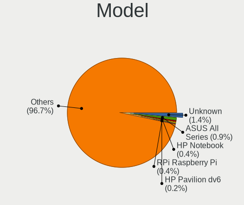
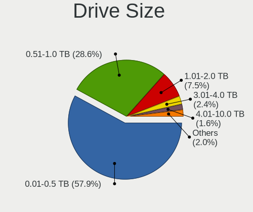

Ubuntu - Tested Hardware & Statistics
-------------------------------------

A project to collect tested hardware configurations for Ubuntu.

Anyone can contribute to this report by the [hw-probe](https://github.com/linuxhw/hw-probe) tool:

    sudo -E hw-probe -all -upload

Please contribute! Especially if your hardware is rare.

This is a report for all computer types. See also reports for [desktops](/Dist/Ubuntu/Desktop/README.md) and [notebooks](/Dist/Ubuntu/Notebook/README.md).

Contents
--------

* [ Test Cases ](#test-cases)

* [ System ](#system)
  - [ OS                       ](#os)
  - [ OS Family                ](#os-family)
  - [ Kernel                   ](#kernel)
  - [ Kernel Family            ](#kernel-family)
  - [ Kernel Major Ver.        ](#kernel-major-ver)
  - [ Arch                     ](#arch)
  - [ DE                       ](#de)
  - [ Display Server           ](#display-server)
  - [ Display Manager          ](#display-manager)
  - [ OS Lang                  ](#os-lang)
  - [ Boot Mode                ](#boot-mode)
  - [ Filesystem               ](#filesystem)
  - [ Part. scheme             ](#part-scheme)
  - [ Dual Boot with Linux/BSD ](#dual-boot-with-linuxbsd)
  - [ Dual Boot (Win)          ](#dual-boot-win)

* [ Board ](#board)
  - [ Vendor                   ](#vendor)
  - [ Model                    ](#model)
  - [ Model Family             ](#model-family)
  - [ MFG Year                 ](#mfg-year)
  - [ Form Factor              ](#form-factor)
  - [ Secure Boot              ](#secure-boot)
  - [ Coreboot                 ](#coreboot)
  - [ RAM Size                 ](#ram-size)
  - [ RAM Used                 ](#ram-used)
  - [ Total Drives             ](#total-drives)
  - [ Has CD-ROM               ](#has-cd-rom)
  - [ Has Ethernet             ](#has-ethernet)
  - [ Has WiFi                 ](#has-wifi)
  - [ Has Bluetooth            ](#has-bluetooth)

* [ Location ](#location)
  - [ Country                  ](#country)
  - [ City                     ](#city)

* [ Drives ](#drives)
  - [ Drive Vendor             ](#drive-vendor)
  - [ Drive Model              ](#drive-model)
  - [ HDD Vendor               ](#hdd-vendor)
  - [ SSD Vendor               ](#ssd-vendor)
  - [ Drive Kind               ](#drive-kind)
  - [ Drive Connector          ](#drive-connector)
  - [ Drive Size               ](#drive-size)
  - [ Space Total              ](#space-total)
  - [ Space Used               ](#space-used)
  - [ Malfunc. Drives          ](#malfunc-drives)
  - [ Malfunc. Drive Vendor    ](#malfunc-drive-vendor)
  - [ Malfunc. HDD Vendor      ](#malfunc-hdd-vendor)
  - [ Malfunc. Drive Kind      ](#malfunc-drive-kind)
  - [ Failed Drives            ](#failed-drives)
  - [ Failed Drive Vendor      ](#failed-drive-vendor)
  - [ Drive Status             ](#drive-status)

* [ Storage controller ](#storage-controller)
  - [ Storage Vendor           ](#storage-vendor)
  - [ Storage Model            ](#storage-model)
  - [ Storage Kind             ](#storage-kind)

* [ Processor ](#processor)
  - [ CPU Vendor               ](#cpu-vendor)
  - [ CPU Model                ](#cpu-model)
  - [ CPU Model Family         ](#cpu-model-family)
  - [ CPU Cores                ](#cpu-cores)
  - [ CPU Sockets              ](#cpu-sockets)
  - [ CPU Threads              ](#cpu-threads)
  - [ CPU Op-Modes             ](#cpu-op-modes)
  - [ CPU Microcode            ](#cpu-microcode)
  - [ CPU Microarch            ](#cpu-microarch)

* [ Graphics ](#graphics)
  - [ GPU Vendor               ](#gpu-vendor)
  - [ GPU Model                ](#gpu-model)
  - [ GPU Combo                ](#gpu-combo)
  - [ GPU Driver               ](#gpu-driver)
  - [ GPU Memory               ](#gpu-memory)

* [ Monitor ](#monitor)
  - [ Monitor Vendor           ](#monitor-vendor)
  - [ Monitor Model            ](#monitor-model)
  - [ Monitor Resolution       ](#monitor-resolution)
  - [ Monitor Diagonal         ](#monitor-diagonal)
  - [ Monitor Width            ](#monitor-width)
  - [ Aspect Ratio             ](#aspect-ratio)
  - [ Monitor Area             ](#monitor-area)
  - [ Pixel Density            ](#pixel-density)
  - [ Multiple Monitors        ](#multiple-monitors)

* [ Network ](#network)
  - [ Net Controller Vendor    ](#net-controller-vendor)
  - [ Net Controller Model     ](#net-controller-model)
  - [ Wireless Vendor          ](#wireless-vendor)
  - [ Wireless Model           ](#wireless-model)
  - [ Ethernet Vendor          ](#ethernet-vendor)
  - [ Ethernet Model           ](#ethernet-model)
  - [ Net Controller Kind      ](#net-controller-kind)
  - [ Used Controller          ](#used-controller)
  - [ NICs                     ](#nics)
  - [ IPv6                     ](#ipv6)

* [ Bluetooth ](#bluetooth)
  - [ Bluetooth Vendor         ](#bluetooth-vendor)
  - [ Bluetooth Model          ](#bluetooth-model)

* [ Sound ](#sound)
  - [ Sound Vendor             ](#sound-vendor)
  - [ Sound Model              ](#sound-model)

* [ Memory ](#memory)
  - [ Memory Vendor            ](#memory-vendor)
  - [ Memory Model             ](#memory-model)
  - [ Memory Kind              ](#memory-kind)
  - [ Memory Form Factor       ](#memory-form-factor)
  - [ Memory Size              ](#memory-size)
  - [ Memory Speed             ](#memory-speed)

* [ Printers & scanners ](#printers--scanners)
  - [ Printer Vendor           ](#printer-vendor)
  - [ Printer Model            ](#printer-model)
  - [ Scanner Vendor           ](#scanner-vendor)
  - [ Scanner Model            ](#scanner-model)

* [ Camera ](#camera)
  - [ Camera Vendor            ](#camera-vendor)
  - [ Camera Model             ](#camera-model)

* [ Security ](#security)
  - [ Fingerprint Vendor       ](#fingerprint-vendor)
  - [ Fingerprint Model        ](#fingerprint-model)
  - [ Chipcard Vendor          ](#chipcard-vendor)
  - [ Chipcard Model           ](#chipcard-model)

* [ Unsupported ](#unsupported)
  - [ Unsupported Devices      ](#unsupported-devices)
  - [ Unsupported Device Types ](#unsupported-device-types)

Test Cases
----------

Total: 89429

| Vendor        | Model                       | Form-Factor | Probe                                                      | Date         |
|---------------|-----------------------------|-------------|------------------------------------------------------------|--------------|
| ASUSTek       | F2A85-V PRO                 | Desktop     | [43991c533e](https://linux-hardware.org/?probe=43991c533e) | Jun 10, 2023 |
| AZW           | SER V1.0                    | Mini pc     | [b9eb9677f5](https://linux-hardware.org/?probe=b9eb9677f5) | Jun 10, 2023 |
| Lenovo        | ThinkPad T480 20L50010US    | Notebook    | [aa44c2c8b9](https://linux-hardware.org/?probe=aa44c2c8b9) | Jun 10, 2023 |
| Intel         | DP45SG AAE27733-404         | Desktop     | [7abba8629e](https://linux-hardware.org/?probe=7abba8629e) | Jun 10, 2023 |
| Acer          | Aspire E5-574G              | Notebook    | [8ca78da386](https://linux-hardware.org/?probe=8ca78da386) | Jun 10, 2023 |
| Intel         | DP45SG AAE27733-404         | Desktop     | [afaced265f](https://linux-hardware.org/?probe=afaced265f) | Jun 10, 2023 |
| Intel         | DH55TC AAE70932-302         | Desktop     | [6090a53f8a](https://linux-hardware.org/?probe=6090a53f8a) | Jun 10, 2023 |
| Beelink       | Gemini X                    | Notebook    | [adcb5e774d](https://linux-hardware.org/?probe=adcb5e774d) | Jun 10, 2023 |
| HUAWEI        | HVY-WXX9                    | Notebook    | [d6be89e452](https://linux-hardware.org/?probe=d6be89e452) | Jun 10, 2023 |
| Lenovo        | ThinkPad T480 20L50010US    | Notebook    | [398d708c85](https://linux-hardware.org/?probe=398d708c85) | Jun 10, 2023 |
| HP            | EliteBook 1040 G4           | Notebook    | [98aa06475b](https://linux-hardware.org/?probe=98aa06475b) | Jun 10, 2023 |
| Lenovo        | ThinkPad X240 20AMS5XY00    | Notebook    | [3b98c592e0](https://linux-hardware.org/?probe=3b98c592e0) | Jun 10, 2023 |
| HP            | 81B4                        | Desktop     | [2d7748536f](https://linux-hardware.org/?probe=2d7748536f) | Jun 10, 2023 |
| Gigabyte      | B650M GAMING X AX           | Desktop     | [5affc12294](https://linux-hardware.org/?probe=5affc12294) | Jun 10, 2023 |
| Dell          | Latitude 9420               | Convertible | [354adf0653](https://linux-hardware.org/?probe=354adf0653) | Jun 10, 2023 |
| HP            | Laptop 17-by3xxx            | Notebook    | [421ff52b0b](https://linux-hardware.org/?probe=421ff52b0b) | Jun 10, 2023 |
| Lenovo        | ThinkPad T550 20CJS1XB00    | Notebook    | [3d3375df75](https://linux-hardware.org/?probe=3d3375df75) | Jun 10, 2023 |
| Lenovo        | ThinkPad P1 Gen 3 20TH00... | Notebook    | [65a47406b0](https://linux-hardware.org/?probe=65a47406b0) | Jun 10, 2023 |
| Lenovo        | ThinkPad T470p 20J7S0XV0... | Notebook    | [b2f7d876c7](https://linux-hardware.org/?probe=b2f7d876c7) | Jun 10, 2023 |
| ASRock        | B450M Pro4                  | Desktop     | [c23450b0df](https://linux-hardware.org/?probe=c23450b0df) | Jun 10, 2023 |
| ASUSTek       | PRIME Z690-P WIFI           | Desktop     | [63c110632a](https://linux-hardware.org/?probe=63c110632a) | Jun 10, 2023 |
| MSI           | Prestige 13Evo A13M         | Notebook    | [3feb3bce01](https://linux-hardware.org/?probe=3feb3bce01) | Jun 10, 2023 |
| ASUSTek       | TUF B450M-PLUS GAMING       | Desktop     | [1f8c419c47](https://linux-hardware.org/?probe=1f8c419c47) | Jun 10, 2023 |
| ASUSTek       | PRIME B460M-K               | Desktop     | [873975925d](https://linux-hardware.org/?probe=873975925d) | Jun 10, 2023 |
| Lenovo        | ThinkPad W500 4058CTO       | Notebook    | [4b6aa9a912](https://linux-hardware.org/?probe=4b6aa9a912) | Jun 10, 2023 |
| Pegatron      | Benicia                     | Desktop     | [c57fee6ea0](https://linux-hardware.org/?probe=c57fee6ea0) | Jun 10, 2023 |
| Apple         | MacBookAir5,2               | Notebook    | [6adee93e47](https://linux-hardware.org/?probe=6adee93e47) | Jun 10, 2023 |
| Gigabyte      | B450M S2H                   | Desktop     | [82adaa06b7](https://linux-hardware.org/?probe=82adaa06b7) | Jun 10, 2023 |
| ASUSTek       | ROG STRIX B650E-I GAMING... | Desktop     | [d58405f7c1](https://linux-hardware.org/?probe=d58405f7c1) | Jun 10, 2023 |
| Apple         | Mac-942B5BF58194151B        | All in one  | [e3cb803f4e](https://linux-hardware.org/?probe=e3cb803f4e) | Jun 10, 2023 |
| ASUSTek       | ROG STRIX B650E-I GAMING... | Desktop     | [86b377710d](https://linux-hardware.org/?probe=86b377710d) | Jun 10, 2023 |
| HP            | Pavilion Gaming Laptop 1... | Notebook    | [7c9662b5eb](https://linux-hardware.org/?probe=7c9662b5eb) | Jun 10, 2023 |
| Unknown       | Unknown                     | Tablet      | [f9d086b77c](https://linux-hardware.org/?probe=f9d086b77c) | Jun 10, 2023 |
| Dell          | XPS 13 7390 2-in-1          | Convertible | [47d37facfc](https://linux-hardware.org/?probe=47d37facfc) | Jun 10, 2023 |
| ASRock        | X570 Phantom Gaming X       | Desktop     | [0c4db9b922](https://linux-hardware.org/?probe=0c4db9b922) | Jun 10, 2023 |
| Dell          | Vostro 3560                 | Notebook    | [86f646e00f](https://linux-hardware.org/?probe=86f646e00f) | Jun 10, 2023 |
| Pegatron      | 2A99                        | Desktop     | [0a25cd49a5](https://linux-hardware.org/?probe=0a25cd49a5) | Jun 10, 2023 |
| HP            | 1496                        | Desktop     | [68db57fde8](https://linux-hardware.org/?probe=68db57fde8) | Jun 10, 2023 |
| Dell          | Vostro 3560                 | Notebook    | [1bb9178df2](https://linux-hardware.org/?probe=1bb9178df2) | Jun 10, 2023 |
| MSI           | AM1M                        | Desktop     | [42a7d49c03](https://linux-hardware.org/?probe=42a7d49c03) | Jun 10, 2023 |
| Intel         | NUC11ATBC2 M53055-202       | Mini pc     | [81aee70d12](https://linux-hardware.org/?probe=81aee70d12) | Jun 10, 2023 |
| Dell          | Latitude E5500              | Notebook    | [41ad12c465](https://linux-hardware.org/?probe=41ad12c465) | Jun 10, 2023 |
| Dell          | 0C4Y3R A02                  | Server      | [976d5e0a08](https://linux-hardware.org/?probe=976d5e0a08) | Jun 10, 2023 |
| Exo           | Smart Serie LT              | Notebook    | [bbecad1cea](https://linux-hardware.org/?probe=bbecad1cea) | Jun 10, 2023 |
| Apple         | MacBookPro9,2               | Notebook    | [f502f89e9d](https://linux-hardware.org/?probe=f502f89e9d) | Jun 10, 2023 |
| Gigabyte      | H81M-H                      | Desktop     | [fc025a599d](https://linux-hardware.org/?probe=fc025a599d) | Jun 10, 2023 |
| Gigabyte      | H81M-H                      | Desktop     | [f32fbdf6ea](https://linux-hardware.org/?probe=f32fbdf6ea) | Jun 10, 2023 |
| Lenovo        | ThinkPad P16 Gen 1 21D7S... | Notebook    | [246facab73](https://linux-hardware.org/?probe=246facab73) | Jun 10, 2023 |
| Sony          | VPCF120FD                   | Notebook    | [47f02bd498](https://linux-hardware.org/?probe=47f02bd498) | Jun 10, 2023 |
| HP            | 0B4Ch D                     | Desktop     | [672a491915](https://linux-hardware.org/?probe=672a491915) | Jun 09, 2023 |
| HP            | ProBook 6360b               | Notebook    | [cdef37cb2d](https://linux-hardware.org/?probe=cdef37cb2d) | Jun 09, 2023 |
| Intel         | H81                         | Desktop     | [6a51c76e81](https://linux-hardware.org/?probe=6a51c76e81) | Jun 09, 2023 |
| Lenovo        | ThinkPad P16 Gen 1 21D7S... | Notebook    | [233dac6c68](https://linux-hardware.org/?probe=233dac6c68) | Jun 09, 2023 |
| Lenovo        | 3172 SDK0J40697 WIN 3305... | Mini pc     | [7f437dc929](https://linux-hardware.org/?probe=7f437dc929) | Jun 09, 2023 |
| Dell          | 0PU052                      | Desktop     | [84db4b658c](https://linux-hardware.org/?probe=84db4b658c) | Jun 09, 2023 |
| Dell          | 0PU052                      | Desktop     | [145d296b59](https://linux-hardware.org/?probe=145d296b59) | Jun 09, 2023 |
| Dell          | 0WMJ54 A01                  | Desktop     | [a4d08407bb](https://linux-hardware.org/?probe=a4d08407bb) | Jun 09, 2023 |
| Dell          | Latitude 9420               | Convertible | [593403cb67](https://linux-hardware.org/?probe=593403cb67) | Jun 09, 2023 |
| Dell          | Vostro 3500                 | Notebook    | [3d694e1b9a](https://linux-hardware.org/?probe=3d694e1b9a) | Jun 09, 2023 |
| ASUSTek       | M5A97 LE R2.0               | Desktop     | [a1877cb5b3](https://linux-hardware.org/?probe=a1877cb5b3) | Jun 09, 2023 |
| Dell          | Vostro 3558                 | Notebook    | [15185698e7](https://linux-hardware.org/?probe=15185698e7) | Jun 09, 2023 |
| HUAWEI        | MACHC-WAX9                  | Notebook    | [6f26f51ef6](https://linux-hardware.org/?probe=6f26f51ef6) | Jun 09, 2023 |
| ASUSTek       | P8P67 LE                    | Desktop     | [212ff65852](https://linux-hardware.org/?probe=212ff65852) | Jun 09, 2023 |
| HP            | Victus by Laptop 16-e0xx... | Notebook    | [9cb24f9445](https://linux-hardware.org/?probe=9cb24f9445) | Jun 09, 2023 |
| HP            | Stream Laptop 14-ds0xxx     | Notebook    | [fb9e2f9fc8](https://linux-hardware.org/?probe=fb9e2f9fc8) | Jun 09, 2023 |
| HP            | ProBook 4510s               | Notebook    | [43a29ea83e](https://linux-hardware.org/?probe=43a29ea83e) | Jun 09, 2023 |
| ASUSTek       | ROG STRIX B650E-I GAMING... | Desktop     | [92fd36b27a](https://linux-hardware.org/?probe=92fd36b27a) | Jun 09, 2023 |
| ASUSTek       | ROG ZENITH EXTREME          | Desktop     | [b4de2ccda4](https://linux-hardware.org/?probe=b4de2ccda4) | Jun 09, 2023 |
| Raspberry ... | Raspberry Pi 2 Model B R... | Soc         | [5ad9f9e0bf](https://linux-hardware.org/?probe=5ad9f9e0bf) | Jun 09, 2023 |
| HP            | Laptop 17-bs0xx             | Notebook    | [c93d52343c](https://linux-hardware.org/?probe=c93d52343c) | Jun 09, 2023 |
| Google        | Akali 360                   | Notebook    | [1f7d5f8bc5](https://linux-hardware.org/?probe=1f7d5f8bc5) | Jun 09, 2023 |
| ASUSTek       | M2N68-AM SE2                | Desktop     | [4f69ba649a](https://linux-hardware.org/?probe=4f69ba649a) | Jun 09, 2023 |
| Dell          | Latitude E7470              | Notebook    | [c5457da74f](https://linux-hardware.org/?probe=c5457da74f) | Jun 09, 2023 |
| Dell          | Inspiron 3583               | Notebook    | [adcb3b193a](https://linux-hardware.org/?probe=adcb3b193a) | Jun 09, 2023 |
| IBM           | 00J6244 08                  | Server      | [1543d47492](https://linux-hardware.org/?probe=1543d47492) | Jun 09, 2023 |
| MSI           | H81I                        | Desktop     | [c7c19346a2](https://linux-hardware.org/?probe=c7c19346a2) | Jun 09, 2023 |
| Dell          | XPS 9320                    | Notebook    | [c9f26e18c2](https://linux-hardware.org/?probe=c9f26e18c2) | Jun 09, 2023 |
| HUAWEI        | BOHB-WAX9                   | Notebook    | [aa0b439e8d](https://linux-hardware.org/?probe=aa0b439e8d) | Jun 09, 2023 |
| MSI           | MPG X570S CARBON MAX WIF... | Desktop     | [5833483fe2](https://linux-hardware.org/?probe=5833483fe2) | Jun 09, 2023 |
| Lenovo        | ThinkPad T460s 20FAS11X0... | Notebook    | [23568da401](https://linux-hardware.org/?probe=23568da401) | Jun 09, 2023 |
| MSI           | MAG Z490 TOMAHAWK           | Desktop     | [40f18ae1f4](https://linux-hardware.org/?probe=40f18ae1f4) | Jun 09, 2023 |
| ECS           | H81H3-M4                    | Desktop     | [b457e63434](https://linux-hardware.org/?probe=b457e63434) | Jun 09, 2023 |
| ASUSTek       | P8H61-M LX                  | Desktop     | [28d0a897d3](https://linux-hardware.org/?probe=28d0a897d3) | Jun 09, 2023 |
| Apple         | MacBookPro5,5               | Notebook    | [09344fa63e](https://linux-hardware.org/?probe=09344fa63e) | Jun 09, 2023 |
| Lenovo        | 1037 SDK0Q40104 WIN 3305... | Server      | [c7ced127f8](https://linux-hardware.org/?probe=c7ced127f8) | Jun 09, 2023 |
| Dell          | Inspiron 15-5568            | Notebook    | [19b686b7d7](https://linux-hardware.org/?probe=19b686b7d7) | Jun 09, 2023 |
| Dell          | Latitude E7240              | Notebook    | [1d8eb4fce4](https://linux-hardware.org/?probe=1d8eb4fce4) | Jun 09, 2023 |
| Dell          | Latitude E7240              | Notebook    | [da22551dca](https://linux-hardware.org/?probe=da22551dca) | Jun 09, 2023 |
| Unknown       | GSUO H61V10C                | Desktop     | [0daf816953](https://linux-hardware.org/?probe=0daf816953) | Jun 09, 2023 |
| HP            | 2B35                        | Desktop     | [5921b94b60](https://linux-hardware.org/?probe=5921b94b60) | Jun 09, 2023 |
| HP            | Elite Dragonfly G2          | Convertible | [f36fbdace7](https://linux-hardware.org/?probe=f36fbdace7) | Jun 09, 2023 |
| Lenovo        | ThinkPad X1 Carbon Gen 8... | Notebook    | [531e3f124d](https://linux-hardware.org/?probe=531e3f124d) | Jun 09, 2023 |
| Dell          | 0KRC95 A02                  | Desktop     | [585c31e8d3](https://linux-hardware.org/?probe=585c31e8d3) | Jun 08, 2023 |
| HP            | ZBook Studio G3             | Notebook    | [4fb38ec480](https://linux-hardware.org/?probe=4fb38ec480) | Jun 08, 2023 |
| HP            | ZBook Studio G3             | Notebook    | [09260f0742](https://linux-hardware.org/?probe=09260f0742) | Jun 08, 2023 |
| HP            | Laptop 15s-fq2xxx           | Notebook    | [09ba95bf3b](https://linux-hardware.org/?probe=09ba95bf3b) | Jun 08, 2023 |
| Supermicro    | X10DRU-i+                   | Server      | [092cd038fc](https://linux-hardware.org/?probe=092cd038fc) | Jun 08, 2023 |
| Dell          | 0K83V0 A00                  | Desktop     | [fc7fa0850a](https://linux-hardware.org/?probe=fc7fa0850a) | Jun 08, 2023 |
| HP            | ProLiant DL360 Gen9         | Server      | [20092d99e6](https://linux-hardware.org/?probe=20092d99e6) | Jun 08, 2023 |
| Supermicro    | X8DTU                       | Server      | [8c9992144c](https://linux-hardware.org/?probe=8c9992144c) | Jun 08, 2023 |
| Dell          | 08GXHX A06                  | Server      | [e4ef5b4ff9](https://linux-hardware.org/?probe=e4ef5b4ff9) | Jun 08, 2023 |
| Supermicro    | X8DTU                       | Server      | [afa1204a2d](https://linux-hardware.org/?probe=afa1204a2d) | Jun 08, 2023 |
| Supermicro    | X8DTU                       | Server      | [71e863c1a8](https://linux-hardware.org/?probe=71e863c1a8) | Jun 08, 2023 |
| Supermicro    | X8DTU                       | Server      | [5033e3aef3](https://linux-hardware.org/?probe=5033e3aef3) | Jun 08, 2023 |
| Supermicro    | X9DRW                       | Server      | [0f8167210a](https://linux-hardware.org/?probe=0f8167210a) | Jun 08, 2023 |
| Supermicro    | X8DTU                       | Server      | [ab8024c378](https://linux-hardware.org/?probe=ab8024c378) | Jun 08, 2023 |
| Supermicro    | X9DRW                       | Server      | [6845342901](https://linux-hardware.org/?probe=6845342901) | Jun 08, 2023 |
| Supermicro    | X10DRU-i+                   | Server      | [a94d257f7f](https://linux-hardware.org/?probe=a94d257f7f) | Jun 08, 2023 |
| Supermicro    | X8DTL                       | Server      | [b261675cb7](https://linux-hardware.org/?probe=b261675cb7) | Jun 08, 2023 |
| Supermicro    | X8DTU                       | Server      | [605dfce92c](https://linux-hardware.org/?probe=605dfce92c) | Jun 08, 2023 |
| ASRock        | X670E Pro RS                | Desktop     | [9770971a47](https://linux-hardware.org/?probe=9770971a47) | Jun 08, 2023 |
| Gigabyte      | B75M-D3H                    | Desktop     | [8c84a543bf](https://linux-hardware.org/?probe=8c84a543bf) | Jun 08, 2023 |
| Gigabyte      | Z97M-DS3H                   | Desktop     | [5d8df77ade](https://linux-hardware.org/?probe=5d8df77ade) | Jun 08, 2023 |
| HP            | ENVY 15                     | Notebook    | [3776ac93b3](https://linux-hardware.org/?probe=3776ac93b3) | Jun 08, 2023 |
| Dell          | 0GY6Y8 A02                  | Desktop     | [65f988a0c3](https://linux-hardware.org/?probe=65f988a0c3) | Jun 08, 2023 |
| HJS           | OPSH110D4                   | Desktop     | [bfb0ead991](https://linux-hardware.org/?probe=bfb0ead991) | Jun 08, 2023 |
| Samsung       | 910S3L                      | Notebook    | [f8e59b4c0f](https://linux-hardware.org/?probe=f8e59b4c0f) | Jun 08, 2023 |
| Lenovo        | Legion Y740-17IRHg 81UJ     | Notebook    | [c98ac6e82c](https://linux-hardware.org/?probe=c98ac6e82c) | Jun 08, 2023 |
| HUAWEI        | HKD-WXX                     | Notebook    | [d6a8e02362](https://linux-hardware.org/?probe=d6a8e02362) | Jun 08, 2023 |
| AZW           | SEi                         | Desktop     | [399b4a7add](https://linux-hardware.org/?probe=399b4a7add) | Jun 08, 2023 |
| ASUSTek       | X455LA                      | Notebook    | [583596672d](https://linux-hardware.org/?probe=583596672d) | Jun 08, 2023 |
| Gigabyte      | H61M-DS2                    | Desktop     | [829912d683](https://linux-hardware.org/?probe=829912d683) | Jun 08, 2023 |
| Dell          | 0GDG8Y A00                  | Desktop     | [4789561d79](https://linux-hardware.org/?probe=4789561d79) | Jun 08, 2023 |
| Dell          | 088DT1 A01                  | Desktop     | [173e9a0e0c](https://linux-hardware.org/?probe=173e9a0e0c) | Jun 08, 2023 |
| Gigabyte      | H61M-DS2                    | Desktop     | [f995c68d61](https://linux-hardware.org/?probe=f995c68d61) | Jun 08, 2023 |
| MSI           | GE66 Raider 10UE            | Notebook    | [38a5122d9c](https://linux-hardware.org/?probe=38a5122d9c) | Jun 08, 2023 |
| Lenovo        | ThinkPad T490 20N2CTO1WW    | Notebook    | [8fa2e2acc9](https://linux-hardware.org/?probe=8fa2e2acc9) | Jun 08, 2023 |
| HUAWEI        | HKD-WXX                     | Notebook    | [fdb80f6e89](https://linux-hardware.org/?probe=fdb80f6e89) | Jun 08, 2023 |
| Unknown       | Unknown                     | Tablet      | [072c85039e](https://linux-hardware.org/?probe=072c85039e) | Jun 08, 2023 |
| Unknown       | Unknown                     | Desktop     | [2c3b00b1ae](https://linux-hardware.org/?probe=2c3b00b1ae) | Jun 08, 2023 |
| Lenovo        | ThinkPad X1 Carbon 3444C... | Notebook    | [4e5e1d4052](https://linux-hardware.org/?probe=4e5e1d4052) | Jun 08, 2023 |
| Lenovo        | Legion Y740-17IRHg 81UJ     | Notebook    | [7879db73f8](https://linux-hardware.org/?probe=7879db73f8) | Jun 08, 2023 |
| MSI           | MAG B650 TOMAHAWK WIFI      | Desktop     | [f4e1a7a712](https://linux-hardware.org/?probe=f4e1a7a712) | Jun 08, 2023 |
| Acer          | Aspire ES1-711              | Notebook    | [79bb8d8e39](https://linux-hardware.org/?probe=79bb8d8e39) | Jun 08, 2023 |
| MSI           | MAG X570 TOMAHAWK WIFI      | Desktop     | [744c44deca](https://linux-hardware.org/?probe=744c44deca) | Jun 08, 2023 |
| AZW           | Green G4 10                 | Desktop     | [326b499893](https://linux-hardware.org/?probe=326b499893) | Jun 08, 2023 |
| Dell          | Inspiron 5379               | Notebook    | [b161b2177a](https://linux-hardware.org/?probe=b161b2177a) | Jun 08, 2023 |
| Gigabyte      | GA-A75M-D2H                 | Desktop     | [f78a07f792](https://linux-hardware.org/?probe=f78a07f792) | Jun 08, 2023 |
| HONOR         | NBR-WAX9                    | Notebook    | [697f2b18e8](https://linux-hardware.org/?probe=697f2b18e8) | Jun 08, 2023 |
| BESSTAR Te... | UM700                       | Desktop     | [92645b42ac](https://linux-hardware.org/?probe=92645b42ac) | Jun 08, 2023 |
| HP            | Spectre x360 Convertible... | Convertible | [5bec216150](https://linux-hardware.org/?probe=5bec216150) | Jun 08, 2023 |
| HP            | Spectre x360 Convertible... | Convertible | [7fa12c3607](https://linux-hardware.org/?probe=7fa12c3607) | Jun 08, 2023 |
| ASUSTek       | PRIME X570-P                | Desktop     | [a91f24af7a](https://linux-hardware.org/?probe=a91f24af7a) | Jun 08, 2023 |
| ASUSTek       | PRIME X570-P                | Desktop     | [96e1e7ea7e](https://linux-hardware.org/?probe=96e1e7ea7e) | Jun 08, 2023 |
| Dell          | 0HN7XN A01                  | Desktop     | [c44abee9e7](https://linux-hardware.org/?probe=c44abee9e7) | Jun 08, 2023 |
| Gigabyte      | P2542                       | Notebook    | [12a2415432](https://linux-hardware.org/?probe=12a2415432) | Jun 08, 2023 |
| Lenovo        | IdeaPad 5 Pro 14ACN6 82L... | Notebook    | [292625f2da](https://linux-hardware.org/?probe=292625f2da) | Jun 08, 2023 |
| HP            | 2000                        | Notebook    | [4ae1384345](https://linux-hardware.org/?probe=4ae1384345) | Jun 07, 2023 |
| ASRock        | B85M-HDS                    | Desktop     | [e563fa3fe2](https://linux-hardware.org/?probe=e563fa3fe2) | Jun 07, 2023 |
| ASUSTek       | WS Z390 PRO                 | Desktop     | [7346eaf346](https://linux-hardware.org/?probe=7346eaf346) | Jun 07, 2023 |
| Apple         | Mac-F2238BAE iMac11,3       | All in one  | [8bfed00d06](https://linux-hardware.org/?probe=8bfed00d06) | Jun 07, 2023 |
| Beelink       | Gemini X                    | Notebook    | [49aca69972](https://linux-hardware.org/?probe=49aca69972) | Jun 07, 2023 |
| Dell          | Latitude E6420              | Notebook    | [011dadb850](https://linux-hardware.org/?probe=011dadb850) | Jun 07, 2023 |
| Dell          | Latitude E6420              | Notebook    | [a1c7c69a05](https://linux-hardware.org/?probe=a1c7c69a05) | Jun 07, 2023 |
| MSI           | A88XM-E35                   | Desktop     | [efe1285363](https://linux-hardware.org/?probe=efe1285363) | Jun 07, 2023 |
| Lenovo        | ThinkPad X220 Tablet 429... | Notebook    | [ea8584cbda](https://linux-hardware.org/?probe=ea8584cbda) | Jun 07, 2023 |
| Acer          | Aspire E5-553               | Notebook    | [76ca69b8cc](https://linux-hardware.org/?probe=76ca69b8cc) | Jun 07, 2023 |
| Dell          | Latitude 3350               | Notebook    | [ef85473c50](https://linux-hardware.org/?probe=ef85473c50) | Jun 07, 2023 |
| Acer          | Aspire E5-553               | Notebook    | [3932ac5190](https://linux-hardware.org/?probe=3932ac5190) | Jun 07, 2023 |
| ASUSTek       | B85M-E                      | Desktop     | [9ea0a82205](https://linux-hardware.org/?probe=9ea0a82205) | Jun 07, 2023 |
| ASUSTek       | PRIME B360-PLUS             | Desktop     | [8b82994313](https://linux-hardware.org/?probe=8b82994313) | Jun 07, 2023 |
| MSI           | Stealth 15M B12UE           | Notebook    | [ff2ebbb0ae](https://linux-hardware.org/?probe=ff2ebbb0ae) | Jun 07, 2023 |
| Dell          | XPS 9320                    | Notebook    | [ff5fc17acc](https://linux-hardware.org/?probe=ff5fc17acc) | Jun 07, 2023 |
| Lenovo        | ThinkPad X201 3680Y4F       | Notebook    | [7823148e7d](https://linux-hardware.org/?probe=7823148e7d) | Jun 07, 2023 |
| Dell          | XPS 13 9370                 | Notebook    | [f70195a177](https://linux-hardware.org/?probe=f70195a177) | Jun 07, 2023 |
| ECS           | GF8100VM-M5                 | Desktop     | [6aa065057f](https://linux-hardware.org/?probe=6aa065057f) | Jun 07, 2023 |
| Onda TLC      | ONDA Oliver                 | Notebook    | [bbfcf4a3be](https://linux-hardware.org/?probe=bbfcf4a3be) | Jun 07, 2023 |
| Lenovo        | Yoga Slim 7 Pro 16ARH7 8... | Notebook    | [265c19be27](https://linux-hardware.org/?probe=265c19be27) | Jun 07, 2023 |
| Apple         | MacBookPro14,1              | Notebook    | [b0435761df](https://linux-hardware.org/?probe=b0435761df) | Jun 07, 2023 |
| Apple         | MacBookPro14,1              | Notebook    | [a76212cc40](https://linux-hardware.org/?probe=a76212cc40) | Jun 07, 2023 |
| MSI           | MPG B550 GAMING PLUS        | Desktop     | [793b86c807](https://linux-hardware.org/?probe=793b86c807) | Jun 07, 2023 |
| Dell          | Latitude 3190 2-in-1        | Convertible | [a692e30aea](https://linux-hardware.org/?probe=a692e30aea) | Jun 07, 2023 |
| HP            | EliteBook 2560p             | Notebook    | [1b491bcfeb](https://linux-hardware.org/?probe=1b491bcfeb) | Jun 07, 2023 |
| HP            | EliteBook 2560p             | Notebook    | [f1060e2b5d](https://linux-hardware.org/?probe=f1060e2b5d) | Jun 07, 2023 |
| Acer          | Nitro AN515-55              | Notebook    | [99b42755e8](https://linux-hardware.org/?probe=99b42755e8) | Jun 07, 2023 |
| Dell          | Inspiron 5547               | Notebook    | [7775c4c871](https://linux-hardware.org/?probe=7775c4c871) | Jun 07, 2023 |
| Dell          | Inspiron 5547               | Notebook    | [3a43778152](https://linux-hardware.org/?probe=3a43778152) | Jun 07, 2023 |
| Lenovo        | 3704 SDK0J40700 WIN 3258... | Desktop     | [b18ffc5311](https://linux-hardware.org/?probe=b18ffc5311) | Jun 07, 2023 |
| Dell          | 0R6PCT A01                  | Desktop     | [e1623fbc8e](https://linux-hardware.org/?probe=e1623fbc8e) | Jun 07, 2023 |
| Dell          | 0H500Y A00                  | All in one  | [30557b9e70](https://linux-hardware.org/?probe=30557b9e70) | Jun 06, 2023 |
| Dell          | Latitude E7250              | Notebook    | [a80182e728](https://linux-hardware.org/?probe=a80182e728) | Jun 06, 2023 |
| HP            | Laptop 15s-fq2xxx           | Notebook    | [9d0aa12b81](https://linux-hardware.org/?probe=9d0aa12b81) | Jun 06, 2023 |
| Apple         | Mac-8ED6AF5B48C039E1 Mac... | Mini pc     | [bd4156867b](https://linux-hardware.org/?probe=bd4156867b) | Jun 06, 2023 |
| Foxconn       | H55M-S                      | Desktop     | [83b86844c0](https://linux-hardware.org/?probe=83b86844c0) | Jun 06, 2023 |
| Lenovo        | Kabini CRB 31900058 STD     | Desktop     | [8f3282c700](https://linux-hardware.org/?probe=8f3282c700) | Jun 06, 2023 |
| Sony          | VPCEH3N6E                   | Notebook    | [788ddd35a8](https://linux-hardware.org/?probe=788ddd35a8) | Jun 06, 2023 |
| Acer          | Aspire A715-51G             | Notebook    | [dbde8636bb](https://linux-hardware.org/?probe=dbde8636bb) | Jun 06, 2023 |
| Acer          | Aspire A315-31              | Notebook    | [d5da1b4b30](https://linux-hardware.org/?probe=d5da1b4b30) | Jun 06, 2023 |
| ASUSTek       | VivoBook_ASUSLaptop M160... | Notebook    | [e4335c33f6](https://linux-hardware.org/?probe=e4335c33f6) | Jun 06, 2023 |
| ASUSTek       | VivoBook_ASUSLaptop M350... | Notebook    | [bf403bb6d8](https://linux-hardware.org/?probe=bf403bb6d8) | Jun 06, 2023 |
| HUAWEI        | NBLB-WAX9N                  | Notebook    | [e56988bf8e](https://linux-hardware.org/?probe=e56988bf8e) | Jun 06, 2023 |
| Samsung       | 910S3L                      | Notebook    | [2db0ae25d8](https://linux-hardware.org/?probe=2db0ae25d8) | Jun 06, 2023 |
| MSI           | B85-G43 GAMING              | Desktop     | [326a620bbd](https://linux-hardware.org/?probe=326a620bbd) | Jun 06, 2023 |
| ASRock        | H310M-HG4                   | Desktop     | [47b2817d31](https://linux-hardware.org/?probe=47b2817d31) | Jun 06, 2023 |
| Fujitsu       | LIFEBOOK U9310X             | Convertible | [81b1cf6660](https://linux-hardware.org/?probe=81b1cf6660) | Jun 06, 2023 |
| Lenovo        | ThinkPad T590 20N5000AMH    | Notebook    | [91c0d99427](https://linux-hardware.org/?probe=91c0d99427) | Jun 06, 2023 |
| Supermicro    | X11SSL-F                    | Server      | [e32da0a962](https://linux-hardware.org/?probe=e32da0a962) | Jun 06, 2023 |
| MSI           | B85-G43 GAMING              | Desktop     | [9cfd61dae7](https://linux-hardware.org/?probe=9cfd61dae7) | Jun 06, 2023 |
| Dell          | Latitude 7400               | Notebook    | [9968377d89](https://linux-hardware.org/?probe=9968377d89) | Jun 06, 2023 |
| Dell          | XPS 13 9370                 | Notebook    | [82aba8957b](https://linux-hardware.org/?probe=82aba8957b) | Jun 06, 2023 |
| ASRock        | G41C-GS R2.0                | Desktop     | [6e4835c7bc](https://linux-hardware.org/?probe=6e4835c7bc) | Jun 06, 2023 |
| Dell          | Latitude 7480               | Notebook    | [61c800a3b4](https://linux-hardware.org/?probe=61c800a3b4) | Jun 06, 2023 |
| HP            | 2820h                       | Desktop     | [eb7322ad95](https://linux-hardware.org/?probe=eb7322ad95) | Jun 06, 2023 |
| Microsoft     | Surface Laptop 2            | Tablet      | [769eb5078e](https://linux-hardware.org/?probe=769eb5078e) | Jun 06, 2023 |
| HP            | EliteBook 840 G3            | Notebook    | [18eeac2fc1](https://linux-hardware.org/?probe=18eeac2fc1) | Jun 06, 2023 |
| Chuwi         | RZBOX                       | Desktop     | [f395c0f429](https://linux-hardware.org/?probe=f395c0f429) | Jun 06, 2023 |
| HP            | 3397                        | Desktop     | [f85e642ee3](https://linux-hardware.org/?probe=f85e642ee3) | Jun 06, 2023 |
| Dell          | Latitude E6400              | Notebook    | [ced90af89e](https://linux-hardware.org/?probe=ced90af89e) | Jun 06, 2023 |
| Gigabyte      | H310M M.2 x.x               | Desktop     | [602e1c8875](https://linux-hardware.org/?probe=602e1c8875) | Jun 06, 2023 |
| ASUSTek       | ROG Strix G531GT_G531GT     | Notebook    | [503bc1f4cc](https://linux-hardware.org/?probe=503bc1f4cc) | Jun 06, 2023 |
| ASUSTek       | ROG Strix G531GT_G531GT     | Notebook    | [31a814cd0e](https://linux-hardware.org/?probe=31a814cd0e) | Jun 06, 2023 |
| Lenovo        | IdeaPad 3 14ITL6 82H7       | Notebook    | [5159be9e2b](https://linux-hardware.org/?probe=5159be9e2b) | Jun 06, 2023 |
| Inspur        | H61H2-TI2                   | All in one  | [2e0c1fbe0d](https://linux-hardware.org/?probe=2e0c1fbe0d) | Jun 06, 2023 |
| Inspur        | H61H2-TI2                   | All in one  | [5832b8b801](https://linux-hardware.org/?probe=5832b8b801) | Jun 06, 2023 |
| HP            | Laptop 14s-dq1xxx           | Notebook    | [8f99826bf1](https://linux-hardware.org/?probe=8f99826bf1) | Jun 06, 2023 |
| Notebook      | P65xHP                      | Notebook    | [bf35e218d7](https://linux-hardware.org/?probe=bf35e218d7) | Jun 06, 2023 |
| ATOPNUC       | MA90                        | Mini pc     | [25a598e2dc](https://linux-hardware.org/?probe=25a598e2dc) | Jun 06, 2023 |
| Intel         | DP55WB AAE64798-204         | Desktop     | [fe09edbecc](https://linux-hardware.org/?probe=fe09edbecc) | Jun 06, 2023 |
| Gigabyte      | Z590 VISION G               | Desktop     | [ee1abb360e](https://linux-hardware.org/?probe=ee1abb360e) | Jun 06, 2023 |
| ASUSTek       | TUF Gaming FX505DT_FX505... | Notebook    | [fc49284b9f](https://linux-hardware.org/?probe=fc49284b9f) | Jun 06, 2023 |
| ATOPNUC       | MA90                        | Mini pc     | [197a497c65](https://linux-hardware.org/?probe=197a497c65) | Jun 06, 2023 |
| Dell          | 0RY007                      | Desktop     | [49c7cbbfde](https://linux-hardware.org/?probe=49c7cbbfde) | Jun 06, 2023 |
| ASUSTek       | PRIME Z790-A WIFI           | Desktop     | [fe852e8a1d](https://linux-hardware.org/?probe=fe852e8a1d) | Jun 06, 2023 |
| Lenovo        | IdeaPad 5 14ALC05 82LM      | Notebook    | [53cb8df21f](https://linux-hardware.org/?probe=53cb8df21f) | Jun 06, 2023 |
| Toshiba       | PORTEGE X30-D               | Notebook    | [262ee566e1](https://linux-hardware.org/?probe=262ee566e1) | Jun 06, 2023 |
| Dell          | Precision 3571              | Notebook    | [35f408bce4](https://linux-hardware.org/?probe=35f408bce4) | Jun 06, 2023 |
| Pegatron      | H81-M1                      | Desktop     | [2641e6773e](https://linux-hardware.org/?probe=2641e6773e) | Jun 05, 2023 |
| HP            | EliteBook 840 G6            | Notebook    | [0763f751ac](https://linux-hardware.org/?probe=0763f751ac) | Jun 05, 2023 |
| Notebook      | P65xHP                      | Notebook    | [51834b893c](https://linux-hardware.org/?probe=51834b893c) | Jun 05, 2023 |
| ASUSTek       | PRIME B550M-A AC            | Desktop     | [de614b2bc7](https://linux-hardware.org/?probe=de614b2bc7) | Jun 05, 2023 |
| MSI           | 990FXA GAMING               | Desktop     | [1c99e1316c](https://linux-hardware.org/?probe=1c99e1316c) | Jun 05, 2023 |
| MSI           | 990FXA GAMING               | Desktop     | [60fb09bf5e](https://linux-hardware.org/?probe=60fb09bf5e) | Jun 05, 2023 |
| HP            | ZBook Studio G3             | Notebook    | [09f2ec5511](https://linux-hardware.org/?probe=09f2ec5511) | Jun 05, 2023 |
| Dell          | Latitude 5530               | Notebook    | [a302ecd3cd](https://linux-hardware.org/?probe=a302ecd3cd) | Jun 05, 2023 |
| HP            | 3397                        | Desktop     | [ea59ba572e](https://linux-hardware.org/?probe=ea59ba572e) | Jun 05, 2023 |
| Lenovo        | ThinkPad X250 20CLS02K00    | Notebook    | [fc306205a7](https://linux-hardware.org/?probe=fc306205a7) | Jun 05, 2023 |
| MECER         | MW10Q17                     | Tablet      | [36fd3d704b](https://linux-hardware.org/?probe=36fd3d704b) | Jun 05, 2023 |
| Dell          | XPS 13 9305                 | Notebook    | [450d20f29d](https://linux-hardware.org/?probe=450d20f29d) | Jun 05, 2023 |
| ASUSTek       | VivoBook_ASUSLaptop X515... | Notebook    | [a06e6ab7ad](https://linux-hardware.org/?probe=a06e6ab7ad) | Jun 05, 2023 |
| BESSTAR Te... | GB7                         | Mini pc     | [e3738c1f5a](https://linux-hardware.org/?probe=e3738c1f5a) | Jun 05, 2023 |
| MECER         | MW10Q17                     | Tablet      | [3cdab95833](https://linux-hardware.org/?probe=3cdab95833) | Jun 05, 2023 |
| HP            | Pavilion Laptop 15-eh1xx... | Notebook    | [c8ca6e8787](https://linux-hardware.org/?probe=c8ca6e8787) | Jun 05, 2023 |
| Fujitsu       | D3061-A1 S26361-D3061-A1    | Desktop     | [cc575f0073](https://linux-hardware.org/?probe=cc575f0073) | Jun 05, 2023 |
| ASUSTek       | G750JM                      | Notebook    | [cdb3539c93](https://linux-hardware.org/?probe=cdb3539c93) | Jun 05, 2023 |
| HP            | ENVY m6 Notebook            | Notebook    | [5bc28b7062](https://linux-hardware.org/?probe=5bc28b7062) | Jun 05, 2023 |
| ASRock        | G41M-GS3                    | Desktop     | [f8789775fe](https://linux-hardware.org/?probe=f8789775fe) | Jun 05, 2023 |
| HP            | ENVY m6 Notebook            | Notebook    | [aff6da41b8](https://linux-hardware.org/?probe=aff6da41b8) | Jun 05, 2023 |
| Dell          | 0DF42J A00                  | Desktop     | [c68dff0dd7](https://linux-hardware.org/?probe=c68dff0dd7) | Jun 05, 2023 |
| Gigabyte      | X299 AORUS Gaming 7         | Desktop     | [6f6ddfe780](https://linux-hardware.org/?probe=6f6ddfe780) | Jun 05, 2023 |
| HP            | Pavilion Laptop 15-eh0xx... | Notebook    | [b969b91080](https://linux-hardware.org/?probe=b969b91080) | Jun 05, 2023 |
| ASUSTek       | PRIME Z790-P WIFI           | Desktop     | [4ba1a29c23](https://linux-hardware.org/?probe=4ba1a29c23) | Jun 05, 2023 |
| HP            | 83E2                        | Desktop     | [522273fe60](https://linux-hardware.org/?probe=522273fe60) | Jun 05, 2023 |
| Lenovo        | ThinkPad E14 Gen 4 21E3S... | Notebook    | [6528b4bffe](https://linux-hardware.org/?probe=6528b4bffe) | Jun 05, 2023 |
| HP            | Notebook                    | Notebook    | [1605419ae0](https://linux-hardware.org/?probe=1605419ae0) | Jun 05, 2023 |
| Dell          | Latitude 3460               | Notebook    | [1a92cd0779](https://linux-hardware.org/?probe=1a92cd0779) | Jun 05, 2023 |
| Unknown       | Unknown                     | Tablet      | [33c4d481d9](https://linux-hardware.org/?probe=33c4d481d9) | Jun 05, 2023 |
| MSI           | B250 GAMING PRO CARBON      | Desktop     | [32da3735d9](https://linux-hardware.org/?probe=32da3735d9) | Jun 05, 2023 |
| Lenovo        | ThinkPad E14 Gen 4 21E3S... | Notebook    | [dbc9b8df0b](https://linux-hardware.org/?probe=dbc9b8df0b) | Jun 05, 2023 |
| Lenovo        | IdeaPad 3 14ITL6 82H7       | Notebook    | [ceab55a00c](https://linux-hardware.org/?probe=ceab55a00c) | Jun 05, 2023 |
| HP            | Laptop 14-fq0xxx            | Notebook    | [02614f184c](https://linux-hardware.org/?probe=02614f184c) | Jun 05, 2023 |
| ASUSTek       | PRIME B550M-A AC            | Desktop     | [0cf4dfc5e4](https://linux-hardware.org/?probe=0cf4dfc5e4) | Jun 05, 2023 |
| Infinix       | INBOOK X2                   | Notebook    | [0a82b1aed3](https://linux-hardware.org/?probe=0a82b1aed3) | Jun 05, 2023 |
| ASUSTek       | Z170-K                      | Desktop     | [a2c31cdc69](https://linux-hardware.org/?probe=a2c31cdc69) | Jun 05, 2023 |
| Lenovo        | Legion 5 15ACH6H 82JU       | Notebook    | [ea07821e39](https://linux-hardware.org/?probe=ea07821e39) | Jun 05, 2023 |
| Lenovo        | ThinkPad T480 20L5S1RY00    | Notebook    | [56c173d205](https://linux-hardware.org/?probe=56c173d205) | Jun 05, 2023 |
| HP            | Pavilion dm4                | Notebook    | [63bd248ea6](https://linux-hardware.org/?probe=63bd248ea6) | Jun 05, 2023 |
| HP            | 3397                        | Desktop     | [e9dd850e23](https://linux-hardware.org/?probe=e9dd850e23) | Jun 05, 2023 |
| Pegatron      | 2AC2                        | Desktop     | [6182103d25](https://linux-hardware.org/?probe=6182103d25) | Jun 05, 2023 |
| Lenovo        | IdeaPad 100-15IBD 80QQ      | Notebook    | [c3892d9477](https://linux-hardware.org/?probe=c3892d9477) | Jun 05, 2023 |
| ASUSTek       | PRIME Z590-V                | Desktop     | [d0fd3fd90a](https://linux-hardware.org/?probe=d0fd3fd90a) | Jun 04, 2023 |
| ASUSTek       | PRIME Z590-V                | Desktop     | [bc93ac1588](https://linux-hardware.org/?probe=bc93ac1588) | Jun 04, 2023 |
| MSI           | Boston                      | Desktop     | [9f5efc29ad](https://linux-hardware.org/?probe=9f5efc29ad) | Jun 04, 2023 |
| Toshiba       | Satellite Pro C70-B         | Notebook    | [d4bc6d6c8c](https://linux-hardware.org/?probe=d4bc6d6c8c) | Jun 04, 2023 |
| Sony          | VPCEH2H4E                   | Notebook    | [793e883d0c](https://linux-hardware.org/?probe=793e883d0c) | Jun 04, 2023 |
| Lenovo        | ThinkCentre Edge 91Z 707... | Desktop     | [a6804d8ca1](https://linux-hardware.org/?probe=a6804d8ca1) | Jun 04, 2023 |
| Lenovo        | MAHOBAY Win8 STD MM DPK ... | Desktop     | [d9dba3ffdf](https://linux-hardware.org/?probe=d9dba3ffdf) | Jun 04, 2023 |
| Intel         | DH55HC AAE70933-503         | Desktop     | [b3d5e112eb](https://linux-hardware.org/?probe=b3d5e112eb) | Jun 04, 2023 |
| Lenovo        | ThinkPad T460p 20FXS0DR0... | Notebook    | [6fad1535c3](https://linux-hardware.org/?probe=6fad1535c3) | Jun 04, 2023 |
| Fujitsu       | D3233-A1 S26361-D3233-A1    | Desktop     | [ba0e7c7d59](https://linux-hardware.org/?probe=ba0e7c7d59) | Jun 04, 2023 |
| Dell          | 0PM2CW A02                  | Server      | [193d718cc3](https://linux-hardware.org/?probe=193d718cc3) | Jun 04, 2023 |
| Toshiba       | Satellite L655              | Notebook    | [1b9656a4a1](https://linux-hardware.org/?probe=1b9656a4a1) | Jun 04, 2023 |
| Dell          | Inspiron 3442               | Notebook    | [5c1f2cc0d3](https://linux-hardware.org/?probe=5c1f2cc0d3) | Jun 04, 2023 |
| Gigabyte      | B450M DS3H-CF               | Desktop     | [4b162cac99](https://linux-hardware.org/?probe=4b162cac99) | Jun 04, 2023 |
| HP            | Spectre x360 2-in-1 Lapt... | Convertible | [5b7a78b32e](https://linux-hardware.org/?probe=5b7a78b32e) | Jun 04, 2023 |
| Acer          | Swift SF314-43              | Notebook    | [969354604a](https://linux-hardware.org/?probe=969354604a) | Jun 04, 2023 |
| ASRock        | A75M-HVS                    | Desktop     | [69bc52dc4f](https://linux-hardware.org/?probe=69bc52dc4f) | Jun 04, 2023 |
| HP            | Spectre x360 2-in-1 Lapt... | Convertible | [14f68da7a7](https://linux-hardware.org/?probe=14f68da7a7) | Jun 04, 2023 |
| Acer          | Predator G3-710             | Desktop     | [7193d24262](https://linux-hardware.org/?probe=7193d24262) | Jun 04, 2023 |
| Acer          | Predator G3-710             | Desktop     | [96834ea12b](https://linux-hardware.org/?probe=96834ea12b) | Jun 04, 2023 |
| HP            | 83E2                        | Desktop     | [3684f8562d](https://linux-hardware.org/?probe=3684f8562d) | Jun 04, 2023 |
| Acer          | Predator G3-710             | Desktop     | [c200dbb9cf](https://linux-hardware.org/?probe=c200dbb9cf) | Jun 04, 2023 |
| ASUSTek       | G750JM                      | Notebook    | [f492ab6829](https://linux-hardware.org/?probe=f492ab6829) | Jun 04, 2023 |
| HP            | 2000                        | Notebook    | [7b24eaf0d9](https://linux-hardware.org/?probe=7b24eaf0d9) | Jun 04, 2023 |
| HP            | 2000                        | Notebook    | [dfee85b8e7](https://linux-hardware.org/?probe=dfee85b8e7) | Jun 04, 2023 |
| Dell          | Latitude E5520              | Notebook    | [7e2d1fdd22](https://linux-hardware.org/?probe=7e2d1fdd22) | Jun 04, 2023 |
| ASRock        | X670E Taichi                | Desktop     | [6616151cda](https://linux-hardware.org/?probe=6616151cda) | Jun 04, 2023 |
| Dell          | 0Y5DDC A00                  | Desktop     | [5713168678](https://linux-hardware.org/?probe=5713168678) | Jun 04, 2023 |
| Acer          | Swift SF314-512             | Notebook    | [f39742476c](https://linux-hardware.org/?probe=f39742476c) | Jun 04, 2023 |
| Acer          | Swift SF314-512             | Notebook    | [efa49bf468](https://linux-hardware.org/?probe=efa49bf468) | Jun 04, 2023 |
| ASRock        | A320M-HDV R4.0              | Desktop     | [f472cba5a6](https://linux-hardware.org/?probe=f472cba5a6) | Jun 04, 2023 |
| IP3 Tech      | AP1                         | Notebook    | [d24ecf10e2](https://linux-hardware.org/?probe=d24ecf10e2) | Jun 04, 2023 |
| ASUSTek       | H170-PRO                    | Desktop     | [b9fd75507c](https://linux-hardware.org/?probe=b9fd75507c) | Jun 04, 2023 |
| HUAWEI        | BOHB-WAX9                   | Notebook    | [8fa7afa4a1](https://linux-hardware.org/?probe=8fa7afa4a1) | Jun 04, 2023 |
| MSI           | Z270-A PRO                  | Desktop     | [1da4d78c3b](https://linux-hardware.org/?probe=1da4d78c3b) | Jun 04, 2023 |
| Dell          | Latitude E5510              | Notebook    | [353a2174af](https://linux-hardware.org/?probe=353a2174af) | Jun 04, 2023 |
| ASRock        | B550 PG Velocita            | Desktop     | [12833898d1](https://linux-hardware.org/?probe=12833898d1) | Jun 04, 2023 |
| Lenovo        | ThinkPad T14 Gen 1 20S00... | Notebook    | [a00b8e7d13](https://linux-hardware.org/?probe=a00b8e7d13) | Jun 04, 2023 |
| Apple         | MacBookPro13,3              | Notebook    | [885709a33f](https://linux-hardware.org/?probe=885709a33f) | Jun 04, 2023 |
| ASUSTek       | PRIME X670-P WIFI           | Desktop     | [82542c4daa](https://linux-hardware.org/?probe=82542c4daa) | Jun 04, 2023 |
| Lenovo        | ThinkPad T450 20BU000FUS    | Notebook    | [a0181fbf52](https://linux-hardware.org/?probe=a0181fbf52) | Jun 04, 2023 |
| Dell          | 0F0XJ6 A02                  | Server      | [a63e1bbe8a](https://linux-hardware.org/?probe=a63e1bbe8a) | Jun 04, 2023 |
| Samsung       | 950XED                      | Notebook    | [185834c02e](https://linux-hardware.org/?probe=185834c02e) | Jun 04, 2023 |
| ASUSTek       | ROG STRIX B360-I GAMING     | Desktop     | [0c8afa948b](https://linux-hardware.org/?probe=0c8afa948b) | Jun 04, 2023 |
| Lenovo        | IdeaPad Gaming 3 16IAH7 ... | Notebook    | [6d8d7f6384](https://linux-hardware.org/?probe=6d8d7f6384) | Jun 04, 2023 |
| Lanix         | AL V9                       | Notebook    | [3bd23fdde7](https://linux-hardware.org/?probe=3bd23fdde7) | Jun 04, 2023 |
| Lenovo        | ThinkPad P72 20MBCTO1WW     | Notebook    | [4f62d33d84](https://linux-hardware.org/?probe=4f62d33d84) | Jun 04, 2023 |
| MSI           | Modern 14 B5M               | Notebook    | [da21766a5c](https://linux-hardware.org/?probe=da21766a5c) | Jun 04, 2023 |
| Dell          | XPS 13 9315 2-in-1          | Tablet      | [1a71f40098](https://linux-hardware.org/?probe=1a71f40098) | Jun 04, 2023 |
| Unknown       | Unknown                     | Desktop     | [8c2d7ce6e2](https://linux-hardware.org/?probe=8c2d7ce6e2) | Jun 04, 2023 |
| HP            | Pavilion 15                 | Notebook    | [dc8f67bb03](https://linux-hardware.org/?probe=dc8f67bb03) | Jun 03, 2023 |
| MSI           | B450 TOMAHAWK               | Desktop     | [aaed1b39af](https://linux-hardware.org/?probe=aaed1b39af) | Jun 03, 2023 |
| Huanan        | X99-F8 GAMING V2.0          | Desktop     | [8b790b76a6](https://linux-hardware.org/?probe=8b790b76a6) | Jun 03, 2023 |
| ASUSTek       | K52Je                       | Notebook    | [0190eef08c](https://linux-hardware.org/?probe=0190eef08c) | Jun 03, 2023 |
| Schenker      | XMG FOCUS (M22)             | Notebook    | [31203c3645](https://linux-hardware.org/?probe=31203c3645) | Jun 03, 2023 |
| Dell          | 0N4NF7 A00                  | Desktop     | [e1348eb2c2](https://linux-hardware.org/?probe=e1348eb2c2) | Jun 03, 2023 |
| Dell          | 0N4NF7 A00                  | Desktop     | [6ff177257b](https://linux-hardware.org/?probe=6ff177257b) | Jun 03, 2023 |
| Dell          | Inspiron 13-5368            | Notebook    | [33bb0f34df](https://linux-hardware.org/?probe=33bb0f34df) | Jun 03, 2023 |
| Huanan        | X79 V7.11                   | Desktop     | [79bbc880ba](https://linux-hardware.org/?probe=79bbc880ba) | Jun 03, 2023 |
| Intel         | X99 V102                    | Desktop     | [ed5a67e8a5](https://linux-hardware.org/?probe=ed5a67e8a5) | Jun 03, 2023 |
| ASUSTek       | X553MA                      | Notebook    | [d07b3215b1](https://linux-hardware.org/?probe=d07b3215b1) | Jun 03, 2023 |
| ASRock        | FM2A88X Extreme6+           | Desktop     | [2745284306](https://linux-hardware.org/?probe=2745284306) | Jun 03, 2023 |
| ASUSTek       | VivoBook_ASUSLaptop X515... | Notebook    | [f12b791748](https://linux-hardware.org/?probe=f12b791748) | Jun 03, 2023 |
| Lenovo        | ThinkPad P16s Gen 1 21BT... | Notebook    | [8678eeac9b](https://linux-hardware.org/?probe=8678eeac9b) | Jun 03, 2023 |
| Gigabyte      | B450M AORUS ELITE           | Desktop     | [f17ae033ef](https://linux-hardware.org/?probe=f17ae033ef) | Jun 03, 2023 |
| ASUSTek       | K52Je                       | Notebook    | [c6f78ba2aa](https://linux-hardware.org/?probe=c6f78ba2aa) | Jun 03, 2023 |
| MSI           | H97M-G43                    | Desktop     | [6bd1b61977](https://linux-hardware.org/?probe=6bd1b61977) | Jun 03, 2023 |
| ASUSTek       | Z97-PRO GAMER               | Desktop     | [8d783c6b00](https://linux-hardware.org/?probe=8d783c6b00) | Jun 03, 2023 |
| Dell          | Inspiron 5559               | Notebook    | [9e1fe43cf9](https://linux-hardware.org/?probe=9e1fe43cf9) | Jun 03, 2023 |
| Acer          | Aspire A114-31              | Notebook    | [7a760e7ad6](https://linux-hardware.org/?probe=7a760e7ad6) | Jun 03, 2023 |
| Dell          | Latitude E6420              | Notebook    | [069b512b91](https://linux-hardware.org/?probe=069b512b91) | Jun 03, 2023 |
| SZMZ          | X99M-G2                     | Desktop     | [e9b164885c](https://linux-hardware.org/?probe=e9b164885c) | Jun 03, 2023 |
| Lenovo        | ThinkPad T420 4236WQD       | Notebook    | [69a63f31e1](https://linux-hardware.org/?probe=69a63f31e1) | Jun 03, 2023 |
| ASUSTek       | TUF Gaming Z590-PLUS WIF... | Desktop     | [51868dd3c8](https://linux-hardware.org/?probe=51868dd3c8) | Jun 03, 2023 |
| Dell          | Latitude E5430 non-vPro     | Notebook    | [ba2dfac7ae](https://linux-hardware.org/?probe=ba2dfac7ae) | Jun 03, 2023 |
| Dell          | Latitude E7450              | Notebook    | [fe7cb1e53f](https://linux-hardware.org/?probe=fe7cb1e53f) | Jun 03, 2023 |
| Lenovo        | Yoga S740-14IIL 81RS        | Notebook    | [1e4ffa48ce](https://linux-hardware.org/?probe=1e4ffa48ce) | Jun 03, 2023 |
| HP            | ENVY 17                     | Notebook    | [79fd438f05](https://linux-hardware.org/?probe=79fd438f05) | Jun 03, 2023 |
| Dell          | 0D6H9T A01                  | Desktop     | [1ebbe353ba](https://linux-hardware.org/?probe=1ebbe353ba) | Jun 03, 2023 |
| Dell          | 0D6H9T A01                  | Desktop     | [0bb2080b31](https://linux-hardware.org/?probe=0bb2080b31) | Jun 03, 2023 |
| Gigabyte      | Z590 AORUS ULTRA            | Desktop     | [44571410f0](https://linux-hardware.org/?probe=44571410f0) | Jun 03, 2023 |
| Gigabyte      | Z590 AORUS ULTRA            | Desktop     | [d54d77b051](https://linux-hardware.org/?probe=d54d77b051) | Jun 03, 2023 |
| ASUSTek       | Maximus VIII HERO ALPHA     | Desktop     | [48eb50cc43](https://linux-hardware.org/?probe=48eb50cc43) | Jun 03, 2023 |
| Gigabyte      | X79-UD3                     | Desktop     | [e459d2654f](https://linux-hardware.org/?probe=e459d2654f) | Jun 03, 2023 |
| HP            | 3047h                       | Desktop     | [1825675e99](https://linux-hardware.org/?probe=1825675e99) | Jun 03, 2023 |
| Dell          | Inspiron 5490               | Notebook    | [a0cc355293](https://linux-hardware.org/?probe=a0cc355293) | Jun 03, 2023 |
| MSI           | B250 GAMING PRO CARBON      | Desktop     | [ef7acf6baa](https://linux-hardware.org/?probe=ef7acf6baa) | Jun 03, 2023 |
| Dell          | G15 5520                    | Notebook    | [b77b760dfe](https://linux-hardware.org/?probe=b77b760dfe) | Jun 03, 2023 |
| Dell          | Vostro 3550                 | Notebook    | [3b25dd60b3](https://linux-hardware.org/?probe=3b25dd60b3) | Jun 03, 2023 |
| Apple         | Mac-F60DEB81FF30ACF6 Mac... | Desktop     | [c0f64d3436](https://linux-hardware.org/?probe=c0f64d3436) | Jun 03, 2023 |
| Dell          | 0M6C7G A00                  | Desktop     | [93bdbbdafb](https://linux-hardware.org/?probe=93bdbbdafb) | Jun 03, 2023 |
| ASUSTek       | PRIME Z790-A WIFI           | Desktop     | [4e17d7c6e8](https://linux-hardware.org/?probe=4e17d7c6e8) | Jun 03, 2023 |
| ASUSTek       | PRIME Z790-A WIFI           | Desktop     | [965de576c7](https://linux-hardware.org/?probe=965de576c7) | Jun 03, 2023 |
| ASUSTek       | PRIME B650M-A AX            | Desktop     | [983a81f19e](https://linux-hardware.org/?probe=983a81f19e) | Jun 03, 2023 |
| NCS-Tech      | B300                        | Notebook    | [895395765b](https://linux-hardware.org/?probe=895395765b) | Jun 03, 2023 |
| Dell          | Latitude 5491               | Notebook    | [6a8a7e6188](https://linux-hardware.org/?probe=6a8a7e6188) | Jun 03, 2023 |
| Dell          | 0RY007                      | Desktop     | [f3028ff55d](https://linux-hardware.org/?probe=f3028ff55d) | Jun 02, 2023 |
| Dell          | 08NPPY A00                  | Desktop     | [de331bfb5c](https://linux-hardware.org/?probe=de331bfb5c) | Jun 02, 2023 |
| Toshiba       | Satellite L655              | Notebook    | [9b83a4575b](https://linux-hardware.org/?probe=9b83a4575b) | Jun 02, 2023 |
| Biostar       | TA970XE                     | Desktop     | [11936a0f0f](https://linux-hardware.org/?probe=11936a0f0f) | Jun 02, 2023 |
| HP            | Notebook                    | Notebook    | [9b12c54cf2](https://linux-hardware.org/?probe=9b12c54cf2) | Jun 02, 2023 |
| Acer          | Aspire 7750G                | Notebook    | [160d4525c6](https://linux-hardware.org/?probe=160d4525c6) | Jun 02, 2023 |
| ASUSTek       | ROG Maximus Z690 FORMULA    | Desktop     | [c8fca2b92d](https://linux-hardware.org/?probe=c8fca2b92d) | Jun 02, 2023 |
| Notebook      | NL40_50CU                   | Notebook    | [47b838db36](https://linux-hardware.org/?probe=47b838db36) | Jun 02, 2023 |
| ASUSTek       | TUF Gaming FX505DT_FX505... | Notebook    | [fa4bd41f4b](https://linux-hardware.org/?probe=fa4bd41f4b) | Jun 02, 2023 |
| Dell          | Latitude 6430U              | Notebook    | [3104417f5e](https://linux-hardware.org/?probe=3104417f5e) | Jun 02, 2023 |
| ASUSTek       | ASUS TUF Gaming F17 FX70... | Notebook    | [959b76650d](https://linux-hardware.org/?probe=959b76650d) | Jun 02, 2023 |
| ASUSTek       | VivoBook_ASUSLaptop K650... | Notebook    | [a6d6fdfe4f](https://linux-hardware.org/?probe=a6d6fdfe4f) | Jun 02, 2023 |
| Samsung       | 730QED                      | Convertible | [f447d7526c](https://linux-hardware.org/?probe=f447d7526c) | Jun 02, 2023 |
| ASRock        | B365 Pro4                   | Desktop     | [35fff15a30](https://linux-hardware.org/?probe=35fff15a30) | Jun 02, 2023 |
| ASRock        | B365 Pro4                   | Desktop     | [54fcb811b8](https://linux-hardware.org/?probe=54fcb811b8) | Jun 02, 2023 |
| Dell          | Inspiron 15 7000 Gaming     | Notebook    | [664282cc84](https://linux-hardware.org/?probe=664282cc84) | Jun 02, 2023 |
| Samsung       | 730QED                      | Convertible | [ca8f4d1ff7](https://linux-hardware.org/?probe=ca8f4d1ff7) | Jun 02, 2023 |
| Lenovo        | Legion 5 15ACH6H 82JU       | Notebook    | [4d170e024e](https://linux-hardware.org/?probe=4d170e024e) | Jun 02, 2023 |
| IBM           | 00J6244 08                  | Server      | [81b4c3fd14](https://linux-hardware.org/?probe=81b4c3fd14) | Jun 02, 2023 |
| Acer          | Aspire X3950                | Desktop     | [82aa882647](https://linux-hardware.org/?probe=82aa882647) | Jun 02, 2023 |
| Acer          | Aspire X3950                | Desktop     | [1c7f0f7567](https://linux-hardware.org/?probe=1c7f0f7567) | Jun 02, 2023 |
| Acer          | Aspire ES1-523              | Notebook    | [a080a07f52](https://linux-hardware.org/?probe=a080a07f52) | Jun 02, 2023 |
| Acer          | Aspire 7750G                | Notebook    | [e94cab5008](https://linux-hardware.org/?probe=e94cab5008) | Jun 02, 2023 |
| Acer          | Aspire 7745G                | Notebook    | [7739f949e1](https://linux-hardware.org/?probe=7739f949e1) | Jun 02, 2023 |
| ASUSTek       | VivoBook_ASUSLaptop X513... | Notebook    | [109dbbfff0](https://linux-hardware.org/?probe=109dbbfff0) | Jun 02, 2023 |
| Dell          | 06X1TJ A00                  | Desktop     | [16d662673f](https://linux-hardware.org/?probe=16d662673f) | Jun 02, 2023 |
| ASUSTek       | VivoBook_ASUSLaptop M350... | Notebook    | [1aea71b6c0](https://linux-hardware.org/?probe=1aea71b6c0) | Jun 02, 2023 |
| ASUSTek       | Maximus Formula             | Desktop     | [6a70fa0a86](https://linux-hardware.org/?probe=6a70fa0a86) | Jun 02, 2023 |
| Lenovo        | ThinkBook 15 G3 ACL 21A4    | Notebook    | [b8c8f96b56](https://linux-hardware.org/?probe=b8c8f96b56) | Jun 02, 2023 |
| HUAWEI        | MACHC-WAX9                  | Notebook    | [c87d784c98](https://linux-hardware.org/?probe=c87d784c98) | Jun 02, 2023 |
| Lenovo        | IdeaPad 1 15IGL7 82V7       | Notebook    | [a7c067f896](https://linux-hardware.org/?probe=a7c067f896) | Jun 02, 2023 |
| Lenovo        | ThinkBook 15 G4 ABA 21DL    | Notebook    | [6b1168349b](https://linux-hardware.org/?probe=6b1168349b) | Jun 02, 2023 |
| HP            | Laptop 15s-eq2xxx           | Notebook    | [302ae0e2dc](https://linux-hardware.org/?probe=302ae0e2dc) | Jun 02, 2023 |
| Lenovo        | ThinkBook 15 G4 ABA 21DL    | Notebook    | [3da98cc9bb](https://linux-hardware.org/?probe=3da98cc9bb) | Jun 02, 2023 |
| Apple         | Mac-942B5BF58194151B        | All in one  | [b27125a1e2](https://linux-hardware.org/?probe=b27125a1e2) | Jun 02, 2023 |
| Unknown       | Unknown                     | Notebook    | [655398fc94](https://linux-hardware.org/?probe=655398fc94) | Jun 02, 2023 |
| Gigabyte      | Z97M-DS3H                   | Desktop     | [1a4437e831](https://linux-hardware.org/?probe=1a4437e831) | Jun 02, 2023 |
| ASUSTek       | VivoBook_ASUSLaptop M350... | Notebook    | [1bdb74a8ba](https://linux-hardware.org/?probe=1bdb74a8ba) | Jun 02, 2023 |
| Intel         | AB2L .A003                  | Mini pc     | [25fb11cde7](https://linux-hardware.org/?probe=25fb11cde7) | Jun 01, 2023 |
| ASUSTek       | Pro WS WRX80E-SAGE SE WI... | Desktop     | [8aab7c6536](https://linux-hardware.org/?probe=8aab7c6536) | Jun 01, 2023 |
| Apple         | MacBookPro5,5               | Notebook    | [29c4ba7312](https://linux-hardware.org/?probe=29c4ba7312) | Jun 01, 2023 |
| MSI           | H510M-A PRO                 | Desktop     | [f517c1893a](https://linux-hardware.org/?probe=f517c1893a) | Jun 01, 2023 |
| Samsung       | 950QED                      | Convertible | [cec979ab11](https://linux-hardware.org/?probe=cec979ab11) | Jun 01, 2023 |
| Gigabyte      | H61M-S2PV                   | Desktop     | [6c86bd69e0](https://linux-hardware.org/?probe=6c86bd69e0) | Jun 01, 2023 |
| ASRock        | Z77M                        | Desktop     | [eae1adee21](https://linux-hardware.org/?probe=eae1adee21) | Jun 01, 2023 |
| HP            | 18E5                        | Desktop     | [9d89c3065b](https://linux-hardware.org/?probe=9d89c3065b) | Jun 01, 2023 |
| Unknown       | Unknown                     | Notebook    | [fa6344a8eb](https://linux-hardware.org/?probe=fa6344a8eb) | Jun 01, 2023 |
| Lenovo        | ThinkPad T530 2392AHG       | Notebook    | [05c41c8464](https://linux-hardware.org/?probe=05c41c8464) | Jun 01, 2023 |
| Lenovo        | ThinkBook 15 G4 IAP 21DJ    | Notebook    | [98b0b355db](https://linux-hardware.org/?probe=98b0b355db) | Jun 01, 2023 |
| Apple         | MacBookAir4,1               | Notebook    | [42b1507aa8](https://linux-hardware.org/?probe=42b1507aa8) | Jun 01, 2023 |
| Samsung       | 300E4C/300E5C/300E7C        | Notebook    | [fcc2d0ed39](https://linux-hardware.org/?probe=fcc2d0ed39) | Jun 01, 2023 |
| HP            | EliteBook 820 G2            | Notebook    | [c9409c532d](https://linux-hardware.org/?probe=c9409c532d) | Jun 01, 2023 |
| HP            | 1906                        | Desktop     | [ac98480bd2](https://linux-hardware.org/?probe=ac98480bd2) | Jun 01, 2023 |
| Lenovo        | G400s VILG1                 | Notebook    | [fee541ee18](https://linux-hardware.org/?probe=fee541ee18) | Jun 01, 2023 |
| HP            | 18E7                        | Desktop     | [a3f557389e](https://linux-hardware.org/?probe=a3f557389e) | Jun 01, 2023 |
| Lenovo        | IdeaPad 330-15IKB 81FD      | Notebook    | [33e440f44f](https://linux-hardware.org/?probe=33e440f44f) | Jun 01, 2023 |
| HP            | ZBook Studio G3             | Notebook    | [d6d7da0907](https://linux-hardware.org/?probe=d6d7da0907) | Jun 01, 2023 |
| Lenovo        | Yoga 710-14IKB 80V4         | Convertible | [02d5f4b511](https://linux-hardware.org/?probe=02d5f4b511) | Jun 01, 2023 |
| Dell          | Vostro 3520                 | Notebook    | [473145db98](https://linux-hardware.org/?probe=473145db98) | Jun 01, 2023 |
| MSI           | Prestige 15 A12UC           | Notebook    | [9324563727](https://linux-hardware.org/?probe=9324563727) | Jun 01, 2023 |
| MSI           | Prestige 15 A12UC           | Notebook    | [778e78d2a5](https://linux-hardware.org/?probe=778e78d2a5) | Jun 01, 2023 |
| HP            | ProBook 440 G4              | Notebook    | [af2f742bc5](https://linux-hardware.org/?probe=af2f742bc5) | Jun 01, 2023 |
| Lenovo        | Yoga 710-14IKB 80V4         | Convertible | [835a44b010](https://linux-hardware.org/?probe=835a44b010) | Jun 01, 2023 |
| Dell          | Vostro 3520                 | Notebook    | [088f4d3536](https://linux-hardware.org/?probe=088f4d3536) | Jun 01, 2023 |
| HP            | EliteBook 650 15.6 inch ... | Notebook    | [3ca0d2f1a7](https://linux-hardware.org/?probe=3ca0d2f1a7) | Jun 01, 2023 |
| Dell          | XPS 13 9310 2-in-1          | Convertible | [e2d37b2d66](https://linux-hardware.org/?probe=e2d37b2d66) | Jun 01, 2023 |
| ASUSTek       | ROG STRIX X299-E GAMING     | Desktop     | [216bea3b6f](https://linux-hardware.org/?probe=216bea3b6f) | Jun 01, 2023 |
| HP            | ProBook 6450b               | Notebook    | [d3d4e45f9d](https://linux-hardware.org/?probe=d3d4e45f9d) | Jun 01, 2023 |
| ASUSTek       | X550CA                      | Notebook    | [fe31674f48](https://linux-hardware.org/?probe=fe31674f48) | Jun 01, 2023 |
| ASUSTek       | VivoBook_ASUSLaptop M160... | Notebook    | [1334997a22](https://linux-hardware.org/?probe=1334997a22) | Jun 01, 2023 |
| ASUSTek       | VivoBook_ASUSLaptop X580... | Notebook    | [f66667b7fb](https://linux-hardware.org/?probe=f66667b7fb) | Jun 01, 2023 |
| ASUSTek       | ROG Strix G731GT_GL731GT    | Notebook    | [0afa6e53d0](https://linux-hardware.org/?probe=0afa6e53d0) | Jun 01, 2023 |
| Dell          | XPS 15 9570                 | Notebook    | [6d7803788d](https://linux-hardware.org/?probe=6d7803788d) | Jun 01, 2023 |
| Dell          | Vostro 15 3515              | Notebook    | [8a69d6c123](https://linux-hardware.org/?probe=8a69d6c123) | Jun 01, 2023 |
| ASRock        | N68C-S UCC                  | Desktop     | [ef4a96955c](https://linux-hardware.org/?probe=ef4a96955c) | Jun 01, 2023 |
| ASRock        | N68C-S UCC                  | Desktop     | [a106c6a98a](https://linux-hardware.org/?probe=a106c6a98a) | Jun 01, 2023 |
| HP            | 83E2                        | Desktop     | [eaf5f90360](https://linux-hardware.org/?probe=eaf5f90360) | Jun 01, 2023 |
| Dell          | Vostro 15 3515              | Notebook    | [ecfe7565f4](https://linux-hardware.org/?probe=ecfe7565f4) | Jun 01, 2023 |
| Dell          | 03NVJ6 A00                  | Desktop     | [1f295f3ec2](https://linux-hardware.org/?probe=1f295f3ec2) | Jun 01, 2023 |
| HP            | 8055                        | Desktop     | [ff75f76129](https://linux-hardware.org/?probe=ff75f76129) | Jun 01, 2023 |
| HP            | EliteBook 2560p             | Notebook    | [e822eb4072](https://linux-hardware.org/?probe=e822eb4072) | Jun 01, 2023 |
| HP            | 8055                        | Desktop     | [f54c954f94](https://linux-hardware.org/?probe=f54c954f94) | Jun 01, 2023 |
| ASUSTek       | K53SK                       | Notebook    | [9b376cdd45](https://linux-hardware.org/?probe=9b376cdd45) | Jun 01, 2023 |
| Apple         | MacBook4,1                  | Notebook    | [996b318420](https://linux-hardware.org/?probe=996b318420) | Jun 01, 2023 |
| MSI           | H110M PRO-VH PLUS           | Desktop     | [cfabc605f7](https://linux-hardware.org/?probe=cfabc605f7) | Jun 01, 2023 |
| ASRockRack    | X570D4U                     | Server      | [76c45a7a8a](https://linux-hardware.org/?probe=76c45a7a8a) | Jun 01, 2023 |
| HP            | Pavilion Laptop 15-cc5xx    | Notebook    | [3e49e329d3](https://linux-hardware.org/?probe=3e49e329d3) | Jun 01, 2023 |
| Packard Be... | EasyNote LJ75               | Notebook    | [95c733d00f](https://linux-hardware.org/?probe=95c733d00f) | May 31, 2023 |
| HP            | Pavilion Notebook           | Notebook    | [3fb05bfb0b](https://linux-hardware.org/?probe=3fb05bfb0b) | May 31, 2023 |
| Gigabyte      | X570 AORUS ELITE            | Desktop     | [3b9639141c](https://linux-hardware.org/?probe=3b9639141c) | May 31, 2023 |
| HP            | Pavilion Laptop 15-cw1xx... | Notebook    | [560680687c](https://linux-hardware.org/?probe=560680687c) | May 31, 2023 |
| Dell          | 0RY007                      | Desktop     | [b726df555b](https://linux-hardware.org/?probe=b726df555b) | May 31, 2023 |
| Dell          | 0RY007                      | Desktop     | [32e931c79b](https://linux-hardware.org/?probe=32e931c79b) | May 31, 2023 |
| Lenovo        | Yoga S740-14IIL 81RS        | Notebook    | [b7032438d2](https://linux-hardware.org/?probe=b7032438d2) | May 31, 2023 |
| Pegatron      | 2ACB                        | Desktop     | [cfd38fc71a](https://linux-hardware.org/?probe=cfd38fc71a) | May 31, 2023 |
| MSI           | GE70 2QE                    | Notebook    | [a075b8b77d](https://linux-hardware.org/?probe=a075b8b77d) | May 31, 2023 |
| Lenovo        | ThinkPad T480 20L6S7PE0G    | Notebook    | [239faf8c55](https://linux-hardware.org/?probe=239faf8c55) | May 31, 2023 |
| HONOR         | BBR-WAX9                    | Notebook    | [8630cfad52](https://linux-hardware.org/?probe=8630cfad52) | May 31, 2023 |
| HP            | Laptop 15s-fq5xxx           | Notebook    | [bfcb7f950d](https://linux-hardware.org/?probe=bfcb7f950d) | May 31, 2023 |
| Lenovo        | Yoga S740-14IIL 81RS        | Notebook    | [2c315764a9](https://linux-hardware.org/?probe=2c315764a9) | May 31, 2023 |
| ASUSTek       | P8H61-M LX3 PLUS R2.0       | Desktop     | [953ee1ef05](https://linux-hardware.org/?probe=953ee1ef05) | May 31, 2023 |
| Dell          | Inspiron 3502               | Notebook    | [3c734d2900](https://linux-hardware.org/?probe=3c734d2900) | May 31, 2023 |
| Toshiba       | Satellite L850              | Notebook    | [cee0a13d3f](https://linux-hardware.org/?probe=cee0a13d3f) | May 31, 2023 |
| Gigabyte      | X99-UD7 WIFI-CF             | Desktop     | [955e65b76f](https://linux-hardware.org/?probe=955e65b76f) | May 31, 2023 |
| Acer          | Nitro AN515-54              | Notebook    | [7c031081c5](https://linux-hardware.org/?probe=7c031081c5) | May 31, 2023 |
| ASRock        | Z77 Extreme3                | Desktop     | [e45b1707bd](https://linux-hardware.org/?probe=e45b1707bd) | May 31, 2023 |
| Dell          | Precision 7670              | Notebook    | [77b039b486](https://linux-hardware.org/?probe=77b039b486) | May 31, 2023 |
| Acer          | Swift SF314-512             | Notebook    | [a8c97baf10](https://linux-hardware.org/?probe=a8c97baf10) | May 31, 2023 |
| ASUSTek       | ROG Strix G513RS_G513RS     | Notebook    | [69b1782cce](https://linux-hardware.org/?probe=69b1782cce) | May 31, 2023 |
| AXIOO         | Mybook-14E                  | Notebook    | [cb04b551d8](https://linux-hardware.org/?probe=cb04b551d8) | May 31, 2023 |
| Acer          | Swift SF314-512             | Notebook    | [5c9a2502db](https://linux-hardware.org/?probe=5c9a2502db) | May 31, 2023 |
| Gigabyte      | F2A78M-HD2                  | Desktop     | [c76d767402](https://linux-hardware.org/?probe=c76d767402) | May 31, 2023 |
| ASRock        | X570 Phantom Gaming 4       | Desktop     | [6c3655186f](https://linux-hardware.org/?probe=6c3655186f) | May 31, 2023 |
| ZOTAC         | Unknown                     | Desktop     | [0626de1b2a](https://linux-hardware.org/?probe=0626de1b2a) | May 31, 2023 |
| ASUSTek       | G10DK                       | Desktop     | [75cde40262](https://linux-hardware.org/?probe=75cde40262) | May 31, 2023 |
| Apple         | MacBookPro7,1               | Notebook    | [4fc174a983](https://linux-hardware.org/?probe=4fc174a983) | May 31, 2023 |
| ASUSTek       | ROG STRIX B450-F GAMING     | Desktop     | [2c6c547437](https://linux-hardware.org/?probe=2c6c547437) | May 31, 2023 |
| Lenovo        | ThinkBook 15 G4 ABA 21DL    | Notebook    | [7210e5c07e](https://linux-hardware.org/?probe=7210e5c07e) | May 31, 2023 |
| Lenovo        | ThinkPad T14s Gen 3 21BR... | Notebook    | [0ead50ad49](https://linux-hardware.org/?probe=0ead50ad49) | May 31, 2023 |
| Jumper        | EZbook                      | Notebook    | [3ccf2e1365](https://linux-hardware.org/?probe=3ccf2e1365) | May 31, 2023 |
| MSI           | B450M MORTAR MAX            | Desktop     | [1d0c56937c](https://linux-hardware.org/?probe=1d0c56937c) | May 31, 2023 |
| ASUSTek       | PRIME B450M-K II            | Desktop     | [2703e7856e](https://linux-hardware.org/?probe=2703e7856e) | May 30, 2023 |
| System76      | Thelio Mira                 | Desktop     | [d5fe3a3749](https://linux-hardware.org/?probe=d5fe3a3749) | May 30, 2023 |
| Lenovo        | ThinkPad X1 Carbon 7th 2... | Notebook    | [742ae62ba6](https://linux-hardware.org/?probe=742ae62ba6) | May 30, 2023 |
| ASUSTek       | K53SK                       | Notebook    | [bfd926c8da](https://linux-hardware.org/?probe=bfd926c8da) | May 30, 2023 |
| ASUSTek       | T102HA                      | Tablet      | [71bd8f1212](https://linux-hardware.org/?probe=71bd8f1212) | May 30, 2023 |
| Acer          | Aspire V3-574G              | Notebook    | [728459dd4a](https://linux-hardware.org/?probe=728459dd4a) | May 30, 2023 |
| VALE          | Notebook Classic C140       | Notebook    | [cdc6168586](https://linux-hardware.org/?probe=cdc6168586) | May 30, 2023 |
| Gigabyte      | P2542                       | Notebook    | [b1064cae7a](https://linux-hardware.org/?probe=b1064cae7a) | May 30, 2023 |
| Lenovo        | Legion 5 15ACH6H 82JU       | Notebook    | [86e04155f2](https://linux-hardware.org/?probe=86e04155f2) | May 30, 2023 |
| Dell          | 0JTHY5 A00                  | All in one  | [4bc9795f02](https://linux-hardware.org/?probe=4bc9795f02) | May 30, 2023 |
| Lenovo        | Yoga C940-14IIL 81Q9        | Convertible | [b79113b0b5](https://linux-hardware.org/?probe=b79113b0b5) | May 30, 2023 |
| ASUSTek       | TUF Gaming Z590-PLUS WIF... | Desktop     | [45e5adbb22](https://linux-hardware.org/?probe=45e5adbb22) | May 30, 2023 |
| Dell          | Inspiron 15-3567            | Notebook    | [e51e0ef0da](https://linux-hardware.org/?probe=e51e0ef0da) | May 30, 2023 |
| Gigabyte      | P2542                       | Notebook    | [7cded000f2](https://linux-hardware.org/?probe=7cded000f2) | May 30, 2023 |
| Framework     | Laptop (12th Gen Intel C... | Notebook    | [ada20f1f6a](https://linux-hardware.org/?probe=ada20f1f6a) | May 30, 2023 |
| Intel         | STK2M3W64CC H89289-504      | Desktop     | [a7e599b1f5](https://linux-hardware.org/?probe=a7e599b1f5) | May 30, 2023 |
| Nvidia        | Tegra                       | Soc         | [235f3fa96f](https://linux-hardware.org/?probe=235f3fa96f) | May 30, 2023 |
| ASRock        | H110M-DS/Hyper              | Desktop     | [a29a16d74c](https://linux-hardware.org/?probe=a29a16d74c) | May 30, 2023 |
| Intel         | STK2M3W64CC H89289-504      | Desktop     | [c471536b99](https://linux-hardware.org/?probe=c471536b99) | May 30, 2023 |
| Dell          | XPS 13 9310 2-in-1          | Convertible | [0c3b8da8d5](https://linux-hardware.org/?probe=0c3b8da8d5) | May 30, 2023 |
| AZW           | SER                         | Mini pc     | [8695d6bd62](https://linux-hardware.org/?probe=8695d6bd62) | May 30, 2023 |
| Dell          | XPS 13 9310 2-in-1          | Convertible | [dfe30c4e4a](https://linux-hardware.org/?probe=dfe30c4e4a) | May 30, 2023 |
| AZW           | SER                         | Mini pc     | [fa1f0ff1b4](https://linux-hardware.org/?probe=fa1f0ff1b4) | May 30, 2023 |
| ASRock        | H110M-DS/Hyper              | Desktop     | [05e7ed23f3](https://linux-hardware.org/?probe=05e7ed23f3) | May 30, 2023 |
| HP            | ENVY 15                     | Notebook    | [5acbfb03f4](https://linux-hardware.org/?probe=5acbfb03f4) | May 30, 2023 |
| MSI           | B450 GAMING PRO CARBON A... | Desktop     | [5271bd0b88](https://linux-hardware.org/?probe=5271bd0b88) | May 30, 2023 |
| Toshiba       | Satellite C665              | Notebook    | [c6149a6430](https://linux-hardware.org/?probe=c6149a6430) | May 30, 2023 |
| IBM           | 00J6244 08                  | Server      | [cee2891b60](https://linux-hardware.org/?probe=cee2891b60) | May 30, 2023 |
| Fujitsu       | D3233-A1 S26361-D3233-A1    | Desktop     | [de30e713bf](https://linux-hardware.org/?probe=de30e713bf) | May 30, 2023 |
| Lenovo        | IdeaPad 5 14ALC05 82LM      | Notebook    | [bb50e13268](https://linux-hardware.org/?probe=bb50e13268) | May 30, 2023 |
| Dell          | Vostro 3520                 | Notebook    | [4c50880385](https://linux-hardware.org/?probe=4c50880385) | May 30, 2023 |
| Lenovo        | ThinkPad X1 Carbon 4th 2... | Notebook    | [8002face48](https://linux-hardware.org/?probe=8002face48) | May 30, 2023 |
| Intel         | DH61BF AAG81311-102         | Desktop     | [22123492ab](https://linux-hardware.org/?probe=22123492ab) | May 30, 2023 |
| ASUSTek       | VivoBook_ASUSLaptop M350... | Notebook    | [cddd43859b](https://linux-hardware.org/?probe=cddd43859b) | May 30, 2023 |
| Raspberry ... | Raspberry Pi 4 Model B R... | Soc         | [fade8c50be](https://linux-hardware.org/?probe=fade8c50be) | May 30, 2023 |
| Raspberry ... | Raspberry Pi 4 Model B R... | Soc         | [8bafef9e33](https://linux-hardware.org/?probe=8bafef9e33) | May 30, 2023 |
| Lenovo        | 3740 NOK                    | Desktop     | [c15d9d37c7](https://linux-hardware.org/?probe=c15d9d37c7) | May 30, 2023 |
| Dell          | 0H4VK7 A01                  | Desktop     | [35d979d6e9](https://linux-hardware.org/?probe=35d979d6e9) | May 30, 2023 |
| Lenovo        | IdeaPad 5 14ALC05 82LM      | Notebook    | [46f455ce35](https://linux-hardware.org/?probe=46f455ce35) | May 30, 2023 |
| Supermicro    | X13SAN-L                    | Server      | [e0b7939357](https://linux-hardware.org/?probe=e0b7939357) | May 30, 2023 |
| Gigabyte      | Z170X-Gaming 7              | Desktop     | [b2ae6cb140](https://linux-hardware.org/?probe=b2ae6cb140) | May 30, 2023 |
| ASRock        | Z77 Extreme3                | Desktop     | [67c96085bf](https://linux-hardware.org/?probe=67c96085bf) | May 30, 2023 |
| Pegatron      | 2AC2                        | Desktop     | [a8873fdeab](https://linux-hardware.org/?probe=a8873fdeab) | May 30, 2023 |
| Apple         | Mac-F42C88C8 Proto1         | Desktop     | [a335953c43](https://linux-hardware.org/?probe=a335953c43) | May 30, 2023 |
| Gigabyte      | B560M AORUS ELITE           | Desktop     | [944eb64f77](https://linux-hardware.org/?probe=944eb64f77) | May 30, 2023 |
| Apple         | MacBookPro11,1              | Notebook    | [b881639bef](https://linux-hardware.org/?probe=b881639bef) | May 30, 2023 |
| Gigabyte      | GA-970A-UD3                 | Desktop     | [3626919ffb](https://linux-hardware.org/?probe=3626919ffb) | May 30, 2023 |
| HP            | Pavilion 15                 | Notebook    | [ca18fafda8](https://linux-hardware.org/?probe=ca18fafda8) | May 29, 2023 |
| Acer          | Aspire A515-57              | Notebook    | [e9f91331b2](https://linux-hardware.org/?probe=e9f91331b2) | May 29, 2023 |
| ASUSTek       | PRIME Z370-P                | Desktop     | [afb02cee29](https://linux-hardware.org/?probe=afb02cee29) | May 29, 2023 |
| HP            | Elite Dragonfly 13.5 inc... | Notebook    | [1e0fbe86da](https://linux-hardware.org/?probe=1e0fbe86da) | May 29, 2023 |
| ASUSTek       | VivoBook_ASUSLaptop X512... | Notebook    | [ea06bd5806](https://linux-hardware.org/?probe=ea06bd5806) | May 29, 2023 |
| ASUSTek       | X456URK                     | Notebook    | [6de2588617](https://linux-hardware.org/?probe=6de2588617) | May 29, 2023 |
| ASUSTek       | X456URK                     | Notebook    | [369aa4fc93](https://linux-hardware.org/?probe=369aa4fc93) | May 29, 2023 |
| Gigabyte      | B450 AORUS ELITE            | Desktop     | [d98102f69a](https://linux-hardware.org/?probe=d98102f69a) | May 29, 2023 |
| ASUSTek       | VivoBook_ASUSLaptop X712... | Notebook    | [509bb7aae7](https://linux-hardware.org/?probe=509bb7aae7) | May 29, 2023 |
| MSI           | Katana GF76 12UD            | Notebook    | [b1b1816b59](https://linux-hardware.org/?probe=b1b1816b59) | May 29, 2023 |
| Gigabyte      | H410M H                     | Desktop     | [7a52f09646](https://linux-hardware.org/?probe=7a52f09646) | May 29, 2023 |
| Alienware     | x15 R1                      | Notebook    | [19e9b8e338](https://linux-hardware.org/?probe=19e9b8e338) | May 29, 2023 |
| Lenovo        | ThinkPad E14 20RAS1RA00     | Notebook    | [087565aed3](https://linux-hardware.org/?probe=087565aed3) | May 29, 2023 |
| Notebook      | NV4XMB,ME,MZ                | Notebook    | [6fdc7285f2](https://linux-hardware.org/?probe=6fdc7285f2) | May 29, 2023 |
| Fujitsu       | D3402-A1 S26361-D3402-A1    | Desktop     | [0ae3ea958a](https://linux-hardware.org/?probe=0ae3ea958a) | May 29, 2023 |
| Lenovo        | ThinkBook 16p Gen 4 21J8    | Notebook    | [202bf4f657](https://linux-hardware.org/?probe=202bf4f657) | May 29, 2023 |
| Lenovo        | ThinkBook 16p Gen 4 21J8    | Notebook    | [bb60c42e07](https://linux-hardware.org/?probe=bb60c42e07) | May 29, 2023 |
| Lenovo        | ThinkPad T480 20L6S42000    | Notebook    | [ea6330526c](https://linux-hardware.org/?probe=ea6330526c) | May 29, 2023 |
| HP            | 1497                        | Desktop     | [5f1886622a](https://linux-hardware.org/?probe=5f1886622a) | May 29, 2023 |
| ASUSTek       | ROG STRIX Z790-H GAMING ... | Desktop     | [11432ddeb6](https://linux-hardware.org/?probe=11432ddeb6) | May 29, 2023 |
| Sony          | VPCEA45FG                   | Notebook    | [873ca04445](https://linux-hardware.org/?probe=873ca04445) | May 29, 2023 |
| ASUSTek       | PRIME H610M-A D4            | Desktop     | [312b05f0a4](https://linux-hardware.org/?probe=312b05f0a4) | May 29, 2023 |
| MSI           | Raider GE76 12UE            | Notebook    | [5e8f375846](https://linux-hardware.org/?probe=5e8f375846) | May 29, 2023 |
| ASUSTek       | ROG Strix G733PY_G733PY     | Notebook    | [7518e057f8](https://linux-hardware.org/?probe=7518e057f8) | May 29, 2023 |
| ASUSTek       | ROG Strix G733PY_G733PY     | Notebook    | [6d07d843c5](https://linux-hardware.org/?probe=6d07d843c5) | May 29, 2023 |
| HP            | 2B43                        | Desktop     | [fb2841cfa4](https://linux-hardware.org/?probe=fb2841cfa4) | May 29, 2023 |
| Dell          | Inspiron 15-7568            | Notebook    | [227930e25d](https://linux-hardware.org/?probe=227930e25d) | May 29, 2023 |
| Apple         | MacBookPro7,1               | Notebook    | [81a267d02b](https://linux-hardware.org/?probe=81a267d02b) | May 28, 2023 |
| Lenovo        | IdeaPad 320-15IAP 80XR      | Notebook    | [4353f50548](https://linux-hardware.org/?probe=4353f50548) | May 28, 2023 |
| Lenovo        | ThinkPad T540p 20BE00AKZ... | Notebook    | [f9bc4694e4](https://linux-hardware.org/?probe=f9bc4694e4) | May 28, 2023 |
| Lenovo        | IdeaPad 320-15IAP 80XR      | Notebook    | [d993490e5a](https://linux-hardware.org/?probe=d993490e5a) | May 28, 2023 |
| ASUSTek       | M4A87TD/USB3                | Desktop     | [bf0674c0f0](https://linux-hardware.org/?probe=bf0674c0f0) | May 28, 2023 |
| HONOR         | BBR-WAX9                    | Notebook    | [e57b9850f8](https://linux-hardware.org/?probe=e57b9850f8) | May 28, 2023 |
| ALLDOCUBE     | i1405C                      | Notebook    | [7e4475ef13](https://linux-hardware.org/?probe=7e4475ef13) | May 28, 2023 |
| ASRock        | 970 Pro3 R2.0               | Desktop     | [4ae997cf6b](https://linux-hardware.org/?probe=4ae997cf6b) | May 28, 2023 |
| Lenovo        | 3730 SDK0T76463 WIN 3422... | Desktop     | [7467436de2](https://linux-hardware.org/?probe=7467436de2) | May 28, 2023 |
| HP            | 1495                        | Desktop     | [15b94cba50](https://linux-hardware.org/?probe=15b94cba50) | May 28, 2023 |
| Apple         | MacBookAir4,1               | Notebook    | [25c6965a47](https://linux-hardware.org/?probe=25c6965a47) | May 28, 2023 |
| Apple         | MacBookAir4,1               | Notebook    | [e950caa0ce](https://linux-hardware.org/?probe=e950caa0ce) | May 28, 2023 |
| ECS           | H81H3-M4                    | Desktop     | [21261aa270](https://linux-hardware.org/?probe=21261aa270) | May 28, 2023 |
| Lenovo        | IdeaPad Gaming 3 15IMH05... | Notebook    | [95793a85de](https://linux-hardware.org/?probe=95793a85de) | May 28, 2023 |
| Dell          | 048DY8 A01                  | Desktop     | [9bfe61714e](https://linux-hardware.org/?probe=9bfe61714e) | May 28, 2023 |
| Lenovo        | IdeaPad Gaming 3 15IMH05... | Notebook    | [7c9addaf1c](https://linux-hardware.org/?probe=7c9addaf1c) | May 28, 2023 |
| HP            | EliteBook 850 G8 Noteboo... | Notebook    | [9178413d40](https://linux-hardware.org/?probe=9178413d40) | May 28, 2023 |
| Fusion5       | FWIN232                     | Tablet      | [9b5781e140](https://linux-hardware.org/?probe=9b5781e140) | May 28, 2023 |
| HP            | ProBook x360 435 G7         | Convertible | [8d113fecb4](https://linux-hardware.org/?probe=8d113fecb4) | May 28, 2023 |
| Samsung       | 300E4Z/300E5Z/300E7Z        | Notebook    | [c5b13d6ea2](https://linux-hardware.org/?probe=c5b13d6ea2) | May 28, 2023 |
| HP            | Pavilion Gaming Laptop 1... | Notebook    | [960ddf4eaf](https://linux-hardware.org/?probe=960ddf4eaf) | May 28, 2023 |
| Lenovo        | V130-15IKB 81HN             | Notebook    | [e50700f8be](https://linux-hardware.org/?probe=e50700f8be) | May 28, 2023 |
| Lenovo        | IdeaPad 100-15IBD 80QQ      | Notebook    | [c2408a1885](https://linux-hardware.org/?probe=c2408a1885) | May 28, 2023 |
| HP            | 0B54h D                     | Desktop     | [f9634b51b9](https://linux-hardware.org/?probe=f9634b51b9) | May 28, 2023 |
| Apple         | MacBookPro10,2              | Notebook    | [34d96aa1df](https://linux-hardware.org/?probe=34d96aa1df) | May 28, 2023 |
| HP            | EliteBook 840 G1            | Notebook    | [a1aa06298d](https://linux-hardware.org/?probe=a1aa06298d) | May 28, 2023 |
| Gigabyte      | B550M AORUS PRO-P           | Desktop     | [dbb348e8bf](https://linux-hardware.org/?probe=dbb348e8bf) | May 28, 2023 |
| HUAWEI        | BOHB-WAX9                   | Notebook    | [c7afdbbd76](https://linux-hardware.org/?probe=c7afdbbd76) | May 28, 2023 |
| TUXEDO        | Unknown                     | Notebook    | [21be23e012](https://linux-hardware.org/?probe=21be23e012) | May 28, 2023 |
| ASUSTek       | VivoBook_ASUSLaptop X415... | Notebook    | [86876e9715](https://linux-hardware.org/?probe=86876e9715) | May 28, 2023 |
| HUAWEI        | HVY-WXX9                    | Notebook    | [412b42ae92](https://linux-hardware.org/?probe=412b42ae92) | May 28, 2023 |
| AVITA         | NE14A2                      | Notebook    | [89c5edafbc](https://linux-hardware.org/?probe=89c5edafbc) | May 28, 2023 |
| Shuttle       | X50V5                       | Notebook    | [277cc7ca36](https://linux-hardware.org/?probe=277cc7ca36) | May 28, 2023 |
| Acer          | Aspire A515-56              | Notebook    | [4d8767d94b](https://linux-hardware.org/?probe=4d8767d94b) | May 28, 2023 |
| Lenovo        | IdeaPad Gaming 3 15IAH7 ... | Notebook    | [c2125f60d2](https://linux-hardware.org/?probe=c2125f60d2) | May 28, 2023 |
| Apple         | MacBookPro6,2               | Notebook    | [db9c87ce89](https://linux-hardware.org/?probe=db9c87ce89) | May 28, 2023 |
| Pegatron      | 2ACB                        | Desktop     | [cc1c8b2941](https://linux-hardware.org/?probe=cc1c8b2941) | May 28, 2023 |
| Lenovo        | SHARKBAY SDK0E50512 STD     | Desktop     | [5a39bd1d78](https://linux-hardware.org/?probe=5a39bd1d78) | May 28, 2023 |
| Lenovo        | SHARKBAY SDK0E50512 STD     | Desktop     | [a36d2b541a](https://linux-hardware.org/?probe=a36d2b541a) | May 28, 2023 |
| Apple         | MacBookAir8,1               | Notebook    | [47b2ee3c0d](https://linux-hardware.org/?probe=47b2ee3c0d) | May 28, 2023 |
| Dell          | Vostro 5402                 | Notebook    | [41a9c1dcf2](https://linux-hardware.org/?probe=41a9c1dcf2) | May 28, 2023 |
| Gigabyte      | X570 I AORUS PRO WIFI       | Desktop     | [bb842bc2d8](https://linux-hardware.org/?probe=bb842bc2d8) | May 28, 2023 |
| Lenovo        | ThinkPad T460 20FMS1JA00    | Notebook    | [618a907425](https://linux-hardware.org/?probe=618a907425) | May 27, 2023 |
| Gigabyte      | Z590 AORUS ELITE AX         | Desktop     | [183ee8e37a](https://linux-hardware.org/?probe=183ee8e37a) | May 27, 2023 |
| Lenovo        | Yoga 6 13ALC6 82ND          | Convertible | [8dda5ffa6f](https://linux-hardware.org/?probe=8dda5ffa6f) | May 27, 2023 |
| Dell          | Vostro 15 3515              | Notebook    | [2fadb86df4](https://linux-hardware.org/?probe=2fadb86df4) | May 27, 2023 |
| ASUSTek       | ROG Strix G634JY_G634JY     | Notebook    | [026cf06ce5](https://linux-hardware.org/?probe=026cf06ce5) | May 27, 2023 |
| Lenovo        | V130-15IGM 81HL             | Notebook    | [76a357994a](https://linux-hardware.org/?probe=76a357994a) | May 27, 2023 |
| HP            | Laptop 15s-fq5xxx           | Notebook    | [c6309fc374](https://linux-hardware.org/?probe=c6309fc374) | May 27, 2023 |
| Lenovo        | IdeaPad 5 15IIL05 81YK      | Notebook    | [1eecbd5808](https://linux-hardware.org/?probe=1eecbd5808) | May 27, 2023 |
| Lenovo        | 36C5 SDK0K17763 WIN 1801... | Desktop     | [ccf71ca66c](https://linux-hardware.org/?probe=ccf71ca66c) | May 27, 2023 |
| Lenovo        | 36C5 SDK0K17763 WIN 1801... | Desktop     | [1a3a921775](https://linux-hardware.org/?probe=1a3a921775) | May 27, 2023 |
| Dell          | Latitude 5440               | Notebook    | [9ed4f0e7ac](https://linux-hardware.org/?probe=9ed4f0e7ac) | May 27, 2023 |
| ASUSTek       | ROG CROSSHAIR VIII DARK ... | Desktop     | [7af2cff4d7](https://linux-hardware.org/?probe=7af2cff4d7) | May 27, 2023 |
| Lenovo        | G50-70 20351                | Notebook    | [ee0a9f666c](https://linux-hardware.org/?probe=ee0a9f666c) | May 27, 2023 |
| Gigabyte      | GA-970A-UD3                 | Desktop     | [2661b6520b](https://linux-hardware.org/?probe=2661b6520b) | May 27, 2023 |
| Gigabyte      | GA-970A-UD3                 | Desktop     | [bea3034b4e](https://linux-hardware.org/?probe=bea3034b4e) | May 27, 2023 |
| HUAWEI        | HVY-WXX9                    | Notebook    | [3f6fc3ec0c](https://linux-hardware.org/?probe=3f6fc3ec0c) | May 27, 2023 |
| HP            | Laptop 15-bs0xx             | Notebook    | [9605e313ac](https://linux-hardware.org/?probe=9605e313ac) | May 27, 2023 |
| HP            | Laptop 15-bs0xx             | Notebook    | [0a8ae92c13](https://linux-hardware.org/?probe=0a8ae92c13) | May 27, 2023 |
| HP            | ENVY TS 15                  | Notebook    | [15762c5ca7](https://linux-hardware.org/?probe=15762c5ca7) | May 27, 2023 |
| MSI           | A55M-E33                    | Desktop     | [c25cb7cbb6](https://linux-hardware.org/?probe=c25cb7cbb6) | May 27, 2023 |
| ASUSTek       | TUF Z390-PRO GAMING         | Desktop     | [449d13baa5](https://linux-hardware.org/?probe=449d13baa5) | May 27, 2023 |
| Gigabyte      | Z97M-DS3H                   | Desktop     | [8311d009bd](https://linux-hardware.org/?probe=8311d009bd) | May 27, 2023 |
| Lenovo        | 313A NOK                    | Desktop     | [a1ffbc1e1e](https://linux-hardware.org/?probe=a1ffbc1e1e) | May 27, 2023 |
| Apple         | MacBookPro8,1               | Notebook    | [f969629640](https://linux-hardware.org/?probe=f969629640) | May 27, 2023 |
| Apple         | MacBookPro8,1               | Notebook    | [229873404d](https://linux-hardware.org/?probe=229873404d) | May 27, 2023 |
| HP            | ProBook 650 G1              | Notebook    | [8b2266868a](https://linux-hardware.org/?probe=8b2266868a) | May 27, 2023 |
| Dell          | Latitude 5480               | Notebook    | [c7566d1ab9](https://linux-hardware.org/?probe=c7566d1ab9) | May 27, 2023 |
| Dell          | Latitude 5480               | Notebook    | [5327e82af6](https://linux-hardware.org/?probe=5327e82af6) | May 27, 2023 |
| Lenovo        | ThinkPad T14s Gen 3 21BR... | Notebook    | [57b9304725](https://linux-hardware.org/?probe=57b9304725) | May 27, 2023 |
| Dell          | Inspiron 7537               | Notebook    | [9433d17d5e](https://linux-hardware.org/?probe=9433d17d5e) | May 27, 2023 |
| Dell          | Inspiron 7537               | Notebook    | [1fce30c12e](https://linux-hardware.org/?probe=1fce30c12e) | May 27, 2023 |
| Dell          | 0TTDMJ A00                  | Desktop     | [e42949961b](https://linux-hardware.org/?probe=e42949961b) | May 27, 2023 |
| Acer          | Aspire A315-22              | Notebook    | [18a13174aa](https://linux-hardware.org/?probe=18a13174aa) | May 27, 2023 |
| Dell          | 0TTDMJ A00                  | Desktop     | [19475cfdb0](https://linux-hardware.org/?probe=19475cfdb0) | May 27, 2023 |
| ASRock        | H110M-HDV R3.0              | Desktop     | [05a6cc11bb](https://linux-hardware.org/?probe=05a6cc11bb) | May 27, 2023 |
| Gigabyte      | B360M D2V                   | Desktop     | [7fce8e04b2](https://linux-hardware.org/?probe=7fce8e04b2) | May 27, 2023 |
| HP            | 829A                        | Mini pc     | [bca6d6c12f](https://linux-hardware.org/?probe=bca6d6c12f) | May 27, 2023 |
| HP            | 829A                        | Mini pc     | [d24e18a488](https://linux-hardware.org/?probe=d24e18a488) | May 27, 2023 |
| ASUSTek       | TUF Gaming B650-PLUS WIF... | Desktop     | [7e895c167b](https://linux-hardware.org/?probe=7e895c167b) | May 27, 2023 |
| ASUSTek       | TUF Gaming B650-PLUS WIF... | Desktop     | [526503fef7](https://linux-hardware.org/?probe=526503fef7) | May 27, 2023 |
| Gigabyte      | Z77MX-D3H                   | Desktop     | [9cb2973f2f](https://linux-hardware.org/?probe=9cb2973f2f) | May 27, 2023 |
| Dell          | Latitude 7480               | Notebook    | [2c74ec8198](https://linux-hardware.org/?probe=2c74ec8198) | May 27, 2023 |
| Dell          | Latitude 7490               | Notebook    | [fbad4c1a53](https://linux-hardware.org/?probe=fbad4c1a53) | May 27, 2023 |
| Dell          | Latitude 7490               | Notebook    | [00c44ed00c](https://linux-hardware.org/?probe=00c44ed00c) | May 27, 2023 |
| Apple         | MacBookPro5,5               | Notebook    | [f1b7ea69ea](https://linux-hardware.org/?probe=f1b7ea69ea) | May 27, 2023 |
| Lenovo        | ThinkBook 15 G4 ABA 21DL    | Notebook    | [cc9d03264f](https://linux-hardware.org/?probe=cc9d03264f) | May 27, 2023 |
| Lenovo        | 31900058 STD                | Desktop     | [d09ae4f1a2](https://linux-hardware.org/?probe=d09ae4f1a2) | May 27, 2023 |
| Gigabyte      | Z77MX-D3H                   | Desktop     | [2cea143017](https://linux-hardware.org/?probe=2cea143017) | May 26, 2023 |
| Toshiba       | Satellite Pro C70-B         | Notebook    | [3058a75499](https://linux-hardware.org/?probe=3058a75499) | May 26, 2023 |
| Gigabyte      | A320M-S2H V2-CF             | Desktop     | [b82f4b77f4](https://linux-hardware.org/?probe=b82f4b77f4) | May 26, 2023 |
| Samsung       | 910S3G/910S3T               | Notebook    | [e041a5365e](https://linux-hardware.org/?probe=e041a5365e) | May 26, 2023 |
| MSI           | Raider GE76 12UE            | Notebook    | [25bcdc17b0](https://linux-hardware.org/?probe=25bcdc17b0) | May 26, 2023 |
| ASUSTek       | X99-DELUXE                  | Desktop     | [ebc73bb225](https://linux-hardware.org/?probe=ebc73bb225) | May 26, 2023 |
| Dell          | Inspiron N4020              | Notebook    | [6350805cd6](https://linux-hardware.org/?probe=6350805cd6) | May 26, 2023 |
| Dell          | Inspiron N4020              | Notebook    | [801ec6309f](https://linux-hardware.org/?probe=801ec6309f) | May 26, 2023 |
| Acer          | Aspire A515-52G             | Notebook    | [433b367e58](https://linux-hardware.org/?probe=433b367e58) | May 26, 2023 |
| Acer          | Aspire A515-52G             | Notebook    | [ac85063e46](https://linux-hardware.org/?probe=ac85063e46) | May 26, 2023 |
| Dell          | 0NDYHG A01                  | Desktop     | [07be92d6f3](https://linux-hardware.org/?probe=07be92d6f3) | May 26, 2023 |
| HP            | EliteBook 820 G1            | Notebook    | [1498cf091b](https://linux-hardware.org/?probe=1498cf091b) | May 26, 2023 |
| ASUSTek       | K52Je                       | Notebook    | [3b40aeae90](https://linux-hardware.org/?probe=3b40aeae90) | May 26, 2023 |
| HP            | Pavilion Notebook           | Notebook    | [1c67718bdb](https://linux-hardware.org/?probe=1c67718bdb) | May 26, 2023 |
| Dell          | Latitude E6330              | Notebook    | [e7477af1a5](https://linux-hardware.org/?probe=e7477af1a5) | May 26, 2023 |
| Lenovo        | ThinkPad T470 20HES6HC00    | Notebook    | [d67930c691](https://linux-hardware.org/?probe=d67930c691) | May 26, 2023 |
| HP            | ZBook Firefly 14 inch G8... | Notebook    | [b8bb801b93](https://linux-hardware.org/?probe=b8bb801b93) | May 26, 2023 |
| HP            | ZBook Firefly 14 inch G8... | Notebook    | [a8c4cf6158](https://linux-hardware.org/?probe=a8c4cf6158) | May 26, 2023 |
| Dell          | Latitude E7450              | Notebook    | [4a88622321](https://linux-hardware.org/?probe=4a88622321) | May 26, 2023 |
| AAEON         | UP-CHCR1 V0.4               | Desktop     | [b77201e825](https://linux-hardware.org/?probe=b77201e825) | May 26, 2023 |
| Dell          | 0MGK50 A02                  | Desktop     | [4572d76da5](https://linux-hardware.org/?probe=4572d76da5) | May 26, 2023 |
| Gigabyte      | P43-ES3G                    | Desktop     | [9683a94030](https://linux-hardware.org/?probe=9683a94030) | May 26, 2023 |
| HP            | 2B3B                        | All in one  | [7819836b92](https://linux-hardware.org/?probe=7819836b92) | May 26, 2023 |
| ASUSTek       | X550CA                      | Notebook    | [3aebf9eb7c](https://linux-hardware.org/?probe=3aebf9eb7c) | May 26, 2023 |
| ASUSTek       | Z77-A                       | Desktop     | [0c22362cc0](https://linux-hardware.org/?probe=0c22362cc0) | May 26, 2023 |
| Dell          | 0XCR8D A03                  | Desktop     | [25867f7c36](https://linux-hardware.org/?probe=25867f7c36) | May 26, 2023 |
| Acer          | Predator PT316-51s          | Notebook    | [0242988287](https://linux-hardware.org/?probe=0242988287) | May 26, 2023 |
| Lenovo        | ThinkBook 14 G4 IAP 21DH    | Notebook    | [98308c882b](https://linux-hardware.org/?probe=98308c882b) | May 26, 2023 |
| Dell          | 0HRDCV A00                  | Mini pc     | [6e0d5f0d9b](https://linux-hardware.org/?probe=6e0d5f0d9b) | May 25, 2023 |
| Toshiba       | Satellite S55-A             | Notebook    | [2b9beaf4a6](https://linux-hardware.org/?probe=2b9beaf4a6) | May 25, 2023 |
| Clevo         | P150HMx                     | Notebook    | [d6c90a2c0c](https://linux-hardware.org/?probe=d6c90a2c0c) | May 25, 2023 |
| Dell          | 0RY007                      | Desktop     | [6fb4081584](https://linux-hardware.org/?probe=6fb4081584) | May 25, 2023 |
| Microsoft     | Surface Pro 7               | Tablet      | [f9567774d9](https://linux-hardware.org/?probe=f9567774d9) | May 25, 2023 |
| MSI           | GE75 Raider 10SF            | Notebook    | [5ee0afea25](https://linux-hardware.org/?probe=5ee0afea25) | May 25, 2023 |
| HP            | ENVY Laptop 13-ah0503na     | Notebook    | [cdf2d7b4b4](https://linux-hardware.org/?probe=cdf2d7b4b4) | May 25, 2023 |
| Timi          | Xiaomi NoteBook Pro         | Notebook    | [0316f8d274](https://linux-hardware.org/?probe=0316f8d274) | May 25, 2023 |
| Lenovo        | ThinkPad T580 20LAS62M07    | Notebook    | [48ad025649](https://linux-hardware.org/?probe=48ad025649) | May 25, 2023 |
| ASUSTek       | TUF Gaming B560M-PLUS       | Desktop     | [a49bd1dd26](https://linux-hardware.org/?probe=a49bd1dd26) | May 25, 2023 |
| Lenovo        | Yoga 6 13ALC6 82ND          | Convertible | [8405400374](https://linux-hardware.org/?probe=8405400374) | May 25, 2023 |
| ASUSTek       | N75SF                       | Notebook    | [38840055c8](https://linux-hardware.org/?probe=38840055c8) | May 25, 2023 |
| Acer          | Aspire TC-895 V:1.0         | Desktop     | [936b06e11f](https://linux-hardware.org/?probe=936b06e11f) | May 25, 2023 |
| Dell          | Latitude 5480               | Notebook    | [adb6ba25f1](https://linux-hardware.org/?probe=adb6ba25f1) | May 25, 2023 |
| ASUSTek       | GL552VW                     | Notebook    | [0466edde83](https://linux-hardware.org/?probe=0466edde83) | May 25, 2023 |
| Google        | Akali 360                   | Notebook    | [2a4bbc5d81](https://linux-hardware.org/?probe=2a4bbc5d81) | May 25, 2023 |
| HP            | Pavilion Notebook           | Notebook    | [945b06d022](https://linux-hardware.org/?probe=945b06d022) | May 25, 2023 |
| Gigabyte      | P43-ES3G                    | Desktop     | [b9af05a16f](https://linux-hardware.org/?probe=b9af05a16f) | May 25, 2023 |
| HP            | EliteBook 820 G1            | Notebook    | [46a6988c7a](https://linux-hardware.org/?probe=46a6988c7a) | May 25, 2023 |
| ASUSTek       | ROG Zephyrus G15 GA503RW... | Notebook    | [270540781d](https://linux-hardware.org/?probe=270540781d) | May 25, 2023 |
| Dell          | G15 5510                    | Notebook    | [325fcf6e78](https://linux-hardware.org/?probe=325fcf6e78) | May 25, 2023 |
| ASUSTek       | PRIME B460M-K               | Desktop     | [e55e554596](https://linux-hardware.org/?probe=e55e554596) | May 25, 2023 |
| Dell          | Latitude 5440               | Notebook    | [5a27bd40e7](https://linux-hardware.org/?probe=5a27bd40e7) | May 25, 2023 |
| Acer          | Aspire A715-51G             | Notebook    | [53cbfa6255](https://linux-hardware.org/?probe=53cbfa6255) | May 25, 2023 |
| ASUSTek       | A88XM-PLUS                  | Desktop     | [55790e804a](https://linux-hardware.org/?probe=55790e804a) | May 25, 2023 |
| ASUSTek       | M4A78LT-M                   | Desktop     | [7080c87654](https://linux-hardware.org/?probe=7080c87654) | May 25, 2023 |
| HP            | EliteBook x360 1030 G2      | Convertible | [08a1ae22b7](https://linux-hardware.org/?probe=08a1ae22b7) | May 25, 2023 |
| Toshiba       | Satellite Pro C650          | Notebook    | [50fc04b16c](https://linux-hardware.org/?probe=50fc04b16c) | May 25, 2023 |
| Samsung       | 900X5T                      | Notebook    | [9f1d226c85](https://linux-hardware.org/?probe=9f1d226c85) | May 25, 2023 |
| Dell          | Latitude 5480               | Notebook    | [45b63ce664](https://linux-hardware.org/?probe=45b63ce664) | May 25, 2023 |
| Mediacom      | SMARTBOOK ONE               | Notebook    | [ad010a6b3e](https://linux-hardware.org/?probe=ad010a6b3e) | May 25, 2023 |
| HP            | Laptop 14-dq2xxx            | Notebook    | [589112cb44](https://linux-hardware.org/?probe=589112cb44) | May 25, 2023 |
| Dell          | Inspiron 15-7568            | Notebook    | [161ed53585](https://linux-hardware.org/?probe=161ed53585) | May 25, 2023 |
| Fujitsu       | D3061-A1 S26361-D3061-A1    | Desktop     | [94da2a33fe](https://linux-hardware.org/?probe=94da2a33fe) | May 25, 2023 |
| Acer          | Aspire A514-55              | Notebook    | [17996395f4](https://linux-hardware.org/?probe=17996395f4) | May 25, 2023 |
| PCWare        | IPMH110G                    | Desktop     | [33b6fce5ff](https://linux-hardware.org/?probe=33b6fce5ff) | May 25, 2023 |
| ASUSTek       | P5QPL-VM EPU                | Desktop     | [63ba811050](https://linux-hardware.org/?probe=63ba811050) | May 25, 2023 |
| ASUSTek       | P5QPL-VM EPU                | Desktop     | [380b9a5005](https://linux-hardware.org/?probe=380b9a5005) | May 25, 2023 |
| HP            | Stream Laptop 14-ds0xxx     | Notebook    | [5d83c85225](https://linux-hardware.org/?probe=5d83c85225) | May 25, 2023 |
| Dell          | 03KWTV A02                  | Desktop     | [60ade2d50f](https://linux-hardware.org/?probe=60ade2d50f) | May 25, 2023 |
| ASUSTek       | F2A85-V                     | Desktop     | [c166f91030](https://linux-hardware.org/?probe=c166f91030) | May 25, 2023 |
| Fujitsu       | LIFEBOOK AH530              | Notebook    | [c885a13922](https://linux-hardware.org/?probe=c885a13922) | May 25, 2023 |
| Fujitsu       | LIFEBOOK AH530              | Notebook    | [897b688aba](https://linux-hardware.org/?probe=897b688aba) | May 25, 2023 |
| Dell          | Latitude 5420               | Notebook    | [a4690b7476](https://linux-hardware.org/?probe=a4690b7476) | May 25, 2023 |
| ASUSTek       | CROSSHAIR VI HERO           | Desktop     | [6e9287cc5c](https://linux-hardware.org/?probe=6e9287cc5c) | May 25, 2023 |
| Gigabyte      | Z590 AORUS MASTER           | Desktop     | [6e78eaa344](https://linux-hardware.org/?probe=6e78eaa344) | May 25, 2023 |
| HP            | ZBook Studio G3             | Notebook    | [fadf4f9112](https://linux-hardware.org/?probe=fadf4f9112) | May 25, 2023 |
| HP            | Laptop 14-dq1xxx            | Notebook    | [dddde1dc45](https://linux-hardware.org/?probe=dddde1dc45) | May 25, 2023 |
| Gigabyte      | Z590 AORUS ULTRA            | Desktop     | [b291f783a2](https://linux-hardware.org/?probe=b291f783a2) | May 25, 2023 |
| Avalue        | NUC-TGU E9697JAO003R        | Desktop     | [585d89beea](https://linux-hardware.org/?probe=585d89beea) | May 25, 2023 |
| Avalue        | NUC-TGU E9697JAO003R        | Desktop     | [6590141653](https://linux-hardware.org/?probe=6590141653) | May 24, 2023 |
| HP            | ZBook Studio G3             | Notebook    | [a7274d19af](https://linux-hardware.org/?probe=a7274d19af) | May 24, 2023 |
| HP            | ProLiant DL380p Gen8        | Server      | [7a892801c0](https://linux-hardware.org/?probe=7a892801c0) | May 24, 2023 |
| ASRock        | X99E-ITX/ac                 | Desktop     | [9ebf93e4fb](https://linux-hardware.org/?probe=9ebf93e4fb) | May 24, 2023 |
| Dell          | Latitude 7390               | Notebook    | [999bb94a31](https://linux-hardware.org/?probe=999bb94a31) | May 24, 2023 |
| ASUSTek       | CM6330_CM6630_CM6730_CM6... | Desktop     | [a2a31dbbee](https://linux-hardware.org/?probe=a2a31dbbee) | May 24, 2023 |
| Dell          | 0654JC A01                  | Desktop     | [d3a2957b45](https://linux-hardware.org/?probe=d3a2957b45) | May 24, 2023 |
| HP            | 3647h                       | Desktop     | [c3d3f890ec](https://linux-hardware.org/?probe=c3d3f890ec) | May 24, 2023 |
| Apple         | Mac-942B59F58194171B iMa... | All in one  | [cb6f15c567](https://linux-hardware.org/?probe=cb6f15c567) | May 24, 2023 |
| HP            | Pavilion 17                 | Notebook    | [792ac6919d](https://linux-hardware.org/?probe=792ac6919d) | May 24, 2023 |
| AZW           | SEi                         | Desktop     | [bc0c7a512f](https://linux-hardware.org/?probe=bc0c7a512f) | May 24, 2023 |
| Alienware     | 17 R3                       | Notebook    | [a567b379a1](https://linux-hardware.org/?probe=a567b379a1) | May 24, 2023 |
| ASRock        | A320M-HDV R4.0              | Desktop     | [bce76b90ef](https://linux-hardware.org/?probe=bce76b90ef) | May 24, 2023 |
| congatec      | conga-TA7 A.4               | Mini pc     | [686699557a](https://linux-hardware.org/?probe=686699557a) | May 24, 2023 |
| HUAWEI        | BOD-WXX9                    | Notebook    | [9486b7ca4f](https://linux-hardware.org/?probe=9486b7ca4f) | May 24, 2023 |
| Apple         | MacBookPro6,2               | Notebook    | [6858db4f73](https://linux-hardware.org/?probe=6858db4f73) | May 24, 2023 |
| MSI           | GF63 Thin 9RC               | Notebook    | [aef2c48b64](https://linux-hardware.org/?probe=aef2c48b64) | May 24, 2023 |
| Dell EMC      | Edge Gateway 3200           | Mini pc     | [617aeb0068](https://linux-hardware.org/?probe=617aeb0068) | May 24, 2023 |
| EPSON DIRE... | MR7200E-L                   | Desktop     | [a436b49a11](https://linux-hardware.org/?probe=a436b49a11) | May 24, 2023 |
| ASUSTek       | K55VJ                       | Notebook    | [2b12b33767](https://linux-hardware.org/?probe=2b12b33767) | May 24, 2023 |
| HP            | Laptop 14-dq1xxx            | Notebook    | [d8261039f8](https://linux-hardware.org/?probe=d8261039f8) | May 24, 2023 |
| HP            | EliteBook 840 G3            | Notebook    | [06333c9c97](https://linux-hardware.org/?probe=06333c9c97) | May 24, 2023 |
| Intel         | NUC11DBBi9 M17026-403       | Mini pc     | [61970448fa](https://linux-hardware.org/?probe=61970448fa) | May 24, 2023 |
| HP            | EliteBook 850 G8 Noteboo... | Notebook    | [cb3e4d2c2b](https://linux-hardware.org/?probe=cb3e4d2c2b) | May 24, 2023 |
| HP            | Laptop 15s-fq4xxx           | Notebook    | [810c2ac411](https://linux-hardware.org/?probe=810c2ac411) | May 24, 2023 |
| Dell          | XPS 15 9500                 | Notebook    | [4c512786cc](https://linux-hardware.org/?probe=4c512786cc) | May 24, 2023 |
| Dell          | XPS 15 9500                 | Notebook    | [da0b980bc3](https://linux-hardware.org/?probe=da0b980bc3) | May 24, 2023 |
| Allview       | Allbook H                   | Notebook    | [8b0c0a3436](https://linux-hardware.org/?probe=8b0c0a3436) | May 24, 2023 |
| Dell          | Precision 3571              | Notebook    | [3806fcdb9c](https://linux-hardware.org/?probe=3806fcdb9c) | May 24, 2023 |
| Dell          | Precision 5520              | Notebook    | [a5e0cc8586](https://linux-hardware.org/?probe=a5e0cc8586) | May 24, 2023 |
| Lenovo        | ThinkPad W530 24472BG       | Notebook    | [6431c2bb45](https://linux-hardware.org/?probe=6431c2bb45) | May 24, 2023 |
| Dell          | G15 5510                    | Notebook    | [730985e467](https://linux-hardware.org/?probe=730985e467) | May 24, 2023 |
| ASRock        | H61M-VS3                    | Desktop     | [3848568306](https://linux-hardware.org/?probe=3848568306) | May 24, 2023 |
| HP            | Stream Laptop 14-ds0xxx     | Notebook    | [587ab1857a](https://linux-hardware.org/?probe=587ab1857a) | May 24, 2023 |
| ASUSTek       | TUF Gaming B650M-PLUS WI... | Desktop     | [44861be08c](https://linux-hardware.org/?probe=44861be08c) | May 24, 2023 |
| Lenovo        | ThinkPad X380 Yoga 20LHS... | Convertible | [285332e926](https://linux-hardware.org/?probe=285332e926) | May 24, 2023 |
| Lenovo        | ThinkPad T480 20L50005GE    | Notebook    | [306ecade71](https://linux-hardware.org/?probe=306ecade71) | May 24, 2023 |
| Gigabyte      | H81M-S2V                    | Desktop     | [f0e96b17d7](https://linux-hardware.org/?probe=f0e96b17d7) | May 24, 2023 |
| Gigabyte      | H81M-S2V                    | Desktop     | [02d5fa9cc3](https://linux-hardware.org/?probe=02d5fa9cc3) | May 24, 2023 |
| Dell          | Inspiron 5720               | Notebook    | [c9eaabeb95](https://linux-hardware.org/?probe=c9eaabeb95) | May 24, 2023 |
| HP            | Pavilion dv5                | Notebook    | [2906e3ff3b](https://linux-hardware.org/?probe=2906e3ff3b) | May 24, 2023 |
| Lenovo        | SHARKBAY 0B98401 PRO        | Desktop     | [21ee588e1c](https://linux-hardware.org/?probe=21ee588e1c) | May 24, 2023 |
| HP            | 15                          | Notebook    | [b62229cac1](https://linux-hardware.org/?probe=b62229cac1) | May 24, 2023 |
| AZW           | SEi                         | Desktop     | [825fbaebcd](https://linux-hardware.org/?probe=825fbaebcd) | May 23, 2023 |
| Lenovo        | Unknown                     | Notebook    | [e7148e7a18](https://linux-hardware.org/?probe=e7148e7a18) | May 23, 2023 |
| ASUSTek       | Z87-DELUXE/DUAL             | Desktop     | [0f0c4f64ce](https://linux-hardware.org/?probe=0f0c4f64ce) | May 23, 2023 |
| Lenovo        | IdeaPad 1 15IGL7 82V7       | Notebook    | [0c665ebdd8](https://linux-hardware.org/?probe=0c665ebdd8) | May 23, 2023 |
| HP            | G60                         | Notebook    | [443fda4fac](https://linux-hardware.org/?probe=443fda4fac) | May 23, 2023 |
| Lenovo        | ThinkPad T440s 20AQ007SM... | Notebook    | [a81e627367](https://linux-hardware.org/?probe=a81e627367) | May 23, 2023 |
| Gigabyte      | 970A-DS3P                   | Desktop     | [af5b849c20](https://linux-hardware.org/?probe=af5b849c20) | May 23, 2023 |
| Lenovo        | V130-15IGM 81HL             | Notebook    | [5a4cf4d2e3](https://linux-hardware.org/?probe=5a4cf4d2e3) | May 23, 2023 |
| ASUSTek       | B85M-E/BR                   | Desktop     | [ed20b84824](https://linux-hardware.org/?probe=ed20b84824) | May 23, 2023 |
| Gigabyte      | X570 AORUS ELITE            | Desktop     | [ed936908c9](https://linux-hardware.org/?probe=ed936908c9) | May 23, 2023 |
| HUAWEI        | KLVD-WXX9                   | Notebook    | [4c3c861f80](https://linux-hardware.org/?probe=4c3c861f80) | May 23, 2023 |
| Gigabyte      | H77N-WIFI                   | Desktop     | [9e96bcdbef](https://linux-hardware.org/?probe=9e96bcdbef) | May 23, 2023 |
| Lenovo        | IdeaPad 110-15ISK 80UD      | Notebook    | [3e2ccc8b5e](https://linux-hardware.org/?probe=3e2ccc8b5e) | May 23, 2023 |
| ASUSTek       | VivoBook_ASUSLaptop E203... | Notebook    | [47c0ef11d2](https://linux-hardware.org/?probe=47c0ef11d2) | May 23, 2023 |
| ASUSTek       | VivoBook_ASUSLaptop E203... | Notebook    | [0f7e3e95a2](https://linux-hardware.org/?probe=0f7e3e95a2) | May 23, 2023 |
| Lenovo        | ThinkPad T470s 20HGS4RU0... | Notebook    | [ac8df81694](https://linux-hardware.org/?probe=ac8df81694) | May 23, 2023 |
| Lenovo        | ThinkPad Helix 36986DG      | Notebook    | [77f092da32](https://linux-hardware.org/?probe=77f092da32) | May 23, 2023 |
| Apple         | Mac-942B59F58194171B iMa... | All in one  | [f2477906c7](https://linux-hardware.org/?probe=f2477906c7) | May 23, 2023 |
| HP            | ENVY Laptop 13-ba1xxx       | Notebook    | [a11fdd0361](https://linux-hardware.org/?probe=a11fdd0361) | May 23, 2023 |
| Lenovo        | IdeaPad 330S-15IKB 81F5     | Notebook    | [d704fd9efd](https://linux-hardware.org/?probe=d704fd9efd) | May 23, 2023 |
| ASUSTek       | TUF Gaming B550-PLUS        | Desktop     | [4e817c1abf](https://linux-hardware.org/?probe=4e817c1abf) | May 23, 2023 |
| Unknown       | Unknown                     | Soc         | [39ae5b4339](https://linux-hardware.org/?probe=39ae5b4339) | May 23, 2023 |
| Medion        | H110H4-EM                   | Desktop     | [218e19be02](https://linux-hardware.org/?probe=218e19be02) | May 23, 2023 |
| Dell          | Vostro 5402                 | Notebook    | [e6834866ba](https://linux-hardware.org/?probe=e6834866ba) | May 23, 2023 |
| Intel         | DG31PR AAD97573-302         | Desktop     | [a36e076c17](https://linux-hardware.org/?probe=a36e076c17) | May 23, 2023 |
| Lenovo        | 312D SDK0J40697 WIN 3305... | Mini pc     | [3cb0dd251d](https://linux-hardware.org/?probe=3cb0dd251d) | May 23, 2023 |
| HP            | Pavilion x360 Convertibl... | Convertible | [4f9c9295d4](https://linux-hardware.org/?probe=4f9c9295d4) | May 23, 2023 |
| HP            | ProBook 450 G3              | Notebook    | [4400f1205b](https://linux-hardware.org/?probe=4400f1205b) | May 23, 2023 |
| ASUSTek       | ROG STRIX X470-I GAMING     | Desktop     | [362ad8bcaf](https://linux-hardware.org/?probe=362ad8bcaf) | May 23, 2023 |
| Intel         | D33217GKE G76540-204        | Desktop     | [ee11501e19](https://linux-hardware.org/?probe=ee11501e19) | May 23, 2023 |
| Dell          | Inspiron 1525               | Notebook    | [a92437f5aa](https://linux-hardware.org/?probe=a92437f5aa) | May 23, 2023 |
| ASUSTek       | X751MA                      | Notebook    | [674b64f381](https://linux-hardware.org/?probe=674b64f381) | May 23, 2023 |
| HP            | ENVY x360 Convertible 15... | Convertible | [69f5bff4c0](https://linux-hardware.org/?probe=69f5bff4c0) | May 23, 2023 |
| HP            | Laptop 14s-fq1xxx           | Notebook    | [73d0ff64b6](https://linux-hardware.org/?probe=73d0ff64b6) | May 23, 2023 |
| Lenovo        | ThinkPad T14 Gen 3 21AH0... | Notebook    | [2fffd70abb](https://linux-hardware.org/?probe=2fffd70abb) | May 23, 2023 |
| Acer          | Aspire E5-553               | Notebook    | [3740264eb0](https://linux-hardware.org/?probe=3740264eb0) | May 23, 2023 |
| HP            | 250 G6 Notebook PC          | Notebook    | [431f2db1fc](https://linux-hardware.org/?probe=431f2db1fc) | May 23, 2023 |
| Dell          | 0JC6JH A00                  | Desktop     | [91d6d0d2da](https://linux-hardware.org/?probe=91d6d0d2da) | May 23, 2023 |
| Pegatron      | 2ACB                        | Desktop     | [e9c0ee4659](https://linux-hardware.org/?probe=e9c0ee4659) | May 23, 2023 |
| Apple         | MacBookPro13,2              | Notebook    | [8b87a13f50](https://linux-hardware.org/?probe=8b87a13f50) | May 23, 2023 |
| Dell          | Inspiron 5575               | Notebook    | [7d93944943](https://linux-hardware.org/?probe=7d93944943) | May 23, 2023 |
| Apple         | MacBookPro13,2              | Notebook    | [f0ef45dcf3](https://linux-hardware.org/?probe=f0ef45dcf3) | May 23, 2023 |
| Gigabyte      | B75M-D3H                    | Desktop     | [00a6f60d75](https://linux-hardware.org/?probe=00a6f60d75) | May 23, 2023 |
| Chuwi         | HeroBook Air                | Notebook    | [724db856f3](https://linux-hardware.org/?probe=724db856f3) | May 23, 2023 |
| ASUSTek       | VivoBook_ASUS Laptop E21... | Notebook    | [0197aaf79a](https://linux-hardware.org/?probe=0197aaf79a) | May 23, 2023 |
| ASUSTek       | VivoBook_ASUS Laptop E21... | Notebook    | [bb39617225](https://linux-hardware.org/?probe=bb39617225) | May 23, 2023 |
| Lenovo        | Yoga 7 16IAH7 82UF          | Convertible | [241bd90f1f](https://linux-hardware.org/?probe=241bd90f1f) | May 23, 2023 |
| Dell          | 0K06NC A00                  | All in one  | [48dad7daf7](https://linux-hardware.org/?probe=48dad7daf7) | May 23, 2023 |
| ASRock        | X399 Professional Gaming    | Desktop     | [72cd126fc6](https://linux-hardware.org/?probe=72cd126fc6) | May 23, 2023 |
| Lenovo        | ThinkBook 15 G4 ABA 21DL    | Notebook    | [c77cb59a5c](https://linux-hardware.org/?probe=c77cb59a5c) | May 23, 2023 |
| Lenovo        | ThinkPad T540p 20BF001NU... | Notebook    | [2a770d2eac](https://linux-hardware.org/?probe=2a770d2eac) | May 23, 2023 |
| Dell          | Latitude E5570              | Notebook    | [3b1aaa683d](https://linux-hardware.org/?probe=3b1aaa683d) | May 23, 2023 |
| HP            | 0AECh D                     | Desktop     | [06f56df636](https://linux-hardware.org/?probe=06f56df636) | May 23, 2023 |
| Dell          | 0DFRFW A01                  | Desktop     | [c43c12f9f0](https://linux-hardware.org/?probe=c43c12f9f0) | May 22, 2023 |
| HP            | Laptop 14-dq2xxx            | Notebook    | [fe7d1e1f90](https://linux-hardware.org/?probe=fe7d1e1f90) | May 22, 2023 |
| Dell          | Inspiron 1525               | Notebook    | [2afda2396c](https://linux-hardware.org/?probe=2afda2396c) | May 22, 2023 |
| Acer          | Nitro AN515-46              | Notebook    | [702a597b36](https://linux-hardware.org/?probe=702a597b36) | May 22, 2023 |
| MSI           | MPG B650 CARBON WIFI        | Desktop     | [8b3acda484](https://linux-hardware.org/?probe=8b3acda484) | May 22, 2023 |
| Lenovo        | ThinkPad T450 20BUS0100G    | Notebook    | [069d442d0d](https://linux-hardware.org/?probe=069d442d0d) | May 22, 2023 |
| Acer          | Aspire A715-42G             | Notebook    | [39bb190ac7](https://linux-hardware.org/?probe=39bb190ac7) | May 22, 2023 |
| eMachines     | EL1360                      | Desktop     | [0821a0d29b](https://linux-hardware.org/?probe=0821a0d29b) | May 22, 2023 |
| Biostar       | A880GZ                      | Desktop     | [097e118b3a](https://linux-hardware.org/?probe=097e118b3a) | May 22, 2023 |
| Acer          | Swift SF514-56T             | Notebook    | [81a0e002b7](https://linux-hardware.org/?probe=81a0e002b7) | May 22, 2023 |
| ASUSTek       | X555LNB                     | Notebook    | [a1aa3cf4b2](https://linux-hardware.org/?probe=a1aa3cf4b2) | May 22, 2023 |
| HUAWEI        | KLVL-WXXW                   | Notebook    | [6ca579ee78](https://linux-hardware.org/?probe=6ca579ee78) | May 22, 2023 |
| AZW           | SER V1.0                    | Mini pc     | [5838a30c8b](https://linux-hardware.org/?probe=5838a30c8b) | May 22, 2023 |
| Lenovo        | ThinkPad E14 20RAS1RA00     | Notebook    | [33773ecf4d](https://linux-hardware.org/?probe=33773ecf4d) | May 22, 2023 |
| HP            | EliteBook 850 G6            | Notebook    | [b38d6399b4](https://linux-hardware.org/?probe=b38d6399b4) | May 22, 2023 |
| ASUSTek       | UX301LAB                    | Notebook    | [69f7b4ae4f](https://linux-hardware.org/?probe=69f7b4ae4f) | May 22, 2023 |
| MSI           | Modern 14 B10MW             | Notebook    | [895bca272b](https://linux-hardware.org/?probe=895bca272b) | May 22, 2023 |
| HP            | 1791                        | Desktop     | [7fa95d1b7b](https://linux-hardware.org/?probe=7fa95d1b7b) | May 22, 2023 |
| Apple         | MacBookPro5,5               | Notebook    | [7978c97691](https://linux-hardware.org/?probe=7978c97691) | May 22, 2023 |
| HUAWEI        | NBLB-WAX9N                  | Notebook    | [14b20068ca](https://linux-hardware.org/?probe=14b20068ca) | May 22, 2023 |
| Gigabyte      | F2A55M-S1                   | Desktop     | [59ede76205](https://linux-hardware.org/?probe=59ede76205) | May 22, 2023 |
| Gigabyte      | F2A55M-S1                   | Desktop     | [a5c1b4eecd](https://linux-hardware.org/?probe=a5c1b4eecd) | May 22, 2023 |
| ASRock        | B450 Steel Legend           | Desktop     | [012c721256](https://linux-hardware.org/?probe=012c721256) | May 22, 2023 |
| Dell          | Latitude 3420               | Notebook    | [d598f2634f](https://linux-hardware.org/?probe=d598f2634f) | May 22, 2023 |
| HP            | ENVY x360 2-in-1 Laptop ... | Convertible | [a942d99205](https://linux-hardware.org/?probe=a942d99205) | May 22, 2023 |
| Apple         | MacBookPro15,1              | Notebook    | [f1d994fa47](https://linux-hardware.org/?probe=f1d994fa47) | May 22, 2023 |
| Gigabyte      | B550 AORUS ELITE AX V2      | Desktop     | [406014a766](https://linux-hardware.org/?probe=406014a766) | May 22, 2023 |
| HP            | ZBook Fury 15.6 inch G8 ... | Notebook    | [117bc29848](https://linux-hardware.org/?probe=117bc29848) | May 22, 2023 |
| Gigabyte      | Z590 AORUS ULTRA            | Desktop     | [76bd19169a](https://linux-hardware.org/?probe=76bd19169a) | May 22, 2023 |
| ASUSTek       | F2A85-V PRO                 | Desktop     | [dc846ba2e5](https://linux-hardware.org/?probe=dc846ba2e5) | May 22, 2023 |
| Lenovo        | ThinkPad T450 20BUS1GQ00    | Notebook    | [1ea9bac322](https://linux-hardware.org/?probe=1ea9bac322) | May 22, 2023 |
| Lenovo        | ThinkPad L13 Gen 2 20VH0... | Notebook    | [21f52b0bc9](https://linux-hardware.org/?probe=21f52b0bc9) | May 22, 2023 |
| Dell          | XPS 9315                    | Notebook    | [6c3fdbf590](https://linux-hardware.org/?probe=6c3fdbf590) | May 22, 2023 |
| HP            | ZBook Fury 15.6 inch G8 ... | Notebook    | [e3af81180a](https://linux-hardware.org/?probe=e3af81180a) | May 22, 2023 |
| Dell          | 0020HJ A02                  | Server      | [33b57b3ae5](https://linux-hardware.org/?probe=33b57b3ae5) | May 22, 2023 |
| Lenovo        | IdeaPadFlex 5-1570 80XB     | Convertible | [f783691b47](https://linux-hardware.org/?probe=f783691b47) | May 22, 2023 |
| Dell          | Inspiron 7520               | Notebook    | [eeca18ff12](https://linux-hardware.org/?probe=eeca18ff12) | May 22, 2023 |
| HP            | Pavilion g4                 | Notebook    | [3324fbbbaa](https://linux-hardware.org/?probe=3324fbbbaa) | May 22, 2023 |
| Dell          | 06X1TJ A00                  | Desktop     | [2423a10706](https://linux-hardware.org/?probe=2423a10706) | May 22, 2023 |
| ASUSTek       | STRIX Z270F GAMING          | Desktop     | [11c329d15a](https://linux-hardware.org/?probe=11c329d15a) | May 22, 2023 |
| ASUSTek       | VivoBook_ASUSLaptop E410... | Notebook    | [dedcc1bb3f](https://linux-hardware.org/?probe=dedcc1bb3f) | May 22, 2023 |
| Dell          | Inspiron 7590 2n1           | Convertible | [15f4105418](https://linux-hardware.org/?probe=15f4105418) | May 22, 2023 |
| MSI           | Stealth 15M B12UE           | Notebook    | [4051f4b27d](https://linux-hardware.org/?probe=4051f4b27d) | May 22, 2023 |
| HUAWEI        | NBM-WXX9                    | Notebook    | [e3ea42dd02](https://linux-hardware.org/?probe=e3ea42dd02) | May 22, 2023 |
| HUAWEI        | KLVL-WXX9                   | Notebook    | [5cb11eee20](https://linux-hardware.org/?probe=5cb11eee20) | May 22, 2023 |
| Medion        | B360H4-EM V1.0              | Desktop     | [ae4f01f58e](https://linux-hardware.org/?probe=ae4f01f58e) | May 22, 2023 |
| Dell          | Inspiron 5770               | Notebook    | [4c16a00ef6](https://linux-hardware.org/?probe=4c16a00ef6) | May 22, 2023 |
| MSI           | Z87-G43                     | Desktop     | [2fa7c1d81d](https://linux-hardware.org/?probe=2fa7c1d81d) | May 21, 2023 |
| Unknown       | DT138IB                     | Desktop     | [130e17f9e3](https://linux-hardware.org/?probe=130e17f9e3) | May 21, 2023 |
| ASRock        | Z87 Extreme4                | Desktop     | [a7794f4f9e](https://linux-hardware.org/?probe=a7794f4f9e) | May 21, 2023 |
| HUAWEI        | MACHC-WAX9                  | Notebook    | [536b91dce1](https://linux-hardware.org/?probe=536b91dce1) | May 21, 2023 |
| Acer          | Aspire E5-575G              | Notebook    | [d27d5d547e](https://linux-hardware.org/?probe=d27d5d547e) | May 21, 2023 |
| Gigabyte      | B550M DS3H                  | Desktop     | [7db2aa27dc](https://linux-hardware.org/?probe=7db2aa27dc) | May 21, 2023 |
| Dell          | 0R230R A00                  | Desktop     | [686853fa76](https://linux-hardware.org/?probe=686853fa76) | May 21, 2023 |
| Acer          | Aspire 1410                 | Notebook    | [ddfda379c8](https://linux-hardware.org/?probe=ddfda379c8) | May 21, 2023 |
| Dell          | 033FF6 A00                  | Desktop     | [086dd9367e](https://linux-hardware.org/?probe=086dd9367e) | May 21, 2023 |
| Sony          | VPCF120FD                   | Notebook    | [a438459d06](https://linux-hardware.org/?probe=a438459d06) | May 21, 2023 |
| Acer          | TravelMate Spin P414RN-4... | Convertible | [cb8bc926b8](https://linux-hardware.org/?probe=cb8bc926b8) | May 21, 2023 |
| Gigabyte      | B450M S2H                   | Desktop     | [5309c41b94](https://linux-hardware.org/?probe=5309c41b94) | May 21, 2023 |
| MSI           | PS63 Modern 8MO             | Notebook    | [5d6f78bfbb](https://linux-hardware.org/?probe=5d6f78bfbb) | May 21, 2023 |
| Lenovo        | ThinkPad X395 20NLCTO1WW    | Notebook    | [55a289b426](https://linux-hardware.org/?probe=55a289b426) | May 21, 2023 |
| Apple         | MacBookPro14,2              | Notebook    | [d29f7a36f9](https://linux-hardware.org/?probe=d29f7a36f9) | May 21, 2023 |
| Unknown       | Unknown                     | Soc         | [48690c2413](https://linux-hardware.org/?probe=48690c2413) | May 21, 2023 |
| Unknown       | Unknown                     | Soc         | [84bd3a247e](https://linux-hardware.org/?probe=84bd3a247e) | May 21, 2023 |
| Apple         | MacBookPro16,2              | Notebook    | [e4adcd71f1](https://linux-hardware.org/?probe=e4adcd71f1) | May 21, 2023 |
| Apple         | MacBookPro16,2              | Notebook    | [09f37f2540](https://linux-hardware.org/?probe=09f37f2540) | May 21, 2023 |
| HP            | EliteBook 640 14 inch G9... | Notebook    | [32e623c724](https://linux-hardware.org/?probe=32e623c724) | May 21, 2023 |
| Intel         | NUC11ATBC2 M53055-202       | Mini pc     | [6f50de46aa](https://linux-hardware.org/?probe=6f50de46aa) | May 21, 2023 |
| Gigabyte      | Z590 AORUS ULTRA            | Desktop     | [f511a54601](https://linux-hardware.org/?probe=f511a54601) | May 21, 2023 |
| Rockchip      | Unknown                     | Soc         | [f02cc91719](https://linux-hardware.org/?probe=f02cc91719) | May 21, 2023 |
| Dell          | Latitude E6530              | Notebook    | [7c04efc558](https://linux-hardware.org/?probe=7c04efc558) | May 21, 2023 |
| ASUSTek       | ROG STRIX B550-F GAMING     | Desktop     | [a6f95de398](https://linux-hardware.org/?probe=a6f95de398) | May 21, 2023 |
| HP            | Pavilion 15                 | Notebook    | [548626d011](https://linux-hardware.org/?probe=548626d011) | May 21, 2023 |
| HP            | Pavilion 15                 | Notebook    | [05f3c4f274](https://linux-hardware.org/?probe=05f3c4f274) | May 21, 2023 |
| ASUSTek       | TUF Gaming B550M-E          | Desktop     | [4a68db15c2](https://linux-hardware.org/?probe=4a68db15c2) | May 21, 2023 |
| HP            | Pavilion 15                 | Notebook    | [7afbe545bc](https://linux-hardware.org/?probe=7afbe545bc) | May 21, 2023 |
| ASUSTek       | P8B75-M                     | Desktop     | [313fb9c88a](https://linux-hardware.org/?probe=313fb9c88a) | May 21, 2023 |
| Apple         | MacBook4,1                  | Notebook    | [d404dc5e03](https://linux-hardware.org/?probe=d404dc5e03) | May 21, 2023 |
| MSI           | PRO B760-P WIFI DDR4        | Desktop     | [c8c091e2d8](https://linux-hardware.org/?probe=c8c091e2d8) | May 21, 2023 |
| Acer          | Aspire V3-572G              | Notebook    | [8f1be2d961](https://linux-hardware.org/?probe=8f1be2d961) | May 21, 2023 |
| ASUSTek       | ROG Flow X13 GV302XI_GV3... | Convertible | [5d4070956a](https://linux-hardware.org/?probe=5d4070956a) | May 21, 2023 |
| Apple         | Mac-F2238AC8                | All in one  | [7e0b1e1cdf](https://linux-hardware.org/?probe=7e0b1e1cdf) | May 21, 2023 |
| Apple         | Mac-77F17D7DA9285301 iMa... | All in one  | [f20160cf5b](https://linux-hardware.org/?probe=f20160cf5b) | May 21, 2023 |
| HP            | 2B3B                        | All in one  | [2ed92e9c21](https://linux-hardware.org/?probe=2ed92e9c21) | May 21, 2023 |
| Apple         | Mac-77F17D7DA9285301 iMa... | All in one  | [1b8a739f9a](https://linux-hardware.org/?probe=1b8a739f9a) | May 21, 2023 |
| ASUSTek       | UX430UAR                    | Notebook    | [7815f47a45](https://linux-hardware.org/?probe=7815f47a45) | May 21, 2023 |
| ASUSTek       | K56CA                       | Notebook    | [6ae76c1553](https://linux-hardware.org/?probe=6ae76c1553) | May 21, 2023 |
| Lenovo        | IdeaPad 1 15IGL7 82V7       | Notebook    | [3a448141db](https://linux-hardware.org/?probe=3a448141db) | May 21, 2023 |
| Raspberry ... | Raspberry Pi 4 Model B R... | Soc         | [596f37cc9d](https://linux-hardware.org/?probe=596f37cc9d) | May 21, 2023 |
| Gigabyte      | Z390 UD                     | Desktop     | [867806192a](https://linux-hardware.org/?probe=867806192a) | May 21, 2023 |
| ASUSTek       | ROG STRIX B450-I GAMING     | Desktop     | [dcb29a1ec2](https://linux-hardware.org/?probe=dcb29a1ec2) | May 21, 2023 |
| ASUSTek       | ROG CROSSHAIR VII HERO      | Desktop     | [62b86acadc](https://linux-hardware.org/?probe=62b86acadc) | May 21, 2023 |
| Dell          | 0H28RR A07                  | Server      | [1dd21b89e9](https://linux-hardware.org/?probe=1dd21b89e9) | May 21, 2023 |
| MSI           | MAG X570 TOMAHAWK WIFI      | Desktop     | [8952bab351](https://linux-hardware.org/?probe=8952bab351) | May 21, 2023 |
| Apple         | Mac-63001698E7A34814 iMa... | All in one  | [b2c9a1cd71](https://linux-hardware.org/?probe=b2c9a1cd71) | May 21, 2023 |
| Dell          | 0VNP2H A00                  | Desktop     | [298317e388](https://linux-hardware.org/?probe=298317e388) | May 21, 2023 |
| ASUSTek       | P8Z68-V LX                  | Desktop     | [27c48503ad](https://linux-hardware.org/?probe=27c48503ad) | May 21, 2023 |
| HP            | Pavilion Laptop 15-cc5xx    | Notebook    | [dda7ad1c16](https://linux-hardware.org/?probe=dda7ad1c16) | May 21, 2023 |
| ASUSTek       | PN41                        | Mini pc     | [520bb3be3c](https://linux-hardware.org/?probe=520bb3be3c) | May 21, 2023 |
| Gigabyte      | H77M-D3H                    | Desktop     | [88cf891056](https://linux-hardware.org/?probe=88cf891056) | May 21, 2023 |
| Lenovo        | IdeaPadFlex 5 14ALC7 82R... | Convertible | [ab706a91d4](https://linux-hardware.org/?probe=ab706a91d4) | May 20, 2023 |
| HP            | x2 Detachable 10-p0XX       | Tablet      | [ec34d9c9c5](https://linux-hardware.org/?probe=ec34d9c9c5) | May 20, 2023 |
| Unknown       | GSUO H61V10C                | Desktop     | [8e1037e4c1](https://linux-hardware.org/?probe=8e1037e4c1) | May 20, 2023 |
| Toshiba       | Satellite Pro S500          | Notebook    | [b08ca84ea8](https://linux-hardware.org/?probe=b08ca84ea8) | May 20, 2023 |
| Unknown       | Unknown                     | Notebook    | [2d705adeaa](https://linux-hardware.org/?probe=2d705adeaa) | May 20, 2023 |
| Dell          | G3 3500                     | Notebook    | [29f1b0fbda](https://linux-hardware.org/?probe=29f1b0fbda) | May 20, 2023 |
| Acer          | Aspire E1-571               | Notebook    | [cce6eaa028](https://linux-hardware.org/?probe=cce6eaa028) | May 20, 2023 |
| Lenovo        | IdeaPad 1 15IGL7 82V7       | Notebook    | [6bce5f1ff0](https://linux-hardware.org/?probe=6bce5f1ff0) | May 20, 2023 |
| Dell          | Latitude E7450              | Notebook    | [51f34cd446](https://linux-hardware.org/?probe=51f34cd446) | May 20, 2023 |
| Dell          | Inspiron 3542               | Notebook    | [166b73ef05](https://linux-hardware.org/?probe=166b73ef05) | May 20, 2023 |
| Lenovo        | ThinkPad P14s Gen 1 20Y1... | Notebook    | [c5fee7bb50](https://linux-hardware.org/?probe=c5fee7bb50) | May 20, 2023 |
| Acer          | Aspire S3                   | Notebook    | [b6841c9aeb](https://linux-hardware.org/?probe=b6841c9aeb) | May 20, 2023 |
| MSI           | H110M PRO-VD PLUS           | Desktop     | [d549fb62db](https://linux-hardware.org/?probe=d549fb62db) | May 20, 2023 |
| Gigabyte      | F2A88X-D3H                  | Desktop     | [a547a22c01](https://linux-hardware.org/?probe=a547a22c01) | May 20, 2023 |
| ASUSTek       | TUF Gaming X570-PLUS        | Desktop     | [c242460e72](https://linux-hardware.org/?probe=c242460e72) | May 20, 2023 |
| HP            | 8055                        | Desktop     | [ddfca600c1](https://linux-hardware.org/?probe=ddfca600c1) | May 20, 2023 |
| Medion        | BTDD-LT                     | Desktop     | [3b5eac782c](https://linux-hardware.org/?probe=3b5eac782c) | May 20, 2023 |
| Acer          | Aspire S3                   | Notebook    | [3fafb0df5d](https://linux-hardware.org/?probe=3fafb0df5d) | May 20, 2023 |
| HP            | Pavilion dv6                | Notebook    | [17ac43247a](https://linux-hardware.org/?probe=17ac43247a) | May 20, 2023 |
| Unknown       | Unknown                     | Notebook    | [c7157cc723](https://linux-hardware.org/?probe=c7157cc723) | May 20, 2023 |
| MSI           | H97M-G43                    | Desktop     | [2e31a2b7e0](https://linux-hardware.org/?probe=2e31a2b7e0) | May 20, 2023 |
| Lenovo        | IdeaPad 310-15ISK 80SM      | Notebook    | [7d4516eff2](https://linux-hardware.org/?probe=7d4516eff2) | May 20, 2023 |
| Chuwi         | LarkBox Pro                 | Mini pc     | [e197af6a9f](https://linux-hardware.org/?probe=e197af6a9f) | May 20, 2023 |
| ASUSTek       | PRIME B460M-K               | Desktop     | [c6ce2f365a](https://linux-hardware.org/?probe=c6ce2f365a) | May 20, 2023 |
| Lenovo        | IdeaPadFlex 5-1570 80XB     | Convertible | [9e2f0c46ef](https://linux-hardware.org/?probe=9e2f0c46ef) | May 20, 2023 |
| ASUSTek       | VivoBook_ASUSLaptop M350... | Notebook    | [de162ff16c](https://linux-hardware.org/?probe=de162ff16c) | May 20, 2023 |
| ASUSTek       | PRIME B660M-A WIFI D4       | Desktop     | [5da7add39a](https://linux-hardware.org/?probe=5da7add39a) | May 20, 2023 |
| Dell          | 0JP3NX A01                  | Desktop     | [a4a766a9e1](https://linux-hardware.org/?probe=a4a766a9e1) | May 20, 2023 |
| HP            | 8055                        | Desktop     | [d7b466e881](https://linux-hardware.org/?probe=d7b466e881) | May 20, 2023 |
| Acer          | Nitro AN517-54              | Notebook    | [105fb43fc1](https://linux-hardware.org/?probe=105fb43fc1) | May 20, 2023 |
| Samsung       | 300E5EV/300E4EV/270E5EV/... | Notebook    | [42ab4c7e67](https://linux-hardware.org/?probe=42ab4c7e67) | May 20, 2023 |
| AZW           | SER V01                     | Mini pc     | [e0c2283aa1](https://linux-hardware.org/?probe=e0c2283aa1) | May 20, 2023 |
| ASRock        | Z77 Extreme3                | Desktop     | [b60db9bc14](https://linux-hardware.org/?probe=b60db9bc14) | May 20, 2023 |
| Daten Tecn... | DA320MXV DC                 | Desktop     | [0b7e1e51b9](https://linux-hardware.org/?probe=0b7e1e51b9) | May 20, 2023 |
| HP            | ProBook 450 G4              | Notebook    | [054ec4f1cb](https://linux-hardware.org/?probe=054ec4f1cb) | May 20, 2023 |
| Dell          | Latitude 7280               | Notebook    | [9b98a88e3d](https://linux-hardware.org/?probe=9b98a88e3d) | May 19, 2023 |
| ASUSTek       | PRIME B560-PLUS             | Desktop     | [6f6b65d0ed](https://linux-hardware.org/?probe=6f6b65d0ed) | May 19, 2023 |
| Pegatron      | Benicia                     | Desktop     | [24fc512198](https://linux-hardware.org/?probe=24fc512198) | May 19, 2023 |
| Gigabyte      | B360M DS3H                  | Desktop     | [b6336515aa](https://linux-hardware.org/?probe=b6336515aa) | May 19, 2023 |
| Supermicro    | X5DPA                       | Desktop     | [0823a08bd8](https://linux-hardware.org/?probe=0823a08bd8) | May 19, 2023 |
| HP            | Laptop 15s-dr3xxx           | Notebook    | [4c44db2d32](https://linux-hardware.org/?probe=4c44db2d32) | May 19, 2023 |
| Apple         | Mac-942B59F58194171B iMa... | All in one  | [ada9095c92](https://linux-hardware.org/?probe=ada9095c92) | May 19, 2023 |
| Dell          | Latitude E7450              | Notebook    | [e844aeb177](https://linux-hardware.org/?probe=e844aeb177) | May 19, 2023 |
| Acer          | TDPS05                      | Desktop     | [ed5384ee4d](https://linux-hardware.org/?probe=ed5384ee4d) | May 19, 2023 |
| Gigabyte      | B450M DS3H WIFI-CF          | Desktop     | [665ac2defe](https://linux-hardware.org/?probe=665ac2defe) | May 19, 2023 |
| Lenovo        | G50-30 80G0                 | Notebook    | [03c6d7a815](https://linux-hardware.org/?probe=03c6d7a815) | May 19, 2023 |
| HUAWEI        | BOHB-WAX9                   | Notebook    | [f69b95b887](https://linux-hardware.org/?probe=f69b95b887) | May 19, 2023 |
| Dell          | Latitude 3120               | Convertible | [ac4bbe967d](https://linux-hardware.org/?probe=ac4bbe967d) | May 19, 2023 |
| Avalue        | NUC-TGU E9697JAO003R        | Desktop     | [9302012011](https://linux-hardware.org/?probe=9302012011) | May 19, 2023 |
| ASUSTek       | VivoBook_ASUSLaptop K660... | Notebook    | [3ad05eed61](https://linux-hardware.org/?probe=3ad05eed61) | May 19, 2023 |
| ASUSTek       | Z170-A                      | Desktop     | [e168b46b94](https://linux-hardware.org/?probe=e168b46b94) | May 19, 2023 |
| ASRock        | H110M-DS/Hyper              | Desktop     | [b208edbf01](https://linux-hardware.org/?probe=b208edbf01) | May 19, 2023 |
| ECS           | PB02CF                      | Server      | [ae43167b8a](https://linux-hardware.org/?probe=ae43167b8a) | May 19, 2023 |
| Gigabyte      | Z97M-DS3H                   | Desktop     | [db9774a799](https://linux-hardware.org/?probe=db9774a799) | May 19, 2023 |
| ASRock        | H110M-DS/Hyper              | Desktop     | [c90642a42c](https://linux-hardware.org/?probe=c90642a42c) | May 19, 2023 |
| ASUSTek       | PRIME B450-PLUS             | Desktop     | [9f1830f264](https://linux-hardware.org/?probe=9f1830f264) | May 19, 2023 |
| ASUSTek       | VivoBook_ASUSLaptop X512... | Notebook    | [73aafcfb9c](https://linux-hardware.org/?probe=73aafcfb9c) | May 19, 2023 |
| ASUSTek       | PRIME H410M-R               | Desktop     | [09cc939f04](https://linux-hardware.org/?probe=09cc939f04) | May 19, 2023 |
| ASUSTek       | PRIME Z690-P WIFI           | Desktop     | [061e1e2aec](https://linux-hardware.org/?probe=061e1e2aec) | May 19, 2023 |
| Acer          | Aspire E5-771G              | Notebook    | [0dadbeca5b](https://linux-hardware.org/?probe=0dadbeca5b) | May 19, 2023 |
| Gigabyte      | H310M S2                    | Desktop     | [61f60c8a7d](https://linux-hardware.org/?probe=61f60c8a7d) | May 19, 2023 |
| TUXEDO        | Pulse 15 Gen2               | Notebook    | [c0e3ea54c0](https://linux-hardware.org/?probe=c0e3ea54c0) | May 19, 2023 |
| ASUSTek       | PRIME B650M-A II            | Desktop     | [183b85c77c](https://linux-hardware.org/?probe=183b85c77c) | May 19, 2023 |
| Lenovo        | 3102 SDK0J40697 WIN 3305... | Desktop     | [9dbbfc6c8e](https://linux-hardware.org/?probe=9dbbfc6c8e) | May 19, 2023 |
| Gigabyte      | H67A-D3H-B3                 | Desktop     | [606bb335e6](https://linux-hardware.org/?probe=606bb335e6) | May 19, 2023 |
| Lenovo        | IdeaPad 5 15IAL7 82SF       | Notebook    | [b0ed659e7d](https://linux-hardware.org/?probe=b0ed659e7d) | May 19, 2023 |
| Lenovo        | ThinkPad E590 20NB0029GE    | Notebook    | [749d31d44a](https://linux-hardware.org/?probe=749d31d44a) | May 19, 2023 |
| Lenovo        | ThinkPad E590 20NB0029GE    | Notebook    | [85da505294](https://linux-hardware.org/?probe=85da505294) | May 19, 2023 |
| Gigabyte      | B460M DS3H V2               | Desktop     | [0d337f6d69](https://linux-hardware.org/?probe=0d337f6d69) | May 19, 2023 |
| Intel         | NUC5i5RYB H40999-503        | Mini pc     | [41342ea0f6](https://linux-hardware.org/?probe=41342ea0f6) | May 19, 2023 |
| Dell          | 0MGK50 A02                  | Desktop     | [7b98244b73](https://linux-hardware.org/?probe=7b98244b73) | May 19, 2023 |
| ECS           | PB02CF                      | Server      | [b2830721b2](https://linux-hardware.org/?probe=b2830721b2) | May 19, 2023 |
| ASUSTek       | PRIME B660-PLUS D4          | Desktop     | [f79cecb83e](https://linux-hardware.org/?probe=f79cecb83e) | May 19, 2023 |
| MSI           | GE75 Raider 10SF            | Notebook    | [8aaec63d14](https://linux-hardware.org/?probe=8aaec63d14) | May 19, 2023 |
| MSI           | VR601                       | Notebook    | [7f9381407d](https://linux-hardware.org/?probe=7f9381407d) | May 19, 2023 |
| Pegatron      | Benicia                     | Desktop     | [6bb420fe9a](https://linux-hardware.org/?probe=6bb420fe9a) | May 19, 2023 |
| Fujitsu       | JIB75Y3                     | Desktop     | [1926915856](https://linux-hardware.org/?probe=1926915856) | May 19, 2023 |
| ASRock        | B365M Pro4                  | Desktop     | [0df5d6f44e](https://linux-hardware.org/?probe=0df5d6f44e) | May 19, 2023 |

...

See full list of test cases in the file [Test_Cases.md](</Dist/Ubuntu/All/Test_Cases.md>).

System
------

OS
--

Installed operating systems

| Name            | Computers | Percent |
|-----------------|-----------|---------|
| Ubuntu 20.04    | 25066     | 40.75%  |
| Ubuntu 18.04    | 13084     | 21.27%  |
| Ubuntu 22.04    | 9392      | 15.27%  |
| Ubuntu 20.10    | 2221      | 3.61%   |
| Ubuntu 21.10    | 2090      | 3.4%    |
| Ubuntu 19.10    | 2056      | 3.34%   |
| Ubuntu 19.04    | 1903      | 3.09%   |
| Ubuntu 21.04    | 1771      | 2.88%   |
| Ubuntu 22.10    | 1509      | 2.45%   |
| Ubuntu 18.10    | 856       | 1.39%   |
| Ubuntu 16.04    | 749       | 1.22%   |
| Ubuntu 23.04    | 547       | 0.89%   |
| Ubuntu          | 73        | 0.12%   |
| Ubuntu 17.10    | 55        | 0.09%   |
| Ubuntu Core 16  | 41        | 0.07%   |
| Ubuntu Core 18  | 34        | 0.06%   |
| Ubuntu 14.04    | 19        | 0.03%   |
| Ubuntu 17.04    | 6         | 0.01%   |
| Ubuntu 18.08    | 5         | 0.01%   |
| Ubuntu Core 22  | 4         | 0.01%   |
| Ubuntu Core 20  | 3         | 0.005%  |
| Ubuntu 23.10    | 3         | 0.005%  |
| Ubuntu 16.10    | 3         | 0.005%  |
| Ubuntu 12.04    | 3         | 0.005%  |
| Ubuntu 9.5      | 1         | 0.002%  |
| Ubuntu 6.1      | 1         | 0.002%  |
| Ubuntu 6.0      | 1         | 0.002%  |
| Ubuntu 6        | 1         | 0.002%  |
| Ubuntu 21.12    | 1         | 0.002%  |
| Ubuntu 20.08.3  | 1         | 0.002%  |
| Ubuntu 20.04.3  | 1         | 0.002%  |
| Ubuntu 19.1     | 1         | 0.002%  |
| Ubuntu 18.08.39 | 1         | 0.002%  |
| Ubuntu 18.08.38 | 1         | 0.002%  |
| Ubuntu 18.08.36 | 1         | 0.002%  |
| Ubuntu 18.08.34 | 1         | 0.002%  |
| Ubuntu 10.04    | 1         | 0.002%  |

OS Family
---------

OS without a version

| Name   | Computers | Percent |
|--------|-----------|---------|
| Ubuntu | 58507     | 100%    |

Kernel
------

Version of the Linux kernel

| Version           | Computers | Percent |
|-------------------|-----------|---------|
| 5.4.0-42-generic  | 2516      | 3.64%   |
| 5.4.0-48-generic  | 1019      | 1.47%   |
| 5.4.0-26-generic  | 1018      | 1.47%   |
| 5.4.0-29-generic  | 992       | 1.43%   |
| 5.4.0-52-generic  | 969       | 1.4%    |
| 5.15.0-56-generic | 901       | 1.3%    |
| 5.4.0-40-generic  | 849       | 1.23%   |
| 5.8.0-43-generic  | 842       | 1.22%   |
| 5.4.0-58-generic  | 831       | 1.2%    |
| 5.4.0-37-generic  | 776       | 1.12%   |
| 5.15.0-52-generic | 765       | 1.11%   |
| 5.15.0-58-generic | 709       | 1.02%   |
| 5.19.0-35-generic | 705       | 1.02%   |
| 5.3.0-40-generic  | 686       | 0.99%   |
| 5.11.0-27-generic | 672       | 0.97%   |
| 5.4.0-33-generic  | 671       | 0.97%   |
| 5.8.0-50-generic  | 641       | 0.93%   |
| 5.15.0-43-generic | 619       | 0.89%   |
| 5.8.0-44-generic  | 616       | 0.89%   |
| 5.3.0-46-generic  | 614       | 0.89%   |
| 5.15.0-48-generic | 603       | 0.87%   |
| 5.4.0-54-generic  | 600       | 0.87%   |
| 5.15.0-46-generic | 600       | 0.87%   |
| 5.11.0-37-generic | 591       | 0.85%   |
| 5.4.0-31-generic  | 573       | 0.83%   |
| 5.4.0-47-generic  | 565       | 0.82%   |
| 5.8.0-48-generic  | 558       | 0.81%   |
| 5.11.0-38-generic | 552       | 0.8%    |
| 5.0.0-23-generic  | 538       | 0.78%   |
| 5.0.0-37-generic  | 519       | 0.75%   |
| 5.19.0-38-generic | 511       | 0.74%   |
| 4.18.0-15-generic | 511       | 0.74%   |
| 5.11.0-40-generic | 500       | 0.72%   |
| 5.15.0-47-generic | 492       | 0.71%   |
| 5.3.0-28-generic  | 486       | 0.7%    |
| 5.13.0-39-generic | 486       | 0.7%    |
| 5.8.0-59-generic  | 485       | 0.7%    |
| 5.13.0-30-generic | 478       | 0.69%   |
| 5.19.0-41-generic | 472       | 0.68%   |
| 5.8.0-53-generic  | 464       | 0.67%   |

Kernel Family
-------------

Linux kernel without a distro release

| Version | Computers | Percent |
|---------|-----------|---------|
| 5.4.0   | 15609     | 24.66%  |
| 5.15.0  | 8151      | 12.88%  |
| 5.8.0   | 6712      | 10.6%   |
| 4.15.0  | 6010      | 9.49%   |
| 5.11.0  | 5165      | 8.16%   |
| 5.3.0   | 4356      | 6.88%   |
| 5.13.0  | 4217      | 6.66%   |
| 5.0.0   | 3865      | 6.11%   |
| 5.19.0  | 3576      | 5.65%   |
| 4.18.0  | 2700      | 4.26%   |
| 6.2.0   | 485       | 0.77%   |
| 4.4.0   | 284       | 0.45%   |
| 5.14.0  | 189       | 0.3%    |
| 5.10.0  | 125       | 0.2%    |
| 4.13.0  | 100       | 0.16%   |
| 5.17.0  | 96        | 0.15%   |
| 5.6.0   | 80        | 0.13%   |
| 6.0.0   | 35        | 0.06%   |
| 5.9.0   | 33        | 0.05%   |
| 4.10.0  | 29        | 0.05%   |
| 5.7.1   | 27        | 0.04%   |
| 6.1.0   | 26        | 0.04%   |
| 6.0.9   | 23        | 0.04%   |
| 5.18.0  | 22        | 0.03%   |
| 4.9.140 | 20        | 0.03%   |
| 5.12.0  | 19        | 0.03%   |
| 5.7.0   | 18        | 0.03%   |
| 5.2.0   | 17        | 0.03%   |
| 5.16.0  | 17        | 0.03%   |
| 4.19.0  | 17        | 0.03%   |
| 5.19.5  | 13        | 0.02%   |
| 5.10.2  | 13        | 0.02%   |
| 4.8.0   | 13        | 0.02%   |
| 6.2.11  | 12        | 0.02%   |
| 5.17.1  | 12        | 0.02%   |
| 5.15.2  | 12        | 0.02%   |
| 5.1.0   | 12        | 0.02%   |
| 6.2.8   | 11        | 0.02%   |
| 4.16.18 | 11        | 0.02%   |
| 5.9.1   | 10        | 0.02%   |

Kernel Major Ver.
-----------------

Linux kernel major version

| Version | Computers | Percent |
|---------|-----------|---------|
| 5.4     | 15661     | 24.76%  |
| 5.15    | 8227      | 13.01%  |
| 5.8     | 6776      | 10.71%  |
| 4.15    | 6018      | 9.51%   |
| 5.11    | 5203      | 8.23%   |
| 5.3     | 4370      | 6.91%   |
| 5.13    | 4257      | 6.73%   |
| 5.0     | 3904      | 6.17%   |
| 5.19    | 3611      | 5.71%   |
| 4.18    | 2709      | 4.28%   |
| 6.2     | 550       | 0.87%   |
| 4.4     | 292       | 0.46%   |
| 5.10    | 231       | 0.37%   |
| 5.14    | 224       | 0.35%   |
| 5.17    | 149       | 0.24%   |
| 5.6     | 117       | 0.18%   |
| 4.13    | 103       | 0.16%   |
| 6.0     | 95        | 0.15%   |
| 5.9     | 82        | 0.13%   |
| 5.7     | 80        | 0.13%   |
| 6.1     | 73        | 0.12%   |
| 5.18    | 57        | 0.09%   |
| 4.19    | 49        | 0.08%   |
| 5.16    | 46        | 0.07%   |
| 4.9     | 45        | 0.07%   |
| 5.1     | 44        | 0.07%   |
| 5.12    | 42        | 0.07%   |
| 5.2     | 40        | 0.06%   |
| 5.5     | 38        | 0.06%   |
| 6.3     | 35        | 0.06%   |
| 4.10    | 30        | 0.05%   |
| 4.16    | 18        | 0.03%   |
| 4.8     | 15        | 0.02%   |
| 4.20    | 14        | 0.02%   |
| 4.17    | 11        | 0.02%   |
| 4.14    | 10        | 0.02%   |
| 3.13    | 10        | 0.02%   |
| 3.16    | 5         | 0.01%   |
| 4.12    | 4         | 0.01%   |
| Unknown | 3         | 0.005%  |

Arch
----

OS architecture (x86_64, i586, etc.)

| Name    | Computers | Percent |
|---------|-----------|---------|
| x86_64  | 56807     | 97.09%  |
| i686    | 1031      | 1.76%   |
| aarch64 | 625       | 1.07%   |
| armv7l  | 42        | 0.07%   |
| Unknown | 3         | 0.01%   |
| riscv64 | 2         | 0.003%  |
| s390x   | 1         | 0.002%  |
| i586    | 1         | 0.002%  |

DE
--

Desktop Environment

| Name              | Computers | Percent |
|-------------------|-----------|---------|
| GNOME             | 44991     | 75.36%  |
| Unknown           | 13351     | 22.36%  |
| X-Cinnamon        | 413       | 0.69%   |
| GNOME Flashback   | 368       | 0.62%   |
| Cinnamon          | 159       | 0.27%   |
| GNUstep           | 156       | 0.26%   |
| i3                | 73        | 0.12%   |
| GNOME Classic     | 49        | 0.08%   |
| enlightenment     | 40        | 0.07%   |
| awesome           | 16        | 0.03%   |
| openbox           | 13        | 0.02%   |
| sway              | 10        | 0.02%   |
| xubuntu           | 7         | 0.01%   |
| Pantheon          | 7         | 0.01%   |
| Deepin            | 7         | 0.01%   |
| Yaru:ubuntu:GNOME | 5         | 0.01%   |
| Lubuntu           | 5         | 0.01%   |
| dwm               | 5         | 0.01%   |
| xmonad            | 3         | 0.01%   |
| Trinity           | 3         | 0.01%   |
| ubuntustudio      | 2         | 0.003%  |
| ubuntu            | 2         | 0.003%  |
| ICEWM             | 2         | 0.003%  |
| fvwm              | 2         | 0.003%  |
| fluxbox           | 2         | 0.003%  |
| Cutefish          | 2         | 0.003%  |
| Core              | 2         | 0.003%  |
| bspwm             | 2         | 0.003%  |
| xsession          | 1         | 0.002%  |
| wmaker-common     | 1         | 0.002%  |
| ubuntu=GNOME      | 1         | 0.002%  |
| ratflow           | 1         | 0.002%  |
| mwm               | 1         | 0.002%  |
| kde               | 1         | 0.002%  |
| INPT              | 1         | 0.002%  |
| i3-with-shmlog    | 1         | 0.002%  |

Display Server
--------------

X11 or Wayland

| Name        | Computers | Percent |
|-------------|-----------|---------|
| X11         | 41214     | 68.04%  |
| Wayland     | 10755     | 17.76%  |
| Unknown     | 7692      | 12.7%   |
| Tty         | 904       | 1.49%   |
| Web         | 6         | 0.01%   |
| Unspecified | 1         | 0.002%  |

Display Manager
---------------

SDDM, LightDM, etc.

| Name    | Computers | Percent |
|---------|-----------|---------|
| Unknown | 34859     | 57.83%  |
| GDM3    | 15750     | 26.13%  |
| GDM     | 8592      | 14.25%  |
| LightDM | 707       | 1.17%   |
| TDM     | 257       | 0.43%   |
| SDDM    | 84        | 0.14%   |
| SLiM    | 17        | 0.03%   |
| XDM     | 4         | 0.01%   |
| LXDM    | 3         | 0.005%  |
| NODM    | 2         | 0.003%  |
| Ly      | 2         | 0.003%  |
| GREETD  | 1         | 0.002%  |

OS Lang
-------

Language

| Lang    | Computers | Percent |
|---------|-----------|---------|
| en_US   | 20814     | 34.96%  |
| Unknown | 10144     | 17.04%  |
| de_DE   | 4511      | 7.58%   |
| fr_FR   | 2801      | 4.7%    |
| en_GB   | 2517      | 4.23%   |
| pt_BR   | 2252      | 3.78%   |
| it_IT   | 1633      | 2.74%   |
| en_IN   | 1496      | 2.51%   |
| ru_RU   | 1373      | 2.31%   |
| es_ES   | 1278      | 2.15%   |
| en_CA   | 1211      | 2.03%   |
| C       | 942       | 1.58%   |
| pl_PL   | 787       | 1.32%   |
| en_AU   | 767       | 1.29%   |
| nl_NL   | 524       | 0.88%   |
| hu_HU   | 356       | 0.6%    |
| cs_CZ   | 355       | 0.6%    |
| es_MX   | 334       | 0.56%   |
| es_AR   | 300       | 0.5%    |
| en_ZA   | 293       | 0.49%   |
| ja_JP   | 283       | 0.48%   |
| zh_CN   | 262       | 0.44%   |
| de_AT   | 246       | 0.41%   |
| pt_PT   | 226       | 0.38%   |
| sv_SE   | 208       | 0.35%   |
| tr_TR   | 207       | 0.35%   |
| de_CH   | 177       | 0.3%    |
| fi_FI   | 160       | 0.27%   |
| es_CO   | 144       | 0.24%   |
| es_CL   | 139       | 0.23%   |
| ru_UA   | 134       | 0.23%   |
| en_NZ   | 134       | 0.23%   |
| en_IL   | 133       | 0.22%   |
| fr_CA   | 131       | 0.22%   |
| el_GR   | 130       | 0.22%   |
| fr_BE   | 119       | 0.2%    |
| ro_RO   | 112       | 0.19%   |
| da_DK   | 111       | 0.19%   |
| ko_KR   | 105       | 0.18%   |
| en_IE   | 97        | 0.16%   |

Boot Mode
---------

EFI or BIOS

| Mode | Computers | Percent |
|------|-----------|---------|
| BIOS | 32752     | 54.9%   |
| EFI  | 26909     | 45.1%   |

Filesystem
----------

Type of filesystem

| Type          | Computers | Percent |
|---------------|-----------|---------|
| Ext4          | 52933     | 89.68%  |
| Overlay       | 1741      | 2.95%   |
| Unknown       | 1369      | 2.32%   |
| Tmpfs         | 860       | 1.46%   |
| Zfs           | 839       | 1.42%   |
| Btrfs         | 589       | 1%      |
| Ext2          | 289       | 0.49%   |
| Xfs           | 199       | 0.34%   |
| Ext3          | 163       | 0.28%   |
| Aufs          | 19        | 0.03%   |
| Jfs           | 8         | 0.01%   |
| Reiserfs      | 7         | 0.01%   |
| XXXX          | 1         | 0.002%  |
| XXX4          | 1         | 0.002%  |
| SquXshfs      | 1         | 0.002%  |
| Nfs           | 1         | 0.002%  |
| Lvm           | 1         | 0.002%  |
| Fuse.snapfuse | 1         | 0.002%  |
| F2fs          | 1         | 0.002%  |

Part. scheme
------------

Scheme of partitioning

| Type    | Computers | Percent |
|---------|-----------|---------|
| Unknown | 40062     | 67.24%  |
| GPT     | 16354     | 27.45%  |
| MBR     | 3162      | 5.31%   |

Dual Boot with Linux/BSD
------------------------

Hosting more than one Linux/BSD

| Dual boot | Computers | Percent |
|-----------|-----------|---------|
| No        | 51905     | 87.46%  |
| Yes       | 7440      | 12.54%  |

Dual Boot (Win)
---------------

Hosting Linux and Windows

| Dual boot | Computers | Percent |
|-----------|-----------|---------|
| No        | 36726     | 61.85%  |
| Yes       | 22651     | 38.15%  |

Board
-----

Vendor
------

Motherboard manufacturer

| Name                    | Computers | Percent |
|-------------------------|-----------|---------|
| ASUSTek Computer        | 9099      | 15.55%  |
| Dell                    | 8786      | 15.02%  |
| Hewlett-Packard         | 8507      | 14.54%  |
| Lenovo                  | 7667      | 13.1%   |
| Gigabyte Technology     | 3601      | 6.15%   |
| Acer                    | 3184      | 5.44%   |
| MSI                     | 3069      | 5.25%   |
| ASRock                  | 1803      | 3.08%   |
| Apple                   | 1285      | 2.2%    |
| Intel                   | 1175      | 2.01%   |
| Toshiba                 | 1032      | 1.76%   |
| Samsung Electronics     | 692       | 1.18%   |
| Raspberry Pi Foundation | 543       | 0.93%   |
| Sony                    | 542       | 0.93%   |
| Unknown                 | 536       | 0.92%   |
| Fujitsu                 | 520       | 0.89%   |
| HUAWEI                  | 360       | 0.62%   |
| Medion                  | 334       | 0.57%   |
| Pegatron                | 277       | 0.47%   |
| Supermicro              | 261       | 0.45%   |
| Foxconn                 | 248       | 0.42%   |
| Packard Bell            | 236       | 0.4%    |
| Positivo                | 221       | 0.38%   |
| Microsoft               | 205       | 0.35%   |
| Biostar                 | 203       | 0.35%   |
| ECS                     | 182       | 0.31%   |
| Notebook                | 179       | 0.31%   |
| Alienware               | 171       | 0.29%   |
| Fujitsu Siemens         | 152       | 0.26%   |
| Google                  | 139       | 0.24%   |
| Timi                    | 131       | 0.22%   |
| Gateway                 | 128       | 0.22%   |
| AMI                     | 115       | 0.2%    |
| LG Electronics          | 109       | 0.19%   |
| TUXEDO                  | 82        | 0.14%   |
| eMachines               | 82        | 0.14%   |
| System76                | 76        | 0.13%   |
| Chuwi                   | 73        | 0.12%   |
| Clevo                   | 71        | 0.12%   |
| Shuttle                 | 60        | 0.1%    |

Model
-----

Motherboard model

| Name                               | Computers | Percent |
|------------------------------------|-----------|---------|
| Unknown                            | 730       | 1.25%   |
| ASUS All Series                    | 600       | 1.03%   |
| RPi Raspberry Pi                   | 293       | 0.5%    |
| HP Notebook                        | 253       | 0.43%   |
| HP Pavilion dv6                    | 157       | 0.27%   |
| Dell OptiPlex 7010                 | 146       | 0.25%   |
| HP Pavilion g6                     | 141       | 0.24%   |
| HP Pavilion dv7                    | 117       | 0.2%    |
| ASUS PRIME A320M-K                 | 106       | 0.18%   |
| HP Pavilion Notebook               | 104       | 0.18%   |
| HP Pavilion 15                     | 95        | 0.16%   |
| MSI MS-7C37                        | 90        | 0.15%   |
| Dell XPS 15 7590                   | 90        | 0.15%   |
| Dell OptiPlex 790                  | 89        | 0.15%   |
| Dell Latitude E6420                | 87        | 0.15%   |
| Dell Latitude E6410                | 87        | 0.15%   |
| Dell OptiPlex 9020                 | 86        | 0.15%   |
| Gigabyte B450M DS3H                | 84        | 0.14%   |
| Dell XPS 15 9570                   | 83        | 0.14%   |
| Dell Inspiron 15-3567              | 83        | 0.14%   |
| Dell OptiPlex 780                  | 81        | 0.14%   |
| MSI MS-7C02                        | 80        | 0.14%   |
| RPi Raspberry Pi 4 Model B Rev 1.4 | 79        | 0.14%   |
| HP 15                              | 78        | 0.13%   |
| Dell Latitude E6430                | 77        | 0.13%   |
| MSI MS-7721                        | 76        | 0.13%   |
| ASUS M5A78L-M/USB3                 | 75        | 0.13%   |
| HP EliteBook 840 G3                | 74        | 0.13%   |
| ASUS TUF Gaming X570-PLUS          | 73        | 0.12%   |
| Dell XPS 13 7390                   | 71        | 0.12%   |
| Apple MacBookPro9,2                | 70        | 0.12%   |
| HP Compaq Elite 8300 SFF           | 69        | 0.12%   |
| Dell Latitude E6400                | 69        | 0.12%   |
| HP Laptop 15-bs0xx                 | 68        | 0.12%   |
| Dell XPS 13 9370                   | 68        | 0.12%   |
| Dell OptiPlex 3020                 | 68        | 0.12%   |
| Dell Inspiron 5570                 | 67        | 0.11%   |
| MSI MS-7693                        | 66        | 0.11%   |
| HP Laptop 15-db0xxx                | 65        | 0.11%   |
| Dell XPS 13 9380                   | 65        | 0.11%   |

Model Family
------------

Motherboard model prefix

| Name               | Computers | Percent |
|--------------------|-----------|---------|
| Lenovo ThinkPad    | 3287      | 5.62%   |
| Dell Inspiron      | 2283      | 3.9%    |
| Acer Aspire        | 2188      | 3.74%   |
| Dell Latitude      | 2075      | 3.55%   |
| HP Pavilion        | 1540      | 2.63%   |
| Lenovo IdeaPad     | 1470      | 2.51%   |
| Dell OptiPlex      | 1224      | 2.09%   |
| HP EliteBook       | 1156      | 1.98%   |
| Dell XPS           | 1016      | 1.74%   |
| ASUS PRIME         | 937       | 1.6%    |
| HP ProBook         | 889       | 1.52%   |
| Toshiba Satellite  | 866       | 1.48%   |
| Dell Precision     | 857       | 1.46%   |
| HP Compaq          | 834       | 1.43%   |
| HP Laptop          | 793       | 1.36%   |
| Unknown            | 730       | 1.25%   |
| ASUS ROG           | 679       | 1.16%   |
| ASUS All           | 600       | 1.03%   |
| Dell Vostro        | 573       | 0.98%   |
| RPi Raspberry      | 542       | 0.93%   |
| Lenovo ThinkCentre | 532       | 0.91%   |
| ASUS VivoBook      | 529       | 0.9%    |
| ASUS TUF           | 431       | 0.74%   |
| HP ENVY            | 413       | 0.71%   |
| Lenovo Yoga        | 331       | 0.57%   |
| Acer Swift         | 261       | 0.45%   |
| HP Notebook        | 255       | 0.44%   |
| HP ZBook           | 228       | 0.39%   |
| ASUS M5A78L-M      | 212       | 0.36%   |
| Lenovo ThinkBook   | 210       | 0.36%   |
| Fujitsu LIFEBOOK   | 207       | 0.35%   |
| Dell PowerEdge     | 206       | 0.35%   |
| Microsoft Surface  | 205       | 0.35%   |
| Lenovo Legion      | 204       | 0.35%   |
| ASUS ZenBook       | 200       | 0.34%   |
| HP EliteDesk       | 183       | 0.31%   |
| Fujitsu ESPRIMO    | 174       | 0.3%    |
| HP ProLiant        | 160       | 0.27%   |
| Acer Nitro         | 148       | 0.25%   |
| HP ProDesk         | 146       | 0.25%   |

MFG Year
--------

Motherboard manufacture year

| Year    | Computers | Percent |
|---------|-----------|---------|
| 2018    | 5705      | 9.75%   |
| 2019    | 5254      | 8.98%   |
| 2012    | 5018      | 8.58%   |
| 2011    | 4650      | 7.95%   |
| 2020    | 4351      | 7.44%   |
| 2013    | 4302      | 7.35%   |
| 2017    | 4059      | 6.94%   |
| 2014    | 3469      | 5.93%   |
| 2010    | 3405      | 5.82%   |
| 2015    | 3273      | 5.59%   |
| 2016    | 3009      | 5.14%   |
| 2021    | 2807      | 4.8%    |
| 2009    | 2543      | 4.35%   |
| 2008    | 2510      | 4.29%   |
| 2007    | 1514      | 2.59%   |
| 2022    | 1080      | 1.85%   |
| 2006    | 613       | 1.05%   |
| Unknown | 591       | 1.01%   |
| 2005    | 215       | 0.37%   |
| 2023    | 70        | 0.12%   |
| 2004    | 49        | 0.08%   |
| 2003    | 8         | 0.01%   |
| 2002    | 7         | 0.01%   |
| 2001    | 4         | 0.01%   |
| 2000    | 1         | 0.002%  |

Form Factor
-----------

Physical design of the computer

| Name           | Computers | Percent |
|----------------|-----------|---------|
| Notebook       | 31566     | 53.95%  |
| Desktop        | 22046     | 37.68%  |
| Convertible    | 1386      | 2.37%   |
| Mini pc        | 824       | 1.41%   |
| All in one     | 780       | 1.33%   |
| Server         | 730       | 1.25%   |
| System on chip | 660       | 1.13%   |
| Tablet         | 512       | 0.88%   |
| Stick pc       | 2         | 0.003%  |
| Firewall       | 1         | 0.002%  |

Secure Boot
-----------

Enabled or disabled

| State    | Computers | Percent |
|----------|-----------|---------|
| Disabled | 52638     | 89.24%  |
| Enabled  | 6348      | 10.76%  |

Coreboot
--------

Have coreboot on board

| Used | Computers | Percent |
|------|-----------|---------|
| No   | 58307     | 99.66%  |
| Yes  | 200       | 0.34%   |

RAM Size
--------

Total RAM memory

| Size in GB      | Computers | Percent |
|-----------------|-----------|---------|
| 4.01-8.0        | 13722     | 23.15%  |
| 3.01-4.0        | 12694     | 21.42%  |
| 16.01-24.0      | 11338     | 19.13%  |
| 8.01-16.0       | 10557     | 17.81%  |
| 32.01-64.0      | 4798      | 8.1%    |
| 1.01-2.0        | 2430      | 4.1%    |
| 64.01-256.0     | 1618      | 2.73%   |
| 2.01-3.0        | 849       | 1.43%   |
| 24.01-32.0      | 825       | 1.39%   |
| 0.51-1.0        | 265       | 0.45%   |
| More than 256.0 | 144       | 0.24%   |
| 0.01-0.5        | 24        | 0.04%   |
| Unknown         | 5         | 0.01%   |

RAM Used
--------

Used RAM memory

| Used GB         | Computers | Percent |
|-----------------|-----------|---------|
| 1.01-2.0        | 24591     | 38.51%  |
| 2.01-3.0        | 18000     | 28.19%  |
| 4.01-8.0        | 8075      | 12.64%  |
| 3.01-4.0        | 7948      | 12.45%  |
| 8.01-16.0       | 2222      | 3.48%   |
| 0.51-1.0        | 2064      | 3.23%   |
| 0.01-0.5        | 364       | 0.57%   |
| 16.01-24.0      | 311       | 0.49%   |
| 24.01-32.0      | 112       | 0.18%   |
| 32.01-64.0      | 108       | 0.17%   |
| 64.01-256.0     | 45        | 0.07%   |
| Unknown         | 19        | 0.03%   |
| More than 256.0 | 1         | 0.002%  |
| 0               | 1         | 0.002%  |

Total Drives
------------

Number of drives on board

| Drives  | Computers | Percent |
|---------|-----------|---------|
| 1       | 37555     | 62.55%  |
| 2       | 14262     | 23.75%  |
| 3       | 3973      | 6.62%   |
| 4       | 1719      | 2.86%   |
| 0       | 837       | 1.39%   |
| 5       | 784       | 1.31%   |
| 6       | 384       | 0.64%   |
| 7       | 191       | 0.32%   |
| 8       | 85        | 0.14%   |
| 9       | 64        | 0.11%   |
| Unknown | 58        | 0.1%    |
| 10      | 35        | 0.06%   |
| 11      | 26        | 0.04%   |
| 13      | 16        | 0.03%   |
| 12      | 8         | 0.01%   |
| 16      | 6         | 0.01%   |
| 20      | 5         | 0.01%   |
| 25      | 4         | 0.01%   |
| 18      | 4         | 0.01%   |
| 14      | 4         | 0.01%   |
| 36      | 3         | 0.005%  |
| 21      | 3         | 0.005%  |
| 17      | 3         | 0.005%  |
| 32      | 2         | 0.003%  |
| 15      | 2         | 0.003%  |
| 87      | 1         | 0.002%  |
| 45      | 1         | 0.002%  |
| 38      | 1         | 0.002%  |
| 26      | 1         | 0.002%  |
| 24      | 1         | 0.002%  |
| 23      | 1         | 0.002%  |

Has CD-ROM
----------

Has CD-ROM on board

| Presented | Computers | Percent |
|-----------|-----------|---------|
| No        | 33594     | 56.98%  |
| Yes       | 25365     | 43.02%  |

Has Ethernet
------------

Has Ethernet on board

| Presented | Computers | Percent |
|-----------|-----------|---------|
| Yes       | 50961     | 86.92%  |
| No        | 7670      | 13.08%  |

Has WiFi
--------

Has WiFi module

| Presented | Computers | Percent |
|-----------|-----------|---------|
| Yes       | 43572     | 74.01%  |
| No        | 15298     | 25.99%  |

Has Bluetooth
-------------

Has Bluetooth module

| Presented | Computers | Percent |
|-----------|-----------|---------|
| Yes       | 32458     | 54.81%  |
| No        | 26765     | 45.19%  |

Location
--------

Country
-------

Geographic location (country)

| Country      | Computers | Percent |
|--------------|-----------|---------|
| USA          | 10251     | 17.44%  |
| Germany      | 6442      | 10.96%  |
| Brazil       | 3777      | 6.43%   |
| France       | 3437      | 5.85%   |
| UK           | 2653      | 4.51%   |
| Italy        | 2544      | 4.33%   |
| Russia       | 2163      | 3.68%   |
| India        | 1898      | 3.23%   |
| Canada       | 1850      | 3.15%   |
| Spain        | 1819      | 3.1%    |
| Netherlands  | 1358      | 2.31%   |
| Poland       | 1329      | 2.26%   |
| Australia    | 962       | 1.64%   |
| Switzerland  | 852       | 1.45%   |
| Mexico       | 706       | 1.2%    |
| Ukraine      | 688       | 1.17%   |
| Sweden       | 662       | 1.13%   |
| Belgium      | 655       | 1.11%   |
| Czechia      | 653       | 1.11%   |
| Austria      | 608       | 1.03%   |
| Hungary      | 601       | 1.02%   |
| Argentina    | 599       | 1.02%   |
| Turkey       | 590       | 1%      |
| Portugal     | 496       | 0.84%   |
| Romania      | 486       | 0.83%   |
| China        | 479       | 0.82%   |
| Japan        | 464       | 0.79%   |
| Finland      | 441       | 0.75%   |
| Greece       | 431       | 0.73%   |
| South Africa | 381       | 0.65%   |
| Indonesia    | 376       | 0.64%   |
| Denmark      | 351       | 0.6%    |
| Colombia     | 317       | 0.54%   |
| Norway       | 314       | 0.53%   |
| Chile        | 298       | 0.51%   |
| Bulgaria     | 295       | 0.5%    |
| Iran         | 284       | 0.48%   |
| Israel       | 262       | 0.45%   |
| Taiwan       | 245       | 0.42%   |
| Serbia       | 239       | 0.41%   |

City
----

Geographic location (city)

| City              | Computers | Percent |
|-------------------|-----------|---------|
| Berlin            | 627       | 1.01%   |
| Moscow            | 594       | 0.95%   |
| Paris             | 540       | 0.87%   |
| Sao Paulo         | 489       | 0.79%   |
| Vienna            | 347       | 0.56%   |
| Rome              | 346       | 0.56%   |
| Milan             | 334       | 0.54%   |
| Warsaw            | 329       | 0.53%   |
| Madrid            | 316       | 0.51%   |
| Munich            | 306       | 0.49%   |
| St Petersburg     | 293       | 0.47%   |
| Budapest          | 274       | 0.44%   |
| Zurich            | 265       | 0.43%   |
| Hamburg           | 261       | 0.42%   |
| Sydney            | 254       | 0.41%   |
| Prague            | 250       | 0.4%    |
| Kyiv              | 237       | 0.38%   |
| Barcelona         | 236       | 0.38%   |
| Athens            | 235       | 0.38%   |
| Bengaluru         | 234       | 0.38%   |
| Istanbul          | 232       | 0.37%   |
| Rio de Janeiro    | 224       | 0.36%   |
| Amsterdam         | 219       | 0.35%   |
| Melbourne         | 203       | 0.33%   |
| Helsinki          | 202       | 0.32%   |
| Toronto           | 195       | 0.31%   |
| Montreal          | 191       | 0.31%   |
| Frankfurt am Main | 191       | 0.31%   |
| Bucharest         | 171       | 0.27%   |
| Sofia             | 168       | 0.27%   |
| Tehran            | 166       | 0.27%   |
| Buenos Aires      | 164       | 0.26%   |
| Singapore         | 157       | 0.25%   |
| London            | 154       | 0.25%   |
| Stuttgart         | 152       | 0.24%   |
| New York          | 150       | 0.24%   |
| Mexico City       | 149       | 0.24%   |
| Mumbai            | 147       | 0.24%   |
| Brisbane          | 145       | 0.23%   |
| Chicago           | 141       | 0.23%   |

Drives
------

Drive Vendor
------------

Hard drive vendors

| Vendor                    | Computers | Drives | Percent |
|---------------------------|-----------|--------|---------|
| Seagate                   | 13142     | 19981  | 16.33%  |
| WDC                       | 13128     | 19587  | 16.32%  |
| Samsung Electronics       | 12066     | 17190  | 15%     |
| Toshiba                   | 5899      | 7692   | 7.33%   |
| Kingston                  | 4237      | 5366   | 5.27%   |
| SanDisk                   | 3884      | 5022   | 4.83%   |
| Unknown                   | 3418      | 4499   | 4.25%   |
| Hitachi                   | 2939      | 3815   | 3.65%   |
| Crucial                   | 2430      | 3324   | 3.02%   |
| Intel                     | 2017      | 2751   | 2.51%   |
| SK hynix                  | 1970      | 2338   | 2.45%   |
| HGST                      | 1663      | 2200   | 2.07%   |
| Micron Technology         | 1154      | 1386   | 1.43%   |
| A-DATA Technology         | 1017      | 1256   | 1.26%   |
| Phison                    | 556       | 736    | 0.69%   |
| Apple                     | 555       | 685    | 0.69%   |
| China                     | 548       | 661    | 0.68%   |
| KIOXIA                    | 532       | 648    | 0.66%   |
| Maxtor                    | 405       | 540    | 0.5%    |
| PNY                       | 381       | 469    | 0.47%   |
| Fujitsu                   | 366       | 442    | 0.45%   |
| SPCC                      | 360       | 478    | 0.45%   |
| LITEON                    | 359       | 432    | 0.45%   |
| Intenso                   | 355       | 483    | 0.44%   |
| OCZ                       | 344       | 431    | 0.43%   |
| Silicon Motion            | 340       | 440    | 0.42%   |
| Transcend                 | 306       | 355    | 0.38%   |
| Corsair                   | 241       | 302    | 0.3%    |
| Patriot                   | 239       | 301    | 0.3%    |
| Micron/Crucial Technology | 229       | 292    | 0.28%   |
| JMicron Technology        | 201       | 233    | 0.25%   |
| GOODRAM                   | 190       | 260    | 0.24%   |
| Hewlett-Packard           | 186       | 325    | 0.23%   |
| LITEONIT                  | 185       | 225    | 0.23%   |
| Unknown                   | 179       | 205    | 0.22%   |
| ASMT                      | 164       | 246    | 0.2%    |
| Team                      | 148       | 189    | 0.18%   |
| Phison Electronics        | 148       | 190    | 0.18%   |
| Apacer                    | 123       | 142    | 0.15%   |
| Realtek Semiconductor     | 121       | 152    | 0.15%   |

Drive Model
-----------

Hard drive models

| Model                                               | Computers | Percent |
|-----------------------------------------------------|-----------|---------|
| Kingston SA400S37240G 240GB SSD                     | 886       | 1.01%   |
| Seagate ST1000LM035-1RK172 1TB                      | 820       | 0.93%   |
| Seagate ST500DM002-1BD142 500GB                     | 715       | 0.81%   |
| Unknown MMC Card  32GB                              | 684       | 0.78%   |
| Toshiba MQ01ABD100 1TB                              | 684       | 0.78%   |
| Samsung SSD 860 EVO 500GB                           | 675       | 0.77%   |
| Seagate ST1000LM024 HN-M101MBB 1TB                  | 649       | 0.74%   |
| Samsung SSD 850 EVO 250GB                           | 608       | 0.69%   |
| Kingston SA400S37120G 120GB SSD                     | 564       | 0.64%   |
| Unknown MMC Card  64GB                              | 515       | 0.59%   |
| Samsung NVMe SSD Drive 512GB                        | 507       | 0.58%   |
| Seagate ST1000DM010-2EP102 1TB                      | 477       | 0.54%   |
| Samsung SSD 850 EVO 500GB                           | 468       | 0.53%   |
| Kingston SA400S37480G 480GB SSD                     | 454       | 0.52%   |
| Toshiba MQ01ABF050 500GB                            | 437       | 0.5%    |
| Toshiba MQ04ABF100 1TB                              | 420       | 0.48%   |
| Samsung NVMe SSD Drive 256GB                        | 417       | 0.47%   |
| Toshiba DT01ACA100 1TB                              | 397       | 0.45%   |
| Seagate ST500LT012-1DG142 500GB                     | 396       | 0.45%   |
| Samsung NVMe SSD Drive 500GB                        | 388       | 0.44%   |
| Kingston SV300S37A120G 120GB SSD                    | 387       | 0.44%   |
| HGST HTS721010A9E630 1TB                            | 382       | 0.43%   |
| Seagate ST9500325AS 500GB                           | 372       | 0.42%   |
| WDC WD10EZEX-08WN4A0 1TB                            | 354       | 0.4%    |
| Seagate ST2000DM008-2FR102 2TB                      | 352       | 0.4%    |
| Samsung SSD 860 EVO 250GB                           | 340       | 0.39%   |
| Crucial CT500MX500SSD1 500GB                        | 340       | 0.39%   |
| SanDisk NVMe SSD Drive 512GB                        | 336       | 0.38%   |
| Samsung SSD 860 EVO 1TB                             | 333       | 0.38%   |
| Seagate ST1000DM003-1CH162 1TB                      | 316       | 0.36%   |
| Intel NVMe SSD Drive 512GB                          | 314       | 0.36%   |
| Seagate ST3500418AS 500GB                           | 312       | 0.35%   |
| Unknown SD/MMC/MS PRO 64GB                          | 300       | 0.34%   |
| Crucial CT240BX500SSD1 240GB                        | 298       | 0.34%   |
| Unknown MMC Card  128GB                             | 273       | 0.31%   |
| Samsung NVMe SSD Controller SM981/PM981/PM983 256GB | 269       | 0.31%   |
| Seagate Expansion 1TB                               | 261       | 0.3%    |
| Seagate ST1000DM003-1ER162 1TB                      | 260       | 0.3%    |
| WDC WDS240G2G0A-00JH30 240GB SSD                    | 259       | 0.29%   |
| Samsung NVMe SSD Drive 1TB                          | 255       | 0.29%   |

HDD Vendor
----------

Hard disk drive vendors

| Vendor              | Computers | Drives | Percent |
|---------------------|-----------|--------|---------|
| Seagate             | 12928     | 19562  | 35.32%  |
| WDC                 | 10954     | 16533  | 29.92%  |
| Toshiba             | 4538      | 5894   | 12.4%   |
| Hitachi             | 2937      | 3813   | 8.02%   |
| Samsung Electronics | 1809      | 2492   | 4.94%   |
| HGST                | 1661      | 2192   | 4.54%   |
| Maxtor              | 383       | 500    | 1.05%   |
| Fujitsu             | 360       | 431    | 0.98%   |
| Unknown             | 324       | 415    | 0.89%   |
| Apple               | 188       | 206    | 0.51%   |
| Hewlett-Packard     | 63        | 127    | 0.17%   |
| Intenso             | 55        | 74     | 0.15%   |
| ASMT                | 53        | 106    | 0.14%   |
| External            | 38        | 47     | 0.1%    |
| ASMedia             | 27        | 35     | 0.07%   |
| JMicron Technology  | 26        | 40     | 0.07%   |
| ExcelStor           | 21        | 23     | 0.06%   |
| LaCie               | 19        | 25     | 0.05%   |
| USB3.0              | 18        | 21     | 0.05%   |
| MARVELL             | 13        | 17     | 0.04%   |
| HPE                 | 13        | 25     | 0.04%   |
| WD MediaMax         | 12        | 13     | 0.03%   |
| SSK                 | 12        | 13     | 0.03%   |
| IBM/Hitachi         | 12        | 13     | 0.03%   |
| HGST HTS            | 12        | 14     | 0.03%   |
| USB                 | 10        | 11     | 0.03%   |
| ASMT109x            | 10        | 18     | 0.03%   |
| PHD 3.0             | 9         | 9      | 0.02%   |
| Inateck             | 9         | 9      | 0.02%   |
| KESU                | 8         | 12     | 0.02%   |
| Quantum             | 6         | 7      | 0.02%   |
| StoreJet            | 5         | 5      | 0.01%   |
| SABRENT             | 5         | 10     | 0.01%   |
| Maxone              | 5         | 6      | 0.01%   |
| MARSHAL             | 4         | 4      | 0.01%   |
| DELLBOSS            | 4         | 4      | 0.01%   |
| Apricorn            | 4         | 4      | 0.01%   |
| SAGE                | 3         | 3      | 0.01%   |
| RSH-339             | 3         | 3      | 0.01%   |
| Pioneer             | 3         | 3      | 0.01%   |

SSD Vendor
----------

Solid state drive vendors

| Vendor              | Computers | Drives | Percent |
|---------------------|-----------|--------|---------|
| Samsung Electronics | 5963      | 8191   | 23.67%  |
| Kingston            | 3614      | 4592   | 14.34%  |
| SanDisk             | 2451      | 3190   | 9.73%   |
| Crucial             | 2264      | 3107   | 8.99%   |
| WDC                 | 1509      | 1892   | 5.99%   |
| A-DATA Technology   | 837       | 1043   | 3.32%   |
| Intel               | 811       | 1031   | 3.22%   |
| Micron Technology   | 569       | 729    | 2.26%   |
| China               | 537       | 646    | 2.13%   |
| SK hynix            | 476       | 585    | 1.89%   |
| Toshiba             | 440       | 565    | 1.75%   |
| PNY                 | 357       | 442    | 1.42%   |
| OCZ                 | 337       | 407    | 1.34%   |
| LITEON              | 337       | 410    | 1.34%   |
| SPCC                | 336       | 451    | 1.33%   |
| Transcend           | 291       | 340    | 1.16%   |
| Apple               | 248       | 277    | 0.98%   |
| Patriot             | 232       | 293    | 0.92%   |
| Intenso             | 231       | 311    | 0.92%   |
| GOODRAM             | 187       | 256    | 0.74%   |
| LITEONIT            | 185       | 225    | 0.73%   |
| Corsair             | 182       | 232    | 0.72%   |
| Team                | 140       | 176    | 0.56%   |
| Apacer              | 116       | 134    | 0.46%   |
| KingSpec            | 114       | 141    | 0.45%   |
| JMicron Technology  | 111       | 122    | 0.44%   |
| Plextor             | 105       | 137    | 0.42%   |
| ASMT                | 104       | 132    | 0.41%   |
| Hewlett-Packard     | 97        | 135    | 0.39%   |
| Netac               | 93        | 114    | 0.37%   |
| Lexar               | 91        | 101    | 0.36%   |
| Seagate             | 89        | 113    | 0.35%   |
| SABRENT             | 86        | 110    | 0.34%   |
| Gigabyte Technology | 83        | 114    | 0.33%   |
| KingDian            | 75        | 88     | 0.3%    |
| Unknown             | 61        | 68     | 0.24%   |
| Mushkin             | 58        | 96     | 0.23%   |
| Unknown             | 56        | 64     | 0.22%   |
| FORESEE             | 51        | 54     | 0.2%    |
| TO Exter            | 44        | 54     | 0.17%   |

Drive Kind
----------

HDD or SSD

| Kind    | Computers | Drives | Percent |
|---------|-----------|--------|---------|
| HDD     | 31483     | 52816  | 43.12%  |
| SSD     | 22595     | 32680  | 30.95%  |
| NVMe    | 14801     | 19844  | 20.27%  |
| MMC     | 2936      | 3819   | 4.02%   |
| Unknown | 1192      | 1699   | 1.63%   |

Drive Connector
---------------

SATA, SAS, NVMe, etc.

| Type | Computers | Drives | Percent |
|------|-----------|--------|---------|
| SATA | 44967     | 82595  | 68.45%  |
| NVMe | 14791     | 19808  | 22.51%  |
| SAS  | 3002      | 4636   | 4.57%   |
| MMC  | 2936      | 3819   | 4.47%   |

Drive Size
----------

Size of hard drive

| Size in TB | Computers | Drives | Percent |
|------------|-----------|--------|---------|
| 0.01-0.5   | 33130     | 49987  | 58.87%  |
| 0.51-1.0   | 16133     | 22865  | 28.67%  |
| 1.01-2.0   | 3858      | 6148   | 6.86%   |
| 3.01-4.0   | 1215      | 2202   | 2.16%   |
| 2.01-3.0   | 864       | 1587   | 1.54%   |
| 4.01-10.0  | 816       | 2014   | 1.45%   |
| 10.01-20.0 | 260       | 690    | 0.46%   |
| 0          | 3         | 3      | 0.01%   |

Space Total
-----------

Amount of disk space available on the file system

| Size in GB     | Computers | Percent |
|----------------|-----------|---------|
| 101-250        | 17715     | 29.02%  |
| 251-500        | 14825     | 24.29%  |
| 501-1000       | 9352      | 15.32%  |
| 51-100         | 4533      | 7.43%   |
| 1001-2000      | 3959      | 6.49%   |
| 1-20           | 3050      | 5%      |
| 21-50          | 2935      | 4.81%   |
| More than 3000 | 2252      | 3.69%   |
| 2001-3000      | 1491      | 2.44%   |
| Unknown        | 928       | 1.52%   |

Space Used
----------

Amount of used disk space

| Used GB        | Computers | Percent |
|----------------|-----------|---------|
| 1-20           | 27728     | 43.63%  |
| 21-50          | 11175     | 17.58%  |
| 101-250        | 7253      | 11.41%  |
| 51-100         | 7118      | 11.2%   |
| 251-500        | 3907      | 6.15%   |
| 501-1000       | 2706      | 4.26%   |
| 1001-2000      | 1405      | 2.21%   |
| Unknown        | 928       | 1.46%   |
| More than 3000 | 815       | 1.28%   |
| 2001-3000      | 514       | 0.81%   |
| 0              | 4         | 0.01%   |

Malfunc. Drives
---------------

Drive models with a malfunction

| Model                                 | Computers | Drives | Percent |
|---------------------------------------|-----------|--------|---------|
| Seagate ST1000LM024 HN-M101MBB 1TB    | 42        | 47     | 1.64%   |
| Seagate ST1000LM035-1RK172 1TB        | 38        | 39     | 1.48%   |
| Seagate ST500DM002-1BD142 500GB       | 36        | 39     | 1.41%   |
| Toshiba MQ01ABD100 1TB                | 34        | 38     | 1.33%   |
| Seagate ST9500325AS 500GB             | 32        | 33     | 1.25%   |
| HGST HTS721010A9E630 1TB              | 27        | 29     | 1.06%   |
| HGST HTS541010A9E680 1TB              | 27        | 29     | 1.06%   |
| Seagate ST3500418AS 500GB             | 23        | 28     | 0.9%    |
| HGST HTS725050A7E630 500GB            | 22        | 22     | 0.86%   |
| Seagate ST1000DM003-1CH162 1TB        | 19        | 20     | 0.74%   |
| Seagate ST500LT012-1DG142 500GB       | 17        | 18     | 0.66%   |
| Toshiba MQ04ABF100 1TB                | 16        | 16     | 0.63%   |
| Seagate ST500LM021-1KJ152 500GB       | 16        | 16     | 0.63%   |
| Kingston SV300S37A120G 120GB SSD      | 15        | 18     | 0.59%   |
| HGST HTS545050A7E680 500GB            | 15        | 15     | 0.59%   |
| Seagate ST9500420AS 500GB             | 14        | 14     | 0.55%   |
| Seagate ST31000528AS 1TB              | 14        | 16     | 0.55%   |
| Kingston SA400S37240G 240GB SSD       | 14        | 17     | 0.55%   |
| Seagate ST500LT012-9WS142 500GB       | 13        | 15     | 0.51%   |
| HGST HTS545050A7E380 500GB            | 13        | 14     | 0.51%   |
| WDC WDS240G2G0A-00JH30 240GB SSD      | 12        | 12     | 0.47%   |
| WDC WD10EARS-00Y5B1 1TB               | 12        | 16     | 0.47%   |
| Hitachi HTS543232A7A384 320GB         | 12        | 12     | 0.47%   |
| WDC WD40EFRX-68WT0N0 4TB              | 11        | 17     | 0.43%   |
| Toshiba MQ01ABF050 500GB              | 11        | 11     | 0.43%   |
| SK hynix HFS256G39TND-N210A 256GB SSD | 11        | 11     | 0.43%   |
| SK hynix BC711 HFM512GD3JX013N 512GB  | 11        | 15     | 0.43%   |
| Seagate ST1000LX015-1U7172 1TB        | 11        | 11     | 0.43%   |
| Kingston SA400S37480G 480GB SSD       | 11        | 14     | 0.43%   |
| Kingston SA400S37120G 120GB SSD       | 11        | 17     | 0.43%   |
| Hitachi HTS545050A7E380 500GB         | 11        | 12     | 0.43%   |
| WDC WD10EZEX-60ZF5A0 1TB              | 10        | 11     | 0.39%   |
| Seagate ST9320423AS 320GB             | 10        | 10     | 0.39%   |
| Seagate ST2000DM001-1CH164 2TB        | 10        | 10     | 0.39%   |
| Seagate ST1000DM003-9YN162 1TB        | 10        | 10     | 0.39%   |
| Hitachi HDS721010CLA332 1TB           | 10        | 12     | 0.39%   |
| WDC WD5000AAKX-001CA0 500GB           | 9         | 11     | 0.35%   |
| Toshiba DT01ACA100 1TB                | 9         | 11     | 0.35%   |
| Seagate ST9320325AS 320GB             | 9         | 9      | 0.35%   |
| Seagate ST1000LM014-1EJ164 1TB        | 9         | 10     | 0.35%   |

Malfunc. Drive Vendor
---------------------

Vendors of faulty drives

| Vendor              | Computers | Drives | Percent |
|---------------------|-----------|--------|---------|
| Seagate             | 651       | 763    | 26.1%   |
| WDC                 | 527       | 617    | 21.13%  |
| Hitachi             | 197       | 212    | 7.9%    |
| Toshiba             | 184       | 205    | 7.38%   |
| Samsung Electronics | 169       | 205    | 6.78%   |
| HGST                | 128       | 137    | 5.13%   |
| SK hynix            | 85        | 92     | 3.41%   |
| Kingston            | 81        | 103    | 3.25%   |
| Intel               | 70        | 73     | 2.81%   |
| SanDisk             | 67        | 76     | 2.69%   |
| Micron Technology   | 49        | 62     | 1.96%   |
| Crucial             | 46        | 53     | 1.84%   |
| A-DATA Technology   | 44        | 53     | 1.76%   |
| Maxtor              | 24        | 30     | 0.96%   |
| Fujitsu             | 16        | 16     | 0.64%   |
| LITEON              | 14        | 15     | 0.56%   |
| Corsair             | 10        | 11     | 0.4%    |
| Apple               | 10        | 13     | 0.4%    |
| OCZ                 | 8         | 9      | 0.32%   |
| China               | 8         | 8      | 0.32%   |
| Unknown             | 7         | 9      | 0.28%   |
| LITEONIT            | 7         | 9      | 0.28%   |
| Hewlett-Packard     | 7         | 7      | 0.28%   |
| KingSpec            | 5         | 5      | 0.2%    |
| Intenso             | 5         | 6      | 0.2%    |
| Unknown             | 5         | 5      | 0.2%    |
| Mushkin             | 4         | 4      | 0.16%   |
| LDLC                | 4         | 4      | 0.16%   |
| ASMT                | 4         | 4      | 0.16%   |
| XPG                 | 3         | 3      | 0.12%   |
| Transcend           | 3         | 3      | 0.12%   |
| SPCC                | 3         | 3      | 0.12%   |
| Patriot             | 3         | 3      | 0.12%   |
| Netac               | 3         | 3      | 0.12%   |
| ASMedia             | 3         | 3      | 0.12%   |
| WD MediaMax         | 2         | 2      | 0.08%   |
| Plextor             | 2         | 2      | 0.08%   |
| Gigabyte Technology | 2         | 2      | 0.08%   |
| Apacer              | 2         | 2      | 0.08%   |
| 2.5"                | 2         | 2      | 0.08%   |

Malfunc. HDD Vendor
-------------------

Vendors of faulty HDD drives

| Vendor              | Computers | Drives | Percent |
|---------------------|-----------|--------|---------|
| Seagate             | 651       | 763    | 36.23%  |
| WDC                 | 494       | 582    | 27.49%  |
| Hitachi             | 197       | 212    | 10.96%  |
| Toshiba             | 175       | 195    | 9.74%   |
| HGST                | 128       | 137    | 7.12%   |
| Samsung Electronics | 85        | 98     | 4.73%   |
| Maxtor              | 24        | 30     | 1.34%   |
| Fujitsu             | 16        | 16     | 0.89%   |
| Apple               | 10        | 13     | 0.56%   |
| Unknown             | 6         | 8      | 0.33%   |
| Hewlett-Packard     | 4         | 4      | 0.22%   |
| ASMedia             | 3         | 3      | 0.17%   |
| WD MediaMax         | 2         | 2      | 0.11%   |
| HPE                 | 1         | 1      | 0.06%   |
| ASMT                | 1         | 1      | 0.06%   |

Malfunc. Drive Kind
-------------------

Kinds of faulty drives

| Kind    | Computers | Drives | Percent |
|---------|-----------|--------|---------|
| HDD     | 1702      | 2065   | 71.09%  |
| SSD     | 577       | 673    | 24.1%   |
| NVMe    | 114       | 127    | 4.76%   |
| Unknown | 1         | 1      | 0.04%   |

Failed Drives
-------------

Failed drive models

| Model                                                           | Computers | Drives | Percent |
|-----------------------------------------------------------------|-----------|--------|---------|
| WDC WD7500BPVT-22HXZT1 752GB                                    | 2         | 3      | 4.26%   |
| WDC WD10SPZX-21Z10T0 1TB                                        | 2         | 2      | 4.26%   |
| Seagate ST500LT012-1DG142 500GB                                 | 2         | 2      | 4.26%   |
| Samsung Electronics SSD 980 500GB                               | 2         | 2      | 4.26%   |
| Samsung Electronics MZVLB1T0HALR-00000 1TB                      | 2         | 3      | 4.26%   |
| HGST HTS721010A9E630 1TB                                        | 2         | 2      | 4.26%   |
| WDC WD5000BEVT-22A0RT0 500GB                                    | 1         | 1      | 2.13%   |
| WDC WD40EZRZ-00GXCB0 4TB                                        | 1         | 2      | 2.13%   |
| WDC WD3200BEKT-60PVMT0 320GB                                    | 1         | 1      | 2.13%   |
| WDC WD3200AAJS-22VWA0 320GB                                     | 1         | 1      | 2.13%   |
| WDC PC SN520 SDAPNUW-256G-1006 256GB                            | 1         | 1      | 2.13%   |
| Unknown 00000  16GB                                             | 1         | 1      | 2.13%   |
| Toshiba MQ02ABF050H 500GB                                       | 1         | 1      | 2.13%   |
| Toshiba MK5065GSXN 500GB                                        | 1         | 1      | 2.13%   |
| Toshiba MK3265GSX 320GB                                         | 1         | 1      | 2.13%   |
| Toshiba DT01ACA200 2TB                                          | 1         | 1      | 2.13%   |
| Seagate ST9500420AS 500GB                                       | 1         | 3      | 2.13%   |
| Seagate ST3500418AS 500GB                                       | 1         | 1      | 2.13%   |
| Seagate ST3300657SS 304GB                                       | 1         | 2      | 2.13%   |
| Seagate ST31000520AS 1TB                                        | 1         | 1      | 2.13%   |
| Seagate ST31000340NS 1TB                                        | 1         | 1      | 2.13%   |
| Seagate ST2000DM001-1CH164 2TB                                  | 1         | 1      | 2.13%   |
| Seagate ST1000LM048-2E7172 1TB                                  | 1         | 1      | 2.13%   |
| Samsung Electronics SSD 960 EVO 250GB                           | 1         | 1      | 2.13%   |
| Samsung Electronics NVMe SSD Controller SM961/PM961/SM963 256GB | 1         | 1      | 2.13%   |
| Samsung Electronics HD502HJ 500GB                               | 1         | 1      | 2.13%   |
| Samsung Electronics HD161GJ 160GB                               | 1         | 1      | 2.13%   |
| Samsung Electronics HD160JJ 160GB                               | 1         | 1      | 2.13%   |
| Samsung Electronics HD103SJ 1TB                                 | 1         | 1      | 2.13%   |
| Mushkin MKNSSDCR120GB-7                                         | 1         | 1      | 2.13%   |
| Maxtor STM380211AS 80GB                                         | 1         | 1      | 2.13%   |
| KingDian S400 120GB                                             | 1         | 1      | 2.13%   |
| JMicron Technology Tech 250GB                                   | 1         | 1      | 2.13%   |
| Intel SSDSCKGF256A5 SATA 256GB                                  | 1         | 1      | 2.13%   |
| Intel SSDPEKKW256G7 256GB                                       | 1         | 1      | 2.13%   |
| Hitachi HTS545050A7E380 500GB                                   | 1         | 1      | 2.13%   |
| Hitachi HTS541010A9E680 1TB                                     | 1         | 1      | 2.13%   |
| HGST HUS724040ALA640 4TB                                        | 1         | 1      | 2.13%   |
| Hewlett-Packard EF0450FARMV 450GB                               | 1         | 4      | 2.13%   |
| Crucial M4-CT256M4SSD3 256GB                                    | 1         | 1      | 2.13%   |

Failed Drive Vendor
-------------------

Failed drive vendors

| Vendor              | Computers | Drives | Percent |
|---------------------|-----------|--------|---------|
| Samsung Electronics | 10        | 11     | 21.28%  |
| WDC                 | 9         | 11     | 19.15%  |
| Seagate             | 9         | 12     | 19.15%  |
| Toshiba             | 4         | 4      | 8.51%   |
| HGST                | 3         | 3      | 6.38%   |
| Intel               | 2         | 2      | 4.26%   |
| Hitachi             | 2         | 2      | 4.26%   |
| Crucial             | 2         | 2      | 4.26%   |
| Unknown             | 1         | 1      | 2.13%   |
| Mushkin             | 1         | 1      | 2.13%   |
| Maxtor              | 1         | 1      | 2.13%   |
| KingDian            | 1         | 1      | 2.13%   |
| JMicron Technology  | 1         | 1      | 2.13%   |
| Hewlett-Packard     | 1         | 4      | 2.13%   |

Drive Status
------------

Number of failed and malfunc. drives

| Status   | Computers | Drives | Percent |
|----------|-----------|--------|---------|
| Detected | 44173     | 85045  | 73.05%  |
| Works    | 13927     | 22888  | 23.03%  |
| Malfunc  | 2317      | 2866   | 3.83%   |
| Failed   | 47        | 56     | 0.08%   |
| Limited  | 2         | 2      | 0.003%  |
| Fixed    | 1         | 1      | 0.002%  |

Storage controller
------------------

Storage Vendor
--------------

Storage controller vendors

| Vendor                           | Computers | Percent |
|----------------------------------|-----------|---------|
| Intel                            | 40740     | 57.45%  |
| AMD                              | 9929      | 14%     |
| Samsung Electronics              | 5344      | 7.54%   |
| SanDisk                          | 2246      | 3.17%   |
| SK hynix                         | 1451      | 2.05%   |
| Nvidia                           | 1188      | 1.68%   |
| ASMedia Technology               | 1061      | 1.5%    |
| Toshiba America Info Systems     | 1011      | 1.43%   |
| Marvell Technology Group         | 987       | 1.39%   |
| JMicron Technology               | 967       | 1.36%   |
| Phison Electronics               | 787       | 1.11%   |
| Kingston Technology Company      | 724       | 1.02%   |
| Micron Technology                | 590       | 0.83%   |
| KIOXIA                           | 561       | 0.79%   |
| Silicon Motion                   | 422       | 0.6%    |
| Micron/Crucial Technology        | 397       | 0.56%   |
| ADATA Technology                 | 318       | 0.45%   |
| LSI Logic / Symbios Logic        | 285       | 0.4%    |
| Broadcom / LSI                   | 229       | 0.32%   |
| VIA Technologies                 | 216       | 0.3%    |
| Realtek Semiconductor            | 176       | 0.25%   |
| Union Memory (Shenzhen)          | 133       | 0.19%   |
| Silicon Integrated Systems [SiS] | 125       | 0.18%   |
| Apple                            | 123       | 0.17%   |
| Silicon Image                    | 122       | 0.17%   |
| Solid State Storage Technology   | 119       | 0.17%   |
| Hewlett-Packard                  | 104       | 0.15%   |
| Lite-On Technology               | 95        | 0.13%   |
| Adaptec                          | 84        | 0.12%   |
| Seagate Technology               | 54        | 0.08%   |
| Lenovo                           | 44        | 0.06%   |
| Shenzhen Longsys Electronics     | 34        | 0.05%   |
| Yangtze Memory Technologies      | 32        | 0.05%   |
| Integrated Technology Express    | 31        | 0.04%   |
| MAXIO Technology (Hangzhou)      | 29        | 0.04%   |
| Areca Technology                 | 18        | 0.03%   |
| HighPoint Technologies           | 13        | 0.02%   |
| INNOGRIT                         | 12        | 0.02%   |
| OCZ Technology Group             | 10        | 0.01%   |
| Biwin Storage Technology         | 8         | 0.01%   |

Storage Model
-------------

Storage controller models

| Model                                                                                   | Computers | Percent |
|-----------------------------------------------------------------------------------------|-----------|---------|
| AMD FCH SATA Controller [AHCI mode]                                                     | 6454      | 7.75%   |
| Intel Sunrise Point-LP SATA Controller [AHCI mode]                                      | 3195      | 3.84%   |
| Samsung NVMe SSD Controller SM981/PM981/PM983                                           | 2739      | 3.29%   |
| Intel 7 Series Chipset Family 6-port SATA Controller [AHCI mode]                        | 2681      | 3.22%   |
| Intel 8 Series/C220 Series Chipset Family 6-port SATA Controller 1 [AHCI mode]          | 2635      | 3.16%   |
| Intel 82801 Mobile SATA Controller [RAID mode]                                          | 2283      | 2.74%   |
| Intel 6 Series/C200 Series Chipset Family 6 port Mobile SATA AHCI Controller            | 2004      | 2.41%   |
| AMD SB7x0/SB8x0/SB9x0 IDE Controller                                                    | 1459      | 1.75%   |
| AMD SB7x0/SB8x0/SB9x0 SATA Controller [AHCI mode]                                       | 1426      | 1.71%   |
| Intel 6 Series/C200 Series Chipset Family 6 port Desktop SATA AHCI Controller           | 1413      | 1.7%    |
| Intel 8 Series SATA Controller 1 [AHCI mode]                                            | 1382      | 1.66%   |
| Intel Q170/Q150/B150/H170/H110/Z170/CM236 Chipset SATA Controller [AHCI Mode]           | 1354      | 1.63%   |
| Intel NM10/ICH7 Family SATA Controller [IDE mode]                                       | 1224      | 1.47%   |
| Intel 82801IBM/IEM (ICH9M/ICH9M-E) 4 port SATA Controller [AHCI mode]                   | 1198      | 1.44%   |
| AMD 400 Series Chipset SATA Controller                                                  | 1160      | 1.39%   |
| Intel Volume Management Device NVMe RAID Controller                                     | 1141      | 1.37%   |
| Intel Wildcat Point-LP SATA Controller [AHCI Mode]                                      | 1120      | 1.34%   |
| Intel 82801G (ICH7 Family) IDE Controller                                               | 1090      | 1.31%   |
| Intel SATA Controller [RAID mode]                                                       | 1088      | 1.31%   |
| Intel 7 Series/C210 Series Chipset Family 6-port SATA Controller [AHCI mode]            | 1061      | 1.27%   |
| Intel Cannon Lake Mobile PCH SATA AHCI Controller                                       | 1037      | 1.25%   |
| Intel 200 Series PCH SATA controller [AHCI mode]                                        | 1002      | 1.2%    |
| AMD SB7x0/SB8x0/SB9x0 SATA Controller [IDE mode]                                        | 991       | 1.19%   |
| ASMedia ASM1062 Serial ATA Controller                                                   | 983       | 1.18%   |
| Samsung NVMe SSD Controller 980                                                         | 976       | 1.17%   |
| Intel 5 Series/3400 Series Chipset 4 port SATA AHCI Controller                          | 918       | 1.1%    |
| Intel 5 Series/3400 Series Chipset 6 port SATA AHCI Controller                          | 851       | 1.02%   |
| Intel Cannon Lake PCH SATA AHCI Controller                                              | 789       | 0.95%   |
| Intel Comet Lake SATA AHCI Controller                                                   | 785       | 0.94%   |
| Samsung NVMe SSD Controller SM961/PM961/SM963                                           | 775       | 0.93%   |
| Intel 82801HM/HEM (ICH8M/ICH8M-E) IDE Controller                                        | 715       | 0.86%   |
| Intel Cannon Point-LP SATA Controller [AHCI Mode]                                       | 641       | 0.77%   |
| Intel 6 Series/C200 Series Chipset Family Desktop SATA Controller (IDE mode, ports 4-5) | 602       | 0.72%   |
| Intel 6 Series/C200 Series Chipset Family Desktop SATA Controller (IDE mode, ports 0-3) | 601       | 0.72%   |
| Intel Celeron/Pentium Silver Processor SATA Controller                                  | 596       | 0.72%   |
| Intel 82801HM/HEM (ICH8M/ICH8M-E) SATA Controller [AHCI mode]                           | 591       | 0.71%   |
| Intel Atom Processor E3800 Series SATA AHCI Controller                                  | 590       | 0.71%   |
| Micron NVMe Storage Controller                                                          | 577       | 0.69%   |
| Samsung NVMe SSD Controller PM9A1/PM9A3/980PRO                                          | 576       | 0.69%   |
| Intel HM170/QM170 Chipset SATA Controller [AHCI Mode]                                   | 575       | 0.69%   |

Storage Kind
------------

Kind of storage controller (IDE, SATA, NVMe, SAS, ...)

| Kind | Computers | Percent |
|------|-----------|---------|
| SATA | 41750     | 57.67%  |
| NVMe | 15066     | 20.81%  |
| IDE  | 9595      | 13.25%  |
| RAID | 5503      | 7.6%    |
| SAS  | 314       | 0.43%   |
| SCSI | 170       | 0.23%   |

Processor
---------

CPU Vendor
----------

Processor vendors

| Vendor        | Computers | Percent |
|---------------|-----------|---------|
| Intel         | 45835     | 78.34%  |
| AMD           | 11989     | 20.49%  |
| ARM           | 654       | 1.12%   |
| CentaurHauls  | 14        | 0.02%   |
| Unknown       | 10        | 0.02%   |
| sifive,u74-mc | 2         | 0.003%  |
| HiSilicon     | 2         | 0.003%  |
| QUALCOMM      | 1         | 0.002%  |
| Phytium       | 1         | 0.002%  |
| IBM/S390      | 1         | 0.002%  |

CPU Model
---------

Processor models

| Model                                         | Computers | Percent |
|-----------------------------------------------|-----------|---------|
| Intel Core i5-8250U CPU @ 1.60GHz             | 742       | 1.27%   |
| Intel Core i7-8550U CPU @ 1.80GHz             | 665       | 1.13%   |
| ARM Processor                                 | 609       | 1.04%   |
| Intel Core i5-7200U CPU @ 2.50GHz             | 585       | 1%      |
| Intel Core i7-8565U CPU @ 1.80GHz             | 579       | 0.99%   |
| Intel 11th Gen Core i7-1165G7 @ 2.80GHz       | 556       | 0.95%   |
| Intel Core i5-8265U CPU @ 1.60GHz             | 497       | 0.85%   |
| Intel 11th Gen Core i5-1135G7 @ 2.40GHz       | 456       | 0.78%   |
| Intel Core i7-10510U CPU @ 1.80GHz            | 446       | 0.76%   |
| Intel Core i7-8750H CPU @ 2.20GHz             | 429       | 0.73%   |
| Intel Core i7-9750H CPU @ 2.60GHz             | 399       | 0.68%   |
| Intel Core i5-10210U CPU @ 1.60GHz            | 385       | 0.66%   |
| Intel Core i5-5200U CPU @ 2.20GHz             | 370       | 0.63%   |
| Intel Core i5-6200U CPU @ 2.30GHz             | 366       | 0.62%   |
| Intel Core i7-7500U CPU @ 2.70GHz             | 365       | 0.62%   |
| Intel Core i5-3210M CPU @ 2.50GHz             | 357       | 0.61%   |
| Intel Atom x5-Z8350 CPU @ 1.44GHz             | 339       | 0.58%   |
| Intel Core i5-2520M CPU @ 2.50GHz             | 333       | 0.57%   |
| Intel Core i7-7700HQ CPU @ 2.80GHz            | 332       | 0.57%   |
| Intel Core i5-3470 CPU @ 3.20GHz              | 314       | 0.54%   |
| AMD Ryzen 5 3500U with Radeon Vega Mobile Gfx | 307       | 0.52%   |
| AMD Ryzen 5 3600 6-Core Processor             | 304       | 0.52%   |
| Intel Core i7-3770 CPU @ 3.40GHz              | 299       | 0.51%   |
| Intel Core i5-2400 CPU @ 3.10GHz              | 296       | 0.5%    |
| Intel Core 2 Duo CPU E8400 @ 3.00GHz          | 278       | 0.47%   |
| Intel Core i5-3320M CPU @ 2.60GHz             | 265       | 0.45%   |
| Intel Core i5-6300U CPU @ 2.40GHz             | 262       | 0.45%   |
| Intel Core i7-2600 CPU @ 3.40GHz              | 244       | 0.42%   |
| Intel Core i7-4790 CPU @ 3.60GHz              | 241       | 0.41%   |
| Intel Core i5-4210U CPU @ 1.70GHz             | 238       | 0.41%   |
| Intel Core i5-1035G1 CPU @ 1.00GHz            | 238       | 0.41%   |
| Intel Core i7-10750H CPU @ 2.60GHz            | 237       | 0.4%    |
| Intel Core i5-2410M CPU @ 2.30GHz             | 235       | 0.4%    |
| AMD Ryzen 7 3700X 8-Core Processor            | 234       | 0.4%    |
| Intel Core i7-6700HQ CPU @ 2.60GHz            | 233       | 0.4%    |
| Intel Core i5-3230M CPU @ 2.60GHz             | 227       | 0.39%   |
| Intel Core i7-6500U CPU @ 2.50GHz             | 226       | 0.39%   |
| Intel Core i7-1065G7 CPU @ 1.30GHz            | 226       | 0.39%   |
| Intel Core i5-4200U CPU @ 1.60GHz             | 221       | 0.38%   |
| Intel Core i3-2120 CPU @ 3.30GHz              | 220       | 0.38%   |

CPU Model Family
----------------

Processor model prefix

| Model                   | Computers | Percent |
|-------------------------|-----------|---------|
| Intel Core i5           | 13258     | 22.63%  |
| Intel Core i7           | 11873     | 20.27%  |
| Intel Core i3           | 4815      | 8.22%   |
| Other                   | 3497      | 5.97%   |
| Intel Core 2 Duo        | 2761      | 4.71%   |
| Intel Celeron           | 2544      | 4.34%   |
| AMD Ryzen 5             | 2439      | 4.16%   |
| Intel Xeon              | 1769      | 3.02%   |
| AMD Ryzen 7             | 1702      | 2.91%   |
| Intel Pentium           | 1512      | 2.58%   |
| AMD FX                  | 1005      | 1.72%   |
| Intel Atom              | 958       | 1.64%   |
| Intel Pentium Dual-Core | 807       | 1.38%   |
| Intel Core 2 Quad       | 643       | 1.1%    |
| AMD Ryzen 3             | 571       | 0.97%   |
| AMD A6                  | 530       | 0.9%    |
| AMD Ryzen 9             | 521       | 0.89%   |
| AMD A8                  | 494       | 0.84%   |
| AMD A10                 | 454       | 0.77%   |
| Intel Core 2            | 396       | 0.68%   |
| Intel Core i9           | 394       | 0.67%   |
| AMD A4                  | 384       | 0.66%   |
| Intel Pentium Dual      | 361       | 0.62%   |
| AMD Phenom II X4        | 355       | 0.61%   |
| AMD Athlon II X2        | 323       | 0.55%   |
| AMD Athlon 64 X2        | 310       | 0.53%   |
| AMD E                   | 212       | 0.36%   |
| Intel Pentium 4         | 190       | 0.32%   |
| AMD E1                  | 180       | 0.31%   |
| AMD Athlon              | 175       | 0.3%    |
| Intel Genuine           | 173       | 0.3%    |
| AMD E2                  | 168       | 0.29%   |
| AMD Ryzen 7 PRO         | 167       | 0.29%   |
| AMD Athlon II X4        | 165       | 0.28%   |
| AMD Ryzen Threadripper  | 148       | 0.25%   |
| AMD Phenom II X6        | 146       | 0.25%   |
| Intel Pentium Silver    | 145       | 0.25%   |
| Intel Pentium D         | 124       | 0.21%   |
| AMD Phenom              | 99        | 0.17%   |
| AMD Ryzen 5 PRO         | 95        | 0.16%   |

CPU Cores
---------

Number of processor cores

| Number  | Computers | Percent |
|---------|-----------|---------|
| 2       | 24773     | 42.28%  |
| 4       | 21955     | 37.47%  |
| 6       | 4828      | 8.24%   |
| 8       | 3215      | 5.49%   |
| 1       | 1323      | 2.26%   |
| 12      | 763       | 1.3%    |
| 3       | 437       | 0.75%   |
| 16      | 363       | 0.62%   |
| 10      | 295       | 0.5%    |
| 14      | 216       | 0.37%   |
| 24      | 109       | 0.19%   |
| 20      | 71        | 0.12%   |
| 32      | 65        | 0.11%   |
| Unknown | 41        | 0.07%   |
| 40      | 26        | 0.04%   |
| 28      | 24        | 0.04%   |
| 18      | 19        | 0.03%   |
| 48      | 15        | 0.03%   |
| 64      | 13        | 0.02%   |
| 5       | 10        | 0.02%   |
| 128     | 8         | 0.01%   |
| 56      | 4         | 0.01%   |
| 36      | 3         | 0.01%   |
| 104     | 2         | 0.003%  |
| 96      | 2         | 0.003%  |
| 80      | 2         | 0.003%  |
| 52      | 2         | 0.003%  |
| 44      | 2         | 0.003%  |
| 22      | 2         | 0.003%  |
| 68      | 1         | 0.002%  |
| 26      | 1         | 0.002%  |
| 15      | 1         | 0.002%  |

CPU Sockets
-----------

Number of sockets

| Number  | Computers | Percent |
|---------|-----------|---------|
| 1       | 57629     | 98.49%  |
| 2       | 805       | 1.38%   |
| Unknown | 39        | 0.07%   |
| 4       | 31        | 0.05%   |
| 3       | 8         | 0.01%   |
| 6       | 1         | 0.002%  |

CPU Threads
-----------

Threads per core (Hyper-Threading)

| Number  | Computers | Percent |
|---------|-----------|---------|
| 2       | 37614     | 64.22%  |
| 1       | 20912     | 35.7%   |
| Unknown | 41        | 0.07%   |
| 4       | 3         | 0.01%   |
| 112     | 1         | 0.002%  |
| 6       | 1         | 0.002%  |

CPU Op-Modes
------------

CPU Operation Modes (32-bit, 64-bit)

| Op mode        | Computers | Percent |
|----------------|-----------|---------|
| 32-bit, 64-bit | 57467     | 98.17%  |
| Unknown        | 739       | 1.26%   |
| 32-bit         | 315       | 0.54%   |
| 64-bit         | 17        | 0.03%   |

CPU Microcode
-------------

Microcode number

| Number     | Computers | Percent |
|------------|-----------|---------|
| Unknown    | 14493     | 23.94%  |
| 0x206a7    | 3626      | 5.99%   |
| 0x306a9    | 3564      | 5.89%   |
| 0x306c3    | 2633      | 4.35%   |
| 0x1067a    | 2222      | 3.67%   |
| 0x906ea    | 1630      | 2.69%   |
| 0x806ea    | 1557      | 2.57%   |
| 0x806ec    | 1522      | 2.51%   |
| 0x806e9    | 1239      | 2.05%   |
| 0x40651    | 1238      | 2.04%   |
| 0x506e3    | 1167      | 1.93%   |
| 0x806c1    | 1118      | 1.85%   |
| 0x406e3    | 1117      | 1.84%   |
| 0x20655    | 1104      | 1.82%   |
| 0x306d4    | 1039      | 1.72%   |
| 0x906e9    | 1035      | 1.71%   |
| 0x6fd      | 741       | 1.22%   |
| 0x010000c8 | 628       | 1.04%   |
| 0x06000852 | 603       | 1%      |
| 0x10676    | 600       | 0.99%   |
| 0x30678    | 545       | 0.9%    |
| 0x406c4    | 523       | 0.86%   |
| 0x06001119 | 509       | 0.84%   |
| 0x08108109 | 499       | 0.82%   |
| 0x20652    | 483       | 0.8%    |
| 0x706e5    | 480       | 0.79%   |
| 0x806eb    | 451       | 0.74%   |
| 0x6fb      | 450       | 0.74%   |
| 0xa0652    | 415       | 0.69%   |
| 0x106e5    | 407       | 0.67%   |
| 0x906ed    | 393       | 0.65%   |
| 0x08701021 | 381       | 0.63%   |
| 0x0800820d | 340       | 0.56%   |
| 0x08108102 | 338       | 0.56%   |
| 0x0a50000c | 319       | 0.53%   |
| 0x08701013 | 316       | 0.52%   |
| 0x506c9    | 304       | 0.5%    |
| 0x706a1    | 301       | 0.5%    |
| 0x0810100b | 297       | 0.49%   |
| 0x406c3    | 290       | 0.48%   |

CPU Microarch
-------------

Microarchitecture

| Name             | Computers | Percent |
|------------------|-----------|---------|
| KabyLake         | 9963      | 17.01%  |
| Haswell          | 5216      | 8.91%   |
| SandyBridge      | 4710      | 8.04%   |
| IvyBridge        | 4581      | 7.82%   |
| Penryn           | 3530      | 6.03%   |
| Skylake          | 3253      | 5.55%   |
| Westmere         | 2209      | 3.77%   |
| Core             | 2007      | 3.43%   |
| Silvermont       | 1812      | 3.09%   |
| Zen 2            | 1766      | 3.02%   |
| Unknown          | 1688      | 2.88%   |
| Zen+             | 1611      | 2.75%   |
| K10              | 1532      | 2.62%   |
| TigerLake        | 1497      | 2.56%   |
| Broadwell        | 1431      | 2.44%   |
| Piledriver       | 1418      | 2.42%   |
| CometLake        | 1063      | 1.82%   |
| Zen              | 1060      | 1.81%   |
| Zen 3            | 917       | 1.57%   |
| Icelake          | 902       | 1.54%   |
| Nehalem          | 789       | 1.35%   |
| Excavator        | 769       | 1.31%   |
| Goldmont plus    | 653       | 1.11%   |
| K8 Hammer        | 589       | 1.01%   |
| Alderlake Hybrid | 441       | 0.75%   |
| Goldmont         | 419       | 0.72%   |
| Bobcat           | 403       | 0.69%   |
| Puma             | 400       | 0.68%   |
| NetBurst         | 374       | 0.64%   |
| Bonnell          | 315       | 0.54%   |
| Steamroller      | 259       | 0.44%   |
| Jaguar           | 256       | 0.44%   |
| K10 Llano        | 226       | 0.39%   |
| Bulldozer        | 202       | 0.34%   |
| P6               | 150       | 0.26%   |
| K8 & K10 hybrid  | 103       | 0.18%   |
| Tremont          | 42        | 0.07%   |
| K6               | 6         | 0.01%   |
| Sapphire Rapids  | 1         | 0.002%  |
| Gracemont        | 1         | 0.002%  |

Graphics
--------

GPU Vendor
----------

Vendors of graphics cards

| Vendor                                       | Computers | Percent |
|----------------------------------------------|-----------|---------|
| Intel                                        | 34712     | 50.45%  |
| Nvidia                                       | 18711     | 27.19%  |
| AMD                                          | 14438     | 20.98%  |
| Matrox Electronics Systems                   | 426       | 0.62%   |
| ASPEED Technology                            | 270       | 0.39%   |
| Silicon Integrated Systems [SiS]             | 103       | 0.15%   |
| VIA Technologies                             | 62        | 0.09%   |
| ATI Technologies                             | 40        | 0.06%   |
| XGI Technology (eXtreme Graphics Innovation) | 26        | 0.04%   |
| Silicon Motion                               | 5         | 0.01%   |
| Zhaoxin                                      | 4         | 0.01%   |
| Huawei Technologies                          | 3         | 0.004%  |
| S3 Graphics                                  | 2         | 0.003%  |
| NVidia / SGS Thomson (Joint Venture)         | 1         | 0.001%  |
| Moore Threads Technology                     | 1         | 0.001%  |

GPU Model
---------

Graphics card models

| Model                                                                                    | Computers | Percent |
|------------------------------------------------------------------------------------------|-----------|---------|
| Intel 2nd Generation Core Processor Family Integrated Graphics Controller                | 3439      | 4.86%   |
| Intel 3rd Gen Core processor Graphics Controller                                         | 2510      | 3.55%   |
| Intel UHD Graphics 620                                                                   | 1761      | 2.49%   |
| Intel Haswell-ULT Integrated Graphics Controller                                         | 1505      | 2.13%   |
| Intel HD Graphics 620                                                                    | 1382      | 1.95%   |
| Intel TigerLake-LP GT2 [Iris Xe Graphics]                                                | 1370      | 1.94%   |
| Intel WhiskeyLake-U GT2 [UHD Graphics 620]                                               | 1342      | 1.9%    |
| Intel Core Processor Integrated Graphics Controller                                      | 1287      | 1.82%   |
| Intel CoffeeLake-H GT2 [UHD Graphics 630]                                                | 1259      | 1.78%   |
| Intel Skylake GT2 [HD Graphics 520]                                                      | 1253      | 1.77%   |
| Intel Xeon E3-1200 v3/4th Gen Core Processor Integrated Graphics Controller              | 1205      | 1.7%    |
| Intel HD Graphics 5500                                                                   | 1096      | 1.55%   |
| Intel Atom/Celeron/Pentium Processor x5-E8000/J3xxx/N3xxx Integrated Graphics Controller | 1038      | 1.47%   |
| Intel CometLake-U GT2 [UHD Graphics]                                                     | 1011      | 1.43%   |
| AMD Picasso/Raven 2 [Radeon Vega Series / Radeon Vega Mobile Series]                     | 998       | 1.41%   |
| Intel Mobile 4 Series Chipset Integrated Graphics Controller                             | 955       | 1.35%   |
| Intel 4th Gen Core Processor Integrated Graphics Controller                              | 915       | 1.29%   |
| Intel HD Graphics 530                                                                    | 854       | 1.21%   |
| AMD Ellesmere [Radeon RX 470/480/570/570X/580/580X/590]                                  | 841       | 1.19%   |
| Intel HD Graphics 630                                                                    | 800       | 1.13%   |
| Intel Atom Processor Z36xxx/Z37xxx Series Graphics & Display                             | 766       | 1.08%   |
| AMD Renoir                                                                               | 724       | 1.02%   |
| Intel Xeon E3-1200 v2/3rd Gen Core processor Graphics Controller                         | 702       | 0.99%   |
| Nvidia GK208B [GeForce GT 710]                                                           | 612       | 0.87%   |
| Intel CoffeeLake-S GT2 [UHD Graphics 630]                                                | 605       | 0.86%   |
| Intel 4 Series Chipset Integrated Graphics Controller                                    | 600       | 0.85%   |
| Intel GeminiLake [UHD Graphics 600]                                                      | 528       | 0.75%   |
| AMD Raven Ridge [Radeon Vega Series / Radeon Vega Mobile Series]                         | 502       | 0.71%   |
| Intel CometLake-H GT2 [UHD Graphics]                                                     | 479       | 0.68%   |
| AMD Cezanne [Radeon Vega Series / Radeon Vega Mobile Series]                             | 460       | 0.65%   |
| Intel Mobile GM965/GL960 Integrated Graphics Controller (secondary)                      | 445       | 0.63%   |
| Intel Mobile GM965/GL960 Integrated Graphics Controller (primary)                        | 445       | 0.63%   |
| AMD Stoney [Radeon R2/R3/R4/R5 Graphics]                                                 | 444       | 0.63%   |
| Nvidia GP107 [GeForce GTX 1050 Ti]                                                       | 441       | 0.62%   |
| Nvidia GT218 [GeForce 210]                                                               | 417       | 0.59%   |
| Nvidia GP107M [GeForce GTX 1050 Mobile]                                                  | 411       | 0.58%   |
| AMD Topaz XT [Radeon R7 M260/M265 / M340/M360 / M440/M445 / 530/535 / 620/625 Mobile]    | 404       | 0.57%   |
| Nvidia GF117M [GeForce 610M/710M/810M/820M / GT 620M/625M/630M/720M]                     | 351       | 0.5%    |
| Nvidia TU117M [GeForce GTX 1650 Mobile / Max-Q]                                          | 347       | 0.49%   |
| Intel Iris Plus Graphics G1 (Ice Lake)                                                   | 347       | 0.49%   |

GPU Combo
---------

Combinations of graphics cards

| Name                     | Computers | Percent |
|--------------------------|-----------|---------|
| 1 x Intel                | 24830     | 42.2%   |
| 1 x AMD                  | 11035     | 18.76%  |
| 1 x Nvidia               | 10437     | 17.74%  |
| Intel + Nvidia           | 7281      | 12.38%  |
| Intel + AMD              | 1928      | 3.28%   |
| 2 x AMD                  | 823       | 1.4%    |
| Other                    | 716       | 1.22%   |
| AMD + Nvidia             | 608       | 1.03%   |
| 1 x Matrox               | 358       | 0.61%   |
| 2 x Nvidia               | 182       | 0.31%   |
| 1 x ASPEED               | 168       | 0.29%   |
| 1 x SiS                  | 102       | 0.17%   |
| Nvidia + ASPEED          | 89        | 0.15%   |
| 1 x VIA                  | 61        | 0.1%    |
| Nvidia + Matrox          | 49        | 0.08%   |
| 1 x XGI                  | 22        | 0.04%   |
| AMD + Matrox             | 17        | 0.03%   |
| Intel + 2 x Nvidia       | 15        | 0.03%   |
| 2 x Intel                | 12        | 0.02%   |
| Intel + AMD + 1 x Nvidia | 11        | 0.02%   |
| AMD + ASPEED             | 11        | 0.02%   |
| Intel + 2 x AMD          | 8         | 0.01%   |
| 3 x AMD                  | 6         | 0.01%   |
| 3 x Nvidia               | 5         | 0.01%   |
| 2 x AMD + 1 x Nvidia     | 5         | 0.01%   |
| 1 x Zhaoxin              | 4         | 0.01%   |
| 1 x Silicon Motion       | 4         | 0.01%   |
| AMD + 2 x Nvidia         | 4         | 0.01%   |
| 2 x Nvidia + 1 x ASPEED  | 3         | 0.01%   |
| 1 x Intel + 3 x Nvidia   | 3         | 0.01%   |
| 1 x Huawei Technologies  | 3         | 0.01%   |
| AMD + XGI                | 3         | 0.01%   |
| 4 x Nvidia               | 2         | 0.003%  |
| 1 x Intel + 4 x Nvidia   | 2         | 0.003%  |
| 1 x Intel + 3 x AMD      | 2         | 0.003%  |
| 6 x Nvidia               | 1         | 0.002%  |
| 5 x AMD                  | 1         | 0.002%  |
| 3 x AMD + 1 x Nvidia     | 1         | 0.002%  |
| 2 x Nvidia + 1 x Matrox  | 1         | 0.002%  |
| 2 x AMD + 3 x Nvidia     | 1         | 0.002%  |

GPU Driver
----------

Free vs proprietary

| Driver      | Computers | Percent |
|-------------|-----------|---------|
| Free        | 46504     | 78.38%  |
| Proprietary | 10002     | 16.86%  |
| Unknown     | 2824      | 4.76%   |

GPU Memory
----------

Total video memory

| Size in GB | Computers | Percent |
|------------|-----------|---------|
| Unknown    | 33638     | 55.91%  |
| 1.01-2.0   | 7843      | 13.03%  |
| 0.01-0.5   | 6524      | 10.84%  |
| 0.51-1.0   | 4893      | 8.13%   |
| 3.01-4.0   | 3860      | 6.42%   |
| 7.01-8.0   | 1557      | 2.59%   |
| 5.01-6.0   | 963       | 1.6%    |
| 8.01-16.0  | 433       | 0.72%   |
| 2.01-3.0   | 355       | 0.59%   |
| 16.01-24.0 | 70        | 0.12%   |
| 4.01-5.0   | 22        | 0.04%   |
| 24.01-32.0 | 5         | 0.01%   |
| 32.01-64.0 | 4         | 0.01%   |
| 0          | 2         | 0.003%  |

Monitor
-------

Monitor Vendor
--------------

Monitor vendors

| Vendor                  | Computers | Percent |
|-------------------------|-----------|---------|
| Samsung Electronics     | 8125      | 13.1%   |
| AU Optronics            | 7263      | 11.71%  |
| LG Display              | 5728      | 9.23%   |
| Chimei Innolux          | 4828      | 7.78%   |
| BOE                     | 4724      | 7.62%   |
| Dell                    | 3818      | 6.16%   |
| Goldstar                | 2976      | 4.8%    |
| Hewlett-Packard         | 2359      | 3.8%    |
| Acer                    | 2069      | 3.34%   |
| AOC                     | 1370      | 2.21%   |
| Ancor Communications    | 1349      | 2.17%   |
| Philips                 | 1304      | 2.1%    |
| BenQ                    | 1293      | 2.08%   |
| Sharp                   | 1250      | 2.02%   |
| Lenovo                  | 1141      | 1.84%   |
| Apple                   | 1097      | 1.77%   |
| Chi Mei Optoelectronics | 989       | 1.59%   |
| ViewSonic               | 635       | 1.02%   |
| Iiyama                  | 623       | 1%      |
| Sony                    | 558       | 0.9%    |
| Unknown                 | 507       | 0.82%   |
| LG Electronics          | 489       | 0.79%   |
| PANDA                   | 422       | 0.68%   |
| InfoVision              | 394       | 0.64%   |
| ASUSTek Computer        | 347       | 0.56%   |
| LG Philips              | 324       | 0.52%   |
| HannStar                | 246       | 0.4%    |
| NEC Computers           | 231       | 0.37%   |
| Vizio                   | 222       | 0.36%   |
| Fujitsu Siemens         | 219       | 0.35%   |
| Panasonic               | 216       | 0.35%   |
| Eizo                    | 204       | 0.33%   |
| Toshiba                 | 178       | 0.29%   |
| Medion                  | 152       | 0.25%   |
| CSO                     | 132       | 0.21%   |
| Sceptre Tech            | 124       | 0.2%    |
| MSI                     | 109       | 0.18%   |
| CPT                     | 104       | 0.17%   |
| RTK                     | 98        | 0.16%   |
| LGD                     | 98        | 0.16%   |

Monitor Model
-------------

Monitor models

| Model                                                                    | Computers | Percent |
|--------------------------------------------------------------------------|-----------|---------|
| AU Optronics LCD Monitor AUO38ED 1920x1080 344x193mm 15.5-inch           | 307       | 0.48%   |
| Chimei Innolux LCD Monitor CMN14D4 1920x1080 309x173mm 13.9-inch         | 299       | 0.47%   |
| Samsung Electronics LCD Monitor SEC5441 1280x800 331x207mm 15.4-inch     | 290       | 0.45%   |
| LG Display LCD Monitor LGD02DC 1366x768 344x194mm 15.5-inch              | 243       | 0.38%   |
| Chimei Innolux LCD Monitor CMN15DB 1366x768 344x193mm 15.5-inch          | 237       | 0.37%   |
| AU Optronics LCD Monitor AUO21ED 1920x1080 344x194mm 15.5-inch           | 229       | 0.36%   |
| AU Optronics LCD Monitor AUO22EC 1366x768 344x193mm 15.5-inch            | 185       | 0.29%   |
| Chimei Innolux LCD Monitor CMN15F5 1920x1080 344x193mm 15.5-inch         | 184       | 0.29%   |
| AU Optronics LCD Monitor AUO403D 1920x1080 309x173mm 13.9-inch           | 169       | 0.26%   |
| Chi Mei Optoelectronics LCD Monitor CMO15A7 1366x768 344x193mm 15.5-inch | 157       | 0.24%   |
| Goldstar FULL HD GSM5B55 1920x1080 480x270mm 21.7-inch                   | 147       | 0.23%   |
| Goldstar ULTRAWIDE GSM59F1 2560x1080 673x284mm 28.8-inch                 | 145       | 0.23%   |
| AU Optronics LCD Monitor AUO26EC 1366x768 344x193mm 15.5-inch            | 145       | 0.23%   |
| LG Display LCD Monitor LGD033A 1366x768 344x194mm 15.5-inch              | 135       | 0.21%   |
| Goldstar IPS FULLHD GSM5AB8 1920x1080 480x270mm 21.7-inch                | 132       | 0.21%   |
| BOE LCD Monitor BOE06A4 1366x768 344x194mm 15.5-inch                     | 131       | 0.2%    |
| AU Optronics LCD Monitor AUO71EC 1366x768 344x193mm 15.5-inch            | 128       | 0.2%    |
| AU Optronics LCD Monitor AUO45EC 1366x768 344x193mm 15.5-inch            | 120       | 0.19%   |
| AU Optronics LCD Monitor AUO10EC 1366x768 344x193mm 15.5-inch            | 117       | 0.18%   |
| Samsung Electronics C24F390 SAM0D2C 1920x1080 521x293mm 23.5-inch        | 107       | 0.17%   |
| Chimei Innolux LCD Monitor CMN15D5 1920x1080 344x193mm 15.5-inch         | 107       | 0.17%   |
| BOE LCD Monitor BOE0687 1920x1080 344x193mm 15.5-inch                    | 107       | 0.17%   |
| Dell U2412M DELA07A 1920x1200 518x324mm 24.1-inch                        | 106       | 0.17%   |
| Chimei Innolux LCD Monitor CMN15E7 1920x1080 344x193mm 15.5-inch         | 106       | 0.17%   |
| Chimei Innolux LCD Monitor CMN15E8 1920x1080 344x193mm 15.5-inch         | 105       | 0.16%   |
| Chimei Innolux LCD Monitor CMN15CA 1366x768 344x193mm 15.5-inch          | 103       | 0.16%   |
| Samsung Electronics S24F350 SAM0D20 1920x1080 521x293mm 23.5-inch        | 101       | 0.16%   |
| Samsung Electronics C27F390 SAM0D32 1920x1080 598x336mm 27.0-inch        | 101       | 0.16%   |
| LG Display LCD Monitor LGD0456 1366x768 344x194mm 15.5-inch              | 100       | 0.16%   |
| Vestel Elektronik 43UHD_LCD_TV VES3700 3840x2160 950x540mm 43.0-inch     | 97        | 0.15%   |
| BOE LCD Monitor BOE06A5 1366x768 344x194mm 15.5-inch                     | 97        | 0.15%   |
| AU Optronics LCD Monitor AUO70EC 1366x768 344x193mm 15.5-inch            | 97        | 0.15%   |
| LG Display LCD Monitor LGD046F 1920x1080 345x194mm 15.6-inch             | 95        | 0.15%   |
| Chimei Innolux LCD Monitor CMN15E6 1366x768 344x193mm 15.5-inch          | 95        | 0.15%   |
| Chimei Innolux LCD Monitor CMN15DC 1366x768 344x193mm 15.5-inch          | 95        | 0.15%   |
| AU Optronics LCD Monitor AUO2E3C 1366x768 309x173mm 13.9-inch            | 94        | 0.15%   |
| LG Display LCD Monitor LGD05E5 1920x1080 344x194mm 15.5-inch             | 90        | 0.14%   |
| Chimei Innolux LCD Monitor CMN1735 1920x1080 382x215mm 17.3-inch         | 90        | 0.14%   |
| AU Optronics LCD Monitor AUO313C 1366x768 309x173mm 13.9-inch            | 90        | 0.14%   |
| Chimei Innolux LCD Monitor CMN14C3 1366x768 309x173mm 13.9-inch          | 87        | 0.14%   |

Monitor Resolution
------------------

Monitor screen resolution

| Resolution         | Computers | Percent |
|--------------------|-----------|---------|
| 1920x1080 (FHD)    | 25124     | 42.02%  |
| 1366x768 (WXGA)    | 12241     | 20.47%  |
| 3840x2160 (4K)     | 3164      | 5.29%   |
| 1600x900 (HD+)     | 2886      | 4.83%   |
| 1280x1024 (SXGA)   | 2313      | 3.87%   |
| 2560x1440 (QHD)    | 1968      | 3.29%   |
| 1680x1050 (WSXGA+) | 1835      | 3.07%   |
| 1440x900 (WXGA+)   | 1607      | 2.69%   |
| 1280x800 (WXGA)    | 1416      | 2.37%   |
| 1920x1200 (WUXGA)  | 1322      | 2.21%   |
| Unknown            | 911       | 1.52%   |
| 1360x768           | 578       | 0.97%   |
| 2560x1080          | 465       | 0.78%   |
| 3440x1440          | 395       | 0.66%   |
| 3840x1080          | 357       | 0.6%    |
| 2560x1600          | 323       | 0.54%   |
| 1024x768 (XGA)     | 316       | 0.53%   |
| 1920x540           | 241       | 0.4%    |
| 3840x2400          | 176       | 0.29%   |
| 2880x1800          | 167       | 0.28%   |
| 1024x600           | 164       | 0.27%   |
| 1600x1200          | 156       | 0.26%   |
| 2160x1440          | 131       | 0.22%   |
| 3200x1800 (QHD+)   | 118       | 0.2%    |
| 1280x720 (HD)      | 106       | 0.18%   |
| 2736x1824          | 92        | 0.15%   |
| 3000x2000          | 49        | 0.08%   |
| 1400x1050          | 47        | 0.08%   |
| 2288x1287          | 42        | 0.07%   |
| 3840x1600          | 41        | 0.07%   |
| 4480x1440          | 40        | 0.07%   |
| 3840x1200          | 40        | 0.07%   |
| 1920x1280          | 39        | 0.07%   |
| 2048x1152          | 36        | 0.06%   |
| 3072x1920          | 34        | 0.06%   |
| 2256x1504          | 33        | 0.06%   |
| 5760x1080          | 32        | 0.05%   |
| 3200x1080          | 31        | 0.05%   |
| 1680x945           | 30        | 0.05%   |
| 1280x960           | 30        | 0.05%   |

Monitor Diagonal
----------------

Diagonal size in inches

| Inches  | Computers | Percent |
|---------|-----------|---------|
| 15      | 15817     | 25.61%  |
| 13      | 5717      | 9.26%   |
| 14      | 4654      | 7.54%   |
| Unknown | 4097      | 6.63%   |
| 24      | 3936      | 6.37%   |
| 17      | 3737      | 6.05%   |
| 23      | 3733      | 6.04%   |
| 27      | 3578      | 5.79%   |
| 21      | 3351      | 5.43%   |
| 19      | 2083      | 3.37%   |
| 18      | 1358      | 2.2%    |
| 20      | 1123      | 1.82%   |
| 22      | 1110      | 1.8%    |
| 31      | 1005      | 1.63%   |
| 12      | 1000      | 1.62%   |
| 34      | 677       | 1.1%    |
| 11      | 619       | 1%      |
| 84      | 431       | 0.7%    |
| 16      | 380       | 0.62%   |
| 72      | 372       | 0.6%    |
| 32      | 321       | 0.52%   |
| 40      | 310       | 0.5%    |
| 10      | 266       | 0.43%   |
| 54      | 258       | 0.42%   |
| 25      | 215       | 0.35%   |
| 26      | 176       | 0.28%   |
| 28      | 109       | 0.18%   |
| 52      | 105       | 0.17%   |
| 46      | 97        | 0.16%   |
| 37      | 94        | 0.15%   |
| 48      | 90        | 0.15%   |
| 65      | 78        | 0.13%   |
| 42      | 72        | 0.12%   |
| 49      | 67        | 0.11%   |
| 33      | 61        | 0.1%    |
| 29      | 61        | 0.1%    |
| 47      | 59        | 0.1%    |
| 43      | 53        | 0.09%   |
| 39      | 52        | 0.08%   |
| 36      | 47        | 0.08%   |

Monitor Width
-------------

Physical width

| Width in mm    | Computers | Percent |
|----------------|-----------|---------|
| 301-350        | 24077     | 39.48%  |
| 501-600        | 10626     | 17.42%  |
| 401-500        | 7803      | 12.79%  |
| 201-300        | 4683      | 7.68%   |
| 351-400        | 4498      | 7.38%   |
| Unknown        | 4097      | 6.72%   |
| 601-700        | 1605      | 2.63%   |
| 701-800        | 1105      | 1.81%   |
| 1001-1500      | 901       | 1.48%   |
| 1501-2000      | 858       | 1.41%   |
| 801-900        | 523       | 0.86%   |
| 901-1000       | 153       | 0.25%   |
| 101-200        | 33        | 0.05%   |
| More than 2000 | 22        | 0.04%   |
| 1-100          | 4         | 0.01%   |

Aspect Ratio
------------

Proportional relationship between the width and the height

| Ratio   | Computers | Percent |
|---------|-----------|---------|
| 16/9    | 41534     | 73.68%  |
| 16/10   | 6702      | 11.89%  |
| Unknown | 3632      | 6.44%   |
| 5/4     | 2087      | 3.7%    |
| 21/9    | 798       | 1.42%   |
| 4/3     | 672       | 1.19%   |
| 3/2     | 605       | 1.07%   |
| 32/9    | 121       | 0.21%   |
| 6/5     | 116       | 0.21%   |
| 1.96    | 27        | 0.05%   |
| 1.00    | 25        | 0.04%   |
| 0.56    | 10        | 0.02%   |
| 0.62    | 9         | 0.02%   |
| 3.73    | 5         | 0.01%   |
| 3.20    | 5         | 0.01%   |
| 3.40    | 4         | 0.01%   |
| 2.12    | 3         | 0.01%   |
| 0.89    | 3         | 0.01%   |
| 2.00    | 2         | 0.004%  |
| 11/10   | 2         | 0.004%  |
| 3.76    | 1         | 0.002%  |
| 3.33    | 1         | 0.002%  |
| 2.50    | 1         | 0.002%  |
| 2.01    | 1         | 0.002%  |
| 0.65    | 1         | 0.002%  |
| 0.45    | 1         | 0.002%  |
| 0.00    | 1         | 0.002%  |

Monitor Area
------------

Area in inch

| Area in inch | Computers | Percent |
|----------------|-----------|---------|
| 101-110        | 15701     | 25.6%   |
| 201-250        | 9772      | 15.94%  |
| 81-90          | 8045      | 13.12%  |
| 151-200        | 4299      | 7.01%   |
| Unknown        | 4098      | 6.68%   |
| 301-350        | 3710      | 6.05%   |
| 71-80          | 2370      | 3.86%   |
| 121-130        | 2263      | 3.69%   |
| 351-500        | 2166      | 3.53%   |
| 141-150        | 2102      | 3.43%   |
| More than 1000 | 1543      | 2.52%   |
| 251-300        | 1480      | 2.41%   |
| 501-1000       | 939       | 1.53%   |
| 61-70          | 865       | 1.41%   |
| 51-60          | 635       | 1.04%   |
| 131-140        | 504       | 0.82%   |
| 111-120        | 400       | 0.65%   |
| 41-50          | 254       | 0.41%   |
| 91-100         | 143       | 0.23%   |
| 1-40           | 35        | 0.06%   |

Pixel Density
-------------

Pixels per inch

| Density       | Computers | Percent |
|---------------|-----------|---------|
| 51-100        | 19751     | 33%     |
| 101-120       | 16110     | 26.92%  |
| 121-160       | 14149     | 23.64%  |
| Unknown       | 4097      | 6.85%   |
| 161-240       | 2872      | 4.8%    |
| 1-50          | 1547      | 2.59%   |
| More than 240 | 1318      | 2.2%    |

Multiple Monitors
-----------------

Total monitors connected

| Total | Computers | Percent |
|-------|-----------|---------|
| 1     | 47339     | 79.13%  |
| 2     | 8321      | 13.91%  |
| 0     | 3223      | 5.39%   |
| 3     | 872       | 1.46%   |
| 4     | 66        | 0.11%   |
| 5     | 5         | 0.01%   |
| 6     | 2         | 0.003%  |

Network
-------

Net Controller Vendor
---------------------

Controller vendors

| Vendor                            | Computers | Percent |
|-----------------------------------|-----------|---------|
| Realtek Semiconductor             | 31037     | 35.37%  |
| Intel                             | 27296     | 31.11%  |
| Qualcomm Atheros                  | 10505     | 11.97%  |
| Broadcom                          | 5442      | 6.2%    |
| Ralink Technology                 | 1211      | 1.38%   |
| Broadcom Limited                  | 1130      | 1.29%   |
| Marvell Technology Group          | 1116      | 1.27%   |
| Ralink                            | 1005      | 1.15%   |
| Nvidia                            | 971       | 1.11%   |
| TP-Link                           | 873       | 0.99%   |
| MediaTek                          | 616       | 0.7%    |
| Samsung Electronics               | 428       | 0.49%   |
| ASIX Electronics                  | 343       | 0.39%   |
| Qualcomm Atheros Communications   | 323       | 0.37%   |
| NetGear                           | 308       | 0.35%   |
| Dell                              | 282       | 0.32%   |
| DisplayLink                       | 239       | 0.27%   |
| Xiaomi                            | 235       | 0.27%   |
| Huawei Technologies               | 228       | 0.26%   |
| D-Link                            | 228       | 0.26%   |
| D-Link System                     | 207       | 0.24%   |
| Ericsson Business Mobile Networks | 198       | 0.23%   |
| ASUSTek Computer                  | 192       | 0.22%   |
| Sierra Wireless                   | 184       | 0.21%   |
| Hewlett-Packard                   | 176       | 0.2%    |
| Lenovo                            | 165       | 0.19%   |
| JMicron Technology                | 165       | 0.19%   |
| Microsoft                         | 151       | 0.17%   |
| Edimax Technology                 | 137       | 0.16%   |
| Aquantia                          | 133       | 0.15%   |
| VIA Technologies                  | 114       | 0.13%   |
| Silicon Integrated Systems [SiS]  | 108       | 0.12%   |
| Qualcomm                          | 106       | 0.12%   |
| Belkin Components                 | 106       | 0.12%   |
| Linksys                           | 105       | 0.12%   |
| Motorola PCS                      | 81        | 0.09%   |
| IMC Networks                      | 64        | 0.07%   |
| Arduino SA                        | 64        | 0.07%   |
| Apple                             | 62        | 0.07%   |
| OPPO Electronics                  | 56        | 0.06%   |

Net Controller Model
--------------------

Controller models

| Model                                                             | Computers | Percent |
|-------------------------------------------------------------------|-----------|---------|
| Realtek RTL8111/8168/8411 PCI Express Gigabit Ethernet Controller | 21184     | 20.64%  |
| Realtek RTL810xE PCI Express Fast Ethernet controller             | 4323      | 4.21%   |
| Intel 82579LM Gigabit Network Connection (Lewisville)             | 2322      | 2.26%   |
| Intel Wi-Fi 6 AX200                                               | 1842      | 1.79%   |
| Intel Wireless 8265 / 8275                                        | 1591      | 1.55%   |
| Qualcomm Atheros QCA9377 802.11ac Wireless Network Adapter        | 1508      | 1.47%   |
| Qualcomm Atheros AR9485 Wireless Network Adapter                  | 1395      | 1.36%   |
| Qualcomm Atheros QCA9565 / AR9565 Wireless Network Adapter        | 1388      | 1.35%   |
| Realtek RTL8153 Gigabit Ethernet Adapter                          | 1296      | 1.26%   |
| Intel Wireless 7265                                               | 1184      | 1.15%   |
| Intel Wi-Fi 6 AX201                                               | 1179      | 1.15%   |
| Qualcomm Atheros AR9285 Wireless Network Adapter (PCI-Express)    | 1143      | 1.11%   |
| Intel Wireless 7260                                               | 1127      | 1.1%    |
| Qualcomm Atheros QCA6174 802.11ac Wireless Network Adapter        | 1051      | 1.02%   |
| Intel I211 Gigabit Network Connection                             | 1040      | 1.01%   |
| Realtek RTL8821CE 802.11ac PCIe Wireless Network Adapter          | 1028      | 1%      |
| Intel Wireless 8260                                               | 928       | 0.9%    |
| Intel Ethernet Connection (2) I219-V                              | 921       | 0.9%    |
| Intel Cannon Point-LP CNVi [Wireless-AC]                          | 882       | 0.86%   |
| Intel Comet Lake PCH-LP CNVi WiFi                                 | 858       | 0.84%   |
| Intel Centrino Advanced-N 6205 [Taylor Peak]                      | 853       | 0.83%   |
| Intel Wireless 3165                                               | 842       | 0.82%   |
| Intel Ethernet Connection I217-LM                                 | 828       | 0.81%   |
| Intel Cannon Lake PCH CNVi WiFi                                   | 827       | 0.81%   |
| Realtek RTL8822CE 802.11ac PCIe Wireless Network Adapter          | 737       | 0.72%   |
| Broadcom BCM4313 802.11bgn Wireless Network Adapter               | 730       | 0.71%   |
| Realtek RTL8125 2.5GbE Controller                                 | 721       | 0.7%    |
| Intel 82579V Gigabit Network Connection                           | 638       | 0.62%   |
| Realtek RTL8723BE PCIe Wireless Network Adapter                   | 625       | 0.61%   |
| Intel Dual Band Wireless-AC 3168NGW [Stone Peak]                  | 588       | 0.57%   |
| Broadcom BCM43142 802.11b/g/n                                     | 550       | 0.54%   |
| Intel Comet Lake PCH CNVi WiFi                                    | 541       | 0.53%   |
| Qualcomm Atheros AR8151 v2.0 Gigabit Ethernet                     | 535       | 0.52%   |
| Intel Wireless-AC 9260                                            | 519       | 0.51%   |
| Intel Wireless 3160                                               | 512       | 0.5%    |
| Realtek RTL8822BE 802.11a/b/g/n/ac WiFi adapter                   | 493       | 0.48%   |
| Ralink MT7601U Wireless Adapter                                   | 484       | 0.47%   |
| Intel Ethernet Connection (7) I219-V                              | 465       | 0.45%   |
| Realtek RTL8188EUS 802.11n Wireless Network Adapter               | 463       | 0.45%   |
| Intel 82577LM Gigabit Network Connection                          | 458       | 0.45%   |

Wireless Vendor
---------------

Wireless vendors

| Vendor                                | Computers | Percent |
|---------------------------------------|-----------|---------|
| Intel                                 | 19701     | 42.96%  |
| Qualcomm Atheros                      | 8337      | 18.18%  |
| Realtek Semiconductor                 | 7506      | 16.37%  |
| Broadcom                              | 3444      | 7.51%   |
| Ralink Technology                     | 1211      | 2.64%   |
| Ralink                                | 1003      | 2.19%   |
| TP-Link                               | 725       | 1.58%   |
| Broadcom Limited                      | 684       | 1.49%   |
| MediaTek                              | 548       | 1.2%    |
| Qualcomm Atheros Communications       | 323       | 0.7%    |
| NetGear                               | 302       | 0.66%   |
| D-Link                                | 220       | 0.48%   |
| Sierra Wireless                       | 184       | 0.4%    |
| ASUSTek Computer                      | 183       | 0.4%    |
| Dell                                  | 163       | 0.36%   |
| Marvell Technology Group              | 142       | 0.31%   |
| D-Link System                         | 141       | 0.31%   |
| Edimax Technology                     | 137       | 0.3%    |
| Microsoft                             | 120       | 0.26%   |
| Belkin Components                     | 103       | 0.22%   |
| Linksys                               | 94        | 0.2%    |
| IMC Networks                          | 64        | 0.14%   |
| Qualcomm                              | 59        | 0.13%   |
| Fibocom                               | 51        | 0.11%   |
| AVM                                   | 47        | 0.1%    |
| Hewlett-Packard                       | 35        | 0.08%   |
| Sitecom Europe                        | 29        | 0.06%   |
| 802.11g Adapter [Linksys WUSB54GC v3] | 28        | 0.06%   |
| ZyDAS                                 | 27        | 0.06%   |
| BUFFALO                               | 25        | 0.05%   |
| Gemtek                                | 24        | 0.05%   |
| ZyXEL Communications                  | 22        | 0.05%   |
| Micro Star International              | 20        | 0.04%   |
| Wilocity                              | 14        | 0.03%   |
| Mercucys                              | 10        | 0.02%   |
| Wacom                                 | 9         | 0.02%   |
| Realtek                               | 9         | 0.02%   |
| Guillemot                             | 9         | 0.02%   |
| TRENDnet                              | 8         | 0.02%   |
| PLANEX                                | 8         | 0.02%   |

Wireless Model
--------------

Wireless models

| Model                                                          | Computers | Percent |
|----------------------------------------------------------------|-----------|---------|
| Intel Wi-Fi 6 AX200                                            | 1842      | 3.99%   |
| Intel Wireless 8265 / 8275                                     | 1591      | 3.44%   |
| Qualcomm Atheros QCA9377 802.11ac Wireless Network Adapter     | 1508      | 3.26%   |
| Qualcomm Atheros AR9485 Wireless Network Adapter               | 1395      | 3.02%   |
| Qualcomm Atheros QCA9565 / AR9565 Wireless Network Adapter     | 1388      | 3.01%   |
| Intel Wireless 7265                                            | 1184      | 2.56%   |
| Intel Wi-Fi 6 AX201                                            | 1179      | 2.55%   |
| Qualcomm Atheros AR9285 Wireless Network Adapter (PCI-Express) | 1143      | 2.47%   |
| Intel Wireless 7260                                            | 1127      | 2.44%   |
| Qualcomm Atheros QCA6174 802.11ac Wireless Network Adapter     | 1051      | 2.28%   |
| Realtek RTL8821CE 802.11ac PCIe Wireless Network Adapter       | 1028      | 2.23%   |
| Intel Wireless 8260                                            | 928       | 2.01%   |
| Intel Cannon Point-LP CNVi [Wireless-AC]                       | 882       | 1.91%   |
| Intel Comet Lake PCH-LP CNVi WiFi                              | 858       | 1.86%   |
| Intel Centrino Advanced-N 6205 [Taylor Peak]                   | 853       | 1.85%   |
| Intel Wireless 3165                                            | 842       | 1.82%   |
| Intel Cannon Lake PCH CNVi WiFi                                | 827       | 1.79%   |
| Realtek RTL8822CE 802.11ac PCIe Wireless Network Adapter       | 737       | 1.6%    |
| Broadcom BCM4313 802.11bgn Wireless Network Adapter            | 730       | 1.58%   |
| Realtek RTL8723BE PCIe Wireless Network Adapter                | 625       | 1.35%   |
| Intel Dual Band Wireless-AC 3168NGW [Stone Peak]               | 588       | 1.27%   |
| Broadcom BCM43142 802.11b/g/n                                  | 550       | 1.19%   |
| Intel Comet Lake PCH CNVi WiFi                                 | 541       | 1.17%   |
| Intel Wireless-AC 9260                                         | 519       | 1.12%   |
| Intel Wireless 3160                                            | 512       | 1.11%   |
| Realtek RTL8822BE 802.11a/b/g/n/ac WiFi adapter                | 493       | 1.07%   |
| Ralink MT7601U Wireless Adapter                                | 484       | 1.05%   |
| Realtek RTL8188EUS 802.11n Wireless Network Adapter            | 463       | 1%      |
| Realtek RTL8188CE 802.11b/g/n WiFi Adapter                     | 445       | 0.96%   |
| Intel Dual Band Wireless-AC 3165 Plus Bluetooth                | 423       | 0.92%   |
| Intel Alder Lake-P PCH CNVi WiFi                               | 393       | 0.85%   |
| Intel Ice Lake-LP PCH CNVi WiFi                                | 388       | 0.84%   |
| Intel Centrino Ultimate-N 6300                                 | 379       | 0.82%   |
| Intel WiFi Link 5100                                           | 375       | 0.81%   |
| Realtek RTL88x2bu [AC1200 Techkey]                             | 359       | 0.78%   |
| Qualcomm Atheros AR9462 Wireless Network Adapter               | 357       | 0.77%   |
| Intel Centrino Advanced-N 6200                                 | 352       | 0.76%   |
| Intel PRO/Wireless 3945ABG [Golan] Network Connection          | 344       | 0.74%   |
| Realtek RTL8188EE Wireless Network Adapter                     | 340       | 0.74%   |
| Realtek RTL8723DE Wireless Network Adapter                     | 335       | 0.73%   |

Ethernet Vendor
---------------

Ethernet vendors

| Vendor                            | Computers | Percent |
|-----------------------------------|-----------|---------|
| Realtek Semiconductor             | 28046     | 51.89%  |
| Intel                             | 14566     | 26.95%  |
| Qualcomm Atheros                  | 3157      | 5.84%   |
| Broadcom                          | 2714      | 5.02%   |
| Marvell Technology Group          | 975       | 1.8%    |
| Nvidia                            | 965       | 1.79%   |
| Broadcom Limited                  | 469       | 0.87%   |
| ASIX Electronics                  | 343       | 0.63%   |
| Samsung Electronics               | 308       | 0.57%   |
| DisplayLink                       | 239       | 0.44%   |
| Xiaomi                            | 229       | 0.42%   |
| Huawei Technologies               | 167       | 0.31%   |
| JMicron Technology                | 165       | 0.31%   |
| Lenovo                            | 162       | 0.3%    |
| TP-Link                           | 151       | 0.28%   |
| Aquantia                          | 133       | 0.25%   |
| VIA Technologies                  | 112       | 0.21%   |
| Silicon Integrated Systems [SiS]  | 107       | 0.2%    |
| D-Link System                     | 66        | 0.12%   |
| Apple                             | 60        | 0.11%   |
| Motorola PCS                      | 59        | 0.11%   |
| MediaTek                          | 59        | 0.11%   |
| OPPO Electronics                  | 55        | 0.1%    |
| Google                            | 48        | 0.09%   |
| Hewlett-Packard                   | 47        | 0.09%   |
| ICS Advent                        | 45        | 0.08%   |
| Qualcomm                          | 43        | 0.08%   |
| American Megatrends               | 33        | 0.06%   |
| Microsoft                         | 29        | 0.05%   |
| Attansic Technology               | 29        | 0.05%   |
| Mellanox Technologies             | 28        | 0.05%   |
| OnePlus Technology (Shenzhen)     | 27        | 0.05%   |
| 3Com                              | 27        | 0.05%   |
| IBM                               | 26        | 0.05%   |
| Microchip Technology              | 25        | 0.05%   |
| ZTE WCDMA Technologies MSM        | 19        | 0.04%   |
| HMD Global                        | 19        | 0.04%   |
| Sundance Technology Inc / IC Plus | 18        | 0.03%   |
| LG Electronics                    | 17        | 0.03%   |
| ADMtek                            | 14        | 0.03%   |

Ethernet Model
--------------

Ethernet models

| Model                                                             | Computers | Percent |
|-------------------------------------------------------------------|-----------|---------|
| Realtek RTL8111/8168/8411 PCI Express Gigabit Ethernet Controller | 21184     | 38.31%  |
| Realtek RTL810xE PCI Express Fast Ethernet controller             | 4323      | 7.82%   |
| Intel 82579LM Gigabit Network Connection (Lewisville)             | 2322      | 4.2%    |
| Realtek RTL8153 Gigabit Ethernet Adapter                          | 1296      | 2.34%   |
| Intel I211 Gigabit Network Connection                             | 1040      | 1.88%   |
| Intel Ethernet Connection (2) I219-V                              | 921       | 1.67%   |
| Intel Ethernet Connection I217-LM                                 | 828       | 1.5%    |
| Realtek RTL8125 2.5GbE Controller                                 | 721       | 1.3%    |
| Intel 82579V Gigabit Network Connection                           | 638       | 1.15%   |
| Qualcomm Atheros AR8151 v2.0 Gigabit Ethernet                     | 535       | 0.97%   |
| Intel Ethernet Connection (7) I219-V                              | 465       | 0.84%   |
| Intel 82577LM Gigabit Network Connection                          | 458       | 0.83%   |
| Intel Ethernet Connection (4) I219-LM                             | 421       | 0.76%   |
| Intel Ethernet Connection (2) I219-LM                             | 414       | 0.75%   |
| Intel Ethernet Connection I219-LM                                 | 394       | 0.71%   |
| Intel I210 Gigabit Network Connection                             | 373       | 0.67%   |
| Intel Ethernet Connection I218-LM                                 | 366       | 0.66%   |
| Nvidia MCP61 Ethernet                                             | 364       | 0.66%   |
| Intel Ethernet Connection I217-V                                  | 352       | 0.64%   |
| Qualcomm Atheros AR8161 Gigabit Ethernet                          | 338       | 0.61%   |
| Realtek RTL-8100/8101L/8139 PCI Fast Ethernet Adapter             | 322       | 0.58%   |
| Intel Ethernet Controller I225-V                                  | 322       | 0.58%   |
| Intel 82567LM-3 Gigabit Network Connection                        | 322       | 0.58%   |
| Intel Ethernet Connection (7) I219-LM                             | 317       | 0.57%   |
| Intel Ethernet Connection (6) I219-V                              | 311       | 0.56%   |
| Intel 82574L Gigabit Network Connection                           | 307       | 0.56%   |
| Samsung Galaxy series, misc. (tethering mode)                     | 302       | 0.55%   |
| Intel Ethernet Connection (4) I219-V                              | 301       | 0.54%   |
| Intel Ethernet Connection (3) I218-LM                             | 300       | 0.54%   |
| Intel 82567LM Gigabit Network Connection                          | 293       | 0.53%   |
| Intel Ethernet Connection (2) I218-V                              | 285       | 0.52%   |
| Qualcomm Atheros AR8131 Gigabit Ethernet                          | 281       | 0.51%   |
| Broadcom NetXtreme BCM57765 Gigabit Ethernet PCIe                 | 275       | 0.5%    |
| Qualcomm Atheros Killer E220x Gigabit Ethernet Controller         | 273       | 0.49%   |
| Broadcom NetLink BCM57785 Gigabit Ethernet PCIe                   | 270       | 0.49%   |
| ASIX AX88179 Gigabit Ethernet                                     | 252       | 0.46%   |
| Qualcomm Atheros QCA8171 Gigabit Ethernet                         | 242       | 0.44%   |
| Broadcom NetLink BCM57780 Gigabit Ethernet PCIe                   | 233       | 0.42%   |
| Broadcom NetXtreme BCM5764M Gigabit Ethernet PCIe                 | 227       | 0.41%   |
| Qualcomm Atheros AR8152 v2.0 Fast Ethernet                        | 214       | 0.39%   |

Net Controller Kind
-------------------

Ethernet, WiFi or modem

| Kind     | Computers | Percent |
|----------|-----------|---------|
| Ethernet | 50880     | 53.25%  |
| WiFi     | 43555     | 45.58%  |
| Modem    | 986       | 1.03%   |
| Unknown  | 134       | 0.14%   |

Used Controller
---------------

Currently used network controller

| Kind     | Computers | Percent |
|----------|-----------|---------|
| WiFi     | 34314     | 56.88%  |
| Ethernet | 25985     | 43.07%  |
| Unknown  | 20        | 0.03%   |
| Modem    | 13        | 0.02%   |

NICs
----

Total network controllers on board

| Total | Computers | Percent |
|-------|-----------|---------|
| 2     | 32067     | 54.64%  |
| 1     | 23547     | 40.12%  |
| 0     | 1439      | 2.45%   |
| 3     | 1102      | 1.88%   |
| 4     | 355       | 0.6%    |
| 5     | 68        | 0.12%   |
| 6     | 60        | 0.1%    |
| 8     | 21        | 0.04%   |
| 7     | 13        | 0.02%   |
| 10    | 9         | 0.02%   |
| 12    | 3         | 0.01%   |
| 18    | 2         | 0.003%  |
| 13    | 2         | 0.003%  |
| 32    | 1         | 0.002%  |
| 17    | 1         | 0.002%  |

IPv6
----

IPv6 vs IPv4

| Used    | Computers | Percent |
|---------|-----------|---------|
| No      | 50835     | 85.53%  |
| Yes     | 8592      | 14.46%  |
| Unknown | 9         | 0.02%   |

Bluetooth
---------

Bluetooth Vendor
----------------

Controller vendors

| Vendor                          | Computers | Percent |
|---------------------------------|-----------|---------|
| Intel                           | 15338     | 46.8%   |
| Qualcomm Atheros Communications | 3161      | 9.64%   |
| Realtek Semiconductor           | 3058      | 9.33%   |
| Cambridge Silicon Radio         | 1866      | 5.69%   |
| Broadcom                        | 1785      | 5.45%   |
| IMC Networks                    | 1204      | 3.67%   |
| Apple                           | 1145      | 3.49%   |
| Lite-On Technology              | 1070      | 3.26%   |
| Foxconn / Hon Hai               | 959       | 2.93%   |
| ASUSTek Computer                | 550       | 1.68%   |
| Dell                            | 538       | 1.64%   |
| Hewlett-Packard                 | 395       | 1.21%   |
| Ralink                          | 280       | 0.85%   |
| Toshiba                         | 278       | 0.85%   |
| Realtek                         | 214       | 0.65%   |
| Marvell Semiconductor           | 138       | 0.42%   |
| Alps Electric                   | 113       | 0.34%   |
| Foxconn International           | 92        | 0.28%   |
| MediaTek                        | 77        | 0.23%   |
| Ralink Technology               | 66        | 0.2%    |
| Integrated System Solution      | 47        | 0.14%   |
| Belkin Components               | 38        | 0.12%   |
| Dynex                           | 36        | 0.11%   |
| Askey Computer                  | 36        | 0.11%   |
| TP-Link                         | 32        | 0.1%    |
| Micro Star International        | 31        | 0.09%   |
| Edimax Technology               | 27        | 0.08%   |
| Logitech                        | 20        | 0.06%   |
| USI                             | 17        | 0.05%   |
| Chicony Electronics             | 17        | 0.05%   |
| Taiyo Yuden                     | 16        | 0.05%   |
| Smart Modular Technologies      | 15        | 0.05%   |
| Qcom                            | 14        | 0.04%   |
| Conwise Technology              | 13        | 0.04%   |
| HTC (High Tech Computer)        | 11        | 0.03%   |
| Opticis                         | 10        | 0.03%   |
| D-Link System                   | 9         | 0.03%   |
| ISSC                            | 8         | 0.02%   |
| Primax Electronics              | 6         | 0.02%   |
| Roper                           | 5         | 0.02%   |

Bluetooth Model
---------------

Controller models

| Model                                               | Computers | Percent |
|-----------------------------------------------------|-----------|---------|
| Intel Bluetooth wireless interface                  | 6045      | 18.43%  |
| Intel AX201 Bluetooth                               | 2657      | 8.1%    |
| Intel Bluetooth 9460/9560 Jefferson Peak (JfP)      | 2368      | 7.22%   |
| Cambridge Silicon Radio Bluetooth Dongle (HCI mode) | 1866      | 5.69%   |
| Intel AX200 Bluetooth                               | 1723      | 5.25%   |
| Realtek Bluetooth Radio                             | 1712      | 5.22%   |
| Qualcomm Atheros  Bluetooth Device                  | 1504      | 4.59%   |
| Realtek  Bluetooth 4.2 Adapter                      | 934       | 2.85%   |
| Intel Bluetooth Device                              | 610       | 1.86%   |
| Intel Centrino Bluetooth Wireless Transceiver       | 601       | 1.83%   |
| Intel Wireless-AC 3168 Bluetooth                    | 573       | 1.75%   |
| Apple Bluetooth Host Controller                     | 482       | 1.47%   |
| Intel Wireless-AC 9260 Bluetooth Adapter            | 481       | 1.47%   |
| Qualcomm Atheros AR3012 Bluetooth 4.0               | 430       | 1.31%   |
| Qualcomm Atheros AR3011 Bluetooth                   | 414       | 1.26%   |
| IMC Networks Bluetooth Radio                        | 374       | 1.14%   |
| IMC Networks Bluetooth Device                       | 374       | 1.14%   |
| Foxconn / Hon Hai Bluetooth Device                  | 373       | 1.14%   |
| Qualcomm Atheros QCA61x4 Bluetooth 4.0              | 359       | 1.09%   |
| Lite-On Qualcomm Atheros QCA9377 Bluetooth          | 333       | 1.02%   |
| Intel AX210 Bluetooth                               | 291       | 0.89%   |
| Lite-On Bluetooth Device                            | 290       | 0.88%   |
| Ralink RT3290 Bluetooth                             | 280       | 0.85%   |
| Apple Bluetooth USB Host Controller                 | 262       | 0.8%    |
| Broadcom BCM2045B (BDC-2.1)                         | 247       | 0.75%   |
| Broadcom BCM20702A0 Bluetooth 4.0                   | 235       | 0.72%   |
| Apple Built-in Bluetooth 2.0+EDR HCI                | 233       | 0.71%   |
| HP Broadcom 2070 Bluetooth Combo                    | 227       | 0.69%   |
| Lite-On Atheros AR3012 Bluetooth                    | 220       | 0.67%   |
| Realtek Bluetooth Radio                             | 214       | 0.65%   |
| Qualcomm Atheros AR9462 Bluetooth                   | 210       | 0.64%   |
| IMC Networks Wireless_Device                        | 187       | 0.57%   |
| Dell DW375 Bluetooth Module                         | 177       | 0.54%   |
| Apple Bluetooth HCI                                 | 168       | 0.51%   |
| Broadcom BCM20702 Bluetooth 4.0 [ThinkPad]          | 165       | 0.5%    |
| HP Bluetooth 2.0 Interface [Broadcom BCM2045]       | 156       | 0.48%   |
| ASUS Broadcom BCM20702A0 Bluetooth                  | 143       | 0.44%   |
| Qualcomm Atheros Bluetooth USB Host Controller      | 141       | 0.43%   |
| Realtek RTL8723B Bluetooth                          | 139       | 0.42%   |
| Broadcom HP Portable SoftSailing                    | 132       | 0.4%    |

Sound
-----

Sound Vendor
------------

Sound card vendors

| Vendor                           | Computers | Percent |
|----------------------------------|-----------|---------|
| Intel                            | 43438     | 56.19%  |
| AMD                              | 14655     | 18.96%  |
| Nvidia                           | 12972     | 16.78%  |
| C-Media Electronics              | 1007      | 1.3%    |
| Logitech                         | 517       | 0.67%   |
| Creative Labs                    | 454       | 0.59%   |
| GN Netcom                        | 272       | 0.35%   |
| Realtek Semiconductor            | 259       | 0.34%   |
| Texas Instruments                | 207       | 0.27%   |
| Plantronics                      | 192       | 0.25%   |
| JMTek                            | 171       | 0.22%   |
| Generalplus Technology           | 163       | 0.21%   |
| VIA Technologies                 | 158       | 0.2%    |
| Lenovo                           | 146       | 0.19%   |
| Creative Technology              | 138       | 0.18%   |
| Silicon Integrated Systems [SiS] | 122       | 0.16%   |
| Kingston Technology              | 119       | 0.15%   |
| ASUSTek Computer                 | 118       | 0.15%   |
| Focusrite-Novation               | 114       | 0.15%   |
| Corsair                          | 110       | 0.14%   |
| Apple                            | 102       | 0.13%   |
| Razer USA                        | 99        | 0.13%   |
| Hewlett-Packard                  | 81        | 0.1%    |
| SteelSeries ApS                  | 80        | 0.1%    |
| Tenx Technology                  | 67        | 0.09%   |
| Blue Microphones                 | 53        | 0.07%   |
| Microsoft                        | 52        | 0.07%   |
| Dell                             | 52        | 0.07%   |
| DSEA A/S                         | 50        | 0.06%   |
| Micro Star International         | 49        | 0.06%   |
| M-Audio                          | 45        | 0.06%   |
| Sennheiser Communications        | 37        | 0.05%   |
| BEHRINGER International          | 36        | 0.05%   |
| Samson Technologies              | 34        | 0.04%   |
| GYROCOM C&C                      | 30        | 0.04%   |
| XMOS                             | 29        | 0.04%   |
| Sony                             | 29        | 0.04%   |
| Cambridge Silicon Radio          | 28        | 0.04%   |
| Giga-Byte Technology             | 26        | 0.03%   |
| Conexant Systems                 | 26        | 0.03%   |

Sound Model
-----------

Sound card models

| Model                                                                      | Computers | Percent |
|----------------------------------------------------------------------------|-----------|---------|
| Intel Sunrise Point-LP HD Audio                                            | 4781      | 5.27%   |
| Intel 7 Series/C216 Chipset Family High Definition Audio Controller        | 4415      | 4.86%   |
| Intel 6 Series/C200 Series Chipset Family High Definition Audio Controller | 4285      | 4.72%   |
| AMD Family 17h/19h HD Audio Controller                                     | 3276      | 3.61%   |
| Intel 8 Series/C220 Series Chipset High Definition Audio Controller        | 2920      | 3.22%   |
| AMD SBx00 Azalia (Intel HDA)                                               | 2497      | 2.75%   |
| Intel 5 Series/3400 Series Chipset High Definition Audio                   | 2347      | 2.59%   |
| Intel Cannon Lake PCH cAVS                                                 | 2260      | 2.49%   |
| Intel Xeon E3-1200 v3/4th Gen Core Processor HD Audio Controller           | 2235      | 2.46%   |
| Intel 82801I (ICH9 Family) HD Audio Controller                             | 1958      | 2.16%   |
| AMD FCH Azalia Controller                                                  | 1909      | 2.1%    |
| Intel NM10/ICH7 Family High Definition Audio Controller                    | 1687      | 1.86%   |
| Intel 100 Series/C230 Series Chipset Family HD Audio Controller            | 1642      | 1.81%   |
| Intel 8 Series HD Audio Controller                                         | 1531      | 1.69%   |
| Intel Haswell-ULT HD Audio Controller                                      | 1529      | 1.68%   |
| Intel Cannon Point-LP High Definition Audio Controller                     | 1505      | 1.66%   |
| Intel Tiger Lake-LP Smart Sound Technology Audio Controller                | 1494      | 1.65%   |
| AMD Renoir Radeon High Definition Audio Controller                         | 1478      | 1.63%   |
| AMD Raven/Raven2/Fenghuang HDMI/DP Audio Controller                        | 1442      | 1.59%   |
| AMD Starship/Matisse HD Audio Controller                                   | 1326      | 1.46%   |
| Intel Broadwell-U Audio Controller                                         | 1291      | 1.42%   |
| Intel Wildcat Point-LP High Definition Audio Controller                    | 1254      | 1.38%   |
| Intel 200 Series PCH HD Audio                                              | 1125      | 1.24%   |
| Intel Comet Lake PCH-LP cAVS                                               | 1119      | 1.23%   |
| Nvidia GP107GL High Definition Audio Controller                            | 1076      | 1.19%   |
| AMD Family 17h (Models 00h-0fh) HD Audio Controller                        | 1039      | 1.14%   |
| Nvidia GK208 HDMI/DP Audio Controller                                      | 1024      | 1.13%   |
| Intel 82801H (ICH8 Family) HD Audio Controller                             | 954       | 1.05%   |
| AMD Kabini HDMI/DP Audio                                                   | 897       | 0.99%   |
| Nvidia High Definition Audio Controller                                    | 860       | 0.95%   |
| AMD Ellesmere HDMI Audio [Radeon RX 470/480 / 570/580/590]                 | 854       | 0.94%   |
| Nvidia GF108 High Definition Audio Controller                              | 833       | 0.92%   |
| AMD Family 15h (Models 60h-6fh) Audio Controller                           | 742       | 0.82%   |
| Intel 82801JI (ICH10 Family) HD Audio Controller                           | 741       | 0.82%   |
| AMD Oland/Hainan/Cape Verde/Pitcairn HDMI Audio [Radeon HD 7000 Series]    | 704       | 0.78%   |
| Intel Comet Lake PCH cAVS                                                  | 693       | 0.76%   |
| Nvidia GP106 High Definition Audio Controller                              | 664       | 0.73%   |
| Intel Celeron/Pentium Silver Processor High Definition Audio               | 652       | 0.72%   |
| Intel Atom Processor Z36xxx/Z37xxx Series High Definition Audio Controller | 648       | 0.71%   |
| Intel Ice Lake-LP Smart Sound Technology Audio Controller                  | 607       | 0.67%   |

Memory
------

Memory Vendor
-------------

Memory module vendors

| Vendor              | Computers | Percent |
|---------------------|-----------|---------|
| Samsung Electronics | 6466      | 23.57%  |
| SK hynix            | 5237      | 19.09%  |
| Kingston            | 3115      | 11.36%  |
| Micron Technology   | 2806      | 10.23%  |
| Unknown             | 2262      | 8.25%   |
| Crucial             | 1560      | 5.69%   |
| Corsair             | 1425      | 5.2%    |
| G.Skill             | 837       | 3.05%   |
| A-DATA Technology   | 568       | 2.07%   |
| Ramaxel Technology  | 456       | 1.66%   |
| Elpida              | 326       | 1.19%   |
| Nanya Technology    | 287       | 1.05%   |
| Unknown (ABCD)      | 222       | 0.81%   |
| Smart               | 179       | 0.65%   |
| Team                | 174       | 0.63%   |
| Patriot             | 156       | 0.57%   |
| Transcend           | 138       | 0.5%    |
| Unknown             | 119       | 0.43%   |
| Goodram             | 78        | 0.28%   |
| Apacer              | 61        | 0.22%   |
| Teikon              | 51        | 0.19%   |
| PNY                 | 45        | 0.16%   |
| Silicon Power       | 36        | 0.13%   |
| ASint Technology    | 36        | 0.13%   |
| Hewlett-Packard     | 33        | 0.12%   |
| Avant               | 31        | 0.11%   |
| Smart Brazil        | 30        | 0.11%   |
| AMD                 | 28        | 0.1%    |
| Goldkey             | 26        | 0.09%   |
| Qimonda             | 25        | 0.09%   |
| Unifosa             | 21        | 0.08%   |
| Neo Forza           | 21        | 0.08%   |
| GeIL                | 21        | 0.08%   |
| CSX                 | 19        | 0.07%   |
| High Bridge         | 18        | 0.07%   |
| Innodisk            | 15        | 0.05%   |
| Timetec             | 13        | 0.05%   |
| SHARETRONIC         | 13        | 0.05%   |
| Atermiter           | 13        | 0.05%   |
| Toshiba             | 12        | 0.04%   |

Memory Model
------------

Memory module models

| Model                                                            | Computers | Percent |
|------------------------------------------------------------------|-----------|---------|
| SK hynix RAM HMA81GS6AFR8N-UH 8GB SODIMM DDR4 2667MT/s           | 300       | 1.02%   |
| Samsung RAM M471A5244CB0-CTD 4GB SODIMM DDR4 3266MT/s            | 246       | 0.84%   |
| Samsung RAM M471A1G44AB0-CWE 8GB SODIMM DDR4 3200MT/s            | 234       | 0.8%    |
| Samsung RAM M471A5244CB0-CRC 4GB SODIMM DDR4 2667MT/s            | 176       | 0.6%    |
| SK hynix RAM HMT451S6BFR8A-PB 4GB SODIMM DDR3 1600MT/s           | 175       | 0.6%    |
| Samsung RAM M471B5173DB0-YK0 4GB SODIMM DDR3 1600MT/s            | 175       | 0.6%    |
| Samsung RAM M471B5173QH0-YK0 4GB SODIMM DDR3 1600MT/s            | 165       | 0.56%   |
| Samsung RAM M471A1K43CB1-CTD 8GB SODIMM DDR4 2667MT/s            | 163       | 0.56%   |
| Samsung RAM M471B5273DH0-CH9 4GB SODIMM DDR3 1334MT/s            | 155       | 0.53%   |
| Unknown (ABCD) RAM 123456789012345678 2GB SODIMM LPDDR4 2400MT/s | 154       | 0.52%   |
| Samsung RAM M471A1K43DB1-CWE 8GB SODIMM DDR4 3200MT/s            | 153       | 0.52%   |
| Samsung RAM M471A1K43DB1-CTD 8GB SODIMM DDR4 2667MT/s            | 152       | 0.52%   |
| Samsung RAM M471A1K43CB1-CRC 8GB SODIMM DDR4 2667MT/s            | 147       | 0.5%    |
| SK hynix RAM HMA81GS6CJR8N-VK 8GB SODIMM DDR4 2667MT/s           | 146       | 0.5%    |
| SK hynix RAM HMT351S6CFR8C-PB 4GB SODIMM DDR3 1600MT/s           | 140       | 0.48%   |
| SK hynix RAM HMA81GS6DJR8N-XN 8GB SODIMM DDR4 3200MT/s           | 135       | 0.46%   |
| SK hynix RAM HMT41GS6BFR8A-PB 8GB SODIMM DDR3 1600MT/s           | 126       | 0.43%   |
| SK hynix RAM HMA81GS6JJR8N-VK 8GB SODIMM DDR4 2667MT/s           | 123       | 0.42%   |
| Samsung RAM M471B5173EB0-YK0 4GB SODIMM DDR3 1600MT/s            | 123       | 0.42%   |
| Samsung RAM M471B1G73DB0-YK0 8GB SODIMM DDR3 1600MT/s            | 123       | 0.42%   |
| Samsung RAM M471B1G73QH0-YK0 8GB SODIMM DDR3 1867MT/s            | 120       | 0.41%   |
| Unknown                                                          | 119       | 0.41%   |
| Samsung RAM M471A1K43BB1-CRC 8GB SODIMM DDR4 2667MT/s            | 118       | 0.4%    |
| Micron RAM 4ATF51264HZ-2G6E1 4GB SODIMM DDR4 2667MT/s            | 116       | 0.4%    |
| SK hynix RAM HMA851S6AFR6N-UH 4GB SODIMM DDR4 2667MT/s           | 115       | 0.39%   |
| Samsung RAM M471B5273CH0-CH9 4GB SODIMM DDR3 1334MT/s            | 115       | 0.39%   |
| Samsung RAM M471A2K43DB1-CWE 16GB SODIMM DDR4 3200MT/s           | 111       | 0.38%   |
| Samsung RAM M471A2K43CB1-CTD 16GB SODIMM DDR4 8400MT/s           | 110       | 0.37%   |
| SK hynix RAM H9CCNNNCLGALAR-NVD 8GB Row Of Chips LPDDR3 2133MT/s | 109       | 0.37%   |
| Samsung RAM M471A1G44AB0-CWE 8GB Row Of Chips DDR4 3200MT/s      | 108       | 0.37%   |
| Micron RAM 8ATF1G64HZ-2G6E1 8GB SODIMM DDR4 2667MT/s             | 100       | 0.34%   |
| SK hynix RAM HMA851S6CJR6N-VK 4GB SODIMM DDR4 2667MT/s           | 98        | 0.33%   |
| Samsung RAM M471A5244CB0-CWE 4GB SODIMM DDR4 3200MT/s            | 98        | 0.33%   |
| SK hynix RAM HMA41GS6AFR8N-TF 8GB SODIMM DDR4 2667MT/s           | 96        | 0.33%   |
| Samsung RAM M471A2K43CB1-CRC 16GB SODIMM DDR4 2667MT/s           | 93        | 0.32%   |
| Micron RAM 4ATF1G64HZ-3G2E1 8GB SODIMM DDR4 3200MT/s             | 92        | 0.31%   |
| SK hynix RAM HMT451S6AFR8A-PB 4GB SODIMM DDR3 1600MT/s           | 89        | 0.3%    |
| Micron RAM 8ATF1G64HZ-3G2J1 8GB SODIMM DDR4 3200MT/s             | 89        | 0.3%    |
| SK hynix RAM HMAA1GS6CJR6N-XN 8192MB SODIMM DDR4 3200MT/s        | 88        | 0.3%    |
| Corsair RAM CMK16GX4M2B3200C16 8GB DIMM DDR4 3600MT/s            | 88        | 0.3%    |

Memory Kind
-----------

Memory module kinds

| Kind            | Computers | Percent |
|-----------------|-----------|---------|
| DDR4            | 11968     | 50.18%  |
| DDR3            | 7519      | 31.52%  |
| LPDDR4          | 1004      | 4.21%   |
| DDR2            | 900       | 3.77%   |
| LPDDR3          | 794       | 3.33%   |
| Unknown         | 577       | 2.42%   |
| SDRAM           | 547       | 2.29%   |
| DDR5            | 259       | 1.09%   |
| DDR             | 137       | 0.57%   |
| LPDDR5          | 102       | 0.43%   |
| DRAM            | 41        | 0.17%   |
| EEPROM          | 2         | 0.01%   |
| Logical non-vol | 1         | 0.004%  |

Memory Form Factor
------------------

Physical design of the memory module

| Name            | Computers | Percent |
|-----------------|-----------|---------|
| SODIMM          | 13595     | 57.32%  |
| DIMM            | 7875      | 33.2%   |
| Row Of Chips    | 1989      | 8.39%   |
| Chip            | 119       | 0.5%    |
| Unknown         | 63        | 0.27%   |
| FB-DIMM         | 40        | 0.17%   |
| RIMM            | 35        | 0.15%   |
| Proprietary Car | 3         | 0.01%   |

Memory Size
-----------

Memory module size

| Size    | Computers | Percent |
|---------|-----------|---------|
| 8192    | 9912      | 38.38%  |
| 4096    | 7087      | 27.44%  |
| 16384   | 4353      | 16.86%  |
| 2048    | 2839      | 10.99%  |
| 32768   | 828       | 3.21%   |
| 1024    | 660       | 2.56%   |
| 512     | 82        | 0.32%   |
| 65536   | 34        | 0.13%   |
| 256     | 12        | 0.05%   |
| 1536    | 5         | 0.02%   |
| 131072  | 2         | 0.01%   |
| 129408  | 2         | 0.01%   |
| 6144    | 2         | 0.01%   |
| 1       | 2         | 0.01%   |
| Unknown | 2         | 0.01%   |
| 258496  | 1         | 0.004%  |
| 64      | 1         | 0.004%  |

Memory Speed
------------

Memory module speed

| Speed   | Computers | Percent |
|---------|-----------|---------|
| 1600    | 4853      | 18.88%  |
| 2667    | 4494      | 17.48%  |
| 3200    | 3719      | 14.47%  |
| 2400    | 2036      | 7.92%   |
| 1333    | 1753      | 6.82%   |
| 2133    | 1601      | 6.23%   |
| 1334    | 697       | 2.71%   |
| 3600    | 518       | 2.01%   |
| 1867    | 496       | 1.93%   |
| 667     | 463       | 1.8%    |
| 4267    | 458       | 1.78%   |
| 800     | 446       | 1.73%   |
| Unknown | 385       | 1.5%    |
| 3266    | 290       | 1.13%   |
| 1067    | 281       | 1.09%   |
| 1066    | 228       | 0.89%   |
| 4800    | 223       | 0.87%   |
| 3000    | 180       | 0.7%    |
| 2666    | 168       | 0.65%   |
| 1866    | 156       | 0.61%   |
| 2933    | 150       | 0.58%   |
| 3733    | 140       | 0.54%   |
| 3400    | 139       | 0.54%   |
| 4199    | 124       | 0.48%   |
| 8400    | 120       | 0.47%   |
| 6400    | 118       | 0.46%   |
| 1800    | 115       | 0.45%   |
| 2048    | 94        | 0.37%   |
| 533     | 85        | 0.33%   |
| 2800    | 77        | 0.3%    |
| 3866    | 76        | 0.3%    |
| 3533    | 73        | 0.28%   |
| 3466    | 70        | 0.27%   |
| 400     | 65        | 0.25%   |
| 3800    | 64        | 0.25%   |
| 4266    | 62        | 0.24%   |
| 975     | 61        | 0.24%   |
| 333     | 36        | 0.14%   |
| 2000    | 32        | 0.12%   |
| 3666    | 28        | 0.11%   |

Printers & scanners
-------------------

Printer Vendor
--------------

Printer device vendors

| Vendor                             | Computers | Percent |
|------------------------------------|-----------|---------|
| Hewlett-Packard                    | 603       | 35.2%   |
| Brother Industries                 | 286       | 16.7%   |
| Canon                              | 276       | 16.11%  |
| Samsung Electronics                | 201       | 11.73%  |
| Seiko Epson                        | 146       | 8.52%   |
| Prolific Technology                | 34        | 1.98%   |
| Lexmark International              | 21        | 1.23%   |
| QinHeng Electronics                | 18        | 1.05%   |
| Dymo-CoStar                        | 18        | 1.05%   |
| Xerox                              | 15        | 0.88%   |
| Kyocera                            | 13        | 0.76%   |
| Oki Data                           | 10        | 0.58%   |
| Zebra                              | 9         | 0.53%   |
| Pantum                             | 9         | 0.53%   |
| STMicroelectronics                 | 8         | 0.47%   |
| Ricoh                              | 8         | 0.47%   |
| Dell                               | 7         | 0.41%   |
| Fuji Xerox                         | 4         | 0.23%   |
| Citizen                            | 4         | 0.23%   |
| Apple                              | 3         | 0.18%   |
| TSC Auto ID Technology             | 2         | 0.12%   |
| Konica Minolta                     | 2         | 0.12%   |
| BESTEASY                           | 2         | 0.12%   |
| ATEN International                 | 2         | 0.12%   |
| Zhuhai Poskey Technology           | 1         | 0.06%   |
| Xiaomi                             | 1         | 0.06%   |
| Star Micronics                     | 1         | 0.06%   |
| Panasonic (Matsushita)             | 1         | 0.06%   |
| MIIIW                              | 1         | 0.06%   |
| GODEX INTERNATIONAL                | 1         | 0.06%   |
| GCC                                | 1         | 0.06%   |
| Datamax-O'Neil                     | 1         | 0.06%   |
| BIXOLON                            | 1         | 0.06%   |
| BeiJing LanXum Computer Technology | 1         | 0.06%   |
| ARGOX                              | 1         | 0.06%   |
| Unknown                            | 1         | 0.06%   |

Printer Model
-------------

Printer device models

| Model                                      | Computers | Percent |
|--------------------------------------------|-----------|---------|
| Prolific PL2305 Parallel Port              | 34        | 1.96%   |
| HP DeskJet 2600 series                     | 30        | 1.73%   |
| Samsung M2020 Series                       | 21        | 1.21%   |
| Brother Printer                            | 21        | 1.21%   |
| Canon PIXMA MG2500 Series                  | 20        | 1.15%   |
| HP LaserJet 1020                           | 19        | 1.09%   |
| QinHeng CH340S                             | 18        | 1.04%   |
| HP ENVY 4520 series                        | 18        | 1.04%   |
| HP Deskjet 2540 series                     | 18        | 1.04%   |
| Brother HL-2030 Laser Printer              | 17        | 0.98%   |
| Samsung M2070 Series                       | 16        | 0.92%   |
| Canon PIXMA MX920 Series                   | 16        | 0.92%   |
| Samsung ML-216x Series Laser Printer       | 15        | 0.86%   |
| HP LaserJet 1018                           | 15        | 0.86%   |
| HP DeskJet 2130 series                     | 15        | 0.86%   |
| Canon PIXMA MG3600 Series                  | 15        | 0.86%   |
| HP LaserJet 3050                           | 14        | 0.81%   |
| HP DeskJet 3700 series                     | 14        | 0.81%   |
| HP DeskJet 3630 series                     | 14        | 0.81%   |
| HP LaserJet Professional P1102w            | 11        | 0.63%   |
| Seiko Epson Printer                        | 10        | 0.58%   |
| Samsung SCX-3400 Series                    | 10        | 0.58%   |
| Samsung C48x Series                        | 10        | 0.58%   |
| HP OfficeJet 3830 series                   | 10        | 0.58%   |
| HP ENVY 5000 series                        | 10        | 0.58%   |
| HP Deskjet 1050 J410                       | 10        | 0.58%   |
| Canon LiDE 300                             | 10        | 0.58%   |
| Samsung Composite Device                   | 9         | 0.52%   |
| Oki Data USB Device                        | 9         | 0.52%   |
| HP Printing Support                        | 9         | 0.52%   |
| HP DeskJet 2700 series                     | 9         | 0.52%   |
| HP Deskjet 2050 J510                       | 9         | 0.52%   |
| Canon iP7200 series                        | 9         | 0.52%   |
| Samsung M267x 287x Series                  | 8         | 0.46%   |
| HP LaserJet P1005                          | 8         | 0.46%   |
| Brother HL-2270DW Laser Printer            | 8         | 0.46%   |
| Seiko Epson L220 Series                    | 7         | 0.4%    |
| Samsung SCX-4200 series                    | 7         | 0.4%    |
| Lexmark International InkJet Color Printer | 7         | 0.4%    |
| HP OfficeJet 5200 series                   | 7         | 0.4%    |

Scanner Vendor
--------------

Scanner device vendors

| Vendor                                         | Computers | Percent |
|------------------------------------------------|-----------|---------|
| Canon                                          | 221       | 61.56%  |
| Seiko Epson                                    | 73        | 20.33%  |
| Hewlett-Packard                                | 40        | 11.14%  |
| Mustek Systems                                 | 8         | 2.23%   |
| Ultima Electronics                             | 6         | 1.67%   |
| Plustek                                        | 4         | 1.11%   |
| Syscan                                         | 1         | 0.28%   |
| Siemens Information and Communication Products | 1         | 0.28%   |
| Nikon                                          | 1         | 0.28%   |
| Minolta                                        | 1         | 0.28%   |
| Microtek International                         | 1         | 0.28%   |
| AGFA-Gevaert NV                                | 1         | 0.28%   |
| Acer Peripherals (now BenQ)                    | 1         | 0.28%   |

Scanner Model
-------------

Scanner device models

| Model                                                                                 | Computers | Percent |
|---------------------------------------------------------------------------------------|-----------|---------|
| Canon CanoScan LiDE 110                                                               | 34        | 9.42%   |
| Canon CanoScan LiDE 210                                                               | 29        | 8.03%   |
| Canon CanoScan LiDE 220                                                               | 23        | 6.37%   |
| Canon CanoScan N670U/N676U/LiDE 20                                                    | 21        | 5.82%   |
| Canon CanoScan LIDE 25                                                                | 21        | 5.82%   |
| Canon CanoScan LiDE 120                                                               | 15        | 4.16%   |
| Canon CanoScan N1240U/LiDE 30                                                         | 14        | 3.88%   |
| Canon CanoScan LiDE 100                                                               | 12        | 3.32%   |
| Seiko Epson GT-X770 [Perfection V500]                                                 | 9         | 2.49%   |
| Canon CanoScan LiDE 200                                                               | 9         | 2.49%   |
| Seiko Epson GT-X820 [Perfection V600 Photo]                                           | 7         | 1.94%   |
| Seiko Epson GT-F520/GT-F570 [Perfection 3590 PHOTO]                                   | 7         | 1.94%   |
| Canon CanoScan LiDE 50/LiDE 35/LiDE 40                                                | 7         | 1.94%   |
| Ultima Artec Ultima 2000 (GT6801 based)/Lifetec LT9385/ScanMagic 1200 UB Plus Scanner | 5         | 1.39%   |
| Seiko Epson Scanner                                                                   | 5         | 1.39%   |
| Seiko Epson GT-F720 [GT-S620/Perfection V30/V300 Photo]                               | 5         | 1.39%   |
| Seiko Epson GT-8400UF [Perfection 1670/1670 PHOTO]                                    | 5         | 1.39%   |
| Canon CanoScan 9000F Mark II                                                          | 5         | 1.39%   |
| Seiko Epson GT-X750 [Perfection 4490 Photo]                                           | 4         | 1.11%   |
| Seiko Epson GT-7700U [Perfection 1240U]                                               | 4         | 1.11%   |
| Canon CanoScan LiDE 60                                                                | 4         | 1.11%   |
| Seiko Epson GT-F730 [GT-S630/Perfection V33/V330 Photo]                               | 3         | 0.83%   |
| Mustek Systems SNAPSCAN e22                                                           | 3         | 0.83%   |
| Mustek Systems BearPaw 1200 CU Plus                                                   | 3         | 0.83%   |
| HP ScanJet 3970c                                                                      | 3         | 0.83%   |
| HP ScanJet 3300c                                                                      | 3         | 0.83%   |
| Canon CanoScan LiDE 700F                                                              | 3         | 0.83%   |
| Canon CanoScan LiDE 600F                                                              | 3         | 0.83%   |
| Canon CanoScan 4400F                                                                  | 3         | 0.83%   |
| Canon CanoScan 4200F                                                                  | 3         | 0.83%   |
| Seiko Epson GT-F700 [Perfection V350]                                                 | 2         | 0.55%   |
| Seiko Epson GT-F500/GT-F550 [Perfection 2480/2580 PHOTO]                              | 2         | 0.55%   |
| Seiko Epson GT-9300UF [Perfection 2400 PHOTO]                                         | 2         | 0.55%   |
| Seiko Epson GT-7300U [Perfection 1260/1260 PHOTO]                                     | 2         | 0.55%   |
| Seiko Epson GT-7200U [Perfection 1250/1250 PHOTO]                                     | 2         | 0.55%   |
| Seiko Epson ES-D200 [GT-S50]                                                          | 2         | 0.55%   |
| HP Scanjet N6010                                                                      | 2         | 0.55%   |
| HP ScanJet G4050                                                                      | 2         | 0.55%   |
| HP Scanjet G2710                                                                      | 2         | 0.55%   |
| HP ScanJet 82x0C                                                                      | 2         | 0.55%   |

Camera
------

Camera Vendor
-------------

Camera device vendors

| Vendor                                 | Computers | Percent |
|----------------------------------------|-----------|---------|
| Chicony Electronics                    | 7339      | 21.38%  |
| Microdia                               | 3340      | 9.73%   |
| Realtek Semiconductor                  | 2955      | 8.61%   |
| IMC Networks                           | 2854      | 8.31%   |
| Sunplus Innovation Technology          | 2007      | 5.85%   |
| Logitech                               | 1713      | 4.99%   |
| Quanta                                 | 1406      | 4.1%    |
| Bison Electronics                      | 1396      | 4.07%   |
| Cheng Uei Precision Industry (Foxlink) | 1371      | 3.99%   |
| Apple                                  | 1180      | 3.44%   |
| Suyin                                  | 1173      | 3.42%   |
| Acer                                   | 968       | 2.82%   |
| Lite-On Technology                     | 788       | 2.3%    |
| Syntek                                 | 735       | 2.14%   |
| Silicon Motion                         | 523       | 1.52%   |
| Alcor Micro                            | 456       | 1.33%   |
| Samsung Electronics                    | 391       | 1.14%   |
| Luxvisions Innotech Limited            | 373       | 1.09%   |
| Microsoft                              | 356       | 1.04%   |
| Ricoh                                  | 354       | 1.03%   |
| Z-Star Microelectronics                | 216       | 0.63%   |
| Lenovo                                 | 210       | 0.61%   |
| Importek                               | 125       | 0.36%   |
| Generalplus Technology                 | 115       | 0.34%   |
| Primax Electronics                     | 114       | 0.33%   |
| ALi                                    | 99        | 0.29%   |
| Sonix Technology                       | 92        | 0.27%   |
| Creative Technology                    | 85        | 0.25%   |
| GEMBIRD                                | 84        | 0.24%   |
| OmniVision Technologies                | 82        | 0.24%   |
| Cubeternet                             | 73        | 0.21%   |
| ARC International                      | 72        | 0.21%   |
| KYE Systems (Mouse Systems)            | 54        | 0.16%   |
| SunplusIT                              | 52        | 0.15%   |
| Jieli Technology                       | 51        | 0.15%   |
| Sunplus Technology                     | 49        | 0.14%   |
| DigiTech                               | 49        | 0.14%   |
| Intel                                  | 48        | 0.14%   |
| MacroSilicon                           | 42        | 0.12%   |
| LG Electronics                         | 41        | 0.12%   |

Camera Model
------------

Camera device models

| Model                                   | Computers | Percent |
|-----------------------------------------|-----------|---------|
| Microdia Integrated_Webcam_HD           | 1487      | 4.3%    |
| Chicony Integrated Camera               | 1214      | 3.51%   |
| Realtek Integrated_Webcam_HD            | 1127      | 3.26%   |
| IMC Networks Integrated Camera          | 740       | 2.14%   |
| Chicony HD WebCam                       | 657       | 1.9%    |
| IMC Networks USB2.0 HD UVC WebCam       | 631       | 1.83%   |
| Sunplus Integrated_Webcam_HD            | 576       | 1.67%   |
| Logitech Webcam C270                    | 394       | 1.14%   |
| Bison Integrated Camera                 | 393       | 1.14%   |
| Samsung Galaxy series, misc. (MTP mode) | 386       | 1.12%   |
| Apple iPhone 5/5C/5S/6/SE/7/8/X         | 380       | 1.1%    |
| Syntek Integrated Camera                | 372       | 1.08%   |
| IMC Networks USB2.0 VGA UVC WebCam      | 329       | 0.95%   |
| Apple Built-in iSight                   | 316       | 0.91%   |
| Chicony HP HD Camera                    | 315       | 0.91%   |
| Logitech HD Pro Webcam C920             | 305       | 0.88%   |
| Realtek USB Camera                      | 279       | 0.81%   |
| Microdia Integrated Webcam              | 272       | 0.79%   |
| Apple FaceTime HD Camera (Built-in)     | 257       | 0.74%   |
| Sunplus HD WebCam                       | 255       | 0.74%   |
| Chicony HP Truevision HD                | 251       | 0.73%   |
| Acer Integrated Camera                  | 240       | 0.69%   |
| Lite-On Integrated Camera               | 237       | 0.69%   |
| Chicony TOSHIBA Web Camera - HD         | 232       | 0.67%   |
| Chicony EasyCamera                      | 232       | 0.67%   |
| Chicony HP TrueVision HD Camera         | 225       | 0.65%   |
| Chicony USB2.0 HD UVC WebCam            | 220       | 0.64%   |
| Chicony USB 2.0 Camera                  | 217       | 0.63%   |
| Lite-On HP HD Camera                    | 212       | 0.61%   |
| Quanta HD User Facing                   | 208       | 0.6%    |
| Quanta HP TrueVision HD Camera          | 207       | 0.6%    |
| Realtek Integrated Webcam               | 202       | 0.58%   |
| Chicony USB2.0 VGA UVC WebCam           | 202       | 0.58%   |
| Bison SunplusIT Integrated Camera       | 191       | 0.55%   |
| Chicony USB2.0 Camera                   | 190       | 0.55%   |
| Chicony Lenovo EasyCamera               | 189       | 0.55%   |
| Chicony HP Wide Vision HD Camera        | 186       | 0.54%   |
| Quanta HP HD Camera                     | 179       | 0.52%   |
| Bison Lenovo EasyCamera                 | 179       | 0.52%   |
| Chicony HP HD Webcam                    | 173       | 0.5%    |

Security
--------

Fingerprint Vendor
------------------

Fingerprint sensor vendors

| Vendor                             | Computers | Percent |
|------------------------------------|-----------|---------|
| Validity Sensors                   | 2441      | 35.2%   |
| Synaptics                          | 1813      | 26.15%  |
| Shenzhen Goodix Technology         | 1046      | 15.09%  |
| AuthenTec                          | 422       | 6.09%   |
| Elan Microelectronics              | 388       | 5.6%    |
| Upek                               | 374       | 5.39%   |
| LighTuning Technology              | 297       | 4.28%   |
| STMicroelectronics                 | 77        | 1.11%   |
| Samsung Electronics                | 23        | 0.33%   |
| Realtek USB2.0 Finger Print Bridge | 18        | 0.26%   |
| Focal-systems.Corp                 | 17        | 0.25%   |
| HOLTEK                             | 5         | 0.07%   |
| Dell                               | 4         | 0.06%   |
| Microsoft                          | 3         | 0.04%   |
| DigitalPersona                     | 3         | 0.04%   |
| Futronic Technology                | 2         | 0.03%   |
| Suprema                            | 1         | 0.01%   |

Fingerprint Model
-----------------

Fingerprint sensor models

| Model                                                                      | Computers | Percent |
|----------------------------------------------------------------------------|-----------|---------|
| Validity Sensors VFS495 Fingerprint Reader                                 | 606       | 8.74%   |
| Shenzhen Goodix  Fingerprint Device                                        | 544       | 7.85%   |
| Synaptics Prometheus MIS Touch Fingerprint Reader                          | 443       | 6.39%   |
| Upek Biometric Touchchip/Touchstrip Fingerprint Sensor                     | 348       | 5.02%   |
| Shenzhen Goodix Fingerprint Reader                                         | 317       | 4.57%   |
| Synaptics Metallica MIS Touch Fingerprint Reader                           | 255       | 3.68%   |
| Validity Sensors VFS5011 Fingerprint Reader                                | 241       | 3.48%   |
| Elan ELAN:Fingerprint                                                      | 207       | 2.99%   |
| Validity Sensors VFS 5011 fingerprint sensor                               | 199       | 2.87%   |
| Shenzhen Goodix FingerPrint                                                | 185       | 2.67%   |
| Validity Sensors VFS471 Fingerprint Reader                                 | 181       | 2.61%   |
| Validity Sensors VFS491                                                    | 177       | 2.55%   |
| LighTuning EgisTec Touch Fingerprint Sensor                                | 171       | 2.47%   |
| Validity Sensors Synaptics WBDI                                            | 170       | 2.45%   |
| Synaptics  WBDI                                                            | 168       | 2.42%   |
| Elan ELAN:ARM-M4                                                           | 163       | 2.35%   |
| AuthenTec AES2810                                                          | 144       | 2.08%   |
| Synaptics WBDI                                                             | 142       | 2.05%   |
| Synaptics UWP WBDI                                                         | 136       | 1.96%   |
| Validity Sensors Fingerprint scanner                                       | 132       | 1.9%    |
| Validity Sensors Synaptics VFS7552 Touch Fingerprint Sensor with PurePrint | 131       | 1.89%   |
| Synaptics  VFS7552 Touch Fingerprint Sensor with PurePrint                 | 127       | 1.83%   |
| Validity Sensors VFS451 Fingerprint Reader                                 | 120       | 1.73%   |
| Synaptics  FS7604 Touch Fingerprint Sensor with PurePrint                  | 120       | 1.73%   |
| Synaptics Metallica MOH Touch Fingerprint Reader                           | 119       | 1.72%   |
| Validity Sensors VFS7500 Touch Fingerprint Sensor                          | 106       | 1.53%   |
| Validity Sensors Swipe Fingerprint Sensor                                  | 104       | 1.5%    |
| AuthenTec AES2501 Fingerprint Sensor                                       | 103       | 1.49%   |
| Synaptics WBDI Fingerprint Reader USB 086                                  | 87        | 1.25%   |
| Synaptics FS7604 Touch Fingerprint Sensor with PurePrint                   | 79        | 1.14%   |
| LighTuning ES603 Swipe Fingerprint Sensor                                  | 79        | 1.14%   |
| STMicroelectronics Fingerprint Reader                                      | 77        | 1.11%   |
| AuthenTec Fingerprint Sensor                                               | 70        | 1.01%   |
| Validity Sensors VFS301 Fingerprint Reader                                 | 64        | 0.92%   |
| AuthenTec AES1600                                                          | 59        | 0.85%   |
| Validity Sensors VFS101 Fingerprint Reader                                 | 53        | 0.76%   |
| Validity Sensors VFS7552 Touch Fingerprint Sensor                          | 50        | 0.72%   |
| Validity Sensors Synaptics VFS7552 Touch Fingerprint Sensor                | 49        | 0.71%   |
| Validity Sensors VFS Fingerprint sensor                                    | 42        | 0.61%   |
| Unknown                                                                    | 40        | 0.58%   |

Chipcard Vendor
---------------

Chipcard module vendors

| Vendor                            | Computers | Percent |
|-----------------------------------|-----------|---------|
| Broadcom                          | 1413      | 49.93%  |
| Alcor Micro                       | 665       | 23.5%   |
| O2 Micro                          | 207       | 7.31%   |
| Lenovo                            | 143       | 5.05%   |
| Upek                              | 141       | 4.98%   |
| Gemalto (was Gemplus)             | 54        | 1.91%   |
| Advanced Card Systems             | 36        | 1.27%   |
| SCM Microsystems                  | 33        | 1.17%   |
| OmniKey                           | 16        | 0.57%   |
| Realtek Semiconductor             | 12        | 0.42%   |
| Chicony Electronics               | 11        | 0.39%   |
| Reiner SCT Kartensysteme          | 10        | 0.35%   |
| BIT4ID                            | 10        | 0.35%   |
| Aladdin Knowledge Systems         | 10        | 0.35%   |
| Yubico.com                        | 9         | 0.32%   |
| VASCO Data Security International | 9         | 0.32%   |
| Cherry                            | 9         | 0.32%   |
| Giesecke & Devrient               | 8         | 0.28%   |
| Hewlett-Packard                   | 6         | 0.21%   |
| Fujitsu Siemens Computers         | 6         | 0.21%   |
| Watchdata                         | 5         | 0.18%   |
| C3PO                              | 3         | 0.11%   |
| Aladdin R.D.                      | 3         | 0.11%   |
| NXP Semiconductors                | 2         | 0.07%   |
| Clay Logic                        | 2         | 0.07%   |
| Athena Smartcard Solutions        | 2         | 0.07%   |
| Aktiv                             | 2         | 0.07%   |
| SpringCard                        | 1         | 0.04%   |
| Kobil Systems                     | 1         | 0.04%   |
| Integrated Technology Express     | 1         | 0.04%   |

Chipcard Model
--------------

Chipcard module models

| Model                                                                        | Computers | Percent |
|------------------------------------------------------------------------------|-----------|---------|
| Alcor Micro AU9540 Smartcard Reader                                          | 655       | 23.12%  |
| Broadcom BCM5880 Secure Applications Processor                               | 506       | 17.86%  |
| Broadcom 58200                                                               | 360       | 12.71%  |
| Broadcom 5880                                                                | 312       | 11.01%  |
| Broadcom BCM5880 Secure Applications Processor with fingerprint swipe sensor | 228       | 8.05%   |
| O2 Micro OZ776 CCID Smartcard Reader                                         | 184       | 6.49%   |
| Lenovo Integrated Smart Card Reader                                          | 142       | 5.01%   |
| Upek TouchChip Fingerprint Coprocessor (WBF advanced mode)                   | 141       | 4.98%   |
| Gemalto (was Gemplus) GemPC Twin SmartCard Reader                            | 35        | 1.24%   |
| Advanced Card Systems ACR38 SmartCard Reader                                 | 24        | 0.85%   |
| O2 Micro Oz776 SmartCard Reader                                              | 23        | 0.81%   |
| SCM Microsystems SCR331-LC1 / SCR3310 SmartCard Reader                       | 17        | 0.6%    |
| Gemalto (was Gemplus) Compact Smart Card Reader Writer                       | 15        | 0.53%   |
| Realtek Semiconductor Smart Card Reader Interface                            | 12        | 0.42%   |
| Chicony Electronics HP Skylab USB Smartcard Keyboard                         | 11        | 0.39%   |
| BIT4ID miniLector EVO                                                        | 10        | 0.35%   |
| Alcor Micro Watchdata W 1981                                                 | 10        | 0.35%   |
| Aladdin Knowledge Systems Token JC                                           | 10        | 0.35%   |
| Yubico.com Yubikey 4/5 U2F+CCID                                              | 9         | 0.32%   |
| Broadcom BCM5880 Secure Applications Processor with fingerprint touch sensor | 9         | 0.32%   |
| Advanced Card Systems ACR122U                                                | 8         | 0.28%   |
| Hewlett-Packard SC Keyboard - Apollo (Liteon)                                | 6         | 0.21%   |
| Cherry SmartCard Reader Keyboard KC 1000 SC                                  | 6         | 0.21%   |
| Watchdata USB Key                                                            | 5         | 0.18%   |
| VASCO Data Security International Digipass 905 SmartCard Reader              | 5         | 0.18%   |
| SCM Microsystems SCR35xx Smart Card Reader                                   | 5         | 0.18%   |
| Reiner SCT Kartensysteme cyberJack RFID basis contactless smartcard reader   | 5         | 0.18%   |
| OmniKey CardMan 3021 / 3121                                                  | 5         | 0.18%   |
| Giesecke & Devrient StarSign CUT S                                           | 5         | 0.18%   |
| VASCO Data Security International DIGIPASS 870                               | 4         | 0.14%   |
| SCM Microsystems SCR3340 - ExpressCard54 Smart Card Reader                   | 4         | 0.14%   |
| Reiner SCT Kartensysteme cyberJack one                                       | 4         | 0.14%   |
| Gemalto (was Gemplus) GemPC Key SmartCard Reader                             | 4         | 0.14%   |
| Fujitsu Siemens Computers SmartCard Reader 2A                                | 4         | 0.14%   |
| SCM Microsystems SCR335 SmartCard Reader                                     | 3         | 0.11%   |
| OmniKey CardMan 4321                                                         | 3         | 0.11%   |
| Giesecke & Devrient StarSign CUT                                             | 3         | 0.11%   |
| Cherry SmartTerminal XX1X                                                    | 3         | 0.11%   |
| C3PO LTC31v2                                                                 | 3         | 0.11%   |
| Aladdin R.D. JaCarta                                                         | 3         | 0.11%   |

Unsupported
-----------

Unsupported Devices
-------------------

Total unsupported devices on board

| Total | Computers | Percent |
|-------|-----------|---------|
| 0     | 41296     | 69.19%  |
| 1     | 14862     | 24.9%   |
| 2     | 2782      | 4.66%   |
| 3     | 458       | 0.77%   |
| 4     | 149       | 0.25%   |
| 5     | 66        | 0.11%   |
| 6     | 29        | 0.05%   |
| 7     | 18        | 0.03%   |
| 8     | 17        | 0.03%   |
| 9     | 5         | 0.01%   |
| 10    | 2         | 0.003%  |

Unsupported Device Types
------------------------

Types of unsupported devices

| Type                     | Computers | Percent |
|--------------------------|-----------|---------|
| Fingerprint reader       | 6840      | 31.12%  |
| Graphics card            | 4920      | 22.38%  |
| Net/wireless             | 2897      | 13.18%  |
| Chipcard                 | 2640      | 12.01%  |
| Communication controller | 926       | 4.21%   |
| Multimedia controller    | 720       | 3.28%   |
| Unassigned class         | 597       | 2.72%   |
| Bluetooth                | 477       | 2.17%   |
| Camera                   | 433       | 1.97%   |
| Sound                    | 379       | 1.72%   |
| Storage                  | 350       | 1.59%   |
| Net/ethernet             | 208       | 0.95%   |
| Card reader              | 200       | 0.91%   |
| Modem                    | 88        | 0.4%    |
| Network                  | 84        | 0.38%   |
| Storage/raid             | 67        | 0.3%    |
| Flash memory             | 47        | 0.21%   |
| Dvb card                 | 42        | 0.19%   |
| Storage/ata              | 13        | 0.06%   |
| Tv card                  | 11        | 0.05%   |
| Storage/nvme             | 11        | 0.05%   |
| Firewire controller      | 10        | 0.05%   |
| Storage/ide              | 9         | 0.04%   |
| Video                    | 7         | 0.03%   |
| Wireless                 | 4         | 0.02%   |
| Unclassified device      | 1         | 0.005%  |

