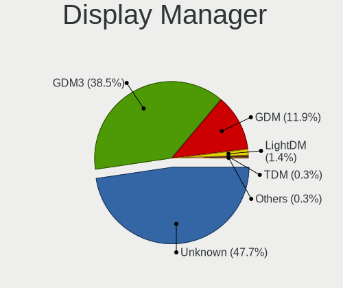
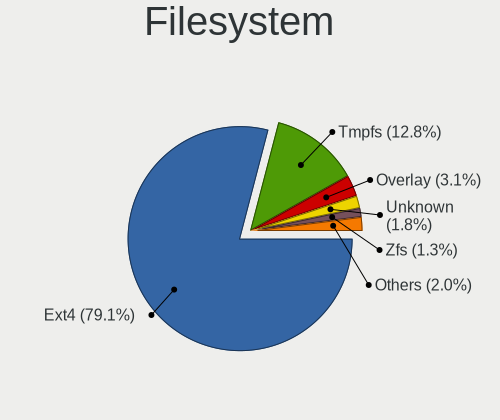
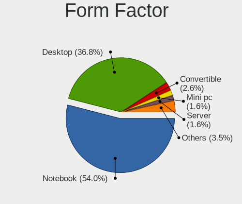
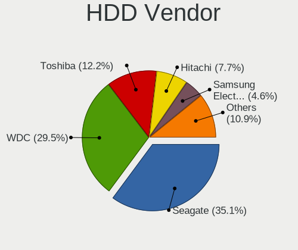
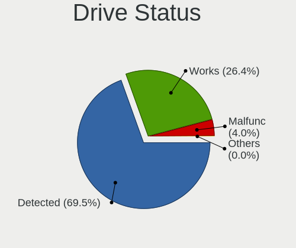
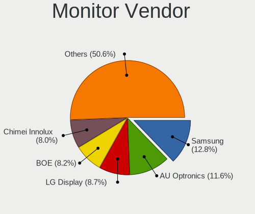
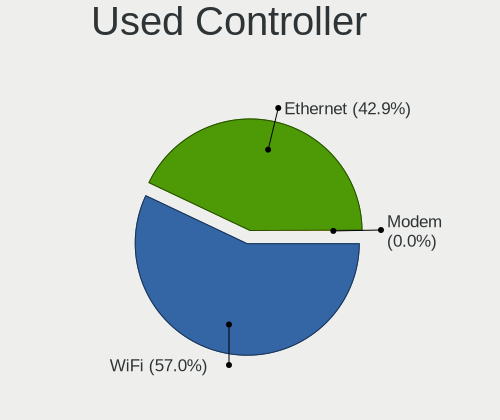
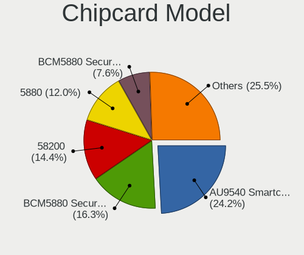

Ubuntu - Tested Hardware & Statistics
-------------------------------------

A project to collect tested hardware configurations for Ubuntu.

Anyone can contribute to this report by the [hw-probe](https://github.com/linuxhw/hw-probe) tool:

    sudo -E hw-probe -all -upload

Please contribute! Especially if your hardware is rare.

This is a report for all computer types. See also reports for [desktops](/Dist/Ubuntu/Desktop/README.md) and [notebooks](/Dist/Ubuntu/Notebook/README.md).

Contents
--------

* [ Test Cases ](#test-cases)

* [ System ](#system)
  - [ OS                       ](#os)
  - [ OS Family                ](#os-family)
  - [ Kernel                   ](#kernel)
  - [ Kernel Family            ](#kernel-family)
  - [ Kernel Major Ver.        ](#kernel-major-ver)
  - [ Arch                     ](#arch)
  - [ DE                       ](#de)
  - [ Display Server           ](#display-server)
  - [ Display Manager          ](#display-manager)
  - [ OS Lang                  ](#os-lang)
  - [ Boot Mode                ](#boot-mode)
  - [ Filesystem               ](#filesystem)
  - [ Part. scheme             ](#part-scheme)
  - [ Dual Boot with Linux/BSD ](#dual-boot-with-linuxbsd)
  - [ Dual Boot (Win)          ](#dual-boot-win)

* [ Board ](#board)
  - [ Vendor                   ](#vendor)
  - [ Model                    ](#model)
  - [ Model Family             ](#model-family)
  - [ MFG Year                 ](#mfg-year)
  - [ Form Factor              ](#form-factor)
  - [ Secure Boot              ](#secure-boot)
  - [ Coreboot                 ](#coreboot)
  - [ RAM Size                 ](#ram-size)
  - [ RAM Used                 ](#ram-used)
  - [ Total Drives             ](#total-drives)
  - [ Has CD-ROM               ](#has-cd-rom)
  - [ Has Ethernet             ](#has-ethernet)
  - [ Has WiFi                 ](#has-wifi)
  - [ Has Bluetooth            ](#has-bluetooth)

* [ Location ](#location)
  - [ Country                  ](#country)
  - [ City                     ](#city)

* [ Drives ](#drives)
  - [ Drive Vendor             ](#drive-vendor)
  - [ Drive Model              ](#drive-model)
  - [ HDD Vendor               ](#hdd-vendor)
  - [ SSD Vendor               ](#ssd-vendor)
  - [ Drive Kind               ](#drive-kind)
  - [ Drive Connector          ](#drive-connector)
  - [ Drive Size               ](#drive-size)
  - [ Space Total              ](#space-total)
  - [ Space Used               ](#space-used)
  - [ Malfunc. Drives          ](#malfunc-drives)
  - [ Malfunc. Drive Vendor    ](#malfunc-drive-vendor)
  - [ Malfunc. HDD Vendor      ](#malfunc-hdd-vendor)
  - [ Malfunc. Drive Kind      ](#malfunc-drive-kind)
  - [ Failed Drives            ](#failed-drives)
  - [ Failed Drive Vendor      ](#failed-drive-vendor)
  - [ Drive Status             ](#drive-status)

* [ Storage controller ](#storage-controller)
  - [ Storage Vendor           ](#storage-vendor)
  - [ Storage Model            ](#storage-model)
  - [ Storage Kind             ](#storage-kind)

* [ Processor ](#processor)
  - [ CPU Vendor               ](#cpu-vendor)
  - [ CPU Model                ](#cpu-model)
  - [ CPU Model Family         ](#cpu-model-family)
  - [ CPU Cores                ](#cpu-cores)
  - [ CPU Sockets              ](#cpu-sockets)
  - [ CPU Threads              ](#cpu-threads)
  - [ CPU Op-Modes             ](#cpu-op-modes)
  - [ CPU Microcode            ](#cpu-microcode)
  - [ CPU Microarch            ](#cpu-microarch)

* [ Graphics ](#graphics)
  - [ GPU Vendor               ](#gpu-vendor)
  - [ GPU Model                ](#gpu-model)
  - [ GPU Combo                ](#gpu-combo)
  - [ GPU Driver               ](#gpu-driver)
  - [ GPU Memory               ](#gpu-memory)

* [ Monitor ](#monitor)
  - [ Monitor Vendor           ](#monitor-vendor)
  - [ Monitor Model            ](#monitor-model)
  - [ Monitor Resolution       ](#monitor-resolution)
  - [ Monitor Diagonal         ](#monitor-diagonal)
  - [ Monitor Width            ](#monitor-width)
  - [ Aspect Ratio             ](#aspect-ratio)
  - [ Monitor Area             ](#monitor-area)
  - [ Pixel Density            ](#pixel-density)
  - [ Multiple Monitors        ](#multiple-monitors)

* [ Network ](#network)
  - [ Net Controller Vendor    ](#net-controller-vendor)
  - [ Net Controller Model     ](#net-controller-model)
  - [ Wireless Vendor          ](#wireless-vendor)
  - [ Wireless Model           ](#wireless-model)
  - [ Ethernet Vendor          ](#ethernet-vendor)
  - [ Ethernet Model           ](#ethernet-model)
  - [ Net Controller Kind      ](#net-controller-kind)
  - [ Used Controller          ](#used-controller)
  - [ NICs                     ](#nics)
  - [ IPv6                     ](#ipv6)

* [ Bluetooth ](#bluetooth)
  - [ Bluetooth Vendor         ](#bluetooth-vendor)
  - [ Bluetooth Model          ](#bluetooth-model)

* [ Sound ](#sound)
  - [ Sound Vendor             ](#sound-vendor)
  - [ Sound Model              ](#sound-model)

* [ Memory ](#memory)
  - [ Memory Vendor            ](#memory-vendor)
  - [ Memory Model             ](#memory-model)
  - [ Memory Kind              ](#memory-kind)
  - [ Memory Form Factor       ](#memory-form-factor)
  - [ Memory Size              ](#memory-size)
  - [ Memory Speed             ](#memory-speed)

* [ Printers & scanners ](#printers--scanners)
  - [ Printer Vendor           ](#printer-vendor)
  - [ Printer Model            ](#printer-model)
  - [ Scanner Vendor           ](#scanner-vendor)
  - [ Scanner Model            ](#scanner-model)

* [ Camera ](#camera)
  - [ Camera Vendor            ](#camera-vendor)
  - [ Camera Model             ](#camera-model)

* [ Security ](#security)
  - [ Fingerprint Vendor       ](#fingerprint-vendor)
  - [ Fingerprint Model        ](#fingerprint-model)
  - [ Chipcard Vendor          ](#chipcard-vendor)
  - [ Chipcard Model           ](#chipcard-model)

* [ Unsupported ](#unsupported)
  - [ Unsupported Devices      ](#unsupported-devices)
  - [ Unsupported Device Types ](#unsupported-device-types)

Test Cases
----------

Total: 105974

| Vendor        | Model                       | Form-Factor | Probe                                                      | Date         |
|---------------|-----------------------------|-------------|------------------------------------------------------------|--------------|
| HP            | Laptop 15-bw0xx             | Notebook    | [be612ae4a6](https://linux-hardware.org/?probe=be612ae4a6) | May 09, 2024 |
| Gigabyte      | Z390 AORUS PRO WIFI-CF      | Desktop     | [f88f22a1b9](https://linux-hardware.org/?probe=f88f22a1b9) | May 09, 2024 |
| ASRock        | B550M Phantom Gaming 4      | Desktop     | [f8574bdf3e](https://linux-hardware.org/?probe=f8574bdf3e) | May 09, 2024 |
| SDZ           | X133                        | Notebook    | [442d4da2a4](https://linux-hardware.org/?probe=442d4da2a4) | May 09, 2024 |
| Dell          | Inspiron 7706 2n1           | Convertible | [958dc9b878](https://linux-hardware.org/?probe=958dc9b878) | May 09, 2024 |
| GEEKOM        | MiniAir 11                  | Server      | [20e4a415d6](https://linux-hardware.org/?probe=20e4a415d6) | May 09, 2024 |
| ASUSTek       | H81M-A/BR                   | Desktop     | [919fba348e](https://linux-hardware.org/?probe=919fba348e) | May 09, 2024 |
| Samsung       | 930QED                      | Convertible | [efc32670b1](https://linux-hardware.org/?probe=efc32670b1) | May 09, 2024 |
| Unknown       | Unknown                     | Desktop     | [d3ffc9eacb](https://linux-hardware.org/?probe=d3ffc9eacb) | May 09, 2024 |
| Fujitsu       | LIFEBOOK E754               | Notebook    | [1240b3da0c](https://linux-hardware.org/?probe=1240b3da0c) | May 09, 2024 |
| Unknown       | Unknown                     | Desktop     | [3027a0b67c](https://linux-hardware.org/?probe=3027a0b67c) | May 09, 2024 |
| ASUSTek       | ROG STRIX B650E-I GAMING... | Desktop     | [bdcf61edde](https://linux-hardware.org/?probe=bdcf61edde) | May 09, 2024 |
| Gigabyte      | Z87X-UD4H-CF                | Desktop     | [f26982efc3](https://linux-hardware.org/?probe=f26982efc3) | May 09, 2024 |
| GEEKOM        | MiniAir 11                  | Server      | [9a6f3f3e69](https://linux-hardware.org/?probe=9a6f3f3e69) | May 09, 2024 |
| eMachines     | WMCP61M                     | Desktop     | [14e676a6db](https://linux-hardware.org/?probe=14e676a6db) | May 09, 2024 |
| Lenovo        | IdeaPad S340-14API 81NB     | Notebook    | [6bb0aa91af](https://linux-hardware.org/?probe=6bb0aa91af) | May 09, 2024 |
| ASUSTek       | VivoBook_ASUSLaptop K370... | Notebook    | [57bc46051b](https://linux-hardware.org/?probe=57bc46051b) | May 08, 2024 |
| Lenovo        | Z50-75 80EC                 | Notebook    | [1a1e8edc3b](https://linux-hardware.org/?probe=1a1e8edc3b) | May 08, 2024 |
| ATOPNUC       | MA90                        | Mini pc     | [8098193095](https://linux-hardware.org/?probe=8098193095) | May 08, 2024 |
| Acer          | Veriton X2631G V:1.0        | Desktop     | [221cf17e59](https://linux-hardware.org/?probe=221cf17e59) | May 08, 2024 |
| MSI           | GE66 Raider 10UG            | Notebook    | [d19e5447f5](https://linux-hardware.org/?probe=d19e5447f5) | May 08, 2024 |
| Lenovo        | ThinkBook 15 G4 IAP 21DJ    | Notebook    | [259fba9825](https://linux-hardware.org/?probe=259fba9825) | May 08, 2024 |
| Apple         | MacBookPro8,2               | Notebook    | [2410273443](https://linux-hardware.org/?probe=2410273443) | May 08, 2024 |
| Gigabyte      | Z170N-WIFI-CF               | Desktop     | [7a88f50508](https://linux-hardware.org/?probe=7a88f50508) | May 08, 2024 |
| Gigabyte      | Z170N-WIFI-CF               | Desktop     | [6143f9e1aa](https://linux-hardware.org/?probe=6143f9e1aa) | May 08, 2024 |
| HP            | 18E7                        | Desktop     | [fa637b3b9a](https://linux-hardware.org/?probe=fa637b3b9a) | May 08, 2024 |
| ASUSTek       | P8H67                       | Desktop     | [ebf3b0112a](https://linux-hardware.org/?probe=ebf3b0112a) | May 08, 2024 |
| ASUSTek       | P8H67                       | Desktop     | [7c9d6cd1b4](https://linux-hardware.org/?probe=7c9d6cd1b4) | May 08, 2024 |
| Lenovo        | ThinkPad E14 Gen 3 20YFC... | Notebook    | [6a43088440](https://linux-hardware.org/?probe=6a43088440) | May 08, 2024 |
| Apple         | MacBookPro11,1              | Notebook    | [5d23c7ed6f](https://linux-hardware.org/?probe=5d23c7ed6f) | May 08, 2024 |
| HP            | ProBook 4740s               | Notebook    | [7f39194517](https://linux-hardware.org/?probe=7f39194517) | May 08, 2024 |
| HUAWEI        | BC11HGSB0 V100R003          | Server      | [ce27371402](https://linux-hardware.org/?probe=ce27371402) | May 08, 2024 |
| HP            | Laptop 15s-fq2xxx           | Notebook    | [31a04e0322](https://linux-hardware.org/?probe=31a04e0322) | May 08, 2024 |
| ASRock        | B550M Phantom Gaming 4      | Desktop     | [8210b8f2f9](https://linux-hardware.org/?probe=8210b8f2f9) | May 08, 2024 |
| Dell          | Inspiron 7415 2-in-1        | Convertible | [2bf4332abb](https://linux-hardware.org/?probe=2bf4332abb) | May 08, 2024 |
| Micro Elec... | MG-VCP15I-3070              | Notebook    | [11e90f3f8f](https://linux-hardware.org/?probe=11e90f3f8f) | May 08, 2024 |
| Dell          | Inspiron 7415 2-in-1        | Convertible | [8f09e9d011](https://linux-hardware.org/?probe=8f09e9d011) | May 08, 2024 |
| Samsung       | SR700                       | Notebook    | [97ed5b7fc7](https://linux-hardware.org/?probe=97ed5b7fc7) | May 08, 2024 |
| ASRock        | Z77 Performance             | Desktop     | [500cd7ed60](https://linux-hardware.org/?probe=500cd7ed60) | May 08, 2024 |
| Supermicro    | X9DRW                       | Server      | [fd0af1a212](https://linux-hardware.org/?probe=fd0af1a212) | May 08, 2024 |
| HP            | ZBook Power 15.6 inch G8... | Notebook    | [291c23ee80](https://linux-hardware.org/?probe=291c23ee80) | May 08, 2024 |
| Lenovo        | V15 G4 AMN 82YU             | Notebook    | [3742af3546](https://linux-hardware.org/?probe=3742af3546) | May 08, 2024 |
| ASUSTek       | ASUS TUF Gaming A15 FA50... | Notebook    | [ae1ef1680a](https://linux-hardware.org/?probe=ae1ef1680a) | May 08, 2024 |
| Acer          | Swift SF314-71              | Notebook    | [23d1f2e74a](https://linux-hardware.org/?probe=23d1f2e74a) | May 08, 2024 |
| Lenovo        | ThinkPad P14s Gen 4 21K5... | Notebook    | [e00e076344](https://linux-hardware.org/?probe=e00e076344) | May 08, 2024 |
| HP            | ProLiant DL160 G6           | Server      | [1f19c32b7d](https://linux-hardware.org/?probe=1f19c32b7d) | May 08, 2024 |
| Dell          | Latitude E5520              | Notebook    | [1c27a2760d](https://linux-hardware.org/?probe=1c27a2760d) | May 08, 2024 |
| HP            | ProBook 440 14 inch G9 N... | Notebook    | [6ac93f82e9](https://linux-hardware.org/?probe=6ac93f82e9) | May 08, 2024 |
| HP            | EliteBook 840 G8            | Notebook    | [6d255e156e](https://linux-hardware.org/?probe=6d255e156e) | May 08, 2024 |
| Hetrix        | Unknown                     | Notebook    | [72a5c6fffe](https://linux-hardware.org/?probe=72a5c6fffe) | May 08, 2024 |
| Lenovo        | V15 G4 AMN 82YU             | Notebook    | [29552fbf93](https://linux-hardware.org/?probe=29552fbf93) | May 08, 2024 |
| Unknown       | Unknown                     | Desktop     | [07a1876fd0](https://linux-hardware.org/?probe=07a1876fd0) | May 08, 2024 |
| ASUSTek       | ProArt Z690-CREATOR WIFI    | Desktop     | [7cc03eaae9](https://linux-hardware.org/?probe=7cc03eaae9) | May 08, 2024 |
| HP            | Laptop 15s-fq2xxx           | Notebook    | [ade9d916fe](https://linux-hardware.org/?probe=ade9d916fe) | May 08, 2024 |
| Dell          | 0HHV7N A00                  | Desktop     | [63a26dac69](https://linux-hardware.org/?probe=63a26dac69) | May 08, 2024 |
| AZW           | SER V1.0                    | Mini pc     | [511ee9983e](https://linux-hardware.org/?probe=511ee9983e) | May 08, 2024 |
| ASUSTek       | UX430UQ                     | Notebook    | [7b9134699a](https://linux-hardware.org/?probe=7b9134699a) | May 08, 2024 |
| ASUSTek       | Q550LF                      | Notebook    | [15c9500499](https://linux-hardware.org/?probe=15c9500499) | May 07, 2024 |
| ASUSTek       | Q550LF                      | Notebook    | [98ddf90ae6](https://linux-hardware.org/?probe=98ddf90ae6) | May 07, 2024 |
| Lenovo        | ThinkPad T490 20N2003PUS    | Notebook    | [7f484baa22](https://linux-hardware.org/?probe=7f484baa22) | May 07, 2024 |
| Lenovo        | 1046 SDK0T08861 WIN 3305... | Desktop     | [91c857f51e](https://linux-hardware.org/?probe=91c857f51e) | May 07, 2024 |
| ASUSTek       | PRIME B760M-A WIFI D4       | Desktop     | [d83d6a3460](https://linux-hardware.org/?probe=d83d6a3460) | May 07, 2024 |
| ASUSTek       | ROG STRIX B450-F GAMING ... | Desktop     | [cdcaeb4d46](https://linux-hardware.org/?probe=cdcaeb4d46) | May 07, 2024 |
| Dell          | 0215PR A02                  | Desktop     | [ff480889b4](https://linux-hardware.org/?probe=ff480889b4) | May 07, 2024 |
| HP            | Pavilion Sleekbook 15       | Notebook    | [9cd7bfcd0f](https://linux-hardware.org/?probe=9cd7bfcd0f) | May 07, 2024 |
| Dell          | XPS 15 9530                 | Notebook    | [cdcf7e98eb](https://linux-hardware.org/?probe=cdcf7e98eb) | May 07, 2024 |
| ASUSTek       | P5K3 Deluxe                 | Desktop     | [b03bf61625](https://linux-hardware.org/?probe=b03bf61625) | May 07, 2024 |
| ASUSTek       | X555LD                      | Notebook    | [989d24a4b7](https://linux-hardware.org/?probe=989d24a4b7) | May 07, 2024 |
| Dell          | 0XHGV1 A00                  | Desktop     | [b56a1f70d1](https://linux-hardware.org/?probe=b56a1f70d1) | May 07, 2024 |
| Gigabyte      | H410M H V3                  | Desktop     | [486c191884](https://linux-hardware.org/?probe=486c191884) | May 07, 2024 |
| Dell          | 0XHGV1 A00                  | Desktop     | [35681eda7f](https://linux-hardware.org/?probe=35681eda7f) | May 07, 2024 |
| Lenovo        | ThinkPad P14s Gen 4 21HF... | Notebook    | [85239f7dc1](https://linux-hardware.org/?probe=85239f7dc1) | May 07, 2024 |
| Supermicro    | X10DDW-i                    | Desktop     | [ff62f6b4d9](https://linux-hardware.org/?probe=ff62f6b4d9) | May 07, 2024 |
| Supermicro    | X10DDW-i                    | Desktop     | [b849fea196](https://linux-hardware.org/?probe=b849fea196) | May 07, 2024 |
| Supermicro    | X10DDW-i                    | Desktop     | [c20ef4d35b](https://linux-hardware.org/?probe=c20ef4d35b) | May 07, 2024 |
| Supermicro    | X10DDW-i                    | Desktop     | [9b21386a04](https://linux-hardware.org/?probe=9b21386a04) | May 07, 2024 |
| Supermicro    | X10DDW-i                    | Desktop     | [99fbeae8c9](https://linux-hardware.org/?probe=99fbeae8c9) | May 07, 2024 |
| Supermicro    | X10DDW-i                    | Desktop     | [48bb233b46](https://linux-hardware.org/?probe=48bb233b46) | May 07, 2024 |
| Supermicro    | X9DRW                       | Server      | [7915255781](https://linux-hardware.org/?probe=7915255781) | May 07, 2024 |
| Supermicro    | X10DRL-i                    | Desktop     | [da5c3ed75f](https://linux-hardware.org/?probe=da5c3ed75f) | May 07, 2024 |
| Acer          | Veriton N4640G              | Desktop     | [44c62400f4](https://linux-hardware.org/?probe=44c62400f4) | May 07, 2024 |
| ASUSTek       | TUF Gaming B560M-PLUS       | Desktop     | [ec3b3b1daa](https://linux-hardware.org/?probe=ec3b3b1daa) | May 07, 2024 |
| Shenzhen M... | F7BSC                       | Desktop     | [9e6a5eb0e2](https://linux-hardware.org/?probe=9e6a5eb0e2) | May 07, 2024 |
| Lenovo        | ThinkPad P14s Gen 1 20Y2... | Notebook    | [064b211de8](https://linux-hardware.org/?probe=064b211de8) | May 07, 2024 |
| Notebook      | NS50_70MU                   | Notebook    | [99983ceae1](https://linux-hardware.org/?probe=99983ceae1) | May 07, 2024 |
| Acer          | Veriton N4640G              | Desktop     | [ebe4fa74ca](https://linux-hardware.org/?probe=ebe4fa74ca) | May 07, 2024 |
| Intel         | NUC6i3SYB H81132-505        | Mini pc     | [de6a8d14f1](https://linux-hardware.org/?probe=de6a8d14f1) | May 07, 2024 |
| Dell          | Latitude 3310 2-in-1        | Convertible | [2b066bf51c](https://linux-hardware.org/?probe=2b066bf51c) | May 07, 2024 |
| Dell          | Latitude 7480               | Notebook    | [2b3aee3902](https://linux-hardware.org/?probe=2b3aee3902) | May 07, 2024 |
| Gigabyte      | B460 HD3                    | Desktop     | [8d8fcf703b](https://linux-hardware.org/?probe=8d8fcf703b) | May 07, 2024 |
| Supermicro    | X8DT6                       | Server      | [9a70e94fb0](https://linux-hardware.org/?probe=9a70e94fb0) | May 07, 2024 |
| Intel         | SKYBAY                      | Desktop     | [7e692c7e40](https://linux-hardware.org/?probe=7e692c7e40) | May 07, 2024 |
| MSI           | Thin GF63 12UCX             | Notebook    | [f253ec6e52](https://linux-hardware.org/?probe=f253ec6e52) | May 07, 2024 |
| Supermicro    | X8DT6                       | Server      | [c3428daaf1](https://linux-hardware.org/?probe=c3428daaf1) | May 07, 2024 |
| Lenovo        | ThinkPad T480 20L5A023HK    | Notebook    | [ff78bb7112](https://linux-hardware.org/?probe=ff78bb7112) | May 07, 2024 |
| Dell          | Inspiron 5547               | Notebook    | [b8dd9a912d](https://linux-hardware.org/?probe=b8dd9a912d) | May 07, 2024 |
| Apple         | Mac-F2268CC8                | All in one  | [b3b751a603](https://linux-hardware.org/?probe=b3b751a603) | May 07, 2024 |
| Dell          | Latitude 9430               | Notebook    | [953be205ca](https://linux-hardware.org/?probe=953be205ca) | May 07, 2024 |
| HP            | 815A                        | Mini pc     | [44b77bda73](https://linux-hardware.org/?probe=44b77bda73) | May 07, 2024 |
| HP            | EliteBook 840 G8            | Notebook    | [f60faaeec0](https://linux-hardware.org/?probe=f60faaeec0) | May 07, 2024 |
| Lenovo        | ThinkServer TS140           | Desktop     | [be7444624d](https://linux-hardware.org/?probe=be7444624d) | May 07, 2024 |
| Sony          | SVF1521E2EW                 | Notebook    | [2e86efc1ba](https://linux-hardware.org/?probe=2e86efc1ba) | May 07, 2024 |
| ASRock        | A300M-STX                   | Desktop     | [cdf544ca1d](https://linux-hardware.org/?probe=cdf544ca1d) | May 07, 2024 |
| HP            | Laptop 15-bw0xx             | Notebook    | [f605dfd9c2](https://linux-hardware.org/?probe=f605dfd9c2) | May 07, 2024 |
| ASUSTek       | H81M-A/BR                   | Desktop     | [8f7abd7f23](https://linux-hardware.org/?probe=8f7abd7f23) | May 07, 2024 |
| Gigabyte      | B75M-D3H                    | Desktop     | [a10be2227c](https://linux-hardware.org/?probe=a10be2227c) | May 07, 2024 |
| HP            | ProBook 645 G3              | Notebook    | [29cb5b66f8](https://linux-hardware.org/?probe=29cb5b66f8) | May 07, 2024 |
| Dell          | 02YRK5 A02                  | Desktop     | [fea15ab44c](https://linux-hardware.org/?probe=fea15ab44c) | May 07, 2024 |
| HP            | ProBook 430 G8 Notebook ... | Notebook    | [be061de1c7](https://linux-hardware.org/?probe=be061de1c7) | May 07, 2024 |
| Lenovo        | 375C No DPK                 | All in one  | [46bbdf2453](https://linux-hardware.org/?probe=46bbdf2453) | May 07, 2024 |
| Unknown       | Edgepoint Tactical (Ketz... | Soc         | [686788fe19](https://linux-hardware.org/?probe=686788fe19) | May 07, 2024 |
| HP            | ZBook 15 G6                 | Notebook    | [4a401c8b15](https://linux-hardware.org/?probe=4a401c8b15) | May 06, 2024 |
| ASUSTek       | PRIME H510M-E               | Desktop     | [bf4a7b097c](https://linux-hardware.org/?probe=bf4a7b097c) | May 06, 2024 |
| Sony          | VPCEB1S1E                   | Notebook    | [db144a8fd9](https://linux-hardware.org/?probe=db144a8fd9) | May 06, 2024 |
| ASUSTek       | PRIME H510M-E               | Desktop     | [e76f332009](https://linux-hardware.org/?probe=e76f332009) | May 06, 2024 |
| Dell          | 02YYK5 A01                  | Desktop     | [09b75f38cd](https://linux-hardware.org/?probe=09b75f38cd) | May 06, 2024 |
| ASUSTek       | ROG Zephyrus G14 GA401IH... | Notebook    | [e19fea8a49](https://linux-hardware.org/?probe=e19fea8a49) | May 06, 2024 |
| MSI           | MAG Z690 TOMAHAWK WIFI D... | Desktop     | [8848310fde](https://linux-hardware.org/?probe=8848310fde) | May 06, 2024 |
| ASUSTek       | ROG STRIX X299-E GAMING ... | Desktop     | [fc1633451e](https://linux-hardware.org/?probe=fc1633451e) | May 06, 2024 |
| Dell          | 042P49 A02                  | Desktop     | [4b9e2674de](https://linux-hardware.org/?probe=4b9e2674de) | May 06, 2024 |
| Dell          | 042P49 A02                  | Desktop     | [146a7db97f](https://linux-hardware.org/?probe=146a7db97f) | May 06, 2024 |
| Alurin        | ALU-BAR-I511-000-140        | Notebook    | [04578b9c4b](https://linux-hardware.org/?probe=04578b9c4b) | May 06, 2024 |
| Medion        | E14223                      | Notebook    | [73ae3c5e79](https://linux-hardware.org/?probe=73ae3c5e79) | May 06, 2024 |
| Unknown       | Unknown                     | Notebook    | [273d6afeb5](https://linux-hardware.org/?probe=273d6afeb5) | May 06, 2024 |
| Gigabyte      | B550M DS3H AC               | Desktop     | [ce0082648a](https://linux-hardware.org/?probe=ce0082648a) | May 06, 2024 |
| ASUSTek       | Zenbook UX5401ZA_UX5401Z... | Notebook    | [92089af4b7](https://linux-hardware.org/?probe=92089af4b7) | May 06, 2024 |
| MASSCOM VI... | L133                        | Notebook    | [12b6c6b515](https://linux-hardware.org/?probe=12b6c6b515) | May 06, 2024 |
| Gigabyte      | B550M DS3H AC               | Desktop     | [9f866b203a](https://linux-hardware.org/?probe=9f866b203a) | May 06, 2024 |
| ASUSTek       | VivoBook_ASUSLaptop K360... | Notebook    | [5a788054ec](https://linux-hardware.org/?probe=5a788054ec) | May 06, 2024 |
| Dell          | 0C2KJT A00                  | Desktop     | [a884cd0cf5](https://linux-hardware.org/?probe=a884cd0cf5) | May 06, 2024 |
| ASUSTek       | TUF Gaming Z790-PRO WIFI    | Desktop     | [07048840f0](https://linux-hardware.org/?probe=07048840f0) | May 06, 2024 |
| Apple         | MacBookPro8,1               | Notebook    | [2487a975e8](https://linux-hardware.org/?probe=2487a975e8) | May 06, 2024 |
| Dell          | Latitude 5440               | Notebook    | [f6c9287953](https://linux-hardware.org/?probe=f6c9287953) | May 06, 2024 |
| ASUSTek       | TUF Gaming Z790-PLUS WIF... | Desktop     | [326b0babab](https://linux-hardware.org/?probe=326b0babab) | May 06, 2024 |
| ASUSTek       | Z240IC-H170                 | All in one  | [978c7be506](https://linux-hardware.org/?probe=978c7be506) | May 06, 2024 |
| ASUSTek       | TUF Gaming Z790-PLUS WIF... | Desktop     | [38b9f94aeb](https://linux-hardware.org/?probe=38b9f94aeb) | May 06, 2024 |
| Dell          | 0478VN A00                  | Desktop     | [305f343c95](https://linux-hardware.org/?probe=305f343c95) | May 06, 2024 |
| ASUSTek       | P8H67-M PRO                 | Desktop     | [2af49854e2](https://linux-hardware.org/?probe=2af49854e2) | May 06, 2024 |
| ASUSTek       | ROG STRIX Z690-G GAMING ... | Desktop     | [a923d8607b](https://linux-hardware.org/?probe=a923d8607b) | May 06, 2024 |
| Dell          | System XPS L702X            | Notebook    | [fec4b7f7ff](https://linux-hardware.org/?probe=fec4b7f7ff) | May 06, 2024 |
| HP            | ProLiant DL360 Gen9         | Server      | [162040356c](https://linux-hardware.org/?probe=162040356c) | May 06, 2024 |
| Dell          | Vostro 3520                 | Notebook    | [0b420358ac](https://linux-hardware.org/?probe=0b420358ac) | May 06, 2024 |
| HP            | Pavilion Laptop 15-eh1xx... | Notebook    | [d73bdd4b76](https://linux-hardware.org/?probe=d73bdd4b76) | May 06, 2024 |
| ASUSTek       | VivoBook_ASUSLaptop X513... | Notebook    | [d4cca237f2](https://linux-hardware.org/?probe=d4cca237f2) | May 06, 2024 |
| ASUSTek       | VivoBook_ASUSLaptop X513... | Notebook    | [e5685451f5](https://linux-hardware.org/?probe=e5685451f5) | May 06, 2024 |
| Sony          | VPCEB1S1E                   | Notebook    | [aa8d766ae4](https://linux-hardware.org/?probe=aa8d766ae4) | May 06, 2024 |
| Dell          | Inspiron 15 3520            | Notebook    | [c9bddc6d00](https://linux-hardware.org/?probe=c9bddc6d00) | May 06, 2024 |
| Dell          | 00CV7F A00                  | Desktop     | [83dce373d6](https://linux-hardware.org/?probe=83dce373d6) | May 06, 2024 |
| Lenovo        | ThinkPad P50 20ENCTO1WW     | Notebook    | [9adbb0ba2c](https://linux-hardware.org/?probe=9adbb0ba2c) | May 06, 2024 |
| Lenovo        | IdeaPad 330-15IKB 81DC      | Notebook    | [bc2508bd91](https://linux-hardware.org/?probe=bc2508bd91) | May 06, 2024 |
| Lenovo        | ThinkPad P50 20ENCTO1WW     | Notebook    | [465a5be052](https://linux-hardware.org/?probe=465a5be052) | May 06, 2024 |
| MSI           | H110M PRO-VH                | Desktop     | [f0e62a158e](https://linux-hardware.org/?probe=f0e62a158e) | May 06, 2024 |
| Lenovo        | SHARKBAY NOK                | Desktop     | [11bef15f7d](https://linux-hardware.org/?probe=11bef15f7d) | May 06, 2024 |
| Acer          | Nitro AN515-46              | Notebook    | [b29aba86be](https://linux-hardware.org/?probe=b29aba86be) | May 06, 2024 |
| ASRock        | X79 Extreme9                | Desktop     | [a65acf43f1](https://linux-hardware.org/?probe=a65acf43f1) | May 06, 2024 |
| Dell          | 0F642F A00                  | Desktop     | [fc2a825e57](https://linux-hardware.org/?probe=fc2a825e57) | May 06, 2024 |
| MSI           | 2AE0                        | Desktop     | [25c9b3836b](https://linux-hardware.org/?probe=25c9b3836b) | May 06, 2024 |
| HP            | ZBook Studio G3             | Notebook    | [be52b86bc0](https://linux-hardware.org/?probe=be52b86bc0) | May 06, 2024 |
| Fujitsu       | LIFEBOOK E754               | Notebook    | [c201d1f500](https://linux-hardware.org/?probe=c201d1f500) | May 06, 2024 |
| Supermicro    | X10DRL-i                    | Desktop     | [80cdad1821](https://linux-hardware.org/?probe=80cdad1821) | May 06, 2024 |
| Unknown       | Orange Pi 5                 | Soc         | [b81f4223f3](https://linux-hardware.org/?probe=b81f4223f3) | May 06, 2024 |
| MSI           | K9N6PGM2-V2                 | Desktop     | [a79d33d7cf](https://linux-hardware.org/?probe=a79d33d7cf) | May 06, 2024 |
| ADVAN         | 1701                        | Notebook    | [e0928a1604](https://linux-hardware.org/?probe=e0928a1604) | May 06, 2024 |
| Lenovo        | ThinkPad P17 Gen 1 20SQS... | Notebook    | [8c2af338dc](https://linux-hardware.org/?probe=8c2af338dc) | May 06, 2024 |
| ASUSTek       | H97-PLUS                    | Desktop     | [4f4fcced1c](https://linux-hardware.org/?probe=4f4fcced1c) | May 06, 2024 |
| Dell          | Latitude 5400               | Notebook    | [cf78549103](https://linux-hardware.org/?probe=cf78549103) | May 06, 2024 |
| HP            | ProBook 450 G6              | Notebook    | [cb4f1dbbfa](https://linux-hardware.org/?probe=cb4f1dbbfa) | May 06, 2024 |
| Monster       | ABRA A7 V13.2               | Notebook    | [fef4f4d7d4](https://linux-hardware.org/?probe=fef4f4d7d4) | May 06, 2024 |
| Unknown       | Orange Pi 5 Plus            | Soc         | [f22091b0c8](https://linux-hardware.org/?probe=f22091b0c8) | May 06, 2024 |
| Lenovo        | Unknown                     | Notebook    | [5087593233](https://linux-hardware.org/?probe=5087593233) | May 06, 2024 |
| Xiaomi        | Pad 5                       | Notebook    | [2ee74fac7d](https://linux-hardware.org/?probe=2ee74fac7d) | May 05, 2024 |
| Toshiba       | Satellite A200              | Notebook    | [633754915c](https://linux-hardware.org/?probe=633754915c) | May 05, 2024 |
| Unknown       | Unknown                     | Soc         | [938f2c805c](https://linux-hardware.org/?probe=938f2c805c) | May 05, 2024 |
| MSI           | MEG Z690 UNIFY              | Desktop     | [614bab5cb0](https://linux-hardware.org/?probe=614bab5cb0) | May 05, 2024 |
| Lenovo        | IdeaPad Slim 5 16IRL8 82... | Notebook    | [2cace801f8](https://linux-hardware.org/?probe=2cace801f8) | May 05, 2024 |
| ASUSTek       | X450CC                      | Notebook    | [1085d5cad5](https://linux-hardware.org/?probe=1085d5cad5) | May 05, 2024 |
| Toshiba       | Satellite A200              | Notebook    | [ba705e9e1b](https://linux-hardware.org/?probe=ba705e9e1b) | May 05, 2024 |
| Dell          | Vostro 3405                 | Notebook    | [85b53deb59](https://linux-hardware.org/?probe=85b53deb59) | May 05, 2024 |
| Dell          | Vostro 3405                 | Notebook    | [ae06ac7700](https://linux-hardware.org/?probe=ae06ac7700) | May 05, 2024 |
| Acer          | Aspire A315-510P            | Notebook    | [802925480b](https://linux-hardware.org/?probe=802925480b) | May 05, 2024 |
| MSI           | MAG B550 TOMAHAWK           | Desktop     | [9da2a84508](https://linux-hardware.org/?probe=9da2a84508) | May 05, 2024 |
| MACHINIST     | X99 PR9                     | Desktop     | [0503106449](https://linux-hardware.org/?probe=0503106449) | May 05, 2024 |
| Pegatron      | IPXSB-H61                   | Desktop     | [2a449d83d3](https://linux-hardware.org/?probe=2a449d83d3) | May 05, 2024 |
| Intel         | NUC11TNBi5 M11904-404       | Mini pc     | [0ddd0cd5f9](https://linux-hardware.org/?probe=0ddd0cd5f9) | May 05, 2024 |
| Dell          | Precision 3561              | Notebook    | [1e92742d1f](https://linux-hardware.org/?probe=1e92742d1f) | May 05, 2024 |
| ASUSTek       | SABERTOOTH Z87              | Desktop     | [c886338e7a](https://linux-hardware.org/?probe=c886338e7a) | May 05, 2024 |
| Novatech      | NE14I310                    | Notebook    | [edf97226ed](https://linux-hardware.org/?probe=edf97226ed) | May 05, 2024 |
| Timi          | TM1701                      | Notebook    | [305b97ebea](https://linux-hardware.org/?probe=305b97ebea) | May 05, 2024 |
| ASUSTek       | SABERTOOTH Z87              | Desktop     | [9b9d434149](https://linux-hardware.org/?probe=9b9d434149) | May 05, 2024 |
| Samsung       | 730QED                      | Convertible | [392bee96b2](https://linux-hardware.org/?probe=392bee96b2) | May 05, 2024 |
| Unknown       | Unknown                     | Notebook    | [8876712f97](https://linux-hardware.org/?probe=8876712f97) | May 05, 2024 |
| Unknown       | Unknown                     | Notebook    | [7cbaf2743a](https://linux-hardware.org/?probe=7cbaf2743a) | May 05, 2024 |
| Intel Clie... | LAPAC71H                    | Notebook    | [e599c3f230](https://linux-hardware.org/?probe=e599c3f230) | May 05, 2024 |
| ASUSTek       | TUF Gaming A520M-PLUS WI... | Desktop     | [e4b1fdc5b2](https://linux-hardware.org/?probe=e4b1fdc5b2) | May 05, 2024 |
| Dell          | 03RT16 A00                  | Desktop     | [e88cedcfb7](https://linux-hardware.org/?probe=e88cedcfb7) | May 05, 2024 |
| Lenovo        | ThinkPad T440p 20AWS0HN0... | Notebook    | [dcdedc549d](https://linux-hardware.org/?probe=dcdedc549d) | May 05, 2024 |
| Supermicro    | X7DCL                       | Desktop     | [9644da40a4](https://linux-hardware.org/?probe=9644da40a4) | May 05, 2024 |
| ASUSTek       | ASUS TUF Gaming A15 FA50... | Notebook    | [b86bb80db9](https://linux-hardware.org/?probe=b86bb80db9) | May 05, 2024 |
| Fujitsu       | CELSIUS H730                | Notebook    | [78e1a3550b](https://linux-hardware.org/?probe=78e1a3550b) | May 05, 2024 |
| HP            | Laptop 15s-fq2xxx           | Notebook    | [c9843fc5d2](https://linux-hardware.org/?probe=c9843fc5d2) | May 05, 2024 |
| MSI           | PRO B660M-A WIFI DDR4       | Desktop     | [7988d977fe](https://linux-hardware.org/?probe=7988d977fe) | May 05, 2024 |
| Apple         | MacBookPro6,2               | Notebook    | [01201fa443](https://linux-hardware.org/?probe=01201fa443) | May 05, 2024 |
| Lenovo        | ThinkPad T440p 20AWS0HN0... | Notebook    | [68020b1c69](https://linux-hardware.org/?probe=68020b1c69) | May 05, 2024 |
| Dell          | 0J9VVP A00                  | Desktop     | [5971526cf6](https://linux-hardware.org/?probe=5971526cf6) | May 05, 2024 |
| HP            | 806A                        | Desktop     | [d28c449530](https://linux-hardware.org/?probe=d28c449530) | May 05, 2024 |
| Lenovo        | 36F7 SDK0J40700 WIN 3258... | Desktop     | [7380e71093](https://linux-hardware.org/?probe=7380e71093) | May 05, 2024 |
| Dell          | 0J9VVP A00                  | Desktop     | [f75406b494](https://linux-hardware.org/?probe=f75406b494) | May 05, 2024 |
| Gigabyte      | AB350-Gaming 3-CF           | Desktop     | [a099133a32](https://linux-hardware.org/?probe=a099133a32) | May 05, 2024 |
| Dell          | 03X6X0 A06                  | Server      | [2e6f46fe60](https://linux-hardware.org/?probe=2e6f46fe60) | May 05, 2024 |
| MSI           | MAG Z590 TORPEDO            | Desktop     | [19cb329ead](https://linux-hardware.org/?probe=19cb329ead) | May 05, 2024 |
| Lenovo        | ThinkPad P16 Gen 1 21D60... | Notebook    | [bc053b7c75](https://linux-hardware.org/?probe=bc053b7c75) | May 05, 2024 |
| MSI           | WS66 11UKT                  | Notebook    | [f9ab812619](https://linux-hardware.org/?probe=f9ab812619) | May 05, 2024 |
| ASUSTek       | VivoBook_ASUSLaptop M160... | Notebook    | [3602db941f](https://linux-hardware.org/?probe=3602db941f) | May 05, 2024 |
| Shenzhen M... | F7BFD                       | Desktop     | [41da20c6a7](https://linux-hardware.org/?probe=41da20c6a7) | May 05, 2024 |
| Novatech      | NE14I310                    | Notebook    | [f2a49ce1fc](https://linux-hardware.org/?probe=f2a49ce1fc) | May 05, 2024 |
| MSI           | MPG Z690 FORCE WIFI         | Desktop     | [4e837501bb](https://linux-hardware.org/?probe=4e837501bb) | May 05, 2024 |
| Acer          | AOD270                      | Notebook    | [af6b765474](https://linux-hardware.org/?probe=af6b765474) | May 05, 2024 |
| MSI           | MAG Z590 TORPEDO            | Desktop     | [da37bf116d](https://linux-hardware.org/?probe=da37bf116d) | May 04, 2024 |
| Dell          | Precision 3510              | Notebook    | [c57923e0ff](https://linux-hardware.org/?probe=c57923e0ff) | May 04, 2024 |
| HP            | EliteBook 850 G5            | Notebook    | [997c27445a](https://linux-hardware.org/?probe=997c27445a) | May 04, 2024 |
| Dell          | 0J3492                      | Desktop     | [0bf461dd56](https://linux-hardware.org/?probe=0bf461dd56) | May 04, 2024 |
| Samsung       | R780                        | Notebook    | [5a838d44cd](https://linux-hardware.org/?probe=5a838d44cd) | May 04, 2024 |
| Apple         | MacBookPro8,1               | Notebook    | [54ecba24d6](https://linux-hardware.org/?probe=54ecba24d6) | May 04, 2024 |
| Raspberry ... | Raspberry Pi                | Soc         | [128b15cf8a](https://linux-hardware.org/?probe=128b15cf8a) | May 04, 2024 |
| Dell          | Precision 3510              | Notebook    | [0c006aad0f](https://linux-hardware.org/?probe=0c006aad0f) | May 04, 2024 |
| HP            | HPPavilionLaptop15-eh0xx... | Notebook    | [2d309668c0](https://linux-hardware.org/?probe=2d309668c0) | May 04, 2024 |
| HP            | ProBook 6470b               | Notebook    | [3865a636e2](https://linux-hardware.org/?probe=3865a636e2) | May 04, 2024 |
| Gigabyte      | B560 HD3                    | Desktop     | [dfe7ad1035](https://linux-hardware.org/?probe=dfe7ad1035) | May 04, 2024 |
| Intel         | NUC13ANBi7 M89645-203       | Mini pc     | [147f6a0701](https://linux-hardware.org/?probe=147f6a0701) | May 04, 2024 |
| Dell          | G15 5511                    | Notebook    | [8bb70e4a24](https://linux-hardware.org/?probe=8bb70e4a24) | May 04, 2024 |
| Apple         | Mac-F2268CC8                | All in one  | [52e29652a0](https://linux-hardware.org/?probe=52e29652a0) | May 04, 2024 |
| Packard Be... | IMEDIA S3840                | Desktop     | [52543a4786](https://linux-hardware.org/?probe=52543a4786) | May 04, 2024 |
| Lenovo        | ThinkPad T495 20NJCTO1WW    | Notebook    | [2dfceb527c](https://linux-hardware.org/?probe=2dfceb527c) | May 04, 2024 |
| Hardkernel    | ODROID-H3                   | Desktop     | [e9ea8670f9](https://linux-hardware.org/?probe=e9ea8670f9) | May 04, 2024 |
| ASRock        | Z590M-ITX/ax                | Desktop     | [bd54fbe980](https://linux-hardware.org/?probe=bd54fbe980) | May 04, 2024 |
| Lenovo        | ThinkPad X270 20HMS34L00    | Notebook    | [dcc424b27d](https://linux-hardware.org/?probe=dcc424b27d) | May 04, 2024 |
| ASRock        | A520M-HVS                   | Desktop     | [59c3452245](https://linux-hardware.org/?probe=59c3452245) | May 04, 2024 |
| Apple         | MacBookAir4,1               | Notebook    | [f8bc0c50a5](https://linux-hardware.org/?probe=f8bc0c50a5) | May 04, 2024 |
| Acer          | Aspire A315-59              | Notebook    | [7e25c15f34](https://linux-hardware.org/?probe=7e25c15f34) | May 04, 2024 |
| HP            | EliteBook x360 1030 G7 N... | Convertible | [7e836a3f5b](https://linux-hardware.org/?probe=7e836a3f5b) | May 04, 2024 |
| Medion        | MS-7848                     | Desktop     | [44af6191bc](https://linux-hardware.org/?probe=44af6191bc) | May 04, 2024 |
| ASRock        | B550 Pro4                   | Desktop     | [7b008baaaa](https://linux-hardware.org/?probe=7b008baaaa) | May 04, 2024 |
| Medion        | MS-7848                     | Desktop     | [e10e1b6256](https://linux-hardware.org/?probe=e10e1b6256) | May 04, 2024 |
| Dell          | Latitude 7480               | Notebook    | [f81955d784](https://linux-hardware.org/?probe=f81955d784) | May 04, 2024 |
| Gigabyte      | GA-78LMT-USB3               | Desktop     | [4b675ff584](https://linux-hardware.org/?probe=4b675ff584) | May 04, 2024 |
| Lenovo        | ThinkPad T450 20BUS2SS00    | Notebook    | [5d764e707b](https://linux-hardware.org/?probe=5d764e707b) | May 04, 2024 |
| Lenovo        | Legion 5 Pro 16ACH6H 82J... | Notebook    | [456554dd36](https://linux-hardware.org/?probe=456554dd36) | May 04, 2024 |
| ASRock        | Z77 Extreme3                | Desktop     | [447d8518d6](https://linux-hardware.org/?probe=447d8518d6) | May 04, 2024 |
| Chuwi         | CoreBook X                  | Notebook    | [b1b4be48b3](https://linux-hardware.org/?probe=b1b4be48b3) | May 04, 2024 |
| MSI           | PRO Z790-A MAX WIFI         | Desktop     | [534c77cdb0](https://linux-hardware.org/?probe=534c77cdb0) | May 04, 2024 |
| Gigabyte      | B660M DS3H DDR4             | Desktop     | [88ac39e179](https://linux-hardware.org/?probe=88ac39e179) | May 04, 2024 |
| Unknown       | Unknown                     | Notebook    | [ad1cee8128](https://linux-hardware.org/?probe=ad1cee8128) | May 04, 2024 |
| HP            | 15                          | Notebook    | [9ea6582e2f](https://linux-hardware.org/?probe=9ea6582e2f) | May 04, 2024 |
| HP            | ZBook 15 G2                 | Notebook    | [21c0d7fe7e](https://linux-hardware.org/?probe=21c0d7fe7e) | May 03, 2024 |
| Lenovo        | V340-17IWL 81RG             | Notebook    | [1584f1c1cf](https://linux-hardware.org/?probe=1584f1c1cf) | May 03, 2024 |
| Positivo      | 115T0810HN1C                | Notebook    | [1f932ed3b4](https://linux-hardware.org/?probe=1f932ed3b4) | May 03, 2024 |
| Gateway       | IPIMB-ARA                   | Desktop     | [daf7403459](https://linux-hardware.org/?probe=daf7403459) | May 03, 2024 |
| ASUSTek       | VivoBook_ASUSLaptop TP36... | Convertible | [8a94ca6d0c](https://linux-hardware.org/?probe=8a94ca6d0c) | May 03, 2024 |
| Supermicro    | X8DTU                       | Server      | [3d87f9e883](https://linux-hardware.org/?probe=3d87f9e883) | May 03, 2024 |
| HP            | Laptop 15-bs0xx             | Notebook    | [7a34574eb1](https://linux-hardware.org/?probe=7a34574eb1) | May 03, 2024 |
| Lenovo        | ThinkPad X1 Carbon 4th 2... | Notebook    | [f6f74ecb12](https://linux-hardware.org/?probe=f6f74ecb12) | May 03, 2024 |
| Dell          | 0HD5W2 A01                  | Desktop     | [1f5ee22f75](https://linux-hardware.org/?probe=1f5ee22f75) | May 03, 2024 |
| Dell          | 0F96C8 A00                  | All in one  | [dae277f71d](https://linux-hardware.org/?probe=dae277f71d) | May 03, 2024 |
| Dell          | 00CV7F A00                  | Desktop     | [0e00dd8ed3](https://linux-hardware.org/?probe=0e00dd8ed3) | May 03, 2024 |
| Google        | Elemi                       | Notebook    | [a6ea033cf0](https://linux-hardware.org/?probe=a6ea033cf0) | May 03, 2024 |
| Supermicro    | X13DAI-T                    | Server      | [a261fe87ad](https://linux-hardware.org/?probe=a261fe87ad) | May 03, 2024 |
| Lenovo        | Yoga Slim 7 14ARE05 82A2    | Notebook    | [c7a39f14e7](https://linux-hardware.org/?probe=c7a39f14e7) | May 03, 2024 |
| Dell          | XPS 15 9530                 | Notebook    | [b46ba9168c](https://linux-hardware.org/?probe=b46ba9168c) | May 03, 2024 |
| HP            | ProBook 6470b               | Notebook    | [152863481c](https://linux-hardware.org/?probe=152863481c) | May 03, 2024 |
| Lenovo        | G50-45 80E3                 | Notebook    | [ed0b78b628](https://linux-hardware.org/?probe=ed0b78b628) | May 03, 2024 |
| Lenovo        | ThinkPad L380 Yoga 20M8S... | Convertible | [97ed9c7991](https://linux-hardware.org/?probe=97ed9c7991) | May 03, 2024 |
| Intel         | DP45SG AAE27733-405         | Desktop     | [a255bc14ce](https://linux-hardware.org/?probe=a255bc14ce) | May 03, 2024 |
| ASUSTek       | PRIME B450M-A               | Desktop     | [e832587255](https://linux-hardware.org/?probe=e832587255) | May 03, 2024 |
| Lenovo        | IdeaPad Slim 5 16ABR8 82... | Notebook    | [d3c40c405d](https://linux-hardware.org/?probe=d3c40c405d) | May 03, 2024 |
| ASRock        | Z77 WS                      | Desktop     | [8a8bbdb0fe](https://linux-hardware.org/?probe=8a8bbdb0fe) | May 03, 2024 |
| HP            | ProBook 430 G1              | Notebook    | [7aa4826b7e](https://linux-hardware.org/?probe=7aa4826b7e) | May 03, 2024 |
| Dell          | 0HD5W2 A01                  | Desktop     | [c7875c3103](https://linux-hardware.org/?probe=c7875c3103) | May 03, 2024 |
| BESSTAR Te... | UM250 V1.0                  | Desktop     | [e8072c717d](https://linux-hardware.org/?probe=e8072c717d) | May 03, 2024 |
| Timi          | Xiaomi Book Pro 14 2022     | Notebook    | [30f381be91](https://linux-hardware.org/?probe=30f381be91) | May 03, 2024 |
| Lenovo        | ThinkPad T480S 20L7001PM... | Notebook    | [4baef88334](https://linux-hardware.org/?probe=4baef88334) | May 03, 2024 |
| ASUSTek       | Vivobook Go E1504FA_E150... | Notebook    | [94b445552d](https://linux-hardware.org/?probe=94b445552d) | May 03, 2024 |
| ASUSTek       | Vivobook Go E1504FA_E150... | Notebook    | [2cf97ed4d6](https://linux-hardware.org/?probe=2cf97ed4d6) | May 03, 2024 |
| Dell          | Latitude 7410               | Notebook    | [959e9d053d](https://linux-hardware.org/?probe=959e9d053d) | May 03, 2024 |
| ASUSTek       | P8H67-M PRO                 | Desktop     | [001c04c64f](https://linux-hardware.org/?probe=001c04c64f) | May 03, 2024 |
| Foxconn       | 2A92                        | Desktop     | [0ddf7baafd](https://linux-hardware.org/?probe=0ddf7baafd) | May 03, 2024 |
| ASUSTek       | TUF B360-PLUS GAMING        | Desktop     | [2fa2359d84](https://linux-hardware.org/?probe=2fa2359d84) | May 03, 2024 |
| ASUSTek       | TUF B360-PLUS GAMING        | Desktop     | [9b2885b554](https://linux-hardware.org/?probe=9b2885b554) | May 03, 2024 |
| ASUSTek       | PRIME H510M-E               | Desktop     | [f32c122b72](https://linux-hardware.org/?probe=f32c122b72) | May 03, 2024 |
| Dell          | Latitude E7250              | Notebook    | [2fd31f177e](https://linux-hardware.org/?probe=2fd31f177e) | May 03, 2024 |
| ASRock        | A520M-HDV                   | Desktop     | [6bf979fc7a](https://linux-hardware.org/?probe=6bf979fc7a) | May 03, 2024 |
| HP            | EliteBook x360 1030 G3      | Convertible | [c2eb93ecec](https://linux-hardware.org/?probe=c2eb93ecec) | May 02, 2024 |
| Dell          | Latitude E7250              | Notebook    | [5c97b5c2ee](https://linux-hardware.org/?probe=5c97b5c2ee) | May 02, 2024 |
| HP            | 15                          | Notebook    | [6c1f8325a6](https://linux-hardware.org/?probe=6c1f8325a6) | May 02, 2024 |
| HP            | EliteBook 8470p             | Notebook    | [2480bab346](https://linux-hardware.org/?probe=2480bab346) | May 02, 2024 |
| HP            | OMEN by Laptop 15-dc0xxx    | Notebook    | [23c1b45346](https://linux-hardware.org/?probe=23c1b45346) | May 02, 2024 |
| Shenzhen M... | F7BSC                       | Desktop     | [b3f2c851de](https://linux-hardware.org/?probe=b3f2c851de) | May 02, 2024 |
| Lenovo        | ThinkPad P72 20MCS1A400     | Notebook    | [2fb5a9e91b](https://linux-hardware.org/?probe=2fb5a9e91b) | May 02, 2024 |
| Supermicro    | X11SSL-F                    | Server      | [b1803e347c](https://linux-hardware.org/?probe=b1803e347c) | May 02, 2024 |
| Dell          | XPS 15 9560                 | Notebook    | [023e102050](https://linux-hardware.org/?probe=023e102050) | May 02, 2024 |
| MECHREVO      | WUJIE14 PRO                 | Notebook    | [2004900fec](https://linux-hardware.org/?probe=2004900fec) | May 02, 2024 |
| ASUSTek       | K40IE                       | Notebook    | [82ddbf99c2](https://linux-hardware.org/?probe=82ddbf99c2) | May 02, 2024 |
| Gigabyte      | B450M DS3H-CF               | Desktop     | [f229e6b124](https://linux-hardware.org/?probe=f229e6b124) | May 02, 2024 |
| HP            | ENVY x360 2-in-1 Laptop ... | Convertible | [cfc2e7d323](https://linux-hardware.org/?probe=cfc2e7d323) | May 02, 2024 |
| Apple         | MacBookAir7,2               | Notebook    | [2672483f38](https://linux-hardware.org/?probe=2672483f38) | May 02, 2024 |
| Dell          | 0GPD72 A00                  | Desktop     | [09c386e20d](https://linux-hardware.org/?probe=09c386e20d) | May 02, 2024 |
| Dell          | 0X231R A01                  | Desktop     | [27d20c0bf3](https://linux-hardware.org/?probe=27d20c0bf3) | May 02, 2024 |
| ASUSTek       | X553MA                      | Notebook    | [1aaeefe305](https://linux-hardware.org/?probe=1aaeefe305) | May 02, 2024 |
| Lenovo        | IdeaPad S540-14IML 81NF     | Notebook    | [614efe1b07](https://linux-hardware.org/?probe=614efe1b07) | May 02, 2024 |
| Samsung       | R530/R730                   | Notebook    | [bef875b7e6](https://linux-hardware.org/?probe=bef875b7e6) | May 02, 2024 |
| Google        | Delbin                      | Notebook    | [a0ed0beb73](https://linux-hardware.org/?probe=a0ed0beb73) | May 02, 2024 |
| HP            | ENVY Laptop 17-cr1xxx       | Notebook    | [f17f6e1d74](https://linux-hardware.org/?probe=f17f6e1d74) | May 02, 2024 |
| ZOTAC         | ZBOX-ERP74070C              | Mini pc     | [0589ef9701](https://linux-hardware.org/?probe=0589ef9701) | May 02, 2024 |
| HP            | Pavilion g4                 | Notebook    | [d8f20744c2](https://linux-hardware.org/?probe=d8f20744c2) | May 02, 2024 |
| Dell          | Inspiron 3501               | Notebook    | [a2ef1e08ed](https://linux-hardware.org/?probe=a2ef1e08ed) | May 02, 2024 |
| To be fill... | CX-J4125B 11                | Desktop     | [b567efebf2](https://linux-hardware.org/?probe=b567efebf2) | May 02, 2024 |
| Acer          | EG43M                       | Desktop     | [2ec9d89dd5](https://linux-hardware.org/?probe=2ec9d89dd5) | May 02, 2024 |
| To be fill... | CX-J4125B 11                | Desktop     | [258c2fcd0d](https://linux-hardware.org/?probe=258c2fcd0d) | May 02, 2024 |
| Acer          | EG43M                       | Desktop     | [066562b548](https://linux-hardware.org/?probe=066562b548) | May 02, 2024 |
| Lenovo        | G400s VILG1                 | Notebook    | [f604dc3e58](https://linux-hardware.org/?probe=f604dc3e58) | May 02, 2024 |
| Dell          | Latitude 5490               | Notebook    | [a8db3589fb](https://linux-hardware.org/?probe=a8db3589fb) | May 02, 2024 |
| Foxconn       | 2ABF                        | Desktop     | [3b1c4174da](https://linux-hardware.org/?probe=3b1c4174da) | May 02, 2024 |
| To be fill... | CX-J4125 12                 | Desktop     | [f579d8a9cc](https://linux-hardware.org/?probe=f579d8a9cc) | May 02, 2024 |
| HP            | Pavilion x360 Convertibl... | Convertible | [f3681e3ab6](https://linux-hardware.org/?probe=f3681e3ab6) | May 02, 2024 |
| Lenovo        | ThinkPad P72 20MCS1A400     | Notebook    | [11cfebd1f9](https://linux-hardware.org/?probe=11cfebd1f9) | May 02, 2024 |
| MSI           | MAG B550 TOMAHAWK           | Desktop     | [8c1fc35187](https://linux-hardware.org/?probe=8c1fc35187) | May 02, 2024 |
| Lenovo        | ThinkPad T470s 20HGS3RJ0... | Notebook    | [dee93d35ca](https://linux-hardware.org/?probe=dee93d35ca) | May 02, 2024 |
| HP            | Spectre x360 2-in-1 Lapt... | Convertible | [e4b21078a4](https://linux-hardware.org/?probe=e4b21078a4) | May 02, 2024 |
| Notebook      | PCx0Dx                      | Notebook    | [a2c29d6db0](https://linux-hardware.org/?probe=a2c29d6db0) | May 02, 2024 |
| Lenovo        | ThinkPad P14s Gen 4 21K5... | Notebook    | [a2d65a8e2d](https://linux-hardware.org/?probe=a2d65a8e2d) | May 02, 2024 |
| Lenovo        | ThinkPad E14 Gen 5 21JRC... | Notebook    | [8c996ba957](https://linux-hardware.org/?probe=8c996ba957) | May 02, 2024 |
| Lenovo        | V14-ADA 82C6                | Notebook    | [1e4ba01e31](https://linux-hardware.org/?probe=1e4ba01e31) | May 02, 2024 |
| ASUSTek       | GL552VW                     | Notebook    | [f68ba06228](https://linux-hardware.org/?probe=f68ba06228) | May 02, 2024 |
| Google        | Teemo                       | Desktop     | [7371576eab](https://linux-hardware.org/?probe=7371576eab) | May 02, 2024 |
| Acer          | TravelMate P2510-G2-M       | Notebook    | [39c2dc876b](https://linux-hardware.org/?probe=39c2dc876b) | May 02, 2024 |
| Soyo          | SY-KL A320M.2-VH            | Desktop     | [e6ebaa107b](https://linux-hardware.org/?probe=e6ebaa107b) | May 02, 2024 |
| HP            | 2B13 A01                    | All in one  | [884d3aff6d](https://linux-hardware.org/?probe=884d3aff6d) | May 02, 2024 |
| HP            | 89B3 A                      | Desktop     | [5bc44b7b14](https://linux-hardware.org/?probe=5bc44b7b14) | May 02, 2024 |
| HP            | 89B3 A                      | Desktop     | [7ba4c8e1a2](https://linux-hardware.org/?probe=7ba4c8e1a2) | May 02, 2024 |
| Lenovo        | V145-15AST 81MT             | Notebook    | [9f845a3577](https://linux-hardware.org/?probe=9f845a3577) | May 02, 2024 |
| HP            | 1825                        | Desktop     | [c6cd93d0ea](https://linux-hardware.org/?probe=c6cd93d0ea) | May 02, 2024 |
| Alienware     | x17 R2                      | Notebook    | [4a80e449db](https://linux-hardware.org/?probe=4a80e449db) | May 02, 2024 |
| ASUSTek       | ROG Maximus Z790 HERO       | Desktop     | [40caf612c2](https://linux-hardware.org/?probe=40caf612c2) | May 02, 2024 |
| Dell          | Latitude 3300               | Notebook    | [639fb8097f](https://linux-hardware.org/?probe=639fb8097f) | May 02, 2024 |
| Gigabyte      | A320M-S2H V2-CF             | Desktop     | [f98dcf2d99](https://linux-hardware.org/?probe=f98dcf2d99) | May 02, 2024 |
| Lenovo        | IdeaPad Y580 20132          | Notebook    | [30987effea](https://linux-hardware.org/?probe=30987effea) | May 02, 2024 |
| HP            | Pavilion dv6500             | Notebook    | [ad0b9eaa92](https://linux-hardware.org/?probe=ad0b9eaa92) | May 02, 2024 |
| Dell          | XPS 13 9365                 | Convertible | [8f2ba6ebed](https://linux-hardware.org/?probe=8f2ba6ebed) | May 02, 2024 |
| Dell          | System XPS L502X            | Notebook    | [ba86210a01](https://linux-hardware.org/?probe=ba86210a01) | May 02, 2024 |
| HP            | Victus by Laptop 16-d0xx... | Notebook    | [4192b9d9ad](https://linux-hardware.org/?probe=4192b9d9ad) | May 02, 2024 |
| Apple         | MacBookPro11,1              | Notebook    | [eb47dc7acd](https://linux-hardware.org/?probe=eb47dc7acd) | May 02, 2024 |
| Lenovo        | ThinkPad T470 W10DG 20JN... | Notebook    | [def7a0898e](https://linux-hardware.org/?probe=def7a0898e) | May 02, 2024 |
| ASUSTek       | M5A97 R2.0                  | Desktop     | [6e17fb9c95](https://linux-hardware.org/?probe=6e17fb9c95) | May 02, 2024 |
| Gigabyte      | Z170XP-SLI-CF               | Desktop     | [32ad893888](https://linux-hardware.org/?probe=32ad893888) | May 02, 2024 |
| INSYS         | GW1-W149                    | Notebook    | [1219dfdc44](https://linux-hardware.org/?probe=1219dfdc44) | May 02, 2024 |
| HUAWEI        | BOD-WXX9                    | Notebook    | [0cd46d4084](https://linux-hardware.org/?probe=0cd46d4084) | May 02, 2024 |
| Gigabyte      | H110M-S2-CF                 | Desktop     | [5f757d3cc1](https://linux-hardware.org/?probe=5f757d3cc1) | May 01, 2024 |
| Biostar       | H61MLC                      | Desktop     | [d26510e4fb](https://linux-hardware.org/?probe=d26510e4fb) | May 01, 2024 |
| Fujitsu       | CELSIUS H730                | Notebook    | [49cfbc7ba1](https://linux-hardware.org/?probe=49cfbc7ba1) | May 01, 2024 |
| LG Electro... | 22V280 FAB1                 | All in one  | [9e2123a8a2](https://linux-hardware.org/?probe=9e2123a8a2) | May 01, 2024 |
| Dell          | XPS 15 9570                 | Notebook    | [c5d7b3bc4e](https://linux-hardware.org/?probe=c5d7b3bc4e) | May 01, 2024 |
| Acer          | Nitro AN515-58              | Notebook    | [0ec502e8c7](https://linux-hardware.org/?probe=0ec502e8c7) | May 01, 2024 |
| Gigabyte      | P2542                       | Notebook    | [1520cc00e6](https://linux-hardware.org/?probe=1520cc00e6) | May 01, 2024 |
| HUAWEI        | CREFG-XX                    | Notebook    | [35fbc74ed5](https://linux-hardware.org/?probe=35fbc74ed5) | May 01, 2024 |
| ASRock        | Q1900M                      | Desktop     | [edec3b8384](https://linux-hardware.org/?probe=edec3b8384) | May 01, 2024 |
| Unknown       | Unknown                     | Notebook    | [9fb77bbafc](https://linux-hardware.org/?probe=9fb77bbafc) | May 01, 2024 |
| HP            | 250 G7 Notebook PC          | Notebook    | [d53b36801f](https://linux-hardware.org/?probe=d53b36801f) | May 01, 2024 |
| Intel         | NUC13SBBi5 M89887-303       | Mini pc     | [9ef1488e0b](https://linux-hardware.org/?probe=9ef1488e0b) | May 01, 2024 |
| HP            | Pavilion Sleekbook 15       | Notebook    | [f61e28b31c](https://linux-hardware.org/?probe=f61e28b31c) | May 01, 2024 |
| ASUSTek       | ROG STRIX Z790-A GAMING ... | Desktop     | [5d4a138b2f](https://linux-hardware.org/?probe=5d4a138b2f) | May 01, 2024 |
| HP            | Laptop 17-by2xxx            | Notebook    | [45443c04f2](https://linux-hardware.org/?probe=45443c04f2) | May 01, 2024 |
| Biostar       | H61MLC                      | Desktop     | [502f0f308f](https://linux-hardware.org/?probe=502f0f308f) | May 01, 2024 |
| Alienware     | x17 R2                      | Notebook    | [a98affb69b](https://linux-hardware.org/?probe=a98affb69b) | May 01, 2024 |
| HP            | Stream Laptop 14-cb1xxx     | Notebook    | [b30b733ae9](https://linux-hardware.org/?probe=b30b733ae9) | May 01, 2024 |
| ONDA          | A320IPC                     | Desktop     | [da543bfbd2](https://linux-hardware.org/?probe=da543bfbd2) | May 01, 2024 |
| ASUSTek       | ZenBook UX534FAC_UX534FA    | Notebook    | [d203d83db8](https://linux-hardware.org/?probe=d203d83db8) | May 01, 2024 |
| Framework     | Laptop 16 (AMD Ryzen 704... | Notebook    | [28e6be5f86](https://linux-hardware.org/?probe=28e6be5f86) | May 01, 2024 |
| ASUSTek       | H81M-D                      | Desktop     | [9fb933dd16](https://linux-hardware.org/?probe=9fb933dd16) | May 01, 2024 |
| Unknown       | Unknown                     | Desktop     | [4b7050ad24](https://linux-hardware.org/?probe=4b7050ad24) | May 01, 2024 |
| HP            | 805D                        | Desktop     | [facf891056](https://linux-hardware.org/?probe=facf891056) | May 01, 2024 |
| MSI           | MAG B550 TOMAHAWK           | Desktop     | [9fb4641867](https://linux-hardware.org/?probe=9fb4641867) | May 01, 2024 |
| Acer          | Swift SF514-56T             | Notebook    | [0d461b4a29](https://linux-hardware.org/?probe=0d461b4a29) | May 01, 2024 |
| Lenovo        | ThinkPad T480s 20L7001HR... | Notebook    | [f6ec4c6b31](https://linux-hardware.org/?probe=f6ec4c6b31) | May 01, 2024 |
| HP            | 2AF7                        | Desktop     | [9c65c2ddec](https://linux-hardware.org/?probe=9c65c2ddec) | May 01, 2024 |
| Lenovo        | IdeaPad 1 15ALC7 82R4       | Notebook    | [8d9c16f300](https://linux-hardware.org/?probe=8d9c16f300) | May 01, 2024 |
| HP            | 2AF7                        | Desktop     | [b38ae0f0de](https://linux-hardware.org/?probe=b38ae0f0de) | May 01, 2024 |
| realme        | CloudProXXXX                | Notebook    | [4a04219fcc](https://linux-hardware.org/?probe=4a04219fcc) | May 01, 2024 |
| ASUSTek       | PRO H410T                   | Desktop     | [88ac4bb06e](https://linux-hardware.org/?probe=88ac4bb06e) | May 01, 2024 |
| HP            | Elite Dragonfly 13.5 inc... | Notebook    | [508451cb4c](https://linux-hardware.org/?probe=508451cb4c) | May 01, 2024 |
| Dell          | Latitude 9440 2-in-1        | Convertible | [3dacf4b4dd](https://linux-hardware.org/?probe=3dacf4b4dd) | May 01, 2024 |
| GEEKOM        | A7                          | Desktop     | [f9437ebaa0](https://linux-hardware.org/?probe=f9437ebaa0) | May 01, 2024 |
| Apple         | MacBookPro8,3               | Notebook    | [a4db0f550f](https://linux-hardware.org/?probe=a4db0f550f) | May 01, 2024 |
| Lenovo        | IdeaPad 1 15ALC7 82R4       | Notebook    | [f899f3dccf](https://linux-hardware.org/?probe=f899f3dccf) | May 01, 2024 |
| MSI           | MAG B760M MORTAR WIFI       | Desktop     | [9e1fd1c22b](https://linux-hardware.org/?probe=9e1fd1c22b) | May 01, 2024 |
| ASUSTek       | M3N WS                      | Desktop     | [c6b3363b76](https://linux-hardware.org/?probe=c6b3363b76) | May 01, 2024 |
| ASUSTek       | ROG STRIX B550-F GAMING     | Desktop     | [c8b695f80c](https://linux-hardware.org/?probe=c8b695f80c) | May 01, 2024 |
| Dell          | 09KPNV A01                  | Desktop     | [1f22876130](https://linux-hardware.org/?probe=1f22876130) | May 01, 2024 |
| Acer          | Aspire A315-23              | Notebook    | [ee01c6ee48](https://linux-hardware.org/?probe=ee01c6ee48) | May 01, 2024 |
| Unknown       | Unknown                     | Desktop     | [8ea1b853ad](https://linux-hardware.org/?probe=8ea1b853ad) | May 01, 2024 |
| Lenovo        | V15 G3 IAP 82TT             | Notebook    | [8e43832c47](https://linux-hardware.org/?probe=8e43832c47) | May 01, 2024 |
| Lenovo        | IdeaPad S145-15IWL 81S9     | Notebook    | [6c6c6b3f93](https://linux-hardware.org/?probe=6c6c6b3f93) | May 01, 2024 |
| ASRock        | B550M-C                     | Desktop     | [926f0b0f52](https://linux-hardware.org/?probe=926f0b0f52) | May 01, 2024 |
| ECS           | H61H2-TI                    | All in one  | [6a421efdca](https://linux-hardware.org/?probe=6a421efdca) | May 01, 2024 |
| MACHINIST     | X99 PR9                     | Desktop     | [88cb6d6044](https://linux-hardware.org/?probe=88cb6d6044) | May 01, 2024 |
| ASUSTek       | K55VD                       | Notebook    | [66566dcc5c](https://linux-hardware.org/?probe=66566dcc5c) | May 01, 2024 |
| ASUSTek       | PRIME A520M-A II            | Desktop     | [73aaa2984d](https://linux-hardware.org/?probe=73aaa2984d) | May 01, 2024 |
| Lenovo        | Legion 5 Pro 16ITH6H 82J... | Notebook    | [76b1395f07](https://linux-hardware.org/?probe=76b1395f07) | May 01, 2024 |
| HP            | EliteBook x360 1030 G2      | Convertible | [423f3e887e](https://linux-hardware.org/?probe=423f3e887e) | May 01, 2024 |
| Dell          | Inspiron 1525               | Notebook    | [8e9c51790c](https://linux-hardware.org/?probe=8e9c51790c) | May 01, 2024 |
| HP            | Pavilion Laptop 15-eh2xx... | Notebook    | [2ad4a9fc76](https://linux-hardware.org/?probe=2ad4a9fc76) | Apr 30, 2024 |
| Dell          | Inspiron 1525               | Notebook    | [ca6bde2e75](https://linux-hardware.org/?probe=ca6bde2e75) | Apr 30, 2024 |
| Dell          | 0427JK A00                  | Desktop     | [6c93b7fabf](https://linux-hardware.org/?probe=6c93b7fabf) | Apr 30, 2024 |
| MSI           | EX623                       | Notebook    | [76a2472e9d](https://linux-hardware.org/?probe=76a2472e9d) | Apr 30, 2024 |
| Acer          | Aspire V3-372T              | Notebook    | [888ad09735](https://linux-hardware.org/?probe=888ad09735) | Apr 30, 2024 |
| ASUSTek       | TUF Gaming B760M-PLUS WI... | Desktop     | [135b6c8c4e](https://linux-hardware.org/?probe=135b6c8c4e) | Apr 30, 2024 |
| ASUSTek       | VivoBook_ASUSLaptop X160... | Notebook    | [06046f8679](https://linux-hardware.org/?probe=06046f8679) | Apr 30, 2024 |
| ASUSTek       | PRIME H510M-K               | Desktop     | [1cdd242400](https://linux-hardware.org/?probe=1cdd242400) | Apr 30, 2024 |
| Acer          | Aspire ES1-522              | Notebook    | [90a2ac9af6](https://linux-hardware.org/?probe=90a2ac9af6) | Apr 30, 2024 |
| MSI           | Raider GE76 12UE            | Notebook    | [6c23378280](https://linux-hardware.org/?probe=6c23378280) | Apr 30, 2024 |
| Lenovo        | ThinkPad T510 43494JG       | Notebook    | [fe8480c6c4](https://linux-hardware.org/?probe=fe8480c6c4) | Apr 30, 2024 |
| Gigabyte      | F2A88XM-DS2                 | Desktop     | [2a13216c9b](https://linux-hardware.org/?probe=2a13216c9b) | Apr 30, 2024 |
| Dell          | Latitude 3570               | Notebook    | [17e5cf551d](https://linux-hardware.org/?probe=17e5cf551d) | Apr 30, 2024 |
| HP            | Pavilion 15                 | Notebook    | [12fcb13cea](https://linux-hardware.org/?probe=12fcb13cea) | Apr 30, 2024 |
| MSI           | GS66 Stealth 10SE           | Notebook    | [e436c09a5c](https://linux-hardware.org/?probe=e436c09a5c) | Apr 30, 2024 |
| HP            | EliteBook 840 G8 Noteboo... | Notebook    | [dca5cca3c7](https://linux-hardware.org/?probe=dca5cca3c7) | Apr 30, 2024 |
| Acer          | Aspire A115-32              | Notebook    | [32a4949c7c](https://linux-hardware.org/?probe=32a4949c7c) | Apr 30, 2024 |
| SolidRun      | Bedrock R7000               | Soc         | [ab7e5c672f](https://linux-hardware.org/?probe=ab7e5c672f) | Apr 30, 2024 |
| Dell          | 0R790T A00                  | Desktop     | [2086c30418](https://linux-hardware.org/?probe=2086c30418) | Apr 30, 2024 |
| ASUSTek       | ROG STRIX B460-F GAMING     | Desktop     | [b335a417f1](https://linux-hardware.org/?probe=b335a417f1) | Apr 30, 2024 |
| HP            | Laptop 15-da0xxx            | Notebook    | [1d5c1bf00e](https://linux-hardware.org/?probe=1d5c1bf00e) | Apr 30, 2024 |
| Lenovo        | Yoga 7 14ARP8 82YM          | Convertible | [59903b4ade](https://linux-hardware.org/?probe=59903b4ade) | Apr 30, 2024 |
| Alienware     | 0C92D0 A00                  | Desktop     | [73fe41cfe5](https://linux-hardware.org/?probe=73fe41cfe5) | Apr 30, 2024 |
| Lenovo        | IdeaPad 320-15IKB 80YH      | Notebook    | [d8017ef206](https://linux-hardware.org/?probe=d8017ef206) | Apr 30, 2024 |
| Lenovo        | IdeaPad 320-15IKB 80YH      | Notebook    | [7cc4d5fb6b](https://linux-hardware.org/?probe=7cc4d5fb6b) | Apr 30, 2024 |
| Lenovo        | ThinkPad P1 Gen 5 21DCS0... | Notebook    | [4f23a4a44b](https://linux-hardware.org/?probe=4f23a4a44b) | Apr 30, 2024 |
| MAXSUN        | MS-TZZ H81ITX               | Desktop     | [59394b9090](https://linux-hardware.org/?probe=59394b9090) | Apr 30, 2024 |
| Dell          | XPS 9315                    | Notebook    | [7a8e7beaea](https://linux-hardware.org/?probe=7a8e7beaea) | Apr 30, 2024 |
| MSI           | A320M-A PRO                 | Desktop     | [da0306ed47](https://linux-hardware.org/?probe=da0306ed47) | Apr 30, 2024 |
| HP            | 83E1                        | Desktop     | [56debab2d5](https://linux-hardware.org/?probe=56debab2d5) | Apr 30, 2024 |
| Lenovo        | Legion Slim 5 16APH8 82Y... | Notebook    | [c055450efc](https://linux-hardware.org/?probe=c055450efc) | Apr 30, 2024 |
| HP            | Laptop 15s-fq5xxx           | Notebook    | [dfeb38ca05](https://linux-hardware.org/?probe=dfeb38ca05) | Apr 30, 2024 |
| Lenovo        | IdeaPad S145-15IWL 81MV     | Notebook    | [274c1ee480](https://linux-hardware.org/?probe=274c1ee480) | Apr 30, 2024 |
| ASRock        | B450M Pro4                  | Desktop     | [04c8e87ca3](https://linux-hardware.org/?probe=04c8e87ca3) | Apr 30, 2024 |
| HP            | ENVY x360 2-in-1 Laptop ... | Convertible | [91569d1ab1](https://linux-hardware.org/?probe=91569d1ab1) | Apr 30, 2024 |
| HP            | Laptop 15q-bu0xx            | Notebook    | [24bf1e456c](https://linux-hardware.org/?probe=24bf1e456c) | Apr 30, 2024 |
| Dell          | Latitude 7310               | Notebook    | [4379da59b1](https://linux-hardware.org/?probe=4379da59b1) | Apr 30, 2024 |
| HP            | ProBook 445 14 inch G10 ... | Notebook    | [944346cb24](https://linux-hardware.org/?probe=944346cb24) | Apr 30, 2024 |
| MSI           | Z97 GAMING 3                | Desktop     | [c703e6f53a](https://linux-hardware.org/?probe=c703e6f53a) | Apr 30, 2024 |
| Supermicro    | X9DRW-7TPF+                 | Server      | [258840ed31](https://linux-hardware.org/?probe=258840ed31) | Apr 30, 2024 |
| ASUSTek       | M5A97 LE R2.0               | Desktop     | [1d6a7ccba0](https://linux-hardware.org/?probe=1d6a7ccba0) | Apr 30, 2024 |
| ASUSTek       | Maximus Formula             | Desktop     | [c26c507db2](https://linux-hardware.org/?probe=c26c507db2) | Apr 30, 2024 |
| Lenovo        | Yoga 9 14IAP7 82LU          | Convertible | [e66b7680fc](https://linux-hardware.org/?probe=e66b7680fc) | Apr 30, 2024 |
| Samsung       | 550XDA                      | Notebook    | [6cf8613d4e](https://linux-hardware.org/?probe=6cf8613d4e) | Apr 30, 2024 |
| MSI           | Z68A-G43                    | Desktop     | [9acdb88f98](https://linux-hardware.org/?probe=9acdb88f98) | Apr 30, 2024 |
| Apple         | MacBookAir7,2               | Notebook    | [1af69fe222](https://linux-hardware.org/?probe=1af69fe222) | Apr 30, 2024 |
| AWS Elemen... | 04F3CJ A03                  | Server      | [ce34f45f28](https://linux-hardware.org/?probe=ce34f45f28) | Apr 30, 2024 |
| HP            | ProBook 4520s               | Notebook    | [cedd016f83](https://linux-hardware.org/?probe=cedd016f83) | Apr 30, 2024 |
| Dell          | Latitude 9520               | Notebook    | [25d6f4ff3b](https://linux-hardware.org/?probe=25d6f4ff3b) | Apr 29, 2024 |
| HP            | ProBook 4520s               | Notebook    | [7489071390](https://linux-hardware.org/?probe=7489071390) | Apr 29, 2024 |
| Apple         | MacBookPro9,1               | Notebook    | [ab5152538c](https://linux-hardware.org/?probe=ab5152538c) | Apr 29, 2024 |
| HP            | ProBook 650 G8 Notebook ... | Notebook    | [18585f423b](https://linux-hardware.org/?probe=18585f423b) | Apr 29, 2024 |
| ASUSTek       | ROG CROSSHAIR VII HERO      | Desktop     | [ad6a595fac](https://linux-hardware.org/?probe=ad6a595fac) | Apr 29, 2024 |
| OEM           | KabyLake                    | Notebook    | [0a646c116b](https://linux-hardware.org/?probe=0a646c116b) | Apr 29, 2024 |
| HP            | 3647h                       | Desktop     | [1c095b792f](https://linux-hardware.org/?probe=1c095b792f) | Apr 29, 2024 |
| ASUSTek       | TUF Gaming FX705DT_FX705... | Notebook    | [442e237079](https://linux-hardware.org/?probe=442e237079) | Apr 29, 2024 |
| ASUSTek       | TUF Gaming FX705DT_FX705... | Notebook    | [c785d9440f](https://linux-hardware.org/?probe=c785d9440f) | Apr 29, 2024 |
| Dell          | Vostro 14-3468              | Notebook    | [4d24830aa0](https://linux-hardware.org/?probe=4d24830aa0) | Apr 29, 2024 |
| Dell          | Latitude 3520               | Notebook    | [29ae7a02fd](https://linux-hardware.org/?probe=29ae7a02fd) | Apr 29, 2024 |
| ASUSTek       | X99-DELUXE                  | Desktop     | [71069616b0](https://linux-hardware.org/?probe=71069616b0) | Apr 29, 2024 |
| Dell          | Latitude 3520               | Notebook    | [0ce04a54b4](https://linux-hardware.org/?probe=0ce04a54b4) | Apr 29, 2024 |
| Samsung       | 535U3C                      | Notebook    | [8807f9f44f](https://linux-hardware.org/?probe=8807f9f44f) | Apr 29, 2024 |
| SolidRun      | Bedrock R7000               | Soc         | [a2c2713a29](https://linux-hardware.org/?probe=a2c2713a29) | Apr 29, 2024 |
| ASUSTek       | X555YA                      | Notebook    | [43e5d87003](https://linux-hardware.org/?probe=43e5d87003) | Apr 29, 2024 |
| Minix         | NEO Z83-4A                  | Desktop     | [60faf42ed9](https://linux-hardware.org/?probe=60faf42ed9) | Apr 29, 2024 |
| Lenovo        | ThinkBook 16 G4+ IAP 21C... | Notebook    | [4060d6bdbe](https://linux-hardware.org/?probe=4060d6bdbe) | Apr 29, 2024 |
| Acer          | Aspire A315-32              | Notebook    | [452883ee31](https://linux-hardware.org/?probe=452883ee31) | Apr 29, 2024 |
| Lenovo        | ThinkBook 16 G4+ IAP 21C... | Notebook    | [885d49a692](https://linux-hardware.org/?probe=885d49a692) | Apr 29, 2024 |
| ASUSTek       | PRIME Z790-P WIFI           | Desktop     | [3c89d5f47c](https://linux-hardware.org/?probe=3c89d5f47c) | Apr 29, 2024 |
| HP            | ProBook x360 11 G5 EE       | Convertible | [c1fd92b90d](https://linux-hardware.org/?probe=c1fd92b90d) | Apr 29, 2024 |
| TUXEDO        | Pulse 14 Gen3               | Notebook    | [d298ae16e1](https://linux-hardware.org/?probe=d298ae16e1) | Apr 29, 2024 |
| HP            | 8526 MVB, A                 | Desktop     | [880c56ee27](https://linux-hardware.org/?probe=880c56ee27) | Apr 29, 2024 |
| HP            | 829A                        | Mini pc     | [61f142eb68](https://linux-hardware.org/?probe=61f142eb68) | Apr 29, 2024 |
| ASRock        | A320M-HDV R3.0              | Desktop     | [156f672c14](https://linux-hardware.org/?probe=156f672c14) | Apr 29, 2024 |
| HP            | ZBook Studio G3             | Notebook    | [f22beb97bc](https://linux-hardware.org/?probe=f22beb97bc) | Apr 29, 2024 |
| Samsung       | 550XDA                      | Notebook    | [24b83d160f](https://linux-hardware.org/?probe=24b83d160f) | Apr 29, 2024 |
| Lenovo        | IdeaPad 5 Pro 14ITL6 82L... | Notebook    | [80821a7004](https://linux-hardware.org/?probe=80821a7004) | Apr 29, 2024 |
| Dell          | Latitude E6420              | Notebook    | [ce4fbe47c7](https://linux-hardware.org/?probe=ce4fbe47c7) | Apr 29, 2024 |
| Dell          | Latitude E6420              | Notebook    | [b7e8d7d578](https://linux-hardware.org/?probe=b7e8d7d578) | Apr 29, 2024 |
| Acer          | Extensa 5620                | Notebook    | [4150199b68](https://linux-hardware.org/?probe=4150199b68) | Apr 29, 2024 |
| Acer          | Aspire A715-76G             | Notebook    | [067678032d](https://linux-hardware.org/?probe=067678032d) | Apr 29, 2024 |
| Dell          | Latitude E6430              | Notebook    | [0225857e36](https://linux-hardware.org/?probe=0225857e36) | Apr 29, 2024 |
| ASUSTek       | PRIME X299-A                | Desktop     | [82f302ed14](https://linux-hardware.org/?probe=82f302ed14) | Apr 29, 2024 |
| Dell          | Latitude E6430              | Notebook    | [8cafdeffed](https://linux-hardware.org/?probe=8cafdeffed) | Apr 29, 2024 |
| ASUSTek       | PRIME X299-A                | Desktop     | [18f815fd59](https://linux-hardware.org/?probe=18f815fd59) | Apr 29, 2024 |
| Dell          | 088DT1 A01                  | Desktop     | [0d725519b9](https://linux-hardware.org/?probe=0d725519b9) | Apr 29, 2024 |
| Gigabyte      | Z77X-UD3H                   | Desktop     | [9ec352e75d](https://linux-hardware.org/?probe=9ec352e75d) | Apr 29, 2024 |
| Lenovo        | ThinkPad E14 Gen 5 21JKS... | Notebook    | [a9b2e41472](https://linux-hardware.org/?probe=a9b2e41472) | Apr 29, 2024 |
| Apple         | MacBookPro14,1              | Notebook    | [e205d1dcf4](https://linux-hardware.org/?probe=e205d1dcf4) | Apr 29, 2024 |
| Acer          | Aspire A515-47              | Notebook    | [7cef016361](https://linux-hardware.org/?probe=7cef016361) | Apr 29, 2024 |
| Dell          | Latitude 5420               | Notebook    | [121f841401](https://linux-hardware.org/?probe=121f841401) | Apr 29, 2024 |
| HP            | 82A2                        | Desktop     | [d9af0d7008](https://linux-hardware.org/?probe=d9af0d7008) | Apr 29, 2024 |
| Apple         | Mac-031AEE4D24BFF0B1 Mac... | Mini pc     | [f21540e01f](https://linux-hardware.org/?probe=f21540e01f) | Apr 29, 2024 |
| MSI           | PRO X670-P WIFI             | Desktop     | [6dd6177312](https://linux-hardware.org/?probe=6dd6177312) | Apr 29, 2024 |
| MSI           | X570-A PRO                  | Desktop     | [8495c2639d](https://linux-hardware.org/?probe=8495c2639d) | Apr 29, 2024 |
| Lenovo        | ThinkPad E16 Gen 1 21JNS... | Notebook    | [d55532cec3](https://linux-hardware.org/?probe=d55532cec3) | Apr 29, 2024 |
| Lenovo        | ThinkPad E16 Gen 1 21JNS... | Notebook    | [64c12d9b15](https://linux-hardware.org/?probe=64c12d9b15) | Apr 29, 2024 |
| Toshiba       | Satellite L775D             | Notebook    | [507b5ac196](https://linux-hardware.org/?probe=507b5ac196) | Apr 29, 2024 |
| Dell          | Latitude E6420              | Notebook    | [96a7d85c67](https://linux-hardware.org/?probe=96a7d85c67) | Apr 29, 2024 |
| HP            | EliteBook 840 14 inch G9... | Notebook    | [6d0a2c142b](https://linux-hardware.org/?probe=6d0a2c142b) | Apr 29, 2024 |
| Dell          | Latitude E6420              | Notebook    | [0fa22b02d0](https://linux-hardware.org/?probe=0fa22b02d0) | Apr 29, 2024 |
| Samsung       | 750XED                      | Notebook    | [d4c8fa3bde](https://linux-hardware.org/?probe=d4c8fa3bde) | Apr 29, 2024 |
| Samsung       | 750XED                      | Notebook    | [37fcaff384](https://linux-hardware.org/?probe=37fcaff384) | Apr 29, 2024 |
| Intel         | AB2L .A002                  | Mini pc     | [8ab1948087](https://linux-hardware.org/?probe=8ab1948087) | Apr 29, 2024 |
| Gigabyte      | B660M DS3H DDR4             | Desktop     | [9d43e003e5](https://linux-hardware.org/?probe=9d43e003e5) | Apr 29, 2024 |
| HUAWEI        | NbDE-WXX9                   | Notebook    | [b378a91172](https://linux-hardware.org/?probe=b378a91172) | Apr 29, 2024 |
| HP            | ProBook 440 G3              | Notebook    | [27ac0cda6c](https://linux-hardware.org/?probe=27ac0cda6c) | Apr 29, 2024 |
| Dell          | 096JG8 A00                  | Desktop     | [499c9724bd](https://linux-hardware.org/?probe=499c9724bd) | Apr 28, 2024 |
| Google        | Gnawty                      | Notebook    | [c639a31438](https://linux-hardware.org/?probe=c639a31438) | Apr 28, 2024 |
| Gigabyte      | M68M-S2P                    | Desktop     | [3608c76af5](https://linux-hardware.org/?probe=3608c76af5) | Apr 28, 2024 |
| Apple         | Mac-27ADBB7B4CEE8E61 iMa... | All in one  | [99fca9e7c4](https://linux-hardware.org/?probe=99fca9e7c4) | Apr 28, 2024 |
| Apple         | Mac-F2268CC8                | All in one  | [73011a7b73](https://linux-hardware.org/?probe=73011a7b73) | Apr 28, 2024 |
| Google        | Gnawty                      | Notebook    | [c913fe837f](https://linux-hardware.org/?probe=c913fe837f) | Apr 28, 2024 |
| Fujitsu       | D3041-A1 S26361-D3041-A1    | Desktop     | [166266e759](https://linux-hardware.org/?probe=166266e759) | Apr 28, 2024 |
| Minix         | Z64 V1.2                    | Notebook    | [7c0143f3e4](https://linux-hardware.org/?probe=7c0143f3e4) | Apr 28, 2024 |
| HUAWEI        | KPL-W0X                     | Notebook    | [26afcd3dda](https://linux-hardware.org/?probe=26afcd3dda) | Apr 28, 2024 |
| Lenovo        | B570 1068EMG                | Notebook    | [9617fb7082](https://linux-hardware.org/?probe=9617fb7082) | Apr 28, 2024 |
| Dell          | Inspiron 3721               | Notebook    | [6f596de759](https://linux-hardware.org/?probe=6f596de759) | Apr 28, 2024 |
| HP            | EliteBook x360 1030 G7 N... | Convertible | [0bd7f578c2](https://linux-hardware.org/?probe=0bd7f578c2) | Apr 28, 2024 |
| Lenovo        | NO DPK                      | Desktop     | [50204c0691](https://linux-hardware.org/?probe=50204c0691) | Apr 28, 2024 |
| iOTA          | Flo 360                     | Convertible | [24e0af7512](https://linux-hardware.org/?probe=24e0af7512) | Apr 28, 2024 |
| Dell          | 07PR60 A00                  | Desktop     | [6897b908da](https://linux-hardware.org/?probe=6897b908da) | Apr 28, 2024 |
| Apple         | MacBookPro11,3              | Notebook    | [923b49223a](https://linux-hardware.org/?probe=923b49223a) | Apr 28, 2024 |
| HUAWEI        | KPL-W0X                     | Notebook    | [31f15bd85c](https://linux-hardware.org/?probe=31f15bd85c) | Apr 28, 2024 |
| Packard Be... | IMEDIA S3712                | Desktop     | [200b3d1a1e](https://linux-hardware.org/?probe=200b3d1a1e) | Apr 28, 2024 |
| HP            | ProBook 650 G3              | Notebook    | [e2f71d285f](https://linux-hardware.org/?probe=e2f71d285f) | Apr 28, 2024 |
| Apple         | MacBookPro9,2               | Notebook    | [e298812f38](https://linux-hardware.org/?probe=e298812f38) | Apr 28, 2024 |
| Lenovo        | ThinkPad L13 Gen 3 21B90... | Notebook    | [372c9b4a75](https://linux-hardware.org/?probe=372c9b4a75) | Apr 28, 2024 |
| ASUSTek       | H110I-PLUS                  | Desktop     | [14706b4b9f](https://linux-hardware.org/?probe=14706b4b9f) | Apr 28, 2024 |
| ASRock        | B450M Pro4                  | Desktop     | [aded29632d](https://linux-hardware.org/?probe=aded29632d) | Apr 28, 2024 |
| Apple         | Mac-F226BEC8 PVT            | All in one  | [cd0f207f60](https://linux-hardware.org/?probe=cd0f207f60) | Apr 28, 2024 |
| Fujitsu       | LIFEBOOK UH572              | Notebook    | [18bdace363](https://linux-hardware.org/?probe=18bdace363) | Apr 28, 2024 |
| Acer          | Swift SF114-32              | Notebook    | [0e6af8b6ca](https://linux-hardware.org/?probe=0e6af8b6ca) | Apr 28, 2024 |
| Gigabyte      | A320M-S2H V2-CF             | Desktop     | [a11f4281d0](https://linux-hardware.org/?probe=a11f4281d0) | Apr 28, 2024 |
| Apple         | Mac-F226BEC8 PVT            | All in one  | [82b1b1485a](https://linux-hardware.org/?probe=82b1b1485a) | Apr 28, 2024 |
| ASUSTek       | VivoBook_ASUSLaptop M160... | Notebook    | [3989576cd6](https://linux-hardware.org/?probe=3989576cd6) | Apr 28, 2024 |
| Gigabyte      | B760M AORUS ELITE AX        | Desktop     | [d48aa1e751](https://linux-hardware.org/?probe=d48aa1e751) | Apr 28, 2024 |
| ASUSTek       | M5A97 R2.0                  | Desktop     | [3dcaa02108](https://linux-hardware.org/?probe=3dcaa02108) | Apr 28, 2024 |
| Lenovo        | ThinkPad T510 4349RW1       | Notebook    | [afaac362f7](https://linux-hardware.org/?probe=afaac362f7) | Apr 28, 2024 |
| ASUSTek       | VivoBook_ASUSLaptop X712... | Notebook    | [ea2746d610](https://linux-hardware.org/?probe=ea2746d610) | Apr 28, 2024 |
| Acer          | Aspire A315-33              | Notebook    | [6570c2a483](https://linux-hardware.org/?probe=6570c2a483) | Apr 28, 2024 |
| Toshiba       | Satellite P755              | Notebook    | [2e2a03f963](https://linux-hardware.org/?probe=2e2a03f963) | Apr 28, 2024 |
| ASRock        | Z790 Lightning WiFi         | Desktop     | [4ed8b47fbe](https://linux-hardware.org/?probe=4ed8b47fbe) | Apr 28, 2024 |
| Apple         | MacBookPro11,1              | Notebook    | [0a30ad8b47](https://linux-hardware.org/?probe=0a30ad8b47) | Apr 28, 2024 |
| HP            | ZBook 15 G5                 | Notebook    | [b34c85c82f](https://linux-hardware.org/?probe=b34c85c82f) | Apr 28, 2024 |
| HP            | 250 G3                      | Notebook    | [3b043693a3](https://linux-hardware.org/?probe=3b043693a3) | Apr 27, 2024 |
| Pegatron      | IPXSB-H61                   | Desktop     | [202618ccd6](https://linux-hardware.org/?probe=202618ccd6) | Apr 27, 2024 |
| Lenovo        | IdeaPad 3 15ITL6 82H8       | Notebook    | [ca7df399fe](https://linux-hardware.org/?probe=ca7df399fe) | Apr 27, 2024 |
| Lenovo        | ThinkPad X1 Carbon 7th 2... | Notebook    | [66f95f549d](https://linux-hardware.org/?probe=66f95f549d) | Apr 27, 2024 |
| HP            | Laptop 15s-fq2xxx           | Notebook    | [b6fc451f3c](https://linux-hardware.org/?probe=b6fc451f3c) | Apr 27, 2024 |
| ASUSTek       | PRIME B550M-A               | Desktop     | [4536896f41](https://linux-hardware.org/?probe=4536896f41) | Apr 27, 2024 |
| ASUSTek       | TUF Gaming A620M-PLUS WI... | Desktop     | [f5547c4f67](https://linux-hardware.org/?probe=f5547c4f67) | Apr 27, 2024 |
| Lenovo        | IdeaPadFlex 15D 20334       | Notebook    | [a05b704ec4](https://linux-hardware.org/?probe=a05b704ec4) | Apr 27, 2024 |
| Lenovo        | IdeaPad 320-15IKB 80XL      | Notebook    | [814f4429a4](https://linux-hardware.org/?probe=814f4429a4) | Apr 27, 2024 |
| Dell          | 0KRC95 A00                  | Desktop     | [8a4d88627a](https://linux-hardware.org/?probe=8a4d88627a) | Apr 27, 2024 |
| Acer          | Aspire 5733                 | Notebook    | [f7af5c9308](https://linux-hardware.org/?probe=f7af5c9308) | Apr 27, 2024 |
| Supermicro    | X10DRL-i                    | Desktop     | [442d3d029e](https://linux-hardware.org/?probe=442d3d029e) | Apr 27, 2024 |
| Gigabyte      | B550M DS3H                  | Desktop     | [158b44fbb4](https://linux-hardware.org/?probe=158b44fbb4) | Apr 27, 2024 |
| HP            | Notebook                    | Notebook    | [1918273411](https://linux-hardware.org/?probe=1918273411) | Apr 27, 2024 |
| HP            | Victus by Gaming Laptop ... | Notebook    | [8edf94f255](https://linux-hardware.org/?probe=8edf94f255) | Apr 27, 2024 |
| Gigabyte      | B550M DS3H                  | Desktop     | [12aab4742e](https://linux-hardware.org/?probe=12aab4742e) | Apr 27, 2024 |
| ASUSTek       | Zenbook UX3402VA_UX3402V... | Notebook    | [567613b6b6](https://linux-hardware.org/?probe=567613b6b6) | Apr 27, 2024 |
| HP            | Notebook                    | Notebook    | [91c53e6cc1](https://linux-hardware.org/?probe=91c53e6cc1) | Apr 27, 2024 |
| Acer          | Aspire A717-72G             | Notebook    | [b386005b8e](https://linux-hardware.org/?probe=b386005b8e) | Apr 27, 2024 |
| HP            | Laptop 15s-fq1xxx           | Notebook    | [b71d197185](https://linux-hardware.org/?probe=b71d197185) | Apr 27, 2024 |
| Acer          | Aspire X1700                | Desktop     | [8bf1981482](https://linux-hardware.org/?probe=8bf1981482) | Apr 27, 2024 |
| XIAOMI        | Redmi Book Pro 15 2023      | Notebook    | [e4feccc962](https://linux-hardware.org/?probe=e4feccc962) | Apr 27, 2024 |
| Dell          | 0WMJ54 A00                  | Desktop     | [952112efbd](https://linux-hardware.org/?probe=952112efbd) | Apr 27, 2024 |
| Lenovo        | ThinkPad X240 20AMA0SE00    | Notebook    | [be7a1e7b0c](https://linux-hardware.org/?probe=be7a1e7b0c) | Apr 27, 2024 |
| Supermicro    | X10DRL-i                    | Desktop     | [acd3d2d971](https://linux-hardware.org/?probe=acd3d2d971) | Apr 27, 2024 |
| Supermicro    | X10DRL-i                    | Desktop     | [97cef8e012](https://linux-hardware.org/?probe=97cef8e012) | Apr 27, 2024 |
| Supermicro    | X9DRW                       | Server      | [d308e51e85](https://linux-hardware.org/?probe=d308e51e85) | Apr 27, 2024 |
| Gigabyte      | B760M AORUS ELITE AX        | Desktop     | [8541225188](https://linux-hardware.org/?probe=8541225188) | Apr 27, 2024 |
| Toshiba       | Satellite C660              | Notebook    | [c2513f220d](https://linux-hardware.org/?probe=c2513f220d) | Apr 27, 2024 |
| ASUSTek       | ASUS TUF Gaming A17 FA70... | Notebook    | [da45f52feb](https://linux-hardware.org/?probe=da45f52feb) | Apr 27, 2024 |
| ASUSTek       | ASUS TUF Gaming A17 FA70... | Notebook    | [f8f255e514](https://linux-hardware.org/?probe=f8f255e514) | Apr 27, 2024 |
| Lenovo        | 318D                        | All in one  | [c85d113322](https://linux-hardware.org/?probe=c85d113322) | Apr 27, 2024 |
| MSI           | Z87-G43                     | Desktop     | [94162ca704](https://linux-hardware.org/?probe=94162ca704) | Apr 27, 2024 |
| ASUSTek       | X555LD                      | Notebook    | [95724fb189](https://linux-hardware.org/?probe=95724fb189) | Apr 27, 2024 |
| ASUSTek       | P5QPL-AM                    | Desktop     | [9199a16ddd](https://linux-hardware.org/?probe=9199a16ddd) | Apr 27, 2024 |
| Microsoft     | Surface Pro 7+              | Tablet      | [1646a631c8](https://linux-hardware.org/?probe=1646a631c8) | Apr 27, 2024 |
| Gigabyte      | B560 HD3                    | Desktop     | [2e0ebe37ab](https://linux-hardware.org/?probe=2e0ebe37ab) | Apr 27, 2024 |
| Lenovo        | 318D                        | All in one  | [0d2c921580](https://linux-hardware.org/?probe=0d2c921580) | Apr 27, 2024 |
| Gigabyte      | X99-UD7 WIFI-CF             | Desktop     | [b7389a656c](https://linux-hardware.org/?probe=b7389a656c) | Apr 27, 2024 |
| ASUSTek       | PRIME B450M-A               | Desktop     | [fe59c3a4da](https://linux-hardware.org/?probe=fe59c3a4da) | Apr 27, 2024 |
| HP            | EliteBook 850 G4            | Notebook    | [1e562ccb80](https://linux-hardware.org/?probe=1e562ccb80) | Apr 27, 2024 |
| HUAWEI        | VGHH-XX                     | Notebook    | [aafd3db575](https://linux-hardware.org/?probe=aafd3db575) | Apr 27, 2024 |
| HUAWEI        | VGHH-XX                     | Notebook    | [15fc366121](https://linux-hardware.org/?probe=15fc366121) | Apr 27, 2024 |
| Acer          | Nitro AN517-42              | Notebook    | [c8d6aba6fa](https://linux-hardware.org/?probe=c8d6aba6fa) | Apr 27, 2024 |
| Dell          | 0T10XW A02                  | Desktop     | [5836e0e02a](https://linux-hardware.org/?probe=5836e0e02a) | Apr 27, 2024 |
| MSI           | Modern 15 B7M               | Notebook    | [a7e83932d5](https://linux-hardware.org/?probe=a7e83932d5) | Apr 27, 2024 |
| ASUSTek       | VivoBook_ASUSLaptop X512... | Notebook    | [ab7e7e4331](https://linux-hardware.org/?probe=ab7e7e4331) | Apr 27, 2024 |
| Lenovo        | Yoga 9 14ITL5 82BG          | Convertible | [5de3b21779](https://linux-hardware.org/?probe=5de3b21779) | Apr 27, 2024 |
| Alienware     | M11x R2                     | Notebook    | [a9c788cf5a](https://linux-hardware.org/?probe=a9c788cf5a) | Apr 27, 2024 |
| Alienware     | M11x R2                     | Notebook    | [c46c801bbe](https://linux-hardware.org/?probe=c46c801bbe) | Apr 27, 2024 |
| Acer          | Swift SFG14-72T             | Notebook    | [fcb16747e5](https://linux-hardware.org/?probe=fcb16747e5) | Apr 27, 2024 |
| HP            | ZBook 15                    | Notebook    | [63fe793b96](https://linux-hardware.org/?probe=63fe793b96) | Apr 27, 2024 |
| ASUSTek       | ROG STRIX B550-F GAMING     | Desktop     | [5b1e05942f](https://linux-hardware.org/?probe=5b1e05942f) | Apr 27, 2024 |
| HP            | Dragonfly 13.5 inch G4 N... | Notebook    | [932af82a52](https://linux-hardware.org/?probe=932af82a52) | Apr 27, 2024 |
| HP            | Dragonfly 13.5 inch G4 N... | Notebook    | [daddd21635](https://linux-hardware.org/?probe=daddd21635) | Apr 27, 2024 |
| Gigabyte      | Z77P-D3                     | Desktop     | [7cb2c25d22](https://linux-hardware.org/?probe=7cb2c25d22) | Apr 27, 2024 |
| ASUSTek       | PRIME B350-PLUS             | Desktop     | [3bd346f0cf](https://linux-hardware.org/?probe=3bd346f0cf) | Apr 27, 2024 |
| ASUSTek       | ZenBook UX431FAC_UX431FA    | Notebook    | [7c4a5dba54](https://linux-hardware.org/?probe=7c4a5dba54) | Apr 27, 2024 |
| ASUSTek       | PRIME B450M-A               | Desktop     | [f658c7fdf6](https://linux-hardware.org/?probe=f658c7fdf6) | Apr 27, 2024 |
| AMI           | Intel                       | Desktop     | [a1842e7e12](https://linux-hardware.org/?probe=a1842e7e12) | Apr 27, 2024 |
| HP            | Laptop 17t-cn200            | Notebook    | [d2301475ae](https://linux-hardware.org/?probe=d2301475ae) | Apr 26, 2024 |
| Monster       | ABRA A5 V16.5               | Notebook    | [dafa6ffefd](https://linux-hardware.org/?probe=dafa6ffefd) | Apr 26, 2024 |
| ASUSTek       | Q87M-E                      | Desktop     | [2b0d58047a](https://linux-hardware.org/?probe=2b0d58047a) | Apr 26, 2024 |
| Toshiba       | Satellite A505              | Notebook    | [d26d7bf4ec](https://linux-hardware.org/?probe=d26d7bf4ec) | Apr 26, 2024 |
| ASUSTek       | PN64-E1                     | Mini pc     | [3a26ded607](https://linux-hardware.org/?probe=3a26ded607) | Apr 26, 2024 |
| ASUSTek       | PN64-E1                     | Mini pc     | [eff166f351](https://linux-hardware.org/?probe=eff166f351) | Apr 26, 2024 |
| Samsung       | 750XED                      | Notebook    | [dc5ed7dd87](https://linux-hardware.org/?probe=dc5ed7dd87) | Apr 26, 2024 |
| ASUSTek       | VivoBook_ASUSLaptop M760... | Notebook    | [936e0bf88e](https://linux-hardware.org/?probe=936e0bf88e) | Apr 26, 2024 |
| Dell          | Inspiron 15-3567            | Notebook    | [fcff8a4272](https://linux-hardware.org/?probe=fcff8a4272) | Apr 26, 2024 |
| Apple         | Mac-63001698E7A34814 iMa... | All in one  | [6e8b711750](https://linux-hardware.org/?probe=6e8b711750) | Apr 26, 2024 |
| Acer          | Aspire 7745G                | Notebook    | [2db24c493d](https://linux-hardware.org/?probe=2db24c493d) | Apr 26, 2024 |
| HP            | Spectre x360 Convertible... | Convertible | [762f6f8322](https://linux-hardware.org/?probe=762f6f8322) | Apr 26, 2024 |
| Dell          | 0KRC95 A00                  | Desktop     | [b049b821e7](https://linux-hardware.org/?probe=b049b821e7) | Apr 26, 2024 |
| HP            | Pavilion Laptop 15-eh1xx... | Notebook    | [3358640735](https://linux-hardware.org/?probe=3358640735) | Apr 26, 2024 |
| MSI           | PRO B550M-VC WIFI           | Desktop     | [971ae6415a](https://linux-hardware.org/?probe=971ae6415a) | Apr 26, 2024 |
| ASUSTek       | M5A78L-M/USB3               | Desktop     | [c33dc3b69c](https://linux-hardware.org/?probe=c33dc3b69c) | Apr 26, 2024 |
| Dell          | Latitude E5450              | Notebook    | [575668e003](https://linux-hardware.org/?probe=575668e003) | Apr 26, 2024 |
| HP            | EliteBook 820 G3            | Notebook    | [c73442e58f](https://linux-hardware.org/?probe=c73442e58f) | Apr 26, 2024 |
| Positivo      | S15SL                       | Notebook    | [94429966a7](https://linux-hardware.org/?probe=94429966a7) | Apr 26, 2024 |
| Medion        | Defender P30                | Notebook    | [12b85f5741](https://linux-hardware.org/?probe=12b85f5741) | Apr 26, 2024 |
| Dell          | XPS 14 9440                 | Notebook    | [9eef0b7d62](https://linux-hardware.org/?probe=9eef0b7d62) | Apr 26, 2024 |
| ZOTAC         | ZBOX-ECM73070C/7307LH/53... | Mini pc     | [c63109b6e1](https://linux-hardware.org/?probe=c63109b6e1) | Apr 26, 2024 |
| ASUSTek       | X55A                        | Notebook    | [6b6ea50d41](https://linux-hardware.org/?probe=6b6ea50d41) | Apr 26, 2024 |
| Dell          | Precision 3551              | Notebook    | [f5fbef6c5d](https://linux-hardware.org/?probe=f5fbef6c5d) | Apr 26, 2024 |
| HP            | ProBook 450 G0              | Notebook    | [5945f4d2d5](https://linux-hardware.org/?probe=5945f4d2d5) | Apr 26, 2024 |
| Samsung       | RV410/RV510/S3510/E3510     | Notebook    | [d62fc38125](https://linux-hardware.org/?probe=d62fc38125) | Apr 26, 2024 |
| HP            | 8648                        | Desktop     | [996bb0e2b3](https://linux-hardware.org/?probe=996bb0e2b3) | Apr 26, 2024 |
| ASUSTek       | PRO H410T                   | Desktop     | [9111d77eb9](https://linux-hardware.org/?probe=9111d77eb9) | Apr 26, 2024 |
| HP            | EliteBook 840 G1            | Notebook    | [02246fba3e](https://linux-hardware.org/?probe=02246fba3e) | Apr 26, 2024 |
| HP            | 82FF                        | Desktop     | [a0e9cfd330](https://linux-hardware.org/?probe=a0e9cfd330) | Apr 26, 2024 |
| HP            | 829E                        | Mini pc     | [a349228c43](https://linux-hardware.org/?probe=a349228c43) | Apr 26, 2024 |
| Dell          | Latitude E4300              | Notebook    | [251219f28e](https://linux-hardware.org/?probe=251219f28e) | Apr 26, 2024 |
| ASUSTek       | TUF Gaming Z590-PLUS WIF... | Desktop     | [e32fd35808](https://linux-hardware.org/?probe=e32fd35808) | Apr 26, 2024 |
| Apple         | MacBookPro11,3              | Notebook    | [81b0d669d9](https://linux-hardware.org/?probe=81b0d669d9) | Apr 26, 2024 |
| Gigabyte      | B85M-Gaming 3               | Desktop     | [201dbfaede](https://linux-hardware.org/?probe=201dbfaede) | Apr 26, 2024 |
| Lenovo        | Yoga 920-13IKB 80Y7         | Convertible | [b8227ad8d4](https://linux-hardware.org/?probe=b8227ad8d4) | Apr 26, 2024 |
| Gigabyte      | 970A-UD3P                   | Desktop     | [4fe6c4e2bd](https://linux-hardware.org/?probe=4fe6c4e2bd) | Apr 26, 2024 |
| MSI           | PRO X670-P WIFI             | Desktop     | [78ae7b72db](https://linux-hardware.org/?probe=78ae7b72db) | Apr 26, 2024 |
| ONE-NETBOO... | ONEXPLAYER X1 i             | Notebook    | [c68eab2b1c](https://linux-hardware.org/?probe=c68eab2b1c) | Apr 26, 2024 |
| HP            | ProBook 445 14 inch G10 ... | Notebook    | [63b4e0ea31](https://linux-hardware.org/?probe=63b4e0ea31) | Apr 26, 2024 |
| HP            | Pavilion Laptop 15-eh1xx... | Notebook    | [8c81adc916](https://linux-hardware.org/?probe=8c81adc916) | Apr 26, 2024 |
| HP            | 339A                        | Desktop     | [a90b0a68d4](https://linux-hardware.org/?probe=a90b0a68d4) | Apr 26, 2024 |
| ASRock        | Z77 Extreme3                | Desktop     | [83083ad34f](https://linux-hardware.org/?probe=83083ad34f) | Apr 26, 2024 |
| HP            | EliteBook 850 G5            | Notebook    | [366a6a7aaf](https://linux-hardware.org/?probe=366a6a7aaf) | Apr 26, 2024 |
| Lenovo        | 3743 SDK0T76461 WIN 3422... | Desktop     | [1f3abb751c](https://linux-hardware.org/?probe=1f3abb751c) | Apr 26, 2024 |
| Lenovo        | Yoga 7 14ITL5 82BH          | Convertible | [423c94fbba](https://linux-hardware.org/?probe=423c94fbba) | Apr 26, 2024 |
| Acer          | Aspire 5733                 | Notebook    | [b84cedde38](https://linux-hardware.org/?probe=b84cedde38) | Apr 26, 2024 |
| Dell          | Latitude 3420               | Notebook    | [c0bc583333](https://linux-hardware.org/?probe=c0bc583333) | Apr 26, 2024 |
| Lenovo        | IdeaPadFlex 5-1570 81CA     | Convertible | [a910dd6a31](https://linux-hardware.org/?probe=a910dd6a31) | Apr 26, 2024 |
| Gigabyte      | Z68X-UD7-B3                 | Desktop     | [6d342ea232](https://linux-hardware.org/?probe=6d342ea232) | Apr 26, 2024 |
| Dell          | Latitude 3420               | Notebook    | [522bdc6fd0](https://linux-hardware.org/?probe=522bdc6fd0) | Apr 26, 2024 |
| Dell          | Latitude 7480               | Notebook    | [7427bb7450](https://linux-hardware.org/?probe=7427bb7450) | Apr 26, 2024 |
| Lenovo        | IdeaPadFlex 5-1570 80XB     | Convertible | [1cb2c89af1](https://linux-hardware.org/?probe=1cb2c89af1) | Apr 26, 2024 |
| AZW           | MINI S                      | Desktop     | [0c4be52f43](https://linux-hardware.org/?probe=0c4be52f43) | Apr 26, 2024 |
| Acer          | Aspire AV14-51              | Notebook    | [de04e40a68](https://linux-hardware.org/?probe=de04e40a68) | Apr 25, 2024 |
| Lenovo        | ThinkPad P15 Gen 1 20ST0... | Notebook    | [ac764cfca7](https://linux-hardware.org/?probe=ac764cfca7) | Apr 25, 2024 |
| Gigabyte      | B550 GAMING X V2            | Desktop     | [29da9c39e9](https://linux-hardware.org/?probe=29da9c39e9) | Apr 25, 2024 |
| Lenovo        | IdeaPad 5 14ALC05 82LM      | Notebook    | [5560070361](https://linux-hardware.org/?probe=5560070361) | Apr 25, 2024 |
| MSI           | MS-B1831                    | Desktop     | [63fec5c61b](https://linux-hardware.org/?probe=63fec5c61b) | Apr 25, 2024 |
| Lenovo        | IdeaPad 3 15ITL6 82H8       | Notebook    | [25997dad2f](https://linux-hardware.org/?probe=25997dad2f) | Apr 25, 2024 |
| Dell          | Latitude 5420               | Notebook    | [f367471e11](https://linux-hardware.org/?probe=f367471e11) | Apr 25, 2024 |
| Gigabyte      | M68M-S2P                    | Desktop     | [1472c658c2](https://linux-hardware.org/?probe=1472c658c2) | Apr 25, 2024 |
| HP            | ProBook 430 G1              | Notebook    | [9230399ac5](https://linux-hardware.org/?probe=9230399ac5) | Apr 25, 2024 |
| Lenovo        | IdeaPad S145-15AST 81N3     | Notebook    | [68a7e21bcb](https://linux-hardware.org/?probe=68a7e21bcb) | Apr 25, 2024 |
| Dell          | 0KRC95 A00                  | Desktop     | [4f768499f5](https://linux-hardware.org/?probe=4f768499f5) | Apr 25, 2024 |
| HP            | Spectre x360 2-in-1 Lapt... | Convertible | [d8e25ffed2](https://linux-hardware.org/?probe=d8e25ffed2) | Apr 25, 2024 |
| Dell          | 0J3492                      | Desktop     | [c6a3cf9465](https://linux-hardware.org/?probe=c6a3cf9465) | Apr 25, 2024 |
| Dell          | 040DDP A01                  | Desktop     | [7eea0dc663](https://linux-hardware.org/?probe=7eea0dc663) | Apr 25, 2024 |
| MSI           | PRO X670-P WIFI             | Desktop     | [12400b294e](https://linux-hardware.org/?probe=12400b294e) | Apr 25, 2024 |
| HP            | Laptop 15-da0xxx            | Notebook    | [3d96ca2745](https://linux-hardware.org/?probe=3d96ca2745) | Apr 25, 2024 |
| Lenovo        | IdeaPad 320-17ISK 80XJ      | Notebook    | [a0fe903a7c](https://linux-hardware.org/?probe=a0fe903a7c) | Apr 25, 2024 |
| HP            | EliteBook x360 1030 G3      | Convertible | [1ffca9d284](https://linux-hardware.org/?probe=1ffca9d284) | Apr 25, 2024 |
| Acer          | Aspire A315-510P            | Notebook    | [d30b9a7a06](https://linux-hardware.org/?probe=d30b9a7a06) | Apr 25, 2024 |
| Dell          | Precision 3551              | Notebook    | [4a88987cea](https://linux-hardware.org/?probe=4a88987cea) | Apr 25, 2024 |
| Supermicro    | X9DRW                       | Server      | [7a6be25189](https://linux-hardware.org/?probe=7a6be25189) | Apr 25, 2024 |
| Supermicro    | X10DRiB                     | Server      | [b3afa0e717](https://linux-hardware.org/?probe=b3afa0e717) | Apr 25, 2024 |
| Supermicro    | X8DTU                       | Server      | [9e25cb3692](https://linux-hardware.org/?probe=9e25cb3692) | Apr 25, 2024 |
| Supermicro    | X8DTU                       | Server      | [30ea8b3537](https://linux-hardware.org/?probe=30ea8b3537) | Apr 25, 2024 |
| Supermicro    | X8DTU                       | Server      | [855c9d315e](https://linux-hardware.org/?probe=855c9d315e) | Apr 25, 2024 |
| Supermicro    | X8DTU                       | Server      | [f8317a10ed](https://linux-hardware.org/?probe=f8317a10ed) | Apr 25, 2024 |
| Supermicro    | X8DTN+-F                    | Server      | [82cc6ffb23](https://linux-hardware.org/?probe=82cc6ffb23) | Apr 25, 2024 |
| Acer          | Aspire Z3-710               | All in one  | [a393874af0](https://linux-hardware.org/?probe=a393874af0) | Apr 25, 2024 |
| HP            | EliteBook 850 G5            | Notebook    | [4da2348bbe](https://linux-hardware.org/?probe=4da2348bbe) | Apr 25, 2024 |
| Lenovo        | IdeaPad 5 14ALC05 82LM      | Notebook    | [6ec3950131](https://linux-hardware.org/?probe=6ec3950131) | Apr 25, 2024 |
| Lenovo        | Legion 5 Pro 16IAH7H 82R... | Notebook    | [82c3a3a90b](https://linux-hardware.org/?probe=82c3a3a90b) | Apr 25, 2024 |
| Gigabyte      | B450M DS3H-CF               | Desktop     | [61842fb260](https://linux-hardware.org/?probe=61842fb260) | Apr 25, 2024 |
| HP            | 2000                        | Notebook    | [1314698cd1](https://linux-hardware.org/?probe=1314698cd1) | Apr 25, 2024 |
| Gigabyte      | TRX40 AORUS MASTER          | Desktop     | [1b5ae94b9e](https://linux-hardware.org/?probe=1b5ae94b9e) | Apr 25, 2024 |
| ASUSTek       | Pro WS WRX80E-SAGE SE WI... | Desktop     | [9517bddd97](https://linux-hardware.org/?probe=9517bddd97) | Apr 25, 2024 |
| Lenovo        | ThinkPad P43s 20RH0021MX    | Notebook    | [01d705d92b](https://linux-hardware.org/?probe=01d705d92b) | Apr 25, 2024 |
| ASUSTek       | VivoBook_ASUSLaptop M150... | Notebook    | [6230432bc4](https://linux-hardware.org/?probe=6230432bc4) | Apr 25, 2024 |
| Dell          | Inspiron 15-3567            | Notebook    | [28838a3b1b](https://linux-hardware.org/?probe=28838a3b1b) | Apr 25, 2024 |
| ASRock        | TRX40 Creator               | Desktop     | [cc4738cbfe](https://linux-hardware.org/?probe=cc4738cbfe) | Apr 25, 2024 |
| Samsung       | Galaxy TabPro S             | Tablet      | [c55fe9071a](https://linux-hardware.org/?probe=c55fe9071a) | Apr 25, 2024 |
| HP            | Compaq 6520s                | Notebook    | [235863713b](https://linux-hardware.org/?probe=235863713b) | Apr 25, 2024 |
| Dell          | Unidentified System         | Notebook    | [3adeaf17e6](https://linux-hardware.org/?probe=3adeaf17e6) | Apr 25, 2024 |
| ASUSTek       | P5QLD PRO                   | Desktop     | [f20dcd8125](https://linux-hardware.org/?probe=f20dcd8125) | Apr 25, 2024 |
| Dell          | Inspiron N7010              | Notebook    | [adce00a04d](https://linux-hardware.org/?probe=adce00a04d) | Apr 25, 2024 |
| Dell          | Inspiron N7010              | Notebook    | [fa7c038b74](https://linux-hardware.org/?probe=fa7c038b74) | Apr 25, 2024 |
| HP            | EliteBook 8460p             | Notebook    | [d8ad825d7c](https://linux-hardware.org/?probe=d8ad825d7c) | Apr 25, 2024 |
| ASUSTek       | ROG STRIX Z690-G GAMING ... | Desktop     | [0c9119abc9](https://linux-hardware.org/?probe=0c9119abc9) | Apr 25, 2024 |
| Dell          | Unidentified System         | Notebook    | [d39d12f48e](https://linux-hardware.org/?probe=d39d12f48e) | Apr 25, 2024 |
| QTQD          | Unknown                     | Desktop     | [d4f651ab36](https://linux-hardware.org/?probe=d4f651ab36) | Apr 25, 2024 |
| ASUSTek       | TUF B450-PLUS GAMING        | Desktop     | [109dfaced4](https://linux-hardware.org/?probe=109dfaced4) | Apr 25, 2024 |
| ASUSTek       | TUF B450-PLUS GAMING        | Desktop     | [4a9bdd2079](https://linux-hardware.org/?probe=4a9bdd2079) | Apr 25, 2024 |
| HP            | EliteBook x360 1030 G2      | Convertible | [c4f721acff](https://linux-hardware.org/?probe=c4f721acff) | Apr 25, 2024 |
| ASUSTek       | PRIME Z590M-PLUS            | Desktop     | [38bbe3657e](https://linux-hardware.org/?probe=38bbe3657e) | Apr 25, 2024 |
| ASUSTek       | P8B WS                      | Desktop     | [5fa13cfb75](https://linux-hardware.org/?probe=5fa13cfb75) | Apr 25, 2024 |
| AZW           | MINI S 10                   | Desktop     | [45003dee9b](https://linux-hardware.org/?probe=45003dee9b) | Apr 25, 2024 |
| HP            | 0B54h D                     | Desktop     | [a6c876a042](https://linux-hardware.org/?probe=a6c876a042) | Apr 25, 2024 |
| HP            | ZBook 17 G3                 | Notebook    | [05ef86a1b6](https://linux-hardware.org/?probe=05ef86a1b6) | Apr 25, 2024 |
| HP            | Spectre x360 Convertible... | Convertible | [8f3a138fa5](https://linux-hardware.org/?probe=8f3a138fa5) | Apr 25, 2024 |
| ASRock        | X99 OC Formula              | Desktop     | [68d724907d](https://linux-hardware.org/?probe=68d724907d) | Apr 25, 2024 |
| Lenovo        | Legion S7 16ARHA7 82UG      | Notebook    | [5b493ea8ca](https://linux-hardware.org/?probe=5b493ea8ca) | Apr 24, 2024 |
| Lenovo        | IdeaPad 5 14IIL05 81YH      | Notebook    | [f537e8aab2](https://linux-hardware.org/?probe=f537e8aab2) | Apr 24, 2024 |
| AZW           | T4 PRO                      | Desktop     | [8549531554](https://linux-hardware.org/?probe=8549531554) | Apr 24, 2024 |
| AZW           | SER V01                     | Mini pc     | [3f7a818870](https://linux-hardware.org/?probe=3f7a818870) | Apr 24, 2024 |
| HP            | EliteBook 8460p             | Notebook    | [7dab54dc06](https://linux-hardware.org/?probe=7dab54dc06) | Apr 24, 2024 |
| ASUSTek       | TUF Gaming B650-PLUS WIF... | Desktop     | [0b8cd1192f](https://linux-hardware.org/?probe=0b8cd1192f) | Apr 24, 2024 |
| ASUSTek       | M5A97 R2.0                  | Desktop     | [f1a984f467](https://linux-hardware.org/?probe=f1a984f467) | Apr 24, 2024 |
| Supermicro    | X9DRW                       | Server      | [53c6223313](https://linux-hardware.org/?probe=53c6223313) | Apr 24, 2024 |
| ONDA          | A520SD4 Ver:1.00            | Desktop     | [d1a735de54](https://linux-hardware.org/?probe=d1a735de54) | Apr 24, 2024 |
| MSI           | Z370-A PRO                  | Desktop     | [46add129fe](https://linux-hardware.org/?probe=46add129fe) | Apr 24, 2024 |
| Dell          | System XPS L502X            | Notebook    | [1546699c7b](https://linux-hardware.org/?probe=1546699c7b) | Apr 24, 2024 |
| Dell          | 0FKD45 A03                  | Server      | [8f0e89bd99](https://linux-hardware.org/?probe=8f0e89bd99) | Apr 24, 2024 |
| Supermicro    | X9DRW                       | Server      | [3c23cd2afd](https://linux-hardware.org/?probe=3c23cd2afd) | Apr 24, 2024 |
| Supermicro    | X9DRW                       | Server      | [c1d97f1b0b](https://linux-hardware.org/?probe=c1d97f1b0b) | Apr 24, 2024 |
| Supermicro    | X8DTN+-F                    | Server      | [1155101052](https://linux-hardware.org/?probe=1155101052) | Apr 24, 2024 |
| Supermicro    | X8DTU                       | Server      | [58f0d9e65e](https://linux-hardware.org/?probe=58f0d9e65e) | Apr 24, 2024 |
| ASUSTek       | ROG ZENITH II EXTREME       | Desktop     | [6bb0e4d69f](https://linux-hardware.org/?probe=6bb0e4d69f) | Apr 24, 2024 |
| ASUSTek       | ROG ZENITH II EXTREME       | Desktop     | [38b6b334fc](https://linux-hardware.org/?probe=38b6b334fc) | Apr 24, 2024 |
| ASRock        | TRX40 Creator               | Desktop     | [248a7c9cb7](https://linux-hardware.org/?probe=248a7c9cb7) | Apr 24, 2024 |
| Gigabyte      | TRX40 AORUS MASTER          | Desktop     | [7dcc7cb561](https://linux-hardware.org/?probe=7dcc7cb561) | Apr 24, 2024 |
| Gigabyte      | TRX40 AORUS MASTER          | Desktop     | [9426a5b0e6](https://linux-hardware.org/?probe=9426a5b0e6) | Apr 24, 2024 |
| Gigabyte      | TRX40 AORUS MASTER          | Desktop     | [197ca7d3cb](https://linux-hardware.org/?probe=197ca7d3cb) | Apr 24, 2024 |
| Gigabyte      | TRX40 AORUS MASTER          | Desktop     | [7f1573ec15](https://linux-hardware.org/?probe=7f1573ec15) | Apr 24, 2024 |
| Gigabyte      | TRX40 AORUS MASTER          | Desktop     | [2da1dbfafd](https://linux-hardware.org/?probe=2da1dbfafd) | Apr 24, 2024 |
| ASRock        | TRX40 Creator               | Desktop     | [a2a1bf049f](https://linux-hardware.org/?probe=a2a1bf049f) | Apr 24, 2024 |
| Gigabyte      | TRX40 AORUS MASTER          | Desktop     | [9898467fe0](https://linux-hardware.org/?probe=9898467fe0) | Apr 24, 2024 |
| ASRock        | TRX40 Creator               | Desktop     | [542e333336](https://linux-hardware.org/?probe=542e333336) | Apr 24, 2024 |
| ASRock        | TRX40 Creator               | Desktop     | [c9bdc54a54](https://linux-hardware.org/?probe=c9bdc54a54) | Apr 24, 2024 |
| ASRock        | TRX40 Creator               | Desktop     | [a47e5abed3](https://linux-hardware.org/?probe=a47e5abed3) | Apr 24, 2024 |
| Lenovo        | ThinkPad P52 20MAS4W721     | Notebook    | [7aab14f802](https://linux-hardware.org/?probe=7aab14f802) | Apr 24, 2024 |
| Vizio         | CT14                        | Notebook    | [557643cae2](https://linux-hardware.org/?probe=557643cae2) | Apr 24, 2024 |
| Lenovo        | ThinkPad P16s Gen 2 21HK... | Notebook    | [363e170887](https://linux-hardware.org/?probe=363e170887) | Apr 24, 2024 |
| HP            | 255 G6 Notebook PC          | Notebook    | [8388259ad7](https://linux-hardware.org/?probe=8388259ad7) | Apr 24, 2024 |
| Toshiba       | Satellite Pro L650          | Notebook    | [5a4eb9f755](https://linux-hardware.org/?probe=5a4eb9f755) | Apr 24, 2024 |
| MSI           | Katana 17 B12VGK            | Notebook    | [9774448ac4](https://linux-hardware.org/?probe=9774448ac4) | Apr 24, 2024 |
| Supermicro    | X8DTU                       | Server      | [b74509f40a](https://linux-hardware.org/?probe=b74509f40a) | Apr 24, 2024 |
| Apple         | Mac-F2208EC8                | Mini pc     | [a3427938d4](https://linux-hardware.org/?probe=a3427938d4) | Apr 24, 2024 |
| MSI           | B550-A PRO                  | Desktop     | [db4981c2cb](https://linux-hardware.org/?probe=db4981c2cb) | Apr 24, 2024 |
| Supermicro    | X11SCH-F                    | Desktop     | [23f91828f4](https://linux-hardware.org/?probe=23f91828f4) | Apr 24, 2024 |
| Dell          | Precision 3581              | Notebook    | [93a95856e0](https://linux-hardware.org/?probe=93a95856e0) | Apr 24, 2024 |
| Acer          | Predator PO7-640            | Desktop     | [6d9e679298](https://linux-hardware.org/?probe=6d9e679298) | Apr 24, 2024 |
| Toshiba       | Satellite E45t-B            | Notebook    | [4abd9d698a](https://linux-hardware.org/?probe=4abd9d698a) | Apr 24, 2024 |
| ASUSTek       | ZenBook UX431FAC_UX431FA    | Notebook    | [cc693892db](https://linux-hardware.org/?probe=cc693892db) | Apr 24, 2024 |
| Lenovo        | Legion Pro 5 16IRX9 83DF    | Notebook    | [a0287fdd29](https://linux-hardware.org/?probe=a0287fdd29) | Apr 24, 2024 |
| ASUSTek       | P8B75-M LX                  | Desktop     | [addc5b5356](https://linux-hardware.org/?probe=addc5b5356) | Apr 24, 2024 |
| ASUSTek       | TUF Gaming B450M-PRO II     | Desktop     | [539bc873f5](https://linux-hardware.org/?probe=539bc873f5) | Apr 24, 2024 |
| Lenovo        | ThinkPad P16s Gen 2 21K9... | Notebook    | [ac5431b1ee](https://linux-hardware.org/?probe=ac5431b1ee) | Apr 24, 2024 |
| ASUSTek       | ROG Strix G513QC_G513QC     | Notebook    | [85b36d2613](https://linux-hardware.org/?probe=85b36d2613) | Apr 24, 2024 |
| ASRock        | B660M-ITX/ac                | Desktop     | [7bcb91a927](https://linux-hardware.org/?probe=7bcb91a927) | Apr 23, 2024 |
| HP            | ENVY x360 2-in-1 Laptop ... | Convertible | [ae077e8935](https://linux-hardware.org/?probe=ae077e8935) | Apr 23, 2024 |
| Lenovo        | ThinkPad E14 Gen 2 20TA0... | Notebook    | [038bd79a48](https://linux-hardware.org/?probe=038bd79a48) | Apr 23, 2024 |
| Gigabyte      | B760M D2H                   | Desktop     | [5ff47b02a8](https://linux-hardware.org/?probe=5ff47b02a8) | Apr 23, 2024 |
| ASUSTek       | ProArt Z790-CREATOR WIFI    | Desktop     | [755ed51be8](https://linux-hardware.org/?probe=755ed51be8) | Apr 23, 2024 |
| HP            | Spectre x360 Convertible    | Convertible | [8c026d4d3e](https://linux-hardware.org/?probe=8c026d4d3e) | Apr 23, 2024 |
| Lenovo        | IdeaPadFlex 6-14IKB 81EM    | Convertible | [9862f03e3e](https://linux-hardware.org/?probe=9862f03e3e) | Apr 23, 2024 |
| Techvision    | TVI7309X B0                 | Desktop     | [0bf8074cfc](https://linux-hardware.org/?probe=0bf8074cfc) | Apr 23, 2024 |
| Dell          | Latitude 5290 2-in-1        | Notebook    | [de4f7d0a06](https://linux-hardware.org/?probe=de4f7d0a06) | Apr 23, 2024 |
| Apple         | MacBookPro8,1               | Notebook    | [d8f7a5da03](https://linux-hardware.org/?probe=d8f7a5da03) | Apr 23, 2024 |
| Intel         | MAHOBAY                     | Desktop     | [da659a0ae5](https://linux-hardware.org/?probe=da659a0ae5) | Apr 23, 2024 |
| Toshiba       | Satellite Pro A200          | Notebook    | [305f0f136a](https://linux-hardware.org/?probe=305f0f136a) | Apr 23, 2024 |
| Lenovo        | ThinkPad P51 20HHCTO1WW     | Notebook    | [152f2cedf4](https://linux-hardware.org/?probe=152f2cedf4) | Apr 23, 2024 |
| Acer          | Aspire 5739G                | Notebook    | [cd8bc25688](https://linux-hardware.org/?probe=cd8bc25688) | Apr 23, 2024 |
| Lenovo        | IdeaPad Pro 5 14IRH8 83A... | Notebook    | [8031865fea](https://linux-hardware.org/?probe=8031865fea) | Apr 23, 2024 |
| ASUSTek       | Rampage V EXTREME           | Desktop     | [f0732b1851](https://linux-hardware.org/?probe=f0732b1851) | Apr 23, 2024 |
| Lenovo        | IdeaPad Pro 5 14IRH8 83A... | Notebook    | [d53dd10be1](https://linux-hardware.org/?probe=d53dd10be1) | Apr 23, 2024 |
| Lenovo        | B50-10 80QR                 | Notebook    | [3ac8b8986f](https://linux-hardware.org/?probe=3ac8b8986f) | Apr 23, 2024 |
| Fujitsu       | D3061-B1 S26361-D3061-B1    | Desktop     | [7d7fda2b7a](https://linux-hardware.org/?probe=7d7fda2b7a) | Apr 23, 2024 |
| Raspberry ... | Raspberry Pi                | Soc         | [6e06285e5a](https://linux-hardware.org/?probe=6e06285e5a) | Apr 23, 2024 |
| Dell          | Vostro 15 5510              | Notebook    | [aedc6ae848](https://linux-hardware.org/?probe=aedc6ae848) | Apr 23, 2024 |
| Allview       | Allbook J                   | Notebook    | [77d90c2a69](https://linux-hardware.org/?probe=77d90c2a69) | Apr 23, 2024 |
| Lenovo        | ThinkPad E15 Gen 2 20TD0... | Notebook    | [303ebb0865](https://linux-hardware.org/?probe=303ebb0865) | Apr 23, 2024 |
| ASUSTek       | TUF Gaming B450M-PRO II     | Desktop     | [8a41f8e62d](https://linux-hardware.org/?probe=8a41f8e62d) | Apr 23, 2024 |
| Unknown       | Unknown                     | Notebook    | [6d5a09c736](https://linux-hardware.org/?probe=6d5a09c736) | Apr 23, 2024 |
| Acer          | Aspire A315-24P             | Notebook    | [21c5354e14](https://linux-hardware.org/?probe=21c5354e14) | Apr 23, 2024 |
| Gigabyte      | B550 GAMING X V2            | Desktop     | [bf5d255cb3](https://linux-hardware.org/?probe=bf5d255cb3) | Apr 23, 2024 |
| MSI           | Katana GF66 11UE            | Notebook    | [8f4e6cf713](https://linux-hardware.org/?probe=8f4e6cf713) | Apr 23, 2024 |
| Lenovo        | SHARKBAY 0B98401 WIN        | Desktop     | [fa0b7c7632](https://linux-hardware.org/?probe=fa0b7c7632) | Apr 23, 2024 |
| Dell          | 0NNNCT A01                  | Desktop     | [c448c1be35](https://linux-hardware.org/?probe=c448c1be35) | Apr 23, 2024 |
| ASUSTek       | TUF Gaming B560-PLUS WIF... | Desktop     | [db930d4d95](https://linux-hardware.org/?probe=db930d4d95) | Apr 23, 2024 |
| Lenovo        | 4030                        | Desktop     | [0c37613f84](https://linux-hardware.org/?probe=0c37613f84) | Apr 23, 2024 |
| Dell          | 0773VG A00                  | Desktop     | [1c8d42c2a0](https://linux-hardware.org/?probe=1c8d42c2a0) | Apr 23, 2024 |
| HP            | 829A                        | Mini pc     | [20b541d9f7](https://linux-hardware.org/?probe=20b541d9f7) | Apr 23, 2024 |
| Toshiba       | Satellite C55-B             | Notebook    | [031e71aea3](https://linux-hardware.org/?probe=031e71aea3) | Apr 23, 2024 |
| Dell          | 0K240Y A03                  | Desktop     | [aa9d8113e9](https://linux-hardware.org/?probe=aa9d8113e9) | Apr 23, 2024 |
| Supermicro    | X8DTU                       | Server      | [4fa344ac38](https://linux-hardware.org/?probe=4fa344ac38) | Apr 23, 2024 |
| THUNDEROBO... | ZERO                        | Notebook    | [9f1b5806e2](https://linux-hardware.org/?probe=9f1b5806e2) | Apr 23, 2024 |
| Notebook      | NP50D5                      | Notebook    | [5efdc99e90](https://linux-hardware.org/?probe=5efdc99e90) | Apr 23, 2024 |
| ASUSTek       | P5Q DELUXE                  | Desktop     | [88b1a5568e](https://linux-hardware.org/?probe=88b1a5568e) | Apr 23, 2024 |
| Acer          | Aspire A515-52G             | Notebook    | [9ee2e8d42a](https://linux-hardware.org/?probe=9ee2e8d42a) | Apr 23, 2024 |
| ASUSTek       | ROG STRIX X570-E GAMING     | Desktop     | [bc20931e37](https://linux-hardware.org/?probe=bc20931e37) | Apr 23, 2024 |
| Acer          | Aspire A315-24P             | Notebook    | [fec51df86d](https://linux-hardware.org/?probe=fec51df86d) | Apr 23, 2024 |
| Lenovo        | Unknown                     | Desktop     | [8c44eea387](https://linux-hardware.org/?probe=8c44eea387) | Apr 23, 2024 |
| ASUSTek       | CROSSHAIR V FORMULA-Z       | Desktop     | [f80ac54e1e](https://linux-hardware.org/?probe=f80ac54e1e) | Apr 23, 2024 |
| Fujitsu Si... | MS-7504VP-PV                | Desktop     | [e9d468f027](https://linux-hardware.org/?probe=e9d468f027) | Apr 23, 2024 |
| Dell          | XPS 15 9560                 | Notebook    | [b5992402c8](https://linux-hardware.org/?probe=b5992402c8) | Apr 23, 2024 |
| Lenovo        | IdeaPad 3 15ABA7 82RN       | Notebook    | [e99cd50084](https://linux-hardware.org/?probe=e99cd50084) | Apr 23, 2024 |
| Intel         | MAHOBAY                     | Desktop     | [9cd8f52e56](https://linux-hardware.org/?probe=9cd8f52e56) | Apr 23, 2024 |
| MSI           | MAG Z790 TOMAHAWK WIFI      | Desktop     | [35e248e8bd](https://linux-hardware.org/?probe=35e248e8bd) | Apr 22, 2024 |
| ASUSTek       | Z97-P                       | Desktop     | [ec6038f173](https://linux-hardware.org/?probe=ec6038f173) | Apr 22, 2024 |
| HP            | ProBook 650 G1              | Notebook    | [09883eb0c7](https://linux-hardware.org/?probe=09883eb0c7) | Apr 22, 2024 |
| Lenovo        | Legion 7 16IAX7 82TD        | Notebook    | [7c88cac728](https://linux-hardware.org/?probe=7c88cac728) | Apr 22, 2024 |
| MSI           | A320M PRO-VD/S              | Desktop     | [64c7f84ead](https://linux-hardware.org/?probe=64c7f84ead) | Apr 22, 2024 |
| ASUSTek       | PRIME A320M-K/BR            | Desktop     | [fe05e4fbfc](https://linux-hardware.org/?probe=fe05e4fbfc) | Apr 22, 2024 |
| Lenovo        | ThinkPad L13 Yoga 20R500... | Convertible | [6fac122933](https://linux-hardware.org/?probe=6fac122933) | Apr 22, 2024 |
| Lenovo        | G780 20138                  | Notebook    | [1863069a38](https://linux-hardware.org/?probe=1863069a38) | Apr 22, 2024 |
| ASUSTek       | TUF Gaming B550M-PLUS       | Desktop     | [d57b51f491](https://linux-hardware.org/?probe=d57b51f491) | Apr 22, 2024 |
| Lenovo        | 3144 SDK0J40697 WIN 3305... | Mini pc     | [40f1634460](https://linux-hardware.org/?probe=40f1634460) | Apr 22, 2024 |
| Supermicro    | X10DRU-i+                   | Server      | [66fa37e952](https://linux-hardware.org/?probe=66fa37e952) | Apr 22, 2024 |
| Lenovo        | Yoga 6 13ARE05 82FN         | Convertible | [c71b06da34](https://linux-hardware.org/?probe=c71b06da34) | Apr 22, 2024 |
| ASUSTek       | F2A85-M PRO                 | Desktop     | [8c84e31977](https://linux-hardware.org/?probe=8c84e31977) | Apr 22, 2024 |
| Monster       | ABRA A5 V9.1                | Notebook    | [de1c33f8ea](https://linux-hardware.org/?probe=de1c33f8ea) | Apr 22, 2024 |
| HP            | ZBook 15 G5                 | Notebook    | [3d51da60b9](https://linux-hardware.org/?probe=3d51da60b9) | Apr 22, 2024 |
| Dell          | Precision 3581              | Notebook    | [2e60f977aa](https://linux-hardware.org/?probe=2e60f977aa) | Apr 22, 2024 |
| ASUSTek       | Pro WS X570-ACE             | Desktop     | [164050cba4](https://linux-hardware.org/?probe=164050cba4) | Apr 22, 2024 |
| Unknown       | LS1046A PSCB                | Soc         | [37707a34e6](https://linux-hardware.org/?probe=37707a34e6) | Apr 22, 2024 |
| Lenovo        | Yoga Slim 7 14APU8 83AA     | Notebook    | [f586504622](https://linux-hardware.org/?probe=f586504622) | Apr 22, 2024 |
| Lenovo        | IdeaPad 320-17IKB 80XM      | Notebook    | [43ec460c41](https://linux-hardware.org/?probe=43ec460c41) | Apr 22, 2024 |
| Lenovo        | ThinkPad P1 Gen 4i 20Y30... | Notebook    | [5d84a72fcf](https://linux-hardware.org/?probe=5d84a72fcf) | Apr 22, 2024 |
| MSI           | GS65 Stealth Thin 8RE       | Notebook    | [8e326da202](https://linux-hardware.org/?probe=8e326da202) | Apr 22, 2024 |
| Dell          | Vostro 1220                 | Notebook    | [ce4128ed7b](https://linux-hardware.org/?probe=ce4128ed7b) | Apr 22, 2024 |
| Acer          | Aspire E5-773G              | Notebook    | [5e72cf2ad7](https://linux-hardware.org/?probe=5e72cf2ad7) | Apr 22, 2024 |
| AZW           | MINI S 10                   | Desktop     | [ae2d077638](https://linux-hardware.org/?probe=ae2d077638) | Apr 22, 2024 |
| HP            | ENVY 15                     | Notebook    | [1f59ab10af](https://linux-hardware.org/?probe=1f59ab10af) | Apr 22, 2024 |
| Acer          | Aspire ES1-731G             | Notebook    | [4f759b0a0c](https://linux-hardware.org/?probe=4f759b0a0c) | Apr 22, 2024 |
| Dell          | Latitude 3150               | Notebook    | [2591de095d](https://linux-hardware.org/?probe=2591de095d) | Apr 22, 2024 |
| ASUSTek       | ZenBook UX325UA_UM325UA     | Notebook    | [cfba8255a3](https://linux-hardware.org/?probe=cfba8255a3) | Apr 22, 2024 |
| MECHREVO      | WUJIE14XA                   | Notebook    | [2b34ae91ef](https://linux-hardware.org/?probe=2b34ae91ef) | Apr 22, 2024 |
| ASRock        | X570 Taichi                 | Desktop     | [30d16327b6](https://linux-hardware.org/?probe=30d16327b6) | Apr 22, 2024 |
| ASUSTek       | TUF Gaming X570-PRO         | Desktop     | [f089892bd0](https://linux-hardware.org/?probe=f089892bd0) | Apr 22, 2024 |
| Microsoft     | Surface Laptop 2            | Tablet      | [3264909418](https://linux-hardware.org/?probe=3264909418) | Apr 22, 2024 |
| ASUSTek       | VivoBook_ASUSLaptop X740... | Notebook    | [7102c622a5](https://linux-hardware.org/?probe=7102c622a5) | Apr 22, 2024 |
| eMachines     | eME528                      | Notebook    | [026f678993](https://linux-hardware.org/?probe=026f678993) | Apr 21, 2024 |
| HP            | Laptop 15s-eq3xxx           | Notebook    | [63efa2e397](https://linux-hardware.org/?probe=63efa2e397) | Apr 21, 2024 |
| Toshiba       | STI 012943                  | Desktop     | [678536872d](https://linux-hardware.org/?probe=678536872d) | Apr 21, 2024 |
| Alienware     | 0C92D0 A00                  | Desktop     | [e0870386d0](https://linux-hardware.org/?probe=e0870386d0) | Apr 21, 2024 |
| HP            | Pavilion dm4                | Notebook    | [a22add80ac](https://linux-hardware.org/?probe=a22add80ac) | Apr 21, 2024 |
| HP            | Pavilion dm4                | Notebook    | [5f731468da](https://linux-hardware.org/?probe=5f731468da) | Apr 21, 2024 |
| HP            | EliteBook 840 G4            | Notebook    | [5030d63cae](https://linux-hardware.org/?probe=5030d63cae) | Apr 21, 2024 |
| ASUSTek       | X555UF                      | Notebook    | [0ad869f641](https://linux-hardware.org/?probe=0ad869f641) | Apr 21, 2024 |
| Intel         | DH55HC AAE70933-503         | Desktop     | [54e6f2958d](https://linux-hardware.org/?probe=54e6f2958d) | Apr 21, 2024 |
| Acer          | Veriton N4660G              | Desktop     | [3fa6762f15](https://linux-hardware.org/?probe=3fa6762f15) | Apr 21, 2024 |
| AZW           | SER V01                     | Mini pc     | [7f19b4f305](https://linux-hardware.org/?probe=7f19b4f305) | Apr 21, 2024 |
| Acer          | Veriton N4660G              | Desktop     | [514dd0f3f4](https://linux-hardware.org/?probe=514dd0f3f4) | Apr 21, 2024 |
| HP            | Laptop 17-cn0xxx            | Notebook    | [739dd7b39e](https://linux-hardware.org/?probe=739dd7b39e) | Apr 21, 2024 |
| MSI           | B75MA-P45                   | Desktop     | [d52757e003](https://linux-hardware.org/?probe=d52757e003) | Apr 21, 2024 |
| HP            | EliteBook 8460p             | Notebook    | [10abeed71a](https://linux-hardware.org/?probe=10abeed71a) | Apr 21, 2024 |
| Gigabyte      | A520M S2H                   | Desktop     | [52de796ce6](https://linux-hardware.org/?probe=52de796ce6) | Apr 21, 2024 |
| Gigabyte      | MZAPLBP-00                  | Desktop     | [8efe3f3d72](https://linux-hardware.org/?probe=8efe3f3d72) | Apr 21, 2024 |
| ASUSTek       | P7P55D                      | Desktop     | [3bd8026fda](https://linux-hardware.org/?probe=3bd8026fda) | Apr 21, 2024 |
| HP            | ProLiant MicroServer Gen... | Desktop     | [e44ef3501a](https://linux-hardware.org/?probe=e44ef3501a) | Apr 21, 2024 |
| Lenovo        | IdeaPad 110-15IBR 80T7      | Notebook    | [65f1fdc927](https://linux-hardware.org/?probe=65f1fdc927) | Apr 21, 2024 |
| ASRock        | G41M-VS3                    | Desktop     | [21ae4d4c1e](https://linux-hardware.org/?probe=21ae4d4c1e) | Apr 21, 2024 |
| ASUSTek       | PRIME B650M-A WIFI II       | Desktop     | [bf7ed0943a](https://linux-hardware.org/?probe=bf7ed0943a) | Apr 21, 2024 |
| HUAWEI        | BOD-WXX9                    | Notebook    | [661b2a53b2](https://linux-hardware.org/?probe=661b2a53b2) | Apr 21, 2024 |
| Unknown       | V0.9x                       | Desktop     | [db770f4cb9](https://linux-hardware.org/?probe=db770f4cb9) | Apr 21, 2024 |
| Dell          | 088DT1 A01                  | Desktop     | [4a09358541](https://linux-hardware.org/?probe=4a09358541) | Apr 21, 2024 |
| Dell          | 088DT1 A01                  | Desktop     | [3dcdb47fd0](https://linux-hardware.org/?probe=3dcdb47fd0) | Apr 21, 2024 |
| Dell          | Latitude 7490               | Notebook    | [46cb3d1473](https://linux-hardware.org/?probe=46cb3d1473) | Apr 21, 2024 |
| Lenovo        | ThinkPad E590 20NB0018MC    | Notebook    | [6b065854a6](https://linux-hardware.org/?probe=6b065854a6) | Apr 21, 2024 |
| Lenovo        | ThinkPad T440 20B7000CLM    | Notebook    | [49c44d3355](https://linux-hardware.org/?probe=49c44d3355) | Apr 21, 2024 |
| Apple         | MacBookPro8,2               | Notebook    | [86d1293b64](https://linux-hardware.org/?probe=86d1293b64) | Apr 21, 2024 |
| Lenovo        | ThinkPad T440 20B7000CLM    | Notebook    | [b6124fdf94](https://linux-hardware.org/?probe=b6124fdf94) | Apr 21, 2024 |
| Dell          | Inspiron N5050              | Notebook    | [8b501c2683](https://linux-hardware.org/?probe=8b501c2683) | Apr 21, 2024 |
| Dell          | Inspiron N5050              | Notebook    | [9e2e853ce7](https://linux-hardware.org/?probe=9e2e853ce7) | Apr 21, 2024 |
| MSI           | MAG Z790 TOMAHAWK WIFI      | Desktop     | [186ef10f3d](https://linux-hardware.org/?probe=186ef10f3d) | Apr 21, 2024 |
| RTD Embedd... | CMX34BT                     | Notebook    | [dbbe57d238](https://linux-hardware.org/?probe=dbbe57d238) | Apr 21, 2024 |
| Toshiba       | Satellite C850D-11C         | Notebook    | [5c2b50c3cc](https://linux-hardware.org/?probe=5c2b50c3cc) | Apr 21, 2024 |
| Lenovo        | Z50-75 80EC                 | Notebook    | [62fb9d9789](https://linux-hardware.org/?probe=62fb9d9789) | Apr 21, 2024 |
| Dell          | Latitude E6510              | Notebook    | [b44dd02c4f](https://linux-hardware.org/?probe=b44dd02c4f) | Apr 20, 2024 |
| Dell          | Latitude 13                 | Notebook    | [88b6f3f2c8](https://linux-hardware.org/?probe=88b6f3f2c8) | Apr 20, 2024 |
| Dell          | 0KWVT8 A03                  | Desktop     | [0c00a4bf3d](https://linux-hardware.org/?probe=0c00a4bf3d) | Apr 20, 2024 |
| Lenovo        | ThinkPad L13 Yoga 20R500... | Convertible | [0ff8000c59](https://linux-hardware.org/?probe=0ff8000c59) | Apr 20, 2024 |
| Acer          | Extensa 215-55              | Notebook    | [2639558ab5](https://linux-hardware.org/?probe=2639558ab5) | Apr 20, 2024 |
| ASRock        | FM2A68M-HD+                 | Desktop     | [055514e3cc](https://linux-hardware.org/?probe=055514e3cc) | Apr 20, 2024 |
| ASUSTek       | P8H61-M LX                  | Desktop     | [96710be28c](https://linux-hardware.org/?probe=96710be28c) | Apr 20, 2024 |
| Apple         | MacBookPro14,1              | Notebook    | [bc73a30917](https://linux-hardware.org/?probe=bc73a30917) | Apr 20, 2024 |
| Apple         | MacBookAir7,1               | Notebook    | [71cd16b516](https://linux-hardware.org/?probe=71cd16b516) | Apr 20, 2024 |
| Lenovo        | ThinkPad X270 20HN0016MX    | Notebook    | [cd5fff4dcd](https://linux-hardware.org/?probe=cd5fff4dcd) | Apr 20, 2024 |
| Dell          | Studio 1537                 | Notebook    | [75870c0b13](https://linux-hardware.org/?probe=75870c0b13) | Apr 20, 2024 |
| Lenovo        | IdeaPad Gaming 3 15ACH6 ... | Notebook    | [67792de52a](https://linux-hardware.org/?probe=67792de52a) | Apr 20, 2024 |
| ASUSTek       | GL503VM                     | Notebook    | [fe02ba00a0](https://linux-hardware.org/?probe=fe02ba00a0) | Apr 20, 2024 |
| ASRock        | X399 Taichi                 | Desktop     | [630388c584](https://linux-hardware.org/?probe=630388c584) | Apr 20, 2024 |
| ParTech       | Everserv 7000 Ivy Bridge... | Desktop     | [2d3657d514](https://linux-hardware.org/?probe=2d3657d514) | Apr 20, 2024 |
| HP            | 2000                        | Notebook    | [97a00523bc](https://linux-hardware.org/?probe=97a00523bc) | Apr 20, 2024 |
| ASUSTek       | VivoBook_ASUSLaptop K660... | Notebook    | [38925681ab](https://linux-hardware.org/?probe=38925681ab) | Apr 20, 2024 |
| Dell          | 06D7TR A00                  | Desktop     | [004fa64e8f](https://linux-hardware.org/?probe=004fa64e8f) | Apr 20, 2024 |
| Dell          | 0NK70N A03                  | Desktop     | [a6862dfd01](https://linux-hardware.org/?probe=a6862dfd01) | Apr 20, 2024 |
| MSI           | B450M PRO-VDH MAX           | Desktop     | [479eb31f54](https://linux-hardware.org/?probe=479eb31f54) | Apr 20, 2024 |
| HP            | Pavilion Laptop 15-eh0xx... | Notebook    | [e63dbfe22c](https://linux-hardware.org/?probe=e63dbfe22c) | Apr 20, 2024 |
| ASUSTek       | P5G41T-M LX2/GB             | Desktop     | [9834b68734](https://linux-hardware.org/?probe=9834b68734) | Apr 20, 2024 |
| ASUSTek       | M5A97 R2.0                  | Desktop     | [05599b7ecf](https://linux-hardware.org/?probe=05599b7ecf) | Apr 20, 2024 |
| Monster       | ABRA A5 V9.1                | Notebook    | [a438f99e4d](https://linux-hardware.org/?probe=a438f99e4d) | Apr 20, 2024 |
| Gigabyte      | M68M-S2P                    | Desktop     | [e3b4d761b6](https://linux-hardware.org/?probe=e3b4d761b6) | Apr 20, 2024 |
| Supermicro    | X9DRi-LN4+/X9DR3-LN4+       | Desktop     | [2bbb8098a6](https://linux-hardware.org/?probe=2bbb8098a6) | Apr 20, 2024 |
| HP            | Laptop 17-cn0xxx            | Notebook    | [75a61ca2af](https://linux-hardware.org/?probe=75a61ca2af) | Apr 20, 2024 |
| HUAWEI        | BOM-WXX9                    | Notebook    | [44ae5efad2](https://linux-hardware.org/?probe=44ae5efad2) | Apr 20, 2024 |
| Dell          | 072T6D A01                  | Server      | [e859cef6c8](https://linux-hardware.org/?probe=e859cef6c8) | Apr 20, 2024 |
| Apple         | MacBookPro14,1              | Notebook    | [e215f07c2d](https://linux-hardware.org/?probe=e215f07c2d) | Apr 20, 2024 |
| ASUSTek       | ROG Strix G731GT_GL731GT    | Notebook    | [07ab4bf081](https://linux-hardware.org/?probe=07ab4bf081) | Apr 20, 2024 |
| Microsoft     | Surface Pro 8               | Tablet      | [0041e3f059](https://linux-hardware.org/?probe=0041e3f059) | Apr 20, 2024 |
| ASUSTek       | PRIME X570-PRO              | Desktop     | [2d02398d8e](https://linux-hardware.org/?probe=2d02398d8e) | Apr 20, 2024 |
| HP            | 0B54h D                     | Desktop     | [e712695ed7](https://linux-hardware.org/?probe=e712695ed7) | Apr 20, 2024 |
| HP            | Pavilion g6                 | Notebook    | [0f10b1616f](https://linux-hardware.org/?probe=0f10b1616f) | Apr 20, 2024 |
| HP            | Laptop 15-ef2xxx            | Notebook    | [276ff854fe](https://linux-hardware.org/?probe=276ff854fe) | Apr 20, 2024 |
| Microsoft     | Surface Pro 8               | Tablet      | [b81dc938a9](https://linux-hardware.org/?probe=b81dc938a9) | Apr 20, 2024 |
| ASUSTek       | H170-PRO                    | Desktop     | [0b4b15c9a0](https://linux-hardware.org/?probe=0b4b15c9a0) | Apr 20, 2024 |
| Intel         | AB2L .A001                  | Mini pc     | [9cadaddb30](https://linux-hardware.org/?probe=9cadaddb30) | Apr 20, 2024 |
| ASRock        | X570 Phantom Gaming 4       | Desktop     | [95c911346e](https://linux-hardware.org/?probe=95c911346e) | Apr 20, 2024 |
| Lenovo        | ThinkPad T440p 20AWS4EG0... | Notebook    | [2496364031](https://linux-hardware.org/?probe=2496364031) | Apr 20, 2024 |
| ASUSTek       | G20AJ                       | Desktop     | [bbb2ae3890](https://linux-hardware.org/?probe=bbb2ae3890) | Apr 20, 2024 |
| ASUSTek       | G20AJ                       | Desktop     | [f9741e3c18](https://linux-hardware.org/?probe=f9741e3c18) | Apr 20, 2024 |
| Lenovo        | Yoga 730-13IWL 81JR         | Convertible | [d3ce883d3e](https://linux-hardware.org/?probe=d3ce883d3e) | Apr 20, 2024 |
| Lenovo        | IdeaPad 300-15ISK 80Q7      | Notebook    | [dda75cf468](https://linux-hardware.org/?probe=dda75cf468) | Apr 20, 2024 |
| HP            | 240 G7 Notebook PC          | Notebook    | [831a27e202](https://linux-hardware.org/?probe=831a27e202) | Apr 19, 2024 |
| Supermicro    | X10DAI                      | Desktop     | [cd2bb43eb4](https://linux-hardware.org/?probe=cd2bb43eb4) | Apr 19, 2024 |
| Intel         | NUC11TNBi5 M11904-404       | Mini pc     | [90c846e3d1](https://linux-hardware.org/?probe=90c846e3d1) | Apr 19, 2024 |
| Supermicro    | X10DAI                      | Desktop     | [053e65f727](https://linux-hardware.org/?probe=053e65f727) | Apr 19, 2024 |
| Dell          | 0HD5W2 A01                  | Desktop     | [6346aaf37d](https://linux-hardware.org/?probe=6346aaf37d) | Apr 19, 2024 |
| Acer          | Swift SF316-51              | Notebook    | [f1400c4a39](https://linux-hardware.org/?probe=f1400c4a39) | Apr 19, 2024 |
| ASUSTek       | ZenBook UX325UA_UM325UA     | Notebook    | [d89b09df70](https://linux-hardware.org/?probe=d89b09df70) | Apr 19, 2024 |
| Apple         | Mac-27ADBB7B4CEE8E61 iMa... | All in one  | [4ee9cea1bf](https://linux-hardware.org/?probe=4ee9cea1bf) | Apr 19, 2024 |
| Acer          | NG-F5-771G-74P9             | Notebook    | [efaac96b3d](https://linux-hardware.org/?probe=efaac96b3d) | Apr 19, 2024 |
| HP            | Notebook                    | Notebook    | [982806e31a](https://linux-hardware.org/?probe=982806e31a) | Apr 19, 2024 |
| Irbis         | TW103                       | Tablet      | [dd876aec1e](https://linux-hardware.org/?probe=dd876aec1e) | Apr 19, 2024 |
| Dell          | Latitude D620               | Notebook    | [9ebcfcc532](https://linux-hardware.org/?probe=9ebcfcc532) | Apr 19, 2024 |
| Lenovo        | ThinkBook 16p Gen 4 21J8    | Notebook    | [f15e68d490](https://linux-hardware.org/?probe=f15e68d490) | Apr 19, 2024 |
| HP            | ProLiant DL360 Gen9         | Server      | [2691020a6e](https://linux-hardware.org/?probe=2691020a6e) | Apr 19, 2024 |
| Dell          | Latitude 7440               | Notebook    | [abc0600b15](https://linux-hardware.org/?probe=abc0600b15) | Apr 19, 2024 |
| Supermicro    | X9DRW                       | Server      | [4e9d65520f](https://linux-hardware.org/?probe=4e9d65520f) | Apr 19, 2024 |
| Fujitsu       | D3517-A1 S26361-D3517-A1    | Desktop     | [faac8a47c7](https://linux-hardware.org/?probe=faac8a47c7) | Apr 19, 2024 |
| Dell          | Latitude 7440               | Notebook    | [bc75c7249a](https://linux-hardware.org/?probe=bc75c7249a) | Apr 19, 2024 |
| Lenovo        | ThinkPad Edge E145 20BCA... | Notebook    | [572cb1f325](https://linux-hardware.org/?probe=572cb1f325) | Apr 19, 2024 |
| Lenovo        | G480 20149                  | Notebook    | [ad23e3678b](https://linux-hardware.org/?probe=ad23e3678b) | Apr 19, 2024 |
| ASUSTek       | ROG STRIX Z490-F GAMING     | Desktop     | [aea22c24a7](https://linux-hardware.org/?probe=aea22c24a7) | Apr 19, 2024 |
| Unknown       | Unknown                     | Notebook    | [7ee99946ca](https://linux-hardware.org/?probe=7ee99946ca) | Apr 19, 2024 |
| ASUSTek       | ROG STRIX B360-G GAMING     | Desktop     | [71d2f1f549](https://linux-hardware.org/?probe=71d2f1f549) | Apr 19, 2024 |
| Medion        | E11202                      | Notebook    | [aadb8a9e0a](https://linux-hardware.org/?probe=aadb8a9e0a) | Apr 19, 2024 |
| Medion        | E11202                      | Notebook    | [3de0e202c9](https://linux-hardware.org/?probe=3de0e202c9) | Apr 19, 2024 |
| HP            | ProBook 640 G1              | Notebook    | [a5d4162d2f](https://linux-hardware.org/?probe=a5d4162d2f) | Apr 19, 2024 |
| Gigabyte      | MJ11-EC1-OT 01000100        | Server      | [9d04672f51](https://linux-hardware.org/?probe=9d04672f51) | Apr 19, 2024 |
| ASUSTek       | PRIME B360M-K               | Desktop     | [2231063264](https://linux-hardware.org/?probe=2231063264) | Apr 19, 2024 |
| Gigabyte      | B560M AORUS ELITE           | Desktop     | [ecce644b2d](https://linux-hardware.org/?probe=ecce644b2d) | Apr 19, 2024 |
| ASUSTek       | PRIME B360M-K               | Desktop     | [aeef377b48](https://linux-hardware.org/?probe=aeef377b48) | Apr 19, 2024 |
| ASUSTek       | P8H67-M PRO                 | Desktop     | [46ac746bf3](https://linux-hardware.org/?probe=46ac746bf3) | Apr 19, 2024 |
| Acer          | Aspire A314-23P             | Notebook    | [c4ffec3162](https://linux-hardware.org/?probe=c4ffec3162) | Apr 19, 2024 |
| Gigabyte      | B365M DS3H                  | Desktop     | [dbc2dd908b](https://linux-hardware.org/?probe=dbc2dd908b) | Apr 19, 2024 |
| Unknown       | Unknown                     | Notebook    | [62969495f2](https://linux-hardware.org/?probe=62969495f2) | Apr 19, 2024 |
| Acer          | Aspire A314-23P             | Notebook    | [28496633f1](https://linux-hardware.org/?probe=28496633f1) | Apr 19, 2024 |
| ASUSTek       | PRIME B450M-K               | Desktop     | [7985c3ea99](https://linux-hardware.org/?probe=7985c3ea99) | Apr 19, 2024 |
| Gigabyte      | Z490 UD                     | Desktop     | [09c22645d8](https://linux-hardware.org/?probe=09c22645d8) | Apr 19, 2024 |
| Dell          | Vostro 1220                 | Notebook    | [2842ff320d](https://linux-hardware.org/?probe=2842ff320d) | Apr 19, 2024 |
| Notebook      | P7xxDM2(-G)                 | Notebook    | [8b6528977b](https://linux-hardware.org/?probe=8b6528977b) | Apr 19, 2024 |
| Ruijie        | RG-Rain305E                 | Notebook    | [48f650b68e](https://linux-hardware.org/?probe=48f650b68e) | Apr 19, 2024 |
| ADVAN         | 1701                        | Notebook    | [a55c0ef710](https://linux-hardware.org/?probe=a55c0ef710) | Apr 19, 2024 |
| MSI           | Z490-A PRO                  | Desktop     | [8312358193](https://linux-hardware.org/?probe=8312358193) | Apr 19, 2024 |
| Gigabyte      | X570 AORUS ELITE WIFI       | Desktop     | [4406405ed5](https://linux-hardware.org/?probe=4406405ed5) | Apr 19, 2024 |
| Dell          | Inspiron N4050              | Notebook    | [c35c8bb833](https://linux-hardware.org/?probe=c35c8bb833) | Apr 19, 2024 |
| Dell          | Inspiron N4050              | Notebook    | [0e75a1591d](https://linux-hardware.org/?probe=0e75a1591d) | Apr 19, 2024 |
| ASUSTek       | ASUS P1412CEA_P1412CEA      | Notebook    | [1cc39c7bdc](https://linux-hardware.org/?probe=1cc39c7bdc) | Apr 18, 2024 |
| Lenovo        | ThinkPad E15 Gen 2 20TES... | Notebook    | [06ac86f46d](https://linux-hardware.org/?probe=06ac86f46d) | Apr 18, 2024 |
| Lenovo        | ThinkPad E15 Gen 2 20TES... | Notebook    | [0552b58ce6](https://linux-hardware.org/?probe=0552b58ce6) | Apr 18, 2024 |
| UNOWHY        | Y13G002S4EI                 | Notebook    | [d5ed9a8f9c](https://linux-hardware.org/?probe=d5ed9a8f9c) | Apr 18, 2024 |
| Acer          | Swift SF314-71              | Notebook    | [4dbbe8a263](https://linux-hardware.org/?probe=4dbbe8a263) | Apr 18, 2024 |
| Medion        | MS-7728                     | Desktop     | [32c28c5a59](https://linux-hardware.org/?probe=32c28c5a59) | Apr 18, 2024 |
| Google        | Robo360                     | Notebook    | [684bae9a26](https://linux-hardware.org/?probe=684bae9a26) | Apr 18, 2024 |
| Lenovo        | B570 1068EMG                | Notebook    | [87cf443603](https://linux-hardware.org/?probe=87cf443603) | Apr 18, 2024 |
| Lenovo        | G50-80 80E5                 | Notebook    | [184f2cf756](https://linux-hardware.org/?probe=184f2cf756) | Apr 18, 2024 |
| Acer          | Aspire ES1-512              | Notebook    | [11c23ef24d](https://linux-hardware.org/?probe=11c23ef24d) | Apr 18, 2024 |
| Acer          | Aspire ES1-512              | Notebook    | [6c292bf7df](https://linux-hardware.org/?probe=6c292bf7df) | Apr 18, 2024 |
| HP            | ZBook Fury 17.3 inch G8 ... | Notebook    | [14f65496dc](https://linux-hardware.org/?probe=14f65496dc) | Apr 18, 2024 |
| Lenovo        | ThinkPad X1 Extreme 2nd ... | Notebook    | [634572901c](https://linux-hardware.org/?probe=634572901c) | Apr 18, 2024 |
| Unknown       | X133                        | Notebook    | [b12f5e7b59](https://linux-hardware.org/?probe=b12f5e7b59) | Apr 18, 2024 |
| Packard Be... | EasyNote TK85               | Notebook    | [ae661b7230](https://linux-hardware.org/?probe=ae661b7230) | Apr 18, 2024 |
| HP            | ProBook 430 G3              | Notebook    | [aa87864d43](https://linux-hardware.org/?probe=aa87864d43) | Apr 18, 2024 |
| Supermicro    | X8DTU                       | Server      | [1549dc8a12](https://linux-hardware.org/?probe=1549dc8a12) | Apr 18, 2024 |

...

See full list of test cases in the file [Test_Cases.md](</Dist/Ubuntu/All/Test_Cases.md>).

System
------

OS
--

Installed operating systems

| Name            | Computers | Percent |
|-----------------|-----------|---------|
| Ubuntu 20.04    | 25937     | 35.81%  |
| Ubuntu 22.04    | 16217     | 22.39%  |
| Ubuntu 18.04    | 13209     | 18.24%  |
| Ubuntu 20.10    | 2232      | 3.08%   |
| Ubuntu 21.10    | 2097      | 2.9%    |
| Ubuntu 19.10    | 2057      | 2.84%   |
| Ubuntu 19.04    | 1903      | 2.63%   |
| Ubuntu 21.04    | 1780      | 2.46%   |
| Ubuntu 22.10    | 1664      | 2.3%    |
| Ubuntu 23.04    | 1661      | 2.29%   |
| Ubuntu 23.10    | 1473      | 2.03%   |
| Ubuntu 18.10    | 856       | 1.18%   |
| Ubuntu 16.04    | 761       | 1.05%   |
| Ubuntu 24.04    | 295       | 0.41%   |
| Ubuntu          | 74        | 0.1%    |
| Ubuntu 17.10    | 56        | 0.08%   |
| Ubuntu Core 16  | 41        | 0.06%   |
| Ubuntu Core 18  | 34        | 0.05%   |
| Ubuntu Core 22  | 22        | 0.03%   |
| Ubuntu 14.04    | 19        | 0.03%   |
| Ubuntu 17.04    | 6         | 0.01%   |
| Ubuntu 18.08    | 5         | 0.01%   |
| Ubuntu Core 20  | 3         | 0.004%  |
| Ubuntu 16.10    | 3         | 0.004%  |
| Ubuntu 12.04    | 3         | 0.004%  |
| Ubuntu 9.5      | 1         | 0.001%  |
| Ubuntu 6.1      | 1         | 0.001%  |
| Ubuntu 6.0      | 1         | 0.001%  |
| Ubuntu 6        | 1         | 0.001%  |
| Ubuntu 21.12    | 1         | 0.001%  |
| Ubuntu 2023.3   | 1         | 0.001%  |
| Ubuntu 20.08.3  | 1         | 0.001%  |
| Ubuntu 20.04.3  | 1         | 0.001%  |
| Ubuntu 19.1     | 1         | 0.001%  |
| Ubuntu 18.08.39 | 1         | 0.001%  |
| Ubuntu 18.08.38 | 1         | 0.001%  |
| Ubuntu 18.08.36 | 1         | 0.001%  |
| Ubuntu 18.08.34 | 1         | 0.001%  |
| Ubuntu 10.04    | 1         | 0.001%  |

OS Family
---------

OS without a version

| Name   | Computers | Percent |
|--------|-----------|---------|
| Ubuntu | 68681     | 100%    |

Kernel
------

Version of the Linux kernel

| Version           | Computers | Percent |
|-------------------|-----------|---------|
| 5.4.0-42-generic  | 2519      | 3.08%   |
| 5.4.0-26-generic  | 1021      | 1.25%   |
| 5.4.0-48-generic  | 1020      | 1.25%   |
| 5.4.0-29-generic  | 992       | 1.21%   |
| 5.4.0-52-generic  | 970       | 1.18%   |
| 5.15.0-56-generic | 908       | 1.11%   |
| 6.2.0-26-generic  | 862       | 1.05%   |
| 5.4.0-40-generic  | 849       | 1.04%   |
| 5.8.0-43-generic  | 842       | 1.03%   |
| 5.4.0-58-generic  | 832       | 1.02%   |
| 5.4.0-37-generic  | 777       | 0.95%   |
| 5.15.0-52-generic | 769       | 0.94%   |
| 5.15.0-58-generic | 719       | 0.88%   |
| 5.19.0-35-generic | 717       | 0.88%   |
| 6.5.0-14-generic  | 692       | 0.85%   |
| 5.3.0-40-generic  | 685       | 0.84%   |
| 5.11.0-27-generic | 682       | 0.83%   |
| 5.4.0-33-generic  | 671       | 0.82%   |
| 5.8.0-50-generic  | 649       | 0.79%   |
| 5.15.0-43-generic | 646       | 0.79%   |
| 5.19.0-38-generic | 637       | 0.78%   |
| 5.8.0-44-generic  | 617       | 0.75%   |
| 5.3.0-46-generic  | 614       | 0.75%   |
| 5.15.0-46-generic | 608       | 0.74%   |
| 5.15.0-48-generic | 605       | 0.74%   |
| 5.4.0-54-generic  | 602       | 0.74%   |
| 5.11.0-37-generic | 592       | 0.72%   |
| 5.19.0-32-generic | 581       | 0.71%   |
| 5.4.0-31-generic  | 573       | 0.7%    |
| 5.4.0-47-generic  | 564       | 0.69%   |
| 6.2.0-39-generic  | 560       | 0.68%   |
| 6.2.0-20-generic  | 560       | 0.68%   |
| 5.8.0-48-generic  | 558       | 0.68%   |
| 5.11.0-38-generic | 552       | 0.67%   |
| 5.0.0-23-generic  | 538       | 0.66%   |
| 5.19.0-46-generic | 531       | 0.65%   |
| 5.0.0-37-generic  | 519       | 0.63%   |
| 4.18.0-15-generic | 512       | 0.63%   |
| 5.11.0-40-generic | 500       | 0.61%   |
| 5.15.0-47-generic | 492       | 0.6%    |

Kernel Family
-------------

Linux kernel without a distro release

| Version  | Computers | Percent |
|----------|-----------|---------|
| 5.4.0    | 15836     | 21.12%  |
| 5.15.0   | 9706      | 12.94%  |
| 5.8.0    | 6731      | 8.98%   |
| 4.15.0   | 6068      | 8.09%   |
| 5.11.0   | 5192      | 6.92%   |
| 5.19.0   | 4850      | 6.47%   |
| 6.2.0    | 4754      | 6.34%   |
| 5.3.0    | 4358      | 5.81%   |
| 5.13.0   | 4239      | 5.65%   |
| 5.0.0    | 3866      | 5.16%   |
| 6.5.0    | 3478      | 4.64%   |
| 4.18.0   | 2699      | 3.6%    |
| 4.4.0    | 287       | 0.38%   |
| 6.8.0    | 265       | 0.35%   |
| 5.14.0   | 209       | 0.28%   |
| 5.10.0   | 129       | 0.17%   |
| 5.17.0   | 106       | 0.14%   |
| 4.13.0   | 101       | 0.13%   |
| 5.6.0    | 82        | 0.11%   |
| 6.1.0    | 75        | 0.1%    |
| 6.0.0    | 43        | 0.06%   |
| 5.9.0    | 33        | 0.04%   |
| 4.10.0   | 29        | 0.04%   |
| 5.7.1    | 27        | 0.04%   |
| 6.0.9    | 24        | 0.03%   |
| 6.6.0    | 22        | 0.03%   |
| 5.18.0   | 22        | 0.03%   |
| 6.4.0    | 21        | 0.03%   |
| 5.12.0   | 21        | 0.03%   |
| 4.9.140  | 21        | 0.03%   |
| 6.3.0    | 19        | 0.03%   |
| 5.7.0    | 19        | 0.03%   |
| 5.2.0    | 17        | 0.02%   |
| 5.16.0   | 17        | 0.02%   |
| 4.19.0   | 17        | 0.02%   |
| 6.7.0    | 16        | 0.02%   |
| 6.2.11   | 15        | 0.02%   |
| 5.10.160 | 15        | 0.02%   |
| 4.8.0    | 14        | 0.02%   |
| 5.19.5   | 13        | 0.02%   |

Kernel Major Ver.
-----------------

Linux kernel major version

| Version | Computers | Percent |
|---------|-----------|---------|
| 5.4     | 15890     | 21.21%  |
| 5.15    | 9796      | 13.07%  |
| 5.8     | 6796      | 9.07%   |
| 4.15    | 6076      | 8.11%   |
| 5.11    | 5231      | 6.98%   |
| 5.19    | 4891      | 6.53%   |
| 6.2     | 4840      | 6.46%   |
| 5.3     | 4373      | 5.84%   |
| 5.13    | 4279      | 5.71%   |
| 5.0     | 3905      | 5.21%   |
| 6.5     | 3518      | 4.7%    |
| 4.18    | 2708      | 3.61%   |
| 4.4     | 294       | 0.39%   |
| 6.8     | 284       | 0.38%   |
| 5.10    | 266       | 0.36%   |
| 5.14    | 246       | 0.33%   |
| 5.17    | 161       | 0.21%   |
| 6.1     | 146       | 0.19%   |
| 5.6     | 120       | 0.16%   |
| 6.0     | 105       | 0.14%   |
| 4.13    | 104       | 0.14%   |
| 5.9     | 82        | 0.11%   |
| 5.7     | 81        | 0.11%   |
| 6.4     | 65        | 0.09%   |
| 6.3     | 62        | 0.08%   |
| 6.6     | 58        | 0.08%   |
| 5.18    | 58        | 0.08%   |
| 4.9     | 50        | 0.07%   |
| 4.19    | 50        | 0.07%   |
| 5.16    | 49        | 0.07%   |
| 5.12    | 44        | 0.06%   |
| 5.1     | 44        | 0.06%   |
| 5.2     | 40        | 0.05%   |
| 6.7     | 39        | 0.05%   |
| 5.5     | 38        | 0.05%   |
| 4.10    | 30        | 0.04%   |
| 4.16    | 18        | 0.02%   |
| 4.8     | 16        | 0.02%   |
| 4.20    | 14        | 0.02%   |
| 4.17    | 11        | 0.01%   |

Arch
----

OS architecture (x86_64, i586, etc.)

| Name    | Computers | Percent |
|---------|-----------|---------|
| x86_64  | 66880     | 97.37%  |
| i686    | 1051      | 1.53%   |
| aarch64 | 701       | 1.02%   |
| armv7l  | 48        | 0.07%   |
| riscv64 | 4         | 0.01%   |
| Unknown | 2         | 0.003%  |
| s390x   | 1         | 0.001%  |
| i586    | 1         | 0.001%  |

DE
--

Desktop Environment

| Name              | Computers | Percent |
|-------------------|-----------|---------|
| GNOME             | 54324     | 77.66%  |
| Unknown           | 14042     | 20.07%  |
| X-Cinnamon        | 512       | 0.73%   |
| GNOME Flashback   | 412       | 0.59%   |
| Cinnamon          | 171       | 0.24%   |
| GNUstep           | 157       | 0.22%   |
| i3                | 91        | 0.13%   |
| Enlightenment     | 62        | 0.09%   |
| GNOME Classic     | 61        | 0.09%   |
| awesome           | 19        | 0.03%   |
| Openbox           | 14        | 0.02%   |
| sway              | 12        | 0.02%   |
| Pantheon          | 9         | 0.01%   |
| xubuntu           | 7         | 0.01%   |
| Lubuntu           | 7         | 0.01%   |
| Deepin            | 7         | 0.01%   |
| ubuntu            | 6         | 0.01%   |
| Yaru:ubuntu:GNOME | 5         | 0.01%   |
| dwm               | 5         | 0.01%   |
| xmonad            | 3         | 0.004%  |
| Trinity           | 3         | 0.004%  |
| ubuntustudio      | 2         | 0.003%  |
| mwm               | 2         | 0.003%  |
| ICEWM             | 2         | 0.003%  |
| fvwm              | 2         | 0.003%  |
| fluxbox           | 2         | 0.003%  |
| DDE               | 2         | 0.003%  |
| Cutefish          | 2         | 0.003%  |
| Core              | 2         | 0.003%  |
| bspwm             | 2         | 0.003%  |
| Yoyo              | 1         | 0.001%  |
| xsession          | 1         | 0.001%  |
| wmaker-common     | 1         | 0.001%  |
| ubuntu=GNOME      | 1         | 0.001%  |
| ratflow           | 1         | 0.001%  |
| kde               | 1         | 0.001%  |
| INPT              | 1         | 0.001%  |
| i3-with-shmlog    | 1         | 0.001%  |

Display Server
--------------

X11 or Wayland

| Name        | Computers | Percent |
|-------------|-----------|---------|
| X11         | 45026     | 63.19%  |
| Wayland     | 16774     | 23.54%  |
| Unknown     | 8190      | 11.49%  |
| Tty         | 1251      | 1.76%   |
| Web         | 8         | 0.01%   |
| Unspecified | 1         | 0.001%  |

Display Manager
---------------

SDDM, LightDM, etc.

| Name            | Computers | Percent |
|-----------------|-----------|---------|
| Unknown         | 36092     | 50.99%  |
| GDM3            | 24325     | 34.37%  |
| GDM             | 9029      | 12.76%  |
| LightDM         | 906       | 1.28%   |
| TDM             | 258       | 0.36%   |
| SDDM            | 131       | 0.19%   |
| SLiM            | 26        | 0.04%   |
| XDM             | 6         | 0.01%   |
| LXDM            | 4         | 0.01%   |
| NODM            | 2         | 0.003%  |
| Ly              | 2         | 0.003%  |
| KODI-STANDALONE | 1         | 0.001%  |
| GREETD          | 1         | 0.001%  |

OS Lang
-------

Language

| Lang    | Computers | Percent |
|---------|-----------|---------|
| en_US   | 25652     | 36.72%  |
| Unknown | 10303     | 14.75%  |
| de_DE   | 5306      | 7.6%    |
| fr_FR   | 3465      | 4.96%   |
| en_GB   | 2897      | 4.15%   |
| pt_BR   | 2592      | 3.71%   |
| it_IT   | 1911      | 2.74%   |
| en_IN   | 1722      | 2.47%   |
| ru_RU   | 1665      | 2.38%   |
| es_ES   | 1583      | 2.27%   |
| en_CA   | 1408      | 2.02%   |
| C       | 1370      | 1.96%   |
| pl_PL   | 911       | 1.3%    |
| en_AU   | 893       | 1.28%   |
| nl_NL   | 607       | 0.87%   |
| hu_HU   | 407       | 0.58%   |
| cs_CZ   | 396       | 0.57%   |
| es_MX   | 393       | 0.56%   |
| zh_CN   | 350       | 0.5%    |
| es_AR   | 346       | 0.5%    |
| en_ZA   | 328       | 0.47%   |
| ja_JP   | 322       | 0.46%   |
| de_AT   | 274       | 0.39%   |
| pt_PT   | 265       | 0.38%   |
| tr_TR   | 263       | 0.38%   |
| sv_SE   | 251       | 0.36%   |
| de_CH   | 197       | 0.28%   |
| fi_FI   | 190       | 0.27%   |
| es_CO   | 168       | 0.24%   |
| en_NZ   | 158       | 0.23%   |
| en_IL   | 158       | 0.23%   |
| es_CL   | 155       | 0.22%   |
| fr_CA   | 153       | 0.22%   |
| el_GR   | 152       | 0.22%   |
| ru_UA   | 139       | 0.2%    |
| fr_BE   | 132       | 0.19%   |
| ko_KR   | 129       | 0.18%   |
| da_DK   | 129       | 0.18%   |
| ro_RO   | 127       | 0.18%   |
| en_IE   | 111       | 0.16%   |

Boot Mode
---------

EFI or BIOS

| Mode | Computers | Percent |
|------|-----------|---------|
| BIOS | 38609     | 55.04%  |
| EFI  | 31533     | 44.96%  |

Filesystem
----------

Type of filesystem

| Type          | Computers | Percent |
|---------------|-----------|---------|
| Ext4          | 57623     | 82.33%  |
| Tmpfs         | 6468      | 9.24%   |
| Overlay       | 2132      | 3.05%   |
| Unknown       | 1370      | 1.96%   |
| Zfs           | 932       | 1.33%   |
| Btrfs         | 740       | 1.06%   |
| Ext2          | 294       | 0.42%   |
| Xfs           | 220       | 0.31%   |
| Ext3          | 168       | 0.24%   |
| Aufs          | 20        | 0.03%   |
| Reiserfs      | 8         | 0.01%   |
| Jfs           | 8         | 0.01%   |
| XXX4          | 3         | 0.004%  |
| XXXXXXX       | 1         | 0.001%  |
| XXXX          | 1         | 0.001%  |
| SquXshfs      | 1         | 0.001%  |
| Nfs           | 1         | 0.001%  |
| Lvm           | 1         | 0.001%  |
| Fuse.snapfuse | 1         | 0.001%  |
| F2fs          | 1         | 0.001%  |

Part. scheme
------------

Scheme of partitioning

| Type    | Computers | Percent |
|---------|-----------|---------|
| Unknown | 40911     | 58.27%  |
| GPT     | 25181     | 35.87%  |
| MBR     | 4116      | 5.86%   |

Dual Boot with Linux/BSD
------------------------

Hosting more than one Linux/BSD

| Dual boot | Computers | Percent |
|-----------|-----------|---------|
| No        | 60994     | 87.43%  |
| Yes       | 8768      | 12.57%  |

Dual Boot (Win)
---------------

Hosting Linux and Windows

| Dual boot | Computers | Percent |
|-----------|-----------|---------|
| No        | 43476     | 62.34%  |
| Yes       | 26264     | 37.66%  |

Board
-----

Vendor
------

Motherboard manufacturer

| Name                    | Computers | Percent |
|-------------------------|-----------|---------|
| ASUSTek Computer        | 10579     | 15.4%   |
| Dell                    | 10223     | 14.88%  |
| Hewlett-Packard         | 9945      | 14.48%  |
| Lenovo                  | 9128      | 13.29%  |
| Gigabyte Technology     | 4085      | 5.95%   |
| Acer                    | 3673      | 5.35%   |
| MSI                     | 3558      | 5.18%   |
| ASRock                  | 2068      | 3.01%   |
| Apple                   | 1644      | 2.39%   |
| Intel                   | 1377      | 2%      |
| Toshiba                 | 1141      | 1.66%   |
| Samsung Electronics     | 788       | 1.15%   |
| Unknown                 | 699       | 1.02%   |
| Fujitsu                 | 609       | 0.89%   |
| Sony                    | 593       | 0.86%   |
| Raspberry Pi Foundation | 571       | 0.83%   |
| HUAWEI                  | 517       | 0.75%   |
| Supermicro              | 427       | 0.62%   |
| Medion                  | 382       | 0.56%   |
| Pegatron                | 302       | 0.44%   |
| Foxconn                 | 281       | 0.41%   |
| Microsoft               | 262       | 0.38%   |
| Packard Bell            | 255       | 0.37%   |
| Positivo                | 247       | 0.36%   |
| Biostar                 | 227       | 0.33%   |
| Notebook                | 218       | 0.32%   |
| Google                  | 207       | 0.3%    |
| Alienware               | 202       | 0.29%   |
| ECS                     | 192       | 0.28%   |
| Timi                    | 158       | 0.23%   |
| Fujitsu Siemens         | 156       | 0.23%   |
| Gateway                 | 139       | 0.2%    |
| AMI                     | 135       | 0.2%    |
| LG Electronics          | 126       | 0.18%   |
| AZW                     | 109       | 0.16%   |
| TUXEDO                  | 93        | 0.14%   |
| Chuwi                   | 92        | 0.13%   |
| eMachines               | 91        | 0.13%   |
| System76                | 88        | 0.13%   |
| Clevo                   | 79        | 0.12%   |

Model
-----

Motherboard model

| Name                               | Computers | Percent |
|------------------------------------|-----------|---------|
| Unknown                            | 911       | 1.33%   |
| ASUS All Series                    | 662       | 0.96%   |
| RPi Raspberry Pi                   | 299       | 0.44%   |
| HP Notebook                        | 283       | 0.41%   |
| HP Pavilion dv6                    | 178       | 0.26%   |
| Dell OptiPlex 7010                 | 174       | 0.25%   |
| HP Pavilion g6                     | 151       | 0.22%   |
| HP Pavilion dv7                    | 125       | 0.18%   |
| HP Pavilion Notebook               | 119       | 0.17%   |
| ASUS PRIME A320M-K                 | 115       | 0.17%   |
| Dell OptiPlex 9020                 | 112       | 0.16%   |
| HP Pavilion 15                     | 109       | 0.16%   |
| Dell XPS 15 7590                   | 103       | 0.15%   |
| MSI MS-7C37                        | 101       | 0.15%   |
| Dell OptiPlex 790                  | 101       | 0.15%   |
| Dell Latitude E6420                | 99        | 0.14%   |
| Dell Latitude E6410                | 95        | 0.14%   |
| Gigabyte B450M DS3H                | 93        | 0.14%   |
| Dell XPS 15 9570                   | 92        | 0.13%   |
| HP EliteBook 840 G3                | 89        | 0.13%   |
| MSI MS-7C02                        | 88        | 0.13%   |
| Dell OptiPlex 780                  | 88        | 0.13%   |
| HP 15                              | 87        | 0.13%   |
| Dell Latitude E6430                | 85        | 0.12%   |
| Dell Inspiron 15-3567              | 85        | 0.12%   |
| Supermicro Super Server            | 83        | 0.12%   |
| Apple MacBookPro9,2                | 83        | 0.12%   |
| RPi Raspberry Pi 4 Model B Rev 1.4 | 82        | 0.12%   |
| ASUS TUF Gaming X570-PLUS          | 82        | 0.12%   |
| MSI MS-7721                        | 80        | 0.12%   |
| Dell XPS 13 9370                   | 79        | 0.12%   |
| Dell Inspiron 5570                 | 79        | 0.12%   |
| ASUS M5A78L-M/USB3                 | 78        | 0.11%   |
| Dell OptiPlex 3020                 | 77        | 0.11%   |
| HP Compaq Elite 8300 SFF           | 76        | 0.11%   |
| HP Laptop 15-db0xxx                | 74        | 0.11%   |
| Dell XPS 15 9500                   | 74        | 0.11%   |
| HP Laptop 15-bs0xx                 | 73        | 0.11%   |
| Dell XPS 13 7390                   | 73        | 0.11%   |
| Dell Latitude E6400                | 73        | 0.11%   |

Model Family
------------

Motherboard model prefix

| Name               | Computers | Percent |
|--------------------|-----------|---------|
| Lenovo ThinkPad    | 3885      | 5.66%   |
| Dell Inspiron      | 2580      | 3.76%   |
| Acer Aspire        | 2488      | 3.62%   |
| Dell Latitude      | 2454      | 3.57%   |
| HP Pavilion        | 1774      | 2.58%   |
| Lenovo IdeaPad     | 1754      | 2.55%   |
| Dell OptiPlex      | 1448      | 2.11%   |
| HP EliteBook       | 1354      | 1.97%   |
| Dell XPS           | 1175      | 1.71%   |
| ASUS PRIME         | 1121      | 1.63%   |
| Dell Precision     | 1034      | 1.51%   |
| HP ProBook         | 1029      | 1.5%    |
| Toshiba Satellite  | 958       | 1.39%   |
| HP Laptop          | 934       | 1.36%   |
| HP Compaq          | 930       | 1.35%   |
| ASUS ROG           | 913       | 1.33%   |
| Unknown            | 911       | 1.33%   |
| ASUS VivoBook      | 747       | 1.09%   |
| ASUS All           | 662       | 0.96%   |
| Lenovo ThinkCentre | 652       | 0.95%   |
| Dell Vostro        | 642       | 0.93%   |
| RPi Raspberry      | 570       | 0.83%   |
| ASUS TUF           | 533       | 0.78%   |
| HP ENVY            | 490       | 0.71%   |
| Lenovo Yoga        | 411       | 0.6%    |
| Acer Swift         | 309       | 0.45%   |
| ASUS Zenbook       | 287       | 0.42%   |
| HP Notebook        | 285       | 0.41%   |
| Lenovo Legion      | 283       | 0.41%   |
| HP ZBook           | 283       | 0.41%   |
| Lenovo ThinkBook   | 271       | 0.39%   |
| Dell PowerEdge     | 270       | 0.39%   |
| Microsoft Surface  | 262       | 0.38%   |
| Fujitsu LIFEBOOK   | 247       | 0.36%   |
| HP EliteDesk       | 240       | 0.35%   |
| ASUS M5A78L-M      | 222       | 0.32%   |
| Fujitsu ESPRIMO    | 207       | 0.3%    |
| Acer Nitro         | 207       | 0.3%    |
| HP ProLiant        | 203       | 0.3%    |
| HP ProDesk         | 192       | 0.28%   |

MFG Year
--------

Motherboard manufacture year

| Year    | Computers | Percent |
|---------|-----------|---------|
| 2018    | 6346      | 9.24%   |
| 2019    | 5822      | 8.48%   |
| 2012    | 5741      | 8.36%   |
| 2020    | 5219      | 7.6%    |
| 2011    | 5093      | 7.42%   |
| 2013    | 4965      | 7.23%   |
| 2017    | 4702      | 6.85%   |
| 2014    | 4098      | 5.97%   |
| 2021    | 3812      | 5.55%   |
| 2010    | 3745      | 5.45%   |
| 2015    | 3582      | 5.22%   |
| 2016    | 3444      | 5.01%   |
| 2009    | 2847      | 4.15%   |
| 2008    | 2793      | 4.07%   |
| 2022    | 2143      | 3.12%   |
| 2007    | 1662      | 2.42%   |
| 2023    | 1020      | 1.49%   |
| Unknown | 668       | 0.97%   |
| 2006    | 644       | 0.94%   |
| 2005    | 219       | 0.32%   |
| 2004    | 51        | 0.07%   |
| 2024    | 45        | 0.07%   |
| 2003    | 8         | 0.01%   |
| 2002    | 7         | 0.01%   |
| 2001    | 4         | 0.01%   |
| 2000    | 1         | 0.001%  |

Form Factor
-----------

Physical design of the computer

| Name           | Computers | Percent |
|----------------|-----------|---------|
| Notebook       | 37015     | 53.89%  |
| Desktop        | 25531     | 37.17%  |
| Convertible    | 1732      | 2.52%   |
| Mini pc        | 1049      | 1.53%   |
| Server         | 1023      | 1.49%   |
| All in one     | 968       | 1.41%   |
| System on chip | 738       | 1.07%   |
| Tablet         | 620       | 0.9%    |
| Stick pc       | 3         | 0.004%  |
| Other          | 1         | 0.001%  |
| Firewall       | 1         | 0.001%  |

Secure Boot
-----------

Enabled or disabled

| State    | Computers | Percent |
|----------|-----------|---------|
| Disabled | 61823     | 89.25%  |
| Enabled  | 7449      | 10.75%  |

Coreboot
--------

Have coreboot on board

| Used | Computers | Percent |
|------|-----------|---------|
| No   | 68400     | 99.59%  |
| Yes  | 281       | 0.41%   |

RAM Size
--------

Total RAM memory

| Size in GB      | Computers | Percent |
|-----------------|-----------|---------|
| 4.01-8.0        | 16207     | 23.24%  |
| 3.01-4.0        | 13941     | 19.99%  |
| 16.01-24.0      | 13656     | 19.58%  |
| 8.01-16.0       | 12303     | 17.64%  |
| 32.01-64.0      | 6227      | 8.93%   |
| 1.01-2.0        | 2558      | 3.67%   |
| 64.01-256.0     | 2233      | 3.2%    |
| 24.01-32.0      | 1129      | 1.62%   |
| 2.01-3.0        | 932       | 1.34%   |
| 0.51-1.0        | 272       | 0.39%   |
| More than 256.0 | 238       | 0.34%   |
| 0.01-0.5        | 28        | 0.04%   |
| Unknown         | 4         | 0.01%   |

RAM Used
--------

Used RAM memory

| Used GB         | Computers | Percent |
|-----------------|-----------|---------|
| 1.01-2.0        | 27419     | 36.42%  |
| 2.01-3.0        | 21445     | 28.49%  |
| 4.01-8.0        | 10200     | 13.55%  |
| 3.01-4.0        | 9882      | 13.13%  |
| 8.01-16.0       | 2870      | 3.81%   |
| 0.51-1.0        | 2240      | 2.98%   |
| 16.01-24.0      | 419       | 0.56%   |
| 0.01-0.5        | 409       | 0.54%   |
| 24.01-32.0      | 162       | 0.22%   |
| 32.01-64.0      | 133       | 0.18%   |
| 64.01-256.0     | 75        | 0.1%    |
| Unknown         | 19        | 0.03%   |
| More than 256.0 | 5         | 0.01%   |
| 0               | 2         | 0.003%  |

Total Drives
------------

Number of drives on board

| Drives  | Computers | Percent |
|---------|-----------|---------|
| 1       | 44307     | 62.74%  |
| 2       | 16627     | 23.55%  |
| 3       | 4674      | 6.62%   |
| 4       | 2015      | 2.85%   |
| 5       | 931       | 1.32%   |
| 0       | 930       | 1.32%   |
| 6       | 462       | 0.65%   |
| 7       | 233       | 0.33%   |
| 8       | 107       | 0.15%   |
| 9       | 81        | 0.11%   |
| Unknown | 58        | 0.08%   |
| 11      | 46        | 0.07%   |
| 10      | 45        | 0.06%   |
| 13      | 23        | 0.03%   |
| 12      | 13        | 0.02%   |
| 17      | 8         | 0.01%   |
| 25      | 6         | 0.01%   |
| 16      | 6         | 0.01%   |
| 14      | 6         | 0.01%   |
| 20      | 5         | 0.01%   |
| 18      | 5         | 0.01%   |
| 21      | 4         | 0.01%   |
| 36      | 3         | 0.004%  |
| 15      | 3         | 0.004%  |
| 32      | 2         | 0.003%  |
| 26      | 2         | 0.003%  |
| 24      | 2         | 0.003%  |
| 101     | 1         | 0.001%  |
| 87      | 1         | 0.001%  |
| 70      | 1         | 0.001%  |
| 45      | 1         | 0.001%  |
| 40      | 1         | 0.001%  |
| 38      | 1         | 0.001%  |
| 35      | 1         | 0.001%  |
| 30      | 1         | 0.001%  |
| 27      | 1         | 0.001%  |
| 23      | 1         | 0.001%  |
| 22      | 1         | 0.001%  |

Has CD-ROM
----------

Has CD-ROM on board

| Presented | Computers | Percent |
|-----------|-----------|---------|
| No        | 40976     | 59.19%  |
| Yes       | 28253     | 40.81%  |

Has Ethernet
------------

Has Ethernet on board

| Presented | Computers | Percent |
|-----------|-----------|---------|
| Yes       | 59306     | 86.14%  |
| No        | 9546      | 13.86%  |

Has WiFi
--------

Has WiFi module

| Presented | Computers | Percent |
|-----------|-----------|---------|
| Yes       | 51626     | 74.69%  |
| No        | 17494     | 25.31%  |

Has Bluetooth
-------------

Has Bluetooth module

| Presented | Computers | Percent |
|-----------|-----------|---------|
| Yes       | 39305     | 56.53%  |
| No        | 30221     | 43.47%  |

Location
--------

Country
-------

Geographic location (country)

| Country      | Computers | Percent |
|--------------|-----------|---------|
| USA          | 12178     | 17.65%  |
| Germany      | 7477      | 10.83%  |
| Brazil       | 4264      | 6.18%   |
| France       | 4196      | 6.08%   |
| UK           | 3039      | 4.4%    |
| Italy        | 2970      | 4.3%    |
| Russia       | 2744      | 3.98%   |
| India        | 2208      | 3.2%    |
| Canada       | 2195      | 3.18%   |
| Spain        | 2171      | 3.15%   |
| Netherlands  | 1567      | 2.27%   |
| Poland       | 1534      | 2.22%   |
| Australia    | 1122      | 1.63%   |
| Switzerland  | 973       | 1.41%   |
| Mexico       | 842       | 1.22%   |
| Sweden       | 792       | 1.15%   |
| Czechia      | 743       | 1.08%   |
| Belgium      | 740       | 1.07%   |
| Turkey       | 717       | 1.04%   |
| Ukraine      | 705       | 1.02%   |
| Argentina    | 700       | 1.01%   |
| Austria      | 699       | 1.01%   |
| Hungary      | 698       | 1.01%   |
| China        | 611       | 0.89%   |
| Portugal     | 581       | 0.84%   |
| Romania      | 572       | 0.83%   |
| Japan        | 525       | 0.76%   |
| Finland      | 513       | 0.74%   |
| Greece       | 496       | 0.72%   |
| Indonesia    | 437       | 0.63%   |
| South Africa | 431       | 0.62%   |
| Norway       | 399       | 0.58%   |
| Denmark      | 397       | 0.58%   |
| Colombia     | 375       | 0.54%   |
| Bulgaria     | 360       | 0.52%   |
| Chile        | 337       | 0.49%   |
| Iran         | 328       | 0.48%   |
| Israel       | 312       | 0.45%   |
| Taiwan       | 279       | 0.4%    |
| Serbia       | 270       | 0.39%   |

City
----

Geographic location (city)

| City              | Computers | Percent |
|-------------------|-----------|---------|
| Moscow            | 884       | 1.21%   |
| Berlin            | 732       | 1%      |
| Paris             | 655       | 0.89%   |
| Sao Paulo         | 553       | 0.75%   |
| Rome              | 403       | 0.55%   |
| Vienna            | 394       | 0.54%   |
| Milan             | 390       | 0.53%   |
| Warsaw            | 383       | 0.52%   |
| Madrid            | 370       | 0.51%   |
| St Petersburg     | 360       | 0.49%   |
| Munich            | 359       | 0.49%   |
| Budapest          | 319       | 0.44%   |
| Hamburg           | 302       | 0.41%   |
| Zurich            | 294       | 0.4%    |
| Sydney            | 293       | 0.4%    |
| Prague            | 287       | 0.39%   |
| Barcelona         | 286       | 0.39%   |
| Istanbul          | 284       | 0.39%   |
| Bengaluru         | 278       | 0.38%   |
| Athens            | 270       | 0.37%   |
| Amsterdam         | 260       | 0.35%   |
| Melbourne         | 256       | 0.35%   |
| Rio de Janeiro    | 254       | 0.35%   |
| Toronto           | 246       | 0.34%   |
| Kyiv              | 245       | 0.33%   |
| Montreal          | 237       | 0.32%   |
| Helsinki          | 234       | 0.32%   |
| Frankfurt am Main | 215       | 0.29%   |
| Sofia             | 206       | 0.28%   |
| Tehran            | 196       | 0.27%   |
| Bucharest         | 194       | 0.26%   |
| New York          | 187       | 0.26%   |
| Buenos Aires      | 186       | 0.25%   |
| Singapore         | 184       | 0.25%   |
| London            | 176       | 0.24%   |
| Stuttgart         | 175       | 0.24%   |
| Los Angeles       | 173       | 0.24%   |
| Chicago           | 173       | 0.24%   |
| Mexico City       | 172       | 0.23%   |
| Mumbai            | 166       | 0.23%   |

Drives
------

Drive Vendor
------------

Hard drive vendors

| Vendor                      | Computers | Drives | Percent |
|-----------------------------|-----------|--------|---------|
| WDC                         | 14703     | 22273  | 15.5%   |
| Seagate                     | 14693     | 22668  | 15.49%  |
| Samsung Electronics         | 14348     | 20770  | 15.13%  |
| Toshiba                     | 6574      | 8760   | 6.93%   |
| Kingston                    | 4947      | 6299   | 5.22%   |
| SanDisk                     | 4787      | 6272   | 5.05%   |
| Unknown                     | 3959      | 5356   | 4.17%   |
| Hitachi                     | 3211      | 4291   | 3.39%   |
| Crucial                     | 2950      | 4098   | 3.11%   |
| Intel                       | 2494      | 3523   | 2.63%   |
| SK hynix                    | 2487      | 3041   | 2.62%   |
| HGST                        | 1852      | 2545   | 1.95%   |
| Micron Technology           | 1585      | 1948   | 1.67%   |
| A-DATA Technology           | 1183      | 1468   | 1.25%   |
| Apple                       | 754       | 938    | 0.8%    |
| KIOXIA                      | 751       | 917    | 0.79%   |
| China                       | 703       | 860    | 0.74%   |
| Phison                      | 630       | 867    | 0.66%   |
| PNY                         | 484       | 602    | 0.51%   |
| Fujitsu                     | 484       | 869    | 0.51%   |
| Silicon Motion              | 451       | 578    | 0.48%   |
| SPCC                        | 433       | 583    | 0.46%   |
| Intenso                     | 432       | 604    | 0.46%   |
| Maxtor                      | 430       | 577    | 0.45%   |
| LITEON                      | 414       | 506    | 0.44%   |
| OCZ                         | 384       | 482    | 0.4%    |
| Transcend                   | 357       | 416    | 0.38%   |
| Micron/Crucial Technology   | 352       | 458    | 0.37%   |
| Hewlett-Packard             | 339       | 656    | 0.36%   |
| Phison Electronics          | 304       | 400    | 0.32%   |
| Unknown                     | 294       | 337    | 0.31%   |
| Patriot                     | 287       | 358    | 0.3%    |
| Corsair                     | 266       | 354    | 0.28%   |
| JMicron Technology          | 245       | 281    | 0.26%   |
| GOODRAM                     | 230       | 311    | 0.24%   |
| Kingston Technology Company | 226       | 282    | 0.24%   |
| LITEONIT                    | 206       | 251    | 0.22%   |
| Team                        | 188       | 240    | 0.2%    |
| ASMT                        | 184       | 272    | 0.19%   |
| Netac                       | 158       | 198    | 0.17%   |

Drive Model
-----------

Hard drive models

| Model                                             | Computers | Percent |
|---------------------------------------------------|-----------|---------|
| Kingston SA400S37240G 240GB SSD                   | 1028      | 0.99%   |
| Seagate ST1000LM035-1RK172 1TB                    | 910       | 0.88%   |
| Seagate ST500DM002-1BD142 500GB                   | 779       | 0.75%   |
| Unknown MMC Card  32GB                            | 753       | 0.73%   |
| Samsung SSD 860 EVO 500GB                         | 752       | 0.72%   |
| Toshiba MQ01ABD100 1TB                            | 735       | 0.71%   |
| Seagate ST1000LM024 HN-M101MBB 1TB                | 709       | 0.68%   |
| Samsung SSD 850 EVO 250GB                         | 674       | 0.65%   |
| Unknown MMC Card  64GB                            | 614       | 0.59%   |
| Kingston SA400S37120G 120GB SSD                   | 613       | 0.59%   |
| Kingston SA400S37480G 480GB SSD                   | 569       | 0.55%   |
| Seagate ST1000DM010-2EP102 1TB                    | 545       | 0.53%   |
| Samsung SSD 850 EVO 500GB                         | 520       | 0.5%    |
| Samsung NVMe SSD Drive 512GB                      | 507       | 0.49%   |
| Samsung NVMe SSD Controller SM981/PM981/PM983 1TB | 501       | 0.48%   |
| Toshiba MQ01ABF050 500GB                          | 486       | 0.47%   |
| Toshiba MQ04ABF100 1TB                            | 469       | 0.45%   |
| Toshiba DT01ACA100 1TB                            | 444       | 0.43%   |
| Seagate ST500LT012-1DG142 500GB                   | 432       | 0.42%   |
| Kingston SV300S37A120G 120GB SSD                  | 428       | 0.41%   |
| HGST HTS721010A9E630 1TB                          | 421       | 0.41%   |
| Samsung PM963 2.5" NVMe PCIe SSD 256GB            | 417       | 0.4%    |
| Seagate ST2000DM008-2FR102 2TB                    | 415       | 0.4%    |
| Crucial CT500MX500SSD1 500GB                      | 409       | 0.39%   |
| WDC WD10EZEX-08WN4A0 1TB                          | 403       | 0.39%   |
| Seagate ST9500325AS 500GB                         | 394       | 0.38%   |
| Samsung NVMe SSD Drive 500GB                      | 388       | 0.37%   |
| SanDisk NVMe SSD Drive 512GB                      | 386       | 0.37%   |
| Samsung SSD 860 EVO 1TB                           | 383       | 0.37%   |
| Samsung SSD 860 EVO 250GB                         | 375       | 0.36%   |
| Unknown SD/MMC/MS PRO 128GB                       | 360       | 0.35%   |
| Seagate ST1000DM003-1CH162 1TB                    | 352       | 0.34%   |
| Crucial CT240BX500SSD1 240GB                      | 351       | 0.34%   |
| Seagate ST3500418AS 500GB                         | 343       | 0.33%   |
| Unknown MMC Card  128GB                           | 333       | 0.32%   |
| Intel NVMe SSD Drive 512GB                        | 315       | 0.3%    |
| Crucial CT1000MX500SSD1 1TB                       | 303       | 0.29%   |
| Seagate Expansion 2TB                             | 295       | 0.28%   |
| Unknown                                           | 294       | 0.28%   |
| Seagate ST1000DM003-1ER162 1TB                    | 292       | 0.28%   |

HDD Vendor
----------

Hard disk drive vendors

| Vendor              | Computers | Drives | Percent |
|---------------------|-----------|--------|---------|
| Seagate             | 14429     | 22171  | 35.13%  |
| WDC                 | 12169     | 18680  | 29.63%  |
| Toshiba             | 5023      | 6715   | 12.23%  |
| Hitachi             | 3207      | 4286   | 7.81%   |
| Samsung Electronics | 1946      | 2727   | 4.74%   |
| HGST                | 1850      | 2515   | 4.5%    |
| Fujitsu             | 478       | 858    | 1.16%   |
| Maxtor              | 407       | 535    | 0.99%   |
| Unknown             | 391       | 509    | 0.95%   |
| Apple               | 239       | 264    | 0.58%   |
| Hewlett-Packard     | 174       | 370    | 0.42%   |
| JMicron Technology  | 171       | 200    | 0.42%   |
| SABRENT             | 119       | 149    | 0.29%   |
| Intenso             | 62        | 84     | 0.15%   |
| ASMT                | 58        | 117    | 0.14%   |
| TO Exter            | 52        | 62     | 0.13%   |
| ASMedia             | 25        | 32     | 0.06%   |
| LaCie               | 23        | 30     | 0.06%   |
| ExcelStor           | 23        | 27     | 0.06%   |
| HGST HTS            | 14        | 16     | 0.03%   |
| WD MediaMax         | 13        | 15     | 0.03%   |
| MARVELL             | 13        | 17     | 0.03%   |
| HPE                 | 13        | 23     | 0.03%   |
| IBM/Hitachi         | 12        | 13     | 0.03%   |
| USB                 | 11        | 12     | 0.03%   |
| ASMT109x            | 10        | 18     | 0.02%   |
| Inateck             | 9         | 9      | 0.02%   |
| USB3.0              | 8         | 10     | 0.02%   |
| StoreJet            | 8         | 8      | 0.02%   |
| Quantum             | 8         | 9      | 0.02%   |
| KESU                | 8         | 12     | 0.02%   |
| Unknown             | 7         | 9      | 0.02%   |
| External            | 6         | 6      | 0.01%   |
| Maxone              | 5         | 6      | 0.01%   |
| MARSHAL             | 5         | 5      | 0.01%   |
| DELLBOSS            | 5         | 5      | 0.01%   |
| TDAS                | 4         | 15     | 0.01%   |
| SAGE                | 4         | 4      | 0.01%   |
| IBM-ESXS            | 4         | 11     | 0.01%   |
| Apricorn            | 4         | 4      | 0.01%   |

SSD Vendor
----------

Solid state drive vendors

| Vendor              | Computers | Drives | Percent |
|---------------------|-----------|--------|---------|
| Samsung Electronics | 6852      | 9565   | 23.27%  |
| Kingston            | 4145      | 5303   | 14.08%  |
| SanDisk             | 2797      | 3704   | 9.5%    |
| Crucial             | 2665      | 3687   | 9.05%   |
| WDC                 | 1721      | 2188   | 5.85%   |
| Intel               | 980       | 1379   | 3.33%   |
| A-DATA Technology   | 954       | 1197   | 3.24%   |
| China               | 691       | 843    | 2.35%   |
| Micron Technology   | 667       | 879    | 2.27%   |
| SK hynix            | 568       | 759    | 1.93%   |
| Toshiba             | 504       | 644    | 1.71%   |
| PNY                 | 441       | 549    | 1.5%    |
| SPCC                | 397       | 542    | 1.35%   |
| LITEON              | 391       | 483    | 1.33%   |
| OCZ                 | 377       | 458    | 1.28%   |
| Apple               | 346       | 388    | 1.18%   |
| Transcend           | 332       | 389    | 1.13%   |
| Intenso             | 287       | 402    | 0.97%   |
| Patriot             | 276       | 346    | 0.94%   |
| GOODRAM             | 225       | 305    | 0.76%   |
| LITEONIT            | 206       | 251    | 0.7%    |
| Corsair             | 195       | 260    | 0.66%   |
| Team                | 170       | 216    | 0.58%   |
| Apacer              | 140       | 161    | 0.48%   |
| Netac               | 137       | 172    | 0.47%   |
| KingSpec            | 137       | 168    | 0.47%   |
| Hewlett-Packard     | 129       | 209    | 0.44%   |
| Lexar               | 123       | 144    | 0.42%   |
| ASMT                | 119       | 147    | 0.4%    |
| Plextor             | 112       | 145    | 0.38%   |
| Gigabyte Technology | 106       | 141    | 0.36%   |
| Seagate             | 100       | 127    | 0.34%   |
| Unknown             | 98        | 106    | 0.33%   |
| KingDian            | 79        | 95     | 0.27%   |
| Mushkin             | 66        | 109    | 0.22%   |
| FORESEE             | 66        | 70     | 0.22%   |
| Unknown             | 57        | 65     | 0.19%   |
| Verbatim            | 49        | 60     | 0.17%   |
| Emtec               | 47        | 56     | 0.16%   |
| Dogfish             | 45        | 64     | 0.15%   |

Drive Kind
----------

HDD or SSD

| Kind    | Computers | Drives | Percent |
|---------|-----------|--------|---------|
| HDD     | 35167     | 60664  | 40.91%  |
| SSD     | 26416     | 38796  | 30.73%  |
| NVMe    | 19532     | 26708  | 22.72%  |
| MMC     | 3382      | 4404   | 3.93%   |
| Unknown | 1456      | 2190   | 1.69%   |

Drive Connector
---------------

SATA, SAS, NVMe, etc.

| Type | Computers | Drives | Percent |
|------|-----------|--------|---------|
| SATA | 51019     | 95358  | 65.6%   |
| NVMe | 19511     | 26617  | 25.09%  |
| SAS  | 3861      | 6383   | 4.96%   |
| MMC  | 3382      | 4404   | 4.35%   |

Drive Size
----------

Size of hard drive

| Size in TB      | Computers | Drives | Percent |
|-----------------|-----------|--------|---------|
| 0.01-0.5        | 37561     | 57842  | 58.49%  |
| 0.51-1.0        | 18244     | 26242  | 28.41%  |
| 1.01-2.0        | 4728      | 7592   | 7.36%   |
| 3.01-4.0        | 1527      | 2827   | 2.38%   |
| 2.01-3.0        | 992       | 1835   | 1.54%   |
| 4.01-10.0       | 893       | 2265   | 1.39%   |
| 10.01-20.0      | 266       | 846    | 0.41%   |
| 0               | 4         | 4      | 0.01%   |
| More than 100.0 | 2         | 2      | 0.003%  |
| 20.01-50.0      | 2         | 5      | 0.003%  |

Space Total
-----------

Amount of disk space available on the file system

| Size in GB     | Computers | Percent |
|----------------|-----------|---------|
| 101-250        | 20577     | 28.66%  |
| 251-500        | 17543     | 24.43%  |
| 501-1000       | 11192     | 15.59%  |
| 51-100         | 5160      | 7.19%   |
| 1001-2000      | 4766      | 6.64%   |
| 1-20           | 3544      | 4.94%   |
| 21-50          | 3245      | 4.52%   |
| More than 3000 | 2752      | 3.83%   |
| 2001-3000      | 1747      | 2.43%   |
| Unknown        | 1280      | 1.78%   |

Space Used
----------

Amount of used disk space

| Used GB        | Computers | Percent |
|----------------|-----------|---------|
| 1-20           | 31280     | 41.76%  |
| 21-50          | 13732     | 18.33%  |
| 101-250        | 8823      | 11.78%  |
| 51-100         | 8535      | 11.4%   |
| 251-500        | 4746      | 6.34%   |
| 501-1000       | 3217      | 4.3%    |
| 1001-2000      | 1676      | 2.24%   |
| Unknown        | 1280      | 1.71%   |
| More than 3000 | 992       | 1.32%   |
| 2001-3000      | 612       | 0.82%   |
| 0              | 4         | 0.01%   |

Malfunc. Drives
---------------

Drive models with a malfunction

| Model                                 | Computers | Drives | Percent |
|---------------------------------------|-----------|--------|---------|
| Seagate ST1000LM024 HN-M101MBB 1TB    | 50        | 55     | 1.6%    |
| Seagate ST1000LM035-1RK172 1TB        | 46        | 47     | 1.47%   |
| Toshiba MQ01ABD100 1TB                | 43        | 47     | 1.37%   |
| Seagate ST500DM002-1BD142 500GB       | 42        | 45     | 1.34%   |
| Seagate ST9500325AS 500GB             | 36        | 37     | 1.15%   |
| HGST HTS541010A9E680 1TB              | 33        | 35     | 1.05%   |
| HGST HTS721010A9E630 1TB              | 31        | 34     | 0.99%   |
| Seagate ST3500418AS 500GB             | 30        | 40     | 0.96%   |
| HGST HTS725050A7E630 500GB            | 26        | 28     | 0.83%   |
| Seagate ST1000DM003-1CH162 1TB        | 22        | 25     | 0.7%    |
| Seagate ST500LM021-1KJ152 500GB       | 21        | 23     | 0.67%   |
| Toshiba MQ04ABF100 1TB                | 19        | 19     | 0.61%   |
| Kingston SV300S37A120G 120GB SSD      | 19        | 22     | 0.61%   |
| Seagate ST500LT012-1DG142 500GB       | 18        | 19     | 0.57%   |
| Seagate ST31000528AS 1TB              | 17        | 19     | 0.54%   |
| Kingston SA400S37240G 240GB SSD       | 17        | 20     | 0.54%   |
| HGST HTS545050A7E680 500GB            | 17        | 17     | 0.54%   |
| WDC WDS240G2G0A-00JH30 240GB SSD      | 16        | 16     | 0.51%   |
| Seagate ST500LT012-9WS142 500GB       | 16        | 18     | 0.51%   |
| Samsung Electronics SSD 870 EVO 500GB | 16        | 16     | 0.51%   |
| HGST HTS545050A7E380 500GB            | 16        | 17     | 0.51%   |
| SK hynix BC711 HFM512GD3JX013N 512GB  | 15        | 20     | 0.48%   |
| Seagate ST9500420AS 500GB             | 15        | 15     | 0.48%   |
| Toshiba MQ01ABF050 500GB              | 14        | 14     | 0.45%   |
| Seagate ST1000DM010-2EP102 1TB        | 14        | 15     | 0.45%   |
| Kingston SA400S37120G 120GB SSD       | 13        | 19     | 0.41%   |
| Hitachi HTS543232A7A384 320GB         | 13        | 13     | 0.41%   |
| WDC WD40EFRX-68WT0N0 4TB              | 12        | 19     | 0.38%   |
| WDC WD10EARS-00Y5B1 1TB               | 12        | 16     | 0.38%   |
| SK hynix HFS256G39TND-N210A 256GB SSD | 12        | 12     | 0.38%   |
| Seagate ST500LM012 HN-M500MBB 500GB   | 12        | 14     | 0.38%   |
| Seagate ST2000DM001-1CH164 2TB        | 12        | 12     | 0.38%   |
| Seagate ST1000LX015-1U7172 1TB        | 12        | 12     | 0.38%   |
| Samsung Electronics SSD 870 EVO 1TB   | 12        | 14     | 0.38%   |
| WDC WD5000AAKX-001CA0 500GB           | 11        | 14     | 0.35%   |
| Seagate ST9320325AS 320GB             | 11        | 11     | 0.35%   |
| Kingston SA400S37480G 480GB SSD       | 11        | 14     | 0.35%   |
| Hitachi HTS545050A7E380 500GB         | 11        | 12     | 0.35%   |
| Crucial CT525MX300SSD1 528GB          | 11        | 12     | 0.35%   |
| WDC WD10EZEX-60ZF5A0 1TB              | 10        | 11     | 0.32%   |

Malfunc. Drive Vendor
---------------------

Vendors of faulty drives

| Vendor              | Computers | Drives | Percent |
|---------------------|-----------|--------|---------|
| Seagate             | 774       | 940    | 25.34%  |
| WDC                 | 651       | 775    | 21.31%  |
| Toshiba             | 224       | 249    | 7.33%   |
| Hitachi             | 220       | 242    | 7.2%    |
| Samsung Electronics | 213       | 255    | 6.97%   |
| HGST                | 154       | 167    | 5.04%   |
| SK hynix            | 107       | 117    | 3.5%    |
| Intel               | 106       | 145    | 3.47%   |
| Kingston            | 102       | 126    | 3.34%   |
| SanDisk             | 82        | 98     | 2.68%   |
| Crucial             | 60        | 69     | 1.96%   |
| Micron Technology   | 59        | 72     | 1.93%   |
| A-DATA Technology   | 49        | 61     | 1.6%    |
| Maxtor              | 26        | 36     | 0.85%   |
| LITEON              | 17        | 19     | 0.56%   |
| Fujitsu             | 17        | 17     | 0.56%   |
| Apple               | 17        | 20     | 0.56%   |
| OCZ                 | 13        | 14     | 0.43%   |
| Corsair             | 12        | 13     | 0.39%   |
| China               | 11        | 11     | 0.36%   |
| LITEONIT            | 9         | 11     | 0.29%   |
| Unknown             | 8         | 10     | 0.26%   |
| Hewlett-Packard     | 7         | 7      | 0.23%   |
| Unknown             | 7         | 7      | 0.23%   |
| Patriot             | 6         | 6      | 0.2%    |
| Transcend           | 5         | 5      | 0.16%   |
| LDLC                | 5         | 6      | 0.16%   |
| KingSpec            | 5         | 5      | 0.16%   |
| Intenso             | 5         | 6      | 0.16%   |
| ASMT                | 5         | 5      | 0.16%   |
| SPCC                | 4         | 4      | 0.13%   |
| Mushkin             | 4         | 4      | 0.13%   |
| XPG                 | 3         | 3      | 0.1%    |
| SSSTC               | 3         | 3      | 0.1%    |
| Netac               | 3         | 4      | 0.1%    |
| Gigabyte Technology | 3         | 3      | 0.1%    |
| ASMedia             | 3         | 3      | 0.1%    |
| 2.5"                | 3         | 3      | 0.1%    |
| WD MediaMax         | 2         | 2      | 0.07%   |
| walram              | 2         | 2      | 0.07%   |

Malfunc. HDD Vendor
-------------------

Vendors of faulty HDD drives

| Vendor              | Computers | Drives | Percent |
|---------------------|-----------|--------|---------|
| Seagate             | 774       | 940    | 36.17%  |
| WDC                 | 606       | 726    | 28.32%  |
| Hitachi             | 220       | 242    | 10.28%  |
| Toshiba             | 212       | 236    | 9.91%   |
| HGST                | 154       | 167    | 7.2%    |
| Samsung Electronics | 98        | 115    | 4.58%   |
| Maxtor              | 26        | 36     | 1.21%   |
| Fujitsu             | 17        | 17     | 0.79%   |
| Apple               | 14        | 17     | 0.65%   |
| Unknown             | 7         | 9      | 0.33%   |
| Hewlett-Packard     | 4         | 4      | 0.19%   |
| WD MediaMax         | 2         | 2      | 0.09%   |
| ASMT                | 2         | 2      | 0.09%   |
| SABRENT             | 1         | 1      | 0.05%   |
| JMicron Technology  | 1         | 1      | 0.05%   |
| HPE                 | 1         | 1      | 0.05%   |
| ASMedia             | 1         | 1      | 0.05%   |

Malfunc. Drive Kind
-------------------

Kinds of faulty drives

| Kind    | Computers | Drives | Percent |
|---------|-----------|--------|---------|
| HDD     | 2024      | 2517   | 69.01%  |
| SSD     | 752       | 903    | 25.64%  |
| NVMe    | 156       | 176    | 5.32%   |
| Unknown | 1         | 1      | 0.03%   |

Failed Drives
-------------

Failed drive models

| Model                                                         | Computers | Drives | Percent |
|---------------------------------------------------------------|-----------|--------|---------|
| Seagate ST500LT012-1DG142 500GB                               | 3         | 3      | 4.48%   |
| Samsung Electronics SSD 980 500GB                             | 3         | 3      | 4.48%   |
| HGST HTS721010A9E630 1TB                                      | 3         | 3      | 4.48%   |
| WDC WD7500BPVT-22HXZT1 752GB                                  | 2         | 3      | 2.99%   |
| WDC WD10SPZX-21Z10T0 1TB                                      | 2         | 2      | 2.99%   |
| Samsung Electronics MZVLB1T0HALR-00000 1TB                    | 2         | 3      | 2.99%   |
| Fujitsu MBE2147RC 147GB                                       | 2         | 6      | 2.99%   |
| WDC WD800BB-00FJA0 80GB                                       | 1         | 1      | 1.49%   |
| WDC WD5000BEVT-22A0RT0 500GB                                  | 1         | 1      | 1.49%   |
| WDC WD40EZRZ-00GXCB0 4TB                                      | 1         | 2      | 1.49%   |
| WDC WD3200BEKT-60PVMT0 320GB                                  | 1         | 1      | 1.49%   |
| WDC WD3200AAJS-60Z0A0 320GB                                   | 1         | 3      | 1.49%   |
| WDC WD3200AAJS-22VWA0 320GB                                   | 1         | 1      | 1.49%   |
| WDC WD1500HLFS-01G6U0 150GB                                   | 1         | 1      | 1.49%   |
| WDC WD1001FALS-40K1B0 1TB                                     | 1         | 1      | 1.49%   |
| WDC PC SN520 SDAPNUW-256G-1006 256GB                          | 1         | 1      | 1.49%   |
| Unknown 00000  16GB                                           | 1         | 1      | 1.49%   |
| Toshiba THNSN5256GPUK NVMe 256GB                              | 1         | 1      | 1.49%   |
| Toshiba NVMe SSD Drive 256GB                                  | 1         | 1      | 1.49%   |
| Toshiba MQ02ABF050H 500GB                                     | 1         | 1      | 1.49%   |
| Toshiba MK5065GSXN 500GB                                      | 1         | 1      | 1.49%   |
| Toshiba MK3265GSX 320GB                                       | 1         | 1      | 1.49%   |
| Toshiba DT01ACA200 2TB                                        | 1         | 1      | 1.49%   |
| SK hynix BC501 NVMe 256GB                                     | 1         | 1      | 1.49%   |
| SK hynix BC501 HFM256GDJTNG-8310A 256GB                       | 1         | 1      | 1.49%   |
| Seagate ST9500420AS 500GB                                     | 1         | 3      | 1.49%   |
| Seagate ST3500630AS 500GB                                     | 1         | 1      | 1.49%   |
| Seagate ST3500418AS 500GB                                     | 1         | 1      | 1.49%   |
| Seagate ST3300657SS 304GB                                     | 1         | 2      | 1.49%   |
| Seagate ST31000520AS 1TB                                      | 1         | 1      | 1.49%   |
| Seagate ST31000340NS 1TB                                      | 1         | 1      | 1.49%   |
| Seagate ST2000DM001-1CH164 2TB                                | 1         | 1      | 1.49%   |
| Seagate ST1000LM048-2E7172 1TB                                | 1         | 1      | 1.49%   |
| Samsung Electronics SSD 960 EVO 250GB                         | 1         | 1      | 1.49%   |
| Samsung Electronics NVMe SSD Controller SM961/PM961/SM963 1TB | 1         | 1      | 1.49%   |
| Samsung Electronics HD502HJ 500GB                             | 1         | 1      | 1.49%   |
| Samsung Electronics HD161GJ 160GB                             | 1         | 1      | 1.49%   |
| Samsung Electronics HD160JJ 160GB                             | 1         | 1      | 1.49%   |
| Samsung Electronics HD103SJ 1TB                               | 1         | 1      | 1.49%   |
| Mushkin MKNSSDCR120GB-7                                       | 1         | 1      | 1.49%   |

Failed Drive Vendor
-------------------

Failed drive vendors

| Vendor              | Computers | Drives | Percent |
|---------------------|-----------|--------|---------|
| WDC                 | 13        | 17     | 19.4%   |
| Seagate             | 11        | 14     | 16.42%  |
| Samsung Electronics | 11        | 12     | 16.42%  |
| Toshiba             | 6         | 6      | 8.96%   |
| Hitachi             | 4         | 4      | 5.97%   |
| HGST                | 4         | 4      | 5.97%   |
| Intel               | 3         | 6      | 4.48%   |
| SK hynix            | 2         | 2      | 2.99%   |
| Fujitsu             | 2         | 6      | 2.99%   |
| Crucial             | 2         | 2      | 2.99%   |
| Apple               | 2         | 3      | 2.99%   |
| Unknown             | 1         | 1      | 1.49%   |
| Mushkin             | 1         | 1      | 1.49%   |
| Maxtor              | 1         | 1      | 1.49%   |
| KingDian            | 1         | 1      | 1.49%   |
| JMicron Technology  | 1         | 1      | 1.49%   |
| Hewlett-Packard     | 1         | 4      | 1.49%   |
| A-DATA Technology   | 1         | 1      | 1.49%   |

Drive Status
------------

Number of failed and malfunc. drives

| Status   | Computers | Drives | Percent |
|----------|-----------|--------|---------|
| Detected | 50512     | 98670  | 70.67%  |
| Works    | 18055     | 30406  | 25.26%  |
| Malfunc  | 2834      | 3597   | 3.97%   |
| Failed   | 67        | 86     | 0.09%   |
| Limited  | 2         | 2      | 0.003%  |
| Fixed    | 1         | 1      | 0.001%  |

Storage controller
------------------

Storage Vendor
--------------

Storage controller vendors

| Vendor                           | Computers | Percent |
|----------------------------------|-----------|---------|
| Intel                            | 47229     | 55.78%  |
| AMD                              | 11523     | 13.61%  |
| Samsung Electronics              | 6767      | 7.99%   |
| SanDisk                          | 2999      | 3.54%   |
| SK hynix                         | 1873      | 2.21%   |
| Nvidia                           | 1290      | 1.52%   |
| ASMedia Technology               | 1271      | 1.5%    |
| Toshiba America Info Systems     | 1159      | 1.37%   |
| Marvell Technology Group         | 1111      | 1.31%   |
| Phison Electronics               | 1056      | 1.25%   |
| JMicron Technology               | 1047      | 1.24%   |
| Kingston Technology Company      | 1042      | 1.23%   |
| Micron Technology                | 927       | 1.09%   |
| KIOXIA                           | 773       | 0.91%   |
| Micron/Crucial Technology        | 639       | 0.75%   |
| Silicon Motion                   | 565       | 0.67%   |
| ADATA Technology                 | 418       | 0.49%   |
| LSI Logic / Symbios Logic        | 395       | 0.47%   |
| Broadcom / LSI                   | 307       | 0.36%   |
| VIA Technologies                 | 231       | 0.27%   |
| Realtek Semiconductor            | 220       | 0.26%   |
| Apple                            | 180       | 0.21%   |
| Union Memory (Shenzhen)          | 168       | 0.2%    |
| Solid State Storage Technology   | 153       | 0.18%   |
| MAXIO Technology (Hangzhou)      | 144       | 0.17%   |
| Hewlett-Packard                  | 141       | 0.17%   |
| Silicon Image                    | 130       | 0.15%   |
| Silicon Integrated Systems [SiS] | 127       | 0.15%   |
| Adaptec                          | 110       | 0.13%   |
| Lite-On Technology               | 106       | 0.13%   |
| Shenzhen Longsys Electronics     | 89        | 0.11%   |
| Seagate Technology               | 73        | 0.09%   |
| Lenovo                           | 58        | 0.07%   |
| Yangtze Memory Technologies      | 48        | 0.06%   |
| Integrated Technology Express    | 32        | 0.04%   |
| Solidigm                         | 28        | 0.03%   |
| INNOGRIT                         | 22        | 0.03%   |
| HighPoint Technologies           | 20        | 0.02%   |
| Biwin Storage Technology         | 18        | 0.02%   |
| Areca Technology                 | 18        | 0.02%   |

Storage Model
-------------

Storage controller models

| Model                                                                                   | Computers | Percent |
|-----------------------------------------------------------------------------------------|-----------|---------|
| AMD FCH SATA Controller [AHCI mode]                                                     | 7386      | 7.49%   |
| Intel Sunrise Point-LP SATA Controller [AHCI mode]                                      | 3643      | 3.69%   |
| Samsung NVMe SSD Controller SM981/PM981/PM983                                           | 3175      | 3.22%   |
| Intel 8 Series/C220 Series Chipset Family 6-port SATA Controller 1 [AHCI mode]          | 3043      | 3.09%   |
| Intel 7 Series Chipset Family 6-port SATA Controller [AHCI mode]                        | 3004      | 3.05%   |
| Intel 82801 Mobile SATA Controller [RAID mode]                                          | 2586      | 2.62%   |
| Intel 6 Series/C200 Series Chipset Family 6 port Mobile SATA AHCI Controller            | 2233      | 2.26%   |
| Intel Volume Management Device NVMe RAID Controller                                     | 1621      | 1.64%   |
| Intel 6 Series/C200 Series Chipset Family 6 port Desktop SATA AHCI Controller           | 1606      | 1.63%   |
| Intel Q170/Q150/B150/H170/H110/Z170/CM236 Chipset SATA Controller [AHCI Mode]           | 1591      | 1.61%   |
| AMD SB7x0/SB8x0/SB9x0 IDE Controller                                                    | 1566      | 1.59%   |
| Intel 8 Series SATA Controller 1 [AHCI mode]                                            | 1563      | 1.59%   |
| AMD SB7x0/SB8x0/SB9x0 SATA Controller [AHCI mode]                                       | 1555      | 1.58%   |
| Intel SATA Controller [RAID Mode]                                                       | 1472      | 1.49%   |
| AMD 400 Series Chipset SATA Controller                                                  | 1321      | 1.34%   |
| Intel NM10/ICH7 Family SATA Controller [IDE mode]                                       | 1288      | 1.31%   |
| Intel 82801IBM/IEM (ICH9M/ICH9M-E) 4 port SATA Controller [AHCI mode]                   | 1286      | 1.3%    |
| Samsung NVMe SSD Controller 980 (DRAM-less)                                             | 1269      | 1.29%   |
| Intel Wildcat Point-LP SATA Controller [AHCI Mode]                                      | 1255      | 1.27%   |
| Intel 7 Series/C210 Series Chipset Family 6-port SATA Controller [AHCI mode]            | 1204      | 1.22%   |
| Intel 200 Series PCH SATA controller [AHCI mode]                                        | 1192      | 1.21%   |
| ASMedia ASM1061/ASM1062 Serial ATA Controller                                           | 1164      | 1.18%   |
| Intel Cannon Lake Mobile PCH SATA AHCI Controller                                       | 1151      | 1.17%   |
| Intel 82801G (ICH7 Family) IDE Controller                                               | 1143      | 1.16%   |
| AMD SB7x0/SB8x0/SB9x0 SATA Controller [IDE mode]                                        | 1062      | 1.08%   |
| Intel 5 Series/3400 Series Chipset 4 port SATA AHCI Controller                          | 1011      | 1.03%   |
| Samsung NVMe SSD Controller PM9A1/PM9A3/980PRO                                          | 957       | 0.97%   |
| Intel 5 Series/3400 Series Chipset 6 port SATA AHCI Controller                          | 950       | 0.96%   |
| Intel Comet Lake SATA AHCI Controller                                                   | 942       | 0.96%   |
| Intel Cannon Lake PCH SATA AHCI Controller                                              | 918       | 0.93%   |
| Samsung NVMe SSD Controller SM961/PM961/SM963                                           | 891       | 0.9%    |
| Intel 82801HM/HEM (ICH8M/ICH8M-E) IDE Controller                                        | 775       | 0.79%   |
| Intel Celeron/Pentium Silver Processor SATA Controller                                  | 762       | 0.77%   |
| Intel Cannon Point-LP SATA Controller [AHCI Mode]                                       | 728       | 0.74%   |
| Intel 6 Series/C200 Series Chipset Family Desktop SATA Controller (IDE mode, ports 4-5) | 661       | 0.67%   |
| Intel 6 Series/C200 Series Chipset Family Desktop SATA Controller (IDE mode, ports 0-3) | 660       | 0.67%   |
| SanDisk Extreme Pro / WD Black SN750 / PC SN730 / Red SN700 NVMe SSD                    | 651       | 0.66%   |
| Intel Atom Processor E3800 Series SATA AHCI Controller                                  | 647       | 0.66%   |
| Intel HM170/QM170 Chipset SATA Controller [AHCI Mode]                                   | 644       | 0.65%   |
| Intel 82801HM/HEM (ICH8M/ICH8M-E) SATA Controller [AHCI mode]                           | 642       | 0.65%   |

Storage Kind
------------

Kind of storage controller (IDE, SATA, NVMe, SAS, ...)

| Kind | Computers | Percent |
|------|-----------|---------|
| SATA | 48491     | 56.28%  |
| NVMe | 19787     | 22.97%  |
| IDE  | 10352     | 12.02%  |
| RAID | 6849      | 7.95%   |
| SAS  | 465       | 0.54%   |
| SCSI | 214       | 0.25%   |

Processor
---------

CPU Vendor
----------

Processor vendors

| Vendor        | Computers | Percent |
|---------------|-----------|---------|
| Intel         | 53610     | 78.05%  |
| AMD           | 14300     | 20.82%  |
| ARM           | 732       | 1.07%   |
| CentaurHauls  | 19        | 0.03%   |
| Unknown       | 12        | 0.02%   |
| sifive,u74-mc | 3         | 0.004%  |
| Qualcomm      | 2         | 0.003%  |
| Phytium       | 2         | 0.003%  |
| HiSilicon     | 2         | 0.003%  |
| thead,c906    | 1         | 0.001%  |
| IBM/S390      | 1         | 0.001%  |

CPU Model
---------

Processor models

| Model                                         | Computers | Percent |
|-----------------------------------------------|-----------|---------|
| Intel Core i5-8250U CPU @ 1.60GHz             | 823       | 1.2%    |
| Intel Core i7-8550U CPU @ 1.80GHz             | 749       | 1.09%   |
| Intel 11th Gen Core i7-1165G7 @ 2.80GHz       | 684       | 0.99%   |
| ARM Processor                                 | 681       | 0.99%   |
| Intel Core i5-7200U CPU @ 2.50GHz             | 652       | 0.95%   |
| Intel Core i7-8565U CPU @ 1.80GHz             | 627       | 0.91%   |
| Intel 11th Gen Core i5-1135G7 @ 2.40GHz       | 613       | 0.89%   |
| Intel Core i5-8265U CPU @ 1.60GHz             | 547       | 0.79%   |
| Intel Core i7-10510U CPU @ 1.80GHz            | 511       | 0.74%   |
| Intel Core i7-8750H CPU @ 2.20GHz             | 463       | 0.67%   |
| Intel Core i5-10210U CPU @ 1.60GHz            | 457       | 0.66%   |
| Intel Core i7-9750H CPU @ 2.60GHz             | 450       | 0.65%   |
| Intel Core i5-6200U CPU @ 2.30GHz             | 428       | 0.62%   |
| Intel Core i7-7500U CPU @ 2.70GHz             | 407       | 0.59%   |
| Intel Core i5-3210M CPU @ 2.50GHz             | 407       | 0.59%   |
| Intel Core i5-5200U CPU @ 2.20GHz             | 402       | 0.58%   |
| Intel Core i7-7700HQ CPU @ 2.80GHz            | 380       | 0.55%   |
| Intel Atom x5-Z8350 CPU @ 1.44GHz             | 374       | 0.54%   |
| Intel Core i5-2520M CPU @ 2.50GHz             | 365       | 0.53%   |
| Intel Core i5-3470 CPU @ 3.20GHz              | 358       | 0.52%   |
| AMD Ryzen 5 3600 6-Core Processor             | 348       | 0.51%   |
| Intel Core i7-3770 CPU @ 3.40GHz              | 344       | 0.5%    |
| AMD Ryzen 5 3500U with Radeon Vega Mobile Gfx | 342       | 0.5%    |
| Intel Core i5-6300U CPU @ 2.40GHz             | 335       | 0.49%   |
| Intel Core i5-2400 CPU @ 3.10GHz              | 325       | 0.47%   |
| Intel Core 2 Duo CPU E8400 @ 3.00GHz          | 300       | 0.44%   |
| Intel Core i5-3320M CPU @ 2.60GHz             | 291       | 0.42%   |
| Intel Core i7-10750H CPU @ 2.60GHz            | 289       | 0.42%   |
| Intel Core i7-2600 CPU @ 3.40GHz              | 283       | 0.41%   |
| Intel Core i5-1035G1 CPU @ 1.00GHz            | 277       | 0.4%    |
| Intel Core i7-4790 CPU @ 3.60GHz              | 275       | 0.4%    |
| Intel Core i5-4210U CPU @ 1.70GHz             | 266       | 0.39%   |
| Intel Core i7-6700HQ CPU @ 2.60GHz            | 265       | 0.38%   |
| Intel Core i5-2410M CPU @ 2.30GHz             | 258       | 0.37%   |
| Intel Core i7-6500U CPU @ 2.50GHz             | 257       | 0.37%   |
| AMD Ryzen 5 5500U with Radeon Graphics        | 257       | 0.37%   |
| Intel Core i7-1065G7 CPU @ 1.30GHz            | 255       | 0.37%   |
| AMD Ryzen 7 3700X 8-Core Processor            | 255       | 0.37%   |
| Intel Core i5-3230M CPU @ 2.60GHz             | 252       | 0.37%   |
| Intel Core i5-4200U CPU @ 1.60GHz             | 249       | 0.36%   |

CPU Model Family
----------------

Processor model prefix

| Model                   | Computers | Percent |
|-------------------------|-----------|---------|
| Intel Core i5           | 15272     | 22.21%  |
| Intel Core i7           | 13515     | 19.65%  |
| Intel Core i3           | 5444      | 7.92%   |
| Other                   | 5302      | 7.71%   |
| AMD Ryzen 5             | 3075      | 4.47%   |
| Intel Core 2 Duo        | 3001      | 4.36%   |
| Intel Celeron           | 2975      | 4.33%   |
| AMD Ryzen 7             | 2298      | 3.34%   |
| Intel Xeon              | 2275      | 3.31%   |
| Intel Pentium           | 1687      | 2.45%   |
| AMD FX                  | 1077      | 1.57%   |
| Intel Atom              | 1048      | 1.52%   |
| Intel Pentium Dual-Core | 861       | 1.25%   |
| AMD Ryzen 9             | 733       | 1.07%   |
| Intel Core 2 Quad       | 693       | 1.01%   |
| AMD Ryzen 3             | 670       | 0.97%   |
| AMD A6                  | 585       | 0.85%   |
| AMD A8                  | 552       | 0.8%    |
| AMD A10                 | 501       | 0.73%   |
| Intel Core i9           | 481       | 0.7%    |
| AMD A4                  | 430       | 0.63%   |
| Intel Core 2            | 419       | 0.61%   |
| AMD Phenom II X4        | 385       | 0.56%   |
| Intel Pentium Dual      | 379       | 0.55%   |
| AMD Athlon II X2        | 352       | 0.51%   |
| AMD Athlon 64 X2        | 325       | 0.47%   |
| AMD E                   | 230       | 0.33%   |
| AMD Ryzen 7 PRO         | 217       | 0.32%   |
| AMD E1                  | 203       | 0.3%    |
| AMD Athlon              | 199       | 0.29%   |
| Intel Pentium 4         | 196       | 0.28%   |
| AMD E2                  | 188       | 0.27%   |
| Intel Pentium Silver    | 187       | 0.27%   |
| Intel Genuine           | 184       | 0.27%   |
| AMD Ryzen Threadripper  | 184       | 0.27%   |
| AMD Athlon II X4        | 176       | 0.26%   |
| AMD Phenom II X6        | 155       | 0.23%   |
| AMD Ryzen 5 PRO         | 137       | 0.2%    |
| Intel Pentium D         | 126       | 0.18%   |
| AMD Phenom              | 101       | 0.15%   |

CPU Cores
---------

Number of processor cores

| Number  | Computers | Percent |
|---------|-----------|---------|
| 2       | 27823     | 40.42%  |
| 4       | 25337     | 36.81%  |
| 6       | 5905      | 8.58%   |
| 8       | 4242      | 6.16%   |
| 1       | 1395      | 2.03%   |
| 12      | 1192      | 1.73%   |
| 10      | 639       | 0.93%   |
| 16      | 563       | 0.82%   |
| 3       | 469       | 0.68%   |
| 14      | 465       | 0.68%   |
| 24      | 244       | 0.35%   |
| 20      | 125       | 0.18%   |
| 28      | 89        | 0.13%   |
| 32      | 77        | 0.11%   |
| Unknown | 73        | 0.11%   |
| 64      | 35        | 0.05%   |
| 40      | 35        | 0.05%   |
| 18      | 30        | 0.04%   |
| 48      | 20        | 0.03%   |
| 128     | 14        | 0.02%   |
| 36      | 13        | 0.02%   |
| 5       | 13        | 0.02%   |
| 44      | 8         | 0.01%   |
| 56      | 5         | 0.01%   |
| 52      | 3         | 0.004%  |
| 22      | 3         | 0.004%  |
| 104     | 2         | 0.003%  |
| 96      | 2         | 0.003%  |
| 80      | 2         | 0.003%  |
| 68      | 1         | 0.001%  |
| 26      | 1         | 0.001%  |
| 15      | 1         | 0.001%  |
| 9       | 1         | 0.001%  |
| 7       | 1         | 0.001%  |

CPU Sockets
-----------

Number of sockets

| Number  | Computers | Percent |
|---------|-----------|---------|
| 1       | 67412     | 98.14%  |
| 2       | 1156      | 1.68%   |
| Unknown | 71        | 0.1%    |
| 4       | 38        | 0.06%   |
| 3       | 10        | 0.01%   |
| 6       | 1         | 0.001%  |

CPU Threads
-----------

Threads per core (Hyper-Threading)

| Number  | Computers | Percent |
|---------|-----------|---------|
| 2       | 44849     | 65.21%  |
| 1       | 23849     | 34.68%  |
| Unknown | 73        | 0.11%   |
| 4       | 3         | 0.004%  |
| 112     | 1         | 0.001%  |
| 6       | 1         | 0.001%  |

CPU Op-Modes
------------

CPU Operation Modes (32-bit, 64-bit)

| Op mode        | Computers | Percent |
|----------------|-----------|---------|
| 32-bit, 64-bit | 67618     | 98.41%  |
| Unknown        | 746       | 1.09%   |
| 32-bit         | 320       | 0.47%   |
| 64-bit         | 29        | 0.04%   |

CPU Microcode
-------------

Microcode number

| Number     | Computers | Percent |
|------------|-----------|---------|
| Unknown    | 22364     | 31.39%  |
| 0x206a7    | 3721      | 5.22%   |
| 0x306a9    | 3661      | 5.14%   |
| 0x306c3    | 2724      | 3.82%   |
| 0x1067a    | 2266      | 3.18%   |
| 0x906ea    | 1678      | 2.36%   |
| 0x806ea    | 1595      | 2.24%   |
| 0x806ec    | 1576      | 2.21%   |
| 0x806e9    | 1277      | 1.79%   |
| 0x40651    | 1269      | 1.78%   |
| 0x506e3    | 1209      | 1.7%    |
| 0x806c1    | 1185      | 1.66%   |
| 0x406e3    | 1153      | 1.62%   |
| 0x20655    | 1133      | 1.59%   |
| 0x906e9    | 1079      | 1.51%   |
| 0x306d4    | 1058      | 1.48%   |
| 0x6fd      | 753       | 1.06%   |
| 0x010000c8 | 654       | 0.92%   |
| 0x06000852 | 625       | 0.88%   |
| 0x10676    | 611       | 0.86%   |
| 0x30678    | 563       | 0.79%   |
| 0x08108109 | 551       | 0.77%   |
| 0x406c4    | 536       | 0.75%   |
| 0x06001119 | 531       | 0.75%   |
| 0x706e5    | 499       | 0.7%    |
| 0x20652    | 493       | 0.69%   |
| 0x806eb    | 458       | 0.64%   |
| 0x6fb      | 456       | 0.64%   |
| 0xa0652    | 436       | 0.61%   |
| 0x106e5    | 421       | 0.59%   |
| 0x08701021 | 417       | 0.59%   |
| 0x906ed    | 412       | 0.58%   |
| 0x0a50000c | 411       | 0.58%   |
| 0x0800820d | 368       | 0.52%   |
| 0x08108102 | 354       | 0.5%    |
| 0x08701013 | 325       | 0.46%   |
| 0x706a1    | 314       | 0.44%   |
| 0x506c9    | 314       | 0.44%   |
| 0x08600106 | 311       | 0.44%   |
| 0x0810100b | 305       | 0.43%   |

CPU Microarch
-------------

Microarchitecture

| Name              | Computers | Percent |
|-------------------|-----------|---------|
| KabyLake          | 11427     | 16.61%  |
| Haswell           | 6050      | 8.79%   |
| SandyBridge       | 5266      | 7.65%   |
| IvyBridge         | 5222      | 7.59%   |
| Skylake           | 3862      | 5.61%   |
| Penryn            | 3824      | 5.56%   |
| Unknown           | 2898      | 4.21%   |
| Westmere          | 2478      | 3.6%    |
| Core              | 2141      | 3.11%   |
| Zen 2             | 2090      | 3.04%   |
| Silvermont        | 1990      | 2.89%   |
| TigerLake         | 1967      | 2.86%   |
| Zen+              | 1815      | 2.64%   |
| Broadwell         | 1734      | 2.52%   |
| K10               | 1652      | 2.4%    |
| Piledriver        | 1545      | 2.25%   |
| Zen 3             | 1481      | 2.15%   |
| CometLake         | 1297      | 1.88%   |
| Zen               | 1166      | 1.69%   |
| IceLake           | 1110      | 1.61%   |
| Alderlake Hybrid  | 1061      | 1.54%   |
| Excavator         | 885       | 1.29%   |
| Nehalem           | 879       | 1.28%   |
| Goldmont plus     | 837       | 1.22%   |
| K8 Hammer         | 621       | 0.9%    |
| Goldmont          | 489       | 0.71%   |
| Puma              | 456       | 0.66%   |
| Bobcat            | 435       | 0.63%   |
| NetBurst          | 384       | 0.56%   |
| Bonnell           | 334       | 0.49%   |
| Jaguar            | 296       | 0.43%   |
| Steamroller       | 281       | 0.41%   |
| K10 Llano         | 239       | 0.35%   |
| Bulldozer         | 216       | 0.31%   |
| P6                | 152       | 0.22%   |
| K8 & K10 hybrid   | 111       | 0.16%   |
| Tremont           | 72        | 0.1%    |
| Gracemont         | 28        | 0.04%   |
| Meteorlake Hybrid | 7         | 0.01%   |
| K6                | 6         | 0.01%   |

Graphics
--------

GPU Vendor
----------

Vendors of graphics cards

| Vendor                                       | Computers | Percent |
|----------------------------------------------|-----------|---------|
| Intel                                        | 40775     | 50.42%  |
| Nvidia                                       | 21804     | 26.96%  |
| AMD                                          | 17017     | 21.04%  |
| Matrox Electronics Systems                   | 608       | 0.75%   |
| ASPEED Technology                            | 406       | 0.5%    |
| Silicon Integrated Systems [SiS]             | 103       | 0.13%   |
| VIA Technologies                             | 64        | 0.08%   |
| ATI Technologies                             | 42        | 0.05%   |
| XGI Technology (eXtreme Graphics Innovation) | 26        | 0.03%   |
| Huawei Technologies                          | 14        | 0.02%   |
| Zhaoxin                                      | 8         | 0.01%   |
| Silicon Motion                               | 6         | 0.01%   |
| S3 Graphics                                  | 2         | 0.002%  |
| NVidia / SGS Thomson (Joint Venture)         | 1         | 0.001%  |
| Moore Threads Technology                     | 1         | 0.001%  |

GPU Model
---------

Graphics card models

| Model                                                                                    | Computers | Percent |
|------------------------------------------------------------------------------------------|-----------|---------|
| Intel 2nd Generation Core Processor Family Integrated Graphics Controller                | 3830      | 4.61%   |
| Intel 3rd Gen Core processor Graphics Controller                                         | 2809      | 3.38%   |
| Intel UHD Graphics 620                                                                   | 2017      | 2.43%   |
| Intel TigerLake-LP GT2 [Iris Xe Graphics]                                                | 1768      | 2.13%   |
| Intel Haswell-ULT Integrated Graphics Controller                                         | 1727      | 2.08%   |
| Intel HD Graphics 620                                                                    | 1585      | 1.91%   |
| Intel WhiskeyLake-U GT2 [UHD Graphics 620]                                               | 1502      | 1.81%   |
| Intel Skylake GT2 [HD Graphics 520]                                                      | 1471      | 1.77%   |
| Intel Xeon E3-1200 v3/4th Gen Core Processor Integrated Graphics Controller              | 1413      | 1.7%    |
| Intel Core Processor Integrated Graphics Controller                                      | 1405      | 1.69%   |
| Intel CoffeeLake-H GT2 [UHD Graphics 630]                                                | 1393      | 1.68%   |
| Intel HD Graphics 5500                                                                   | 1225      | 1.47%   |
| Intel CometLake-U GT2 [UHD Graphics]                                                     | 1188      | 1.43%   |
| AMD Picasso/Raven 2 [Radeon Vega Series / Radeon Vega Mobile Series]                     | 1148      | 1.38%   |
| Intel Atom/Celeron/Pentium Processor x5-E8000/J3xxx/N3xxx Integrated Graphics Controller | 1134      | 1.37%   |
| Intel HD Graphics 530                                                                    | 1064      | 1.28%   |
| Intel 4th Gen Core Processor Integrated Graphics Controller                              | 1032      | 1.24%   |
| Intel Mobile 4 Series Chipset Integrated Graphics Controller                             | 1020      | 1.23%   |
| AMD Ellesmere [Radeon RX 470/480/570/570X/580/580X/590]                                  | 942       | 1.13%   |
| Intel HD Graphics 630                                                                    | 925       | 1.11%   |
| AMD Renoir [Radeon RX Vega 6 (Ryzen 4000/5000 Mobile Series)]                            | 881       | 1.06%   |
| Intel Atom Processor Z36xxx/Z37xxx Series Graphics & Display                             | 847       | 1.02%   |
| Intel Xeon E3-1200 v2/3rd Gen Core processor Graphics Controller                         | 802       | 0.97%   |
| Intel CoffeeLake-S GT2 [UHD Graphics 630]                                                | 735       | 0.88%   |
| Nvidia GK208B [GeForce GT 710]                                                           | 693       | 0.83%   |
| AMD Cezanne [Radeon Vega Series / Radeon Vega Mobile Series]                             | 689       | 0.83%   |
| Intel GeminiLake [UHD Graphics 600]                                                      | 683       | 0.82%   |
| Intel 4 Series Chipset Integrated Graphics Controller                                    | 654       | 0.79%   |
| Nvidia TU117M [GeForce GTX 1650 Mobile / Max-Q]                                          | 573       | 0.69%   |
| Intel CometLake-H GT2 [UHD Graphics]                                                     | 571       | 0.69%   |
| AMD Raven Ridge [Radeon Vega Series / Radeon Vega Mobile Series]                         | 552       | 0.66%   |
| AMD Stoney [Radeon R2/R3/R4/R5 Graphics]                                                 | 511       | 0.62%   |
| AMD Lucienne                                                                             | 507       | 0.61%   |
| Intel Alder Lake-P GT2 [Iris Xe Graphics]                                                | 496       | 0.6%    |
| Nvidia GP107 [GeForce GTX 1050 Ti]                                                       | 492       | 0.59%   |
| Intel Mobile GM965/GL960 Integrated Graphics Controller (secondary)                      | 475       | 0.57%   |
| Intel Mobile GM965/GL960 Integrated Graphics Controller (primary)                        | 475       | 0.57%   |
| Nvidia GT218 [GeForce 210]                                                               | 455       | 0.55%   |
| Nvidia GP107M [GeForce GTX 1050 Mobile]                                                  | 449       | 0.54%   |
| AMD Topaz XT [Radeon R7 M260/M265 / M340/M360 / M440/M445 / 530/535 / 620/625 Mobile]    | 447       | 0.54%   |

GPU Combo
---------

Combinations of graphics cards

| Name                      | Computers | Percent |
|---------------------------|-----------|---------|
| 1 x Intel                 | 29286     | 42.39%  |
| 1 x AMD                   | 12989     | 18.8%   |
| 1 x Nvidia                | 11953     | 17.3%   |
| Intel + Nvidia            | 8507      | 12.31%  |
| Intel + AMD               | 2155      | 3.12%   |
| 2 x AMD                   | 934       | 1.35%   |
| AMD + Nvidia              | 891       | 1.29%   |
| Other                     | 820       | 1.19%   |
| 1 x Matrox                | 517       | 0.75%   |
| 1 x ASPEED                | 276       | 0.4%    |
| 2 x Nvidia                | 202       | 0.29%   |
| Nvidia + ASPEED           | 110       | 0.16%   |
| 1 x SiS                   | 102       | 0.15%   |
| Nvidia + Matrox           | 66        | 0.1%    |
| 1 x VIA                   | 63        | 0.09%   |
| 2 x Intel                 | 23        | 0.03%   |
| 1 x XGI                   | 22        | 0.03%   |
| Intel + 2 x Nvidia        | 21        | 0.03%   |
| AMD + Matrox              | 20        | 0.03%   |
| 1 x Huawei Technologies   | 14        | 0.02%   |
| AMD + ASPEED              | 14        | 0.02%   |
| Intel + AMD + 1 x Nvidia  | 13        | 0.02%   |
| Intel + 2 x AMD           | 9         | 0.01%   |
| 1 x Zhaoxin               | 8         | 0.01%   |
| 3 x AMD                   | 6         | 0.01%   |
| AMD + 2 x Nvidia          | 6         | 0.01%   |
| 3 x Nvidia                | 5         | 0.01%   |
| 2 x Nvidia + 1 x ASPEED   | 5         | 0.01%   |
| 2 x AMD + 1 x Nvidia      | 5         | 0.01%   |
| 1 x Silicon Motion        | 5         | 0.01%   |
| 1 x Intel + 3 x Nvidia    | 5         | 0.01%   |
| 2 x Nvidia + 1 x Matrox   | 3         | 0.004%  |
| AMD + XGI                 | 3         | 0.004%  |
| 4 x Nvidia                | 2         | 0.003%  |
| 3 x Nvidia + 1 x ASPEED   | 2         | 0.003%  |
| 1 x Intel + 4 x Nvidia    | 2         | 0.003%  |
| 1 x Intel + 3 x AMD       | 2         | 0.003%  |
| Intel + ASPEED            | 2         | 0.003%  |
| AMD + Nvidia + 1 x Matrox | 2         | 0.003%  |
| 6 x Nvidia                | 1         | 0.001%  |

GPU Driver
----------

Free vs proprietary

| Driver      | Computers | Percent |
|-------------|-----------|---------|
| Free        | 54300     | 77.92%  |
| Proprietary | 11862     | 17.02%  |
| Unknown     | 3525      | 5.06%   |

GPU Memory
----------

Total video memory

| Size in GB | Computers | Percent |
|------------|-----------|---------|
| Unknown    | 41886     | 59.3%   |
| 1.01-2.0   | 8289      | 11.73%  |
| 0.01-0.5   | 7209      | 10.21%  |
| 0.51-1.0   | 5204      | 7.37%   |
| 3.01-4.0   | 4146      | 5.87%   |
| 7.01-8.0   | 1749      | 2.48%   |
| 5.01-6.0   | 1062      | 1.5%    |
| 8.01-16.0  | 547       | 0.77%   |
| 2.01-3.0   | 387       | 0.55%   |
| 16.01-24.0 | 121       | 0.17%   |
| 4.01-5.0   | 25        | 0.04%   |
| 32.01-64.0 | 6         | 0.01%   |
| 24.01-32.0 | 5         | 0.01%   |
| 0          | 2         | 0.003%  |
| 6.01-7.0   | 1         | 0.001%  |

Monitor
-------

Monitor Vendor
--------------

Monitor vendors

| Vendor                  | Computers | Percent |
|-------------------------|-----------|---------|
| Samsung Electronics     | 9445      | 12.93%  |
| AU Optronics            | 8507      | 11.64%  |
| LG Display              | 6505      | 8.9%    |
| BOE                     | 5834      | 7.98%   |
| Chimei Innolux          | 5811      | 7.95%   |
| Dell                    | 4564      | 6.25%   |
| Goldstar                | 3548      | 4.86%   |
| Hewlett-Packard         | 2759      | 3.78%   |
| Acer                    | 2391      | 3.27%   |
| AOC                     | 1604      | 2.2%    |
| Ancor Communications    | 1521      | 2.08%   |
| Philips                 | 1518      | 2.08%   |
| BenQ                    | 1471      | 2.01%   |
| Sharp                   | 1455      | 1.99%   |
| Apple                   | 1398      | 1.91%   |
| Lenovo                  | 1378      | 1.89%   |
| Chi Mei Optoelectronics | 1082      | 1.48%   |
| Iiyama                  | 775       | 1.06%   |
| ViewSonic               | 714       | 0.98%   |
| Sony                    | 645       | 0.88%   |
| Unknown                 | 533       | 0.73%   |
| PANDA                   | 532       | 0.73%   |
| LG Electronics          | 509       | 0.7%    |
| InfoVision              | 493       | 0.67%   |
| ASUSTek Computer        | 463       | 0.63%   |
| LG Philips              | 351       | 0.48%   |
| Panasonic               | 265       | 0.36%   |
| HannStar                | 265       | 0.36%   |
| NEC Computers           | 257       | 0.35%   |
| Fujitsu Siemens         | 257       | 0.35%   |
| Vizio                   | 249       | 0.34%   |
| Eizo                    | 237       | 0.32%   |
| Toshiba                 | 207       | 0.28%   |
| CSO                     | 204       | 0.28%   |
| Sceptre Tech            | 166       | 0.23%   |
| Medion                  | 164       | 0.22%   |
| MSI                     | 162       | 0.22%   |
| RTK                     | 125       | 0.17%   |
| Vestel Elektronik       | 118       | 0.16%   |
| CPT                     | 111       | 0.15%   |

Monitor Model
-------------

Monitor models

| Model                                                                    | Computers | Percent |
|--------------------------------------------------------------------------|-----------|---------|
| Chimei Innolux LCD Monitor CMN14D4 1920x1080 309x173mm 13.9-inch         | 356       | 0.47%   |
| AU Optronics LCD Monitor AUO38ED 1920x1080 344x193mm 15.5-inch           | 346       | 0.46%   |
| Samsung Electronics LCD Monitor SEC5441 1366x768 344x194mm 15.5-inch     | 310       | 0.41%   |
| LG Display LCD Monitor LGD02DC 1366x768 344x194mm 15.5-inch              | 262       | 0.35%   |
| Chimei Innolux LCD Monitor CMN15DB 1366x768 344x193mm 15.5-inch          | 261       | 0.35%   |
| AU Optronics LCD Monitor AUO21ED 1920x1080 344x193mm 15.5-inch           | 254       | 0.34%   |
| Chimei Innolux LCD Monitor CMN15F5 1920x1080 344x193mm 15.5-inch         | 233       | 0.31%   |
| AU Optronics LCD Monitor AUO22EC 1366x768 344x193mm 15.5-inch            | 214       | 0.28%   |
| Goldstar FULL HD GSM5B55 1920x1080 480x270mm 21.7-inch                   | 192       | 0.25%   |
| AU Optronics LCD Monitor AUO403D 1920x1080 309x174mm 14.0-inch           | 192       | 0.25%   |
| Chi Mei Optoelectronics LCD Monitor CMO15A7 1366x768 344x193mm 15.5-inch | 170       | 0.23%   |
| Goldstar ULTRAWIDE GSM59F1 2560x1080 673x284mm 28.8-inch                 | 167       | 0.22%   |
| AU Optronics LCD Monitor AUO26EC 1366x768 344x193mm 15.5-inch            | 158       | 0.21%   |
| Chimei Innolux LCD Monitor CMN15E7 1920x1080 344x193mm 15.5-inch         | 157       | 0.21%   |
| Goldstar IPS FULLHD GSM5AB8 1920x1080 480x270mm 21.7-inch                | 147       | 0.19%   |
| LG Display LCD Monitor LGD033A 1366x768 344x194mm 15.5-inch              | 145       | 0.19%   |
| AU Optronics LCD Monitor AUO71EC 1366x768 344x193mm 15.5-inch            | 145       | 0.19%   |
| BOE LCD Monitor BOE06A4 1366x768 344x194mm 15.5-inch                     | 144       | 0.19%   |
| AU Optronics LCD Monitor AUO45EC 1366x768 344x193mm 15.5-inch            | 137       | 0.18%   |
| Chimei Innolux LCD Monitor CMN15E8 1920x1080 344x193mm 15.5-inch         | 132       | 0.17%   |
| AU Optronics LCD Monitor AUO10EC 1366x768 344x193mm 15.5-inch            | 131       | 0.17%   |
| Samsung Electronics C27F390 SAM0D32 1920x1080 598x336mm 27.0-inch        | 125       | 0.17%   |
| Samsung Electronics C24F390 SAM0D2C 1920x1080 521x293mm 23.5-inch        | 125       | 0.17%   |
| Dell U2412M DELA07A 1920x1200 518x324mm 24.1-inch                        | 123       | 0.16%   |
| Samsung Electronics S24F350 SAM0D20 1920x1080 521x293mm 23.5-inch        | 120       | 0.16%   |
| BOE LCD Monitor BOE0872 1920x1080 344x194mm 15.5-inch                    | 120       | 0.16%   |
| Vestel Elektronik 22W_LCD_TV VES3700 1920x540                            | 118       | 0.16%   |
| Chimei Innolux LCD Monitor CMN15E6 1366x768 344x193mm 15.5-inch          | 118       | 0.16%   |
| BOE LCD Monitor BOE0687 1920x1080 344x193mm 15.5-inch                    | 114       | 0.15%   |
| Chimei Innolux LCD Monitor CMN15D5 1920x1080 344x193mm 15.5-inch         | 113       | 0.15%   |
| Chimei Innolux LCD Monitor CMN15DC 1366x768 344x193mm 15.5-inch          | 111       | 0.15%   |
| Chimei Innolux LCD Monitor CMN15CA 1366x768 344x193mm 15.5-inch          | 110       | 0.15%   |
| AU Optronics LCD Monitor AUO2E3C 1366x768 309x173mm 13.9-inch            | 110       | 0.15%   |
| LG Display LCD Monitor LGD0456 1366x768 344x194mm 15.5-inch              | 109       | 0.14%   |
| BOE LCD Monitor BOE06A5 1366x768 344x194mm 15.5-inch                     | 107       | 0.14%   |
| LG Display LCD Monitor LGD046F 1920x1080 340x190mm 15.3-inch             | 106       | 0.14%   |
| AU Optronics LCD Monitor AUO70EC 1366x768 344x193mm 15.5-inch            | 104       | 0.14%   |
| AU Optronics LCD Monitor AUO106C 1366x768 277x156mm 12.5-inch            | 100       | 0.13%   |
| Chimei Innolux LCD Monitor CMN1735 1920x1080 382x215mm 17.3-inch         | 99        | 0.13%   |
| AU Optronics LCD Monitor AUO313C 1366x768 309x173mm 13.9-inch            | 99        | 0.13%   |

Monitor Resolution
------------------

Monitor screen resolution

| Resolution         | Computers | Percent |
|--------------------|-----------|---------|
| 1920x1080 (FHD)    | 30007     | 42.72%  |
| 1366x768 (WXGA)    | 13701     | 19.51%  |
| 3840x2160 (4K)     | 4034      | 5.74%   |
| 1600x900 (HD+)     | 3232      | 4.6%    |
| 1280x1024 (SXGA)   | 2516      | 3.58%   |
| 2560x1440 (QHD)    | 2502      | 3.56%   |
| 1680x1050 (WSXGA+) | 2060      | 2.93%   |
| 1440x900 (WXGA+)   | 1808      | 2.57%   |
| 1920x1200 (WUXGA)  | 1757      | 2.5%    |
| 1280x800 (WXGA)    | 1531      | 2.18%   |
| Unknown            | 947       | 1.35%   |
| 1360x768           | 633       | 0.9%    |
| 2560x1080          | 544       | 0.77%   |
| 2560x1600          | 525       | 0.75%   |
| 3440x1440          | 518       | 0.74%   |
| 3840x1080          | 393       | 0.56%   |
| 1024x768 (XGA)     | 350       | 0.5%    |
| 2880x1800          | 295       | 0.42%   |
| 1920x540           | 274       | 0.39%   |
| 3840x2400          | 233       | 0.33%   |
| 1600x1200          | 179       | 0.25%   |
| 2160x1440          | 176       | 0.25%   |
| 1024x600           | 172       | 0.24%   |
| 3200x1800 (QHD+)   | 138       | 0.2%    |
| 1280x720 (HD)      | 118       | 0.17%   |
| 2736x1824          | 116       | 0.17%   |
| 1920x1280          | 66        | 0.09%   |
| 3840x1600          | 63        | 0.09%   |
| 3000x2000          | 62        | 0.09%   |
| 1400x1050          | 54        | 0.08%   |
| 2288x1287          | 51        | 0.07%   |
| 3072x1920          | 50        | 0.07%   |
| 2256x1504          | 50        | 0.07%   |
| 3200x2000          | 42        | 0.06%   |
| 4480x1440          | 41        | 0.06%   |
| 3840x1200          | 41        | 0.06%   |
| 2048x1152          | 39        | 0.06%   |
| 1280x960           | 35        | 0.05%   |
| 5760x1080          | 34        | 0.05%   |
| 3456x2160          | 33        | 0.05%   |

Monitor Diagonal
----------------

Diagonal size in inches

| Inches  | Computers | Percent |
|---------|-----------|---------|
| 15      | 18407     | 25.27%  |
| 13      | 6762      | 9.28%   |
| 14      | 5632      | 7.73%   |
| 24      | 4958      | 6.81%   |
| 27      | 4494      | 6.17%   |
| 23      | 4335      | 5.95%   |
| Unknown | 4324      | 5.94%   |
| 17      | 4237      | 5.82%   |
| 21      | 3953      | 5.43%   |
| 19      | 2349      | 3.22%   |
| 18      | 1524      | 2.09%   |
| 31      | 1336      | 1.83%   |
| 20      | 1269      | 1.74%   |
| 22      | 1264      | 1.73%   |
| 12      | 1160      | 1.59%   |
| 34      | 852       | 1.17%   |
| 11      | 739       | 1.01%   |
| 16      | 685       | 0.94%   |
| 84      | 534       | 0.73%   |
| 72      | 431       | 0.59%   |
| 32      | 384       | 0.53%   |
| 54      | 370       | 0.51%   |
| 40      | 370       | 0.51%   |
| 10      | 289       | 0.4%    |
| 25      | 246       | 0.34%   |
| 26      | 210       | 0.29%   |
| 28      | 138       | 0.19%   |
| 52      | 124       | 0.17%   |
| 46      | 123       | 0.17%   |
| 48      | 120       | 0.16%   |
| 37      | 118       | 0.16%   |
| 42      | 88        | 0.12%   |
| 65      | 86        | 0.12%   |
| 29      | 77        | 0.11%   |
| 49      | 74        | 0.1%    |
| 43      | 70        | 0.1%    |
| 39      | 64        | 0.09%   |
| 33      | 64        | 0.09%   |
| 36      | 59        | 0.08%   |
| 38      | 41        | 0.06%   |

Monitor Width
-------------

Physical width

| Width in mm    | Computers | Percent |
|----------------|-----------|---------|
| 301-350        | 28428     | 39.56%  |
| 501-600        | 12948     | 18.02%  |
| 401-500        | 8975      | 12.49%  |
| 201-300        | 5548      | 7.72%   |
| 351-400        | 5115      | 7.12%   |
| Unknown        | 4324      | 6.02%   |
| 601-700        | 2096      | 2.92%   |
| 701-800        | 1353      | 1.88%   |
| 1001-1500      | 1132      | 1.58%   |
| 1501-2000      | 1046      | 1.46%   |
| 801-900        | 632       | 0.88%   |
| 901-1000       | 189       | 0.26%   |
| 101-200        | 42        | 0.06%   |
| More than 2000 | 29        | 0.04%   |
| 1-100          | 6         | 0.01%   |

Aspect Ratio
------------

Proportional relationship between the width and the height

| Ratio   | Computers | Percent |
|---------|-----------|---------|
| 16/9    | 48989     | 73.96%  |
| 16/10   | 8166      | 12.33%  |
| Unknown | 3793      | 5.73%   |
| 5/4     | 2314      | 3.49%   |
| 21/9    | 1017      | 1.54%   |
| 3/2     | 771       | 1.16%   |
| 4/3     | 727       | 1.1%    |
| 32/9    | 169       | 0.26%   |
| 6/5     | 130       | 0.2%    |
| 0.56    | 39        | 0.06%   |
| 1.00    | 32        | 0.05%   |
| 1.96    | 28        | 0.04%   |
| 0.62    | 14        | 0.02%   |
| 3.40    | 8         | 0.01%   |
| 2.00    | 7         | 0.01%   |
| 3.20    | 6         | 0.01%   |
| 3.73    | 5         | 0.01%   |
| 0.89    | 4         | 0.01%   |
| 2.12    | 3         | 0.005%  |
| 11/10   | 2         | 0.003%  |
| 3.76    | 1         | 0.002%  |
| 3.33    | 1         | 0.002%  |
| 2.69    | 1         | 0.002%  |
| 2.50    | 1         | 0.002%  |
| 2.01    | 1         | 0.002%  |
| 0.75    | 1         | 0.002%  |
| 0.67    | 1         | 0.002%  |
| 0.65    | 1         | 0.002%  |
| 0.45    | 1         | 0.002%  |
| 0.00    | 1         | 0.002%  |

Monitor Area
------------

Area in inch

| Area in inch | Computers | Percent |
|----------------|-----------|---------|
| 101-110        | 18285     | 25.28%  |
| 201-250        | 11614     | 16.06%  |
| 81-90          | 9623      | 13.31%  |
| 151-200        | 4817      | 6.66%   |
| 301-350        | 4653      | 6.43%   |
| Unknown        | 4325      | 5.98%   |
| 71-80          | 2805      | 3.88%   |
| 351-500        | 2779      | 3.84%   |
| 121-130        | 2664      | 3.68%   |
| 141-150        | 2338      | 3.23%   |
| More than 1000 | 1926      | 2.66%   |
| 251-300        | 1885      | 2.61%   |
| 501-1000       | 1123      | 1.55%   |
| 61-70          | 992       | 1.37%   |
| 51-60          | 765       | 1.06%   |
| 111-120        | 668       | 0.92%   |
| 131-140        | 549       | 0.76%   |
| 41-50          | 273       | 0.38%   |
| 91-100         | 189       | 0.26%   |
| 1-40           | 45        | 0.06%   |

Pixel Density
-------------

Pixels per inch

| Density       | Computers | Percent |
|---------------|-----------|---------|
| 51-100        | 23115     | 32.78%  |
| 101-120       | 18454     | 26.17%  |
| 121-160       | 17289     | 24.52%  |
| Unknown       | 4324      | 6.13%   |
| 161-240       | 3847      | 5.46%   |
| 1-50          | 1824      | 2.59%   |
| More than 240 | 1665      | 2.36%   |

Multiple Monitors
-----------------

Total monitors connected

| Total | Computers | Percent |
|-------|-----------|---------|
| 1     | 55087     | 78.35%  |
| 2     | 9942      | 14.14%  |
| 0     | 4085      | 5.81%   |
| 3     | 1095      | 1.56%   |
| 4     | 88        | 0.13%   |
| 5     | 8         | 0.01%   |
| 6     | 3         | 0.004%  |

Network
-------

Net Controller Vendor
---------------------

Controller vendors

| Vendor                            | Computers | Percent |
|-----------------------------------|-----------|---------|
| Realtek Semiconductor             | 36228     | 35.19%  |
| Intel                             | 32688     | 31.75%  |
| Qualcomm Atheros                  | 11681     | 11.35%  |
| Broadcom                          | 6253      | 6.07%   |
| Ralink Technology                 | 1327      | 1.29%   |
| Broadcom Limited                  | 1299      | 1.26%   |
| Marvell Technology Group          | 1244      | 1.21%   |
| MediaTek                          | 1201      | 1.17%   |
| TP-Link                           | 1084      | 1.05%   |
| Ralink                            | 1080      | 1.05%   |
| Nvidia                            | 1051      | 1.02%   |
| ASIX Electronics                  | 492       | 0.48%   |
| Samsung Electronics               | 489       | 0.47%   |
| NetGear                           | 357       | 0.35%   |
| Qualcomm Atheros Communications   | 352       | 0.34%   |
| Dell                              | 322       | 0.31%   |
| DisplayLink                       | 318       | 0.31%   |
| Xiaomi                            | 284       | 0.28%   |
| Huawei Technologies               | 256       | 0.25%   |
| D-Link                            | 254       | 0.25%   |
| Sierra Wireless                   | 252       | 0.24%   |
| D-Link System                     | 223       | 0.22%   |
| ASUSTek Computer                  | 223       | 0.22%   |
| Ericsson Business Mobile Networks | 212       | 0.21%   |
| Hewlett-Packard                   | 201       | 0.2%    |
| Lenovo                            | 196       | 0.19%   |
| Aquantia                          | 189       | 0.18%   |
| Microsoft                         | 181       | 0.18%   |
| JMicron Technology                | 178       | 0.17%   |
| Edimax Technology                 | 163       | 0.16%   |
| Qualcomm                          | 155       | 0.15%   |
| VIA Technologies                  | 119       | 0.12%   |
| Linksys                           | 119       | 0.12%   |
| Silicon Integrated Systems [SiS]  | 110       | 0.11%   |
| Belkin Components                 | 110       | 0.11%   |
| Motorola PCS                      | 90        | 0.09%   |
| Apple                             | 82        | 0.08%   |
| OPPO Electronics                  | 75        | 0.07%   |
| Arduino SA                        | 74        | 0.07%   |
| Google                            | 73        | 0.07%   |

Net Controller Model
--------------------

Controller models

| Model                                                                  | Computers | Percent |
|------------------------------------------------------------------------|-----------|---------|
| Realtek RTL8111/8168/8211/8411 PCI Express Gigabit Ethernet Controller | 24403     | 20.22%  |
| Realtek RTL810xE PCI Express Fast Ethernet controller                  | 4744      | 3.93%   |
| Intel 82579LM Gigabit Network Connection (Lewisville)                  | 2596      | 2.15%   |
| Intel Wi-Fi 6 AX200                                                    | 2169      | 1.8%    |
| Intel Wireless 8265 / 8275                                             | 1929      | 1.6%    |
| Realtek RTL8153 Gigabit Ethernet Adapter                               | 1720      | 1.43%   |
| Qualcomm Atheros QCA9377 802.11ac Wireless Network Adapter             | 1679      | 1.39%   |
| Qualcomm Atheros QCA9565 / AR9565 Wireless Network Adapter             | 1550      | 1.28%   |
| Qualcomm Atheros AR9485 Wireless Network Adapter                       | 1543      | 1.28%   |
| Intel Wi-Fi 6 AX201                                                    | 1528      | 1.27%   |
| Intel Wireless 7265                                                    | 1406      | 1.16%   |
| Realtek RTL8821CE 802.11ac PCIe Wireless Network Adapter               | 1271      | 1.05%   |
| Intel Wireless 7260                                                    | 1268      | 1.05%   |
| Qualcomm Atheros AR9285 Wireless Network Adapter (PCI-Express)         | 1260      | 1.04%   |
| Qualcomm Atheros QCA6174 802.11ac Wireless Network Adapter             | 1205      | 1%      |
| Intel I211 Gigabit Network Connection                                  | 1181      | 0.98%   |
| Intel Wireless 8260                                                    | 1106      | 0.92%   |
| Realtek RTL8125 2.5GbE Controller                                      | 1081      | 0.9%    |
| Intel Ethernet Connection (2) I219-V                                   | 1044      | 0.86%   |
| Intel Comet Lake PCH-LP CNVi WiFi                                      | 1017      | 0.84%   |
| Intel Ethernet Connection I217-LM                                      | 996       | 0.83%   |
| Intel Cannon Point-LP CNVi [Wireless-AC]                               | 978       | 0.81%   |
| Realtek RTL8822CE 802.11ac PCIe Wireless Network Adapter               | 969       | 0.8%    |
| Intel Centrino Advanced-N 6205 [Taylor Peak]                           | 953       | 0.79%   |
| Intel Wireless 3165                                                    | 952       | 0.79%   |
| Intel Cannon Lake PCH CNVi WiFi                                        | 935       | 0.77%   |
| Broadcom BCM4313 802.11bgn Wireless Network Adapter                    | 801       | 0.66%   |
| Intel Alder Lake-P PCH CNVi WiFi                                       | 751       | 0.62%   |
| Intel 82579V Gigabit Network Connection                                | 712       | 0.59%   |
| Realtek RTL8723BE PCIe Wireless Network Adapter                        | 703       | 0.58%   |
| Intel Dual Band Wireless-AC 3168NGW [Stone Peak]                       | 690       | 0.57%   |
| Intel Comet Lake PCH CNVi WiFi                                         | 653       | 0.54%   |
| Broadcom BCM43142 802.11b/g/n                                          | 627       | 0.52%   |
| Qualcomm Atheros AR8151 v2.0 Gigabit Ethernet                          | 592       | 0.49%   |
| Intel Wi-Fi 5(802.11ac) Wireless-AC 9x6x [Thunder Peak]                | 584       | 0.48%   |
| Intel Wireless 3160                                                    | 563       | 0.47%   |
| Intel Ethernet Connection (4) I219-LM                                  | 543       | 0.45%   |
| Realtek RTL8822BE 802.11a/b/g/n/ac WiFi adapter                        | 542       | 0.45%   |
| Realtek RTL8188EUS 802.11n Wireless Network Adapter                    | 534       | 0.44%   |
| Ralink MT7601U Wireless Adapter                                        | 529       | 0.44%   |

Wireless Vendor
---------------

Wireless vendors

| Vendor                                | Computers | Percent |
|---------------------------------------|-----------|---------|
| Intel                                 | 23691     | 43.55%  |
| Qualcomm Atheros                      | 9310      | 17.12%  |
| Realtek Semiconductor                 | 8982      | 16.51%  |
| Broadcom                              | 3946      | 7.25%   |
| Ralink Technology                     | 1327      | 2.44%   |
| MediaTek                              | 1113      | 2.05%   |
| Ralink                                | 1078      | 1.98%   |
| TP-Link                               | 975       | 1.79%   |
| Broadcom Limited                      | 819       | 1.51%   |
| Qualcomm Atheros Communications       | 352       | 0.65%   |
| NetGear                               | 351       | 0.65%   |
| Sierra Wireless                       | 252       | 0.46%   |
| D-Link                                | 245       | 0.45%   |
| ASUSTek Computer                      | 209       | 0.38%   |
| Dell                                  | 187       | 0.34%   |
| Marvell Technology Group              | 174       | 0.32%   |
| Edimax Technology                     | 163       | 0.3%    |
| D-Link System                         | 151       | 0.28%   |
| Microsoft                             | 145       | 0.27%   |
| Linksys                               | 107       | 0.2%    |
| Belkin Components                     | 107       | 0.2%    |
| Qualcomm                              | 95        | 0.17%   |
| IMC Networks                          | 71        | 0.13%   |
| FIBOCOM                               | 60        | 0.11%   |
| AVM                                   | 53        | 0.1%    |
| Hewlett-Packard                       | 42        | 0.08%   |
| Sitecom Europe                        | 33        | 0.06%   |
| ZyDAS                                 | 29        | 0.05%   |
| 802.11g Adapter [Linksys WUSB54GC v3] | 29        | 0.05%   |
| BUFFALO                               | 28        | 0.05%   |
| ZyXEL Communications                  | 26        | 0.05%   |
| Gemtek                                | 26        | 0.05%   |
| Micro Star International              | 21        | 0.04%   |
| Mercucys                              | 20        | 0.04%   |
| Wilocity                              | 15        | 0.03%   |
| Wacom                                 | 11        | 0.02%   |
| Qualcomm Technologies                 | 11        | 0.02%   |
| TRENDnet                              | 10        | 0.02%   |
| Tenda                                 | 10        | 0.02%   |
| Guillemot                             | 10        | 0.02%   |

Wireless Model
--------------

Wireless models

| Model                                                          | Computers | Percent |
|----------------------------------------------------------------|-----------|---------|
| Intel Wi-Fi 6 AX200                                            | 2169      | 3.96%   |
| Intel Wireless 8265 / 8275                                     | 1929      | 3.52%   |
| Qualcomm Atheros QCA9377 802.11ac Wireless Network Adapter     | 1679      | 3.06%   |
| Qualcomm Atheros QCA9565 / AR9565 Wireless Network Adapter     | 1550      | 2.83%   |
| Qualcomm Atheros AR9485 Wireless Network Adapter               | 1543      | 2.82%   |
| Intel Wi-Fi 6 AX201                                            | 1528      | 2.79%   |
| Intel Wireless 7265                                            | 1406      | 2.57%   |
| Realtek RTL8821CE 802.11ac PCIe Wireless Network Adapter       | 1271      | 2.32%   |
| Intel Wireless 7260                                            | 1268      | 2.31%   |
| Qualcomm Atheros AR9285 Wireless Network Adapter (PCI-Express) | 1260      | 2.3%    |
| Qualcomm Atheros QCA6174 802.11ac Wireless Network Adapter     | 1205      | 2.2%    |
| Intel Wireless 8260                                            | 1106      | 2.02%   |
| Intel Comet Lake PCH-LP CNVi WiFi                              | 1017      | 1.86%   |
| Intel Cannon Point-LP CNVi [Wireless-AC]                       | 978       | 1.78%   |
| Realtek RTL8822CE 802.11ac PCIe Wireless Network Adapter       | 969       | 1.77%   |
| Intel Centrino Advanced-N 6205 [Taylor Peak]                   | 953       | 1.74%   |
| Intel Wireless 3165                                            | 952       | 1.74%   |
| Intel Cannon Lake PCH CNVi WiFi                                | 935       | 1.71%   |
| Broadcom BCM4313 802.11bgn Wireless Network Adapter            | 801       | 1.46%   |
| Intel Alder Lake-P PCH CNVi WiFi                               | 751       | 1.37%   |
| Realtek RTL8723BE PCIe Wireless Network Adapter                | 703       | 1.28%   |
| Intel Dual Band Wireless-AC 3168NGW [Stone Peak]               | 690       | 1.26%   |
| Intel Comet Lake PCH CNVi WiFi                                 | 653       | 1.19%   |
| Broadcom BCM43142 802.11b/g/n                                  | 627       | 1.14%   |
| Intel Wi-Fi 5(802.11ac) Wireless-AC 9x6x [Thunder Peak]        | 584       | 1.07%   |
| Intel Wireless 3160                                            | 563       | 1.03%   |
| Realtek RTL8822BE 802.11a/b/g/n/ac WiFi adapter                | 542       | 0.99%   |
| Realtek RTL8188EUS 802.11n Wireless Network Adapter            | 534       | 0.97%   |
| Ralink MT7601U Wireless Adapter                                | 529       | 0.97%   |
| Intel Wi-Fi 6E(802.11ax) AX210/AX1675* 2x2 [Typhoon Peak]      | 495       | 0.9%    |
| MediaTek MT7921 802.11ax PCI Express Wireless Network Adapter  | 488       | 0.89%   |
| Realtek RTL8188CE 802.11b/g/n WiFi Adapter                     | 482       | 0.88%   |
| Intel Dual Band Wireless-AC 3165 Plus Bluetooth                | 474       | 0.87%   |
| Intel Ice Lake-LP PCH CNVi WiFi                                | 450       | 0.82%   |
| Realtek 802.11ac NIC                                           | 436       | 0.8%    |
| Realtek RTL88x2bu [AC1200 Techkey]                             | 423       | 0.77%   |
| Intel Centrino Ultimate-N 6300                                 | 418       | 0.76%   |
| Qualcomm Atheros AR9462 Wireless Network Adapter               | 412       | 0.75%   |
| Intel WiFi Link 5100                                           | 397       | 0.72%   |
| Intel Centrino Advanced-N 6200                                 | 378       | 0.69%   |

Ethernet Vendor
---------------

Ethernet vendors

| Vendor                            | Computers | Percent |
|-----------------------------------|-----------|---------|
| Realtek Semiconductor             | 32551     | 51.58%  |
| Intel                             | 17370     | 27.52%  |
| Qualcomm Atheros                  | 3475      | 5.51%   |
| Broadcom                          | 3153      | 5%      |
| Marvell Technology Group          | 1071      | 1.7%    |
| Nvidia                            | 1049      | 1.66%   |
| Broadcom Limited                  | 504       | 0.8%    |
| ASIX Electronics                  | 492       | 0.78%   |
| Samsung Electronics               | 484       | 0.77%   |
| DisplayLink                       | 318       | 0.5%    |
| Xiaomi                            | 276       | 0.44%   |
| Lenovo                            | 192       | 0.3%    |
| Aquantia                          | 189       | 0.3%    |
| Huawei Technologies               | 187       | 0.3%    |
| JMicron Technology                | 178       | 0.28%   |
| VIA Technologies                  | 116       | 0.18%   |
| TP-Link                           | 110       | 0.17%   |
| Silicon Integrated Systems [SiS]  | 109       | 0.17%   |
| MediaTek                          | 78        | 0.12%   |
| Apple                             | 78        | 0.12%   |
| OPPO Electronics                  | 74        | 0.12%   |
| D-Link System                     | 72        | 0.11%   |
| Google                            | 71        | 0.11%   |
| Motorola PCS                      | 67        | 0.11%   |
| Hewlett-Packard                   | 59        | 0.09%   |
| ICS Advent                        | 58        | 0.09%   |
| Qualcomm                          | 55        | 0.09%   |
| Mellanox Technologies             | 44        | 0.07%   |
| American Megatrends               | 43        | 0.07%   |
| Microsoft                         | 32        | 0.05%   |
| Microchip Technology              | 32        | 0.05%   |
| Attansic Technology               | 30        | 0.05%   |
| 3Com                              | 30        | 0.05%   |
| OnePlus Technology (Shenzhen)     | 28        | 0.04%   |
| ZTE WCDMA Technologies MSM        | 27        | 0.04%   |
| IBM                               | 27        | 0.04%   |
| Dell                              | 24        | 0.04%   |
| HMD Global                        | 19        | 0.03%   |
| Sundance Technology Inc / IC Plus | 18        | 0.03%   |
| LG Electronics                    | 17        | 0.03%   |

Ethernet Model
--------------

Ethernet models

| Model                                                                  | Computers | Percent |
|------------------------------------------------------------------------|-----------|---------|
| Realtek RTL8111/8168/8211/8411 PCI Express Gigabit Ethernet Controller | 24403     | 37.71%  |
| Realtek RTL810xE PCI Express Fast Ethernet controller                  | 4744      | 7.33%   |
| Intel 82579LM Gigabit Network Connection (Lewisville)                  | 2596      | 4.01%   |
| Realtek RTL8153 Gigabit Ethernet Adapter                               | 1720      | 2.66%   |
| Intel I211 Gigabit Network Connection                                  | 1181      | 1.83%   |
| Realtek RTL8125 2.5GbE Controller                                      | 1081      | 1.67%   |
| Intel Ethernet Connection (2) I219-V                                   | 1044      | 1.61%   |
| Intel Ethernet Connection I217-LM                                      | 996       | 1.54%   |
| Intel 82579V Gigabit Network Connection                                | 712       | 1.1%    |
| Qualcomm Atheros AR8151 v2.0 Gigabit Ethernet                          | 592       | 0.91%   |
| Intel Ethernet Connection (4) I219-LM                                  | 543       | 0.84%   |
| Intel Ethernet Controller I225-V                                       | 529       | 0.82%   |
| Intel Ethernet Connection (7) I219-V                                   | 523       | 0.81%   |
| Intel Ethernet Connection (2) I219-LM                                  | 513       | 0.79%   |
| Intel 82577LM Gigabit Network Connection                               | 503       | 0.78%   |
| Intel Ethernet Connection I219-LM                                      | 480       | 0.74%   |
| Intel I210 Gigabit Network Connection                                  | 467       | 0.72%   |
| Intel Ethernet Connection I218-LM                                      | 407       | 0.63%   |
| Intel Ethernet Connection I217-V                                       | 400       | 0.62%   |
| Nvidia MCP61 Ethernet                                                  | 387       | 0.6%    |
| ASIX AX88179 Gigabit Ethernet                                          | 381       | 0.59%   |
| Qualcomm Atheros AR8161 Gigabit Ethernet                               | 379       | 0.59%   |
| Intel Ethernet Connection (7) I219-LM                                  | 378       | 0.58%   |
| Intel Ethernet Connection (4) I219-V                                   | 356       | 0.55%   |
| Intel 82567LM-3 Gigabit Network Connection                             | 354       | 0.55%   |
| Intel Ethernet Connection (3) I218-LM                                  | 348       | 0.54%   |
| Samsung Galaxy series, misc. (tethering mode)                          | 347       | 0.54%   |
| Intel Ethernet Connection (6) I219-V                                   | 347       | 0.54%   |
| Intel 82574L Gigabit Network Connection                                | 346       | 0.53%   |
| Broadcom NetXtreme BCM57765 Gigabit Ethernet PCIe                      | 342       | 0.53%   |
| Realtek RTL-8100/8101L/8139 PCI Fast Ethernet Adapter                  | 338       | 0.52%   |
| Qualcomm Atheros Killer E220x Gigabit Ethernet Controller              | 316       | 0.49%   |
| Intel 82567LM Gigabit Network Connection                               | 314       | 0.49%   |
| Intel Ethernet Connection (2) I218-V                                   | 311       | 0.48%   |
| Qualcomm Atheros AR8131 Gigabit Ethernet                               | 297       | 0.46%   |
| Broadcom NetLink BCM57785 Gigabit Ethernet PCIe                        | 297       | 0.46%   |
| Intel I350 Gigabit Network Connection                                  | 290       | 0.45%   |
| Qualcomm Atheros QCA8171 Gigabit Ethernet                              | 270       | 0.42%   |
| Broadcom NetLink BCM57780 Gigabit Ethernet PCIe                        | 264       | 0.41%   |
| Broadcom NetXtreme BCM5764M Gigabit Ethernet PCIe                      | 260       | 0.4%    |

Net Controller Kind
-------------------

Ethernet, WiFi or modem

| Kind     | Computers | Percent |
|----------|-----------|---------|
| Ethernet | 59190     | 52.87%  |
| WiFi     | 51606     | 46.09%  |
| Modem    | 994       | 0.89%   |
| Unknown  | 172       | 0.15%   |

Used Controller
---------------

Currently used network controller

| Kind     | Computers | Percent |
|----------|-----------|---------|
| WiFi     | 40526     | 57.11%  |
| Ethernet | 30412     | 42.86%  |
| Unknown  | 22        | 0.03%   |
| Modem    | 3         | 0.004%  |

NICs
----

Total network controllers on board

| Total | Computers | Percent |
|-------|-----------|---------|
| 2     | 37379     | 54.24%  |
| 1     | 27820     | 40.37%  |
| 0     | 1609      | 2.33%   |
| 3     | 1387      | 2.01%   |
| 4     | 473       | 0.69%   |
| 5     | 89        | 0.13%   |
| 6     | 80        | 0.12%   |
| 8     | 36        | 0.05%   |
| 7     | 18        | 0.03%   |
| 10    | 13        | 0.02%   |
| 12    | 3         | 0.004%  |
| 18    | 2         | 0.003%  |
| 17    | 2         | 0.003%  |
| 13    | 2         | 0.003%  |
| 11    | 2         | 0.003%  |
| 9     | 2         | 0.003%  |
| 32    | 1         | 0.001%  |

IPv6
----

IPv6 vs IPv4

| Used    | Computers | Percent |
|---------|-----------|---------|
| No      | 57833     | 82.76%  |
| Yes     | 12039     | 17.23%  |
| Unknown | 9         | 0.01%   |

Bluetooth
---------

Bluetooth Vendor
----------------

Controller vendors

| Vendor                          | Computers | Percent |
|---------------------------------|-----------|---------|
| Intel                           | 18872     | 47.51%  |
| Realtek Semiconductor           | 3810      | 9.59%   |
| Qualcomm Atheros Communications | 3552      | 8.94%   |
| Cambridge Silicon Radio         | 2128      | 5.36%   |
| Broadcom                        | 1977      | 4.98%   |
| IMC Networks                    | 1572      | 3.96%   |
| Apple                           | 1450      | 3.65%   |
| Foxconn / Hon Hai               | 1271      | 3.2%    |
| Lite-On Technology              | 1251      | 3.15%   |
| ASUSTek Computer                | 645       | 1.62%   |
| Dell                            | 593       | 1.49%   |
| Hewlett-Packard                 | 443       | 1.12%   |
| Ralink                          | 313       | 0.79%   |
| Toshiba                         | 312       | 0.79%   |
| Realtek                         | 284       | 0.71%   |
| MediaTek                        | 197       | 0.5%    |
| Marvell Semiconductor           | 171       | 0.43%   |
| Alps Electric                   | 125       | 0.31%   |
| Foxconn International           | 98        | 0.25%   |
| TP-Link                         | 80        | 0.2%    |
| Ralink Technology               | 72        | 0.18%   |
| Integrated System Solution      | 55        | 0.14%   |
| Belkin Components               | 44        | 0.11%   |
| Dynex                           | 41        | 0.1%    |
| Askey Computer                  | 40        | 0.1%    |
| USI                             | 35        | 0.09%   |
| Edimax Technology               | 34        | 0.09%   |
| Micro Star International        | 33        | 0.08%   |
| Chicony Electronics             | 22        | 0.06%   |
| Logitech                        | 21        | 0.05%   |
| Taiyo Yuden                     | 19        | 0.05%   |
| Smart Modular Technologies      | 17        | 0.04%   |
| Opticis                         | 17        | 0.04%   |
| Qcom                            | 14        | 0.04%   |
| HTC (High Tech Computer)        | 13        | 0.03%   |
| Conwise Technology              | 13        | 0.03%   |
| Actions                         | 11        | 0.03%   |
| D-Link System                   | 9         | 0.02%   |
| SiW                             | 8         | 0.02%   |
| Primax Electronics              | 8         | 0.02%   |

Bluetooth Model
---------------

Controller models

| Model                                               | Computers | Percent |
|-----------------------------------------------------|-----------|---------|
| Intel Bluetooth wireless interface                  | 4308      | 10.84%  |
| Intel AX201 Bluetooth                               | 3477      | 8.75%   |
| Intel Bluetooth 9460/9560 Jefferson Peak (JfP)      | 2782      | 7%      |
| Intel Bluetooth Device                              | 2743      | 6.9%    |
| Realtek Bluetooth Radio                             | 2200      | 5.54%   |
| Cambridge Silicon Radio Bluetooth Dongle (HCI mode) | 2128      | 5.35%   |
| Intel AX200 Bluetooth                               | 2035      | 5.12%   |
| Qualcomm Atheros  Bluetooth Device                  | 1688      | 4.25%   |
| Intel AX211 Bluetooth                               | 927       | 2.33%   |
| Realtek  Bluetooth 4.2 Adapter                      | 828       | 2.08%   |
| Intel Wireless-AC 3168 Bluetooth                    | 676       | 1.7%    |
| Intel Centrino Bluetooth Wireless Transceiver       | 673       | 1.69%   |
| Apple Bluetooth Host Controller                     | 619       | 1.56%   |
| Intel Wireless-AC 9260 Bluetooth Adapter            | 543       | 1.37%   |
| IMC Networks Bluetooth Radio                        | 482       | 1.21%   |
| Qualcomm Atheros AR3012 Bluetooth 4.0               | 469       | 1.18%   |
| Qualcomm Atheros AR3011 Bluetooth                   | 466       | 1.17%   |
| Intel AX210 Bluetooth                               | 462       | 1.16%   |
| Foxconn / Hon Hai Bluetooth Device                  | 438       | 1.1%    |
| Qualcomm Atheros QCA61x4 Bluetooth 4.0              | 417       | 1.05%   |
| IMC Networks Bluetooth Device                       | 411       | 1.03%   |
| Lite-On Qualcomm Atheros QCA9377 Bluetooth          | 381       | 0.96%   |
| IMC Networks Wireless_Device                        | 379       | 0.95%   |
| Apple Bluetooth USB Host Controller                 | 351       | 0.88%   |
| Lite-On Bluetooth Device                            | 332       | 0.84%   |
| Realtek 802.11ac WLAN Adapter                       | 323       | 0.81%   |
| Ralink RT3290 Bluetooth                             | 313       | 0.79%   |
| Apple Built-in Bluetooth 2.0+EDR HCI                | 290       | 0.73%   |
| Realtek Bluetooth Radio                             | 284       | 0.71%   |
| Broadcom BCM2045B (BDC-2.1)                         | 273       | 0.69%   |
| Intel Centrino Advanced-N 6230 Bluetooth adapter    | 264       | 0.66%   |
| HP Broadcom 2070 Bluetooth Combo                    | 257       | 0.65%   |
| Broadcom BCM20702A0 Bluetooth 4.0                   | 255       | 0.64%   |
| Qualcomm Atheros AR9462 Bluetooth                   | 241       | 0.61%   |
| Lite-On Atheros AR3012 Bluetooth                    | 241       | 0.61%   |
| Dell DW375 Bluetooth Module                         | 196       | 0.49%   |
| Apple Bluetooth HCI                                 | 189       | 0.48%   |
| Broadcom BCM20702 Bluetooth 4.0 [ThinkPad]          | 180       | 0.45%   |
| MediaTek Wireless_Device                            | 177       | 0.45%   |
| HP Bluetooth 2.0 Interface [Broadcom BCM2045]       | 172       | 0.43%   |

Sound
-----

Sound Vendor
------------

Sound card vendors

| Vendor                                       | Computers | Percent |
|----------------------------------------------|-----------|---------|
| Intel                                        | 50734     | 55.7%   |
| AMD                                          | 17361     | 19.06%  |
| Nvidia                                       | 15345     | 16.85%  |
| C-Media Electronics                          | 1188      | 1.3%    |
| Logitech                                     | 628       | 0.69%   |
| Creative Labs                                | 490       | 0.54%   |
| GN Netcom                                    | 332       | 0.36%   |
| Realtek Semiconductor                        | 313       | 0.34%   |
| Texas Instruments                            | 244       | 0.27%   |
| Plantronics                                  | 227       | 0.25%   |
| JMTek                                        | 214       | 0.23%   |
| Generalplus Technology                       | 211       | 0.23%   |
| ASUSTek Computer                             | 198       | 0.22%   |
| Lenovo                                       | 183       | 0.2%    |
| VIA Technologies                             | 165       | 0.18%   |
| Creative Technology                          | 165       | 0.18%   |
| Kingston Technology                          | 158       | 0.17%   |
| Apple                                        | 140       | 0.15%   |
| Focusrite-Novation                           | 132       | 0.14%   |
| Hewlett-Packard                              | 130       | 0.14%   |
| Corsair                                      | 127       | 0.14%   |
| Razer USA                                    | 126       | 0.14%   |
| Silicon Integrated Systems [SiS]             | 124       | 0.14%   |
| SteelSeries ApS                              | 99        | 0.11%   |
| Micro Star International                     | 99        | 0.11%   |
| DSEA A/S                                     | 79        | 0.09%   |
| Tenx Technology                              | 74        | 0.08%   |
| Microsoft                                    | 63        | 0.07%   |
| Blue Microphones                             | 62        | 0.07%   |
| Dell                                         | 61        | 0.07%   |
| M-Audio                                      | 48        | 0.05%   |
| Sony                                         | 44        | 0.05%   |
| BEHRINGER International                      | 42        | 0.05%   |
| Samson Technologies                          | 39        | 0.04%   |
| Zoran Co. Personal Media Division (Nogatech) | 38        | 0.04%   |
| Giga-Byte Technology                         | 37        | 0.04%   |
| GYROCOM C&C                                  | 34        | 0.04%   |
| XMOS                                         | 33        | 0.04%   |
| Conexant Systems                             | 32        | 0.04%   |
| Cambridge Silicon Radio                      | 31        | 0.03%   |

Sound Model
-----------

Sound card models

| Model                                                                      | Computers | Percent |
|----------------------------------------------------------------------------|-----------|---------|
| Intel Sunrise Point-LP HD Audio                                            | 5548      | 5.18%   |
| Intel 7 Series/C216 Chipset Family High Definition Audio Controller        | 4963      | 4.63%   |
| Intel 6 Series/C200 Series Chipset Family High Definition Audio Controller | 4792      | 4.47%   |
| AMD Family 17h/19h HD Audio Controller                                     | 4487      | 4.19%   |
| Intel 8 Series/C220 Series Chipset High Definition Audio Controller        | 3400      | 3.17%   |
| AMD SBx00 Azalia (Intel HDA)                                               | 2690      | 2.51%   |
| Intel 5 Series/3400 Series Chipset High Definition Audio                   | 2583      | 2.41%   |
| Intel Xeon E3-1200 v3/4th Gen Core Processor HD Audio Controller           | 2575      | 2.4%    |
| Intel Cannon Lake PCH cAVS                                                 | 2559      | 2.39%   |
| AMD Renoir Radeon High Definition Audio Controller                         | 2146      | 2%      |
| AMD FCH Azalia Controller                                                  | 2121      | 1.98%   |
| Intel 82801I (ICH9 Family) HD Audio Controller                             | 2097      | 1.96%   |
| Intel Tiger Lake-LP Smart Sound Technology Audio Controller                | 1964      | 1.83%   |
| Intel 100 Series/C230 Series Chipset Family HD Audio Controller            | 1920      | 1.79%   |
| Intel NM10/ICH7 Family High Definition Audio Controller                    | 1775      | 1.66%   |
| Intel 8 Series HD Audio Controller                                         | 1754      | 1.64%   |
| Intel Haswell-ULT HD Audio Controller                                      | 1750      | 1.63%   |
| Intel Cannon Point-LP High Definition Audio Controller                     | 1689      | 1.58%   |
| AMD Raven/Raven2/Fenghuang HDMI/DP Audio Controller                        | 1633      | 1.52%   |
| AMD Starship/Matisse HD Audio Controller                                   | 1616      | 1.51%   |
| Intel Broadwell-U Audio Controller                                         | 1476      | 1.38%   |
| Intel Wildcat Point-LP High Definition Audio Controller                    | 1430      | 1.33%   |
| Intel 200 Series PCH HD Audio                                              | 1342      | 1.25%   |
| Intel Comet Lake PCH-LP cAVS                                               | 1311      | 1.22%   |
| Nvidia GP107GL High Definition Audio Controller                            | 1205      | 1.12%   |
| Nvidia GK208 HDMI/DP Audio Controller                                      | 1160      | 1.08%   |
| AMD Family 17h (Models 00h-0fh) HD Audio Controller                        | 1138      | 1.06%   |
| AMD Kabini HDMI/DP Audio                                                   | 1036      | 0.97%   |
| Intel 82801H (ICH8 Family) HD Audio Controller                             | 1034      | 0.97%   |
| AMD Ellesmere HDMI Audio [Radeon RX 470/480 / 570/580/590]                 | 979       | 0.91%   |
| Nvidia High Definition Audio Controller                                    | 946       | 0.88%   |
| Nvidia GF108 High Definition Audio Controller                              | 930       | 0.87%   |
| Intel Alder Lake PCH-P High Definition Audio Controller                    | 895       | 0.84%   |
| AMD Family 15h (Models 60h-6fh) Audio Controller                           | 852       | 0.8%    |
| Intel Comet Lake PCH cAVS                                                  | 841       | 0.78%   |
| Intel Celeron/Pentium Silver Processor High Definition Audio               | 837       | 0.78%   |
| Intel 82801JI (ICH10 Family) HD Audio Controller                           | 822       | 0.77%   |
| AMD Oland/Hainan/Cape Verde/Pitcairn HDMI Audio [Radeon HD 7000 Series]    | 795       | 0.74%   |
| Nvidia GP106 High Definition Audio Controller                              | 745       | 0.7%    |
| Intel Atom Processor Z36xxx/Z37xxx Series High Definition Audio Controller | 716       | 0.67%   |

Memory
------

Memory Vendor
-------------

Memory module vendors

| Vendor              | Computers | Percent |
|---------------------|-----------|---------|
| Samsung Electronics | 8094      | 23.81%  |
| SK hynix            | 6437      | 18.94%  |
| Kingston            | 3817      | 11.23%  |
| Micron Technology   | 3631      | 10.68%  |
| Unknown             | 2554      | 7.51%   |
| Crucial             | 1923      | 5.66%   |
| Corsair             | 1753      | 5.16%   |
| G.Skill             | 1029      | 3.03%   |
| A-DATA Technology   | 714       | 2.1%    |
| Ramaxel Technology  | 535       | 1.57%   |
| Elpida              | 389       | 1.14%   |
| Nanya Technology    | 338       | 0.99%   |
| Unknown (ABCD)      | 304       | 0.89%   |
| Unknown             | 254       | 0.75%   |
| Team                | 220       | 0.65%   |
| Smart               | 203       | 0.6%    |
| Patriot             | 183       | 0.54%   |
| Transcend           | 171       | 0.5%    |
| GOODRAM             | 90        | 0.26%   |
| Apacer              | 72        | 0.21%   |
| Teikon              | 61        | 0.18%   |
| Hewlett-Packard     | 59        | 0.17%   |
| PNY                 | 54        | 0.16%   |
| Silicon Power       | 42        | 0.12%   |
| Avant               | 42        | 0.12%   |
| ASint Technology    | 42        | 0.12%   |
| AMD                 | 36        | 0.11%   |
| Smart Brazil        | 35        | 0.1%    |
| Goldkey             | 30        | 0.09%   |
| Neo Forza           | 26        | 0.08%   |
| Qimonda             | 25        | 0.07%   |
| Unifosa             | 24        | 0.07%   |
| Timetec             | 23        | 0.07%   |
| Innodisk            | 23        | 0.07%   |
| ChangXin Memory     | 23        | 0.07%   |
| Lexar               | 22        | 0.06%   |
| GeIL                | 22        | 0.06%   |
| CSX                 | 20        | 0.06%   |
| High Bridge         | 18        | 0.05%   |
| Atermiter           | 17        | 0.05%   |

Memory Model
------------

Memory module models

| Model                                                            | Computers | Percent |
|------------------------------------------------------------------|-----------|---------|
| SK hynix RAM HMA81GS6AFR8N-UH 8GB SODIMM DDR4 2667MT/s           | 335       | 0.92%   |
| Samsung RAM M471A1G44AB0-CWE 8192MB SODIMM DDR4 3200MT/s         | 300       | 0.83%   |
| Samsung RAM M471A5244CB0-CTD 4GB SODIMM DDR4 3266MT/s            | 269       | 0.74%   |
| Unknown                                                          | 254       | 0.7%    |
| Unknown (ABCD) RAM 123456789012345678 2GB SODIMM LPDDR4 2400MT/s | 209       | 0.57%   |
| SK hynix RAM HMT451S6BFR8A-PB 4GB SODIMM DDR3 1600MT/s           | 209       | 0.57%   |
| Samsung RAM M471B5173DB0-YK0 4GB SODIMM DDR3 1600MT/s            | 201       | 0.55%   |
| Samsung RAM M471A5244CB0-CRC 4GB SODIMM DDR4 2667MT/s            | 199       | 0.55%   |
| Samsung RAM M471B5173QH0-YK0 4GB SODIMM DDR3 1600MT/s            | 189       | 0.52%   |
| Samsung RAM M471A1K43DB1-CWE 8GB SODIMM DDR4 3200MT/s            | 187       | 0.51%   |
| SK hynix RAM HMAA1GS6CJR6N-XN 8GB SODIMM DDR4 3200MT/s           | 186       | 0.51%   |
| Samsung RAM M471A1K43CB1-CTD 8GB SODIMM DDR4 2667MT/s            | 183       | 0.5%    |
| Samsung RAM M471B5273DH0-CH9 4GB SODIMM DDR3 1334MT/s            | 177       | 0.49%   |
| Samsung RAM M471A1K43DB1-CTD 8GB SODIMM DDR4 2667MT/s            | 177       | 0.49%   |
| Samsung RAM M471A1K43CB1-CRC 8GB SODIMM DDR4 2667MT/s            | 172       | 0.47%   |
| Samsung RAM M471A1K43EB1-CWE 8GB SODIMM DDR4 3200MT/s            | 162       | 0.45%   |
| SK hynix RAM HMA81GS6CJR8N-VK 8GB SODIMM DDR4 2667MT/s           | 160       | 0.44%   |
| SK hynix RAM HMT351S6CFR8C-PB 4GB SODIMM DDR3 1600MT/s           | 158       | 0.43%   |
| SK hynix RAM HMT41GS6BFR8A-PB 8GB SODIMM DDR3 1600MT/s           | 154       | 0.42%   |
| Samsung RAM M471B1G73QH0-YK0 8GB SODIMM DDR3 1600MT/s            | 146       | 0.4%    |
| Samsung RAM M471A1G44AB0-CWE 8GB Row Of Chips DDR4 3200MT/s      | 146       | 0.4%    |
| Samsung RAM M471B5173EB0-YK0 4GB SODIMM DDR3 1600MT/s            | 143       | 0.39%   |
| SK hynix RAM HMA81GS6JJR8N-VK 8GB SODIMM DDR4 2667MT/s           | 140       | 0.39%   |
| Samsung RAM M471B1G73DB0-YK0 8GB SODIMM DDR3 1600MT/s            | 140       | 0.39%   |
| Samsung RAM M471B5273CH0-CH9 4GB SODIMM DDR3 1334MT/s            | 138       | 0.38%   |
| Samsung RAM M471A1K43BB1-CRC 8192MB SODIMM DDR4 2667MT/s         | 138       | 0.38%   |
| SK hynix RAM HMA851S6AFR6N-UH 4GB SODIMM DDR4 2667MT/s           | 132       | 0.36%   |
| Samsung RAM M471A1G44BB0-CWE 8GB SODIMM DDR4 3200MT/s            | 130       | 0.36%   |
| Micron RAM 4ATF51264HZ-2G6E1 4GB SODIMM DDR4 2667MT/s            | 130       | 0.36%   |
| Samsung RAM M471A5244CB0-CWE 4GB SODIMM DDR4 3200MT/s            | 128       | 0.35%   |
| Samsung RAM M471A2K43DB1-CWE 16GB SODIMM DDR4 3200MT/s           | 126       | 0.35%   |
| SK hynix RAM H9CCNNNCLGALAR-NVD 8GB Row Of Chips LPDDR3 2133MT/s | 122       | 0.34%   |
| Samsung RAM M471A2K43CB1-CTD 16GB SODIMM DDR4 8400MT/s           | 121       | 0.33%   |
| SK hynix RAM HMA81GS6DJR8N-XN 8192MB SODIMM DDR4 3200MT/s        | 116       | 0.32%   |
| Micron RAM 4ATF1G64HZ-3G2E1 8GB SODIMM DDR4 3200MT/s             | 114       | 0.31%   |
| Micron RAM 8ATF1G64HZ-2G6E1 8GB SODIMM DDR4 2667MT/s             | 111       | 0.31%   |
| Micron RAM 4ATF1G64HZ-3G2E1 8GB Row Of Chips DDR4 3200MT/s       | 111       | 0.31%   |
| Micron RAM 8ATF1G64HZ-3G2J1 8GB SODIMM DDR4 3200MT/s             | 107       | 0.29%   |
| Samsung RAM M471A2K43CB1-CRC 16GB SODIMM DDR4 2667MT/s           | 104       | 0.29%   |
| Corsair RAM CMK16GX4M2B3200C16 8GB DIMM DDR4 3600MT/s            | 104       | 0.29%   |

Memory Kind
-----------

Memory module kinds

| Kind            | Computers | Percent |
|-----------------|-----------|---------|
| DDR4            | 14818     | 50.18%  |
| DDR3            | 8814      | 29.85%  |
| LPDDR4          | 1332      | 4.51%   |
| DDR2            | 986       | 3.34%   |
| LPDDR3          | 934       | 3.16%   |
| DDR5            | 697       | 2.36%   |
| Unknown         | 695       | 2.35%   |
| SDRAM           | 622       | 2.11%   |
| LPDDR5          | 358       | 1.21%   |
| DDR             | 148       | 0.5%    |
| DRAM            | 121       | 0.41%   |
| EEPROM          | 2         | 0.01%   |
| Logical non-vol | 1         | 0.003%  |
| DDR2 FB-DIMM    | 1         | 0.003%  |

Memory Form Factor
------------------

Physical design of the memory module

| Name            | Computers | Percent |
|-----------------|-----------|---------|
| SODIMM          | 16724     | 56.92%  |
| DIMM            | 9624      | 32.76%  |
| Row Of Chips    | 2696      | 9.18%   |
| Chip            | 143       | 0.49%   |
| Unknown         | 99        | 0.34%   |
| FB-DIMM         | 46        | 0.16%   |
| RIMM            | 43        | 0.15%   |
| Proprietary Car | 6         | 0.02%   |

Memory Size
-----------

Memory module size

| Size    | Computers | Percent |
|---------|-----------|---------|
| 8192    | 12417     | 38.72%  |
| 4096    | 8236      | 25.68%  |
| 16384   | 5843      | 18.22%  |
| 2048    | 3259      | 10.16%  |
| 32768   | 1372      | 4.28%   |
| 1024    | 753       | 2.35%   |
| 512     | 87        | 0.27%   |
| 65536   | 53        | 0.17%   |
| 256     | 12        | 0.04%   |
| 49152   | 11        | 0.03%   |
| 1536    | 5         | 0.02%   |
| 6144    | 4         | 0.01%   |
| 131072  | 2         | 0.01%   |
| 129408  | 2         | 0.01%   |
| 12288   | 2         | 0.01%   |
| 3072    | 2         | 0.01%   |
| 1       | 2         | 0.01%   |
| Unknown | 2         | 0.01%   |
| 258496  | 1         | 0.003%  |
| 24576   | 1         | 0.003%  |
| 64      | 1         | 0.003%  |

Memory Speed
------------

Memory module speed

| Speed   | Computers | Percent |
|---------|-----------|---------|
| 1600    | 5659      | 17.81%  |
| 2667    | 5228      | 16.45%  |
| 3200    | 5217      | 16.42%  |
| 2400    | 2442      | 7.69%   |
| 1333    | 2036      | 6.41%   |
| 2133    | 1881      | 5.92%   |
| 1334    | 810       | 2.55%   |
| 3600    | 689       | 2.17%   |
| 1867    | 615       | 1.94%   |
| 4267    | 594       | 1.87%   |
| 667     | 502       | 1.58%   |
| 800     | 498       | 1.57%   |
| 4800    | 467       | 1.47%   |
| Unknown | 431       | 1.36%   |
| 6400    | 347       | 1.09%   |
| 1067    | 328       | 1.03%   |
| 3266    | 303       | 0.95%   |
| 1066    | 254       | 0.8%    |
| 3733    | 223       | 0.7%    |
| 2666    | 213       | 0.67%   |
| 3000    | 190       | 0.6%    |
| 2933    | 183       | 0.58%   |
| 1866    | 182       | 0.57%   |
| 1800    | 172       | 0.54%   |
| 3800    | 141       | 0.44%   |
| 4199    | 138       | 0.43%   |
| 3400    | 137       | 0.43%   |
| 8400    | 132       | 0.42%   |
| 5600    | 124       | 0.39%   |
| 3866    | 118       | 0.37%   |
| 2048    | 103       | 0.32%   |
| 4266    | 97        | 0.31%   |
| 533     | 90        | 0.28%   |
| 3466    | 83        | 0.26%   |
| 400     | 72        | 0.23%   |
| 975     | 70        | 0.22%   |
| 2800    | 68        | 0.21%   |
| 6000    | 57        | 0.18%   |
| 3066    | 56        | 0.18%   |
| 3666    | 42        | 0.13%   |

Printers & scanners
-------------------

Printer Vendor
--------------

Printer device vendors

| Vendor                             | Computers | Percent |
|------------------------------------|-----------|---------|
| Hewlett-Packard                    | 673       | 35.13%  |
| Brother Industries                 | 331       | 17.28%  |
| Canon                              | 311       | 16.23%  |
| Samsung Electronics                | 218       | 11.38%  |
| Seiko Epson                        | 165       | 8.61%   |
| Prolific Technology                | 35        | 1.83%   |
| Lexmark International              | 23        | 1.2%    |
| Dymo-CoStar                        | 23        | 1.2%    |
| Xerox                              | 19        | 0.99%   |
| QinHeng Electronics                | 19        | 0.99%   |
| Kyocera                            | 13        | 0.68%   |
| Pantum                             | 11        | 0.57%   |
| Oki Data                           | 10        | 0.52%   |
| Zebra                              | 9         | 0.47%   |
| STMicroelectronics                 | 8         | 0.42%   |
| Ricoh                              | 8         | 0.42%   |
| Dell                               | 8         | 0.42%   |
| Fuji Xerox                         | 4         | 0.21%   |
| Citizen                            | 4         | 0.21%   |
| Apple                              | 3         | 0.16%   |
| TSC Auto ID Technology             | 2         | 0.1%    |
| SAT                                | 2         | 0.1%    |
| Konica Minolta                     | 2         | 0.1%    |
| ATEN International                 | 2         | 0.1%    |
| Zhuhai Poskey Technology           | 1         | 0.05%   |
| Xiaomi                             | 1         | 0.05%   |
| Star Micronics                     | 1         | 0.05%   |
| Panasonic (Matsushita)             | 1         | 0.05%   |
| MIIIW                              | 1         | 0.05%   |
| GODEX INTERNATIONAL                | 1         | 0.05%   |
| GCC                                | 1         | 0.05%   |
| Datamax-O'Neil                     | 1         | 0.05%   |
| Custom Engineering SPA             | 1         | 0.05%   |
| BIXOLON                            | 1         | 0.05%   |
| BeiJing LanXum Computer Technology | 1         | 0.05%   |
| ARGOX                              | 1         | 0.05%   |
| Unknown                            | 1         | 0.05%   |

Printer Model
-------------

Printer device models

| Model                                                 | Computers | Percent |
|-------------------------------------------------------|-----------|---------|
| Prolific PL2305 Parallel Port                         | 35        | 1.8%    |
| HP DeskJet 2600 series                                | 31        | 1.59%   |
| Samsung M2020 Series                                  | 25        | 1.29%   |
| Canon PIXMA MG2500 Series                             | 23        | 1.18%   |
| Brother Printer                                       | 22        | 1.13%   |
| HP LaserJet 1020                                      | 20        | 1.03%   |
| HP Deskjet 2540 series                                | 20        | 1.03%   |
| QinHeng CH340S                                        | 19        | 0.98%   |
| HP ENVY 4520 series                                   | 19        | 0.98%   |
| Brother HL-2030 Laser Printer                         | 19        | 0.98%   |
| Samsung M2070 Series                                  | 18        | 0.93%   |
| HP DeskJet 3700 series                                | 18        | 0.93%   |
| HP LaserJet 1018                                      | 17        | 0.87%   |
| HP DeskJet 2130 series                                | 17        | 0.87%   |
| Canon PIXMA MX920 Series                              | 17        | 0.87%   |
| Canon PIXMA MG3600 Series                             | 16        | 0.82%   |
| Samsung ML-216x Series Laser Printer                  | 15        | 0.77%   |
| HP DeskJet 3630 series                                | 15        | 0.77%   |
| HP LaserJet 3050                                      | 14        | 0.72%   |
| HP OfficeJet 3830 series                              | 13        | 0.67%   |
| HP ENVY 5000 series                                   | 12        | 0.62%   |
| HP Printing Support                                   | 11        | 0.57%   |
| HP LaserJet Professional P1102w                       | 11        | 0.57%   |
| HP DeskJet 2700 series                                | 11        | 0.57%   |
| HP Deskjet 1050 J410                                  | 11        | 0.57%   |
| Canon LiDE 300                                        | 11        | 0.57%   |
| Seiko Epson Printer                                   | 10        | 0.51%   |
| Samsung SCX-3400 Series                               | 10        | 0.51%   |
| Samsung C48x Series Color Laser Multifunction Printer | 10        | 0.51%   |
| HP LaserJet P1005                                     | 10        | 0.51%   |
| HP ENVY 5540 series                                   | 10        | 0.51%   |
| HP Deskjet 3050A                                      | 10        | 0.51%   |
| HP Deskjet 2050 J510                                  | 10        | 0.51%   |
| Seiko Epson ET-2710 Series                            | 9         | 0.46%   |
| Samsung M267x 287x Series                             | 9         | 0.46%   |
| Samsung Composite Device                              | 9         | 0.46%   |
| Oki Data USB Device                                   | 9         | 0.46%   |
| Dymo-CoStar LabelWriter 400                           | 9         | 0.46%   |
| Canon TS3100 series                                   | 9         | 0.46%   |
| Canon iP7200 series                                   | 9         | 0.46%   |

Scanner Vendor
--------------

Scanner device vendors

| Vendor                                         | Computers | Percent |
|------------------------------------------------|-----------|---------|
| Canon                                          | 243       | 61.06%  |
| Seiko Epson                                    | 79        | 19.85%  |
| Hewlett-Packard                                | 45        | 11.31%  |
| Mustek Systems                                 | 9         | 2.26%   |
| Ultima Electronics                             | 6         | 1.51%   |
| Plustek                                        | 5         | 1.26%   |
| AGFA-Gevaert NV                                | 2         | 0.5%    |
| Acer Peripherals (now BenQ)                    | 2         | 0.5%    |
| UMAX                                           | 1         | 0.25%   |
| Syscan                                         | 1         | 0.25%   |
| Siemens Information and Communication Products | 1         | 0.25%   |
| Nikon                                          | 1         | 0.25%   |
| Minolta                                        | 1         | 0.25%   |
| Microtek International                         | 1         | 0.25%   |
| KYE Systems (Mouse Systems)                    | 1         | 0.25%   |

Scanner Model
-------------

Scanner device models

| Model                                                                                 | Computers | Percent |
|---------------------------------------------------------------------------------------|-----------|---------|
| Canon CanoScan LiDE 110                                                               | 37        | 9.25%   |
| Canon CanoScan LiDE 210                                                               | 32        | 8%      |
| Canon CanoScan LiDE 220                                                               | 26        | 6.5%    |
| Canon CanoScan LIDE 25                                                                | 23        | 5.75%   |
| Canon CanoScan N670U/N676U/LiDE 20                                                    | 22        | 5.5%    |
| Canon CanoScan LiDE 120                                                               | 18        | 4.5%    |
| Canon CanoScan LiDE 100                                                               | 15        | 3.75%   |
| Canon CanoScan N1240U/LiDE 30                                                         | 14        | 3.5%    |
| Seiko Epson GT-X770 [Perfection V500]                                                 | 9         | 2.25%   |
| Canon CanoScan LiDE 200                                                               | 9         | 2.25%   |
| Seiko Epson GT-F520/GT-F570 [Perfection 3590 PHOTO]                                   | 8         | 2%      |
| Seiko Epson GT-X820 [Perfection V600 Photo]                                           | 7         | 1.75%   |
| Canon CanoScan LiDE 50/LiDE 35/LiDE 40                                                | 7         | 1.75%   |
| Ultima Artec Ultima 2000 (GT6801 based)/Lifetec LT9385/ScanMagic 1200 UB Plus Scanner | 5         | 1.25%   |
| Seiko Epson Scanner                                                                   | 5         | 1.25%   |
| Seiko Epson GT-F720 [GT-S620/Perfection V30/V300 Photo]                               | 5         | 1.25%   |
| Seiko Epson GT-8400UF [Perfection 1670/1670 PHOTO]                                    | 5         | 1.25%   |
| Canon CanoScan 9000F Mark II                                                          | 5         | 1.25%   |
| Seiko Epson GT-X750 [Perfection 4490 Photo]                                           | 4         | 1%      |
| Seiko Epson GT-F730 [GT-S630/Perfection V33/V330 Photo]                               | 4         | 1%      |
| Seiko Epson GT-7700U [Perfection 1240U]                                               | 4         | 1%      |
| Canon CanoScan LiDE 60                                                                | 4         | 1%      |
| Seiko Epson GT-F700 [Perfection V350]                                                 | 3         | 0.75%   |
| Seiko Epson GT-F500/GT-F550 [Perfection 2480/2580 PHOTO]                              | 3         | 0.75%   |
| Seiko Epson GT-9300UF [Perfection 2400 PHOTO]                                         | 3         | 0.75%   |
| Mustek Systems SNAPSCAN e22                                                           | 3         | 0.75%   |
| Mustek Systems BearPaw 1200 CU Plus                                                   | 3         | 0.75%   |
| HP ScanJet G4050                                                                      | 3         | 0.75%   |
| HP ScanJet 3970c                                                                      | 3         | 0.75%   |
| HP ScanJet 3300c                                                                      | 3         | 0.75%   |
| Canon CanoScan LiDE 700F                                                              | 3         | 0.75%   |
| Canon CanoScan LiDE 600F                                                              | 3         | 0.75%   |
| Canon CanoScan 8800F                                                                  | 3         | 0.75%   |
| Canon CanoScan 4400F                                                                  | 3         | 0.75%   |
| Canon CanoScan 4200F                                                                  | 3         | 0.75%   |
| Seiko Epson GT-7300U [Perfection 1260/1260 PHOTO]                                     | 2         | 0.5%    |
| Seiko Epson GT-7200U [Perfection 1250/1250 PHOTO]                                     | 2         | 0.5%    |
| Seiko Epson ES-D200 [GT-S50]                                                          | 2         | 0.5%    |
| Plustek 600dpi USB Scanner                                                            | 2         | 0.5%    |
| Mustek Systems BearPaw 2448 CU Pro                                                    | 2         | 0.5%    |

Camera
------

Camera Vendor
-------------

Camera device vendors

| Vendor                                 | Computers | Percent |
|----------------------------------------|-----------|---------|
| Chicony Electronics                    | 8531      | 21.05%  |
| Microdia                               | 3908      | 9.64%   |
| IMC Networks                           | 3405      | 8.4%    |
| Realtek Semiconductor                  | 3375      | 8.33%   |
| Sunplus Innovation Technology          | 2333      | 5.76%   |
| Logitech                               | 2016      | 4.98%   |
| Bison Electronics                      | 1888      | 4.66%   |
| Quanta                                 | 1793      | 4.42%   |
| Cheng Uei Precision Industry (Foxlink) | 1588      | 3.92%   |
| Apple                                  | 1432      | 3.53%   |
| Suyin                                  | 1287      | 3.18%   |
| Lite-On Technology                     | 907       | 2.24%   |
| Acer                                   | 903       | 2.23%   |
| Syntek                                 | 890       | 2.2%    |
| Luxvisions Innotech Limited            | 606       | 1.5%    |
| Silicon Motion                         | 576       | 1.42%   |
| Alcor Micro                            | 505       | 1.25%   |
| Samsung Electronics                    | 453       | 1.12%   |
| Microsoft                              | 413       | 1.02%   |
| Ricoh                                  | 391       | 0.96%   |
| Z-Star Microelectronics                | 237       | 0.58%   |
| Lenovo                                 | 228       | 0.56%   |
| Sonix Technology                       | 202       | 0.5%    |
| Importek                               | 146       | 0.36%   |
| Generalplus Technology                 | 137       | 0.34%   |
| Primax Electronics                     | 126       | 0.31%   |
| ALi                                    | 117       | 0.29%   |
| SunplusIT                              | 104       | 0.26%   |
| Creative Technology                    | 92        | 0.23%   |
| ARC International                      | 91        | 0.22%   |
| GEMBIRD                                | 90        | 0.22%   |
| OmniVision Technologies                | 89        | 0.22%   |
| Cubeternet                             | 79        | 0.19%   |
| KYE Systems (Mouse Systems)            | 62        | 0.15%   |
| Jieli Technology                       | 61        | 0.15%   |
| icSpring                               | 61        | 0.15%   |
| DigiTech                               | 60        | 0.15%   |
| Sunplus Technology                     | 59        | 0.15%   |
| Intel                                  | 55        | 0.14%   |
| ShineTech                              | 50        | 0.12%   |

Camera Model
------------

Camera device models

| Model                                   | Computers | Percent |
|-----------------------------------------|-----------|---------|
| Microdia Integrated_Webcam_HD           | 1752      | 4.29%   |
| Chicony Integrated Camera               | 1507      | 3.69%   |
| Realtek Integrated_Webcam_HD            | 1294      | 3.17%   |
| IMC Networks Integrated Camera          | 883       | 2.16%   |
| IMC Networks USB2.0 HD UVC WebCam       | 830       | 2.03%   |
| Chicony HD WebCam                       | 728       | 1.78%   |
| Sunplus Integrated_Webcam_HD            | 655       | 1.6%    |
| Bison Integrated Camera                 | 577       | 1.41%   |
| Syntek Integrated Camera                | 488       | 1.2%    |
| Logitech Webcam C270                    | 466       | 1.14%   |
| Apple iPhone 5/5C/5S/6/SE/7/8/X         | 452       | 1.11%   |
| Samsung Galaxy series, misc. (MTP mode) | 446       | 1.09%   |
| Chicony HP HD Camera                    | 396       | 0.97%   |
| Realtek USB Camera                      | 392       | 0.96%   |
| Apple Built-in iSight                   | 380       | 0.93%   |
| IMC Networks USB2.0 VGA UVC WebCam      | 372       | 0.91%   |
| Apple FaceTime HD Camera (Built-in)     | 332       | 0.81%   |
| Logitech HD Pro Webcam C920             | 313       | 0.77%   |
| Microdia Integrated Webcam              | 303       | 0.74%   |
| Chicony HP Truevision HD                | 282       | 0.69%   |
| Lite-On Integrated Camera               | 279       | 0.68%   |
| Sunplus HD WebCam                       | 277       | 0.68%   |
| Chicony HP TrueVision HD Camera         | 272       | 0.67%   |
| Chicony TOSHIBA Web Camera - HD         | 270       | 0.66%   |
| Chicony USB2.0 HD UVC WebCam            | 260       | 0.64%   |
| Chicony EasyCamera                      | 255       | 0.62%   |
| Quanta HD User Facing                   | 252       | 0.62%   |
| Quanta HP TrueVision HD Camera          | 249       | 0.61%   |
| Acer Integrated Camera                  | 247       | 0.61%   |
| Microdia Laptop_Integrated_Webcam_HD    | 224       | 0.55%   |
| Chicony USB2.0 VGA UVC WebCam           | 224       | 0.55%   |
| Chicony HP Wide Vision HD Camera        | 224       | 0.55%   |
| Quanta HP HD Camera                     | 223       | 0.55%   |
| Realtek Integrated Webcam               | 221       | 0.54%   |
| Bison SunplusIT Integrated Camera       | 216       | 0.53%   |
| Bison HD Webcam                         | 213       | 0.52%   |
| Lite-On HP HD Camera                    | 212       | 0.52%   |
| Chicony Lenovo EasyCamera               | 208       | 0.51%   |
| Microdia USB 2.0 Camera                 | 207       | 0.51%   |
| Chicony USB2.0 Camera                   | 206       | 0.5%    |

Security
--------

Fingerprint Vendor
------------------

Fingerprint sensor vendors

| Vendor                             | Computers | Percent |
|------------------------------------|-----------|---------|
| Validity Sensors                   | 2783      | 34.48%  |
| Synaptics                          | 2136      | 26.47%  |
| Shenzhen Goodix Technology         | 1281      | 15.87%  |
| Elan Microelectronics              | 467       | 5.79%   |
| AuthenTec                          | 459       | 5.69%   |
| Upek                               | 399       | 4.94%   |
| LighTuning Technology              | 329       | 4.08%   |
| STMicroelectronics                 | 85        | 1.05%   |
| Realtek USB2.0 Finger Print Bridge | 46        | 0.57%   |
| Samsung Electronics                | 29        | 0.36%   |
| Focal-systems.Corp                 | 26        | 0.32%   |
| HOLTEK                             | 6         | 0.07%   |
| FocalTech                          | 6         | 0.07%   |
| DigitalPersona                     | 5         | 0.06%   |
| Dell                               | 4         | 0.05%   |
| Microsoft                          | 3         | 0.04%   |
| GDMicroelectronics                 | 3         | 0.04%   |
| Futronic Technology                | 2         | 0.02%   |
| Suprema                            | 1         | 0.01%   |
| Next Biometrics                    | 1         | 0.01%   |

Fingerprint Model
-----------------

Fingerprint sensor models

| Model                                                                      | Computers | Percent |
|----------------------------------------------------------------------------|-----------|---------|
| Shenzhen Goodix  FingerPrint Device                                        | 695       | 8.61%   |
| Validity Sensors VFS495 Fingerprint Reader                                 | 688       | 8.52%   |
| Synaptics Prometheus MIS Touch Fingerprint Reader                          | 508       | 6.29%   |
| Shenzhen Goodix Fingerprint Reader                                         | 376       | 4.66%   |
| Upek Biometric Touchchip/Touchstrip Fingerprint Sensor                     | 373       | 4.62%   |
| Synaptics Metallica MIS Touch Fingerprint Reader                           | 287       | 3.56%   |
| Validity Sensors VFS5011 Fingerprint Reader                                | 263       | 3.26%   |
| Elan ELAN:Fingerprint                                                      | 238       | 2.95%   |
| Validity Sensors VFS 5011 fingerprint sensor                               | 231       | 2.86%   |
| Validity Sensors Synaptics WBDI                                            | 214       | 2.65%   |
| Elan ELAN:ARM-M4                                                           | 211       | 2.61%   |
| Shenzhen Goodix FingerPrint                                                | 210       | 2.6%    |
| Validity Sensors VFS471 Fingerprint Reader                                 | 201       | 2.49%   |
| Validity Sensors VFS491                                                    | 193       | 2.39%   |
| LighTuning EgisTec Touch Fingerprint Sensor                                | 186       | 2.3%    |
| Synaptics  WBDI                                                            | 185       | 2.29%   |
| Synaptics WBDI                                                             | 166       | 2.06%   |
| Validity Sensors Synaptics VFS7552 Touch Fingerprint Sensor with PurePrint | 160       | 1.98%   |
| AuthenTec AES2810                                                          | 155       | 1.92%   |
| Validity Sensors Fingerprint scanner                                       | 148       | 1.83%   |
| Synaptics Fingerprint reader [HP G6]                                       | 145       | 1.8%    |
| Synaptics Metallica MOH Touch Fingerprint Reader                           | 141       | 1.75%   |
| Synaptics  FS7604 Touch Fingerprint Sensor with PurePrint                  | 138       | 1.71%   |
| Validity Sensors VFS451 Fingerprint Reader                                 | 134       | 1.66%   |
| Synaptics UWP WBDI                                                         | 134       | 1.66%   |
| Synaptics FS7604 Touch Fingerprint Sensor with PurePrint                   | 133       | 1.65%   |
| Validity Sensors VFS7500 Touch Fingerprint Sensor                          | 128       | 1.59%   |
| Validity Sensors Swipe Fingerprint Sensor                                  | 117       | 1.45%   |
| AuthenTec AES2501 Fingerprint Sensor                                       | 113       | 1.4%    |
| Synaptics WBDI Fingerprint Reader USB 086                                  | 95        | 1.18%   |
| LighTuning ES603 Swipe Fingerprint Sensor                                  | 89        | 1.1%    |
| STMicroelectronics Fingerprint Reader                                      | 85        | 1.05%   |
| AuthenTec Fingerprint Sensor                                               | 77        | 0.95%   |
| Validity Sensors VFS301 Fingerprint Reader                                 | 74        | 0.92%   |
| AuthenTec AES1600                                                          | 62        | 0.77%   |
| Validity Sensors Synaptics VFS7552 Touch Fingerprint Sensor                | 59        | 0.73%   |
| Validity Sensors VFS101 Fingerprint Reader                                 | 57        | 0.71%   |
| Validity Sensors VFS7552 Touch Fingerprint Sensor                          | 54        | 0.67%   |
| Realtek USB2.0 Finger Print Bridge FocalTech Fingerprint Device            | 46        | 0.57%   |
| Validity Sensors VFS Fingerprint sensor                                    | 45        | 0.56%   |

Chipcard Vendor
---------------

Chipcard module vendors

| Vendor                            | Computers | Percent |
|-----------------------------------|-----------|---------|
| Broadcom                          | 1659      | 50.35%  |
| Alcor Micro                       | 801       | 24.31%  |
| O2 Micro                          | 226       | 6.86%   |
| Lenovo                            | 155       | 4.7%    |
| Upek                              | 153       | 4.64%   |
| Gemalto (was Gemplus)             | 59        | 1.79%   |
| Advanced Card Systems             | 41        | 1.24%   |
| SCM Microsystems                  | 40        | 1.21%   |
| OmniKey                           | 19        | 0.58%   |
| Realtek Semiconductor             | 16        | 0.49%   |
| Chicony Electronics               | 13        | 0.39%   |
| Aladdin Knowledge Systems         | 13        | 0.39%   |
| Yubico.com                        | 11        | 0.33%   |
| Reiner SCT Kartensysteme          | 11        | 0.33%   |
| CHERRY                            | 11        | 0.33%   |
| Bit4id                            | 11        | 0.33%   |
| Giesecke & Devrient               | 10        | 0.3%    |
| VASCO Data Security International | 9         | 0.27%   |
| Hewlett-Packard                   | 6         | 0.18%   |
| Fujitsu Siemens Computers         | 6         | 0.18%   |
| Watchdata                         | 5         | 0.15%   |
| NXP Semiconductors                | 3         | 0.09%   |
| C3PO                              | 3         | 0.09%   |
| Aladdin R.D.                      | 3         | 0.09%   |
| Aktiv                             | 3         | 0.09%   |
| Clay Logic                        | 2         | 0.06%   |
| Athena Smartcard Solutions        | 2         | 0.06%   |
| SpringCard                        | 1         | 0.03%   |
| Kobil Systems                     | 1         | 0.03%   |
| Integrated Technology Express     | 1         | 0.03%   |
| Feitian Technologies              | 1         | 0.03%   |

Chipcard Model
--------------

Chipcard module models

| Model                                                                        | Computers | Percent |
|------------------------------------------------------------------------------|-----------|---------|
| Alcor Micro AU9540 Smartcard Reader                                          | 790       | 23.95%  |
| Broadcom BCM5880 Secure Applications Processor                               | 560       | 16.98%  |
| Broadcom 58200                                                               | 448       | 13.58%  |
| Broadcom 5880                                                                | 384       | 11.64%  |
| Broadcom BCM5880 Secure Applications Processor with fingerprint swipe sensor | 259       | 7.85%   |
| O2 Micro OZ776 CCID Smartcard Reader                                         | 199       | 6.03%   |
| Upek TouchChip Fingerprint Coprocessor (WBF advanced mode)                   | 153       | 4.64%   |
| Lenovo Integrated Smart Card Reader                                          | 153       | 4.64%   |
| Gemalto (was Gemplus) GemPC Twin SmartCard Reader                            | 38        | 1.15%   |
| O2 Micro Oz776 SmartCard Reader                                              | 27        | 0.82%   |
| Advanced Card Systems ACR38 SmartCard Reader                                 | 26        | 0.79%   |
| SCM Microsystems SCR331-LC1 / SCR3310 SmartCard Reader                       | 21        | 0.64%   |
| Realtek Semiconductor Smart Card Reader Interface                            | 16        | 0.49%   |
| Gemalto (was Gemplus) Compact Smart Card Reader Writer                       | 16        | 0.49%   |
| Chicony Electronics HP Skylab USB Smartcard Keyboard                         | 13        | 0.39%   |
| Aladdin Knowledge Systems Token JC                                           | 13        | 0.39%   |
| Yubico.com Yubikey 4/5 U2F+CCID                                              | 11        | 0.33%   |
| Alcor Micro Watchdata W 1981                                                 | 11        | 0.33%   |
| Advanced Card Systems ACR122U                                                | 11        | 0.33%   |
| Broadcom BCM5880 Secure Applications Processor with fingerprint touch sensor | 10        | 0.3%    |
| Bit4id miniLector EVO                                                        | 10        | 0.3%    |
| CHERRY SmartCard Reader Keyboard KC 1000 SC                                  | 7         | 0.21%   |
| Reiner SCT Kartensysteme cyberJack RFID basis contactless smartcard reader   | 6         | 0.18%   |
| OmniKey CardMan 3021 / 3121                                                  | 6         | 0.18%   |
| Hewlett-Packard SC Keyboard - Apollo (Liteon)                                | 6         | 0.18%   |
| Giesecke & Devrient StarSign CUT S                                           | 6         | 0.18%   |
| Watchdata USB Key                                                            | 5         | 0.15%   |
| VASCO Data Security International Digipass 905 SmartCard Reader              | 5         | 0.15%   |
| SCM Microsystems SCR35xx Smart Card Reader                                   | 5         | 0.15%   |
| SCM Microsystems SCR3340 - ExpressCard54 Smart Card Reader                   | 5         | 0.15%   |
| Gemalto (was Gemplus) GemPC Key SmartCard Reader                             | 5         | 0.15%   |
| VASCO Data Security International DIGIPASS 870                               | 4         | 0.12%   |
| Reiner SCT Kartensysteme cyberJack one                                       | 4         | 0.12%   |
| Giesecke & Devrient StarSign CUT                                             | 4         | 0.12%   |
| Fujitsu Siemens Computers SmartCard Reader 2A                                | 4         | 0.12%   |
| SCM Microsystems SCR335 SmartCard Reader                                     | 3         | 0.09%   |
| OmniKey CardMan 4321                                                         | 3         | 0.09%   |
| OmniKey CardMan 3121 (HID Technologies)                                      | 3         | 0.09%   |
| OmniKey 3x21 Smart Card Reader                                               | 3         | 0.09%   |
| NXP Semiconductors PR533                                                     | 3         | 0.09%   |

Unsupported
-----------

Unsupported Devices
-------------------

Total unsupported devices on board

| Total | Computers | Percent |
|-------|-----------|---------|
| 0     | 48105     | 68.56%  |
| 1     | 17668     | 25.18%  |
| 2     | 3362      | 4.79%   |
| 3     | 601       | 0.86%   |
| 4     | 250       | 0.36%   |
| 5     | 78        | 0.11%   |
| 6     | 46        | 0.07%   |
| 7     | 22        | 0.03%   |
| 8     | 18        | 0.03%   |
| 9     | 9         | 0.01%   |
| 10    | 4         | 0.01%   |

Unsupported Device Types
------------------------

Types of unsupported devices

| Type                     | Computers | Percent |
|--------------------------|-----------|---------|
| Fingerprint reader       | 7956      | 29.9%   |
| Graphics card            | 6245      | 23.47%  |
| Net/wireless             | 3348      | 12.58%  |
| Chipcard                 | 3073      | 11.55%  |
| Communication controller | 1196      | 4.49%   |
| Multimedia controller    | 960       | 3.61%   |
| Unassigned class         | 802       | 3.01%   |
| Camera                   | 638       | 2.4%    |
| Bluetooth                | 560       | 2.1%    |
| Sound                    | 489       | 1.84%   |
| Storage                  | 390       | 1.47%   |
| Net/ethernet             | 250       | 0.94%   |
| Card reader              | 234       | 0.88%   |
| Network                  | 106       | 0.4%    |
| Storage/raid             | 103       | 0.39%   |
| Modem                    | 93        | 0.35%   |
| Flash memory             | 49        | 0.18%   |
| Dvb card                 | 45        | 0.17%   |
| Storage/ata              | 13        | 0.05%   |
| Storage/nvme             | 12        | 0.05%   |
| Tv card                  | 11        | 0.04%   |
| Storage/ide              | 11        | 0.04%   |
| Firewire controller      | 11        | 0.04%   |
| Video                    | 7         | 0.03%   |
| Wireless                 | 6         | 0.02%   |
| Unclassified device      | 1         | 0.004%  |

