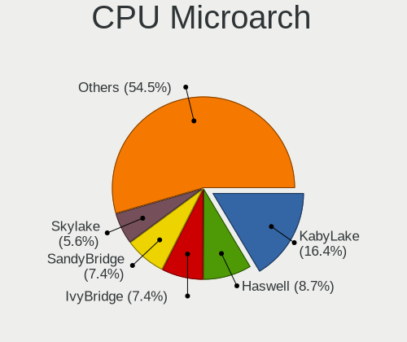
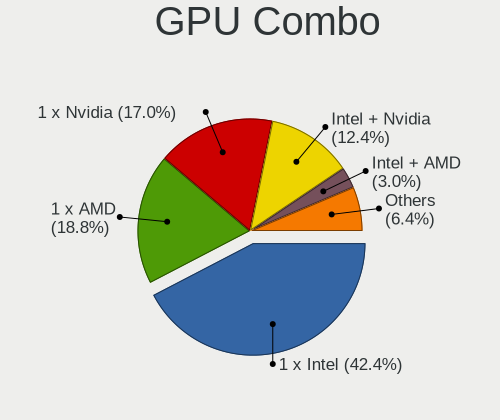
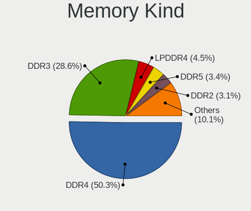

Ubuntu - Tested Hardware & Statistics
-------------------------------------

A project to collect tested hardware configurations for Ubuntu.

Anyone can contribute to this report by the [hw-probe](https://github.com/linuxhw/hw-probe) tool:

    sudo -E hw-probe -all -upload

Please contribute! Especially if your hardware is rare.

This is a report for all computer types. See also reports for [desktops](/Dist/Ubuntu/Desktop/README.md) and [notebooks](/Dist/Ubuntu/Notebook/README.md).

Contents
--------

* [ Test Cases ](#test-cases)

* [ System ](#system)
  - [ OS                       ](#os)
  - [ OS Family                ](#os-family)
  - [ Kernel                   ](#kernel)
  - [ Kernel Family            ](#kernel-family)
  - [ Kernel Major Ver.        ](#kernel-major-ver)
  - [ Arch                     ](#arch)
  - [ DE                       ](#de)
  - [ Display Server           ](#display-server)
  - [ Display Manager          ](#display-manager)
  - [ OS Lang                  ](#os-lang)
  - [ Boot Mode                ](#boot-mode)
  - [ Filesystem               ](#filesystem)
  - [ Part. scheme             ](#part-scheme)
  - [ Dual Boot with Linux/BSD ](#dual-boot-with-linuxbsd)
  - [ Dual Boot (Win)          ](#dual-boot-win)

* [ Board ](#board)
  - [ Vendor                   ](#vendor)
  - [ Model                    ](#model)
  - [ Model Family             ](#model-family)
  - [ MFG Year                 ](#mfg-year)
  - [ Form Factor              ](#form-factor)
  - [ Secure Boot              ](#secure-boot)
  - [ Coreboot                 ](#coreboot)
  - [ RAM Size                 ](#ram-size)
  - [ RAM Used                 ](#ram-used)
  - [ Total Drives             ](#total-drives)
  - [ Has CD-ROM               ](#has-cd-rom)
  - [ Has Ethernet             ](#has-ethernet)
  - [ Has WiFi                 ](#has-wifi)
  - [ Has Bluetooth            ](#has-bluetooth)

* [ Location ](#location)
  - [ Country                  ](#country)
  - [ City                     ](#city)

* [ Drives ](#drives)
  - [ Drive Vendor             ](#drive-vendor)
  - [ Drive Model              ](#drive-model)
  - [ HDD Vendor               ](#hdd-vendor)
  - [ SSD Vendor               ](#ssd-vendor)
  - [ Drive Kind               ](#drive-kind)
  - [ Drive Connector          ](#drive-connector)
  - [ Drive Size               ](#drive-size)
  - [ Space Total              ](#space-total)
  - [ Space Used               ](#space-used)
  - [ Malfunc. Drives          ](#malfunc-drives)
  - [ Malfunc. Drive Vendor    ](#malfunc-drive-vendor)
  - [ Malfunc. HDD Vendor      ](#malfunc-hdd-vendor)
  - [ Malfunc. Drive Kind      ](#malfunc-drive-kind)
  - [ Failed Drives            ](#failed-drives)
  - [ Failed Drive Vendor      ](#failed-drive-vendor)
  - [ Drive Status             ](#drive-status)

* [ Storage controller ](#storage-controller)
  - [ Storage Vendor           ](#storage-vendor)
  - [ Storage Model            ](#storage-model)
  - [ Storage Kind             ](#storage-kind)

* [ Processor ](#processor)
  - [ CPU Vendor               ](#cpu-vendor)
  - [ CPU Model                ](#cpu-model)
  - [ CPU Model Family         ](#cpu-model-family)
  - [ CPU Cores                ](#cpu-cores)
  - [ CPU Sockets              ](#cpu-sockets)
  - [ CPU Threads              ](#cpu-threads)
  - [ CPU Op-Modes             ](#cpu-op-modes)
  - [ CPU Microcode            ](#cpu-microcode)
  - [ CPU Microarch            ](#cpu-microarch)

* [ Graphics ](#graphics)
  - [ GPU Vendor               ](#gpu-vendor)
  - [ GPU Model                ](#gpu-model)
  - [ GPU Combo                ](#gpu-combo)
  - [ GPU Driver               ](#gpu-driver)
  - [ GPU Memory               ](#gpu-memory)

* [ Monitor ](#monitor)
  - [ Monitor Vendor           ](#monitor-vendor)
  - [ Monitor Model            ](#monitor-model)
  - [ Monitor Resolution       ](#monitor-resolution)
  - [ Monitor Diagonal         ](#monitor-diagonal)
  - [ Monitor Width            ](#monitor-width)
  - [ Aspect Ratio             ](#aspect-ratio)
  - [ Monitor Area             ](#monitor-area)
  - [ Pixel Density            ](#pixel-density)
  - [ Multiple Monitors        ](#multiple-monitors)

* [ Network ](#network)
  - [ Net Controller Vendor    ](#net-controller-vendor)
  - [ Net Controller Model     ](#net-controller-model)
  - [ Wireless Vendor          ](#wireless-vendor)
  - [ Wireless Model           ](#wireless-model)
  - [ Ethernet Vendor          ](#ethernet-vendor)
  - [ Ethernet Model           ](#ethernet-model)
  - [ Net Controller Kind      ](#net-controller-kind)
  - [ Used Controller          ](#used-controller)
  - [ NICs                     ](#nics)
  - [ IPv6                     ](#ipv6)

* [ Bluetooth ](#bluetooth)
  - [ Bluetooth Vendor         ](#bluetooth-vendor)
  - [ Bluetooth Model          ](#bluetooth-model)

* [ Sound ](#sound)
  - [ Sound Vendor             ](#sound-vendor)
  - [ Sound Model              ](#sound-model)

* [ Memory ](#memory)
  - [ Memory Vendor            ](#memory-vendor)
  - [ Memory Model             ](#memory-model)
  - [ Memory Kind              ](#memory-kind)
  - [ Memory Form Factor       ](#memory-form-factor)
  - [ Memory Size              ](#memory-size)
  - [ Memory Speed             ](#memory-speed)

* [ Printers & scanners ](#printers--scanners)
  - [ Printer Vendor           ](#printer-vendor)
  - [ Printer Model            ](#printer-model)
  - [ Scanner Vendor           ](#scanner-vendor)
  - [ Scanner Model            ](#scanner-model)

* [ Camera ](#camera)
  - [ Camera Vendor            ](#camera-vendor)
  - [ Camera Model             ](#camera-model)

* [ Security ](#security)
  - [ Fingerprint Vendor       ](#fingerprint-vendor)
  - [ Fingerprint Model        ](#fingerprint-model)
  - [ Chipcard Vendor          ](#chipcard-vendor)
  - [ Chipcard Model           ](#chipcard-model)

* [ Unsupported ](#unsupported)
  - [ Unsupported Devices      ](#unsupported-devices)
  - [ Unsupported Device Types ](#unsupported-device-types)

Test Cases
----------

Total: 84211

| Vendor        | Model                       | Form-Factor | Probe                                                      | Date         |
|---------------|-----------------------------|-------------|------------------------------------------------------------|--------------|
| HP            | Pavilion dv6                | Notebook    | [c937edbfcd](https://linux-hardware.org/?probe=c937edbfcd) | Mar 01, 2023 |
| Gigabyte      | H61M-S2PV                   | Desktop     | [319d6a8bc3](https://linux-hardware.org/?probe=319d6a8bc3) | Mar 01, 2023 |
| Gigabyte      | H61M-S2PV                   | Desktop     | [ce63d81075](https://linux-hardware.org/?probe=ce63d81075) | Mar 01, 2023 |
| HP            | Pavilion 14                 | Notebook    | [ae0e65f5d1](https://linux-hardware.org/?probe=ae0e65f5d1) | Feb 28, 2023 |
| TCL Commun... | 8090                        | Notebook    | [d1f86443c7](https://linux-hardware.org/?probe=d1f86443c7) | Feb 28, 2023 |
| Dell          | Latitude 5420               | Notebook    | [0596aff5c4](https://linux-hardware.org/?probe=0596aff5c4) | Feb 28, 2023 |
| Alienware     | 15 R2                       | Notebook    | [f242145858](https://linux-hardware.org/?probe=f242145858) | Feb 28, 2023 |
| HP            | Pavilion dv7                | Notebook    | [e40593f800](https://linux-hardware.org/?probe=e40593f800) | Feb 28, 2023 |
| ASUSTek       | ROG STRIX X370-F GAMING     | Desktop     | [1f4ca7d119](https://linux-hardware.org/?probe=1f4ca7d119) | Feb 28, 2023 |
| ASUSTek       | Z170-A                      | Desktop     | [a4d77f98eb](https://linux-hardware.org/?probe=a4d77f98eb) | Feb 28, 2023 |
| ASUSTek       | ROG STRIX X370-F GAMING     | Desktop     | [a634d23a20](https://linux-hardware.org/?probe=a634d23a20) | Feb 28, 2023 |
| MSI           | MAG B365M MORTAR            | Desktop     | [26f53549dd](https://linux-hardware.org/?probe=26f53549dd) | Feb 28, 2023 |
| Timi          | RedmiBook 16                | Notebook    | [2d713931d2](https://linux-hardware.org/?probe=2d713931d2) | Feb 28, 2023 |
| Acer          | Aspire V3-371               | Notebook    | [bbc0d58ef1](https://linux-hardware.org/?probe=bbc0d58ef1) | Feb 28, 2023 |
| Lenovo        | IdeaPad 3 15ABA7 82RN       | Notebook    | [d8b58a8ea1](https://linux-hardware.org/?probe=d8b58a8ea1) | Feb 28, 2023 |
| ASUSTek       | ROG STRIX Z590-E GAMING ... | Desktop     | [5fa0193c44](https://linux-hardware.org/?probe=5fa0193c44) | Feb 28, 2023 |
| Lenovo        | 36F7 SDK0J40700 WIN 3258... | Desktop     | [48e150f274](https://linux-hardware.org/?probe=48e150f274) | Feb 28, 2023 |
| Alienware     | 15 R2                       | Notebook    | [5e29609544](https://linux-hardware.org/?probe=5e29609544) | Feb 28, 2023 |
| HP            | ENVY Laptop 17-ch1xxx       | Notebook    | [b518eb9925](https://linux-hardware.org/?probe=b518eb9925) | Feb 28, 2023 |
| Dell          | Latitude 5400               | Notebook    | [00cd14a724](https://linux-hardware.org/?probe=00cd14a724) | Feb 28, 2023 |
| Dell          | 0KWVT8 A02                  | Desktop     | [4340c1d7c4](https://linux-hardware.org/?probe=4340c1d7c4) | Feb 28, 2023 |
| ASRockRack    | E3C246D4U2-2T               | Desktop     | [1ad2cb5102](https://linux-hardware.org/?probe=1ad2cb5102) | Feb 28, 2023 |
| HP            | Laptop 17-by3xxx            | Notebook    | [5beb40c486](https://linux-hardware.org/?probe=5beb40c486) | Feb 28, 2023 |
| ASRock        | KBL-NUC                     | Desktop     | [cb504c5fa0](https://linux-hardware.org/?probe=cb504c5fa0) | Feb 28, 2023 |
| Gigabyte      | B550M DS3H AC               | Desktop     | [64b2c8d5b9](https://linux-hardware.org/?probe=64b2c8d5b9) | Feb 28, 2023 |
| Lenovo        | ThinkPad X1 Carbon Gen 8... | Notebook    | [76645fa513](https://linux-hardware.org/?probe=76645fa513) | Feb 28, 2023 |
| MSI           | A320M PRO-VD PLUS           | Desktop     | [6677ab11b2](https://linux-hardware.org/?probe=6677ab11b2) | Feb 28, 2023 |
| Dell          | G15 5511                    | Notebook    | [1859d13517](https://linux-hardware.org/?probe=1859d13517) | Feb 28, 2023 |
| HP            | EliteBook 830 G5            | Notebook    | [b82fdfbe47](https://linux-hardware.org/?probe=b82fdfbe47) | Feb 28, 2023 |
| Dell          | G5 5590                     | Notebook    | [75f2235434](https://linux-hardware.org/?probe=75f2235434) | Feb 28, 2023 |
| ASUSTek       | ROG Zephyrus G14 GA401QM... | Notebook    | [7b7df086e0](https://linux-hardware.org/?probe=7b7df086e0) | Feb 28, 2023 |
| Samsung       | 370E4K                      | Notebook    | [aba5535c2a](https://linux-hardware.org/?probe=aba5535c2a) | Feb 28, 2023 |
| ASUSTek       | PRIME X570-P                | Desktop     | [dda5eec4b9](https://linux-hardware.org/?probe=dda5eec4b9) | Feb 28, 2023 |
| Apple         | MacBookPro5,5               | Notebook    | [e20478d60e](https://linux-hardware.org/?probe=e20478d60e) | Feb 28, 2023 |
| Lenovo        | 3102 NOK                    | Desktop     | [17a2e663e1](https://linux-hardware.org/?probe=17a2e663e1) | Feb 28, 2023 |
| Lenovo        | 3102 NOK                    | Desktop     | [6dabaffa28](https://linux-hardware.org/?probe=6dabaffa28) | Feb 28, 2023 |
| ASUSTek       | K52Je                       | Notebook    | [03857fde28](https://linux-hardware.org/?probe=03857fde28) | Feb 28, 2023 |
| Timi          | TM1701                      | Notebook    | [ab658664bb](https://linux-hardware.org/?probe=ab658664bb) | Feb 28, 2023 |
| Lenovo        | ThinkPad X1 Yoga 3rd 20L... | Convertible | [72d16085b5](https://linux-hardware.org/?probe=72d16085b5) | Feb 28, 2023 |
| Lenovo        | ThinkPad X1 Yoga 3rd 20L... | Convertible | [f03ce01ac3](https://linux-hardware.org/?probe=f03ce01ac3) | Feb 28, 2023 |
| Gigabyte      | H61M-S2V-B3                 | Desktop     | [aefca0b663](https://linux-hardware.org/?probe=aefca0b663) | Feb 28, 2023 |
| Gigabyte      | H61M-S2V-B3                 | Desktop     | [12ccf2fe8b](https://linux-hardware.org/?probe=12ccf2fe8b) | Feb 28, 2023 |
| Lenovo        | Yoga710-14ISK 80TY          | Notebook    | [756e003316](https://linux-hardware.org/?probe=756e003316) | Feb 28, 2023 |
| Dell          | Inspiron 15 3511            | Notebook    | [99462eae5e](https://linux-hardware.org/?probe=99462eae5e) | Feb 28, 2023 |
| Lenovo        | MIIX 520-12IKB 20M3         | Tablet      | [6ff1d34454](https://linux-hardware.org/?probe=6ff1d34454) | Feb 28, 2023 |
| HP            | ENVY x360 Convertible 15... | Convertible | [169294f95f](https://linux-hardware.org/?probe=169294f95f) | Feb 28, 2023 |
| HP            | Pavilion Laptop 15-cc5xx    | Notebook    | [4a5d167c96](https://linux-hardware.org/?probe=4a5d167c96) | Feb 28, 2023 |
| Dell          | 0HD5W2 A01                  | Desktop     | [f30a31a8ee](https://linux-hardware.org/?probe=f30a31a8ee) | Feb 28, 2023 |
| Lenovo        | Slim 7 ProX 14ARH7 82V2     | Notebook    | [1c61d820ff](https://linux-hardware.org/?probe=1c61d820ff) | Feb 28, 2023 |
| Alienware     | x15 R2                      | Notebook    | [f0335542ce](https://linux-hardware.org/?probe=f0335542ce) | Feb 28, 2023 |
| ASUSTek       | ZenBook Q326FA_Q326FA       | Convertible | [30ac6dbb4a](https://linux-hardware.org/?probe=30ac6dbb4a) | Feb 28, 2023 |
| HP            | Pavilion dv7                | Notebook    | [1dbb82f9ff](https://linux-hardware.org/?probe=1dbb82f9ff) | Feb 28, 2023 |
| Gigabyte      | Z370 AORUS Gaming 5-CF      | Desktop     | [cb687f4572](https://linux-hardware.org/?probe=cb687f4572) | Feb 28, 2023 |
| AZW           | SEi                         | Notebook    | [6d0814dc9f](https://linux-hardware.org/?probe=6d0814dc9f) | Feb 28, 2023 |
| Lenovo        | ThinkPad X1 Carbon 6th 2... | Notebook    | [886f442040](https://linux-hardware.org/?probe=886f442040) | Feb 28, 2023 |
| HP            | ProBook 450 G8 Notebook ... | Notebook    | [009eefdc1d](https://linux-hardware.org/?probe=009eefdc1d) | Feb 28, 2023 |
| HP            | ProBook 450 G8 Notebook ... | Notebook    | [17a7ee80ac](https://linux-hardware.org/?probe=17a7ee80ac) | Feb 28, 2023 |
| Acer          | TDPS05                      | Desktop     | [c4a636fb79](https://linux-hardware.org/?probe=c4a636fb79) | Feb 28, 2023 |
| Acer          | TDPS05                      | Desktop     | [114e21597f](https://linux-hardware.org/?probe=114e21597f) | Feb 28, 2023 |
| Lenovo        | ThinkPad S1 Yoga 20C0S23... | Notebook    | [3cd99ed8f4](https://linux-hardware.org/?probe=3cd99ed8f4) | Feb 28, 2023 |
| Dell          | Latitude E7470              | Notebook    | [51deaef7a0](https://linux-hardware.org/?probe=51deaef7a0) | Feb 28, 2023 |
| Lenovo        | ThinkPad E560 20EV000UUK    | Notebook    | [7060b60651](https://linux-hardware.org/?probe=7060b60651) | Feb 27, 2023 |
| HP            | ProBook 430 G6              | Notebook    | [a184aa7141](https://linux-hardware.org/?probe=a184aa7141) | Feb 27, 2023 |
| Gigabyte      | X58A-UD5                    | Desktop     | [4cff35f888](https://linux-hardware.org/?probe=4cff35f888) | Feb 27, 2023 |
| Packard Be... | EasyNote TJ66               | Notebook    | [bd15540982](https://linux-hardware.org/?probe=bd15540982) | Feb 27, 2023 |
| Microsoft     | Surface Pro 3               | Tablet      | [b3c4d2985e](https://linux-hardware.org/?probe=b3c4d2985e) | Feb 27, 2023 |
| HP            | 802E                        | Desktop     | [d24bb98294](https://linux-hardware.org/?probe=d24bb98294) | Feb 27, 2023 |
| Dell          | Inspiron 5537               | Notebook    | [25fa030105](https://linux-hardware.org/?probe=25fa030105) | Feb 27, 2023 |
| Gigabyte      | Z97M-D3H                    | Desktop     | [d93d9bff7f](https://linux-hardware.org/?probe=d93d9bff7f) | Feb 27, 2023 |
| ASUSTek       | PRIME B360M-A               | Desktop     | [5860f51cd8](https://linux-hardware.org/?probe=5860f51cd8) | Feb 27, 2023 |
| Gigabyte      | EX58-UD5                    | Desktop     | [eaec9511de](https://linux-hardware.org/?probe=eaec9511de) | Feb 27, 2023 |
| ASRock        | G41M-S                      | Desktop     | [8802d04f08](https://linux-hardware.org/?probe=8802d04f08) | Feb 27, 2023 |
| Samsung       | 370E4K                      | Notebook    | [d66bcd2bc8](https://linux-hardware.org/?probe=d66bcd2bc8) | Feb 27, 2023 |
| HP            | 339A                        | Desktop     | [308d8dfac0](https://linux-hardware.org/?probe=308d8dfac0) | Feb 27, 2023 |
| HP            | Laptop 15t-dy200            | Notebook    | [3ea4171270](https://linux-hardware.org/?probe=3ea4171270) | Feb 27, 2023 |
| Lenovo        | ThinkPad T460s 20FAS55Q1... | Notebook    | [815b6ea9f2](https://linux-hardware.org/?probe=815b6ea9f2) | Feb 27, 2023 |
| Lenovo        | IdeaPad 1 15ALC7 82R4       | Notebook    | [47f7b39f3a](https://linux-hardware.org/?probe=47f7b39f3a) | Feb 27, 2023 |
| Apple         | MacBookPro15,1              | Notebook    | [e1ce7bab5a](https://linux-hardware.org/?probe=e1ce7bab5a) | Feb 27, 2023 |
| Dell          | 01TN68 A02                  | Desktop     | [4acd4aa811](https://linux-hardware.org/?probe=4acd4aa811) | Feb 27, 2023 |
| Dell          | XPS 13 9300                 | Notebook    | [fc803f9205](https://linux-hardware.org/?probe=fc803f9205) | Feb 27, 2023 |
| HUAWEI        | BOM-WXX9                    | Notebook    | [43a5dbf393](https://linux-hardware.org/?probe=43a5dbf393) | Feb 27, 2023 |
| Dell          | Inspiron 3537               | Notebook    | [78f270b35a](https://linux-hardware.org/?probe=78f270b35a) | Feb 27, 2023 |
| Dell          | Latitude E4310              | Notebook    | [2b2255a5b4](https://linux-hardware.org/?probe=2b2255a5b4) | Feb 27, 2023 |
| ASUSTek       | FX503VD                     | Notebook    | [46954919f7](https://linux-hardware.org/?probe=46954919f7) | Feb 27, 2023 |
| Dell          | Latitude 7420               | Notebook    | [d3af27a0ac](https://linux-hardware.org/?probe=d3af27a0ac) | Feb 27, 2023 |
| Casper        | H510 001 G10a               | Desktop     | [95a9cfbf0b](https://linux-hardware.org/?probe=95a9cfbf0b) | Feb 27, 2023 |
| ASUSTek       | X75VC                       | Notebook    | [8d629c0ed3](https://linux-hardware.org/?probe=8d629c0ed3) | Feb 27, 2023 |
| Acer          | Aspire E1-531               | Notebook    | [a52b94c2d5](https://linux-hardware.org/?probe=a52b94c2d5) | Feb 27, 2023 |
| Dell          | Inspiron 3537               | Notebook    | [bb1ffc3498](https://linux-hardware.org/?probe=bb1ffc3498) | Feb 27, 2023 |
| Lenovo        | ThinkPad T480 20L6SEH700    | Notebook    | [4a187e016b](https://linux-hardware.org/?probe=4a187e016b) | Feb 27, 2023 |
| Lenovo        | ThinkPad X260 20F5S1MN00    | Notebook    | [db0d3b74bd](https://linux-hardware.org/?probe=db0d3b74bd) | Feb 27, 2023 |
| UMAX          | VisionBook-N12R             | Notebook    | [2477ae9a0e](https://linux-hardware.org/?probe=2477ae9a0e) | Feb 27, 2023 |
| Gigabyte      | A320M-H-CF                  | Desktop     | [409bb06e5e](https://linux-hardware.org/?probe=409bb06e5e) | Feb 27, 2023 |
| HP            | Pavilion m6                 | Notebook    | [1e9d802ab6](https://linux-hardware.org/?probe=1e9d802ab6) | Feb 27, 2023 |
| ASUSTek       | FX503VD                     | Notebook    | [60e1742e7e](https://linux-hardware.org/?probe=60e1742e7e) | Feb 27, 2023 |
| Gigabyte      | H87-D3H-CF                  | Desktop     | [ea8bb4c0e4](https://linux-hardware.org/?probe=ea8bb4c0e4) | Feb 27, 2023 |
| Gigabyte      | H110M-S2V-CF                | Desktop     | [509c2a6e57](https://linux-hardware.org/?probe=509c2a6e57) | Feb 27, 2023 |
| Apple         | MacBookAir4,2               | Notebook    | [a9605bf85e](https://linux-hardware.org/?probe=a9605bf85e) | Feb 27, 2023 |
| HP            | Pavilion m6                 | Notebook    | [0d35b0b080](https://linux-hardware.org/?probe=0d35b0b080) | Feb 27, 2023 |
| Lenovo        | ThinkPad P14s Gen 2a 21A... | Notebook    | [d57bb59dee](https://linux-hardware.org/?probe=d57bb59dee) | Feb 27, 2023 |
| AMI           | Cherry Trail CR             | Desktop     | [24952b3b19](https://linux-hardware.org/?probe=24952b3b19) | Feb 27, 2023 |
| Gigabyte      | Z690M AORUS ELITE AX DDR... | Desktop     | [686c8d56c4](https://linux-hardware.org/?probe=686c8d56c4) | Feb 27, 2023 |
| Apple         | Mac-F2218FA9                | All in one  | [9ed18088a0](https://linux-hardware.org/?probe=9ed18088a0) | Feb 27, 2023 |
| ASRock        | A320M-HDV R4.0              | Desktop     | [37d2aab670](https://linux-hardware.org/?probe=37d2aab670) | Feb 27, 2023 |
| Acer          | Aspire F5-573G              | Notebook    | [ce2bc0c00d](https://linux-hardware.org/?probe=ce2bc0c00d) | Feb 27, 2023 |
| Toshiba       | IS 1413G                    | Notebook    | [c361aabb21](https://linux-hardware.org/?probe=c361aabb21) | Feb 27, 2023 |
| Dell          | Inspiron 14-3467            | Notebook    | [5bf68a313d](https://linux-hardware.org/?probe=5bf68a313d) | Feb 27, 2023 |
| Toshiba       | IS 1413G                    | Notebook    | [17338cbd01](https://linux-hardware.org/?probe=17338cbd01) | Feb 27, 2023 |
| Dell          | XPS L521X                   | Notebook    | [f9598ce828](https://linux-hardware.org/?probe=f9598ce828) | Feb 27, 2023 |
| ASUSTek       | B150 PRO GAMING/AURA        | Desktop     | [618e3d30fc](https://linux-hardware.org/?probe=618e3d30fc) | Feb 27, 2023 |
| Acer          | Aspire E5-571               | Notebook    | [04c721038a](https://linux-hardware.org/?probe=04c721038a) | Feb 27, 2023 |
| Dell          | Latitude E6430              | Notebook    | [b75c4a18b3](https://linux-hardware.org/?probe=b75c4a18b3) | Feb 27, 2023 |
| Apple         | MacBookPro15,1              | Notebook    | [caf6dc6f16](https://linux-hardware.org/?probe=caf6dc6f16) | Feb 27, 2023 |
| Gigabyte      | Z690 AERO D                 | Desktop     | [68b84cc1eb](https://linux-hardware.org/?probe=68b84cc1eb) | Feb 27, 2023 |
| Lenovo        | 36F7 SDK0J40700 WIN 3258... | Desktop     | [580db05e08](https://linux-hardware.org/?probe=580db05e08) | Feb 27, 2023 |
| ASUSTek       | ROG STRIX X570-I GAMING     | Desktop     | [49f3238d4a](https://linux-hardware.org/?probe=49f3238d4a) | Feb 26, 2023 |
| HP            | 81B4 01                     | Desktop     | [bc06df8d32](https://linux-hardware.org/?probe=bc06df8d32) | Feb 26, 2023 |
| Gigabyte      | Z390 UD                     | Desktop     | [b40f9ce0d1](https://linux-hardware.org/?probe=b40f9ce0d1) | Feb 26, 2023 |
| MSI           | B450M PRO-M2 MAX            | Desktop     | [0c5f9a10dd](https://linux-hardware.org/?probe=0c5f9a10dd) | Feb 26, 2023 |
| MSI           | PRO Z690-A DDR4             | Desktop     | [3ab842532b](https://linux-hardware.org/?probe=3ab842532b) | Feb 26, 2023 |
| Lenovo        | G50-80 80L0                 | Notebook    | [19727a16be](https://linux-hardware.org/?probe=19727a16be) | Feb 26, 2023 |
| Acer          | Aspire V3-772G              | Notebook    | [83dce8f92d](https://linux-hardware.org/?probe=83dce8f92d) | Feb 26, 2023 |
| Pegatron      | NARRA5                      | Desktop     | [fbff48e326](https://linux-hardware.org/?probe=fbff48e326) | Feb 26, 2023 |
| Lenovo        | Annapurna CRB NOK           | Desktop     | [77122f785f](https://linux-hardware.org/?probe=77122f785f) | Feb 26, 2023 |
| Lenovo        | Yoga 510-14AST 80S9         | Convertible | [0ea2a54b39](https://linux-hardware.org/?probe=0ea2a54b39) | Feb 26, 2023 |
| Acer          | Predator PT515-51           | Notebook    | [b5da2905fb](https://linux-hardware.org/?probe=b5da2905fb) | Feb 26, 2023 |
| Lenovo        | Annapurna CRB NOK           | Desktop     | [0e521e12aa](https://linux-hardware.org/?probe=0e521e12aa) | Feb 26, 2023 |
| HP            | Pavilion Laptop 15-cc5xx    | Notebook    | [13f87401ca](https://linux-hardware.org/?probe=13f87401ca) | Feb 26, 2023 |
| ASUSTek       | ASUS TUF Gaming F15 FX50... | Notebook    | [e763fc25e7](https://linux-hardware.org/?probe=e763fc25e7) | Feb 26, 2023 |
| ASUSTek       | PRIME B350M-A               | Desktop     | [4cd492ee3e](https://linux-hardware.org/?probe=4cd492ee3e) | Feb 26, 2023 |
| ASRock        | B85 Pro4                    | Desktop     | [0b4daba4fb](https://linux-hardware.org/?probe=0b4daba4fb) | Feb 26, 2023 |
| HP            | Pavilion dv7                | Notebook    | [3d8c3db030](https://linux-hardware.org/?probe=3d8c3db030) | Feb 26, 2023 |
| Foxconn       | 2ABF                        | Desktop     | [ead0312777](https://linux-hardware.org/?probe=ead0312777) | Feb 26, 2023 |
| HONOR         | BBR-WAX9                    | Notebook    | [3fe348fb3f](https://linux-hardware.org/?probe=3fe348fb3f) | Feb 26, 2023 |
| HP            | 250 15.6 inch G9 Noteboo... | Notebook    | [2cea6ee649](https://linux-hardware.org/?probe=2cea6ee649) | Feb 26, 2023 |
| Lenovo        | 3000 N200 0769EAG           | Notebook    | [28056b6929](https://linux-hardware.org/?probe=28056b6929) | Feb 26, 2023 |
| Dell          | Latitude 7350               | Notebook    | [a8bbed94ce](https://linux-hardware.org/?probe=a8bbed94ce) | Feb 26, 2023 |
| ASUSTek       | ROG STRIX B450-E GAMING     | Desktop     | [2088ba9df6](https://linux-hardware.org/?probe=2088ba9df6) | Feb 26, 2023 |
| HP            | ProBook 430 G4              | Notebook    | [05a6a84b50](https://linux-hardware.org/?probe=05a6a84b50) | Feb 26, 2023 |
| Lenovo        | ThinkPad T420 4236EJ3       | Notebook    | [d0b043c11b](https://linux-hardware.org/?probe=d0b043c11b) | Feb 26, 2023 |
| Apple         | MacBookPro15,4              | Notebook    | [41330b2783](https://linux-hardware.org/?probe=41330b2783) | Feb 26, 2023 |
| ASUSTek       | PRIME B250-PLUS             | Desktop     | [49b1cd5754](https://linux-hardware.org/?probe=49b1cd5754) | Feb 26, 2023 |
| ASUSTek       | PRIME B350M-A               | Desktop     | [9471b0f763](https://linux-hardware.org/?probe=9471b0f763) | Feb 26, 2023 |
| Gigabyte      | B560M DS3H V2               | Desktop     | [31f6d9e11d](https://linux-hardware.org/?probe=31f6d9e11d) | Feb 26, 2023 |
| Dell          | 0WMJ54 A01                  | Desktop     | [f9cae700c7](https://linux-hardware.org/?probe=f9cae700c7) | Feb 26, 2023 |
| Gigabyte      | GA-MA78LMT-US2H             | Desktop     | [df54545112](https://linux-hardware.org/?probe=df54545112) | Feb 26, 2023 |
| HP            | 1632                        | Desktop     | [394b988862](https://linux-hardware.org/?probe=394b988862) | Feb 26, 2023 |
| HP            | Laptop 15-ef2xxx            | Notebook    | [54c4b4eb4e](https://linux-hardware.org/?probe=54c4b4eb4e) | Feb 26, 2023 |
| HP            | ENVY 17                     | Notebook    | [dea1551bf3](https://linux-hardware.org/?probe=dea1551bf3) | Feb 26, 2023 |
| MSI           | MAG Z490 TOMAHAWK           | Desktop     | [f24a3027d0](https://linux-hardware.org/?probe=f24a3027d0) | Feb 26, 2023 |
| ASUSTek       | ProArt B550-CREATOR         | Desktop     | [a2a7defd24](https://linux-hardware.org/?probe=a2a7defd24) | Feb 26, 2023 |
| HP            | Laptop 15-ef2xxx            | Notebook    | [a9e58a8737](https://linux-hardware.org/?probe=a9e58a8737) | Feb 26, 2023 |
| Gigabyte      | MMLP5AP-00                  | Notebook    | [eb5ca5bb8d](https://linux-hardware.org/?probe=eb5ca5bb8d) | Feb 26, 2023 |
| Dell          | 0J584C A00                  | Desktop     | [c16b58c7ce](https://linux-hardware.org/?probe=c16b58c7ce) | Feb 26, 2023 |
| Dell          | 0J584C A00                  | Desktop     | [9d8016f80e](https://linux-hardware.org/?probe=9d8016f80e) | Feb 26, 2023 |
| HP            | ENVY 17                     | Notebook    | [0f347a1b6c](https://linux-hardware.org/?probe=0f347a1b6c) | Feb 26, 2023 |
| ASUSTek       | M4A87TD/USB3                | Desktop     | [8184285a7d](https://linux-hardware.org/?probe=8184285a7d) | Feb 26, 2023 |
| Toshiba       | Satellite C855-2J5          | Notebook    | [6a55b5a6b3](https://linux-hardware.org/?probe=6a55b5a6b3) | Feb 26, 2023 |
| Dell          | 0HR330                      | Desktop     | [9110acd156](https://linux-hardware.org/?probe=9110acd156) | Feb 26, 2023 |
| Dell          | Latitude E7250              | Notebook    | [db6ac786ef](https://linux-hardware.org/?probe=db6ac786ef) | Feb 26, 2023 |
| Apple         | MacBookPro10,1              | Notebook    | [816a4eb27e](https://linux-hardware.org/?probe=816a4eb27e) | Feb 26, 2023 |
| Lenovo        | ThinkPad E490 20N8000XRT    | Notebook    | [b9e64d9f86](https://linux-hardware.org/?probe=b9e64d9f86) | Feb 26, 2023 |
| ASUSTek       | TUF Gaming FX705DT_FX705... | Notebook    | [8a3c646d1f](https://linux-hardware.org/?probe=8a3c646d1f) | Feb 26, 2023 |
| Gigabyte      | H370 AORUS GAMING 3-CF      | Desktop     | [59d082bd5f](https://linux-hardware.org/?probe=59d082bd5f) | Feb 26, 2023 |
| Dell          | Latitude E6420              | Notebook    | [b35fdc2f10](https://linux-hardware.org/?probe=b35fdc2f10) | Feb 26, 2023 |
| Intel         | NUC8i7HVB J68196-502        | Mini pc     | [ce67684fdf](https://linux-hardware.org/?probe=ce67684fdf) | Feb 26, 2023 |
| Apple         | Mac-F22C86C8                | Mini pc     | [a206715ec6](https://linux-hardware.org/?probe=a206715ec6) | Feb 26, 2023 |
| HP            | Pavilion 14                 | Notebook    | [c9b9f213b5](https://linux-hardware.org/?probe=c9b9f213b5) | Feb 26, 2023 |
| Intel         | HuronRiver Platform         | Notebook    | [2168c2bb5c](https://linux-hardware.org/?probe=2168c2bb5c) | Feb 26, 2023 |
| Dell          | G15 5520                    | Notebook    | [d68c28ea8d](https://linux-hardware.org/?probe=d68c28ea8d) | Feb 26, 2023 |
| ASUSTek       | PRIME H670-PLUS D4          | Desktop     | [3887cb1418](https://linux-hardware.org/?probe=3887cb1418) | Feb 26, 2023 |
| ASUSTek       | H87-PLUS                    | Desktop     | [f56bb767fd](https://linux-hardware.org/?probe=f56bb767fd) | Feb 26, 2023 |
| ASUSTek       | H87-PLUS                    | Desktop     | [98e70b4028](https://linux-hardware.org/?probe=98e70b4028) | Feb 26, 2023 |
| Lenovo        | G500 20236                  | Notebook    | [93f09b28d6](https://linux-hardware.org/?probe=93f09b28d6) | Feb 26, 2023 |
| Lenovo        | ThinkPad E14 Gen 2 20T7S... | Notebook    | [054cce6e78](https://linux-hardware.org/?probe=054cce6e78) | Feb 26, 2023 |
| Lenovo        | G500 20236                  | Notebook    | [51bd5c9f21](https://linux-hardware.org/?probe=51bd5c9f21) | Feb 26, 2023 |
| Lenovo        | ThinkPad T430s 235368U      | Notebook    | [58a8ada163](https://linux-hardware.org/?probe=58a8ada163) | Feb 26, 2023 |
| Dell          | XPS 13 9310 2-in-1          | Convertible | [f562bdbf31](https://linux-hardware.org/?probe=f562bdbf31) | Feb 26, 2023 |
| HP            | EliteBook 745 G3            | Notebook    | [8cee2ac27a](https://linux-hardware.org/?probe=8cee2ac27a) | Feb 26, 2023 |
| BESSTAR Te... | B550                        | Desktop     | [6a77bfec73](https://linux-hardware.org/?probe=6a77bfec73) | Feb 26, 2023 |
| Toshiba       | Satellite C660D             | Notebook    | [d5e4af2957](https://linux-hardware.org/?probe=d5e4af2957) | Feb 26, 2023 |
| Gigabyte      | Z68MA-D2H-B3                | Desktop     | [c863d76de9](https://linux-hardware.org/?probe=c863d76de9) | Feb 25, 2023 |
| HP            | Notebook                    | Notebook    | [4a72575c17](https://linux-hardware.org/?probe=4a72575c17) | Feb 25, 2023 |
| HP            | 250 15.6 inch G9 Noteboo... | Notebook    | [84750f9d96](https://linux-hardware.org/?probe=84750f9d96) | Feb 25, 2023 |
| Apple         | Mac-F22C86C8                | Mini pc     | [d227d114f4](https://linux-hardware.org/?probe=d227d114f4) | Feb 25, 2023 |
| Dell          | 0F428D A00                  | Desktop     | [7d01f8893e](https://linux-hardware.org/?probe=7d01f8893e) | Feb 25, 2023 |
| ASUSTek       | ZenBook UX462DA             | Convertible | [4f45a3b6bd](https://linux-hardware.org/?probe=4f45a3b6bd) | Feb 25, 2023 |
| Acer          | Aspire V3-571G              | Notebook    | [b02e34a7f9](https://linux-hardware.org/?probe=b02e34a7f9) | Feb 25, 2023 |
| ASRock        | Z97 Pro4                    | Desktop     | [451c626830](https://linux-hardware.org/?probe=451c626830) | Feb 25, 2023 |
| Acer          | Aspire ES1-521              | Notebook    | [e5f0a23afd](https://linux-hardware.org/?probe=e5f0a23afd) | Feb 25, 2023 |
| Fujitsu       | LIFEBOOK AH530              | Notebook    | [fd743448ae](https://linux-hardware.org/?probe=fd743448ae) | Feb 25, 2023 |
| ASUSTek       | P7P55D EVO                  | Desktop     | [336a7cad31](https://linux-hardware.org/?probe=336a7cad31) | Feb 25, 2023 |
| Dell          | Latitude 5580               | Notebook    | [cd4a13ce32](https://linux-hardware.org/?probe=cd4a13ce32) | Feb 25, 2023 |
| Apple         | MacBookPro7,1               | Notebook    | [7505d49d88](https://linux-hardware.org/?probe=7505d49d88) | Feb 25, 2023 |
| eMachines     | EL1850                      | Desktop     | [81741a438a](https://linux-hardware.org/?probe=81741a438a) | Feb 25, 2023 |
| Apple         | MacBook5,1                  | Notebook    | [fbb2478f8c](https://linux-hardware.org/?probe=fbb2478f8c) | Feb 25, 2023 |
| Dell          | Latitude 5580               | Notebook    | [79da5a8efd](https://linux-hardware.org/?probe=79da5a8efd) | Feb 25, 2023 |
| HP            | 3398                        | Desktop     | [5e7ae4c866](https://linux-hardware.org/?probe=5e7ae4c866) | Feb 25, 2023 |
| HP            | ProBook 430 G4              | Notebook    | [0a2c7cca00](https://linux-hardware.org/?probe=0a2c7cca00) | Feb 25, 2023 |
| Lenovo        | ThinkPad T400 6475KF3       | Notebook    | [92f3e0b9dd](https://linux-hardware.org/?probe=92f3e0b9dd) | Feb 25, 2023 |
| Lenovo        | ThinkPad X220 4290EC5       | Notebook    | [d72d87e4ae](https://linux-hardware.org/?probe=d72d87e4ae) | Feb 25, 2023 |
| Dell          | Inspiron 3420               | Notebook    | [e13f9bfc8f](https://linux-hardware.org/?probe=e13f9bfc8f) | Feb 25, 2023 |
| Lenovo        | IdeaPad 3 15ALC6 82MF       | Notebook    | [af95b24466](https://linux-hardware.org/?probe=af95b24466) | Feb 25, 2023 |
| Gigabyte      | Z170X-Gaming 7              | Desktop     | [0620aa7f6f](https://linux-hardware.org/?probe=0620aa7f6f) | Feb 25, 2023 |
| Acer          | Aspire V3-772G              | Notebook    | [f137fa0797](https://linux-hardware.org/?probe=f137fa0797) | Feb 25, 2023 |
| Chuwi         | GemiBook Pro                | Notebook    | [9894743527](https://linux-hardware.org/?probe=9894743527) | Feb 25, 2023 |
| Gigabyte      | B550M DS3H                  | Desktop     | [0ac3b49261](https://linux-hardware.org/?probe=0ac3b49261) | Feb 25, 2023 |
| Apple         | MacBookPro8,1               | Notebook    | [60ab083fe9](https://linux-hardware.org/?probe=60ab083fe9) | Feb 25, 2023 |
| Lenovo        | Yoga C930-13IKB 81C4        | Convertible | [72034abe27](https://linux-hardware.org/?probe=72034abe27) | Feb 25, 2023 |
| MSI           | 970 GAMING                  | Desktop     | [37bcb5eb45](https://linux-hardware.org/?probe=37bcb5eb45) | Feb 25, 2023 |
| BESSTAR Te... | B550                        | Desktop     | [d3e84076c7](https://linux-hardware.org/?probe=d3e84076c7) | Feb 25, 2023 |
| ASUSTek       | VivoBook_ASUSLaptop M350... | Notebook    | [22cf774ac0](https://linux-hardware.org/?probe=22cf774ac0) | Feb 25, 2023 |
| Dell          | Vostro 3501                 | Notebook    | [ed459712f6](https://linux-hardware.org/?probe=ed459712f6) | Feb 25, 2023 |
| ASUSTek       | M5A78L-M PLUS/USB3          | Desktop     | [30afdb56c5](https://linux-hardware.org/?probe=30afdb56c5) | Feb 25, 2023 |
| Protectli     | VP2420                      | Desktop     | [ea5f851cf3](https://linux-hardware.org/?probe=ea5f851cf3) | Feb 25, 2023 |
| Quanta        | 2AC7 011                    | Desktop     | [3505fadb68](https://linux-hardware.org/?probe=3505fadb68) | Feb 25, 2023 |
| HP            | Pavilion Laptop 14-ec0xx... | Notebook    | [7b59cbd067](https://linux-hardware.org/?probe=7b59cbd067) | Feb 25, 2023 |
| ASUSTek       | M5A78L-M PLUS/USB3          | Desktop     | [bfa5623f15](https://linux-hardware.org/?probe=bfa5623f15) | Feb 25, 2023 |
| ASUSTek       | X556URK                     | Notebook    | [fc80e01794](https://linux-hardware.org/?probe=fc80e01794) | Feb 25, 2023 |
| HUAWEI        | NBLK-WAX9X                  | Notebook    | [2978ec71b8](https://linux-hardware.org/?probe=2978ec71b8) | Feb 25, 2023 |
| BESSTAR Te... | X400                        | Notebook    | [e1c05e0782](https://linux-hardware.org/?probe=e1c05e0782) | Feb 25, 2023 |
| Dell          | Inspiron 5537               | Notebook    | [0496ce1146](https://linux-hardware.org/?probe=0496ce1146) | Feb 25, 2023 |
| Acer          | Aspire X3990                | Desktop     | [c83e31d66b](https://linux-hardware.org/?probe=c83e31d66b) | Feb 25, 2023 |
| Dell          | Inspiron 5537               | Notebook    | [cb4b91f80c](https://linux-hardware.org/?probe=cb4b91f80c) | Feb 25, 2023 |
| Lenovo        | ThinkPad P50s 20FKS0A300    | Notebook    | [2b9ed74f9d](https://linux-hardware.org/?probe=2b9ed74f9d) | Feb 25, 2023 |
| Acer          | Aspire X3990                | Desktop     | [4be9f68049](https://linux-hardware.org/?probe=4be9f68049) | Feb 25, 2023 |
| HP            | Pavilion Aero Laptop 13-... | Notebook    | [af87e6ea4c](https://linux-hardware.org/?probe=af87e6ea4c) | Feb 25, 2023 |
| HP            | EliteBook 840 14 inch G9... | Notebook    | [9c0775a106](https://linux-hardware.org/?probe=9c0775a106) | Feb 25, 2023 |
| Hampoo        | I2W6_AP135 Reserved         | Notebook    | [c5cdb97c5b](https://linux-hardware.org/?probe=c5cdb97c5b) | Feb 25, 2023 |
| HP            | ProBook 645 G1              | Notebook    | [329c0a65eb](https://linux-hardware.org/?probe=329c0a65eb) | Feb 25, 2023 |
| Lenovo        | 30D2 SDK0J40697 WIN 3305... | Desktop     | [7864921f8d](https://linux-hardware.org/?probe=7864921f8d) | Feb 25, 2023 |
| Lenovo        | Legion Y530-15ICH 81FV      | Notebook    | [0b239fec52](https://linux-hardware.org/?probe=0b239fec52) | Feb 25, 2023 |
| Dell          | 051FJ8 A02                  | Desktop     | [05f5f23fbb](https://linux-hardware.org/?probe=05f5f23fbb) | Feb 25, 2023 |
| HP            | ENVY 17                     | Notebook    | [7baf81c4e8](https://linux-hardware.org/?probe=7baf81c4e8) | Feb 25, 2023 |
| Dell          | XPS 13 9310 2-in-1          | Convertible | [fc376b9272](https://linux-hardware.org/?probe=fc376b9272) | Feb 25, 2023 |
| Samsung       | 950QED                      | Convertible | [e4fca42192](https://linux-hardware.org/?probe=e4fca42192) | Feb 25, 2023 |
| Samsung       | 950QED                      | Convertible | [54e58ec510](https://linux-hardware.org/?probe=54e58ec510) | Feb 25, 2023 |
| HP            | Victus by 16 Laptop PC      | Notebook    | [05ef574a7c](https://linux-hardware.org/?probe=05ef574a7c) | Feb 25, 2023 |
| ASRock        | Z390 Phantom Gaming-ITX/... | Desktop     | [d78e737aaf](https://linux-hardware.org/?probe=d78e737aaf) | Feb 25, 2023 |
| HP            | ENVY 17                     | Notebook    | [8790ad53d8](https://linux-hardware.org/?probe=8790ad53d8) | Feb 25, 2023 |
| Dell          | 0XCR8D A02                  | Desktop     | [6053547fd3](https://linux-hardware.org/?probe=6053547fd3) | Feb 25, 2023 |
| Apple         | MacBookPro16,2              | Notebook    | [c4cab43483](https://linux-hardware.org/?probe=c4cab43483) | Feb 25, 2023 |
| Lenovo        | ThinkPad X270 W10DG 20K5... | Notebook    | [c2c5da60c3](https://linux-hardware.org/?probe=c2c5da60c3) | Feb 25, 2023 |
| Raspberry ... | Raspberry Pi 4 Model B R... | Soc         | [79bb0eb4c9](https://linux-hardware.org/?probe=79bb0eb4c9) | Feb 25, 2023 |
| Gigabyte      | Z170X-Gaming 7              | Desktop     | [df734c276f](https://linux-hardware.org/?probe=df734c276f) | Feb 25, 2023 |
| ASUSTek       | P7P55D EVO                  | Desktop     | [3f931a7600](https://linux-hardware.org/?probe=3f931a7600) | Feb 25, 2023 |
| HP            | 15                          | Notebook    | [04741afb27](https://linux-hardware.org/?probe=04741afb27) | Feb 25, 2023 |
| ASRock        | X300M-STX                   | Desktop     | [97a1558878](https://linux-hardware.org/?probe=97a1558878) | Feb 25, 2023 |
| HP            | Laptop 15s-fq1xxx           | Notebook    | [ca2ef50547](https://linux-hardware.org/?probe=ca2ef50547) | Feb 25, 2023 |
| HP            | Pavilion Laptop 15-cd0xx    | Notebook    | [dfb5281dfb](https://linux-hardware.org/?probe=dfb5281dfb) | Feb 25, 2023 |
| Gateway       | NV47H                       | Notebook    | [4168112a0a](https://linux-hardware.org/?probe=4168112a0a) | Feb 25, 2023 |
| Gateway       | NV47H                       | Notebook    | [8faf0d384e](https://linux-hardware.org/?probe=8faf0d384e) | Feb 25, 2023 |
| HP            | EliteBook 840 G2            | Notebook    | [33dc8202e9](https://linux-hardware.org/?probe=33dc8202e9) | Feb 25, 2023 |
| ASUSTek       | N53SM                       | Notebook    | [6606121f31](https://linux-hardware.org/?probe=6606121f31) | Feb 25, 2023 |
| Sony          | VPCCW13FB                   | Notebook    | [1772a3987b](https://linux-hardware.org/?probe=1772a3987b) | Feb 25, 2023 |
| ASUSTek       | ZenBook UX425QA_UM425QA     | Notebook    | [02608a8288](https://linux-hardware.org/?probe=02608a8288) | Feb 25, 2023 |
| Hampoo        | I2W6_AP135 Reserved         | Notebook    | [976a29944a](https://linux-hardware.org/?probe=976a29944a) | Feb 25, 2023 |
| Lenovo        | IdeaPad 5 15IAL7 82SF       | Notebook    | [12d979b047](https://linux-hardware.org/?probe=12d979b047) | Feb 25, 2023 |
| Lenovo        | ThinkPad T15 Gen 2i 20W4... | Notebook    | [3b757c7c9c](https://linux-hardware.org/?probe=3b757c7c9c) | Feb 25, 2023 |
| ASUSTek       | ZenBook UX425EA_UX425EA     | Notebook    | [f0fa613cd2](https://linux-hardware.org/?probe=f0fa613cd2) | Feb 25, 2023 |
| ASUSTek       | TUF Gaming X570-PLUS        | Desktop     | [d8b9174fba](https://linux-hardware.org/?probe=d8b9174fba) | Feb 25, 2023 |
| Sony          | VGN-FZ31M                   | Notebook    | [6b830e36f1](https://linux-hardware.org/?probe=6b830e36f1) | Feb 25, 2023 |
| Gigabyte      | H310M S2 x.x                | Desktop     | [99b5c2f7f9](https://linux-hardware.org/?probe=99b5c2f7f9) | Feb 24, 2023 |
| MSI           | MAG X570 TOMAHAWK WIFI      | Desktop     | [2e7905f753](https://linux-hardware.org/?probe=2e7905f753) | Feb 24, 2023 |
| Gigabyte      | H310M S2 x.x                | Desktop     | [0bb7bc3713](https://linux-hardware.org/?probe=0bb7bc3713) | Feb 24, 2023 |
| HP            | EliteBook 840 Aero G8 No... | Notebook    | [f24e6a55c4](https://linux-hardware.org/?probe=f24e6a55c4) | Feb 24, 2023 |
| HP            | Laptop 15s-fq1xxx           | Notebook    | [3899b2f13e](https://linux-hardware.org/?probe=3899b2f13e) | Feb 24, 2023 |
| HP            | Laptop 17-by2xxx            | Notebook    | [d6a91a338c](https://linux-hardware.org/?probe=d6a91a338c) | Feb 24, 2023 |
| Lenovo        | IdeaPad 3 15ALC6 82MF       | Notebook    | [d3354bd88c](https://linux-hardware.org/?probe=d3354bd88c) | Feb 24, 2023 |
| ASUSTek       | K53U                        | Notebook    | [5b343010e7](https://linux-hardware.org/?probe=5b343010e7) | Feb 24, 2023 |
| Lenovo        | IdeaPad Z580                | Notebook    | [cf2ff6c04b](https://linux-hardware.org/?probe=cf2ff6c04b) | Feb 24, 2023 |
| Gigabyte      | GA-MA78LMT-US2H             | Desktop     | [b2681528bd](https://linux-hardware.org/?probe=b2681528bd) | Feb 24, 2023 |
| ASUSTek       | PRIME B360M-A               | Desktop     | [6d7221488b](https://linux-hardware.org/?probe=6d7221488b) | Feb 24, 2023 |
| Pegatron      | NARRA5                      | Desktop     | [af6be34173](https://linux-hardware.org/?probe=af6be34173) | Feb 24, 2023 |
| Dell          | 0VRWRC A00                  | Desktop     | [7089ab33b3](https://linux-hardware.org/?probe=7089ab33b3) | Feb 24, 2023 |
| Fujitsu       | D3501-A1 S26361-D3501-A1    | Desktop     | [7031bb977d](https://linux-hardware.org/?probe=7031bb977d) | Feb 24, 2023 |
| MSI           | K9N6PGM2-V2                 | Desktop     | [e88df81d6f](https://linux-hardware.org/?probe=e88df81d6f) | Feb 24, 2023 |
| MSI           | H310M PRO-VDH PLUS          | Desktop     | [c7bb2ebe8b](https://linux-hardware.org/?probe=c7bb2ebe8b) | Feb 24, 2023 |
| ASUSTek       | VivoBook_ASUSLaptop M650... | Notebook    | [d99e163be6](https://linux-hardware.org/?probe=d99e163be6) | Feb 24, 2023 |
| ASRock        | 970A-G                      | Desktop     | [bfdb227a9d](https://linux-hardware.org/?probe=bfdb227a9d) | Feb 24, 2023 |
| Dell          | Inspiron 3793               | Notebook    | [8e85683aae](https://linux-hardware.org/?probe=8e85683aae) | Feb 24, 2023 |
| Fujitsu       | LIFEBOOK U749               | Notebook    | [ba7cdc6018](https://linux-hardware.org/?probe=ba7cdc6018) | Feb 24, 2023 |
| HP            | 8433 11                     | Desktop     | [e8663b2a0c](https://linux-hardware.org/?probe=e8663b2a0c) | Feb 24, 2023 |
| ASUSTek       | X555LA                      | Notebook    | [502020fe52](https://linux-hardware.org/?probe=502020fe52) | Feb 24, 2023 |
| Gigabyte      | H310M S2 x.x                | Desktop     | [f4e2bfd7a0](https://linux-hardware.org/?probe=f4e2bfd7a0) | Feb 24, 2023 |
| ASUSTek       | X510UQR                     | Notebook    | [075081e4ad](https://linux-hardware.org/?probe=075081e4ad) | Feb 24, 2023 |
| Lenovo        | ThinkPad T470s 20HGS0AE0... | Notebook    | [7f8c9de1aa](https://linux-hardware.org/?probe=7f8c9de1aa) | Feb 24, 2023 |
| Acer          | Aspire A315-23              | Notebook    | [e0fcd4e578](https://linux-hardware.org/?probe=e0fcd4e578) | Feb 24, 2023 |
| Gigabyte      | H61M-S2V-B3                 | Desktop     | [916f372721](https://linux-hardware.org/?probe=916f372721) | Feb 24, 2023 |
| Gigabyte      | H61M-S2V-B3                 | Desktop     | [6e82a5c5d6](https://linux-hardware.org/?probe=6e82a5c5d6) | Feb 24, 2023 |
| ASRock        | Q1900-ITX                   | Desktop     | [874cbd6e13](https://linux-hardware.org/?probe=874cbd6e13) | Feb 24, 2023 |
| Lenovo        | ThinkPad T495s 20QJS0GG0... | Notebook    | [6186149a54](https://linux-hardware.org/?probe=6186149a54) | Feb 24, 2023 |
| Chuwi         | HeroBook Air                | Notebook    | [8daed679c2](https://linux-hardware.org/?probe=8daed679c2) | Feb 24, 2023 |
| Dell          | Vostro 15 7510              | Notebook    | [38085af23d](https://linux-hardware.org/?probe=38085af23d) | Feb 24, 2023 |
| Acer          | Aspire E1-531               | Notebook    | [4526585d29](https://linux-hardware.org/?probe=4526585d29) | Feb 24, 2023 |
| Lenovo        | IdeaPadFlex 5 14IAU7 82R... | Convertible | [4b4f9024a4](https://linux-hardware.org/?probe=4b4f9024a4) | Feb 24, 2023 |
| ASRock        | Z77 Extreme3                | Desktop     | [e257e205bf](https://linux-hardware.org/?probe=e257e205bf) | Feb 24, 2023 |
| ASRock        | B550M-C                     | Desktop     | [96edee86aa](https://linux-hardware.org/?probe=96edee86aa) | Feb 24, 2023 |
| ASRock        | B550M-C                     | Desktop     | [454c89b4eb](https://linux-hardware.org/?probe=454c89b4eb) | Feb 24, 2023 |
| ASUSTek       | A4110                       | All in one  | [69f378f0b5](https://linux-hardware.org/?probe=69f378f0b5) | Feb 24, 2023 |
| Pegatron      | NARRA5                      | Desktop     | [ca884f817b](https://linux-hardware.org/?probe=ca884f817b) | Feb 24, 2023 |
| HP            | EliteBook 840 14 inch G9... | Notebook    | [8ce6b54b09](https://linux-hardware.org/?probe=8ce6b54b09) | Feb 24, 2023 |
| ASUSTek       | Q87M-E                      | Desktop     | [e31da94f7b](https://linux-hardware.org/?probe=e31da94f7b) | Feb 24, 2023 |
| ASUSTek       | PRIME X470-PRO              | Desktop     | [69e1d23d85](https://linux-hardware.org/?probe=69e1d23d85) | Feb 24, 2023 |
| HP            | Pavilion Notebook           | Notebook    | [fee146aaa1](https://linux-hardware.org/?probe=fee146aaa1) | Feb 24, 2023 |
| MSI           | H310M PRO-VDH PLUS          | Desktop     | [a458effa12](https://linux-hardware.org/?probe=a458effa12) | Feb 24, 2023 |
| Toshiba       | Satellite A205              | Notebook    | [07e63c8b75](https://linux-hardware.org/?probe=07e63c8b75) | Feb 24, 2023 |
| Toshiba       | Satellite L775D             | Notebook    | [d8b2acd038](https://linux-hardware.org/?probe=d8b2acd038) | Feb 24, 2023 |
| ASUSTek       | PRIME B460M-A R2.0          | Desktop     | [0ccac8edb4](https://linux-hardware.org/?probe=0ccac8edb4) | Feb 24, 2023 |
| Lenovo        | Yoga 7 14ARB7 82QF          | Convertible | [2ecca5bb0b](https://linux-hardware.org/?probe=2ecca5bb0b) | Feb 24, 2023 |
| ASRock        | H510M/ac                    | Desktop     | [b7d570e46c](https://linux-hardware.org/?probe=b7d570e46c) | Feb 24, 2023 |
| HP            | EliteBook 840 G2            | Notebook    | [f1fa3164f9](https://linux-hardware.org/?probe=f1fa3164f9) | Feb 24, 2023 |
| ASUSTek       | PRIME Z390-P                | Desktop     | [cdced725a6](https://linux-hardware.org/?probe=cdced725a6) | Feb 24, 2023 |
| Dell          | 0M5DCD A00                  | Desktop     | [88b0bf49fd](https://linux-hardware.org/?probe=88b0bf49fd) | Feb 24, 2023 |
| ASUSTek       | PRIME Z270-P                | Desktop     | [fa08c93ecd](https://linux-hardware.org/?probe=fa08c93ecd) | Feb 24, 2023 |
| ASUSTek       | ROG Strix G713RM_G713RM     | Notebook    | [4f7bbbdd28](https://linux-hardware.org/?probe=4f7bbbdd28) | Feb 24, 2023 |
| Lenovo        | ThinkPad X390 Yoga 20NN0... | Convertible | [123771dbb2](https://linux-hardware.org/?probe=123771dbb2) | Feb 24, 2023 |
| Lenovo        | ThinkPad X390 Yoga 20NN0... | Convertible | [7f29da1b6c](https://linux-hardware.org/?probe=7f29da1b6c) | Feb 24, 2023 |
| HP            | 250 15.6 inch G9 Noteboo... | Notebook    | [cddc383ff9](https://linux-hardware.org/?probe=cddc383ff9) | Feb 23, 2023 |
| ASUSTek       | ROG GU501GM                 | Notebook    | [5f0eaa8696](https://linux-hardware.org/?probe=5f0eaa8696) | Feb 23, 2023 |
| Dell          | Vostro 3700                 | Notebook    | [a37b20471b](https://linux-hardware.org/?probe=a37b20471b) | Feb 23, 2023 |
| Dell          | 0MWYPT A02                  | Desktop     | [2491b0e5eb](https://linux-hardware.org/?probe=2491b0e5eb) | Feb 23, 2023 |
| HP            | 8433 11                     | Desktop     | [9aa13c1fa5](https://linux-hardware.org/?probe=9aa13c1fa5) | Feb 23, 2023 |
| Acer          | Aspire SW3-013              | Notebook    | [771b90caaa](https://linux-hardware.org/?probe=771b90caaa) | Feb 23, 2023 |
| Lenovo        | ThinkPad P51s 20HB0012US    | Notebook    | [3135124837](https://linux-hardware.org/?probe=3135124837) | Feb 23, 2023 |
| Lenovo        | Legion 5 Pro 16ACH6H 82J... | Notebook    | [a85b9d1452](https://linux-hardware.org/?probe=a85b9d1452) | Feb 23, 2023 |
| Lenovo        | ThinkPad P70 20ESS2J700     | Notebook    | [5a94dfa289](https://linux-hardware.org/?probe=5a94dfa289) | Feb 23, 2023 |
| Gigabyte      | Z390 UD                     | Desktop     | [5a6ab06c02](https://linux-hardware.org/?probe=5a6ab06c02) | Feb 23, 2023 |
| HP            | Laptop 15-bs0xx             | Notebook    | [dbab0ba93c](https://linux-hardware.org/?probe=dbab0ba93c) | Feb 23, 2023 |
| Dell          | Inspiron N5010              | Notebook    | [5b4def0870](https://linux-hardware.org/?probe=5b4def0870) | Feb 23, 2023 |
| ASUSTek       | X550LB                      | Notebook    | [736bb83bb8](https://linux-hardware.org/?probe=736bb83bb8) | Feb 23, 2023 |
| Intel         | SKYBAY                      | Desktop     | [a3d9851893](https://linux-hardware.org/?probe=a3d9851893) | Feb 23, 2023 |
| HUAWEI        | MACH-WX9                    | Notebook    | [fd61d34d74](https://linux-hardware.org/?probe=fd61d34d74) | Feb 23, 2023 |
| Dell          | 0NW6H5 A00                  | Desktop     | [8f307a87e5](https://linux-hardware.org/?probe=8f307a87e5) | Feb 23, 2023 |
| ASUSTek       | LEONITE                     | Desktop     | [2739b3325c](https://linux-hardware.org/?probe=2739b3325c) | Feb 23, 2023 |
| Dell          | 0NW6H5 A00                  | Desktop     | [781c058256](https://linux-hardware.org/?probe=781c058256) | Feb 23, 2023 |
| Fujitsu       | D3062-A1 S26361-D3062-A1    | Desktop     | [3288bf6604](https://linux-hardware.org/?probe=3288bf6604) | Feb 23, 2023 |
| Lenovo        | ThinkPad T540p 20BFS26E0... | Notebook    | [24219efe34](https://linux-hardware.org/?probe=24219efe34) | Feb 23, 2023 |
| ASUSTek       | P5K                         | Desktop     | [2fb7f1713b](https://linux-hardware.org/?probe=2fb7f1713b) | Feb 23, 2023 |
| ASUSTek       | ROG STRIX X570-E GAMING     | Desktop     | [6bdb8ada9c](https://linux-hardware.org/?probe=6bdb8ada9c) | Feb 23, 2023 |
| Acer          | FX58M                       | Desktop     | [dd80460a7d](https://linux-hardware.org/?probe=dd80460a7d) | Feb 23, 2023 |
| HP            | ProBook 440 G7              | Notebook    | [224a9e7278](https://linux-hardware.org/?probe=224a9e7278) | Feb 23, 2023 |
| MSI           | MS-7C02                     | Notebook    | [e2cdf5625c](https://linux-hardware.org/?probe=e2cdf5625c) | Feb 23, 2023 |
| HP            | ProBook 440 G7              | Notebook    | [618e46eb82](https://linux-hardware.org/?probe=618e46eb82) | Feb 23, 2023 |
| HUAWEI        | DRC-WXX                     | Tablet      | [f348e93361](https://linux-hardware.org/?probe=f348e93361) | Feb 23, 2023 |
| Acer          | Aspire E5-521               | Notebook    | [7ffff246ca](https://linux-hardware.org/?probe=7ffff246ca) | Feb 23, 2023 |
| ASUSTek       | X441UA                      | Notebook    | [cd870fc3d3](https://linux-hardware.org/?probe=cd870fc3d3) | Feb 23, 2023 |
| Apple         | MacBookAir4,1               | Notebook    | [bc134b45c7](https://linux-hardware.org/?probe=bc134b45c7) | Feb 23, 2023 |
| Dell          | XPS 9320                    | Notebook    | [94e7c2d282](https://linux-hardware.org/?probe=94e7c2d282) | Feb 23, 2023 |
| ASUSTek       | TUF X299 MARK 2             | Desktop     | [d0a45881e1](https://linux-hardware.org/?probe=d0a45881e1) | Feb 23, 2023 |
| ASUSTek       | Maximus VI HERO             | Desktop     | [16618052ef](https://linux-hardware.org/?probe=16618052ef) | Feb 23, 2023 |
| ASUSTek       | B85M-E                      | Desktop     | [8a09d5e812](https://linux-hardware.org/?probe=8a09d5e812) | Feb 23, 2023 |
| MSI           | MS-7C02                     | Notebook    | [bfbb3aab2c](https://linux-hardware.org/?probe=bfbb3aab2c) | Feb 23, 2023 |
| Gigabyte      | B660M AORUS PRO AX DDR4     | Desktop     | [523ab73c43](https://linux-hardware.org/?probe=523ab73c43) | Feb 23, 2023 |
| Gigabyte      | GA-880GM-USB3               | Desktop     | [bb5da28703](https://linux-hardware.org/?probe=bb5da28703) | Feb 23, 2023 |
| MSI           | GF75 Thin 10SCXK            | Notebook    | [a64a363f58](https://linux-hardware.org/?probe=a64a363f58) | Feb 23, 2023 |
| MSI           | GF75 Thin 10SCXK            | Notebook    | [3647a78d88](https://linux-hardware.org/?probe=3647a78d88) | Feb 23, 2023 |
| Gigabyte      | Z170X-Gaming 7              | Desktop     | [00e573a880](https://linux-hardware.org/?probe=00e573a880) | Feb 23, 2023 |
| Lenovo        | IdeaPad S340-15API 81NC     | Notebook    | [d03f3a8806](https://linux-hardware.org/?probe=d03f3a8806) | Feb 23, 2023 |
| Gigabyte      | Z97M-DS3H                   | Desktop     | [821d952d15](https://linux-hardware.org/?probe=821d952d15) | Feb 23, 2023 |
| Dell          | 0WG855                      | Desktop     | [49c149cff7](https://linux-hardware.org/?probe=49c149cff7) | Feb 23, 2023 |
| Gigabyte      | F2A88XM-D3H                 | Desktop     | [7b27b03f4a](https://linux-hardware.org/?probe=7b27b03f4a) | Feb 23, 2023 |
| HP            | 3397                        | Desktop     | [e714a7b19d](https://linux-hardware.org/?probe=e714a7b19d) | Feb 23, 2023 |
| Lenovo        | IdeaPad S340-15API 81NC     | Notebook    | [ca79eee760](https://linux-hardware.org/?probe=ca79eee760) | Feb 23, 2023 |
| Lenovo        | ThinkPad P70 20ESS2J700     | Notebook    | [869614f52a](https://linux-hardware.org/?probe=869614f52a) | Feb 23, 2023 |
| Lenovo        | ThinkPad T14 Gen 1 20UES... | Notebook    | [296b314a4a](https://linux-hardware.org/?probe=296b314a4a) | Feb 23, 2023 |
| Acer          | TravelMate P253             | Notebook    | [b99414b6de](https://linux-hardware.org/?probe=b99414b6de) | Feb 23, 2023 |
| Dell          | XPS 13 9370                 | Notebook    | [8923d5940e](https://linux-hardware.org/?probe=8923d5940e) | Feb 23, 2023 |
| T-bao         | MINI PC                     | Desktop     | [68ba9fc610](https://linux-hardware.org/?probe=68ba9fc610) | Feb 23, 2023 |
| MSI           | MPG Z790 CARBON WIFI        | Desktop     | [e0687d11bb](https://linux-hardware.org/?probe=e0687d11bb) | Feb 23, 2023 |
| ASUSTek       | X553SA                      | Notebook    | [bf6718f1d0](https://linux-hardware.org/?probe=bf6718f1d0) | Feb 22, 2023 |
| MSI           | MPG Z790 CARBON WIFI        | Desktop     | [49e71eb5b4](https://linux-hardware.org/?probe=49e71eb5b4) | Feb 22, 2023 |
| Packard Be... | ONETWO L5700                | All in one  | [6ec6a6661d](https://linux-hardware.org/?probe=6ec6a6661d) | Feb 22, 2023 |
| Sony          | SVE15125CBW                 | Notebook    | [5b173518b5](https://linux-hardware.org/?probe=5b173518b5) | Feb 22, 2023 |
| Sony          | SVE15125CBW                 | Notebook    | [107bd5b235](https://linux-hardware.org/?probe=107bd5b235) | Feb 22, 2023 |
| MSI           | Z370 GAMING PRO CARBON      | Desktop     | [fc86b476d7](https://linux-hardware.org/?probe=fc86b476d7) | Feb 22, 2023 |
| MSI           | B550M PRO-VDH WIFI          | Desktop     | [ce8874cff4](https://linux-hardware.org/?probe=ce8874cff4) | Feb 22, 2023 |
| Dell          | XPS 13 9370                 | Notebook    | [452bd46c01](https://linux-hardware.org/?probe=452bd46c01) | Feb 22, 2023 |
| Apple         | MacBookPro8,2               | Notebook    | [fd4b8d6419](https://linux-hardware.org/?probe=fd4b8d6419) | Feb 22, 2023 |
| Dell          | XPS 13 9370                 | Notebook    | [fe78ef8424](https://linux-hardware.org/?probe=fe78ef8424) | Feb 22, 2023 |
| Toshiba       | Satellite L655              | Notebook    | [2b16b06c7f](https://linux-hardware.org/?probe=2b16b06c7f) | Feb 22, 2023 |
| MSI           | B350 TOMAHAWK               | Desktop     | [71aa647a28](https://linux-hardware.org/?probe=71aa647a28) | Feb 22, 2023 |
| Lenovo        | ThinkPad X230 2325EJ0       | Notebook    | [3a2c22e22b](https://linux-hardware.org/?probe=3a2c22e22b) | Feb 22, 2023 |
| Lenovo        | Flex 2-14 20404             | Notebook    | [49445991dc](https://linux-hardware.org/?probe=49445991dc) | Feb 22, 2023 |
| ASRock        | B450 Pro4                   | Desktop     | [87600137b2](https://linux-hardware.org/?probe=87600137b2) | Feb 22, 2023 |
| HP            | Pavilion g6                 | Notebook    | [c76844f9a1](https://linux-hardware.org/?probe=c76844f9a1) | Feb 22, 2023 |
| Apple         | Mac-F2218FA9                | All in one  | [5d68665089](https://linux-hardware.org/?probe=5d68665089) | Feb 22, 2023 |
| Intel         | NUC7i3DNB J57625-510        | Mini pc     | [aedbb176f7](https://linux-hardware.org/?probe=aedbb176f7) | Feb 22, 2023 |
| Dell          | 040DDP A01                  | Desktop     | [c2117fed20](https://linux-hardware.org/?probe=c2117fed20) | Feb 22, 2023 |
| ASUSTek       | PRO H410M-C                 | Desktop     | [d6edc5401d](https://linux-hardware.org/?probe=d6edc5401d) | Feb 22, 2023 |
| Samsung       | 760XDA                      | Notebook    | [efa040a93f](https://linux-hardware.org/?probe=efa040a93f) | Feb 22, 2023 |
| Samsung       | 760XDA                      | Notebook    | [1ba36d420d](https://linux-hardware.org/?probe=1ba36d420d) | Feb 22, 2023 |
| Dell          | Precision M4800             | Notebook    | [9fb203c728](https://linux-hardware.org/?probe=9fb203c728) | Feb 22, 2023 |
| Notebook      | NS50_70MU                   | Notebook    | [a213ec0ba4](https://linux-hardware.org/?probe=a213ec0ba4) | Feb 22, 2023 |
| Gigabyte      | H81M-S2H                    | Desktop     | [d8bafec2da](https://linux-hardware.org/?probe=d8bafec2da) | Feb 22, 2023 |
| Lenovo        | G50-80 80E5                 | Notebook    | [51b83f1e27](https://linux-hardware.org/?probe=51b83f1e27) | Feb 22, 2023 |
| ASRock        | FM2A68M-HD+                 | Desktop     | [4468c0fcb9](https://linux-hardware.org/?probe=4468c0fcb9) | Feb 22, 2023 |
| Dell          | Inspiron 3583               | Notebook    | [ad766a4190](https://linux-hardware.org/?probe=ad766a4190) | Feb 22, 2023 |
| Acer          | FX58M                       | Desktop     | [6d689fa44b](https://linux-hardware.org/?probe=6d689fa44b) | Feb 22, 2023 |
| MSI           | B550-A PRO                  | Desktop     | [11d4db7a00](https://linux-hardware.org/?probe=11d4db7a00) | Feb 22, 2023 |
| Dell          | 0WMJ54 A01                  | Desktop     | [49a53e4b1d](https://linux-hardware.org/?probe=49a53e4b1d) | Feb 22, 2023 |
| MSI           | MS-B1831                    | Mini pc     | [10e5b9530c](https://linux-hardware.org/?probe=10e5b9530c) | Feb 22, 2023 |
| Lenovo        | IdeaPad 5 15ABA7 82SG       | Notebook    | [99d4f0df73](https://linux-hardware.org/?probe=99d4f0df73) | Feb 22, 2023 |
| ASUSTek       | Maximus VI HERO             | Desktop     | [754e37e18d](https://linux-hardware.org/?probe=754e37e18d) | Feb 22, 2023 |
| CWWK          | CW-J6-6L                    | Desktop     | [7599e919d9](https://linux-hardware.org/?probe=7599e919d9) | Feb 22, 2023 |
| Lenovo        | ThinkPad E14 Gen 4 21EB0... | Notebook    | [1bc13bfa0c](https://linux-hardware.org/?probe=1bc13bfa0c) | Feb 22, 2023 |
| Lenovo        | ThinkPad X230 2325EJ0       | Notebook    | [06c8604990](https://linux-hardware.org/?probe=06c8604990) | Feb 22, 2023 |
| Lenovo        | IdeaPad 5 15ABA7 82SG       | Notebook    | [71928c5a75](https://linux-hardware.org/?probe=71928c5a75) | Feb 22, 2023 |
| Lenovo        | Legion 5 15ACH6H 82JU       | Notebook    | [7380033a44](https://linux-hardware.org/?probe=7380033a44) | Feb 22, 2023 |
| CWWK          | CW-J6-6L                    | Desktop     | [d003c3ed81](https://linux-hardware.org/?probe=d003c3ed81) | Feb 22, 2023 |
| Unknown       | 1.0                         | Desktop     | [b7475435a7](https://linux-hardware.org/?probe=b7475435a7) | Feb 22, 2023 |
| HP            | ENVY TS 17                  | Notebook    | [69075ec507](https://linux-hardware.org/?probe=69075ec507) | Feb 22, 2023 |
| Lenovo        | IdeaPad 5 15ALC05 82LN      | Notebook    | [57e007d035](https://linux-hardware.org/?probe=57e007d035) | Feb 22, 2023 |
| Dell          | Latitude 3189               | Notebook    | [3a9dc7e02c](https://linux-hardware.org/?probe=3a9dc7e02c) | Feb 22, 2023 |
| ASUSTek       | PRIME X470-PRO              | Desktop     | [adb9b895c8](https://linux-hardware.org/?probe=adb9b895c8) | Feb 22, 2023 |
| ASUSTek       | P5Q-E                       | Desktop     | [3362226081](https://linux-hardware.org/?probe=3362226081) | Feb 22, 2023 |
| ASUSTek       | P5Q-E                       | Desktop     | [8230de4836](https://linux-hardware.org/?probe=8230de4836) | Feb 22, 2023 |
| HP            | 18E5                        | Desktop     | [46c0f34886](https://linux-hardware.org/?probe=46c0f34886) | Feb 22, 2023 |
| Gigabyte      | GA-MA78LMT-US2H             | Desktop     | [39e6d492c4](https://linux-hardware.org/?probe=39e6d492c4) | Feb 22, 2023 |
| Apple         | Mac-F4208DC8 PVT            | Desktop     | [adc8d2fb16](https://linux-hardware.org/?probe=adc8d2fb16) | Feb 22, 2023 |
| MSI           | MEG X570 UNIFY              | Desktop     | [edc30b8a22](https://linux-hardware.org/?probe=edc30b8a22) | Feb 22, 2023 |
| HP            | EliteBook 830 G5            | Notebook    | [a5f65720f5](https://linux-hardware.org/?probe=a5f65720f5) | Feb 22, 2023 |
| ASUSTek       | VivoBook_ASUSLaptop X515... | Notebook    | [8110c575e9](https://linux-hardware.org/?probe=8110c575e9) | Feb 22, 2023 |
| MSI           | B350 TOMAHAWK ARCTIC        | Desktop     | [9bd1823913](https://linux-hardware.org/?probe=9bd1823913) | Feb 22, 2023 |
| ASUSTek       | P8B75-M LE                  | Desktop     | [fa3e62fdef](https://linux-hardware.org/?probe=fa3e62fdef) | Feb 22, 2023 |
| Gigabyte      | GA-MA78LMT-US2H             | Desktop     | [40bc5397ea](https://linux-hardware.org/?probe=40bc5397ea) | Feb 22, 2023 |
| Acer          | Aspire TC-605               | Desktop     | [7234bd12f6](https://linux-hardware.org/?probe=7234bd12f6) | Feb 22, 2023 |
| Dell          | 0PM2CW A05                  | Server      | [13c1bd9dcd](https://linux-hardware.org/?probe=13c1bd9dcd) | Feb 22, 2023 |
| Acer          | Swift SF514-54T             | Notebook    | [ebbff689ba](https://linux-hardware.org/?probe=ebbff689ba) | Feb 22, 2023 |
| ASUSTek       | PRIME B550M-A WIFI II       | Desktop     | [cb79c0ad47](https://linux-hardware.org/?probe=cb79c0ad47) | Feb 22, 2023 |
| Notebook      | N8xEJEK                     | Notebook    | [1548ea7cab](https://linux-hardware.org/?probe=1548ea7cab) | Feb 21, 2023 |
| Notebook      | N8xEJEK                     | Notebook    | [a8a28d6f2b](https://linux-hardware.org/?probe=a8a28d6f2b) | Feb 21, 2023 |
| HUAWEI        | BOD-WXX9                    | Notebook    | [05f20bac2d](https://linux-hardware.org/?probe=05f20bac2d) | Feb 21, 2023 |
| HP            | Laptop 15-da2xxx            | Notebook    | [76cbc7df6d](https://linux-hardware.org/?probe=76cbc7df6d) | Feb 21, 2023 |
| Timi          | Redmi Book Pro 15 2022      | Notebook    | [818012d7ef](https://linux-hardware.org/?probe=818012d7ef) | Feb 21, 2023 |
| INET          | Z12B                        | Mini pc     | [0baa359181](https://linux-hardware.org/?probe=0baa359181) | Feb 21, 2023 |
| Chuwi         | CoreBook XPro               | Notebook    | [c1f8c947d4](https://linux-hardware.org/?probe=c1f8c947d4) | Feb 21, 2023 |
| HP            | Pavilion Laptop 15-eh1xx... | Notebook    | [dc6a6f7872](https://linux-hardware.org/?probe=dc6a6f7872) | Feb 21, 2023 |
| Dell          | Latitude E5570              | Notebook    | [47a066467a](https://linux-hardware.org/?probe=47a066467a) | Feb 21, 2023 |
| INET          | Z12B                        | Mini pc     | [cc6d503d94](https://linux-hardware.org/?probe=cc6d503d94) | Feb 21, 2023 |
| HUAWEI        | CREM-WXX9                   | Notebook    | [643d79fd46](https://linux-hardware.org/?probe=643d79fd46) | Feb 21, 2023 |
| Lenovo        | ThinkPad P15v Gen 3 21D9... | Notebook    | [da461191e8](https://linux-hardware.org/?probe=da461191e8) | Feb 21, 2023 |
| Exo           | Smart XL4                   | Notebook    | [6e97a3ff67](https://linux-hardware.org/?probe=6e97a3ff67) | Feb 21, 2023 |
| Gigabyte      | EP43-UD3L                   | Desktop     | [52c293dde6](https://linux-hardware.org/?probe=52c293dde6) | Feb 21, 2023 |
| Acer          | Swift SF314-42              | Notebook    | [48817e62c6](https://linux-hardware.org/?probe=48817e62c6) | Feb 21, 2023 |
| Unknown       | Unknown                     | Notebook    | [08eab2bac4](https://linux-hardware.org/?probe=08eab2bac4) | Feb 21, 2023 |
| Avell High... | 1513                        | Notebook    | [0b46cb6de1](https://linux-hardware.org/?probe=0b46cb6de1) | Feb 21, 2023 |
| ASRock        | X570 Phantom Gaming 4       | Desktop     | [6b883f967d](https://linux-hardware.org/?probe=6b883f967d) | Feb 21, 2023 |
| Dell          | Latitude 5580               | Notebook    | [91567566be](https://linux-hardware.org/?probe=91567566be) | Feb 21, 2023 |
| HP            | Spectre x360 Convertible... | Convertible | [54b9c4c95c](https://linux-hardware.org/?probe=54b9c4c95c) | Feb 21, 2023 |
| Gigabyte      | B365M DS3H                  | Desktop     | [8049beda96](https://linux-hardware.org/?probe=8049beda96) | Feb 21, 2023 |
| MSI           | MPG X570S EDGE MAX WIFI     | Desktop     | [d9a5611225](https://linux-hardware.org/?probe=d9a5611225) | Feb 21, 2023 |
| HP            | Pavilion 15                 | Notebook    | [9aee694156](https://linux-hardware.org/?probe=9aee694156) | Feb 21, 2023 |
| ASUSTek       | ZenBook UX393EA_UX393EA     | Notebook    | [546763e7aa](https://linux-hardware.org/?probe=546763e7aa) | Feb 21, 2023 |
| ASUSTek       | TUF B450-PLUS GAMING        | Desktop     | [50261acb6b](https://linux-hardware.org/?probe=50261acb6b) | Feb 21, 2023 |
| Toshiba       | Satellite C855-2J5          | Notebook    | [91dd183dae](https://linux-hardware.org/?probe=91dd183dae) | Feb 21, 2023 |
| ASUSTek       | TUF Gaming Z790-PLUS WIF... | Desktop     | [e2470a52d6](https://linux-hardware.org/?probe=e2470a52d6) | Feb 21, 2023 |
| BESSTAR Te... | X400                        | Notebook    | [f7f9004058](https://linux-hardware.org/?probe=f7f9004058) | Feb 21, 2023 |
| Toshiba       | Satellite C855-2J5          | Notebook    | [b78b4b8d5d](https://linux-hardware.org/?probe=b78b4b8d5d) | Feb 21, 2023 |
| Dell          | 0HY9JP A01                  | Desktop     | [8c1473e111](https://linux-hardware.org/?probe=8c1473e111) | Feb 21, 2023 |
| Gigabyte      | Z97X-Gaming 3               | Desktop     | [e293e73518](https://linux-hardware.org/?probe=e293e73518) | Feb 21, 2023 |
| Lenovo        | ThinkPad X1 Extreme Gen ... | Notebook    | [5d62c279d2](https://linux-hardware.org/?probe=5d62c279d2) | Feb 21, 2023 |
| Acer          | FIH57                       | Desktop     | [294e04e054](https://linux-hardware.org/?probe=294e04e054) | Feb 21, 2023 |
| Samsung       | R430/P430                   | Notebook    | [3bbea19ca4](https://linux-hardware.org/?probe=3bbea19ca4) | Feb 21, 2023 |
| MSI           | B550 GAMING GEN3            | Desktop     | [d92a4239ee](https://linux-hardware.org/?probe=d92a4239ee) | Feb 21, 2023 |
| Dell          | Latitude 5430               | Notebook    | [69fd82c453](https://linux-hardware.org/?probe=69fd82c453) | Feb 21, 2023 |
| Lenovo        | ThinkPad E580 20KS003ULM    | Notebook    | [d7e85ca408](https://linux-hardware.org/?probe=d7e85ca408) | Feb 21, 2023 |
| ASRock        | B760M PG SONIC WiFi         | Desktop     | [060f57c123](https://linux-hardware.org/?probe=060f57c123) | Feb 21, 2023 |
| ECS           | SF20PA2                     | Notebook    | [f0ad83686f](https://linux-hardware.org/?probe=f0ad83686f) | Feb 21, 2023 |
| HP            | 18E7                        | Desktop     | [913411cd18](https://linux-hardware.org/?probe=913411cd18) | Feb 21, 2023 |
| Acer          | Aspire X1935                | Desktop     | [8c4f88db47](https://linux-hardware.org/?probe=8c4f88db47) | Feb 21, 2023 |
| Unknown       | Unknown                     | Notebook    | [46d473b3e5](https://linux-hardware.org/?probe=46d473b3e5) | Feb 21, 2023 |
| Lenovo        | ThinkPad S430 336457G       | Notebook    | [3a525ce932](https://linux-hardware.org/?probe=3a525ce932) | Feb 21, 2023 |
| Lenovo        | ThinkPad S430 336457G       | Notebook    | [f845d181ec](https://linux-hardware.org/?probe=f845d181ec) | Feb 20, 2023 |
| Dell          | 0CK520 A01                  | Desktop     | [6e92aa0096](https://linux-hardware.org/?probe=6e92aa0096) | Feb 20, 2023 |
| ASUSTek       | Z9PE-D8 WS                  | Server      | [12dbe88bab](https://linux-hardware.org/?probe=12dbe88bab) | Feb 20, 2023 |
| HP            | Laptop 15s-eq2xxx           | Notebook    | [788044d53c](https://linux-hardware.org/?probe=788044d53c) | Feb 20, 2023 |
| Lenovo        | IdeaPad 3 15ALC6 82KU       | Notebook    | [da5050e2f8](https://linux-hardware.org/?probe=da5050e2f8) | Feb 20, 2023 |
| ASUSTek       | H170-PRO                    | Desktop     | [011dc701c1](https://linux-hardware.org/?probe=011dc701c1) | Feb 20, 2023 |
| Dell          | 0F642F A00                  | Desktop     | [b4b47b728d](https://linux-hardware.org/?probe=b4b47b728d) | Feb 20, 2023 |
| Alienware     | 07W25T A01                  | Desktop     | [0ce3af1e23](https://linux-hardware.org/?probe=0ce3af1e23) | Feb 20, 2023 |
| Alienware     | 07W25T A01                  | Desktop     | [f965f4658b](https://linux-hardware.org/?probe=f965f4658b) | Feb 20, 2023 |
| Dell          | 0H4VK7 A01                  | Desktop     | [19ded2f15b](https://linux-hardware.org/?probe=19ded2f15b) | Feb 20, 2023 |
| Lenovo        | ThinkPad T410s 2924W3S      | Notebook    | [24081de7f1](https://linux-hardware.org/?probe=24081de7f1) | Feb 20, 2023 |
| Fujitsu       | LIFEBOOK P702               | Notebook    | [4f446d8fed](https://linux-hardware.org/?probe=4f446d8fed) | Feb 20, 2023 |
| Dell          | Latitude 7300               | Notebook    | [65690f7efc](https://linux-hardware.org/?probe=65690f7efc) | Feb 20, 2023 |
| ASUSTek       | H81M-PLUS                   | Desktop     | [796ba78b54](https://linux-hardware.org/?probe=796ba78b54) | Feb 20, 2023 |
| Acer          | Aspire E5-771G              | Notebook    | [6ae684b9fd](https://linux-hardware.org/?probe=6ae684b9fd) | Feb 20, 2023 |
| Win elemen... | M600                        | Desktop     | [76c26f5ebb](https://linux-hardware.org/?probe=76c26f5ebb) | Feb 20, 2023 |
| ASUSTek       | ROG STRIX B450-I GAMING     | Desktop     | [04130aaf41](https://linux-hardware.org/?probe=04130aaf41) | Feb 20, 2023 |
| Lenovo        | ThinkPad X1 Carbon 4th 2... | Notebook    | [ba0144c710](https://linux-hardware.org/?probe=ba0144c710) | Feb 20, 2023 |
| HP            | ENVY x360 Convertible 13... | Convertible | [0c7a3d458a](https://linux-hardware.org/?probe=0c7a3d458a) | Feb 20, 2023 |
| ASUSTek       | ROG STRIX B760-I GAMING ... | Desktop     | [40ae7724b9](https://linux-hardware.org/?probe=40ae7724b9) | Feb 20, 2023 |
| HP            | Laptop 17-by0xxx            | Notebook    | [b712a17c72](https://linux-hardware.org/?probe=b712a17c72) | Feb 20, 2023 |
| Lenovo        | ThinkPad P14s Gen 2a 21A... | Notebook    | [008d5e19e1](https://linux-hardware.org/?probe=008d5e19e1) | Feb 20, 2023 |
| Lenovo        | ThinkPad Edge E540 20C60... | Notebook    | [cd5dcaaf88](https://linux-hardware.org/?probe=cd5dcaaf88) | Feb 20, 2023 |
| Dell          | XPS 13 9310 2-in-1          | Convertible | [3af0967330](https://linux-hardware.org/?probe=3af0967330) | Feb 20, 2023 |
| Lenovo        | ThinkPad X1 Carbon 7th 2... | Notebook    | [5b33608a35](https://linux-hardware.org/?probe=5b33608a35) | Feb 20, 2023 |
| Lenovo        | ThinkPad E590 20NB001AMX    | Notebook    | [ec529ac1bd](https://linux-hardware.org/?probe=ec529ac1bd) | Feb 20, 2023 |
| Dell          | Precision M4800             | Notebook    | [8f41cc730e](https://linux-hardware.org/?probe=8f41cc730e) | Feb 20, 2023 |
| Lenovo        | B570e HuronRiver Platfor... | Notebook    | [3ddfaa902f](https://linux-hardware.org/?probe=3ddfaa902f) | Feb 20, 2023 |
| Supermicro    | X10DRiB                     | Desktop     | [8e6438214d](https://linux-hardware.org/?probe=8e6438214d) | Feb 20, 2023 |
| Lenovo        | ThinkPad E550 20DF004TGE    | Notebook    | [f6cf4e902d](https://linux-hardware.org/?probe=f6cf4e902d) | Feb 20, 2023 |
| HP            | Laptop 14-dq1xxx            | Notebook    | [37c6221f28](https://linux-hardware.org/?probe=37c6221f28) | Feb 20, 2023 |
| Samsung       | 535U3C                      | Notebook    | [ec173f014b](https://linux-hardware.org/?probe=ec173f014b) | Feb 20, 2023 |
| Lenovo        | 3138 NO DPK                 | Desktop     | [2beb8f24f3](https://linux-hardware.org/?probe=2beb8f24f3) | Feb 20, 2023 |
| Lenovo        | 3138 NO DPK                 | Desktop     | [992af7508c](https://linux-hardware.org/?probe=992af7508c) | Feb 20, 2023 |
| Dell          | Latitude E6320              | Notebook    | [0b5bcfefc5](https://linux-hardware.org/?probe=0b5bcfefc5) | Feb 20, 2023 |
| Dell          | XPS 15 9570                 | Notebook    | [81cfc27f9e](https://linux-hardware.org/?probe=81cfc27f9e) | Feb 20, 2023 |
| Lenovo        | ThinkPad E495 20NEA001GE    | Notebook    | [87857c46e9](https://linux-hardware.org/?probe=87857c46e9) | Feb 20, 2023 |
| ASUSTek       | VM62N                       | Desktop     | [5cab7f5b88](https://linux-hardware.org/?probe=5cab7f5b88) | Feb 20, 2023 |
| Lenovo        | ThinkPad X1 Carbon 7th 2... | Notebook    | [48dd80f1b1](https://linux-hardware.org/?probe=48dd80f1b1) | Feb 20, 2023 |
| Lenovo        | IdeaPad S145-15IWL 81MV     | Notebook    | [e9dd0e6f5e](https://linux-hardware.org/?probe=e9dd0e6f5e) | Feb 20, 2023 |
| ASRock        | H61M-DGS R2.0               | Desktop     | [3d8b32f453](https://linux-hardware.org/?probe=3d8b32f453) | Feb 20, 2023 |
| Intel         | H55                         | Desktop     | [6102979c67](https://linux-hardware.org/?probe=6102979c67) | Feb 20, 2023 |
| HP            | 158B                        | Desktop     | [4d6199df48](https://linux-hardware.org/?probe=4d6199df48) | Feb 20, 2023 |
| HP            | ZBook Firefly 14 inch G9... | Notebook    | [12bb4f91ae](https://linux-hardware.org/?probe=12bb4f91ae) | Feb 20, 2023 |
| HP            | ZBook Firefly 14 inch G9... | Notebook    | [a4404180b7](https://linux-hardware.org/?probe=a4404180b7) | Feb 20, 2023 |
| ASUSTek       | G501VW                      | Notebook    | [6e014311b2](https://linux-hardware.org/?probe=6e014311b2) | Feb 20, 2023 |
| Gigabyte      | A320M-H-CF                  | Desktop     | [b184665592](https://linux-hardware.org/?probe=b184665592) | Feb 20, 2023 |
| Gigabyte      | B550M DS3H                  | Desktop     | [9930856d67](https://linux-hardware.org/?probe=9930856d67) | Feb 20, 2023 |
| Dell          | 0D24M8 A01                  | Desktop     | [924264cbec](https://linux-hardware.org/?probe=924264cbec) | Feb 20, 2023 |
| AZW           | GK mini                     | Desktop     | [6fc9af1346](https://linux-hardware.org/?probe=6fc9af1346) | Feb 20, 2023 |
| MSI           | MPG X570 GAMING PLUS        | Desktop     | [a47920e014](https://linux-hardware.org/?probe=a47920e014) | Feb 20, 2023 |
| ASUSTek       | VivoBook_ASUSLaptop TP42... | Convertible | [2cc51656a5](https://linux-hardware.org/?probe=2cc51656a5) | Feb 20, 2023 |
| Acer          | Peppy                       | Notebook    | [0049af485a](https://linux-hardware.org/?probe=0049af485a) | Feb 20, 2023 |
| HP            | ProBook 440 G4              | Notebook    | [d495b4eb1e](https://linux-hardware.org/?probe=d495b4eb1e) | Feb 20, 2023 |
| Dell          | 0WMJ54 A01                  | Desktop     | [59ce46dfe2](https://linux-hardware.org/?probe=59ce46dfe2) | Feb 20, 2023 |
| Pegatron      | NARRA5                      | Desktop     | [6d0714a928](https://linux-hardware.org/?probe=6d0714a928) | Feb 20, 2023 |
| HP            | Pavilion dv7                | Notebook    | [21e9d5e341](https://linux-hardware.org/?probe=21e9d5e341) | Feb 20, 2023 |
| Lenovo        | IdeaPadFlex 5 14IAU7 82R... | Convertible | [e1a6adbe5a](https://linux-hardware.org/?probe=e1a6adbe5a) | Feb 20, 2023 |
| MSI           | Z170A GAMING M5             | Desktop     | [5aa73f71fd](https://linux-hardware.org/?probe=5aa73f71fd) | Feb 20, 2023 |
| Dell          | XPS 15 9570                 | Notebook    | [248fb5acc6](https://linux-hardware.org/?probe=248fb5acc6) | Feb 20, 2023 |
| HP            | 18E7                        | Desktop     | [c59f4fb1ab](https://linux-hardware.org/?probe=c59f4fb1ab) | Feb 20, 2023 |
| ASRock        | B760M PG SONIC WiFi         | Desktop     | [db1047e063](https://linux-hardware.org/?probe=db1047e063) | Feb 20, 2023 |
| HP            | 15 Notebook PC              | Notebook    | [c5256638eb](https://linux-hardware.org/?probe=c5256638eb) | Feb 20, 2023 |
| Gigabyte      | H81M-S2H                    | Desktop     | [a4b049c92b](https://linux-hardware.org/?probe=a4b049c92b) | Feb 20, 2023 |
| HP            | EliteBook 8570w             | Notebook    | [a6fd2ffc5b](https://linux-hardware.org/?probe=a6fd2ffc5b) | Feb 20, 2023 |
| ASRock        | H81M-HDS R2.0               | Desktop     | [32b47345a6](https://linux-hardware.org/?probe=32b47345a6) | Feb 20, 2023 |
| Dell          | 0D24M8 A02                  | Desktop     | [a9e9dae786](https://linux-hardware.org/?probe=a9e9dae786) | Feb 19, 2023 |
| ASUSTek       | TUF Gaming X570-PLUS        | Desktop     | [8ab5bffea6](https://linux-hardware.org/?probe=8ab5bffea6) | Feb 19, 2023 |
| ASUSTek       | H81M-PLUS                   | Desktop     | [86f16da5e8](https://linux-hardware.org/?probe=86f16da5e8) | Feb 19, 2023 |
| ASUSTek       | M5A97 LE R2.0               | Desktop     | [fccba081d1](https://linux-hardware.org/?probe=fccba081d1) | Feb 19, 2023 |
| HP            | 18E5                        | Desktop     | [ba623dea72](https://linux-hardware.org/?probe=ba623dea72) | Feb 19, 2023 |
| ASUSTek       | X555LA                      | Notebook    | [51d702d217](https://linux-hardware.org/?probe=51d702d217) | Feb 19, 2023 |
| Partner       | S1-J1900                    | Desktop     | [0dd4327553](https://linux-hardware.org/?probe=0dd4327553) | Feb 19, 2023 |
| Dell          | Inspiron 3793               | Notebook    | [760270eadc](https://linux-hardware.org/?probe=760270eadc) | Feb 19, 2023 |
| ASUSTek       | M5A99X EVO R2.0             | Desktop     | [8c8ae38704](https://linux-hardware.org/?probe=8c8ae38704) | Feb 19, 2023 |
| Toshiba       | Satellite L655              | Notebook    | [a5124a64e6](https://linux-hardware.org/?probe=a5124a64e6) | Feb 19, 2023 |
| HP            | Compaq Presario CQ42        | Notebook    | [001f2f1a86](https://linux-hardware.org/?probe=001f2f1a86) | Feb 19, 2023 |
| Dell          | Inspiron 7390 2n1           | Convertible | [0273224c0a](https://linux-hardware.org/?probe=0273224c0a) | Feb 19, 2023 |
| Acer          | Aspire A515-51G             | Notebook    | [ca537a9b24](https://linux-hardware.org/?probe=ca537a9b24) | Feb 19, 2023 |
| HP            | 0AECh D                     | Desktop     | [e844a614ec](https://linux-hardware.org/?probe=e844a614ec) | Feb 19, 2023 |
| Lenovo        | MAHOBAY NO DPK              | Desktop     | [e7e9625ffc](https://linux-hardware.org/?probe=e7e9625ffc) | Feb 19, 2023 |
| Acer          | Aspire A515-51G             | Notebook    | [d5dbc5770a](https://linux-hardware.org/?probe=d5dbc5770a) | Feb 19, 2023 |
| Dell          | Inspiron 7520               | Notebook    | [1489b9779a](https://linux-hardware.org/?probe=1489b9779a) | Feb 19, 2023 |
| Microsoft     | Surface Book 3              | Tablet      | [804306660e](https://linux-hardware.org/?probe=804306660e) | Feb 19, 2023 |
| HP            | Pavilion g6                 | Notebook    | [876f755425](https://linux-hardware.org/?probe=876f755425) | Feb 19, 2023 |
| Sony          | VPCCB16FG                   | Notebook    | [0a6224bcc3](https://linux-hardware.org/?probe=0a6224bcc3) | Feb 19, 2023 |
| MSI           | B450 TOMAHAWK               | Desktop     | [50b693cc98](https://linux-hardware.org/?probe=50b693cc98) | Feb 19, 2023 |
| Dell          | Precision 7730              | Notebook    | [b39937f461](https://linux-hardware.org/?probe=b39937f461) | Feb 19, 2023 |
| ASRock        | 870 Extreme3 R2.0           | Desktop     | [68c2299161](https://linux-hardware.org/?probe=68c2299161) | Feb 19, 2023 |
| Dell          | XPS M1530                   | Notebook    | [c2f2509941](https://linux-hardware.org/?probe=c2f2509941) | Feb 19, 2023 |
| Dell          | XPS 15 9520                 | Notebook    | [631e48a0e5](https://linux-hardware.org/?probe=631e48a0e5) | Feb 19, 2023 |
| Dell          | Precision 3510              | Notebook    | [b20156e847](https://linux-hardware.org/?probe=b20156e847) | Feb 19, 2023 |
| Medion        | H110H4-EM                   | Desktop     | [71da47e860](https://linux-hardware.org/?probe=71da47e860) | Feb 19, 2023 |
| Dell          | Vostro 5502                 | Notebook    | [49252b4695](https://linux-hardware.org/?probe=49252b4695) | Feb 19, 2023 |
| HP            | ProBook 440 G7              | Notebook    | [9caa421a49](https://linux-hardware.org/?probe=9caa421a49) | Feb 19, 2023 |
| ASUSTek       | X555LA                      | Notebook    | [2ffc7c4a96](https://linux-hardware.org/?probe=2ffc7c4a96) | Feb 19, 2023 |
| ASUSTek       | VivoBook 15_ASUS Laptop ... | Notebook    | [faa600d8e5](https://linux-hardware.org/?probe=faa600d8e5) | Feb 19, 2023 |
| HP            | 2000                        | Notebook    | [5fae52af82](https://linux-hardware.org/?probe=5fae52af82) | Feb 19, 2023 |
| Gigabyte      | X670 AORUS ELITE AX         | Desktop     | [ee4e2b3cde](https://linux-hardware.org/?probe=ee4e2b3cde) | Feb 19, 2023 |
| HP            | ProBook 440 G4              | Notebook    | [f6372e6b96](https://linux-hardware.org/?probe=f6372e6b96) | Feb 19, 2023 |
| HP            | Laptop 14-dq2xxx            | Notebook    | [83bef528a7](https://linux-hardware.org/?probe=83bef528a7) | Feb 19, 2023 |
| Dell          | Latitude E6320              | Notebook    | [467b45072e](https://linux-hardware.org/?probe=467b45072e) | Feb 19, 2023 |
| HP            | 339A                        | Desktop     | [07001c3589](https://linux-hardware.org/?probe=07001c3589) | Feb 19, 2023 |
| Core Innov... | CLT1564                     | Notebook    | [5a2d99678f](https://linux-hardware.org/?probe=5a2d99678f) | Feb 19, 2023 |
| Apple         | MacBookPro9,2               | Notebook    | [baa725d110](https://linux-hardware.org/?probe=baa725d110) | Feb 19, 2023 |
| Core Innov... | CLT1564                     | Notebook    | [6802e51afd](https://linux-hardware.org/?probe=6802e51afd) | Feb 19, 2023 |
| Lenovo        | ThinkPad X61 7673D13        | Notebook    | [b5399b39de](https://linux-hardware.org/?probe=b5399b39de) | Feb 19, 2023 |
| Dell          | Inspiron 15-3567            | Notebook    | [c2e0245ec5](https://linux-hardware.org/?probe=c2e0245ec5) | Feb 19, 2023 |
| HP            | 339A                        | Desktop     | [0d7bb8b04a](https://linux-hardware.org/?probe=0d7bb8b04a) | Feb 19, 2023 |
| HP            | 240 G8 Notebook PC          | Notebook    | [4a31ad70ba](https://linux-hardware.org/?probe=4a31ad70ba) | Feb 19, 2023 |
| ASUSTek       | VivoBook_ASUSLaptop X712... | Notebook    | [29d880eac0](https://linux-hardware.org/?probe=29d880eac0) | Feb 19, 2023 |
| Lenovo        | ThinkBook 15 G2 ITL 20VE    | Notebook    | [1104c148d1](https://linux-hardware.org/?probe=1104c148d1) | Feb 19, 2023 |
| Microsoft     | Surface Pro 3               | Tablet      | [81a0a134a2](https://linux-hardware.org/?probe=81a0a134a2) | Feb 19, 2023 |
| Dell          | Latitude E6320              | Notebook    | [8110ff7717](https://linux-hardware.org/?probe=8110ff7717) | Feb 19, 2023 |
| ASRock        | X99 Extreme4                | Desktop     | [cbfb58fc3c](https://linux-hardware.org/?probe=cbfb58fc3c) | Feb 19, 2023 |
| Dell          | Precision M4800             | Notebook    | [d19947e42e](https://linux-hardware.org/?probe=d19947e42e) | Feb 19, 2023 |
| Gigabyte      | H77-DS3H                    | Desktop     | [3f26c5e55c](https://linux-hardware.org/?probe=3f26c5e55c) | Feb 19, 2023 |
| Lenovo        | ThinkPad T14 Gen 3 21AH0... | Notebook    | [c205da78c9](https://linux-hardware.org/?probe=c205da78c9) | Feb 19, 2023 |
| MSI           | Katana GF66 11UC            | Notebook    | [ef6f60f0a8](https://linux-hardware.org/?probe=ef6f60f0a8) | Feb 19, 2023 |
| ASUSTek       | Maximus VIII RANGER         | Desktop     | [e3852ecb78](https://linux-hardware.org/?probe=e3852ecb78) | Feb 19, 2023 |
| Dell          | 0F5C5X A00                  | Desktop     | [0496d0bbcf](https://linux-hardware.org/?probe=0496d0bbcf) | Feb 18, 2023 |
| ASUSTek       | A78M-E                      | Desktop     | [3b2adbff33](https://linux-hardware.org/?probe=3b2adbff33) | Feb 18, 2023 |
| HP            | 1905                        | Desktop     | [abc0c09cdf](https://linux-hardware.org/?probe=abc0c09cdf) | Feb 18, 2023 |
| Gigabyte      | X79-UD3                     | Desktop     | [f8dfa838b7](https://linux-hardware.org/?probe=f8dfa838b7) | Feb 18, 2023 |
| Dell          | 0PY127 A02                  | Desktop     | [2be7133f11](https://linux-hardware.org/?probe=2be7133f11) | Feb 18, 2023 |
| Mediacom      | SmartBook 14 FullHD - SB... | Notebook    | [eb9f3822a0](https://linux-hardware.org/?probe=eb9f3822a0) | Feb 18, 2023 |
| Lenovo        | G770 1037                   | Notebook    | [2897d93885](https://linux-hardware.org/?probe=2897d93885) | Feb 18, 2023 |
| MSI           | B75A-G43                    | Desktop     | [bf426ce3c3](https://linux-hardware.org/?probe=bf426ce3c3) | Feb 18, 2023 |
| ASUSTek       | VivoBook_ASUSLaptop X515... | Notebook    | [9978dc62b3](https://linux-hardware.org/?probe=9978dc62b3) | Feb 18, 2023 |
| HP            | Notebook                    | Notebook    | [047fd0d69e](https://linux-hardware.org/?probe=047fd0d69e) | Feb 18, 2023 |
| ASUSTek       | ZenBook UX562FD_UX562FD     | Convertible | [54807bcb6c](https://linux-hardware.org/?probe=54807bcb6c) | Feb 18, 2023 |
| Fujitsu       | STYLISTIC Q704              | Notebook    | [9d36ad089c](https://linux-hardware.org/?probe=9d36ad089c) | Feb 18, 2023 |
| ASUSTek       | PRIME A320M-K               | Desktop     | [105ea39c82](https://linux-hardware.org/?probe=105ea39c82) | Feb 18, 2023 |
| Dell          | 0PU052                      | Desktop     | [a460806b91](https://linux-hardware.org/?probe=a460806b91) | Feb 18, 2023 |
| ASUSTek       | VivoBook_ASUSLaptop X513... | Notebook    | [84d8598da2](https://linux-hardware.org/?probe=84d8598da2) | Feb 18, 2023 |
| Apple         | Mac-F22C86C8                | Mini pc     | [1eb4b696ac](https://linux-hardware.org/?probe=1eb4b696ac) | Feb 18, 2023 |
| Apple         | Mac-F22C86C8                | Mini pc     | [5dde619cce](https://linux-hardware.org/?probe=5dde619cce) | Feb 18, 2023 |
| ASUSTek       | VivoBook_ASUSLaptop TP42... | Convertible | [0365a40dd4](https://linux-hardware.org/?probe=0365a40dd4) | Feb 18, 2023 |
| Dell          | G7 7588                     | Notebook    | [caf1cd6176](https://linux-hardware.org/?probe=caf1cd6176) | Feb 18, 2023 |
| HP            | OMEN by Laptop 15-dh0xxx    | Notebook    | [cadd20aaff](https://linux-hardware.org/?probe=cadd20aaff) | Feb 18, 2023 |
| Gigabyte      | Q87M-D2H                    | Desktop     | [3c0c91cfd4](https://linux-hardware.org/?probe=3c0c91cfd4) | Feb 18, 2023 |
| MSI           | MPG Z390 GAMING EDGE AC     | Desktop     | [28965259ad](https://linux-hardware.org/?probe=28965259ad) | Feb 18, 2023 |
| Dell          | Latitude E6520              | Notebook    | [b04c6e8984](https://linux-hardware.org/?probe=b04c6e8984) | Feb 18, 2023 |
| Schenker      | XMG CORE 17(M20, GTX 165... | Notebook    | [abf7c4c33c](https://linux-hardware.org/?probe=abf7c4c33c) | Feb 18, 2023 |
| HUAWEI        | BOHB-WAX9                   | Notebook    | [387aa81d4c](https://linux-hardware.org/?probe=387aa81d4c) | Feb 18, 2023 |
| HUAWEI        | BOHB-WAX9                   | Notebook    | [ebaa8145e1](https://linux-hardware.org/?probe=ebaa8145e1) | Feb 18, 2023 |
| Dell          | Latitude 3520               | Notebook    | [8df8f4c6fc](https://linux-hardware.org/?probe=8df8f4c6fc) | Feb 18, 2023 |
| MSI           | B450M-A PRO MAX             | Desktop     | [47db699ed6](https://linux-hardware.org/?probe=47db699ed6) | Feb 18, 2023 |
| Login Info... | LOG-H61H2-M2                | Desktop     | [889231ad64](https://linux-hardware.org/?probe=889231ad64) | Feb 18, 2023 |
| MSI           | Raider GE76 12UGS           | Notebook    | [041cf0d3d8](https://linux-hardware.org/?probe=041cf0d3d8) | Feb 18, 2023 |
| MSI           | Raider GE76 12UGS           | Notebook    | [20dc6d6c5c](https://linux-hardware.org/?probe=20dc6d6c5c) | Feb 18, 2023 |
| Gateway       | IPISB-VR                    | Desktop     | [f67f11a59e](https://linux-hardware.org/?probe=f67f11a59e) | Feb 18, 2023 |
| Dell          | Latitude E6410              | Notebook    | [a08165ca92](https://linux-hardware.org/?probe=a08165ca92) | Feb 18, 2023 |
| HP            | EliteBook 8440p             | Notebook    | [24e71c037b](https://linux-hardware.org/?probe=24e71c037b) | Feb 18, 2023 |
| HP            | 86F1 10100                  | All in one  | [4160198447](https://linux-hardware.org/?probe=4160198447) | Feb 18, 2023 |
| ASUSTek       | PRIME B550M-A               | Desktop     | [8a8696cdb1](https://linux-hardware.org/?probe=8a8696cdb1) | Feb 18, 2023 |
| ASRock        | H510M/ac                    | Desktop     | [ab77c84805](https://linux-hardware.org/?probe=ab77c84805) | Feb 18, 2023 |
| HP            | 8299                        | Desktop     | [458683cdc0](https://linux-hardware.org/?probe=458683cdc0) | Feb 18, 2023 |
| ASUSTek       | VivoBook_ASUSLaptop X515... | Notebook    | [beff031939](https://linux-hardware.org/?probe=beff031939) | Feb 18, 2023 |
| Dell          | Inspiron 5579               | Notebook    | [ba48a0f893](https://linux-hardware.org/?probe=ba48a0f893) | Feb 18, 2023 |
| HP            | 15                          | Notebook    | [d148c16ade](https://linux-hardware.org/?probe=d148c16ade) | Feb 18, 2023 |
| Toshiba       | Satellite Pro L300          | Notebook    | [c2168db120](https://linux-hardware.org/?probe=c2168db120) | Feb 18, 2023 |
| Dell          | 0WMJ54 A01                  | Desktop     | [c154817077](https://linux-hardware.org/?probe=c154817077) | Feb 18, 2023 |
| Dell          | 0C2XKD A01                  | Desktop     | [5fcdbd2986](https://linux-hardware.org/?probe=5fcdbd2986) | Feb 18, 2023 |
| Dell          | 0C2XKD A01                  | Desktop     | [6d786baedd](https://linux-hardware.org/?probe=6d786baedd) | Feb 18, 2023 |
| Dell          | 0F5C5X A00                  | Desktop     | [ba5a46ec10](https://linux-hardware.org/?probe=ba5a46ec10) | Feb 18, 2023 |
| Lenovo        | ThinkPad X1 Yoga Gen 6 2... | Convertible | [540ab25c2f](https://linux-hardware.org/?probe=540ab25c2f) | Feb 18, 2023 |
| Dell          | Inspiron 5575               | Notebook    | [aaa83a4af0](https://linux-hardware.org/?probe=aaa83a4af0) | Feb 18, 2023 |
| Dell          | Inspiron 5575               | Notebook    | [18b6274238](https://linux-hardware.org/?probe=18b6274238) | Feb 18, 2023 |
| TUXEDO        | Stellaris/Polaris AMD Ge... | Notebook    | [87be6c6120](https://linux-hardware.org/?probe=87be6c6120) | Feb 18, 2023 |
| Unknown       | Unknown                     | Notebook    | [ec840e7d97](https://linux-hardware.org/?probe=ec840e7d97) | Feb 18, 2023 |
| Alienware     | 07W25T A01                  | Desktop     | [f9427f609d](https://linux-hardware.org/?probe=f9427f609d) | Feb 17, 2023 |
| Gigabyte      | GA-MA69VM-S2                | Desktop     | [b01f6d7a1f](https://linux-hardware.org/?probe=b01f6d7a1f) | Feb 17, 2023 |
| Lenovo        | ThinkPad P15 Gen 1 20ST0... | Notebook    | [3886d9287f](https://linux-hardware.org/?probe=3886d9287f) | Feb 17, 2023 |
| Lenovo        | ThinkPad P15 Gen 1 20ST0... | Notebook    | [1b401aa3cf](https://linux-hardware.org/?probe=1b401aa3cf) | Feb 17, 2023 |
| HP            | Pavilion Gaming Laptop 1... | Notebook    | [764c7eaffe](https://linux-hardware.org/?probe=764c7eaffe) | Feb 17, 2023 |
| ASUSTek       | K501UW                      | Notebook    | [6d64083839](https://linux-hardware.org/?probe=6d64083839) | Feb 17, 2023 |
| ASUSTek       | PRIME Z690-P D4             | Desktop     | [9f6834d4a9](https://linux-hardware.org/?probe=9f6834d4a9) | Feb 17, 2023 |
| OEM           | Unknown                     | Desktop     | [90c705ee6b](https://linux-hardware.org/?probe=90c705ee6b) | Feb 17, 2023 |
| ASUSTek       | PRIME Z690-P D4             | Desktop     | [131f8f99a2](https://linux-hardware.org/?probe=131f8f99a2) | Feb 17, 2023 |
| ASUSTek       | TUF Gaming X570-PLUS_BR     | Desktop     | [f3c66a583b](https://linux-hardware.org/?probe=f3c66a583b) | Feb 17, 2023 |
| HP            | Laptop 17-cn0xxx            | Notebook    | [0e2199617b](https://linux-hardware.org/?probe=0e2199617b) | Feb 17, 2023 |
| Dell          | Inspiron 5570               | Notebook    | [be29883368](https://linux-hardware.org/?probe=be29883368) | Feb 17, 2023 |
| MSI           | MPG Z390 GAMING EDGE AC     | Desktop     | [6f0e4158a4](https://linux-hardware.org/?probe=6f0e4158a4) | Feb 17, 2023 |
| HP            | Pavilion Laptop 15-eh1xx... | Notebook    | [dfa8cae135](https://linux-hardware.org/?probe=dfa8cae135) | Feb 17, 2023 |
| Casper        | H510 001 G10a               | Desktop     | [56402bade6](https://linux-hardware.org/?probe=56402bade6) | Feb 17, 2023 |
| Lenovo        | ThinkPad X201 3680A27       | Notebook    | [b84fe99b8a](https://linux-hardware.org/?probe=b84fe99b8a) | Feb 17, 2023 |
| IP3 Tech      | Cherry Trail CR             | Desktop     | [0ff2dc2202](https://linux-hardware.org/?probe=0ff2dc2202) | Feb 17, 2023 |
| Intel         | DH77DF AAG40293-301         | Desktop     | [f44579d8b4](https://linux-hardware.org/?probe=f44579d8b4) | Feb 17, 2023 |
| Dell          | Latitude 3420               | Notebook    | [bbe23c0a58](https://linux-hardware.org/?probe=bbe23c0a58) | Feb 17, 2023 |
| HP            | Pavilion Gaming Laptop 1... | Notebook    | [0cd82bf0c0](https://linux-hardware.org/?probe=0cd82bf0c0) | Feb 17, 2023 |
| ASUSTek       | TUF X470-PLUS GAMING        | Desktop     | [271ad0ffe2](https://linux-hardware.org/?probe=271ad0ffe2) | Feb 17, 2023 |
| Lenovo        | 36C5 SDK0K17763 WIN 1801... | Desktop     | [fa1e14d3d5](https://linux-hardware.org/?probe=fa1e14d3d5) | Feb 17, 2023 |
| Lenovo        | 36C5 SDK0K17763 WIN 1801... | Desktop     | [b6217420cc](https://linux-hardware.org/?probe=b6217420cc) | Feb 17, 2023 |
| Dell          | Latitude 5511               | Notebook    | [5c3a80271b](https://linux-hardware.org/?probe=5c3a80271b) | Feb 17, 2023 |
| Fujitsu       | LIFEBOOK E736               | Notebook    | [60cf64693e](https://linux-hardware.org/?probe=60cf64693e) | Feb 17, 2023 |
| HP            | Pavilion dv7                | Notebook    | [5fd9a2f9c5](https://linux-hardware.org/?probe=5fd9a2f9c5) | Feb 17, 2023 |
| MSI           | Summit E13FlipEvo A11MT     | Notebook    | [b29933336d](https://linux-hardware.org/?probe=b29933336d) | Feb 17, 2023 |
| Lenovo        | 1046 SDK0T08861 WIN 3305... | Desktop     | [b9c30fbaf8](https://linux-hardware.org/?probe=b9c30fbaf8) | Feb 17, 2023 |
| MSI           | B350 TOMAHAWK               | Desktop     | [de9c98193e](https://linux-hardware.org/?probe=de9c98193e) | Feb 17, 2023 |
| MSI           | Summit E13FlipEvo A11MT     | Notebook    | [d97ee3d7d1](https://linux-hardware.org/?probe=d97ee3d7d1) | Feb 17, 2023 |
| ASUSTek       | TUF Gaming X570-PLUS_BR     | Desktop     | [9d88e03390](https://linux-hardware.org/?probe=9d88e03390) | Feb 17, 2023 |
| Unknown       | Unknown                     | Notebook    | [c59694e05c](https://linux-hardware.org/?probe=c59694e05c) | Feb 17, 2023 |
| Gigabyte      | H81M-S2H                    | Desktop     | [db4fef5830](https://linux-hardware.org/?probe=db4fef5830) | Feb 17, 2023 |
| Unknown       | Unknown                     | Notebook    | [c614caec4a](https://linux-hardware.org/?probe=c614caec4a) | Feb 17, 2023 |
| Alienware     | 15 R3                       | Notebook    | [c273319d9d](https://linux-hardware.org/?probe=c273319d9d) | Feb 17, 2023 |
| ASUSTek       | ROG STRIX B550-F GAMING     | Desktop     | [8fa990093e](https://linux-hardware.org/?probe=8fa990093e) | Feb 17, 2023 |
| Acer          | Aspire E5-571G              | Notebook    | [7a47fab9f3](https://linux-hardware.org/?probe=7a47fab9f3) | Feb 17, 2023 |
| Lenovo        | 312A SDK0J40697 WIN 3305... | Desktop     | [4a3d5fee69](https://linux-hardware.org/?probe=4a3d5fee69) | Feb 17, 2023 |
| Gigabyte      | B450 AORUS PRO-CF           | Desktop     | [9cd5183878](https://linux-hardware.org/?probe=9cd5183878) | Feb 17, 2023 |
| Gigabyte      | B450 AORUS PRO-CF           | Desktop     | [7e44f9e4ff](https://linux-hardware.org/?probe=7e44f9e4ff) | Feb 17, 2023 |
| Dell          | Latitude 5300               | Notebook    | [371d693177](https://linux-hardware.org/?probe=371d693177) | Feb 17, 2023 |
| Dell          | Latitude 5300               | Notebook    | [323f21bb1e](https://linux-hardware.org/?probe=323f21bb1e) | Feb 17, 2023 |
| Dell          | Latitude 5300               | Notebook    | [ca02606bea](https://linux-hardware.org/?probe=ca02606bea) | Feb 17, 2023 |
| Dell          | 0DY2X0 A01                  | Server      | [7ad0d2d67b](https://linux-hardware.org/?probe=7ad0d2d67b) | Feb 17, 2023 |
| Dell          | 0DY2X0 A02                  | Server      | [d2ae46f823](https://linux-hardware.org/?probe=d2ae46f823) | Feb 17, 2023 |
| Dell          | 0DY2X0 A01                  | Server      | [63de93e57b](https://linux-hardware.org/?probe=63de93e57b) | Feb 17, 2023 |
| Intel         | NUC7i3BNB J22859-312        | Mini pc     | [d268ee328b](https://linux-hardware.org/?probe=d268ee328b) | Feb 17, 2023 |
| ASUSTek       | ROG STRIX X299-E GAMING     | Desktop     | [103bbf25bb](https://linux-hardware.org/?probe=103bbf25bb) | Feb 17, 2023 |
| ASUSTek       | ROG STRIX X299-E GAMING     | Desktop     | [8da708a154](https://linux-hardware.org/?probe=8da708a154) | Feb 17, 2023 |
| ASUSTek       | PRIME TRX40-PRO             | Desktop     | [b72dfb5a1b](https://linux-hardware.org/?probe=b72dfb5a1b) | Feb 17, 2023 |
| ASUSTek       | PRIME TRX40-PRO             | Desktop     | [8d8bb70778](https://linux-hardware.org/?probe=8d8bb70778) | Feb 17, 2023 |
| ASUSTek       | ROG STRIX X299-E GAMING     | Desktop     | [5d9c52684e](https://linux-hardware.org/?probe=5d9c52684e) | Feb 17, 2023 |
| ASUSTek       | PRIME TRX40-PRO             | Desktop     | [30acba4ccd](https://linux-hardware.org/?probe=30acba4ccd) | Feb 17, 2023 |
| Gigabyte      | X299 AORUS Gaming 7         | Desktop     | [cd5fcc7d4c](https://linux-hardware.org/?probe=cd5fcc7d4c) | Feb 17, 2023 |
| Gigabyte      | X299 AORUS Gaming 7         | Desktop     | [8ef4a011f7](https://linux-hardware.org/?probe=8ef4a011f7) | Feb 17, 2023 |
| ASUSTek       | ROG STRIX X299-E GAMING     | Desktop     | [5160909d57](https://linux-hardware.org/?probe=5160909d57) | Feb 17, 2023 |
| Gigabyte      | X299 UD4 Pro-CF             | Desktop     | [2c3699dc3c](https://linux-hardware.org/?probe=2c3699dc3c) | Feb 17, 2023 |
| ASUSTek       | ROG STRIX X299-E GAMING     | Desktop     | [21ef26978d](https://linux-hardware.org/?probe=21ef26978d) | Feb 17, 2023 |
| ASUSTek       | ROG STRIX X299-E GAMING     | Desktop     | [ba50ff27b1](https://linux-hardware.org/?probe=ba50ff27b1) | Feb 17, 2023 |
| Gigabyte      | X299 AORUS Gaming 7         | Desktop     | [ad9381188b](https://linux-hardware.org/?probe=ad9381188b) | Feb 17, 2023 |
| Gigabyte      | X299 UD4 Pro-CF             | Desktop     | [96e79838f4](https://linux-hardware.org/?probe=96e79838f4) | Feb 17, 2023 |
| Inspur        | NF5280M6 YZMB-01642-103     | Server      | [30a24a8b24](https://linux-hardware.org/?probe=30a24a8b24) | Feb 17, 2023 |
| Dell          | 06WXJT A01                  | Server      | [ccbd0378ab](https://linux-hardware.org/?probe=ccbd0378ab) | Feb 17, 2023 |
| Inspur        | NF5280M6 YZMB-01642-103     | Server      | [15d0807dbb](https://linux-hardware.org/?probe=15d0807dbb) | Feb 17, 2023 |
| Dell          | 06WXJT A01                  | Server      | [0737c1856c](https://linux-hardware.org/?probe=0737c1856c) | Feb 17, 2023 |
| Dell          | 06WXJT A01                  | Server      | [bbd1a6b553](https://linux-hardware.org/?probe=bbd1a6b553) | Feb 17, 2023 |
| Inspur        | NF5280M6 YZMB-01642-103     | Server      | [87802011ec](https://linux-hardware.org/?probe=87802011ec) | Feb 17, 2023 |
| ASUSTek       | TUF X299 MARK 2             | Desktop     | [ce59554e19](https://linux-hardware.org/?probe=ce59554e19) | Feb 17, 2023 |
| ASUSTek       | TUF X299 MARK 2             | Desktop     | [d72f3f4fcf](https://linux-hardware.org/?probe=d72f3f4fcf) | Feb 17, 2023 |
| Gigabyte      | X299 UD4 Pro-CF             | Desktop     | [751ef5b264](https://linux-hardware.org/?probe=751ef5b264) | Feb 17, 2023 |
| MSI           | X99S SLI PLUS               | Desktop     | [a459849bf7](https://linux-hardware.org/?probe=a459849bf7) | Feb 17, 2023 |
| ASUSTek       | TUF X299 MARK 2             | Desktop     | [c45e157ba0](https://linux-hardware.org/?probe=c45e157ba0) | Feb 17, 2023 |
| ASUSTek       | ROG STRIX X299-E GAMING     | Desktop     | [efe2cbc2cc](https://linux-hardware.org/?probe=efe2cbc2cc) | Feb 17, 2023 |
| MSI           | X99S SLI PLUS               | Desktop     | [fa5ed6bcb5](https://linux-hardware.org/?probe=fa5ed6bcb5) | Feb 17, 2023 |
| ASUSTek       | TUF X299 MARK 2             | Desktop     | [16784e69a8](https://linux-hardware.org/?probe=16784e69a8) | Feb 17, 2023 |
| ASUSTek       | TUF X299 MARK 2             | Desktop     | [986e5bfea4](https://linux-hardware.org/?probe=986e5bfea4) | Feb 17, 2023 |
| ASUSTek       | ROG STRIX X299-E GAMING     | Desktop     | [1d64be3020](https://linux-hardware.org/?probe=1d64be3020) | Feb 17, 2023 |
| ASUSTek       | ROG STRIX X299-E GAMING     | Desktop     | [015922d413](https://linux-hardware.org/?probe=015922d413) | Feb 17, 2023 |
| ASUSTek       | ROG STRIX X299-E GAMING     | Desktop     | [177c3c24be](https://linux-hardware.org/?probe=177c3c24be) | Feb 17, 2023 |
| ASUSTek       | ROG STRIX X299-E GAMING     | Desktop     | [169dc931c3](https://linux-hardware.org/?probe=169dc931c3) | Feb 17, 2023 |
| ASUSTek       | ROG STRIX X299-E GAMING     | Desktop     | [20c37220b7](https://linux-hardware.org/?probe=20c37220b7) | Feb 17, 2023 |
| ASUSTek       | ROG STRIX X299-E GAMING     | Desktop     | [f131178d62](https://linux-hardware.org/?probe=f131178d62) | Feb 17, 2023 |
| ASUSTek       | ROG STRIX X299-E GAMING     | Desktop     | [7558f5b7df](https://linux-hardware.org/?probe=7558f5b7df) | Feb 17, 2023 |
| ASUSTek       | ROG STRIX X299-E GAMING     | Desktop     | [463f293b51](https://linux-hardware.org/?probe=463f293b51) | Feb 17, 2023 |
| ASUSTek       | ROG STRIX X299-E GAMING     | Desktop     | [061f8f9850](https://linux-hardware.org/?probe=061f8f9850) | Feb 17, 2023 |
| ASUSTek       | ROG STRIX X299-E GAMING     | Desktop     | [b7f834a93d](https://linux-hardware.org/?probe=b7f834a93d) | Feb 17, 2023 |
| ASUSTek       | ROG STRIX X299-E GAMING     | Desktop     | [83d5b853cd](https://linux-hardware.org/?probe=83d5b853cd) | Feb 17, 2023 |
| ASUSTek       | PRIME TRX40-PRO             | Desktop     | [1e4e8369a0](https://linux-hardware.org/?probe=1e4e8369a0) | Feb 17, 2023 |
| ASUSTek       | PRIME TRX40-PRO             | Desktop     | [d9d83d8ea6](https://linux-hardware.org/?probe=d9d83d8ea6) | Feb 17, 2023 |
| ASUSTek       | PRIME TRX40-PRO             | Desktop     | [32f6542157](https://linux-hardware.org/?probe=32f6542157) | Feb 17, 2023 |
| ASUSTek       | PRIME TRX40-PRO             | Desktop     | [ea985ff971](https://linux-hardware.org/?probe=ea985ff971) | Feb 17, 2023 |
| ASUSTek       | ROG STRIX X299-E GAMING     | Desktop     | [2a73d2e224](https://linux-hardware.org/?probe=2a73d2e224) | Feb 17, 2023 |
| ASUSTek       | PRIME TRX40-PRO             | Desktop     | [ed43412282](https://linux-hardware.org/?probe=ed43412282) | Feb 17, 2023 |
| ASUSTek       | ROG STRIX X299-E GAMING     | Desktop     | [61c70f6656](https://linux-hardware.org/?probe=61c70f6656) | Feb 17, 2023 |
| ASUSTek       | ROG STRIX X299-E GAMING     | Desktop     | [34faa4711b](https://linux-hardware.org/?probe=34faa4711b) | Feb 17, 2023 |
| ASUSTek       | ROG STRIX X299-E GAMING     | Desktop     | [558afff0f6](https://linux-hardware.org/?probe=558afff0f6) | Feb 17, 2023 |
| Gigabyte      | TRX40 AORUS PRO WIFI        | Desktop     | [9dfde374d4](https://linux-hardware.org/?probe=9dfde374d4) | Feb 17, 2023 |
| Gigabyte      | X299 AORUS Gaming 3-CF      | Desktop     | [e57056c64d](https://linux-hardware.org/?probe=e57056c64d) | Feb 17, 2023 |
| ASUSTek       | ROG STRIX X299-E GAMING     | Desktop     | [794f8c899b](https://linux-hardware.org/?probe=794f8c899b) | Feb 17, 2023 |
| Gigabyte      | X299 AORUS Gaming 7         | Desktop     | [e1fcb6fe64](https://linux-hardware.org/?probe=e1fcb6fe64) | Feb 17, 2023 |
| Gigabyte      | X299 AORUS Gaming 3-CF      | Desktop     | [c8c405a4eb](https://linux-hardware.org/?probe=c8c405a4eb) | Feb 17, 2023 |
| ASUSTek       | ROG STRIX X299-E GAMING     | Desktop     | [08b9776245](https://linux-hardware.org/?probe=08b9776245) | Feb 17, 2023 |
| ASUSTek       | PRIME TRX40-PRO             | Desktop     | [977ef3f7ba](https://linux-hardware.org/?probe=977ef3f7ba) | Feb 17, 2023 |
| ASUSTek       | ROG STRIX X299-E GAMING     | Desktop     | [4daa0847fe](https://linux-hardware.org/?probe=4daa0847fe) | Feb 17, 2023 |
| Gigabyte      | X299 AORUS Gaming 3-CF      | Desktop     | [825d1d03a8](https://linux-hardware.org/?probe=825d1d03a8) | Feb 17, 2023 |
| ASUSTek       | ROG STRIX X299-E GAMING     | Desktop     | [a397f47325](https://linux-hardware.org/?probe=a397f47325) | Feb 17, 2023 |
| Gigabyte      | X299 AORUS Gaming 7         | Desktop     | [65a2d7b349](https://linux-hardware.org/?probe=65a2d7b349) | Feb 17, 2023 |
| ASUSTek       | ROG STRIX X299-E GAMING     | Desktop     | [d019d6d168](https://linux-hardware.org/?probe=d019d6d168) | Feb 17, 2023 |
| ASUSTek       | ROG STRIX X299-E GAMING     | Desktop     | [2e58e94034](https://linux-hardware.org/?probe=2e58e94034) | Feb 17, 2023 |
| ASUSTek       | ROG STRIX X299-E GAMING     | Desktop     | [0e0920372f](https://linux-hardware.org/?probe=0e0920372f) | Feb 17, 2023 |
| Gigabyte      | X299 AORUS Gaming 3 Pro-... | Desktop     | [c51ede0f5f](https://linux-hardware.org/?probe=c51ede0f5f) | Feb 17, 2023 |
| ASUSTek       | ROG STRIX X299-E GAMING     | Desktop     | [ebbf9fa48f](https://linux-hardware.org/?probe=ebbf9fa48f) | Feb 17, 2023 |
| ASUSTek       | ROG STRIX X299-E GAMING     | Desktop     | [f8f9ca6c0b](https://linux-hardware.org/?probe=f8f9ca6c0b) | Feb 17, 2023 |
| ASUSTek       | ROG STRIX X299-E GAMING     | Desktop     | [52a008d6d0](https://linux-hardware.org/?probe=52a008d6d0) | Feb 17, 2023 |
| ASUSTek       | ROG STRIX X299-E GAMING     | Desktop     | [8d5d38fefd](https://linux-hardware.org/?probe=8d5d38fefd) | Feb 17, 2023 |
| ASUSTek       | ROG STRIX X299-E GAMING     | Desktop     | [321d2a28b5](https://linux-hardware.org/?probe=321d2a28b5) | Feb 17, 2023 |
| ASUSTek       | ROG STRIX X299-E GAMING     | Desktop     | [14b5ac286d](https://linux-hardware.org/?probe=14b5ac286d) | Feb 17, 2023 |
| Gigabyte      | X299 AORUS Gaming 7         | Desktop     | [5539487715](https://linux-hardware.org/?probe=5539487715) | Feb 17, 2023 |
| ASUSTek       | ROG STRIX X299-E GAMING     | Desktop     | [168d1f8ffc](https://linux-hardware.org/?probe=168d1f8ffc) | Feb 17, 2023 |
| ASUSTek       | ROG STRIX X299-E GAMING     | Desktop     | [a7f93e4fc7](https://linux-hardware.org/?probe=a7f93e4fc7) | Feb 17, 2023 |
| ASUSTek       | ROG STRIX X299-E GAMING     | Desktop     | [b7c183c4e9](https://linux-hardware.org/?probe=b7c183c4e9) | Feb 17, 2023 |
| ASUSTek       | ROG STRIX X299-E GAMING     | Desktop     | [0d909bd44b](https://linux-hardware.org/?probe=0d909bd44b) | Feb 17, 2023 |
| ASUSTek       | ROG STRIX X299-E GAMING     | Desktop     | [4e4bdf05bc](https://linux-hardware.org/?probe=4e4bdf05bc) | Feb 17, 2023 |
| Gigabyte      | X299 UD4 Pro-CF             | Desktop     | [cea77a0e55](https://linux-hardware.org/?probe=cea77a0e55) | Feb 17, 2023 |
| ASUSTek       | TUF X299 MARK 2             | Desktop     | [458ec0164b](https://linux-hardware.org/?probe=458ec0164b) | Feb 17, 2023 |
| Gigabyte      | X299 UD4 Pro-CF             | Desktop     | [37c3fabf34](https://linux-hardware.org/?probe=37c3fabf34) | Feb 17, 2023 |
| Gigabyte      | X299 UD4 Pro-CF             | Desktop     | [f8c519361b](https://linux-hardware.org/?probe=f8c519361b) | Feb 17, 2023 |
| ASUSTek       | TUF X299 MARK 2             | Desktop     | [ddafe146cc](https://linux-hardware.org/?probe=ddafe146cc) | Feb 17, 2023 |
| Lenovo        | ThinkPad T14 Gen 1 20S00... | Notebook    | [02d91d3f00](https://linux-hardware.org/?probe=02d91d3f00) | Feb 17, 2023 |
| HP            | 1998                        | Desktop     | [24a633610d](https://linux-hardware.org/?probe=24a633610d) | Feb 17, 2023 |
| ASUSTek       | TUF B360-PLUS GAMING        | Desktop     | [01355a0714](https://linux-hardware.org/?probe=01355a0714) | Feb 17, 2023 |
| HPE           | ProLiant DL380 Gen10        | Server      | [c03dee89f6](https://linux-hardware.org/?probe=c03dee89f6) | Feb 17, 2023 |
| HP            | EliteBook 840 G8 Noteboo... | Notebook    | [fcbec20556](https://linux-hardware.org/?probe=fcbec20556) | Feb 17, 2023 |
| ASRock        | B360M Xtreme                | Desktop     | [0804d226b0](https://linux-hardware.org/?probe=0804d226b0) | Feb 17, 2023 |
| Dell          | 0C27VV A04                  | Desktop     | [581f38496e](https://linux-hardware.org/?probe=581f38496e) | Feb 17, 2023 |
| HP            | 82A2                        | Desktop     | [16aeaa4b92](https://linux-hardware.org/?probe=16aeaa4b92) | Feb 17, 2023 |
| MSI           | 890FXA-GD65                 | Desktop     | [f52cfe6e0d](https://linux-hardware.org/?probe=f52cfe6e0d) | Feb 17, 2023 |
| ASUSTek       | VivoBook_ASUSLaptop TP41... | Convertible | [add256f1f5](https://linux-hardware.org/?probe=add256f1f5) | Feb 17, 2023 |
| Lenovo        | IdeaPad 5 Pro 16ACH6 82L... | Notebook    | [e614d24613](https://linux-hardware.org/?probe=e614d24613) | Feb 17, 2023 |
| Unknown       | Unknown                     | Desktop     | [6241b349b5](https://linux-hardware.org/?probe=6241b349b5) | Feb 17, 2023 |
| HP            | 1825                        | Desktop     | [858ebd3baf](https://linux-hardware.org/?probe=858ebd3baf) | Feb 17, 2023 |
| ASUSTek       | K501UX                      | Notebook    | [4663e9136a](https://linux-hardware.org/?probe=4663e9136a) | Feb 17, 2023 |
| Lenovo        | Yoga 7 16IAH7 82UF          | Convertible | [b6abe9fdb0](https://linux-hardware.org/?probe=b6abe9fdb0) | Feb 17, 2023 |
| Lenovo        | IdeaPadFlex 5 14IAU7 82R... | Convertible | [cca26e7e86](https://linux-hardware.org/?probe=cca26e7e86) | Feb 17, 2023 |
| ASUSTek       | PRIME B450M-A               | Desktop     | [a6ebba79c9](https://linux-hardware.org/?probe=a6ebba79c9) | Feb 17, 2023 |
| Dell          | 0DY2X0 A01                  | Server      | [ca9d4c5b63](https://linux-hardware.org/?probe=ca9d4c5b63) | Feb 17, 2023 |
| Dell          | 0DY2X0 A02                  | Server      | [d60551730c](https://linux-hardware.org/?probe=d60551730c) | Feb 17, 2023 |
| Dell          | 0DY2X0 A01                  | Server      | [93b1a0fac6](https://linux-hardware.org/?probe=93b1a0fac6) | Feb 17, 2023 |
| Intel         | NUC7i3BNB J22859-312        | Mini pc     | [2663e5b99d](https://linux-hardware.org/?probe=2663e5b99d) | Feb 17, 2023 |
| ASUSTek       | ROG STRIX X299-E GAMING     | Desktop     | [c3bd5342dd](https://linux-hardware.org/?probe=c3bd5342dd) | Feb 17, 2023 |
| ASUSTek       | ROG STRIX X299-E GAMING     | Desktop     | [4e1346d666](https://linux-hardware.org/?probe=4e1346d666) | Feb 17, 2023 |
| ASUSTek       | PRIME TRX40-PRO             | Desktop     | [190617974a](https://linux-hardware.org/?probe=190617974a) | Feb 17, 2023 |
| Gigabyte      | X299 AORUS Gaming 7         | Desktop     | [386273f2fc](https://linux-hardware.org/?probe=386273f2fc) | Feb 17, 2023 |
| ASUSTek       | PRIME TRX40-PRO             | Desktop     | [566f9d3cb5](https://linux-hardware.org/?probe=566f9d3cb5) | Feb 17, 2023 |
| ASUSTek       | ROG STRIX X299-E GAMING     | Desktop     | [be1c4df1e4](https://linux-hardware.org/?probe=be1c4df1e4) | Feb 17, 2023 |
| ASUSTek       | PRIME TRX40-PRO             | Desktop     | [8435a53c7f](https://linux-hardware.org/?probe=8435a53c7f) | Feb 17, 2023 |
| Gigabyte      | X299 AORUS Gaming 7         | Desktop     | [1a9e50653b](https://linux-hardware.org/?probe=1a9e50653b) | Feb 17, 2023 |
| ASUSTek       | ROG STRIX X299-E GAMING     | Desktop     | [d97f8e5a87](https://linux-hardware.org/?probe=d97f8e5a87) | Feb 17, 2023 |
| Gigabyte      | X299 UD4 Pro-CF             | Desktop     | [a8816819e2](https://linux-hardware.org/?probe=a8816819e2) | Feb 17, 2023 |
| ASUSTek       | ROG STRIX X299-E GAMING     | Desktop     | [38223114be](https://linux-hardware.org/?probe=38223114be) | Feb 17, 2023 |
| ASUSTek       | ROG STRIX X299-E GAMING     | Desktop     | [afe7d688f2](https://linux-hardware.org/?probe=afe7d688f2) | Feb 17, 2023 |
| Gigabyte      | X299 UD4 Pro-CF             | Desktop     | [cbc7919c26](https://linux-hardware.org/?probe=cbc7919c26) | Feb 17, 2023 |
| Gigabyte      | X299 AORUS Gaming 7         | Desktop     | [4a97ea8e7a](https://linux-hardware.org/?probe=4a97ea8e7a) | Feb 17, 2023 |
| Inspur        | NF5280M6 YZMB-01642-103     | Server      | [c331148d22](https://linux-hardware.org/?probe=c331148d22) | Feb 17, 2023 |
| Dell          | 06WXJT A01                  | Server      | [174a4e8149](https://linux-hardware.org/?probe=174a4e8149) | Feb 17, 2023 |
| Inspur        | NF5280M6 YZMB-01642-103     | Server      | [ccbabb5e8f](https://linux-hardware.org/?probe=ccbabb5e8f) | Feb 17, 2023 |
| Dell          | 06WXJT A01                  | Server      | [431e2ccfa8](https://linux-hardware.org/?probe=431e2ccfa8) | Feb 17, 2023 |
| Dell          | 06WXJT A01                  | Server      | [a164ef27d3](https://linux-hardware.org/?probe=a164ef27d3) | Feb 17, 2023 |
| Inspur        | NF5280M6 YZMB-01642-103     | Server      | [0b2730526f](https://linux-hardware.org/?probe=0b2730526f) | Feb 17, 2023 |
| ASUSTek       | TUF X299 MARK 2             | Desktop     | [b0d883f7f7](https://linux-hardware.org/?probe=b0d883f7f7) | Feb 17, 2023 |
| Gigabyte      | X299 UD4 Pro-CF             | Desktop     | [17155397c1](https://linux-hardware.org/?probe=17155397c1) | Feb 17, 2023 |
| ASUSTek       | TUF X299 MARK 2             | Desktop     | [c987c1da01](https://linux-hardware.org/?probe=c987c1da01) | Feb 17, 2023 |
| ASUSTek       | TUF X299 MARK 2             | Desktop     | [9fd985174f](https://linux-hardware.org/?probe=9fd985174f) | Feb 17, 2023 |
| MSI           | X99S SLI PLUS               | Desktop     | [ad92169f05](https://linux-hardware.org/?probe=ad92169f05) | Feb 17, 2023 |
| ASUSTek       | TUF X299 MARK 2             | Desktop     | [60e4b2aedc](https://linux-hardware.org/?probe=60e4b2aedc) | Feb 17, 2023 |
| ASUSTek       | ROG STRIX X299-E GAMING     | Desktop     | [86ea98a0e7](https://linux-hardware.org/?probe=86ea98a0e7) | Feb 17, 2023 |
| ASUSTek       | TUF X299 MARK 2             | Desktop     | [fa5e4a264f](https://linux-hardware.org/?probe=fa5e4a264f) | Feb 17, 2023 |
| MSI           | X99S SLI PLUS               | Desktop     | [4f5bf533ca](https://linux-hardware.org/?probe=4f5bf533ca) | Feb 17, 2023 |
| ASUSTek       | ROG STRIX X299-E GAMING     | Desktop     | [56529d2bf5](https://linux-hardware.org/?probe=56529d2bf5) | Feb 17, 2023 |
| ASUSTek       | ROG STRIX X299-E GAMING     | Desktop     | [341b692130](https://linux-hardware.org/?probe=341b692130) | Feb 17, 2023 |
| ASUSTek       | ROG STRIX X299-E GAMING     | Desktop     | [03b80ec187](https://linux-hardware.org/?probe=03b80ec187) | Feb 17, 2023 |
| ASUSTek       | ROG STRIX X299-E GAMING     | Desktop     | [30e8db5f8f](https://linux-hardware.org/?probe=30e8db5f8f) | Feb 17, 2023 |
| ASUSTek       | ROG STRIX X299-E GAMING     | Desktop     | [8566630af0](https://linux-hardware.org/?probe=8566630af0) | Feb 17, 2023 |
| ASUSTek       | ROG STRIX X299-E GAMING     | Desktop     | [dd7ea3d415](https://linux-hardware.org/?probe=dd7ea3d415) | Feb 17, 2023 |
| ASUSTek       | ROG STRIX X299-E GAMING     | Desktop     | [c4b09ecf9f](https://linux-hardware.org/?probe=c4b09ecf9f) | Feb 17, 2023 |
| ASUSTek       | ROG STRIX X299-E GAMING     | Desktop     | [431e5a9e02](https://linux-hardware.org/?probe=431e5a9e02) | Feb 17, 2023 |
| ASUSTek       | ROG STRIX X299-E GAMING     | Desktop     | [0dbcc2a6dc](https://linux-hardware.org/?probe=0dbcc2a6dc) | Feb 17, 2023 |
| ASUSTek       | ROG STRIX X299-E GAMING     | Desktop     | [3b0dc9e3b5](https://linux-hardware.org/?probe=3b0dc9e3b5) | Feb 17, 2023 |
| ASUSTek       | ROG STRIX X299-E GAMING     | Desktop     | [ea95e0aa57](https://linux-hardware.org/?probe=ea95e0aa57) | Feb 17, 2023 |
| ASUSTek       | PRIME TRX40-PRO             | Desktop     | [7455c37e30](https://linux-hardware.org/?probe=7455c37e30) | Feb 17, 2023 |
| ASUSTek       | PRIME TRX40-PRO             | Desktop     | [0ddb50bbe2](https://linux-hardware.org/?probe=0ddb50bbe2) | Feb 17, 2023 |
| ASUSTek       | ROG STRIX X299-E GAMING     | Desktop     | [4753848c45](https://linux-hardware.org/?probe=4753848c45) | Feb 17, 2023 |
| ASUSTek       | PRIME TRX40-PRO             | Desktop     | [a975eff9e0](https://linux-hardware.org/?probe=a975eff9e0) | Feb 17, 2023 |
| ASUSTek       | PRIME TRX40-PRO             | Desktop     | [1d927e64a5](https://linux-hardware.org/?probe=1d927e64a5) | Feb 17, 2023 |
| ASUSTek       | ROG STRIX X299-E GAMING     | Desktop     | [c9b47d5620](https://linux-hardware.org/?probe=c9b47d5620) | Feb 17, 2023 |
| ASUSTek       | ROG STRIX X299-E GAMING     | Desktop     | [f523e1ffab](https://linux-hardware.org/?probe=f523e1ffab) | Feb 17, 2023 |
| ASUSTek       | PRIME TRX40-PRO             | Desktop     | [326e3459e8](https://linux-hardware.org/?probe=326e3459e8) | Feb 17, 2023 |
| ASUSTek       | ROG STRIX X299-E GAMING     | Desktop     | [aab3f5617e](https://linux-hardware.org/?probe=aab3f5617e) | Feb 17, 2023 |
| Gigabyte      | TRX40 AORUS PRO WIFI        | Desktop     | [5c0654393b](https://linux-hardware.org/?probe=5c0654393b) | Feb 17, 2023 |
| Gigabyte      | X299 AORUS Gaming 3-CF      | Desktop     | [88bc73819d](https://linux-hardware.org/?probe=88bc73819d) | Feb 17, 2023 |
| Gigabyte      | X299 AORUS Gaming 7         | Desktop     | [6274e2d55b](https://linux-hardware.org/?probe=6274e2d55b) | Feb 17, 2023 |
| ASUSTek       | ROG STRIX X299-E GAMING     | Desktop     | [61b1247606](https://linux-hardware.org/?probe=61b1247606) | Feb 17, 2023 |
| Gigabyte      | X299 AORUS Gaming 3-CF      | Desktop     | [1b4ecdedb8](https://linux-hardware.org/?probe=1b4ecdedb8) | Feb 17, 2023 |
| ASUSTek       | ROG STRIX X299-E GAMING     | Desktop     | [2da1683ec3](https://linux-hardware.org/?probe=2da1683ec3) | Feb 17, 2023 |
| ASUSTek       | PRIME TRX40-PRO             | Desktop     | [4a273ee4b1](https://linux-hardware.org/?probe=4a273ee4b1) | Feb 17, 2023 |
| ASUSTek       | ROG STRIX X299-E GAMING     | Desktop     | [4721192533](https://linux-hardware.org/?probe=4721192533) | Feb 17, 2023 |
| Gigabyte      | X299 AORUS Gaming 3-CF      | Desktop     | [09f864286b](https://linux-hardware.org/?probe=09f864286b) | Feb 17, 2023 |
| ASUSTek       | ROG STRIX X299-E GAMING     | Desktop     | [a83916b0bb](https://linux-hardware.org/?probe=a83916b0bb) | Feb 17, 2023 |
| ASUSTek       | ROG STRIX X299-E GAMING     | Desktop     | [1d178255ae](https://linux-hardware.org/?probe=1d178255ae) | Feb 17, 2023 |
| Gigabyte      | X299 AORUS Gaming 7         | Desktop     | [819744ba26](https://linux-hardware.org/?probe=819744ba26) | Feb 17, 2023 |
| ASUSTek       | ROG STRIX X299-E GAMING     | Desktop     | [c2fb37fef1](https://linux-hardware.org/?probe=c2fb37fef1) | Feb 17, 2023 |
| ASUSTek       | ROG STRIX X299-E GAMING     | Desktop     | [723e320842](https://linux-hardware.org/?probe=723e320842) | Feb 17, 2023 |
| ASUSTek       | ROG STRIX X299-E GAMING     | Desktop     | [a5c3bb0ba8](https://linux-hardware.org/?probe=a5c3bb0ba8) | Feb 17, 2023 |
| Gigabyte      | X299 AORUS Gaming 3 Pro-... | Desktop     | [d03be270ad](https://linux-hardware.org/?probe=d03be270ad) | Feb 17, 2023 |
| ASUSTek       | ROG STRIX X299-E GAMING     | Desktop     | [1edfe05e1a](https://linux-hardware.org/?probe=1edfe05e1a) | Feb 17, 2023 |
| ASUSTek       | ROG STRIX X299-E GAMING     | Desktop     | [7339bb6056](https://linux-hardware.org/?probe=7339bb6056) | Feb 17, 2023 |
| ASUSTek       | ROG STRIX X299-E GAMING     | Desktop     | [19e2a50be1](https://linux-hardware.org/?probe=19e2a50be1) | Feb 17, 2023 |
| ASUSTek       | ROG STRIX X299-E GAMING     | Desktop     | [19bea66996](https://linux-hardware.org/?probe=19bea66996) | Feb 17, 2023 |
| ASUSTek       | ROG STRIX X299-E GAMING     | Desktop     | [f56c2e0792](https://linux-hardware.org/?probe=f56c2e0792) | Feb 17, 2023 |
| ASUSTek       | ROG STRIX X299-E GAMING     | Desktop     | [8345d9c1d4](https://linux-hardware.org/?probe=8345d9c1d4) | Feb 17, 2023 |
| Gigabyte      | X299 AORUS Gaming 7         | Desktop     | [0f4f4960ca](https://linux-hardware.org/?probe=0f4f4960ca) | Feb 17, 2023 |
| ASUSTek       | ROG STRIX X299-E GAMING     | Desktop     | [740154191f](https://linux-hardware.org/?probe=740154191f) | Feb 17, 2023 |
| ASUSTek       | ROG STRIX X299-E GAMING     | Desktop     | [708713567b](https://linux-hardware.org/?probe=708713567b) | Feb 17, 2023 |
| ASUSTek       | ROG STRIX X299-E GAMING     | Desktop     | [c3a8a965ba](https://linux-hardware.org/?probe=c3a8a965ba) | Feb 17, 2023 |
| ASUSTek       | ROG STRIX X299-E GAMING     | Desktop     | [931673bc80](https://linux-hardware.org/?probe=931673bc80) | Feb 17, 2023 |
| ASUSTek       | TUF X299 MARK 2             | Desktop     | [0e751f995b](https://linux-hardware.org/?probe=0e751f995b) | Feb 17, 2023 |
| Gigabyte      | X299 UD4 Pro-CF             | Desktop     | [bb314baf47](https://linux-hardware.org/?probe=bb314baf47) | Feb 17, 2023 |
| Gigabyte      | X299 UD4 Pro-CF             | Desktop     | [9af81d1db6](https://linux-hardware.org/?probe=9af81d1db6) | Feb 17, 2023 |
| Gigabyte      | X299 UD4 Pro-CF             | Desktop     | [9a11ecb966](https://linux-hardware.org/?probe=9a11ecb966) | Feb 17, 2023 |
| ASUSTek       | TUF X299 MARK 2             | Desktop     | [976a71dfac](https://linux-hardware.org/?probe=976a71dfac) | Feb 17, 2023 |
| Lenovo        | ThinkPad T430s 235368U      | Notebook    | [70741e8808](https://linux-hardware.org/?probe=70741e8808) | Feb 17, 2023 |
| Gigabyte      | Z68MA-D2H-B3                | Desktop     | [395a5da0fb](https://linux-hardware.org/?probe=395a5da0fb) | Feb 17, 2023 |
| Dell          | Latitude E7240              | Notebook    | [fb6daef60c](https://linux-hardware.org/?probe=fb6daef60c) | Feb 17, 2023 |
| Lenovo        | ThinkPad E14 Gen 4 21E30... | Notebook    | [4e0e31fd72](https://linux-hardware.org/?probe=4e0e31fd72) | Feb 17, 2023 |
| Gigabyte      | Z390 AORUS PRO WIFI-CF      | Desktop     | [00568fe98a](https://linux-hardware.org/?probe=00568fe98a) | Feb 17, 2023 |
| ASUSTek       | VivoBook_ASUS Laptop E40... | Notebook    | [74621881b6](https://linux-hardware.org/?probe=74621881b6) | Feb 17, 2023 |
| ASUSTek       | N73SV                       | Notebook    | [ba03be55f6](https://linux-hardware.org/?probe=ba03be55f6) | Feb 17, 2023 |
| HP            | 15 Notebook PC              | Notebook    | [4a502b4e1d](https://linux-hardware.org/?probe=4a502b4e1d) | Feb 17, 2023 |
| HP            | EliteBook 840 G3            | Notebook    | [f8b182d99b](https://linux-hardware.org/?probe=f8b182d99b) | Feb 17, 2023 |
| HP            | ENVY Laptop 13-aq1xxx       | Notebook    | [be8a45ca16](https://linux-hardware.org/?probe=be8a45ca16) | Feb 17, 2023 |
| Biostar       | H61MGV3                     | Desktop     | [ab98de146d](https://linux-hardware.org/?probe=ab98de146d) | Feb 17, 2023 |
| HP            | EliteBook 845 G8 Noteboo... | Notebook    | [6c8bdf1f73](https://linux-hardware.org/?probe=6c8bdf1f73) | Feb 17, 2023 |
| HP            | EliteBook 845 G8 Noteboo... | Notebook    | [89f9d45c66](https://linux-hardware.org/?probe=89f9d45c66) | Feb 17, 2023 |
| Lenovo        | IdeaPad Z585 20152          | Notebook    | [e03f8ffaf1](https://linux-hardware.org/?probe=e03f8ffaf1) | Feb 17, 2023 |
| Biostar       | G41U3G                      | Desktop     | [9d534d5d74](https://linux-hardware.org/?probe=9d534d5d74) | Feb 16, 2023 |
| Lenovo        | ThinkPad X220 4291ZD8       | Notebook    | [9dbad47bf0](https://linux-hardware.org/?probe=9dbad47bf0) | Feb 16, 2023 |
| Apple         | MacBookAir6,1               | Notebook    | [c96e404e3f](https://linux-hardware.org/?probe=c96e404e3f) | Feb 16, 2023 |
| HP            | EliteBook 840 G5            | Notebook    | [fb9eb2345d](https://linux-hardware.org/?probe=fb9eb2345d) | Feb 16, 2023 |
| Lenovo        | IdeaPad 5 15ABA7 82SG       | Notebook    | [7d6dcd9cd1](https://linux-hardware.org/?probe=7d6dcd9cd1) | Feb 16, 2023 |
| Toshiba       | Satellite C50D-A-10E        | Notebook    | [85f5db38b7](https://linux-hardware.org/?probe=85f5db38b7) | Feb 16, 2023 |
| Dell          | Latitude 7480               | Notebook    | [1a6c8a3c5f](https://linux-hardware.org/?probe=1a6c8a3c5f) | Feb 16, 2023 |
| MSI           | MPG B550I GAMING EDGE WI... | Desktop     | [078d55d158](https://linux-hardware.org/?probe=078d55d158) | Feb 16, 2023 |
| Dell          | Inspiron 3583               | Notebook    | [9200702bb7](https://linux-hardware.org/?probe=9200702bb7) | Feb 16, 2023 |
| Acer          | One S1003                   | Tablet      | [2d5943e055](https://linux-hardware.org/?probe=2d5943e055) | Feb 16, 2023 |
| SiS Techno... | 741                         | Desktop     | [4f8996911c](https://linux-hardware.org/?probe=4f8996911c) | Feb 16, 2023 |
| ASUSTek       | N73SV                       | Notebook    | [cfd40d0e29](https://linux-hardware.org/?probe=cfd40d0e29) | Feb 16, 2023 |
| ASUSTek       | ROG Strix G713RM_G713RM     | Notebook    | [5ad2fae7bc](https://linux-hardware.org/?probe=5ad2fae7bc) | Feb 16, 2023 |
| Lenovo        | ThinkPad T430 2349IF8       | Notebook    | [4b6268364f](https://linux-hardware.org/?probe=4b6268364f) | Feb 16, 2023 |
| HP            | EliteBook 2570p             | Notebook    | [4fe16ec4fe](https://linux-hardware.org/?probe=4fe16ec4fe) | Feb 16, 2023 |
| Lenovo        | ThinkPad T14 Gen 3 21AH0... | Notebook    | [3f21ded506](https://linux-hardware.org/?probe=3f21ded506) | Feb 16, 2023 |
| HP            | 86F7                        | All in one  | [1509fb98e6](https://linux-hardware.org/?probe=1509fb98e6) | Feb 16, 2023 |
| ASUSTek       | K501UW                      | Notebook    | [7857666504](https://linux-hardware.org/?probe=7857666504) | Feb 16, 2023 |
| DIEBOLD       | H55H-CM                     | Desktop     | [fdfc5c5e92](https://linux-hardware.org/?probe=fdfc5c5e92) | Feb 16, 2023 |
| MSI           | Creator Z17 A12UHST         | Notebook    | [a70040c510](https://linux-hardware.org/?probe=a70040c510) | Feb 16, 2023 |
| Dell          | Inspiron 13-5378            | Notebook    | [cf5749e5be](https://linux-hardware.org/?probe=cf5749e5be) | Feb 16, 2023 |
| HP            | Notebook                    | Notebook    | [682935bcda](https://linux-hardware.org/?probe=682935bcda) | Feb 16, 2023 |
| HP            | Notebook                    | Notebook    | [1ea98ae976](https://linux-hardware.org/?probe=1ea98ae976) | Feb 16, 2023 |
| Shenzhen W... | AERO 3                      | Mini pc     | [6c8324859d](https://linux-hardware.org/?probe=6c8324859d) | Feb 16, 2023 |
| Apple         | Mac-F2218EA9                | All in one  | [ef74f90ec1](https://linux-hardware.org/?probe=ef74f90ec1) | Feb 16, 2023 |
| ASUSTek       | H61M-K                      | Desktop     | [b66ca441a7](https://linux-hardware.org/?probe=b66ca441a7) | Feb 16, 2023 |
| ASRock        | FM2A68M-HD+                 | Desktop     | [3dbfa09166](https://linux-hardware.org/?probe=3dbfa09166) | Feb 16, 2023 |
| Dell          | Vostro 1510                 | Notebook    | [a9e4d33e06](https://linux-hardware.org/?probe=a9e4d33e06) | Feb 16, 2023 |
| MSI           | MPG Z490 GAMING PLUS        | Desktop     | [7603784fce](https://linux-hardware.org/?probe=7603784fce) | Feb 16, 2023 |
| Dell          | Precision 5750              | Notebook    | [7b814aee7c](https://linux-hardware.org/?probe=7b814aee7c) | Feb 16, 2023 |
| HP            | Stream Laptop 14-ax0XX      | Notebook    | [7a5d71a66a](https://linux-hardware.org/?probe=7a5d71a66a) | Feb 16, 2023 |
| Lenovo        | 3098 SDK0E50510 WIN 2625... | Desktop     | [6b6b62f26d](https://linux-hardware.org/?probe=6b6b62f26d) | Feb 16, 2023 |
| ASUSTek       | Zenbook UX3402ZA_Q409ZA     | Notebook    | [af928b3ac7](https://linux-hardware.org/?probe=af928b3ac7) | Feb 16, 2023 |
| Timi          | RedmiBook Pro 14S           | Notebook    | [5c807c8516](https://linux-hardware.org/?probe=5c807c8516) | Feb 16, 2023 |
| ASRock        | Q1900M                      | Desktop     | [2fc7d5968a](https://linux-hardware.org/?probe=2fc7d5968a) | Feb 16, 2023 |
| Dell          | Latitude 7490               | Notebook    | [796443d889](https://linux-hardware.org/?probe=796443d889) | Feb 16, 2023 |
| Lenovo        | Legion Y530-15ICH 81FV      | Notebook    | [66218c2375](https://linux-hardware.org/?probe=66218c2375) | Feb 16, 2023 |
| MSI           | B350 TOMAHAWK ARCTIC        | Desktop     | [7dfab1047b](https://linux-hardware.org/?probe=7dfab1047b) | Feb 16, 2023 |
| Dell          | Inspiron 7405 2n1           | Convertible | [3041828966](https://linux-hardware.org/?probe=3041828966) | Feb 16, 2023 |
| Lenovo        | ThinkBook 14-IIL 20SL       | Notebook    | [cec962a8f4](https://linux-hardware.org/?probe=cec962a8f4) | Feb 16, 2023 |
| Lenovo        | Y430P 20435                 | Notebook    | [da3030daae](https://linux-hardware.org/?probe=da3030daae) | Feb 16, 2023 |
| HP            | ProBook 450 G3              | Notebook    | [02972b276a](https://linux-hardware.org/?probe=02972b276a) | Feb 16, 2023 |
| ASUSTek       | TUF Gaming B550-PLUS        | Desktop     | [d9b6d0ba02](https://linux-hardware.org/?probe=d9b6d0ba02) | Feb 16, 2023 |
| Pegatron      | 2AD5                        | Desktop     | [5065063fa1](https://linux-hardware.org/?probe=5065063fa1) | Feb 16, 2023 |
| Lenovo        | IdeaPad 5 Pro 16ACH6 82L... | Notebook    | [0e694f49fe](https://linux-hardware.org/?probe=0e694f49fe) | Feb 16, 2023 |
| Lenovo        | ThinkPad T510 43147VG       | Notebook    | [16b032ccc3](https://linux-hardware.org/?probe=16b032ccc3) | Feb 16, 2023 |
| HP            | Stream Notebook PC 14       | Notebook    | [ba59b583d2](https://linux-hardware.org/?probe=ba59b583d2) | Feb 16, 2023 |
| Lenovo        | ThinkBook 15 G4 IAP 21DJ    | Notebook    | [b30708ce75](https://linux-hardware.org/?probe=b30708ce75) | Feb 15, 2023 |
| Lenovo        | ThinkPad P1 Gen 4i 20Y3S... | Notebook    | [580215c6bb](https://linux-hardware.org/?probe=580215c6bb) | Feb 15, 2023 |
| HP            | EliteBook 850 G8 Noteboo... | Notebook    | [aa3655a17e](https://linux-hardware.org/?probe=aa3655a17e) | Feb 15, 2023 |
| HUAWEI        | BOD-WXX9                    | Notebook    | [514bbe20b5](https://linux-hardware.org/?probe=514bbe20b5) | Feb 15, 2023 |
| MSI           | H81M-P33                    | Desktop     | [b6f84341dc](https://linux-hardware.org/?probe=b6f84341dc) | Feb 15, 2023 |
| Lenovo        | ThinkPad T16 Gen 1 21BV0... | Notebook    | [2c40f43461](https://linux-hardware.org/?probe=2c40f43461) | Feb 15, 2023 |
| MSI           | Z97 GAMING 5                | Desktop     | [e29c56eb10](https://linux-hardware.org/?probe=e29c56eb10) | Feb 15, 2023 |
| HP            | 870C                        | Desktop     | [76ae5c62cf](https://linux-hardware.org/?probe=76ae5c62cf) | Feb 15, 2023 |
| Dell          | XPS 13 9360                 | Notebook    | [8c73abe0ee](https://linux-hardware.org/?probe=8c73abe0ee) | Feb 15, 2023 |
| ASUSTek       | P8H67-M                     | Desktop     | [ae4f47209a](https://linux-hardware.org/?probe=ae4f47209a) | Feb 15, 2023 |
| ASRock        | H570M Pro4                  | Desktop     | [8a4a38554f](https://linux-hardware.org/?probe=8a4a38554f) | Feb 15, 2023 |
| ASUSTek       | VivoBook_ASUSLaptop X421... | Notebook    | [f6e519323b](https://linux-hardware.org/?probe=f6e519323b) | Feb 15, 2023 |
| Shenzhen W... | AERO 3                      | Mini pc     | [9cbb805c11](https://linux-hardware.org/?probe=9cbb805c11) | Feb 15, 2023 |
| Fujitsu Si... | LIFEBOOK E8310              | Notebook    | [eac9c046ac](https://linux-hardware.org/?probe=eac9c046ac) | Feb 15, 2023 |
| Unknown       | Unknown                     | Notebook    | [7fd524ac5b](https://linux-hardware.org/?probe=7fd524ac5b) | Feb 15, 2023 |
| ASUSTek       | X553MA                      | Notebook    | [56ee76d678](https://linux-hardware.org/?probe=56ee76d678) | Feb 15, 2023 |
| Fujitsu Si... | LIFEBOOK E8310              | Notebook    | [3717c2476f](https://linux-hardware.org/?probe=3717c2476f) | Feb 15, 2023 |
| ASUSTek       | X553MA                      | Notebook    | [1f8387dde4](https://linux-hardware.org/?probe=1f8387dde4) | Feb 15, 2023 |
| ASUSTek       | K501UW                      | Notebook    | [45e719d7c0](https://linux-hardware.org/?probe=45e719d7c0) | Feb 15, 2023 |
| HP            | OMEN by Laptop              | Notebook    | [849a50c7fd](https://linux-hardware.org/?probe=849a50c7fd) | Feb 15, 2023 |
| Acer          | Veriton X2610G              | Desktop     | [22c65bbb88](https://linux-hardware.org/?probe=22c65bbb88) | Feb 15, 2023 |
| ASUSTek       | P8H67-M                     | Desktop     | [f1c6e21bfb](https://linux-hardware.org/?probe=f1c6e21bfb) | Feb 15, 2023 |
| HP            | ENVY 17                     | Notebook    | [7700a1f6ef](https://linux-hardware.org/?probe=7700a1f6ef) | Feb 15, 2023 |
| Biostar       | H61MHB                      | Desktop     | [c8d5686c80](https://linux-hardware.org/?probe=c8d5686c80) | Feb 15, 2023 |
| Acer          | Nitro AN517-52              | Notebook    | [c320f9d360](https://linux-hardware.org/?probe=c320f9d360) | Feb 15, 2023 |
| Supermicro    | X7DCL                       | Desktop     | [49e545591c](https://linux-hardware.org/?probe=49e545591c) | Feb 15, 2023 |
| ASUSTek       | Z170-PRO                    | Desktop     | [bd408485b0](https://linux-hardware.org/?probe=bd408485b0) | Feb 15, 2023 |
| HP            | ENVY 17                     | Notebook    | [484c95f203](https://linux-hardware.org/?probe=484c95f203) | Feb 15, 2023 |
| Samsung       | 530U3BI/530U4BI/530U4BH     | Notebook    | [44e18a0f72](https://linux-hardware.org/?probe=44e18a0f72) | Feb 15, 2023 |
| Samsung       | SP55S                       | Notebook    | [0b125a359a](https://linux-hardware.org/?probe=0b125a359a) | Feb 15, 2023 |
| HUAWEI        | KLVL-WXX9                   | Notebook    | [a4f13f23ce](https://linux-hardware.org/?probe=a4f13f23ce) | Feb 15, 2023 |
| Apple         | MacBookPro10,2              | Notebook    | [178ef8e028](https://linux-hardware.org/?probe=178ef8e028) | Feb 15, 2023 |
| Dell          | G15 5520                    | Notebook    | [a5966eaac0](https://linux-hardware.org/?probe=a5966eaac0) | Feb 15, 2023 |
| Biostar       | H61MHB                      | Desktop     | [565eeeb040](https://linux-hardware.org/?probe=565eeeb040) | Feb 15, 2023 |
| ASRock        | X570 Phantom Gaming 4       | Desktop     | [f91712ea02](https://linux-hardware.org/?probe=f91712ea02) | Feb 15, 2023 |
| Samsung       | 730U3E/740U3E               | Notebook    | [9763d78500](https://linux-hardware.org/?probe=9763d78500) | Feb 15, 2023 |
| Lenovo        | IdeaPad 3 15ALC6 82MF       | Notebook    | [e42ed53dcf](https://linux-hardware.org/?probe=e42ed53dcf) | Feb 15, 2023 |
| Biostar       | B450MH                      | Desktop     | [34591a7516](https://linux-hardware.org/?probe=34591a7516) | Feb 15, 2023 |
| AWOW          | AK41                        | Desktop     | [ab39f15cc9](https://linux-hardware.org/?probe=ab39f15cc9) | Feb 15, 2023 |
| Biostar       | B450MH                      | Desktop     | [12142a9f86](https://linux-hardware.org/?probe=12142a9f86) | Feb 15, 2023 |
| HP            | Laptop 14-dq2xxx            | Notebook    | [54f7f241bf](https://linux-hardware.org/?probe=54f7f241bf) | Feb 15, 2023 |
| Acer          | Aspire A315-33              | Notebook    | [38a92c4ace](https://linux-hardware.org/?probe=38a92c4ace) | Feb 15, 2023 |
| HP            | ENVY x360 Convertible 15... | Convertible | [aa1fb72fa5](https://linux-hardware.org/?probe=aa1fb72fa5) | Feb 15, 2023 |
| Lenovo        | IdeaPad Z585 20152          | Notebook    | [bc95a7befb](https://linux-hardware.org/?probe=bc95a7befb) | Feb 15, 2023 |
| HP            | Laptop 14-dq2xxx            | Notebook    | [8fc284c3b5](https://linux-hardware.org/?probe=8fc284c3b5) | Feb 15, 2023 |
| Lenovo        | Yoga S740-14IIL 81RS        | Notebook    | [e2720c14b7](https://linux-hardware.org/?probe=e2720c14b7) | Feb 15, 2023 |
| HP            | Notebook                    | Notebook    | [88703a5913](https://linux-hardware.org/?probe=88703a5913) | Feb 15, 2023 |
| ASUSTek       | Z9PG-D16 Series             | Server      | [91e39972f5](https://linux-hardware.org/?probe=91e39972f5) | Feb 15, 2023 |
| HP            | Laptop 15-dw3xxx            | Notebook    | [5dbb939c28](https://linux-hardware.org/?probe=5dbb939c28) | Feb 15, 2023 |
| ASUSTek       | ZenBook UX363EA_UX363EA     | Convertible | [0e1d603c94](https://linux-hardware.org/?probe=0e1d603c94) | Feb 15, 2023 |
| ASUSTek       | Z9PG-D16 Series             | Server      | [419c9638e4](https://linux-hardware.org/?probe=419c9638e4) | Feb 15, 2023 |
| Apple         | MacBookPro10,2              | Notebook    | [6650047151](https://linux-hardware.org/?probe=6650047151) | Feb 15, 2023 |
| ASRock        | Z75 Pro3                    | Desktop     | [7ffb26b7dd](https://linux-hardware.org/?probe=7ffb26b7dd) | Feb 15, 2023 |
| Lenovo        | ThinkPad A485 20MVS0C300    | Notebook    | [269420c3fe](https://linux-hardware.org/?probe=269420c3fe) | Feb 15, 2023 |
| MSI           | GE60 2OC\2OD\2OE            | Notebook    | [1a8f01fabe](https://linux-hardware.org/?probe=1a8f01fabe) | Feb 15, 2023 |
| Dell          | 0CRWCR A01                  | All in one  | [00cb2d66a8](https://linux-hardware.org/?probe=00cb2d66a8) | Feb 15, 2023 |
| SiS Techno... | 741                         | Desktop     | [9eb58ae6c0](https://linux-hardware.org/?probe=9eb58ae6c0) | Feb 15, 2023 |
| ASUSTek       | ROG Strix G512LI_G512LI     | Notebook    | [0488cd4f01](https://linux-hardware.org/?probe=0488cd4f01) | Feb 15, 2023 |
| HP            | 250 G6 Notebook PC          | Notebook    | [a1c5081488](https://linux-hardware.org/?probe=a1c5081488) | Feb 14, 2023 |
| Gigabyte      | Z77X-D3H                    | Desktop     | [85d374c1b4](https://linux-hardware.org/?probe=85d374c1b4) | Feb 14, 2023 |
| Acer          | Predator G3-572             | Notebook    | [410a9aae8c](https://linux-hardware.org/?probe=410a9aae8c) | Feb 14, 2023 |
| Lenovo        | ThinkPad P15 Gen 1 20ST0... | Notebook    | [3039ccd4b0](https://linux-hardware.org/?probe=3039ccd4b0) | Feb 14, 2023 |
| Dell          | 0WMJ54 A01                  | Desktop     | [5ebabab1c5](https://linux-hardware.org/?probe=5ebabab1c5) | Feb 14, 2023 |
| HP            | Pavilion Gaming Laptop 1... | Notebook    | [247ab26b54](https://linux-hardware.org/?probe=247ab26b54) | Feb 14, 2023 |
| HP            | 14                          | Notebook    | [38554cf215](https://linux-hardware.org/?probe=38554cf215) | Feb 14, 2023 |
| ASRock        | N68-S3 FX                   | Desktop     | [a401dfe086](https://linux-hardware.org/?probe=a401dfe086) | Feb 14, 2023 |

...

See full list of test cases in the file [Test_Cases.md](</Dist/Ubuntu/All/Test_Cases.md>).

System
------

OS
--

Installed operating systems

| Name            | Computers | Percent |
|-----------------|-----------|---------|
| Ubuntu 20.04    | 24736     | 42.68%  |
| Ubuntu 18.04    | 13032     | 22.49%  |
| Ubuntu 22.04    | 7191      | 12.41%  |
| Ubuntu 20.10    | 2218      | 3.83%   |
| Ubuntu 21.10    | 2085      | 3.6%    |
| Ubuntu 19.10    | 2056      | 3.55%   |
| Ubuntu 19.04    | 1903      | 3.28%   |
| Ubuntu 21.04    | 1769      | 3.05%   |
| Ubuntu 22.10    | 1077      | 1.86%   |
| Ubuntu 18.10    | 856       | 1.48%   |
| Ubuntu 16.04    | 749       | 1.29%   |
| Ubuntu          | 73        | 0.13%   |
| Ubuntu 17.10    | 55        | 0.09%   |
| Ubuntu Core 16  | 41        | 0.07%   |
| Ubuntu 23.04    | 31        | 0.05%   |
| Ubuntu Core 18  | 28        | 0.05%   |
| Ubuntu 14.04    | 19        | 0.03%   |
| Ubuntu 17.04    | 6         | 0.01%   |
| Ubuntu 18.08    | 5         | 0.01%   |
| Ubuntu Core 20  | 3         | 0.01%   |
| Ubuntu 16.10    | 3         | 0.01%   |
| Ubuntu 12.04    | 3         | 0.01%   |
| Ubuntu Core 22  | 1         | 0.002%  |
| Ubuntu 6.1      | 1         | 0.002%  |
| Ubuntu 6.0      | 1         | 0.002%  |
| Ubuntu 6        | 1         | 0.002%  |
| Ubuntu 21.12    | 1         | 0.002%  |
| Ubuntu 20.08.3  | 1         | 0.002%  |
| Ubuntu 20.04.3  | 1         | 0.002%  |
| Ubuntu 19.1     | 1         | 0.002%  |
| Ubuntu 18.08.39 | 1         | 0.002%  |
| Ubuntu 18.08.38 | 1         | 0.002%  |
| Ubuntu 18.08.36 | 1         | 0.002%  |
| Ubuntu 18.08.34 | 1         | 0.002%  |
| Ubuntu 10.04    | 1         | 0.002%  |

OS Family
---------

OS without a version

| Name   | Computers | Percent |
|--------|-----------|---------|
| Ubuntu | 55229     | 100%    |

Kernel
------

Version of the Linux kernel

| Version           | Computers | Percent |
|-------------------|-----------|---------|
| 5.4.0-42-generic  | 2515      | 3.86%   |
| 5.4.0-48-generic  | 1019      | 1.56%   |
| 5.4.0-26-generic  | 1017      | 1.56%   |
| 5.4.0-29-generic  | 992       | 1.52%   |
| 5.4.0-52-generic  | 969       | 1.49%   |
| 5.15.0-56-generic | 887       | 1.36%   |
| 5.4.0-40-generic  | 849       | 1.3%    |
| 5.8.0-43-generic  | 839       | 1.29%   |
| 5.4.0-58-generic  | 831       | 1.28%   |
| 5.4.0-37-generic  | 776       | 1.19%   |
| 5.15.0-52-generic | 762       | 1.17%   |
| 5.3.0-40-generic  | 686       | 1.05%   |
| 5.15.0-58-generic | 678       | 1.04%   |
| 5.4.0-33-generic  | 671       | 1.03%   |
| 5.11.0-27-generic | 670       | 1.03%   |
| 5.8.0-50-generic  | 640       | 0.98%   |
| 5.8.0-44-generic  | 616       | 0.95%   |
| 5.3.0-46-generic  | 614       | 0.94%   |
| 5.4.0-54-generic  | 600       | 0.92%   |
| 5.15.0-48-generic | 600       | 0.92%   |
| 5.11.0-37-generic | 591       | 0.91%   |
| 5.15.0-43-generic | 587       | 0.9%    |
| 5.15.0-46-generic | 586       | 0.9%    |
| 5.4.0-31-generic  | 573       | 0.88%   |
| 5.4.0-47-generic  | 563       | 0.86%   |
| 5.8.0-48-generic  | 558       | 0.86%   |
| 5.11.0-38-generic | 551       | 0.85%   |
| 5.0.0-23-generic  | 537       | 0.82%   |
| 5.0.0-37-generic  | 519       | 0.8%    |
| 4.18.0-15-generic | 511       | 0.78%   |
| 5.11.0-40-generic | 500       | 0.77%   |
| 5.15.0-47-generic | 491       | 0.75%   |
| 5.8.0-59-generic  | 485       | 0.74%   |
| 5.3.0-28-generic  | 485       | 0.74%   |
| 5.13.0-39-generic | 484       | 0.74%   |
| 5.13.0-30-generic | 472       | 0.72%   |
| 5.8.0-53-generic  | 464       | 0.71%   |
| 5.8.0-41-generic  | 457       | 0.7%    |
| 5.0.0-13-generic  | 455       | 0.7%    |
| 5.15.0-53-generic | 452       | 0.69%   |

Kernel Family
-------------

Linux kernel without a distro release

| Version | Computers | Percent |
|---------|-----------|---------|
| 5.4.0   | 15496     | 26.01%  |
| 5.15.0  | 7525      | 12.63%  |
| 5.8.0   | 6705      | 11.25%  |
| 4.15.0  | 5997      | 10.07%  |
| 5.11.0  | 5158      | 8.66%   |
| 5.3.0   | 4355      | 7.31%   |
| 5.13.0  | 4203      | 7.05%   |
| 5.0.0   | 3863      | 6.48%   |
| 4.18.0  | 2700      | 4.53%   |
| 5.19.0  | 1306      | 2.19%   |
| 4.4.0   | 284       | 0.48%   |
| 5.14.0  | 170       | 0.29%   |
| 5.10.0  | 125       | 0.21%   |
| 4.13.0  | 100       | 0.17%   |
| 5.17.0  | 89        | 0.15%   |
| 5.6.0   | 79        | 0.13%   |
| 5.9.0   | 33        | 0.06%   |
| 6.0.0   | 31        | 0.05%   |
| 4.10.0  | 29        | 0.05%   |
| 5.7.1   | 27        | 0.05%   |
| 6.0.9   | 23        | 0.04%   |
| 4.9.140 | 20        | 0.03%   |
| 5.18.0  | 19        | 0.03%   |
| 5.12.0  | 19        | 0.03%   |
| 5.7.0   | 18        | 0.03%   |
| 5.2.0   | 17        | 0.03%   |
| 5.16.0  | 17        | 0.03%   |
| 4.19.0  | 17        | 0.03%   |
| 5.19.5  | 13        | 0.02%   |
| 5.10.2  | 13        | 0.02%   |
| 4.8.0   | 13        | 0.02%   |
| 5.17.1  | 12        | 0.02%   |
| 5.1.0   | 12        | 0.02%   |
| 5.15.2  | 11        | 0.02%   |
| 4.16.18 | 11        | 0.02%   |
| 6.1.0   | 10        | 0.02%   |
| 5.9.1   | 10        | 0.02%   |
| 5.8.1   | 10        | 0.02%   |
| 5.10.4  | 10        | 0.02%   |
| 5.1.15  | 10        | 0.02%   |

Kernel Major Ver.
-----------------

Linux kernel major version

| Version | Computers | Percent |
|---------|-----------|---------|
| 5.4     | 15546     | 26.11%  |
| 5.15    | 7596      | 12.76%  |
| 5.8     | 6769      | 11.37%  |
| 4.15    | 6005      | 10.09%  |
| 5.11    | 5196      | 8.73%   |
| 5.3     | 4369      | 7.34%   |
| 5.13    | 4242      | 7.13%   |
| 5.0     | 3902      | 6.55%   |
| 4.18    | 2709      | 4.55%   |
| 5.19    | 1337      | 2.25%   |
| 4.4     | 291       | 0.49%   |
| 5.10    | 224       | 0.38%   |
| 5.14    | 205       | 0.34%   |
| 5.17    | 141       | 0.24%   |
| 5.6     | 116       | 0.19%   |
| 4.13    | 103       | 0.17%   |
| 6.0     | 85        | 0.14%   |
| 5.9     | 82        | 0.14%   |
| 5.7     | 80        | 0.13%   |
| 5.18    | 53        | 0.09%   |
| 4.19    | 49        | 0.08%   |
| 6.1     | 45        | 0.08%   |
| 5.16    | 45        | 0.08%   |
| 5.1     | 44        | 0.07%   |
| 5.12    | 42        | 0.07%   |
| 4.9     | 42        | 0.07%   |
| 5.2     | 40        | 0.07%   |
| 5.5     | 38        | 0.06%   |
| 4.10    | 30        | 0.05%   |
| 4.16    | 18        | 0.03%   |
| 4.8     | 15        | 0.03%   |
| 4.20    | 14        | 0.02%   |
| 4.17    | 11        | 0.02%   |
| 4.14    | 10        | 0.02%   |
| 3.13    | 10        | 0.02%   |
| 6.2     | 8         | 0.01%   |
| 3.16    | 5         | 0.01%   |
| 4.12    | 4         | 0.01%   |
| Unknown | 3         | 0.01%   |
| 4.2     | 2         | 0.003%  |

Arch
----

OS architecture (x86_64, i586, etc.)

| Name    | Computers | Percent |
|---------|-----------|---------|
| x86_64  | 53567     | 96.98%  |
| i686    | 1022      | 1.85%   |
| aarch64 | 601       | 1.09%   |
| armv7l  | 37        | 0.07%   |
| Unknown | 3         | 0.01%   |
| riscv64 | 2         | 0.004%  |
| s390x   | 1         | 0.002%  |
| i586    | 1         | 0.002%  |

DE
--

Desktop Environment

| Name              | Computers | Percent |
|-------------------|-----------|---------|
| GNOME             | 41973     | 74.42%  |
| Unknown           | 13193     | 23.39%  |
| X-Cinnamon        | 375       | 0.66%   |
| GNOME Flashback   | 344       | 0.61%   |
| Cinnamon          | 158       | 0.28%   |
| GNUstep           | 118       | 0.21%   |
| i3                | 66        | 0.12%   |
| GNOME Classic     | 43        | 0.08%   |
| enlightenment     | 37        | 0.07%   |
| awesome           | 16        | 0.03%   |
| Openbox           | 13        | 0.02%   |
| xubuntu           | 7         | 0.01%   |
| sway              | 7         | 0.01%   |
| Deepin            | 7         | 0.01%   |
| Pantheon          | 6         | 0.01%   |
| Yaru:ubuntu:GNOME | 5         | 0.01%   |
| Lubuntu           | 5         | 0.01%   |
| dwm               | 4         | 0.01%   |
| xmonad            | 3         | 0.01%   |
| Trinity           | 3         | 0.01%   |
| ubuntustudio      | 2         | 0.004%  |
| ubuntu            | 2         | 0.004%  |
| ICEWM             | 2         | 0.004%  |
| fvwm              | 2         | 0.004%  |
| fluxbox           | 2         | 0.004%  |
| Cutefish          | 2         | 0.004%  |
| Core              | 2         | 0.004%  |
| bspwm             | 2         | 0.004%  |
| wmaker-common     | 1         | 0.002%  |
| ubuntu=GNOME      | 1         | 0.002%  |
| kde               | 1         | 0.002%  |
| i3-with-shmlog    | 1         | 0.002%  |

Display Server
--------------

X11 or Wayland

| Name        | Computers | Percent |
|-------------|-----------|---------|
| X11         | 39932     | 69.92%  |
| Wayland     | 8839      | 15.48%  |
| Unknown     | 7599      | 13.31%  |
| Tty         | 734       | 1.29%   |
| Web         | 6         | 0.01%   |
| Unspecified | 1         | 0.002%  |

Display Manager
---------------

SDDM, LightDM, etc.

| Name    | Computers | Percent |
|---------|-----------|---------|
| Unknown | 34491     | 60.63%  |
| GDM3    | 13015     | 22.88%  |
| GDM     | 8425      | 14.81%  |
| LightDM | 599       | 1.05%   |
| TDM     | 257       | 0.45%   |
| SDDM    | 79        | 0.14%   |
| SLiM    | 14        | 0.02%   |
| XDM     | 4         | 0.01%   |
| NODM    | 2         | 0.004%  |
| Ly      | 2         | 0.004%  |
| LXDM    | 2         | 0.004%  |
| GREETD  | 1         | 0.002%  |

OS Lang
-------

Language

| Lang    | Computers | Percent |
|---------|-----------|---------|
| en_US   | 19252     | 34.26%  |
| Unknown | 10098     | 17.97%  |
| de_DE   | 4207      | 7.49%   |
| fr_FR   | 2607      | 4.64%   |
| en_GB   | 2364      | 4.21%   |
| pt_BR   | 2137      | 3.8%    |
| it_IT   | 1541      | 2.74%   |
| en_IN   | 1409      | 2.51%   |
| ru_RU   | 1296      | 2.31%   |
| es_ES   | 1206      | 2.15%   |
| en_CA   | 1139      | 2.03%   |
| C       | 864       | 1.54%   |
| pl_PL   | 755       | 1.34%   |
| en_AU   | 722       | 1.28%   |
| nl_NL   | 491       | 0.87%   |
| hu_HU   | 340       | 0.6%    |
| cs_CZ   | 338       | 0.6%    |
| es_MX   | 308       | 0.55%   |
| es_AR   | 281       | 0.5%    |
| en_ZA   | 280       | 0.5%    |
| ja_JP   | 268       | 0.48%   |
| zh_CN   | 240       | 0.43%   |
| de_AT   | 227       | 0.4%    |
| pt_PT   | 213       | 0.38%   |
| tr_TR   | 198       | 0.35%   |
| sv_SE   | 192       | 0.34%   |
| de_CH   | 165       | 0.29%   |
| fi_FI   | 151       | 0.27%   |
| es_CO   | 137       | 0.24%   |
| ru_UA   | 134       | 0.24%   |
| en_IL   | 128       | 0.23%   |
| es_CL   | 127       | 0.23%   |
| fr_CA   | 125       | 0.22%   |
| en_NZ   | 124       | 0.22%   |
| el_GR   | 119       | 0.21%   |
| fr_BE   | 117       | 0.21%   |
| da_DK   | 109       | 0.19%   |
| ro_RO   | 106       | 0.19%   |
| ko_KR   | 100       | 0.18%   |
| nb_NO   | 88        | 0.16%   |

Boot Mode
---------

EFI or BIOS

| Mode | Computers | Percent |
|------|-----------|---------|
| BIOS | 30941     | 54.96%  |
| EFI  | 25356     | 45.04%  |

Filesystem
----------

Type of filesystem

| Type          | Computers | Percent |
|---------------|-----------|---------|
| Ext4          | 50587     | 91.08%  |
| Overlay       | 1637      | 2.95%   |
| Unknown       | 1365      | 2.46%   |
| Zfs           | 783       | 1.41%   |
| Btrfs         | 489       | 0.88%   |
| Ext2          | 286       | 0.51%   |
| Xfs           | 192       | 0.35%   |
| Ext3          | 160       | 0.29%   |
| Aufs          | 19        | 0.03%   |
| Jfs           | 8         | 0.01%   |
| Reiserfs      | 7         | 0.01%   |
| Tmpfs         | 3         | 0.01%   |
| XXXX          | 1         | 0.002%  |
| XXX4          | 1         | 0.002%  |
| SquXshfs      | 1         | 0.002%  |
| Nfs           | 1         | 0.002%  |
| Lvm           | 1         | 0.002%  |
| Fuse.snapfuse | 1         | 0.002%  |
| F2fs          | 1         | 0.002%  |

Part. scheme
------------

Scheme of partitioning

| Type    | Computers | Percent |
|---------|-----------|---------|
| Unknown | 39821     | 70.97%  |
| GPT     | 13481     | 24.03%  |
| MBR     | 2806      | 5%      |

Dual Boot with Linux/BSD
------------------------

Hosting more than one Linux/BSD

| Dual boot | Computers | Percent |
|-----------|-----------|---------|
| No        | 48966     | 87.43%  |
| Yes       | 7040      | 12.57%  |

Dual Boot (Win)
---------------

Hosting Linux and Windows

| Dual boot | Computers | Percent |
|-----------|-----------|---------|
| No        | 34559     | 61.65%  |
| Yes       | 21494     | 38.35%  |

Board
-----

Vendor
------

Motherboard manufacturer

| Name                    | Computers | Percent |
|-------------------------|-----------|---------|
| ASUSTek Computer        | 8579      | 15.53%  |
| Dell                    | 8349      | 15.12%  |
| Hewlett-Packard         | 8036      | 14.55%  |
| Lenovo                  | 7191      | 13.02%  |
| Gigabyte Technology     | 3448      | 6.24%   |
| Acer                    | 3038      | 5.5%    |
| MSI                     | 2879      | 5.21%   |
| ASRock                  | 1711      | 3.1%    |
| Apple                   | 1181      | 2.14%   |
| Intel                   | 1094      | 1.98%   |
| Toshiba                 | 1005      | 1.82%   |
| Samsung Electronics     | 655       | 1.19%   |
| Raspberry Pi Foundation | 531       | 0.96%   |
| Sony                    | 518       | 0.94%   |
| Unknown                 | 503       | 0.91%   |
| Fujitsu                 | 489       | 0.89%   |
| Medion                  | 317       | 0.57%   |
| HUAWEI                  | 307       | 0.56%   |
| Pegatron                | 262       | 0.47%   |
| Foxconn                 | 242       | 0.44%   |
| Supermicro              | 237       | 0.43%   |
| Packard Bell            | 228       | 0.41%   |
| Positivo                | 215       | 0.39%   |
| Microsoft               | 189       | 0.34%   |
| Biostar                 | 189       | 0.34%   |
| ECS                     | 175       | 0.32%   |
| Alienware               | 164       | 0.3%    |
| Notebook                | 163       | 0.3%    |
| Fujitsu Siemens         | 150       | 0.27%   |
| Google                  | 126       | 0.23%   |
| Timi                    | 124       | 0.22%   |
| Gateway                 | 120       | 0.22%   |
| AMI                     | 112       | 0.2%    |
| LG Electronics          | 105       | 0.19%   |
| eMachines               | 77        | 0.14%   |
| System76                | 73        | 0.13%   |
| TUXEDO                  | 72        | 0.13%   |
| Clevo                   | 68        | 0.12%   |
| Chuwi                   | 68        | 0.12%   |
| Panasonic               | 57        | 0.1%    |

Model
-----

Motherboard model

| Name                               | Computers | Percent |
|------------------------------------|-----------|---------|
| Unknown                            | 691       | 1.25%   |
| ASUS All Series                    | 576       | 1.04%   |
| RPi Raspberry Pi                   | 289       | 0.52%   |
| HP Notebook                        | 241       | 0.44%   |
| HP Pavilion dv6                    | 154       | 0.28%   |
| Dell OptiPlex 7010                 | 140       | 0.25%   |
| HP Pavilion g6                     | 135       | 0.24%   |
| HP Pavilion dv7                    | 111       | 0.2%    |
| HP Pavilion Notebook               | 101       | 0.18%   |
| ASUS PRIME A320M-K                 | 101       | 0.18%   |
| HP Pavilion 15                     | 91        | 0.16%   |
| Dell XPS 15 7590                   | 89        | 0.16%   |
| MSI MS-7C37                        | 86        | 0.16%   |
| Dell OptiPlex 790                  | 86        | 0.16%   |
| Dell Latitude E6420                | 86        | 0.16%   |
| Dell Latitude E6410                | 85        | 0.15%   |
| Gigabyte B450M DS3H                | 82        | 0.15%   |
| Dell Inspiron 15-3567              | 81        | 0.15%   |
| Dell XPS 15 9570                   | 80        | 0.14%   |
| RPi Raspberry Pi 4 Model B Rev 1.4 | 78        | 0.14%   |
| Dell OptiPlex 9020                 | 78        | 0.14%   |
| MSI MS-7C02                        | 76        | 0.14%   |
| Dell OptiPlex 780                  | 76        | 0.14%   |
| Dell Latitude E6430                | 76        | 0.14%   |
| HP 15                              | 75        | 0.14%   |
| ASUS M5A78L-M/USB3                 | 74        | 0.13%   |
| MSI MS-7721                        | 71        | 0.13%   |
| Dell XPS 13 7390                   | 70        | 0.13%   |
| HP EliteBook 840 G3                | 69        | 0.12%   |
| Dell XPS 13 9370                   | 67        | 0.12%   |
| Dell OptiPlex 3020                 | 67        | 0.12%   |
| Dell Inspiron 5570                 | 67        | 0.12%   |
| Dell Latitude E6400                | 66        | 0.12%   |
| ASUS TUF Gaming X570-PLUS          | 66        | 0.12%   |
| HP Laptop 15-bs0xx                 | 65        | 0.12%   |
| MSI MS-7693                        | 64        | 0.12%   |
| Apple MacBookPro9,2                | 63        | 0.11%   |
| HP Laptop 15-db0xxx                | 62        | 0.11%   |
| HP Compaq Elite 8300 SFF           | 62        | 0.11%   |
| MSI MS-7A38                        | 61        | 0.11%   |

Model Family
------------

Motherboard model prefix

| Name                  | Computers | Percent |
|-----------------------|-----------|---------|
| Lenovo ThinkPad       | 3074      | 5.57%   |
| Dell Inspiron         | 2198      | 3.98%   |
| Acer Aspire           | 2100      | 3.8%    |
| Dell Latitude         | 1963      | 3.55%   |
| HP Pavilion           | 1472      | 2.67%   |
| Lenovo IdeaPad        | 1387      | 2.51%   |
| Dell OptiPlex         | 1149      | 2.08%   |
| HP EliteBook          | 1097      | 1.99%   |
| Dell XPS              | 972       | 1.76%   |
| HP ProBook            | 851       | 1.54%   |
| Toshiba Satellite     | 847       | 1.53%   |
| ASUS PRIME            | 836       | 1.51%   |
| Dell Precision        | 807       | 1.46%   |
| HP Compaq             | 796       | 1.44%   |
| HP Laptop             | 738       | 1.34%   |
| Unknown               | 691       | 1.25%   |
| ASUS ROG              | 610       | 1.1%    |
| ASUS All              | 576       | 1.04%   |
| Dell Vostro           | 538       | 0.97%   |
| RPi Raspberry         | 530       | 0.96%   |
| Lenovo ThinkCentre    | 502       | 0.91%   |
| ASUS VivoBook         | 470       | 0.85%   |
| ASUS TUF              | 394       | 0.71%   |
| HP ENVY               | 382       | 0.69%   |
| Lenovo Yoga           | 303       | 0.55%   |
| Acer Swift            | 246       | 0.45%   |
| HP Notebook           | 243       | 0.44%   |
| HP ZBook              | 212       | 0.38%   |
| ASUS M5A78L-M         | 207       | 0.37%   |
| Fujitsu LIFEBOOK      | 200       | 0.36%   |
| Lenovo ThinkBook      | 193       | 0.35%   |
| Dell PowerEdge        | 192       | 0.35%   |
| Microsoft Surface     | 189       | 0.34%   |
| Lenovo Legion         | 189       | 0.34%   |
| ASUS ZenBook          | 184       | 0.33%   |
| HP EliteDesk          | 163       | 0.3%    |
| Fujitsu ESPRIMO       | 159       | 0.29%   |
| HP ProLiant           | 150       | 0.27%   |
| Packard Bell EasyNote | 135       | 0.24%   |
| HP Spectre            | 135       | 0.24%   |

MFG Year
--------

Motherboard manufacture year

| Year    | Computers | Percent |
|---------|-----------|---------|
| 2018    | 5464      | 9.89%   |
| 2019    | 4998      | 9.05%   |
| 2012    | 4831      | 8.75%   |
| 2011    | 4454      | 8.06%   |
| 2013    | 4120      | 7.46%   |
| 2020    | 3978      | 7.2%    |
| 2017    | 3899      | 7.06%   |
| 2014    | 3334      | 6.04%   |
| 2010    | 3273      | 5.93%   |
| 2015    | 3069      | 5.56%   |
| 2016    | 2862      | 5.18%   |
| 2009    | 2462      | 4.46%   |
| 2008    | 2437      | 4.41%   |
| 2021    | 2402      | 4.35%   |
| 2007    | 1492      | 2.7%    |
| 2022    | 709       | 1.28%   |
| 2006    | 598       | 1.08%   |
| Unknown | 561       | 1.02%   |
| 2005    | 215       | 0.39%   |
| 2004    | 48        | 0.09%   |
| 2003    | 7         | 0.01%   |
| 2002    | 7         | 0.01%   |
| 2023    | 4         | 0.01%   |
| 2001    | 4         | 0.01%   |
| 2000    | 1         | 0.002%  |

Form Factor
-----------

Physical design of the computer

| Name           | Computers | Percent |
|----------------|-----------|---------|
| Notebook       | 29832     | 54.02%  |
| Desktop        | 20886     | 37.82%  |
| Convertible    | 1266      | 2.29%   |
| Mini pc        | 749       | 1.36%   |
| All in one     | 722       | 1.31%   |
| Server         | 665       | 1.2%    |
| System on chip | 632       | 1.14%   |
| Tablet         | 474       | 0.86%   |
| Stick pc       | 2         | 0.004%  |
| Firewall       | 1         | 0.002%  |

Secure Boot
-----------

Enabled or disabled

| State    | Computers | Percent |
|----------|-----------|---------|
| Disabled | 49669     | 89.21%  |
| Enabled  | 6007      | 10.79%  |

Coreboot
--------

Have coreboot on board

| Used | Computers | Percent |
|------|-----------|---------|
| No   | 55046     | 99.67%  |
| Yes  | 183       | 0.33%   |

RAM Size
--------

Total RAM memory

| Size in GB      | Computers | Percent |
|-----------------|-----------|---------|
| 4.01-8.0        | 12911     | 23.08%  |
| 3.01-4.0        | 12268     | 21.93%  |
| 16.01-24.0      | 10601     | 18.95%  |
| 8.01-16.0       | 9998      | 17.87%  |
| 32.01-64.0      | 4372      | 7.82%   |
| 1.01-2.0        | 2381      | 4.26%   |
| 64.01-256.0     | 1435      | 2.57%   |
| 2.01-3.0        | 819       | 1.46%   |
| 24.01-32.0      | 737       | 1.32%   |
| 0.51-1.0        | 260       | 0.46%   |
| More than 256.0 | 125       | 0.22%   |
| 0.01-0.5        | 22        | 0.04%   |
| Unknown         | 5         | 0.01%   |

RAM Used
--------

Used RAM memory

| Used GB         | Computers | Percent |
|-----------------|-----------|---------|
| 1.01-2.0        | 23713     | 39.37%  |
| 2.01-3.0        | 16920     | 28.09%  |
| 4.01-8.0        | 7355      | 12.21%  |
| 3.01-4.0        | 7354      | 12.21%  |
| 8.01-16.0       | 2007      | 3.33%   |
| 0.51-1.0        | 2002      | 3.32%   |
| 0.01-0.5        | 344       | 0.57%   |
| 16.01-24.0      | 273       | 0.45%   |
| 24.01-32.0      | 102       | 0.17%   |
| 32.01-64.0      | 100       | 0.17%   |
| 64.01-256.0     | 40        | 0.07%   |
| Unknown         | 19        | 0.03%   |
| More than 256.0 | 1         | 0.002%  |
| 0               | 1         | 0.002%  |

Total Drives
------------

Number of drives on board

| Drives  | Computers | Percent |
|---------|-----------|---------|
| 1       | 35409     | 62.51%  |
| 2       | 13479     | 23.79%  |
| 3       | 3734      | 6.59%   |
| 4       | 1618      | 2.86%   |
| 0       | 813       | 1.44%   |
| 5       | 744       | 1.31%   |
| 6       | 361       | 0.64%   |
| 7       | 178       | 0.31%   |
| 8       | 81        | 0.14%   |
| Unknown | 58        | 0.1%    |
| 9       | 56        | 0.1%    |
| 10      | 33        | 0.06%   |
| 11      | 24        | 0.04%   |
| 13      | 16        | 0.03%   |
| 12      | 6         | 0.01%   |
| 20      | 5         | 0.01%   |
| 16      | 5         | 0.01%   |
| 18      | 4         | 0.01%   |
| 36      | 3         | 0.01%   |
| 21      | 3         | 0.01%   |
| 17      | 3         | 0.01%   |
| 14      | 3         | 0.01%   |
| 32      | 2         | 0.004%  |
| 25      | 2         | 0.004%  |
| 15      | 2         | 0.004%  |
| 87      | 1         | 0.002%  |
| 45      | 1         | 0.002%  |
| 38      | 1         | 0.002%  |
| 26      | 1         | 0.002%  |
| 24      | 1         | 0.002%  |
| 23      | 1         | 0.002%  |

Has CD-ROM
----------

Has CD-ROM on board

| Presented | Computers | Percent |
|-----------|-----------|---------|
| No        | 31195     | 56.06%  |
| Yes       | 24448     | 43.94%  |

Has Ethernet
------------

Has Ethernet on board

| Presented | Computers | Percent |
|-----------|-----------|---------|
| Yes       | 48311     | 87.29%  |
| No        | 7032      | 12.71%  |

Has WiFi
--------

Has WiFi module

| Presented | Computers | Percent |
|-----------|-----------|---------|
| Yes       | 41012     | 73.8%   |
| No        | 14563     | 26.2%   |

Has Bluetooth
-------------

Has Bluetooth module

| Presented | Computers | Percent |
|-----------|-----------|---------|
| Yes       | 30310     | 54.22%  |
| No        | 25596     | 45.78%  |

Location
--------

Country
-------

Geographic location (country)

| Country      | Computers | Percent |
|--------------|-----------|---------|
| USA          | 9673      | 17.44%  |
| Germany      | 6066      | 10.94%  |
| Brazil       | 3600      | 6.49%   |
| France       | 3192      | 5.75%   |
| UK           | 2516      | 4.54%   |
| Italy        | 2418      | 4.36%   |
| Russia       | 2019      | 3.64%   |
| India        | 1790      | 3.23%   |
| Canada       | 1758      | 3.17%   |
| Spain        | 1727      | 3.11%   |
| Netherlands  | 1281      | 2.31%   |
| Poland       | 1259      | 2.27%   |
| Australia    | 907       | 1.64%   |
| Switzerland  | 752       | 1.36%   |
| Ukraine      | 679       | 1.22%   |
| Mexico       | 660       | 1.19%   |
| Czechia      | 626       | 1.13%   |
| Sweden       | 622       | 1.12%   |
| Belgium      | 621       | 1.12%   |
| Hungary      | 574       | 1.03%   |
| Austria      | 574       | 1.03%   |
| Argentina    | 572       | 1.03%   |
| Turkey       | 563       | 1.01%   |
| Portugal     | 472       | 0.85%   |
| Romania      | 464       | 0.84%   |
| China        | 453       | 0.82%   |
| Japan        | 443       | 0.8%    |
| Finland      | 420       | 0.76%   |
| Greece       | 409       | 0.74%   |
| South Africa | 364       | 0.66%   |
| Indonesia    | 357       | 0.64%   |
| Denmark      | 332       | 0.6%    |
| Colombia     | 303       | 0.55%   |
| Norway       | 300       | 0.54%   |
| Chile        | 277       | 0.5%    |
| Bulgaria     | 275       | 0.5%    |
| Iran         | 272       | 0.49%   |
| Israel       | 250       | 0.45%   |
| Taiwan       | 232       | 0.42%   |
| Serbia       | 222       | 0.4%    |

City
----

Geographic location (city)

| City              | Computers | Percent |
|-------------------|-----------|---------|
| Berlin            | 589       | 1%      |
| Moscow            | 549       | 0.94%   |
| Paris             | 495       | 0.84%   |
| Sao Paulo         | 463       | 0.79%   |
| Vienna            | 330       | 0.56%   |
| Rome              | 326       | 0.56%   |
| Milan             | 315       | 0.54%   |
| Warsaw            | 313       | 0.53%   |
| Munich            | 294       | 0.5%    |
| Madrid            | 292       | 0.5%    |
| St Petersburg     | 268       | 0.46%   |
| Budapest          | 259       | 0.44%   |
| Hamburg           | 247       | 0.42%   |
| Sydney            | 241       | 0.41%   |
| Prague            | 237       | 0.4%    |
| Kyiv              | 233       | 0.4%    |
| Athens            | 227       | 0.39%   |
| Bengaluru         | 222       | 0.38%   |
| Istanbul          | 221       | 0.38%   |
| Barcelona         | 221       | 0.38%   |
| Zurich            | 214       | 0.36%   |
| Rio de Janeiro    | 206       | 0.35%   |
| Amsterdam         | 203       | 0.35%   |
| Helsinki          | 195       | 0.33%   |
| Melbourne         | 191       | 0.33%   |
| Toronto           | 187       | 0.32%   |
| Montreal          | 183       | 0.31%   |
| Frankfurt am Main | 176       | 0.3%    |
| Bucharest         | 167       | 0.28%   |
| Sofia             | 159       | 0.27%   |
| Buenos Aires      | 159       | 0.27%   |
| Tehran            | 155       | 0.26%   |
| London            | 153       | 0.26%   |
| Singapore         | 148       | 0.25%   |
| Stuttgart         | 146       | 0.25%   |
| Mumbai            | 140       | 0.24%   |
| New York          | 139       | 0.24%   |
| Mexico City       | 139       | 0.24%   |
| Chicago           | 136       | 0.23%   |
| Brisbane          | 135       | 0.23%   |

Drives
------

Drive Vendor
------------

Hard drive vendors

| Vendor                    | Computers | Drives | Percent |
|---------------------------|-----------|--------|---------|
| Seagate                   | 12574     | 19035  | 16.59%  |
| WDC                       | 12531     | 18644  | 16.53%  |
| Samsung Electronics       | 11248     | 15946  | 14.84%  |
| Toshiba                   | 5663      | 7376   | 7.47%   |
| Kingston                  | 3987      | 5061   | 5.26%   |
| SanDisk                   | 3614      | 4658   | 4.77%   |
| Unknown                   | 3253      | 4292   | 4.29%   |
| Hitachi                   | 2820      | 3643   | 3.72%   |
| Crucial                   | 2258      | 3058   | 2.98%   |
| Intel                     | 1889      | 2582   | 2.49%   |
| SK hynix                  | 1817      | 2158   | 2.4%    |
| HGST                      | 1592      | 2115   | 2.1%    |
| Micron Technology         | 1027      | 1234   | 1.35%   |
| A-DATA Technology         | 966       | 1185   | 1.27%   |
| Phison                    | 533       | 709    | 0.7%    |
| Apple                     | 499       | 616    | 0.66%   |
| China                     | 495       | 590    | 0.65%   |
| KIOXIA                    | 459       | 556    | 0.61%   |
| Maxtor                    | 401       | 532    | 0.53%   |
| PNY                       | 360       | 443    | 0.47%   |
| Fujitsu                   | 353       | 422    | 0.47%   |
| LITEON                    | 345       | 413    | 0.46%   |
| SPCC                      | 343       | 441    | 0.45%   |
| OCZ                       | 336       | 420    | 0.44%   |
| Intenso                   | 330       | 449    | 0.44%   |
| Silicon Motion            | 314       | 406    | 0.41%   |
| Transcend                 | 293       | 341    | 0.39%   |
| Corsair                   | 233       | 294    | 0.31%   |
| Patriot                   | 229       | 288    | 0.3%    |
| Micron/Crucial Technology | 200       | 255    | 0.26%   |
| JMicron Technology        | 190       | 221    | 0.25%   |
| GOODRAM                   | 182       | 249    | 0.24%   |
| LITEONIT                  | 176       | 208    | 0.23%   |
| Hewlett-Packard           | 175       | 270    | 0.23%   |
| ASMT                      | 151       | 218    | 0.2%    |
| Unknown                   | 148       | 169    | 0.2%    |
| Team                      | 137       | 177    | 0.18%   |
| Apacer                    | 114       | 133    | 0.15%   |
| KingSpec                  | 112       | 139    | 0.15%   |
| Realtek Semiconductor     | 110       | 137    | 0.15%   |

Drive Model
-----------

Hard drive models

| Model                                  | Computers | Percent |
|----------------------------------------|-----------|---------|
| Kingston SA400S37240G 240GB SSD        | 840       | 1.01%   |
| Seagate ST1000LM035-1RK172 1TB         | 789       | 0.95%   |
| Seagate ST500DM002-1BD142 500GB        | 687       | 0.83%   |
| Toshiba MQ01ABD100 1TB                 | 665       | 0.8%    |
| Unknown MMC Card  32GB                 | 655       | 0.79%   |
| Samsung SSD 860 EVO 500GB              | 641       | 0.77%   |
| Seagate ST1000LM024 HN-M101MBB 1TB     | 626       | 0.76%   |
| Samsung SSD 850 EVO 250GB              | 578       | 0.7%    |
| Kingston SA400S37120G 120GB SSD        | 547       | 0.66%   |
| Samsung NVMe SSD Drive 512GB           | 506       | 0.61%   |
| Unknown MMC Card  64GB                 | 477       | 0.58%   |
| Seagate ST1000DM010-2EP102 1TB         | 448       | 0.54%   |
| Samsung SSD 850 EVO 500GB              | 444       | 0.54%   |
| Toshiba MQ01ABF050 500GB               | 422       | 0.51%   |
| Samsung SM963 2.5" NVMe PCIe SSD 256GB | 416       | 0.5%    |
| Kingston SA400S37480G 480GB SSD        | 416       | 0.5%    |
| Toshiba MQ04ABF100 1TB                 | 404       | 0.49%   |
| Samsung NVMe SSD Drive 500GB           | 387       | 0.47%   |
| Toshiba DT01ACA100 1TB                 | 381       | 0.46%   |
| Seagate ST500LT012-1DG142 500GB        | 377       | 0.45%   |
| Kingston SV300S37A120G 120GB SSD       | 374       | 0.45%   |
| HGST HTS721010A9E630 1TB               | 366       | 0.44%   |
| Seagate ST9500325AS 500GB              | 363       | 0.44%   |
| WDC WD10EZEX-08WN4A0 1TB               | 336       | 0.41%   |
| Samsung SSD 860 EVO 250GB              | 327       | 0.39%   |
| SanDisk NVMe SSD Drive 512GB           | 324       | 0.39%   |
| Samsung SSD 860 EVO 1TB                | 322       | 0.39%   |
| Crucial CT500MX500SSD1 500GB           | 318       | 0.38%   |
| Seagate ST2000DM008-2FR102 2TB         | 316       | 0.38%   |
| Intel NVMe SSD Drive 512GB             | 314       | 0.38%   |
| Seagate ST1000DM003-1CH162 1TB         | 298       | 0.36%   |
| Seagate ST3500418AS 500GB              | 296       | 0.36%   |
| Unknown SD/MMC/MS PRO 16GB             | 284       | 0.34%   |
| Crucial CT240BX500SSD1 240GB           | 283       | 0.34%   |
| Unknown MMC Card  128GB                | 257       | 0.31%   |
| Seagate ST1000DM003-1ER162 1TB         | 249       | 0.3%    |
| WDC WDS240G2G0A-00JH30 240GB SSD       | 248       | 0.3%    |
| Seagate Expansion 1TB                  | 245       | 0.3%    |
| Samsung NVMe SSD Drive 1TB             | 243       | 0.29%   |
| Samsung NVMe SSD Drive 1024GB          | 227       | 0.27%   |

HDD Vendor
----------

Hard disk drive vendors

| Vendor              | Computers | Drives | Percent |
|---------------------|-----------|--------|---------|
| Seagate             | 12381     | 18649  | 35.12%  |
| WDC                 | 10505     | 15788  | 29.8%   |
| Toshiba             | 4372      | 5664   | 12.4%   |
| Hitachi             | 2819      | 3642   | 8%      |
| Samsung Electronics | 1757      | 2404   | 4.98%   |
| HGST                | 1590      | 2107   | 4.51%   |
| Maxtor              | 381       | 495    | 1.08%   |
| Fujitsu             | 347       | 411    | 0.98%   |
| Unknown             | 308       | 399    | 0.87%   |
| Apple               | 172       | 188    | 0.49%   |
| JMicron Technology  | 129       | 152    | 0.37%   |
| SABRENT             | 83        | 102    | 0.24%   |
| Hewlett-Packard     | 59        | 110    | 0.17%   |
| ASMT                | 53        | 103    | 0.15%   |
| Intenso             | 50        | 69     | 0.14%   |
| ASMedia             | 23        | 28     | 0.07%   |
| ExcelStor           | 21        | 23     | 0.06%   |
| LaCie               | 16        | 21     | 0.05%   |
| USB3.0              | 15        | 18     | 0.04%   |
| MARVELL             | 13        | 17     | 0.04%   |
| USB                 | 12        | 13     | 0.03%   |
| IBM/Hitachi         | 12        | 13     | 0.03%   |
| HGST HTS            | 12        | 13     | 0.03%   |
| WD MediaMax         | 11        | 12     | 0.03%   |
| HPE                 | 11        | 22     | 0.03%   |
| ASMT109x            | 10        | 18     | 0.03%   |
| KESU                | 8         | 12     | 0.02%   |
| PHD 3.0             | 7         | 7      | 0.02%   |
| Quantum             | 6         | 7      | 0.02%   |
| StoreJet            | 5         | 5      | 0.01%   |
| Maxone              | 5         | 6      | 0.01%   |
| External            | 5         | 5      | 0.01%   |
| MARSHAL             | 4         | 4      | 0.01%   |
| Apricorn            | 4         | 4      | 0.01%   |
| Pioneer             | 3         | 3      | 0.01%   |
| Magnetic Data       | 3         | 3      | 0.01%   |
| Fantom              | 3         | 3      | 0.01%   |
| DELLBOSS            | 3         | 3      | 0.01%   |
| Unknown             | 3         | 5      | 0.01%   |
| USB 3.0             | 2         | 2      | 0.01%   |

SSD Vendor
----------

Solid state drive vendors

| Vendor              | Computers | Drives | Percent |
|---------------------|-----------|--------|---------|
| Samsung Electronics | 5648      | 7717   | 23.9%   |
| Kingston            | 3429      | 4364   | 14.51%  |
| SanDisk             | 2344      | 3040   | 9.92%   |
| Crucial             | 2117      | 2881   | 8.96%   |
| WDC                 | 1435      | 1795   | 6.07%   |
| A-DATA Technology   | 804       | 998    | 3.4%    |
| Intel               | 767       | 971    | 3.25%   |
| Micron Technology   | 543       | 691    | 2.3%    |
| China               | 485       | 579    | 2.05%   |
| SK hynix            | 451       | 553    | 1.91%   |
| Toshiba             | 421       | 540    | 1.78%   |
| PNY                 | 339       | 420    | 1.43%   |
| OCZ                 | 329       | 396    | 1.39%   |
| LITEON              | 325       | 393    | 1.38%   |
| SPCC                | 322       | 417    | 1.36%   |
| Transcend           | 279       | 327    | 1.18%   |
| Apple               | 228       | 253    | 0.96%   |
| Patriot             | 223       | 281    | 0.94%   |
| Intenso             | 216       | 289    | 0.91%   |
| GOODRAM             | 180       | 246    | 0.76%   |
| Corsair             | 178       | 228    | 0.75%   |
| LITEONIT            | 176       | 208    | 0.74%   |
| Team                | 129       | 164    | 0.55%   |
| Apacer              | 109       | 127    | 0.46%   |
| KingSpec            | 104       | 129    | 0.44%   |
| Plextor             | 103       | 135    | 0.44%   |
| Hewlett-Packard     | 93        | 124    | 0.39%   |
| ASMT                | 91        | 107    | 0.39%   |
| Netac               | 86        | 103    | 0.36%   |
| Lexar               | 83        | 92     | 0.35%   |
| Seagate             | 79        | 101    | 0.33%   |
| KingDian            | 75        | 87     | 0.32%   |
| Gigabyte Technology | 75        | 98     | 0.32%   |
| Mushkin             | 57        | 93     | 0.24%   |
| Unknown             | 55        | 63     | 0.23%   |
| Unknown             | 52        | 59     | 0.22%   |
| FORESEE             | 48        | 51     | 0.2%    |
| TO Exter            | 43        | 53     | 0.18%   |
| Dogfish             | 33        | 49     | 0.14%   |
| Verbatim            | 32        | 38     | 0.14%   |

Drive Kind
----------

HDD or SSD

| Kind    | Computers | Drives | Percent |
|---------|-----------|--------|---------|
| HDD     | 30288     | 50605  | 44%     |
| SSD     | 21280     | 30535  | 30.91%  |
| NVMe    | 13338     | 17827  | 19.38%  |
| MMC     | 2784      | 3623   | 4.04%   |
| Unknown | 1145      | 1599   | 1.66%   |

Drive Connector
---------------

SATA, SAS, NVMe, etc.

| Type | Computers | Drives | Percent |
|------|-----------|--------|---------|
| SATA | 42932     | 78505  | 69.43%  |
| NVMe | 13304     | 17759  | 21.52%  |
| SAS  | 2813      | 4302   | 4.55%   |
| MMC  | 2784      | 3623   | 4.5%    |

Drive Size
----------

Size of hard drive

| Size in TB      | Computers | Drives | Percent |
|-----------------|-----------|--------|---------|
| 0.01-0.5        | 31787     | 47873  | 59.36%  |
| 0.51-1.0        | 15276     | 21541  | 28.53%  |
| 1.01-2.0        | 3602      | 5713   | 6.73%   |
| 3.01-4.0        | 1016      | 1830   | 1.9%    |
| 4.01-10.0       | 858       | 2069   | 1.6%    |
| 2.01-3.0        | 847       | 1549   | 1.58%   |
| 10.01-20.0      | 155       | 542    | 0.29%   |
| More than 100.0 | 9         | 20     | 0.02%   |
| 0               | 3         | 3      | 0.01%   |

Space Total
-----------

Amount of disk space available on the file system

| Size in GB     | Computers | Percent |
|----------------|-----------|---------|
| 101-250        | 16796     | 29.18%  |
| 251-500        | 13872     | 24.1%   |
| 501-1000       | 8798      | 15.28%  |
| 51-100         | 4320      | 7.5%    |
| 1001-2000      | 3725      | 6.47%   |
| 1-20           | 2888      | 5.02%   |
| 21-50          | 2839      | 4.93%   |
| More than 3000 | 2091      | 3.63%   |
| 2001-3000      | 1398      | 2.43%   |
| Unknown        | 840       | 1.46%   |

Space Used
----------

Amount of used disk space

| Used GB        | Computers | Percent |
|----------------|-----------|---------|
| 1-20           | 26572     | 44.33%  |
| 21-50          | 10400     | 17.35%  |
| 101-250        | 6747      | 11.26%  |
| 51-100         | 6629      | 11.06%  |
| 251-500        | 3648      | 6.09%   |
| 501-1000       | 2556      | 4.26%   |
| 1001-2000      | 1320      | 2.2%    |
| Unknown        | 840       | 1.4%    |
| More than 3000 | 748       | 1.25%   |
| 2001-3000      | 475       | 0.79%   |
| 0              | 4         | 0.01%   |

Malfunc. Drives
---------------

Drive models with a malfunction

| Model                                | Computers | Drives | Percent |
|--------------------------------------|-----------|--------|---------|
| Seagate ST1000LM024 HN-M101MBB 1TB   | 37        | 40     | 1.58%   |
| Seagate ST1000LM035-1RK172 1TB       | 35        | 36     | 1.49%   |
| Toshiba MQ01ABD100 1TB               | 33        | 37     | 1.41%   |
| Seagate ST500DM002-1BD142 500GB      | 32        | 34     | 1.37%   |
| Seagate ST9500325AS 500GB            | 31        | 31     | 1.32%   |
| HGST HTS541010A9E680 1TB             | 27        | 29     | 1.15%   |
| HGST HTS721010A9E630 1TB             | 25        | 27     | 1.07%   |
| HGST HTS725050A7E630 500GB           | 21        | 21     | 0.9%    |
| Seagate ST3500418AS 500GB            | 20        | 24     | 0.85%   |
| Seagate ST1000DM003-1CH162 1TB       | 18        | 19     | 0.77%   |
| Seagate ST500LT012-1DG142 500GB      | 16        | 17     | 0.68%   |
| Seagate ST500LM021-1KJ152 500GB      | 16        | 16     | 0.68%   |
| HGST HTS545050A7E680 500GB           | 15        | 15     | 0.64%   |
| Seagate ST9500420AS 500GB            | 14        | 14     | 0.6%    |
| Seagate ST31000528AS 1TB             | 14        | 16     | 0.6%    |
| Kingston SV300S37A120G 120GB SSD     | 14        | 17     | 0.6%    |
| Kingston SA400S37240G 240GB SSD      | 14        | 17     | 0.6%    |
| Toshiba MQ04ABF100 1TB               | 13        | 13     | 0.56%   |
| HGST HTS545050A7E380 500GB           | 13        | 14     | 0.56%   |
| WDC WDS240G2G0A-00JH30 240GB SSD     | 12        | 12     | 0.51%   |
| Seagate ST500LT012-9WS142 500GB      | 12        | 14     | 0.51%   |
| Hitachi HTS543232A7A384 320GB        | 12        | 12     | 0.51%   |
| WDC WD10EARS-00Y5B1 1TB              | 11        | 15     | 0.47%   |
| SK hynix BC711 HFM512GD3JX013N 512GB | 11        | 14     | 0.47%   |
| WDC WD10EZEX-60ZF5A0 1TB             | 10        | 11     | 0.43%   |
| Toshiba MQ01ABF050 500GB             | 10        | 10     | 0.43%   |
| Seagate ST9320423AS 320GB            | 10        | 10     | 0.43%   |
| Seagate ST1000DM003-9YN162 1TB       | 10        | 10     | 0.43%   |
| SanDisk SSD PLUS 480GB               | 10        | 10     | 0.43%   |
| Kingston SA400S37480G 480GB SSD      | 10        | 13     | 0.43%   |
| Hitachi HTS545050A7E380 500GB        | 10        | 11     | 0.43%   |
| WDC WD5000AAKX-001CA0 500GB          | 9         | 11     | 0.38%   |
| Seagate ST2000DM001-1CH164 2TB       | 9         | 9      | 0.38%   |
| Seagate ST1000DM010-2EP102 1TB       | 9         | 10     | 0.38%   |
| Kingston SA400S37120G 120GB SSD      | 9         | 15     | 0.38%   |
| Hitachi HDS721010CLA332 1TB          | 9         | 11     | 0.38%   |
| HGST HTS541010A7E630 1TB             | 9         | 10     | 0.38%   |
| Crucial CT525MX300SSD1 528GB         | 9         | 10     | 0.38%   |
| WDC WD5000AAKX-00ERMA0 500GB         | 8         | 9      | 0.34%   |
| WDC WD40EFRX-68WT0N0 4TB             | 8         | 14     | 0.34%   |

Malfunc. Drive Vendor
---------------------

Vendors of faulty drives

| Vendor              | Computers | Drives | Percent |
|---------------------|-----------|--------|---------|
| Seagate             | 595       | 693    | 26.09%  |
| WDC                 | 476       | 559    | 20.87%  |
| Hitachi             | 184       | 197    | 8.07%   |
| Toshiba             | 170       | 190    | 7.45%   |
| Samsung Electronics | 154       | 188    | 6.75%   |
| HGST                | 125       | 134    | 5.48%   |
| Kingston            | 76        | 97     | 3.33%   |
| SK hynix            | 73        | 79     | 3.2%    |
| SanDisk             | 62        | 70     | 2.72%   |
| Intel               | 62        | 65     | 2.72%   |
| Micron Technology   | 48        | 60     | 2.1%    |
| Crucial             | 43        | 50     | 1.89%   |
| A-DATA Technology   | 41        | 48     | 1.8%    |
| Maxtor              | 24        | 30     | 1.05%   |
| Fujitsu             | 14        | 14     | 0.61%   |
| LITEON              | 12        | 13     | 0.53%   |
| Apple               | 10        | 13     | 0.44%   |
| Corsair             | 9         | 10     | 0.39%   |
| OCZ                 | 8         | 9      | 0.35%   |
| Unknown             | 7         | 9      | 0.31%   |
| LITEONIT            | 7         | 9      | 0.31%   |
| Hewlett-Packard     | 7         | 7      | 0.31%   |
| Intenso             | 5         | 6      | 0.22%   |
| KingSpec            | 4         | 4      | 0.18%   |
| Unknown             | 4         | 4      | 0.18%   |
| Transcend           | 3         | 3      | 0.13%   |
| SPCC                | 3         | 3      | 0.13%   |
| Mushkin             | 3         | 3      | 0.13%   |
| China               | 3         | 3      | 0.13%   |
| ASMT                | 3         | 3      | 0.13%   |
| XPG                 | 2         | 2      | 0.09%   |
| WD MediaMax         | 2         | 2      | 0.09%   |
| Plextor             | 2         | 2      | 0.09%   |
| Patriot             | 2         | 2      | 0.09%   |
| Netac               | 2         | 2      | 0.09%   |
| LDLC                | 2         | 2      | 0.09%   |
| ASMedia             | 2         | 2      | 0.09%   |
| Apacer              | 2         | 2      | 0.09%   |
| 2.5"                | 2         | 2      | 0.09%   |
| YS                  | 1         | 1      | 0.04%   |

Malfunc. HDD Vendor
-------------------

Vendors of faulty HDD drives

| Vendor              | Computers | Drives | Percent |
|---------------------|-----------|--------|---------|
| Seagate             | 595       | 693    | 35.97%  |
| WDC                 | 446       | 527    | 26.96%  |
| Hitachi             | 184       | 197    | 11.12%  |
| Toshiba             | 162       | 181    | 9.79%   |
| HGST                | 125       | 134    | 7.56%   |
| Samsung Electronics | 79        | 91     | 4.78%   |
| Maxtor              | 24        | 30     | 1.45%   |
| Fujitsu             | 14        | 14     | 0.85%   |
| Apple               | 10        | 13     | 0.6%    |
| Unknown             | 6         | 8      | 0.36%   |
| Hewlett-Packard     | 4         | 4      | 0.24%   |
| WD MediaMax         | 2         | 2      | 0.12%   |
| HPE                 | 1         | 1      | 0.06%   |
| ASMT                | 1         | 1      | 0.06%   |
| ASMedia             | 1         | 1      | 0.06%   |

Malfunc. Drive Kind
-------------------

Kinds of faulty drives

| Kind    | Computers | Drives | Percent |
|---------|-----------|--------|---------|
| HDD     | 1570      | 1897   | 71.59%  |
| SSD     | 526       | 615    | 23.99%  |
| NVMe    | 96        | 106    | 4.38%   |
| Unknown | 1         | 1      | 0.05%   |

Failed Drives
-------------

Failed drive models

| Model                                                           | Computers | Drives | Percent |
|-----------------------------------------------------------------|-----------|--------|---------|
| WDC WD7500BPVT-22HXZT1 752GB                                    | 2         | 3      | 4.76%   |
| WDC WD10SPZX-21Z10T0 1TB                                        | 2         | 2      | 4.76%   |
| Seagate ST500LT012-1DG142 500GB                                 | 2         | 2      | 4.76%   |
| Samsung Electronics MZVLB1T0HALR-00000 1TB                      | 2         | 3      | 4.76%   |
| HGST HTS721010A9E630 1TB                                        | 2         | 2      | 4.76%   |
| WDC WD5000BEVT-22A0RT0 500GB                                    | 1         | 1      | 2.38%   |
| WDC WD40EZRZ-00GXCB0 4TB                                        | 1         | 2      | 2.38%   |
| WDC WD3200BEKT-60PVMT0 320GB                                    | 1         | 1      | 2.38%   |
| WDC PC SN520 SDAPNUW-256G-1006 256GB                            | 1         | 1      | 2.38%   |
| Unknown 00000  16GB                                             | 1         | 1      | 2.38%   |
| Toshiba MQ02ABF050H 500GB                                       | 1         | 1      | 2.38%   |
| Toshiba MK5065GSXN 500GB                                        | 1         | 1      | 2.38%   |
| Toshiba MK3265GSX 320GB                                         | 1         | 1      | 2.38%   |
| Toshiba DT01ACA200 2TB                                          | 1         | 1      | 2.38%   |
| Seagate ST9500420AS 500GB                                       | 1         | 3      | 2.38%   |
| Seagate ST3500418AS 500GB                                       | 1         | 1      | 2.38%   |
| Seagate ST3300657SS 304GB                                       | 1         | 2      | 2.38%   |
| Seagate ST31000520AS 1TB                                        | 1         | 1      | 2.38%   |
| Seagate ST31000340NS 1TB                                        | 1         | 1      | 2.38%   |
| Seagate ST2000DM001-1CH164 2TB                                  | 1         | 1      | 2.38%   |
| Seagate ST1000LM048-2E7172 1TB                                  | 1         | 1      | 2.38%   |
| Samsung Electronics SSD 980 500GB                               | 1         | 1      | 2.38%   |
| Samsung Electronics NVMe SSD Controller SM961/PM961/SM963 512GB | 1         | 1      | 2.38%   |
| Samsung Electronics HD502HJ 500GB                               | 1         | 1      | 2.38%   |
| Samsung Electronics HD160JJ/ 160GB                              | 1         | 1      | 2.38%   |
| Samsung Electronics HD103SJ 1TB                                 | 1         | 1      | 2.38%   |
| Mushkin MKNSSDCR120GB-7                                         | 1         | 1      | 2.38%   |
| Maxtor STM380211AS 80GB                                         | 1         | 1      | 2.38%   |
| JMicron Technology Tech 250GB                                   | 1         | 1      | 2.38%   |
| Intel SSDSCKGF256A5 SATA 256GB                                  | 1         | 1      | 2.38%   |
| Intel SSDPEKKW256G7 256GB                                       | 1         | 1      | 2.38%   |
| Hitachi HTS545050A7E380 500GB                                   | 1         | 1      | 2.38%   |
| Hitachi HTS541010A9E680 1TB                                     | 1         | 1      | 2.38%   |
| HGST HUS724040ALA640 4TB                                        | 1         | 1      | 2.38%   |
| Hewlett-Packard EF0450FARMV 450GB                               | 1         | 4      | 2.38%   |
| Crucial M4-CT256M4SSD3 256GB                                    | 1         | 1      | 2.38%   |
| Crucial CT500P2SSD8 500GB                                       | 1         | 1      | 2.38%   |

Failed Drive Vendor
-------------------

Failed drive vendors

| Vendor              | Computers | Drives | Percent |
|---------------------|-----------|--------|---------|
| Seagate             | 9         | 12     | 21.43%  |
| WDC                 | 8         | 10     | 19.05%  |
| Samsung Electronics | 7         | 8      | 16.67%  |
| Toshiba             | 4         | 4      | 9.52%   |
| HGST                | 3         | 3      | 7.14%   |
| Intel               | 2         | 2      | 4.76%   |
| Hitachi             | 2         | 2      | 4.76%   |
| Crucial             | 2         | 2      | 4.76%   |
| Unknown             | 1         | 1      | 2.38%   |
| Mushkin             | 1         | 1      | 2.38%   |
| Maxtor              | 1         | 1      | 2.38%   |
| JMicron Technology  | 1         | 1      | 2.38%   |
| Hewlett-Packard     | 1         | 4      | 2.38%   |

Drive Status
------------

Number of failed and malfunc. drives

| Status   | Computers | Drives | Percent |
|----------|-----------|--------|---------|
| Detected | 42237     | 80893  | 74.2%   |
| Works    | 12521     | 20624  | 22%     |
| Malfunc  | 2124      | 2619   | 3.73%   |
| Failed   | 42        | 51     | 0.07%   |
| Limited  | 2         | 2      | 0.004%  |

Storage controller
------------------

Storage Vendor
--------------

Storage controller vendors

| Vendor                           | Computers | Percent |
|----------------------------------|-----------|---------|
| Intel                            | 38650     | 58.12%  |
| AMD                              | 9353      | 14.06%  |
| Samsung Electronics              | 4834      | 7.27%   |
| SanDisk                          | 2000      | 3.01%   |
| SK hynix                         | 1326      | 1.99%   |
| Nvidia                           | 1162      | 1.75%   |
| ASMedia Technology               | 989       | 1.49%   |
| Marvell Technology Group         | 958       | 1.44%   |
| Toshiba America Info Systems     | 948       | 1.43%   |
| JMicron Technology               | 945       | 1.42%   |
| Phison Electronics               | 714       | 1.07%   |
| Kingston Technology Company      | 626       | 0.94%   |
| KIOXIA                           | 495       | 0.74%   |
| Micron Technology                | 488       | 0.73%   |
| Silicon Motion                   | 387       | 0.58%   |
| Micron/Crucial Technology        | 340       | 0.51%   |
| ADATA Technology                 | 283       | 0.43%   |
| LSI Logic / Symbios Logic        | 268       | 0.4%    |
| VIA Technologies                 | 212       | 0.32%   |
| Broadcom / LSI                   | 210       | 0.32%   |
| Realtek Semiconductor            | 159       | 0.24%   |
| Silicon Integrated Systems [SiS] | 125       | 0.19%   |
| Silicon Image                    | 119       | 0.18%   |
| Union Memory (Shenzhen)          | 117       | 0.18%   |
| Apple                            | 105       | 0.16%   |
| Solid State Storage Technology   | 100       | 0.15%   |
| Hewlett-Packard                  | 94        | 0.14%   |
| Lite-On Technology               | 93        | 0.14%   |
| Adaptec                          | 80        | 0.12%   |
| Seagate Technology               | 49        | 0.07%   |
| Lenovo                           | 42        | 0.06%   |
| Integrated Technology Express    | 31        | 0.05%   |
| Shenzhen Longsys Electronics     | 26        | 0.04%   |
| Yangtze Memory Technologies      | 22        | 0.03%   |
| MAXIO Technology (Hangzhou)      | 18        | 0.03%   |
| Areca Technology                 | 18        | 0.03%   |
| HighPoint Technologies           | 13        | 0.02%   |
| OCZ Technology Group             | 10        | 0.02%   |
| INNOGRIT                         | 8         | 0.01%   |
| Broadcom                         | 7         | 0.01%   |

Storage Model
-------------

Storage controller models

| Model                                                                                   | Computers | Percent |
|-----------------------------------------------------------------------------------------|-----------|---------|
| AMD FCH SATA Controller [AHCI mode]                                                     | 6038      | 7.71%   |
| Intel Sunrise Point-LP SATA Controller [AHCI mode]                                      | 3036      | 3.88%   |
| Intel 7 Series Chipset Family 6-port SATA Controller [AHCI mode]                        | 2576      | 3.29%   |
| Samsung NVMe SSD Controller SM981/PM981/PM983                                           | 2562      | 3.27%   |
| Intel 8 Series/C220 Series Chipset Family 6-port SATA Controller 1 [AHCI mode]          | 2513      | 3.21%   |
| Intel 82801 Mobile SATA Controller [RAID mode]                                          | 2191      | 2.8%    |
| Intel 6 Series/C200 Series Chipset Family 6 port Mobile SATA AHCI Controller            | 1927      | 2.46%   |
| AMD SB7x0/SB8x0/SB9x0 IDE Controller                                                    | 1427      | 1.82%   |
| AMD SB7x0/SB8x0/SB9x0 SATA Controller [AHCI mode]                                       | 1384      | 1.77%   |
| Intel 6 Series/C200 Series Chipset Family 6 port Desktop SATA AHCI Controller           | 1351      | 1.72%   |
| Intel 8 Series SATA Controller 1 [AHCI mode]                                            | 1329      | 1.7%    |
| Intel Q170/Q150/B150/H170/H110/Z170/CM236 Chipset SATA Controller [AHCI Mode]           | 1260      | 1.61%   |
| Intel NM10/ICH7 Family SATA Controller [IDE mode]                                       | 1193      | 1.52%   |
| Intel 82801IBM/IEM (ICH9M/ICH9M-E) 4 port SATA Controller [AHCI mode]                   | 1172      | 1.5%    |
| AMD 400 Series Chipset SATA Controller                                                  | 1097      | 1.4%    |
| Intel 82801G (ICH7 Family) IDE Controller                                               | 1066      | 1.36%   |
| Intel Wildcat Point-LP SATA Controller [AHCI Mode]                                      | 1064      | 1.36%   |
| Intel SATA Controller [RAID mode]                                                       | 1019      | 1.3%    |
| Intel 7 Series/C210 Series Chipset Family 6-port SATA Controller [AHCI mode]            | 1009      | 1.29%   |
| Intel Cannon Lake Mobile PCH SATA AHCI Controller                                       | 988       | 1.26%   |
| Intel Volume Management Device NVMe RAID Controller                                     | 979       | 1.25%   |
| AMD SB7x0/SB8x0/SB9x0 SATA Controller [IDE mode]                                        | 966       | 1.23%   |
| Intel 200 Series PCH SATA controller [AHCI mode]                                        | 947       | 1.21%   |
| ASMedia ASM1062 Serial ATA Controller                                                   | 922       | 1.18%   |
| Intel 5 Series/3400 Series Chipset 4 port SATA AHCI Controller                          | 887       | 1.13%   |
| Samsung NVMe SSD Controller 980                                                         | 844       | 1.08%   |
| Intel 5 Series/3400 Series Chipset 6 port SATA AHCI Controller                          | 816       | 1.04%   |
| Intel Cannon Lake PCH SATA AHCI Controller                                              | 752       | 0.96%   |
| Samsung NVMe SSD Controller SM961/PM961/SM963                                           | 733       | 0.94%   |
| Intel Comet Lake SATA AHCI Controller                                                   | 715       | 0.91%   |
| Intel 82801HM/HEM (ICH8M/ICH8M-E) IDE Controller                                        | 691       | 0.88%   |
| Intel Cannon Point-LP SATA Controller [AHCI Mode]                                       | 616       | 0.79%   |
| Intel 6 Series/C200 Series Chipset Family Desktop SATA Controller (IDE mode, ports 4-5) | 577       | 0.74%   |
| Intel 6 Series/C200 Series Chipset Family Desktop SATA Controller (IDE mode, ports 0-3) | 577       | 0.74%   |
| Intel Atom Processor E3800 Series SATA AHCI Controller                                  | 576       | 0.74%   |
| Intel 82801HM/HEM (ICH8M/ICH8M-E) SATA Controller [AHCI mode]                           | 572       | 0.73%   |
| Intel HM170/QM170 Chipset SATA Controller [AHCI Mode]                                   | 561       | 0.72%   |
| Intel Celeron/Pentium Silver Processor SATA Controller                                  | 539       | 0.69%   |
| JMicron JMB363 SATA/IDE Controller                                                      | 509       | 0.65%   |
| Intel SSD 660P Series                                                                   | 500       | 0.64%   |

Storage Kind
------------

Kind of storage controller (IDE, SATA, NVMe, SAS, ...)

| Kind | Computers | Percent |
|------|-----------|---------|
| SATA | 39506     | 58.11%  |
| NVMe | 13581     | 19.98%  |
| IDE  | 9326      | 13.72%  |
| RAID | 5119      | 7.53%   |
| SAS  | 287       | 0.42%   |
| SCSI | 164       | 0.24%   |

Processor
---------

CPU Vendor
----------

Processor vendors

| Vendor        | Computers | Percent |
|---------------|-----------|---------|
| Intel         | 43336     | 78.46%  |
| AMD           | 11239     | 20.35%  |
| ARM           | 626       | 1.13%   |
| CentaurHauls  | 13        | 0.02%   |
| Unknown       | 9         | 0.02%   |
| sifive,u74-mc | 2         | 0.004%  |
| HiSilicon     | 2         | 0.004%  |
| QUALCOMM      | 1         | 0.002%  |
| Phytium       | 1         | 0.002%  |
| IBM/S390      | 1         | 0.002%  |

CPU Model
---------

Processor models

| Model                                         | Computers | Percent |
|-----------------------------------------------|-----------|---------|
| Intel Core i5-8250U CPU @ 1.60GHz             | 720       | 1.3%    |
| Intel Core i7-8550U CPU @ 1.80GHz             | 637       | 1.15%   |
| ARM Processor                                 | 586       | 1.06%   |
| Intel Core i5-7200U CPU @ 2.50GHz             | 560       | 1.01%   |
| Intel Core i7-8565U CPU @ 1.80GHz             | 550       | 0.99%   |
| Intel 11th Gen Core i7-1165G7 @ 2.80GHz       | 507       | 0.92%   |
| Intel Core i5-8265U CPU @ 1.60GHz             | 478       | 0.86%   |
| Intel Core i7-10510U CPU @ 1.80GHz            | 424       | 0.77%   |
| Intel Core i7-8750H CPU @ 2.20GHz             | 416       | 0.75%   |
| Intel 11th Gen Core i5-1135G7 @ 2.40GHz       | 395       | 0.71%   |
| Intel Core i7-9750H CPU @ 2.60GHz             | 380       | 0.69%   |
| Intel Core i5-6200U CPU @ 2.30GHz             | 354       | 0.64%   |
| Intel Core i7-7500U CPU @ 2.70GHz             | 353       | 0.64%   |
| Intel Core i5-5200U CPU @ 2.20GHz             | 351       | 0.63%   |
| Intel Core i5-10210U CPU @ 1.60GHz            | 351       | 0.63%   |
| Intel Core i5-3210M CPU @ 2.50GHz             | 342       | 0.62%   |
| Intel Core i7-7700HQ CPU @ 2.80GHz            | 323       | 0.58%   |
| Intel Core i5-2520M CPU @ 2.50GHz             | 323       | 0.58%   |
| Intel Atom x5-Z8350 CPU @ 1.44GHz             | 320       | 0.58%   |
| Intel Core i5-3470 CPU @ 3.20GHz              | 300       | 0.54%   |
| AMD Ryzen 5 3500U with Radeon Vega Mobile Gfx | 293       | 0.53%   |
| AMD Ryzen 5 3600 6-Core Processor             | 287       | 0.52%   |
| Intel Core i5-2400 CPU @ 3.10GHz              | 279       | 0.5%    |
| Intel Core i7-3770 CPU @ 3.40GHz              | 278       | 0.5%    |
| Intel Core 2 Duo CPU E8400 @ 3.00GHz          | 271       | 0.49%   |
| Intel Core i5-3320M CPU @ 2.60GHz             | 259       | 0.47%   |
| Intel Core i5-6300U CPU @ 2.40GHz             | 239       | 0.43%   |
| Intel Core i7-2600 CPU @ 3.40GHz              | 235       | 0.42%   |
| Intel Core i7-4790 CPU @ 3.60GHz              | 230       | 0.42%   |
| Intel Core i5-4210U CPU @ 1.70GHz             | 230       | 0.42%   |
| Intel Core i7-6700HQ CPU @ 2.60GHz            | 227       | 0.41%   |
| Intel Core i5-2410M CPU @ 2.30GHz             | 227       | 0.41%   |
| Intel Core i5-1035G1 CPU @ 1.00GHz            | 224       | 0.4%    |
| AMD Ryzen 7 3700X 8-Core Processor            | 224       | 0.4%    |
| Intel Core i7-10750H CPU @ 2.60GHz            | 218       | 0.39%   |
| Intel Core i5-3230M CPU @ 2.60GHz             | 217       | 0.39%   |
| Intel Core i7-1065G7 CPU @ 1.30GHz            | 216       | 0.39%   |
| Intel Core i7-6500U CPU @ 2.50GHz             | 215       | 0.39%   |
| AMD FX-8350 Eight-Core Processor              | 215       | 0.39%   |
| Intel Core i5-4200U CPU @ 1.60GHz             | 214       | 0.39%   |

CPU Model Family
----------------

Processor model prefix

| Model                   | Computers | Percent |
|-------------------------|-----------|---------|
| Intel Core i5           | 12605     | 22.8%   |
| Intel Core i7           | 11303     | 20.44%  |
| Intel Core i3           | 4586      | 8.29%   |
| Other                   | 2961      | 5.35%   |
| Intel Core 2 Duo        | 2682      | 4.85%   |
| Intel Celeron           | 2407      | 4.35%   |
| AMD Ryzen 5             | 2223      | 4.02%   |
| Intel Xeon              | 1653      | 2.99%   |
| AMD Ryzen 7             | 1526      | 2.76%   |
| Intel Pentium           | 1440      | 2.6%    |
| AMD FX                  | 983       | 1.78%   |
| Intel Atom              | 924       | 1.67%   |
| Intel Pentium Dual-Core | 789       | 1.43%   |
| Intel Core 2 Quad       | 610       | 1.1%    |
| AMD Ryzen 3             | 544       | 0.98%   |
| AMD A6                  | 507       | 0.92%   |
| AMD A8                  | 473       | 0.86%   |
| AMD Ryzen 9             | 442       | 0.8%    |
| AMD A10                 | 434       | 0.78%   |
| Intel Core 2            | 392       | 0.71%   |
| Intel Core i9           | 380       | 0.69%   |
| AMD A4                  | 371       | 0.67%   |
| Intel Pentium Dual      | 355       | 0.64%   |
| AMD Phenom II X4        | 349       | 0.63%   |
| AMD Athlon II X2        | 315       | 0.57%   |
| AMD Athlon 64 X2        | 308       | 0.56%   |
| AMD E                   | 204       | 0.37%   |
| Intel Pentium 4         | 189       | 0.34%   |
| AMD E1                  | 176       | 0.32%   |
| Intel Genuine           | 171       | 0.31%   |
| AMD Athlon              | 162       | 0.29%   |
| AMD Athlon II X4        | 159       | 0.29%   |
| AMD E2                  | 157       | 0.28%   |
| AMD Ryzen 7 PRO         | 152       | 0.27%   |
| AMD Phenom II X6        | 145       | 0.26%   |
| Intel Pentium Silver    | 134       | 0.24%   |
| AMD Ryzen Threadripper  | 134       | 0.24%   |
| Intel Pentium D         | 124       | 0.22%   |
| AMD Phenom              | 97        | 0.18%   |
| AMD Sempron             | 92        | 0.17%   |

CPU Cores
---------

Number of processor cores

| Number  | Computers | Percent |
|---------|-----------|---------|
| 2       | 23768     | 42.98%  |
| 4       | 20778     | 37.57%  |
| 6       | 4455      | 8.06%   |
| 8       | 2891      | 5.23%   |
| 1       | 1299      | 2.35%   |
| 12      | 632       | 1.14%   |
| 3       | 421       | 0.76%   |
| 16      | 315       | 0.57%   |
| 10      | 222       | 0.4%    |
| 14      | 156       | 0.28%   |
| 24      | 90        | 0.16%   |
| 20      | 67        | 0.12%   |
| 32      | 58        | 0.1%    |
| Unknown | 32        | 0.06%   |
| 40      | 25        | 0.05%   |
| 28      | 21        | 0.04%   |
| 18      | 16        | 0.03%   |
| 48      | 14        | 0.03%   |
| 64      | 9         | 0.02%   |
| 5       | 9         | 0.02%   |
| 128     | 6         | 0.01%   |
| 56      | 4         | 0.01%   |
| 36      | 3         | 0.01%   |
| 96      | 2         | 0.004%  |
| 44      | 2         | 0.004%  |
| 22      | 2         | 0.004%  |
| 104     | 1         | 0.002%  |
| 80      | 1         | 0.002%  |
| 68      | 1         | 0.002%  |
| 52      | 1         | 0.002%  |
| 26      | 1         | 0.002%  |
| 15      | 1         | 0.002%  |

CPU Sockets
-----------

Number of sockets

| Number  | Computers | Percent |
|---------|-----------|---------|
| 1       | 54422     | 98.53%  |
| 2       | 744       | 1.35%   |
| 4       | 30        | 0.05%   |
| Unknown | 30        | 0.05%   |
| 3       | 7         | 0.01%   |
| 6       | 1         | 0.002%  |

CPU Threads
-----------

Threads per core (Hyper-Threading)

| Number  | Computers | Percent |
|---------|-----------|---------|
| 2       | 35282     | 63.81%  |
| 1       | 19970     | 36.12%  |
| Unknown | 32        | 0.06%   |
| 4       | 2         | 0.004%  |
| 112     | 1         | 0.002%  |
| 6       | 1         | 0.002%  |

CPU Op-Modes
------------

CPU Operation Modes (32-bit, 64-bit)

| Op mode        | Computers | Percent |
|----------------|-----------|---------|
| 32-bit, 64-bit | 54202     | 98.09%  |
| Unknown        | 732       | 1.32%   |
| 32-bit         | 313       | 0.57%   |
| 64-bit         | 13        | 0.02%   |

CPU Microcode
-------------

Microcode number

| Number     | Computers | Percent |
|------------|-----------|---------|
| Unknown    | 12627     | 22.12%  |
| 0x206a7    | 3562      | 6.24%   |
| 0x306a9    | 3486      | 6.11%   |
| 0x306c3    | 2568      | 4.5%    |
| 0x1067a    | 2187      | 3.83%   |
| 0x906ea    | 1587      | 2.78%   |
| 0x806ea    | 1510      | 2.65%   |
| 0x806ec    | 1443      | 2.53%   |
| 0x806e9    | 1223      | 2.14%   |
| 0x40651    | 1210      | 2.12%   |
| 0x506e3    | 1121      | 1.96%   |
| 0x20655    | 1083      | 1.9%    |
| 0x406e3    | 1082      | 1.9%    |
| 0x306d4    | 1017      | 1.78%   |
| 0x806c1    | 1010      | 1.77%   |
| 0x906e9    | 1002      | 1.76%   |
| 0x6fd      | 737       | 1.29%   |
| 0x010000c8 | 617       | 1.08%   |
| 0x06000852 | 595       | 1.04%   |
| 0x10676    | 593       | 1.04%   |
| 0x30678    | 541       | 0.95%   |
| 0x406c4    | 513       | 0.9%    |
| 0x06001119 | 502       | 0.88%   |
| 0x20652    | 478       | 0.84%   |
| 0x08108109 | 469       | 0.82%   |
| 0x706e5    | 460       | 0.81%   |
| 0x6fb      | 449       | 0.79%   |
| 0x806eb    | 438       | 0.77%   |
| 0x106e5    | 403       | 0.71%   |
| 0xa0652    | 386       | 0.68%   |
| 0x906ed    | 377       | 0.66%   |
| 0x08701021 | 360       | 0.63%   |
| 0x0800820d | 332       | 0.58%   |
| 0x08108102 | 330       | 0.58%   |
| 0x08701013 | 306       | 0.54%   |
| 0x506c9    | 298       | 0.52%   |
| 0x706a1    | 292       | 0.51%   |
| 0x0810100b | 290       | 0.51%   |
| 0x406c3    | 284       | 0.5%    |
| 0x0a50000c | 273       | 0.48%   |

CPU Microarch
-------------

Microarchitecture

| Name             | Computers | Percent |
|------------------|-----------|---------|
| KabyLake         | 9464      | 17.12%  |
| Haswell          | 4971      | 8.99%   |
| SandyBridge      | 4527      | 8.19%   |
| IvyBridge        | 4380      | 7.92%   |
| Penryn           | 3411      | 6.17%   |
| Skylake          | 3051      | 5.52%   |
| Westmere         | 2117      | 3.83%   |
| Core             | 1969      | 3.56%   |
| Silvermont       | 1749      | 3.16%   |
| Zen 2            | 1648      | 2.98%   |
| Zen+             | 1529      | 2.77%   |
| K10              | 1495      | 2.7%    |
| Unknown          | 1376      | 2.49%   |
| Piledriver       | 1372      | 2.48%   |
| Broadwell        | 1348      | 2.44%   |
| TigerLake        | 1309      | 2.37%   |
| Zen              | 1021      | 1.85%   |
| CometLake        | 965       | 1.75%   |
| IceLake          | 827       | 1.5%    |
| Nehalem          | 762       | 1.38%   |
| Excavator        | 736       | 1.33%   |
| Zen 3            | 728       | 1.32%   |
| Goldmont plus    | 587       | 1.06%   |
| K8 Hammer        | 580       | 1.05%   |
| Goldmont         | 396       | 0.72%   |
| Puma             | 385       | 0.7%    |
| Bobcat           | 385       | 0.7%    |
| NetBurst         | 372       | 0.67%   |
| Bonnell          | 312       | 0.56%   |
| Alderlake Hybrid | 300       | 0.54%   |
| Steamroller      | 249       | 0.45%   |
| Jaguar           | 249       | 0.45%   |
| K10 Llano        | 216       | 0.39%   |
| Bulldozer        | 196       | 0.35%   |
| P6               | 149       | 0.27%   |
| K8 & K10 hybrid  | 97        | 0.18%   |
| Tremont          | 35        | 0.06%   |
| K6               | 6         | 0.01%   |
| Sapphire Rapids  | 1         | 0.002%  |
| Geode            | 1         | 0.002%  |

Graphics
--------

GPU Vendor
----------

Vendors of graphics cards

| Vendor                                       | Computers | Percent |
|----------------------------------------------|-----------|---------|
| Intel                                        | 32764     | 50.5%   |
| Nvidia                                       | 17633     | 27.18%  |
| AMD                                          | 13604     | 20.97%  |
| Matrox Electronics Systems                   | 390       | 0.6%    |
| ASPEED Technology                            | 247       | 0.38%   |
| Silicon Integrated Systems [SiS]             | 103       | 0.16%   |
| VIA Technologies                             | 60        | 0.09%   |
| ATI Technologies                             | 40        | 0.06%   |
| XGI Technology (eXtreme Graphics Innovation) | 26        | 0.04%   |
| Silicon Motion                               | 4         | 0.01%   |
| Zhaoxin                                      | 3         | 0.005%  |
| Huawei Technologies                          | 3         | 0.005%  |
| S3 Graphics                                  | 2         | 0.003%  |
| NVidia / SGS Thomson (Joint Venture)         | 1         | 0.002%  |
| Moore Threads Technology                     | 1         | 0.002%  |

GPU Model
---------

Graphics card models

| Model                                                                                    | Computers | Percent |
|------------------------------------------------------------------------------------------|-----------|---------|
| Intel 2nd Generation Core Processor Family Integrated Graphics Controller                | 3300      | 4.95%   |
| Intel 3rd Gen Core processor Graphics Controller                                         | 2410      | 3.61%   |
| Intel UHD Graphics 620                                                                   | 1687      | 2.53%   |
| Intel Haswell-ULT Integrated Graphics Controller                                         | 1448      | 2.17%   |
| Intel HD Graphics 620                                                                    | 1322      | 1.98%   |
| Intel WhiskeyLake-U GT2 [UHD Graphics 620]                                               | 1282      | 1.92%   |
| Intel Core Processor Integrated Graphics Controller                                      | 1242      | 1.86%   |
| Intel TigerLake-LP GT2 [Iris Xe Graphics]                                                | 1209      | 1.81%   |
| Intel CoffeeLake-H GT2 [UHD Graphics 630]                                                | 1203      | 1.8%    |
| Intel Skylake GT2 [HD Graphics 520]                                                      | 1185      | 1.78%   |
| Intel Xeon E3-1200 v3/4th Gen Core Processor Integrated Graphics Controller              | 1149      | 1.72%   |
| Intel HD Graphics 5500                                                                   | 1046      | 1.57%   |
| Intel Atom/Celeron/Pentium Processor x5-E8000/J3xxx/N3xxx Integrated Graphics Controller | 995       | 1.49%   |
| AMD Picasso/Raven 2 [Radeon Vega Series / Radeon Vega Mobile Series]                     | 938       | 1.41%   |
| Intel Mobile 4 Series Chipset Integrated Graphics Controller                             | 932       | 1.4%    |
| Intel CometLake-U GT2 [UHD Graphics]                                                     | 931       | 1.4%    |
| Intel 4th Gen Core Processor Integrated Graphics Controller                              | 880       | 1.32%   |
| AMD Ellesmere [Radeon RX 470/480/570/570X/580/580X/590]                                  | 802       | 1.2%    |
| Intel HD Graphics 530                                                                    | 793       | 1.19%   |
| Intel HD Graphics 630                                                                    | 764       | 1.15%   |
| Intel Atom Processor Z36xxx/Z37xxx Series Graphics & Display                             | 746       | 1.12%   |
| AMD Renoir                                                                               | 673       | 1.01%   |
| Intel Xeon E3-1200 v2/3rd Gen Core processor Graphics Controller                         | 666       | 1%      |
| Nvidia GK208B [GeForce GT 710]                                                           | 585       | 0.88%   |
| Intel 4 Series Chipset Integrated Graphics Controller                                    | 577       | 0.86%   |
| Intel CoffeeLake-S GT2 [UHD Graphics 630]                                                | 569       | 0.85%   |
| AMD Raven Ridge [Radeon Vega Series / Radeon Vega Mobile Series]                         | 488       | 0.73%   |
| Intel GeminiLake [UHD Graphics 600]                                                      | 472       | 0.71%   |
| Intel Mobile GM965/GL960 Integrated Graphics Controller (secondary)                      | 435       | 0.65%   |
| Intel Mobile GM965/GL960 Integrated Graphics Controller (primary)                        | 435       | 0.65%   |
| Intel CometLake-H GT2 [UHD Graphics]                                                     | 435       | 0.65%   |
| Nvidia GP107 [GeForce GTX 1050 Ti]                                                       | 422       | 0.63%   |
| AMD Stoney [Radeon R2/R3/R4/R5 Graphics]                                                 | 422       | 0.63%   |
| Nvidia GT218 [GeForce 210]                                                               | 405       | 0.61%   |
| Nvidia GP107M [GeForce GTX 1050 Mobile]                                                  | 394       | 0.59%   |
| AMD Topaz XT [Radeon R7 M260/M265 / M340/M360 / M440/M445 / 530/535 / 620/625 Mobile]    | 391       | 0.59%   |
| AMD Cezanne [Radeon Vega Series / Radeon Vega Mobile Series]                             | 378       | 0.57%   |
| Nvidia GF117M [GeForce 610M/710M/810M/820M / GT 620M/625M/630M/720M]                     | 332       | 0.5%    |
| Intel Iris Plus Graphics G1 (Ice Lake)                                                   | 325       | 0.49%   |
| AMD Cedar [Radeon HD 5000/6000/7350/8350 Series]                                         | 325       | 0.49%   |

GPU Combo
---------

Combinations of graphics cards

| Name                     | Computers | Percent |
|--------------------------|-----------|---------|
| 1 x Intel                | 23438     | 42.21%  |
| 1 x AMD                  | 10397     | 18.72%  |
| 1 x Nvidia               | 9908      | 17.84%  |
| Intel + Nvidia           | 6836      | 12.31%  |
| Intel + AMD              | 1860      | 3.35%   |
| 2 x AMD                  | 781       | 1.41%   |
| Other                    | 687       | 1.24%   |
| AMD + Nvidia             | 525       | 0.95%   |
| 1 x Matrox               | 327       | 0.59%   |
| 2 x Nvidia               | 178       | 0.32%   |
| 1 x ASPEED               | 155       | 0.28%   |
| 1 x SiS                  | 102       | 0.18%   |
| Nvidia + ASPEED          | 80        | 0.14%   |
| 1 x VIA                  | 59        | 0.11%   |
| Nvidia + Matrox          | 45        | 0.08%   |
| 1 x XGI                  | 22        | 0.04%   |
| AMD + Matrox             | 17        | 0.03%   |
| Intel + 2 x Nvidia       | 14        | 0.03%   |
| Intel + AMD + 1 x Nvidia | 11        | 0.02%   |
| AMD + ASPEED             | 11        | 0.02%   |
| 2 x Intel                | 8         | 0.01%   |
| Intel + 2 x AMD          | 8         | 0.01%   |
| 3 x AMD                  | 6         | 0.01%   |
| 3 x Nvidia               | 5         | 0.01%   |
| 2 x AMD + 1 x Nvidia     | 5         | 0.01%   |
| 2 x Nvidia + 1 x ASPEED  | 3         | 0.01%   |
| 1 x Zhaoxin              | 3         | 0.01%   |
| 1 x Silicon Motion       | 3         | 0.01%   |
| 1 x Intel + 3 x Nvidia   | 3         | 0.01%   |
| 1 x Huawei Technologies  | 3         | 0.01%   |
| AMD + 2 x Nvidia         | 3         | 0.01%   |
| AMD + XGI                | 3         | 0.01%   |
| 4 x Nvidia               | 2         | 0.004%  |
| 1 x Intel + 4 x Nvidia   | 2         | 0.004%  |
| 1 x Intel + 3 x AMD      | 2         | 0.004%  |
| 6 x Nvidia               | 1         | 0.002%  |
| 5 x AMD                  | 1         | 0.002%  |
| 3 x AMD + 1 x Nvidia     | 1         | 0.002%  |
| 2 x Nvidia + 1 x Matrox  | 1         | 0.002%  |
| 2 x AMD + 3 x Nvidia     | 1         | 0.002%  |

GPU Driver
----------

Free vs proprietary

| Driver      | Computers | Percent |
|-------------|-----------|---------|
| Free        | 43981     | 78.53%  |
| Proprietary | 9346      | 16.69%  |
| Unknown     | 2677      | 4.78%   |

GPU Memory
----------

Total video memory

| Size in GB | Computers | Percent |
|------------|-----------|---------|
| Unknown    | 31074     | 54.72%  |
| 1.01-2.0   | 7657      | 13.48%  |
| 0.01-0.5   | 6313      | 11.12%  |
| 0.51-1.0   | 4784      | 8.42%   |
| 3.01-4.0   | 3738      | 6.58%   |
| 7.01-8.0   | 1481      | 2.61%   |
| 5.01-6.0   | 927       | 1.63%   |
| 8.01-16.0  | 399       | 0.7%    |
| 2.01-3.0   | 342       | 0.6%    |
| 16.01-24.0 | 48        | 0.08%   |
| 4.01-5.0   | 19        | 0.03%   |
| 32.01-64.0 | 4         | 0.01%   |
| 24.01-32.0 | 4         | 0.01%   |
| 0          | 2         | 0.004%  |

Monitor
-------

Monitor Vendor
--------------

Monitor vendors

| Vendor                  | Computers | Percent |
|-------------------------|-----------|---------|
| Samsung Electronics     | 7727      | 13.14%  |
| AU Optronics            | 7007      | 11.92%  |
| LG Display              | 5483      | 9.32%   |
| Chimei Innolux          | 4519      | 7.69%   |
| BOE                     | 4379      | 7.45%   |
| Dell                    | 3596      | 6.12%   |
| Goldstar                | 2889      | 4.91%   |
| Hewlett-Packard         | 2242      | 3.81%   |
| Acer                    | 1955      | 3.32%   |
| Ancor Communications    | 1297      | 2.21%   |
| AOC                     | 1272      | 2.16%   |
| BenQ                    | 1240      | 2.11%   |
| Philips                 | 1226      | 2.08%   |
| Sharp                   | 1186      | 2.02%   |
| Lenovo                  | 1077      | 1.83%   |
| Apple                   | 1015      | 1.73%   |
| Chi Mei Optoelectronics | 947       | 1.61%   |
| ViewSonic               | 599       | 1.02%   |
| Iiyama                  | 586       | 1%      |
| Sony                    | 530       | 0.9%    |
| Unknown                 | 497       | 0.85%   |
| LG Electronics          | 482       | 0.82%   |
| PANDA                   | 379       | 0.64%   |
| InfoVision              | 364       | 0.62%   |
| ASUSTek Computer        | 320       | 0.54%   |
| LG Philips              | 317       | 0.54%   |
| HannStar                | 241       | 0.41%   |
| NEC Computers           | 216       | 0.37%   |
| Fujitsu Siemens         | 210       | 0.36%   |
| Vizio                   | 208       | 0.35%   |
| Panasonic               | 203       | 0.35%   |
| Eizo                    | 192       | 0.33%   |
| Toshiba                 | 169       | 0.29%   |
| Medion                  | 144       | 0.24%   |
| Sceptre Tech            | 116       | 0.2%    |
| CSO                     | 102       | 0.17%   |
| CPT                     | 101       | 0.17%   |
| MSI                     | 94        | 0.16%   |
| LGD                     | 94        | 0.16%   |
| Vestel Elektronik       | 93        | 0.16%   |

Monitor Model
-------------

Monitor models

| Model                                                                    | Computers | Percent |
|--------------------------------------------------------------------------|-----------|---------|
| AU Optronics LCD Monitor AUO38ED 1920x1080 344x193mm 15.5-inch           | 300       | 0.49%   |
| Chimei Innolux LCD Monitor CMN14D4 1920x1080 309x173mm 13.9-inch         | 284       | 0.47%   |
| Samsung Electronics LCD Monitor SEC5441 1366x768 293x165mm 13.2-inch     | 280       | 0.46%   |
| LG Display LCD Monitor LGD02DC 1366x768 344x194mm 15.5-inch              | 233       | 0.38%   |
| Chimei Innolux LCD Monitor CMN15DB 1366x768 344x193mm 15.5-inch          | 224       | 0.37%   |
| AU Optronics LCD Monitor AUO21ED 1920x1080 344x193mm 15.5-inch           | 215       | 0.35%   |
| AU Optronics LCD Monitor AUO22EC 1366x768 344x193mm 15.5-inch            | 181       | 0.3%    |
| Chimei Innolux LCD Monitor CMN15F5 1920x1080 344x193mm 15.5-inch         | 167       | 0.27%   |
| AU Optronics LCD Monitor AUO403D 1920x1080 309x173mm 13.9-inch           | 159       | 0.26%   |
| Chi Mei Optoelectronics LCD Monitor CMO15A7 1366x768 344x193mm 15.5-inch | 150       | 0.25%   |
| Goldstar ULTRAWIDE GSM59F1 2560x1080 798x334mm 34.1-inch                 | 139       | 0.23%   |
| AU Optronics LCD Monitor AUO26EC 1366x768 344x193mm 15.5-inch            | 139       | 0.23%   |
| Goldstar FULL HD GSM5B55 1920x1080 480x270mm 21.7-inch                   | 138       | 0.23%   |
| AU Optronics LCD Monitor AUO61ED 1920x1080 344x193mm 15.5-inch           | 137       | 0.23%   |
| LG Display LCD Monitor LGD033A 1366x768 344x194mm 15.5-inch              | 130       | 0.21%   |
| BOE LCD Monitor BOE06A4 1366x768 344x194mm 15.5-inch                     | 128       | 0.21%   |
| Goldstar IPS FULLHD GSM5AB8 1920x1080 480x270mm 21.7-inch                | 126       | 0.21%   |
| AU Optronics LCD Monitor AUO71EC 1366x768 344x193mm 15.5-inch            | 125       | 0.21%   |
| AU Optronics LCD Monitor AUO45EC 1366x768 344x193mm 15.5-inch            | 116       | 0.19%   |
| AU Optronics LCD Monitor AUO10EC 1366x768 344x193mm 15.5-inch            | 114       | 0.19%   |
| Chimei Innolux LCD Monitor CMN15D5 1920x1080 344x193mm 15.5-inch         | 106       | 0.17%   |
| BOE LCD Monitor BOE0687 1920x1080 344x193mm 15.5-inch                    | 106       | 0.17%   |
| Dell U2412M DELA07A 1920x1200 518x324mm 24.1-inch                        | 103       | 0.17%   |
| Chimei Innolux LCD Monitor CMN15E8 1920x1080 344x193mm 15.5-inch         | 103       | 0.17%   |
| Samsung Electronics C24F390 SAM0D2C 1920x1080 521x293mm 23.5-inch        | 99        | 0.16%   |
| Chimei Innolux LCD Monitor CMN15CA 1366x768 344x193mm 15.5-inch          | 99        | 0.16%   |
| LG Display LCD Monitor LGD0456 1366x768 344x194mm 15.5-inch              | 97        | 0.16%   |
| Samsung Electronics C27F390 SAM0D32 1920x1080 598x336mm 27.0-inch        | 96        | 0.16%   |
| Chimei Innolux LCD Monitor CMN15DC 1366x768 344x193mm 15.5-inch          | 95        | 0.16%   |
| AU Optronics LCD Monitor AUO70EC 1366x768 344x193mm 15.5-inch            | 95        | 0.16%   |
| Samsung Electronics S24F350 SAM0D20 1920x1080 521x293mm 23.5-inch        | 94        | 0.15%   |
| Vestel Elektronik 42 FHD_LCD-TV VES3700 1920x540                         | 93        | 0.15%   |
| LG Display LCD Monitor LGD046F 1920x1080 344x194mm 15.5-inch             | 93        | 0.15%   |
| BOE LCD Monitor BOE06A5 1366x768 344x194mm 15.5-inch                     | 92        | 0.15%   |
| Chimei Innolux LCD Monitor CMN15E7 1920x1080 344x193mm 15.5-inch         | 90        | 0.15%   |
| Chimei Innolux LCD Monitor CMN15E6 1366x768 344x193mm 15.5-inch          | 88        | 0.14%   |
| AU Optronics LCD Monitor AUO313C 1366x768 309x173mm 13.9-inch            | 88        | 0.14%   |
| AU Optronics LCD Monitor AUO2E3C 1366x768 309x173mm 13.9-inch            | 87        | 0.14%   |
| LG Display LCD Monitor LGD05E5 1920x1080 344x194mm 15.5-inch             | 85        | 0.14%   |
| Chimei Innolux LCD Monitor CMN1735 1920x1080 382x215mm 17.3-inch         | 84        | 0.14%   |

Monitor Resolution
------------------

Monitor screen resolution

| Resolution         | Computers | Percent |
|--------------------|-----------|---------|
| 1920x1080 (FHD)    | 23733     | 41.88%  |
| 1366x768 (WXGA)    | 11738     | 20.71%  |
| 3840x2160 (4K)     | 2969      | 5.24%   |
| 1600x900 (HD+)     | 2756      | 4.86%   |
| 1280x1024 (SXGA)   | 2241      | 3.95%   |
| 2560x1440 (QHD)    | 1762      | 3.11%   |
| 1680x1050 (WSXGA+) | 1762      | 3.11%   |
| 1440x900 (WXGA+)   | 1557      | 2.75%   |
| 1280x800 (WXGA)    | 1376      | 2.43%   |
| 1920x1200 (WUXGA)  | 1239      | 2.19%   |
| Unknown            | 877       | 1.55%   |
| 1360x768           | 557       | 0.98%   |
| 2560x1080          | 430       | 0.76%   |
| 3440x1440          | 353       | 0.62%   |
| 3840x1080          | 337       | 0.59%   |
| 1024x768 (XGA)     | 303       | 0.53%   |
| 2560x1600          | 279       | 0.49%   |
| 1920x540           | 233       | 0.41%   |
| 1024x600           | 164       | 0.29%   |
| 3840x2400          | 156       | 0.28%   |
| 1600x1200          | 151       | 0.27%   |
| 2880x1800          | 129       | 0.23%   |
| 2160x1440          | 115       | 0.2%    |
| 3200x1800 (QHD+)   | 113       | 0.2%    |
| 1280x720 (HD)      | 104       | 0.18%   |
| 2736x1824          | 85        | 0.15%   |
| 3000x2000          | 47        | 0.08%   |
| 1400x1050          | 47        | 0.08%   |
| 2288x1287          | 41        | 0.07%   |
| 4480x1440          | 39        | 0.07%   |
| 3840x1600          | 36        | 0.06%   |
| 2048x1152          | 36        | 0.06%   |
| 3840x1200          | 35        | 0.06%   |
| 1920x1280          | 33        | 0.06%   |
| 5760x1080          | 31        | 0.05%   |
| 3200x1080          | 31        | 0.05%   |
| 3072x1920          | 31        | 0.05%   |
| 1280x960           | 29        | 0.05%   |
| 5760x2160          | 28        | 0.05%   |
| 1680x945           | 28        | 0.05%   |

Monitor Diagonal
----------------

Diagonal size in inches

| Inches  | Computers | Percent |
|---------|-----------|---------|
| 15      | 15103     | 25.81%  |
| 13      | 5389      | 9.21%   |
| 14      | 4377      | 7.48%   |
| Unknown | 3968      | 6.78%   |
| 24      | 3699      | 6.32%   |
| 17      | 3560      | 6.08%   |
| 23      | 3554      | 6.07%   |
| 27      | 3369      | 5.76%   |
| 21      | 3127      | 5.34%   |
| 19      | 2006      | 3.43%   |
| 18      | 1311      | 2.24%   |
| 22      | 1072      | 1.83%   |
| 20      | 1072      | 1.83%   |
| 12      | 950       | 1.62%   |
| 31      | 931       | 1.59%   |
| 34      | 620       | 1.06%   |
| 11      | 578       | 0.99%   |
| 84      | 402       | 0.69%   |
| 72      | 347       | 0.59%   |
| 16      | 312       | 0.53%   |
| 32      | 299       | 0.51%   |
| 40      | 293       | 0.5%    |
| 54      | 261       | 0.45%   |
| 10      | 256       | 0.44%   |
| 25      | 202       | 0.35%   |
| 26      | 159       | 0.27%   |
| 28      | 96        | 0.16%   |
| 52      | 93        | 0.16%   |
| 46      | 90        | 0.15%   |
| 37      | 89        | 0.15%   |
| 48      | 84        | 0.14%   |
| 65      | 66        | 0.11%   |
| 42      | 65        | 0.11%   |
| 49      | 63        | 0.11%   |
| 33      | 58        | 0.1%    |
| 29      | 56        | 0.1%    |
| 47      | 52        | 0.09%   |
| 43      | 52        | 0.09%   |
| 39      | 51        | 0.09%   |
| 38      | 34        | 0.06%   |

Monitor Width
-------------

Physical width

| Width in mm    | Computers | Percent |
|----------------|-----------|---------|
| 301-350        | 22892     | 39.62%  |
| 501-600        | 10014     | 17.33%  |
| 401-500        | 7399      | 12.81%  |
| 201-300        | 4380      | 7.58%   |
| 351-400        | 4284      | 7.41%   |
| Unknown        | 3968      | 6.87%   |
| 601-700        | 1497      | 2.59%   |
| 701-800        | 1004      | 1.74%   |
| 1001-1500      | 849       | 1.47%   |
| 1501-2000      | 803       | 1.39%   |
| 801-900        | 492       | 0.85%   |
| 901-1000       | 144       | 0.25%   |
| 101-200        | 31        | 0.05%   |
| More than 2000 | 22        | 0.04%   |
| 1-100          | 3         | 0.01%   |

Aspect Ratio
------------

Proportional relationship between the width and the height

| Ratio   | Computers | Percent |
|---------|-----------|---------|
| 16/9    | 39350     | 73.62%  |
| 16/10   | 6338      | 11.86%  |
| Unknown | 3522      | 6.59%   |
| 5/4     | 2017      | 3.77%   |
| 21/9    | 720       | 1.35%   |
| 4/3     | 646       | 1.21%   |
| 3/2     | 544       | 1.02%   |
| 6/5     | 113       | 0.21%   |
| 32/9    | 110       | 0.21%   |
| 1.96    | 26        | 0.05%   |
| 1.00    | 25        | 0.05%   |
| 0.56    | 9         | 0.02%   |
| 0.62    | 8         | 0.01%   |
| 3.73    | 5         | 0.01%   |
| 3.40    | 4         | 0.01%   |
| 3.20    | 4         | 0.01%   |
| 11/10   | 2         | 0.004%  |
| 0.89    | 2         | 0.004%  |
| 3.76    | 1         | 0.002%  |
| 2.50    | 1         | 0.002%  |
| 2.12    | 1         | 0.002%  |
| 2.01    | 1         | 0.002%  |
| 2.00    | 1         | 0.002%  |
| 0.65    | 1         | 0.002%  |
| 0.45    | 1         | 0.002%  |
| 0.00    | 1         | 0.002%  |

Monitor Area
------------

Area in inch

| Area in inch | Computers | Percent |
|----------------|-----------|---------|
| 101-110        | 15036     | 25.87%  |
| 201-250        | 9209      | 15.85%  |
| 81-90          | 7581      | 13.05%  |
| 151-200        | 4106      | 7.07%   |
| Unknown        | 3969      | 6.83%   |
| 301-350        | 3491      | 6.01%   |
| 71-80          | 2226      | 3.83%   |
| 121-130        | 2152      | 3.7%    |
| 141-150        | 2023      | 3.48%   |
| 351-500        | 1992      | 3.43%   |
| More than 1000 | 1457      | 2.51%   |
| 251-300        | 1422      | 2.45%   |
| 501-1000       | 868       | 1.49%   |
| 61-70          | 824       | 1.42%   |
| 51-60          | 591       | 1.02%   |
| 131-140        | 470       | 0.81%   |
| 111-120        | 287       | 0.49%   |
| 41-50          | 247       | 0.43%   |
| 91-100         | 130       | 0.22%   |
| 1-40           | 32        | 0.06%   |

Pixel Density
-------------

Pixels per inch

| Density       | Computers | Percent |
|---------------|-----------|---------|
| 51-100        | 18758     | 33.07%  |
| 101-120       | 15338     | 27.04%  |
| 121-160       | 13323     | 23.49%  |
| Unknown       | 3968      | 7%      |
| 161-240       | 2629      | 4.64%   |
| 1-50          | 1480      | 2.61%   |
| More than 240 | 1223      | 2.16%   |

Multiple Monitors
-----------------

Total monitors connected

| Total | Computers | Percent |
|-------|-----------|---------|
| 1     | 44872     | 79.49%  |
| 2     | 7731      | 13.7%   |
| 0     | 2995      | 5.31%   |
| 3     | 789       | 1.4%    |
| 4     | 58        | 0.1%    |
| 5     | 3         | 0.01%   |
| 6     | 2         | 0.004%  |

Network
-------

Net Controller Vendor
---------------------

Controller vendors

| Vendor                            | Computers | Percent |
|-----------------------------------|-----------|---------|
| Realtek Semiconductor             | 29321     | 35.37%  |
| Intel                             | 25577     | 30.85%  |
| Qualcomm Atheros                  | 10112     | 12.2%   |
| Broadcom                          | 5177      | 6.24%   |
| Ralink Technology                 | 1165      | 1.41%   |
| Broadcom Limited                  | 1082      | 1.31%   |
| Marvell Technology Group          | 1075      | 1.3%    |
| Ralink                            | 976       | 1.18%   |
| Nvidia                            | 950       | 1.15%   |
| TP-Link                           | 826       | 1%      |
| MediaTek                          | 475       | 0.57%   |
| Samsung Electronics               | 398       | 0.48%   |
| Qualcomm Atheros Communications   | 315       | 0.38%   |
| ASIX Electronics                  | 307       | 0.37%   |
| NetGear                           | 296       | 0.36%   |
| Dell                              | 269       | 0.32%   |
| Huawei Technologies               | 219       | 0.26%   |
| Xiaomi                            | 215       | 0.26%   |
| D-Link                            | 212       | 0.26%   |
| DisplayLink                       | 211       | 0.25%   |
| D-Link System                     | 195       | 0.24%   |
| Ericsson Business Mobile Networks | 186       | 0.22%   |
| ASUSTek Computer                  | 183       | 0.22%   |
| Sierra Wireless                   | 177       | 0.21%   |
| Hewlett-Packard                   | 171       | 0.21%   |
| JMicron Technology                | 158       | 0.19%   |
| Lenovo                            | 150       | 0.18%   |
| Microsoft                         | 141       | 0.17%   |
| Edimax Technology                 | 133       | 0.16%   |
| Aquantia                          | 118       | 0.14%   |
| VIA Technologies                  | 113       | 0.14%   |
| Silicon Integrated Systems [SiS]  | 108       | 0.13%   |
| Belkin Components                 | 102       | 0.12%   |
| Linksys                           | 101       | 0.12%   |
| Qualcomm                          | 93        | 0.11%   |
| Motorola PCS                      | 78        | 0.09%   |
| IMC Networks                      | 63        | 0.08%   |
| Arduino SA                        | 62        | 0.07%   |
| Apple                             | 57        | 0.07%   |
| Fibocom                           | 50        | 0.06%   |

Net Controller Model
--------------------

Controller models

| Model                                                             | Computers | Percent |
|-------------------------------------------------------------------|-----------|---------|
| Realtek RTL8111/8168/8411 PCI Express Gigabit Ethernet Controller | 20113     | 20.76%  |
| Realtek RTL810xE PCI Express Fast Ethernet controller             | 4187      | 4.32%   |
| Intel 82579LM Gigabit Network Connection (Lewisville)             | 2232      | 2.3%    |
| Intel Wi-Fi 6 AX200                                               | 1727      | 1.78%   |
| Intel Wireless 8265 / 8275                                        | 1497      | 1.55%   |
| Qualcomm Atheros QCA9377 802.11ac Wireless Network Adapter        | 1454      | 1.5%    |
| Qualcomm Atheros QCA9565 / AR9565 Wireless Network Adapter        | 1337      | 1.38%   |
| Qualcomm Atheros AR9485 Wireless Network Adapter                  | 1336      | 1.38%   |
| Realtek RTL8153 Gigabit Ethernet Adapter                          | 1178      | 1.22%   |
| Intel Wireless 7265                                               | 1128      | 1.16%   |
| Qualcomm Atheros AR9285 Wireless Network Adapter (PCI-Express)    | 1112      | 1.15%   |
| Intel Wireless 7260                                               | 1089      | 1.12%   |
| Intel Wi-Fi 6 AX201                                               | 1027      | 1.06%   |
| Qualcomm Atheros QCA6174 802.11ac Wireless Network Adapter        | 1007      | 1.04%   |
| Intel I211 Gigabit Network Connection                             | 978       | 1.01%   |
| Realtek RTL8821CE 802.11ac PCIe Wireless Network Adapter          | 951       | 0.98%   |
| Intel Ethernet Connection (2) I219-V                              | 877       | 0.91%   |
| Intel Wireless 8260                                               | 870       | 0.9%    |
| Intel Cannon Point-LP CNVi [Wireless-AC]                          | 842       | 0.87%   |
| Intel Centrino Advanced-N 6205 [Taylor Peak]                      | 820       | 0.85%   |
| Intel Wireless 3165                                               | 802       | 0.83%   |
| Intel Comet Lake PCH-LP CNVi WiFi                                 | 789       | 0.81%   |
| Intel Cannon Lake PCH CNVi WiFi                                   | 783       | 0.81%   |
| Intel Ethernet Connection I217-LM                                 | 772       | 0.8%    |
| Broadcom BCM4313 802.11bgn Wireless Network Adapter               | 707       | 0.73%   |
| Realtek RTL8822CE 802.11ac PCIe Wireless Network Adapter          | 645       | 0.67%   |
| Intel 82579V Gigabit Network Connection                           | 615       | 0.63%   |
| Realtek RTL8723BE PCIe Wireless Network Adapter                   | 598       | 0.62%   |
| Realtek RTL8125 2.5GbE Controller                                 | 584       | 0.6%    |
| Intel Dual Band Wireless-AC 3168NGW [Stone Peak]                  | 557       | 0.57%   |
| Broadcom BCM43142 802.11b/g/n                                     | 529       | 0.55%   |
| Qualcomm Atheros AR8151 v2.0 Gigabit Ethernet                     | 517       | 0.53%   |
| Intel Comet Lake PCH CNVi WiFi                                    | 495       | 0.51%   |
| Intel Wireless-AC 9260                                            | 494       | 0.51%   |
| Intel Wireless 3160                                               | 492       | 0.51%   |
| Realtek RTL8822BE 802.11a/b/g/n/ac WiFi adapter                   | 476       | 0.49%   |
| Ralink MT7601U Wireless Adapter                                   | 467       | 0.48%   |
| Intel Ethernet Connection (7) I219-V                              | 444       | 0.46%   |
| Intel 82577LM Gigabit Network Connection                          | 444       | 0.46%   |
| Realtek RTL8188EUS 802.11n Wireless Network Adapter               | 438       | 0.45%   |

Wireless Vendor
---------------

Wireless vendors

| Vendor                                | Computers | Percent |
|---------------------------------------|-----------|---------|
| Intel                                 | 18420     | 42.63%  |
| Qualcomm Atheros                      | 8032      | 18.59%  |
| Realtek Semiconductor                 | 7002      | 16.2%   |
| Broadcom                              | 3274      | 7.58%   |
| Ralink Technology                     | 1165      | 2.7%    |
| Ralink                                | 974       | 2.25%   |
| TP-Link                               | 735       | 1.7%    |
| Broadcom Limited                      | 652       | 1.51%   |
| MediaTek                              | 353       | 0.82%   |
| Qualcomm Atheros Communications       | 315       | 0.73%   |
| NetGear                               | 290       | 0.67%   |
| D-Link                                | 206       | 0.48%   |
| Sierra Wireless                       | 177       | 0.41%   |
| ASUSTek Computer                      | 175       | 0.4%    |
| Dell                                  | 155       | 0.36%   |
| Marvell Technology Group              | 135       | 0.31%   |
| D-Link System                         | 134       | 0.31%   |
| Edimax Technology                     | 133       | 0.31%   |
| Microsoft                             | 111       | 0.26%   |
| Belkin Components                     | 99        | 0.23%   |
| Linksys                               | 92        | 0.21%   |
| IMC Networks                          | 63        | 0.15%   |
| Fibocom                               | 50        | 0.12%   |
| Qualcomm                              | 48        | 0.11%   |
| AVM                                   | 45        | 0.1%    |
| Hewlett-Packard                       | 35        | 0.08%   |
| Ericsson Business Mobile Networks     | 35        | 0.08%   |
| Sitecom Europe                        | 28        | 0.06%   |
| ZyDAS                                 | 26        | 0.06%   |
| Gemtek                                | 24        | 0.06%   |
| BUFFALO                               | 24        | 0.06%   |
| 802.11g Adapter [Linksys WUSB54GC v3] | 23        | 0.05%   |
| ZyXEL Communications                  | 22        | 0.05%   |
| Micro Star International              | 20        | 0.05%   |
| Wilocity                              | 13        | 0.03%   |
| Mercucys                              | 10        | 0.02%   |
| Tenda                                 | 9         | 0.02%   |
| PLANEX                                | 8         | 0.02%   |
| Wacom                                 | 7         | 0.02%   |
| TRENDnet                              | 7         | 0.02%   |

Wireless Model
--------------

Wireless models

| Model                                                          | Computers | Percent |
|----------------------------------------------------------------|-----------|---------|
| Intel Wi-Fi 6 AX200                                            | 1727      | 3.97%   |
| Intel Wireless 8265 / 8275                                     | 1497      | 3.44%   |
| Qualcomm Atheros QCA9377 802.11ac Wireless Network Adapter     | 1454      | 3.34%   |
| Qualcomm Atheros QCA9565 / AR9565 Wireless Network Adapter     | 1337      | 3.07%   |
| Qualcomm Atheros AR9485 Wireless Network Adapter               | 1336      | 3.07%   |
| Intel Wireless 7265                                            | 1128      | 2.59%   |
| Qualcomm Atheros AR9285 Wireless Network Adapter (PCI-Express) | 1112      | 2.56%   |
| Intel Wireless 7260                                            | 1089      | 2.5%    |
| Intel Wi-Fi 6 AX201                                            | 1027      | 2.36%   |
| Qualcomm Atheros QCA6174 802.11ac Wireless Network Adapter     | 1007      | 2.31%   |
| Realtek RTL8821CE 802.11ac PCIe Wireless Network Adapter       | 951       | 2.19%   |
| Intel Wireless 8260                                            | 870       | 2%      |
| Intel Cannon Point-LP CNVi [Wireless-AC]                       | 842       | 1.93%   |
| Intel Centrino Advanced-N 6205 [Taylor Peak]                   | 820       | 1.88%   |
| Intel Wireless 3165                                            | 802       | 1.84%   |
| Intel Comet Lake PCH-LP CNVi WiFi                              | 789       | 1.81%   |
| Intel Cannon Lake PCH CNVi WiFi                                | 783       | 1.8%    |
| Broadcom BCM4313 802.11bgn Wireless Network Adapter            | 707       | 1.62%   |
| Realtek RTL8822CE 802.11ac PCIe Wireless Network Adapter       | 645       | 1.48%   |
| Realtek RTL8723BE PCIe Wireless Network Adapter                | 598       | 1.37%   |
| Intel Dual Band Wireless-AC 3168NGW [Stone Peak]               | 557       | 1.28%   |
| Broadcom BCM43142 802.11b/g/n                                  | 529       | 1.22%   |
| Intel Comet Lake PCH CNVi WiFi                                 | 495       | 1.14%   |
| Intel Wireless-AC 9260                                         | 494       | 1.14%   |
| Intel Wireless 3160                                            | 492       | 1.13%   |
| Realtek RTL8822BE 802.11a/b/g/n/ac WiFi adapter                | 476       | 1.09%   |
| Ralink MT7601U Wireless Adapter                                | 467       | 1.07%   |
| Realtek RTL8188EUS 802.11n Wireless Network Adapter            | 438       | 1.01%   |
| Realtek RTL8188CE 802.11b/g/n WiFi Adapter                     | 427       | 0.98%   |
| Intel Dual Band Wireless-AC 3165 Plus Bluetooth                | 403       | 0.93%   |
| Intel Centrino Ultimate-N 6300                                 | 368       | 0.85%   |
| Intel WiFi Link 5100                                           | 364       | 0.84%   |
| Intel Ice Lake-LP PCH CNVi WiFi                                | 364       | 0.84%   |
| Qualcomm Atheros AR9462 Wireless Network Adapter               | 343       | 0.79%   |
| Intel PRO/Wireless 3945ABG [Golan] Network Connection          | 341       | 0.78%   |
| Intel Centrino Advanced-N 6200                                 | 340       | 0.78%   |
| Realtek RTL88x2bu [AC1200 Techkey]                             | 334       | 0.77%   |
| Realtek RTL8188EE Wireless Network Adapter                     | 332       | 0.76%   |
| Realtek RTL8723DE Wireless Network Adapter                     | 330       | 0.76%   |
| Qualcomm Atheros AR9287 Wireless Network Adapter (PCI-Express) | 324       | 0.74%   |

Ethernet Vendor
---------------

Ethernet vendors

| Vendor                            | Computers | Percent |
|-----------------------------------|-----------|---------|
| Realtek Semiconductor             | 26563     | 51.83%  |
| Intel                             | 13706     | 26.74%  |
| Qualcomm Atheros                  | 3036      | 5.92%   |
| Broadcom                          | 2574      | 5.02%   |
| Nvidia                            | 944       | 1.84%   |
| Marvell Technology Group          | 941       | 1.84%   |
| Broadcom Limited                  | 452       | 0.88%   |
| Samsung Electronics               | 393       | 0.77%   |
| ASIX Electronics                  | 307       | 0.6%    |
| DisplayLink                       | 211       | 0.41%   |
| Xiaomi                            | 209       | 0.41%   |
| Huawei Technologies               | 161       | 0.31%   |
| JMicron Technology                | 158       | 0.31%   |
| Lenovo                            | 147       | 0.29%   |
| Aquantia                          | 118       | 0.23%   |
| MediaTek                          | 112       | 0.22%   |
| VIA Technologies                  | 111       | 0.22%   |
| Silicon Integrated Systems [SiS]  | 107       | 0.21%   |
| TP-Link                           | 90        | 0.18%   |
| D-Link System                     | 61        | 0.12%   |
| Motorola PCS                      | 57        | 0.11%   |
| Apple                             | 55        | 0.11%   |
| OPPO                              | 44        | 0.09%   |
| ICS Advent                        | 44        | 0.09%   |
| Hewlett-Packard                   | 44        | 0.09%   |
| Qualcomm                          | 41        | 0.08%   |
| Google                            | 41        | 0.08%   |
| American Megatrends               | 30        | 0.06%   |
| Attansic Technology               | 29        | 0.06%   |
| Microsoft                         | 28        | 0.05%   |
| OnePlus Technology (Shenzhen)     | 27        | 0.05%   |
| 3Com                              | 27        | 0.05%   |
| Mellanox Technologies             | 25        | 0.05%   |
| IBM                               | 24        | 0.05%   |
| Microchip Technology              | 23        | 0.04%   |
| HMD Global                        | 19        | 0.04%   |
| ZTE WCDMA Technologies MSM        | 18        | 0.04%   |
| Sundance Technology Inc / IC Plus | 18        | 0.04%   |
| LG Electronics                    | 17        | 0.03%   |
| ADMtek                            | 14        | 0.03%   |

Ethernet Model
--------------

Ethernet models

| Model                                                             | Computers | Percent |
|-------------------------------------------------------------------|-----------|---------|
| Realtek RTL8111/8168/8411 PCI Express Gigabit Ethernet Controller | 20113     | 38.37%  |
| Realtek RTL810xE PCI Express Fast Ethernet controller             | 4187      | 7.99%   |
| Intel 82579LM Gigabit Network Connection (Lewisville)             | 2232      | 4.26%   |
| Realtek RTL8153 Gigabit Ethernet Adapter                          | 1178      | 2.25%   |
| Intel I211 Gigabit Network Connection                             | 978       | 1.87%   |
| Intel Ethernet Connection (2) I219-V                              | 877       | 1.67%   |
| Intel Ethernet Connection I217-LM                                 | 772       | 1.47%   |
| Intel 82579V Gigabit Network Connection                           | 615       | 1.17%   |
| Realtek RTL8125 2.5GbE Controller                                 | 583       | 1.11%   |
| Qualcomm Atheros AR8151 v2.0 Gigabit Ethernet                     | 517       | 0.99%   |
| Intel Ethernet Connection (7) I219-V                              | 444       | 0.85%   |
| Intel 82577LM Gigabit Network Connection                          | 444       | 0.85%   |
| Intel Ethernet Connection (2) I219-LM                             | 385       | 0.73%   |
| Intel Ethernet Connection (4) I219-LM                             | 384       | 0.73%   |
| Intel Ethernet Connection I219-LM                                 | 360       | 0.69%   |
| Nvidia MCP61 Ethernet                                             | 359       | 0.68%   |
| Intel Ethernet Connection I218-LM                                 | 352       | 0.67%   |
| Intel I210 Gigabit Network Connection                             | 349       | 0.67%   |
| Intel Ethernet Connection I217-V                                  | 335       | 0.64%   |
| Qualcomm Atheros AR8161 Gigabit Ethernet                          | 323       | 0.62%   |
| Realtek RTL-8100/8101L/8139 PCI Fast Ethernet Adapter             | 318       | 0.61%   |
| Intel 82567LM-3 Gigabit Network Connection                        | 309       | 0.59%   |
| Intel 82574L Gigabit Network Connection                           | 299       | 0.57%   |
| Intel Ethernet Connection (6) I219-V                              | 296       | 0.56%   |
| Intel Ethernet Connection (7) I219-LM                             | 295       | 0.56%   |
| Intel Ethernet Connection (4) I219-V                              | 293       | 0.56%   |
| Intel Ethernet Connection (3) I218-LM                             | 287       | 0.55%   |
| Intel 82567LM Gigabit Network Connection                          | 286       | 0.55%   |
| Samsung Galaxy series, misc. (tethering mode)                     | 281       | 0.54%   |
| Qualcomm Atheros AR8131 Gigabit Ethernet                          | 273       | 0.52%   |
| Intel Ethernet Connection (2) I218-V                              | 267       | 0.51%   |
| Intel Ethernet Controller I225-V                                  | 261       | 0.5%    |
| Broadcom NetLink BCM57785 Gigabit Ethernet PCIe                   | 259       | 0.49%   |
| Qualcomm Atheros Killer E220x Gigabit Ethernet Controller         | 257       | 0.49%   |
| Broadcom NetXtreme BCM57765 Gigabit Ethernet PCIe                 | 253       | 0.48%   |
| Qualcomm Atheros QCA8171 Gigabit Ethernet                         | 231       | 0.44%   |
| Broadcom NetLink BCM57780 Gigabit Ethernet PCIe                   | 227       | 0.43%   |
| ASIX AX88179 Gigabit Ethernet                                     | 220       | 0.42%   |
| Broadcom NetXtreme BCM5764M Gigabit Ethernet PCIe                 | 211       | 0.4%    |
| Qualcomm Atheros AR8152 v2.0 Fast Ethernet                        | 207       | 0.39%   |

Net Controller Kind
-------------------

Ethernet, WiFi or modem

| Kind     | Computers | Percent |
|----------|-----------|---------|
| Ethernet | 48237     | 53.5%   |
| WiFi     | 40995     | 45.47%  |
| Modem    | 795       | 0.88%   |
| Unknown  | 129       | 0.14%   |

Used Controller
---------------

Currently used network controller

| Kind     | Computers | Percent |
|----------|-----------|---------|
| WiFi     | 32311     | 56.77%  |
| Ethernet | 24584     | 43.19%  |
| Unknown  | 20        | 0.04%   |
| Modem    | 3         | 0.01%   |

NICs
----

Total network controllers on board

| Total | Computers | Percent |
|-------|-----------|---------|
| 2     | 30378     | 54.84%  |
| 1     | 22124     | 39.94%  |
| 0     | 1367      | 2.47%   |
| 3     | 1031      | 1.86%   |
| 4     | 325       | 0.59%   |
| 5     | 63        | 0.11%   |
| 6     | 57        | 0.1%    |
| 8     | 19        | 0.03%   |
| 7     | 12        | 0.02%   |
| 10    | 9         | 0.02%   |
| 12    | 3         | 0.01%   |
| 18    | 2         | 0.004%  |
| 32    | 1         | 0.002%  |
| 17    | 1         | 0.002%  |
| 13    | 1         | 0.002%  |

IPv6
----

IPv6 vs IPv4

| Used    | Computers | Percent |
|---------|-----------|---------|
| No      | 48560     | 86.59%  |
| Yes     | 7510      | 13.39%  |
| Unknown | 9         | 0.02%   |

Bluetooth
---------

Bluetooth Vendor
----------------

Controller vendors

| Vendor                          | Computers | Percent |
|---------------------------------|-----------|---------|
| Intel                           | 14209     | 46.44%  |
| Qualcomm Atheros Communications | 3034      | 9.92%   |
| Realtek Semiconductor           | 2806      | 9.17%   |
| Cambridge Silicon Radio         | 1764      | 5.77%   |
| Broadcom                        | 1724      | 5.63%   |
| IMC Networks                    | 1098      | 3.59%   |
| Apple                           | 1058      | 3.46%   |
| Lite-On Technology              | 1023      | 3.34%   |
| Foxconn / Hon Hai               | 877       | 2.87%   |
| ASUSTek Computer                | 518       | 1.69%   |
| Dell                            | 517       | 1.69%   |
| Hewlett-Packard                 | 376       | 1.23%   |
| Ralink                          | 275       | 0.9%    |
| Toshiba                         | 272       | 0.89%   |
| Realtek                         | 195       | 0.64%   |
| Marvell Semiconductor           | 132       | 0.43%   |
| Alps Electric                   | 107       | 0.35%   |
| Foxconn International           | 90        | 0.29%   |
| Ralink Technology               | 63        | 0.21%   |
| MediaTek                        | 55        | 0.18%   |
| Integrated System Solution      | 44        | 0.14%   |
| Dynex                           | 35        | 0.11%   |
| Belkin Components               | 35        | 0.11%   |
| Askey Computer                  | 34        | 0.11%   |
| Micro Star International        | 31        | 0.1%    |
| Edimax Technology               | 26        | 0.08%   |
| Logitech                        | 20        | 0.07%   |
| TP-Link                         | 19        | 0.06%   |
| Unknown                         | 18        | 0.06%   |
| Chicony Electronics             | 17        | 0.06%   |
| Taiyo Yuden                     | 16        | 0.05%   |
| Qcom                            | 13        | 0.04%   |
| Conwise Technology              | 13        | 0.04%   |
| USI                             | 11        | 0.04%   |
| HTC (High Tech Computer)        | 11        | 0.04%   |
| D-Link System                   | 9         | 0.03%   |
| Opticis                         | 7         | 0.02%   |
| Primax Electronics              | 6         | 0.02%   |
| Sitecom Europe                  | 4         | 0.01%   |
| Roper                           | 4         | 0.01%   |

Bluetooth Model
---------------

Controller models

| Model                                               | Computers | Percent |
|-----------------------------------------------------|-----------|---------|
| Intel Bluetooth wireless interface                  | 5740      | 18.75%  |
| Intel AX201 Bluetooth                               | 2358      | 7.7%    |
| Intel Bluetooth 9460/9560 Jefferson Peak (JfP)      | 2203      | 7.2%    |
| Cambridge Silicon Radio Bluetooth Dongle (HCI mode) | 1764      | 5.76%   |
| Intel AX200 Bluetooth                               | 1614      | 5.27%   |
| Realtek Bluetooth Radio                             | 1524      | 4.98%   |
| Qualcomm Atheros  Bluetooth Device                  | 1443      | 4.71%   |
| Realtek  Bluetooth 4.2 Adapter                      | 902       | 2.95%   |
| Intel Centrino Bluetooth Wireless Transceiver       | 577       | 1.88%   |
| Intel Wireless-AC 3168 Bluetooth                    | 542       | 1.77%   |
| Intel Wireless-AC 9260 Bluetooth Adapter            | 456       | 1.49%   |
| Qualcomm Atheros AR3012 Bluetooth 4.0               | 413       | 1.35%   |
| Qualcomm Atheros AR3011 Bluetooth                   | 401       | 1.31%   |
| Apple Bluetooth Host Controller                     | 380       | 1.24%   |
| IMC Networks Bluetooth Device                       | 358       | 1.17%   |
| Foxconn / Hon Hai Bluetooth Device                  | 355       | 1.16%   |
| Qualcomm Atheros QCA61x4 Bluetooth 4.0              | 342       | 1.12%   |
| IMC Networks Bluetooth Radio                        | 340       | 1.11%   |
| Lite-On Qualcomm Atheros QCA9377 Bluetooth          | 323       | 1.06%   |
| Apple Bluetooth USB Host Controller                 | 302       | 0.99%   |
| Lite-On Bluetooth Device                            | 283       | 0.92%   |
| Ralink RT3290 Bluetooth                             | 275       | 0.9%    |
| Intel Bluetooth Device                              | 256       | 0.84%   |
| Intel Centrino Advanced-N 6230 Bluetooth adapter    | 239       | 0.78%   |
| Intel AX210 Bluetooth                               | 235       | 0.77%   |
| Broadcom BCM2045B (BDC-2.1)                         | 234       | 0.76%   |
| Broadcom BCM20702A0 Bluetooth 4.0                   | 226       | 0.74%   |
| Apple Built-in Bluetooth 2.0+EDR HCI                | 217       | 0.71%   |
| HP Broadcom 2070 Bluetooth Combo                    | 213       | 0.7%    |
| Lite-On Atheros AR3012 Bluetooth                    | 211       | 0.69%   |
| Qualcomm Atheros AR9462 Bluetooth                   | 202       | 0.66%   |
| Dell DW375 Bluetooth Module                         | 171       | 0.56%   |
| Realtek 802.11ac WLAN Adapter                       | 161       | 0.53%   |
| Apple Bluetooth HCI                                 | 159       | 0.52%   |
| Broadcom BCM20702 Bluetooth 4.0 [ThinkPad]          | 158       | 0.52%   |
| HP Bluetooth 2.0 Interface [Broadcom BCM2045]       | 152       | 0.5%    |
| IMC Networks Wireless_Device                        | 138       | 0.45%   |
| ASUS Broadcom BCM20702A0 Bluetooth                  | 138       | 0.45%   |
| Qualcomm Atheros Bluetooth USB Host Controller      | 136       | 0.44%   |
| Realtek RTL8723B Bluetooth                          | 134       | 0.44%   |

Sound
-----

Sound Vendor
------------

Sound card vendors

| Vendor                           | Computers | Percent |
|----------------------------------|-----------|---------|
| Intel                            | 41055     | 56.46%  |
| AMD                              | 13745     | 18.9%   |
| Nvidia                           | 12181     | 16.75%  |
| C-Media Electronics              | 938       | 1.29%   |
| Logitech                         | 479       | 0.66%   |
| Creative Labs                    | 439       | 0.6%    |
| GN Netcom                        | 241       | 0.33%   |
| Realtek Semiconductor            | 235       | 0.32%   |
| Texas Instruments                | 190       | 0.26%   |
| Plantronics                      | 180       | 0.25%   |
| JMTek                            | 155       | 0.21%   |
| VIA Technologies                 | 153       | 0.21%   |
| Generalplus Technology           | 144       | 0.2%    |
| Creative Technology              | 132       | 0.18%   |
| Lenovo                           | 130       | 0.18%   |
| Silicon Integrated Systems [SiS] | 122       | 0.17%   |
| Kingston Technology              | 112       | 0.15%   |
| Focusrite-Novation               | 105       | 0.14%   |
| Corsair                          | 102       | 0.14%   |
| ASUSTek Computer                 | 91        | 0.13%   |
| Razer USA                        | 87        | 0.12%   |
| Apple                            | 87        | 0.12%   |
| SteelSeries ApS                  | 76        | 0.1%    |
| Tenx Technology                  | 64        | 0.09%   |
| Hewlett-Packard                  | 64        | 0.09%   |
| DSEA A/S                         | 56        | 0.08%   |
| Microsoft                        | 49        | 0.07%   |
| Blue Microphones                 | 49        | 0.07%   |
| Dell                             | 47        | 0.06%   |
| M-Audio                          | 41        | 0.06%   |
| Micro Star International         | 37        | 0.05%   |
| BEHRINGER International          | 33        | 0.05%   |
| Samson Technologies              | 30        | 0.04%   |
| GYROCOM C&C                      | 29        | 0.04%   |
| Cambridge Silicon Radio          | 28        | 0.04%   |
| Sennheiser Communications        | 27        | 0.04%   |
| XMOS                             | 26        | 0.04%   |
| ATI Technologies                 | 26        | 0.04%   |
| Sony                             | 25        | 0.03%   |
| RODE Microphones                 | 23        | 0.03%   |

Sound Model
-----------

Sound card models

| Model                                                                      | Computers | Percent |
|----------------------------------------------------------------------------|-----------|---------|
| Intel Sunrise Point-LP HD Audio                                            | 4546      | 5.32%   |
| Intel 7 Series/C216 Chipset Family High Definition Audio Controller        | 4233      | 4.96%   |
| Intel 6 Series/C200 Series Chipset Family High Definition Audio Controller | 4112      | 4.82%   |
| AMD Family 17h/19h HD Audio Controller                                     | 2927      | 3.43%   |
| Intel 8 Series/C220 Series Chipset High Definition Audio Controller        | 2778      | 3.25%   |
| AMD SBx00 Azalia (Intel HDA)                                               | 2429      | 2.85%   |
| Intel 5 Series/3400 Series Chipset High Definition Audio                   | 2265      | 2.65%   |
| Intel Cannon Lake PCH cAVS                                                 | 2154      | 2.52%   |
| Intel Xeon E3-1200 v3/4th Gen Core Processor HD Audio Controller           | 2138      | 2.5%    |
| Intel 82801I (ICH9 Family) HD Audio Controller                             | 1907      | 2.23%   |
| AMD FCH Azalia Controller                                                  | 1830      | 2.14%   |
| Intel NM10/ICH7 Family High Definition Audio Controller                    | 1652      | 1.94%   |
| Intel 100 Series/C230 Series Chipset Family HD Audio Controller            | 1543      | 1.81%   |
| Intel 8 Series HD Audio Controller                                         | 1472      | 1.72%   |
| Intel Haswell-ULT HD Audio Controller                                      | 1470      | 1.72%   |
| Intel Cannon Point-LP High Definition Audio Controller                     | 1431      | 1.68%   |
| AMD Raven/Raven2/Fenghuang HDMI/DP Audio Controller                        | 1374      | 1.61%   |
| Intel Tiger Lake-LP Smart Sound Technology Audio Controller                | 1306      | 1.53%   |
| AMD Renoir Radeon High Definition Audio Controller                         | 1272      | 1.49%   |
| Intel Broadwell-U Audio Controller                                         | 1223      | 1.43%   |
| Intel Wildcat Point-LP High Definition Audio Controller                    | 1192      | 1.4%    |
| AMD Starship/Matisse HD Audio Controller                                   | 1191      | 1.4%    |
| Intel 200 Series PCH HD Audio                                              | 1062      | 1.24%   |
| Intel Comet Lake PCH-LP cAVS                                               | 1037      | 1.21%   |
| Nvidia GP107GL High Definition Audio Controller                            | 1023      | 1.2%    |
| AMD Family 17h (Models 00h-0fh) HD Audio Controller                        | 998       | 1.17%   |
| Nvidia GK208 HDMI/DP Audio Controller                                      | 973       | 1.14%   |
| Intel 82801H (ICH8 Family) HD Audio Controller                             | 927       | 1.09%   |
| AMD Kabini HDMI/DP Audio                                                   | 866       | 1.01%   |
| Nvidia High Definition Audio Controller                                    | 836       | 0.98%   |
| Nvidia GF108 High Definition Audio Controller                              | 815       | 0.95%   |
| AMD Ellesmere HDMI Audio [Radeon RX 470/480 / 570/580/590]                 | 811       | 0.95%   |
| Intel 82801JI (ICH10 Family) HD Audio Controller                           | 712       | 0.83%   |
| AMD Family 15h (Models 60h-6fh) Audio Controller                           | 712       | 0.83%   |
| AMD Oland/Hainan/Cape Verde/Pitcairn HDMI Audio [Radeon HD 7000 Series]    | 658       | 0.77%   |
| Nvidia GP106 High Definition Audio Controller                              | 635       | 0.74%   |
| Intel Atom Processor Z36xxx/Z37xxx Series High Definition Audio Controller | 631       | 0.74%   |
| Intel Comet Lake PCH cAVS                                                  | 629       | 0.74%   |
| Intel Celeron/Pentium Silver Processor High Definition Audio               | 586       | 0.69%   |
| Intel Ice Lake-LP Smart Sound Technology Audio Controller                  | 574       | 0.67%   |

Memory
------

Memory Vendor
-------------

Memory module vendors

| Vendor              | Computers | Percent |
|---------------------|-----------|---------|
| Samsung Electronics | 5962      | 23.55%  |
| SK hynix            | 4854      | 19.18%  |
| Kingston            | 2872      | 11.35%  |
| Micron Technology   | 2531      | 10%     |
| Unknown             | 2175      | 8.59%   |
| Crucial             | 1413      | 5.58%   |
| Corsair             | 1304      | 5.15%   |
| G.Skill             | 767       | 3.03%   |
| A-DATA Technology   | 520       | 2.05%   |
| Ramaxel Technology  | 426       | 1.68%   |
| Elpida              | 304       | 1.2%    |
| Nanya Technology    | 278       | 1.1%    |
| Unknown (ABCD)      | 189       | 0.75%   |
| Smart               | 171       | 0.68%   |
| Team                | 154       | 0.61%   |
| Patriot             | 146       | 0.58%   |
| Transcend           | 127       | 0.5%    |
| Unknown             | 118       | 0.47%   |
| Goodram             | 67        | 0.26%   |
| Apacer              | 56        | 0.22%   |
| Teikon              | 48        | 0.19%   |
| PNY                 | 42        | 0.17%   |
| ASint Technology    | 34        | 0.13%   |
| Silicon Power       | 32        | 0.13%   |
| Hewlett-Packard     | 31        | 0.12%   |
| Avant               | 30        | 0.12%   |
| Smart Brazil        | 28        | 0.11%   |
| Goldkey             | 26        | 0.1%    |
| Qimonda             | 25        | 0.1%    |
| AMD                 | 22        | 0.09%   |
| Neo Forza           | 21        | 0.08%   |
| GeIL                | 21        | 0.08%   |
| Unifosa             | 20        | 0.08%   |
| CSX                 | 19        | 0.08%   |
| High Bridge         | 18        | 0.07%   |
| Innodisk            | 14        | 0.06%   |
| SHARETRONIC         | 12        | 0.05%   |
| Toshiba             | 11        | 0.04%   |
| Timetec             | 11        | 0.04%   |
| Lexar               | 11        | 0.04%   |

Memory Model
------------

Memory module models

| Model                                                            | Computers | Percent |
|------------------------------------------------------------------|-----------|---------|
| SK hynix RAM HMA81GS6AFR8N-UH 8GB SODIMM DDR4 2667MT/s           | 283       | 1.04%   |
| Samsung RAM M471A5244CB0-CTD 4GB SODIMM DDR4 3266MT/s            | 233       | 0.86%   |
| Samsung RAM M471A1G44AB0-CWE 8GB SODIMM DDR4 3200MT/s            | 219       | 0.81%   |
| Samsung RAM M471A5244CB0-CRC 4GB SODIMM DDR4 2667MT/s            | 170       | 0.63%   |
| SK hynix RAM HMT451S6BFR8A-PB 4GB SODIMM DDR3 1600MT/s           | 163       | 0.6%    |
| Samsung RAM M471B5173DB0-YK0 4GB SODIMM DDR3 1600MT/s            | 162       | 0.6%    |
| Samsung RAM M471B5173QH0-YK0 4GB SODIMM DDR3 1600MT/s            | 158       | 0.58%   |
| Samsung RAM M471A1K43CB1-CTD 8GB SODIMM DDR4 2667MT/s            | 152       | 0.56%   |
| Samsung RAM M471B5273DH0-CH9 4GB SODIMM DDR3 1334MT/s            | 149       | 0.55%   |
| Samsung RAM M471A1K43DB1-CTD 8GB SODIMM DDR4 2667MT/s            | 142       | 0.52%   |
| SK hynix RAM HMA81GS6CJR8N-VK 8GB SODIMM DDR4 2667MT/s           | 141       | 0.52%   |
| Samsung RAM M471A1K43DB1-CWE 8GB SODIMM DDR4 3200MT/s            | 140       | 0.52%   |
| Samsung RAM M471A1K43CB1-CRC 8GB SODIMM DDR4 2667MT/s            | 138       | 0.51%   |
| SK hynix RAM HMT351S6CFR8C-PB 4GB SODIMM DDR3 1600MT/s           | 133       | 0.49%   |
| Unknown (ABCD) RAM 123456789012345678 2GB SODIMM LPDDR4 2400MT/s | 129       | 0.48%   |
| SK hynix RAM HMA81GS6DJR8N-XN 8GB SODIMM DDR4 3200MT/s           | 120       | 0.44%   |
| SK hynix RAM HMT41GS6BFR8A-PB 8GB SODIMM DDR3 1600MT/s           | 119       | 0.44%   |
| Samsung RAM M471B5173EB0-YK0 4GB SODIMM DDR3 1600MT/s            | 119       | 0.44%   |
| Samsung RAM M471B1G73DB0-YK0 8192MB SODIMM DDR3 1600MT/s         | 118       | 0.44%   |
| Unknown                                                          | 118       | 0.44%   |
| SK hynix RAM HMA81GS6JJR8N-VK 8GB SODIMM DDR4 2667MT/s           | 116       | 0.43%   |
| Micron RAM 4ATF51264HZ-2G6E1 4GB SODIMM DDR4 2667MT/s            | 115       | 0.42%   |
| Samsung RAM M471A1K43BB1-CRC 8GB SODIMM DDR4 2667MT/s            | 113       | 0.42%   |
| SK hynix RAM HMA851S6AFR6N-UH 4GB SODIMM DDR4 2667MT/s           | 112       | 0.41%   |
| Samsung RAM M471B5273CH0-CH9 4GB SODIMM DDR3 1334MT/s            | 110       | 0.41%   |
| Samsung RAM M471B1G73QH0-YK0 8GB SODIMM DDR3 1867MT/s            | 110       | 0.41%   |
| Samsung RAM M471A2K43DB1-CWE 16GB SODIMM DDR4 3200MT/s           | 106       | 0.39%   |
| Samsung RAM M471A2K43CB1-CTD 16GB SODIMM DDR4 8400MT/s           | 106       | 0.39%   |
| SK hynix RAM H9CCNNNCLGALAR-NVD 8GB Row Of Chips LPDDR3 2133MT/s | 103       | 0.38%   |
| Samsung RAM M471A1G44AB0-CWE 8GB Row Of Chips DDR4 3200MT/s      | 102       | 0.38%   |
| SK hynix RAM HMA851S6CJR6N-VK 4GB SODIMM DDR4 2667MT/s           | 97        | 0.36%   |
| Micron RAM 8ATF1G64HZ-2G6E1 8GB SODIMM DDR4 2667MT/s             | 95        | 0.35%   |
| Samsung RAM M471A2K43CB1-CRC 16GB SODIMM DDR4 2667MT/s           | 90        | 0.33%   |
| SK hynix RAM HMA41GS6AFR8N-TF 8GB SODIMM DDR4 2667MT/s           | 89        | 0.33%   |
| SK hynix RAM HMT451S6AFR8A-PB 4GB SODIMM DDR3 1600MT/s           | 87        | 0.32%   |
| Micron RAM 8ATF1G64HZ-3G2J1 8GB SODIMM DDR4 3200MT/s             | 84        | 0.31%   |
| SK hynix RAM HMA82GS6JJR8N-VK 16GB SODIMM DDR4 2667MT/s          | 83        | 0.31%   |
| Micron RAM 4ATF1G64HZ-3G2E1 8GB SODIMM DDR4 3200MT/s             | 82        | 0.3%    |
| Samsung RAM M471A5244CB0-CWE 4GB SODIMM DDR4 3200MT/s            | 81        | 0.3%    |
| Corsair RAM CMK16GX4M2B3200C16 8GB DIMM DDR4 3600MT/s            | 81        | 0.3%    |

Memory Kind
-----------

Memory module kinds

| Kind    | Computers | Percent |
|---------|-----------|---------|
| DDR4    | 10930     | 49.71%  |
| DDR3    | 7082      | 32.21%  |
| LPDDR4  | 886       | 4.03%   |
| DDR2    | 865       | 3.93%   |
| LPDDR3  | 743       | 3.38%   |
| Unknown | 566       | 2.57%   |
| SDRAM   | 523       | 2.38%   |
| DDR5    | 153       | 0.7%    |
| DDR     | 137       | 0.62%   |
| LPDDR5  | 60        | 0.27%   |
| DRAM    | 39        | 0.18%   |
| EEPROM  | 2         | 0.01%   |

Memory Form Factor
------------------

Physical design of the memory module

| Name            | Computers | Percent |
|-----------------|-----------|---------|
| SODIMM          | 12581     | 57.59%  |
| DIMM            | 7263      | 33.24%  |
| Row Of Chips    | 1772      | 8.11%   |
| Chip            | 103       | 0.47%   |
| Unknown         | 58        | 0.27%   |
| FB-DIMM         | 39        | 0.18%   |
| RIMM            | 30        | 0.14%   |
| Proprietary Car | 1         | 0.005%  |

Memory Size
-----------

Memory module size

| Size    | Computers | Percent |
|---------|-----------|---------|
| 8192    | 9091      | 38.18%  |
| 4096    | 6695      | 28.12%  |
| 16384   | 3827      | 16.07%  |
| 2048    | 2726      | 11.45%  |
| 32768   | 700       | 2.94%   |
| 1024    | 635       | 2.67%   |
| 512     | 81        | 0.34%   |
| 65536   | 26        | 0.11%   |
| 256     | 12        | 0.05%   |
| 1536    | 4         | 0.02%   |
| 129408  | 2         | 0.01%   |
| 6144    | 2         | 0.01%   |
| 1       | 2         | 0.01%   |
| Unknown | 2         | 0.01%   |
| 258496  | 1         | 0.004%  |
| 131072  | 1         | 0.004%  |
| 64      | 1         | 0.004%  |

Memory Speed
------------

Memory module speed

| Speed   | Computers | Percent |
|---------|-----------|---------|
| 1600    | 4598      | 19.41%  |
| 2667    | 4205      | 17.76%  |
| 3200    | 3180      | 13.43%  |
| 2400    | 1919      | 8.1%    |
| 1333    | 1668      | 7.04%   |
| 2133    | 1513      | 6.39%   |
| 1334    | 655       | 2.77%   |
| 1867    | 459       | 1.94%   |
| 3600    | 451       | 1.9%    |
| 667     | 444       | 1.87%   |
| 800     | 426       | 1.8%    |
| 4267    | 401       | 1.69%   |
| Unknown | 372       | 1.57%   |
| 3266    | 279       | 1.18%   |
| 1067    | 266       | 1.12%   |
| 1066    | 214       | 0.9%    |
| 3000    | 166       | 0.7%    |
| 4800    | 160       | 0.68%   |
| 2666    | 153       | 0.65%   |
| 3400    | 146       | 0.62%   |
| 1866    | 146       | 0.62%   |
| 2933    | 138       | 0.58%   |
| 3466    | 135       | 0.57%   |
| 3733    | 121       | 0.51%   |
| 4199    | 119       | 0.5%    |
| 8400    | 115       | 0.49%   |
| 2048    | 94        | 0.4%    |
| 533     | 84        | 0.35%   |
| 1800    | 75        | 0.32%   |
| 2800    | 74        | 0.31%   |
| 3866    | 71        | 0.3%    |
| 6400    | 68        | 0.29%   |
| 400     | 65        | 0.27%   |
| 975     | 59        | 0.25%   |
| 3800    | 57        | 0.24%   |
| 4266    | 55        | 0.23%   |
| 333     | 36        | 0.15%   |
| 2000    | 28        | 0.12%   |
| 3666    | 25        | 0.11%   |
| 3534    | 25        | 0.11%   |

Printers & scanners
-------------------

Printer Vendor
--------------

Printer device vendors

| Vendor                             | Computers | Percent |
|------------------------------------|-----------|---------|
| Hewlett-Packard                    | 580       | 35.54%  |
| Brother Industries                 | 273       | 16.73%  |
| Canon                              | 267       | 16.36%  |
| Samsung Electronics                | 190       | 11.64%  |
| Seiko Epson                        | 138       | 8.46%   |
| Prolific Technology                | 33        | 2.02%   |
| Lexmark International              | 20        | 1.23%   |
| QinHeng Electronics                | 16        | 0.98%   |
| Xerox                              | 15        | 0.92%   |
| Dymo-CoStar                        | 14        | 0.86%   |
| Kyocera                            | 11        | 0.67%   |
| Oki Data                           | 10        | 0.61%   |
| Pantum                             | 9         | 0.55%   |
| Zebra                              | 8         | 0.49%   |
| Ricoh                              | 8         | 0.49%   |
| Dell                               | 7         | 0.43%   |
| STMicroelectronics                 | 5         | 0.31%   |
| Fuji Xerox                         | 3         | 0.18%   |
| Citizen                            | 3         | 0.18%   |
| Apple                              | 3         | 0.18%   |
| TSC Auto ID Technology             | 2         | 0.12%   |
| Konica Minolta                     | 2         | 0.12%   |
| BESTEASY                           | 2         | 0.12%   |
| ATEN International                 | 2         | 0.12%   |
| Zhuhai Poskey Technology           | 1         | 0.06%   |
| Star Micronics                     | 1         | 0.06%   |
| Panasonic (Matsushita)             | 1         | 0.06%   |
| MIIIW                              | 1         | 0.06%   |
| GODEX INTERNATIONAL                | 1         | 0.06%   |
| GCC                                | 1         | 0.06%   |
| Datamax-O'Neil                     | 1         | 0.06%   |
| BIXOLON                            | 1         | 0.06%   |
| BeiJing LanXum Computer Technology | 1         | 0.06%   |
| ARGOX                              | 1         | 0.06%   |
| Unknown                            | 1         | 0.06%   |

Printer Model
-------------

Printer device models

| Model                                | Computers | Percent |
|--------------------------------------|-----------|---------|
| Prolific PL2305 Parallel Port        | 33        | 2%      |
| HP DeskJet 2620 All-in-One Printer   | 28        | 1.69%   |
| Samsung M2020 Series                 | 20        | 1.21%   |
| Canon PIXMA MG2500 Series            | 20        | 1.21%   |
| Brother Printer                      | 20        | 1.21%   |
| HP LaserJet 1020                     | 19        | 1.15%   |
| HP Deskjet 2540 series               | 18        | 1.09%   |
| HP ENVY 4520 series                  | 17        | 1.03%   |
| Brother HL-2030 Laser Printer        | 17        | 1.03%   |
| Samsung M2070 Series                 | 16        | 0.97%   |
| QinHeng CH340S                       | 16        | 0.97%   |
| Canon PIXMA MX920 Series             | 16        | 0.97%   |
| HP LaserJet 1018                     | 15        | 0.91%   |
| HP DeskJet 2130 series               | 15        | 0.91%   |
| Canon PIXMA MG3600 Series            | 15        | 0.91%   |
| HP LaserJet 3050                     | 14        | 0.85%   |
| HP DeskJet 3700 series               | 14        | 0.85%   |
| HP DeskJet 3630 series               | 14        | 0.85%   |
| Samsung ML-216x Series Laser Printer | 13        | 0.79%   |
| HP LaserJet Professional P1102w      | 11        | 0.67%   |
| Seiko Epson Printer                  | 10        | 0.6%    |
| Samsung SCX-3400 Series              | 10        | 0.6%    |
| Samsung C48x Series                  | 10        | 0.6%    |
| HP OfficeJet 3830 series             | 10        | 0.6%    |
| Canon CanoScan LiDE 300              | 10        | 0.6%    |
| Samsung Composite Device             | 9         | 0.54%   |
| Oki Data USB Device                  | 9         | 0.54%   |
| HP Printing Support                  | 9         | 0.54%   |
| HP ENVY 5000 series                  | 9         | 0.54%   |
| HP Deskjet 2050 J510                 | 9         | 0.54%   |
| HP Deskjet 1050 J410                 | 9         | 0.54%   |
| Canon iP7200 series                  | 9         | 0.54%   |
| HP LaserJet P1005                    | 8         | 0.48%   |
| HP DeskJet 2700 series               | 8         | 0.48%   |
| Brother HL-2270DW Laser Printer      | 8         | 0.48%   |
| Samsung M267x 287x Series            | 7         | 0.42%   |
| HP OfficeJet 5200 series             | 7         | 0.42%   |
| HP Officejet 4630 series             | 7         | 0.42%   |
| HP LaserJet 1320                     | 7         | 0.42%   |
| HP ENVY 5540 series                  | 7         | 0.42%   |

Scanner Vendor
--------------

Scanner device vendors

| Vendor                                         | Computers | Percent |
|------------------------------------------------|-----------|---------|
| Canon                                          | 213       | 61.56%  |
| Seiko Epson                                    | 71        | 20.52%  |
| Hewlett-Packard                                | 38        | 10.98%  |
| Mustek Systems                                 | 8         | 2.31%   |
| Ultima Electronics                             | 5         | 1.45%   |
| Plustek                                        | 4         | 1.16%   |
| Syscan                                         | 1         | 0.29%   |
| Siemens Information and Communication Products | 1         | 0.29%   |
| Nikon                                          | 1         | 0.29%   |
| Minolta                                        | 1         | 0.29%   |
| Microtek International                         | 1         | 0.29%   |
| AGFA-Gevaert NV                                | 1         | 0.29%   |
| Acer Peripherals (now BenQ)                    | 1         | 0.29%   |

Scanner Model
-------------

Scanner device models

| Model                                                                                 | Computers | Percent |
|---------------------------------------------------------------------------------------|-----------|---------|
| Canon CanoScan LiDE 110                                                               | 33        | 9.48%   |
| Canon CanoScan LiDE 210                                                               | 29        | 8.33%   |
| Canon CanoScan LiDE 220                                                               | 22        | 6.32%   |
| Canon CanoScan LIDE 25                                                                | 21        | 6.03%   |
| Canon CanoScan N670U/N676U/LiDE 20                                                    | 20        | 5.75%   |
| Canon CanoScan N1240U/LiDE 30                                                         | 14        | 4.02%   |
| Canon CanoScan LiDE 120                                                               | 14        | 4.02%   |
| Seiko Epson GT-X770 [Perfection V500]                                                 | 9         | 2.59%   |
| Canon CanoScan LiDE 200                                                               | 9         | 2.59%   |
| Canon CanoScan LiDE 100                                                               | 9         | 2.59%   |
| Seiko Epson GT-X820 [Perfection V600 Photo]                                           | 7         | 2.01%   |
| Seiko Epson GT-F520/GT-F570 [Perfection 3590 PHOTO]                                   | 7         | 2.01%   |
| Canon CanoScan LiDE 50/LiDE 35/LiDE 40                                                | 7         | 2.01%   |
| Seiko Epson Scanner                                                                   | 5         | 1.44%   |
| Seiko Epson GT-F720 [GT-S620/Perfection V30/V300 Photo]                               | 5         | 1.44%   |
| Seiko Epson GT-8400UF [Perfection 1670/1670 PHOTO]                                    | 5         | 1.44%   |
| Canon CanoScan 9000F Mark II                                                          | 5         | 1.44%   |
| Ultima Artec Ultima 2000 (GT6801 based)/Lifetec LT9385/ScanMagic 1200 UB Plus Scanner | 4         | 1.15%   |
| Seiko Epson GT-X750 [Perfection 4490 Photo]                                           | 4         | 1.15%   |
| Seiko Epson GT-7700U [Perfection 1240U]                                               | 4         | 1.15%   |
| Canon CanoScan LiDE 60                                                                | 4         | 1.15%   |
| Seiko Epson GT-F730 [GT-S630/Perfection V33/V330 Photo]                               | 3         | 0.86%   |
| Mustek Systems SNAPSCAN e22                                                           | 3         | 0.86%   |
| Mustek Systems BearPaw 1200 CU Plus                                                   | 3         | 0.86%   |
| HP ScanJet 3300c                                                                      | 3         | 0.86%   |
| Canon CanoScan LiDE 700F                                                              | 3         | 0.86%   |
| Canon CanoScan LiDE 600F                                                              | 3         | 0.86%   |
| Canon CanoScan 4400F                                                                  | 3         | 0.86%   |
| Seiko Epson GT-F500/GT-F550 [Perfection 2480/2580 PHOTO]                              | 2         | 0.57%   |
| Seiko Epson GT-9300UF [Perfection 2400 PHOTO]                                         | 2         | 0.57%   |
| Seiko Epson GT-7300U [Perfection 1260/1260 PHOTO]                                     | 2         | 0.57%   |
| Seiko Epson GT-7200U [Perfection 1250/1250 PHOTO]                                     | 2         | 0.57%   |
| Seiko Epson ES-D200 [GT-S50]                                                          | 2         | 0.57%   |
| HP Scanjet N6010                                                                      | 2         | 0.57%   |
| HP ScanJet G4050                                                                      | 2         | 0.57%   |
| HP ScanJet 82x0C                                                                      | 2         | 0.57%   |
| HP ScanJet 5470c/5490c                                                                | 2         | 0.57%   |
| HP ScanJet 5300c/5370c                                                                | 2         | 0.57%   |
| HP ScanJet 4850C/4890C                                                                | 2         | 0.57%   |
| HP ScanJet 3970c                                                                      | 2         | 0.57%   |

Camera
------

Camera Vendor
-------------

Camera device vendors

| Vendor                                 | Computers | Percent |
|----------------------------------------|-----------|---------|
| Chicony Electronics                    | 6999      | 21.68%  |
| Microdia                               | 3167      | 9.81%   |
| Realtek Semiconductor                  | 2801      | 8.68%   |
| IMC Networks                           | 2649      | 8.21%   |
| Acer                                   | 2152      | 6.67%   |
| Sunplus Innovation Technology          | 1897      | 5.88%   |
| Logitech                               | 1590      | 4.93%   |
| Cheng Uei Precision Industry (Foxlink) | 1308      | 4.05%   |
| Quanta                                 | 1273      | 3.94%   |
| Suyin                                  | 1129      | 3.5%    |
| Apple                                  | 1102      | 3.41%   |
| Lite-On Technology                     | 753       | 2.33%   |
| Syntek                                 | 684       | 2.12%   |
| Silicon Motion                         | 503       | 1.56%   |
| Alcor Micro                            | 432       | 1.34%   |
| Samsung Electronics                    | 367       | 1.14%   |
| Ricoh                                  | 342       | 1.06%   |
| Microsoft                              | 334       | 1.03%   |
| Luxvisions Innotech Limited            | 279       | 0.86%   |
| Z-Star Microelectronics                | 205       | 0.64%   |
| Lenovo                                 | 199       | 0.62%   |
| Importek                               | 117       | 0.36%   |
| Primax Electronics                     | 109       | 0.34%   |
| Generalplus Technology                 | 107       | 0.33%   |
| ALi                                    | 99        | 0.31%   |
| GEMBIRD                                | 83        | 0.26%   |
| Creative Technology                    | 81        | 0.25%   |
| OmniVision Technologies                | 80        | 0.25%   |
| Cubeternet                             | 69        | 0.21%   |
| ARC International                      | 64        | 0.2%    |
| Sonix Technology                       | 61        | 0.19%   |
| Unknown                                | 59        | 0.18%   |
| KYE Systems (Mouse Systems)            | 51        | 0.16%   |
| Jieli Technology                       | 48        | 0.15%   |
| DigiTech                               | 48        | 0.15%   |
| Intel                                  | 47        | 0.15%   |
| Sunplus Technology                     | 44        | 0.14%   |
| LG Electronics                         | 41        | 0.13%   |
| Bison Electronics                      | 41        | 0.13%   |
| Aveo Technology                        | 41        | 0.13%   |

Camera Model
------------

Camera device models

| Model                                   | Computers | Percent |
|-----------------------------------------|-----------|---------|
| Microdia Integrated_Webcam_HD           | 1413      | 4.34%   |
| Chicony Integrated Camera               | 1141      | 3.51%   |
| Realtek Integrated_Webcam_HD            | 1079      | 3.32%   |
| IMC Networks Integrated Camera          | 682       | 2.1%    |
| Chicony HD WebCam                       | 669       | 2.06%   |
| IMC Networks USB2.0 HD UVC WebCam       | 572       | 1.76%   |
| Acer Integrated Camera                  | 559       | 1.72%   |
| Sunplus Integrated_Webcam_HD            | 546       | 1.68%   |
| Samsung Galaxy A5 (MTP)                 | 362       | 1.11%   |
| Apple iPhone 5/5C/5S/6/SE               | 358       | 1.1%    |
| Logitech Webcam C270                    | 352       | 1.08%   |
| Syntek Integrated Camera                | 331       | 1.02%   |
| IMC Networks USB2.0 VGA UVC WebCam      | 312       | 0.96%   |
| Apple Built-in iSight                   | 299       | 0.92%   |
| Chicony HP HD Camera                    | 284       | 0.87%   |
| Acer Lenovo EasyCamera                  | 282       | 0.87%   |
| Microdia Integrated Webcam              | 263       | 0.81%   |
| Logitech HD Pro Webcam C920             | 251       | 0.77%   |
| Chicony HP Truevision HD                | 242       | 0.74%   |
| Sunplus HD WebCam                       | 240       | 0.74%   |
| Apple FaceTime HD Camera (Built-in)     | 231       | 0.71%   |
| Realtek USB Camera                      | 225       | 0.69%   |
| Chicony TOSHIBA Web Camera - HD         | 225       | 0.69%   |
| Lite-On Integrated Camera               | 224       | 0.69%   |
| Chicony EasyCamera                      | 222       | 0.68%   |
| Chicony USB 2.0 Camera                  | 214       | 0.66%   |
| Chicony USB2.0 HD UVC WebCam            | 213       | 0.65%   |
| Chicony HP TrueVision HD Camera         | 211       | 0.65%   |
| Realtek Integrated Webcam               | 195       | 0.6%    |
| Chicony USB2.0 VGA UVC WebCam           | 193       | 0.59%   |
| Quanta HD User Facing                   | 190       | 0.58%   |
| Quanta HP TrueVision HD Camera          | 188       | 0.58%   |
| Chicony Lenovo EasyCamera               | 186       | 0.57%   |
| Lite-On HP HD Camera                    | 182       | 0.56%   |
| Acer SunplusIT Integrated Camera        | 178       | 0.55%   |
| Chicony HP Wide Vision HD Camera        | 174       | 0.54%   |
| Chicony USB2.0 Camera                   | 173       | 0.53%   |
| Microdia Laptop_Integrated_Webcam_HD    | 172       | 0.53%   |
| Chicony Integrated Camera (1280x720@30) | 170       | 0.52%   |
| Acer EasyCamera                         | 170       | 0.52%   |

Security
--------

Fingerprint Vendor
------------------

Fingerprint sensor vendors

| Vendor                             | Computers | Percent |
|------------------------------------|-----------|---------|
| Validity Sensors                   | 2319      | 35.54%  |
| Synaptics                          | 1698      | 26.02%  |
| Shenzhen Goodix Technology         | 957       | 14.67%  |
| AuthenTec                          | 416       | 6.38%   |
| Elan Microelectronics              | 356       | 5.46%   |
| Upek                               | 353       | 5.41%   |
| LighTuning Technology              | 290       | 4.44%   |
| STMicroelectronics                 | 76        | 1.16%   |
| Samsung Electronics                | 21        | 0.32%   |
| Focal-systems.Corp                 | 16        | 0.25%   |
| Realtek USB2.0 Finger Print Bridge | 8         | 0.12%   |
| Dell                               | 4         | 0.06%   |
| Microsoft                          | 3         | 0.05%   |
| HOLTEK                             | 3         | 0.05%   |
| Futronic Technology                | 2         | 0.03%   |
| DigitalPersona                     | 2         | 0.03%   |
| Suprema                            | 1         | 0.02%   |

Fingerprint Model
-----------------

Fingerprint sensor models

| Model                                                                      | Computers | Percent |
|----------------------------------------------------------------------------|-----------|---------|
| Validity Sensors VFS495 Fingerprint Reader                                 | 581       | 8.9%    |
| Unknown                                                                    | 498       | 7.63%   |
| Shenzhen Goodix  Fingerprint Device                                        | 485       | 7.43%   |
| Synaptics Prometheus MIS Touch Fingerprint Reader                          | 409       | 6.27%   |
| Upek Biometric Touchchip/Touchstrip Fingerprint Sensor                     | 330       | 5.06%   |
| Shenzhen Goodix Fingerprint Reader                                         | 297       | 4.55%   |
| Synaptics Metallica MIS Touch Fingerprint Reader                           | 240       | 3.68%   |
| Validity Sensors VFS5011 Fingerprint Reader                                | 229       | 3.51%   |
| Elan ELAN:Fingerprint                                                      | 194       | 2.97%   |
| Validity Sensors VFS 5011 fingerprint sensor                               | 188       | 2.88%   |
| Shenzhen Goodix FingerPrint                                                | 175       | 2.68%   |
| Validity Sensors VFS491                                                    | 173       | 2.65%   |
| Validity Sensors VFS471 Fingerprint Reader                                 | 173       | 2.65%   |
| LighTuning EgisTec Touch Fingerprint Sensor                                | 167       | 2.56%   |
| Synaptics  WBDI                                                            | 162       | 2.48%   |
| Validity Sensors Synaptics WBDI                                            | 157       | 2.41%   |
| Elan ELAN:ARM-M4                                                           | 144       | 2.21%   |
| AuthenTec AES2810                                                          | 143       | 2.19%   |
| Validity Sensors Fingerprint scanner                                       | 127       | 1.95%   |
| Validity Sensors Synaptics VFS7552 Touch Fingerprint Sensor with PurePrint | 122       | 1.87%   |
| Synaptics  VFS7552 Touch Fingerprint Sensor with PurePrint                 | 122       | 1.87%   |
| Validity Sensors VFS451 Fingerprint Reader                                 | 115       | 1.76%   |
| Synaptics Metallica MOH Touch Fingerprint Reader                           | 114       | 1.75%   |
| Synaptics  FS7604 Touch Fingerprint Sensor with PurePrint                  | 112       | 1.72%   |
| AuthenTec AES2501 Fingerprint Sensor                                       | 101       | 1.55%   |
| Validity Sensors Swipe Fingerprint Sensor                                  | 99        | 1.52%   |
| Validity Sensors VFS7500 Touch Fingerprint Sensor                          | 96        | 1.47%   |
| LighTuning ES603 Swipe Fingerprint Sensor                                  | 77        | 1.18%   |
| STMicroelectronics Fingerprint Reader                                      | 76        | 1.16%   |
| AuthenTec Fingerprint Sensor                                               | 69        | 1.06%   |
| Validity Sensors VFS301 Fingerprint Reader                                 | 61        | 0.93%   |
| AuthenTec AES1600                                                          | 58        | 0.89%   |
| Validity Sensors VFS101 Fingerprint Reader                                 | 51        | 0.78%   |
| Validity Sensors VFS7552 Touch Fingerprint Sensor                          | 49        | 0.75%   |
| Validity Sensors Synaptics VFS7552 Touch Fingerprint Sensor                | 44        | 0.67%   |
| Validity Sensors VFS Fingerprint sensor                                    | 38        | 0.58%   |
| LighTuning Fingerprint Reader                                              | 37        | 0.57%   |
| Synaptics WBDI Device                                                      | 28        | 0.43%   |
| AuthenTec AES2550 Fingerprint Sensor                                       | 23        | 0.35%   |
| Upek TCS5B Fingerprint sensor                                              | 21        | 0.32%   |

Chipcard Vendor
---------------

Chipcard module vendors

| Vendor                            | Computers | Percent |
|-----------------------------------|-----------|---------|
| Broadcom                          | 1337      | 50.02%  |
| Alcor Micro                       | 622       | 23.27%  |
| O2 Micro                          | 195       | 7.3%    |
| Lenovo                            | 139       | 5.2%    |
| Upek                              | 134       | 5.01%   |
| Gemalto (was Gemplus)             | 51        | 1.91%   |
| Advanced Card Systems             | 35        | 1.31%   |
| SCM Microsystems                  | 33        | 1.23%   |
| OmniKey                           | 15        | 0.56%   |
| Realtek Semiconductor             | 11        | 0.41%   |
| Chicony Electronics               | 11        | 0.41%   |
| Reiner SCT Kartensysteme          | 10        | 0.37%   |
| VASCO Data Security International | 9         | 0.34%   |
| BIT4ID                            | 9         | 0.34%   |
| Aladdin Knowledge Systems         | 9         | 0.34%   |
| Yubico.com                        | 7         | 0.26%   |
| Cherry                            | 7         | 0.26%   |
| Giesecke & Devrient               | 6         | 0.22%   |
| Fujitsu Siemens Computers         | 6         | 0.22%   |
| Watchdata                         | 5         | 0.19%   |
| Hewlett-Packard                   | 5         | 0.19%   |
| C3PO                              | 3         | 0.11%   |
| Aladdin R.D.                      | 3         | 0.11%   |
| NXP Semiconductors                | 2         | 0.07%   |
| Clay Logic                        | 2         | 0.07%   |
| Athena Smartcard Solutions        | 2         | 0.07%   |
| Aktiv                             | 2         | 0.07%   |
| SpringCard                        | 1         | 0.04%   |
| Kobil Systems                     | 1         | 0.04%   |
| Integrated Technology Express     | 1         | 0.04%   |

Chipcard Model
--------------

Chipcard module models

| Model                                                                        | Computers | Percent |
|------------------------------------------------------------------------------|-----------|---------|
| Alcor Micro AU9540 Smartcard Reader                                          | 612       | 22.87%  |
| Broadcom BCM5880 Secure Applications Processor                               | 491       | 18.35%  |
| Broadcom 58200                                                               | 327       | 12.22%  |
| Broadcom 5880                                                                | 290       | 10.84%  |
| Broadcom BCM5880 Secure Applications Processor with fingerprint swipe sensor | 222       | 8.3%    |
| O2 Micro OZ776 CCID Smartcard Reader                                         | 173       | 6.46%   |
| Lenovo Integrated Smart Card Reader                                          | 138       | 5.16%   |
| Upek TouchChip Fingerprint Coprocessor (WBF advanced mode)                   | 134       | 5.01%   |
| Gemalto (was Gemplus) GemPC Twin SmartCard Reader                            | 32        | 1.2%    |
| Advanced Card Systems ACR38 SmartCard Reader                                 | 23        | 0.86%   |
| O2 Micro Oz776 SmartCard Reader                                              | 22        | 0.82%   |
| SCM Microsystems SCR331-LC1 / SCR3310 SmartCard Reader                       | 17        | 0.64%   |
| Gemalto (was Gemplus) Compact Smart Card Reader Writer                       | 15        | 0.56%   |
| Realtek Semiconductor Smart Card Reader Interface                            | 11        | 0.41%   |
| Chicony Electronics HP Skylab USB Smartcard Keyboard                         | 11        | 0.41%   |
| Alcor Micro Watchdata W 1981                                                 | 10        | 0.37%   |
| Broadcom BCM5880 Secure Applications Processor with fingerprint touch sensor | 9         | 0.34%   |
| BIT4ID miniLector EVO                                                        | 9         | 0.34%   |
| Aladdin Knowledge Systems Token JC                                           | 9         | 0.34%   |
| Advanced Card Systems ACR122U                                                | 8         | 0.3%    |
| Yubico.com Yubikey 4 U2F+CCID                                                | 7         | 0.26%   |
| Watchdata USB Key                                                            | 5         | 0.19%   |
| VASCO Data Security International Digipass 905 SmartCard Reader              | 5         | 0.19%   |
| SCM Microsystems SCR35xx Smart Card Reader                                   | 5         | 0.19%   |
| Reiner SCT Kartensysteme cyberJack RFID basis contactless smartcard reader   | 5         | 0.19%   |
| OmniKey CardMan 3021 / 3121                                                  | 5         | 0.19%   |
| Hewlett-Packard SC Keyboard - Apollo (Liteon)                                | 5         | 0.19%   |
| VASCO Data Security International DIGIPASS 870                               | 4         | 0.15%   |
| SCM Microsystems SCR3340 - ExpressCard54 Smart Card Reader                   | 4         | 0.15%   |
| Reiner SCT Kartensysteme cyberJack one                                       | 4         | 0.15%   |
| Giesecke & Devrient StarSign CUT S                                           | 4         | 0.15%   |
| Gemalto (was Gemplus) GemPC Key SmartCard Reader                             | 4         | 0.15%   |
| Fujitsu Siemens Computers SmartCard Reader 2A                                | 4         | 0.15%   |
| Cherry SmartCard Reader Keyboard KC 1000 SC                                  | 4         | 0.15%   |
| SCM Microsystems SCR335 SmartCard Reader                                     | 3         | 0.11%   |
| OmniKey CardMan 4321                                                         | 3         | 0.11%   |
| Cherry SmartTerminal XX1X                                                    | 3         | 0.11%   |
| C3PO LTC31v2                                                                 | 3         | 0.11%   |
| Aladdin R.D. JaCarta                                                         | 3         | 0.11%   |
| Advanced Card Systems ACR1281 1S Dual Reader                                 | 3         | 0.11%   |

Unsupported
-----------

Unsupported Devices
-------------------

Total unsupported devices on board

| Total | Computers | Percent |
|-------|-----------|---------|
| 0     | 39141     | 69.49%  |
| 1     | 13904     | 24.68%  |
| 2     | 2603      | 4.62%   |
| 3     | 417       | 0.74%   |
| 4     | 137       | 0.24%   |
| 5     | 59        | 0.1%    |
| 6     | 28        | 0.05%   |
| 7     | 18        | 0.03%   |
| 8     | 14        | 0.02%   |
| 9     | 5         | 0.01%   |
| 10    | 1         | 0.002%  |

Unsupported Device Types
------------------------

Types of unsupported devices

| Type                     | Computers | Percent |
|--------------------------|-----------|---------|
| Fingerprint reader       | 6436      | 31.38%  |
| Graphics card            | 4558      | 22.22%  |
| Net/wireless             | 2728      | 13.3%   |
| Chipcard                 | 2497      | 12.17%  |
| Communication controller | 868       | 4.23%   |
| Multimedia controller    | 653       | 3.18%   |
| Unassigned class         | 550       | 2.68%   |
| Bluetooth                | 455       | 2.22%   |
| Camera                   | 349       | 1.7%    |
| Sound                    | 341       | 1.66%   |
| Storage                  | 337       | 1.64%   |
| Net/ethernet             | 194       | 0.95%   |
| Card reader              | 187       | 0.91%   |
| Modem                    | 83        | 0.4%    |
| Network                  | 72        | 0.35%   |
| Storage/raid             | 60        | 0.29%   |
| Flash memory             | 46        | 0.22%   |
| Dvb card                 | 40        | 0.2%    |
| Tv card                  | 11        | 0.05%   |
| Storage/nvme             | 10        | 0.05%   |
| Storage/ata              | 9         | 0.04%   |
| Firewire controller      | 9         | 0.04%   |
| Video                    | 7         | 0.03%   |
| Storage/ide              | 7         | 0.03%   |
| Wireless                 | 3         | 0.01%   |

