UbuntuDDE - Tested Hardware & Statistics (Desktops)
---------------------------------------------------

A project to collect tested hardware configurations for UbuntuDDE.

Anyone can contribute to this report by the [hw-probe](https://github.com/linuxhw/hw-probe) tool:

    sudo -E hw-probe -all -upload

Please contribute! Especially if your hardware is rare.

Contents
--------

* [ Test Cases ](#test-cases)

* [ System ](#system)
  - [ OS                       ](#os)
  - [ OS Family                ](#os-family)
  - [ Kernel                   ](#kernel)
  - [ Kernel Family            ](#kernel-family)
  - [ Kernel Major Ver.        ](#kernel-major-ver)
  - [ Arch                     ](#arch)
  - [ DE                       ](#de)
  - [ Display Server           ](#display-server)
  - [ Display Manager          ](#display-manager)
  - [ OS Lang                  ](#os-lang)
  - [ Boot Mode                ](#boot-mode)
  - [ Filesystem               ](#filesystem)
  - [ Part. scheme             ](#part-scheme)
  - [ Dual Boot with Linux/BSD ](#dual-boot-with-linuxbsd)
  - [ Dual Boot (Win)          ](#dual-boot-win)

* [ Board ](#board)
  - [ Vendor                   ](#vendor)
  - [ Model                    ](#model)
  - [ Model Family             ](#model-family)
  - [ MFG Year                 ](#mfg-year)
  - [ Form Factor              ](#form-factor)
  - [ Secure Boot              ](#secure-boot)
  - [ Coreboot                 ](#coreboot)
  - [ RAM Size                 ](#ram-size)
  - [ RAM Used                 ](#ram-used)
  - [ Total Drives             ](#total-drives)
  - [ Has CD-ROM               ](#has-cd-rom)
  - [ Has Ethernet             ](#has-ethernet)
  - [ Has WiFi                 ](#has-wifi)
  - [ Has Bluetooth            ](#has-bluetooth)

* [ Location ](#location)
  - [ Country                  ](#country)
  - [ City                     ](#city)

* [ Drives ](#drives)
  - [ Drive Vendor             ](#drive-vendor)
  - [ Drive Model              ](#drive-model)
  - [ HDD Vendor               ](#hdd-vendor)
  - [ SSD Vendor               ](#ssd-vendor)
  - [ Drive Kind               ](#drive-kind)
  - [ Drive Connector          ](#drive-connector)
  - [ Drive Size               ](#drive-size)
  - [ Space Total              ](#space-total)
  - [ Space Used               ](#space-used)
  - [ Malfunc. Drives          ](#malfunc-drives)
  - [ Malfunc. Drive Vendor    ](#malfunc-drive-vendor)
  - [ Malfunc. HDD Vendor      ](#malfunc-hdd-vendor)
  - [ Malfunc. Drive Kind      ](#malfunc-drive-kind)
  - [ Failed Drives            ](#failed-drives)
  - [ Failed Drive Vendor      ](#failed-drive-vendor)
  - [ Drive Status             ](#drive-status)

* [ Storage controller ](#storage-controller)
  - [ Storage Vendor           ](#storage-vendor)
  - [ Storage Model            ](#storage-model)
  - [ Storage Kind             ](#storage-kind)

* [ Processor ](#processor)
  - [ CPU Vendor               ](#cpu-vendor)
  - [ CPU Model                ](#cpu-model)
  - [ CPU Model Family         ](#cpu-model-family)
  - [ CPU Cores                ](#cpu-cores)
  - [ CPU Sockets              ](#cpu-sockets)
  - [ CPU Threads              ](#cpu-threads)
  - [ CPU Op-Modes             ](#cpu-op-modes)
  - [ CPU Microcode            ](#cpu-microcode)
  - [ CPU Microarch            ](#cpu-microarch)

* [ Graphics ](#graphics)
  - [ GPU Vendor               ](#gpu-vendor)
  - [ GPU Model                ](#gpu-model)
  - [ GPU Combo                ](#gpu-combo)
  - [ GPU Driver               ](#gpu-driver)
  - [ GPU Memory               ](#gpu-memory)

* [ Monitor ](#monitor)
  - [ Monitor Vendor           ](#monitor-vendor)
  - [ Monitor Model            ](#monitor-model)
  - [ Monitor Resolution       ](#monitor-resolution)
  - [ Monitor Diagonal         ](#monitor-diagonal)
  - [ Monitor Width            ](#monitor-width)
  - [ Aspect Ratio             ](#aspect-ratio)
  - [ Monitor Area             ](#monitor-area)
  - [ Pixel Density            ](#pixel-density)
  - [ Multiple Monitors        ](#multiple-monitors)

* [ Network ](#network)
  - [ Net Controller Vendor    ](#net-controller-vendor)
  - [ Net Controller Model     ](#net-controller-model)
  - [ Wireless Vendor          ](#wireless-vendor)
  - [ Wireless Model           ](#wireless-model)
  - [ Ethernet Vendor          ](#ethernet-vendor)
  - [ Ethernet Model           ](#ethernet-model)
  - [ Net Controller Kind      ](#net-controller-kind)
  - [ Used Controller          ](#used-controller)
  - [ NICs                     ](#nics)
  - [ IPv6                     ](#ipv6)

* [ Bluetooth ](#bluetooth)
  - [ Bluetooth Vendor         ](#bluetooth-vendor)
  - [ Bluetooth Model          ](#bluetooth-model)

* [ Sound ](#sound)
  - [ Sound Vendor             ](#sound-vendor)
  - [ Sound Model              ](#sound-model)

* [ Memory ](#memory)
  - [ Memory Vendor            ](#memory-vendor)
  - [ Memory Model             ](#memory-model)
  - [ Memory Kind              ](#memory-kind)
  - [ Memory Form Factor       ](#memory-form-factor)
  - [ Memory Size              ](#memory-size)
  - [ Memory Speed             ](#memory-speed)

* [ Printers & scanners ](#printers--scanners)
  - [ Printer Vendor           ](#printer-vendor)
  - [ Printer Model            ](#printer-model)
  - [ Scanner Vendor           ](#scanner-vendor)
  - [ Scanner Model            ](#scanner-model)

* [ Camera ](#camera)
  - [ Camera Vendor            ](#camera-vendor)
  - [ Camera Model             ](#camera-model)

* [ Security ](#security)
  - [ Fingerprint Vendor       ](#fingerprint-vendor)
  - [ Fingerprint Model        ](#fingerprint-model)
  - [ Chipcard Vendor          ](#chipcard-vendor)
  - [ Chipcard Model           ](#chipcard-model)

* [ Unsupported ](#unsupported)
  - [ Unsupported Devices      ](#unsupported-devices)
  - [ Unsupported Device Types ](#unsupported-device-types)

Test Cases
----------

Total: 51

| Vendor        | Model                    | Probe                                                      | Date         |
|---------------|--------------------------|------------------------------------------------------------|--------------|
| ASUSTek       | H81I-PLUS                | [d5d3ad3491](https://linux-hardware.org/?probe=d5d3ad3491) | Oct 18, 2022 |
| MSI           | A320M PRO-M2 V2          | [7a3fa3e4a4](https://linux-hardware.org/?probe=7a3fa3e4a4) | Apr 16, 2022 |
| ECS           | Nettle2                  | [7de5975b89](https://linux-hardware.org/?probe=7de5975b89) | Mar 20, 2022 |
| ECS           | Nettle2                  | [cd98e7180c](https://linux-hardware.org/?probe=cd98e7180c) | Feb 12, 2022 |
| Gigabyte      | F2A55M-HD2               | [e8b8cb1cf7](https://linux-hardware.org/?probe=e8b8cb1cf7) | Sep 01, 2021 |
| Acer          | F672CR R01-B1            | [652ed79c86](https://linux-hardware.org/?probe=652ed79c86) | May 29, 2021 |
| Acer          | F672CR R01-B1            | [bd8067c8cf](https://linux-hardware.org/?probe=bd8067c8cf) | May 16, 2021 |
| Intel         | D33217CK G76541-302      | [1db9d29c38](https://linux-hardware.org/?probe=1db9d29c38) | Apr 19, 2021 |
| MSI           | G41M-S01                 | [fae5d5a101](https://linux-hardware.org/?probe=fae5d5a101) | Mar 31, 2021 |
| ASUSTek       | PRIME B450M-A II         | [292671b8bb](https://linux-hardware.org/?probe=292671b8bb) | Mar 26, 2021 |
| Fujitsu Si... | D2811-A1 S26361-D2811-A1 | [826729feac](https://linux-hardware.org/?probe=826729feac) | Feb 07, 2021 |
| MSI           | G41M-P26                 | [2b503c1c1d](https://linux-hardware.org/?probe=2b503c1c1d) | Jan 07, 2021 |
| BANGHO        | MZBSWAP-00               | [c0b3c1bae1](https://linux-hardware.org/?probe=c0b3c1bae1) | Nov 13, 2020 |
| Intel         | DQ45CB AAE30148-207      | [51733fd6ab](https://linux-hardware.org/?probe=51733fd6ab) | Nov 02, 2020 |
| MSI           | Z87-G43                  | [055e733f90](https://linux-hardware.org/?probe=055e733f90) | Nov 01, 2020 |
| Gigabyte      | GA-970A-D3               | [8f5f5aba10](https://linux-hardware.org/?probe=8f5f5aba10) | Oct 31, 2020 |
| Dell          | 0GTK4K A02               | [5e81f45485](https://linux-hardware.org/?probe=5e81f45485) | Oct 09, 2020 |
| Dell          | 0GTK4K A02               | [83adab7085](https://linux-hardware.org/?probe=83adab7085) | Oct 08, 2020 |
| ASUSTek       | P5G41C-M LX              | [1865dce38e](https://linux-hardware.org/?probe=1865dce38e) | Sep 24, 2020 |
| ASUSTek       | ROG STRIX B350-F GAMING  | [006c313ab9](https://linux-hardware.org/?probe=006c313ab9) | Sep 13, 2020 |
| Unknown       | SKYBAY                   | [8abc37bdcc](https://linux-hardware.org/?probe=8abc37bdcc) | Sep 06, 2020 |
| ASUSTek       | P5G41C-M LX              | [ae07f658e9](https://linux-hardware.org/?probe=ae07f658e9) | Sep 04, 2020 |
| ASUSTek       | CROSSHAIR V FORMULA-Z    | [5779a0397d](https://linux-hardware.org/?probe=5779a0397d) | Aug 26, 2020 |
| ASUSTek       | D820MT_D820SF_BM3CE      | [21af10b11c](https://linux-hardware.org/?probe=21af10b11c) | Jul 03, 2020 |
| ASUSTek       | H61M-D                   | [ef9bd4541a](https://linux-hardware.org/?probe=ef9bd4541a) | Jun 27, 2020 |
| ASUSTek       | H61M-D                   | [d9b6cb6c0b](https://linux-hardware.org/?probe=d9b6cb6c0b) | Jun 27, 2020 |
| ASUSTek       | H110I-PLUS               | [75682d8cbd](https://linux-hardware.org/?probe=75682d8cbd) | Jun 23, 2020 |
| ASUSTek       | H110I-PLUS               | [ffccba3844](https://linux-hardware.org/?probe=ffccba3844) | Jun 23, 2020 |
| Intel         | B75                      | [cbfecb01d1](https://linux-hardware.org/?probe=cbfecb01d1) | Jun 14, 2020 |
| Dell          | 0H4VK7 A01               | [0d7b561033](https://linux-hardware.org/?probe=0d7b561033) | May 24, 2020 |
| Dell          | 0H4VK7 A01               | [6c8989e6c6](https://linux-hardware.org/?probe=6c8989e6c6) | May 24, 2020 |
| Gigabyte      | MQLP7AP-00               | [7ec29f824e](https://linux-hardware.org/?probe=7ec29f824e) | May 16, 2020 |
| ASUSTek       | P6X58D-E                 | [5a566d4992](https://linux-hardware.org/?probe=5a566d4992) | May 12, 2020 |
| HP            | 8433 11                  | [e302f75c67](https://linux-hardware.org/?probe=e302f75c67) | May 12, 2020 |
| MSI           | 970 GAMING               | [ad8e2069c8](https://linux-hardware.org/?probe=ad8e2069c8) | May 11, 2020 |
| ASUSTek       | A68HM-PLUS               | [2a575bf9f0](https://linux-hardware.org/?probe=2a575bf9f0) | May 11, 2020 |
| ASUSTek       | A68HM-PLUS               | [0b99805df1](https://linux-hardware.org/?probe=0b99805df1) | May 09, 2020 |
| ASUSTek       | A68HM-PLUS               | [628255b107](https://linux-hardware.org/?probe=628255b107) | May 08, 2020 |
| ASUSTek       | A68HM-PLUS               | [6f59de9a48](https://linux-hardware.org/?probe=6f59de9a48) | May 08, 2020 |
| MSI           | G41M-P25                 | [e1592a090c](https://linux-hardware.org/?probe=e1592a090c) | May 08, 2020 |
| HP            | 3397                     | [3e224cf71e](https://linux-hardware.org/?probe=3e224cf71e) | May 07, 2020 |
| Medion        | MS-7848                  | [6c60cef00e](https://linux-hardware.org/?probe=6c60cef00e) | May 06, 2020 |
| Gigabyte      | GA-MA74GM-S2             | [7580875f9d](https://linux-hardware.org/?probe=7580875f9d) | May 06, 2020 |
| HP            | 3397                     | [d5693de014](https://linux-hardware.org/?probe=d5693de014) | May 06, 2020 |
| Dell          | 0FM586                   | [0d813a7cc7](https://linux-hardware.org/?probe=0d813a7cc7) | Apr 27, 2020 |
| ASUSTek       | P5KPL-AM                 | [76eb877783](https://linux-hardware.org/?probe=76eb877783) | Apr 26, 2020 |
| ASRock        | AM2NF6G-VSTA             | [e5ec721a65](https://linux-hardware.org/?probe=e5ec721a65) | Apr 23, 2020 |
| eMachines     | WMCP61M                  | [0d3017399b](https://linux-hardware.org/?probe=0d3017399b) | Apr 16, 2020 |
| ASRock        | X370 Gaming K4           | [76bbb57b26](https://linux-hardware.org/?probe=76bbb57b26) | Apr 11, 2020 |
| ASUSTek       | PRIME B360M-A            | [ed6853b51d](https://linux-hardware.org/?probe=ed6853b51d) | Feb 28, 2020 |
| Gigabyte      | B75M-D3H                 | [d33696bceb](https://linux-hardware.org/?probe=d33696bceb) | Nov 24, 2019 |

System
------

OS
--

Installed operating systems

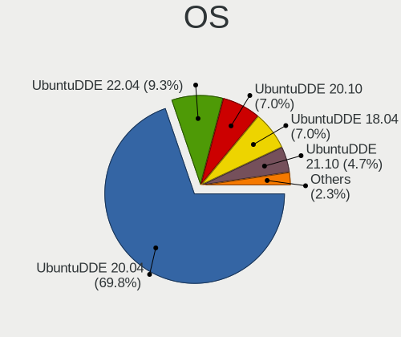

| Name            | Desktops | Percent |
|-----------------|----------|---------|
| UbuntuDDE 20.04 | 28       | 73.68%  |
| UbuntuDDE 20.10 | 3        | 7.89%   |
| UbuntuDDE 18.04 | 3        | 7.89%   |
| UbuntuDDE 21.10 | 2        | 5.26%   |
| UbuntuDDE 22.04 | 1        | 2.63%   |
| UbuntuDDE 21.04 | 1        | 2.63%   |

OS Family
---------

OS without a version

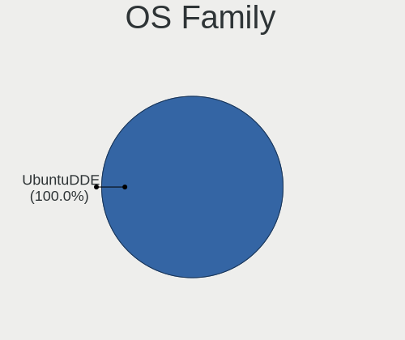

| Name      | Desktops | Percent |
|-----------|----------|---------|
| UbuntuDDE | 38       | 100%    |

Kernel
------

Version of the Linux kernel

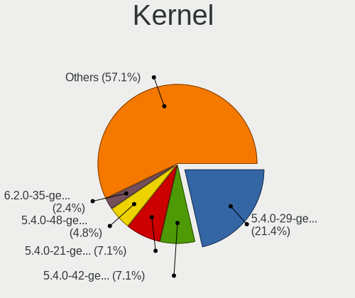

| Version             | Desktops | Percent |
|---------------------|----------|---------|
| 5.4.0-29-generic    | 9        | 23.08%  |
| 5.4.0-42-generic    | 3        | 7.69%   |
| 5.4.0-21-generic    | 3        | 7.69%   |
| 5.4.0-48-generic    | 2        | 5.13%   |
| 5.8.0-53-generic    | 1        | 2.56%   |
| 5.8.0-50-generic    | 1        | 2.56%   |
| 5.8.0-48-generic    | 1        | 2.56%   |
| 5.8.0-41-generic    | 1        | 2.56%   |
| 5.8.0-33-generic    | 1        | 2.56%   |
| 5.4.0-53-generic    | 1        | 2.56%   |
| 5.4.0-52-generic    | 1        | 2.56%   |
| 5.4.0-45-generic    | 1        | 2.56%   |
| 5.4.0-40-lowlatency | 1        | 2.56%   |
| 5.4.0-39-generic    | 1        | 2.56%   |
| 5.4.0-37-generic    | 1        | 2.56%   |
| 5.4.0-31-generic    | 1        | 2.56%   |
| 5.4.0-26-generic    | 1        | 2.56%   |
| 5.4.0-24-generic    | 1        | 2.56%   |
| 5.3.0-40-generic    | 1        | 2.56%   |
| 5.15.0-50-generic   | 1        | 2.56%   |
| 5.13.0-39-generic   | 1        | 2.56%   |
| 5.13.0-35-generic   | 1        | 2.56%   |
| 5.13.0-28-generic   | 1        | 2.56%   |
| 5.11.0-31-generic   | 1        | 2.56%   |
| 5.0.0-36-generic    | 1        | 2.56%   |
| 4.15.0-122-generic  | 1        | 2.56%   |

Kernel Family
-------------

Linux kernel without a distro release

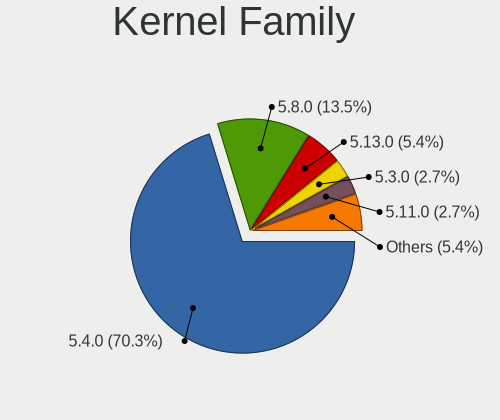

| Version | Desktops | Percent |
|---------|----------|---------|
| 5.4.0   | 26       | 68.42%  |
| 5.8.0   | 5        | 13.16%  |
| 5.13.0  | 2        | 5.26%   |
| 5.3.0   | 1        | 2.63%   |
| 5.15.0  | 1        | 2.63%   |
| 5.11.0  | 1        | 2.63%   |
| 5.0.0   | 1        | 2.63%   |
| 4.15.0  | 1        | 2.63%   |

Kernel Major Ver.
-----------------

Linux kernel major version

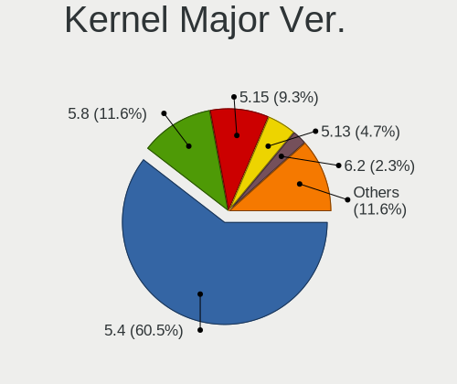

| Version | Desktops | Percent |
|---------|----------|---------|
| 5.4     | 26       | 68.42%  |
| 5.8     | 5        | 13.16%  |
| 5.13    | 2        | 5.26%   |
| 5.3     | 1        | 2.63%   |
| 5.15    | 1        | 2.63%   |
| 5.11    | 1        | 2.63%   |
| 5.0     | 1        | 2.63%   |
| 4.15    | 1        | 2.63%   |

Arch
----

OS architecture (x86_64, i586, etc.)

| Name   | Desktops | Percent |
|--------|----------|---------|
| x86_64 | 38       | 100%    |

DE
--

Desktop Environment

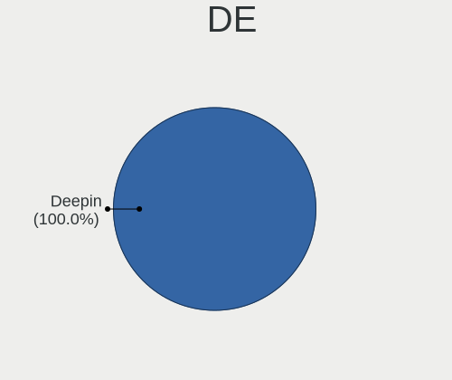

| Name   | Desktops | Percent |
|--------|----------|---------|
| Deepin | 38       | 100%    |

Display Server
--------------

X11 or Wayland

| Name | Desktops | Percent |
|------|----------|---------|
| X11  | 38       | 100%    |

Display Manager
---------------

SDDM, LightDM, etc.

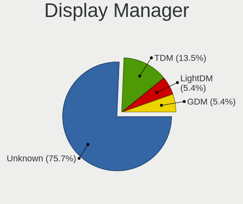

| Name    | Desktops | Percent |
|---------|----------|---------|
| Unknown | 28       | 73.68%  |
| TDM     | 5        | 13.16%  |
| LightDM | 2        | 5.26%   |
| GDM     | 2        | 5.26%   |
| GDM3    | 1        | 2.63%   |

OS Lang
-------

Language

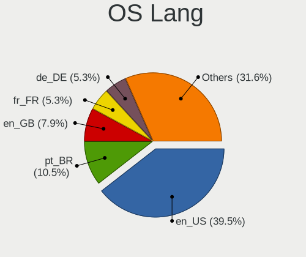

| Lang  | Desktops | Percent |
|-------|----------|---------|
| en_US | 15       | 39.47%  |
| pt_BR | 4        | 10.53%  |
| en_GB | 3        | 7.89%   |
| fr_FR | 2        | 5.26%   |
| de_DE | 2        | 5.26%   |
| C     | 2        | 5.26%   |
| uk_UA | 1        | 2.63%   |
| th_TH | 1        | 2.63%   |
| pl_PL | 1        | 2.63%   |
| it_IT | 1        | 2.63%   |
| fi_FI | 1        | 2.63%   |
| es_ES | 1        | 2.63%   |
| es_CR | 1        | 2.63%   |
| es_AR | 1        | 2.63%   |
| en_CA | 1        | 2.63%   |
| de_CH | 1        | 2.63%   |

Boot Mode
---------

EFI or BIOS

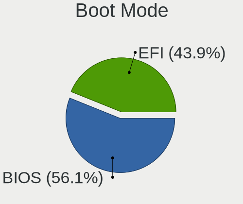

| Mode | Desktops | Percent |
|------|----------|---------|
| BIOS | 21       | 55.26%  |
| EFI  | 17       | 44.74%  |

Filesystem
----------

Type of filesystem

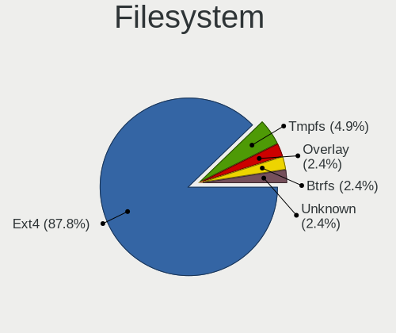

| Type    | Desktops | Percent |
|---------|----------|---------|
| Ext4    | 35       | 92.11%  |
| Overlay | 1        | 2.63%   |
| Btrfs   | 1        | 2.63%   |
| Unknown | 1        | 2.63%   |

Part. scheme
------------

Scheme of partitioning

| Type    | Desktops | Percent |
|---------|----------|---------|
| Unknown | 29       | 76.32%  |
| GPT     | 6        | 15.79%  |
| MBR     | 3        | 7.89%   |

Dual Boot with Linux/BSD
------------------------

Hosting more than one Linux/BSD

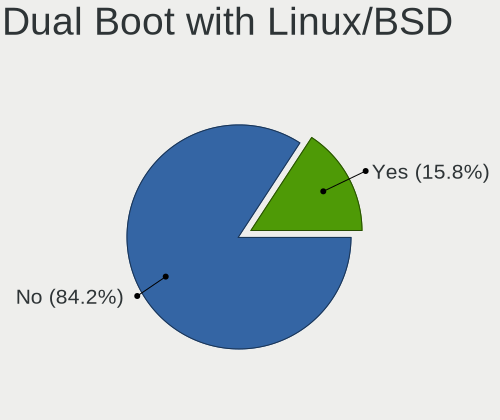

| Dual boot | Desktops | Percent |
|-----------|----------|---------|
| No        | 32       | 84.21%  |
| Yes       | 6        | 15.79%  |

Dual Boot (Win)
---------------

Hosting Linux and Windows

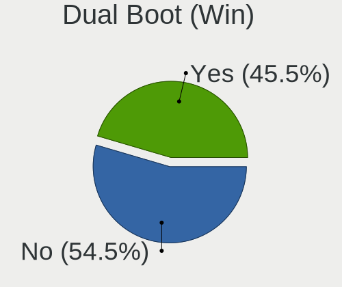

| Dual boot | Desktops | Percent |
|-----------|----------|---------|
| No        | 23       | 58.97%  |
| Yes       | 16       | 41.03%  |

Board
-----

Vendor
------

Motherboard manufacturer

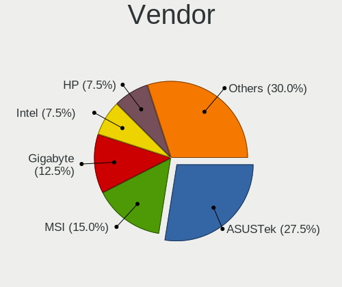

| Name                | Desktops | Percent |
|---------------------|----------|---------|
| ASUSTek Computer    | 10       | 26.32%  |
| MSI                 | 6        | 15.79%  |
| Gigabyte Technology | 5        | 13.16%  |
| Intel               | 3        | 7.89%   |
| Hewlett-Packard     | 3        | 7.89%   |
| Dell                | 3        | 7.89%   |
| Medion              | 1        | 2.63%   |
| Fujitsu Siemens     | 1        | 2.63%   |
| eMachines           | 1        | 2.63%   |
| ECS                 | 1        | 2.63%   |
| BANGHO              | 1        | 2.63%   |
| ASRock              | 1        | 2.63%   |
| Acer                | 1        | 2.63%   |
| Unknown             | 1        | 2.63%   |

Model
-----

Motherboard model

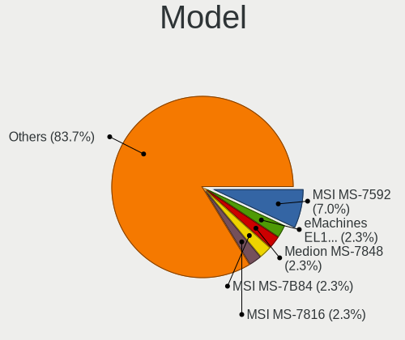

| Name                          | Desktops | Percent |
|-------------------------------|----------|---------|
| MSI MS-7592                   | 3        | 7.89%   |
| MSI MS-7B84                   | 1        | 2.63%   |
| MSI MS-7816                   | 1        | 2.63%   |
| MSI MS-7693                   | 1        | 2.63%   |
| Medion MS-7848                | 1        | 2.63%   |
| Intel DQ45CB AAE30148-207     | 1        | 2.63%   |
| Intel D33217CK G76541-302     | 1        | 2.63%   |
| Intel B75                     | 1        | 2.63%   |
| HP Pavilion Desktop 590-p0xxx | 1        | 2.63%   |
| HP Compaq Elite 8300 SFF      | 1        | 2.63%   |
| HP Compaq Elite 8300 MT       | 1        | 2.63%   |
| Gigabyte GB-BXi7-5500         | 1        | 2.63%   |
| Gigabyte GA-MA74GM-S2         | 1        | 2.63%   |
| Gigabyte GA-970A-D3           | 1        | 2.63%   |
| Gigabyte F2A55M-HD2           | 1        | 2.63%   |
| Gigabyte B75M-D3H             | 1        | 2.63%   |
| Fujitsu Siemens ESPRIMO P5730 | 1        | 2.63%   |
| eMachines EL1333G             | 1        | 2.63%   |
| ECS GL307AA-ABA a6123w        | 1        | 2.63%   |
| Dell PowerEdge T40            | 1        | 2.63%   |
| Dell Inspiron 530             | 1        | 2.63%   |
| Dell Inspiron 3670            | 1        | 2.63%   |
| BANGHO CUBIC                  | 1        | 2.63%   |
| ASUS PRIME B450M-A II         | 1        | 2.63%   |
| ASUS PRIME B360M-A            | 1        | 2.63%   |
| ASUS P6X58D-E                 | 1        | 2.63%   |
| ASUS P5KPL-AM                 | 1        | 2.63%   |
| ASUS P5G41C-M LX              | 1        | 2.63%   |
| ASUS H61M-D                   | 1        | 2.63%   |
| ASUS D820MT_D820SF_BM3CE      | 1        | 2.63%   |
| ASUS CROSSHAIR V FORMULA-Z    | 1        | 2.63%   |
| ASUS All Series               | 1        | 2.63%   |
| ASUS A68HM-PLUS               | 1        | 2.63%   |
| ASRock X370 Gaming K4         | 1        | 2.63%   |
| Acer ASM1610/VTM261           | 1        | 2.63%   |
| Unknown                       | 1        | 2.63%   |

Model Family
------------

Motherboard model prefix

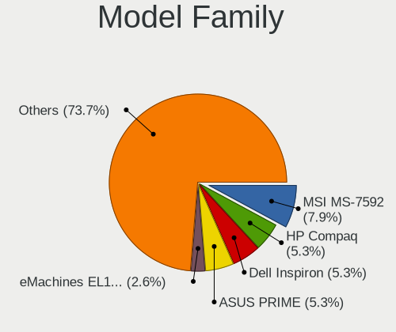

| Name                    | Desktops | Percent |
|-------------------------|----------|---------|
| MSI MS-7592             | 3        | 7.89%   |
| HP Compaq               | 2        | 5.26%   |
| Dell Inspiron           | 2        | 5.26%   |
| ASUS PRIME              | 2        | 5.26%   |
| MSI MS-7B84             | 1        | 2.63%   |
| MSI MS-7816             | 1        | 2.63%   |
| MSI MS-7693             | 1        | 2.63%   |
| Medion MS-7848          | 1        | 2.63%   |
| Intel DQ45CB            | 1        | 2.63%   |
| Intel D33217CK          | 1        | 2.63%   |
| Intel B75               | 1        | 2.63%   |
| HP Pavilion             | 1        | 2.63%   |
| Gigabyte GB-BXi7-5500   | 1        | 2.63%   |
| Gigabyte GA-MA74GM-S2   | 1        | 2.63%   |
| Gigabyte GA-970A-D3     | 1        | 2.63%   |
| Gigabyte F2A55M-HD2     | 1        | 2.63%   |
| Gigabyte B75M-D3H       | 1        | 2.63%   |
| Fujitsu Siemens ESPRIMO | 1        | 2.63%   |
| eMachines EL1333G       | 1        | 2.63%   |
| ECS GL307AA-ABA         | 1        | 2.63%   |
| Dell PowerEdge          | 1        | 2.63%   |
| BANGHO CUBIC            | 1        | 2.63%   |
| ASUS P6X58D-E           | 1        | 2.63%   |
| ASUS P5KPL-AM           | 1        | 2.63%   |
| ASUS P5G41C-M           | 1        | 2.63%   |
| ASUS H61M-D             | 1        | 2.63%   |
| ASUS D820MT             | 1        | 2.63%   |
| ASUS CROSSHAIR          | 1        | 2.63%   |
| ASUS All                | 1        | 2.63%   |
| ASUS A68HM-PLUS         | 1        | 2.63%   |
| ASRock X370             | 1        | 2.63%   |
| Acer ASM1610            | 1        | 2.63%   |
| Unknown                 | 1        | 2.63%   |

MFG Year
--------

Motherboard manufacture year

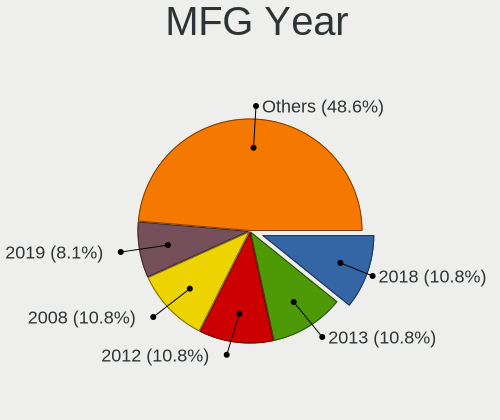

| Year | Desktops | Percent |
|------|----------|---------|
| 2013 | 5        | 13.16%  |
| 2018 | 4        | 10.53%  |
| 2012 | 4        | 10.53%  |
| 2008 | 4        | 10.53%  |
| 2019 | 3        | 7.89%   |
| 2014 | 3        | 7.89%   |
| 2011 | 3        | 7.89%   |
| 2010 | 3        | 7.89%   |
| 2020 | 2        | 5.26%   |
| 2016 | 2        | 5.26%   |
| 2009 | 2        | 5.26%   |
| 2007 | 2        | 5.26%   |
| 2015 | 1        | 2.63%   |

Form Factor
-----------

Physical design of the computer

| Name    | Desktops | Percent |
|---------|----------|---------|
| Desktop | 38       | 100%    |

Secure Boot
-----------

Enabled or disabled

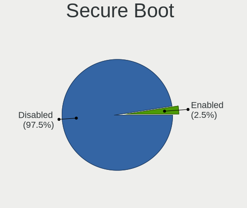

| State    | Desktops | Percent |
|----------|----------|---------|
| Disabled | 37       | 97.37%  |
| Enabled  | 1        | 2.63%   |

Coreboot
--------

Have coreboot on board

| Used | Desktops | Percent |
|------|----------|---------|
| No   | 38       | 100%    |

RAM Size
--------

Total RAM memory

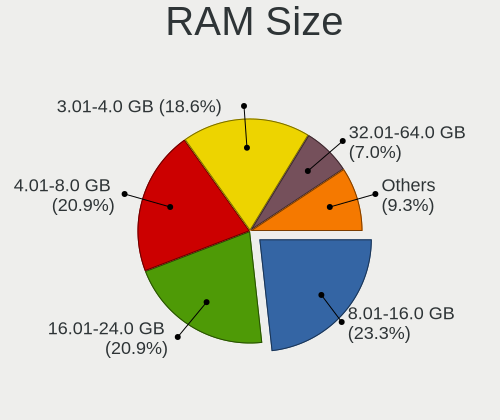

| Size in GB  | Desktops | Percent |
|-------------|----------|---------|
| 4.01-8.0    | 8        | 21.05%  |
| 3.01-4.0    | 8        | 21.05%  |
| 8.01-16.0   | 8        | 21.05%  |
| 16.01-24.0  | 7        | 18.42%  |
| 32.01-64.0  | 3        | 7.89%   |
| 2.01-3.0    | 2        | 5.26%   |
| 24.01-32.0  | 1        | 2.63%   |
| 64.01-256.0 | 1        | 2.63%   |

RAM Used
--------

Used RAM memory

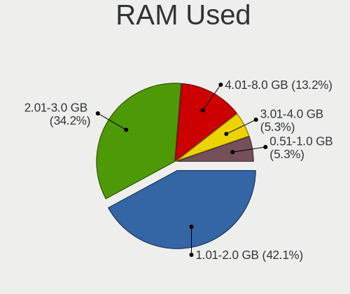

| Used GB  | Desktops | Percent |
|----------|----------|---------|
| 1.01-2.0 | 16       | 42.11%  |
| 2.01-3.0 | 13       | 34.21%  |
| 4.01-8.0 | 5        | 13.16%  |
| 3.01-4.0 | 2        | 5.26%   |
| 0.51-1.0 | 2        | 5.26%   |

Total Drives
------------

Number of drives on board

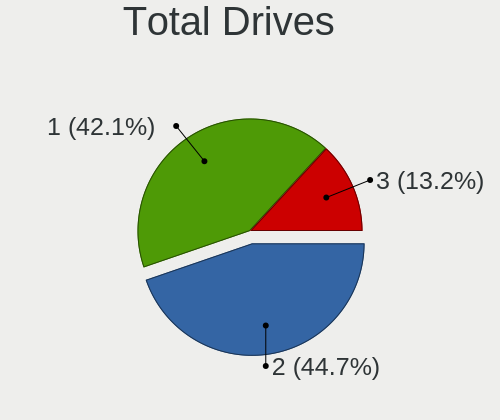

| Drives | Desktops | Percent |
|--------|----------|---------|
| 2      | 17       | 44.74%  |
| 1      | 16       | 42.11%  |
| 3      | 5        | 13.16%  |

Has CD-ROM
----------

Has CD-ROM on board

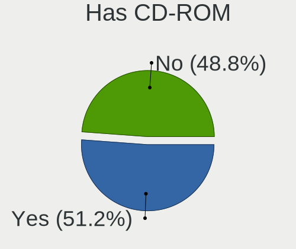

| Presented | Desktops | Percent |
|-----------|----------|---------|
| Yes       | 19       | 50%     |
| No        | 19       | 50%     |

Has Ethernet
------------

Has Ethernet on board

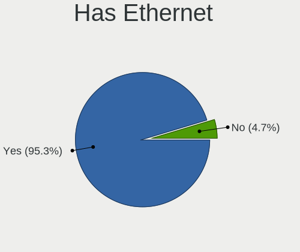

| Presented | Desktops | Percent |
|-----------|----------|---------|
| Yes       | 36       | 94.74%  |
| No        | 2        | 5.26%   |

Has WiFi
--------

Has WiFi module

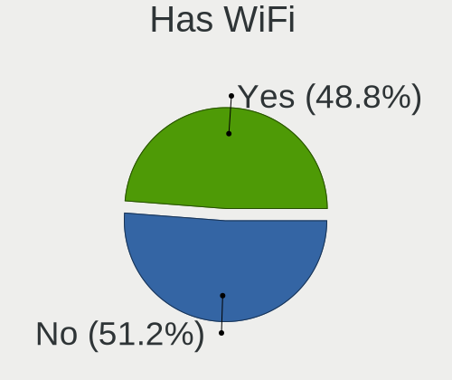

| Presented | Desktops | Percent |
|-----------|----------|---------|
| No        | 20       | 52.63%  |
| Yes       | 18       | 47.37%  |

Has Bluetooth
-------------

Has Bluetooth module

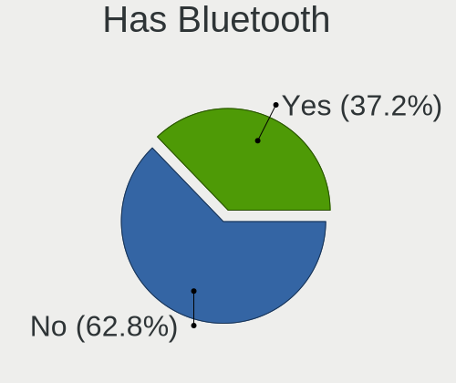

| Presented | Desktops | Percent |
|-----------|----------|---------|
| No        | 23       | 60.53%  |
| Yes       | 15       | 39.47%  |

Location
--------

Country
-------

Geographic location (country)

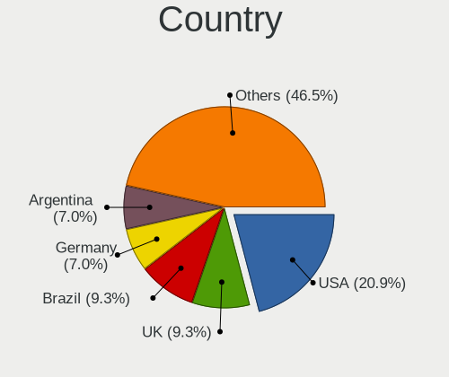

| Country    | Desktops | Percent |
|------------|----------|---------|
| USA        | 7        | 18.42%  |
| UK         | 4        | 10.53%  |
| Brazil     | 4        | 10.53%  |
| Germany    | 3        | 7.89%   |
| Argentina  | 3        | 7.89%   |
| Portugal   | 2        | 5.26%   |
| France     | 2        | 5.26%   |
| Ukraine    | 1        | 2.63%   |
| Thailand   | 1        | 2.63%   |
| Sweden     | 1        | 2.63%   |
| Poland     | 1        | 2.63%   |
| Mexico     | 1        | 2.63%   |
| Luxembourg | 1        | 2.63%   |
| Italy      | 1        | 2.63%   |
| Indonesia  | 1        | 2.63%   |
| Finland    | 1        | 2.63%   |
| Costa Rica | 1        | 2.63%   |
| Canada     | 1        | 2.63%   |
| Belgium    | 1        | 2.63%   |
| Austria    | 1        | 2.63%   |

City
----

Geographic location (city)

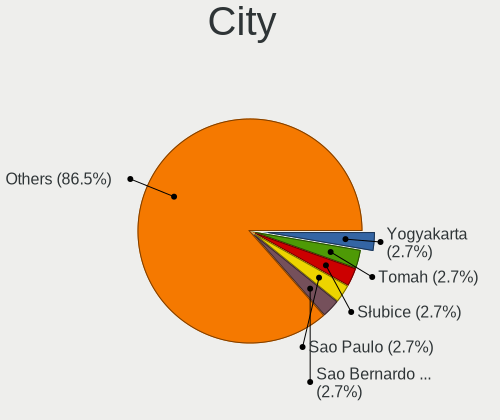

| City                  | Desktops | Percent |
|-----------------------|----------|---------|
| Yogyakarta            | 1        | 2.63%   |
| Tomah                 | 1        | 2.63%   |
| Słubice              | 1        | 2.63%   |
| Sao Paulo             | 1        | 2.63%   |
| Sao Bernardo do Campo | 1        | 2.63%   |
| Sankt Pölten         | 1        | 2.63%   |
| San Telmo             | 1        | 2.63%   |
| Rosario               | 1        | 2.63%   |
| Rome                  | 1        | 2.63%   |
| Rodgau                | 1        | 2.63%   |
| Pontpierre            | 1        | 2.63%   |
| Oakville              | 1        | 2.63%   |
| Newburgh              | 1        | 2.63%   |
| Monterrey             | 1        | 2.63%   |
| Monte Carmelo         | 1        | 2.63%   |
| Molesey               | 1        | 2.63%   |
| Milan                 | 1        | 2.63%   |
| Lviv                  | 1        | 2.63%   |
| Lisbon                | 1        | 2.63%   |
| La Louvière          | 1        | 2.63%   |
| Krefeld               | 1        | 2.63%   |
| Heredia               | 1        | 2.63%   |
| Helsinki              | 1        | 2.63%   |
| Enskede-Arsta-Vantoer | 1        | 2.63%   |
| Derby                 | 1        | 2.63%   |
| Dayton                | 1        | 2.63%   |
| Curitiba              | 1        | 2.63%   |
| Colorado Springs      | 1        | 2.63%   |
| Colmar                | 1        | 2.63%   |
| Buenos Aires          | 1        | 2.63%   |
| Bristol               | 1        | 2.63%   |
| Bourgoin-Jallieu      | 1        | 2.63%   |
| Bermondsey            | 1        | 2.63%   |
| Berlin                | 1        | 2.63%   |
| Bend                  | 1        | 2.63%   |
| Beja                  | 1        | 2.63%   |
| Bang Bon              | 1        | 2.63%   |
| Auburn                | 1        | 2.63%   |

Drives
------

Drive Vendor
------------

Hard drive vendors

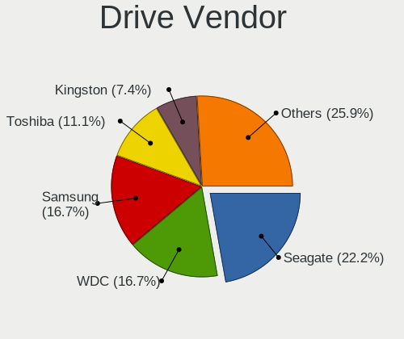

| Vendor              | Desktops | Drives | Percent |
|---------------------|----------|--------|---------|
| Seagate             | 12       | 13     | 21.43%  |
| WDC                 | 9        | 14     | 16.07%  |
| Samsung Electronics | 9        | 9      | 16.07%  |
| Toshiba             | 7        | 7      | 12.5%   |
| Kingston            | 4        | 4      | 7.14%   |
| Hitachi             | 3        | 4      | 5.36%   |
| Crucial             | 3        | 3      | 5.36%   |
| Vaseky              | 1        | 1      | 1.79%   |
| SanDisk             | 1        | 1      | 1.79%   |
| PNY                 | 1        | 2      | 1.79%   |
| Plextor             | 1        | 1      | 1.79%   |
| Maxtor              | 1        | 1      | 1.79%   |
| Leven               | 1        | 1      | 1.79%   |
| KingFast            | 1        | 1      | 1.79%   |
| Integral            | 1        | 1      | 1.79%   |
| GOODRAM             | 1        | 1      | 1.79%   |

Drive Model
-----------

Hard drive models

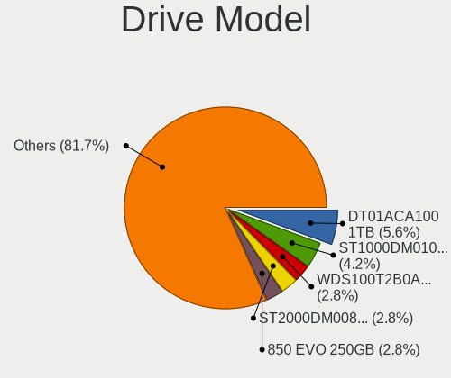

| Model                              | Desktops | Percent |
|------------------------------------|----------|---------|
| Toshiba DT01ACA100 1TB             | 4        | 6.67%   |
| WDC WDS100T2B0A-00SM50 1TB SSD     | 2        | 3.33%   |
| Seagate ST1000DM010-2EP102 1TB     | 2        | 3.33%   |
| Samsung SSD 850 EVO 250GB          | 2        | 3.33%   |
| WDC WDBNCE2500PNC 250GB SSD        | 1        | 1.67%   |
| WDC WD7501AALS-75J7B0 752GB        | 1        | 1.67%   |
| WDC WD60EDAZ-11BMZB0 6TB           | 1        | 1.67%   |
| WDC WD3200AAJS-56B4A0 320GB        | 1        | 1.67%   |
| WDC WD3200AAJS-00B4A0 320GB        | 1        | 1.67%   |
| WDC WD30EZRX-00MMMB0 3TB           | 1        | 1.67%   |
| WDC WD30EFRX-68EUZN0 3TB           | 1        | 1.67%   |
| WDC WD2500AAKX-001CA0 250GB        | 1        | 1.67%   |
| WDC WD1003FZEX-00K3CA0 1TB         | 1        | 1.67%   |
| Vaseky V800/128G 128GB SSD         | 1        | 1.67%   |
| Toshiba THNSFC128GBSJ SSD          | 1        | 1.67%   |
| Toshiba MQ01ABD100 1TB             | 1        | 1.67%   |
| Toshiba MK3275GSX 320GB            | 1        | 1.67%   |
| Seagate ST4000DM004-2CV104 4TB     | 1        | 1.67%   |
| Seagate ST3500630AS 500GB          | 1        | 1.67%   |
| Seagate ST3500413AS 500GB          | 1        | 1.67%   |
| Seagate ST3500312CS 500GB          | 1        | 1.67%   |
| Seagate ST3320418AS 320GB          | 1        | 1.67%   |
| Seagate ST3250820AS 250GB          | 1        | 1.67%   |
| Seagate ST31000524AS 1TB           | 1        | 1.67%   |
| Seagate ST2000DM008-2FR102 2TB     | 1        | 1.67%   |
| Seagate ST2000DM001-9YN164 2TB     | 1        | 1.67%   |
| Seagate ST1000VT000 HN-M101MBB 1TB | 1        | 1.67%   |
| Seagate ST1000DM003-1CH162 1TB     | 1        | 1.67%   |
| SanDisk SSD PLUS 240 GB            | 1        | 1.67%   |
| Samsung SSD 850 EVO 500GB          | 1        | 1.67%   |
| Samsung SSD 850 EVO 1TB            | 1        | 1.67%   |
| Samsung NVMe SSD Drive 512GB       | 1        | 1.67%   |
| Samsung HM250HI 250GB              | 1        | 1.67%   |
| Samsung HD161HJ 160GB              | 1        | 1.67%   |
| Samsung HD103SJ 1TB                | 1        | 1.67%   |
| Samsung HD080HJ 80GB               | 1        | 1.67%   |
| PNY CS900 1TB SSD                  | 1        | 1.67%   |
| Plextor PX-128M5M 128GB SSD        | 1        | 1.67%   |
| Maxtor STM3160215AS 160GB          | 1        | 1.67%   |
| Leven JAJS600M256C 256GB           | 1        | 1.67%   |

HDD Vendor
----------

Hard disk drive vendors

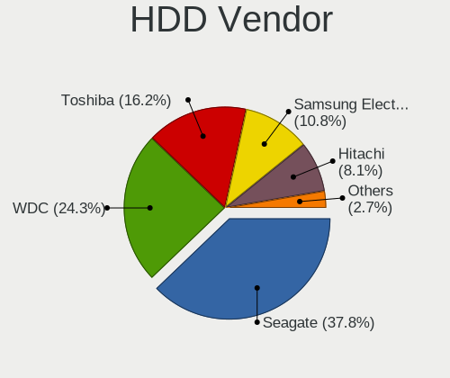

| Vendor              | Desktops | Drives | Percent |
|---------------------|----------|--------|---------|
| Seagate             | 12       | 13     | 35.29%  |
| WDC                 | 8        | 10     | 23.53%  |
| Toshiba             | 6        | 6      | 17.65%  |
| Samsung Electronics | 4        | 4      | 11.76%  |
| Hitachi             | 3        | 4      | 8.82%   |
| Maxtor              | 1        | 1      | 2.94%   |

SSD Vendor
----------

Solid state drive vendors

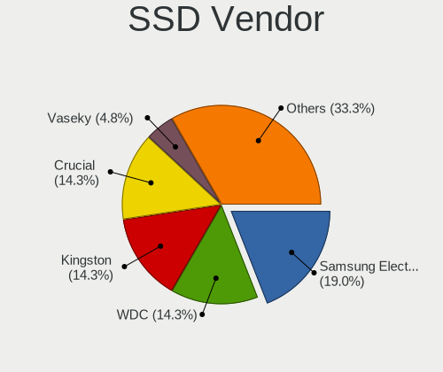

| Vendor              | Desktops | Drives | Percent |
|---------------------|----------|--------|---------|
| Samsung Electronics | 4        | 4      | 18.18%  |
| WDC                 | 3        | 4      | 13.64%  |
| Kingston            | 3        | 3      | 13.64%  |
| Crucial             | 3        | 3      | 13.64%  |
| Vaseky              | 1        | 1      | 4.55%   |
| Toshiba             | 1        | 1      | 4.55%   |
| SanDisk             | 1        | 1      | 4.55%   |
| PNY                 | 1        | 2      | 4.55%   |
| Plextor             | 1        | 1      | 4.55%   |
| Leven               | 1        | 1      | 4.55%   |
| KingFast            | 1        | 1      | 4.55%   |
| Integral            | 1        | 1      | 4.55%   |
| GOODRAM             | 1        | 1      | 4.55%   |

Drive Kind
----------

HDD or SSD

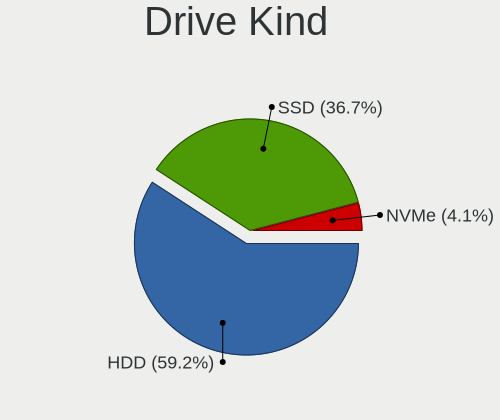

| Kind | Desktops | Drives | Percent |
|------|----------|--------|---------|
| HDD  | 29       | 38     | 59.18%  |
| SSD  | 18       | 24     | 36.73%  |
| NVMe | 2        | 2      | 4.08%   |

Drive Connector
---------------

SATA, SAS, NVMe, etc.

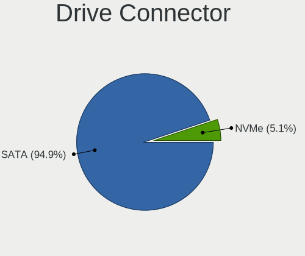

| Type | Desktops | Drives | Percent |
|------|----------|--------|---------|
| SATA | 37       | 62     | 94.87%  |
| NVMe | 2        | 2      | 5.13%   |

Drive Size
----------

Size of hard drive

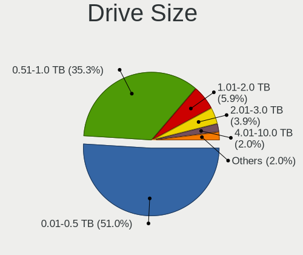

| Size in TB | Desktops | Drives | Percent |
|------------|----------|--------|---------|
| 0.01-0.5   | 25       | 34     | 52.08%  |
| 0.51-1.0   | 17       | 20     | 35.42%  |
| 2.01-3.0   | 2        | 3      | 4.17%   |
| 1.01-2.0   | 2        | 2      | 4.17%   |
| 3.01-4.0   | 1        | 1      | 2.08%   |
| 4.01-10.0  | 1        | 2      | 2.08%   |

Space Total
-----------

Amount of disk space available on the file system

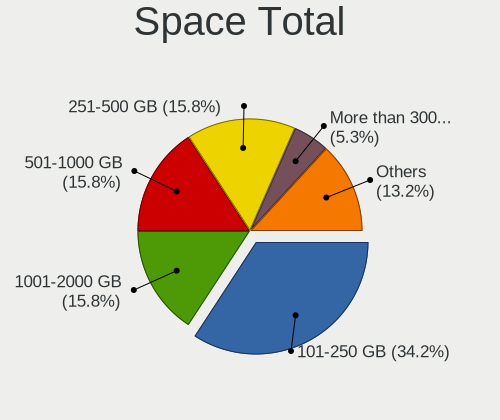

| Size in GB     | Desktops | Percent |
|----------------|----------|---------|
| 101-250        | 13       | 34.21%  |
| 251-500        | 6        | 15.79%  |
| 1001-2000      | 6        | 15.79%  |
| 501-1000       | 6        | 15.79%  |
| More than 3000 | 2        | 5.26%   |
| 21-50          | 2        | 5.26%   |
| 51-100         | 2        | 5.26%   |
| Unknown        | 1        | 2.63%   |

Space Used
----------

Amount of used disk space

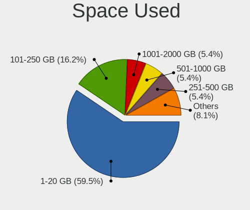

| Used GB   | Desktops | Percent |
|-----------|----------|---------|
| 1-20      | 22       | 57.89%  |
| 101-250   | 6        | 15.79%  |
| 251-500   | 2        | 5.26%   |
| 1001-2000 | 2        | 5.26%   |
| 501-1000  | 2        | 5.26%   |
| 51-100    | 2        | 5.26%   |
| 21-50     | 1        | 2.63%   |
| Unknown   | 1        | 2.63%   |

Malfunc. Drives
---------------

Drive models with a malfunction

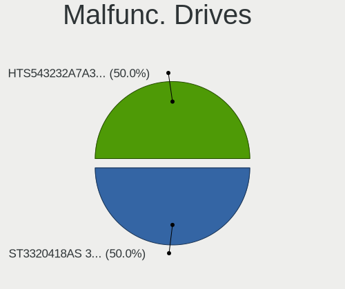

| Model                         | Desktops | Drives | Percent |
|-------------------------------|----------|--------|---------|
| Seagate ST3320418AS 320GB     | 1        | 1      | 50%     |
| Hitachi HTS543232A7A384 320GB | 1        | 1      | 50%     |

Malfunc. Drive Vendor
---------------------

Vendors of faulty drives

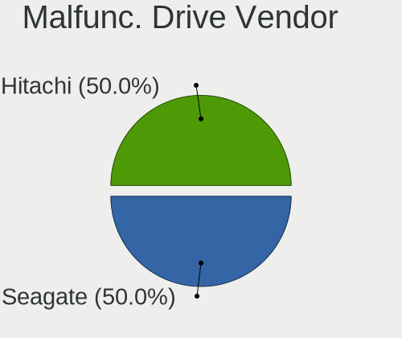

| Vendor  | Desktops | Drives | Percent |
|---------|----------|--------|---------|
| Seagate | 1        | 1      | 50%     |
| Hitachi | 1        | 1      | 50%     |

Malfunc. HDD Vendor
-------------------

Vendors of faulty HDD drives

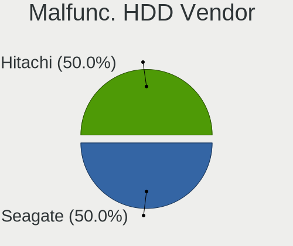

| Vendor  | Desktops | Drives | Percent |
|---------|----------|--------|---------|
| Seagate | 1        | 1      | 50%     |
| Hitachi | 1        | 1      | 50%     |

Malfunc. Drive Kind
-------------------

Kinds of faulty drives

| Kind | Desktops | Drives | Percent |
|------|----------|--------|---------|
| HDD  | 2        | 2      | 100%    |

Failed Drives
-------------

Failed drive models

Zero info for selected period =(

Failed Drive Vendor
-------------------

Failed drive vendors

Zero info for selected period =(

Drive Status
------------

Number of failed and malfunc. drives

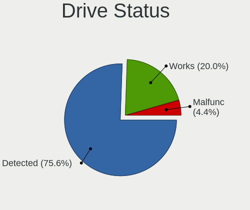

| Status   | Desktops | Drives | Percent |
|----------|----------|--------|---------|
| Detected | 30       | 51     | 75%     |
| Works    | 8        | 11     | 20%     |
| Malfunc  | 2        | 2      | 5%      |

Storage controller
------------------

Storage Vendor
--------------

Storage controller vendors

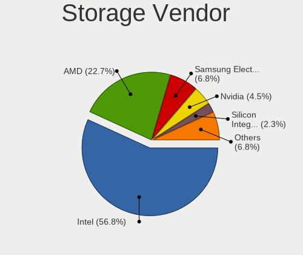

| Vendor                           | Desktops | Percent |
|----------------------------------|----------|---------|
| Intel                            | 25       | 56.82%  |
| AMD                              | 10       | 22.73%  |
| Samsung Electronics              | 3        | 6.82%   |
| Nvidia                           | 2        | 4.55%   |
| Silicon Integrated Systems [SiS] | 1        | 2.27%   |
| Marvell Technology Group         | 1        | 2.27%   |
| Kingston Technology Company      | 1        | 2.27%   |
| ASMedia Technology               | 1        | 2.27%   |

Storage Model
-------------

Storage controller models

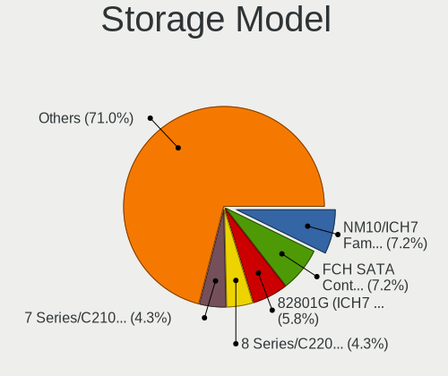

| Model                                                                            | Desktops | Percent |
|----------------------------------------------------------------------------------|----------|---------|
| Intel NM10/ICH7 Family SATA Controller [IDE mode]                                | 5        | 7.81%   |
| AMD FCH SATA Controller [AHCI mode]                                              | 5        | 7.81%   |
| Intel 82801G (ICH7 Family) IDE Controller                                        | 4        | 6.25%   |
| Intel 8 Series/C220 Series Chipset Family 6-port SATA Controller 1 [AHCI mode]   | 3        | 4.69%   |
| Intel 7 Series/C210 Series Chipset Family 6-port SATA Controller [AHCI mode]     | 3        | 4.69%   |
| Samsung NVMe SSD Controller SM961/PM961/SM963                                    | 2        | 3.13%   |
| Nvidia MCP61 SATA Controller                                                     | 2        | 3.13%   |
| Nvidia MCP61 IDE                                                                 | 2        | 3.13%   |
| Intel Q170/Q150/B150/H170/H110/Z170/CM236 Chipset SATA Controller [AHCI Mode]    | 2        | 3.13%   |
| Intel Cannon Lake PCH SATA AHCI Controller                                       | 2        | 3.13%   |
| Intel 82801JD/DO (ICH10 Family) 4-port SATA IDE Controller                       | 2        | 3.13%   |
| Intel 82801JD/DO (ICH10 Family) 2-port SATA IDE Controller                       | 2        | 3.13%   |
| Intel 4 Series Chipset PT IDER Controller                                        | 2        | 3.13%   |
| AMD SB7x0/SB8x0/SB9x0 SATA Controller [AHCI mode]                                | 2        | 3.13%   |
| Silicon Integrated Systems [SiS] SATA Controller / IDE mode                      | 1        | 1.56%   |
| Silicon Integrated Systems [SiS] 5513 IDE Controller                             | 1        | 1.56%   |
| Samsung NVMe SSD Controller SM981/PM981/PM983                                    | 1        | 1.56%   |
| Marvell Group 88SE91A3 SATA-600 Controller                                       | 1        | 1.56%   |
| Kingston Company A2000 NVMe SSD                                                  | 1        | 1.56%   |
| Intel Wildcat Point-LP SATA Controller [AHCI Mode]                               | 1        | 1.56%   |
| Intel C600/X79 series chipset SATA RAID Controller                               | 1        | 1.56%   |
| Intel Atom/Celeron/Pentium Processor x5-E8000/J3xxx/N3xxx Series SATA Controller | 1        | 1.56%   |
| Intel 82801JI (ICH10 Family) 4 port SATA IDE Controller #1                       | 1        | 1.56%   |
| Intel 82801JI (ICH10 Family) 2 port SATA IDE Controller #2                       | 1        | 1.56%   |
| Intel 82801IR/IO/IH (ICH9R/DO/DH) 4 port SATA Controller [IDE mode]              | 1        | 1.56%   |
| Intel 82801I (ICH9 Family) 2 port SATA Controller [IDE mode]                     | 1        | 1.56%   |
| Intel 7 Series/C210 Series Chipset Family 4-port SATA Controller [IDE mode]      | 1        | 1.56%   |
| Intel 7 Series/C210 Series Chipset Family 2-port SATA Controller [IDE mode]      | 1        | 1.56%   |
| Intel 7 Series Chipset Family 6-port SATA Controller [AHCI mode]                 | 1        | 1.56%   |
| Intel 6 Series/C200 Series Chipset Family 6 port Desktop SATA AHCI Controller    | 1        | 1.56%   |
| ASMedia ASM1062 Serial ATA Controller                                            | 1        | 1.56%   |
| AMD X370 Series Chipset SATA Controller                                          | 1        | 1.56%   |
| AMD SB7x0/SB8x0/SB9x0 SATA Controller [RAID5 mode]                               | 1        | 1.56%   |
| AMD SB7x0/SB8x0/SB9x0 SATA Controller [IDE mode]                                 | 1        | 1.56%   |
| AMD SB7x0/SB8x0/SB9x0 IDE Controller                                             | 1        | 1.56%   |
| AMD FCH SATA Controller [IDE mode]                                               | 1        | 1.56%   |
| AMD FCH SATA Controller D                                                        | 1        | 1.56%   |
| AMD FCH IDE Controller                                                           | 1        | 1.56%   |
| AMD 400 Series Chipset SATA Controller                                           | 1        | 1.56%   |
| AMD 300 Series Chipset SATA Controller                                           | 1        | 1.56%   |

Storage Kind
------------

Kind of storage controller (IDE, SATA, NVMe, SAS, ...)

| Kind | Desktops | Percent |
|------|----------|---------|
| SATA | 23       | 52.27%  |
| IDE  | 15       | 34.09%  |
| NVMe | 4        | 9.09%   |
| RAID | 2        | 4.55%   |

Processor
---------

CPU Vendor
----------

Processor vendors

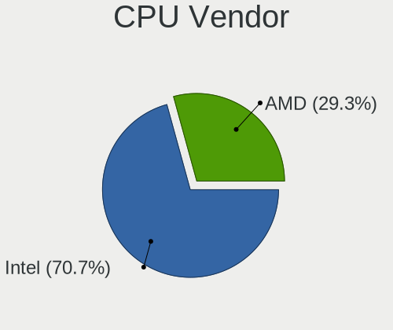

| Vendor | Desktops | Percent |
|--------|----------|---------|
| Intel  | 26       | 68.42%  |
| AMD    | 12       | 31.58%  |

CPU Model
---------

Processor models

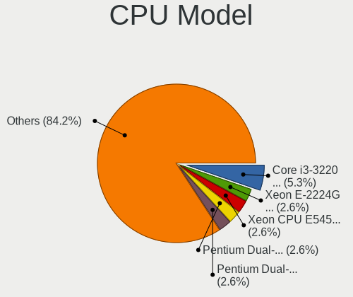

| Model                                           | Desktops | Percent |
|-------------------------------------------------|----------|---------|
| Intel Core i3-3220 CPU @ 3.30GHz                | 2        | 5.26%   |
| Intel Xeon E-2224G CPU @ 3.50GHz                | 1        | 2.63%   |
| Intel Xeon CPU E5450 @ 3.00GHz                  | 1        | 2.63%   |
| Intel Pentium Dual-Core CPU E5800 @ 3.20GHz     | 1        | 2.63%   |
| Intel Pentium Dual-Core CPU E5400 @ 2.70GHz     | 1        | 2.63%   |
| Intel Pentium Dual CPU E2220 @ 2.40GHz          | 1        | 2.63%   |
| Intel Core i7-7820HQ CPU @ 2.90GHz              | 1        | 2.63%   |
| Intel Core i7-6700 CPU @ 3.40GHz                | 1        | 2.63%   |
| Intel Core i7-5500U CPU @ 2.40GHz               | 1        | 2.63%   |
| Intel Core i7 CPU 950 @ 3.07GHz                 | 1        | 2.63%   |
| Intel Core i5-9400 CPU @ 2.90GHz                | 1        | 2.63%   |
| Intel Core i5-4690 CPU @ 3.50GHz                | 1        | 2.63%   |
| Intel Core i5-4670K CPU @ 3.40GHz               | 1        | 2.63%   |
| Intel Core i5-4460 CPU @ 3.20GHz                | 1        | 2.63%   |
| Intel Core i5-3570 CPU @ 3.40GHz                | 1        | 2.63%   |
| Intel Core i5-3470 CPU @ 3.20GHz                | 1        | 2.63%   |
| Intel Core i5-3330 CPU @ 3.00GHz                | 1        | 2.63%   |
| Intel Core i3-8100 CPU @ 3.60GHz                | 1        | 2.63%   |
| Intel Core i3-3217U CPU @ 1.80GHz               | 1        | 2.63%   |
| Intel Core 2 Quad CPU Q9400 @ 2.66GHz           | 1        | 2.63%   |
| Intel Core 2 Quad CPU Q9300 @ 2.50GHz           | 1        | 2.63%   |
| Intel Core 2 Quad CPU Q8200 @ 2.33GHz           | 1        | 2.63%   |
| Intel Core 2 Duo CPU E4500 @ 2.20GHz            | 1        | 2.63%   |
| Intel Core 2 CPU 6320 @ 1.86GHz                 | 1        | 2.63%   |
| Intel Celeron CPU N3000 @ 1.04GHz               | 1        | 2.63%   |
| AMD Ryzen 7 1700 Eight-Core Processor           | 1        | 2.63%   |
| AMD Ryzen 5 3600 6-Core Processor               | 1        | 2.63%   |
| AMD Ryzen 5 2600X Six-Core Processor            | 1        | 2.63%   |
| AMD Ryzen 5 2400G with Radeon Vega Graphics     | 1        | 2.63%   |
| AMD Phenom II X6 1055T Processor                | 1        | 2.63%   |
| AMD Phenom 9650 Quad-Core Processor             | 1        | 2.63%   |
| AMD FX-9590 Eight-Core Processor                | 1        | 2.63%   |
| AMD FX-8350 Eight-Core Processor                | 1        | 2.63%   |
| AMD Athlon Dual Core Processor 4850e            | 1        | 2.63%   |
| AMD Athlon 64 X2 Dual Core Processor 4400+      | 1        | 2.63%   |
| AMD A4-4000 APU with Radeon HD Graphics         | 1        | 2.63%   |
| AMD A10-7850K Radeon R7, 12 Compute Cores 4C+8G | 1        | 2.63%   |

CPU Model Family
----------------

Processor model prefix

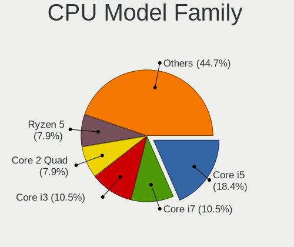

| Model                   | Desktops | Percent |
|-------------------------|----------|---------|
| Intel Core i5           | 7        | 18.42%  |
| Intel Core i7           | 4        | 10.53%  |
| Intel Core i3           | 4        | 10.53%  |
| Intel Core 2 Quad       | 3        | 7.89%   |
| AMD Ryzen 5             | 3        | 7.89%   |
| Intel Xeon              | 2        | 5.26%   |
| Intel Pentium Dual-Core | 2        | 5.26%   |
| AMD FX                  | 2        | 5.26%   |
| Intel Pentium Dual      | 1        | 2.63%   |
| Intel Core 2 Duo        | 1        | 2.63%   |
| Intel Core 2            | 1        | 2.63%   |
| Intel Celeron           | 1        | 2.63%   |
| AMD Ryzen 7             | 1        | 2.63%   |
| AMD Phenom II X6        | 1        | 2.63%   |
| AMD Phenom              | 1        | 2.63%   |
| AMD Athlon Dual Core    | 1        | 2.63%   |
| AMD Athlon 64 X2        | 1        | 2.63%   |
| AMD A4                  | 1        | 2.63%   |
| AMD A10                 | 1        | 2.63%   |

CPU Cores
---------

Number of processor cores

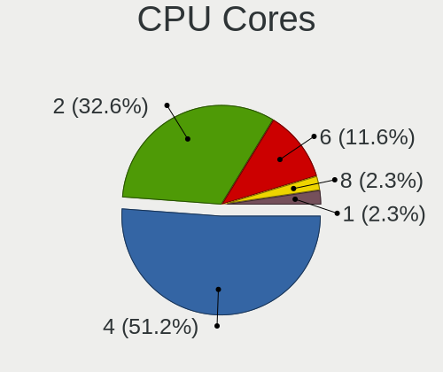

| Number | Desktops | Percent |
|--------|----------|---------|
| 4      | 19       | 50%     |
| 2      | 13       | 34.21%  |
| 6      | 4        | 10.53%  |
| 8      | 1        | 2.63%   |
| 1      | 1        | 2.63%   |

CPU Sockets
-----------

Number of sockets

| Number | Desktops | Percent |
|--------|----------|---------|
| 1      | 38       | 100%    |

CPU Threads
-----------

Threads per core (Hyper-Threading)

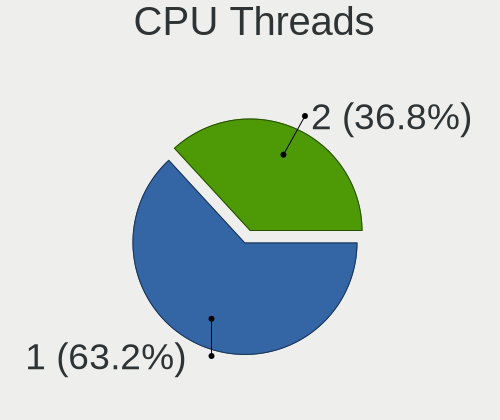

| Number | Desktops | Percent |
|--------|----------|---------|
| 1      | 24       | 63.16%  |
| 2      | 14       | 36.84%  |

CPU Op-Modes
------------

CPU Operation Modes (32-bit, 64-bit)

| Op mode        | Desktops | Percent |
|----------------|----------|---------|
| 32-bit, 64-bit | 38       | 100%    |

CPU Microcode
-------------

Microcode number

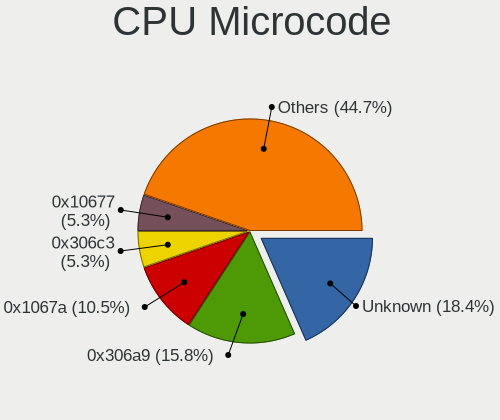

| Number     | Desktops | Percent |
|------------|----------|---------|
| Unknown    | 7        | 18.42%  |
| 0x306a9    | 6        | 15.79%  |
| 0x1067a    | 4        | 10.53%  |
| 0x306c3    | 2        | 5.26%   |
| 0x10677    | 2        | 5.26%   |
| 0x06000852 | 2        | 5.26%   |
| 0x906ed    | 1        | 2.63%   |
| 0x906eb    | 1        | 2.63%   |
| 0x906ea    | 1        | 2.63%   |
| 0x6fd      | 1        | 2.63%   |
| 0x6f6      | 1        | 2.63%   |
| 0x506e3    | 1        | 2.63%   |
| 0x406c3    | 1        | 2.63%   |
| 0x306d4    | 1        | 2.63%   |
| 0x106a5    | 1        | 2.63%   |
| 0x08701021 | 1        | 2.63%   |
| 0x08101016 | 1        | 2.63%   |
| 0x08001138 | 1        | 2.63%   |
| 0x06003106 | 1        | 2.63%   |
| 0x010000dc | 1        | 2.63%   |
| 0x01000083 | 1        | 2.63%   |

CPU Microarch
-------------

Microarchitecture

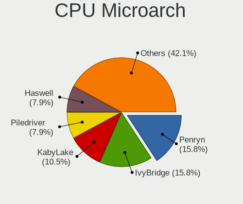

| Name        | Desktops | Percent |
|-------------|----------|---------|
| Penryn      | 6        | 15.79%  |
| IvyBridge   | 6        | 15.79%  |
| KabyLake    | 4        | 10.53%  |
| Piledriver  | 3        | 7.89%   |
| Haswell     | 3        | 7.89%   |
| Core        | 3        | 7.89%   |
| Zen         | 2        | 5.26%   |
| K8 Hammer   | 2        | 5.26%   |
| K10         | 2        | 5.26%   |
| Zen+        | 1        | 2.63%   |
| Zen 2       | 1        | 2.63%   |
| Steamroller | 1        | 2.63%   |
| Skylake     | 1        | 2.63%   |
| Silvermont  | 1        | 2.63%   |
| Nehalem     | 1        | 2.63%   |
| Broadwell   | 1        | 2.63%   |

Graphics
--------

GPU Vendor
----------

Vendors of graphics cards

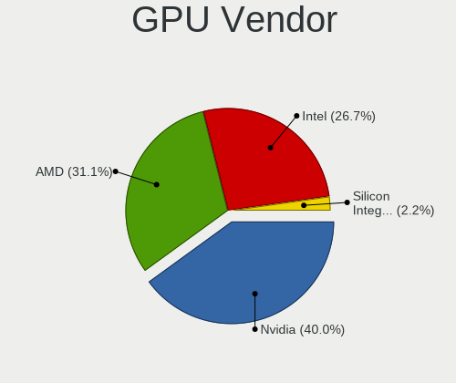

| Vendor                           | Desktops | Percent |
|----------------------------------|----------|---------|
| Nvidia                           | 16       | 40%     |
| AMD                              | 12       | 30%     |
| Intel                            | 11       | 27.5%   |
| Silicon Integrated Systems [SiS] | 1        | 2.5%    |

GPU Model
---------

Graphics card models

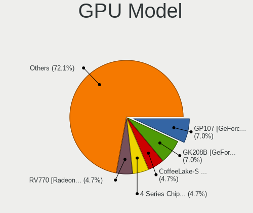

| Model                                                                                    | Desktops | Percent |
|------------------------------------------------------------------------------------------|----------|---------|
| Nvidia GK208B [GeForce GT 710]                                                           | 3        | 7.32%   |
| Intel CoffeeLake-S GT2 [UHD Graphics 630]                                                | 2        | 4.88%   |
| Intel 4 Series Chipset Integrated Graphics Controller                                    | 2        | 4.88%   |
| AMD RV770 [Radeon HD 4850]                                                               | 2        | 4.88%   |
| AMD Ellesmere [Radeon RX 470/480/570/570X/580/580X/590]                                  | 2        | 4.88%   |
| AMD Baffin [Radeon RX 550 640SP / RX 560/560X]                                           | 2        | 4.88%   |
| Silicon Integrated Systems [SiS] 771/671 PCIE VGA Display Adapter                        | 1        | 2.44%   |
| Nvidia TU117 [GeForce GTX 1650]                                                          | 1        | 2.44%   |
| Nvidia GT218 [GeForce 210]                                                               | 1        | 2.44%   |
| Nvidia GT215 [GeForce GT 320]                                                            | 1        | 2.44%   |
| Nvidia GP107 [GeForce GTX 1050 Ti]                                                       | 1        | 2.44%   |
| Nvidia GM107 [GeForce GTX 745]                                                           | 1        | 2.44%   |
| Nvidia GK208B [GeForce GT 720]                                                           | 1        | 2.44%   |
| Nvidia GK106 [GeForce GTX 660]                                                           | 1        | 2.44%   |
| Nvidia GK104 [GeForce GTX 660 Ti]                                                        | 1        | 2.44%   |
| Nvidia GF119 [GeForce GT 705]                                                            | 1        | 2.44%   |
| Nvidia GF108GL [Quadro 600]                                                              | 1        | 2.44%   |
| Nvidia GF108 [GeForce GT 730]                                                            | 1        | 2.44%   |
| Nvidia G94GL [Quadro FX 1800]                                                            | 1        | 2.44%   |
| Nvidia C61 [GeForce 6150SE nForce 430]                                                   | 1        | 2.44%   |
| Intel Xeon E3-1200 v3/4th Gen Core Processor Integrated Graphics Controller              | 1        | 2.44%   |
| Intel Xeon E3-1200 v2/3rd Gen Core processor Graphics Controller                         | 1        | 2.44%   |
| Intel HD Graphics 630                                                                    | 1        | 2.44%   |
| Intel HD Graphics 5500                                                                   | 1        | 2.44%   |
| Intel CoffeeLake-S GT2 [UHD Graphics P630]                                               | 1        | 2.44%   |
| Intel Atom/Celeron/Pentium Processor x5-E8000/J3xxx/N3xxx Integrated Graphics Controller | 1        | 2.44%   |
| Intel 3rd Gen Core processor Graphics Controller                                         | 1        | 2.44%   |
| AMD Turks XT [Radeon HD 6670/7670]                                                       | 1        | 2.44%   |
| AMD Turks PRO [Radeon HD 6570/7570/8550 / R5 230]                                        | 1        | 2.44%   |
| AMD Trinity 2 [Radeon HD 7480D]                                                          | 1        | 2.44%   |
| AMD Raven Ridge [Radeon Vega Series / Radeon Vega Mobile Series]                         | 1        | 2.44%   |
| AMD Park [Mobility Radeon HD 5430]                                                       | 1        | 2.44%   |
| AMD Kaveri [Radeon R7 Graphics]                                                          | 1        | 2.44%   |
| AMD Barts PRO [Radeon HD 6850]                                                           | 1        | 2.44%   |

GPU Combo
---------

Combinations of graphics cards

| Name       | Desktops | Percent |
|------------|----------|---------|
| 1 x Nvidia | 16       | 42.11%  |
| 1 x AMD    | 11       | 28.95%  |
| 1 x Intel  | 9        | 23.68%  |
| 2 x AMD    | 1        | 2.63%   |
| 1 x SiS    | 1        | 2.63%   |

GPU Driver
----------

Free vs proprietary

| Driver      | Desktops | Percent |
|-------------|----------|---------|
| Free        | 28       | 73.68%  |
| Proprietary | 8        | 21.05%  |
| Unknown     | 2        | 5.26%   |

GPU Memory
----------

Total video memory

| Size in GB | Desktops | Percent |
|------------|----------|---------|
| Unknown    | 15       | 39.47%  |
| 0.51-1.0   | 12       | 31.58%  |
| 1.01-2.0   | 5        | 13.16%  |
| 3.01-4.0   | 4        | 10.53%  |
| 7.01-8.0   | 1        | 2.63%   |
| 0.01-0.5   | 1        | 2.63%   |

Monitor
-------

Monitor Vendor
--------------

Monitor vendors

| Vendor               | Desktops | Percent |
|----------------------|----------|---------|
| Hewlett-Packard      | 5        | 13.89%  |
| Goldstar             | 4        | 11.11%  |
| Samsung Electronics  | 3        | 8.33%   |
| Dell                 | 3        | 8.33%   |
| Ancor Communications | 3        | 8.33%   |
| Philips              | 2        | 5.56%   |
| BenQ                 | 2        | 5.56%   |
| Acer                 | 2        | 5.56%   |
| Vizio                | 1        | 2.78%   |
| ViewSonic            | 1        | 2.78%   |
| Vestel Elektronik    | 1        | 2.78%   |
| Unknown              | 1        | 2.78%   |
| Toshiba              | 1        | 2.78%   |
| SKY                  | 1        | 2.78%   |
| LG Electronics       | 1        | 2.78%   |
| Lenovo               | 1        | 2.78%   |
| Insignia             | 1        | 2.78%   |
| HPN                  | 1        | 2.78%   |
| HannStar             | 1        | 2.78%   |
| ASUSTek Computer     | 1        | 2.78%   |

Monitor Model
-------------

Monitor models

| Model                                                                  | Desktops | Percent |
|------------------------------------------------------------------------|----------|---------|
| Vizio LCD Monitor VIZ0026 1360x768 580x320mm 26.1-inch                 | 1        | 2.56%   |
| ViewSonic VA912-4SERIES VSC721C 1280x1024 376x301mm 19.0-inch          | 1        | 2.56%   |
| Vestel Elektronik 50UHD_LCD_TV VES3700 3840x2160 1872x1053mm 84.6-inch | 1        | 2.56%   |
| Unknown LCD Monitor Sony 55R617 1920x1080                              | 1        | 2.56%   |
| Toshiba TV TSB0200 1360x768 530x300mm 24.0-inch                        | 1        | 2.56%   |
| SKY SKYWORTH SKY0001 1920x1080 885x498mm 40.0-inch                     | 1        | 2.56%   |
| Samsung Electronics U32J59x SAM0F35 3840x2160 700x390mm 31.5-inch      | 1        | 2.56%   |
| Samsung Electronics U32J59x SAM0F33 3840x2160 697x392mm 31.5-inch      | 1        | 2.56%   |
| Samsung Electronics U28E590 SAM0C4C 3840x2160 608x345mm 27.5-inch      | 1        | 2.56%   |
| Samsung Electronics LCD Monitor SAM0A76 1280x720 949x543mm 43.0-inch   | 1        | 2.56%   |
| Philips LCD Monitor 150C4 1024x768                                     | 1        | 2.56%   |
| Philips 221V PHL0888 1920x1080 480x270mm 21.7-inch                     | 1        | 2.56%   |
| LG Electronics LCD Monitor LG ULTRAWIDE 2560x1080                      | 1        | 2.56%   |
| Lenovo LEN T2054pC LEN60D9 1440x900 419x262mm 19.5-inch                | 1        | 2.56%   |
| Insignia NS19ED200NA14 BBY0032 1680x1050 640x384mm 29.4-inch           | 1        | 2.56%   |
| HPN LCD Monitor HP 24o 1920x1080                                       | 1        | 2.56%   |
| Hewlett-Packard ZR2240w HWP2952 1920x1080 480x270mm 21.7-inch          | 1        | 2.56%   |
| Hewlett-Packard w2408 HWP26CF 1920x1200 518x324mm 24.1-inch            | 1        | 2.56%   |
| Hewlett-Packard LA2306 HWP294A 1920x1080 510x287mm 23.0-inch           | 1        | 2.56%   |
| Hewlett-Packard L1740 HWP2649 1280x1024 338x270mm 17.0-inch            | 1        | 2.56%   |
| Hewlett-Packard 24f HPN3545 1920x1080 527x296mm 23.8-inch              | 1        | 2.56%   |
| HannStar iH282 HSD20E6 1920x1200 593x371mm 27.5-inch                   | 1        | 2.56%   |
| Goldstar ULTRAWIDE GSM76F9 2560x1080 531x298mm 24.0-inch               | 1        | 2.56%   |
| Goldstar Ultra HD GSM5B09 3840x2160 600x340mm 27.2-inch                | 1        | 2.56%   |
| Goldstar E2742 GSM58C9 1920x1080 598x337mm 27.0-inch                   | 1        | 2.56%   |
| Goldstar 20EN33 GSM4EE1 1600x900 443x249mm 20.0-inch                   | 1        | 2.56%   |
| Dell U2412M DELA07A 1920x1200 518x324mm 24.1-inch                      | 1        | 2.56%   |
| Dell U2410 DELF016 1920x1200 518x324mm 24.1-inch                       | 1        | 2.56%   |
| Dell LCD Monitor ST2220L 3840x1080                                     | 1        | 2.56%   |
| Dell LCD Monitor ST2220L                                               | 1        | 2.56%   |
| BenQ G2020HD BNQ781F 1600x900 443x249mm 20.0-inch                      | 1        | 2.56%   |
| BenQ EW2775ZH BNQ7944 1920x1080 598x336mm 27.0-inch                    | 1        | 2.56%   |
| ASUSTek Computer VC279 AUS27C4 1920x1080 598x336mm 27.0-inch           | 1        | 2.56%   |
| Ancor Communications VS248 ACI2498 1920x1080 531x299mm 24.0-inch       | 1        | 2.56%   |
| Ancor Communications LCD Monitor ASUS VS247 3840x1080                  | 1        | 2.56%   |
| Ancor Communications LCD Monitor ASUS VS247                            | 1        | 2.56%   |
| Ancor Communications ASUS PB287Q ACI28A3 3840x2160 621x341mm 27.9-inch | 1        | 2.56%   |
| Acer P193W ACR000C 1440x900 410x260mm 19.1-inch                        | 1        | 2.56%   |
| Acer LCD Monitor V227Q 1920x1080                                       | 1        | 2.56%   |

Monitor Resolution
------------------

Monitor screen resolution

| Resolution        | Desktops | Percent |
|-------------------|----------|---------|
| 1920x1080 (FHD)   | 13       | 34.21%  |
| 3840x2160 (4K)    | 5        | 13.16%  |
| 1920x1200 (WUXGA) | 4        | 10.53%  |
| 3840x1080         | 2        | 5.26%   |
| 2560x1080         | 2        | 5.26%   |
| 1600x900 (HD+)    | 2        | 5.26%   |
| 1440x900 (WXGA+)  | 2        | 5.26%   |
| 1280x1024 (SXGA)  | 2        | 5.26%   |
| Unknown           | 2        | 5.26%   |
| 1920x540          | 1        | 2.63%   |
| 1360x768          | 1        | 2.63%   |
| 1280x720 (HD)     | 1        | 2.63%   |
| 1024x768 (XGA)    | 1        | 2.63%   |

Monitor Diagonal
----------------

Diagonal size in inches

| Inches  | Desktops | Percent |
|---------|----------|---------|
| 27      | 7        | 19.44%  |
| Unknown | 7        | 19.44%  |
| 24      | 6        | 16.67%  |
| 19      | 3        | 8.33%   |
| 21      | 2        | 5.56%   |
| 20      | 2        | 5.56%   |
| 84      | 1        | 2.78%   |
| 48      | 1        | 2.78%   |
| 43      | 1        | 2.78%   |
| 40      | 1        | 2.78%   |
| 34      | 1        | 2.78%   |
| 31      | 1        | 2.78%   |
| 26      | 1        | 2.78%   |
| 23      | 1        | 2.78%   |
| 17      | 1        | 2.78%   |

Monitor Width
-------------

Physical width

| Width in mm | Desktops | Percent |
|-------------|----------|---------|
| 501-600     | 13       | 36.11%  |
| Unknown     | 7        | 19.44%  |
| 401-500     | 6        | 16.67%  |
| 601-700     | 3        | 8.33%   |
| 801-900     | 1        | 2.78%   |
| 701-800     | 1        | 2.78%   |
| 351-400     | 1        | 2.78%   |
| 301-350     | 1        | 2.78%   |
| 1501-2000   | 1        | 2.78%   |
| 1001-1500   | 1        | 2.78%   |
| 901-1000    | 1        | 2.78%   |

Aspect Ratio
------------

Proportional relationship between the width and the height

| Ratio   | Desktops | Percent |
|---------|----------|---------|
| 16/9    | 17       | 48.57%  |
| 16/10   | 7        | 20%     |
| Unknown | 7        | 20%     |
| 5/4     | 2        | 5.71%   |
| 21/9    | 1        | 2.86%   |
| 1.96    | 1        | 2.86%   |

Monitor Area
------------

Area in inch²

| Area in inch² | Desktops | Percent |
|----------------|----------|---------|
| 301-350        | 7        | 19.44%  |
| Unknown        | 7        | 19.44%  |
| 201-250        | 6        | 16.67%  |
| 151-200        | 5        | 13.89%  |
| 251-300        | 4        | 11.11%  |
| 501-1000       | 3        | 8.33%   |
| 351-500        | 2        | 5.56%   |
| More than 1000 | 1        | 2.78%   |
| 141-150        | 1        | 2.78%   |

Pixel Density
-------------

Pixels per inch

| Density | Desktops | Percent |
|---------|----------|---------|
| 51-100  | 20       | 57.14%  |
| Unknown | 7        | 20%     |
| 1-50    | 3        | 8.57%   |
| 121-160 | 3        | 8.57%   |
| 101-120 | 2        | 5.71%   |

Multiple Monitors
-----------------

Total monitors connected

| Total | Desktops | Percent |
|-------|----------|---------|
| 1     | 33       | 84.62%  |
| 2     | 4        | 10.26%  |
| 0     | 2        | 5.13%   |

Network
-------

Net Controller Vendor
---------------------

Controller vendors

| Vendor                           | Desktops | Percent |
|----------------------------------|----------|---------|
| Realtek Semiconductor            | 22       | 40.74%  |
| Intel                            | 13       | 24.07%  |
| Qualcomm Atheros                 | 6        | 11.11%  |
| TP-Link                          | 3        | 5.56%   |
| Qualcomm Atheros Communications  | 2        | 3.7%    |
| Nvidia                           | 2        | 3.7%    |
| T & A Mobile Phones              | 1        | 1.85%   |
| Silicon Integrated Systems [SiS] | 1        | 1.85%   |
| Ralink Technology                | 1        | 1.85%   |
| Marvell Technology Group         | 1        | 1.85%   |
| Linksys                          | 1        | 1.85%   |
| Broadcom                         | 1        | 1.85%   |

Net Controller Model
--------------------

Controller models

| Model                                                             | Desktops | Percent |
|-------------------------------------------------------------------|----------|---------|
| Realtek RTL8111/8168/8411 PCI Express Gigabit Ethernet Controller | 19       | 32.2%   |
| Qualcomm Atheros AR9271 802.11n                                   | 2        | 3.39%   |
| Qualcomm Atheros AR8132 Fast Ethernet                             | 2        | 3.39%   |
| Nvidia MCP61 Ethernet                                             | 2        | 3.39%   |
| Intel Wireless 3160                                               | 2        | 3.39%   |
| Intel I211 Gigabit Network Connection                             | 2        | 3.39%   |
| Intel 82579LM Gigabit Network Connection (Lewisville)             | 2        | 3.39%   |
| TP-Link UE300 10/100/1000 LAN (ethernet mode) [Realtek RTL8153]   | 1        | 1.69%   |
| TP-Link Archer T4U ver.3                                          | 1        | 1.69%   |
| TP-Link 802.11ac NIC                                              | 1        | 1.69%   |
| T & A Mobile Phones QM215-QRD _SN:6B7D8716                        | 1        | 1.69%   |
| Silicon Integrated Systems [SiS] 191 Gigabit Ethernet Adapter     | 1        | 1.69%   |
| Realtek RTL88x2bu [AC1200 Techkey]                                | 1        | 1.69%   |
| Realtek RTL8821CE 802.11ac PCIe Wireless Network Adapter          | 1        | 1.69%   |
| Realtek RTL8192EU 802.11b/g/n WLAN Adapter                        | 1        | 1.69%   |
| Realtek RTL8192CE PCIe Wireless Network Adapter                   | 1        | 1.69%   |
| Realtek RTL8152 Fast Ethernet Adapter                             | 1        | 1.69%   |
| Realtek 802.11ac WLAN Adapter                                     | 1        | 1.69%   |
| Ralink RT5370 Wireless Adapter                                    | 1        | 1.69%   |
| Qualcomm Atheros QCA9565 / AR9565 Wireless Network Adapter        | 1        | 1.69%   |
| Qualcomm Atheros Killer E220x Gigabit Ethernet Controller         | 1        | 1.69%   |
| Qualcomm Atheros AR9285 Wireless Network Adapter (PCI-Express)    | 1        | 1.69%   |
| Qualcomm Atheros AR5212/5213/2414 Wireless Network Adapter        | 1        | 1.69%   |
| Marvell Group 88E8056 PCI-E Gigabit Ethernet Controller           | 1        | 1.69%   |
| Linksys AE1000 v1 802.11n [Ralink RT3572]                         | 1        | 1.69%   |
| Intel Wireless 8260                                               | 1        | 1.69%   |
| Intel Wireless 3165                                               | 1        | 1.69%   |
| Intel Ethernet Connection (7) I219-LM                             | 1        | 1.69%   |
| Intel Ethernet Connection (2) I219-LM                             | 1        | 1.69%   |
| Intel Centrino Advanced-N 6235                                    | 1        | 1.69%   |
| Intel 82583V Gigabit Network Connection                           | 1        | 1.69%   |
| Intel 82567LM-3 Gigabit Network Connection                        | 1        | 1.69%   |
| Intel 82567LF-3 Gigabit Network Connection                        | 1        | 1.69%   |
| Intel 82562V-2 10/100 Network Connection                          | 1        | 1.69%   |
| Broadcom BCM4360 802.11ac Wireless Network Adapter                | 1        | 1.69%   |

Wireless Vendor
---------------

Wireless vendors

| Vendor                          | Desktops | Percent |
|---------------------------------|----------|---------|
| Realtek Semiconductor           | 5        | 25%     |
| Intel                           | 5        | 25%     |
| Qualcomm Atheros                | 3        | 15%     |
| TP-Link                         | 2        | 10%     |
| Qualcomm Atheros Communications | 2        | 10%     |
| Ralink Technology               | 1        | 5%      |
| Linksys                         | 1        | 5%      |
| Broadcom                        | 1        | 5%      |

Wireless Model
--------------

Wireless models

| Model                                                          | Desktops | Percent |
|----------------------------------------------------------------|----------|---------|
| Qualcomm Atheros AR9271 802.11n                                | 2        | 10%     |
| Intel Wireless 3160                                            | 2        | 10%     |
| TP-Link Archer T4U ver.3                                       | 1        | 5%      |
| TP-Link 802.11ac NIC                                           | 1        | 5%      |
| Realtek RTL88x2bu [AC1200 Techkey]                             | 1        | 5%      |
| Realtek RTL8821CE 802.11ac PCIe Wireless Network Adapter       | 1        | 5%      |
| Realtek RTL8192EU 802.11b/g/n WLAN Adapter                     | 1        | 5%      |
| Realtek RTL8192CE PCIe Wireless Network Adapter                | 1        | 5%      |
| Realtek 802.11ac WLAN Adapter                                  | 1        | 5%      |
| Ralink RT5370 Wireless Adapter                                 | 1        | 5%      |
| Qualcomm Atheros QCA9565 / AR9565 Wireless Network Adapter     | 1        | 5%      |
| Qualcomm Atheros AR9285 Wireless Network Adapter (PCI-Express) | 1        | 5%      |
| Qualcomm Atheros AR5212/5213/2414 Wireless Network Adapter     | 1        | 5%      |
| Linksys AE1000 v1 802.11n [Ralink RT3572]                      | 1        | 5%      |
| Intel Wireless 8260                                            | 1        | 5%      |
| Intel Wireless 3165                                            | 1        | 5%      |
| Intel Centrino Advanced-N 6235                                 | 1        | 5%      |
| Broadcom BCM4360 802.11ac Wireless Network Adapter             | 1        | 5%      |

Ethernet Vendor
---------------

Ethernet vendors

| Vendor                           | Desktops | Percent |
|----------------------------------|----------|---------|
| Realtek Semiconductor            | 19       | 51.35%  |
| Intel                            | 9        | 24.32%  |
| Qualcomm Atheros                 | 3        | 8.11%   |
| Nvidia                           | 2        | 5.41%   |
| TP-Link                          | 1        | 2.7%    |
| T & A Mobile Phones              | 1        | 2.7%    |
| Silicon Integrated Systems [SiS] | 1        | 2.7%    |
| Marvell Technology Group         | 1        | 2.7%    |

Ethernet Model
--------------

Ethernet models

| Model                                                             | Desktops | Percent |
|-------------------------------------------------------------------|----------|---------|
| Realtek RTL8111/8168/8411 PCI Express Gigabit Ethernet Controller | 19       | 48.72%  |
| Qualcomm Atheros AR8132 Fast Ethernet                             | 2        | 5.13%   |
| Nvidia MCP61 Ethernet                                             | 2        | 5.13%   |
| Intel I211 Gigabit Network Connection                             | 2        | 5.13%   |
| Intel 82579LM Gigabit Network Connection (Lewisville)             | 2        | 5.13%   |
| TP-Link UE300 10/100/1000 LAN (ethernet mode) [Realtek RTL8153]   | 1        | 2.56%   |
| T & A Mobile Phones QM215-QRD _SN:6B7D8716                        | 1        | 2.56%   |
| Silicon Integrated Systems [SiS] 191 Gigabit Ethernet Adapter     | 1        | 2.56%   |
| Realtek RTL8152 Fast Ethernet Adapter                             | 1        | 2.56%   |
| Qualcomm Atheros Killer E220x Gigabit Ethernet Controller         | 1        | 2.56%   |
| Marvell Group 88E8056 PCI-E Gigabit Ethernet Controller           | 1        | 2.56%   |
| Intel Ethernet Connection (7) I219-LM                             | 1        | 2.56%   |
| Intel Ethernet Connection (2) I219-LM                             | 1        | 2.56%   |
| Intel 82583V Gigabit Network Connection                           | 1        | 2.56%   |
| Intel 82567LM-3 Gigabit Network Connection                        | 1        | 2.56%   |
| Intel 82567LF-3 Gigabit Network Connection                        | 1        | 2.56%   |
| Intel 82562V-2 10/100 Network Connection                          | 1        | 2.56%   |

Net Controller Kind
-------------------

Ethernet, WiFi or modem

| Kind     | Desktops | Percent |
|----------|----------|---------|
| Ethernet | 36       | 66.67%  |
| WiFi     | 18       | 33.33%  |

Used Controller
---------------

Currently used network controller

| Kind     | Desktops | Percent |
|----------|----------|---------|
| Ethernet | 27       | 71.05%  |
| WiFi     | 11       | 28.95%  |

NICs
----

Total network controllers on board

| Total | Desktops | Percent |
|-------|----------|---------|
| 1     | 24       | 63.16%  |
| 2     | 10       | 26.32%  |
| 3     | 2        | 5.26%   |
| 0     | 2        | 5.26%   |

IPv6
----

IPv6 vs IPv4

| Used | Desktops | Percent |
|------|----------|---------|
| No   | 37       | 97.37%  |
| Yes  | 1        | 2.63%   |

Bluetooth
---------

Bluetooth Vendor
----------------

Controller vendors

| Vendor                          | Desktops | Percent |
|---------------------------------|----------|---------|
| Cambridge Silicon Radio         | 6        | 40%     |
| Intel                           | 5        | 33.33%  |
| Realtek Semiconductor           | 1        | 6.67%   |
| Qualcomm Atheros Communications | 1        | 6.67%   |
| Integrated System Solution      | 1        | 6.67%   |
| Apple                           | 1        | 6.67%   |

Bluetooth Model
---------------

Controller models

| Model                                               | Desktops | Percent |
|-----------------------------------------------------|----------|---------|
| Cambridge Silicon Radio Bluetooth Dongle (HCI mode) | 6        | 40%     |
| Intel Bluetooth wireless interface                  | 4        | 26.67%  |
| Realtek  Bluetooth 4.2 Adapter                      | 1        | 6.67%   |
| Qualcomm Atheros  Bluetooth Device                  | 1        | 6.67%   |
| Intel Centrino Bluetooth Wireless Transceiver       | 1        | 6.67%   |
| Integrated System Solution Bluetooth Device         | 1        | 6.67%   |
| Apple Bluetooth USB Host Controller                 | 1        | 6.67%   |

Sound
-----

Sound Vendor
------------

Sound card vendors

| Vendor                           | Desktops | Percent |
|----------------------------------|----------|---------|
| Intel                            | 25       | 37.31%  |
| Nvidia                           | 16       | 23.88%  |
| AMD                              | 16       | 23.88%  |
| Logitech                         | 3        | 4.48%   |
| Texas Instruments                | 2        | 2.99%   |
| C-Media Electronics              | 2        | 2.99%   |
| Silicon Integrated Systems [SiS] | 1        | 1.49%   |
| M2Tech                           | 1        | 1.49%   |
| Generalplus Technology           | 1        | 1.49%   |

Sound Model
-----------

Sound card models

| Model                                                                                             | Desktops | Percent |
|---------------------------------------------------------------------------------------------------|----------|---------|
| Intel NM10/ICH7 Family High Definition Audio Controller                                           | 5        | 6.58%   |
| Intel 7 Series/C216 Chipset Family High Definition Audio Controller                               | 5        | 6.58%   |
| Nvidia GK208 HDMI/DP Audio Controller                                                             | 4        | 5.26%   |
| AMD SBx00 Azalia (Intel HDA)                                                                      | 4        | 5.26%   |
| Intel Cannon Lake PCH cAVS                                                                        | 3        | 3.95%   |
| Intel 8 Series/C220 Series Chipset High Definition Audio Controller                               | 3        | 3.95%   |
| Nvidia MCP61 High Definition Audio                                                                | 2        | 2.63%   |
| Nvidia High Definition Audio Controller                                                           | 2        | 2.63%   |
| Nvidia GF108 High Definition Audio Controller                                                     | 2        | 2.63%   |
| Intel 82801JD/DO (ICH10 Family) HD Audio Controller                                               | 2        | 2.63%   |
| AMD Turks HDMI Audio [Radeon HD 6500/6600 / 6700M Series]                                         | 2        | 2.63%   |
| AMD RV770 HDMI Audio [Radeon HD 4850/4870]                                                        | 2        | 2.63%   |
| AMD FCH Azalia Controller                                                                         | 2        | 2.63%   |
| AMD Family 17h (Models 00h-0fh) HD Audio Controller                                               | 2        | 2.63%   |
| AMD Ellesmere HDMI Audio [Radeon RX 470/480 / 570/580/590]                                        | 2        | 2.63%   |
| AMD Baffin HDMI/DP Audio [Radeon RX 550 640SP / RX 560/560X]                                      | 2        | 2.63%   |
| Texas Instruments PCM2902C Audio CODEC                                                            | 1        | 1.32%   |
| Texas Instruments PCM2902 Audio Codec                                                             | 1        | 1.32%   |
| Silicon Integrated Systems [SiS] Azalia Audio Controller                                          | 1        | 1.32%   |
| Nvidia TU107 GeForce GTX 1650 High Definition Audio Controller                                    | 1        | 1.32%   |
| Nvidia GP107GL High Definition Audio Controller                                                   | 1        | 1.32%   |
| Nvidia GM107 High Definition Audio Controller [GeForce 940MX]                                     | 1        | 1.32%   |
| Nvidia GK106 HDMI Audio Controller                                                                | 1        | 1.32%   |
| Nvidia GK104 HDMI Audio Controller                                                                | 1        | 1.32%   |
| Nvidia GF119 HDMI Audio Controller                                                                | 1        | 1.32%   |
| M2Tech hiFaceDAC UAC2                                                                             | 1        | 1.32%   |
| Logitech QuickCam Fusion                                                                          | 1        | 1.32%   |
| Logitech Logitech G PRO X Gaming Headset                                                          | 1        | 1.32%   |
| Logitech Headset H390                                                                             | 1        | 1.32%   |
| Intel Xeon E3-1200 v3/4th Gen Core Processor HD Audio Controller                                  | 1        | 1.32%   |
| Intel Wildcat Point-LP High Definition Audio Controller                                           | 1        | 1.32%   |
| Intel CM238 HD Audio Controller                                                                   | 1        | 1.32%   |
| Intel Broadwell-U Audio Controller                                                                | 1        | 1.32%   |
| Intel Atom/Celeron/Pentium Processor x5-E8000/J3xxx/N3xxx Series High Definition Audio Controller | 1        | 1.32%   |
| Intel 82801JI (ICH10 Family) HD Audio Controller                                                  | 1        | 1.32%   |
| Intel 82801I (ICH9 Family) HD Audio Controller                                                    | 1        | 1.32%   |
| Intel 6 Series/C200 Series Chipset Family High Definition Audio Controller                        | 1        | 1.32%   |
| Intel 100 Series/C230 Series Chipset Family HD Audio Controller                                   | 1        | 1.32%   |
| Generalplus Technology USB Audio Device                                                           | 1        | 1.32%   |
| C-Media Electronics USB Audio Device                                                              | 1        | 1.32%   |

Memory
------

Memory Vendor
-------------

Memory module vendors

| Vendor              | Desktops | Percent |
|---------------------|----------|---------|
| Unknown             | 4        | 25%     |
| Kingston            | 3        | 18.75%  |
| Samsung Electronics | 2        | 12.5%   |
| SK hynix            | 1        | 6.25%   |
| Patriot             | 1        | 6.25%   |
| Nanya Technology    | 1        | 6.25%   |
| Micron Technology   | 1        | 6.25%   |
| G.Skill             | 1        | 6.25%   |
| Crucial             | 1        | 6.25%   |
| Corsair             | 1        | 6.25%   |

Memory Model
------------

Memory module models

| Model                                                                      | Desktops | Percent |
|----------------------------------------------------------------------------|----------|---------|
| Unknown RAM Module 4096MB DIMM SDRAM 800MT/s                               | 1        | 5.88%   |
| Unknown RAM Module 4096MB DIMM 1333MT/s                                    | 1        | 5.88%   |
| Unknown RAM Module 2048MB DIMM SDRAM 956MT/s                               | 1        | 5.88%   |
| Unknown RAM Module 2048MB DIMM SDRAM 800MT/s                               | 1        | 5.88%   |
| Unknown RAM Module 2048MB DIMM 800MT/s                                     | 1        | 5.88%   |
| SK hynix RAM HYMP125U64CP8-S6 2GB DIMM DDR2 49926MT/s                      | 1        | 5.88%   |
| Samsung RAM M471A1K43CB1-CTD 8GB SODIMM DDR4 2667MT/s                      | 1        | 5.88%   |
| Samsung RAM 4D332037385432383633515A532D43463720 1024MB DIMM DDR2 800MT/s  | 1        | 5.88%   |
| Patriot RAM PSD432G32002 32GB DIMM DDR4 3200MT/s                           | 1        | 5.88%   |
| Nanya RAM NT1GT64U88D0BY-AD 1024MB DIMM DDR2 49926MT/s                     | 1        | 5.88%   |
| Micron RAM 8JTF25664HZ-1G6M1 2048MB SODIMM DDR3 1600MT/s                   | 1        | 5.88%   |
| Kingston RAM Module 2GB DIMM DDR2 800MT/s                                  | 1        | 5.88%   |
| Kingston RAM 9905734-018.A00G 16384MB DIMM DDR4 2667MT/s                   | 1        | 5.88%   |
| Kingston RAM 202020202020202020202020202020202020 2048MB DIMM DDR2 800MT/s | 1        | 5.88%   |
| G.Skill RAM F3-19200C10-8GBZHD 8192MB DIMM DDR3 1333MT/s                   | 1        | 5.88%   |
| Crucial RAM CT25664A 2GB DIMM DDR2 800MT/s                                 | 1        | 5.88%   |
| Corsair RAM CMK16GX4M2B3000C15 8GB DIMM DDR4 3200MT/s                      | 1        | 5.88%   |

Memory Kind
-----------

Memory module kinds

| Kind    | Desktops | Percent |
|---------|----------|---------|
| DDR4    | 4        | 30.77%  |
| DDR2    | 3        | 23.08%  |
| SDRAM   | 2        | 15.38%  |
| DDR3    | 2        | 15.38%  |
| Unknown | 2        | 15.38%  |

Memory Form Factor
------------------

Physical design of the memory module

| Name   | Desktops | Percent |
|--------|----------|---------|
| DIMM   | 11       | 84.62%  |
| SODIMM | 2        | 15.38%  |

Memory Size
-----------

Memory module size

| Size  | Desktops | Percent |
|-------|----------|---------|
| 2048  | 7        | 43.75%  |
| 8192  | 3        | 18.75%  |
| 4096  | 2        | 12.5%   |
| 1024  | 2        | 12.5%   |
| 32768 | 1        | 6.25%   |
| 16384 | 1        | 6.25%   |

Memory Speed
------------

Memory module speed

| Speed | Desktops | Percent |
|-------|----------|---------|
| 800   | 4        | 30.77%  |
| 2667  | 2        | 15.38%  |
| 1333  | 2        | 15.38%  |
| 49926 | 1        | 7.69%   |
| 3466  | 1        | 7.69%   |
| 3200  | 1        | 7.69%   |
| 1600  | 1        | 7.69%   |
| 956   | 1        | 7.69%   |

Printers & scanners
-------------------

Printer Vendor
--------------

Printer device vendors

| Vendor          | Desktops | Percent |
|-----------------|----------|---------|
| Hewlett-Packard | 2        | 40%     |
| Seiko Epson     | 1        | 20%     |
| Fuji Xerox      | 1        | 20%     |
| Canon           | 1        | 20%     |

Printer Model
-------------

Printer device models

| Model                            | Desktops | Percent |
|----------------------------------|----------|---------|
| Seiko Epson L3160 Series         | 1        | 20%     |
| HP Officejet 6600                | 1        | 20%     |
| HP LaserJet Professional P 1102w | 1        | 20%     |
| Fuji Xerox DocuPrint M205 b      | 1        | 20%     |
| Canon MF240 Series V4            | 1        | 20%     |

Scanner Vendor
--------------

Scanner device vendors

Zero info for selected period =(

Scanner Model
-------------

Scanner device models

Zero info for selected period =(

Camera
------

Camera Vendor
-------------

Camera device vendors

| Vendor                  | Desktops | Percent |
|-------------------------|----------|---------|
| Huawei Technologies     | 2        | 33.33%  |
| Z-Star Microelectronics | 1        | 16.67%  |
| Microdia                | 1        | 16.67%  |
| Logitech                | 1        | 16.67%  |
| Cubeternet              | 1        | 16.67%  |

Camera Model
------------

Camera device models

| Model                         | Desktops | Percent |
|-------------------------------|----------|---------|
| Huawei HiCamera               | 2        | 33.33%  |
| Z-Star USB2.0 Camera          | 1        | 16.67%  |
| Microdia Sonix USB 2.0 Camera | 1        | 16.67%  |
| Logitech HD Pro Webcam C920   | 1        | 16.67%  |
| Cubeternet HDMI to U3 capture | 1        | 16.67%  |

Security
--------

Fingerprint Vendor
------------------

Fingerprint sensor vendors

Zero info for selected period =(

Fingerprint Model
-----------------

Fingerprint sensor models

Zero info for selected period =(

Chipcard Vendor
---------------

Chipcard module vendors

Zero info for selected period =(

Chipcard Model
--------------

Chipcard module models

Zero info for selected period =(

Unsupported
-----------

Unsupported Devices
-------------------

Total unsupported devices on board

| Total | Desktops | Percent |
|-------|----------|---------|
| 0     | 32       | 84.21%  |
| 1     | 5        | 13.16%  |
| 2     | 1        | 2.63%   |

Unsupported Device Types
------------------------

Types of unsupported devices

| Type          | Desktops | Percent |
|---------------|----------|---------|
| Graphics card | 3        | 50%     |
| Net/wireless  | 2        | 33.33%  |
| Bluetooth     | 1        | 16.67%  |

