UbuntuDDE - Tested Hardware & Statistics (Notebooks)
----------------------------------------------------

A project to collect tested hardware configurations for UbuntuDDE.

Anyone can contribute to this report by the [hw-probe](https://github.com/linuxhw/hw-probe) tool:

    sudo -E hw-probe -all -upload

Please contribute! Especially if your hardware is rare.

Contents
--------

* [ Test Cases ](#test-cases)

* [ System ](#system)
  - [ OS                       ](#os)
  - [ OS Family                ](#os-family)
  - [ Kernel                   ](#kernel)
  - [ Kernel Family            ](#kernel-family)
  - [ Kernel Major Ver.        ](#kernel-major-ver)
  - [ Arch                     ](#arch)
  - [ DE                       ](#de)
  - [ Display Server           ](#display-server)
  - [ Display Manager          ](#display-manager)
  - [ OS Lang                  ](#os-lang)
  - [ Boot Mode                ](#boot-mode)
  - [ Filesystem               ](#filesystem)
  - [ Part. scheme             ](#part-scheme)
  - [ Dual Boot with Linux/BSD ](#dual-boot-with-linuxbsd)
  - [ Dual Boot (Win)          ](#dual-boot-win)

* [ Board ](#board)
  - [ Vendor                   ](#vendor)
  - [ Model                    ](#model)
  - [ Model Family             ](#model-family)
  - [ MFG Year                 ](#mfg-year)
  - [ Form Factor              ](#form-factor)
  - [ Secure Boot              ](#secure-boot)
  - [ Coreboot                 ](#coreboot)
  - [ RAM Size                 ](#ram-size)
  - [ RAM Used                 ](#ram-used)
  - [ Total Drives             ](#total-drives)
  - [ Has CD-ROM               ](#has-cd-rom)
  - [ Has Ethernet             ](#has-ethernet)
  - [ Has WiFi                 ](#has-wifi)
  - [ Has Bluetooth            ](#has-bluetooth)

* [ Location ](#location)
  - [ Country                  ](#country)
  - [ City                     ](#city)

* [ Drives ](#drives)
  - [ Drive Vendor             ](#drive-vendor)
  - [ Drive Model              ](#drive-model)
  - [ HDD Vendor               ](#hdd-vendor)
  - [ SSD Vendor               ](#ssd-vendor)
  - [ Drive Kind               ](#drive-kind)
  - [ Drive Connector          ](#drive-connector)
  - [ Drive Size               ](#drive-size)
  - [ Space Total              ](#space-total)
  - [ Space Used               ](#space-used)
  - [ Malfunc. Drives          ](#malfunc-drives)
  - [ Malfunc. Drive Vendor    ](#malfunc-drive-vendor)
  - [ Malfunc. HDD Vendor      ](#malfunc-hdd-vendor)
  - [ Malfunc. Drive Kind      ](#malfunc-drive-kind)
  - [ Failed Drives            ](#failed-drives)
  - [ Failed Drive Vendor      ](#failed-drive-vendor)
  - [ Drive Status             ](#drive-status)

* [ Storage controller ](#storage-controller)
  - [ Storage Vendor           ](#storage-vendor)
  - [ Storage Model            ](#storage-model)
  - [ Storage Kind             ](#storage-kind)

* [ Processor ](#processor)
  - [ CPU Vendor               ](#cpu-vendor)
  - [ CPU Model                ](#cpu-model)
  - [ CPU Model Family         ](#cpu-model-family)
  - [ CPU Cores                ](#cpu-cores)
  - [ CPU Sockets              ](#cpu-sockets)
  - [ CPU Threads              ](#cpu-threads)
  - [ CPU Op-Modes             ](#cpu-op-modes)
  - [ CPU Microcode            ](#cpu-microcode)
  - [ CPU Microarch            ](#cpu-microarch)

* [ Graphics ](#graphics)
  - [ GPU Vendor               ](#gpu-vendor)
  - [ GPU Model                ](#gpu-model)
  - [ GPU Combo                ](#gpu-combo)
  - [ GPU Driver               ](#gpu-driver)
  - [ GPU Memory               ](#gpu-memory)

* [ Monitor ](#monitor)
  - [ Monitor Vendor           ](#monitor-vendor)
  - [ Monitor Model            ](#monitor-model)
  - [ Monitor Resolution       ](#monitor-resolution)
  - [ Monitor Diagonal         ](#monitor-diagonal)
  - [ Monitor Width            ](#monitor-width)
  - [ Aspect Ratio             ](#aspect-ratio)
  - [ Monitor Area             ](#monitor-area)
  - [ Pixel Density            ](#pixel-density)
  - [ Multiple Monitors        ](#multiple-monitors)

* [ Network ](#network)
  - [ Net Controller Vendor    ](#net-controller-vendor)
  - [ Net Controller Model     ](#net-controller-model)
  - [ Wireless Vendor          ](#wireless-vendor)
  - [ Wireless Model           ](#wireless-model)
  - [ Ethernet Vendor          ](#ethernet-vendor)
  - [ Ethernet Model           ](#ethernet-model)
  - [ Net Controller Kind      ](#net-controller-kind)
  - [ Used Controller          ](#used-controller)
  - [ NICs                     ](#nics)
  - [ IPv6                     ](#ipv6)

* [ Bluetooth ](#bluetooth)
  - [ Bluetooth Vendor         ](#bluetooth-vendor)
  - [ Bluetooth Model          ](#bluetooth-model)

* [ Sound ](#sound)
  - [ Sound Vendor             ](#sound-vendor)
  - [ Sound Model              ](#sound-model)

* [ Memory ](#memory)
  - [ Memory Vendor            ](#memory-vendor)
  - [ Memory Model             ](#memory-model)
  - [ Memory Kind              ](#memory-kind)
  - [ Memory Form Factor       ](#memory-form-factor)
  - [ Memory Size              ](#memory-size)
  - [ Memory Speed             ](#memory-speed)

* [ Printers & scanners ](#printers--scanners)
  - [ Printer Vendor           ](#printer-vendor)
  - [ Printer Model            ](#printer-model)
  - [ Scanner Vendor           ](#scanner-vendor)
  - [ Scanner Model            ](#scanner-model)

* [ Camera ](#camera)
  - [ Camera Vendor            ](#camera-vendor)
  - [ Camera Model             ](#camera-model)

* [ Security ](#security)
  - [ Fingerprint Vendor       ](#fingerprint-vendor)
  - [ Fingerprint Model        ](#fingerprint-model)
  - [ Chipcard Vendor          ](#chipcard-vendor)
  - [ Chipcard Model           ](#chipcard-model)

* [ Unsupported ](#unsupported)
  - [ Unsupported Devices      ](#unsupported-devices)
  - [ Unsupported Device Types ](#unsupported-device-types)

Test Cases
----------

Total: 62

| Vendor    | Model                       | Probe                                                      | Date         |
|-----------|-----------------------------|------------------------------------------------------------|--------------|
| Dell      | Latitude E6430              | [7fe3f11f56](https://linux-hardware.org/?probe=7fe3f11f56) | Dec 22, 2022 |
| Dell      | Latitude E6430              | [60832751d1](https://linux-hardware.org/?probe=60832751d1) | Nov 16, 2022 |
| HP        | Notebook                    | [9c04c0776d](https://linux-hardware.org/?probe=9c04c0776d) | Mar 10, 2022 |
| Dell      | Inspiron N4030              | [ac4c492fcf](https://linux-hardware.org/?probe=ac4c492fcf) | Mar 05, 2022 |
| Dell      | Inspiron N4030              | [e5e17e5138](https://linux-hardware.org/?probe=e5e17e5138) | Mar 05, 2022 |
| HP        | ProBook 650 G3              | [32fcb78172](https://linux-hardware.org/?probe=32fcb78172) | Jan 23, 2022 |
| Framework | Laptop                      | [081416685c](https://linux-hardware.org/?probe=081416685c) | Jan 18, 2022 |
| Dell      | XPS 15 9570                 | [b8d4a9ee87](https://linux-hardware.org/?probe=b8d4a9ee87) | Jan 17, 2022 |
| Google    | Banon                       | [a6febddf28](https://linux-hardware.org/?probe=a6febddf28) | Jan 06, 2022 |
| ASUSTek   | G550JK                      | [b26b378274](https://linux-hardware.org/?probe=b26b378274) | Jan 01, 2022 |
| ASUSTek   | VivoBook_ASUSLaptop X421... | [b2a9183e6d](https://linux-hardware.org/?probe=b2a9183e6d) | Oct 09, 2021 |
| Lenovo    | IdeaPad 510-15IKB 80SV      | [71958172cf](https://linux-hardware.org/?probe=71958172cf) | Oct 08, 2021 |
| Dell      | XPS 15 9570                 | [661937dcfa](https://linux-hardware.org/?probe=661937dcfa) | Sep 12, 2021 |
| Dell      | XPS 15 9570                 | [a950c391ee](https://linux-hardware.org/?probe=a950c391ee) | Sep 12, 2021 |
| Lenovo    | ThinkPad E15 Gen 2 20TDS... | [f3199bc88b](https://linux-hardware.org/?probe=f3199bc88b) | Jul 25, 2021 |
| MSI       | GS60 2QE                    | [7ef8c79c08](https://linux-hardware.org/?probe=7ef8c79c08) | May 24, 2021 |
| MSI       | GS60 2QE                    | [1660ac34ec](https://linux-hardware.org/?probe=1660ac34ec) | May 24, 2021 |
| Acer      | Predator PH317-52           | [5737732bb0](https://linux-hardware.org/?probe=5737732bb0) | May 15, 2021 |
| HP        | OMEN by Laptop 17-cb1xxx    | [ca2397cddf](https://linux-hardware.org/?probe=ca2397cddf) | May 12, 2021 |
| HP        | EliteBook 2540p             | [506fb4d003](https://linux-hardware.org/?probe=506fb4d003) | May 02, 2021 |
| ASUSTek   | S551LN                      | [1c51e0899d](https://linux-hardware.org/?probe=1c51e0899d) | Apr 06, 2021 |
| ASUSTek   | S551LN                      | [d03bb12703](https://linux-hardware.org/?probe=d03bb12703) | Apr 06, 2021 |
| Dell      | Latitude E6320              | [8e7c6ced02](https://linux-hardware.org/?probe=8e7c6ced02) | Dec 15, 2020 |
| ASUSTek   | VivoBook 15_ASUS Laptop ... | [e070ae2fd4](https://linux-hardware.org/?probe=e070ae2fd4) | Oct 19, 2020 |
| ASUSTek   | X555QG                      | [ae5665efc4](https://linux-hardware.org/?probe=ae5665efc4) | Oct 02, 2020 |
| Dell      | Inspiron 5447               | [a316ca39ef](https://linux-hardware.org/?probe=a316ca39ef) | Sep 25, 2020 |
| HP        | Pavilion dm4                | [7ab3fbd60d](https://linux-hardware.org/?probe=7ab3fbd60d) | Aug 26, 2020 |
| HP        | Pavilion dm4                | [f3f1ea6d44](https://linux-hardware.org/?probe=f3f1ea6d44) | Aug 26, 2020 |
| HUAWEI    | MACH-WX9                    | [b7c774660b](https://linux-hardware.org/?probe=b7c774660b) | Aug 23, 2020 |
| HUAWEI    | MACH-WX9                    | [08bdddfbb1](https://linux-hardware.org/?probe=08bdddfbb1) | Aug 23, 2020 |
| Dell      | System XPS L502X            | [caa5473285](https://linux-hardware.org/?probe=caa5473285) | Aug 13, 2020 |
| Lenovo    | G480 20150                  | [4531dd50a5](https://linux-hardware.org/?probe=4531dd50a5) | Aug 11, 2020 |
| Lenovo    | G480 20150                  | [8e51b2cb2d](https://linux-hardware.org/?probe=8e51b2cb2d) | Aug 11, 2020 |
| Dell      | System XPS L502X            | [019fc71c57](https://linux-hardware.org/?probe=019fc71c57) | Aug 05, 2020 |
| ASUSTek   | TP300LA                     | [4cb4390fa3](https://linux-hardware.org/?probe=4cb4390fa3) | Aug 01, 2020 |
| ASUSTek   | TP300LA                     | [e273444401](https://linux-hardware.org/?probe=e273444401) | Aug 01, 2020 |
| Acer      | Aspire 5750                 | [19876e9920](https://linux-hardware.org/?probe=19876e9920) | Jul 25, 2020 |
| Dell      | G7 7588                     | [34805cf5b8](https://linux-hardware.org/?probe=34805cf5b8) | Jul 24, 2020 |
| Toshiba   | Satellite S55t-B            | [01aa2bca69](https://linux-hardware.org/?probe=01aa2bca69) | Jun 28, 2020 |
| Toshiba   | Satellite S55t-B            | [71ae60ebc0](https://linux-hardware.org/?probe=71ae60ebc0) | Jun 27, 2020 |
| Lenovo    | IdeaPad 520-15IKB 81BF      | [2a82822b1d](https://linux-hardware.org/?probe=2a82822b1d) | Jun 24, 2020 |
| Lenovo    | IdeaPad 520-15IKB 81BF      | [9f58b08659](https://linux-hardware.org/?probe=9f58b08659) | Jun 24, 2020 |
| Dell      | Inspiron 1525               | [f01a10328b](https://linux-hardware.org/?probe=f01a10328b) | Jun 17, 2020 |
| HP        | Presario CQ56               | [211a5c9ec1](https://linux-hardware.org/?probe=211a5c9ec1) | Jun 17, 2020 |
| Acer      | Aspire V5-471               | [346de9f5d8](https://linux-hardware.org/?probe=346de9f5d8) | Jun 14, 2020 |
| Unknown   | Unknown                     | [1da538b1cf](https://linux-hardware.org/?probe=1da538b1cf) | Jun 04, 2020 |
| Unknown   | Unknown                     | [950be7ae19](https://linux-hardware.org/?probe=950be7ae19) | Jun 04, 2020 |
| Lenovo    | ThinkPad T430 2349DS5       | [77d17289e7](https://linux-hardware.org/?probe=77d17289e7) | May 31, 2020 |
| HP        | Laptop 15-dy1xxx            | [ea23c3bbdb](https://linux-hardware.org/?probe=ea23c3bbdb) | May 16, 2020 |
| HP        | Laptop 15-dy1xxx            | [d55c3ee4b0](https://linux-hardware.org/?probe=d55c3ee4b0) | May 16, 2020 |
| Acer      | Aspire 5733                 | [42424919ae](https://linux-hardware.org/?probe=42424919ae) | May 14, 2020 |
| HP        | 250 G4 Notebook PC          | [2406267563](https://linux-hardware.org/?probe=2406267563) | May 12, 2020 |
| HP        | 250 G4 Notebook PC          | [7e8fdf4b86](https://linux-hardware.org/?probe=7e8fdf4b86) | May 11, 2020 |
| Toshiba   | Satellite C55-B             | [2a1a979433](https://linux-hardware.org/?probe=2a1a979433) | May 11, 2020 |
| HP        | Pavilion 14                 | [f366f5c4e4](https://linux-hardware.org/?probe=f366f5c4e4) | May 11, 2020 |
| Lenovo    | G550 2958                   | [cfd6e82a6f](https://linux-hardware.org/?probe=cfd6e82a6f) | May 11, 2020 |
| Lenovo    | ThinkPad X200 Tablet 744... | [6c9138359f](https://linux-hardware.org/?probe=6c9138359f) | May 10, 2020 |
| Dell      | Inspiron N7010              | [2568ca0355](https://linux-hardware.org/?probe=2568ca0355) | May 07, 2020 |
| HP        | Pavilion dv6                | [46c69aad2a](https://linux-hardware.org/?probe=46c69aad2a) | Apr 30, 2020 |
| HP        | Laptop 15-da0xxx            | [1dc3e83e11](https://linux-hardware.org/?probe=1dc3e83e11) | Apr 18, 2020 |
| ASUSTek   | N750JK                      | [f38f6111a4](https://linux-hardware.org/?probe=f38f6111a4) | Apr 07, 2020 |
| Dell      | Latitude E5440              | [6c3cb81d00](https://linux-hardware.org/?probe=6c3cb81d00) | Aug 01, 2018 |

System
------

OS
--

Installed operating systems

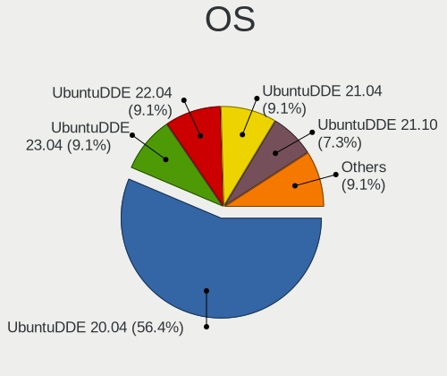

| Name            | Notebooks | Percent |
|-----------------|-----------|---------|
| UbuntuDDE 20.04 | 31        | 70.45%  |
| UbuntuDDE 21.04 | 5         | 11.36%  |
| UbuntuDDE 21.10 | 4         | 9.09%   |
| UbuntuDDE 20.10 | 2         | 4.55%   |
| UbuntuDDE 22.04 | 1         | 2.27%   |
| UbuntuDDE 18.10 | 1         | 2.27%   |

OS Family
---------

OS without a version

| Name      | Notebooks | Percent |
|-----------|-----------|---------|
| UbuntuDDE | 44        | 100%    |

Kernel
------

Version of the Linux kernel

| Version           | Notebooks | Percent |
|-------------------|-----------|---------|
| 5.4.0-42-generic  | 7         | 15.22%  |
| 5.4.0-29-generic  | 7         | 15.22%  |
| 5.4.0-37-generic  | 4         | 8.7%    |
| 5.4.0-48-generic  | 2         | 4.35%   |
| 5.4.0-21-generic  | 2         | 4.35%   |
| 5.11.0-17-generic | 2         | 4.35%   |
| 5.8.0-33-generic  | 1         | 2.17%   |
| 5.8.0-23-generic  | 1         | 2.17%   |
| 5.6.0-1008-oem    | 1         | 2.17%   |
| 5.4.0-96-generic  | 1         | 2.17%   |
| 5.4.0-94-generic  | 1         | 2.17%   |
| 5.4.0-88-generic  | 1         | 2.17%   |
| 5.4.0-84-generic  | 1         | 2.17%   |
| 5.4.0-70-generic  | 1         | 2.17%   |
| 5.4.0-52-generic  | 1         | 2.17%   |
| 5.4.0-39-generic  | 1         | 2.17%   |
| 5.4.0-34-generic  | 1         | 2.17%   |
| 5.4.0-33-generic  | 1         | 2.17%   |
| 5.15.0-57-generic | 1         | 2.17%   |
| 5.15.0-53-generic | 1         | 2.17%   |
| 5.13.0-30-generic | 1         | 2.17%   |
| 5.13.0-23-generic | 1         | 2.17%   |
| 5.13.0-22-generic | 1         | 2.17%   |
| 5.13.0-21-generic | 1         | 2.17%   |
| 5.11.0-46-generic | 1         | 2.17%   |
| 5.11.0-25-generic | 1         | 2.17%   |
| 5.11.0-16-generic | 1         | 2.17%   |
| 4.15.0-29-generic | 1         | 2.17%   |

Kernel Family
-------------

Linux kernel without a distro release

| Version | Notebooks | Percent |
|---------|-----------|---------|
| 5.4.0   | 30        | 68.18%  |
| 5.11.0  | 5         | 11.36%  |
| 5.13.0  | 4         | 9.09%   |
| 5.8.0   | 2         | 4.55%   |
| 5.6.0   | 1         | 2.27%   |
| 5.15.0  | 1         | 2.27%   |
| 4.15.0  | 1         | 2.27%   |

Kernel Major Ver.
-----------------

Linux kernel major version

| Version | Notebooks | Percent |
|---------|-----------|---------|
| 5.4     | 30        | 68.18%  |
| 5.11    | 5         | 11.36%  |
| 5.13    | 4         | 9.09%   |
| 5.8     | 2         | 4.55%   |
| 5.6     | 1         | 2.27%   |
| 5.15    | 1         | 2.27%   |
| 4.15    | 1         | 2.27%   |

Arch
----

OS architecture (x86_64, i586, etc.)

| Name   | Notebooks | Percent |
|--------|-----------|---------|
| x86_64 | 44        | 100%    |

DE
--

Desktop Environment

| Name   | Notebooks | Percent |
|--------|-----------|---------|
| Deepin | 44        | 100%    |

Display Server
--------------

X11 or Wayland

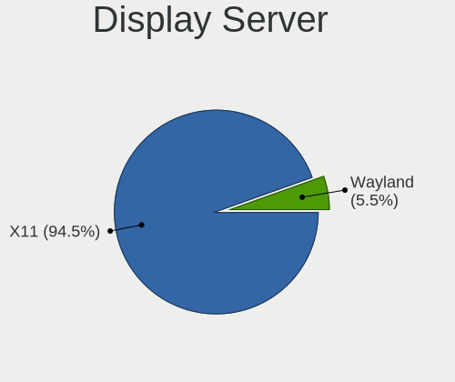

| Name    | Notebooks | Percent |
|---------|-----------|---------|
| X11     | 42        | 95.45%  |
| Wayland | 2         | 4.55%   |

Display Manager
---------------

SDDM, LightDM, etc.

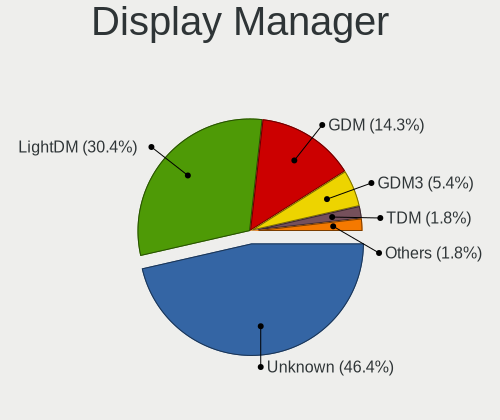

| Name    | Notebooks | Percent |
|---------|-----------|---------|
| Unknown | 25        | 55.56%  |
| LightDM | 10        | 22.22%  |
| GDM     | 8         | 17.78%  |
| TDM     | 1         | 2.22%   |
| SDDM    | 1         | 2.22%   |

OS Lang
-------

Language

| Lang    | Notebooks | Percent |
|---------|-----------|---------|
| en_US   | 11        | 25%     |
| pt_BR   | 6         | 13.64%  |
| es_ES   | 3         | 6.82%   |
| C       | 3         | 6.82%   |
| ru_RU   | 2         | 4.55%   |
| fr_FR   | 2         | 4.55%   |
| es_AR   | 2         | 4.55%   |
| en_GB   | 2         | 4.55%   |
| de_DE   | 2         | 4.55%   |
| sr_RS   | 1         | 2.27%   |
| nl_NL   | 1         | 2.27%   |
| it_IT   | 1         | 2.27%   |
| id_ID   | 1         | 2.27%   |
| es_MX   | 1         | 2.27%   |
| es_CO   | 1         | 2.27%   |
| en_ZA   | 1         | 2.27%   |
| en_IN   | 1         | 2.27%   |
| en_BW   | 1         | 2.27%   |
| en_AU   | 1         | 2.27%   |
| Unknown | 1         | 2.27%   |

Boot Mode
---------

EFI or BIOS

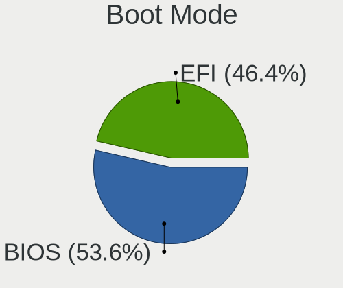

| Mode | Notebooks | Percent |
|------|-----------|---------|
| BIOS | 24        | 53.33%  |
| EFI  | 21        | 46.67%  |

Filesystem
----------

Type of filesystem

| Type    | Notebooks | Percent |
|---------|-----------|---------|
| Ext4    | 39        | 88.64%  |
| Overlay | 3         | 6.82%   |
| Zfs     | 1         | 2.27%   |
| Ext2    | 1         | 2.27%   |

Part. scheme
------------

Scheme of partitioning

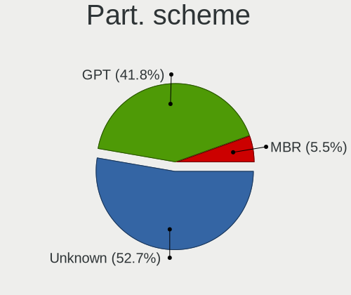

| Type    | Notebooks | Percent |
|---------|-----------|---------|
| Unknown | 28        | 63.64%  |
| GPT     | 14        | 31.82%  |
| MBR     | 2         | 4.55%   |

Dual Boot with Linux/BSD
------------------------

Hosting more than one Linux/BSD

| Dual boot | Notebooks | Percent |
|-----------|-----------|---------|
| No        | 38        | 86.36%  |
| Yes       | 6         | 13.64%  |

Dual Boot (Win)
---------------

Hosting Linux and Windows

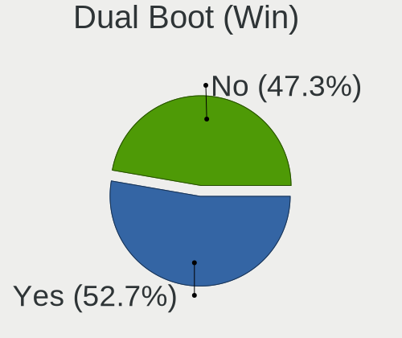

| Dual boot | Notebooks | Percent |
|-----------|-----------|---------|
| Yes       | 24        | 54.55%  |
| No        | 20        | 45.45%  |

Board
-----

Vendor
------

Motherboard manufacturer

| Name             | Notebooks | Percent |
|------------------|-----------|---------|
| Hewlett-Packard  | 11        | 25%     |
| Dell             | 10        | 22.73%  |
| Lenovo           | 6         | 13.64%  |
| ASUSTek Computer | 6         | 13.64%  |
| Acer             | 4         | 9.09%   |
| Toshiba          | 2         | 4.55%   |
| MSI              | 1         | 2.27%   |
| HUAWEI           | 1         | 2.27%   |
| Google           | 1         | 2.27%   |
| Framework        | 1         | 2.27%   |
| Unknown          | 1         | 2.27%   |

Model
-----

Motherboard model

| Name                                    | Notebooks | Percent |
|-----------------------------------------|-----------|---------|
| Toshiba Satellite S55t-B                | 1         | 2.27%   |
| Toshiba Satellite C55-B                 | 1         | 2.27%   |
| MSI GS60 2QE                            | 1         | 2.27%   |
| Lenovo ThinkPad X200 Tablet 7449FWG     | 1         | 2.27%   |
| Lenovo ThinkPad T430 2349DS5            | 1         | 2.27%   |
| Lenovo ThinkPad E15 Gen 2 20TDS0A300    | 1         | 2.27%   |
| Lenovo IdeaPad 520-15IKB 81BF           | 1         | 2.27%   |
| Lenovo IdeaPad 510-15IKB 80SV           | 1         | 2.27%   |
| Lenovo G480 20150                       | 1         | 2.27%   |
| HUAWEI MACH-WX9                         | 1         | 2.27%   |
| HP ProBook 650 G3                       | 1         | 2.27%   |
| HP Presario CQ56                        | 1         | 2.27%   |
| HP Pavilion dv6                         | 1         | 2.27%   |
| HP Pavilion dm4                         | 1         | 2.27%   |
| HP Pavilion 14                          | 1         | 2.27%   |
| HP OMEN by Laptop 17-cb1xxx             | 1         | 2.27%   |
| HP Notebook                             | 1         | 2.27%   |
| HP Laptop 15-dy1xxx                     | 1         | 2.27%   |
| HP Laptop 15-da0xxx                     | 1         | 2.27%   |
| HP EliteBook 2540p                      | 1         | 2.27%   |
| HP 250 G4 Notebook PC                   | 1         | 2.27%   |
| Google Banon                            | 1         | 2.27%   |
| Framework Laptop                        | 1         | 2.27%   |
| Dell XPS 15 9570                        | 1         | 2.27%   |
| Dell System XPS L502X                   | 1         | 2.27%   |
| Dell Latitude E6430                     | 1         | 2.27%   |
| Dell Latitude E6320                     | 1         | 2.27%   |
| Dell Latitude E5440                     | 1         | 2.27%   |
| Dell Inspiron N7010                     | 1         | 2.27%   |
| Dell Inspiron N4030                     | 1         | 2.27%   |
| Dell Inspiron 5447                      | 1         | 2.27%   |
| Dell Inspiron 1525                      | 1         | 2.27%   |
| Dell G7 7588                            | 1         | 2.27%   |
| ASUS X555QG                             | 1         | 2.27%   |
| ASUS VivoBook_ASUSLaptop X421JAY_X413JA | 1         | 2.27%   |
| ASUS VivoBook 15_ASUS Laptop X560UD     | 1         | 2.27%   |
| ASUS TP300LA                            | 1         | 2.27%   |
| ASUS S551LN                             | 1         | 2.27%   |
| ASUS G550JK                             | 1         | 2.27%   |
| Acer Predator PH317-52                  | 1         | 2.27%   |

Model Family
------------

Motherboard model prefix

| Name              | Notebooks | Percent |
|-------------------|-----------|---------|
| Dell Inspiron     | 4         | 9.09%   |
| Lenovo ThinkPad   | 3         | 6.82%   |
| HP Pavilion       | 3         | 6.82%   |
| Dell Latitude     | 3         | 6.82%   |
| Acer Aspire       | 3         | 6.82%   |
| Toshiba Satellite | 2         | 4.55%   |
| Lenovo IdeaPad    | 2         | 4.55%   |
| HP Laptop         | 2         | 4.55%   |
| ASUS VivoBook     | 2         | 4.55%   |
| MSI GS60          | 1         | 2.27%   |
| Lenovo G480       | 1         | 2.27%   |
| HUAWEI MACH-WX9   | 1         | 2.27%   |
| HP ProBook        | 1         | 2.27%   |
| HP Presario       | 1         | 2.27%   |
| HP OMEN           | 1         | 2.27%   |
| HP Notebook       | 1         | 2.27%   |
| HP EliteBook      | 1         | 2.27%   |
| HP 250            | 1         | 2.27%   |
| Google Banon      | 1         | 2.27%   |
| Framework Laptop  | 1         | 2.27%   |
| Dell XPS          | 1         | 2.27%   |
| Dell System       | 1         | 2.27%   |
| Dell G7           | 1         | 2.27%   |
| ASUS X555QG       | 1         | 2.27%   |
| ASUS TP300LA      | 1         | 2.27%   |
| ASUS S551LN       | 1         | 2.27%   |
| ASUS G550JK       | 1         | 2.27%   |
| Acer Predator     | 1         | 2.27%   |
| Unknown           | 1         | 2.27%   |

MFG Year
--------

Motherboard manufacture year

| Year | Notebooks | Percent |
|------|-----------|---------|
| 2014 | 7         | 15.91%  |
| 2018 | 6         | 13.64%  |
| 2010 | 5         | 11.36%  |
| 2012 | 4         | 9.09%   |
| 2011 | 4         | 9.09%   |
| 2021 | 3         | 6.82%   |
| 2020 | 3         | 6.82%   |
| 2008 | 3         | 6.82%   |
| 2017 | 2         | 4.55%   |
| 2016 | 2         | 4.55%   |
| 2013 | 2         | 4.55%   |
| 2019 | 1         | 2.27%   |
| 2015 | 1         | 2.27%   |
| 2009 | 1         | 2.27%   |

Form Factor
-----------

Physical design of the computer

| Name     | Notebooks | Percent |
|----------|-----------|---------|
| Notebook | 44        | 100%    |

Secure Boot
-----------

Enabled or disabled

| State    | Notebooks | Percent |
|----------|-----------|---------|
| Disabled | 39        | 86.67%  |
| Enabled  | 6         | 13.33%  |

Coreboot
--------

Have coreboot on board

| Used | Notebooks | Percent |
|------|-----------|---------|
| No   | 43        | 97.73%  |
| Yes  | 1         | 2.27%   |

RAM Size
--------

Total RAM memory

| Size in GB | Notebooks | Percent |
|------------|-----------|---------|
| 4.01-8.0   | 13        | 29.55%  |
| 3.01-4.0   | 12        | 27.27%  |
| 16.01-24.0 | 9         | 20.45%  |
| 8.01-16.0  | 6         | 13.64%  |
| 32.01-64.0 | 2         | 4.55%   |
| 2.01-3.0   | 1         | 2.27%   |
| 1.01-2.0   | 1         | 2.27%   |

RAM Used
--------

Used RAM memory

| Used GB   | Notebooks | Percent |
|-----------|-----------|---------|
| 2.01-3.0  | 18        | 39.13%  |
| 1.01-2.0  | 17        | 36.96%  |
| 4.01-8.0  | 5         | 10.87%  |
| 3.01-4.0  | 5         | 10.87%  |
| 8.01-16.0 | 1         | 2.17%   |

Total Drives
------------

Number of drives on board

| Drives | Notebooks | Percent |
|--------|-----------|---------|
| 1      | 31        | 70.45%  |
| 2      | 13        | 29.55%  |

Has CD-ROM
----------

Has CD-ROM on board

| Presented | Notebooks | Percent |
|-----------|-----------|---------|
| No        | 26        | 59.09%  |
| Yes       | 18        | 40.91%  |

Has Ethernet
------------

Has Ethernet on board

| Presented | Notebooks | Percent |
|-----------|-----------|---------|
| Yes       | 37        | 84.09%  |
| No        | 7         | 15.91%  |

Has WiFi
--------

Has WiFi module

| Presented | Notebooks | Percent |
|-----------|-----------|---------|
| Yes       | 44        | 100%    |

Has Bluetooth
-------------

Has Bluetooth module

| Presented | Notebooks | Percent |
|-----------|-----------|---------|
| Yes       | 34        | 77.27%  |
| No        | 10        | 22.73%  |

Location
--------

Country
-------

Geographic location (country)

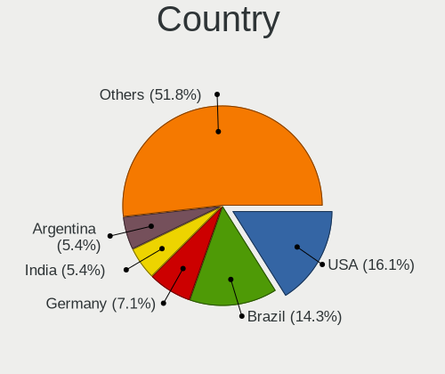

| Country      | Notebooks | Percent |
|--------------|-----------|---------|
| Brazil       | 8         | 17.78%  |
| USA          | 6         | 13.33%  |
| India        | 3         | 6.67%   |
| Germany      | 3         | 6.67%   |
| Ukraine      | 2         | 4.44%   |
| Spain        | 2         | 4.44%   |
| Hungary      | 2         | 4.44%   |
| France       | 2         | 4.44%   |
| Argentina    | 2         | 4.44%   |
| Thailand     | 1         | 2.22%   |
| South Africa | 1         | 2.22%   |
| Serbia       | 1         | 2.22%   |
| Portugal     | 1         | 2.22%   |
| Poland       | 1         | 2.22%   |
| Netherlands  | 1         | 2.22%   |
| Mexico       | 1         | 2.22%   |
| Jamaica      | 1         | 2.22%   |
| Indonesia    | 1         | 2.22%   |
| Hong Kong    | 1         | 2.22%   |
| Costa Rica   | 1         | 2.22%   |
| Colombia     | 1         | 2.22%   |
| Austria      | 1         | 2.22%   |
| Australia    | 1         | 2.22%   |
| Algeria      | 1         | 2.22%   |

City
----

Geographic location (city)

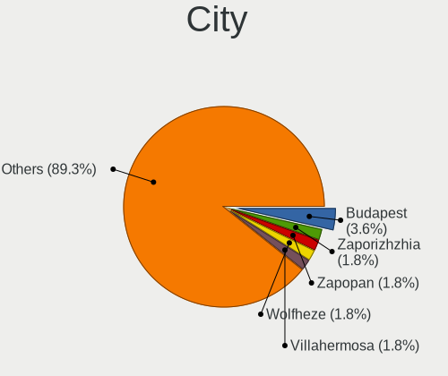

| City                        | Notebooks | Percent |
|-----------------------------|-----------|---------|
| Budapest                    | 2         | 4.44%   |
| Zaporizhzhia                | 1         | 2.22%   |
| Wolfheze                    | 1         | 2.22%   |
| Villahermosa                | 1         | 2.22%   |
| Vienna                      | 1         | 2.22%   |
| Tuen Mun                    | 1         | 2.22%   |
| Tiete                       | 1         | 2.22%   |
| Surabaya                    | 1         | 2.22%   |
| Siquirres                   | 1         | 2.22%   |
| Seville                     | 1         | 2.22%   |
| Sao Jose do Rio Preto       | 1         | 2.22%   |
| San Nicolás de los Arroyos | 1         | 2.22%   |
| Salvador                    | 1         | 2.22%   |
| Ratingen                    | 1         | 2.22%   |
| Quilmes                     | 1         | 2.22%   |
| Patna                       | 1         | 2.22%   |
| Paris                       | 1         | 2.22%   |
| Nanterre                    | 1         | 2.22%   |
| Nakhon Pathom               | 1         | 2.22%   |
| Midlothian                  | 1         | 2.22%   |
| Melbourne                   | 1         | 2.22%   |
| Manaus                      | 1         | 2.22%   |
| Maitland                    | 1         | 2.22%   |
| Luhansk                     | 1         | 2.22%   |
| Lisbon                      | 1         | 2.22%   |
| Krakow                      | 1         | 2.22%   |
| Kingston                    | 1         | 2.22%   |
| Johannesburg                | 1         | 2.22%   |
| Decatur                     | 1         | 2.22%   |
| Dearborn Heights            | 1         | 2.22%   |
| Charlottesville             | 1         | 2.22%   |
| Caxias                      | 1         | 2.22%   |
| Capim Grosso                | 1         | 2.22%   |
| Brooklyn                    | 1         | 2.22%   |
| Bonn                        | 1         | 2.22%   |
| Bogotá                     | 1         | 2.22%   |
| Bhopal                      | 1         | 2.22%   |
| Betim                       | 1         | 2.22%   |
| Berlin                      | 1         | 2.22%   |
| Belo Horizonte              | 1         | 2.22%   |

Drives
------

Drive Vendor
------------

Hard drive vendors

| Vendor              | Notebooks | Drives | Percent |
|---------------------|-----------|--------|---------|
| Seagate             | 12        | 13     | 21.82%  |
| Toshiba             | 8         | 8      | 14.55%  |
| WDC                 | 6         | 6      | 10.91%  |
| Samsung Electronics | 5         | 5      | 9.09%   |
| Micron Technology   | 3         | 3      | 5.45%   |
| Kingston            | 3         | 3      | 5.45%   |
| Crucial             | 3         | 3      | 5.45%   |
| Unknown             | 2         | 2      | 3.64%   |
| SanDisk             | 2         | 2      | 3.64%   |
| HGST                | 2         | 2      | 3.64%   |
| Fujitsu             | 2         | 2      | 3.64%   |
| XrayDisk            | 1         | 1      | 1.82%   |
| SK hynix            | 1         | 3      | 1.82%   |
| KingSpec            | 1         | 1      | 1.82%   |
| Intenso             | 1         | 1      | 1.82%   |
| Hitachi             | 1         | 1      | 1.82%   |
| China               | 1         | 1      | 1.82%   |
| A-DATA Technology   | 1         | 1      | 1.82%   |

Drive Model
-----------

Hard drive models

| Model                                  | Notebooks | Percent |
|----------------------------------------|-----------|---------|
| Seagate ST1000LM024 HN-M101MBB 1TB     | 3         | 5.36%   |
| Toshiba MQ01ABF050 500GB               | 2         | 3.57%   |
| Seagate ST9500325AS 500GB              | 2         | 3.57%   |
| Seagate ST2000LM007-1R8174 2TB         | 2         | 3.57%   |
| XrayDisk 240GB                         | 1         | 1.79%   |
| WDC WDS240G2G0A-00JH30 240GB SSD       | 1         | 1.79%   |
| WDC WDS100T3X0C-00SJG0 1TB             | 1         | 1.79%   |
| WDC WD1200BEVS-00UST0 120GB            | 1         | 1.79%   |
| WDC WD10SPZX-75Z10T2 1TB               | 1         | 1.79%   |
| WDC WD10SPZX-24Z10 1TB                 | 1         | 1.79%   |
| WDC WD10JPLX-00MBPT0 1TB               | 1         | 1.79%   |
| Unknown SD16G  16GB                    | 1         | 1.79%   |
| Unknown HAG4a2  16GB                   | 1         | 1.79%   |
| Toshiba NVMe SSD Drive 256GB           | 1         | 1.79%   |
| Toshiba MQ04ABF100 1TB                 | 1         | 1.79%   |
| Toshiba MQ01ABD100 1TB                 | 1         | 1.79%   |
| Toshiba MQ01ABD075 752GB               | 1         | 1.79%   |
| Toshiba MK7559GSXP 752GB               | 1         | 1.79%   |
| Toshiba MK5059GSXP 500GB               | 1         | 1.79%   |
| SK hynix PC401 NVMe 1TB                | 1         | 1.79%   |
| SK hynix NVMe SSD Drive 1024GB         | 1         | 1.79%   |
| Seagate ST500LT015-1DJ142 500GB        | 1         | 1.79%   |
| Seagate ST500LM012 HN-M500MBB 500GB    | 1         | 1.79%   |
| Seagate ST1000LM035-1RK172 1TB         | 1         | 1.79%   |
| Seagate ST1000LM014-1EJ164 1TB         | 1         | 1.79%   |
| Seagate NVMe SSD Drive 250GB           | 1         | 1.79%   |
| SanDisk Ultra II 480GB SSD             | 1         | 1.79%   |
| SanDisk SSD PLUS 240GB                 | 1         | 1.79%   |
| Samsung SSD 850 PRO 256GB              | 1         | 1.79%   |
| Samsung NVMe SSD Drive 512GB           | 1         | 1.79%   |
| Samsung MZVLQ256HAJD-00000 256GB       | 1         | 1.79%   |
| Samsung MZALQ512HALU-000L1 512GB       | 1         | 1.79%   |
| Samsung HM321HI 320GB                  | 1         | 1.79%   |
| Micron MTFDHBA1T0TDV-1AZ1AABHA 1TB     | 1         | 1.79%   |
| Micron 1100_MTFDDAV512TBN 512GB SSD    | 1         | 1.79%   |
| Micron 1100_MTFDDAV256TBN 256GB SSD    | 1         | 1.79%   |
| Kingston SV300S37A120G 120GB SSD       | 1         | 1.79%   |
| Kingston SA400S37120G 120GB SSD        | 1         | 1.79%   |
| Kingston RBU-SNS8100S3128GD1 128GB SSD | 1         | 1.79%   |
| KingSpec MSH-128 128GB SSD             | 1         | 1.79%   |

HDD Vendor
----------

Hard disk drive vendors

| Vendor              | Notebooks | Drives | Percent |
|---------------------|-----------|--------|---------|
| Seagate             | 11        | 12     | 39.29%  |
| Toshiba             | 7         | 7      | 25%     |
| WDC                 | 4         | 4      | 14.29%  |
| HGST                | 2         | 2      | 7.14%   |
| Fujitsu             | 2         | 2      | 7.14%   |
| Samsung Electronics | 1         | 1      | 3.57%   |
| Hitachi             | 1         | 1      | 3.57%   |

SSD Vendor
----------

Solid state drive vendors

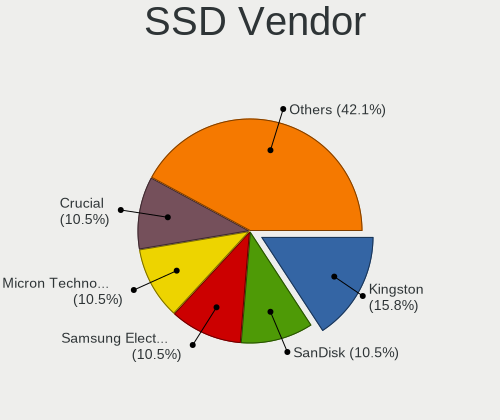

| Vendor              | Notebooks | Drives | Percent |
|---------------------|-----------|--------|---------|
| Kingston            | 3         | 3      | 20%     |
| SanDisk             | 2         | 2      | 13.33%  |
| Micron Technology   | 2         | 2      | 13.33%  |
| Crucial             | 2         | 2      | 13.33%  |
| WDC                 | 1         | 1      | 6.67%   |
| Samsung Electronics | 1         | 1      | 6.67%   |
| KingSpec            | 1         | 1      | 6.67%   |
| Intenso             | 1         | 1      | 6.67%   |
| China               | 1         | 1      | 6.67%   |
| A-DATA Technology   | 1         | 1      | 6.67%   |

Drive Kind
----------

HDD or SSD

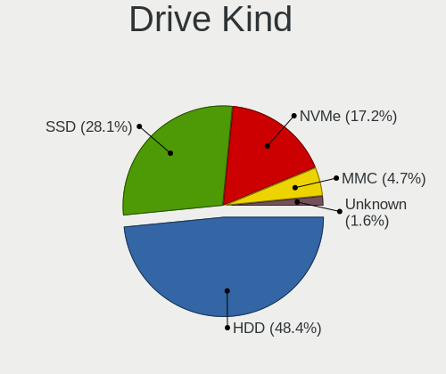

| Kind    | Notebooks | Drives | Percent |
|---------|-----------|--------|---------|
| HDD     | 26        | 29     | 50.98%  |
| SSD     | 14        | 15     | 27.45%  |
| NVMe    | 8         | 11     | 15.69%  |
| MMC     | 2         | 2      | 3.92%   |
| Unknown | 1         | 1      | 1.96%   |

Drive Connector
---------------

SATA, SAS, NVMe, etc.

| Type | Notebooks | Drives | Percent |
|------|-----------|--------|---------|
| SATA | 35        | 45     | 77.78%  |
| NVMe | 8         | 11     | 17.78%  |
| MMC  | 2         | 2      | 4.44%   |

Drive Size
----------

Size of hard drive

| Size in TB | Notebooks | Drives | Percent |
|------------|-----------|--------|---------|
| 0.01-0.5   | 24        | 26     | 58.54%  |
| 0.51-1.0   | 15        | 16     | 36.59%  |
| 1.01-2.0   | 2         | 2      | 4.88%   |

Space Total
-----------

Amount of disk space available on the file system

| Size in GB | Notebooks | Percent |
|------------|-----------|---------|
| 101-250    | 21        | 47.73%  |
| 251-500    | 6         | 13.64%  |
| 501-1000   | 6         | 13.64%  |
| 51-100     | 4         | 9.09%   |
| 1-20       | 3         | 6.82%   |
| 1001-2000  | 2         | 4.55%   |
| 21-50      | 1         | 2.27%   |
| Unknown    | 1         | 2.27%   |

Space Used
----------

Amount of used disk space

| Used GB   | Notebooks | Percent |
|-----------|-----------|---------|
| 1-20      | 23        | 50%     |
| 21-50     | 8         | 17.39%  |
| 101-250   | 6         | 13.04%  |
| 51-100    | 4         | 8.7%    |
| 251-500   | 3         | 6.52%   |
| 1001-2000 | 1         | 2.17%   |
| Unknown   | 1         | 2.17%   |

Malfunc. Drives
---------------

Drive models with a malfunction

| Model                          | Notebooks | Drives | Percent |
|--------------------------------|-----------|--------|---------|
| Seagate ST1000LM014-1EJ164 1TB | 1         | 1      | 100%    |

Malfunc. Drive Vendor
---------------------

Vendors of faulty drives

| Vendor  | Notebooks | Drives | Percent |
|---------|-----------|--------|---------|
| Seagate | 1         | 1      | 100%    |

Malfunc. HDD Vendor
-------------------

Vendors of faulty HDD drives

| Vendor  | Notebooks | Drives | Percent |
|---------|-----------|--------|---------|
| Seagate | 1         | 1      | 100%    |

Malfunc. Drive Kind
-------------------

Kinds of faulty drives

| Kind | Notebooks | Drives | Percent |
|------|-----------|--------|---------|
| HDD  | 1         | 1      | 100%    |

Failed Drives
-------------

Failed drive models

Zero info for selected period =(

Failed Drive Vendor
-------------------

Failed drive vendors

Zero info for selected period =(

Drive Status
------------

Number of failed and malfunc. drives

| Status   | Notebooks | Drives | Percent |
|----------|-----------|--------|---------|
| Detected | 31        | 39     | 67.39%  |
| Works    | 14        | 18     | 30.43%  |
| Malfunc  | 1         | 1      | 2.17%   |

Storage controller
------------------

Storage Vendor
--------------

Storage controller vendors

| Vendor                           | Notebooks | Percent |
|----------------------------------|-----------|---------|
| Intel                            | 37        | 77.08%  |
| Samsung Electronics              | 3         | 6.25%   |
| Toshiba America Info Systems     | 1         | 2.08%   |
| SK hynix                         | 1         | 2.08%   |
| Silicon Integrated Systems [SiS] | 1         | 2.08%   |
| Seagate Technology               | 1         | 2.08%   |
| SanDisk                          | 1         | 2.08%   |
| Micron/Crucial Technology        | 1         | 2.08%   |
| Micron Technology                | 1         | 2.08%   |
| AMD                              | 1         | 2.08%   |

Storage Model
-------------

Storage controller models

| Model                                                                          | Notebooks | Percent |
|--------------------------------------------------------------------------------|-----------|---------|
| Intel 82801 Mobile SATA Controller [RAID mode]                                 | 8         | 16%     |
| Intel 8 Series SATA Controller 1 [AHCI mode]                                   | 4         | 8%      |
| Intel 6 Series/C200 Series Chipset Family 6 port Mobile SATA AHCI Controller   | 4         | 8%      |
| Intel Wildcat Point-LP SATA Controller [AHCI Mode]                             | 3         | 6%      |
| Intel Sunrise Point-LP SATA Controller [AHCI mode]                             | 3         | 6%      |
| Intel Cannon Lake Mobile PCH SATA AHCI Controller                              | 3         | 6%      |
| Intel 7 Series Chipset Family 6-port SATA Controller [AHCI mode]               | 3         | 6%      |
| Intel 5 Series/3400 Series Chipset 6 port SATA AHCI Controller                 | 3         | 6%      |
| Samsung NVMe SSD Controller 980                                                | 2         | 4%      |
| Intel 82801IBM/IEM (ICH9M/ICH9M-E) 4 port SATA Controller [AHCI mode]          | 2         | 4%      |
| Toshiba America Info Systems BG3 NVMe SSD Controller                           | 1         | 2%      |
| SK hynix PC401 NVMe Solid State Drive 256GB                                    | 1         | 2%      |
| Silicon Integrated Systems [SiS] SATA Controller / IDE mode                    | 1         | 2%      |
| Silicon Integrated Systems [SiS] 5513 IDE Controller                           | 1         | 2%      |
| Seagate FireCuda 510 SSD                                                       | 1         | 2%      |
| SanDisk WD Black SN750 / PC SN730 NVMe SSD                                     | 1         | 2%      |
| Samsung NVMe SSD Controller SM981/PM981/PM983                                  | 1         | 2%      |
| Micron/Crucial P2 NVMe PCIe SSD                                                | 1         | 2%      |
| Micron Non-Volatile memory controller                                          | 1         | 2%      |
| Intel Atom Processor E3800 Series SATA AHCI Controller                         | 1         | 2%      |
| Intel 82801HM/HEM (ICH8M/ICH8M-E) SATA Controller [AHCI mode]                  | 1         | 2%      |
| Intel 82801HM/HEM (ICH8M/ICH8M-E) IDE Controller                               | 1         | 2%      |
| Intel 8 Series/C220 Series Chipset Family 6-port SATA Controller 1 [AHCI mode] | 1         | 2%      |
| Intel 5 Series/3400 Series Chipset 4 port SATA AHCI Controller                 | 1         | 2%      |
| AMD FCH SATA Controller [AHCI mode]                                            | 1         | 2%      |

Storage Kind
------------

Kind of storage controller (IDE, SATA, NVMe, SAS, ...)

| Kind | Notebooks | Percent |
|------|-----------|---------|
| SATA | 30        | 62.5%   |
| RAID | 8         | 16.67%  |
| NVMe | 8         | 16.67%  |
| IDE  | 2         | 4.17%   |

Processor
---------

CPU Vendor
----------

Processor vendors

| Vendor | Notebooks | Percent |
|--------|-----------|---------|
| Intel  | 43        | 97.73%  |
| AMD    | 1         | 2.27%   |

CPU Model
---------

Processor models

| Model                                           | Notebooks | Percent |
|-------------------------------------------------|-----------|---------|
| Intel Core i7-8750H CPU @ 2.20GHz               | 2         | 4.55%   |
| Intel Core i7-8550U CPU @ 1.80GHz               | 2         | 4.55%   |
| Intel Core i5-7200U CPU @ 2.50GHz               | 2         | 4.55%   |
| Intel Core i5-2410M CPU @ 2.30GHz               | 2         | 4.55%   |
| Intel Core i3-1005G1 CPU @ 1.20GHz              | 2         | 4.55%   |
| Intel Core i3 CPU M 370 @ 2.40GHz               | 2         | 4.55%   |
| Intel 11th Gen Core i5-1135G7 @ 2.40GHz         | 2         | 4.55%   |
| Intel Pentium Dual CPU T2370 @ 1.73GHz          | 1         | 2.27%   |
| Intel Pentium CPU B980 @ 2.40GHz                | 1         | 2.27%   |
| Intel Core i9-8950HK CPU @ 2.90GHz              | 1         | 2.27%   |
| Intel Core i7-5500U CPU @ 2.40GHz               | 1         | 2.27%   |
| Intel Core i7-4720HQ CPU @ 2.60GHz              | 1         | 2.27%   |
| Intel Core i7-4710HQ CPU @ 2.50GHz              | 1         | 2.27%   |
| Intel Core i7-4510U CPU @ 2.00GHz               | 1         | 2.27%   |
| Intel Core i7-4500U CPU @ 1.80GHz               | 1         | 2.27%   |
| Intel Core i7-2670QM CPU @ 2.20GHz              | 1         | 2.27%   |
| Intel Core i7-10750H CPU @ 2.60GHz              | 1         | 2.27%   |
| Intel Core i5-8250U CPU @ 1.60GHz               | 1         | 2.27%   |
| Intel Core i5-4310U CPU @ 2.00GHz               | 1         | 2.27%   |
| Intel Core i5-4200U CPU @ 1.60GHz               | 1         | 2.27%   |
| Intel Core i5-3360M CPU @ 2.80GHz               | 1         | 2.27%   |
| Intel Core i5-3337U CPU @ 1.80GHz               | 1         | 2.27%   |
| Intel Core i5-3320M CPU @ 2.60GHz               | 1         | 2.27%   |
| Intel Core i5-2520M CPU @ 2.50GHz               | 1         | 2.27%   |
| Intel Core i5-2430M CPU @ 2.40GHz               | 1         | 2.27%   |
| Intel Core i5 CPU M 540 @ 2.53GHz               | 1         | 2.27%   |
| Intel Core i3-7020U CPU @ 2.30GHz               | 1         | 2.27%   |
| Intel Core i3-5020U CPU @ 2.20GHz               | 1         | 2.27%   |
| Intel Core i3-5005U CPU @ 2.00GHz               | 1         | 2.27%   |
| Intel Core i3-4030U CPU @ 1.90GHz               | 1         | 2.27%   |
| Intel Core i3 CPU M 380 @ 2.53GHz               | 1         | 2.27%   |
| Intel Core 2 Duo CPU T8100 @ 2.10GHz            | 1         | 2.27%   |
| Intel Core 2 Duo CPU L9400 @ 1.86GHz            | 1         | 2.27%   |
| Intel Celeron Dual-Core CPU T3500 @ 2.10GHz     | 1         | 2.27%   |
| Intel Celeron CPU N3060 @ 1.60GHz               | 1         | 2.27%   |
| Intel Celeron CPU N2840 @ 2.16GHz               | 1         | 2.27%   |
| AMD A10-9620P RADEON R5, 10 COMPUTE CORES 4C+6G | 1         | 2.27%   |

CPU Model Family
----------------

Processor model prefix

| Model                   | Notebooks | Percent |
|-------------------------|-----------|---------|
| Intel Core i5           | 13        | 29.55%  |
| Intel Core i7           | 11        | 25%     |
| Intel Core i3           | 9         | 20.45%  |
| Other                   | 2         | 4.55%   |
| Intel Core 2 Duo        | 2         | 4.55%   |
| Intel Celeron           | 2         | 4.55%   |
| Intel Pentium Dual      | 1         | 2.27%   |
| Intel Pentium           | 1         | 2.27%   |
| Intel Core i9           | 1         | 2.27%   |
| Intel Celeron Dual-Core | 1         | 2.27%   |
| AMD A10                 | 1         | 2.27%   |

CPU Cores
---------

Number of processor cores

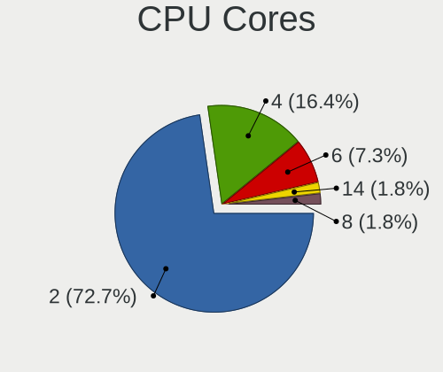

| Number | Notebooks | Percent |
|--------|-----------|---------|
| 2      | 32        | 72.73%  |
| 4      | 8         | 18.18%  |
| 6      | 4         | 9.09%   |

CPU Sockets
-----------

Number of sockets

| Number | Notebooks | Percent |
|--------|-----------|---------|
| 1      | 44        | 100%    |

CPU Threads
-----------

Threads per core (Hyper-Threading)

| Number | Notebooks | Percent |
|--------|-----------|---------|
| 2      | 37        | 84.09%  |
| 1      | 7         | 15.91%  |

CPU Op-Modes
------------

CPU Operation Modes (32-bit, 64-bit)

| Op mode        | Notebooks | Percent |
|----------------|-----------|---------|
| 32-bit, 64-bit | 44        | 100%    |

CPU Microcode
-------------

Microcode number

| Number     | Notebooks | Percent |
|------------|-----------|---------|
| Unknown    | 9         | 20%     |
| 0x206a7    | 6         | 13.33%  |
| 0x40651    | 4         | 8.89%   |
| 0x906ea    | 3         | 6.67%   |
| 0x806ea    | 3         | 6.67%   |
| 0x806c1    | 2         | 4.44%   |
| 0x706e5    | 2         | 4.44%   |
| 0x306d4    | 2         | 4.44%   |
| 0x306a9    | 2         | 4.44%   |
| 0x20655    | 2         | 4.44%   |
| 0x1067a    | 2         | 4.44%   |
| 0xa0652    | 1         | 2.22%   |
| 0x806e9    | 1         | 2.22%   |
| 0x6fd      | 1         | 2.22%   |
| 0x406c4    | 1         | 2.22%   |
| 0x306c3    | 1         | 2.22%   |
| 0x30678    | 1         | 2.22%   |
| 0x10676    | 1         | 2.22%   |
| 0x0600611a | 1         | 2.22%   |

CPU Microarch
-------------

Microarchitecture

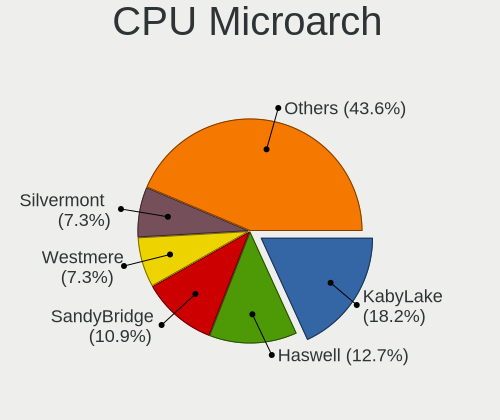

| Name        | Notebooks | Percent |
|-------------|-----------|---------|
| KabyLake    | 9         | 20.45%  |
| Haswell     | 7         | 15.91%  |
| SandyBridge | 6         | 13.64%  |
| Westmere    | 4         | 9.09%   |
| Penryn      | 3         | 6.82%   |
| IvyBridge   | 3         | 6.82%   |
| Broadwell   | 3         | 6.82%   |
| TigerLake   | 2         | 4.55%   |
| Silvermont  | 2         | 4.55%   |
| IceLake     | 2         | 4.55%   |
| Excavator   | 1         | 2.27%   |
| Core        | 1         | 2.27%   |
| CometLake   | 1         | 2.27%   |

Graphics
--------

GPU Vendor
----------

Vendors of graphics cards

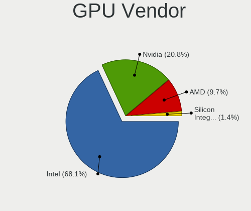

| Vendor                           | Notebooks | Percent |
|----------------------------------|-----------|---------|
| Intel                            | 41        | 68.33%  |
| Nvidia                           | 14        | 23.33%  |
| AMD                              | 4         | 6.67%   |
| Silicon Integrated Systems [SiS] | 1         | 1.67%   |

GPU Model
---------

Graphics card models

| Model                                                                                    | Notebooks | Percent |
|------------------------------------------------------------------------------------------|-----------|---------|
| Intel 2nd Generation Core Processor Family Integrated Graphics Controller                | 6         | 9.68%   |
| Intel Haswell-ULT Integrated Graphics Controller                                         | 5         | 8.06%   |
| Intel Core Processor Integrated Graphics Controller                                      | 4         | 6.45%   |
| Nvidia GP107M [GeForce GTX 1050 Ti Mobile]                                               | 3         | 4.84%   |
| Intel UHD Graphics 620                                                                   | 3         | 4.84%   |
| Intel HD Graphics 620                                                                    | 3         | 4.84%   |
| Intel HD Graphics 5500                                                                   | 3         | 4.84%   |
| Intel CoffeeLake-H GT2 [UHD Graphics 630]                                                | 3         | 4.84%   |
| Intel 3rd Gen Core processor Graphics Controller                                         | 3         | 4.84%   |
| Nvidia GP108M [GeForce MX150]                                                            | 2         | 3.23%   |
| Intel TigerLake-LP GT2 [Iris Xe Graphics]                                                | 2         | 3.23%   |
| Intel Mobile 4 Series Chipset Integrated Graphics Controller                             | 2         | 3.23%   |
| Intel Iris Plus Graphics G1 (Ice Lake)                                                   | 2         | 3.23%   |
| Intel 4th Gen Core Processor Integrated Graphics Controller                              | 2         | 3.23%   |
| Silicon Integrated Systems [SiS] 771/671 PCIE VGA Display Adapter                        | 1         | 1.61%   |
| Nvidia TU104BM [GeForce RTX 2070 SUPER Mobile / Max-Q]                                   | 1         | 1.61%   |
| Nvidia GP107M [GeForce MX350]                                                            | 1         | 1.61%   |
| Nvidia GP107M [GeForce GTX 1050 Mobile]                                                  | 1         | 1.61%   |
| Nvidia GM204M [GeForce GTX 970M]                                                         | 1         | 1.61%   |
| Nvidia GM108M [GeForce 940MX]                                                            | 1         | 1.61%   |
| Nvidia GM108M [GeForce 840M]                                                             | 1         | 1.61%   |
| Nvidia GM107M [GeForce GTX 850M]                                                         | 1         | 1.61%   |
| Nvidia GK208M [GeForce GT 740M]                                                          | 1         | 1.61%   |
| Nvidia GF108M [GeForce GT 540M]                                                          | 1         | 1.61%   |
| Intel Mobile GM965/GL960 Integrated Graphics Controller (secondary)                      | 1         | 1.61%   |
| Intel Mobile GM965/GL960 Integrated Graphics Controller (primary)                        | 1         | 1.61%   |
| Intel Atom/Celeron/Pentium Processor x5-E8000/J3xxx/N3xxx Integrated Graphics Controller | 1         | 1.61%   |
| Intel Atom Processor Z36xxx/Z37xxx Series Graphics & Display                             | 1         | 1.61%   |
| AMD Whistler [Radeon HD 6730M/6770M/7690M XT]                                            | 1         | 1.61%   |
| AMD Wani [Radeon R5/R6/R7 Graphics]                                                      | 1         | 1.61%   |
| AMD Topaz XT [Radeon R7 M260/M265 / M340/M360 / M440/M445 / 530/535 / 620/625 Mobile]    | 1         | 1.61%   |
| AMD Sun XT [Radeon HD 8670A/8670M/8690M / R5 M330 / M430 / Radeon 520 Mobile]            | 1         | 1.61%   |
| AMD Seymour [Radeon HD 6400M/7400M Series]                                               | 1         | 1.61%   |

GPU Combo
---------

Combinations of graphics cards

| Name           | Notebooks | Percent |
|----------------|-----------|---------|
| 1 x Intel      | 25        | 56.82%  |
| Intel + Nvidia | 13        | 29.55%  |
| Intel + AMD    | 3         | 6.82%   |
| 2 x AMD        | 1         | 2.27%   |
| 1 x SiS        | 1         | 2.27%   |
| 1 x Nvidia     | 1         | 2.27%   |

GPU Driver
----------

Free vs proprietary

| Driver      | Notebooks | Percent |
|-------------|-----------|---------|
| Free        | 33        | 73.33%  |
| Proprietary | 9         | 20%     |
| Unknown     | 3         | 6.67%   |

GPU Memory
----------

Total video memory

| Size in GB | Notebooks | Percent |
|------------|-----------|---------|
| Unknown    | 30        | 66.67%  |
| 3.01-4.0   | 6         | 13.33%  |
| 1.01-2.0   | 5         | 11.11%  |
| 0.51-1.0   | 2         | 4.44%   |
| 7.01-8.0   | 1         | 2.22%   |
| 2.01-3.0   | 1         | 2.22%   |

Monitor
-------

Monitor Vendor
--------------

Monitor vendors

| Vendor                  | Notebooks | Percent |
|-------------------------|-----------|---------|
| Samsung Electronics     | 14        | 29.17%  |
| BOE                     | 8         | 16.67%  |
| AU Optronics            | 8         | 16.67%  |
| LG Display              | 7         | 14.58%  |
| Chimei Innolux          | 2         | 4.17%   |
| Chi Mei Optoelectronics | 2         | 4.17%   |
| Sharp                   | 1         | 2.08%   |
| MSI                     | 1         | 2.08%   |
| Lenovo                  | 1         | 2.08%   |
| JDI                     | 1         | 2.08%   |
| Goldstar                | 1         | 2.08%   |
| Eizo                    | 1         | 2.08%   |
| AOC                     | 1         | 2.08%   |

Monitor Model
-------------

Monitor models

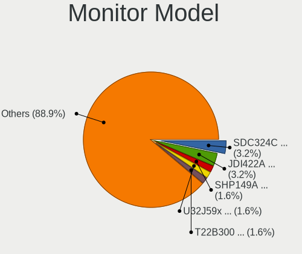

| Model                                                                    | Notebooks | Percent |
|--------------------------------------------------------------------------|-----------|---------|
| Samsung Electronics LCD Monitor SDC324C 1920x1080 344x194mm 15.5-inch    | 2         | 4%      |
| Sharp LCD Monitor SHP149A 1920x1080 344x194mm 15.5-inch                  | 1         | 2%      |
| Samsung Electronics U32J59x SAM0F33 3840x2160 697x392mm 31.5-inch        | 1         | 2%      |
| Samsung Electronics T22B300 SAM092D 1920x1080 477x268mm 21.5-inch        | 1         | 2%      |
| Samsung Electronics S27E500 SAM0D0D 1920x1080 598x336mm 27.0-inch        | 1         | 2%      |
| Samsung Electronics LCD Monitor SEC5441 1366x768 344x194mm 15.5-inch     | 1         | 2%      |
| Samsung Electronics LCD Monitor SEC454C 1366x768 309x174mm 14.0-inch     | 1         | 2%      |
| Samsung Electronics LCD Monitor SEC4542 1366x768 309x174mm 14.0-inch     | 1         | 2%      |
| Samsung Electronics LCD Monitor SEC3942 1366x768 309x174mm 14.0-inch     | 1         | 2%      |
| Samsung Electronics LCD Monitor SEC3157 1280x800 303x190mm 14.1-inch     | 1         | 2%      |
| Samsung Electronics LCD Monitor SEC304C 1366x768 309x174mm 14.0-inch     | 1         | 2%      |
| Samsung Electronics LCD Monitor SDC4C51 1366x768 344x194mm 15.5-inch     | 1         | 2%      |
| Samsung Electronics LCD Monitor SDC4347 1366x768 344x193mm 15.5-inch     | 1         | 2%      |
| Samsung Electronics LCD Monitor SDC4146 1366x768 344x194mm 15.5-inch     | 1         | 2%      |
| Samsung Electronics LCD Monitor SDC344A 1366x768 344x194mm 15.5-inch     | 1         | 2%      |
| MSI Optix G241VC MSI1462 1920x1080 521x294mm 23.6-inch                   | 1         | 2%      |
| LG Display LCD Monitor LGD0611 1920x1080 382x215mm 17.3-inch             | 1         | 2%      |
| LG Display LCD Monitor LGD056D 1920x1080 382x215mm 17.3-inch             | 1         | 2%      |
| LG Display LCD Monitor LGD038E 1366x768 344x194mm 15.5-inch              | 1         | 2%      |
| LG Display LCD Monitor LGD037C 1366x768 310x174mm 14.0-inch              | 1         | 2%      |
| LG Display LCD Monitor LGD02DC 1366x768 344x194mm 15.5-inch              | 1         | 2%      |
| LG Display LCD Monitor LGD02AC 1366x768 344x194mm 15.5-inch              | 1         | 2%      |
| LG Display LCD Monitor LGD024F 1280x800 260x160mm 12.0-inch              | 1         | 2%      |
| Lenovo LCD Monitor LEN4011 1280x800 261x163mm 12.1-inch                  | 1         | 2%      |
| JDI LCD Monitor JDI422A 3000x2000 293x196mm 13.9-inch                    | 1         | 2%      |
| Goldstar M2380A GSM57EE 1920x1080 510x280mm 22.9-inch                    | 1         | 2%      |
| Eizo EV2450 ENC2532 1920x1080 528x297mm 23.9-inch                        | 1         | 2%      |
| Eizo EV2450 ENC2531 1920x1080 528x297mm 23.9-inch                        | 1         | 2%      |
| Chimei Innolux LCD Monitor CMN15F5 1920x1080 344x193mm 15.5-inch         | 1         | 2%      |
| Chimei Innolux LCD Monitor CMN1489 1366x768 309x173mm 13.9-inch          | 1         | 2%      |
| Chi Mei Optoelectronics LCD Monitor CMO15A2 1366x768 344x193mm 15.5-inch | 1         | 2%      |
| Chi Mei Optoelectronics LCD Monitor CMO1469 1366x768 309x174mm 14.0-inch | 1         | 2%      |
| BOE LCD Monitor BOE095F 2256x1504 285x190mm 13.5-inch                    | 1         | 2%      |
| BOE LCD Monitor BOE0897 1366x768 344x194mm 15.5-inch                     | 1         | 2%      |
| BOE LCD Monitor BOE085E 1920x1080 344x194mm 15.5-inch                    | 1         | 2%      |
| BOE LCD Monitor BOE06C6 1920x1080 344x194mm 15.5-inch                    | 1         | 2%      |
| BOE LCD Monitor BOE06A5 1366x768 344x194mm 15.5-inch                     | 1         | 2%      |
| BOE LCD Monitor BOE065E 1920x1080 344x194mm 15.5-inch                    | 1         | 2%      |
| BOE LCD Monitor BOE05F1 1366x768 309x173mm 13.9-inch                     | 1         | 2%      |
| BOE LCD Monitor BOE05DF 1366x768 290x160mm 13.0-inch                     | 1         | 2%      |

Monitor Resolution
------------------

Monitor screen resolution

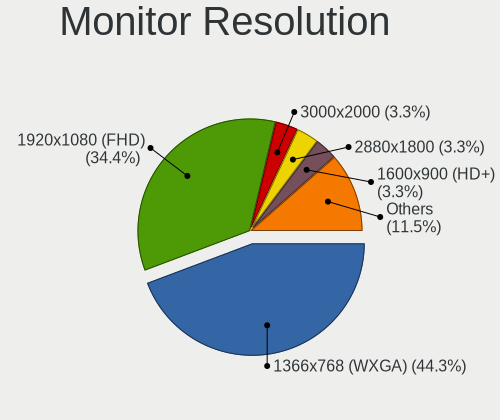

| Resolution       | Notebooks | Percent |
|------------------|-----------|---------|
| 1366x768 (WXGA)  | 23        | 47.92%  |
| 1920x1080 (FHD)  | 17        | 35.42%  |
| 1280x800 (WXGA)  | 2         | 4.17%   |
| 3840x2160 (4K)   | 1         | 2.08%   |
| 3440x1440        | 1         | 2.08%   |
| 3000x2000        | 1         | 2.08%   |
| 2256x1504        | 1         | 2.08%   |
| 1600x900 (HD+)   | 1         | 2.08%   |
| 1440x900 (WXGA+) | 1         | 2.08%   |

Monitor Diagonal
----------------

Diagonal size in inches

| Inches | Notebooks | Percent |
|--------|-----------|---------|
| 15     | 25        | 50%     |
| 14     | 8         | 16%     |
| 13     | 4         | 8%      |
| 23     | 3         | 6%      |
| 17     | 3         | 6%      |
| 12     | 2         | 4%      |
| 34     | 1         | 2%      |
| 31     | 1         | 2%      |
| 27     | 1         | 2%      |
| 24     | 1         | 2%      |
| 21     | 1         | 2%      |

Monitor Width
-------------

Physical width

| Width in mm | Notebooks | Percent |
|-------------|-----------|---------|
| 301-350     | 32        | 65.31%  |
| 351-400     | 5         | 10.2%   |
| 201-300     | 5         | 10.2%   |
| 501-600     | 4         | 8.16%   |
| 701-800     | 1         | 2.04%   |
| 601-700     | 1         | 2.04%   |
| 401-500     | 1         | 2.04%   |

Aspect Ratio
------------

Proportional relationship between the width and the height

| Ratio | Notebooks | Percent |
|-------|-----------|---------|
| 16/9  | 38        | 84.44%  |
| 3/2   | 3         | 6.67%   |
| 16/10 | 3         | 6.67%   |
| 21/9  | 1         | 2.22%   |

Monitor Area
------------

Area in inch²

| Area in inch² | Notebooks | Percent |
|----------------|-----------|---------|
| 101-110        | 25        | 51.02%  |
| 81-90          | 11        | 22.45%  |
| 201-250        | 4         | 8.16%   |
| 121-130        | 3         | 6.12%   |
| 61-70          | 2         | 4.08%   |
| 351-500        | 2         | 4.08%   |
| 71-80          | 1         | 2.04%   |
| 301-350        | 1         | 2.04%   |

Pixel Density
-------------

Pixels per inch

| Density       | Notebooks | Percent |
|---------------|-----------|---------|
| 101-120       | 23        | 47.92%  |
| 121-160       | 16        | 33.33%  |
| 51-100        | 7         | 14.58%  |
| More than 240 | 1         | 2.08%   |
| 161-240       | 1         | 2.08%   |

Multiple Monitors
-----------------

Total monitors connected

| Total | Notebooks | Percent |
|-------|-----------|---------|
| 1     | 35        | 79.55%  |
| 2     | 6         | 13.64%  |
| 0     | 2         | 4.55%   |
| 3     | 1         | 2.27%   |

Network
-------

Net Controller Vendor
---------------------

Controller vendors

| Vendor                           | Notebooks | Percent |
|----------------------------------|-----------|---------|
| Intel                            | 22        | 30.99%  |
| Realtek Semiconductor            | 21        | 29.58%  |
| Qualcomm Atheros                 | 15        | 21.13%  |
| Broadcom                         | 5         | 7.04%   |
| Xiaomi                           | 1         | 1.41%   |
| Silicon Integrated Systems [SiS] | 1         | 1.41%   |
| Ralink Technology                | 1         | 1.41%   |
| Ralink                           | 1         | 1.41%   |
| Marvell Technology Group         | 1         | 1.41%   |
| Dell                             | 1         | 1.41%   |
| Broadcom Limited                 | 1         | 1.41%   |
| ASUSTek Computer                 | 1         | 1.41%   |

Net Controller Model
--------------------

Controller models

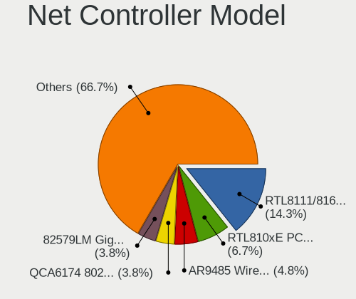

| Model                                                                   | Notebooks | Percent |
|-------------------------------------------------------------------------|-----------|---------|
| Realtek RTL8111/8168/8411 PCI Express Gigabit Ethernet Controller       | 14        | 16.47%  |
| Realtek RTL810xE PCI Express Fast Ethernet controller                   | 5         | 5.88%   |
| Qualcomm Atheros QCA6174 802.11ac Wireless Network Adapter              | 4         | 4.71%   |
| Qualcomm Atheros AR9485 Wireless Network Adapter                        | 4         | 4.71%   |
| Intel Centrino Advanced-N 6205 [Taylor Peak]                            | 3         | 3.53%   |
| Intel 82579LM Gigabit Network Connection (Lewisville)                   | 3         | 3.53%   |
| Realtek RTL8723DE Wireless Network Adapter                              | 2         | 2.35%   |
| Qualcomm Atheros AR9285 Wireless Network Adapter (PCI-Express)          | 2         | 2.35%   |
| Intel Wireless 7265                                                     | 2         | 2.35%   |
| Intel Wireless 3160                                                     | 2         | 2.35%   |
| Intel Centrino Wireless-N 1030 [Rainbow Peak]                           | 2         | 2.35%   |
| Intel Centrino Advanced-N 6200                                          | 2         | 2.35%   |
| Broadcom BCM4313 802.11bgn Wireless Network Adapter                     | 2         | 2.35%   |
| Xiaomi Mi/Redmi series (RNDIS)                                          | 1         | 1.18%   |
| Silicon Integrated Systems [SiS] 191 Gigabit Ethernet Adapter           | 1         | 1.18%   |
| Realtek RTL8821CE 802.11ac PCIe Wireless Network Adapter                | 1         | 1.18%   |
| Realtek RTL8821AE 802.11ac PCIe Wireless Network Adapter                | 1         | 1.18%   |
| Realtek RTL8723BE PCIe Wireless Network Adapter                         | 1         | 1.18%   |
| Realtek RTL8153 Gigabit Ethernet Adapter                                | 1         | 1.18%   |
| Ralink RT2870/RT3070 Wireless Adapter                                   | 1         | 1.18%   |
| Ralink RT3090 Wireless 802.11n 1T/1R PCIe                               | 1         | 1.18%   |
| Qualcomm Atheros QCA9565 / AR9565 Wireless Network Adapter              | 1         | 1.18%   |
| Qualcomm Atheros Killer E2400 Gigabit Ethernet Controller               | 1         | 1.18%   |
| Qualcomm Atheros Killer E220x Gigabit Ethernet Controller               | 1         | 1.18%   |
| Qualcomm Atheros AR8162 Fast Ethernet                                   | 1         | 1.18%   |
| Qualcomm Atheros AR8152 v2.0 Fast Ethernet                              | 1         | 1.18%   |
| Qualcomm Atheros AR8152 v1.1 Fast Ethernet                              | 1         | 1.18%   |
| Qualcomm Atheros AR8151 v2.0 Gigabit Ethernet                           | 1         | 1.18%   |
| Qualcomm Atheros AR242x / AR542x Wireless Network Adapter (PCI-Express) | 1         | 1.18%   |
| Marvell Group 88E8040 PCI-E Fast Ethernet Controller                    | 1         | 1.18%   |
| Intel Wireless 8265 / 8275                                              | 1         | 1.18%   |
| Intel Wireless 7260                                                     | 1         | 1.18%   |
| Intel Wi-Fi 6 AX210/AX211/AX411 160MHz                                  | 1         | 1.18%   |
| Intel Wi-Fi 6 AX201                                                     | 1         | 1.18%   |
| Intel Ultimate N WiFi Link 5300                                         | 1         | 1.18%   |
| Intel Ice Lake-LP PCH CNVi WiFi                                         | 1         | 1.18%   |
| Intel Ethernet Connection I218-LM                                       | 1         | 1.18%   |
| Intel Ethernet Connection (4) I219-V                                    | 1         | 1.18%   |
| Intel Dual Band Wireless-AC 3165 Plus Bluetooth                         | 1         | 1.18%   |
| Intel Comet Lake PCH CNVi WiFi                                          | 1         | 1.18%   |

Wireless Vendor
---------------

Wireless vendors

| Vendor                | Notebooks | Percent |
|-----------------------|-----------|---------|
| Intel                 | 21        | 44.68%  |
| Qualcomm Atheros      | 12        | 25.53%  |
| Realtek Semiconductor | 5         | 10.64%  |
| Broadcom              | 4         | 8.51%   |
| Ralink Technology     | 1         | 2.13%   |
| Ralink                | 1         | 2.13%   |
| Dell                  | 1         | 2.13%   |
| Broadcom Limited      | 1         | 2.13%   |
| ASUSTek Computer      | 1         | 2.13%   |

Wireless Model
--------------

Wireless models

| Model                                                                   | Notebooks | Percent |
|-------------------------------------------------------------------------|-----------|---------|
| Qualcomm Atheros QCA6174 802.11ac Wireless Network Adapter              | 4         | 8.51%   |
| Qualcomm Atheros AR9485 Wireless Network Adapter                        | 4         | 8.51%   |
| Intel Centrino Advanced-N 6205 [Taylor Peak]                            | 3         | 6.38%   |
| Realtek RTL8723DE Wireless Network Adapter                              | 2         | 4.26%   |
| Qualcomm Atheros AR9285 Wireless Network Adapter (PCI-Express)          | 2         | 4.26%   |
| Intel Wireless 7265                                                     | 2         | 4.26%   |
| Intel Wireless 3160                                                     | 2         | 4.26%   |
| Intel Centrino Wireless-N 1030 [Rainbow Peak]                           | 2         | 4.26%   |
| Intel Centrino Advanced-N 6200                                          | 2         | 4.26%   |
| Broadcom BCM4313 802.11bgn Wireless Network Adapter                     | 2         | 4.26%   |
| Realtek RTL8821CE 802.11ac PCIe Wireless Network Adapter                | 1         | 2.13%   |
| Realtek RTL8821AE 802.11ac PCIe Wireless Network Adapter                | 1         | 2.13%   |
| Realtek RTL8723BE PCIe Wireless Network Adapter                         | 1         | 2.13%   |
| Ralink RT2870/RT3070 Wireless Adapter                                   | 1         | 2.13%   |
| Ralink RT3090 Wireless 802.11n 1T/1R PCIe                               | 1         | 2.13%   |
| Qualcomm Atheros QCA9565 / AR9565 Wireless Network Adapter              | 1         | 2.13%   |
| Qualcomm Atheros AR242x / AR542x Wireless Network Adapter (PCI-Express) | 1         | 2.13%   |
| Intel Wireless 8265 / 8275                                              | 1         | 2.13%   |
| Intel Wireless 7260                                                     | 1         | 2.13%   |
| Intel Wi-Fi 6 AX210/AX211/AX411 160MHz                                  | 1         | 2.13%   |
| Intel Wi-Fi 6 AX201                                                     | 1         | 2.13%   |
| Intel Ultimate N WiFi Link 5300                                         | 1         | 2.13%   |
| Intel Ice Lake-LP PCH CNVi WiFi                                         | 1         | 2.13%   |
| Intel Dual Band Wireless-AC 3165 Plus Bluetooth                         | 1         | 2.13%   |
| Intel Comet Lake PCH CNVi WiFi                                          | 1         | 2.13%   |
| Intel Centrino Wireless-N 1000 [Condor Peak]                            | 1         | 2.13%   |
| Intel Cannon Lake PCH CNVi WiFi                                         | 1         | 2.13%   |
| Dell Wireless 5630 (EVDO-HSPA) Mobile Broadband Mini-Card               | 1         | 2.13%   |
| Broadcom Limited BCM4311 802.11a/b/g                                    | 1         | 2.13%   |
| Broadcom BCM43228 802.11a/b/g/n                                         | 1         | 2.13%   |
| Broadcom BCM43142 802.11b/g/n                                           | 1         | 2.13%   |
| ASUS USB-AC56 802.11a/b/g/n/ac Wireless Adapter [Realtek RTL8812AU]     | 1         | 2.13%   |

Ethernet Vendor
---------------

Ethernet vendors

| Vendor                           | Notebooks | Percent |
|----------------------------------|-----------|---------|
| Realtek Semiconductor            | 20        | 52.63%  |
| Intel                            | 7         | 18.42%  |
| Qualcomm Atheros                 | 6         | 15.79%  |
| Broadcom                         | 2         | 5.26%   |
| Xiaomi                           | 1         | 2.63%   |
| Silicon Integrated Systems [SiS] | 1         | 2.63%   |
| Marvell Technology Group         | 1         | 2.63%   |

Ethernet Model
--------------

Ethernet models

| Model                                                             | Notebooks | Percent |
|-------------------------------------------------------------------|-----------|---------|
| Realtek RTL8111/8168/8411 PCI Express Gigabit Ethernet Controller | 14        | 36.84%  |
| Realtek RTL810xE PCI Express Fast Ethernet controller             | 5         | 13.16%  |
| Intel 82579LM Gigabit Network Connection (Lewisville)             | 3         | 7.89%   |
| Xiaomi Mi/Redmi series (RNDIS)                                    | 1         | 2.63%   |
| Silicon Integrated Systems [SiS] 191 Gigabit Ethernet Adapter     | 1         | 2.63%   |
| Realtek RTL8153 Gigabit Ethernet Adapter                          | 1         | 2.63%   |
| Qualcomm Atheros Killer E2400 Gigabit Ethernet Controller         | 1         | 2.63%   |
| Qualcomm Atheros Killer E220x Gigabit Ethernet Controller         | 1         | 2.63%   |
| Qualcomm Atheros AR8162 Fast Ethernet                             | 1         | 2.63%   |
| Qualcomm Atheros AR8152 v2.0 Fast Ethernet                        | 1         | 2.63%   |
| Qualcomm Atheros AR8152 v1.1 Fast Ethernet                        | 1         | 2.63%   |
| Qualcomm Atheros AR8151 v2.0 Gigabit Ethernet                     | 1         | 2.63%   |
| Marvell Group 88E8040 PCI-E Fast Ethernet Controller              | 1         | 2.63%   |
| Intel Ethernet Connection I218-LM                                 | 1         | 2.63%   |
| Intel Ethernet Connection (4) I219-V                              | 1         | 2.63%   |
| Intel 82577LM Gigabit Network Connection                          | 1         | 2.63%   |
| Intel 82567LM Gigabit Network Connection                          | 1         | 2.63%   |
| Broadcom NetLink BCM57785 Gigabit Ethernet PCIe                   | 1         | 2.63%   |
| Broadcom NetLink BCM57780 Gigabit Ethernet PCIe                   | 1         | 2.63%   |

Net Controller Kind
-------------------

Ethernet, WiFi or modem

| Kind     | Notebooks | Percent |
|----------|-----------|---------|
| WiFi     | 44        | 54.32%  |
| Ethernet | 37        | 45.68%  |

Used Controller
---------------

Currently used network controller

| Kind     | Notebooks | Percent |
|----------|-----------|---------|
| WiFi     | 41        | 80.39%  |
| Ethernet | 10        | 19.61%  |

NICs
----

Total network controllers on board

| Total | Notebooks | Percent |
|-------|-----------|---------|
| 2     | 36        | 81.82%  |
| 1     | 8         | 18.18%  |

IPv6
----

IPv6 vs IPv4

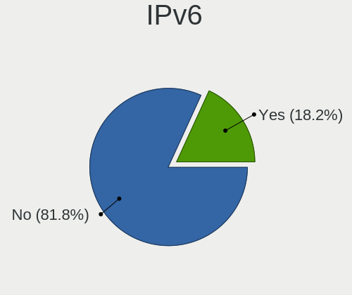

| Used | Notebooks | Percent |
|------|-----------|---------|
| No   | 38        | 86.36%  |
| Yes  | 6         | 13.64%  |

Bluetooth
---------

Bluetooth Vendor
----------------

Controller vendors

| Vendor                          | Notebooks | Percent |
|---------------------------------|-----------|---------|
| Intel                           | 14        | 41.18%  |
| Qualcomm Atheros Communications | 5         | 14.71%  |
| Realtek Semiconductor           | 3         | 8.82%   |
| IMC Networks                    | 3         | 8.82%   |
| Dell                            | 2         | 5.88%   |
| Broadcom                        | 2         | 5.88%   |
| Toshiba                         | 1         | 2.94%   |
| Ralink Technology               | 1         | 2.94%   |
| Hewlett-Packard                 | 1         | 2.94%   |
| Foxconn / Hon Hai               | 1         | 2.94%   |
| Cambridge Silicon Radio         | 1         | 2.94%   |

Bluetooth Model
---------------

Controller models

| Model                                               | Notebooks | Percent |
|-----------------------------------------------------|-----------|---------|
| Intel Bluetooth wireless interface                  | 7         | 20.59%  |
| Realtek  Bluetooth 4.2 Adapter                      | 2         | 5.88%   |
| Qualcomm Atheros QCA61x4 Bluetooth 4.0              | 2         | 5.88%   |
| Qualcomm Atheros AR3012 Bluetooth 4.0               | 2         | 5.88%   |
| Intel Centrino Advanced-N 6230 Bluetooth adapter    | 2         | 5.88%   |
| Intel Bluetooth 9460/9560 Jefferson Peak (JfP)      | 2         | 5.88%   |
| Intel AX201 Bluetooth                               | 2         | 5.88%   |
| IMC Networks Bluetooth Radio                        | 2         | 5.88%   |
| Toshiba Bluetooth Device                            | 1         | 2.94%   |
| Realtek Bluetooth Radio                             | 1         | 2.94%   |
| Ralink Motorola BC4 Bluetooth 3.0+HS Adapter        | 1         | 2.94%   |
| Qualcomm Atheros  Bluetooth Device                  | 1         | 2.94%   |
| Intel AX210 Bluetooth                               | 1         | 2.94%   |
| IMC Networks Bluetooth USB Host Controller          | 1         | 2.94%   |
| HP Broadcom 2070 Bluetooth Combo                    | 1         | 2.94%   |
| Foxconn / Hon Hai BCM20702A0                        | 1         | 2.94%   |
| Dell Wireless 355 Bluetooth                         | 1         | 2.94%   |
| Dell BCM20702A0 Bluetooth Module                    | 1         | 2.94%   |
| Cambridge Silicon Radio Bluetooth Dongle (HCI mode) | 1         | 2.94%   |
| Broadcom BCM43142A0 Bluetooth 4.0                   | 1         | 2.94%   |
| Broadcom BCM2045B (BDC-2.1) [Bluetooth Controller]  | 1         | 2.94%   |

Sound
-----

Sound Vendor
------------

Sound card vendors

| Vendor                                          | Notebooks | Percent |
|-------------------------------------------------|-----------|---------|
| Intel                                           | 42        | 84%     |
| Nvidia                                          | 4         | 8%      |
| Silicon Integrated Systems [SiS]                | 1         | 2%      |
| Razer USA                                       | 1         | 2%      |
| Licensed by Sony Computer Entertainment America | 1         | 2%      |
| AMD                                             | 1         | 2%      |

Sound Model
-----------

Sound card models

| Model                                                                                             | Notebooks | Percent |
|---------------------------------------------------------------------------------------------------|-----------|---------|
| Intel Sunrise Point-LP HD Audio                                                                   | 6         | 9.84%   |
| Intel Haswell-ULT HD Audio Controller                                                             | 5         | 8.2%    |
| Intel 8 Series HD Audio Controller                                                                | 5         | 8.2%    |
| Intel 6 Series/C200 Series Chipset Family High Definition Audio Controller                        | 5         | 8.2%    |
| Intel 7 Series/C216 Chipset Family High Definition Audio Controller                               | 4         | 6.56%   |
| Intel 5 Series/3400 Series Chipset High Definition Audio                                          | 4         | 6.56%   |
| Intel Wildcat Point-LP High Definition Audio Controller                                           | 3         | 4.92%   |
| Intel Cannon Lake PCH cAVS                                                                        | 3         | 4.92%   |
| Intel Broadwell-U Audio Controller                                                                | 3         | 4.92%   |
| Nvidia GP107GL High Definition Audio Controller                                                   | 2         | 3.28%   |
| Intel Xeon E3-1200 v3/4th Gen Core Processor HD Audio Controller                                  | 2         | 3.28%   |
| Intel Tiger Lake-LP Smart Sound Technology Audio Controller                                       | 2         | 3.28%   |
| Intel Ice Lake-LP Smart Sound Technology Audio Controller                                         | 2         | 3.28%   |
| Intel 82801I (ICH9 Family) HD Audio Controller                                                    | 2         | 3.28%   |
| Intel 8 Series/C220 Series Chipset High Definition Audio Controller                               | 2         | 3.28%   |
| Silicon Integrated Systems [SiS] Azalia Audio Controller                                          | 1         | 1.64%   |
| Razer USA Kraken 7.1 V2                                                                           | 1         | 1.64%   |
| Nvidia TU104 HD Audio Controller                                                                  | 1         | 1.64%   |
| Nvidia GF108 High Definition Audio Controller                                                     | 1         | 1.64%   |
| Licensed by Sony Computer Entertainment America Wireless Stereo Headset                           | 1         | 1.64%   |
| Intel Comet Lake PCH cAVS                                                                         | 1         | 1.64%   |
| Intel Atom/Celeron/Pentium Processor x5-E8000/J3xxx/N3xxx Series High Definition Audio Controller | 1         | 1.64%   |
| Intel Atom Processor Z36xxx/Z37xxx Series High Definition Audio Controller                        | 1         | 1.64%   |
| Intel 82801H (ICH8 Family) HD Audio Controller                                                    | 1         | 1.64%   |
| AMD Kabini HDMI/DP Audio                                                                          | 1         | 1.64%   |
| AMD Family 15h (Models 60h-6fh) Audio Controller                                                  | 1         | 1.64%   |

Memory
------

Memory Vendor
-------------

Memory module vendors

| Vendor              | Notebooks | Percent |
|---------------------|-----------|---------|
| Samsung Electronics | 10        | 40%     |
| SK hynix            | 6         | 24%     |
| Micron Technology   | 4         | 16%     |
| Kingston            | 2         | 8%      |
| Teikon              | 1         | 4%      |
| Ramaxel Technology  | 1         | 4%      |
| Crucial             | 1         | 4%      |

Memory Model
------------

Memory module models

| Model                                                      | Notebooks | Percent |
|------------------------------------------------------------|-----------|---------|
| Samsung RAM M471B5173EB0-YK0 4GB SODIMM DDR3 1600MT/s      | 2         | 8%      |
| Teikon RAM TMT251S6CFR8C-PBHC 4GB SODIMM DDR3 1600MT/s     | 1         | 4%      |
| SK hynix RAM HMT451S6AFR8A-PB 4GB SODIMM DDR3 1600MT/s     | 1         | 4%      |
| SK hynix RAM HMT41GS6BFR8A-PB 8GB SODIMM DDR3 1600MT/s     | 1         | 4%      |
| SK hynix RAM HMT351S6EFR8A-PB 4096MB SODIMM DDR3 1600MT/s  | 1         | 4%      |
| SK hynix RAM HMT351S6BFR8C-H9 4GB SODIMM DDR3 1334MT/s     | 1         | 4%      |
| SK hynix RAM HMA81GS6AFR8N-UH 8GB SODIMM DDR4 2667MT/s     | 1         | 4%      |
| SK hynix RAM H9CCNNN8GTMLAR-NUD 2GB LPDDR3 1600MT/s        | 1         | 4%      |
| Samsung RAM M471B5173QH0-YK0 4GB SODIMM DDR3 1600MT/s      | 1         | 4%      |
| Samsung RAM M471B1G73EB0-YK0 8GB SODIMM DDR3 1600MT/s      | 1         | 4%      |
| Samsung RAM M471A5244CB0-CRC 4GB SODIMM DDR4 2667MT/s      | 1         | 4%      |
| Samsung RAM M471A5244BB0-CRC 4GB SODIMM DDR4 2667MT/s      | 1         | 4%      |
| Samsung RAM M471A5244BB0-CPB 4GB SODIMM DDR4 2400MT/s      | 1         | 4%      |
| Samsung RAM M471A2K43DB1-CWE 16GB SODIMM DDR4 3200MT/s     | 1         | 4%      |
| Samsung RAM M471A1K43EB1-CWE 8GB SODIMM DDR4 3200MT/s      | 1         | 4%      |
| Samsung RAM M471A1K43CB1-CRC 8GB SODIMM DDR4 2667MT/s      | 1         | 4%      |
| Ramaxel RAM RMSA3270MB86H9F2400 4GB SODIMM DDR4 2400MT/s   | 1         | 4%      |
| Micron RAM Module 4GB SODIMM DDR3 1600MT/s                 | 1         | 4%      |
| Micron RAM 8ATF1G64HZ-2G1B1 8GB SODIMM DDR4 2400MT/s       | 1         | 4%      |
| Micron RAM 4ATF51264HZ-2G6E1 4GB SODIMM DDR4 2667MT/s      | 1         | 4%      |
| Micron RAM 16ATF2G64HZ-2G6E1 16GB SODIMM DDR4 2667MT/s     | 1         | 4%      |
| Kingston RAM KHX2133C13S4/4G 4GB SODIMM DDR4 2133MT/s      | 1         | 4%      |
| Kingston RAM KHX1600C9S3L/8G 8GB SODIMM DDR3 1600MT/s      | 1         | 4%      |
| Crucial RAM CT16G4SFRA32A.M16FRS 16GB SODIMM DDR4 3200MT/s | 1         | 4%      |

Memory Kind
-----------

Memory module kinds

| Kind   | Notebooks | Percent |
|--------|-----------|---------|
| DDR4   | 10        | 52.63%  |
| DDR3   | 8         | 42.11%  |
| LPDDR3 | 1         | 5.26%   |

Memory Form Factor
------------------

Physical design of the memory module

| Name    | Notebooks | Percent |
|---------|-----------|---------|
| SODIMM  | 18        | 94.74%  |
| Unknown | 1         | 5.26%   |

Memory Size
-----------

Memory module size

| Size  | Notebooks | Percent |
|-------|-----------|---------|
| 8192  | 8         | 40%     |
| 4096  | 8         | 40%     |
| 16384 | 3         | 15%     |
| 2048  | 1         | 5%      |

Memory Speed
------------

Memory module speed

| Speed | Notebooks | Percent |
|-------|-----------|---------|
| 1600  | 9         | 40.91%  |
| 2667  | 5         | 22.73%  |
| 3200  | 3         | 13.64%  |
| 2400  | 3         | 13.64%  |
| 2133  | 1         | 4.55%   |
| 1334  | 1         | 4.55%   |

Printers & scanners
-------------------

Printer Vendor
--------------

Printer device vendors

Zero info for selected period =(

Printer Model
-------------

Printer device models

Zero info for selected period =(

Scanner Vendor
--------------

Scanner device vendors

Zero info for selected period =(

Scanner Model
-------------

Scanner device models

Zero info for selected period =(

Camera
------

Camera Vendor
-------------

Camera device vendors

| Vendor                        | Notebooks | Percent |
|-------------------------------|-----------|---------|
| Chicony Electronics           | 10        | 26.32%  |
| Microdia                      | 6         | 15.79%  |
| Suyin                         | 4         | 10.53%  |
| Acer                          | 4         | 10.53%  |
| Sunplus Innovation Technology | 3         | 7.89%   |
| Realtek Semiconductor         | 3         | 7.89%   |
| Quanta                        | 3         | 7.89%   |
| IMC Networks                  | 3         | 7.89%   |
| Silicon Motion                | 1         | 2.63%   |
| Importek                      | 1         | 2.63%   |

Camera Model
------------

Camera device models

| Model                                          | Notebooks | Percent |
|------------------------------------------------|-----------|---------|
| Microdia Integrated_Webcam_HD                  | 2         | 5.26%   |
| Microdia Integrated Webcam                     | 2         | 5.26%   |
| Suyin WebCam                                   | 1         | 2.63%   |
| Suyin HP Truevision HD                         | 1         | 2.63%   |
| Suyin Asus Integrated Webcam                   | 1         | 2.63%   |
| Suyin 1.3M Front                               | 1         | 2.63%   |
| Sunplus Laptop_Integrated_Webcam_HD            | 1         | 2.63%   |
| Sunplus Integrated_Webcam_HD                   | 1         | 2.63%   |
| Sunplus HD WebCam                              | 1         | 2.63%   |
| Silicon Motion HP Webcam-101 Integrated Camera | 1         | 2.63%   |
| Realtek USB2.0 VGA UVC WebCam                  | 1         | 2.63%   |
| Realtek Laptop Camera                          | 1         | 2.63%   |
| Realtek HP Truevision HD                       | 1         | 2.63%   |
| Quanta Laptop_Integrated_Webcam_2HDM           | 1         | 2.63%   |
| Quanta HP TrueVision HD Camera                 | 1         | 2.63%   |
| Quanta HD Webcam                               | 1         | 2.63%   |
| Microdia Sonix 1.3 MP Laptop Integrated Webcam | 1         | 2.63%   |
| Microdia Laptop_Integrated_Webcam_0.3M         | 1         | 2.63%   |
| Importek HP Truevision HD Integrated Webcam    | 1         | 2.63%   |
| IMC Networks USB2.0 VGA UVC WebCam             | 1         | 2.63%   |
| IMC Networks USB2.0 UVC HD Webcam              | 1         | 2.63%   |
| IMC Networks USB2.0 HD UVC WebCam              | 1         | 2.63%   |
| Chicony USB 2.0 Camera                         | 1         | 2.63%   |
| Chicony TOSHIBA Web Camera - HD                | 1         | 2.63%   |
| Chicony Lenovo EasyCamera                      | 1         | 2.63%   |
| Chicony Integrated Camera                      | 1         | 2.63%   |
| Chicony HP Wide Vision HD Camera               | 1         | 2.63%   |
| Chicony HP Webcam [2 MP Macro]                 | 1         | 2.63%   |
| Chicony HP Webcam                              | 1         | 2.63%   |
| Chicony HP HD Camera                           | 1         | 2.63%   |
| Chicony HD WebCam                              | 1         | 2.63%   |
| Chicony EasyCamera                             | 1         | 2.63%   |
| Acer Integrated Camera                         | 1         | 2.63%   |
| Acer HP TrueVision HD Webcam                   | 1         | 2.63%   |
| Acer EasyCamera                                | 1         | 2.63%   |
| Acer BisonCam, NB Pro                          | 1         | 2.63%   |

Security
--------

Fingerprint Vendor
------------------

Fingerprint sensor vendors

| Vendor                     | Notebooks | Percent |
|----------------------------|-----------|---------|
| Validity Sensors           | 3         | 60%     |
| Shenzhen Goodix Technology | 1         | 20%     |
| AuthenTec                  | 1         | 20%     |

Fingerprint Model
-----------------

Fingerprint sensor models

| Model                                      | Notebooks | Percent |
|--------------------------------------------|-----------|---------|
| Validity Sensors Fingerprint scanner       | 2         | 40%     |
| Validity Sensors VFS495 Fingerprint Reader | 1         | 20%     |
| Shenzhen Goodix  FingerPrint Device        | 1         | 20%     |
| AuthenTec AES2810                          | 1         | 20%     |

Chipcard Vendor
---------------

Chipcard module vendors

| Vendor   | Notebooks | Percent |
|----------|-----------|---------|
| Upek     | 1         | 50%     |
| Broadcom | 1         | 50%     |

Chipcard Model
--------------

Chipcard module models

| Model                                                                        | Notebooks | Percent |
|------------------------------------------------------------------------------|-----------|---------|
| Upek TouchChip Fingerprint Coprocessor (WBF advanced mode)                   | 1         | 50%     |
| Broadcom BCM5880 Secure Applications Processor with fingerprint swipe sensor | 1         | 50%     |

Unsupported
-----------

Unsupported Devices
-------------------

Total unsupported devices on board

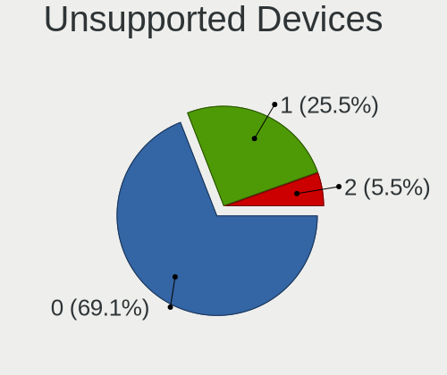

| Total | Notebooks | Percent |
|-------|-----------|---------|
| 0     | 30        | 68.18%  |
| 1     | 12        | 27.27%  |
| 2     | 2         | 4.55%   |

Unsupported Device Types
------------------------

Types of unsupported devices

| Type               | Notebooks | Percent |
|--------------------|-----------|---------|
| Graphics card      | 6         | 42.86%  |
| Fingerprint reader | 5         | 35.71%  |
| Chipcard           | 2         | 14.29%  |
| Net/ethernet       | 1         | 7.14%   |

