UbuntuDDE - Tested Hardware & Statistics
----------------------------------------

A project to collect tested hardware configurations for UbuntuDDE.

Anyone can contribute to this report by the [hw-probe](https://github.com/linuxhw/hw-probe) tool:

    sudo -E hw-probe -all -upload

Please contribute! Especially if your hardware is rare.

This is a report for all computer types. See also reports for [desktops](/Dist/UbuntuDDE/Desktop/README.md) and [notebooks](/Dist/UbuntuDDE/Notebook/README.md).

Contents
--------

* [ Test Cases ](#test-cases)

* [ System ](#system)
  - [ OS                       ](#os)
  - [ OS Family                ](#os-family)
  - [ Kernel                   ](#kernel)
  - [ Kernel Family            ](#kernel-family)
  - [ Kernel Major Ver.        ](#kernel-major-ver)
  - [ Arch                     ](#arch)
  - [ DE                       ](#de)
  - [ Display Server           ](#display-server)
  - [ Display Manager          ](#display-manager)
  - [ OS Lang                  ](#os-lang)
  - [ Boot Mode                ](#boot-mode)
  - [ Filesystem               ](#filesystem)
  - [ Part. scheme             ](#part-scheme)
  - [ Dual Boot with Linux/BSD ](#dual-boot-with-linuxbsd)
  - [ Dual Boot (Win)          ](#dual-boot-win)

* [ Board ](#board)
  - [ Vendor                   ](#vendor)
  - [ Model                    ](#model)
  - [ Model Family             ](#model-family)
  - [ MFG Year                 ](#mfg-year)
  - [ Form Factor              ](#form-factor)
  - [ Secure Boot              ](#secure-boot)
  - [ Coreboot                 ](#coreboot)
  - [ RAM Size                 ](#ram-size)
  - [ RAM Used                 ](#ram-used)
  - [ Total Drives             ](#total-drives)
  - [ Has CD-ROM               ](#has-cd-rom)
  - [ Has Ethernet             ](#has-ethernet)
  - [ Has WiFi                 ](#has-wifi)
  - [ Has Bluetooth            ](#has-bluetooth)

* [ Location ](#location)
  - [ Country                  ](#country)
  - [ City                     ](#city)

* [ Drives ](#drives)
  - [ Drive Vendor             ](#drive-vendor)
  - [ Drive Model              ](#drive-model)
  - [ HDD Vendor               ](#hdd-vendor)
  - [ SSD Vendor               ](#ssd-vendor)
  - [ Drive Kind               ](#drive-kind)
  - [ Drive Connector          ](#drive-connector)
  - [ Drive Size               ](#drive-size)
  - [ Space Total              ](#space-total)
  - [ Space Used               ](#space-used)
  - [ Malfunc. Drives          ](#malfunc-drives)
  - [ Malfunc. Drive Vendor    ](#malfunc-drive-vendor)
  - [ Malfunc. HDD Vendor      ](#malfunc-hdd-vendor)
  - [ Malfunc. Drive Kind      ](#malfunc-drive-kind)
  - [ Failed Drives            ](#failed-drives)
  - [ Failed Drive Vendor      ](#failed-drive-vendor)
  - [ Drive Status             ](#drive-status)

* [ Storage controller ](#storage-controller)
  - [ Storage Vendor           ](#storage-vendor)
  - [ Storage Model            ](#storage-model)
  - [ Storage Kind             ](#storage-kind)

* [ Processor ](#processor)
  - [ CPU Vendor               ](#cpu-vendor)
  - [ CPU Model                ](#cpu-model)
  - [ CPU Model Family         ](#cpu-model-family)
  - [ CPU Cores                ](#cpu-cores)
  - [ CPU Sockets              ](#cpu-sockets)
  - [ CPU Threads              ](#cpu-threads)
  - [ CPU Op-Modes             ](#cpu-op-modes)
  - [ CPU Microcode            ](#cpu-microcode)
  - [ CPU Microarch            ](#cpu-microarch)

* [ Graphics ](#graphics)
  - [ GPU Vendor               ](#gpu-vendor)
  - [ GPU Model                ](#gpu-model)
  - [ GPU Combo                ](#gpu-combo)
  - [ GPU Driver               ](#gpu-driver)
  - [ GPU Memory               ](#gpu-memory)

* [ Monitor ](#monitor)
  - [ Monitor Vendor           ](#monitor-vendor)
  - [ Monitor Model            ](#monitor-model)
  - [ Monitor Resolution       ](#monitor-resolution)
  - [ Monitor Diagonal         ](#monitor-diagonal)
  - [ Monitor Width            ](#monitor-width)
  - [ Aspect Ratio             ](#aspect-ratio)
  - [ Monitor Area             ](#monitor-area)
  - [ Pixel Density            ](#pixel-density)
  - [ Multiple Monitors        ](#multiple-monitors)

* [ Network ](#network)
  - [ Net Controller Vendor    ](#net-controller-vendor)
  - [ Net Controller Model     ](#net-controller-model)
  - [ Wireless Vendor          ](#wireless-vendor)
  - [ Wireless Model           ](#wireless-model)
  - [ Ethernet Vendor          ](#ethernet-vendor)
  - [ Ethernet Model           ](#ethernet-model)
  - [ Net Controller Kind      ](#net-controller-kind)
  - [ Used Controller          ](#used-controller)
  - [ NICs                     ](#nics)
  - [ IPv6                     ](#ipv6)

* [ Bluetooth ](#bluetooth)
  - [ Bluetooth Vendor         ](#bluetooth-vendor)
  - [ Bluetooth Model          ](#bluetooth-model)

* [ Sound ](#sound)
  - [ Sound Vendor             ](#sound-vendor)
  - [ Sound Model              ](#sound-model)

* [ Memory ](#memory)
  - [ Memory Vendor            ](#memory-vendor)
  - [ Memory Model             ](#memory-model)
  - [ Memory Kind              ](#memory-kind)
  - [ Memory Form Factor       ](#memory-form-factor)
  - [ Memory Size              ](#memory-size)
  - [ Memory Speed             ](#memory-speed)

* [ Printers & scanners ](#printers--scanners)
  - [ Printer Vendor           ](#printer-vendor)
  - [ Printer Model            ](#printer-model)
  - [ Scanner Vendor           ](#scanner-vendor)
  - [ Scanner Model            ](#scanner-model)

* [ Camera ](#camera)
  - [ Camera Vendor            ](#camera-vendor)
  - [ Camera Model             ](#camera-model)

* [ Security ](#security)
  - [ Fingerprint Vendor       ](#fingerprint-vendor)
  - [ Fingerprint Model        ](#fingerprint-model)
  - [ Chipcard Vendor          ](#chipcard-vendor)
  - [ Chipcard Model           ](#chipcard-model)

* [ Unsupported ](#unsupported)
  - [ Unsupported Devices      ](#unsupported-devices)
  - [ Unsupported Device Types ](#unsupported-device-types)

Test Cases
----------

Total: 126

| Vendor        | Model                       | Form-Factor | Probe                                                      | Date         |
|---------------|-----------------------------|-------------|------------------------------------------------------------|--------------|
| Dell          | Latitude E7450              | Notebook    | [d7a8f0a599](https://linux-hardware.org/?probe=d7a8f0a599) | Jul 22, 2023 |
| ASRock        | B560M-C                     | Desktop     | [c8d399d95d](https://linux-hardware.org/?probe=c8d399d95d) | Jul 20, 2023 |
| Apple         | MacBookPro12,1              | Notebook    | [fc6e3f084f](https://linux-hardware.org/?probe=fc6e3f084f) | Jun 04, 2023 |
| Apple         | MacBookPro12,1              | Notebook    | [a9c6f5e0e6](https://linux-hardware.org/?probe=a9c6f5e0e6) | Jun 04, 2023 |
| Acer          | Aspire A317-53              | Notebook    | [406fc17c32](https://linux-hardware.org/?probe=406fc17c32) | Jun 04, 2023 |
| Samsung       | 355V4C/356V4C/3445VC/354... | Notebook    | [65a009e9dd](https://linux-hardware.org/?probe=65a009e9dd) | Apr 20, 2023 |
| Dell          | Latitude E6430              | Notebook    | [7fe3f11f56](https://linux-hardware.org/?probe=7fe3f11f56) | Dec 22, 2022 |
| ASUSTek       | P8Z68-V LX                  | Desktop     | [7153762b68](https://linux-hardware.org/?probe=7153762b68) | Nov 23, 2022 |
| Dell          | Latitude E6430              | Notebook    | [60832751d1](https://linux-hardware.org/?probe=60832751d1) | Nov 16, 2022 |
| ASUSTek       | H81I-PLUS                   | Desktop     | [d5d3ad3491](https://linux-hardware.org/?probe=d5d3ad3491) | Oct 18, 2022 |
| HP            | Spectre x360 Convertible... | Convertible | [e308c653b2](https://linux-hardware.org/?probe=e308c653b2) | May 30, 2022 |
| MSI           | A320M PRO-M2 V2             | Desktop     | [7a3fa3e4a4](https://linux-hardware.org/?probe=7a3fa3e4a4) | Apr 16, 2022 |
| ECS           | Nettle2                     | Desktop     | [7de5975b89](https://linux-hardware.org/?probe=7de5975b89) | Mar 20, 2022 |
| HP            | Notebook                    | Notebook    | [9c04c0776d](https://linux-hardware.org/?probe=9c04c0776d) | Mar 10, 2022 |
| Dell          | Inspiron N4030              | Notebook    | [ac4c492fcf](https://linux-hardware.org/?probe=ac4c492fcf) | Mar 05, 2022 |
| Dell          | Inspiron N4030              | Notebook    | [e5e17e5138](https://linux-hardware.org/?probe=e5e17e5138) | Mar 05, 2022 |
| ECS           | Nettle2                     | Desktop     | [cd98e7180c](https://linux-hardware.org/?probe=cd98e7180c) | Feb 12, 2022 |
| HP            | ProBook 650 G3              | Notebook    | [32fcb78172](https://linux-hardware.org/?probe=32fcb78172) | Jan 23, 2022 |
| Framework     | Laptop                      | Notebook    | [081416685c](https://linux-hardware.org/?probe=081416685c) | Jan 18, 2022 |
| Dell          | XPS 15 9570                 | Notebook    | [b8d4a9ee87](https://linux-hardware.org/?probe=b8d4a9ee87) | Jan 17, 2022 |
| Google        | Banon                       | Notebook    | [a6febddf28](https://linux-hardware.org/?probe=a6febddf28) | Jan 06, 2022 |
| ASUSTek       | G550JK                      | Notebook    | [b26b378274](https://linux-hardware.org/?probe=b26b378274) | Jan 01, 2022 |
| ASUSTek       | VivoBook_ASUSLaptop X421... | Notebook    | [b2a9183e6d](https://linux-hardware.org/?probe=b2a9183e6d) | Oct 09, 2021 |
| Lenovo        | IdeaPad 510-15IKB 80SV      | Notebook    | [71958172cf](https://linux-hardware.org/?probe=71958172cf) | Oct 08, 2021 |
| Dell          | XPS 15 9570                 | Notebook    | [661937dcfa](https://linux-hardware.org/?probe=661937dcfa) | Sep 12, 2021 |
| Dell          | XPS 15 9570                 | Notebook    | [a950c391ee](https://linux-hardware.org/?probe=a950c391ee) | Sep 12, 2021 |
| Gigabyte      | F2A55M-HD2                  | Desktop     | [e8b8cb1cf7](https://linux-hardware.org/?probe=e8b8cb1cf7) | Sep 01, 2021 |
| Lenovo        | ThinkPad E15 Gen 2 20TDS... | Notebook    | [f3199bc88b](https://linux-hardware.org/?probe=f3199bc88b) | Jul 25, 2021 |
| Acer          | F672CR R01-B1               | Desktop     | [652ed79c86](https://linux-hardware.org/?probe=652ed79c86) | May 29, 2021 |
| MSI           | GS60 2QE                    | Notebook    | [7ef8c79c08](https://linux-hardware.org/?probe=7ef8c79c08) | May 24, 2021 |
| MSI           | GS60 2QE                    | Notebook    | [1660ac34ec](https://linux-hardware.org/?probe=1660ac34ec) | May 24, 2021 |
| Acer          | F672CR R01-B1               | Desktop     | [bd8067c8cf](https://linux-hardware.org/?probe=bd8067c8cf) | May 16, 2021 |
| Acer          | Predator PH317-52           | Notebook    | [5737732bb0](https://linux-hardware.org/?probe=5737732bb0) | May 15, 2021 |
| HP            | OMEN by Laptop 17-cb1xxx    | Notebook    | [ca2397cddf](https://linux-hardware.org/?probe=ca2397cddf) | May 12, 2021 |
| HP            | EliteBook 2540p             | Notebook    | [506fb4d003](https://linux-hardware.org/?probe=506fb4d003) | May 02, 2021 |
| Intel         | D33217CK G76541-302         | Desktop     | [1db9d29c38](https://linux-hardware.org/?probe=1db9d29c38) | Apr 19, 2021 |
| ASUSTek       | S551LN                      | Notebook    | [1c51e0899d](https://linux-hardware.org/?probe=1c51e0899d) | Apr 06, 2021 |
| ASUSTek       | S551LN                      | Notebook    | [d03bb12703](https://linux-hardware.org/?probe=d03bb12703) | Apr 06, 2021 |
| MSI           | G41M-S01                    | Desktop     | [fae5d5a101](https://linux-hardware.org/?probe=fae5d5a101) | Mar 31, 2021 |
| ASUSTek       | PRIME B450M-A II            | Desktop     | [292671b8bb](https://linux-hardware.org/?probe=292671b8bb) | Mar 26, 2021 |
| Fujitsu Si... | D2811-A1 S26361-D2811-A1    | Desktop     | [826729feac](https://linux-hardware.org/?probe=826729feac) | Feb 07, 2021 |
| MSI           | G41M-P26                    | Desktop     | [2b503c1c1d](https://linux-hardware.org/?probe=2b503c1c1d) | Jan 07, 2021 |
| Dell          | Latitude E6320              | Notebook    | [8e7c6ced02](https://linux-hardware.org/?probe=8e7c6ced02) | Dec 15, 2020 |
| BESSTAR Te... | VB9                         | All in one  | [c6c030bd9f](https://linux-hardware.org/?probe=c6c030bd9f) | Nov 28, 2020 |
| BANGHO        | MZBSWAP-00                  | Desktop     | [c0b3c1bae1](https://linux-hardware.org/?probe=c0b3c1bae1) | Nov 13, 2020 |
| Intel         | DQ45CB AAE30148-207         | Desktop     | [51733fd6ab](https://linux-hardware.org/?probe=51733fd6ab) | Nov 02, 2020 |
| MSI           | Z87-G43                     | Desktop     | [055e733f90](https://linux-hardware.org/?probe=055e733f90) | Nov 01, 2020 |
| Gigabyte      | GA-970A-D3                  | Desktop     | [8f5f5aba10](https://linux-hardware.org/?probe=8f5f5aba10) | Oct 31, 2020 |
| ASUSTek       | VivoBook 15_ASUS Laptop ... | Notebook    | [e070ae2fd4](https://linux-hardware.org/?probe=e070ae2fd4) | Oct 19, 2020 |
| Dell          | 0GTK4K A02                  | Desktop     | [5e81f45485](https://linux-hardware.org/?probe=5e81f45485) | Oct 09, 2020 |
| Dell          | 0GTK4K A02                  | Desktop     | [83adab7085](https://linux-hardware.org/?probe=83adab7085) | Oct 08, 2020 |
| ASUSTek       | X555QG                      | Notebook    | [ae5665efc4](https://linux-hardware.org/?probe=ae5665efc4) | Oct 02, 2020 |
| Dell          | Inspiron 5447               | Notebook    | [a316ca39ef](https://linux-hardware.org/?probe=a316ca39ef) | Sep 25, 2020 |
| ASUSTek       | P5G41C-M LX                 | Desktop     | [1865dce38e](https://linux-hardware.org/?probe=1865dce38e) | Sep 24, 2020 |
| ASUSTek       | ROG STRIX B350-F GAMING     | Desktop     | [006c313ab9](https://linux-hardware.org/?probe=006c313ab9) | Sep 13, 2020 |
| Unknown       | SKYBAY                      | Desktop     | [8abc37bdcc](https://linux-hardware.org/?probe=8abc37bdcc) | Sep 06, 2020 |
| ASUSTek       | P5G41C-M LX                 | Desktop     | [ae07f658e9](https://linux-hardware.org/?probe=ae07f658e9) | Sep 04, 2020 |
| ASUSTek       | CROSSHAIR V FORMULA-Z       | Desktop     | [5779a0397d](https://linux-hardware.org/?probe=5779a0397d) | Aug 26, 2020 |
| HP            | Pavilion dm4                | Notebook    | [7ab3fbd60d](https://linux-hardware.org/?probe=7ab3fbd60d) | Aug 26, 2020 |
| HP            | Pavilion dm4                | Notebook    | [f3f1ea6d44](https://linux-hardware.org/?probe=f3f1ea6d44) | Aug 26, 2020 |
| HUAWEI        | MACH-WX9                    | Notebook    | [b7c774660b](https://linux-hardware.org/?probe=b7c774660b) | Aug 23, 2020 |
| HUAWEI        | MACH-WX9                    | Notebook    | [08bdddfbb1](https://linux-hardware.org/?probe=08bdddfbb1) | Aug 23, 2020 |
| Dell          | System XPS L502X            | Notebook    | [caa5473285](https://linux-hardware.org/?probe=caa5473285) | Aug 13, 2020 |
| Lenovo        | G480 20150                  | Notebook    | [4531dd50a5](https://linux-hardware.org/?probe=4531dd50a5) | Aug 11, 2020 |
| Lenovo        | G480 20150                  | Notebook    | [8e51b2cb2d](https://linux-hardware.org/?probe=8e51b2cb2d) | Aug 11, 2020 |
| Dell          | System XPS L502X            | Notebook    | [019fc71c57](https://linux-hardware.org/?probe=019fc71c57) | Aug 05, 2020 |
| ASUSTek       | TP300LA                     | Notebook    | [4cb4390fa3](https://linux-hardware.org/?probe=4cb4390fa3) | Aug 01, 2020 |
| ASUSTek       | TP300LA                     | Notebook    | [e273444401](https://linux-hardware.org/?probe=e273444401) | Aug 01, 2020 |
| Acer          | Aspire 5750                 | Notebook    | [19876e9920](https://linux-hardware.org/?probe=19876e9920) | Jul 25, 2020 |
| Dell          | G7 7588                     | Notebook    | [34805cf5b8](https://linux-hardware.org/?probe=34805cf5b8) | Jul 24, 2020 |
| ASUSTek       | D820MT_D820SF_BM3CE         | Desktop     | [21af10b11c](https://linux-hardware.org/?probe=21af10b11c) | Jul 03, 2020 |
| Toshiba       | Satellite S55t-B            | Notebook    | [01aa2bca69](https://linux-hardware.org/?probe=01aa2bca69) | Jun 28, 2020 |
| Toshiba       | Satellite S55t-B            | Notebook    | [71ae60ebc0](https://linux-hardware.org/?probe=71ae60ebc0) | Jun 27, 2020 |
| ASUSTek       | H61M-D                      | Desktop     | [ef9bd4541a](https://linux-hardware.org/?probe=ef9bd4541a) | Jun 27, 2020 |
| ASUSTek       | H61M-D                      | Desktop     | [d9b6cb6c0b](https://linux-hardware.org/?probe=d9b6cb6c0b) | Jun 27, 2020 |
| Lenovo        | IdeaPad 520-15IKB 81BF      | Notebook    | [2a82822b1d](https://linux-hardware.org/?probe=2a82822b1d) | Jun 24, 2020 |
| Lenovo        | IdeaPad 520-15IKB 81BF      | Notebook    | [9f58b08659](https://linux-hardware.org/?probe=9f58b08659) | Jun 24, 2020 |
| ASUSTek       | H110I-PLUS                  | Desktop     | [75682d8cbd](https://linux-hardware.org/?probe=75682d8cbd) | Jun 23, 2020 |
| ASUSTek       | H110I-PLUS                  | Desktop     | [ffccba3844](https://linux-hardware.org/?probe=ffccba3844) | Jun 23, 2020 |
| Dell          | Inspiron 1525               | Notebook    | [f01a10328b](https://linux-hardware.org/?probe=f01a10328b) | Jun 17, 2020 |
| HP            | Presario CQ56               | Notebook    | [211a5c9ec1](https://linux-hardware.org/?probe=211a5c9ec1) | Jun 17, 2020 |
| Intel         | B75                         | Desktop     | [cbfecb01d1](https://linux-hardware.org/?probe=cbfecb01d1) | Jun 14, 2020 |
| Acer          | Aspire V5-471               | Notebook    | [346de9f5d8](https://linux-hardware.org/?probe=346de9f5d8) | Jun 14, 2020 |
| Unknown       | Unknown                     | Notebook    | [1da538b1cf](https://linux-hardware.org/?probe=1da538b1cf) | Jun 04, 2020 |
| Unknown       | Unknown                     | Notebook    | [950be7ae19](https://linux-hardware.org/?probe=950be7ae19) | Jun 04, 2020 |
| Lenovo        | ThinkPad T430 2349DS5       | Notebook    | [77d17289e7](https://linux-hardware.org/?probe=77d17289e7) | May 31, 2020 |
| Dell          | 0H4VK7 A01                  | Desktop     | [0d7b561033](https://linux-hardware.org/?probe=0d7b561033) | May 24, 2020 |
| Dell          | 0H4VK7 A01                  | Desktop     | [6c8989e6c6](https://linux-hardware.org/?probe=6c8989e6c6) | May 24, 2020 |
| HP            | Laptop 15-dy1xxx            | Notebook    | [ea23c3bbdb](https://linux-hardware.org/?probe=ea23c3bbdb) | May 16, 2020 |
| Gigabyte      | MQLP7AP-00                  | Desktop     | [7ec29f824e](https://linux-hardware.org/?probe=7ec29f824e) | May 16, 2020 |
| HP            | Laptop 15-dy1xxx            | Notebook    | [d55c3ee4b0](https://linux-hardware.org/?probe=d55c3ee4b0) | May 16, 2020 |
| Acer          | Aspire 5733                 | Notebook    | [42424919ae](https://linux-hardware.org/?probe=42424919ae) | May 14, 2020 |
| ASUSTek       | P6X58D-E                    | Desktop     | [5a566d4992](https://linux-hardware.org/?probe=5a566d4992) | May 12, 2020 |
| HP            | 8433 11                     | Desktop     | [e302f75c67](https://linux-hardware.org/?probe=e302f75c67) | May 12, 2020 |
| Lenovo        | ThinkPad X1 Tablet Gen 3... | Tablet      | [31b70f1160](https://linux-hardware.org/?probe=31b70f1160) | May 12, 2020 |
| HP            | 250 G4 Notebook PC          | Notebook    | [2406267563](https://linux-hardware.org/?probe=2406267563) | May 12, 2020 |
| HP            | 250 G4 Notebook PC          | Notebook    | [7e8fdf4b86](https://linux-hardware.org/?probe=7e8fdf4b86) | May 11, 2020 |
| Toshiba       | Satellite C55-B             | Notebook    | [2a1a979433](https://linux-hardware.org/?probe=2a1a979433) | May 11, 2020 |
| HP            | Pavilion 14                 | Notebook    | [f366f5c4e4](https://linux-hardware.org/?probe=f366f5c4e4) | May 11, 2020 |
| Lenovo        | G550 2958                   | Notebook    | [cfd6e82a6f](https://linux-hardware.org/?probe=cfd6e82a6f) | May 11, 2020 |
| MSI           | 970 GAMING                  | Desktop     | [ad8e2069c8](https://linux-hardware.org/?probe=ad8e2069c8) | May 11, 2020 |
| ASUSTek       | A68HM-PLUS                  | Desktop     | [2a575bf9f0](https://linux-hardware.org/?probe=2a575bf9f0) | May 11, 2020 |
| Lenovo        | ThinkPad X200 Tablet 744... | Notebook    | [6c9138359f](https://linux-hardware.org/?probe=6c9138359f) | May 10, 2020 |
| ASUSTek       | A68HM-PLUS                  | Desktop     | [0b99805df1](https://linux-hardware.org/?probe=0b99805df1) | May 09, 2020 |
| Intel         | NUC8BEB J72688-306          | Mini pc     | [9bad08782f](https://linux-hardware.org/?probe=9bad08782f) | May 09, 2020 |
| ASUSTek       | A68HM-PLUS                  | Desktop     | [628255b107](https://linux-hardware.org/?probe=628255b107) | May 08, 2020 |
| ASUSTek       | A68HM-PLUS                  | Desktop     | [6f59de9a48](https://linux-hardware.org/?probe=6f59de9a48) | May 08, 2020 |
| MSI           | G41M-P25                    | Desktop     | [e1592a090c](https://linux-hardware.org/?probe=e1592a090c) | May 08, 2020 |
| Dell          | Inspiron N7010              | Notebook    | [2568ca0355](https://linux-hardware.org/?probe=2568ca0355) | May 07, 2020 |
| HP            | 3397                        | Desktop     | [3e224cf71e](https://linux-hardware.org/?probe=3e224cf71e) | May 07, 2020 |
| Medion        | MS-7848                     | Desktop     | [6c60cef00e](https://linux-hardware.org/?probe=6c60cef00e) | May 06, 2020 |
| Gigabyte      | GA-MA74GM-S2                | Desktop     | [7580875f9d](https://linux-hardware.org/?probe=7580875f9d) | May 06, 2020 |
| HP            | 3397                        | Desktop     | [d5693de014](https://linux-hardware.org/?probe=d5693de014) | May 06, 2020 |
| HP            | Pavilion dv6                | Notebook    | [46c69aad2a](https://linux-hardware.org/?probe=46c69aad2a) | Apr 30, 2020 |
| Dell          | 0FM586                      | Desktop     | [0d813a7cc7](https://linux-hardware.org/?probe=0d813a7cc7) | Apr 27, 2020 |
| ASUSTek       | P5KPL-AM                    | Desktop     | [76eb877783](https://linux-hardware.org/?probe=76eb877783) | Apr 26, 2020 |
| ASRock        | AM2NF6G-VSTA                | Desktop     | [e5ec721a65](https://linux-hardware.org/?probe=e5ec721a65) | Apr 23, 2020 |
| HP            | Laptop 15-da0xxx            | Notebook    | [1dc3e83e11](https://linux-hardware.org/?probe=1dc3e83e11) | Apr 18, 2020 |
| eMachines     | WMCP61M                     | Desktop     | [0d3017399b](https://linux-hardware.org/?probe=0d3017399b) | Apr 16, 2020 |
| Apple         | Mac-FFE5EF870D7BA81A iMa... | All in one  | [a877d12e85](https://linux-hardware.org/?probe=a877d12e85) | Apr 14, 2020 |
| ASRock        | X370 Gaming K4              | Desktop     | [76bbb57b26](https://linux-hardware.org/?probe=76bbb57b26) | Apr 11, 2020 |
| ASUSTek       | N750JK                      | Notebook    | [f38f6111a4](https://linux-hardware.org/?probe=f38f6111a4) | Apr 07, 2020 |
| Apple         | Mac-F227BEC8 PVT            | All in one  | [ea7a9aa4f0](https://linux-hardware.org/?probe=ea7a9aa4f0) | Mar 15, 2020 |
| ASUSTek       | PRIME B360M-A               | Desktop     | [ed6853b51d](https://linux-hardware.org/?probe=ed6853b51d) | Feb 28, 2020 |
| Gigabyte      | B75M-D3H                    | Desktop     | [d33696bceb](https://linux-hardware.org/?probe=d33696bceb) | Nov 24, 2019 |
| Dell          | Latitude E5440              | Notebook    | [6c3cb81d00](https://linux-hardware.org/?probe=6c3cb81d00) | Aug 01, 2018 |

System
------

OS
--

Installed operating systems

| Name            | Computers | Percent |
|-----------------|-----------|---------|
| UbuntuDDE 20.04 | 64        | 69.57%  |
| UbuntuDDE 21.10 | 7         | 7.61%   |
| UbuntuDDE 21.04 | 6         | 6.52%   |
| UbuntuDDE 22.04 | 5         | 5.43%   |
| UbuntuDDE 20.10 | 5         | 5.43%   |
| UbuntuDDE 18.04 | 4         | 4.35%   |
| UbuntuDDE 18.10 | 1         | 1.09%   |

OS Family
---------

OS without a version

| Name      | Computers | Percent |
|-----------|-----------|---------|
| UbuntuDDE | 92        | 100%    |

Kernel
------

Version of the Linux kernel

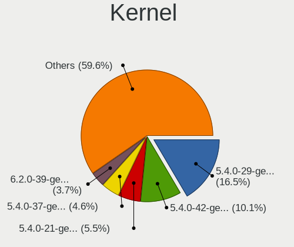

| Version             | Computers | Percent |
|---------------------|-----------|---------|
| 5.4.0-29-generic    | 18        | 18.95%  |
| 5.4.0-42-generic    | 11        | 11.58%  |
| 5.4.0-21-generic    | 6         | 6.32%   |
| 5.4.0-37-generic    | 5         | 5.26%   |
| 5.4.0-48-generic    | 4         | 4.21%   |
| 5.8.0-33-generic    | 2         | 2.11%   |
| 5.4.0-52-generic    | 2         | 2.11%   |
| 5.4.0-39-generic    | 2         | 2.11%   |
| 5.3.0-40-generic    | 2         | 2.11%   |
| 5.15.0-53-generic   | 2         | 2.11%   |
| 5.11.0-17-generic   | 2         | 2.11%   |
| 5.8.0-53-generic    | 1         | 1.05%   |
| 5.8.0-50-generic    | 1         | 1.05%   |
| 5.8.0-48-generic    | 1         | 1.05%   |
| 5.8.0-41-generic    | 1         | 1.05%   |
| 5.8.0-23-generic    | 1         | 1.05%   |
| 5.6.0-1008-oem      | 1         | 1.05%   |
| 5.4.0-96-generic    | 1         | 1.05%   |
| 5.4.0-94-generic    | 1         | 1.05%   |
| 5.4.0-88-generic    | 1         | 1.05%   |
| 5.4.0-84-generic    | 1         | 1.05%   |
| 5.4.0-70-generic    | 1         | 1.05%   |
| 5.4.0-53-generic    | 1         | 1.05%   |
| 5.4.0-45-generic    | 1         | 1.05%   |
| 5.4.0-40-lowlatency | 1         | 1.05%   |
| 5.4.0-34-generic    | 1         | 1.05%   |
| 5.4.0-33-generic    | 1         | 1.05%   |
| 5.4.0-31-generic    | 1         | 1.05%   |
| 5.4.0-26-generic    | 1         | 1.05%   |
| 5.4.0-24-generic    | 1         | 1.05%   |
| 5.19.0-46-generic   | 1         | 1.05%   |
| 5.19.0-38-generic   | 1         | 1.05%   |
| 5.15.0-57-generic   | 1         | 1.05%   |
| 5.15.0-50-generic   | 1         | 1.05%   |
| 5.15.0-48-generic   | 1         | 1.05%   |
| 5.13.0-44-generic   | 1         | 1.05%   |
| 5.13.0-39-generic   | 1         | 1.05%   |
| 5.13.0-35-generic   | 1         | 1.05%   |
| 5.13.0-30-generic   | 1         | 1.05%   |
| 5.13.0-28-generic   | 1         | 1.05%   |

Kernel Family
-------------

Linux kernel without a distro release

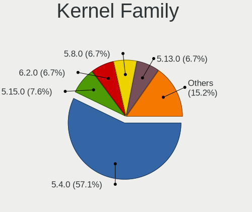

| Version | Computers | Percent |
|---------|-----------|---------|
| 5.4.0   | 60        | 65.22%  |
| 5.8.0   | 7         | 7.61%   |
| 5.13.0  | 7         | 7.61%   |
| 5.11.0  | 6         | 6.52%   |
| 5.15.0  | 4         | 4.35%   |
| 5.3.0   | 2         | 2.17%   |
| 5.19.0  | 2         | 2.17%   |
| 4.15.0  | 2         | 2.17%   |
| 5.6.0   | 1         | 1.09%   |
| 5.0.0   | 1         | 1.09%   |

Kernel Major Ver.
-----------------

Linux kernel major version

| Version | Computers | Percent |
|---------|-----------|---------|
| 5.4     | 60        | 65.22%  |
| 5.8     | 7         | 7.61%   |
| 5.13    | 7         | 7.61%   |
| 5.11    | 6         | 6.52%   |
| 5.15    | 4         | 4.35%   |
| 5.3     | 2         | 2.17%   |
| 5.19    | 2         | 2.17%   |
| 4.15    | 2         | 2.17%   |
| 5.6     | 1         | 1.09%   |
| 5.0     | 1         | 1.09%   |

Arch
----

OS architecture (x86_64, i586, etc.)

| Name   | Computers | Percent |
|--------|-----------|---------|
| x86_64 | 92        | 100%    |

DE
--

Desktop Environment

| Name   | Computers | Percent |
|--------|-----------|---------|
| Deepin | 92        | 100%    |

Display Server
--------------

X11 or Wayland

| Name    | Computers | Percent |
|---------|-----------|---------|
| X11     | 89        | 96.74%  |
| Wayland | 2         | 2.17%   |
| Tty     | 1         | 1.09%   |

Display Manager
---------------

SDDM, LightDM, etc.

| Name    | Computers | Percent |
|---------|-----------|---------|
| Unknown | 57        | 61.29%  |
| LightDM | 16        | 17.2%   |
| GDM     | 11        | 11.83%  |
| TDM     | 6         | 6.45%   |
| GDM3    | 2         | 2.15%   |
| SDDM    | 1         | 1.08%   |

OS Lang
-------

Language

| Lang    | Computers | Percent |
|---------|-----------|---------|
| en_US   | 32        | 34.78%  |
| pt_BR   | 10        | 10.87%  |
| es_ES   | 5         | 5.43%   |
| en_GB   | 5         | 5.43%   |
| de_DE   | 5         | 5.43%   |
| C       | 5         | 5.43%   |
| fr_FR   | 4         | 4.35%   |
| ru_RU   | 3         | 3.26%   |
| es_AR   | 3         | 3.26%   |
| it_IT   | 2         | 2.17%   |
| es_MX   | 2         | 2.17%   |
| uk_UA   | 1         | 1.09%   |
| th_TH   | 1         | 1.09%   |
| sr_RS   | 1         | 1.09%   |
| pl_PL   | 1         | 1.09%   |
| nl_NL   | 1         | 1.09%   |
| id_ID   | 1         | 1.09%   |
| fi_FI   | 1         | 1.09%   |
| es_CR   | 1         | 1.09%   |
| es_CO   | 1         | 1.09%   |
| en_ZA   | 1         | 1.09%   |
| en_IN   | 1         | 1.09%   |
| en_CA   | 1         | 1.09%   |
| en_BW   | 1         | 1.09%   |
| en_AU   | 1         | 1.09%   |
| de_CH   | 1         | 1.09%   |
| Unknown | 1         | 1.09%   |

Boot Mode
---------

EFI or BIOS

| Mode | Computers | Percent |
|------|-----------|---------|
| BIOS | 49        | 52.69%  |
| EFI  | 44        | 47.31%  |

Filesystem
----------

Type of filesystem

| Type    | Computers | Percent |
|---------|-----------|---------|
| Ext4    | 81        | 88.04%  |
| Overlay | 4         | 4.35%   |
| Tmpfs   | 3         | 3.26%   |
| Zfs     | 1         | 1.09%   |
| Ext2    | 1         | 1.09%   |
| Btrfs   | 1         | 1.09%   |
| Unknown | 1         | 1.09%   |

Part. scheme
------------

Scheme of partitioning

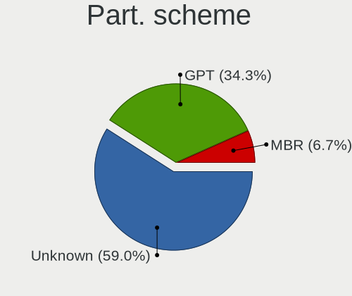

| Type    | Computers | Percent |
|---------|-----------|---------|
| Unknown | 61        | 66.3%   |
| GPT     | 26        | 28.26%  |
| MBR     | 5         | 5.43%   |

Dual Boot with Linux/BSD
------------------------

Hosting more than one Linux/BSD

| Dual boot | Computers | Percent |
|-----------|-----------|---------|
| No        | 78        | 84.78%  |
| Yes       | 14        | 15.22%  |

Dual Boot (Win)
---------------

Hosting Linux and Windows

| Dual boot | Computers | Percent |
|-----------|-----------|---------|
| Yes       | 47        | 50.54%  |
| No        | 46        | 49.46%  |

Board
-----

Vendor
------

Motherboard manufacturer

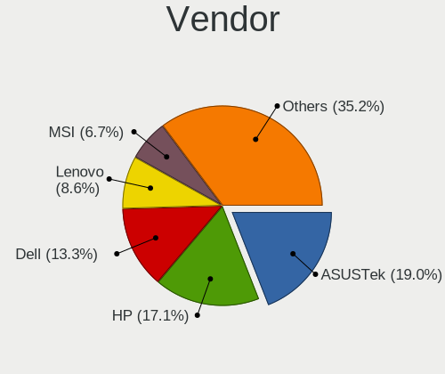

| Name                | Computers | Percent |
|---------------------|-----------|---------|
| ASUSTek Computer    | 17        | 18.48%  |
| Hewlett-Packard     | 15        | 16.3%   |
| Dell                | 14        | 15.22%  |
| MSI                 | 7         | 7.61%   |
| Lenovo              | 7         | 7.61%   |
| Gigabyte Technology | 5         | 5.43%   |
| Acer                | 5         | 5.43%   |
| Intel               | 4         | 4.35%   |
| Toshiba             | 2         | 2.17%   |
| ASRock              | 2         | 2.17%   |
| Apple               | 2         | 2.17%   |
| Unknown             | 2         | 2.17%   |
| Samsung Electronics | 1         | 1.09%   |
| Medion              | 1         | 1.09%   |
| HUAWEI              | 1         | 1.09%   |
| Google              | 1         | 1.09%   |
| Fujitsu Siemens     | 1         | 1.09%   |
| Framework           | 1         | 1.09%   |
| eMachines           | 1         | 1.09%   |
| ECS                 | 1         | 1.09%   |
| BESSTAR Tech        | 1         | 1.09%   |
| BANGHO              | 1         | 1.09%   |

Model
-----

Motherboard model

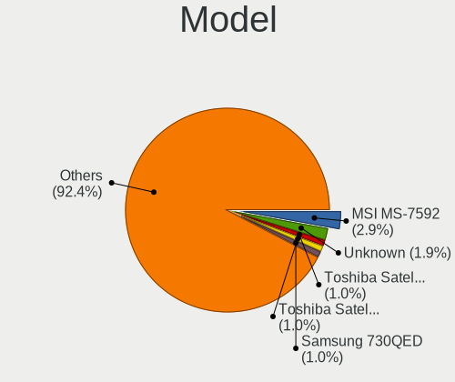

| Name                                       | Computers | Percent |
|--------------------------------------------|-----------|---------|
| MSI MS-7592                                | 3         | 3.26%   |
| Unknown                                    | 2         | 2.17%   |
| Toshiba Satellite S55t-B                   | 1         | 1.09%   |
| Toshiba Satellite C55-B                    | 1         | 1.09%   |
| Samsung 355V4C/356V4C/3445VC/3545VC        | 1         | 1.09%   |
| MSI MS-7B84                                | 1         | 1.09%   |
| MSI MS-7816                                | 1         | 1.09%   |
| MSI MS-7693                                | 1         | 1.09%   |
| MSI GS60 2QE                               | 1         | 1.09%   |
| Medion MS-7848                             | 1         | 1.09%   |
| Lenovo ThinkPad X200 Tablet 7449FWG        | 1         | 1.09%   |
| Lenovo ThinkPad X1 Tablet Gen 3 20KJ0017US | 1         | 1.09%   |
| Lenovo ThinkPad T430 2349DS5               | 1         | 1.09%   |
| Lenovo ThinkPad E15 Gen 2 20TDS0A300       | 1         | 1.09%   |
| Lenovo IdeaPad 520-15IKB 81BF              | 1         | 1.09%   |
| Lenovo IdeaPad 510-15IKB 80SV              | 1         | 1.09%   |
| Lenovo G480 20150                          | 1         | 1.09%   |
| Intel NUC8i7BEH                            | 1         | 1.09%   |
| Intel DQ45CB AAE30148-207                  | 1         | 1.09%   |
| Intel D33217CK G76541-302                  | 1         | 1.09%   |
| Intel B75                                  | 1         | 1.09%   |
| HUAWEI MACH-WX9                            | 1         | 1.09%   |
| HP Spectre x360 Convertible 13-aw0xxx      | 1         | 1.09%   |
| HP ProBook 650 G3                          | 1         | 1.09%   |
| HP Presario CQ56                           | 1         | 1.09%   |
| HP Pavilion dv6                            | 1         | 1.09%   |
| HP Pavilion dm4                            | 1         | 1.09%   |
| HP Pavilion Desktop 590-p0xxx              | 1         | 1.09%   |
| HP Pavilion 14                             | 1         | 1.09%   |
| HP OMEN by Laptop 17-cb1xxx                | 1         | 1.09%   |
| HP Notebook                                | 1         | 1.09%   |
| HP Laptop 15-dy1xxx                        | 1         | 1.09%   |
| HP Laptop 15-da0xxx                        | 1         | 1.09%   |
| HP EliteBook 2540p                         | 1         | 1.09%   |
| HP Compaq Elite 8300 SFF                   | 1         | 1.09%   |
| HP Compaq Elite 8300 MT                    | 1         | 1.09%   |
| HP 250 G4 Notebook PC                      | 1         | 1.09%   |
| Google Banon                               | 1         | 1.09%   |
| Gigabyte GB-BXi7-5500                      | 1         | 1.09%   |
| Gigabyte GA-MA74GM-S2                      | 1         | 1.09%   |

Model Family
------------

Motherboard model prefix

| Name                    | Computers | Percent |
|-------------------------|-----------|---------|
| Dell Inspiron           | 6         | 6.52%   |
| Lenovo ThinkPad         | 4         | 4.35%   |
| HP Pavilion             | 4         | 4.35%   |
| Dell Latitude           | 4         | 4.35%   |
| MSI MS-7592             | 3         | 3.26%   |
| Acer Aspire             | 3         | 3.26%   |
| Toshiba Satellite       | 2         | 2.17%   |
| Lenovo IdeaPad          | 2         | 2.17%   |
| HP Laptop               | 2         | 2.17%   |
| HP Compaq               | 2         | 2.17%   |
| ASUS VivoBook           | 2         | 2.17%   |
| ASUS PRIME              | 2         | 2.17%   |
| Unknown                 | 2         | 2.17%   |
| Samsung 355V4C          | 1         | 1.09%   |
| MSI MS-7B84             | 1         | 1.09%   |
| MSI MS-7816             | 1         | 1.09%   |
| MSI MS-7693             | 1         | 1.09%   |
| MSI GS60                | 1         | 1.09%   |
| Medion MS-7848          | 1         | 1.09%   |
| Lenovo G480             | 1         | 1.09%   |
| Intel NUC8i7BEH         | 1         | 1.09%   |
| Intel DQ45CB            | 1         | 1.09%   |
| Intel D33217CK          | 1         | 1.09%   |
| Intel B75               | 1         | 1.09%   |
| HUAWEI MACH-WX9         | 1         | 1.09%   |
| HP Spectre              | 1         | 1.09%   |
| HP ProBook              | 1         | 1.09%   |
| HP Presario             | 1         | 1.09%   |
| HP OMEN                 | 1         | 1.09%   |
| HP Notebook             | 1         | 1.09%   |
| HP EliteBook            | 1         | 1.09%   |
| HP 250                  | 1         | 1.09%   |
| Google Banon            | 1         | 1.09%   |
| Gigabyte GB-BXi7-5500   | 1         | 1.09%   |
| Gigabyte GA-MA74GM-S2   | 1         | 1.09%   |
| Gigabyte GA-970A-D3     | 1         | 1.09%   |
| Gigabyte F2A55M-HD2     | 1         | 1.09%   |
| Gigabyte B75M-D3H       | 1         | 1.09%   |
| Fujitsu Siemens ESPRIMO | 1         | 1.09%   |
| Framework Laptop        | 1         | 1.09%   |

MFG Year
--------

Motherboard manufacture year

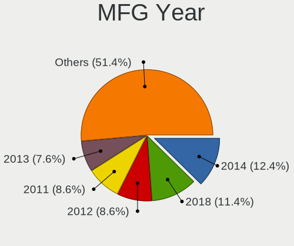

| Year | Computers | Percent |
|------|-----------|---------|
| 2018 | 12        | 13.04%  |
| 2014 | 11        | 11.96%  |
| 2013 | 8         | 8.7%    |
| 2012 | 8         | 8.7%    |
| 2011 | 8         | 8.7%    |
| 2010 | 8         | 8.7%    |
| 2008 | 8         | 8.7%    |
| 2020 | 6         | 6.52%   |
| 2019 | 6         | 6.52%   |
| 2021 | 4         | 4.35%   |
| 2016 | 4         | 4.35%   |
| 2009 | 3         | 3.26%   |
| 2017 | 2         | 2.17%   |
| 2015 | 2         | 2.17%   |
| 2007 | 2         | 2.17%   |

Form Factor
-----------

Physical design of the computer

| Name        | Computers | Percent |
|-------------|-----------|---------|
| Notebook    | 46        | 50%     |
| Desktop     | 40        | 43.48%  |
| All in one  | 3         | 3.26%   |
| Tablet      | 1         | 1.09%   |
| Convertible | 1         | 1.09%   |
| Mini pc     | 1         | 1.09%   |

Secure Boot
-----------

Enabled or disabled

| State    | Computers | Percent |
|----------|-----------|---------|
| Disabled | 86        | 92.47%  |
| Enabled  | 7         | 7.53%   |

Coreboot
--------

Have coreboot on board

| Used | Computers | Percent |
|------|-----------|---------|
| No   | 91        | 98.91%  |
| Yes  | 1         | 1.09%   |

RAM Size
--------

Total RAM memory

| Size in GB  | Computers | Percent |
|-------------|-----------|---------|
| 4.01-8.0    | 24        | 26.09%  |
| 3.01-4.0    | 21        | 22.83%  |
| 16.01-24.0  | 19        | 20.65%  |
| 8.01-16.0   | 16        | 17.39%  |
| 32.01-64.0  | 6         | 6.52%   |
| 2.01-3.0    | 3         | 3.26%   |
| 24.01-32.0  | 1         | 1.09%   |
| 64.01-256.0 | 1         | 1.09%   |
| 1.01-2.0    | 1         | 1.09%   |

RAM Used
--------

Used RAM memory

| Used GB   | Computers | Percent |
|-----------|-----------|---------|
| 2.01-3.0  | 35        | 37.23%  |
| 1.01-2.0  | 35        | 37.23%  |
| 4.01-8.0  | 11        | 11.7%   |
| 3.01-4.0  | 9         | 9.57%   |
| 8.01-16.0 | 2         | 2.13%   |
| 0.51-1.0  | 2         | 2.13%   |

Total Drives
------------

Number of drives on board

| Drives | Computers | Percent |
|--------|-----------|---------|
| 1      | 53        | 57.61%  |
| 2      | 33        | 35.87%  |
| 3      | 6         | 6.52%   |

Has CD-ROM
----------

Has CD-ROM on board

| Presented | Computers | Percent |
|-----------|-----------|---------|
| No        | 52        | 56.52%  |
| Yes       | 40        | 43.48%  |

Has Ethernet
------------

Has Ethernet on board

| Presented | Computers | Percent |
|-----------|-----------|---------|
| Yes       | 81        | 88.04%  |
| No        | 11        | 11.96%  |

Has WiFi
--------

Has WiFi module

| Presented | Computers | Percent |
|-----------|-----------|---------|
| Yes       | 72        | 78.26%  |
| No        | 20        | 21.74%  |

Has Bluetooth
-------------

Has Bluetooth module

| Presented | Computers | Percent |
|-----------|-----------|---------|
| Yes       | 58        | 63.04%  |
| No        | 34        | 36.96%  |

Location
--------

Country
-------

Geographic location (country)

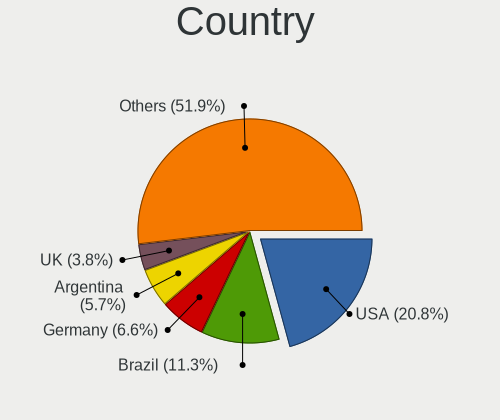

| Country      | Computers | Percent |
|--------------|-----------|---------|
| USA          | 17        | 18.28%  |
| Brazil       | 12        | 12.9%   |
| Germany      | 7         | 7.53%   |
| Argentina    | 5         | 5.38%   |
| UK           | 4         | 4.3%    |
| France       | 4         | 4.3%    |
| Ukraine      | 3         | 3.23%   |
| Spain        | 3         | 3.23%   |
| Portugal     | 3         | 3.23%   |
| Mexico       | 3         | 3.23%   |
| India        | 3         | 3.23%   |
| Thailand     | 2         | 2.15%   |
| Poland       | 2         | 2.15%   |
| Indonesia    | 2         | 2.15%   |
| Hungary      | 2         | 2.15%   |
| Costa Rica   | 2         | 2.15%   |
| Austria      | 2         | 2.15%   |
| Turkey       | 1         | 1.08%   |
| Sweden       | 1         | 1.08%   |
| South Africa | 1         | 1.08%   |
| Serbia       | 1         | 1.08%   |
| Russia       | 1         | 1.08%   |
| Netherlands  | 1         | 1.08%   |
| Luxembourg   | 1         | 1.08%   |
| Jamaica      | 1         | 1.08%   |
| Italy        | 1         | 1.08%   |
| Israel       | 1         | 1.08%   |
| Hong Kong    | 1         | 1.08%   |
| Finland      | 1         | 1.08%   |
| Colombia     | 1         | 1.08%   |
| Canada       | 1         | 1.08%   |
| Belgium      | 1         | 1.08%   |
| Australia    | 1         | 1.08%   |
| Algeria      | 1         | 1.08%   |

City
----

Geographic location (city)

| City                        | Computers | Percent |
|-----------------------------|-----------|---------|
| Lisbon                      | 2         | 2.15%   |
| Budapest                    | 2         | 2.15%   |
| Berlin                      | 2         | 2.15%   |
| Zaporizhzhia                | 1         | 1.08%   |
| Zapopan                     | 1         | 1.08%   |
| Yogyakarta                  | 1         | 1.08%   |
| Wolfheze                    | 1         | 1.08%   |
| Villahermosa                | 1         | 1.08%   |
| Vienna                      | 1         | 1.08%   |
| Tuen Mun                    | 1         | 1.08%   |
| Tomah                       | 1         | 1.08%   |
| Tiete                       | 1         | 1.08%   |
| Słubice                    | 1         | 1.08%   |
| Surabaya                    | 1         | 1.08%   |
| St Petersburg               | 1         | 1.08%   |
| Siquirres                   | 1         | 1.08%   |
| Seville                     | 1         | 1.08%   |
| Sao Paulo                   | 1         | 1.08%   |
| Sao Jose do Rio Preto       | 1         | 1.08%   |
| Sao Bernardo do Campo       | 1         | 1.08%   |
| Sankt Pölten               | 1         | 1.08%   |
| San Telmo                   | 1         | 1.08%   |
| San Nicolás de los Arroyos | 1         | 1.08%   |
| Salvador                    | 1         | 1.08%   |
| Rosario                     | 1         | 1.08%   |
| Rome                        | 1         | 1.08%   |
| Rodgau                      | 1         | 1.08%   |
| Ratingen                    | 1         | 1.08%   |
| Quilmes                     | 1         | 1.08%   |
| Pontpierre                  | 1         | 1.08%   |
| Patna                       | 1         | 1.08%   |
| Paris                       | 1         | 1.08%   |
| Oakville                    | 1         | 1.08%   |
| Newburgh                    | 1         | 1.08%   |
| New York                    | 1         | 1.08%   |
| Nanterre                    | 1         | 1.08%   |
| Nakhon Pathom               | 1         | 1.08%   |
| Monterrey                   | 1         | 1.08%   |
| Monte Carmelo               | 1         | 1.08%   |
| Molesey                     | 1         | 1.08%   |

Drives
------

Drive Vendor
------------

Hard drive vendors

| Vendor              | Computers | Drives | Percent |
|---------------------|-----------|--------|---------|
| Seagate             | 25        | 27     | 19.84%  |
| WDC                 | 18        | 23     | 14.29%  |
| Samsung Electronics | 18        | 18     | 14.29%  |
| Toshiba             | 15        | 15     | 11.9%   |
| Kingston            | 8         | 8      | 6.35%   |
| Crucial             | 6         | 6      | 4.76%   |
| SanDisk             | 4         | 4      | 3.17%   |
| Hitachi             | 4         | 5      | 3.17%   |
| Unknown             | 3         | 3      | 2.38%   |
| Micron Technology   | 3         | 3      | 2.38%   |
| HGST                | 2         | 2      | 1.59%   |
| Fujitsu             | 2         | 2      | 1.59%   |
| XrayDisk            | 1         | 1      | 0.79%   |
| Vaseky              | 1         | 1      | 0.79%   |
| SK hynix            | 1         | 3      | 0.79%   |
| PNY                 | 1         | 2      | 0.79%   |
| Plextor             | 1         | 1      | 0.79%   |
| Maxtor              | 1         | 1      | 0.79%   |
| Leven               | 1         | 1      | 0.79%   |
| KingSpec            | 1         | 1      | 0.79%   |
| KingFast            | 1         | 1      | 0.79%   |
| JMicron Technology  | 1         | 1      | 0.79%   |
| Intenso             | 1         | 1      | 0.79%   |
| Integral            | 1         | 1      | 0.79%   |
| Hoodisk             | 1         | 1      | 0.79%   |
| GOODRAM             | 1         | 1      | 0.79%   |
| China               | 1         | 1      | 0.79%   |
| Apple               | 1         | 1      | 0.79%   |
| ADATA Technology    | 1         | 1      | 0.79%   |
| A-DATA Technology   | 1         | 1      | 0.79%   |

Drive Model
-----------

Hard drive models

| Model                              | Computers | Percent |
|------------------------------------|-----------|---------|
| Toshiba DT01ACA100 1TB             | 4         | 3.05%   |
| Seagate ST1000LM024 HN-M101MBB 1TB | 3         | 2.29%   |
| Seagate ST1000DM010-2EP102 1TB     | 3         | 2.29%   |
| Samsung NVMe SSD Drive 512GB       | 3         | 2.29%   |
| WDC WDS100T2B0A-00SM50 1TB SSD     | 2         | 1.53%   |
| Toshiba MQ01ABF050 500GB           | 2         | 1.53%   |
| Toshiba MQ01ABD100 1TB             | 2         | 1.53%   |
| Seagate ST9500325AS 500GB          | 2         | 1.53%   |
| Seagate ST2000LM007-1R8174 2TB     | 2         | 1.53%   |
| Samsung SSD 850 EVO 250GB          | 2         | 1.53%   |
| Kingston SA400S37120G 120GB SSD    | 2         | 1.53%   |
| Hitachi HTS543232A7A384 320GB      | 2         | 1.53%   |
| Crucial CT240BX500SSD1 240GB       | 2         | 1.53%   |
| XrayDisk 240GB                     | 1         | 0.76%   |
| WDC WDS240G2G0A-00JH30 240GB SSD   | 1         | 0.76%   |
| WDC WDS100T3X0C-00SJG0 1TB         | 1         | 0.76%   |
| WDC WDBNCE2500PNC 250GB SSD        | 1         | 0.76%   |
| WDC WD7501AALS-75J7B0 752GB        | 1         | 0.76%   |
| WDC WD7500BPKX-22HPJT0 752GB       | 1         | 0.76%   |
| WDC WD60EDAZ-11BMZB0 6TB           | 1         | 0.76%   |
| WDC WD3200AAJS-56B4A0 320GB        | 1         | 0.76%   |
| WDC WD3200AAJS-00B4A0 320GB        | 1         | 0.76%   |
| WDC WD30EZRX-00MMMB0 3TB           | 1         | 0.76%   |
| WDC WD30EFRX-68EUZN0 3TB           | 1         | 0.76%   |
| WDC WD2500AAKX-001CA0 250GB        | 1         | 0.76%   |
| WDC WD20SPZX-00CRAT0 2TB           | 1         | 0.76%   |
| WDC WD2002FAEX-007BA0 2TB          | 1         | 0.76%   |
| WDC WD1200BEVS-00UST0 120GB        | 1         | 0.76%   |
| WDC WD10SPZX-75Z10T2 1TB           | 1         | 0.76%   |
| WDC WD10SPZX-24Z10 1TB             | 1         | 0.76%   |
| WDC WD10JPLX-00MBPT0 1TB           | 1         | 0.76%   |
| WDC WD1003FZEX-00K3CA0 1TB         | 1         | 0.76%   |
| Vaseky V800/128G 120GB SSD         | 1         | 0.76%   |
| Unknown SD16G  16GB                | 1         | 0.76%   |
| Unknown MMC Card  16GB             | 1         | 0.76%   |
| Unknown HAG4a2  16GB               | 1         | 0.76%   |
| Toshiba THNSFC128GBSJ SSD          | 1         | 0.76%   |
| Toshiba MQ04ABF100 1TB             | 1         | 0.76%   |
| Toshiba MQ01ABD075 752GB           | 1         | 0.76%   |
| Toshiba MK7559GSXP 752GB           | 1         | 0.76%   |

HDD Vendor
----------

Hard disk drive vendors

| Vendor              | Computers | Drives | Percent |
|---------------------|-----------|--------|---------|
| Seagate             | 24        | 26     | 35.82%  |
| WDC                 | 15        | 17     | 22.39%  |
| Toshiba             | 13        | 13     | 19.4%   |
| Samsung Electronics | 5         | 5      | 7.46%   |
| Hitachi             | 4         | 5      | 5.97%   |
| HGST                | 2         | 2      | 2.99%   |
| Fujitsu             | 2         | 2      | 2.99%   |
| Maxtor              | 1         | 1      | 1.49%   |
| Apple               | 1         | 1      | 1.49%   |

SSD Vendor
----------

Solid state drive vendors

| Vendor              | Computers | Drives | Percent |
|---------------------|-----------|--------|---------|
| Kingston            | 7         | 7      | 17.07%  |
| Samsung Electronics | 6         | 6      | 14.63%  |
| Crucial             | 5         | 5      | 12.2%   |
| WDC                 | 4         | 5      | 9.76%   |
| SanDisk             | 4         | 4      | 9.76%   |
| Micron Technology   | 2         | 2      | 4.88%   |
| Vaseky              | 1         | 1      | 2.44%   |
| Toshiba             | 1         | 1      | 2.44%   |
| PNY                 | 1         | 2      | 2.44%   |
| Plextor             | 1         | 1      | 2.44%   |
| Leven               | 1         | 1      | 2.44%   |
| KingSpec            | 1         | 1      | 2.44%   |
| KingFast            | 1         | 1      | 2.44%   |
| Intenso             | 1         | 1      | 2.44%   |
| Integral            | 1         | 1      | 2.44%   |
| Hoodisk             | 1         | 1      | 2.44%   |
| GOODRAM             | 1         | 1      | 2.44%   |
| China               | 1         | 1      | 2.44%   |
| A-DATA Technology   | 1         | 1      | 2.44%   |

Drive Kind
----------

HDD or SSD

| Kind    | Computers | Drives | Percent |
|---------|-----------|--------|---------|
| HDD     | 60        | 72     | 52.17%  |
| SSD     | 36        | 43     | 31.3%   |
| NVMe    | 14        | 17     | 12.17%  |
| MMC     | 3         | 3      | 2.61%   |
| Unknown | 2         | 2      | 1.74%   |

Drive Connector
---------------

SATA, SAS, NVMe, etc.

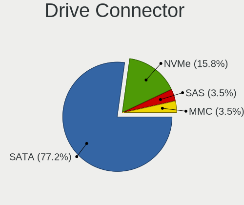

| Type | Computers | Drives | Percent |
|------|-----------|--------|---------|
| SATA | 79        | 115    | 80.61%  |
| NVMe | 14        | 17     | 14.29%  |
| MMC  | 3         | 3      | 3.06%   |
| SAS  | 2         | 2      | 2.04%   |

Drive Size
----------

Size of hard drive

| Size in TB | Computers | Drives | Percent |
|------------|-----------|--------|---------|
| 0.01-0.5   | 52        | 63     | 53.06%  |
| 0.51-1.0   | 36        | 40     | 36.73%  |
| 1.01-2.0   | 6         | 6      | 6.12%   |
| 2.01-3.0   | 2         | 3      | 2.04%   |
| 3.01-4.0   | 1         | 1      | 1.02%   |
| 4.01-10.0  | 1         | 2      | 1.02%   |

Space Total
-----------

Amount of disk space available on the file system

| Size in GB     | Computers | Percent |
|----------------|-----------|---------|
| 101-250        | 37        | 40.22%  |
| 501-1000       | 15        | 16.3%   |
| 251-500        | 14        | 15.22%  |
| 1001-2000      | 10        | 10.87%  |
| 51-100         | 6         | 6.52%   |
| 21-50          | 3         | 3.26%   |
| 1-20           | 3         | 3.26%   |
| More than 3000 | 2         | 2.17%   |
| Unknown        | 2         | 2.17%   |

Space Used
----------

Amount of used disk space

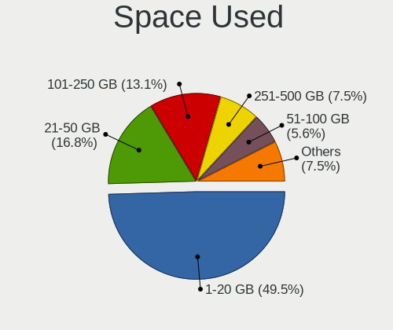

| Used GB   | Computers | Percent |
|-----------|-----------|---------|
| 1-20      | 49        | 52.13%  |
| 21-50     | 12        | 12.77%  |
| 101-250   | 12        | 12.77%  |
| 251-500   | 8         | 8.51%   |
| 51-100    | 6         | 6.38%   |
| 1001-2000 | 3         | 3.19%   |
| 501-1000  | 2         | 2.13%   |
| Unknown   | 2         | 2.13%   |

Malfunc. Drives
---------------

Drive models with a malfunction

| Model                          | Computers | Drives | Percent |
|--------------------------------|-----------|--------|---------|
| Seagate ST3320418AS 320GB      | 1         | 1      | 33.33%  |
| Seagate ST1000LM014-1EJ164 1TB | 1         | 1      | 33.33%  |
| Hitachi HTS543232A7A384 320GB  | 1         | 1      | 33.33%  |

Malfunc. Drive Vendor
---------------------

Vendors of faulty drives

| Vendor  | Computers | Drives | Percent |
|---------|-----------|--------|---------|
| Seagate | 2         | 2      | 66.67%  |
| Hitachi | 1         | 1      | 33.33%  |

Malfunc. HDD Vendor
-------------------

Vendors of faulty HDD drives

| Vendor  | Computers | Drives | Percent |
|---------|-----------|--------|---------|
| Seagate | 2         | 2      | 66.67%  |
| Hitachi | 1         | 1      | 33.33%  |

Malfunc. Drive Kind
-------------------

Kinds of faulty drives

| Kind | Computers | Drives | Percent |
|------|-----------|--------|---------|
| HDD  | 3         | 3      | 100%    |

Failed Drives
-------------

Failed drive models

Zero info for selected period =(

Failed Drive Vendor
-------------------

Failed drive vendors

Zero info for selected period =(

Drive Status
------------

Number of failed and malfunc. drives

| Status   | Computers | Drives | Percent |
|----------|-----------|--------|---------|
| Detected | 68        | 101    | 70.83%  |
| Works    | 25        | 33     | 26.04%  |
| Malfunc  | 3         | 3      | 3.13%   |

Storage controller
------------------

Storage Vendor
--------------

Storage controller vendors

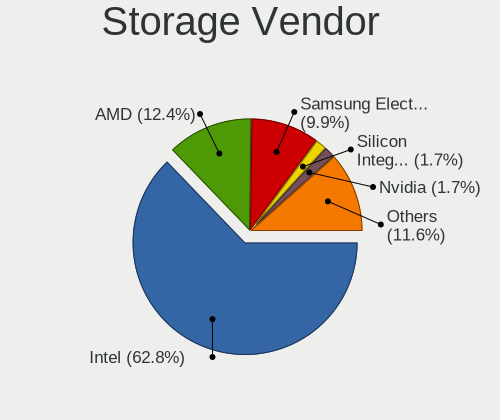

| Vendor                           | Computers | Percent |
|----------------------------------|-----------|---------|
| Intel                            | 70        | 66.04%  |
| AMD                              | 12        | 11.32%  |
| Samsung Electronics              | 9         | 8.49%   |
| Silicon Integrated Systems [SiS] | 2         | 1.89%   |
| Nvidia                           | 2         | 1.89%   |
| ASMedia Technology               | 2         | 1.89%   |
| Toshiba America Info Systems     | 1         | 0.94%   |
| SK hynix                         | 1         | 0.94%   |
| Seagate Technology               | 1         | 0.94%   |
| SanDisk                          | 1         | 0.94%   |
| Micron/Crucial Technology        | 1         | 0.94%   |
| Micron Technology                | 1         | 0.94%   |
| Marvell Technology Group         | 1         | 0.94%   |
| Kingston Technology Company      | 1         | 0.94%   |
| ADATA Technology                 | 1         | 0.94%   |

Storage Model
-------------

Storage controller models

| Model                                                                          | Computers | Percent |
|--------------------------------------------------------------------------------|-----------|---------|
| Intel 82801 Mobile SATA Controller [RAID mode]                                 | 10        | 7.75%   |
| AMD FCH SATA Controller [AHCI mode]                                            | 7         | 5.43%   |
| Samsung NVMe SSD Controller SM981/PM981/PM983                                  | 5         | 3.88%   |
| Intel Wildcat Point-LP SATA Controller [AHCI Mode]                             | 5         | 3.88%   |
| Intel NM10/ICH7 Family SATA Controller [IDE mode]                              | 5         | 3.88%   |
| Intel 82801G (ICH7 Family) IDE Controller                                      | 4         | 3.1%    |
| Intel 8 Series/C220 Series Chipset Family 6-port SATA Controller 1 [AHCI mode] | 4         | 3.1%    |
| Intel 8 Series SATA Controller 1 [AHCI mode]                                   | 4         | 3.1%    |
| Intel 7 Series Chipset Family 6-port SATA Controller [AHCI mode]               | 4         | 3.1%    |
| Intel 6 Series/C200 Series Chipset Family 6 port Mobile SATA AHCI Controller   | 4         | 3.1%    |
| Intel Sunrise Point-LP SATA Controller [AHCI mode]                             | 3         | 2.33%   |
| Intel Cannon Lake Mobile PCH SATA AHCI Controller                              | 3         | 2.33%   |
| Intel 7 Series/C210 Series Chipset Family 6-port SATA Controller [AHCI mode]   | 3         | 2.33%   |
| Intel 5 Series/3400 Series Chipset 6 port SATA AHCI Controller                 | 3         | 2.33%   |
| Silicon Integrated Systems [SiS] SATA Controller / IDE mode                    | 2         | 1.55%   |
| Silicon Integrated Systems [SiS] 5513 IDE Controller                           | 2         | 1.55%   |
| Samsung NVMe SSD Controller SM961/PM961/SM963                                  | 2         | 1.55%   |
| Samsung NVMe SSD Controller 980                                                | 2         | 1.55%   |
| Nvidia MCP61 SATA Controller                                                   | 2         | 1.55%   |
| Nvidia MCP61 IDE                                                               | 2         | 1.55%   |
| Intel Q170/Q150/B150/H170/H110/Z170/CM236 Chipset SATA Controller [AHCI Mode]  | 2         | 1.55%   |
| Intel Cannon Lake PCH SATA AHCI Controller                                     | 2         | 1.55%   |
| Intel 82801JD/DO (ICH10 Family) 4-port SATA IDE Controller                     | 2         | 1.55%   |
| Intel 82801JD/DO (ICH10 Family) 2-port SATA IDE Controller                     | 2         | 1.55%   |
| Intel 82801IBM/IEM (ICH9M/ICH9M-E) 4 port SATA Controller [AHCI mode]          | 2         | 1.55%   |
| Intel 82801HM/HEM (ICH8M/ICH8M-E) SATA Controller [AHCI mode]                  | 2         | 1.55%   |
| Intel 82801HM/HEM (ICH8M/ICH8M-E) IDE Controller                               | 2         | 1.55%   |
| Intel 6 Series/C200 Series Chipset Family 6 port Desktop SATA AHCI Controller  | 2         | 1.55%   |
| Intel 4 Series Chipset PT IDER Controller                                      | 2         | 1.55%   |
| ASMedia ASM1062 Serial ATA Controller                                          | 2         | 1.55%   |
| AMD SB7x0/SB8x0/SB9x0 SATA Controller [AHCI mode]                              | 2         | 1.55%   |
| Toshiba America Info Systems BG3 NVMe SSD Controller                           | 1         | 0.78%   |
| SK hynix PC401 NVMe Solid State Drive 256GB                                    | 1         | 0.78%   |
| Seagate FireCuda/IronWolf 510 SSD                                              | 1         | 0.78%   |
| SanDisk WD Black SN750 / PC SN730 NVMe SSD                                     | 1         | 0.78%   |
| Micron/Crucial P2 [Nick P2] / P3 / P3 Plus NVMe PCIe SSD (DRAM-less)           | 1         | 0.78%   |
| Micron 2300 NVMe SSD [Santana]                                                 | 1         | 0.78%   |
| Marvell Group 88SE91A3 SATA-600 Controller                                     | 1         | 0.78%   |
| Kingston Company A2000 NVMe SSD                                                | 1         | 0.78%   |
| Intel Cannon Point-LP SATA Controller [AHCI Mode]                              | 1         | 0.78%   |

Storage Kind
------------

Kind of storage controller (IDE, SATA, NVMe, SAS, ...)

| Kind | Computers | Percent |
|------|-----------|---------|
| SATA | 60        | 56.6%   |
| IDE  | 18        | 16.98%  |
| NVMe | 16        | 15.09%  |
| RAID | 12        | 11.32%  |

Processor
---------

CPU Vendor
----------

Processor vendors

| Vendor | Computers | Percent |
|--------|-----------|---------|
| Intel  | 78        | 84.78%  |
| AMD    | 14        | 15.22%  |

CPU Model
---------

Processor models

| Model                                       | Computers | Percent |
|---------------------------------------------|-----------|---------|
| Intel Core i7-8750H CPU @ 2.20GHz           | 2         | 2.17%   |
| Intel Core i7-8550U CPU @ 1.80GHz           | 2         | 2.17%   |
| Intel Core i7-5500U CPU @ 2.40GHz           | 2         | 2.17%   |
| Intel Core i5-7200U CPU @ 2.50GHz           | 2         | 2.17%   |
| Intel Core i5-2410M CPU @ 2.30GHz           | 2         | 2.17%   |
| Intel Core i3-3220 CPU @ 3.30GHz            | 2         | 2.17%   |
| Intel Core i3-1005G1 CPU @ 1.20GHz          | 2         | 2.17%   |
| Intel Core i3 CPU M 370 @ 2.40GHz           | 2         | 2.17%   |
| Intel 11th Gen Core i5-1135G7 @ 2.40GHz     | 2         | 2.17%   |
| Intel Xeon E-2224G CPU @ 3.50GHz            | 1         | 1.09%   |
| Intel Xeon CPU E5450 @ 3.00GHz              | 1         | 1.09%   |
| Intel Pentium Dual-Core CPU E5800 @ 3.20GHz | 1         | 1.09%   |
| Intel Pentium Dual-Core CPU E5400 @ 2.70GHz | 1         | 1.09%   |
| Intel Pentium Dual CPU T2370 @ 1.73GHz      | 1         | 1.09%   |
| Intel Pentium Dual CPU E2220 @ 2.40GHz      | 1         | 1.09%   |
| Intel Pentium CPU B980 @ 2.40GHz            | 1         | 1.09%   |
| Intel Core i9-8950HK CPU @ 2.90GHz          | 1         | 1.09%   |
| Intel Core i7-8650U CPU @ 1.90GHz           | 1         | 1.09%   |
| Intel Core i7-8559U CPU @ 2.70GHz           | 1         | 1.09%   |
| Intel Core i7-7820HQ CPU @ 2.90GHz          | 1         | 1.09%   |
| Intel Core i7-6700 CPU @ 3.40GHz            | 1         | 1.09%   |
| Intel Core i7-5600U CPU @ 2.60GHz           | 1         | 1.09%   |
| Intel Core i7-4720HQ CPU @ 2.60GHz          | 1         | 1.09%   |
| Intel Core i7-4710HQ CPU @ 2.50GHz          | 1         | 1.09%   |
| Intel Core i7-4510U CPU @ 2.00GHz           | 1         | 1.09%   |
| Intel Core i7-4500U CPU @ 1.80GHz           | 1         | 1.09%   |
| Intel Core i7-2700K CPU @ 3.50GHz           | 1         | 1.09%   |
| Intel Core i7-2670QM CPU @ 2.20GHz          | 1         | 1.09%   |
| Intel Core i7-10750H CPU @ 2.60GHz          | 1         | 1.09%   |
| Intel Core i7-1065G7 CPU @ 1.30GHz          | 1         | 1.09%   |
| Intel Core i7 CPU 950 @ 3.07GHz             | 1         | 1.09%   |
| Intel Core i5-9400 CPU @ 2.90GHz            | 1         | 1.09%   |
| Intel Core i5-8250U CPU @ 1.60GHz           | 1         | 1.09%   |
| Intel Core i5-5675R CPU @ 3.10GHz           | 1         | 1.09%   |
| Intel Core i5-5257U CPU @ 2.70GHz           | 1         | 1.09%   |
| Intel Core i5-4690 CPU @ 3.50GHz            | 1         | 1.09%   |
| Intel Core i5-4670K CPU @ 3.40GHz           | 1         | 1.09%   |
| Intel Core i5-4460 CPU @ 3.20GHz            | 1         | 1.09%   |
| Intel Core i5-4310U CPU @ 2.00GHz           | 1         | 1.09%   |
| Intel Core i5-4200U CPU @ 1.60GHz           | 1         | 1.09%   |

CPU Model Family
----------------

Processor model prefix

| Model                   | Computers | Percent |
|-------------------------|-----------|---------|
| Intel Core i5           | 22        | 23.91%  |
| Intel Core i7           | 20        | 21.74%  |
| Intel Core i3           | 13        | 14.13%  |
| Intel Core 2 Duo        | 4         | 4.35%   |
| Other                   | 3         | 3.26%   |
| Intel Core 2 Quad       | 3         | 3.26%   |
| Intel Celeron           | 3         | 3.26%   |
| AMD Ryzen 5             | 3         | 3.26%   |
| Intel Xeon              | 2         | 2.17%   |
| Intel Pentium Dual-Core | 2         | 2.17%   |
| Intel Pentium Dual      | 2         | 2.17%   |
| AMD FX                  | 2         | 2.17%   |
| AMD A10                 | 2         | 2.17%   |
| Intel Pentium           | 1         | 1.09%   |
| Intel Core i9           | 1         | 1.09%   |
| Intel Core 2            | 1         | 1.09%   |
| Intel Celeron Dual-Core | 1         | 1.09%   |
| AMD Ryzen 7             | 1         | 1.09%   |
| AMD Phenom II X6        | 1         | 1.09%   |
| AMD Phenom              | 1         | 1.09%   |
| AMD Athlon Dual Core    | 1         | 1.09%   |
| AMD Athlon 64 X2        | 1         | 1.09%   |
| AMD A8                  | 1         | 1.09%   |
| AMD A4                  | 1         | 1.09%   |

CPU Cores
---------

Number of processor cores

| Number | Computers | Percent |
|--------|-----------|---------|
| 2      | 49        | 53.26%  |
| 4      | 32        | 34.78%  |
| 6      | 9         | 9.78%   |
| 8      | 1         | 1.09%   |
| 1      | 1         | 1.09%   |

CPU Sockets
-----------

Number of sockets

| Number | Computers | Percent |
|--------|-----------|---------|
| 1      | 92        | 100%    |

CPU Threads
-----------

Threads per core (Hyper-Threading)

| Number | Computers | Percent |
|--------|-----------|---------|
| 2      | 59        | 64.13%  |
| 1      | 33        | 35.87%  |

CPU Op-Modes
------------

CPU Operation Modes (32-bit, 64-bit)

| Op mode        | Computers | Percent |
|----------------|-----------|---------|
| 32-bit, 64-bit | 92        | 100%    |

CPU Microcode
-------------

Microcode number

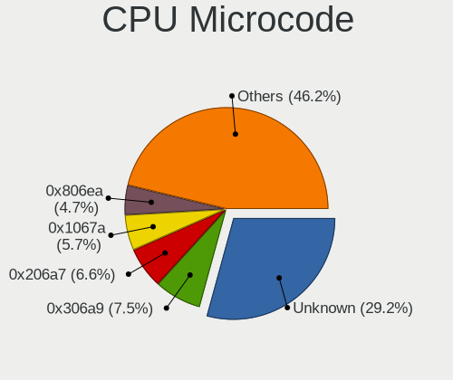

| Number     | Computers | Percent |
|------------|-----------|---------|
| Unknown    | 19        | 20.43%  |
| 0x306a9    | 8         | 8.6%    |
| 0x206a7    | 7         | 7.53%   |
| 0x1067a    | 6         | 6.45%   |
| 0x806ea    | 5         | 5.38%   |
| 0x906ea    | 4         | 4.3%    |
| 0x40651    | 4         | 4.3%    |
| 0x306d4    | 4         | 4.3%    |
| 0x706e5    | 3         | 3.23%   |
| 0x306c3    | 3         | 3.23%   |
| 0x806c1    | 2         | 2.15%   |
| 0x6fd      | 2         | 2.15%   |
| 0x20655    | 2         | 2.15%   |
| 0x10677    | 2         | 2.15%   |
| 0x10676    | 2         | 2.15%   |
| 0x06000852 | 2         | 2.15%   |
| 0xa0652    | 1         | 1.08%   |
| 0x906ed    | 1         | 1.08%   |
| 0x906eb    | 1         | 1.08%   |
| 0x806e9    | 1         | 1.08%   |
| 0x6f6      | 1         | 1.08%   |
| 0x506e3    | 1         | 1.08%   |
| 0x406c4    | 1         | 1.08%   |
| 0x406c3    | 1         | 1.08%   |
| 0x40671    | 1         | 1.08%   |
| 0x30678    | 1         | 1.08%   |
| 0x106a5    | 1         | 1.08%   |
| 0x08701021 | 1         | 1.08%   |
| 0x08101016 | 1         | 1.08%   |
| 0x08001138 | 1         | 1.08%   |
| 0x0600611a | 1         | 1.08%   |
| 0x06003106 | 1         | 1.08%   |
| 0x010000dc | 1         | 1.08%   |
| 0x01000083 | 1         | 1.08%   |

CPU Microarch
-------------

Microarchitecture

| Name        | Computers | Percent |
|-------------|-----------|---------|
| KabyLake    | 15        | 16.3%   |
| Penryn      | 10        | 10.87%  |
| Haswell     | 10        | 10.87%  |
| IvyBridge   | 9         | 9.78%   |
| SandyBridge | 7         | 7.61%   |
| Broadwell   | 7         | 7.61%   |
| Westmere    | 4         | 4.35%   |
| Piledriver  | 4         | 4.35%   |
| Core        | 4         | 4.35%   |
| Silvermont  | 3         | 3.26%   |
| IceLake     | 3         | 3.26%   |
| Zen         | 2         | 2.17%   |
| TigerLake   | 2         | 2.17%   |
| K8 Hammer   | 2         | 2.17%   |
| K10         | 2         | 2.17%   |
| Zen+        | 1         | 1.09%   |
| Zen 2       | 1         | 1.09%   |
| Steamroller | 1         | 1.09%   |
| Skylake     | 1         | 1.09%   |
| Nehalem     | 1         | 1.09%   |
| Excavator   | 1         | 1.09%   |
| CometLake   | 1         | 1.09%   |
| Unknown     | 1         | 1.09%   |

Graphics
--------

GPU Vendor
----------

Vendors of graphics cards

| Vendor                           | Computers | Percent |
|----------------------------------|-----------|---------|
| Intel                            | 58        | 52.73%  |
| Nvidia                           | 32        | 29.09%  |
| AMD                              | 18        | 16.36%  |
| Silicon Integrated Systems [SiS] | 2         | 1.82%   |

GPU Model
---------

Graphics card models

| Model                                                                                    | Computers | Percent |
|------------------------------------------------------------------------------------------|-----------|---------|
| Intel 2nd Generation Core Processor Family Integrated Graphics Controller                | 6         | 5.26%   |
| Intel HD Graphics 5500                                                                   | 5         | 4.39%   |
| Intel Haswell-ULT Integrated Graphics Controller                                         | 5         | 4.39%   |
| Intel UHD Graphics 620                                                                   | 4         | 3.51%   |
| Intel Core Processor Integrated Graphics Controller                                      | 4         | 3.51%   |
| Intel 3rd Gen Core processor Graphics Controller                                         | 4         | 3.51%   |
| Nvidia GP107M [GeForce GTX 1050 Ti Mobile]                                               | 3         | 2.63%   |
| Nvidia GP107 [GeForce GTX 1050 Ti]                                                       | 3         | 2.63%   |
| Nvidia GK208B [GeForce GT 710]                                                           | 3         | 2.63%   |
| Intel HD Graphics 620                                                                    | 3         | 2.63%   |
| Intel CoffeeLake-H GT2 [UHD Graphics 630]                                                | 3         | 2.63%   |
| Silicon Integrated Systems [SiS] 771/671 PCIE VGA Display Adapter                        | 2         | 1.75%   |
| Nvidia GP108M [GeForce MX150]                                                            | 2         | 1.75%   |
| Intel TigerLake-LP GT2 [Iris Xe Graphics]                                                | 2         | 1.75%   |
| Intel Mobile 4 Series Chipset Integrated Graphics Controller                             | 2         | 1.75%   |
| Intel Iris Plus Graphics G1 (Ice Lake)                                                   | 2         | 1.75%   |
| Intel CoffeeLake-S GT2 [UHD Graphics 630]                                                | 2         | 1.75%   |
| Intel Atom/Celeron/Pentium Processor x5-E8000/J3xxx/N3xxx Integrated Graphics Controller | 2         | 1.75%   |
| Intel 4th Gen Core Processor Integrated Graphics Controller                              | 2         | 1.75%   |
| Intel 4 Series Chipset Integrated Graphics Controller                                    | 2         | 1.75%   |
| AMD RV770 [Radeon HD 4850]                                                               | 2         | 1.75%   |
| AMD Ellesmere [Radeon RX 470/480/570/570X/580/580X/590]                                  | 2         | 1.75%   |
| AMD Baffin [Radeon RX 550 640SP / RX 560/560X]                                           | 2         | 1.75%   |
| Nvidia TU117 [GeForce GTX 1650]                                                          | 1         | 0.88%   |
| Nvidia TU104BM [GeForce RTX 2070 SUPER Mobile / Max-Q]                                   | 1         | 0.88%   |
| Nvidia GT218 [GeForce 210]                                                               | 1         | 0.88%   |
| Nvidia GT215 [GeForce GT 320]                                                            | 1         | 0.88%   |
| Nvidia GP107M [GeForce MX350]                                                            | 1         | 0.88%   |
| Nvidia GP107M [GeForce GTX 1050 Mobile]                                                  | 1         | 0.88%   |
| Nvidia GM204M [GeForce GTX 960 OEM / 970M]                                               | 1         | 0.88%   |
| Nvidia GM108M [GeForce 940MX]                                                            | 1         | 0.88%   |
| Nvidia GM108M [GeForce 840M]                                                             | 1         | 0.88%   |
| Nvidia GM107M [GeForce GTX 850M]                                                         | 1         | 0.88%   |
| Nvidia GM107 [GeForce GTX 745]                                                           | 1         | 0.88%   |
| Nvidia GK208M [GeForce GT 740M]                                                          | 1         | 0.88%   |
| Nvidia GK208B [GeForce GT 720]                                                           | 1         | 0.88%   |
| Nvidia GK106 [GeForce GTX 660]                                                           | 1         | 0.88%   |
| Nvidia GK104 [GeForce GTX 660 Ti]                                                        | 1         | 0.88%   |
| Nvidia GF119 [GeForce GT 705]                                                            | 1         | 0.88%   |
| Nvidia GF108M [GeForce GT 540M]                                                          | 1         | 0.88%   |

GPU Combo
---------

Combinations of graphics cards

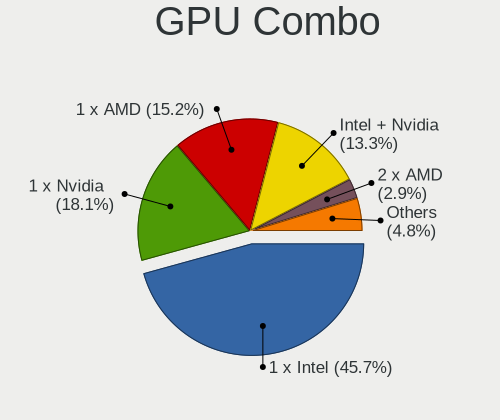

| Name           | Computers | Percent |
|----------------|-----------|---------|
| 1 x Intel      | 40        | 43.48%  |
| 1 x Nvidia     | 19        | 20.65%  |
| Intel + Nvidia | 13        | 14.13%  |
| 1 x AMD        | 12        | 13.04%  |
| 2 x AMD        | 3         | 3.26%   |
| Intel + AMD    | 3         | 3.26%   |
| 1 x SiS        | 2         | 2.17%   |

GPU Driver
----------

Free vs proprietary

| Driver      | Computers | Percent |
|-------------|-----------|---------|
| Free        | 69        | 74.19%  |
| Proprietary | 19        | 20.43%  |
| Unknown     | 5         | 5.38%   |

GPU Memory
----------

Total video memory

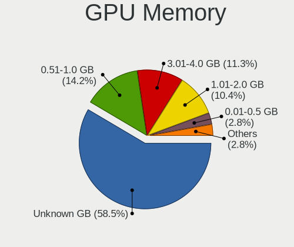

| Size in GB | Computers | Percent |
|------------|-----------|---------|
| Unknown    | 52        | 55.91%  |
| 0.51-1.0   | 14        | 15.05%  |
| 3.01-4.0   | 12        | 12.9%   |
| 1.01-2.0   | 10        | 10.75%  |
| 7.01-8.0   | 2         | 2.15%   |
| 0.01-0.5   | 2         | 2.15%   |
| 2.01-3.0   | 1         | 1.08%   |

Monitor
-------

Monitor Vendor
--------------

Monitor vendors

| Vendor                  | Computers | Percent |
|-------------------------|-----------|---------|
| Samsung Electronics     | 18        | 19.15%  |
| LG Display              | 9         | 9.57%   |
| AU Optronics            | 9         | 9.57%   |
| BOE                     | 8         | 8.51%   |
| Hewlett-Packard         | 5         | 5.32%   |
| Goldstar                | 5         | 5.32%   |
| Dell                    | 4         | 4.26%   |
| ASUSTek Computer        | 3         | 3.19%   |
| Ancor Communications    | 3         | 3.19%   |
| Philips                 | 2         | 2.13%   |
| Lenovo                  | 2         | 2.13%   |
| Chimei Innolux          | 2         | 2.13%   |
| Chi Mei Optoelectronics | 2         | 2.13%   |
| BenQ                    | 2         | 2.13%   |
| Apple                   | 2         | 2.13%   |
| Acer                    | 2         | 2.13%   |
| Vizio                   | 1         | 1.06%   |
| ViewSonic               | 1         | 1.06%   |
| Vestel Elektronik       | 1         | 1.06%   |
| Unknown                 | 1         | 1.06%   |
| Toshiba                 | 1         | 1.06%   |
| SKY                     | 1         | 1.06%   |
| Sharp                   | 1         | 1.06%   |
| MSI                     | 1         | 1.06%   |
| LG Electronics          | 1         | 1.06%   |
| JDI                     | 1         | 1.06%   |
| Insignia                | 1         | 1.06%   |
| Huion                   | 1         | 1.06%   |
| HPN                     | 1         | 1.06%   |
| HannStar                | 1         | 1.06%   |
| Eizo                    | 1         | 1.06%   |
| AOC                     | 1         | 1.06%   |

Monitor Model
-------------

Monitor models

| Model                                                                 | Computers | Percent |
|-----------------------------------------------------------------------|-----------|---------|
| Samsung Electronics U32J59x SAM0F33 3840x2160 697x392mm 31.5-inch     | 2         | 2.02%   |
| Samsung Electronics LCD Monitor SDC324C 1920x1080 344x194mm 15.5-inch | 2         | 2.02%   |
| Vizio LCD Monitor VIZ0026 1360x768 580x320mm 26.1-inch                | 1         | 1.01%   |
| ViewSonic VA912-4SERIES VSC721C 1280x1024 376x301mm 19.0-inch         | 1         | 1.01%   |
| Vestel Elektronik 40W_LCD_TV VES3700 1920x540                         | 1         | 1.01%   |
| Unknown LCD Monitor Sony 55R617 1920x1080                             | 1         | 1.01%   |
| Toshiba TV TSB0200 1360x768 409x230mm 18.5-inch                       | 1         | 1.01%   |
| SKY TV-monitor SKY0001 1360x768 890x500mm 40.2-inch                   | 1         | 1.01%   |
| Sharp LCD Monitor SHP149A 1920x1080 344x194mm 15.5-inch               | 1         | 1.01%   |
| Samsung Electronics U32J59x SAM0F35 3840x2160 697x392mm 31.5-inch     | 1         | 1.01%   |
| Samsung Electronics U28E590 SAM0C4C 3840x2160 608x345mm 27.5-inch     | 1         | 1.01%   |
| Samsung Electronics T22B300 SAM092D 1920x1080 477x268mm 21.5-inch     | 1         | 1.01%   |
| Samsung Electronics S27E500 SAM0D0D 1920x1080 598x336mm 27.0-inch     | 1         | 1.01%   |
| Samsung Electronics LCD Monitor SEC5441 1280x800 331x207mm 15.4-inch  | 1         | 1.01%   |
| Samsung Electronics LCD Monitor SEC454C 1366x768 309x174mm 14.0-inch  | 1         | 1.01%   |
| Samsung Electronics LCD Monitor SEC4542 1366x768 309x174mm 14.0-inch  | 1         | 1.01%   |
| Samsung Electronics LCD Monitor SEC3942 1366x768 309x174mm 14.0-inch  | 1         | 1.01%   |
| Samsung Electronics LCD Monitor SEC3157 1280x800 303x190mm 14.1-inch  | 1         | 1.01%   |
| Samsung Electronics LCD Monitor SEC304C 1366x768 309x174mm 14.0-inch  | 1         | 1.01%   |
| Samsung Electronics LCD Monitor SDC4C51 1366x768 344x194mm 15.5-inch  | 1         | 1.01%   |
| Samsung Electronics LCD Monitor SDC4347 1366x768 344x193mm 15.5-inch  | 1         | 1.01%   |
| Samsung Electronics LCD Monitor SDC4146 1366x768 344x194mm 15.5-inch  | 1         | 1.01%   |
| Samsung Electronics LCD Monitor SDC4142 3840x2160 294x165mm 13.3-inch | 1         | 1.01%   |
| Samsung Electronics LCD Monitor SDC344A 1366x768 344x194mm 15.5-inch  | 1         | 1.01%   |
| Samsung Electronics LCD Monitor SAM0A76 1280x720 949x543mm 43.0-inch  | 1         | 1.01%   |
| Philips LCD Monitor 150C4 1024x768                                    | 1         | 1.01%   |
| Philips 221V PHL0888 1920x1080 477x268mm 21.5-inch                    | 1         | 1.01%   |
| MSI Optix MAG27C MSI1462 1920x1080 598x336mm 27.0-inch                | 1         | 1.01%   |
| LG Electronics LCD Monitor LG ULTRAWIDE 2560x1080                     | 1         | 1.01%   |
| LG Display LCD Monitor LGD0611 1920x1080 382x215mm 17.3-inch          | 1         | 1.01%   |
| LG Display LCD Monitor LGD0582 3000x2000 275x183mm 13.0-inch          | 1         | 1.01%   |
| LG Display LCD Monitor LGD056D 1920x1080 382x215mm 17.3-inch          | 1         | 1.01%   |
| LG Display LCD Monitor LGD046D 1920x1080 309x174mm 14.0-inch          | 1         | 1.01%   |
| LG Display LCD Monitor LGD038E 1366x768 344x194mm 15.5-inch           | 1         | 1.01%   |
| LG Display LCD Monitor LGD037C 1366x768 310x174mm 14.0-inch           | 1         | 1.01%   |
| LG Display LCD Monitor LGD02DC 1366x768 344x194mm 15.5-inch           | 1         | 1.01%   |
| LG Display LCD Monitor LGD02AC 1366x768 344x194mm 15.5-inch           | 1         | 1.01%   |
| LG Display LCD Monitor LGD024F 1280x800 260x160mm 12.0-inch           | 1         | 1.01%   |
| Lenovo LEN T2054pC LEN60D9 1440x900 419x262mm 19.5-inch               | 1         | 1.01%   |
| Lenovo LCD Monitor LEN4011 1280x800 261x163mm 12.1-inch               | 1         | 1.01%   |

Monitor Resolution
------------------

Monitor screen resolution

| Resolution        | Computers | Percent |
|-------------------|-----------|---------|
| 1920x1080 (FHD)   | 34        | 35.42%  |
| 1366x768 (WXGA)   | 23        | 23.96%  |
| 3840x2160 (4K)    | 8         | 8.33%   |
| 1920x1200 (WUXGA) | 5         | 5.21%   |
| 1600x900 (HD+)    | 4         | 4.17%   |
| 1440x900 (WXGA+)  | 3         | 3.13%   |
| 3840x1080         | 2         | 2.08%   |
| 3000x2000         | 2         | 2.08%   |
| 2560x1080         | 2         | 2.08%   |
| 1280x800 (WXGA)   | 2         | 2.08%   |
| 1280x1024 (SXGA)  | 2         | 2.08%   |
| Unknown           | 2         | 2.08%   |
| 3440x1440         | 1         | 1.04%   |
| 2560x1440 (QHD)   | 1         | 1.04%   |
| 2256x1504         | 1         | 1.04%   |
| 1920x540          | 1         | 1.04%   |
| 1360x768          | 1         | 1.04%   |
| 1280x720 (HD)     | 1         | 1.04%   |
| 1024x768 (XGA)    | 1         | 1.04%   |

Monitor Diagonal
----------------

Diagonal size in inches

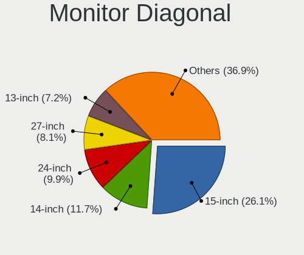

| Inches  | Computers | Percent |
|---------|-----------|---------|
| 15      | 26        | 27.37%  |
| 24      | 10        | 10.53%  |
| 27      | 9         | 9.47%   |
| 14      | 9         | 9.47%   |
| Unknown | 7         | 7.37%   |
| 13      | 6         | 6.32%   |
| 17      | 5         | 5.26%   |
| 21      | 4         | 4.21%   |
| 23      | 3         | 3.16%   |
| 19      | 3         | 3.16%   |
| 34      | 2         | 2.11%   |
| 31      | 2         | 2.11%   |
| 20      | 2         | 2.11%   |
| 12      | 2         | 2.11%   |
| 84      | 1         | 1.05%   |
| 48      | 1         | 1.05%   |
| 43      | 1         | 1.05%   |
| 40      | 1         | 1.05%   |
| 26      | 1         | 1.05%   |

Monitor Width
-------------

Physical width

| Width in mm | Computers | Percent |
|-------------|-----------|---------|
| 301-350     | 35        | 36.84%  |
| 501-600     | 21        | 22.11%  |
| 401-500     | 8         | 8.42%   |
| 351-400     | 7         | 7.37%   |
| 201-300     | 7         | 7.37%   |
| Unknown     | 7         | 7.37%   |
| 601-700     | 4         | 4.21%   |
| 701-800     | 2         | 2.11%   |
| 801-900     | 1         | 1.05%   |
| 1501-2000   | 1         | 1.05%   |
| 1001-1500   | 1         | 1.05%   |
| 901-1000    | 1         | 1.05%   |

Aspect Ratio
------------

Proportional relationship between the width and the height

| Ratio   | Computers | Percent |
|---------|-----------|---------|
| 16/9    | 63        | 70%     |
| 16/10   | 11        | 12.22%  |
| Unknown | 7         | 7.78%   |
| 3/2     | 4         | 4.44%   |
| 5/4     | 2         | 2.22%   |
| 21/9    | 2         | 2.22%   |
| 1.96    | 1         | 1.11%   |

Monitor Area
------------

Area in inch²

| Area in inch² | Computers | Percent |
|----------------|-----------|---------|
| 101-110        | 25        | 26.32%  |
| 81-90          | 12        | 12.63%  |
| 201-250        | 12        | 12.63%  |
| 301-350        | 9         | 9.47%   |
| Unknown        | 7         | 7.37%   |
| 151-200        | 6         | 6.32%   |
| 251-300        | 5         | 5.26%   |
| 351-500        | 4         | 4.21%   |
| 121-130        | 4         | 4.21%   |
| 71-80          | 3         | 3.16%   |
| 501-1000       | 3         | 3.16%   |
| 61-70          | 2         | 2.11%   |
| More than 1000 | 1         | 1.05%   |
| 141-150        | 1         | 1.05%   |
| 91-100         | 1         | 1.05%   |

Pixel Density
-------------

Pixels per inch

| Density       | Computers | Percent |
|---------------|-----------|---------|
| 51-100        | 30        | 32.26%  |
| 101-120       | 27        | 29.03%  |
| 121-160       | 21        | 22.58%  |
| Unknown       | 7         | 7.53%   |
| More than 240 | 3         | 3.23%   |
| 1-50          | 3         | 3.23%   |
| 161-240       | 2         | 2.15%   |

Multiple Monitors
-----------------

Total monitors connected

| Total | Computers | Percent |
|-------|-----------|---------|
| 1     | 78        | 83.87%  |
| 2     | 10        | 10.75%  |
| 0     | 4         | 4.3%    |
| 3     | 1         | 1.08%   |

Network
-------

Net Controller Vendor
---------------------

Controller vendors

| Vendor                           | Computers | Percent |
|----------------------------------|-----------|---------|
| Realtek Semiconductor            | 46        | 32.86%  |
| Intel                            | 41        | 29.29%  |
| Qualcomm Atheros                 | 22        | 15.71%  |
| Broadcom                         | 8         | 5.71%   |
| TP-Link                          | 4         | 2.86%   |
| Marvell Technology Group         | 3         | 2.14%   |
| Silicon Integrated Systems [SiS] | 2         | 1.43%   |
| Ralink Technology                | 2         | 1.43%   |
| Qualcomm Atheros Communications  | 2         | 1.43%   |
| Nvidia                           | 2         | 1.43%   |
| Xiaomi                           | 1         | 0.71%   |
| T & A Mobile Phones              | 1         | 0.71%   |
| Ralink                           | 1         | 0.71%   |
| Qualcomm                         | 1         | 0.71%   |
| Linksys                          | 1         | 0.71%   |
| Dell                             | 1         | 0.71%   |
| Broadcom Limited                 | 1         | 0.71%   |
| ASUSTek Computer                 | 1         | 0.71%   |

Net Controller Model
--------------------

Controller models

| Model                                                                                         | Computers | Percent |
|-----------------------------------------------------------------------------------------------|-----------|---------|
| Realtek RTL8111/8168/8411 PCI Express Gigabit Ethernet Controller                             | 36        | 22.09%  |
| Realtek RTL810xE PCI Express Fast Ethernet controller                                         | 5         | 3.07%   |
| Qualcomm Atheros AR9485 Wireless Network Adapter                                              | 5         | 3.07%   |
| Intel 82579LM Gigabit Network Connection (Lewisville)                                         | 5         | 3.07%   |
| Qualcomm Atheros QCA6174 802.11ac Wireless Network Adapter                                    | 4         | 2.45%   |
| Intel Wireless 3160                                                                           | 4         | 2.45%   |
| Qualcomm Atheros AR9285 Wireless Network Adapter (PCI-Express)                                | 3         | 1.84%   |
| Intel Wireless 7265                                                                           | 3         | 1.84%   |
| Intel Centrino Advanced-N 6205 [Taylor Peak]                                                  | 3         | 1.84%   |
| Silicon Integrated Systems [SiS] 191 Gigabit Ethernet Adapter                                 | 2         | 1.23%   |
| Realtek RTL8821CE 802.11ac PCIe Wireless Network Adapter                                      | 2         | 1.23%   |
| Realtek RTL8723DE Wireless Network Adapter                                                    | 2         | 1.23%   |
| Qualcomm Atheros QCA9565 / AR9565 Wireless Network Adapter                                    | 2         | 1.23%   |
| Qualcomm Atheros Killer E220x Gigabit Ethernet Controller                                     | 2         | 1.23%   |
| Qualcomm Atheros AR9271 802.11n                                                               | 2         | 1.23%   |
| Qualcomm Atheros AR8132 Fast Ethernet                                                         | 2         | 1.23%   |
| Nvidia MCP61 Ethernet                                                                         | 2         | 1.23%   |
| Intel Wireless 8265 / 8275                                                                    | 2         | 1.23%   |
| Intel Wireless 3165                                                                           | 2         | 1.23%   |
| Intel Ice Lake-LP PCH CNVi WiFi                                                               | 2         | 1.23%   |
| Intel I211 Gigabit Network Connection                                                         | 2         | 1.23%   |
| Intel Centrino Wireless-N 1030 [Rainbow Peak]                                                 | 2         | 1.23%   |
| Intel Centrino Advanced-N 6200                                                                | 2         | 1.23%   |
| Broadcom BCM4313 802.11bgn Wireless Network Adapter                                           | 2         | 1.23%   |
| Xiaomi Mi/Redmi series (RNDIS)                                                                | 1         | 0.61%   |
| TP-Link UE300 10/100/1000 LAN (ethernet mode) [Realtek RTL8153]                               | 1         | 0.61%   |
| TP-Link Archer T9UH v1 [Realtek RTL8814AU]                                                    | 1         | 0.61%   |
| TP-Link Archer T4U ver.3                                                                      | 1         | 0.61%   |
| TP-Link 802.11ac NIC                                                                          | 1         | 0.61%   |
| T & A Mobile Phones QM215-QRD _SN:6B7D8716                                                    | 1         | 0.61%   |
| Realtek RTL88x2bu [AC1200 Techkey]                                                            | 1         | 0.61%   |
| Realtek RTL8821AE 802.11ac PCIe Wireless Network Adapter                                      | 1         | 0.61%   |
| Realtek RTL8723BE PCIe Wireless Network Adapter                                               | 1         | 0.61%   |
| Realtek RTL8192EU 802.11b/g/n WLAN Adapter                                                    | 1         | 0.61%   |
| Realtek RTL8192CE PCIe Wireless Network Adapter                                               | 1         | 0.61%   |
| Realtek RTL8153 Gigabit Ethernet Adapter                                                      | 1         | 0.61%   |
| Realtek RTL8152 Fast Ethernet Adapter                                                         | 1         | 0.61%   |
| Realtek Realtek 8812AU/8821AU 802.11ac WLAN Adapter [USB Wireless Dual-Band Adapter 2.4/5Ghz] | 1         | 0.61%   |
| Ralink RT5370 Wireless Adapter                                                                | 1         | 0.61%   |
| Ralink RT2870/RT3070 Wireless Adapter                                                         | 1         | 0.61%   |

Wireless Vendor
---------------

Wireless vendors

| Vendor                          | Computers | Percent |
|---------------------------------|-----------|---------|
| Intel                           | 32        | 41.56%  |
| Qualcomm Atheros                | 16        | 20.78%  |
| Realtek Semiconductor           | 10        | 12.99%  |
| Broadcom                        | 7         | 9.09%   |
| TP-Link                         | 3         | 3.9%    |
| Ralink Technology               | 2         | 2.6%    |
| Qualcomm Atheros Communications | 2         | 2.6%    |
| Ralink                          | 1         | 1.3%    |
| Linksys                         | 1         | 1.3%    |
| Dell                            | 1         | 1.3%    |
| Broadcom Limited                | 1         | 1.3%    |
| ASUSTek Computer                | 1         | 1.3%    |

Wireless Model
--------------

Wireless models

| Model                                                                                         | Computers | Percent |
|-----------------------------------------------------------------------------------------------|-----------|---------|
| Qualcomm Atheros AR9485 Wireless Network Adapter                                              | 5         | 6.49%   |
| Qualcomm Atheros QCA6174 802.11ac Wireless Network Adapter                                    | 4         | 5.19%   |
| Intel Wireless 3160                                                                           | 4         | 5.19%   |
| Qualcomm Atheros AR9285 Wireless Network Adapter (PCI-Express)                                | 3         | 3.9%    |
| Intel Wireless 7265                                                                           | 3         | 3.9%    |
| Intel Centrino Advanced-N 6205 [Taylor Peak]                                                  | 3         | 3.9%    |
| Realtek RTL8821CE 802.11ac PCIe Wireless Network Adapter                                      | 2         | 2.6%    |
| Realtek RTL8723DE Wireless Network Adapter                                                    | 2         | 2.6%    |
| Qualcomm Atheros QCA9565 / AR9565 Wireless Network Adapter                                    | 2         | 2.6%    |
| Qualcomm Atheros AR9271 802.11n                                                               | 2         | 2.6%    |
| Intel Wireless 8265 / 8275                                                                    | 2         | 2.6%    |
| Intel Wireless 3165                                                                           | 2         | 2.6%    |
| Intel Ice Lake-LP PCH CNVi WiFi                                                               | 2         | 2.6%    |
| Intel Centrino Wireless-N 1030 [Rainbow Peak]                                                 | 2         | 2.6%    |
| Intel Centrino Advanced-N 6200                                                                | 2         | 2.6%    |
| Broadcom BCM4313 802.11bgn Wireless Network Adapter                                           | 2         | 2.6%    |
| TP-Link Archer T9UH v1 [Realtek RTL8814AU]                                                    | 1         | 1.3%    |
| TP-Link Archer T4U ver.3                                                                      | 1         | 1.3%    |
| TP-Link 802.11ac NIC                                                                          | 1         | 1.3%    |
| Realtek RTL88x2bu [AC1200 Techkey]                                                            | 1         | 1.3%    |
| Realtek RTL8821AE 802.11ac PCIe Wireless Network Adapter                                      | 1         | 1.3%    |
| Realtek RTL8723BE PCIe Wireless Network Adapter                                               | 1         | 1.3%    |
| Realtek RTL8192EU 802.11b/g/n WLAN Adapter                                                    | 1         | 1.3%    |
| Realtek RTL8192CE PCIe Wireless Network Adapter                                               | 1         | 1.3%    |
| Realtek Realtek 8812AU/8821AU 802.11ac WLAN Adapter [USB Wireless Dual-Band Adapter 2.4/5Ghz] | 1         | 1.3%    |
| Ralink RT5370 Wireless Adapter                                                                | 1         | 1.3%    |
| Ralink RT2870/RT3070 Wireless Adapter                                                         | 1         | 1.3%    |
| Ralink RT3090 Wireless 802.11n 1T/1R PCIe                                                     | 1         | 1.3%    |
| Qualcomm Atheros AR5212/5213/2414 Wireless Network Adapter                                    | 1         | 1.3%    |
| Qualcomm Atheros AR242x / AR542x Wireless Network Adapter (PCI-Express)                       | 1         | 1.3%    |
| Linksys AE1000 v1 802.11n [Ralink RT3572]                                                     | 1         | 1.3%    |
| Intel Wireless 8260                                                                           | 1         | 1.3%    |
| Intel Wireless 7260                                                                           | 1         | 1.3%    |
| Intel Wi-Fi 6 AX210/AX211/AX411 160MHz                                                        | 1         | 1.3%    |
| Intel Wi-Fi 6 AX201                                                                           | 1         | 1.3%    |
| Intel Ultimate N WiFi Link 5300                                                               | 1         | 1.3%    |
| Intel Dual Band Wireless-AC 3168NGW [Stone Peak]                                              | 1         | 1.3%    |
| Intel Dual Band Wireless-AC 3165 Plus Bluetooth                                               | 1         | 1.3%    |
| Intel Comet Lake PCH CNVi WiFi                                                                | 1         | 1.3%    |
| Intel Centrino Wireless-N 1000 [Condor Peak]                                                  | 1         | 1.3%    |

Ethernet Vendor
---------------

Ethernet vendors

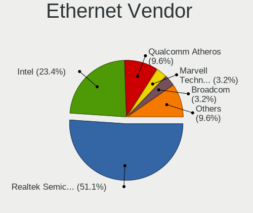

| Vendor                           | Computers | Percent |
|----------------------------------|-----------|---------|
| Realtek Semiconductor            | 42        | 50%     |
| Intel                            | 19        | 22.62%  |
| Qualcomm Atheros                 | 9         | 10.71%  |
| Marvell Technology Group         | 3         | 3.57%   |
| Broadcom                         | 3         | 3.57%   |
| Silicon Integrated Systems [SiS] | 2         | 2.38%   |
| Nvidia                           | 2         | 2.38%   |
| Xiaomi                           | 1         | 1.19%   |
| TP-Link                          | 1         | 1.19%   |
| T & A Mobile Phones              | 1         | 1.19%   |
| Qualcomm                         | 1         | 1.19%   |

Ethernet Model
--------------

Ethernet models

| Model                                                             | Computers | Percent |
|-------------------------------------------------------------------|-----------|---------|
| Realtek RTL8111/8168/8411 PCI Express Gigabit Ethernet Controller | 36        | 41.86%  |
| Realtek RTL810xE PCI Express Fast Ethernet controller             | 5         | 5.81%   |
| Intel 82579LM Gigabit Network Connection (Lewisville)             | 5         | 5.81%   |
| Silicon Integrated Systems [SiS] 191 Gigabit Ethernet Adapter     | 2         | 2.33%   |
| Qualcomm Atheros Killer E220x Gigabit Ethernet Controller         | 2         | 2.33%   |
| Qualcomm Atheros AR8132 Fast Ethernet                             | 2         | 2.33%   |
| Nvidia MCP61 Ethernet                                             | 2         | 2.33%   |
| Intel I211 Gigabit Network Connection                             | 2         | 2.33%   |
| Xiaomi Mi/Redmi series (RNDIS)                                    | 1         | 1.16%   |
| TP-Link UE300 10/100/1000 LAN (ethernet mode) [Realtek RTL8153]   | 1         | 1.16%   |
| T & A Mobile Phones QM215-QRD _SN:6B7D8716                        | 1         | 1.16%   |
| Realtek RTL8153 Gigabit Ethernet Adapter                          | 1         | 1.16%   |
| Realtek RTL8152 Fast Ethernet Adapter                             | 1         | 1.16%   |
| Qualcomm Coolpad                                                  | 1         | 1.16%   |
| Qualcomm Atheros Killer E2400 Gigabit Ethernet Controller         | 1         | 1.16%   |
| Qualcomm Atheros AR8162 Fast Ethernet                             | 1         | 1.16%   |
| Qualcomm Atheros AR8152 v2.0 Fast Ethernet                        | 1         | 1.16%   |
| Qualcomm Atheros AR8152 v1.1 Fast Ethernet                        | 1         | 1.16%   |
| Qualcomm Atheros AR8151 v2.0 Gigabit Ethernet                     | 1         | 1.16%   |
| Marvell Group 88E8058 PCI-E Gigabit Ethernet Controller           | 1         | 1.16%   |
| Marvell Group 88E8056 PCI-E Gigabit Ethernet Controller           | 1         | 1.16%   |
| Marvell Group 88E8040 PCI-E Fast Ethernet Controller              | 1         | 1.16%   |
| Intel Ethernet Connection I218-LM                                 | 1         | 1.16%   |
| Intel Ethernet Connection (7) I219-LM                             | 1         | 1.16%   |
| Intel Ethernet Connection (6) I219-V                              | 1         | 1.16%   |
| Intel Ethernet Connection (4) I219-V                              | 1         | 1.16%   |
| Intel Ethernet Connection (3) I218-LM                             | 1         | 1.16%   |
| Intel Ethernet Connection (2) I219-LM                             | 1         | 1.16%   |
| Intel Ethernet Connection (11) I219-V                             | 1         | 1.16%   |
| Intel 82583V Gigabit Network Connection                           | 1         | 1.16%   |
| Intel 82577LM Gigabit Network Connection                          | 1         | 1.16%   |
| Intel 82567LM-3 Gigabit Network Connection                        | 1         | 1.16%   |
| Intel 82567LM Gigabit Network Connection                          | 1         | 1.16%   |
| Intel 82567LF-3 Gigabit Network Connection                        | 1         | 1.16%   |
| Intel 82562V-2 10/100 Network Connection                          | 1         | 1.16%   |
| Broadcom NetXtreme BCM57766 Gigabit Ethernet PCIe                 | 1         | 1.16%   |
| Broadcom NetLink BCM57785 Gigabit Ethernet PCIe                   | 1         | 1.16%   |
| Broadcom NetLink BCM57780 Gigabit Ethernet PCIe                   | 1         | 1.16%   |

Net Controller Kind
-------------------

Ethernet, WiFi or modem

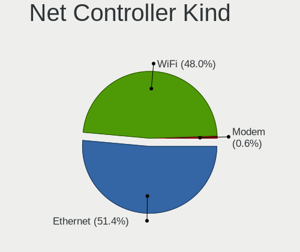

| Kind     | Computers | Percent |
|----------|-----------|---------|
| Ethernet | 81        | 52.94%  |
| WiFi     | 72        | 47.06%  |

Used Controller
---------------

Currently used network controller

| Kind     | Computers | Percent |
|----------|-----------|---------|
| WiFi     | 60        | 60.61%  |
| Ethernet | 39        | 39.39%  |

NICs
----

Total network controllers on board

| Total | Computers | Percent |
|-------|-----------|---------|
| 2     | 52        | 56.52%  |
| 1     | 35        | 38.04%  |
| 3     | 3         | 3.26%   |
| 0     | 2         | 2.17%   |

IPv6
----

IPv6 vs IPv4

| Used | Computers | Percent |
|------|-----------|---------|
| No   | 84        | 91.3%   |
| Yes  | 8         | 8.7%    |

Bluetooth
---------

Bluetooth Vendor
----------------

Controller vendors

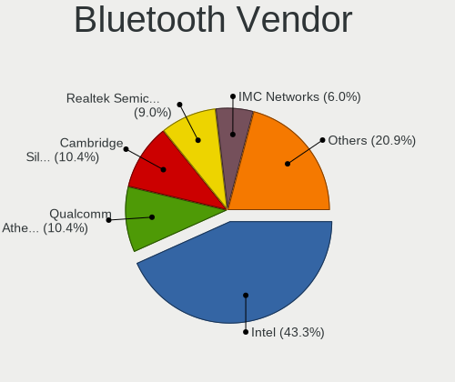

| Vendor                          | Computers | Percent |
|---------------------------------|-----------|---------|
| Intel                           | 25        | 43.1%   |
| Qualcomm Atheros Communications | 7         | 12.07%  |
| Cambridge Silicon Radio         | 7         | 12.07%  |
| Realtek Semiconductor           | 4         | 6.9%    |
| IMC Networks                    | 3         | 5.17%   |
| Apple                           | 3         | 5.17%   |
| Dell                            | 2         | 3.45%   |
| Broadcom                        | 2         | 3.45%   |
| Toshiba                         | 1         | 1.72%   |
| Ralink Technology               | 1         | 1.72%   |
| Integrated System Solution      | 1         | 1.72%   |
| Hewlett-Packard                 | 1         | 1.72%   |
| Foxconn / Hon Hai               | 1         | 1.72%   |

Bluetooth Model
---------------

Controller models

| Model                                               | Computers | Percent |
|-----------------------------------------------------|-----------|---------|
| Intel Bluetooth wireless interface                  | 14        | 24.14%  |
| Cambridge Silicon Radio Bluetooth Dongle (HCI mode) | 7         | 12.07%  |
| Realtek  Bluetooth 4.2 Adapter                      | 3         | 5.17%   |
| Qualcomm Atheros AR3012 Bluetooth 4.0               | 3         | 5.17%   |
| Intel Bluetooth 9460/9560 Jefferson Peak (JfP)      | 3         | 5.17%   |
| Intel AX201 Bluetooth                               | 3         | 5.17%   |
| Qualcomm Atheros  Bluetooth Device                  | 2         | 3.45%   |
| Qualcomm Atheros QCA61x4 Bluetooth 4.0              | 2         | 3.45%   |
| Intel Centrino Advanced-N 6230 Bluetooth adapter    | 2         | 3.45%   |
| IMC Networks Bluetooth Radio                        | 2         | 3.45%   |
| Toshiba Bluetooth Device                            | 1         | 1.72%   |
| Realtek Bluetooth Radio                             | 1         | 1.72%   |
| Ralink Motorola BC4 Bluetooth 3.0+HS Adapter        | 1         | 1.72%   |
| Intel Centrino Bluetooth Wireless Transceiver       | 1         | 1.72%   |
| Intel Bluetooth Device                              | 1         | 1.72%   |
| Intel AX210 Bluetooth                               | 1         | 1.72%   |
| Integrated System Solution Bluetooth Device         | 1         | 1.72%   |
| IMC Networks Bluetooth USB Host Controller          | 1         | 1.72%   |
| HP Broadcom 2070 Bluetooth Combo                    | 1         | 1.72%   |
| Foxconn / Hon Hai BCM20702A0                        | 1         | 1.72%   |
| Dell Wireless 355 Bluetooth                         | 1         | 1.72%   |
| Dell BCM20702A0 Bluetooth Module                    | 1         | 1.72%   |
| Broadcom BCM43142A0 Bluetooth 4.0                   | 1         | 1.72%   |
| Broadcom BCM2045B (BDC-2.1) [Bluetooth Controller]  | 1         | 1.72%   |
| Apple Bluetooth USB Host Controller                 | 1         | 1.72%   |
| Apple Bluetooth Host Controller                     | 1         | 1.72%   |
| Apple Bluetooth HCI                                 | 1         | 1.72%   |

Sound
-----

Sound Vendor
------------

Sound card vendors

| Vendor                                          | Computers | Percent |
|-------------------------------------------------|-----------|---------|
| Intel                                           | 76        | 58.46%  |
| Nvidia                                          | 22        | 16.92%  |
| AMD                                             | 18        | 13.85%  |
| Logitech                                        | 4         | 3.08%   |
| Texas Instruments                               | 2         | 1.54%   |
| Silicon Integrated Systems [SiS]                | 2         | 1.54%   |
| C-Media Electronics                             | 2         | 1.54%   |
| Razer USA                                       | 1         | 0.77%   |
| M2Tech                                          | 1         | 0.77%   |
| Licensed by Sony Computer Entertainment America | 1         | 0.77%   |
| Generalplus Technology                          | 1         | 0.77%   |

Sound Model
-----------

Sound card models

| Model                                                                                             | Computers | Percent |
|---------------------------------------------------------------------------------------------------|-----------|---------|
| Intel 7 Series/C216 Chipset Family High Definition Audio Controller                               | 9         | 5.84%   |
| Intel Sunrise Point-LP HD Audio                                                                   | 7         | 4.55%   |
| Intel Broadwell-U Audio Controller                                                                | 7         | 4.55%   |
| Intel 6 Series/C200 Series Chipset Family High Definition Audio Controller                        | 7         | 4.55%   |
| Intel Wildcat Point-LP High Definition Audio Controller                                           | 6         | 3.9%    |
| Intel Cannon Lake PCH cAVS                                                                        | 6         | 3.9%    |
| Nvidia GP107GL High Definition Audio Controller                                                   | 5         | 3.25%   |
| Intel NM10/ICH7 Family High Definition Audio Controller                                           | 5         | 3.25%   |
| Intel Haswell-ULT HD Audio Controller                                                             | 5         | 3.25%   |
| Intel 8 Series/C220 Series Chipset High Definition Audio Controller                               | 5         | 3.25%   |
| Intel 8 Series HD Audio Controller                                                                | 5         | 3.25%   |
| Nvidia GK208 HDMI/DP Audio Controller                                                             | 4         | 2.6%    |
| Intel 5 Series/3400 Series Chipset High Definition Audio                                          | 4         | 2.6%    |
| AMD SBx00 Azalia (Intel HDA)                                                                      | 4         | 2.6%    |
| Nvidia GF108 High Definition Audio Controller                                                     | 3         | 1.95%   |
| Intel Xeon E3-1200 v3/4th Gen Core Processor HD Audio Controller                                  | 3         | 1.95%   |
| Intel Ice Lake-LP Smart Sound Technology Audio Controller                                         | 3         | 1.95%   |
| Intel 82801I (ICH9 Family) HD Audio Controller                                                    | 3         | 1.95%   |
| AMD FCH Azalia Controller                                                                         | 3         | 1.95%   |
| Silicon Integrated Systems [SiS] Azalia Audio Controller                                          | 2         | 1.3%    |
| Nvidia MCP61 High Definition Audio                                                                | 2         | 1.3%    |
| Nvidia High Definition Audio Controller                                                           | 2         | 1.3%    |
| Intel Tiger Lake-LP Smart Sound Technology Audio Controller                                       | 2         | 1.3%    |
| Intel Atom/Celeron/Pentium Processor x5-E8000/J3xxx/N3xxx Series High Definition Audio Controller | 2         | 1.3%    |
| Intel 82801JD/DO (ICH10 Family) HD Audio Controller                                               | 2         | 1.3%    |
| Intel 82801H (ICH8 Family) HD Audio Controller                                                    | 2         | 1.3%    |
| AMD Turks HDMI Audio [Radeon HD 6500/6600 / 6700M Series]                                         | 2         | 1.3%    |
| AMD Trinity HDMI Audio Controller                                                                 | 2         | 1.3%    |
| AMD RV770 HDMI Audio [Radeon HD 4850/4870]                                                        | 2         | 1.3%    |
| AMD Family 17h (Models 00h-0fh) HD Audio Controller                                               | 2         | 1.3%    |
| AMD Ellesmere HDMI Audio [Radeon RX 470/480 / 570/580/590]                                        | 2         | 1.3%    |
| AMD Baffin HDMI/DP Audio [Radeon RX 550 640SP / RX 560/560X]                                      | 2         | 1.3%    |
| Texas Instruments PCM2902C Audio CODEC                                                            | 1         | 0.65%   |
| Texas Instruments PCM2902 Audio Codec                                                             | 1         | 0.65%   |
| Razer USA Kraken 7.1 V2                                                                           | 1         | 0.65%   |
| Nvidia TU107 GeForce GTX 1650 High Definition Audio Controller                                    | 1         | 0.65%   |
| Nvidia TU104 HD Audio Controller                                                                  | 1         | 0.65%   |
| Nvidia GM107 High Definition Audio Controller [GeForce 940MX]                                     | 1         | 0.65%   |
| Nvidia GK106 HDMI Audio Controller                                                                | 1         | 0.65%   |
| Nvidia GK104 HDMI Audio Controller                                                                | 1         | 0.65%   |

Memory
------

Memory Vendor
-------------

Memory module vendors

| Vendor              | Computers | Percent |
|---------------------|-----------|---------|
| Samsung Electronics | 13        | 30.23%  |
| SK hynix            | 7         | 16.28%  |
| Kingston            | 6         | 13.95%  |
| Micron Technology   | 5         | 11.63%  |
| Unknown             | 4         | 9.3%    |
| Crucial             | 2         | 4.65%   |
| Teikon              | 1         | 2.33%   |
| Ramaxel Technology  | 1         | 2.33%   |
| Patriot             | 1         | 2.33%   |
| Nanya Technology    | 1         | 2.33%   |
| G.Skill             | 1         | 2.33%   |
| Corsair             | 1         | 2.33%   |

Memory Model
------------

Memory module models

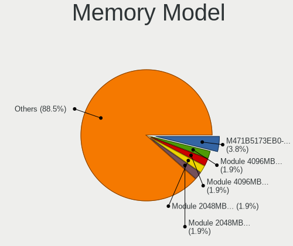

| Model                                                                      | Computers | Percent |
|----------------------------------------------------------------------------|-----------|---------|
| Samsung RAM M471B5173EB0-YK0 4GB SODIMM DDR3 1600MT/s                      | 2         | 4.55%   |
| Unknown RAM Module 4096MB DIMM SDRAM 800MT/s                               | 1         | 2.27%   |
| Unknown RAM Module 4096MB DIMM 1333MT/s                                    | 1         | 2.27%   |
| Unknown RAM Module 2048MB DIMM SDRAM 956MT/s                               | 1         | 2.27%   |
| Unknown RAM Module 2048MB DIMM SDRAM 800MT/s                               | 1         | 2.27%   |
| Unknown RAM Module 2048MB DIMM 800MT/s                                     | 1         | 2.27%   |
| Teikon RAM TMT251S6CFR8C-PBHC 4GB SODIMM DDR3 1600MT/s                     | 1         | 2.27%   |
| SK hynix RAM HYMP125U64CP8-S6 2GB DIMM DDR2 49926MT/s                      | 1         | 2.27%   |
| SK hynix RAM HMT451S6AFR8A-PB 4GB SODIMM DDR3 1600MT/s                     | 1         | 2.27%   |
| SK hynix RAM HMT41GS6BFR8A-PB 8192MB SODIMM DDR3 1600MT/s                  | 1         | 2.27%   |
| SK hynix RAM HMT351S6EFR8A-PB 4096MB SODIMM DDR3 1600MT/s                  | 1         | 2.27%   |
| SK hynix RAM HMT351S6BFR8C-H9 4GB SODIMM DDR3 1334MT/s                     | 1         | 2.27%   |
| SK hynix RAM HMA81GS6AFR8N-UH 8GB SODIMM DDR4 2667MT/s                     | 1         | 2.27%   |
| SK hynix RAM H9CCNNN8GTMLAR-NUD 2GB LPDDR3 1600MT/s                        | 1         | 2.27%   |
| Samsung RAM M471B5173QH0-YK0 4GB SODIMM DDR3 1600MT/s                      | 1         | 2.27%   |
| Samsung RAM M471B1G73EB0-YK0 8GB SODIMM DDR3 1600MT/s                      | 1         | 2.27%   |
| Samsung RAM M471A5244CB0-CRC 4GB SODIMM DDR4 2667MT/s                      | 1         | 2.27%   |
| Samsung RAM M471A5244BB0-CRC 4GB SODIMM DDR4 2667MT/s                      | 1         | 2.27%   |
| Samsung RAM M471A5244BB0-CPB 4GB SODIMM DDR4 2400MT/s                      | 1         | 2.27%   |
| Samsung RAM M471A2K43DB1-CWE 16GB SODIMM DDR4 3200MT/s                     | 1         | 2.27%   |
| Samsung RAM M471A1K43EB1-CWE 8GB SODIMM DDR4 3200MT/s                      | 1         | 2.27%   |
| Samsung RAM M471A1K43CB1-CTD 8GB SODIMM DDR4 2667MT/s                      | 1         | 2.27%   |
| Samsung RAM M471A1K43CB1-CRC 8GB SODIMM DDR4 2667MT/s                      | 1         | 2.27%   |
| Samsung RAM K4UBE3D4AA-MGCL 8GB Row Of Chips LPDDR4 4267MT/s               | 1         | 2.27%   |
| Samsung RAM 4D332037385432383633515A532D43463720 1GB DIMM DDR2 800MT/s     | 1         | 2.27%   |
| Ramaxel RAM RMSA3270MB86H9F2400 4GB SODIMM DDR4 2400MT/s                   | 1         | 2.27%   |
| Patriot RAM PSD432G32002 32GB DIMM DDR4 3200MT/s                           | 1         | 2.27%   |
| Nanya RAM NT1GT64U88D0BY-AD 1GB DIMM DDR2 49926MT/s                        | 1         | 2.27%   |
| Micron RAM Module 4GB SODIMM DDR3 1600MT/s                                 | 1         | 2.27%   |
| Micron RAM 8JTF25664HZ-1G6M1 2048MB SODIMM DDR3 1600MT/s                   | 1         | 2.27%   |
| Micron RAM 8ATF1G64HZ-2G1B1 8GB SODIMM DDR4 2400MT/s                       | 1         | 2.27%   |
| Micron RAM 4ATF51264HZ-2G6E1 4GB SODIMM DDR4 2667MT/s                      | 1         | 2.27%   |
| Micron RAM 16ATF2G64HZ-2G6E1 16GB SODIMM DDR4 2667MT/s                     | 1         | 2.27%   |
| Kingston RAM Module 2GB DIMM DDR2 800MT/s                                  | 1         | 2.27%   |
| Kingston RAM KHX2133C13S4/4G 4GB SODIMM DDR4 2133MT/s                      | 1         | 2.27%   |
| Kingston RAM KHX1600C9S3L/8G 8GB SODIMM DDR3 1600MT/s                      | 1         | 2.27%   |
| Kingston RAM 9905734-018.A00G 16384MB DIMM DDR4 2667MT/s                   | 1         | 2.27%   |
| Kingston RAM 9905471-011.A00LF 4GB DIMM DDR3 1600MT/s                      | 1         | 2.27%   |
| Kingston RAM 202020202020202020202020202020202020 2048MB DIMM DDR2 800MT/s | 1         | 2.27%   |
| G.Skill RAM F3-19200C10-8GBZHD 8GB DIMM DDR3 1333MT/s                      | 1         | 2.27%   |

Memory Kind
-----------

Memory module kinds

| Kind    | Computers | Percent |
|---------|-----------|---------|
| DDR4    | 14        | 41.18%  |
| DDR3    | 11        | 32.35%  |
| DDR2    | 3         | 8.82%   |
| SDRAM   | 2         | 5.88%   |
| Unknown | 2         | 5.88%   |
| LPDDR4  | 1         | 2.94%   |
| LPDDR3  | 1         | 2.94%   |

Memory Form Factor
------------------

Physical design of the memory module

| Name         | Computers | Percent |
|--------------|-----------|---------|
| SODIMM       | 20        | 58.82%  |
| DIMM         | 12        | 35.29%  |
| Row Of Chips | 1         | 2.94%   |
| Unknown      | 1         | 2.94%   |

Memory Size
-----------

Memory module size

| Size  | Computers | Percent |
|-------|-----------|---------|
| 8192  | 12        | 31.58%  |
| 4096  | 11        | 28.95%  |
| 2048  | 8         | 21.05%  |
| 16384 | 4         | 10.53%  |
| 1024  | 2         | 5.26%   |
| 32768 | 1         | 2.63%   |

Memory Speed
------------

Memory module speed

| Speed | Computers | Percent |
|-------|-----------|---------|
| 1600  | 11        | 29.73%  |
| 2667  | 7         | 18.92%  |
| 3200  | 4         | 10.81%  |
| 800   | 4         | 10.81%  |
| 2400  | 3         | 8.11%   |
| 1333  | 2         | 5.41%   |
| 49926 | 1         | 2.7%    |
| 4267  | 1         | 2.7%    |
| 3533  | 1         | 2.7%    |
| 2133  | 1         | 2.7%    |
| 1334  | 1         | 2.7%    |
| 956   | 1         | 2.7%    |

Printers & scanners
-------------------

Printer Vendor
--------------

Printer device vendors

| Vendor          | Computers | Percent |
|-----------------|-----------|---------|
| Hewlett-Packard | 2         | 40%     |
| Seiko Epson     | 1         | 20%     |
| Fuji Xerox      | 1         | 20%     |
| Canon           | 1         | 20%     |

Printer Model
-------------

Printer device models

| Model                            | Computers | Percent |
|----------------------------------|-----------|---------|
| Seiko Epson ET-2720 Series       | 1         | 20%     |
| HP Officejet 6600                | 1         | 20%     |
| HP LaserJet Professional P 1102w | 1         | 20%     |
| Fuji Xerox DocuPrint M205 b      | 1         | 20%     |
| Canon MF240 Series UFRII LT      | 1         | 20%     |

Scanner Vendor
--------------

Scanner device vendors

Zero info for selected period =(

Scanner Model
-------------

Scanner device models

Zero info for selected period =(

Camera
------

Camera Vendor
-------------

Camera device vendors

| Vendor                        | Computers | Percent |
|-------------------------------|-----------|---------|
| Chicony Electronics           | 11        | 22%     |
| Microdia                      | 7         | 14%     |
| Suyin                         | 4         | 8%      |
| Sunplus Innovation Technology | 4         | 8%      |
| Realtek Semiconductor         | 3         | 6%      |
| Quanta                        | 3         | 6%      |
| IMC Networks                  | 3         | 6%      |
| Bison Electronics             | 3         | 6%      |
| Silicon Motion                | 2         | 4%      |
| Huawei Technologies           | 2         | 4%      |
| Apple                         | 2         | 4%      |
| Z-Star Microelectronics       | 1         | 2%      |
| Logitech                      | 1         | 2%      |
| Jieli Technology              | 1         | 2%      |
| Importek                      | 1         | 2%      |
| Cubeternet                    | 1         | 2%      |
| Acer                          | 1         | 2%      |

Camera Model
------------

Camera device models

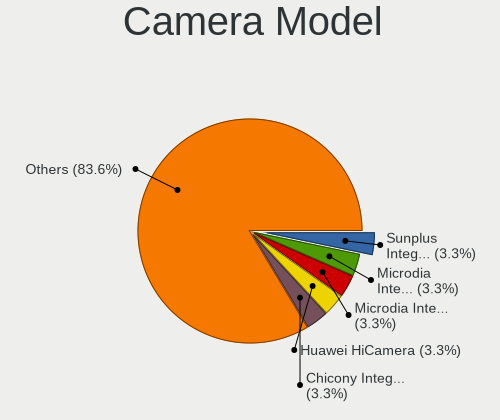

| Model                                                                 | Computers | Percent |
|-----------------------------------------------------------------------|-----------|---------|
| Sunplus Integrated_Webcam_HD                                          | 2         | 4%      |
| Microdia Integrated_Webcam_HD                                         | 2         | 4%      |
| Microdia Integrated Webcam                                            | 2         | 4%      |
| Huawei HiCamera                                                       | 2         | 4%      |
| Chicony Integrated Camera                                             | 2         | 4%      |
| Z-Star Vimicro USB Camera (Altair)                                    | 1         | 2%      |
| Suyin WebCam                                                          | 1         | 2%      |
| Suyin HP Truevision HD                                                | 1         | 2%      |
| Suyin Asus Integrated Webcam                                          | 1         | 2%      |
| Suyin 1.3M HD WebCam                                                  | 1         | 2%      |
| Sunplus Laptop_Integrated_Webcam_HD                                   | 1         | 2%      |
| Sunplus HD WebCam                                                     | 1         | 2%      |
| Silicon Motion WebCam SC-13HDL11939N                                  | 1         | 2%      |
| Silicon Motion HP Webcam-101 Integrated Camera                        | 1         | 2%      |
| Realtek USB2.0 VGA UVC WebCam                                         | 1         | 2%      |
| Realtek Laptop Camera                                                 | 1         | 2%      |
| Realtek HP Truevision HD                                              | 1         | 2%      |
| Quanta Laptop_Integrated_Webcam_2HDM                                  | 1         | 2%      |
| Quanta HP TrueVision HD Camera                                        | 1         | 2%      |
| Quanta HD Webcam                                                      | 1         | 2%      |
| Microdia Sonix USB 2.0 Camera                                         | 1         | 2%      |
| Microdia Sonix 1.3 MP Laptop Integrated Webcam                        | 1         | 2%      |
| Microdia Laptop_Integrated_Webcam_7645BB9590586C77DC683CD9114697FF.3M | 1         | 2%      |
| Logitech HD Pro Webcam C920                                           | 1         | 2%      |
| Jieli USB PHY 2.0                                                     | 1         | 2%      |
| Importek HP Truevision HD Integrated Webcam                           | 1         | 2%      |
| IMC Networks USB2.0 VGA UVC WebCam                                    | 1         | 2%      |
| IMC Networks USB2.0 UVC HD Webcam                                     | 1         | 2%      |
| IMC Networks USB2.0 HD UVC WebCam                                     | 1         | 2%      |
| Cubeternet HDMI to U3 capture                                         | 1         | 2%      |
| Chicony USB 2.0 Camera                                                | 1         | 2%      |
| Chicony TOSHIBA Web Camera - HD                                       | 1         | 2%      |
| Chicony Lenovo EasyCamera                                             | 1         | 2%      |
| Chicony HP Wide Vision HD Camera                                      | 1         | 2%      |
| Chicony HP Webcam [2 MP Macro]                                        | 1         | 2%      |
| Chicony HP Webcam                                                     | 1         | 2%      |
| Chicony HP HD Camera                                                  | 1         | 2%      |
| Chicony HD WebCam                                                     | 1         | 2%      |
| Chicony EasyCamera                                                    | 1         | 2%      |
| Bison Integrated Camera                                               | 1         | 2%      |

Security
--------

Fingerprint Vendor
------------------

Fingerprint sensor vendors

| Vendor                     | Computers | Percent |
|----------------------------|-----------|---------|
| Validity Sensors           | 3         | 50%     |
| Synaptics                  | 1         | 16.67%  |
| Shenzhen Goodix Technology | 1         | 16.67%  |
| AuthenTec                  | 1         | 16.67%  |

Fingerprint Model
-----------------

Fingerprint sensor models

| Model                                      | Computers | Percent |
|--------------------------------------------|-----------|---------|
| Validity Sensors Fingerprint scanner       | 2         | 33.33%  |
| Validity Sensors VFS495 Fingerprint Reader | 1         | 16.67%  |
| Synaptics UWP WBDI                         | 1         | 16.67%  |
| Shenzhen Goodix  FingerPrint Device        | 1         | 16.67%  |
| AuthenTec AES2810                          | 1         | 16.67%  |

Chipcard Vendor
---------------

Chipcard module vendors

| Vendor   | Computers | Percent |
|----------|-----------|---------|
| Broadcom | 2         | 66.67%  |
| Upek     | 1         | 33.33%  |

Chipcard Model
--------------

Chipcard module models

| Model                                                                        | Computers | Percent |
|------------------------------------------------------------------------------|-----------|---------|
| Broadcom BCM5880 Secure Applications Processor with fingerprint swipe sensor | 2         | 66.67%  |
| Upek TouchChip Fingerprint Coprocessor (WBF advanced mode)                   | 1         | 33.33%  |

Unsupported
-----------

Unsupported Devices
-------------------

Total unsupported devices on board

| Total | Computers | Percent |
|-------|-----------|---------|
| 0     | 71        | 77.17%  |
| 1     | 18        | 19.57%  |
| 2     | 3         | 3.26%   |

Unsupported Device Types
------------------------

Types of unsupported devices

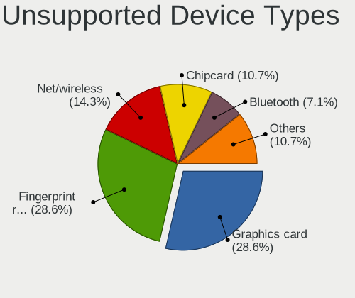

| Type               | Computers | Percent |
|--------------------|-----------|---------|
| Graphics card      | 8         | 38.1%   |
| Fingerprint reader | 6         | 28.57%  |
| Chipcard           | 3         | 14.29%  |
| Net/wireless       | 2         | 9.52%   |
| Net/ethernet       | 1         | 4.76%   |
| Bluetooth          | 1         | 4.76%   |

